# 执行摘要

本报告以陆学艺"十大社会阶层"框架为分析起点，结合国家统计局五等分收入分组、国际机构多元口径以及央行微观资产调查等多源数据，系统考察中国各阶层的实际收入与财务状况，重点研究中产阶层的真实规模、财力特征、生活压力与扩容前景。

**收入分配格局：总量增长稳健，分配改善迟缓。** 2025年全国居民人均可支配收入达43377元（实际增长5.0%），恩格尔系数降至29.3%（"富裕"区间），但基尼系数在0.465附近长期"平台化"，五等分分组高低倍差仍达10.22倍。城乡收入比降至2.31:1，省际差距最高近4倍，所有制差距（非私营与私营单位1.79:1）、行业差距（IT业与住宿餐饮业3.97倍）、岗位差距（管理者与生产人员2.58倍）多重维度的分化相互叠加。收入分布呈鲜明的"金字塔"形态，中位数仅为均值的83.5%，多数居民实际收入低于"平均线"。

**"中产"定义之争：口径不同，人数差距达8倍。** 按国家统计局绝对标准（三口之家年收入10万—50万元），中等收入群体约4亿人（占总人口27%—29%）。按中国社科院李春玲四维标准（职业+教育+收入+消费），社会学意义上的"中产阶层"仅约占总人口7.7%（约1.1亿人）。按皮尤研究中心全球标准（日均10—50美元PPP），中国中产约7.07亿人（占50.8%），但近七成集中在中低收入档。综合各口径的交叉验证，社会学意义上的中产阶层规模大致在1.5亿—2.5亿人之间。官方"4亿中产"中相当一部分家庭仅刚跨过收入门槛，其生活实感与公众认知中的"中产"存在显著落差。

**中产家庭资产负债表：房产锁定效应突出，财务脆弱性凸显。** 城镇家庭户均总资产317.9万元（中位数仅163万元），住房资产占比约59.1%（远高于美国28%），金融资产占比仅20.4%，且83%集中于存款等低风险品种。2021年以来房地产价格深度调整导致50—60万亿元的房产价值蒸发，居民部门杠杆率在不到18年间从10.7%飙升至约60.9%后步入被动去杠杆阶段，个人住房贷款余额连续三年负增长。一线城市中产家庭呈典型的"资产富裕但流动性贫困"特征，二三线城市中产家庭资产规模较小但现金流更为健康。

**中产生活压力：四重脆弱性叠加。** 居住、教育、医疗三大刚性支出合计占城镇居民消费支出超过42%。教育方面，家庭支出最高20%的群体子女全周期教育花费约58万元，是最低20%家庭的3.6倍；留学预算已超过留学家庭年收入。住房方面，全国房价收入比约10.1倍，一线城市高达20—30倍。养老方面，城镇职工养老金替代率约45%，远低于国际警戒线55%。职业方面，85%的受访者认为存在"35岁门槛"，劳动力平均年龄已达39.72岁。四重结构性压力叠加导致超过半数的中等收入群体不认同自身的中产身份，2017年"低位阶层认同"比例曾高达60.8%。

**中产扩容前景："十五五"是关键窗口期。** 官方已确立到2037年前后中等收入群体超过8亿人的战略目标。日本"一亿总中流"经验表明，劳动报酬与GDP同步增长和全民社保是中产扩容的两大基石；拉美教训警示，分配公平性缺失将使中产扩容失去物质基础。在基准情景下（GDP年均增速约4.5%、户籍改革渐进推进），2030年中等收入群体规模约6—6.5亿人（占比43%—47%），"4亿到8亿"目标更可能在2035—2040年间实现。当前最关键的单一变量是房地产市场的企稳——房价持续下行将通过负财富效应持续侵蚀中产家庭的资产基础和消费信心。

# 第1章 中国社会阶层分析框架——从陆学艺"十大阶层"到当代演变

## 1.1 理论起点：陆学艺"十大社会阶层"框架的构建

2002年1月，中国社会科学院社会学研究所陆学艺主编的《当代中国社会阶层研究报告》由社会科学文献出版社正式出版（ISBN 9787801496324，全书407页），系中国社会科学院"当代中国社会结构变迁研究"课题组的集体成果[皮书数据库](https://www.pishu.com.cn/skwx_ps/bookdetail?SiteID=14&ID=6296892 "社会科学文献出版社皮书数据库")[豆瓣图书页](https://m.douban.com/book/subject/1081954/ "当代中国社会阶层研究报告")。该报告以系统的实证调查为基础，首次提出以职业分类为核心的"十大社会阶层"分析框架，标志着中国社会分层研究从传统的"两个阶级一个阶层"（工人阶级、农民阶级和知识分子阶层）范式向多元分层范式的重大转向。作为此后二十余年中国社会分层研究最具影响力的基准框架，其理论逻辑和分类体系至今仍是讨论中国阶层问题的重要出发点。

### 1.1.1 三维资源的理论基础

该框架的核心分层标准是三种社会资源的占有状况，这一理论设计借鉴了马克斯·韦伯的多元分层理论，并将其进行了"中国化"改造[《当代中国研究》书评](https://www.modernchinastudies.org/cn/issues/past-issues/80-mcs-2003-issue-1/1272-2012-01-06-09-16-39.html "论中国社会阶层的划分及分析")：

**组织资源**（对应权力维度）：指依据国家政权组织和党组织系统而拥有的支配社会资源的能力，包括行政组织资源与政治组织资源。在中国体制语境中，这一维度直接对应党政机关的行政等级与管理权力，是决定社会地位的首要资源。

**经济资源**（对应财富维度）：指对生产资料的所有权、使用权和经营权，以及由此带来的财富积累能力。改革开放后，私营经济的合法化使这一维度的分化急剧加速。

**文化资源**（对应知识/声望维度）：指社会所认可的知识和技能的拥有，通过学历证书或资格认定来衡量。随着知识经济的发展和高等教育扩张，文化资源对社会分层的作用持续增强。

陆学艺团队认为，在当代中国社会中，这三种资源的拥有状况共同决定了各社会群体在阶层结构中的位置以及个人的综合社会经济地位[光明网书摘](https://www.gmw.cn/02sz/2002-04/10/03-4F40B91530A7CD2048256BC9000F63FD.htm "当代中国的十大社会阶层")。值得注意的是，三种资源之间并非简单的平行关系：在中国特有的政治经济体制下，组织资源往往具有对其他两类资源的"杠杆效应"——掌握行政权力者更容易积累经济资源和获取文化资源认证，这一特征深刻影响了阶层排序的逻辑。

### 1.1.2 十大阶层的具体构成

根据上述分层原则，该报告将当代中国社会划分为十个阶层（由高到低排列），并估算了各阶层在全国人口中的大致占比[光明网书摘](https://www.gmw.cn/02sz/2002-04/10/03-4F40B91530A7CD2048256BC9000F63FD.htm "当代中国的十大社会阶层")[《当代中国研究》书评](https://www.modernchinastudies.org/cn/issues/past-issues/80-mcs-2003-issue-1/1272-2012-01-06-09-16-39.html "论中国社会阶层的划分及分析")：

**（1）国家与社会管理者阶层（约占2.1%）**：指在党政、事业和社会团体机关单位中行使实际行政管理职权的领导干部。具体包括中央政府各部委和直辖市中具有实际行政管理职权的处级及以上干部，以及各省、市、地区中乡科级及以上干部。该阶层在三种资源中主要凭借组织资源居于社会结构最高等级，是整个阶层结构中的主导性阶层之一。

**（2）经理人员阶层（约占1.5%）**：指大中型企业中非业主身份的高中层管理人员，包括国有和集体企业转型中的职业经理人、私营企业和外资企业中的高层管理者。该阶层支配着大量经济资源，普遍具有较高学历，是市场化改革的积极推进者。

**（3）私营企业主阶层（约占0.6%）**：指拥有一定数量私人资本、雇工8人以上并以此投资获利的人。作为改革开放的产物，该阶层的经济地位不断上升，但在当时的社会政治参与方面受到一定局限。

**（4）专业技术人员阶层（约占5.1%）**：指在各种经济成分的机构中从事专业性工作和科学技术工作的人员，大多经过中高等专业知识培训。该阶层是现代社会中等阶层的主干群体，是先进生产力和先进文化的代表者。

**（5）办事人员阶层（约占4.8%）**：指党政机关中的中低层公务员、各类企事业单位中的基层管理人员和非专业性办事人员。该阶层是社会流动链中的重要一环，是国家管理者、经理人员和专业技术人员的后备军。

**（6）个体工商户阶层（约占4.2%）**：指拥有较少量私人资本并投入经营活动的小业主、自我雇佣者等。实际规模大于工商登记人数。

**（7）商业服务业员工阶层（约占12.0%）**：指商业和服务行业中从事非专业性工作的人员。彼时中国第三产业尚不发达，该阶层的社会经济状况与产业工人较为类似。

**（8）产业工人阶层（约占22.6%）**：指在第二产业中从事体力、半体力劳动的生产工人和建筑业工人，其中农民工约占产业工人的30%。该阶层内部长期存在企业所有制和户籍身份制所导致的差异。

**（9）农业劳动者阶层（约占44.0%）**：当时规模最大的阶层，指以农（林、牧、渔）业为唯一或主要职业的农民。该阶层几乎不拥有组织资源，文化资源和经济资源通常低于其他所有阶层。其占比已从1978年的70%以上降至1999年的约44%。

**（10）城乡无业、失业、半失业者阶层（约占3.1%）**：指无固定职业的劳动年龄人群，包括因产业结构调整而失业的工人、新进入劳动力市场的待业青年、因土地被征用而无地可种的农民以及因残障疾病不能就业者。

下图以水平条形图展示了十大阶层的人口占比分布，并按五大社会经济等级以不同颜色分组，直观呈现了2002年中国社会阶层结构的金字塔特征——农业劳动者和产业工人合计占比近七成，中上层以上群体合计不足一成。

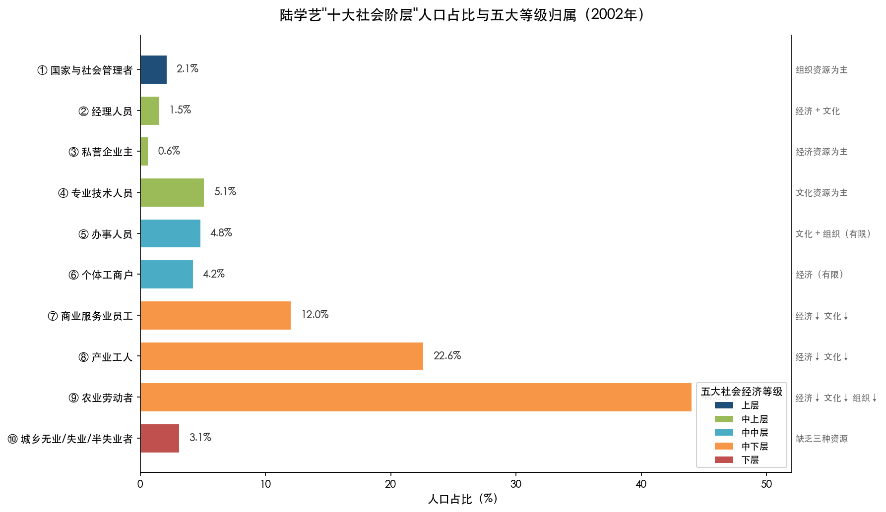

### 1.1.3 五大社会经济等级

十大阶层同时被归入五大社会经济等级：**上层**为国家与社会管理者；**中上层**包括经理人员、私营企业主和专业技术人员；**中中层**包括办事人员和个体工商户；**中下层**包括商业服务业员工、产业工人和农业劳动者；**下层**为城乡无业失业半失业者。陆学艺将当时中国社会结构比喻为"洋葱头型"——底部庞大的金字塔结构尚处于向理想的"橄榄型"社会转型的雏形阶段，中间阶层规模偏小，底层农业劳动者占比过高[《人文地理》论文](https://html.rhhz.net/RWDL/html/20170602.htm "中国城市社会阶层空间化评价的思路与方法，2017")。

从资源占有格局来看，上层和中上层（合计约占9.3%）掌握了大部分组织资源以及相当比例的经济资源与文化资源；中中层（约占9.0%）主要依赖文化资源或有限的经济资源维持其社会地位；中下层和下层（合计约占81.7%）构成了当时中国社会的绝大多数，是整个社会结构的"底盘"。这一比例结构鲜明地揭示了21世纪初中国社会分层的基本特征：中间阶层发育不足，底层规模庞大，社会结构距离"橄榄型"的理想形态尚有相当距离。

## 1.2 "九阶层"之辨：学术传播中的变体溯源

本报告的研究主题涉及"中国九阶层"的提法，有必要对这一说法的来源与性质加以厘清。经过系统的文献检索，可以确认：陆学艺团队的原始框架为"十大阶层"，学术文献中不存在被学界公认的"九阶层"标准版本[《人文地理》论文](https://html.rhhz.net/RWDL/html/20170602.htm "中国城市社会阶层空间化评价")。

"九阶层"的流传存在两条简化路径：

**学术操作性简化**。由于人口普查和大规模社会调查数据中某些阶层难以精确区分，研究者在实证操作中常对原始十阶层进行合并。例如，王洋等（2017）在利用人口普查数据进行阶层空间化分析时，因数据限制将十大阶层合并为八个阶层[《人文地理》论文](https://html.rhhz.net/RWDL/html/20170602.htm "中国城市社会阶层空间化评价")。类似地，龚顺（2025）在基于CSS调查数据的实证研究中，将陆学艺的十大阶层图式与EGP阶级分析图式并列使用，并根据数据可及性对部分阶层进行了合并处理[《北京工业大学学报》论文](https://journal.bjut.edu.cn/bjgydxxbskb/cn/article/pdf/preview/10.12120/bjutskxb202501014.pdf "中国式现代化进程中的社会阶层结构变迁，2025")。

**网络传播中的非标准简化**。在公共讨论和社交媒体中，"九阶层"说法更可能源于对十大阶层的非学术性简化——将某两个相似阶层（如"私营企业主"与"个体工商户"，或"商业服务业员工"与"产业工人"）合并后得出九个层级。这种简化缺乏统一标准，各版本之间内涵差异较大，不宜作为严谨研究的分析工具。

鉴于此，本报告在后续章节中将以陆学艺"十大阶层"的原始框架为分析起点，同时结合国家统计局"五等分收入分组"和其他替代性分层方案，对各阶层的实际收入与财务状况进行系统考察。

## 1.3 框架的学术影响与主要批评

### 1.3.1 开创性贡献与学术影响

《当代中国社会阶层研究报告》出版后，在中国社会学界产生了深远影响。该报告首次以大规模实证调查为基础，打破了改革开放以来长期沿用的"两个阶级一个阶层"的简单分析范式，为观察快速变迁中的中国社会结构提供了更为精细的分析工具。此后，陆学艺团队又先后推出《当代中国社会流动》（2004年）和《当代中国社会结构》（2010年）等系列研究成果，形成了较为完整的学术体系[豆瓣图书页](https://m.douban.com/book/subject/1081954/ "当代中国社会阶层研究报告")。龚顺（2025）在最新研究中仍将陆学艺十大阶层图式列为中国社会阶层结构的经典分析框架之一，与戈德索普（Goldthorpe）等人提出的EGP阶级分析图式并列使用，表明该框架在中国社会学领域持续发挥着基准参照作用[《北京工业大学学报》论文](https://journal.bjut.edu.cn/bjgydxxbskb/cn/article/pdf/preview/10.12120/bjutskxb202501014.pdf "中国式现代化进程中的社会阶层结构变迁，2025")。

### 1.3.2 三大批评线索

然而，该框架自发布以来也持续面临学术批评。综合相关文献，批评主要集中在三个层面[《当代中国研究》书评](https://www.modernchinastudies.org/cn/issues/past-issues/80-mcs-2003-issue-1/1272-2012-01-06-09-16-39.html "论中国社会阶层的划分及分析")[《社会学研究》李春玲综述](http://sociology.cssn.cn/xscg/zxwz/202004/W020200408510006709837.pdf "中国社会分层与流动研究70年")：

**第一，"职业分类 ≠ 社会阶层"**。批评者指出，职业差异更多体现的是社会分工的水平结构，而非社会不平等的垂直结构。以职业为基础的分层容易模糊阶层内部巨大的收入和地位差异——例如同属"专业技术人员"，一线城市三甲医院主任医师与县城乡镇卫生院医生在收入水平和社会地位上的差距悬殊，职业标签无法捕捉这种层内分化。

**第二，"避免冲突论"的概念策略**。部分学者认为，该框架刻意采用"阶层"（stratum）而回避"阶级"（class）概念，本质上是对社会利益冲突和结构性矛盾的淡化。以"阶层"替代"阶级"，将具有对抗性含义的分析范畴转化为更具和谐色彩的描述性分类，可能遮蔽不同群体之间的结构性利益对立。

**第三，制度性因素的缺失**。该框架未能充分反映户籍制度、体制内外分割（"编制"壁垒）、城乡二元结构等中国特有的制度性分层因素。这些制度安排对个人的资源获取能力和社会流动机会有着决定性影响，但在十大阶层的分类标准中并未得到显性体现。例如，一个拥有城镇户口和事业编制的基层办事人员，与一个拥有同等学历但缺少城市户口的农民工，在社会福利、子女教育、住房保障等方面的实际处境差异，远大于职业分类所能反映的层级距离。

## 1.4 竞争性框架：从"倒丁字形"到多元分层路径

在陆学艺框架之外，中国社会学界涌现了多种竞争性的社会分层分析方案。下图以结构化表格对比了五种主要分析框架的核心方法、阶层数量与关键特点，为理解当代中国社会分层研究的方法论多样性提供直观参照。

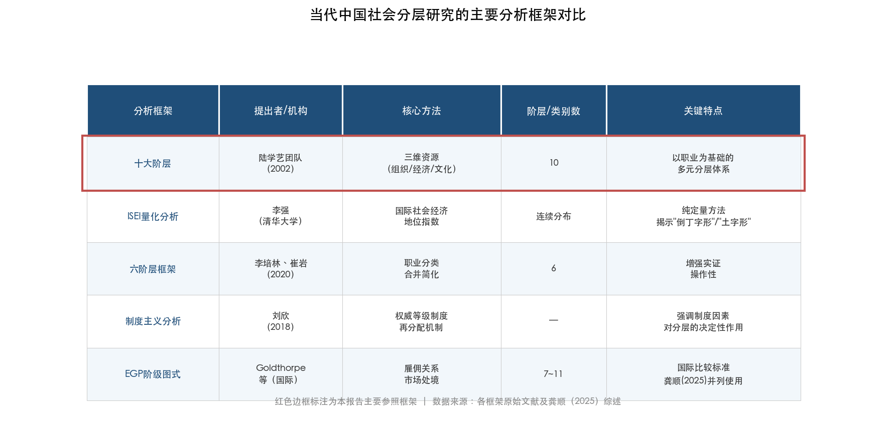

### 1.4.1 李强的量化结构分析

清华大学李强教授采用了与陆学艺截然不同的方法论路径。他以国际社会经济地位指数（ISEI）为工具，直接对人口普查微观数据进行量化分析，揭示出中国社会结构先后呈现两种形态：基于第五次人口普查数据（2000年）的"倒丁字形"——大量底层农业劳动者形成一个宽阔的横杠，少量中上层群体形成一个较短的竖杠；以及基于第六次人口普查数据（2010年）的"土字形"——底部横杠有所缩窄但仍然庞大，中间层开始出现但尚不充分[人民网理论](http://theory.people.com.cn/n/2015/0804/c40531-27407635.html "李强：我国正在形成'土字型社会结构'")。

李强的方法论贡献在于提供了一种纯定量的社会结构可视化手段，避免了陆学艺框架中预设阶层类别的主观性。但其局限同样明显：ISEI指数基于西方社会的职业声望标准构建，对中国体制内外差异、城乡二元结构等本土制度因素的敏感度有限。

### 1.4.2 其他替代性框架

除李强的量化路径外，学术界还涌现了多种竞争性分层方案[《社会学研究》李春玲综述](http://sociology.cssn.cn/xscg/zxwz/202004/W020200408510006709837.pdf "中国社会分层与流动研究70年")：

- **李培林、崔岩（2020）六阶层分析框架**：在陆学艺十大阶层基础上进行合并简化，以增强实证操作性。
- **刘欣（2018）"制度主义阶级分析"视角**：强调权威等级制度和再分配机制对中国社会分层的决定性作用，试图将制度因素纳入分析核心。
- **李春玲和李路路的新马克思/新韦伯主义阶级分类**：引入国际比较视角下的阶级分析概念，将生产资料所有制关系和市场处境作为分层核心维度。

这些替代方案各有侧重，但均在不同程度上试图克服陆学艺框架在制度维度和冲突维度上的不足，反映了中国社会分层研究从单一范式走向方法论多元化的学术趋势。

## 1.5 框架的当代适用性评估：2013—2023年的阶层结构变迁

### 1.5.1 十年间的结构性位移

陆学艺框架建立在2000年前后的社会调查基础之上，距今已逾二十年。龚顺（2025）基于中国社会状况综合调查（CSS）2013—2023年四期数据，采用与陆学艺十大阶层可比较的阶层分类，系统追踪了这十年间中国社会阶层结构的变迁轨迹。研究揭示了三大显著趋势[《北京工业大学学报》论文](https://journal.bjut.edu.cn/bjgydxxbskb/cn/article/pdf/preview/10.12120/bjutskxb202501014.pdf "中国式现代化进程中的社会阶层结构变迁，2025")：

**农业劳动者加速缩减**。2013—2023年间，农民在劳动人口中的占比下降了约8.36个百分点。这一降幅与同期中国城镇化率从53.7%上升至66.2%（常住口径）的进程高度吻合。回顾陆学艺2002年估算农业劳动者占比约44%，到2023年该占比已大幅下降，但农业劳动者仍是规模可观的群体。

**产业工人占比回落**。同期产业工人占比下降约6.27个百分点。这与中国制造业从劳动密集型向技术密集型转型、自动化水平提升以及第二产业GDP占比下降的大趋势一致。

**服务业工人急剧膨胀**。服务业工人占比增加约12.27个百分点，成为十年间增长最快的阶层类别。中国劳动群体的内部构成已从以产业工人为主转向以服务业工人为主，这是经济结构从"工业主导"向"服务业主导"转型在社会分层领域的直接映射。

下图直观呈现了上述三大阶层的占比变动幅度及其背后的结构性驱动因素。

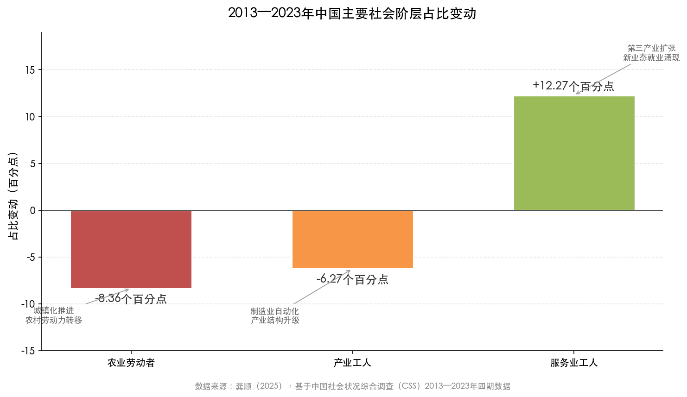

此外，受高等教育普及的推动，专业技术人员的比例亦有所上升。龚顺还特别指出，社会阶层结构的变迁伴随着居民收入和财富分配格局的深刻变化，突出表现为不同社会阶层之间的财富分化程度持续加大。

### 1.5.2 框架未能覆盖的新兴群体

在评估陆学艺框架对当代社会的适用性时，必须指出其原始分类体系存在若干结构性盲区：

**平台经济从业者**。2002年中国互联网经济尚处萌芽阶段，而到2025年，仅外卖骑手一个细分领域就有数百万从业者。网约车司机、直播电商从业者、自由职业设计师和程序员等"新业态就业"群体，在陆学艺的分类中难以清晰归入"个体工商户""商业服务业员工"或"产业工人"中的任何一个，其劳动形态和社会经济地位具有跨类别的模糊性。

**灵活就业群体的模糊地位**。据国家统计局数据，2025年末全国灵活就业人员规模已超过2亿人。这一庞大群体的劳动关系形态介于雇佣劳动和自主经营之间，在社保覆盖、收入稳定性和职业发展路径等方面与传统就业形态存在显著差异。陆学艺框架中"个体工商户"与"产业工人/商业服务业员工"的边界划分，无法有效捕捉这一群体的实际社会经济地位。

**体制内外分割的深化**。近年来城镇非私营单位与私营单位的平均工资差距持续存在（2024年倍差为1.79:1），加之"编制"壁垒对社会流动的限制性影响日益凸显，进一步暴露了陆学艺框架中制度维度的缺失。同一职业类别内部，体制内外从业者在薪酬、福利、职业安全感等方面的实质性差异，已成为理解当代中国社会分层不可回避的关键变量。

### 1.5.3 框架的延续价值与本报告的分析策略

尽管存在上述局限，我们认为陆学艺"十大阶层"框架仍然具有不可替代的分析价值。其核心贡献在于提供了一套经过二十余年学术检验的、以职业为基础的社会分层参照坐标系。在讨论收入分配、社会流动和中产阶层等议题时，将特定群体定位在十大阶层的坐标中（如"办事人员和专业技术人员构成中产阶层主体"），仍然是一种简洁而有效的分析语言。

关键在于使用方式：将该框架视为分析起点而非终点，将其与收入五等分分组、ISEI量化分析等互补工具配合使用，并对其制度维度盲区保持自觉警惕。本报告后续章节正是采取这一策略——在十大阶层框架的基础上，引入国家统计局五等分收入分组数据和各机构对"中等收入群体"的多元定义，力求呈现更为立体、完整的中国社会阶层收入与财务全景。

# 第2章 各阶层实际收入与财务全景——2025 年中国收入分配图谱

## 2.1 总量全貌：居民收入跨过四万元台阶

2025 年，全国居民人均可支配收入达到 43377 元，名义增长 5.0%，扣除价格因素后实际增长同样为 5.0%，与同期 GDP 增速基本同步 [国家统计局2025年居民收入数据](https://www.stats.gov.cn/xxgk/sjfb/zxfb2020/202601/t20260119_1962321.html "2026年1月19日发布")。作为参照，2024 年全国居民人均可支配收入为 41314 元，城镇 54188 元，农村 23119 元 [国家统计局2024年居民收入数据](https://www.stats.gov.cn/sj/zxfb/202501/t20250117_1958325.html "2025年1月17日发布")。

城乡维度的分解进一步揭示了增长的内部结构。2025 年城镇居民人均可支配收入 56502 元，名义增长 4.3%，实际增长 4.2%；农村居民人均可支配收入 24456 元，名义增长 5.8%，实际增长 6.0%。城乡居民收入比降至 2.31:1，较 2024 年的 2.34:1 进一步缩小 0.03 [国家统计局2025年居民收入数据](https://www.stats.gov.cn/xxgk/sjfb/zxfb2020/202601/t20260119_1962321.html "城乡收入数据")。值得注意的是，城乡收入比的持续下降并非短期现象：2008 年这一比值高达 3.14，此后连续 17 年收窄，至 2025 年已累计下降 0.83 [国家统计局2025年居民收入数据](https://www.stats.gov.cn/xxgk/sjfb/zxfb2020/202601/t20260119_1962321.html "增速分化")。农村居民收入增速持续快于城镇，构成城乡差距收窄的核心驱动力。

然而，均值的稳步增长在一定程度上掩盖了分布的偏态特征。2025 年全国居民人均可支配收入的中位数为 36231 元，增长 4.4%，仅为平均数的 83.5% [2025年统计公报](https://www.news.cn/politics/20260228/080d00a592334a7c9aa4574f98e48a24/c.html "2025年国民经济和社会发展统计公报")。中位数显著低于均值意味着收入分布呈明显的右偏态——少数高收入群体将平均值向上拉升，多数居民的实际收入水平低于"平均线"。这一结构性特征贯穿了中国收入分配体系的各个层面。

在收入总量增长的同时，居民消费结构的优化也持续推进。2025 年全国居民恩格尔系数为 29.3%，较 2024 年的 29.8% 下降 0.5 个百分点，其中城镇 28.3%，农村 31.8% [2025年统计公报](https://www.stats.gov.cn/sj/zxfb/202602/t20260228_1962662.html "恩格尔系数")。依据联合国划分标准，29.3% 的恩格尔系数已处于"富裕"区间（30% 以下），表明中国居民在总体上已跨过温饱阶段，食品支出在总消费中的占比降至较低水平。

## 2.2 五等分分组：收入金字塔的真实刻度

国家统计局的"五等分收入分组"是观察中国收入分配格局最直接的官方工具。该方法将全部调查户按人均收入水平从低到高排列，均匀划分为五个等份，每组覆盖 20% 的人口。

2025 年五等分分组的具体数据如下 [2025年统计公报](https://www.stats.gov.cn/sj/zxfb/202602/t20260228_1962662.html "2026年2月28日发布")：

- **低收入组**：人均可支配收入 10150 元（月均约 846 元）
- **中间偏下收入组**：22702 元（月均约 1892 元）
- **中间收入组**：35536 元（月均约 2961 元）
- **中间偏上收入组**：55586 元（月均约 4632 元）
- **高收入组**：103778 元（月均约 8648 元）

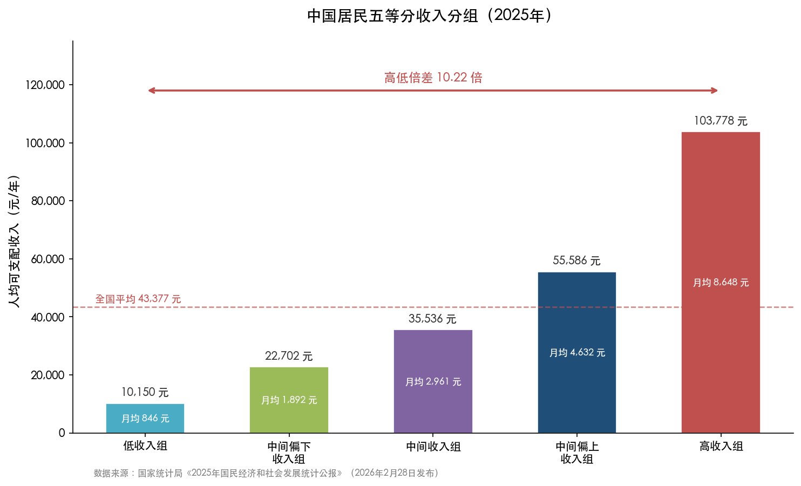

高收入组与低收入组的人均可支配收入之比为 10.22 倍；2024 年这一倍差为 10.36 倍，略有收窄 [2025年统计公报](https://www.stats.gov.cn/sj/zxfb/202602/t20260228_1962662.html "高低倍差")。如图所示，五组收入呈陡峭的阶梯形态，中间收入组的人均可支配收入（35536 元）低于全国平均线（43377 元），表明处于分布正中间的 20% 人口其收入水平尚未达到"平均线"。

这组数据揭示了若干值得关注的结构性事实。其一，低收入组约 2.8 亿人的年人均可支配收入仅 10150 元，月均不足 850 元，这一群体的基本生活保障仍面临较大压力。其二，高收入组约 2.8 亿人的年人均可支配收入超过 10 万元，与低收入组之间形成超过 10 倍的悬殊差距。其三，中间偏上收入组（55586 元）与高收入组（103778 元）之间存在近乎翻倍的跨越，表明从"中等偏上"迈入"高收入"群体存在一道陡峭的门槛。

从历史趋势来看，高低倍差在 2013 年约为 10.75 倍，此后十余年间波动收窄，至 2025 年降至 10.22 倍 [新浪财经](https://finance.sina.cn/2023-02-06/detail-imyeumii6350131.d.html "中国居民收入的五档划分与差异对比")。然而收窄幅度相当有限——十余年间仅缩小约 0.5 倍。更需关注的是，高收入组在总收入中的占比长期维持在约 46%，低收入组占比始终约 4.3%，两端的份额分配格局呈现高度固化特征。

## 2.3 基尼系数：不平等的温度计

基尼系数是衡量收入分配不平等程度的综合指标，取值介于 0（完全平等）与 1（完全不平等）之间。2024 年中国居民人均可支配收入基尼系数为 0.465，与 2023 年持平 [国家统计局国家数据](https://data.stats.gov.cn/search.htm?s=gini "2024年基尼系数0.465")。截至本报告写作时点（2026 年 3 月），2025 年的基尼系数尚未由国家统计局正式发布。

回溯历年走势，中国基尼系数呈现"先升后降再平台化"的三阶段演变轨迹：2003 年至 2008 年持续攀升，2008 年触及 0.491 的历史高点；此后逐年回落，2015 年降至 0.462 的阶段低点；2015 年之后在 0.462—0.468 的窄幅区间波动，2022 年回升至 0.467，2024 年边际回落至 0.465 [北京大学国发院](https://nsd.pku.edu.cn/sylm/gd/542410.htm "卢锋：聚焦我国居民消费偏弱的系统成因")。近十年基尼系数的"平台化"走势表明，收入不平等既未明显恶化，也未出现实质性改善，分配格局处于一种相对固化的均衡状态。

0.465 的基尼系数仍高于 0.4 的国际警戒线。中国社科院蔡昉指出，OECD 国家通过税收和转移支付平均将不平等程度降低 31.4%，而中国再分配调节力度仍有较大提升空间 [学习时报-人民网转载蔡昉文章](http://theory.people.com.cn/n1/2025/1107/c40531-40598709.html "2025年11月发表")。这意味着，中国当前的收入分配格局在很大程度上仍由初次分配主导，再分配机制的调节功能尚未充分释放。

## 2.4 收入结构剖析：四大来源的阶层分化

居民可支配收入由四大来源构成：工资性收入、经营净收入、财产净收入和转移净收入。2025 年四大来源的全国总量数据如下 [国家统计局2025年居民收入数据](https://www.stats.gov.cn/xxgk/sjfb/zxfb2020/202601/t20260119_1962321.html "收入构成数据")：

| 收入来源 | 人均金额（元） | 占比 | 名义增速 |
|----------|---------------|------|----------|
| 工资性收入 | 24555 | 56.6% | +5.3% |
| 经营净收入 | 7252 | 16.7% | +5.0% |
| 财产净收入 | 3490 | 8.0% | +1.6% |
| 转移净收入 | 8080 | 18.6% | +5.4% |

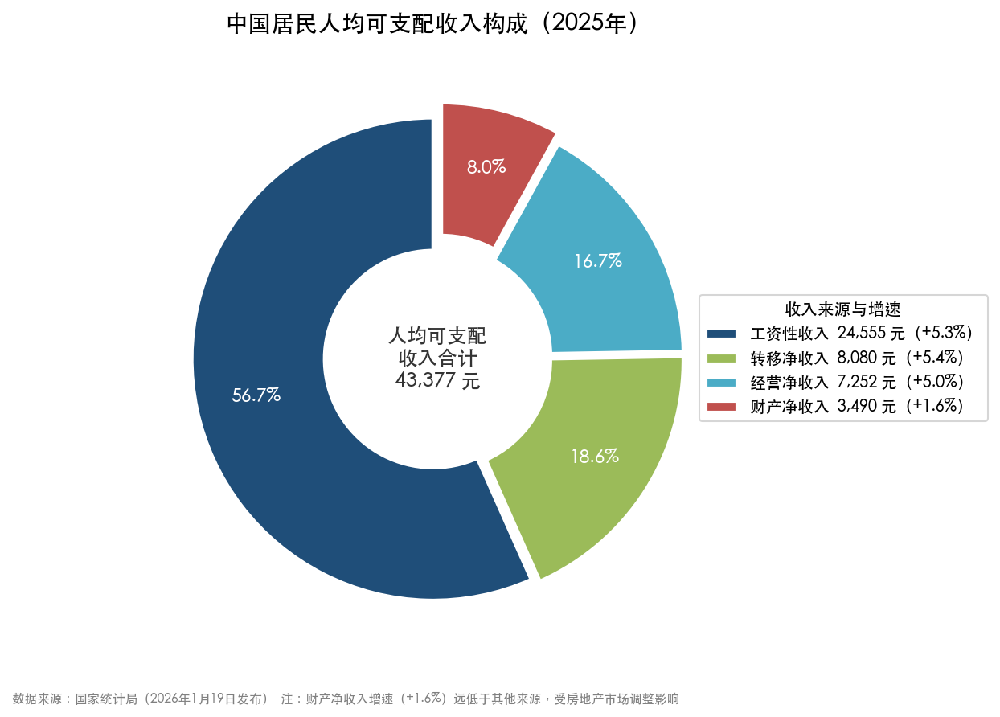

上述数据的关键信息在于各来源增速的显著分化。工资性收入和转移净收入是增长的主要拉动力，分别贡献 5.3% 和 5.4% 的名义增速。经营净收入增速 5.0%，与 GDP 增速同步。最引人注目的是财产净收入仅增长 1.6%，远低于其他三项；其中城镇居民财产净收入增速更是低至 0.5% [国家统计局2025年居民收入数据](https://www.stats.gov.cn/xxgk/sjfb/zxfb2020/202601/t20260119_1962321.html "收入构成数据")。财产净收入的低迷直接反映了房地产市场持续调整的影响——房租收入和房产增值收益下降，拖累了整体财产性收入的表现 [财新网](https://economy.caixin.com/m/2026-01-19/102405248.html "2025年居民人均可支配收入同比增长5%")。

不同收入来源在城乡之间、在不同收入群体之间的分布存在显著差异。城镇居民的工资性收入占比约 60%—64%（以北京为例，2025 年工资性收入占可支配收入高达 64.4%），而农村居民的经营净收入占比明显更高，反映了农业经营和个体经营在农村收入中的重要支撑作用。财产净收入虽在全国平均水平中仅占 8.0%，但在高收入群体中的占比显著更高——高收入家庭通过持有房产、金融资产获得的财产性收入构成拉大收入差距的重要因素。

从再分配视角观察，转移净收入占比 18.6%，主要由养老金、社保待遇和政府补贴等构成。对低收入群体而言，转移性收入是可支配收入的关键来源；对高收入群体而言，其占比则相对有限。转移净收入增速（5.4%）略高于总体增速，表明政府的再分配力度在边际上有所增强，但如前文基尼系数分析所示，增强幅度尚不足以从根本上改变分配格局。

## 2.5 工资性收入的行业与岗位分层

工资性收入是居民可支配收入中占比最大的来源（56.6%），而工资水平在不同行业、不同所有制、不同岗位之间存在显著差异。这种差异本身构成理解中国社会分层的重要维度。

### 2.5.1 非私营与私营的所有制鸿沟

2024 年，城镇非私营单位就业人员平均工资 124110 元，城镇私营单位就业人员平均工资 69476 元，二者之比为 1.79:1 [国家统计局2024年工资数据](https://www.stats.gov.cn/zwfwck/sjfb/202505/t20250516_1959826.html "2025年5月16日发布")。非私营单位涵盖国有企业、事业单位、国有控股企业等"体制内"机构，私营单位则以民营企业为主体。1.79 倍的差距意味着，在同一城市从事类似工作的劳动者，仅因所有制身份不同，年收入即可相差近 5.5 万元。

更值得关注的是二者增速的持续分化：2025 年非私营单位工资增速为 2.8%，私营单位仅为 1.7%，体制内外的收入差距仍在扩大 [国家统计局2025年居民收入数据](https://www.stats.gov.cn/xxgk/sjfb/zxfb2020/202601/t20260119_1962321.html "增速分化")。这种分化在经济下行周期中尤为突出——非私营单位的工资刚性较强，受市场波动影响较小；而私营单位的工资调整弹性更大，在经济承压时期承受了更为集中的冲击。

### 2.5.2 行业天花板与地板

行业之间的工资差距同样悬殊。2024 年，城镇非私营单位中平均工资最高的行业为信息传输、软件和信息技术服务业（IT 业），年均 238966 元；最低的为住宿和餐饮业，年均 60240 元，行业极差达 3.97 倍 [国家统计局2024年工资数据](https://www.stats.gov.cn/zwfwck/sjfb/202505/t20250516_1959826.html "行业工资数据")。换言之，IT 行业从业者的平均年薪接近住宿餐饮业的 4 倍。

### 2.5.3 岗位等级的垂直差距

在同一行业内部，岗位等级造成的薪酬分化同样显著。2024 年规模以上企业分岗位平均工资数据显示 [国家统计局2024年工资数据](https://www.stats.gov.cn/zwfwck/sjfb/202505/t20250516_1959826.html "分岗位数据")：

| 岗位类别 | 年平均工资（元） |
|----------|----------------|
| 中层及以上管理人员 | 203014 |
| 专业技术人员 | 148046 |
| 办事人员和有关人员 | 93189 |
| 社会生产服务和生活服务人员 | 77584 |
| 生产制造及有关人员 | 78561 |

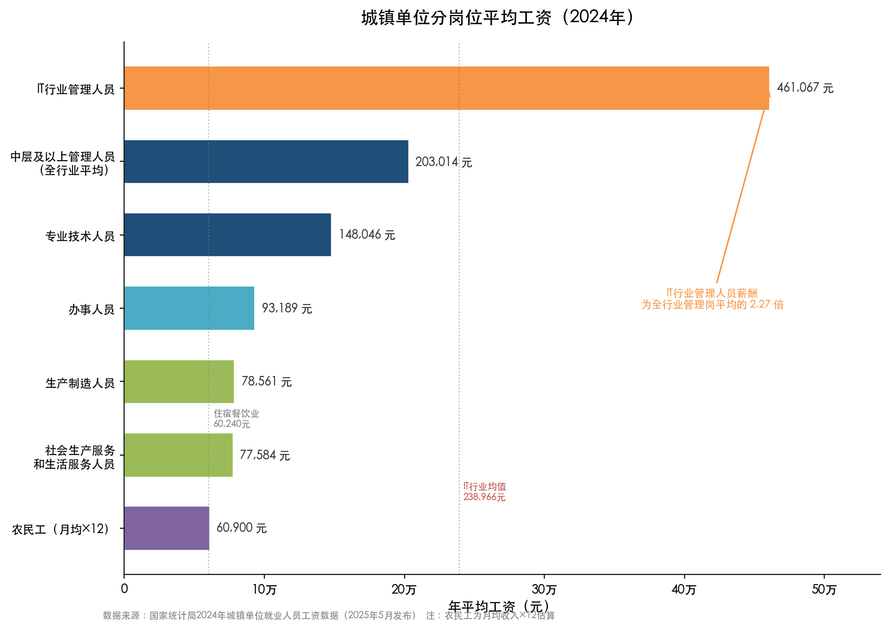

中层及以上管理人员的平均工资（203014 元）是生产制造人员（78561 元）的 2.58 倍。若进一步细分至行业维度，IT 行业中层及以上管理人员年平均工资高达 461067 元，为全行业管理人员平均水平的 2.27 倍 [国家统计局2024年工资数据](https://www.stats.gov.cn/zwfwck/sjfb/202505/t20250516_1959826.html "分岗位数据")。如上图所示，从 IT 行业管理人员的 46 万元到农民工年化收入的约 6 万元，薪酬梯度跨越了 7.5 倍的落差。

将上述数据与陆学艺的十大阶层框架进行初步对照，可以发现较为明显的对应关系。"国家与社会管理者"和"经理人员"大体对应管理岗位，年均工资 20 万元以上；"专业技术人员"对应技术岗位，年均约 15 万元；"办事人员"对应行政辅助岗位，年均约 9 万元；"商业服务业员工"和"产业工人"对应生产服务和制造岗位，年均约 7.8 万元。从收入角度审视，十大阶层的前四层（管理者、经理人员、私营企业主、专业技术人员）与后六层之间存在一道明显的收入分水岭。

## 2.6 农民工群体：3 亿人的收入困境

农民工是中国社会分层中一个特殊的群体——在统计分类上横跨"产业工人""商业服务业员工"和"农业劳动者"等多个阶层，但在现实中受制于户籍制度造成的系统性收入与福利壁垒。

2025 年，农民工人均月收入 5075 元（同比+2.3%），年化约 60900 元 [2025年统计公报](https://www.stats.gov.cn/sj/zxfb/202602/t20260228_1962662.html "农民工收入")。这一增速较 2024 年的 3.8% 明显放缓，且远低于全国居民人均可支配收入 5.0% 的增速。需要指出的是，农民工月均 5075 元的收入年化后虽达到 60900 元，表面上高于全国人均可支配收入 43377 元，但二者口径存在本质差异：农民工收入为个人劳动报酬，而人均可支配收入系按全部常住人口（含非劳动力人口）平均。以家庭维度衡量，一个农民工需以这份收入赡养家庭中的非劳动力成员（留守儿童、老人等），其家庭人均可支配收入实际上远低于账面数字。

2024 年全国农民工总量为 29973 万人（约 3 亿），是中国劳动力市场中规模最为庞大的群体之一 [人民论坛](http://paper.people.com.cn/rmlt/pc/content/202601/15/content_30137715.html "农业转移人口市民化")。这一群体的收入增速放缓，意味着支撑中国制造业和服务业运行的基层劳动力群体，其实际购买力的改善正在减弱。结合前述所有制差距和行业差距的分析，农民工主要集中于私营部门和低薪行业，其收入增速受到多重结构性因素的压制。

## 2.7 省际差距：从沪京到西部的收入梯度

收入分配的区域维度同样是理解中国不平等格局不可或缺的切面。2025 年，各省份人均可支配收入呈现出鲜明的东西梯度分布。

位居前列的省市中，上海以 91987 元高居全国首位，成为唯一突破 9 万元大关的省份；北京以 89090 元紧随其后。二者的人均可支配收入分别是全国平均水平的 2.12 倍和 2.05 倍 [沃资讯引用统计局数据](https://www.wwo.com.cn/caijing/202601/239911.html "2026年1月")。浙江以 70240 元位居第三，且其城乡居民收入比仅为 1.81，是全国城乡差距最小的省份之一——浙江农村居民人均可支配收入高达 45154 元，已接近甚至超过部分中西部省份的城镇居民水平。

全国共有 7 个省市人均可支配收入超过 5 万元，依次为上海（91987 元）、北京（89090 元）、浙江（70240 元）、江苏（57971 元）、天津、广东（53699 元）、福建（50302 元），全部位于东部沿海地区 [沃资讯引用统计局数据](https://www.wwo.com.cn/caijing/202601/239911.html "2026年1月")。其中长三角地区独占四席（上海、浙江、江苏及毗邻的福建），显示出区域经济一体化对居民收入的显著带动效应。

与此同时，中西部省份的增速表现值得关注。2025 年西藏居民收入增速高达 7.15%，位居全国第一；新疆、甘肃、陕西、宁夏等省份的增速均超过 5.5%，明显快于东部沿海地区。这种"绝对值东部领先、增速中西部更快"的格局，与前述城乡收入比持续收窄的趋势相呼应，反映了区域均衡发展政策的阶段性成效。

然而，省际差距的绝对规模依然巨大。上海人均可支配收入 91987 元与部分西部省份不足 25000 元之间存在近 4 倍的落差。若进一步考虑省内城乡分化，东部一线城市核心区居民与西部农村居民之间的实际收入差距可能超过 10 倍。这种空间维度上的收入差距与前述五等分分组的纵向差距相互叠加，构成了中国收入分配格局中的双重不平等。

## 2.8 十大阶层视角下的收入对应：一个初步映射

上述统计数据来自国家统计局的标准化分类体系（城乡、五等分、行业、岗位），并非直接按照陆学艺的十大阶层框架进行采集。将两套体系进行对接需要基于岗位工资、行业分布和收入分组数据进行推断性映射，以下构建各阶层的大致收入区间。

**上层——国家与社会管理者阶层**。该阶层对应规模以上企业的"中层及以上管理人员"和公共部门的处级及以上干部。统计数据显示管理岗位年均工资 203014 元；但公务员群体的全口径收入（含住房公积金、各类补贴等）在公开统计中难以准确反映，实际总薪酬可能高于工资统计数据。该阶层大体处于五等分分组中高收入组的上部。

**中上层——经理人员、私营企业主、专业技术人员**。经理人员与管理岗位高度重叠，收入水平取决于企业规模和所在行业，从十余万元到数十万元不等，IT 行业管理人员可达 46 万元。私营企业主的收入波动性大，且经营收入与个人收入边界模糊，从年入数万元的小微业主到年入千万元的企业家均涵盖在内。专业技术人员年均 148046 元，但行业间差异显著。该层级总体对应五等分分组中的高收入组和中间偏上组上部。

**中中层——办事人员、个体工商户**。办事人员年均工资约 93189 元，大体处于中间偏上收入组。个体工商户收入离散度极大，整体中位数可能低于办事人员——部分经营良好的个体户年收入可达二三十万元，但大量小摊贩、网店经营者的年收入可能仅数万元。

**中下层——商业服务业员工、产业工人、农业劳动者**。商业服务业员工和产业工人的年均工资约 77000—78000 元，处于中间收入组至中间偏下组区间。农民工群体月均 5075 元（年化约 60900 元）可作为这一层级收入水平的参照。农业劳动者的收入最低，高度依赖农业经营净收入和外出务工收入，其中纯农户的人均可支配收入可能落入低收入组。

**下层——城乡无业、失业、半失业者**。该群体主要依赖转移性收入（低保、社会救助等），大体对应低收入组的下部。

上述映射揭示出一个核心事实：陆学艺框架中的"上层"和"中上层"（合计约占人口 9%—10%）大致对应五等分分组中高收入组（20%）的上半部分；"中中层"（约 9%）跨越高收入组下部与中间偏上组；"中下层"（约 79%）覆盖了从中间偏上到低收入组的广阔区间。这种对应关系清晰表明，中国的社会阶层结构在收入维度上仍呈金字塔形而非橄榄型。

## 2.9 收入分配的结构性特征与启示

综合上述多维度分析，2025 年中国收入分配格局呈现出以下核心特征：

**第一，总量增长稳健但分配改善迟缓。** 人均可支配收入实际增长 5.0%，恩格尔系数降至 29.3%，居民整体生活水平持续改善。然而基尼系数在 0.465 附近的长期平台化、五等分高低倍差仅从 10.36 微降至 10.22，均表明增量财富的分配并未显著改变存量格局。经济增长的"蛋糕"在做大，但切分方式的调整幅度十分有限。

**第二，多重维度的分化相互叠加。** 收入不平等并非单一维度的现象，而是城乡差距（2.31 倍）、区域差距（省际最高近 4 倍）、所有制差距（非私营与私营 1.79 倍）、行业差距（IT 与住宿餐饮 3.97 倍）、岗位差距（管理者与生产人员 2.58 倍）的综合结果。这些维度的分化相互交叉、彼此强化——一个在一线城市体制内 IT 企业担任管理岗位的从业者，与一个在西部县城私营餐饮企业工作的服务员之间，收入差距可轻松超过 20 倍。

**第三，财产性收入的分化效应日益凸显。** 财产净收入仅占全国居民可支配收入的 8.0%，且增速仅 1.6%，表面上影响有限。但这一平均数掩盖了巨大的内部差异——对高收入群体而言，通过房产增值、金融投资获得的财产性收入是其收入的重要组成部分，而低收入群体几乎不具备财产性收入来源。房地产市场的持续调整（2025 年城镇居民财产净收入增速仅 0.5%）在压缩高收入群体财产性收入的同时，也通过资产缩水效应深刻侵蚀着中产家庭的"账面财富"。

**第四，再分配体系的调节力度有待加强。** 转移净收入占比 18.6%，增速 5.4%，在边际上发挥着一定的收入平衡作用。但对标 OECD 国家通过再分配平均降低不平等 31.4% 的水平，中国的税收—转移支付体系在缩小收入差距方面的功能远未充分释放 [学习时报-人民网转载蔡昉文章](http://theory.people.com.cn/n1/2025/1107/c40531-40598709.html "2025年11月发表")。

上述收入分配图谱为后续章节分析中产阶层的定义、规模和财务状况奠定了数据基础。当讨论"谁是中产"时，这张图谱上的每一条刻度线——从五等分分组的门槛到行业工资的天花板——都将成为界定中产边界的参照坐标。

# 第3章 中产阶层的定义之争——口径差异、国际比较与"谁才算中产"

## 3.1 为什么"中产"的定义如此重要

"中国有 4 亿中产"——这一表述自 2019 年首次被官方提出后，迅速成为国内外讨论中国消费潜力与社会治理时最常被引用的数字之一。然而，若按照不同机构的测算口径，中国"中产"的规模可以从不足 1 亿人膨胀至超过 7 亿人，极值跨度近 8 倍。这一巨大分歧并非单纯的统计技术问题，而是折射出"中等收入群体"与"中产阶层"两个概念体系之间的深层张力：前者以收入为唯一标尺，后者则需同时考量职业地位、教育水平、生活方式乃至主观认同。

中国社会科学院李春玲系统梳理了这两个概念体系的学理边界：社会学使用"中间阶层"（middle class），从职业、教育、社会地位等多维度进行界定；经济学使用"中等收入群体"（middle income group），以收入作为唯一划分标准 [李春玲/人民网](http://theory.people.com.cn/n1/2017/0109/c217905-29008203.html "概念体系辨析")。厘清这一区分，是理解后文各项估算差异的核心前提。

## 3.2 中国官方口径："4 亿中等收入群体"的由来与标准

### 3.2.1 官方定义的正式提出

2019 年 1 月 21 日，时任国家统计局局长宁吉喆在国新办新闻发布会上首次公开阐述了"中等收入群体"的官方标准：以典型的三口之家为单位，年收入在 10 万—50 万元人民币之间即属于中等收入群体，据此测算，中国中等收入群体超过 4 亿人，对应约 1.4 亿个家庭，基准数据来自 2017 年 [国家统计局局长答记者问](https://www.stats.gov.cn/xxgk/jd/sjjd2020/201901/t20190122_1764777.html "2019年1月21日国新办发布会实录")。

该标准有三个显著特征。其一，采用绝对标准而非相对标准——以固定的收入区间划线，而非依据收入中位数的比例浮动。其二，口径相当宽泛——下限仅为三口之家年收入 10 万元（人均约 3.3 万元），仅略高于当年全国居民人均可支配收入中位数（2017 年约 2.37 万元）。其三，上限极高——50 万元的上限在当时的收入分布中已属于高收入群体，这意味着标准区间同时涵盖了从"刚脱低"到"准高收入"的极宽人群。

### 3.2.2 学术界对"4 亿"的检验与政策延伸

国务院发展研究中心原副主任刘世锦等在《管理世界》2022 年第 8 期发表的研究中对上述标准进行了实证检验：按国家统计局口径（2018 年价格），2018 年中等收入群体约占总人口 27%，规模约 3.8 亿人；与此同时，低收入群体占比超过 70%，规模在 10 亿人左右 [经济50人论坛](https://www.50forum.org.cn/portal/article/index.html?id=9562 "刘世锦等2022年《管理世界》")。这意味着，即便按照官方最为宽泛的绝对标准，中国社会的收入结构依然呈现底部庞大的"金字塔"形态，距离"橄榄型"社会仍有显著差距。

2022 年 11 月，习近平在 APEC 工商领导人峰会上提出"使中等收入群体在未来 15 年超过 8 亿"的目标，这一表述既确认了官方对"4 亿人"基数的认可，也明确了扩大中等收入群体的战略方向 [求是网](https://www.qstheory.cn/20260320/092e98aaed8c4e2bb74ee49a0b0514da/c.html "百问摘登")。从 4 亿到 8 亿的翻倍目标，意味着在 2037 年前后需新增约 4 亿中等收入人口——这对收入分配改革、城镇化推进和公共服务均等化均构成巨大考验。

### 3.2.3 绝对标准与相对标准的分歧

北京师范大学李实教授的研究揭示了绝对标准与相对标准之间的关键分歧。在绝对标准下，中等收入群体的规模随经济增长自然扩大——只要 GDP 保持增长、居民收入持续提高，越来越多的人将跨过固定的收入门槛。在相对标准下，若收入差距不缩小，中等收入群体占比将保持不变。李实指出，以相对标准测算，"近 10 年我国中等收入群体占比一直维持在 40% 左右" [经济50人论坛](https://www.50forum.org.cn/portal/article/index.html?id=9562 "两种标准对比")。

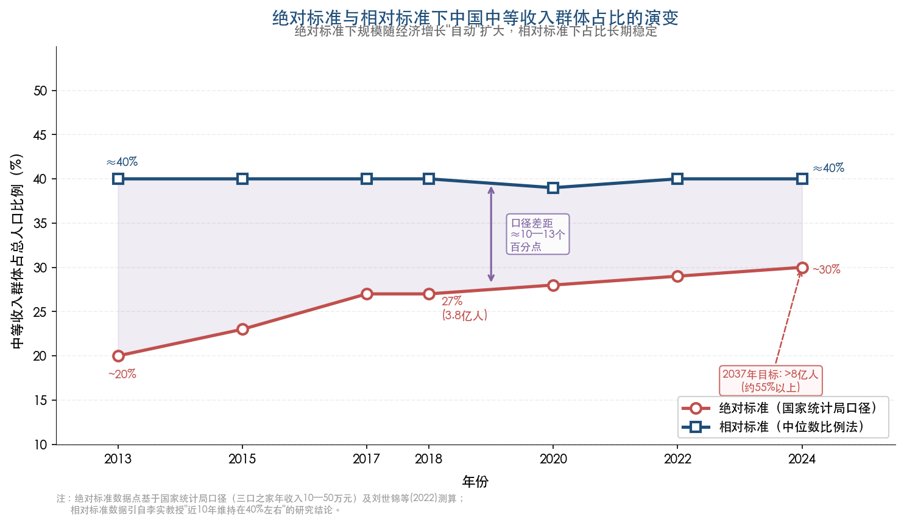

上图清晰呈现了两种标准下的截然不同图景：2013—2024 年间，绝对标准（国家统计局口径）下中等收入群体占比从约 20% 稳步升至约 30%（2018 年确认为 27%、对应 3.8 亿人），而相对标准（中位数比例法）下占比长期稳定在约 40%，两者之间维持 10—13 个百分点的恒定差距。

这一分歧具有重要的政策含义：如果仅以绝对标准衡量进展，经济增长本身便能"自动"实现中产扩容；但若以相对标准审视，缩小收入差距才是扩大中产阶层的真正关键。

## 3.3 国际机构的多元口径：同一个中国，不同的"中产"

国际机构对"中产"或"中等收入群体"的定义差异之大，几乎可以使研究者得出截然相反的结论。以下逐一梳理主要机构的口径、测算方法及其对中国中产规模的估算结果。

### 3.3.1 皮尤研究中心：基于 PPP 的全球标准

皮尤研究中心（Pew Research Center）在 2015 年发布的里程碑式研究报告《全球中产阶级更多是承诺而非现实》中，构建了基于 2011 年 PPP 美元的五档全球收入分类体系：贫困（<2 美元/日）、低收入（2—10 美元/日）、中低收入（10—20 美元/日）、中高收入（20—50 美元/日）、高收入（>50 美元/日），其中"中低收入"与"中高收入"合并构成广义中产 [皮尤研究中心](https://www.pewresearch.org/global/2015/07/08/a-global-middle-class-is-more-promise-than-reality/ "A Global Middle Class Is More Promise than Reality, 2015")。

按此标准，中国中产的增长堪称全球最为瞩目的经济叙事。中国中产阶层人口（日均收入 10—50 美元 PPP）从 2000 年的 3910 万人（占总人口 3.1%）增长至 2018 年的约 7.07 亿人（占总人口 50.8%），18 年间净增 6.68 亿人 [CSIS ChinaPower](https://chinapower.csis.org/china-middle-class/ "How Well-off is China's Middle Class")。2001—2011 年的十年间，仅中国一国就贡献了全球新增中产人口的一半以上 [皮尤研究中心](https://www.pewresearch.org/global/2015/07/08/a-global-middle-class-is-more-promise-than-reality/ "2001-2011年中国数据")。

然而，皮尤标准下的中国中产存在显著的"低端集中"特征。2018 年中国 50.8% 的中产人口中，约 68% 属于中低收入档（日均 10—20 美元），仅 32% 进入中高收入档（日均 20—50 美元）。作为对比，同期瑞典的中产人口比例同为 51%，但其中低收入档仅占 11%，绝大多数属于中高收入档 [CSIS ChinaPower](https://chinapower.csis.org/china-middle-class/ "中产结构比较")。

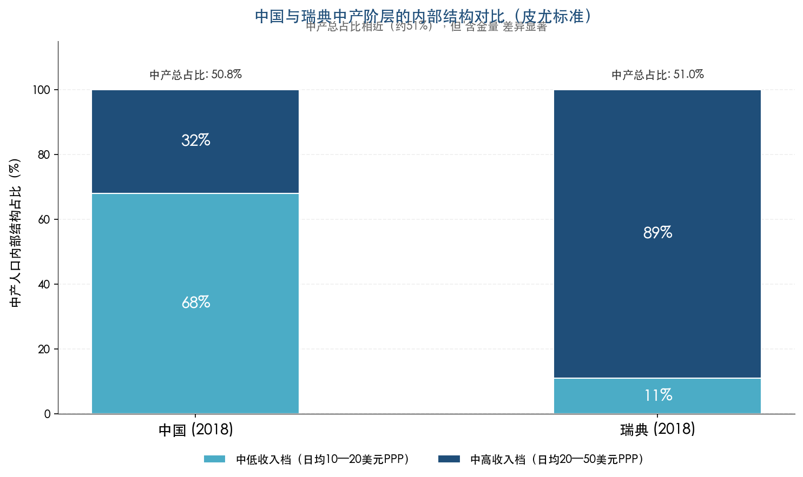

上图直观呈现了两国中产的"含金量"差异：中国与瑞典的中产总占比几乎相同（约 51%），但内部结构截然不同——中国中产以中低收入档为主体，瑞典中产则以中高收入档为主体。换言之，中国的"中产"更多是刚刚跨过贫困门槛的群体，距发达国家中产的实际生活水准尚有相当距离。

### 3.3.2 Brookings 学会 Kharas 标准：最宽泛的全球中产定义

Brookings 学会学者 Homi Kharas 在 2010 年将全球中产定义为日均消费 10—100 美元（2005 年 PPP），上限远高于皮尤标准。据其估算，2009 年中国约 1.57 亿人（占人口 11%）属于中产，并预测到 2030 年中国中产比例可达 74%（约 7 亿人）[Kharas/Brookings论文](https://www.brookings.edu/wp-content/uploads/2016/06/03_china_middle_class_kharas.pdf "The New Global Middle Class")。这一预测常被广泛引用，但需注意 100 美元/日的上限意味着几乎将所有非贫困人口纳入"中产"范畴，概念的区分力由此大幅削弱。

### 3.3.3 OECD 标准：基于相对收入的中产界定

经合组织（OECD）在 2019 年发布的报告《压力之下：被挤压的中产阶层》中，采用相对标准定义中产——家庭收入介于该国国民收入中位数的 75%—200% [OECD报告](https://www.oecd.org/en/publications/2019/05/under-pressure-the-squeezed-middle-class_f3fa7167.html "Under Pressure, 2019")。这一定义的优势在于充分考虑了各国的收入分布特征，但劣势同样突出：同一标准在不同国家对应的绝对收入水平可能相差数倍。

OECD 报告同时揭示了一个值得警惕的长期趋势：1980 年代至 2010 年代，OECD 国家的中产占比从 64% 降至 61%，呈现持续萎缩态势。这一"中产被挤压"现象为评估中国中产阶层面临的长期结构性风险提供了重要的国际镜鉴。

### 3.3.4 瑞信/UBS 标准：以净资产衡量中产

瑞士信贷（后并入 UBS）在《全球财富报告》中采用了与收入口径截然不同的维度——以个人净资产界定中产。瑞信标准将个人净资产在 5 万—50 万美元之间（经 PPP 换算后，中国对应 2.8 万—28 万美元）的成年人定义为中产。据此标准，2015 年中国约有 1.09 亿中产成年人，数量居全球首位 [李春玲/人民论坛网](https://www.rmlt.com.cn/2016/0226/418546.shtml "瑞信标准适用性分析")。

李春玲对瑞信标准提出了尖锐批评，指出该标准与中国居民的生活实感严重脱节。西南财经大学中国家庭金融调查（CHFS）使用瑞信标准重新测算后，得出 2015 年中国中等收入成年人口为 2.17 亿人（高于瑞信的 1.09 亿），平均财富约 12.7 万美元，占全部成年人口的 21.4% [李春玲/人民网](http://theory.people.com.cn/n1/2017/0109/c217905-29008203.html "西南财经大学CHFS数据")。两个团队使用相同标准却得出近乎翻倍的差异，根源在于对中国居民隐性资产（如小产权房、非正规金融资产）的估算方法存在重大分歧。

UBS 在 2025 年 6 月发布的最新《全球财富报告》进一步更新了中国数据。报告显示，2024 年中国拥有超过 630 万名百万美元净资产富翁，仅次于美国的 2380 万人，居全球第二；在"大中华区"（大陆、香港与台湾）范围内，个人净资产在 10 万至 100 万美元之间的人数占全球同档人口的 28.2%，超过西欧（25.4%）和北美（20.9%），显示出中产财富阶层规模的快速扩张 [UBS全球财富报告2025/南洋商报](https://www.enanyang.my/news/20250619/Finance/709477 "2025年6月19日发布")。全球范围内超过 80% 的成年人净资产不足 10 万美元，仅约 1.6% 达到百万美元以上 [UBS全球财富报告2025](https://www.ubs.com/global/en/media/display-page-ndp/en-20250618-gwr-2025.html "Global Wealth Report 2025: Wealth growth accelerated in 2024")。

### 3.3.5 麦肯锡标准：聚焦城市消费力的商业视角

麦肯锡在 2013 年的研究中将中国城市中产定义为家庭年可支配收入 6 万—22.9 万元人民币。该下限远低于国家统计局的 10 万元标准，因此估算的覆盖面显著更广：2012 年已覆盖城市家庭的 68%。麦肯锡预测 2022 年上层中产（家庭年收入 10.6 万—22.9 万元）将占城市家庭 54% [麦肯锡研究报告](https://www.mckinsey.com/industries/retail/our-insights/mapping-chinas-middle-class "Mapping China's middle class, 2013")。麦肯锡的定义带有鲜明的商业导向——核心关注点在于哪些群体具有足够的可支配收入来驱动消费升级，而非社会学意义上的阶层归属。

## 3.4 口径对照：同一个中国，人数何以相差 8 倍

综合以上各方口径，中国"中产"人数的估算形成了一条从不足 1 亿人到超过 7 亿人的宽幅谱系。

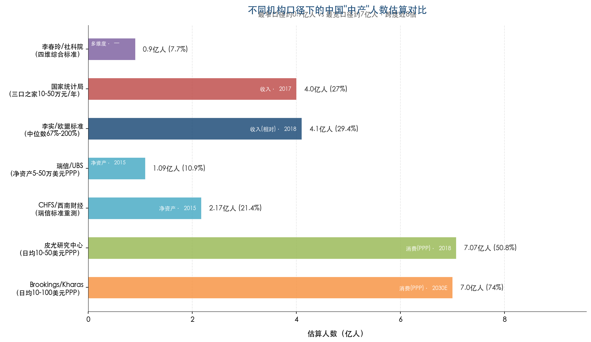

上图将七种主要口径的估算结果并置对比，直观呈现了近 8 倍的跨度。具体而言：

**最窄口径**：中国社科院李春玲采用职业、教育、收入、消费四维综合标准界定"中间阶层"，估算结果仅约占总人口 7.7%，即约 9000 万人 [李实研究报告](http://www.spa.zju.edu.cn/spachinese/2021/0525/c13223a2378051/page.htm "口径跨度文献综述")。

**官方口径**：国家统计局三口之家年收入 10 万—50 万元标准，约 4 亿人（占 27%—29%）。刘世锦团队基于 2018 年数据确认为约 3.8 亿人 [经济50人论坛](https://www.50forum.org.cn/portal/article/index.html?id=9562 "刘世锦等2022年《管理世界》")。

**相对标准**：李实教授以全球收入中位数 67%—200% 测算，2018 年中国中等收入群体约占 29.4%（约 4.1 亿人）；以欧盟标准测算仅 24.7%，远低于英国、德国、法国的 70% 和美国的 55.9% [李实研究报告](http://www.spa.zju.edu.cn/spachinese/2021/0525/c13223a2378051/page.htm "CHIP数据测算")。

**皮尤标准**：日均 10—50 美元 PPP，2018 年约 7.07 亿人（占 50.8%），但其中近七成集中在日均 10—20 美元的中低收入档 [CSIS ChinaPower](https://chinapower.csis.org/china-middle-class/ "2018年数据")。

**最宽口径**：Brookings 学会 Kharas 预测 2030 年中国中产比例可达 74%（约 7 亿人），以日均消费 10—100 美元 PPP 为标准 [Kharas/Brookings论文](https://www.brookings.edu/wp-content/uploads/2016/06/03_china_middle_class_kharas.pdf "预测数据")。

最窄与最宽口径之间跨度接近 8 倍，分歧的根源在于四个维度的选择差异：（1）单一维度（仅收入或仅资产）还是多维度（收入+职业+教育）；（2）绝对标准还是相对标准；（3）以个人还是以家庭为统计单位；（4）以收入还是以消费（支出）为测量指标。

## 3.5 概念辨析："中等收入群体"≠"中产阶层"

在公共讨论中，"中等收入群体"与"中产阶层"（或"中产阶级"）常被混为一谈，但两者在学理上存在本质区别。

"中等收入群体"是一个纯经济学概念，以收入水平为唯一划分标准，可通过调整收入区间的上下限来灵活改变覆盖范围。它回答的是一个描述性问题——有多少人的收入处于某一特定区间。

"中产阶层"则是一个社会学概念，内涵远比收入丰富。经典社会学将中产阶层定义为同时具备以下特征的群体：拥有较高教育水平（通常为大专及以上学历）、从事白领或专业技术工作、享有一定的社会声望和经济安全感、认同自身属于社会中间层级。正因如此，李春玲采用"职业—教育—收入—消费"四维标准衡量中产阶层时，其规模仅为总人口的 7.7%，远低于任何纯收入口径的估算结果。

这一概念鸿沟在政策讨论中已产生实质性影响。官方宣布"4 亿中产"时，采用的是最为宽泛的纯收入标准；而公众感知中的"中产"则隐含着有房有车、子女接受优质教育、拥有一定储蓄缓冲等生活方式标准。两者之间的落差，正是许多被统计为"中等收入群体"的家庭自认"被中产"的根源所在。

## 3.6 国际比较：中国中产在全球坐标系中的位置

将中国的中产规模置于国际经验中进行对照，有助于获得更为准确的定位。

**与发达国家的差距**：李实教授以欧盟标准测算，2018 年中国中等收入群体占比仅 24.7%，同期英国、德国、法国均在 70% 左右，美国为 55.9% [李实研究报告](http://www.spa.zju.edu.cn/spachinese/2021/0525/c13223a2378051/page.htm "CHIP数据测算")。按 OECD 相对标准衡量，OECD 国家中产占比约 61%，中国以相对标准计算大约维持在 40% [经济50人论坛](https://www.50forum.org.cn/portal/article/index.html?id=9562 "两种标准对比")。差距的核心在于：发达国家的中产阶层是在经历了完整的工业化、城镇化进程并建立起成熟的社会保障体系之后形成的；而中国的城镇化率直到 2025 年末才达到 67.89%，户籍城镇化率不足 50%，社会保障体系仍在完善之中。

**与金砖国家的比较**：按皮尤标准，2018 年中国中产占比 50.8%，俄罗斯为 71.5%、巴西 51.4%、南非 22.5%、印度仅 5.7% [CSIS ChinaPower](https://chinapower.csis.org/china-middle-class/ "BRICS对比")。中国在金砖国家中居于中上位置，但俄罗斯中产占比虽高于中国，其经济总量和人口基数远小于中国，绝对规模并不可比。

**全球财富维度**：据 UBS 2025 年报告，中国百万美元富翁超过 630 万人，仅次于美国的 2380 万人；大中华区 10 万—100 万美元净资产人群占全球同档的 28.2%，为全球最大的中产财富群体 [UBS全球财富报告2025/南洋商报](https://www.enanyang.my/news/20250619/Finance/709477 "2025年6月19日发布")。然而 UBS 报告同时显示，全球超过 80% 的成年人净资产不足 10 万美元——以此标准衡量，即便在中国内部，绝大多数成年人也尚未跨入"中产财富"门槛 [UBS全球财富报告2025](https://www.ubs.com/global/en/media/display-page-ndp/en-20250618-gwr-2025.html "Global Wealth Report 2025: Wealth growth accelerated in 2024")。

## 3.7 "4 亿中产"与"真实中产"之间的统计张力

综合以上分析，我们认为对中国"中产"人数的合理理解需根据研究目的进行分层把握：

**收入意义上的"中等收入群体"**：按国家统计局绝对标准，约 4 亿人（占总人口 27%—29%）。该群体的下限——三口之家年收入 10 万元——仅略低于 2025 年全国居民人均可支配收入均值 43377 元所对应的三口之家年收入约 13 万元 [国家统计局局长答记者问](https://www.stats.gov.cn/xxgk/jd/sjjd2020/201901/t20190122_1764777.html "2019年1月21日国新办发布会实录")。换言之，官方口径下的"中等收入群体"实际涵盖了相当一部分仅达到全国平均水平的家庭。

**社会学意义上的"中产阶层"**：综合职业、教育、收入、消费和主观认同等维度，中国符合"中产阶层"特征的人口大约在 1.5 亿—2.5 亿人之间。这一判断基于以下交叉验证：李春玲四维标准约 7.7%（约 1.1 亿人），CHFS 按瑞信财富标准测算约 2.17 亿人，李实以欧盟相对收入标准估算约 24.7%（约 3.4 亿人）。取各口径的交集而非并集，社会学意义上的中产阶层规模大致在 1.5 亿—2.5 亿人之间。

**"被中产"现象的结构性根源**：官方口径的 4 亿人中，相当一部分家庭虽然跨过了收入门槛，但因房贷压力、教育支出高企、社保覆盖不完善等因素，其可支配收入和实际生活质量并不符合公众对"中产"的直觉认知。后续章节将深入分析这一"账面中产"与"体感中产"之间的结构性落差。

## 3.8 小结

"谁才算中产"这一问题不存在唯一正确的答案——答案取决于定义者的分析目的与价值取向。官方口径强调经济增长的包容性成果，因此采用较低门槛的绝对标准以突出中等收入群体的庞大规模；社会学研究强调阶层的多维内涵与生活实感，因此测算结果大幅收窄；国际机构在跨国比较的框架下选择标准化指标，由此带来的"一刀切"问题同样不可忽视。

我们认为，对中国中产阶层的严肃分析不能满足于引用任何单一口径的数字。更有价值的研究路径是追问：在不同口径下被纳入或排除的究竟是哪些群体？他们的真实经济状况、资产结构、消费行为和主观认同有何差异？后续各章将沿着这一思路，从资产负债表、生活压力和政策前景三个维度，深入刻画中国中产阶层的真实面貌。

# 第4章 中产家庭的资产负债表——房产、金融资产与债务结构

## 4.1 从收入到资产：理解中产"真实财力"的另一把标尺

第 3 章的分析表明，按照不同口径，中国中产的人数可以从不足 1 亿到超过 7 亿。然而，仅凭收入流量来评判一个家庭是否"真的中产"远远不够——资产存量、负债规模和流动性结构共同决定了一个家庭抵御风险、实现阶层再生产的实际能力。一个年收入 30 万元的家庭，若背负 300 万元房贷且几乎全部净资产凝固在一套住房之中，其可动用的"真实财力"与一个同等收入但无房贷、持有多元金融资产的家庭截然不同。

中国人民银行 2019 年开展的城镇居民家庭资产负债调查，是迄今为止中国最全面的官方微观资产数据来源。该调查覆盖全国 30 个省（区、市）共 3 万余户城镇居民家庭，为本章分析提供了核心微观基础。本章围绕这一调查及蚂蚁集团研究院、国家金融与发展实验室（NIFD）等机构的近期研究成果，系统拆解中产家庭资产负债表的五个关键层面：总量与分布、资产结构、金融资产配置、负债状况，以及不同城市能级之间的结构性差异。

## 4.2 资产全景：户均 317.9 万元背后的分化真相

### 4.2.1 总量水平与分布极化

央行 2019 年调查显示，中国城镇居民家庭户均总资产为 317.9 万元，但中位数仅为 163.0 万元，均值约为中位数的 1.95 倍——这一显著缺口揭示了资产分布的严重右偏特征。扣除负债后，净资产均值为 289.0 万元，中位数为 141.0 万元 [中国经济周刊](https://paper.people.com.cn/zgjjzk/html/2020-05/15/content_1987791.htm "央行调查：户均资产318万，2020年第9期")。

资产集中度同样值得关注：总资产最高 10% 的家庭占据全部家庭资产的 47.5%，而最低 20% 的家庭仅占 2.6%。换言之，"户均 317.9 万元"这一数字对绝大多数家庭并不具有代表性，它更多反映的是头部家庭的财富拉动效应，而非中产家庭的普遍状态。

### 4.2.2 区域与城市能级差异

资产分布在地理维度上同样呈现高度分化。东部地区户均总资产 461.0 万元，而东北地区仅 165.0 万元，前者约为后者的 2.8 倍 [中国经济周刊](https://paper.people.com.cn/zgjjzk/html/2020-05/15/content_1987791.htm "央行调查区域数据")。城市能级差异更为悬殊：任泽平团队测算，一线城市人均住房市值约 140 万元，二线城市约 40 万元，三四线城市仅约 16 万元——一线城市约为三四线城市的 9 倍 [任泽平团队研究](https://finance.sina.com.cn/cj/2024-10-09/doc-incrwiqp0492568.shtml "城市分线数据")。

这一差距意味着，一线城市与三四线城市的"中产"实际上生活在截然不同的财务世界中。一个北京"账面中产"家庭坐拥市值 500 万元的住房，但月供占去收入的三分之一以上；一个三线城市中产家庭住房市值或许仅 80 万元，但生活压力较小、现金流更为从容。不同城市能级之间的资产量级差异，构成了理解中产家庭财务状况的重要分析维度。

## 4.3 房产锁定效应：当六成财富凝固在砖瓦之中

### 4.3.1 住房资产的绝对主导地位

中国中产家庭资产结构最突出的特征，是住房资产的压倒性主导地位。央行调查显示，住房占城镇家庭总资产的 59.1%（在实物资产中占比高达 74.2%），户均住房资产 187.8 万元；城镇家庭住房拥有率达 96.0%，户均拥有 1.5 套住房 [中国经济周刊](https://paper.people.com.cn/zgjjzk/html/2020-05/15/content_1987791.htm "央行调查住房数据")。

任泽平团队更宏观的测算进一步印证了这一判断：2023 年全国住房市值约 432.5 万亿元，住房占居民总资产的比重约 61%。这一比例远高于主要发达经济体——英国约 50%、日本约 38%、美国仅约 28% [任泽平团队研究](https://finance.sina.com.cn/cj/2024-10-09/doc-incrwiqp0492568.shtml "中国住房市值报告：2024")。中国家庭将远超国际同行的财富份额"锁"在了不动产之中。

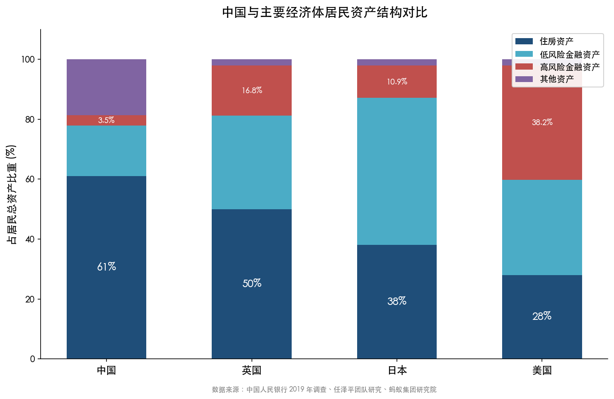

上图直观呈现了中国与英国、日本、美国四国居民资产结构的差异。中国住房资产占比 61% 显著高于美国的 28%，而高风险金融资产占比仅 3.5%，远低于美国的 38.2%，折射出中国家庭资产配置的"重房产、轻金融"特征。

这种"房产锁定效应"产生了三重后果：其一，流动性极低——住房资产无法像存款或股票那样迅速变现，变现过程本身亦可能因市场低迷而遭受价值折损；其二，风险高度集中——家庭财富与单一资产类别深度绑定，且高度关联于特定城市的房地产市场走势，缺乏分散化保护；其三，消费挤出——高比例的住房资产意味着可用于消费、教育、养老储备的流动性资产相应偏少，直接制约了中产家庭的消费能力和生活质量。

### 4.3.2 房价深度调整：财富蒸发的量级

2021 年下半年以来，中国房地产市场进入了一轮持续且深幅的价格调整周期。70 城二手住宅价格自 2021 年高点回落约 20%，截至 2025 年 12 月，70 城中无一城市二手房价格实现环比上涨 [证券时报](https://www.stcn.com/article/detail/3599622.html "70城二手房价格，2026年1月")。中指研究院百城价格指数显示，2025 年全年百城二手住宅价格累计下跌 8.36%，跌幅较 2024 年的 7.26% 进一步扩大 1.10 个百分点，自 2021 年 10 月以来的调整已持续约四年 [中指研究院](https://wap.eastmoney.com/a/202601283633280042.html "2025年百城二手住宅价格累计下跌8.36%")。

分线城市来看，差异化格局清晰可辨：2025 年一线城市二手住宅价格累计下跌 6.72%，二线城市下跌 9.08%，三四线城市下跌 8.30% [新浪财经/中指研究院](https://finance.sina.com.cn/stock/hkstock/hkstocknews/2026-01-28/doc-inhivfch5085425.shtml "分梯队二手住宅价格跌幅")。二线城市跌幅最深，反映出前期投资性需求退潮后的价格回归压力尤为突出。

蚂蚁集团研究院估算，2022 年至 2024 年 8 月，仅房产价值缩水即达 50—60 万亿元，叠加同期股票市场下跌带来的约 10 万亿元财富损失，人均财富净值下降约 4—5 万元 [中国金融四十人论坛](https://www.50forum.org.cn/portal/article/index.html?id=11354 "蚂蚁集团研究院估算")。这一量级的财富蒸发，对于房产占总资产六成以上的中产家庭而言，意味着"账面中产"向"可支配中产"的折价幅度急剧扩大。以一个 2021 年时拥有市值 500 万元住房的一线城市中产家庭为例，至 2025 年底其住房市值可能已缩水至约 400 万元，而房贷本金并不随之减少——负资产风险由此浮现。

## 4.4 金融资产配置：低风险偏好下的结构性脆弱

### 4.4.1 金融资产占比偏低

与住房资产的压倒性地位形成鲜明对照的，是金融资产在家庭总资产中占比的严重偏低。央行调查显示，城镇居民家庭金融资产仅占总资产的 20.4%，户均金融资产 64.9 万元 [中国经济周刊](https://paper.people.com.cn/zgjjzk/html/2020-05/15/content_1987791.htm "央行调查金融资产数据")。这一比例不仅远低于美国（金融资产占家庭总资产约 70%），也低于日本（约 60%）和欧洲主要经济体。

### 4.4.2 低风险资产高度集中

在本就偏低的金融资产内部，配置结构呈现出强烈的保守特征。央行调查的分项数据显示：银行存款占金融资产的 36.1%，银行理财、资管产品及信托占 26.6%，股票仅占 6.4%，基金仅占 3.5% [中国经济周刊](https://paper.people.com.cn/zgjjzk/html/2020-05/15/content_1987791.htm "央行调查金融资产结构")。

蚂蚁集团研究院的估算进一步勾勒了宏观全貌：截至 2025 年 6 月，中国居民存款达 163 万亿元，低风险金融资产（存款、银行理财、保险等）合计占居民金融资产的 83%，高风险金融资产（股票、基金、信托等）仅占 17%。这一比例与日本（高风险资产占 18.2%）大体相当，但远低于美国的 54.6% [中国金融四十人论坛](https://www.50forum.org.cn/portal/article/index.html?id=11354 "居民财富配置转型，2025年12月")。

"存款为王"的金融资产配置格局，一方面反映了中国资本市场波动性较大、投资者信心不足的客观现实，另一方面也意味着居民财富增值渠道有限。在通胀率低于存款利率的阶段，存款尚可保值；但从长期来看，过度集中于低风险、低收益资产将使居民财富实际增速落后于经济增长速度，进而加剧中产家庭的财富焦虑。

### 4.4.3 "存款堰塞湖"与消费传导梗阻

163 万亿元的居民存款规模看似庞大，但其背后折射的并非居民财富的充裕，而是消费与投资信心的双重疲弱。当房地产作为传统财富蓄水池的功能因价格下行而弱化，股票市场亦未能提供稳定回报时，居民被迫将更多资金以银行存款形式"囤积"。这种"预防性储蓄"倾向的强化，恰恰是中产家庭面对不确定性时的防御性反应——存款增长并不意味着财富增长，而是意味着消费意愿的收缩和风险偏好的系统性下移。

## 4.5 负债侧：去杠杆进程中的结构性压力

### 4.5.1 居民杠杆率的国际定位

中国居民部门的杠杆率在过去十余年经历了快速攀升后，于 2024 年步入下行通道。据 NIFD 数据，2025 年末居民部门杠杆率降至 59.4%，全年下降 2.0 个百分点，且去杠杆幅度逐季加大——一季度仅微升 0.1 个百分点，四季度则大幅下降 1.1 个百分点 [证券时报](https://www.stcn.com/article/detail/3616152.html "NIFD 2025年四季度宏观杠杆率报告，2026年1月")。居民贷款总额 83.28 万亿元，增速仅 0.53%，创下有历史数据以来的最低水平。

将中国的居民杠杆率置于国际比较框架中，可以获得更清晰的定位。根据 BIS 编制的各国居民部门信贷/GDP 比率数据（截至 2025 年三季度），中国为 59.0%，与法国（59.9%）相近，低于美国（68.0%）和日本（61.1%），高于欧元区均值（50.6%），大幅低于韩国（89.4%）和澳大利亚（113.0%）[BIS数据/Trading Economics](https://tradingeconomics.com/country-list/households-debt-to-gdp "BIS居民杠杆率跨国比较，2025年Q3")。从绝对水平看，中国居民杠杆率处于国际中等偏低位置，尚未触及系统性风险的警戒区间。

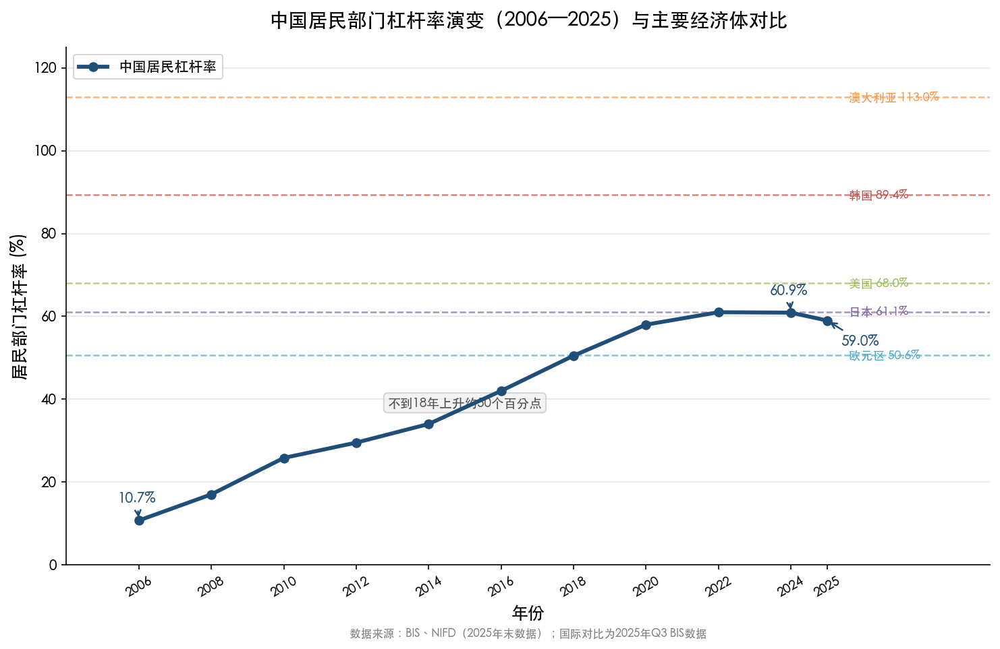

上图完整呈现了中国居民部门杠杆率从 2006 年 10.7% 快速攀升至 2024 年峰值 60.9%、再于 2025 年降至 59.0% 的演变轨迹，并以水平参考线标注了澳大利亚、韩国、美国、日本、欧元区等经济体 2025 年三季度的杠杆率水平，直观揭示了中国居民加杠杆速度之快及其当前的国际定位。

需要特别指出的是：中国居民杠杆率的绝对水平虽然可控，但其攀升速度在全球主要经济体中几乎没有先例。BIS 数据显示，中国居民部门信贷/GDP 比率从 2006 年的 10.7% 起步，于 2024 年一季度达到 60.9% 的历史峰值 [BIS数据/TheGlobalEconomy](https://www.theglobaleconomy.com/China/household_debt_gdp/ "BIS中国居民杠杆率历史数据")，不到 18 年间上升了约 50 个百分点。相比之下，美国居民杠杆率从 40% 升至 100%（2007 年次贷危机前峰值）用了约 25 年。杠杆率攀升速度过快本身即构成金融脆弱性的重要来源。

### 4.5.2 住房贷款：连续三年负增长

住房贷款是居民负债的绝对主体。2025 年末个人住房贷款余额为 37.01 万亿元，已连续第三年负增长——2022 年峰值为 38.80 万亿元，三年间净减少约 1.8 万亿元。与此同时，居民短期贷款和消费贷款余额均出现有数据以来的首次下降 [新浪财经转引央行数据](https://finance.sina.com.cn/roll/2026-01-29/doc-inhiymqm1066437.shtml "历年居民房贷趋势，2026年1月")。

房贷规模的持续收缩反映了两股力量的叠加：一是提前还贷潮——在利率下行周期中，存量房贷利率相对偏高的借款人主动选择提前偿还以降低利息支出；二是新增购房贷款意愿疲弱——房价预期转向下行使得居民推迟购房决策，新增房贷规模持续萎缩。这种"还旧不借新"的格局，使得居民部门整体呈现被动去杠杆的典型特征。

### 4.5.3 刚需家庭的脆弱性：金融资产不足以覆盖负债

居民杠杆率的总量数据掩盖了分布层面的剧烈分化。央行调查揭示了一个关键的风险群体：仅有一套住房且有未偿房贷的刚需型家庭，其金融资产负债率高达 151.3%，即全部金融资产（存款、理财、股票等）仅相当于未偿负债的 66%——换言之，即便变卖所有金融资产也无法覆盖债务。这类家庭的月偿债收入比为 33.0%，意味着每月收入的三分之一用于偿还贷款 [中国经济周刊](https://paper.people.com.cn/zgjjzk/html/2020-05/15/content_1987791.htm "央行调查负债数据")。

在年龄维度上，26—35 岁的中青年群体负债参与率和资产负债率均为各年龄段最高。这一群体恰恰处于事业上升期、刚组建家庭并购入首套住房的"新中产"核心人群，面临着收入尚在成长期而负债已达高峰的错配困境。

### 4.5.4 房贷对消费的挤压效应

房贷的持续偿付不仅占据可支配收入的显著份额，更对居民消费能力构成实质性挤压。NIFD 的测算提供了一个直观的量化视角：37.4 万亿元房贷余额，若每贴息 1 个百分点可减轻利息负担 3744 亿元，按 67% 的消费倾向估算可增加消费约 2506.8 亿元 [证券时报](https://www.stcn.com/article/detail/3616152.html "NIFD房贷贴息测算")。

这一测算具有明确的政策含义：存量房贷利率的高低，直接影响着中产家庭可用于消费的"余粮"。2024 年居民偿债收入比已降至 6.8%（2021 年高点为 10.9%），低于美国的 8.4%——但这更多反映的是新增贷款萎缩和提前还贷的叠加效应，而非家庭财务状况的实质改善 [华尔街见闻/国盛证券](https://wallstreetcn.com/articles/3756332 "四大维度：地产何时能见底？2025年9月")。偿债收入比的下降与消费信心的低迷并存，恰恰印证了居民部门正处于资产负债表修复的阵痛期。

## 4.6 "账面中产"与"可支配中产"：一个综合画像

综合以上各层面的分析，可以构建中国中产家庭资产负债的两类"典型画像"：

**一线城市"账面中产"家庭**：户均总资产约 800—1000 万元（其中住房占 70% 以上），未偿房贷 200—300 万元，金融资产 100—150 万元（以存款和低风险理财为主），月供占家庭月收入的 30%—40%。自 2021 年房价高点以来，住房市值缩水约 15%—20%，"纸面净资产"下降超过 100 万元，但贷款本金未随之减少。此类家庭的"可支配财力"——即扣除房贷月供和刚性支出后的可自由支配收入——远低于其资产账面价值所暗示的水平。

**二三线城市"实用中产"家庭**：户均总资产约 200—400 万元（住房占比 55%—65%），房贷负担较轻或已结清，金融资产 30—60 万元。房价调整对其资产缩水的绝对额度较小，但二线城市 2025 年二手房价累计跌幅达 9.08%，挤压效应同样不容忽视。此类家庭的优势在于房贷压力较小，可支配收入中可用于消费和储蓄的比例更高。

两类中产家庭的核心差异在于：一线城市中产是"资产富裕但流动性贫困"的典型代表，二三线城市中产则属于"资产偏少但现金流更健康"的类型。从"真实财力"的角度衡量，两者之间的差距远小于其账面资产所显示的差距。这一判断对于理解中国中产消费行为的区域分化具有重要意义。

## 4.7 住房市值/GDP 比率：一个结构性风险指标

住房市值与 GDP 的比率是衡量房地产市场在国民经济中"权重"的重要结构性指标。任泽平团队测算，一线城市住房市值与 GDP 之比高达 745%，远超二线城市的 332% 和三四线城市的 239% [任泽平团队研究](https://finance.sina.com.cn/cj/2024-10-09/doc-incrwiqp0492568.shtml "中国住房市值报告：2024")。这意味着在一线城市，住房市值相当于当地年度经济产出的 7 倍以上——房地产对经济的绑架程度由此可见。

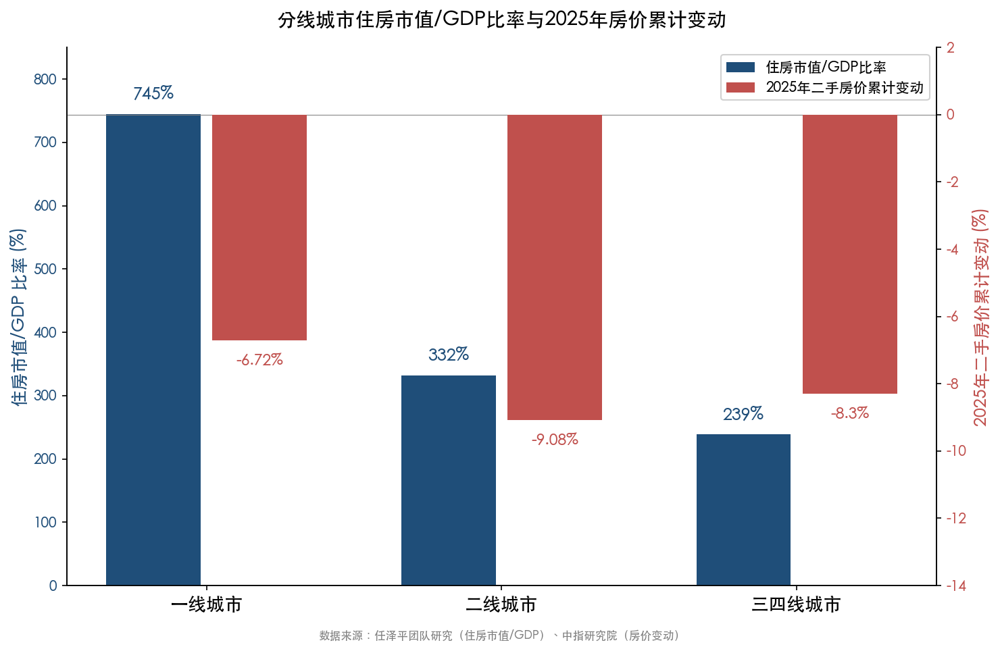

上图以双轴对比呈现了三类城市的住房市值/GDP 比率与 2025 年二手房价累计变动。一线城市房地产"重量"最大（745%）但价格跌幅相对较小（-6.72%），二线城市跌幅最深（-9.08%），三四线城市则处于两者之间。这一差异化格局表明，一线城市的需求韧性和供给稀缺性对房价形成了一定支撑，而二线城市前期投资性需求退潮后面临更大的价格回归压力。

这一结构性特征对中产家庭的影响是双向的。在房价上行期，一线城市有房家庭享受了巨大的资产增值红利，许多家庭甚至"被中产"——并非依靠收入提升，而是凭借房产升值跻身中产行列。在房价下行期，同一批家庭则面临资产缩水、负资产风险和消费能力下降的多重压力。房产从财富放大器转变为财务脆弱性的放大器，这一角色逆转深刻重塑了中产家庭的财务心理和消费决策。

## 4.8 财富配置转型的曙光与挑战

蚂蚁集团研究院在 2025 年 12 月发布的研究中指出，中国居民财富配置正处于从"房产为王"向多元化金融资产配置转型的关键窗口期。163 万亿元居民存款构成巨大的潜在再配置资源池，但转型面临三大结构性障碍：其一，资本市场的稳定性和投资回报预期尚不足以吸引居民资金大规模入市；其二，居民金融素养和风险认知能力参差不齐；其三，养老第三支柱等长期投资渠道仍处于发展初期——个人养老金制度截至 2024 年 11 月虽已有 7279 万人开户，但实际缴费率不足 21% [中国金融四十人论坛](https://www.50forum.org.cn/portal/article/index.html?id=11354 "居民财富配置转型，2025年12月")。

从国际经验来看，日本在 1990 年代房地产泡沫破裂后经历了长达二十余年的居民资产负债表修复（即辜朝明所提出的"资产负债表衰退"），期间居民消费长期低迷，金融资产配置持续偏向存款和国债。中国当前的情况虽然在宏观杠杆率和房价调整幅度上远未达到日本当年的极端水平，但居民部门主动去杠杆、被动财富缩水和预防性储蓄增强这三重特征，已呈现出高度相似的早期征兆。如何在资产负债表修复与消费信心重建之间找到平衡，是当前中国经济面临的核心挑战之一。

## 4.9 本章小结

中国中产家庭的资产负债表呈现出三个最为显著的结构性特征。

第一，住房资产占比约 60%，远超主要发达经济体，形成高度集中的"房产锁定效应"。第二，金融资产占比仅约 20%，且内部以银行存款和低风险理财为主（低风险资产合计占比达 83%），高风险资产配置比例远低于美国。第三，居民部门杠杆率（BIS 口径 59.0%）虽处于国际中等水平，但攀升速度在全球主要经济体中几乎没有先例——从 2006 年的 10.7% 到 2024 年峰值 60.9%，不到 18 年上升了约 50 个百分点。

2021 年以来的房地产价格深度调整使上述三个特征叠加产生了深远影响：50—60 万亿元的房产价值缩水直接冲击了以房产为主体资产的中产家庭，"账面中产"与"可支配中产"之间的裂隙急剧扩大。与此同时，居民部门正在经历一轮被动去杠杆——房贷余额连续三年负增长、消费贷余额首次下降、贷款增速创历史最低——这既是家庭资产负债表修复的必经之路，也对短期消费恢复构成显著拖累。

理解这张资产负债表的内在张力，是评估中国中产阶层"真实实力"的关键前提，也是后续章节分析中产家庭消费行为、阶层焦虑及扩中政策路径的重要基础。

# 第5章 中产的生活图景与结构性压力——消费、教育、医疗与阶层焦虑

前四章依次搭建了中国社会阶层的分析框架、描绘了各阶层的收入分配全景、厘清了"中产"定义之争，并拆解了中产家庭的资产负债表。至此，一个核心问题浮出水面：即便在收入和资产层面被归入"中产"，这些家庭的日常生活体验究竟如何？消费选择呈现怎样的特征？哪些刚性支出构成持续的压力来源？他们是否认同自身的"中产"身份？本章从消费行为、教育投入、住房债务、养老医疗、职业安全感与主观认同六个维度，系统刻画中国中产阶层的真实生活图景，揭示其面临的多重结构性压力及"中产脆弱性"的深层成因。

## 5.1 消费行为的结构转型：从"面子消费"到"理性消费"

### 5.1.1 消费支出的总量与结构

2025 年全国居民人均消费支出为 29476 元（同比+4.4%），其中三大刚性支出——居住（6397 元，占比 21.7%）、教育文化娱乐（3489 元，占比 11.8%）、医疗保健（2573 元，占比 8.7%）——合计占消费支出的 42.2%，构成中产家庭最主要的支出负担。城镇居民的对应数据更为突出：人均居住支出 8095 元（占比 22.6%），教育文化娱乐 4298 元（占比 12.0%），医疗保健 2932 元（占比 8.2%），三项合计占比达 42.8% [国家统计局](https://www.stats.gov.cn/sj/zxfb/202601/t20260119_1962321.html "2025年居民收入和消费支出情况")。

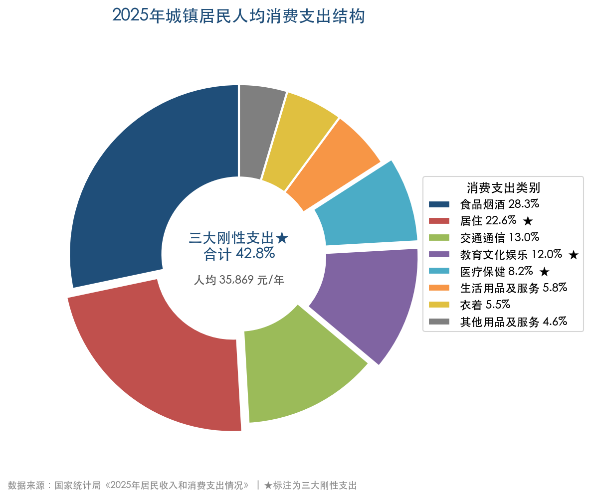

**图 5-1　2025 年城镇居民人均消费支出结构。** 居住、教育文化娱乐、医疗保健三大刚性支出（★标注）合计占城镇居民人均消费支出的 42.8%，食品烟酒以 28.3% 居首位。数据来源：国家统计局。

消费支出的增长呈现显著的"K 型分化"：食品烟酒和居住支出增速较低（分别+2.6%、+2.1%），而教育文化娱乐（+9.4%）、交通通信（+8.3%）和其他用品及服务（+11.2%）增速明显更高 [国家统计局](https://www.stats.gov.cn/sj/zxfb/202601/t20260119_1962321.html "2025年居民消费支出结构")。这种"基础消费稳定、发展型消费活跃"的分化格局，折射出中产家庭消费重心正从满足基本生活需求向教育投资、健康管理、精神消费等更高层次需求转移。

2024 年全国人均服务性消费支出占居民人均消费支出的比重已达 46.1%。中国银行研究院指出，发达国家经验表明，人均 GDP 达到 1.5 万美元时服务消费占比通常超过 50%，中国正加速向服务消费驱动的消费结构转型 [中国银行](https://pic.bankofchina.com/bocappd/rareport/202503/P020250307524230962965.pdf "从金融视角看2025年《政府工作报告》")。

### 5.1.2 消费降级与消费分级并存

麦肯锡 2025 年发布的《新常态下的中国消费》报告指出，中国消费市场已步入以"个位数增长"为特征的新常态，2025 年消费总额预计增长仅 2.3%。中等收入群体的消费决策正从"面子消费"转向"理性消费"和"性价比消费" [麦肯锡](https://www.mckinsey.com.cn/%E6%96%B0%E5%B8%B8%E6%80%81%E4%B8%8B%E7%9A%84%E4%B8%AD%E5%9B%BD%E6%B6%88%E8%B4%B9/ "新常态下的中国消费，2025年")。

这一转型在市场数据中得到清晰印证。拼多多 2025 年 Q1 营收 956.7 亿元，同比增长 10.2%——虽然较 2024 年 Q1 超过 100% 的增速大幅回落，但绝对规模仍维持两位数增长，反映出"性价比消费"的持续韧性 [拼多多财报](https://article.pchome.net/news/3372.html "拼多多2025年Q1财报")。与此同时，高收入消费者对高端产品的需求保持增长，注重创新、社交属性与健康悦己；中低收入消费者则在服装、家居等品类上出现明显的品牌替代和渠道下沉趋势 [东方证券](https://pdf.dfcfw.com/pdf/H3_AP202509181745854314_1.pdf "消费行业年度趋势报告，2025年")。

我们认为，当前中国消费市场的核心特征并非简单的"消费降级"，而是"消费分级"——不同收入层级的消费者在消费策略上出现显著分化。中产群体在必需消费品上追求性价比（如以国产品牌替代进口品牌），同时在教育、健康、旅游等体验型消费上保持甚至加大投入。这种看似矛盾的行为模式，恰恰是中产家庭在有限预算约束下进行资源优化配置的理性选择。

## 5.2 教育投入：阶层再生产的核心通道与最大"痛点"

### 5.2.1 家庭教育支出的总量与负担

教育是中产家庭支出中最具战略性、也最具焦虑感的领域。北京大学中国教育财政科学研究所（CIEFR）基于 CIEFR-HS 全国追踪调查数据显示，2022—2023 学年全国普通全日制教育各学段家庭教育支出平均为 15828 元，占家庭总消费支出的 17.2%。按全生命周期计算，一个孩子从学前三年到大学本科毕业的平均教育花费约 28.7 万元 [北京大学CIEFR](https://ciefr.pku.edu.cn/cbw/kyjb/a37a4205a30347df921e9014b9c33bde.htm "《中国教育财政家庭调查报告（2023）》")。

教育支出的阶层分化极为显著：家庭支出水平最高 20% 的家庭在子女教育上的花费约 58 万元，是最低 20% 家庭（约 16 万元）的 3.6 倍；中等 20% 家庭花费约 24 万元 [北京大学CIEFR](https://ciefr.pku.edu.cn/cbw/kyjb/a37a4205a30347df921e9014b9c33bde.htm "教育支出阶层分化数据")。这一差距表明，中产家庭试图通过高强度教育投入实现阶层再生产的策略，在资源层面面临来自高收入群体的压倒性竞争。

教育支出负担呈现显著的累退性特征：全国家庭教育支出占人均可支配收入的比例为 42.9%，其中农村高达 61.7%，城镇为 35.6%。大学阶段家庭教育负担最重，教育支出占家庭总消费支出的比例高达 31.7% [北京大学CIEFR](https://ciefr.pku.edu.cn/cbw/kyjb/a37a4205a30347df921e9014b9c33bde.htm "教育负担累退性数据")。对于中产家庭的下层边缘群体而言，供养一个大学生已足以使家庭陷入财务紧张状态。

### 5.2.2 "双减"之后：校外培训的阶层分化

2021 年"双减"政策实施后，中小学生校外学科类培训参与率从 2016—2017 学年的 34.3% 下降至 2022—2023 学年的 13.5%，降幅超过六成。然而，培训支出并未同步下降——单位支出反而呈上升趋势，尤其在高收入家庭中更为突出。2023 年，家庭收入最高 25% 的群体在校外培训上的总支出是最低 25% 家庭的 6 倍 [北京大学CIEFR](https://ciefr.pku.edu.cn/cbw/kyjb/a37a4205a30347df921e9014b9c33bde.htm "CIEFR-HS 2017—2023年四轮追踪数据")。

这一变化揭示了一个值得关注的现象："双减"在降低校外培训总体参与率方面取得了显著成效，但并未消除教育竞争的阶层分化。高收入家庭以更高的单位价格获取更优质的课外教育资源（包括一对一辅导、国际课程等），中低收入家庭则被逐步排挤出校外培训市场。中产家庭夹在中间，面临着"不补则焦虑、补则压力大"的两难困境。

### 5.2.3 留学：中产教育投入的高端选项

留学支出是中产家庭教育投入中财务冲击力最大的选项。新东方连续十二年发布的《中国学生出国留学发展报告》提供了系统数据：2025 年中国意向留学家庭的平均年收入为 48.3 万元，平均留学花费预算为 54.4 万元——留学预算已超过家庭年收入 [新东方前途出国](https://liuxue.xdf.cn/special_zonghe/2025_report/ "2025中国学生出国留学发展报告")。至 2026 年，该预算进一步攀升至 60.5 万元，创十二年新高，全球通胀是核心推手 [新东方前途出国](https://liuxue.xdf.cn/special_zonghe/2026_report/ "2026中国学生出国留学发展报告")。

留学家庭的结构也在发生变化。年收入 30 万元以下的家庭仍是留学主体，但高收入家庭占比持续提升。意向留学生家长职务为"一般员工"的家庭自 2018 年起成为最大留学群体，2022 年占比高达 45% [经济观察网](http://www.eeo.com.cn/2024/0523/662778.shtml "出国留学大众化趋势")。留学已从精英家庭的专属选择逐步演变为中产家庭的普遍考量，但由此带来的财务压力亦相应加大——一个年收入 40 万元的家庭，若子女赴美英留学四年，仅学费和生活费累计可达 200—240 万元，几乎相当于家庭 5—6 年的全部税前收入。

## 5.3 住房债务：中产脆弱性的核心根源

### 5.3.1 房价收入比：一线城市的极端压力

第 4 章已详细分析了中产家庭资产负债表中的房产锁定效应。在日常生活层面，住房支出对中产家庭的挤压更为直观。2024 年全国房价收入比约为 10.1 倍，较 2022 年高点（约 11 倍）略有回落，但仍远高于美国的 6.8 倍和日本的 5.3 倍；一线城市的房价收入比更高达 20—30 倍 [华尔街见闻/国盛证券](https://wallstreetcn.com/articles/3756332 "四大维度：地产何时能见底？2025年9月")。

以一线城市中产家庭为例，即便双职工年收入合计 50 万元，购买一套总价 1000 万元的住房（在北京、上海、深圳仅属中等水平），需不吃不喝 20 年方能覆盖全部房款。若考虑首付 30%（300 万元）加贷款 700 万元（30 年期月供约 3.7 万元），月供即占家庭税后月收入的近 90%。即便夫妻双方均有公积金缴存，月供压力依然严峻。

### 5.3.2 偿债压力的演变与储蓄偏好的转向

从流量角度观察，中国居民偿债收入比已从 2021 年的高点 10.9% 下降至 2024 年的 6.8%，低于美国同期的 8.4%，接近 2017 年水平 [华尔街见闻/国盛证券](https://wallstreetcn.com/articles/3756332 "偿债收入比数据")。这一下降部分源于提前还贷行为的普遍化和新增贷款的显著收缩——2025 年末个人住房贷款余额为 37.01 万亿元，较 2022 年峰值 38.80 万亿元连续三年负增长 [新浪财经](https://finance.sina.com.cn/roll/2026-01-29/doc-inhiymqm1066437.shtml "居民房贷趋势")。

与偿债比下降相伴的，是储蓄偏好的急剧攀升。2025 年二季度，央行调查显示倾向于"更多储蓄"的储户比重达 63.8%，创历史新高，而购房意愿仅 15.2%，处于历史低位 [华尔街见闻/国盛证券](https://wallstreetcn.com/articles/3756332 "储蓄与购房意愿")。中产家庭正经历一场集体性的"资产负债表修复"——主动减少负债、增加储蓄、降低风险敞口。这种行为在微观层面是理性的风险管理，但在宏观层面加剧了消费疲软与经济收缩的压力，形成典型的"合成谬误"。

### 5.3.3 城市能级差异：分化的中产世界

住房压力在不同城市能级之间呈现极为显著的分化。一线城市住房空置率仅 7%，三线城市高达 16%——前者住房仍相对短缺，后者则面临严重过剩 [华尔街见闻/国盛证券](https://wallstreetcn.com/articles/3756332 "住房空置率数据")。一线城市中产承受着高房价与高生活成本的双重挤压，但也享有更优质的公共服务和更多的职业机会；三四线城市中产住房压力较小，却面临产业基础薄弱、职业发展空间有限的困境。

2025 年城镇居民人均可支配收入 56502 元（中位数 51115 元），农村居民 24456 元（中位数 20711 元），城乡收入比约 2.3:1；城镇居民人均消费支出 35869 元，农村 20259 元 [国家统计局](https://www.stats.gov.cn/sj/zxfb/202601/t20260119_1962321.html "2025年居民收入和消费支出")。将这些数字与房价收入比相叠加，可以发现一线城市中产与三四线城市中产实际上处于截然不同的财务生态中——前者呈"高收入、高负债、高焦虑"模式，后者呈"中等收入、低负债、相对从容"模式。

## 5.4 养老与医疗：中产的远期焦虑

### 5.4.1 养老金替代率的结构性缺口

养老保障不足是中产阶层远期焦虑的核心来源。2024 年中国城镇职工养老金替代率约为 45%，远低于 55% 的国际警戒线和世界银行建议的 70% 水平 [贝莱德建信理财/建设银行](https://www.blackrockccbwealth.com/uploads/files/31b73e026d8a758d2044c848bb1044b9.pdf "2025中国养老金金融白皮书")。换言之，一位退休前月收入 2 万元的城镇职工，退休后每月养老金仅约 9000 元，生活水平将面临显著下滑。

个人养老金制度作为第三支柱的补充机制，推进效果仍然有限。截至 2024 年 11 月末，全国已有 7279 万人开通个人养老金账户，但仅占基本养老保险参保人数的 7% 左右，实际缴费率不足 21% [贝莱德建信理财](https://www.blackrockccbwealth.com/uploads/files/31b73e026d8a758d2044c848bb1044b9.pdf "个人养老金参与率")。绝大多数开户者处于"开而不缴"的状态，个人养老金制度尚未真正发挥补充养老保障的功能。

贝莱德建信理财 2025 年全国调研（14373 份有效问卷）揭示了中产群体对养老问题的深层忧虑：80% 的受访者对未来养老生活存在担忧，三大焦虑分别为"养老收入不足"（约 55%）、"医疗支出增加"（约 50%）和"资产缩水"（约 47%）；65% 的受访者认为退休后收入将出现明显下降，其中 26% 预计降幅将超过 50% [贝莱德建信理财/建设银行](https://www.blackrockccbwealth.com/uploads/files/31b73e026d8a758d2044c848bb1044b9.pdf "养老焦虑调研")。

### 5.4.2 商业保险的渗透深度与保障缺口

基本医疗保险在覆盖面上已接近全民覆盖——2025 年底全国基本医疗保险参保人数达 13.31 亿人，参保率巩固在 95% [新华网](https://www.news.cn/20260316/bb9663dc7c0648be9f39903edbdb7d5d/c.html "2025年基本医保参保数据")。然而，基本医保以"广覆盖、低保障"为特征，个人重大疾病的自付比例仍然较高，这催生了对商业健康保险的大量需求。

2024 年全年商业健康保险保费收入达 9774 亿元，同比增长 8.2%，截至年底覆盖约 7.5 亿人 [中国医疗保险网](https://www.zgylbx.com/index.php?m=content&c=index&a=show&catid=6&id=50358 "2024年商业健康险数据")。但从渗透深度看，2025 年中国保险密度为 4355.8 元/人，保险深度为 4.365%，与全球平均保险深度 7.0% 相比仍有较大差距 [CEIC数据](https://www.ceicdata.com/zh-hans/china/insurance-industry-overview/cn-insurance-depth "中国保险深度2025")。

南方周末与益普索 2025 年联合发布的《都市职业人群保障需求洞察报告》（覆盖不同层级城市 1500 名都市职业人群）提供了更微观的画面：都市职业人群商业保险整体渗透率为 68%，其中医疗险、意外险、重疾险占据主流，但养老险配置率仅为 24%；约 50% 的受访者对因重大疾病导致的医疗费支出和收入中断造成家庭财务失衡较为担忧；中小企业员工对各项风险的担忧程度均高于大型企业职员，主因在于中小企业在补充商业保险福利方面存在较大缺口 [人民网/南方周末·益普索](http://finance.people.com.cn/n1/2025/1118/c1004-40606309.html "2025年都市职业人群保障需求洞察报告")。

上述数据勾勒出中产群体在医疗保障方面的"夹心层"困境：基本医保的保障力度不足以覆盖重大疾病的全部费用，商业健康险虽然渗透率不低，但以短期医疗险和意外险为主，真正能够提供长期保障的养老险和重疾险覆盖率仍然偏低。

### 5.4.3 养老金财政可持续性的长期隐忧

即便是现有的 45% 替代率，其可持续性也面临严峻挑战。2023 年企业职工基本养老保险剔除财政补贴后年内收支缺口为 1423 亿元 [贝莱德建信理财](https://www.blackrockccbwealth.com/uploads/files/31b73e026d8a758d2044c848bb1044b9.pdf "养老金收支缺口")。随着人口老龄化加速（2025 年末全国 60 岁及以上人口已超过 3 亿），养老金收支压力将持续加大。对于当前 35—50 岁的中产群体而言，其在 20—30 年后退休时所能获得的养老金替代率可能进一步下降，"未来养老靠什么"已成为一个具有实质性焦虑意义的命题。

## 5.5 职业安全感与"35 岁门槛"

### 5.5.1 年龄歧视的系统性存在

就业市场中的年龄歧视是中产群体职业安全感的最大威胁之一。智联招聘调查显示，85% 的受访者认为存在"35 岁门槛"，46.8% 认为过了 35 岁确实难以找到工作；35—45 岁求职者平均需比 25—35 岁群体多投递 2.2 次简历，且面试转化率不足后者的一半 [中国青年报/澎湃新闻](http://m.cyol.com/gb/articles/2026-01/16/content_xaRb2PtVmA.html "35岁门槛调查，2026年1月")。

上述现象并非仅是主观感受，而有坚实的实证基础。北京大学国家发展研究院基于 5969 万个招聘岗位数据的研究发现，用人单位最可能在 35 岁设置年龄限制；利用 2015 年人口普查数据的断点回归设计进一步证实了年龄歧视对失业的因果效应 [北京大学](https://nsd.pku.edu.cn/docs/20250227141824177343.pdf "年龄歧视与失业：一个断点回归设计")。

### 5.5.2 劳动力老龄化与年龄门槛的结构性矛盾

"35 岁门槛"与中国劳动力人口的老龄化趋势之间存在尖锐的结构性矛盾。中央财经大学《中国人力资本报告 2024》数据显示，全国劳动力人口平均年龄已从 1985 年的 32.25 岁上升至 2022 年的 39.72 岁 [新华网](http://www.news.cn/fortune/20251112/0a261f35c8f04b7aa2d1daf1b75f3e6d/c.html "破除就业年龄歧视")。中国劳动力的平均年龄已超过就业市场中被广泛设置的 35 岁门槛——一个不断增大的劳动力群体正在被一个日益过时的年龄标准排斥在招聘市场之外。

科技行业的年龄结构尤为极端。纽约时报 2026 年 3 月的报道引用脉脉平台 2021 年数据显示，字节跳动员工平均年龄仅 27 岁，阿里巴巴和华为平均年龄 31 岁，远低于美国大型科技公司的 37 岁 [纽约时报中文网](https://cn.nytimes.com/china/20260323/laid-off-in-midlife-chinas-reform-generation-braces-for-downward-mobility/ "中年失业、向下流动：中国'改革一代'的职场困境，2026年3月")。该报道深入描绘了中国"改革一代"（出生于 1970 年代前后）的中年失业困境——多位受访者反映被裁后发现"超市不招 50 岁以上收银员、仓库求职也被拒"的经历，折射出中产向下流动的严峻现实。

### 5.5.3 政策回应与制度性突破

政策层面已开始回应"35 岁门槛"问题。2026 年，安徽、湖北、湖南等多省省考将报考年龄从 35 岁放宽至 38 岁，此前北京、上海、江苏等省市已跟进国考政策做出类似调整 [中国青年报](http://m.cyol.com/gb/articles/2026-01/16/content_xaRb2PtVmA.html "多地省考放宽35岁年龄限制")。然而，公务员体系的年龄放宽仅具示范意义，私营部门的年龄歧视更为普遍且缺乏有效的法律约束机制。

CSS 调查数据显示，认为年龄歧视"非常严重"或"比较严重"的受访者比例从 2015 年的 20.6% 上升至 2019 年的 37.5%，2021 年为 33.3%，中年群体对年龄歧视的感知尤为强烈 [中国青年报/澎湃新闻](http://m.cyol.com/gb/articles/2026-01/16/content_xaRb2PtVmA.html "年龄歧视感知数据")。对中产群体而言，"35 岁门槛"不仅是一个就业障碍，更是一种持续的心理压力——它使中产身份本身变成了一种"有保质期"的状态，深层次地加剧了该群体的不安全感与焦虑情绪。

## 5.6 主观认同的错位：中产为何不认同自身的中产身份

### 5.6.1 "低位阶层认同"的长期趋势

中国中产群体面临的一个独特现象是：即便在客观收入和职业地位上已属于中等或中等偏上阶层，大量个体仍倾向于在主观上将自己归入更低的阶层。中国社会科学院邹宇春基于 CSS（中国社会状况综合调查）2008—2021 年四期全国调查数据的研究发现，中等收入群体的"低位阶层认同"（即主观阶层认定低于实际所处客观层级）在 2009—2017 年间持续上升，2017 年达到峰值约 60.8%，2021 年回落至约 55.3%，但仍处于较高水平 [中国社科院](http://sociology.cssn.cn/shxsw/swx_kycg/swx_xslw/202307/W020230721659806969033.pdf "《社会学研究》2023年第3期")。

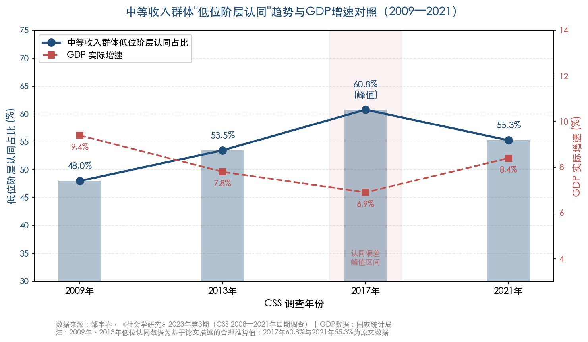

**图 5-2　中等收入群体"低位阶层认同"趋势与 GDP 增速对照（2009—2021）。** 柱状图（左轴）展示低位阶层认同占比从 2009 年约 48.0% 攀升至 2017 年峰值 60.8%，2021 年回落至 55.3%；折线（右轴）为同期 GDP 实际增速。数据来源：邹宇春《社会学研究》2023 年第 3 期；国家统计局。

这一数据表明，2017 年有超过六成的中等收入群体认为自己不属于中间阶层，而是属于更低的阶层。即便到 2021 年有所改善，仍有超过半数的中等收入群体存在认同向下偏移。邹宇春的研究进一步发现，时期效应（宏观社会经济环境变化）是影响阶层认同偏差的最主要因素，年龄效应较弱——低位认同并非个体心理特质，而是对宏观社会环境的集体性反应。

### 5.6.2 "客观中产、主观底层"的多维成因

李培林、张翼基于 2006 年中国社会状况调查数据的早期研究已揭示了中产认同偏移的结构性特征：以收入、职业和教育三个维度综合界定，中国中产阶级在全国占 12.1%，在城市社会中占 25.4%，但各客观阶层的主观认同结构总体呈下偏型 [中国社科院/《社会》期刊](https://html.rhhz.net/society/html/2008-02-001.htm "中国中产阶级的规模、认同和社会态度，2008年")。

我们认为，中产群体持续的"低位阶层认同"可从以下四个维度加以解释：

其一，**参照系偏差**。社交媒体时代使个体更频繁地暴露在高消费、高品质生活方式的信息流中，形成向上比较的认知偏差。年收入 30 万元的家庭在统计意义上已属于中等偏上群体，但在朋友圈和短视频平台的信息环境中，仍可能产生"不够"的主观感受。

其二，**刚性支出的挤压效应**。如本章前述，房贷、教育、医疗三项刚性支出合计可占据中产家庭可支配收入的 50% 以上，使"账面收入"与"实际可自由支配收入"之间存在巨大落差。一个税前年收入 40 万元的一线城市家庭，扣除房贷月供、子女教育费用和基本生活开支后，真正"自由"的现金流可能不足年收入的 20%。

其三，**向下流动的恐惧**。"35 岁门槛"、行业裁员潮、房产贬值等风险持续存在，使中产群体对自身阶层地位的稳定性缺乏信心。低位阶层认同在一定程度上是一种心理防御机制——通过降低自我期待来对冲潜在的向下流动风险。

其四，**社会保障的不充分**。如 5.4 节分析，养老金替代率不足、商业保险覆盖深度有限、医疗自付比例偏高等制度性因素，使中产群体无法获得与其收入水平相匹配的安全感。在缺乏充分社会保障"托底"的情况下，中产身份在本质上是一种"无保障的中间状态"。

## 5.7 综合判断：中产脆弱性的四重结构

综合以上分析，我们认为中国中产阶层的"脆弱性"并非某个单一因素所致，而是四重结构性压力的叠加效应。

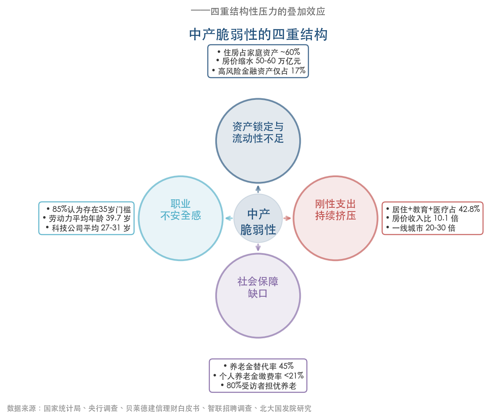

**图 5-3　中产脆弱性的四重结构示意图。** 资产锁定与流动性不足、刚性支出持续挤压、社会保障缺口、职业不安全感四重压力相互交织，共同构成中产阶层的"脆弱性方程"。各维度标注关键数据。数据来源：国家统计局、央行调查、贝莱德建信理财白皮书、智联招聘调查、北大国发院研究。

**第一重：资产锁定与流动性不足。** 如第 4 章所述，中产家庭约六成资产凝固在住房中，金融资产占比偏低且以低风险品种为主，可自由支配的流动性资产极为有限。2022 年以来房价深度调整导致的 50—60 万亿元财富蒸发，使"账面中产"进一步远离"可支配中产"。

**第二重：刚性支出的持续挤压。** 居住、教育、医疗三项刚性支出合计占消费支出超过 42%，若叠加房贷月供，中产家庭的"固定成本"可占收入的 50%—70%。这种高固定成本结构意味着中产家庭对收入波动的抗压能力极弱——一次裁员、一场大病或一轮房价下跌，均可能将家庭推入财务困境。

**第三重：社会保障的缺口。** 养老金替代率 45%（远低于国际警戒线 55%），商业健康险虽覆盖约 7.5 亿人但长期保障不足，个人养老金制度参与率极低。中产群体在应对重大风险时，主要依赖自身储蓄而非制度性保障网络。

**第四重：职业不安全感的制度化。** "35 岁门槛"使中产身份具有内在的"时间限制"，劳动力老龄化趋势与年龄歧视之间的矛盾日益尖锐。科技行业的极端年轻化文化进一步加剧了中年中产的职业焦虑。

这四重结构性压力相互交织、彼此强化，共同构成了中国中产阶层的"脆弱性方程"。它解释了为何超过半数的中等收入群体不认为自己属于中间阶层——其低位认同并非出于谦虚或信息不对称，而是对自身结构性脆弱处境的一种准确感知。

# 第6章 中产扩容的路径与前景——政策方向、国际经验与趋势研判

前五章依次呈现了中国社会阶层的分析框架、收入分配全景、中产定义之争、中产家庭资产负债结构以及中产群体面临的多重生活压力。至此，一个关键问题亟待回答：面对底部庞大的"金字塔型"收入结构，中国中等收入群体能否在未来十年内实现规模性扩容？本章从政策顶层设计、先行示范实践、国际经验镜鉴和前瞻性情景分析四个维度，系统评估中产扩容的可行路径、结构性障碍与趋势研判。

## 6.1 政策框架："共同富裕"与"扩中"的顶层设计

### 6.1.1 从"4 亿"到"8 亿"：战略目标的确立

中等收入群体扩容已上升为国家战略的核心议题。2021 年 8 月，中央财经委员会第十次会议明确提出"构建初次分配、再分配、三次分配协调配套的基础性制度安排"，将形成"橄榄型分配结构"确立为共同富裕的目标形态 [求是网](https://www.qstheory.cn/dukan/qs/2021-10/15/c_1127959447.htm "共同富裕战略部署")。2022 年 11 月，习近平在 APEC 工商领导人峰会上进一步提出"使中等收入群体在未来 15 年超过 8 亿"的量化目标——以 2022 年为基点，即到约 2037 年，中等收入群体需从约 4 亿人翻倍至 8 亿人以上 [国务院新闻办](http://www.scio.gov.cn/gxzl/srxxxjptzglz/srjd/202511/t20251117_939320.html "扩大中等收入群体规模")。

这一目标的战略含义极为深远。第 3 章的分析已表明，按国家统计局口径（三口之家年收入 10 万—50 万元），2018 年中等收入群体约 3.8 亿人，占总人口 27%。从 4 亿到 8 亿的翻倍，意味着中等收入群体占比需从约 27% 提升至约 57%——这将从根本上重塑中国收入分配的"金字塔型"结构，推动其向"橄榄型"社会大幅迈进。值得注意的是，2025 年中国总人口已降至约 14.05 亿人且仍处于缓慢下行通道，人口总量收缩客观上有助于提高中等收入群体的占比，但核心挑战仍在于收入增长的普惠性与分配结构的实质性改善。

### 6.1.2 "十五五"规划的制度部署

2026 年 3 月通过的"十五五"规划纲要在第四十二章设置专节"稳步扩大中等收入群体规模"，明确部署"制定实施城乡居民增收计划，有效增加低收入群体收入，提高中等收入群体比重，推动形成橄榄型分配格局"，并提出"聚焦重点群体精准实施增收政策" [新华网](https://www.news.cn/politics/20260313/085af5de5a4b4268aa7d87d90817df2f/c.html "十五五规划纲要全文")。

规划同时在初次分配层面明确"提高居民收入在国民收入分配中的比重，提高劳动报酬在初次分配中的比重"。这一表述直指中国收入分配的结构性痼疾——长期以来劳动报酬占 GDP 比重偏低。据 KPMG 2026 年 3 月发布的"十五五"宏观趋势展望报告，中国劳动者报酬占 GDP 比重近年维持在约 52%—53%，低于发达经济体普遍 55%—65% 的水平 [KPMG报告](https://assets.kpmg.com/content/dam/kpmgsites/cn/pdf/zh/2026/03/the-macro-trends-and-prospects-of-the-15th-five-year-plan.pdf.coredownload.inline.pdf "十五五规划宏观趋势展望")。提高劳动报酬占比，是扩大中等收入群体最为直接的初次分配路径。

在城镇化层面，"十五五"规划部署"完善超大特大城市积分落户，探索全国统一人口管理制度，逐步实现常住地登记户口"，推进农业转移人口市民化进程 [新华网](https://www.news.cn/politics/20260313/085af5de5a4b4268aa7d87d90817df2f/c.html "十五五规划第三十一章")。截至 2025 年末，中国常住人口城镇化率为 67.89%，而户籍城镇化率不足 50%，二者之间约 18 个百分点的缺口对应着约 2.5 亿"半城镇化"人口——这一群体在城市工作和生活，却无法平等享受城市公共服务和社会保障 [国家统计局2025年统计公报](https://view.inews.qq.com/a/20260228A02HU700 "2025年常住人口城镇化率67.89%")。

### 6.1.3 四大重点人群的精准施策

"扩中"战略聚焦四大重点人群：高校毕业生、技术工人、中小企业主和个体工商户、进城农民工 [求是网](https://www.qstheory.cn/dukan/qs/2021-10/15/c_1127959447.htm "习近平关于共同富裕的重要论述")。这四类群体构成了中等收入群体扩容的核心潜力池。

**高校毕业生**是最具人力资本优势的群体。2026 届高校毕业生规模预计达 1270 万人（同比增加 48 万），连续创历史新高 [教育部数据](https://news.hsw.cn/system/2025/1120/1888245.shtml "2026届毕业生规模1270万")。高等教育扩张与劳动力市场需求之间的结构性矛盾日益突出：大量毕业生涌入白领岗位市场，导致初始薪酬增长乏力、就业质量下降。第 5 章所述的"内卷"现象，在高校毕业生群体中尤为严峻。若就业匹配度持续恶化，这一群体的收入增长潜力将被压制，其向中等收入群体的转化速度也将相应放缓。

**技术工人**是制造业升级的关键支撑力量。"十五五"规划强调完善技能人才培养激励机制。浙江共同富裕示范区在技工教育方面率先探索，实施"技工教育提质增量行动"，以技术工人收入倍增带动中等收入群体扩容 [浙江省共同富裕示范区实践材料](https://zjjcmspublic.oss-cn-hangzhou-zwynet-d01-a.internet.cloud.zj.gov.cn/jcms_files/jcms1/web3185/site/attach/0/19a23f3a6bfb425999523baadf75ef24.pdf "浙江示范区第一批最佳实践")。

**农民工**是规模最大的潜力人群。2024 年全国农民工总量约 2.997 亿人（约 3 亿），月均收入突破 4900 元；2025 年农民工人均月收入达 5075 元（+2.3%），年化约 6.09 万元 [2025年统计公报](https://www.stats.gov.cn/sj/zxfb/202602/t20260228_1962662.html "2025年农民工月均收入5075元")。以三口之家计算，若仅有一名成员外出务工，家庭年收入约 6 万元，距国家统计局 10 万元的中等收入下限仍有约 40% 的差距。农民工群体要大规模进入中等收入行列，不仅需要收入持续快速增长，更需要户籍制度改革、社会保障覆盖和技能提升的系统性制度支撑。

农业转移人口市民化的推进面临深层困境。"十四五"期间超过 4000 万农业转移人口在城镇落户，但三分之二以上农民工不愿在城镇落户，陷入"愿落不能落、能落不愿落"的两难——大城市落户门槛高，中小城市公共服务质量不足以构成吸引力；与此同时，地方政府每吸纳 1 名转移人口的财政净损失约 5500 元，财政激励不足制约了地方推进市民化的积极性 [人民论坛](http://paper.people.com.cn/rmlt/pc/content/202601/15/content_30137715.html "农业转移人口市民化困境分析")。

## 6.2 先行示范：浙江共同富裕实验的经验与启示

### 6.2.1 浙江"扩中提低"的目标与成效

浙江作为全国唯一的高质量发展建设共同富裕示范区，其"扩中提低"实践为全国中产扩容提供了最具参考价值的经验样本。2022 年 2 月发布的《浙江省"扩中""提低"行动方案》设定了明确的量化目标：到 2025 年，家庭年可支配收入 10 万—50 万元群体比例达到 80%，20 万—60 万元群体比例达到 45% [浙江省发展改革委](https://finance.sina.cn/2022-02-17/detail-ikyakumy6522128.d.html "扩中提低行动方案核心指标")。该目标体系以家庭为单位进行政策集成，涵盖"8+9"即八大实施路径和九类重点群体。

2025 年的数据显示，浙江在缩小收入差距方面取得了显著进展。2025 年浙江全体居民人均可支配收入突破 7 万元大关，达 70240 元；城镇居民人均可支配收入 81649 元、农村居民 45154 元，城乡居民收入倍差进一步缩小至 1.81（较 2020 年的 1.96 持续下降），连续 13 年呈缩小态势。城镇和农村居民人均可支配收入分别连续第 25 年和第 41 年居全国各省区首位 [潮新闻](https://tidenews.com.cn/news.html?id=3352736 "浙江2025年居民收入数据")。

从"十四五"整体来看，浙江省生产总值连续跨越 7 万亿、8 万亿、9 万亿三个台阶，年均增长 5.9%；人均地区生产总值从 2020 年的 10.5 万元提高到 2025 年的约 14 万元 [浙江省经济信息中心](https://zjic.zj.gov.cn/ywdh/qyfz/202603/t20260316_23992860.shtml "浙江十四五共同富裕实践成效")。经济总量的快速扩张为居民增收提供了坚实的物质基础。

### 6.2.2 浙江经验的核心机制

浙江"扩中提低"的经验可概括为三个核心机制。

其一，**民营经济驱动的就业创业扩容**。浙江民营经济贡献了全省约 65% 的 GDP 和 80% 以上的就业岗位。活跃的中小企业和个体工商户生态，使浙江在同等人均 GDP 水平下拥有更高比例的创业型中产群体——这是其与依赖大型国企或外资省份最本质的差异。

其二，**城乡融合发展缩小差距**。浙江持续深化"千万工程"，2025 年村集体经济经营性收入 50 万元以上的行政村占比达 68%，和美乡村覆盖率达 73% [浙江省经济信息中心](https://zjic.zj.gov.cn/ywdh/qyfz/202603/t20260316_23992860.shtml "千万工程阶段性成效")。农村产业结构的多元化和公共服务均等化推动农村居民收入增速持续高于城镇，城乡收入倍差从 2020 年的 1.96 降至 2025 年的 1.81。

其三，**以家庭为单位的政策集成改革**。浙江率先将政策瞄准从个人转向家庭，通过家庭收入综合核算精准识别"扩中"目标家庭，实施涵盖技能培训、创业扶持、社保覆盖、住房保障等多维度的集成政策 [浙江省经济信息中心](https://zjic.zj.gov.cn/zjjjzz/202412/202501/t20250114_23183977.shtml "以家庭为单位的政策集成改革经验")。

### 6.2.3 浙江经验的可复制性边界

浙江经验具有重要的示范价值，但其可复制性存在明确边界。浙江 2025 年人均 GDP 约 14 万元（接近 2 万美元），远高于全国平均水平（约 1.28 万美元）；民营经济基础雄厚、城镇化率领先、城乡收入差距在全国处于最低水平。对于中西部省份而言，缺乏浙江式密集的民营经济生态、完善的基层治理网络和较高的初始收入基数，直接移植"扩中提低"方案的难度不容低估。

我们认为，浙江经验的核心启示并不在于具体的政策工具组合，而在于两个底层逻辑：一是将经济增长的增量优先向中低收入群体传导（通过就业创业扩容而非单纯转移支付），二是以城乡融合发展而非单向城镇化来缩小收入差距。这两条逻辑对全国具有普遍适用性。

## 6.3 国际镜鉴：日本"一亿总中流"与拉美"中等收入陷阱"

中产扩容并非线性上升的必然过程。国际经验表明，不同的制度安排和政策路径可以导致截然不同的结局——东亚的日本与韩国曾成功实现大规模中产社会建设，而拉美国家则长期深陷结构性不平等的陷阱。图 6-1 直观呈现了这四种路径的历史分化轨迹。

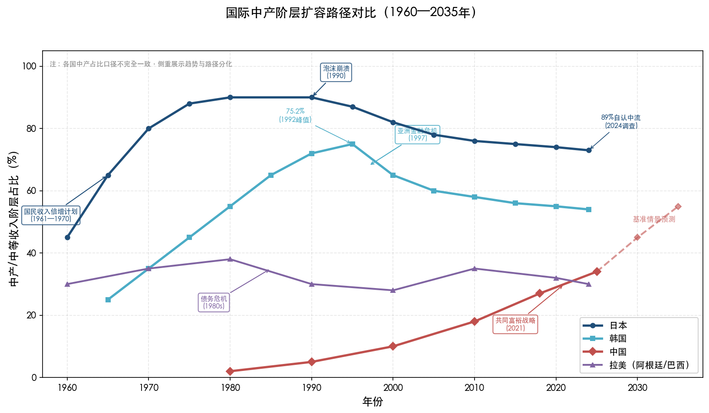

### 6.3.1 日本经验：工资与 GDP 同步增长的黄金法则

日本"一亿总中流"（一亿総中流）的崛起与瓦解，是理解中产扩容路径最具参考价值的东亚案例。

1961—1970 年间，日本实施"国民收入倍增计划"，工人工资与 GDP 实现同步增长。这一时期，劳动者报酬占国民收入比重从 49.3% 升至 60.2%——约十年内提高了近 11 个百分点，构成中产阶层快速扩容的核心引擎。与此同时，1961 年《国民年金法》实现全民保险，社会保障体系的全覆盖从制度层面消除了因病致贫的风险 [国家信息中心](https://www.sic.gov.cn/sic/81/456/0726/8278_pc.html "日本国民收入倍增计划对中国的启示")。到 1970 年代，约 90% 的日本国民在政府调查中自认为"中流"阶层——这成为人类现代史上最成功的中产社会建设范本之一。

日本内阁府"国民生活に関する世論調査"持续追踪国民的阶层自我认知。最新的 2024 年 8 月调查显示，认为自己生活程度属于"中の上"的比例为 14.2%，"中の中"为 46.7%，"中の下"为 28.1%，三者合计 89.0%；自认"上"为 1.7%，"下"为 8.7% [日本内阁府](https://survey.gov-online.go.jp/living/202412/r06/r06-life/ "令和6年国民生活世论调查")。值得注意的是，与历史高峰期相比，"中の下"比例从此前约 22%—25% 上升至 28.1%，表明中产底层边界正在下移。

1990 年代泡沫经济崩溃后，日本"一亿总中流"走向解体。中国社科院日本研究所的研究指出，日本社会从"一亿总中流"逐步滑入"差距社会"和"M 型社会"：到 2002 年，年收入 600 万日元以下群体已占八成 [中国社科院日本研究所](http://ijs.cssn.cn/xsyj/xslw/rbsh/202007/t20200706_5152055.shtml "从一亿总中流到差距社会的演变")。"M 型社会"的特征是中产阶层向两极分化——上层中产向上流动进入富裕阶层，下层中产则跌落为低收入群体，中间层持续塌陷。

日本经验对中国的核心启示在于：中产扩容的黄金法则是劳动报酬与 GDP 同步增长；全民社会保障是中产阶层稳定存在的制度底座；而资产泡沫（尤其是房地产泡沫）的破裂，是中产阶层最致命的系统性风险——这与第 4 章所分析的中国中产家庭"房产锁定效应"和近年来 50—60 万亿元的房产价值蒸发形成了令人警觉的呼应。

### 6.3.2 韩国经验：产业升级驱动的阶层跃迁

韩国是 1960 年以来为数不多成功跨越中等收入阶段的经济体之一。从基尼系数看，韩国在快速工业化时期成功实现了"增长与公平并进"：基尼系数从 1980 年的 0.39 持续下降至 1995 年的 0.28，始终控制在 0.4 的国际警戒线以下。到 1992 年，韩国中产阶级在全社会中的比重高达 75.2% [中国发展观察](https://cdo.develpress.com/?p=6504 "韩国跨越中等收入陷阱的经验分析")。

韩国的关键经验在于：以出口导向的产业政策驱动技术升级和劳动生产率提升，同时通过教育普及和技能培训将劳动生产率的提升传导为工资的同步增长。1960 年代至 1990 年代，韩国完成了从劳动密集型产业向资本和技术密集型产业的三次转型升级，每一次产业转型都伴随着大批蓝领工人向技术工人和白领阶层的跃迁。

1997 年亚洲金融危机后，韩国同样经历了中产阶层的萎缩。劳动力市场的"双轨制"（正规就业与非正规就业之间的巨大待遇差距）和财阀经济对中小企业的挤压，导致中产阶层的底部边界持续下移。这一教训清晰地提示：中产扩容并非不可逆的线性过程——在缺乏制度性保护的条件下，中产阶层可以在经济冲击中迅速瓦解。

### 6.3.3 拉美教训：结构性不平等的固化陷阱

拉美国家的经历构成了中产扩容的反面教材。阿根廷、巴西等国自 1960 年代即为中等收入国家，但 60 多年过去仍未迈入发达行列。中国社科院拉美研究所的分析指出，拉美中等收入陷阱的核心症结在于结构性不平等的固化：1950 年拉美劳动生产率为欧盟的 76%，到 2018 年已降至 41%（同期韩国从 21% 升至 88%）；2021 年，拉美最富 10% 人口占据 77% 的家庭财富，而最贫 50% 仅占 1% [中国社科院拉美研究所](http://ilas.cass.cn/xschengguo/qtchengguo/202503/t20250320_5859039.shtml "拉美中等收入陷阱的结构性根源")。

拉美教训的核心在于：当经济增长的成果被极少数精英阶层攫取，中产阶层的扩容便失去物质基础。与此同时，拉美国家普遍存在的"过早去工业化"和"初级产品依赖"，使劳动生产率长期停滞，中等收入群体的收入增长缺乏产业支撑。

对中国而言，拉美教训的警示意义体现在两个层面：第一，收入分配的公平性必须与经济增长同步推进——中国 2024 年基尼系数 0.465 仍高于 0.4 的国际警戒线，且自 2015 年以来在 0.462—0.468 区间窄幅波动，改善势头明显趋缓 [国家统计局国家数据](https://data.stats.gov.cn/search.htm?s=gini "2024年居民收入基尼系数0.465")；第二，产业升级和劳动生产率提升是中产扩容不可替代的根基，任何脱离实体经济的"扩中"路径都难以持续。

## 6.4 关键障碍：中产扩容的四大结构性挑战

国际经验与国内实践均表明，中产扩容的推进并非一帆风顺，四大结构性障碍构成了最为突出的制约因素。

### 6.4.1 城乡二元结构与户籍壁垒

城乡分割是中国中等收入群体扩容最根本的结构性障碍。2025 年城镇居民人均可支配收入 56502 元，农村居民 24456 元，城乡收入比仍高达 2.31 [国家统计局2025年居民收入数据](https://www.stats.gov.cn/xxgk/sjfb/zxfb2020/202601/t20260119_1962321.html "2025年城乡居民收入数据")。尽管这一比值较 2008 年的 3.14 已有显著下降，但约 2.5 亿"半城镇化"农民工仍面临公共服务不均等的系统性困境。户籍改革的核心矛盾在于：放开落户需配套教育、医疗、住房等公共服务供给，而地方财政的承压能力有限——"愿落不能落、能落不愿落"的困境短期内难以根本突破。

### 6.4.2 社会保障体系的碎片化

社会保障体系的碎片化严重削弱了中产阶层的稳定性。基本医保省级统筹 2025 年 11 月才正式部署，灵活就业和新业态就业群体（占农民工半数以上）大多数未缴纳城镇职工社保 [国家医保局](https://www.nhsa.gov.cn/art/2025/12/26/art_14_19144.html "推进基本医保省级统筹部署")。第 5 章的分析表明，社保覆盖不足是中产家庭"脆弱性"的制度根源——一场大病、一次失业即可将"边缘中产"打回低收入群体。日本"一亿总中流"的形成，恰恰以 1961 年全民年金和全民健保为制度底座。中国社会保障从省级统筹向全国统筹的推进进程，直接关系到中产阶层扩容的质量与稳定性。

### 6.4.3 房地产深度调整的持续冲击

第 4 章详述了 2021 年以来房地产市场深度调整对中产家庭资产负债表的冲击。蚂蚁集团研究院估算，2022 年至 2024 年 8 月，仅房产价值缩水即达 50—60 万亿元，人均财富净值下降约 4—5 万元。对于房产占总资产 59.1% 的城镇家庭而言，房价下行直接侵蚀了中产阶层的财富基础。更为关键的是，房产价值缩水通过"负财富效应"抑制消费意愿，形成"资产缩水—消费收缩—经济放缓—收入增长乏力"的负反馈循环。日本"失去的三十年"和拉美的前车之鉴均警示：资产泡沫破裂后的中产阶层修复是一个漫长而痛苦的过程。

### 6.4.4 劳动力市场的双重结构性矛盾

劳动力市场的双重结构性矛盾制约着中产扩容的速度。一方面，2024 年城镇非私营单位平均工资 124110 元与私营单位 69476 元之间 1.79:1 的倍差持续存在，且非私营单位工资增速（+2.8%）高于私营（+1.7%），体制内外差距仍在扩大 [国家统计局2024年工资数据](https://www.stats.gov.cn/zwfwck/sjfb/202505/t20250516_1959826.html "2024年城镇单位就业人员平均工资")。另一方面，高校毕业生规模连创新高（2026 届 1270 万人），但高端就业岗位供给增长有限，结构性就业矛盾日益突出。即便人力资本存量持续扩大，若劳动力市场无法提供足够的中高收入岗位，中产扩容将面临"出口瓶颈"。

## 6.5 潜力测算：刘世锦团队的"扩中路径"量化分析

国务院发展研究中心原副主任刘世锦团队在《管理世界》2022 年第 8 期发表的研究，是目前对中国中等收入群体扩容路径最为系统的量化分析。该研究按国家统计局口径（2018 年价格），确认 2018 年中等收入群体约占总人口 27%、规模约 3.8 亿人；低收入群体占比超过 70%、规模在 10 亿人左右。

刘世锦团队的核心测算结论为：假定 GDP 年均增长 5.0%，到 2030 年中等收入群体比重可升至 51%、规模达 7.5 亿人（较 2018 年新增 3.7 亿人），到 2035 年前有望达到 8—9 亿人。在潜在增量人群的结构中，城镇居民占 57%，乡村居民占 31%，外来务工人员占 11% [21经济网](http://www.21jingji.com/article/20211106/37a65e5d6d8757a141479e994e54d473.html "刘世锦团队扩中路径研究")。

2026 年 3 月，刘世锦在"十五五"展望文章中进一步提出，基尼系数应努力降至 0.4 以下，中等收入群体需从目前的 4 亿人扩大至 8 亿—10 亿人 [新浪财经](https://finance.sina.cn/zl/2026-03-25/zl-inhsecse6970027.d.html "刘世锦十五五新增长框架展望")。这一目标较 2022 年的研究更为进取，折射出学术界对中产扩容战略紧迫性的共识在进一步强化。

需要指出的是，刘世锦团队的测算建立在两个关键假设之上：一是 GDP 保持年均 5% 的增速，二是收入分配结构在增长过程中持续改善（即低收入群体的收入增速快于高收入群体）。2025 年中国 GDP 实际增速为 5.0%，第一个假设在中短期内具有一定现实基础，但面临人口下降、房地产调整、外部不确定性加大等中长期下行压力。第二个假设则要求制度性改革持续推进——单纯依赖经济增长而不改善分配结构，按相对标准衡量的中产比例将几乎保持不变（如第 3 章所述，李实教授的研究表明，以相对标准测算，近十年中国中等收入群体占比长期维持在 40% 左右）。

## 6.6 情景分析：2026—2030 年中等收入群体的三种前景

基于以上分析，我们围绕 GDP 增速、户籍改革力度、劳动报酬占 GDP 比重、社保统筹覆盖率四个核心变量，构建乐观、基准、悲观三种情景，对 2030 年中等收入群体的规模进行前瞻性判断（图 6-2）。

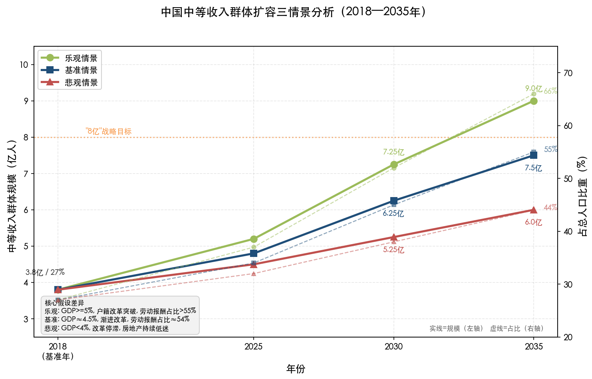

### 6.6.1 乐观情景：制度突破驱动的加速扩容

**假设条件**：GDP 年均增速保持 5% 以上；户籍改革取得实质性突破，常住人口城镇化率与户籍城镇化率差距缩小至 10 个百分点以内；劳动报酬占 GDP 比重提升至 55% 以上；基本养老保险和基本医保全国统筹基本实现。

**判断**：在此情景下，到 2030 年中等收入群体（国家统计局口径）规模可达 7—7.5 亿人，占总人口比重约 51%，与刘世锦团队的测算上限基本一致。城镇化推进释放的消费潜力、社保全覆盖带来的预防性储蓄下降、劳动报酬占比提升带来的初次分配改善，三者将形成良性叠加效应。

**概率评估**：我们认为此情景的实现概率较低。户籍制度的全面改革涉及地方财政承压和公共服务供给能力的系统性重构，在"十五五"期间取得根本性突破的可能性有限；GDP 年均 5% 以上的增速在人口总量下降和外部环境复杂化的条件下亦面临较大挑战。

### 6.6.2 基准情景：渐进改革下的稳步扩容

**假设条件**：GDP 年均增速约 4.5%；户籍改革渐进推进，常住人口城镇化率与户籍城镇化率差距从约 18 个百分点缩小至约 14 个百分点；劳动报酬占 GDP 比重小幅提升至约 54%；基本养老保险全国统筹和基本医保省级统筹基本落实，但灵活就业群体覆盖率提升有限。

**判断**：到 2030 年，中等收入群体规模约 6—6.5 亿人，占总人口比重约 43%—47%。绝对标准下的中产扩容主要依赖经济增长的自然"溢出效应"——居民收入持续增长使更多家庭跨过 10 万元门槛，但收入分配结构本身未发生根本性改善。

**概率评估**：我们判断此情景最为可能。这一路径延续了近十年的政策节奏——渐进式改革取得边际进展但未根本打破体制性障碍，经济增长保持中高速但面临持续放缓压力。

### 6.6.3 悲观情景：增长放缓叠加改革停滞

**假设条件**：GDP 年均增速降至 4% 以下；户籍改革和社保统筹推进缓慢；房地产市场持续低迷，资产价值进一步缩水；劳动报酬占 GDP 比重未有实质提升；外部经济环境显著恶化。

**判断**：到 2030 年，中等收入群体规模约 5—5.5 亿人，占总人口比重约 36%—40%。经济增长放缓直接压制居民收入增速，房价持续下行进一步侵蚀中产家庭的财富基础，"边缘中产"向下滑落的风险显著加大。以相对标准衡量，中产占比甚至可能出现下降——中产阶层并非在扩容，而是在萎缩。

**概率评估**：此情景的实现概率取决于外部冲击的烈度与政策应对的力度。若中美经贸摩擦持续升级、国内消费信心难以有效恢复、房地产市场未能止跌企稳，这一情景的概率将显著上升。

## 6.7 前景判断：中产扩容的"窗口期"与关键变量

综合政策框架、国际经验和情景分析，我们对中国中等收入群体扩容的前景作出以下五项研判。图 6-3 直观展示了四个核心变量当前的达标进度与差距。

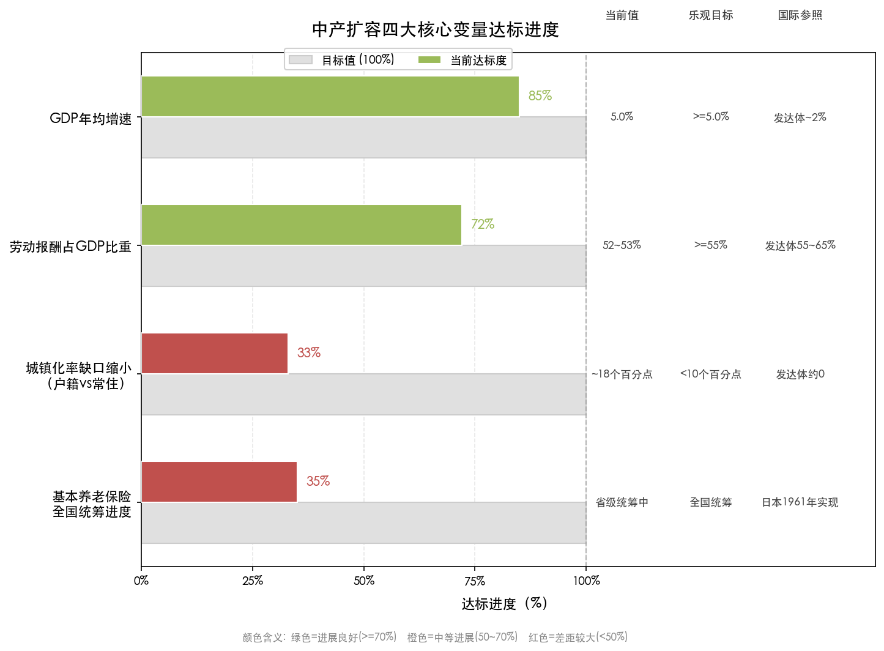

**第一，"十五五"期间（2026—2030 年）是中产扩容的关键窗口期。** 这一判断基于三个时间性因素：一是"十五五"规划已将"扩中"上升为制度性安排，政策窗口已经打开；二是中国城镇化率仍有提升空间（从 67.89% 到 75% 左右），城镇化带来的收入跃升效应尚未耗尽；三是高等教育毛入学率持续提升形成的人力资本积累，将在未来五至十年逐步转化为收入增长的动力。一旦错过这一窗口期，随着人口总量持续下降和老龄化加速，中产扩容的难度将显著上升。

**第二，扩容的核心路径在于提高劳动报酬占 GDP 比重，而非单纯依赖转移支付。** 日本"国民收入倍增计划"的成功与拉美再分配政策的失败均表明，初次分配的改善是中产扩容最可持续的动力源。中国劳动报酬占 GDP 比重约 52%—53%，与日本 1960 年代初的 49.3% 处于相近区间。若能在"十五五"期间推动这一比重提升 2—3 个百分点，将对中等收入群体的规模产生显著的边际效应。

**第三，社保全覆盖是中产"稳盘"的制度底座。** 日本和韩国的经验表明，中产阶层的稳定存在不仅取决于收入水平，更取决于社会保障体系对下行风险的缓冲能力。当前中国灵活就业群体和新业态就业群体的社保覆盖率严重偏低，即便有更多人口的收入跨过了中等收入门槛，其中相当一部分仍面临因病致贫、因失业返贫的系统性风险——这些人是"统计中产"而非"稳定中产"。

**第四，房地产市场的企稳是短期内最关键的单一变量。** 第 4 章的分析表明，中国城镇家庭 59.1% 的资产凝固在住房之中，50—60 万亿元的房产价值蒸发已对中产家庭的资产负债表造成严重冲击。在基准情景下，即便收入端的扩容取得进展，若房地产市场持续低迷导致资产端继续缩水，中产阶层的"体感财富"和消费信心仍将承压。房地产市场何时止跌企稳，在相当程度上决定着中产扩容的节奏与质量。

**第五，从"4 亿"到"8 亿"的目标实现时间预计需延至 2035 年之后。** 在基准情景下，2030 年中等收入群体规模约 6—6.5 亿人，距 8 亿目标仍有 1.5—2 亿人的缺口。考虑到人口总量下降趋势（国家统计局数据显示 2025 年末全国总人口约 14.05 亿人，较上年减少约 140 万人），到 2037 年总人口可能降至 13.6—13.8 亿人左右，8 亿人的绝对目标对应的占比需达到 58%—59%。这一目标在基准情景下更可能在 2035—2040 年间实现，而非原定的 2037 年前后。

# 结论与风险提示

## 核心结论

本报告基于国家统计局、中国人民银行、国际机构及学术研究的多源数据，对中国各阶层收入财务状况和中产阶层的特征进行了系统考察，形成以下核心判断。

**第一，中国社会阶层结构在收入维度上仍呈"金字塔型"，距"橄榄型"社会存在显著差距。** 2025年五等分分组数据显示，低收入组约2.8亿人月均可支配收入不足850元，高收入组与低收入组倍差达10.22倍，中间收入组的人均水平（35536元）尚未达到全国均值（43377元）。以陆学艺框架审视，"上层"和"中上层"（合计约占人口9%—10%）对应五等分高收入组的上半部分，而约八成人口仍处于"中下层"及以下。基尼系数自2015年起在0.462—0.468区间窄幅波动，分配格局处于相对固化的均衡状态。

**第二，"中产"的定义差异导致人数估算跨度达8倍，严谨分析不应依赖单一口径。** 从中国社科院李春玲四维标准的约1.1亿人，到国家统计局绝对标准的约4亿人，再到皮尤全球标准的约7.07亿人，同一个中国的"中产"人数因口径不同而截然各异。我们判断，社会学意义上的中产阶层——同时满足职业地位、教育水平、收入区间和消费模式等多维标准的群体——规模约在1.5亿—2.5亿人之间。官方"4亿中等收入群体"中相当一部分家庭仅刚跨过收入门槛，其真实生活状态与公众认知中的"中产"之间存在显著落差。

**第三，中国中产阶层最突出的结构性特征是"房产锁定效应"和资产配置的单一性。** 城镇家庭约59.1%的资产凝固在住房之中（美国仅28%），金融资产占比仅20.4%，且83%集中于银行存款和低风险理财。这一资产结构使中产家庭的财富高度绑定于房地产市场——2021年以来50—60万亿元的房产价值蒸发直接冲击了以房产为主体资产的中产家庭，"账面中产"与"可支配中产"之间的裂隙急剧扩大。一线城市中产呈"高资产、高负债、低流动性"特征，二三线城市中产资产规模较小但现金流更健康，两类中产生活在截然不同的财务生态中。

**第四，中产阶层的"脆弱性"源于四重结构性压力的叠加。** 资产锁定与流动性不足（住房占比约60%，金融资产以低风险品种为主）、刚性支出持续挤压（居住+教育+医疗占消费支出超42%）、社会保障缺口（养老金替代率约45%，远低于国际警戒线55%）、职业不安全感的制度化（"35岁门槛"与劳动力老龄化的结构性矛盾），四重压力相互交织导致超过半数中等收入群体不认同自身中产身份。中产阶层在中国当前语境下本质上是一种"无充分保障的中间状态"。

**第五，"十五五"期间（2026—2030年）是中产扩容的关键窗口期，但实现路径面临多重障碍。** 在基准情景下（GDP年均增速约4.5%、户籍改革渐进推进、社保统筹稳步落实），2030年中等收入群体规模约6—6.5亿人，官方"8亿"目标更可能在2035—2040年间实现。扩容的核心路径在于提高劳动报酬占GDP比重（当前约52%—53%，低于发达经济体55%—65%）和推进社会保障全覆盖，而非单纯依赖经济增长的自然"溢出"或转移支付。房地产市场的企稳是短期内影响中产扩容节奏的最关键单一变量。

**第六，国际经验提供了路径参照，也标示了风险警戒线。** 日本"一亿总中流"的崛起证明劳动报酬与GDP同步增长、全民社保覆盖是中产社会建设的两大基石，其泡沫崩溃后的"失去的三十年"则警示资产泡沫破裂对中产阶层的毁灭性冲击。拉美国家长期深陷中等收入陷阱，核心在于增长成果被极少数精英攫取、劳动生产率长期停滞。中国当前的基尼系数（0.465）仍高于国际警戒线（0.4），房地产调整仍在持续——兼顾增长与公平、避免"拉美化"的分配陷阱，是未来十年的核心政策考验。

## 局限性分析

**第一，阶层分类与收入数据的口径不可直接对接。** 本报告试图将陆学艺"十大阶层"框架与国家统计局的五等分收入分组、行业工资、岗位工资等数据体系进行对接映射，但两套分类体系在设计逻辑和数据采集方式上存在根本差异。各阶层收入区间的估算属于基于多源数据的推断性映射，而非精确的直接测量，读者在使用相关数据时须注意这一口径限制。

**第二，资产负债数据的时效性存在约束。** 本报告中产家庭资产结构分析的核心微观数据来源——中国人民银行2019年城镇居民家庭资产负债调查——距今已逾六年。此间中国房地产市场经历了从高位到深度调整的剧烈变化，居民金融资产规模和结构亦发生显著变化。尽管本报告以蚂蚁集团研究院、NIFD、中指研究院等机构的近期研究对关键数据进行了更新补充，但系统性、官方口径的微观资产负债数据仍存在时效性缺口。

**第三，农村和低收入群体的分析深度相对有限。** 本报告以"中产"为核心研究对象，对城镇中等收入及以上群体的分析较为充分，但对约2.8亿低收入组人口和广大农村居民的收入来源结构、资产状况、消费行为的考察深度不足。完整的中国社会阶层图景需要对底层群体给予同等的分析关注。

**第四，主观认同数据的覆盖时段和样本代表性存在局限。** 关于阶层主观认同的分析主要依赖CSS调查2008—2021年数据，最新时点为2021年。2021年以来中国经济环境发生了显著变化（房地产深度调整、疫情冲击后的恢复期），中产群体的阶层认同和心理预期可能已发生进一步变化，本报告对此无法做出基于实证的判断。

**第五，情景分析的假设具有内在不确定性。** 第6章构建的乐观、基准、悲观三种情景分析，对GDP增速、户籍改革进度、劳动报酬占比变化和社保覆盖率提升等核心变量进行了参数假设。这些假设基于现有政策趋势和历史数据的合理外推，但任何中长期预测都面临宏观经济环境变化、政策调整和外部冲击等多重不确定性，实际演变路径可能偏离任一预设情景。
