# 执行摘要

本报告对全球综合实力前十的保险公司——伯克希尔·哈撒韦、联合健康、中国平安、安联、安盛、中国人寿、苏黎世保险、慕尼黑再保险、忠利集团和大都会人寿——进行了系统性横向比较研究。遴选依据为 Forbes Global 2000（2025 版）、Fortune Global 500 和 A.M. Best 全球排名的交叉验证结果。研究围绕资本实力与信用基本面、2021–2025 年经营增长轨迹、股东回报与分红实绩、中国市场发展潜力四大核心维度展开深度分析，并在此基础上构建五维度加权评分模型，筛选出最有可能在未来全球资产排名中保持或提升领先地位的 2–3 家公司。

**核心发现与判断如下：**

**资本实力呈现三档分化。** 伯克希尔以约 3,340 亿美元现金储备和四大评级机构最高档评级构成行业最坚固的资本堡垒；慕尼黑再保险 Solvency II 充足率 287% 位居十家公司之首；安联（Solvency II 209%、Aa1 评级）和中国平安（总资产 17,752 亿美元、综合偿付能力 204%）同属第一梯队。联合健康因 Debt-to-Capital 达 43.9% 且评级展望被下调至负面，资本压力在十家公司中最为突出。

**五年增长路径显著分化。** 慕尼黑再保险以净利润 CAGR 约 20.8% 领跑全行业，安联经营利润五年连创新高至 174 亿欧元（核心 ROE 18.1%），苏黎世保险核心 ROE 达 26.9%（十家之最）——三家欧洲公司构成增长质量第一梯队。联合健康营收 CAGR 11.7% 虽为最高，但 2024–2025 年净利润连续下滑暴露出增长质量隐忧。中国平安经历 2022–2023 年寿险改革阵痛后强劲反弹，新业务价值（NBV）增长 29.3%。

**股东回报以欧洲保险公司最为突出。** 慕尼黑再保险 DPS 五年增长 118.2%、累计 TSR 约 180%，均居十家公司之首。安联五年 TSR 约 150%，忠利集团约 168%，三家欧洲公司的"渐进式分红+系统性回购"模式展现了最优的资本回报纪律。中国人寿 DPS 五年实际下降 4.9%，分红稳定性在十家公司中最弱。

**中国市场是重塑未来全球排名的关键变量。** 2025 年中国保险业保费达 6.12 万亿元人民币（同比+7.4%），增速数倍于欧美成熟市场，健康险冲刺万亿保费、养老第三支柱政策驱动和新能源车险高速增长构成三大结构性赛道。安联是外资中牌照最齐全的保险集团（独资保险控股+寿险+财险+资管+养老），2024 年入股国民养老保险公司标志着其中国战略的实质性深化。

**综合评估与推荐。** 基于五维度加权评分模型（资本实力 25%、增长动能 25%、中国市场潜力 20%、股东回报 15%、战略前瞻性 15%），我们推荐三家最有可能在未来全球资产排名中实现持续跃升的公司：**安联**（综合得分 8.85，五维均衡无短板，"欧洲基盘+全球扩张+中国深耕"路线）、**中国平安**（综合得分 8.55，17,752 亿美元资产基数叠加中国市场结构性红利，"本土纵深+科技赋能+生态闭环"路线）和**慕尼黑再保险**（综合得分 8.10，净利润 CAGR 约 20.8% 为行业之冠，"全球再保龙头+保障缺口红利+利润驱动"路线）。三家公司分别代表三种差异化增长路径，在当前可预见的宏观和行业环境下，均具备在未来 3–5 年内巩固或提升全球资产排名的充分条件。

# 第1章 全球前十保险公司全景画像

## 1.1 遴选依据与排名方法论

评估全球保险公司的"综合实力"并非仅凭单一指标即可完成，而需交叉参照多个权威榜单体系。本报告以三大核心排名为基准，经多维度交叉验证后确定最终十强名单。

**Forbes Global 2000（2025 版）。** 该榜单采用 FactSet 提供的底层数据，按销售额（Sales）、利润（Profits）、资产（Assets）和市值（Market Value）四项指标等权合成综合得分，2025 版数据截至 2025 年 4 月 25 日 [Forbes Global 2000 方法论](https://www.forbes.com/sites/andreamurphy/2024/05/20/the-global-2000-methodology-how-we-crunch-the-numbers/ "Forbes Global 2000排名方法论说明")。Forbes Global 2000 是目前覆盖维度最广的企业综合排名，但须注意其"Sales"口径包含保费收入、投资收入及非保险业务营收。对于 Berkshire Hathaway（大量非保险业务收入）和 UnitedHealth Group（含 Optum 健康服务收入）等综合性集团，不应将其销售额直接等同于保费收入。

**Fortune Global 500（2025 版）。** 该榜单以年度营业收入为单一排名指标，2025 版上榜企业合计创造 41.7 万亿美元营收 [Fortune Global 500 2025](https://finance.yahoo.com/news/fortune-announces-2025-fortune-global-100000878.html "Fortune Global 500 2025版公告")。其优势在于规模可比性强，但对资产和盈利能力的反映不足。

**A.M. Best 全球最大保险公司排名。** 该排名区分"非银行资产（Non-banking Assets）"和"净保费收入（NPW）"两个维度，2026 年 1 月版基于 2024 财年数据编制 [AM Best 2025年1月排名](https://news.ambest.com/newscontent.aspx?refnum=263274 "AM Best: Allianz和UnitedHealth蝉联榜首")。此外，**S&P Global Market Intelligence** 发布的全球 50 大财险/寿险公司排名（2025 版，基于 2024 年数据）亦为重要补充参考 [S&P Global 50大财险公司 2025](https://www.spglobal.com/market-intelligence/en/news-insights/articles/2025/10/the-world-s-largest-property-and-casualty-insurers-2025-93316415 "S&P Global全球50大财险公司排名2025")。

综合 Forbes Global 2000 的多维度综合排名、AM Best 的专业保险维度排名以及 Fortune Global 500 的营收规模指标，我们经交叉验证遴选出以下 10 家"国际综合实力前十"的保险公司。

## 1.2 全球前十保险公司名单

综合三大榜单交叉验证，最终入选的 10 家公司及其 Forbes Global 2000（2025 版）排名如下表所示 [Forbes Global 2000](https://www.forbes.com/lists/global2000/ "2025版Forbes Global 2000完整榜单")：

| 排序 | 公司名称 | 简称 | Forbes 2025 排名 | 总部所在地 | 主营业务线 |
|:---:|---------|------|:---:|---------|---------|
| 1 | Berkshire Hathaway | 伯克希尔 | #2 | 美国·奥马哈 | 财险/再保险、铁路、能源、制造零售 |
| 2 | UnitedHealth Group | 联合健康 | #17 | 美国·明尼苏达 | 健康险（UnitedHealthcare）、健康服务（Optum） |
| 3 | Ping An Insurance | 中国平安 | #27 | 中国·深圳 | 寿险、财险、银行、资管、科技 |
| 4 | Allianz SE | 安联 | #25 | 德国·慕尼黑 | 财险、寿险/健康险、资产管理（PIMCO/AllianzGI） |
| 5 | AXA Group | 安盛 | #44 | 法国·巴黎 | 财险、寿险/健康险、全球再保险 |
| 6 | China Life Insurance | 中国人寿 | #89 | 中国·北京 | 寿险、年金、投资管理 |
| 7 | Zurich Insurance Group | 苏黎世保险 | #70 | 瑞士·苏黎世 | 财险、寿险、Farmers Exchanges |
| 8 | Munich Re | 慕尼黑再保险 | #78 | 德国·慕尼黑 | 再保险、直保（ERGO） |
| 9 | Generali Group | 忠利集团 | #114 | 意大利·里雅斯特 | 寿险、财险、资产管理 |
| 10 | MetLife Inc. | 大都会人寿 | #127 | 美国·纽约 | 团体保险、退休与养老、寿险 |

上述名单在地理分布上兼顾了北美（4 家）、欧洲（4 家）和亚太（2 家）三大区域。Chubb（Forbes #77）和 Tokio Marine Holdings（Forbes #122）同样具备进入十强的竞争力，但在综合资产规模、保费收入量级和全球运营版图等多维指标上，上述 10 家公司的综合实力排位更为突出。

## 1.3 各公司核心财务全景

以下汇总十家公司截至 2024/2025 财年末的核心财务数据，主要来源为 Forbes Global 2000（2025 版）及各公司年报。须特别说明：Forbes 的"Sales"口径为总营收（含投资收入、非保险业务收入等），并非纯保费指标；部分公司总资产包含银行资产（如中国平安含平安银行）。

### 1.3.1 Berkshire Hathaway（伯克希尔·哈撒韦）

Berkshire Hathaway 是全球最大的保险集团之一，同时也是全球最具知名度的多元化控股公司。2024 财年，公司实现总营收 3,714.3 亿美元，净利润 890 亿美元，总资产达 11,538.8 亿美元（约 1.15 万亿美元），市值 11,454.6 亿美元。AM Best 2026 年 1 月版排名中，Berkshire 以 1.15 万亿美元非银行资产超越 Allianz，跃居全球第 1 位 [Insurance Business Magazine](https://www.insurancebusinessmag.com/uk/news/breaking-news/berkshire-hathaway-overtakes-allianz-as-worlds-largest-insurer-561086.aspx "Berkshire Hathaway超越Allianz成为全球最大保险公司")。旗下保险板块涵盖 GEICO（个人车险）、General Re（再保险）和 Berkshire Hathaway Reinsurance Group，同时拥有 BNSF 铁路、Berkshire Hathaway Energy 等大量非保险资产。截至 2024 年末，公司全球员工约 39.2 万人 [Macrotrends](https://www.macrotrends.net/stocks/charts/BRK.A/berkshire-hathaway/number-of-employees "Berkshire Hathaway员工数据")。

### 1.3.2 UnitedHealth Group（联合健康集团）

UnitedHealth Group 是全球营收规模最高的保险/健康服务公司。2024 财年总营收达 4,100.6 亿美元，净利润 221.1 亿美元，总资产 3,097.9 亿美元，市值 3,829.4 亿美元。在 AM Best 排名中，UnitedHealth 连续 11 年蝉联全球净保费收入（NPW）第 1 位，2024 年 NPW 达 3,088 亿美元（同比+6.2%）。业务分为 UnitedHealthcare（保险板块）和 Optum（健康服务板块）两大体系，后者涵盖 OptumHealth、OptumInsight 和 OptumRx 三大子板块，是营收增长的核心引擎。截至 2024 年末，全球员工约 40 万人 [Stock Analysis](https://stockanalysis.com/stocks/unh/employees/ "UnitedHealth Group员工数据")。

### 1.3.3 Ping An Insurance（中国平安）

中国平安是中国规模最大的综合金融集团之一，也是以总资产衡量的全球最大保险集团。2024 财年总营收约 1,580 亿美元（人民币约 1.14 万亿元），净利润 176.1 亿美元，总资产高达 17,752.3 亿美元（含平安银行资产），市值 1,072.7 亿美元 [平安集团官网](https://group.pingan.com/media/news/2025/pingan-ranks-27th-on-forbes-global-2000-List.html "平安集团2025年Forbes Global 2000排名第27")。业务覆盖寿险、财险、银行、证券、资产管理、科技金融等全牌照体系，零售客户数达 2.42 亿，累计科技专利超过 55,000 件。截至 2024 年末，集团员工约 27.3 万人 [Stock Analysis](https://stockanalysis.com/quote/sha/601318/employees/ "中国平安员工数据")。

### 1.3.4 Allianz SE（安联集团）

Allianz 是欧洲最大的保险集团，按非银行资产衡量位居全球第二。2024 财年总营收 1,674.7 亿美元，净利润 105.9 亿美元，总资产 10,816.6 亿美元（约 1.09 万亿美元），市值 1,575.5 亿美元。AM Best 排名中，Allianz 以 1.09 万亿美元非银行资产位居全球第 2 位。业务分为财产险、寿险/健康险和资产管理三大板块，旗下 PIMCO 和 AllianzGI 管理资产总额居全球顶级水平。集团业务覆盖全球超过 70 个国家，截至 2024 年末全球员工约 15.7 万人 [Macrotrends](https://www.macrotrends.net/stocks/charts/ALIZY/allianz-se/number-of-employees "Allianz员工数据")。

### 1.3.5 AXA Group（安盛集团）

AXA 是全球第五大保险集团，总部位于巴黎。2024 财年总营收 1,168.4 亿美元，净利润 83.1 亿美元，总资产 6,769.7 亿美元，市值 1,003.3 亿美元。集团在全球约 50 个国家运营，截至 2024 年末全球员工约 11.8 万人 [AXA 官方](https://www.axa.com/en/about-us/people-and-culture "AXA员工数据")。业务线覆盖财产险、寿险/健康险和资产管理，近年来战略重心逐步向财产险和健康险倾斜——2024 年已完成旗下 AXA IM（资产管理业务）向 BNP Paribas 的出售交易，标志着集团聚焦核心承保业务的战略转型进入新阶段。

### 1.3.6 China Life Insurance（中国人寿）

中国人寿是中国寿险行业的龙头企业，同时也是按非银行资产衡量的全球第三大保险集团。2024 财年总营收 553.5 亿美元（人民币约 3,800 亿元），净利润 148.6 亿美元，总资产 9,477 亿美元（人民币约 6.77 万亿元），市值 510.1 亿美元。2024 年总保费达 6,714.57 亿元人民币，稳居中国寿险行业第一，内含价值超 1.4 万亿元。截至 2024 年末，上市公司层面员工约 9.8 万人 [Yahoo Finance](https://finance.yahoo.com/quote/2628.HK/profile/ "中国人寿公司概况")。

### 1.3.7 Zurich Insurance Group（苏黎世保险集团）

苏黎世保险是瑞士最大的保险集团，服务网络覆盖全球超过 200 个国家和地区。2024 财年总营收 854.6 亿美元，净利润 58.2 亿美元，总资产 4,021.7 亿美元，市值 975.4 亿美元。主营财产险和寿险两大板块，在北美市场通过 Farmers Exchanges 管理大量业务量。截至 2024 年末，集团全球员工约 6.4 万人 [Macrotrends](https://www.macrotrends.net/stocks/charts/ZURVY/zurich-insurance-group/number-of-employees "苏黎世保险员工数据")。

### 1.3.8 Munich Re（慕尼黑再保险集团）

慕尼黑再保险是全球规模最大的再保险公司，同时通过旗下 ERGO 集团开展直保业务。2024 财年总营收 749.6 亿美元，净利润 61.5 亿美元，总资产 2,966.9 亿美元，市值 894.5 亿美元。再保险业务覆盖财产/意外险和寿险/健康险两大领域，在全球风险分散与巨灾保障领域占据不可替代的核心地位。截至 2024 年末，集团全球员工约 4.4 万人 [Munich Re 官方](https://www.munichre.com/en/company/about-munich-re/facts-figures.html "Munich Re公司概况")。

### 1.3.9 Generali Group（忠利集团）

忠利集团是意大利最大、欧洲第三大保险集团，拥有近 200 年经营历史。2024 财年总营收 885.6 亿美元，净利润 40.3 亿美元，总资产 5,577.7 亿美元，市值 552.8 亿美元。集团在欧洲市场深耕多年，业务涵盖寿险、财产险和资产管理三大领域（资管规模超 8,630 亿欧元），服务全球约 7,500 万客户。截至 2024 年末，全球员工约 8.8 万人 [Generali 2024全年业绩](https://www.generali.com/media/press-releases/all/2025/Consolidated-Results-as-of-31-December-2024 "忠利2024年全年业绩")。

### 1.3.10 MetLife Inc.（大都会人寿）

大都会人寿是美国最大的人寿保险公司之一，业务遍及全球约 40 个国家。2024 财年总营收 709.9 亿美元，净利润 44.3 亿美元，总资产 6,774.6 亿美元，市值 512.2 亿美元。核心业务涵盖团体保险（Group Benefits）、退休与养老解决方案（Retirement and Income Solutions）以及亚太、拉美等区域市场的个险业务。截至 2024 年末，全球员工约 4.5 万人 [Macrotrends](https://www.macrotrends.net/stocks/charts/MET/metlife/number-of-employees "MetLife员工数据")。

## 1.4 核心财务数据横向对比

下表以美元统一口径汇总十家公司 2024 财年核心财务指标（数据来源：Forbes Global 2000 2025 版），按总资产规模降序排列：

| 公司 | 总营收（亿美元） | 净利润（亿美元） | 总资产（亿美元） | 市值（亿美元） | 全球员工（万人） |
|------|:---:|:---:|:---:|:---:|:---:|
| 中国平安 | 1,580.0 | 176.1 | 17,752.3 | 1,072.7 | ~27.3 |
| 伯克希尔 | 3,714.3 | 890.0 | 11,538.8 | 11,454.6 | ~39.2 |
| 安联 | 1,674.7 | 105.9 | 10,816.6 | 1,575.5 | ~15.7 |
| 中国人寿 | 553.5 | 148.6 | 9,477.0 | 510.1 | ~9.8 |
| 大都会人寿 | 709.9 | 44.3 | 6,774.6 | 512.2 | ~4.5 |
| AXA | 1,168.4 | 83.1 | 6,769.7 | 1,003.3 | ~11.8 |
| 忠利 | 885.6 | 40.3 | 5,577.7 | 552.8 | ~8.8 |
| 苏黎世保险 | 854.6 | 58.2 | 4,021.7 | 975.4 | ~6.4 |
| 联合健康 | 4,100.6 | 221.1 | 3,097.9 | 3,829.4 | ~40.0 |
| 慕尼黑再保险 | 749.6 | 61.5 | 2,966.9 | 894.5 | ~4.4 |

下图以气泡图形式呈现十家公司在总资产（横轴）、净利润（纵轴）和市值（气泡大小）三个维度上的分布关系，并以颜色区分北美、欧洲和中国三大区域归属：

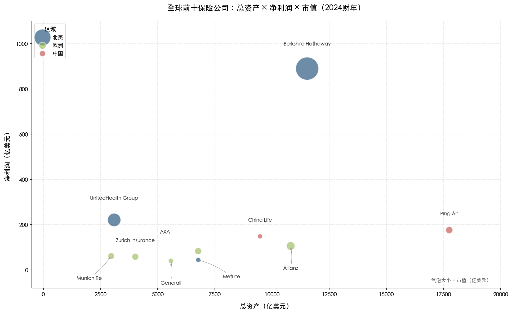

下图进一步以水平柱状图对比十家公司的总营收与净利润绝对值，更直观地展示各公司的规模差距：

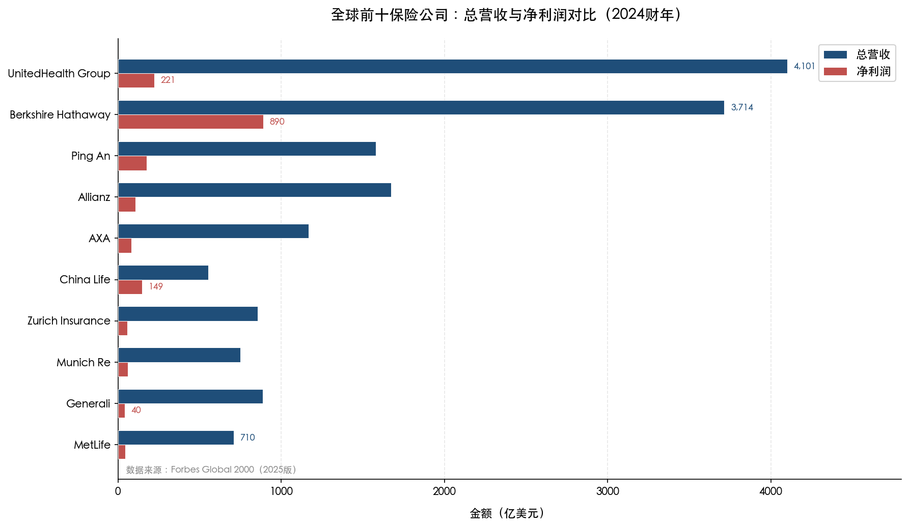

从以上数据与图表可以归纳出几个突出特征：

**资产端的两极分化显著。** 中国平安以 1.78 万亿美元总资产位居首位，但其中包含平安银行资产（约占总资产 40% 以上），纯保险口径资产远低于此数值。伯克希尔和安联的非银行资产均超过 1 万亿美元，分别位居全球第一和第二 [AM Best 2025年1月排名](https://news.ambest.com/newscontent.aspx?refnum=263274 "AM Best排名数据")。与之形成鲜明对比的是，慕尼黑再保险总资产仅约 2,967 亿美元，但作为全球再保险龙头，其资产利用效率极高。

**营收结构差异巨大。** 联合健康以 4,100.6 亿美元营收独占鳌头，但其中超过一半来自 Optum 健康服务板块而非传统保费收入。伯克希尔 3,714.3 亿美元营收同样包含铁路、能源、制造等非保险收入。若仅以保费收入口径（GWP/NWP）衡量，行业竞争格局将有显著差异。

**利润率分化明显。** 伯克希尔 890 亿美元的净利润独树一帜，但须注意其 GAAP 净利润包含大量未实现投资损益，年度间波动极为剧烈。联合健康净利润 221.1 亿美元排名第二，中国平安（176.1 亿美元）和中国人寿（148.6 亿美元）紧随其后，体现了 2024 年中国资本市场回暖对保险公司投资端利润的显著提振。

**市值与资产规模并不完全对应。** 伯克希尔市值高达 1.15 万亿美元，与其总资产规模几乎持平，这在保险行业中极为罕见，折射出资本市场对巴菲特投资理念的长期溢价认可。联合健康市值 3,829.4 亿美元，市净率远高于传统保险公司，反映了市场对其健康服务生态的增长预期。而中国人寿总资产近万亿美元，市值仅 510.1 亿美元，市净率显著偏低，折射出国际资本市场对中国保险股的系统性估值折价。

## 1.5 全球保险市场格局定位

将上述十家公司置于全球保险行业的宏观版图中审视，有助于更清晰地把握其市场地位与竞争生态。

**全球保险市场总量。** 2024 年全球保险业保费总规模约 7.0 万亿欧元（约 7.7 万亿美元），同比增长 8.6%；其中非寿险保费约 4.6 万亿美元，寿险保费约 3.1 万亿美元 [Allianz Global Insurance Report 2025](https://www.allianz.com/content/dam/onemarketing/azcom/Allianz_com/economic-research/publications/specials/en/2025/may/2025-05-27-global-insurance-report.pdf "安联全球保险报告2025年5月版") [Swiss Re sigma 2/2025](https://www.swissre.com/institute/research/sigma-research/sigma-2025-02-world-insurance-riskier-fragmented-world.html "Swiss Re sigma 2/2025")。全球保险渗透率从 2022 年的 7.1% 升至 2024 年的 7.4%，反映出保险需求在经济复苏周期中的稳步提升。

**区域分布格局。** 2024 年，北美市场占全球保费的约 47.9%，西欧占 22.2%，亚洲（含中日）占 23.6%，中国单独约占 10.8%。过去十年间，中国保费在全球的份额从 5.1% 跃升至 10.8%，翻了一倍有余 [Allianz Global Insurance Report 2025](https://www.allianz.com/content/dam/onemarketing/azcom/Allianz_com/economic-research/publications/specials/en/2025/may/2025-05-27-global-insurance-report.pdf "安联全球保险报告2025年5月版")。下图展示了 2024 年全球保费的区域分布结构，并标注十强公司在各区域的主场归属：

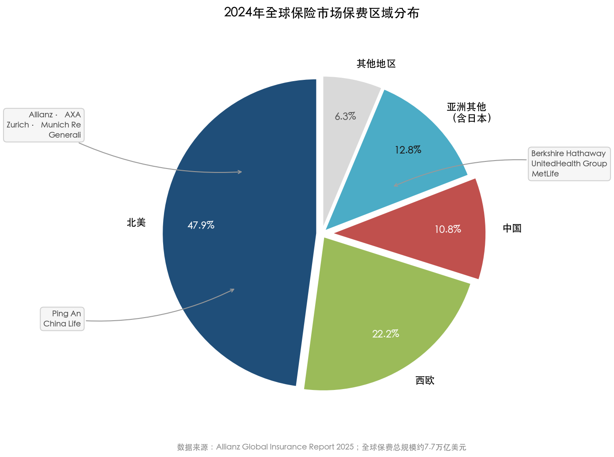

**增长前景。** Swiss Re sigma 2/2025 预测，2025 年全球保费实际增速将从 2024 年的 5.2% 放缓至 2%，2026 年小幅回升至 2.3%，主要受全球经济增速放缓和贸易政策不确定性拖累 [Swiss Re sigma 2/2025](https://www.swissre.com/institute/research/sigma-research/sigma-2025-02-world-insurance-riskier-fragmented-world.html "Swiss Re sigma 2/2025: 全球保险2025展望")。分险种看，非寿险保费增速预计从 2024 年的 4.7% 放缓至 2025 年的 2.6%，寿险则从 6.1% 回落至 1%。

**十强公司的区域覆盖与业务互补性。** 从区域分布看，十家公司在全球三大保险市场（北美、西欧、中国）中形成了高度互补的竞争格局：

- **北美主导型**：伯克希尔、联合健康和大都会人寿以北美为核心市场。伯克希尔通过 GEICO 和再保险板块辐射全球，联合健康几乎完全聚焦美国健康险市场。
- **欧洲全球化型**：安联、安盛、苏黎世保险、慕尼黑再保险和忠利均以欧洲为根基，但全球化程度最高——安联在超过 70 个国家运营，慕尼黑再保险通过全球再保合同渗透几乎所有主要保险市场。
- **中国本土型**：中国平安和中国人寿以中国大陆为绝对主场，国际化程度相对有限，但受益于中国作为全球第二大保险市场的结构性增长红利。

从业务线角度看，十家公司的主营结构亦呈现显著差异化：联合健康专注于健康险/健康服务，慕尼黑再保险以再保险为核心，伯克希尔和中国平安是高度多元化的综合性集团，其余公司则在寿险/财险的传统保险业务领域各有侧重。这种业务结构的差异化意味着，在不同的宏观环境和市场周期中，十家公司的业绩表现将呈现不同的弹性与韧性特征。后续章节将围绕资本实力与信用基本面、经营增长与承保绩效、股东回报与分红实绩、中国市场发展潜力等维度展开深入比较分析。

# 第2章 资本实力与信用基本面

## 2.1 资本结构与偿付能力全景

保险公司的资本实力构成其承保能力、风险缓冲与长期竞争力的根基。与一般工商企业不同，保险公司的"杠杆"主要体现为保险负债——即保单持有人的未来赔付义务——而非传统的银行贷款或债券融资。因此，评估十家公司的资本结构，需同时关注三个核心维度：偿付能力充足率（Solvency Ratio / RBC Ratio）、负债端杠杆水平（Debt-to-Capital 或 Debt-to-Equity）以及现金及流动性储备的厚度。

### 2.1.1 偿付能力充足率横向比较

十家公司分处四种不同的监管体系——欧洲公司适用 Solvency II 框架、中国公司适用偿二代（C-ROSS Phase II）、美国公司适用 RBC 体系、瑞士公司适用 SST。各体系在资本认定标准、风险权重设定和贴现率选取等方面存在显著差异，直接进行跨体系数值比较存在方法论局限。尽管如此，各体系均以"实际资本/最低资本要求"作为核心指标，因此偿付能力充足率的相对高低仍具有可比参考价值。

截至 2024 年末（或最近可得报告期），十家公司的偿付能力状况如下：

| 公司 | 监管体系 | 偿付能力充足率 | 较上年变化 | 备注 |
|:---|:---:|:---:|:---:|:---|
| 慕尼黑再保险 | Solvency II | 287% | +20pp | 合格自有资金 542.5 亿欧元 |
| 苏黎世保险 | SST | 253% | +19pp | 显著高于 200% 监管下限 |
| 安盛 | Solvency II | 216% | -11pp | 仍处于目标区间上端 |
| 忠利集团 | Solvency II | 210% | -10pp | 2025 年末回升至 219% |
| 安联 | Solvency II | 209% | -20pp | 截至 2025 年 9 月维持 209% |
| 中国平安 | C-ROSS II（综合） | 204.06% | -3.97pp | 核心充足率 165.22%（+4.94pp） |
| 中国人寿 | C-ROSS II（综合） | 183.94% | — | 核心充足率 137.50% |
| 联合健康 | RBC | ~230% | -20pp | 2024 年末估计值，较 2023 年约 250% 下降 |
| 大都会人寿 | RBC | >360% | — | 高于公司 360% 目标，2023 年为 407% |
| 伯克希尔 | RBC/法定盈余 | — | — | 合并法定盈余约 3,100 亿美元，无可比单一比率 |

*来源：[Munich Re 评级与偿付能力](https://www.munichre.com/en/company/investors/ratings-and-solvency.html "慕再评级与偿付能力数据")；[Zurich 2024 FCR](https://www.zurich.com/media/news-releases/2025/2025-0429-01 "苏黎世保险2024 FCR")；[AXA 2024 SFCR](https://www-axa-com.cdn.axa-contento-118412.eu/www-axa-com/e93f668b-d77c-4809-87a8-57140adf9e77_axa_sfcr_2024_va.pdf "AXA 2024偿付能力报告")；[Generali 2024 全年业绩](https://www.generali.com/media/press-releases/all/2025/Consolidated-Results-as-of-31-December-2024 "忠利2024年全年业绩")及[Generali 2025 全年业绩](https://www.generali.com/doc/jcr:b2b5f8a5-caa1-4153-bd44-a504ab8b8a9c/03.12%2520PR_Generali%2520Consolidated%2520Results%25202025.pdf "忠利2025全年业绩新闻稿")；[Allianz 2024 年报](https://www.allianz.com/en/investor_relations/announcements/ir_announcements/250228.html "安联2024全年业绩公告")；[平安 2024 偿付能力报告](https://group.pingan.com/resource/pingan/IR-Docs/2025/pingan-ar24-solvency-report.pdf "平安集团2024年度偿付能力摘要报告")；[中国人寿 2024 年报](https://www.hkexnews.hk/listedco/listconews/sehk/2025/0423/2025042300417.pdf "中国人寿2024年报HKEx")；[UnitedHealth Group 2025 年报](https://www.unitedhealthgroup.com/content/dam/UHG/PDF/investors/2025/unh-reports-2025-results-and-issues-2026-outlook.pdf "2025全年业绩报告")；[MetLife 2024 全年业绩](https://investor.metlife.com/news/news-details/2025/MetLife-Announces-Full-Year-and-Fourth-Quarter-2024-Results/default.aspx "MetLife 2024年报")。*

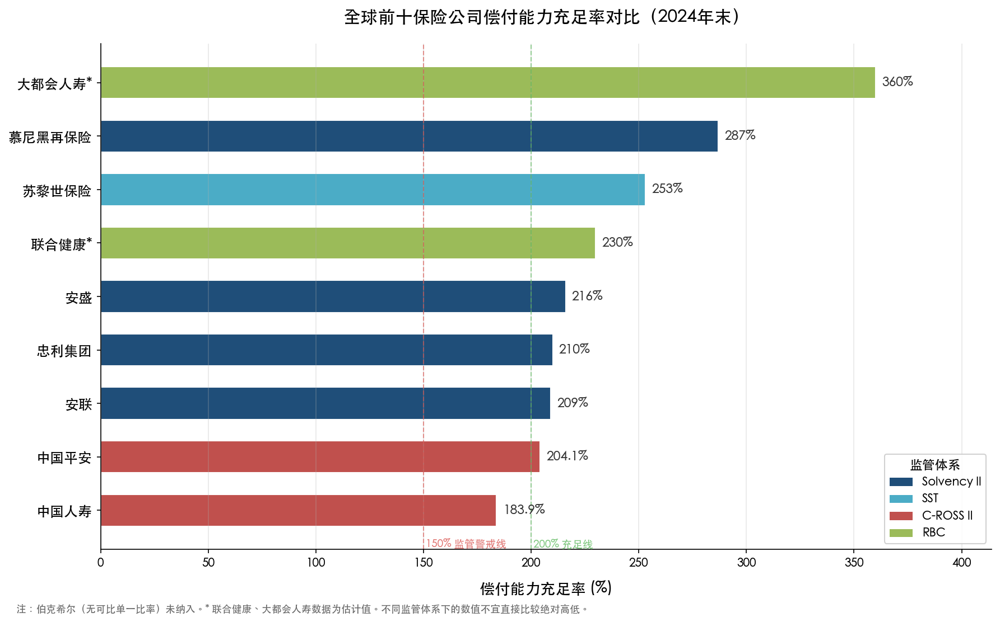

*图 2-1：九家可比公司的偿付能力充足率水平（伯克希尔因无可比单一比率未纳入），按监管体系以颜色区分。虚线标注 200% 充足基准线。*

从上表及图 2-1 可以归纳出以下重要发现：

**欧洲再保险与专业保险公司偿付能力最为充裕。** 慕尼黑再保险以 287% 的 Solvency II 比率位居十家公司之首，合格自有资金达 542.5 亿欧元，为其在极端巨灾年份维持承保能力和股东回报提供了厚实的缓冲垫 [Munich Re 官方](https://www.munichre.com/en/company/investors/ratings-and-solvency.html "慕再偿付能力页面")。苏黎世保险 SST 比率达 253%（同比+19pp），同样处于行业领先区间 [Zurich 2024 FCR](https://www.zurich.com/media/news-releases/2025/2025-0429-01 "苏黎世保险2024 FCR")。两家公司偿付能力的同步改善，折射出 2023—2024 年高利率环境对固定收益资产估值的正面影响，叠加承保盈利的持续积累效应。

**欧洲综合保险集团普遍处于 200%—220% 区间。** 安盛（216%）、忠利（210%）与安联（209%）均落在各自 Solvency II 目标区间内，但较 2023 年均有不同程度回落——主要原因在于丰厚的股东分红和资本回购消耗了部分自有资金。忠利集团 2025 年末偿付能力已回升至 219%，显示其内生资本补充能力依然强韧 [Generali 2025 全年业绩](https://www.generali.com/doc/jcr:b2b5f8a5-caa1-4153-bd44-a504ab8b8a9c/03.12%2520PR_Generali%2520Consolidated%2520Results%25202025.pdf "忠利2025全年业绩新闻稿")。

**中国两家公司偿付能力结构呈现分化。** 中国平安综合偿付能力充足率为 204.06%（同比-3.97pp），但核心偿付能力充足率从 160.28% 提升至 165.22%（+4.94pp），实际资本达 17,996 亿元人民币，核心充足率的改善主要源于留存利润增厚和资产端结构优化 [平安 2024 偿付能力报告](https://group.pingan.com/resource/pingan/IR-Docs/2025/pingan-ar24-solvency-report.pdf "报告摘要")。中国人寿核心偿付能力充足率仅 137.50%，综合偿付能力充足率 183.94%——虽略高于行业核心充足率均值（135.1%），但综合充足率低于行业均值 197.4%，资本充裕程度在十家公司中相对偏低 [国家金融监督管理总局](https://www.nfra.gov.cn/en/view/pages/ItemDetail.html?docId=1187723&itemId=983 "NFRA 2024Q3监管统计")。偿二代二期（C-ROSS Phase II，2022 年实施）对保险公司资本认定标准显著收紧，是中国公司充足率数值整体低于欧洲同行的重要制度性因素。

**美国公司资本充足但衡量口径特殊。** 伯克希尔以约 3,100 亿美元合并法定盈余和超过 3,340 亿美元的现金及等价物，构建了行业最强的"堡垒式"资产负债表 [Berkshire Hathaway 10-K](https://www.sec.gov/Archives/edgar/data/1067983/000095017025025210/brka-20241231.htm "2024年年报SEC 10-K文件")，但集团层面并无类似 Solvency II 的统一比率可供横向比较。大都会人寿 RBC 比率估计高于公司 360% 内部目标（2023 年实际值为 407%），在美国寿险行业中居于上游水平 [MetLife 2024 全年业绩](https://investor.metlife.com/news/news-details/2025/MetLife-Announces-Full-Year-and-Fourth-Quarter-2024-Results/default.aspx "MetLife 2024年报")。联合健康的 RBC 约为 230%（2024 年末估计），较 2023 年的 250% 明显下滑，与 2024 年发生的 Change Healthcare 网络安全事件及医疗成本率（MCR）升至 88.9% 直接相关 [UnitedHealth Group 2025 年报](https://www.unitedhealthgroup.com/content/dam/UHG/PDF/investors/2025/unh-reports-2025-results-and-issues-2026-outlook.pdf "2025全年业绩报告")。

### 2.1.2 负债端杠杆与现金储备

偿付能力充足率之外，资产负债表的杠杆结构与流动性储备同样是衡量财务稳健性的关键指标。

**伯克希尔杠杆水平在十家公司中最低。** 截至 2024 年末，伯克希尔 Debt-to-Equity Ratio 约 0.19，持有超过 3,340 亿美元现金及等价物（含短期国债），现金规模约相当于其全部保险浮存金（约 1,710 亿美元）的两倍 [Berkshire Hathaway 10-K](https://www.sec.gov/Archives/edgar/data/1067983/000095017025025210/brka-20241231.htm "2024年年报")。这意味着即使遭遇极端巨灾赔付情景，伯克希尔亦无需进行外部融资即可覆盖全部潜在损失。

**联合健康财务杠杆在十家公司中最高。** 截至 2025 年末，联合健康 Debt-to-Capital Ratio 达 43.9%，总债务约 783.9 亿美元 [UnitedHealth Group 2025 年报](https://www.unitedhealthgroup.com/content/dam/UHG/PDF/investors/2025/unh-reports-2025-results-and-issues-2026-outlook.pdf "2025全年业绩报告")。较高的杠杆水平源于其健康服务（Optum）板块大规模并购所积累的债务，亦是 2025 年评级机构下调其展望的重要驱动因素之一。

**欧洲保险公司杠杆处于中等水平。** 安联截至 2024 年末 Debt-to-Equity Ratio 约 1.03 [AlphaQuery](https://www.alphaquery.com/stock/ALIZY/fundamentals/annual/debt-equity-ratio "Allianz D/E Ratio")，安盛的 Debt-to-Equity Ratio 约为 0.58—0.65 区间 [FinanceCharts](https://www.financecharts.com/stocks/AXAHF/value/debt-to-equity-ratio "AXA D/E Ratio")。需指出的是，保险公司在 IFRS 和 Solvency II 框架下对次级债务的分类介于"负债"与"权益"之间，不同数据源给出的 D/E 比率可能因口径差异而有所不同。安联 2024 年发行了 10 亿欧元次级债券以优化资本结构；安盛则因出售 AXA IM 获得充裕资金，于 2025 年启动了 38 亿欧元的特别股份回购计划 [AXA 官方回购页面](https://www.axa.com/en/investor/share-buyback-programs "Share buy-back programs")，充分彰显其资本充裕度。

**大都会人寿 Debt-to-Capital 约 33%—34%** [MetLife 2024 全年业绩](https://investor.metlife.com/news/news-details/2025/MetLife-Announces-Full-Year-and-Fourth-Quarter-2024-Results/default.aspx "MetLife 2024年报")，杠杆水平适中，与其 AA-级信用评级相匹配。

## 2.2 融资渠道多元化比较

融资渠道的多元化程度直接决定了保险公司在不同市场环境下补充资本的灵活性与成本效率。十家公司在融资策略上呈现显著分化。

**伯克希尔：内生资本为王。** 伯克希尔的融资模式在行业中独树一帜——几乎完全依赖内生资本和保险浮存金。截至 2024 年末，其保险浮存金约 1,710 亿美元，这一"零成本甚至负成本"的资金池构成了公司最核心的资本来源。2025 年，伯克希尔罕见地在日本市场发行了约 3,001 亿日元（约 20 亿美元）高级票据，这是其少有的外部债务融资举动，主要服务于日本股票投资组合的日元汇率对冲需求 [Fitch](https://www.fitchratings.com/research/insurance/fitch-affirms-berkshire-hathaway-inc-ratings-outlook-stable-24-11-2025 "Fitch 2025年确认评级报告")。

**大都会人寿：融资工具箱最为完整。** 大都会人寿所运用的融资工具种类在十家公司中最为多元化，涵盖商业票据、高级无担保债券、次级债务、永续优先股（Series A/C/D/E/F/G）以及盈余票据 [MetLife 评级页面](https://www.metlife.com/about-us/corporate-profile/ratings/ "MetLife官方评级与融资工具列表")。这种多层次的资本结构为其在不同利率环境和市场条件下灵活调配资本提供了充足的工具储备。

**中国平安：A+H 双重上市叠加多元工具。** 中国平安的融资渠道涵盖 A 股和 H 股双重上市、保险资本补充债券以及可转债等多种形式。2024 年 7 月，中国平安发行了 35 亿美元 0.875% 可转债（到期 2029 年），为近年来中国保险行业规模最大的可转债发行之一 [平安 2024 偿付能力报告](https://group.pingan.com/resource/pingan/IR-Docs/2025/pingan-ar24-solvency-report.pdf "报告第25页提及可转债发行")。A+H 双重上市使其可同时触达境内外股权融资市场，在人民币资本与外币资本之间灵活切换。

**欧洲保险公司：活跃的次级债发行者。** 安联 2025 年发行约 23.5 亿欧元次级债 [Allianz SE 2025 年报](https://www.allianz.com/content/dam/onemarketing/azcom/Allianz_com/investor-relations/en/results-reports/annual-report/ar-2025/en-allianz-se-annual-report-2025.pdf "安联2025年报")，慕尼黑再保险 2024 年发行 15 亿欧元次级债券 [Munich Re 官方](https://www.munichre.com/en/company/investors/ratings-and-solvency.html "慕再偿付能力页面")。在 Solvency II 框架下，次级债券可计入一级或二级资本，因此欧洲保险公司普遍将次级债作为优化资本结构、提升偿付能力比率的核心工具。安盛与忠利集团同样是次级债市场的常客。

**中国人寿与联合健康的融资特征各有侧重。** 中国人寿主要依赖 A+H 股上市融资与留存利润积累，债务融资工具使用相对审慎。联合健康则大量运用高级无担保债券为并购融资，其 783.9 亿美元的总债务中相当比例源自收购 Optum 体系企业所发行的债务工具。

## 2.3 信用评级全景与近五年变动趋势

信用评级是第三方对保险公司偿付能力与经营稳健性的独立评价。全球四大评级机构——A.M. Best、S&P Global Ratings、Moody's 和 Fitch——所授予的保险财务实力评级（IFS/FSR）直接影响保险公司的再保险对手方信任度、大型商业客户的投保决策以及资本市场融资成本。

### 2.3.1 当前评级汇总

截至 2025 年末至 2026 年第一季度，十家公司的主要保险财务实力评级如下：

| 公司 | S&P IFS | Moody's IFS | Fitch IFS | A.M. Best FSR | 整体评级层级 |
|:---|:---:|:---:|:---:|:---:|:---:|
| 伯克希尔 | AA+/稳定 | Aa1/稳定 | AA+/稳定 | A++/稳定 | 顶级 |
| 安联 | AA/稳定 | Aa1/稳定 | AA/稳定 | A+/稳定 | 顶级 |
| 苏黎世保险 | AA/稳定 | Aa2/稳定 | AA/稳定 | A+/稳定 | 顶级 |
| 慕尼黑再保险 | AA/稳定 | — | AA/稳定 | A+/稳定 | 顶级 |
| 安盛 | AA-/正面 | Aa2/稳定 | AA/稳定 | A+/稳定 | 准顶级 |
| 大都会人寿 | AA-/稳定 | Aa3/稳定 | AA-/稳定 | A+/稳定 | 准顶级 |
| 忠利集团 | —（已撤回） | A2/稳定 | AA-/稳定 | A+/稳定 | 准顶级 |
| 联合健康 | A+/负面 | A2/负面 | — | — | 中上 |
| 中国平安 | A-（财险） | — | — | A/稳定（财险） | 中上 |
| 中国人寿 | A+/稳定 | A1/负面 | A+/稳定 | — | 中上 |

*来源：各评级机构官网及公司官方信息披露。[AXA 官方评级页面](https://www.axa.com/en/investor/financial-strength-ratings "AXA官方财务实力评级")；[Generali 官方评级页面](https://www.generali.com/investors/debt-ratings/ratings "忠利集团官方评级页面")。*

### 2.3.2 近五年评级变动：2025 年成为关键分水岭

2025 年是十家公司信用评级变动最为显著的年份，呈现出"欧洲普升、美国分化、中国承压"的结构性格局。

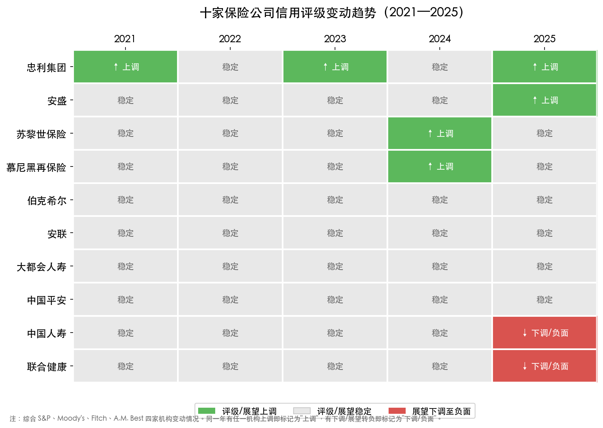

*图 2-2：十家保险公司 2021—2025 年信用评级变动热力图。绿色代表评级/展望上调，灰色代表评级/展望稳定，红色代表展望下调至负面。综合 S&P、Moody's、Fitch、A.M. Best 四家机构变动情况。*

**评级改善最为突出的是忠利集团与安盛。** 忠利集团在 2021—2025 年间获得三家评级机构上调，是同期评级提升幅度最大的公司，反映了其 2021 年启动的"Lifetime Partner 24/27"战略在承保纪律、资本管理和业务结构上的系统性改善 [Generali 官方评级页面](https://www.generali.com/investors/debt-ratings/ratings "忠利集团官方评级页面")。安盛于 2025 年获 Moody's 将 IFS 评级升至 Aa2，A.M. Best 亦上调了其发行人信用评级，多家机构的同步认可确认了安盛聚焦核心业务、退出低回报领域（包括出售 AXA IM）的战略成效 [AXA 官方评级页面](https://www.axa.com/en/investor/financial-strength-ratings "AXA评级页面")。

**苏黎世保险与慕尼黑再保险同样获得评级提升。** Moody's 于 2024 年将苏黎世保险 IFS 评级从 Aa3 升至 Aa2，S&P 于同年将慕尼黑再保险 IFS 评级从 AA- 升至 AA。两家公司的评级改善均受益于持续强劲的承保业绩与偿付能力水平的稳步提升。

**联合健康是 2025 年唯一遭遇评级展望下调的公司。** S&P 和 Moody's 同时将联合健康的展望从"稳定"调整为"负面"，核心驱动因素包括：医疗成本率（MCR）攀升至 88.9%、RBC 比率从约 250% 降至约 230%，以及 2024 年 Change Healthcare 网络安全事件的持续余波 [KFF Health News](https://kffhealthnews.org/morning-breakout/unitedhealth-groups-credit-rating-downgraded-from-stable-to-negative/ "UNH信用展望下调报道")。这标志着联合健康信用趋势的阶段性拐点——若 MCR 未能在 2026 年有效回落，实质性评级下调的可能性将显著上升。

**伯克希尔与安联维持了最高评级的持续稳定。** 伯克希尔在所有四家评级机构均保持最高档评级且展望稳定，安联同样在四家机构中保持 AA 级或等效评级且展望稳定。在五年维度内，这两家公司的评级未发生任何变动，充分体现了其资本结构和经营模式的高度可预测性。

**中国两家公司的评级受主权信用天花板约束。** 中国平安的 S&P 评级仅为 A-（财险子公司），A.M. Best 评级为 A/稳定，评级水平低于其实际资本实力所对应的理论评级，核心原因在于中国主权评级构成了天花板限制。2025 年 A.M. Best 上调了中国平安旗下健康险子公司的评级，体现了对其细分业务能力的认可。中国人寿的 Moody's 评级维持 A1 但展望为"负面"，同样受主权评级展望影响。

## 2.4 品牌价值与市场声誉

信用评级衡量的是保险公司的"硬"实力，品牌价值和客户声誉则构成不可忽视的"软"竞争力。品牌直接影响客户获取成本、保单续期率以及高端人才吸引力。

### 2.4.1 Brand Finance 保险品牌 100 强（2025 版）

根据 Brand Finance 于 2025 年 3 月发布的 Insurance 100 排名，全球前 100 保险品牌的集体品牌价值同比增长 9%。十家公司中有确切排名数据的五家表现如下 [Brand Finance Insurance 100 2025](https://brandfinance.com/press-releases/the-worlds-top-insurance-brands-grow-9-in-2025 "Brand Finance 2025年3月保险100强品牌价值排名")：

| 排名 | 公司 | 品牌价值（亿美元） | 同比变化 | 品牌强度（BSI/评级） |
|:---:|:---|:---:|:---:|:---:|
| 1 | 中国平安 | 336 | 持平 | 86.1/— |
| 2 | 安联 | 267 | +9% | —/— |
| 3 | 安盛 | 198 | — | —/— |
| 4 | 中国人寿 | 183 | — | 93.5/AAA+ |
| 5 | 忠利集团 | 170 | — | —/— |

在品牌价值绝对量上，中国平安以 336 亿美元连续第 9 年蝉联全球保险品牌之首，安联以 267 亿美元（+9%）正在缩小差距。Brand Finance 的品牌强度指数（BSI）排名与品牌价值排名并不完全重合——波兰 PZU 以 BSI 94.4 位居全球最强保险品牌第一，中国人寿以 BSI 93.5/AAA+ 位居第二。二者均为本土市场主导型品牌，高品牌强度源于其在母国市场的极高品牌知名度和客户渗透率 [Brand Finance Insurance 100 2025](https://brandfinance.com/press-releases/the-worlds-top-insurance-brands-grow-9-in-2025 "Brand Finance品牌强度排名")。

### 2.4.2 Interbrand 全球品牌视角

在覆盖全行业的 Interbrand 2025 全球最佳品牌排名中，安联位列第 27 位，连续蝉联保险行业品牌第 1 名 [Insurance Business Magazine](https://www.insurancebusinessmag.com/us/news/breaking-news/allianz-number-one-insurance-brand-once-again-in-interbrands-2025-global-brands-list-553190.aspx "Interbrand 2025 Allianz排名第27")。Interbrand 方法论更侧重全球消费者认知和跨行业比较力，安联在这一维度上的领先地位，体现了其长期赞助体育赛事和文化场馆（如安联球场、安联竞技场等）在全球品牌建设中的持续投资回报。

其余公司未进入 Interbrand 百强榜单，一定程度上反映了保险行业整体品牌全球认知度仍低于科技、消费品等领域的客观现实。

### 2.4.3 客户满意度指标的局限性

J.D. Power 各项保险客户满意度调查（如美国寿险、健康险、财险、理赔满意度等）是北美市场最具权威性的客户体验评估标准。然而，J.D. Power 的详细评分数据为付费内容，且调查范围主要覆盖北美市场，无法为十家全球性公司提供统一的横向比较基准。因此，本章以 Brand Finance 和 Interbrand 的品牌数据作为可量化的声誉评估指标。

## 2.5 综合评判：资本与信用基本面的核心分档

综合偿付能力、杠杆水平、信用评级和品牌价值四个维度，十家公司可划分为三个梯队：

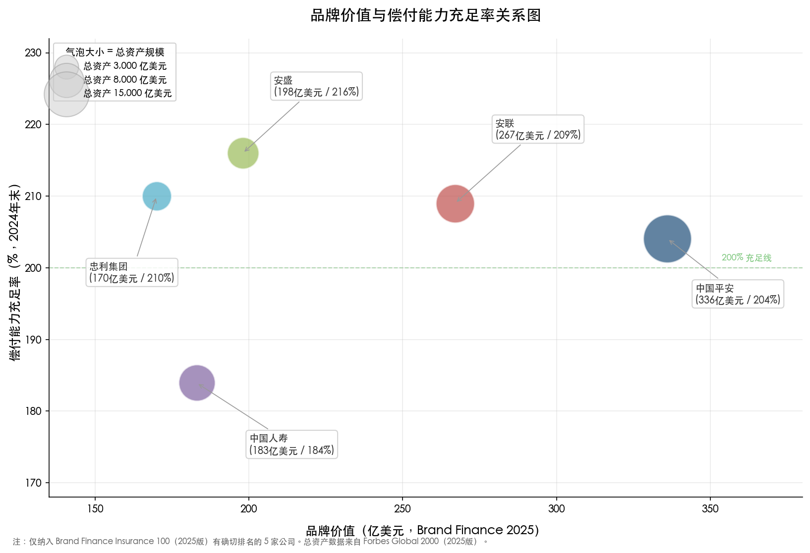

*图 2-3：Brand Finance Insurance 100（2025 版）有确切排名的五家公司品牌价值（横轴）与偿付能力充足率（纵轴）关系，气泡大小代表总资产规模。绿色虚线标注 200% 充足基准线。*

**第一档——资本"堡垒级"（3 家）。** 伯克希尔以超低杠杆（D/E 约 0.19）、天量现金储备（3,340 亿美元）和四大机构最高评级构成行业最坚固的资本堡垒；慕尼黑再保险以 287% Solvency II 比率和 AA 级评级紧随其后；安联凭借 209% 偿付能力、Aa1 评级和全球第一的 Interbrand 保险品牌价值同样跻身第一梯队。这三家公司在任何可预见的压力情景下，均具备无需外部融资即可维持正常运营和股东回报的能力。

**第二档——资本"优质级"（4 家）。** 苏黎世保险（SST 253%、AA 评级）、安盛（Solvency II 216%、多机构上调）、忠利集团（Solvency II 210%、五年内三机构上调）和大都会人寿（RBC >360%、AA- 评级）均拥有稳健的资本基础和良好的信用轨迹。安盛和忠利集团处于信用改善的上升通道，苏黎世保险的偿付能力居欧洲同行最高区间。

**第三档——资本"分化中"（3 家）。** 中国平安拥有庞大的资产规模和全球领先的品牌价值，但受偿二代二期框架约束和主权评级天花板限制，其国际评级与实际资本实力之间存在落差，核心偿付能力充足率 165.22% 处于"充足但不宽裕"的状态。中国人寿核心充足率仅 137.50%，在十家公司中最低，其资本补充节奏值得持续跟踪。联合健康 2025 年遭遇评级展望双重下调、RBC 显著下滑，43.9% 的 Debt-to-Capital 在十家公司中最高，信用趋势已进入下行通道。

我们认为，在未来 3—5 年全球利率正常化的环境中，偿付能力充裕且评级处于上升通道的公司（如安联、慕尼黑再保险、苏黎世保险）将在并购博弈、再保险对手方选择和资本回报空间上占据结构性优势；而联合健康的信用下行趋势若持续延续，可能对其健康险市场份额和 Optum 业务的并购扩张节奏构成实质性约束。

# 第3章 过往五年经营增长分析（2021–2025）

2021–2025 年是全球保险行业经历剧烈周期性转折的五年。新冠疫情余波、主要经济体从零利率向加息周期的急速切换、通胀高企推动产险硬市场定价、IFRS 17 实施引发报表口径深层变革——上述宏观力量相互交织，使十大保险集团呈现出显著分化的增长路径。本章从营收与保费增长、净利润与经营质量、综合成本率、总资产变动四个维度，系统审视各公司五年业绩轨迹，并将其置于宏观经营环境中做横向对比与归因解读。

> **口径说明**：本章财务数据以美元为主计量货币。以欧元报告的公司（Allianz、AXA、Munich Re、Generali）按各财年年末 EUR/USD 汇率折算；以人民币报告的公司（中国平安、中国人寿）按各财年年末 CNY/USD 汇率折算；以瑞士法郎报告的公司（Zurich Insurance）按各财年年末 CHF/USD 汇率折算。2021–2025 年间，人民币兑美元从约 6.37 贬值至约 7.30（累计约 14.6%），欧元兑美元从 1.13 波动至约 1.04，汇率变动对跨公司比较产生系统性影响。增长率统一采用五年复合年增长率（CAGR，2021→2025），并辅以逐年变化趋势分析。

## 3.1 宏观经营环境回顾

### 利率环境的剧烈切换

2021 年全球主要央行仍维持接近零利率政策。2022 年起，为遏制通胀，美联储将联邦基金利率从 0.25% 大幅提升至 2023 年 7 月的 5.25%–5.50% 区间，创二十余年最高水平；欧洲央行主要再融资利率同步从 0% 升至 4.50%。这一轮加息周期对保险公司产生双重影响：固定收益投资组合的再投资收益率显著提升，尤其利好持有大量债券的寿险公司；但存量债券组合在利率上行期录得大额未实现损失，拖累部分公司的 GAAP 净资产表现。2024–2025 年主要央行转入降息通道，利率水平仍显著高于 2021 年前的超低利率时代，保险公司投资收益率总体维持在较高区间。

### 产险硬市场周期

2022–2023 年全球通胀率一度突破 8%，在推高理赔成本的同时亦为产险公司提供了强有力的提价窗口，形成典型的"硬市场"周期。主要产险和再保险公司在此期间持续实施费率调整，综合成本率（Combined Ratio）逐步改善。2024–2025 年通胀回落至 2.5%–3% 区间，硬市场有所缓和但费率仍维持正向调整态势，有利于承保利润的持续稳定。

### 会计准则变革：IFRS 17

2023 年 1 月 1 日 IFRS 17 正式生效，取代实施二十余年的 IFRS 4，从根本上改变了保险合同的确认、计量和列报方式。对于以欧洲为基地的 Allianz、AXA、Zurich、Munich Re 和 Generali 而言，2023 年财报与 2022 年的可比性受到显著影响，收入确认时点与利润释放节奏均发生变化。中国平安与中国人寿自 2023 年起亦采用新准则，进一步增加了跨年份对比的复杂性。本章在涉及 IFRS 17 导致的口径不连续之处均予以标注。

### 汇率与地缘风险

2021–2025 年人民币兑美元累计贬值约 14.6%（从 6.37 至约 7.30），导致中国平安和中国人寿以美元计量的资产和收入规模呈结构性"缩水"。欧元兑美元同期从 1.13 波动至约 1.04，对欧洲保险巨头的美元计收入同样构成压制。此外，2022 年俄乌冲突引发的能源和大宗商品价格冲击、2023–2025 年中美关系的持续紧张以及全球供应链重构等地缘因素，共同构成保险经营的外部风险变量。

## 3.2 营收与保费增长：五年轨迹

### 3.2.1 营收增速领跑者：UnitedHealth Group

UnitedHealth Group 以 2021–2025 年营收 CAGR 约 11.7% 的速度领跑十大保险集团。其营收从 2021 年的 2,876 亿美元逐年攀升至 2022 年 3,242 亿美元（+12.7%）、2023 年 3,712 亿美元（+14.5%）、2024 年 4,008 亿美元（+8.0%），2025 年达到 4,476 亿美元（+11.8%）[Macrotrends](https://www.macrotrends.net/stocks/charts/UNH/unitedhealth-group/revenue "UnitedHealth Group Revenue 2012-2025") [UnitedHealth Group 业绩公告](https://www.unitedhealthgroup.com/content/dam/UHG/PDF/investors/2025/unh-reports-2025-results-and-issues-2026-outlook.pdf "2025年度业绩报告")。这一增速由两大引擎驱动：UnitedHealthcare 保险板块 2025 年保费约 3,440–3,455 亿美元，Optum 健康服务业务持续贡献显著增量。值得注意的是，UnitedHealth 的"营收"口径包含保费收入、Optum 健康服务收入及投资收入等，并非纯保险保费指标，在与传统保险公司比较时需注意口径差异。

### 3.2.2 综合巨头的稳健增长：Berkshire Hathaway

Berkshire Hathaway 营收从 2021 年 2,762 亿美元增至 2025 年约 3,714 亿美元，五年 CAGR 约 7.7%，其中 2023 年大幅增长 20.7%，主要受投资收益回暖和 GEICO 保费增长驱动 [Macrotrends](https://www.macrotrends.net/stocks/charts/BRK.A/berkshire-hathaway/revenue "Berkshire Hathaway Revenue 2012-2025")。与 UnitedHealth 类似，Berkshire 的营收中包含大量非保险业务收入（铁路、能源、制造等），保险板块（GEICO、General Re、BH Reinsurance）仅为集团营收的组成部分之一。保险分部层面，GEICO 在 2022 年经历承保亏损后通过大幅提价于 2023–2024 年实现盈利反转，体现了产险硬市场周期下的定价修复效应。

### 3.2.3 欧洲保险巨头：Allianz 与 AXA

**Allianz** 2025 年总业务量达 1,869 亿欧元（约 1,944 亿美元），内部增长率 8.1%，创历史新高 [Allianz 业绩新闻稿](https://www.allianz.com/en/mediacenter/news/media-releases/financials/260226-4q-2025-earnings-release.html "2025年度业绩新闻稿")。以美元计量的五年 CAGR 约 3.4%，增速看似温和，主要受欧元兑美元贬值压制；若以欧元本币衡量，Allianz 的增长表现更为突出，产险和健康险板块构成主要增长驱动力。

**AXA** 2025 年 GWP 及其他收入达 1,160 亿欧元（约 1,206 亿美元，同比+6%）[AXA 业绩新闻稿](https://www.axa.com/en/press/press-releases/2025-full-year-earnings "2025年度业绩新闻稿")，2024 年 GWP 为 1,100 亿欧元（同比+8%），2023 年为 1,020 亿欧元 [AXA 2024 年度业绩](https://www.axa.com/press/press-releases/2024-full-year-earnings "AXA 2024年度业绩")。增长主要来自商业险与 AXA XL 再保险板块的强劲定价驱动力。AXA 美元计净利润从 2021 年 86.3 亿美元降至 2022 年 70.3 亿美元（-18.5%），2023 年回升至 77.8 亿美元（+10.6%），2024–2025 年在 IFRS 17 新口径下继续攀升 [Macrotrends](https://www.macrotrends.net/stocks/charts/AXAHY/axa-sa/net-income "AXA Net Income 2012-2025")。

### 3.2.4 中国双雄：中国平安与中国人寿

**中国平安** 2025 年归母营运利润 1,344 亿元人民币（约 184 亿美元，同比+10.3%），新业务价值（NBV）大增 29.3% 至 369 亿元，综合投资收益率回升至 6.3% [中国平安业绩公告](https://www.prnewswire.com/news-releases/ping-an-reports-2025-performance-on-positive-trends-operating-profit1-up-10-3-yoy-302726084.html "2025年度业绩新闻稿")。平安的"营收"在 IFRS 17 下重新定义，传统口径总保费收入约 9,000 亿元人民币量级。2022–2023 年间，平安经历了寿险改革阵痛和房地产投资减值的双重压力，NBV 于 2022 年触底；此后强劲反弹，2024–2025 年连续两年实现两位数增长，标志着转型成效显著。

**中国人寿** 2025 年总保费收入首次突破 7,299 亿元人民币（约 1,056 亿美元），同比增长 8.7% [Insurance Business](https://www.insurancebusinessmag.com/asia/news/breaking-news/china-life-posts-44-profit-rise-569969.aspx "China Life posts 44% profit rise")。回溯过去五年：2021 年总保费 6,183 亿元 [人民日报英文版](http://en.people.cn/n3/2022/0327/c90000-10076417.html "China Life 2021业绩")、2022 年 6,152 亿元 [MarketScreener](https://www.marketscreener.com/amp/quote/stock/CHINA-LIFE-INSURANCE-COMP-1412628/news/China-Life-Insurance-Posts-615-2-Bililon-Yuan-in-2022-Premium-Income-42726376/ "China Life 2022 premium income")、2023 年约 6,415 亿元、2024 年 6,715 亿元 [百度百科](https://baike.baidu.com/en/item/China%20Life%20Insurance%20Company%20Limited/997913 "China Life Insurance Company")。以人民币计的五年 CAGR 约 4.2%，但以美元折算后因人民币贬值而增速明显降低。

### 3.2.5 欧洲精品：Zurich Insurance、Munich Re 与 Generali

**Zurich Insurance** 2025 年净利润达 67.98 亿美元（同比+17%），业务经营利润（BOP）88.56 亿美元（同比+14%）[Atlas Magazine](http://www.atlas-mag.net/en/articles/zurich-insurance-group-2025-results "Zurich Insurance Group 2025 results")。Zurich 以美元报告，其 2021–2024 年营收数据受 IFRS 17 口径切换影响较大：2021 年约 632 亿美元（IFRS 4 口径），2023 年切换 IFRS 17 后报告的保险收入约 440 亿美元，直接可比性受限。然而从 BOP 和净利润维度观察，Zurich 2021–2025 年经营利润持续攀升，展现出优异的经营质量和盈利韧性。

**Munich Re** 2025 年 GWP 约 756 亿欧元，保险收入（IFRS 17 口径）604 亿欧元 [Munich Re 2025 年度业绩](https://www.munichre.com/en/company/media-relations/media-information-and-corporate-news/media-information/2026/media-release-2026-02-26.html "Munich Re 2025年度业绩")。回溯历史：2021 年 GWP 596 亿欧元、2022 年 671 亿欧元（+12.7%）[Insurance Business Magazine](https://www.insurancebusinessmag.com/us/news/breaking-news/munich-re-reports-fullyear-trading-figures-437264.aspx "Munich Re 2022全年业绩")、2023 年约 679 亿欧元、2024 年约 681 亿欧元 [Munich Re 2024 年报](https://www.munichre.com/content/dam/munichre/mrwebsiteslaunches/2024-annual-report/MunichRe-Group-Annual-Report-2024-en.pdf "2024年年报")。以欧元计的 GWP 五年 CAGR 约 6.1%，增速稳健。Munich Re 在硬市场周期中积极提升费率，再保险板块有机增长尤为突出。

**Generali** 2025 年 GWP 增至 981 亿欧元（同比+3.6%），其中产险增长 7.6%、寿险增长 1.4% [Generali 业绩新闻稿](https://www.generali.com/media/press-releases/all/2026/Consolidated-Results-as-of-31-December-2025 "2025年度合并业绩新闻稿")。2024 年度 GWP 约 946 亿欧元。Generali 在 2022–2024 年间通过"Lifetime Partner 24"战略完成了产险重心调整，承保纪律持续强化，经营利润 EPS 的 2021–2024 年 CAGR 达 11.3%，超额完成原定 6%–8% 的战略目标 [Generali 2024 全年业绩](https://www.generaliglobalcorporate.com/media/press-releases/all/2025/Consolidated-Results-as-of-31-December-2024.html "忠利2024全年业绩")。

### 3.2.6 稳健但增长温和：MetLife

MetLife 营收增速在十家公司中最为温和：2021 年 687 亿美元、2022 年 699 亿美元、2023 年 672 亿美元、2024 年 710 亿美元、2025 年约 771 亿美元，五年 CAGR 约 2.9% [Macrotrends](https://www.macrotrends.net/stocks/charts/MET/metlife/revenue "MetLife Revenue 2012-2025")。MetLife 在 2022 年剥离部分低增长的传统寿险业务后聚焦于团体保险和亚太市场，其增长策略明确以利润质量优先于规模扩张。

### 3.2.7 营收与保费增长汇总对比

下图展示十家公司五年营收 CAGR 的横向对比，对汇率影响显著的公司同时列示本币口径 CAGR，直观呈现增长分化格局。

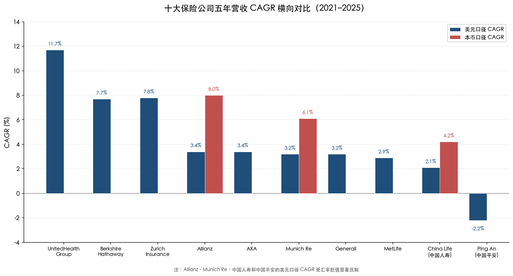

| 公司 | 2021 营收 | 2025 营收 | 五年 CAGR | 增长特征 |
|------|----------|----------|----------|---------|
| UnitedHealth Group | 2,876 亿美元 | 4,476 亿美元 | ~11.7% | 保费+健康服务双驱动 |
| Berkshire Hathaway | 2,762 亿美元 | 3,714 亿美元 | ~7.7% | 投资收益波动、非保险业务贡献大 |
| Zurich Insurance | ~632 亿美元 | ~855 亿美元 | ~7.8% | 产险定价优势突出 |
| Allianz | ~1,620 亿美元 | ~1,944 亿美元 | ~3.4%（美元）/ ~8%+（欧元） | 汇率压制，本币增长强劲 |
| AXA | ~1,020 亿美元 | ~1,206 亿美元 | ~3.4%（美元） | 商业险与 XL 再保险驱动 |
| Munich Re | ~693 亿美元 | ~787 亿美元 | ~3.2%（美元）/ ~6%+（欧元） | 再保硬市场红利 |
| Generali | ~870 亿美元 | ~1,020 亿美元 | ~3.2%（美元） | 产险增速快于寿险 |
| MetLife | 687 亿美元 | 771 亿美元 | ~2.9% | 聚焦利润优于规模 |
| 中国人寿 | ~971 亿美元 | ~1,056 亿美元 | ~2.1%（美元）/ ~4.2%（人民币） | 汇率拖累美元表现 |
| 中国平安 | ~1,728 亿美元 | ~1,580 亿美元 | 负增长（美元） | 人民币贬值+寿险转型阵痛 |

*注：中国平安以 Forbes 2025 口径营收 1,580 亿美元为基准，其人民币本币保费收入实为正增长；美元计负增长主要系汇率贬值和 IFRS 17 口径变化所致。Allianz、Munich Re、中国人寿的美元口径 CAGR 受汇率贬值显著压制，本币口径增长更能反映实际经营表现。*

## 3.3 净利润增长与经营质量

利润增长是衡量保险公司经营质量的核心维度，相比营收增速更能反映承保纪律、投资管理和风险控制的综合能力。下图以 2021 年为基期（=100）指数化展示五家代表性公司的净利润变化轨迹，直观呈现三条核心叙事线——Munich Re 的持续攀升、中国人寿的 V 形反转以及 UnitedHealth Group 的近期利润逆转。

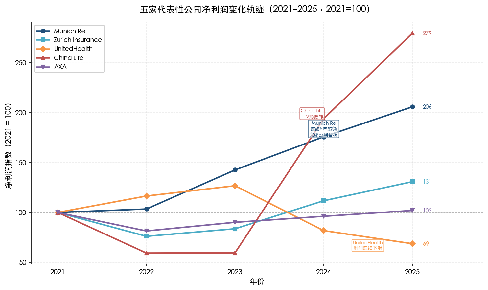

### 3.3.1 利润增速冠军：Munich Re

Munich Re 在 2021–2025 年录得十家公司中最为优异的利润增长轨迹。以美元计，净利润从 2021 年约 35 亿美元逐步攀升至 2022 年 36.2 亿美元、2023 年 49.9 亿美元、2024 年 61.5 亿美元，2025 年达 61.21 亿欧元（约 72 亿美元），连续五年超额完成盈利目标 [Munich Re 2025 年度业绩](https://www.munichre.com/en/company/media-relations/media-information-and-corporate-news/media-information/2026/media-release-2026-02-26.html "Munich Re 2025年度业绩") [Macrotrends](https://www.macrotrends.net/stocks/charts/MURGY/munich-re/net-income "Munich Re Net Income 2012-2025")。以美元计五年 CAGR 约 20.8%，以欧元计同样超过 15%。驱动这一表现的核心因素包括：再保险硬市场周期中的持续提价、2025 年再保险综合成本率降至 73.5%（同比-3.8 个百分点），以及高利率环境下投资收益率的提升。

### 3.3.2 利润质量标杆：Zurich Insurance 与 Allianz

**Zurich Insurance** 五年净利润序列为：2021 年 52.0 亿美元、2022 年 39.6 亿美元、2023 年 43.5 亿美元、2024 年 58.1 亿美元、2025 年 67.98 亿美元 [Macrotrends](https://www.macrotrends.net/stocks/charts/ZURVY/zurich-insurance-group/net-income "Zurich Insurance Net Income 2012-2025")。2021→2025 年 CAGR 约 6.9%，而更值得关注的是其核心 ROE 于 2025 年达到 26.9% 的行业顶尖水平，反映出极强的资本利用效率。Zurich 在产险综合成本率方面持续表现优异，2025 年为 92.6%（同比-1.6 个百分点），产险承保利润贡献保持稳定。

**Allianz** 2025 年经营利润创历史新高达 174 亿欧元（约 181 亿美元，同比+8.4%），核心净利润 111 亿欧元（约 115 亿美元，同比+10.9%），核心 ROE 达 18.1% [Allianz 业绩新闻稿](https://www.allianz.com/en/mediacenter/news/media-releases/financials/260226-4q-2025-earnings-release.html "2025年度业绩新闻稿")。Allianz 的利润增长具有高度均衡性：产险（COR 92.2%）、寿险与健康险、资产管理（PIMCO/AllianzGI）三大板块均贡献正向增长，展现出突出的抗周期能力。

### 3.3.3 中国公司的利润剧烈波动

**中国人寿** 净利润呈现剧烈波动：2021 年 509 亿元（约 80 亿美元）、2022 年 320.8 亿元（-37%，受资本市场下跌和房地产减值拖累）、2023 年 322 亿元（基本持平）、2024 年 1,069 亿元（+108.9%，受益于 A 股市场回暖和投资收益大幅改善）、2025 年 1,541 亿元（约 223.5 亿美元，+43.7%）[Insurance Business](https://www.insurancebusinessmag.com/asia/news/breaking-news/china-life-posts-44-profit-rise-569969.aspx "China Life posts 44% profit rise")。2025 年新业务价值（VNB）大增 35.7% 至 457.5 亿元 [ReinAsia](https://reinasia.com/china-lifes-value-of-new-business-surges-to-45-75bn-yuan-as-net-profit-climbs-43-7-in-2025/ "China Life VNB surges in 2025")。中国人寿利润的大幅波动主要源于投资端：其投资组合对 A 股市场走势和利率变动高度敏感，承保端利润贡献相对稳定但权重偏低。

**中国平安** 2025 年归母净利润（剔除非经常性）1,438 亿元人民币（约 197 亿美元，同比+22.5%），经营利润 1,344 亿元（同比+10.3%）[中国平安业绩公告](https://www.prnewswire.com/news-releases/ping-an-reports-2025-performance-on-positive-trends-operating-profit1-up-10-3-yoy-302726084.html "2025年度业绩新闻稿")。平安的经营利润增速较净利润更具参考价值，因为后者受投资收益和一次性计提影响较大。2022–2023 年间，平安经历了房地产投资减值和寿险转型的双重冲击，经营利润一度承压；2024–2025 年随着 NBV 连续高增（+29.3%）和综合投资收益率回升至 6.3%，盈利能力显著恢复。

### 3.3.4 UnitedHealth Group 的利润逆转

UnitedHealth Group 是十家公司中唯一在 2024–2025 年录得利润连续下滑的公司。净利润从 2023 年峰值 223 亿美元下降至 2024 年 144 亿美元（-35.6%），2025 年进一步降至 121 亿美元（-16.3%）[Macrotrends](https://www.macrotrends.net/stocks/charts/UNH/unitedhealth-group/net-income "UnitedHealth Group Net Income 2012-2025")。利润下滑的直接原因是 2024 年初 Change Healthcare 遭受大规模网络安全攻击，由此产生的直接损失和运营中断成本约 30 亿美元；同时医疗赔付率（MCR）从 2023 年的 83.4% 攀升至 2025 年的 88.9%，反映出医疗成本控制面临严峻挑战。尽管营收维持两位数增长，利润率的持续压缩使其五年利润 CAGR 表现大幅低于营收 CAGR，营收与利润的背离构成值得关注的风险信号。

### 3.3.5 Berkshire Hathaway 的利润波动性

Berkshire Hathaway 的 GAAP 净利润因包含未实现投资损益而呈现极大波动性：2021 年 899 亿美元、2022 年 -228 亿美元（投资组合浮亏）、2023 年 962 亿美元、2024 年 890 亿美元、2025 年约 670 亿美元 [Macrotrends](https://www.macrotrends.net/stocks/charts/BRK.A/berkshire-hathaway/net-income "Berkshire Hathaway Net Income 2012-2025")。这种波动并不反映保险经营的真实状况。若仅考察保险承保利润，GEICO 在 2023–2024 年实现了从亏损到大幅盈利的反转，BH Reinsurance 的承保纪律则持续保持严格。截至 2024 年末，Berkshire 持有超 3,340 亿美元现金及等价物，充分体现了巴菲特"等待机会"的资本配置哲学。

### 3.3.6 其他公司利润表现

**AXA** 净利润在五年间保持相对稳定：2021 年 86.3 亿美元、2022 年 70.3 亿美元（-18.5%，受投资端影响）、2023 年 77.8 亿美元（+10.6%）[Macrotrends](https://www.macrotrends.net/stocks/charts/AXAHY/axa-sa/net-income "AXA Net Income 2012-2025")。2024 年和 2025 年在 IFRS 17 新口径下，AXA 底层利润（Underlying Earnings）分别达 81 亿和 88 亿欧元 [AXA 业绩新闻稿](https://www.axa.com/en/press/press-releases/2025-full-year-earnings "2025年度业绩新闻稿")，增长节奏稳健。

**Generali** 净利润呈持续上升趋势，2024 年达到历史高位。2021–2024 年间 EPS CAGR 达 11.3%，超额完成战略目标 [Generali 2024 全年业绩](https://www.generaliglobalcorporate.com/media/press-releases/all/2025/Consolidated-Results-as-of-31-December-2024.html "忠利2024全年业绩")。2025 年产险 COR 为 92.6%（同比-1.4 个百分点），承保纪律持续改善 [Generali 2025 全年业绩](https://www.generali.com/doc/jcr:b2b5f8a5-caa1-4153-bd44-a504ab8b8a9c/03.12%20PR_Generali%20Consolidated%20Results%202025.pdf "忠利2025全年业绩新闻稿")。

**MetLife** 利润波动较大：2021 年约 69 亿美元、2022 年 82.5 亿美元、2023 年降至约 18 亿美元（受衍生品和利率对冲影响）、2024 年回升至约 44.3 亿美元。MetLife 的调整后利润稳定性优于 GAAP 利润，但在同业对比中总体处于中游水平。

## 3.4 综合成本率：承保纪律的试金石

综合成本率（Combined Ratio, COR）是衡量产险和再保险公司承保盈利能力的核心效率指标，低于 100% 表示承保盈利。下图以散点图形式呈现五家具备可比产险 COR 数据的公司在 2025 年的 COR-ROE 定位，气泡面积映射总资产规模，直观展示经营效率与资本回报之间的关系。

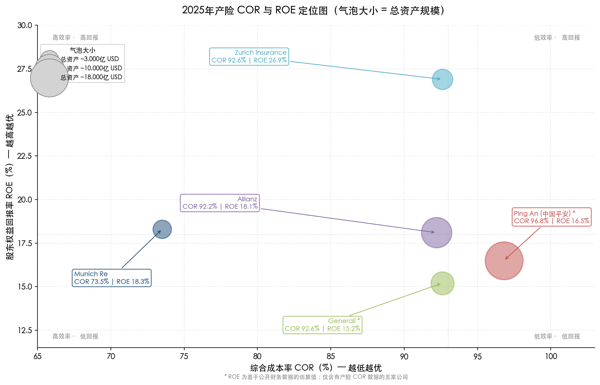

| 公司 | 2025 年 COR | 较 2024 年变化 | 行业定位 |
|------|-----------|-------------|---------|
| Munich Re（再保险） | 73.5% | -3.8pp | 行业最优，再保头部优势突出 |
| Allianz P&C | 92.2% | -1.3pp | 欧洲综合保险标杆 |
| Generali P&C | 92.6% | -1.4pp | 持续改善，接近同业最优 |
| Zurich P&C | 92.6% | -1.6pp | 产险经营质量稳居前列 |
| Ping An P&C | 96.8% | -1.5pp | 改善趋势明确，仍有提升空间 |

Munich Re 的再保险 COR 73.5% 远优于直保同业，既反映了 2024–2025 年再保险硬市场周期中的强势定价权，也体现了 Munich Re 严格的核保标准和风险选择能力。Allianz、Generali 和 Zurich 的产险 COR 在 92%–93% 区间趋同，体现出欧洲头部财险公司在定价纪律上的高度一致性。中国平安产险 COR 96.8% 较欧洲同业偏高，主要受国内车险市场竞争激烈和新能源车险高赔付率影响，但改善趋势已连续三年保持。

## 3.5 总资产变动与资产端扩张

总资产规模是保险公司综合实力的重要维度，尤其对于寿险占比较大的公司，资产规模直接关联其投资管理能力和风险承受能力。

### 资产规模分层

根据 Forbes Global 2000（2025 版）披露的总资产数据，十家公司可划分为三个梯队：

- **超万亿美元梯队**：中国平安（17,752 亿美元）、Berkshire Hathaway（11,539 亿美元）、Allianz（10,817 亿美元）
- **5,000–10,000 亿美元梯队**：中国人寿（9,477 亿美元）、MetLife（6,775 亿美元）、AXA（6,770 亿美元）、Generali（5,578 亿美元）
- **3,000–5,000 亿美元梯队**：Zurich Insurance（4,022 亿美元）、UnitedHealth Group（3,098 亿美元）、Munich Re（2,967 亿美元）

中国平安以 17,752 亿美元的总资产位居十家公司之首，但其中包含平安银行资产（约 5.7 万亿元人民币），纯保险资产口径约为 6.49 万亿元人民币（约 8,900 亿美元）。此外，人民币在 2021–2025 年累计贬值约 14.6%，意味着以美元计的总资产增速被汇率系统性压低。

中国人寿总资产从 2021 年末约 4.89 万亿元（约 7,680 亿美元）增至 2025 年末约 7.73 万亿元（约 1,059 亿美元）[人民日报英文版](http://en.people.cn/n3/2022/0327/c90000-10076417.html "China Life 2021业绩")，人民币计 CAGR 约 12.1%，资产端扩张速度在十家公司中位居前列，主要受益于中国寿险市场持续的保费流入和投资组合增值。

Zurich Insurance 总资产从 2021 年的 3,989 亿美元降至 2022 年的 3,354 亿美元（受利率上升导致债券组合浮亏影响），此后随着利率趋稳逐步回升至 2024 年末的 4,022 亿美元 [CompaniesMarketCap](https://companiesmarketcap.com/zurich-insurance-group/total-assets/ "Zurich Insurance Group Total Assets")。

Berkshire Hathaway 总资产在五年间持续增长，从 2021 年末约 9,588 亿美元稳步升至 2025 年末 11,539 亿美元，反映了持续的投资收益积累和保险浮存金增长的双重推动作用。

## 3.6 增长驱动因素归因分析

### 3.6.1 硬市场周期的受益者

2022–2025 年的产险与再保险硬市场是 Munich Re、Allianz 和 Zurich Insurance 利润高增长的核心推手。Munich Re 作为全球最大再保险公司，直接受益于灾后重定价和保障缺口扩大——全球仅约 38% 的自然灾害风险获保险覆盖（中国仅约 5%），巨灾再保险定价在 2023–2025 年连续上调，为 Munich Re 的 GWP 和承保利润提供了强劲增量。

### 3.6.2 利率周期的受益者与承压者

利率上行期最大的受益者是持有大量固定收益资产的寿险公司。Allianz、AXA 和 Zurich Insurance 在 2023–2025 年新增投资的收益率显著提升，驱动投资利润增长。然而，中国平安和中国人寿面临截然不同的利率环境——中国 10 年期国债收益率在 2024–2025 年降至 2% 以下，寿险新增投资收益率承压，利差损风险上升。中国公司 2024–2025 年利润的爆发性增长更多来自 A 股市场回暖带来的投资收益改善，而非利率环境的结构性利好。

### 3.6.3 数字化与业务模式创新

UnitedHealth Group 的 Optum 板块是五年间增长最快的保险相关业务之一，将健康险与医疗服务深度整合，形成独特的"保险+医疗"闭环模式。中国平安同样在推进"综合金融+医疗健康养老"双轮驱动战略，科技赋能（累计专利 55,080 件、AI 客服处理量占比达 80%）构成重要差异化竞争力。Munich Re 和 Zurich 在再保险及企业险领域的科技赋能则更侧重于风险建模和定价工具的精细化升级，技术路线与商业模式的侧重点存在显著差异。

### 3.6.4 并购对增长的贡献

Allianz 和 AXA 是十家公司中并购最为活跃的两家。Allianz 于 2024 年完成对 Jubilee 保险和若干亚洲资产的收购；AXA 则于 2025 年出售 AXA IM 资产管理业务，以聚焦核心保险板块。Generali 在 2025 年推进了对 Conning 资管以及中意财险独资化的交易。Munich Re 以有机增长为主，较少依赖大型并购，其增长质量的纯粹性在十家公司中最为突出。

## 3.7 综合增长评估：横向对比矩阵

综合营收增速、利润增长、经营效率和资产扩张四个维度，我们对十家公司的五年增长表现做出如下分层评估。

**第一梯队——增长动能强劲、经营质量优异**

- **Munich Re**：利润 CAGR 约 20.8%（十家最高），COR 73.5%（行业最优），ROE 18.3%，连续五年超额完成盈利目标。尽管美元口径营收增速仅约 3.2%，以欧元计 GWP CAGR 约 6.1%，利润质量和资本效率在十家公司中首屈一指。
- **Allianz**：经营利润五年持续攀升至 174 亿欧元历史新高，ROE 18.1%，产险 COR 92.2%，三大业务板块均衡增长。美元计营收增速受汇率压制，本币增长表现优异。
- **Zurich Insurance**：核心 ROE 达 26.9%（十家最高），净利润 2021→2025 年 CAGR 约 6.9%，产险 COR 92.6%，经营质量处于行业一流水平。

**第二梯队——增长与转型并存**

- **UnitedHealth Group**：营收 CAGR 11.7%（十家最高），但 2024–2025 年利润连续下滑暴露了医疗赔付率上升和网络安全风险敞口。营收高增长与利润承压并存的矛盾使其增长质量面临检验。
- **中国平安**：经历 2022–2023 年转型阵痛后强劲反弹，NBV 增长 29.3%，但美元计营收和资产受汇率拖累，国内低利率环境对寿险投资端构成持续挑战。
- **中国人寿**：保费和利润在 2024–2025 年实现爆发式增长（净利润+108.9% 和+43.7%），但此前连续两年利润大幅下滑，波动性为十家公司中最高，对投资端的依赖度过大。

**第三梯队——稳健但增速有限**

- **AXA**：增长稳健但亮点不突出，美元计 CAGR 约 3.4%，利润和 COR 均维持在行业中上水平。
- **Generali**：EPS CAGR 超额完成战略目标，COR 持续改善，但营收增速（同比+3.6%）和总资产规模在十家中偏低。
- **Berkshire Hathaway**：营收 CAGR 7.7% 尚可，但 GAAP 利润的极大波动性降低了可比性；保险分部经营质量优异，总资产和现金储备持续增长。
- **MetLife**：营收 CAGR 2.9%（十家最低），利润波动较大，增长策略以稳健审慎为主。

# 第4章 股东回报与分红实绩

保险公司的股东回报既是财务实力的最终体现，也是管理层资本配置能力的试金石。2021–2025 年间，利率周期剧烈切换、偿付能力监管持续进化，十大保险集团的分红策略呈现显著分化：伯克希尔坚守逾半世纪的"零股息"信条，慕尼黑再保险五年间 DPS 翻倍增长，而中国公司则受利润波动制约采取审慎派息路线。不同策略折射出截然不同的股东价值观与资本管理哲学。本章从每股股息（DPS）逐年演变、分红政策与资本回报机制、ROE 与分红可持续性、综合股东回报率（TSR）四个维度，系统审视十家公司 2021–2025 年的股东回报实绩。

## 4.1 每股股息五年演变（2021–2025）

### 4.1.1 逐年 DPS 对比

以下汇总十家公司 2021–2025 财年的每股股息（DPS），各公司以本币列示：

| 公司 | 货币 | FY2021 | FY2022 | FY2023 | FY2024 | FY2025（拟/已宣） | 五年变化 |
|:---|:---:|:---:|:---:|:---:|:---:|:---:|:---:|
| 伯克希尔 | USD | 0 | 0 | 0 | 0 | 0 | — |
| 联合健康 | USD | 5.60 | 6.40 | 7.29 | 8.18 | 8.73 | +55.9% |
| 中国平安 | CNY | 2.38 | 2.42 | 2.43 | 2.55 | 2.70 | +13.4% |
| 安联 | EUR | 10.80 | 11.40 | 13.80 | 15.40 | 17.10 | +58.3% |
| 安盛 | EUR | 1.54 | 1.70 | 1.98 | 2.15 | 2.32 | +50.6% |
| 中国人寿 | CNY | 0.65 | 0.49 | 0.43 | 0.48 | 0.618 | -4.9% |
| 苏黎世保险 | CHF | 22.00 | 24.00 | 26.00 | 28.00 | 30.00 | +36.4% |
| 慕尼黑再保险 | EUR | 11.00 | 11.60 | 15.00 | 20.00 | 24.00 | +118.2% |
| 忠利集团 | EUR | 1.07 | 1.16 | 1.28 | 1.43 | 1.64 | +53.3% |
| 大都会人寿 | USD | 1.90 | 1.98 | 2.06 | 2.155 | 2.27 | +19.5% |

*来源：[UnitedHealth Group](https://www.unitedhealthgroup.com/investors/stock.html "Dividend History")；[Allianz](https://www.allianz.com/en/investor_relations/share/dividend.html "Dividend")；[AXA](https://www.axa.com/en/investor/dividends "Dividends")；[Munich Re](https://www.munichre.com/en/company/investors/shares/dividend.html "Dividend")；[Generali](https://www.generali.com/investors/financial-highlights/historical-data "Historical Data")；[Zurich Insurance](https://www.zurich.com/media/news-releases/2025/2025-0429-01 "FY2024 Results")；[Ping An](https://www.tipranks.com/news/company-announcements/ping-an-announces-final-2025-dividend-and-sets-cross-border-tax-terms "Ping An FY2025末期股息公告")；[China Life](https://www.tipranks.com/news/company-announcements/china-life-insurance-proposes-2025-final-dividend-and-outlines-cross-border-tax-treatment "China Life FY2025末期股息公告")。*

### 4.1.2 关键发现解读

下图直观呈现了十家公司 FY2021–FY2025 DPS 五年复合增长率的横向差异，欧洲保险公司整体领先、中国公司增速偏低的格局一目了然。

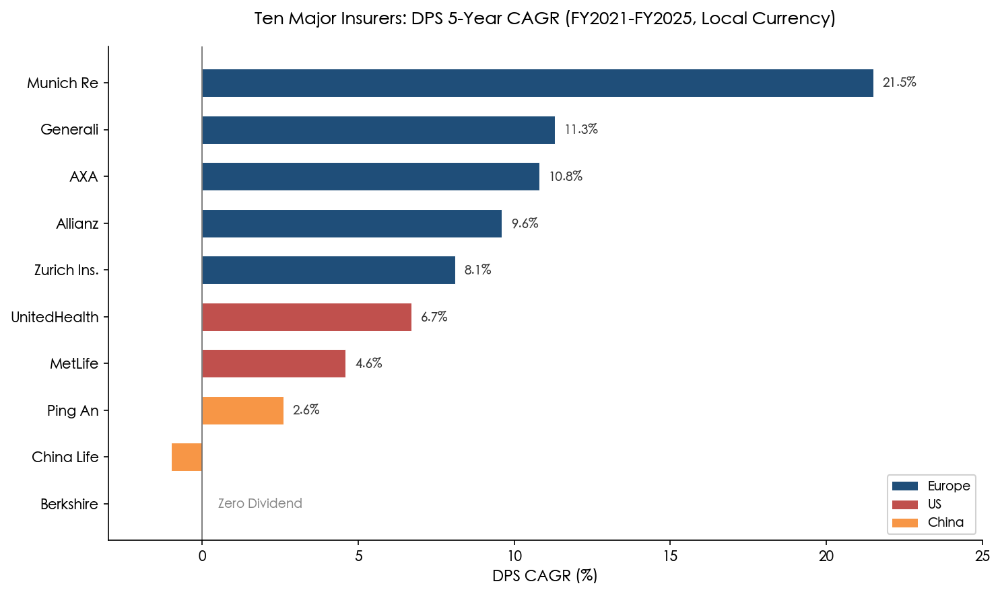

**慕尼黑再保险 DPS 增速居十家公司之首。** FY2021 至 FY2025 拟派 DPS 从 11.00 欧元跃升至 24.00 欧元，五年累计增长 118.2%，DPS CAGR 达 21.5%，在全球大型保险公司中罕有匹敌。该增速直接对应同期净利润从约 35 亿美元跃升至约 72 亿美元的强劲盈利轨迹 [Munich Re 股息页面](https://www.munichre.com/en/company/investors/shares/dividend.html "Munich Re Dividend History")。

**安联与安盛稳步提升，展现渐进式分红执行力。** 安联 FY2025 拟派 DPS 17.10 欧元（同比+11%），较 FY2021 累计增长 58.3%，五年 DPS CAGR 约 9.6% [Allianz 股息页面](https://www.allianz.com/en/investor_relations/share/dividend.html "Allianz Dividend")。安盛 FY2025 拟派 DPS 2.32 欧元，较 FY2021 累计增长 50.6%，DPS CAGR 约 10.8% [AXA 股息页面](https://www.axa.com/en/investor/dividends "AXA Dividends")。两家欧洲龙头五年间从未削减股息，彰显了清晰的渐进式分红承诺。

**联合健康连续 16 年提升股息。** FY2025 拟派 DPS 8.73 美元（同比+6.7%），较 FY2021 累计增长 55.9%，延续了连续 16 年提高股息的纪录 [UnitedHealth Group](https://www.unitedhealthgroup.com/investors/stock.html "Dividend History")。值得关注的是，2024–2025 年公司净利润连续下滑（分别同比-35.6% 和-16.3%），管理层仍选择维持提息节奏，这既反映出对长期盈利能力修复的信心，也推高了当前的股息支付率。

**中国两家公司分红波动幅度最大。** 中国人寿 DPS 从 FY2021 的 0.65 元降至 FY2023 的 0.43 元（同期净利润大幅下滑），FY2024–2025 年随利润反弹回升至 0.48 元和 0.618 元，但五年整体仍下降 4.9%。中国平安 DPS 相对稳定，五年从 2.38 元小幅增至 2.70 元（+13.4%），其中 FY2025 全年 DPS 由中期 0.95 元和末期 1.75 元组成 [Ping An FY2025 末期股息公告](https://www.tipranks.com/news/company-announcements/ping-an-announces-final-2025-dividend-and-sets-cross-border-tax-terms "Ping An announces final 2025 dividend")。平安承诺现金分红不低于净利润 30% 的底线约束，在利润波动期为 DPS 提供了一定支撑。

**伯克希尔坚持零股息。** 自 1967 年以来伯克希尔从未派发现金股息。巴菲特长期主张将每一美元留存收益用于创造超过一美元的市场价值，公司总资产从 2021 年约 9,588 亿美元增长至 2025 年约 11,539 亿美元的事实，在一定程度上验证了这一理念。

## 4.2 分红政策特征与资本回报机制

十家公司的股东回报机制远非"分红"二字所能概括。股份回购作为现金分红的重要补充，在多数公司的资本配置框架中扮演关键角色。根据回购与分红的组合方式，可将十家公司归纳为三类模式。

### 4.2.1 纯回购模式：伯克希尔

伯克希尔将股东回报完全寄托于股份回购与内在价值增长，不派发任何现金股息。2021 年回购金额达到峰值约 271 亿美元，此后逐年递减——2022 年约 79 亿美元、2023 年约 92 亿美元、2024 年大幅缩减至约 30 亿美元，2025 年则基本暂停回购 [Business Insider](https://www.businessinsider.com/warren-buffett-greg-abel-berkshire-stock-buybacks-repurchases-proxy-shares-2026-3 "Berkshire buyback history")。回购减速源于伯克希尔股价的持续走高：巴菲特一贯主张仅在股价显著低于内在价值时方可回购，这一纪律性虽短期压制了资本回报总量，但维护了回购作为价值创造工具的核心属性。

### 4.2.2 "分红+回购"双轨模式：欧洲四巨头与联合健康

**安联** 将分红与回购并举作为股东回报的核心框架。公司设定派息比率目标约 60%（±5 个百分点），FY2025 派息约 70 亿欧元（DPS 17.10 欧元）。回购方面，2017–2024 年累计回购约 140 亿欧元 [Allianz 回购页面](https://www.allianz.com/en/investor_relations/share/share-buy-back.html "Share buy-back programs")；2026 年 2 月又宣布新一轮最高 25 亿欧元的回购计划，累计回购总额由此达到约 165 亿欧元 [Allianz 新闻稿](https://www.allianz.com/en/mediacenter/news/media-releases/financials/260225-announcement.html "Allianz SE resolves on new share buy-back program")。安联的分红+回购总额在欧洲保险业中居于领先地位。

**安盛** FY2025 常规分红约 53 亿欧元（DPS 2.32 欧元）。2024 年以 16.5 亿欧元出售 AXA IM（资产管理业务）后，安盛启动了 38 亿欧元的特别股份回购计划，于 2025 年 7 月至 2026 年 1 月间完成 [AXA 回购页面](https://www.axa.com/en/investor/share-buyback-programs "Share buy-back programs")。该特别回购使安盛 FY2025 的股东回报总额显著跳升，但具有一次性特征，后续年份的回报水平将回归常规轨道。

**慕尼黑再保险** 坚持"渐进式分红"策略——每年维持或提升 DPS，同时辅以系统性回购。FY2025 分红总额约 31 亿欧元（DPS 24 欧元），同期宣布最高 22.5 亿欧元的新回购计划 [Munich Re](https://www.munichre.com/en/company/investors/mandatory-announcements/ad-hoc-announcements/2026-02-25-ad-hoc.html "Munich Re plans dividend of €24 per share for 2025")。在 Ambition 2030 战略中，公司将总派息率（分红+回购占净利润比例）目标设定为超过 80% [Munich Re Ambition 2030](https://www.munichre.com/en/company/media-relations/media-information-and-corporate-news/media-information/2025/media-release-2025-12-11.html "Munich Re Ambition 2030")。

**苏黎世保险** 以高股息率著称，是十家公司中典型的"收益型标的"。FY2025 拟派 DPS 30 瑞士法郎（同比+7.1%），按 2026 年 3 月股价约 590 瑞士法郎计算，股息率约 5.1%，位居十家公司最高区间。过去十年苏黎世保险累计向股东返还超过 325 亿瑞士法郎 [Investing.com](https://www.investing.com/news/earnings/zurich-insurance-posts-record-2025-profit-raises-dividend-to-chf-30-4542865 "Zurich Insurance posts record 2025 profit")。派息率通常维持在 70%–90% 区间，DPS CAGR 约 8.1%（FY2021 至 FY2025）。

**忠利集团** 在 Lifetime Partner 27 战略中明确承诺 2025–2027 年累计现金回报超过 70 亿欧元（含每年至少 5 亿欧元回购）[Generali Lifetime Partner 27](https://www.generali.com/who-we-are/Strategic-Plan-Lifetime-Partner-27 "Lifetime Partner 27 战略计划")。FY2025 拟派 DPS 1.64 欧元（同比+14.7%），五年 DPS CAGR 约 11.3%，并已于 2026 年 3 月启动 5 亿欧元回购计划 [Reuters](https://www.reuters.com/sustainability/climate-energy/generali-posts-record-2025-profit-unveils-500-million-euro-share-buyback-2026-03-12/ "Generali posts record 2025 profit, unveils share buyback")。

**联合健康** 同时运用分红与回购两种工具。FY2021–2025 年间，公司年均回购规模约 60–90 亿美元，但 2025 年因现金流承压将回购规模缩减至约 55 亿美元 [100baggers.club](https://www.100baggers.club/en/reports/unh "UnitedHealth Group Deep Investment Research Report")。FY2025 全年股息支出约 79 亿美元，分红+回购合计约 135 亿美元。在 2024–2025 年净利润连续下滑的背景下，联合健康仍维持高额资本回报，短期内对资本缓冲形成一定消耗。

### 4.2.3 分红为主模式：中国两家公司与大都会人寿

**中国平安** 以现金分红为主要股东回报手段，承诺现金分红不低于净利润 30%。2024 年中期报告显示分红+回购占利润比例约 40.5%。中国大型保险公司在 A 股和 H 股市场的回购行为受制于监管审批流程和市场惯例，回购规模远低于欧美同行。

**中国人寿** 不实施股票回购，股东回报完全依赖现金分红。FY2025 拟派末期股息 0.618 元/股 [China Life FY2025 末期股息公告](https://www.tipranks.com/news/company-announcements/china-life-insurance-proposes-2025-final-dividend-and-outlines-cross-border-tax-treatment "China Life Insurance proposes 2025 final dividend")。由于净利润在 2021–2023 年间大幅波动（2022 年下滑 48.5%、2023 年进一步走低），DPS 同步缩减，缺乏欧美同业普遍奉行的"渐进式不减息"稳定性承诺。

**大都会人寿** 以分红为主、回购为辅。FY2025 全年回购约 4.6 亿美元，较前几年 31–43 亿美元的规模大幅缩减 [FinanceCharts](https://www.financecharts.com/stocks/MET/cash-flow/repurchase-of-capital-stock "MetLife Share Buybacks")。2025 年 4 月公司宣布新增 30 亿美元回购授权 [MetLife](https://www.metlife.com/about-us/newsroom/2025/april/metlife-announces-new-3billion-share-repurchase-authorization/ "MetLife announces new $3 billion share repurchase authorization")，DPS 五年 CAGR 约 4.6%，增速在十家公司中最为温和。

## 4.3 ROE 与分红可持续性

分红的持续性根植于盈利能力。净资产收益率（ROE）是衡量保险公司资本回报效率的核心指标，也是判断当前分红水平能否长期延续的关键变量。一家公司若 ROE 持续高于派息率所隐含的盈利门槛，则分红具备坚实的可持续基础；反之，ROE 下滑与高派息的组合将侵蚀资本缓冲，最终迫使分红调整。

### 4.3.1 ROE 五年趋势对比

| 公司 | 2021 | 2022 | 2023 | 2024 | 2025 | 五年趋势 |
|:---|:---:|:---:|:---:|:---:|:---:|:---|
| 伯克希尔 | 17.8% | -4.8% | 17.1% | 13.7% | ~9.8% | 高波动（受投资损益） |
| 联合健康 | 24.1% | 25.9% | 25.2% | 15.6% | ~12%–14% | 高位回落 |
| 中国平安 | ~12.5% | ~12.8% | ~9.5% | ~13.6% | 15.9% | V 形反转 |
| 安联 | ~8.3% | ~9.4% | ~14.9% | ~16.9% | 18.1% | 持续攀升 |
| 安盛 | ~9.9% | ~8.3% | ~13.9% | ~15.8% | ~18.1% | 持续攀升 |
| 中国人寿 | 10.6% | 7.4% | 15.6% | 21.0% | — | 先降后升 |
| 苏黎世保险 | 13.7% | 12.5% | 17.2% | 23.1% | 26.9% | 显著攀升 |
| 慕尼黑再保险 | 12.6% | 5.3% | 20.2% | 18.2% | 18.3% | 中枢抬升 |
| 忠利集团 | ~9.7% | ~8.4% | ~12.9% | ~12.3% | ~13%+ | 温和提升 |
| 大都会人寿 | 10.2% | 17.7% | 5.3% | 16.1% | ~11.9% | 高波动 |

*来源：各公司年报及 [Wisesheets](https://www.wisesheets.io "ROE historical data")。*

### 4.3.2 ROE 与分红匹配性分析

下图以 FY2025 ROE 为横轴、股息支付率为纵轴，直观呈现九家公司的定位分布。苏黎世保险独居右上象限（高 ROE+高派息），安联、慕尼黑再保险和安盛聚集在中偏右位置，而联合健康则处于低 ROE+高派息的压力区域。

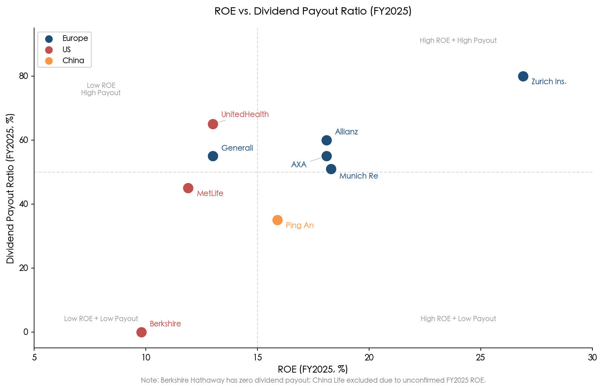

**苏黎世保险的分红可持续性最强。** 2025 年核心 ROE 达到 26.9%，为十家公司之最，远超其约 70%–90% 高派息率所需的盈利支撑 [Atlas Magazine](http://www.atlas-mag.net/en/articles/zurich-insurance-group-2025-results "Zurich Insurance Group 2025 results")。即便极端情景下 ROE 回落至 15%，苏黎世仍有充足的利润空间维持或小幅增长当前 30 瑞士法郎的 DPS 水平。公司 2025–2027 年战略目标为核心 ROE 超过 23%，为高分红提供了中期可见度 [Yahoo Finance](https://finance.yahoo.com/news/zurich-insurance-targets-core-roe-163751427.html "Zurich Insurance targets core ROE 23%+")。

**安联和安盛的 ROE 与分红形成良性循环。** 安联 2025 年核心 ROE 18.1%，配合 60% 的派息比率目标和每年 20–25 亿欧元的回购节奏，在保持资本充足（Solvency II 比率 209%）的前提下持续提升股东回报。安盛 ROE 从 2021 年的 9.9% 攀升至 2025 年的约 18.1%，ROE 的持续改善为 DPS 年均约 11% 的增速提供了坚实的盈利基础。

**慕尼黑再保险 DPS 高增长有清晰的盈利支撑。** ROE 从 2022 年的 5.3%（当年受自然灾害损失影响）回升至 2024–2025 年的 18%+ 水平，Ambition 2030 战略目标 ROE 超过 18%。以 FY2025 EPS 47.15 欧元、DPS 24 欧元计算，派息率约 51%，仍有大幅提升余量。但需关注再保险业务的内在波动性——极端巨灾年份可能导致利润骤降，对分红稳定性构成阶段性挑战。

**联合健康的分红面临中期压力。** ROE 从 2022 年 25.9% 的峰值持续下滑至 2025 年约 12%–14%，而 DPS 仍在逐年提升。FY2025 派息率显著上升，加之 Debt-to-Capital 高达 43.9%（十家公司中最高），分红+回购总额（约 135 亿美元）占净利润比例偏高。若 2026 年 ROE 不能恢复至 18% 以上，管理层可能面临放缓提息节奏或削减回购规模的压力。

**中国平安的分红可持续性正在改善。** ROE 从 2023 年的 9.5% 触底回升至 2025 年中期的 15.9%，新业务价值（NBV）连续两年实现两位数增长，投资端综合收益率回升至 6.3%。在"分红不低于净利润 30%"的约束下，FY2025 DPS 2.70 元对应的分红支出约占利润的 34%–36%，仍有一定提升空间。但低利率环境下寿险负债端的利差损压力构成中长期隐忧。

**中国人寿的分红稳定性在十家公司中最弱。** DPS 与净利润高度同步波动，缺乏平滑机制。FY2022–2023 年净利润大幅下滑期间 DPS 同步削减至 0.43 元（较 FY2021 减少 33.8%），鲜明体现了公司分红政策的"利润跟随型"特征。虽然 FY2024–2025 年利润强劲反弹推动 DPS 回升，但若未来投资端再度承压或资本市场大幅波动，分红可能再次面临收缩。

## 4.4 综合股东回报率（TSR）

综合股东回报率（Total Shareholder Return, TSR）将股价涨跌与股息再投资合并计算，是衡量股东实际获得回报的最终指标。与 DPS 增速或 ROE 等单一维度不同，TSR 综合反映了市场对公司盈利增长、资本回报策略和估值变动的总体评价。

### 4.4.1 五年 TSR 数据汇总

各公司 TSR 的口径、时间窗口和数据可得性存在差异（部分公司仅在年报或投资者演示文稿中披露特定区间 TSR），以下汇总可得数据。

**安联** 是唯一逐年披露含再投资股息 TSR 的公司：2021 年+8.1%、2022 年+2.0%、2023 年+26.8%、2024 年+28.7%、2025 年+37.6%，五年累计 TSR 约 150% [Allianz 官方](https://www.allianz.com/en/investor_relations/share/key-indicators.html "Share price performance including reinvested dividend")。这一表现在欧洲金融股中属于顶尖水平，2024–2025 年的加速上行尤为突出，反映了市场对其战略执行力和资本回报纪律的高度认可。

**慕尼黑再保险** 在 Ambition 2025 战略期（2020–2025 年）累计 TSR 达 180%，年报将其表述为"在绝对值和同业对比中均为出色表现" [Munich Re 2025 年报](https://www.munichre.com/content/dam/munichre/mrwebsiteslaunches/2025-annual-report/MunichRe-Group-Annual-Report-2025-en.pdf "Munich Re Group Annual Report 2025")。若从 2021 年起算（剔除 2020 年），五年 TSR 仍超过 170%，位居十家公司之首。

**苏黎世保险** 过去十年年化 TSR 约 18%，过去五年累计总回报约 117%（美元计 ADR 口径）[FinanceCharts](https://www.financecharts.com/stocks/ZFSVF/performance/total-return "Zurich Insurance Group Total Return") [Investing.com](https://www.investing.com/news/earnings/zurich-insurance-posts-record-2025-profit-raises-dividend-to-chf-30-4542865 "Zurich Insurance 2025")。十年累计向股东返还超过 325 亿瑞士法郎（含分红和回购），年化 TSR 18% 在全球保险同业中位居前列。

**伯克希尔** 五年累计价格回报约 113%（2021 年+29.6%、2022 年+4.0%、2023 年+15.8%、2024 年+25.5%、2025 年+10.9%）[Slickcharts](https://www.slickcharts.com/berkshire-hathaway/returns "Berkshire Hathaway Returns by Year")。由于不派发股息，其 TSR 等同于纯价格回报。尽管如此，五年翻倍的股价表现仍证明了零股息策略在特定资本配置能力下的有效性。

**忠利集团** 五年累计总回报（含再投资股息）约 168%，在 Milan 交易所保险板块中位居前列 [Yahoo Finance](https://finance.yahoo.com/quote/G.MI/ "Generali 5-Year Return 168.06%")。忠利是 2021–2025 年评级改善幅度最大的公司（三大评级机构均上调），市场对其估值重估是推动 TSR 显著超额表现的重要因素。

**安盛** 五年 TSR CAGR 约 16.9%（美元计 ADR 口径），累计五年总回报约 117% [FinanceCharts](https://www.financecharts.com/stocks/AXAHY/performance/total-return-cagr "AXA Total Return CAGR")。2025 年出售 AXA IM 后启动的 38 亿欧元特别回购对当年股价表现形成了额外提振。

**大都会人寿** 五年累计总回报约 37%（美元计），年化约 6.5% [FinanceCharts](https://www.financecharts.com/stocks/MET/performance/total-return "MetLife Total Return")。在十家公司中 TSR 表现偏弱，主要受制于营收增长温和（CAGR 约 2.9%）和 2023 年净利润大幅下滑的拖累。

**中国平安** 五年累计总回报仅约 5%（美元计 ADR 口径）[FinanceCharts](https://www.financecharts.com/stocks/PNGAY/performance/total-return "Ping An Total Return 5Y")，若以港币计则约 17% [Yahoo Finance](https://finance.yahoo.com/quote/2318.HK/ "Ping An 5-Year Return")。2022–2023 年房地产投资减值和寿险改革阵痛导致股价大幅下跌，严重拖累了五年 TSR。2024–2025 年股价反弹约 26%（2025 年四季度单季度 TSR 领跑亚太保险股）[S&P Global](https://www.spglobal.com/market-intelligence/en/news-insights/articles/2026/1/ping-an-china-life-yield-highest-q4-2025-total-returns-among-apac-insurers-97441927 "Ping An tops Q4 2025 APAC insurer returns")，但仍不足以弥补前期跌幅。

### 4.4.2 TSR 排名与归因

下图汇总了八家可得数据公司的五年累计 TSR 排行，欧洲保险公司整体大幅领先于美国和中国同行。

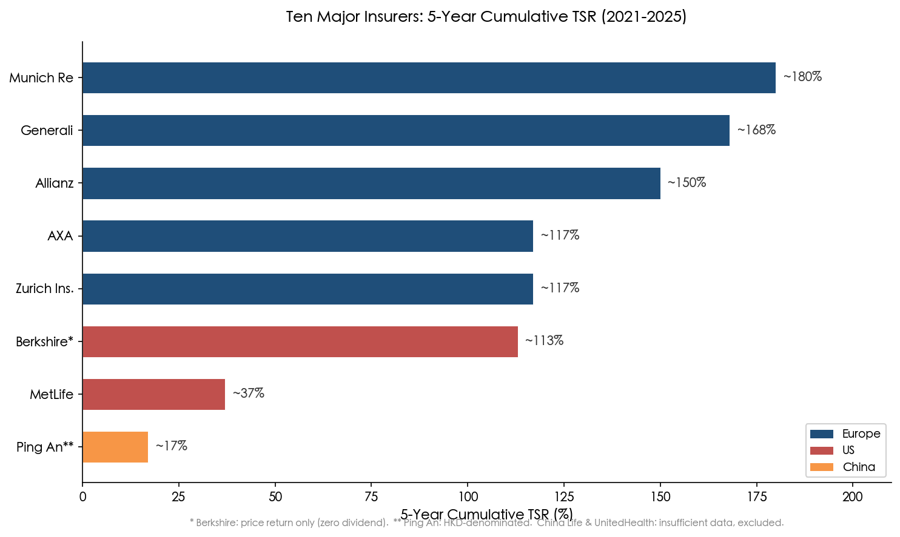

根据可得数据，十家公司的五年 TSR 大致排序如下：

| 排名 | 公司 | 五年累计 TSR（近似） | 主要驱动因素 |
|:---:|:---|:---:|:---|
| 1 | 慕尼黑再保险 | ~180% | 净利润五年连超目标、DPS 翻倍、硬市场定价红利 |
| 2 | 忠利集团 | ~168% | 评级多次上调、战略转型超额完成、估值重估 |
| 3 | 安联 | ~150% | 经营利润连创新高、高回购力度、中国布局溢价 |
| 4 | 安盛 | ~117% | 商业险硬市场红利、AXA IM 出售特别回购 |
| 5 | 苏黎世保险 | ~117% | ROE 持续攀升至 27%、高股息率、稳健增长 |
| 6 | 伯克希尔 | ~113% | 投资组合增值、GEICO 承保反转、现金储备增长 |
| 7 | 大都会人寿 | ~37% | 增长温和、2023 年利润下滑拖累 |
| 8 | 中国平安 | ~17%(HKD) | 2022–23 年估值压缩、2024–25 年反弹 |
| 9 | 中国人寿 | 数据有限 | 利润高波动、人民币贬值、分红不稳定 |
| 10 | 联合健康 | 数据有限 | 2024–25 年利润下滑及信用展望恶化 |

**TSR 领先的共性特征。** 慕尼黑再保险、忠利和安联三家 TSR 领先公司有一个显著共同点——均在 2021–2025 年间实现了 ROE 从 5%–10% 区间向 15%–18% 区间的显著提升，同时保持了严格的资本回报纪律（高分红增速叠加系统性回购）。ROE 改善与资本回报加速的双轮驱动，是推动估值重估和 TSR 领先的核心逻辑。

**TSR 落后的共性特征。** 中国平安和大都会人寿的五年 TSR 显著落后于同业。前者受制于中国房地产风险暴露、寿险改革短期阵痛和人民币贬值的三重压制；后者则受制于低增长、利润高波动和战略转型市场定价不充分的制约。两者的共同点在于，盈利增长缺乏足够的持续性来支撑估值扩张。

## 4.5 分红策略的横向比较与评价

综合 DPS 增速、分红政策机制、ROE 匹配度和 TSR 表现四个维度，十家公司的股东回报策略可归纳为以下三种典型模式和一种特殊模式：

**模式一：高增速渐进分红+系统性回购（"最优策略"）。** 代表公司：慕尼黑再保险、安联、安盛、忠利。四家公司均有清晰的量化分红目标（派息率 50%–70%），并配合年均 10–25 亿欧元的系统性回购。DPS 五年 CAGR 均超过 9%，五年 TSR 均超过 117%。该策略的前提条件是 ROE 持续高于 15% 且偿付能力充足率在目标区间上方——四家公司截至 2025 年末均满足此条件。

**模式二：高股息率稳健分红（"收益型策略"）。** 代表公司：苏黎世保险。苏黎世以 5%+ 的股息率和 70%–90% 的高派息率吸引收益型投资者，DPS 增速（CAGR 约 8%）虽略低于慕尼黑再保险，但稳定性极强——过去十年未曾削减股息。核心 ROE 26.9% 为高派息提供了充裕的安全边际。

**模式三：利润跟随型分红（"顺周期策略"）。** 代表公司：中国人寿。DPS 与净利润高度同步波动，缺乏平滑机制和最低分红承诺，股东回报的可预测性较低。该模式在利润上行期可提供较高分红（如 FY2021 的 0.65 元），但在利润下行期（FY2023 的 0.43 元）则令投资者面临较大的现金流不确定性。

**特殊模式：零股息内在价值增长型。** 代表公司：伯克希尔。股东回报完全依赖股价上涨和偶发性回购，五年价格回报约 113% 证明了策略的有效性。然而，该模式的前提是超凡的资本配置能力——这一能力在巴菲特之后的"后伯克希尔时代"能否延续，仍是市场持续关注的核心议题。

# 第5章 中国市场发展潜力评估

中国保险市场已稳居全球第二，且增速远超欧美成熟市场。对十家全球顶级保险集团而言，中国不仅是当下最具纵深的增量战场，也是未来十年重塑全球保险版图的关键变量。本章从中国保险市场总量与结构性增长机遇出发，逐一梳理各公司在华业务形态、牌照布局和竞争地位，结合监管政策演变与新兴赛道匹配度，对十家公司的中国市场潜力进行系统评估。

## 5.1 中国保险市场总量与增长态势

### 5.1.1 保费规模与全球地位

2025 年全年，中国保险业原保费收入达 6.12 万亿元人民币（约 8,800 亿美元），同比增长 7.4%，继续稳居全球第二大保险市场 [CEIC经济数据](https://www.ceicdata.com/en/china/insurance-premium/cn-insurance-premium "中国保险保费数据2025年")。回顾"十四五"收官期的保费演进轨迹，2021–2024 年保费分别为 4.49 万亿、4.70 万亿、5.12 万亿、5.70 万亿元，同比增速从 4.0% 逐步加速至 11.15%，呈现出显著的提速态势 [经济观察网](http://www.eeo.com.cn/2025/1119/767810.shtml "中国保险业十四五收官")。这一加速趋势与欧美成熟市场 2%–3% 的实际增速形成鲜明对比，折射出中国保险渗透率仍处于上升通道的结构性特征。

安联全球保险报告（2025 年 5 月版）显示，2024 年中国保险市场总保费约 7,540 亿欧元，占全球保费总量约 10.8%，这一份额在过去十年间从 5.1% 翻倍增长 [Allianz Global Insurance Report 2025](https://www.allianz.com/content/dam/onemarketing/azcom/Allianz_com/economic-research/publications/specials/en/2025/may/2025-05-27-global-insurance-report.pdf "安联全球保险报告2025年5月版")。从资产端观察，2025 年四季度末中国保险公司总资产达 41.3 万亿元，较年初增长 15.1%，资产扩张速度同样领先全球主要市场 [国家金融监督管理总局](https://www.nfra.gov.cn/cn/view/pages/ItemDetail.html?docId=1249435&itemId=915 "2025年四季度监管指标数据")。

### 5.1.2 外资保险公司市场份额

外资保险公司在中国的市场份额从 2013 年的约 4% 稳步攀升至 2025 年中的约 9%，40 家全球最大保险公司中近半已进入中国市场 [证券时报](https://www.stcn.com/article/detail/2126151.html "保险业开放稳步扩展 外资机构保费市场份额达9%")。尽管外资份额仍远低于国内巨头，但 9% 的占比较五年前已有显著提升，且增速呈加快趋势。这一变化的背后，是监管准入的全面放开与外资机构战略投入持续升级的双重驱动。

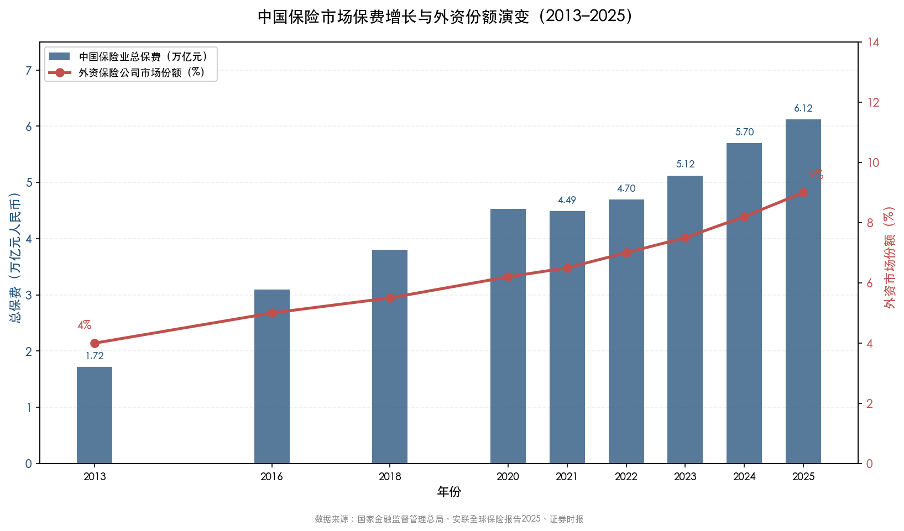

上图直观呈现了 2013–2025 年间中国保险业总保费从 1.72 万亿元增长至 6.12 万亿元的扩张轨迹，以及同期外资保险公司市场份额从约 4% 攀升至 9% 的趋势，市场总量扩张与外资渗透率提升呈现同步加速的特征。

## 5.2 监管环境与外资准入政策演变

中国保险市场的外资准入经历了从审慎开放到全面放开的制度性转变，2020–2025 年间的五个关键政策节点深刻重塑了市场格局。

**2020 年 1 月**，中国全面取消外资保险公司持股比例限制，允许外资设立独资保险公司 [国家金融监督管理总局](https://www.nfra.gov.cn/cn/view/pages/ItemDetail.html?docId=971672&itemId=915 "修改外资保险公司管理条例实施细则")。这一标志性政策为安联、安盛等机构的独资转型扫清了法律障碍，也直接推动了后续数年间外资保险公司密集的股权结构调整。

**2022 年**，偿二代二期（C-ROSS Phase II）正式实施，对保险公司资本计量进行更精细化管理。外资公司凭借母公司雄厚资本实力，在偿付能力充足率方面普遍表现优于行业均值，但更高的合规成本也对中小型外资机构构成一定压力。

**2023 年 5 月**，国家金融监督管理总局（NFRA）正式挂牌，取代原银保监会，确立了涵盖保险、银行和其他金融机构的统一穿透式监管体系，监管一致性和透明度有所提升。

**2024 年 9 月**，国务院发布新"国十条"（《关于加强监管防范风险推动保险业高质量发展的若干意见》），鼓励养老金融和健康保险发展，明确支持商业保险在多层次社会保障体系中发挥更大作用，为外资公司在养老和健康两大赛道的布局提供了政策背书。

**2024 年**，NFRA 明确外商投资准入负面清单中金融业限制措施已完全清零 [东方财富](https://wap.eastmoney.com/a/202401252972678783.html "已取消外资股份比例限制")。在保险领域，中国对外资的准入门槛已降至全球最低水平之一。

综合而言，当前监管环境对外资保险公司构成结构性利好：持股比例限制清零为独资经营全面铺路，新"国十条"释放了健康险和养老金融的政策红利，而偿二代二期的资本精细化管理对偿付能力充足率优异的欧洲巨头而言反而形成差异化竞争壁垒，削弱了部分中小本土险企的相对优势。

## 5.3 结构性增长机遇

中国保险市场的增长动力已从"总量扩张"转向"结构升级"，健康险、养老第三支柱和新能源车险三大赛道构成未来五至十年的核心增长引擎。

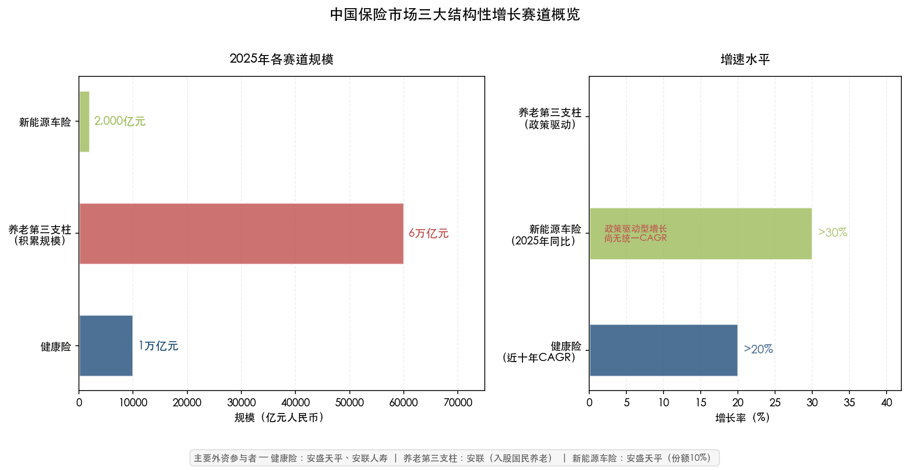

上图对比展示了三大赛道的 2025 年规模与增速水平，并标注了主要外资参与者，为后续各公司战略匹配度分析提供量化基础。

### 5.3.1 健康险：冲刺万亿保费

2025 年前 11 个月，中国健康险保费达 9,440 亿元，有望首次突破万亿元大关；近十年健康险保费年均复合增长率（CAGR）超过 20% [新浪财经/泰康报告](https://cj.sina.cn/articles/view/7857141524/1d452771401901kzls?froms=ggmp&vt=4 "健康险冲刺万亿保费")。人口老龄化加速、基本医保覆盖面的结构性缺口以及中产阶级对高端医疗保障的需求升级，共同构成健康险长期增长的底层逻辑。外资保险公司在健康险产品设计、精算技术和全球医疗网络对接方面具备显著比较优势，安盛天平和安联人寿均已将健康险列为中国市场的核心赛道。

### 5.3.2 养老第三支柱：政策驱动的蓝海

商业养老保险积累规模已超过 6 万亿元，覆盖近 1 亿人 [经济观察网](http://www.eeo.com.cn/2025/1119/767810.shtml "中国保险业十四五收官")。新"国十条"和个人养老金制度的持续推进，使商业养老保险从自发增长进入政策驱动的快车道。安联于 2024 年 12 月以 2% 股权入股国民养老保险公司，直接切入这一赛道，成为唯一一家通过股权方式参与中国养老金融的外资保险集团 [Caixin Global](https://www.caixinglobal.com/2025-12-25/allianz-backed-chinese-insurer-to-tap-local-state-investors-for-pension-finance-push-102397200.html "安联支持养老金融推进")。中国人寿则凭借国有品牌信任度和广泛的县域网络，在个人养老金领域稳居行业首位。

### 5.3.3 新能源车险：高增速的新赛道

新能源车险预计 2025 年保费突破 2,000 亿元（同比增速超 30%），在保车辆超 4,000 万辆 [经济观察网](http://www.eeo.com.cn/2025/1119/767810.shtml "中国保险业十四五收官")。新能源车险定价复杂度显著高于传统车险——电池风险评估、智能驾驶系统责任界定、以及车辆残值波动等因素对精算技术和数据分析能力提出更高要求。安盛天平在新能源车险领域定位精准，市场份额从 7.4% 提升至 10%，在外资财险公司中居领先地位 [AXA Tianping CEO采访](https://en.jiemian.com/article/12548426.html "AXA Tianping CEO专访")。

## 5.4 十家公司在华业务形态与竞争地位

根据在中国市场的参与深度与战略定位，十家公司可划分为三个梯队：本土巨头（主场作战）、深度布局的外资（全牌照或独资经营）、以及有限参与或缺席者。

### 5.4.1 第一梯队：本土巨头——中国平安与中国人寿

**中国平安** 是中国最大的综合金融集团之一。2024 年，平安实现营收 1.14 万亿元，归母净利润 1,266 亿元（同比+47.8%），零售客户数达 2.42 亿 [中国平安年报新闻稿](https://www.prnewswire.com/news-releases/ping-an-reports-stable-growth-in-operating-profit-attributable-to-shareholders-of-the-parent-company-in-2024--net-profit-attributable-to-shareholders-of-the-parent-company-surges-47-8-yoy-302405915.html "中国平安2024年年报发布")。平安的核心竞争力根植于"综合金融+医疗健康养老"双轮驱动战略——科技赋能方面累计申请专利 55,080 件，AI 客服处理量占比达 80%。保险资金投资组合规模 6.49 万亿元（同比+13.2%），新业务价值（NBV）同比增长 29.3%，标志着寿险改革进入收获期。

平安在中国市场的优势几乎不可复制：全牌照体系涵盖寿险、财险、银行、证券、信托、资管等业务线，超过 2.4 亿零售客户构成闭环生态系统，叠加全国最密集的线下渠道网络。其主要风险在于国际化程度有限——中国大陆贡献了绝大部分营收和利润，单一市场集中度构成地缘与周期性风险敞口。

**中国人寿** 2024 年实现总保费 6,714.57 亿元（寿险行业第一），归母净利润首次突破千亿达 1,069.35 亿元（同比+108.9%），总资产突破 6.77 万亿元，内含价值超 1.4 万亿元 [中国人寿年报](https://finance.sina.cn/insurance/gsdt/2025-03-26/detail-ineqyvpe5857699.d.html "中国人寿2024年度业绩")。中国人寿在个人养老金领域居行业首位，是新"国十条"政策红利的直接受益者。

中国人寿的竞争优势体现在国有背景带来的品牌信任度、全国最广泛的县域及农村覆盖网络、以及在政策性业务（大病保险、长期护理险等）中的主导地位。其主要短板在于科技转型和产品创新步伐相对滞后，国际化布局同样有限。

两家本土巨头在中国市场的地位短期内不可撼动。对其评估应聚焦于国内市场的守成能力，以及能否将规模优势转化为可持续的利润增长。

### 5.4.2 第二梯队：深度布局的外资保险公司

**安联（Allianz）** 在中国拥有外资保险公司中最齐全的牌照体系。安联（中国）保险控股有限公司于 2020 年开业，成为首家外资独资保险控股公司；安联人寿于 2022 年由中外合资转为安联独资；此外还持有京东安联财险 53.33% 股权（合资），并设有安联保险资产管理（独资）和国联安基金管理等实体 [证券时报](https://stcn.com/article/detail/1419000.html "安联控股林顺才：中国是安联非常重要的市场")。

从经营数据看，安联人寿 2025 年全年签单保费 61.84 亿元，保险业务收入 59.83 亿元，净利润 4.23 亿元，总资产 633.22 亿元，综合偿付能力充足率高达 320.23%，风险综合评级 AA 级 [安联人寿偿付能力报告](https://www.allianz.com.cn/allianz/690df35e75ea4922a3a0d8c4e532412d.pdf "安联人寿2025年Q4偿付能力报告")。2024 年 12 月，安联以 2% 股权入股国民养老保险公司，正式切入养老金融赛道 [Caixin Global](https://www.caixinglobal.com/2025-12-25/allianz-backed-chinese-insurer-to-tap-local-state-investors-for-pension-finance-push-102397200.html "安联支持养老金融推进")。

安联在中国市场的核心竞争优势包括三方面：独资保险控股架构赋予的完全运营自主权、跨寿险/财险/资管/养老的全牌照覆盖、以及母公司 Solvency II 充足率 209% 的强大资本后盾。其主要制约因素在于绝对业务规模仍然偏小（安联人寿保费约 60 亿元，在全国寿险公司中排名靠后），渠道网络仅覆盖 10 家省级分公司，品牌在下沉市场的认知度有限。

**安盛（AXA）** 通过安盛天平财产保险有限公司（AXA 100% 独资）深耕中国财险市场。安盛天平 2024 年实现保险业务收入 67.41 亿元（其中直接保费 58.60 亿元，分入保费 8.81 亿元），较 2023 年的 65.35 亿元增长 3.15%；全年净亏损 0.66 亿元，较上年亏损 0.99 亿元有所收窄 [安盛天平2024年度信息披露报告](https://preaidp.axa.cn/wp-content/uploads/2025/04/yearlnfo_0034.pdf "安盛天平2024年年度信息披露报告")。安盛天平在全国 25 个省份设有分公司，新能源车险份额从 7.4% 提升至 10%，管理层预计 2026 年恢复盈利 [Insurance Asia](https://insuranceasia.com/insurance/news/axa-tianping-property-casualty-insurance-return-profit-2026 "AXA天平2026年有望恢复盈利")。

安盛天平的偿付能力充足率为 239.65%（2024 年末），远高于监管要求。作为中国市场唯一一家外资独资财险公司，其战略重心聚焦于车险（尤其新能源车险）、健康险和商业险三大领域。安盛在中国的主要劣势在于持续多年的亏损状态——自 2019 年实现全资控股以来尚未盈利，累计未弥补亏损超过 10.5 亿元，对母公司的战略耐心和持续资本投入构成考验。

**忠利集团（Generali）** 在中国拥有中意财险（2025 年 3 月完成外资独资转型）和中意人寿（与中石油资本 50/50 合资）两大业务平台 [忠利集团新闻稿](https://www.generali.com/media/press-releases/all/2025/Generali-Completes-Share-Acquisition-of-Its-Chinese-P-and-C-Insurance-Business "忠利完成中国财险股权收购")。

中意人寿是忠利在华布局的核心载体。2024 年，中意人寿实现保险业务收入 323.83 亿元（同比+38.61%），净利润 13 亿元（同比+4.33%）；2025 年总保费收入进一步跃升至 488 亿元（同比+34.2%），总资产突破 2,000 亿元 [新浪财经](https://cj.sina.cn/articles/view/7935760744/1d9021968001017mn0 "保险新观察：中意人寿") [企查查](https://m.qcc.com/firm/d299805ddf1fc09b2ccd8b80dce37588.html "中意人寿企业信息")。中意人寿已连续 15 年实现盈利，在外资寿险公司中属于少数能持续盈利的标杆，其核心产品以分红型终身寿险为主，"一生中意"系列已成为市场爆款。

忠利在中国的优势在于中意人寿的品牌口碑和稳健盈利能力，以及借助中石油资本的渠道资源触达高净值客户群体。主要制约因素在于中意人寿仍为 50/50 合资结构，忠利对经营决策的自主权不及安联和安盛的独资模式充分；中意财险规模较小，独资转型后的业务整合与规模扩展仍处于起步阶段。

**大都会人寿（MetLife）** 通过中美联泰大都会人寿保险有限公司（与上海联和投资 50/50 合资）经营中国寿险业务。2024 年，大都会人寿中国保费收入 259.70 亿元（同比+38%），增幅远超行业均值，市场份额增幅为所有外资寿险公司中最大（+0.52 个百分点）[新华财经](https://www.cnfin.com/hb-lb/detail/20250430/4226351_1.html "大都会人寿2024年原保费收入同比增长超38%")。大都会在员工福利和团体保险领域具备差异化竞争优势，但合资架构限制了其战略自主性，且在个人零售渠道的深度不及安联和忠利。

### 5.4.3 第三梯队：有限参与或缺席者

**慕尼黑再保险（Munich Re）** 在中国设有北京分公司，年保费约 20 亿欧元（约 21.9 亿美元），主要从事再保险业务。慕尼黑再保险的研究表明，中国仅约 5% 的自然灾害风险获保险覆盖（全球平均约 38%），巨灾再保险增长空间巨大 [China Daily](https://www.chinadaily.com.cn/a/202401/16/WS65a5e273a3105f21a507c7c9.html "Munich Re bullish on China")。然而，慕尼黑再保险在中国无直保牌照，其业务增长受限于再保险市场的天然规模上限。

**苏黎世保险（Zurich Insurance）** 在中国经营苏黎世财险（中国），走精品专业化路线。2025 年保费约 10.99 亿元，综合成本率 91.57%，盈利质量优良 [蓝鲸新闻/新浪财经](https://cj.sina.cn/articles/view/5617041192/14ecd3f2802001lmpu?froms=ggmp "苏黎世财险中国2025年偿付能力报告")。苏黎世在中国的定位聚焦于商业险和专业险细分领域，不追求规模扩张，业务精而不广。

**伯克希尔·哈撒韦（Berkshire Hathaway）** 和 **联合健康集团（UnitedHealth Group）** 在中国大陆均无保险法人实体。伯克希尔的保险业务核心在北美财险和再保险领域，中国从未进入其战略版图。联合健康作为美国健康险巨头，其商业模式高度依赖美国医疗体系的管理式医疗（Managed Care）框架，与中国医保体系存在根本性差异，跨境商业模式复制的难度极大。

## 5.5 各公司中国市场竞争力对比

综合各维度分析，十家公司的中国市场参与度与竞争力呈现清晰的梯队分化。下表汇总了各公司在华业务形态、保费规模、牌照覆盖和战略重视程度等关键指标：

| 公司 | 在华业务形态 | 2024/2025 年在华保费规模 | 牌照覆盖 | 战略重视度 | 增长空间评估 |
|:---|:---|:---:|:---|:---:|:---|
| 中国平安 | 综合金融集团 | 8,581 亿元 | 全牌照 | ★★★★★ | 守成为主，增量在医疗健康养老 |
| 中国人寿 | 寿险集团 | 6,717 亿元 | 寿险/年金 | ★★★★★ | 养老金融政策红利直接受益 |
| 安联 | 独资保险控股 | ~62 亿元（安联人寿） | 寿险/财险/资管/养老 | ★★★★★ | 牌照最齐全，养老赛道新入口 |
| 安盛 | 独资财险 | ~67 亿元（安盛天平） | 财险 | ★★★★☆ | 新能源车险+健康险双引擎 |
| 忠利 | 合资寿险+独资财险 | ~488 亿元（中意人寿 2025） | 寿险/财险 | ★★★★☆ | 寿险规模快速扩张，分红产品爆发 |
| 大都会人寿 | 合资寿险 | 260 亿元 | 寿险 | ★★★☆☆ | 团险优势突出，零售渠道待深化 |
| 慕尼黑再保险 | 分公司（再保险） | ~20 亿欧元 | 再保险 | ★★★☆☆ | 巨灾保障缺口大，但无直保牌照 |
| 苏黎世保险 | 独资财险 | ~11 亿元 | 财险 | ★★☆☆☆ | 精品路线，规模有限 |
| 伯克希尔 | 无保险法人实体 | — | — | ★☆☆☆☆ | 非战略市场 |
| 联合健康 | 无保险法人实体 | — | — | ★☆☆☆☆ | 商业模式不适配中国医保体系 |

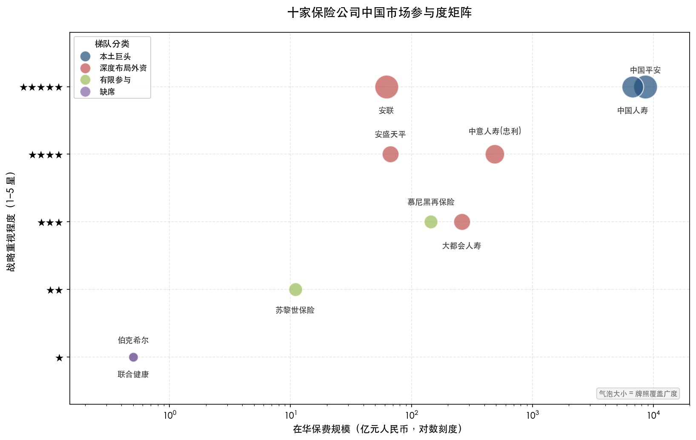

上图以保费规模（对数刻度）、战略重视程度和牌照覆盖广度三个维度，直观呈现了十家公司在中国市场的梯队分化格局。本土巨头占据右上方绝对优势区域，深度布局外资处于中部成长区间，有限参与和缺席者则分布于左下方。

### 5.5.1 外资保险公司的共性优势与短板

**共性优势**：母公司资本实力雄厚（偿付能力充足率普遍在 200% 以上），全球精算与风控经验积淀深厚，在专业险种（健康险、责任险、新能源车险、巨灾再保险）上具备技术壁垒，国际品牌对高净值客户群体亦形成一定吸引力。

**共性短板**：渠道网络与本土巨头差距悬殊（安联人寿仅 10 家省级分公司，安盛天平 25 家，而平安寿险覆盖全国所有省份）；品牌在三四线及以下城市的认知度有限；中外管理文化差异和较长的决策链条影响运营效率；外资身份在个别政策性业务（如大病保险、城市定制型商业健康险"惠民保"等）中的参与资格亦受到一定限制。

### 5.5.2 战略匹配度分析

将三大结构性增长机遇与各公司核心能力交叉比对，可以识别出差异化的战略卡位格局：

**健康险赛道**：安盛天平的健康险直接保费增长强劲（2024 年健康险保费 10.65 亿元，位列其五大险种之一），安联人寿亦将健康险列为重点产品线。在健康险领域，外资公司的产品设计和核保技术优势可转化为真实的差异化竞争力，尤其在高端医疗和跨境医疗保障等细分市场。

**养老第三支柱**：安联是唯一一家通过入股国民养老保险公司直接切入养老金融赛道的外资保险集团，具备明确的先发优势。中国人寿和中国平安则凭借庞大的客户基数和政策性业务参与度，在此赛道占据主导地位。

**新能源车险**：安盛天平在外资财险公司中定位最为精准，新能源车险份额达 10%，且管理层明确预计 2026 年恢复盈利。苏黎世财险以精品策略经营，规模较为有限。其他外资公司在此赛道的参与深度较低。

## 5.6 综合评估与潜力排序

综合市场规模、牌照布局、战略匹配度和经营表现等维度，十家公司的中国市场发展潜力可做如下分层判断：

**最高潜力（10 分）：中国平安、中国人寿。** 两家本土巨头在中国市场的绝对规模、渠道纵深和政策连接度无可匹敌。平安的科技赋能与综合金融生态系统构成长期竞争壁垒，中国人寿的养老金融先发优势和国有品牌信任度在政策驱动型市场中价值尤为突出。

**高潜力（8 分）：安联。** 安联是外资保险公司中中国市场潜力最大的一家。独资保险控股架构赋予完全的经营自主权，全牌照覆盖（寿险+财险+资管+养老）提供跨赛道增长通道。2024 年入股国民养老保险是关键战略落子，彰显集团层面对中国市场的长期承诺。安联在 Ambition 2027 战略中明确将亚洲（尤其中国）列为增长优先区域。主要制约因素在于绝对规模仍然偏小——从 60 亿元保费向百亿级的跨越需要时间和持续资本投入。

**中等偏高潜力（7 分）：安盛、忠利。** 安盛天平在新能源车险领域建立了差异化的竞争定位，25 家分公司的覆盖面在外资财险中最广，但持续亏损和单一财险牌照限制了整体潜力释放。忠利旗下中意人寿增长迅猛（2025 年保费 488 亿元，同比+34.2%），连续 15 年盈利在外资寿险公司中极为罕见，但 50/50 合资架构对忠利的战略自主性形成结构性约束。

**中等潜力（5–6 分）：大都会人寿、慕尼黑再保险。** 大都会 2024 年保费增速达 38%，市场份额增幅居外资寿险之首，但合资模式和相对单一的团险定位限制了增长天花板。慕尼黑再保险受益于中国巨灾保障缺口的扩大（仅约 5% 的自然灾害风险获保险覆盖），但缺乏直保牌照意味着增长路径受到结构性限制。

**低潜力（2–4 分）：苏黎世保险。** 精品化战略定位决定了规模上限有限，中国市场并非苏黎世的全球战略重心。

**极低潜力（1 分）：伯克希尔、联合健康。** 两家公司在中国大陆无保险法人实体，且无进入中国保险市场的战略意图。伯克希尔的多元化帝国不依赖中国保险增长，联合健康的管理式医疗模式与中国医保体系存在根本性不兼容。

从中国市场维度审视其对全球资产排名的潜在影响：中国平安凭借 17,752 亿美元的总资产基数和中国保险市场 7% 以上的年增速，在资产规模上具备持续攀升的基础条件。安联若能在中国市场实现规模突破（从当前约 60 亿元保费向 200–300 亿元级别迈进），叠加其欧洲核心市场的稳健增长，在全球资产排名中进一步巩固领先地位的概率较高。慕尼黑再保险虽然中国业务绝对体量有限，但全球巨灾再保险需求的结构性增长（中国自然灾害保障缺口仅约 5%）将为其提供持续增量来源。

# 第6章 综合评估与前瞻判断

前五章分别从全景画像、资本实力与信用基本面、五年经营增长、股东回报与分红实绩、中国市场发展潜力五个维度，对十家全球综合实力前十的保险公司进行了系统性剖析。本章将上述多维分析成果整合为统一的综合评价框架，通过五维度加权评分模型对十家公司进行定量排序，并在此基础上筛选出 2–3 家综合实力最优且未来增长前景最为明确的公司，最终回应本报告的核心命题——哪些保险公司最有可能在未来全球资产排名中实现持续跃升。

## 6.1 行业中期增长预测与战略环境

对个别公司做出前瞻判断之前，须先锚定全球保险行业的中期增长基准与竞争格局演变方向。

### 6.1.1 全球保费增长放缓但绝对增量仍然可观

Swiss Re sigma 5/2025 预测，2026–2027 年全球保费实际增长约 2.3%，略低于过去五年约 2.5% 的 CAGR [Swiss Re sigma 5/2025](https://www.swissre.com/institute/research/sigma-research/sigma-2025-05-global-economic-insurance-outlook-shifting-sands.html "sigma 5/2025: 全球经济与保险市场展望 2026/27")。增速的温和回落反映了两重结构性约束：其一，产险硬市场周期正在边际软化，定价增长对保费的拉动效应递减；其二，北美、西欧等成熟市场保险渗透率已接近饱和，有机增长空间收窄。尽管如此，考虑到 2024 年全球保费总规模已达约 7.0 万亿欧元（约 7.7 万亿美元），2%+ 的实际增长仍意味着每年新增数千亿美元保费规模，行业的绝对增量依然可观。

### 6.1.2 结构性增长引擎：新兴市场与寿险领域

Deloitte 2026 展望预测，全球寿险保费至 2035 年年均增长约 5.3%，显著高于产险增速，中国、印度和东南亚构成主要驱动力 [Deloitte 2026 保险展望](https://www.deloitte.com/us/en/insights/industry/financial-services/financial-services-industry-outlooks/insurance-industry-outlook.html "2026 global insurance outlook")。这一判断与前述各章分析高度一致——中国保险市场 2025 年保费达 6.12 万亿元人民币（同比+7.4%），增速数倍于欧美成熟市场，且保险渗透率仍有显著提升空间。在寿险和健康险领域，人口老龄化加速、养老第三支柱政策持续推进以及健康险冲刺万亿保费目标等结构性趋势，将持续为深度布局亚洲市场的保险公司提供超额增长机会。

### 6.1.3 并购浪潮重塑竞争格局

2025 年全球保险行业 M&A 交易总额约 1,040 亿美元（同比+18%），欧洲保险公司主导了这一轮并购浪潮 [McKinsey 保险 M&A 报告](https://www.mckinsey.com/capabilities/m-and-a/our-insights/insurance-big-deals-in-europe-and-continued-activity-in-the-americas-spark-m-and-a "Insurance M&A 2026年2月")。安联、安盛和忠利均为活跃的收购方——忠利于 2024 年宣布收购 Natixis 保险业务（交易金额约 150 亿欧元级别）即为标志性事件。并购能力已成为决定未来资产排名变动的关键变量，一笔大型并购即可在一至两年内显著改变一家公司的资产规模和全球竞争地位。对于评估未来排名走势而言，公司的并购意愿、资本缓冲和信用评级所赋予的融资能力，与有机增长同等重要。

## 6.2 公司中期战略目标：承诺与可信度

评估公司未来增长前景，不能仅依赖外推历史趋势，还须将其公开的量化战略目标与既有执行记录做交叉验证。以下梳理十家公司中设有明确中期量化目标的六家。

### 6.2.1 安联（Ambition 2027：2024–2027）

安联设定的 Ambition 2027 目标包括：EPS CAGR 7–9%、ROE≥17% [Insurance Business Magazine](https://www.insurancebusinessmag.com/us/news/breaking-news/allianz-preps-for-new-goals-through-2027-517381.aspx "Allianz preps for new goals through 2027")。2025 年安联实际经营利润创纪录达 174 亿欧元（同比+8.4%），核心净利润 111 亿欧元（同比+10.9%），核心 ROE 达 18.1%，首年即超额完成目标区间。安联的战略执行可信度在十家公司中处于最高水平——其 2019–2024 年"Simplicity Wins"战略期间同样超额完成了各项量化指标，两个连续战略周期的达标记录为 Ambition 2027 的后续兑现提供了坚实信任基础。

### 6.2.2 慕尼黑再保险（Ambition 2030：2025–2030）

慕尼黑再保险的 Ambition 2030 目标堪称行业最为激进：ROE 超过 18%、EPS 年增超过 8%、总派息率（分红+回购占净利润）超过 80%，且 2020–2025 年累计 TSR 已达 171% [Munich Re Ambition 2030](https://www.munichre.com/en/company/media-relations/media-information-and-corporate-news/media-information/2025/media-release-2025-12-11.html "Munich Re Ambition 2030")。2021–2025 年净利润 CAGR 高达约 20.8%、2024 年末 Solvency II 比率 287%（行业最高）、2025 年 ROE 18.3%——上述基本面数据表明慕尼黑再保险具备充分的支撑力来兑现 Ambition 2030 目标。

### 6.2.3 苏黎世保险（2025–2027 战略）

苏黎世保险设定了核心 ROE 超过 23%、核心 EPS CAGR 超过 9%、累计现金回报超过 190 亿美元的 2025–2027 战略目标 [Yahoo Finance](https://finance.yahoo.com/news/zurich-insurance-targets-core-roe-163751427.html "Zurich Insurance targets core ROE 23%+")。2025 年苏黎世核心 ROE 已达 26.9%，大幅超越 23% 的目标底线，经营表现突出。但其面临的核心约束在于总资产基数相对较小（约 4,022 亿美元），即便维持极高的 ROE，对全球资产排名的拉动效应也较为有限。

### 6.2.4 忠利集团（Lifetime Partner 27：2025–2027）

忠利设定 EPS CAGR 8–10%、现金回报超过 70 亿欧元（含每年至少 5 亿欧元回购）的 Lifetime Partner 27 战略目标 [Generali](https://www.generali.com/who-we-are/Strategic-Plan-Lifetime-Partner-27 "Lifetime Partner 27 战略计划")。上一周期 Lifetime Partner 24 中忠利实际 EPS CAGR 达 11.3%，超额完成 6%–8% 的原定目标。叠加收购 Natixis 保险业务带来的增量贡献，Lifetime Partner 27 目标的达成概率较高。

### 6.2.5 安盛（Unlock the Future：2024–2026）

安盛 2024–2026 战略计划"Unlock the Future"设定了 Underlying EPS CAGR 6–8%、Underlying ROE 14–16% 的目标 [AXA 战略计划新闻稿](https://www.axa.com/en/press/press-releases/axa-announces-its-2024-2026-strategy-setting-ambitious-new-financial-targets "AXA 2024-2026 战略计划发布")。2025 年安盛已表示有信心在 EPS 增速上达到目标区间的上端 [Investing.com](https://www.investing.com/news/company-news/axa-fy25-slides-8-eps-growth-drives-record-profitability-93CH-4527137 "AXA FY25: 8% EPS growth drives record profitability")。出售 AXA IM 后，安盛更加聚焦于技术型风险（产险和健康险），业务组合的清晰化有利于提升估值水平和盈利质量。

### 6.2.6 中国平安与中国人寿

中国平安未公开披露类似欧洲同业的量化中期 EPS/ROE 目标，其战略表述聚焦于定性方向——"综合金融+医疗健康养老"双轮驱动。从 2025 年经营数据观察，平安归母操作利润 1,344 亿元人民币（同比+10.3%），Operating ROE 12.7%，归母净利润（剔除非经常性）1,438 亿元（同比+22.5%），NBV 增长 29.3% [中国平安 2025 年报](https://www.hkexnews.hk/listedco/listconews/sehk/2026/0326/2026032600952.pdf "中国平安2025年报告")。平安的增长动力主要来自中国市场的结构性红利和自身科技赋能转型的深化，其增长路径的可预见性依赖于对中国宏观经济和监管环境走向的判断。

中国人寿 2025 年归母净利润 1,541 亿元人民币（同比+44.1%），加权平均 ROE 达 27.81%（同比+6.22 个百分点）[Yahoo Finance 业绩速报](https://sg.finance.yahoo.com/news/china-life-insurance-co-ltd-070053371.html "China Life FY2025 Earnings Call Highlights")。该 ROE 水平为十家公司之最，但其可持续性须审慎评估——2025 年净利润的大幅增长很大程度上受益于权益市场回暖带来的投资收益跳升，而非承保端的结构性改善。若权益市场回调，中国人寿的利润和 ROE 水平可能出现显著波动。

## 6.3 综合评价框架：五维度加权模型

### 6.3.1 评价维度与权重设定逻辑

为实现跨公司的系统性比较，我们构建了五维度加权评分模型，对十家公司在 1–10 分区间内逐维度打分，加权汇总后得出综合得分。各维度权重设定遵循以下逻辑：

| 维度 | 权重 | 评价逻辑 |
|:---|:---:|:---|
| 资本实力与财务稳健性 | 25% | 总资产基数、偿付能力充足率、信用评级、杠杆率。资本实力是保险公司承保能力和抗风险能力的根基，决定其在极端情景下的生存能力及并购扩张的战略潜力 |
| 增长动能与经营质量 | 25% | 近五年营收/保费 CAGR、综合成本率趋势、ROE 中枢与走向、中期战略目标可信度。增长动能与经营质量共同决定公司资产规模能否持续扩张 |
| 中国市场潜力 | 20% | 在华业务形态与牌照覆盖、战略重视程度、增长空间。中国作为全球第二大保险市场且增速数倍于成熟市场，对未来全球资产排名变动具有关键影响力 |
| 股东回报与资本管理 | 15% | TSR 历史表现、分红稳定性与增速、回购力度。股东回报能力反映管理层的资本配置效率和长期价值创造理念 |
| 战略前瞻性与抗风险能力 | 15% | 战略清晰度与执行力、并购能力、业务多元化程度、风险韧性。前瞻性战略布局决定公司能否穿越行业周期、捕捉结构性机遇 |

权重的设定反映了本报告的核心问题导向——"未来资产排名靠前"既需要坚实的资本底座（25%），也需要持续的增长引擎（25%），同时中国市场作为全球最大增量来源获得了 20% 的权重。股东回报和战略前瞻性各占 15%，分别体现资本效率和长期竞争力。

### 6.3.2 十家公司综合评分

基于前五章的详尽分析，各维度评分及加权综合得分汇总如下：

| 排名 | 公司 | 资本实力(25%) | 增长动能(25%) | 中国市场(20%) | 股东回报(15%) | 战略前瞻(15%) | 综合得分 |
|:---:|:---|:---:|:---:|:---:|:---:|:---:|:---:|
| 1 | **安联** | 9 | 9 | 8 | 9 | 9 | **8.85** |
| 2 | **中国平安** | 9 | 8 | 10 | 7 | 8 | **8.55** |
| 3 | **慕尼黑再保险** | 8 | 9 | 6 | 9 | 9 | **8.10** |
| 4 | 中国人寿 | 8 | 7 | 10 | 5 | 6 | **7.40** |
| 5 | 苏黎世保险 | 7 | 9 | 4 | 9 | 8 | **7.20** |
| 6 | 安盛 | 7 | 7 | 7 | 8 | 7 | **7.15** |
| 7 | 伯克希尔 | 10 | 7 | 2 | 7 | 8 | **6.95** |
| 8 | 忠利集团 | 7 | 7 | 5 | 7 | 7 | **6.60** |
| 9 | 大都会人寿 | 6 | 6 | 5 | 7 | 6 | **6.00** |
| 10 | 联合健康 | 6 | 7 | 1 | 7 | 6 | **5.40** |

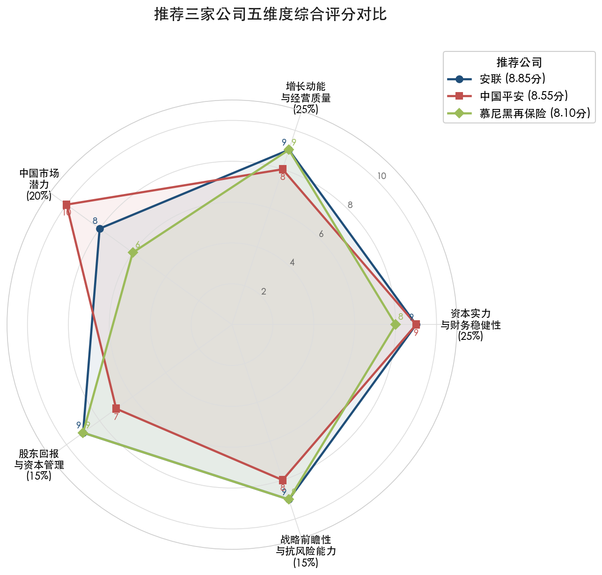

上图以雷达图形式叠加展示安联、中国平安和慕尼黑再保险三家推荐公司的五维度评分轮廓。安联五维均衡、无明显短板；中国平安在中国市场维度以满分突出；慕尼黑再保险在增长动能、股东回报和战略前瞻性三个维度与安联并列领先，但中国市场和资本规模构成相对短板。

### 6.3.3 评分要点说明

**资本实力维度。** 伯克希尔以约 3,100 亿美元法定盈余、3,340 亿美元现金储备和 AA+/Aa1 评级获得满分 10 分。安联（总资产 10,817 亿美元、Solvency II 209%、AA/Aa1 评级）和中国平安（总资产 17,752 亿美元、综合偿付能力 204%、含平安银行）并列 9 分——平安总资产规模更大但偿付能力略紧张，安联资产规模稍小但信用评级更高，两者各有千秋。慕尼黑再保险和中国人寿获 8 分：慕再偿付能力充足率 287% 为行业之冠但总资产基数仅 2,967 亿美元；中国人寿总资产 9,477 亿美元但核心偿付能力充足率 137.50% 相对紧张。联合健康和大都会人寿获 6 分：联合健康 Debt-to-Capital 高达 43.9%、评级展望被下调至 Negative；大都会资产规模和评级均处于中等水平。

**增长动能维度。** 安联（经营利润 CAGR 约 8%+、ROE 从 8.3% 持续攀升至 18.1%、Ambition 2027 目标首年超额完成）、慕尼黑再保险（净利润 CAGR 约 20.8%、ROE 18.3%、再保险 COR 73.5%）和苏黎世保险（核心 ROE 26.9%、BOP 大幅提升）并列 9 分。中国平安获 8 分：NBV 强劲反弹（+29.3%）、经营利润增长 10.3%，但 Operating ROE 仅 12.7%，且低利率环境对寿险投资端构成持续压力。联合健康虽然营收 CAGR 达 11.7%（十家公司之最），但 2024–2025 年连续两年净利润下滑（2024 年-35.6%、2025 年-16.3%），增长质量堪忧，获 7 分。

**中国市场维度。** 中国平安和中国人寿作为本土巨头获满分 10 分。安联作为外资中牌照最齐全的公司（独资保险控股+寿险+财险+资管+养老）获 8 分，2024 年入股国民养老保险公司标志着其中国战略的进一步深化。安盛获 7 分（独资财险、新能源车险份额 10%），慕尼黑再保险获 6 分（再保险分公司、巨灾保障缺口大但无直保牌照），忠利和大都会各获 5 分。伯克希尔和联合健康在中国大陆无保险法人实体，分别获 2 分和 1 分。

**股东回报维度。** 安联（五年 TSR 约 150%、DPS CAGR 9.6%、累计回购逾 140 亿欧元）、慕尼黑再保险（DPS 五年增长 118.2%、TSR 171%、Ambition 2030 总派息率目标超 80%）和苏黎世保险（股息率 5%+、核心 ROE 26.9% 支撑高派息可持续性）并列 9 分。中国人寿获 5 分——DPS 五年实际下降 4.9%、不实施回购、分红与利润高度同步波动，在十家公司中股东回报稳定性最弱。

**战略前瞻性维度。** 安联（Ambition 2027 目标清晰且首年超额完成、并购能力卓越、业务横跨产险/寿险/资管多元化）和慕尼黑再保险（Ambition 2030 定位精准、全球再保险龙头天然受益于保障缺口扩大和气候风险上升的长期趋势）并列 9 分。伯克希尔获 8 分——其战略以"耐心资本"为核心理念而非量化目标导向，但其资本配置的长期纪律性和极端风险下的承保能力在行业中独树一帜。中国人寿获 6 分：国有体制下战略调整的灵活性受限，科技转型和国际化布局相对滞后。

## 6.4 综合竞争力矩阵分析

将十家公司按"增长动能"（横轴）和"资本实力"（纵轴）两个核心维度交叉定位，并以中国市场潜力得分作为气泡大小的第三维度，可将竞争格局划分为四个象限（见下图）。

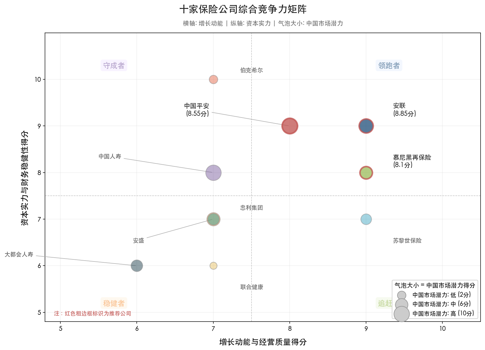

上图清晰呈现了十家公司在"增长动能-资本实力"二维空间中的分布。推荐公司以红色粗边框高亮，气泡越大表示中国市场潜力得分越高。

**第一象限——高资本+高增长（"领跑者"）。** 安联和中国平安同时具备强大的资本底座和显著的增长动能，占据最有利的竞争位置。安联以 10,817 亿美元总资产、18.1% ROE 和全球最活跃的并购战略居于此象限的核心；中国平安以 17,752 亿美元总资产和中国市场红利驱动的 NBV 强劲反弹紧随其后。

**第二象限——高增长+中等资本（"追赶者"）。** 慕尼黑再保险和苏黎世保险增长指标卓越（ROE 分别达 18.3% 和 26.9%），但总资产基数相对较小，限制了其短期内在全球资产排名中实现跨越式提升的可能性。值得关注的是，慕再 Solvency II 比率 287% 意味着其拥有充裕的资本空间，可通过有机增长与战略性并购逐步扩大资产规模。

**第三象限——高资本+低增长（"守成者"）。** 伯克希尔以 11,539 亿美元总资产和行业最强的资本储备居于此象限，但其保险业务增长温和、不派发股息且 2025 年暂停回购，增长动能有限。中国人寿总资产 9,477 亿美元，但增长波动性大、国际化程度低，同样属于资产体量大而增长弹性不足的类型。

**第四象限——中等资本+中等增长（"稳健者"）。** 安盛、忠利、大都会人寿和联合健康处于此象限。其中安盛和忠利凭借清晰的战略规划和适度的并购活跃度，具备向第一象限跃迁的潜力；联合健康则因 2024–2025 年盈利持续下滑和评级展望下调，面临阶段性压力，其象限位置存在进一步下移的风险。

## 6.5 推荐：最有可能在未来资产排名靠前的 2–3 家公司

综合五维度评分、竞争力矩阵分析和行业中期趋势研判，我们推荐以下三家公司作为最有可能在未来全球保险公司资产排名中保持或提升领先地位的标的。

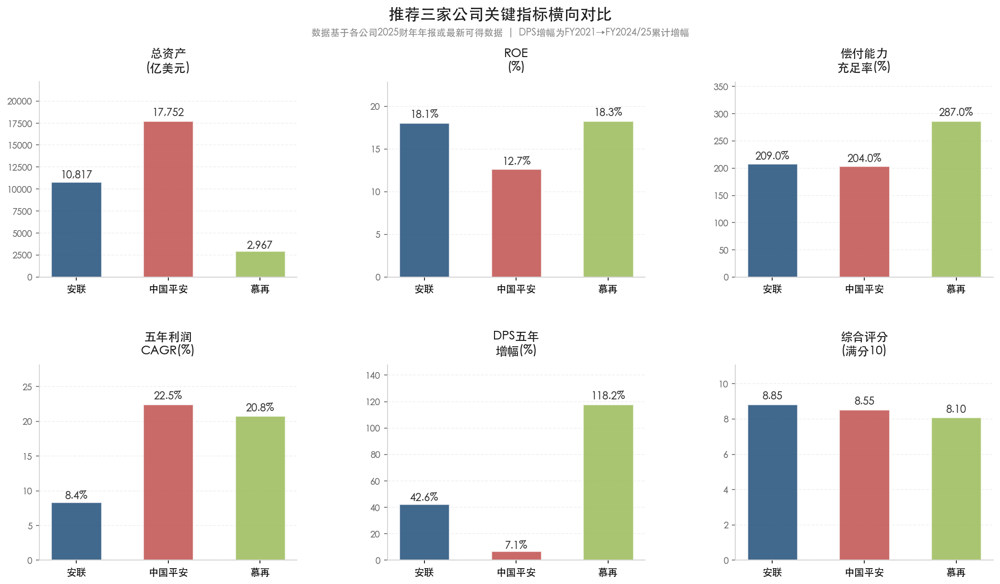

上图从总资产、ROE、偿付能力充足率、五年利润 CAGR、DPS 五年增幅和综合评分六个维度，对三家推荐公司进行了横向对比。中国平安资产规模最大（17,752 亿美元），慕尼黑再保险偿付能力最高（287%）且 DPS 增幅最为突出（118.2%），安联综合评分最高（8.85 分）且各指标最为均衡。

### 6.5.1 推荐一：安联（Allianz）——综合得分 8.85

**核心推荐逻辑：** 安联是十家公司中唯一在五个评价维度上均无明显短板的"全能型"选手，其增长质量、资本效率和战略执行力的综合表现在全球保险行业中首屈一指。

**资本与增长的双重优势。** 2025 年经营利润 174 亿欧元（同比+8.4%）、核心 ROE 18.1%、Solvency II 209% 的组合，证明安联能够在维持充足资本缓冲的前提下持续创造高质量增长 [Allianz 业绩新闻稿](https://www.allianz.com/en/mediacenter/news/media-releases/financials/260226-4q-2025-earnings-release.html "2025年度业绩新闻稿")。Ambition 2027 设定的 EPS CAGR 7–9% 和 ROE≥17% 目标在首年即超额完成，战略执行力在欧洲保险同业中最为突出。

**中国市场布局最具前瞻性。** 安联在外资保险公司中率先完成独资保险控股架构搭建（2020 年），持有寿险、财险、资管和养老领域的全牌照覆盖，2024 年入股国民养老保险公司正式切入养老金融赛道。安联人寿 2025 年签单保费 61.84 亿元、综合偿付能力充足率 320.23%、风险综合评级 AA 级 [安联人寿偿付能力报告](https://www.allianz.com.cn/allianz/690df35e75ea4922a3a0d8c4e532412d.pdf "安联人寿2025年Q4偿付能力报告")。虽然绝对规模尚小，但牌照齐全度和战略投入力度在外资中无出其右，长期增长潜力不容低估。

**股东回报记录卓越。** 2017–2024 年累计回购约 140 亿欧元，2026 年 2 月再宣布最高 25 亿欧元新回购计划；五年 TSR 约 150%；DPS CAGR 约 9.6%，派息比率稳定在 60% 目标区间 [Allianz 回购页面](https://www.allianz.com/en/investor_relations/share/share-buy-back.html "Share buy-back programs")。安联在保持高资本回报的同时不以牺牲增长投入为代价，资本配置效率在十家公司中最为均衡。

**并购能力构成额外上行空间。** 在 2025 年全球保险 M&A 达 1,040 亿美元的背景下，安联凭借强大的资本缓冲和顶级信用评级，具备进行大型并购交易的充分能力。一笔规模在 100–200 亿欧元级别的战略性收购，即可使安联在全球资产排名中实现一步到位的跃升。

**主要风险：** 总资产 10,817 亿美元虽位居全球第二但与伯克希尔（11,539 亿美元）和中国平安（17,752 亿美元）仍有差距，排名提升依赖有机增长与并购的双重驱动；资产管理板块（PIMCO/AllianzGI）受全球资本市场波动影响；欧元兑美元汇率波动可能压制美元计价的资产和收入增长。

### 6.5.2 推荐二：中国平安——综合得分 8.55

**核心推荐逻辑：** 中国平安是十家公司中最深度绑定全球增速最快保险市场（中国）的巨头，其庞大的总资产规模和独特的生态系统壁垒构成难以复制的竞争优势。

**总资产规模与增长潜力形成合力。** 中国平安以 17,752 亿美元总资产（含平安银行）在十家公司中位居前列。2025 年末股东权益首次突破 1 万亿元人民币，保险资金投资组合增长 13.2% 至 6.49 万亿元 [中国平安 2025 年报](https://www.hkexnews.hk/listedco/listconews/sehk/2026/0326/2026032600952.pdf "中国平安2025年报告")。中国保险市场 2025 年保费 6.12 万亿元（同比+7.4%），增速数倍于欧美成熟市场。这意味着中国平安即使仅维持市场份额不变，其资产规模也将随行业扩张而自然增长。

**寿险改革进入收获期。** 2025 年 NBV 增长 29.3% 至 369 亿元、NBV margin（ANP 口径）提升 5.8 个百分点至 28.5%，代理人渠道和银保渠道双引擎驱动增长 [中国平安 2025 年报](https://www.hkexnews.hk/listedco/listconews/sehk/2026/0326/2026032600952.pdf "中国平安2025年报告")。经历 2022–2023 年寿险改革阵痛和房地产投资减值后，平安已实现关键经营指标的 V 形反转。新业务质量的持续改善将在未来 3–5 年逐步释放利润，为资产规模的进一步扩张提供内生动力。

**"综合金融+医疗健康养老"生态系统构建深层护城河。** 2.51 亿零售客户、99% 的三产品以上客户留存率、累计 55,080 件科技专利构成的数字化能力，使平安在中国市场拥有护城河级别的竞争壁垒。健康险保费收入 1,590 亿元、AI 家庭医生年服务近 1,200 万人次——这些跨界服务能力在全球保险公司中几乎没有可比对象。

**主要风险：** 国际化程度有限，营收和利润高度依赖中国单一市场，地缘政治紧张可能影响国际投资者信心；人民币兑美元持续贬值（2021–2025 年累计约 14.6%）导致美元计资产规模"结构性缩水"；中国 10 年期国债收益率降至 2% 以下的低利率环境对寿险负债端的利差损构成中长期压力；偿二代二期下综合偿付能力充足率 193.3%（2025 年末）较 2021 年 233.5% 持续下降，核心偿付能力空间相对紧张。

### 6.5.3 推荐三：慕尼黑再保险——综合得分 8.10

**核心推荐逻辑：** 慕尼黑再保险是十家公司中增长质量最高、资本缓冲最充裕的"利润增长冠军"，在全球保障缺口持续扩大的结构性趋势下，具备独特且难以替代的增长通道。

**利润增长连续五年领跑行业。** 2021–2025 年净利润 CAGR 约 20.8%，从约 35 亿美元增至约 72 亿美元（2025 年净利润 61.21 亿欧元，同比+7.6%），连续五年超额完成利润目标 [Munich Re 2025 年度业绩](https://www.munichre.com/en/company/media-relations/media-information-and-corporate-news/media-information/2026/media-release-2026-02-26.html "Munich Re 2025年度业绩")。2025 年再保险 COR 73.5%（同比改善 3.8 个百分点），承保纪律在全球再保险公司中首屈一指。

**偿付能力缓冲为行业之最。** 2024 年末 Solvency II 比率 287%，合格自有资金 542.5 亿欧元，为慕再在极端巨灾年份保持承保能力、维持分红增长并实施战略性扩张提供了最厚的安全垫 [Munich Re 官方](https://www.munichre.com/en/company/investors/ratings-and-solvency.html "慕再评级与偿付能力数据")。

**全球保障缺口扩大构成结构性利好。** 慕尼黑再保险的核心业务——再保险——直接受益于全球自然灾害风险上升和保障缺口扩大的长期趋势。以中国市场为例，仅约 5% 的自然灾害风险获保险覆盖（全球平均约 38%），巨灾再保险的潜在增长空间以数十倍计。Ambition 2030 设定 ROE 超 18%、EPS 年增超 8%、总派息率超 80%，在可预见的未来，气候变化驱动的再保险需求增长将为慕再提供持续的结构性顺风。

**股东回报增速居十家公司之首。** DPS 五年从 11 欧元跃升至 24 欧元（+118.2%），2020–2025 年累计 TSR 达 171%，在十家公司中总回报最为亮眼。

**主要风险：** 总资产仅 2,967 亿美元，在十家公司中排名靠后，短期内在全球资产排名中大幅跃升的可能性低于安联和中国平安；再保险业务具有内在周期性——极端巨灾年份可导致净利润大幅波动（如 2022 年 ROE 仅 5.3%）；中国业务仅限北京分公司的再保险经营，无直保牌照，在中国市场的资产积累速度受限。

## 6.6 核心结论与风险提示

### 6.6.1 核心结论

综合五维度评分、中期战略目标可信度和行业趋势研判，我们认为**安联、中国平安和慕尼黑再保险**是最有可能在未来全球保险公司资产排名中保持或提升其领先地位的三家公司。

三家公司各自的核心增长逻辑呈现鲜明差异化：安联凭借"资本实力+增长质量+中国布局+股东回报"的全面均衡，在综合评分中位居第一，是通过有机增长与并购双轮驱动实现资产排名跃升概率最高的公司。中国平安凭借全球增速最快的保险市场红利、17,752 亿美元的庞大资产基数和"综合金融+医疗健康养老"的生态护城河，在资产规模维度具备天然的增长惯性。慕尼黑再保险则以行业最高的增长质量（净利润 CAGR 约 20.8%）和最充裕的资本缓冲（Solvency II 287%），在利润驱动的内在价值增长维度独占鳌头。

值得特别指出的是，伯克希尔·哈撒韦虽然在资本实力维度获得满分且当前资产排名全球第一，但其保险业务增长温和、不派息、中国市场缺席等因素使其在本报告综合评价体系中排名第七。这一排名并非否定伯克希尔的长期投资价值——其"堡垒式"资产负债表和长期资本配置纪律仍使其成为全球最稳健的保险/投资巨头——而是在"未来资产排名增长潜力"这一特定视角下，其上行空间相对有限。

### 6.6.2 关键假设与风险矩阵

上述推荐基于以下关键假设：全球保费实际增速维持在 2%–3% 区间；中国保险市场保费增速维持在 6%–8%；主要央行利率在 2026–2028 年间维持中性偏高水平（不出现深度降息至零利率情景）；中美关系不出现极端恶化导致金融脱钩；不发生单一极端巨灾事件导致保险行业系统性亏损。

若上述假设发生偏离，以下风险矩阵提示了各推荐公司可能面临的差异化冲击：

| 风险因素 | 影响路径 | 受影响最大的推荐公司 |
|:---|:---|:---|
| 利率急剧下降至零附近 | 寿险投资收益率下滑、CSM 估值下修、利差损扩大 | 中国平安（寿险负债久期长）、安联（寿险板块） |
| 人民币大幅贬值（如突破 8.0） | 美元计资产规模进一步缩水、国际投资者估值下修 | 中国平安 |
| 欧元对美元大幅贬值 | 美元计资产和收入下降 | 安联、慕尼黑再保险 |
| 中国监管收紧或地缘政治升级 | 外资保险公司在华经营受限、跨境资本流动受阻 | 安联（中国牌照价值受损）、中国平安（国际投资者退出） |
| 全球巨灾损失大幅超预期 | 再保险净利润骤降、偿付能力承压 | 慕尼黑再保险 |
| 大规模 M&A 重塑行业格局 | 竞争对手通过并购跃升至更高排名 | 所有公司（安联和安盛为最可能的收购方） |
| UnitedHealth Group 基本面修复 | 评级上调、盈利恢复、估值重估 | 可能改变综合排名（当前排名第十） |

### 6.6.3 综合判断

全球保险行业的竞争格局正在经历深刻重塑。传统上以资产规模和保费总量定义的"综合实力"，正逐步让位于"增长质量+资本效率+战略布局"的复合竞争力范式。安联、中国平安和慕尼黑再保险分别代表了三种差异化的增长路径——安联走的是"欧洲基盘+全球扩张+中国深耕"的全面均衡路线，中国平安走的是"本土市场红利+科技赋能+生态闭环"的纵深路线，慕尼黑再保险走的是"全球再保险龙头+保障缺口红利+利润驱动增长"的专精路线。三条路径各有风险暴露，但在当前可预见的宏观和行业环境下，均具备使公司在未来 3–5 年内巩固或提升全球资产排名的充分条件。

# 结论与风险提示

## 研究结论

本报告从资本实力与信用基本面、2021–2025 年经营增长轨迹、股东回报与分红实绩、中国市场发展潜力四大核心维度，对全球综合实力前十的保险公司进行了系统性横向比较。基于五维度加权评分模型的综合评估，我们得出以下核心结论。

**第一，全球保险行业的竞争力范式正在从"规模主导"转向"质量驱动"。** 传统上以总资产和保费总量衡量的综合实力排名，正日益受到增长质量、资本效率和战略布局等复合因素的影响。慕尼黑再保险总资产仅 2,967 亿美元（十家中排名靠后），但凭借 20.8% 的五年净利润 CAGR、287% 的 Solvency II 充足率和 118.2% 的 DPS 五年增长，其内在价值的积累速度远超多数资产规模更大的同行。安联以 10,817 亿美元总资产和 18.1% 的核心 ROE，在规模与效率之间实现了十家公司中最优的平衡。

**第二，中国市场是未来十年重塑全球保险版图的关键变量。** 2025 年中国保险业保费达 6.12 万亿元人民币（同比+7.4%），增速数倍于欧美成熟市场。健康险冲刺万亿保费、养老第三支柱政策推进和新能源车险高速增长，构成结构性增长的三大引擎。深度布局中国市场的保险公司——中国平安、中国人寿和安联——将在资产规模扩张中获得显著的增量贡献。伯克希尔和联合健康在中国大陆无保险法人实体，在这一最具增长活力的市场中处于缺位状态。

**第三，安联、中国平安和慕尼黑再保险是最有可能在未来全球资产排名中实现持续跃升的三家公司。** 安联（综合得分 8.85）以五维均衡无短板的全能型特征位居首位，其"欧洲基盘+全球扩张+中国深耕"的路线在增长持续性和风险分散度上最为均衡。中国平安（综合得分 8.55）凭借 17,752 亿美元总资产基数和中国市场结构性红利，在资产规模维度具备天然增长惯性，寿险改革进入收获期后 NBV 增长 29.3% 进一步夯实了长期增长基础。慕尼黑再保险（综合得分 8.10）以行业最高的利润增速和最充裕的资本缓冲，在利润驱动的内在价值增长维度独占鳌头，全球保障缺口持续扩大的结构性趋势为其提供了天然的长期顺风。

**第四，欧洲保险公司在 2021–2025 年间整体表现显著优于美国和中国同行。** 安联、慕尼黑再保险、苏黎世保险和忠利集团四家欧洲公司的五年 TSR 均超过 117%，DPS 五年 CAGR 均超过 8%，形成了增长质量与资本回报的良性循环。反观联合健康 2024–2025 年净利润连续下滑、评级展望被双重下调，中国人寿 DPS 五年实际下降 4.9%、分红随利润大幅波动——增长的持续性和资本回报的可预测性是区分领先者与落后者的关键因素。

## 主要局限性

**第一，跨监管体系的偿付能力比较存在方法论局限。** 十家公司分处 Solvency II、C-ROSS Phase II、RBC 和 SST 四种不同的监管框架，各体系在资本认定标准、风险权重和贴现率选取等方面差异显著。尽管偿付能力充足率的相对高低仍具参考价值，但直接的数值比较须审慎对待。伯克希尔因集团层面无单一可比指标，在部分定量分析中无法纳入比较。

**第二，IFRS 17 口径切换对五年纵向比较产生显著干扰。** 2023 年 IFRS 17 正式生效后，欧洲和中国公司的营收确认方式和利润释放节奏发生根本性变化，导致 2022 年及之前与 2023 年及之后的财务数据在多个口径上不可直接对比。本报告在涉及口径不连续之处均予以标注，但完全消除这一方法论局限不切实际。

**第三，汇率波动对跨国比较造成系统性偏差。** 2021–2025 年间人民币兑美元累计贬值约 14.6%、欧元兑美元从 1.13 波动至约 1.04，使得以非美元报告的公司在统一美元口径下的增长率被系统性压低。中国平安以美元计的营收呈现负增长，但人民币本币保费收入实际为正增长——本报告在关键对比中同时列示本币和美元口径，但部分综合排名仍可能受汇率因素影响。

**第四，品牌价值和客户满意度的量化比较受数据可得性制约。** Brand Finance 和 Interbrand 排名仅覆盖部分公司，J.D. Power 满意度数据主要限于北美市场且为付费内容，无法为十家全球性公司提供完全统一的横向比较基准。本报告以可得数据为基础进行分析，但这一维度的覆盖完整度存在局限。

**第五，前瞻判断依赖于一组关键假设。** 本报告对安联、中国平安和慕尼黑再保险的推荐，建立在全球保费实际增速维持 2%–3%、中国保费增速维持 6%–8%、主要央行利率不回归零利率、中美关系不出现极端金融脱钩等假设之上。若上述假设发生重大偏离——特别是人民币大幅贬值、中国监管环境急剧变化或全球巨灾损失远超预期——推荐结论的适用性将受到影响。第 6 章的风险矩阵对各情景下受影响最大的公司做出了差异化提示，供决策参考。
