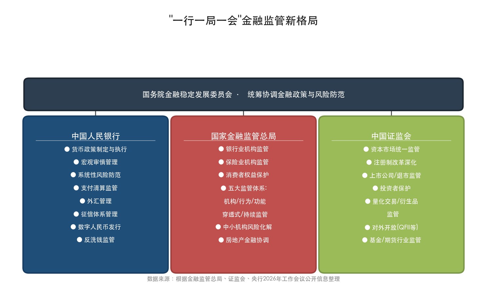
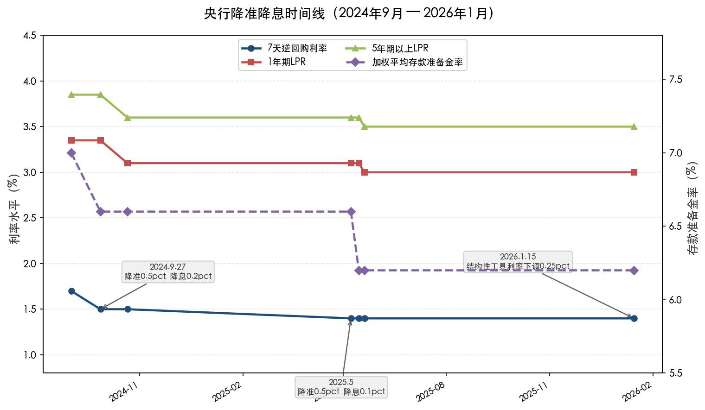
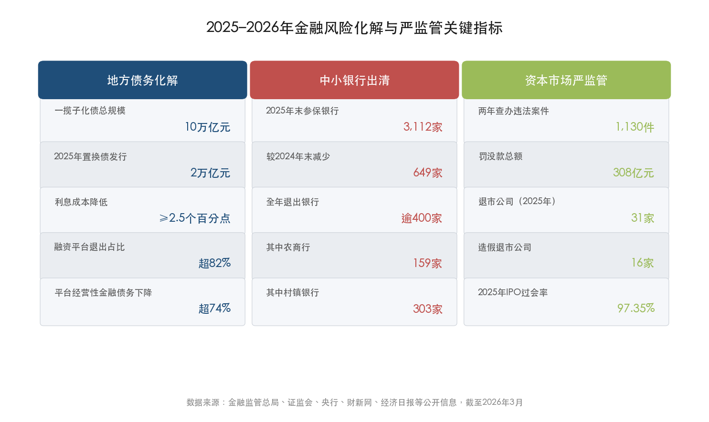
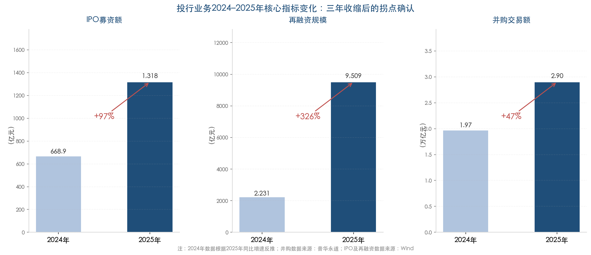
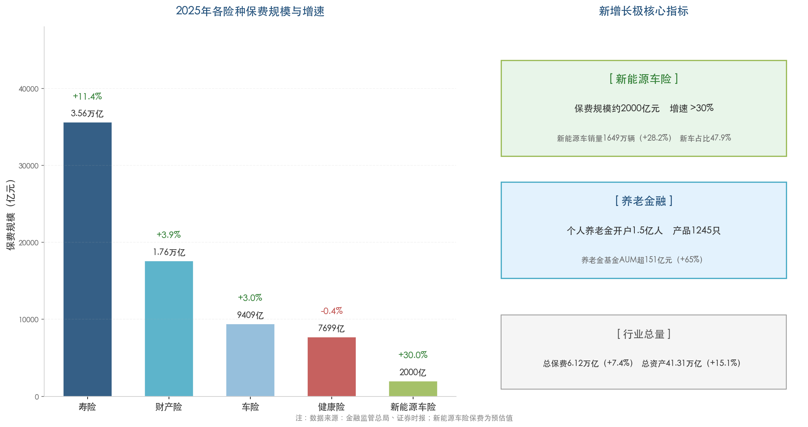
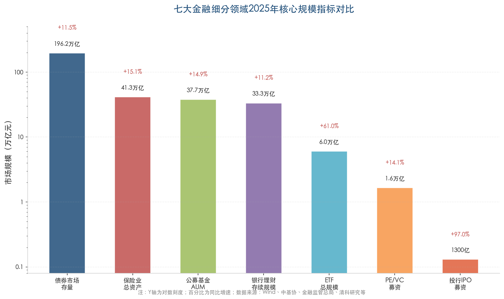
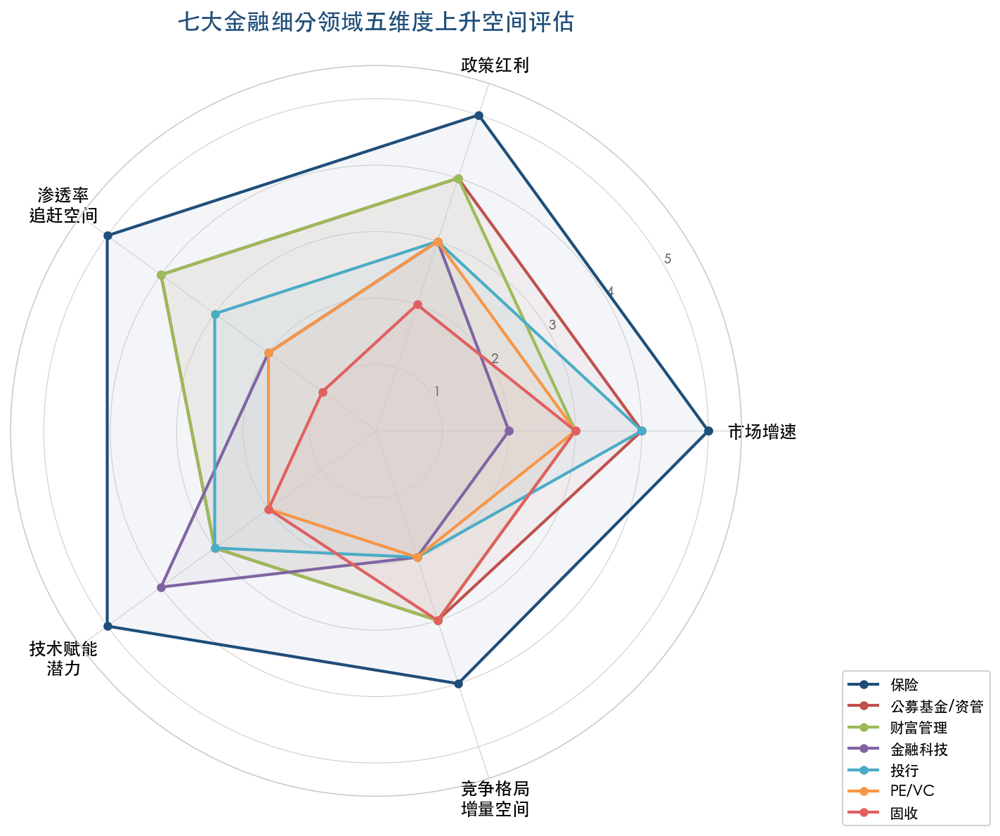
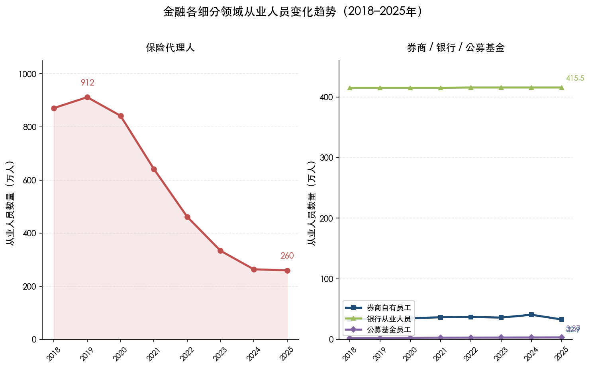
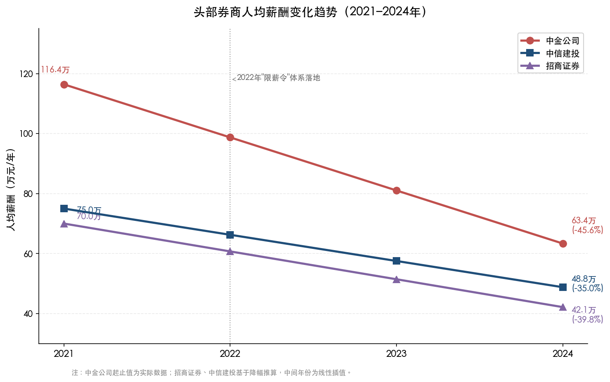
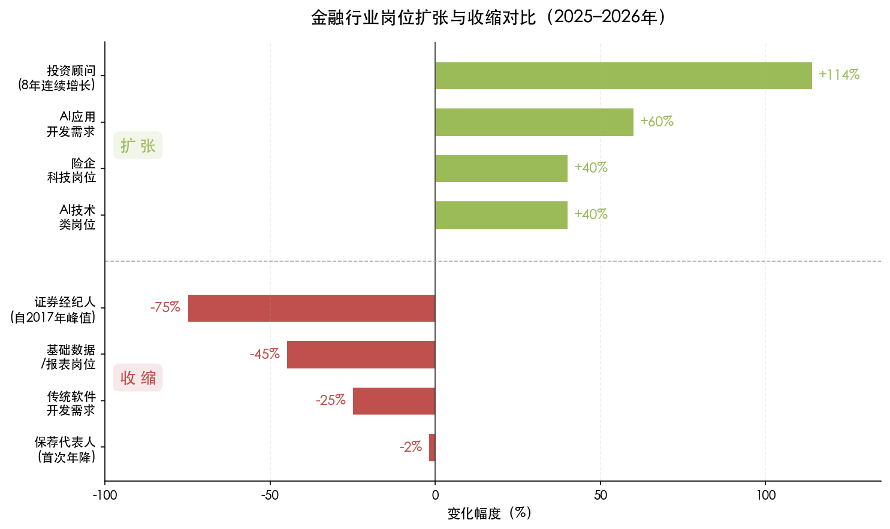

# 执行摘要

中国金融行业正处于从"金融大国"迈向"金融强国"的关键转折期。"十五五"规划首次将"加快建设金融强国"写入五年规划建议，行业发展重心从规模扩张全面转向高质量发展。在"宽货币+严监管+促改革"的政策组合下，各细分领域的增长逻辑和竞争格局正经历深层次重塑。

**核心发现一：七大细分领域上升空间呈现显著分化。** 综合市场增速、政策红利、渗透率追赶空间、技术赋能潜力和竞争格局五个维度的横向评估，未来3至5年上升空间的综合排序为：**保险 > 公募基金/资管 > 财富管理 > 金融科技/数字金融 > 投行 > PE/VC > 固收**。保险业凭借中美渗透率差距最大（保险深度4.37% vs 全球平均7.40%、保险密度差距约18倍）、总资产增速领跑全行业（2025年同比+15.1%）以及"养老+新能源车险"双增长极驱动的三重优势位列首位。

**核心发现二：三大结构性机会主导未来增长。** 第一，保险深度追赶与产品结构升级——保费首次突破6万亿元，养老金融总规模预计2026至2030年有望突破35万亿元，新能源车险保费增速超30%。第二，居民资产配置从储蓄向金融资产的结构性迁移——中国居民金融资产配置比重仅17%（美国超50%），ETF年增61%至6.02万亿元，银行理财存续规模达33.29万亿元。第三，科技金融生态构建下投行与金融科技复苏——投行三大核心指标（IPO +97%、再融资 +326%、并购 +47%）全面回暖，金融IT市场CAGR约12.3%、金融信创年增速约35%。

**核心发现三：保险和公募基金/资管具备"跨情景韧性"。** 在基准情景（GDP 4.5%–5%）与风险情景（GDP降至4%以下、贸易摩擦升级）下，保险因负债端刚性需求属性、公募因指数化不可逆趋势和"长钱入市"制度安排，均保持相对韧性，是投资者和从业者最值得长期布局的方向。

**核心发现四：AI正在重新定义金融行业的竞争维度。** 88%的金融从业者已在使用AI工具，银行科技人员突破10万人，掌握垂直领域大模型能力的人才供需比降至约0.3。行业从业人员总量五年间净减少582万人，但结构性分化剧烈——量化/AI岗位校招月薪4万元起步，而证券经纪人累计降幅达75%。"金融+科技"复合能力已成为贯穿各细分领域的核心竞争力分水岭。

**主要风险提示：** 宏观经济下行与通缩压力（IMF预测2026年GDP增速4.5%、GDP平减指数仍为负值）、中小金融机构风险集中暴露（农商行不良率2.72%，312家红区银行资产规模9.4万亿元）、中美经贸摩擦阶段性缓和但不确定性犹存，构成上述结构性机会兑现的三大主要风险因素。

# 第1章 宏观政策与监管环境

2025–2026年，中国金融监管体系正经历一场深层次的结构性重塑。"一行一局一会"新格局全面运转，货币政策定调从"稳健"转向"适度宽松"，降准降息周期持续推进，结构性政策工具大幅扩容；与此同时，资本市场和银保领域的监管执法力度显著趋严。我们将当前监管总基调概括为**"宽货币+严监管+促改革"**的政策组合——这一判断构成后续各细分领域分析的制度底色。本章从监管体制改革、货币政策框架、金融对外开放、风险防控、数字金融监管及"十五五"战略蓝图六个维度，系统梳理当前中国金融行业面临的制度环境。

## 1.1 监管体制改革与"一行一局一会"新格局

2023年国家金融监管总局正式挂牌成立后，中国金融监管体制完成了从"一行两会"到"一行一局一会"的历史性转型。这一机构改革的核心逻辑在于强化功能监管和穿透式监管，消除此前银保监会与证监会之间的监管盲区。下图呈现了改革后三大监管机构的职责分工与协调架构。

### 1.1.1 金融监管总局：五大监管体系全面铺开

2026年1月15日，金融监管总局召开2026年监管工作会议，部署五大重点任务：推进中小金融机构风险化解、严密防范化解相关领域风险、提高行业高质量发展能力、全面加强"五大监管"（机构监管、行为监管、功能监管、穿透式监管、持续监管）、提升金融服务质效。会议强调2026年是"十五五"开局之年，坚持稳中求进总基调[金融监管总局官方公告](https://www.nfra.gov.cn/cn/view/pages/ItemDetail.html?docId=1243185&itemId=922 "金融监管总局2026年监管工作会议全文")。

此前，金融监管总局2025年1月召开的2025年监管工作会议已披露一系列标志性成果：2024年"白名单"项目审批通过贷款超5万亿元，金融资产投资公司股权投资试点从最初的上海扩围至18个城市、签约意向性基金规模超3400亿元，保险业全年赔付超2.3万亿元[新华网报道](http://www.news.cn/fortune/20250112/165a687e96684cf98ca5b4d923d49619/c.html "金融监管总局明确2025年六大监管重点任务")。

"五大监管"的制度意义在于：机构监管锁定法人主体，行为监管聚焦消费者权益保护，功能监管按业务实质而非牌照类型实施统一规则，穿透式监管剥离通道嵌套以识别底层资产与最终风险承担者，持续监管则将"准入审批"延伸为全生命周期管理。对各细分领域而言，通道类业务和监管套利空间被系统性压缩，短期合规成本上升，但有利于行业长期健康发展。

### 1.1.2 证监会：注册制深化与资本市场改革提速

证监会主席吴清2026年3月6日在十四届全国人大四次会议记者会上系统披露了"十四五"期间资本市场的核心成果：交易所市场股债融资总额达64万亿元，直接融资比重提高至31.97%，较"十三五"末上升3.2个百分点；股票融资5.9万亿元、现金分红10.7万亿元；A股总市值超110万亿元、上市公司超5400家；沪深300成分股中战略性新兴产业企业权重占比达45%。新"国九条"实施两年来，上市公司累计分红回购5.23万亿元，创历史新高[证监会官网](https://www.csrc.gov.cn/csrc/c106311/c7618555/content.shtml "吴清主席十四届全国人大四次会议记者会答问全文")。

面向2026年，证监会明确两项重大改革方向。一是深化创业板改革，增设更精准、更包容的上市标准，为关键核心技术突破企业开设"绿色通道"；二是优化再融资机制，推出储架发行制度、完善锁价定增机制、优化战略投资者认定标准[证监会官网](https://www.csrc.gov.cn/csrc/c106311/c7618555/content.shtml "吴清主席两会答问")；[人民网报道](http://finance.people.com.cn/n1/2026/0306/c1004-40676418.html "证监会将推两项新措施")。储架发行制度的引入尤为值得关注——该机制允许发行人一次注册、分次发行，有助于降低再融资的时间成本和不确定性，是注册制改革在发行端的进一步深化。

在IPO审核节奏层面，2025年全年共113家企业上会，整体过会率达97.35%，其中沪市主板19家、深市主板10家及创业板14家均实现100%过会率，北交所51家企业上会、49家过会（过会率96%），科创板19家上会、18家过会。全年116家企业完成上市，同比增长16%，合计IPO募资1317.7亿元，同比增长97%[中金在线](http://mp.cnfol.com/57061/article/1767153634-142193555.html "2025年A股IPO发审会通过率97.35%")；[新浪财经](https://finance.sina.com.cn/stock/roll/2026-01-01/doc-inheumpv3129304.shtml "Wind数据，2025年A股IPO统计")。上述数据表明，经历2023年8月"827新政"以来的严格收紧后，IPO审核节奏自2025年起进入有序恢复阶段，"提质增效"的监管导向使申报质量与通过率同步提升。

在退市制度执行方面，2025年共有31家A股上市公司退市，较2024年52家有所减少，但退市结构发生根本性变化：6家公司选择主动退市（含海通证券被国泰君安吸收合并、中国重工与中国船舶换股合并等产业整合案例），重大违法强制退市、财务类退市和面值退市并重[21财经](https://www.21jingji.com/article/20260119/herald/301b46b5857478ceb69a3edabae2ba0a.html "2025年A股退市盘点")。"应退尽退"原则与主动退市常态化并行，标志着A股"有进有出、优胜劣汰"的市场新陈代谢机制趋于成熟。

在防范风险领域，证监会推出"五个着力"，涵盖深化高频量化交易监管、出台衍生品交易监管办法、对RWA代币化坚持"境内严禁、境外严管"原则。近两年查办违法案件1130件、罚没款308亿元，16家上市公司因严重造假被退市，执法力度远超往年水平[证监会官网](https://www.csrc.gov.cn/csrc/c106311/c7618555/content.shtml "吴清主席两会答问")。

## 1.2 央行货币政策框架：从"稳健"到"适度宽松"

### 1.2.1 降准降息周期：2024年9月至2026年初的完整时间线

2024年9月以来，中国货币政策经历了近年来力度最大的一轮宽松周期。政策利率、LPR与存款准备金率呈现阶梯式下行，清晰展示了货币政策从"预调微调"转向"实质性宽松"的路径。

**2024年9月27日**，央行宣布同步实施降准降息：下调金融机构存款准备金率0.5个百分点，加权平均存款准备金率从约7%降至约6.6%；同时将公开市场7天期逆回购操作利率下调0.2个百分点，由1.7%调整为1.5%。央行将其定性为"近四年最大幅度降息"[新华网](http://www.news.cn/20240929/ec88490140d44e72bcae4e6c7dc55563/c.html "央行9月27日同步实施降准降息")。

**2024年10月21日**，LPR报价随之大幅下调：1年期LPR从3.35%降至3.1%，5年期以上LPR从3.85%降至3.6%，各下调25个基点，为LPR改革以来单次最大降幅[紫牛新闻](https://wap.yzwb.net/wap/news/4089996.html "10月LPR报价出炉：1年期和5年期利率均下调25基点")。

**2025年5月7日**，央行再推一揽子政策：自5月8日起下调7天期逆回购操作利率0.1个百分点至1.4%；自5月15日起降准0.5个百分点，加权平均存款准备金率从6.6%降至6.2%，释放约1万亿元长期流动性[武汉市政府网站转载新华社报道](https://www.wuhan.gov.cn/hdjl/rdhy/202505/t20250507_2577842.shtml "中国人民银行：5月8日起降息，15日起降准")。

**2025年5月20日**，LPR进一步下调：1年期LPR由3.1%降至3.0%，5年期以上LPR由3.6%降至3.5%，各下调10个基点。此后至2026年2月，LPR连续保持不变[经济参考报](http://jjckb.xinhuanet.com/20251223/ecc1f3a146c9452a8e7c1005b2b93aad/c.html "LPR连续7个月保持不变")。

**2026年1月15日**，央行推出新一轮一揽子政策：各类结构性工具利率下调0.25个百分点（再贷款一年期利率从1.5%降至1.25%）；新设1万亿元民营企业再贷款，科技创新再贷款额度从8000亿元增至1.2万亿元，商业用房购房贷款最低首付比例统一降至30%。央行副行长邹澜明确表示2026年降准降息仍有空间[新华网报道](http://www.news.cn/fortune/20260116/c681255e1b214065b98843d0c5720b04/c.html "央行推出一揽子重磅货币金融政策")。

从"稳健"到"适度宽松"的措辞变化具有标志性意义。2025年中央经济工作会议首次将货币政策定调为"适度宽松"，打破了此前长达十余年"稳健"表述的惯例，释放了更强的宽松信号。这一表态为2026年进一步降准降息预留了充足的政策空间。

### 1.2.2 流动性与融资成本：量价齐降

宽松政策的效果在总量层面已得到充分印证。截至2025年12月末，社会融资规模存量同比增长8.3%，M2同比增长8.5%；人民币贷款余额达272万亿元，同比增长6.4%。融资成本方面的下行趋势更为显著：2025年12月新发放企业贷款和个人住房贷款加权平均利率均约3.1%，分别较2018年下半年下降约2.5和2.6个百分点[北京日报国新办发布会实录](https://xinwen.bjd.com.cn/content/s6968d47fe4b0687a288fc887.html "央行邹澜2026年1月15日发布会介绍")。

结构性工具的大幅扩容是本轮宽松周期的突出特征。科技创新再贷款额度从8000亿元增至1.2万亿元、新设1万亿元民营企业再贷款等举措，体现了"总量适度宽松+结构精准投放"的政策组合。这种"定向浇灌"式工具设计，既避免了大水漫灌式的流动性泛滥，又确保了信贷资源向科技创新、绿色发展、民营经济等重点领域倾斜。截至2025年11月末，金融"五篇大文章"贷款余额达107.7万亿元，同比增长12.8%；其中科技贷款44.8万亿元、绿色贷款44.2万亿元、普惠贷款39.8万亿元；养老产业贷款同比增速达60.2%、数字经济产业贷款同比增速14.6%[证监会官网](https://www.csrc.gov.cn/csrc/c106311/c7618555/content.shtml "吴清两会答问")；[北京日报国新办发布会实录](https://xinwen.bjd.com.cn/content/s6968d47fe4b0687a288fc887.html "央行发布会实录")。

利率中枢的持续下移将对金融各细分领域产生差异化影响：对固收市场而言，债券存量规模扩张与超额收益空间收窄并存，"资产荒"压力加剧；对银行业而言，净息差进一步承压，倒逼经营模式从利差依赖向中间业务转型；对资本市场而言，低利率环境提升了权益资产的相对吸引力，有望推动居民资产配置从存款向权益类产品的"储蓄搬家"进程。

## 1.3 金融对外开放：制度型开放与人民币国际化

### 1.3.1 资本市场双向开放

证监会2025年10月27日印发《合格境外投资者制度优化工作方案》，力争两年左右推动改革举措落地，增强在岸渠道对境外中长期资金的吸引力[证监会官网](https://www.csrc.gov.cn/csrc/c100028/c7591251/content.shtml "中国证监会印发《合格境外投资者制度优化工作方案》")。该方案的核心在于简化QFII/RQFII准入流程、拓宽可投资产品范围、优化资金汇出入便利度，旨在从制度层面降低境外投资者参与A股市场的摩擦成本。

从更宏观的视角审视，中国资本市场对外开放已从"管道式开放"（QFII/RQFII、沪深港通等特定通道）向"制度型开放"（规则对接、监管协调）深化转型。这种范式转变对投行、资管等细分领域具有直接影响——跨境业务牌照的含金量持续上升，具备全球化服务能力的头部机构将获得更大竞争优势。

### 1.3.2 外汇市场与跨境资金流动

2025年外汇市场运行数据印证了中国金融开放的实质性进展：外汇市场交易量达42.6万亿美元，创历史新高；企业外汇套期保值比率升至30%，亦为历史最高水平；全年跨境资金净流入3021亿美元，银行结售汇顺差1966亿美元；外汇储备年末余额33579亿美元。货物贸易中人民币结算比重已提高至近30%，人民币国际化进程稳步推进[北京日报国新办发布会实录](https://xinwen.bjd.com.cn/content/s6968d47fe4b0687a288fc887.html "央行、外汇局2026年1月15日发布会")。

人民币在跨境贸易结算中占比的持续提升，叠加多边央行数字货币桥（mBridge）项目的推进，正在构建一个与SWIFT平行的人民币跨境支付基础设施。这一趋势对金融科技领域的跨境支付业务和固收市场的离岸人民币债券（点心债）发行均构成长期利好。

## 1.4 金融风险防控：系统性化解与底线思维

2025–2026年金融风险防控呈现"三线并进"格局：地方隐性债务化解、中小金融机构出清和房地产金融风险缓释同步推进。下图汇总了这三大维度的核心量化指标。

### 1.4.1 地方政府隐性债务置换

地方隐性债务化解是2025–2026年金融风险防控的核心主线之一。2025年全年发行用于置换存量隐性债务的再融资债券2万亿元，置换后平均利息成本降低2.5个百分点以上。截至2025年末，超82%融资平台退出，融资平台存量经营性金融债务规模下降超74%，一揽子化债总规模达10万亿元[财新网](https://topics.caixin.com/2026-03-05/102419842.html "地方化债最新进展")；[经济日报](http://paper.ce.cn/pc/content/202601/20/content_327052.html "积极稳妥化解重点领域风险")。

这一化债进程对金融行业的影响是多维的：对固收市场而言，城投债信用风险阶段性缓释但供给收缩加剧了"资产荒"；对银行业而言，平台贷款质量改善但利率置换导致息差进一步承压；对地方财政而言，债务负担减轻但"开前门、堵后门"的约束意味着增量融资需求将更多通过标准化债券市场满足。

### 1.4.2 中小金融机构"减量提质"

中小银行的出清速度在2025年显著加快。截至2025年12月末，全国参加存款保险的银行业金融机构3112家，较2024年末减少649家。2025年全年逾400家银行退出市场（含159家农商行、303家村镇银行），高风险机构较峰值大幅压降[新浪财经转中国基金报](https://finance.sina.com.cn/jjxw/2026-02-01/doc-inhkhwmk8885037.shtml "一年649家银行退出")。

"减量提质"的政策目标十分明确——通过合并重组和风险处置，将分散的、治理水平低下的小型机构整合为区域性银行，提升整体抗风险能力。金融监管总局2026年工作会议将"推进中小金融机构风险化解"列为首要任务，表明这一进程将贯穿"十五五"规划周期。对从业者而言，中小金融机构的整合浪潮既意味着部分岗位的消失，也催生了风险处置、不良资产管理和机构整合等领域的专业人才需求。

### 1.4.3 房地产金融风险缓释

房地产金融是系统性风险防控的另一关键领域。金融监管总局2026年部署"推动城市房地产融资协调机制常态化运行"，央行将商业用房购房贷款最低首付比例统一下调至30%，住建部明确2026年"因城施策控增量、去库存、优供给"方针[经济日报](http://paper.ce.cn/pc/content/202601/20/content_327052.html "积极稳妥化解重点领域风险")。

政策组合的核心逻辑是"保交楼、稳预期、防蔓延"——通过融资协调机制和降低首付门槛稳定需求端，同时避免房地产领域风险向银行信贷、信托和理财等金融产品传染扩散。对保险业和银行理财而言，房地产类底层资产的风险敞口仍是需要持续监测的重要变量。

## 1.5 数字金融与金融科技监管

### 1.5.1 数字人民币：从"1.0版"迈入"2.0版"

数字人民币在2025年实现了里程碑式跨越。截至2025年11月末，数字人民币累计处理交易34.8亿笔、金额16.7万亿元；个人钱包2.3亿个、单位钱包1884万个。在跨境支付方面，多边央行数字货币桥累计处理跨境支付4047笔、金额折合人民币3872亿元，其中数字人民币占比约95.3%[科技日报转新华社](https://www.stdaily.com/web/gdxw/2025-12/29/content_454642.html "数字人民币迎来重大调整")。

更具制度性意义的变革在于，央行2025年12月29日宣布数字人民币自2026年1月1日起从"数字现金1.0版"迈入"数字存款货币2.0版"——银行机构为实名钱包余额计付利息、计入存款准备金交存基数、存款保险提供与存款同等保障[科技日报转新华社](https://www.stdaily.com/web/gdxw/2025-12/29/content_454642.html "数字人民币迎来重大调整")。

从"数字现金"到"数字存款货币"的升级，意味着数字人民币不再仅仅是M0的数字化替代，而是开始进入M1/M2的范畴。这一转变将对商业银行存款体系和支付清算基础设施产生深远影响。对金融科技领域而言，围绕数字人民币生态的应用场景开发、智能合约功能拓展和跨境支付通道建设将成为新的增长极。

### 1.5.2 金融科技监管框架：创新与合规的动态平衡

在鼓励金融科技创新的同时，监管层对高频量化交易、衍生品和新兴数字资产保持审慎立场。证监会明确对RWA代币化坚持"境内严禁、境外严管"原则，出台衍生品交易监管办法，并持续深化高频量化交易监管[证监会官网](https://www.csrc.gov.cn/csrc/c106311/c7618555/content.shtml "吴清主席两会答问")。

这种"分类施策"的监管思路——对底层技术创新（如AI大模型、区块链基础设施）予以政策支持，对潜在系统性风险的应用场景（如代币化资产、高杠杆衍生品）保持严格管控——反映了监管层在促发展与防风险之间寻求动态平衡的政策取向。对金融机构而言，合规能力将日益成为金融科技应用的前置条件，而非事后补救措施。

## 1.6 "十四五"收官与"十五五"金融强国蓝图

### 1.6.1 "十四五"成果与"十五五"战略锚定

"十五五"规划建议首次将"加快建设金融强国"写入五年规划建议，涉及金融表述共17处，明确六大核心内涵：强大的货币、中央银行、金融机构、国际金融中心、金融监管、金融人才队伍[21世纪经济报道](https://www.21jingji.com/article/20251031/herald/ac476ffc0c3c9ea7507e13128c76102d.html "十五五金融强国建设蓝图")。

从"金融大国"向"金融强国"的战略跃迁，意味着未来五年金融政策的核心目标从"做大规模"转向"做强功能"——更加强调金融服务实体经济的质效、国际竞争力和风险治理能力。这一战略方向对各细分领域产生差异化影响：

- **投行与资本市场**：直接融资比重31.97%仍远低于成熟市场水平，提升直接融资占比是"十五五"金融改革的核心任务之一，利好投行和股权融资类业务的长期扩容。
- **保险与养老金融**：保险深度和密度远低于全球平均水平，养老金融第三支柱处于起步阶段，"金融强国"框架下保险业承担着服务人口老龄化和社会保障体系完善的关键使命。
- **金融科技与数字金融**：科技赋能金融是"金融强国"的重要支撑维度，AI大模型、数字人民币、金融信创等领域享有明确的政策支持。
- **公募基金与资管**：居民财富管理需求升级与"长钱入市"政策导向叠加，为资管行业从"大"到"强"的转型创造制度红利。

### 1.6.2 监管总基调判断

综合上述分析，我们认为2025–2026年中国金融监管总体基调可精确概括为**"结构性宽松叠加严监管"**——货币政策定调"适度宽松"，降准降息持续推进，政策利率（7天逆回购利率）从2024年9月的1.7%降至2025年5月的1.4%，LPR从3.35%/3.85%降至3.0%/3.5%，结构性政策工具额度大幅扩容；同时资本市场和银保领域监管执法显著趋严，两年查办违法案件1130件、罚没款308亿元，649家银行退出市场，退市制度刚性执行[金融监管总局](https://www.nfra.gov.cn/cn/view/pages/ItemDetail.html?docId=1243185&itemId=922 "2026年监管工作会议")；[证监会官网](https://www.csrc.gov.cn/csrc/c106311/c7618555/content.shtml "吴清两会答问")；[新华网](http://www.news.cn/fortune/20260116/c681255e1b214065b98843d0c5720b04/c.html "央行一揽子政策")。

这一政策组合的内在逻辑清晰：在经济增速换挡和外部不确定性加大的背景下，通过适度宽松的货币环境和结构性工具为实体经济"输血"，同时以严监管和风险化解为金融体系"排毒"，最终为"金融强国"战略目标的实现夯实制度基础。各监管机构2026年工作会议均以"十五五"开局为坐标，围绕"金融强国"目标展开系统性布局。

对后续章节分析至关重要的制度背景可归纳为四条主线：**第一**，低利率环境将重塑各细分领域的盈利模式和竞争格局；**第二**，严监管趋势加速行业分化，合规能力和资本实力成为核心竞争壁垒；**第三**，"五篇大文章"政策导向决定了科技金融、绿色金融、普惠金融、养老金融和数字金融五大领域将获得最密集的政策红利；**第四**，对外开放制度化为具备全球化能力的头部机构打开增量空间。

# 第2章 金融细分领域发展现状与趋势

2025年，中国金融行业在"结构性宽松叠加严监管"的政策基调下（详见第1章）呈现显著的结构性分化。投行与PE/VC经历三年收紧周期后迎来周期性回暖，固收市场在"资产荒"格局中规模持续膨胀但收益率承压加剧，公募基金与ETF以超60%的年度增速重塑资管行业版图，保险业保费首次突破6万亿元大关，财富管理和金融科技则在居民资产配置迁移与AI深度渗透中酝酿结构性变革。本章围绕投行、PE/VC、固收、公募基金/资管、财富管理、金融科技/数字金融、保险七大细分领域，从业务规模变化、收入表现、核心驱动力与制约因素三个维度逐一展开分析，为第3章的横向对比与上升空间评估提供事实基础。

## 2.1 投行：三年收缩后的拐点确认

### 2.1.1 IPO与再融资市场全面回暖

2025年A股一级市场走出了2022年下半年以来最为明显的修复行情。全年共有116只新股上市，同比增长16%；合计IPO募资1317.7亿元，同比增长97%，募资规模接近翻番[新浪财经](https://finance.sina.com.cn/stock/roll/2026-01-01/doc-inheumpv3129304.shtml "Wind数据，2025年A股IPO统计")。再融资市场表现更为突出——全年A股再融资规模达9508.65亿元，同比增长326.17%，这一爆发式增长主要受注册制深化与再融资政策松绑的共同推动[Wind数据](http://m.gqsoso.com/changsha/changsha/20251231/1384539.html "Wind数据，2025年A股再融资统计")。

并购市场同样录得显著回升。据普华永道统计，2025年中国企业并购交易总额超4000亿美元（约合2.9万亿元人民币），同比激增47%，为五年来首次回升；其中境内战略投资者达成3639宗交易、交易额达2390亿美元（同比+83%），产业整合加速叠加新"国九条"引导下的并购重组政策红利是核心驱动因素[普华永道](https://finance.sina.com.cn/roll/2026-02-11/doc-inhmnaic7527422.shtml "普华永道2025年中国企业并购市场回顾及展望报告")。

如上图所示，IPO募资额（+97%）、再融资规模（+326%）、并购交易额（+47%）三大核心指标均录得大幅增长，清晰确认了投行业务经历三年收缩后的拐点。

### 2.1.2 券商投行业务收入拐点

从券商端业绩来看，投行业务在经历三年收紧周期后迎来明确的向上拐点。2025年前三季度，42家上市券商投行业务实现净收入251.51亿元，同比增长23.46%[证券时报](https://stcn.com/article/detail/3478968.html "42家上市券商2025年前三季度业绩")。上半年数据同样印证这一趋势——42家上市券商合计投行业务收入同比增长18.1%至155亿元[证券行业中报综述](http://m.hibor.net/wap_detail.aspx?id=e7d996216ef1439186351be83130bb27 "证券行业2025年中报综述")。

以2024年全行业数据为基准参照，150家证券公司当年实现证券承销与保荐业务净收入296.38亿元、财务顾问业务净收入53.93亿元；全行业营收4511.69亿元（同比+11.2%），净利润1672.57亿元（同比+21.3%）[中国证券业协会](https://www.sac.net.cn/sjb/xxgk/hysj/jjsj/202512/t20251231_73981.html "证券公司2024年度经营数据")。考虑到2025年前三季度仅上市券商投行收入（251.51亿元）已接近2024年全行业承销保荐收入水平（296.38亿元），全年投行业务收入有望显著超越上一年度。

### 2.1.3 驱动力与制约因素

投行业务回暖的驱动力主要包含三重逻辑。其一，注册制深化推动IPO常态化发行节奏恢复——证监会已明确2026年将推进深化创业板改革、增设更精准更包容的上市标准，并为关键核心技术突破企业开设"绿色通道"（详见第1章）。其二，再融资制度优化释放融资需求——储架发行机制的推出、锁价定增机制的完善以及战略投资者认定标准的优化，为上市公司再融资提供了更灵活的工具箱。其三，并购重组政策支持下的产业整合加速——境内战略并购交易额同比增长83%，充分反映了新"国九条"引导下并购重组活跃度的显著提升。

制约因素方面，投行业务头部集中趋势正在加速。A股IPO承销规模CR5达71.5%、CR10达84.7%，较2024年分别提升15.9和4.4个百分点[华龙证券研究报告](https://pdf.dfcfw.com/pdf/H3_AP202512311812001126_1.pdf "2026年证券行业五大趋势展望")。与此同时，保荐代表人人数8年来首次出现年度下滑，降至8519人，中小券商投行的业务空间持续收窄。行业竞争格局正从"人海战术"向"头部集中+精品化"转型。

### 2.1.4 未来6–12个月趋势展望

在当前政策框架延续的基准情景下，投行业务有望维持修复态势。2026年创业板改革落地将进一步拓宽科技企业上市渠道，储架发行等再融资创新工具有望提升上市公司融资便利性与效率。并购市场在产业整合深化和国企改革推进的双重驱动下预计保持活跃。需要关注的风险在于：若中美经贸摩擦显著升级或国内经济增速低于预期，IPO审核节奏可能再次收紧，投行复苏进程将面临中断压力。

## 2.2 PE/VC：募投退全面回暖，退出"堰塞湖"仍是最大挑战

### 2.2.1 募资市场：人民币基金主导地位进一步巩固

2025年中国股权投资市场迎来全面回暖。据清科研究中心统计，全年5039只基金完成募集，同比上升26.6%；募资总额约1.65万亿元，同比增长14.1%[清科研究](https://www.nfnews.com/content/ry5ObOX06Z.html "清科倪正东：中国股权投资将迎科技与资本深度融合大年")。币种结构上，人民币基金以约1.6万亿元占据绝对主导地位，募资规模同比上升16.1%；外币基金募资延续下滑态势，全年仅33只外币基金完成募集，募集规模超350亿元，同比分别下滑15.4%和36.0%[清科研究](https://research.pedaily.cn/202602/560766.shtml "2025年中国股权投资市场年度研究报告")。

资金来源结构发生了深刻变化。政府投资基金、地方国资平台、险资、金融资产投资公司（AIC）等已成为推动募资市场回暖的核心力量。国资类平台出资占比达41.8%，引导基金LP占比17.6%[21世纪经济报道](https://m.21jingji.com/article/20260130/herald/d8329dbea44d74a5bfb6dc9a6a7a386b.html "PE/VC行业持续出清")。国家创业投资引导基金设置20年存续期（10年投资+10年退出），体现了从制度层面落实"耐心资本"理念的政策安排。

### 2.2.2 投资端：硬科技投资热度持续攀升

投资端同步回暖。2025年全年投资案例数和金额分别为10795起和9287.16亿元，同比上升28.4%和45.6%[清科研究](https://research.pedaily.cn/202602/560766.shtml "2025年中国股权投资市场年度研究报告")。从行业分布看，硬科技仍是投资最集中的领域——IT、半导体、生物技术/医药健康、机械制造等领域投资案例数量均突破1500起，AI、具身智能、GPU、创新药、智能制造、新能源/新材料等细分赛道热度居前。

值得关注的是，并购投资、基石投资、上市定增等投资策略的活跃度显著攀升，反映出PE/VC机构正从传统的"投Pre-IPO"单一模式向更多元化的投资策略体系转型。

### 2.2.3 退出端：回暖显著但"堰塞湖"压力犹存

退出端是2025年PE/VC市场边际改善最为显著的环节。全年共发生5211笔退出案例，同比上升41.0%。其中，被投企业IPO退出近2000笔，同比上升46.8%；并购退出468笔，同比上升77.3%[清科研究](https://research.pedaily.cn/202602/560766.shtml "2025年中国股权投资市场年度研究报告")。并购退出渠道的重要性显著提升，正成为化解退出困局的关键补充路径。

S基金市场同样持续升温。2025年上半年交易笔数达542笔，已超过2024年全年的395笔，交易规模约784亿元；2024年全年S基金市场规模1078亿元（同比+46%）[执中ZERONE](https://m.10jqka.com.cn/20251022/c671924393.shtml "S基金市场发展迎关键机遇期")。S基金正从"小众接盘工具"演变为LP流动性管理的常规化手段。

然而，退出"堰塞湖"压力依然巨大。截至2025年三季度末，国内仍有3.81万只基金进入退出期和延长期，涉及规模17.60万亿元[清科](https://www.21jingji.com/article/20251205/herald/c22846cfbfe2b7719f9f3128687871af.html "清科倪正东：今年VC/PE行业回暖了")。行业管理人持续出清——存续私募股权投资基金管理人降至11523家（同比-4.6%），呈现"管理人出清、头部规模回暖"的结构性分化格局[21世纪经济报道](https://m.21jingji.com/article/20260130/herald/d8329dbea44d74a5bfb6dc9a6a7a386b.html "PE/VC行业持续出清")。

### 2.2.4 趋势展望

PE/VC行业正经历从"市场化主导"向"国资引领"的深刻格局转变。国资类平台出资占比达41.8%，意味着行业资金来源结构已发生质变，民营GP在募资端面临结构性挤压。在当前政策框架下，硬科技领域的投资热度预计将延续，并购退出和S基金将成为化解存量退出压力的两条主要路径。但17.60万亿元的待退出规模犹如悬于行业头顶的达摩克利斯之剑——一旦IPO节奏再度收紧或二级市场走弱，退出压力可能重新加剧，行业洗牌将进一步深化。

## 2.3 固收：规模膨胀与收益率坍塌并存的"资产荒"年

### 2.3.1 债券市场规模持续扩容

2025年中国债券市场延续了规模扩张态势。截至年末，内地债券市场总存量达196.18万亿元，较年初增加20.30万亿元；全年发行合计89.0万亿元（同比+11%），其中利率债33.0万亿元（同比+18%）、信用债22.2万亿元（同比+8%）[Wind数据](https://c.m.163.com/news/a/KI5UCDVJ05198RSU.html "2025年度债券承销排行榜")。利率债发行增速显著高于信用债，主要受国债和地方政府债大规模发行驱动——2025年用于置换存量隐性债务的再融资债券发行达2万亿元（详见第1章），叠加积极财政政策下的专项债放量，共同推高了利率债供给。

### 2.3.2 收益率中枢持续下行

从收益率走势来看，2025年是一个剧烈波动之年。在经历2023–2024年的"债牛"行情后，10年期国债收益率年内在约1.6%–1.9%的区间内经历预期反复拉锯。年初一度下破1.6%创历史新低，此后在央行一系列货币政策操作和经济预期修复的共同作用下震荡上行。至2025年末，10年期国债收益率报1.85%，全年上行约25个基点；10年期与1年期国债收益率利差为51个基点，较2024年末收窄8个基点，反映出期限利差持续压缩的趋势[央行](https://cif.mofcom.gov.cn/cif/html/upload/20260313161404781_2025%E5%B9%B4%E9%87%91%E8%9E%8D%E5%B8%82%E5%9C%BA%E8%BF%90%E8%A1%8C%E6%83%85%E5%86%B51.pdf "2025年金融市场运行情况")；[同花顺](http://m.10jqka.com.cn/20260211/c674732240.shtml "央行发布2025年金融市场运行情况数据")。

### 2.3.3 "资产荒"贯穿全年

信用债市场的"资产荒"格局贯穿2025年全年。全年信用债发行16.55万亿元，净融资2.43万亿元；截至年末超九成信用债收益率在3%以下、八成不超过2.5%，信用利差处于2014年以来的历史低位[中诚信国际](https://www.cls.cn/detail/2255856 "2025债券市场行业观察报告")。在低利率环境持续深化的背景下，固收投资的超额收益空间被大幅压缩——当前3年期以内普通信用债已隐含1–2次降息预期，未来降息空间仅剩约20–40个基点（假设政策利率底线为1%）[东方红资产管理](https://finance.sina.com.cn/roll/2026-01-20/doc-inhhyfut8872420.shtml "2026年固收策略展望")。

### 2.3.4 驱动力与制约因素

固收市场规模增长的核心驱动力包括三方面：宽松货币政策环境（中央经济工作会议首次将货币政策定调为"适度宽松"）、地方化债带来的利率债放量需求，以及银行理财净值化转型后对低波动固收资产的庞大配置需求。

制约因素同样清晰。收益率中枢的持续下行正在侵蚀固收业务的利润空间。对于债券承销商而言，规模放量带来的承销费收入增长能够部分对冲利差收窄的影响；但对于固收投资方而言，获取alpha的难度已显著上升，传统"买入并持有"策略的回报率不断被压缩。

### 2.3.5 趋势展望

展望未来6–12个月，在"适度宽松"货币政策延续的背景下，央行已明确表态2026年降准降息仍有空间（详见第1章），债券收益率下行的大趋势未改，但进一步下行的空间正在收窄。固收市场的核心矛盾已从"方向判断"转向"在极低利差环境中获取超额收益"。信用下沉、拉长久期、可转债策略以及结构化产品创新，将成为固收投资机构寻求差异化突破的主要方向。

## 2.4 公募基金/资管：ETF引领的指数化浪潮

### 2.4.1 公募基金规模屡创新高

2025年是中国公募基金行业的里程碑之年。截至12月底，公募基金资产净值合计37.71万亿元，较2024年底增长14.9%，连续九个月刷新历史新高[中国基金业协会](https://finance.sina.com.cn/tech/roll/2026-01-29/doc-inhixyya3240567.shtml "2025年公募基金总规模达37.71万亿元")。将视野扩展至整个证券基金期货行业，2025年资管总规模达81.3万亿元（较"十三五"末增长38%），其中公募基金37.7万亿元、私募基金22.2万亿元、证券期货经营机构私募资管12.3万亿元[中国基金业协会](https://www.amac.org.cn/xwfb/tzgg/202602/t20260202_27321.html "数说基金2025")。

### 2.4.2 ETF：年度最大增长引擎

ETF是2025年资管行业增速最快的子赛道。全年ETF总规模从年初3.73万亿元跃升至6.02万亿元，增幅达61%，净增约2.3万亿元[华尔街见闻](https://finance.sina.com.cn/roll/2026-01-05/doc-inhfffrv2181230.shtml "ETF的2025：激增2万亿")。分类别看，股票型ETF逼近3.83万亿元；债券型ETF年末规模达8290亿元，较年初增长3.76倍，增速尤为惊人。2025年ETF发行份额合计2554亿份，超过过去两年总和[新浪财经](https://finance.sina.com.cn/roll/2025-12-26/doc-inhecrxk0892080.shtml "2554亿份！2025年ETF发行创历史新高")。按规模计算，中国ETF市场已超越日本，跃居亚洲第一。

ETF爆发式增长的背后有多重驱动力：一是新"国九条"政策引导下中长期资金入市提速，中央汇金、社保基金等机构投资者通过ETF进行大规模资产配置；二是投资者偏好从主动管理向被动指数转移，这一全球性趋势在中国市场加速演绎；三是ETF产品线持续丰富——行业主题ETF、跨境ETF、债券ETF等品类创新不断拓展投资者的选择空间。

### 2.4.3 创投基金规模翻番

另一值得关注的亮点是创业投资基金。截至2025年末，创投基金规模达3.6万亿元，较"十三五"末增长111%[中国基金业协会](https://www.amac.org.cn/xwfb/tzgg/202602/t20260202_27321.html "数说基金2025")。这一增长与科技金融政策的大力推进密切相关——科技创新再贷款额度已从8000亿元扩至1.2万亿元（详见第1章），为创投基金的底层资金来源提供了有力支撑，"金融服务科技创新"的政策导向在创投领域获得充分体现。

### 2.4.4 趋势展望

在指数化投资不可逆转的全球趋势下，叠加"长钱入市"制度安排的持续推进，公募基金/资管行业有望保持较高增速。养老金、保险资金等"长钱"对公募/私募/私募资管合计出资占比已达7.6%（较"十三五"末提高2.5个百分点）[中国基金业协会](https://www.amac.org.cn/xwfb/tzgg/202602/t20260202_27321.html "数说基金2025")，"长钱长投"格局正在加速形成。从中美对比来看，中国公募基金规模占GDP比重约27%，而美国共同基金加ETF占GDP比重超120%，两者之间的巨大差距意味着这一赛道仍有数倍的渗透率追赶空间。

## 2.5 财富管理：从产品代销到买方投顾的范式转型

### 2.5.1 银行理财规模稳步增长

2025年银行理财市场延续稳健增长态势。截至年末，存续规模达33.29万亿元（较年初增长11.15%），持有理财产品的投资者达1.43亿个（较年初增长14.37%），全年累计为投资者创造收益7303亿元[银行业理财登记托管中心](https://www.163.com/dy/article/KK95C7ED0553YQAS.html "中国银行业理财市场年度报告2025年")。在银行存款利率持续下行的背景下，投资者对理财产品的配置需求保持旺盛。银行理财市场已全面完成从"刚兑时代"向"净值化时代"的过渡，产品的波动性和透明度均有提升。

### 2.5.2 基金投顾：从"试点"到"常规"

财富管理领域最具制度性意义的变革是基金投顾业务的正式化。2025年2月，证监会将基金投顾从"试点"转为"常规"业务，已有60家机构获批资格[证券时报](https://www.stcn.com/article/detail/3399022.html "基金投顾试点六周年")。从2019年试点启动至今，基金投顾管理规模从零增长至近2000亿元。尽管绝对规模尚小，但其制度意义远大于规模本身——这一转变标志着中国财富管理行业从"卖方佣金"模式向"买方投顾"模式的范式转型正式步入快车道。

### 2.5.3 驱动力与制约因素

财富管理行业增长的核心驱动力在于居民金融资产配置的结构性迁移。当前中国居民金融资产在总资产中的配置比重仅约17%，而美国这一比例超过50%（详见第3章分析）。随着房地产投资属性持续弱化、银行存款利率不断下行，居民财富从储蓄和不动产向金融资产迁移的趋势正在加速。"十五五"规划明确提出要"丰富居民财富管理的金融产品和服务、引导提高居民金融资产配置比重"，为行业中长期发展提供了清晰的政策方向。

制约因素方面，银行理财净值化转型后产品波动加大导致部分投资者不适应、投资者教育体系尚不健全、买方投顾收费模式尚未被市场广泛接受，是短期内制约财富管理行业发展质量的主要挑战。

### 2.5.4 趋势展望

在政策引导和市场趋势的双重推动下，财富管理有望成为未来3–5年增长确定性最高的赛道之一。银行理财规模在居民"存款搬家"效应下预计保持两位数增长；基金投顾制度的全面推广将深刻改变产品分销格局，推动行业从"以产品为中心"向"以客户为中心"转型；养老金融产品的持续丰富将为财富管理机构创造显著的增量市场空间。

## 2.6 金融科技/数字金融：支付增速放缓，AI开启新一轮价值重构

### 2.6.1 第三方支付：增长进入平台期

2025年中国第三方综合支付交易规模预计达577万亿元（同比+3.0%），增速已明显放缓[36氪](https://m.36kr.com/p/3630018474230790 "2025年中国第三方支付行业研究报告")。一个值得关注的结构性变化是，企业支付增速（3.2%）首次超过个人支付增速（2.9%），表明个人支付市场已趋于饱和，增量空间正向B端企业数字化支付需求迁移。支付宝与微信支付合计垄断超90%的市场份额，新进入者面临极高的竞争壁垒。

### 2.6.2 数字人民币：迈入"2.0时代"

数字人民币在2025年取得了标志性进展。截至2025年11月末，累计处理交易34.8亿笔、金额16.7万亿元；个人钱包达2.3亿个、单位钱包1884万个[科技日报](https://www.stdaily.com/web/gdxw/2025-12/29/content_454642.html "数字人民币迎来重大调整")。更具深远意义的是，央行于2025年12月29日宣布数字人民币自2026年1月1日起从"数字现金1.0版"迈入"数字存款货币2.0版"——银行机构将为实名钱包余额计付利息、纳入存款准备金交存基数，存款保险提供与银行存款同等保障[科技日报](https://www.stdaily.com/web/gdxw/2025-12/29/content_454642.html "数字人民币迎来重大调整")。这一制度性升级意味着数字人民币已从单纯的支付工具进化为货币体系的基础组成部分。

在跨境领域，多边央行数字货币桥累计处理跨境支付4047笔、金额折合人民币3872亿元，其中数字人民币占比约95.3%（详见第1章），数字人民币正成为推进人民币国际化的新型技术载体。

### 2.6.3 AI深度渗透金融业

AI正在成为金融科技领域最核心的增长驱动力。蚂蚁集团战略重心已明确向AI转型，2025年推出阿福App和蚂小财等AI原生应用，支付宝"AI付"用户数和蚂蚁阿福App用户数均在2026年春节期间突破1亿[北京日报](https://xinwen.bjd.com.cn/content/s699c1effe4b0cd719e9e1009.html "支付宝AI付、蚂蚁阿福App用户数双破亿")。传统金融机构同样加速布局——工商银行深化千亿级大模型技术建设，已在金融市场分析、信贷风控、网络金融等领域实现落地应用[华尔街见闻](https://wallstreetcn.com/articles/3751961 "蚂蚁要打通AI服务最后一公里")。

从行业整体来看，金融IT市场规模预计突破4300亿元（CAGR约12.3%），金融信创市场规模逼近2500亿元（年增速约35%），72%的金融机构在2025年对生成式AI进行了中等至大型投资[金融IT行业报告](https://finance.sina.com.cn/roll/2026-01-09/doc-inhfrzuc0786645.shtml "中国金融IT行业2025年发展现状及未来趋势展望")。AI在金融领域的应用已从"概念验证"阶段快速进入"规模化部署"阶段。

### 2.6.4 趋势展望

金融科技行业正处于增长引擎切换的关键时期。传统支付业务增速已近见顶，新的增长极来自三个方向：一是AI在金融全链条的深度应用，涵盖智能投顾、风控模型、智能客服、合规审查等场景；二是数字人民币"2.0版"带来的金融基础设施升级机遇；三是金融信创国产替代的制度性需求持续释放。预计金融IT和AI应用将是未来6–12个月金融科技领域增长最为强劲的子赛道。

## 2.7 保险：保费首破6万亿，增长极加速切换

### 2.7.1 保费收入与总资产双双创历史新高

2025年中国保险业实现历史性突破。全年原保险保费收入首次突破6万亿元大关，达6.12万亿元（同比+7.4%）；赔付支出2.44万亿元（同比+6.2%）；行业总资产达41.31万亿元（较年初增长15.1%），年度增量达5.4万亿元[金融监管总局](https://www.stcn.com/article/detail/3626240.html "2025年保险业保费收入首超6万亿元")。保险业总资产增速在所有金融细分领域中位居前列，体现出行业强劲的扩张动能。

### 2.7.2 险种结构分化：寿险引领，健康险承压

分险种来看，2025年寿险保费3.56万亿元（同比+11.4%），是保费增长的绝对主力；财产险1.76万亿元（同比+3.9%），其中车险9409亿元（同比+3.0%，占财险比重53.6%，占比延续下降趋势）。值得警惕的是，健康险保费7699亿元（同比-0.4%），出现近年来罕见的负增长；人身险和财产险公司合计健康险保费为9973亿元（同比+2.0%），距万亿大关仅一步之遥[金融监管总局](https://www.stcn.com/article/detail/3626240.html "2025年保险业保费收入首超6万亿元")。商业健康保险此前近十年年均复合增长率超20%，2025年增速骤然放缓，主要受"报行合一"政策对银保渠道健康险新单的抑制性影响。

### 2.7.3 两大新增长极：新能源车险与养老金融

保险业的增长极正在加速切换。

上图清晰展示了险种间的增速分化以及两大新增长极的核心指标。新能源车险方面，2025年新能源汽车产销分别达1662.6万辆和1649万辆（同比+29%/+28.2%），新车销量占比达47.9%，推动新能源车险保费规模预计达2000亿元、增速超30%[金融监管总局](https://www.stcn.com/article/detail/3626240.html "2025年保险业保费收入首超6万亿元")。

养老金融方面，个人养老金制度全面推开三周年，开户人数已突破1.5亿人，纳入产品目录的产品达1245只。截至2025年三季度末，存续个人养老金基金总规模超151亿元（较2024年底增长65%），但"开户热、缴存冷"问题依然突出[新浪财经](https://finance.sina.com.cn/wm/2025-12-03/doc-infznzqe1347645.shtml "个人养老金账户开户超1.5亿人")。

### 2.7.4 预定利率下调与产品结构转型

预定利率下调是2025年保险业最重要的结构性变量之一。保险产品预定利率虽经多次下调，但仍高于同期银行存款利率，"存款搬家"效应持续支撑寿险保费增长。行业产品结构正加速向分红险转型——预计2026年分红险占比将进一步提升，从"固定收益"向"保底+浮动"的产品形态转变有助于缓解保险公司面临的利差损风险。

"报行合一"政策对保险渠道成本的影响已量化显现。银保渠道实施该政策后，银行代理渠道平均佣金费率下降约30%[新浪财经](https://finance.sina.cn/insurance/hydt/2025-09-25/detail-infrtpuk1032559.d.html "监管估算银保渠道佣金费率降幅")；2024年人身险公司手续费及佣金支出同比下降25.2%[中国保险行业协会](https://www.sohu.com/a/904714654_643607 "保险市场观察数据")；保险中介行业佣金空间被整体压缩约30%，中小中介机构因利润收窄和合规成本上升面临经营困境[东方财富](https://pdf.dfcfw.com/pdf/H3_AP202508221732420087_1.pdf "2025年保险专业中介品牌推荐报告")。该政策短期内抑制了渠道费用支出，但从中长期视角审视，有利于推动行业降本增效、回归保障本源。

### 2.7.5 趋势展望

保险业是当前中国金融行业中增长确定性最高的领域之一。从渗透率来看，中国保险深度（保费/GDP）2025年约为4.37%，较全球平均水平7.40%存在约3个百分点的差距，追赶空间巨大（详见第3章）。从增长极来看，新能源车险和养老金融构成双轮驱动格局。从政策方向来看，"十五五"规划将保险定位为从"风险兜底者"向"价值创造者"转型的关键角色。从技术赋能来看，AI在保险领域的渗透深度领先于其他金融子行业——中国平安2025年上半年AI大模型调用量达8.18亿次、应用场景超650个，智能核保准确率达99.8%、理赔处理时长缩短43.3%[金融IT行业报告](https://finance.sina.com.cn/roll/2026-01-09/doc-inhfrzuc0786645.shtml "中国金融IT行业2025年发展现状")。在基准情景下，保险业有望在未来数年内保持两位数的资产增速和高个位数的保费增速。

## 2.8 本章小结

上图以对数刻度直观呈现了七大细分领域在市场规模与增速上的显著差异。综合来看，2025年七大细分领域呈现鲜明的结构性分化格局。

从业务量增速维度看，ETF（+61%）、再融资（+326%）和保险总资产（+15.1%）处于领跑位置。从收入修复维度看，投行（前三季度净收入同比+23.46%）和证券全行业（2024年净利润同比+21.3%）的向上拐点已获确认。从规模天花板维度看，固收领域虽然债市存量逼近200万亿元，但收益率的持续坍塌使得增量价值创造空间显著收窄。从结构变革维度看，PE/VC的"国资引领"格局重塑、财富管理的"买方投顾"范式转型、保险的"分红险替代"产品升级、金融科技的"AI驱动"价值重构，构成了行业深层变革的四条主线。

上述各领域的发展现状与趋势将在第3章中纳入统一的多维评估框架，进行横向对比与上升空间排序。

# 第3章 细分领域横向对比与上升空间评估

基于市场增速、政策红利、渗透率追赶空间、技术赋能潜力和竞争格局五个维度的横向对比，保险业凭借渗透率追赶空间最大、总资产增速领跑全行业以及"养老+新能源车险"双增长极驱动的三重优势，在七大金融细分领域的上升空间评估中位列首位。公募基金/资管和财富管理紧随其后，受益于居民资产配置从储蓄向金融资产的结构性迁移与指数化投资的不可逆趋势。投行周期性复苏已确认拐点，但结构性红利弱于前三者。固收和PE/VC则分别面临超额收益空间压缩与退出端"堰塞湖"两类不同维度的瓶颈约束。

## 3.1 评估框架：如何衡量"上升空间"

对金融细分领域的"上升空间"进行横向对比，首先需要建立统一、可操作的评估框架。本章所定义的"上升空间"并非单纯指某一领域短期的业绩增速，而是综合考量未来3至5年内一个领域在规模扩张、盈利改善和结构优化三个层面的综合成长潜力。为此，我们构建了五个维度的评估体系：

**维度一：市场增速与规模天花板。** 以近3年复合增长率（CAGR）及与成熟市场的规模差距作为核心指标。一个领域若增速高且距成熟市场天花板尚远，则上升空间更大。

**维度二：政策红利强度。** 以"十五五"规划中"五篇大文章"（科技金融、绿色金融、普惠金融、养老金融、数字金融）的政策覆盖密度衡量。"十五五"规划共51次提到金融，首次将"加快建设金融强国"写入五年规划，各细分领域获得的政策倾斜程度存在显著差异。[毕马威《驰骋向山海——"十五五"规划行业影响展望》](https://assets.kpmg.com/content/dam/kpmgsites/cn/pdf/zh/2026/03/the-outlook-on-the-impact-of-the-15th-five-year-plan-on-industries.pdf.coredownload.inline.pdf "2026年3月发布")

**维度三：渗透率/饱和度差距。** 以中美两国在同一金融领域的关键渗透率指标差距衡量追赶空间。差距越大，意味着在经济发展阶段逐步收敛的过程中，该领域的成长潜力越充沛。

**维度四：技术赋能潜力。** 以AI和金融科技对该领域效率和利润率的边际贡献衡量。技术渗透越深、效率提升空间越大的领域，越可能实现非线性增长。

**维度五：竞争格局变动。** 以行业集中度趋势、利润分配格局变化衡量。竞争格局趋向集中但尚未固化的领域，头部机构的上升空间更大；格局已高度固化（如第三方支付）的领域，新增长空间有限。

下图以雷达图形式直观呈现七大领域在上述五个维度上的综合评估结果：

上述五个维度的评估均建立在以下前提假设之上：（1）中国经济维持4%至5%的中速增长；（2）"十五五"五篇大文章政策持续推进；（3）利率维持低位震荡，政策利率底线约为1%；（4）居民财富从储蓄向金融资产迁移的趋势延续；（5）AI技术对金融效率的提升持续加速。

## 3.2 维度一：市场增速与规模天花板

从增速视角审视七大领域的近期表现，各领域的景气度差异一目了然。

**保险业：总资产增速领跑。** 2025年保险业总资产达41.31万亿元，年增5.4万亿元，同比增长15.1%，在所有金融细分领域中增速位居首位。[财新网](https://finance.caixin.com/2026-02-02/102410470.html "保险业2025年总资产突破41万亿元") 原保险保费收入首次突破6万亿元大关，达6.12万亿元（同比+7.4%）。[金融监管总局/证券时报](https://www.stcn.com/article/detail/3626240.html "2025年保险业保费收入首超6万亿元") 分结构看，寿险3.56万亿元（同比+11.4%）表现最为强劲，新能源车险保费规模预计达2000亿元（增速超30%），构成"养老+新能源"的双增长极。

**公募基金/资管：ETF爆发驱动规模跃升。** 截至2025年12月底，公募基金资产净值合计37.71万亿元（较2024年底+14.9%），连续九个月创历史新高。[中国基金业协会/新浪财经](https://finance.sina.com.cn/tech/roll/2026-01-29/doc-inhixyya3240567.shtml "2025年公募基金总规模达37.71万亿元") 其中ETF总规模从年初3.73万亿元跃升至6.02万亿元（+61%），中国ETF规模已超越日本成为亚洲最大市场。[新浪财经](https://finance.sina.com.cn/roll/2026-01-05/doc-inhfffrv2181230.shtml "ETF的2025：激增2万亿") 中国资管行业整体规模达184.53万亿元，较2024年末增长13.1%。[中信金控报告](https://finance.sina.com.cn/xwzmt/2026-02-09/doc-inhmfqci6241540.shtml "中信金控《国内资产管理行业报告（2025年度）》")

**财富管理：理财规模稳增，投顾转型加速。** 截至2025年末银行理财市场存续规模33.29万亿元（较年初+11.15%），持有理财产品投资者1.43亿个（较年初+14.37%）。[银行业理财登记托管中心/网易](https://www.163.com/dy/article/KK95C7ED0553YQAS.html "中国银行业理财市场年度报告2025年") 基金投顾业务从"试点"转为"常规"业务，60家机构已获批资格，从零到近2000亿元的资产规模标志着买方投顾时代的开启。[证券时报](https://www.stcn.com/article/detail/3399022.html "基金投顾试点六周年")

**投行：三年收缩后拐点已现。** 2025年全年A股IPO募资1317.7亿元（同比+97%），再融资规模达9508.65亿元（同比+326.17%），并购交易总额超4000亿美元（同比+47%）。[新浪财经](https://finance.sina.com.cn/stock/roll/2026-01-01/doc-inheumpv3129304.shtml "2025年A股IPO统计")；[普华永道/新浪财经](https://finance.sina.com.cn/roll/2026-02-11/doc-inhmnaic7527422.shtml "普华永道2025年中国企业并购市场回顾") 2025年前三季度42家上市券商投行业务实现净收入251.51亿元（同比+23.46%），经历三年收紧周期后迎来向上拐点。[证券时报](https://stcn.com/article/detail/3478968.html "42家上市券商2025年前三季度业绩")

**PE/VC：管理人出清、规模回暖的结构性分化。** 2025年全年5039只基金完成募集（同比+26.6%），募资总额约1.65万亿元（同比+14.1%）。[清科研究/南方+](https://www.nfnews.com/content/ry5ObOX06Z.html "清科倪正东：中国股权投资将迎科技与资本深度融合大年") 但管理人持续出清，存续管理人11523家（同比-4.6%），国资类平台出资占比达41.8%，行业正从"市场化主导"向"国资引领"转变。[21世纪经济报道](https://m.21jingji.com/article/20260130/herald/d8329dbea44d74a5bfb6dc9a6a7a386b.html "PE/VC行业持续出清")

**固收/债券：规模增长但超额收益空间收窄。** 截至2025年末债券市场总存量达196.18万亿元，全年发行合计89.0万亿元（同比+11%）。[Wind/网易](https://c.m.163.com/news/a/KI5UCDVJ05198RSU.html "2025年度债券承销排行榜") 然而，2025年末10年期国债收益率仅为1.85%，超九成信用债收益率在3%以下、八成不超过2.5%，"资产荒"格局贯穿全年。[财联社/中诚信国际](https://www.cls.cn/detail/2255856 "2025债券市场行业观察报告")

**金融科技/数字金融：增速进入平台期但AI赋能加速。** 第三方综合支付交易规模预计达577万亿元（同比+3.0%），增长明显放缓。[36氪](https://m.36kr.com/p/3630018474230790 "2025年中国第三方支付行业研究报告") 但金融IT市场规模预计突破4300亿元（CAGR 12.3%），金融信创逼近2500亿元（年增速35%），72%的金融机构在2025年对生成式AI进行了中等至大型投资。[金融IT行业报告](https://finance.sina.com.cn/roll/2026-01-09/doc-inhfrzuc0786645.shtml "中国金融IT行业2025年发展现状及未来趋势展望")

## 3.3 维度二：政策红利的差异化分布

"十五五"规划为金融行业描绘了"防风险、强监管、促高质量发展"三条主线，但各细分领域获得的政策红利存在显著差异。

**保险业获得最密集的政策支持。** 毕马威在2026年3月发布的《驰骋向山海——"十五五"规划行业影响展望》中指出，保险业将在"十五五"期间实现从"风险兜底者"向"价值创造者"的转型，核心方向包括深度融入多层次社会保障体系、服务新质生产力、构建"保险+"风险减量生态以及全面数智化转型。[毕马威](https://kpmg.com/cn/zh/media/press-releases/2026/03/kpmg-releases-report-on-the-impact-outlook-of-the-15th-five-year-plan.html "毕马威发布'十五五'规划行业影响展望报告") "十五五"规划在健全社会保障体系部分6处提到保险，明确提出"发挥各类商业保险补充保障作用"，养老和健康仍是重点发力方向。保险业同时受益于科技金融（新兴产业保险）、绿色金融（碳保险、环境责任险）、普惠金融（新市民保险）、养老金融（第三支柱）和数字金融（数智化转型）全部五篇大文章的政策覆盖。

**证券与资管领域获得结构性政策倾斜。** "十五五"规划首次提出"培育一流投资银行和投资机构"，资金投向全面锚定新质生产力。毕马威报告指出，2025年直接融资增量达16.7万亿元，在社会融资规模增量中占比达46.9%，比2020年高7.7个百分点，资本市场正从"融资市"向"投资市"加速转型。[毕马威《驰骋向山海》](https://assets.kpmg.com/content/dam/kpmgsites/cn/pdf/zh/2026/03/the-outlook-on-the-impact-of-the-15th-five-year-plan-on-industries.pdf.coredownload.inline.pdf "2026年3月发布") 创业板深化改革（增设更精准更包容上市标准、关键核心技术突破企业"绿色通道"）和储架发行等制度创新为投行提供了增量空间。[证监会官网](https://www.csrc.gov.cn/csrc/c106311/c7618555/content.shtml "吴清主席两会答问")

**财富管理受益于居民资产配置政策引导。** 毕马威宏观趋势报告指出，"十五五"将鼓励丰富居民财富管理的金融产品和服务，引导提高居民金融资产配置比重（当前仅17%，美国超50%），居民资产配置的"大迁徙"将驱动财富管理行业迈向"买方投顾"新时代。[毕马威宏观趋势报告](https://assets.kpmg.com/content/dam/kpmgsites/cn/pdf/zh/2026/03/the-macro-trends-and-prospects-of-the-15th-five-year-plan.pdf.coredownload.inline.pdf "骐骥启新程——'十五五'规划宏观趋势展望")

**PE/VC转向"耐心资本"定位。** 2026年政府工作报告首次提出"政府投资基金要带头做耐心资本"，国家创业投资引导基金设置20年存续期（10年投资+10年退出），总规模超10万亿元的政府投资基金将成为资本市场重要支柱。但这一定位更侧重于规范引导而非规模扩张，对民营GP的挤出效应值得关注。

**固收领域政策方向中性偏稳。** 固收作为金融基础设施功能突出，科创债券和绿色债券的发展受到政策鼓励，但未获得类似保险或资管领域的专项政策红利。利率市场化深化和低利率环境延续，使固收业务的利润率面临持续压缩。

## 3.4 维度三：渗透率差距与追赶空间

中美两国金融结构的差异是衡量各领域成长空间的重要参照系。差距越大的领域，在中国经济向消费驱动和服务驱动转型的过程中，追赶空间越充沛。

**保险业：渗透率差距最大的领域。** 中国保险深度（保费/GDP）2025年约为4.37%，全球平均为7.40%，差距达3个百分点；保险密度方面，美国约为8885美元/人，中国仅约489美元/人，美国是中国的约18倍。[CEIC数据](https://www.ceicdata.com/zh-hans/china/insurance-industry-overview/cn-insurance-depth "CEIC保险深度数据")；[安永保险业风险管理白皮书](https://aigc.idigital.com.cn/djyanbao/%E3%80%90%E5%AE%89%E6%B0%B8%E3%80%912024-2025%E4%BF%9D%E9%99%A9%E4%B8%9A%E9%A3%8E%E9%99%A9%E7%AE%A1%E7%90%86%E7%99%BD%E7%9A%AE%E4%B9%A6.pdf-2025-12-03.pdf "安永2024-2025保险业风险管理白皮书") 中国正加速迈入老龄化社会——截至2025年末60岁及以上人口达3.2亿、占总人口23%，预计2035年超过30%——商业养老保险和健康险的需求爆发将是缩小这一差距的核心驱动力。中国养老金替代率约45%，低于55%的国际警戒线，第三支柱处于极早期阶段，养老金融总规模预计2026至2030年有望突破35万亿元。[2025中国养老金金融白皮书](https://www.blackrockccbwealth.com/uploads/files/31b73e026d8a758d2044c848bb1044b9.pdf "2025中国养老金金融白皮书")

**公募基金/资管与财富管理：渗透率差距显著。** 中国公募基金规模占GDP比重约27%，美国共同基金+ETF占GDP超120%，差距接近4倍。中国直接融资占社会融资存量比重约17%，美国约80%。[长江商学院](https://ee.ckgsb.com/faculty/news/detail/157/5499.html "金融供给侧结构性改革") 居民金融资产配置比重方面，中国仅17%，美国超过50%，差距同样超过3倍。[毕马威宏观趋势报告](https://assets.kpmg.com/content/dam/kpmgsites/cn/pdf/zh/2026/03/the-macro-trends-and-prospects-of-the-15th-five-year-plan.pdf.coredownload.inline.pdf "骐骥启新程——'十五五'规划宏观趋势展望") 毕马威报告数据显示，截至2025年6月末居民可投资资产总量已突破300万亿元，大量存款正加速向资管产品和权益市场迁移——仅2025年10月居民存款环比大幅下降1.34万亿元，非银行存款则增加1.85万亿元。

**投行：直接融资比重仍有提升空间。** "十四五"期间直接融资比重已从约29%提升至31.97%，但与美国80%的水平相比仍有巨大差距。[证监会官网](https://www.csrc.gov.cn/csrc/c106311/c7618555/content.shtml "吴清主席两会答问") 2025年直接融资增量在社会融资规模增量中占比达46.9%，趋势方向明确但绝对水平仍处追赶阶段。

**固收：规模已相当可观，追赶空间有限。** 中国债券市场总存量达196.18万亿元，规模位居全球第二，与美国的差距主要体现在市场深度（信用债分层精细度、衍生品工具丰富度）而非绝对规模。

**PE/VC：退出机制的差距大于募资规模的差距。** 中美PE/VC差距的核心不在于募资量级，而在于退出渠道的多元化程度。美国PE市场的并购退出占比超过90%，而中国2025年前三季度并购退出仅352笔（同比+84.3%），IPO仍是主要退出渠道。[清科研究/投资界](https://research.pedaily.cn/202511/556843.shtml "2025年前三季度VC/PE市场快报")

## 3.5 维度四：技术赋能的差异化影响

AI与金融科技对各细分领域的赋能程度和赋能路径存在显著差异，这将直接影响各领域未来的效率提升和利润率改善空间。

**保险业：AI渗透最深、赋能最全面的领域。** 中国平安2025年上半年AI大模型调用量达8.18亿次，应用场景超650个，智能核保准确率达99.8%，理赔处理时长缩短43.3%。[金融IT行业报告](https://finance.sina.com.cn/roll/2026-01-09/doc-inhfrzuc0786645.shtml "中国金融IT行业2025年发展现状") 毕马威报告指出，保险业将借助AI全面赋能，实现从经验定价向数据定价、从事后理赔向智能确权的进化，大幅降低运营成本、提升服务效率。花旗集团报告显示保险业48%的岗位存在"非常高的自动化潜力"，AI对保险价值链的重塑力度在所有金融子行业中最为深刻。[天风证券研报引述花旗报告](https://pdf.dfcfw.com/pdf/H301_AP202506111688900371_1.pdf "2025年6月")

**证券/资管：科技投入加速但效率提升空间集中在前台。** 华泰证券科技研发投入12.5亿元（AI占比超40%），投顾智能体正从"1.0工具时代"向"2.0伙伴时代"推进。但毕马威提醒，投顾智能体距离大规模落地尚有较长距离，面临监管合规与责任边界、技术局限与"幻觉"风险、数据安全与隐私保护三重挑战。

**银行业：AI自动化潜力最高但变现周期长。** 花旗报告指出银行业54%的岗位存在"非常高的自动化潜力"，高于所有金融子行业。[天风证券研报引述花旗报告](https://pdf.dfcfw.com/pdf/H301_AP202506111688900371_1.pdf "2025年6月") 但银行业的AI应用更多体现为成本节约而非收入增长，且大型银行科技投入能力远超中小银行，技术赋能效果进一步加剧行业分化。

**金融科技/数字金融：从赋能工具转向独立增长极。** 蚂蚁集团战略重心向AI转型，支付宝"AI付"用户数和蚂蚁阿福App用户数均在2026年春节期间突破1亿。[北京日报](https://xinwen.bjd.com.cn/content/s699c1effe4b0cd719e9e1009.html "支付宝AI付、蚂蚁阿福App用户数双破亿") 金融科技的角色正从赋能传统金融机构转向创造独立业务场景，但这一转型能否形成可持续的规模效应仍存在不确定性。

## 3.6 维度五：竞争格局与利润分配

各细分领域的竞争格局变动直接影响存量参与者的利润空间和新进入者的机会窗口。

**证券行业：集中度攀升，头部效应强化。** 2025年前三季度前十大券商营收占比达65%，投行业务A股IPO规模CR5达71.5%、CR10达84.7%，较2024年分别提升15.9和4.4个百分点。[华龙证券研究报告](https://pdf.dfcfw.com/pdf/H3_AP202512311812001126_1.pdf "2026年证券行业五大趋势展望") 毕马威报告指出，"十五五"期间证券业将正式进入"培育一流投资银行"的战略实施阶段，行业将从"通道中介"向"综合财富管理者"和"硬科技定价专家"转型。这种集中化趋势意味着头部券商的上升空间显著大于行业平均水平。

**PE/VC：国资主导格局深刻重塑竞争生态。** 国资类平台出资占比41.8%，引导基金LP占比17.6%，管理人持续出清（同比-4.6%）。[21世纪经济报道](https://m.21jingji.com/article/20260130/herald/d8329dbea44d74a5bfb6dc9a6a7a386b.html "PE/VC行业持续出清") 竞争格局从"市场化百花齐放"转向"国资引领+头部民营GP+专业化垂类基金"的三层结构，中小民营GP的生存空间被显著压缩。3.81万只基金（17.60万亿元）进入退出/延长期的"堰塞湖"效应，进一步加剧了行业出清压力。[清科/21经济网](https://www.21jingji.com/article/20251205/herald/c22846cfbfe2b7719f9f3128687871af.html "清科倪正东：今年VC/PE行业回暖了")

**保险业：竞争格局相对分散，增量空间充足。** 保险业虽然也呈现头部集中趋势，但由于整体市场仍处于快速扩容阶段（总资产年增15.1%），增量博弈的特征远强于存量博弈。新能源车险、养老金融、科技保险等新赛道为各类参与者提供了差异化竞争的空间。太保产险新能源车险保费收入250.17亿元，占整体车险22.6%（同比提升5.6个百分点），展示了新兴赛道的增长爆发力。[中国太保年报](https://www.cfi.net.cn/p20260326004512.html "中国太保2025年年度报告摘要")

**第三方支付：高度固化，壁垒极高。** 支付宝与微信支付合计垄断超90%份额，交易规模577万亿元但增速放缓至3%，新进入者壁垒极高。这一领域的上升空间主要属于现有巨头在AI和企业支付方向的延伸拓展，对行业新进入者而言几乎不存在结构性机会。

## 3.7 景气上行领域识别

综合五个维度的分析，我们识别出以下处于景气上行期的领域：

**第一梯队：保险业。** 保险业在五个维度中均表现突出——总资产增速15.1%领跑全行业、中美渗透率差距最大（保险深度差距3个百分点、保险密度差距18倍）、政策红利覆盖"五篇大文章"全部领域、AI赋能最为深入（调用量8.18亿次）、竞争格局处于增量博弈阶段。保险业同时具备"养老+新能源车险"双增长极，叠加人口老龄化和"存款搬家"效应的长期驱动，在基准情景下有望保持未来3至5年的高景气度。

**第二梯队：公募基金/资管与财富管理。** 公募基金ETF年增61%的爆发式增长展示了指数化投资不可逆的趋势，中美公募基金渗透率的4倍差距提供了充沛的成长空间。财富管理受益于居民金融资产配置从17%向更高水平迁移的结构性趋势，叠加"买方投顾"制度红利。两个领域紧密相连——公募基金/资管是产品供给端，财富管理是客户服务端，共同构成居民资产配置迁移的核心承接体系。

**第三梯队：投行。** IPO（同比+97%）、再融资（同比+326%）、并购（同比+47%）的全面回暖确认了投行业务经历三年收缩后的周期性拐点。"十五五"规划首次提出"培育一流投资银行"的战略定位为头部券商提供了中长期政策支撑。但投行本质上是周期性业务，其上升空间高度依赖于资本市场景气度的延续，结构性增长动力弱于保险和资管。

## 3.8 结构性瓶颈领域识别

以下领域虽然规模仍在增长，但面临不同维度的结构性瓶颈，上升空间相对有限：

**固收/债券：超额收益空间被大幅压缩。** 10年期国债收益率在1.65%至1.86%区间波动，3年期以内普信债已隐含1至2次降息预期，降息空间仅剩20至40个基点（政策利率底线1%）。[东方红资产管理](https://finance.sina.com.cn/roll/2026-01-20/doc-inhhyfut8872420.shtml "2026年固收策略展望") 信用利差处2014年以来历史低位，超额收益的alpha空间被大幅压缩。固收市场的瓶颈不在规模——债市存量196万亿元、年增20万亿元的扩张仍在延续——而在于利润率和超额收益能力的持续收窄。对于固收从业者和投资者而言，"赚钱效应"的衰减是最直接的约束。

**PE/VC：退出端系统性压力构成核心瓶颈。** 3.81万只基金（17.60万亿元）进入退出/延长期的"堰塞湖"效应是当前PE/VC面临的最大结构性挑战。管理人持续出清（同比-4.6%），国资主导格局下民营GP生存空间收窄。S基金市场虽然持续升温——2025年上半年交易笔数542笔、规模约784亿元——但相对于17.60万亿元的退出需求而言仅是杯水车薪。[执中ZERONE/同花顺](https://m.10jqka.com.cn/20251022/c671924393.shtml "S基金市场发展迎关键机遇期") PE/VC行业正处于"规模回暖但结构出清"的阵痛期，上升空间主要属于具备深厚产业资源的头部机构和科技垂类专业基金，行业整体的上升弹性有限。

**金融科技/数字金融：传统支付增长见顶，AI赋能方向存在不确定性。** 第三方支付增速放缓至3%是该领域最显著的瓶颈信号。金融IT和金融信创是该领域内的结构性亮点（CAGR 12.3%和年增速35%），但这些细分市场的规模（4300亿元和2500亿元）相较于支付市场（577万亿元交易额）仍属量级较小的增量。AI在金融领域的应用正从辅助工具向独立业务场景延伸，但大规模商业化的时间窗口和利润模式尚不清晰。

## 3.9 综合排序与核心判断

综合五个维度的评估结果，我们对七大细分领域未来3至5年的上升空间做出如下排序：

**保险 > 公募基金/资管 > 财富管理 > 金融科技/数字金融 > 投行 > PE/VC > 固收**

这一排序的核心逻辑可以概括为三条主线：

**主线一：渗透率追赶驱动的长期增长。** 保险深度4.37%与全球平均7.40%的差距、居民金融资产配置17%与美国50%+的差距，构成了保险、公募基金/资管和财富管理三个领域上升空间最坚实的基础。这种追赶型增长具备"硬约束少、政策顺风、需求刚性"的特征，在多种宏观情景下均能保持韧性。

**主线二：政策制度性变革创造的结构性红利。** "十五五"首次将"金融强国"写入五年规划，保险在社会保障体系中的定位提升、"买方投顾"制度对财富管理行业的重塑、"培育一流投资银行"对证券行业的战略定位，均属于不可逆的制度性变革。这种变革创造的红利具有持续性和确定性，优于周期性复苏带来的一次性改善。

**主线三：技术赋能带来的效率跃迁。** AI在保险业的深度应用（智能核保准确率99.8%、理赔时长缩短43.3%）已经进入规模化变现阶段，而在固收交易和PE尽调等领域的应用仍处于早期探索阶段。技术赋能的差异化节奏将进一步拉大各领域之间的效率差距和利润率差距。

**不确定性与风险因素。** 上述排序在基准情景（GDP 4.5%至5%、货币政策适度宽松、中美摩擦阶段性缓和）下成立。在风险情景（GDP降至4%以下、贸易摩擦显著升级、房地产超预期收缩）下，投行复苏可能中断，PE/VC退出压力将加剧引发LP端信心危机，而保险和公募基金/资管在两种情景下均保持相对韧性——保险因负债端刚性需求属性，公募因指数化不可逆趋势和"长钱入市"的制度安排。

# 第4章 人才市场与职业发展

中国金融行业正经历一轮深层次的人才结构重塑。整体从业人员规模在保险代理人大幅出清与券商降本增效的双重驱动下持续收缩，五年间净减少582万人；但量化投资、AI工程、ESG分析等新兴岗位的薪酬与需求逆势走高，呈现"总量收缩、结构分化、技能迭代"三重叠加的鲜明特征。2022年以来"限薪令"体系的深入落地使头部机构薪酬水平显著回落，中金公司人均薪酬四年间降幅达45.6%；与此同时，AI技术的快速渗透正在重新定义金融从业者的核心竞争力——88%的从业者已在工作中使用AI工具，掌握垂直领域大模型能力的人才供需比降至约0.3。本章从就业总量、薪酬政策、岗位结构、AI影响、人才流动五个维度，系统梳理金融人才市场的格局变迁与职业发展前景。

## 4.1 行业整体就业格局：规模收缩与结构重组并行

### 4.1.1 五年间减少582万人的全景透视

国家统计局2024年12月发布的第五次全国经济普查数据显示，2023年末全国金融业从业人员为1235.5万人，较2018年末减少582.5万人，降幅达32.0%[国家统计局第五次经济普查公报](https://finance.sina.com.cn/wm/2024-12-28/doc-ineaywqt4823762.shtml "2024年12月发布")。这一降幅中99.26%来自保险业从业人员的大幅出清——保险代理人从2019年高峰期的912万人骤降至2024年末的264万人，缩水超七成。与之形成鲜明对比的是，货币金融服务（银行业）从业人员在同一五年间仅增加约7000人至415.5万人，基本保持稳定。

上述数据揭示了金融就业市场的核心矛盾：行业总量下降并非"全面萎缩"，而是保险渠道端人海战术模式的终结。如第2章所述，2025年保险业保费收入首次突破6万亿元（同比+7.4%），总资产增速达15.1%领跑各金融子行业，代理人数量的剧降与保费收入的持续增长并行，恰恰印证了行业从"规模驱动"向"质量驱动"的深度转型。

上图直观呈现了各金融子行业从业人员的分化走势：左图保险代理人自2019年高峰后经历断崖式出清，右图银行从业人员保持稳定、券商自有员工近年小幅收缩、公募基金员工稳步增长，"保险出清、券商收缩、银行稳定、公募增长"的格局一目了然。

### 4.1.2 证券行业：人员持续净流出

截至2025年12月底，证券行业登记从业人员36.87万人，其中证券投资顾问9.60万人、证券分析师6109人、保荐代表人8526人。据东方财富Choice口径统计，2025年末券商自有员工32.89万人，较2024年末减少近7800人[中证协从业人员管理系统数据](https://finance.sina.com.cn/stock/estate/integration/2026-01-28/doc-inhivmme5091907.shtml "中证协数据")；[证券时报](https://www.stcn.com/article/detail/3582369.html "2026年初发布")。

人员净流出的背后，是行业经历2022年下半年至2024年IPO收紧周期后的深度调整。如第2章所述，2025年投行业务已迎来拐点——IPO募资同比增长97%、再融资增长326%、并购交易额增长47%——但用人策略已从"人海战术"转向"精兵路线"。头部机构集中度的持续攀升（前十大券商营收占比达65%，IPO规模CR10达84.7%）意味着中小券商的人才溢出效应仍在持续，行业整体人员规模预计短期内难以重回扩张轨道。

### 4.1.3 基金与资管行业：管理人出清但从业者企稳

截至2025年12月末，存续私募基金管理人19231家，较2024年末减少1058家，行业持续出清；公募基金公司员工总数达33647人，基金经理3782人，整体保持稳定增长[中基协私募基金管理人登记月报](https://www.amac.org.cn/sjtj/tjbg/smjj/202601/P020260126627964612007.pdf "2025年12月数据")；[新浪财经](https://finance.sina.com.cn/money/fund/jjyj/2026-01-04/doc-inhfctqq7510599.shtml "2026年1月")。

如第3章分析，PE/VC行业呈"管理人出清、规模回暖"的结构性分化：存续私募股权基金管理人同比减少4.6%，但管理规模中私募股权同比增长2.3%、创投增长6.5%。国资类平台出资占比升至41.8%，民营GP生存空间收窄。相应地，一级市场从业人员正加速向头部国资背景平台和硬科技垂直领域集中，管理人数量的下降并不等同于行业人才的整体流失，更多体现为资源向优势机构的重新聚拢。

### 4.1.4 银行业：总量稳定但科技岗位扩容显著

银行业从业人员总量在过去五年保持大体稳定（约415万人），但内部结构正在发生深刻变化。中国银行业协会发布的《2025年度中国银行业发展报告》披露，2024年国有大型商业银行科技人员总数突破10万人[中国银行业协会](http://zgyhy.com.cn/zixun/zixun_xq?9538 "《2025年度中国银行业发展报告》")。四大国有行2026届校园招聘合计发布超7万个岗位，其中科技类岗位在总行直属部门占比接近"半壁江山"[证券时报](https://stcn.com/article/detail/3337982.html "2025年9月")。

这一趋势表明，银行业的就业增量已从传统柜面与客户经理岗位全面转向数据工程、AI应用开发、信息安全等科技领域。如第1章所述，"十五五"规划将"金融强国"建设提升至战略高度，银行从"规模驱动"转向"客户与价值驱动"的转型，必然伴随科技人才的系统性扩编。

## 4.2 降薪限薪政策的深层影响

### 4.2.1 "限薪令"体系的制度框架

2022年，中国金融行业迎来系统性的薪酬管控制度体系。三大核心文件构成了"限薪令"的政策骨架：2022年5月中证协发布《证券公司建立稳健薪酬制度指引》（中证协发〔2022〕123号），要求券商建立稳健薪酬制度；2022年6月中基协发布《基金管理公司绩效考核与薪酬管理指引》，对基金公司高管薪酬设限；2022年8月财政部发布《关于进一步加强国有金融企业财务管理的通知》，明确高管基本薪酬不高于薪酬总额35%，绩效薪酬40%以上需延期支付不少于3年[中证协原文](http://n0.sinaimg.cn/finance/718d94a4/20220513/ZhengQuanGongSiJianLiWenJianXinChouZhiDuZhiYin.pdf "2022年5月")；[中国新闻网](http://www.chinanews.com.cn/cj/2022/08-04/9819802.shtml "2022年8月")。三项制度相互衔接，从行业自律与国资监管双重维度，构建起覆盖券商、基金和国有金融机构的全链条薪酬约束框架。

### 4.2.2 头部机构薪酬的实质性下行

限薪令的落地效果在头部券商薪酬数据中得到充分体现。多家头部券商人均薪酬连续三年下滑（2021–2024年）：中金公司从116.42万元降至63.35万元（降幅45.59%）、招商证券降幅39.79%、中信建投降幅34.95%。21家可比券商2024年高管薪酬总额较2020年减少5.44亿元，降幅达60.73%[财联社](https://finance.sina.com.cn/jjxw/2025-04-01/doc-inerrxpk7305220.shtml "2025年4月报道")。

上图以中金公司、中信建投、招商证券三家代表性头部券商为例，清晰展示了2022年"限薪令"体系落地后人均薪酬连续三年下行的趋势。中金公司降幅最为显著，四年间人均薪酬近乎"腰斩"。

这一薪酬重置对行业产生了多维度影响。其一，传统金融精英岗位（投行MD、研究所首席分析师）的收入天花板被系统性压低，金融业对顶尖人才的相对吸引力有所下降，部分人才开始向科技行业和产业端流动。其二，延期支付机制强化了风险约束意识，促使从业者更加注重长期业绩而非短期业务冲量。从更宏观的视角看，限薪令与"金融强国"建设中"强大的金融人才队伍"并不矛盾——政策意图在于引导行业从"高薪驱动"转向"专业驱动"，抑制过度金融化倾向，推动薪酬结构与风险责任更为匹配。

## 4.3 结构性人才分化：扩招岗位与收缩岗位的冰火两重天

金融人才市场的结构性分化已呈极端化态势：一边是量化、AI、投顾等岗位的薪酬持续走高、需求旺盛，另一边是证券经纪人、保荐代表人等传统岗位的持续萎缩。下图以量化指标直观呈现了这一"冰火两重天"的格局。

上图以零轴为界，清晰区分了四类持续扩张岗位（投资顾问8年累计增长114%、AI应用开发需求增长60%、险企科技岗与AI技术岗各增长40%）和四类持续收缩岗位（证券经纪人自峰值下降75%、基础数据/报表岗下降45%、传统软件开发需求下降25%、保荐代表人首次年降2%）。

### 4.3.1 持续扩张的岗位群

**投资顾问与分析师：买方转型的人才红利。** 证券投资顾问人数连续8年正增长，从2017年的4.03万人增至2025年末的8.61万人，累计增幅达114%；证券分析师突破6000人大关，达到6109人[证券时报](https://www.stcn.com/article/detail/3582369.html "2026年初发布")。这一增长与基金投顾从"试点"转为"常规"业务的制度变革高度吻合——如第2章所述，60家机构已获批投顾资格，投顾业务规模近2000亿元，买方投顾模式的制度性红利正在释放持续的人才需求。

**量化与AI岗位：薪酬领跑全行业。** 量化投资领域的人才争夺已进入白热化阶段。截至2026年2月，百亿级量化私募达125家，校招月薪4万元起步；AI算法工程师年薪60万–200万元，顶级量化机构AI基础设施工程师负责人年薪最高接近500万元。九坤投资等头部量化机构的AI算法研究员年薪普遍在百万以上[财联社](https://finance.sina.com.cn/roll/2026-03-05/doc-inhpxwvh3135092.shtml "2026年3月")；[中国经济网](http://finance.ce.cn/jjpd/jjpdgd/202502/25/t20250225_39302101.shtml "2025年2月")。量化与AI岗位的高薪本质上反映的是金融业从"人力密集型"向"技术密集型"转型过程中的稀缺性溢价。

**科技岗位：银行与保险"抢人大战"升级。** 2026年春招中，银行科技类岗位占总行直属部门招聘接近"半壁江山"，险企科技岗位招聘量同比增长40%，AI技术类岗位需求同比增长逾40%。掌握垂直领域大模型训练及优化能力的人才供需比降至约0.3，即每3个岗位仅有约1名合格候选人[券商中国](https://finance.sina.com.cn/stock/zqgd/2026-03-26/doc-inhshtfa2934079.shtml "2026年3月")；[翰德《2026人才趋势报告》](https://finance.sina.com.cn/roll/2026-03-26/doc-inhsikav8984673.shtml "2026年3月")。

**ESG与可持续金融岗位：政策驱动的新增量。** 随着沪深北交易所要求上证180、科创50、深证100等指数样本公司于2026年4月30日前首次披露2025年度可持续发展报告，ESG人才需求正在快速释放。CFA协会指出，可持续投资技能已不再局限于特定专业岗位，其在资产管理、银行、公司金融、风险管理等领域的应用日益广泛[经济观察网](http://www.eeo.com.cn/2026/0309/807546.shtml "2026年3月")。ESG分析师平均年薪约25万元，资深顾问可突破60万元，年均涨幅超15%。

### 4.3.2 持续收缩的岗位群

**证券经纪人：持续8年下滑。** 证券经纪人从2017年的9.04万人滑落至2025年末的2.29万人，累计降幅达75%，创历史新低[证券时报](https://www.stcn.com/article/detail/3582369.html "2026年初发布")。线上化交易的全面普及使传统经纪业务的人力密集型模式不再具有可持续性，佣金率的持续下行进一步压缩了经纪人的收入空间。

**保荐代表人：八年来首次年度下滑。** 保荐代表人总数从持续增长趋势转为2025年末的8519人（另一口径为8526人），出现8年来首次年度净减少[证券时报](https://www.stcn.com/article/detail/3582369.html "2026年初发布")。这与第2章所述的投行集中度急剧攀升（IPO规模CR5达71.5%、CR10达84.7%）形成清晰的因果关联——业务向头部集中意味着中尾部券商投行团队面临系统性收缩压力。

**基础数据与重复性岗位：AI替代加速。** 翰德调研显示，传统软件开发需求已下降约25%，基础数据统计报表等重复性岗位招聘量下降40%–50%[翰德《2026人才趋势报告》](https://finance.sina.com.cn/roll/2026-03-26/doc-inhsikav8984673.shtml "2026年3月")。这类岗位的收缩具有不可逆性，随着大语言模型在金融数据处理、合规文档生成等场景的深入应用，相关人力需求预计将进一步减少。

**保险代理人：出清趋缓但规模不可逆。** 保险代理人从912万人降至264万人后，降幅已明显收窄并呈企稳态势，但反弹可能性极低。与此同时，代理人队伍的质量指标持续改善：大专及以上学历占比达72.34%（同比提升5.5个百分点），人均产能显著提升[21世纪经济报道引述北大汇丰白皮书](https://www.21jingji.com/article/20250919/herald/887ce503f52cb1bd6e80899d56f1d142.html "2025年9月")。这一"量减质升"的转型路径，与保险业整体从规模驱动向质量驱动转型的趋势一脉相承。

## 4.4 AI对金融就业的替代与增强效应

### 4.4.1 高自动化潜力：金融业受冲击居前

花旗集团2025年发布的《Finance in AI》报告指出，银行业54%、保险业48%、资本市场40%的岗位存在"非常高的自动化潜力"（high automation potential），金融业受AI颠覆的程度显著高于其他行业[天风证券研报引述花旗报告](https://pdf.dfcfw.com/pdf/H301_AP202506111688900371_1.pdf "2025年6月")。麦肯锡《2025年全球银行业年度回顾》进一步测算，AI在银行业部分成本类别中有望带来高达70%的效率提升，全球金融服务业2023年AI领域投入已达350亿美元，预计到2027年将接近翻番至约700亿美元[麦肯锡](https://www.mckinsey.com.cn/ai%E9%87%8D%E5%86%99%E9%93%B6%E8%A1%8C%E8%BF%90%E8%90%A5%E8%A7%84%E5%88%99%EF%BC%9A%E5%A4%9A%E6%99%BA%E8%83%BD%E4%BD%93%E6%97%B6%E4%BB%A3%E5%B7%B2%E7%BB%8F%E5%88%B0%E6%9D%A5/ "《2025全球银行业年度回顾》")。

上述数据揭示的并非"金融从业者将被大规模替代"的简单叙事，而是行业岗位结构面临深度重组的客观趋势。自动化潜力较高的岗位集中在数据录入、交易清算、基础合规审查等规则明确、重复性强的业务环节；而客户关系管理、复杂投资决策、监管政策解读等需要复合判断力的领域，AI更多扮演"增强"而非"替代"的角色。

### 4.4.2 从业者已全面拥抱AI

翰德2026年3月发布的人才趋势报告显示，88%的金融从业者已在工作中使用AI工具，其中28%为深度使用者（日常核心工作流依赖AI辅助完成）[翰德《2026人才趋势报告》](https://finance.sina.com.cn/roll/2026-03-26/doc-inhsikav8984673.shtml "2026年3月")。AI的渗透正在重构金融岗位的技能要求：基础数据处理和报表生成等"可编码"任务被AI替代的同时，AI应用开发需求增长60%以上，形成了明显的"替代-增强"双向效应。

我们判断，AI对金融就业的净影响在中期内（2026–2028年）将呈现"岗位结构重组"而非"岗位总量大幅缩减"的特征。支撑这一判断的逻辑有三：第一，中国金融业正处于从"大"到"强"的转型期，业务复杂度提升（如资管净值化、保险科技化、投行精品化）创造了新的高附加值人力需求；第二，监管合规要求的持续加码（如"五大监管"框架、ESG信披强制化）形成了AI短期内难以完全替代的专业判断需求；第三，如第2章所述，保险、公募基金/资管、财富管理等景气上行领域的业务扩张本身将持续吸纳新增从业人员，部分对冲AI带来的岗位替代效应。

## 4.5 跨领域人才流动趋势

金融人才的流动方向往往是行业格局变迁的先行指标。当前金融人才流动呈现三条主线：投行人士向产业端迁移、互联网背景券商逆势扩编、一级市场人才向硬科技领域集中。

### 4.5.1 投行人士大量转型产业端

2023年"827新政"收紧IPO审核节奏后，投行从业人员大量向上市公司管理层流动。中金投行部副总经理等核心骨干纷纷出任奕瑞科技、亨通光电、美的集团等企业董秘或副总裁，这一现象已成为行业标志性趋势[虎嗅网](https://www.huxiu.com/article/4828187.html "2026年1月")。其深层逻辑在于：注册制深化后上市公司对资本运作专业人才的需求持续上升，而投行侧的岗位供给因头部集中而相对过剩，由此形成从卖方向买方（广义）的人才迁移通道。这一流动客观上也推动了上市公司治理水平的提升与资本市场生态的优化。

### 4.5.2 互联网背景券商逆势扩编

券商人才流动呈现显著的"互联网化"新格局。2025年从业人员增数前三名全部为互联网背景券商——东方财富证券净增630人、国金证券净增431人、麦高证券净增277人；而传统大中型券商国泰海通、民生证券、中金公司等人数减少均超500人。分析师"大咖"集体换平台的现象亦愈加频繁[证券时报](https://www.stcn.com/article/detail/3582369.html "2026年初发布")。

这一趋势表明，金融行业的人才流向正在从"品牌溢价"逻辑转向"平台效率"逻辑。互联网基因券商凭借流量优势和科技能力，在财富管理端形成差异化竞争力，进而以更灵活的激励机制和更广阔的业务增量空间吸引一线人才加盟。传统券商若不能在科技赋能与业务创新上形成突破，人才流失压力将持续加大。

### 4.5.3 一级市场人才向硬科技领域集中

金融一级市场人才加速流向深耕半导体、AI、新能源、生物医药等硬科技的投资机构。这一流向与"十五五"规划将科技金融列为"五篇大文章"之首的政策导向高度一致。71%的从业者对合同制、顾问制等灵活用工模式持开放态度，反映出行业用工关系从"终身雇佣"向"项目合作"演变的趋势；与此同时，74%的从业者对跳槽持"不打算"或"谨慎看机会"态度，择业整体偏保守，折射出市场不确定性下的风险规避心理[翰德《2026人才趋势报告》](https://finance.sina.com.cn/roll/2026-03-26/doc-inhsikav8984673.shtml "2026年3月")。灵活用工意愿与跳槽审慎并存的矛盾心态，恰恰是行业处于转型期的典型特征。

## 4.6 各细分领域人才前景与行业上升空间的映射关系

第3章的横向评估表明，保险、公募基金/资管、财富管理位列"未来3–5年上升空间"的第一梯队。从人才市场的角度审视，这一判断与就业数据高度吻合。

**保险业**是未来3–5年人才增量空间最大的金融子领域。代理人出清接近尾声、人均产能提升打开收入天花板，险企科技岗位招聘量同比增长40%。保险深度从4.37%向全球平均7.40%追赶的过程中，将持续创造康养规划师、精算科技、智能核保等新兴岗位需求。在基准情景下，保险业的"量减质升"转型已为高素质人才创造了显著优于其他金融子行业的职业成长空间。

**公募基金/资管与财富管理**的人才扩容动力主要源自两个结构性因素：一是ETF规模年增61%驱动指数投资团队系统性扩编；二是买方投顾转型创造的投顾岗位已连续8年正增长，且制度性红利远未释放完毕——中国居民金融资产配置仅17%，远低于美国50%以上的水平，资产配置迁移的长期趋势将为该领域提供持续的人才需求。公募基金公司员工总数（33647人）和基金经理数量（3782人）均保持稳健增长。

**投行**领域业务量已明显回暖（IPO+97%、并购+47%），但人员"精兵化"趋势明确，头部集中度攀升意味着中尾部机构面临持续的人才溢出压力。投行从业者的职业路径正从"通道型"向"专业型"转化——深耕并购重组、科技企业上市、跨境资本运作等细分赛道的专业化人才将获得更强的议价能力，而仅依赖通道资质的通用型人才则面临结构性过剩风险。

综合而言，金融人才市场的分化格局与行业景气度排序呈现高度一致性：景气上行领域（保险、公募/资管、财富管理）的人才需求稳步扩张，结构性瓶颈领域的人才吸纳能力趋弱。

**PE/VC：** 管理人持续出清（同比-4.6%）、退出压力巨大（3.81万只基金进入退出期和延长期，涉及规模17.60万亿元）、国资主导格局下民营GP生存空间收窄，短期内人才需求总量承压。但硬科技投资方向的专业人才（具备产业背景+投资能力的复合型人才）仍然稀缺，S基金和并购退出业务方向的人才需求正在上升。

**固收：** 债券市场存量196万亿元、年增20万亿元的规模增长并未带来同等比例的人才扩张需求。如第3章所述，10年期国债收益率在1.65%–1.86%区间低位波动，超额收益空间被大幅压缩，固收投研团队的Alpha创造能力面临考验。行业对量化固收和信用挖掘方向的高端人才需求上升，但对传统债券交易和销售岗位的需求趋于平稳。

**金融科技：** AI技术岗位供需比降至0.3的极端失衡状态，意味着掌握大模型、强化学习、NLP等核心技能的人才在未来2–3年仍将享有显著的薪酬溢价。但第三方支付增速放缓至3%，纯支付方向的岗位增长空间有限，金融科技人才的增量主要来自AI应用层（智能投顾、智能风控、智能营销）和基础设施层（金融信创、数据治理）。

在这一背景下，跨界能力（金融+科技、金融+产业）、持续学习能力和适应AI协作的能力，正在成为贯穿各细分领域的核心竞争力要素。

## 4.7 核心判断与职业选择启示

综合以上分析，我们对中国金融行业人才市场形成以下核心判断。

第一，金融就业市场已从"总量扩张"模式不可逆转地进入"结构优化"模式。未来3–5年，行业从业人员总量大概率维持在1200万–1300万人区间震荡（前提假设为保险代理人出清企稳且不出现新一轮大规模裁员），但岗位结构将发生深刻重组——保险科技、AI应用、买方投顾、ESG合规、量化投研等方向持续扩编，而经纪人、传统柜面、基础数据处理等岗位将继续收缩。

第二，薪酬分化将进一步加剧。限薪令体系约束了传统金融精英岗位的收入天花板（头部券商人均薪酬降幅超35%），但量化/AI领域的薪酬体系基本不受限薪令约束（以私募为主，校招月薪4万元起、资深岗位年薪可达数百万元），两条薪酬曲线正在分道扬镳。这一分化本质上反映了金融业从劳动密集型向技术密集型转型过程中的价值重估。

第三，"金融+科技"复合能力已成为核心竞争力的分水岭。88%的从业者已在使用AI工具，银行科技人员突破10万人，金融科技岗位供需比降至0.3——上述数据共同指向一个结论：纯金融背景从业者面临被边缘化的风险，而具备金融业务理解与技术实现能力的复合型人才将在各细分领域占据优势地位。

对于不同阶段的从业者，职业选择的方向性启示如下：应届毕业生宜优先关注保险科技、公募基金（尤其是ETF和指数投资）、买方投顾、AI应用开发等景气赛道，审慎评估进入已明确收缩的经纪人、传统保代等通道型岗位的长期风险；中期从业者（3–8年经验）应在现有专业基础上叠加AI工具使用能力和ESG分析素养，提升岗位不可替代性；资深从业者（MD/合伙人级别）需关注跨领域迁移机会，尤其是从卖方向产业端的转型路径——投行人士向上市公司管理层迁移的趋势已经形成可复制的示范效应。

# 第5章 综合结论与展望

中国金融行业正处于从"金融大国"向"金融强国"迈进的关键转折期。"十四五"收官之年，银行业保险业总资产超520万亿元、A股总市值突破110万亿元、直接融资比重提升至31.97%，规模指标已跻身全球前列；"十五五"规划首次将"加快建设金融强国"写入五年规划建议，标志着行业发展重心从"规模扩张"全面转向"高质量发展"。综合前四章分析，七大金融细分领域的上升空间呈现显著分化：保险业凭借渗透率追赶空间最大、总资产增速领跑全行业以及"养老+新能源车险"双增长极驱动的三重优势位列首位，公募基金/资管和财富管理紧随其后，投行周期性复苏已确认拐点但结构性红利弱于前三者，固收和PE/VC则分别面临超额收益空间压缩与退出端"堰塞湖"两类不同维度的瓶颈约束。

## 5.1 发展阶段判断：从"金融大国"到"金融强国"的关键转折

### 5.1.1 "十四五"交出高质量答卷

中国金融行业在"十四五"期间完成了从规模扩张到质量提升的关键跃迁。证监会主席吴清2026年3月6日在两会记者会上系统披露了五年核心成果：交易所市场股债融资合计达64万亿元，直接融资比重提高至31.97%（较"十三五"末上升3.2个百分点）；A股总市值超110万亿元、上市公司超5400家；沪深300成分股中战略性新兴产业企业权重占比达45%[证监会官网](https://www.csrc.gov.cn/csrc/c106311/c7618555/content.shtml "吴清主席两会答问")。金融"五篇大文章"贷款余额至2025年11月末达107.7万亿元，同比增长12.8%，其中科技贷款44.8万亿元、绿色贷款44.2万亿元[北京日报国新办发布会实录](https://xinwen.bjd.com.cn/content/s6968d47fe4b0687a288fc887.html "央行发布会实录")。资管行业整体规模达184.53万亿元（较2024年末+13.1%），公募基金资产净值达37.71万亿元（较2024年底+14.9%），保险业总资产突破41万亿元（同比+15.1%）[中信金控报告](https://finance.sina.com.cn/xwzmt/2026-02-09/doc-inhmfqci6241540.shtml "中信金控国内资产管理行业报告")；[财新网](https://finance.caixin.com/2026-02-02/102410470.html "保险业2025年总资产突破41万亿元")。

上述数据表明，中国金融体系的规模基础已相当雄厚，但发展质量与结构效率仍存在显著提升空间。中国金融业正实现"从规模扩张向质量提升跃迁"[上海金融办转证券时报](https://jrj.sh.gov.cn/SCDT197/20260304/1d9ba0f85f3a441f807304e73400e24b.html "中国金融业'十四五'交高质量答卷")——规模指标虽已位居全球前列，但直接融资比重仍显著低于发达经济体水平，金融服务实体经济的效率和精准度有待进一步提升。

### 5.1.2 "十五五"开局：高质量发展成为主旋律

"十五五"规划建议首次将"加快建设金融强国"写入五年规划，明确六大核心内涵——强大的货币、中央银行、金融机构、国际金融中心、金融监管、金融人才队伍，涉及金融表述共17处[21世纪经济报道](https://www.21jingji.com/article/20251031/herald/ac476ffc0c3c9ea7507e13128c76102d.html "十五五金融强国建设蓝图")。央行行长潘功胜2026年3月23日公开表示，中国正积极推动经济增长模式转型，央行将坚持支持性货币政策立场，为经济稳定增长和结构转型提供有力金融支撑[新华网](http://www.news.cn/money/20260323/58b7e77597d5462693d8c493c3350a1e/c.html "潘功胜：加大金融支持中国经济结构转型力度")。

综合前四章分析，我们判断中国金融行业当前发展阶段可概括为**"规模扩张惯性尚存，但高质量发展转型力量已成主导方向"**。这一判断具体表现为三个层面的同步转型：

**融资结构转型。** 直接融资比重从"十三五"末约29%升至31.97%，2025年直接融资增量在社会融资规模增量中占比达46.9%[毕马威《驰骋向山海》](https://assets.kpmg.com/content/dam/kpmgsites/cn/pdf/zh/2026/03/the-outlook-on-the-impact-of-the-15th-five-year-plan-on-industries.pdf.coredownload.inline.pdf "2026年3月发布")，资本市场正从"融资市"向"投资市"加速转型。ETF全年规模增长61%至6.02万亿元（详见第2章），指数化投资的不可逆趋势正在重塑资管行业版图。

**业务模式转型。** 投行从"人海战术"转向"头部集中+精品化"——IPO规模CR10达84.7%、保荐代表人8年来首降（详见第2章、第4章）；资管行业完成净值化转型，银行理财存续规模33.29万亿元在净值化框架下稳步增长；保险业从"规模驱动"转向"质量驱动"，代理人从912万人降至264万人的同时保费首超6万亿元，人均产能实现跃升。

**风控模式转型。** 中小银行"减量提质"加速，一年内退出649家金融机构（详见第1章）；融资平台存量经营性金融债务规模下降超74%；央行《中国金融稳定报告（2025）》对3529家银行开展评级，1至7级（安全边界内）的银行达3217家、资产占全部参评银行总资产的98%，红区银行312家、资产规模仅占2.1%，北京、上海、浙江、江苏等9个省区市辖内已无红区银行[央行金融稳定报告/观察者网](https://www.guancha.cn/GuanJinRong/2025_12_27_801865.shtml "央行金融稳定报告：9省份辖内无红区银行")。

## 5.2 三大结构性机会

在"十五五"开局、高质量发展转型加速的大背景下，我们识别出未来1至2年最值得关注的三大结构性机会，分别植根于渗透率追赶、居民资产迁移和科技金融生态构建三条主线。

### 5.2.1 保险深度追赶与产品结构升级

保险业是七大细分领域中上升空间最大的赛道（详见第3章综合排序）。这一判断建立在四层核心支撑逻辑之上：

**渗透率追赶空间最大。** 中国保险深度（保费/GDP）2025年约为4.37%，全球平均约7.40%，差距达3个百分点；保险密度约489美元/人，而美国约8885美元/人，差距约18倍[CEIC数据](https://www.ceicdata.com/zh-hans/china/insurance-industry-overview/cn-insurance-depth "CEIC保险深度数据")；[安永保险业风险管理白皮书](https://aigc.idigital.com.cn/djyanbao/%E3%80%90%E5%AE%89%E6%B0%B8%E3%80%912024-2025%E4%BF%9D%E9%99%A9%E4%B8%9A%E9%A3%8E%E9%99%A9%E7%AE%A1%E7%90%86%E7%99%BD%E7%9A%AE%E4%B9%A6.pdf-2025-12-03.pdf "安永2024-2025保险业风险管理白皮书")。在全部金融细分领域中，保险业拥有最大的中美渗透率差距，而中国经济向消费驱动转型、人口老龄化加速的长期趋势将持续释放保险需求，为保险业提供最为充沛的追赶空间。

**总资产增速领跑全行业。** 2025年保险业总资产达41.31万亿元，年增5.4万亿元，同比增长15.1%，增速在所有金融细分领域中位居首位[财新网](https://finance.caixin.com/2026-02-02/102410470.html "保险业2025年总资产突破41万亿元")。原保险保费收入首次突破6万亿元大关，达6.12万亿元（同比+7.4%）[金融监管总局/证券时报](https://www.stcn.com/article/detail/3626240.html "2025年保险业保费收入首超6万亿元")。资产端的高增速与负债端的保费突破形成正向循环，巩固了保险业在七大领域中的领跑地位。

**"养老+新能源车险"构成双增长极。** 养老端，中国养老金替代率约45%，低于55%的国际警戒线，第三支柱尚处于极早期阶段，养老金融总规模预计2026至2030年有望突破35万亿元[2025中国养老金金融白皮书](https://www.blackrockccbwealth.com/uploads/files/31b73e026d8a758d2044c848bb1044b9.pdf "2025中国养老金金融白皮书")。新能源车险端，2025年保费规模预计达2000亿元、增速超30%，中国太保产险新能源车险保费收入达250.17亿元，占整体车险的22.6%（同比提升5.6个百分点）[中国太保年报](https://www.cfi.net.cn/p20260326004512.html "中国太保2025年年度报告摘要")。养老保障的巨大缺口与新能源汽车的快速渗透共同构成保险业增长的"双引擎"。

**政策红利覆盖最为全面。** 毕马威在2026年3月发布的《驰骋向山海——"十五五"规划行业影响展望》中指出，保险将从"风险兜底者"向"价值创造者"转型[毕马威](https://kpmg.com/cn/zh/media/press-releases/2026/03/kpmg-releases-report-on-the-impact-outlook-of-the-15th-five-year-plan.html "毕马威'十五五'规划行业影响展望")。保险业同时受益于科技金融、绿色金融、普惠金融、养老金融、数字金融全部"五篇大文章"的政策覆盖，是政策红利覆盖面最广的金融子领域（详见第3章）。四重优势叠加，使保险业在七大领域综合排序中稳居榜首。

### 5.2.2 居民资产配置迁移驱动公募基金/资管与财富管理扩容

第二大结构性机会源于居民资产从储蓄向金融资产的结构性迁移，公募基金/资管和财富管理作为产品供给端与客户服务端，将共同承接这一长期趋势。

**中美渗透率差距蕴含巨大成长空间。** 中国公募基金规模占GDP比重约27%，美国共同基金+ETF占GDP比重超120%，差距接近4倍；中国居民金融资产配置比重仅17%，美国超过50%[长江商学院](https://ee.ckgsb.com/faculty/news/detail/157/5499.html "金融供给侧结构性改革")；[毕马威宏观趋势报告](https://assets.kpmg.com/content/dam/kpmgsites/cn/pdf/zh/2026/03/the-macro-trends-and-prospects-of-the-15th-five-year-plan.pdf.coredownload.inline.pdf "骐骥启新程——'十五五'规划宏观趋势展望")。毕马威报告明确指出，"十五五"将鼓励丰富居民财富管理的金融产品和服务，引导提高居民金融资产配置比重。

**ETF爆发式增长确认指数化投资不可逆趋势。** 2025年ETF总规模从年初3.73万亿元跃升至6.02万亿元（+61%），中国ETF规模已超越日本成为亚洲最大市场[新浪财经](https://finance.sina.com.cn/roll/2026-01-05/doc-inhfffrv2181230.shtml "ETF的2025：激增2万亿")。公募基金资产净值连续九个月创历史新高，指数化、被动化的产品供给革命正在重塑整个资管行业的竞争格局。

**"买方投顾"制度转型释放增量空间。** 基金投顾业务已从"试点"转为"常规"业务，60家机构获批资格，资产规模从零增长至近2000亿元[证券时报](https://www.stcn.com/article/detail/3399022.html "基金投顾试点六周年")。养老金、保险资金等"长钱"对公募/私募/私募资管合计出资占比达7.6%（较"十三五"末+2.5个百分点）[中国基金业协会](https://www.amac.org.cn/xwfb/tzgg/202602/t20260202_27321.html "数说基金2025")，"长钱长投"的制度安排为市场注入了结构性稳定资金。

在低利率环境持续、存款利率下行的背景下（2025年12月新发放个人住房贷款加权平均利率已降至约3.1%），"存款搬家"效应将持续推动居民资产从银行存款向理财产品、公募基金和保险产品迁移，公募基金/资管（产品供给端）与财富管理（客户服务端）将共同受益于这一长期趋势。

### 5.2.3 科技金融生态构建下投行与金融科技复苏

第三大结构性机会围绕"新质生产力"与科技金融生态展开，投行和金融科技是两大核心受益领域。

**投行三大核心指标全面回暖。** 2025年A股IPO募资1317.7亿元（同比+97%），再融资规模9508.65亿元（同比+326%），中国企业并购交易总额超4000亿美元（同比+47%）[新浪财经](https://finance.sina.com.cn/stock/roll/2026-01-01/doc-inheumpv3129304.shtml "2025年A股IPO统计")；[普华永道](https://finance.sina.com.cn/roll/2026-02-11/doc-inhmnaic7527422.shtml "普华永道并购报告")。42家上市券商投行业务前三季度净收入251.51亿元（同比+23.46%），经历三年收紧周期后拐点已明确确认[证券时报](https://stcn.com/article/detail/3478968.html "42家上市券商2025年前三季度业绩")。与此同时，"十五五"规划首次提出"培育一流投资银行和投资机构"（详见第3章），为头部券商提供了清晰的中长期战略定位。

**金融科技从"工具赋能"向"独立增长极"演变。** 金融IT市场规模预计突破4300亿元（CAGR 12.3%），金融信创逼近2500亿元（年增速35%），72%的金融机构在2025年对生成式AI进行了中等至大型投资[金融IT行业报告](https://finance.sina.com.cn/roll/2026-01-09/doc-inhfrzuc0786645.shtml "中国金融IT行业2025年发展现状")。在应用层面，中国平安AI大模型调用量达8.18亿次，智能核保准确率达99.8%，理赔处理时长缩短43.3%；蚂蚁集团支付宝"AI付"和蚂蚁阿福App用户数均突破1亿[北京日报](https://xinwen.bjd.com.cn/content/s699c1effe4b0cd719e9e1009.html "支付宝AI付、蚂蚁阿福App用户数双破亿")。AI正从概念验证阶段进入规模化变现阶段，金融科技的价值创造能力正在从"降本增效"跃升至"重塑业务模式"。

需要指出的是，投行本质上是周期性业务，其上升空间高度依赖于资本市场景气度的延续，结构性增长动力弱于保险和资管两大领域。金融科技中传统支付增速已放缓至3%（交易规模577万亿元），增量主要来自AI应用层和金融信创两个细分方向。

## 5.3 系统性与结构性风险

结构性机会与潜在风险往往相伴而生。在聚焦上升空间的同时，以下三类风险值得高度警惕，其演变路径将直接影响前述机会的兑现节奏。

### 5.3.1 宏观经济下行与通缩压力

IMF 2025年第四条磋商报告（2026年2月发布）指出，中国经济前景风险仍偏向下行。GDP增长预计从2025年的5.0%放缓至2026年的4.5%，关税的持续效应和贸易政策不确定性构成主要拖累因素。通缩压力预计将延续——2025年GDP平减指数为-1.0%，2026年预计仍为-0.7%。增扩概念政府债务（含地方政府融资平台）占GDP比重从2020年的97.5%升至2025年的126.6%，预计2026年进一步攀升至135.3%[IMF第四条磋商报告](https://www.imf.org/-/media/files/publications/cr/2026/english/1chnea2026001-source-pdf.pdf "IMF Country Report No. 26/44")。

IMF同期开展的2025年中国金融部门评估规划（FSAP）对55家银行进行了偿付能力压力测试、对111家银行进行了流动性压力测试。结论显示，银行资本和流动性水平总体充足，银行体系在严重宏观金融冲击下仍具备韧性。但FSAP同时揭示了与房地产部门持续调整和地方政府融资平台（LGFV）债务积压相关的重大脆弱性——中小银行在信用质量、资金来源多元化和盈利能力方面的风险较大型国有银行更为突出[IMF第四条磋商报告](https://www.imf.org/-/media/files/publications/cr/2026/english/1chnea2026001-source-pdf.pdf "IMF FSAP key findings")。

### 5.3.2 中小金融机构风险

中小金融机构风险仍是重点防范领域。2025年四季度末城商行不良贷款率1.82%、农商行2.72%，显著高于大型商业银行1.22%和股份制银行1.21%；城商行和农商行资本充足率分别为12.39%和13.18%，低于商业银行整体15.46%[经济日报/金融监管总局](https://finance.sina.com.cn/jjxw/2026-03-27/doc-inhskmpz9737499.shtml "筑牢中小金融机构风险防火墙")。

央行《中国金融稳定报告（2025）》的评级结果提供了更细颗粒度的风险地图：3529家参评银行中，红区银行（8级至D级）为312家，资产规模9.4万亿元、占比2.1%。21家全国性银行评级均在5级以上（其中1级1家、2级10家、3级3家、4级5家、5级2家），构成金融体系的"压舱石"。风险主要集中在部分农村中小金融机构，但红区银行资产占比不足1%[央行金融稳定报告/观察者网](https://www.guancha.cn/GuanJinRong/2025_12_27_801865.shtml "央行金融稳定报告")。

央行对总体形势的判断为"金融风险整体收敛、总体可控"，银行业保险业抵御风险的资本和拨备总规模超过50万亿元[长江商报/网易](https://www.163.com/dy/article/KHV8C3US0530KCTU.html "央行发布2025金融稳定报告")。但IMF在第四条磋商报告中指出，扩大的容忍措施（覆盖房地产、LGFV、中型企业和零售借款人）可能掩盖底层资产质量并延迟损失确认，这一风险值得持续关注。

### 5.3.3 外部环境不确定性

2026年世界经济面临"四重变局"：发达经济体滞胀风险、中美经贸阶段性缓和但随时可能因关税政策升级、全球贸易弱势修复、国际金融市场波动加剧[证券时报/广开首席产研院](https://www.stcn.com/article/detail/3607122.html "2026年世界经济面临'四重变局'")。IMF数据显示，截至2025年12月，美国对中国出口的有效关税较2024年水平上升约23个百分点，中美之间虽在2025年10月达成一年期休战协议，但贸易政策不确定性仍处高位[IMF第四条磋商报告](https://www.imf.org/-/media/files/publications/cr/2026/english/1chnea2026001-source-pdf.pdf "IMF Country Report No. 26/44")。外部冲击对金融行业的传导路径主要包括：出口关联行业的信贷资产质量恶化、跨境资本流动波动加大、以及汇率波动对金融机构外币头寸的影响。

## 5.4 基准情景与风险情景

### 5.4.1 宏观经济假设

2026年中国GDP增长预期呈多层级分布：政府工作报告设定4.5%至5%[新华网](https://www.news.cn/politics/20260305/e5c6a09cba0f445b9ee6cc6f8973132a/c.html "2026年经济增长预期目标")，IMF预测4.5%[IMF第四条磋商](https://www.imf.org/zh/news/articles/2026/02/18/pr-26053-china-imf-executive-board-concludes-2025-article-iv-consultation "IMF 2025年第四条磋商")，世界银行预测4.4%[世界银行](https://www.shihang.org/zh/news/press-release/2025/12/11/advancing-reforms-can-enhance-prospects-china-economic-update "世界银行中国经济简报")，中国银行研究院预测5%左右[中国银行](https://www.boc.cn/fimarkets/summarize/202601/t20260105_25638427.html "中国银行研究院2026年展望")。

### 5.4.2 基准情景

在GDP维持4.5%至5%、货币政策保持适度宽松、中美经贸摩擦阶段性缓和、房地产止跌企稳的基准假设下：

**景气上行领域表现韧性。** 保险业凭借负债端刚性需求属性，预计保费收入和总资产增速将继续领跑，保险深度有望从4.37%向全球平均水平持续追赶。公募基金/资管在指数化投资不可逆趋势和"长钱入市"制度安排的双重推动下，ETF和被动型产品预计保持30%以上年增长潜力。财富管理受益于居民金融资产配置比重从17%向更高水平迁移的长期趋势，银行理财和基金投顾规模有望持续扩容。

**周期性复苏领域兑现改善。** 投行在创业板深化改革和储架发行制度落地的政策支撑下，IPO和再融资有望延续恢复态势，并购重组在产业整合深化中预计保持活跃。但头部集中度的持续攀升意味着行业红利主要由CR10内券商分享，中尾部机构面临进一步出清压力。

**瓶颈领域维持低收益格局。** 固收市场在利率低位震荡（10年期国债收益率1.65%至1.86%区间，降息空间仅剩20至40个基点）的环境下，超额收益空间被大幅压缩，债市存量规模将继续扩张但从业者的Alpha创造能力面临考验。PE/VC行业3.81万只基金（17.60万亿元）的退出"堰塞湖"压力将通过并购退出和S基金渠道逐步消化，但化解进程缓慢，管理人出清预计延续。

### 5.4.3 风险情景

在GDP降至4%以下、贸易摩擦显著升级、房地产超预期收缩的风险情景下，关键逆转可能包括：

**投行复苏中断。** IPO审核节奏可能再次收紧（2023年"827新政"先例），再融资和并购活跃度可能因市场信心恶化而回落，投行业务从"拐点确认"退回到"寒冬延续"。

**PE/VC退出危机加剧。** 二级市场走弱将直接冲击IPO退出渠道，17.60万亿元的待退出规模可能引发LP端信心危机，S基金折价率进一步扩大，管理人出清速度加快。

**中小银行风险暴露加速。** 农商行2.72%的不良率在经济下行压力加大时可能进一步攀升，部分地区红区银行风险暴露可能加速。IMF的FSAP分析显示，即使在短期内将LGFV债务减免负担放在银行身上，也会对银行资本和收入产生显著负面影响[IMF第四条磋商报告](https://www.imf.org/-/media/files/publications/cr/2026/english/1chnea2026001-source-pdf.pdf "FSAP LGFV stress analysis")。

**保险和公募基金/资管的相对韧性。** 值得注意的是，保险和公募基金/资管在两种情景下均保持相对韧性——保险因负债端刚性需求属性（人身保障和养老需求不因经济下行而消失），公募因指数化不可逆趋势和"长钱入市"的制度安排（详见第3章）。这种"跨情景韧性"是保险和公募基金/资管被评为上升空间最大领域的重要原因。

## 5.5 前四章核心结论的交叉验证

前四章的核心结论整体自洽，但其中存在三处表面"张力"，经过分析均可归结为"高质量发展"转型的一体两面。

**张力一：投行IPO募资同比+97% vs 保荐代表人8年来首降。** 第2章确认投行业务量全面回暖，第4章记录保代人数从持续增长转为年度净减少（降至8519人）。二者并不矛盾，恰恰反映了投行从"人海战术"向"头部集中+精品化"的转型路径——IPO规模CR10已达84.7%，业务增量集中于头部机构，中尾部券商的保代释出。

**张力二：保费首超6万亿元 vs 保险代理人缩水超七成。** 第2章记录保费收入的持续增长（同比+7.4%），第4章显示代理人从912万人降至264万人。数量的剧降与保费的持续增长并行，印证了行业从"规模驱动"向"质量驱动"的深度转型，人均产能显著提升，代理人学历水平同步提高（大专及以上占比达72.34%）。

**张力三：固收债市存量196万亿元年增20万亿 vs 固收被判为"瓶颈期"。** 第2章记录了债券市场规模的持续膨胀，第3章将固收评为上升空间最小的领域。规模增长与超额收益空间收窄并不矛盾——瓶颈体现在利润率和Alpha空间（超九成信用债收益率在3%以下、八成不超过2.5%）而非绝对规模。对从业者和投资者而言，"赚钱效应"的衰减才是最直接的约束。

上述三组"张力"均指向同一结论：中国金融行业正经历一场系统性的"提质减量"转型，规模增长与人员/利润率的非同步变化是这一转型的自然伴生现象。

## 5.6 利益相关方启示

### 5.6.1 面向投资者

关注三条投资主线：其一，保险板块受益于渗透率追赶与产品结构优化（新能源车险增速超30%、养老金融政策红利持续释放）；其二，ETF产品链和资管平台受益于指数化投资的不可逆趋势（ETF年增61%）；其三，金融IT和信创标的受益于金融机构科技投入的刚性增长（金融IT市场CAGR 12.3%、金融信创年增速35%）。

需要审慎评估的领域包括：过度依赖IPO通道的中小券商（头部集中度CR10已达84.7%，中尾部生存空间持续收窄）；退出压力集中的PE/VC一级市场产品（3.81万只基金、17.60万亿元进入退出/延长期）。

### 5.6.2 面向从业者

金融人才市场已从"总量扩张"不可逆转地进入"结构优化"模式（详见第4章）。持续扩张的岗位群包括：量化/AI岗位（校招月薪4万元起、AI算法工程师年薪60万至200万元、供需比降至约0.3）、投资顾问（连续8年正增长至8.61万人）、保险科技/康养岗位（招聘量同比增长40%）、ESG合规（资深顾问年薪可突破60万元）。持续收缩的岗位群包括：证券经纪人（从9.04万人降至2.29万人）、保荐代表人（8年来首次年度下滑）、基础数据与报表岗位（招聘量下降40%至50%）。

"金融+科技"复合能力已成为核心竞争力分水岭。88%的金融从业者已在工作中使用AI工具，银行科技人员突破10万人，掌握垂直领域大模型能力的人才供需比降至约0.3——纯金融背景从业者面临被边缘化的风险，而具备金融业务理解与技术实现能力的复合型人才将在各细分领域占据优势地位。

### 5.6.3 面向机构管理者

不同类型金融机构的战略重点各有侧重：

**证券公司**应加速从"通道中介"向"综合财富管理者"和"硬科技定价专家"转型。头部券商应充分把握"培育一流投资银行"的战略窗口，在并购重组、科技企业定价、跨境资本运作等高附加值业务上建立壁垒。中小券商则需在特色细分领域（如区域投行、特定行业精品投行）寻找差异化生存空间。

**银行**应从规模驱动转向客户与价值驱动。毕马威报告指出这是"十五五"期间银行业的核心转型方向[毕马威](https://kpmg.com/cn/zh/media/press-releases/2026/03/kpmg-releases-report-on-the-impact-outlook-of-the-15th-five-year-plan.html "毕马威'十五五'规划行业影响展望")。净息差持续承压的环境下，中间业务收入（财富管理、资产托管、交易银行）将成为利润增长的关键引擎。科技投入不可退缩——2026年春招科技类岗位已占总行直属部门招聘的"半壁江山"。

**保险公司**应把握分红险转型窗口并以AI赋能全价值链。预定利率下调推动产品结构向分红险转型，"存款搬家"效应持续驱动增长。AI在核保（准确率99.8%）、理赔（时长缩短43.3%）、定价等环节的深度应用已进入规模化变现阶段，领先机构正从"风险兜底者"向"价值创造者"加速进化。

**PE/VC机构**应适应"国资引领+耐心资本"新格局，拓展S基金和并购退出路径。国资类平台出资占比已达41.8%，国家创业投资引导基金设置20年存续期（10年投资+10年退出），民营GP需在硬科技垂直领域建立深厚的产业资源壁垒，并主动拥抱并购退出（2025年前三季度并购退出同比+84.3%）和S基金等多元化退出工具。

## 5.7 核心判断

综合全文五章分析，我们提出以下核心判断：

**判断一：中国金融行业未来3至5年的主旋律是"从大到强"的高质量发展转型，而非简单的规模扩张。** "十五五"规划将"金融强国"提升至战略高度，各子领域的增长逻辑将从"规模驱动"全面转向"质量驱动"。在此框架下，机构的核心竞争力从牌照和通道优势转向专业能力和科技赋能。

**判断二：七大细分领域未来3至5年上升空间的综合排序为——保险 > 公募基金/资管 > 财富管理 > 金融科技/数字金融 > 投行 > PE/VC > 固收。** 这一排序由三条主线驱动：渗透率追赶驱动的长期增长（保险、公募、财富管理）、政策制度性变革创造的结构性红利（保险从"风险兜底者"到"价值创造者"、买方投顾制度转型）、技术赋能带来的效率跃迁（AI在保险业最深度渗透、金融信创刚性增长）。排序的前提假设为：中国经济维持4%至5%中速增长、"十五五"政策持续推进、利率维持低位震荡、居民财富迁移趋势延续、AI技术对金融效率提升持续加速。

**判断三：保险和公募基金/资管具备"跨情景韧性"。** 在基准情景和风险情景下，这两个领域均保持相对韧性，前者因负债端刚性需求属性，后者因指数化不可逆趋势和"长钱入市"制度安排。这种跨情景的确定性使其成为投资者和从业者最值得长期布局的方向。

**判断四：AI正在重新定义金融行业的竞争维度和人才需求。** 花旗报告指出银行业54%、保险业48%、资本市场40%的岗位存在"非常高的自动化潜力"。这不意味着大规模失业，而是岗位结构的深度重组——基础重复性岗位持续收缩，AI应用开发、量化投研、ESG合规等新兴岗位快速扩张。"金融+科技"复合能力已成为贯穿各细分领域的核心竞争力分水岭。

# 结论与风险提示

## 核心结论

本报告围绕"中国金融未来的发展趋势及细分领域上升空间"这一核心问题，基于宏观政策环境、七大细分领域发展现状、五维度横向对比评估以及人才市场格局四个维度的系统分析，形成以下核心结论。

**第一，保险业是未来3至5年上升空间最大的金融细分领域。** 保险深度（保费/GDP）4.37%与全球平均7.40%的差距、保险密度约489美元/人与美国约8885美元/人的差距，构成了所有金融细分领域中最大的渗透率追赶空间。2025年保险业总资产同比增长15.1%至41.31万亿元，保费首次突破6万亿元，增速在各领域中居首。"养老+新能源车险"构成双增长极——养老金融总规模预计2026至2030年有望突破35万亿元，新能源车险保费增速超30%。保险业同时受益于"十五五"规划中"五篇大文章"全部领域的政策覆盖，AI赋能最为深入（中国平安AI大模型调用量达8.18亿次、智能核保准确率99.8%），且在基准情景和风险情景下均保持负债端刚性需求带来的增长韧性。

**第二，公募基金/资管与财富管理构成第二梯队，承接居民资产配置结构性迁移。** 中国公募基金规模占GDP比重约27%、美国超120%，差距接近4倍；居民金融资产配置比重仅17%、美国超50%。2025年ETF规模年增61%至6.02万亿元，公募基金资产净值连续九个月创历史新高。基金投顾从"试点"转为"常规"业务、银行理财存续规模增至33.29万亿元，标志着从"卖方佣金"到"买方投顾"的范式转型加速推进。在低利率环境与"存款搬家"效应的持续驱动下，该领域具备指数化投资不可逆趋势和"长钱入市"制度安排带来的跨情景韧性。

**第三，投行周期性复苏已确认拐点，但结构性增长动力弱于前两大梯队。** 2025年IPO募资同比增长97%、再融资增长326%、并购交易额增长47%，三大核心指标全面回暖。"十五五"规划首次提出"培育一流投资银行和投资机构"，为头部券商提供战略定位。然而，投行本质上是周期性业务，上升空间高度依赖资本市场景气度延续，且头部集中度持续攀升（IPO规模CR10达84.7%）意味着行业红利主要由少数头部机构分享。

**第四，固收和PE/VC分别面临超额收益压缩与退出"堰塞湖"两类结构性瓶颈。** 10年期国债收益率降至1.85%，超九成信用债收益率在3%以下，固收市场规模虽持续膨胀（存量196万亿元），但从业者的Alpha创造空间被大幅压缩。PE/VC行业3.81万只基金（17.60万亿元）进入退出/延长期，管理人持续出清（同比-4.6%），国资主导格局下民营GP生存空间收窄。两个领域的上升空间主要属于具备差异化竞争能力的少数头部机构，行业整体增长弹性有限。

**第五，"金融+科技"复合能力是贯穿所有细分领域的核心竞争力要素。** AI正在重塑金融行业的岗位结构与竞争维度。银行业54%、保险业48%、资本市场40%的岗位存在较高自动化潜力，金融从业人员五年间净减少582万人，但量化/AI岗位、投资顾问、保险科技等方向持续逆势扩张。行业已从"总量扩张"不可逆地进入"结构优化"模式。

## 研究局限性

本报告的分析与结论受到以下主要局限性的约束，读者在参考和应用时应予以充分考量。

**第一，数据截止时点的约束。** 本报告核心数据截至2025年12月至2026年3月，部分指标（如2025年全年行业数据）可能存在统计口径差异和后续修正。政策环境和市场格局可能因2026年下半年的增量变化（如新一轮降准降息、中美经贸关系演变、IPO审核节奏调整等）而发生偏离。

**第二，细分领域划分的简化。** 报告将中国金融行业划分为投行、PE/VC、固收、公募基金/资管、财富管理、金融科技/数字金融、保险七大领域，未单独分析银行信贷业务、信托、金融租赁、期货与衍生品等子领域。银行业作为中国金融体系的核心，其净息差持续收窄与中间业务转型等议题仅在相关章节中有所涉及，未展开专章分析。此外，各领域之间存在业务交叉（如银行理财与公募基金、保险资管与固收投资之间的竞合关系），本报告的分领域分析在一定程度上简化了这些交叉效应。

**第三，中美渗透率对比的参照局限。** 本报告多次以中美渗透率差距衡量追赶空间，但中美两国在金融体制、监管框架、社会保障制度、资本账户开放度和居民收入结构等方面存在深层差异，直接以美国作为参照系可能高估某些领域在中国的实际可及空间。渗透率追赶的速度和上限受到制度路径依赖的显著影响。

**第四，排序结论依赖于特定情景假设。** 七大领域上升空间的综合排序基于"中国经济维持4%至5%中速增长、'十五五'政策持续推进、利率维持低位震荡、居民财富迁移趋势延续、AI技术对金融效率提升持续加速"五项前提假设。若上述假设中任一发生重大偏离——例如GDP增速持续低于4%、通缩压力加剧或出现系统性金融风险事件——排序结论可能需要重新评估。

**第五，AI对金融行业影响的评估具有前瞻性不确定性。** 报告引用了花旗、麦肯锡等机构对AI自动化潜力的估算，但AI技术演进速度和监管应对节奏均存在高度不确定性。AI对金融就业的净影响是"岗位结构重组"还是"岗位总量大幅缩减"，目前尚无定论，相关判断可能随技术迭代和政策调整而修正。
