# 执行摘要

本报告系统回顾了 2010 年至 2026 年第一季度黄金市场的完整演变轨迹，深度拆解驱动金价的核心因子体系，运用经典技术分析工具识别关键支撑位与压力位，并以多情景框架展望 2026 年 Q2–Q4 的可能路径，最终从跨资产视角给出配置建议。

**价格全景：十六年三轮周期，涨幅超 400%。** 黄金从 2010 年初约 1,096 美元/盎司起步，经历 2011 年 9 月首次冲高至 1,921 美元、2013–2015 年回落至 1,045 美元的第一轮完整牛熊，2016–2022 年从 1,045 美元升至 2,075 美元再回落至 1,615 美元的第二轮周期，以及 2022 年 10 月至今仍在演绎的第三轮超级牛市——2026 年 1 月 28 日触及 5,589 美元/盎司的历史绝对高点，此后回调约 20% 至 3 月底的约 4,495 美元。三轮周期呈现"牛市越来越陡、熊市越来越浅"的结构性趋势：牛市涨幅从 75% 扩大至 246%，熊市跌幅从 45.6% 收窄至当前约 20%。

**定价范式转变：从实际利率一元主导到多因子复合驱动。** 这是本报告最核心的发现。2005–2021 年间，美国 10 年期 TIPS 实际收益率与金价的决定系数（R²）高达 84%，实际利率几乎是唯一有效的定价锚。2022 年以来，这一 R² 骤降至 3–7%，传统框架遭遇历史性失效。填补定价真空的是三大结构性力量：全球央行连续三年（2022–2024）购金超千吨（年均 1,055 吨，较 2010–2021 年均 473 吨跃升 123%）、俄乌冲突后西方冻结俄央行储备所引发的去美元化加速、以及从俄乌到中东的地缘风险从"脉冲式冲击"演变为"常态性定价因子"。PIMCO 将这一转变定义为"粘性避险买盘"主导的新均衡。

**技术面研判：短中期偏空、长期牛市结构完好。** 截至 2026 年 3 月 27 日，金价处于典型的"长多短空"格局。三档关键支撑位由近及远为：S1 4,350–4,373 美元（短期底部）、S2 4,077–4,200 美元（200 日均线与 38.2% 斐波那契回撤共振区，为核心牛熊分界线）、S3 3,500 美元（结构性底部）。三档关键压力位为：R1 4,533–4,608 美元（即时阻力）、R2 4,880–4,960 美元（50 日均线，中期趋势翻转确认位）、R3 5,000 美元及以上（心理关口与历史高位）。3 月 24 日低点 4,099 美元在 200 日均线与 38.2% 回撤位交汇处获得强力支撑并出现锤子线反转，验证了核心支撑带的有效性。

**趋势展望：基准情景为 4,200–5,000 美元区间高位整固。** 我们判断黄金 2026 年 Q2–Q4 最可能在 4,200–5,000 美元区间内完成高位震荡整固，年末中位数预计落在 4,700–5,000 美元。乐观情景下（美联储加速降息叠加去美元化深化），金价有望重返 5,000–5,700 美元；悲观情景下（通胀反弹迫使美联储转鹰），可能下探 3,900–4,200 美元。机构预测中枢落在 4,700–5,400 美元，高盛目标 5,400 美元，J.P. Morgan 最为激进达 6,300 美元。

**配置建议：战略配置 7–10%，利用回调分批建仓。** 黄金过去 12 个月夏普比率 1.72 远超标普 500 的 0.69，在经济四象限分析中是唯一在所有宏观环境下均排名前三的资产类别。在股债相关性异常攀升、传统"股债互补"逻辑弱化的当下，黄金作为"第三极"资产的组合保险功能尤为珍贵。我们建议战略配置比例为 7–10%，在金价回调至 4,200 美元附近核心支撑区时择机分批增配，同时对短中期波动保持充分预期。

# 第1章 黄金十六年——2010 至 2026 年价格走势全景回顾

黄金作为人类历史上最古老的价值储藏工具，在 2010 至 2026 年的十六年间经历了两轮完整的牛熊交替与一轮仍在演绎的超级牛市。从 2010 年初约 1,096 美元/盎司起步，到 2026 年 1 月触及 5,589 美元/盎司的历史绝对高点，黄金以年化复合增长率约 11% 的速度完成了超过 400% 的涨幅。这十六年浓缩了后金融危机时代的量化宽松实验、欧洲主权债务风暴、美联储史上最激进的加息周期、新冠疫情全球大流行、俄乌战争、中美关税极端升级以及美伊军事对峙等重大事件，每一轮金价的起落都深刻映射着全球宏观经济与地缘政治格局的裂变。

本章以编年与阶段划分相结合的方式，完整梳理这段波澜壮阔的价格演变轨迹，识别每一轮牛熊周期的起止节点、涨跌幅度及核心驱动事件，为后续章节的因子分析、技术研判和趋势展望奠定事实基础。

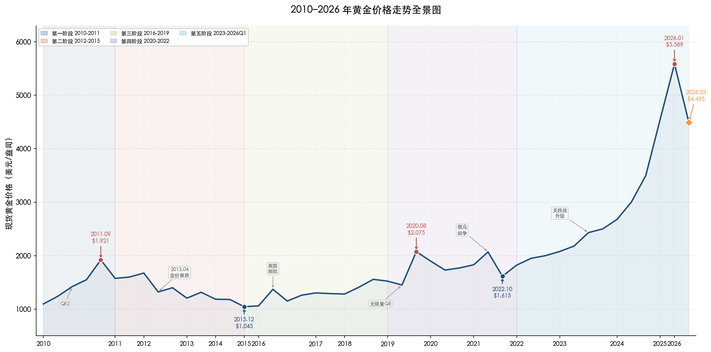

上图以五种色块区分五个阶段，完整呈现了 2010 年初至 2026 年 3 月黄金从约 1,096 美元/盎司攀升至 5,589 美元/盎司历史峰值、再回落至约 4,495 美元/盎司的全貌，并标注了 QE2 启动、2013 年金价暴跌、英国脱欧、无限量 QE、俄乌战争及关税战升级等核心驱动事件。以下各节将逐一展开每个阶段的详细叙述。

## 1.1 第一阶段（2010–2011）：后金融危机牛市的最后冲顶

### 起点：量化宽松与主权债务危机的双重温床

2008 年全球金融危机后，各国央行开启了史无前例的货币宽松实验。2010 年初黄金以约 1,096 美元/盎司开盘，彼时美联储已完成第一轮量化宽松（QE1），而欧洲正深陷主权债务危机——希腊在 2010 年 5 月被迫接受国际救助，爱尔兰和葡萄牙紧随其后。这一双重背景为黄金的持续上涨提供了坚实土壤。

2010 年 11 月，美联储启动第二轮量化宽松（QE2），宣布在 2011 年 6 月前购买 6,000 亿美元国债，进一步压低实际利率并推动美元走弱。在 QE2 与欧债危机的共振下，黄金全年上涨约 29.5%，年末收于约 1,421 美元/盎司 [世界黄金协会](https://www.gold.org/news-and-events/press-releases/gold-price-2010-driven-recovery-key-sectors-demand-and-continued "2010年金价年度回顾")。

### 峰值：美债危机引爆终极恐慌

2011 年的黄金市场堪称"恐慌驱动"的经典案例。上半年金价在欧债危机深化中稳步攀升，但真正的爆发出现在三季度。7–8 月间，美国国会围绕债务上限的僵局将全球金融市场推向崩溃边缘。8 月 5 日，标普史无前例地将美国主权信用评级从 AAA 下调至 AA+，恐慌情绪瞬间点燃。在随后不到一个月的时间里，黄金完成了一轮近乎垂直的拉升。

2011 年 9 月 6 日，伦敦现货黄金盘中触及 1,921.41 美元/盎司，创下当时的历史绝对高点 [The Guardian](https://www.theguardian.com/business/2011/sep/06/gold-hits-new-high-financial-markets "2011年9月6日黄金创历史新高报道")。从 2010 年初约 1,096 美元计算，这一轮牛市的最后冲顶阶段在不到两年时间内实现了约 75% 的累计涨幅 [Investopedia](https://www.investopedia.com/gold-price-history-highs-and-lows-7375273 "黄金价格历史高低点")。

此轮牛市的终结信号清晰可辨：2012 年 7 月欧洲央行行长德拉吉喊出"不惜一切代价捍卫欧元"，有效遏制了市场对欧元区解体的恐惧；与此同时，美联储在 2012 年 12 月启动 QE3 后，"Taper"预期逐步升温，市场对系统性崩溃的恐慌开始消退，黄金失去了最核心的避险买盘支撑。

## 1.2 第二阶段（2012–2015）：四年漫长熊市

### 暴跌：三十年来最惨烈的两日崩盘

2012 年黄金在高位震荡，全年仅微涨约 7%，年末收于约 1,675 美元/盎司。表面的平静之下，美国经济的稳步复苏与美联储退出宽松的预期正暗流涌动。

真正的转折点出现在 2013 年 4 月。4 月 12–15 日，黄金遭遇了三十年来最惨烈的两日暴跌：价格从约 1,564 美元急坠至 4 月 16 日盘中低点约 1,321 美元，两个交易日跌幅高达 15.5%。触发因素多重叠加——塞浦路斯央行被要求出售黄金储备以偿还救助贷款，引发市场对其他欧元区国家央行抛金的恐慌；时任美联储主席伯南克暗示可能缩减 QE 规模，使 Taper 预期骤然升温；大量程序化止损盘的连锁踩踏进一步加剧了抛压 [BullionVault](https://www.bullionvault.com/gold-news/opinion-analysis/golds-big-price-crash-10-year-07072023 "2013年金价暴跌十周年回顾")。2013 年全年黄金下跌约 28%，为 1981 年以来最差年度表现。

### 磨底：美联储加息靴子落地

2014–2015 年，黄金在美联储加息预期的持续压制下进入缓慢下行通道。美元指数从 2014 年中的 80 附近一路攀升至 2015 年底的 100 上方，对以美元计价的黄金构成沉重压力。

2015 年 12 月 3 日，黄金盘中触及约 1,045 美元/盎司，创近六年低点 [CNBC](https://www.cnbc.com/2015/12/17/gold-holds-losses-from-biggest-dip-in-5-months-after-fed-rate-hike.html "美联储加息后金价跌至多年低点")。两周后的 12 月 17 日，美联储近十年来首次加息 25 个基点，利率走廊从 0–0.25% 升至 0.25–0.50%。值得关注的是，加息靴子落地后金价反而企稳反弹——这一"利空出尽即利好"的经典转折标志着熊市的终结。

从 2011 年 9 月峰值 1,921 美元到 2015 年 12 月低点约 1,045 美元，这一轮熊市历时约四年零三个月，累计跌幅约 45.6% [StoneX Bullion](https://stonexbullion.com/en/blog/what-was-the-highest-price-for-gold/ "黄金历史最高价回顾")。

## 1.3 第三阶段（2016–2019）：漫长筑底与缓慢复苏

### 英国脱欧黑天鹅与地缘风险回归

2016 年成为黄金复苏的转折之年。年初全球金融市场剧烈动荡——中国股市触发熔断机制、国际油价暴跌——推动金价从约 1,060 美元快速反弹。6 月 24 日英国脱欧公投结果出炉，黄金单日跳涨约 4% 至 1,315.50 美元/盎司；7 月 6 日进一步触及约 1,371 美元的两年高点，上半年累计涨幅超过 25% [世界黄金协会](https://www.gold.org/goldhub/research/market-update/market-update-gold-surges-after-brexit-becomes-reality "英国脱欧后金价飙升") [CNBC](https://www.cnbc.com/2016/07/01/brexit-helps-gold-gain-over-25-in-first-half-of-2016.html "英国脱欧助推金价上半年涨逾25%")。

下半年局势反转：特朗普意外赢得美国大选后，"再通胀交易"兴起，市场转向押注财政扩张和加息提速，黄金回吐部分涨幅，年末收于约 1,151 美元/盎司。

### 2017–2018 年：加息逆风中的窄幅震荡

2017 年黄金表现出色却鲜受关注。在美联储全年加息三次的背景下，黄金依靠地缘风险（朝鲜半岛导弹危机）和美元走弱的对冲效应，逆势上涨约 13%，年末收于约 1,303 美元/盎司。

2018 年则是"美元之年"。美联储全年加息四次，联邦基金利率升至 2.25–2.50%，美元指数从 89 反弹至 97，黄金全年微跌约 1.5%，年末收于约 1,282 美元/盎司。尽管面临持续加息的逆风，金价始终未跌破 1,160 美元的关键支撑位，显示出多头力量在底部的顽强守护。

### 2019 年：三次降息点燃复苏引擎

2019 年政策风向骤然逆转。美联储在 7 月、9 月、10 月三次降息共计 75 个基点，联邦基金利率回落至 1.50–1.75%。与此同时，中美贸易摩擦持续升级——8 月美国宣布对剩余约 3,000 亿美元中国商品加征关税，全球经济衰退忧虑显著加剧。

在货币转向与地缘风险的双重推动下，黄金于 8–9 月升至约 1,557 美元的六年高点 [The Guardian](https://www.theguardian.com/business/2019/jul/19/gold-price-hits-six-year-high-as-investors-await-us-interest-rate-cut "2019年金价升至六年高点")。从 2015 年 12 月低点约 1,045 美元计算，累计反弹约 49%，但距 2011 年的 1,921 美元历史高点仍有约 19% 的差距。整个 2016–2019 年阶段构成了一个缓慢而坚实的筑底复苏期，为 2020 年的突破性行情蓄积了充足能量。

## 1.4 第四阶段（2020–2022）：疫情冲击、历史新高与加息反噬

### 2020 年：疫情催生无限量 QE，黄金首破 2,000 美元

2020 年初新冠疫情的全球扩散首先引发了流动性危机——3 月中旬黄金与股票同步暴跌，盘中一度触及 1,451 美元低点，原因在于机构投资者被迫抛售黄金以满足追加保证金的需求。然而美联储的应对速度史无前例：3 月 15 日紧急降息 100 个基点至 0–0.25%，随后宣布"无限量 QE"，资产负债表在数月内膨胀逾 3 万亿美元。

流动性危机解除后，黄金进入单边上涨通道。8 月 4 日，现货黄金首次突破 2,000 美元大关 [CNBC](https://www.cnbc.com/2020/08/04/gold-markets-coronavirus-dollar-in-focus.html "黄金首次突破2000美元")；8 月 6 日，盘中进一步冲高至约 2,075 美元，刷新历史最高纪录 [SD Bullion](https://sdbullion.com/gold-prices-2020 "2020年金价历史数据")。推动这一极端行情的核心因素包括：美元指数从 3 月的 103 跌至 9 月的 92，美国 10 年期 TIPS 实际收益率降至 -1.08%（2013 年以来最低），以及全球负利率债券规模膨胀至 18 万亿美元。

然而狂欢结束得同样迅速。8 月 7 日起金价即开始剧烈回调；11 月辉瑞公布新冠疫苗有效性数据后，市场风险偏好急速回升，黄金年末收于约 1,898 美元/盎司，较 8 月高点回落约 8.5%。

### 2021 年：高位拉锯，通胀叙事渐起

2021 年黄金走势波澜不惊，全年在 1,680–1,942 美元之间宽幅震荡。上半年受美国经济强劲复苏和实际利率回升压制，金价一度跌至 1,680 美元区域；下半年美国 CPI 同比从 5 月的 5.0% 加速攀升至 12 月的 7.0%，通胀叙事重新点燃避险需求，年末收于约 1,829 美元/盎司。这一年实质上是牛熊转换之间的"中场休息"。

### 2022 年：俄乌战争冲高与加息风暴的双重绞杀

2022 年 2 月 24 日俄乌战争爆发，避险资金迅速涌入黄金市场。3 月 8 日现货金冲高至约 2,070 美元，距 2020 年峰值仅一步之遥 [Investopedia](https://www.investopedia.com/gold-price-history-highs-and-lows-7375273 "黄金价格历史高低点")。然而，美联储随即启动了四十年来最激进的加息周期：全年加息 7 次、累计 425 个基点，联邦基金利率从 0–0.25% 飙升至 4.25–4.50%。

利率的急剧攀升对黄金构成致命压力。美元指数在 9 月一度冲上 114.8 的二十年高位，10 年期 TIPS 实际收益率从年初的 -1.04% 飙升至 10 月的 +1.74%——275 个基点的剧变在历史上极为罕见。在美元强势与实际利率飙升的双重逆风下，黄金于 10 月下旬跌至约 1,615–1,628 美元的低点区域 [Exchange-Rates.org](https://www.exchange-rates.org/precious-metals/gold-price/united-states/2022 "2022年美国黄金价格历史") [JM Bullion](https://www.jmbullion.com/charts/gold-price/10-year/ "10年金价图表")。从 3 月高点到 10 月低点，不到七个月时间内金价回撤约 22%。

尤为值得关注的是，即便面临如此剧烈的利率冲击，黄金的年度跌幅仅约 0.3%（年末收于约 1,824 美元），展现出远超市场预期的抗跌韧性。这一韧性的核心来源是全球央行的创纪录购金——2022 年各国央行合计购入 1,082 吨黄金，创半个多世纪以来新高，其中相当比例由未公开报告的买家贡献。这一结构性变化为理解 2023 年之后黄金行为模式的根本转变埋下了伏笔。

## 1.5 第五阶段（2023–2026 年 Q1）：前所未有的超级牛市

### 2023 年：央行购金托底，年末突破 2,100 美元

2023 年黄金走势呈现"先抑后扬"格局。上半年美联储持续加息至 5.25–5.50%（7 月为最后一次加息），金价在 1,800–2,000 美元区间维持震荡。转折出现在四季度——10 月以色列与哈马斯冲突爆发，叠加市场对美联储加息终点的确认，金价迅速突破 2,000 美元。

12 月 4 日，现货金盘中冲高至约 2,135 美元，首次突破 2,100 美元关口 [CNBC](https://www.cnbc.com/2023/12/04/gold-prices-set-for-new-highs-amid-economic-geopolitical-uncertainty.html "金价首次突破2100美元")。年末收于 2,078 美元/盎司，创年度收盘历史纪录。世界黄金协会的分析表明，2023 年全球央行购金达 1,037 吨（连续第二年超千吨），对金价贡献了约 10–15% 的涨幅 [世界黄金协会](https://www.gold.org/goldhub/research/gold-market-commentary-december-2023 "2023年12月黄金市场评论")。

### 2024 年：价格里程碑接踵而至，全年暴涨逾 30%

2024 年黄金接连刷新历史纪录，主要里程碑包括：

- **3 月 8 日**：现货金突破此前 2023 年 12 月的峰值，正式确认新一轮突破行情 [CBS News](https://www.cbsnews.com/news/golds-price-surpasses-2500-an-ounce-moves-to-make-now/ "2024年金价关键里程碑")。
- **4 月 3–4 日**：金价首次站上 2,300 美元/盎司，此前八个交易日连续创下新高 [Investing.com](https://www.investing.com/news/commodities-news/gold-prices-hit-record-highs-above-2300-amid-mixed-rate-cut-cues-3364886 "金价首破2300美元")。
- **4 月中旬**：中东地缘局势紧张（伊朗与以色列冲突升级）推动金价突破 2,400 美元/盎司，一度触及约 2,431 美元 [iTrustCapital](https://www.itrustcapital.com/learn/gold-soars-beyond-2400-reaching-new-heights "金价突破2400美元")。
- **8 月 16 日**：现货金首次突破 2,500 美元，触及 2,500.99 美元 [JCK](https://www.jckonline.com/editorial-article/gold-price-hits-2500-record/ "2024年8月金价首破2500美元")。

全年累计涨幅超过 30%，在主要资产类别中位居前列 [Investopedia](https://www.investopedia.com/gold-price-history-highs-and-lows-7375273 "黄金价格历史高低点")。

这一轮行情的驱动力呈现多因子共振特征：美联储于 9 月启动降息周期，首次降息 50 个基点并在年底前累计降息 100 个基点；全球央行全年购金 1,045 吨，连续第三年超千吨；地缘政治风险从俄乌延伸至中东，形成持续性避险溢价。

### 2025 年：从 3,000 到 4,500——史上最陡峭的上涨曲线

2025 年黄金走势堪称"垂直攀升"，关键节点包括：

- **3 月 14 日**：现货金首次突破 3,000 美元/盎司大关，触及 3,004.86 美元。核心驱动因素为特朗普政府全面升级关税战（对华关税累计加至 145%）、美股波动加剧及高盛上调金价目标 [Reuters](https://www.reuters.com/markets/commodities/gold-mounts-record-summit-eyes-3000-peak-2025-03-14/ "2025年3月14日金价首破3000美元")。
- **4 月**：中美关税博弈白热化（中方对美加征 125% 报复关税），恐慌情绪推动金价进一步冲至约 3,500 美元。
- **12 月 26 日**：年末收官阶段触及 4,549.74 美元的年内峰值 [StoneX Bullion](https://stonexbullion.com/en/blog/what-was-the-highest-price-for-gold/ "黄金历史最高价回顾")。

供需基本面同样创下里程碑：2025 年全球黄金总需求首次突破 5,000 吨（达 5,002.3 吨），总需求价值 5,550 亿美元（同比增长 45%）；LBMA 金价全年刷新 53 次历史新高，年均价达 3,431.5 美元/盎司（同比上涨 44%）；黄金 ETF 从 2024 年的净流出 2.9 吨逆转为净流入 801 吨，投资需求攀升 84% [世界黄金协会](https://www.gold.org/goldhub/research/gold-demand-trends/gold-demand-trends-full-year-2025 "2025年全年黄金需求趋势报告")。

### 2026 年 Q1：冲顶 5,589 美元后的剧烈回调

进入 2026 年，黄金延续了上一年的强势走势，但波动性急剧放大。

**1 月 28 日**，现货黄金盘中触及 5,589.38 美元/盎司的历史绝对高点。推动这一极端价位的因素叠加了三重冲击：美国与伊朗军事对峙持续升级、美元指数大跌至 95.5（较 2024 年底的 108 以上暴跌逾 12%），以及美国威胁对加拿大加征 100% 关税所引发的全球贸易体系崩塌恐慌 [StoneX Bullion](https://stonexbullion.com/en/blog/what-was-the-highest-price-for-gold/ "黄金历史最高价回顾")。

然而，极端高位的不可持续性很快暴露。2 月下旬美伊冲突实际爆发后，金价出现反直觉的下跌——"买预期、卖事实"效应叠加美元因避险需求而阶段性走强，使地缘风险溢价反而被削弱。3 月以来金价持续回调，3 月 18 日跌破 50 日均线。

截至 2026 年 3 月 27 日，黄金报约 4,495 美元/盎司，较 1 月峰值回落约 20%，但同比 2025 年 3 月仍上涨约 46% [Trading Economics](https://tradingeconomics.com/commodity/gold "黄金实时价格与历史数据")。从 2022 年 10 月低点约 1,615 美元计算，这一轮超级牛市已实现约 178% 的累计涨幅，远超 2001–2011 年牛市中同等时间跨度的表现。

## 1.6 十六年周期总结：三轮完整行情的共性与演变

回顾 2010–2026 年的黄金走势，可清晰识别出三轮牛熊周期及其演变规律。

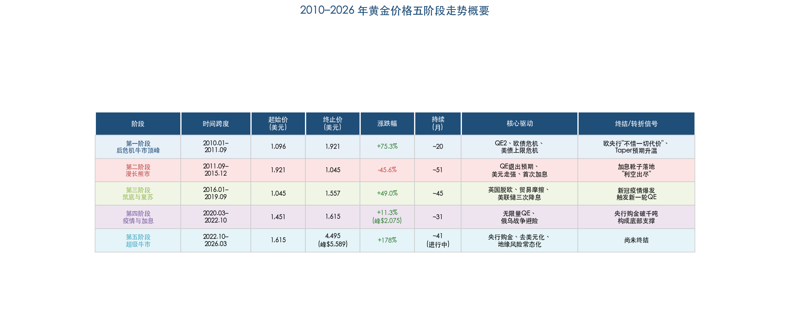

上表以结构化方式呈现五个阶段的起止价位、涨跌幅、持续时间及核心驱动因素，便于横向比较各阶段的市场特征与转折信号。

**第一轮周期（2010 年初 – 2015 年底）**
- 牛市阶段：2010 年初 1,096 → 2011 年 9 月 1,921 美元（+75%，约 20 个月）
- 熊市阶段：2011 年 9 月 1,921 → 2015 年 12 月 1,045 美元（-45.6%，约 51 个月）
- 核心驱动：量化宽松推动上涨 → QE 退出预期与美元走强推动下跌
- 终结信号：美联储首次加息靴子落地

**第二轮周期（2016 年初 – 2022 年 10 月）**
- 牛市阶段：2015 年 12 月 1,045 → 2020 年 8 月 2,075 美元（+99%，约 56 个月）
- 熊市阶段：2020 年 8 月 2,075 → 2022 年 10 月 1,615 美元（-22%，约 26 个月）
- 核心驱动：降息周期与疫情无限量 QE 推动上涨 → 四十年最激进加息周期推动下跌
- 终结信号：加息接近尾声 + 央行购金突破千吨构成底部支撑

**第三轮周期（2022 年 10 月至今，尚未终结）**
- 牛市阶段：2022 年 10 月 1,615 → 2026 年 1 月 5,589 美元（+246%，约 39 个月）
- 当前状态：自 2026 年 1 月峰值回调约 20%，处于 4,495 美元附近
- 核心驱动：央行购金结构性需求、地缘风险常态化、去美元化趋势、美联储降息周期
- 关键特征：传统"实际利率—金价"负相关框架出现历史性脱钩

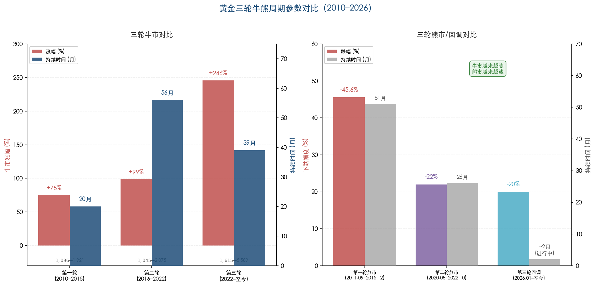

上图直观呈现了三轮周期"牛市越来越陡、熊市越来越浅"的演变规律：牛市涨幅从 75% 扩大至 246%，而熊市跌幅从 45.6% 收窄至当前的约 20%。

三轮周期揭示了一个重要的结构性趋势：黄金的定价锚正在从单一的"美联储货币政策—实际利率"框架，向"央行购金+地缘风险+去美元化"多因子驱动框架转变。2010–2015 年金价几乎完全由实际利率主导；2016–2022 年货币政策仍为核心锚但地缘因素开始介入；2022 年以来，即使在实际利率大幅走高的环境下黄金仍能迭创新高，标志着定价范式的根本转变。这一转变是理解当前黄金走势及未来趋势的核心线索，也是后续章节将深入解析的关键命题。

# 第2章 黄金定价的核心逻辑——驱动因素深度解析

黄金价格的波动从来不是单一变量的产物，而是多重宏观因子在不同时期交替主导、相互叠加的结果。2010–2026 年间，驱动金价的核心逻辑经历了从"实际利率一元定价"到"多因子复合定价"的结构性演变——这一转变的深远程度，堪称过去半个世纪以来黄金定价体系最重要的范式重构。

本章系统拆解影响金价的七大核心驱动因子——美联储货币政策与实际利率、美元指数与美元信用、通胀与通胀预期、地缘政治风险、全球央行购金、供需基本面、市场情绪与投机仓位——建立"因子→传导机制→金价"的完整分析框架，并回答一个关键问题：2022 年以来，黄金定价体系究竟发生了什么根本性的变化？

## 2.1 美联储货币政策与实际利率：从定价之锚到裂痕扩大

### 传统框架：实际利率的统治力

黄金不产生现金流，持有成本涵盖仓储与保险费用，"收益率"实质为负。这一天然属性使黄金价格对实际利率（名义利率扣除通胀预期）高度敏感：实际利率上升时，持有黄金的机会成本随之增加，资金倾向流入生息资产；反之，实际利率下降乃至转负时，黄金的零息劣势被消弭，甚至转化为相对优势。

PIMCO 的量化研究为这一逻辑提供了精确的弹性估计：2004–2025 年间，美国 10 年期 TIPS 实际收益率每上升 100 个基点，经通胀调整后的黄金实际价格平均下跌约 18%，隐含实际久期约 18 年 [PIMCO](https://www.pimco.com/us/en/resources/education/understanding-gold-prices "PIMCO黄金价格实际收益率框架")。RBC 财富管理的统计更为直观：1997–2004 年间黄金价格与 TIPS 收益率的决定系数（R²）为 69%，2005–2021 年进一步攀升至 84%，意味着同期金价波动的八成以上可由实际利率变化单独解释 [RBC Wealth Management](https://www.rbcwealthmanagement.com/en-asia/insights/golds-regime-change "Gold's regime change? 2025年6月研报")。

### 政策周期回顾：从零利率到史上最激进紧缩

2010–2021 年间，美联储政策基本在"超宽松→缓慢正常化→重回宽松"之间摆动：2010 年 11 月启动 QE2，2012–2013 年实施 QE3，2015 年 12 月近十年首次加息，2019 年三次降息，2020 年 3 月重回零利率并推出无限量 QE。每一次政策转向几乎精确对应了同期金价的重大拐点，充分印证了实际利率作为"定价之锚"的有效性。

2022 年 3 月至 2023 年 7 月，美联储累计加息 11 次、共 525 个基点，将联邦基金利率从 0–0.25% 推升至 5.25–5.50%（2001 年以来最高水平）。随后于 2024 年 9–12 月降息三次（50bp+25bp+25bp），2025 年 9 月、10 月、12 月各降息 25 个基点，至 2026 年 3 月维持 3.50–3.75% 不变 [Forbes Advisor](https://www.forbes.com/advisor/investing/fed-funds-rate-history/ "联邦基金利率历史") [Advisor Perspectives](https://www.advisorperspectives.com/dshort/updates/2026/03/19/feds-interest-rate-decision-march-18-2026 "2026年3月FOMC会议详情")。

### 定价裂痕：2022 年之后的历史性脱钩

传统框架的核心假设是"高实际利率压制金价"。然而，2022–2026 年的市场现实对此假设构成了根本性挑战。

2022–2023 年，美联储激进加息推动 10 年期 TIPS 实际收益率从负值区域大幅攀升，但金价并未如历史规律般大幅下挫。RBC 的统计揭示了这一脱钩的剧烈程度：2022–2023 年间金价与实际利率的 R² 骤降至仅 3%，2024 年至今进一步降至 7%——从解释力超过 80% 到几乎失去统计意义，传统定价框架遭遇了前所未有的失效 [RBC Wealth Management](https://www.rbcwealthmanagement.com/en-asia/insights/golds-regime-change "R²从84%降至3%的量化证据")。

截至 2026 年 3 月 27 日，10 年期 TIPS 实际收益率为 2.10%，处于近十五年来的绝对高位 [Trading Economics](https://tradingeconomics.com/united-states/10-year-tips-yield "2026年3月27日TIPS收益率2.10%")。按照传统框架，如此高的实际利率对应的金价"合理水平"应远低于当前的 4,495 美元/盎司。S&P Global 2025 年 3 月的研究明确指出，2024 年出现了美国 10 年期国债收益率与金价同步上涨的异常现象，地缘政治担忧已在特定阶段压倒宏观基本面对金价的影响 [S&P Global](https://www.spglobal.com/market-intelligence/en/news-insights/research/treasury-yields-and-gold-prices-breaking-expectations "国债收益率与金价打破预期")。

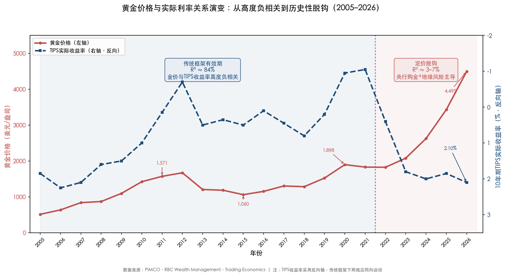

上图清晰展示了金价与 10 年期 TIPS 实际收益率从 2005–2021 年的高度负相关（R² ≈ 84%），到 2022 年之后几乎完全脱钩（R² ≈ 3–7%）的历史性转变。2022 年之前，两条曲线近乎完美的反向运动构成了黄金定价最可靠的经验法则；2022 年之后，金价在实际利率走高的背景下逆势上扬，标志着新定价力量——央行购金与地缘风险溢价——已取代实际利率成为边际定价因子。

我们认为，这一脱钩并非短期异象，而是黄金定价体系的结构性转变。PIMCO 将央行购金与去美元化趋势定义为"粘性避险买盘"，认为这些因素自 2022 年起已使传统的"实际利率-金价"负相关关系显著脱钩 [PIMCO](https://www.pimco.com/us/en/resources/education/understanding-gold-prices "PIMCO论驱动因子结构性转变")。

## 2.2 美元指数与美元信用：从周期性波动到结构性侵蚀

### 美元-黄金的反向关系

黄金以美元计价，美元走弱直接推升以美元标价的金价，反之亦然。美元指数（DXY）因此长期被视为金价的"镜像指标"。2022 年 9 月 DXY 冲高至 114 附近的二十年高点，同期金价承压跌至 1,615 美元低位；此后随着美联储政策转向预期升温，DXY 逐步回落，金价则启动新一轮升势。

截至 2026 年 3 月，DXY 已降至约 95.5–96.8 区间，较 2024 年底 108 以上的水平大幅回落超 10%。这一显著的美元走弱与美联储降息周期、美伊军事冲突引发的资本流动以及全球去美元化趋势形成共振，构成金价维持高位的重要支撑因素 [Investing.com](https://www.investing.com/analysis/golds-speculative-net-positions-mirror-december-2025-levels-200674291 "DXY交易数据")。

### 去美元化：从概念到现实的加速演进

2022 年 2 月俄乌冲突爆发后，西方冻结俄罗斯央行约 3,000 亿美元外汇储备，这一史无前例的举措被全球央行普遍视为"美元武器化"的标志性时刻。其后果深远而持久：各国央行加速将储备资产从美元资产转向黄金等主权中性资产，形成对金价的长期结构性支撑 [CBS News](https://www.cbsnews.com/news/relationship-between-gold-prices-and-us-dollar-what-to-know-for-2026/ "央行储备多元化对黄金和美元关系的影响")。

去美元化趋势在数据层面得到充分印证：全球央行已连续三年净购金超千吨，远超 2010–2021 年年均 473 吨的水平（详见 2.5 节）。更关键的是，这些购买行为表现出显著的"价格不敏感性"——即便金价屡创新高，央行购金量也未实质性缩减。这意味着美元信用的结构性侵蚀已为黄金创造了一个新的需求底部，其影响力在部分时期已超越传统的利率和汇率周期性因子。

## 2.3 通胀与通胀预期：抗通胀属性的条件性与边界

### 黄金的通胀对冲功能及其约束

黄金被视为"硬通货"和通胀对冲工具的历史可追溯数千年，其底层逻辑在于：当法定货币的购买力因通胀而下降时，以实物形式存在、总量增长受地质约束的黄金能够保持相对价值。1970–1980 年的大滞胀时期，金价从 35 美元飙升至 680 美元（涨幅超 1,800%），是这一属性最有力的历史验证。

然而，通胀对冲功能并非无条件成立。关键变量在于"实际利率"而非"名义通胀"本身——若央行以快于通胀上升的速度加息，实际利率上升，黄金的抗通胀吸引力反而会被更高的机会成本所抵消。2022 年即为典型案例：美国 CPI 同比飙升至 9.1% 峰值（6 月），但美联储以更为激进的速度累计加息 525 个基点，实际利率由负转正，金价在通胀高点期间反而承压下行。

### 当前通胀形势与前瞻

美国 CPI 同比从 2022 年 6 月 9.1% 的峰值持续回落，至 2026 年 2 月降至 2.4%，核心 CPI 为 2.5%，仍略高于美联储 2% 的政策目标 [美国劳工统计局](https://www.bls.gov/news.release/cpi.nr0.htm "2026年2月CPI报告")。截至 2026 年 3 月 27 日，10 年期盈亏平衡通胀率（Breakeven Inflation Rate）为 2.31%，反映市场对未来十年年均通胀的隐含预期仍温和锚定于 2% 略上方 [Macrotrends](https://www.macrotrends.net/3009/10-year-breakeven-inflation-rate "2026年3月27日盈亏平衡通胀率2.31%")。

值得关注的是，2026 年 2 月 28 日爆发的美伊军事冲突推动原油价格升至近 100 美元/桶，形成新的通胀上行风险。路透社 2026 年 3 月报道指出，5 年期盈亏平衡通胀率已攀升超 20 个基点至 2.65%，为近期高点 [Reuters](https://www.reuters.com/markets/inflation-expectations-flash-warning-not-long-lasting-one-2026-03-18/ "通胀预期闪现警告")。这一动态收窄了美联储进一步降息的空间，但同时增强了黄金作为抗通胀配置的吸引力，形成一种看似矛盾但逻辑自洽的双向支撑：利率预期上行压制金价的估值锚，但通胀风险升温推升金价的配置需求 [DW](https://www.dw.com/en/iran-us-israel-war-gold-silver-dollar-oil-inflation/a-76381602 "伊朗战争与油价通胀")。

## 2.4 地缘政治风险：从脉冲式冲击到结构性定价因子

### 传统范式：避险脉冲与快速衰退

在传统黄金分析框架中，地缘政治事件被归类为"脉冲式"驱动因子：战争爆发或重大安全事件引发避险资金涌入黄金，推动金价短期跳涨，但随着事态明朗或市场逐步消化，避险溢价往往在数周内消退。2001 年"9·11"事件、2014 年克里米亚危机期间的金价走势均清晰印证了这一"冲高-回落"模式。

### 范式转变：2022–2026 年地缘风险的常态化嵌入

2022 年以来，地缘政治风险的性质发生了根本变化——从"偶发脉冲"演变为"持续性结构因素"。地缘事件链条呈现出高度密集且相互关联的特征：俄乌冲突（2022 年 2 月至今持续）→ 以哈冲突（2023 年 10 月起）→ 中美关税极端升级（美对华 145%、中方 125% 报复性关税）→ 美伊军事对峙（2026 年 2 月起）。这一连串冲击使得地缘风险溢价从短期波动项转化为金价定价的常态性因子 [S&P Global](https://www.spglobal.com/market-intelligence/en/news-insights/research/treasury-yields-and-gold-prices-breaking-expectations "地缘政治对金价传统关系的冲击")。

然而，地缘因子的传导机制并非简单的"避险 = 利多"。2026 年 2 月美伊战争爆发后，金价不涨反跌，Commerzbank 分析师 Carsten Fritsch 指出"金价实际上低于战争开始前的水平"。其分析揭示了更深层的传导逻辑：军事冲突推高油价引发再通胀预期，美元因传统避险货币地位反而走强，利率预期上行——这两大传统利空机制对冲并压倒了避险买盘 [DW](https://www.dw.com/en/iran-us-israel-war-gold-silver-dollar-oil-inflation/a-76381602 "Commerzbank分析师论金价与伊朗战争")。这一案例深刻表明，地缘事件对金价的影响取决于其如何改变利率、汇率和通胀预期的组合效果，而非事件本身的严重程度。

## 2.5 全球央行购金：改变游戏规则的结构性力量

### 购金规模的历史性跃升

如果说实际利率框架的崩塌需要找到一个"元凶"，那么全球央行的大规模购金行为无疑是最有力的候选者。

世界黄金协会（WGC）数据显示，全球央行年度净购金量在 2022 年达到创纪录的 1,082 吨，此后 2023 年 1,037 吨、2024 年 1,045 吨，连续三年超千吨。2025 年虽降至 863 吨，但仍远超 2010–2021 年年均 473 吨的水平，购金中枢已实现永久性抬升 [世界黄金协会](https://www.gold.org/goldhub/research/gold-demand-trends/gold-demand-trends-full-year-2025/central-banks "2025年全年央行购金数据") [世界黄金协会](https://www.gold.org/goldhub/research/gold-demand-trends/gold-demand-trends-full-year-2024/central-banks "2024年全年央行购金数据")。

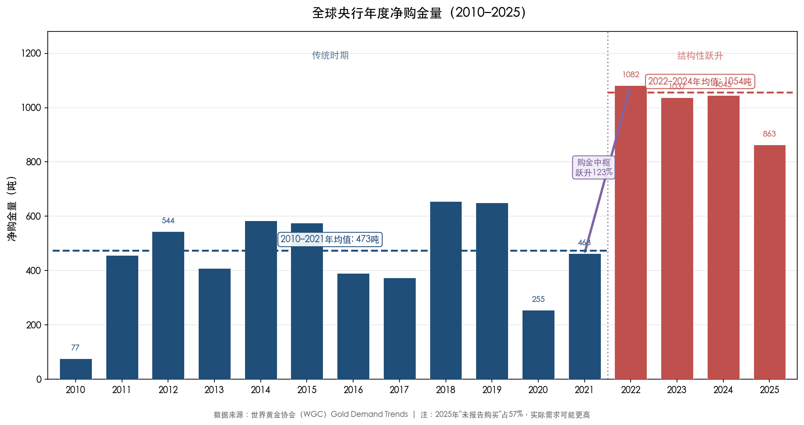

上图直观展示了全球央行购金中枢的结构性跃升。2010–2021 年间（蓝色柱），年均购金量为 473 吨，波动范围较大；2022–2025 年间（红色柱），年均购金量攀升至 1,007 吨，较前一阶段跃升 123%。即便 2025 年购金量有所回落，仍显著高于 2010–2021 年的均值水平，表明央行购金的结构性增量已成为黄金需求端的新常态。

### 主要购金国：地缘策略驱动的储备重构

2025 年主要购金国的分布揭示了清晰的地缘策略动机：波兰以 102 吨位居首位，其明确目标是将黄金储备占比提升至 30%；哈萨克斯坦 57 吨，巴西 43 吨，阿塞拜疆 38 吨，中国 27 吨（年末储备累计 2,306 吨，占外汇储备比例近 9%）[世界黄金协会](https://www.gold.org/goldhub/research/gold-demand-trends/gold-demand-trends-full-year-2025/central-banks "2025年各国央行购金详情")。

一个值得高度关注的细节是：2025 年央行购金中"未报告购买"占比高达 57%，实际官方需求可能显著高于公开统计数据 [世界黄金协会](https://www.gold.org/goldhub/research/gold-demand-trends/gold-demand-trends-full-year-2025/central-banks "未报告央行购金占比")。这意味着公开统计所反映的央行需求，可能仅为实际规模的冰山一角。

### 央行购金颠覆传统定价框架的三重机制

央行购金之所以能够改变黄金的定价逻辑，核心在于三个区别于市场化买方的结构性特征：**规模大**——年均千吨级别，占全球年矿产金的近三成；**价格不敏感**——不以短期盈利为目标，而是基于国家战略进行长期配置；**持续性强**——WGC 调查显示 95% 的受访央行预计未来一年将继续增持黄金 [RBC Wealth Management](https://www.rbcwealthmanagement.com/en-asia/insights/golds-regime-change "央行购金趋势持续性")。

State Street 全球顾问的研究进一步确认，中国零售需求与新兴市场央行购金已取代实际利率，成为主导金价的核心定价因素 [State Street Global Advisors](https://www.ssga.com/library-content/assets/pdf/apac/gold/2025/en/us-real-rates-still-matter-for-gold.pdf "2025年3月研报")。这一转变并非周期性的暂时偏离，而是黄金买方结构的根本性重塑。

## 2.6 黄金供需基本面：供给刚性约束与需求结构重塑

### 供给侧：增长天花板下的刚性约束

全球黄金供给增长的空间极为有限，构成金价长期支撑的底层逻辑。2025 年矿产金虽创纪录达 3,672 吨，但同比仅增长 1%；回收金 1,404 吨，同比增长 3%。过去十五年，全球矿产金年增长率仅约 2%，且新矿从勘探到投产通常需要 10–15 年的开发周期，供给弹性极低 [世界黄金协会](https://www.gold.org/goldhub/research/gold-demand-trends/gold-demand-trends-full-year-2025 "2025年全球黄金供应数据") [RBC Wealth Management](https://www.rbcwealthmanagement.com/en-asia/insights/golds-regime-change "矿产金年增约2%")。

这一供给刚性意味着，当需求端出现结构性增量（如央行购金跃升、ETF 大规模流入）时，价格上涨几乎是供需再平衡的唯一调节机制。

### 需求侧：从珠宝消费主导到金融投资主导

2025 年全球黄金总需求首次突破 5,000 吨大关（5,002.3 吨，同比+1%），以价值计算的总需求达 5,550 亿美元（同比+45%），LBMA 金价全年刷新 53 次历史高点，年均价达 3,431.5 美元/盎司（同比+44%）[世界黄金协会](https://www.gold.org/goldhub/research/gold-demand-trends/gold-demand-trends-full-year-2025 "2025年全年黄金需求趋势报告")。

需求结构的变化尤为深刻，标志着黄金从传统的消费品属性向金融资产属性的加速转型。2025 年投资需求攀升 84% 至 2,175 吨，其中全球黄金 ETF 从上一年净流出 2.9 吨逆转为净流入 801 吨——这是自 2020 年以来最大规模的 ETF 净流入，反映金融投资者对黄金的配置兴趣发生了质变。与此同时，珠宝需求因金价高企而下降 19% 至 1,638 吨，传统消费需求正在被投资需求系统性替代 [世界黄金协会](https://www.gold.org/goldhub/research/gold-demand-trends/gold-demand-trends-full-year-2025 "2025年黄金需求结构")。

## 2.7 市场情绪与投机仓位：贪婪与恐惧的量化映射

### COMEX 投机仓位的信号功能

COMEX 黄金期货的投机性净多仓是衡量专业交易者对金价方向性看法的核心指标。净多仓持续扩大通常伴随金价上涨趋势，而急剧收缩则往往预示阶段性回调或趋势反转。

2026 年 1 月，COMEX 黄金期货投机性净多仓达到约 244,800 手的阶段高位，彼时金价正冲击 5,589 美元历史绝对高点。此后至 3 月，净多仓骤降至约 119,562 手，降幅超过 46%，显示专业投机者在金价冲顶后大规模削减多头敞口 [Investing.com](https://www.investing.com/analysis/golds-speculative-net-positions-mirror-december-2025-levels-200674291 "CFTC黄金净投机仓位分析")。截至 2026 年 3 月第 12 周，管理资金净持仓占总持仓比例降至 15.54%，为 2024 年以来的最低水平 [MacroMicro](https://en.macromicro.me/series/8444/gold-futures-and-options-np-oi-ratio "2026 W12 管理资金净持仓占比")。

### 情绪过热与均值回归的教训

Commerzbank 分析师 Carsten Fritsch 对 2025 年 Q4 至 2026 年 1 月的金价行情做出了一个值得关注的判断："贪婪和 FOMO（错失恐惧）起了重要作用"，金价上涨已与基本面出现明显脱节 [DW](https://www.dw.com/en/iran-us-israel-war-gold-silver-dollar-oil-inflation/a-76381602 "金价过热信号分析")。此后金价从 5,589 美元峰值回落约 20% 至 4,495 美元区间，验证了纯情绪驱动行情的不可持续性。

投机仓位的变化对金价的指引功能具有内在的不对称性：仓位极端拥挤时，更多指向回调风险的积聚；但仓位大幅出清之后，反而为下一轮上涨腾出了仓位空间。当前 119,562 手的净多仓位水平已回到 2025 年 12 月的水位，潜在的重新加仓空间较为充裕，这一维度对金价中期走势构成潜在支撑。

## 2.8 因子轮动总结：定价范式的三次迭代

纵观 2010–2026 年，黄金定价体系经历了三次清晰的范式迭代：

**第一阶段（2010–2015）：实际利率一元主导。** QE 退出预期与实际利率上行主导了金价从 1,921 美元到 1,045 美元的漫长熊市。这一时期传统的"实际利率-金价"负相关高度有效，R² 维持在 84% 左右，实际利率是几乎唯一有效的定价锚。

**第二阶段（2016–2021）：货币政策周期叠加地缘脉冲。** 降息→无限量 QE 的货币宽松周期推动金价回升并于 2020 年 8 月首次突破 2,000 美元。期间英国脱欧、中美贸易摩擦和新冠疫情冲击提供了阶段性脉冲驱动，但实际利率仍是核心定价变量。

**第三阶段（2022–2026 Q1）：多因子复合定价新范式。** 美联储实施史上最激进的紧缩周期，但央行以创纪录的 1,082 吨年度购金量构成有力对冲，"实际利率-金价"框架首现重大裂痕（R² 从 84% 骤降至 3–7%）。央行购金、地缘风险常态化和去美元化取代实际利率成为主导因子，黄金与实际收益率持续脱钩。PIMCO 将这一转变定义为"粘性避险买盘"主导的新均衡 [PIMCO](https://www.pimco.com/us/en/resources/education/understanding-gold-prices "PIMCO论驱动因子结构性转变")。

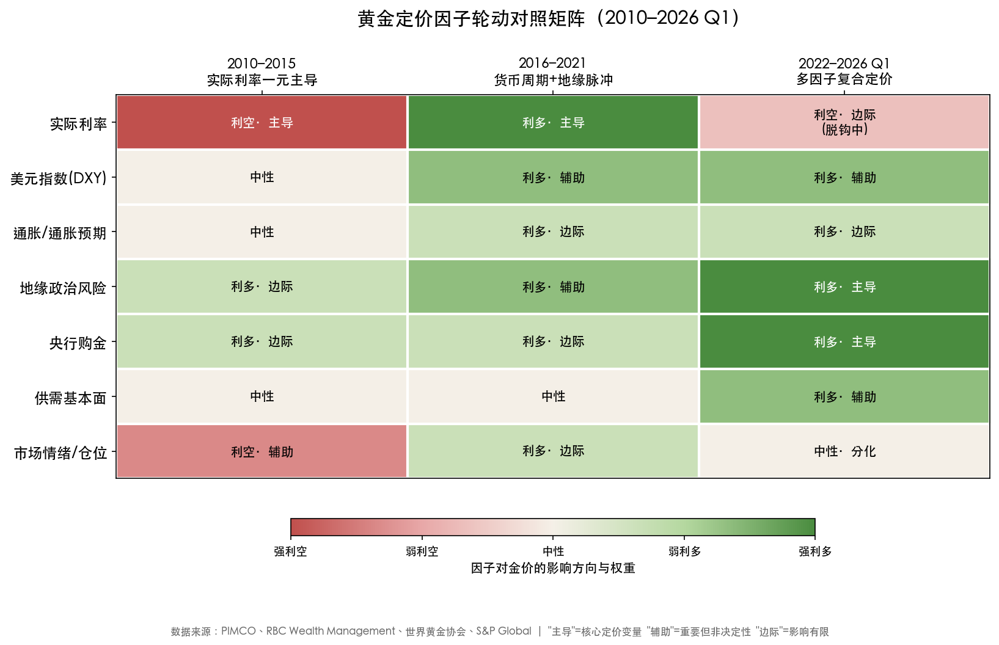

上表以热力矩阵形式直观呈现了三大定价阶段中七大驱动因子的影响方向（利多/利空/中性）与权重（主导/辅助/边际）。可以清晰观察到，2010–2015 年实际利率以"强利空·主导"角色压制金价，其余因子影响有限；2016–2021 年货币政策与地缘因子形成双轮驱动；而 2022–2026 Q1 阶段，央行购金升格为"强利多·主导"，地缘风险和去美元化同步增强，定价体系从单因子主导全面转向多因子复合格局。

我们认为，当前黄金正处于定价范式的关键转折期。实际利率仍然重要——2.10% 的 TIPS 收益率对金价构成的估值压力客观存在——但它已不再是唯一的、甚至不是最重要的定价变量。央行购金的战略持续性、地缘政治格局的持续碎片化、以及全球储备货币体系的深层重构，共同构成了一套新的黄金定价逻辑。理解这一逻辑的结构性转变，是判断黄金未来走势的根本前提。

# 第3章 技术分析——关键支撑位与压力位

截至 2026 年 3 月 27 日，伦敦现货黄金报价约 4,490 美元/盎司，较 2026 年 1 月 28 日创下的 5,589.38 美元历史绝对高点回落约 21% [Trading Economics](https://tradingeconomics.com/commodity/gold "黄金实时价格与历史数据")。月线图出现 24 个月以来的首根看跌吞没形态，短中期动能明显转弱，但自 2022 年 10 月低点 1,615 美元启动的长期牛市结构尚未遭到破坏 [FXEmpire](https://www.fxempire.com/forecasts/article/gold-xau-usd-price-forecast-bearish-signals-grow-across-timeframes-1588239 "多时间框架看跌信号增长")。本章运用经典技术分析工具——趋势线与通道、历史高低点水平支撑/阻力、斐波那契回撤与延伸、移动平均线系统及关键整数关口——系统识别当前黄金市场的关键支撑位与压力位，并就多空力量对比给出综合研判。

## 3.1 长期市场结构：趋势通道与均线体系

### 3.1.1 月线级别上升通道

从月线级别观察，黄金自 2022 年 10 月低点 1,615 美元至 2026 年 1 月高点 5,589 美元的涨幅约 246%，构成过去十六年最凌厉的一轮上攻。技术分析机构 Discovery Alert 识别出两条同时运作的上升通道结构：其一为"主通道"，形成于 2024 年初，通道角度约 25°，价格区间覆盖约 2,000–4,000 美元，持续 24 个月；其二为"加速通道"，形成于 2025 年年中，角度陡增至约 52°，覆盖约 3,500–5,600 美元区间，持续约 8 个月 [Discovery Alert](https://discoveryalert.com.au/gold-price-trend-channels-analysis-2026/ "黄金价格趋势通道分析2026")。

52° 的通道角度属于"陡峭型"通道（超过 45°），历史统计显示此类通道可持续时长通常仅为 6–18 个月，显著短于 15°–45° 中等角度通道的 12–36 个月平均寿命。截至 3 月底，金价已从加速通道上轨回落并跌穿通道中轨。FXEmpire 分析师 Bruce Powers 指出，3 月 24 日低点 4,099 美元附近恰处主通道中轴线与 200 日均线的交汇区域，金价在此获得强力支撑后出现剧烈反弹 [FXEmpire](https://www.fxempire.com/forecasts/article/gold-xau-usd-price-forecast-200-day-support-fuels-bullish-reversal-1587365 "200日均线支撑引发看涨反转分析")。由此可以判断：金价已从加速通道回归主通道内部运行，除非出现新的脉冲式上攻突破主通道上轨，否则应将主通道（25° 角度、约 4,000–5,000 美元区间）作为中期运行框架。

### 3.1.2 移动平均线体系：200 日均线的"牛熊分界"意义

在移动平均线体系中，200 日均线被广泛视为长期趋势的"牛熊分界线"。此处需要区分两种口径差异：截至 2026 年 3 月下旬，200 日指数移动平均线（EMA）约 4,200 美元，200 日简单移动平均线（SMA）约 4,077–4,100 美元，两者偏差约 100–120 美元 [FXStreet via Mitrade](https://www.mitrade.com/insights/commodity-analysis/metal/fxstreet-XAUUSDXAGUSD-202603260933 "200日SMA约4,083美元") [CapitalStreetFX](https://www.capitalstreetfx.com/gold-market-outlook-march-23-2026-xau-usd-technical-analysis-trade-setup/ "200日EMA约4,200–4,224美元")。差异成因在于 EMA 对近期价格赋予更高权重，而 2025 年 Q4 至 2026 年 1 月的急涨显著拉高了 EMA 的位置。

值得关注的关键事实是：自 2023 年末以来，金价从未收于 200 日 EMA 下方。2026 年 3 月 24 日创下的低点 4,099 美元，系一年多以来首次触及 200 日 SMA 附近区域，随后当日即出现长下影线的锤子线反转形态，最终收于 4,536 美元，单日振幅超过 400 美元 [FXEmpire](https://www.fxempire.com/forecasts/article/gold-xau-usd-price-forecast-200-day-support-fuels-bullish-reversal-1587365 "200日均线支撑")。Daily Forex 分析师亦确认，"只要能守住 200 日 EMA 约 4,200 美元，上升趋势在某种程度上就仍然完好" [Daily Forex](https://www.dailyforex.com/forex-technical-analysis/2026/03/gold-analysis-26-march-2026/243073 "200日EMA上方则上升趋势完好")。

在中短期均线方面，50 日 EMA 约 4,960 美元，3 月 18 日被跌破后已从支撑转化为动态阻力。MQL5 专业日报将其定义为"任何反弹的天花板"——在金价收复该均线并站稳之前，中短期趋势定义为偏空 [MQL5](https://www.mql5.com/en/blogs/post/768425 "50日EMA约4,960美元为空方天花板")。100 日 SMA 约 4,550 美元，同样在 3 月下旬构成反弹的即时阻力 [InstaTrade](https://www.instatrade.com/forex_analysis/441753 "100日SMA约4,550美元构成阻力")。

综合均线体系信号，三档均线构成清晰的多空分界层级：200 日均线（SMA ~4,083 / EMA ~4,200）为长期牛熊分界；50 日 EMA ~4,960 为中期趋势翻转确认位；100 日 SMA ~4,550 为短期反弹的第一道阻力。金价当前运行于 200 日均线上方、50 日均线下方，处于典型的"长多短空"格局。

## 3.2 关键支撑位：三档梯度防线

基于历史高低点、斐波那契回撤、均线支撑和趋势线交汇，我们识别出由近及远的三档关键支撑位。下图汇总展示了支撑位与压力位的完整价格分布，供读者在后续分析中参照。

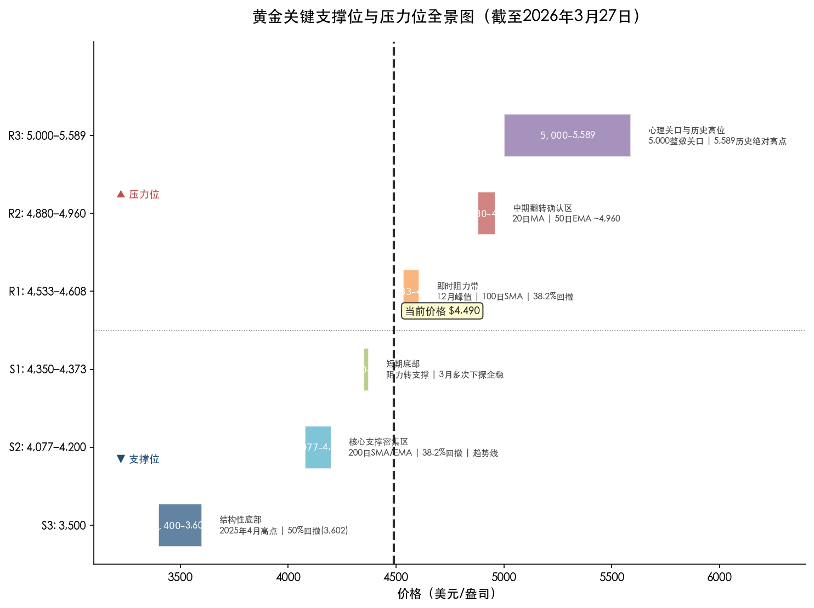

*图 3-1：黄金关键支撑位与压力位全景图（截至 2026 年 3 月 27 日），S1–S3 为三档梯度支撑，R1–R3 为三档梯度阻力，虚线标注当前价格约 4,490 美元/盎司。*

### S1：4,350–4,373 美元（短期底部区域）

3 月下旬金价在 4,350–4,373 美元区间多次下探后企稳，形成多根锤子线和十字星，构成短期底部形态。该区域的技术意义体现在两方面：其一，2025 年 10 月前高点 4,325 美元在被突破后发生典型的"阻力转支撑"角色互换，此后在 2025 年 12 月和 2026 年 2 月多次成功阻止回调 [FinanceFeeds](https://financefeeds.com/gold-technical-analysis-report-24-march-2026/ "2026年3月24日技术分析报告")；其二，FXLeaders 周度预测将 4,350 美元定义为"多空争夺的关键底部"，认为若该水平守住，则有望触发向 5,000 美元的反弹 [FXLeaders](https://www.fxleaders.com/news/2026/03/28/gold-price-forecast-week-of-march-30-2026-will-the-4350-floor-spark-a-rally-back-to-5000/ "4,350美元是否构成反弹起点的周度预测")。

操作层面的判别标准为：若金价短期再度回踩该区域并出现看涨反转 K 线形态（如早晨之星、看涨吞没），可视为短线企稳信号；反之，若日线收盘跌破 4,325 美元，则意味着"阻力转支撑"失效，需关注下一档支撑。

### S2：4,077–4,200 美元（核心支撑密集区）

这是当前最为关键的支撑带，汇聚了多重技术要素形成罕见的共振效应：

- **200 日 EMA 约 4,200 美元 / 200 日 SMA 约 4,077–4,100 美元**：长期牛熊分界线，金价自 2023 年末至今从未有效跌破。
- **主上升通道中轴线**：Bruce Powers 指出 200 日均线正在向上穿越上升通道中轴线，两者交汇进一步强化了此区域的支撑力度 [FXEmpire](https://www.fxempire.com/forecasts/article/gold-xau-usd-price-forecast-200-day-support-fuels-bullish-reversal-1587365 "通道中轴线与200日均线交汇")。
- **61.8% 斐波那契回撤位 4,158 美元**（基于 2025 年 1 月低点至 2026 年 1 月高点的短周期回撤计算），与均线区域高度重合。
- **长期上升趋势线**：连接 2025 年 8 月摆动低点的上升趋势线在 4,114 美元附近提供额外支撑。
- **3 月 24 日低点 4,099 美元的实战验证**：金价触及该区域后出现剧烈反弹（日内振幅超 400 美元），以教科书式的锤子线收盘，充分证实了该支撑带的有效性。

CapitalStreetFX 将 4,200–4,224 美元定义为"终极牛熊分界线"，认为只要金价持续守于该区域上方，长期牛市结构即不会被破坏 [CapitalStreetFX](https://www.capitalstreetfx.com/gold-market-outlook-march-23-2026-xau-usd-technical-analysis-trade-setup/ "4,200–4,224美元牛熊分界线")。FOREX.com 分析师 Fawad Razaqzada 则进一步将 4,000 美元视为"沙线"（line in the sand），即多方绝对不可失守的最后防线 [FOREX.com](https://www.forex.com/en-us/news-and-analysis/gold-2026-outlook-xau-usd-technical-analysis/ "4,000美元为关键支撑分界线")。

### S3：3,500 美元（结构性底部）

3,500 美元是 2025 年 4 月的阶段高点，也是 2025 年年中加速通道的起点，兼具水平支撑与通道支撑的双重结构性意义。从斐波那契视角看，以 2022 年 10 月低点 1,615 美元至 2026 年 1 月高点 5,589 美元为测量区间，50% 回撤位为 3,602 美元，与 3,500 美元整数关口高度吻合。若金价跌至该区域，意味着整轮超级牛市的一半涨幅被回吐，市场将进入深度调整状态。Razaqzada 明确指出，跌破 4,000 美元后下方的第一个主要支撑即为 3,500 美元 [FOREX.com](https://www.forex.com/en-us/news-and-analysis/gold-2026-outlook-xau-usd-technical-analysis/ "跌破4,000后看向3,500美元")。

## 3.3 关键压力位：三档梯度阻力

与支撑位对应，上方阻力同样呈现由近及远的三档梯度结构。

### R1：4,533–4,608 美元（即时阻力带）

该阻力带由多重技术要素共同构成：

- **2025 年 12 月峰值 4,549.74 美元**形成的水平阻力。
- **100 日 SMA 约 4,550 美元**的动态阻力 [InstaTrade](https://www.instatrade.com/forex_analysis/441753 "100日SMA约4,550美元阻力")。
- **短期斐波那契 38.2% 回撤位 4,605 美元**（基于 4,101→5,420 美元上涨波段计算）。
- **上升通道上边界**：Bruce Powers 指出 100 日均线附近同时也是上升通道的上边界线位置 [FXEmpire](https://www.fxempire.com/forecasts/article/gold-xau-usd-price-forecast-200-day-support-fuels-bullish-reversal-1587365 "100日均线与通道上边界")。

实战验证充分印证了该阻力带的有效性：3 月 24 日反弹高点 4,536 美元精确触及此区域后受阻；3 月 26 日周内高点 4,603 美元恰好在 38.2% 回撤位受阻后形成看跌射击之星 [FXEmpire](https://www.fxempire.com/forecasts/article/gold-xau-usd-price-forecast-bearish-signals-grow-across-timeframes-1588239 "3月26日4,603美元受阻")。多方若要扭转短期颓势，首先需要日线收盘站上 4,608 美元并伴随放量突破。

### R2：4,880–4,960 美元（中期趋势翻转确认区）

该区域集中了中期趋势判定的关键技术要素：

- **20 日 MA 约 4,880 美元**：短期动态阻力，反映近一个月市场平均成本。
- **50 日 EMA 约 4,960 美元**：3 月 18 日跌破后已从支撑转化为阻力，被技术分析师定义为"任何反弹的天花板" [MQL5](https://www.mql5.com/en/blogs/post/768425 "50日EMA为反弹天花板")。
- **此前被击穿的 4,880 美元需求区**：按照经典的"支撑破位转阻力"原理运作 [FXEmpire](https://www.fxempire.com/forecasts/article/gold-xau-usd-price-forecast-bearish-signals-grow-across-timeframes-1588239 "破位需求区转阻力")。

若金价能够在放量条件下日线收盘站上 4,960 美元，将意味着 50 日均线的空方控制被打破，中期趋势有望重新转向看涨。在此之前，任何向该区域的反弹均应视为下跌趋势中的技术性修复，而非趋势反转。

### R3：5,000 美元及以上（心理关口与历史高位阻力）

5,000 美元为重要心理整数关口，也是 2026 年 1 月首次突破的标志性里程碑。突破 5,000 美元之后，更上方的阻力依次为：

- **5,232 / 5,420 美元**：分别为 3 月次高点和 3 月高点。
- **5,589 美元**：2026 年 1 月 28 日创下的历史绝对高点，构成终极阻力 [StoneX Bullion](https://stonexbullion.com/en/blog/what-was-the-highest-price-for-gold/ "黄金历史最高价回顾")。

在机构目标方面，高盛 2026 年 1 月给出的年末目标为 5,400 美元/盎司 [MINING.COM](https://www.mining.com/goldman-lifts-year-end-gold-price-forecast-to-5400/ "高盛上调年末金价预测至5,400美元")；J.P. Morgan 2026 年 2 月将年末预测上调至 6,300 美元，其"去美元化持续"情景下目标可达 6,000 美元以上 [J.P. Morgan](https://www.jpmorgan.com/insights/global-research/commodities/gold-prices "J.P.Morgan黄金价格展望")。上述机构目标表明，即便面临短期技术性调整，主流投行对黄金中长期前景仍持积极预期。

## 3.4 斐波那契网格：精确定位回撤与延伸目标

斐波那契回撤工具在本轮黄金调整中展现出高度有效性。以下分别从长周期和短周期两个维度构建回撤网格，并与均线体系叠加分析关键价位的共振关系。

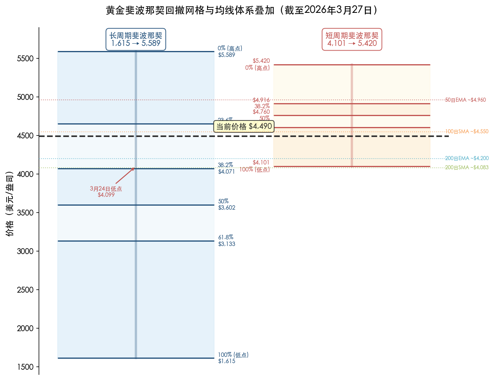

*图 3-2：黄金斐波那契回撤网格与均线体系叠加（截至 2026 年 3 月 27 日）。左栏为长周期回撤（1,615→5,589 美元），右栏为短周期回撤（4,101→5,420 美元），叠加四条关键均线及 3 月 24 日低点标注。*

### 3.4.1 长周期斐波那契回撤（1,615→5,589 美元）

以 2022 年 10 月低点 1,615 美元为起点、2026 年 1 月高点 5,589 美元为终点，各关键回撤位计算如下：

| 回撤比例 | 价位（美元） | 当前状态与技术意义 |
|---------|------------|---------|
| 23.6% | 4,651 | 已跌破，转化为短期阻力 |
| 38.2% | 4,071 | 3 月低点 4,099 美元几乎精确触及后强力反弹 |
| 50.0% | 3,602 | 深度调整目标，接近 S3 的 3,500 美元整数关口 |
| 61.8% | 3,133 | 极端悲观情景目标，若触及意味着牛市结构彻底破坏 |

3 月低点 4,099 美元与 38.2% 回撤位 4,071 美元的偏差仅 28 美元（0.7%），堪称教科书级别的精确回撤验证。38.2% 回撤在牛市调整中往往标志着"浅回撤"的极限位置；若该位置失守，通常意味着调整性质从"牛市正常回调"升级为"趋势逆转"，下一目标将指向 50% 回撤位 3,602 美元 [FXEmpire](https://www.fxempire.com/forecasts/article/gold-xau-usd-price-forecast-bearish-signals-grow-across-timeframes-1588239 "斐波那契验证")。

### 3.4.2 短周期斐波那契回撤（4,101→5,420 美元）

以 3 月波段低点 4,101 美元至高点 5,420 美元为测量区间，短周期回撤计算结果如下：

| 回撤比例 | 价位（美元） | 技术共振要素 |
|---------|------------|---------|
| 38.2% | 4,605 | 与 100 日 MA 吻合，3 月 26 日反弹在此受阻 |
| 50.0% | 4,761 | 近似心理中位，突破则打开上行空间 |
| 61.8% | 4,916 | 接近 50 日 EMA，构成中期阻力 |

3 月 26 日反弹高点 4,603 美元恰好在 38.2% 回撤位受阻的事实，再次验证了斐波那契工具在当前金价分析中的高度有效性。空方控制力在 38.2% 水平得到确认，多方需要突破 50% 回撤位 4,761 美元方能实质性改变短期格局。

## 3.5 动量指标：超卖修复中的谨慎信号

### RSI（14 日）

3 月 23 日，14 日相对强弱指标（RSI）一度跌至约 27，为 2024 年 11 月以来的最低读数，进入经典超卖区间（低于 30）。随后伴随金价在 4,099 美元企稳反弹，RSI 回升至 36–48 区间。尽管已脱离极端超卖状态，但 RSI 仍低于中性线 50，表明空方动能尚未完全释放 [CapitalStreetFX](https://www.capitalstreetfx.com/gold-market-outlook-march-23-2026-xau-usd-technical-analysis-trade-setup/ "RSI跌至27为2024年11月以来最低")。

### MACD

日线 MACD 直方图在零线下方持续扩张，信号线确认看跌交叉。与此同时，下跌日成交量显著放大，印证了机构分销（distribution）行为正在进行——大资金在反弹过程中持续减仓，而非在低位积极吸筹 [CapitalStreetFX](https://www.capitalstreetfx.com/gold-market-outlook-march-23-2026-xau-usd-technical-analysis-trade-setup/ "MACD看跌交叉与机构分销")。

### 动量信号综合研判

RSI 从超卖区域修复但尚未回到中性线以上，MACD 维持看跌交叉并伴随放量下跌，H1/H4 时间框架上出现多次"假金叉"（5/9 EMA 看涨交叉后迅速失效）——这些信号共同指向一个核心判断：当前的反弹更接近"超跌技术性修复"而非"趋势反转"。除非 RSI 日线收盘回到 50 以上且 MACD 直方图同步转正，否则应将任何上行运动视为更大下行结构中的反弹。

## 3.6 多空力量对比与市场结构定性

综合以上技术分析维度，当前黄金市场的多空力量对比可概括为"短中期偏空、长期偏多"的结构性分裂格局。下图以矩阵形式呈现各维度、各时间框架的信号分布。

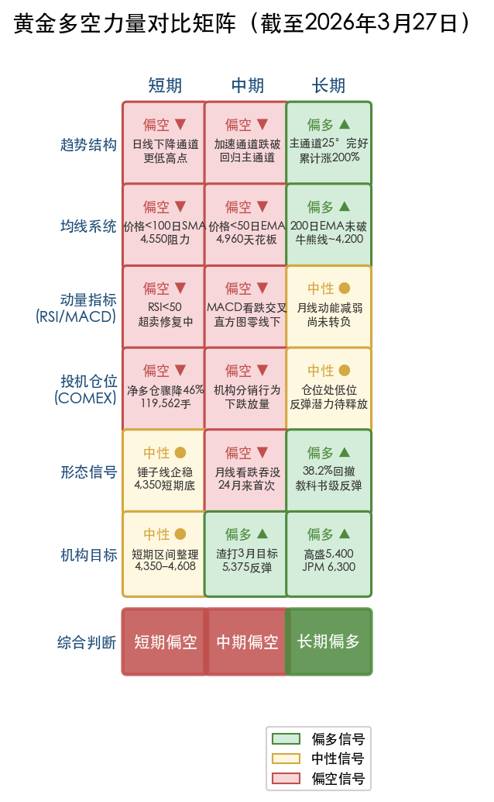

*图 3-3：黄金多空力量对比矩阵（截至 2026 年 3 月 27 日）。行维度覆盖趋势结构、均线系统、动量指标、投机仓位、形态信号及机构目标六类信号，列维度区分短期/中期/长期三个时间框架，红色为偏空、黄色为中性、绿色为偏多。*

**空方优势（短中期）**

1. 日线图自 3 月 2 日高点 5,420 美元起形成明确的下降通道，每次反弹均形成更低的高点，符合经典空头趋势定义。
2. 50 日均线从支撑转为阻力，月线出现 24 个月来首根看跌反转形态 [FXEmpire](https://www.fxempire.com/forecasts/article/gold-xau-usd-price-forecast-bearish-signals-grow-across-timeframes-1588239 "多时间框架看跌信号增长")。
3. MACD 看跌交叉、RSI 低于 50、下跌放量与上涨缩量，三重动量信号一致偏空。
4. COMEX 黄金期货投机性净多仓从 1 月约 244,800 手骤降至 3 月约 119,562 手，降幅超 46%，显示专业投机者大幅削减多头敞口 [Investing.com](https://www.investing.com/analysis/golds-speculative-net-positions-mirror-december-2025-levels-200674291 "CFTC黄金净投机仓位分析")。

**多方优势（长期）**

1. 200 日均线（EMA ~4,200 / SMA ~4,083）至今未被有效跌破，长期牛市结构保持完好。
2. 3 月 24 日在 38.2% 长周期斐波那契回撤位（4,071 美元）附近出现教科书级别的锤子线反转，表明该区域存在强劲的"逢低买入"需求。
3. 金价自 2022 年 10 月低点至今累计涨幅约 200%，主上升通道（25° 角度）仍然完好运行。
4. 主流投行维持 2026 年 4,700–6,300 美元的目标区间，反映基本面对金价的长期支撑并未消退。

**关键翻转信号——多方需达成的条件：**

- **初步确认**：日线收盘站上 R1（4,608 美元），伴随成交量显著放大。
- **中期反转确认**：日线收盘站上 R2（4,960 美元 / 50 日 EMA），MACD 直方图转正，RSI 回到 50 以上。
- **重新确认牛市加速**：收复 5,000 美元心理关口并站稳。

**关键翻转信号——空方需达成的条件：**

- **长期牛市破坏**：日线收盘跌破 200 日 EMA（~4,200 美元），随后确认性回测失败。
- **深度调整确认**：周线收盘跌破 4,000 美元整数关口。
- **趋势逆转**：跌破 S3（3,500 美元），整轮牛市 50% 涨幅被回吐。

我们判断，在缺乏新的重大催化剂的情况下，黄金短期内更可能在 S1（4,350 美元）与 R1（4,608 美元）之间进行区间整理，等待方向选择。200 日均线作为长期趋势锚的核心地位，使得 4,077–4,200 美元区域成为多方"退无可退"的核心防线——该防线是否守住，将决定本轮调整究竟是牛市的健康回调，还是趋势逆转的起点。

# 第4章 黄金未来趋势展望——多空情景与思维导图

截至 2026 年 3 月 27 日，现货黄金报约 4,495 美元/盎司，较 1 月 28 日创下的 5,589 美元/盎司历史绝对高点回落约 20%，已步入技术性熊市区间。然而，主流投行与研究机构不仅未因此转向看空，反而普遍将本轮回调定性为结构性牛市中的"健康整固"。本章综合前三章所梳理的历史周期经验、驱动因子演变规律与技术面信号，构建黄金 2026 年 Q2–Q4 的多情景展望框架，并以思维导图完整呈现"驱动因子→情景判断→价格路径→关键价位"的推导链条，为投资者的前瞻布局提供系统性参考。

## 4.1 主流机构 2026 年金价预测图谱

### 4.1.1 华尔街预测共识与分歧

2026 年黄金预测呈现出罕见的"方向一致、幅度分化"特征。几乎所有主流投行均维持看涨基调，但年末目标价从 4,225 美元到 8,500 美元跨越了近一倍的区间，反映出市场对"去美元化深度"和"私人部门配置弹性"两大核心变量的根本性分歧。

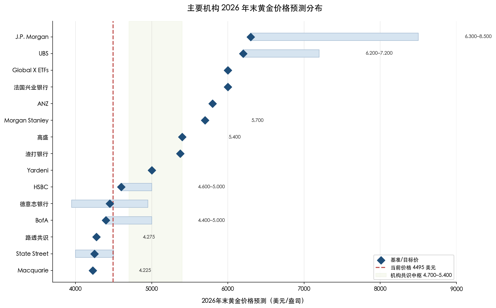

*图 4-1：主要机构 2026 年末黄金价格预测分布。蓝色菱形为基准目标价，浅蓝色条带为预测区间，红色虚线为当前价格 4,495 美元，浅绿色区域为机构共识中枢 4,700–5,400 美元。*

最为激进的预测来自 J.P. Morgan：2026 年 2 月将年末目标上调至 6,300 美元/盎司，并在极端乐观情景下（全球家庭黄金配置比例从 3% 升至 4.6%）给出 8,000–8,500 美元的尾部目标 [J.P. Morgan](https://www.jpmorgan.com/insights/global-research/commodities/gold-prices "J.P.Morgan黄金价格展望")。UBS 在 2026 年 1 月将前三个季度（3 月、6 月、9 月）目标从 5,000 美元大幅上调至 6,200 美元/盎司，极端上行情景可达 7,200 美元 [Reuters](https://www.reuters.com/business/finance/goldman-sachs-raises-2026-end-gold-price-forecast-5400oz-2026-01-22/ "UBS上调金价目标至6200美元")。即便在 3 月中旬金价已从高点回落约 15%，UBS 仍维持预测不变，认为"当前价格仍有 20% 以上的上行空间" [Kitco News](https://www.kitco.com/news/article/2026-03-16/gold-still-set-gain-20-above-current-prices-2026-ubs "UBS 3月16日维持6200美元目标")。

法国兴业银行和德意志银行均预测年末达 6,000 美元/盎司，Morgan Stanley 给出牛市目标 5,700 美元（2026 年 H2），ANZ 银行于 2 月将 Q2 目标从 5,400 美元上调至 5,800 美元 [Kitco News](https://www.kitco.com/news/article/2026-02-16/anz-sees-gold-hitting-5800-ounce-second-quarter "ANZ上调Q2目标至5800美元") [investingLive](https://investinglive.com/commodities/morgan-stanley-sees-gold-at-5700-as-banks-turn-even-more-bullish-20260127/ "Morgan Stanley 5700美元目标")。高盛 2026 年 1 月 21 日将年末预测从 4,900 美元上调至 5,400 美元，核心逻辑在于私人部门投资者（高净值个人、家族办公室）与机构资金竞争黄金配置份额，ETF 流入规模超出利率降幅所能合理解释的范畴，指向"结构性再配置"而非"战术性交易" [高盛](https://www.goldmansachs.com/insights/articles/gold-forecast-to-rise-by-the-middle-of-2026 "高盛上调年末金价预测至5400美元")。高盛分析师 Struyven 和 Thomas 在 1 月研报中明确指出"风险显著偏向上行" [Yahoo Finance](https://sg.finance.yahoo.com/news/goldman-sachs-revamps-gold-price-174700577.html "高盛论上行风险偏斜")。

### 4.1.2 谨慎阵营的声音

乐观并非市场唯一声音。美银（BofA）给出 5,000 美元峰值/4,400 美元均价预测，汇丰（HSBC）预测峰值 5,000 美元/均价 4,600 美元，德银均价预测为 4,450 美元（区间 3,950–4,950 美元），麦格理（Macquarie）以 4,225 美元的年均价成为最为审慎的机构 [Gold IRA Guide](https://goldiraguide.org/2026-gold-price-forecast-20-predictions-jpmorgan-bofa-goldman-hshs-morgan-stanley-more/ "20+家机构预测汇总")。路透社 2026 年共识调查中位数为年均 4,275 美元/盎司——该水平意味着从当前 4,495 美元仍需小幅回调方能实现，隐含了市场对金价可能在均值附近宽幅震荡的预判。

State Street Global Advisors 给出 4,000–4,500 美元的区间震荡预测，其核心逻辑是"2025 年 +55% 的涨幅已大幅透支了央行购金和降息预期的利好"，金价需要在高位充分消化过度的投机溢价 [State Street](https://www.ssga.com/us/en/intermediary/insights/gold-2026-outlook-can-the-structural-bull-cycle-continue-to-5000 "SSGA 2026年黄金展望")。

### 4.1.3 熊市回调中的信心检验

2026 年 3 月金价跌入技术性熊市后，机构立场经历了关键的压力测试。Yardeni Research 将年末目标从 6,000 美元下调至 5,000 美元，但维持"2030 年前 10,000 美元"的长期目标不变 [CNBC](https://www.cnbc.com/2026/03/24/gold-price-forecast-10000-expectations-in-spite-of-bear-market.html "Yardeni下调年末目标但维持长期10000美元预测")。Global X ETFs 投资策略师 Justin Lin 维持 6,000 美元基准预测，将本轮回调定性为"短期利率敏感性、股市再平衡和伊朗冲突钝化"驱动的暂时性错位，并强调其看涨逻辑"并不依赖于战争风险溢价" [CNBC](https://www.cnbc.com/2026/03/24/gold-price-forecast-10000-expectations-in-spite-of-bear-market.html "Global X维持6000美元预测")。渣打银行高级投资策略师 Rajat Bhattacharya 预期金价将在未来三个月反弹至 5,375 美元，技术支撑位约 4,100 美元 [CNBC](https://www.cnbc.com/2026/03/24/gold-price-forecast-10000-expectations-in-spite-of-bear-market.html "渣打3个月目标5375美元")。

综合来看，我们认为机构预测的"中枢"大致落在 4,700–5,400 美元区间，悲观尾部约 3,900–4,200 美元，乐观尾部约 6,000–6,300 美元。这一分布格局本身即反映出市场对黄金定价逻辑正在发生结构性转变——从传统的实际利率单因子定价，走向央行购金、去美元化与地缘风险多因子共振的新范式——这一范式下的估值锚更加模糊，也因此催生了更宽的预测离散度。

## 4.2 四大情景推演：从宏观到价格

世界黄金协会（WGC）在 2026 年展望中构建了四种宏观情景框架 [世界黄金协会](https://www.gold.org/goldhub/research/gold-outlook-2026 "Gold Outlook 2026")。我们在此基础上结合机构最新预测与当前市场状态（约 4,495 美元基准），重新校准各情景的价格路径与触发条件。

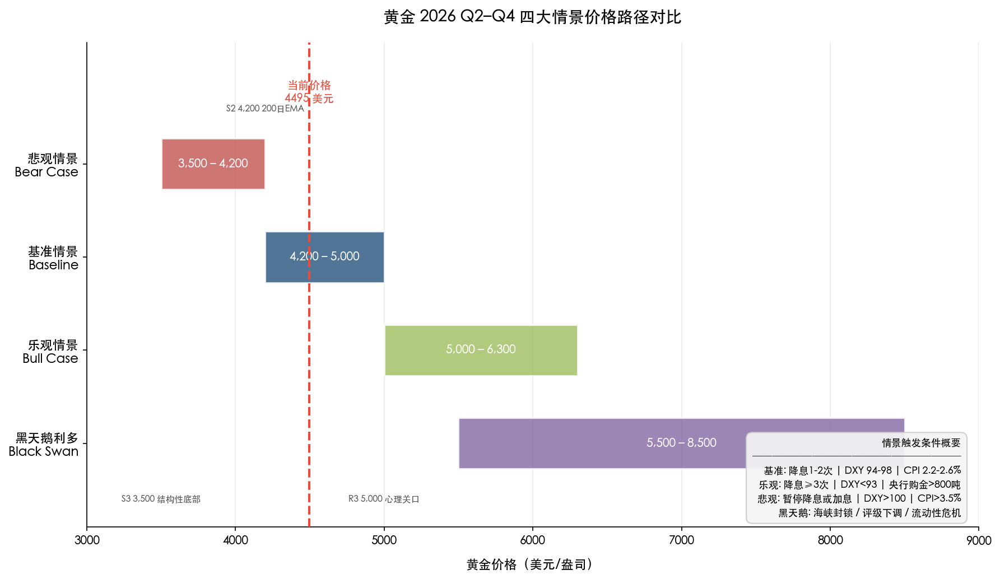

*图 4-2：黄金 2026 Q2–Q4 四大情景价格路径对比。各色条带对应不同情景的价格区间，红色虚线标注当前价格 4,495 美元，右侧文本框列出各情景核心触发条件。*

### 情景一：基准情景——高位震荡整固（概率最高）

**触发条件组合**：

- 美联储 2026 年余下时间降息 1–2 次，联邦基金利率降至 3.00–3.50%，与 3 月 FOMC 点阵图指引基本一致
- 美元指数（DXY）维持 94–98 区间温和波动，美元呈弱势但未出现趋势性崩溃
- CPI 维持 2.2–2.6% 的温和通胀区间，核心通胀缓慢向 2% 目标回落
- 全球央行购金维持 700–800 吨/年，低于 2022–2024 年千吨级别但仍远超 2010–2021 年年均 473 吨的历史均值
- 美伊冲突局部降级，地缘风险溢价缓慢消退但不完全消除

**价格路径**：黄金在 4,200–5,000 美元区间内宽幅震荡，年末中位数预计落在 4,700–5,000 美元。WGC 的"宏观共识"情景描述为"金价区间震荡"，高盛 5,400 美元基准目标大致对应此情景的乐观边界 [世界黄金协会](https://www.gold.org/goldhub/research/gold-outlook-2026 "宏观共识情景") [J.P. Morgan](https://www.jpmorgan.com/insights/global-research/commodities/gold-prices "基准预测")。

**核心逻辑**：2025 年 +55% 的涨幅需要时间消化。投机仓位已经历大规模出清——COMEX 净多仓从 1 月约 244,800 手骤降至 3 月约 119,562 手，降幅超过 46%——金价正从"FOMO 驱动的过度估值"回归"基本面支撑的合理区间" [Investing.com](https://www.investing.com/analysis/golds-speculative-net-positions-mirror-december-2025-levels-200674291 "CFTC黄金净投机仓位分析")。

**关键价位**：支撑 S1 4,350–4,373 美元（短期底部），支撑 S2 4,200 美元（200 日 EMA 牛熊分界），压力 R1 4,533–4,600 美元（61.8% 斐波那契回撤 + 12 月峰值水平阻力）。

### 情景二：乐观情景——趋势恢复性反弹（概率次高）

**触发条件组合**：

- 美联储降息 3 次以上（累计 75bp+），10 年期 TIPS 实际收益率从当前约 2.10% 降至 1.0% 以下
- DXY 跌破 93，美元进入趋势性贬值通道
- 全球央行购金超 800 吨/年，ETF 净流入超 500 吨（延续 2025 年全年 801 吨的流入节奏）
- 去美元化叙事进一步强化，更多经济体在国际贸易中采用非美元结算

**价格路径**：金价从当前水平反弹至 5,000–5,700 美元；若去美元化进程加速，J.P. Morgan 测算仅 0.5% 的美元资产再配置即可推升金价突破 6,000 美元 [J.P. Morgan](https://www.jpmorgan.com/insights/global-research/commodities/gold-prices "去美元化情景") [investingLive](https://investinglive.com/commodities/morgan-stanley-sees-gold-at-5700-as-banks-turn-even-more-bullish-20260127/ "Morgan Stanley 5700目标")。

**核心逻辑**：WGC "厄运循环"情景指出，若全球经济增速放缓叠加利率快速下行，黄金的避险属性增强与机会成本降低将形成正向共振，推动金价飙升 15–30% [世界黄金协会](https://www.gold.org/goldhub/research/gold-outlook-2026 "厄运循环情景")。高盛将当前超预期的 ETF 流入定义为"结构性再配置"而非"战术性交易"，意味着这些仓位具有粘性，不易因短期波动而大规模撤出 [Yahoo Finance](https://sg.finance.yahoo.com/news/goldman-sachs-revamps-gold-price-174700577.html "高盛论粘性仓位")。UBS 在 3 月 16 日金价已大幅回落之际仍维持 6,200 美元的 Q1–Q3 目标，并将上行情景进一步扩展至 7,200 美元 [Kitco News](https://www.kitco.com/news/article/2026-03-16/gold-still-set-gain-20-above-current-prices-2026-ubs "UBS维持目标")。

**关键价位**：压力 R2 4,880–4,960 美元（50 日 EMA 动态阻力，中期趋势翻转确认位），压力 R3 5,000 美元（心理关口 + 2026 年 1 月里程碑），目标区 5,400 美元（高盛预测）至 6,300 美元（J.P. Morgan 预测）。

### 情景三：悲观情景——通胀反弹引发深度回调

**触发条件组合**：

- 美伊冲突持续升级导致油价站上 120 美元/桶，推动 CPI 反弹至 3.5% 以上，形成"滞胀"格局
- 美联储被迫暂停降息甚至重启加息 25–50bp，实际利率大幅攀升
- DXY 反弹至 100 以上，美元重新走强，压制以美元计价的黄金
- 央行购金降至 500 吨/年以下，部分新兴市场央行因本币贬值被迫抛售黄金储备以稳定汇率
- 风险偏好回归，美股反弹吸引资金从黄金流回权益资产

**价格路径**：金价回调至 3,900–4,200 美元区间；若有效跌破 200 日均线，则可能进一步下探 3,500 美元。WGC "再通胀回归"情景预测金价下跌 5–20%（基于其 2025 年 12 月约 3,800 美元基准），按当前 4,495 美元校准后对应 3,596–4,270 美元区间 [世界黄金协会](https://www.gold.org/goldhub/research/gold-outlook-2026 "再通胀回归情景")。

**核心逻辑**：Barchart 分析师 Jim Wyckoff 指出，金价对美伊战争的反应平淡构成一个关键警告信号——"市场无法在利多消息面前上涨，是多方力量耗尽的信号" [Yahoo Finance](https://finance.yahoo.com/news/bear-bull-cases-silver-gold-144514943.html "2026年3月黄金多空分析")。Commerzbank 分析师 Fritsch 亦强调"金价实际上低于战争开始前的水平"，2 月 28 日美伊冲突爆发后，美元走强和利率预期上行两大机制有效对冲了避险需求 [DW](https://www.dw.com/en/iran-us-israel-war-gold-silver-dollar-oil-inflation/a-76381602 "Commerzbank分析师论金价与伊朗战争")。若这一"利多不涨"格局延续，技术面下降通道可能主导短中期走势。

**关键价位**：支撑 S2 4,099–4,200 美元（200 日 EMA 牛熊分界），支撑 S3 3,500 美元（2025 年 4 月高点 + 50% 斐波那契回撤位），4,000 美元为绝对防线（FOREX.com 分析师 Razaqzada 定义的"沙线"）。

### 情景四：黑天鹅与尾部风险

**极端利多情景**：

- **霍尔木兹海峡封锁**：油价冲击 150 美元/桶以上，金价可能脉冲式冲高至 5,500 美元以上，但随后可能因美元走强和流动性紧缩效应而出现对冲性回落。
- **美国主权信评再遭下调**：若重演 2011 年 8 月标普下调美国评级后黄金飙升的剧本，金价或出现剧烈脉冲式上行。当前美国联邦赤字预计达 1.9 万亿美元、到期需再融资美债约 9.2 万亿美元，财政可持续性担忧构成推升金价的长期结构因素。
- **全球流动性危机后央行大规模干预**：历史经验表明，流动性危机初期黄金同样遭遇抛售（如 2020 年 3 月），但央行随后注入天量流动性往往推动金价创出新高。
- **极端尾部**：J.P. Morgan 测算，若全球家庭黄金配置比例从 3% 升至 4.6%，金价可达 8,000–8,500 美元——虽然概率极低，但配置迁移趋势一旦启动将具有自我强化特征 [Bullion Exchanges](https://bullionexchanges.com/blog/gold-price-forecast-2026-jpmorgan-targets-6300 "极端情景")。

**极端利空情景**：

- **美伊停火叠加全球风险溢价骤降**：地缘风险溢价的快速出清可能触发黄金"避险属性重新定价"，引发短期 10–15% 的急跌。
- **流动性挤压引发强制平仓**：类似 2020 年 3 月的流动性危机情景，所有资产（包括黄金）遭遇无差别抛售。
- **印度黄金抵押贷款大规模清算**：WGC 将此列为 2026 年两大"通配符"之一。印度作为全球第二大黄金消费国，若金价持续下跌触发黄金贷款的强制平仓，可能形成"价格下跌→强制卖出→价格进一步下跌"的负反馈循环 [世界黄金协会](https://www.gold.org/goldhub/research/gold-outlook-2026 "WGC通配符")。

## 4.3 关键观察指标体系

在多情景框架下，判断哪一情景正在兑现需要系统性跟踪一组核心先行指标。我们将其归纳为五个维度，构建如下观察仪表盘。

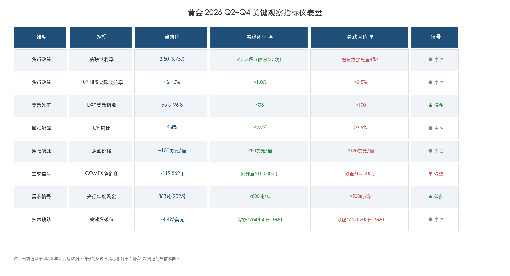

*图 4-3：黄金 2026 Q2–Q4 关键观察指标仪表盘。表格呈现五大维度共 8 项指标的当前值、看涨/看跌阈值与信号方向，绿色/红色/灰色分别标识偏多、偏空、中性状态。*

**货币政策维度**：CME FedWatch 工具显示的降息概率是市场利率预期的实时晴雨表。关键阈值为：若年内降息预期升至 3 次以上，利好乐观情景；若降息预期归零或加息预期升温，则利好悲观情景。同时应密切关注美联储点阵图变化和 10 年期 TIPS 实际收益率走势——PIMCO 研究表明实际收益率每下降 100bp，经通胀调整的金价上涨约 18%，尽管该负相关关系自 2022 年以来已因央行购金和去美元化趋势而显著脱钩 [PIMCO](https://www.pimco.com/us/en/resources/education/understanding-gold-prices "PIMCO黄金价格实际收益率框架")。

**美元与外汇维度**：DXY 指数当前约 95.5–96.8，已从 2024 年底的 108 以上大幅回落超 10%。关键阈值为：DXY 跌破 93 将强化乐观情景，反弹至 100 以上则支撑悲观情景。更具前瞻性的指标是 IMF 每季度发布的 COFER（官方外汇储备币种构成）数据，它揭示全球央行美元储备占比的变化趋势，是衡量去美元化进程的直接标尺。

**需求信号维度**：COMEX 黄金期货投机性净多仓是衡量短中期动能的先行指标。截至 3 月底约 119,562 手，处于 2025 年 12 月水平，较 1 月峰值约 244,800 手下降逾 46% [Investing.com](https://www.investing.com/analysis/golds-speculative-net-positions-mirror-december-2025-levels-200674291 "CFTC黄金净投机仓位分析")。历史经验表明，净多仓企稳回升通常领先金价反弹 1–3 周。全球 ETF 持仓变化（WGC 按月发布）和央行季度购金数据则反映中长期结构性需求的强弱。Global X ETFs 策略师 Lin 指出，央行在近期回调后"极有可能加大购买力度" [CNBC](https://www.cnbc.com/2026/03/24/gold-price-forecast-10000-expectations-in-spite-of-bear-market.html "央行可能加大购买")。

**通胀与能源维度**：CPI/PCE 月度数据直接影响美联储政策路径的走向。美伊冲突已推动原油价格升至近 100 美元/桶，若持续攀升至 120 美元以上，将形成"滞胀"压力，构成悲观情景的关键触发条件 [DW](https://www.dw.com/en/iran-us-israel-war-gold-silver-dollar-oil-inflation/a-76381602 "伊朗战争与油价通胀")。2026 年 2 月美国 CPI 同比为 2.4%、核心 CPI 为 2.5%，仍高于美联储 2% 的长期目标 [美国劳工统计局](https://www.bls.gov/news.release/cpi.nr0.htm "2026年2月CPI报告")。

**技术面确认维度**：技术面不构成独立的预测工具，但为各情景的验证提供关键确认信号。看涨确认信号为日线收复 4,600 美元后稳定站上 4,960 美元（50 日 EMA），这将意味着中期趋势从"偏空"回归"中性偏多"。看跌确认信号为日线有效跌破 4,200 美元（200 日 EMA）且无法快速收复，这将确认技术性熊市正向结构性下行趋势转化。

## 4.4 思维导图：黄金 2026 Q2–Q4 趋势推导链

以下思维导图以 Mermaid mindmap 语法呈现完整的"情景→触发条件→价格路径→关键价位"推导链条，从根节点"黄金未来趋势"出发，涵盖四大情景与五维观察指标，便于读者快速把握各情景间的逻辑关系与关键数值锚点：

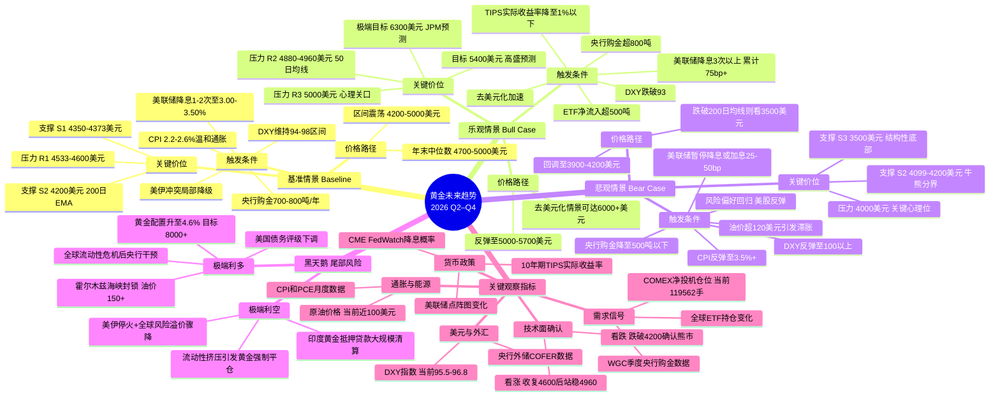

## 4.5 多空平衡研判与综合结论

### 4.5.1 因子轮动的结构性启示

第 2 章的因子轮动分析揭示了黄金定价体系的关键演变：2022 年之前，实际利率是黄金定价的"单一之锚"；2022 年之后，央行购金、地缘风险常态化和去美元化共同构成了多因子定价体系。WGC GRAM 模型归因显示，2025 年金价 61% 的回报由风险/不确定性（12 个百分点）、机会成本降低（10 个百分点）、动量（9 个百分点）和经济扩张（10 个百分点）四因子近乎均衡驱动——这种"四轮驱动"格局在历史上极为罕见。其含义是双重的：金价不再依赖单一引擎，韧性增强；但同时也意味着任何单一因子的逆转都不太可能独自终结牛市 [世界黄金协会](https://www.gold.org/goldhub/research/gold-outlook-2026 "WGC GRAM模型归因")。

### 4.5.2 当前多空力量对比

**多方结构性优势**：

- 全球央行购金虽从 2022–2024 年的千吨级别有所回落，但 2025 年仍达 863 吨，其中 57% 为"未报告购买"，实际需求规模可能更高 [世界黄金协会](https://www.gold.org/goldhub/research/gold-demand-trends/gold-demand-trends-full-year-2025/central-banks "2025年央行购金数据")。
- 美联储仍处降息周期（当前利率 3.50–3.75%），市场预期年内至少再降 1–2 次，持有黄金的机会成本趋势性下行。
- 美元指数（DXY）已从 108 降至约 96，去美元化叙事持续强化，为黄金提供汇率端支撑。
- 200 日均线（EMA 约 4,200 美元）自 2023 年末以来从未被有效跌破，长期牛市结构完好。

**空方短期优势**：

- 技术面已进入下降通道，50 日均线从支撑转为阻力，月线出现 24 个月来首根看跌吞没形态。
- COMEX 净多仓从 244,800 手骤降至 119,562 手（降幅 46%），专业投机者大幅撤退，短期多头动能不足。
- Commerzbank 警告 2025 年 Q4 至 2026 年 1 月金价上涨与基本面脱节，"贪婪和 FOMO 起了重要作用"，泡沫消化尚需时日 [DW](https://www.dw.com/en/iran-us-israel-war-gold-silver-dollar-oil-inflation/a-76381602 "金价过热信号分析")。
- 金价对美伊战争的"利多不涨"反应，显示多方短期动能已阶段性耗竭。

### 4.5.3 综合研判

我们判断，黄金 2026 年 Q2–Q4 最可能的演绎路径为基准情景——在 4,200–5,000 美元区间内完成高位整固，年末大概率收于 4,700–5,000 美元。支撑这一判断的核心逻辑有三：

**其一，央行购金与去美元化构成坚实的结构性底部。** 2022–2025 年连续四年购金超 860 吨的趋势短期内不太可能逆转，因为驱动央行增持黄金的根本动力——对美国财政可持续性的担忧和地缘政治对冲需求——在可预见的未来只会强化而非减弱。

**其二，投机泡沫已在 3 月回调中大幅出清。** COMEX 净多仓下降 46%、金价从高点回落 21%，Commerzbank 所警告的"FOMO 溢价"已被充分消化。这意味着当前价格更接近"基本面支撑的合理估值"，而非"投机驱动的泡沫估值"。

**其三，技术面虽短中期偏空，但长期牛市结构尚未破坏。** 200 日 EMA 约 4,200 美元仍是坚固的"牛熊分界线"。3 月 24 日低点 4,099 美元触及该区域后即出现剧烈反弹，验证了结构性买盘在关键支撑位的承接能力。

在乐观方向上，若美联储加速降息（3 次以上）叠加 DXY 跌破 93，金价有望重返 5,000 美元上方并挑战高盛 5,400 美元目标。在悲观方向上，若通胀反弹迫使美联储转鹰、DXY 反弹至 100 以上，金价可能下探 4,000–4,200 美元核心支撑区，但在当前央行购金结构下跌破 3,500 美元的概率较低。

WGC 提示的两大"通配符"值得持续关注：新兴市场央行购金行为的方向（加速增持还是回落至疫情前水平）将决定金价的结构性底部高度；印度黄金抵押贷款风险则可能成为下行尾部风险的放大器 [世界黄金协会](https://www.gold.org/goldhub/research/gold-outlook-2026 "WGC通配符")。

# 第5章 黄金在资产配置中的角色——跨资产比较与配置启示

前四章从历史走势、驱动因子、技术面和多情景展望四个维度完成了对黄金自身"纵向"规律的系统剖析。本章将视角从黄金内部转向外部，把黄金置于一个包含美股、美债、大宗商品和加密货币的多资产坐标系中，考察其在不同宏观环境下的相对表现与风险特征，并回答一个对投资实践至关重要的问题：在当前宏观环境下，黄金在投资组合中应扮演什么角色？战略配置比例应如何设定？

下图以截至 2026 年 3 月的数据，综合对比了六类主要资产在不同时间维度上的回报与风险特征，为后续各节的逐一比较提供全景式参照。

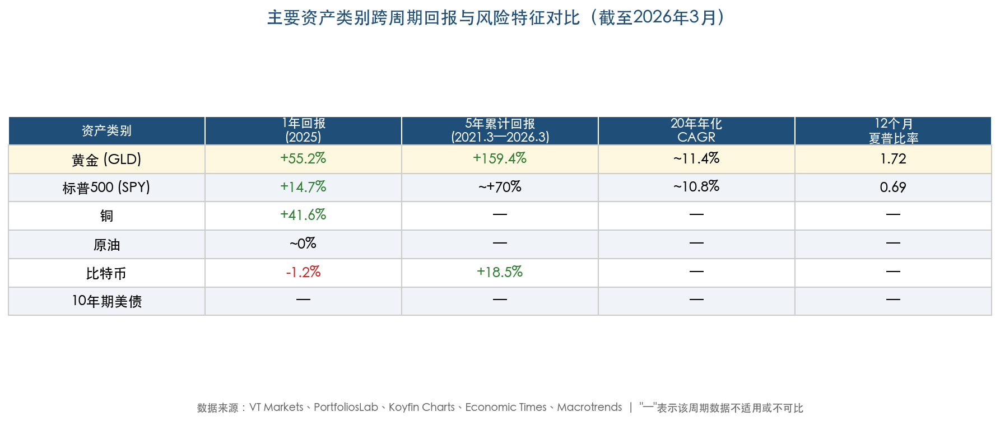

图表显示，黄金在 1 年（+55.2%）、5 年累计（+159.4%）和 20 年年化 CAGR（约 11.4%）三个维度均领先或持平于标普 500，12 个月夏普比率 1.72 更是远超其他资产类别。这一全面领先态势在过去二十年间极为罕见，构成了本章分析的核心背景。

## 5.1 黄金 vs 美股：十年轮换与 2025 年的历史性反转

### 5.1.1 长期回报：此消彼长的"十年轮换"

在绝对收益维度上，黄金与标普 500 长期呈现此消彼长的"十年轮换"特征。2000–2010 年，黄金年化复合增长率（CAGR）约 12.8%，同期标普 500 CAGR 仅 -0.9%——美股先后遭受互联网泡沫崩溃与全球金融危机的双重打击，黄金作为替代资产大放异彩 [VT Markets](https://www.vtmarkets.com/discover/gold-vs-sp-500-2026-performance-comparison-investment-guide/ "黄金vs标普500对比分析")。2010–2020 年的十年间，角色完全倒转：标普 500 CAGR 约 13.9%，黄金仅 1.5%，美股在量化宽松和科技股驱动下走出有史以来最长牛市之一。

将时间拉长至 20 年维度（约 2006–2026 年），两类资产的累计回报趋于收敛：黄金累计约 761%（CAGR 约 11.4%），标普 500 ETF 累计约 673%（CAGR 约 10.8%） [Koyfin Charts](https://www.threads.com/@koyfincharts/post/DSnZgw4jpY7/gold-vs-s-p-returns-over-the-past-years-gold-s-p "20年回报对比")。从超级周期视角审视，截至 2026 年 3 月，标普 500/黄金比率为 1.44，较 2000 年峰值仍低 70% [LongtermTrends](https://www.longtermtrends.com/stocks-vs-gold-comparison/ "标普500与黄金比较")，意味着以黄金计价，美股至今尚未收复世纪初的失地。这一结构性特征表明，任何单一十年维度的比较都可能产生误导，资产配置决策须置于更长的历史框架中审视。

### 5.1.2 2025 年的历史性反转

2025 年标志着新一轮"黄金优于美股"周期的剧烈开启。全年黄金（GLD）以 +55.2% 的回报位居所有主要资产类别首位，标普 500（SPY）以 +14.7% 位列中游 [Economic Times](https://m.economictimes.com/news/international/us/gold-becomes-2025s-superstar-as-bitcoin-tanks-to-worst-performer-a-first-in-market-history/articleshow/125385097.cms "2025年资产类别排名")。这一显著的表现差异根植于两类资产定价逻辑的根本分化：美股受制于高利率环境下的估值压缩与科技股盈利增速放缓，而黄金受益于央行购金、去美元化和地缘风险溢价三重结构性因素的持续共振。

从风险调整后回报维度衡量，这种分化更为突出。截至 2026 年 3 月，GLD 的滚动 12 个月夏普比率达 1.72，远超 SPY 的 0.69 [PortfoliosLab](https://portfolioslab.com/tools/stock-comparison/GLD/SPY "GLD vs SPY夏普比率对比")——单位风险的黄金回报超过美股的两倍，这在过去二十年间极为罕见，标志着黄金风险收益特征的阶段性质变。

### 5.1.3 相关性的异常攀升与分散化隐忧

黄金与标普 500 的长期相关系数约 0.1–0.3，市场压力期可转为 -0.2 至 -0.5，这正是黄金作为组合"压舱石"的理论基础。然而，截至 2026 年 3 月，过去 12 个月两者相关性攀升至 0.77 [LongtermTrends](https://www.longtermtrends.com/stocks-vs-gold-comparison/ "标普500与黄金相关性")，反映出 2025 年全球流动性充裕叠加避险资金与风险资金同步涌入不同资产的异常态势。

这一高相关性若持续，将从根本上削弱黄金在传统均值-方差优化框架下的分散化价值。历史经验表明，股金高相关期通常出现在两者同步上涨阶段，而当市场真正承压时，相关性往往迅速回落乃至转负——2020 年 3 月新冠冲击初期即为典型案例。我们判断，随着金价自历史高点回调以及美股盈利预期分化，这一异常高相关性在 2026 年中期有望回归 0.2–0.4 的正常区间。

## 5.2 黄金 vs 美债：实际利率定价锚的历史性断裂

### 5.2.1 传统框架：实际利率的"负镜像"

黄金不产生利息收入，其持有的机会成本直接与实际利率挂钩，这使得实际利率长期充当金价定价的核心锚。历史数据显示，黄金与 10 年期 TIPS 实际收益率的相关系数约 -0.82，这一"负镜像"关系在 2004–2021 年间高度稳定：PIMCO 研究表明，实际收益率每上升 100 个基点，经通胀调整后的黄金实际价格平均下跌约 18%，对应约 18 年的"实际久期" [PIMCO](https://www.pimco.com/us/en/resources/education/understanding-gold-prices "PIMCO黄金价格实际收益率框架")。在此框架下，美联储加息周期压制金价、降息周期提振金价的传导路径清晰且可量化。

### 5.2.2 2022–2025 年：持续近二十年的定价锚断裂

自 2022 年起，这一高度稳定的定价锚出现了历史性断裂。2022–2025 年间，美国 2 年期实际利率从 -6.15% 大幅回升 734 个基点至 1.19%，按传统模型推算金价应遭受显著下跌压力，但名义金价反而上涨 44% [State Street Global Advisors](https://www.ssga.com/library-content/assets/pdf/apac/gold/2025/en/us-real-rates-still-matter-for-gold.pdf "2025年3月研报")。State Street 的研究认为，中国零售投资者的创纪录需求与新兴市场央行的持续购金已取代实际利率成为主导定价因素，传统框架的解释力出现结构性衰减。

2025 年更出现了金价与 10 年期美债收益率同步上行的异常现象，S&P Global 2025 年 3 月研究确认，地缘政治担忧已日益压过传统宏观传导机制，使金价与债券的关系从"稳定负相关"演变为"条件性脱钩" [S&P Global](https://www.spglobal.com/market-intelligence/en/news-insights/research/treasury-yields-and-gold-prices-breaking-expectations "国债收益率与金价打破预期")。

### 5.2.3 财政可持续性忧虑：重塑金债关系的深层逻辑

金价与国债收益率同步上行的深层原因，在于两者同时映射了投资者对美国财政可持续性的结构性担忧。2025 年到期需再融资的美国国债规模约 9.2 万亿美元，联邦赤字预计达 1.9 万亿美元 [Deriv](https://deriv.com/blog/posts/gold-vs-treasury-yields-safe-haven-shift-2025 "黄金vs国债收益率关系崩溃分析")。在这一背景下，美债同时面临两股力量的拉扯："供给洪峰"推高期限溢价，而"信用忧虑"则驱动避险需求从美债向黄金迁移——前者推高债券收益率，后者推高黄金价格，使得传统的"此消彼长"关系失效。

我们认为，只要美国财政赤字维持在 GDP 的 6%–7% 区间、且全球央行继续减持美债储备，黄金与美债收益率的"条件性脱钩"将成为一种"新常态"而非短期异常。对投资组合构建而言，这意味着美债的"安全资产"光环正在褪色，黄金作为替代性避险工具的配置权重理应相应上调。

## 5.3 黄金 vs 大宗商品：金融属性主导下的结构性分化

### 5.3.1 黄金与原油：金融属性 vs 实体通胀的大分叉

2025 年贵金属与能源市场呈现罕见的结构性分化。黄金全年上涨约 55%，而原油因全球供应过剩表现平淡。黄金/原油比率攀升至约 70，处于百年极端高位，较 25 年均值溢价约 500% [Crux Investor](https://www.cruxinvestor.com/posts/gold-to-oil-ratio-hits-25-year-extreme-as-monetary-metal-outperforms-at-500-premium-to-historical-average "黄金/原油比率25年极端")。

这一分化蕴含一个重要的定价信号：黄金当前的上涨主要由金融属性（避险需求、去美元化、央行储备调整）驱动，而非实体通胀逻辑。原油作为"实体通胀"最核心的风向标并未确认通胀飙升，从侧面印证黄金本轮牛市的核心驱动力是货币信用重估而非商品超级周期。CQS 基金经理 Robert Crayfourd 将 2025 年定义为"金属牛市"而非全面大宗牛市，认为核心驱动力在于"货币贬值交易"——各国资金从美债、美元转向实物资产的结构性迁移 [QuotedData](https://quoteddata.com/2026/01/as-gold-and-oil-diverge-is-it-time-to-be-precious-about-your-portfolio/ "金属牛市驱动力")。

### 5.3.2 黄金与铜："殊途同归"背后的逻辑分野

铜价 2025 年同样表现强劲，全年涨幅约 41.6% [Macrotrends](https://www.macrotrends.net/1476/copper-prices-historical-chart-data "铜价历史数据")，与黄金过去 12 个月正相关高达 0.81。然而，两者上涨的驱动因素截然不同：铜的强势源于 AI 数据中心建设和全球电气化转型带来的工业需求结构性增长，而黄金则由金融避险与央行配置需求主导 [LongtermTrends](https://www.longtermtrends.com/copper-gold-ratio/ "铜/金比率图表")。铜/金比率降至 0.000075（2026 年 3 月），处于历史低位区间，反映黄金的"金融溢价"相对于铜的"工业溢价"正处于极端扩张状态。

对投资组合构建而言，铜与黄金的"殊途同归"提供了一种跨逻辑的天然对冲思路：若全球经济意外走强，铜将受益更多；若经济下行或金融风险爆发，黄金的防御属性更为突出。在同一组合中同时持有两者，有助于在不同经济情景下维持相对稳定的收益特征。

## 5.4 黄金 vs 比特币：2025 年"数字黄金"叙事的崩塌

### 5.4.1 从"数字黄金"到年度最差资产

2025 年见证了加密货币"数字黄金"叙事的历史性崩塌。黄金（GLD）以 +55.2% 的全年回报高居所有资产首位，而比特币以 -1.2% 跌至末位——这是自 2011 年以来比特币首次成为年度表现最差的主要资产类别 [Economic Times](https://m.economictimes.com/news/international/us/gold-becomes-2025s-superstar-as-bitcoin-tanks-to-worst-performer-a-first-in-market-history/articleshow/125385097.cms "2025年资产排名")。

将视角拉长至 5 年维度（2021 年 3 月至 2026 年 3 月），分化更为显著：黄金累计上涨 159.4%，而比特币仅上涨 18.5% [StatMuse Money](https://www.statmuse.com/money/ask/gold-vs-bitcoin-returns-last-5-years-graph "5年回报对比")。在真正的宏观压力测试中——俄乌冲突、以哈冲突、美伊军事对峙——黄金持续跑赢比特币，后者的实际表现更接近高贝塔风险资产而非避险工具。

### 5.4.2 学术研究的系统性检验

杜克大学 Harvey 教授 2025 年发表的论文对"数字黄金"假说进行了系统性检验，结论明确：该标签"过度简化"了比特币的资产特性。研究发现三项关键差异：其一，比特币波动率至少为黄金的 4 倍，作为价值储存工具的稳定性远逊于黄金；其二，在地缘政治或市场压力期，黄金持续跑赢比特币，两者的避险属性存在本质差异；其三，比特币面临量子计算等技术性系统威胁，而黄金的物理属性使其天然免疫于此类风险 [Morningstar](https://www.morningstar.com/alternative-investments/gold-vs-bitcoin-why-safe-haven-debate-is-shifting-2025 "Harvey论文分析")。

我们认为，比特币更适合被定位为"数字风险资产"而非"数字黄金"。在构建避险组合时，实物黄金的不可替代性在 2025–2026 年的极端市场环境中得到了充分验证，两者不应在资产配置框架中被视为可互换的替代品。

## 5.5 宏观象限分析：黄金的全天候属性

### 5.5.1 四象限表现：唯一的"全天候"资产

Flexible Plan Investments 基于桥水"全天候"框架的 50 年研究（1973–2024 年）将经济环境划分为四个象限：正常期（GDP↑ + CPI↑，占比 74.6%）、理想期（GDP↑ + CPI↓，占比 12.9%）、滞胀期（GDP↓ + CPI↑，占比 11.1%）和通缩期（GDP↓ + CPI↓，占比 1.4%） [Proactive Advisor Magazine](https://proactiveadvisormagazine.com/evaluating-golds-performance-under-classic-economic-regimes/ "经济体制分析研究")。

下图直观呈现了五类主要资产在四种经济环境下的历史表现排名：

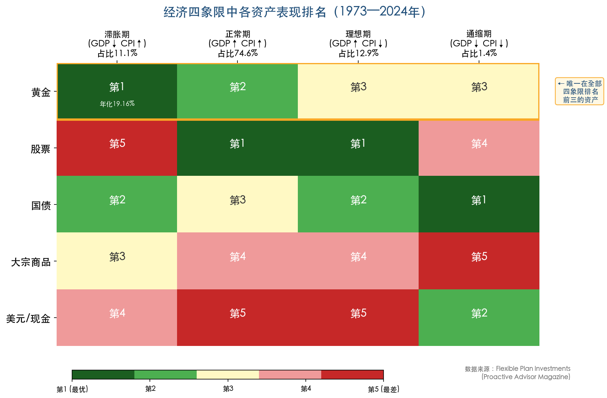

黄金的独特之处在于，它是唯一在全部四个象限中均排名前三的资产类别，具体表现如下：

- **滞胀期**：黄金年化回报 19.16%，位列所有资产首位，跑赢股票 18 个百分点。这一卓越表现源于黄金同时具备抗通胀和避险双重属性，在经济停滞与物价攀升并存的最恶劣环境中展现出无可比拟的防御能力。
- **正常期**：黄金位居第二（仅次于股票），回报近乎国债的 1.5 倍，证明黄金在经济扩张期同样能创造可观的绝对收益。
- **理想期**：黄金排名第三（股票和国债表现最佳），维持正回报，但相对吸引力有所回落。
- **通缩期**：黄金表现最弱的环境，但即便如此仍跑赢大宗商品和股票，仅逊于国债和美元现金 [Proactive Advisor Magazine](https://proactiveadvisormagazine.com/2024-how-gold-can-help-in-creating-a-more-optimal-portfolio-allocation/ "2024版经济体制分析")。

### 5.5.2 衰退期的卓越防御能力

CME Group 的专题研究进一步验证了黄金在经济下行周期中的突出表现。1973–2020 年间 8 次美国经济衰退中，黄金有 6 次跑赢标普 500。在衰退前后各 6 个月的窗口内，黄金平均上涨 28%，跑赢标普 500 达 37 个百分点 [CME Group](https://www.cmegroup.com/openmarkets/metals/2023/How-Does-Gold-Perform-with-Inflation-Stagflation-and-Recession.html "黄金宏观象限表现")。这一规律性表现说明，黄金的避险功能并非个案驱动，而是经过多轮经济周期反复验证的结构性特征。

### 5.5.3 当前宏观环境的象限定位

截至 2026 年 Q1，美国经济处于"温和滞胀"与"正常扩张"的交界区域：CPI 同比 2.4%（仍高于美联储 2% 目标）、核心 CPI 2.5%、GDP 增速放缓但尚未转负、美伊冲突推高油价至近 100 美元/桶。这一宏观组合历史上对黄金高度有利——正常期黄金排名第二、滞胀期排名第一，无论经济向哪个方向摆动，黄金都处于有利的战略位置。

更为关键的是，当前宏观环境中的多重不确定性——关税冲突的经济拖累效应、能源价格的通胀传导、美联储在"抗通胀"与"稳增长"之间的政策两难——恰恰强化了黄金作为"全天候"资产的配置逻辑。

## 5.6 最优配置比例：从理论到实践

### 5.6.1 WGC 2026 版战略资产研究

世界黄金协会 2026 版战略资产报告对黄金的组合效应进行了严谨的定量分析。以 50/40/10（股票/债券/另类）组合为基础，加入 5% 黄金配置后，20 年维度年化回报从 6.7% 升至 7.0%，年化波动率从 9.9% 降至 9.6%，最大回撤从 -34.9% 改善至 -32.7% [世界黄金协会](https://www.gold.org/goldhub/research/relevance-of-gold-as-a-strategic-asset/portfolio-impact "2026版战略资产报告")。这三项指标的同步优化意味着黄金在组合中发挥了"提升收益、降低风险"的双重功能——这在资产配置理论中并不常见。

最优配置比例随投资者风险偏好呈梯度分布：防御型 2.5–5%，中等风险型 5–7.5%，激进型 7.5–10%。WGC 研究特别指出，在股债正相关环境（如 2022 年股债双杀）中，需上调黄金配置比例以补偿债券分散化功能的削弱 [世界黄金协会](https://www.gold.org/goldhub/gold-focus/2025/05/you-asked-we-answered-golds-optimal-portfolio-weight-higher-correlated "正相关环境配置研究")。

### 5.6.2 Flexible Plan Investments 的"激进"结论

Flexible Plan Investments 基于 1973–2023 年 50 年数据的研究提出了更为激进的观点：在传统 60/40 平衡型组合中，黄金的最优配置比例为 17%——远高于行业惯例的 5% 建议 [Proactive Advisor Magazine](https://proactiveadvisormagazine.com/2024-how-gold-can-help-in-creating-a-more-optimal-portfolio-allocation/ "最优黄金配置研究")。研究发现，黄金配置从 1% 到 34% 的所有方案均优于无黄金的传统 60/40 组合（以夏普比率衡量），最优组合结构约为 50% 股票、33% 债券、17% 黄金。更引人注目的是，即便将 60/40 组合中 40% 的债券全部替换为黄金，所得组合的年化回报仍高出传统平衡组合近 1 个百分点，且最大回撤更低。

这一结论虽具有较强的回测色彩，且 17% 的配置比例在实操中面临流动性和机构政策的约束，但其核心启示清晰：多数投资者的黄金配置处于"系统性不足"状态。

### 5.6.3 实操建议与战术考量

多数主流财富管理机构的实际操作建议落在 5–10% 的战略配置区间。J.P. Morgan 建议平衡型组合配置 5–8% 黄金外加 3–5% 白银 [GoldSilver](https://goldsilver.com/industry-news/article/gold-portfolio-allocation-2026-what-j-p-morgans-forecast-means-for-investors/ "J.P. Morgan 2026年配置建议")。

综合 WGC 的稳健结论与 Flexible Plan 的激进发现，我们认为，在当前宏观环境下（央行购金结构性持续、美元信用长期弱化、地缘风险常态化、股债相关性上升），黄金的战略配置比例应位于机构建议的偏上区间，即 7–10% 为宜。对于风险承受能力较强、且具备战术性调整能力的投资者，在金价回调至关键支撑位（如 4,200 美元附近的 200 日均线区域）时择机加仓至 10–15%，是值得考虑的增强策略。

## 5.7 2010–2025 年黄金逐年回报与跨资产回顾

为完成本章的跨资产比较框架，以下梳理黄金在 2010–2025 年各年度的实际回报率，为读者提供对照各阶段黄金在多资产配置中表现节奏的量化基准。

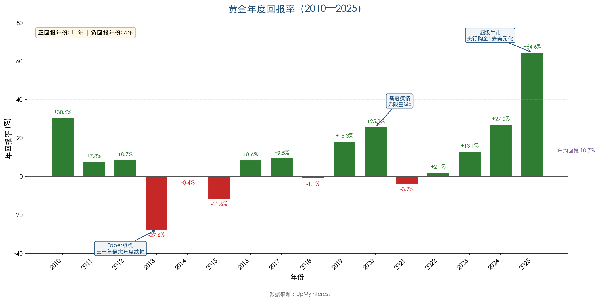

上图直观呈现了黄金 16 年间的回报分布特征——正回报年份 11 年、负回报年份 5 年，年均回报约 10.7%。具体数据如下：

| 年份 | 黄金年回报率 | 核心驱动背景 |
|------|-------------|-------------|
| 2010 | +30.6% | QE2、欧债危机 |
| 2011 | +7.8% | 金价 9 月见顶后回落，全年仍为正 |
| 2012 | +8.7% | QE3 启动，小幅续涨 |
| 2013 | -27.6% | Taper 恐慌，三十年最大年度跌幅 |
| 2014 | -0.4% | 美元走强，黄金窄幅盘整 |
| 2015 | -11.6% | 美联储十年首次加息 |
| 2016 | +8.6% | 英国脱欧、特朗普当选避险 |
| 2017 | +9.5% | 地缘风险（朝核）支撑温和上涨 |
| 2018 | -1.1% | 美联储连续加息，美元走强 |
| 2019 | +18.3% | 美联储三次降息，中美贸易摩擦 |
| 2020 | +25.8% | 新冠疫情、无限量 QE |
| 2021 | -3.7% | 通胀升温但加息预期压制 |
| 2022 | +2.1% | 俄乌冲突避险 vs 激进加息对冲 |
| 2023 | +13.1% | 央行创纪录购金，降息预期升温 |
| 2024 | +27.2% | 全年涨幅超 30%，屡创历史新高 |
| 2025 | +64.6% | 央行购金、去美元化、美伊冲突 |

数据来源：[UpMyInterest](https://www.upmyinterest.com/gold/ "黄金逐年回报数据")

16 年间黄金录得 11 个正回报年份、仅有 5 个负回报年份，年均回报约 10.7%，高于长期历史均值 9.2%。2013 年 -27.6% 的极端负回报（美联储 Taper 恐慌触发）和 2025 年 +64.6% 的极端正回报（多因子共振牛市）构成了分布的两个极端尾部，凸显黄金"低频高强度"的回报特征——即在多数年份提供温和正回报，而在特定宏观拐点年份爆发极端涨跌。理解这一分布特征，对于设定合理的持仓预期和止损纪律至关重要。

## 5.8 小结：黄金在当前组合中的战略定位

综合上述五组跨资产比较与宏观象限分析，我们得出以下核心判断：

**第一，黄金的相对吸引力处于近十年高点。** 以风险调整后回报（夏普比率 1.72 vs SPY 的 0.69）、5 年累计回报（+159.4% vs 比特币 +18.5%、vs 标普 500 约 +70%）和全天候属性（四象限均位列前三）三个维度综合衡量，黄金在主要资产中的竞争力为 2015 年以来最强。

**第二，传统定价框架正在经历结构性重构。** 实际利率与金价的负相关、股债与黄金的低相关这两大历史规律均出现显著裂痕。新的定价框架中，央行购金行为、美元信用周期和地缘风险溢价的权重大幅上升，投资者须相应更新分析模型与配置逻辑。

**第三，黄金的核心配置价值在于"组合保险"而非"投机博弈"。** 黄金不产生现金流，其核心功能在于组合层面降低尾部风险、平滑整体波动。在股债相关性上升（当前 12 个月相关系数达 0.77）的环境下，黄金作为"第三极"资产的分散化功能尤为珍贵——它在很大程度上填补了传统"股债互补"逻辑弱化后留下的风险管理真空。

**第四，当前合理的战略配置区间为 7–10%。** 这一比例高于传统 5% 的经验法则，但低于学术研究所示的 17% 最优值，兼顾了理论依据与实操约束。金价从 5,589 美元历史高点回调约 20% 至当前约 4,495 美元，提供了一个相对合理的长期建仓窗口——前提是投资者对金价短中期可能进一步下探至 4,200 美元甚至 3,500 美元区间的风险有所准备，并以分批建仓而非一次性重仓的方式执行。

# 结论与风险提示

## 核心结论

**结论一：黄金定价体系正经历半个世纪以来最深刻的范式转变。** 2010–2021 年间，美国 10 年期 TIPS 实际收益率与金价的决定系数高达 84%，实际利率几乎是黄金定价的唯一有效锚。2022 年以来，这一 R² 骤降至 3–7%，传统框架遭遇系统性失效 [RBC Wealth Management](https://www.rbcwealthmanagement.com/en-asia/insights/golds-regime-change "R²从84%降至3%的量化证据")。取而代之的是以全球央行购金（2022–2024 年连续三年超千吨）、去美元化（西方冻结俄央行储备引发的储备资产结构性迁移）和地缘政治风险常态化为核心的多因子定价体系。这一转变并非周期性偏离，而是黄金买方结构和全球货币体系的根本性重塑，预计将在中长期持续主导金价走势。

**结论二：本轮超级牛市的长期结构尚未遭到破坏，但短中期面临显著的整固压力。** 自 2022 年 10 月低点 1,615 美元至 2026 年 1 月峰值 5,589 美元，金价累计涨幅达 246%，远超前两轮牛市同期表现。截至 2026 年 3 月 27 日约 4,495 美元的价格水平虽已从峰值回落约 20%，但 200 日均线（EMA 约 4,200 美元/SMA 约 4,083 美元）自 2023 年末以来从未被有效跌破，长期上升趋势完好。3 月 24 日低点 4,099 美元在 200 日均线与 38.2% 斐波那契回撤位交汇处获得的强力支撑，印证了结构性买盘在关键价位的承接能力。然而，50 日均线已从支撑转为阻力、COMEX 净多仓大幅缩减 46%、月线出现 24 个月来首根看跌吞没形态，短中期技术面偏空格局明确，金价在完成充分整固之前难以重启主升浪。

**结论三：2026 年 Q2–Q4 基准情景为 4,200–5,000 美元区间高位震荡。** 支撑这一判断的三大支柱为：央行购金与去美元化构成坚实的结构性底部，2025 年 Q4 至 2026 年 1 月积累的投机泡沫已在 3 月回调中大幅出清，200 日均线作为长期牛熊分界线的有效性已获市场实战验证。主流机构预测中枢落在 4,700–5,400 美元，乐观尾部可达 6,000–6,300 美元（J.P. Morgan、UBS），悲观尾部约 3,900–4,200 美元。

**结论四：黄金的跨资产相对吸引力处于近十年高点，战略配置比例宜上调至 7–10%。** 黄金是唯一在经济四象限（正常期、理想期、滞胀期、通缩期）中均排名前三的资产类别。在股债相关性异常攀升至 0.77、传统"股债互补"逻辑弱化的当下，黄金作为组合"第三极"的保险功能和分散化价值尤为突出。世界黄金协会定量研究表明，5% 的黄金配置可同时提升组合回报、降低波动率并改善最大回撤。金价从历史高点回调约 20%，提供了相对合理的长期分批建仓窗口。

## 关键价位速览

| 层级 | 支撑位（美元） | 技术含义 |
|------|--------------|---------|
| S1 | 4,350–4,373 | 短期底部，2025 年 10 月前高"阻力转支撑" |
| S2 | 4,077–4,200 | 核心牛熊分界线：200 日均线 + 38.2% 斐波那契 + 通道中轴线共振 |
| S3 | 3,500 | 结构性底部：2025 年 4 月前高 + 50% 斐波那契回撤 |

| 层级 | 压力位（美元） | 技术含义 |
|------|--------------|---------|
| R1 | 4,533–4,608 | 即时阻力：2025 年 12 月峰值 + 100 日均线 + 38.2% 短周期回撤 |
| R2 | 4,880–4,960 | 中期趋势翻转确认：50 日 EMA + 破位需求区转阻力 |
| R3 | 5,000+ | 心理关口；5,589 美元为历史绝对高点终极阻力 |

## 风险提示

**一、通胀超预期反弹风险。** 美伊军事冲突已推动原油价格升至近 100 美元/桶，5 年期盈亏平衡通胀率攀升至 2.65%。若冲突进一步升级导致霍尔木兹海峡航运受阻或油价站上 120 美元/桶，CPI 可能反弹至 3.5% 以上，迫使美联储暂停降息甚至重启加息，实际利率大幅走高将对金价构成显著压力。尽管传统实际利率框架的解释力已明显下降，但 2.10% 的 TIPS 收益率对金价的估值约束客观存在。

**二、地缘风险溢价骤降风险。** 当前金价中隐含了来自俄乌冲突、美伊军事对峙和中美关税博弈的持续性避险溢价。若出现多条战线同步降温（如美伊停火、中美关税谈判取得突破性进展），地缘风险溢价的快速出清可能触发 10–15% 的短期急跌。2026 年 2 月美伊冲突爆发后金价反而下跌的"利多不涨"先例，提示市场对地缘因子的边际定价效力可能已步入递减阶段。

**三、央行购金行为逆转风险。** 全球央行购金是本轮牛市最重要的结构性支柱，2022–2024 年年均购金 1,055 吨。若新兴市场国家因本币贬值被迫抛售黄金储备以稳定汇率，或全球央行购金量回落至 2010–2021 年年均 473 吨的水平，金价将失去最坚实的需求底部。世界黄金协会提示，央行购金方向的转变是 2026 年两大"通配符"之一。

**四、流动性挤压引发的强制平仓风险。** 2020 年 3 月新冠冲击初期，黄金与股票曾出现同步暴跌，机构被迫抛售黄金以满足追加保证金需求。在当前金价处于历史绝对高位的背景下，若全球金融市场遭遇流动性危机，类似的无差别抛售可能导致金价出现 15–20% 的急速回撤，且初期跌势可能与避险逻辑相悖。

**五、印度黄金抵押贷款清算风险。** 世界黄金协会将印度黄金抵押贷款列为 2026 年另一大"通配符"。印度作为全球第二大黄金消费国，若金价持续下跌触发黄金贷款的强制平仓，可能形成"价格下跌→强制卖出→价格进一步下跌"的负反馈循环，成为下行尾部风险的放大器。

## 局限性说明

**一、数据时效性约束。** 本报告数据截至 2026 年 3 月 27 日，金融市场瞬息万变，报告发布后的宏观事件（美联储政策调整、地缘冲突演变、央行购金数据更新等）可能显著改变文中判断的前提条件。

**二、央行购金数据的不透明性。** 世界黄金协会数据显示，2025 年央行购金中"未报告购买"占比高达 57%。由于相当比例的央行购金行为未被公开披露，本报告对央行需求规模的估算可能与实际情况存在偏差，进而影响对金价结构性底部的判断。

**三、技术分析的固有局限。** 技术分析基于历史价格模式的统计规律，在面对范式转变、极端事件或流动性突变时可能失效。本报告识别的关键支撑位与压力位为概率性参考而非精确预测，实际市场行为可能显著偏离技术指引。

**四、情景概率的主观性。** 四大情景框架虽基于世界黄金协会宏观模型和机构预测共识，但各情景的触发概率本质上包含主观判断成分，难以精确量化。读者应将情景分析视为思考框架而非概率预测，并结合自身风险偏好与投资约束做出独立判断。

**五、跨资产比较的周期依赖性。** 第 5 章的跨资产回报比较高度依赖所选取的时间窗口。黄金与美股呈现"十年轮换"特征，任何单一维度的收益比较都可能产生误导。当前黄金相对美股的优异表现部分受益于近年极端宏观环境，不应简单外推至未来十年。
