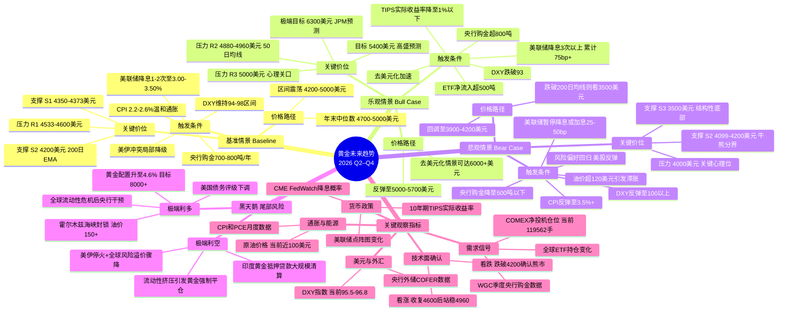

# Section 1：章节研究计划

> **研究主题**：2010 年至 2026 年 3 月黄金走势分析及未来趋势展望（含思维导图、关键支撑位与压力位）
>
> **时间口径**：历史回顾覆盖 2010 年 1 月 – 2026 年 3 月；未来展望覆盖 2026 年 Q2 – Q4。当前日期 2026-03-30。

## Chapter 1：黄金十六年——2010 至 2026 年价格走势全景回顾

### 研究目标
- 以编年+阶段划分方式，完整梳理 2010 年 1 月至 2026 年 3 月黄金价格的演变轨迹
- 识别每一轮牛熊周期的起止节点、涨跌幅度、以及驱动该阶段行情的核心事件
- 回答：过去十六年黄金经历了哪几轮完整周期？每轮周期的触发因素和终结信号是什么？

### 关键发现

**第一阶段（2010–2011）：后金融危机牛市顶峰**
- 2010 年初黄金约 1,096 美元/盎司，全年上涨约 29.5%，年末收于约 1,421 美元/盎司，驱动因素包括美联储 QE2（2010 年 11 月启动）和欧洲主权债务危机 [世界黄金协会](https://www.gold.org/news-and-events/press-releases/gold-price-2010-driven-recovery-key-sectors-demand-and-continued "2010年金价年度回顾")。
- 2011 年 9 月 6 日，伦敦现货黄金触及 1,921.41 美元/盎司历史峰值（盘中），驱动包括美国债务上限危机、标普下调美国主权信评（2011 年 8 月 5 日）、欧债危机蔓延 [The Guardian](https://www.theguardian.com/business/2011/sep/06/gold-hits-new-high-financial-markets "2011年9月6日黄金创历史新高报道")。
- 从 2010 年初约 1,096 美元至 2011 年 9 月峰值 1,921 美元，累计涨幅约 75% [Investopedia](https://www.investopedia.com/gold-price-history-highs-and-lows-7375273 "黄金价格历史高低点")。

**第二阶段（2012–2015）：漫长熊市**
- 2013 年 4 月 12–15 日，黄金遭遇三十年来最惨烈两日暴跌：从约 1,564 美元跌至约 1,321 美元（4 月 16 日盘中低点），跌幅 15.5%，触发因素包括塞浦路斯央行被要求抛金偿债、美联储 Taper 预期升温 [BullionVault](https://www.bullionvault.com/gold-news/opinion-analysis/golds-big-price-crash-10-year-07072023 "2013年金价暴跌十周年回顾")。
- 2015 年 12 月 3 日，黄金触及近六年低点约 1,045 美元/盎司（盘中），美联储于 12 月 17 日近十年首次加息。从 2011 年 9 月峰值至 2015 年 12 月低点，累计下跌约 45.6% [CNBC](https://www.cnbc.com/2015/12/17/gold-holds-losses-from-biggest-dip-in-5-months-after-fed-rate-hike.html "美联储加息后金价跌至多年低点") [StoneX Bullion](https://stonexbullion.com/en/blog/what-was-the-highest-price-for-gold/ "黄金历史最高价回顾")。

**第三阶段（2016–2019）：筑底与缓慢复苏**
- 2016 年英国脱欧公投冲击下黄金单日跳涨 4% 至 1,315.50 美元/盎司；7 月 6 日触及约 1,371 美元两年高点，上半年涨幅超 25% [世界黄金协会](https://www.gold.org/goldhub/research/market-update/market-update-gold-surges-after-brexit-becomes-reality "英国脱欧后金价飙升") [CNBC](https://www.cnbc.com/2016/07/01/brexit-helps-gold-gain-over-25-in-first-half-of-2016.html "英国脱欧助推金价上半年涨逾25%")。
- 2019 年美联储三次降息叠加中美贸易摩擦升级，黄金于 8–9 月升至约 1,557 美元六年高点。从 2015 年 12 月低点约 1,045 美元至此，累计反弹约 49% [The Guardian](https://www.theguardian.com/business/2019/jul/19/gold-price-hits-six-year-high-as-investors-await-us-interest-rate-cut "2019年金价升至六年高点")。

**第四阶段（2020–2022）：疫情冲击与历史新高**
- 2020 年 8 月 4 日现货黄金首次突破 2,000 美元大关，后冲高至约 2,075 美元历史最高点（盘中），核心驱动为无限量 QE、美元走弱、实际利率降至 2013 年以来最低 [CNBC](https://www.cnbc.com/2020/08/04/gold-markets-coronavirus-dollar-in-focus.html "黄金首次突破2000美元")。
- 2022 年 3 月 8 日俄乌战争避险推动金价冲高至约 2,070 美元；随后美联储全年加息 7 次累计 425bp，黄金 10 月跌至约 1,615 美元低点 [Investopedia](https://www.investopedia.com/gold-price-history-highs-and-lows-7375273 "黄金价格历史高低点")。

**第五阶段（2023–2026 Q1）：新一轮超级牛市**
- 2023 年 12 月现货金突破 2,100 美元，年末收于 2,078 美元创年度收盘纪录；央行购金贡献 10–15% 涨幅 [CNBC](https://www.cnbc.com/2023/12/04/gold-prices-set-for-new-highs-amid-economic-geopolitical-uncertainty.html "金价首次突破2100美元") [世界黄金协会](https://www.gold.org/goldhub/research/gold-market-commentary-december-2023 "2023年12月黄金市场评论")。
- 2024 年 8 月 16 日现货金首破 2,500 美元（触及 2,500.99 美元），全年累计涨幅超 30% [JCK](https://www.jckonline.com/editorial-article/gold-price-hits-2500-record/ "2024年8月金价首破2500美元") [Investopedia](https://www.investopedia.com/gold-price-history-highs-and-lows-7375273 "黄金价格历史高低点")。
- 2025 年 3 月 14 日现货金首破 3,000 美元（触及 3,004.86 美元），驱动为特朗普关税战、美股避险需求、高盛上调金价预测；4 月触及约 3,500 美元；12 月 26 日达 4,549.74 美元年末峰值 [Reuters](https://www.reuters.com/markets/commodities/gold-mounts-record-summit-eyes-3000-peak-2025-03-14/ "2025年3月14日金价首破3000美元") [StoneX Bullion](https://stonexbullion.com/en/blog/what-was-the-highest-price-for-gold/ "黄金历史最高价回顾")。
- 2026 年 1 月 28 日，现货黄金盘中触及 5,589.38 美元/盎司历史绝对高点，驱动包括美伊军事对峙、美元指数大跌至 95.5、美国威胁对加拿大加征 100% 关税 [StoneX Bullion](https://stonexbullion.com/en/blog/what-was-the-highest-price-for-gold/ "黄金历史最高价回顾")。
- 截至 2026 年 3 月 27 日，黄金约 4,495 美元/盎司，较 1 月峰值回落约 20%，同比仍涨约 46% [Trading Economics](https://tradingeconomics.com/commodity/gold "黄金实时价格与历史数据")。

### 可用图片
（无）

### 仍需补充
- 2020 年 8 月现货黄金 2,075 美元纪录高点的精确日期（8 月 6 日或 7 日），需用 LBMA 定盘价交叉验证。
- 2017 年全年黄金走势细节（年涨约 13%，年末约 1,303 美元），覆盖较薄。
- 2022 年 10 月黄金低点精确日期和价格（约 1,615–1,620 美元区间）。
- 2024 年各季度里程碑（首次站上 2,300、2,400 美元的日期）。

---

## Chapter 2：黄金定价的核心逻辑——驱动因素深度解析

### 研究目标
- 系统拆解影响黄金价格的核心驱动因素，建立"因子→金价"分析框架
- 覆盖因子：美联储货币政策与实际利率、美元指数、通胀与通胀预期、地缘政治风险、全球央行购金、黄金供需基本面、市场情绪与投机仓位
- 回答：哪些因子持续影响金价？传导机制和因子轮动如何运作？

### 关键发现

**因子 1：美联储货币政策与实际利率**
- 美联储 2022 年 3 月至 2023 年 7 月累计加息 11 次、525bp，利率从 0–0.25% 升至 5.25–5.50%（2001 年以来最高）；随后 2024 年 9–12 月降息三次（50bp+25bp+25bp），2025 年 9/10/12 月各降息 25bp，至 2026 年 3 月维持 3.50–3.75% 不变 [Forbes Advisor](https://www.forbes.com/advisor/investing/fed-funds-rate-history/ "联邦基金利率历史") [Advisor Perspectives](https://www.advisorperspectives.com/dshort/updates/2026/03/19/feds-interest-rate-decision-march-18-2026 "2026年3月FOMC会议详情")。
- PIMCO 研究表明，2004–2025 年间实际收益率每上升 100bp，经通胀调整后的黄金实际价格平均下跌约 18%（实际久期约 18 年）；但自 2022 年起央行购金和去美元化使该负相关关系显著脱钩 [PIMCO](https://www.pimco.com/us/en/resources/education/understanding-gold-prices "PIMCO黄金价格实际收益率框架")。
- S&P Global 2025 年 3 月研究指出，2024 年出现美国 10 年期国债收益率与金价同步上涨的异常现象，地缘政治担忧已在特定阶段压倒宏观基本面对金价的影响 [S&P Global](https://www.spglobal.com/market-intelligence/en/news-insights/research/treasury-yields-and-gold-prices-breaking-expectations "国债收益率与金价打破预期")。

**因子 2：美元指数（DXY）与美元信用**
- 2026 年 3 月 DXY 降至约 95.5–96.8 区间，较 2024 年底 108 以上大幅下跌超 10%，与美联储降息周期、美伊冲突及去美元化趋势共振，支撑金价维持高位 [Investing.com](https://www.investing.com/analysis/golds-speculative-net-positions-mirror-december-2025-levels-200674291 "DXY交易数据")。
- 2022 年俄罗斯央行外汇储备被冻结后，全球央行储备去美元化加速，构成对金价的长期结构性支撑 [CBS News](https://www.cbsnews.com/news/relationship-between-gold-prices-and-us-dollar-what-to-know-for-2026/ "央行储备多元化对黄金和美元关系的影响")。

**因子 3：通胀与通胀预期**
- 美国 CPI 同比从 2022 年 6 月 9.1% 峰值降至 2026 年 2 月 2.4%，核心 CPI 2.5%，仍高于美联储 2% 目标 [美国劳工统计局](https://www.bls.gov/news.release/cpi.nr0.htm "2026年2月CPI报告")。
- 美伊冲突（2026 年 2 月 28 日爆发）推动原油升至近 100 美元/桶，形成新的通胀上行风险，收窄美联储降息空间，同时增强黄金抗通胀配置吸引力 [DW](https://www.dw.com/en/iran-us-israel-war-gold-silver-dollar-oil-inflation/a-76381602 "伊朗战争与油价通胀")。

**因子 4：地缘政治风险**
- 2022–2026 年地缘风险从"脉冲式"演变为"持续性"结构因素：俄乌冲突→以哈冲突→中美关税极端升级（美对华 145%、中方 125%）→美伊军事对峙，地缘风险溢价嵌入金价定价 [S&P Global](https://www.spglobal.com/market-intelligence/en/news-insights/research/treasury-yields-and-gold-prices-breaking-expectations "地缘政治对金价传统关系的冲击")。
- 2026 年 2 月美伊战争爆发后金价不涨反跌，Commerzbank 分析师 Fritsch 指出"金价实际上低于战争开始前的水平"，因美元走强和利率预期上行两机制对冲了避险需求 [DW](https://www.dw.com/en/iran-us-israel-war-gold-silver-dollar-oil-inflation/a-76381602 "Commerzbank分析师论金价与伊朗战争")。

**因子 5：全球央行购金**
- WGC 数据：2022 年 1,082 吨（创纪录）、2023 年 1,037 吨、2024 年 1,045 吨（连续三年超千吨），2025 年 863 吨（虽低于千吨但远超 2010–2021 年年均 473 吨） [世界黄金协会](https://www.gold.org/goldhub/research/gold-demand-trends/gold-demand-trends-full-year-2025/central-banks "2025年全年央行购金数据") [世界黄金协会](https://www.gold.org/goldhub/research/gold-demand-trends/gold-demand-trends-full-year-2024/central-banks "2024年全年央行购金数据")。
- 2025 年主要购金国：波兰 102 吨（目标储备占比 30%）、哈萨克斯坦 57 吨、巴西 43 吨、阿塞拜疆 38 吨、中国 27 吨（年末储备 2,306 吨，占比近 9%） [世界黄金协会](https://www.gold.org/goldhub/research/gold-demand-trends/gold-demand-trends-full-year-2025/central-banks "2025年各国央行购金详情")。
- 2025 年央行购金中"未报告购买"占 57%，实际官方需求可能高于公开数据 [世界黄金协会](https://www.gold.org/goldhub/research/gold-demand-trends/gold-demand-trends-full-year-2025/central-banks "未报告央行购金占比")。

**因子 6：黄金供需基本面**
- 2025 年全球黄金总需求首破 5,000 吨（5,002.3 吨，+1%），总需求价值达 5,550 亿美元（+45%）；LBMA 金价全年刷新 53 次历史高点，年均价 3,431.5 美元/盎司（+44%） [世界黄金协会](https://www.gold.org/goldhub/research/gold-demand-trends/gold-demand-trends-full-year-2025 "2025年全年黄金需求趋势报告")。
- 2025 年矿产金创纪录 3,672 吨（+1%），回收金 1,404 吨（+3%），供给端弹性有限 [世界黄金协会](https://www.gold.org/goldhub/research/gold-demand-trends/gold-demand-trends-full-year-2025 "2025年全球黄金供应数据")。
- 需求结构变化：投资需求攀升 84% 至 2,175 吨（ETF 从净流出 2.9 吨逆转为净流入 801 吨），珠宝需求下降 19% 至 1,638 吨 [世界黄金协会](https://www.gold.org/goldhub/research/gold-demand-trends/gold-demand-trends-full-year-2025 "2025年黄金需求结构")。

**因子 7：市场情绪与投机仓位**
- COMEX 黄金期货投机性净多仓从 2026 年 1 月约 244,800 手骤降至 3 月约 119,562 手（降幅 46%以上），显示专业投机者大幅削减多头 [Investing.com](https://www.investing.com/analysis/golds-speculative-net-positions-mirror-december-2025-levels-200674291 "CFTC黄金净投机仓位分析")。
- Commerzbank 分析师 Fritsch 指出 2025 年 Q4 至 2026 年 1 月金价上涨与基本面脱节，"贪婪和 FOMO 起了重要作用" [DW](https://www.dw.com/en/iran-us-israel-war-gold-silver-dollar-oil-inflation/a-76381602 "金价过热信号分析")。

**因子轮动总结**
- 2010–2015 年：QE 退出预期与实际利率上行主导，传统"实际利率-金价"负相关高度有效。
- 2016–2021 年：货币政策周期（降息→无限量 QE）叠加贸易摩擦，实际利率仍是核心定价锚。
- 2022–2023 年：美联储激进加息但央行创纪录购金 1,082 吨构成对冲，"实际利率-金价"框架首现重大裂痕。
- 2024–2026 Q1：央行购金、地缘风险常态化和去美元化成为主导因子，PIMCO 将此定义为"粘性避险买盘"，黄金与实际收益率持续脱钩 [PIMCO](https://www.pimco.com/us/en/resources/education/understanding-gold-prices "PIMCO论驱动因子结构性转变")。

### 可用图片
（无）

### 仍需补充
- 10 年期 TIPS 实际收益率 2026 年 Q1 精确数值（FRED 最新数据），以支撑"实际利率-金价脱钩"定量论述。
- 盈亏平衡通胀率最新数值，补充通胀预期分析。
- COMEX 净多仓 2024–2026 年更完整周度时间序列数据。
- 全球黄金 ETF 2026 年 Q1 流量最新数据（WGC 尚未发布）。

---

## Chapter 3：技术分析——关键支撑位与压力位

### 研究目标
- 基于 2010–2026 年黄金走势，运用经典技术分析方法识别关键支撑位和压力位
- 覆盖维度：长期趋势线、历史高低点水平支撑/阻力、斐波那契回撤与延伸、移动平均线系统、关键整数关口
- 列出当前（截至 2026 年 3 月底）至少 3 档关键支撑位和至少 3 档关键压力位，含技术依据
- 回答：从技术面看，黄金当前处于什么市场结构？多空力量对比如何？

### 关键发现

**当前市场结构**
- 截至 2026 年 3 月 27 日黄金约 4,490 美元，较 1 月高点 5,589 美元下跌约 21%，月线出现 24 个月来首次看跌反转形态（看跌吞没），短中期动能转变 [FXEmpire](https://www.fxempire.com/forecasts/article/gold-xau-usd-price-forecast-bearish-signals-grow-across-timeframes-1588239 "2026年3月27日Bruce Powers分析")。
- 日线图自 3 月 2 日高点 5,420 美元形成下降通道，3 月 18 日跌破 50 日均线 4,960 美元，4,880 美元需求区被突破后转为阻力 [FXLeaders](https://www.fxleaders.com/news/2026/03/27/gold-price-analysis-xau-usd-crashes-21-from-all-time-high-is-4370-the-floor-or-just-the-next-stop-down/ "2026年3月27日Arslan Butt分析")。
- 长期牛市结构尚未破坏：200 日 EMA 约 4,200 美元，金价自 2023 年末以来从未收于该均线下方，2022 年 10 月以来累计涨幅约 200% 的牛市周期仍完好 [FXLeaders](https://www.fxleaders.com/news/2026/03/27/gold-price-analysis-xau-usd-crashes-21-from-all-time-high-is-4370-the-floor-or-just-the-next-stop-down/ "长期牛市结构分析")。

**关键支撑位（由近及远）**
- **S1 ~4,350–4,373 美元**：3 月下旬多次下探形成短期底部（锤子线），2025 年 10 月前阻力 4,325 美元转化为支撑，2025 年 12 月和 2026 年 2 月多次阻止回调 [FinanceFeeds](https://financefeeds.com/gold-technical-analysis-report-24-march-2026/ "2026年3月24日分析") [FXLeaders](https://www.fxleaders.com/news/2026/03/28/gold-price-forecast-week-of-march-30-2026-will-the-4350-floor-spark-a-rally-back-to-5000/ "2026年3月28日周度预测")。
- **S2 ~4,099–4,200 美元**：200 日 EMA 约 4,200 美元（长期牛/熊分界）+ 100 日 MA 约 4,230 美元 + 长期上升趋势线 4,114 美元交汇区；3 月低点 4,099 美元在测试 10 月均线时企稳，且几乎精确触及从 1,615→5,589 美元的 38.2% 斐波那契回撤位（4,071 美元） [FXEmpire](https://www.fxempire.com/forecasts/article/gold-xau-usd-price-forecast-bearish-signals-grow-across-timeframes-1588239 "2026年3月27日分析") [FXLeaders](https://www.fxleaders.com/news/2026/03/28/gold-price-forecast-week-of-march-30-2026-will-the-4350-floor-spark-a-rally-back-to-5000/ "周度预测")。
- **S3 ~3,500 美元**：2025 年 4 月高点及整轮 2025–2026 涨势起点，具有强烈结构性意义。FOREX.com 分析师将 4,000 美元视为"关键支撑分界线"，跌破后下方为 3,500 美元 [FOREX.com](https://www.forex.com/en-us/news-and-analysis/gold-2026-outlook-xau-usd-technical-analysis/ "Fawad Razaqzada 2026年技术展望")。

**关键压力位（由近及远）**
- **R1 ~4,533–4,600 美元**：61.8% 斐波那契回撤位 4,533–4,540 美元 + 2025 年 12 月峰值 4,549.74 美元水平阻力 + 100 日 MA 动态阻力；3 月 26 日周高 4,603 美元在此受阻形成看跌射击之星 [FXEmpire](https://www.fxempire.com/forecasts/article/gold-xau-usd-price-forecast-bearish-signals-grow-across-timeframes-1588239 "2026年3月27日") [CapitalStreetFX](https://www.capitalstreetfx.com/gold-market-outlook-march-23-2026-xau-usd-technical-analysis-trade-setup/ "2026年3月23日")。
- **R2 ~4,880–4,960 美元**：20 日 MA 约 4,880 美元（下行动态阻力）+ 50 日 MA/EMA 约 4,960 美元（3 月 18 日跌破后转为重要阻力）+ 此前被击穿的需求区 [FXEmpire](https://www.fxempire.com/forecasts/article/gold-xau-usd-price-forecast-bearish-signals-grow-across-timeframes-1588239 "2026年3月27日") [CapitalStreetFX](https://www.capitalstreetfx.com/gold-market-outlook-march-23-2026-xau-usd-technical-analysis-trade-setup/ "2026年3月23日")。
- **R3 5,000 美元及以上**：5,000 美元为心理关口 + 2026 年 1 月里程碑；更上方 5,232/5,420（3 月次高/高点）和 5,589 美元（历史绝对高点）为终极阻力。机构目标：高盛年末 5,400 美元，J.P. Morgan Q4 均价 5,055 美元（去美元化持续可达 6,000 美元） [FOREX.com](https://www.forex.com/en-us/news-and-analysis/gold-2026-outlook-xau-usd-technical-analysis/ "2026年技术展望") [FXLeaders](https://www.fxleaders.com/news/2026/03/27/gold-price-analysis-xau-usd-crashes-21-from-all-time-high-is-4370-the-floor-or-just-the-next-stop-down/ "机构目标价汇总")。

**斐波那契回撤**
- 主要回撤（1,615→5,589 美元）：23.6% = 4,651；38.2% = 4,071；50% = 3,602；61.8% = 3,133。当前价格位于 23.6% 下方，3 月低点 4,099 美元几乎精确触及 38.2%。
- 短期回撤（4,101→5,420 美元）：38.2% = 4,605（与 100 日 MA 吻合）；50% = 4,761；61.8% = 4,916（接近 50 日 MA）。3 月 26 日反弹高点 4,603 美元恰好在 38.2% 受阻 [FXEmpire](https://www.fxempire.com/forecasts/article/gold-xau-usd-price-forecast-bearish-signals-grow-across-timeframes-1588239 "斐波那契验证")。

**动量指标**
- RSI（14 日）3 月 23 日一度跌至约 27（2024 年 11 月以来最低，超卖），后回升至 36–48，仍低于中性线 50 [CapitalStreetFX](https://www.capitalstreetfx.com/gold-market-outlook-march-23-2026-xau-usd-technical-analysis-trade-setup/ "2026年3月23日")。
- MACD 日线直方图在零线下方持续扩张，信号线确认看跌交叉，下跌日成交量放大确认机构分销行为 [CapitalStreetFX](https://www.capitalstreetfx.com/gold-market-outlook-march-23-2026-xau-usd-technical-analysis-trade-setup/ "2026年3月23日")。

**多空力量对比**
- 短中期偏空：下降通道、50 日均线从支撑转阻力、月线看跌反转、MACD 看跌交叉；除非果断突破 4,603 美元，空方维持控制。
- 长期偏多：200 日均线 ~4,200 美元未跌破，高盛/J.P. Morgan 等机构维持 2026 年 4,700–6,000 美元目标区间。

### 可用图片
（无）

### 仍需补充
- 月线级别趋势通道上轨/下轨具体价位（缺少 TradingView/Kitco 来源的长期通道量化描述）。
- 200 日均线 SMA 与 EMA 口径差异（约 4,200–4,406 美元区间），需在最终报告中统一说明。
- 斐波那契延伸位向上投影至 6,000+ 美元的具体计算来源不足。

---

## Chapter 4：黄金未来趋势展望——多空情景与思维导图

### 研究目标
- 综合历史经验、驱动因子现状和技术面信号，构建黄金 2026 年 Q2–Q4 趋势展望
- 框架包含：基准情景（Baseline）、乐观情景（Bull Case）、悲观情景（Bear Case）、黑天鹅/尾部风险情景
- 以 Mermaid mindmap 语法输出思维导图，展示"驱动因子→情景判断→价格路径→关键价位"推导链
- 回答：各情景的触发条件和目标价位区间是什么？关键观察指标有哪些？

### 关键发现

**主流机构 2026 年预测**
- J.P. Morgan 2026 年 2 月将年末预测上调至 6,300 美元/盎司；极端乐观情景（全球家庭黄金配置从 3% 升至 4.6%）可达 8,000–8,500 美元 [J.P. Morgan](https://www.jpmorgan.com/insights/global-research/commodities/gold-prices "J.P.Morgan黄金价格展望") [Bullion Exchanges](https://bullionexchanges.com/blog/gold-price-forecast-2026-jpmorgan-targets-6300 "JPMorgan 6300美元目标解读")。
- 高盛 2026 年 1 月上调年末预测至 5,400 美元，核心逻辑为私人部门投资者与机构竞争黄金配置 [MINING.COM](https://www.mining.com/goldman-lifts-year-end-gold-price-forecast-to-5400/ "高盛上调年末金价预测至5400美元")。
- Morgan Stanley 牛市目标 5,700 美元（2026 年 H2），法国兴业银行预测 6,000 美元 [investingLive](https://investinglive.com/commodities/morgan-stanley-sees-gold-at-5700-as-banks-turn-even-more-bullish-20260127/ "Morgan Stanley 5700美元目标")。
- 尽管金价回落 21% 进入技术性熊市，Yardeni Research 维持"2030 年前 10,000 美元"长期目标（年末 5,000 美元）；Global X ETFs 维持年末 6,000 美元基准预测；渣打预期 3 个月内反弹至 5,375 美元 [CNBC](https://www.cnbc.com/2026/03/24/gold-price-forecast-10000-expectations-in-spite-of-bear-market.html "CNBC 2026年3月金价预测汇总")。
- 机构预测区间存在显著分歧：BofA 高点 5,000/均价 4,400；HSBC 峰值 5,000/均价 4,600；德银均价 4,450（区间 3,950–4,950）；Macquarie 均价 4,225（最谨慎）；路透共识中位数年均 4,275 美元 [Gold IRA Guide](https://goldiraguide.org/2026-gold-price-forecast-20-predictions-jpmorgan-bofa-goldman-hshs-morgan-stanley-more/ "20+家机构预测汇总")。

**WGC 四情景框架**
- 世界黄金协会 2026 年展望构建四种情景：（1）宏观共识——金价区间震荡；（2）浅度放缓——美联储降息超预期，金价上涨 5–15%；（3）厄运循环——全球深度放缓，金价飙升 15–30%；（4）再通胀回归——美联储加息 25–50bp，金价回调 5–20% [世界黄金协会](https://www.gold.org/goldhub/research/gold-outlook-2026 "Gold Outlook 2026")。
- WGC GRAM 模型显示 2025 年金价 61% 的回报由风险/不确定性（12ppt）、机会成本降低（10ppt）、动量（9ppt）、经济扩张（10ppt）四因子近乎均衡驱动，历史少见 [世界黄金协会](https://www.gold.org/goldhub/research/gold-outlook-2026 "WGC GRAM模型归因")。

**四大情景触发条件与价格路径**
- **基准情景**：美联储降息 1–2 次至 3.00–3.50%，DXY 94–98，CPI 2.2–2.6%，央行购金 700–800 吨。目标区间 4,200–5,000 美元，年末中位数 4,700–5,000 美元 [J.P. Morgan](https://www.jpmorgan.com/insights/global-research/commodities/gold-prices "基准预测")。
- **乐观情景**：美联储降息 3 次以上（累计 75bp+），TIPS 实际收益率降至 1% 以下，DXY 跌破 93，ETF 净流入超 500 吨。目标 5,000–5,700 美元；去美元化加速（仅 0.5% 美元资产再配置）可达 6,000+ 美元 [J.P. Morgan](https://www.jpmorgan.com/insights/global-research/commodities/gold-prices "去美元化情景") [investingLive](https://investinglive.com/commodities/morgan-stanley-sees-gold-at-5700-as-banks-turn-even-more-bullish-20260127/ "Morgan Stanley 5700目标")。
- **悲观情景**：通胀反弹 CPI 3.5%+，美联储暂停降息或加息 25–50bp，DXY 反弹至 100+，油价 120+ 引发滞胀，央行购金降至 500 吨以下。目标 3,900–4,200 美元，跌破 200 日均线则看 3,500 美元 [世界黄金协会](https://www.gold.org/goldhub/research/gold-outlook-2026 "再通胀回归情景")。
- **黑天鹅情景**：霍尔木兹海峡封锁/油价 150+（脉冲冲高至 5,500+ 后对冲回落）；美国债务评级下调（重演 2011 年）；全球流动性危机（先抛售后反弹）；极端乐观尾部——家庭配置升至 4.6%，可达 8,000–8,500 美元 [Bullion Exchanges](https://bullionexchanges.com/blog/gold-price-forecast-2026-jpmorgan-targets-6300 "极端情景")。

**关键观察指标**
- 货币政策：CME FedWatch 降息概率、点阵图变化、10Y TIPS 实际收益率
- 美元与外汇：DXY 指数（95 以下强利好/100 以上利空）、央行外储 COFER 数据
- 需求信号：COMEX 净投机仓位（当前 ~119,562 手，仓位回升为反弹先行信号）、全球 ETF 持仓、WGC 季度央行购金
- 通胀与能源：CPI/PCE 月度数据、原油价格（当前近 100 美元）
- 技术面确认：看涨——收复 4,600 后站稳 4,960；看跌——跌破 4,200 确认熊市

**多空平衡与不确定性**
- Barchart 分析师 Jim Wyckoff 指出金价对美伊战争反应平淡，"市场无法在利多面前上涨，是多方力量耗尽的信号" [Yahoo Finance](https://finance.yahoo.com/news/bear-bull-cases-silver-gold-144514943.html "2026年3月黄金多空分析")。
- WGC 两大"通配符"：（1）新兴市场央行加速购金 vs 回落至 COVID 前水平；（2）印度黄金抵押贷款强制平仓风险 [世界黄金协会](https://www.gold.org/goldhub/research/gold-outlook-2026 "WGC通配符")。

**Mermaid 思维导图**

### 可用图片
（无）

### 仍需补充
- 高盛 2026 年 3 月（金价回调后）是否更新预测，目前最新为 2026 年 1 月 22 日的 5,400 美元目标。
- WGC 展望基于 2025 年 12 月约 3,800 美元基点，百分比涨跌幅需按当前 ~4,495 美元重新校准。
- 渣打银行"3 个月内反弹至 5,375 美元"的预测仅有 CNBC 引述（T2），未找到渣打官方研报原文。

---

## Chapter 5：黄金在资产配置中的角色——跨资产比较与配置启示

### 研究目标
- 将黄金置于多资产配置视角，比较其与美股、美债、大宗商品、加密货币在不同环境下的相对表现
- 覆盖维度：黄金 vs 标普 500、黄金 vs 10Y 美债、黄金 vs 原油/铜、黄金 vs 比特币、黄金在增长×通胀矩阵下的表现
- 回答：当前宏观环境下黄金在组合中应扮演什么角色？其相对吸引力如何？

### 关键发现

**黄金 vs 美股（标普 500）**
- 2000–2026 年黄金 CAGR 约 8.2%，标普 500 约 10.1%；但阶段差异显著：2000–2010 年黄金 +12.8% vs 标普 -0.9%，2010–2020 年黄金 +1.5% vs 标普 +13.9%，呈现明显十年周期轮换 [VT Markets](https://www.vtmarkets.com/discover/gold-vs-sp-500-2026-performance-comparison-investment-guide/ "黄金vs标普500对比分析")。
- 过去 20 年（约 2006–2026 年），黄金累计回报约 761%（CAGR 11.37%）vs 标普 500 ETF 累计约 673%（CAGR 10.77%），长期趋于收敛 [Koyfin Charts](https://www.threads.com/@koyfincharts/post/DSnZgw4jpY7/gold-vs-s-p-returns-over-the-past-years-gold-s-p "20年回报对比")。
- 黄金与标普 500 长期相关系数约 0.1–0.3，市场压力期可转为 -0.2 至 -0.5；但截至 2026 年 3 月，过去 12 个月相关性升至 0.77（反映 2025 年两者同步走强的异常态势） [Commons Capital](https://www.commonsllc.com/insights/historical-correlation-between-gold-and-stock-market "历史相关性分析") [LongtermTrends](https://www.longtermtrends.com/stocks-vs-gold-comparison/ "标普500与黄金比较")。
- 2025 年全年黄金（GLD）以 +55.2% 位居所有主要资产首位，标普 500（SPY）+14.7% 位列中游 [Economic Times](https://m.economictimes.com/news/international/us/gold-becomes-2025s-superstar-as-bitcoin-tanks-to-worst-performer-a-first-in-market-history/articleshow/125385097.cms "2025年资产类别排名")。

**黄金 vs 美债**
- 黄金与 10Y TIPS 实际收益率历史相关系数约 -0.82，但 2022–2025 年出现历史性断裂：尽管 2 年期实际利率从 -6.15% 回升 734bp 至 1.19%，金价名义仍涨 44%。State Street 认为中国零售需求和新兴市场央行购金已取代实际利率成为主导定价因素 [State Street Global Advisors](https://www.ssga.com/library-content/assets/pdf/apac/gold/2025/en/us-real-rates-still-matter-for-gold.pdf "2025年3月研报")。
- 2025 年金价与 10Y 美债收益率同步上行，反映投资者对美国财政可持续性的担忧——2025 年到期需再融资美债约 9.2 万亿美元，联邦赤字预计 1.9 万亿美元 [Deriv](https://deriv.com/blog/posts/gold-vs-treasury-yields-safe-haven-shift-2025 "黄金vs国债收益率关系崩溃分析")。
- S&P Global 2025 年 3 月研究确认，地缘政治担忧已日益压过宏观传导机制，金价和债券波动性将持续 [S&P Global](https://www.spglobal.com/market-intelligence/en/news-insights/research/treasury-yields-and-gold-prices-breaking-expectations "2025年3月研究报告")。

**黄金 vs 大宗商品（原油、铜）**
- 2025 年贵金属与能源显著分化：黄金 +55%，但原油因全球供应过剩表现平淡；黄金/原油比率攀升至约 70，处于百年极端高位，为 25 年均值的 500% 溢价 [QuotedData](https://quoteddata.com/2026/01/as-gold-and-oil-diverge-is-it-time-to-be-precious-about-your-portfolio/ "黄金与原油分化") [Crux Investor](https://www.cruxinvestor.com/posts/gold-to-oil-ratio-hits-25-year-extreme-as-monetary-metal-outperforms-at-500-premium-to-historical-average "黄金/原油比率25年极端")。
- 铜/金比率降至 0.000075（2026 年 3 月），过去 12 个月两者正相关 0.81，但驱动因素截然不同：黄金反映金融避险，铜反映 AI/电力等工业需求 [LongtermTrends](https://www.longtermtrends.com/copper-gold-ratio/ "铜/金比率图表")。
- CQS 基金经理 Robert Crayfourd 指出 2025 年呈现"金属牛市"而非全面大宗牛市，核心驱动力是"货币贬值交易"——各国从美债/美元转向实物资产 [QuotedData](https://quoteddata.com/2026/01/as-gold-and-oil-diverge-is-it-time-to-be-precious-about-your-portfolio/ "金属牛市驱动力")。

**黄金 vs 比特币**
- 2025 年历史性反转：黄金（GLD）+55.2% 位居所有资产首位，比特币 -1.2% 跌至末位，为自 2011 年来比特币首次成为年度最差资产 [Economic Times](https://m.economictimes.com/news/international/us/gold-becomes-2025s-superstar-as-bitcoin-tanks-to-worst-performer-a-first-in-market-history/articleshow/125385097.cms "2025年资产排名")。
- 5 年维度（2021.3–2026.3），黄金累计 +159.4% vs 比特币仅 +18.5% [StatMuse Money](https://www.statmuse.com/money/ask/gold-vs-bitcoin-returns-last-5-years-graph "5年回报对比")。
- 杜克大学 Harvey 教授 2025 年论文结论："数字黄金"标签过度简化，黄金在地缘/市场压力期持续跑赢比特币，比特币波动率至少为黄金 4 倍，且面临量子计算等系统性威胁 [Morningstar](https://www.morningstar.com/alternative-investments/gold-vs-bitcoin-why-safe-haven-debate-is-shifting-2025 "Harvey论文分析")。

**宏观象限表现（增长×通胀矩阵）**
- 1973–2024 年数据显示，黄金在"全天候"四象限中均位列前三，是唯一具有此一致性的资产类别；滞胀期（GDP↓+CPI↑）黄金年化回报 19.16%，跑赢股票 18 个百分点 [Proactive Advisor Magazine](https://proactiveadvisormagazine.com/evaluating-golds-performance-under-classic-economic-regimes/ "经济体制分析研究")。
- 1973–2020 年 8 次美国衰退中 6 次黄金跑赢标普 500，衰退前后各 6 个月窗口内黄金平均上涨 28%，跑赢标普 37 个百分点 [CME Group](https://www.cmegroup.com/openmarkets/metals/2023/How-Does-Gold-Perform-with-Inflation-Stagflation-and-Recession.html "黄金宏观象限表现")。

**最优配置比例**
- WGC 2026 版研究：50/40/10 组合加入 5% 黄金，20 年维度年化回报从 6.7% 升至 7.0%，波动率从 9.9% 降至 9.6%，最大回撤从 -34.9% 改善至 -32.7% [世界黄金协会](https://www.gold.org/goldhub/research/relevance-of-gold-as-a-strategic-asset/portfolio-impact "2026版战略资产报告")。
- 最优配置随风险水平变化：防御型 2.5–5%，中等风险 5–7.5%，激进型 7.5–10%。股债正相关环境下需上调以补偿债券分散化功能削弱 [世界黄金协会](https://www.gold.org/goldhub/research/relevance-of-gold-as-a-strategic-asset/portfolio-impact "配置比例与风险关系") [世界黄金协会](https://www.gold.org/goldhub/gold-focus/2025/05/you-asked-we-answered-golds-optimal-portfolio-weight-higher-correlated "正相关环境配置研究")。
- 多数财富管理机构实操建议 5–10% 战略配置；J.P. Morgan 建议平衡型组合 5–8% 黄金 + 3–5% 白银 [GoldSilver](https://goldsilver.com/industry-news/article/gold-portfolio-allocation-2026-what-j-p-morgans-forecast-means-for-investors/ "J.P. Morgan 2026年配置建议")。

### 可用图片
（无）

### 仍需补充
- 2010–2025 年黄金逐年回报率精确数据（缺逐年明细表，需 LBMA/WGC 原始数据确认）。
- 铜价 2025 年涨幅精确数值（约 40% 来源为预测文章，非 T1/T2 原始数据）。
- 黄金在"通缩"宏观象限（GDP↓+CPI↓）下的具体回报数字。

---

# Section 2：给 Write 阶段的执行建议

1. **叙事结构**：全报告采用"历史→逻辑→技术→展望→配置"递进结构。各章结尾应有明确过渡衔接。
2. **统一口径**：
   - 价格单位统一为"美元/盎司"（USD/oz），基于伦敦金午盘定盘价（LBMA PM Fix）或国际现货金价
   - 涨跌幅统一基于期初/期末收盘价计算
   - 实际利率统一使用美国 10 年期 TIPS 收益率
   - 央行购金数据统一引用世界黄金协会（WGC）口径
3. **思维导图**：采用 Mermaid mindmap 语法，根节点为"黄金未来趋势"，第一层为情景分支，第二层为触发条件，第三层为价格路径与关键价位。如需补充因果链可辅以 Mermaid flowchart。
4. **图表建议**：
   - Chapter 1：2010–2026 年价格走势总览图 + 阶段概要表
   - Chapter 2：各因子在不同阶段的状态对照表
   - Chapter 3：关键支撑/压力位汇总表（价位、技术依据、形成时间）
   - Chapter 4：思维导图 + 情景对比表
   - Chapter 5：跨资产回报率/波动率/相关系数对比表
5. **篇幅分配**：Chapter 1+2 约 50%，Chapter 3 约 15%，Chapter 4 约 20%，Chapter 5 约 15%
6. **数据来源**：核心价格数据优先引用 WGC、LBMA、FRED（T1）；展望部分可引用主流投行研报（T2），需注明机构和发布时间；技术分析需标注数据截止日
