# 执行摘要

中国金融机构间的投资与借贷关系构成了一张规模庞大、层次复杂且持续演化的网络，该网络的结构特征与动态变化直接关乎系统性金融风险的生成、传导与治理。本报告围绕"国内金融机构间投资借贷关系与系统性风险的联系"这一核心命题，从基本格局、分类体系、网络传导机制、建模方法论、监管制度框架和前沿研究方向六个维度展开系统研究，形成以下核心判断。

**格局与结构。** 中国金融体系以480万亿元银行业资产为底座，以银行间债券市场173万亿元托管余额为核心平台，以同业存单（余额约20万亿元）、同业存款（资管产品配置约29万亿元）、债券回购（日均6.9万亿元）为主要渠道，形成了国有大行作为资金中枢、股份行和城商行作为中间传导层、非银机构作为外围参与者的"辐射型"资金网络。过去12个月，同业存单市场收缩、同业存款利率重定价、资管产品同业配置快速扩张（同比+18.9%）以及货币市场利率中枢下行（DR007降至1.63%）四重变化叠加，正在重塑机构间资金流向与负债结构。

**分类与风险特征。** 机构间借贷关系可划分为六大类别：直接信用敞口（同业拆借/存款）、有担保融资（债券回购）、投资持有关系（债券/存单/股权）、衍生品对手方、表外信用承诺和影子银行与通道业务。各类别在信用风险、流动性风险、期限错配和透明度四个维度上呈现差异化特征——直接信用敞口的违约损失率最高，有担保融资的流动性螺旋风险最突出，影子银行的透明度最低且期限错配最严重。多层关联在同一对交易对手之间同时叠加时呈现非线性放大效应，单层分析将系统性地低估真实风险水平。

**网络传导机制。** 中国银行间网络呈现"核心-中间-外围"三层结构（而非简单的二分法），具备小世界属性和无标度特征，任意两家机构间平均仅需2至3个中间节点即可连通。系统性风险沿四条相互交织的渠道传导：直接信用传染、共同资产持有的间接传染、流动性螺旋以及信息与预期反馈。2013年"钱荒"、2019年包商银行被接管和2022年河南村镇银行事件分别验证了上述传导机制在中国市场中的实际运行。网络密度的"稳健却脆弱"特性意味着，当冲击超过临界阈值后，密集互联将从"冲击吸收器"骤变为"冲击放大器"。

**建模方法论。** 四类主要建模工具——网络清算与传染模型（Eisenberg-Noe、DebtRank）、宏观审慎压力测试、市场化度量方法（ΔCoVaR、MES、SRISK）以及流行病学/基于主体的模型（ABM）——各有优势与局限，任何单一方法均无法全面覆盖系统性风险的所有维度。中国央行2025年传染性风险压力测试覆盖60家银行，宏观情景测试显示23家大型银行在重度压力下资本充足率降至11.95%（仍高于监管最低要求），但现行传染模型尚未充分纳入共同资产持有和流动性螺旋渠道。市场化方法在中国面临涨跌停板截断、上市覆盖率不足和政策干预扭曲三重特殊挑战。

**监管框架。** 中央金融委员会的设立和金融监管总局的组建标志着中国金融监管协调从国务院层面上升至党中央层面。系统重要性银行（D-SIBs）框架已覆盖21家银行，系统重要性保险公司评估办法已发布、名单待公布。同业业务从127号文的总量约束演进至同业存款定价自律管理的价格引导，资管新规推动非标资产占比大幅下降。金融稳定法已列入2026年立法计划，有望填补危机管理法律框架的关键缺口。IMF 2025年FSAP评估肯定中国取得"显著进展"的同时，指出房地产下行、小型银行资本薄弱、危机管理框架不充分和数据透明度不足四方面挑战。

**前沿方向。** 图神经网络（GNN）和大语言模型（LLM）正在重塑金融网络风险识别范式；气候转型风险和地缘政治碎片化为已知网络传导渠道注入新的外生冲击源；金融科技和数字资产改变机构间关联的底层逻辑；跨境金融网络随市场双向开放而持续扩展，传染链条进一步拉长。将这些多维风险情景整合进统一的多层网络模型，并以AI辅助技术实现实时监测，是下一阶段研究与监管能力升级的核心方向。

---

# 第1章 中国金融机构间投资借贷关系的基本格局

## 1.1 银行业主导的金融体系与机构全景

中国金融体系以银行业为绝对核心。2025年四季度末，银行业金融机构本外币资产总额达480万亿元（同比+8.0%），其中大型商业银行（工、农、中、建、交、邮储六大行）资产210.8万亿元，占比43.9%；商业银行总资产414.8万亿元，占银行业总额的86.4% [证券时报](https://stcn.com/article/detail/3641799.html "金融监管总局发布2025年四季度银行业保险业主要监管指标")。从市场份额演变看，2025年上半年末国有大行总资产占比已升至43.7%，较2021年初上升3.53个百分点，行业集中度呈持续上升态势 [21财经](https://www.21jingji.com/article/20251015/herald/bba857cc2bc54e5eb929dd1b55521716.html "十四五银行业发展回顾")。

非银行金融机构构成金融体系的另一重要组成。2025年末资管产品总资产余额达120万亿元（同比+13.1%） [新华网](https://www.news.cn/fortune/20260217/1dd20e59e88147ed83d0888e52197c58/c.html "央行报告——2025年资管产品同业配置数据")；保险资金运用余额至2025年三季度末达37.46万亿元（年初+12.6%），年末进一步升至38.5万亿元 [金融时报/红网](https://money.rednet.cn/content/646955/53/15441686.html "2025年三季度保险资金运用详细数据")；信托资产在2025年6月末达到32.43万亿元（同比+20.11%），首次突破30万亿元 [财新网](https://finance.caixin.com/2025-12-21/102395585.html "信托资产规模突破32万亿元")；银行理财存续规模在2025年末达到33.29万亿元（同比+11.15%） [银行业理财登记托管中心年报](https://pdf.dfcfw.com/pdf/H3_AP202601251818394909_1.pdf?1769352342000.pdf "中国银行业理财市场年度报告2025年")。上述非银机构通过债券投资、同业存款、回购融资等渠道，与银行体系形成广泛且深度的投资借贷关联网络。

银行间市场是连接各类金融机构的核心纽带。自1997年仅有16家商业银行总行参与起步，到2019年成员机构已扩展至7,027家，覆盖银行、证券、保险、基金、信托等全部金融机构类型，构成金融体系事实上的"全连通网络" [Amstad & He 学术论文](https://zhiguohe.net/wp-content/uploads/2023/12/ae9ef-preprintversionjuly2020.pdf "银行间市场参与者扩展历程")。2025年末中国债券市场托管余额达196.7万亿元，其中银行间市场约173万亿元（占比约88%），构成机构间投资关联的核心场所 [央行2025年金融市场运行情况](https://jrj.sh.gov.cn/SCGK194/20260212/4b38eeb3671641f69fb860a0cb7adee5.html "2025年债券市场托管余额")。

## 1.2 同业资金流动的核心渠道与规模

金融机构之间的资金往来主要通过同业拆借、债券回购、同业存款、同业存单以及债券相互持有等渠道展开，共同构成一张复杂且多层次的资金流转网络。

### 1.2.1 同业拆借与债券回购：有担保融资持续替代无担保拆借

2025年，银行间同业拆借日均成交3,610.7亿元（较2024年下降12.1%），而银行间债券回购日均成交6.9万亿元（较2024年增长3.0%） [经济日报/中国经济网](http://www.ce.cn/xwzx/gnsz/gdxw/202602/t20260214_2776446.shtml "央行发布2025年金融市场运行情况")。回购交易量约为同业拆借的19倍，有担保融资渠道对无担保拆借的替代趋势仍在加深。这一结构性特征与美国联邦基金市场从无担保向有担保融资转型的路径具有相似性。

从分机构参与度观察，2025年11月大型商业银行、股份制银行、城市商业银行、农村商业银行同业拆借余额占各自总资产的比重分别为14.19%、10.88%、14.44%和19.16%，城商行和农商行合计占比超过三分之一，中小银行对同业拆借融资的依赖性显著高于全国性银行 [远东信用评估](https://www.sfecr.com/upload/file/2025-12/col68/1767189150704.pdf "各类银行同业拆借余额占比")。

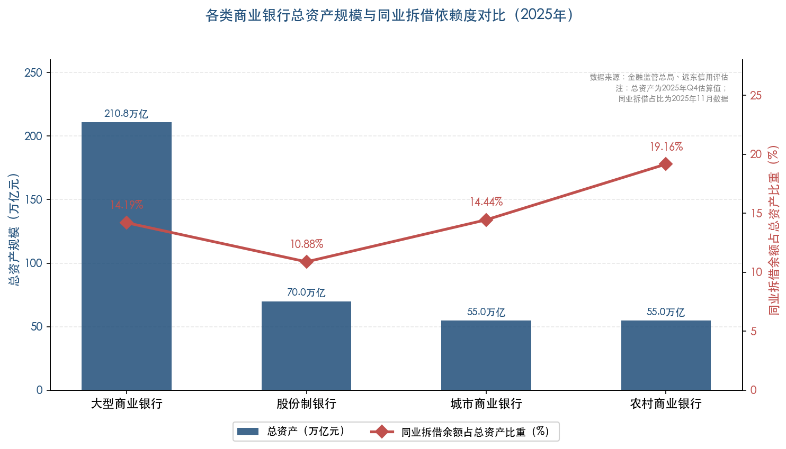

> 图1-1：各类商业银行总资产规模与同业拆借依赖度对比（2025年）。农商行虽然资产规模最小，但同业拆借余额占总资产比重高达19.16%，显著高于其他类型银行，反映其对同业融资渠道的高度依赖。数据来源：金融监管总局、远东信用评估。

进入2026年初，市场活跃度大幅回升。2026年1月同业拆借日均成交4,937.5亿元（同比+84.4%），债券回购日均成交8.5万亿元（同比+47.7%） [央行2026年1月金融市场运行情况](https://jrj.sh.gov.cn/SCGK194/20260304/c74a1068355443bdb12173582998317a.html "上海金融办转载")。活跃度的骤升在一定程度上反映出年初机构加杠杆的季节性特征，也与货币政策宽松预期强化有关。

### 1.2.2 同业存单：中小银行主动负债的关键工具

同业存单是股份制银行和城市商业银行实现主动负债管理的核心工具。2025年全年银行间市场发行同业存单33.8万亿元，年末余额19.7万亿元，二级市场交易量高达238.8万亿元 [央行2025年Q4货币政策执行报告](https://cif.mofcom.gov.cn/cif/html/upload/20260211143114167_2025%E5%B9%B4%E7%AC%AC%E5%9B%9B%E5%AD%A3%E5%BA%A6%E4%B8%AD%E5%9B%BD%E8%B4%A7%E5%B8%81%E6%94%BF%E7%AD%96%E6%89%A7%E8%A1%8C%E6%8A%A5%E5%91%8A.pdf "同业存单发行与余额数据")。典型发行人为股份制银行和城商行，主要买入方为国有大行、农村金融机构和银行理财产品，由此形成从大行向中小银行输送流动性的资金传导链条。

值得注意的是，同业存单市场近期呈现收缩态势。截至2026年1月末，同业存单余额降至19.03万亿元，近13个月中有10个月净融资为负，市场呈现"发行规模偏小、到期压力偏大"的特征 [证券时报](https://stcn.com/article/detail/3703424.html "同业存单合并金融债统筹管理讨论")。国有大行和股份制银行同业存单净融资规模已连续数月为负且负值逐月扩大 [财联社](https://www.cls.cn/detail/2279626 "银行同业负债端收缩迹象")。这一趋势与备案制改革讨论以及监管引导同业存单与金融债统筹管理的政策方向密切相关。

### 1.2.3 同业存款：自律管理升级驱动结构重塑

同业存款是银行间资金往来的另一重要渠道。2025年末，资管产品配置同业存款和存单合计28.7万亿元（同比+18.9%），全年新增4.6万亿元，占各类新增底层资产的五成左右，资管行业已跃升为同业市场最重要的资金供给方之一 [新华网](https://www.news.cn/fortune/20260217/1dd20e59e88147ed83d0888e52197c58/c.html "央行报告——2025年资管产品同业配置数据")。

自律管理的持续升级正在深刻重塑同业存款格局。2024年11月同业存款自律新规发布后，上市全国性银行同业负债成本下降约30—40个基点（BP），同业存款占负债比重从约10%降至约9%。2026年3月进一步要求高于公开市场操作（OMO）利率的同业活期存款季末占比控制在10%—20%以内，约10万亿元同业存款面临重定价 [财新网](https://finance.caixin.com/2026-03-11/102421785.html "同业存款定价自律管理效果") [证券时报](https://www.stcn.com/article/detail/3674992.html "同业活期存款自律2.0")。分机构类型来看，2025年上半年股份行高息同业活期存款规模约3.44万亿元，占全行业的29.45%，且占自身同业存款比重达52.94%，远超其他类型银行。自律新规执行后，股份行面临较大的负债结构调整压力 [东方财富](https://wap.eastmoney.com/a/202603133671667952.html "同业存款自律管理升级冲击波")。

### 1.2.4 货币市场利率：中枢下移与利率走廊有效运行

2025年货币市场利率中枢显著下移。DR007全年加权平均利率为1.63%（同比下降19BP），DR001为1.46%（同比下降19BP），反映资金面持续宽松，央行利率走廊机制有效运行 [经济日报/中国经济网](http://www.ce.cn/xwzx/gnsz/gdxw/202602/t20260214_2776446.shtml "2025年货币市场利率数据")。利率中枢下移在降低机构间资金往来成本的同时，亦进一步压缩了以同业业务为核心收入来源的中小银行净利差空间。

## 1.3 "辐射型"资金网络结构：以国有大行为核心

综合上述渠道的运作逻辑，中国同业市场形成了以国有大行为核心资金供给方的"辐射型"结构。大行凭借充裕的存款基础和央行流动性投放渠道，通过同业存款、买入存单、逆回购等方式向股份制银行和城商行输送流动性；股份制银行和城商行在获取流动性后，通过同业存单发行、债券投资等方式向外围机构传递资金；非银金融机构（券商、基金、保险）则主要通过正回购融入资金用于债券投资 [Amstad & He 学术论文](https://zhiguohe.net/wp-content/uploads/2023/12/ae9ef-preprintversionjuly2020.pdf "中国债券市场与银行间市场结构")。

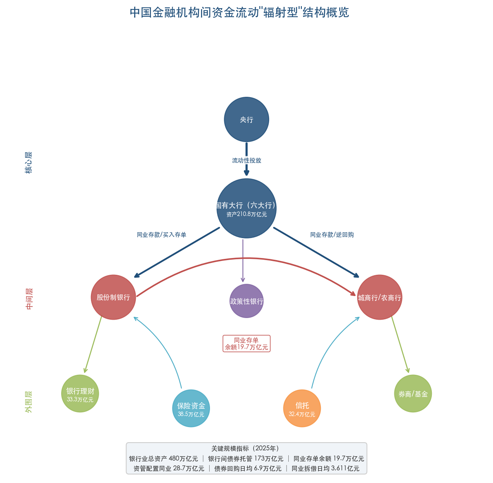

> 图1-2：中国金融机构间资金流动"辐射型"结构概览。核心层（央行、国有大行）通过同业存款、存单买入和逆回购向中间层（股份行、城商行/农商行、政策性银行）输送流动性，中间层再通过债券投资和同业产品向外围层（银行理财、保险资金、信托、券商/基金）传导资金。底部标注2025年同业市场六项关键规模指标。

从上市银行2024年末数据来看，国有大行、股份制银行、城商行和农商行金融投资占总资产的比重分别为29.22%、31.72%、36.92%和约35%，均呈持续上升趋势。城商行和股份行的投资结构更为多元化，基金等其他金融投资占比分别达25.6%和23.8%，而国有大行和农商行对应占比仅为5.4%和10.7% [毕马威2025年中国银行业调查报告](https://assets.kpmg.com/content/dam/kpmgsites/cn/pdf/zh/2025/06/china-banking-industry-survey-report-2025.pdf "2024年末上市银行金融投资结构")。这一差异表明，城商行和股份行通过金融投资与其他机构形成了更深层次的关联敞口，其在同业网络中的连通性和风险传导潜力相应更高。

在债券市场上，辐射型结构同样清晰可见。政策性银行发行的政策性金融债是银行间市场最活跃的交易品种之一，2019年日均换手率达6.01倍，远超国债的2.19倍。商业银行直接持有银行间市场约57%的债券，是最大的机构投资者群体 [Amstad & He 学术论文](https://zhiguohe.net/wp-content/uploads/2023/12/ae9ef-preprintversionjuly2020.pdf "中美同业市场结构对比")。保险资金在债券配置中亦扮演重要角色：2025年三季度末保险资金债券投资余额18.18万亿元（占运用余额的48.5%） [金融时报/红网](https://money.rednet.cn/content/646955/53/15441686.html "2025年三季度保险资金运用详细数据")。

## 1.4 非银金融机构在同业市场中的角色

### 1.4.1 资管产品：从通道工具到同业市场核心参与者

资管新规（2018年）实施以来，资管产品已从传统的通道工具转型为同业市场的核心资金供给方。2025年末银行理财产品存续规模33.29万亿元，资产配置以固定收益类为主：债券占51.93%（约18.52万亿元），同业存单占12.2%，拆放同业及买入返售占6.9%，非标资产占5.10%（约1.82万亿元） [银行业理财登记托管中心年报](https://pdf.dfcfw.com/pdf/H3_AP202601251818394909_1.pdf?1769352342000.pdf "中国银行业理财市场年度报告2025年")。理财产品通过配置同业存单和拆放同业，与银行体系形成间接借贷关系，实质上充当了大行流动性向中小银行传导的中间环节。

### 1.4.2 信托业：从非标主导迈向标准化投资

信托行业经历了深刻的结构转型。2025年6月末信托资产32.43万亿元中，资产管理信托占75.33%（24.43万亿元）；证券投资信托占资金信托的51.09%（2022年末仅34.34%），非标资产投资占比则从2022年末的54.52%降至39.70% [中国信托业协会](https://economy.rednet.cn/content/646956/66/15559104.html "金融时报报道") [新华网](http://www.news.cn/money/20251222/5333b0a8059d4b9d9c1ab1a48b0958df/c.html "信托资产规模数据")。标准化债券投资已成为信托资产配置的主导方向，信托公司通过债券市场和同业产品参与机构间资金流转的比重大幅上升，其与银行间市场的关联日趋紧密。

### 1.4.3 保险资金：长期稳定资金的配置者

保险资金凭借其长期限和稳定性特征，是银行间债券市场的重要机构投资者。2025年三季度末保险资金运用余额37.46万亿元中，债券配置占比48.5%（18.18万亿元），形成对银行和政府部门的大额债权敞口 [金融时报/红网](https://money.rednet.cn/content/646955/53/15441686.html "2025年三季度保险资金运用详细数据")。保险资金的配置偏好以利率债和高等级信用债为主，其资金来源的稳定性有助于增强同业市场整体的流动性韧性；但高度集中的持仓结构也意味着，在利率大幅波动时期可能面临较大估值压力。

## 1.5 近12个月的四大结构性变化

以2026年3月为锚点回望过去12个月，中国金融机构间投资借贷关系呈现四项值得关注的结构性变化。

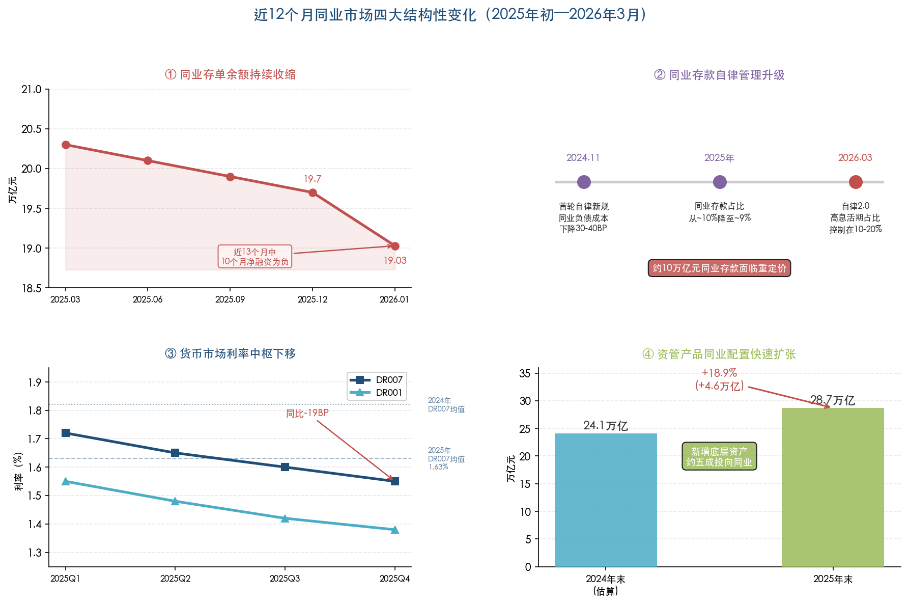

> 图1-3：近12个月同业市场四大结构性变化（2025年初—2026年3月）。左上：同业存单余额从20.3万亿元持续收缩至19.03万亿元；右上：同业存款自律管理从2024年11月首轮新规升级至2026年3月"自律2.0"；左下：DR007/DR001利率中枢分别下移19BP；右下：资管产品同业配置从24.1万亿元增至28.7万亿元（+18.9%）。

**第一，同业存单市场收缩与备案制改革信号。** 同业存单余额从2025年末的19.7万亿元降至2026年1月的19.03万亿元，近13个月中10个月净融资为负。2026年同业存单备案额度迟迟未予公布，市场广泛讨论将同业存单与金融债进行统筹管理的改革方向。若改革落地，将从根本上改变中小银行主动负债管理的工具选择和成本约束。

**第二，同业存款自律管理持续升级。** 从2024年11月首轮新规到2026年3月的进一步紧缩，约10万亿元同业存款面临重定价，同业负债成本已实质性下降30—40BP。这一变化显著压缩了以高息同业活期存款为特色的股份行和部分城商行的负债空间，推动银行体系同业负债向更低成本、更规范的方向演进。

**第三，资管产品作为同业市场资金供给方的角色快速强化。** 2025年全年资管产品新增底层资产中约五成投向同业存款和同业存单，资管行业对同业市场的资金供给功能已从辅助角色上升为主导力量。资管产品——尤其是银行理财——在同业市场中的行为变化（如集中赎回或资产调整），可能对中小银行的流动性状况产生直接冲击。

**第四，货币市场利率中枢下行与流动性分层并存。** DR007从2024年的1.82%降至2025年的1.63%，降幅19BP。在总量宽松的背景下，银行间市场的流动性分层效应依然存在：资金传导链条呈现"国有大行/政策性银行→股份制银行→中小行（含农村金融机构）"的层级格局 [中国货币网](https://www.chinamoney.com.cn/dqs/cm-s-notice-query/fileDownLoad.do?mode=save&contentId=3041874&priority=0 "银行间货币市场流动性分层效应新特点")。处于传导链条末端的中小银行在资金获取的及时性和成本上仍面临结构性劣势。

## 1.6 与成熟市场的结构对比

将中国同业市场与欧美成熟市场进行横向比较，可识别出若干重要的结构差异。

**银行主导度极高。** 中国商业银行直接持有银行间市场约57%的债券，银行业总资产占金融体系的比例远超美国和欧洲。在美国，商业银行资产占金融体系的比例约为25%—30%，资本市场和非银金融中介发挥着更大作用 [Amstad & He 学术论文](https://zhiguohe.net/wp-content/uploads/2023/12/ae9ef-preprintversionjuly2020.pdf "中美同业市场结构对比")。中国间接融资体系的高度集中，意味着银行体系内部的同业关联对系统性风险具有更强的放大潜力。

**市场分割格局独特。** 中国银行间市场托管余额约173万亿元，占全市场的88%，与交易所市场长期处于分割状态。尽管近年来两个市场的互联互通有所推进，但这种分割格局在全球主要金融市场中较为罕见，增加了跨市场流动性管理和风险监测的复杂性。

**有担保融资替代趋势一致。** 无论在中国还是美国，有担保融资渠道（回购）对无担保拆借的替代均在持续推进。这一趋势有助于降低交易对手信用风险暴露，但同时提升了抵押品管理的重要性以及对抵押品价值波动的敏感性。

**同业存单市场规模远超美国联邦基金市场。** 中国同业存单余额接近20万亿元、年发行量超过33万亿元、二级市场交易量约239万亿元，其活跃度和规模远超美国联邦基金市场 [央行2025年Q4货币政策执行报告](https://cif.mofcom.gov.cn/cif/html/upload/20260211143114167_2025%E5%B9%B4%E7%AC%AC%E5%9B%9B%E5%AD%A3%E5%BA%A6%E4%B8%AD%E5%9B%BD%E8%B4%A7%E5%B8%81%E6%94%BF%E7%AD%96%E6%89%A7%E8%A1%8C%E6%8A%A5%E5%91%8A.pdf "同业存单发行与余额数据")。同业存单已成为中国银行间市场定价的核心锚点之一，其价格变动对利率曲线和机构资金成本具有直接传导效应。

**非银行金融中介的规模与关联特征差异。** 2022年末中国非银行金融中介按金融稳定理事会（FSB）狭义口径规模约11.4万亿美元、广义口径约67.8万亿美元。央行强调须从银行与影子银行关联性入手，将相关业务纳入系统性监测框架 [21世纪经济报道](https://www.21jingji.com/article/20241228/herald/676314111546f7082c00de4025cd972f.html "转引央行金融稳定报告引用FSB数据")。与美国NBFI体系相比，中国非银金融中介的绝对规模相对较小，但其与银行体系的关联度更高——资管产品大量配置同业资产，使得非银风险向银行体系传导的通道更为直接。

## 1.7 本章小结

中国金融机构间投资借贷关系的基本格局可概括为：以480万亿元银行业资产为底座，以银行间债券市场173万亿元托管余额为核心平台，以同业存单（余额约20万亿元）、同业存款（资管产品配置约29万亿元）、债券回购（日均6.9万亿元）为主要渠道，形成了国有大行作为资金中枢、股份行和城商行作为中间传导层、非银机构作为外围参与者的"辐射型"资金网络。

过去12个月，这一格局经历了同业存单市场收缩、同业存款利率重定价、资管产品同业配置快速扩张以及货币市场利率中枢下行四重叠加变化。这些变化正在重塑机构间的资金流向和负债结构，构成理解机构间借贷关系分类、风险传导机制和监管应对的基本制度与市场背景。

# 第2章 机构间借贷关系的分类体系与风险特征

金融机构间的投资与借贷关系并非同质化的单一网络，而是由不同业务层次、交易类型和风险传导机制组成的多维复合结构。构建系统的分类框架，是准确刻画各类关联关系的风险暴露特征、进而为网络建模和监管实践提供分析基础的前提条件。本章从业务层次和交易类型两个维度出发，将中国金融机构间的借贷关系划分为直接信用敞口、有担保融资、投资持有关系、衍生品对手方、表外信用承诺以及影子银行与通道业务六大类别，逐一分析其规模、风险暴露特征和期限错配状况，并在此基础上讨论多层关联的非线性叠加效应与比较框架。

## 2.1 直接信用敞口：同业拆借与同业存款

同业拆借（interbank lending）是金融机构间最传统的信用关联方式，其核心特征为无担保（unsecured）、直接信用敞口——融出方一旦无法收回本息，损失将完全取决于融入方的信用状况，不存在质押品缓释机制。

2025年末，银行间同业拆借未到期余额为1.0万亿元，而同期债券回购未到期余额达12.0万亿元，有担保融资与无担保融资的比例约为12∶1 [央行2025年金融市场运行情况](https://finance.sina.com.cn/roll/2026-02-11/doc-inhmmvzf7580742.shtml "央行原文转载")。该结构鲜明地反映出中国货币市场中有担保融资对无担保拆借的持续替代趋势。从成交活跃度看，2025年全年银行间同业拆借日均成交额为3610.7亿元（较2024年下降12.1%），而2026年1月日均成交大幅回升至4937.5亿元（同比增长84.4%），表明市场活跃度存在显著的短期波动 [央行2026年1月金融市场运行情况](https://jrj.sh.gov.cn/SCGK194/20260304/c74a1068355443bdb12173582998317a.html "上海金融办转载")。

从参与主体结构看，2025年11月大型商业银行、股份制银行、城商行、农商行同业拆借余额占比分别为14.19%、10.88%、14.44%和19.16%，城商行和农商行合计占比超过三分之一 [远东信用评估](https://www.sfecr.com/upload/file/2025-12/col68/1767189150704.pdf "各类银行同业拆借余额占比")。中小银行对同业拆借融资的高度依赖，意味着大行一旦收紧同业授信或流动性环境骤然恶化，中小银行面临的流动性冲击将显著高于大型银行。2013年6月的"钱荒"事件即为典型案例——彼时Shibor隔夜利率暴涨578个基点至13.44%，中小银行因高度依赖同业融资而迅速陷入流动性困境。

同业存款在经济实质上与同业拆借高度相似，同属直接信用敞口范畴。2024年11月同业存款自律新规实施后，上市全国性银行同业负债成本下降约30—40个基点，同业存款占负债比重从约10%降至约9%；2026年3月进一步要求高于公开市场操作（OMO）利率的同业活期存款季末占比控制在10%—20%以内，约10万亿元同业存款面临重定价 [财新网](https://finance.caixin.com/2026-03-11/102421785.html "同业存款定价自律管理效果") [证券时报](https://www.stcn.com/article/detail/3674992.html "同业活期存款自律2.0")。自律管理的持续升级正在重塑机构间直接信用敞口的定价基础与规模结构。

**风险特征总结**：同业拆借和同业存款构成的直接信用敞口虽在绝对规模上已被有担保融资大幅超越，但其无担保性质决定了在极端压力情景下的损失传染效率最高——融出机构全部本金均暴露于对手方信用风险之下，无任何抵押品缓释。

## 2.2 有担保融资：债券回购与质押式借贷

债券回购（repurchase agreement, repo）是中国银行间货币市场规模最大的融资工具。融资方以持有的债券作为质押品向资金融出方借入短期资金，质押品的存在为融出方提供了信用缓释。2025年，银行间债券回购日均成交额达6.9万亿元（较2024年增长3.0%），2026年1月进一步升至日均8.5万亿元（同比增长47.7%）[央行2025年金融市场运行情况](https://finance.sina.com.cn/roll/2026-02-11/doc-inhmmvzf7580742.shtml "央行原文转载") [央行2026年1月金融市场运行情况](https://jrj.sh.gov.cn/SCGK194/20260304/c74a1068355443bdb12173582998317a.html "上海金融办转载")。

下图直观呈现了有担保融资与无担保融资在存量规模与日均成交额上的显著分化：

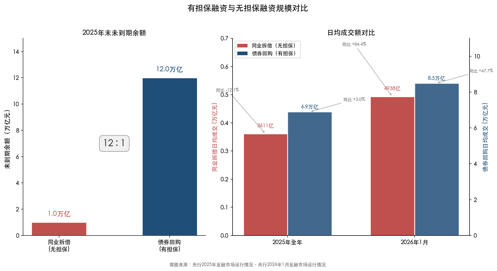

回购市场的风险特征与无担保拆借存在本质差异，但质押品的存在并不意味着风险的完全消除。回购市场面临两类特殊风险：其一为**抵押品价值波动风险**——市场利率快速上行时，质押债券市值下跌，触发补充质押要求，可能引发融资方的流动性螺旋；其二为**集中到期的展期风险**——回购期限以隔夜和7天为主导（2025年全年DR007加权平均利率为1.63%，DR001为1.46%），短期限集中到期意味着融资方需持续滚动融资，一旦市场冻结将面临即时流动性枯竭 [经济日报/中国经济网](http://www.ce.cn/xwzx/gnsz/gdxw/202602/t20260214_2776446.shtml "2025年货币市场利率数据")。

从系统性风险角度审视，回购市场的年末余额（12万亿元）远超同业拆借（1万亿元），但由于质押品缓释机制的存在，单笔交易的违约损失率（LGD）显著低于后者。然而，回购市场的高频滚动特征和庞大规模使其成为流动性螺旋（liquidity spiral）的潜在放大器——Greenwood等人（2015年）提出的"抛售传染"（fire-sale contagion）框架揭示了这一机制：机构遭受冲击后被迫出售质押品→资产价格下降→持有相同资产的其他机构面临追保压力→进一步抛售→去杠杆化螺旋 [Greenwood et al. (2015)](https://www.sciencedirect.com/science/article/abs/pii/S0304405X14002529 "Vulnerable Banks, JFE")。

## 2.3 投资持有关系：债券、同业存单与股权交叉

金融机构通过债券投资和同业存单持有形成的关联关系，在性质上属于基于市场价格的间接信用敞口，兼具信用风险和市场风险双重属性。

### 2.3.1 债券市场的机构关联

2025年末，中国债券市场托管余额达196.7万亿元，其中银行间市场约173万亿元（占比约88%）[央行2025年金融市场运行情况](https://finance.sina.com.cn/roll/2026-02-11/doc-inhmmvzf7580742.shtml "持有人结构")。持有人结构呈高度集中态势：公司信用类债券前50名投资者持债占比达53.4%、前200名占比84.5% [央行2025年金融市场运行情况](https://finance.sina.com.cn/roll/2026-02-11/doc-inhmmvzf7580742.shtml "持有人结构")。2024年末，存款类金融机构持有银行间市场债券85.79万亿元（占55.5%）[交易商协会2024年中国债券市场发展报告](https://www.cnr.cn/jrpd/jdt/20250129/t20250129_527056884.shtml "央广网转载")。这种高集中度的持有结构本身即构成系统性关联——少数大型机构的投资行为和信用事件能够通过价格渠道向整个市场扩散。

以工商银行为例，2025年末工银集团金融投资总额达16.91万亿元，其中持有银行同业及其他金融机构发行的债券合计约1.38万亿元，具体包括以公允价值计量且变动计入当期损益的金融机构债券约1026亿元、以公允价值计量且变动计入其他综合收益的金融机构债券约4966亿元、以摊余成本计量的金融机构债券约7777亿元 [工商银行2025年度财务报表](https://v.icbc.com.cn/userfiles/resources/icbcltd/download/2026/2026032708.pdf "附注四-金融投资")。这一微观数据揭示了单家大型银行通过投资持有渠道形成的对其他金融机构的直接信用敞口规模。

### 2.3.2 同业存单的特殊地位

同业存单（negotiable certificate of deposit, NCD）在机构间关联网络中占据特殊枢纽地位——它既是股份行和城商行的核心主动负债工具，也是国有大行、农村金融机构和银行理财产品的重要资产配置标的，由此形成连接资金供给方与融资需求方的关键桥梁。2025年，银行间市场发行同业存单33.8万亿元，年末余额19.7万亿元，二级市场交易量达238.8万亿元 [央行2025年Q4货币政策执行报告](https://cif.mofcom.gov.cn/cif/html/upload/20260211143114167_2025%E5%B9%B4%E7%AC%AC%E5%9B%9B%E5%AD%A3%E5%BA%A6%E4%B8%AD%E5%9B%BD%E8%B4%A7%E5%B8%81%E6%94%BF%E7%AD%96%E6%89%A7%E8%A1%8C%E6%8A%A5%E5%91%8A.pdf "同业存单发行与余额数据")。

值得关注的是，同业存单市场近期呈现收缩迹象：截至2026年1月末余额降至19.03万亿元，近13个月中10个月净融资为负，市场整体呈现"发行规模偏小、到期压力偏大"的特征 [证券时报](https://stcn.com/article/detail/3703424.html "同业存单合并金融债统筹管理讨论")。从风险传导视角看，同业存单既构成发行方（以股份行和城商行为主）的信用风险敞口，又通过持有人结构（大行、农商行和理财产品）将发行方的信用风险传递至整个金融体系，形成典型的"发行—持有"双向关联链条。

### 2.3.3 股权交叉持有

金融机构间的股权交叉持有（cross-shareholding）构成另一类重要但常被忽视的关联渠道。以工商银行为例，2025年末其持有南非标准银行19.74%股权（账面价值305.57亿元），以公允价值计量的权益投资合计约2349亿元 [工商银行2025年度财务报表](https://v.icbc.com.cn/userfiles/resources/icbcltd/download/2026/2026032708.pdf "附注四-8.长期股权投资")。股权持有在压力时期可能通过"价格下跌→减值计提→资本金损失"的渠道放大系统性风险，形成区别于债权关联的独特传染路径——其传导并不依赖于违约事件的发生，仅需市场估值下行即可触发。

**风险特征总结**：投资持有类关联的风险暴露兼具信用风险和市场风险双重属性。对于以摊余成本计量的持有（如持有至到期的金融机构债券），主要面临发行人信用违约风险；对于以公允价值计量的持有（如交易性债券和权益投资），市场价格波动直接影响持有方的资产净值和资本充足率，即便发行人并未违约，持有人也可能因估值损失而面临流动性或资本压力。

## 2.4 衍生品对手方关系：利率互换与信用衍生工具

场外衍生品交易在金融机构间构成双向交叉信用风险敞口（counterparty credit risk），其独特之处在于交易双方互为信用风险的承担者，且敞口随市场参数变化而持续波动。2025年，银行间人民币衍生品市场成交额达58.5万亿元（同比增长58.6%），其中利率互换集中清算44.0万亿元（同比增长36.0%），标准化利率衍生品集中清算13.8万亿元（同比增长2.3倍）[央行2025年金融市场运行情况](https://finance.sina.com.cn/roll/2026-02-11/doc-inhmmvzf7580742.shtml "衍生品市场") [上海清算所](https://www.shclearing.cn/xwgg/xwdt/202601/t20260130_1720132.html "利率衍生品报告")。

微观层面的数据进一步揭示了衍生品交叉敞口的规模量级。工银集团2025年末衍生金融工具名义金额合计19.01万亿元，其中货币衍生工具11.97万亿元、利率衍生工具3.95万亿元、商品衍生工具及其他3.09万亿元 [工商银行2025年度财务报表](https://v.icbc.com.cn/userfiles/resources/icbcltd/download/2026/2026032708.pdf "附注四-4.衍生金融工具")。尽管名义金额并不等同于实际风险敞口（工银集团衍生金融资产公允价值为1304亿元、衍生金融负债为1341亿元），但如此大规模的衍生品交易网络在银行间形成了密集的交叉对手方信用风险格局。

中国信用衍生品市场虽仍处于发展初期，但增长势头明确。2025年，信用风险缓释工具（CRM）各品种共达成交易428笔，名义本金总计583.72亿元（同比分别增长3.38%和6.15%）。其中信用风险缓释合约（CRMA）149笔、291.5亿元；信用风险缓释凭证（CRMW）91笔、129.22亿元；信用违约互换（CDS）83笔、77.9亿元（同比增长91.92%，为增速最快品种）；信用联结票据（CLN）105笔、86.48亿元（同比增长60.64%）[联合资信2025年CRM年度观察](https://www.lhratings.com/file/g2205f11c6e.pdf "2025年信用衍生工具市场年度报告")。截至2025年末，已有61家CRMW创设机构、46家CLN创设机构、53家CRM核心交易商完成备案，商业银行和证券公司为主要参与主体 [联合资信2025年CRM年度观察](https://www.lhratings.com/file/g2205f11c6e.pdf "创设机构备案统计")。

**风险特征总结**：衍生品对手方风险的核心在于其双向性和内生动态性——与直接借贷不同，衍生品合约的市值随市场参数变化而持续波动，使得风险敞口具有"无法事先锁定"的特征。集中清算机制（CCP）的推进有效降低了双边对手方风险，但也将风险集中至清算所本身，形成新的单点脆弱性。此外，全球场外利率衍生品中1年及以内期限品种交易量占比达72.1%，中国银行间利率互换市场同样以3个月和1年期短端品种为主导 [上海清算所](https://www.shclearing.cn/xwgg/xwdt/202601/t20260130_1720132.html "全球利率衍生品期限结构")，短期限集中特征意味着到期再投资风险和展期风险不容忽视。

## 2.5 表外信用承诺：商业汇票、保函与信用证

表外信用承诺（off-balance-sheet credit commitments）构成金融机构间的或有负债和隐性借贷关系，其核心风险在于"平时不可见、危机时集中兑现"的跳跃性特征。

2025年末，商业汇票承兑余额为21.2万亿元（同比增长7.2%），贴现余额为16.5万亿元（同比增长11.2%）[央行2025年金融市场运行情况](https://finance.sina.com.cn/roll/2026-02-11/doc-inhmmvzf7580742.shtml "票据市场运行情况")。银行承兑汇票构成承兑银行对持票人（通常为另一家银行或其客户）的信用担保关系——出票人到期无力偿付时，承兑银行须无条件兑付，本质上是银行以自身信用为对手方提供的隐性担保。

从单家大型银行的视角观察，工商银行2025年度财务报表将信用证、保函及银行承兑汇票列为财务担保合同，并依据金融工具减值原则计提信贷承诺损失准备（2025年末工银集团信贷承诺减值准备余额为241.14亿元）[工商银行2025年度财务报表](https://v.icbc.com.cn/userfiles/resources/icbcltd/download/2026/2026032708.pdf "附注四-13.资产减值准备")。表外承诺的总体规模不直接体现于资产负债表表内项目，但其或有性质意味着经济下行压力加大时，可能迅速转化为表内实际损失，成为系统性风险的隐蔽放大器。

**风险特征总结**：表外信用承诺的风险具有典型的"或有—触发—集中兑现"三阶段特征。正常市场环境下，这些义务仅为潜在承诺，不消耗资本和流动性；但在压力情景下，多笔承诺可能大规模、同步转化为实际信用损失。这种从常态低可见性到危机期高损失的跳跃性特征，使得基于常态数据的风险度量可能显著低估尾部风险暴露。

## 2.6 影子银行与通道业务：隐性借贷关系的收敛与遗留

资管新规（2018年4月发布）实施以来，中国影子银行体系经历了深度重塑，非标资产和多层嵌套规模持续压缩，但资管产品与银行体系之间的间接借贷关联仍然显著。

在信托领域，非标资产投资占比从2022年末的54.52%降至2025年上半年的39.70%；2025年6月末信托资产规模为32.43万亿元，证券投资信托占资金信托51.09%（2022年末仅34.34%），标准化资产已取代非标成为信托资产配置的主导方向 [中国信托业协会](https://economy.rednet.cn/content/646956/66/15559104.html "金融时报报道") [新华网](http://www.news.cn/money/20251222/5333b0a8059d4b9d9c1ab1a48b0958df/c.html "信托资产规模数据")。

在银行理财领域，2025年末存续规模达33.29万亿元（同比增长11.15%），资产配置以固收类为主：债券占51.93%（约18.52万亿元），非标占5.10%（约1.82万亿元），同业存单占12.2%（约4.36万亿元），拆放同业及买入返售占6.9% [银行业理财登记托管中心年报](https://pdf.dfcfw.com/pdf/H3_AP202601251818394909_1.pdf?1769352342000.pdf "中国银行业理财市场年度报告2025年")。理财产品通过配置同业存单和拆放同业资产，与银行体系形成间接但规模可观的借贷关系。截至2025年12月底，证券期货经营机构私募资管产品规模合计12.30万亿元（不含社保和企业年金），其中固定收益类产品规模8.70万亿元（占比70.73%），主要投向银行间市场债券和同业资产 [中国证券投资基金业协会](https://www.amac.org.cn/sjtj/tjbg/smzg/202601/P020260130666057372342.pdf "2025年12月私募资管月报")。

下图展示了三类主要资管产品通过各投资渠道与银行体系形成的间接借贷关联网络：

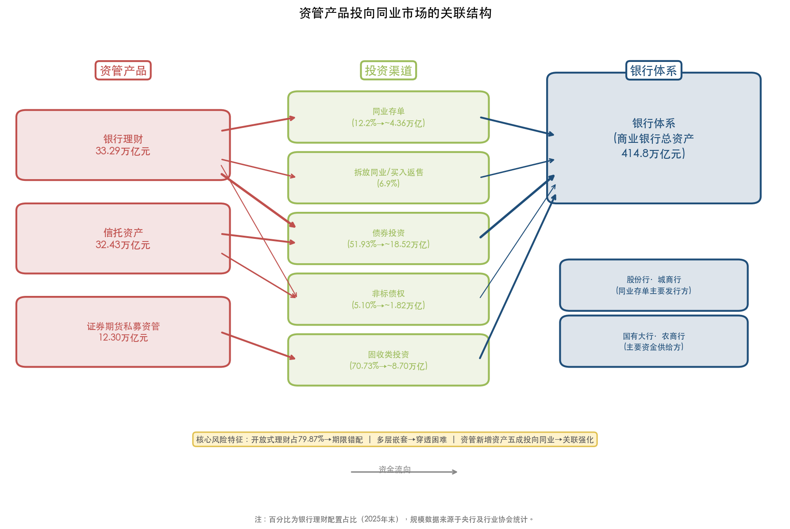

从全球口径看，2022年末中国非银行金融中介（NBFI）狭义口径规模约11.4万亿美元、广义口径约67.8万亿美元。央行明确提出要从银行与影子银行关联性入手，将相关业务纳入宏观审慎监测框架 [21世纪经济报道](https://www.21jingji.com/article/20241228/herald/676314111546f7082c00de4025cd972f.html "转引央行金融稳定报告引用FSB数据")。

**风险特征总结**：影子银行业务形成的隐性借贷关系具有三个突出风险特征。第一，**透明度不足**——多层嵌套和通道结构导致底层资产的真实风险敞口难以穿透识别。第二，**期限错配严重**——银行理财产品中开放式产品占存续规模的79.87%，底层资产期限较长而投资者可随时赎回，构成内生的期限错配和流动性脆弱性 [银行业理财登记托管中心年报](https://pdf.dfcfw.com/pdf/H3_AP202601251818394909_1.pdf?1769352342000.pdf "产品类型结构")。第三，**关联隐蔽**——银行通过自营资金申购本行或关联方发行的资管产品，形成不在传统同业交易统计口径内的隐性关联。资管新规虽已显著压缩了多层嵌套和非标投资规模，但存量遗留资产和新形态的"类通道"业务仍构成持续关注重点。

## 2.7 多层关联的叠加与非线性风险

上述六类借贷关系并非孤立存在，而是在同一对交易对手之间可能同时叠加多种关联。以典型情景为例，一家股份制银行与一家国有大行之间可能同时存在同业拆借、债券回购、持有对方发行的同业存单、利率互换交易，以及通过各自理财子公司间接持有对方发行的债券——多层关联的叠加使得机构间的真实风险暴露远超任何单一渠道所揭示的水平。

ECB工作论文（Montagna & Kok, 2016）基于欧盟大型银行的多层网络模型发现，同时考虑多个市场层面的关联时，冲击传导呈显著非线性特征，单层分析会严重低估系统性风险 [ECB Working Paper No.1944](https://www.ecb.europa.eu/pub/pdf/scpwps/ecbwp1944.en.pdf "Multi-layered interbank model for assessing systemic risk")。这一结论在中国市场得到了实证支持。基于162家中国金融机构2016年数据的双层网络（同业拆借+交叉持股）模拟表明，双层网络的传染损失大于两个单层网络损失之和，呈现显著的非线性叠加效应；其中同业拆借渠道是主要风险传染通道，同业负债规模是影响系统性风险的最主要因素 [Zou, Xie & Yang (2019)](https://www.jasss.org/22/4/9.html "A Double-Layer Network and the Contagion Mechanism, JASSS")。Yan等人（2023）基于41家中国商业银行2015—2021年数据构建三层多重网络（同业拆借+交叉持股+共同资产持有），再次证实了这种非线性叠加放大效应的稳健性 [Yan et al. (2023)](https://www.sciencedirect.com/science/article/abs/pii/S0378437123006994 "Multilayer interbank networks and systemic risk, Physica A 628")。

我们认为，对中国金融机构间关联的风险评估，不能简单地将各类关系"分门别类、逐项加总"，而必须充分考虑多层叠加所产生的非线性放大效应。这一判断构成了第三章讨论网络拓扑与传导机制、以及第四章讨论建模方法论的重要分析基础。

## 2.8 风险暴露的比较框架

综合以上分析，可从信用风险敞口、流动性风险、期限错配和透明度四个维度，对六类借贷关系的风险特征进行系统比较。下图以热力图矩阵形式呈现了各类别在六个风险维度上的差异化特征：

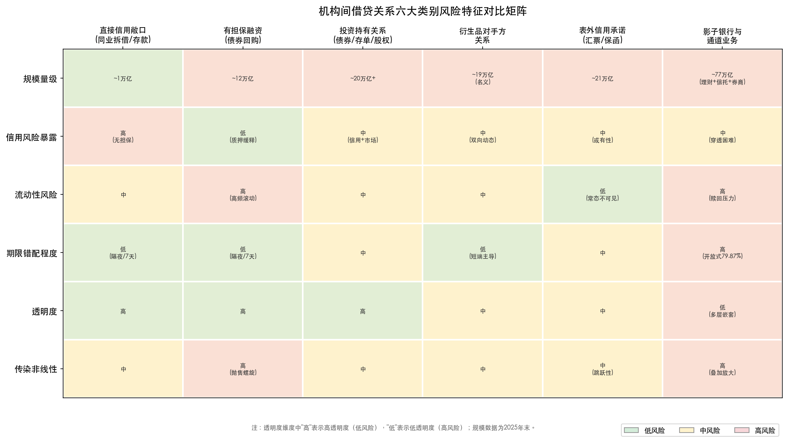

具体而言：

- **直接信用敞口（同业拆借/存款）**：信用风险最高（无担保）、期限较短（以隔夜和7天为主）、透明度较高（在央行报告体系中有明确统计）、规模相对较小（1万亿元量级）。
- **有担保融资（债券回购）**：单笔信用风险较低（质押品缓释）、流动性风险突出（高频滚动、规模巨大）、可能成为抛售螺旋的放大器、规模最大（12万亿元量级）。
- **投资持有关系（债券/存单/股权）**：信用风险与市场风险兼具、持有人高度集中构成系统性关联、股权持有存在"减值—资本侵蚀"传染路径、规模庞大（仅同业存单余额近20万亿元）。
- **衍生品对手方关系**：双向信用风险、敞口动态波动、集中清算可降低双边风险但可能将风险集中至CCP、名义金额巨大但净敞口相对有限。
- **表外信用承诺**：或有性质决定了常态低可见性与危机时高损失的跳跃性特征、银行承兑汇票余额超21万亿元。
- **影子银行与通道业务**：透明度最低、期限错配最严重、多层嵌套导致关联隐蔽、资管新规后规模持续收敛但存量仍具规模（理财33万亿元、信托32万亿元、券商资管12万亿元）。

这一分类框架为后续网络建模提供了"分层建网"的逻辑依据——每一类关联关系对应不同的风险传导机制和参数，在多层网络模型中应给予差异化处理。

# 第3章 金融网络结构与系统性风险传导机制

金融机构之间的投资与借贷关系编织成一张庞大而复杂的网络。当网络中的某一节点遭遇冲击，风险沿机构间关联通道向其他节点蔓延，在特定条件下甚至引发全局性危机。本章从复杂网络（complex network）理论视角出发，系统刻画中国金融机构间网络的拓扑特征，解析系统性风险（systemic risk）经由直接信用传染、共同资产持有、流动性螺旋以及信息预期反馈等多重渠道的传导逻辑，并结合三组历史典型案例检验上述传导机制在中国市场环境中的实际运行。

## 3.1 中国银行间网络的拓扑结构特征

### 3.1.1 "核心-中间-外围"三层结构

理解系统性风险传导的起点在于精确描画金融网络的结构形态。传统金融网络研究通常采用"核心-外围"（core-periphery, CP）二分法，将机构划分为两层。然而，Chen等人（2022）基于2008–2019年中国银行间双边负债数据的实证研究表明，这一简化二分法无法准确反映中国银行间市场的真实结构。他们提出的"核心-中间-外围"（core-middle-periphery, CMP）三层模型揭示：核心银行仅占全部参与机构的4%~9%，却承担着网络中最密集的资金中介功能；核心层成员的稳定概率高达78%，退出市场的概率几乎为零；CMP模型对实际网络的拟合误差仅为7%，显著优于传统CP模型的20% [Chen et al. (2022)](https://www.frontiersin.org/journals/physics/articles/10.3389/fphy.2022.981650/full "Core-middle-periphery network model, Frontiers in Physics")。

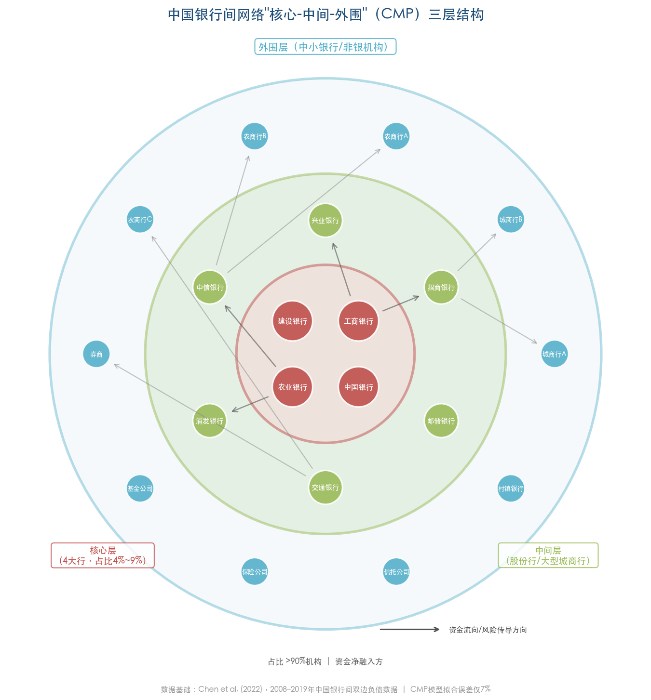

上图直观呈现了中国银行间网络的CMP三层结构及资金流向。核心层由四大国有银行构成，中间层为股份制银行和大型城商行，外围层则涵盖中小银行及券商、基金、保险等非银金融机构。这一结构意味着中国银行间网络并非简单的"中心辐射"格局，而是存在一个由股份制银行和大型城商行构成的"中间层"。该中间层一方面从核心层获取流动性，另一方面向外围中小机构输送资金，充当风险传导链条中的"放大器"和"桥梁"角色。从监管视角看，仅关注核心层的系统重要性银行（D-SIBs）可能遗漏中间层在危机时期的关键传导作用。

### 3.1.2 小世界属性与无标度特征

中国银行间网络的拓扑结构还呈现两个关键的统计特征。其一为"小世界"（small-world）属性：Chen等人（2022）的研究表明，网络平均路径长度介于2到3之间，平均聚类系数显著高于同维度随机网络 [Chen et al. (2022)](https://www.frontiersin.org/journals/physics/articles/10.3389/fphy.2022.981650/full "同上论文")。这意味着任意两家金融机构之间的资金联系平均仅需经过2至3个中间节点即可连通，信用冲击能够在极短路径上迅速传播至整个网络。

其二为无标度（scale-free）特征。Yao、Sun与Gao（2022）基于2018年中国银行间债券市场质押式回购逐笔交易数据构建的网络，呈现典型的幂律度分布和负相关混合模式（disassortative mixing），即少数高连接度的核心机构与大量低连接度的外围机构共存 [Yao, Sun & Gao (2022)](https://www.sciencedirect.com/science/article/abs/pii/S0378437122002710 "The network structure of the China bond market, Physica A")。负相关混合模式表明核心机构更倾向于与外围机构交易，从而促进流动性从中心向边缘的扩散——这既是正常时期提升市场效率的机制，也是压力时期冲击从核心向外围快速蔓延的通道。

从现实数据来看，截至2025年末，工商银行总资产达53.48万亿元（同比+9.5%），成为全球首家资产突破50万亿元的商业银行；建设银行总资产45.63万亿元（同比+12.47%），农业银行2025年三季度末总资产已达48.14万亿元 [中国基金报](https://www.chnfund.com/article/ARaf937dec-cd53-bdf5-890d-3a2044c20647 "四家国有大行发布2025年财报") [新浪财经](https://finance.sina.com.cn/roll/2026-01-09/doc-inhfswxp2939540.shtml "银行业2025年万亿俱乐部")。四大国有银行的资产规模远超其他机构，天然构成网络的中心节点。2025年度D-SIBs名单共21家（新增浙商银行），其中工、中、建、农4家居于第四组（最高附加资本要求1%），交通银行和招商银行位列第三组 [新华网](https://www.news.cn/fortune/20260213/22a5b2c93f7c49e9b71e4a430ef040e7/c.html "2025年度D-SIBs名单")。在全球层面，2025年中国5家银行入选G-SIBs：工行位列第二组（附加资本1.5%），中、农、建、交位列第一组（附加资本1.0%）[武汉市金融局](https://jrj.wuhan.gov.cn/ynzx_57/xwzx/202512/t20251202_2685982.shtml "2025年G-SIBs名单")。

### 3.1.3 网络密度的"稳健而脆弱"悖论

一个直觉性的推断是：金融网络越密集、机构间关联越多，风险应被更充分地分散，系统整体应更加稳健。Allen与Gale（2000）在其开创性研究中确实证明了完全连通网络比不完全连通结构更具韧性 [Allen & Gale (2000)](https://www.journals.uchicago.edu/doi/abs/10.1086/262109 "Financial Contagion, JPE")。然而，Acemoglu等人（2015）发表于《美国经济评论》的研究揭示了一个更深刻的"相变"（phase transition）现象：当冲击幅度较小时，密集的网络互联确实充当"冲击吸收器"、增强系统稳定性；但当冲击超过某一临界阈值后，同样的密集互联反而成为冲击放大和传播的渠道，系统呈现"稳健却脆弱"（robust-yet-fragile）的双重特性 [Acemoglu et al. (2015)](https://www.aeaweb.org/articles?id=10.1257/aer.20130456 "Systemic Risk and Stability in Financial Networks, AER")。

这一理论框架对理解中国金融网络具有基础性意义。中国银行间市场参与主体从1997年仅16家商业银行总行扩展至2019年的7,027家成员机构 [Amstad & He 学术论文](https://zhiguohe.net/wp-content/uploads/2023/12/ae9ef-preprintversionjuly2020.pdf "银行间市场参与者扩展历程")，网络密度持续攀升。2025年末债券市场托管余额达196.7万亿元，其中银行间市场约173万亿元（占比约88%）[央行2025年金融市场运行情况](https://jrj.sh.gov.cn/SCGK194/20260212/4b38eeb3671641f69fb860a0cb7adee5.html "2025年债券市场托管余额")。在正常市场环境下，如此庞大且高度互联的网络有效分散了个体风险；但在极端压力情景下——如Acemoglu等人所论证的临界冲击以上——这一网络可能从"风险分散器"骤然转变为"风险传导器"。

## 3.2 直接信用传染渠道

### 3.2.1 同业敞口与违约级联

直接信用传染（direct credit contagion）是最直观的风险传导渠道：当银行A持有银行B的同业资产（如同业拆借、同业存单、同业存放）时，若银行B发生违约或信用状况恶化，银行A将直接承受损失。当损失足以侵蚀银行A自身资本，它又可能无法偿还对银行C的债务，由此触发"违约级联"（default cascade）。

Zou、Xie与Yang（2019）基于162家中国金融机构2016年数据构建的双层网络（同业拆借+交叉持股）模拟提供了直接量化证据：同业拆借渠道是主要的风险传染通道，同业负债规模是影响系统性风险水平的最关键因素 [Zou, Xie & Yang (2019)](https://www.jasss.org/22/4/9.html "A Double-Layer Network and the Contagion Mechanism, JASSS")。尤为值得关注的是，双层网络中的传染损失大于两个单层网络损失之和，呈现非线性叠加效应——单独分析每一类借贷关系将系统性地低估风险总量。

从实际敞口规模来看，以工商银行为例，2025年末工银集团金融投资总额16.91万亿元，其中持有银行同业及其他金融机构发行的债券合计约1.38万亿元，构成对其他金融机构的直接信用敞口 [工商银行2025年度财务报表](https://v.icbc.com.cn/userfiles/resources/icbcltd/download/2026/2026032708.pdf "附注四-金融投资")。在衍生品领域，工银集团2025年末衍生金融工具名义金额合计19.01万亿元（其中货币衍生工具11.97万亿元、利率衍生工具3.95万亿元），由此形成的交叉对手方信用风险敞口构成银行间网络中不可忽视的传染节点 [工商银行2025年度财务报表](https://v.icbc.com.cn/userfiles/resources/icbcltd/download/2026/2026032708.pdf "附注四-4.衍生金融工具")。

### 3.2.2 交叉持股的风险放大效应

直接信用传染不仅存在于债务关系中，还通过股权交叉持有渠道运作。以工银集团为例，2025年末其持有南非标准银行19.74%股权（账面价值305.57亿元），以公允价值计量的权益投资合计约2349亿元 [工商银行2025年度财务报表](https://v.icbc.com.cn/userfiles/resources/icbcltd/download/2026/2026032708.pdf "附注四-8.长期股权投资")。在压力时期，金融机构间的交叉持股通过"价格下跌→减值损失→资本金侵蚀"的链条放大系统性风险，使得被持股机构的困境迅速传导至持股方。

Yan等人（2023）基于41家中国商业银行2015–2021年数据构建的三层多重网络（同业拆借+交叉持股+共同资产持有），进一步证实了多层网络传染的非线性叠加放大效应。该研究识别出工商银行、中国银行、建设银行和农业银行为系统重要性最高的四家机构——这与监管层D-SIBs评估中第四组的认定高度吻合 [Yan et al. (2023)](https://www.sciencedirect.com/science/article/abs/pii/S0378437123006994 "Multilayer interbank networks and systemic risk, Physica A 628")。

## 3.3 间接传染渠道：共同资产持有与流动性螺旋

### 3.3.1 共同资产持有的间接传染

与直接信用传染不同，间接传染（indirect contagion）无需两家机构之间存在直接的债务或股权关系。当多家机构共同持有同类资产时，一家机构因流动性压力被迫抛售，资产价格下跌将同时损害所有持有该资产的机构。Greenwood等人（2015）发表于《金融经济学杂志》的研究率先系统化了这一"抛售传染"（fire-sale contagion）框架：银行遭受冲击后出售资产→资产价格下降→持有相同资产的其他银行受损→进一步去杠杆化→价格持续下跌，由此形成自我强化的螺旋 [Greenwood et al. (2015)](https://www.sciencedirect.com/science/article/abs/pii/S0304405X14002529 "Vulnerable Banks, JFE")。

Fan与Hu（2024）将这一框架应用于中国银行体系。基于193家中国商业银行2018–2021年数据构建的银行-资产二部图（bipartite）网络表明，共同资产持有构成重要的间接传染渠道。其关键发现包括：资产冲击情景下的系统性风险显著高于银行冲击情景，说明间接传染渠道的破坏力可能超越直接传染；忽略资产价格之间的相关性将显著低估系统性风险；制造业、商业租赁、交通运输和房地产是引发系统性风险最高的四个行业 [Fan & Hu (2024)](https://pmc.ncbi.nlm.nih.gov/articles/PMC10907764/ "Systemic risk of China's bank-asset bipartite network, Heliyon")。

上述发现具有突出的现实意义。2025年末公司信用类债券前50名投资者持债占比达53.4%、前200名占比84.5%，持有人结构高度集中 [央行2025年金融市场运行情况](https://finance.sina.com.cn/roll/2026-02-11/doc-inhmmvzf7580742.shtml "持有人结构")。当某一行业（如房地产）相关债券出现信用事件时，高度集中的持有人结构意味着冲击将迅速通过共同资产渠道波及大量机构。

### 3.3.2 流动性螺旋机制

流动性螺旋（liquidity spiral）是间接传染的另一重要形态，其核心链条为：初始冲击→保证金/质押品价值下降→融资能力收缩→被迫去杠杆→资产抛售→市场流动性枯竭→更多机构融资困难。这一螺旋对依赖短期批发性融资的机构尤为致命。

2025年末，同业拆借未到期余额1.0万亿元，债券回购未到期余额12.0万亿元，有担保融资与无担保融资比例约12:1 [央行2025年金融市场运行情况](https://finance.sina.com.cn/roll/2026-02-11/doc-inhmmvzf7580742.shtml "央行原文转载")。有担保融资本身能够降低对手方信用风险，但在质押品价值大幅波动的极端情景下，质押品"折扣率"（haircut）的顺周期调整反而可能加剧流动性紧缩。ECB工作论文（Montagna & Kok, 2016）基于欧盟大型银行的多层网络模型已证实，同时考虑多个市场层面的关联时，冲击传导呈显著的非线性特征，单层分析会严重低估系统性风险 [ECB Working Paper No.1944](https://www.ecb.europa.eu/pub/pdf/scpwps/ecbwp1944.en.pdf "Multi-layered interbank model for assessing systemic risk")。

## 3.4 多层网络叠加效应

上述直接与间接传染渠道并非独立运行，而是在多层网络中相互叠加、彼此强化。将同业拆借、交叉持股和共同资产持有三层网络纳入统一分析框架，是近年来金融网络研究的重要前沿方向。

Zou、Xie与Yang（2019）的双层网络研究和Yan等人（2023）的三层网络研究均指向同一核心结论：多层网络中的传染损失呈现超线性（super-additive）特征。当一家机构同时面临同业债务违约（直接渠道）、持有的其他机构股权价值下跌（交叉持股渠道）和共同持有资产遭到抛售（间接渠道）时，三种冲击相互强化，总体损失远大于各渠道单独估计的损失之和。

这一非线性叠加效应对风险管理和监管实践具有深刻启示。《系统重要性银行评估办法》（2020年12月发布，2021年1月1日施行）建立的评估框架涵盖"规模、关联度（interconnectedness）、可替代性（substitutability）、复杂性（complexity）"四个一级指标，各占25%权重 [人民网](http://money.people.com.cn/n1/2020/1207/c42877-31957594.html "系统重要性银行评估办法发布")。其中"关联度"指标正是用以捕捉多层网络中直接与间接传染渠道的综合度量。但现行框架主要依赖静态指标，对多层网络叠加产生的动态非线性效应的反映尚不充分。

## 3.5 信息与预期反馈传导渠道

### 3.5.1 负面媒体情绪的传导机制

金融危机的历史反复表明，风险传导不仅沿资产负债表的"硬关联"展开，也通过信息传播和市场预期的"软关联"迅速蔓延。Fang等人（2024）基于中国36家上市银行2007年一季度至2021年二季度数据的面板研究，系统验证了负面媒体情绪对银行系统性风险的影响机制。研究发现，负面媒体报道显著增加银行系统性风险，传导链条为：负面报道→存款稳定性下降→同业融资增加→负债成本上升→高风险业务趋同→尾部风险和系统关联度同步上升 [Fang et al. (2024)](https://www.sciencedirect.com/science/article/abs/pii/S1059056024000674 "Media sentiment, deposit stability and bank systemic risk, IREF")。

这一研究揭示了一条与传统资产负债表渠道截然不同的传染路径：信息冲击首先改变存款人和投资者行为，迫使银行转向同业市场融资，从而加深机构间关联度，最终反过来提升系统性风险水平。换言之，信息渠道不仅是风险传导的独立通道，还会内生性地强化其他渠道的传染能力。

### 3.5.2 社交媒体时代的恐慌加速效应

社交媒体的普及使信息传播速度和范围发生质的变化，传统银行挤兑的时间尺度被大幅压缩。2022年4月河南4家村镇银行出现线上取款困难，实际控制人利用村镇银行实施系列严重犯罪，社交媒体上的恐慌情绪加速了挤兑传播，监管部门随后启动分批垫付方案 [每日经济新闻](https://finance.sina.cn/2022-06-20/detail-imizmscu7702761.d.html "河南村镇银行报道") [联合早报](https://www.zaobao.com/news/china/story20220814-1302732 "官方为村镇银行弊案垫付36亿元")。这一事件表明，在数字化金融环境中，信息传染的速度可能远快于传统资产负债表传染，监管干预的时间窗口被显著压缩。

## 3.6 历史案例中的传导机制验证

上述传导机制并非仅存在于理论推演之中，中国金融市场过去十余年间的三组标志性事件为其提供了充分的实践验证。

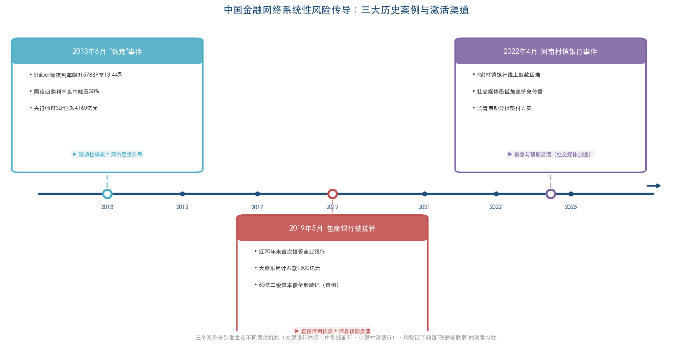

上图以时间轴形式梳理了三大标志性案例的关键信息及其激活的主要传导渠道。

### 3.6.1 2013年"钱荒"：流动性网络传染的典型样本

2013年6月的"钱荒"事件是中国银行间市场流动性风险网络传染的经典案例。6月20日，Shibor隔夜利率飙升578个基点至13.44%的历史极值，银行间隔夜回购利率盘中一度触及30% [人民日报](http://paper.people.com.cn/rmrbhwb/html/2013-06/24/content_1258313.htm "不差钱的中国为何出现钱荒") [共产党员网](https://news.12371.cn/2013/06/25/ARTI1372145940006526.shtml "面对钱荒央行严把货币闸门")。

这一事件集中暴露了前文分析的多重传导机制。从网络结构角度看，中小银行高度依赖同业融资（2025年11月城商行和农商行同业拆借余额占比合计超过三分之一 [远东信用评估](https://www.sfecr.com/upload/file/2025-12/col68/1767189150704.pdf "各类银行同业拆借余额占比")），当核心银行出于自身流动性管理需要收紧融资时，依赖短期同业资金的中间层和外围层机构迅速陷入流动性困境——这正是"核心-中间-外围"结构下流动性冲击沿网络层级逐级传导的典型表现。央行最终通过常备借贷便利（SLF）向市场注入4160亿元流动性，方才化解这场危机 [新浪财经](https://finance.sina.cn/sa/2013-12-26/detail-iiznctkf1742680.d.html "央行定向逆回购确认")。

### 3.6.2 包商银行事件：打破刚性兑付预期的冲击波

2019年5月，包商银行因严重信用风险被中国人民银行和银保监会联合接管——这是中国近20年来首次对商业银行实施接管。调查显示，其大股东累计占款高达1500亿元。2020年11月，包商银行65亿元二级资本债本金全额减记，成为中国首例银行资本工具全额减记事件 [证券时报](https://news.stcn.com/sd/202011/t20201114_2533565.html "包商银行二级资本债全额减记") [新华网](https://www.news.cn/fortune/20260213/22a5b2c93f7c49e9b71e4a430ef040e7/c.html "央行通报")。

包商银行事件的系统性意义远超其自身规模。一方面，它打破了银行间市场长期存在的"刚性兑付"（implicit guarantee）预期，促使机构间同业融资定价开始真正反映对手方信用风险——这是"信息与预期渠道"重塑网络传导特性的典型实例。另一方面，包商银行被接管后，中小银行同业存单发行一度遭遇困难，部分存单发行利率急升，体现了直接信用传染（对手方风险重估）和流动性传染（融资渠道收缩）的叠加效应。

### 3.6.3 从个案到系统：传导机制的综合检验

将上述案例与理论框架对照，中国金融网络中系统性风险传导的层次结构清晰可辨。"钱荒"事件主要验证了流动性螺旋和网络层级传导机制；包商银行事件验证了直接信用传染和信息预期反馈机制；河南村镇银行事件则凸显了社交媒体时代信息传染的新特征。三组案例分别发生在不同层次的机构（大型银行体系、中型城商行、小型村镇银行）和不同时期，但共同指向一个核心结论：中国金融网络的"稳健却脆弱"特性在实践中已被反复验证。

## 3.7 "太大不能倒"与"太关联不能倒"的中国适用性

### 3.7.1 三种系统重要性来源

系统重要性的来源可从三个维度加以理解："太大不能倒"（too big to fail, TBTF）、"太关联不能倒"（too connected to fail, TCTF）和"太相似不能倒"（too similar to fail, TSTF）。TBTF关注机构的绝对规模——2025年末总资产达53.48万亿元的工商银行若出现重大风险事件，其冲击显然不可忽视。TCTF关注机构在网络中的连接度和中心性——即使规模并非最大，处于网络关键中介位置的机构一旦违约，同样可能引发系统性后果。TSTF则关注机构间资产组合和业务模式的同质性——当大量银行持有高度相似的资产组合时，共同资产持有渠道的间接传染风险将被显著放大。

Battiston等人（2012）提出的DebtRank指标专门用于捕捉TCTF维度的系统重要性。其研究显示，DebtRank与资产规模的相关性始终低于0.4，表明"关联度"所度量的系统性风险维度与"规模"维度存在显著差异 [Battiston et al. (2012)](https://www.nature.com/articles/srep00541 "DebtRank: Too Central to Fail? Scientific Reports 2:541")。

### 3.7.2 中国评估框架的覆盖与不足

中国现行《系统重要性银行评估办法》通过"规模"指标对应TBTF维度，通过"关联度"指标对应TCTF维度，通过"可替代性"和"复杂性"指标部分覆盖TSTF维度 [人民网](http://money.people.com.cn/n1/2020/1207/c42877-31957594.html "系统重要性银行评估办法发布")。2023年10月，央行与金融监管总局联合发布《系统重要性保险公司评估办法》，将"关联度"权重提升至30%（高于银行评估办法中的25%），反映出监管层对保险业网络关联风险的特别关注 [人民网](http://finance.people.com.cn/n1/2023/1021/c1004-40100455.html "系统重要性保险公司评估办法")。

然而，现有框架主要覆盖银行和保险两类机构，对于证券公司、基金管理公司等在银行间市场中日益活跃的非银金融机构（NBFI）尚缺乏统一的系统重要性评估体系。2022年末，中国非银行金融中介狭义口径规模约11.4万亿美元、广义口径约67.8万亿美元 [21世纪经济报道](https://www.21jingji.com/article/20241228/herald/676314111546f7082c00de4025cd972f.html "转引央行金融稳定报告引用FSB数据")，其在金融网络中的系统重要性不容忽视。我们认为，将非银金融机构纳入系统重要性评估框架，建立跨业态的统一监测机制，是下一步制度建设的关键方向。

## 3.8 传导机制的综合框架

综合上述分析，中国金融网络中系统性风险的传导可归纳为四条相互交织的核心渠道：

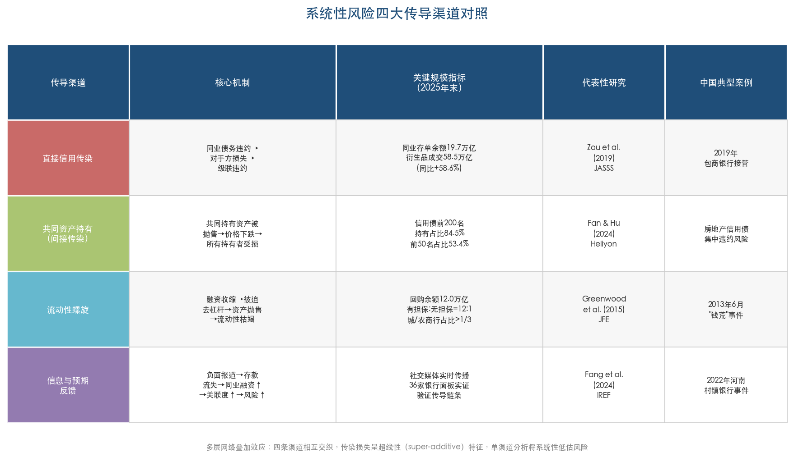

上表以矩阵形式对比了四条传导渠道的核心机制、关键规模指标、代表性实证研究及中国典型案例。

**第一，直接信用传染渠道。** 通过同业拆借、同业存单、债券互持和衍生品对手方敞口等直接债务关系传导。2025年银行间同业存单年末余额19.7万亿元、衍生品市场成交额58.5万亿元（同比+58.6%）[央行2025年金融市场运行情况](https://finance.sina.com.cn/roll/2026-02-11/doc-inhmmvzf7580742.shtml "衍生品市场")，直接敞口渠道的规模仍在扩大。

**第二，共同资产持有的间接传染渠道。** 高度集中的持有人结构（前200名投资者持有公司信用类债券84.5%）和对特定行业的集中信贷敞口，使得资产价格冲击可迅速传导至大量机构。

**第三，流动性螺旋渠道。** 中小银行对短期同业融资的高度依赖（城商行和农商行同业拆借余额占比合计超三分之一）使其在核心银行收紧流动性时极为脆弱。有担保融资对无担保融资的替代（12:1的比例）虽降低了信用风险，但并未消除质押品价值波动引发的流动性风险。

**第四，信息与预期反馈渠道。** 负面媒体情绪通过影响存款人和投资者行为，内生性地改变机构间关联结构，放大系统性风险。社交媒体的普及进一步加速了信息传染的速度。

这四条渠道在现实中并非独立运行，而是在多层网络中相互交织、彼此放大。多层网络的非线性叠加效应意味着，任何仅关注单一渠道的风险评估都可能系统性地低估真实的系统性风险水平。我们认为，构建涵盖多层网络动态演化的综合风险监测框架，是中国金融监管在系统性风险防范领域面临的核心挑战之一。

# 第4章 系统性风险建模方法论

前三章分别从格局描绘、分类体系和网络传导机制三个层面，回答了中国金融机构间借贷关系"是什么"以及"如何传导"的核心问题。本章转入方法论层面，系统梳理用于刻画风险传导与度量系统性风险的主要建模工具，评估各类方法的理论基础、技术特点、数据需求与局限性，并重点考察其在中国金融体系中的适用性与已有实证进展。全章依次讨论四大类方法：网络清算与传染模型（network clearing and contagion models）、宏观审慎压力测试（macroprudential stress testing）、市场化度量方法（market-based systemic risk measures）以及流行病学类比与基于主体的模型（epidemiological analogy and agent-based models, ABM），最后对各类方法进行综合对比与适用性评价。

## 4.1 网络清算与传染模型

### 4.1.1 Eisenberg-Noe清算支付向量框架

网络传染模型的理论基石是Eisenberg与Noe于2001年在《Management Science》发表的清算支付向量框架。该模型将银行间市场抽象为有向加权网络：节点代表金融机构，边权代表双边名义负债金额。在给定的外生资产价值冲击下，模型通过三个核心假设——有限责任（limited liability）、绝对优先（absolute priority of debt claims）和按比例偿付（proportional repayment）——求解一个不动点问题，得出均衡状态下各机构对所有对手方的清算支付向量。Eisenberg与Noe证明了该清算向量的存在性和唯一性，并提出了"虚拟违约算法"（fictitious default algorithm）以迭代方式求解 [Eisenberg & Noe (2001)](https://pubsonline.informs.org/doi/10.1287/mnsc.47.2.236.9835 "Systemic Risk in Financial Systems, Management Science 47(2):236-249")。

该框架的核心优势在于数学结构的严谨性和可解释性：给定双边敞口矩阵，清算向量能够精确刻画违约级联的最终均衡状态。然而，原始模型存在三个关键局限。第一，仅考虑违约后传染——只有当机构资不抵债、触发实际违约时才会向对手方传导损失，而现实中机构在接近违约但尚未违约时已因信用评级下调、融资成本上升等渠道向对手方施加压力。第二，未考虑破产成本——模型假设违约机构的剩余资产可无损地按比例分配给债权人，忽略了清算过程中的折价、法律费用和运营中断等现实摩擦。第三，模型为静态框架，无法捕捉传染过程的时间动态和市场参与者的行为反应。

### 4.1.2 Eisenberg-Noe框架的重要扩展

自原始模型发表以来，学术界沿多个方向对其进行了系统性扩展。IMF工作论文WP/23/173对这一演进脉络进行了全面综述 [Aikman et al. (2023)](https://www.imf.org/-/media/files/publications/wp/2023/english/wpiea2023173-print-pdf.pdf "Macroprudential Stress-Test Models: A Survey, IMF WP/23/173")。

第一条扩展路径是引入破产成本。Rogers与Veraart（2013）在Eisenberg-Noe框架中加入了固定和可变的清算折扣因子，使得违约机构的资产在分配给债权人前需扣除破产成本。这一修正的直接效果是：任何允许违约前传染的模型所估计的系统损失，总是不低于仅考虑违约后传染的损失估计——即原始Eisenberg-Noe模型在系统性层面构成一个下界估计。

第二条扩展路径是研究网络结构与违约级联的关系。Elliott等人（2014）分析了不同网络拓扑——完全连通、环形、星形等——下级联违约的传播阈值和范围，发现网络结构对传染的非线性影响取决于冲击强度与网络密度的交互作用，与第3章讨论的Acemoglu等人（2015）"相变"发现形成理论呼应。

第三条扩展路径是引入概率违约函数。Bardoscia、Barucca与Veraart等人在系列论文中以连续的违约概率函数取代二元的"违约/未违约"状态判定，将Eisenberg-Noe框架推广为允许"违约前传染"的一般化模型。这一推广对于刻画信用利差扩大、融资条件收紧等渐进式风险传导具有更强的现实解释力。

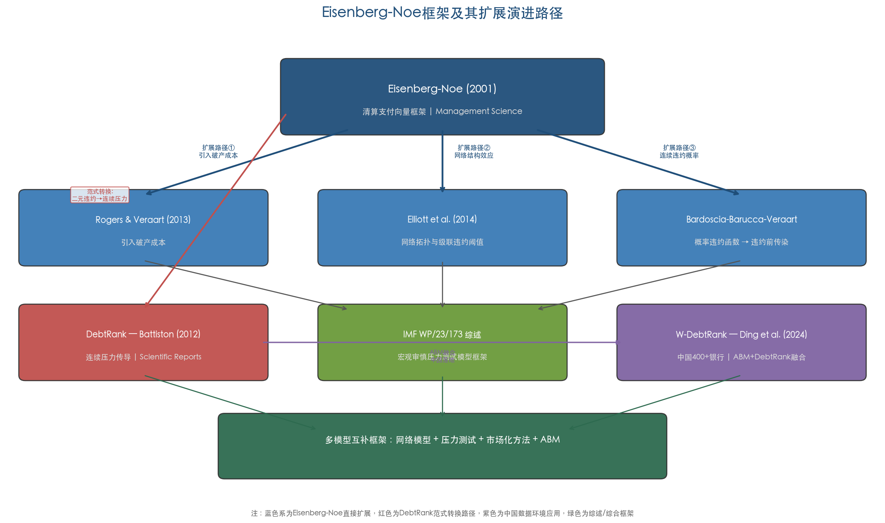

上图系统展示了从Eisenberg-Noe原始模型（2001）出发，经由三条扩展路径（引入破产成本、网络结构效应、连续违约概率），到DebtRank范式转换（2012）和W-DebtRank中国落地应用（2024）的完整演进脉络，清晰呈现了网络传染建模方法论从静态二元违约向动态连续压力传导的理论跃迁。

### 4.1.3 DebtRank：基于反馈中心性的系统性影响度量

Battiston等人于2012年在《Scientific Reports》提出DebtRank指标，标志着网络传染模型从"二元违约"向"连续压力传导"的范式转换。DebtRank的核心创新在于引入连续的压力状态变量（continuous distress variable）和三状态机制（undistressed → distressed → inactive），使冲击得以在机构尚未正式违约时即沿网络边权传导，从而更准确地捕捉"违约前传染"的经济现实。

Battiston等人将DebtRank应用于美联储2008–2010年紧急贷款数据的实证分析提供了重要量化参照：在危机高峰期，22家核心金融机构每家的DebtRank均值达到0.52±0.20，意味着单一机构的倒下平均可导致整个系统超过一半价值的损失。更关键的发现是，DebtRank与资产规模的相关性始终低于0.4——表明"太关联不能倒"（TCTF）揭示的系统性风险维度与"太大不能倒"（TBTF）捕捉的规模维度存在显著差异 [Battiston et al. (2012)](https://www.nature.com/articles/srep00541 "DebtRank: Too Central to Fail? Scientific Reports 2:541")。

Acharya等人（2024）在NBER工作论文中对1927–2023年近一个世纪的系统性风险度量进行全面回顾，进一步确认了网络中心性度量（如DebtRank）与市场化尾部风险度量（如CoVaR、MES）从不同维度捕捉系统性风险——两类指标内部相关性较高，但跨类相关性较低，表明二者具有互补而非替代关系 [Acharya et al. (2024)](https://www.nber.org/system/files/working_papers/w33211/w33211.pdf "Systemic Risk Measures 1927-2023, NBER WP 33211")。

### 4.1.4 DebtRank在中国银行间市场的应用

将Eisenberg-Noe和DebtRank等框架应用于中国银行间市场面临一个核心数据障碍：与欧美大额风险暴露报告制度不同，中国银行间的双边敞口矩阵并非公开可得数据，研究者通常需借助统计方法重构网络。

Ding、Yan与Chen（2024）在《Expert Systems with Applications》提出的W-DebtRank多智能体模型，正是为解决这一问题而设计。该研究利用CSMAR数据库中400余家中国银行的资产负债数据，通过最小密度法（minimum density approach）估计初始双边敞口网络，并通过双向匹配机制生成动态演化网络，在此基础上引入加权DebtRank度量各机构的系统性影响 [Ding, Yan & Chen (2024)](https://www.sciencedirect.com/science/article/abs/pii/S0957417424017147 "Risk contagion in interbank lending networks, ESWA 259:124847")。该研究代表了将国际主流网络传染模型"落地"到中国数据环境的前沿尝试。

在更早的研究中，中国学者利用贝叶斯方法处理双边敞口不可得问题。基于185家商业银行2013–2017年资产负债表数据的研究，在不同网络结构设定下构建吉布斯抽样器（Gibbs sampler），对银行间网络中的系统性风险进行了估计 [中国管理科学](https://www.zgglkx.com/CN/10.16381/j.cnki.issn1003-207x.2019.1660 "基于贝叶斯方法的中国商业银行同业借贷网络中系统风险研究")。

此外，第3章已详细讨论的Zou、Xie与Yang（2019）基于162家机构的双层网络模拟，以及Yan等人（2023）基于41家银行的三层多重网络研究，均采用Eisenberg-Noe清算机制作为违约级联的求解内核，实证验证了多层网络传染损失的非线性叠加效应。

### 4.1.5 网络模型的局限性与数据挑战

网络清算与传染模型的核心局限可归纳为三个方面。其一，双边敞口数据的可得性。欧洲央行（ECB）和欧洲系统性风险委员会（ESRB）可利用大额风险暴露报告数据直接观测银行间网络结构，而中国缺乏同等的公开数据基础设施，研究者不得不依赖统计重构方法，由此引入模型不确定性。其二，网络结构的内生性。现有模型大多将网络视为外生给定，而现实中机构在压力时期会主动调整融资来源和交易对手选择，网络结构本身内生于冲击过程。其三，模型验证的困难。系统性危机属于极端尾部事件，历史样本稀少，难以对传染模型的预测性能进行严格的样本外检验。

ECB工作论文（Montagna & Kok, 2016）基于欧盟大型银行的多层网络模型研究发现，同时考虑多个市场层面的关联时，冲击传导呈显著非线性特征，单层分析会严重低估系统性风险 [ECB Working Paper No.1944](https://www.ecb.europa.eu/pub/pdf/scpwps/ecbwp1944.en.pdf "Multi-layered interbank model for assessing systemic risk")。这进一步表明，即使双边敞口数据可得，仅对单一层面（如仅考虑同业拆借）进行网络建模也可能产生系统性偏误。

## 4.2 宏观审慎压力测试

### 4.2.1 压力测试的方法论框架

宏观审慎压力测试是将网络传染模型与宏观经济情景分析相结合的实践工具。其基本逻辑分为三个步骤：首先设定一组"极端但可能"的宏观经济不利情景（如GDP增速大幅下行、利率急剧上升、房地产价格暴跌等），然后评估这些情景对金融机构资产质量、盈利能力和资本充足率的影响，最后在机构间网络中模拟冲击的二次传导效应。

IMF工作论文WP/23/173将宏观审慎压力测试模型的发展脉络总结为三代演进：第一代为单机构静态压力测试（如2009年美国SCAP），主要评估个体银行的资本充足性而不考虑机构间传染；第二代引入银行间传染渠道，通过Eisenberg-Noe等清算模型模拟违约级联；第三代进一步纳入资产抛售渠道（fire-sale channel），同时考虑直接传染和间接传染。Greenwood等人（2015）对欧洲银行业的校准结果显示，纳入抛售渠道后银行平均损失增幅达302%，直观展示了忽略间接传染渠道的严重后果 [Aikman et al. (2023)](https://www.imf.org/-/media/files/publications/wp/2023/english/wpiea2023173-print-pdf.pdf "IMF WP/23/173, Section 3.5")。Covi等人（2021）利用欧元区大额敞口数据进一步区分了信用风险与流动性风险的相对贡献：信用风险在损失金额上占主导地位，但因流动性不足而导致的违约数量远超资不抵债引发的违约——这一发现对于理解中国中小银行高度依赖短期同业融资的风险特征具有直接借鉴价值。

### 4.2.2 中国央行压力测试实践

中国人民银行自2010年前后开始系统性地开展银行业压力测试，测试范围和方法论持续扩展。2025年，央行对全国3235家银行机构开展了涵盖四个维度的压力测试：偿付能力宏观情景压力测试、偿付能力敏感性压力测试、流动性风险压力测试和传染性风险压力测试 [开源证券解读《金融稳定报告（2025）》](https://pdf.dfcfw.com/pdf/H3_AP202512311812034501_1.pdf "银行视角解码金融稳定报告，转引自央行报告")。

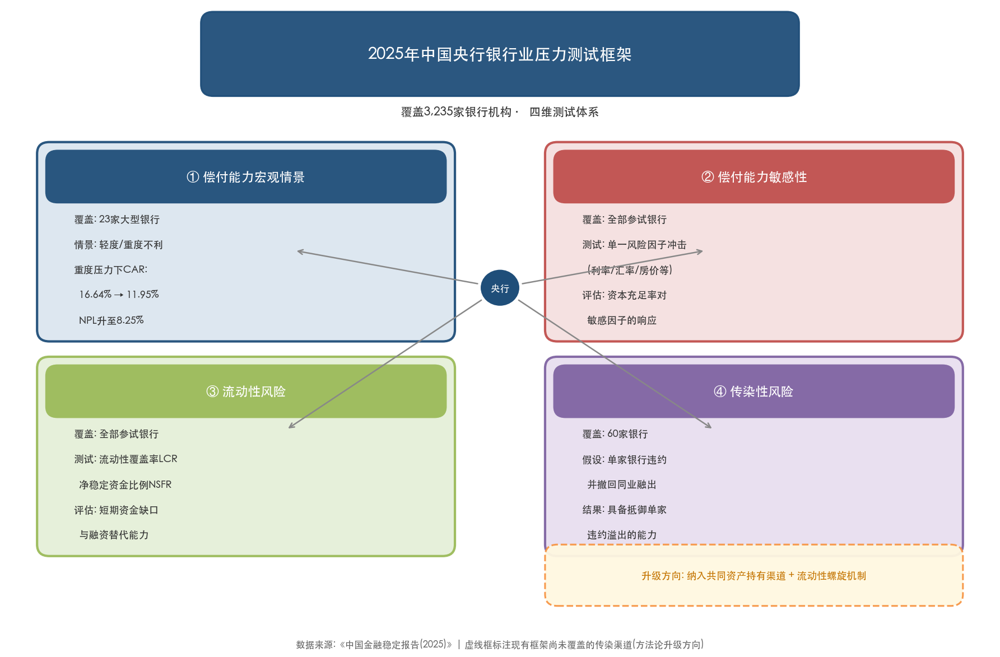

上图展示了2025年央行压力测试的四维框架全貌，涵盖各维度的覆盖机构数量、关键测试结果，以及传染性风险测试中尚未纳入的共同资产持有渠道和流动性螺旋机制等方法论升级方向。

偿付能力宏观情景测试覆盖23家大型银行，设定轻度与重度两档不利情景。测试结果显示，在重度压力情景下，23家大型银行2027年资本充足率将从基准情景下的16.64%降至11.95%，不良贷款率从基准水平升至8.25%。虽然降幅显著，但11.95%的资本充足率仍高于监管最低要求（10.5%含缓冲），表明大型银行整体具备一定的压力吸收能力。

传染性风险压力测试覆盖60家银行，假设某参试银行对其同业交易对手违约并撤回同业融出资金，考察溢出效应对其他参试银行的影响。《中国金融稳定报告（2025）》披露的测试结论为：参试银行具备抵御单家银行违约的能力，银行业中的非银行金融机构、证券业和保险业金融机构违约并未显著增强银行间的风险传染性 [京报网](https://news.bjd.com.cn/2025/12/27/11489043.shtml "银行业压力测试结果披露！央行发布重磅报告")。

上述结论需审慎解读。测试所采用的传染模型细节并未完全公开，但从《中国金融稳定报告（2023）》已披露的框架可以推断，其传染性风险测试的核心假设为：若某一参试银行对其同业交易对手违约并撤回同业融出资金，观察其他参试银行是否因同业资金损失而未能通过压力测试。这本质上是一种基于Eisenberg-Noe逻辑的简化违约级联模型。其局限在于：未充分纳入共同资产持有导致的间接传染渠道，也未模拟市场恐慌引发的流动性螺旋效应——而如IMF WP/23/173所强调的，忽略这些渠道可能导致对系统性损失的严重低估。

### 4.2.3 IMF FSAP对中国的评估

IMF于2025年4月发布了中国金融部门评估规划（FSAP）报告，距上次2017年评估间隔近8年。2025年FSAP的偿付能力压力测试覆盖55家银行，流动性压力测试涵盖111家银行 [IMF FSAP报告](https://www.imf.org/en/publications/cr/issues/2025/04/30/peoples-republic-of-china-financial-sector-assessment-program-financial-system-stability-566570 "IMF中国FSAP 2025")。

2017年的FSAP评估曾认为中国宏观审慎评估框架（MPA）运行良好，但指出需加强传染性风险的量化评估能力，特别是纳入银行间网络传染渠道和资产抛售间接渠道 [IMF中国FSAP (2017)](https://www.imf.org/-/media/files/publications/cr/2017/chinese/cr17358c.pdf "中国金融体系稳定评估, IMF CR 17/358")。2025年报告在肯定中国在金融监管和系统性风险监测方面取得显著进展的同时，进一步指出了房地产下行和LGFV债务压力、小型银行资本薄弱、危机管理框架不充分、金融数据透明度不足等结构性问题。

综合来看，中国央行压力测试在覆盖广度上已居全球前列——3235家机构为全球覆盖范围最大的监管压力测试之一——但在传染渠道的精细化建模上仍有提升空间。我们认为，将共同资产持有渠道和流动性螺旋机制纳入传染性风险压力测试的技术框架，构成下一阶段方法论升级的核心方向。

## 4.3 市场化度量方法

### 4.3.1 ΔCoVaR：条件在险价值

与依赖双边敞口数据的网络模型不同，市场化度量方法仅需公开交易的市场价格数据即可估计系统性风险。Adrian与Brunnermeier于2016年在《美国经济评论》正式发表ΔCoVaR（Delta Conditional Value-at-Risk）指标：定义为金融系统在某机构处于压力状态（其收益率等于其VaR水平）时的VaR值，与该机构处于中位状态时VaR值之差。ΔCoVaR通过分位数回归方法估计，核心优势在于无需双边敞口数据，仅利用股票收益率和一组宏观状态变量即可计算。实证研究显示，杠杆率（leverage）、规模（size）和期限错配（maturity mismatch）等机构特征能够显著预测ΔCoVaR的水平 [Adrian & Brunnermeier (2016)](https://www.aeaweb.org/articles?id=10.1257/aer.20120555 "CoVaR, AER 106(7):1705-1741")。

ΔCoVaR的方法论贡献在于将系统性风险度量从"个体机构风险"拓展到"个体机构对系统的风险贡献"。传统VaR仅度量单一机构在给定置信水平下的最大损失，而ΔCoVaR则捕捉了该机构陷入困境时对整个金融系统造成的溢出效应，从而实现了从微观审慎向宏观审慎视角的跨越。

### 4.3.2 MES与SRISK：系统性预期损失与资本缺口

Acharya等人（2017）在《Review of Financial Studies》构建的系统性预期损失（SES, Systemic Expected Shortfall）框架从另一角度切入系统性风险度量。SES度量的是金融系统整体面临危机时单个机构的预期损失，其中边际预期损失MES（Marginal Expected Shortfall）定义为在市场最差5%的交易日中某机构的平均收益率。MES对2009年美国监管资本评估计划（SCAP）识别的资本缺口具有显著的事前预测力——MES对SCAP资本缺口的回归R²达到32.03%，为市场化方法的监管应用提供了实证支撑 [Acharya et al. (2017)](https://academic.oup.com/rfs/article/30/1/2/2682977 "Measuring Systemic Risk, RFS 30(1):2-47")。

Brownlees与Engle（2017）在同期《Review of Financial Studies》上提出SRISK（Systemic Risk），将MES进一步扩展为综合考虑规模、杠杆和市场关联度的资本缺口指标。SRISK的计算公式为：SRISK = k·Debt − (1−k)·Equity·(1−LRMES)，其中k为审慎资本要求比率（通常取8%），LRMES（Long-Run MES）为长期边际预期损失，通过DCC-GARCH模型估计的动态相关系数推导。SRISK与ΔCoVaR的关键区别在于条件方向不同：ΔCoVaR度量"个体危机对系统的影响"，而SRISK条件于统一的系统性压力事件，度量"系统危机下个体的资本缺口"[Brownlees & Engle (2017)](https://www.esrb.europa.eu/pub/pdf/wp/esrbwp37.en.pdf "SRISK, RFS 30(1):48-79")。

### 4.3.3 三大指标在中国金融体系中的比较

Zhou与Liu（2020）对中国金融体系2007–2018年ΔCoVaR、MES和SRISK三大指标进行了跨行业比较，涵盖银行、证券和保险三大金融子行业。研究发现：ΔCoVaR和MES在2008年全球金融危机和2015年中国股灾期间出现异常飙升，展现出良好的危机识别能力；SRISK由于纳入了杠杆率和规模因素，对银行业的估计通常高于证券和保险行业，反映出银行业因规模和杠杆优势在系统性风险总量中的主导地位 [Zhou & Liu (2020)](https://www.tandfonline.com/doi/abs/10.1080/10971475.2020.1720962 "Systemic Risk of China's Financial System, Chinese Economy 53(3)")。

进一步的跨行业研究扩展了上述分析框架。利用copula-DCC-GARCH模型和Student-t分布估计的CoVaR与ΔCoVaR，对中国银行、证券、保险、房地产和其他金融五个子行业2009–2021年数据的研究表明：银行业向其他金融子行业和股票市场的风险溢出最为显著，证券业次之；房地产行业已成为向证券和银行行业传导风险的重要来源；五大金融子行业与股票市场之间的动态相关系数在0.7至0.9之间波动，揭示了金融子行业间的强风险联动效应 [Chen et al. (2023)](https://www.sciencedirect.com/science/article/pii/S2307187723000792 "Systemic risk spillover of financial institutions in China, Borsa Istanbul Review 23(6)")。

### 4.3.4 DCC-GARCH方法的中国适应性改进

标准DCC-GARCH模型在应用于中国金融市场数据时面临特殊的统计挑战。Fang、Yu与Zhao（2018）针对中国银行业收益率序列的厚尾特征，提出DCC-MIDAS-t模型——在DCC-GARCH的短期动态相关结构之上叠加混合数据频率抽样（MIDAS）组件以捕捉长期宏观经济变量对波动率的影响，并采用Student-t分布替代正态分布以更好拟合尾部。研究发现，中国银行体系波动率呈逆周期特征，广义货币供应量M2增速对长期波动率具有显著正向影响——M2增速越高，银行体系的长期波动率越大。这一发现揭示了货币政策宽松期可能积累金融不稳定因素的内在机制，对货币政策与金融稳定的协调具有重要政策含义 [Fang, Yu & Zhao (2018)](https://www.sciencedirect.com/science/article/abs/pii/S0927538X17305772 "DCC-MIDAS-t approach, PBFJ 51:13-31")。

### 4.3.5 市场化方法在中国面临的四大挑战

市场化度量方法的通用性和数据可得性使其成为全球范围内应用最广泛的系统性风险工具，但在中国金融市场环境中面临四个特殊挑战 [Ferrara et al. (2022)](https://www.sciencedirect.com/science/article/abs/pii/S1057521922001405 "Panel Granger causality analysis, IRFA 82:102179")。

第一，涨跌停板制度截断尾部分布。A股市场实行±10%（科创板/创业板±20%）的日涨跌幅限制，直接截断了收益率分布的尾部。对于ΔCoVaR和MES等依赖尾部分布特征的度量方法，涨跌停板的存在可能导致对极端风险的系统性低估，因为真实的尾部损失可能远超涨跌停板所允许的幅度。

第二，上市金融机构覆盖率有限。中国银行业共有3235家机构接受央行评级，但A股上市银行仅约42家，覆盖率不足2%。虽然这42家上市银行的资产规模占银行业总资产的绝大部分，但大量城商行、农商行和村镇银行——恰恰是系统性风险传染链条中脆弱的"外围层"——缺乏公开市场数据，市场化方法对其系统性风险贡献的度量存在显著盲区。

第三，政策干预扭曲市场价格信号。2015年股灾期间，以中国证券金融公司为代表的"国家队"直接入市购买股票，大规模干预使股价在短期内偏离基本面均衡。在此期间估计的ΔCoVaR和MES可能反映的是政策干预效果而非真实的机构风险关联，削弱了指标的信号价值。

第四，极端事件样本有限。中国资本市场历史仅三十余年，系统性危机事件样本稀少——2008年全球金融危机期间A股虽大幅下跌但并非内生性金融危机，2013年"钱荒"和2015年股灾是较为纯粹的内生冲击事件但持续时间较短。有限的极端事件样本导致DCC-GARCH等模型在尾部区域的参数校准面临较大不确定性。

## 4.4 流行病学类比与基于主体的模型

### 4.4.1 传染病模型在金融网络中的应用

流行病学模型（epidemiological models）将金融风险传染类比为疾病在人群中的扩散，为理解系统性风险提供了直觉性强的分析框架。Sun与Liu（2025）将SEIQRS模型——包含易感（Susceptible）、暴露（Exposed）、感染（Infected）、隔离（Quarantined）和恢复（Recovered）五种状态——应用于36家中国上市银行的风险传染研究。模型的核心参数为基本再生数R₀ = β/(δ+γ)·⟨k²⟩/⟨k⟩，其中β为传染率、δ为隔离率、γ为自愈率、⟨k⟩和⟨k²⟩分别为网络度分布的一阶矩和二阶矩。当R₀ > 1时风险传染将持续扩散，R₀ < 1时传染将自行衰减 [Sun & Liu (2025)](https://www.mdpi.com/2227-7390/13/19/3059 "SEIQRS Model for Interbank Financial Risk, Mathematics 13(19):3059")。

该研究的重要政策发现在于干预策略的比较效果：在模拟中，"高度优先"救助策略（优先救助连接度最高的节点，即网络中的核心银行）在抑制感染峰值方面效果最佳，但对干预时机高度敏感——延迟实施则效果急剧衰减。这一结论与现实中央行在2013年"钱荒"期间迅速通过常备借贷便利（SLF）注入4160亿元流动性以稳定核心融资渠道的决策逻辑高度一致。

流行病学模型的优势在于直觉性和政策模拟的灵活性：通过调整"隔离率"（对应监管干预强度）和"传染率"（对应机构间关联密度），可以便捷地评估不同政策组合的效果。但其核心局限在于参数的经济学对应关系模糊——金融风险的"传染率"β如何从实际金融数据中校准，尚缺乏公认的方法论基础。此外，传染病模型通常假设同质化的节点和传播概率，而金融网络中机构的异质性（规模、业务结构、资本充足水平的巨大差异）对传染动力学的影响远比生物传染病网络中的个体差异更为显著。

### 4.4.2 基于主体的模型（ABM）

基于主体的模型（Agent-Based Model, ABM）通过自下而上地设定每个金融机构（"主体"）的行为规则，模拟机构间的交互过程和网络的动态演化，使宏观层面的系统性风险特征从微观行为中自发涌现。

美国金融研究办公室（OFR）2016年发表的工作论文构建了一个包含6600家银行的ABM模型，每家银行按照季度行为规则做出贷款、融资、资本管理等决策。模拟结果成功再现了类似2007–2009年全球金融危机的动态特征——包括信贷快速扩张→过度杠杆→资产价格泡沫→信贷紧缩→违约级联的完整周期 [OFR Working Paper (2016)](https://www.financialresearch.gov/working-papers/files/OFRwp-2016-14_Interbank-Contagion-ABM-Approach.pdf "Interbank Contagion ABM, OFR WP 2016-14")。

ABM的核心优势体现在三个方面。第一，内生化银行决策和网络演化——网络结构不再是外生给定的，而是从银行的融资、投资和风险管理行为中内生形成，这克服了Eisenberg-Noe模型将网络视为外生的关键缺陷。第二，无需均衡假设——ABM通过模拟动态过程而非求解均衡条件来生成结果，更适合捕捉金融市场中的非均衡动态和路径依赖效应。第三，能够纳入异质性主体——不同规模、业务模式和风险偏好的机构可分别设定差异化的行为规则。

然而，ABM面临的局限性同样不容忽视。首先是参数校准困难——6600家银行各自的行为规则涉及大量参数，其校准缺乏如GARCH模型那样严格的统计估计框架。其次是结果对行为规则高度敏感——微小的规则变动可能导致模拟结果的重大差异，模型的稳健性验证颇具挑战。最后是计算成本——大规模ABM的运行需要可观的计算资源，在实时风险监测场景中的应用受到制约。

前文提及的Ding、Yan与Chen（2024）的W-DebtRank模型实际上融合了ABM和DebtRank两种方法——通过ABM的双向匹配机制动态生成网络，再用DebtRank度量传染损失。这种"混合模型"策略代表了网络传染与ABM方法融合的前沿方向。

## 4.5 方法论综合对比与评价

### 4.5.1 四类方法的系统比较

将上述四类建模方法置于统一框架下比较，可从数据需求、核心假设、主要优势和关键局限四个维度进行系统评估。

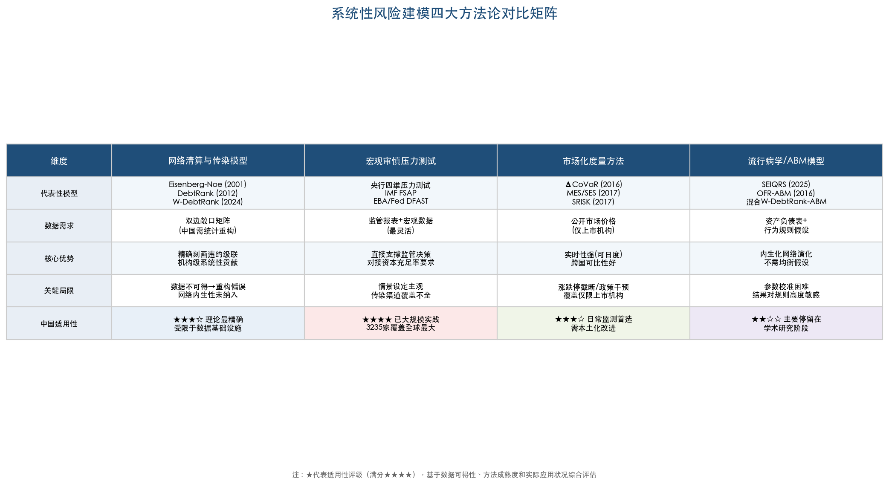

上图以矩阵形式系统对比了四类方法的代表性模型、数据需求、核心优势、关键局限和中国适用性评价，为方法论选择提供全景参照。

**网络清算与传染模型**（Eisenberg-Noe、DebtRank）需要双边敞口矩阵数据，在中国通常需通过最小密度法、最大熵法或贝叶斯方法重构。其核心优势在于能够精确刻画违约级联路径和机构级别的系统性贡献，关键局限是双边数据不可得性引入的重构偏误以及对外生冲击假设的敏感性。

**宏观审慎压力测试**的数据需求最为灵活，可结合监管报表、宏观经济数据和部分市场数据。其核心优势是与监管实践直接对接、可评估具体情景下的资本充足性，关键局限是情景设定的主观性和传染渠道覆盖的不完整性——中国现行框架主要覆盖直接信用渠道，尚未充分纳入共同资产持有和流动性螺旋渠道。

**市场化度量方法**（ΔCoVaR、MES、SRISK）仅需公开市场价格数据，估计频率可达日度，是更新速度最快的系统性风险监测工具。其核心优势在于数据可得性好和跨国可比性强，关键局限是覆盖范围受限于上市机构，且在中国面临涨跌停板截断和政策干预扭曲等特殊挑战。

**流行病学/ABM模型**的数据需求介于网络模型和市场化方法之间，可利用资产负债表汇总数据和部分行为假设。其核心优势是能够内生化网络动态演化和银行行为反应，关键局限是参数校准缺乏严格的经济学对应关系、结果对行为规则设定高度敏感。

### 4.5.2 多模型互补框架的必要性

IMF WP/23/173在系统比较各类方法后明确建议采用多模型互补框架（multi-model complementary framework）：任何单一方法均无法全面覆盖系统性风险的所有维度，综合运用多种方法可以相互弥补各自的盲区 [Aikman et al. (2023)](https://www.imf.org/-/media/files/publications/wp/2023/english/wpiea2023173-print-pdf.pdf "IMF WP/23/173, Section 7")。

Acharya等人（2024）对近一个世纪系统性风险度量的全面回顾进一步强化了这一结论。他们将市场化方法分为"收益率尾部类"（如ΔCoVaR、MES）和"综合规模杠杆类"（如SES、SRISK），发现两类内部的相关性较高，但跨类相关性较低——这意味着它们从根本不同的维度捕捉系统性风险，二者缺一不可 [Acharya et al. (2024)](https://www.nber.org/system/files/working_papers/w33211/w33211.pdf "Systemic Risk Measures 1927-2023, NBER WP 33211")。

### 4.5.3 中国金融体系的方法论适用性评估

结合中国金融体系的结构特殊性，我们对各类方法的适用性做出以下判断。

网络清算与传染模型在理论上最为精确，但其在中国的应用受制于双边敞口数据可得性这一根本性约束。随着金融监管数据基础设施的完善——特别是大额风险暴露报告制度的逐步扩展——网络模型的适用条件正在持续改善。央行2025年传染性风险压力测试覆盖60家银行的同业违约和资金撤回溢出效应，本质上已在有限范围内运用了网络传染模型的核心思想。

市场化方法在监测上市金融机构的系统性风险方面具有不可替代的实时性优势。尽管面临涨跌停板、政策干预等中国市场特殊挑战，通过DCC-MIDAS-t等本土化改进可以部分缓解。我们认为，市场化方法应定位为系统性风险的"日常监测仪表盘"，而网络模型和压力测试应作为"深度诊断工具"，两者形成互补。

压力测试是唯一能直接支撑监管决策的方法——其输出结果可直接与资本充足率、流动性覆盖率等监管指标对接。中国央行3235家机构的覆盖规模为全球最大，但传染渠道的精细化建模仍有提升空间。将Greenwood等人（2015）的抛售传染模型和Covi等人（2021）的流动性违约机制整合进现有框架，有望显著提升传染性风险压力测试的精度和可靠性。

流行病学和ABM模型在中国的应用目前仍主要停留在学术研究阶段。Sun与Liu（2025）的SEIQRS模型和OFR（2016）的ABM框架提供了具有参考价值的政策洞见（如优先救助高连接度节点的策略建议），但在参数校准和模型验证方面仍需积累更多针对中国金融网络特征的实证支撑。

综合而言，中国金融体系系统性风险建模的发展方向应当是：在监管实践层面，以压力测试为核心框架并持续升级传染渠道的覆盖深度；在实时监测层面，以市场化方法为主并发展适应中国市场微结构的本土化模型；在深度分析层面，以网络传染模型为工具并推动双边敞口数据基础设施的建设。三者形成的"监测—诊断—决策"一体化框架，构成应对中国金融网络日益复杂化趋势的方法论根基。

# 第5章 中国监管框架与系统性风险防范实践

前四章分别从格局描绘、分类体系、网络传导机制和建模方法论四个层面，回答了中国金融机构间借贷关系"是什么""如何传导"以及"如何度量"的问题。本章进入制度层面，系统梳理中国针对金融机构间关联风险和系统性风险的监管制度架构，剖析宏观审慎监管工具的设计逻辑与实施效果，并就金融稳定法立法进展和国际标准对标等前沿议题展开深入讨论。

## 5.1 监管架构的顶层重塑：从分业监管到统筹协同

### 5.1.1 中央金融委员会与"大监管"格局

2023年3月，中共中央在新一轮机构改革中组建中央金融委员会，作为党中央层面的决策议事协调机构，统一负责金融稳定和发展的顶层设计与统筹协调，原国务院金融稳定发展委员会不再保留 [新华网](http://www.news.cn/money/20230323/2b599e64d9024ca897bbccfc9fb1aac0/c.html "金融监管体制改革")。这一调整标志着中国金融监管协调机制从国务院层面上升至党中央层面，在制度层面回应了系统性风险防范对高层级跨部门协调能力的内在要求。

在执行层面，国家金融监督管理总局（National Financial Regulatory Administration, NFRA）于2023年5月18日正式挂牌，在原银保监会基础上组建，同时划入央行对金融控股公司的日常监管和消费者/投资者保护职责，统一负责除证券业之外的金融业监管 [新华网](http://www.news.cn/fortune/2023-05/18/c_1129626615.htm "金融监管总局挂牌")。这一整合消除了银行业与保险业监管边界长期存在的模糊地带，使得对金融机构间关联交易、同业业务和交叉金融风险的监管主体更为明确。

与此同时，中国人民银行的职能边界亦进行了相应调整。2023年10月"三定"方案落地后，宏观审慎管理局不再承担金融控股公司日常监管，新增统筹互联网金融监管和房地产金融宏观审慎管理职责 [21经济网](https://www.21jingji.com/article/20231013/herald/1417ed3f2f8016521cb5f04e032c9076.html "央行三定方案")。改革后的央行聚焦于货币政策与宏观审慎政策"双支柱"调控框架，微观审慎监管和机构监管职能则集中于金融监管总局和证监会。

### 5.1.2 宏观审慎政策体系的演进

央行行长潘功胜在2025年10月金融街论坛上系统阐述了中国宏观审慎体系的演进脉络：2003年引入住房贷款首付比例要求，是中国最早的宏观审慎工具之一；2010年建立差别准备金动态调整机制，首次将逆周期调节理念引入货币政策操作；2016年将差别准备金机制升级为宏观审慎评估体系（Macroprudential Assessment, MPA），对银行的资本与杠杆、资产负债、流动性、定价行为、资产质量、跨境融资风险和信贷政策执行等七大方面实施综合评估；2019年在央行内部设立宏观审慎管理局，2021年发布《宏观审慎政策指引（试行）》，标志着宏观审慎政策框架基本建立 [新浪财经](https://finance.sina.com.cn/money/bank/2025-10-27/doc-infvisyi5081487.shtml "潘功胜2025金融街论坛演讲全文")。

值得关注的是，潘功胜同时披露央行正研究将MPA拆分为货币政策执行评估和宏观审慎/金融稳定评估两个独立部分。这一调整的政策含义在于：将宏观审慎评估从货币政策考核中剥离，使其成为独立的系统性风险监管工具，避免货币政策目标与宏观审慎目标在操作层面产生潜在冲突。

截至目前，央行宏观审慎工具体系已覆盖多个维度：针对金融机构的系统重要性银行（D-SIBs）附加资本/杠杆率、金融机构评级、压力测试、逆周期资本缓冲、总损失吸收能力（TLAC）要求、恢复与处置计划等；针对外汇市场的远期售汇风险准备金和跨境融资宏观审慎参数；针对债券市场的杠杆与期限错配管理；针对股票市场的互换便利和再贷款工具；针对房地产的首付比例、利率下限和风险权重等 [新浪财经](https://finance.sina.com.cn/money/bank/2025-10-27/doc-infvisyi5081487.shtml "潘功胜演讲全文")。此外，央行正积极探索向非银金融机构提供流动性支持的机制性安排——这一方向若落地，将填补中国金融安全网在非银领域的关键空白。

图5-1以时间轴形式呈现了2013年"钱荒"以来中国系统性风险监管制度的演进历程，从中可以清晰地观察到制度建设从单点突破走向体系化的渐进过程。

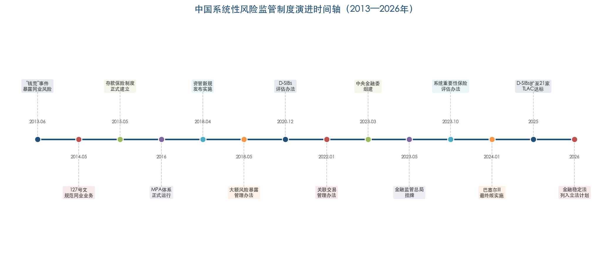

## 5.2 系统重要性金融机构的识别与附加监管

### 5.2.1 系统重要性银行（D-SIBs）框架

2020年12月，央行与原银保监会联合发布《系统重要性银行评估办法》，于2021年1月1日起施行。该办法建立了涵盖"太大不能倒"（Too Big to Fail, TBTF）、"太关联不能倒"（Too Connected to Fail, TCTF）和"太相似不能倒"（Too Similar to Fail, TSTF）三种系统重要性来源的评估框架，四个一级指标——规模（size）、关联度（interconnectedness）、可替代性（substitutability）和复杂性（complexity）——各占25%权重 [人民网](http://money.people.com.cn/n1/2020/1207/c42877-31957594.html "系统重要性银行评估办法发布")。该框架在指标设计上高度对标巴塞尔委员会（BCBS）G-SIBs评估方法，但评估范围聚焦于国内系统重要性维度。

2025年度D-SIBs名单共计21家银行（较首批19家扩展，新增浙商银行），按系统重要性得分从高到低分为五组：第四组为工商银行、中国银行、建设银行和农业银行4家；第三组为交通银行和招商银行2家；第二组为兴业银行、中信银行、浦发银行和邮储银行4家；第一组为11家银行 [新华网](https://www.news.cn/fortune/20260213/22a5b2c93f7c49e9b71e4a430ef040e7/c.html "2025年度D-SIBs名单")。附加资本要求按组别递增：第一至五组分别为0.25%、0.5%、0.75%、1.0%和1.5%，附加杠杆率要求为附加资本的50%，均须由核心一级资本满足 [经济观察网](http://m.eeo.com.cn/2026/0214/795759.shtml "系统重要性银行分层洗牌")。

在全球层面，中国5家银行入选金融稳定理事会（FSB）2025年G-SIBs名单：工商银行位列第二组（附加资本要求1.5%），中国银行、农业银行、建设银行和交通银行位列第一组（附加资本要求1.0%）[武汉市金融局](https://jrj.wuhan.gov.cn/ynzx_57/xwzx/202512/t20251202_2685982.shtml "2025年G-SIBs名单")。

图5-2完整列示了21家D-SIBs的分组情况及其与G-SIBs的对应关系，可清晰观察国内外系统重要性分层框架的衔接方式。

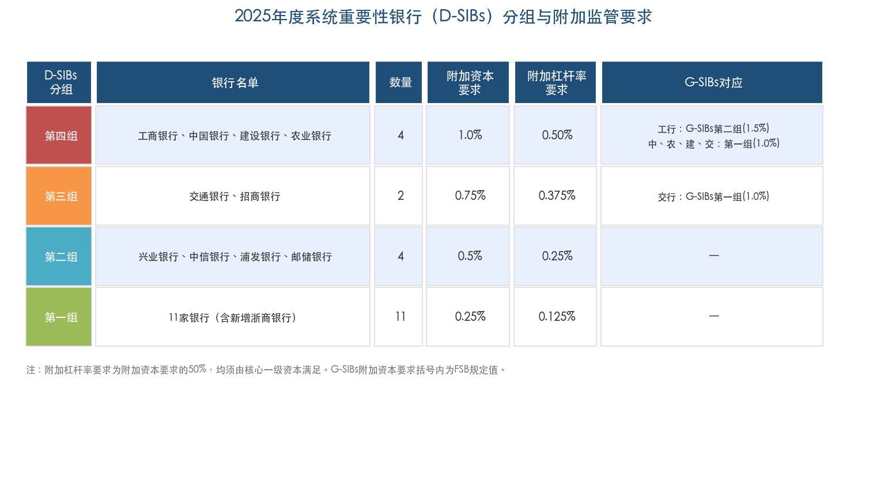

### 5.2.2 TLAC达标与处置能力建设

作为G-SIBs，四大国有商业银行须满足FSB总损失吸收能力（Total Loss-Absorbing Capacity, TLAC）标准。第一阶段要求为：外部TLAC占风险加权资产（RWA）比例不低于16%，杠杆比率不低于6%。截至2025年初，四大行已按期满足上述要求，TLAC/RWA比例均超过20% [惠誉博华](http://www.fitchbohua.cn/%E6%8A%A5%E5%91%8A%E6%96%87%E7%AB%A0/%E5%9B%9B%E5%A4%A7%E8%A1%8C%E6%8C%89%E6%9C%9F%E6%BB%A1%E8%B6%B3tlac-%E7%AC%AC%E4%B8%80%E9%98%B6%E6%AE%B5%E8%A6%81%E6%B1%82 "四大行TLAC达标情况")。TLAC合规的核心意义在于：当系统重要性银行陷入不可恢复的困境时，监管当局可通过减记或转股TLAC工具吸收损失，从而避免纳税人救助。2020年11月包商银行65亿元二级资本债的全额减记（中国首例银行债券本金全额减记）已为这一机制提供了实战先例。

### 5.2.3 系统重要性保险公司评估框架

2023年10月，央行与金融监管总局联合发布《系统重要性保险公司评估办法》，评估指标涵盖规模（权重20%）、关联度（30%）、资产变现（30%）和可替代性（20%），于2024年1月1日起施行 [人民网](http://finance.people.com.cn/n1/2023/1021/c1004-40100455.html "系统重要性保险公司评估办法")。与D-SIBs评估框架相比，该框架的一个显著特征是以"资产变现"替代"复杂性"作为一级指标并赋予30%的最高权重——这一设计反映了保险业务中资产流动性对系统性风险传导的关键作用。

关联度指标同样获得30%的权重，与资产变现并列最高。这一权重设置体现了监管当局对保险机构与银行体系、债券市场之间深度关联的充分重视。如前文所述，2025年末保险资金运用余额已达38.5万亿元，其中债券投资超过18万亿元，保险资金已成为银行间债券市场最重要的机构投资者之一。

潘功胜在2025年10月金融街论坛上明确表示将"适时发布系统重要性保险公司名单，推动附加监管工作落地" [中国新闻网](https://www.chinanews.com.cn/cj/2025/10-27/10505481.shtml "潘功胜：适时发布系统重要性保险公司名单")。截至2026年3月，首批名单尚未正式公布，但市场普遍预期总资产规模在万亿元以上的8家保险集团（中国平安、中国人寿、中国太保、中国人保、中国太平、泰康保险、新华保险、阳光保险等）大概率入围。

## 5.3 同业业务与关联交易专项监管

### 5.3.1 127号文与同业业务规范化

2014年5月，央行、银监会、证监会、保监会和外汇局五部门联合发布《关于规范金融机构同业业务的通知》（银发〔2014〕127号），划定了同业业务监管的基本框架：单家银行同业融入资金余额不得超过负债总额的三分之一；后续配套的140号文进一步要求商业银行设立专营部门统一管理同业业务 [中国证券报](https://www.cs.com.cn/xwzx/jr/201405/t20140516_4392830.html "五部门联合规范同业业务")。

127号文出台的背景是2013年"钱荒"后监管当局对同业业务过度膨胀的深刻反思。文件发布前，部分股份制银行同业负债占总负债比例已接近甚至突破三分之一红线——兴业银行2014年一季度末该比例高达37.3% [中国经济周刊](http://paper.people.com.cn/zgjjzk/html/2014-06/02/content_1437008.htm "银行同业业务整治报道")。127号文的核心政策效应体现在两个层面：一是直接约束了银行通过同业渠道进行的表外信用扩张，切断了"银行—非银—实体"的影子银行传导链条；二是推动同业业务从不透明的"买入返售"模式向标准化的同业存单模式转型。

2017年起的"三三四十"专项整治行动进一步强化了同业业务治理。截至2017年末，银行业同业资产负债自2010年以来首次收缩，同业资产较年初减少约2.8万亿元，同业理财净减少3.4万亿元 [中国日报](http://cn.chinadaily.com.cn/2018-01/18/content_35530300.htm "2017年银行业十件大事")。至2021年末，农村中小银行特定目的载体（SPV）投资降幅超过50%，表明同业通道业务得到实质性压缩 [中国北京产权交易所](https://www.cbex.com.cn/zl_244/ssgsbg/hydt/202205/t20220530_117695.html "中小银行改革化险成果")。

### 5.3.2 同业存款定价自律管理

在同业业务结构性变迁的最新阶段，同业存款定价管理成为监管关注焦点。2024年11月，市场利率定价自律机制对同业存款利率进行规范，要求同业活期存款利率不得高于央行公开市场操作（OMO）利率。新规实施后，上市全国性银行同业负债成本下降约30—40个基点，同业存款占负债比重从约10%降至约9% [财新网](https://finance.caixin.com/2026-03-11/102421785.html "同业存款定价自律管理效果")。

2026年3月，自律管理进一步升级（业界称为"自律2.0"），要求高于OMO利率的同业活期存款季末占比控制在10%—20%以内，涉及约10万亿元同业存款面临重定价 [证券时报](https://www.stcn.com/article/detail/3674992.html "同业活期存款自律2.0")。这一系列政策的深层逻辑在于：通过压降同业负债成本来降低中小银行对高成本同业融资的依赖，从源头上削弱第3章所分析的"核心—外围"网络结构中的流动性传染风险。

### 5.3.3 关联交易管理与大额风险暴露管理

2022年1月，金融监管部门发布《银行保险机构关联交易管理办法》，建立了分层次的关联交易限额体系：银行对单个关联方的授信余额不得超过资本净额的10%，对关联方集团不得超过15%，对全部关联方合计不得超过50%；保险公司对关联方的投资余额不得超过总资产的25%与净资产中的较低值。该办法的核心要求是穿透识别关联方，防止通过多层嵌套规避关联交易限额 [国务院新闻办](http://www.scio.gov.cn/xwfb/gwyxwbgsxwfbh/wqfbh_2284/2022n_2285/2022n03y02r/wjxgzc_2492/202208/t20220808_316600.html "关联交易管理办法")。

在同业大额风险暴露管理方面，2018年5月发布的《商业银行大额风险暴露管理办法》明确规定：商业银行对同业单一客户或同业集团客户的风险暴露不得超过一级资本净额的25%，与巴塞尔委员会《大额风险暴露计量和控制监管框架》基本对标 [司法部](https://www.moj.gov.cn/pub/sfbgw/flfggz/flfggzbmgz/201806/t20180604_146191.html "大额风险暴露管理办法")。该办法的重要意义在于为银行间信用敞口设定了硬性约束上限，直接限制了第2章所分析的直接信用传染渠道中单一对手方违约可能造成的最大损失。

### 5.3.4 资管新规与影子银行治理

2018年4月，央行等四部门联合发布《关于规范金融机构资产管理业务的指导意见》（即"资管新规"），提出打破刚性兑付、实行净值化管理、限制多层嵌套和通道业务、严格非标债权投资限额管理、设置杠杆上限等核心要求，过渡期延至2021年底 [新浪财经](https://finance.sina.cn/2024-06-27/detail-incaaxwt2874935.d.html "资管新规实施情况")。

资管新规的系统性风险防范效果集中体现在三个层面。其一，通过限制嵌套层级和穿透管理要求，显著压缩了经由"银行理财—信托计划—券商资管"等多层通道形成的隐性借贷链条，使机构间实际信用敞口趋于透明。其二，净值化管理打破了刚性兑付预期，使风险定价回归市场化——如第2章所分析，理财产品的刚性兑付实质上构成银行的隐性担保责任，将风险从表外回传至表内。其三，非标投资限额迫使资管产品将更多资产配置转向标准化债券和同业存单，提升了底层资产的流动性和透明度。

截至2025年末，银行理财存续规模达33.29万亿元（同比+11.15%），资产配置中债券占51.93%（约18.52万亿元），非标仅占5.10%（约1.82万亿元），较资管新规实施前非标占比大幅下降 [银行业理财登记托管中心](https://pdf.dfcfw.com/pdf/H3_AP202601251818394909_1.pdf?1769352342000.pdf "中国银行业理财市场年度报告2025年")。信托业同样呈现鲜明的标准化转型趋势：非标资产投资占比从2022年末的54.52%降至2025年上半年的39.70%，证券投资信托占资金信托的比例从2022年末的34.34%升至2025年6月末的51.09% [中国信托业协会](https://economy.rednet.cn/content/646956/66/15559104.html "金融时报报道")。

## 5.4 金融安全网建设

### 5.4.1 存款保险制度

中国存款保险制度于2015年5月正式建立，最高偿付限额为50万元人民币。截至2024年末，共有3761家投保机构参保，存款保险基金累计归集3732亿元，已对900余家机构采取早期纠正措施 [新华网](http://www.news.cn/20250429/ba7e6c76e8df423dbd144ee6b9aff670/c.html "存款保险十周年")。至2025年末，参保机构数量降至3112家（较2024年末减少约649家），反映了高风险机构通过合并、重组或退出等方式完成风险出清的进程；年末基金余额为1304亿元 [央视网](https://jingji.cctv.com/2026/03/27/ARTIQWwzyhr3Oq8rU3F3svmR260327.shtml "2025年存款保险基金收支情况")。

存款保险制度在系统性风险防范体系中承担双重功能：一是提供显性的储户保护承诺，降低挤兑发生的概率和传染速度；二是作为早期纠正和有序退出机制的制度基础，赋予存款保险基金管理机构对投保机构进行风险监测、早期干预和参与处置的法定权力。2022年河南村镇银行事件中启动的分批垫付方案，即为存款保险制度在实战场景中的典型应用。

### 5.4.2 央行金融机构评级体系

央行金融机构评级是系统性风险监测的微观基础工具。2025年上半年，央行对3529家银行机构开展评级，评估指标涵盖资本充足性（权重40%）、资产质量、风险管理、盈利能力、公司治理和流动性六大类，共设11个等级（1—10级及D级），其中1—5级为"绿区"，6—7级为"黄区"，8级至D级为"红区" [观察者网](https://www.guancha.cn/GuanJinRong/2025_12_27_801865.shtml "央行金融稳定报告评级结果")。

从最新评级结果看，绿区银行1831家，资产规模421万亿元（占参评银行总资产的94.6%）；黄区银行1386家，资产规模14.5万亿元（占3.3%）；红区银行312家，资产规模9.4万亿元（占2.1%）[观察者网](https://www.guancha.cn/GuanJinRong/2025_12_27_801865.shtml "央行评级基本情况")。与上年数据对比，2024年《中国金融稳定报告》披露高风险银行357家、资产规模7.05万亿元 [毕马威](https://assets.kpmg.com/content/dam/kpmgsites/cn/pdf/zh/2025/06/china-banking-industry-survey-report-2025.pdf "2025年中国银行业调查报告")，至2025年上半年红区机构数量从357家降至312家，近半高风险机构实现"出清"。

图5-3直观呈现了3529家参评银行在"三区"的机构数量与资产规模分布，凸显出风险集中于少量小型机构而绝大部分银行资产处于绿区的结构特征。

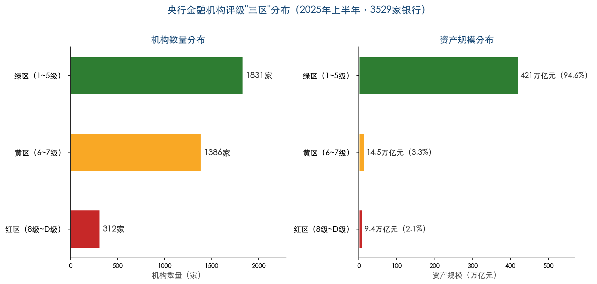

分机构类型看，全国性银行整体稳健——21家全国性银行评级均在5级以上（其中1级1家、2级10家、3级3家、4级5家、5级2家），资产规模占比达71%，构成金融体系的"压舱石"。风险主要集中于地方法人银行：农商行、农合行、农信社和村镇银行中存在红区机构，但其资产占比不足1%。区域分布方面，北京、天津、上海、重庆、浙江、江苏、江西、福建和西藏9个省区市辖内已无红区银行，另有13个省区市红区银行数量降至个位数 [观察者网](https://www.guancha.cn/GuanJinRong/2025_12_27_801865.shtml "分机构分区域评级情况")。

该评级体系与系统性风险防范的衔接逻辑在于：红区机构虽然单体规模较小（资产占比仅2.1%），但如第3章所分析，中小银行高度依赖同业融资的负债结构使其在流动性冲击中可能触发网络传染效应。央行据此实施分类分段管理：对非红区银行坚持"早识别、早预警、早暴露、早处置"的"四早"原则，采取风险提示和约谈等柔性措施；对红区银行则执行强制性纠正措施，包括补充资本、限制资产增长和压降杠杆率等。

## 5.5 金融稳定法与危机管理框架

### 5.5.1 金融稳定法立法进展

《金融稳定法》是中国金融安全网建设的关键立法。该法律草案经历多轮审议：2022年12月提请全国人大常委会一审，2024年6月二审并公开征求意见 [21经济网](https://www.21jingji.com/article/20240629/herald/2f09e393f17c7a7902d4c29ea36ab8c7.html "金融稳定法草案二审")。二审稿的核心内容包括：明确中央金融工作领导机构在金融风险处置中的统筹协调职责；建立全国性金融机构与地方中小机构的分级处置机制；设立金融稳定保障基金作为重大金融风险处置的后备资金来源。

2026年3月，全国人大常委会工作报告将金融稳定法列入年度立法计划 [央视新闻](https://news.qq.com/rain/a/20260309A04RCD00 "人大常委会工作报告")，表明该法律有望在本年度内完成审议并出台。金融稳定法的制度意义在于以法律形式确立系统性风险处置的权力架构、程序规则和资金来源，弥补当前主要依靠行政协调处置金融风险在法律基础上的不足。

### 5.5.2 中国版巴塞尔III最终版

2024年1月1日起，中国正式实施新《商业银行资本管理办法》（即"中国版巴塞尔III最终版"），对商业银行实行分档差异化监管：第一档银行实施巴塞尔III全套要求，包括内部评级法（IRB）、标准化信用风险权重修订等；第二、三档银行根据规模和复杂性递减适用简化要求 [毕马威](https://assets.kpmg.com/content/dam/kpmgsites/cn/pdf/zh/2025/06/china-banking-industry-survey-report-2025.pdf "2025年中国银行业调查报告")。

分档监管设计的政策考量与中国银行业的"大分化"格局高度契合。如第1章所分析，中国银行业资产高度集中于大型商业银行（2025年四季度末资产占比43.9%），而近4000家地方法人银行在规模、业务复杂性和风险管理能力上差异悬殊。对所有银行适用统一的最高复杂度监管标准既不经济也无必要，分档设计在保持监管有效性的同时降低了中小银行的合规成本。

## 5.6 国际标准对标与IMF评估

### 5.6.1 IMF 2025年FSAP评估

2025年4月，IMF发布了中国金融部门评估规划（Financial Sector Assessment Program, FSAP）报告，距上一次2017年评估已间隔近8年 [IMF](https://www.imf.org/en/publications/cr/issues/2025/04/30/peoples-republic-of-china-financial-sector-assessment-program-financial-system-stability-566570 "IMF中国FSAP 2025")。

2017年FSAP曾肯定中国MPA运行良好，但指出需加强传染性风险的量化评估能力，特别是将银行间网络传染渠道和资产抛售间接渠道纳入分析框架 [IMF](https://www.imf.org/-/media/files/publications/cr/2017/chinese/cr17358c.pdf "中国金融体系稳定评估, IMF CR 17/358")。2025年报告在肯定中国在金融监管和系统性风险监测方面取得"显著进展"的同时，指出四方面关键挑战：房地产市场持续下行和地方政府融资平台（LGFV）债务压力、小型银行资本薄弱、危机管理框架仍不充分、金融数据透明度有待提升。报告共提出33条具体建议。

我们认为，IMF评估中关于"危机管理框架不充分"的判断恰恰指向金融稳定法尚未出台这一制度缺口。在缺乏法律层面明确授权和程序规则的情况下，重大金融风险的处置不得不依赖行政协调和"一事一议"模式，这在时间紧迫的危机情景中可能导致处置效率不足。金融稳定法的出台有望从制度层面回应这一关切。

### 5.6.2 中国监管框架的国际比较视角

将中国的监管框架置于国际视野中审视，可以识别出若干显著特征。

第一，系统重要性机构的识别范围仍在逐步拓展。中国已建立D-SIBs评估框架（覆盖21家银行），正在推进系统重要性保险公司评估（评估办法已发布、名单待公布），但系统重要性证券公司的评估框架尚未启动。相比之下，美国在2010年《多德—弗兰克法案》（Dodd-Frank Act）下即对银行和非银金融公司统一适用系统重要性认定机制。

第二，宏观审慎工具的丰富度已达国际先进水平，尤其在房地产金融和外汇市场领域的逆周期工具方面积累了丰富的实践经验。然而，在针对非银金融部门的宏观审慎工具方面，中国尚缺乏系统性的监管框架。

第三，金融数据基础设施的透明度仍有提升空间。如第4章所讨论，银行间双边敞口数据在中国并非公开可得，研究者不得不依赖统计方法重构网络拓扑。与欧元区通过大额风险暴露报告（Large Exposures Reporting）直接获取银行间敞口矩阵的做法相比，中国在数据基础设施方面存在明显差距。提升机构间关联数据的可得性，不仅有助于学术研究的深入开展，更是强化监管部门自身传染性风险评估能力的基础条件。

## 5.7 综合评估：监管效能与未来方向

回顾过去十余年的制度建设历程，中国系统性风险监管框架的演进呈现三个鲜明特征。

其一，"问题驱动"的渐进式改革路径。从2013年"钱荒"催生127号文、2015年股灾推动宏观审慎工具扩展、包商银行接管倒逼TLAC和处置机制建设、到河南村镇银行事件加速金融稳定法立法——每一轮风险事件都成为制度完善的契机。这一路径的优势在于改革具有坚实的实践基础和明确的问题指向，其局限性则在于制度建设可能滞后于风险演变的节奏。

其二，"自上而下"的顶层协调持续强化。中央金融委员会的设立、金融监管总局的组建和央行职能边界的重新划定，均指向同一方向——将分散的监管权力集中于更高层级的统筹协调机制。这对于防范跨机构、跨市场的系统性风险传染具有结构性意义。如第3章所分析，系统性风险在多层网络中呈现非线性叠加效应，分业监管框架下各监管部门仅能观察到单一层面的风险暴露，难以捕捉多层关联叠加后的真实风险水平。

其三，从"规模控制"向"结构优化"的转型。早期的同业业务监管（如127号文的三分之一红线）侧重于总量约束，而近期的同业存款定价自律管理则更注重通过价格信号引导资金流向。资管新规从直接禁止通道业务转向以净值化管理和信息披露要求实现市场化约束。这一转型方向更契合金融市场的内在运行逻辑，但对监管能力也提出了更高要求。

展望未来6个月，我们判断以下三个领域将是政策推进的重点：一是金融稳定法有望完成立法程序，填补危机管理法律框架的最后一块关键拼图；二是系统重要性保险公司首批名单的正式发布及附加监管要求的落地实施；三是MPA改革——将宏观审慎评估从货币政策考核中剥离为独立的监管工具——预计将在操作层面取得实质进展。

# 第6章 前沿研究方向与未来展望

前五章依次完成了中国金融机构间投资借贷关系基本格局的描绘、分类体系的建构、网络传导机制的解析、建模方法论的梳理以及监管制度框架的审视。站在2026年初的时间节点上，本章将视野投向四个前沿方向：人工智能与大数据技术如何重塑金融网络识别与风险预警范式，气候转型风险与地缘政治风险如何经由机构间借贷网络传导，金融科技和数字资产怎样改变机构间关联的底层逻辑，以及跨境金融网络的持续扩展又带来哪些新的系统性脆弱性。上述方向既代表学术研究的最新进展，也直接关乎中国金融稳定监管能力的下一步升级。

## 6.1 人工智能与大数据在金融网络分析与风险预警中的应用

金融网络系统性风险的研究方法经历了从基础理论模型到深度学习融合的四代演进。图1以时间线形式概括了这一脉络：第一代基础理论模型（Allen & Gale、Eisenberg-Noe）奠定了网络传染分析的理论基石，第二代网络传染与市场化度量方法（DebtRank、CoVaR）推动了定量工具的实用化，第三代机器学习与网络拓扑的结合显著提升了预测精度，第四代GNN/LLM融合则代表了2024年以来的最新前沿。

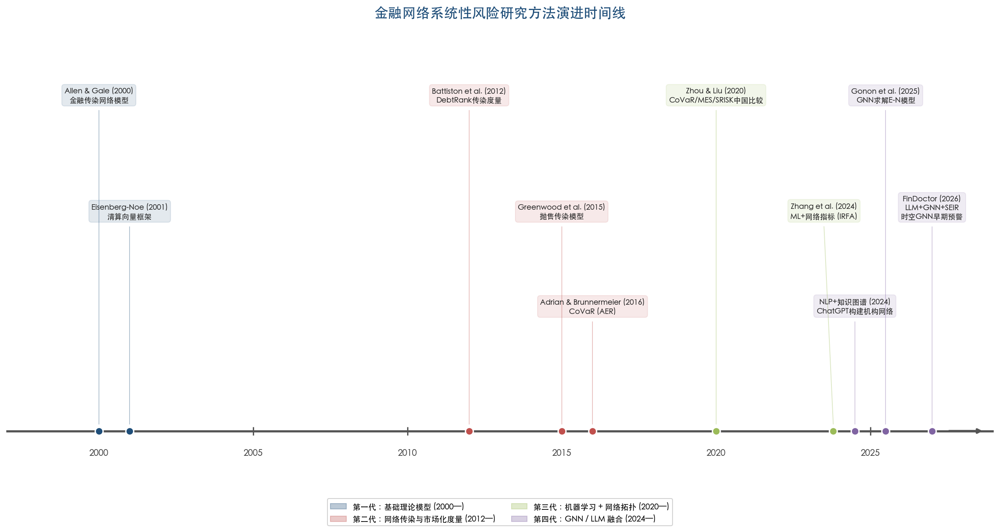

### 6.1.1 图神经网络：从静态拓扑到动态风险度量

传统系统性风险建模方法——无论是Eisenberg-Noe清算向量模型还是DebtRank连续传染框架——在面对大规模金融网络时均受制于计算复杂度与数据维度的双重约束。图神经网络（Graph Neural Network, GNN）技术的快速成熟为这一瓶颈提供了突破路径。

Gonon等人（2025年）提出将置换等变神经网络（permutation equivariant neural networks）与GNN结合，求解扩展的Eisenberg-Noe清算模型。该方法利用GNN的消息传递机制（message passing）在网络节点间聚合信息，在数值实验中显著优于传统前馈神经网络，尤其在网络规模扩大时展现出更为突出的计算效率优势 [Gonon等人预印本](https://arxiv.org/html/2410.07222 "Computing Systemic Risk Measures with GNN")。这一成果的实际意义在于：当银行间网络节点达到数千家（中国银行间市场2019年已有7,027家成员机构），传统数值方法的计算负担急剧上升，GNN为此类高维网络提供了可扩展的近似求解方案。

在中国情境下的应用已初步展开。2026年3月发表于IEEE Access的一项研究提出了"显著性融合时空图神经网络"（Saliency-Fused Spatio-Temporal Graph Neural Network）框架，专门用于中国金融-实体经济系统性风险的早期预警。该框架将时序动态特征与网络拓扑特征相结合，在捕捉风险跨行业传导路径方面展现出相较传统计量方法的增量预测能力 [ResearchGate](https://www.researchgate.net/publication/401576671 "Saliency-Fused Spatio-Temporal GNN for Systemic Risk Early Warning, IEEE Access, 2026年3月")。

### 6.1.2 大语言模型与传染病模型的融合：FinDoctor框架

Liu等人（2026年3月）在《Intelligent Computing》发表的FinDoctor框架代表了另一个前沿融合方向。该框架将大语言模型（Large Language Model, LLM）与时序图神经网络结合SEIR传染病模型，在两个真实金融数据集上分别取得了88%和89%的AUC最优性能，验证了LLM增强文本嵌入在金融语义捕获方面优于传统方法 [FinDoctor论文](https://spj.science.org/doi/10.34133/icomputing.0292 "FinDoctor, Intelligent Computing, 2026年3月")。FinDoctor的核心创新在于将非结构化金融文本（新闻、公告、分析师报告）通过LLM编码为语义向量，注入图神经网络的节点特征中，使风险传染模型能够同时捕捉"硬数据"（交易头寸、资产负债表）和"软信息"（市场情绪、政策预期），从而弥合了结构化数据建模与非结构化信息提取之间的鸿沟。

### 6.1.3 知识图谱与NLP：弥补双边敞口数据缺口

第四章已指出，中国银行间网络建模面临的核心困难之一在于双边敞口数据的不可公开获取。知识图谱（Knowledge Graph）与自然语言处理（NLP）技术为这一数据缺口提供了替代路径。2024年FinTech期刊发表的研究利用ChatGPT等LLM工具从新闻文本中自动提取金融机构间的关联关系，构建"文本推断网络"（text-inferred network），将非结构化文本转化为结构化的机构间关联拓扑 [FinTech期刊](https://www.mdpi.com/2674-1032/3/2/16 "Systemic Risk and Bank Networks: Knowledge Graph with ChatGPT, 2024")。这一方法的潜在价值尤其体现在监管数据可得性有限的场景：对于无法直接获取银行间拆借合约级别数据的外部研究者或跨国监管协调机构，基于公开信息的NLP网络重构提供了一条可操作的分析路径。

Zhang等人（2024年）在IRFA发表的研究则系统验证了网络连通性指标对系统性风险预测的增量贡献。该研究将KNN、SVM、随机森林、XGBoost等传统机器学习算法与金融网络拓扑特征（度分布、聚类系数、中心性指标等）相结合，并探索了Transformer架构在早期预警系统中的应用 [Zhang et al. (2024)](https://ideas.repec.org/a/eee/finana/v93y2024ics1057521924000796.html "Systemic risk prediction using machine learning, IRFA")。其结论对监管实践具有直接启示：将网络拓扑特征作为辅助指标纳入现有的宏观审慎监测框架，可显著提升风险预警的提前量与准确度。

### 6.1.4 FSB对AI金融稳定影响的监管关切

金融稳定理事会（FSB）2025年10月发布了关于金融领域AI应用监测的专题报告，指出各国金融监管当局在理解AI用例及其风险方面已取得进展，但监测工作整体仍处于早期阶段。报告识别了六大类监测指标——AI应用清单、第三方依赖度、市场相关性代理指标、网络安全指标、集中度指标和系统关联度指标——并以生成式AI（GenAI）为案例，分析了金融机构对少数关键第三方提供商（专用硬件、云基础设施、预训练模型）的高度依赖所带来的"关键性、集中度和可替代性"三维脆弱性 [FSB](https://www.fsb.org/2025/10/fsb-outlines-next-steps-for-authorities-on-ai-monitoring/ "FSB outlines next steps for authorities on AI monitoring, 2025年10月")。

对中国金融体系而言，AI应用的系统性风险含义至少体现在两个层面。其一，国有大行和头部金融科技平台正快速部署AI驱动的信贷决策、量化交易和风险管理系统，若底层模型或数据供应商高度重叠，可能在市场压力时期催生同质化的交易行为与顺周期效应。其二，AI辅助的系统性风险监测工具本身构成"以技术防范技术风险"的前沿实践，中国央行可借鉴FSB的指标框架，将金融机构AI应用的集中度和第三方依赖度纳入宏观审慎监测范围。

## 6.2 气候转型风险与地缘政治风险的网络传导

### 6.2.1 气候转型风险通过借贷网络的传导机制

气候变化对金融稳定的影响已从概念讨论进入定量评估阶段。央行与监管机构绿色金融网络（NGFS）2024年11月发布的Phase V气候情景显示，在当前政策路径下，全球GDP到2100年可能累计损失30%，尾部情景下可达50% [NGFS Phase V](https://www.ngfs.net/en/publications-and-statistics/publications/ngfs-climate-scenarios-central-banks-and-supervisors-phase-v "NGFS Climate Scenarios Phase V, 2024年11月")。尽管上述估计所依据的部分研究存在争议（Kotz等人的Nature论文已撤稿），NGFS Phase VI预计2026年底将更新情景参数，但气候转型风险通过金融网络传导的基本逻辑已经确立。

其核心传导路径为：碳价上升或碳排放管制收紧→高碳行业企业生产成本上升、盈利能力下降→企业偿债能力恶化→持有相关贷款的银行信用资产质量劣变→银行通过缩减同业拆借或抛售共同持有的债券资产将冲击传导至其他机构→系统性信用收缩或资产价格螺旋。这一传导路径与第三章分析的"共同资产持有"和"抛售传染"机制在结构上高度一致——气候风险本质上为已知的网络传导渠道注入了一个新的外生冲击源。

中国人民银行2021年下半年首次组织开展气候风险敏感性压力测试，涵盖21家商业银行和2家开发性银行，聚焦碳价上升对火电、钢铁和水泥三个高碳行业贷款质量的影响。测试结果显示，若上述行业企业不进行低碳转型，其偿债能力将在不同压力情景下出现不同程度的下降；但由于参测银行对上述三个行业的贷款占总贷款比例相对较小，所有参测银行的总体资本充足率在各情景下仍满足监管要求 [Green Central Banking](https://greencentralbanking.com/2022/02/21/china-defaults-climate-stress-test-pboc/ "PBoC warns of defaults following climate stress test, 2022年2月")。时任央行副行长刘桂平随后表示，央行计划将气候压力测试扩展至航空、有色金属、石化等更多高碳行业 [南华早报](https://www.scmp.com/business/china-business/article/3180075/china-expand-climate-related-stress-testing-banks-central "China to expand climate stress tests, 2022年6月")。

2024年4月，央行等七部门联合发布绿色金融指导意见。截至2023年末，中国绿色贷款余额已达30.08万亿元，7年间年均增速超过20%，居全球首位。该意见首次要求金融机构分类分步建立可持续信息披露制度，并将环境、社会和治理（ESG）因素纳入信用评级 [新浪财经](https://finance.sina.cn/2024-04-17/detail-inasazye8815343.d.html "七部门绿色金融指导意见")。2025年，金融监管总局进一步发布《银行业保险业绿色金融高质量发展实施方案》，明确要求银行保险机构在积累数据的基础上分步分行业开展气候情景分析与压力测试 [金融监管总局](https://www.nfra.gov.cn/cn/view/pages/ItemDetail.html?docId=1199877&itemId=928 "银行业保险业绿色金融高质量发展实施方案")。

从金融网络分析的视角审视，当前气候压力测试的主要局限在于：测试框架仍以"单一银行—高碳行业贷款"为分析单元，尚未系统纳入银行间网络传染渠道和共同资产持有的间接传导效应。商道融绿2026年初发布的《中国责任投资十大趋势2026》报告指出，随着气候物理风险（极端天气事件）影响加剧，将洪水、持续高温等物理风险情景纳入压力测试框架已成为重要方向 [商道融绿](https://www.syntaogf.com/info-detail/2026top10 "中国责任投资十大趋势2026")。我们认为，将气候转型风险和物理风险嵌入多层金融网络传染模型（如第四章介绍的多重网络框架），是实现气候-金融风险定量评估的关键下一步。

### 6.2.2 地缘政治碎片化对金融网络的冲击

地缘政治风险通过金融网络传导是近两年迅速升温的研究前沿。欧洲央行与欧洲系统性风险委员会（ESRB）2026年1月联合发布的专题报告建立了涵盖5大类40项指标的"地缘经济碎片化金融稳定风险"监测框架，并提供了两项关键实证发现：地缘政治冲击使银行新增贷款关系的概率降低约6%、平均贷款金额减少约9%；非银金融机构在乌克兰危机后将对全球其他地区的敞口削减了17% [ESRB报告](https://www.esrb.europa.eu/pub/pdf/reports/esrb.report202601_financialstabilityrisks.en.pdf "Financial stability risks from geoeconomic fragmentation, 2026年1月")。

波士顿联储2025年工作论文从微观层面补充了上述宏观证据：实证分析表明，银行会系统性地减少对地缘政治风险升高国家的跨境信贷，地缘政治冲击通过银行跨境贷款渠道的传导可加剧目标国的信贷紧缩 [波士顿联储](https://www.bostonfed.org/-/media/Documents/Workingpapers/PDF/2025/WP2507.pdf "Geopolitical Risk and Global Banking, 2025")。

对中国而言，地缘政治碎片化对金融网络的影响至少体现在三个维度。第一，跨境银行信贷的重新配置：中国四大国有银行均拥有全球业务网络（如工商银行持有南非标准银行19.74%股权），地缘政治紧张可能导致跨境敞口的非连续调整。第二，共同资产持有渠道：截至2025年8月末，境外机构持有中国债券约4万亿元，若地缘事件触发大规模资本流出，银行间债券市场的价格波动将通过共同资产持有渠道传导至境内金融机构。第三，贸易金融网络的收缩：跨境贸易融资（信用证、承兑汇票等）可能因制裁或合规要求收紧而缩量，进而影响银行的表外风险暴露和同业代理行关系。

## 6.3 金融科技与数字资产对机构间关联的重塑

### 6.3.1 数字信贷平台与新型关联网络

金融科技（FinTech）正从两个方向重塑金融机构间的关联方式。一方面，互联网平台企业作为联合贷款的发起方，将多家银行连入同一信贷资产池，形成以平台为核心节点的"星型"关联拓扑——这与传统银行间市场以国有大行为核心的"辐射型"结构形成互补，同时也可能叠加放大网络集中度。另一方面，数字化的信贷决策系统使不同银行在资产配置策略上趋于同质化（相似的算法驱动、相似的数据源、相似的目标客群），进一步加剧了第三章所讨论的"太相似不能倒"（Too Similar To Fail, TSTF）风险。

中国2015年前后P2P网络借贷平台的大规模风险暴露，是金融科技平台系统性风险传导的一个早期案例。监管部门在2020年底前完成了P2P存量清零，但这一经历深刻揭示了平台化金融中介在信息不对称、投资者保护和风险处置方面的特殊挑战。当前，随着消费金融公司、民营银行与互联网平台的联合贷款模式持续发展，监管层面对"助贷"和"联合贷款"的规范已成为宏观审慎关注的重点领域。

### 6.3.2 加密资产与去中心化金融的系统性风险

全球加密资产（crypto-assets）和去中心化金融（Decentralized Finance, DeFi）的发展对传统金融网络构成新的风险维度。FSB 2025年10月的同行评审报告发现，各司法管辖区在加密资产监管框架的实施中存在"重大差距和不一致"，全球稳定币（stablecoin）安排的监管明显滞后 [FSB报告](https://www.fsb.org/2025/10/fsb-finds-significant-gaps-and-inconsistencies-in-implementation-of-crypto-and-stablecoin-recommendations/ "FSB加密资产监管评审, 2025年10月")。

ESRB 2025年10月的报告进一步指出，全球稳定币市值较2023年5月翻倍以上，加密资产与传统金融的交织度持续上升——稳定币储备存放于商业银行，形成了加密市场与银行体系之间的直接信用关联；欧盟和第三国联合发行稳定币的模式具有内在脆弱性 [ESRB报告](https://www.esrb.europa.eu/news/pr/date/2025/html/esrb.pr251020~84e90ccc73.en.html "ESRB加密资产与DeFi系统性风险, 2025年10月")。国际清算银行金融稳定研究所（BIS/FSI）的分析则指出，DeFi在功能上复制了传统金融的部分功能，但继承并可能放大已知的脆弱性——操作脆弱性、流动性期限错配、杠杆和互联性——目前DeFi与传统金融的直接关联尚属有限，但随着规模扩大，传染风险将系统性上升 [BIS/FSI](https://www.bis.org/fsi/fsisummaries/defi.pdf "DeFi financial stability risks, BIS FSI")。

中国自2021年起对加密货币交易和挖矿实施全面禁令，境内DeFi发展受到严格限制。然而，中国金融机构的海外分支机构以及境外投资者通过债券通等渠道参与中国市场的行为，使得全球加密市场的波动仍可通过间接渠道——如境外投资者的风险偏好变化和跨境资金流动——对中国银行间市场产生影响。FSB 2026年3月年度报告将非银金融中介（NBFI）快速增长、资产估值偏高和加密市场波动列为当前全球金融体系的关键脆弱性 [FSB年度报告](https://www.fsb.org/2026/03/fsb-publishes-2025-annual-report/ "FSB 2025 Annual Report, 2026年3月")。

## 6.4 跨境金融网络的扩展与新型传染渠道

### 6.4.1 中国金融市场开放的最新进程

中国金融市场的双向开放在2025—2026年进入新阶段，跨境金融网络的关联密度实现系统性提升。截至2025年8月末，共1,170家境外机构持有中国债券约4万亿元。2025年9月，央行等三部门全面开放境外机构投资者银行间债券市场回购业务，使境外投资者不仅可持有中国债券，还能以债券为质押物在银行间市场融入人民币资金 [央行/外汇局](http://m.safe.gov.cn/safe/2025/0926/26602.html "境外机构债券回购业务开放, 2025年9月")。这一政策的网络含义在于：境外机构从单纯的债券持有者升级为银行间回购市场的直接参与者，与境内金融机构之间建立了双向的资金融通关系，跨境关联从单向持债转变为双向交易。

2026年，外汇局进一步推进"有序推进金融市场双向开放，优化合格境外机构投资者（QFII）跨境资金管理" [新浪财经](https://finance.sina.cn/jjxw/2026-02-11/doc-inhmmfcn0684786.shtml "外汇局优化QFII管理, 2026年2月")。债券通、互换通、跨境理财通2.0等互联互通机制的相继落地或扩容，以及QFII/RQFII投资额度限制于2019年取消后资金流动的持续便利化，使得中国银行间市场的跨境关联度攀升至历史最高水平。

### 6.4.2 跨境传染的多渠道叠加效应

从系统性风险的角度审视，跨境金融网络的扩展带来三类新的传染渠道。

第一，跨境同业敞口渠道。中国G-SIBs的海外业务网络构成直接的跨境同业信用敞口。第二章引用的工商银行2025年年报显示，工银集团金融投资总额16.91万亿元中，持有银行同业及其他金融机构发行的债券约1.38万亿元，其中包含对境外金融机构的敞口。这些跨境同业头寸在全球性金融压力事件中可能成为风险传入或传出的双向渠道。

第二，汇率与资本流动渠道。境外投资者持有约4万亿元人民币债券资产，在全球风险偏好逆转时可能集中抛售，引发银行间债券市场价格波动与流动性收紧。央行的远期售汇风险准备金和跨境融资宏观审慎参数等工具已部分覆盖了汇率渠道的传染风险，但共同资产持有引发的间接传染——即Greenwood等人所描述的"抛售传染"——目前尚未被系统性地纳入跨境风险评估框架。

第三，衍生品对手方信用风险渠道。第二章数据显示，工银集团2025年末衍生金融工具名义金额合计19.01万亿元，其中包含大量与境外对手方的利率互换和货币衍生品交易。"互换通"机制上线以来累计名义本金达8.15万亿元，已有82家境外机构参与。衍生品对手方信用风险虽大部分已通过中央清算机构（如上海清算所）进行集中清算管理，但场外双边交易仍构成不可忽视的跨境传染敞口。

### 6.4.3 跨境协调监管的挑战与方向

跨境金融网络的扩展对监管协调提出了更高要求。IMF 2025年4月发布的中国金融部门评估规划（FSAP）报告提出33条建议，其中包括对跨境风险监测和危机管理框架的改善建议 [IMF FSAP报告](https://www.imf.org/en/publications/cr/issues/2025/04/30/peoples-republic-of-china-financial-sector-assessment-program-financial-system-stability-566570 "IMF中国FSAP 2025")。ESRB关于地缘经济碎片化的40项监测指标框架也为跨境网络风险的系统性监测提供了方法论参考。

我们认为，中国在跨境金融网络风险管理方面的下一步重点应涵盖三个方面：其一，将跨境同业敞口和境外投资者共同资产持有明确纳入传染性风险压力测试的情景设计；其二，在互换通、债券通等互联互通机制中建立压力时期的流动性协调安排；其三，借鉴FSB G-SIBs跨境处置框架，完善中资系统重要性银行的跨境恢复与处置计划。

## 6.5 综合展望：多维风险叠加下的研究与监管前沿

上述四个前沿方向并非彼此独立，而是在实践中呈现深度交织的态势。图2以概念示意图的形式展示了气候转型风险、地缘政治风险、数字资产风险和跨境资本流动四类外部冲击如何经由不同传导渠道向中国银行间网络内部传导，以及AI/大数据监测工具在底层的支撑作用。

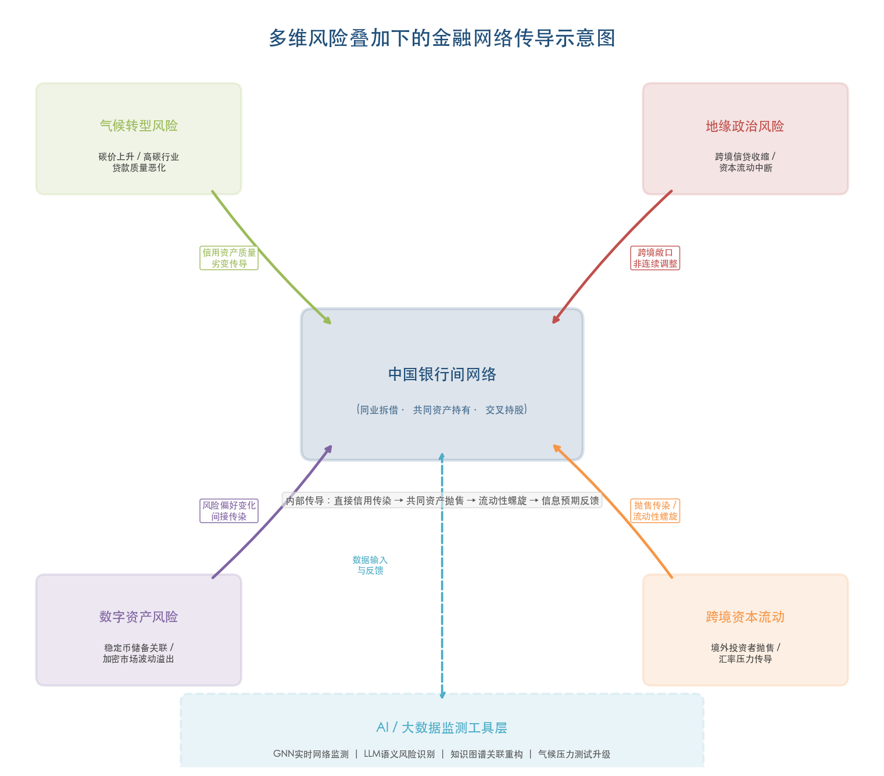

AI技术既是风险监测的工具，其大规模应用本身也可能成为新的系统性风险源；气候转型和地缘政治冲击通过既有的借贷网络和共同资产持有渠道传导，而跨境金融网络的扩展进一步拉长了传染链条；数字资产虽然目前与中国传统金融体系的直接关联有限，但全球加密市场的波动可通过境外投资者行为间接影响境内市场。

从研究方法论的角度而言，多维风险叠加要求将气候情景、地缘政治情景和技术冲击情景整合进统一的多层金融网络模型之中。第三章和第四章分析的多重网络框架（同业拆借层+交叉持股层+共同资产持有层）可进一步扩展为包含"气候风险层"和"跨境关联层"的五层网络模型，利用GNN和ABM等计算工具处理高维度的非线性传染动力学。

从监管实践的角度审视，中国当前的宏观审慎工具体系已建立了较为完整的制度框架（如第五章所述），但在以下三个前沿领域仍存在显著的能力建设空间。

第一，气候金融压力测试的网络化升级。当前气候压力测试以"银行—企业贷款"二元关系为分析单元，建议参照欧洲央行的全系统气候压力测试方法，将银行间网络传染渠道纳入情景模拟，评估气候冲击的系统性放大效应。

第二，AI辅助的实时网络监测体系。借鉴FSB提出的AI应用监测指标框架，结合中国银行间市场逐笔交易数据的独特优势，利用GNN和时序图网络构建实时的机构间关联强度热力图与早期预警系统，将监测频率从季度报告级别提升至日内级别。

第三，跨境传染性风险的前瞻性评估。随着金融市场双向开放的持续深化，传统的国内传染性风险压力测试需要延伸至跨境维度。建议将境外投资者的资金流动行为和汇率压力情景纳入传染性风险测试框架，并与主要交易对手国的监管当局建立信息共享和联合压力测试机制。

# 结论与风险提示

## 核心结论

本报告基于对中国金融机构间投资借贷关系的全景梳理、分类分析、网络传导机制解析、建模方法论评估和监管制度审视，形成以下五项核心结论。

**第一，中国金融机构间的投资借贷网络已形成高度复杂的"辐射型"多层结构，其规模与关联密度均处于历史最高水平。** 银行间债券市场托管余额173万亿元，同业存单余额约20万亿元，债券回购日均成交6.9万亿元，资管产品同业配置28.7万亿元——这些数字勾勒出一张以国有大行为核心、股份行和城商行为中间层、非银机构为外围的庞大资金网络。网络的"核心-中间-外围"三层拓扑结构以及小世界属性，使得风险信号可在极短路径上迅速触达全网。

**第二，不同类型的借贷关系具有差异化的风险传导机制，多层关联的叠加产生显著的非线性放大效应。** 同业拆借和同业存款构成无担保的直接信用敞口，违约损失传染效率最高；债券回购规模最大但质押品缓释降低了单笔损失率，其风险主要体现在流动性螺旋的放大潜力；债券和同业存单的投资持有关系兼具信用风险和市场风险双重属性，高度集中的持有人结构（公司信用类债券前200名投资者占比84.5%）构成系统性关联的核心节点；影子银行和通道业务的透明度最低、期限错配最严重。实证研究表明，双层和三层网络的传染损失均大于各单层损失之和，印证了多层关联的非线性叠加效应。

**第三，中国金融网络呈现"稳健却脆弱"的双重特性，中小银行对同业融资的高度依赖构成系统性脆弱点。** 在正常市场环境下，密集的网络互联有效分散了个体风险；但当冲击超过临界阈值，同样的互联结构可能从"冲击吸收器"骤变为"冲击放大器"。城商行和农商行同业拆借余额占各自总资产比重分别达14.44%和19.16%，显著高于大型银行，其在流动性冲击中首当其冲。2013年"钱荒"期间Shibor隔夜利率飙升至13.44%的极端案例，已验证了这一结构性脆弱性的现实威胁。

**第四，系统性风险建模需要多方法互补，中国在传染渠道精细化建模方面仍有提升空间。** 网络清算模型在理论精度上最优，但受制于双边敞口数据不可得；市场化方法的实时性最强，但在中国面临涨跌停板截断和上市覆盖率有限等特殊挑战；压力测试是唯一能直接支撑监管决策的工具，但现行传染性风险测试尚未充分纳入共同资产持有和流动性螺旋渠道。构建"市场化方法日常监测+网络模型深度诊断+压力测试监管决策"的三位一体框架，是弥合方法论缺口的可行路径。

**第五，中国系统性风险监管框架经历了从分业监管到统筹协同、从规模控制到结构优化的深刻转型，制度建设的速度与深度在全球主要经济体中居于前列，但在非银金融机构系统重要性评估、金融数据基础设施透明度和法律层面的危机管理框架方面仍存在需要补齐的短板。** 金融稳定法的出台、系统重要性保险公司名单的发布以及MPA评估改革的推进，构成近期最值得关注的三项制度变量。

## 研究局限性

本报告的分析结论受以下因素制约，读者在使用时应充分考虑其适用边界。

**第一，双边敞口数据的不可得性。** 中国银行间市场的双边敞口矩阵并非公开数据，报告所引用的网络结构研究均依赖最小密度法、最大熵法或贝叶斯方法进行统计重构，重构结果与真实网络之间不可避免地存在偏差。这一数据约束直接影响网络传染模型和传导路径分析的精度。

**第二，极端事件样本有限。** 中国资本市场历史仅三十余年，系统性危机事件样本稀少，对尾部风险的统计推断面临样本不足的固有约束。市场化度量方法（如ΔCoVaR、MES）在极端分位数区域的参数校准存在较大不确定性。

**第三，非上市金融机构覆盖不足。** 中国银行业3235家机构中A股上市银行仅约42家，覆盖率不足2%。大量城商行、农商行和村镇银行——恰恰是系统性风险传染链条中的脆弱环节——缺乏公开市场数据和详细的资产负债表披露，本报告对其风险状况的分析在颗粒度上受到限制。

**第四，截面时点的局限。** 报告以2026年3月为锚点，核心数据截至2025年末。金融机构间的借贷关系和网络结构具有高频动态变化特征，部分分析结论可能随市场条件和政策环境的变化而需要更新。同业存单备案制改革、金融稳定法立法进程和MPA评估改革等政策变量的走向，均可能对报告所描述的格局产生实质性影响。

**第五，跨境维度的分析深度有限。** 报告虽然在第六章讨论了跨境金融网络的扩展和新型传染渠道，但受数据和篇幅约束，未能对中国金融机构海外分支的具体敞口结构和跨境传染路径进行全面的定量分析。随着金融市场双向开放的深化，跨境关联对系统性风险的影响有待更深入的专题研究。
