# 执行摘要

具身智能（Embodied Intelligence）正处于从实验室原型向有限场景商用跨越的关键转折期。2025年全球人形机器人出货量达约1.8万台，同比增长超500%；全球人形机器人细分领域融资从2022年的2.39亿美元增长15倍至约37亿美元；Figure AI以390亿美元估值完成超10亿美元融资。产业共识已从"是否值得投入"转向"如何实现规模化落地"。

**技术路线格局。** 具身智能"大脑"层面的技术竞争围绕四条路线展开：单模型端到端VLA（以Physical Intelligence π₀/π₀.5为代表）、双系统VLA（以Figure AI Helix、NVIDIA GR00T N1系列为代表）、世界动作模型WAM（以NVIDIA DreamZero/GR00T N2为代表），以及分层大模型架构（以Google DeepMind Gemini Robotics-ER为代表）。四条路线在泛化能力、实时性、数据效率、部署成本、安全性和可解释性六个维度上各有所长，不存在全维度最优解——技术路线选择本质上是场景驱动的权衡问题。2025—2026年间最显著的技术趋势是路线之间边界的快速消融：端到端与分层正走向深度融合，世界模型与VLA正通过WAM范式实现架构统一。我们判断，WAM范式有望在2027年前成为"大脑"层面的主流架构方向。

**代表性公司梯队。** 全球具身智能竞争格局呈现"中美双核"特征。美国在"认知大脑"层面保持领先——Physical Intelligence累计融资超10.7亿美元（估值56亿—110亿美元），Figure AI累计融资约19亿美元（估值390亿美元），NVIDIA通过GR00T+Cosmos+Isaac+Newton构建全栈基础设施生态，Google DeepMind以Gemini Robotics开创并持续推进VLA范式。中国在"物理身体"层面决定性领先——智元机器人2025年出货超5,100台位居全球第一，宇树科技以核心部件自研率超95%实现人形机器人均价约2.3万美元且毛利率达62.91%，银河通用以国家大基金三期首投获得B++轮25亿元融资（估值突破200亿元），优必选Walker S2累计订单超8亿元。世界模型赛道资本涌入尤为密集——Skild AI（14亿美元C轮，估值超140亿美元）、World Labs（10亿美元，估值50亿美元）、AMI Labs（10.3亿美元种子轮，估值35亿美元）。

**商业化进展。** 2025年全球人形机器人销售收入首次突破5亿美元，中国企业包揽收入前三名。工业制造是最先突破的主阵地——Figure 02在BMW工厂累计运行超1,250小时、搬运超9万个零件，雷诺宣布部署350台人形机器人。RaaS模式在北美市场已形成6,000—8,000美元/月的定价共识。中国市场呈现B2B+B2C多元格局，娱乐表演和数据生产两大非工业场景合计贡献了全球近半数收入。

**硬件形态分化。** 人形双足是投融资最集中的主赛道，但轮式/复合平台（如银河通用Galbot G1，续航10小时）在结构化工业环境中展现出更优的性价比。灵巧手是制约人形机器人从"能走"迈向"能干活"的核心短板——当前MTBF仅约1,000小时，远低于工业级10,000小时要求。四足机器人已率先实现规模化量产，宇树科技四足累计出货超3万台。

**核心判断。** 我们认为具身智能产业当前处于"GPT-2到GPT-3"的关键过渡期：基础架构已初步确立，规模化数据与算力注入正在加速能力跃升，但"ChatGPT时刻"——机器人在陌生环境中凭自然语言指令完成约80%任务——尚未到来。2026年是产业分化的关键之年：出货量预计达3—6万台，但Gartner预测至2028年能将人形机器人推进至规模化生产部署的公司不到20家。具备"自研执行器+自研算法+量产能力"垂直整合能力的企业将在淘汰赛中胜出。

# 第1章 具身智能产业全景——定义、技术栈与发展阶段

2025年，"具身智能"（Embodied Intelligence）从学术术语跃升为全球科技与资本市场的核心叙事之一。人形机器人首次写入中国《政府工作报告》，"具身智能"入选中国"2025年十大流行语"第二名，Figure AI以390亿美元估值完成超10亿美元融资，宇树科技与智元机器人分别实现数千台量产交付。产业共识正在形成：具身智能不仅是机器人技术的又一轮迭代，而是物理世界中通用人工智能的承载形态。

本章作为全报告的起点，旨在回答三个基础问题：具身智能究竟是什么？其技术栈由哪些层级构成？当前产业处于怎样的发展阶段？在此基础上，通过梳理2025—2026年的关键里程碑事件与投融资数据，为后续各技术路线与公司层面的深度分析建立坐标系。

## 1.1 定义与边界：什么是具身智能

### 1.1.1 学术共识定义

具身智能的概念植根于认知科学中的"具身认知"（Embodied Cognition）理论——认知不仅发生在大脑中，更依赖身体与环境的持续交互。在人工智能领域，这一思想被转化为一种系统范式：智能体的认知和决策能力源于与物理环境的持续交互，依托传感器、执行器和自适应控制机制实现感知—决策—执行闭环，区别于仅依赖静态数据的"离身智能"（Disembodied Intelligence）。[Springer百科](https://link.springer.com/rwe/10.1007/978-981-97-8440-0_8-1 "Embodied Intelligence百科条目，2025年")

中国信通院（CAICT）2026年1月发布的《具身智能发展报告》提供了一个更具操作性的定义：具身智能是"以物理身体为载体，身体形态取决于应用场景，数据来源于身体与环境交互，智能在交互反馈中得以进化"的系统。[CAICT具身智能发展报告](http://www.caict.ac.cn/kxyj/qwfb/bps/202601/P020260130541978285206.pdf "中国信通院，2026年1月发布") 这一定义强调了三个核心要素：物理载体的场景适配性、交互数据的自主生成能力、以及智能的进化属性。

### 1.1.2 与传统机器人和纯软件AI Agent的区分

具身智能与传统工业机器人的核心区分在于"泛化"与"自适应"。传统工业机器人依赖预编程指令在结构化环境中执行固定任务——焊接机械臂在汽车产线上以毫米级精度重复同一动作数百万次，但无法应对工件位置的随机偏移。具身智能系统则通过多模态感知（视觉、触觉、力觉）和自适应控制，在动态、非结构化环境中泛化执行多种任务。[Springer百科](https://link.springer.com/rwe/10.1007/978-981-97-8440-0_8-1 "Embodied vs Disembodied AI对比") [PMC三层框架综述](https://pmc.ncbi.nlm.nih.gov/articles/PMC12631203/ "2025年学术综述")

与纯软件AI Agent（如ChatGPT、AutoGPT等）相比，具身智能的本质差异在于物理实体的存在。软件Agent在数字空间中操作文本、代码和API；具身智能必须应对物理世界的不确定性——重力、摩擦、碰撞、材料变形——这些物理约束既是挑战，也是学习的来源。正是物理交互的反馈闭环，使具身智能有可能发展出比纯数字Agent更深层的因果推理能力。

### 1.1.3 具身智能的形态谱系

值得强调的是，具身智能并不等同于"人形机器人"。物理载体的形态取决于应用场景：人形双足适合在人类设计的空间中执行多种任务，四足机器人适合复杂地形的巡检与探索，轮式双臂平台在仓储与制造中兼顾稳定性与操作能力，灵巧手系统专注于高精度操作任务。不同形态之间共享同一套核心技术栈，区别主要体现在运动控制层和执行器设计上。本报告在后续章节中将对各形态路线做专题分析（见第4章），本章则聚焦于贯穿所有形态的通用技术栈架构。

## 1.2 具身智能技术栈全貌

### 1.2.1 学术框架：三层架构

2025年发表的综述论文提出了"DP-TA"三层架构框架，从学术视角系统化具身智能的技术组成：感知与对齐层（Perception & Alignment）、世界建模与结构预测层（World Modeling & Structural Prediction）、策略生成与适应层（Policy Generation & Adaptation）。[PMC三层框架综述](https://pmc.ncbi.nlm.nih.gov/articles/PMC12631203/ "A review of embodied intelligence systems: a three-layer framework, 2025") 这一框架将具身智能视为一个从环境感知到行为输出的信息流水线，每一层既可独立研究，又通过数据流与梯度反传紧密耦合。

### 1.2.2 产业实践：四层技术栈

在产业实践中，具身智能的技术栈通常被更细粒度地划分为四层：

**感知层**是系统与物理世界的接口。视觉感知（RGB相机、深度相机、事件相机）、激光雷达（LiDAR）、惯性测量单元（IMU）、触觉传感器和力矩传感器共同构成多模态感知阵列，为上层提供环境的空间结构、物体属性和交互力学信息。近年来的趋势是感知模态的融合与端到端化——视觉与触觉信号直接输入统一的神经网络，而非经过独立处理后再融合。

**认知/决策层**是具身智能的"大脑"，也是当前技术竞争最为激烈的层级。两大主流范式在此层展开角逐：端到端VLA（Vision-Language-Action）模型将视觉感知、语言理解、动作生成统一到单一模型中；分层大模型架构（"大脑+小脑"）则由高层的大语言模型/视觉语言模型（LLM/VLM）负责语义理解与任务规划，底层的专用策略网络负责运动控制。NVIDIA GR00T N1.6（22亿参数）和Physical Intelligence π₀.5（约30亿参数）是2025—2026年VLA领域的代表性模型。[RAISE Summit报告](https://www.raisesummit.com/post/robotics-humanoids-physical-ai-leaders "Physical AI Leaders 2026") 本报告第2章将对这两大范式做深度解析。

**控制/执行层**负责将决策层的高层指令转化为电机的力矩信号和关节的运动轨迹。核心挑战包括全身运动控制（行走、跑步、跳跃、翻越）、灵巧操作（多指抓取、工具使用、精密装配）和动态平衡（在外部扰动下保持稳定）。执行器（电机、减速器、力矩传感器）的性能与成本直接决定了系统的物理能力边界——当前执行器成本约占人形机器人制造总成本的60%—70%。[RAISE Summit报告](https://www.raisesummit.com/post/robotics-humanoids-physical-ai-leaders "技术成熟度分析，2026年")

**仿真/数据层**是近两年快速崛起的"第四层"，其重要性已与前三层并列。仿真平台（NVIDIA Isaac Sim、MuJoCo、Meta Habitat）构建物理逼真的虚拟环境，通过域随机化和Sim-to-Real迁移技术将仿真中训练的策略部署到真实机器人上。这一层的价值在于解决具身智能的数据瓶颈——真实世界的机器人操作数据稀缺且采集成本高昂，而仿真可以在数小时内生成等效数千小时人类遥操作的训练数据。NVIDIA在2025年展示了用Isaac GR00T Blueprint在11小时内生成78万条合成轨迹（等效6500小时人类遥操作），使GR00T N1模型性能提升40%。[NVIDIA技术博客](https://developer.nvidia.com/blog/building-a-synthetic-motion-generation-pipeline-for-humanoid-robot-learning/ "Synthetic Motion Generation Pipeline, 2025") 本报告第3章将专题分析世界模型与仿真基础设施。

### 1.2.3 技术栈各层的耦合与协同

值得注意的是，四层技术栈之间的边界正在模糊化。端到端VLA模型的出现，实质上是将感知层与决策层压缩为单一模型；世界模型的兴起，则是在仿真/数据层与决策层之间建立了新的耦合——智能体在潜在空间中"想象"物理世界的演化，从而减少对真实交互的依赖。这种层间融合趋势是理解当前技术路线分化与收敛的关键线索。

## 1.3 发展阶段：从实验室走向有限场景商用

### 1.3.1 当前所处阶段

我们判断，具身智能产业当前处于"有限场景商用/量产元年"阶段——已经跨越了纯实验室原型期，部分产品在特定工业场景实现了商业部署，但距离跨场景规模化应用仍有显著距离。

Gartner 2026年1月的预测为这一判断提供了量化锚点：至2028年，全球将有不到100家公司能将人形机器人推进到实验之外，不到20家公司能在制造和供应链场景实现规模化生产部署。[Gartner新闻稿](https://www.gartner.com/en/newsroom/press-releases/2026-01-21-gartner-predicts-fewer-than-20-companies-will-scale-humanoid-robots-for-manufacturing-and-supply-chain-to-production-stage-by-2028 "Gartner预测，2026年1月21日") 这意味着即便在最乐观的预期下，真正的规模化部署窗口也在2027—2028年才会开启。

国际机器人联合会（IFR）2026年1月发布的"全球机器人五大趋势"将人形机器人列为核心趋势之一，并指出"企业和研究者正在从原型走向真实部署"，但同时强调人形机器人在与传统自动化竞争时，尚须在循环时间、能耗和维护成本等工业核心指标上达标。[IFR](https://ifr.org/ifr-press-releases/news/top-5-global-robotics-trends-2026 "IFR全球机器人五大趋势2026")

### 1.3.2 出货量：量产元年的量化标尺

2025年全球人形机器人出货量达约1.8万台，标志着产业从"样机"阶段进入"批量交付"阶段。[Forbes](https://www.forbes.com/sites/johnkoetsier/2026/01/09/top-10-humanoid-robot-companies-by-shipments-revealed/ "Forbes引述出货量排名，2026年1月") 出货格局呈现鲜明的中国主导特征：

- **智元机器人（AgiBot）**以约5168台出货量位列全球第一，占比约39%。这家成立于2023年的公司在短短两年内实现了从零到规模交付的跨越。
- **宇树科技（Unitree）**以约4200台居第二（宇树自述口径超5500台），同时其四足机器人累计出货超3万台。
- **优必选（UBTECH）**以约1000台居第三，Walker S2开启量产交付。

中国企业合计占据全球人形机器人出货的绝对主体。与之对比，美国头部公司的出货量级显著较小——Figure AI约150台，特斯拉Optimus约150台。[Robozaps](https://blog.robozaps.com/b/tesla-model-s-optimus-robot-factory-conversion "2025年出货排名分析") 特斯拉CEO马斯克在2025年Q4财报电话会上坦承，Optimus"尚未在工厂中以实质性方式使用"，当年初设定的10000台生产目标未能达成。[Robozaps](https://blog.robozaps.com/b/tesla-model-s-optimus-robot-factory-conversion "Musk 2025 Q4财报电话会表述")

### 1.3.3 2025年关键里程碑

2025年是具身智能从概念验证走向产业化的转折之年，以下事件构成了这一判断的支撑：

**政策与社会影响层面**：具身智能首次写入中国《政府工作报告》，将其提升至国家战略层级；16台宇树H1在央视春晚的表演使人形机器人进入亿级受众的视野；"具身智能"入选中国"2025年十大流行语"第二名，标志着这一概念从专业圈层向大众认知渗透。[人民网/新华社](https://world.people.com.cn/n1/2026/0227/c1002-40671139.html "2026年2月综述")

**产品与量产层面**：智元机器人完成超5000台量产交付，成为全球首个实现千台级人形机器人规模出货的公司；优必选Walker S2开启量产；宇树G1以9.9万元人民币的定价将消费级人形机器人的价格门槛推至历史低点。

**资本层面**：Figure AI完成超10亿美元C轮融资（估值390亿美元），创下人形机器人单轮融资纪录；全球人形机器人细分领域融资从2022年的2.39亿美元增长15倍至2025年的约37亿美元。[AI Insider](https://theaiinsider.tech/2025/12/31/ai-insiders-robotics-funding-year-in-review/ "2025年度融资回顾")

**技术突破层面**：Google DeepMind发布Gemini Robotics（基于Gemini 2.0，综合泛化基准性能为当时SOTA VLA模型的2倍以上）；NVIDIA在GTC 2025发布GR00T N1全球首个开源通用人形机器人基础模型；Physical Intelligence发布π₀.5实现开放世界泛化能力。

### 1.3.4 2026年初关键事件

进入2026年，产业节奏继续加速：

**CES 2026**（2026年1月）成为中国具身智能企业集体亮相国际舞台的标志性展会，多家企业展示了面向海外市场的产品。[RAISE Summit报告](https://www.raisesummit.com/post/robotics-humanoids-physical-ai-leaders "2026年行业概览")

**GTC 2026**（2026年3月）NVIDIA发布Cosmos 3世界基础模型和Newton 1.0物理引擎GA版，并预览GR00T N2——首个采用"世界动作模型"（WAM）架构的人形机器人基础模型，预示着VLA与世界模型融合的新范式。

**资本与估值方面**：智平方（AI² Robotics）完成B轮系列超10亿元人民币融资，成为深圳首个百亿级具身智能独角兽。[南方+](https://www.nfnews.com/content/LownkR5D6J.html "智平方融资报道，2026年2月") Boston Dynamics电动Atlas进入商业试点阶段，首批客户含Hyundai和Google DeepMind。

**产能扩张方面**：特斯拉宣布停产Model S和Model X，将Fremont工厂产能转向Optimus人形机器人制造，目标年产能100万台，Gen 3版本计划于2026年Q1亮相——这是首个面向大规模量产设计的版本。[Robozaps](https://blog.robozaps.com/b/tesla-model-s-optimus-robot-factory-conversion "Tesla Optimus产能转型分析")

## 1.4 全球投融资规模与结构

### 1.4.1 融资总量：爆发式增长

2025年全球机器人领域风险投资总额达约386亿欧元（约410亿美元），其中人形机器人细分领域融资从2022年的2.39亿美元增长15倍至2025年的约37亿美元。[RAISE Summit报告](https://www.raisesummit.com/post/robotics-humanoids-physical-ai-leaders "2025年机器人融资数据") [AI Insider](https://theaiinsider.tech/2025/12/31/ai-insiders-robotics-funding-year-in-review/ "2025年度融资回顾")

中国市场同样展现出强劲增长势头。2025年中国人形机器人与具身智能领域融资金额超300亿元人民币，约占中国机器人行业融资过亿事件总额的90%。[agent.ren](https://agent.ren/2026/0104/3926.shtml "2025年12月融资月报") 具身智能已成为中国机器人投资最集中的赛道。

### 1.4.2 代表性融资案例

2025—2026年初的重大融资事件勾勒出资本向头部企业集中的趋势：

| 公司 | 轮次 | 金额 | 估值 | 时间 |
|------|------|------|------|------|
| Figure AI | Series C | 超10亿美元 | 390亿美元 | 2025年9月 |
| Skild AI | Series C | 14亿美元 | 超140亿美元 | 2026年1月 |
| World Labs（李飞飞） | B轮 | 10亿美元 | 50亿美元 | 2026年2月 |
| AMI Labs（Yann LeCun） | 种子轮 | 10.3亿美元 | 35亿美元 | 2026年3月 |
| 银河通用（Galbot） | B++轮 | 25亿元人民币 | 超200亿元 | 2026年 |
| 星动纪元（RobotEra） | A+轮 | 近10亿元 | 突破百亿元 | 2025年 |
| 灵初智能（PsiBot） | 天使+Pre-A | 共20亿元 | — | 2026年3月 |

[AI Insider](https://theaiinsider.tech/2025/12/31/ai-insiders-robotics-funding-year-in-review/ "2025年12大融资事件汇总") [Skild AI](https://www.skild.ai/blogs/series-c "Skild AI Series C, 2026年1月")

### 1.4.3 估值梯队

截至2026年3月，全球具身智能与人形机器人领域形成了清晰的估值梯队：

**千亿美元级预期**：特斯拉Optimus尚未独立估值，但Morgan Stanley和Wedbush等机构将其视为特斯拉市值中数千亿美元的隐含价值组成。

**百亿美元级**：Figure AI（390亿美元）和Skild AI（超140亿美元）是目前估值最高的纯具身智能/机器人创业公司。

**十亿至百亿美元级**：Physical Intelligence（约56亿美元，2026年3月洽谈约10亿美元新轮次后预计超110亿美元）、World Labs（50亿美元）、Apptronik（50亿美元）、AMI Labs（35亿美元）、宇树科技（约420亿元人民币/约58亿美元，按IPO估值）、银河通用（超200亿元/约28亿美元）。[Robozaps](https://blog.robozaps.com/b/humanoid-robot-companies "估值排名，2026年3月更新")

这一估值分布反映出资本对两类能力的高度重视：一是"大脑"层面的通用AI模型能力（Physical Intelligence、Skild AI），二是硬件量产与商业化能力（宇树科技、银河通用）。

## 1.5 市场规模预测与技术瓶颈

### 1.5.1 市场预测

多家权威机构对具身智能及人形机器人市场规模给出了预测，口径和时间跨度各有差异：

MarketsandMarkets预测人形机器人市场将从2025年的29.2亿美元增长至2030年的152.6亿美元（CAGR 39.2%）。[MarketsandMarkets](https://www.marketsandmarkets.com/Market-Reports/humanoid-robot-market-99567653.html "人形机器人市场报告") 更广义的具身智能全球市场（含人形、四足、灵巧操作等全形态），同一机构2025年6月报告预测2025年约44.4亿美元，预计2030年达230亿美元。[人民网/新华社](https://world.people.com.cn/n1/2026/0227/c1002-40671139.html "引述M&M报告")

Goldman Sachs预测人形机器人TAM到2035年将达380亿美元。Morgan Stanley预测2030年全球人形机器人保有量达90万台。[Goldman Sachs](https://www.goldmansachs.com/insights/articles/the-global-market-for-robots-could-reach-38-billion-by-2035 "Goldman Sachs Research预测") Goldman Sachs进一步预测2026年全球人形机器人出货量5—10万台，2030年代初中期达年出货100万台。

### 1.5.2 核心技术瓶颈

在乐观的市场预期之下，多项技术瓶颈仍然制约着具身智能的规模化部署：

**电池续航**：当前人形机器人续航时间普遍为90—120分钟，远不能满足工业场景8—20小时的单班次需求。部分产品（如银河通用Galbot G1的10小时续航）通过轮式底盘降低能耗实现了突破，但双足行走的能耗问题尚无根本性解决方案。

**Sim-to-Real Gap**：在仿真环境中训练的策略部署到真实世界后，任务成功率从实验室的约95%降至约60%。[RAISE Summit报告](https://www.raisesummit.com/post/robotics-humanoids-physical-ai-leaders "技术成熟度分析，2026年") 物理参数的不确定性（摩擦系数、物体质量、接触动力学）是造成这一差距的核心原因。

**灵巧操作**：人类手部拥有27个自由度和约17000个触觉感受器，当前最先进的机器人灵巧手（如Sanctuary AI的21自由度液压阀驱动手、Figure 03的触觉传感手）仍远落后于人手的精细操作能力。灵巧手的可靠性也是难题——工业场景要求超10000小时的平均故障间隔时间（MTBF），目前头部产品仅达约1000小时。

**执行器成本**：执行器（电机+减速器+传感器）成本约占人形机器人制造总成本的60%—70%。积极的信号是，2023—2024年间制造成本已下降约40%，中国供应链的垂直整合能力（宇树科技核心部件自研率超95%）正在加速成本下降。[RAISE Summit报告](https://www.raisesummit.com/post/robotics-humanoids-physical-ai-leaders "技术成熟度分析，2026年")

**长程任务链**：即便单步任务成功率达95%，10步任务链的累积成功率仅约60%。当前VLA模型的演示多集中于单任务或3—5步短链，复合误差累积是从演示走向真实部署的核心瓶颈。

### 1.5.3 产业阶段判断

综合上述分析，我们认为具身智能产业当前处于"GPT-2到GPT-3之间"的发展阶段——基础能力已经验证，规模化数据和算力的注入正在加速能力跃升，但"ChatGPT时刻"（即机器人能在陌生环境中凭自然语言指令完成约80%任务）尚未到来。多位行业领袖的判断趋于一致：千寻智能创始人高阳将当前阶段类比为"GPT-2时代"，预计2026年末至2027年中迎来"GPT-3级别"突破；宇树科技创始人王兴兴认为"真正的ChatGPT时刻"将在"机器人在陌生环境中凭指令完成约80%任务"时到来。[21世纪经济报道](https://www.21jingji.com/article/20260329/herald/61ea6560498528bcc8906a533f71053a.html "百亿估值具身智能创企圆桌，2026年3月29日") [新华社](https://english.news.cn/20251231/0a082888ab384fcaa572ee7a11ae7d9d/c.html "王兴兴ChatGPT时刻判断")

接下来的第2章和第3章将深入解析具身智能"大脑"层面的两大核心技术路线——端到端VLA模型/分层大模型架构，以及世界模型/仿真基础设施，为理解各代表性公司的技术选择与竞争格局奠定基础。

# 第2章 核心技术路线（上）——端到端VLA模型与分层大模型架构

第1章梳理了具身智能的技术栈全貌，指出认知/决策层是当前技术竞争最为激烈的层级。两大主流范式——端到端VLA（Vision-Language-Action）模型与分层大模型（"大脑+小脑"）架构——正在展开激烈角逐。本章将深入这两条核心技术路线的内部肌理：解析其技术原理与架构分野，逐一梳理各路线的代表性公司与团队，并从技术路径、产品进度、商业化进度、融资情况、团队背景五个维度进行系统性呈现。在此基础上，本章从泛化能力、实时性、数据效率和部署成本四个关键维度对两条路线进行比较分析，揭示二者正在走向融合的产业趋势。

## 2.1 VLA模型：从语言大模型到物理世界的范式迁移

### 2.1.1 技术范式与核心架构

VLA（Vision-Language-Action）模型是一类多模态基础模型，其核心思想是将视觉感知、语言理解和动作生成统一到单一模型中，实现端到端的机器人控制。这一范式由Google DeepMind于2023年7月通过RT-2首创，其底层逻辑借鉴了大语言模型（LLM）的成功经验——既然LLM能够将互联网规模的文本知识压缩为通用语言能力，VLA模型则试图将视觉语言知识与物理操作知识融合为通用机器人控制能力。[VLA模型维基百科](https://en.wikipedia.org/wiki/Vision-language-action_model "VLA模型技术综述")

VLA模型的通用架构可分为两个阶段：第一阶段，预训练的视觉语言模型（VLM）将摄像头图像与自然语言指令编码到共享的潜在空间，继承VLM从互联网规模数据中获得的视觉理解和语义推理能力；第二阶段，动作解码器将该表征映射为连续的机器人控制命令——关节角度、末端执行器位姿或力矩信号。

**动作表征设计**是VLA模型内部的关键技术分野，形成了两条子路线：

- **离散Token输出**（以RT-2、OpenVLA为代表）：将连续动作空间量化为离散token序列，与语言生成共用自回归输出层。其优势在于训练管线统一、可直接复用LLM训练基础设施；劣势在于量化过程可能损失空间精度，且控制频率受限于自回归解码速度。

- **连续输出**（以Physical Intelligence π₀为代表）：采用流匹配（Flow Matching）或扩散模型直接输出连续动作轨迹，可实现高达50Hz的控制频率，更适合高自由度机器人的精细操作任务。[VLA模型维基百科](https://en.wikipedia.org/wiki/Vision-language-action_model "动作表征对比")

**架构层面**，VLA模型进一步分化为单模型设计与双系统设计两条路径。单模型设计（RT-2、OpenVLA、π₀）在单次前向传播中完成感知、推理与动作生成，架构简洁、系统复杂度低；双系统设计（Figure AI Helix、NVIDIA GR00T N1）将慢速VLM（负责场景理解与语言推理，运行频率7—9Hz）与快速动作策略网络（负责运动控制，运行频率200Hz—1kHz）解耦，分别运行在独立GPU上，在保留VLM广泛泛化能力的同时满足了高频精细控制的实时性需求。双系统设计正在成为人形机器人VLA的主流架构选择——GR00T N1、Helix和智平方GOVLA 0.5均采用了这一方案。

下图以树状结构呈现了VLA模型的三大架构分支及其代表模型的参数规模与控制频率，并在底部标注了三条路线正在走向融合的产业趋势。

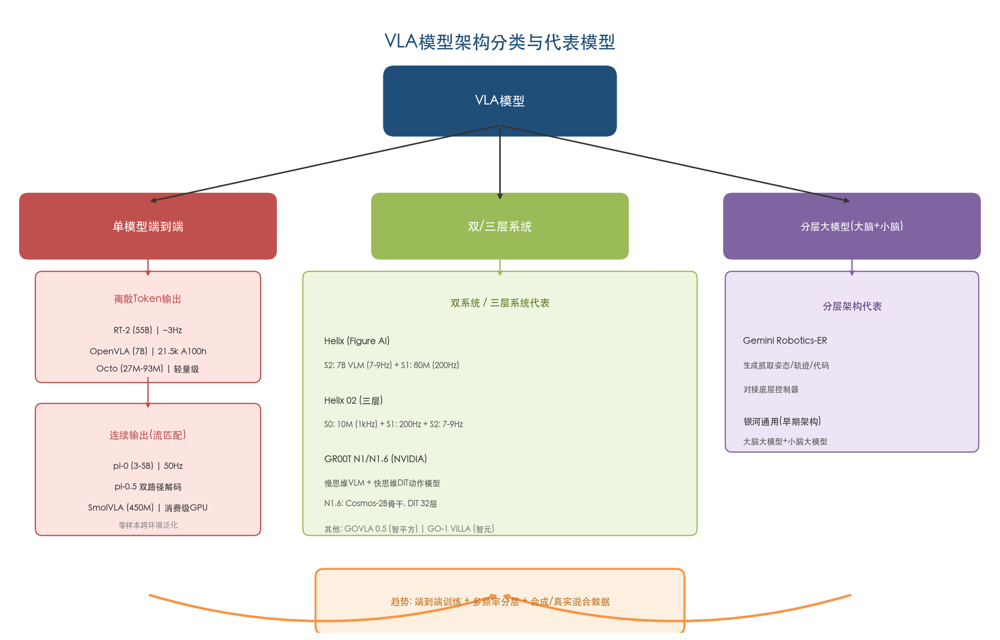

### 2.1.2 代表性开源模型与学术基准

上述架构分野并非停留在理论层面，而是已经通过一系列关键开源模型得到了工程验证。这些模型构成了产业应用的技术基座，其演进脉络同时勾勒出VLA范式从概念验证到工程成熟的完整路径。

**RT-2**（2023年7月，Google DeepMind）是VLA范式的开创者。它在PaLI-X和PaLM-E两个视觉语言模型基础上，将机器人动作（6-DoF末端位移+夹爪状态+终止标志）量化为256个离散bin，作为文本token输出。RT-2首次验证了互联网规模知识向机器人控制迁移的可行性，并支持链式推理（chain-of-thought）。然而，其55B级参数规模导致推理延迟较高，难以在边缘设备上部署，控制频率仅约3Hz。[Google DeepMind官方博客](https://deepmind.google/blog/rt-2-new-model-translates-vision-and-language-into-action/ "RT-2发布博客")

**Open X-Embodiment / RT-X**（2024年5月）是21家机构的合作成果，收集了超过100万条真实机器人轨迹、涵盖22种不同本体，构建了迄今最大规模的开放机器人数据集，成为VLA预训练的关键数据基础设施。该数据集的开放显著降低了后续VLA模型的训练门槛。

**OpenVLA**（2024年6月，Stanford等）是7B参数的开源VLA模型，在Open X-Embodiment的97万条真实轨迹上训练，融合DINOv2和CLIP视觉编码器与Llama-2语言骨干。训练成本约21,500 A100-GPU小时（64块A100训练14天）。尽管参数量远小于RT-2，OpenVLA在一系列操控任务上超越后者，并支持参数高效微调与量化部署，标志着VLA从"大模型专属"走向"可复现科学"。[OpenVLA论文](https://arxiv.org/abs/2406.09246 "OpenVLA: An Open-Source Vision-Language-Action Model")

**Octo**（2024年5月，UC Berkeley）为27M—93M参数的轻量级策略，基于Open X-Embodiment训练，使用扩散策略输出连续关节轨迹，支持灵活添加新观测模态。**SmolVLA**（2025年6月，Hugging Face）进一步将参数压缩至450M，采用流匹配和异步推理，可在单块消费级GPU上运行。从RT-2的55B到OpenVLA的7B，再到SmolVLA的450M和Octo的27M，VLA模型在两年内实现了三个数量级的参数压缩，这一轻量化趋势正在加速VLA从实验室向产业部署的渗透。[VLA模型维基百科](https://en.wikipedia.org/wiki/Vision-language-action_model "Octo与SmolVLA简介")

## 2.2 端到端VLA路线的代表性公司

### 2.2.1 Physical Intelligence（π）——VLA基础模型的纯研发标杆

**技术路径。** Physical Intelligence是端到端VLA路线最纯粹的代表。其核心模型π₀（2024年10月发布）采用PaliGemma（由SigLIP和Gemma编码器组成）作为VLM骨干，结合流匹配动作头输出连续高频动作，最高控制频率达50Hz。π₀在Open X-Embodiment的8种不同机器人本体上训练，支持50多种任务跨本体泛化，参数规模约3B—5B。推理时通过"实时分块算法"在约100毫秒内预测下一个50步动作序列，机器人可在模型处理下一组命令时持续运动。后续的π₀-FAST扩展版引入频率空间动作序列Token化（FAST），使用离散余弦变换将连续token从时域转换到频域，进一步压缩动作表征。[Physical Intelligence π₀博客](https://www.pi.website/blog/pi05 "π0技术博客") [Sacra研究报告](https://sacra.com/research/physical-intelligence/ "Physical Intelligence公司分析")

π₀.5（2025年4月发布）是更重要的里程碑，其核心创新在于通过异构数据协同训练实现开放世界泛化：将通用多模态任务（图像描述、VQA、目标检测）、多环境机器人数据、跨本体数据和"语言教练"演示混合训练，使模型同时具备高层语义推理与底层运动控制能力。架构上采用双路径解码——离散自回归解码用于高层动作文本输出，连续流匹配解码用于底层关节动作。实验结果表明，在约100个不同训练环境后，π₀.5在全新家庭环境中的清洁任务成功率逼近在测试环境直接训练的基线模型，展示了零样本跨环境泛化的潜力。[Physical Intelligence π₀.5博客](https://www.pi.website/blog/pi05 "π0.5技术细节与实验结果")

**产品进度。** Physical Intelligence目前专注于模型研发与计算扩展，联合创始人Lachy Groom明确表示公司"没有商业化时间表"。π₀模型权重已开源，开发者可使用1—20小时数据在ALOHA、DROID等平台上进行微调。

**商业化进度。** 规划中的商业模式为B2B SaaS，每台连接机器人收费300美元/月，但尚未启动商业化运营。

**融资情况。** Physical Intelligence是全球具身智能领域融资节奏最快的公司之一：2024年3月种子轮7,000万美元；2024年11月A轮4亿美元（估值24亿美元），投资方包括Jeff Bezos、OpenAI、Thrive Capital、Lux Capital；2025年11月B轮6亿美元（CapitalG/Alphabet旗下领投，估值56亿美元）；2026年3月据报道正在洽谈新一轮约10亿美元融资，估值超110亿美元，Founders Fund和Lightspeed Venture Partners参与。累计已完成融资约10.7亿美元（不含洽谈中的最新轮）。[TechCrunch报道](https://techcrunch.com/2026/03/27/physical-intelligence-is-reportedly-in-talks-to-raise-1-billion-again/ "2026年3月融资报道")

**团队背景。** 联合创始人阵容堪称VLA领域的"学术梦之队"：Sergey Levine（UC Berkeley副教授，强化学习与机器人学习领域顶尖学者）、Chelsea Finn（Stanford副教授，元学习先驱）、Karol Hausman（前Google DeepMind研究员）、Lachy Groom（前Stripe高管）。截至2026年1月约80名员工，总部位于旧金山。

### 2.2.2 Google DeepMind——从RT系列到Gemini Robotics的全栈演进

**技术路径。** Google DeepMind是VLA范式的开创者和持续推进者，其技术演进路径清晰地展现了VLA模型从概念验证到工程化部署的全过程：

- **RT-1**（2022年12月）：首个在大规模真实机器人数据上训练的Transformer策略模型，仅使用机器人数据，泛化能力有限，但奠定了以Transformer架构进行机器人控制的技术基础。

- **RT-2**（2023年7月）：在RT-1基础上引入VLM共训练，开创VLA范式，首次验证互联网知识向机器人迁移的可行性。

- **Open X-Embodiment / RT-X**（2024年5月）：主导21家机构合作，构建超100万条真实轨迹开放数据集，为后续VLA模型提供了关键数据基础设施。

- **Gemini Robotics**（2025年3月发布）：基于Gemini 2.0构建的最先进VLA模型，将物理动作作为新输出模态，标志着VLA从学术模型向工程级系统的跨越。三大核心能力包括：通用性——在综合泛化基准上性能为其他SOTA VLA模型的2倍以上；交互性——支持多语种自然语言指令和实时环境变化响应；灵巧性——能完成折纸、装拉链袋等精细多步操作。合作伙伴涵盖Apptronik、Boston Dynamics、Agility Robotics等人形机器人头部厂商。[Google DeepMind官方博客](https://deepmind.google/blog/gemini-robotics-brings-ai-into-the-physical-world/ "Gemini Robotics发布")

- **Gemini Robotics-ER**：增强空间推理能力的变体版本，不直接输出动作，而是生成抓取姿态、接近轨迹和代码，可与现有底层控制器对接，成功率为基础Gemini 2.0的2—3倍。这一变体实际上构成了VLA向分层架构的"桥接"方案，体现了端到端与分层边界的模糊化趋势。

- **Gemini Robotics On-Device**（2025年6月）：轻量化设备端版本，可本地运行于机器人嵌入式硬件，兼顾低延迟与高可靠性。

**产品与商业化进度。** Google DeepMind定位为技术平台提供方，通过与硬件合作伙伴（Apptronik、Boston Dynamics、Agility Robotics、Agile Robots、Enchanted Tools等）的协作将Gemini Robotics落地到具体机器人产品中。2026年3月，Boston Dynamics宣布首批电动Atlas客户中包含Google DeepMind，双方将合作集成基础模型。

**团队与融资。** 作为Alphabet旗下研究机构，Google DeepMind不独立融资，但其在具身智能方向投入的资源规模在行业中首屈一指。RT系列和Gemini Robotics的研发团队汇集了全球机器人学习领域最密集的人才群体。

### 2.2.3 星动纪元（RobotEra）——清华系全栈自研的学术创业代表

**技术路径。** 星动纪元坚持"软硬一体、全栈自研"路线，核心开发端到端VLA具身大模型ERA-42。ERA-42的设计理念借鉴语言大模型的预训练范式——在海量视频和交互数据中学习物理世界规律，而非依赖手工设计的物理先验。公司同时自研高可靠五指灵巧手等核心硬件组件，实现软硬件深度耦合。[36氪](https://eu.36kr.com/zh/p/3369771506779912 "星动纪元技术路线")

**产品进度。** 星动纪元已推出STAR1人形机器人，定位通用人形机器人平台，但具体量产规模和出货数据尚未公开披露。

**融资情况。** 星动纪元于2023年8月由清华大学交叉信息研究院孵化成立，是唯一一家清华大学持股的人形机器人企业。2025年7月完成近5亿元A轮融资（鼎晖CGV与海尔资本联合领投）；2025年11月完成近10亿元A+轮融资（吉利资本领投，北汽产投、北京AI产业投资基金等参投），估值突破百亿元人民币。累计融资约15亿元。[36氪](https://eu.36kr.com/zh/p/3369771506779912 "融资信息") [泰伯网](https://www.taibo.cn/newsflashes/29519120 "A+轮融资")

**团队背景。** 创始人陈建宇，清华大学交叉信息研究院助理教授、博导，清华大学本科、UC Berkeley博士，上海期智研究院PI。核心团队依托清华大学交叉信息研究院（姚期智院士创办）的学术积累，在机器人学习和具身智能方向具有深厚研究基础。[清华大学官网](https://www.tsinghua.edu.cn/info/1182/124966.htm "陈建宇简介")

### 2.2.4 灵初智能（PsiBot）——国家资本加持的VLA+强化学习路线

**技术路径。** 灵初智能坚持VLA路线，同时深度融合强化学习算法，并将类人五指灵巧手技术作为差异化方向。公司与北京大学成立联合实验室，聚焦具身智能核心算法研发。

**融资情况。** 灵初智能于2024年创立，起步即获得行业头部机构背书：天使轮由高瓴创投、蓝驰创投和智元机器人投资。2026年3月宣布完成天使轮与Pre-A轮共计20亿元融资，投资方包括国开金融、国中资本、央视融媒体产业投资基金等国家级资本。在创立不到两年的时间节点上即获得20亿元融资，充分反映了国家资本对VLA核心技术的战略性布局意图。[灵初智能官网](https://www.psibot.ai/%E7%81%B5%E5%88%9D%E6%99%BA%E8%83%BD%E5%B7%B2%E5%AE%8C%E6%88%9020%E4%BA%BF%E8%9E%8D%E8%B5%84%EF%BC%8C%E8%8E%B7%E5%9B%BD%E5%AE%B6%E9%98%9F%E8%B5%84%E6%9C%AC%E9%87%8D%E7%A3%85%E6%8A%95/ "融资公告")

**团队背景。** 核心创始团队包括王启斌博士等，具有多年机器人产业操盘经验。

## 2.3 双系统VLA与分层大模型架构路线的代表性公司

端到端VLA模型追求"一个模型解决所有问题"的极致简洁，而双系统VLA与分层大模型架构则选择了一条更接近工程直觉的路径：将高层语义理解（"大脑"）与底层运动控制（"小脑"）分开设计、独立优化，再通过精心设计的接口进行耦合。这一路线的核心假设是——语义理解和物理控制属于两类本质不同的计算任务，它们在频率需求、数据类型和推理模式上差异巨大，分而治之的效率更高。

### 2.3.1 NVIDIA GR00T N1系列——开源平台型双系统VLA

**技术路径。** GR00T N1（2025年3月GTC发布）是全球首个开源通用人形机器人基础模型，其最突出的架构贡献是将双系统设计工程化并开源。System 2（慢思维）由VLM驱动，负责场景理解与指令推理；System 1（快思维）为快速动作模型，将System 2的高层计划转化为精确连续的机器人运动。两个系统通过连续潜在向量进行通信，各自运行在独立GPU上。[NVIDIA官方新闻稿](https://nvidianews.nvidia.com/news/nvidia-isaac-gr00t-n1-open-humanoid-robot-foundation-model-simulation-frameworks "GR00T N1发布")

GR00T N1的另一项核心贡献体现在数据层面。NVIDIA通过Isaac GR00T Blueprint合成了78万条合成轨迹（等效6,500小时即约9个月的人类遥操作数据），仅用11小时GPU渲染完成。结合合成数据后，GR00T N1性能提升40%，有力验证了合成数据对VLA训练的有效性。后续的GR00T-Dreams Blueprint实现了"真实到真实"工作流——36小时即可生成GR00T N1.5所需的全部合成训练数据，而传统方式需近3个月。

**架构快速迭代。** N1.5为首次升级版，优化了架构、数据和建模流程。N1.6（2025年发布）实现了更实质性的架构升级：VLM骨干换为NVIDIA内部Cosmos-2B变体，支持灵活分辨率和原生纵横比图像编码；DiT（Diffusion Transformer）层数从N1.5的16层扩大至32层；移除4层Transformer适配器，改为解冻VLM顶层4层参与预训练；默认使用状态相对动作块而非绝对关节角度。预训练数据新增数千小时遥操作数据，涵盖双臂YAM、AgiBot Genie-1、仿真Galaxea R1 Pro和宇树G1全身运动操控。预训练步数30万步，全局批量大小16,384。下游实验显示N1.6在模拟和真实双臂操控基准上均优于N1.5。[NVIDIA GR00T N1.6研究页](https://research.nvidia.com/labs/gear/gr00t-n1_6/ "N1.6技术细节")

**生态定位。** GR00T N1系列的战略意图并非自建机器人，而是作为开源赋能平台服务于整个人形机器人产业。早期接入伙伴包括1X Technologies、Agility Robotics、Boston Dynamics、Mentee Robotics、NEURA Robotics等。1X Technologies已将GR00T N1后训练并部署于NEO Gamma人形机器人，用于家庭整理任务。这种"卖铲子"的平台策略使NVIDIA在具身智能领域复刻了其在GPU/CUDA生态中的成功模式。

### 2.3.2 Figure AI Helix系列——从双系统到三层系统的工程化突破

**技术路径。** Figure AI在VLA领域的贡献不在于基础模型的参数规模，而在于面向人形机器人的工程化架构创新。Helix（2025年2月发布）首创了为人形机器人设计的"System 1, System 2"双系统VLA架构：System 2为7B参数的开放权重VLM，运行于7—9Hz，负责场景理解与语言指令处理；System 1为80M参数的交叉注意力Transformer视觉运动策略，以200Hz输出连续全上身控制（手臂、手腕、手指、躯干、头部，35个自由度）。两系统端到端联合训练，通过连续潜在向量通信。训练数据仅约500小时高质量遥操作数据，配合VLM自动生成事后语言标注。Helix实现了多项行业首创：首个VLA全上身控制、首个双机器人VLA协作、首个商用级VLA完全在机器人嵌入式双低功耗GPU上运行。[Figure AI Helix官方博客](https://www.figure.ai/news/helix "Helix技术详情")

Helix 02（2025年发布）做出了更具突破性的架构演进——新增System 0层。这是一个10M参数的神经网络，以1kHz运行，提供类人全身运动控制基础层，在1,000小时以上人类运动数据和Sim-to-Real强化学习上训练。System 0替代了此前109,504行手工编写的C++运动控制代码，从根本上消除了传统手工控制代码的维护与调试负担。System 1在Helix 02中扩展为连接所有传感器（头部相机、掌部相机、指尖触觉传感器、全身本体感知）并控制整个机器人（腿、躯干、头、手臂、手腕、手指）的统一策略。系统最终演示了4分钟连续自主操控（卸载/装载洗碗机、跨房间搬运），完成61个连续运动-操控动作。[Figure AI Helix 02官方博客](https://www.figure.ai/news/helix-02 "Helix 02技术详情")

Helix 02的三层系统（System 0 / 1kHz + System 1 / 200Hz + System 2 / 7-9Hz）虽然在形式上采用"端到端联合训练"的VLA范式，但在架构上已经呈现出鲜明的分层特征。这一设计模糊了端到端与分层的边界，反映了工程实践对纯理论范式的务实修正。

**产品进度与商业化。** Figure 02搭载Helix已在BMW斯帕坦堡工厂完成11个月商业部署，累计运行超1,250小时。Figure 03为Helix 02专门设计，配备指尖触觉传感器和掌部相机。BotQ工厂初始年产能规划为12,000台。

**融资情况。** Figure AI累计融资约19亿美元。关键轮次包括：2024年2月Series B 6.75亿美元（估值26亿美元），投资方包括Microsoft、NVIDIA、OpenAI Startup Fund、Jeff Bezos、Amazon Industrial Innovation Fund等；2025年9月Series C超10亿美元（Parkway Venture Capital领投，Brookfield Asset Management、NVIDIA、Intel Capital等参投），投后估值达390亿美元，为全球具身智能领域最高估值。[Figure AI官方公告](https://www.figure.ai/news/series-c "Series C融资详情") [Reuters](https://www.reuters.com/business/robotics-startup-figure-valued-39-billion-latest-funding-round-2025-09-16/ "Figure AI估值报道")

**团队背景。** 创始人Brett Adcock是连续创业者（Archer Aviation与Vettery创始人）。公司于2025年初终止与OpenAI的合作，转向全栈自研Helix系统，这一战略转向体现了Figure AI从依赖外部大模型向自建核心AI能力的坚定决心。

### 2.3.3 银河通用（Galbot）——从分层到端到端的技术路线演进

**技术路径。** 银河通用是理解VLA技术路线演进的绝佳案例。公司最初采用经典的"大脑大模型+小脑大模型"分离架构，大脑负责语义理解和任务规划，小脑负责运动控制。但最新的AstraBrain系统已演进为集成"大脑-小脑-神经控制"于一体的端到端具身大模型，VLA模型直接从视觉观测和自然语言指令端到端输出动作，无需中间3D小模型。这一演进方向与行业趋势高度一致——分层架构的信息传递效率低且误差累积问题难以根除，端到端统一的驱动力日益强劲。[量子位报道](https://www.qbitai.com/2026/02/380787.html "AstraBrain技术详解")

AstraBrain采用四阶段训练框架：少量人类示范提供技能种子→高精度物理仿真中海量合成数据模仿学习→仿真环境强化学习形成最优策略→少量真机数据完成Sim2Real校准。创始人王鹤坚持99%合成数据加1%真实数据的训练配比，认为高精度物理仿真与渲染生成的合成数据信息密度最高。这一判断在NVIDIA GR00T N1的合成数据实验中获得了独立验证。王鹤进一步指出，VLA模型在架构层面已趋于收敛，真正的竞争焦点正在转向数据策略——"起决定性作用的是数据"。[新浪财经对话王鹤](https://finance.sina.cn/tech/2025-06-23/detail-infazmiq9709925.d.html "技术路线收敛判断")

**产品进度。** 主力产品Galbot G1为轮式双臂本体，高173cm、重85kg、续航10小时、末端负载5kg，通过轮式底盘在稳定性上相较双足人形具有显著优势，更适合工业与服务场景的连续作业。工业重载机器人Galbot S1双臂最大负载50kg，已在宁德时代电池工厂实现全自主作业。2026年央视春晚，Galbot作为"指定具身大模型机器人"与沈腾、马丽同台演出，全程自主感知、实时决策，完成盘核桃、货架取物、叠衣服等复杂操作任务。[量子位报道](https://www.qbitai.com/2026/02/380787.html "春晚表现与产品线")

**商业化进度。** 银河通用是中国具身智能公司中商业化推进最为激进的一家，已形成工业制造、新零售、医疗康养三条商业化主线。工业领域在宁德时代、博世、丰田、北汽、上汽等工厂部署，累计订单数千台，与百达精工签署超1,000台机器人战略协议。新零售领域"银河太空舱"智能零售单元已在20余城市超100家门店实现7×24小时不间断运营超一年，24小时药店覆盖24个城市、单店管理超5,000种SKU。医疗领域与宣武医院、华西医院开展深度合作。2025年预计收入达数亿元规模。[华尔街见闻报道](https://wallstreetcn.com/articles/3766500 "银河通用商业化及融资")

**融资情况。** 银河通用成立于2023年5月，是中国具身智能领域累计融资额最高的公司。关键融资历程包括：2023年6月种子轮（经纬创投、蓝驰创投）；2024年6月天使轮7亿元（美团、北汽、启明创投、IDG资本等）；2024年11月战略轮5亿元（上汽集团、HKIC、深创投）；2025年6月B轮11亿元（宁德时代领投，国开科创、GGV等），创下当时中国具身智能单笔最大融资纪录；2025年12月超21亿元（中国移动链长基金领投），估值突破200亿元人民币；2026年3月B++轮25亿元（国家大基金三期首投具身智能，中国石化、中信投资控股、中国银行等参投）。国家大基金三期的入场具有标志性意义——这是该基金首次投资具身智能领域，表明具身智能已获得国家级芯片与战略性产业基金的正式认可。[华尔街见闻报道](https://wallstreetcn.com/articles/3766500 "完整融资历程")

**团队背景。** CTO兼创始人王鹤（1992年生），清华大学电子系本科、斯坦福大学博士（师从三院院士Leonidas J. Guibas），北京大学前沿计算研究中心助理教授，是全球最早开展端到端具身大模型研究的学者之一。联合创始人姚腾洲毕业于北京航空航天大学机器人研究所（师从王田苗教授），曾任职ABB上海机器人研发中心，具备工业机器人量产经验。学术前沿性与工业落地能力兼具的创始团队组合，使银河通用在技术探索与工程交付之间取得了较好平衡。

### 2.3.4 智元机器人（AgiBot）——产业级VLA与量产规模的双重领先者

**技术路径。** 智元机器人采用分层递进的技术路线图（G1—G5五级），兼顾模型驱动（Model-based）与学习驱动（Learning-based）两种方法。核心VLA模型GO-1（Genie Operator-1）采用Vision-Language-Latent-Action（ViLLA）架构——在传统VLA基础上引入隐式动作标记（latent action tokens），弥合图像-文本输入与机器人执行动作之间的语义鸿沟。GO-1已于2025年9月全面开源。后续推出的GenieReasoner实现了一体化具身大小脑系统，ACoT-VLA（Action Chain-of-Thought）架构入选CVPR 2026。数据方面，智元发布了AgiBot World百万级真机轨迹数据集（100万条以上轨迹、217项任务、5大场景），以及AgiBot Digital World大型仿真框架，构建了从数据到模型的完整基础设施。[智元机器人官网](https://www.zhiyuan-robot.com/article/188/detail/96.html "智元机器人发展历史") [智元GO-1开源页](https://www.zhiyuan-robot.com/article/188/detail/79.html "GO-1 ViLLA架构")

**产品进度。** 智元机器人拥有业内最完整的产品矩阵：远征A2（交互服务人形，全球首个同时获得中/美/欧三大认证）、远征A2-W（轮式工业机器人）、灵犀X2（情感交互双足机器人）、精灵G2（工业级交互作业机器人）、四足D1系列及绝尘C5清洁设备。2025年1月第1,000台通用机器人下线（731台双足人形与269台轮式），2025年底累计下线超5,000台（灵犀X1/X2系列1,846台、远征A1/A2系列1,742台、精灵G1/G2系列1,412台）。[智元机器人官网](https://www.zhiyuan-robot.com/article/188/detail/96.html "产品线与量产") [澎湃新闻](https://m.thepaper.cn/newsDetail_forward_32130555 "5000台下线")

**商业化进度。** 智元机器人2025年全球人形机器人出货量排名第一，超5,100台，全球市场份额约39%。2024年销售额超1亿元。公司已与蓝思科技、富临精工、龙旗科技、百事中国等签署商用合作，其中富临精工工厂近百台远征A2-W落地，完成4个工位、三条装配线、20余种物料的实际作业，14kg负载下实现零倾倒事故。公司计划2026年在港股上市（中金、中信证券、摩根士丹利联合保荐），目标估值51—64亿美元。[新华网](http://sh.news.cn/20260109/b7538017ef054e1bbdf3bb1ceda26875/c.html "2025年全球出货量第一")

**融资情况。** 智元机器人2023年2月成立，已经历10轮以上融资，总融资额超30亿元人民币。主要轮次包括：2023年3月天使轮（高瓴创投、奇绩创坛）；A轮至A++++++轮密集融资（投资方涵盖比亚迪、百度风投、经纬创投、鼎晖投资、蓝驰创投、中科创星等）；2025年3月腾讯领投新一轮；2025年5月京东与上海具身智能基金参投；2025年8月LG电子与韩国未来资产联合领投。最新估值约150亿元人民币。[证券时报](https://stcn.com/article/detail/1605342.html "腾讯领投，150亿估值")

**团队背景。** 创始人邓泰华任董事长兼CEO（前华为公司副总裁），联合创始人兼CTO彭志辉（稚晖君，1993年生，前华为"天才少年"，B站百万粉丝科技UP主转型创业者），首席科学家罗剑岚。邓泰华的华为高管背景带来了成熟的供应链管理和组织扩张能力，彭志辉的技术影响力则赋予公司在工程师群体中的强大号召力。

### 2.3.5 智平方（AI² Robotics）——快慢深度融合的双系统VLA开源先锋

**技术路径。** 智平方坚持VLA路线，于2025年6月推出快慢系统深度融合的GOVLA 0.5（FiS-VLA），为业内首个"异构输入+异步频率"双系统VLA模型。其架构理念与Figure AI Helix一脉相承，但在输入模态的异构处理和频率异步调度上做出了独立创新，并以开源形式发布。

**融资情况。** 智平方是具身智能领域融资节奏最密集的公司之一，2025年内完成5轮B轮系列融资，一年内累计完成12轮融资，估值突破百亿元人民币。2026年2月完成B轮系列超10亿元融资，成为深圳首个百亿级具身智能独角兽。[证券时报](https://www.stcn.com/article/detail/3646400.html "智平方融资与技术") [南方+](https://www.nfnews.com/content/LownkR5D6J.html "智平方融资报道")

**团队背景。** 创始人郭彦东博士，曾在微软、小鹏汽车和OPPO担任首席科学家及研发高管，兼具大厂AI研发管理经验与学术背景。

下图以水平柱状图形式横向对比了本章7家核心公司的最新估值与累计融资金额，并以颜色区分各公司所属的技术路线类别。Google DeepMind作为Alphabet旗下研究机构不独立融资，故未列入。

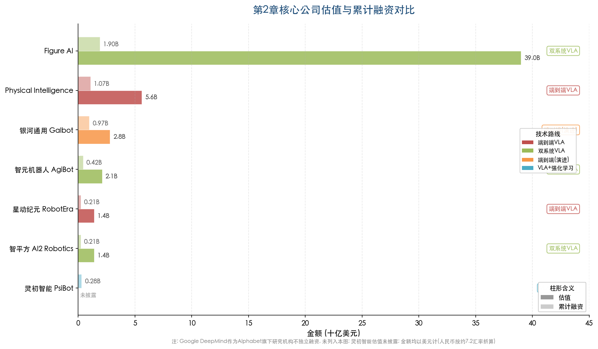

## 2.4 两条技术路线的多维比较

端到端VLA模型与分层/双系统架构的分化并非简单的"优劣之争"，而是在不同维度上的取舍与平衡。以下从泛化能力、实时性、数据效率和部署成本四个核心维度展开比较，下图以雷达图形式直观呈现了三类架构路线在各维度上的能力轮廓。

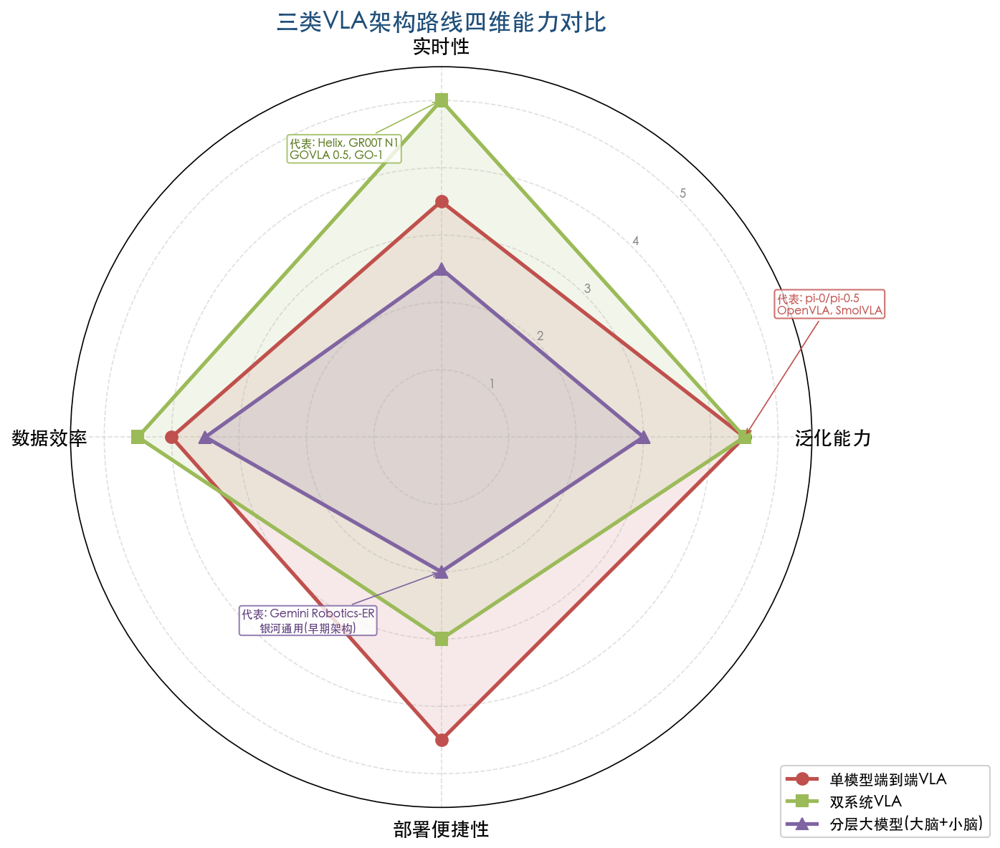

### 2.4.1 泛化能力

端到端VLA模型在语义层面的泛化能力更为突出。π₀.5已展示在全新家庭环境中零样本执行清洁任务的能力——在约100个不同训练环境后，其在未见过的家庭环境中的任务成功率逼近在测试环境直接训练的基线模型。Gemini Robotics在综合泛化基准上性能为其他SOTA VLA的2倍以上。这种泛化优势主要来自VLM从互联网规模预训练中继承的丰富视觉语义理解能力。

分层架构的泛化效果取决于各层模型各自的泛化边界。高层VLM/LLM能够保证语义泛化，但层间通信接口可能成为信息瓶颈。自变量机器人创始人王潜指出，传统分层方法存在"信息传递效率低且误差累积"的固有缺陷。[新华网](http://www.news.cn/20250915/620a6301a3844e3a91ce63ada3b759d3/c.html "分层方法信息效率问题")

### 2.4.2 实时性

分层架构与双系统设计在实时性维度占据明显优势。底层快速系统（System 1/小脑）可在200Hz—1kHz运行，不受慢速VLM推理延迟的约束。Figure AI Helix 02的三层设计验证了System 0在1kHz、System 1在200Hz、System 2在7—9Hz运行的层次化频率分配方案，完整覆盖了从全身运动平衡到精细操作再到语义推理的全频谱需求。

单模型VLA的推理速度受参数量制约。π₀以约50Hz运行，对于大多数操作任务已足够支撑，但7B以上的大参数VLA在嵌入式部署时面临延迟挑战，通常需要量化或配备专用推理芯片。

### 2.4.3 数据效率

两条路线在数据效率上各有侧重。端到端VLA充分利用互联网规模预训练知识，在较少机器人专有数据下即可获得语义泛化——Helix仅用500小时遥操作数据便达到了较强的泛化效果。但底层运动控制精度仍高度依赖机器人专有数据的质量和规模。

分层架构可针对各层独立选择最优数据源：高层使用通用VLM（无需额外机器人数据），底层可通过合成数据与强化学习高效训练。NVIDIA GR00T N1的实验表明，11小时GPU渲染生成的78万条合成轨迹使性能提升40%；银河通用的99%合成数据训练配比同样验证了合成数据在底层控制训练上的高效性。我们认为，合成数据策略是分层架构在数据效率维度的最大杠杆点。

### 2.4.4 部署成本

单模型VLA的部署架构相对简洁——单GPU即可运行——但大参数模型在边缘设备上需要量化或专用芯片支持。SmolVLA（450M参数）、Octo（27M—93M参数）等轻量化方案正在持续降低VLA部署门槛。

双系统架构需要至少两块GPU分别运行两个子系统（如Helix使用双嵌入式低功耗GPU），硬件成本相应更高，但由此获得的实时性与安全性保证不可替代。在人形机器人的实际部署场景中，双GPU的额外成本相对于整机成本（通常超过10万美元）占比较低，实时性保证带来的安全性收益更为关键。

### 2.4.5 融合趋势：边界正在模糊化

我们观察到，端到端与分层两条路线的边界正在快速模糊化，产业实践正在推动二者走向深度融合：

- **分层走向端到端**：银河通用从"大脑+小脑"分离架构演进至AstraBrain端到端模型；Figure AI Helix虽形式上为双系统但采用端到端联合训练；GR00T从N1双系统到N2（2026年3月GTC预览）的WAM（World Action Model）架构演进，将世界模型的环境预测与VLA的动作生成统一在同一框架内。

- **端到端引入分层元素**：π₀.5引入了离散自回归与连续流匹配的双路径解码；Figure AI Helix 02新增的System 0层（1kHz）实质上在端到端框架内引入了类分层的多频率协作机制。

- **数据策略成为共同焦点**：无论哪条路线，对数据规模和质量的争夺正在成为竞争核心。王鹤指出"起决定性作用的是数据"，千寻智能高阳、自变量王潜、星动纪元席悦均印证了这一判断。[新浪财经对话王鹤](https://finance.sina.cn/tech/2025-06-23/detail-infazmiq9709925.d.html "数据决胜判断") [21世纪经济报道](https://www.21jingji.com/article/20260329/herald/61ea6560498528bcc8906a533f71053a.html "百亿估值创企共识")

我们判断，"端到端 vs 分层"的范式之争正在被"如何在端到端框架内实现工程化分层协作"这一更为精细的问题所替代。未来的主流架构有望呈现形式上端到端训练、结构上多频率分层、数据上合成与真实混合的融合方案。

## 2.5 世界模型驱动的差异化路线：1X Technologies的探索

在VLA与分层架构两条主线之外，1X Technologies于2026年1月推出了一条值得关注的差异化技术路线——基于视频预训练世界模型的机器人控制。其1XWM系统以一个14B参数的生成视频模型为核心，通过三阶段适配：互联网规模视频预训练→900小时自我中心人类视频中训练→70小时NEO机器人数据微调。推理时，系统接收文本指令和初始帧，由世界模型生成未来视频序列，逆动力学模型（IDM）从视频中提取动作轨迹，机器人随即执行。这一方案的优势在于直接利用互联网视频数据蕴含的物理先验，而非依赖大规模机器人遥操作数据。1XWM在多项分布内和分布外任务上展示了稳定的成功率，包括训练集中未出现的双手协调和人机交互任务。[1X Technologies官方博客](https://www.1x.tech/discover/world-model-self-learning "1XWM世界模型技术博客")

这一路线与VLA的核心区别在于：VLA直接从静态图像-语言输入预测动作轨迹，1XWM则先"想象"未来的视频演化、再从中提取动作。这种"先想后做"的范式与第3章将讨论的世界模型技术路线形成呼应，也预示了VLA与世界模型走向融合的方向。

# 第3章 核心技术路线（下）——世界模型、仿真基础设施与Sim-to-Real迁移

第2章系统梳理了VLA模型与分层大模型两条"大脑"技术路线，并在末尾引入了1X Technologies基于视频预训练世界模型的差异化探索。这一探索揭示了具身智能技术栈中一条同等重要但常被低估的技术脉络：世界模型（World Model）。VLA模型解决的是"看到什么就做什么"的感知-动作直接映射问题，世界模型则赋予智能体"先想后做"的能力——在物理世界中行动之前，先在内部模拟器中预测未来状态、评估行动后果、规划最优路径。与此同时，仿真平台与Sim-to-Real迁移技术作为世界模型落地的"数据基础设施"，正从辅助工具演变为具身智能产业化的核心瓶颈与战略高地。本章从世界模型的技术分类出发，逐一解析仿真平台、Sim-to-Real关键技术，并聚焦这一领域的代表性公司与团队布局。

## 3.1 世界模型：让机器人学会"想象"

### 3.1.1 定义与核心价值

世界模型（World Model）充当智能体的"内部模拟器"，使其能够在潜在空间（latent space）中预测未来状态并规划行为，而无需在物理世界中付出试错代价。这一概念源于认知科学中的"心理模型"假说——人类在行动前会在脑中"想象"动作后果，并据此修正决策。在具身智能语境下，世界模型的核心价值体现在三个层面：

- **安全性**：机器人可在虚拟推演中排除危险动作，而非在真实环境中试错；
- **数据效率**：通过在潜在空间中大量模拟交互，以极低成本生成训练数据，缓解真实机器人数据稀缺的根本瓶颈；
- **泛化能力**：高质量的世界模型能够生成多样化的场景变体，帮助策略网络适应从未见过的真实环境。

世界模型领域的标志性成果DreamerV3于2025年4月发表于Nature，首次以单一固定超参数配置在超过150项任务中超越专用算法，验证了世界模型作为通用强化学习框架的可行性。[DreamerV3论文(Nature)](https://www.nature.com/articles/s41586-025-08744-2 "Hafner et al., Nature 640, 647-653, 2025")

### 3.1.2 两大技术分支

当前世界模型技术可分为两大分支：基于视频生成的世界模型与基于潜在动力学的世界模型。

**基于视频生成的世界模型**将未来预测问题转化为视频生成问题——给定当前帧和动作指令，模型生成一段符合物理规律的未来视频。这一路线的代表包括NVIDIA Cosmos、Google DeepMind Genie系列以及生数科技/清华大学的Motus。其优势在于能够直接利用互联网海量视频数据进行预训练，获得丰富的物理世界先验知识；劣势在于视频生成的计算开销大、帧率受限，且像素空间的预测不一定捕捉到底层物理规律的精确量化关系。

**基于潜在动力学的世界模型**则跳过像素重建，直接在低维潜在空间中建模状态转移动力学。这一路线的经典代表包括DreamerV3和TD-MPC2。模型学习一个紧凑的状态表示（通常仅数百维），并在此空间中进行前向预测和规划。其优势在于计算高效、规划速度快、物理精度可控；劣势在于潜在空间的可解释性弱，且难以直接利用互联网视频进行大规模预训练。

值得注意的是，这两条分支并非互斥——NVIDIA GR00T N2于2026年3月GTC提出的"世界动作模型"（World Action Model, WAM）架构，以及生数科技联合清华大学于2025年12月开源的Motus大一统世界模型，均尝试在统一框架中融合视频生成与动作预测，代表了两条分支走向融合的明确趋势。

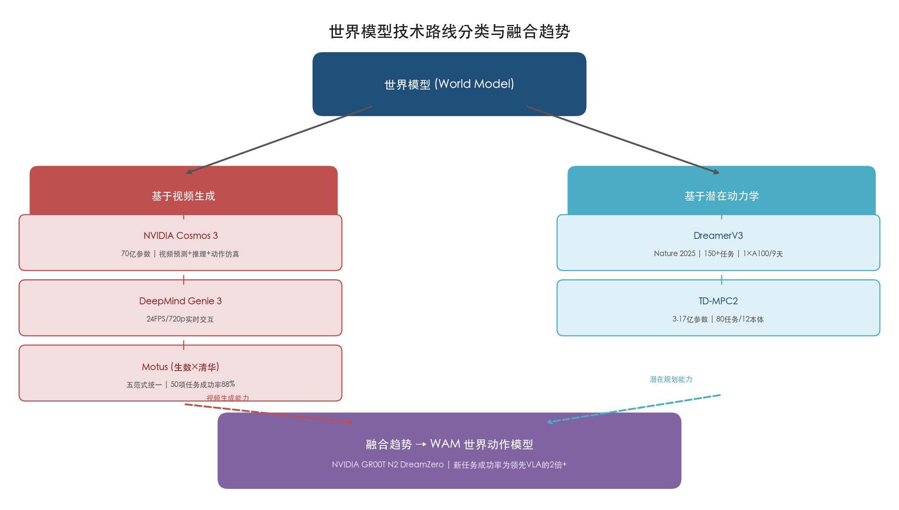

上图以树状结构呈现了世界模型两大技术分支的代表模型及关键参数，底部汇聚箭头标注了两条分支向WAM架构融合的发展方向。

### 3.1.3 DreamerV3：潜在动力学世界模型的里程碑

DreamerV3于2025年4月发表于Nature，是世界模型领域的标志性成果，也是第一个以单一固定超参数配置在超过150项任务中超越专用算法的通用世界模型强化学习算法，覆盖连续控制（DeepMind Control Suite）、视觉输入游戏（Atari）及3D开放世界（Minecraft）等截然不同的任务域。尤为突出的是，DreamerV3在Minecraft中首次实现了从零开始采集钻石——该任务需要超过20分钟的长程多步决策，此前所有算法均未能完成。整个训练过程仅需1块NVIDIA A100 GPU运行9天。[DreamerV3论文(Nature)](https://www.nature.com/articles/s41586-025-08744-2 "DOI:10.1038/s41586-025-08744-2")

DreamerV3的核心架构由三个组件构成：循环状态空间模型（RSSM）作为世界模型本体，将高维观测编码到紧凑的潜在空间并预测未来状态；行动者（Actor）网络在潜在空间中通过想象的轨迹学习策略；评论者（Critic）网络评估潜在状态的长期价值。其关键创新在于以百分位归一化取代手动奖励缩放，使同一套超参数适用于奖励尺度差异数个数量级的不同任务域，从而实现了"一次调参、通用执行"的工程目标。

### 3.1.4 TD-MPC2：面向大规模多任务的潜在空间规划

TD-MPC2由UC San Diego的Hansen等人提出，于2024年发表于ICLR，代表了潜在动力学世界模型在多任务扩展方向上的重要进展。与DreamerV3通过想象轨迹训练策略的方式不同，TD-MPC2在潜在空间中使用模型预测控制（MPC）进行在线轨迹优化，直接在推理阶段利用世界模型进行实时规划。[TD-MPC2官方页面](https://www.tdmpc2.com/ "TD-MPC2: Scalable, Robust World Models for Continuous Control")

TD-MPC2在104项连续控制任务上显著优于基线方法（包括无模型的SAC以及基于模型的DreamerV3与TD-MPC），同样使用单一固定超参数配置。该工作更重要的贡献在于揭示了世界模型的扩展规律（Scaling Law）：研究团队训练了一个3.17亿参数的单一智能体，在80项横跨多个任务域、12种本体和不同动作空间的任务上同时执行，智能体能力随模型和数据规模的增长而持续提升。团队同步开源了324个模型检查点及5.45亿条转移数据集（覆盖80项任务、12种本体），为学术社区提供了可复现的世界模型扩展基准。[TD-MPC2官方页面](https://www.tdmpc2.com/ "实验结果与开源数据")

### 3.1.5 Google DeepMind Genie 3：实时交互式世界模型

Google DeepMind于2025年8月发布的Genie 3是首个支持实时交互的通用世界模型。此前的世界模型通常以离线生成方式运行——先生成整段视频序列，再从中提取动作。Genie 3则实现了24帧/秒、720p分辨率的实时导航，环境视觉一致性可维持数分钟。[Google DeepMind官方博客](https://deepmind.google/blog/genie-3-a-new-frontier-for-world-models/ "August 5 2025")

Genie 3的一个值得关注的特性是：其环境一致性是涌现能力（emergent capability），而非通过显式3D场景表征实现。这意味着模型从大规模视频预训练中自发学会了空间结构的隐式理解，而不是被显式教导"三维空间是什么"。Google DeepMind已将Genie 3与其SIMA 2具身智能体集成训练，使智能体能够在Genie 3生成的虚拟环境中进行策略预训练，再迁移至真实环境。这一"世界模型作为预训练环境"的范式有望大幅降低具身智能对真实数据的依赖。

## 3.2 仿真基础设施：具身智能的"数据工厂"

### 3.2.1 仿真平台的战略价值

如果世界模型是机器人的"想象力"，仿真平台则是这种想象力的"工厂"——它以工业化的规模和效率批量生产训练数据。第2章分析了银河通用"99%合成数据+1%真实数据"的训练配比和NVIDIA GR00T N1"11小时生成78万条轨迹"的实验，均证明合成数据正从可选补充变为核心训练资源。仿真平台的战略价值因此从"辅助测试工具"跃升为"数据基础设施"——谁拥有更高效、更逼真的仿真能力，谁就掌握了具身智能模型训练的关键杠杆。

### 3.2.2 NVIDIA Isaac与Cosmos：全栈仿真生态

NVIDIA在仿真基础设施领域构建了业内最完整的全栈生态，涵盖物理引擎、仿真平台、世界基础模型和合成数据工作流四个层次。

**物理引擎层：Newton 1.0**。2026年3月GTC发布的Newton 1.0 GA版是NVIDIA、Google DeepMind与Disney Research三方共同创建的开源GPU加速物理仿真框架。Newton引入了SDF（Signed Distance Field）碰撞检测和水弹性接触模型（hydroelastic contact），这两项技术直接瞄准缩小sim-to-real gap中最顽固的接触动力学差异。在NVIDIA RTX PRO 6000 GPU上，Newton驱动的MuJoCo 3.5（MJWarp后端）实现运动控制仿真加速252倍、操作任务仿真加速475倍。[NVIDIA技术博客](https://developer.nvidia.com/blog/newton-adds-contact-rich-manipulation-and-locomotion-capabilities-for-industrial-robotics/ "Newton 1.0 GA, March 16 2026")

**仿真平台层：Isaac Lab 3.0**。Isaac Lab 3.0集成了Newton与PhysX双物理后端，侧重工业级操作和全身控制场景。NVIDIA通过Isaac GR00T Blueprint实现了合成数据的工业化生产：11小时GPU渲染生成78万条合成轨迹，等效6,500小时（约9个月）的人类遥操作数据，GR00T N1性能因此提升40%。更进一步的GR00T-Dreams Blueprint实现了"真实到真实"工作流——36小时即可生成GR00T N1.5所需的全部合成训练数据，而传统方式需近3个月。[NVIDIA技术博客](https://developer.nvidia.com/blog/building-a-synthetic-motion-generation-pipeline-for-humanoid-robot-learning/ "Synthetic Motion Generation Pipeline, 2025")

**世界基础模型层：Cosmos系列**。Cosmos于2025年1月CES首发，三大模型族各司其职：Cosmos Predict生成预测视频，Cosmos Transfer生成合成数据，Cosmos Reason（70亿参数）提供视觉推理。1X Technologies、Agility Robotics、Figure AI、Skild AI等为早期采用者。2026年1月CES发布Cosmos 2.5系列（Transfer 2.5/Predict 2.5/Reason 2）开放模型。2026年3月GTC发布Cosmos 3——首个统一合成世界生成、视觉推理和动作仿真的世界基础模型。[NVIDIA官方新闻稿(GTC 2025)](https://nvidianews.nvidia.com/news/nvidia-announces-major-release-of-cosmos-world-foundation-models-and-physical-ai-data-tools "March 18 2025") [NVIDIA官方新闻稿(GTC 2026)](http://nvidianews.nvidia.com/news/nvidia-and-global-robotics-leaders-take-physical-ai-to-the-real-world "March 16 2026")

Cosmos系列的战略意义在于：它使NVIDIA从GPU硬件供应商扩展为具身智能全栈基础设施提供商。通过将物理引擎（Newton）、仿真平台（Isaac Lab）、世界模型（Cosmos）和机器人基础模型（GR00T）垂直整合，NVIDIA正在复刻其在GPU/CUDA/深度学习生态中的平台锁定策略。

**GR00T N2预览：世界模型与VLA的架构统一**。NVIDIA于2026年3月GTC预览了GR00T N2，采用全新"DreamZero"训练范式下的WAM（World Action Model）架构，首次将世界模型的环境预测能力与VLA的动作生成能力统一在同一模型中。初步评估显示，GR00T N2在新任务上的成功率为领先VLA模型的2倍以上，在MolmoSpaces和RoboArena两项评测中排名第一。GR00T N2预计于2026年底正式可用。这一架构演进标志着世界模型从"独立模块"走向"与VLA深度融合"的趋势拐点。[NVIDIA官方新闻稿(GTC 2026)](http://nvidianews.nvidia.com/news/nvidia-expands-open-model-families-to-power-the-next-wave-of-agentic-physical-and-healthcare-ai "GTC 2026发布，2026年3月16日")

### 3.2.3 主流仿真平台对比

除NVIDIA Isaac Lab之外，另外两大主流仿真平台各有侧重：

**MuJoCo 3.6**（2026年3月10日发布）由Google DeepMind维护，是机器人学术界的事实标准。MuJoCo以高精度接触动力学见长，支持软体仿真和腱绳驱动等复杂机械系统。MuJoCo 3.5版本引入的MJWarp GPU后端在Newton引擎加持下实现了数百倍加速，使其从"精确但缓慢"的学术工具转型为可用于大规模并行训练的工业级引擎。MuJoCo的核心优势在于仿真精度和物理保真度，使其成为需要精确接触建模的灵巧操作研究的首选平台。[MuJoCo变更日志](https://mujoco.readthedocs.io/en/stable/changelog.html "MuJoCo 3.6.0, March 10 2026")

**Meta Habitat 3.0**侧重于家庭环境中的人-机器人协作仿真，可在单GPU上以数千帧/秒的速度渲染真实感室内场景。Habitat 3.0的核心创新在于引入了具有社会行为的虚拟人类化身（Human Avatar），使机器人能够在仿真中学习与人类共享空间、协调动作的社交技能。这使其成为家庭服务机器人预训练的理想平台，但其适用范围相对局限于室内导航与社交互动场景。[Meta AI Habitat 3.0](https://ai.meta.com/research/publications/habitat-3-0-a-co-habitat-for-humans-avatars-and-robots/ "Habitat 3.0论文")

三大平台形成了差异化的生态位：Isaac Lab面向工业级全身操作（NVIDIA生态绑定）、MuJoCo面向高精度学术研究（开源社区驱动）、Habitat面向家庭服务与人机协作（Meta生态驱动）。

### 3.2.4 合成数据的量化经济学

合成数据的价值已从定性认知进入可量化的工程经济学阶段。以下三组数据勾勒了这一转变：

第一，NVIDIA Isaac GR00T Blueprint在11小时内生成78万条合成轨迹，等效6,500小时人类遥操作数据。按单小时遥操作数据采集成本约50—200美元估算（含硬件折旧、操作员人工和质量检验），78万条合成轨迹的等效数据采集成本约32.5万—130万美元，而11小时GPU渲染的直接计算成本不足千美元。数据生产效率提升约600倍。[NVIDIA技术博客](https://developer.nvidia.com/blog/building-a-synthetic-motion-generation-pipeline-for-humanoid-robot-learning/ "Synthetic Motion Generation Pipeline, 2025")

第二，GR00T-Dreams Blueprint进一步将效率推向极致——36小时生成GR00T N1.5所需全部合成训练数据，传统方式需近3个月。这意味着模型迭代周期从"季度级"压缩至"天级"，对商业化部署的响应速度具有根本性影响。

第三，银河通用99%合成数据+1%真实数据的训练配比表明，在仿真精度足够高的条件下，真实数据的角色已从"训练主体"降格为"校准微调"。这一转变的前提是仿真-真实差距（sim-to-real gap）足够小——而Newton的SDF碰撞和水弹性接触模型正是为此而设计。

## 3.3 Sim-to-Real迁移：跨越仿真与现实的"最后一公里"

### 3.3.1 核心挑战

Sim-to-Real迁移（仿真到现实迁移）是具身智能从实验室走向真实世界的关键技术瓶颈。第1章数据显示，实验室任务成功率可达95%，但真实世界降至约60%。这40个百分点的落差主要源于三类差距：**视觉差距**（仿真渲染与真实场景的光照、纹理、遮挡差异）、**动力学差距**（仿真物理引擎与真实世界在摩擦、弹性、接触力等方面的建模误差）、**传感器差距**（仿真传感器模型与真实传感器噪声、延迟、漂移特性的差异）。[RAISE Summit报告](https://www.raisesummit.com/post/robotics-humanoids-physical-ai-leaders "技术成熟度分析，2026年")

### 3.3.2 三大核心方法

当前缩小sim-to-real gap的方法可归纳为三大核心技术路线：

**域随机化（Domain Randomization）**通过在仿真中大范围随机化物理参数（摩擦系数、质量、惯性）和视觉参数（光照、纹理、相机位姿），使策略网络在训练过程中被迫适应极端多样化的环境变体，从而覆盖真实世界的变异空间。域随机化的核心假设是：如果策略能够在足够宽泛的仿真参数分布上稳定执行，那么真实世界只是这个分布中的一个特定实例。这一方法实现简单、不依赖真实数据，但过度随机化可能导致策略过于保守。

**师生蒸馏（Teacher-Student Distillation）**采用两阶段训练：教师策略在仿真中使用特权信息（如精确的物体位姿、接触力等真实机器人无法获取的信息）进行训练，获得接近最优的控制策略；随后通过行为克隆或知识蒸馏，将教师策略的知识迁移至仅使用真实传感器输入（相机图像、本体感知）的学生策略。这一方法的优势在于学生策略能够继承教师在仿真中学到的复杂行为，同时仅依赖部署时可获取的传感器数据。宇树科技的四足运动控制和多家人形机器人团队的全身控制均采用了师生蒸馏框架。

**渐进迁移与课程学习（Progressive Transfer & Curriculum Learning）**通过逐步缩小仿真与现实之间的分布差距来实现平滑迁移。初始阶段在简化仿真中训练基础能力，随后渐进提升仿真复杂度（更逼真的物理参数、更复杂的视觉场景、更真实的传感器模型），最终引入少量真实数据进行微调。这一方法与银河通用AstraBrain的四阶段训练框架高度一致——少量人类示范→海量合成数据模仿学习→仿真强化学习→少量真机数据Sim2Real校准。

### 3.3.3 Newton引擎对sim-to-real gap的针对性突破

Newton 1.0的两项核心技术创新——SDF碰撞检测和水弹性接触模型——直接瞄准了sim-to-real gap中最顽固的接触动力学差异。传统物理引擎使用凸包简化碰撞体，导致复杂几何形状（如五指灵巧手握取不规则物体）的接触模拟精度不足；SDF碰撞检测使用连续距离场表示物体表面，能够精确建模任意几何形状的碰撞与滑动。水弹性接触模型则建模了柔性材料在接触时的形变分布，而非将接触力简化为刚性点力，这对模拟灵巧手的精细操作至关重要。[NVIDIA技术博客](https://developer.nvidia.com/blog/newton-adds-contact-rich-manipulation-and-locomotion-capabilities-for-industrial-robotics/ "Newton sim-to-real capabilities, 2026")

我们判断，Newton引擎所代表的高保真接触仿真技术，有望将灵巧操作场景下的sim-to-real gap从当前的约40个百分点压缩至15—20个百分点。如果这一判断成立，"99%合成数据"的训练配比将从先驱企业的个别实践变为行业普遍方案。

## 3.4 世界模型与仿真领域的代表性公司与团队

### 3.4.1 NVIDIA——从"卖铲子"到"造宇宙"的全栈布局

NVIDIA在世界模型与仿真领域的布局已在3.2节详细分析。此处聚焦其战略定位与商业模式：NVIDIA并不制造机器人，而是通过物理引擎（Newton）、仿真平台（Isaac Lab/Omniverse）、世界基础模型（Cosmos）和机器人基础模型（GR00T）四层垂直整合，构建了具身智能领域的"基础设施即服务"（Infrastructure-as-a-Service）生态。1X Technologies、Agility Robotics、Boston Dynamics、Figure AI、Skild AI等全球头部人形机器人公司均已接入这一生态。

**融资与估值。** 作为上市公司（NASDAQ: NVDA），NVIDIA不独立融资，但其在机器人与Physical AI方向的投入规模远超独立创业公司。2025财年数据中心业务收入达1,154亿美元，同比增长142%，Omniverse与机器人方向是增长最快的新兴业务之一。

**团队。** NVIDIA机器人研究团队（GEAR Lab）由Jim Fan领导，是GR00T N1/N1.6/N2系列的核心研发力量。Isaac Lab和Cosmos团队则分属NVIDIA开发者工具和研究部门。

### 3.4.2 World Labs——李飞飞的空间智能愿景

**技术路径。** World Labs由斯坦福大学教授、人工智能领域开拓者李飞飞（Fei-Fei Li）于2024年创立，核心使命是构建"空间智能"（Spatial Intelligence）基础模型。与NVIDIA Cosmos侧重视频预测不同，World Labs的技术路线聚焦于从2D图像和文本中自动构建可交互的3D世界——理解场景的三维空间结构、物体间的物理关系和因果推理。这一方向位于世界模型的"几何理解"维度，与视频生成路线和潜在动力学路线形成差异化互补。

**产品进度。** World Labs于2025年推出了基于空间智能模型的3D场景生成工具，可从单张照片生成可导航、可交互的3D环境。该技术在建筑可视化、游戏资产生成和机器人训练环境自动构建等方向均展现了应用潜力，但尚未发布面向机器人控制的端到端产品。

**商业化进度。** 公司处于早期研发阶段，暂无公开收入数据。

**融资情况。** 2024年9月完成首轮2.3亿美元融资（估值10亿美元）；2026年2月完成第二轮10亿美元融资（估值50亿美元），投资方包括AMD、Autodesk、NVIDIA等行业巨头。两轮融资间估值增长4倍，反映了资本市场对空间智能赛道的高度预期。累计融资12.3亿美元。[Reuters报道](https://www.reuters.com/business/ai-pioneer-fei-fei-lis-world-labs-raises-1-billion-funding-2026-02-18/ "World Labs raises $1B, Feb 18 2026")

**团队背景。** 创始人李飞飞是ImageNet数据集的创建者，曾任Google Cloud首席AI科学家和斯坦福大学以人为本人工智能研究院（HAI）联合院长。其学术声誉和产业影响力使World Labs成为世界模型领域最受关注的创业公司之一。

### 3.4.3 AMI Labs——Yann LeCun的JEPA世界模型路线

**技术路径。** AMI Labs由图灵奖得主、Meta首席AI科学家Yann LeCun担任董事长，致力于基于JEPA（Joint Embedding Predictive Architecture，联合嵌入预测架构）构建世界模型。LeCun多年来一直主张：基于自回归生成的大语言模型范式存在根本局限——它们仅建模符号序列的统计分布，而非理解物理世界的因果结构。JEPA架构通过在潜在空间（而非像素空间）中进行预测，避免了视频生成模型的计算浪费和细节幻觉问题。这一路线与DreamerV3/TD-MPC2的潜在动力学方向在理念上一致，但AMI Labs的目标更为宏大——构建具备"常识推理"能力的通用世界模型，而非仅限于机器人控制。

**产品进度。** AMI Labs明确表示短期不会产生收入，公司处于纯研发阶段，尚未发布公开可用的产品或模型。

**融资情况。** 2026年3月完成10.3亿美元种子轮融资（估值35亿美元），创下欧洲最大种子轮纪录。投资方阵容豪华：NVIDIA、Samsung、Temasek（淡马锡）、Toyota Ventures等。AMI Labs总部设于巴黎，创始团队来自Meta FAIR实验室。[TechCrunch报道](https://techcrunch.com/2026/03/09/yann-lecuns-ami-labs-raises-1-03-billion-to-build-world-models/ "March 10 2026")

**团队背景。** 除LeCun外，AMI Labs汇聚了Meta FAIR实验室的核心研究人员。LeCun本人是卷积神经网络（CNN）的奠基者之一，其学术影响力确保了AMI Labs在世界模型学术前沿的领先位置。

### 3.4.4 Skild AI——统一机器人基础模型的"世界大脑"

**技术路径。** Skild AI创立于2023年，源自卡内基梅隆大学（CMU），核心产品为统一机器人基础模型"Skild Brain"。与其他世界模型公司不同，Skild AI的定位并非构建独立的世界模型，而是将世界模型能力嵌入到一个跨形态的统一机器人控制模型中——"Skild Brain"能够同时控制四足机器人、人形机器人、机械臂等多种不同形态的本体。这一"一个大脑驱动所有本体"的路线与NVIDIA GR00T的平台化策略异曲同工，但Skild AI走得更远——它直接向终端客户提供预训练的机器人控制服务，而非仅提供基础模型。

**产品与商业化进度。** Skild AI已与ABB、Universal Robots、富士康等工业机器人巨头建立合作部署。2025年活跃收入约3,000万美元，是世界模型赛道中少数已产生商业收入的公司之一。

**融资情况。** 2024年7月完成3亿美元A轮融资（估值15亿美元）；2026年1月完成14亿美元C轮融资（SoftBank领投，估值超140亿美元）。累计融资超17亿美元，估值在世界模型/机器人基础模型赛道中仅次于NVIDIA生态。[Skild AI官方公告](https://www.skild.ai/blogs/series-c "Skild AI Series C, Jan 14 2026")

**团队背景。** 创始人Deepak Pathak和Abhinav Gupta均为CMU教授，在机器人学习和计算机视觉领域具有深厚学术积累。公司总部位于匹兹堡，研发团队以CMU机器人研究所校友为核心。

### 3.4.5 生数科技×清华大学Motus——中国首个大一统世界模型

**技术路径。** 生数科技联合清华大学TSAIL实验室（朱军教授课题组）于2025年12月开源发布Motus，这是全球首个将VLA、世界模型、视频生成、逆动力学和视频-动作联合预测五种具身智能范式统一在同一架构中的"大一统世界模型"。Motus采用MoT（Mixture-of-Transformer）架构，配合三模态联合注意力（Tri-modal Joint Attention）机制，将三个"专家"整合于统一框架：理解专家（基于Qwen-VL，负责视觉与语言理解）、视频生成专家（基于Wan 2.2，负责未来视频生成）、动作专家（负责运动控制输出）。[量子位报道](https://www.qbitai.com/2026/02/377835.html "清华研究生开源大一统世界模型")

Motus的数据策略也颇具创新性：通过"潜动作"（Latent Action）机制，利用光流技术从互联网视频中提取像素级运动轨迹，将其转化为机器人可理解的动作趋势，从而突破了互联网视频"有画面无动作标签"的瓶颈。训练流程分三阶段：视频生成预训练→潜动作预训练→特定本体微调。

**性能验证。** 在RoboTwin 2.0仿真评测的50项通用任务中，Motus平均成功率达88%，较国际顶尖的Physical Intelligence π₀.5绝对成功率提升35%以上，最高提升幅度达40%。更重要的是，Motus展示了具身智能领域的Scaling Law：随着训练任务数量增加，Motus的多任务性能持续提升（π₀.5的性能则呈下降趋势），数据效率比对标模型提升13.55倍。[量子位报道](https://www.qbitai.com/2026/02/377835.html "Motus性能数据")

**团队背景。** 项目由清华大学计算机系TSAIL实验室二年级硕士生毕弘喆和三年级博士生谭恒楷领衔。生数科技作为联合发布方，提供了视频大模型方面的技术积累。Motus的代码、模型权重已全部开源。

### 3.4.6 北京人形机器人创新中心WoW——国家级平台的世界模型布局

**技术路径。** 北京人形机器人创新中心于2025年10月开源发布具身世界模型WoW（World of Worlds），定位为通用人形机器人"天工"的"大脑"。WoW包含四大技术组件：DiT世界生成基座模型（从200万条高质量交互轨迹中学习物理规律）、FM-IDM逆动力学模型（实现"视频到动作"的转换）、视觉语言模型（场景理解与指令解析）、自我反思模块（行为评估与纠错）。WoW将世界生成、动作预测、视觉理解和自我反思融合为一个统一系统，在架构理念上与Motus有相似之处。[北京市政府网站](https://www.beijing.gov.cn/ywdt/gzdt/202510/t20251021_4233041.html "WoW世界模型发布")

**产品与商业化进度。** WoW作为开源项目面向行业发布，目标是帮助更多具身智能机器人快速学习技能。2026年3月中关村论坛期间，北京人形机器人创新中心进一步启动了具身智能开源开放生态建设计划，覆盖开发者培育、产业应用落地、技术底座和标准制定等方向。

**团队与定位。** 北京人形机器人创新中心是政府支持的产业创新平台，WoW世界模型项目总监为池晓威，秦志源为项目总监。作为国家级平台，其角色不在于商业化竞争，而在于构建共性技术底座、降低行业准入门槛。

## 3.5 世界模型赛道的资本热潮与OpenAI的战略转向

### 3.5.1 超级融资轮的集中爆发

2025年下半年至2026年Q1，世界模型赛道经历了史无前例的资本涌入。主要融资事件包括：Luma AI于2025年11月完成9亿美元C轮融资（HUMAIN/沙特主权基金领投，估值40亿美元），用于训练下一代大规模世界模型；Skild AI于2026年1月完成14亿美元C轮（SoftBank领投，估值超140亿美元）；Runway于2026年2月完成3.15亿美元E轮融资（General Atlantic领投、NVIDIA和Adobe Ventures参投，估值53亿美元），明确宣布将资金用于预训练下一代世界模型；World Labs于2026年2月完成10亿美元融资（估值50亿美元）；AMI Labs于2026年3月完成10.3亿美元种子轮（估值35亿美元）。仅上述五家公司在2025年Q4至2026年Q1的融资总额即超过47亿美元。[CNBC](https://www.cnbc.com/2025/11/19/luma-ai-raises-900-million-in-funding-led-by-saudi-ai-firm-humain.html "Luma AI融资") [TechCrunch](https://techcrunch.com/2026/02/10/ai-video-startup-runway-raises-315m-at-5-3b-valuation-eyes-more-capable-world-models/ "Runway融资")

PitchBook数据显示，2025年全球AI领域VC投资达创纪录的2,439亿美元，其中机器人创业公司获得138亿美元（2024年为78亿美元，同比增长77%）。世界模型作为连接视频生成AI与物理AI的桥梁赛道，正成为资本布局的焦点。[PitchBook数据](https://pitchbook.com/news/articles/artificial-intelligence-market-map-startups-venture-capital "2025 AI VC deal value $243.9B")

### 3.5.2 OpenAI的战略转向：从Sora到Physical AI

OpenAI的动向为世界模型赛道增添了戏剧性注脚。2026年3月24日，OpenAI宣布关停其视频生成应用Sora。据报道，Sora的推理成本高达每天约1,500万美元，而收入仅约210万美元。与此同时，OpenAI明确表示将聚焦于机器人技术，以解决"真实世界、物理任务"，标志着这家全球最具影响力的AI公司从纯数字AI向Physical AI的战略转向。[Business Insider](https://www.businessinsider.com/openai-discontinues-sora-video-app-amid-robotics-shift-compute-limitations-2026-3 "OpenAI关停Sora并转向机器人")

OpenAI的这一转向从侧面印证了我们在本章中所阐述的核心判断：视频生成技术本身并非终点，其更大的价值在于作为世界模型的基座能力，服务于物理世界的理解与交互。Sora在商业上的失败并不意味着视频生成方向的失败，而是表明纯粹的内容生成应用难以承载视频模型的真正价值——将视频生成能力转化为物理世界的预测与规划能力（即世界模型），才是这一技术方向的正确归宿。

## 3.6 世界模型与VLA的融合趋势

本章分析的技术脉络揭示了一个清晰的趋势：世界模型与VLA模型的边界正在快速消融，二者正走向深度融合。

**架构融合**。NVIDIA GR00T N2的WAM架构首次在一个模型中同时实现环境预测和动作生成；生数科技/清华Motus在单一框架中统一了VLA、世界模型和视频生成五种范式；1X Technologies的1XWM系统以视频世界模型为核心驱动机器人控制。这些案例表明，"先想后做"（世界模型优先）与"看到就做"（VLA优先）正在融合为"边想边做"的统一范式。

**学术共识**。清华大学王鑫团队在IEEE发表的具身世界模型综述明确提出，"联合MLLM-WM驱动的具身AI架构将主导下一代具身系统"。银河通用王鹤团队提出的DreamVLA框架将世界模型预测功能直接嵌入VLA流程，自变量机器人将世界模型和端到端通用模型整合于同一架构。[知乎/王鹤团队盘点](https://zhuanlan.zhihu.com/p/2009655362840712006 "王鹤团队2025年工作盘点")

**数据驱动**。世界模型的最大价值之一在于数据生成——为VLA模型提供大规模、多样化的合成训练数据。NVIDIA的"11小时生成78万条轨迹"和"36小时生成全部训练数据"已证明这一路径的工程可行性。我们认为，世界模型将越来越多地以"VLA的数据生成引擎"的角色嵌入具身智能技术栈，而非作为独立的决策模块存在。

综合以上分析，我们判断具身智能技术栈正在经历从"VLA+世界模型+仿真平台"三元分立向"世界动作模型（WAM）+高保真仿真基础设施"二元融合的结构性转变。2026年底至2027年初，GR00T N2的正式发布及其开源生态的扩展，有望成为这一融合趋势的验证拐点。

# 第4章 硬件本体与形态路线——人形、四足、灵巧手及专用形态

前三章从"认知大脑"与"世界模型"视角勾勒了具身智能的软件技术栈。软件最终需要通过物理硬件与真实世界交互——硬件本体的形态选择决定了机器人能进入哪些场景、承担哪些任务、实现怎样的商业价值。本章系统梳理当前具身智能硬件本体的主要形态路线——人形双足、四足、灵巧手及专用形态，分析各形态与软件技术路线的适配关系，并以代表性公司为载体呈现产品进度、量产能力、融资格局与团队背景，最终对比中外企业在硬件工程化能力上的差异与各自优势。

## 4.1 形态路线总览：为什么"形态"是关键战略选择

具身智能硬件本体可按移动方式与操作能力划分为五大形态路线：人形双足机器人、四足机器人、灵巧手/操作臂、轮式/复合移动平台，以及面向特定场景的专用形态。不同形态在运动自由度、负载能力、续航时长、制造成本和场景适配性上存在显著差异，形态选择本质上是一项兼顾技术可行性与商业可达性的战略决策。

人形双足路线之所以获得最大关注，核心逻辑在于：人类社会的基础设施——楼梯、门把手、工作台高度、工具握持方式——均按人体尺寸设计，人形机器人无需改造环境即可融入现有工作流。这一"零基础设施改造"优势使其在工业制造、仓储物流、家庭服务等场景中具有理论上最广泛的适用性。然而，双足行走的控制复杂度、较高的能耗与制造成本也使其面临严峻的工程化挑战。

四足机器人在非结构化地形中的稳定性优于双足，且控制难度较低，已率先实现规模化量产。灵巧手作为操作端执行器，是决定机器人能否完成精细任务的关键短板，其工程化进展直接制约着人形机器人的商业化天花板。轮式/复合平台则以更低成本和更高可靠性在结构化环境中提供务实解决方案。各形态路线并非互斥，而是在不同场景中形成互补与分工。

## 4.2 人形双足机器人：全球竞争最激烈的主赛道

人形双足是当前具身智能领域投融资最集中、技术迭代最快、企业竞争最激烈的形态路线。海外以Figure AI、Tesla、Boston Dynamics、Agility Robotics和Apptronik为代表，中国则形成了以宇树科技、优必选、乐聚机器人、傅利叶智能为核心的企业集群。以下逐一分析各代表性企业的技术路径、产品进度、量产能力与融资格局。

### 4.2.1 Figure AI——从01到03的三代跃迁

Figure AI采用端到端VLA路线，自研Helix双系统架构：System 2为7B参数VLM（7-9 Hz推理），System 1为80M参数视觉运动策略（200 Hz控制）。2025年底推出的Helix 02进一步新增System 0层（10M参数、1 kHz），完全替代了原有109,504行手工C++运动控制代码，实现了从感知到运动的全栈自研闭环。[Figure AI Helix 02官方博客](https://www.figure.ai/news/helix-02 "Helix 02技术详情")

**产品进度**：Figure 03于2025年发布，身高173 cm、重量61 kg、负载20 kg、续航5小时，搭载触觉传感器（可检测低至3克力）、掌部相机和无线感应充电。从01→02→03的三代产品迭代，清晰体现了从概念验证到量产导向的技术演进路径。[Figure AI官方](https://www.figure.ai/news/introducing-figure-03 "Figure 03发布与BotQ量产规划")

**量产与商业化**：BotQ工厂初始年产能12,000台。Figure 02已在BMW斯帕坦堡工厂累计运行超1,250小时，搬运超90,000个钣金零件，参与生产超30,000辆BMW X3，是海外人形机器人在工业制造场景中最具代表性的部署案例。[Figure AI官方公告](https://www.figure.ai/news/production-at-bmw "Figure 02 BMW部署成果")

**融资情况**：累计融资约19亿美元，其中2025年9月Series C超10亿美元，估值达390亿美元，位列全球人形机器人企业估值之首。[Reuters](https://www.reuters.com/business/robotics-startup-figure-valued-39-billion-latest-funding-round-2025-09-16/ "Figure AI Series C $39B估值")

**团队与战略**：创始人Brett Adcock此前创立Archer Aviation和Vettery，具备连续创业背景。2025年初Figure AI终止与OpenAI的合作，全面转向自研Helix系统，标志着其在软件自主权上的战略转向——这一决策使Figure AI成为少数同时掌握硬件本体与AI模型的人形机器人企业。

### 4.2.2 Tesla Optimus——汽车巨头的硬件规模化逻辑

Tesla Optimus走的是一条与初创企业截然不同的路线：依托FSD（Full Self-Driving）自动驾驶技术向机器人控制迁移，并利用汽车级供应链和制造体系实现低成本量产。

**产品进度**：2024年推出Gen 3手部（22自由度/50个执行器/内置触觉传感器）。2025年原计划生产10,000台的目标在夏季被放弃，核心原因在于手部开发遇到严重工程困难；Optimus项目负责人Milan Kovac随后离职（其后被Hyundai聘为Boston Dynamics顾问）。截至2026年1月，Tesla在Giga Texas和Fremont工厂部署超1,000台Gen 3。[Wikipedia Optimus](https://en.wikipedia.org/wiki/Optimus_(robot) "Optimus机器人页面") [Sherwood News](https://sherwood.news/tech/tesla-abandoned-plans-to-make-thousands-of-optimus-robots-this-year/ "Tesla放弃2025年量产计划")

**商业化规划**：马斯克预计Optimus最终售价2-3万美元，2027年开始对外销售，长期目标年产100万台。该定价策略若实现，将对行业产生颠覆性冲击——目前海外同类产品售价普遍在20-30万美元区间。然而，Optimus目前尚未进入外部客户验证阶段，量产时间表的可信度仍有待观察。

**关键启示**：Milan Kovac的离职深刻揭示了人形机器人灵巧手开发的极高难度——即便是拥有数十万名工程师的Tesla，也在手部工程化上遭遇重大瓶颈，这一事实从侧面印证了灵巧手作为全行业共性短板的技术地位。

### 4.2.3 Boston Dynamics电动Atlas——从液压先驱到电动量产

Boston Dynamics作为人形机器人领域积累超过30年的技术先驱，于2026年1月CES正式发布量产版电动Atlas，标志着从液压原型向电动商业化的关键转型。这一转型背后，是母公司Hyundai对Atlas商业化落地的战略决心。

**技术规格**：电动Atlas拥有56自由度、臂展2.3米、举重能力50 kg（短时110磅/持续66磅），工作温度-20℃至40℃、IP67防护等级、电池续航4小时，并支持3分钟自主换电。执行器由母公司Hyundai旗下Hyundai Mobis供应，充分发挥了汽车级零部件的规模化制造优势。[Boston Dynamics官方](https://bostondynamics.com/blog/boston-dynamics-unveils-new-atlas-robot-to-revolutionize-industry/ "CES 2026 Atlas产品发布")

**定价与产能**：据KED Global报道，Boston Dynamics计划将Atlas定价低于美国两名制造业工人两年的薪资成本，即约32万美元以下。[KED Global](https://www.kedglobal.com/robotics/newsView/ked202601200007 "Atlas定价策略报道，2026年1月") Hyundai规划建设年产能30,000台的机器人工厂，2026年全年产能已全部售罄，首批客户包括Hyundai RMAC和Google DeepMind。[Forbes](https://www.forbes.com/sites/johnkoetsier/2026/01/06/atlas-humanoid-robots-production-fully-committed-for-2026-factory-will-build-30000-per-year/ "Atlas产能与订单，2026年1月")

**AI生态合作**：Boston Dynamics与Google DeepMind达成战略合作，集成Gemini Robotics基础模型，使Atlas具备自然语言指令理解和复杂任务规划能力。这一合作模式——由硬件厂商提供本体平台、由AI巨头提供认知模型——正在成为海外人形机器人行业的主流范式。

### 4.2.4 Agility Robotics Digit——仓储场景的先行者

Agility Robotics的Digit采用鸟类仿生反关节腿设计（身高175 cm/负载16 kg），搭载多阵列摄像头与LiDAR，精准定位仓储物流场景，是全球首个在仓储环境中产生商业收入的人形机器人。

**商业化进展**：Digit在Amazon仓库累计搬运超100,000个周转箱，并已部署于GXO Logistics、Schaeffler、丰田加拿大等Fortune 500客户的实际产线。[Agility Robotics官方博客](https://www.agilityrobotics.com/content/digit-moves-over-100k-totes "Digit搬运超10万周转箱，2025年11月")

**融资与产能**：此前完成Series B 1.5亿美元（Amazon Industrial Innovation Fund参投），据报道正融资4亿美元Series C（WP Global领投/SoftBank参投，投前估值17.5亿美元）。Salem工厂最终年产能目标超10,000台。CEO Peggy Johnson曾任Microsoft高管，其企业级渠道经验对Digit打入Fortune 500客户群起到了关键推动作用。[GeekWire](https://www.geekwire.com/2025/agility-robotics-reportedly-raising-400m-for-humanoid-warehouse-robots/ "Agility $400M融资报道")

### 4.2.5 Apptronik Apollo——NASA血统与Google联盟

Apptronik的Apollo人形机器人源自UT Austin/NASA Valkyrie项目，定位工业制造场景，其技术积累兼具学术深度与航天工程背景。

**融资情况**：Series A总额超9.35亿美元（含2026年2月5.2亿美元扩展轮，B Capital与Google联合领投），估值达50亿美元，是2026年初海外人形机器人领域最大的单轮融资之一。[CNBC](https://www.cnbc.com/2026/02/11/apptronik-raises-520-million-at-5-billion-valuation-for-apollo-robot.html "Apptronik $5B估值") [Apptronik官方](https://apptronik.com/news-collection/apptronik-closes-over-935-million-series-a "Series A $935M官方公告")

**商业化**：已在Mercedes-Benz、GXO Logistics、Jabil工厂进行试点部署，与Google DeepMind合作接入Gemini Robotics进行AI集成。预计2027年开始量产，年租赁价约8万美元。CEO Jeff Cardenas领导约300名员工团队。

### 4.2.6 1X Technologies NEO——面向家庭的差异化路线

1X Technologies的NEO人形机器人明确定位家用场景，走出了一条与工业应用截然不同的差异化路线。NEO身高168 cm、22自由度手部、续航4小时，采用专利肌腱驱动系统，售价20,000美元或499美元/月订阅——这一定价使其成为目前海外市场售价最低的全尺寸人形机器人之一。2025年12月，1X与EQT达成协议，计划2026-2030年部署最多10,000台NEO。累计融资超1.3亿美元（EQT Ventures/Tiger Global/OpenAI Startup Fund）。[TechCrunch](https://techcrunch.com/2025/12/11/1x-struck-a-deal-to-send-its-home-humanoids-to-factories-and-warehouses/ "1X NEO与EQT合作")

### 4.2.7 中国人形机器人企业群像

中国企业在人形双足赛道上呈现集群突破态势，以量产规模、成本控制和供应链垂直整合为核心竞争力，2025年出货量已占据全球绝对主体地位。

**宇树科技（Unitree）——四足起家的人形新锐**

2016年创立，创始人王兴兴（1990年生，浙江理工/上海大学硕士）。产品线横跨四足（Go/B系列）与人形（H1/G1/R1），其中G1以9.9万元人民币起售价开创了消费级人形机器人市场。2025年人形出货超5,500台位居全球第一，四足累计出货超30,000台。营收从2022年1.23亿元增至2025年17.08亿元（3年增长近13倍），2025年净利润约6亿元，人形毛利率高达62.91%。核心部件自研率超95%，国产化率85%。2026年3月科创板IPO受理，拟募资42.02亿元，整体估值约420亿元。此前累计完成13轮融资，C轮6.94亿元（中国移动/腾讯/阿里等参投）。[瑞财经](https://m.rccaijing.com/news-7441267069385635239.html "宇树科技IPO与财务数据") [国际电子商情](https://www.esmchina.com/news/14030.html "宇树招股书核心数据")

**优必选（UBTECH）——"人形机器人第一股"的量产突破**

2012年创立于深圳，创始人周剑，2023年12月在港交所上市（9880.HK），是全球首家上市的人形机器人企业。核心产品Walker S2为全尺寸工业人形机器人，身高176 cm、重量73 kg、52自由度、单臂负载15 kg、步行速度7.2 km/h，搭载全球首创热插拔自主换电系统（3分钟极速换电，实现7×24小时不间断运作）、第四代灵巧五指手和自研Co-Agent工业智能体。[UBTECH Walker S2官方](https://www.ubtrobot.com/en/humanoid/products/walker-s2 "Walker S2产品规格")

2025年交付超500台Walker S2（含第1,000台里程碑下线），Walker系列累计订单超8亿元人民币（约1.12亿美元），其中单笔最大订单达2.5亿元。合作客户覆盖BYD、东风柳汽、吉利、一汽-大众青岛、奥迪一汽、北汽新能源、富士康、顺丰以及空客（Airbus）等国内外头部企业。年产能规划2026年5,000台、2027年10,000台。2025年11月配售募资约30.56亿港元用于供应链整合。[PR Newswire](https://www.prnewswire.com/news-releases/ubtech-humanoid-robot-walker-s2-begins-mass-production-and-delivery-with-orders-exceeding-800-million-yuan-302616924.html "UBTECH Walker S2量产交付，2025年11月")

**乐聚机器人（LEJU Robotics）——哈工大基因与华为生态**

2016年创立，哈工大团队孵化，总部位于深圳。核心产品夸父（KUAVO）人形机器人是国内首款具备跳跃能力的开源鸿蒙人形机器人。国产化率从2018年的10%提升至2025年的90%，整机成本从300万元降至十几万元，生动展现了中国机器人供应链的快速成熟历程。作为华为重要生态伙伴，乐聚联合发布了全球首款5G-A人形机器人。2025年10月完成Pre-IPO轮近15亿元（估值约120亿元），累计7轮融资，2025年出货约500台。[21世纪经济报道](https://m.21jingji.com/article/20251022/herald/2f5212453ea1d399421007c41d79d8cf_zaker.html "乐聚机器人融资与团队")

**傅利叶智能（Fourier Intelligence）——从康复机器人到通用人形**

2015年创立，创始人顾捷，从康复机器人赛道横切通用人形领域。GR-2具备53自由度、单臂负载3 kg、续航约2小时；GR-3于2025年8-9月发布并开启预售，定位为搭载全感交互系统的"Carebot"人形机器人，其康复场景的行业积累为通用人形提供了差异化的应用入口。GR-1/GR-2均已量产交付，2025年出货约300台。累计约11轮融资，公开金额超16亿元，估值约80亿元。[傅利叶官网](https://www.fftai.cn/about-medium-company/32 "傅利叶E系列融资近8亿元")

下图对比了全球主要人形机器人产品在身高、自由度、负载、续航、定价和出货量等核心参数上的差异，直观呈现了中外企业在产品定位与量产能力上的分野。

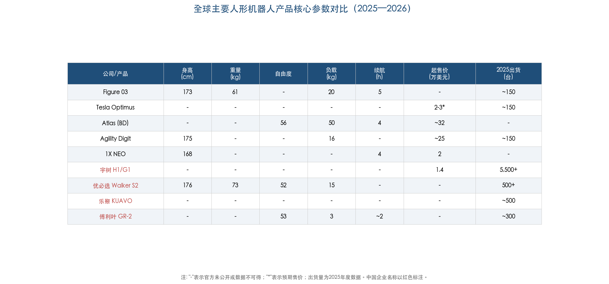

## 4.3 四足机器人：已实现规模化量产的成熟形态

四足机器人因控制难度低于双足、地形适应性优于轮式，在巡检、安防、科研等场景中率先实现商业化，是当前具身智能各形态中量产规模最大、商业模式最成熟的品类。

**宇树科技四足产品线**是全球出货量最大的四足机器人厂商。2022-2025年四足销量从2,403台增至17,946台（2025年仅前三季度数据），均价从3.86万元降至2.72万元，体现了显著的规模效应与成本压缩能力。Go2以1,600美元起售价占据消费级和中端工业市场，是全球售价最低的四足机器人之一。[瑞财经](https://m.rccaijing.com/news-7441267069385635239.html "宇树四足销量与定价")

**Boston Dynamics Spot**售价约7.5万美元，定位高端工业巡检市场，客户覆盖电力、石油、矿业等资源密集型行业。Spot的市场策略与宇树形成鲜明分野——前者以高客单价和深度行业解决方案为核心，后者以极致性价比和消费级渗透为路径，二者在不同市场层级中各据优势。

四足形态与VLA等软件技术路线的适配同样值得关注。Skild AI的统一基础模型"Skild Brain"已验证可同时控制四足、人形和机械臂等多种形态，表明软件层面的形态泛化正在打破硬件边界——未来同一套AI模型有望驱动不同形态的机器人本体，这将深刻改变硬件形态选择的战略逻辑。[Skild AI官方公告](https://www.skild.ai/blogs/series-c "Skild AI Series C，2026年1月")

## 4.4 灵巧手：决定操作能力上限的关键短板

灵巧手是当前具身智能硬件中技术难度最高、工程化进展最慢的环节，也是制约人形机器人从"能走"迈向"能干活"的核心瓶颈。人类手部拥有27个自由度和约17,000个触觉感受器，现阶段机器人灵巧手在自由度、力控精度和耐久性上仍存在数量级差距。

**Sanctuary AI**的Phoenix人形机器人（170 cm/70 kg/负载25 kg）将灵巧手作为核心差异化方向。其21自由度液压阀驱动五指手功率密度比电机/腱绳驱动方案高一个数量级，并通过20亿次循环测试验证无泄漏或退化，在耐久性验证上处于行业前沿。累计融资超1.4亿美元，总部位于加拿大温哥华。[Sanctuary AI官方博客](https://www.sanctuary.ai/blog/sanctuary-ai-demonstrates-in-hand-manipulation-capabilities-for-improved-general-purpose-robot-dexterity "灵巧手技术")

**Tesla Optimus Gen 3手部**拥有22自由度、50个执行器和内置触觉传感器，但正是手部开发中遭遇的严重工程困难导致了2025年量产计划的搁置——这一案例生动说明了灵巧手工程化的极高门槛。[Sherwood News](https://sherwood.news/tech/tesla-abandoned-plans-to-make-thousands-of-optimus-robots-this-year/ "Tesla放弃量产计划")

**Figure 03**的触觉传感器可检测低至3克的力，代表了灵巧手感知精度的前沿水平，为精细操作任务（如电子元器件组装、医疗器械操控）提供了技术基础。

**UBTECH Walker S2**搭载第四代灵巧五指手，配合52自由度整体设计和±162度腰部旋转，在工业场景中展现了较强的操作灵活性，已在BYD、富士康等产线完成实际验证。

灵巧手面临的核心瓶颈集中在耐久性方面：当前灵巧手寿命仅约1,000小时，而工业场景通常要求超过10,000小时。这意味着以现有技术水平，灵巧手在1-2个月的连续使用后即需更换，严重制约了商业化部署的经济性。Figure 02在BMW工厂的长期部署实践也印证了这一判断——前臂是最主要的硬件故障点，手部/手臂耐久性已成为量产部署的首要工程挑战。[Figure AI官方](https://www.figure.ai/news/production-at-bmw "硬件可靠性经验")

## 4.5 专用形态与轮式/复合平台：务实路线的商业价值

并非所有具身智能应用都需要人形体态。在结构化工业环境中，轮式/复合形态往往以更低成本、更高可靠性和更长续航提供更具性价比的解决方案。

银河通用（Galbot）的主力产品Galbot G1采用轮式双臂构型（173 cm/85 kg/续航10小时），在保持人形上半身操作能力的同时，以轮式底盘大幅提升了稳定性和续航——其10小时续航远超纯双足方案的4-5小时，更贴合工业场景8小时制的实际需求。工业重载型号S1双臂负载达50 kg。这种"上人形、下轮式"的复合形态在结构化工业环境中往往比纯双足方案更具实用性。[华尔街见闻报道](https://wallstreetcn.com/articles/3766500 "银河通用商业化及融资")

银河通用在技术路线上从"大脑+小脑"分离架构演进至AstraBrain端到端具身大模型，采用99%合成数据+1%真实数据的训练配比，在数据获取效率上形成了独特优势。已在宁德时代、博世、丰田、现代、北汽等头部制造企业完成部署，累计订单数千台。成立于2023年5月，累计融资居中国具身智能首位，最新B++轮25亿元由国家大基金三期首投，估值突破200亿元。创始人王鹤（清华/Stanford博士），联合创始人姚腾洲（北航/ABB背景）。[量子位报道](https://www.qbitai.com/2026/02/380787.html "AstraBrain技术详解")

银河通用的案例表明，形态选择应服务于场景需求而非技术理想。在地面平坦、通道标准化的工业厂房中，轮式底盘在稳定性、续航和成本上的优势足以抵消双足行走带来的灵活性溢价。这一务实路线的商业成功，为行业提供了重要的形态选择参照。

## 4.6 2025年全球出货格局：中国企业的绝对主导

2025年全球人形机器人出货量呈现中国企业绝对主导的格局。Omdia数据显示，2025年全球人形机器人总出货约1.33万台；赛迪传媒报告的口径约1.7万台，口径差异主要源于对"全尺寸人形"的定义不同。

从企业排名看：智元机器人（AgiBot）超5,100台（约39%）、宇树科技4,200台（宇树自述超5,500台，口径差异可能源于是否包含G1等轻量型号）、优必选约1,000台、乐聚500台、众擎400台、傅利叶智能300台。中国企业合计占全球出货量的绝对主体。对比之下，Figure AI、Tesla和Agility Robotics 2025年出货量各约150台，三家合计市场份额仅约3%。[36氪](https://eu.36kr.com/zh/p/3709666119479682 "Omdia 2025全球出货数据") [通信世界](https://www.cww.net.cn/article?id=606605 "中国厂商包揽出货榜前六")

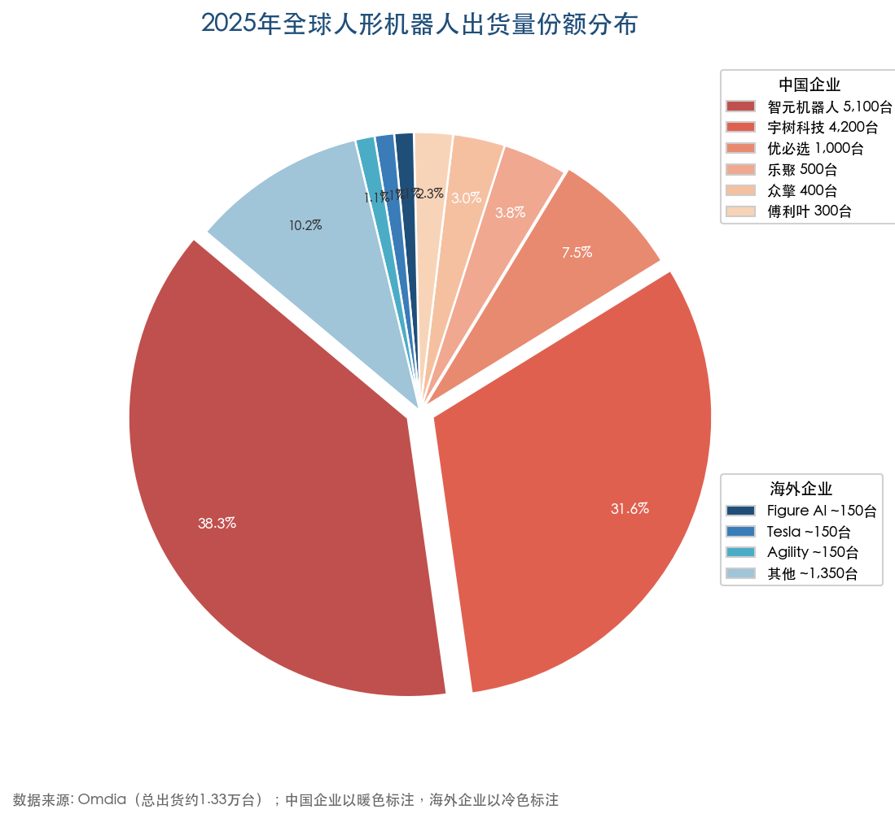

上图基于Omdia统计数据，直观呈现了2025年全球人形机器人出货量的份额分布。中国企业（暖色标注）合计占比超86%，海外企业（冷色标注）合计不足14%，其中头部海外企业单家份额均在1%左右。

这一格局深刻反映了中外企业在产业化节奏上的阶段性差异：中国企业已进入规模化量产交付阶段，而海外企业（除少数例外）仍处于小批量试点与产品验证阶段。量产能力的领先使中国企业在成本曲线、工艺迭代和客户反馈积累上建立了先发优势，但这一优势能否转化为长期竞争壁垒，仍取决于AI软件栈的追赶进度。

## 4.7 中外硬件工程化能力对比

中外企业在硬件本体领域呈现鲜明的"互补型竞争"格局，各有结构性优势，短期内难以相互替代。

### 中国优势：垂直整合与成本控制

中国企业的核心竞争力体现在执行器/关节模组的自研与垂直整合能力。以宇树科技为例，核心部件自研率超95%、国产化率85%，人形机器人均价从2023年59.34万元/台降至2025年16.76万元/台（约2.3万美元），毛利率仍达62.91%——这一成本结构在全球竞争者中极为突出。乐聚机器人的国产化率从2018年的10%提升至2025年的90%，整机成本从300万元降至十几万元，生动展现了中国供应链在短短数年内的快速成熟。[国际电子商情](https://www.esmchina.com/news/14030.html "宇树自研率数据")

量产速度方面，中国企业从打样到量产仅需约45天（海外约120天），国产关节模组价格为海外同类产品的约1/3。这些结构性优势共同支撑了中国企业在2025年出货量上的全球主导地位。

### 海外优势：AI软件栈与品牌渠道

海外企业在AI/软件栈的成熟度上保持显著领先。Figure AI自研Helix系统实现了从感知到运动的全栈闭环、Tesla基于FSD技术向机器人控制迁移、Boston Dynamics与Google DeepMind深度合作集成Gemini Robotics、Apptronik同样接入Gemini生态——这些布局构成了海外人形机器人在"认知大脑"层面的差异化壁垒。

品牌与企业级渠道方面，Boston Dynamics的Spot已在全球高端工业市场建立深厚品牌认知，Agility Robotics与Amazon、丰田的合作关系为其打开了Fortune 500客户通道。Hyundai作为Boston Dynamics的母公司，可提供汽车级供应链管理和年产30,000台的规模化制造能力——这一体量在海外竞争者中独树一帜。

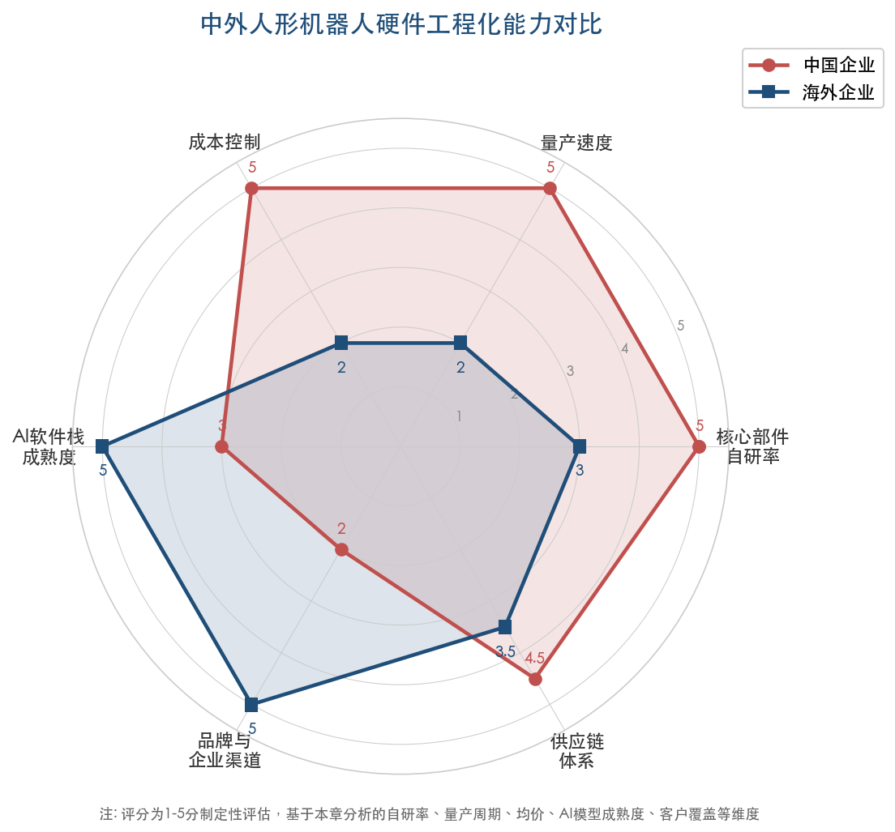

上图从核心部件自研率、量产速度、成本控制、AI软件栈成熟度、品牌与企业渠道、供应链体系六个维度，定性呈现了中外企业的结构性优劣势对比。中国企业在自研率、量产速度和成本控制维度上显著领先（评分4.5-5分），海外企业则在AI软件栈成熟度和品牌渠道维度上占据优势（评分5分），双方在供应链体系维度上差距相对较小。

### 竞争格局展望

我们认为，中外企业的竞争格局将沿"硬件中国化、软件全球化"的趋势演进。中国企业凭借成本和量产优势占据硬件本体的全球份额，而海外企业在VLA模型、基础模型和仿真平台等"软件基础设施"层面保持创新引领。随着银河通用AstraBrain、智元GO-1、星动纪元ERA-42等中国VLA模型的密集涌现，软件层面的差距正在快速缩小。中长期来看，硬件工程化能力与AI软件栈的深度整合将成为决定竞争胜负的关键——这也是Boston Dynamics选择与Google DeepMind合作、宇树科技和优必选加速自研AI模型的底层逻辑。

# 第5章 商业化落地与应用场景——从工厂到生活的渗透路径

前四章从技术栈、VLA模型、世界模型与仿真、硬件本体四个维度完成了具身智能的技术全景扫描。技术的价值最终需要通过商业化落地来兑现。2025年被行业广泛视为具身智能"商业化元年"——全球人形机器人销售收入首次突破5亿美元，中国企业包揽出货量前三名，RaaS（Robot-as-a-Service，机器人即服务）模式从概念走向商业实践。[Counterpoint Research](https://counterpointresearch.com/en/insights/Chinese-Enterprises-Leading-Global-Commercialization-Wave-of-Humanoid-Robots "全球人形机器人收入结构，2026年2月") 然而，商业化落地远非简单的"将机器人送进工厂"——不同场景对技术成熟度、可靠性、成本结构的要求差异极大，商业模式的选择直接决定企业的生存方式与扩张路径。本章系统梳理具身智能当前已实现或正在推进商业化落地的核心场景，分析各场景的需求特征与商业模式，评估商业化进程中的核心瓶颈，并呈现中国与海外市场在商业化路径上的结构性差异。

## 5.1 工业制造：最先突破的商业化主阵地

工业制造是具身智能商业化落地最集中、进展最快的领域。核心驱动力源自三方面：结构化的工作环境降低了机器人自主导航与操作的技术门槛；重复性高、劳动强度大的任务提供了清晰的ROI（投资回报率）论证基础；制造业客户对新技术的采纳意愿普遍高于消费端。2025-2026年间，海外汽车主机厂与中国头部制造企业的部署实践共同勾勒出工业场景商业化的真实图景。

### 5.1.1 海外汽车制造：从试点到扩产的里程碑

**Figure AI与BMW的合作**是迄今为止最具里程碑意义的人形机器人工业部署案例。Figure 02在BMW位于美国南卡罗来纳州斯帕坦堡的工厂完成了11个月持续部署，每日运行10小时班次，累计运行超过1,250小时，搬运超过90,000个钣金零件，直接参与了超过30,000辆BMW X3的生产流程，作业精度要求在5 mm公差内2秒完成。[Figure AI官方公告](https://www.figure.ai/news/production-at-bmw "Figure 02 BMW部署成果") BMW在验证部署成效后，随即在德国莱比锡工厂启动首个欧洲人形机器人试点项目，标志着该技术从北美单一工厂向全球生产网络的延伸。[BMW集团官方新闻稿](https://www.press.bmwgroup.com/global/article/detail/T0455864EN/bmw-group-to-deploy-humanoid-robots-in-production-in-germany-for-the-first-time "BMW莱比锡试点")

这一案例的核心价值在于：首次证明人形机器人能够在真实汽车生产线上以接近工业级可靠性完成连续作业，并获得主机厂的扩产订单。Figure AI在部署过程中发现前臂是最主要的硬件故障点，这一工程经验直接推动了后续Figure 03的设计改进。[Figure AI官方](https://www.figure.ai/news/production-at-bmw "硬件可靠性经验")

**雷诺集团**于2026年3月宣布了汽车行业迄今规模最大的人形机器人部署计划之一：将在18个月内部署350台Calvin人形机器人（与法国公司Wandercraft合作开发），聚焦重复性高、体力消耗大的"棕地"（brownfield）任务。350台的规模显著超越此前所有汽车厂的试点部署，标志着行业从"个位数试点"向"百台级规模部署"的跃升。[Metrology News](https://metrology.news/renault-to-deploy-350-humanoid-robots-in-industrial-automation-push/ "雷诺350台人形机器人，2026年3月")

**丰田加拿大制造公司**于2026年2月与Agility Robotics签署商业协议，计划部署7台Digit用于RAV4生产线的制造、供应链和物流运营，采用RaaS模式。部署规模虽有限，但丰田作为全球最大汽车制造商之一的参与，对行业信心具有标志性意义。[Agility Robotics官方公告](https://www.agilityrobotics.com/content/agility-robotics-announces-commercial-agreement-with-toyota-motor-manufacturing-canada "丰田加拿大商业协议")

### 5.1.2 中国工业部署：密度与速度的双重领先

中国在工业制造场景的具身智能部署呈现出显著的密度优势与速度优势，头部企业已进入"千台级订单"阶段。

**银河通用（Galbot）** 商业化网络覆盖面居行业前列，已与宁德时代、博世、丰田、现代、北汽等头部制造企业建立深度合作关系，累计订单达数千台。2025年，银河通用与百达精工签署了超过1,000台的部署协议。其主力产品Galbot G1为轮式双臂构型（身高173 cm、重量85 kg、续航10小时），工业重载型S1双臂负载可达50 kg，直接面向产线重物搬运与高精度装配需求。[人民网](http://finance.people.com.cn/n1/2026/0303/c1004-40673745.html "银河通用商业化")

**智元机器人（AgiBot）** 2025年实现全球出货量第一（超5,100台），订单金额接近14亿元人民币。其远征A2-W轮式人形机器人已在富临精工工厂实现近百台规模落地，覆盖4个工位、三条装配线、20余种物料、14 kg负载作业，且实现零倾倒事故。[半月谈/新华社](http://www.banyuetan.org/kj/detail/20260108/1000200033136211767861634411891100_1.html "2026产业展望") 2026年3月，智元在MWC 2026上推出"青天租"（Qingtian Rent）机器人租赁平台——中国首个面向市场的人形机器人RaaS平台，日租价格从约500元人民币（约70美元）到超过10万元人民币不等，覆盖人形、轮式和工业机械臂多种形态。[Robotics Tomorrow](https://www.roboticstomorrow.com/news/2026/03/01/agibot-showcases-full-humanoid-robot-portfolio-at-mwc-2026/26198/ "AgiBot MWC 2026 RaaS发布")

**优必选（UBTECH）** 第1,000台Walker S2于2025年下线，当年交付超500台，订单金额近14亿元人民币。经过两年产线实训与测试积累，2026年被视为人形机器人大规模工业部署的起步年。[半月谈/新华社](http://www.banyuetan.org/kj/detail/20260108/1000200033136211767861634411891100_1.html "2026产业展望")

### 5.1.3 Tesla Optimus：自用部署的独特路径

Tesla采取了一条与所有外部销售型企业截然不同的路径——先在自有工厂内部部署以积累数据与运营经验，再面向外部市场销售。截至2026年1月，Tesla已在Giga Texas和Fremont工厂部署超过1,000台Gen 3 Optimus。同期，Tesla开始在Austin工厂采集数据以训练Optimus，拓展此前仅在Fremont工厂进行了一年多的数据采集工作。CEO马斯克在2026年1月达沃斯论坛上表示，Optimus正在工厂中执行"简单任务"，预计2026年底能够完成更复杂的工业任务。[Business Insider](https://www.businessinsider.com/tesla-optimus-robot-new-training-austin-gigafactory-2026-1 "Tesla Optimus Austin训练计划")

在产能规划方面，Tesla于2026年2月财报电话会上宣布将停产Model S和Model X车型，将Fremont工厂部分产线改造为Optimus机器人生产线，目标年产能高达100万台。Optimus 3计划于2026年夏季开始生产，2027年开始对外销售。[Assembly Magazine](https://www.assemblymag.com/articles/99853-tesla-to-end-model-x-s-production-convert-fremont-space-for-optimus-robots "Tesla Fremont产线改造，2026年2月") 这一产能规划远超当前所有竞争对手，但需要审慎看待：Tesla在2025年曾计划生产10,000台Optimus但最终未能兑现，马斯克本人也曾公开警告Optimus量产将"极其缓慢"。百万台级目标与当前千台级现实之间的落差，折射出这一领域从愿景到规模化量产的巨大挑战。

## 5.2 仓储物流：人形机器人商业收入的首个验证场景

仓储物流是继工业制造之后具身智能商业化落地的第二大核心场景。其需求特征在于：高度标准化的环境（货架—通道—工位布局固定）、大量重复性搬运任务，以及北美市场日益严峻的劳动力短缺压力。

### 5.2.1 Agility Robotics Digit：全球首个产生商业收入的人形机器人

Agility Robotics的Digit是全球首个在仓储场景中产生商业收入的人形机器人。其双足步行设计（鸟类仿生反关节腿）使其能够在为人类设计的仓储环境中自主导航，无需改造基础设施。截至2025年11月，Digit已在GXO Logistics配送中心累计搬运超过100,000个周转箱，验证了人形机器人在物流场景中的持续作业能力。[Agility Robotics官方博客](https://www.agilityrobotics.com/content/digit-moves-over-100k-totes "Digit搬运超10万周转箱，2025年11月")

Digit的客户网络已覆盖多家世界500强企业：GXO Logistics（全球最大合同物流公司之一）、Schaeffler、Amazon、丰田加拿大。2025年12月，Agility与Mercado Libre（拉丁美洲最大电商平台）签署商业协议，在其位于美国德克萨斯州圣安东尼奥的履约中心部署Digit，标志着人形机器人进入跨境电商物流领域。[Agility Robotics官方公告](https://www.agilityrobotics.com/content/mercado-libre-and-agility-robotics-announce-commercial-agreement "Mercado Libre商业协议")

Amazon是Agility的早期投资方之一（通过Amazon Industrial Innovation Fund参与Series B 1.5亿美元融资），并已在其仓储运营中测试Digit进行料箱整理任务（2023年宣布引入），但截至2026年3月尚未公开披露具体部署规模和扩张计划。

### 5.2.2 中国仓储场景：轮式方案的务实选择

中国企业在仓储物流场景中呈现出更务实的形态选择——优先采用轮式或复合移动平台，而非成本更高、可靠性尚未充分证实的人形双足方案。银河通用的Galbot G1即为轮式双臂构型，在结构化的仓储和产线环境中，轮式底盘在稳定性、续航和成本上均优于双足行走方案。这一技术路线选择体现了中国企业"场景驱动而非形态驱动"的商业化思路——在ROI尚未充分论证的领域，以务实的形态选择优先实现商业闭环。

## 5.3 零售服务与新消费：中国独有的商业化路径

零售与新消费场景是中国具身智能商业化的一条独特路径，在海外市场几乎没有对标案例。

**银河通用**的"银河太空舱"无人便利店已在全国20余座城市超过100家门店实现7×24小时不间断运营，持续运营超过一年。其智慧药房已覆盖24个城市，单店管理超过5,000种SKU。这一模式的核心在于：机器人并非替代个别店员，而是充当整个门店的运营主体——从商品上架、理货到交易结算，实现全流程无人化运营。[人民网](http://finance.people.com.cn/n1/2026/0303/c1004-40673745.html "银河通用零售")

**机器人4S体验店**模式在中国兴起，呈现出消费端的新业态。2026年初，北京出现名为"机械伊甸"的机器人体验零售店，汇聚近30家厂商约30余种机型，以消费者直接体验和购买为核心定位，带动进店客流环比提升15%。[北京市政府网站](https://www.beijing.gov.cn/fuwu/bmfw/sy/jrts/202603/t20260307_4551538.html "机器人4S店")

零售场景的特殊性在于：其并非单纯的B2B部署，而是B2C模式的早期探索。机器人既是生产工具（执行零售运营任务），也是消费品牌载体（作为体验和社交媒介吸引客流）。这种"双重身份"是中国市场消费文化和数字化生态共同塑造的产物，也为具身智能在工业场景之外开辟了差异化的收入来源。

## 5.4 医疗康复：从康复辅具到智能诊疗的延伸

医疗康复是具身智能商业化落地中技术门槛最高、监管最严格，但附加值也最高的场景。

**傅利叶智能**是该领域最具代表性的企业，其发展路径体现了"从康复辅具向通用人形扩展"的独特进化逻辑。2026年1月，傅利叶发布"脑机具身智能康复港"，将其GR-3人形机器人引入康复认知训练，并联合上海瑞金医院和复旦大学类脑研究院发起联合创新计划，探索脑机接口与具身智能的交叉应用。[傅利叶官网](https://www.fftai.cn/about-medium-company/53 "傅利叶十年核心战略，2026年1月")

**银河通用**则从院内运营端切入医疗场景，与宣武医院、华西医院等顶级三甲医院建立深度合作，探索机器人在院内物流、辅助护理和手术准备等环节的应用。

医疗场景的商业化逻辑与工业制造存在本质差异：工业场景的ROI可以通过单位时间产出和劳动力成本替代直接量化，医疗场景的价值则更多体现在服务质量提升、医疗差错减少和人力结构优化等间接效益上。加之医疗器械注册认证周期长（通常2—3年）、安全标准严格，预计医疗场景的规模化部署时间将显著晚于工业和仓储场景。

## 5.5 商业模式演进：从设备销售到RaaS

商业模式的选择是决定具身智能企业生存与扩张的关键战略决策。当前行业正在经历从传统设备销售向RaaS（Robot-as-a-Service，机器人即服务）模式的结构性转型。

### 5.5.1 RaaS模式的经济逻辑

RaaS模式的月费通常在2,000—8,000美元区间，涵盖硬件、软件、维护和保险。以Agility Robotics的Digit为例，购买价格约25万美元，RaaS月费约6,000—8,000美元。对比美国仓库工人的完全用工成本——约7,800美元/月（含工资、福利、保险、管理成本），Digit在RaaS模式下可实现"第一天即正ROI"。[Robozaps ROI分析](https://blog.robozaps.com/b/roi-of-humanoid-robots "人形机器人ROI指南2026")

更详细的TCO（总拥有成本）测算进一步支撑这一判断：按10万美元机器人、日运行16小时、5年使用寿命计算，TCO约18.75万美元，折合有效时薪约6.70美元，远低于美国仓储劳动力的35—45美元/时。IDTechEx预测，到2028年RaaS模式将占人形机器人部署总量的40%以上。[Robozaps ROI分析](https://blog.robozaps.com/b/roi-of-humanoid-robots "按地区ROI差异")

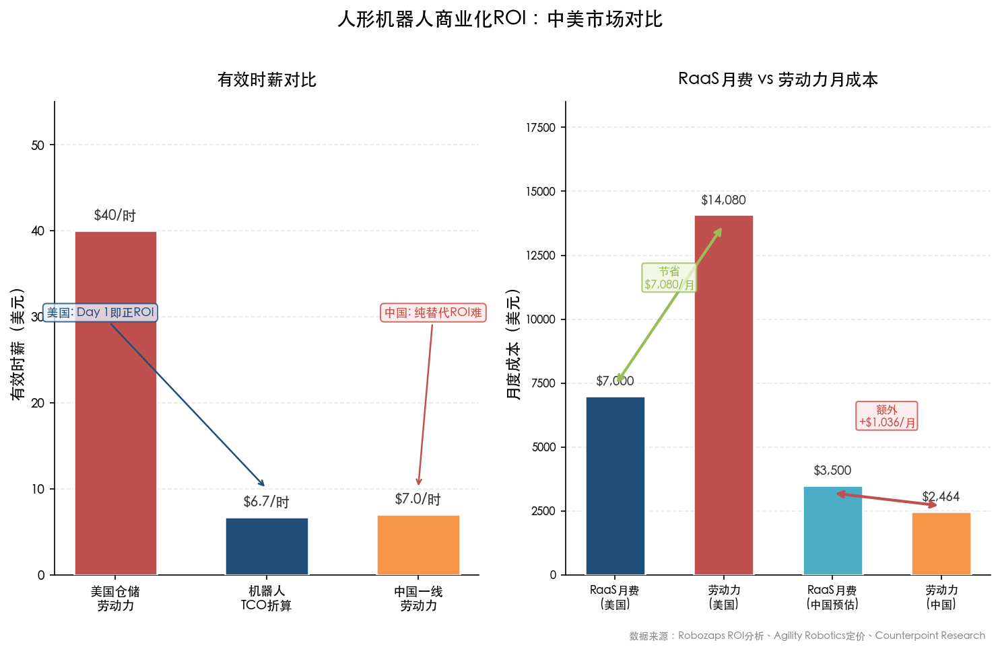

上图直观呈现了中美两大市场在人形机器人ROI上的结构性差异：美国市场凭借高劳动力成本实现"Day 1即正ROI"，而中国一线城市劳动力时薪与机器人TCO折算时薪接近持平，纯劳动力替代型的ROI论证在中国市场面临更大挑战。

### 5.5.2 中国市场的RaaS探索

中国市场的RaaS探索路径与北美存在显著差异。智元机器人于2026年3月推出的"青天租"平台是中国首个系统性的人形机器人租赁平台，通过微信小程序下单，日租价格覆盖从约70美元（基础型）到超过14,000美元（高端定制部署）的宽幅区间。[Robotics Tomorrow](https://www.roboticstomorrow.com/news/2026/03/01/agibot-showcases-full-humanoid-robot-portfolio-at-mwc-2026/26198/ "AgiBot MWC 2026 RaaS发布")

然而，中国市场的ROI逻辑与美国存在结构性差异。中国一线城市仓储和制造业劳动力完全成本约为6—8美元/时，按上述TCO模型计算，机器人回本期需要超过60个月——纯粹的劳动力替代型ROI论证在中国市场较为困难。中国企业的应对策略体现在两个层面：其一，通过更低的硬件成本（国产关节模组价格为海外同类的1/3）和更快的量产节奏（打样到量产仅需45天，海外通常120天）压缩TCO；其二，在"娱乐表演""数据生产""品牌营销"等非传统场景中开辟增量市场。Counterpoint Research 2026年2月报告显示，2025年全球人形机器人销售收入中，"娱乐与表演"和"数据生产"两大场景分别贡献了26%和22%的收入占比，合计近半数收入来自非工业场景。[Counterpoint Research](https://counterpointresearch.com/en/insights/Chinese-Enterprises-Leading-Global-Commercialization-Wave-of-Humanoid-Robots "全球人形机器人收入结构，2026年2月")

### 5.5.3 Apptronik的定价参考

Apptronik为Apollo人形机器人设定的年租赁价格约为8万美元，按月折算约6,700美元。Apollo面向Mercedes-Benz、GXO Logistics、Jabil等高端工业客户，其定价水平与Digit的RaaS费率基本一致，表明北美市场已初步形成人形机器人RaaS定价区间（6,000—8,000美元/月）的行业共识。[CNBC](https://www.cnbc.com/2026/02/11/apptronik-raises-520-million-at-5-billion-valuation-for-apollo-robot.html "Apptronik Apollo定价")

## 5.6 商业化的核心瓶颈

尽管2025年被广泛视为商业化元年，具身智能的规模化落地仍面临多重结构性瓶颈，制约着行业从"元年"向"规模化盈利"的跨越。

### 5.6.1 成本瓶颈

高端人形机器人整机成本仍超过60万元人民币（约8万美元以上），其中执行器成本占制造总成本的60%—70%。不过成本曲线正处于快速下降通道：2023—2024年间制造成本已下降约40%；宇树科技的人形机器人均价从2023年的59.34万元/台降至2025年的16.76万元/台（约2.3万美元），且毛利率仍高达62.91%，充分展现了中国企业在供应链整合与成本控制上的竞争力。[新浪新闻](https://news.sina.cn/bignews/insight/2026-01-31/detail-inhkeaqr2995928.d.html "成本与可靠性瓶颈")

### 5.6.2 可靠性瓶颈

可靠性是从"演示"跨越到"部署"最难逾越的鸿沟。家庭环境任务成功率低于60%，灵巧手寿命仅约1,000小时，而工业级应用通常要求超过10,000小时。Figure 02在BMW部署中发现前臂是最主要的硬件故障点，这一发现具有行业普遍性——执行器和末端执行器在高频次、高负荷场景中的磨损，构成人形机器人可靠性的核心短板。[Figure AI官方](https://www.figure.ai/news/production-at-bmw "硬件可靠性经验")

### 5.6.3 盈利瓶颈

行业目前普遍处于"以亏损换规模"阶段。优必选作为唯一已上市的纯人形机器人公司，2024年净利率约为-28%。智元机器人2024年销售额超1亿元，但尚未披露盈利情况。宇树科技是罕见的已实现盈利的企业——2025年净利润约6亿元，但其利润主要来自四足机器人而非人形产品。

Counterpoint Research数据显示，2025年全球人形机器人销售收入刚刚突破5亿美元，智元以超过1.4亿美元排名全球第一，前三名均为中国企业，合计占全球收入的一半以上。[Counterpoint Research](https://counterpointresearch.com/en/insights/Chinese-Enterprises-Leading-Global-Commercialization-Wave-of-Humanoid-Robots "2025年全球人形机器人收入突破5亿美元") 5亿美元的全球收入规模对于一个承载数百亿美元融资的行业而言，意味着商业闭环远未完成。

### 5.6.4 安全与标准瓶颈

安全合规是商业化落地的隐性门槛。ISO/TC299工作组WG12于2025年7月正式启动人形和四足机器人安全标准的制定工作，预计2028年发布。中国在该标准制定中占据38%的专家席位，并主导了5项国际标准的制定。在欧洲，欧盟《人工智能法案》（AI Act）的高风险AI义务条款将于2026年8月2日全面适用，出口欧洲市场的具身智能产品需要满足安全评估、数据治理和透明度等一系列合规要求。[Novanta](https://novanta.com/news/how-global-safety-standards-for-humanoid-robotics-are-being-built/ "ISO标准制定进展") [欧盟官方](https://digital-strategy.ec.europa.eu/en/policies/regulatory-framework-ai "EU AI Act时间线")

标准缺失在短期内形成了双刃效应：一方面，大客户（尤其是欧美汽车主机厂）在标准明确前可能限制部署规模；另一方面，中国企业凭借38%的专家席位和5项主导标准的制定参与，有望在规则制定中获得先发优势。

## 5.7 中国与海外市场的商业化路径差异

中国与海外在具身智能商业化路径上的差异，不仅源于市场环境和劳动力成本的不同，更是产业组织方式和政策逻辑的系统性分野。下图从九个维度系统呈现了这一结构性差异。

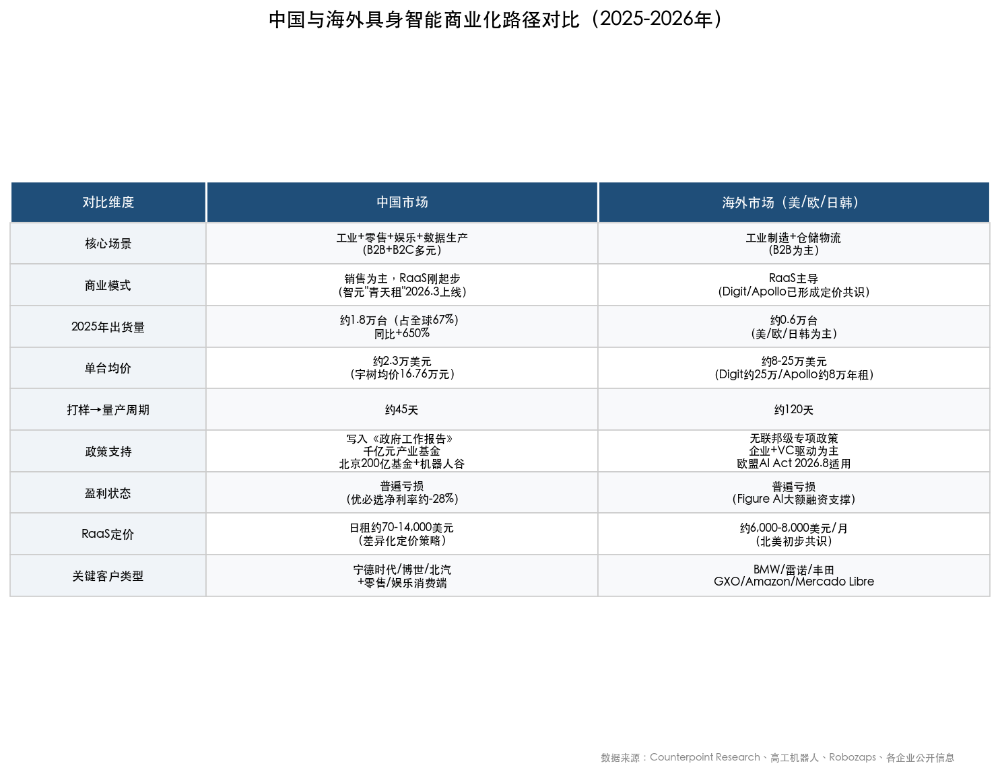

### 5.7.1 出货量与产能：中国的规模优势

2025年全球人形机器人出货量中，中国企业占据绝对主体。高工机器人数据显示，2025年中国国内人形机器人出货约1.8万台（同比增长超650%），预计2026年有望达到6.25万台。[半月谈/新华社](http://www.banyuetan.org/kj/detail/20260108/1000200033136211767861634411891100_1.html "2026产量预测") 这一规模领先建立在三重优势之上：国产关节模组价格为海外同类产品的1/3，从打样到量产仅需约45天（海外典型周期约120天），垂直整合程度高（宇树核心部件自研率超95%，国产化率85%）。[新浪新闻](https://news.sina.cn/bignews/insight/2026-01-31/detail-inhkeaqr2995928.d.html "中国供应链优势")

### 5.7.2 场景覆盖：B2B与B2C的分化

海外市场的商业化路径高度聚焦B2B工业和物流场景——BMW、雷诺、丰田的工厂部署，GXO、Amazon、Mercado Libre的仓储部署。客户以世界500强和大型合同物流商为主，部署决策链较长但单笔合同金额较大，商业模式以RaaS为主导。

中国市场则呈现B2B+B2C的多元格局：除工业制造（宁德时代、博世、富临精工等）和仓储物流之外，零售服务（银河太空舱便利店、智慧药房）、娱乐表演（2025年央视春晚16台宇树H1表演是标志性事件）、数据生产（为AI训练提供具身交互数据）、消费体验（机器人4S店）等场景构成了中国独有的商业化拼图。Counterpoint Research数据揭示了一个值得关注的事实：2025年全球人形机器人销售收入中，娱乐表演贡献了26%、数据生产贡献了22%，两大场景合计近半数收入。[Counterpoint Research](https://counterpointresearch.com/en/insights/Chinese-Enterprises-Leading-Global-Commercialization-Wave-of-Humanoid-Robots "应用场景收入占比") 这意味着人形机器人的早期商业化并非完全依赖工业替代逻辑，非工业场景在培育市场认知和创造现金流方面发挥着不可忽视的作用。

### 5.7.3 政策驱动：中国的系统性支持

中国政策端对具身智能商业化的推动力度显著超越海外。2025年，"具身智能"首次写入中国《政府工作报告》。工信部宣布国内整机企业超过140家、产品超330款，并明确将发布标准化体系建设指南、设立千亿元产业基金。地方层面同步加码：北京设立200亿元基金并规划10平方公里"机器人谷"，深圳规划百万台年产能目标。[新浪新闻/工信部](https://news.sina.cn/bignews/insight/2026-01-31/detail-inhkeaqr2995928.d.html "工信部官宣")

相比之下，美国联邦政府层面尚未出台针对具身智能的专项产业政策，商业化驱动力主要来自企业端（Tesla、Figure AI、Agility的自主投入）和风险资本（2025年人形机器人领域融资约37亿美元）。欧洲在监管框架（AI Act）上走在前列，但在产业扶持政策上相对保守。中美之间"政策驱动"与"市场驱动"的路径差异，正深刻影响着两个市场的商业化节奏与产业结构。

### 5.7.4 商业化收入格局

根据Counterpoint Research 2026年2月报告，2025年全球人形机器人销售收入突破5亿美元，智元机器人（AgiBot）以超过1.4亿美元排名全球收入第一，前三名均为中国企业。Counterpoint预测全球人形机器人收入将在2027年达到44亿美元。[Counterpoint Research](https://counterpointresearch.com/en/insights/Chinese-Enterprises-Leading-Global-Commercialization-Wave-of-Humanoid-Robots "2027年收入预测44亿美元") 从2025年5亿美元到2027年44亿美元的增长轨迹意味着近9倍的增幅，其实现高度依赖于工业部署从试点向百台级、千台级规模的成功扩张，以及非工业场景持续贡献增量收入。

## 5.8 小结：商业化落地的阶段性特征

综合以上分析，2025—2026年具身智能的商业化落地呈现出以下阶段性特征：

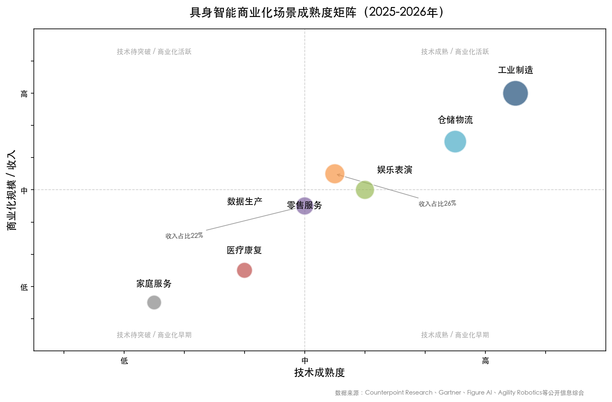

上图将七大核心应用场景按技术成熟度与商业化规模/收入双维度定位，直观呈现各场景所处的商业化阶段。

**场景分层清晰。** 工业制造和仓储物流是技术成熟度最高、ROI最易论证的"第一梯队"场景；零售服务和娱乐表演在中国市场已开始产生实质性收入（分别贡献全球收入的26%和22%）；医疗康复和家庭服务仍处于联合研发和小规模试点阶段。

**商业模式处于转型期。** RaaS正从概念走向商业实践，北美市场已初步形成6,000—8,000美元/月的定价共识；中国市场的RaaS探索刚刚起步（智元"青天租"于2026年3月上线），定价策略更加灵活多元。

**中国规模领先、海外价值领先。** 中国企业在出货量、成本控制和场景多元性上占据优势；海外企业在单客户合同价值、品牌信任度和安全合规体系上领先。这一分化格局在短期内预计将持续。

**行业尚未跨越盈利门槛。** 除宇树科技（主要依靠四足产品盈利）外，主要人形机器人企业均处于亏损状态。Gartner 2026年1月预测，至2028年全球能将人形机器人推进至实验之外的公司不到100家，能在制造和供应链场景实现规模化部署的不到20家。[Gartner新闻稿](https://www.gartner.com/en/newsroom/press-releases/2026-01-21-gartner-predicts-fewer-than-20-companies-will-scale-humanoid-robots-for-manufacturing-and-supply-chain-to-production-stage-by-2028 "Gartner预测，2026年1月21日") 这一判断与我们观察到的行业现实高度一致——商业化落地正在加速，但从"元年"到"规模化盈利"之间，仍有相当距离需要跨越。

# 第6章 技术路线对比与趋势展望

前五章分别从产业全景、VLA与分层大模型、世界模型与仿真基础设施、硬件本体形态、商业化落地五个维度完成了具身智能的系统性扫描。各技术路线在纵深分析中已呈现出各自的演化逻辑，但一个核心问题始终悬而未决：在这些相互交织的技术路线之间，究竟哪些维度构成关键差异？路线之间是竞争替代还是融合收敛？未来12—18个月的产业拐点何在？中美两国在不同环节的竞争格局又将如何演变？

本章以横向对比为方法论，以趋势研判为目标，从六维度系统评估、技术路线融合趋势、关键技术节点与产业拐点、全球竞争格局四个层面展开分析，力图在技术路线的比较研判中提炼出具身智能产业的结构性方向。

## 6.1 技术路线横向对比：六大维度的系统评估

### 6.1.1 技术路线分类框架

经过第2—4章的系统梳理，当前具身智能"大脑"层面的技术路线可归纳为四种范式：

- **单模型端到端VLA**（代表：Physical Intelligence π₀/π₀.5、OpenVLA）：将视觉感知、语言理解和动作生成统一到单一模型中，架构简洁、系统复杂度低，π₀通过流匹配实现50Hz控制频率。
- **双系统VLA**（代表：Figure AI Helix/Helix 02、NVIDIA GR00T N1/N1.6、智平方GOVLA 0.5）：将慢速VLM（7—9Hz，负责场景理解与语言推理）与快速动作策略网络（200Hz—1kHz，负责运动控制）解耦，兼顾语义泛化与实时性。
- **世界动作模型（WAM）**（代表：NVIDIA DreamZero/GR00T N2）：将世界模型的环境预测与动作生成统一到单一模型中，通过联合预测视频与动作实现零样本泛化。NVIDIA于2026年2月发布DreamZero论文，提出基于Wan2.1-I2V-14B视频扩散骨干网络构建的14B参数WAM架构，在真实机器人实验中新任务成功率为领先VLA基线的2倍以上。[DreamZero论文](https://arxiv.org/html/2602.15922v1 "World Action Models are Zero-shot Policies, 2026年2月")
- **分层大模型**（代表：Google DeepMind Gemini Robotics-ER）：高层语义理解与任务规划由LLM/VLM承担，生成抓取姿态、轨迹或代码，再对接底层专用控制器执行。

需要强调的是，这四种范式并非截然对立。自变量机器人创始人王潜指出，传统分层方法"信息传递效率低且误差累积"，但端到端路线同样面临实时性和可控性方面的挑战。[新华网](http://www.news.cn/20250915/620a6301a3844e3a91ce63ada3b759d3/c.html "机器人跨越三重门，2025年9月") 行业实践中，各路线正在相互借鉴与渗透，边界持续模糊化——这一融合趋势将在第6.2节中详细展开。

### 6.1.2 六维度对比矩阵

以下从泛化能力、数据效率、部署成本、实时性、安全性与可解释性六个维度，对四条技术路线进行系统评估。

**泛化能力**——即模型在未见过的任务、环境和物体上的表现——是当前技术竞争的核心战场。DreamZero在该维度展现出突破性优势：在全新环境中执行未见过的任务时，平均任务进度达39.5%，超过最优预训练VLA基线（16.3%）逾2倍。[DreamZero论文](https://arxiv.org/html/2602.15922v1 "零样本泛化实验结果") 其核心机制在于视频扩散模型从互联网规模视频数据中继承了时空物理先验——VLA模型虽然继承了VLM的语义理解能力，但缺乏对物理动力学的深层编码。双系统VLA通过解耦语义理解与运动控制，在泛化性与鲁棒性之间取得了较好平衡；分层大模型因各模块可独立优化，语义泛化能力较强，但模块间的信息损失限制了整体泛化效果。

**数据效率**决定着技术路线的可扩展性。DreamZero在该维度同样表现突出：仅需约500小时异构遥操作数据即可实现上述泛化性能，且跨具身形态迁移仅需10—20分钟视频数据即可在未见任务上实现42%以上的相对改进。[DreamZero论文](https://arxiv.org/html/2602.15922v1 "跨具身形态迁移实验") 相比之下，π₀.5通过在数百个多样化环境中收集结构化遥操作数据实现开放世界泛化，数据采集成本更高。NVIDIA GR00T N1系列则借助合成数据管线（11小时GPU渲染生成等效6,500小时人类演示的78万条轨迹）大幅降低数据获取门槛。[NVIDIA官方新闻稿](https://nvidianews.nvidia.com/news/nvidia-isaac-gr00t-n1-open-humanoid-robot-foundation-model-simulation-frameworks "GR00T N1合成数据") 分层架构的优势在于各层可独立优化数据来源——高层规划利用互联网文本与图像，底层控制利用仿真数据——但系统集成的总体数据需求并不低。

**部署成本**涵盖计算硬件需求与系统集成复杂度。单模型VLA架构最为简洁，但大参数模型（如π₀的3—5B参数）需量化压缩方可在边缘设备运行。双系统VLA至少需要双GPU分别部署慢思维与快思维模块，系统集成复杂度更高。DreamZero的14B参数模型需2块GB200 GPU运行，通过38倍推理加速优化将延迟从5.7秒压缩至150毫秒，但硬件成本依然较高。[DreamZero论文](https://arxiv.org/html/2602.15922v1 "实时推理优化，Table 1") 分层架构因模块化设计，各模块可独立部署在不同算力平台上，部署灵活性最高。

**实时性**直接决定机器人在物理世界中的操控精度与安全性。双系统VLA在该维度表现最优——Figure AI Helix 02的System 0层达到1kHz控制频率，GR00T N1的快速动作模型达200Hz。单模型VLA如π₀通过流匹配实现50Hz控制。DreamZero通过DreamZero-Flash模型优化实现7Hz闭环控制，可满足双臂操作场景的基本需求，但与双系统VLA的高频控制相比仍有明显差距，尤其在需要毫秒级响应的双足行走控制中尚显不足。分层架构的实时性取决于最慢模块，高层规划延迟可达数百毫秒，制约了整体响应速度。

**安全性**在商业化部署中的权重正在快速上升。分层架构因模块边界清晰、各层可独立审计，在可验证安全性上具有天然优势。双系统VLA中的快速动作策略可设置硬编码安全约束。端到端VLA和WAM模型的安全机制设计尚处于早期阶段。ISO/TC299 WG12于2025年7月启动的人形/四足机器人安全标准制定工作（预计2028年发布），将对各技术路线的安全设计提出统一要求。[Novanta](https://novanta.com/news/how-global-safety-standards-for-humanoid-robotics-are-being-built/ "ISO标准制定进展")

**可解释性**与安全性高度关联。分层架构的高层规划输出（自然语言指令、轨迹规划）天然具有可读性，便于调试与审计。端到端VLA和WAM模型的决策过程呈"黑箱"特征，尽管DreamZero的视频预测提供了一种隐式可解释性——操作人员可通过查看模型预测的未来视频帧来理解其"意图"，但距离工业级可解释要求仍有差距。

### 6.1.3 对比总结

综合六个维度的评估，四条技术路线各有明确的适用场景与局限：

| 维度 | 单模型VLA | 双系统VLA | WAM（DreamZero/N2） | 分层大模型 |
|------|----------|----------|-------------------|----------|
| 泛化能力 | 中高 | 高 | 极高（2x+ SOTA） | 中 |
| 数据效率 | 中 | 中高 | 高 | 中 |
| 部署成本 | 低 | 中 | 高 | 中 |
| 实时性 | 高（50Hz） | 极高（200Hz—1kHz） | 中（7Hz） | 低 |
| 安全性 | 低 | 中 | 尚未充分验证 | 高 |
| 可解释性 | 低 | 中 | 中（视频可视化） | 高 |

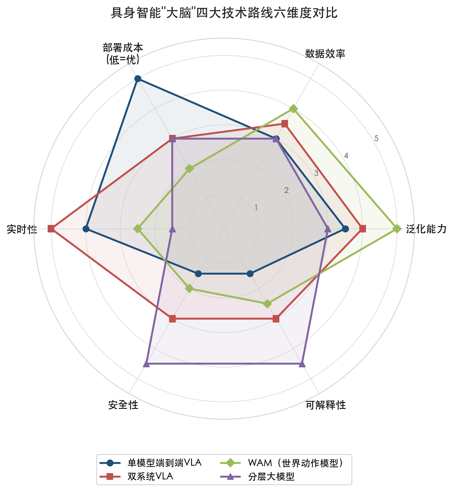

上图以雷达图形式直观呈现了四条技术路线在六个维度上的差异化分布。该矩阵揭示了一个重要发现：不存在在所有维度上同时最优的技术路线。泛化能力最强的WAM路线在实时性和部署成本上处于劣势；实时性最优的双系统VLA在泛化能力上不及WAM；安全性和可解释性最高的分层架构在整体泛化和实时性上均受限。

这一格局意味着技术路线的选择本质上是一个场景驱动的权衡问题：工业制造场景可能优先考虑安全性和可靠性（倾向分层或双系统），家庭服务场景可能优先考虑泛化能力（倾向WAM），而精细操作场景则对实时性提出极高要求（倾向双系统VLA）。

## 6.2 技术路线的融合趋势

### 6.2.1 端到端与分层的边界模糊化

前述对比基于对四条路线的理想化分类，但2025—2026年间最显著的技术趋势恰恰是路线之间边界的快速消融。

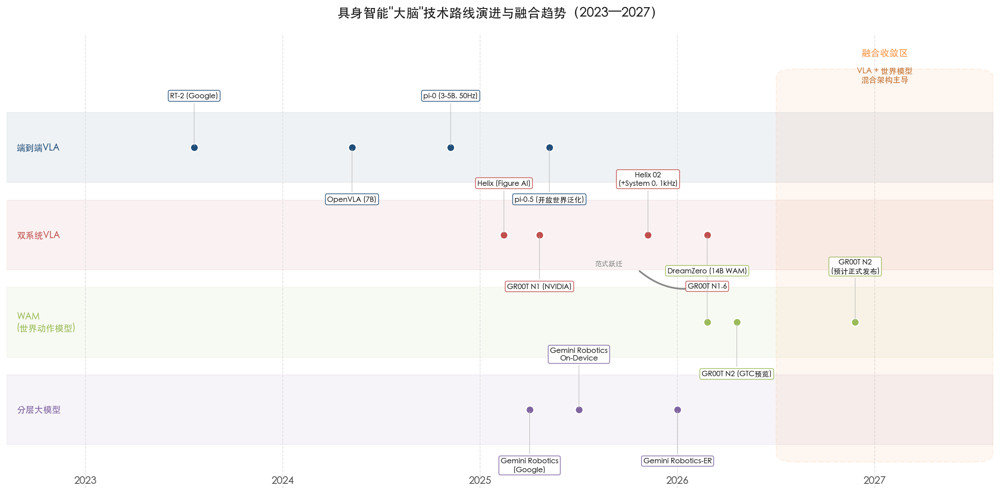

上图以时间线形式呈现了从纯端到端到双系统再到WAM融合的范式跃迁路径。Figure AI的演进路径是这一趋势的典型案例：Helix（2025年2月）开创了双系统VLA架构，System 2为7B参数VLM，System 1为80M参数视觉运动策略；2025年底推出的Helix 02进一步新增System 0层（10M参数、1kHz），完全替代了109,504行手工C++运动控制代码。[Figure AI Helix 02官方博客](https://www.figure.ai/news/helix-02 "Helix 02技术详情") 这一三层架构在形式上是"端到端"的（全部由神经网络驱动，无手工代码），但在结构上又呈现出清晰的分层特征——快慢系统以不同频率协同工作，使端到端与分层的概念边界变得模糊。

NVIDIA的演进更为激进。GR00T从N1的双系统VLA（慢思维VLM + 快思维动作模型）演进至N2的WAM架构，其底层研究DreamZero将世界模型的环境预测与VLA的动作生成统一到单一模型中，通过联合预测视频与动作实现零样本泛化。[NVIDIA官方新闻稿](http://nvidianews.nvidia.com/news/nvidia-expands-open-model-families-to-power-the-next-wave-of-agentic-physical-and-healthcare-ai "GR00T N2发布，2026年3月16日") 这标志着从"分层协作"向"世界模型融合"的范式跃迁。

银河通用王鹤团队提出的DreamVLA框架将世界模型预测功能嵌入VLA流程；自变量机器人将世界模型和端到端通用模型整合于同一架构。清华大学王鑫团队在IEEE发表的综述更明确判断"联合MLLM-WM驱动的具身AI架构将主导下一代具身系统"。[知乎/王鹤团队盘点](https://zhuanlan.zhihu.com/p/2009655362840712006 "王鹤团队2025年工作盘点") 学术界与产业界的共识正在收敛：纯粹的端到端与纯粹的分层均非终局形态，融合世界模型能力的混合架构才是主流演化方向。

### 6.2.2 世界模型嵌入VLA：WAM范式的兴起

DreamZero论文的发布标志着WAM（World Action Model）这一新范式的正式确立。WAM与此前VLA模型的核心区别在于学习信号的来源：VLA模型从VLM继承语义先验，学习从观察到动作的直接映射；WAM从视频扩散模型继承时空物理先验，通过联合预测未来视频帧与动作来学习策略。

这一设计带来三个结构性优势。第一，WAM能够从异构、非重复的数据中有效学习。VLA模型通常需要每个任务的大量重复演示数据，而DreamZero的实验表明，多样化但非重复的500小时数据在泛化性上显著优于同等体量的重复性数据（任务进度50% vs. 33%）。[DreamZero论文](https://arxiv.org/html/2602.15922v1 "数据多样性消融实验，Table 4") 第二，WAM展现出清晰的模型规模缩放规律——14B模型显著优于5B模型（任务进度50% vs. 21%），而同等规模的VLA基线在多样化数据上完全失败（0%任务进度），说明单纯放大VLA参数并不能解决其从异构数据中学习的固有困难。第三，WAM天然支持跨具身形态迁移——仅需10—20分钟的视频数据（无需动作标注）即可实现对新机器人平台的适配。

GR00T N2在2026年3月GTC大会上的预览表现印证了WAM范式的潜力——在MolmoSpaces和RoboArena基准上排名第一，新任务成功率为领先VLA的2倍以上。NVIDIA预计GR00T N2将于2026年底正式可用。[NVIDIA官方新闻稿](http://nvidianews.nvidia.com/news/nvidia-and-global-robotics-leaders-take-physical-ai-to-the-real-world "GTC 2026发布") [TrendForce](https://www.trendforce.com/news/2026/03/19/insights-nvidia-expands-robotics-ecosystem-at-gtc-as-physical-ai-moves-toward-large-scale-deployment/ "NVIDIA GR00T N2计划2026年底发布") 我们认为WAM范式的确立是2026年具身智能领域最重要的技术事件之一，其长远影响可类比于Transformer架构对NLP领域的变革意义。

### 6.2.3 数据：技术路线竞争的终极变量

在技术路线快速收敛的背景下，数据正成为决定各路线实际表现的终极变量。银河通用创始人王鹤明确表示"起决定性作用的是数据"，千寻智能创始人高阳、自变量创始人王潜、星动纪元CTO席悦从不同角度印证了这一判断。[新华网](http://www.news.cn/20250915/620a6301a3844e3a91ce63ada3b759d3/c.html "王鹤：数据决定机器人能力下限，2025年9月") [21世纪经济报道](https://www.21jingji.com/article/20260329/herald/61ea6560498528bcc8906a533f71053a.html "百亿估值具身智能创企圆桌，2026年3月")

数据竞争的维度已从单纯的"数量"转向"质量与多样性"。DreamZero的消融实验提供了一条重要启示：同等数据量下，多样化的异构数据在泛化性上显著优于结构化的重复演示数据（任务进度50% vs. 33%）。这意味着未来的数据竞争不仅比拼采集规模，更比拼数据的多样性覆盖与质量控制能力。CES 2026已将训练数据采集识别为与AI模型和硬件并列的核心基础设施层。[21世纪经济报道](https://www.21jingji.com/article/20260329/herald/61ea6560498528bcc8906a533f71053a.html "百亿估值具身智能创企圆桌")

合成数据管线的成熟进一步改变了数据竞争的格局。NVIDIA GR00T-Dreams Blueprint实现"真实到真实"工作流，36小时即可生成GR00T N1.5所需的全部合成训练数据，而传统方式需近3个月。[NVIDIA技术博客](https://developer.nvidia.com/blog/building-a-synthetic-motion-generation-pipeline-for-humanoid-robot-learning/ "Synthetic Motion Generation Pipeline") 掌握高效合成数据管线的企业将在数据竞争中占据结构性优势，这也是NVIDIA生态在具身智能领域影响力持续扩大的重要原因之一。

### 6.2.4 评测体系缺失：制约技术路线比较的行业痛点

技术路线的对比面临一个根本性挑战：VLA模型领域至今缺乏统一的基准评测体系。Allen AI的VLA Leaderboard仍处于beta状态，原力灵机创始人唐文斌在2026年3月的行业圆桌中直言"行业里连一个真正大规模的Benchmark都没有"。[21世纪经济报道](https://www.21jingji.com/article/20260329/herald/61ea6560498528bcc8906a533f71053a.html "百亿估值具身智能创企圆桌，2026年3月29日") 各公司的技术声明往往基于自建评测集，缺乏可对比性，使得前述六维度评估在精确度上不可避免地受到制约。DreamZero论文开源了模型权重和推理代码，并基于公开的RoboArena和PolaRiS基准进行评测，为建立统一评测标准迈出了重要一步，但行业距离"ImageNet时刻"仍有相当距离。

## 6.3 2026—2027年关键技术节点与产业拐点

### 6.3.1 发展阶段判断：GPT-2至GPT-3的前夜

当前具身智能所处的发展阶段，可借助大语言模型的演进历程加以类比。千寻智能创始人高阳将当前阶段定位为"GPT-2时代"，预计2026年末至2027年中迎来"GPT-3级别"突破。宇树科技创始人王兴兴则给出了更具体的判断基准：当"机器人在陌生环境中凭指令完成约80%任务"时，"真正的ChatGPT时刻"方可到来。[21世纪经济报道](https://www.21jingji.com/article/20260329/herald/61ea6560498528bcc8906a533f71053a.html "高阳GPT-2判断") [新华社](https://english.news.cn/20251231/0a082888ab384fcaa572ee7a11ae7d9d/c.html "王兴兴ChatGPT时刻判断")

DreamZero在真实机器人上未见任务39.5%的任务进度——虽较VLA基线大幅领先——距离王兴兴所定义的80%阈值仍有一倍以上的差距。我们认为这一判断是审慎且合理的：具身智能正处于"GPT-2到GPT-3"的关键过渡期，基础架构（WAM/融合VLA）已初步确立，但规模化验证与工程化落地之间仍存在显著鸿沟。

### 6.3.2 六个关键技术观察指标

我们认为以下六个指标将在2026—2027年间决定产业拐点的到来速度。

**指标一：VLA/WAM Scaling Law的系统验证。** DreamZero的消融实验已初步揭示WAM的规模缩放规律（14B显著优于5B），但行业尚缺乏跨模型、跨架构的系统性Scaling Law研究。DiffusionVLA已从2B扩展至72B参数。[EE Times](https://www.eetimes.com/humanoid-robots-exit-labs-mapping-the-technical-path-to-embodied-ai-at-aw-2026/ "AW 2026技术路径报道") 若2026年下半年至2027年间出现类似GPT系列在NLP中展现的"涌现能力"——即参数规模突破某一阈值后性能跳变——具身智能的技术成熟度将大幅跃升。

**指标二：长程任务链成功率的突破。** 即便单步任务成功率达95%，10步任务链的累积成功率仅约60%（0.95¹⁰≈0.599）。当前VLA/WAM演示多为单任务或短链（3—5步），复合误差问题是从演示走向实际部署的核心瓶颈。[Dylan Bourgeois预测](https://dtsbourg.me/en/articles/predictions-embodied-ai "长程任务链挑战，2025年12月") 优必选预计人形机器人平均生产率将从2025年的30—40%提升至2027年初的约80%。[新华社](https://english.news.cn/20251231/0a082888ab384fcaa572ee7a11ae7d9d/c.html "UBTECH生产率预测") 长程任务成功率的提升有赖于更长的上下文窗口、错误恢复机制和多层级规划的协同优化。

**指标三：灵巧手可靠性的工业级突破。** 乐聚机器人灵巧手MTBF（平均故障间隔时间）已超过1,000小时，但工业级连续作业要求超过10,000小时。[EE Times](https://www.eetimes.com/humanoid-robots-exit-labs-mapping-the-technical-path-to-embodied-ai-at-aw-2026/ "乐聚MTBF数据") 灵巧手可靠性是决定人形机器人能否从"搬运"单一任务扩展至"精细操作"多任务的关键硬件约束，其突破进度将直接影响商业化场景的拓展速度。

**指标四：触觉感知与VLA的融合。** Tactile-VLA在充电器插入任务上实现90%成功率，远超π₀基线的25—40%，有力证明了触觉信号对精细操作任务的关键增益。[EE Times](https://www.eetimes.com/humanoid-robots-exit-labs-mapping-the-technical-path-to-embodied-ai-at-aw-2026/ "Tactile-VLA实验结果") DreamZero论文也指出，未来WAM有望将触觉感知、力反馈等模态纳入预测目标，形成多模态世界动作模型，这将进一步拓展具身智能的操作精度边界。

**指标五：跨具身形态迁移的效率。** DreamZero展示的少样本具身适配能力——仅用30分钟游戏数据即可将在AgiBot G1上训练的模型迁移至YAM机器人并保留零样本泛化能力——为多形态共享基础模型打开了可行路径。若该能力进一步成熟，将根本性改变当前"一款机器人一套模型"的碎片化格局。

**指标六：成本曲线的关键拐点。** Goldman Sachs预测人形机器人单位经济将改善至1.5—2万美元。宇树科技人形机器人均价已从2023年59.34万元/台降至2025年16.76万元/台（约2.3万美元），毛利率仍达62.91%，证明成本下降与盈利能力可以兼容。[瑞财经](https://m.rccaijing.com/news-7441267069385635239.html "宇树科技财务数据") 我们判断，当主流人形机器人售价降至10万元人民币以下（约1.4万美元）时，中国市场的B2C应用将迎来爆发拐点。

### 6.3.3 出货量预测与市场节奏

IDC数据显示，2025年全球人形机器人出货量约1.8万台，同比增长508%，销售额约4.4亿美元。[IDC全球人形机器人市场分析](https://my.idc.com/getdoc.jsp?containerId=CHC54064426 "IDC 2026年报告") IDC进一步预测2026年中国人形机器人市场规模有望接近13亿美元，实现翻倍以上增长，其中工业场景2026—2030年复合年增长率达48%，消费服务场景达52%。[36氪](https://eu.36kr.com/en/p/3585160415411329 "IDC人形机器人机遇，2026")

多家机构的出货量预测呈现高度一致的爆发性增长预期：

- **TrendForce**预测2026年全球人形机器人出货量有望突破5万台，年增逾7倍。[深圳市发改委](https://fgw.sz.gov.cn/ztzl/qtztzl/szscjmyjjfzzhfwpt/hwtz/xsfx/content/post_12551856.html "TrendForce 2026年预测")
- **Goldman Sachs**预测2026年全球出货5—10万台，2030年代初中期年出货量达100万台。[Leo Wealth研究](https://leowealth.com/insights/the-dawn-of-humanoid-robots-and-physical-ai/ "引述Goldman Sachs预测")
- **Morgan Stanley**预测2026年中国人形机器人销量2.8万台，同比增长133%。[财联社](https://www.cls.cn/detail/2277347 "摩根士丹利中国人形机器人预测")
- **高工机器人**预测2026年中国国内出货6.25万台。[半月谈/新华社](http://www.banyuetan.org/kj/detail/20260108/1000200033136211767861634411891100_1.html "2026产量预测")
- **RAISE Summit**数据显示2026年初全球保有量约16,000台，预计2030年达200万台。[Leo Wealth研究](https://leowealth.com/insights/the-dawn-of-humanoid-robots-and-physical-ai/ "RAISE Summit保有量预测")

Gartner则持更为审慎的立场：2026年1月预测至2028年将有不到100家公司能将人形机器人推进到实验之外，不到20家公司能在制造和供应链场景实现规模化生产部署。[Gartner新闻稿](https://www.gartner.com/en/newsroom/press-releases/2026-01-21-gartner-predicts-fewer-than-20-companies-will-scale-humanoid-robots-for-manufacturing-and-supply-chain-to-production-stage-by-2028 "Gartner预测2026年1月") 这一预测与出货量的高增长预期并不矛盾——大量出货可能高度集中于少数头部企业，多数参与者将在商业化竞争中面临淘汰。

我们判断，2026年全球人形机器人出货量大概率落在3—6万台区间，中国企业占比有望超过70%。市场将呈现明显的"漏斗效应"：出货量高速增长的同时，企业分化加剧，头部集中度进一步提升。

## 6.4 全球竞争格局：中美优劣势的结构性分布

### 6.4.1 SCSP竞争评估框架

美国特别竞争力研究项目（SCSP）2026年3月发布的《The Robot Deficit》报告，提供了迄今最系统的中美具身智能竞争力评估框架。该评估覆盖五个维度，核心结论直指一个关键判断：中国在先进制造业机器人领域"决定性领先"（Decisive Lead）。[SCSP技术竞争评分卡](https://scorecard.scsp.ai/publications/robotics "The Robot Deficit, 2026年3月")

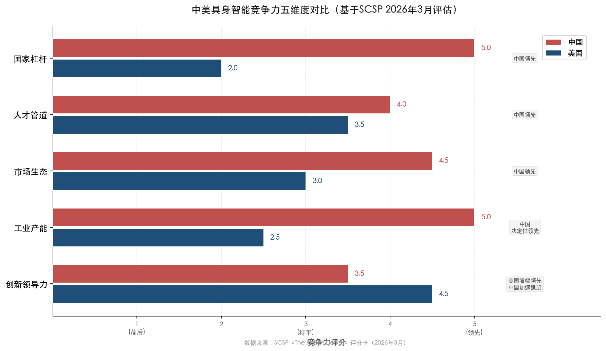

上图基于SCSP评估框架，以水平柱状图形式直观呈现了中美两国在五个维度上的竞争力评分差异。

**创新领导力**（Innovation Leadership）：美国窄幅领先，但趋势指向中国追赶。美国主导VLA原创模型（π₀、Gemini Robotics）、仿真平台（NVIDIA Isaac/Cosmos）和世界模型前沿研究（DreamerV3发表于Nature 2025、DreamZero），在"认知大脑"层面的原创性贡献方面优势明显。中国VLA模型（AstraBrain、ERA-42、GO-1、GOVLA 0.5等）密集涌现，Spirit AI Spirit v1.5已登上全球VLA排行榜首。[SCSP评分卡](https://scorecard.scsp.ai/publications/robotics "美国创新领导力评估")

**工业产能**（Industrial Capacity）：中国决定性领先。中国2024年占全球工业机器人安装量的54%，过去5年累计申请人形机器人专利7,705项，为美国的5倍。[新华社](https://english.news.cn/20251231/0a082888ab384fcaa572ee7a11ae7d9d/c.html "Morgan Stanley专利数据") 宇树科技核心部件自研率超95%、国产化率达85%，人形机器人均价16.76万元（约2.3万美元）仍保持62.91%毛利率，展现出极强的成本控制与垂直整合能力。

**市场生态**（Market Ecosystem）：中国领先。中国2025年人形机器人出货占全球约67%，国产关节模组价格仅为海外同类产品的1/3，打样到量产周期45天（海外120天）。工信部数据显示国内整机企业超过140家、产品超过330款，构成了全球密度最高的产业集群。[新浪新闻](https://news.sina.cn/bignews/insight/2026-01-31/detail-inhkeaqr2995928.d.html "中国供应链优势")

**人才管道**（Talent Pipeline）：中国领先。约100所高校新设机器人相关专业，为产业发展提供了持续的人才供给。Carnegie Endowment报告指出中国的结构性劣势在于先进AI芯片获取受限（美国出口管制持续收紧）以及高精度力矩传感器等关键零部件依赖进口。[Carnegie报告](https://carnegieendowment.org/research/2025/11/embodied-ai-china-smart-robots "Embodied AI: China's Big Bet, 2025年11月")

**国家杠杆**（National Leverage）：中国决定性领先。具身智能首次写入中国《政府工作报告》，工信部设立千亿元产业基金，北京规划200亿基金+10平方公里"机器人谷"，深圳规划百万台年产能——举国体制的资源调动能力在该领域得到充分体现。

### 6.4.2 "大脑"与"身体"的中美分工

上述五维评估揭示了一个结构性格局：中美在具身智能竞争中呈现出"认知大脑"与"物理身体"的分工态势。

美国在"大脑"层面保持领先。VLA/WAM模型的原创性架构突破（π₀、DreamZero、Gemini Robotics）、仿真平台与世界模型（NVIDIA Cosmos/Isaac/Newton、Google DeepMind Genie 3）、基础研究里程碑（DreamerV3登Nature、DreamZero开创WAM范式）均出自美国团队。Goldman Sachs指出"没有一个国家或地区具有完全主导地位"，但在"认知层"的原创性贡献方面，美国的领先优势在短期内仍难以动摇。[Goldman Sachs Research](https://www.goldmansachs.com/insights/articles/the-global-market-for-robots-could-reach-38-billion-by-2035 "全球人形机器人市场预测")

中国在"身体"层面决定性领先。硬件工程化能力（执行器/关节模组自研与垂直整合）、量产规模（2025年出货占全球绝对主体）、供应链效率（成本为海外1/3、交付周期为海外1/3）、市场纵深（国内应用场景最丰富、政策支持力度最大）构成了中国的核心竞争壁垒。2025年全球人形机器人出货量前三名——智元5,100+台、宇树4,200+台、优必选约1,000台——均为中国企业。[36氪](https://eu.36kr.com/zh/p/3709666119479682 "Omdia 2025全球出货数据")

### 6.4.3 中国算法追赶的加速与结构性制约

中国在"认知大脑"层面正在加速追赶。2025—2026年间，银河通用AstraBrain、星动纪元ERA-42、智元GO-1 ViLLA、智平方GOVLA 0.5等VLA模型密集涌现。尤其值得关注的是，Spirit AI Spirit v1.5已登上全球VLA排行榜首，表明中国团队在VLA应用层面的追赶速度超出预期。[SCSP评分卡](https://scorecard.scsp.ai/publications/robotics "创新领导力趋势")

Carnegie Endowment 2025年11月发布的报告《Embodied AI: China's Big Bet on Smart Robots》系统评估了中国的比较优势与结构性劣势。优势方面，报告指出中国拥有"强大的硬件制造基础和供应链"。劣势方面，先进AI芯片获取受限（美国出口管制持续收紧）、高精度力矩传感器等关键零部件依赖进口，构成了中长期的结构性制约因素。[Carnegie报告](https://carnegieendowment.org/research/2025/11/embodied-ai-china-smart-robots "中国比较劣势")

我们认为中美竞争的动态平衡取决于两个关键变量：其一，中国团队能否在VLA/WAM原创架构层面实现突破（而非仅在已有架构上微调优化）；其二，美国团队能否在硬件工程化与量产成本上缩小差距（Hyundai为Boston Dynamics规划的年产3万台工厂是一个重要信号）。从当前趋势研判，中美在具身智能领域的竞争更可能走向"互补性竞争"而非"替代性对抗"——中国的硬件成本优势与美国的算法原创优势在全球供应链中存在协同空间，但地缘政治因素可能阻碍这一自然分工格局的实现。

## 6.5 研判总结

### 6.5.1 三个核心判断

**判断一：WAM范式将在2027年前成为具身智能"大脑"层面的主流架构方向。** DreamZero在泛化能力和数据效率上展现的突破性优势，叠加NVIDIA生态的推广效应（GR00T N2预计2026年底可用），预计将推动行业从纯VLA范式向WAM或VLA-世界模型融合范式加速迁移。但WAM的实时性瓶颈（当前7Hz）和高部署成本（需2块GB200）意味着双系统VLA在对实时性要求极高的场景中仍将保留核心价值。

**判断二：2026年是产业分化的关键之年。** 出货量高速增长（预计3—6万台）的同时，Gartner"不到20家公司能规模化部署"的预测意味着行业将进入残酷的淘汰赛。具备垂直整合能力——自研执行器+自研算法+量产能力——的企业将胜出，纯做算法或纯做硬件的参与者将面临被整合的压力。

**判断三：中美竞争格局在2026—2027年间不会根本性改变，但差距将在"大脑"层面收窄。** 中国在硬件制造、量产成本和市场规模上的领先具有结构性壁垒（供应链生态+政策支持+市场纵深），短期内难以被追赶。美国在VLA/WAM原创架构和仿真平台上的领先同样有深厚的学术研究积累支撑。中国VLA模型的密集涌现（AstraBrain、ERA-42等）正在缩小"认知层"差距，但在基础架构原创性（如WAM范式的提出）和高端仿真平台方面，追赶尚需时日。

### 6.5.2 技术路线的终局猜想

如果将具身智能类比为互联网产业的演进，当前阶段更接近2005—2008年的移动互联网前夜：基础架构（WAM/融合VLA之于3G/4G）初步就绪，硬件形态（人形机器人之于智能手机）正在定型，但真正的"杀手级应用"（iPhone之于移动互联网）尚未出现。我们判断，这一"杀手级应用"不太可能出现在工业制造领域——该领域的商业价值已被充分认知且竞争格局日益清晰——而更可能出现在家庭服务或人机协作场景中，前提条件包括：泛化能力突破80%阈值、整机成本降至10万元人民币以下、安全标准正式发布。

DreamZero论文的结尾提出了一个富有洞察力的假设：最适合未来WAM发展的机器人形态可能恰恰是与人类最相似的人形机器人——尽管其自由度更高（需要更多数据学习逆动力学模型），但它能够最大程度地利用互联网规模的人类视频数据作为预训练资源。这一判断为人形机器人路线提供了新的理论支撑维度：人形不仅因为"人类社会基础设施为人体设计"而具有场景适配优势，更因为"人类视频数据最丰富"而具有算法训练的数据优势。

# 结论与风险提示

## 核心结论

本报告对全球具身智能产业的技术路线、代表性公司、产品与商业化进度、融资格局和团队背景进行了系统性梳理与分析。基于六章的深度研究，我们提炼出以下核心结论。

**第一，具身智能正处于产业化临界点，但尚未跨越"ChatGPT时刻"。** 2025年全球人形机器人出货量约1.8万台（同比增长超500%），销售收入首次突破5亿美元，人形机器人细分领域融资达约37亿美元——这些数据标志着产业已跨越纯实验室原型期，进入有限场景商用阶段。然而，DreamZero在真实机器人上未见任务的平均任务进度仅39.5%，距离行业共识的80%"ChatGPT时刻"阈值仍有一倍以上差距。具身智能的"GPT-3时刻"预计将在2026年末至2027年中到来。

**第二，技术路线正从多元分化走向融合收敛。** 端到端VLA、双系统VLA、世界动作模型（WAM）和分层大模型四条路线的边界已在快速消融。Figure AI Helix从双系统演进到三层系统，银河通用从"大脑+小脑"分离架构演进至端到端AstraBrain，NVIDIA从GR00T N1双系统VLA演进至GR00T N2的WAM架构——产业实践正在推动"端到端框架内实现工程化分层协作"的融合方案成为主流。WAM范式凭借在泛化能力（新任务成功率为领先VLA的2倍以上）和数据效率（仅需500小时异构数据）上的突破性优势，有望在2027年前确立"大脑"层面的主流架构地位。与此同时，数据策略已从技术路线竞争的辅助变量上升为终极变量——"起决定性作用的是数据"已成为行业共识。

**第三，中美竞争呈现"认知大脑"与"物理身体"的结构性分工。** 美国在VLA/WAM原创架构（π₀、DreamZero、Gemini Robotics）、仿真平台（NVIDIA Isaac/Cosmos/Newton）和基础研究（DreamerV3登Nature）方面保持领先。中国在硬件工程化（宇树核心部件自研率超95%）、量产规模（2025年出货占全球约67%）、供应链效率（国产关节模组价格为海外1/3、交付周期为海外1/3）和政策支持（具身智能写入《政府工作报告》、千亿元产业基金）方面决定性领先。中国VLA模型的密集涌现正在缩小"认知层"差距，但在基础架构原创性和高端仿真平台方面，追赶尚需时日。

**第四，商业化正从"元年"向"规模化部署"过渡，但盈利门槛尚未跨越。** 工业制造和仓储物流是技术成熟度最高、ROI最易论证的第一梯队场景。RaaS模式在北美市场已形成6,000—8,000美元/月的定价共识，在劳动力成本较高的市场可实现"第一天即正ROI"。中国市场因劳动力成本较低，纯劳动力替代型ROI论证面临更大挑战，但通过更低的硬件成本、更快的量产节奏和非工业场景（娱乐表演、数据生产合计贡献全球近半数收入）开辟了差异化的商业路径。除宇树科技（主要依靠四足产品盈利）外，主要人形机器人企业均处于亏损状态。

**第五，2026年是产业分化的关键之年。** 出货量预计达3—6万台（中国企业占比有望超70%），但Gartner预测至2028年能在制造和供应链场景实现规模化生产部署的公司不到20家。市场将呈现"漏斗效应"——出货量高速增长的同时，企业分化加剧。具备"自研执行器+自研算法+量产能力"垂直整合能力的企业将在淘汰赛中胜出。硬件工程化能力与AI软件栈的深度整合，将成为决定中长期竞争胜负的核心能力。

## 风险提示

**技术风险：关键瓶颈可能延缓产业化节奏。** 灵巧手MTBF仅约1,000小时，远低于工业级10,000小时要求，是制约人形机器人从"搬运"扩展至"精细操作"的首要硬件约束。Sim-to-Real迁移差距（实验室任务成功率约95%降至真实世界约60%）尚未根本解决。电池续航普遍仅90—120分钟，难以满足工业场景单班次需求。长程任务链的复合误差累积问题（10步任务链累积成功率仅约60%）是从演示走向真实部署的核心瓶颈。若上述瓶颈的突破进度慢于预期，商业化时间表和出货量预测可能需要下调。

**商业化风险：规模化盈利时间存在不确定性。** 当前全球人形机器人年销售收入仅约5亿美元，与行业累计吸纳的数百亿美元融资之间存在巨大落差。多数企业处于"以亏损换规模"阶段，若技术迭代速度或市场需求释放不及预期，部分高估值企业可能面临估值压力。中国市场的劳动力成本结构意味着纯劳动力替代型商业模式的回本周期较长（超过60个月），商业模式创新的需求更为迫切。

**供应链与地缘政治风险。** 先进AI芯片获取受限（美国出口管制持续收紧）是中国具身智能产业的结构性制约因素。高精度力矩传感器等关键零部件仍存在进口依赖。中美在具身智能领域的竞争可能受地缘政治因素干扰，阻碍"中国硬件+美国算法"的自然产业分工格局。

**标准与监管风险。** ISO/TC299 WG12的人形/四足机器人安全标准预计2028年才能发布，标准缺失期间大客户可能限制部署规模。欧盟《人工智能法案》高风险AI义务条款将于2026年8月2日全面适用，出口欧洲市场的产品面临合规成本上升。安全事故一旦发生，可能引发行业性监管收紧。

**估值与融资风险。** 2025年下半年至2026年Q1，具身智能与世界模型赛道经历了超级融资轮的集中爆发（仅Skild AI、World Labs、AMI Labs、Luma AI、Runway五家公司在此期间融资总额即超47亿美元）。部分企业估值已远超其当前收入和技术成熟度所能支撑的水平。若技术进展或商业化落地不及资本市场预期，估值回调风险不容忽视。

## 局限性说明

本报告的分析存在以下局限性，读者在引用本报告结论时宜予以关注。

**第一，数据时效性限制。** 具身智能产业处于高速迭代期，技术路线、产品参数、融资数据和出货量等信息的更新频率极高。本报告数据截止日期为2026年3月底，此后发生的重大事件（如GR00T N2正式发布、Tesla Optimus 3量产进展等）可能改变部分判断的有效性。

**第二，非上市公司信息披露限制。** 多数具身智能企业为非上市公司，其财务数据、出货量、技术指标等信息主要依赖企业自述、媒体报道和第三方研究机构估算，不同来源口径存在差异（如宇树科技2025年人形出货量在不同来源中从4,200台到5,500台不等）。本报告在引用此类数据时已尽可能标注来源和口径差异，但无法完全排除信息偏差。

**第三，统一评测基准缺失。** VLA/WAM模型领域至今缺乏统一的基准评测体系，各公司的技术声明往往基于自建评测集，缺乏横向可比性。本报告第6章的六维度技术路线对比基于公开论文和技术报告的定性研判，而非标准化实验对比，精确度受到制约。

**第四，市场预测的不确定性。** 本报告引用了MarketsandMarkets、Goldman Sachs、Morgan Stanley、IDC、TrendForce等多家机构的市场预测，各机构的预测口径、假设前提和时间跨度存在显著差异。这些预测主要用于描绘市场趋势方向，不应作为精确的投资决策依据。
