# 执行摘要

自2021年下半年中国房地产行业进入深度调整周期以来，市场下行已延续近五年，对地方政府财政收入产生了深远而系统性的冲击。本报告以财政部、国家统计局等官方数据为基础，系统评估房地产低迷对地方财政的影响程度、传导机制、区域差异与应对路径，并对2026年下半年地方财政走势进行前瞻研判。

**核心判断：房地产低迷已造成地方政府自1994年分税制改革以来最大规模的结构性减收，但系统性财政风险总体可控。** 2021—2025年间，房地产相关收入（五项房地产税收与土地出让金合计）从10.78万亿元降至5.92万亿元，占地方广义财政总收入的比重从52.6%降至33.9%，四年间绝对减收规模接近4.9万亿元。其中，土地出让收入较峰值累计减少约4.55万亿元（降幅52.3%），是冲击的主体；五项房地产相关税收净减少3067亿元（降幅14.8%），交易环节税种（契税-40.2%、土地增值税-40.5%）的大幅缩水与保有环节税种（房产税+59.0%）的逆势增长形成显著分化。

**关键驱动因素有三。** 其一，房地产市场全面深度调整：2025年商品房销售额较2021年峰值下降约54%，新开工面积较峰值萎缩超过七成，百城新建商品住宅去化周期达27.4个月，三四线城市高达40.3个月。其二，土地出让市场量价齐跌：房企在行业深度调整期将拿地行为集中于核心城市，土地出让金向头部城市高度集中（TOP20城市占比52%），三四线城市土地出让近乎停滞。其三，传导链条多路径共振：销售量价双降→契税锐减、土地市场冷却→出让金断崖与增值税收缩、开发投资下滑→建筑业关联税收承压，三者叠加形成系统性财力收缩压力。

**区域冲击烈度极度分化。** 一线城市凭借产业多元化、人口净流入和"缩量提质"供地策略，财政收入保持相对韧性（北京2025年一般公共预算收入同比+4.8%，深圳+6.4%）。强二线城市呈现"冰火两重天"——杭州、成都土地出让金逆势增长，西安、合肥降幅超30%—50%。三四线城市和中西部地区则面临最严峻的财政困境，河南省2025年土地出让收入同比下降27.7%，山西、陕西、内蒙古、青海四省一般公共预算收入出现负增长。

**多层次应对体系已形成但处于"切换期"。** 中央转移支付连续三年突破十万亿元（2025年约10.19万亿元），专项债规模维持4.4万亿元并拓展至收储领域，十万亿化债方案使2028年底前需化解的隐性债务从14.3万亿元降至2.3万亿元。中长期层面，消费税征收环节后移并下划地方、地方附加税改革等制度建设加速推进。然而，"旧引擎"（土地财政）加速退出与"新引擎"（消费财政、保有税）尚未成形之间的空档期，构成当前地方财政转型的最大挑战。

**展望2026年下半年，地方财政将维持"紧平衡"态势。** 在基准情景下，房地产相关收入预计在5.5—5.8万亿元区间，较2025年小幅收缩，但房地产对地方财政的边际拖累效应正在递减。主要风险点包括：债务付息支出刚性攀升（预计全年1.3—1.5万亿元）、基层"三保"压力加大、城投平台经营性债务局部承压、以及国际经贸摩擦升级与房地产超预期下行的叠加冲击。

# 第1章 中国房地产市场低迷现状——量价投资全景扫描

自2021年下半年中国房地产行业进入深度调整周期以来，市场下行已延续近五年。以2025年4月至2026年3月为观察窗口，全国商品房销售量价持续承压，房价延续同比下跌通道，开发投资降幅虽有收窄迹象但绝对水平仍处历史低位，新开工面积较峰值萎缩超过七成，库存去化周期高企不下。市场低迷的深度与广度，已显著超出此前多数机构的预期。本章以国家统计局、财政部等官方数据为基础，从销售、价格、投资、施工竣工及库存五个维度，系统呈现中国房地产市场的调整深度与结构特征，为后续各章分析房地产低迷向地方财政传导的机制与影响提供事实基座。

## 1.1 商品房销售：量价双降，规模回落至2015年水平

### 2025年全年：销售面积与销售额双双大幅缩减

2025年全年，全国新建商品房销售面积为8.81亿平方米（同比下降8.7%），销售额为8.39万亿元（同比下降12.6%）。与2021年历史高点（销售面积约17.9亿平方米、销售额约18.2万亿元）相比，销售面积下降约五成，销售额回落至2015年水平[国家统计局2025年全国房地产市场基本情况](https://www.cinic.org.cn/xw/tjsj/1620998.html "国家统计局发布，中国产业经济信息网全文转载")。销售额降幅大于销售面积降幅，反映出均价仍处于下行通道，"以价换量"的市场格局尚未根本扭转。

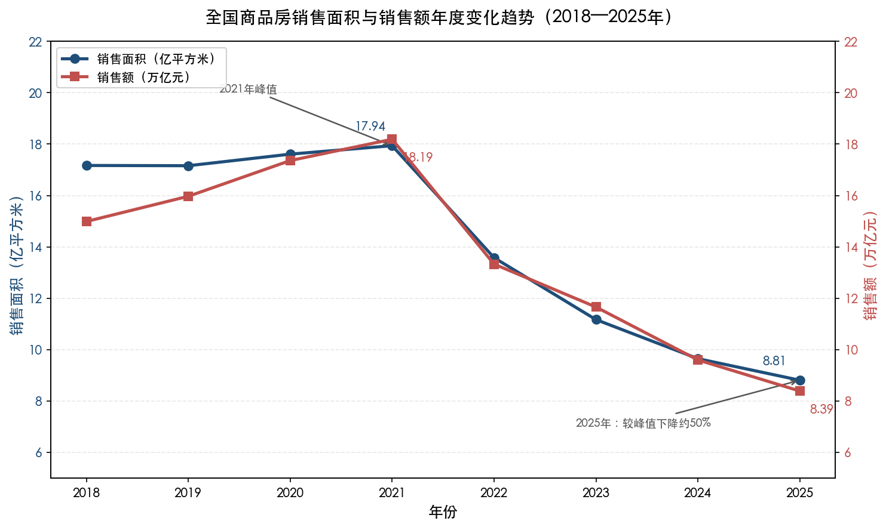

**图1-1 全国商品房销售面积与销售额年度变化趋势（2018—2025年）**。2021年销售面积与销售额均触及历史峰值，此后连续四年下滑，至2025年较峰值下降约50%。数据来源：国家统计局。

### 2026年开局：降幅进一步扩大

进入2026年，市场疲态更趋明显。2026年1—2月，全国新建商品房销售面积为9293万平方米（同比下降13.5%），销售额为8186亿元（同比下降20.2%），降幅分别较2025年全年扩大4.8个和7.6个百分点[中国新闻网转载国家统计局数据](https://www.chinanews.com.cn/cj/2026/03-16/10587442.shtml "2026年1—2月份全国房地产市场基本情况")。开年即遭遇更深降幅，表明春节前后市场信心尚未获得有效提振，购房者观望情绪依然浓厚。

从趋势上看，自2022年起全国商品房销售额已连续四年下滑，累计跌幅超过50%。房地产市场的交易规模已较峰值"腰斩"，对上下游产业链——从建材、装修到家电消费——的拖累效应持续显现。

## 1.2 房价走势：环比降幅收窄，同比仍深陷下跌区间

### 新建商品住宅：一线城市出现企稳迹象

2026年2月，70个大中城市新建商品住宅销售价格环比平均下降0.28%，降幅较上月缩小0.09个百分点。一线城市新房价格环比转为持平，其中北京上涨0.2%、上海上涨0.2%、广州持平、深圳下降0.3%。但从同比口径观察，70城新建商品住宅价格仍下降3.46%[新华网转载国家统计局解读](https://www.news.cn/20260316/bdd73785117c475c861bcc4b15b2f33b/c.html "2月份商品住宅销售价格环比降幅继续收窄")。环比降幅的逐步收窄释放了边际改善信号，但同比仍处深跌区间，价格调整尚未完成。

### 二手住宅：全面下跌态势尚未逆转

二手房市场的调整深度更甚于新房。2026年2月，70城二手住宅价格环比平均下降0.43%，同比下降6.31%。截至该月，70城已连续26个月二手住宅价格全部同比下降，无一城市实现同比转正[中房网](http://www.fangchan.com/data/13/2026-03-23/7441723940135047372.html "2026年2月份70城市房价指数图文分析")。二手房作为存量市场的价格风向标，其持续全面下跌反映了居民住房资产缩水的现实，并进一步抑制居民的消费信心与购房意愿。

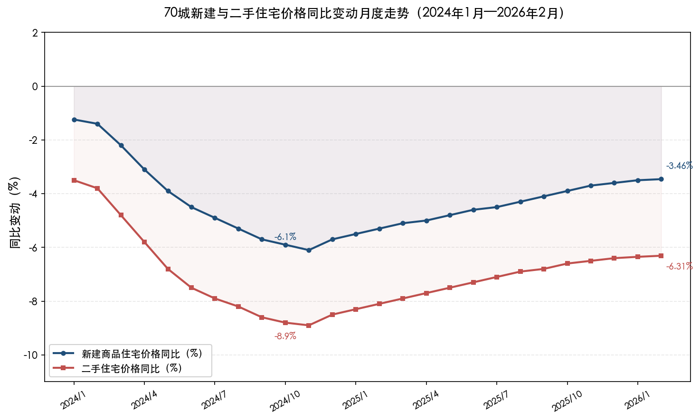

**图1-2 70城新建与二手住宅价格同比变动月度走势（2024年1月—2026年2月）**。两类住宅价格同比在2024年四季度触及谷值后有所回升，但截至2026年2月仍均处于负值区间，二手住宅跌幅始终大于新建住宅。数据来源：国家统计局。

国际货币基金组织（IMF）2026年2月发表的专题文章指出，中国国内需求疲软的部分原因在于"持续的房地产市场低迷与薄弱的社会保障体系共同削弱了消费者的支出意愿"[IMF专题文章](https://www.imf.org/en/news/articles/2026/02/18/cf-how-chinas-economy-can-pivot-to-consumption-led-growth "How China's Economy Can Pivot to Consumption-led Growth")。房价下跌通过财富效应对居民消费行为的抑制作用，已成为宏观经济领域的共识性判断。

## 1.3 房地产开发投资：降幅收窄但绝对规模持续萎缩

### 2025年全年：投资额较峰值缩减逾四成

2025年全年，全国房地产开发投资完成额为8.28万亿元（同比下降17.2%），较2021年历史峰值（约14.8万亿元）缩减超过40%[国家统计局2025年全国房地产市场基本情况](https://www.cinic.org.cn/xw/tjsj/1620998.html "国家统计局发布")。投资规模的大幅萎缩，直接反映了房企拿地意愿低迷、在建项目资金紧张以及新项目开发近乎停滞的行业困境。

### 2026年1—2月：降幅收窄释放边际改善信号

2026年1—2月，全国房地产开发投资为9612亿元（同比下降11.1%），降幅较2025年全年收窄6.1个百分点[国家统计局2025年全国房地产市场基本情况](https://www.cinic.org.cn/xw/tjsj/1620998.html "国家统计局发布")。降幅收窄既有2025年同期低基数效应的作用，也与部分一线城市土地市场回暖带动的结构性投资有关。然而从总量层面观察，房地产开发投资仍处于负增长通道，行业整体的投资信心远未恢复。

投资下滑对实体经济的传导效应不容忽视。房地产开发投资在固定资产投资中的占比虽已从峰值时期的约27%降至2025年的约16%，但通过产业链条带动的建筑业、建材业、装修业等关联行业的产值收缩，对GDP增长的拖累效应依然显著。

## 1.4 新开工、施工与竣工：供给端全面收缩

### 新开工面积：较峰值萎缩超过七成

2025年全年，全国房屋新开工面积为5.88亿平方米（同比下降20.4%），施工面积为66亿平方米（同比下降10.0%），竣工面积为6.03亿平方米（同比下降18.1%）[国家统计局2025年全国房地产市场基本情况](https://www.cinic.org.cn/xw/tjsj/1620998.html "国家统计局发布")。新开工面积较历史峰值（约23亿平方米）下降超过70%，降幅之大在中国房地产发展史上前所未有。

2026年1—2月，房屋新开工面积进一步降至5084万平方米（同比下降23.1%），竣工面积为6320万平方米（同比下降27.9%），两项指标降幅均较2025年全年进一步扩大[中国新闻网转载国家统计局数据](https://www.chinanews.com.cn/cj/2026/03-16/10587442.shtml "2026年1—2月份全国房地产市场基本情况")。供给端收缩仍在加速。

### 供给收缩的行业含义

新开工面积是房地产行业景气度的先行指标。该指标较峰值萎缩超过七成，意味着未来2—3年的竣工面积和可售面积将进一步减少，供给端正在经历剧烈的"去产能"过程。克而瑞研究中心指出，中国房地产新开工规模的下降幅度已超过国际上深度调整的平均水平[观察者网](https://www.guancha.cn/economy/2026_01_08_803231.shtml "六大信号释放，机构预测2026年止跌企稳")。从中长期视角来看，供给端的剧烈收缩虽加剧短期行业阵痛，但也在客观上推动供需关系向再平衡方向演进。

## 1.5 库存与去化周期：高位运行，三四线城市压力尤为突出

### 待售面积：增速大幅收窄，库存规模触顶迹象初现

2025年末，全国商品房待售面积为7.66亿平方米（同比增长1.6%），增速较2024年末的+10.6%大幅收窄。截至2026年2月末，待售面积约8亿平方米（同比增长0.1%），库存增速已近乎停滞[国家统计局2025年全国房地产市场基本情况](https://www.cinic.org.cn/xw/tjsj/1620998.html "国家统计局发布")。库存增速的收窄主要源于新开工大幅减少压缩了未来供给增量，而非销售端出现明显回暖。

### 去化周期：百城数据处于历史高位

上海易居房地产研究院数据显示，2025年11月，全国百城新建商品住宅去化周期（存销比）达27.4个月，处于有数据监测以来的历史高位。分城市层级来看，一线城市去化周期为17.1个月、二线城市为22.6个月、三四线城市高达40.3个月[央广网转载证券日报](https://house.cnr.cn/kcb/20251221/t20251221_527467450.shtml "稳市场去库存定调2026年发展方向")。

2024年12月，随着四季度政策效果逐步释放，百城去化周期一度回落至21.3个月，其中一线城市12.8个月、二线城市18.0个月、三四线城市30.6个月[证券时报转载易居报告](https://www.stcn.com/article/detail/1501196.html "目前全国百城新房去化周期迎来拐点")。但进入2025年下半年后去化周期再度攀升，表明政策脉冲带来的短期回暖难以持续，市场内生动力依然不足。

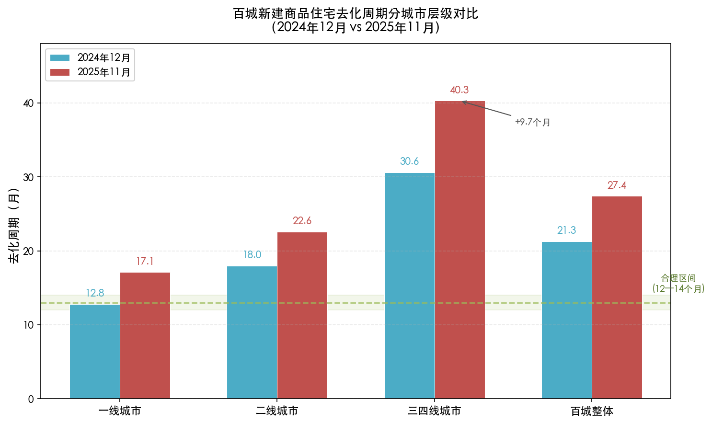

**图1-3 百城新建商品住宅去化周期分城市层级对比（2024年12月 vs 2025年11月）**。绿色虚线标注12—14个月的合理区间。三四线城市去化周期在不到一年内从30.6个月攀升至40.3个月（+9.7个月），远超合理值近三倍。数据来源：上海易居房地产研究院。

一般认为，新建商品住宅存销比的合理值约为12—14个月。当前百城27.4个月的去化周期约为合理值的两倍，三四线城市40.3个月的去化周期更接近合理值的三倍。高企的去化周期意味着开发商面临巨大的资金回笼压力，进而抑制其拿地和新开工意愿，形成"库存高企→拿地萎缩→投资走弱→经济下行→购买力不足→库存难消化"的负向循环。

### 存量用地视角：全口径去化周期达5.6年

从更广义的供给端来看，中房网2026年3月基于67个样本城市数据测算，存量住宅用地库存建筑面积达5.6亿平方米，以当前销售速度估算去化周期约5年；计入已竣工未售的现房库存后，全口径去化周期达到约5.6年，显著超出3—4年的健康区间[中房网](http://www.fangchan.com/data/134/2026-03-30/7444205059363377988.html "分化与出清——2026年百城存量宅地规模动向")。2026年3月，自然资源部明确提出"新增建设用地原则上不用于经营性房地产开发"，标志着行业供给端正式进入"存量盘活"主导阶段。

## 1.6 景气指数与机构研判：行业处于低景气区间，止跌企稳信号初现

### 国房景气指数：持续低于警戒线

2025年12月，国房景气指数录得91.45，处于95以下的"较低景气水平"区间[国家统计局2025年全国房地产市场基本情况](https://www.cinic.org.cn/xw/tjsj/1620998.html "国家统计局发布")。该指数已连续多年位于95的景气分界线下方，表明房地产行业的整体运行状态仍处于较为低迷的水平。

### 机构研判：调整深度已超国际平均水平

克而瑞研究中心在2026年初的分析中提出，当前中国房地产市场已释放六大止跌企稳信号，同时指出全国房价调整幅度约22%，已超过国际房地产周期调整的平均水平；新开工规模下降74%，亦超过国际深度调整案例中的收缩幅度[观察者网](https://www.guancha.cn/economy/2026_01_08_803231.shtml "六大信号释放，机构预测2026年止跌企稳")。

标普信评在2026年1月发布的房地产行业展望报告中判断，全国新房销售将延续下行态势，行业已进入存量房主导阶段[标普信评](https://www.spgchinaratings.cn/upload/20260122Commentary_Property%20Outlook%202026_CN%20clean.pdf "2026年房地产行业展望")。IMF在2026年3月中国发展高层论坛上的发言亦强调，需"加速不具备生存能力的开发商退出市场，允许住房价格更大灵活性以清除悬而未决的过剩"[IMF中国发展论坛发言](https://www.imf.org/en/news/articles/2026/03/21/sp032226-chinas-new-chapter-rebalancing-and-unleashing-market-forces "China's New Chapter: Rebalancing and Unleashing Market Forces")。

综合国内研究机构与国际评级组织的判断，市场共识趋于明确：本轮调整深度已具备历史性特征，部分先行指标出现边际改善信号，但行业整体仍处于筑底过程中，尚未进入确定性的回升通道。

## 1.7 本章小结

截至2026年3月，中国房地产市场呈现以下核心特征：

- **销售规模较峰值"腰斩"**：2025年商品房销售面积8.81亿平方米、销售额8.39万亿元，分别较2021年峰值下降约50%和约54%；2026年1—2月降幅进一步扩大至13.5%和20.2%。
- **房价仍处下行通道**：2026年2月，70城新房和二手房价格同比分别下降3.46%和6.31%，二手房已连续26个月全部城市同比下跌；一线城市新房环比转为持平，是为数不多的积极信号。
- **开发投资较峰值萎缩逾四成**：2025年房地产开发投资8.28万亿元（同比下降17.2%），对固定资产投资和经济增长形成显著拖累。
- **新开工面积较峰值萎缩超七成**：供给端正在经历剧烈的"去产能"过程，收缩幅度已超过国际深度调整的平均水平。
- **库存去化周期处于历史高位**：百城新建商品住宅去化周期达27.4个月，三四线城市高达40.3个月；存量住宅用地全口径去化周期约5.6年。
- **行业低景气运行**：国房景气指数91.45，持续低于95的景气线；止跌企稳信号初步显现，但行业整体仍处筑底阶段。

上述事实构成了理解房地产低迷对地方财政冲击的前提。房地产市场的全面深度调整，意味着土地出让收入、房地产相关税收乃至建筑业税收均面临系统性收缩压力，这将在后续章节中逐一展开分析。

# 第2章 房地产相关财政收入的构成与传导机制

## 2.1 地方财政收入的双预算体系与房地产关联

中国地方政府的广义财政收入由两大预算体系构成：**一般公共预算收入**与**政府性基金预算收入**。前者以税收为主体，后者以国有土地使用权出让收入（即"土地出让金"）为核心。房地产行业同时经由这两大预算渠道向地方财政输送收入，形成了一条横跨税收与非税收入的复合传导链条。厘清这一框架，是理解房地产低迷如何系统性冲击地方财力的逻辑起点。

在一般公共预算中，与房地产直接相关的税种包括五项：**契税**（房屋买卖环节征收）、**土地增值税**（土地和房产转让增值部分征收）、**房产税**（房屋保有环节征收）、**城镇土地使用税**（占用城镇土地的保有税）和**耕地占用税**（占用耕地建设时一次性征收）。五项税收均为地方税种，收入全额归属地方财政。

在政府性基金预算中，国有土地使用权出让收入占据绝对主体地位。2025年，地方政府性基金预算本级收入52648亿元，其中土地出让收入41518亿元，占比约78.9%。[财政部2025年财政收支情况](https://m.mof.gov.cn/czxw/202601/t20260130_3982923.htm "财政部国库司2026年1月30日发布") 土地出让金全部归属地方政府，是1994年分税制改革以来地方"第二财政"的核心支柱。

从总量来看，2025年地方一般公共预算本级收入122082亿元，地方政府性基金预算本级收入52648亿元，两项合计174730亿元。[财政部2025年财政收支情况](https://m.mof.gov.cn/czxw/202601/t20260130_3982923.htm "财政部国库司发布") 房地产相关的五项税收（17726亿元）与土地出让收入（41518亿元）合计59244亿元，占地方广义财政总收入的33.9%。尽管这一比重较2021年的52.6%已大幅回落，房地产仍是地方财力不可忽视的支撑来源。

## 2.2 五项房地产相关税收：交易环节与保有环节的分化

### 2.2.1 总量变化：从峰值滑落

五项房地产相关税收的历年总额呈逐步下行趋势：2021年合计20793亿元（历史峰值）→2022年19216亿元（同比-7.6%）→2023年18538亿元（同比-3.5%）→2024年18537亿元（基本持平）→2025年17726亿元（同比-4.4%）。[财政部2025年财政收支情况](https://m.mof.gov.cn/czxw/202601/t20260130_3982923.htm "财政部数据") [财政部2021年财政收支情况](https://czj.guiyang.gov.cn/new_site/zwgk_5908373/zdlyxxgk_5908404/tjxx_5908409/202205/t20220517_74094341.html "财政部数据") [财政部2022年财政收支情况](http://m.mof.gov.cn/czxw/202301/t20230120_3863893.htm "财政部数据") [财政部2023年财政收支情况](https://www.cee.edu.cn/n171/n58287/n58318/c682001/content.html "财政部数据") 四年间累计减收3067亿元，降幅14.8%。然而，这一总量层面的温和下降掩盖了内部结构的剧烈分化——交易环节税种大幅缩水与保有环节税种逆势增长并存，下图直观呈现了这一结构性分化。

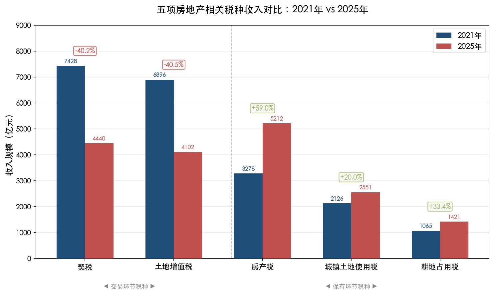

**图：五项房地产相关税种2021年与2025年收入对比。** 交易环节的契税（-40.2%）和土地增值税（-40.5%）大幅缩减，而保有环节的房产税（+59.0%）、城镇土地使用税（+20.0%）和耕地占用税（+33.4%）逆势增长，两类税种走势显著分化。

### 2.2.2 交易环节税种：随市场量价齐缩而锐减

交易环节税种的收入规模与房地产市场交易量价直接挂钩，堪称市场冷暖的"财政温度计"。

**契税**作为房屋与土地权属转移环节的标志性税种，对市场销售最为敏感。2021年契税收入达7428亿元的历史峰值，此后随商品房销售面积和金额持续走低，2022年下降至5794亿元（同比-22.0%），2025年进一步降至4440亿元。[财政部2025年财政收支情况](https://m.mof.gov.cn/czxw/202601/t20260130_3982923.htm "财政部数据") [财政部2022年财政收支情况](http://m.mof.gov.cn/czxw/202301/t20230120_3863893.htm "财政部数据") 较2021年峰值减收2988亿元，降幅达40.2%，系五项税种中绝对减收金额最大的单一税种。

**土地增值税**与房地产开发企业的项目销售和土地转让直接相关。2021年土地增值税收入6896亿元，2022年降至6349亿元（同比-7.9%），至2025年进一步降至4102亿元，较峰值累计减少2794亿元，降幅40.5%。[财政部2025年财政收支情况](https://m.mof.gov.cn/czxw/202601/t20260130_3982923.htm "财政部数据") 其下降节奏与契税高度一致，反映出房企拿地缩量和项目清算规模缩小的双重影响。

进入2026年，交易环节税收仍未企稳。2026年1—2月，契税收入650亿元（同比-11.1%），土地增值税收入806亿元（同比-8.2%），延续了自2022年以来的收缩态势。[财政部2026年1—2月财政收支情况](http://gks.mof.gov.cn/tongjishuju/202603/t20260319_3985695.htm "财政部国库司2026年3月19日发布")

### 2.2.3 保有环节税种：逆势增长但规模有限

与交易环节的大幅缩水形成鲜明对比，保有环节税种在同一时期实现了持续增长。

**房产税**2021年收入3278亿元，此后逐年攀升，2022年3590亿元（同比+9.5%），至2025年达5212亿元，较2021年增长59.0%。[财政部2025年财政收支情况](https://m.mof.gov.cn/czxw/202601/t20260130_3982923.htm "财政部数据") [财政部2022年财政收支情况](http://m.mof.gov.cn/czxw/202301/t20230120_3863893.htm "财政部数据") 需要指出，中国现行房产税主要对经营性用房征收（城镇居民自住住房免征），其增长主要得益于征管力度加强和商业地产存量税基扩大，并非源于居民住宅纳入征税范围。

**城镇土地使用税**从2021年2126亿元增至2025年的2551亿元，增幅20.0%。**耕地占用税**从2021年1065亿元增至2025年的1421亿元，增幅33.4%。[财政部2025年财政收支情况](https://m.mof.gov.cn/czxw/202601/t20260130_3982923.htm "财政部数据") 2026年1—2月，房产税收入831亿元（同比+11.6%），延续增长势头。[财政部2026年1—2月财政收支情况](http://gks.mof.gov.cn/tongjishuju/202603/t20260319_3985695.htm "财政部国库司发布")

然而，保有环节税种的增量远不足以弥补交易环节的缺口。2025年，保有环节三项税种合计9184亿元，较2021年增加约2715亿元；同期交易环节两项税种合计减收5782亿元。两相抵扣，五项税收净减收约3067亿元。保有环节的"逆势增长"在结构上具有信号意义——它标志着地方税收正从依赖交易型房地产活动逐步向存量课税方向转型，但在绝对规模上尚无法担当替代角色。

## 2.3 土地出让收入：地方"第二财政"的断崖式下滑

### 2.3.1 从峰值到腰斩：2021—2025年的下行轨迹

国有土地使用权出让收入长期以来是地方政府最重要的单一收入来源。2021年，全国土地出让收入达87051亿元的历史峰值，相当于当年GDP的7.6%，占地方一般公共预算与政府性基金预算收入之和的35.9%。[粤开证券](https://www.ykzq.com/products/download-new/rpt/2025/03/23/af1c7d694d8049a59c04d06b9826704e.pdf "粤开证券罗志恒《土地财政何去何从》2025年3月")

此后，土地出让收入进入持续下降通道：2022年66854亿元（同比-23.3%）→2023年57996亿元（同比-13.2%）→2024年48699亿元（同比-16.0%）→2025年41518亿元（同比-14.7%）。[财政部2025年财政收支情况](https://m.mof.gov.cn/czxw/202601/t20260130_3982923.htm "财政部数据") 四年间累计减少约4.55万亿元，降幅达52.3%，规模几近"腰斩"。[证券时报](https://www.stcn.com/article/detail/3624762.html "地方卖地收入四年少了约4.6万亿")

2026年开局延续低迷。1—2月，土地出让收入仅3547亿元（同比-25.2%），降幅较2025年全年的-14.7%显著扩大，土地市场在年初并未呈现回暖迹象。[财政部2026年1—2月财政收支情况](http://gks.mof.gov.cn/tongjishuju/202603/t20260319_3985695.htm "财政部国库司发布")

### 2.3.2 毛收入与净收入：可用财力的实际缺口

评估土地出让收入下降对地方财力的实际影响，需要区分**毛收入**与**净收入**。土地出让收入并非全额可供地方政府自由支配——其中约75%为成本性支出，包括征地和拆迁补偿（约占52%）、土地整理支出（约占23%）等，地方政府实际可支配的净收入仅约25%。[中国人民大学中国宏观经济论坛](http://ier.ruc.edu.cn/docs/2023-04/b28e541e442d4a3698faea615b5d84c4.pdf "我国土地财政的演化、困局与应对")

2025年，土地出让收入相关支出为47120亿元（同比-7.6%），较2021年的77540亿元下降约39.3%。[财政部2025年财政收支情况](https://m.mof.gov.cn/czxw/202601/t20260130_3982923.htm "财政部数据") 值得关注的是，支出的降幅（39.3%）明显小于收入的降幅（52.3%），表明在毛收入大幅萎缩的过程中，成本性支出具有一定刚性，地方政府可用的净收入被进一步压缩。

尽管净收入占比较低，毛收入的大幅下滑仍对地方财力产生深刻影响。一方面，土地出让金的征收和拆迁补偿形成的现金流本身即是地方经济循环的重要组成部分，其缩减引发区域经济活动的连锁降温；另一方面，即便按25%的净收入比例估算，土地出让净收入从2021年的约2.18万亿元降至2025年的约1.04万亿元，四年间净减少约1.14万亿元——对中西部和三四线城市而言，这一缺口构成严峻的财力约束。

### 2.3.3 占比变化：从"半壁江山"到"三分天下"

将房地产相关收入（五项税收+土地出让金）占地方财政总收入（一般公共预算本级收入+政府性基金预算本级收入）的比重进行历年对比，可以清晰观察到房地产对地方财政支撑力度的结构性衰减。

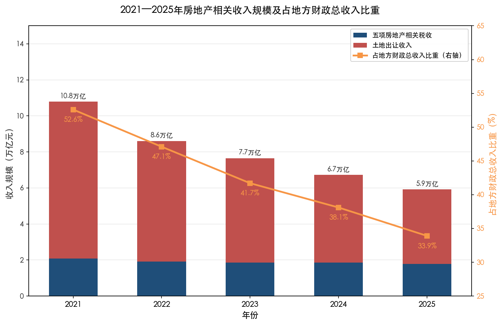

**图：2021—2025年房地产相关收入规模及占地方财政总收入比重。** 堆叠柱状图（左轴）分别展示五项房地产相关税收与土地出让收入的年度规模，折线图（右轴）展示两者合计占地方财政总收入比重的下行趋势。

| 年份 | 五项房地产税收（亿元） | 土地出让收入（亿元） | 合计（亿元） | 地方财政总收入（亿元） | 房地产相关收入占比 |
|------|------------------------|----------------------|-------------|----------------------|-------------------|
| 2021 | 20,793 | 87,051 | 107,844 | 205,007 | 52.6% |
| 2022 | 19,216 | 66,854 | 86,070 | 182,573 | 47.1% |
| 2023 | 18,538 | 57,996 | 76,534 | 183,460 | 41.7% |
| 2024 | 18,537 | 48,699 | 67,236 | 176,270 | 38.1% |
| 2025 | 17,726 | 41,518 | 59,244 | 174,730 | 33.9% |

*注：基于财政部历年财政收支情况数据计算。2022年地方一般公共预算本级收入108818亿元受大规模增值税留抵退税政策影响（按自然口径同比-2.1%，扣除留抵退税因素后同比+5.9%），该年度留抵退税约2.4万亿元，其中部分影响地方本级收入。[财政部2022年财政收支情况](http://m.mof.gov.cn/czxw/202301/t20230120_3863893.htm "财政部国库司2023年1月发布")*

从2021年的52.6%降至2025年的33.9%，四年间下降约19个百分点。房地产对地方财政的支撑力度已从"半壁江山"退至"三分天下"的水平。粤开证券首席经济学家罗志恒的研究亦印证了这一趋势：2024年全国土地出让收入占一般公共预算和政府性基金预算收入之和的比重已降至17.3%，接近2015年的历史低点。[粤开证券](https://www.ykzq.com/products/download-new/rpt/2025/03/23/af1c7d694d8049a59c04d06b9826704e.pdf "粤开证券罗志恒《土地财政何去何从》2025年3月")

## 2.4 传导机制：房地产低迷如何逐层侵蚀地方财力

房地产市场下行对地方财政的冲击并非沿单一路径展开，而是通过多条传导链条同时作用，形成系统性的财力收缩压力。

### 2.4.1 传导链条一：销售量价双降→契税锐减

商品房销售面积和金额的持续下滑直接侵蚀契税税基。2025年，全国新建商品房销售额8.39万亿元，较2021年历史高点缩减约五成。[国家统计局2025年全国房地产市场基本情况](https://www.cinic.org.cn/xw/tjsj/1620998.html "国家统计局发布") 契税按成交价格和规定税率征收，销售额的大幅缩减直接导致税基萎缩。2025年契税较2021年减收2988亿元（降幅40.2%），是五项房地产相关税收中减收最多的单一税种。[财政部2025年财政收支情况](https://m.mof.gov.cn/czxw/202601/t20260130_3982923.htm "财政部数据")

### 2.4.2 传导链条二：土地市场冷却→出让金断崖+增值税收缩

房地产企业在销售回款减少、融资渠道受限的双重压力下，拿地能力和意愿均大幅下降。全国房地产开发投资从2021年的峰值持续回落，2025年仅为8.28万亿元（同比-17.2%），较峰值降幅超过40%。[国家统计局2025年全国房地产市场基本情况](https://www.cinic.org.cn/xw/tjsj/1620998.html "国家统计局发布") 房企缩减投资直接导致土地市场量价齐跌，土地出让收入因此成为地方财力缩减的**最大单一来源**——较峰值累计减少约4.55万亿元。与此同时，土地增值税因房企项目清算规模缩小而同步减少2794亿元。[财政部2025年财政收支情况](https://m.mof.gov.cn/czxw/202601/t20260130_3982923.htm "财政部数据")

粤开证券罗志恒的研究表明，土地出让收入走势与商品房销售景气度高度相关：2022—2024年，土地出让收入累计降幅44.1%，与同期商品房销售额累计降幅43.1%基本同步。[粤开证券](https://www.ykzq.com/products/download-new/rpt/2025/03/23/af1c7d694d8049a59c04d06b9826704e.pdf "粤开证券2025年3月报告")

### 2.4.3 传导链条三：开发投资下滑→建筑业关联税收承压

房地产开发投资的收缩还沿产业链向上下游传导，建筑业首当其冲。2025年，全国房地产开发投资同比-17.2%，新开工面积同比-20.4%，后者较历史峰值降幅超过70%。[国家统计局2025年全国房地产市场基本情况](https://www.cinic.org.cn/xw/tjsj/1620998.html "国家统计局发布") 建筑施工量的锐减带动建筑业营业收入及利润下滑，进而对建筑业增值税、企业所得税等相关税收收入形成压力。由于财政部未单独披露建筑业分行业税收数据，对这一影响的精确量化存在困难，但其方向性效应确定无疑——建筑业是房地产低迷向一般公共预算税收传导的重要中间环节。

### 2.4.4 传导链条四：收支联动效应

土地出让收入的下降并非单纯的"收入端"问题——其支出端亦随之收缩，形成收支联动效应。2025年，土地出让收入相关支出47120亿元（同比-7.6%），较2021年的77540亿元下降约39%。[财政部2025年财政收支情况](https://m.mof.gov.cn/czxw/202601/t20260130_3982923.htm "财政部数据") 征地拆迁补偿减少、基础设施配套支出缩减，意味着以土地出让为驱动力的地方投资循环正在同步降速。

粤开证券罗志恒的分析指出，土地出让收入下行对地方政府产生三重冲击：**可用财力减少**，直接约束基本公共服务和基建支出能力；**债务偿还压力加剧**，此前部分地方政府以土地出让收入作为偿债来源的隐性安排失去支撑；**基础设施投资受限**，"土地出让→基建投资→区域发展"的正向循环被打断。[证券时报](https://www.stcn.com/article/detail/3624762.html "引用粤开证券罗志恒分析")

### 2.4.5 传导链条五：结构性替代空间有限

面对交易环节税收和土地出让金的巨量缺口，地方政府能否通过其他收入渠道予以弥补？现有数据表明，替代空间十分有限。

**保有环节税种**2025年合计7763亿元（房产税5212亿元+城镇土地使用税2551亿元），虽持续增长，但规模远不及交易环节税收与土地出让金的减收总量。在现行税制框架下（居民自住住房免征房产税），保有环节税种的增量每年仅数百亿元，无法填补万亿级缺口。

**非税收入**曾在2024年发挥"以费补税"的缓冲作用，当年全国非税收入增长25.4%。然而，2025年全国非税收入已回落至39682亿元（同比-11.3%），增长空间趋于收窄。[财政部2025年财政收支情况](https://m.mof.gov.cn/czxw/202601/t20260130_3982923.htm "财政部国库司发布") 非税收入的大幅增长往往依赖一次性因素（如盘活闲置资产、国企利润上缴等），不具备可持续性；且过度依赖罚没收入和行政性收费还可能恶化营商环境，形成新的经济抑制。

## 2.5 全国财政大盘中的房地产因素

将分析视角从地方财政扩展至全国财政大盘，2025年的整体格局进一步凸显房地产低迷的财政效应。2025年，全国一般公共预算收入216045亿元（同比-1.7%），其中税收收入176363亿元（同比+0.8%），非税收入39682亿元（同比-11.3%）。全国政府性基金预算收入57704亿元（同比-7.0%），而政府性基金预算支出达112874亿元（同比+11.3%），支出规模几近收入的两倍。[财政部2025年财政收支情况](https://m.mof.gov.cn/czxw/202601/t20260130_3982923.htm "财政部国库司发布")

政府性基金预算收支倒挂的背后，是土地出让收入持续萎缩与专项债支出持续扩张之间的结构性矛盾。地方政府性基金预算日益依赖专项债券收入来弥补土地出让金缺口，以维持基建投资规模和到期债务的偿付。这一格局表明，房地产低迷对财政体系的冲击已非局部性问题，而是正在重塑财政收支体系的运行逻辑——从"以地生财"的正向循环，转向"以债补地"的被动调整。

## 2.6 小结：一张传导全景图

综合以上分析，房地产低迷向地方财政传导的机制可概括为四层全景框架：

**第一层（市场端）**：商品房销售量价齐降、房企拿地意愿萎缩、开发投资持续下滑——构成本轮冲击的源头。

**第二层（收入端）**：市场端的变化通过五条路径同步传导至地方财政——契税因销售下滑而锐减，土地出让金因拿地缩量而断崖下降，土地增值税因项目清算减少而收缩，建筑业关联税收因投资下滑而承压，保有环节税种虽逆势增长但替代空间有限。五条路径合力的结果是，房地产相关收入占地方财政总收入的比重从2021年的52.6%降至2025年的33.9%，四年间绝对减收规模接近4.9万亿元。

**第三层（支出端）**：收入缩减倒逼支出调整——土地出让相关支出被动收缩，基建投资空间收窄，债务偿还压力上升。收支联动进一步压缩了地方政府的财政腾挪空间。

**第四层（替代端）**：现有替代渠道（保有税增长、非税收入扩张）在规模上远不足以弥补缺口。"土地财政"转型的长远方向虽已明确（消费税下划、房地产税改革等），但短期内尚无法形成有效替代。

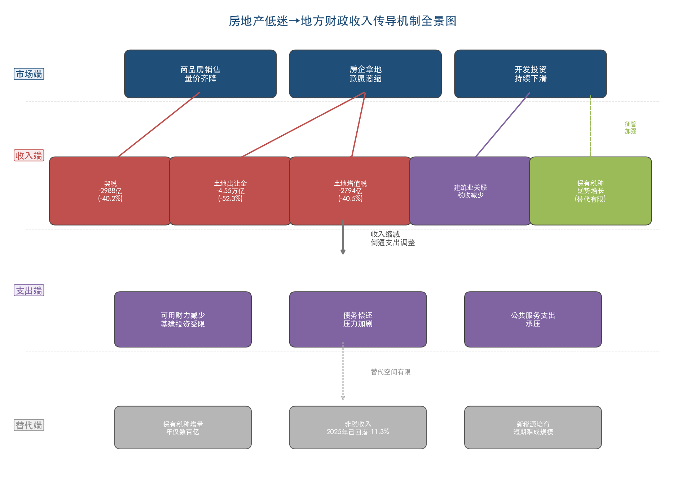

**图：房地产低迷向地方财政收入传导的四层机制全景。** 从市场端（销售下滑、拿地缩量、投资下降）经由收入端（契税-40.2%、土地出让金-52.3%、土地增值税-40.5%等）传导至支出端（财力减少、债务承压、公共服务支出受限），并受到替代端空间有限的约束。

这一传导机制的核心启示在于：房地产低迷对地方财政的冲击并非线性的、单一的，而是多条路径共振形成的系统性压力。土地出让收入的断崖式下降（较峰值减少4.55万亿元）是冲击的主体，五项房地产相关税收的净减少（3067亿元）是重要补充，建筑业关联税收的隐性损失构成进一步延伸。三者叠加，构成了地方政府自1994年分税制改革以来面临的最大规模的结构性减收。

# 第3章 区域差异化影响——一线、二线与中西部地方财政的分化图景

## 3.1 区域分化的宏观背景：同一轮低迷，不同冲击烈度

第2章的分析表明，2021—2025年间全国土地出让收入累计减少约4.55万亿元，五项房地产相关税收累计减收3067亿元。然而，这一全国层面的"总量叙事"掩盖了区域间冲击烈度的巨大差异。房地产市场的调整在不同城市层级和地理区域间呈现出截然不同的面貌：一线城市和少数强二线城市的土地市场仍能维持较高热度，核心地块频繁溢价成交；而多数三四线城市及中西部地区则面临土地出让近乎停滞、财政收入断崖式下降的困境。

这一分化的根源在于人口流动方向、产业结构差异与住房供需格局的结构性错配。2025年12月中央经济工作会议首次提出"重视解决地方财政困难，兜牢基层'三保'底线"[中央经济工作会议](https://www.mofcom.gov.cn/syxwfb/art/2025/art_de35cba3eb5d4c369b089135e92ba890.html "2025年12月中央经济工作会议公报")，正是对区域财政分化加剧这一现实的直接政策回应。2026年3月财政部向全国人大提交的预算报告进一步指出，"一些地方财政收支矛盾较为突出"，土地出让收入继续回落是核心原因之一[2026年预算报告](http://www.npc.gov.cn/npc/c2/kgfb/202603/t20260306_452128.html "关于2025年中央和地方预算执行情况与2026年预算草案的报告")。

本章从一线城市、强二线城市、三四线城市及中西部地区三个维度，逐层剖析房地产低迷对不同层级地方财政的差异化冲击，并以典型省份和城市为案例呈现"同一轮低迷、不同冲击烈度"的区域差异全景。

## 3.2 一线城市：土地市场逆势集中，财政展现相对韧性

### 3.2.1 土地出让金向头部城市高度集中

在全国土地市场整体收缩的背景下，一线城市和少数核心城市的土地出让却呈现逆势集中态势。2025年，杭州、北京、上海三城涉宅用地出让金均超过1400亿元，形成"三强鼎立"的格局，三城合计出让金超过4200亿元[新京报](https://finance.sina.com.cn/tech/roll/2026-01-16/doc-inhhpmsm2373116.shtml "2025土地热钱涌向哪？京杭沪称霸，西安合肥掉队")。中指研究院数据显示，2025年全国TOP20城市宅地出让金占全国比重达52%，较2024年提升1个百分点[中指研究院数据](https://finance.sina.com.cn/tech/roll/2026-01-16/doc-inhhpmsm2373116.shtml "新京报转引中指研究院数据")。

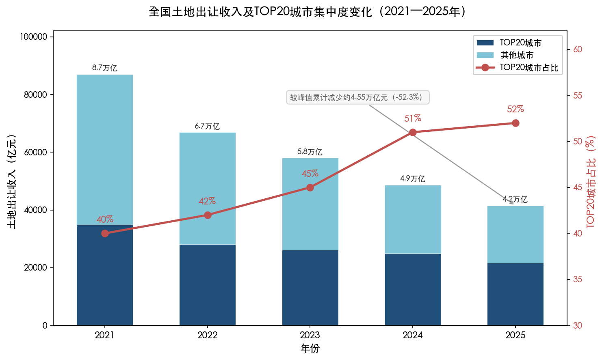

上图清晰呈现了2021—2025年全国土地出让收入从8.7万亿元降至4.2万亿元的总量萎缩趋势，以及TOP20城市出让金占全国比重从40%升至52%的集中化过程。"总量缩减、头部集中"的双重特征构成了区域财政分化的核心背景。

具体到一线城市，北京2025年累计出让40宗涉宅用地，成交金额约1427.4亿元，较2024年减少约8%，但成交楼面均价同比上升20%，显示优质地块的稀缺溢价效应[每日经济新闻](https://www.nbd.com.cn/articles/2026-01-01/4204608.html "北上杭三城2025年土地出让收入均超千亿元")。上海全年通过公开招拍挂出让涉宅用地的金额同样保持高位，若将协议出让、遴选出让等"非公开口径"的成交金额纳入统计，上海实际卖地收入显著领先其他城市[新京报](https://finance.sina.com.cn/tech/roll/2026-01-16/doc-inhhpmsm2373116.shtml "上海土地市场的双轨模式分析")。值得一提的是，上海2025年两度刷新全国涉宅用地成交楼面价纪录：静安寺地块以16万元/平方米成交，徐汇区地块更以20万元/平方米成交[新京报](https://finance.sina.com.cn/tech/roll/2026-01-16/doc-inhhpmsm2373116.shtml "上海楼面价纪录")。

任泽平引用中指研究院数据指出，2025年上半年一线城市宅地出让金同比增长49.5%，二线城市同比增长43.5%[新浪财经转载任泽平文章](https://finance.sina.cn/2026-01-14/detail-inhhfmmf4309317.d.html "未来中国房地产十大趋势")。央视网引用粤开证券罗志恒的分析则显示，2025年前两个月一线城市住宅用地出让金同比增长57.6%，二线城市增长30.9%，三四线城市仅增长9.9%[央视网](https://jingji.cctv.com/2025/03/25/ARTIvL4Nv8IbZQLMsNb3hSTu250324.shtml "今年前两个月土地市场回暖")。

这一集中化趋势的背后是房企投资逻辑的根本转变。在行业深度调整期，房企从过去"广撒网"式全国扩张转向"精聚焦"投资，将拿地行为集中于基本面良好、人口持续流入、住房需求有支撑的核心城市。克而瑞研究中心预计，2026年房企仍将保持高度聚焦策略，核心城市优质地块的竞争依旧激烈[新京报](https://finance.sina.com.cn/tech/roll/2026-01-16/doc-inhhpmsm2373116.shtml "克而瑞对2026年土地市场判断")。

### 3.2.2 一线城市财政收入的相对韧性

土地市场的活跃度直接映射到一线城市的财政表现上。2025年，北京市一般公共预算收入6680.6亿元，同比增长4.8%，增速高于全国地方平均水平（2.4%）[第一财经](https://www.yicai.com/news/103022522.html "北京晒政府账本：今年财政收入预计增长约4%")。北京市政府性基金预算收入完成2193.9亿元，同比增长4.7%，在全国土地出让收入整体下降14.7%的大环境下实现了正增长[北京市2025年预算执行情况](https://www.beijing.gov.cn/zhengce/zhengcefagui/202602/t20260206_4495110.html "关于北京市2025年预算执行情况和2026年预算的报告")。

深圳同样表现突出。2025年，来源于深圳辖区的一般公共预算收入连续五年超过1万亿元，其中地方级收入4163.8亿元，同比增长6.4%；税收收入3510.6亿元，在地方级收入中占比高达84.3%，财政收入质量居全国前列[深圳市财政局](https://www.sz.gov.cn/cn/xxgk/zfxxgj/zwdt/content/post_12640175.html "2025年深圳财政收入结构居全国最优水平之列")。

上海2025年全市土地使用权出让收入执行数约2804.3亿元，基本完成年初2800亿元的预算目标[上海市财政局](https://czj.sh.gov.cn/cmsres/9d/9df06f938fc342268656b0172c2ce339/e4ea1010d0e16a0b43fd20ef450b438c.pdf "上海市2025年政府性基金收入执行情况表")。

一线城市财政韧性的来源可归结为三个方面：其一，产业结构以高端服务业、金融业和数字经济为主导，税基密集且税源质量高，对房地产周期的依赖度相对较低；其二，人口持续净流入支撑住房真实需求，使土地出让市场维持合理热度；其三，核心城市"缩量提质"的供地策略成效显著——通过减少供应量、推出核心区优质地块、提升地块品质等方式，实现了"量缩价升"的出让模式转型。

### 3.2.3 一线城市内部的分化：广深与京沪的差距

一线城市内部同样存在显著分化。广州和深圳在土地出让金排名上明显落后于北京和上海。2025年，广州土地出让金排名从2024年的第5位跌至第8位，出让金减少超过200亿元；深圳因土地供应量较少，全年出让金额和排名亦有所下降[新京报](https://finance.sina.com.cn/tech/roll/2026-01-16/doc-inhhpmsm2373116.shtml "广深出让金排名下滑")。

广东省层面的数据同样印证了这一压力。2025年广东全省土地出让收入同比下降11%，尽管降幅低于全国平均水平（-14.7%），但仍处于收缩区间[证券时报](https://www.stcn.com/article/detail/3624762.html "从具体省份来看土地出让收入差异")。广东省预计2026年土地出让收入为2536.6亿元，同比增长5%，是全国率先预期土地出让收入转正的经济大省之一[证券时报](https://www.stcn.com/article/detail/3624762.html "2026年多省预计增长")。

## 3.3 强二线城市：分化加剧下的"冰火两重天"

### 3.3.1 明星城市与掉队城市的两极分化

强二线城市的土地市场在2025年呈现出更为剧烈的分化态势。

在"热"的一端，成都、武汉、南京等城市表现突出。成都2025年土地出让金排名从2024年的第8位跃升至第4位，出让金超过700亿元，溢价率极为抢眼，出现了高达106%溢价率的地块。作为西南地区重要的中心城市，成都以32.6万套的年度住宅总成交量（新房+二手房）位居全国首位，强劲的住房需求支撑了土地市场的活跃[新京报](https://finance.sina.com.cn/tech/roll/2026-01-16/doc-inhhpmsm2373116.shtml "成都土地出让金排名跃升")。武汉排名从第9位升至第6位，南京从第6位升至第5位，出让金规模稳步增长[新京报](https://finance.sina.com.cn/tech/roll/2026-01-16/doc-inhhpmsm2373116.shtml "武汉南京排名上升")。

杭州的表现尤为亮眼。2025年杭州土地出让金排名升至全国第2位（仅次于北京），全年成交92宗宅地，其中68宗溢价成交，20宗溢价率超50%，最高达115%[新京报](https://finance.sina.com.cn/tech/roll/2026-01-16/doc-inhhpmsm2373116.shtml "杭州土地市场热度")。杭州土地出让金较2024年增加超200亿元，充分反映了长三角核心城市对房企的强劲吸引力。

然而在"冷"的一端，部分二线城市土地出让金出现大幅下滑。西安从2024年的第4位跌至2025年的第7位，土地出让金降幅超过30%；常州从第7位骤降至第14位，出让金近乎腰斩；合肥从第10位滑落至第19位，出让金降幅超过50%。而2024年排名前20的盐城、济南、佛山，在2025年则完全退出前20名榜单[新京报](https://finance.sina.com.cn/tech/roll/2026-01-16/doc-inhhpmsm2373116.shtml "西安合肥降幅显著，多城退出前20")。

### 3.3.2 土地出让分化对省级财政的传导

强二线城市土地市场的两极分化直接传导至省级财政表现。

**东部经济大省**的财政收入总体稳健，但增速普遍低于经济增速。2025年，广东省一般公共预算收入约1.39万亿元，同比增长3%，连续35年居全国首位；江苏约1.02万亿元，增速2.1%，稳居全国第二；浙江、上海、山东、北京分列第三至第六位。上述东部6省（市）财政收入合计约5.6万亿元，占全国地方一般公共预算本级收入比重约46%，贡献了近半地方财力[第一财经](https://www.yicai.com/news/103045024.html "31省份披露去年财政收入：粤苏浙规模居前三")。

然而，即便是东部经济大省，土地出让收入同样面临不小压力。以江苏为例，2024年全省土地出让收入为7270亿元（全国第一），同比下降23.3%，预计2025年进一步降至约5900亿元[证券时报](https://www.stcn.com/article/detail/1526700.html "东部大省2025年财政收入预计增长3%")。浙江省则预计2026年全省政府性基金预算收入为4918.42亿元，较2025年下降16.2%，是少数预计该项收入继续下滑的经济大省[证券时报](https://www.stcn.com/article/detail/3624762.html "浙江省预算报告数据")。

**中部省份**的财政收入增速明显落后于其他地区。粤开证券首席经济学家罗志恒分析指出，2025年中部地区财政收入增速相对落后于东部、西部和东北地区[第一财经](https://www.yicai.com/news/103045024.html "中部地区财政收入增速相对落后")。河南省2026年预算报告坦言，"房地产业相关税收尚未止跌回稳，培育发展的新兴产业尚未形成规模性税源，对财政收入的稳定增长支撑不足，加之财政刚性支出需求大，收支矛盾突出，一些地方'三保'压力较大"[第一财经](https://www.yicai.com/news/103045024.html "河南今年预算报告原文表述")。河南2025年土地出让收入同比下降27.7%，降幅远超全国平均水平，直接映射出中部省份在房地产调整中承受的更大冲击[证券时报](https://www.stcn.com/article/detail/3624762.html "河南土地出让收入下降27.7%")。

## 3.4 三四线城市与中西部地区：土地出让近乎停滞与财政困境

### 3.4.1 人口外流与库存高企的双重挤压

三四线城市和中西部地区面临的形势最为严峻，其根本症结在于人口外流、产业基础薄弱与住房库存高企三重困境的叠加。

从库存数据看，2025年11月全国百城新建商品住宅去化周期达27.4个月（历史高位），其中三四线城市去化周期高达40.3个月，远超一线城市的17.1个月和二线城市的22.6个月[央广网](https://house.cnr.cn/kcb/20251221/t20251221_527467450.shtml "稳市场去库存定调2026年房地产发展方向")。部分三四线城市的去化周期甚至超过36个月。在如此高库存压力下，房企拿地意愿极度低迷，土地出让市场几近冻结。

2025年全国65个重点城市经营性土地出让金约16774.86亿元，同比下降11%[安居客研究院](https://finance.sina.com.cn/roll/2026-01-01/doc-inheuwck8361736.shtml "房企聚焦核心城市掐尖，2025年土地出让收入")。与此同时，三四线城市的流拍率仍高达14.6%，虽较上年有所下降，但整体表现远逊于核心城市[安居客研究院土地市场年报](https://pdf.dfcfw.com/pdf/H3_AP202512291810438636_1.pdf "全国土地市场年报")。更有不少三四线城市在2025年主动暂停土地供应，中房网数据显示，桂林等城市已计划暂停新增住宅用地出让[中房网](http://m.fangchan.com/data/134/2025-04-21/7319977351042110133.html "2025年地方供地计划探析")。

财新网引用的一项研究指出，2025年上半年TOP10城市土地出让金已占全国一半以上，市场集中度进一步提升。上半年共有19个城市的宅地出让金超过100亿元，而其余数百个城市的土地出让金合计仅占全国的一小部分[财新网](https://companies.caixin.com/2025-07-05/102338616.html "上半年土地市场分化加剧")。

### 3.4.2 典型省份的土地财政困境

中西部和东北部分省份的土地出让收入下滑幅度远超全国平均水平。

粤开证券研究院整理的数据显示，2024年土地出让收入排名前十的省份依次为江苏（7270亿元）、浙江（4721亿元）、山东（3973亿元）、四川（3181亿元）、上海（2976亿元）、广东（2713亿元）、湖北、北京、福建、贵州[粤开证券](https://www.ykzq.com/products/download-new/rpt/2025/03/23/a7be4cf67d72475089728a7fbc29a24b.pdf "1998-2024年中国各省份土地出让收入排名变迁")。从排名变化看，上海超越广东跻身全国前五，北京排名上升至第八，而贵州首次跻身前十，主要得益于专项债收储等政策性因素。

**安徽省**的案例具有典型意义。2025年10月，安徽省财政厅课题组公开发表《财政收入支撑高质量发展匹配关系研究》一文，坦承全省土地出让收入规模显著下滑，对财政收入贡献度急剧降低。报告指出，全省土地出让收入占财政两本预算（一般公共预算和政府性基金预算）收入的比重曾达40%以上，但2024年该项收入较2021年峰值下降近50%，形成较大收入缺口[证券时报](https://www.stcn.com/article/detail/3624762.html "引用安徽省财政厅课题组文章")。安徽省财政数据显示，全省国有土地使用权出让收入从2023年的约2822.25亿元降至2024年的约2084.64亿元，再降至2025年的约1735.05亿元，两年间降幅达38.5%[安徽省财政厅](https://czt.ah.gov.cn/group6/M00/0E/BC/wKg8BmlLiWCAKMLwAALvenIEiy0035.pdf "安徽省经济、财政收支和债务有关数据")。

安徽省财政厅进一步指出，土地资源价值持续缩水，以土地为核心的政府投融资链条运转受阻——城投平台资产质量下降影响偿债能力，抵押品价值衰减制约金融机构信贷投放，政府综合可用财力进一步削弱[证券时报](https://www.stcn.com/article/detail/3624762.html "安徽省财政厅原文表述")。

**资源型省份**面临大宗商品价格下行与房地产市场低迷的双重压力。山西、内蒙古、青海和陕西4个省份2025年一般公共预算收入同比负增长[第一财经](https://www.yicai.com/news/103045024.html "山西内蒙古青海陕西财政收入下滑")。以陕西为例，2025年一般公共预算收入约3289亿元，同比下降3.1%，完成年度预算的94.1%，较预期目标短收205.5亿元，主要受煤炭价格走低和"土地相关税收大幅减收"等不利因素影响[陕西省预算报告](https://www.yicai.com/news/103045024.html "第一财经引用陕西省预算报告")。

粤开证券2024年的研究报告显示，黑龙江、内蒙古、辽宁等8个省份的土地财政依赖度（土地出让收入占地方广义财政收入的比重）已降至20%以下[粤开证券](https://pdf.dfcfw.com/pdf/H3_AP202402191622386492_1.pdf "土地财政引发的挑战及应对")。但这并非因为这些省份成功实现了财政转型，而是因为土地出让收入已萎缩至极低水平——当"分母"同步缩小时，低依赖度反映的是财政来源的"双向萎缩"而非结构优化。

### 3.4.3 地方债务重点省份的特殊困境

部分土地财政依赖度较高且债务风险突出的省份，深陷"收入锐减—偿债承压—投资受限"的恶性循环。2023年，国家将12个省份纳入地方债务高风险地区名单，相关地方的政府投资项目受到相应约束。至2025年，吉林、宁夏、内蒙古先后宣布成功退出债务重点省份序列，青海亦提出2026年确保退出[第一财经](https://www.yicai.com/news/103045024.html "吉林退出地方债务重点省份")。

退出债务重点省份的过程中，多地依赖大幅提升非税收入来弥补税收和土地出让收入的不足。甘肃、重庆、广西、贵州等债务重点省份2025年非税收入分别增长10.3%、9.9%、5.7%和3.9%[第一财经](https://www.yicai.com/news/103045024.html "债务重点省份非税收入增长")。吉林2025年非税收入增长25.4%，其中国有资源（资产）有偿使用收入441亿元，同比增长59.2%，主要依靠加大"三资"（资金、资产、资源）统筹力度[第一财经](https://www.yicai.com/news/103045024.html "吉林非税收入高增长原因")。

然而，这一模式的可持续性堪忧。罗志恒对此指出，"近年来税收增速持续下降的同时，土地出让收入也大幅下降，作为替代的非税收入增速较快，一定程度上弥补了税收收入的不足。客观结果是税收收入占一般公共预算收入的比重持续下降，财政收入的质量和稳定性下降。非税收入的高速增长难以持续，一旦非税收入与税收同时下行，财政汲取能力将明显下降，财政可持续性减弱"[新浪财经转载时代周报](https://finance.sina.cn/2026-02-09/detail-inhmexfr6434895.d.html "透视地方财政收入：广东连续35年领跑")。

## 3.5 区域财政分化的结构化对比

综合上述分析，下表从土地出让金、一般公共预算收入增速、财政收入质量（税收占比）和土地财政转型方向四个维度，呈现不同区域的差异化图景。

| 维度 | 一线城市（京沪为代表） | 强二线城市（杭州、成都等） | 弱二线及三四线城市 | 中西部/资源型省份 |
|------|----------------------|------------------------|-------------------|-----------------|
| 2025年土地出让金表现 | 北京约1427亿元，上海约2804亿元，维持高位或正增长 | 杭州超1400亿元（+200亿以上），成都超700亿元（排名跃升） | 合肥降幅超50%，常州近乎腰斩，部分城市退出前20 | 河南省降27.7%，安徽省降约17%，多地暂停供地 |
| 一般公共预算收入增速 | 北京+4.8%，深圳+6.4%，明显高于全国均值 | 分化剧烈，浙江整体+2.1%，湖北回升较快 | 多地低于全国均值（2.4%） | 山西、陕西、内蒙古、青海负增长 |
| 财政收入质量（税收占比） | 北京约87%，深圳约84%，全国领先 | 浙江超80%，质量较高 | 多数处于50%—70%区间 | 吉林约52%，依赖非税收入 |
| 土地财政转型方向 | "缩量提质"供地，量缩价升 | 核心城市聚焦优质地块 | 被动缩量，有效供给不足 | 盘活"三资"、非税替代 |

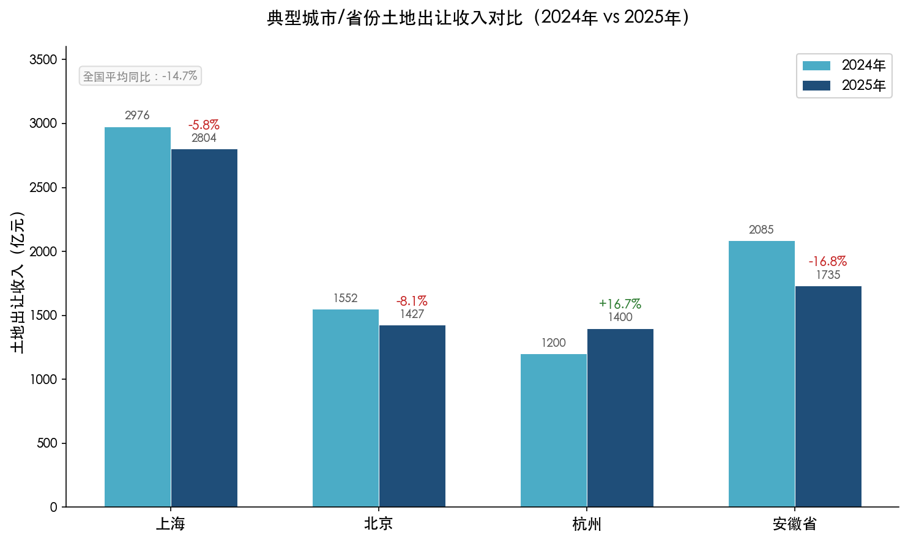

上图选取上海、北京、杭州与安徽省四个典型主体，以2024年与2025年分组柱状图对比土地出让收入变化。杭州逆势增长16.7%与安徽省下降16.8%形成鲜明对照，直观呈现了区域分化的"冰火两重天"格局。

从省份层面看，2024年全国土地出让收入前十省份的座次变化同样映射出区域分化的深层逻辑。罗志恒指出，上海超越广东跻身前五，说明直辖市和城市型经济体在土地市场调整期具有更强的抗风险能力；而贵州首次进入前十，则主要受益于专项债收储等政策性因素，并非市场化需求驱动[雪球转载粤开证券数据](https://xueqiu.com/5320325716/329092121 "2024年全国卖地收入十强榜")。

## 3.6 区域分化的深层驱动因素与财政影响评估

### 3.6.1 人口流动与产业结构：分化的根源

区域财政分化的根本驱动因素在于人口流动方向与产业结构的差异。一线城市和强二线城市凭借就业机会、教育医疗资源和产业集聚效应，持续吸引人口净流入，住房需求有支撑，土地出让市场因此保持一定活力。而三四线城市和中西部地区人口持续外流，住房供过于求的格局难以逆转，房企"宁可高价拿好地，也不冒险去弱市"的避险心态进一步加剧了土地出让金的区域极化[新京报](https://finance.sina.com.cn/tech/roll/2026-01-16/doc-inhhpmsm2373116.shtml "房企避险心态分析")。

产业结构同样是关键变量。北京、上海、深圳等城市以高端服务业、金融业和数字经济为主导，单位GDP创造的税收收入远高于制造业和农业占比较重的中西部省份。浙江是目前已公布数据的省份中唯一税收占比突破80%的省份，而四川、河南等人口大省、农业大省虽然GDP总量靠前，但一般公共预算收入规模明显低于浙江、上海[新浪财经转载时代周报](https://finance.sina.cn/2026-02-09/detail-inhmexfr6434895.d.html "透视地方财政收入")。

### 3.6.2 财政冲击的"马太效应"

房地产低迷对地方财政的影响呈现出典型的"马太效应"——强者恒强、弱者更弱。一线城市和少数强二线城市因土地出让市场维持热度，叠加产业多元化带来的稳定税基，财政收入保持平稳甚至小幅增长；而三四线城市和中西部地区则陷入"土地出让收入锐减→可用财力下降→基础设施投资受限→经济吸引力进一步减弱→人口和企业外流加速→税基萎缩"的负向循环。

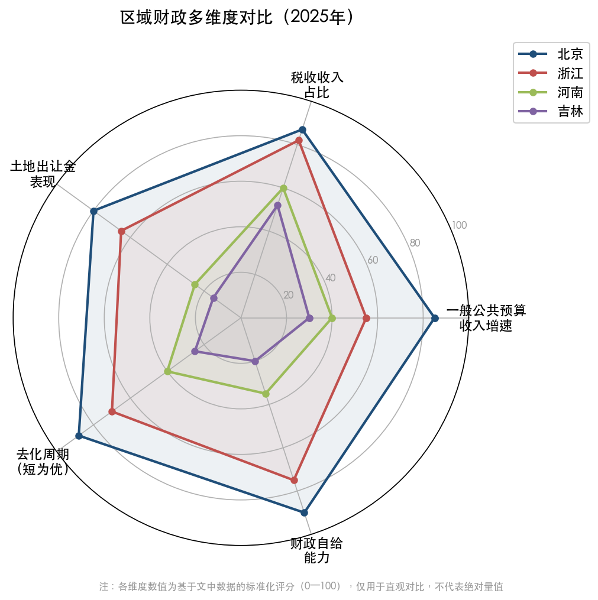

上图以雷达图形式，从一般公共预算收入增速、税收收入占比、土地出让金表现、去化周期（短为优）、财政自给能力五个维度，对北京、浙江、河南、吉林四个代表性省份（市）进行标准化评分对比。北京在各维度全面领先，吉林在各维度均处于低位，直观呈现了区域财政的"马太效应"。

世界银行2025年12月发布的《中国经济简报》指出，"土地出让收入下降和债务上升加大了地方政府财政压力"，土地使用权出让收入的持续收缩制约了地方政府的财政空间[世界银行](https://thedocs.worldbank.org/en/doc/bde7a629d7a879b27a9f1a76263196e2-0070012025/original/CEU-December-2025-CN.pdf "中国经济简报2025年12月")。IMF在2025年第四条磋商报告中也指出，"地方政府面临显著的财政缺口，而土地出让收入的持续下降使这一问题变得更加严峻"[IMF](https://www.imf.org/-/media/files/publications/cr/2026/chinese/1chnca2026001.pdf "中华人民共和国2025年第四条磋商报告")。

罗志恒对此进一步分析认为，土地出让收入持续下行对地方政府产生三大影响：一是可用财力减少，土地出让收入是地方政府性基金预算的主要来源，其下滑直接导致可用财力收缩，加剧财政紧平衡态势；二是债务偿还压力加剧，许多地方政府债务依赖土地收入作为还款来源；三是基础设施投资受限，土地收入萎缩引起相应支出减少，基建项目的资金来源不足，可能拖累地方经济增长[证券时报](https://www.stcn.com/article/detail/3624762.html "罗志恒分析土地出让收入下行的三大影响")。这三重影响在财政薄弱地区的传导效应最为显著，进一步拉大了区域间的财政差距。

## 3.7 2026年展望：分化格局料将延续

展望2026年，区域财政分化格局预计将延续甚至进一步加深。

从各省2026年财政预期来看，广东预计一般公共预算收入约1.44万亿元，增长3%；北京设定增长4%的目标；新疆再次提出10%左右的预期增速，而更多省份将预期增速集中在2%—3%区间[新浪财经转载时代周报](https://finance.sina.cn/2026-02-09/detail-inhmexfr6434895.d.html "2026年各省财政收入增长目标")。

在土地出让收入方面，多数省份预期2026年将实现增长或降幅收窄。广东预计2026年土地出让收入为2536.6亿元，同比增长5%；河南预计政府性基金预算收入增长57%（主要受低基数效应驱动）；河北预计增长约22%。但浙江预计政府性基金预算收入下降16.2%，成为少数预期该项收入继续下滑的经济大省[证券时报](https://www.stcn.com/article/detail/3624762.html "2026年各省卖地收入预期")。

然而，2026年1—2月的实际数据传递出更为审慎的信号。全国土地出让收入3547亿元，同比下降25.2%，降幅较2025年全年（-14.7%）显著扩大[财政部2026年1—2月财政收支情况](http://gks.mof.gov.cn/tongjishuju/202603/t20260319_3985695.htm "财政部国库司发布")。中国新闻网报道引用机构分析预计，2026年土地市场将延续分化格局——一线及强二线城市核心区域有望迎来更多优质住宅用地入市、维持土地市场热度，而三四线城市及一二线城市的郊区土地市场仍将面临较大压力[中国新闻网](https://www.chinanews.com.cn/cj/2026/03-25/10592618.shtml "报告：预计2026年土地市场将延续分化格局")。

我们认为，在人口向大城市群集聚的长期趋势未改、"缩量提质"供地策略持续实施的背景下，土地出让金向核心城市集中的格局将进一步固化。这意味着，对土地财政依赖程度越高的中小城市，其财政转型的紧迫性越强、难度也越大。2025年12月中央经济工作会议提出的"重视解决地方财政困难"，在区域分化加剧的语境下具有极强的现实针对性。

# 第4章 地方政府的财政应对策略与政策工具箱

## 4.1 应对框架：从被动承压到主动腾挪

前三章分析表明，2021—2025年间房地产相关收入（五项税收与土地出让金合计）占地方广义财政总收入的比重从52.6%降至33.9%，土地出让收入较峰值累计减少约4.55万亿元，对地方财力构成系统性冲击。面对这一结构性缺口，中央与地方政府并非被动等待市场回暖，而是在实践中逐步构建起一套涵盖中央支持、债务工具、收入替代与支出优化的多层次应对体系。

本章从六个维度系统梳理地方政府的财政应对策略：中央转移支付"输血"、专项债扩容"借力"、化债方案"减负"、非税收入"补缺"、新税源培育"开源"、压缩支出与盘活存量"节流"。上述工具并非相互独立运作，而是构成一个相互补充、动态调整的政策组合，其各自的即期效力、可持续性与结构性贡献存在显著差异。

## 4.2 中央转移支付：持续扩大的"输血"规模

### 4.2.1 转移支付规模连续突破十万亿元

中央对地方转移支付是弥补地方财力缺口最直接、最重要的制度安排。在土地出让收入持续下滑的背景下，转移支付规模持续扩大，已连续三年突破十万亿元大关。

2023年，中央对地方转移支付规模首次突破十万亿元，执行数达10.29万亿元。[央视网](https://news.cctv.com/2023/10/11/ARTIlicQk1R2R8Ss0sEe1j7q231011.shtml "2023年中央财政对地方转移支付规模突破10万亿元") 2024年，中央对地方转移支付100397.16亿元，其中一般性转移支付87222.88亿元、专项转移支付8174.28亿元，另一次性安排灾后恢复重建补助资金5000亿元。[财政部2024年预算执行报告](https://bgt.mof.gov.cn/zhuantilanmu/rdwyh/ysbgjyszx/202503/t20250314_3959885.htm "2025年3月财政部预算报告") 2025年，执行数进一步增至101925.14亿元，其中一般性转移支付92475.98亿元（完成预算的98.3%），专项转移支付9449.16亿元。[2026年预算报告](http://www.npc.gov.cn/npc/c2/kgfb/202603/t20260306_452128.html "关于2025年中央和地方预算执行情况与2026年预算草案的报告")

2026年，中央对地方转移支付预算进一步增至104150亿元，同比增长2.2%。[2026年预算报告](http://www.npc.gov.cn/npc/c2/kgfb/202603/t20260306_452128.html "2026年预算草案") 该项安排与5.89万亿元赤字规模、11.89万亿元新增政府债券一道，构成2026年"更加积极"财政政策的三大支柱。[新华网](https://www.news.cn/money/20260309/d54cb1f6f82b470a8cc633a628e113a9/c.html "2026'国家账本'释放新信号")

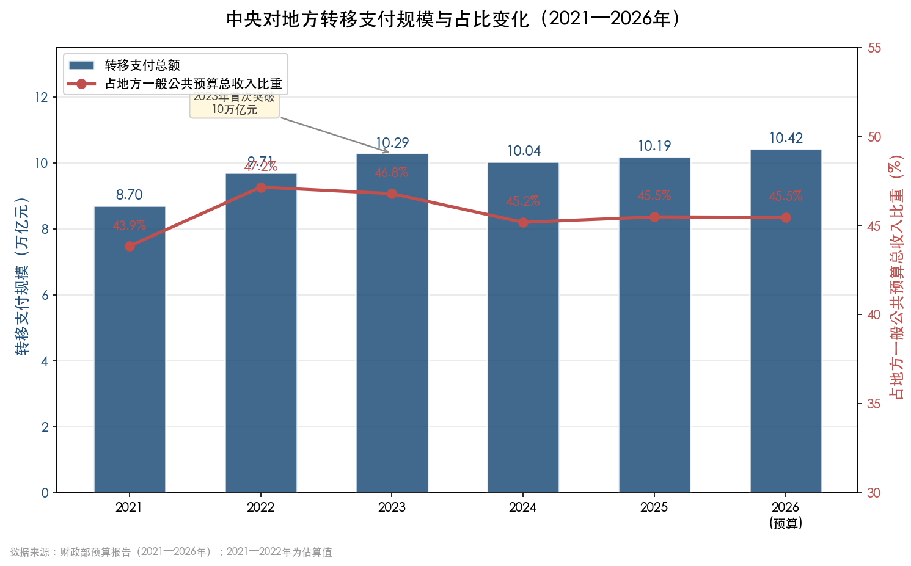

图4-1展示了2021—2026年中央对地方转移支付总额从8.70万亿元增长至10.42万亿元的扩张轨迹。转移支付占地方一般公共预算总收入（本级收入与转移支付之和）的比重从2021年的约43.9%攀升至2023年的约46.8%后趋于稳定，反映出地方对中央财力的依赖度已处于较高水平。

### 4.2.2 转移支付的结构优化与激励机制

转移支付不仅在总量上持续扩大，其内部结构亦在向增强地方自主财力的方向优化。

2025年预算中，均衡性转移支付安排27340亿元，县级基本财力保障机制奖补资金4795亿元，专门用于加强基层财力保障，支持地方做好"保基本民生、保工资、保运转"工作。[财政部2025年预算报告](https://bgt.mof.gov.cn/zhuantilanmu/rdwyh/ysbgjyszx/202503/t20250314_3959885.htm "2025年预算草案") 2026年预算报告进一步提出"清理规范专项转移支付，增加一般性转移支付"的改革方向，旨在赋予地方更大的资金使用自主权。[2026年预算报告](https://www.mof.gov.cn/zhengwuxinxi/caizhengxinwen/202603/t20260316_3985331.htm "财政部2026年预算报告全文")

在激励机制层面，2024年财政部建立了促进高质量发展转移支付激励约束机制并安排资金400亿元，2025年进一步增至500亿元，资金分配向收入大省和收入增速较快的省份倾斜。[财政部2025年预算报告](https://bgt.mof.gov.cn/zhuantilanmu/rdwyh/ysbgjyszx/202503/t20250314_3959885.htm "财政部数据") 这一机制打破了传统转移支付按既有基数分配的惯例，体现了"激励地方主动发展经济、做大收入蛋糕"的政策导向，有助于在"输血"的同时增强地方"造血"动力。

### 4.2.3 转移支付的结构性局限

尽管中央转移支付规模庞大，其对地方财力缺口的弥补作用仍存在结构性局限。

其一，中央本级财政同样面临收支压力。2025年，中央一般公共预算收入93962.62亿元，同比下降6.5%，中央财政赤字48600亿元。[2026年预算报告](http://www.npc.gov.cn/npc/c2/kgfb/202603/t20260306_452128.html "2025年中央预算执行情况") 2026年中央财政赤字进一步升至50900亿元，赤字增量全部由中央承担。粤开证券首席经济学家罗志恒认为，中央加杠杆有利于减轻地方财政负担、优化央地债务结构，但这也意味着中央转移支付继续大幅扩张的财力空间有限。[新华网](https://www.news.cn/money/20260309/d54cb1f6f82b470a8cc633a628e113a9/c.html "罗志恒评论2026年赤字结构")

其二，转移支付本质上属于"输血"而非"造血"机制。大量依赖转移支付维持运转的地方政府，其财政自主性和可持续性均面临考验。2026年预算中，地方一般公共预算本级收入125030亿元，仅占地方总收入（含转移支付和调入资金后的246180亿元）的50.8%，意味着近半数地方财力来源于中央转移和其他调入资金。[2026年预算报告](http://www.npc.gov.cn/npc/c2/kgfb/202603/t20260306_452128.html "2026年地方预算安排") 这一依赖结构若长期固化，将制约地方政府的治理效能和经济发展自主权。

## 4.3 专项债扩容与功能创新：多维度的债务工具

### 4.3.1 专项债规模持续攀升

地方政府专项债券是近年来地方财政最重要的增量资金来源之一。2025年，新增地方政府专项债务限额达44000亿元，较2024年增加5000亿元。[财政部2025年预算报告](https://bgt.mof.gov.cn/zhuantilanmu/rdwyh/ysbgjyszx/202503/t20250314_3959885.htm "2025年预算草案") 2026年，专项债额度维持在44000亿元，与上年持平。[2026年预算报告](http://www.npc.gov.cn/npc/c2/kgfb/202603/t20260306_452128.html "2026年预算草案")

从更宏观的政府债务工具组合看，2026年新增政府债券总规模达11.89万亿元，包括赤字规模5.89万亿元、超长期特别国债1.3万亿元、专项债4.4万亿元和特别国债0.3万亿元，较2025年小幅增加300亿元。[中证网](https://jnzstatic.cs.com.cn/zzb/htmlInfo/9f071cea89814e7eb7e0d27a1ddc997c.html "2026年促发展，我们有'数'") 与此同时，全国一般公共预算支出首次突破30万亿元，达300100亿元，彰显了积极财政政策"加力提效"的总体基调。[2026年预算报告](http://www.npc.gov.cn/npc/c2/kgfb/202603/t20260306_452128.html "2026年全国预算支出")

### 4.3.2 功能拓展：从基建投资到房地产收储

专项债券的投向领域在近两年发生了标志性拓展。2024年10月，中央明确允许专项债券用于支持回收闲置存量土地和收购存量商品房用作保障性住房，标志着专项债功能从传统基础设施投资向房地产市场调节领域延伸。[财政部2025年预算报告](https://bgt.mof.gov.cn/zhuantilanmu/rdwyh/ysbgjyszx/202503/t20250314_3959885.htm "明确专项债支持收储政策")

2025年，专项债收储政策加速落地。据中指研究院监测，全国各地公示拟使用专项债收回收购存量闲置土地的数量超过5500宗，总土地金额超7500亿元，多省市已发行相应专项债券合计超过3000亿元。[凤凰网财经](https://finance.ifeng.com/c/8pvt2EQ3jGR "全年发行超3000亿元，2025年专项债收储土地进展加快") 收储政策对于缓解房企资金链压力、推动市场出清具有积极意义，但用于收购存量商品房的专项债规模仍然偏小。截至2025年9月，全国已落地537个专项债收储项目，用于"两个领域"的专项债使用规模为1466亿元，其中用于收购存量商品房的债券仅18期。[证券时报](https://www.stcn.com/article/detail/3322301.html "1466亿专项债试水收储") 商品房收储的推进速度受限于定价机制复杂、地方财力约束等多重因素。

### 4.3.3 管理机制的持续优化

在扩大规模和拓展功能的同时，专项债的管理机制也在向精细化方向演进。2026年预算报告提出三项关键改革方向：一是完善专项债券投向领域"负面清单"，从源头防范债务风险；二是适当调整专项债券项目"自审自发"试点范围，赋予地方更大自主权；三是单列并提高用于项目建设的专项债券额度，推动实物工作量形成。[新华网](https://www.news.cn/money/20260309/d54cb1f6f82b470a8cc633a628e113a9/c.html "2026年预算报告解读") 中央财经大学教授姚东旻指出，单列项目建设额度"能够推动实物工作量的形成，带动有效投资扩大"。[新华网](https://www.news.cn/money/20260309/d54cb1f6f82b470a8cc633a628e113a9/c.html "姚东旻点评")

专项债对地方财政的腾挪效应值得重视。在土地出让收入大幅萎缩的背景下，专项债实际上部分替代了土地出让金在地方政府性基金预算中的资金来源功能。2025年，地方政府性基金预算本级收入52647.67亿元（同比-8.2%），但加上中央政府性基金对地方转移支付和44000亿元专项债收入后，收入总量仍达到约10.6万亿元，远超本级收入水平。[2026年预算报告](http://www.npc.gov.cn/npc/c2/kgfb/202603/t20260306_452128.html "2025年地方政府性基金执行") 这种"以债补地"的模式虽能在短期内维持地方政府性基金预算的收支平衡，但也带来了债务可持续性方面的隐忧。

## 4.4 化债方案：从"刚性偿债"到"制度性减负"

### 4.4.1 十万亿化债方案的架构与进展

2024年11月，全国人大常委会批准了总额达10万亿元的一揽子化债方案，系近年来力度最大的地方债务化解举措。方案包含三个组成部分：一是增加6万亿元地方政府债务限额用于置换存量隐性债务，"总额一次报批、分配一次到位、分年安排实施"；二是从2024年起连续五年，每年从新增地方政府专项债券中安排8000亿元补充政府性基金财力、支持化债，五年累计4万亿元；三是明确2029年及以后到期的棚户区改造隐性债务仍按原合同约定偿还。[新华社](http://www.news.cn/fortune/20241108/789216e559e343dc84de1324682906c0/c.html "直接安排10万亿元！地方政府化债压力将大大减轻") [财政部2025年预算报告](https://bgt.mof.gov.cn/zhuantilanmu/rdwyh/ysbgjyszx/202503/t20250314_3959885.htm "化债政策具体安排")

在上述政策协同发力下，2028年底前地方需化解的隐性债务总额从14.3万亿元大幅降至2.3万亿元，累计可节约利息支出约6000亿元。[财政部2025年预算报告](https://bgt.mof.gov.cn/zhuantilanmu/rdwyh/ysbgjyszx/202503/t20250314_3959885.htm "化债成效") 2024年，首批2万亿元置换额度已全部发行并基本置换完毕。2025年，又发行2万亿元用于置换存量隐性债务的再融资债券，置换后平均利息成本降低2.5个百分点以上。[财新网](https://topics.caixin.com/2026-03-05/102419842.html "地方化债最新进展")

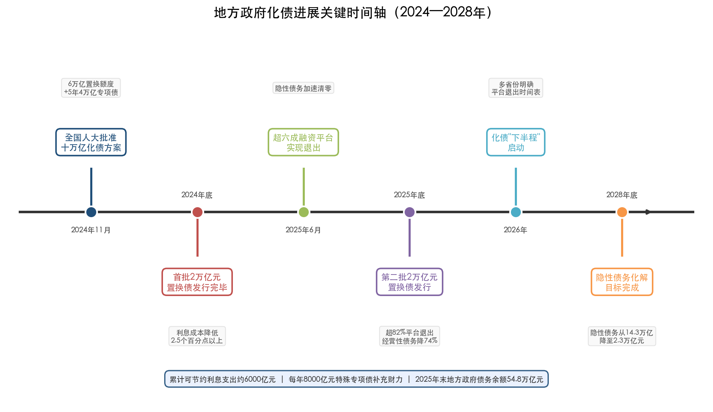

图4-2以时间轴形式呈现了2024年11月十万亿化债方案获批以来的六个关键节点及进展——从首批置换债发行到超82%融资平台退出，再到2028年底隐性债务化解目标的设定，清晰勾勒出化债"下半程"的路线图。

### 4.4.2 融资平台退出与经营性债务化解

化债方案的另一重要维度是地方政府融资平台的出清与转型。截至2025年底，超82%的融资平台实现退出，融资平台存量经营性金融债务规模下降超74%。[财新网](https://topics.caixin.com/2026-03-05/102419842.html "超82%融资平台退出") 此前2025年6月末，超六成融资平台已完成退出，60%以上融资平台的隐性债务清零，改革转型进度超出市场预期。[第一财经](https://www.yicai.com/news/102821864.html "财政部：截至2025年6月末超六成融资平台退出")

2026年化债工作进入"下半程"，预算报告提出"多措并举化解地方政府融资平台经营性债务风险"，多省份亦在本级预算报告中明确了融资平台退出目标和时间表。[证券时报](https://www.stcn.com/article/detail/3638167.html "地方化债新动向——多地完成隐债清零") 融资平台的有序退出不仅是债务层面的减量，更是重塑地方政府信用边界、规范政府与市场关系的制度性变革。

### 4.4.3 化债对地方财政流动性的多层缓解效应

化债方案对地方财政产生了多层次的正向效应。

**利息减负效应**。以高息短期隐性债务置换为低息长期政府债券，直接降低地方政府偿债成本。2024—2025年已发行的4万亿元置换债，置换后平均利息成本降低2.5个百分点以上，[财新网](https://topics.caixin.com/2026-03-05/102419842.html "利息成本降低幅度") 据此推算，仅此项即可为地方政府每年节约利息支出超1000亿元。

**财政腾挪效应**。每年8000亿元特殊新增专项债用于补充政府性基金财力、支持化债，实质上为地方政府释放了可用财力，使其能够将更多资源配置到民生保障和发展投资领域，而非被存量债务的刚性偿还锁定。

**信用修复效应**。隐性债务的显性化和融资平台的有序退出，有助于重建地方政府信用基础，降低未来融资成本，形成"化债→信用改善→融资成本下降→偿债压力进一步缓解"的良性循环。

化债"下半程"仍面临不容忽视的挑战。2025年末，地方政府债务余额达548230.82亿元（含置换债务），虽控制在法定限额以内，但绝对规模已十分庞大。[2026年预算报告](http://www.npc.gov.cn/npc/c2/kgfb/202603/t20260306_452128.html "2025年末地方政府债务余额") 2026年预算报告明确要求"将不新增隐性债务作为'铁的纪律'"，"对违规举债、虚假化债等行为严肃追责问责"，以制度刚性防止"前清后欠"现象的出现。[财政部2025年预算报告](https://bgt.mof.gov.cn/zhuantilanmu/rdwyh/ysbgjyszx/202503/t20250314_3959885.htm "化债纪律要求")

## 4.5 非税收入："以费补税"的短期腾挪与长期隐忧

### 4.5.1 非税收入的剧烈波动

在房地产相关税收与土地出让收入双双下行的困境中，非税收入一度成为地方政府弥补收支缺口的重要手段。2024年，全国非税收入达44730.11亿元，同比大幅增长25.4%，主要来源于"一次性安排中央单位上缴专项收益以及地方依法依规加大国有资源资产盘活力度"。[财政部2024年预算执行报告](https://bgt.mof.gov.cn/zhuantilanmu/rdwyh/ysbgjyszx/202503/t20250314_3959885.htm "2024年非税收入增长原因")

2025年，非税收入出现明显回落，全年39681.65亿元，同比下降11.3%，主要原因系上年一次性中央单位上缴专项收益抬高了基数。[2026年预算报告](http://www.npc.gov.cn/npc/c2/kgfb/202603/t20260306_452128.html "2025年非税收入下降") 从"大幅增长"到"显著回落"的剧烈波动，深刻揭示了非税收入作为财政收入来源的不稳定性。

### 4.5.2 地方层面的"以费补税"路径

部分省份——尤其是债务重点省份——高度依赖非税收入来弥补税收和土地出让金的不足。甘肃、重庆、广西、贵州等省份2025年非税收入分别增长10.3%、9.9%、5.7%和3.9%；吉林2025年非税收入增长25.4%，其中国有资源（资产）有偿使用收入441亿元，同比增长59.2%。[第一财经](https://www.yicai.com/news/103045024.html "地方非税收入增长情况")

"以费补税"的主要途径包括：加大国有资源（资产）有偿使用收入的征缴力度、盘活"三资"（资金、资产、资源）、以及罚没收入增加等。这些手段虽能在短期内缓解财政收支矛盾，但其对营商环境的潜在负面影响和可持续性问题不容回避。

### 4.5.3 可持续性困境与政策纠偏

粤开证券首席经济学家罗志恒对"以费补税"模式做出了深刻分析——"近年来税收增速持续下降的同时，土地出让收入也大幅下降，作为替代的非税收入增速较快，一定程度上弥补了税收收入的不足。客观结果是税收收入占一般公共预算收入的比重持续下降，财政收入的质量和稳定性下降。非税收入的高速增长难以持续，一旦非税收入与税收同时下行，财政汲取能力将明显下降，财政可持续性减弱。"[新浪财经转载时代周报](https://finance.sina.cn/2026-02-09/detail-inhmexfr6434895.d.html "透视地方财政收入")

2025年的数据已部分验证了上述判断。全国非税收入38390亿元的预算目标即较上年执行数下调14.2%（最终执行39681.65亿元略好于预期），财政部明确将下调归因于"一次性收入减少"。[财政部2025年预算报告](https://bgt.mof.gov.cn/zhuantilanmu/rdwyh/ysbgjyszx/202503/t20250314_3959885.htm "2025年非税预算安排") 2026年预算报告进一步强调要"依法严格税收征管，规范非税收入管理，提升财政收入质量，坚决防止和纠正乱收费、乱罚款、乱摊派等问题"。[财政部2025年预算报告](https://bgt.mof.gov.cn/zhuantilanmu/rdwyh/ysbgjyszx/202503/t20250314_3959885.htm "规范非税收入管理") 这一政策表态表明，中央层面已充分意识到"以费补税"模式对营商环境和财政质量的双重侵蚀，未来非税收入的增长空间将趋于收窄。

## 4.6 新税源培育：中长期"开源"的制度构建

### 4.6.1 消费税改革：最具潜力的增量税源

消费税征收环节后移并稳步下划地方，是当前最受关注、也最有望率先落地的增量税源改革方向。2025年，国内消费税收入16857亿元，同比增长2%，目前全部归属中央。[央广网](https://www.cnr.cn/jingji/gundong/20260329/t20260329_527566033.shtml "财政部数据") 若部分品目实现征收环节后移并下划地方，将为地方财政注入一笔可观的增量收入。

改革的政策路径已相当清晰。2024年7月，党的二十届三中全会明确提出"推进消费税征收环节后移并稳步下划地方"。[央广网](https://www.cnr.cn/jingji/gundong/20260329/t20260329_527566033.shtml "二十届三中全会决定") 2025年政府工作报告进一步部署"加快推进部分品目消费税征收环节后移并下划地方"；2026年政府工作报告再次明确"调整优化消费税征税范围、税率，并推进部分品目征收环节后移"。[2026年预算报告](https://www.mof.gov.cn/zhengwuxinxi/caizhengxinwen/202603/t20260316_3985331.htm "2026年预算报告中的消费税改革部署") 连续三年写入顶层政策文件，凸显决策层推进改革的坚定意志。

中央财经大学校长马海涛建议，"应加快推进部分品目消费税征收环节后移并下划地方，稳妥推进试点先行，选取高档化妆品、贵重首饰等消费属性突出、税源清晰可溯的品目，率先开展征收环节后移试点"。[央广网](https://www.cnr.cn/jingji/gundong/20260329/t20260329_527566033.shtml "马海涛建议") 此项改革的战略意义在于双重转型：一方面直接增加地方自主财力；另一方面，将地方政府的财政激励从"经营土地"转向"经营消费环境"，有利于引导地方财政模式从"土地财政"向"消费财政"过渡。

### 4.6.2 地方附加税改革：从"费"到"税"的制度整合

党的二十届三中全会首次提出"研究把城市维护建设税、教育费附加、地方教育附加合并为地方附加税，授权地方在一定幅度内确定具体适用税率"。[新浪财经](https://finance.sina.com.cn/wm/2026-03-22/doc-inhrwuhp4653458.shtml "'地方附加税'改革将启") 2026年预算报告已将"推动地方附加税改革"列为深化财税体制改革的重要任务。[2026年预算报告](https://www.mof.gov.cn/zhengwuxinxi/caizhengxinwen/202603/t20260316_3985331.htm "地方附加税改革部署")

此项改革的核心价值在于：将三项依附于增值税和消费税的附加税费整合为独立税种，并赋予地方一定的税率确定权，增强地方政府在税制层面的自主性。据测算，城市维护建设税、教育费附加和地方教育附加合计的理论收入规模近万亿元。[税屋](https://www.shui5.cn/article/86/52074.html "中央研究开征'地方附加税'，理论收入规模近万亿") 改革后，地方政府将获得一定的税率浮动空间，能够根据本地经济发展状况灵活调整，实现税收管理权限的适度下放。

### 4.6.3 房地产税：长期方向明确但短期推出条件不具备

房地产税作为房屋保有环节的直接税，被普遍视为替代土地出让金、构建地方主体税种的长远之策。2025年11月，原财政部部长楼继伟公开表示"房产税是2013年提出来的，实际上全国人大立法已经完成，一些难点问题也基本解决了"。[新浪财经](https://finance.sina.com.cn/china/2025-11-14/doc-infxirxh3205963.shtml "楼继伟谈房产税")

然而，在当前房地产市场仍处于深度调整阶段，大面积推行房地产税的时机条件尚不成熟。我们认为，在市场止跌企稳之前贸然推出房地产税，可能进一步打压购房者价格预期，加剧市场下行压力，与当前"止跌回稳"的政策目标形成冲突。2026年政府工作报告和预算报告均未提及房地产税试点扩大的计划，决策层显然采取了审慎等待的策略。

### 4.6.4 数字经济税基拓展与法定授权空间

除上述重点改革外，新税源培育还涵盖数字经济税基拓展和用足地方法定授权两个方向。

在数字经济领域，北京国家会计学院副院长李旭红指出，"近年来，我国数字经济发展迅速，催生出一系列新业态、新产业、新模式，这是未来重要的地方税源，能为地方政府提供可持续的财力支撑"，并建议"地方应重视培育新型税源，围绕绿色低碳、数字经济和现代服务业，完善配套税制设计"。[央广网](https://www.cnr.cn/jingji/gundong/20260329/t20260329_527566033.shtml "李旭红关于数字经济税源建议")

在法定授权方面，中国政法大学财税法研究中心主任施正文指出，资源税法、环境保护税法、车船税法、耕地占用税法等均授权地方政府在法定税率幅度内确定具体适用税率。[央广网](https://www.cnr.cn/jingji/gundong/20260329/t20260329_527566033.shtml "施正文关于地方法定授权") 2025年10月，全国人大常委会通过修改环境保护税法的决定，将挥发性有机物全部纳入征收范围，进一步拓展了地方环保税的税基。同年6月，国务院公布实施《互联网平台企业涉税信息报送规定》，实施后平台内缴税商户增长32%，平台内小规模纳税人取得发票金额同比增长25%，税源管理的精细化水平显著提升。[央广网](https://www.cnr.cn/jingji/gundong/20260329/t20260329_527566033.shtml "互联网平台涉税信息报送效果")

### 4.6.5 新税源培育的综合效力评估

综合评估各项"开源"措施的潜在贡献：消费税下划若能落地实施，按2025年16857亿元的总收入规模，即便首批试点品目仅下划20%—30%，也可为地方增加3000—5000亿元年收入，对缓解土地出让金缺口具有实质意义。地方附加税改革虽理论规模可观（近万亿元），但本质上是将已有的"费"归并为"税"，直接增收效果有限，核心价值在于增强地方税制的规范性和自主性。房地产税属于长期制度安排，短期内对地方财力贡献甚微。数字经济税基拓展和法定授权空间的运用属于"细水长流"式的渐进改革。

总体而言，新税源培育是一个需要持续推进5—10年的中长期制度构建过程，无法在短期内完全填补土地财政留下的收入缺口，但其对于重塑地方财政的激励结构和可持续性具有不可替代的战略意义。

## 4.7 压缩支出与盘活存量：节流端的制度性变革

### 4.7.1 "过紧日子"的制度化推进

在开源受限的约束下，压缩支出成为地方政府应对财政压力的必要手段。2025年，全国一般公共预算支出287395.42亿元，仅完成预算的96.8%，同比增长1.0%。财政部明确表示，实际支出低于预算系"落实党政机关过紧日子要求，压减非刚性非重点支出"。[2026年预算报告](http://www.npc.gov.cn/npc/c2/kgfb/202603/t20260306_452128.html "2025年一般公共预算支出执行")

2026年预算报告将"过紧日子"上升为系统性改革要求，提出"严格落实从严控制'三公'经费以及会议费、培训费、差旅费、办公经费等支出"，并推动零基预算改革——以"以事定钱"取代"基数加增长"的传统编制方式，从根本上打破支出固化格局。[财政部2025年预算报告](https://bgt.mof.gov.cn/zhuantilanmu/rdwyh/ysbgjyszx/202503/t20250314_3959885.htm "零基预算改革")

财政部部长蓝佛安在2026年两会期间直言："30万亿元的支出盘子，如果总体效益提升1%，相当于能省下来3000亿元，可以干很多大事。"[新华网](https://www.news.cn/money/20260309/d54cb1f6f82b470a8cc633a628e113a9/c.html "蓝佛安论零基预算改革") 北京国家会计学院副院长李旭红认为，零基预算"能促进资金从'有没有'向'好不好'转变，有效压减一般性支出，增强财政宏观调控能力和可持续性"。[新华网](https://www.news.cn/money/20260309/d54cb1f6f82b470a8cc633a628e113a9/c.html "李旭红评论")

在地方实践层面，北京市2025年继续压减非重点非刚性及一般性支出18.2亿元，并开展预算单位过紧日子评估，根据评估结果按比例扣减下年度一般性支出预算。[北京市预算报告](https://www.bjrd.gov.cn/zyfb/202602/t20260206_4495098.html "北京市2025年预算执行情况和2026年预算的报告") 这种将"过紧日子"纳入考核体系的做法，标志着支出约束正从政策倡导转向制度刚性。

### 4.7.2 盘活存量资产与资金统筹

"做优增量与盘活存量相结合"是2025—2026年财政工作的基本方针。地方政府通过多种途径盘活存量：一是常态化清理财政存量资金，回收沉淀闲置资金统筹使用；二是加大国有资源资产有偿使用力度；三是发挥全国调剂共享平台作用，盘活行政事业单位国有资产；四是提高国有资本经营预算收入调入一般公共预算的比例。

2025年，全国国有资本经营预算收入8546.95亿元，同比大幅增长25.8%。[2026年预算报告](http://www.npc.gov.cn/npc/c2/kgfb/202603/t20260306_452128.html "2025年国有资本经营预算收入") 其中调入一般公共预算的部分亦在增加：2025年中央从国有资本经营预算调入一般公共预算2400亿元，较2024年的750亿元大幅增加；2026年预算进一步提高至2500亿元。[2026年预算报告](http://www.npc.gov.cn/npc/c2/kgfb/202603/t20260306_452128.html "中央国有资本经营预算调入及2026年安排")

2026年预算报告还明确提出央企利润上缴比例最高提至35%。[证券时报](https://www.stcn.com/article/detail/3708325.html "央企利润上缴比例提高") 这一举措直接扩大了可调入一般公共预算的资金池，有助于缓解中央转移支付的财力压力。盘活存量资产虽属"挖潜"式应对，但在土地财政收缩的过渡期内，其对维持财政运转发挥着不可或缺的补充作用。

## 4.8 政策工具箱的综合效力评估

综合上述六大类应对策略，可从"即期效力""可持续性""结构性贡献"三个维度进行系统评估：

| 应对策略 | 2025年大致规模 | 即期效力 | 可持续性 | 结构性贡献 |
|----------|---------------|---------|---------|-----------|
| 中央转移支付 | 10.19万亿元 | 强 | 中（受制于中央财力空间） | 中（"输血"非"造血"） |
| 专项债扩容 | 4.4万亿元 | 强 | 中（需平衡债务可持续性） | 中（部分替代土地出让功能） |
| 化债方案 | 年释放超万亿元空间 | 强 | 较强（五年化债周期明确） | 强（系统性减负） |
| 非税收入 | 约3.97万亿元 | 中 | 弱（一次性收入难持续） | 弱（降低财政质量） |
| 新税源培育 | 制度建设阶段 | 弱 | 较强（制度一旦建立具有长期性） | 强（改变激励结构） |
| 压缩支出/盘活存量 | 数千亿元级 | 中 | 中（压缩空间逐步收窄） | 中（提升效率但有底线） |

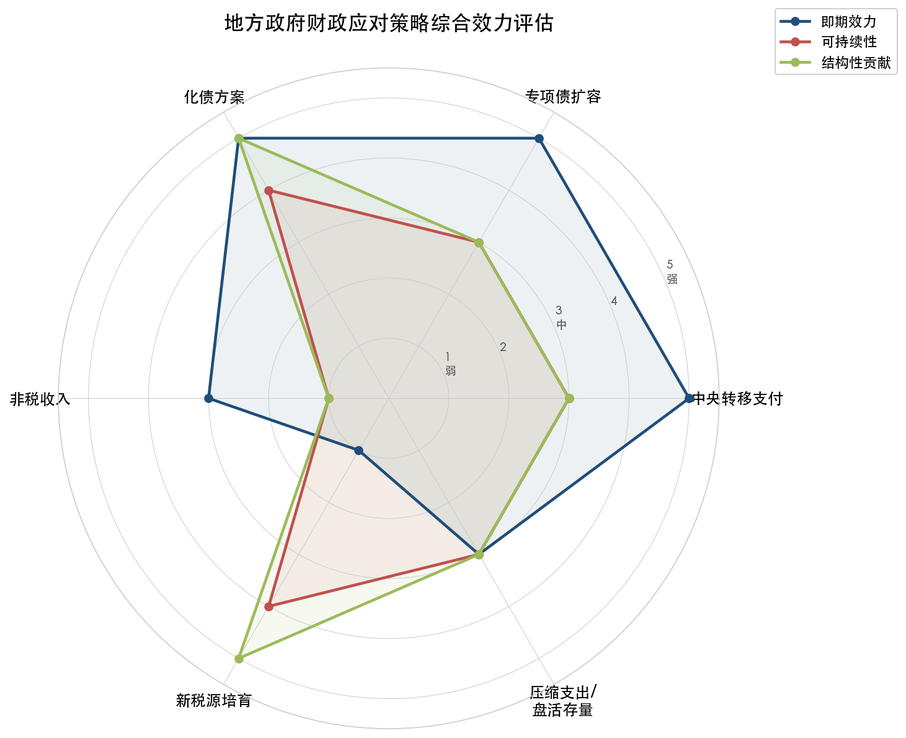

图4-3以雷达图形式直观呈现了六类政策工具在即期效力、可持续性和结构性贡献三个层面的综合表现。化债方案和新税源培育在结构性贡献维度得分最高，非税收入则在可持续性和结构性贡献两个维度均表现最弱。

上述评估表明，当前地方政府应对土地财政收缩的策略组合呈现"以短期工具应急、以中长期制度建设破局"的二元特征。转移支付和专项债扩容属于即期"强工具"，能够在短期内有效托底地方财力；化债方案通过制度性减负释放财政空间，兼具即期和中期效应；非税收入是应急手段但不可持续；新税源培育和支出改革则指向长期的制度转型。

从总量视角观察，2025年土地出让收入较2021年峰值减少约4.55万亿元，而中央转移支付较2021年增加约1.5万亿元（2021年约8.7万亿元→2025年约10.2万亿元），专项债限额增加约8200亿元（2021年36500亿元→2025年44000亿元），化债年释放空间超万亿元——三者合计基本覆盖了土地出让金的总量缺口。但在区域分布上高度不均衡：一线城市和强二线城市能够通过自身税基维持财政相对稳健，而三四线城市和中西部地区则几乎完全依赖转移支付和化债政策维持运转。

我们判断，在房地产市场完成深度调整、新税源培育形成规模之前，上述政策工具箱将持续发挥"稳定器"和"过渡器"功能。关键在于把握好债务扩张与风险防控的平衡点，确保"在发展中化债、在化债中发展"的战略目标切实落地。

# 第5章 未来展望与风险评估（2026年4月—2026年9月）

## 5.1 前瞻研判的基准框架

前四章的分析构建了一幅完整的图景：2021—2025年间，房地产相关收入（五项税收+土地出让金）占地方广义财政总收入的比重从52.6%降至33.9%，土地出让收入较峰值累计减少约4.55万亿元；区域层面呈现"一线韧性、三四线断崖"的极端分化；地方政府已形成涵盖转移支付、专项债、化债、非税收入与新税源培育的多层次应对体系，但整体仍处于"短期工具应急与中长期制度建设并行"的过渡阶段。

本章基于上述事实基座，对2026年4月至9月地方财政收入的走势进行前瞻研判。前瞻分析天然面临不确定性，以下判断均建立在明确的假设条件之上，并针对假设偏离时的风险情景设计了压力测试。

## 5.2 房地产市场走势研判：调整尾声但企稳基础尚不牢固

### 5.2.1 主流机构的趋势判断

多家国内外机构的研判指向同一方向：2026年大概率是中国房地产本轮下行周期的最后一年，但"止跌企稳"将呈渐进过程而非V型反弹。

中国金融四十人研究院（CF40）2026年3月发布的研究报告，基于1970年以来国际22次房地产泡沫破裂数据的系统比较，得出三项核心结论：其一，中国房地产各项指标近四年累计跌幅已全面超过22次样本的同期平均水平——商品房销售面积累计下降约53%（样本均值27%），新开工面积累计下降71%（样本均值51%），二手房实际价格累计下降约40%（样本均值27%）；其二，以价格表现偏弱的样本为参照，中国房地产调整已十分接近尾声；其三，2026年新房与二手房加总口径下的销售面积、实际房价、名义房价及实际住宅资本形成跌幅预计收窄至5%以内，新开工面积跌幅预计收窄至5%—10%。[CF40研究](https://finance.sina.com.cn/wm/2026-03-15/doc-inhrafps3403649.shtml "2026年中国房地产市场：走向止跌回稳")

CF40研究同时指出，2026年之后上述指标预计将呈现"结构性"企稳——总量同比止跌，一线、新一线、强二线城市企稳甚至回升，其余城市仍有走弱趋势。2026年初一线城市高频数据已出现内生性企稳迹象：1—2月一线城市二手房日均成交套数明显回升，二手房成交均价在无政策刺激下出现阶段性企稳，系近五年来首次无政策催化的内生性价格企稳信号。[CF40研究](https://finance.sina.com.cn/wm/2026-03-15/doc-inhrafps3403649.shtml "一线城市高频数据出现内生性企稳迹象")

中信证券的判断与CF40趋同，认为2026年是房价"止跌回稳"的关键年，预计全国商品房销售面积同比下降2.2%，销售金额同比下降1.4%。[知乎转载中信证券报告](https://zhuanlan.zhihu.com/p/2003752893988242158 "2026年房价走势预测汇总") 摩根士丹利则更为审慎，预测2026年新房价格仍有2%—3%的惯性下跌，核心城市全面复苏或需等到2027年下半年。[中欧国际工商学院](https://cn.ceibs.edu/emba/global-view/28419 "2026：房地产能触底吗？")

克而瑞则从行业供给侧角度提出市场已释放六大止跌企稳信号：房价调整幅度约22%已超过国际平均水平，新开工规模下降74%已超过国际深度调整水平，2026年房地产行业有望实现止跌企稳。[观察者网](https://www.guancha.cn/economy/2026_01_08_803231.shtml "六大信号释放，机构预测2026年止跌企稳")

### 5.2.2 对土地出让收入的传导节奏

房地产市场的缓跌企稳趋势将以何种节奏传导至土地出让收入，是研判地方财政走势的核心变量。

中诚信国际研究院院长袁海霞2026年3月指出，"2025年土地出让底价已有所企稳，若2026年土地出让底价与去年一致，通过预测模型可得2026年国有土地使用权出让收入约3.8万亿元，较2025年同比下滑8.1%，降幅收窄6.6个百分点"。[证券时报](https://www.stcn.com/article/detail/3678383.html "2026年预算草案解读") 该预测意味着土地出让收入仍将延续下行，但下降斜率明显趋缓。

然而，2026年1—2月的实际数据传递出更为审慎的信号：全国土地出让收入3547亿元，同比下降25.2%，降幅较2025年全年（-14.7%）显著扩大。[财政部2026年1—2月财政收支情况](http://gks.mof.gov.cn/tongjishuju/202603/t20260319_3985695.htm "财政部国库司发布") 野村中国首席经济学家陆挺对此评价称，"今年1—2月数据显示百强房企商品房销售额同比下降约30%，表明房地产市场尚未实现真正的企稳复苏"。[证券时报](https://www.stcn.com/article/detail/3678383.html "陆挺对土地市场的判断")

综合研判，我们预计2026年4—9月土地出让收入将呈现"前低后稳"的走势：上半年（4—6月）受2025年同期基数效应及房企拿地意愿恢复滞后的双重影响，降幅仍将维持在10%—15%区间；进入三季度（7—9月），随着一线和强二线城市"缩量提质"供地策略持续推进、核心地块溢价成交的带动效应显现，降幅有望收窄至个位数。全年来看，土地出让收入预计在3.7—4.0万亿元区间，同比下降4%—11%，降幅较2025年进一步收窄。

### 5.2.3 对房地产相关税收的传导节奏

房地产相关税收同样将延续结构性分化态势。2026年1—2月数据显示，契税650亿元（同比-11.1%），土地增值税806亿元（同比-8.2%），降幅较2025年全年略有收窄；房产税831亿元（同比+11.6%），保有环节税种继续维持正增长。[财政部2026年1—2月财政收支情况](http://gks.mof.gov.cn/tongjishuju/202603/t20260319_3985695.htm "财政部国库司发布")

展望2026年4—9月，在商品房销售面积降幅收窄至5%以内（CF40基准情景）的假设下，契税和土地增值税的降幅有望逐步收窄。预计全年五项房地产相关税收在1.65—1.75万亿元区间，较2025年的1.77万亿元基本持平或小幅下降。交易环节税收（契税、土地增值税）仍将承压，但保有环节税收（房产税、城镇土地使用税）的持续正增长将形成一定对冲效应。

## 5.3 2026年财政预算安排对地方财力的支撑力度

### 5.3.1 预算框架的整体安排

2026年财政预算延续"更加积极"的基调。核心参数如下：赤字率按4%左右安排（与2025年持平），全国财政赤字5.89万亿元，较上年增加2300亿元，其中中央财政赤字50900亿元、地方8000亿元；全国一般公共预算支出规模首次突破30万亿元，达300100亿元，同比增长4.4%。[2026年预算报告](http://www.npc.gov.cn/npc/c2/kgfb/202603/t20260306_452128.html "2026年预算草案") 新增政府债券总规模达11.89万亿元（赤字5.89万亿元+超长期特别国债1.3万亿元+专项债4.4万亿元+特别国债0.3万亿元），创历史新高。[新华网](https://www.news.cn/money/20260309/d54cb1f6f82b470a8cc633a628e113a9/c.html "2026'国家账本'释放新信号")

地方一般公共预算本级收入预计125030亿元，同比增长2.4%；地方政府性基金预算本级收入目标为52644.32亿元，与上年基本持平。[2026年预算报告](http://www.npc.gov.cn/npc/c2/kgfb/202603/t20260306_452128.html "地方预算安排") [证券时报](https://www.stcn.com/article/detail/3678383.html "第二本账目标收入持平") 中央对地方转移支付进一步增至104150亿元，同比增长2.2%，持续发挥区域间财力均衡器的功能。[2026年预算报告](http://www.npc.gov.cn/npc/c2/kgfb/202603/t20260306_452128.html "转移支付安排")

### 5.3.2 预算能否如期实现的风险评估

2026年一般公共预算收入增长2.2%的预期目标面临较大实现压力。财政部在预算报告中坦言："受国际经贸环境急剧变化、物价低位运行、房地产市场仍在调整等因素影响，财政收入增长面临较大压力。"[财政部2026年预算报告](https://www.mof.gov.cn/zhengwuxinxi/caizhengxinwen/202603/t20260316_3985331.htm "2026年财政收支平衡压力加大")

经济增长预期的下调进一步加大了财政收入压力。2026年经济增长预期目标调至4.5%—5%的区间，为1991年以来首次采用区间下限低于5%的目标设定。[新华网](https://www.news.cn/politics/20260305/2de863ac8a4a4c0fb66af27a6d44b0fd/c.html "2026年赤字率4%") IMF在2026年2月完成的第四条磋商中预计中国2026年GDP增速为4.5%，并指出"通缩压力预计将持续，通胀预计仅将缓慢上升"，GDP平减指数2026年预计为-0.7%。[IMF](https://www.imf.org/zh/news/articles/2026/02/18/pr-26053-china-imf-executive-board-concludes-2025-article-iv-consultation "2025年第四条磋商") 名义GDP增速偏低意味着税基扩张受限，将直接制约以增值税、企业所得税为代表的主体税种增收空间。

从地方层面看，31个省份2026年一般公共预算收入增速目标加权平均为2.7%，与2025年基本持平，分布在0.5%—10%之间。[新浪财经](https://finance.sina.com.cn/roll/2026-02-24/doc-inhnxnun2998111.shtml "31省份2026年财政收入增速目标") 值得警惕的是，2025年地方政府性基金预算本级收入实际执行数较年初预算目标短收幅度较大——年初预算目标为57185.03亿元，实际执行52647.67亿元，完成率仅92.1%。[2026年预算报告](http://www.npc.gov.cn/npc/c2/kgfb/202603/t20260306_452128.html "2025年政府性基金执行偏差") 2026年政府性基金预算本级收入目标与上年持平，在土地出让收入仍然承压的情况下，再度出现短收的可能性不容忽视。

综合评估，我们预计2026年4—9月地方一般公共预算本级收入将保持2%—3%的温和增长，但政府性基金预算本级收入的实现仍面临较大不确定性。在中央转移支付增至10.42万亿元、专项债维持4.4万亿元的政策托底下，地方综合可用财力大概率能够维持总体稳定，但财政收支紧平衡态势将贯穿全年。

## 5.4 核心风险点识别与评估

### 5.4.1 风险一：债务付息压力持续攀升

地方政府显性债务规模已十分庞大。截至2025年末，地方政府债务余额达548230.82亿元（含用于置换存量隐性债务的地方政府债券），控制在全国人大批准的限额以内，其中一般债务余额175120亿元、专项债务余额373110亿元。[2026年预算报告](http://www.npc.gov.cn/npc/c2/kgfb/202603/t20260306_452128.html "2025年末地方政府债务余额") [全国人大财经委审查报告](http://lianghui.people.com.cn/2026/n1/2026/0310/c461827-40679267.html "地方债务结构")

债务余额攀升直接推高付息成本。2025年，中央一般公共预算债务付息支出8193.61亿元，完成预算的98.2%。[2026年预算报告](http://www.npc.gov.cn/npc/c2/kgfb/202603/t20260316_3985331.htm "2025年中央债务付息支出") 在地方层面，惠誉2025年5月的研究指出，2020—2024年地方政府直接债务年均复合增长率达24%，专项债占地方政府债务总额的65%；2023年已有10个省份专项债付息支出占比高于10%，付息压力不容小觑。[财新网](https://economy.caixin.com/2025-05-28/102323971.html "惠誉关注地方专项债付息压力") [第一财经](https://www.yicai.com/news/102837216.html "部分地方专项债偿还压力")

2026年预算报告明确提出"政府债务利息支出继续增长"是财政面临的挑战之一。[2026年预算报告](https://www.mof.gov.cn/zhengwuxinxi/caizhengxinwen/202603/t20260316_3985331.htm "债务利息增长压力") 10万亿化债方案虽然通过隐性债务显性化、降低利息成本释放了一定财政空间——化债平均利息成本降低超过2.5个百分点，2024—2028年累计可节约利息支出约6000亿元——但置换后的显性债务规模急剧膨胀，将在未来数年持续推高付息总量。[财新网](https://topics.caixin.com/2026-03-05/102419842.html "化债进展")

我们判断，2026年4—9月地方政府债务付息支出将继续刚性增长，预计全年地方政府债务利息支出处于1.3—1.5万亿元区间，占地方一般公共预算支出的比重将进一步上升。付息支出的刚性膨胀将持续挤压地方政府用于基础设施投资和公共服务的可支配财力。

### 5.4.2 风险二：公共服务支出刚性与"三保"底线压力

"保基本民生、保工资、保运转"（简称"三保"）是地方财政不可逾越的底线。财政部2024年10月披露的数据显示，以2023年为例，基层"三保"支出约占可用财力的五成左右，若加上其他刚性支出则占可用财力的八成左右。[中国新闻网](https://www.chinanews.com.cn/cj/2024/10-12/10300189.shtml "财政部：三保支出占可用财力约五成")

中央决策层对"三保"问题的重视程度持续升级。2025年12月中央经济工作会议首次提出"重视解决地方财政困难，兜牢基层'三保'底线"。[中央经济工作会议](https://www.mofcom.gov.cn/syxwfb/art/2025/art_de35cba3eb5d4c369b089135e92ba890.html "2025年中央经济工作会议") 2026年全国财政工作会议上，财政部部长蓝佛安再次强调守住"三保"底线。[中国评论新闻](https://bj.crntt.com/doc/7_0_107156096_1.html "2026年全国财政工作会议") 2026年预算报告进一步部署"支持解决地方财政困难，推进基本公共服务均等化"。[2026年预算报告](https://www.mof.gov.cn/zhengwuxinxi/caizhengxinwen/202603/t20260316_3985331.htm "支持解决地方财政困难")

公共服务支出的刚性特征在2026年进一步凸显。全国一般公共预算支出首次突破30万亿元，同比增长4.4%；社会保险基金预算中，财政补贴收入29115.23亿元，同比增长10.8%，主要源于各级财政对基本养老保险和城乡居民基本医疗保险补助的增加。[2026年预算报告](https://www.mof.gov.cn/zhengwuxinxi/caizhengxinwen/202603/t20260316_3985331.htm "社保基金财政补贴增长") 城乡居民基础养老金标准再次提高20元，将进一步增加地方配套支出。[AgeClub](https://www.ageclub.net/article-detail/8630 "2026年预算草案养老金提标")

在收入端增长乏力、支出端刚性扩张的双重约束下，部分基层政府的财政收支矛盾将在2026年4—9月进一步加剧。如第3章所述，河南省预算报告已坦承"一些地方'三保'压力较大"；[第一财经](https://www.yicai.com/news/103045024.html "河南预算报告") 山西、陕西、内蒙古、青海等4个省份2025年一般公共预算收入同比负增长，[第一财经](https://www.yicai.com/news/103045024.html "四省收入负增长") 其基层"三保"压力在2026年将更为突出。

### 5.4.3 风险三：城投平台转型滞后与经营性债务风险

化债"下半程"中，融资平台经营性债务的化解构成重要难点。截至2025年底，超82%的融资平台已完成退出，融资平台存量经营性金融债务规模下降超74%。[财新网](https://topics.caixin.com/2026-03-05/102419842.html "超82%融资平台退出") 然而，"退出"并不等同于风险消除——部分平台仅完成形式上的"摘帽"，实质性业务转型仍处推进之中。

2026年预算报告提出将"多措并举化解地方政府融资平台经营性债务风险"，[证券时报](https://www.stcn.com/article/detail/3638167.html "地方化债新动向") 表明决策层对这一领域的风险敞口保持高度警觉。IMF在第四条磋商报告中明确建议"通过破产框架对不可持续的地方政府融资平台债务实施重组"，同时提醒"应谨慎应对金融部门的溢出效应"。[IMF](https://www.imf.org/zh/news/articles/2026/02/18/pr-26053-china-imf-executive-board-concludes-2025-article-iv-consultation "IMF政策建议")

安徽省财政厅此前指出，土地资源价值持续缩水导致以土地为核心的政府投融资链条运转受阻——城投平台资产质量下降影响偿债能力，抵押品价值衰减制约金融机构信贷投放，政府综合可用财力进一步削弱。[证券时报](https://www.stcn.com/article/detail/3624762.html "安徽省财政厅分析") 这一"土地贬值→城投资产恶化→偿债能力下降→融资受限→投资收缩"的负向循环，在三四线城市和中西部地区尤为显著。

我们预计，2026年4—9月城投平台经营性债务风险将保持总体可控但局部承压的态势。关键变量在于土地出让市场能否企稳——若土地出让收入降幅持续扩大，城投平台以土地资产为抵押的融资链条将面临更大压力，个别城市出现区域性信用事件的概率不容忽视。

### 5.4.4 风险四：外部冲击的叠加效应

国际经贸环境的不确定性构成对地方财政的重要外生冲击。美国自2025年4月起对中国输美商品加征大幅关税，IMF指出"关税和贸易政策不确定性的持续影响"是中国2026年GDP增速放缓至4.5%的主要原因之一。[IMF](https://www.imf.org/zh/news/articles/2026/02/18/pr-26053-china-imf-executive-board-concludes-2025-article-iv-consultation "IMF增长预测")

从财政传导链条看，出口下滑将通过"出口减少→制造业营收下降→增值税和企业所得税减收→地方留存税收缩减"的路径影响地方财政收入。2025年前11个月，中国对美出口同比下降18.9%，较上年同期减少897.6亿美元。[21财经](https://www.21jingji.com/article/20251214/herald/a56e7b2180648e1dd0fb3313aa0a21dd.html "对美出口下降") 虽然贸易多元化战略部分对冲了美国市场的流失——对东盟出口同比增加723.76亿美元——但对外贸依赖度较高的沿海出口型省份（广东、浙江、江苏、山东等）的税收增速已受到一定拖累。

2026年预算报告将"国际经贸环境急剧变化"列为财政收入增长面临压力的首要因素。[财政部2026年预算报告](https://www.mof.gov.cn/zhengwuxinxi/caizhengxinwen/202603/t20260316_3985331.htm "外部环境影响") 粤开证券首席经济学家罗志恒展望2026年出口形势时指出，若高烈度关税战短期不再升级，中国对美出口降幅有望收窄，对整体出口的拖累将随之减弱。[新浪财经](https://finance.sina.cn/zl/2025-12-22/zl-inhcrpzt8054897.d.html "罗志恒2026年出口展望") 李迅雷的判断类似，认为2026年中美关税有望维持稳定，中国出口订单份额预计将进一步提高。[新浪财经](https://finance.sina.cn/zl/2026-01-04/zl-inhfawky7709582.d.html "李迅雷2026年展望")

关键风险在于：若国际经贸摩擦再度升级（如美国在中期选举前出台新一轮关税措施），叠加国内房地产市场调整尚未结束，将形成"内外双杀"的局面。在此情景下，出口依赖型省份将同时面临"关税冲击→出口下滑→制造业税收减收"与"房地产低迷→土地出让金缩减→政府性基金收入下降"的双重夹击，财政收支矛盾将显著加剧。

## 5.5 压力测试：超预期下行情景分析

为全面评估地方财政面临的风险敞口，我们设定基准情景和两个压力情景进行对比分析。图5-1以可视化方式呈现了三种情景下六项核心指标的差异与风险等级。

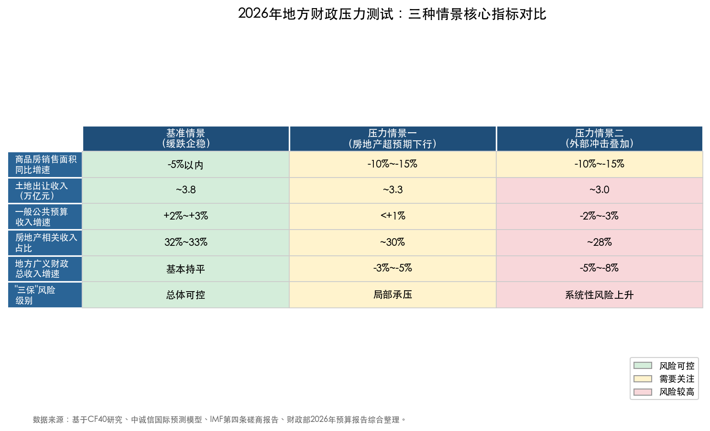

<b>图5-1 2026年地方财政压力测试：三种情景核心指标对比</b>

### 5.5.1 基准情景：缓跌企稳

**假设条件**：房地产市场沿CF40基准路径调整，销售面积和房价跌幅收窄至5%以内；土地出让收入全年同比下降约8%；一般公共预算收入增长2%—3%；国际经贸环境总体稳定，不出现新一轮高烈度关税冲击。

**预计结果**：地方广义财政总收入（一般公共预算+政府性基金）与2025年基本持平或小幅增长。房地产相关收入占地方财政总收入的比重进一步降至32%—33%，但降速明显趋缓。在中央转移支付10.42万亿元和专项债4.4万亿元的托底下，地方综合可用财力总体稳定。区域分化格局延续：一线和强二线城市财政保持韧性，三四线城市和中西部地区继续依赖转移支付维持运转。

### 5.5.2 压力情景一：房地产超预期下行

**假设条件**：房地产市场未能如期企稳，商品房销售面积同比下降10%—15%，房价降幅扩大至8%—10%；土地出让收入全年同比下降20%以上（降至约3.3万亿元）；一般公共预算收入增速降至1%以下。

**触发因素**：大型房企出现新一轮信用风险事件；居民购房预期持续恶化；人口负增长效应加速释放。

**预计结果**：地方政府性基金预算本级收入较预算目标短收约5000—8000亿元，短收规模较2025年进一步扩大。地方广义财政总收入同比下降3%—5%。在此情景下：（1）部分三四线城市和中西部县级政府的"三保"将面临实质性压力，需要中央追加转移支付或动用预备费；（2）城投平台经营性债务风险在土地资产进一步贬值背景下可能局部暴露；（3）地方基础设施投资将进一步被动收缩，拖累固定资产投资增速。

### 5.5.3 压力情景二：外部冲击叠加

**假设条件**：在房地产下行情景的基础上，叠加国际经贸环境恶化——美国加征新一轮关税或全球贸易增速大幅放缓（WTO已将2026年全球货物贸易增长预期下调至0.5%）；[《求是》杂志](https://www.qstheory.cn/20251228/8bfa4461541d465bbb9cb078b9532eb4/c.html "WTO下调2026年贸易增速") 中国出口同比转为负增长，工业企业利润大幅下滑。

**预计结果**：在房地产和出口"双引擎失速"的极端情况下，全国一般公共预算收入可能出现负增长，重现2022年受大规模留抵退税影响时的负增长局面。地方财政将面临最为严峻的考验：（1）增值税、企业所得税作为两大主体税种同时减收，一般公共预算收入增速可能降至-2%至-3%；（2）出口依赖型省份（广东、浙江、江苏）和房地产调整深度省份（河南、安徽、贵州）将承受最大冲击；（3）非税收入"以费补税"的空间已在2025年显著收窄（全年非税收入同比-11.3%），无法有效弥补缺口；（4）中央财政本身也将面临收入压力，转移支付追加空间受限。

IMF在第四条磋商中明确指出，中国经济前景面临的风险"仍偏向下行"，"主要的国内风险是如果房地产行业的收缩超出预期，其与高企的债务水平一起，可能导致内需进一步疲软、通缩长期延续以及持续依赖出口。而贸易紧张局势可能重新升级则是主要的外部下行风险"。[IMF](https://www.imf.org/zh/news/articles/2026/02/18/pr-26053-china-imf-executive-board-concludes-2025-article-iv-consultation "IMF风险评估")

## 5.6 2026年下半年地方财政走势的综合研判

### 5.6.1 总量层面的判断

综合上述分析，我们对2026年4—9月地方财政走势做出以下研判。图5-2直观展示了2021年以来地方广义财政收入的结构变迁及2026年预测路径。

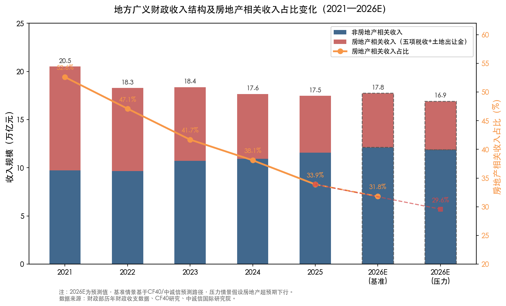

<b>图5-2 地方广义财政收入结构及房地产相关收入占比变化（2021—2026E）</b>

**第一，地方广义财政收入总量预计维持"紧平衡"状态。** 在基准情景下，房地产相关收入（土地出让金+五项税收）预计在5.5—5.8万亿元区间，较2025年的5.92万亿元小幅收缩。然而，中央转移支付、专项债和化债释放的财政空间将提供有效托底，地方综合可用财力不会出现断崖式下降。

**第二，房地产对地方财政的拖累效应正在边际递减。** 房地产相关收入占地方财政总收入的比重从2021年的52.6%已降至2025年的33.9%，下降近19个百分点。这意味着房地产市场的进一步调整对地方财政总量的边际冲击正在减弱——即便土地出让收入再下降10%（约4000亿元），其对地方广义财政总收入的影响也已从2021年的约5个百分点下降至约2.3个百分点。

**第三，财政收入质量仍在承压。** 2025年全国税收收入占一般公共预算收入的比重为81.6%（176363亿元/216045亿元），虽较2024年略有回升，但仍显著低于2018年的85.3%。在土地出让收入和交易环节税收双双下行、非税收入增长空间收窄的背景下，财政收入的稳定性和质量面临持续考验。

### 5.6.2 结构层面的判断

**区域分化将继续加深。** 土地出让市场的"缩量提质"趋势意味着核心城市将继续获取不成比例的土地出让收入份额——2025年TOP20城市宅地出让金已占全国比重52%。[中指研究院数据](https://finance.sina.com.cn/tech/roll/2026-01-16/doc-inhhpmsm2373116.shtml "TOP20城市占比52%") 2026年4—9月，一线城市和杭州、成都等强二线城市的财政状况有望保持相对稳健，而三四线城市及中西部地区的财政困境难以明显改善。

**政策工具箱的"切换期"特征将更加显著。** 2026年是化债"下半程"的关键年份，也是消费税改革、地方附加税改革等制度建设的推进期。在"旧引擎"（土地财政）加速退出、"新引擎"（消费财政、保有环节税收）尚未成形的空档期，地方政府将高度依赖中央转移支付和债务工具维持财政运转。消费税征收环节后移并稳步下划地方这一改革如能在2026年内取得实质性进展，将为地方财政注入重要的信心和增量预期。图5-3展示了从2021年土地财政峰值到2030年新税源体系基本成形的完整转型路径。

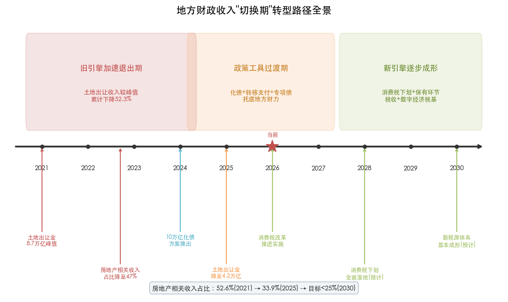

<b>图5-3 地方财政收入"切换期"转型路径全景（2021—2030年）</b>

### 5.6.3 政策应对的建议方向

基于上述研判，我们认为2026年4—9月地方财政政策应重点关注以下三个方向：

**一是强化底线思维，做好"三保"预案。** 在财政收支矛盾加剧的背景下，应优先确保基层"三保"资金足额到位。对于财政困难省份，建议适时启动中央预备费和应急转移支付机制，防止出现基层政府工资延发、基本民生保障中断等系统性风险事件。

**二是加快消费税改革落地节奏。** 消费税征收环节后移并下划地方是当前最具操作性、也最有望率先释放增量的制度改革。按2025年国内消费税16857亿元的收入规模，首批试点品目即便仅下划20%—30%，也可为地方增加3000—5000亿元年收入，对缓解土地出让金缺口具有实质意义。[央广网](https://www.cnr.cn/jingji/gundong/20260329/t20260329_527566033.shtml "消费税改革")

**三是严控新增隐性债务，防止"前清后欠"。** 10万亿化债方案的成效取决于能否同步遏制新增隐性债务。2026年预算报告已将"不新增隐性债务"作为"铁的纪律"，[2026年预算报告](http://www.npc.gov.cn/npc/c2/kgfb/202603/t20260306_452128.html "铁的纪律") 在地方财政收支矛盾加大的压力下，能否真正守住这条红线，将是检验化债成效的关键标尺。

# 结论与风险提示

## 核心结论

**第一，房地产低迷对地方财政的冲击程度——"深刻但非失控"。** 2021—2025年间，房地产相关收入占地方广义财政总收入的比重从52.6%降至33.9%，绝对减收规模接近4.9万亿元，其中土地出让收入较峰值累计减少约4.55万亿元，构成冲击主体。这是分税制改革以来地方政府面临的最大规模结构性减收。然而，依托中央转移支付（2025年约10.19万亿元）、专项债扩容（4.4万亿元）和十万亿化债方案的系统性支撑，地方财政并未出现系统性"断裂"，整体运行在"紧平衡"而非"失控"状态。

**第二，冲击的传导路径——多链条共振而非单点冲击。** 房地产低迷通过五条路径同步侵蚀地方财力：销售量价双降→契税锐减，土地市场冷却→出让金断崖与土地增值税收缩，开发投资下滑→建筑业关联税收承压，保有环节税种虽逆势增长但替代空间有限，非税收入"以费补税"不可持续。多条路径的共振效应使地方财政面临的是系统性、持续性的收缩压力，而非一次性的短期冲击。

**第三，区域影响——极端分化是最显著的结构特征。** 一线城市和少数强二线城市凭借产业多元化、人口净流入与土地"缩量提质"策略，维持了财政相对韧性；三四线城市和中西部地区则深陷"土地出让停滞→可用财力下降→经济吸引力减弱→人口外流加速→税基萎缩"的负向循环。2025年TOP20城市宅地出让金占全国比重已达52%，土地出让金向核心城市集中的格局正在固化。财政冲击的"马太效应"意味着，全国层面的总量数据遮蔽了基层财政困难的真实深度。

**第四，政策应对——"过渡期"格局已形成，制度转型是关键。** 中央转移支付与专项债扩容提供了有效的即期托底，十万亿化债方案通过制度性减负释放了财政空间，消费税下划和地方附加税改革则指向长期的制度转型。当前地方财政正处于"旧引擎"（土地财政）加速退出与"新引擎"（消费财政、保有税体系）尚未成形之间的空档期。这一"切换期"的顺利度过，取决于消费税改革的落地节奏、房地产市场的企稳进程以及化债方案的执行质效。

**第五，前瞻判断——2026年边际改善但不确定性犹存。** 在基准情景下，房地产相关收入预计在5.5—5.8万亿元区间，较2025年小幅收缩，但对地方财政的边际拖累效应正在递减。多家机构研判2026年大概率是房地产本轮下行周期的最后一年，CF40研究指出中国房地产各项指标累计跌幅已全面超过国际22次泡沫破裂样本的同期均值。然而，2026年1—2月全国土地出让收入同比下降25.2%，开局数据传递出更为审慎的信号，企稳基础仍不牢固。

## 风险提示

**债务付息压力的刚性膨胀。** 截至2025年末，地方政府债务余额达54.82万亿元。十万亿化债方案虽通过置换降低了利息成本（累计可节约约6000亿元），但显性化后的债务存量急剧攀升，预计2026年全年地方政府债务利息支出处于1.3—1.5万亿元区间，将持续挤压地方可支配财力。

**基层"三保"底线压力加大。** 基层"三保"支出约占可用财力的五成左右，加上其他刚性支出则占八成左右。在山西、陕西、内蒙古、青海等省份2025年一般公共预算收入已出现负增长的情况下，基层财政收支矛盾将在2026年进一步加剧。

**城投平台经营性债务的局部风险。** 超82%的融资平台已完成退出，但部分平台的实质性业务转型仍在推进中。土地资产持续贬值导致城投抵押品价值衰减、融资链条运转受阻，三四线城市和中西部地区出现区域性信用事件的概率不容忽视。

**外部冲击与房地产超预期下行的叠加风险。** 若国际经贸摩擦再度升级，叠加房地产市场调整超预期延长，将形成"内外双杀"局面。在此极端情景下，全国一般公共预算收入可能出现负增长，出口依赖型省份和房地产调整深度省份将承受最大冲击。

## 局限性分析

**第一，数据时效与完整性局限。** 本报告分析截至2026年3月，部分地方层面的精细数据（如地级市土地出让收入、建筑业分行业税收等）因官方未披露而无法精确量化。土地出让收入的"毛收入"与"净收入"区分依赖于约25%净收入比例的学术估算值，实际各地差异较大。

**第二，前瞻研判的固有不确定性。** 第5章对2026年下半年地方财政走势的预测建立在特定假设条件之上，房地产市场拐点的时间和幅度、消费税改革的落地节奏、国际经贸环境的演变等关键变量均存在显著不确定性。压力测试情景设定亦具有主观性，实际冲击路径可能偏离所设定的情景。

**第三，传导机制量化的难度。** 房地产低迷对建筑业、建材业、装修业等关联产业税收的间接影响，因财政部未单独披露分行业税收数据而难以精确测算。本报告对这一间接传导效应的分析以方向性判断为主，定量精度有限。

**第四，区域分析的代表性约束。** 本报告以一线城市、强二线城市、三四线城市及中西部地区为分析框架，选取了北京、上海、深圳、杭州、成都、安徽、河南、吉林等典型样本。但中国地方财政格局极为复杂，342个地级市和2800余个县级行政区的具体情况各异，典型案例的结论向全域推广时需审慎对待。

**第五，政策效应评估的滞后性。** 十万亿化债方案、消费税改革、专项债收储等多项政策仍在实施过程中，其对地方财政的全面效应尚需更长观察窗口方能准确评估。本报告对政策效力的判断主要基于已公开的阶段性进展数据，可能无法完整反映政策的中长期累积效果。
