# 执行摘要

机器学习（ML）与深度学习（DL）驱动的材料元素配比优化，正从学术前沿探索迈入工程化竞赛的新阶段。本报告系统梳理了该领域在方法论演进、研究生态、数据基础设施、模型性能评估、典型应用案例、核心挑战与产业化路径七个维度的研究进展与应用现状，给出以下核心判断。

**方法论已经历三次范式跃迁。** 2011年美国《材料基因组计划》开启数据驱动材料设计元年以来，该领域先后完成了"成分描述符+传统ML→图神经网络（GNN）端到端学习→通用基础模型预训练+微调"三轮核心范式升级。在 Matbench Discovery 标准基准上，材料稳定性预测 F1 从传统 ML（Voronoi RF）的 0.333 提升至 2026 年 eSEN-30M-OAM 的 0.925，进步幅度达 178%；形成能预测 MAE 降至 18 meV/atom，已逼近 DFT 不同泛函间的固有差异（PBE 与 r²SCAN 约 25–50 meV/atom）[Matbench Discovery官网](https://matbench-discovery.materialsproject.org/ "完整排行榜")。等变神经网络（MACE、eSEN 等）已成为精度前沿的事实标准，生成式模型（MatterGen、CDVAE）则打通了从目标性能到材料结构的逆向设计路径。

**全球研究生态呈现多极竞争与开放协作并行格局。** 北美（MIT、UC Berkeley/LBNL、UCSD/NUS）在方法论创新和开源工具链上占据主导地位；科技企业（Google DeepMind GNoME、Microsoft Research MatterGen、Meta FAIR UMA）以超大规模计算资源和工程化能力推进模型前沿；剑桥大学 Csányi 组在等变架构理论上持续引领；中国团队（深势科技/北大 DeePMD、中科大"机器化学家"）在产业化转化和特色应用场景上形成差异化竞争力。2025年前后出现的学术领军人物密集创业潮——Lila Sciences（3.5 亿美元 Series A）、Periodic Labs（3 亿美元种子轮，估值约 70 亿美元）、Radical AI（5,500 万美元种子轮）——标志着该领域正从学术探索进入技术商业化验证阶段。

**数据基础设施已从"匮乏"进入"计算数据富集但实验验证不足"的新阶段。** Materials Project（超 200,000 种材料）、AFLOW（约 390 万条目）、NOMAD（约 1,930 万条目）等计算数据库构成了 ML 模型训练的核心底座，OMol25（超 1 亿个 DFT 计算）等超大规模数据集进一步推高了数据密度。然而，实验数据（ICSD 约 32.8 万条）与计算数据之间仍存在 10–60 倍的量级差距，这一结构性不对称是制约模型从计算域向实验域迁移的根本瓶颈。

**闭环实验验证是将预测能力转化为发现成果的关键。** 纵观已取得突破的应用案例——Rao 等仅合成 17 种合金即发现高熵 Invar 合金（Science 2022）、CAMEO 19 次迭代 10 小时发现最优 GST467、机器化学家 6 周内从 376 万种组合中筛选最优 OER 催化剂、A-Lab 17 天自主合成 41 种新化合物——均采用了"物理约束预筛选→ML 代理模型预测→主动学习/贝叶斯优化迭代→实验验证闭环"的标准方法论范式。

**该领域面临八大核心挑战，各挑战的成熟度呈明显梯度分化。** 数据稀缺与分布不均衡、模型可解释性不足、实验验证鸿沟、迁移学习边界效应、多尺度建模衔接缺失、不确定性量化薄弱、物理约束嵌入需求和组合爆炸等挑战中，基础模型"预训练+微调"和等变架构已基本成熟（近期可解决，1–3 年）；实验验证鸿沟和不确定性量化方法的标准化有望在 3–5 年内显著缩小；多尺度建模的端到端解决方案则属长期挑战（5–10 年以上）。

**产业化路径呈三阶段递进态势。** 第一阶段"工具赋能期"（当前–2028 年）：ML/DL 作为加速工具嵌入现有研发流程，催化剂和电池电解液等反馈周期短的领域率先受益。第二阶段"闭环整合期"（2028–2032 年）：自主实验室（SDL）工程化部署达到规模临界点，催化剂和电池材料领域有望出现首批"AI 发现→工业生产"的标杆案例。第三阶段"范式转换期"（2032 年以后）：AI 从辅助工具演变为材料研发核心决策系统，结构合金和功能陶瓷等长认证周期领域逐步进入产业化通道。全球材料信息学市场规模预计从 2025 年的约 1.70 亿美元增长至 2030 年的约 4.10 亿美元（CAGR 约 19.2%）[MarketsandMarkets](https://www.prnewswire.com/news-releases/material-informatics-market-worth-410-4-million-in-2030---exclusive-report-by-marketsandmarkets-302389748.html "材料信息学市场规模预测")。

综合而言，ML/DL 驱动的材料配比优化已在模型精度、数据基础设施和方法论成熟度三个维度上取得实质性突破，但从实验室发现到规模化产业应用之间仍横亘着实验验证通量不足、多尺度建模缺失、监管框架滞后和认证周期刚性等系统性障碍。我们对该领域的产业化前景持审慎乐观态度：未来 3–5 年内催化剂领域最有可能出现首批完整商业化案例，5–10 年内 ML 辅助材料配比优化将成为研发标准工具，10–15 年内在制度框架适配的前提下有望进入范式转换阶段。

# 第1章 技术演进与方法论全景——ML/DL 驱动材料元素配比优化的技术路线图

## 1.1 从材料基因组计划到数据驱动范式的确立

材料科学的核心问题之一，是在庞大的化学组分空间中寻找满足特定性能需求的最优元素配比。传统"试错法"依赖实验直觉与经验积累，通常需要十年以上的周期才能将一种新材料从概念推进到工程应用。2011年6月，美国白宫发布《材料基因组计划》（Materials Genome Initiative, MGI），明确提出将新材料从实验室到应用的周期缩短一半、成本降低一半的战略目标，标志着高通量计算（high-throughput computing）与数据驱动材料设计（data-driven materials design）正式进入国家战略层面 [MGI白皮书](https://www.mgi.gov/sites/mgi/files/materials_genome_initiative-final.pdf "2011年MGI原始文件")。这一计划为此后十五年材料信息学（materials informatics）的蓬勃发展奠定了政策基础与资源保障。

MGI的核心理念在于通过"计算—实验—数据"三位一体加速材料创新。2012–2013年间，三大高通量计算材料数据库相继建立：Materials Project（Jain 等, APL Mater. 2013）、OQMD（Saal 等, JOM 2013）与 AFLOWLIB（Curtarolo 等, Comput. Mater. Sci. 2012），共同构建了数据驱动材料设计的基础设施底座。Curtarolo 等2013年在 Nature Materials 发表综述"The high-throughput highway to computational materials design"，系统论述了高通量筛选范式对传统材料研发模式的变革意义。上述数据库的建立使研究者首次能够以十万级规模的计算数据训练机器学习（machine learning, ML）模型，进而将统计学习方法引入材料组分空间的系统探索。

2016–2018年间，ML方法开始系统性地应用于材料性质预测与组分配比优化。Ramprasad 等2017年在 npj Computational Materials 发表综述，全面阐述了ML在材料科学中的应用框架与方法论体系，标志着数据驱动方法作为独立研究范式的正式确立 [npj Comput. Mater.综述](https://www.nature.com/articles/s41524-017-0056-5 "2017年材料信息学ML综述")。此后，该领域经历了从传统ML到图神经网络（GNN）、从监督学习到生成式模型、从单点预测到主动学习闭环的三次重大范式跃迁，逐步形成当前多方法并行、多尺度融合的技术格局。

在本章中，对上述核心术语做如下界定：**材料信息学**指将信息科学方法应用于材料研究的交叉学科；**逆向设计**（inverse design）指从目标性能出发反向搜索最优组分或结构的方法，与正向预测（forward prediction）相对；**高通量筛选**（high-throughput screening）指利用计算或实验自动化批量评估大量候选材料；**主动学习**（active learning）指模型在预测不确定性指导下迭代选择最有信息量的实验或计算进行验证；**组分空间**（composition space）指所有可能的元素配比构成的高维搜索空间；**描述符/特征工程**（descriptors/feature engineering）指将材料成分或结构信息编码为ML模型可处理的数值向量；**通用势模型/基础模型**（universal potential/foundation model）指在大规模多元素数据上预训练、可跨材料体系迁移使用的深度学习原子间势。

## 1.2 传统机器学习方法：成分描述符与贝叶斯优化

在深度学习（deep learning, DL）大规模介入之前，传统ML方法已在材料元素配比优化中取得了显著成果。这些方法以成分描述符（composition descriptors）为输入特征、目标性质为输出，利用随机森林（RF）、梯度提升树（GBT）、支持向量机（SVM）、高斯过程回归（GPR）等算法建立组分—性能映射关系。其核心优势在于数据效率高、模型可解释性好，尤其适合中小规模数据集场景（通常数百至数千个数据点）。

2016年，Xue、Balachandran 等在 Nature Communications 发表了具有里程碑意义的研究"Accelerated search for materials with targeted properties by adaptive design"，首次系统展示了GPR结合贝叶斯优化（Bayesian optimization）加速NiTi基形状记忆合金组分搜索的能力：通过自适应设计策略，将发现满足目标性能的合金成分所需实验次数减少约75% [Nature Communications论文](https://pmc.ncbi.nlm.nih.gov/articles/PMC4835535/ "Xue et al. Nat. Commun. 7, 11241, 2016")。该工作建立了"ML代理模型 + 贝叶斯获取函数 + 迭代实验验证"的经典范式，至今仍是小数据场景下材料配比优化的主流技术路线。

传统ML方法的特征工程体系在此阶段趋于成熟。Magpie（132个元素性质统计特征）和 XenonPy（290个组分特征）等描述符库提供了成分到数值向量的标准化映射，JARVIS-CFID 等通用描述符方案进一步拓展了特征覆盖范围。这些手工设计的特征虽然依赖领域知识，但在计算速度和少样本学习方面具有DL方法难以比拟的优势。

然而，传统ML方法的局限性同样不容忽视：其表达能力受限于特征工程的质量，难以自动捕获原子间的空间相互作用和拓扑关系；在大规模数据集上的性能天花板也显著低于后续GNN方法。在 Matbench Discovery 基准上，传统ML（Voronoi RF）的F1值仅为0.333，MAE高达0.148 eV/atom，与GNN模型存在5–7倍的精度差距 [Matbench Discovery官网](https://matbench-discovery.materialsproject.org/ "完整排行榜")。这些局限性驱动了研究社区向能够直接从原子结构中端到端学习的图神经网络方向转型。

## 1.3 图神经网络：从CGCNN到等变消息传递

图神经网络在材料科学中的应用，源于将晶体结构编码为图（graph）的关键洞察：原子作为节点、化学键或空间邻近关系作为边，通过消息传递机制（message passing）聚合局部原子环境信息以预测全局材料性质。这一思路彻底绕过了手工特征工程的瓶颈，实现了从原子坐标到材料性能的端到端学习。

**CGCNN——GNN材料预测的奠基之作。** 2018年4月，Xie 与 Grossman 在 Physical Review Letters 发表晶体图卷积神经网络（Crystal Graph Convolutional Neural Network, CGCNN），首次将晶体结构编码为图并通过图卷积学习材料性质，实现了对形成能、带隙、弹性模量等8种性质的高精度预测，累计被引超1,388次 [PRL论文](https://link.aps.org/doi/10.1103/PhysRevLett.120.145301 "Xie & Grossman, Phys. Rev. Lett. 120, 145301, 2018")。CGCNN的核心贡献在于证明GNN能够直接从晶体结构中学习有意义的化学表示——其图卷积层的局部聚合机制天然提供了一定程度的可解释性，可提取原子环境对全局性质的贡献。

**MEGNet——分子与晶体的统一框架。** 2019年4月，Chen 与 Ong 等在 Chemistry of Materials 发表 MatErials Graph Network（MEGNet），将图网络扩展为分子和晶体的通用框架。MEGNet在QM9分子数据集13项性质中11项超越此前最优的 SchNet 模型，其关键创新包括引入全局状态输入（如温度、压力）和元素嵌入迁移学习机制，累计被引超927次。值得注意的是，MEGNet学到的元素嵌入向量在t-SNE/UMAP投影中自动聚类为与化学族群对应的簇，表明模型确实捕获了底层化学知识 [Chem. Mater.论文](https://pubs.acs.org/doi/abs/10.1021/acs.chemmater.9b01294 "Chen et al., Chem. Mater. 31, 3564, 2019")。

**等变网络的崛起——从MACE到前沿架构。** 材料GNN的第二次飞跃来自等变神经网络（equivariant neural networks）的引入。物理系统天然具备平移不变性、旋转等变性和粒子交换对称性，将这些对称性硬编码入网络结构可显著提升数据效率和泛化能力。2022年，Batatia 等在 NeurIPS 2022 提出 MACE（Multi-ACE），采用高阶等变消息传递和 Clebsch-Gordan 乘积，仅需两层消息传递即可达到高精度，成为等变GNN的代表性架构 [NeurIPS论文](https://arxiv.org/abs/2206.07697 "Batatia et al., MACE, NeurIPS 2022")。从 Matbench Discovery 排行榜的数据来看，等变架构的精度优势具有统计显著性：非等变的CGCNN（F1=0.507, MAE=0.138 eV/atom）和 MEGNet（F1=0.510, MAE=0.130 eV/atom）均显著落后于等变的 MACE-MP-0（F1=0.669, MAE=0.057 eV/atom）；截至2026年3月，该排行榜前十名模型全部基于等变架构 [Matbench Discovery官网](https://matbench-discovery.materialsproject.org/ "等变vs非等变性能对比")。

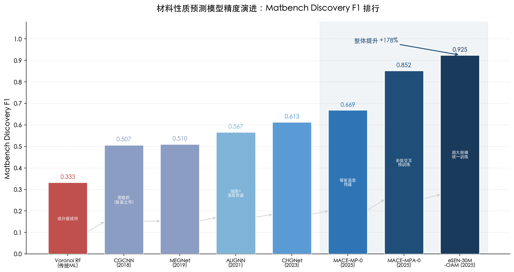

上图展示了从传统ML（Voronoi RF, F1=0.333）到超大规模统一训练模型（eSEN-30M-OAM, F1=0.925）的精度演进阶梯，整体F1提升幅度达178%。等变架构时代的到来标志着材料性质预测精度的质变跃迁。

**GNoME——GNN规模化的里程碑。** 2023年11月，Google DeepMind 在 Nature 发表 GNoME（Graph Networks for Materials Exploration），通过六轮大规模主动学习循环训练GNN，发现超过220万个稳定晶体结构，其中381,000个为此前从未报道的新稳定材料，使已知稳定晶体从约48,000增加近一个数量级。GNoME 的形成能预测误差低至11 meV/atom，结构管线稳定预测命中率从训练初期的不足6%提升至超过80%，736个预测结构获独立实验验证 [Nature论文](https://www.nature.com/articles/s41586-023-06735-9 "Merchant et al., Nature 624, 80–85, 2023")。GNoME 的意义不仅在于材料发现的规模突破，更在于验证了神经网络缩放定律（scaling law）在材料科学中的适用性——更多数据与更大模型能够产生涌现式的域外泛化能力。

## 1.4 Transformer 架构与周期性图表示

尽管GNN在材料性质预测中占据主导地位，Transformer 架构近年来也被引入晶体材料领域，旨在利用全局注意力机制捕获GNN局部消息传递中可能遗漏的长程相互作用与周期性模式。

2022年，Yan、Lin 与 Ji 等在 NeurIPS 2022 提出 Matformer（Periodic Graph Transformer），专门面向周期性图表示学习设计。Matformer 的核心创新体现在两方面：其一，在图构建阶段严格保证周期不变性（periodic invariance），即表示不随晶胞边界的人为移动而改变——这是此前多数GNN模型未显式处理的问题；其二，通过自连接边（self-connecting edges）显式编码晶格矩阵L中的周期重复模式，利用六个几何距离（||ℓ₁||, ||ℓ₂||, ||ℓ₃||, ||ℓ₁+ℓ₂||, ||ℓ₂+ℓ₃||, ||ℓ₁+ℓ₃||）完整确定晶格形状 [NeurIPS论文](https://proceedings.neurips.cc/paper_files/paper/2022/file/6145c70a4a4bf353a31ac5496a72a72d-Paper-Conference.pdf "Yan et al., Matformer, NeurIPS 2022")。在 Materials Project 和 JARVIS 数据集的五项晶体性质预测任务中，Matformer 一致优于CGCNN、MEGNet、GATGNN、ALIGNN 等基线方法，在 Matbench v0.1 基准中亦取得有竞争力的表现。

Matformer 之后，Transformer 在材料科学中的应用版图进一步拓展。2024年 ICLR 发表的 Crystalformer 采用无穷连接注意力（infinitely connected attention）机制，通过模仿原子间势求和实现自注意力，直接处理周期性结构的无限重复特性。CrystalFormer（深势科技/上海交大 Zhang 等, Science Bulletin 2025）则将 Transformer 应用于晶体结构生成，提出空间群信息嵌入的自回归生成模型，支持以空间群为条件控制生成过程 [CrystalFormer](https://arxiv.org/abs/2403.15734 "Zhang et al., CrystalFormer, 2024")。这些工作表明，Transformer 架构在材料科学中正从纯性质预测拓展到结构生成与逆向设计。

值得指出的是，当前Transformer在材料领域的应用规模和精度尚未系统性超越等变GNN。Matbench Discovery 排行榜上排名最高的模型仍以等变GNN架构为主（eSEN、MACE、PET系列），Transformer 的优势更多体现在全局长程作用和周期性编码方面。我们判断，二者在未来有望走向架构融合。

## 1.5 生成式模型：从VAE到扩散模型的逆向设计革命

逆向设计的核心问题在于"给定目标性能，如何直接生成满足条件的材料组分和结构"。与正向预测（给定材料预测性能）不同，逆向设计需要在高维组分/结构空间中进行面向目标的采样，生成式模型为此提供了原理性解决方案。

**VAE——分子逆向设计的方法论起源。** 2018年，Gómez-Bombarelli 等在 ACS Central Science 发表"Automatic Chemical Design Using a Data-Driven Continuous Representation of Molecules"，首次将变分自编码器（VAE）应用于分子逆向设计 [ACS Cent. Sci.论文](https://pubs.acs.org/doi/10.1021/acscentsci.7b00572 "Gómez-Bombarelli et al., ACS Cent. Sci. 4, 268–276, 2018")。该工作的关键思想是将离散的分子SMILES表示映射到连续潜在空间，在潜在空间中执行性质引导的梯度优化，再解码回分子结构。这一"编码—优化—解码"框架成为此后所有生成式材料设计的方法论母本。

**CDVAE——周期性材料的扩散-变分混合模型。** 2022年1月，Xie 与 Fu 等在 ICLR 2022 发表了 Crystal Diffusion Variational Autoencoder（CDVAE），首次将扩散过程与VAE结合用于周期性材料结构生成。CDVAE 在结构重建、材料生成和定向性质优化三项任务上均显著超越此前方法，开创了扩散模型在材料逆向设计中的应用 [ICLR论文](https://openreview.net/forum?id=03RLpj-tc_ "Xie et al., CDVAE, ICLR 2022")。

**MatterGen——多模态条件扩散的产业化突破。** 2025年1月，Microsoft Research 在 Nature 发表 MatterGen，实现了对原子类型、原子坐标和晶格参数的同步扩散去噪生成。MatterGen 的核心指标引人瞩目：稳定、唯一且新颖（SUN）的材料比例达此前最优模型的两倍以上；95%生成结构的RMSD低于0.076 Å，较前代方法降低一个数量级；实验合成验证的 TaCr₂O₆ 体弹性模量与设定目标偏差在20%以内 [Nature论文](https://www.nature.com/articles/s41586-025-08628-5 "Zeni et al., Nature 639, 624–632, 2025")。更为关键的是，MatterGen 展示了多目标约束生成能力——联合约束高磁性密度和低供应链风险指数，在生成过程中直接消除高风险元素并产出帕累托前沿新材料，使生成式模型首次能够在多维性能-成本空间中面向工程需求直接进行材料设计。

**LLM辅助的材料逆向设计。** 大语言模型（LLM）亦被引入材料逆向设计前沿。2024年，Antunes 等在 Nature Communications 发表基于自回归LLM的晶体结构生成方法（Nat. Commun. 15, 10570, 2024），展示了语言模型在序列化材料表示上的生成能力。2025年，Zhang 等在 Advanced Functional Materials 发表综述，系统梳理了LLM在材料科学中的应用版图，涵盖文献挖掘、性质预测、逆向设计与实验规划等多个维度 [Adv. Funct. Mater.综述](https://advanced.onlinelibrary.wiley.com/doi/10.1002/adfm.202525897 "Zhang et al., LLMs for Materials Design, 2025")。

从技术路线的演进脉络来看，生成式模型经历了"VAE → 扩散模型 → 条件扩散模型 → LLM自回归生成"的发展历程，每一代模型在生成质量、条件控制能力和物理合理性方面均有显著提升。当前的前沿方向是将扩散模型与实验验证闭环结合，实现"设计—生成—合成—表征"的全自动化流程。

## 1.6 通用势模型与基础模型：迈向跨体系迁移

如果说传统ML和早期GNN是为特定材料体系训练的"专才"，通用势模型和基础模型则代表了"通才"路线——在大规模多元素数据上预训练，以期为任意材料体系提供开箱即用的原子模拟能力。

**M3GNet——通用图深度学习原子间势的先驱。** 2022年，Chen 与 Ong 在 Nature Computational Science 发表 M3GNet，这是首个覆盖元素周期表89种元素的通用图深度学习原子间势（Nat. Comput. Sci. 2, 718, 2022）。M3GNet 基于 Materials Project 的分子动力学轨迹数据训练，可对任意无机材料体系进行结构弛豫和能量预测，为后续基础模型的发展奠定了基准。

**MACE-MP-0——少样本微调的范式突破。** 2025年11月，Batatia 与 Csányi 等在 J. Chem. Phys. 发表 MACE-MP-0 基础模型。该模型仅在 Materials Project 轨迹数据集训练，即可对几乎所有材料体系提供开箱即用的原子模拟能力；更为关键的是，通过约5个DFT数据点的微调即可从定性预测提升至第一性原理精度。在QMOF数据库（13,912个金属-有机框架材料）上的零样本能量预测MAE为0.040 eV/atom，展示了强大的跨域泛化能力 [J. Chem. Phys.论文](https://pubs.aip.org/aip/jcp/article/163/18/184110/3372267/A-foundation-model-for-atomistic-materials "Batatia et al., J. Chem. Phys. 163, 184110, 2025")。这一"预训练+少样本微调"范式极大降低了终端用户的计算门槛。

**UMA——超大规模统一原子模型。** 2025年，Meta FAIR 发布 UMA（Universal Models for Atoms）系列，这是迄今训练规模最大的通用原子模型。UMA 在超过5亿个独特三维原子结构上训练（涵盖OMat24、OMol25、MPtrj、sAlex等多源数据），在Matbench Discovery排行榜上以eSEN-30M-OAM架构取得F1=0.925、MAE=0.018 eV/atom的成绩，与参数量大24倍的PET-OAM-XL（730M参数，F1=0.924）几乎持平，表明架构效率和训练数据质量可能比参数量更为重要 [Meta AI博客](https://ai.meta.com/blog/meta-fair-science-new-open-source-releases/ "Meta FAIR 2025发布") [Matbench Discovery官网](https://matbench-discovery.materialsproject.org/ "完整排行榜")。UMA 还实现了1,000原子体系在单GPU上1.4 ns/day的模拟速度，使大规模原子模拟成为可能。

2025年 npj Computational Materials 发表的 perspective 系统梳理了基础模型在材料发现中的现状，指出多模态数据融合与实验-计算闭环是关键发展方向 [npj Comput. Mater.](https://www.nature.com/articles/s41524-025-01538-0 "Foundation models for materials discovery, 2025")。当前，基础模型已形成四大竞争体系：MACE-MP-0/MPA-0（Cambridge, Csányi组）、M3GNet/CHGNet/MatGL（Ong/Ceder组）、DeePMD/DPA-2（鄂维南/深势科技）、UMA/eSEN（Meta FAIR）。这些模型在精度、效率与泛化能力方面各有所长，共同推动材料模拟从"专用计算"向"通用智能"转型。

## 1.7 主动学习与闭环材料发现

无论是传统ML还是深度学习，仅凭模型预测而不经实验验证，都无法实现真正意义上的材料发现。主动学习（active learning）和贝叶斯优化（Bayesian optimization）为"预测—验证"闭环提供了系统化的决策框架：在每一轮迭代中，模型不仅预测候选材料的性能，还量化预测的不确定性（uncertainty），据此选择信息量最大的候选进行下一轮实验或高精度计算，从而以最少的实验代价覆盖最大的搜索空间。

2020年，Kusne 等在 Nature Communications 发表 CAMEO 系统（Closed-Loop Autonomous Materials Exploration and Optimization），将贝叶斯主动学习与同步辐射X射线衍射实验闭环耦合。在Ge-Sb-Te相变存储材料体系中，CAMEO 仅需19次迭代（约10小时）即发现最优材料GST467，相比穷举筛选效率提升约5倍 [Nat. Commun.论文](https://www.nature.com/articles/s41467-020-19597-w "Kusne et al., Nat. Commun. 11, 5966, 2020")。

GNoME 的成功同样依赖主动学习：六轮迭代循环将结构管线命中率从不足6%提升至超过80%，组分管线从不足3%提升至33%。每一轮中，模型不确定性最高的候选被优先送入DFT验证，验证结果再反馈训练集，形成"模型预测 → 不确定性排序 → DFT验证 → 模型更新"的正反馈闭环 [Nature论文](https://www.nature.com/articles/s41586-023-06735-9 "Merchant et al., Nature 624, 80–85, 2023")。

主动学习策略已从纯计算闭环拓展到实验闭环。Berkeley Lab 的 A-Lab 于2023年实现了AI引导的机器人自主合成——17天内从57个DFT预测合成目标中成功合成36种新化合物（成功率63%），覆盖33种元素和40种结构原型 [Nature论文](https://www.nature.com/articles/s41586-023-06734-w "Szymanski et al., Nature 624, 86–91, 2023")。这一成果标志着"计算预测 → 自动合成 → 自动表征 → 模型反馈"的全自主闭环已从概念验证走向初步工程化。

## 1.8 多目标优化与帕累托前沿方法

实际工程应用中的材料设计几乎总是多目标问题——需要同时优化强度与韧性、导电性与稳定性、性能与成本之间的权衡。多目标优化（multi-objective optimization）的核心概念是帕累托前沿（Pareto front），即在不牺牲任一目标的前提下无法进一步改善其他目标的解集合。

2018年，Balachandran 等在 Scientific Reports 建立了多目标贝叶斯优化在材料领域的方法论框架，展示了通过帕累托前沿寻找多性能折衷解的系统化策略 [Sci. Rep.论文](https://www.nature.com/articles/s41598-018-21936-3 "Balachandran et al., Sci. Rep. 2018")。此后，多目标优化在材料领域的应用迅速深化。

2025年，BIRDSHOT 框架（Acta Materialia 2025）将贝叶斯优化与实验闭环整合，面向CoCrFeNiVAl体系FCC高熵合金的三目标力学性能优化，仅探索约0.15%设计空间即识别出非平凡的三目标帕累托最优解集 [Acta Mater.论文](https://www.sciencedirect.com/science/article/abs/pii/S1359645425004616 "BIRDSHOT, Acta Mater. 2025")。

MatterGen（2025 Nature）则从生成模型角度实现了多目标约束——联合约束高磁性密度和低供应链风险指数，在生成过程中直接消除高风险元素并产出帕累托前沿新材料。这种"在生成阶段即嵌入多目标约束"的策略，相比"先生成再筛选"的后验方法，在计算效率上具有数量级优势。

从方法论角度看，多目标优化在材料领域形成了两条技术路线：一是基于贝叶斯优化/高斯过程的序贯决策方法，以BIRDSHOT为代表，适合实验代价高、数据稀缺的场景；二是基于进化算法（如NSGA-II/III）的种群搜索方法，适合计算代理模型评估成本较低的场景。二者在不同应用情境下各有优势，且呈现融合趋势。

## 1.9 技术路线全景与发展趋势

综合上述分析，ML/DL 驱动材料元素配比优化的技术路线可概括为三个层次的演进：

**第一层：从手工特征到端到端学习。** 2011–2018年间，以成分描述符+传统ML为主体的方法完成了"经验试错 → 数据驱动"的范式转换。GPR+贝叶斯优化在小数据场景下建立了高效的迭代搜索范式。

**第二层：从正向预测到逆向设计。** 2018–2023年间，GNN（CGCNN → MEGNet → ALIGNN → MACE）实现了从原子结构到性质的高精度正向预测；VAE → CDVAE → 条件扩散模型则打通了从目标性能到材料结构的逆向路径。等变架构的引入使模型精度实现质的飞跃。

**第三层：从专用模型到基础模型。** 2022年至今，M3GNet/CHGNet → MACE-MP-0 → UMA/eSEN 等通用势模型和基础模型的涌现，正在将材料模拟从"一个材料体系训练一个模型"推进到"一个模型覆盖整个元素周期表"。Matbench Discovery 排行榜记录了这一过程：形成能预测F1从2017年CGCNN的0.507提升至2026年eSEN-30M-OAM的0.925，进步幅度达82%，接近DFT不同泛函间差异的物理极限 [Matbench Discovery官网](https://matbench-discovery.materialsproject.org/ "完整排行榜")。

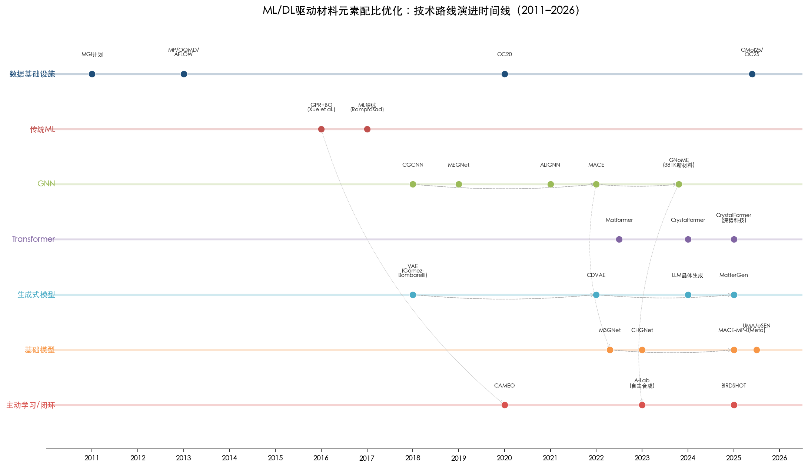

上图以2011–2026年为时间轴，分七条技术轨道（数据基础设施、传统ML、GNN、Transformer、生成式模型、基础模型、主动学习/闭环）呈现里程碑事件及轨道间的技术继承与融合关系，勾勒出本领域十五年的演进全貌。

当前，该领域呈现出几个明确的技术趋势：一是生成式模型与实验闭环的深度融合，MatterGen 式的"设计—生成—合成—验证"全链路正在成为标准范式；二是基础模型的"预训练+微调"模式正在降低ML材料设计的准入门槛，使中小规模实验室也能获得接近DFT的预测精度；三是多目标优化与不确定性量化的系统集成，使ML方法从"预测最优"走向"决策最优"。这些趋势共同指向一个方向：ML/DL 不再仅仅是材料研究的辅助工具，而是正在成为材料设计方法论的核心骨架。

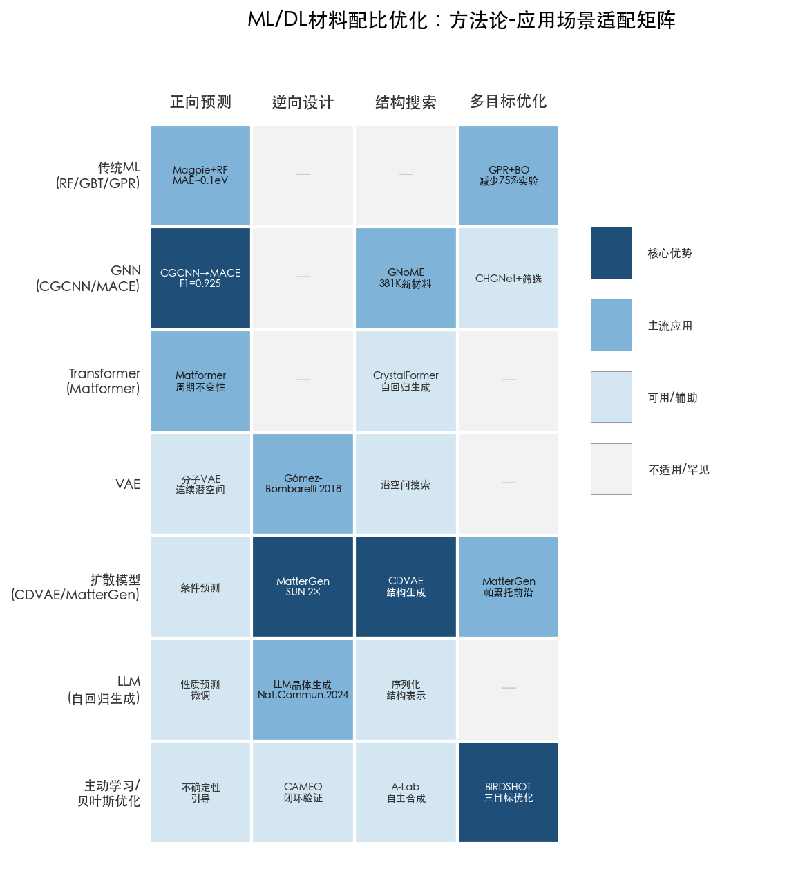

上图以七类方法为行、四类应用场景为列，通过四级色阶标示各方法在正向预测、逆向设计、结构搜索和多目标优化中的适配程度，为研究者与工程团队提供技术选型参考。

后续章节将在此技术路线图的基础上，逐一展开全球活跃研究团队的详细图谱（第2章）、支撑这些方法的数据基础设施（第3章）、模型性能的定量评估与比较（第4章）、典型应用案例分析（第5章）、核心挑战与可行性分析（第6章），以及产业化路径评估与前景展望（第7章）。

# 第2章 全球活跃研究课题组与代表性工作

ML/DL驱动材料元素配比优化领域的快速发展，离不开一批高度活跃的研究团队持续推进方法论创新、工具链建设和产业转化。本章从地域和机构类型两个维度，系统梳理北美、欧洲、中国的主要课题组以及全球领先科技企业团队的研究方向与代表性成果，并对团队间合作网络、人才流动和高影响力论文进行分析。

## 2.1 北美主要课题组：从学术奠基到产业转化

北美地区汇聚了ML/DL驱动材料元素配比优化领域密度最高的研究力量。从方法论奠基到开源工具链建设、再到初创企业孵化，北美课题组在该领域的技术生态中扮演着核心角色。

**MIT Grossman 组与 CGCNN 谱系。** 麻省理工学院（MIT）Jeffrey Grossman 课题组是图神经网络应用于材料性质预测的奠基团队。2018年4月，博士生谢天（Tian Xie）与 Grossman 在 Physical Review Letters 发表晶体图卷积神经网络（CGCNN），首次将晶体结构编码为图并通过图卷积学习材料性质，截至2026年3月累计被引超1,300次，是该方向引用量最高的论文之一 [PRL论文](https://link.aps.org/doi/10.1103/PhysRevLett.120.145301 "Xie & Grossman, Phys. Rev. Lett. 120, 145301, 2018")。Grossman 组的学术影响不仅体现在方法论层面，更在于其人才输出效应：第一作者谢天在完成博士后训练后加入 Microsoft Research，担任 AI for Science 项目负责人，主导了 MatterGen 和 MatterSim 两大材料模型的研发，形成了从学术奠基到产业落地的典型技术转移路径。

**MIT Gómez-Bombarelli 组与生成式材料设计。** Rafael Gómez-Bombarelli 课题组聚焦于生成式模型在材料与分子逆设计中的应用，核心贡献包括分子变分自编码器（ACS Cent. Sci. 2018）和 CDVAE（ICLR 2022）。前者开创了利用连续潜在空间进行分子逆设计的范式，后者首次将扩散过程与变分自编码器结合用于周期性材料结构生成。2026年2月，Gómez-Bombarelli 获 MIT 终身教职，同月在 Nature Computational Science 发表 DiffSyn——一种基于扩散模型的材料合成路径生成器，利用23,000条合成配方数据训练，能够为给定目标材料生成可行合成方案 [MIT News](https://news.mit.edu/2026/accelerating-science-ai-and-simulations-rafael-gomez-bombarelli-0212 "2026年2月MIT新闻")。在产业转化层面，Gómez-Bombarelli 联合创办的 Lila Sciences 于2025年10月完成3.5亿美元 Series A 融资（累计融资5.5亿美元），目标构建"科学超级智能"平台，投资方包括 NVIDIA NVentures、Flagship Pioneering 和 General Catalyst [Lila Sciences公告](https://www.lila.ai/news/announcing-the-close-of-our-series-a "Series A 3.5亿美元")。

**UC Berkeley/LBNL Persson & Jain 组与 Materials Project 生态。** 加州大学伯克利分校与劳伦斯伯克利国家实验室（LBNL）的 Kristin Persson 和 Anubhav Jain 共同领导 Materials Project（MP）——全球最具影响力的计算材料数据基础设施。截至2026年1月，MP 包含超200,000种材料的计算性质数据，注册用户突破650,000人，累计被引超32,000次 [LBNL News](https://newscenter.lbl.gov/2026/01/13/accelerating-discovery-how-the-materials-project-is-helping-to-usher-in-the-ai-revolution-for-materials-science/ "2026年1月LBNL新闻")。MP 不仅是数据库，更是连接材料计算与机器学习的关键枢纽：GNoME 向 MP 贡献了近400,000种新化合物数据，MACE-MP-0、M3GNet、CHGNet 等多个基础模型均以 MP 轨迹数据集作为核心训练资源。Jain 领导的 FORUM-AI 项目致力于构建面向能源材料发现的 AI 助手，LBNL 的 A-Lab 则实现了 AI 引导的机器人自主合成闭环——2023年在17天内成功合成41种新化合物，验证了"预测→合成→表征"全链条自动化的可行性。

**UC Berkeley Ceder 组与电荷感知势模型。** Gerbrand Ceder 课题组长期聚焦于计算材料发现与电池材料设计。2023年，Deng 等在 Nature Machine Intelligence 发表 CHGNet——首个在预训练阶段同时建模电荷信息的通用 GNN 原子间势，通过将磁矩作为电荷代理纳入训练，实现了对异价态离子的区分能力。2025年，Deng 等进一步揭示 M3GNet、CHGNet 和 MACE-MP-0 等通用势模型中存在的势能面软化效应，为基础模型的精度上限提供了重要诊断依据。Ceder 于2025年从 UC Berkeley 休假，联合创办 Radical AI（2025年7月完成5,500万美元种子轮融资），在纽约建设面向产业化的自主实验室 [Working Capital Fund](https://workingcapitalfund.com/why-we-invested-in-radical-ai/ "Radical AI 5,500万美元种子轮")。

**UCSD → NUS Ong 组与 MatGL 工具链。** Shyue Ping Ong 课题组是材料 GNN 领域最具系统性影响力的团队之一。MEGNet（Chem. Mater. 2019，被引超900次）将图网络扩展为分子和晶体通用框架，M3GNet（Nat. Comput. Sci. 2022）则是首个覆盖元素周期表的通用图深度学习原子间势，为后续基础模型的发展奠定了基准。Ong 同时是 pymatgen 的核心维护者，该开源库已成为计算材料科学领域事实上的标准工具。2025年底，Ong 从加州大学圣迭戈分校（UCSD）转任新加坡国立大学（NUS）Provost's Chair Professor，创建 Materialyze.AI 实验室，并于2025年3月发表 MatGL 开源图深度学习库 [NUS主页](https://cde.nus.edu.sg/mse/staff/shyue-ping-ong/ "Ong NUS主页")。这一人事迁移标志着该领域研究力量从北美向亚太地区的部分扩散。

**Georgia Tech Ramprasad 组与聚合物信息学。** Rampi Ramprasad 课题组专注于聚合物与有机材料的数据驱动设计，建立了 Polymer Genome 平台——迄今最全面的聚合物性质 ML 预测系统，涵盖介电常数、玻璃化转变温度（Tg）、带隙、热导率等多种性质，核心技术包括 polyBERT 化学语言模型（Nat. Commun. 2023）和多任务 GNN。Ramprasad 联合创办的 Matmerize 公司于2025年2月与日本 SCREEN Holdings 合作开发无 PFAS 聚合物替代材料用于半导体制造，并获美国国防部和 NSF 资助（后者200万美元）[Matmerize新闻稿](https://www.prweb.com/releases/matmerize-and-screen-holdings-partner-to-develop-high-resistance-pfas-free-polymers-for-semiconductor-manufacturing-302383706.html "Matmerize-SCREEN合作")。值得关注的是，2025年 Ramprasad 组发表的 LLM 在聚合物热性质预测中的基准测试表明，Llama-3-8B 经微调可接近但未超越传统 ML 方法的精度，为"LLM 能否替代专用模型"这一争论提供了审慎的实证依据。

**U of Toronto Aspuru-Guzik 组与自驱动实验室。** Alán Aspuru-Guzik 是分子生成模型和自驱动实验室（Self-Driving Laboratory, SDL）方向的全球先驱。2024年，其团队在 Chemical Reviews 发表的 SDL 综述被引超569次（截至2026年3月），是该方向引用量最高的综合性评述 [Chem. Rev.综述](https://pubs.acs.org/doi/10.1021/acs.chemrev.4c00055 "Tom et al., Self-Driving Labs, 2024")。Aspuru-Guzik 主导的 Acceleration Consortium（加拿大 CFREF 资助）已在多伦多大学建成6个运行中的 SDL，并推出 Scale-Up Program 支持转化研究。该团队的核心理念在于将 AI 模型的预测能力与自动化实验平台的验证能力紧密耦合，形成闭环材料发现系统。

**Texas A&M Arroyave 组与多目标合金优化。** Raymundo Arroyave 课题组是贝叶斯优化应用于合金成分设计领域的代表性团队。2025年，该组在 Acta Materialia 发表 BIRDSHOT 框架——面向 CoCrFeNiVAl FCC 高熵合金的集成贝叶斯优化材料发现平台，通过五轮闭环迭代同时优化三个力学性能目标，仅探索约0.15%的候选设计空间（约53,000候选中筛选2,437个可行解）即识别出非平凡的三目标 Pareto 最优解集 [Acta Mater.论文](https://arxiv.org/html/2405.08900v2 "BIRDSHOT, Acta Materialia 2025")。BIRDSHOT 将 CALPHAD 热力学约束与贝叶斯优化有机结合，展示了物理先验知识与数据驱动方法的有效融合范式。同年，Arroyave 组进一步将批量贝叶斯优化应用于难熔高熵合金成分设计，持续推进多目标优化方法论在工程合金领域的应用深度。

**Northwestern University Agrawal/Choudhary/Wolverton 组与材料信息学。** 西北大学的 Ankit Agrawal、Alok Choudhary 和 Chris Wolverton 形成了跨系合作的材料信息学集群。Ward、Agrawal 等于2016年在 npj Computational Materials 发表通用 ML 框架（Matminer/Magpie），定义了132个元素性质统计特征的标准化成分描述符体系，为传统 ML 方法在材料配比优化中的广泛应用奠定了特征工程基础。Wolverton 组维护的 OQMD（开放量子材料数据库）包含约140万条 DFT 计算数据，并在高通量筛选与 ML 结合的方法论上持续产出。Agrawal 等在深度学习材料图像信息学（微观组织表征与生成）方面的工作，为"成分→工艺→组织→性能"全链条建模提供了图像分析工具支撑。

## 2.2 科技企业团队：从学术模型到工业级系统

2023年以来，全球顶级科技企业大举进入 ML 驱动材料发现领域，其计算资源规模和工程化能力远非学术课题组所能比拟。企业团队的深度介入标志着该领域正从"学术前沿探索"迈入"工程化竞赛"的新阶段。

**Google DeepMind GNoME 团队。** 2023年11月，DeepMind 在 Nature 发表 GNoME（Graph Networks for Materials Exploration），通过六轮大规模主动学习循环训练 GNN，发现381,000个新稳定材料，使已知稳定晶体数量从约48,000增加近一个数量级，并向 Materials Project 贡献了近400,000种新化合物数据，构成 MP 历史上最大规模的单次外部数据贡献 [Nature论文](https://www.nature.com/articles/s41586-023-06735-9 "Merchant et al., Nature 624, 80–85, 2023")。GNoME 论文联合作者 Ekin Dogus Cubuk 随后联合创办 Periodic Labs，于2025年9月完成3亿美元种子轮融资（Andreessen Horowitz 领投，天使投资人包括 Jeff Bezos 和 Eric Schmidt），2026年3月以约70亿美元估值进行新一轮融资谈判 [TechCrunch报道](https://techcrunch.com/2025/10/20/top-openai-google-brain-researchers-set-off-a-300m-vc-frenzy-for-their-startup-periodic-labs/ "3亿美元种子轮") [Bloomberg报道](https://www.bloomberg.com/news/articles/2026-03-25/ai-science-startup-periodic-labs-is-in-deal-talks-at-about-7-billion-valuation "70亿美元估值")。这一估值水平折射出资本市场对 AI 材料发现赛道的极高期望。

**Microsoft Research MatterGen/MatterSim 团队。** 微软研究院由 Claudio Zeni 和谢天领衔的 AI for Science 团队于2025年1月在 Nature 发表 MatterGen——首个同时对原子类型、坐标和晶格进行扩散去噪的材料生成模型。MatterGen 的"稳定、唯一、新颖"（SUN）材料比例是此前最优模型的两倍以上，95%生成结构 RMSD 低于0.076 Å，实验合成验证的 TaCr₂O₆ 体弹性模量与目标偏差在20%以内 [Nature论文](https://www.nature.com/articles/s41586-025-08628-5 "Zeni et al., Nature 639, 624–632, 2025")。团队同步开发的 MatterSim 覆盖89种元素的多温压深度学习原子模型，通过多温压主动学习部分缓解了通用势模型在极端条件下的精度衰减问题。微软研究院的核心优势在于将学术级方法论与工业级计算资源（Azure 云基础设施）相结合，实现了从模型开发到大规模推理的快速迭代。

**Meta FAIR Open Catalyst/UMA 团队。** Meta 的 FAIR（Fundamental AI Research）实验室在材料 ML 领域的布局始于2020年与卡内基梅隆大学合作发起的 Open Catalyst Project，此后持续扩大数据和模型规模。2025年5月，FAIR 发布 OMol25——当前最大的高精度量子化学计算数据集，包含超1亿个 DFT 计算、覆盖83种元素和约8,300万独特分子体系，消耗60亿 CPU 核心小时（超此前任何同类数据集10倍以上）[Meta AI博客](https://ai.meta.com/blog/meta-fair-science-new-open-source-releases/ "Meta FAIR 2025发布")。同月发布的 UMA（Universal Model for Atoms）在超过300亿原子数据上训练，在 Matbench Discovery 排行榜上跻身顶级水平。2025年9月，FAIR 进一步发布 OC25 数据集（包含780万个计算、覆盖88种元素的固液界面催化数据），弥补了此前仅限固气界面的不足。Meta FAIR 的开放科学策略（模型与数据全部开源）使其合作网络涵盖 LBNL、Princeton、Stanford、Cambridge、CMU 等全球顶级机构，在学术社区中构建了广泛的技术影响力。

## 2.3 欧洲研究力量：等变理论与基础模型先驱

**Cambridge Csányi 组与 MACE 体系。** 剑桥大学 Gábor Csányi 课题组是机器学习原子间势（MLIP）方向的先驱和持续引领者，其方法论演进贯穿了 MLIP 的完整发展历程：从高斯近似势（GAP, PRL 2010）到原子聚类展开（ACE），再到多体 ACE 等变消息传递网络 MACE（NeurIPS 2022），直至2025年发表的 MACE-MP-0 基础模型（J. Chem. Phys. 2025）[J. Chem. Phys.论文](https://pubs.aip.org/aip/jcp/article/163/18/184110/3372267/A-foundation-model-for-atomistic-materials "Batatia et al., J. Chem. Phys. 163, 184110, 2025")。MACE-MP-0 仅在 Materials Project 轨迹数据集上训练，即可对几乎所有材料体系提供开箱即用的原子模拟能力，通过约5个 DFT 数据点微调即可达第一性原理精度。MACE 系列已发展为完整的基础模型家族，全部开源于 GitHub ACEsuit 仓库。Csányi 组的核心学术贡献在于将严格的物理对称性（旋转等变性、粒子交换对称性）以数学硬约束形式嵌入网络架构，而非依赖数据增强来隐式学习。这一设计理念已被 Matbench Discovery 排行榜的实证数据证实为显著提升泛化能力的关键因素。

## 2.4 中国主要课题组：从跟随到特色突破

中国在 ML 驱动材料配比优化领域的研究力量近年来快速成长，形成了以深势科技为代表的产业转化力量和以高校及中科院为主体的基础研究力量两大阵营。

**鄂维南/张林峰组与深势科技生态。** 北京大学鄂维南院士和普林斯顿大学张林峰等共同开发的 DeePMD（Deep Potential Molecular Dynamics）于2018年在 Physical Review Letters 发表，凭借在大规模分子动力学模拟中的突破性精度和效率于2020年获 ACM Gordon Bell Prize [PRL论文](https://link.aps.org/doi/10.1103/PhysRevLett.120.143001 "Zhang et al., DeePMD, PRL 2018")。DeePMD 已演进为 DPA-2 大原子模型（npj Comput. Mater. 2024），在多种元素体系上展现出与 MACE-MP-0 和 M3GNet 相当的泛化能力。深势科技（DP Technology）将上述学术成果进行了系统性产业化转化，推出 Hermite 科学计算平台、Piloteye 材料研发平台、Uni-Mol 分子预训练模型和 SciMaster AI 科学助手等产品线。2025年12月，深势科技完成 Series C 融资8亿人民币（约1.14亿美元），累计融资约2.14亿美元，工具已覆盖全球超1,000所大学及研究机构和150家企业客户（包括中石油、比亚迪）[SiliconANGLE报道](https://siliconangle.com/2025/12/24/dp-technology-raises-114m-accelerate-chinas-ai-science-industry/ "DP Technology Series C")。深势科技的"学术论文→开源工具→商业平台"全链路转化模式是中国在 AI for Science 产业化方面走得最远的实践案例。

**中国科学技术大学江俊组与智能化学家系统。** 中国科学技术大学江俊课题组打造了全球首个全流程智能科研平台"机器化学家"（Robotic Chemist），集成移动机器人、智能化学工作站、高通量计算和智能化学大脑四个模块。2024年，该团队在 Nature Synthesis 发表利用5种火星陨石原料 AI 辅助发现最优产氧电催化剂配方的工作：系统从3,764,376种金属组合中搜索最优 OER 催化剂，通过 DFT、分子动力学、神经网络和243组机器人实验结合贝叶斯优化，6周内发现过电位低至445.1 mV 的催化剂（较基线降低37.1 mV），稳定运行超550,000秒 [Nature Synthesis论文](https://storage.ghost.io/c/13/57/13573308-a18f-497b-8987-5648a14bf800/content/files/2025/04/s44160-023-00424-1.pdf "Zhu et al., Nature Synthesis 3, 319–328, 2024")。该工作的独特价值在于展示了从自然矿物出发、无须实验室级纯试剂的"极端资源约束下 AI 材料发现"能力，其方法论对地外资源利用和极端环境材料制备具有前瞻意义。

**北京科技大学/东北大学谢建新、宿彦京、王晨充等与材料基因工程。** 北京科技大学谢建新院士团队是中国材料基因工程（Materials Genome Engineering, MGE）的核心推动者，长期致力于将物理冶金原理与机器学习方法有机结合。2025年，王晨充与宿彦京等在《金属学报》发表综述，系统阐述物理冶金原理指导下的 ML 方法在合金成分设计中的应用框架，强调领域知识嵌入对于提升模型可靠性和泛化能力的关键作用 [金属学报综述](https://www.ams.org.cn/article/2025/0412-1961/0412-1961-2025-61-4-541.shtml "Wang & Xu, 金属学报 2025")。该团队的特色在于从冶金学原理出发构建物理约束，而非采取纯数据驱动策略，在钢铁、钛合金等工程合金体系中积累了丰富的成分优化实践经验。

**Max Planck/清华合作与高熵合金 ML 发现。** 2022年，Rao 等在 Science 发表了利用主动学习策略加速高熵 Invar 合金设计的突破性工作。该研究整合 LightGBM 机器学习模型、DFT 第一性原理计算、CALPHAD 热力学建模和实验验证四个模块，采用 Wasserstein 自编码器降维和 MCMC 主动学习采样策略，在高维成分空间中仅合成17种新合金即发现两种极低热膨胀系数（约2×10⁻⁶ K⁻¹，300 K）的高熵 Invar 合金 [Science论文](https://www.science.org/doi/10.1126/science.abo4940 "Rao et al., Science 378, 78, 2022")。这项 Max Planck 钢铁研究所与清华大学的合作成果是该领域引用量最高的成分优化闭环案例之一，其方法论框架——"降维→代理模型→主动采样→实验验证"——已被多个后续研究采纳和拓展。

## 2.5 团队间合作网络与人才流动

ML 驱动材料配比优化领域的一个显著特征是高度网络化的合作生态和频繁的人才跨界流动。我们识别出四个主要的合作网络与竞争格局。

**Ong-Ceder-Persson 生态圈。** Ong、Ceder 和 Persson 三个课题组围绕 pymatgen/Materials Project/CHGNet/MatGL 形成了高度交叉的合作网络。2025年，三人在 Nature Materials 共同署名 perspective 文章，系统回顾了 MP 的基础设施角色。这一生态圈的核心优势在于打通了"数据生产（MP）→工具链（pymatgen/MatGL）→模型训练（CHGNet/M3GNet）→实验验证（A-Lab）"的完整链条，构成了该领域最具系统性的基础设施体系。

**CGCNN → MatterGen 人才流动链。** 谢天从 MIT Grossman 组（CGCNN 第一作者）到 Microsoft Research（MatterGen 核心领导者）的职业路径，是该领域学术向产业技术转移的标志性案例。类似地，GNoME 论文联合作者 Cubuk 创办 Periodic Labs，Ceder 休假创办 Radical AI，Gómez-Bombarelli 联合创办 Lila Sciences——2025年前后出现的这波学术领军人物密集创业潮，表明该领域已从纯学术探索进入技术商业化验证阶段。

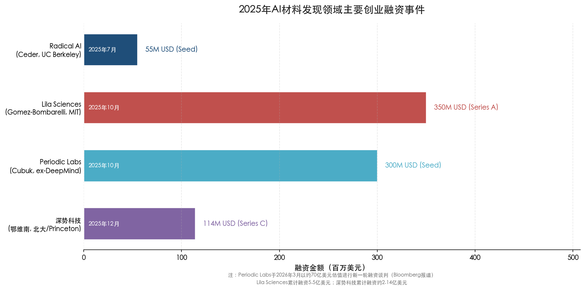

图2-1展示了2025年 AI 材料发现领域四项代表性创业融资事件。Lila Sciences 以3.5亿美元 Series A 融资居首，Periodic Labs 以3亿美元种子轮紧随其后，深势科技完成1.14亿美元 Series C，Radical AI 获5,500万美元种子轮。这些融资事件的创始人均来自上述活跃课题组核心成员，凸显了学术积累与产业资本之间的直接传导关系。

**Meta FAIR 开放科学网络。** UMA 和 OMol25 项目的合作方涵盖 LBNL、Princeton、Stanford、Cambridge、CMU 等全球顶级机构。Meta FAIR 的开放策略（模型和数据全部开源）使其在学术社区中获得了广泛合作基础，同时通过开源生态建设扩大了技术影响力。

**基础模型四大体系竞争格局。** 截至2026年3月，通用原子间势/基础模型领域已形成四大技术体系的竞争格局：MACE-MP-0/MPA-0（Cambridge Csányi 组，等变消息传递架构）、M3GNet/CHGNet/MatGL（Ong/Ceder 体系，图深度学习势）、DeePMD/DPA-2（鄂维南/深势科技，深度势能方法）以及 UMA/eSEN（Meta FAIR，大规模预训练模型）。四大体系在架构设计理念、训练数据规模、开源策略和产业化路径上各有特色。在 Matbench Discovery 基准上，Meta FAIR 的 eSEN-30M-OAM 以30M参数达到 F1=0.925 位列顶级，而 Cambridge 体系的 PET-OAM-XL 以730M参数取得 F1=0.924 的几乎相同性能 [Matbench Discovery官网](https://matbench-discovery.materialsproject.org/ "完整排行榜")，这一对比表明在当前精度前沿，架构效率和训练数据质量可能比单纯的参数规模更为关键。

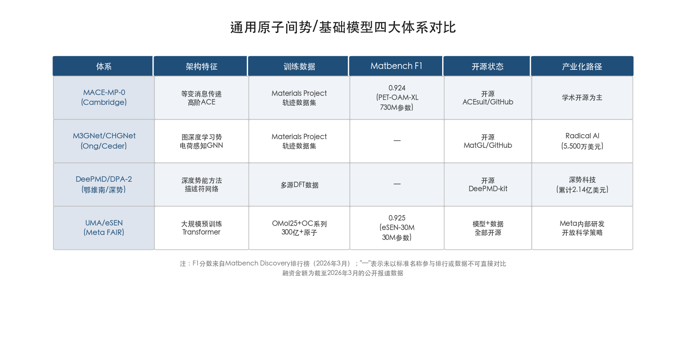

图2-2从架构特征、训练数据、Matbench Discovery F1 性能、开源状态和产业化路径五个维度横向对比了上述四大基础模型体系。四大体系均采取开源策略，但产业化路径呈现显著分化：Cambridge 体系以学术开源为主，Ong/Ceder 体系孵化出 Radical AI，深势科技已完成多轮商业化融资，Meta FAIR 则依托母公司内部研发资源推进开放科学。

## 2.6 高影响力论文与引用分析

从引用数据的角度审视，该领域已产出多篇引用量超千次的标杆论文，形成了清晰的知识传播脉络。表2-1列出截至2026年3月（Google Scholar 查询）的代表性高被引论文。

**表2-1 ML驱动材料发现领域代表性高影响力论文**

| 论文 | 发表时间 | 期刊 | 被引次数（约） | 核心贡献 |
|------|---------|------|----------------|---------|
| DeePMD (Zhang et al.) | 2018 | Phys. Rev. Lett. | >1,500 | 深度势能分子动力学 |
| CGCNN (Xie & Grossman) | 2018.04 | Phys. Rev. Lett. | >1,388 | GNN材料预测奠基 |
| MEGNet (Chen & Ong) | 2019.04 | Chem. Mater. | >927 | 分子/晶体通用图网络 |
| SDL综述 (Tom et al.) | 2024 | Chem. Rev. | >569 | 自驱动实验室全面综述 |
| GNoME (Merchant et al.) | 2023.11 | Nature | 快速增长 | 381,000新稳定材料发现 |
| MatterGen (Zeni et al.) | 2025.01 | Nature | 快速增长 | 扩散材料生成模型 |

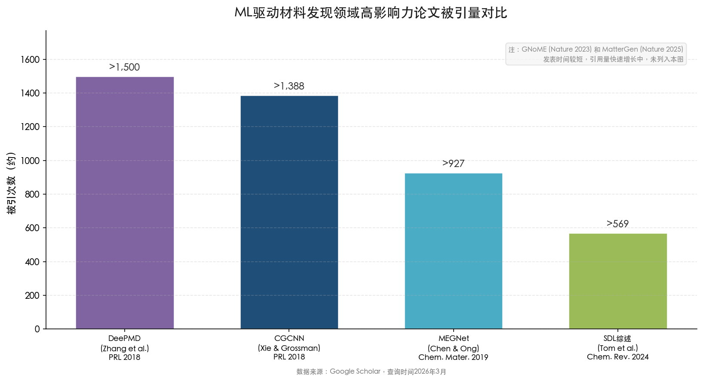

图2-3对比了四篇已积累高引用量的代表性论文被引次数。DeePMD 和 CGCNN 作为2018年发表的方法论开创性工作，均突破1,300次引用，体现了方法论原创性对知识传播的持久驱动力。GNoME 和 MatterGen 虽因发表时间较短未纳入柱状图，但其引用增速远快于早期工作，反映出该领域正处于加速扩张阶段。

从团队分布来看，美国机构（MIT、UC Berkeley/LBNL、UCSD/NUS、Georgia Tech）在方法论创新上占据主导地位，企业团队（DeepMind、Microsoft Research、Meta FAIR）在资源规模和工程化速度上具有明显优势，中国团队（深势科技/北大、中科大）在产业化转化和特色应用场景上形成了差异化竞争力，欧洲（Cambridge）则在理论基础和架构设计上持续引领。这种多极格局既促进了技术竞争，也推动了开放科学合作——几乎所有主要基础模型（MACE、M3GNet、DeePMD、UMA）均采取开源策略，使得资源有限的团队也能在前沿模型基础上开展应用研究。

本章系统回顾了"谁在做"这一核心问题。下一章将深入这些团队所依赖的数据基础设施——支撑上述模型训练和评估的关键底座，也是制约领域进一步发展的核心瓶颈之一。

# 第3章 核心数据库与数据基础设施

材料信息学的核心竞争力在很大程度上取决于数据的规模、质量与可获取性。无论是传统机器学习依赖的特征工程流水线，还是深度学习端到端表示学习范式，模型性能的上限均受制于训练数据的广度与深度。过去十余年间，以 Materials Project、AFLOW、NOMAD 为代表的高通量计算数据库快速扩张，计算数据条目已从百万级迈向千万级；与此同时，实验数据规模仍停留在十万级，两者之间的数量级差距构成材料信息学面临的根本性数据挑战。本章系统梳理支撑 ML/DL 材料元素配比优化的数据基础设施现状，涵盖主要计算数据库、实验数据资源、大规模专用数据集、特征工程体系，以及围绕 FAIR 原则展开的数据互操作标准化进展。

## 3.1 计算材料数据库：规模化数据的主力来源

当前支撑材料信息学的训练数据绝大多数来自密度泛函理论（DFT）高通量计算。经过十余年的持续建设，若干大型开放数据库已成为 ML/DL 模型训练的核心基础设施，其数据规模和覆盖范围的差异塑造了不同的应用定位（图3-1）。

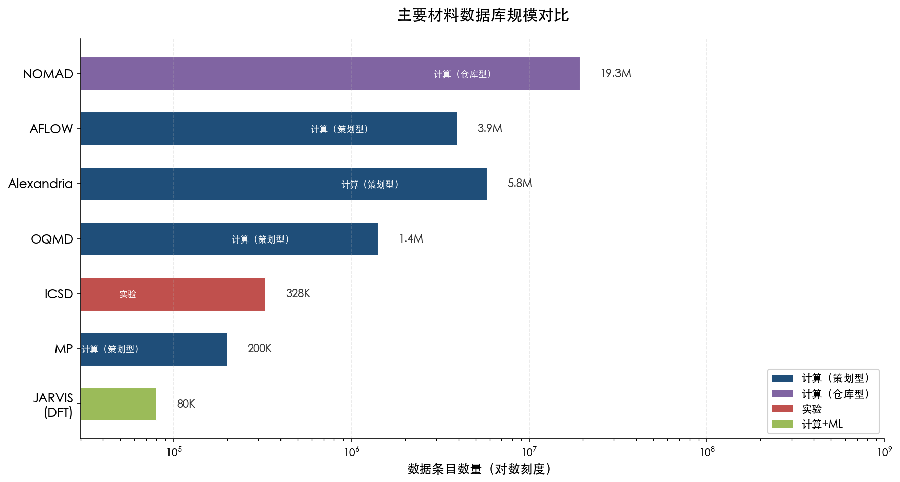

**图3-1 主要材料数据库规模对比。** 以对数刻度横向比较七个主要数据库的数据条目数量，按计算策划型、计算仓库型、实验、计算+ML 四类着色。NOMAD 以约1,930万条目居首，而实验数据库 ICSD（约32.8万条）与计算数据库之间存在1–2个数量级的规模差距。

### 3.1.1 Materials Project（MP）

Materials Project 是全球影响力最大的计算材料数据库之一，由 Lawrence Berkeley National Laboratory 的 Persson 和 Jain 团队创建并维护。截至2026年1月，MP 包含超过200,000种材料和577,000个分子的计算性质数据，注册用户突破650,000人，日均使用超过5,000次，累计被引超过32,000次，过去两年交付465 TB 数据 [LBNL官方新闻](https://newscenter.lbl.gov/2026/01/13/accelerating-discovery-how-the-materials-project-is-helping-to-usher-in-the-ai-revolution-for-materials-science/ "2026年1月LBNL新闻")。MP 不仅提供形成能、带隙、弹性常数等基础性质计算数据，还通过 pymatgen 和 matminer 等开源工具链构建了完整的数据访问与处理生态，使其成为 CGCNN、MEGNet、MACE-MP-0 等一系列里程碑模型的首选训练数据源。

2023年11月，Google DeepMind 的 GNoME 项目向 MP 一次性贡献近400,000种新化合物数据，成为 MP 历史上最大规模的单次外部数据贡献 [Nature论文](https://www.nature.com/articles/s41586-023-06735-9 "Merchant et al., Nature 624, 80–85, 2023")。2025年，Persson、Jain、Ong 等在 Nature Materials 发表 perspective，系统回顾了 MP 作为材料信息学基础设施平台的角色及其对 AI 材料发现范式的推动作用。MP 的持续成功表明，开放数据生态对加速 ML 材料模型开发具有不可替代的支撑价值。

### 3.1.2 AFLOW

AFLOW（Automatic FLOW for Materials Discovery）由 Duke 大学 Curtarolo 团队维护，截至2026年3月包含3,929,948种材料化合物的计算数据，关联超过8.17亿条计算性质记录 [AFLOW官网](https://www.aflowlib.org/ "AFLOW官网，截至2026年3月")。AFLOW 的核心优势在于高度自动化的高通量计算流水线和严格标准化的数据格式。其提供的 AFLUX 搜索语言允许研究者以类 SQL 语法精确查询特定性质区间内的材料，而对 OPTIMADE 标准 API 的支持则使跨数据库联合查询成为现实。在数据量级上，AFLOW 是当前条目数最多的单一策划型计算材料数据库。

### 3.1.3 OQMD

Open Quantum Materials Database（OQMD）由 Northwestern 大学 Wolverton 课题组维护，包含1,407,395种材料的 DFT 计算数据 [OQMD官网](https://oqmd.org/ "OQMD首页")。OQMD 的核心优势在于系统性的凸包（convex hull）计算能力，可为材料热力学稳定性判断提供直接定量支持，这一特性使其在合金配比优化和相图构建领域被广泛采用。OQMD 支持 OPTIMADE 标准接口，与 MP、AFLOW 等数据库实现互操作。

### 3.1.4 NOMAD

NOMAD（Novel Materials Discovery）是全球最大的计算材料科学数据仓库。截至2026年3月，NOMAD 包含19,295,358个条目，涵盖4,343,345种材料，累计上传数据量达114.4 TB，支持超过60种模拟代码的数据格式解析，全部数据以 CC-BY-4.0 协议开放获取 [NOMAD官网](https://nomad-lab.eu/ "NOMAD首页实时统计")。与 MP 和 AFLOW 等"策划型数据库"不同，NOMAD 定位为"数据仓库"——它接收研究者上传的原始计算数据并提供统一的元数据解析与检索服务，因此在数据总量上远超其他平台，但数据一致性和质量控制依赖于上传者的规范程度。这一定位使 NOMAD 成为大规模数据挖掘和跨体系元分析的重要资源，但直接用于 ML 模型训练时通常需要额外的数据清洗与筛选步骤。

### 3.1.5 JARVIS

JARVIS（Joint Automated Repository for Various Integrated Simulations）由美国国家标准与技术研究院（NIST）维护，包含超过80,000种材料的 DFT 数据和142万余条 ML 预测条目，注册用户超过150,000人 [JARVIS官网](https://jarvis.nist.gov/ "JARVIS官网统计")。JARVIS 的差异化定位在于"计算+ML 一体化平台"：它不仅提供数据，还配套 ALIGNN（原子线图神经网络）、AtomGPT 等 ML 工具链，并提供 JARVIS-CFID（Classical Force-field Inspired Descriptors）通用描述符方案，使研究者能够在同一平台内完成从数据获取到模型训练的全流程。2025年3月，JARVIS 团队发表综述，系统阐述了该平台作为统一材料信息学基础设施的发展方向。

## 3.2 实验数据资源：稀缺而关键

### 3.2.1 ICSD

无机晶体结构数据库（Inorganic Crystal Structure Database, ICSD）是全球最大的实验无机晶体结构数据库，由德国 FIZ Karlsruhe 维护。截至最近公告，ICSD 收录327,833个经实验验证的晶体结构，覆盖自1913年至今逾百年的文献积累，年新增约12,000个结构 [ICSD官网](https://icsd.products.fiz-karlsruhe.de/en/nachricht/icsd-now-contains-327833-crystal-structures "ICSD官方公告")。ICSD 采用付费订阅模式，主要面向学术机构和企业用户，其实验数据的权威性使其成为 ML 模型训练标签验证和计算结果基准校核的重要来源。

ICSD 与 COD（Crystallography Open Database）合计约收录84万条实验晶体结构数据，与计算数据库数千万级的条目规模形成鲜明对比。这一数量级差距是材料信息学面临的根本性数据挑战之一——实验数据的稀缺性直接制约了模型从计算域向实验域的迁移精度。

### 3.2.2 计算-实验数据的结构性不对称

实验数据仅覆盖已知无机化合物不到1%，而计算数据库已覆盖数百万种假设性材料。这种结构性不对称带来三重挑战。其一，绝大多数 ML 模型在计算数据上训练，预测精度在实验条件下往往显著衰减。其二，DFT 与实验数据存在系统性偏差——PBE 泛函带隙系统性低估实验值约40–50%，PBE 形成能与实验形成焓的均方根偏差约0.1–0.2 eV/atom。其三，不同 DFT 泛函之间（如 PBE 与 r²SCAN）的形成能差异约25–50 meV/atom，这一差异已接近当前最优 ML 模型的预测误差（约18–19 meV/atom），意味着模型精度正在逼近训练数据本身的"噪声地板" [Matbench Discovery论文](https://www.nature.com/articles/s42256-025-01055-1 "Riebesell et al., 2025")。换言之，进一步提升模型性能的瓶颈已不完全在于算法架构，而在于训练数据质量和计算方法的内在精度局限。

## 3.3 大规模催化剂与分子数据集

随着 AI 驱动的催化剂和分子设计迅速发展，多个超大规模专用数据集相继发布，形成从气相催化到液相催化再到通用分子化学的完整数据覆盖（图3-2）。

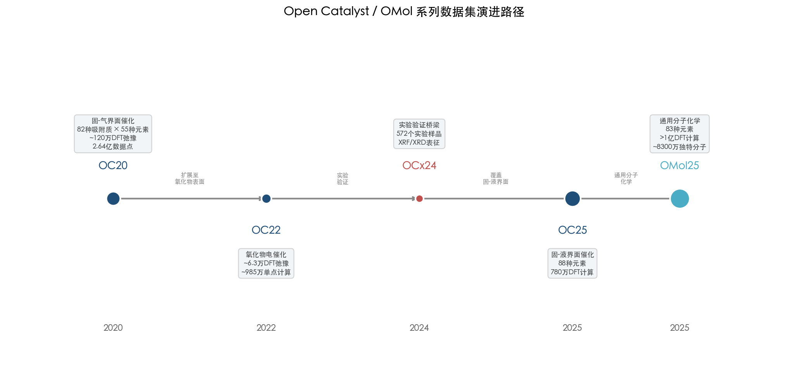

**图3-2 Open Catalyst / OMol 系列数据集演进路径。** 以时间线形式展示 OC20（2020）→ OC22（2022）→ OCx24（2024）→ OC25（2025）→ OMol25（2025）五代数据集的发布时间、数据规模和覆盖范围递进关系，从固-气界面催化逐步扩展至氧化物表面、实验验证、固-液界面催化和通用分子化学。

**Open Catalyst 系列。** Meta FAIR 与 Carnegie Mellon 大学联合开发的 Open Catalyst 项目已构建三代核心计算数据集，覆盖面逐步扩大。OC20 包含约120万个 DFT 弛豫计算和2.64亿数据点，涉及82种吸附质与55种元素表面的固-气界面催化。OC22 将范围扩展至氧化物电催化体系，包含62,521个 DFT 弛豫计算（约985万单点计算），补充了氧化物表面这一工业催化中至关重要的材料类别 [OC22论文](https://arxiv.org/abs/2206.08917 "Tran et al., OC22, 2022")。OC25（2025年9月发布）进一步将固-液界面催化纳入数据范围，包含780万个计算和88种元素 [arXiv论文](https://arxiv.org/abs/2509.17862 "OC25, 2025年9月")。三代数据集形成清晰的互补关系：OC20 奠定气相催化基础，OC22 扩展至氧化物表面，OC25 覆盖电化学界面条件，逐步逼近真实催化环境的复杂性。

**OMol25。** 2025年5月，Meta FAIR 发布 OMol25——当前规模最大的高精度量子化学计算数据集，包含超过1亿个 DFT 计算，涉及83种元素和约8,300万独特分子体系，计算消耗约60亿 CPU 核心小时，超过此前任何同类数据集10倍以上 [OMol25论文](https://www.rivista.ai/wp-content/uploads/2025/06/2505.08762v1.pdf "OMol25, 2025年5月")。OMol25 的发布使分子-材料体系的 ML 训练数据从百万级跨越至亿级，为 UMA 等通用基础模型提供了关键训练语料。

## 3.4 专用领域数据集与假设材料数据库

除上述通用型大型数据库外，面向特定材料体系或特定应用场景的专用数据集在近年来快速涌现，填补了通用数据库在垂直领域覆盖不足的缺口。

### 3.4.1 Alexandria

Alexandria 数据库是当前规模最大的免费计算材料结构数据库之一。经过 AI 驱动的系统性扩展，Alexandria 已包含约580万个 DFT 计算结构，其中175,000种化合物位于热力学凸包上 [Alexandria扩展论文](https://arxiv.org/html/2512.09169v1 "AI-Driven Expansion of Alexandria, 2025")。Alexandria 的 sAlex 子集已被 PET-OAM-XL 等顶级基础模型用作训练数据来源之一，对推动模型性能达到当前最高水平发挥了关键作用。

### 3.4.2 Matterverse.ai

Matterverse.ai 是由 Ong 团队开发的假设材料数据库，基于 M3GNet 通用原子间势对超过3,100万种尚未合成的假设晶体结构进行了性质预测，其中约180万种材料被预测为潜在热力学稳定 [Matterverse.ai官网](https://matterverse.ai/ "Matterverse.ai数据库")。该数据库通过 OPTIMADE 标准接口对外开放，为逆向材料设计和高通量虚拟筛选提供了庞大的候选材料搜索空间。Matterverse.ai 代表了一种"ML 预测先行、实验验证跟进"的新型数据积累模式——通过通用原子间势大规模筛选假设结构，将实验验证的靶向性从盲目搜索提升至聚焦于高概率稳定区域。

### 3.4.3 ULTERA 高熵合金数据生态

ULTERA（ULtrahigh TEmperature Refractory Alloys）是由 Penn State Phases Research Lab 在美国 ARPA-E ULTIMATE 项目支持下建立的高熵合金（HEA）数据库。截至2025年4月，ULTERA 数据库包含超过12,500个性质数据点，涵盖从文献中收集并经均质化处理的 HEA 实验性质数据 [ULTERA官网](https://phaseslab.com/ultera "ULTERA数据库，截至2025年4月")。相较计算数据库动辄百万级的条目规模，这一数据量级虽显有限，但作为实验数据驱动的专用领域数据集，ULTERA 填补了高熵合金 ML 设计中实验数据匮乏的关键缺口，为 BIRDSHOT 等贝叶斯优化框架提供了直接的数据支撑。

### 3.4.4 商业化数据平台的演变

曾作为开放学术平台运营的 Citrination 已正式退役，其母公司 Citrine Informatics 完全转型为企业级 SaaS 平台，定位为"生成式 AI 驱动的材料与化工产品开发平台"，客户覆盖塑料、涂料、电池、陶瓷、合金、航空航天等行业 [Citrine官网](https://citrine.io/ "Citrine Informatics官网")。这一转型折射出材料数据领域的分化趋势：基础计算数据日益开放化和标准化，面向特定工业应用场景的高质量策划数据和专用工具链则转向商业化运营。两条路径并行推进，共同构建了从学术研究到工业落地的完整数据价值链。

## 3.5 高通量实验平台：弥合计算-实验鸿沟

计算数据虽然规模庞大，但终究需要实验验证方能转化为可用的材料知识。高通量实验与自主实验室（Self-Driving Lab）正在成为弥合计算-实验数据鸿沟的关键基础设施。

Berkeley Lab 的 A-Lab（2023年启动）是这一方向的标志性成果。在17天的连续自主运行中，机器人系统在58次合成尝试中成功合成41种新化合物（成功率71%），与 MP 和 GNoME 的计算预测形成了"计算预测→自主合成→表征反馈"的完整闭环 [Nature论文](https://www.nature.com/articles/s41586-023-06734-w "Szymanski et al., A-Lab, Nature 624, 86–91, 2023")。A-Lab 的意义不仅在于验证了若干计算预测材料的可合成性，更在于证明了高通量实验数据自动生成的工程可行性——每一次成功或失败的合成尝试均在积累机器可读的实验数据，有望逐步缓解实验数据稀缺这一长期瓶颈。

催化剂领域的 OCx24 数据集（2024年发布）同样具有标志性意义。该数据集提供了572个实验合成催化剂样品及其 XRF/XRD 表征数据，首次在 AI 催化剂发现领域建立了跨越计算与实验的系统性评估桥梁。这表明大规模 AI 材料数据基础设施正在从纯计算数据向计算-实验融合数据过渡，为模型的实验域泛化验证奠定了数据基础。

## 3.6 特征工程体系：从手工设计到端到端学习

ML 模型如何"理解"材料的化学成分与结构信息，取决于特征工程（feature engineering）或表示学习（representation learning）的方法选择。当前材料信息学中的特征表示方案可依据信息层次分为三个类别。

**成分描述符。** Magpie（Materials-Agnostic Platform for Informatics and Exploration）提供132个基于元素性质统计量的组分特征，涵盖原子序数、电负性、原子半径等元素属性的均值、标准差、极差、众数等统计量，适用于仅知化学配比而无结构信息的场景。XenonPy 进一步将成分特征扩展至290维。这类描述符的优势在于通用性强、计算成本低，可与传统 ML 方法（随机森林、梯度提升树、高斯过程回归等）直接配合使用，在小样本学习和快速筛选场景中仍具有实用价值。

**结构描述符。** 对于已知晶体结构的材料，SOAP（Smooth Overlap of Atomic Positions）和 ACSF（Atom-Centered Symmetry Functions）是描述原子局部化学环境的主流方法。这些描述符将原子周围的几何构型编码为高维向量，天然具有旋转不变性等物理对称性，广泛用于机器学习原子间势（MLIP）的训练。JARVIS 平台提供的 CFID（Classical Force-field Inspired Descriptors）通用描述符方案则尝试在统一框架内融合成分与结构信息。

**端到端图表示学习。** 以 CGCNN、MEGNet、ALIGNN、MACE 为代表的图神经网络（GNN）直接将晶体结构编码为图——原子作为节点、化学键或几何近邻关系作为边——并通过消息传递机制自动学习材料表示。这种端到端学习范式在很大程度上替代了手工特征工程，使模型能够捕获传统描述符难以显式编码的高阶结构-性质关联。从 Matbench Discovery 排行榜的实证数据来看（图3-3），当前精度最高的模型全部采用图表示学习或等变神经网络架构，传统成分描述符+随机森林方法（Voronoi RF）的 F1 仅为0.333，与 GNN 最优模型（F1=0.925）之间存在近3倍差距 [Matbench Discovery官网](https://matbench-discovery.materialsproject.org/ "完整排行榜")。

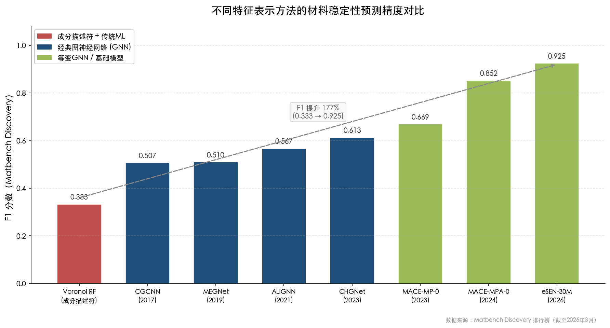

**图3-3 不同特征表示方法的材料稳定性预测精度对比。** 基于 Matbench Discovery 排行榜数据（截至2026年3月），对比成分描述符+传统ML（Voronoi RF, F1=0.333）、经典 GNN（CGCNN/MEGNet/ALIGNN/CHGNet）和等变 GNN/基础模型（MACE-MP-0/MACE-MPA-0/eSEN-30M, F1=0.925）三类方法的 F1 分数，展示从手工特征工程到端到端图表示学习的177%精度跃升轨迹。

## 3.7 FAIR 原则与数据互操作标准

随着材料数据库的数量和规模快速增长，数据的可发现性（Findable）、可获取性（Accessible）、可互操作性（Interoperable）和可重用性（Reusable）——即 FAIR 原则——已成为数据基础设施建设的核心议题。多层次的标准化努力正在推动材料数据从"各自为政"走向"联邦式互操作"。

### 3.7.1 OPTIMADE 标准

OPTIMADE（Open Databases Integration for Materials Design）是当前材料科学领域最重要的数据互操作标准。截至 v1.2 规范，OPTIMADE 已有22个注册数据提供者和25个可互操作数据库，服务超过2,200万个晶体结构的统一查询 [OPTIMADE论文](https://pmc.ncbi.nlm.nih.gov/articles/PMC11305395/ "Evans et al., Digital Discovery, 2024")。通过 OPTIMADE 统一的 RESTful API 和查询语法，研究者可跨越 MP、AFLOW、OQMD、NOMAD、Matterverse.ai 等多个数据库进行联合检索，极大降低了跨库数据获取的技术门槛，也为多源数据融合训练 ML 模型提供了标准化接口支撑。

### 3.7.2 MatCore 统一元数据标准

2025年2月，MatCore 统一元数据标准提案正式发布，旨在建立计算材料科学领域统一的元数据语义框架 [MatCore论文](https://arxiv.org/abs/2502.07106 "Towards MatCore, 2025年2月")。与侧重于数据查询接口的 OPTIMADE 不同，MatCore 着眼于更深层次的元数据语义统一，包括计算方法参数、收敛标准、伪势选择等关键信息的标准化记录。该标准的推广有望解决当前各数据库元数据格式不一致、语义定义模糊等问题，使跨库数据融合从"结构层面互操作"深入至"语义层面互操作"。

### 3.7.3 Matbench 基准化评估框架

数据标准化的另一关键维度是模型评估的可比性。Matbench v0.1 提供了13个标准化 ML 基准任务，涵盖形成能、带隙、体弹性模量等核心材料性质预测。2025年，Matbench Discovery 正式发表于 Nature Machine Intelligence，将模型评估范围扩展至约215,000个假设结构的热力学稳定性预测，截至2026年3月已收录45个模型的评测结果 [Nat. Mach. Intell.](https://www.nature.com/articles/s42256-025-01055-1 "Riebesell et al., Matbench Discovery, 2025")。Matbench Discovery 的发表标志着材料 ML 领域的模型评估从各自为政走向标准化和可复现化，其角色类似于计算机视觉领域 ImageNet 基准测试对深度学习发展的催化效应。

## 3.8 数据基础设施的整体格局与演进趋势

综合审视当前材料信息学的数据基础设施，可以识别出若干显著的结构性特征与演进方向。

**数据规模的层级分化。** 从数据量级来看，各主要数据库形成清晰的规模梯队：NOMAD（约1,930万条目）> Alexandria（约580万结构）> AFLOW（约390万条目）> OQMD（约140万条目）> ICSD（约32.8万实验结构）> MP（约20万种材料）> JARVIS（约8万种材料 DFT）。然而，数据规模并不等同于数据价值——MP 以约20万种材料的策划型数据支撑了超过32,000次学术引用和 CGCNN、MEGNet、MACE-MP-0 等一系列里程碑模型的训练，充分体现了"数据质量×生态完备度"的乘数效应。

**计算数据主导下的实验数据回归。** 过去十年的数据基础设施建设以 DFT 高通量计算为绝对主导，实验数据在规模上始终落后2–3个数量级。2023年以来，A-Lab 等自主实验室和 OCx24 等实验验证数据集的出现预示着实验数据的系统性积累正在提速。这一趋势有望在未来数年内显著缓解"计算-实验鸿沟"，但前提是实验数据的采集、标注和共享标准能够同步建立。

**从孤立数据库到互操作生态。** OPTIMADE 标准的推广和 MatCore 元数据框架的提出，正在推动材料数据基础设施从"各自建库"走向"联邦式互操作"。这种转变对 ML 模型开发具有直接意义：训练数据的规模不再受限于单一数据库，而可系统性融合多源数据。PET-OAM-XL 等模型同时利用 OMat24、sAlex 和 MPtrj 三个数据源实现 F1=0.924 的顶级性能，即是这一数据融合趋势的直接体现。

**超大规模数据集的"军备竞赛"。** OMol25 消耗的60亿 CPU 核心小时计算资源，按 Meta FAIR 估算"用1,000台笔记本运行需超过50年" [LBNL官方新闻](https://newscenter.lbl.gov/2025/05/14/computational-chemistry-unlocked-a-record-breaking-dataset-to-train-ai-models-has-launched/ "OMol25计算成本")。这一量级的数据集构建已超出任何单一学术机构的能力范围，只有科技企业（Meta、Google DeepMind、Microsoft）和国家实验室体系具备相应的计算资源。这一现实正在重塑材料信息学的研究格局——基础数据集建设日益由产业界主导，学术界则更多承担基于开放数据的模型创新和垂直应用角色。

综合本章梳理的数据全景，材料信息学已从"数据匮乏"阶段进入"计算数据富集但实验验证不足"的新阶段。数据规模的指数级增长为 ML/DL 模型的精度提升提供了物质基础，而计算-实验数据的结构性不对称和跨库一致性挑战则构成下一阶段需要突破的核心瓶颈。下一章将聚焦于构建在这些数据基础之上的模型性能评估与基准比较，考察各类方法在标准化测试中的精度、泛化能力和计算效率表现。

# 第4章 模型性能评估与基准比较

材料信息学领域的快速演进催生了数量庞大的 ML/DL 模型用于材料性质预测与元素配比优化，但不同模型在何种条件下、以何种精度解决何类问题，长期缺乏统一的衡量标尺。随着 Matbench、Matbench Discovery 和 LAMBench 等标准化基准平台相继建立，研究社区首次具备了系统性横向比较不同模型架构、训练策略与数据规模的能力。本章从标准化基准体系出发，系统梳理当前主流模型在材料稳定性预测、性质回归与生成式设计等任务上的精度水平与性能阶梯，深入分析通用基础模型与专用模型之间的权衡逻辑，并审视小数据场景下迁移学习的有效性边界与评估体系自身的局限。

## 4.1 标准化基准体系的建立

### 4.1.1 Matbench v0.1：材料性质预测的统一试验场

Matbench v0.1 于2020年提出，包含13个标准化 ML 基准任务，涵盖形成能、带隙、弹性模量、介电常数、声子频率、二维材料剥离能等关键材料性质，数据集规模从数百到十余万不等 [Matbench官网](https://matbench.materialsproject.org/ "Matbench排行榜")。每个任务均采用嵌套交叉验证协议，确保评估的公正性与可重复性。Matbench 的核心贡献在于为研究社区提供了一个"苹果对苹果"的比较平台——所有模型在相同数据划分与相同评估流程下接受检验，消除了此前文献中因数据集选择和划分方式不一致而导致的性能比较失真。

在形成能预测任务（matbench_mp_e_form，约132,752个结构）上，当前最优模型的 MAE 已低至约0.02 eV/atom。在带隙预测任务上，经 MatterSim 预训练后微调的模型取得 MAE 约0.129 eV 的成绩，而联合多域预训练的 JMP 模型进一步将 MAE 降至0.091 eV [LAMBench论文](https://arxiv.org/html/2504.19578v2 "Cai et al., LAMBench, npj Comput. Mater. 2026")。在弹性模量预测任务上，JMP 模型的体模量 log₁₀(GPa) MAE 达到0.045，剪切模量 log₁₀(GPa) MAE 达到0.059，均为当前最优水平。上述数据表明，在数据充裕的性质预测任务上，深度学习模型已接近或达到 DFT 计算精度水平。

### 4.1.2 Matbench Discovery：从性质预测到材料发现

Matbench Discovery 将评估维度从单一性质预测拓展至材料热力学稳定性判别——一个更贴近真实材料发现流程的综合性任务。截至2026年3月，该平台已收录45个模型的评估结果，测试集为 WBM 数据集（约215,000个假设结构，其中稳定晶体占15.3%），2025年正式发表于 Nature Machine Intelligence [Nat. Mach. Intell.论文](https://www.nature.com/articles/s42256-025-01055-1 "Riebesell et al., 2025")。

Matbench Discovery 引入了多维度评估指标体系：F1 分数综合衡量稳定材料预测的精确率与召回率；发现加速因子（DAF）量化模型相对于随机筛选的效率提升；MAE 评估形成能预测的绝对精度；κSRME 则作为新增维度纳入热导率预测能力。这一多指标框架有效规避了单一指标可能掩盖模型短板的风险——例如，一个 MAE 极低但召回率不足的模型，在实际材料筛选中可能遗漏大量潜在稳定材料。

### 4.1.3 LAMBench：面向通用性的全域评估

2025–2026年间，深势科技团队在 npj Computational Materials 发表 LAMBench，将基准评估从无机材料单一领域扩展至无机材料、催化与分子三大领域的综合测试 [LAMBench论文](https://arxiv.org/html/2504.19578v2 "Cai et al., LAMBench, npj Comput. Mater. 2026")。LAMBench 从三个维度评估大原子模型（LAM）：**泛化性**（generalizability），即在分布外数据集上的能量/力/应力预测精度；**适应性**（adaptability），即预训练模型经微调后在下游性质预测任务上的表现；以及**适用性**（applicability），即推理效率与 MD 模拟稳定性。

LAMBench 提出了无量纲误差指标框架，将不同数据集的绝对误差归一化为相对于"哑模型"的比值，使跨数据集、跨领域的性能比较具有统计可比性。在对10个主流 LAM 的系统评估中，LAMBench 揭示了当前模型距离理想通用势能面仍存在显著差距——尤其在催化领域和分子领域的分布外泛化上表现不佳，凸显了训练数据覆盖范围对模型性能的决定性制约。

## 4.2 模型性能阶梯：从传统 ML 到基础模型

### 4.2.1 Matbench Discovery 排行榜的演进

在 Matbench Discovery 基准上，模型性能在2017年至2026年间经历了质的飞跃。以 F1 分数为度量，这一演进呈现出清晰的代际阶梯 [Matbench Discovery官网](https://matbench-discovery.materialsproject.org/ "完整排行榜")：

传统 ML 方法（Voronoi RF）的 F1 仅为0.333，MAE 高达0.148 eV/atom，反映出手工特征工程在捕获复杂原子间相互作用方面的根本局限。第一代 GNN 模型 CGCNN（2017年）将 F1 提升至0.507，MEGNet（2019年）略有改善至0.510。第二代引入三体相互作用与线图结构的 ALIGNN（2021年）将 F1 进一步提升至0.567。第三代预训练通用势模型——CHGNet（2023年）F1 达0.613，MACE-MP-0 达0.669——标志着"预训练+弛豫"范式的确立。第四代大规模多数据集训练的基础模型 MACE-MPA-0 的 F1 达0.852，而最新的 OAM 系列模型（2025–2026年）将 F1 推至0.92以上。

截至2026年3月，排行榜前两名分别为 Meta FAIR 的 eSEN-30M-OAM（F1=0.925，MAE=0.018 eV/atom，30M 参数）与 EPFL/Cambridge 的 PET-OAM-XL（F1=0.924，DAF=6.075，MAE=0.019 eV/atom，730M 参数）。eSEN 以仅30M 参数达到了与730M 参数 PET-OAM-XL 几乎相同的 F1 分数，有力表明在当前阶段架构效率与训练数据质量可能比单纯增大参数量更为关键。从2022年 CGCNN 的0.507到2026年的0.925，F1 的绝对提升幅度达82%，这一进步速度在计算材料科学各子领域中均属罕见。

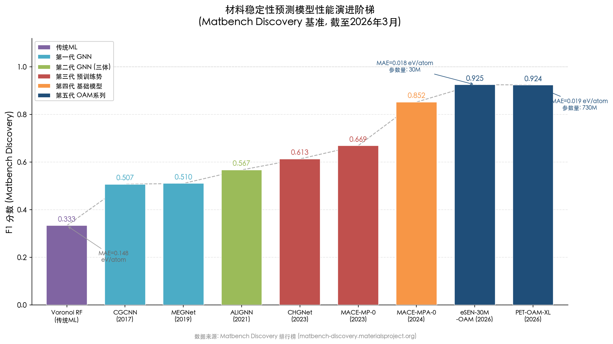

图4-1展示了从传统 ML（Voronoi RF）到第五代 OAM 系列共9个代表性模型在 Matbench Discovery 基准上的 F1 分数代际演进，按模型代际着色区分并标注关键模型的 MAE 与参数量信息。

### 4.2.2 LAMBench 视角下的跨域性能分布

LAMBench 的系统评估为模型性能比较提供了与 Matbench Discovery 互补的视角。在力场泛化性总指标上，DPA-3.1-3M（深势科技/鄂维南团队）以无量纲误差0.175位列第一，显著优于 Orb-v3（0.215）和 DPA-2.4-7M（0.241）。MACE-MPA-0 的无量纲误差为0.308，较 MACE-MP-0 的0.351提升约12%，表明扩展训练数据与模型参数能够带来实质性泛化提升 [LAMBench论文](https://arxiv.org/html/2504.19578v2 "Cai et al., LAMBench, npj Comput. Mater. 2026")。

分域来看，大多数 LAM 在无机材料和分子领域表现相对良好，但在催化领域普遍表现不佳——即使表现最优的 DPA-3.1-3M（使用 OC20M 任务头）在催化能垒预测的无量纲误差仍高达0.53，而专用催化模型 EquiformerV2 可达0.31。这一差距揭示了一个核心事实：通用模型虽然提供了便利的"开箱即用"体验，但在对精度要求严苛的专用领域，距离替代域内专用模型仍有显著距离。

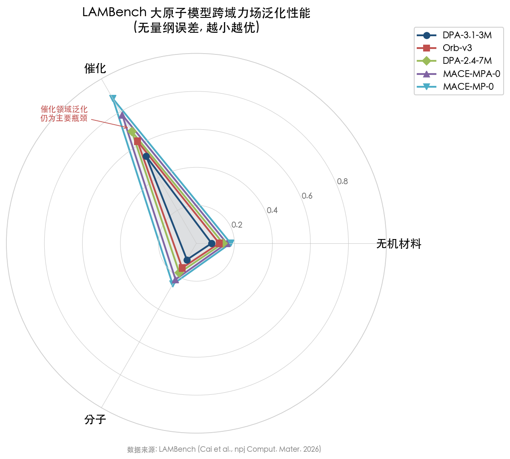

图4-2以雷达图呈现五个主流大原子模型在无机材料、催化和分子三大领域的力场泛化无量纲误差分布，直观展示各模型在催化领域的泛化瓶颈。

性质计算泛化性评估进一步突显了模型间的差异化表现。在无机材料领域的声子和弹性模量预测中，守恒型模型（通过能量梯度计算力）显著优于非守恒型模型（直接预测力的 Orb-v2），其物理根源在于声子和弹性模量的计算本质上依赖势能面的二阶导数，非守恒模型缺乏足够的势能面光滑性。Orb-v2 在 MDR 声子基准上的最大声子频率 MAE 高达308 K，而守恒型模型 SevenNet-MF-ompa 仅为14.9 K——差距超过20倍。

### 4.2.3 关键模型的精度剖析

**GNoME。** Google DeepMind 的 GNoME 通过大规模主动学习训练 GNN，发现超过220万个稳定晶体结构，形成能预测 MAE 为11 meV/atom，结构管线稳定预测命中率从初始不足6%经六轮主动学习提升至超过80%，736个预测结构经独立实验验证 [Nature论文](https://www.nature.com/articles/s41586-023-06735-9 "Merchant et al., Nature 624, 80–85, 2023")。GNoME 的核心意义不仅在于预测精度本身，更在于验证了神经网络缩放定律（scaling law）在材料科学中的适用性——随着训练数据量和模型规模的增大，模型展现出向未见化学体系（如高元体系）的涌现式分布外泛化能力。

**MACE-MP-0 基础模型。** MACE-MP-0 在 Materials Project 轨迹数据集（约146,000种材料）上训练，零样本能量 MAE 为18 meV/atom，力 MAE 为39 meV/Å，零样本 MOF 预测 MAE 为0.040 eV/atom [J. Chem. Phys.论文](https://pubs.aip.org/aip/jcp/article/163/18/184110/3372267/A-foundation-model-for-atomistic-materials "Batatia et al., J. Chem. Phys. 163, 184110, 2025")。其最引人注目的特性在于极高的微调数据效率：仅需5个 DFT 数据点即可从定性预测提升至定量精度，使其成为数据稀缺材料体系的理想起点模型。

**CHGNet。** CHGNet 的核心创新在于将磁矩作为电荷代理纳入训练，使模型能够区分同一元素在不同价态下的行为——这是此前通用势模型普遍忽视的物理维度。其能量 MAE 为30 meV/atom，力 MAE 为75 meV/Å，磁矩 MAE 为0.036 μ_B [CHGNet论文](https://arxiv.org/html/2302.14231v2 "Deng et al., Nat. Mach. Intell. 2023")。在 Li-Fe-P-O 电池材料体系中，CHGNet 经微调后误差从23 meV/atom 降至15 meV/atom，展示了物理信息嵌入与领域微调的协同增效。

**MatterSim。** Microsoft Research 的 MatterSim 通过主动学习在覆盖0–5000 K 温度和0–1000 GPa 压力范围的约1,700万个结构上训练，在 MPF-TP 数据集上的能量 MAE 为36 meV/atom（化学精度为43 meV/atom），较此前最优模型精度提升约一个数量级 [MatterSim论文](https://arxiv.org/html/2405.04967v2 "Yang et al., MatterSim, 2024")。MatterSim 在 Matbench Discovery 上的 F1 为0.83，形成能 MAE 为25 meV/atom。其最显著的突破在于有限温度和压力下的性质预测——吉布斯自由能预测 MAE 为15 meV/atom（温度至1000 K，与实验值比较），体模量零样本预测 MAE 仅2.47 GPa，使从零温形成能到实验可观测相图的桥接成为可能。

**MatterGen（生成式模型）。** 与上述判别式模型不同，MatterGen 的评估对象是结构生成质量而非能量预测精度。其核心指标为 SUN 比率（稳定、唯一、新颖）——MatterGen 生成的 SUN 材料比例是此前最优模型的两倍以上。78%的生成结构在 MP 凸包0.1 eV/atom 内稳定，95%结构的 RMSD 低于0.076 Å，实验验证 TaCr₂O₆ 的体弹性模量与 DFT 目标值偏差在20%以内 [Nature论文](https://www.nature.com/articles/s41586-025-08628-5 "Zeni et al., Nature 639, 624–632, 2025")。这组指标表明，生成式模型的评估范式需从"预测准不准"转向"生成的材料是否真实可合成且满足目标性能"。

## 4.3 评估指标体系：多维度衡量标尺

材料 ML 模型的评估指标因任务类型而呈现显著多样性，单一指标无法全面反映模型在实际应用场景中的价值。我们认为，当前评估体系可归纳为以下几个层次。

**能量与力预测精度。** 形成能预测 MAE（meV/atom）是最基础的性能指标。当前最优模型的形成能 MAE 已达18–19 meV/atom，接近 DFT 不同泛函间的固有差异（PBE 与 r²SCAN 之间约25–50 meV/atom）[Matbench Discovery论文](https://www.nature.com/articles/s42256-025-01055-1 "Riebesell et al., 2025")。这意味着模型预测误差正在逼近训练数据本身的"噪声地板"——进一步提升精度的瓶颈已不完全在于模型架构，而更多受限于训练数据所采用的计算方法的内在精度。力预测 MAE（meV/Å）是分子动力学模拟的核心精度指标，当前最优模型已降至约30–40 meV/Å。

**稳定性分类指标。** F1 分数综合衡量稳定材料预测的精确率（precision）与召回率（recall），有效规避了准确率（accuracy）在正负样本严重不均衡时的误导性——WBM 测试集中仅15.3%的结构为稳定材料。DAF（发现加速因子）量化模型相对于随机筛选的效率增益，为高通量虚拟筛选提供了直接的应用价值度量。

**生成模型指标。** SUN 比率是当前生成式材料设计领域最被广泛采用的综合指标，同时捕获稳定性（热力学凸包距离足够小）、唯一性（非训练集已有结构的复制品）和新颖性（非已知数据库中已报道结构）三个关键维度。RMSD 则量化生成结构与 DFT 弛豫后结构的几何偏差。

**热导率预测。** κSRME 作为新增评估维度被纳入 Matbench Discovery，反映了研究社区将模型评估从基态能量学扩展至输运性质的趋势。

**LAMBench 无量纲指标。** LAMBench 提出的无量纲误差指标将不同数据集的绝对误差归一化为相对于哑模型（仅基于化学式预测能量）的比值，使跨领域、跨性质的综合比较具有统计意义。这一方法论创新有望对未来基准平台的设计产生深远影响。

## 4.4 通用基础模型与专用模型：性能与效率的权衡

### 4.4.1 训练数据规模的决定性影响

在 Matbench Discovery 基准上，训练数据规模对模型性能的影响呈现出近乎决定性的效应。MACE-MP-0 仅在约146,000种材料（MPtrj 数据集）上训练，F1 为0.669；而 PET-OAM-XL 在 OMat24、sAlex 和 MPtrj 的联合数据集上训练，F1 跃升至0.924——同一架构族系内 F1 提升高达38% [Matbench Discovery官网](https://matbench-discovery.materialsproject.org/ "训练数据与F1关系")。MACE-MPA-0 相对于 MACE-MP-0 的提升（F1 从0.669到0.852）同样主要归功于纳入 sAlex 等额外训练数据。

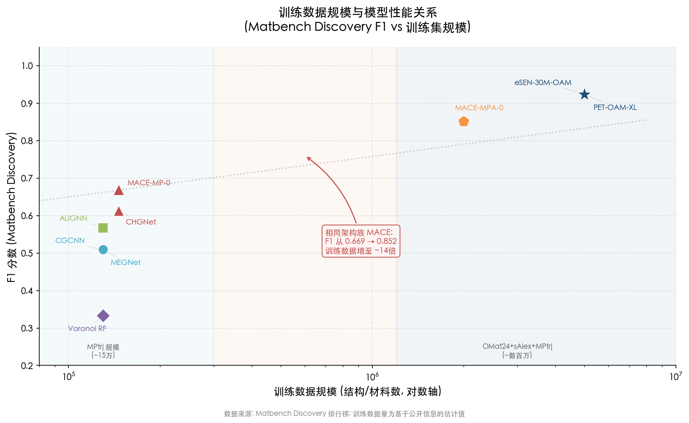

图4-3以训练数据规模（对数轴）为横坐标、Matbench Discovery F1 为纵坐标，标注9个代表性模型的位置，揭示训练数据量从约15万（MPtrj）扩展至数百万（OMat24+sAlex+MPtrj）后 F1 的显著跃升，并特别标注 MACE 架构族内因训练数据扩展约14倍带来的性能提升。

LAMBench 的系统评估进一步印证这一结论。DPA-3.1-3M 在31个跨领域数据集上进行多任务训练，在力场泛化性上以0.175的无量纲误差显著领先于所有单域训练模型。在分子和催化领域，DPA-3.1-3M 分别训练了 SPICE2 和 OC20M 等域内数据集，使其在这两个领域的泛化误差远低于仅在无机材料数据上训练的模型。

上述证据共同指向一个重要结论：在当前阶段，扩展高质量训练数据是提升模型性能最可靠的途径，其效果往往超过架构创新。OMol25 数据集（超过1亿个 DFT 计算，消耗60亿 CPU 核心小时）和 OC25 数据集（780万个计算）的发布，将为下一代基础模型的训练提供更丰富的数据基础 [LBNL官方新闻](https://newscenter.lbl.gov/2025/05/14/computational-chemistry-unlocked-a-record-breaking-dataset-to-train-ai-models-has-launched/ "OMol25计算成本")。

### 4.4.2 架构效率：参数量并非决定因素

eSEN-30M-OAM 与 PET-OAM-XL 的对比为架构效率提供了关键洞察。eSEN 以仅30M 参数达到 F1=0.925，而 PET-OAM-XL 以730M 参数达到 F1=0.924——两者参数量相差24倍，性能却几乎无差。这一结果表明，在材料领域当前的数据规模下，模型精度的瓶颈更可能在于训练数据的多样性与质量，而非模型容量本身。

LAMBench 的效率基准进一步揭示了推理速度的巨大差异。非守恒型 Orb-v2 以效率指标1.341排名第一（因其直接预测力而非通过能量梯度计算），但在需要势能面连续性的任务中（声子计算、NVE 分子动力学）表现严重退化。守恒型模型中，DPA-2.4-7M 和 GRACE-2L-OAM 效率相对较高（效率指标分别为0.617和0.639），而 SevenNet-MF-ompa 因模型复杂性效率最低（0.084）。精度与效率之间的权衡因此成为模型选型中不可忽视的维度。

在 Matbench Discovery 的端到端评估中，各模型完成约215,000个结构弛豫的总运行时间差异极为悬殊：MEGNet 约3.44小时，M3GNet 约83.6小时，MACE-MP-0 约112小时，CHGNet 约142小时，而 BOWSR 耗时高达2,710小时 [Matbench Discovery官网](https://matbench-discovery.materialsproject.org/ "运行时间对比")。对于需要大规模高通量筛选的应用场景，推理效率与预测精度可能具有同等重要性。

### 4.4.3 "预训练+微调"范式的有效性

"预训练+微调"范式已成为材料基础模型应用的标准路径，其有效性已在多个层面得到充分验证。

在力场层面，MACE-MP-0 仅需5个 DFT 数据点微调即可从定性预测提升至定量精度 [J. Chem. Phys.论文](https://pubs.aip.org/aip/jcp/article/163/18/184110/3372267/A-foundation-model-for-atomistic-materials "Batatia et al., 2025")。MatterSim 在模拟液态水时，仅用30个 rev-PBE0-D3 级别的构型微调即可达到与从头训练900个构型相同的径向分布函数精度——数据效率提升达97% [MatterSim论文](https://arxiv.org/html/2405.04967v2 "Yang et al., MatterSim, 2024")。GNoME 预训练势的零样本性能系统性优于使用超过1,000个样本从头训练的专用模型，充分展示了大规模预训练在化学空间覆盖上的独特优势 [Nature论文](https://www.nature.com/articles/s41586-023-06735-9 "Merchant et al., Nature 624, 80–85, 2023")。

在性质预测层面，LAMBench 的适应性测试表明，DPA-3.1-3M 经预训练后在 Matbench 八个回归任务上的微调精度全面优于从头训练（例如形成能 MAE 从24.2降至13.9 meV/atom，带隙 MAE 从0.255降至0.147 eV），且泛化性更优的预训练模型在适应性上同样表现更佳 [LAMBench论文](https://arxiv.org/html/2504.19578v2 "Cai et al., LAMBench, npj Comput. Mater. 2026")。MatterSim 在 Matbench 排行榜五个性质预测任务上（带隙、剪切模量、介电常数、声子频率、二维材料剥离能）均达到或超越此前专用模型的最高精度，进一步验证了大规模材料空间预训练所提取的特征表示具有广泛的下游迁移价值。

## 4.5 小数据场景：迁移学习与数据增强

材料科学中许多关键性质的可用数据远低于深度学习模型通常所需的规模。以 Materials Project 为例，其约144,595种无机材料中仅14,072个弹性张量、3,402个压电张量经过计算——大多数性质的可用数据远低于 GNN 通常需要的约10⁴ 量级训练样本 [Chang et al., npj Comput. Mater. 8, 242 (2022)](https://www.nature.com/articles/s41524-022-00929-x "Towards overcoming data scarcity")。

针对这一挑战，研究社区发展了多种应对策略。Chang 等（2022年）提出的混合专家（MoE）框架在19个材料性质迁移学习任务中14个优于成对迁移学习方法，全部19个优于从头训练基线。然而，该研究也揭示了负迁移风险：从 MP 形成能迁移到19个下游任务时，有6个出现负迁移（包括压电模量、泊松比、介电性质等），原因在于源-目标数据分布差异过大。这一发现提示，迁移学习并非万能药方——源任务与目标任务之间的物理关联性和数据分布相似性是迁移成功的先决条件。

MatterGen 在生成模型层面展示了另一种应对小数据的策略：以5,000个标签结构进行体模量条件微调，成功生成了分布偏向目标体模量值的 SUN 结构 [Nature论文](https://www.nature.com/articles/s41586-025-08628-5 "Zeni et al., Nature 639, 2025")。这表明生成式模型能够在性质标签稀缺的条件下实现目标导向的材料逆设计。

## 4.6 计算成本与可扩展性

模型性能的提升伴随着计算资源投入的急剧增长。在训练数据生成层面，OMol25 消耗60亿 CPU 核心小时——超此前任何数据集10倍以上，"用1,000台笔记本运行需超过50年" [LBNL官方新闻](https://newscenter.lbl.gov/2025/05/14/computational-chemistry-unlocked-a-record-breaking-dataset-to-train-ai-models-has-launched/ "OMol25计算成本")。MatterSim 的训练数据集包含约1,700万个经第一性原理计算标记的结构，M3GNet 版本在8块 NVIDIA A100 GPU 上训练200个 epoch [MatterSim论文](https://arxiv.org/html/2405.04967v2 "Yang et al., MatterSim训练细节")。DPA-3.1-3M 则在120块 A800-40GB GPU 上完成训练 [LAMBench论文](https://arxiv.org/html/2504.19578v2 "DPA-3.1-3M训练配置")。

然而，"预训练+微调"范式从根本上重塑了计算成本的分摊结构。昂贵的预训练阶段由少数研究团队和企业承担，产出的开源基础模型可供整个社区以极低的微调成本适配至特定材料体系。MACE-MP-0 仅需5个 DFT 计算点即可完成微调，MatterSim 仅需30个构型（约原始训练数据的3%），终端用户的计算门槛因此大幅降低。开源数据集（MPtrj、OMat24、OMol25、sAlex）的社区共享机制进一步分摊了数据生成成本，形成了类似于自然语言处理领域"基础模型+下游任务"的分工生态。

## 4.7 精度边界与评估局限

当前评估体系虽已取得显著进展，但仍存在若干系统性局限。

**训练数据与测试数据的分布偏差。** Matbench Discovery 的 WBM 测试集与主流训练数据集（MPtrj、OMat24）之间可能存在微妙的分布重叠，导致部分高 F1 分数未必完全反映真实的分布外泛化能力。LAMBench 通过独立构建下游测试数据集在一定程度上缓解了这一问题，但完全消除分布偏差在实践中仍极为困难。

**DFT 泛函间的精度天花板。** 当前最优模型的形成能 MAE（18–19 meV/atom）已接近 PBE 与 r²SCAN 泛函间的系统性差异（25–50 meV/atom）。在 PBE 标签训练的模型框架内，精度提升空间已十分有限——突破这一天花板可能需要转向更高精度的泛函（如 r²SCAN、混杂泛函）或多保真度训练策略。LAMBench 的评估亦强调了交换关联泛函不匹配的影响：DPA-3.1-3M 在分子领域使用 PBE 级别预测时无量纲误差为0.31，切换到使用 ωB97MD3(BJ) 泛函数据训练的 SPICE2 任务头后误差降至0.10 [LAMBench论文](https://arxiv.org/html/2504.19578v2 "LAMBench 泛函匹配分析")。

**从预测精度到应用价值的鸿沟。** Matbench Discovery 评估的是结构弛豫后的热力学稳定性，而实际材料发现还涉及可合成性判断、动力学稳定性评估与有限温度效应等多个维度。GNoME 的220万个预测稳定晶体中仅736个经独立实验验证（验证率约0.033%）[Cheetham & Seshadri, Chem. Mater. 36, 3490–3495 (2024)](https://pubs.acs.org/doi/10.1021/acs.chemmater.4c00643 "GNoME数据库偏差审查")，提示基准性能与实际材料发现成功率之间仍存在显著距离。

从当前评估结果的整体图景来看，ML/DL 模型在材料性质预测和稳定性判别方面的精度已达到与 DFT 计算方法可比的水平，通用基础模型的"预训练+微调"范式为数据稀缺的材料体系提供了切实可行的切入路径。然而，跨域泛化能力的不均衡、推理效率与预测精度的权衡，以及从计算预测到实验验证的可信度鸿沟，仍是制约模型大规模实际应用的关键瓶颈。

# 第5章 典型应用案例分析

前文系统梳理了 ML/DL 驱动材料配比优化的方法论体系、研究生态、数据基础设施和模型性能基准。然而，模型精度指标层面的进步能否切实转化为材料发现的实质性成果，最终仍需在具体材料体系中经受检验。本章聚焦六个代表性应用领域——高熵合金与多主元合金、催化剂材料、电池材料、陶瓷与功能氧化物、聚合物与复合材料，以及自主闭环实验验证——以案例驱动的方式呈现 ML/DL 配比优化在不同材料体系中的落地深度、实验验证程度和方法论共性特征。

## 5.1 高熵合金与多主元合金：高维成分空间中的智能搜索

高熵合金（HEA）以五种或五种以上主元素近等摩尔比混合为核心设计理念，其成分空间随元素种类和浓度变化呈指数级膨胀——以六元体系为例，候选成分数可达 10⁶ 量级，传统逐一实验筛选在时间和成本上均不可行。这一特征使 HEA 成为 ML/DL 配比优化方法展现搜索效能的理想试验场。

### 5.1.1 高熵 Invar 合金的机器学习加速发现

Rao 等人2022年在 Science 发表的研究是该领域最具标志性的成功案例之一 [Science论文](https://www.science.org/doi/10.1126/science.abo4940 "Rao et al., Science 378, 78–85, 2022")。该工作瞄准一个极具挑战性的目标：在高维成分空间中寻找具有极低热膨胀系数（即因瓦效应）的高熵合金——这一特性在精密仪器、航天结构和电子封装等领域具有关键应用价值。

技术路线的核心创新在于四模块集成策略。研究团队首先利用 Wasserstein 自编码器（WAE）对高维成分空间进行降维，将潜在的数百万候选组合映射至低维流形；随后以 LightGBM 作为代理模型预测热膨胀系数，并与第一性原理计算（DFT）和 CALPHAD 热力学数据库形成互补验证。关键环节在于 MCMC 主动学习采样策略——模型在每轮迭代中不仅选择预测性能最优的候选，还主动探索不确定性最高的区域，以最大化信息增益。

最终成果颇为显著：研究团队仅合成17种新合金，即发现了两种热膨胀系数低至约 2×10⁻⁶ K⁻¹（300K）的高熵 Invar 合金，搜索效率相比传统试错方法提升约50倍。更为重要的是，所发现合金的成分位于传统冶金学家直觉难以触及的非平凡区域，充分展示了 ML 方法在高维空间中发现反直觉解的独特能力。

### 5.1.2 BIRDSHOT：多目标闭环优化框架

Texas A&M 大学 Arroyave 团队2025年在 Acta Materialia 发表的 BIRDSHOT（Bayesian Iterative Robust Design with Successive Hypothesis-testing and Optimization Techniques）框架，将 HEA 配比优化从单目标推进至多目标闭环迭代 [Acta Mater.论文](https://arxiv.org/html/2405.08900v2 "BIRDSHOT, Acta Materialia 2025")。该框架针对 CoCrFeNiVAl 面心立方高熵合金体系，同时优化硬度、弹性模量和屈服强度三个力学性能目标。

BIRDSHOT 的方法论核心在于"约束先行"策略：研究团队首先利用 CALPHAD 热力学模型将候选成分空间从 53,000 种以上缩减至约 2,437 种满足单相 FCC 结构约束的可行候选，仅占原始空间的约 4.6%。随后经过五轮贝叶斯优化闭环迭代（每轮涵盖合金设计、弧熔合成、力学测试和模型更新），仅探索可行空间的约 0.15% 即成功识别出非平凡的三目标 Pareto 最优解集。

该工作的方法论意义在于，它展示了物理约束预筛选与 ML 精细优化相结合如何将"大海捞针"问题转化为"小池塘精准捕捞"——CALPHAD 提供热力学筛选的物理先验，贝叶斯优化提供统计高效的迭代搜索策略，二者协同实现了对组合爆炸的有效应对。

## 5.2 催化剂材料：从 AI 化学家到开放催化数据生态

催化剂设计是 ML 配比优化最接近产业化落地的领域之一。催化剂用量相对较少（降低了合成成本门槛），性能可通过标准电化学测试快速验证（缩短了反馈周期），且绿氢制备、CO₂ 转化等应用具有明确的产业需求牵引。这些特征使催化剂成为 ML 方法落地的天然"低垂果实"。

### 5.2.1 机器化学家：火星陨石到产氧催化剂

中国科学技术大学江俊团队2024年在 Nature Synthesis 发表的工作堪称 AI 驱动催化剂配比优化的标杆案例 [Nature Synthesis论文](https://storage.ghost.io/c/13/57/13573308-a18f-497b-8987-5648a14bf800/content/files/2025/04/s44160-023-00424-1.pdf "Zhu et al., Nature Synthesis 3, 319–328, 2024")。该团队以5种火星陨石作为原料，目标是从中筛选最优的析氧反应（OER）电催化剂配方。这一任务不仅具有科学探索价值，更直接关联未来火星原位资源利用的工程需求。

所面对的搜索空间极为庞大：5种陨石原料的金属元素组合可产生 3,764,376 种候选配方。"机器化学家"系统采用多层次筛选策略——首先通过 DFT 和分子动力学模拟建立元素组合与 OER 活性之间的初步关联；随后以神经网络代理模型替代高成本计算进行大规模预筛选；最后通过 243 组机器人自动化实验结合贝叶斯优化进行精细调优。整个流程在6周内完成，最终发现的最优催化剂过电位为 445.1 mV，相比基线降低 37.1 mV，且稳定运行超过 550,000 秒（约6.4天），相对暴力搜索的效率提升幅度高达约15,500倍。

该案例的深层意义在于：它不仅是一次配比优化的成功实践，更是全流程智能科研平台的概念验证——从原料分析、理论计算、实验设计到自动执行，全部由 AI 系统统一调度。这种"AI 化学家"范式将研究者从重复性实验操作中解放出来，使其得以更多聚焦于科学问题的提出和结果的深层解读。

### 5.2.2 Open Catalyst Project：构建催化剂 AI 的数据基础

在数据基础设施层面，Meta FAIR 与卡内基梅隆大学（CMU）联合推进的 Open Catalyst Project 为催化剂 ML 研究提供了前所未有的数据支撑。OC20 数据集包含约120万个 DFT 弛豫计算和 2.64 亿数据点，覆盖82种吸附质在55种元素表面上的相互作用；2025年9月发布的 OC25 进一步将范围扩展至固液界面催化，收录 780 万个计算、覆盖88种元素，弥补了此前仅关注固气界面的不足 [OC25论文](https://arxiv.org/abs/2509.17862 "OC25, 2025年9月")。

在从预测到实验的闭环验证方面，OCx24（2024年）提供了首个跨模态催化剂实验验证数据集，包含 572 个合成催化剂样品及配套 XRF/XRD 表征数据 [OCx24论文](https://arxiv.org/html/2411.11783v1 "572 samples with XRF/XRD")。该数据集首次系统性地将 AI 催化剂预测与实际实验性能进行对照，为弥合计算预测与实验验证之间的鸿沟迈出了关键一步。

## 5.3 电池材料：从新相发现到电解液配方优化

电池材料是 ML 配比优化最具产业影响力的应用方向之一。无论是锂离子电池还是新型固态电池，正极材料、负极材料、电解液和固态电解质的成分优化均面临迫切需求，且市场规模和产业紧迫性为 ML 方法的落地提供了强大的外部驱动力。

### 5.3.1 GNoME 驱动的新锂离子导体发现

Google DeepMind 2023年在 Nature 发表的 GNoME 项目预测了超过 220 万种新稳定晶体结构，其中包含大量潜在的锂离子导体候选材料 [DeepMind博客](https://deepmind.google/blog/millions-of-new-materials-discovered-with-deep-learning/ "GNoME材料发现")。GNoME 的贡献不仅在于预测本身，更在于其与下游实验验证平台的闭环衔接——大量预测候选直接输入 Berkeley Lab Ceder 团队的 A-Lab 进行自主合成验证，形成了从计算预测到实验确认的完整管线。

这一闭环的核心价值在于：GNoME 通过大规模 GNN 主动学习将稳定材料预测的命中率从不足 6% 提升至超过 80%（结构管线），使 DFT 计算资源的投入产出比大幅提升。每一轮主动学习迭代不仅扩大了训练数据集，还通过不确定性引导采样系统性地填补模型知识的盲区。对电池领域而言，这意味着从数十万种潜在锂离子导体中快速缩小候选范围至可实验验证的量级，将传统可能耗费数年的筛选过程压缩至数月。

### 5.3.2 电解液配方的多目标优化

电解液配方优化是 ML 在电池领域的另一重要应用方向。电解液通常由多种溶剂、锂盐和添加剂组成，其配比直接影响库伦效率、循环寿命、低温性能和安全性等多个相互制约的指标。2025年多项研究采用贝叶斯优化结合 Pareto 前沿分析同时优化库伦效率和循环寿命，并利用分子动力学模拟提供溶剂化结构和离子传输特性的先验信息，结合 ML 代理模型加速大规模配方筛选。这一方法论将电解液开发从"基于经验的逐一试配"转变为"数据驱动的系统优化"，标志着电池电解液研发范式的重要跃迁。

## 5.4 陶瓷与功能氧化物：物理信息约束下的配比设计

陶瓷和功能氧化物的性能对成分配比高度敏感。以钙钛矿结构 ABX₃ 为例，A 位、B 位和 X 位的元素选择与掺杂比例直接决定其光电、铁电、热电等功能特性，使这一材料族成为 ML 辅助成分设计的重要靶向领域。

### 5.4.1 铁电钙钛矿的主动学习发现

Balachandran 等人2018年在 Nature Communications 发表的工作首次展示了"两步式"主动学习策略在铁电钙钛矿配比优化中的应用 [Nat. Commun.论文](https://www.nature.com/articles/s41467-018-03821-9 "Balachandran et al., Nat. Commun. 9, 1668, 2018")。该策略的核心在于将搜索问题分解为两个串联阶段：第一步使用分类器快速筛除明显非铁电的候选成分，大幅缩减搜索空间；第二步对通过筛选的候选使用回归模型精细预测居里温度。模型预测的高居里温度铁电材料随后通过实验验证得以确认，展示了 ML 辅助材料发现从预测到合成的完整链条。

这一"分类器预筛选+回归模型精细预测"的两步式策略对后续研究产生了深远影响，已成为处理稀有目标搜索问题（即感兴趣材料占候选空间极小比例）的标准方法论模板。

### 5.4.2 钙钛矿太阳能电池的成分优化

在钙钛矿太阳能电池领域，2025年多项研究采用物理信息约束 ML 框架，系统探索 ABX₃ 中 A/B/X 位成分配比对光伏效率的影响。物理信息约束的核心思想是将 Goldschmidt 容忍因子、八面体因子等已知的结构稳定性判据作为硬约束嵌入 ML 模型，而非让模型从有限数据中重新学习这些已知规律。在此基础上，ML 驱动的多目标贝叶斯优化（MTBO）进一步实现了制备工艺的分步层级优化——先优化成分配比确定目标组成，再优化前驱体浓度、退火温度等工艺参数——将高维优化问题分解为多个低维子问题逐层求解，显著降低了实验探索的复杂度。

## 5.5 聚合物与复合材料：从语言模型到基因组平台

聚合物材料因其结构多样性和性质空间的广阔性，为 ML 配比优化提供了独特的应用场景。与无机晶体材料不同，聚合物的性质不仅取决于单体组成，还受链长、序列分布、交联度和加工条件等多重因素影响，这使得传统基于晶体学描述符的方法难以直接迁移，亟需发展针对聚合物结构特征的专用 ML 框架。

### 5.5.1 Polymer Genome 平台

Georgia Tech Ramprasad 团队构建的 Polymer Genome 平台是聚合物信息学领域最具代表性的基础设施。该平台基于 ML 代理模型预测多种聚合物性质——介电常数、玻璃化转变温度（Tg）、带隙、热导率等，为聚合物配方设计提供系统性的定量指导 [polyBERT论文](https://www.nature.com/articles/s41467-023-39868-6 "polyBERT, Nat. Commun. 14, 4099, 2023")。

polyBERT 化学语言模型（2023年 Nature Communications）是该平台的核心技术创新之一。该模型将聚合物的 SMILES 表征作为"化学语言"输入预训练 Transformer 架构，学习聚合物结构的分布式向量表示，并在下游性质预测任务上进行微调。与传统手工描述符（如 Morgan 指纹、RDKit 描述符）相比，polyBERT 通过端到端学习自动提取与目标性质最相关的结构特征，在多项聚合物性质预测任务上取得了竞争性甚至更优的精度。

Ramprasad 团队联合创办的 Matmerize 公司将上述学术成果转化为商业应用。2025年2月，Matmerize 与 SCREEN Holdings 合作开发无 PFAS 聚合物替代材料用于半导体制造，直接响应全球 PFAS 监管收紧带来的材料替代需求。其 PolymRize 平台已服务于半导体、涂料和电子材料等行业的聚合物配方筛选，展示了从学术模型到产业工具的完整转化路径。

## 5.6 自主闭环实验验证：从概念验证到规模化

自主闭环实验验证代表了 ML 配比优化的最高实践形态——AI 系统不仅负责预测和设计，还直接驱动机器人执行合成、表征和测试，并将实验结果实时反馈给模型进行迭代优化。这一闭环模式消除了人工实验操作的瓶颈，使材料发现的速度从"按月计"转变为"按天计"甚至"按小时计"。图1对比了六个代表性闭环验证案例的实验规模与自动化水平，直观展示了自动化程度对发现速度的决定性影响。

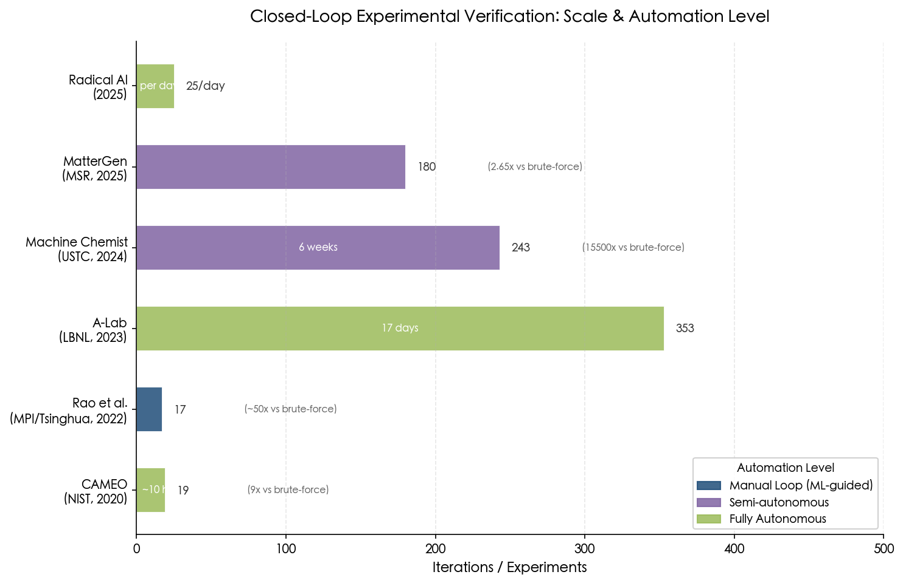

**图1 闭环实验验证案例对比：实验迭代规模与自动化水平。** 柱体按自动化等级（人工闭环/半自主/全自主）着色区分，标注时间跨度和相对暴力搜索的加速倍数。CAMEO 以19次迭代、约10小时完成发现，而 Radical AI 已实现每天25种合金的全自主合成产能。

### 5.6.1 A-Lab：自主合成的里程碑与争议

Berkeley Lab 的 A-Lab 是自主闭环材料合成领域最具影响力的案例。2023年11月发表于 Nature 的工作展示了 A-Lab 在17天自主运行期间，针对 DFT 预测的合成目标执行数百次合成实验，成功制备多种新材料，覆盖33种元素和40种结构原型 [Nature论文](https://www.nature.com/articles/s41586-023-06734-w "Szymanski et al., Nature 624, 86–91, 2023")。

A-Lab 的技术架构包含三个核心模块：基于文献挖掘和 ML 的合成配方生成器；能够自主执行称量-混合-煅烧-表征全流程的机器人操作系统；以及基于 XRD 分析结果驱动下一轮实验设计的主动学习决策引擎。当某一合成目标在初始条件下未能成功时，系统自动调整前驱体比例、煅烧温度和保温时间，实现自适应的迭代优化。

值得客观评价的是，A-Lab 的研究成果经历了学术界的严格审视。2024年，UCL 固态化学家 Palgrave 等人的批评性分析指出，A-Lab 合成的部分材料在 ICSD 数据库中已有已知类似物，对"新材料"的定义提出了质疑。2026年1月，Nature 发布正式勘误，修正了原文中关于合成材料新颖性的表述，澄清这些材料"并非必然是科学上全新的" [C&EN报道](https://cen.acs.org/research-integrity/Nature-robot-chemist-paper-corrected/104/web/2026/01 "2026年1月C&EN报道A-Lab勘误")。Princeton 大学 Schoop 的评论颇为一针见血："如果你拿一个已知材料并掺入少量不同元素形成固溶体，当然你可能制造了一个从未被制造过的成分——但我们是否在意？"

然而，A-Lab 的核心价值并非在于所合成材料的绝对新颖性，而在于其作为自主闭环合成平台的概念验证——它证明了 AI+机器人系统能够独立完成从配方设计到合成执行到结果分析的全链条操作，并在实验失败时自主调整策略。该项目引发的争议恰好为后续工作指明了改进方向：更严格的新颖性评估标准、更稳健的合成可行性预测，以及从"能合成"到"合成有价值的新材料"的范式跃升。

### 5.6.2 CAMEO：贝叶斯主动学习的效率标杆

NIST 的 Kusne 等人2020年在 Nature Communications 发表的 CAMEO（Closed-Loop Autonomous Materials Exploration and Optimization）系统，展示了主动学习在闭环实验中的极致效率 [Nat. Commun.论文](https://www.nature.com/articles/s41467-020-19597-w "Kusne et al., Nat. Commun. 11, 5966, 2020")。该系统将贝叶斯主动学习算法与同步辐射 X 射线衍射（XRD）实验平台紧密耦合，在 Ge-Sb-Te 相变存储材料体系中，仅经过19次实验迭代（总耗时约10小时）即发现了具有最优相变特性的 GST467 组成。

CAMEO 的效率优势源于两个关键设计要素。其一，GP-UCB（Gaussian Process Upper Confidence Bound）采集函数在每次迭代中同时衡量模型对候选成分的预测值和不确定性，在开发已知高性能区域与探索未知区域之间保持动态平衡。其二，同步辐射 XRD 提供了快速、高分辨率的结构表征反馈——每次实验的完整周期（从样品制备到 XRD 测量到数据分析）可在约30分钟内完成，使闭环迭代的时间瓶颈从实验操作转移至模型推理环节。相比全面网格筛选，CAMEO 的搜索效率提升约9倍。

### 5.6.3 MatterGen：生成式模型的实验验证闭环

Microsoft Research 2025年在 Nature 发表的 MatterGen 代表了一种有别于主动学习的闭环路径——生成式模型直接面向目标性质生成候选材料，而非在已有候选空间中逐步筛选 [Nature论文](https://www.nature.com/articles/s41586-025-08628-5 "Zeni et al., Nature 639, 624–632, 2025")。

以体模量优化为例，MatterGen 以 200 GPa 为目标体模量生成 8,192 个候选晶体结构，经 DFT 稳定性筛选后，研究团队选择 TaCr₂O₆ 进行合成验证。DFT 预测该材料体模量为 222 GPa，实验测量值为 158±11 GPa，偏差在目标值 20% 以内。尽管 DFT 预测值与实验值之间存在约 29% 的差距（这在高体模量材料的 DFT 计算中属于已知的系统性偏差），实验结果已确认 MatterGen 生成的材料确实具备高体模量特性。

MatterGen 在搜索效率指标上同样表现突出：在180次 DFT 计算预算内发现106个 SUN（稳定、唯一、新颖）结构，效率是传统高通量筛选的 2.65 倍。更为重要的是，MatterGen 展示了多目标约束生成能力——联合约束高磁性密度和低供应链风险指数，成功消除高风险元素（如稀土和钴）并生成 Pareto 前沿新材料，直接回应了工业界对供应链韧性的现实关切。

### 5.6.4 GNoME 到 A-Lab 的大规模闭环：系统级验证

GNoME 预测的超过 220 万种新稳定晶体结构中，已有 736 个被独立实验验证 [Nature论文](https://www.nature.com/articles/s41586-023-06735-9 "Merchant et al., Nature 624, 80–85, 2023")。虽然验证比例仅约 0.033%，但这一数字反映的是实验验证通量的瓶颈而非预测精度的局限——GNoME 的能量预测误差已低至 11 meV/atom，接近 DFT 不同泛函间的固有差异（PBE vs r²SCAN 约 25–50 meV/atom）。GNoME 向 Materials Project 贡献了近 400,000 种新化合物数据，为下游研究者提供了海量筛选候选。

这一案例揭示了当前材料 AI 领域的核心矛盾：计算预测能力的增长速度远快于实验验证能力的提升。缩小这一差距的路径不在于限制预测规模，而在于提升实验验证的通量和智能化水平。A-Lab、Radical AI 等新一代自主实验室正是为解决这一瓶颈而生。

### 5.6.5 新一代自主实验室的崛起

A-Lab 的先驱探索虽伴有争议，却催化了全球范围内自主实验室建设的显著加速。2025年，多方资本和学术力量密集涌入这一方向。

Radical AI 由 A-Lab 首席科学家 Ceder 联合创办，2025年7月完成 5,500 万美元种子轮融资（RTX Ventures 领投，NVIDIA NVentures、Eni Next 参投），随后完成约 6,000 万美元 A 轮融资 [R&D World报道](https://www.rdworldonline.com/how-radical-ai-is-building-a-self-driving-materials-lab/ "2026年1月R&D World报道")。其纽约实验室已实现每天自主合成和表征超过25种合金的产能——AI 系统筛选数十亿种材料组合进行结构和性能预测，选出实验候选后由机器人自主完成合成，SEM、XRD、XRF 和氧化测试均已实现全自主操作，仅拉伸测试仍为半自主模式。所有实验数据（包括失败实验）均被记录和索引，用于持续训练和改进预测模型。

Ceder 在接受采访时坦言："今天的运作方式与我们设想的仍有差距。还有大量工具建设工作需要完成。" [MIT Technology Review](https://www.technologyreview.com/2025/12/15/1129210/ai-materials-science-discovery-startups-investment/ "Ceder谈A-Lab和Radical AI现状") 这一审慎评价准确反映了自主实验室从概念验证到工程化部署的真实挑战：软件系统的决策鲁棒性、机器人操作的精密度和可靠性，以及异常处理能力，均需在实际运行中持续迭代优化。

University of Toronto 的 Acceleration Consortium（CFREF 资助）已建成6个运行中的自主驱动实验室，并推出 Scale-Up Program 支持从发现到转化的研究 [Acceleration Consortium](https://acceleration.utoronto.ca/ac-labs-and-facilities "6个SDL运行")。2025年12月，Radical AI 加入美国 DOE Genesis Mission，进一步强化了自主实验室与国家科研基础设施的战略衔接。

## 5.7 成功案例的共性特征与方法论启示

纵观上述应用案例，可以提炼出 ML/DL 配比优化取得实质性成果的四项共性特征。

**闭环策略是成功的核心驱动力。** 几乎所有取得突破性成果的案例都采用了 ML 预测与实验验证紧密耦合的主动学习或贝叶斯优化迭代策略。从 CAMEO 的19次迭代到 BIRDSHOT 的五轮闭环，从机器化学家的 243 组实验到 A-Lab 的17天自主运行，闭环反馈机制使模型在真实数据中持续学习和校正，避免了纯预测模式中误差累积和偏差放大的风险。

**多源数据融合提供了必要的知识基底。** Rao 等人的高熵 Invar 合金工作整合了 DFT 计算、CALPHAD 热力学、文献数据和实验测量四类数据源；GNoME 融合了 Materials Project 历史数据和六轮主动学习新生成数据；MatterGen 结合了 DFT 计算数据和实验验证反馈。单一数据源难以覆盖材料设计所需的完整信息维度，多源融合是跨越"数据-知识"鸿沟的关键。

**约束先行策略有效应对了组合爆炸。** BIRDSHOT 通过 CALPHAD 将候选空间从 53,000 缩减至 2,437；A-Lab 从数百万可能目标聚焦至57个合成候选；机器化学家从 376 万种组合筛选至 243 组实验。先利用物理约束（热力学稳定性、结构可行性、元素可用性）大幅缩减候选空间，再利用 ML 在缩减后的空间中进行精细优化——这一"漏斗式"策略已被证明在各类材料体系中普遍有效。图2以对数坐标横向对比了六个代表性案例的候选搜索空间规模与实际实验投入，直观展示了上述搜索效率提升的幅度。

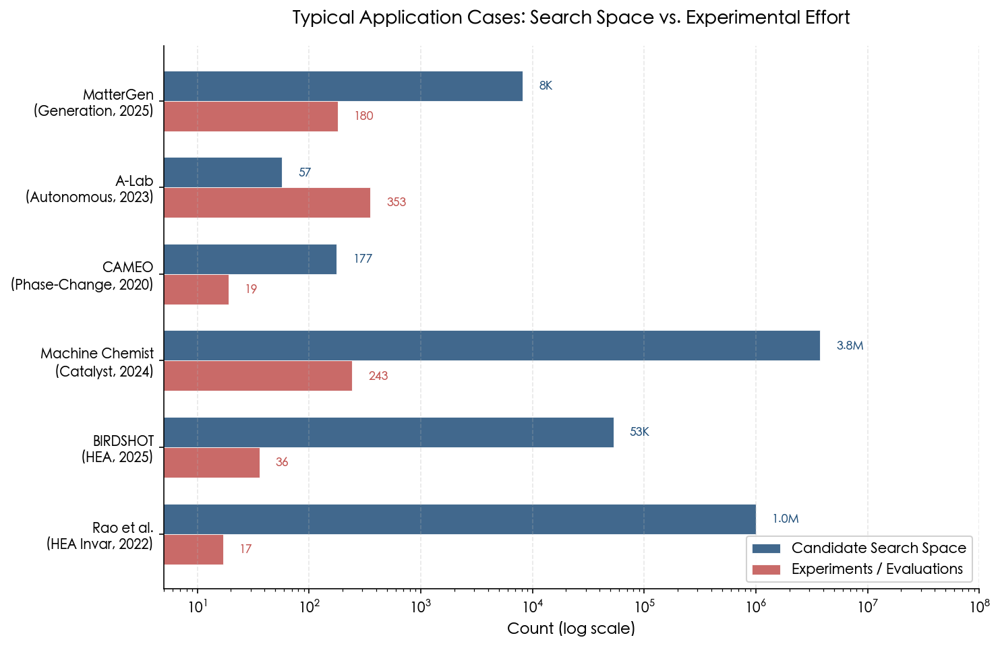

**图2 搜索空间规模与实验投入对比（对数刻度）。** 蓝色柱体表示各案例的候选搜索空间规模，红色柱体表示实际实验/评估次数。机器化学家从 380 万候选中仅执行 243 组实验，Rao 等人从百万量级空间中仅合成17种合金，效率提升均超过一个数量级。

**自动化水平决定了发现速度的天花板。** 从人工闭环（传统实验）到半自动闭环（ML 辅助设计+人工实验）再到全自主闭环（A-Lab、Radical AI），自动化水平的提升使实验迭代周期从数月级压缩至数天甚至数小时。CAMEO 10小时发现最优 GST467、Radical AI 每天合成25种以上合金——这些速度指标代表了该领域的前沿水平，但也揭示了从实验室演示到工业规模部署之间仍存在显著的工程化鸿沟。

上述四项共性特征指向一个清晰的方法论范式：**物理约束预筛选 → ML 代理模型预测 → 主动学习/贝叶斯优化迭代 → 实验验证闭环**。图3以流程图形式呈现了这一范式的四阶段结构及五个代表性案例在各阶段的具体实现路径。

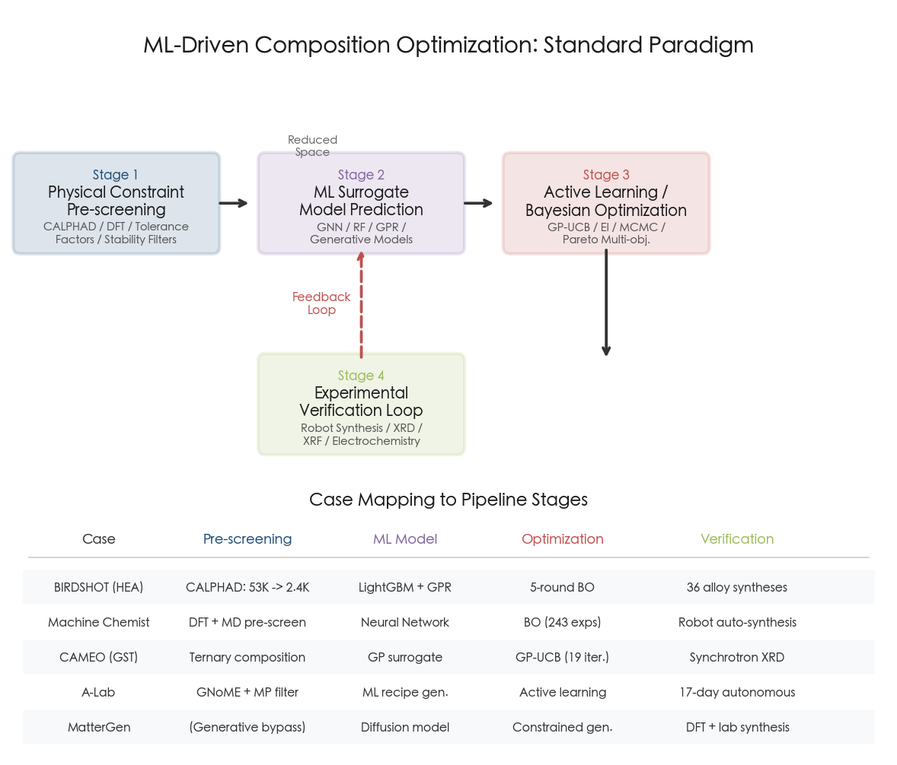

**图3 ML 驱动材料配比优化的标准方法论范式。** 上部流程图展示四阶段闭环结构（物理约束预筛选 → ML 代理模型预测 → 主动学习/贝叶斯优化 → 实验验证闭环），下部案例映射表将 BIRDSHOT、机器化学家、CAMEO、A-Lab 和 MatterGen 五个案例分别对应至各阶段的具体方法与工具，揭示范式的通用结构与各案例实现路径的差异。

该范式已在高熵合金、催化剂、铁电材料等多个体系中得到验证，正在成为 ML 驱动材料配比优化的"标准作战方案"。我们认为，该范式的可迁移性和可扩展性将在未来3–5年内进一步在更多材料体系中得到检验，其成熟度将直接决定 ML 材料配比优化从学术研究走向产业应用的步伐。

# 第6章 核心挑战与可行性分析

前文通过典型应用案例展示了 ML/DL 驱动材料配比优化已在多个材料体系中取得实质性成果。然而，从案例级别的成功走向系统性的方法论成熟和大规模可靠应用，该领域仍面临一系列深层次的技术瓶颈。本章系统剖析当前 ML/DL 材料配比优化面临的八大核心挑战——数据稀缺与分布不均衡、模型可解释性不足、实验验证鸿沟、迁移学习与领域适配困难、多尺度建模衔接缺失、不确定性量化薄弱、物理约束嵌入需求、组合爆炸与计算成本——并针对每类挑战梳理已有的或潜在的解决路径，评估其可行性边界与突破前景。

## 6.1 数据稀缺与分布不均衡：基础设施丰富表象下的结构性短板

### 6.1.1 计算数据与实验数据的数量级鸿沟

从数据库总量来看，计算材料科学的数据基础设施已相当可观：截至2026年初，Materials Project 收录超200,000种材料计算数据，AFLOW 约390万条目，OQMD 约140万条目，NOMAD 超1,930万条目 [LBNL官方新闻](https://newscenter.lbl.gov/2026/01/13/accelerating-discovery-how-the-materials-project-is-helping-to-usher-in-the-ai-revolution-for-materials-science/ "MP超200,000种材料") [AFLOW官网](https://www.aflowlib.org/ "AFLOW官网，截至2026年3月") [NOMAD官网](https://nomad-lab.eu/ "NOMAD首页实时统计")。然而，这一丰富表象掩盖了一个根本性的结构性缺陷：全球最大的实验无机晶体结构数据库 ICSD 仅收录327,833个晶体结构，年增量约12,000个 [ICSD官方公告](https://icsd.products.fiz-karlsruhe.de/en/nachricht/icsd-now-contains-327833-crystal-structures "ICSD 327,833条")。实验结构数据仅覆盖已知无机化合物不到1%，与计算数据库之间存在约10–60倍的量级差距。

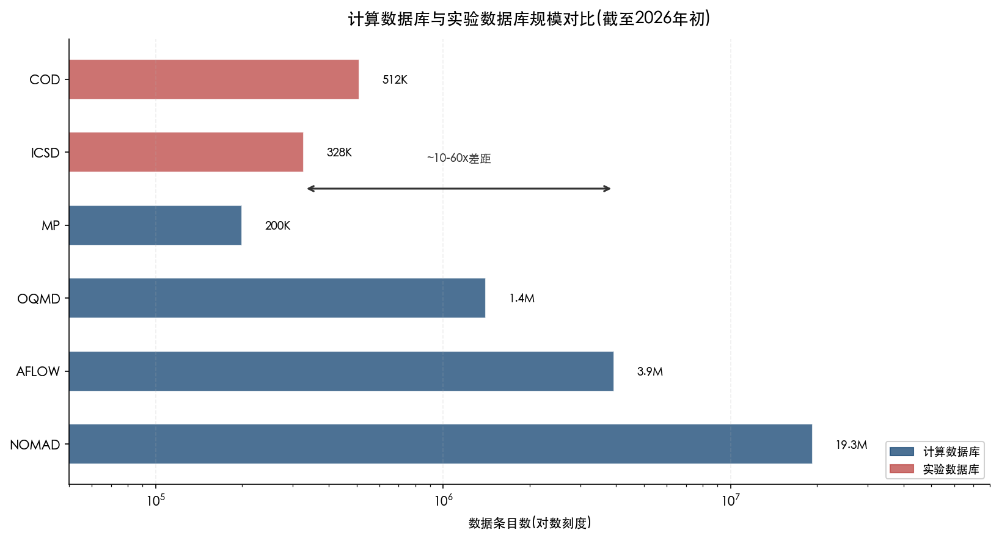

上图以对数刻度直观呈现了六大材料数据库的规模差异：计算数据库（NOMAD、AFLOW、OQMD、MP）在数据规模上全面领先实验数据库（ICSD、COD），两类数据库之间的量级差距达10–60倍。这一结构性不对称是制约 ML 模型从计算预测向实验应用转化的核心障碍。

这一鸿沟的深层含义在于：ML 模型在计算数据上训练所获得的预测能力，在向实验现实转化时面临系统性的偏差风险。DFT 计算本身即存在方法论局限——PBE 泛函对带隙的系统性低估约40–50%，PBE 形成能与实验形成焓的均方根偏差约0.1–0.2 eV/atom，不同泛函间（PBE vs r²SCAN）的形成能差异约25–50 meV/atom [Matbench Discovery论文](https://www.nature.com/articles/s42256-025-01055-1 "Riebesell et al., 2025")。当模型在此类数据上训练并以此为"真值"进行优化时，其预测精度的上限已被数据生成方法本身所锁定。

### 6.1.2 性质数据的严重不均衡

即便在计算数据库内部，不同性质的数据覆盖度也极为悬殊。以 Materials Project 为例，约144,595种无机材料中仅14,072个具有弹性张量数据（覆盖率约9.7%）、3,402个具有压电张量数据（覆盖率仅2.4%）。GNN 模型通常需要约10⁴量级训练样本方可达到可用精度，但众多工程关键性质（如热导率、断裂韧性、蠕变性能）的可用数据远低于此阈值 [Chang et al., npj Comput. Mater. 8, 242 (2022)](https://www.nature.com/articles/s41524-022-00929-x "Towards overcoming data scarcity")。这种不均衡意味着，即使在数据总量看似充裕的材料信息学领域，多数工程性质预测任务实质上仍处于"小数据"状态。

### 6.1.3 负数据的系统性缺失

数据偏差问题中最易被忽视却影响深远的维度是负数据（failed experiments）的系统性缺失。已发表合成数据库中低于10%收率的数据占比不足5%，导致 ML 模型在预测材料稳定性和可合成性时产生系统性乐观偏差 [J. Org. Chem. (2023)](https://pubs.acs.org/doi/10.1021/acs.joc.3c00844 "Negative Data in ML Training")。Toniato 等2025年在 Science Advances 发表的研究系统性展示了通过强化学习将负数据（失败反应）融入语言模型训练的可行性：在正样本极度稀缺（仅22个）的条件下，利用负数据辅助训练的 RL 模型性能超越了使用全部220个正样本微调的模型 [Toniato et al., Sci. Adv. (2025)](https://www.science.org/doi/10.1126/sciadv.adt5578 "Negative chemical data boosts language models")。这一结果有力表明，负数据的有效利用可能成为突破小数据瓶颈的关键路径之一。

此外，大规模预测数据库自身也存在系统性偏差。Cheetham 与 Seshadri（2024）的审查发现，GNoME 预测的220万种新晶体结构中包含超18,000种含放射性元素（Pm、Ac、Pa）和23,529种含 Tc、Np、Pu 的化合物——这些材料几乎不可能被实验验证，进一步加剧了计算预测与实验现实之间的脱节 [Cheetham & Seshadri, Chem. Mater. 36, 3490–3495 (2024)](https://pubs.acs.org/doi/10.1021/acs.chemmater.4c00643 "GNoME数据库偏差审查")。

### 6.1.4 解决路径与可行性评估

应对数据稀缺的技术路线已初步形成三条主要路径。

**迁移学习与混合专家框架。** Chang 等（2022）提出的混合专家（MoE）框架在19个材料性质任务中14个优于成对迁移学习，全部19个优于从头训练 [Chang et al., npj Comput. Mater. 8, 242 (2022)](https://www.nature.com/articles/s41524-022-00929-x "MoE框架14/19任务优于TL")。MACE-MP-0 仅需约5个 DFT 数据点微调即可从定性预测提升至定量精度 [Batatia et al., J. Chem. Phys. 163, 184110 (2025)](https://pubs.aip.org/aip/jcp/article/163/18/184110/3372267/A-foundation-model-for-atomistic-materials "MACE-MP-0跨域泛化")，展示了基础模型"预训练+微调"范式在极端小数据场景下的有效性。

**数据增强与合成数据。** 2025年 MatWheel 框架利用条件生成模型合成训练数据，为小数据场景下的性质预测提供数据增强方案。

**负数据利用。** 如前所述，Toniato 等提出的 RL 方法提供了一条将失败实验转化为有效训练信号的技术路径。

综合而言，我们认为基础模型"预训练+微调"范式是当前应对数据稀缺最具可行性的方案。其核心优势在于将大规模计算数据的知识编码入模型参数，使终端用户可在极少量领域特定数据上实现高效适配。然而，该范式的有效性高度依赖于预训练数据与目标任务之间的化学空间重叠度——Chang 等发现19个下游任务中有6个出现负迁移，主要集中在压电模量、泊松比和介电性质等与源任务分布差异较大的性质上，揭示了迁移学习并非万能解药。

## 6.2 模型可解释性：精度与信任之间的张力

### 6.2.1 精度-可解释性权衡的量化证据

材料科学研究者不仅需要模型给出准确预测，更需要理解预测背后的物理机制。然而，当前模型性能阶梯呈现出一种值得警惕的趋势：精度越高的模型往往越难以解释。

Oviedo 等（2022）在 Accounts of Materials Research 中将可解释 ML 方法系统分为两类：事后解释（post-hoc）方法和内生可解释（inherently interpretable）方法 [Oviedo et al., Acc. Mater. Res. 3, 597–607 (2022)](https://pubs.acs.org/doi/10.1021/accountsmr.1c00244 "Interpretable ML for Materials Science")。事后方法如 SHAP 是目前材料科学中应用最广泛的可解释性工具，但其局限性在于：对 GNN 等非表格型模型适用性有限，且当特征间存在相关性时 Shapley 值不稳定，可能产生误导性解释。

CGCNN 在2018年提出时即展示了内生可解释性——通过图卷积局部聚合提取原子环境对全局性质的贡献，使研究者能够直观理解哪些原子环境对目标性质贡献最大 [Xie & Grossman, PRL 120, 145301 (2018)](https://link.aps.org/doi/10.1103/PhysRevLett.120.145301 "CGCNN可解释性")。MEGNet 的元素嵌入向量在 t-SNE/UMAP 投影中自动聚类为与化学族群对应的簇，表明模型已学到具有化学意义的知识表示 [Chen et al., Chem. Mater. 31, 3564 (2019)](https://pubs.acs.org/doi/abs/10.1021/acs.chemmater.9b01294 "MEGNet元素嵌入周期性聚类")。但这类定性理解在后续更高精度的模型中反而弱化：ALIGNN、MACE 等引入了更复杂的多体交互和等变消息传递机制，模型内部表示的物理可解释性显著下降，形成了"性能提升、理解退步"的困局。

### 6.2.2 可解释性对材料设计的实际影响

可解释性缺失的实际后果体现为：当模型输出一个最优配比建议时，材料科学家无法判断该建议是否基于合理的物理机制，抑或模型在训练数据中的特定模式上发生了过拟合。这种"黑箱推荐"在两种场景下尤为危险——其一，外推至训练分布外的新化学空间时，模型可能给出看似合理但物理不可行的预测；其二，多目标优化中不同性质之间的权衡关系是否反映真实的物理制约，缺乏可解释性的模型无法提供判断依据。

更为根本的是，材料科学领域目前缺乏可解释性方法的标准化评估基准。在计算机视觉和自然语言处理领域，已有多个基准数据集用于评估不同可解释性方法的忠实度（faithfulness）和合理性（plausibility），而材料科学领域尚未建立类似体系。这一空白导致不同可解释性方法的优劣难以客观比较，制约了该方向的系统性进展。

### 6.2.3 潜在解决路径

我们认为，短期内最务实的策略是"高精度黑箱模型+辅助可解释分析"的双轨路线：使用 MACE 或 eSEN 等高精度模型进行预测和筛选，同时利用较简单的可解释模型（如 CGCNN 或基于成分描述符的传统 ML 模型）进行辅助分析，以提取预测背后的主要驱动因素。中长期而言，发展物理信息嵌入与可解释性兼容的新型架构——例如将等变约束与注意力可视化机制相结合——是一条值得持续投入的方向，有望在不牺牲精度的前提下恢复模型的物理透明度。

## 6.3 实验验证鸿沟：从计算预测到实验室现实

### 6.3.1 热力学稳定性≠可合成性

实验验证鸿沟（simulation-to-lab gap）是 ML 材料发现从学术成果走向实际应用的最核心瓶颈之一。这一鸿沟的本质在于：计算预测的热力学稳定性并不等同于实验可合成性，两者之间横亘着多重物理和工程屏障。

A-Lab 的经验提供了最直接的定量证据：在57个 DFT 预测的稳定合成目标中，仅36种被成功合成，成功率为63% [Szymanski et al., Nature 624, 86–91 (2023)](https://www.nature.com/articles/s41586-023-06734-w "A-Lab 36/57成功率")。失败原因涵盖多个层面——热力学稳定性在实验条件下不成立（DFT 计算在0 K 进行，忽略有限温度熵效应）、动力学屏障阻止目标相形成、前驱体不可达或合成路径不存在等。

GNoME 的数据进一步揭示了这一鸿沟的规模：220万预测稳定晶体中仅736个被独立实验验证，验证率约0.033%。Cheetham 与 Seshadri（2024）对 GNoME 数据库的审查发现了系统性结构偏差：预测结构中前四大空间群均为非中心对称群（占约34%），而 ICSD 中仅1%属于非中心对称群；研究者随机抽取10个预测稳定结构，均可在 ICSD 中找到已知的高对称性类似物 [Cheetham & Seshadri, Chem. Mater. 36, 3490–3495 (2024)](https://pubs.acs.org/doi/10.1021/acs.chemmater.4c00643 "GNoME空间群分布异常")。值得注意的是，GNoME 预测材料仍在持续获得独立实验验证——2026年3月，Naganuma 与 Kitagawa 在 Journal of Magnetism and Magnetic Materials 发表了对 GNoME 发现的 MnFeCo₄Si₂ 的磁性质实验验证 [Naganuma & Kitagawa, J. Magn. Magn. Mater. (2026)](https://www.researchgate.net/publication/403107217_Experimental_investigation_of_magnetic_properties_of_MnFeCo4Si2_discovered_by_GNoME "GNoME新材料独立实验验证")，表明大规模预测数据库的实验验证仍处于早期阶段。

### 6.3.2 根本原因分析

实验验证鸿沟的根本原因可归纳为以下四个层面。

**温度效应缺失。** 绝大多数大规模计算数据库基于0 K DFT 计算，忽略了有限温度下的振动熵、构型熵和电子熵贡献。这些贡献在高温条件下可达数十 meV/atom 量级，足以改变相稳定性序列。MatterSim 通过多温压主动学习部分缓解了这一问题——其吉布斯自由能预测 MAE 为15 meV/atom（温度至1000 K），但目前仅覆盖部分材料体系。

**动力学屏障不可忽视。** 热力学稳定并不意味着动力学可达。许多预测稳定的材料可能被高活化能壁垒阻隔，在实验时间尺度内无法形成目标相。当前 ML 模型几乎不考虑合成路径和动力学可行性，这是导致"计算稳定但实验失败"的重要原因。

**合成条件的高维复杂性。** 实验合成涉及前驱体选择、温度程序、气氛控制、反应时间等大量工艺参数，这些参数的组合空间本身即构成一个高维优化问题。MIT Gómez-Bombarelli 组2026年在 Nature Computational Science 发表的 DiffSyn 模型试图以扩散模型生成合成路径，在23,000条合成配方上训练，为弥合这一鸿沟提供了新的技术路线 [MIT News](https://news.mit.edu/2026/accelerating-science-ai-and-simulations-rafael-gomez-bombarelli-0212 "DiffSyn合成路径生成")。

**负面反馈机制缺失。** 如6.1.3节所述，合成失败的数据几乎不被记录和共享，导致模型无法从失败中学习。部分自主实验室团队已开始系统性记录所有实验数据（包括失败实验），为构建包含负数据的训练集提供了先例。

### 6.3.3 弥合路径与进展

弥合实验验证鸿沟的最有效策略是建立"计算预测→实验验证→数据反馈"的闭环系统。OCx24（2024年）包含572个合成催化剂样品配 XRF/XRD 表征数据，首次系统性地将 AI 催化剂预测与实验性能数据对接 [OCx24, arXiv:2411.11783 (2024)](https://arxiv.org/html/2411.11783v1 "572 samples with XRF/XRD")。Energy-GNoME 项目（Politecnico di Torino，2025年）开发了一套系统性筛选协议，从 GNoME 数据库中筛选出38,500种能源应用候选材料——包括约4,259种钙钛矿光伏材料、约7,500种热电材料和约21,243种电池正极候选——为大规模预测数据库的应用导向筛选提供了方法论模板 [De Angelis et al., Energy and AI 22, 100605 (2025)](https://www.sciencedirect.com/science/article/pii/S2666546825001375 "Energy-GNoME筛选协议")。

自主实验室（Self-Driving Lab，SDL）的快速发展为闭环验证提供了关键的硬件基础。Radical AI 每天可自主合成和表征超过25种合金，A-Lab 17天内完成353个合成实验——这些能力使"预测→验证"的反馈周期从传统的数月级压缩至数天级，从根本上改变了闭环迭代的经济可行性和技术可行性。

## 6.4 迁移学习与领域适配：通用模型的边界在哪里

### 6.4.1 涌现式泛化与负迁移并存

通用基础模型的迁移学习能力是当前材料信息学最具突破性的进展之一，但同时也暴露出显著的边界效应。

正面证据颇为引人注目：GNoME 在仅含4种及以下元素的结构上训练后，可准确预测5种及以上元素体系的能量，零样本性能系统性优于使用超过1,000个样本从头训练的专用模型 [Merchant et al., Nature 624, 80–85 (2023)](https://www.nature.com/articles/s41586-023-06735-9 "GNoME涌现分布外泛化")。MACE-MP-0 在 QMOF 数据库（13,912个金属有机框架材料）上的零样本能量预测 MAE 为0.040 eV/atom [Batatia et al., J. Chem. Phys. 163, 184110 (2025)](https://pubs.aip.org/aip/jcp/article/163/18/184110/3372267/A-foundation-model-for-atomistic-materials "MACE-MP-0跨域泛化")。这种跨化学体系的涌现式泛化能力表明，模型在大规模训练过程中确已习得某种程度的通用化学知识。

然而，负迁移现象同样不容忽视。Chang 等（2022）发现，以 MP 形成能为源任务迁移到19个下游任务时，6个任务出现负迁移——压电模量、泊松比、介电性质等与形成能数据分布差异较大的性质受影响最为显著 [Chang et al., npj Comput. Mater. 8, 242 (2022)](https://www.nature.com/articles/s41524-022-00929-x "6/19任务负迁移")。LAMBench 的系统评估进一步揭示，即使表现最优的 DPA-3.1-3M 在催化能垒预测的无量纲误差仍高达0.53，而专用催化模型 EquiformerV2 可达0.31——通用模型在高精度专用领域的精度缺口依然显著。

### 6.4.2 训练数据规模的决定性影响

Matbench Discovery 排行榜的数据清晰揭示了训练数据规模对模型性能的决定性作用：MACE-MP-0（约146,000种材料训练）F1=0.669，而 PET-OAM-XL（OMat24+sAlex+MPtrj 多数据集联合训练）F1=0.924，性能提升幅度达38% [Matbench Discovery官网](https://matbench-discovery.materialsproject.org/ "训练数据与F1关系")。这一差距主要源自训练数据的化学空间覆盖范围差异，而非模型架构本身——eSEN-30M-OAM 以仅30M 参数达到 F1=0.925，与730M 参数 PET-OAM-XL 的性能几乎相同，有力证明在当前发展阶段，数据质量与化学空间覆盖度比单纯增加参数量更为关键。

### 6.4.3 领域特异性挑战

通用势模型在特定材料体系和极端条件下的精度下降值得特别关注。表面/界面体系、含缺陷结构、高温高压极端条件以及有机-无机杂化材料是目前已知的四类"难域"。MatterSim 通过多温压主动学习策略部分缓解了温压效应引发的领域偏移问题 [MatterSim论文](https://arxiv.org/abs/2405.04967 "MatterSim多温压domain shift")，但在 Li-Fe-P-O 电池材料等特定体系中，专用微调仍是达到化学精度的必要步骤——CHGNet 在该体系上微调后误差从23降至15 meV/atom，降幅达35%。

我们判断，通用基础模型将作为"起点模型"在绝大多数应用场景中取代从头训练，但对精度要求严苛的工程应用（如电池电极设计、催化剂筛选）仍需在专用数据上进行微调。"预训练+微调"的二阶段范式预计将在未来3–5年内成为材料 ML 应用的标准工作流。

## 6.5 多尺度建模衔接：最根本的开放问题

### 6.5.1 尺度鸿沟的本质

多尺度建模衔接是 ML 驱动材料设计面临的最根本挑战，也是距离解决最为遥远的问题。当前主流 ML 模型——无论是 GNN 势能面模型、基础模型还是生成式模型——主要在原子/电子尺度运行。然而，工程应用关注的宏观性能指标（断裂韧性、疲劳寿命、蠕变性能、加工性等）由跨越纳米→微米→毫米→宏观多个尺度的物理机制耦合决定。例如，一种合金的疲劳寿命不仅取决于其原子间键合强度，还取决于晶界结构、析出相分布、夹杂物形貌及宏观应力分布——这些信息横跨至少四个空间尺度，且各尺度间的信息传递机制复杂且通常具有非线性耦合特征。

### 6.5.2 现有桥接方案

ML 在多尺度桥接中呈现三种主要应用模式 [Peng et al., J. Math. Phys. 64, 071101 (2023)](https://pubs.aip.org/aip/jmp/article/64/7/071101/2900787/Machine-learning-assisted-multi-scale-modeling "ML-assisted multi-scale modeling review")。

**代理模型模式。** 以 ML 模型替代 DFT 等高成本计算，实现约10,000倍加速。这是当前最成熟的应用模式，通用势模型（MACE-MP-0、UMA 等）即属此类。但这种加速仅发生在同一尺度内部，并未真正跨越尺度边界。

**跨尺度映射模式。** 直接学习不同尺度之间的输入-输出映射关系。Wang 等（2025）在 npj Computational Materials 发表的多尺度 ICME 框架代表了这一方向的前沿进展——该框架结合 CALPHAD+ML+MD+扩散动力学，训练于750,000个 CALPHAD 衍生数据点，实现了对20亿种随机成分的快速筛选，并通过实验验证了12种镍基高温合金成分的 γ/γ′ 微观组织预测 [Wang et al., npj Comput. Mater. (2025)](https://www.nature.com/articles/s41524-025-01730-2 "Multiscale ICME, 20亿成分筛选")。这一工作的核心突破在于首次将原子尺度热力学信息与微米级微观组织演化通过 ML 桥接，但尚未延伸至宏观力学性能预测层面。

**工作流连接器模式。** ML 作为多尺度计算工作流的"胶水"，协调不同尺度的计算模块。这种模式在概念上最为完整，但在实践中面临数据在不同尺度间传递的格式标准化、误差累积控制和计算成本分配等工程性挑战。

### 6.5.3 可行性评估

我们认为，从原子尺度 ML 模型直接预测宏观工程性能（如疲劳寿命、断裂韧性）在可预见的未来（5–10年）内仍难以实现端到端的解决方案。更为务实的路径是构建分层次的"接力式"多尺度计算框架：ML 在每个尺度内提供加速，而尺度间的耦合仍依赖于物理模型（如 CALPHAD、相场模型、有限元模型）。Wang 等的 ICME 框架为这种"分层+ML 加速"策略提供了有力的概念验证，其核心价值在于展示了 ML 可在不替代物理模型的前提下显著提升多尺度工作流的通量和效率。

## 6.6 不确定性量化：从"能否预测准"到"知道自己有多不准"

### 6.6.1 不确定性量化的重要性与现状

在材料配比优化中，获知模型预测的不确定性与获得预测结果本身同等重要。在主动学习和贝叶斯优化框架中，不确定性估计直接决定了搜索策略的探索-利用权衡：过低估计不确定性将导致算法过早收敛至局部最优，过高估计则造成宝贵实验资源的浪费。

GNoME 六轮主动学习即利用模型不确定性选择最有价值的 DFT 计算目标，使稳定材料命中率从不足6%提升至超过80% [Merchant et al., Nature 624, 80–85 (2023)](https://www.nature.com/articles/s41586-023-06735-9 "GNoME不确定性驱动主动学习")。贝叶斯优化（GP-UCB）的核心策略本质上就是将不确定性量化与搜索策略深度耦合——高不确定性区域被优先探索，从而最大化全局搜索效率。

### 6.6.2 主要方法及其局限

Olivier 等（2021）系统评述了贝叶斯神经网络（BNN）在材料数据驱动建模中的不确定性量化方法，区分了认知不确定性（因数据不足导致的可减少不确定性）和偶然不确定性（数据本身固有的不可减少噪声）两类来源 [Olivier et al., Comput. Methods Appl. Mech. Eng. 386, 114079 (2021)](https://www.sciencedirect.com/science/article/abs/pii/S0045782521004102 "BNN for UQ in mechanics")。当前材料 ML 领域常用的 UQ 方法包括 BNN、深度集成（deep ensemble）和 MC-Dropout，各有其适用场景和精度局限。

Vaddi 等（2024）提出的物理信息 BNN（PI-BNN）将材料本构方程嵌入 BNN 结构，在钢合金蠕变断裂寿命预测中展示了95%置信区间覆盖率优于标准 BNN 和 MC-Dropout 的性能 [Vaddi et al., Sci. Rep. 14, 12402 (2024)](https://www.nature.com/articles/s41598-024-61189-x "PI-BNN for creep life UQ")。这一结果表明，物理先验的嵌入能够显著改善不确定性估计的校准质量。

然而，Pernot（2023）在 APL Machine Learning 发表的研究指出，当前材料 ML 领域的 UQ 校准评估存在方法论层面的缺陷：多数研究仅评估平均校准性（average calibration）和一致性（consistency），而忽略了对输入特征空间的条件校准——即适应性（adaptivity） [Pernot, APL Mach. Learn. 1, 046121 (2023)](https://arxiv.org/abs/2309.06240 "Calibration beyond consistency")。一致性良好并不意味着在特征空间各处均有可靠的不确定性估计，而后者恰恰是实际工程应用中用户最为关心的需求。

### 6.6.3 可行性评估

不确定性量化在材料 ML 领域尚未形成统一的评估标准和基准体系。Matbench 等主要基准平台目前不包含 UQ 质量评估维度，导致不同 UQ 方法的优劣难以系统性比较。我们认为，建立标准化 UQ 基准——涵盖校准度量（calibration metrics）、锐度（sharpness）和覆盖率（coverage）的综合评估体系——是该方向的当务之急。在应用层面，将 UQ 与主动学习和贝叶斯优化工作流深度集成，使实验资源配置有据可依，是推动 UQ 从"学术附加功能"走向"工程必备能力"的关键转变。

## 6.7 物理约束嵌入：从软约束到硬编码

### 6.7.1 等变网络的数学必然性

物理对称性的嵌入已从一种可选的模型设计策略演变为近乎强制性的技术要求。Kondor（2025）在 PNAS 中系统阐述了等变神经网络的数学原理，论证了物理对称性（平移不变性、旋转等变性、粒子交换对称性）必须硬编码入网络结构的三重理由：其一，材料/化学领域的经验数据远少于通用 AI 场景，对称性先验可有效补偿数据不足；其二，物理对称性是精确的数学约束而非近似规律，通过学习逼近而非直接编码会产生不必要的系统误差；其三，不嵌入对称性可能产生违反守恒律的非物理轨迹 [Kondor, PNAS 122, e2415656122 (2025)](https://www.pnas.org/doi/10.1073/pnas.2415656122 "等变网络数学原理")。

### 6.7.2 等变架构的性能优势

等变网络的泛化性能提升已获得充分的定量证据。在 Matbench Discovery 排行榜上，MACE-MP-0（等变架构，F1=0.669，MAE=0.057 eV/atom）显著优于非等变的 CGCNN（F1=0.507，MAE=0.138 eV/atom）和 MEGNet（F1=0.510，MAE=0.130 eV/atom） [Matbench Discovery官网](https://matbench-discovery.materialsproject.org/ "等变vs非等变性能对比")。截至2026年3月，该排行榜前10名模型全部基于等变架构，这一格局本身即构成对等变约束必要性的有力佐证。MACE 利用高阶（四体）等变消息传递和 Clebsch-Gordan 乘积，仅需两层消息传递即可达到高精度 [Batatia et al., MACE, NeurIPS 2022](https://arxiv.org/abs/2206.07697 "MACE高阶等变消息传递")。

LAMBench 的评估提供了更深层的物理洞察：在声子和弹性模量预测中，守恒型模型（通过能量梯度计算力）显著优于非守恒型模型——Orb-v2 在声子基准上的最大声子频率 MAE 高达308 K，而守恒型 SevenNet-MF-ompa 仅为14.9 K，两者差距超过20倍。其物理根源在于声子和弹性模量计算依赖势能面的二阶导数，非守恒模型缺乏足够的势能面光滑性，难以保证二阶导数的精度。

### 6.7.3 物理约束嵌入的前沿与挑战

尽管等变网络已成为主流架构范式，但物理约束嵌入的潜力远未被充分开发。当前模型主要编码空间对称性，而材料行为还受到热力学约束（如凸包稳定性条件）、化学约束（如电荷平衡、价态规则）和动力学约束（如扩散激活能壁垒）的共同支配。如何在保持模型灵活性的前提下系统性地嵌入这些更高层次的物理约束，是下一阶段模型设计的核心课题。

CHGNet 将磁矩作为电荷代理纳入训练，使模型能够区分同一元素在不同价态下的行为，是在空间对称性之外嵌入额外物理信息的成功范例。Vaddi 等的 PI-BNN 将材料本构方程嵌入网络结构，则代表了另一种物理约束嵌入的技术路线。我们认为，未来高性能模型将越来越多地采用"多层次物理约束叠加"策略——底层编码空间对称性，中层编码化学约束（电荷守恒、价态规则），上层编码热力学/动力学约束——从而在架构层面实现对材料物理知识的系统性整合。

## 6.8 组合爆炸与计算成本：效率前沿的竞争

### 6.8.1 搜索空间的指数膨胀

材料元素配比优化面临的最直观挑战是组合爆炸：5元体系候选成分数约10⁵量级，6元体系达10⁶，7元体系超10⁷ [Rao et al., Science 378, 78–85 (2022)](https://www.science.org/doi/10.1126/science.abo4940 "高维空间高效搜索")。传统穷举式搜索在这一空间中完全不可行，即便是高通量 DFT 筛选，在六元以上体系中也因计算成本过高而受限。

应对组合爆炸的两条主要路径已在前述案例中得到充分验证。

**"约束预筛选+ML 代理模型+主动学习/贝叶斯优化"三段式策略。** BIRDSHOT 通过 CALPHAD 约束从53,000+候选缩减至2,437个可行成分，仅探索0.15%的搜索空间即抵达 Pareto 最优解 [Mulukutla et al., Acta Materialia (2025)](https://arxiv.org/html/2405.08900v2 "BIRDSHOT约束先行策略")；Rao 等仅合成17种合金即发现高熵 Invar 合金，展示了主动学习在高维空间中的极致搜索效率。

**生成式模型直接面向目标采样。** MatterGen 在180次 DFT 预算内发现106个 SUN（稳定、唯一、新颖）结构，效率是高通量筛选的2.65倍 [Zeni et al., Nature 639, 624–632 (2025)](https://www.nature.com/articles/s41586-025-08628-5 "MatterGen高效目标搜索")。这一策略的优势在于绕过了逐点评估的范式，直接从目标性质空间"反向生成"候选结构。

### 6.8.2 数据生成的计算成本

支撑 ML 模型训练的数据生成本身已成为高度资源密集型活动。OMol25 消耗60亿 CPU 核心小时——超此前任何计算化学数据集10倍，"用1,000台笔记本运行需超过50年" [LBNL官方新闻](https://newscenter.lbl.gov/2025/05/14/computational-chemistry-unlocked-a-record-breaking-dataset-to-train-ai-models-has-launched/ "OMol25计算成本")。这种规模的计算投入仅少数大型科技企业（Meta、Google DeepMind、Microsoft）和国家实验室能够承担，在客观上形成了数据和模型层面的资源壁垒。

### 6.8.3 架构效率与推理成本

在模型端，架构效率已成为与原始精度同等重要的竞争维度。eSEN-30M-OAM 以仅30M 参数达到 F1=0.925，与730M 参数 PET-OAM-XL 的 F1=0.924 几乎相同 [Matbench Discovery官网](https://matbench-discovery.materialsproject.org/ "参数效率对比")，有力表明参数量并非性能提升的唯一杠杆，架构设计的合理性同样关键。

推理速度的差异对实际应用影响巨大：在 Matbench Discovery 基准上，MEGNet 运行时间仅3.44小时，而 CHGNet 需142小时，BOWSR 高达2,710小时——三者之间的速度差异达到约800倍。UMA 实现了1,000原子体系单 GPU 1.4 ns/day 的模拟速度 [UMA论文](https://arxiv.org/abs/2506.23971 "UMA模拟速度")。对于需要进行大规模分子动力学模拟或高通量筛选的应用场景，推理效率可能比峰值精度更为关键。

"预训练+微调"范式还带来了一个重要的附带效益：极大降低了终端用户的计算门槛。基础模型的训练成本由模型开发团队一次性承担，终端用户仅需投入少量微调计算即可获得高精度专用模型。开源数据集（OMat24、OMol25、MPtrj）和开源模型（MACE、DeePMD-kit、CHGNet）进一步将这种成本分摊机制推向社区级别，有效缓解了计算资源集中化带来的不平等问题。

## 6.9 综合可行性评估

综合上述八大挑战的分析，各挑战的技术成熟度和突破前景呈现出明显的梯度分化：

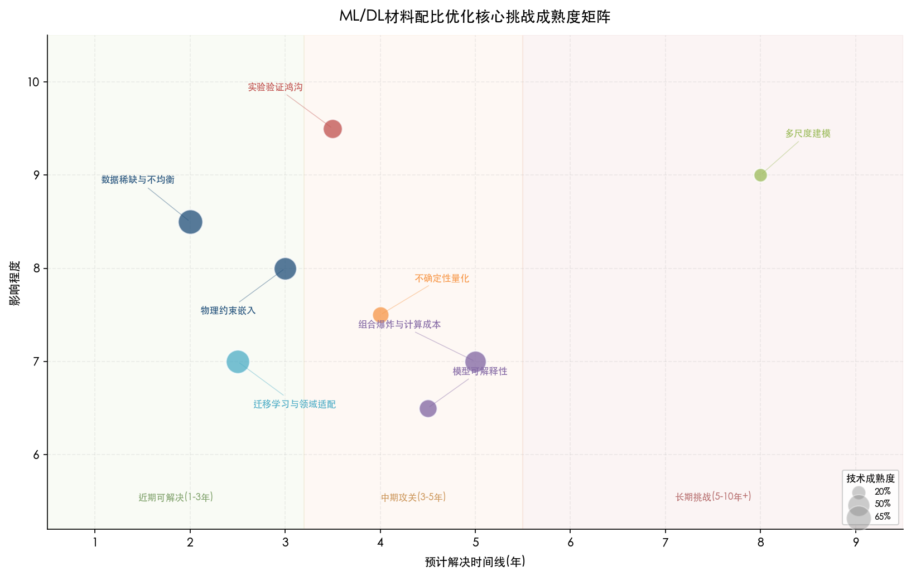

上图以"预计解决时间线"为横轴、"影响程度"为纵轴、气泡大小表示技术成熟度，直观呈现了八大核心挑战在影响-时间线-成熟度三维空间中的分布。据此，各挑战可划分为以下三个梯队。

**近期可解决（1–3年）。** 基础模型"预训练+微调"范式已基本成熟，可有效应对数据稀缺和迁移学习问题；等变架构已成为事实标准，物理约束嵌入在空间对称性层面趋于完善；组合爆炸在中等维度（≤6元体系）空间中已有成熟的解决方案。

**中期攻关（3–5年）。** 实验验证鸿沟随自主实验室的工程化部署有望显著缩小；不确定性量化方法的标准化评估和深度集成预计将在该时间窗口内走向成熟；可解释性方法在物理信息嵌入框架下可望取得阶段性突破。

**长期挑战（5–10年以上）。** 多尺度建模的端到端解决方案因涉及根本性的物理复杂性而进展缓慢，短期内难以绕过物理模型桥接的需求；高元体系（7元以上）的高效搜索策略仍有待突破；物理约束的全面系统嵌入（从空间对称性扩展至热力学、化学和动力学约束）需要更深层次的数学和物理理论创新。

我们认为，这八大挑战中最具"解锁效应"的突破方向是实验验证鸿沟的缩小——一旦自主实验室实现工程化部署并系统性积累含负数据的闭环数据集，将同时推动数据稀缺、模型校准和多尺度验证等多个关联挑战的协同缓解。相反，多尺度建模衔接因涉及根本性的物理复杂性，预计将在较长时间内保持为该领域的核心开放问题。

# 第7章 产业化路径评估与前景展望

前文系统剖析了 ML/DL 驱动材料配比优化面临的核心挑战及其可行性边界。这些技术瓶颈的客观存在，自然引出一个更具实践意义的问题：该领域距离大规模工业应用究竟还有多远？本章从技术成熟度评估、工业界实践现状、商业化平台与工具链生态、自主实验室（Self-Driving Laboratory, SDL）工程化进展、产业化关键瓶颈、各材料领域产业化时间线以及政策驱动与生态建设七个维度，对 ML/DL 材料配比优化的产业化路径进行系统评估，并给出分阶段的前景展望。

## 7.1 技术成熟度评估：从实验室原型到工程系统的阶梯

### 7.1.1 MLTRL 框架与材料 AI 的成熟度定位

评估 ML/DL 材料配比优化的产业化就绪程度，需要一套超越传统技术就绪度（TRL）的评估框架。Lavin 等2022年在 Nature Communications 提出的机器学习技术就绪度（Machine Learning Technology Readiness Levels, MLTRL）框架，将 ML 系统成熟度划分为9个等级（TRL 1–9），在传统 TRL 基础上增加了对数据管线成熟度、模型漂移监控和持续再训练机制的评估维度 [Lavin et al., Nat. Commun. 13, 6039 (2022)](https://www.nature.com/articles/s41467-022-33128-9 "MLTRL框架")。该框架对材料 AI 领域尤为适用：材料发现的 ML 系统不仅需要模型预测的准确性，更需要从数据采集、模型训练到实验验证的完整管线在工业环境中持续稳定运行。

NAE Bridge 2025年秋季刊进一步引入了材料成熟度等级（Materials Maturation Level, MML）框架，识别出实验室发现（TRL 3–4）到系统集成（TRL 7）之间的"死亡谷"鸿沟。该框架指出，跨越这一鸿沟需要跨机构协作和系统性的工程投入，单靠学术研究本身难以完成 [NAE Bridge Fall 2025](https://www.nae.edu/341012/Guest-Editors-Note-The-Materials-Genome-Initiative-MGI-Status-and-Future-Outlook "MGI Status, TRL/MML框架")。

### 7.1.2 各材料体系的成熟度现状

按照 MLTRL 框架评估，当前各主要材料体系的 ML 配比优化成熟度呈现明显分层：

**催化剂材料（TRL 5–6）** 处于领先位置。OCx24 已建立首个跨模态催化剂实验数据集（572个合成样品配 XRF/XRD 表征），江俊组"机器化学家"完成了从 AI 筛选到机器人合成的完整验证循环，Open Catalyst Project 的数据生态为工业催化剂筛选提供了基础设施支撑。催化剂的天然优势在于：用量较少降低了合成门槛，性能可通过标准电化学测试快速验证，且绿氢制备与 CO₂ 转化等应用具有明确的产业需求牵引。

**电池材料（TRL 4–5）** 紧随其后。GNoME 预测的约380,000种新稳定材料中包含大量潜在锂离子导体候选，已直接输入 A-Lab 进行实验验证。深势科技 Piloteye 平台已服务比亚迪等企业用户。然而，电池安全测试和循环寿命验证通常需要1–3年，这一内在时间约束限制了 ML 方法加速效果的充分释放。

**高熵合金（TRL 4–5）** 在学术验证层面已高度成熟——BIRDSHOT 框架实现了多目标闭环优化，Rao 等在 Science 发表的工作展示了高维成分空间高效搜索的可行性。然而，从实验室铸锭到工业级铸件之间存在制造工艺鸿沟，且航空航天等关键应用领域的适航认证周期通常超过10年。

**聚合物与复合材料（TRL 4–5）** 受益于合成可控性较好的优势，且 PFAS 替代等应用有明确的监管驱动方向。Matmerize 的 PolymRize 平台已开始服务半导体行业，但整体上仍处于候选筛选阶段。

**功能陶瓷和半导体材料（TRL 3–4）** 仍主要处于学术验证阶段，距离工程应用路途最远。

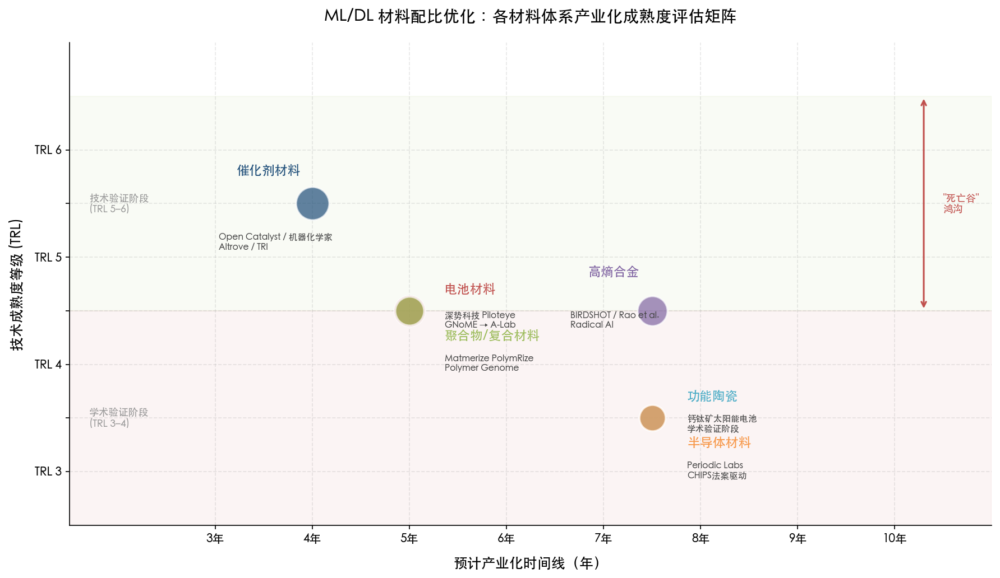

上图以技术成熟度等级（TRL）为纵轴、预计产业化时间线为横轴，直观展示了六大材料体系从学术验证阶段到技术验证阶段的分层格局，以及横亘于实验室发现与系统集成之间的"死亡谷"鸿沟。

## 7.2 工业界实践现状：资本涌入与"ChatGPT 时刻"的缺席

### 7.2.1 2025年 AI 材料发现领域的投资爆发

2025年见证了 AI 材料发现领域前所未有的风险投资热潮。仅五家代表性初创企业的单年融资总额即超过10亿美元：

- **Lila Sciences**（MIT Gómez-Bombarelli 联合创办）2025年10月完成3.5亿美元 Series A，累计融资5.5亿美元，投资方包括 NVIDIA NVentures、Flagship Pioneering、General Catalyst 和 IQT，目标是构建"科学超级智能"平台 [Lila Sciences公告](https://www.lila.ai/news/announcing-the-close-of-our-series-a "Series A 3.5亿美元")。
- **Periodic Labs**（创始人包括 GNoME 论文联合作者 Cubuk 和 ChatGPT 联合创建者 Fedus）2025年9月完成3亿美元种子轮（Andreessen Horowitz 领投，天使投资人包括 Jeff Bezos 和 Eric Schmidt），2026年3月以约70亿美元估值推进新一轮融资谈判 [TechCrunch](https://techcrunch.com/2025/10/20/top-openai-google-brain-researchers-set-off-a-300m-vc-frenzy-for-their-startup-periodic-labs/ "3亿美元种子轮") [Bloomberg](https://www.bloomberg.com/news/articles/2026-03-25/ai-science-startup-periodic-labs-is-in-deal-talks-at-about-7-billion-valuation "70亿美元估值")。
- **深势科技**2025年12月完成 Series C 融资8亿人民币（约1.14亿美元），累计融资约2.14亿美元，工具已被全球超1,000所大学和研究机构及150家企业客户使用 [SiliconANGLE](https://siliconangle.com/2025/12/24/dp-technology-raises-114m-accelerate-chinas-ai-science-industry/ "DP Technology Series C")。
- **Edison Scientific** 2025年12月获得7,000万美元种子轮融资，聚焦构建自主 AI 科学家平台 Kosmos [SiliconANGLE](https://siliconangle.com/2025/12/18/edison-scientific-raises-70m-build-autonomous-ai-scientists-research/ "Edison Scientific 7000万美元")。
- **Radical AI**（UC Berkeley Ceder 教授与 Krause 联合创办）2025年7月完成5,500万美元种子轮，Ceder 从 UC Berkeley 休假担任首席科学官，在纽约建设自主实验室 [Working Capital Fund](https://workingcapitalfund.com/why-we-invested-in-radical-ai/ "Radical AI 5500万美元种子轮")。

此外，法国初创公司 Altrove 于2025年10月完成1,000万美元种子轮，专注利用 AI 设计无稀土、无钴磁性材料替代品，累计融资约1,400万美元 [Axios](https://www.axios.com/pro/climate-deals/2025/10/31/altrove-raises-10m-ai-materials "Altrove 1000万美元种子轮")。

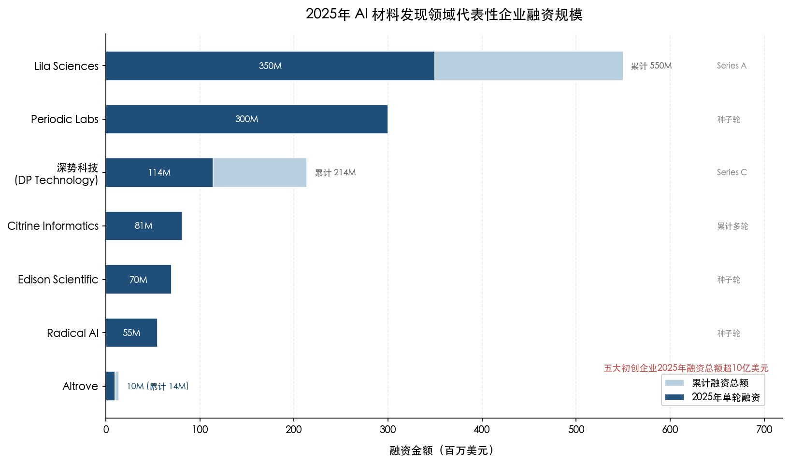

上图对比了七家代表性企业的2025年单轮融资与累计融资总额，直观呈现了资本涌入的规模与集中度。MIT Technology Review 对这一现象评论称"从未见过如此多资金流入材料领域" [MIT Technology Review](https://www.technologyreview.com/2025/12/15/1129210/ai-materials-science-discovery-startups-investment/ "2025年AI材料投资爆发")。然而该文同时指出一个关键判断：该领域尚未出现"ChatGPT 时刻"——即一个足以向公众和产业界证明 AI 材料发现已从概念验证跨越到实际价值创造的标志性事件。

### 7.2.2 传统工业巨头的 AI 材料布局

与初创企业的高调融资形成对照，传统工业巨头在 AI 材料研发中的布局相对低调但具有战略纵深。

**Citrine Informatics** 累计融资8,130万美元，2025年12月发布两项重要产品：Omni（集成超过10个 AI 代理的通用数据协调器）和 Apex（自学习 AI 框架，可评估数千万种材料并筛选排名最优500种候选，据称可将材料开发速度提升80%）。其公开客户覆盖 Rolls-Royce、EMD Electronics、LyondellBasell、Grace 和 Evonik 等跨行业领军企业 [Citrine官方公告](https://citrine.io/media-post/unveiling-the-next-frontier-in-materials-ai/ "2025年12月Omni和Apex发布")。

**Toyota Research Institute（TRI）** 自2016年启动加速材料设计与发现（AMDD）项目以来，累计投入超过5,000万美元用于大学合作研究。2022年 TRI 与 Northwestern 大学合作建立全球首个纳米材料"数据工厂"，利用 Megalibraries 技术结合 ML 算法加速燃料电池催化剂发现 [Toyota USA Newsroom](https://pressroom.toyota.com/toyota-research-institute-and-northwestern-join-forces-to-accelerate-the-discovery-of-materials-that-will-drive-the-clean-energy-transition/ "TRI-Northwestern数据工厂")。TRI 同时开发了云计算平台 CAMD（Computational Autonomy for Materials Discovery），将主动学习与高通量计算相结合，旨在实现从预测到合成的自主化闭环。

**BASF** 于2023年启用新一代 Quriosity 超级计算机（3 petaflops 计算能力，前代为1.75 petaflops），该系统定位为全球工业化学研究领域最大的超级计算机，支撑量子化学模拟（原子模拟规模从100扩展至1,000个原子）和 ML 驱动的配方优化 [BASF官方新闻](https://www.basf.com/global/en/media/news-releases/2023/05/p-23-220 "BASF Quriosity超算")。BASF 还与 Imperial College London 合作创立 AI 化学工艺优化衍生公司 Solve，将 ML 模型应用于化学生产流程优化。

**Matmerize**（Georgia Tech Ramprasad 教授创办）2025年2月与日本 SCREEN Holdings 合作开发无 PFAS 聚合物替代材料用于半导体制造，同时获得美国国防部资助开发低可燃性聚合物。Ramprasad 另获 NSF 200万美元资助用于聚合物信息学基础研究 [Matmerize新闻稿](https://www.prweb.com/releases/matmerize-and-screen-holdings-partner-to-develop-high-resistance-pfas-free-polymers-for-semiconductor-manufacturing-302383706.html "Matmerize-SCREEN合作")。

### 7.2.3 资本热度与技术现实的落差

我们认为，当前资本市场对 AI 材料发现领域的热情存在一定程度的前瞻性溢价。这种溢价具备合理性基础：其一，GNoME、MatterGen 等突破性工作确实证明了 AI 在材料发现中的巨大潜力；其二，清洁能源转型、半导体供应链安全等宏观需求为新材料开发提供了明确的市场拉力；其三，基础模型"预训练+微调"范式的成功降低了终端用户的技术门槛。然而，从实验室发现到商业化产品之间的路径依然漫长——传统材料从实验室到市场部署通常需要约20年 [MIT Technology Review](https://www.technologyreview.com/2025/12/15/1129210/ai-materials-science-discovery-startups-investment/ "材料从实验室到市场约20年")。即使 AI 能够显著压缩发现阶段的时间，后续的工艺放大、安全测试、监管审批等环节仍受物理规律和制度框架的刚性约束。

企业信任危机是另一个不可忽视的因素。大型材料企业曾被多轮技术炒作所伤——从组合化学热潮到 GNoME"数百万新材料"的争议性宣称——投资者和企业决策者现在要求看到的不仅是发现新材料的能力，更是将发现转化为可商业化产品的实证 [MIT Technology Review](https://www.technologyreview.com/2025/12/15/1129210/ai-materials-science-discovery-startups-investment/ "企业信任危机")。

## 7.3 商业化平台与工具链生态

### 7.3.1 开源工具链的成熟度

ML/DL 材料配比优化的开源工具链已形成从数据处理到模型部署的完整生态体系。在数据层，pymatgen、ASE 和 matminer 提供了材料数据处理和特征工程的标准化接口；在 ML 力场层，DeePMD-kit、MACE、NequIP、CHGNet 和 M3GNet 覆盖了从训练到推理的完整工作流；在基础模型层，MACE-MP-0/MPA-0、UMA 和 eSEN 提供了开箱即用的通用原子模拟能力；在生成模型层，CDVAE、MatterGen 和 FlowMM 支持目标导向的材料逆设计。上述工具几乎全部基于 Python/PyTorch 生态构建，具备良好的互操作性。

这一开源生态的战略意义在于：它极大地降低了工业用户的技术准入门槛。企业材料研发团队无需从零构建 ML 基础设施，而可基于成熟的开源框架进行领域特定的适配和微调。"预训练+微调"范式在此语境下不仅是一种技术策略，更是一种产业化赋能模式——它使得不具备大规模数据采集和模型训练能力的中小型企业也能接入前沿 AI 材料发现能力。

### 7.3.2 商业平台的三层格局

当前商业化平台呈现三层差异化竞争格局：

**专用材料 AI 平台** 以 Citrine Informatics 和 Matmerize 为代表。Citrine 的 Apex 平台采用自学习 AI 框架，核心差异化在于其对工业级材料配方数据的管理和分析能力，客户覆盖航空发动机到精细化工等多个行业。Matmerize 的 PolymRize 平台则聚焦聚合物领域的逆设计，在 PFAS 替代材料开发中形成了细分市场优势。

**综合模拟+AI 平台** 以 Schrödinger 为代表。Schrödinger 明确提出"Physics+AI"技术路线，将第一性原理模拟与 ML 代理模型深度融合，在药物分子和材料设计两个方向同步布局 [Schrödinger 2026战略](https://ir.schrodinger.com/press-releases/news-details/2026/Schrdinger-Provides-Update-on-Progress-Across-the-Business-and-Outlines-2026-Strategic-Priorities/default.aspx "Schrödinger Physics+AI路线")。Ansys Granta 则侧重材料数据管理和模型集成，服务于工程仿真流程中的材料选型环节。

**AI for Science 基础设施** 以深势科技为代表。其 Bohrium 云平台提供从高性能计算到 ML 训练的一站式基础设施，Uni-Lab 实验室系统则将计算预测与实验验证闭环整合，客户覆盖中石油和比亚迪等大型企业 [SiliconANGLE](https://siliconangle.com/2025/12/24/dp-technology-raises-114m-accelerate-chinas-ai-science-industry/ "DP Technology客户")。

全球材料信息学市场规模2025年约为1.70亿美元，预计到2030年将增长至约4.10亿美元，年复合增长率约19.2% [MarketsandMarkets](https://www.prnewswire.com/news-releases/material-informatics-market-worth-410-4-million-in-2030---exclusive-report-by-marketsandmarkets-302389748.html "材料信息学市场规模预测")。这一市场规模相较于整体材料产业仍然微小，反映出 AI 在材料研发中的渗透率尚处于早期阶段。

## 7.4 自主实验室：从概念验证到工程化部署

### 7.4.1 自主实验室的分级体系

自主实验室（Self-Driving Laboratory, SDL）是实现 ML 材料配比优化从计算预测到实验验证闭环的关键使能技术。Tobias 与 Wahab 2025年在 Royal Society Open Science 提出的五级 SDL 自主性分级框架，为评估该技术的成熟度提供了系统化标准 [Tobias & Wahab, R. Soc. Open Sci. 12, 250646 (2025)](https://royalsocietypublishing.org/rsos/article/12/7/250646/235354/Autonomous-self-driving-laboratories-a-review-of "SDL五级自主性分类")：

| 自主性等级 | 定义 | 典型特征 | 当前代表 |
|:---:|:---:|:---|:---|
| Level 1 | 辅助 | 人工操作为主，计算机辅助数据分析 | 多数传统实验室 |
| Level 2 | 部分自主 | 单一实验步骤自动化 | 高通量筛选平台 |
| Level 3 | 条件自主 | 多步骤自动化但需人工监督和干预 | 多数现有 SDL |
| Level 4 | 高度自主 | 端到端自主运行，仅在异常情况下需人工干预 | A-Lab |
| Level 5 | 全自主 AI 研究员 | 自主生成假设、设计实验、执行验证和迭代优化 | 尚未实现 |

该框架的一个重要洞见是：软件自主性比硬件自主性对科学发现的影响更为关键。许多 SDL 的硬件自动化已相当成熟，但在实验规划、异常处理和知识推理等软件层面仍严重依赖人工专家。

### 7.4.2 A-Lab 与前沿 SDL 的工程现实

A-Lab（Berkeley Lab）作为材料领域最先进的 SDL 之一，其运行实践为产业化前景提供了重要的现实参照。2023年首次公开展示中，A-Lab 在17天内从57个 DFT 预测合成目标中成功合成36种新材料（成功率63%），覆盖33种元素和40种结构原型。然而，A-Lab 首席科学家 Ceder 在2025年12月坦承，系统"今天运行方式仍与设想有差距"，团队正在开发改进版合成代理以捕获科学家的"扩散知识"——那些存在于经验丰富研究者头脑中、难以编码为明确规则的隐性知识 [MIT Technology Review](https://www.technologyreview.com/2025/12/15/1129210/ai-materials-science-discovery-startups-investment/ "Ceder谈A-Lab现状")。

这一坦诚评估揭示了 SDL 工程化的核心难题：从概念验证到可靠运行的过渡，不仅需要硬件升级，更需要将材料合成中大量隐性知识显性化并编码入 AI 系统。A-Lab 63%的合成成功率在学术层面已属重要突破，但距离工业生产所需的高可靠性标准仍有显著差距。

### 7.4.3 全球 SDL 网络的布局与经济门槛

全球范围内 SDL 基础设施的布局正在加速。加拿大 Acceleration Consortium（University of Toronto，CFREF 资助）已建成6个运行中的 SDL，并推出 Scale-Up Program 支持从实验室发现到产业转化的过渡 [Acceleration Consortium](https://acceleration.utoronto.ca/ac-labs-and-facilities "6个SDL运行")。美国 NSF DMREF 于2025年9月拨款200万美元建立跨机构 SDL 网络蓝图，由 NC State、Brown 和 Buffalo 三所大学联合执行，聚焦半导体纳米材料 [NC State News](https://engr.ncsu.edu/news/2025/09/25/2m-nsf-grant-for-self-driving-labs-will-accelerate-discovery/ "NSF 200万美元SDL网络")。Radical AI 则在纽约建设面向材料发现的商业化自主实验室，代表了 SDL 从学术基础设施向商业运营转型的趋势。

SDL 建设的经济门槛不容忽视。商用自动化系统前期投资通常超过100万美元；云实验室（如 Emerald Cloud Lab）的订阅制方案月费约5万美元 [Tobias & Wahab, R. Soc. Open Sci. 12, 250646 (2025)](https://royalsocietypublishing.org/rsos/article/12/7/250646/235354/Autonomous-self-driving-laboratories-a-review-of "SDL建设成本估算")。这意味着 SDL 的工程化部署在短期内仍将集中于资源充裕的大型研究机构和头部企业。

## 7.5 产业化关键瓶颈：技术之外的系统性障碍

### 7.5.1 认证周期与监管框架的不适配

新材料从实验室到市场部署的传统周期约20年，其中相当大比例的时间消耗在安全测试、标准制定和监管审批环节。航空材料需要通过 FAA 适航认证的多层级验证，医疗器械材料须经 FDA 审批流程，结构材料需满足多项工程标准。核心问题在于：AI/ML 方法目前尚未被纳入主要监管机构的材料认证标准体系 [MIT Technology Review](https://www.technologyreview.com/2025/12/15/1129210/ai-materials-science-discovery-startups-investment/ "认证周期约束")。这意味着即使 AI 能够在数周内发现一种性能优异的新合金，该合金仍需经历与传统方法发现的材料完全相同的认证流程。监管框架的滞后，构成了产业化进程中最具刚性的制度瓶颈。

### 7.5.2 人才缺口与跨学科能力建设

ML/DL 材料配比优化的产业化需要兼具材料科学领域知识和 ML/DL 技术能力的复合型人才。美国 DOE 2025年1月发布的 MGI 征求意见稿（RFI）专设"Workforce"板块征求 AI 科学劳动力培养意见 [DOE Federal Register RFI](https://www.federalregister.gov/documents/2025/01/17/2025-01161/notice-of-request-for-information-rfi-on-autonomous-experimentation-platforms-from-material-genome "MGI RFI人才培养")，表明政策制定者已将人才供给识别为制约产业化的关键瓶颈之一。

当前人才培养模式面临结构性错配：材料科学专业的课程体系尚未系统性纳入 ML/DL 方法论训练，而 AI 研究者对材料科学的领域知识往往了解有限。这种双向错配的直接后果是：真正能够设计 ML 驱动材料发现工作流、并批判性评估模型预测结果的研究者数量，远低于快速增长的产业需求。

### 7.5.3 数据共享壁垒与知识产权困境

工业界材料配方数据高度专有，跨企业数据共享面临商业机密和竞争顾虑的双重制约。这一壁垒的实质影响在于：基于开源学术数据库（Materials Project、AFLOW 等）训练的模型在迁移到工业应用时，可能遭遇显著的分布偏移——工业配方数据的化学空间、加工条件和性能指标要求与学术数据库之间存在系统性差异。

更为前沿的制度障碍是 AI 发明权的法律困境。全球主要专利局（USPTO、EPO、JPO 等）均认定仅自然人可作为发明人——2023年 DABUS 案在多国遭拒即为标志性判例。这意味着 Level 3 以上 SDL 自主产生的材料发明，在当前法律框架下可能无法获得专利保护 [Tobias & Wahab, R. Soc. Open Sci. 12, 250646 (2025)](https://royalsocietypublishing.org/rsos/article/12/7/250646/235354/Autonomous-self-driving-laboratories-a-review-of "DABUS案与AI发明权")。对于将知识产权保护作为核心商业模式的材料企业而言，这一法律空白构成了投资 SDL 的重要制度性障碍。

## 7.6 各材料领域产业化时间线评估

基于前述技术成熟度分析、挑战评估和产业实践现状，我们对各主要材料领域的产业化时间线给出以下审慎评估。需要强调的是，这些判断本质上是基于当前趋势的审慎外推，而非精确预测——材料科学突破性进展的时间节点具有固有的不确定性。

### 7.6.1 催化剂材料：最接近产业化（预计3–5年）

催化剂是 ML 材料配比优化最有可能率先实现规模化应用的领域。三个结构性优势支撑这一判断：第一，催化剂用量少，合成放大的工程门槛相对较低；第二，性能可通过标准电化学测试在数小时内快速验证，反馈周期极短；第三，绿氢制备和 CO₂ 转化领域具有明确的产业需求牵引和政策支持。法国初创企业 Altrove 在完成1,000万美元种子轮后，聚焦利用 AI 设计无稀土和无钴的磁性材料及催化剂替代品，其 CEO 预期"首批产品几年内面世" [Forbes](https://www.forbes.com/sites/gauravsharma/2025/12/08/could-ai-driven-materials-discovery-be-the-next-big-investment-boom/ "催化剂产业化预估")。TRI 与 Northwestern 的纳米材料"数据工厂"合作同样瞄准燃料电池催化剂这一高价值应用场景。

### 7.6.2 电池材料（预计3–7年）

电池材料的 ML 配比优化受益于强劲的市场拉力——全球电动汽车和储能需求的快速增长为新型电极材料和固态电解质创造了巨大的市场空间。深势科技 Piloteye 平台已在比亚迪等企业的电池研发中得到应用。欧洲 BIG-MAP/Battery 2030+ 项目通过分布式 SDL 架构（FINALES 经纪系统）协调跨国电池材料实验 [Battery 2030+](https://battery2030.eu/battery2030/projects/big-map/ "BIG-MAP")。然而，电池材料的产业化时间线受制于循环寿命和安全性测试的固有时间需求：即使 ML 模型能在数天内识别最优组分配比，验证该配方在数千次充放电循环后的性能衰减表现仍需1–3年的实际测试周期。

### 7.6.3 聚合物与复合材料（预计3–7年）

PFAS 替代等应用方向具有明确的监管驱动力——欧盟和美国正逐步限制全氟化合物的使用，为 ML 驱动的替代材料设计创造了紧迫需求。Matmerize 与 SCREEN Holdings 在半导体制造用无 PFAS 聚合物方面的合作，是该领域向产业化迈进的早期信号 [Matmerize新闻稿](https://www.prweb.com/releases/matmerize-and-screen-holdings-partner-to-develop-high-resistance-pfas-free-polymers-for-semiconductor-manufacturing-302383706.html "聚合物产业化")。聚合物的合成可控性较好，且从实验室到小规模生产的放大路径相对成熟，这些结构性因素支持相对乐观的产业化预期。

### 7.6.4 高熵合金与结构合金（预计5–10年）

高熵合金从实验室铸锭到工业级铸件之间存在显著的制造工艺鸿沟。实验室中通过电弧熔炼制备的小规模样品与工业生产中大规模铸造、轧制和热处理工艺之间的衔接，目前尚缺乏系统性的 ML 辅助工艺优化方案。更关键的约束在于航空航天领域的适航认证周期：一种新的结构合金从材料表征到获得适航认证，通常需要超过10年。AI 的加速效应主要体现在发现和初步验证阶段，而监管框架所要求的长期可靠性验证环节难以大幅压缩。

### 7.6.5 功能陶瓷与半导体材料（预计5–10年）

功能陶瓷与半导体材料仍主要处于学术验证阶段。Periodic Labs 以室温超导体为初始目标材料——这是凝聚态物理中难度最高的材料发现挑战之一 [MIT Technology Review](https://www.technologyreview.com/2025/12/15/1129210/ai-materials-science-discovery-startups-investment/ "超导体为最高难度")。功能陶瓷的性能高度依赖微观结构和加工工艺，而当前 ML 模型主要在成分-性质关系层面运行，尚难以充分捕捉加工条件对最终性能的复杂非线性影响。

### 7.6.6 整体时间线判断

综合各领域评估，我们认为 Altrove CEO 所称"AI 可将材料开发周期从约20年缩短至18个月"的判断在当前技术和制度条件下显得过于乐观。更审慎的判断是：AI 有望将催化剂等"低垂果实"领域的开发周期缩短至5–10年，而对结构材料和功能材料的产业化加速效应将在更长时间尺度上逐步显现。AI 的核心加速贡献在于显著压缩发现阶段（从数年缩短至数周乃至数天），但后续的工艺放大、安全测试和监管审批环节受物理规律和制度框架约束，可压缩空间有限。

## 7.7 政策驱动与生态建设

### 7.7.1 美国：MGI 进入第二个十五年

美国材料基因组计划（MGI）自2011年启动以来已进入第二个十五年周期。DOE 2025年1月发布的征求意见稿列出五大挑战方向：组织仿生材料、多功能复合材料、片上量子器件、低碳水泥和半导体可持续材料，涉及 CHIPS 办公室和 ARPA-E 等多元资助渠道 [DOE Federal Register RFI](https://www.federalregister.gov/documents/2025/01/17/2025-01161/notice-of-request-for-information-rfi-on-autonomous-experimentation-platforms-from-material-genome "MGI RFI五大Challenge")。NAE Bridge 2025年秋季刊的专题梳理显示，全部19个联邦机构参与 MGI，反映出该计划已获得跨部门的广泛制度性支持 [NAE Bridge Fall 2025](https://www.nae.edu/341012/Guest-Editors-Note-The-Materials-Genome-Initiative-MGI-Status-and-Future-Outlook "19个联邦机构参与MGI")。

MGI 的战略重心正从基础数据积累转向应用转化和自主实验室工程化。NSF DMREF 对 SDL 网络的200万美元资助即体现了这一转向。与此同时，CHIPS 法案对半导体供应链安全的强调，也为 ML 驱动的半导体材料优化提供了额外的政策动力。

### 7.7.2 欧洲：BIG-MAP 与分布式 SDL 架构

欧洲通过 BIG-MAP/Battery 2030+ 项目构建了面向电池材料的系统性 AI 加速研发框架。该项目2025年10月发布的第四版研发路线图，通过 FINALES 经纪系统协调跨国实验，实现分布式 SDL 架构下的协同材料发现 [Battery 2030+](https://battery2030.eu/battery2030/projects/big-map/ "BIG-MAP第四版路线图")。这一模式的创新之处在于：它不要求每个参与机构都建设完整的 SDL，而是通过标准化接口和数据协议，将分散的实验能力组网为统一的研发基础设施，有效降低了单一机构的建设门槛。

### 7.7.3 中国与日本：重大专项与数据基础设施并行

中国在 ML 材料研发领域的政策布局体现为国家重大专项与产业资本的双轨协同。2025年10月"重点新材料研发及应用"国家科技重大专项发布2026年度申报指南，为 AI 驱动材料开发提供了方向性引导。深势科技 Series C 融资获得北京人工智能产业投资基金等国家级战略基金参投 [SiliconANGLE](https://siliconangle.com/2025/12/24/dp-technology-raises-114m-accelerate-chinas-ai-science-industry/ "国家级基金参与DP Technology")，反映出政策层面对 AI for Science 方向的战略重视。

日本 NIMS（国立材料科学研究所）持续运营 MatNavi 材料数据库平台和 DICE（Data Infrastructure for materials sCiencE）系统，并开发了 Starrydata 平台——全球首个专门用于数字化和共享已发表材料科学文献中实验性质曲线的开放平台 [Starrydata论文](https://www.tandfonline.com/doi/abs/10.1080/27660400.2025.2506976 "Starrydata2系统")。日本在材料信息学领域的独特贡献在于其对实验数据系统性数字化的长期投入——MI²I（Materials Research by Information Integration Initiative）自2015年启动以来，建立了覆盖聚合物、无机材料、金属和超导等多个领域的综合数据基础设施。

### 7.7.4 加拿大：Acceleration Consortium 模式

加拿大 Acceleration Consortium（CFREF 资助，依托 University of Toronto）代表了一种将学术基础设施与产业转化系统性衔接的创新模式。已建成的6个运行中 SDL 覆盖从分子到材料的多个尺度，Scale-Up Program 则为从实验室发现到产业化提供了结构化的支持路径 [Acceleration Consortium](https://acceleration.utoronto.ca/ "CFREF资助6个SDL")。这一模式的可复制性值得各国关注：它通过国家级战略资金的集中投入，构建了从基础研究到应用转化的连续光谱，有效缓解了学术发现与产业需求之间的衔接缺口。

## 7.8 产业化路径的综合判断

### 7.8.1 三阶段产业化路径

综合以上分析，我们判断 ML/DL 材料配比优化的产业化将经历三个递进阶段：

**第一阶段：工具赋能期（当前–2028年）**。ML/DL 作为加速研发的辅助工具嵌入现有材料研发流程，而非替代传统工作范式。核心价值体现在：缩短候选材料筛选周期、减少实验迭代次数、拓展可搜索的成分空间。催化剂和电池电解液等反馈周期短的领域将率先受益。商业化平台（Citrine、Matmerize、深势科技等）的客户数量和营收增长将成为衡量该阶段进展的关键指标。

**第二阶段：闭环整合期（2028–2032年）**。SDL 工程化部署达到规模临界点，"ML 预测→自动合成→自动表征→模型更新"的全闭环在多个材料领域实现常态化运行。基础模型的"预训练+微调"范式使中小型企业也能接入 AI 材料发现能力。催化剂、电池材料和聚合物领域有望出现首批"AI 发现→工业生产"的标杆案例。

**第三阶段：范式转换期（2032年以后）**。AI 从工具角色演变为材料研发的核心决策系统。监管框架逐步适配 AI 辅助的材料认证流程。多尺度建模取得阶段性突破，使 ML 预测从原子尺度性质扩展到宏观工程性能。结构合金和功能陶瓷等长认证周期领域开始进入产业化通道。

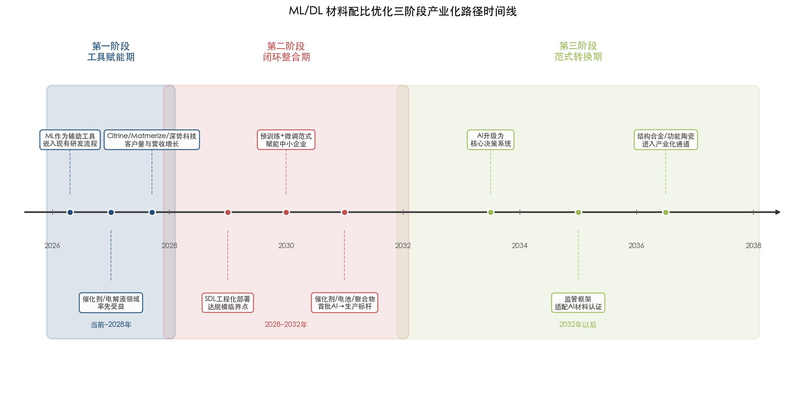

上图以时间轴形式呈现了三阶段产业化路径及各阶段的关键里程碑事件，包括 SDL 工程化部署、首批 AI 驱动的生产标杆案例、监管框架适配等核心节点。

### 7.8.2 实现理想模型的关键里程碑

距离"理想模型"——即能够在任意材料体系中根据目标性能要求自动生成最优成分配比，并经实验验证实现可靠生产的端到端系统——的大规模应用，以下关键里程碑需依次跨越：

**数据闭环突破**。当前计算数据与实验数据之间约两个数量级的规模鸿沟，需要通过 SDL 的规模化部署和标准化实验数据采集来逐步弥合。负数据（失败实验）的系统性收集和有效利用将是这一突破的关键组成部分。

**模型泛化性验证**。基础模型需要在更广泛的化学空间和性质范围内证明其泛化能力的鲁棒性。当前 Matbench Discovery 排行榜主要评估形成能和稳定性预测，尚需扩展至力学性质、电子性质、热性质等工程应用关键维度。

**多尺度桥接**。原子尺度 ML 预测与宏观工程性能之间的"尺度鸿沟"是实现产业化最根本的科学挑战。Wang 等2025年提出的多尺度 ICME 框架提供了有前景的技术路径，但其适用范围仍需从镍基高温合金扩展到更广泛的材料体系。

**监管适配**。将 AI/ML 辅助材料设计纳入主要监管机构的认证标准体系，是规模化产业应用的制度前提。这一进程需要材料科学界、AI 技术界和监管机构的三方协同推进。

### 7.8.3 审慎乐观的结论

我们对 ML/DL 材料配比优化的产业化前景持审慎乐观态度。审慎在于：从实验室发现到商业化产品的路径依然漫长，认证周期、数据壁垒和多尺度建模等系统性障碍不会在短期内消除。乐观在于：2025年超过10亿美元的风险投资注入、开源工具链的高度成熟、基础模型"预训练+微调"范式的有效性，以及全球政策层面的系统性支持，共同构成了一个前所未有的产业化加速窗口。

我们预计，未来3–5年内将出现首批"AI 发现→实验验证→小规模生产"的完整商业化案例（最可能出现在催化剂领域）；5–10年内，ML 辅助材料配比优化将成为材料研发的标准工具而非前沿技术；10–15年内，在监管框架适配和多尺度建模突破的条件下，AI 驱动的材料设计有望从辅助角色演变为核心决策系统。这一进程的速度，将取决于技术突破、资本投入、政策支持和产业界接受度四个变量的协同演化。

# 结论与风险提示

## 核心结论

本报告对 ML/DL 驱动材料元素配比优化的研究进展、模型应用现状与产业化前景进行了系统性审视，核心结论凝练如下。

**第一，ML/DL 方法在材料配比优化中的有效性已获充分实证，但距离"理想模型"仍有明确差距。** 在标准化基准（Matbench Discovery）上，材料稳定性预测 F1 从 2017 年 CGCNN 的 0.507 提升至 2026 年 eSEN-30M-OAM 的 0.925，形成能预测 MAE 降至 18 meV/atom，接近 DFT 泛函间固有差异的物理极限。然而，这些指标衡量的仅是计算数据上的预测精度——GNoME 预测的 220 万种稳定晶体中仅 736 个获独立实验验证（验证率约 0.033%），A-Lab 对 57 个 DFT 预测目标的实验合成成功率为 63%。从"预测稳定"到"实验可合成"再到"工程可用"之间的逐级衰减，揭示了计算预测能力与实际材料发现成功率之间的显著鸿沟。

**第二，"物理约束预筛选→ML 代理模型→主动学习/贝叶斯优化→实验闭环"已形成可复制的标准方法论范式。** 这一范式在高熵合金（Rao 等，Science 2022；BIRDSHOT，Acta Mater. 2025）、催化剂（机器化学家，Nature Synthesis 2024）、相变材料（CAMEO，Nat. Commun. 2020）等多个材料体系中经受了检验。其核心效能来源于三个要素的协同：物理先验约束有效压缩搜索空间（BIRDSHOT 从 53,000+ 缩减至 2,437 个可行候选）；ML 代理模型以远低于 DFT 的成本提供近似预测；主动学习策略以最少的实验投入覆盖最大的信息增益。

**第三，通用基础模型的"预训练+微调"范式正在重塑材料 ML 的技术生态与产业准入门槛。** MACE-MP-0 仅需约 5 个 DFT 数据点微调即可达定量精度，MatterSim 用 30 个构型微调即可匹配从头训练 900 个构型的精度。这一范式将昂贵的预训练成本集中于少数大型研究机构和企业，终端用户则以极低的微调成本获得高精度专用模型，从根本上降低了 ML 材料设计的技术门槛。开源策略（MACE、DeePMD-kit、CHGNet、UMA 全部开源）进一步强化了这种成本分摊效应。

**第四，生成式模型为材料逆向设计开辟了原理性新路径，但实验验证仍是关键瓶颈。** MatterGen（Nature 2025）首次实现了对原子类型、坐标和晶格参数的同步扩散生成，SUN（稳定、唯一、新颖）材料比例达此前最优模型的两倍以上，且展示了多目标约束生成能力。然而，其实验验证样本 TaCr₂O₆ 的 DFT 预测体弹性模量（222 GPa）与实验值（158±11 GPa）之间仍存在约 29% 偏差，表明从"生成看似合理的结构"到"精确实现目标性能"之间仍有相当距离。

**第五，产业化路径将经历"工具赋能→闭环整合→范式转换"三阶段递进。** 催化剂领域因用量少、验证快、需求明确而最有可能在 3–5 年内出现首批完整商业化案例；电池材料和聚合物领域预计在 3–7 年内跟进；结构合金和功能陶瓷因制造工艺鸿沟和认证周期刚性约束，产业化时间线延伸至 5–10 年以上。2025 年超过 10 亿美元的风险投资注入（Lila Sciences 3.5 亿、Periodic Labs 3 亿、深势科技 1.14 亿等）为上述进程提供了资本基础，但"ChatGPT 时刻"式的标志性产业突破尚未出现。

**第六，八大核心挑战中，实验验证鸿沟的缩小最具"解锁效应"。** 自主实验室（A-Lab、Radical AI 等）的工程化部署有望同时推动数据稀缺缓解、模型校准改进和闭环反馈加速等多个关联瓶颈的协同突破。多尺度建模衔接——从原子尺度 ML 预测到宏观工程性能——因涉及根本性的物理复杂性，预计将在较长时间内保持为该领域的核心开放问题。

## 研究局限性

本报告的分析建立在截至 2026 年 3 月的公开文献、数据库和新闻报道基础上，存在以下主要局限性。

**第一，信息时效性与完整性约束。** 本报告引用的模型性能数据（如 Matbench Discovery 排行榜）处于快速更新状态，具体数值可能在报告完成后发生变化。融资信息和企业动态同样具有较强的时效性。部分企业的内部技术进展和工业应用案例因商业保密原因未能纳入分析范围。

**第二，产业化时间线判断的固有不确定性。** 对各材料领域产业化时间线的评估本质上是基于当前技术趋势和产业实践的审慎外推，而非精确预测。材料科学领域的突破性进展（如某一新型材料体系的意外发现）或制度变革（如监管框架的加速适配）均可能显著改变上述时间线。

**第三，技术评估的覆盖范围限制。** 本报告聚焦于 ML/DL 在材料元素配比优化中的应用，未深入覆盖纯工艺优化（如热处理参数、成形工艺）、微观组织-性能关系建模（尽管在多尺度挑战部分有所涉及）以及非结构化数据（如文献挖掘、专利分析）驱动的材料发现等相邻方向。

**第四，定量比较的基准依赖性。** 模型性能评估高度依赖 Matbench Discovery、LAMBench 等标准化基准。这些基准虽然代表了当前最佳的评估实践，但其测试集分布可能与实际工业应用场景存在偏差——例如，WBM 测试集中稳定材料仅占 15.3%，而工业筛选场景中的稳定率分布可能显著不同。

**第五，地域和语种覆盖的非对称性。** 本报告对英文文献的覆盖较为充分，但对中文、日文等非英文文献（特别是中国和日本团队的部分工作）的覆盖可能存在遗漏。中国在材料基因工程领域的政策文件和项目进展，因信息可获取性限制，未能进行同等深度的分析。
