# 执行摘要

外加电场（External Electric Field, EEF）作为调控化学反应活性与选择性的"智能试剂"，已成为计算化学与催化科学的交叉前沿。Shaik 等人 2016 年在 Nature Chemistry 提出的定向外电场（Oriented External Electric Field, OEEF）催化概念表明，沿反应轴施加的电场可使反应能垒降低数个 kcal/mol 乃至十余 kcal/mol，对应数个数量级的速率增强。然而，该催化效应的实现依赖于一个关键前提：**电场方向与分子反应轴之间的相对取向必须是确定且可控的**。

本报告围绕"理论计算中如何正确模拟外加电场对分子催化剂的影响"这一核心问题展开系统研究。以 Gaussian 软件 `Field=X+100` 关键词为切入点，深入剖析了该操作隐含的物理假设——将电场方向锁定于分子坐标系——在溶液相分子型单原子催化剂（SAC）体系中面临的根本性困难：室温下分子快速布朗旋转（旋转弛豫时间 τ_c ≈ 0.1–0.3 ns）使得朝向在反应时间尺度上充分随机化，取向极化参数 |μF|/k_BT 仅约 0.1–0.4，一阶电场催化效应在取向平均下趋于消失。

报告系统梳理了应对上述矛盾的四层方法体系。**第一层**，对于载体固定型 SAC（如 Pt₁/MoS₂），电场方向由表面法线自然确定，周期性 DFT 中的均匀电场扫描即可有效捕捉催化调控趋势。**第二层**，投影分析法（AVEDA、FDBβ、MANULS 等自动化工具）通过识别反应偶极差方向确定最优电场取向，其中 FDBβ 方法仅需一次零场计算即可预测任意方向和强度电场下的活化能，计算效率提升可达 (4N²+1) 倍。**第三层**，对于溶液相自由取向分子型 SAC，Lebedev-Laikov 球面求积方案以 6–26 个采样点即可对低秩性质实现机器精度的旋转平均。**第四层**，QM/MM 静电嵌入、显式溶剂模型和振动 Stark 效应光谱从方法论层面消解了朝向问题——局域电场的方向和大小由体系的物理环境自然决定，而非研究者的人为选择。

核心结论是：电场对化学反应的催化效应取决于电场方向与反应偶极差向量的夹角。研究者应以"朝向约束程度"为核心判据分层选择模拟策略——从载体固定体系的均匀电场扫描，到自由取向体系的旋转平均与局域电场建模。近年涌现的 PNNP 机器学习分子动力学、物理原理增强 ML 框架和 pyEF 原子级电场分解工具正在系统性地降低电场模拟的技术门槛，使"全原子-全朝向-全溶剂"的电场效应模拟有望在近两年内成为可常规执行的工作流程。

# 第1章 外加电场在计算化学中的理论基础与软件实现

## 1.1 引言：电场作为化学反应的调控工具

外加电场（External Electric Field, EEF）对分子性质和化学反应的影响，是计算化学中一个兼具基础理论价值与应用前景的研究课题。2016 年，Shaik 等人在 Nature Chemistry 上提出了一项具有里程碑意义的观点：定向外电场（Oriented External Electric Field, OEEF）可以充当"智能试剂"（smart reagents），将非极性反应的催化速率提升数个数量级，同时实现对选择性的精准控制 [Shaik 等, Nature Chemistry](https://www.nature.com/articles/nchem.2651 "Shaik S et al. Oriented electric fields as future smart reagents in chemistry. Nat. Chem. 2016;8:1091-1098")。以马来酸酐与环戊二烯的 Diels-Alder 反应为例，该研究的计算结果表明，沿反应轴施加负向电场（F_z < 0）可使反应能垒降低约 8 kcal/mol，对应百万倍量级的速率增强；反转电场方向（F_z > 0）则使能垒升高约 6.4 kcal/mol，产生显著的抑制效应。这一理论框架为计算化学家借助量子化学软件系统研究外加电场效应提供了明确的科学驱动力。

从理论模拟到实际体系的过渡中，一个根本性的技术问题随之浮现：外加电场如何以严格的数学形式进入量子化学计算？不同软件平台的实现方式及其参数约定存在哪些关键差异？本章将从物理原理出发，系统梳理均匀外加电场在量子化学框架中的理论基础，详细介绍 Gaussian、ORCA、VASP 等主流软件的具体实现方式与参数规范，为后续章节讨论电场方向性问题和朝向不确定性处理方法奠定坚实的理论基础。

## 1.2 外加均匀电场的物理原理：哈密顿量微扰

### 1.2.1 电场微扰项与 Stark 效应

在量子化学计算中，均匀外加电场 **F** 对分子的作用通过在原始哈密顿量上添加微扰项来实现。体系的总哈密顿量表示为：

**H = H₀ − μ·F**

其中 H₀ 为无场哈密顿量，**μ** 为分子的电偶极矩算符。当电场沿 z 方向施加时，微扰项简化为 V = −ezε（e 为电子电荷，z 为位置坐标，ε 为电场强度），这一形式本质上是经典直流 Stark 效应在分子体系中的量子化学表述 [Edinburgh 大学讲义](https://www2.ph.ed.ac.uk/~ldeldebb/docs/QM/lect17.pdf "Perturbation Theory lecture notes, University of Edinburgh")。

该微扰项具有清晰的物理含义：均匀电场对分子中每个带电粒子施加力，正电荷沿电场方向移动，负电荷（电子）逆电场方向移动，导致分子电荷分布的极化。在弱场条件下，这种极化效应可用微扰论系统处理。电场引起的能量变化按场强展开为 Taylor 级数：

**E(F) = E(0) − μᵢFᵢ − ½αᵢⱼFᵢFⱼ − ⅙βᵢⱼₖFᵢFⱼFₖ − ···**

其中，μᵢ 为永久偶极矩分量，αᵢⱼ 为极化率张量分量，βᵢⱼₖ 为第一超极化率张量分量 [Stuyver 等, WIREs Comput. Mol. Sci.](https://wires.onlinelibrary.wiley.com/doi/abs/10.1002/wcms.1438 "Stuyver T et al. External electric field effects. WIREs Comput. Mol. Sci. 2020;10:e1438")。该展开式是理解电场效应的核心数学框架：一阶项（−μᵢFᵢ）描述永久偶极矩与电场的取向耦合作用，是电场催化效应的主导贡献；二阶项（−½αᵢⱼFᵢFⱼ）描述场致极化效应，对于高极化率分子或强电场条件不可忽略；更高阶项（超极化率贡献）在通常的实验场强下相对较小，但在强场定量预测中仍需纳入考量。

### 1.2.2 电场单位与典型量级

在原子单位制中，电场强度的单位 1 au 约等于 5.142 × 10¹¹ V/m（即 51.4 V/Å），该数值与 CODATA 2022 推荐值一致 [ORCA 6.1 手册](https://www.faccts.de/docs/orca/6.1/manual/contents/essentialelements/finEfield.html "ORCA 6.1 Manual: Finite Electric Fields")。为便于建立定量直觉，下表汇总了不同物理化学环境中的典型电场强度及其对应的原子单位值：

**表 1-1 不同物理化学环境中的典型电场强度**

| 物理/化学环境 | 典型电场强度 (V/Å) | 原子单位 (au) | 说明 |
|:---|:---:|:---:|:---|
| DFT 常用扫描下限 | 0.005 | ~10⁻⁴ | 弱场微扰极限 |
| 电极表面（典型电化学条件） | ~0.1 | ~0.002 | 取决于电位和双电层结构 |
| STM 针尖（亚纳米尺度） | ~0.1 | ~0.002 | 高度局域化非均匀场 |
| DFT 常用扫描上限 | 0.5 | ~0.01 | 强场非线性区域 |
| 蛋白质活性位点（带电残基） | ~1.0 | ~0.02 | 局域电场，方向由残基排布决定 |
| 1 原子单位 | 51.4 | 1.0 | 仅存在于原子内壳层附近 |

上述量级差异具有重要的方法论意义。实际计算化学研究中常用的电场扫描范围通常在 10⁻⁴ 至 10⁻² au 之间（对应约 0.005 至 0.5 V/Å），这一范围覆盖了从电极界面到蛋白质活性位点的绝大多数实验可及电场强度。选择此范围还确保了微扰展开的收敛性——在 0.01 au 量级的电场下，Taylor 展开中的二阶项（极化率贡献）通常仅为一阶项（偶极矩贡献）的数个百分点，三阶及更高阶项可忽略不计。

## 1.3 有限场法与解析导数法

将外加电场纳入量子化学计算存在两种基本策略：有限场法（Finite Field Method）和解析导数法（Analytical Derivative Method），二者在精度、适用范围和实现复杂度方面各有优劣。

### 1.3.1 有限场法

有限场法的核心思想最早由 Cohen 和 Roothaan 于 1965 年提出：在多个不同电场强度下分别执行独立的量子化学计算，再通过数值微分提取分子的电学性质 [Cohen & Roothaan, J. Chem. Phys.](https://pubs.aip.org/aip/jcp/article/43/10/S34/78012 "Electric Dipole Polarizability of Atoms by the Hartree-Fock Method. I. Theory for Closed-Shell Systems. J. Chem. Phys. 1965;43:S34-S39")。偶极矩可通过一阶中心差分获得：

**μ ≈ −[E(+F) − E(−F)] / (2F)**

极化率则通过二阶中心差分获得：

**α ≈ −[E(+F) − 2E(0) + E(−F)] / F²**

有限场法的核心优势在于普适性——原则上适用于任何理论级别（HF、DFT、post-HF 方法均可），实现门槛低，仅需在给定电场下计算体系总能量即可 [Q-Chem 6.2 手册](https://manual.q-chem.com/6.2/sec_finite-field.html "Q-Chem 6.2: Numerical Calculation of Static Polarizabilities via finite field")。然而，该方法存在两方面固有局限。其一，数值微分的精度对步长选择高度敏感：步长过大导致截断误差显著，步长过小则有限精度算术引入的数值噪声成为主导误差源。其二，基组不完备性在有限场下可能引入伪影——电场破坏分子的空间对称性，要求基组具备足够的弥散函数以准确描述场致极化响应。

### 1.3.2 解析导数法

解析导数法通过直接计算能量对电场的解析导数获取分子电学性质：

**μ = −∂E/∂F |_{F=0}**

**α = −∂²E/∂F² |_{F=0}**

该方法在数学上精确，不受步长选择的影响，精度通常显著优于有限场法。但其实现复杂度远高于后者——需要推导并实现能量对电场参数的解析梯度表达式。对于高阶性质（如超极化率）或复杂电子关联方法（如耦合簇理论），解析导数的推导和编程实现是一项技术密集型工程。不同软件对解析导数的支持层级存在显著差异：例如 ORCA 6.1 支持电场下的解析能量梯度（可用于几何优化），但不支持解析 Hessian（频率分析需通过数值 Hessian 完成）。这种支持程度的差异直接决定了电场计算在不同软件平台上的可行性与效率。

## 1.4 主流量子化学软件的电场实现

### 1.4.1 Gaussian：`Field` 关键词

Gaussian 是计算化学领域应用最为广泛的量子化学软件之一，通过 `Field` 关键词施加有限电场。其语法格式为 `M±N`，其中 M 指定多极类型（X、Y、Z 分别对应 x、y、z 方向的电偶极场），N×0.0001 指定场强的原子单位值 [Gaussian Field 文档](https://thiele.ruc.dk/~spanget/help/g09/k_field.htm "Gaussian 09 Field keyword documentation")。

具体而言，`Field=X+100` 表示沿 +X 方向施加 0.0100 au 的电场（即 100 × 0.0001 au = 0.01 au ≈ 0.514 V/Å）；`Field=Z-50` 表示沿 −Z 方向施加 0.0050 au 的电场。Gaussian 还支持高阶多极场，例如 `Field=XXYZ-20` 可施加指定的十六极场分量。所有电场参数均在输入取向（input orientation）坐标系中定义。

在实际操作中，使用 `Field` 关键词进行几何优化须遵循若干重要规范。电场破坏了分子的旋转对称性，因此必须配合 `NoSymm` 关键词关闭对称性利用；同时需使用 `Opt=Z-Matrix` 并以 Z-matrix 格式或符号笛卡尔坐标定义几何，以防止分子在优化过程中因标准取向（standard orientation）重新确定而相对于电场发生非物理的重取向。以下为 Gaussian 文档中给出的标准操作示例 [Gaussian Field 文档](https://thiele.ruc.dk/~spanget/help/g09/k_field.htm "Gaussian 09 Field keyword documentation")：

```
# RHF/3-21G Field=x+60 Opt=Z-Matrix NoSymm
```

此外，Gaussian 支持通过 `Field=Read` 从输入流中读取 34 个电多极分量的系数，或通过 `Field=Checkpoint` 从检查点文件读取电场设置，为复杂电场配置和多步计算流程提供了灵活性。需注意 `Field` 关键词启用时，归档（archiving）功能将自动关闭。

### 1.4.2 ORCA：`%scf EField` 块

ORCA 6.1 通过 `%scf` 输入块中的 `EField` 指令施加均匀电场，语法格式为：

```
%scf
  EField x, y, z
end
```

其中 x、y、z 分别为电场在三个笛卡尔方向的分量，单位为原子单位 [ORCA 6.1 手册](https://www.faccts.de/docs/orca/6.1/manual/contents/essentialelements/finEfield.html "ORCA 6.1 Manual: Finite Electric Fields")。ORCA 的符号约定遵循物理直觉：若电场由负 z 方向的正电荷和正 z 方向的负电荷产生，则 z 分量取正值。

ORCA 的电场实现包含若干值得关注的特色功能。其一，支持通过 `EFieldOrigin` 选择电场原点，可选项包括质心、核电荷中心或用户指定坐标。原点选择会影响体系在电场中的总能量（均匀电场下平移操作改变偶极矩-电场耦合能），但不影响波函数——ORCA 文档对此有明确阐述。其二，ORCA 还支持四极电场（`QField`），用以模拟空间渐变的非均匀电场，在构建蛋白质活性位点等复杂局部环境模型时具有潜在应用价值。在解析性质支持方面，ORCA 的电场实现支持解析梯度（可直接用于几何优化），但不支持解析 Hessian——频率分析须通过数值 Hessian 完成。

ORCA 文档还明确指出了电场计算中的若干关键实践注意事项 [ORCA 6.1 手册](https://www.faccts.de/docs/orca/6.1/manual/contents/essentialelements/finEfield.html "ORCA 6.1 Manual: practical caveats")：(1) 电场破坏分子旋转对称性，几何优化须使用笛卡尔坐标；(2) 带电分子在偶极电场中不存在收敛的平衡位置（净电荷在均匀电场中受恒定力），此类计算虽可数学收敛，但物理意义须审慎解读；(3) 电场与隐式溶剂模型的组合需格外谨慎——在多数隐式溶剂实现中，溶剂介质不"感受"外加电场，仅溶质分子被极化，这可能导致非物理的计算结果。

### 1.4.3 VASP：表面体系与周期性体系的双轨实现

VASP 作为固态和表面化学领域的主流第一性原理软件，提供了两种针对不同物理场景的电场实现方案。

**方案一：`EFIELD` 标签（锯齿势方法）。** 该方案适用于 slab 模型和分子计算，通过在真空区域引入锯齿形势能模拟均匀电场，单位为 eV/Å，使用时须同时开启 `LDIPOL=.TRUE.` 以校正偶极矩相互作用 [VASP Wiki: EFIELD](https://vasp.at/wiki/EFIELD "VASP Wiki EFIELD tag")。值得注意的是，VASP 中电场方向的定义与常规物理约定相反，这一"反常"约定是初学者常见的困惑来源，在参数设置时须格外审慎。锯齿势方法的物理约束在于：体系必须具有足够的真空层以容纳锯齿势的周期性结构，且电场方向被限定为沿真空方向（通常取 z 方向）。

**方案二：`EFIELD_PEAD` 标签（Berry 相位方法）。** 该方案基于现代极化理论，利用 Berry 相位计算周期性体系中的宏观极化，并通过电焓泛函将外加电场效应纳入自洽计算：

**E[{ψ^(ε)}, ε] = E₀[{ψ^(ε)}] − Ω ε·P[{ψ^(ε)}]**

其中 Ω 为晶胞体积，**P** 为宏观极化矢量 [VASP Wiki: EFIELD_PEAD](https://www.vasp.at/wiki/EFIELD_PEAD "VASP Wiki EFIELD_PEAD documentation")。Berry 相位方法的适用范围更为广泛，可处理三维周期性体系中任意方向的电场。然而，该方法存在一项重要的物理约束：当外加电场超过临界值时，电焓泛函将失去局部极小值——这反映了强电场下绝缘体发生 Zener 击穿的物理现实。具体临界条件为 e|ε·aᵢ| > E_gap/(10Nᵢ)，其中 aᵢ 为晶格矢量，E_gap 为带隙，Nᵢ 为对应方向的 k 点数。

对于表面催化体系（如单原子催化剂负载于二维载体上），`EFIELD` 方案在实践中更为常用，因为电场方向沿表面法线自然确定，与实验中背栅电压或电极电位的施加方向直接对应。

### 1.4.4 软件实现对比小结

为便于研究者根据具体体系和需求选择合适的软件工具，下表对上述四种实现方案的关键技术参数进行汇总对比：

**表 1-2 主流量子化学软件外加电场实现对比**

| 特性 | Gaussian (`Field`) | ORCA (`EField`) | VASP (`EFIELD`) | VASP (`EFIELD_PEAD`) |
|:---|:---|:---|:---|:---|
| 关键词/标签 | `Field=M±N` | `%scf EField x,y,z end` | `EFIELD` + `LDIPOL` | `EFIELD_PEAD` |
| 单位 | N×0.0001 au | au | eV/Å | au (内部转换) |
| 适用体系 | 分子（气相/隐式溶剂） | 分子（气相/隐式溶剂） | Slab/分子（需真空层） | 三维周期性体系 |
| 物理方法 | 有限场微扰 | 有限场微扰 | 锯齿势 | Berry 相位电焓泛函 |
| 解析梯度 | 支持 | 支持 | 支持 | 支持 |
| 解析 Hessian | 支持 | 不支持（数值替代） | 不适用 | 不适用 |
| 主要限制 | 须用 Z-matrix + NoSymm | 带电体系无平衡位置 | 方向限于真空方向 | 电场不可超过 Zener 临界值 |

## 1.5 电场效应的物理图像：从哈密顿量到化学反应性

理解电场如何影响化学反应性，需要回到微扰项 **H' = −μ·F** 的物理本质。Shaik 等人在 2016 年的开创性研究中，借助价键（VB）理论构建了一个极具解释力的物理图像 [Shaik 等, Nature Chemistry](https://www.nature.com/articles/nchem.2651 "Nat. Chem. 2016;8:1091-1098")：均匀外电场通过选择性稳定化学键波函数中的离子型结构（ionic structures），"唤醒"共价键中潜在的离子性。

以 H₂ 分子为例，零场下 H–H 键的波函数由共价结构 Φ_cov 与两个简并的离子结构 Φ_ion(1) 和 Φ_ion(2) 等权混合而成，化学键因此呈完全非极性。施加沿键轴方向的电场后，分子对称性被打破：其中一个离子结构获得选择性稳定化，其与共价结构的混合增强，在原本非极性的同核键中诱导出可观的极性。定量计算表明，0.02 au（约 1.03 V/Å）电场下 H₂ 中诱导电荷约为 ±0.11 e；场强加倍至 0.04 au（约 2.06 V/Å）时，诱导电荷增至 ±0.22 e。对于极化率更大的 Li₂ 分子，同等场强下的诱导电荷可高达 ±0.25 e。

这一"唤醒离子结构"的机制与电场的催化作用直接关联。在化学反应的过渡态中，电荷转移态（CT state）的混入程度决定了过渡态的离子性。沿反应轴方向施加的电场选择性稳定电荷转移态，增强其与基态的混合，从而降低反应能垒。Shaik 等人据此提炼出**"反应轴规则"（reaction-axis rule）**：沿电子重组方向（即反应轴）施加的电场将产生最大的催化或抑制效应。

以细胞色素 P450 模型化合物 TMC(SR)FeO⁺ 与环己烷的 C–H 羟基化反应为例，零场下五重态 H-摘取能垒为 21.2 kcal/mol，反应速率缓慢。施加 F_z = −0.0075 au（沿 S–Fe–O 轴负方向）的电场后，五重态 H-摘取能垒骤降至 9.2 kcal/mol，降幅达 12.0 kcal/mol；回弹能垒完全消失，形成有效的协同反应路径。电场还赋予了反应自旋态选择性——五重态过渡态因其几何结构恰好与反应轴平行（受 σ*_z² 轨道控制），离子结构的稳定化效应尤为显著 [Shaik 等, Nature Chemistry](https://www.nature.com/articles/nchem.2651 "Nat. Chem. 2016;8:1091-1098")。

## 1.6 电场计算的实践要点与常见陷阱

基于前述理论框架和软件实现，以下归纳若干电场计算中的关键实践要点及易被忽视的技术陷阱。

**坐标系与对称性。** 电场方向在分子坐标系（而非实验室坐标系）中定义。以 Gaussian 为例，`Field=X+100` 中的 X 方向对应分子输入坐标系中的 X 轴。这意味着同一分子若以不同空间取向输入，相同的 `Field=X+100` 关键词将对应不同的物理电场方向——这一特性对于理解后续章节讨论的"分子朝向不确定性"问题至关重要。所有主流软件（Gaussian、ORCA、VASP）均要求在电场存在时关闭对称性利用，原因在于电场通常会降低分子的点群对称性。

**几何优化的输入格式。** 在 Gaussian 中进行电场下的几何优化，须使用 Z-matrix 格式或符号笛卡尔坐标，配合 `Opt=Z-Matrix` 和 `NoSymm` 关键词。这是因为 Gaussian 在每步优化中默认重新确定标准取向（standard orientation），而标准取向的改变会使电场相对于分子的方向发生非物理的突变。采用 Z-matrix 格式可确保分子相对于电场保持固定取向 [Gaussian Field 文档](https://thiele.ruc.dk/~spanget/help/g09/k_field.htm "Gaussian 09 Field keyword documentation")。

**带电体系的处理。** 带电分子（离子）在均匀电场中受到恒定的净力 **F**_net = q**F**，不存在力学平衡位置。ORCA 文档明确指出，此类计算虽可在数学上收敛，但其物理意义须审慎解读——实质上隐含了某种外部约束（如吸附于载体表面）阻止离子整体平移的假设。

**隐式溶剂与电场的兼容性。** 在大多数隐式溶剂模型（如 PCM、SMD）的实现中，外加电场仅作用于量子力学处理的溶质分子，而介电连续介质不感受外加电场。这与物理现实存在本质偏差——真实溶剂在电场中会发生取向极化和介电屏蔽效应。当需要同时考虑溶剂效应与外加电场效应时，隐式溶剂模型的适用性受到严重限制，研究者应考虑升级至显式溶剂模型或 QM/MM 方法（详见第 4 章）。

## 1.7 本章小结

外加均匀电场通过微扰项 **H' = −μ·F** 进入分子哈密顿量，其物理效应本质上是 Stark 效应的量子化学推广。分子能量在电场下的 Taylor 展开——包含偶极矩（一阶）、极化率（二阶）和超极化率（高阶）贡献——构成了理解和预测电场效应的核心数学框架。

在软件实现层面，Gaussian 通过 `Field=M±N` 语法（N×0.0001 au）、ORCA 通过 `%scf EField x,y,z end` 块（au 单位）、VASP 通过 `EFIELD`（eV/Å，锯齿势）和 `EFIELD_PEAD`（Berry 相位电焓泛函）两种方案，分别覆盖了从孤立分子到三维周期性体系的完整应用场景。有限场法和解析导数法作为提取电场响应性质的两种基本计算策略，在普适性与精度之间形成互补。

电场影响化学反应性的核心物理图像在于：沿反应轴方向的电场选择性稳定过渡态中的离子结构，从而降低反应能垒。这一"反应轴规则"揭示了电场催化效应的强烈方向依赖性——也正是这种方向依赖性，引出了下一章将深入讨论的核心问题：当分子催化剂（如单原子催化剂）在溶液中自由旋转时，理论计算中假定的固定电场方向与实际体系中分子朝向的随机性之间，存在根本性的矛盾。

# 第2章 定向外电场（OEEF）与分子朝向不确定性问题

## 2.1 引言：从"反应轴规则"到朝向困境

第 1 章已阐明，外加电场对化学反应的催化效应具有强烈的方向依赖性——沿电子重组方向（"反应轴"）施加的电场可显著降低反应能垒，而偏离该方向则效果递减甚至产生抑制。Shaik 等人于 2016 年在系统阐述定向外电场（Oriented External Electric Field, OEEF）催化概念时，将这一方向依赖性提炼为核心"反应轴规则" [Shaik et al. 2016 Nature Chemistry](https://www.nature.com/articles/nchem.2651 "Oriented electric fields as future smart reagents, Nat. Chem. 8, 1091-1098")。Stuyver 等人在 2020 年的综述中进一步精确定义了"反应轴"——即"电子在从反应物到产物转化过程中发生重组的方向"（the direction in which the electrons reorganize during the conversion from reactant to product），并明确指出：沿反应轴的电场分量控制催化/抑制效应的大小，垂直分量则调控立体选择性 [Stuyver et al. 2020 WIREs](https://wires.onlinelibrary.wiley.com/doi/abs/10.1002/wcms.1438 "External electric field effects, WIREs Comput. Mol. Sci. 10, e1438")。

然而，OEEF 催化概念蕴含一个至关重要但在计算实践中常被忽视的前提假设：**电场方向与分子反应轴之间的相对取向必须是确定且可控的**。在量子化学计算中，当研究者在 Gaussian 中键入 `Field=X+100` 时，实际上隐含地假定了分子坐标系中的 X 方向与外加电场完全对齐。这种假设在特定实验场景中（如单分子结实验）是合理的，但在另一些场景——尤其是溶液相分子型催化剂体系——则面临根本性的物理挑战。本章将系统揭示这一矛盾的物理本质，定量分析其对催化效应预测的影响，并为后续章节的方法论讨论奠定基础。

## 2.2 OEEF 催化的实验验证：朝向可控是关键

### 2.2.1 STM 断裂结技术的里程碑实验

OEEF 催化概念从理论走向实验的关键突破发生在 2016 年。Aragonés 等人利用扫描隧道显微镜断裂结（STM-BJ）技术，在单分子水平首次直接验证了 OEEF 对 Diels-Alder 反应的催化效应 [Aragonés et al. 2016 Nature](https://pubmed.ncbi.nlm.nih.gov/26935697/ "Electrostatic catalysis of a Diels-Alder reaction, Nature 531, 88-91")。在该实验中，反应底物通过硫醇（thiol）锚定基团化学键合于金针尖和金基底之间，分子朝向由针尖-基底轴精确定义，外加电场方向与分子长轴高度共线。实验结果显示，当电场沿有利方向排列时，单分子结的形成频率增加约 5 倍，为 OEEF 催化效应提供了令人信服的实验证据。

该实验的核心设计理念在于：通过化学锚定手段将分子朝向"钉死"，使电场方向与反应轴的夹角成为一个明确的、可控的实验参数，而非一个需要统计平均的随机变量。

### 2.2.2 MCBJ 技术对方向依赖性的直接验证

Huang 等人于 2019 年利用机械可控断裂结（MCBJ）技术，进一步提供了 OEEF 催化方向依赖性的直接实验证据 [Huang et al. 2019 Science Advances](https://pmc.ncbi.nlm.nih.gov/articles/PMC6588380/ "Electric field-induced selective catalysis, Sci. Adv. 5, eaaw3072")。该实验通过调整分子桥接的几何构型，系统考察了反应轴与电场方向夹角对催化效应的影响。实验结果清晰地揭示了严格的角度依赖关系：反应轴与电场正交时，催化效应完全消失；两者具有平行分量时，反应速率被选择性加速约 10 倍。

在配套的 DFT 计算中，Huang 等人在 Gaussian 中将电场设置为沿 z 轴方向（即分子 N─N 键方向），扫描范围为 −0.005 至 +0.005 a.u.（约 ±2.57 V/nm）。这种计算设置在 MCBJ 的几何约束条件下完全合理——实验中分子朝向由断裂结的两侧金属电极精确固定。

### 2.2.3 关键启示：朝向可控是 OEEF 催化验证的先决条件

上述两个里程碑实验共同揭示了一个关键事实：**OEEF 催化效应的实验验证，无一例外地依赖于对分子朝向的精确控制**。STM-BJ 和 MCBJ 技术通过将单分子桥接于两个金属电极之间，以化学键合的方式固定分子取向，使"反应轴与电场方向的夹角"从一个统计随机量转变为一个确定的实验参数。

Ciampi 等人在 2018 年的 Chemical Society Reviews 综述中系统总结了另一类朝向控制策略——通过自组装单分子膜（SAM）锚定实现定向电催化 [Ciampi et al. 2018 Chem. Soc. Rev.](https://pubs.rsc.org/en/content/articlelanding/2018/cs/c8cs00352a "Harnessing electrostatic catalysis, Chem. Soc. Rev. 47, 5146-5164")。在 SAM 体系中，分子通过硫醇-金键固定于电极表面，分子长轴近似垂直于表面，外加电场沿表面法线方向——朝向可控条件同样得到满足。

综上，**朝向可控的典型场景**可归纳为三类：(1) STM/MCBJ 单分子结实验，分子被化学键合于两电极之间；(2) SAM 修饰电极表面，分子通过锚定基团定向排列；(3) 载体表面强吸附态催化剂，活性位点朝向由载体几何决定。这些场景的共同物理特征在于：分子的旋转自由度被外部约束大幅冻结，分子朝向在催化反应时间尺度上保持固定。

## 2.3 朝向不确定性的物理本质

### 2.3.1 从可控到不可控：溶液相分子型 SAC 的困境

与上述朝向可控场景形成鲜明对比的是，大量实际催化体系中分子相对于外加电场的朝向是不确定的。这一问题在分子型单原子催化剂（Single-Atom Catalyst, SAC）体系中尤为突出。

SAC 概念由 Qiao 等人于 2011 年在 Nature Chemistry 中以 Pt₁/FeOₓ 体系为代表正式提出 [Qiao et al. 2011 Nat. Chem.](https://www.nature.com/articles/nchem.1095 "Single-atom catalysis of CO oxidation, Nat. Chem. 3, 634-641")。Mitchell 和 Pérez-Ramírez 在 2020 年的 Nature Communications 综述中指出，SAC 与均相分子配合物在结构上具有"close structural resemblance"，构成均相与多相催化之间的桥梁 [Mitchell & Pérez-Ramírez 2020 Nat. Commun.](https://www.nature.com/articles/s41467-020-18182-5 "Single atom catalysis: a decade of stunning progress, Nat. Commun. 11, 4302")。这意味着一类重要的 SAC 体系——如金属卟啉、金属酞菁等分子型 SAC——在溶液相催化条件下，其行为更接近均相分子催化剂而非固定于载体表面的多相催化剂。

对于溶液相的分子型 SAC，其相对于外加电场的朝向受到两种物理机制的竞争控制：(1) 电场对分子偶极矩的取向极化作用，倾向于使分子沿电场方向排列；(2) 热运动引起的随机旋转扩散（布朗旋转运动），倾向于使分子朝向趋于各向同性分布。这两种机制的力量对比决定了分子朝向的统计分布形态。

### 2.3.2 偶极-电场耦合能与热能的竞争

分子偶极矩 **μ** 与外加电场 **F** 的相互作用能为：

**ΔE = −|μ||F|cosθ**

其中 θ 为偶极矩与电场方向的夹角。在热平衡条件下，分子朝向的概率分布服从 Boltzmann 统计：

**P(θ) ∝ exp(|μ||F|cosθ / k_BT)**

据此可定义取向极化参数 x = |μ||F| / (k_BT)，其物理意义为偶极-电场耦合能与热能之比。当 x ≪ 1 时，热运动占主导，分子朝向近乎随机；当 x ≫ 1 时，电场力矩占主导，分子趋于高度取向排列。取向极化的程度可用经典的 Langevin 函数 L(x) = coth(x) − 1/x 定量描述——在 x ≪ 1 的极限下，平均取向 ⟨cosθ⟩ ≈ x/3 = |μ||F|/(3k_BT)。这一结果源自统计力学中偶极子在外场中取向分布的标准处理 [Fried & Boxer 2017 Annu. Rev. Biochem.](https://www.annualreviews.org/doi/pdf/10.1146/annurev-biochem-061516-044432 "Electric Fields and Enzyme Catalysis, Annu. Rev. Biochem. 86, 387-415")。

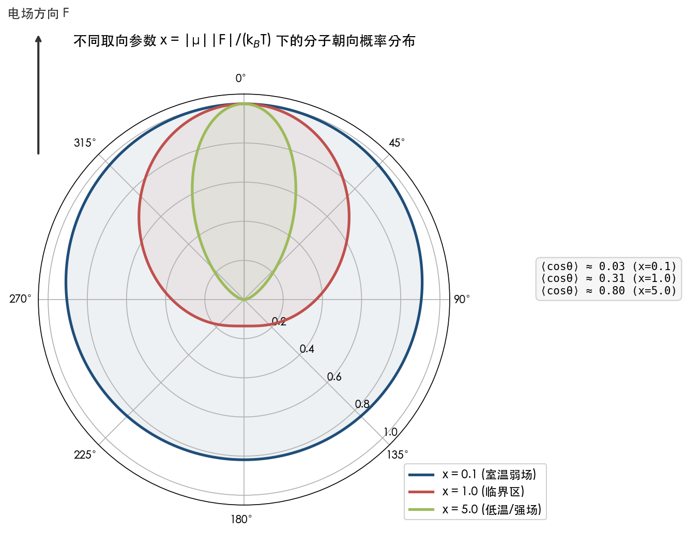

**图 2-1** 展示了取向参数 x 分别为 0.1（室温弱场）、1.0（临界区）和 5.0（低温/强场）三种典型条件下分子朝向的极坐标概率分布。x = 0.1 时分布近乎圆形（各向同性），⟨cosθ⟩ ≈ 0.03，取向极化效应可忽略；x = 1.0 时分布开始偏向电场方向，⟨cosθ⟩ ≈ 0.31，进入取向极化的临界区域；x = 5.0 时分布高度集中于电场方向，⟨cosθ⟩ ≈ 0.80，分子已呈现显著的定向排列。

定量估算可清楚地揭示问题的严重程度。以一个偶极矩 μ ≈ 3 D（1 D = 3.336 × 10⁻³⁰ C·m）的分子型催化剂在 F = 0.1 V/nm 的外加电场中为例：

- 偶极-电场耦合能：|μ||F| ≈ 1.0 × 10⁻²¹ J ≈ 6.2 meV
- 室温热能：k_BT ≈ 4.1 × 10⁻²¹ J ≈ 25.7 meV
- 取向参数：x = |μ||F|/(k_BT) ≈ 0.24
- 平均取向：⟨cosθ⟩ ≈ x/3 ≈ 0.08

在室温和 0.1 V/nm 电场（已属于实验中较强的电场水平）条件下，分子的平均取向偏离仅约 8%——朝向分布仍然近乎各向同性。即使将偶极矩增大至 5 D，取向参数 x 也仅升至约 0.40，⟨cosθ⟩ ≈ 0.13，取向极化效应依然微弱。

只有在低温（< 50 K）或极强电场（> 1 V/nm，接近化学键断裂阈值）条件下，|μ||F|/k_BT 才可能达到或超过 1，取向极化效应才变得显著。然而，这些条件与典型的溶液相催化环境相去甚远。

### 2.3.3 旋转扩散的时间尺度分析

从动力学角度审视，分子在溶液中的旋转扩散速率远快于催化反应的特征时间尺度，这从时间维度进一步确认了朝向不确定性的必然性。根据 Debye-Stokes-Einstein 关系，球形分子的旋转相关时间为：

**τ_c = 4πηr³ / (3k_BT)**

其中 η 为溶剂粘度，r 为分子的流体力学半径。对于金属卟啉/酞菁类分子型 SAC（流体力学半径约 0.5–0.7 nm）在室温水溶液中（η ≈ 0.89 × 10⁻³ Pa·s），代入数值可得 τ_c ≈ 110–310 ps，即亚纳秒量级。这意味着分子在约 0.1–0.3 ns 内即可完成一次完整的旋转弛豫，远快于化学反应的特征时间尺度（通常为微秒至秒级）。在每一次催化周转过程中，分子已经历了数百万次乃至数十亿次随机旋转，其相对于外加电场的朝向在统计意义上充分遍历了所有方向。

这一时间尺度分析进一步确认：对于溶液相分子型 SAC，将外加电场的效应等同于某一特定方向的计算结果在物理上是不自洽的——体系对电场的真实响应应为所有可能朝向下响应的统计平均值。

## 2.4 Gaussian `Field` 关键词的隐含假设与局限

### 2.4.1 分子坐标系中的电场定义

回到计算实践中的核心问题：在 Gaussian 中使用 `Field=X+100` 模拟外加电场时，这一操作究竟隐含了哪些物理假设？

如第 1 章所述，`Field=X+100` 在分子坐标系的 +X 方向施加 0.01 au（约 0.514 V/Å）的均匀电场。关键在于，此处的 X 方向由输入几何坐标确定——它是分子坐标系中的方向，而非实验室坐标系中的方向。这一操作在物理上等价于假设：**在计算所描述的那一瞬间，分子恰好以其坐标系 X 轴与实验室电场方向完全对齐的特定取向存在**。

对于在 MCBJ 中被两侧金电极夹持的单分子，这一假设具有坚实的物理基础——Huang 等人 2019 年的 DFT 计算正是在这种条件下将电场沿 z 轴（N─N 键方向）设置 [Huang et al. 2019 Science Advances](https://pmc.ncbi.nlm.nih.gov/articles/PMC6588380/ "Sci. Adv. 5, eaaw3072")。然而，对于溶液中自由旋转的分子型 SAC，`Field=X+100` 仅代表了无数可能朝向中的一个特定截面——它给出的能量、偶极矩、反应能垒等性质，仅对应于分子恰好以该特定朝向面对电场时的瞬时响应，而非体系在热力学平衡下的可观测平均值。

### 2.4.2 单一方向计算的局限性分析

这一局限性可通过简洁的数学分析加以量化。假设电场沿实验室坐标系的 Z 轴方向施加，分子的反应偶极差向量（transition dipole difference vector）Δ**μ**‡ 与 Z 轴的夹角为 θ。电场对活化能的一阶影响近似为：

**ΔΔE‡ ≈ −|Δμ‡||F|cosθ**

当 θ = 0（反应轴与电场平行）时，催化效应最大；当 θ = π/2（正交）时，催化效应为零；当 θ = π（反方向平行）时，产生最大抑制效应。对于随机朝向的分子集体，需对所有可能的 θ 进行统计平均。由球面均匀分布的对称性可知 ⟨cosθ⟩ = 0，这意味着**一阶电场催化效应在取向平均下完全抵消**。

这一结果看似令人沮丧，但并不意味着电场对随机朝向分子毫无影响。偶数阶效应（如极化率贡献 −½Δα‡F²）在取向平均下不为零，因为 ⟨cos²θ⟩ = 1/3。然而，二阶效应通常比一阶效应小 1–2 个数量级，在通常实验场强下对活化能的贡献仅约 0.01–0.1 kcal/mol，催化意义十分有限。

上述分析深刻揭示了 Shaik 等人将其催化概念命名为"定向"外电场（**O**riented External Electric Field）的物理必然性——"定向"二字并非修辞点缀，而是决定催化效应能否实现的物理前提条件。

## 2.5 朝向可控与不可控：两类场景的系统对比

基于上述分析，电场催化的应用场景可依据分子朝向的可控性划分为两大类，它们在物理本质、适用的理论方法和可预期的催化效果上存在根本差异。

**朝向可控场景**包括：STM/MCBJ 单分子结实验、SAM 修饰电极表面、载体固定的 SAC（如 Pt₁/MoS₂、Fe-N₄/C 嵌入石墨烯）。在这些场景中，分子的旋转自由度被化学键合、表面吸附或载体几何约束大幅冻结，分子相对于外加电场的朝向是确定的或变化范围极小。理论计算中沿单一方向施加电场（如 Gaussian `Field=Z+N`）在物理上是合理的，计算结果可直接与实验观测对比。

**朝向不可控场景**包括：溶液相分子催化剂（金属卟啉、金属酞菁、有机金属配合物）、胶体分散体系、一般气相分子。在这些场景中，分子在溶液或气相中做快速布朗旋转运动（τ_c ～ 0.1–1 ns），室温下取向极化效应极弱（x = |μ||F|/k_BT ≪ 1），分子朝向满足近似各向同性分布。理论计算中沿单一方向施加电场仅代表一个特定取向的瞬时快照，不能直接作为体系可观测量的预测值；此时需要采用旋转平均、Boltzmann 加权或更高级的理论方法来获得具有物理意义的结果。

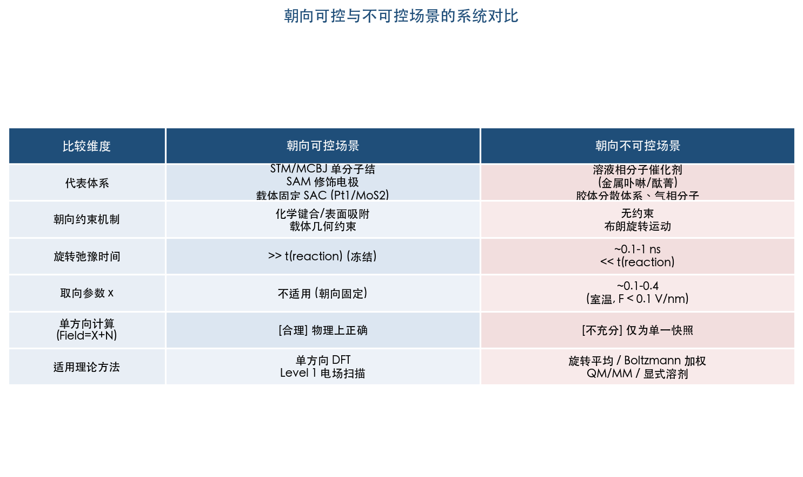

**图 2-2** 从代表体系、朝向约束机制、旋转弛豫时间、取向极化参数、单方向计算适用性和适用理论方法六个维度，系统对比了朝向可控与朝向不可控两类场景的核心差异。该对比为研究者在面对具体催化体系时选择合适的电场建模策略提供了快速判断依据。

这一分类的核心在于一个简明的物理判据：**如果体系中分子的旋转弛豫时间远短于催化反应的特征时间（τ_c ≪ τ_reaction），则分子朝向在反应时间尺度上已充分随机化，计算中必须进行取向统计处理**。

## 2.6 本章小结

OEEF 催化概念的核心假设——电场沿反应轴定向施加——在 STM/MCBJ 等朝向可控实验中得到了严格验证。Aragonés 等人 2016 年的 STM-BJ 实验首次在单分子水平证实了 OEEF 对 Diels-Alder 反应的催化效应（形成频率增加约 5 倍） [Aragonés et al. 2016 Nature](https://pubmed.ncbi.nlm.nih.gov/26935697/ "Nature 531, 88-91")，Huang 等人 2019 年的 MCBJ 实验则直接验证了催化效应对电场-反应轴夹角的严格依赖关系（正交时催化消失，平行时加速约 10 倍） [Huang et al. 2019 Science Advances](https://pmc.ncbi.nlm.nih.gov/articles/PMC6588380/ "Sci. Adv. 5, eaaw3072")。

然而，对于溶液相分子型 SAC（如金属卟啉、金属酞菁），分子在溶液中的快速旋转扩散（τ_c ≈ 0.1–0.3 ns）使得朝向在反应时间尺度上充分随机化。室温下典型实验场强的取向极化参数 x = |μ||F|/(k_BT) 仅约 0.1–0.4，远不足以实现分子的定向排列。在 Gaussian 中指定 `Field=X+100` 仅对应一个特定朝向下的分子响应，而非体系对外电场的全貌响应。一阶电场催化效应（−|Δμ‡||F|cosθ）在完全随机取向下的统计平均值为零，仅有偶数阶效应（极化率贡献）在统计平均后得以保留，但其量级通常比一阶效应小 1–2 个数量级。

这一发现并非否定电场催化的科学价值，而是指明了正确模拟电场效应所需的方法论升级方向。第 3 章将系统介绍处理分子朝向不确定性的理论方法——包括旋转平均法、Boltzmann 加权法、投影分析法和分子动力学取向采样，为不同催化场景提供适配的计算策略。

# 第3章 处理分子朝向不确定性的理论方法

## 3.1 引言：弥合固定坐标系与随机朝向之间的鸿沟

第2章揭示了一个核心矛盾：OEEF 催化理论假设电场沿反应轴精确定向，而溶液相分子型催化剂的朝向在反应时间尺度上近乎完全随机化。在 Gaussian 中执行 `Field=X+100` 仅获取了分子在一个特定取向下的响应快照，一阶催化效应（−|Δμ‡||F|cosθ）在取向平均下趋于消失。这一困境并非不可克服——计算化学领域已发展出一系列理论方法来系统处理分子朝向的不确定性，将单一方向的计算结果转化为具有物理意义的可观测量。

本章系统梳理四类核心策略：(1) 旋转平均法（orientational averaging），通过在 SO(3) 旋转群上的严格积分获得朝向无关的统计平均值；(2) Boltzmann 加权法，在有限温度下考虑偶极-电场耦合对取向分布的非均匀调制；(3) 投影分析法，将电场沿关键化学键轴或反应坐标分解，仅提取有效分量；(4) 分子动力学驱动的取向采样，通过时间演化直接模拟分子在电场中的动态取向行为。各方法的数学基础、计算开销、适用场景和局限性将被逐一阐明，并辅以定量比较为研究者提供方法选型的明确依据。

## 3.2 旋转平均法：在 SO(3) 群上的严格积分

### 3.2.1 数学框架

旋转平均法的物理思想简明而严格：若分子朝向完全随机，则体系对电场的可观测响应应为所有可能朝向下响应值的等权重平均。数学上，这等价于对三维旋转群 SO(3) 上的积分，通常参数化为三个 Euler 角（α, β, γ），积分测度为 sinβ dα dβ dγ / (8π²)。

对于均匀取向分布（无偶极-电场偏好），某一分子性质 A 的旋转平均值为：

**⟨A⟩ = (1/8π²) ∫₀²π ∫₀π ∫₀²π A(α, β, γ) sinβ dα dβ dγ**

实际操作中存在一个关键简化："旋转电场方向"与"旋转分子"具有严格等价性。保持分子坐标不变，仅改变电场矢量 **F** = F(sinθ cosφ, sinθ sinφ, cosθ) 的方向在球面上取样后加权平均，即可避免每个朝向重新构建分子坐标的繁琐操作。该等价性源于分子性质在电场下的响应仅依赖于分子与电场之间的相对取向 [Ebeling et al. 2024 JCP](https://arxiv.org/html/2407.17434v1 "Numerical evaluation of orientation averages, J. Chem. Phys. 161, 131501")。当分子性质不依赖于围绕电场轴的方位角 γ（例如能量、偶极矩大小等标量性质）时，积分进一步退化为球面上两个角度（θ, φ）的二维积分。

### 3.2.2 球面求积方案的系统比较

旋转平均的核心计算问题归结为球面积分的数值求积。Ebeling 等人 2024 年发表于 The Journal of Chemical Physics 的系统研究评估了五类球面求积方案 [Ebeling et al. 2024 JCP](https://arxiv.org/html/2407.17434v1 "J. Chem. Phys. 161, 131501")：

**Lebedev-Laikov Gauss 求积**为当前最优方案。Lebedev 网格专为球面积分设计，利用八面体对称性构建所需采样点最少的求积公式，已有精度覆盖至 131 阶球谐函数的预制网格。其核心优势在于：对 l_max 阶以下的球谐函数被积函数，Lebedev 网格能以远少于张量积方法的采样点数实现精确积分。

**球面 Chebyshev 求积**采用等权重采样点，渐近效率约为 Lebedev 方法的 2/3。等权重特性赋予其在需要正权重保证的应用中一定的数值稳定性优势，但采样效率不及 Lebedev 方法。

**Fibonacci 球覆盖**是一种基于几何构造的方法，通过黄金角递增螺旋在球面上生成近似均匀的采样点。实现极为简洁（数行代码即可完成），但缺乏多项式精度保证，收敛行为取决于被积函数的光滑性。

**张量积方法**将球面积分分解为 θ 和 φ 两个一维积分的直积，采样点数为 N_θ × N_φ。这是最直觉化的方案，但在两极附近存在过度采样问题，总采样点数通常为 Lebedev 方法的 2–3 倍。

**蒙特卡洛方法**在球面上随机撒点，以样本均值近似积分值。收敛速度为 O(1/√N)，与被积函数维度无关，但绝对效率最低——达到与确定性方法相同的精度通常需要多出 2–3 个数量级的采样点。Ebeling 等人明确指出蒙特卡洛方法不推荐用于此类取向平均计算 [Ebeling et al. 2024 JCP](https://arxiv.org/html/2407.17434v1 "J. Chem. Phys. 161, 131501")。

### 3.2.3 采样点数的定量指导

决定采样点数的关键参数是被积函数展开为球谐函数后的最高有效秩 l_max。其物理含义直观：被积函数在角度空间中的变化越剧烈（即包含越高阶的球谐分量），精确积分所需的采样点就越多。

对于**低秩性质**（如分子极化率，l_max ≤ 2），仅需 6–26 个 Lebedev 采样点即可达到机器精度（~10⁻¹⁵ 相对误差）。极化率张量 α_ij 作为二阶张量，其取向依赖性可精确展开为 l = 0 和 l = 2 的球谐函数，因此 6 个采样点（对应 Lebedev 3 阶网格）即已足够。这一结论在 Raman 光谱领域早已被广泛认知——各向同性 Raman 散射截面的计算本质上就是极化率张量的旋转平均，经典教科书如 Long 的 *The Raman Effect* 给出了旋转不变量的解析公式 [Long 2002](https://books.google.com/books/about/Raman_Spectroscopy.html?id=tocoAAAAMAAJ "Long D.A. The Raman Effect, Wiley 2002")。

对于**高秩性质**（如超极化率 β_ijk，l_max ≤ 3）或包含 Boltzmann 加权的被积函数（见 3.3 节），有效秩显著升高。Ebeling 等人的基准测试表明：5 K 低温下 COFCl 分子的取向分布最大秩约 22，需约 600 个 Lebedev 采样点方能达到 10⁻⁶ 精度；更极端的低温条件下可能需要 900 个点 [Ebeling et al. 2024 JCP](https://arxiv.org/html/2407.17434v1 "J. Chem. Phys. 161, 131501")。

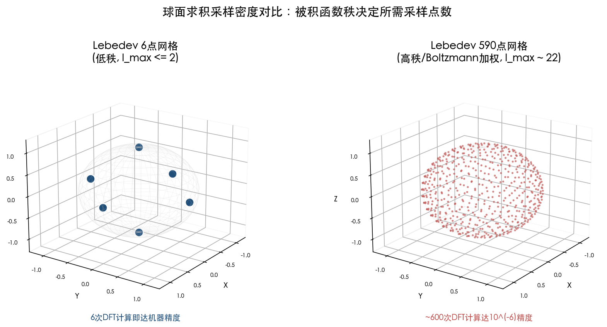

上图直观展示了被积函数秩对采样密度需求的巨大差异：左侧 Lebedev 6 点网格（八面体顶点分布）适用于 l_max ≤ 2 的低秩性质，6 次 DFT 计算即达机器精度；右侧 Lebedev 590 点网格适用于 l_max ~ 22 的高秩/Boltzmann 加权情形，需约 600 次 DFT 计算达 10⁻⁶ 精度。

上述定量数据为实际计算提供了明确指导：对于室温溶液相催化体系（偶极-电场耦合弱、取向近似均匀），6–26 次 DFT 单点计算的旋转平均即可给出极化率层面的可靠结果。相对于单方向单次计算，计算开销增加约一个数量级，但仍处于可承受范围之内。

## 3.3 Boltzmann 加权法：有限温度下的非均匀取向分布

### 3.3.1 从均匀平均到 Boltzmann 分布

前节讨论的均匀旋转平均隐含一个前提：所有朝向的概率相等。该近似在偶极-电场耦合能远小于热能（|μF|/k_BT ≪ 1）时成立。然而，当偶极矩较大、电场较强或温度较低时，电场对分子朝向的择优取向效应不可忽略，须引入 Boltzmann 加权。

Boltzmann 加权取向分布的形式为：

**P(ω) = N(T) exp(−E·R(ω)·d / k_BT)**

其中 ω 为取向参数（Euler 角），R(ω) 为旋转矩阵，d 为分子固定坐标系中的永久偶极矩方向，E 为电场强度，N(T) 为归一化常数。此时旋转平均变为加权积分：

**⟨A⟩_B = ∫ A(ω) P(ω) dω / ∫ P(ω) dω**

### 3.3.2 适用条件的定量判据

第2章已建立取向极化参数 x = |μ||F|/(k_BT) 作为判断取向分布偏离均匀程度的核心判据。Boltzmann 加权相对于均匀平均产生显著差异的阈值约为 x ~ 1。

典型分子催化体系中，该参数的量级估算如下：

- **室温溶液催化**（T ≈ 300 K，F ≈ 0.1 V/nm，μ ≈ 1–5 D）：x ≈ 0.02–0.4，均匀平均即为良好近似。
- **低温基质隔离光谱**（T ≈ 5 K，F ≈ 0.01 V/nm，μ ≈ 2 D）：x ≈ 0.9，Boltzmann 加权效应已显著。
- **STM 尖端强场区**（T ≈ 300 K，F ≈ 1 V/nm，μ ≈ 3 D）：x ≈ 2.4，Boltzmann 加权不可忽略。

Ebeling 等人对 COFCl 分子在 5 K、1 kV/cm 电场下的测试结果表明，Boltzmann 加权使取向分布的有效球谐展开秩从 l = 2 急剧升高至 l ≈ 22，所需 Lebedev 采样点数从 6 个跃升至约 600 个 [Ebeling et al. 2024 JCP](https://arxiv.org/html/2407.17434v1 "J. Chem. Phys. 161, 131501")。

### 3.3.3 对催化化学的启示

上述分析对理解 OEEF 催化的物理图像具有重要意义。在室温溶液催化条件下（x ≪ 1），一阶偶极-电场耦合效应（∝ cosθ）经 Boltzmann 加权后的取向平均仍近似为零——Langevin 函数给出 ⟨cosθ⟩ ≈ x/3，对于 x = 0.24（第2章估算值）仅约 0.08。这意味着对于自由取向的分子催化剂，OEEF 的一阶催化效应即使在 Boltzmann 加权下也极为微弱。真正保留下来的是二阶效应（极化率贡献，∝ cos²θ，⟨cos²θ⟩ = 1/3 + 2x²/45 + ···），但其对活化能的贡献在通常场强下仅为 0.01–0.1 kcal/mol 量级。

该结论在方法选择上具有直接的实践指导意义：对于室温溶液相的分子型 SAC 体系，均匀旋转平均与 Boltzmann 加权平均的差异通常小于计算方法本身的固有误差（DFT 活化能误差一般为 2–5 kcal/mol）。因此，在多数溶液催化场景中，均匀旋转平均已经足够，无需承担 Boltzmann 加权所带来的数十倍至数百倍采样点增加。

## 3.4 投影分析法：沿反应轴分解电场效应

### 3.4.1 反应轴投影的物理基础

投影分析法采取了与旋转平均截然不同的策略：不在所有朝向上做统计平均，而是直接识别电场效应的有效分量。其物理基础源自 Shaik 等人 2018 年在 Chemical Society Reviews 教程综述中的系统阐述——电场沿"反应轴"分解后，仅平行分量产生催化或抑制效应（ΔE = −|μ||F|cosθ），垂直分量则控制立体选择性 [Shaik et al. 2018 CSR](https://pubs.rsc.org/en/content/articlelanding/2018/cs/c8cs00354h "Structure and reactivity/selectivity control by oriented-external electric fields, Chem. Soc. Rev. 47, 5125-5145")。

在酶催化研究中，这一思想被发展为"键偶极-电场"（bond dipole/electric field）理论模型。Li 和 Head-Gordon 2021 年将电场对活化自由能的贡献表达为电场在反应相关键偶极上的投影之和 [Li & Head-Gordon 2021 ACS Cent. Sci.](https://pubs.acs.org/doi/10.1021/acscentsci.0c01556 "Catalytic Principles from Natural Enzymes, ACS Cent. Sci. 7, 72-80")：

**ΔG‡_elec = −Σ_reactive bonds (E‡_TS · μ‡_TS − E‡_RS · μ‡_RS)**

其中求和遍历所有参与反应的化学键，E 为各键位点处的电场矢量，μ 为对应的键偶极矩。该表达式的核心优势在于：无需假设外加均匀电场的方向，而是直接利用蛋白质骨架、溶剂、离子等环境在活性位点处自然产生的局域电场，并将其投影到化学键方向上。

Welborn 和 Head-Gordon 将该模型应用于酮类固醇异构酶（KSI）研究，发现活性位点约 90% 的总电场贡献来自三个关键残基：Asp-40（−15.85 MV/cm）、Tyr-16（−44.47 MV/cm）和 Asp-103（−37.75 MV/cm），且这些电场与 19-NT 抑制剂的羰基键高度对齐 [Welborn & Head-Gordon 2019 JACS](https://pubs.acs.org/doi/10.1021/jacs.9b05323 "Fluctuations of Electric Fields in the Active Site of KSI, J. Am. Chem. Soc. 141, 12487-12492")。Vaissier 等人进一步利用该模型，以计算引导的定向突变策略优化 KE15 Kemp 消除酶——仅四轮计算突变即将 k_cat 从 0.007 s⁻¹ 提高至 0.31 s⁻¹（43 倍），相当于 5–6 轮实验室定向进化的效果 [Vaissier et al. 2018 ACS Catal.](https://pubs.acs.org/doi/10.1021/acscatal.7b03151 "Computational Optimization of Electric Fields for Improving Catalysis of a Designed Kemp Eliminase, ACS Catal. 8, 219-227")。

### 3.4.2 AVEDA：自动化变电场 DFT 工具

Hanaway 和 Kennedy 于 2023 年开发的 AVEDA（Automated Variable Electric-field DFT Application）工具将投影分析从手工操作推进至自动化流程 [Hanaway & Kennedy 2023 JOC](https://pubs.acs.org/doi/10.1021/acs.joc.2c01893 "Automated Variable Electric-Field DFT Application, J. Org. Chem. 88, 106-116")。AVEDA 的核心工作流程包括四个步骤：

1. 自动计算反应偶极差向量 **μ‡** = **μ**_TS − **μ**_Int（过渡态与中间体的偶极矩之差）
2. 确定最优电场方向为 −**μ̂**‡（反应偶极差的反方向）
3. 沿该方向递增施加电场（2.5 → 5.0 → 7.5 → 10.0 × 10⁻³ a.u.），每步从前一步 checkpoint 获取初始几何进行递归优化
4. 提取电场依赖的活化能变化 ΔΔE‡

在 10 个周环反应的基准测试中，AVEDA 沿 −**μ̂**‡ 方向施加电场所获得的活化能降低最大（相关系数 R² > 0.95），且 ΔΔE‡ 与 ‖**μ‡**‖ 呈强线性相关（R² = 0.987），验证了投影分析的物理合理性。从计算开销角度，AVEDA 对每个反应路径需约 8 次 DFT 优化计算（4 个场强 × 正反方向），相对于单方向单次计算的开销约为 8 倍。

### 3.4.3 超越偶极近似：PMED 模型与 MANULS 程序

投影分析法在仅考虑偶极矩时，隐含地假设电场效应可由一阶微扰（−**μ·F**）主导。Bofill 等人 2023 年发表于 The Journal of Chemical Physics 的研究指出，当电场强度较大时，极化率张量 α 和超极化率 β 对最优电场方向的确定具有不可忽略的影响 [Bofill et al. 2023 JCP](https://pubs.aip.org/aip/jcp/article/159/11/114112/2911634 "An algorithm to find the optimal oriented external electrostatic field, J. Chem. Phys. 159, 114112")。

他们提出的 PMED（Potential energy surface Minimum Energy Direction）模型基于灾变理论（catastrophe theory），同时考虑偶极矩和极化率张量来确定能完全消除反应能垒的最优电场方向和最小场强。定量结果颇具启示：仅考虑偶极矩与同时考虑极化率所得的最优电场方向，在[3]累积二烯异构化反应中相差 26.9°，在 Huisgen 环加成反应中相差高达 44.7°，对应的最优场强差异达 73%。这一发现表明，**在强电场条件下，仅基于偶极矩进行投影分析可能给出显著偏离实际最优值的电场方向**。

该方法的开源实现 MANULS 程序包已在 GitHub 公开发布，基于 Python 3 编写，支持自动搜索最优电场方向和最小能垒消除场强 [MANULS GitHub](https://github.com/MSeveri96/MANULS "MANULS v1.0.1")。

### 3.4.4 FDBβ：基于 Taylor 展开的高效预测框架

Besalú-Sala 等人 2021 年于 ACS Catalysis 提出的 FDBβ（Finite Difference of Boltzmann-averaged β）方法，将投影分析的计算效率推至极致 [Besalú-Sala et al. 2021 ACS Catal.](https://pubs.acs.org/doi/10.1021/acscatal.1c04247 "Fast and Simple Evaluation of the Catalysis and Selectivity Induced by External Electric Fields, ACS Catal. 11, 14467-14479")。其核心思想是将活化能在零场下做 Taylor 展开：

**ΔE‡(F) = ΔE‡₀ − Δμ‡·F − ½F^T Δα‡ F − ⅙ Σ Δβ‡_ijk F_i F_j F_k + ···**

其中 Δμ‡ = μ_TS − μ_React 为反应偶极差，Δα‡ 和 Δβ‡ 分别为极化率差和超极化率差。上述电性质均可在零场下一次性计算获得。给定这些参数后，**任意方向和强度电场下的活化能可直接由代数运算得到，无需逐一做 DFT 优化**。

FDBβ 方法的定量优势十分显著。以一个含 3N 自由度的体系为例，传统逐方向扫描法需 (4N² + 1) 次独立优化计算，而 FDBβ 仅需 1 次零场优化加上电性质计算，计算成本降低约 (4N² + 1) 倍。在 C₆₀ 与环戊二烯的 Diels-Alder 反应基准测试中，FDBβ 预测的活化能与逐一优化结果的偏差小于 1–2 kcal/mol。该方法还可生成 2D/3D 活化能面，直观展示电场方向和强度对活化能的联合调控效应，并快速识别电场诱导的选择性切换（EFISS）——即竞争反应路径在不同电场条件下发生优势逆转的临界点。引入核弛豫贡献后，预测误差可进一步降至 < 0.5 kcal/mol。

FDBβ 的主要局限在于其前提假设——反应机理在电场变化范围内保持不变。当电场足够强以至于引发协同→分步机理转换时，Taylor 展开的收敛性可能失效。该方法的开源代码已发布于 GitHub（https://github.com/pau-besalu/FDB）。

## 3.5 分子动力学驱动的取向采样

### 3.5.1 从静态采样到动态模拟

前述三类方法本质上均属"静态"范畴——在给定的分子几何构型上进行取向空间的数学采样或投影分析，不涉及分子在电场中的动态行为。对于需要捕捉溶剂效应、温度效应和动态取向弛豫过程的体系，分子动力学（MD）模拟提供了更为完整的物理描述。

在电场条件下进行 MD 模拟面临的核心挑战在于：每一时间步均需在当前电场下计算原子受力。对于从头算分子动力学（AIMD），这意味着每步都须执行一次 DFT 计算，计算成本极高——AIMD 通常仅能模拟数十 ps 的时间尺度和百余个原子的体系规模，而典型的溶液相取向弛豫（~0.1–1 ns）和催化反应（~μs–s）远超其能力边界。

### 3.5.2 PNNP MD：机器学习加速的电场响应模拟

Joll、Schienbein 和 Blumberger 于 2024 年在 Nature Communications 发表的 PNNP（Perturbed Neural Network Potential）MD 方法代表了该领域的重要突破 [Joll et al. 2024 Nat. Commun.](https://pmc.ncbi.nlm.nih.gov/articles/PMC11411082/ "Machine learning the electric field response, Nat. Commun. 15, 7923")。其核心创新在于以一阶微扰展开的方式将电场效应嵌入机器学习势能面：

**E(R, F) ≈ E₀(R) + Σ_i μ_i(R) · F**

其中 E₀(R) 为零场势能面（由第一个神经网络 NN₀ 学习），μ_i(R) 为原子级偶极矩（由第二个神经网络 NN_μ 学习）。该方法的关键优势在于：**两个神经网络均仅在零场构型上训练**，无需在有限电场下生成任何训练数据，即可外推至场强高达 0.2 V/Å 的有限电场条件。

在液态水体系的验证中，PNNP MD 给出了与 AIMD 高度一致的结果：取向弛豫时间 τ = 5.9 ps（PNNP）对比 6.6 ps（AIMD），介电常数 ε_r = 79.3 ± 2.2（实验值 78.4）。更为关键的是，PNNP MD 的计算开销比 AIMD 低约 3–4 个数量级，使模拟时间尺度从数十 ps 推进至纳秒级，体系尺寸扩展至数千个原子。

### 3.5.3 适用性与局限

PNNP MD 方法当前的主要局限体现在三个方面：(1) 一阶微扰展开在极强电场（> 0.2 V/Å）下可能失效，此时极化率和超极化率的高阶贡献变得显著；(2) 已发表的验证仅限于液态水体系，尚未在涉及化学键断裂/形成的催化反应势能面上得到检验；(3) 训练数据仍需高精度的零场 AIMD 轨迹，对于含过渡金属的 SAC 体系，DFT 泛函的选择和色散校正的处理仍然是制约结果可靠性的瓶颈。

尽管如此，PNNP MD 为未来在真实溶液环境中模拟分子催化剂对电场的动态响应——包括取向弛豫、溶剂重组和反应性调控——开辟了切实可行的技术路径。其代码已基于 cp2k 和 PyTorch 框架开源。

## 3.6 方法比较与选型指南

### 3.6.1 计算开销的定量比较

为帮助研究者做出方法选型决策，下表汇总了各方法相对于"单方向单次 DFT 计算"的计算开销量级：

| 方法 | 典型计算量（相对倍数） | 精度特征 | 适用场景 |
|------|----------------------|----------|----------|
| 单方向电场计算 | 1× | 仅一个朝向的快照 | 朝向可控体系（STM/MCBJ/表面吸附） |
| FDBβ Taylor 展开 | ~4–8× | 任意方向活化能面，误差 < 1–2 kcal/mol | 快速筛选、机理不变的体系 |
| 投影分析（AVEDA 单方向扫描） | ~8× | 沿最优方向的一维电场-活化能关系 | 反应轴明确的体系 |
| Lebedev 旋转平均（低秩，l_max ≤ 2） | ~6–26× | 极化率层面的机器精度 | 室温溶液催化（均匀取向近似） |
| Lebedev 旋转平均（高秩/Boltzmann 加权） | ~600–900× | 10⁻⁶ 精度 | 低温/强场/精密光谱 |
| PNNP MD | ~10⁴–10⁶× | 动态取向弛豫的完整描述 | 溶剂效应关键的体系 |
| AIMD | ~10⁶–10⁸× | 最高精度的动态模拟 | 小体系基准计算 |

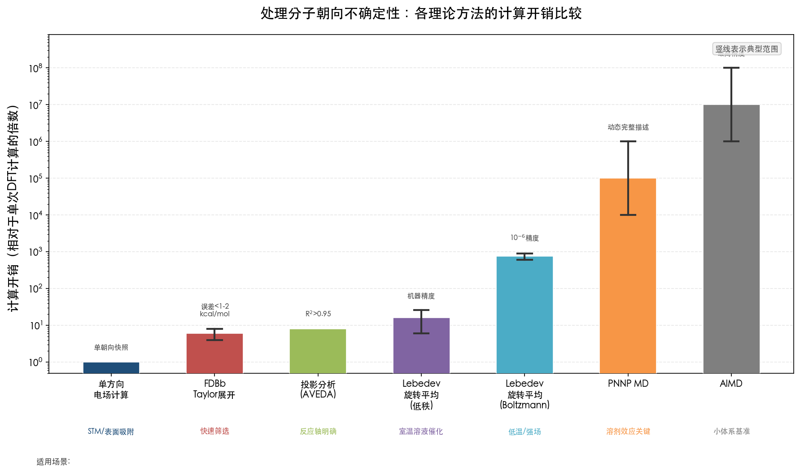

上图以对数坐标直观呈现了从单方向电场计算（1×）到 AIMD（~10⁷×）跨越七个数量级的计算开销梯度。FDBβ 和 AVEDA 投影分析法处于 4–8× 的低开销区间，Lebedev 旋转平均在低秩条件下保持在 6–26× 的可控范围内，而 PNNP MD 和 AIMD 则进入 10⁴ 倍以上的高开销区间。研究者可据此在精度需求与计算资源之间做出合理权衡。

### 3.6.2 适用场景与方法匹配

四类方法在概念层面形成互补的方法论光谱，各自的适用性取决于体系的物理特征。

**旋转平均法**最适用于朝向完全随机且与电场耦合较弱的体系（x ≪ 1），例如溶液相的分子型催化剂在弱至中等电场下的响应。该方法提供严格的统计平均结果，但需要对每个采样朝向进行独立的量子化学计算，计算成本与采样点数线性增长。低秩性质（极化率）的 6–26 次采样具有极高的性价比；而对于需要高精度 Boltzmann 加权的体系，数百次计算的需求可能构成瓶颈。

**Boltzmann 加权法**是旋转平均法在有限偶极-电场耦合下的自然推广，适用于 x ~ 1 左右的过渡区间。在室温催化化学中，该条件较少满足——除非电场极强（> 1 V/nm）或分子偶极矩极大（> 10 D）。在光谱学领域（特别是低温基质隔离实验中），Boltzmann 加权则不可或缺。

**投影分析法**在概念上最为简洁高效，直接回答"电场沿哪个方向施加最为有效"的问题。该方法特别适合反应轴明确、且需快速筛选电场催化潜力的体系。FDBβ 的 Taylor 展开策略将效率推向极致：一次零场计算即可预测整个电场-活化能面。AVEDA 和 MANULS 的自动化实现进一步降低了操作门槛。投影分析法的主要局限在于：(1) 假设反应机理和过渡态结构在电场范围内保持不变；(2) 不直接处理溶剂和环境的动态效应。

**MD 驱动采样**提供了最完整的物理图像，能同时捕捉分子取向动力学、溶剂重组和热涨落效应。PNNP MD 方法通过机器学习将 AIMD 的精度与经典 MD 的速度相结合，使纳秒时间尺度和数千原子的电场响应模拟成为可能。但其应用仍处于方法发展的早期阶段，在催化反应势能面上的系统验证有待积累。

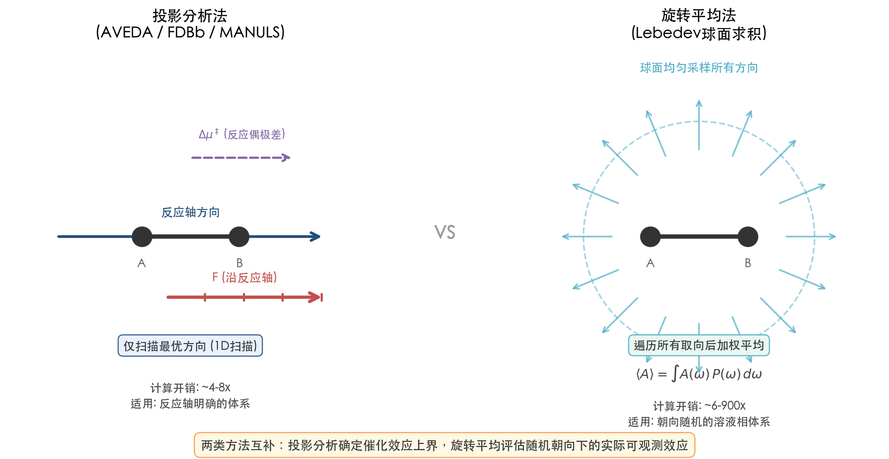

上图对比了两类核心策略的差异与互补性：投影分析法（AVEDA/FDBβ/MANULS）聚焦于反应轴方向的一维电场扫描，以 4–8 倍的低计算开销确定催化效应上界；旋转平均法（Lebedev 球面求积）遍历所有取向后加权平均，以 6–900 倍的计算开销评估随机朝向下的实际可观测效应。两者结合使用可同时回答"电场能否催化该反应"和"催化效应在随机朝向下是否保留"两个关键问题。

### 3.6.3 核心物理图像的统一

尽管四类方法在技术实现上各有差异，它们共享同一核心物理图像：**电场对化学反应的催化效应取决于电场方向与反应偶极差向量（或更一般地，电子重组方向）的夹角**。旋转平均法对该夹角做统计平均，Boltzmann 加权法赋予不同夹角以不等权重，投影分析法直接锁定最有效的夹角，MD 模拟法则让夹角随时间自然演化。

对于本报告关注的分子型 SAC 体系，我们认为最具实用价值的方法组合为：**先用 FDBβ 或 AVEDA 做投影分析以确定电场催化潜力的上界（对应最优朝向），再用低阶 Lebedev 旋转平均（6–26 点）评估随机朝向下的实际可观测效应**。该两步策略的总计算开销约为 10–30 次 DFT 单点计算，在当前计算资源条件下完全可行，且能同时回答"电场能否催化该反应"和"催化效应在随机朝向下是否保留"两个关键问题。

## 3.7 本章小结

处理分子朝向不确定性的理论方法已形成从简约到精密的完整方法谱系。旋转平均法以 SO(3) 群上的严格积分为基础，借助 Lebedev-Laikov 求积方案，对低秩性质仅需 6–26 个采样点即达机器精度。Boltzmann 加权在偶极-电场耦合能与热能可比时引入非均匀取向分布，但对室温催化化学场景（x ≪ 1），均匀平均通常已经足够。投影分析法直接聚焦于电场沿反应轴的有效分量——AVEDA、MANULS 和 FDBβ 等自动化工具分别在操作便捷性和计算效率上实现了重要突破：FDBβ 的 Taylor 展开策略仅需一次零场计算即可预测任意电场条件下的活化能，MANULS 基于灾变理论同时考虑偶极矩和极化率确定最优电场方向，揭示了两种近似所得方向偏差可达 26.9°–44.7°。MD 驱动的 PNNP 方法则将可访问的时间尺度推进至纳秒级，为未来在真实溶液环境中研究分子催化剂的电场响应开辟了技术路径。

这些方法传递的核心信息是一致的：对于朝向不可控的分子催化剂体系，在 Gaussian 中沿单一方向施加电场远不足以描述体系的真实响应。研究者须根据体系特征——取向自由度、偶极矩大小、电场强度、温度条件——选择合适的方法层级，将计算结果从"一个特定朝向的快照"转化为"有物理意义的统计平均"。

# 第4章 超越均匀外电场——局域电场的建模方法

## 4.1 引言：从人为施加的均匀场到物理真实的局域场

前述章节围绕"如何处理分子朝向不确定性"展开了系统讨论——旋转平均、Boltzmann 加权、投影分析乃至分子动力学采样，均是在保留"外加均匀电场"这一前提下的修正与扩展。然而，真实化学环境中的电场几乎从不以均匀形式存在。酶活性位点中的电场来自周围残基的带电侧链与极性基团，其大小和方向逐原子变化；溶剂分子的偶极矩在溶质周围构成随时间波动的电场分布；电催化体系中的电双层场则沿表面法线方向非线性衰减，并强烈依赖于电极电位和电解质组成。

本章的核心论点是：对于许多实际体系——尤其是溶液相单原子催化剂（SAC）和酶催化体系——最根本的解决思路并非在均匀外电场框架内逐步修补，而是直接建模电场的物理来源。QM/MM 嵌入方法、显式溶剂模型、周期性 DFT 中的外电场施加方式以及基于振动 Stark 效应（VSE）的实验-理论关联分析，均从方法论层面消解了"应沿哪个方向施加电场"这一问题——局域电场（Local Electric Field, LEF）的方向和大小由体系的物理环境自然决定，而非研究者的人为选择。

## 4.2 QM/MM 嵌入方法：让环境电场自然浮现

### 4.2.1 三种嵌入方案与电场建模能力

QM/MM（量子力学/分子力学）方法的核心思想是将化学关注区域以量子力学精度描述，而将其周围环境简化为分子力学力场处理。该方法由 Warshel 和 Levitt 于 1976 年奠基，是计算化学中最早的多尺度建模框架之一 [Warshel & Levitt 1976](https://pubmed.ncbi.nlm.nih.gov/985660/ "J. Mol. Biol. 1976, 103, 227-249")。

根据 QM 区域与 MM 区域之间相互作用的处理方式，QM/MM 嵌入方案可分为三个层次 [Senn & Thiel 综述](https://iopenshell.usc.edu/chem545/lectures2011/QMMM_Thiel_Review_2009.pdf "Angew. Chem. Int. Ed. 2009, 48, 1198-1229")：

**机械嵌入**（Mechanical Embedding）是最简单的方案：QM 区域的计算完全在真空中进行，QM-MM 相互作用仅通过分子力学力场参数处理。由于 QM 区域的电子密度不受 MM 环境极化的影响，该方案无法捕捉环境电场对 QM 区域电子结构的调制作用。

**静电嵌入**（Electrostatic Embedding）是目前最为常用的方案：MM 区域中原子的点电荷被显式纳入 QM 哈密顿量，作为单电子算符的一部分。QM 区域的电子密度在 MM 点电荷产生的静电势中自洽求解，从而自然被环境极化。关键在于，这些 MM 点电荷在 QM 区域产生的电场是**高度非均匀的局域电场**，其方向和大小完全由 MM 原子的空间排布决定——无需人为指定电场的方向或大小。这一特性正是静电嵌入从根本上绕开朝向不确定性问题的核心机制。

**极化嵌入**（Polarizable Embedding）在静电嵌入的基础上进一步引入可极化力场，使 MM 区域的电荷分布亦能响应 QM 区域电子密度的变化，实现 QM-MM 双向极化。Bondanza、Mennucci 等人的工作表明，基于快速多极方法（FMM）的线性标度实现已能处理含百万个可极化原子的体系，每步 SCF 额外计算开销仅为百分之几 [Bondanza, Mennucci 等](https://arpi.unipi.it/retrieve/849cdd7a-1b08-460a-9607-ef7955b92b23/Polarizable_QMMM.pdf "Phys. Chem. Chem. Phys., Polarizable embedding QM/MM")。极化嵌入被视为未来 QM/MM 方法的"金标准"，但力场参数化的复杂性目前仍制约着其广泛应用。

下图直观展示了三种嵌入方案在电场建模能力上的本质差异：从机械嵌入的"零电场感知"，到静电嵌入的"单向极化与非均匀局域电场"，再到极化嵌入的"双向极化与最高精度局域电场"，形成递进的精度阶梯。

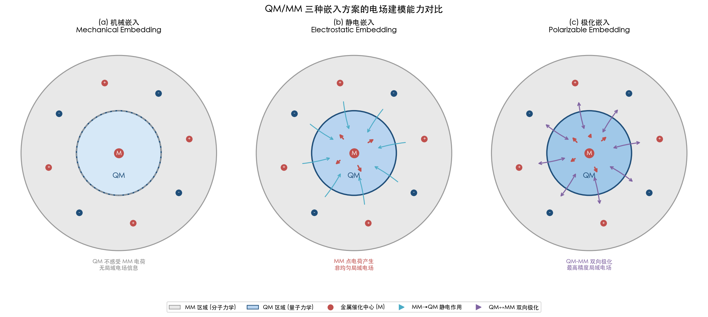

### 4.2.2 ONIOM 方法与静电嵌入的实践

Gaussian 软件中广泛使用的 ONIOM（Our own N-layered Integrated molecular Orbital and molecular Mechanics）方法是 QM/MM 的一种主流实现。通过 `EmbedCharge` 选项可开启静电嵌入，将低层（MM 层）的点电荷纳入高层（QM 层）的哈密顿量 [Senn & Thiel 综述](https://iopenshell.usc.edu/chem545/lectures2011/QMMM_Thiel_Review_2009.pdf "Angew. Chem. Int. Ed. 2009, 48, 1198-1229")。对于溶液相分子型 SAC 体系（如金属卟啉、金属酞菁），研究者可将催化活性金属中心及其配位环境划入 QM 层，将溶剂分子和反离子划入 MM 层。在静电嵌入下，溶剂偶极矩和离子电荷在催化中心自然产生方向各异、空间分布不均匀的局域电场，催化反应的过渡态结构与活化能在该电场中自洽优化，无需研究者预先判断"电场应沿哪个方向施加"。

### 4.2.3 Warshel 的酶催化静电起源理论

QM/MM 方法在酶催化领域的广泛应用深刻揭示了局域电场在催化中的核心角色。Warshel 于 1998 年明确阐述了酶催化的静电起源——酶催化加速并非来自底物的构象应变或共价中间体的稳定化，而是来自活性位点极性环境的预组织（preorganization）：酶在进化过程中形成了高度有序的极性残基排布，使得活性位点已"预付"了溶剂重组能的代价 [Warshel 1998](https://pubmed.ncbi.nlm.nih.gov/9765214/ "J. Biol. Chem. 1998, 273, 27035-27038")。Jindal 和 Warshel 于 2017 年进一步澄清，酶催化的关键在于活性位点极性环境的预组织而非底物本身的预组织——二者在概念上存在本质区别 [Jindal & Warshel 2017](https://pmc.ncbi.nlm.nih.gov/articles/PMC5760166/ "Proteins 2017, 85(12), 2157-2161")。

这一理论对理解 SAC 体系中的电场效应具有直接启示意义：若溶液相 SAC 的催化加速部分源于配体和溶剂构成的局域静电环境，则理论研究的正确路径并非在真空中施加一个方向待定的均匀场，而是通过 QM/MM 或类似嵌入方法显式描述该静电环境。

## 4.3 冷冻密度嵌入：纯量子力学的替代方案

QM/MM 静电嵌入中，环境的电场效应通过力场点电荷引入，其精度受限于力场参数化的质量。冷冻密度嵌入（Frozen Density Embedding, FDE）提供了一种完全基于第一性原理的替代方案——以 DFT 同时描述活性区域和环境，从而规避力场参数化带来的人为误差。

FDE 方法由 Wesolowski 和 Warshel 于 1993 年提出 [Wesolowski & Warshel 1993](https://pubs.acs.org/doi/10.1021/j100132a040 "J. Phys. Chem. 1993, 97, 8050-8053")，其核心思想是将总体系电子密度分解为活性子系统密度与冻结的环境密度，并通过非加性动能泛函构造的嵌入势将二者耦合。与 QM/MM 相比，FDE 的突出优势在于环境电场不依赖力场参数，而是从环境电子密度直接计算得到，避免了点电荷模型的人为离散化误差。

近期的 FDE 实现已展现出颇具竞争力的计算效率。在 Au₄ 团簇与 80 个水分子构成的测试体系中，FDE 步骤仅占总 SCF 计算量的约 16%，且计算开销随环境尺寸近似线性增长 [FDE 实现论文](https://pmc.ncbi.nlm.nih.gov/articles/PMC9558305/ "J. Chem. Theory Comput. 2022")。对于力场参数化困难的金属配合物体系——如 SAC 活性中心与溶剂的相互作用——FDE 在精度与效率之间提供了一条可行的折中路径。

## 4.4 显式溶剂模型与 Stark 效应光谱的实验-理论关联

### 4.4.1 显式溶剂分子作为电场的微观来源

与隐式溶剂模型（如 PCM、SMD）将溶剂简化为连续介质不同，显式溶剂模型保留了溶剂分子的原子级细节。每个溶剂分子通过其永久偶极矩和局部电荷在溶质周围产生电场，这些分子级电场的矢量叠加构成溶质所经历的总局域电场。由于溶剂分子围绕溶质的空间分布和取向受温度及溶质-溶剂相互作用共同支配，所产生的电场本质上是非均匀、各向异性且随时间波动的。

这种描述方式对朝向不确定性问题的消解最为彻底：在分子动力学轨迹中，溶剂分子的热运动自然涵盖了溶质-溶剂相对取向的所有可能组合。催化反应的自由能面通过对这些微观构型的统计平均获得，环境电场的方向和大小不再是需要人为指定的参数，而是模拟过程的自然产物。

### 4.4.2 振动 Stark 效应：用分子探针标定局域电场

振动 Stark 效应（Vibrational Stark Effect, VSE）光谱为实验定量测量局域电场提供了精密工具，同时构建了连接理论计算与实验观测的桥梁。其核心原理在于：化学键的振动频率与其所处局域电场之间呈线性关系——

**Δν̄ = −Δμ_probe · F_local**

其中 Δν̄ 为频率位移，Δμ_probe 为探针振动模式的 Stark 调谐速率（通过外加已知电场的校准实验独立测定），F_local 为探针位置处局域电场在键方向上的投影。

Fried、Bagchi 和 Boxer 于 2014 年在 Science 上利用该方法首次定量测量了酶活性位点的电场强度。以酮类固醇异构酶（KSI）为模型体系，他们发现 19-降睾酮（19-NT）抑制剂的 C=O 振动频率在从非极性己烷（1690.2 cm⁻¹）到水溶液（1634.0 cm⁻¹）的过程中红移了 56 cm⁻¹，而在 KSI 活性位点中的红移幅度更大。通过 Stark 调谐速率的校准，他们推算出 KSI 活性位点施加在该 C=O 键上的集体平均电场约为 −144 ± 6 MV/cm [Fried, Bagchi & Boxer 2014](https://pmc.ncbi.nlm.nih.gov/articles/PMC4668018/ "Science 2014, 346, 1510-1514")。

这一电场强度具有明确的催化意义：活性位点电场贡献了 7.3 ± 0.4 kcal/mol 的反应能垒降低，相当于约 10⁵ 倍的速率增强，占 KSI 总催化加速效果的约 70%。更精细的突变实验表明，单个 Tyr-16 残基的氢键即贡献了 84 ± 7 MV/cm 的电场 [Fried, Bagchi & Boxer 2014](https://pmc.ncbi.nlm.nih.gov/articles/PMC4668018/ "Science 2014, 346, 1510-1514")。这些数据有力支持了 Warshel 的活性位点预组织理论：酶通过精确排布极性残基，在活性位点产生了远超溶剂平均水平的定向电场。

下图汇总了 VSE 定量测量的核心结果，直观呈现了不同化学环境中 19-NT C=O 键所受局域电场的量级差异及 KSI 活性位点电场的组成结构。

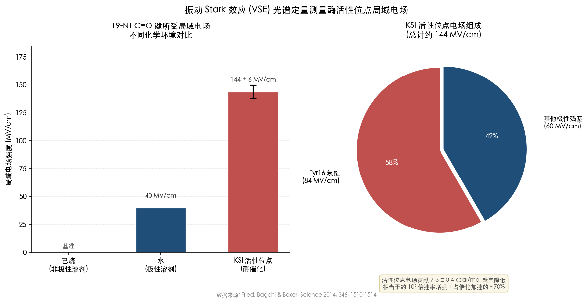

### 4.4.3 从酶到分子催化剂：VSE 框架的拓展

Fried 和 Boxer 于 2017 年在 Annual Review of Biochemistry 的综述中系统总结了 VSE 框架在酶催化研究中的应用，并提出了统一的静电催化模型——利用 VSE 光谱测量的电场数据作为"实验锚点"，结合 QM/MM 或 MD 模拟计算的局域电场分布进行交叉验证 [Fried & Boxer 2017](https://pubmed.ncbi.nlm.nih.gov/28375745/ "Annu. Rev. Biochem. 2017, 86, 387-415")。

该方法论对 SAC 体系研究的启示在于：与其在理论计算中人为施加方向和大小均不确定的均匀电场，不如借助 VSE 探针（如吸附态 CO 的 C≡O 伸缩振动）直接测量 SAC 活性位点所经历的局域电场，再通过 QM/MM 或显式溶剂 MD 模拟重现该电场，从而实现实验与理论的定量关联。这条路径从根本上绕开了"电场方向"的歧义问题。

## 4.5 周期性 DFT 中的外电场施加：表面体系的天然优势

### 4.5.1 锯齿势方法与 Berry 相位方法

对于固载型 SAC（如 Pt₁/MoS₂、Fe-N₄/C），活性金属原子锚定于二维或三维载体表面，其朝向由载体几何结构唯一确定。在这类体系中，外加电场的方向具有天然的物理定义——垂直于载体表面的法线方向。

周期性 DFT 代码中实现外电场的两种主要方法分别适用于不同物理场景：

**锯齿势方法**（Sawtooth Potential）适用于 slab 模型或分子计算。VASP 中通过 `EFIELD` 标签实现，单位为 eV/Å，需同时开启 `LDIPOL=.TRUE.` 以处理周期性边界条件下的偶极矩校正。锯齿势在真空区域引入线性电位降，模拟垂直于表面的均匀电场。需注意 VASP 中电场方向的定义与某些其他软件存在相反约定 [VASP Wiki: EFIELD](https://vasp.at/wiki/EFIELD "VASP Wiki EFIELD tag")。

**Berry 相位方法**（EFIELD_PEAD）基于 King-Smith 和 Vanderbilt 于 1993 年提出的现代极化理论，通过电焓泛函 E[{ψ^(ε)}, ε] = E₀[{ψ^(ε)}] − Ω ε·P[{ψ^(ε)}] 在完全周期性体系中施加有限电场。该方法的适用性受带隙约束：当 e|ε·aᵢ| > E_gap/(10Nᵢ) 时，电焓泛函失去极小值，电子将发生 Zener 隧穿 [VASP Wiki](https://www.vasp.at/wiki/Berry_phases_and_finite_electric_fields "Berry phases and finite electric fields")。对于金属性体系（带隙为零），Berry 相位方法不适用，此时须采用锯齿势或显式电双层建模。

### 4.5.2 表面催化体系中电场方向的自然确定

周期性 DFT 中电场方向由表面法线自然确定这一特性，赋予固载型 SAC 的电场模拟以概念上的简洁性。以 Pt₁/MoS₂ 体系为例，Wang 等人于 2022 年在 VASP 中沿垂直方向引入 −0.4 至 +0.4 V/Å 的梯度电场，发现正电场下 Pt SAs-MoS₂ 的 HER 过电位可低至 20 mV@10 mA cm⁻²，Tafel 斜率为 51 mV dec⁻¹ [Wang et al., Nat. Commun.](https://www.nature.com/articles/s41467-022-30766-x "Nat. Commun. 2022")。该研究中理论模拟与实验（微器件施加垂直背栅电压）直接对应，不存在朝向不确定性的困扰——电场方向即为载体表面的法线方向。

然而需要指出的是，锯齿势方法施加的仍然是均匀电场，无法捕捉电双层的非均匀结构。对于电催化体系中界面电场分布的精确描述，有必要结合隐式或显式溶剂模型以构建更接近真实的电双层。

### 4.5.3 电催化界面的隐式溶剂建模

在电催化研究中，精确描述电极-电解质界面的电双层（Electric Double Layer, EDL）是正确模拟局域电场的关键前提。电双层由紧密层（Helmholtz 层）和扩散层两部分构成，电位在其中非线性衰减，空间尺度可达数百埃——远超第一性原理计算通常可覆盖的超胞尺寸。

Ringe、Hörmann、Oberhofer 和 Reuter 于 2022 年在 Chemical Reviews 发表的综述系统梳理了隐式溶剂方法在电催化界面建模中的应用 [Ringe et al. 2022](https://pubs.acs.org/doi/10.1021/acs.chemrev.1c00675 "Chem. Rev. 2022, 122, 10777-10820")。隐式溶剂将液态电解质简化为连续极化介质，通过介电常数的空间变化描述溶剂的电介质响应，通过离子的 Boltzmann 分布描述扩散层中的电荷分布。该方法的核心优势在于以极低的计算开销（相对于显式 AIMD 仅增加数%的计算时间）有效模拟电双层的电容性充电及其对吸附能的影响。

对于 SAC 体系的电场研究而言，隐式溶剂模型提供的关键功能是在电极电位与表面电荷/电场之间建立自洽联系。在恒电位模拟中，电极表面的净电荷及由此产生的界面电场不再是人为设定的参数，而是由所施加的电极电位和电双层结构自洽决定。这种自洽性在研究电场对 SAC 催化活性的调控时尤为重要——它保证了理论模拟中的电场与实验条件下的电场在物理上具有一致的来源。

## 4.6 核心方法论比较：均匀外电场 vs. 局域电场建模

上述各类方法的核心共同点值得再次强调——它们并非人为施加方向待定的均匀外电场，而是直接建模电场的物理来源：QM/MM 中的 MM 点电荷、显式溶剂的分子偶极、周期性 DFT 中的表面法线方向、隐式溶剂中的介电响应、FDE 中的环境电子密度。由这些物理来源产生的电场本质上是非均匀的，其方向由体系的物理环境自然决定。

从方法选型角度，各方法在精度、计算开销和适用场景上存在系统性差异，下表给出了定性比较：

| 方法 | 电场类型 | 朝向问题 | 计算开销 | 适用场景 |
|------|---------|---------|---------|---------|
| 均匀外电场 | 均匀、方向人为指定 | 需额外处理 | 最低（基准） | 定性趋势探索 |
| QM/MM 静电嵌入 | 非均匀、由 MM 电荷决定 | 自然消解 | 中等 | 酶催化、溶液相催化 |
| QM/MM 极化嵌入 | 非均匀、QM-MM 双向极化 | 自然消解 | 中高 | 高精度酶催化研究 |
| FDE（冻结密度嵌入） | 非均匀、由环境电子密度决定 | 自然消解 | 中等 | 力场参数化困难的金属体系 |
| 显式溶剂 MD | 非均匀、随时间涨落 | 统计平均自然包含 | 高 | 需要动态电场信息的体系 |
| 周期性 DFT + 锯齿势 | 沿法线均匀 | 由表面法线确定 | 低 | 固载型 SAC / slab 模型 |
| 隐式溶剂 + 恒电位 | 非均匀、电双层自洽 | 电位自洽确定 | 低-中 | 电催化界面 |

下图以量化评分的方式直观呈现了上述各方法在电场真实性、朝向问题消解能力和计算效率三个关键维度上的权衡关系。

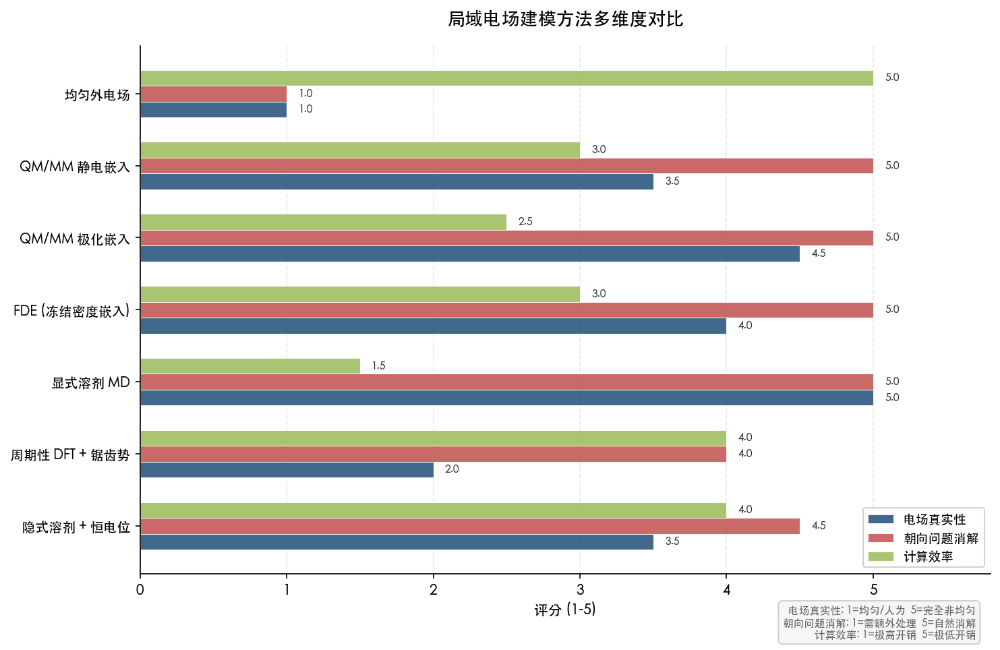

## 4.7 物理图像的统一：电场方向由体系物理环境决定

回到贯穿本报告的核心困惑——在 Gaussian 中 `Field=X+100` 施加的 X 方向均匀电场与溶液相分子催化剂经历的真实电场之间存在根本性不一致。本章讨论的各类方法从方法论层面回应了这一困惑：**当电场的来源被直接建模时，电场方向不再是需要研究者指定的输入参数，而是计算的自然输出**。

对于 Fried 和 Boxer 的 KSI 体系，QM/MM 计算给出的活性位点电场（约 −144 MV/cm，沿 C=O 键方向投影）与 VSE 实验测量值高度吻合，且这种吻合不依赖于研究者对电场方向的任何先验假设。对于 Wang 等人的固载型 SAC，表面法线方向的均匀电场虽属近似，但其方向具备明确的物理依据——垂直背栅电压产生的电场确实主要沿此方向。

核心物理图像可归结为一个方法选择判据：**若体系中电场的物理来源是已知且可建模的（酶残基、溶剂分子、电极表面），应优先采用局域电场建模方法；若研究目的在于探索电场效应的定性趋势而非定量预测，或体系尚缺乏详细的结构信息以构建 QM/MM 或显式溶剂模型，则可在前一章所述的旋转平均/投影分析框架下使用均匀外电场作为"低阶近似"**。第 5 章将在此基础上，针对 SAC 的不同子类型给出分层的实操建议。

# 第5章 面向单原子催化剂体系的电场模拟最佳实践与前沿进展

## 5.1 引言：从方法论到实操决策

前四章依次建立了外加均匀电场（EEF）的理论基础、揭示了定向外电场（OEEF）假设与分子朝向不确定性之间的根本矛盾、梳理了旋转平均与投影分析等处理策略，并介绍了通过 QM/MM 和显式溶剂直接建模局域电场来消解朝向问题的思路。本章的核心任务是将上述方法论框架落地为可执行的实操建议——面对一个具体的单原子催化剂（SAC）体系和特定的科学问题，研究者应如何选择电场模拟策略？

方法选型的关键判据并非"哪个方法更先进"，而是"目标体系的朝向约束程度"。载体锚定型 SAC（如 Pt₁/MoS₂、Fe-N₄/C）的活性位点朝向由载体几何决定，电场方向相对明确；溶液相分子型 SAC（如金属卟啉、金属酞菁）则在溶液中自由旋转，朝向近乎随机。两类场景对电场模拟方法的要求截然不同。本章首先给出分层建议框架，随后逐一介绍近年涌现的前沿工具与方法，最后提炼主流量化软件中的电场扫描操作要点。

## 5.2 分层建议框架：按朝向约束程度选择方法

### 5.2.1 Level 1——均匀电场扫描：载体固定型 SAC 的首选

对于固定在二维载体上的 SAC 体系，活性位点的空间取向由载体表面法线方向唯一确定，朝向不确定性问题自然消解。Wang 等人 2022 年在 Nature Communications 发表的工作为该类体系提供了范式性案例：以 Pt SAs-MoS₂ 和 Co SAs-WSe₂ 为模型 SAC，通过微器件施加垂直背栅电压系统调控电催化性能，正电场下 Pt SAs-MoS₂ 的氢析出反应（HER）过电位低至 20 mV@10 mA cm⁻²（Tafel 斜率 51 mV dec⁻¹），负电场下 Co SAs-WSe₂ 的氧析出反应（OER）过电位仅 139 mV@10 mA cm⁻² [Wang et al., Nat. Commun.](https://www.nature.com/articles/s41467-022-30766-x "Boosting the performance of single-atom catalysts via external electric field polarization, 2022")。

DFT 计算在 VASP 中引入 −0.4 至 +0.4 V/Å 的梯度电场，揭示了"原位静电极化"（onsite electrostatic polarization）机制——外电场直接极化单原子位点的电荷分布，调制中间体吸附自由能 ΔG_H* 以及 OER 中间体自由能阶梯。气相模型和溶剂化模型给出一致的电场响应方向，表明对于载体固定型体系，沿表面法线方向的均匀电场扫描即可定性乃至半定量地捕捉电场调控趋势 [Wang et al., Nat. Commun.](https://www.nature.com/articles/s41467-022-30766-x "同上")。

载体电子结构对电场传导效率的影响同样值得关注。Wang 等人发现，半导体载体（MoS₂、WSe₂）层数越少，电场对单原子位点的调控效率越高；金属性载体（如石墨烯）自身对电场不响应，但锚定其上的单原子仍受电场调控 [Wang et al., Nat. Commun.](https://www.nature.com/articles/s41467-022-30766-x "同上")。该结论对实验设计中载体选择与电场调控的协同优化具有直接指导意义。

Wu 等人 2025 年在 Physical Review Materials 中进一步考察了 Fe-N-C 体系在电化学电位下的 O₂ 吸附行为。以 FeN₄ 和 FeNC₃ 为模型 SAC，采用恒电位方法研究电位对分子吸附的调控效应，发现 O₂ 吸附能差在两体系之间呈电位的二次函数关系，抛物线开口由量子电容之差控制；电位响应涉及的电子态分布在整个 Fe-N-C 平面上，凸显了载体电子结构在调控分子吸附中的关键角色 [Wu et al., Phys. Rev. Mater.](https://link.aps.org/doi/10.1103/PhysRevMaterials.9.055801 "Relevance of the electronic structure of the substrate to O₂ molecule adsorption on Fe-N-C SACs, 2025")。该工作虽采用恒电位方法而非直接施加均匀外电场，但物理本质相通——在周期性 DFT 框架下，电极电位调控等价于在表面法线方向施加有效电场。

### 5.2.2 Level 2——投影分析与反应偶极矢量法：反应轴已知时的高效方案

当研究者关注电场对特定反应的催化效应而非体系的整体电场响应时，投影分析法提供了比全方向扫描更为高效的途径。其物理基础已在第 3 章详细阐述：电场沿"反应轴"的平行分量产生催化或抑制效应，垂直分量则控制立体选择性 [Shaik et al., Chem. Soc. Rev.](https://pubs.rsc.org/en/content/articlelanding/2018/cs/c8cs00354h "Structure and reactivity/selectivity control by oriented-external electric fields, Chem. Soc. Rev. 2018, 47, 5125-5145")。

对于 SAC 体系，当反应机理已知且过渡态结构可靠时，可计算过渡态与中间体之间的偶极矩差向量 μ‡ = μ_TS − μ_Int，沿 −μ̂‡ 方向施加电场以获得最大催化效应。FDBβ 方法（Besalú-Sala 等 2021 年提出）将这一思路发展为定量预测工具：基于零场下活化能的 Taylor 展开 ΔE‡(F) = ΔE‡₀ − Δμ‡·F − ½FᵀΔα‡F − ⅙ΣΔβ‡ᵢⱼₖFᵢFⱼFₖ + ···，仅需一次零场计算即可预测任意方向和强度电场下的活化能，误差控制在 1–2 kcal/mol 以内，计算成本较逐一优化降低 (4N² + 1) 倍 [Besalú-Sala et al., ACS Catal.](https://pubs.acs.org/doi/10.1021/acscatal.1c04247 "Fast and Simple Evaluation of the Catalysis and Selectivity Induced by External Electric Fields, ACS Catal. 2021, 11, 14467-14479")。

FDBβ 方法的 2D/3D 活化能面表示可快速确定电场诱导选择性切换（EFISS）——即在何种电场方向和强度下不同反应路径的活化能排序发生反转。引入核弛豫贡献后，误差可进一步降至 < 0.5 kcal/mol。该方法的适用前提是反应机理不随电场改变；在强电场下若出现协同→分步机理转换，Taylor 展开近似将失效 [Besalú-Sala et al., ACS Catal.](https://pubs.acs.org/doi/10.1021/acscatal.1c04247 "同上")。

### 5.2.3 Level 3——旋转平均与 Boltzmann 加权：溶液相自由取向体系的必要步骤

对于溶液相分子型 SAC（如自由溶解的金属卟啉催化剂），分子在外加电场中的朝向近乎随机（第 2 章已论证，室温和 < 1 V/nm 场强下 |μF|/kT ≪ 1）。单一方向的电场计算仅反映体系在一个特定朝向下的响应，不能代表系综平均行为，旋转平均或 Boltzmann 加权由此成为获得定量可靠结果的必要步骤。

Ebeling 等 2024 年在 J. Chem. Phys. 系统比较的五类球面求积方案为实操提供了明确指引 [Ebeling et al., J. Chem. Phys.](https://arxiv.org/html/2407.17434v1 "Numerical evaluation of orientation averages, J. Chem. Phys. 2024, 161, 131501")：

- **低秩被积函数**（如极化率，球谐展开 l_max ≤ 2）：仅需 6–26 个 Lebedev-Laikov 采样点即达机器精度，适用于快速评估电场对分子极化率的方向平均效应。
- **高秩或 Boltzmann 加权情形**（如低温下的取向分布）：需 600–900 个 Lebedev 点方可达 10⁻⁶ 精度。在室温催化化学中这一情形较为罕见，均匀平均通常已是良好近似。

实现层面，"旋转电场方向"等价于"旋转分子"，但前者更为便捷——保持分子坐标不变，仅改变电场矢量 **F** = F(sinθ cosφ, sinθ sinφ, cosθ) 的方向并在球面上取样后加权平均，避免了逐一重建分子坐标的繁琐操作 [Ebeling et al., J. Chem. Phys.](https://arxiv.org/html/2407.17434v1 "同上")。

### 5.2.4 Level 4——QM/MM 与显式溶剂：定量评估溶剂屏蔽效应

当研究目标涉及溶剂对电场效应的屏蔽作用的定量评估时，需升级至 QM/MM 或显式溶剂模型。Shaik 等 2025 年在 Accounts of Chemical Research 的综述中指出，溶剂屏蔽效应在外场约 0.2 V/Å 时即趋于饱和，此后进一步增大外电场仍可有效降低反应能垒；以 Menshutkin 反应为例，考虑溶剂屏蔽后活化能仍降低 10.6–12.6 kcal/mol [Shaik et al., Acc. Chem. Res.](https://pubs.acs.org/doi/10.1021/acs.accounts.5c00508 "Oriented Electric Fields — Universal Catalysts, 2025")。Dubey 等 2020 年在 JACS 的工作进一步量化了溶剂屏蔽的影响 [Dubey et al., JACS](https://pubs.acs.org/doi/10.1021/jacs.9b13029 "JACS 2020, 142, 9955-9965")。

对于溶液相分子型 SAC，若研究目标是理解电场效应的定量大小而非定性趋势，隐式溶剂模型（如 PCM）往往不足以捕捉氢键网络和第一溶剂化层对局域电场分布的影响——隐式溶剂将环境简化为连续介质，本身不"感受"外加电场。此时显式溶剂或 QM/MM 方法成为不可替代的选择。

### 5.2.5 分层决策树总结

综合上述分析，分层决策逻辑可归纳如下：

1. **载体固定型 SAC**（电场方向由载体几何确定）→ Level 1：沿载体表面法线方向进行均匀电场扫描，配合周期性 DFT（VASP `EFIELD` 或 `EFIELD_PEAD`）即可获得可靠的电场-性质关系。
2. **反应轴已知、朝向问题次要**（如固定在 STM 针尖或自组装单分子膜上的分子）→ Level 2：投影分析法或 FDBβ Taylor 展开，沿反应偶极差方向施加电场，计算效率最优。
3. **溶液相自由取向分子型 SAC**（分子朝向随机）→ Level 3：在 Level 2 基础上叠加旋转平均，使用 Lebedev-Laikov 求积方案对电场方向在球面上取样后加权平均。
4. **需定量评估溶剂屏蔽或复杂环境效应** → Level 4：QM/MM 或显式溶剂模型，直接建模电场的物理来源，从方法论层面消解朝向问题。

图 5-1 以流程图形式呈现了上述决策逻辑的完整路径，从"活性位点朝向是否由载体固定"的初始判断出发，经反应轴信息和溶剂屏蔽需求两个分支节点，分别导向 Level 1–4 对应的方法与工具。

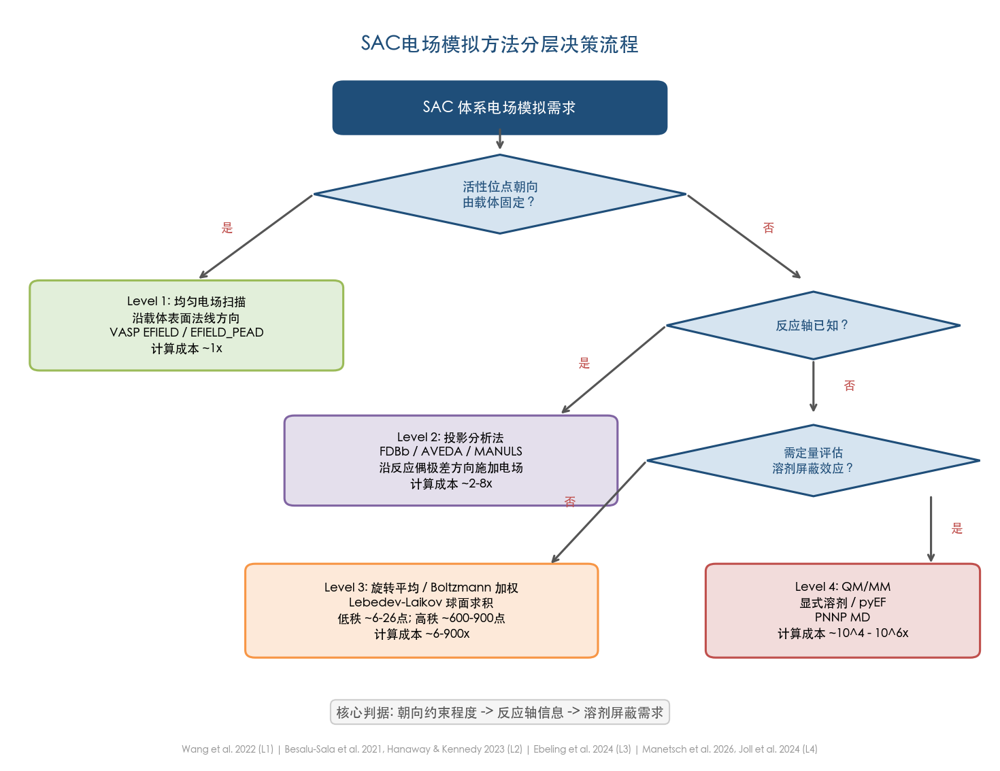

## 5.3 自动化变电场 DFT 工具：AVEDA

Hanaway 和 Kennedy 2023 年在 J. Org. Chem. 发表了自动化变电场 DFT 应用（Automated Variable Electric-Field DFT Application, AVEDA），实现了从结构对齐到电场扫描的全自动化流程 [Hanaway & Kennedy, J. Org. Chem.](https://pmc.ncbi.nlm.nih.gov/articles/PMC9830642/ "AVEDA, J. Org. Chem. 2023, 88, 106-116")。

### 5.3.1 工作流程与核心功能

AVEDA 的工作流程如下：给定中间体和过渡态的 .xyz 文件后，程序自动完成结构对齐和原子重排序，将笛卡尔坐标转换为 Z-matrix 格式（通过 Gaussian 的 `newzmat` 工具），计算过渡态与中间体之间的偶极矩差向量 μ‡ 并将其从笛卡尔坐标空间变换至 Z-matrix 空间，随后沿 −μ̂‡ 方向以 4 个预设强度（2.5、5.0、7.5、10.0 × 10⁻³ a.u.）递增施加电场，每步从前一步的 checkpoint 文件获取初始几何进行递归优化。程序基于 Python 3 和 Bash 编写，以 MIT 协议开源于 GitHub [AVEDA GitHub](https://github.com/kennedy-lab-ur/A.V.E.D.A. "Kennedy Lab, University of Rochester")。

在 10 个周环反应的测试中，沿 −μ̂‡ 方向施加电场可获得最大活化能降低，ΔΔE‡ 与 ‖μ‡‖ 呈强线性相关（R² = 0.987），有力验证了反应轴规则的普适性 [Hanaway & Kennedy, J. Org. Chem.](https://pmc.ncbi.nlm.nih.gov/articles/PMC9830642/ "同上")。

### 5.3.2 局限性与适用边界

AVEDA 目前存在以下局限：(1) 仅支持 Gaussian 16 与 SLURM 集群调度系统，对其他量化软件和作业调度系统需手动修改脚本；(2) 采用 Z-matrix 格式描述分子结构，对碎片化过渡态（如解离型过渡态）可能失败；(3) 仅执行沿 −μ̂‡ 方向的一维扫描，不自动执行多方向或 Boltzmann 加权分析；(4) 电场强度范围固定为 4 个预设值，用户无法在命令行中自定义扫描范围 [Hanaway & Kennedy, J. Org. Chem.](https://pmc.ncbi.nlm.nih.gov/articles/PMC9830642/ "同上")。

就 SAC 体系的适用性而言，AVEDA 最适合载体固定型 SAC 的初步筛选——当反应机理已知且过渡态结构可获取时，可快速评估电场敏感性。对于溶液相自由取向分子型 SAC，一维扫描不足以反映系综平均行为，需与第 3 章讨论的旋转平均方法结合使用。

## 5.4 MANULS：基于灾变理论确定最优电场方向

Bofill、Severi 等 2023 年在 J. Chem. Phys. 提出的 PMED（Perturbation Model of External Distortion）模型从灾变理论出发，同时考虑偶极矩和极化率张量来确定能完全消除反应能垒的最小电场强度与方向 [Bofill et al., J. Chem. Phys.](https://pubs.aip.org/aip/jcp/article/159/11/114112/2911634 "An algorithm to find the optimal oriented external electrostatic field, J. Chem. Phys. 2023, 159, 114112")。

该方法的核心发现在于：仅考虑偶极矩与同时考虑极化率所得最优电场方向可相差 26.9°（[3]累积二烯异构化）至 44.7°（Huisgen 环加成），场强差异高达 73%。这一结果表明，在中等至强电场条件下极化率效应不可忽略，而传统投影分析法通常仅基于偶极矩进行方向预测 [Bofill et al., J. Chem. Phys.](https://pubs.aip.org/aip/jcp/article/159/11/114112/2911634 "同上")。

PMED 模型已通过开源 Python 3 程序 MANULS 实现 [MANULS GitHub](https://github.com/MSeveri96/MANULS "MANULS v1.0.1")，并已应用于 Wittig 反应等体系的分析。对于 SAC 体系中涉及强极化效应的反应（如金属中心电荷重新分布的氧化加成或还原消除步骤），MANULS 提供了比纯偶极矩投影更为精确的最优电场方向预测。

## 5.5 机器学习加速的电场效应预测

### 5.5.1 PNNP 分子动力学：从零场训练到有限场外推

Schienbein 和 Blumberger 2024 年在 Nature Communications 提出了 PNNP（Perturbative Neural Network Potential）MD 方法，将电场效应以一阶微扰项加入机器学习势能面 [Schienbein & Blumberger, Nat. Commun.](https://www.nature.com/articles/s41467-024-52491-3 "Machine learning the electric field response, Nat. Commun. 2024, 15, 8043")。其核心思想是构建两个神经网络——一个描述零场势能面，另一个描述体系对电场的线性响应——二者均仅在零场构型上训练，但可外推至 0.2 V/Å 的有限电场。

液态水体系的验证结果令人鼓舞：取向弛豫时间 τ = 5.9 ps（PNNP）对比 6.6 ps（AIMD），介电常数 ε_r = 79.3 ± 2.2（实验值 78.4），均显示出优良的定量精度。更为重要的是，PNNP MD 将可访问的时间尺度从 AIMD 的数十 ps 推进至纳秒级，系统尺寸扩展至数千原子，使统计充分的溶剂化 SAC 体系电场效应模拟成为可能 [Schienbein & Blumberger, Nat. Commun.](https://www.nature.com/articles/s41467-024-52491-3 "同上")。代码基于 CP2K 和 PyTorch 已开源。

PNNP MD 目前仅在纯液态水体系上发表了验证结果，尚无在催化反应体系（如 SAC 催化的 HER/ORR）中的应用报道。鉴于该方法的物理基础——一阶微扰展开——具有良好的可推广性，预计在近 1–2 年内将出现溶液相 SAC 体系中的应用案例。

### 5.5.2 物理原理增强的 ML 框架：局域电场与吸附能预测

Zhao、Che 等 2025 年在 JACS Au 提出了"物理原理增强机器学习"框架，专门用于预测纳米颗粒及催化表面的局域电场分布和场依赖吸附能 [Zhao et al., JACS Au](https://pmc.ncbi.nlm.nih.gov/articles/PMC11938032/ "JACS Au 2025, 5, 1121")。该框架的核心发现是低配位位点（如边、角）的局域电场可达平面位点的约 4 倍，这对 SAC 体系尤为重要——单原子位点本质上属于"极端低配位"位点。

在训练效率方面，仅需 ±0.3 V/Å 两个场强下的训练数据即可达到平均绝对误差（MAE）约 0.006 eV 的精度。模型还展示了跨金属（Ni→Ir）和跨吸附质（CO→CH）的迁移学习能力，为大规模筛选 SAC 体系的电场响应特性提供了可行路径 [Zhao et al., JACS Au](https://pmc.ncbi.nlm.nih.gov/articles/PMC11938032/ "同上")。

### 5.5.3 pyEF：原子级电场分解的通用工具

Manetsch、Kastner、Román-Leshkov 和 Kulik 2026 年在 J. Chem. Theory Comput. 发表的 pyEF 软件包提供了通用的 QM 和 QM/MM 原子级电场分析框架 [Manetsch et al., J. Chem. Theory Comput.](https://pubs.acs.org/doi/full/10.1021/acs.jctc.6c00065 "pyEF: A Python Framework for QM and QM/MM Atom-Wise Electric Field Analysis, 2026")。pyEF 接受大多数量化软件生成的 Molden 文件，通过 Multiwfn 自动分配原子多极矩，计算原子可分解的电场、静电势和静电相互作用能。

pyEF 的系统基准测试揭示了电场计算中一个长期被低估的问题：不同电荷分配方案对计算电场的影响远超基组和泛函的选择。以丙酮在五种溶剂中的 C=O 振动 Stark 调谐率为例，不同实空间电荷方案（Hirshfeld、Hirshfeld-I、CM5、ADCH、Voronoi）给出的 Stark 调谐率最大可相差 2 倍。通过与实验溶剂偶极矩对标，CM5、ADCH 和 Hirshfeld-I 方案被推荐为电场计算最可靠的电荷分配方法，其中 CM5 方案兼具最低的基组敏感性和合理的计算成本 [Manetsch et al., J. Chem. Theory Comput.](https://pubs.acs.org/doi/full/10.1021/acs.jctc.6c00065 "同上")。

在 QM/MM 框架下，pyEF 展示了一种高效策略：距溶质 5 Å 以内的分子以 QM 精度处理，更远的分子以 MM 点电荷表示，计算成本降低约 4 倍而电场精度损失控制在 0.08 V/Å 以内 [Manetsch et al., J. Chem. Theory Comput.](https://pubs.acs.org/doi/full/10.1021/acs.jctc.6c00065 "同上")。该策略为溶液相 SAC 体系的局域电场量化分析提供了明确的实操路线。pyEF 已开源于 GitHub（hjkgrp/pyEF），并附有完整的 Zenodo 数据仓库。

## 5.6 OEEF 催化的核心规则：来自 Shaik 2025 综述的系统总结

Shaik 等 2025 年在 Accounts of Chemical Research 发表的综述对 OEEF 催化的核心规则进行了迄今最为系统的总结 [Shaik et al., Acc. Chem. Res.](https://pubs.acs.org/doi/10.1021/acs.accounts.5c00508 "Oriented Electric Fields — Universal Catalysts, 2025")。以下三条规则对 SAC 体系的电场模拟实践具有直接指导意义。

**反应轴规则。** 电场的催化效应取决于其沿电子重组方向（反应轴）的投影分量。对于 SAC 催化的反应（如 HER 中的 H* 吸附/脱附、ORR 中的 O₂ 活化），反应轴通常与金属-吸附质键方向一致，为 Level 1/2 方法中电场方向的选择提供了物理依据。

**镊子效应（Tweezer effect）。** 在强电场下，分子偶极矩与电场的相互作用可产生显著的取向偏好。Shaik 等报道 NH₃···Cl₂ 体系在 0.64 V/Å 电场下旋转能垒达 25.3 kcal/mol，足以在实验时间尺度上"锁定"分子朝向 [Shaik et al., Acc. Chem. Res.](https://pubs.acs.org/doi/10.1021/acs.accounts.5c00508 "同上")。这为溶液相分子型 SAC 体系提供了一种物理上可行的朝向控制途径——若外加电场足够强，分子自由旋转将被有效抑制。

**矢量反对称性。** OEEF 催化的产物立体化学与热反应可以不同，原因在于电场是矢量而非标量。这一效应在 SAC 催化的选择性调控中尚未得到充分探索，但理论上同样适用，值得未来研究关注。

## 5.7 Gaussian 16 中电场扫描的操作要点

鉴于许多 SAC 理论研究者使用 Gaussian 软件进行分子级 DFT 计算，本节汇总电场扫描的关键操作注意事项，以帮助规避常见技术陷阱。

### 5.7.1 输入格式与坐标选择

电场破坏分子的旋转对称性。在 Gaussian 中使用笛卡尔坐标优化（默认行为）时，分子可能在电场作用下发生整体旋转，导致优化过程中电场方向相对于分子内坐标不断变化。Hanaway 和 Kennedy 基于 AVEDA 的开发经验明确建议：**必须使用 Z-matrix 输入格式**以防止分子在电场中重取向 [Hanaway & Kennedy, J. Org. Chem.](https://pmc.ncbi.nlm.nih.gov/articles/PMC9830642/ "AVEDA Computational Methods, 2023")。ORCA 6.1 手册同样指出，电场计算中须禁用对称性以避免对称性相关的人为误差 [ORCA 6.1 手册](https://www.faccts.de/docs/orca/6.1/manual/contents/essentialelements/finEfield.html "ORCA 6.1 Manual: practical caveats")。

### 5.7.2 递增场强递归优化策略

直接在强电场下优化结构可能导致 SCF 不收敛或优化至非物理极小值。推荐采用递增场强递归优化（ramped optimization）策略：从小场强出发（如 2.5 × 10⁻³ a.u.），逐步增至目标场强（如 10.0 × 10⁻³ a.u.），每步从前一步的 checkpoint 文件获取初始几何和波函数 [Hanaway & Kennedy, J. Org. Chem.](https://pmc.ncbi.nlm.nih.gov/articles/PMC9830642/ "同上")。当相邻两步的 RMSD 变化超过 10% 时，需警惕反应机理改变或场致碎片化的可能性。

### 5.7.3 带电体系的特殊考虑

带电分子在偶极电场中不存在收敛的平衡位置——电场对带电分子施加净力 [ORCA 6.1 手册](https://www.faccts.de/docs/orca/6.1/manual/contents/essentialelements/finEfield.html "ORCA 6.1 Manual: practical caveats")。对于 SAC 体系中常见的带电中间体（如带电吸附物种），需格外注意这一约束的物理含义，并考虑是否采用周期性边界条件下的恒电位方法作为替代方案。

### 5.7.4 电场与隐式溶剂模型的组合

电场与隐式溶剂模型（如 PCM、SMD）的组合须极为谨慎：在大多数实现中，隐式溶剂的连续介质不"感受"外加电场，电场仅作用于溶质的电子密度。计算结果因此可能高估电场效应，因为忽略了溶剂分子的介电屏蔽 [ORCA 6.1 手册](https://www.faccts.de/docs/orca/6.1/manual/contents/essentialelements/finEfield.html "ORCA 6.1 Manual: practical caveats")。对于需同时考虑溶剂效应和电场效应的 SAC 体系，显式溶剂或 QM/MM 方法是更为可靠的选择。

图 5-2 以速查表形式并排对比了 Gaussian 16、VASP 和 ORCA 6.1 三款主流软件的电场关键词、单位约定、输入示例、符号约定、解析梯度/Hessian 支持情况及特殊注意事项，便于研究者快速查阅。

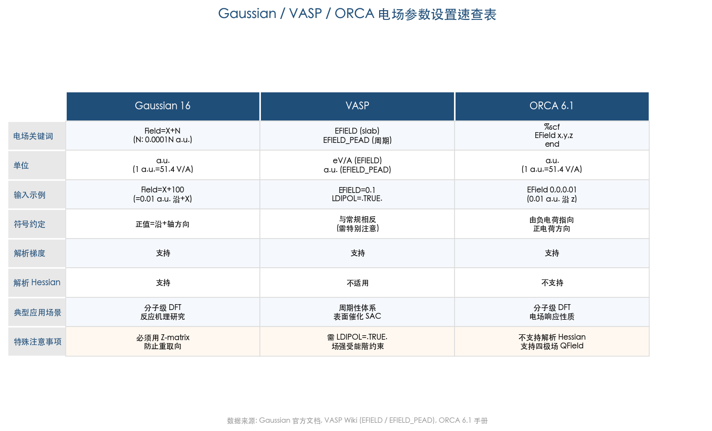

## 5.8 各方法计算开销比较与选型指南

从实用角度出发，方法选型还需综合考虑计算资源约束。以单方向单次 DFT 计算为基准（1×），各方法的典型计算开销如下：

| 方法 | 计算量级 | 适用场景 |
|------|---------|---------|
| 投影分析法 | ~2× | 反应轴已知，快速定性评估 |
| FDBβ Taylor 展开 | ~4–8× | 任意方向电场下的活化能预测 |
| AVEDA 自动扫描 | ~8× | 系列反应的电场敏感性筛选 |
| Lebedev 旋转平均（低秩） | ~6–26× | 溶液相分子的极化率方向平均 |
| Lebedev 旋转平均（Boltzmann 加权） | ~600–900× | 低温或强场下的取向分布 |
| PNNP ML-MD | ~10⁴–10⁶× | 纳秒级动力学模拟电场响应 |
| QM/MM + pyEF | 依 QM 区大小而定 | 定量评估局域电场分解 |

对于资源有限的研究组，Level 1（均匀电场扫描）和 Level 2（FDBβ 或 AVEDA）的成本在大多数计算集群上完全可承受；Level 3 的 Lebedev 低秩旋转平均（6–26 个采样点）同样属于低成本方案。仅在需要 Level 4 精度时才涉及显著的计算资源投入。

图 5-3 以气泡散点图形式直观呈现了各方法在计算成本倍率（对数坐标）与朝向约束程度两个维度上的分布，气泡大小反映方法在 SAC 体系中的应用成熟度。

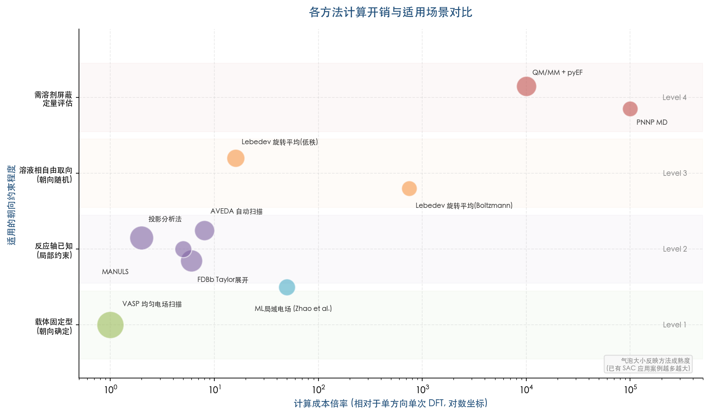

## 5.9 本章小结

SAC 体系的电场模拟策略应以"朝向约束程度"为核心判据进行分层选择。载体固定型 SAC 可直接采用沿表面法线方向的均匀电场扫描（Level 1），以 Wang 等 2022 年的 Pt SAs-MoS₂ 工作为范式 [Wang et al., Nat. Commun.](https://www.nature.com/articles/s41467-022-30766-x "Boosting the performance of single-atom catalysts via external electric field polarization, 2022")；反应轴已知时，FDBβ 和 AVEDA 提供了高效的投影分析与自动化工具（Level 2）；溶液相自由取向分子型 SAC 需叠加旋转平均（Level 3）；定量评估溶剂屏蔽则须升级至 QM/MM 或显式溶剂（Level 4）。

近年涌现的前沿工具——AVEDA 的自动化电场扫描、FDBβ 的 Taylor 展开预测、MANULS 的灾变理论优化、PNNP MD 的机器学习势能面外推、Zhao 等的物理原理增强 ML 框架、以及 pyEF 的原子级电场分解——正在系统性地降低电场模拟的技术门槛和计算成本。Shaik 等 2025 年的综述则从物理规则层面为 OEEF 催化提供了统一的理论框架 [Shaik et al., Acc. Chem. Res.](https://pubs.acs.org/doi/10.1021/acs.accounts.5c00508 "Oriented Electric Fields — Universal Catalysts, 2025")。随着 PNNP MD 向催化体系的推广和 pyEF 在 SAC 局域电场分析中的应用，"全原子-全朝向-全溶剂"的电场效应模拟有望在近两年内从方法论概念发展为可常规执行的工作流程。

# 结论与风险提示

## 核心结论

本报告围绕"理论计算如何正确模拟外加电场对分子催化剂的影响"这一问题，从物理原理、方法论和实操层面进行了系统分析，形成以下核心结论。

**结论一：电场催化效应的方向依赖性是理解一切后续问题的物理基础。** 外加均匀电场通过微扰项 H' = −μ·F 进入分子哈密顿量，其对化学反应活化能的影响由一阶项 ΔΔE‡ ≈ −|Δμ‡||F|cosθ 主导，其中 θ 为电场与反应偶极差向量的夹角。Shaik 等人提出的"反应轴规则"将这一物理图像凝练为操作性判据：沿电子重组方向（反应轴）施加的电场产生最大催化效应，偏离该方向则效果递减。这种强方向依赖性是 OEEF 催化概念的核心，也是朝向不确定性问题的根源所在。

**结论二：Gaussian `Field=X+100` 等单方向电场设置隐含了分子朝向确定的假设，该假设仅在特定实验场景中成立。** STM/MCBJ 单分子结实验和 SAM 修饰电极表面通过化学键合将分子朝向"钉死"，此时单方向电场计算在物理上完全合理。然而，对于溶液相分子型 SAC（如金属卟啉、金属酞菁），分子旋转弛豫时间（τ_c ≈ 0.1–0.3 ns）远短于催化反应时间尺度，室温下取向极化参数 |μF|/k_BT 仅约 0.1–0.4，分子朝向近乎随机。在此条件下，一阶电场催化效应在取向平均后趋于消失，单方向计算结果不代表体系可观测的响应。

**结论三：处理朝向不确定性的方法已形成完整谱系，研究者应以"朝向约束程度"为核心判据进行分层选择。** 载体固定型 SAC 可直接沿表面法线方向施加均匀电场（Level 1）；反应轴已知时，FDBβ Taylor 展开或 AVEDA 自动化工具提供了高效的投影分析方案（Level 2），其中 FDBβ 仅需一次零场计算即可预测任意电场条件下的活化能；溶液相自由取向体系需叠加 Lebedev-Laikov 球面求积实现旋转平均（Level 3），低秩性质仅需 6–26 个采样点；当需定量评估溶剂屏蔽和局域电场分布时，QM/MM 静电嵌入或显式溶剂模型可从方法论层面消解朝向问题（Level 4）。

**结论四：局域电场建模是超越均匀外电场近似的根本性解决方案。** QM/MM 静电嵌入中 MM 点电荷在 QM 区域产生的非均匀电场、显式溶剂分子偶极矩的矢量叠加、周期性 DFT 中表面法线方向的锯齿势——这些方法的共同特征是直接建模电场的物理来源，使电场方向成为计算的自然输出而非人为输入。振动 Stark 效应光谱则为实验定量测量局域电场提供了精密工具，Fried 与 Boxer 2014 年测得酮类固醇异构酶活性位点电场约 −144 ± 6 MV/cm，贡献了约 70% 的催化加速效果，有力支持了 Warshel 的活性位点静电预组织理论。

**结论五：新兴工具正在快速降低电场模拟的技术门槛。** PNNP 机器学习分子动力学仅需零场训练数据即可外推至 0.2 V/Å 有限电场，将可访问时间尺度从 AIMD 的数十 ps 推进至纳秒级；Zhao 等人提出的物理原理增强 ML 框架仅需两个场强训练数据即达 MAE ≈ 0.006 eV 精度，并展现跨金属和跨吸附质的迁移学习能力；pyEF 软件包提供了通用的原子级电场分解框架，揭示了电荷分配方案对计算电场的影响可超过基组和泛函选择。这些进展表明，"全原子-全朝向-全溶剂"的电场效应模拟正从方法论概念向可常规执行的工作流程演进。

## 主要局限性

本报告在研究范围、信息来源和方法覆盖方面存在以下局限性，读者在参考具体结论时应予以注意。

**第一，旋转平均和 Boltzmann 加权方法在 SAC 电场研究中的直接应用实例尚未在文献中找到。** 本报告中关于这些方法在 SAC 体系中的适用性讨论，主要基于方法论在分子物理和光谱学领域的成熟应用向催化化学的逻辑外推，而非来自 SAC 电场研究的直接实践。上述方法组合（如 FDBβ + Lebedev 旋转平均的两步策略）属于基于物理分析的合理建议，其在具体 SAC 催化反应中的定量表现仍有待未来研究验证。

**第二，PNNP 机器学习分子动力学目前仅在纯液态水体系上发表了验证结果。** 该方法在涉及化学键断裂/形成的催化反应势能面上的可靠性、对过渡金属 SAC 体系的适用性、以及一阶微扰展开在强电场下的有效性边界，均尚未得到系统检验。本报告对该方法在 SAC 领域应用前景的判断具有前瞻性，需随后续文献进展不断校准。

**第三，部分核心文献受付费墙限制未能获取全文。** 包括 Shaik 等人 2016 年 Nature Chemistry 原文的完整定量数据、Fried 与 Boxer 2017 年 Annual Review of Biochemistry 综述的详细方法论讨论等。本报告相关论述主要依据摘要、开放获取的衍生文献以及后续综述中的转引内容，个别细节可能与原文表述存在偏差。

**第四，本报告以分子型 SAC 和载体固定型 SAC 为主要讨论对象，未系统覆盖团簇催化剂、金属纳米颗粒等其他形态催化剂在电场下的行为。** 这些体系的电场响应涉及金属功函数调制、电双层结构等额外物理因素，需要不同的理论框架处理。此外，电催化界面中电极电位与电场的关系虽在第 4–5 章有所涉及，但未对恒电位方法进行系统深入的讨论。

**第五，Gaussian `Field` 关键词的参数语法（N×0.0001 au）主要引用自第三方教程和讨论帖（T3/T4 信源），Gaussian 官方网站因访问限制未能直接验证。** 该语法已在多个独立来源中交叉确认且与同行使用实践一致，但严格意义上缺少 T1 级来源的直接支持。
