# 执行摘要

新能源汽车动力系统正经历以800V高压平台、碳化硅（SiC）功率器件、固态/半固态电池、分布式驱动为代表的四大技术同步迭代加速期。本报告构建了覆盖"研发制造—使用场景—残值管理"三个维度的结构化评估体系，以"无补贴TCO平价＋渗透率突破S曲线起飞阈值（10%–20%）＋残值率不低于可比燃油车基准"三重交集判据，对纯电（BEV）、增程（EREV）、插混（PHEV）、氢燃料电池（FCEV）四条技术路线在集中式与分布式两种驱动架构下的商业化临界点进行系统量化。核心判断如下：

**技术成熟度呈显著梯度分化。** 800V高压架构已全面商业化运营（TRL 9），中国市场搭载800V架构的乘用车超过70款，2024年销量达84万辆；SiC功率器件处于规模量产早期（TRL 8–9），800V车型中SiC渗透率达71%，2024年中国SiC功率模块装机量突破208万套。半固态电池进入小批量装车阶段（TRL 7–8），全固态电池仍处于实验室验证期（TRL 4–5），预计2030年渗透率约4%。分布式驱动（轮毂电机）乘用车应用处于原型验证阶段（TRL 5–6），但中国轮边电机方案已实现规模量产（2025年装机量超8万套，同比增长232.6%），领先全球轮毂电机路径约3–5年。

**BEV在乘用车与商用车两大板块均展现最强商业化动能。** 中国市场已于2023–2024年全面跨过商业化临界点——近2/3的BEV售价低于同级燃油车，渗透率远超20%，电池包均价降至84美元/kWh。欧洲BEV临界点预计2027–2029年到达，受CO₂法规与ETS2碳价（2027–2030年均99欧元/吨）推动，但禁燃令软化和反补贴关税使其较基线推迟约1–2年。美国BEV临界点预计2029–2032年，联邦EV税收抵免废除可使2030年渗透率预测从约48%降至27%–32%，政策不确定性为全球最大。

**EREV和PHEV本质上是过渡性方案，其商业化窗口受BEV成本曲线的刚性约束。** PHEV在中国市场已于2024年跨过临界点（比亚迪DM 5.0驱动价格破坏），但购置税退坡、双积分门槛提升和一线城市限行政策的叠加效应正加速窗口关闭。EREV在中国市场的增速已从此前连续四年的70%–218%骤降至2025年的约6%，有效竞争窗口预计于2028年前基本关闭。两者在欧美市场短期内均不具备跨过临界点的条件。

**FCEV距商业化临界点最为遥远。** 2025年全球FCEV销量仅16,011辆，日本原定2025年20万辆FCEV的国家目标达成率不足0.3%。FCEV乘用车在所有市场和情景下临界点均处于2030年后。FCEV重卡在超长途干线运输中仍保有有条件的竞争窗口（预计2030–2035年），但BEV重卡TCO在中、欧、美三大市场已全面低于FCEV重卡，兆瓦级充电技术的发展正进一步压缩FCEV的场景生存空间。

**分布式驱动将从"修正变量"逐步演进为"路线重塑因素"。** 短期（2026–2028年）分布式驱动对主流市场TCO临界点基本无修正效应；中期（2028–2030年）保守估算TCO修正幅度约10%–13%，可使欧美BEV的TCO平价时间提前0.5–1年；长期（2030年后），若主流OEM投入全新分布式平台开发且年产量达十万辆级，修正幅度可达20%以上。

**产业链价值正向电池与电力电子器件集中，中国供应链全球优势短期不可撼动。** 中国在锂电池全链条、SiC衬底（全球产能占比约70%）和稀土加工环节占据绝对主导地位，20种战略矿物中19种冶炼加工份额约70%。然而，美国IRA生产税收抵免、欧盟电池法规与碳足迹阈值等政策正加速推动供应链区域化重构，"降本"与"去风险"之间的张力将是未来五年产业链博弈的核心主题。

**政策角色正从"决定性力量"向"调节性因素"转变。** 对于已跨过临界点的中国BEV/PHEV，政策核心任务已从"激励推广"切换为"规范竞争秩序"与"保障残值生态"；对于尚未跨过临界点的市场，政策仍是关键催化剂，但其效力取决于是否与技术成熟度和基础设施就绪度形成协同。日本FCEV案例充分表明，在技术和生态系统未就绪的前提下，政策激励的边际效用极低。

# 第1章 动力系统核心技术迭代图谱与成熟度评估

动力系统电动化的技术竞争已从"能不能用"迈入"何时可大规模商业化"的关键阶段。800V 高压平台从旗舰车型下探至大众市场、碳化硅（SiC）功率器件在主驱逆变器中的渗透率逐季攀升、半固态电池开始实际装车验证、分布式驱动原型车在极端工况下完成测试——四大核心技术在 2025 年 4 月至 2026 年 3 月期间均取得实质性进展，但其距离大规模商业化的距离参差不齐。本章以该年度为回顾窗口，系统梳理 800V 高压平台、SiC 功率器件、固态/半固态电池、分布式驱动四大关键技术的迭代进展与量产落地状态，并以统一的技术就绪度（Technology Readiness Level, TRL）框架进行横向定位，为后续章节的商业化临界点量化分析建立输入条件。

## 1.1 800V 高压架构：从旗舰专属到大众化加速渗透

### 1.1.1 量产车型爆发与价格下探

800V 高压电气架构已从概念验证进入全面商业化运营阶段。截至 2025 年年中，中国市场搭载 800V 架构的乘用车车型已超过 70 款，价格带从最初 30 万元以上的旗舰定位大幅下探至 10 万–15 万元区间，实质性覆盖了主流消费市场[ResearchAndMarkets 报告](https://www.businesswire.com/news/home/20251021314198/en/New-Energy-Vehicle-800-1000V-High-Voltage-Architecture-and-Supply-Chain-Report-2025-Chinas-Electric-Car-Market-Surges-with-800V-Models-35-Penetration-by-2030---ResearchAndMarkets.com "2025年800-1000V高压架构及供应链研究报告")。

销量数据印证了这一趋势的加速性质。2024 年中国 800V 乘用车销量达 84 万辆，同比增长 185%，渗透率为 6.9%；预计 2025 年渗透率提升至 9.5%，2030 年超过 35%（届时年销量规模超 700 万辆）[ResearchAndMarkets 报告](https://www.businesswire.com/news/home/20251021314198/en/New-Energy-Vehicle-800-1000V-High-Voltage-Architecture-and-Supply-Chain-Report-2025-Chinas-Electric-Car-Market-Surges-with-800V-Models-35-Penetration-by-2030---ResearchAndMarkets.com "2025年800-1000V高压架构及供应链研究报告")。全球范围内，800V 架构 2030 年渗透率预计为 15%–20%，其中高端车型（6 万美元以上）有望超过 50%。中国市场的渗透速度显著快于全球平均水平，反映出国内新能源汽车产业链在高压平台领域的先发优势[Ars Technica](https://arstechnica.com/cars/2026/03/doubling-the-voltage-what-800-v-architecture-really-changes-in-evs/ "2026年3月800V技术分析")。

### 1.1.2 主流车企平台全面覆盖

800V 已成为中国头部新能源车企新车平台的标准配置。比亚迪推出 e 平台 3.0 Evo 并升级至全域 1000V 架构，小鹏率先实现全域 800V 与 5C 超充组合，极氪部署 1.2MW 全液冷超充桩体系，蔚来、长安、吉利、小米等均已将 800V 列为新车标配。海外市场方面，保时捷、现代-起亚、奔驰、宝马均已完成 800V 平台部署，大众集团 SSP 平台（800V）首款欧洲车型计划 2028 年上市[ResearchAndMarkets 报告](https://www.businesswire.com/news/home/20251021314198/en/New-Energy-Vehicle-800-1000V-High-Voltage-Architecture-and-Supply-Chain-Report-2025-Chinas-Electric-Car-Market-Surges-with-800V-Models-35-Penetration-by-2030---ResearchAndMarkets.com "全球OEM 800V部署规划")。

在性能边界的拓展上，2025 年 3 月比亚迪发布 Super-e 平台，实现 5 分钟补充约 400 公里续航，该平台采用 1000V 架构耦合 1MW 充电功率，标志着高压快充技术进入"兆瓦级"时代[IEA Global EV Outlook 2025](https://www.iea.org/reports/global-ev-outlook-2025/electric-vehicle-charging "比亚迪Super-e平台")。

### 1.1.3 超充基础设施加速部署

800V 架构的商业化效能高度依赖超充桩网络密度的提升。2024 年全球超快充桩（150kW 及以上）数量增长 50%，达到约 71,000 台，占公共快充桩总量的近 10%。区域分布上，欧盟 150kW 以上超快充桩达 77,000 台，其中约 20% 的功率达 350kW 及以上；美国公共直流快充端口达 70,017 个[IEA Global EV Outlook 2025](https://www.iea.org/reports/global-ev-outlook-2025/electric-vehicle-charging "2025年全球充电基础设施数据")。超充桩网络的快速扩张正在消解消费者对高压平台"有车无桩"的顾虑，构成 800V 架构渗透率持续攀升的重要基础设施保障。

### 1.1.4 成本与兼容性挑战

800V 平台相对于传统 400V 平台的额外成本约 1,180 美元，主要来自高压继电器、连接器、绝缘件及 SiC 功率器件的成本增量。随着 SiC 器件降价和规模效应释放，预计该额外成本将在 2028 年降至约 420 美元，降幅约 64%[Ars Technica](https://arstechnica.com/cars/2026/03/doubling-the-voltage-what-800-v-architecture-really-changes-in-evs/ "800V成本与兼容方案")。

在与现有 400V 充电桩的兼容方面，行业已形成两条成熟的技术路径：一是车载 DC-DC 升压方案，将 400V 桩端电压升至 800V 电池端电压，但增加车端成本和重量；二是电池组拆分并联充电方案，将 800V 电池组拆分为两组 400V 并联充电，但对电池管理系统提出更高要求。两种方案均已实现量产应用，有效缓解了高压平台推广初期的充电兼容问题。

### 1.1.5 TRL 评估

综合 70 余款量产车型、84 万辆年销量、完整的产业链配套及持续下降的成本曲线，800V 高压架构评定为 **TRL 9**——已实现完全商业化运营，当前处于规模扩张阶段，核心瓶颈已从技术本身转向超充网络密度和 400V 兼容过渡期的管理。

## 1.2 碳化硅（SiC）功率器件：规模量产与供应链重构

### 1.2.1 主驱逆变器渗透率快速攀升

碳化硅 MOSFET 在新能源汽车主驱逆变器中的应用正在加速渗透。2024 年中国新能源乘用车主驱模块 SiC MOSFET 占比为 15.4%，至 2025 年 1 月进一步提升至 18.9%。尤为引人注目的是 800V 车型中的渗透率变化——由 2023 年不到 20% 跃升至 2025 年 1 月的 71%，表明 800V 高压架构与 SiC 功率器件已形成高度绑定的技术组合，两者在成本下降和性能优化上呈现协同演进态势[IICIE 第三代半导体研究](https://iicieexpo.com/news/1493_info.html "NE时代统计中国SiC主驱渗透率")。

装机量数据进一步确认了这一趋势的规模效应。2024 年中国 SiC 功率模块装机量突破 208 万套，同比增长 116%。国产厂商表现亮眼，比亚迪半导体、芯聚能、芯联集成等合计份额达 45.7%，正在打破国际厂商此前在该领域的主导地位[IICIE 第三代半导体研究](https://iicieexpo.com/news/1493_info.html "2024年中国SiC模块装机量")。

### 1.2.2 全球市场规模与竞争格局

Yole 预测全球 SiC 器件市场将在 2030 年达到 103 亿美元，2024–2030 年复合增长率超过 20%，其中汽车及出行领域贡献约 70% 的市场需求[世强硬创-Yole 报告](https://www.sekorm.com/news/580438173.html "Yole 2025碳化硅市场预测")。

当前全球 SiC 功率器件市场呈现高度集中态势，前五大供应商占据 91.9% 的收入份额：意法半导体以 32.6% 居首，安森美和英飞凌分列二、三位[TrendForce](https://www.semiconductor-today.com/news_items/2024/jun/trendforce-200624.shtml "SiC功率器件市场份额")。然而，在衬底材料端，中国已确立绝对优势——SiC 衬底产能占全球约 70%，价格较国际厂商低 30%–40%[IICIE 第三代半导体研究](https://iicieexpo.com/news/1493_info.html "中国SiC衬底份额与价格趋势")。这种"上游强、下游弱"的结构性特征，使得中国企业在产业链纵向整合中具备显著的成本优势和向下游延伸的潜力。

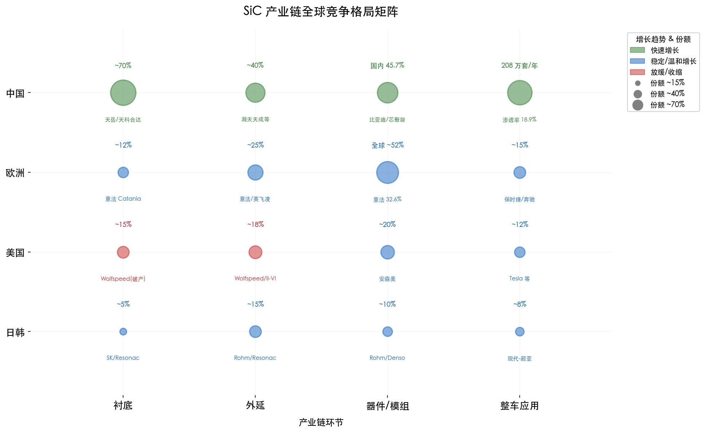

上图以气泡矩阵形式展示了 SiC 产业链各环节在不同区域的竞争态势。中国在衬底端以约 70% 的份额居于主导地位且保持快速增长；欧洲在器件/模组端凭借意法半导体、英飞凌等厂商占据约 52% 的份额；美国因 Wolfspeed 破产保护事件面临衬底端份额收缩的风险。

### 1.2.3 8 英寸晶圆转型：2026 年成为产业分水岭

SiC 产业向 8 英寸（200mm）晶圆的迁移是降低器件单位成本的关键路径——200mm 晶圆较 150mm 可提升约 1.78 倍的芯片产出面积，从而显著摊薄制造成本。然而，这一转型正面临复杂的产业博弈与资本挑战。

在国际头部厂商中，Wolfspeed 于 2025 年 9 月宣布 200mm SiC 材料的商业化发布，但因持续亏损，已于 2025 年 5 月申请破产保护，提前关闭 Durham 6 英寸产线，全面转向 Mohawk Valley 8 英寸工厂[Wolfspeed 官方公告](https://www.wolfspeed.com/company/news-events/news/wolfspeed-announces-the-commercial-launch-of-200mm-silicon-carbide-materials-portfolio-unlocking-the-industrys-ability-to-manufacture-at-scale/ "Wolfspeed 200mm商业化发布")。英飞凌于 2025 年 2 月在奥地利 Villach 工厂向客户交付首批基于 200mm SiC 技术的产品，其马来西亚 Kulim 工厂 Module 3（专用于 200mm SiC 晶圆生产）已进入产能爬坡阶段，并确认了"30-30"战略目标——到 2030 年占据全球 SiC 市场 30% 份额[英飞凌新闻稿](https://www.infineon.com/press-release/2025/infxx202502-055 "Infineon 200mm SiC首批产品交付")。安森美韩国 8 英寸工厂因电动车市场需求波动和中国企业竞争加剧，于 2025 年 4 月暂停投资建设[IICIE 第三代半导体研究](https://iicieexpo.com/news/1493_info.html "安森美暂停韩国8英寸工厂")。意法半导体位于意大利 Catania 的集成化 SiC 衬底制造工厂计划 2026 年投产，其与三安光电在中国的合资项目已完成多产品验证并进入风险生产阶段，规划年产能约 48 万片 8 英寸 SiC 晶圆[TrendForce](https://www.trendforce.com/news/2026/03/04/news-wafer-capacity-set-to-surge-a-new-phase-for-the-sic-industry-in-2026/ "2026年SiC产业动态")。

中国企业在这一轮转型中表现出积极的追赶姿态。天岳先进于 2024 年 11 月推出全球首款 12 英寸导电型 SiC 衬底样品，技术节点领先全球。6 英寸衬底价格在 2024 年从 4,000–4,500 元跌至 2,500–2,800 元，全年降幅超过 40%，反映出中国产能释放带来的激烈价格竞争[IICIE 第三代半导体研究](https://iicieexpo.com/news/1493_info.html "中国SiC衬底份额与价格趋势")。集邦咨询预测 8 英寸产品市占率将在 2026 年达到约 15%、2030 年突破 20%。中车时代电气的株洲 8 英寸 SiC 产线已于 2025 年底完成设备进场和线体验证，正为量产做准备，目标将 3300V 及以上高压 SiC 器件拓展至柔性直流输电和光伏逆变器等工业领域[TrendForce](https://www.trendforce.com/news/2026/03/04/news-wafer-capacity-set-to-surge-a-new-phase-for-the-sic-industry-in-2026/ "中国SiC厂商8英寸进展")。

行业观察者普遍将 2026 年视为 SiC 产业的分水岭——全球 8 英寸大规模制造启动之年。良率提升速度和单位成本控制能力将成为决定各厂商市场份额和盈利能力的核心变量[TrendForce](https://www.trendforce.com/news/2026/03/04/news-wafer-capacity-set-to-surge-a-new-phase-for-the-sic-industry-in-2026/ "2026年SiC产业展望")。

### 1.2.4 TRL 评估

SiC 功率器件在主驱逆变器应用场景已进入规模量产阶段，年装机量超 208 万套，整体渗透率 15%–19%，且 8 英寸产能正处于爬坡期。综合评定为 **TRL 8–9**——处于规模商业化早期阶段，8 英寸晶圆的良率提升速度和成本下降曲线将决定其向 TRL 9 完全成熟迈进的时间节点。

## 1.3 固态/半固态电池：分层演进的产业化路径

### 1.3.1 三大技术路线的现状与瓶颈

固态电池的核心竞争焦点在于固态电解质的材料路线选择。当前三大主流路线呈现鲜明的差异化特征：

- **硫化物路线**：离子电导率最高（室温约 10⁻² S/cm），接近甚至超越液态电解质水平，但对水分和空气极度敏感，生产环境要求极为苛刻，界面稳定性和规模制造工艺构成核心瓶颈。
- **氧化物路线（LLZO 等）**：化学稳定性优异，安全裕度高，但材料本身脆性大、烧结温度接近 1,000°C，导致制造成本高企。
- **聚合物路线**：制造工艺门槛最低，但需要 60°C 以上才能高效工作，低温性能受限，难以满足全气候条件下的车规级要求。

在能量密度维度，实验室条件下固态电池已实现 400–500 Wh/kg，较当前量产液态锂电池的 200–300 Wh/kg 具有显著的代际优势[To7Motor 固态电池综述](https://to7motor.com/solid-state-batteries-2026-commercial-reality "三大路线技术对比")。然而，从实验室性能到量产一致性之间的鸿沟仍然巨大，界面电阻控制和大面积电芯制造良率是当前最为突出的工程化挑战。

### 1.3.2 头部企业的产业化时间表

全球固态电池领域呈现"多国竞逐、时间表频繁修正"的竞争态势，各阵营的路线选择和节奏差异明显：

**日韩阵营**侧重硫化物路线并以整车企业为牵引力量。丰田计划 2026 年小批量试产、2030 年后大规模生产，目标能量密度 450–500 Wh/kg；三星 SDI 规划 2027 年实现 9 分钟充至 80% 的快充性能[To7Motor](https://to7motor.com/solid-state-batteries-2026-commercial-reality "主要企业时间表")。

**中国阵营**采取"半固态过渡＋全固态储备"的双轨策略。宁德时代计划 2027 年实现全固态电池小批量生产，其自评技术成熟度为 4/9（对应"实验室环境验证"阶段）；比亚迪硫化物固态电池同样瞄准 2027 年小批量生产节点[Recharged](https://recharged.com/articles/solid-state-batteries-for-evs-timeline "2026-2035商业化路线图")。

**欧美阵营**以初创企业和合资模式为主。QuantumScape 已向 PowerCo（大众合资电池公司）交付 B 样品，处于中试验证阶段[To7Motor](https://to7motor.com/solid-state-batteries-2026-commercial-reality "QuantumScape进展")。

### 1.3.3 半固态电池率先装车：从概念验证到小批量量产

与全固态电池的"远期承诺"形成鲜明对比的是，半固态电池已在中国市场实现实际装车。蔚来 ET7 搭载 150kWh 半固态电池包，电芯能量密度达 360 Wh/kg，实测续航超过 1,000 km（CLTC 工况 1,055 km），2025 年 4 月宣布进入量产阶段。智己 L6 搭载清陶能源半固态电池亦已完成装车验证[钛媒体](https://www.tmtpost.com/7126995.html "蔚来ET7半固态电池装车")。

上述装车案例表明，半固态电池作为从液态到全固态的过渡技术路线，正以"高端旗舰—限量供应"的模式率先切入市场。但需要清醒认识到，其成本远高于同等容量的液态电池，产能规模极为有限，尚不具备大众市场的经济性条件。半固态电池的战略价值更多体现为技术验证平台和市场教育载体，而非短期内的规模化替代方案。

### 1.3.4 标准化进程与市场渗透预测

在标准化方面，中国将于 2026 年 7 月发布首个固态电池国家标准，这将为产业化提供关键的技术规范基础，有助于统一测试方法和性能评价体系，降低上下游企业的协调成本[To7Motor](https://to7motor.com/solid-state-batteries-2026-commercial-reality "中国固态电池国标计划")。

对于市场渗透节奏，SNE Research 的预测提供了务实的参照基准：2030 年全球液态锂电池仍将占 95% 以上的市场份额，全固态电池供应量从 2025 年的 0.2 GWh 增至 2030 年的 131 GWh，渗透率约 4%[钛媒体](https://www.tmtpost.com/7126995.html "SNE Research固态电池渗透率预测")。这一预测揭示了固态电池产业化的核心现实：尽管其在能量密度和安全性上具有代际优势，液态锂电池在未来五年仍将是绝对主力。固态电池的规模化替代将是一个以十年为尺度的渐进过程，而非技术"突变"。

### 1.3.5 TRL 评估

全固态电池与半固态电池的成熟度呈现显著分层：

- **全固态电池：TRL 4–5**——处于实验室验证至相关环境验证阶段。宁德时代自评成熟度 4/9 与该判定相互印证，量产良率、界面电阻控制和大面积电芯制造工艺是制约其向更高 TRL 迈进的核心瓶颈。
- **半固态电池：TRL 7–8**——已完成系统级示范并进入小批量量产阶段。蔚来 ET7、智己 L6 已实现装车交付，但成本高企、产能有限，距大规模商业化门槛仍有实质性距离。

## 1.4 分布式驱动：原型验证取得突破，量产仍待破局

### 1.4.1 技术概念与结构性优势

分布式驱动的核心理念在于将电驱动力从集中式传动系统解耦至每个车轮。轮毂电机将电机集成于车轮轮辋内部，轮边电机则安装于车轮附近但不完全集成于轮辋。该架构可实现单轮独立扭矩控制，在以下方面具有结构性优势：

- **扭矩响应速度**：轮毂电机扭矩响应时间约 4 ms（10 kHz 控制频率），而集中式 e-Axle 约 80–100 ms，前者快约 20 倍，为高级驾驶辅助和车辆动态控制提供了毫秒级执行能力[Green Car Reports](https://www.greencarreports.com/news/1145830_in-wheel-motors-ev-cost-boost-range "扭矩响应对比")。
- **能量回收效率**：四轮独立再生制动可提高能量回收效率 5%–10%。Elaphe 提出 2030 年实现 95% 电池到车轮效率的技术目标[Green Car Reports](https://www.greencarreports.com/news/1145830_in-wheel-motors-ev-cost-boost-range "再生制动与效率目标")。
- **底盘空间释放**：取消减速齿轮、差速器和半轴后，底盘空间获得大幅释放，可用于增加电池容量或重新优化整车布局。

### 1.4.2 2026 年原型车验证：从理论走向极端工况

截至 2026 年 3 月，全球尚无量产乘用车搭载轮毂电机或轮边电机。但在原型车验证领域出现了标志性进展：2026 年 3 月，Elaphe 在瑞典完成了基于现代 Ioniq 5 的四轮毂电机原型车测试，每电机输出功率 188 马力、扭矩 1,254 磅·英尺，在冰面工况下成功验证了单轮独立扭矩矢量控制与线控底盘集成的可行性[MotorTrend](https://www.motortrend.com/reviews/elaphe-hub-motor-prototype-review "Elaphe 2026年3月原型车测试")。该测试的意义在于，冰面工况对扭矩分配精度和响应速度提出了极端要求，能够在此条件下完成验证，表明轮毂电机的控制算法和执行精度已达到车规级安全标准的门槛。

### 1.4.3 簧下质量争议与工程化解方案

簧下质量增加是轮毂电机长期面临的核心质疑。每个 Elaphe 轮毂电机重量约 27 kg，但净簧下质量增量约为既有簧下质量的 30%（每轮约 16 kg），原因在于安装轮毂电机后可取消集中式电驱系统的部分组件（减速齿轮、差速器等），实现系统级重量再分配[Green Car Reports](https://www.greencarreports.com/news/1145830_in-wheel-motors-ev-cost-boost-range "净簧下质量增量")。

Lotus/Protean 联合研究提供了量化评估数据（测试条件为基于 Ford Focus 每轮增加 30 kg）：车轮跳动模态从 14 Hz 降至 10 Hz，主动安全关键绩效指标降低约 0.05g，该幅度远小于更换低端轮胎所造成的影响，且可通过常规悬挂调校恢复至原有水准[Protean/Lotus Engineering](https://www.proteanelectric.com/f/2018/04/protean-Services3.pdf "簧下质量量化影响研究")。配合定制减震器设计，簧下质量增加的负面效应可以得到有效补偿。

### 1.4.4 供应商格局与量产时间线

分布式驱动领域的主要参与者及其产业化进程呈现多层次、多场景的推进格局：

- **Elaphe**（斯洛文尼亚）：预计 2030 年前推出首批量产合作车型，合作 OEM 为"家喻户晓的品牌"。2026 年 Sonic.1 瞄准 10 万美元以上高端性能市场，单轮功率 259 kW/347 马力。Elaphe 估算分布式驱动在全新平台设计中可降低约 10% 的整车制造成本[MotorTrend](https://www.motortrend.com/reviews/elaphe-hub-motor-prototype-review "Elaphe量产规划")。
- **Protean/Exedy**（英国/日本）：Protean 于 2026 年 2 月被日本 Exedy 收购，Pm18 2500 计划 2026 年投产，单轮输出超 2,500 Nm/220 kW，2025 年 9 月已宣称实现与双 e-Axle 方案的成本平价[electrive.com](https://www.electrive.com/2026/03/09/exedy-acquires-protean-electric/ "Exedy收购Protean")。东风 E70 搭载 Protean Pd18 获得中国工信部认证，成为全球首款获官方认证的轮毂电机乘用车[Protean Electric](https://www.proteanelectric.com/the-first-homologated-passenger-car-with-in-wheel-motors/ "东风E70认证")。
- **DeepDrive**（德国）：获 BMW i Ventures 投资，采用双转子径向磁通电机设计，计划 2026 年小批量生产、2028 年大规模量产[Electric Motor Engineering](https://www.electricmotorengineering.com/deepdrive-the-power-of-a-dual-rotor-motor/ "DeepDrive双转子电机")。
- **舍弗勒**（德国）：侧重商用和低速场景应用，14 英寸轮毂电机已向 Jungo 等市政车辆制造商交付，功率范围 7–60 kW，覆盖道路清扫、货运和除雪车等市政用途[Automotive Powertrain Technology](https://www.automotivepowertraintechnologyinternational.com/news/electric-powertrain-technologies/schaeffler-to-deliver-in-wheel-electric-drives-for-municipal-vehicles.html "舍弗勒市政车辆交付")。
- **Donut Lab**（美国）：宣称第二代轮毂电机制造成本比传统电驱低 50%，每轮峰值功率 630 kW/峰值扭矩 4,300 Nm，并展示了 Class 8 重卡轮毂电机方案，拓展了分布式驱动在商用车领域的应用前景[CleanTechnica](https://cleantechnica.com/2025/01/09/in-wheel-electric-motors-from-donut-labs-elaphe-debut-at-ces-2025/ "Donut Lab CES 2025")。

### 1.4.5 TRL 评估

分布式驱动（轮毂电机）的乘用车应用整体成熟度评定为 **TRL 5–6**——处于相关环境验证至系统级示范阶段。东风 E70 获得中国工信部认证是重要的合规里程碑，Elaphe 冰面测试验证了极端工况下的可行性，但全球仍无面向消费者的量产车型面世。在 AGV/自主移动机器人和市政低速车辆等对簧下质量不敏感的细分场景中，轮毂电机已实现商业化部署，此类场景的 TRL 可达 8–9。乘用车领域的产业化瓶颈并非技术本身，而在于 OEM 是否愿意承诺数十亿美元级别的全新平台投资。

## 1.5 技术成熟度横向定位与迭代趋势

### 1.5.1 TRL 横向对标

基于前述各节的分析，以统一的 TRL 1–9 框架（采用 NASA/DOE 标准适配汽车产业场景）对五大核心技术进行横向定位：

| 技术领域 | TRL 评定 | 核心依据 | 距大规模商业化的关键瓶颈 |
|---------|---------|---------|----------------------|
| 800V 高压架构 | TRL 9 | 70+ 量产车型、84 万辆/年、完整产业链 | 已商业化，瓶颈转为超充网络密度与 400V 兼容过渡 |
| SiC 功率器件（主驱） | TRL 8–9 | 208 万套/年、渗透率 15%–19%、8 英寸爬坡 | 8 英寸良率提升与单位成本下降速率 |
| 半固态电池 | TRL 7–8 | 蔚来 ET7/智己 L6 已装车交付 | 成本高企、产能规模有限 |
| 全固态电池 | TRL 4–5 | 实验室/相关环境验证阶段 | 量产良率、界面电阻、大面积电芯制造工艺 |
| 分布式驱动（轮毂电机） | TRL 5–6 | 原型车测试/单车认证、无量产车型 | OEM 平台投资决策、耐久性验证、供应链建设 |

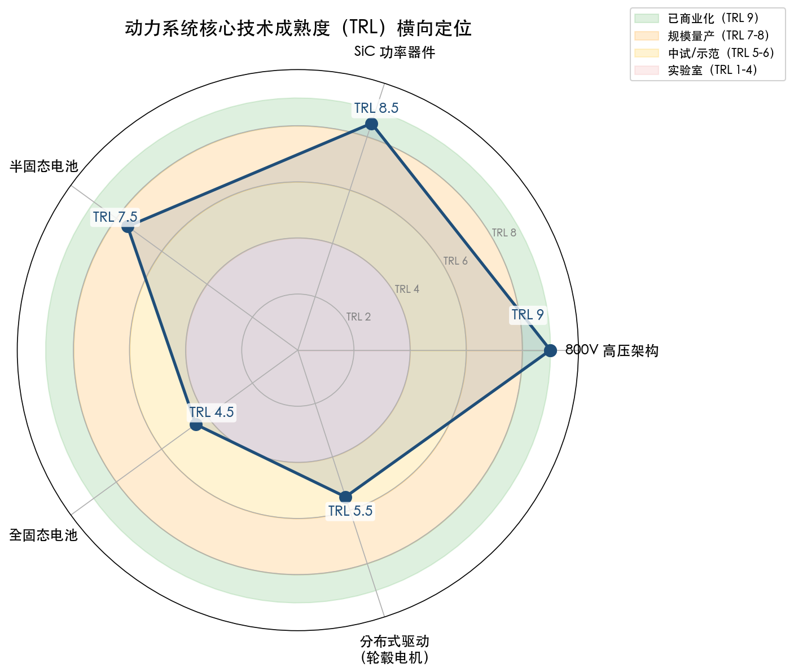

上图以雷达图形式直观呈现五项核心技术的 TRL 定位差异。800V 高压架构和 SiC 功率器件已进入"已商业化"和"规模量产"区域，半固态电池处于"规模量产"区域下沿，全固态电池和分布式驱动仍位于"实验室"至"中试/示范"区间，技术成熟度的梯度差异十分显著。

### 1.5.2 技术迭代的非线性特征与协同效应

四大技术的迭代路径呈现出鲜明的非线性特征。800V 高压架构和 SiC 功率器件已进入"规模—成本"正反馈循环：每一代产品的成本下降为下一轮渗透率提升奠定基础，渗透率提升又反过来支撑更大的制造规模和更快的学习曲线。固态电池则仍处于"实验室—中试"的关键跨越期，制造工艺的突破（而非材料层面的创新）将决定其产业化时间表。分布式驱动面临的核心瓶颈并非技术本身的可行性，而是 OEM 是否愿意承诺约 50 亿美元的全新平台投资[Green Car Reports](https://www.greencarreports.com/news/1145830_in-wheel-motors-ev-cost-boost-range "OEM投资门槛")。

技术间的协同效应同样值得关注。800V 架构与 SiC 器件已形成强耦合关系（800V 车型中 SiC 渗透率达 71%），两者的成本下降曲线相互强化。固态电池若实现量产，其更高的电压耐受性将进一步推动高压平台从 800V 向 1000V 及以上演进。分布式驱动若获得平台级整合机会，将与固态电池的高能量密度形成互补——更轻的电池包可降低簧下质量的敏感性，分布式架构释放的底盘空间则可容纳更多电池，两者在系统层面形成协同增益。

### 1.5.3 产业化时间线全景

将四大技术的关键产业化里程碑按时间轴排列，可清晰呈现各技术的商业化节奏差异：

- **2024–2025 年**（已发生）：800V 车型价格下探至 10 万元区间；SiC 主驱渗透率突破 15%；半固态电池首次实现装车量产；东风 E70 获轮毂电机工信部认证。
- **2026 年**（当前窗口）：SiC 8 英寸大规模制造启动；中国发布首个固态电池国家标准（7 月）；Protean Pm18 2500 投产；Elaphe Sonic.1 小批量交付。
- **2027–2028 年**：宁德时代/比亚迪全固态电池小批量生产；DeepDrive 大规模量产目标；800V 额外成本降至约 420 美元；大众 SSP 首款 800V 欧洲车型上市。
- **2030 年及以后**：800V 中国渗透率超 35%、全球 15%–20%；SiC 全球市场规模达 103 亿美元；全固态电池渗透率约 4%（供应量 131 GWh）；Elaphe 首批大众市场轮毂电机合作车型面世。

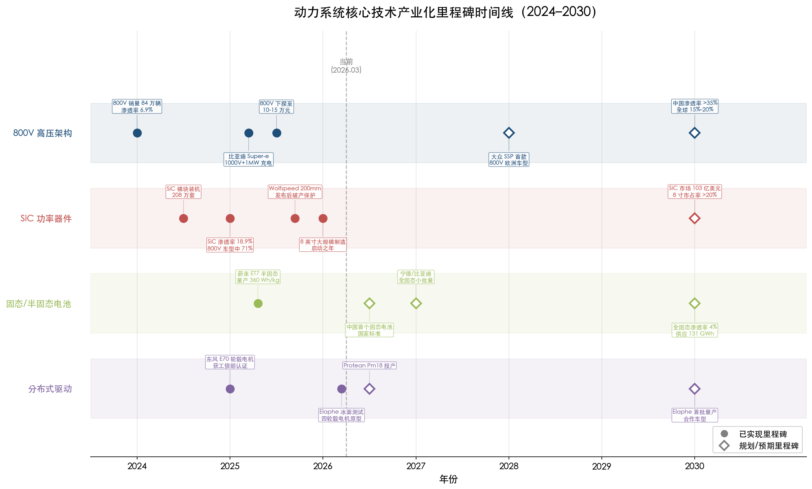

上图以泳道式时间线形式展示四大技术领域在 2024–2030 年间的关键产业化节点。实心圆标注已实现里程碑，菱形标注规划/预期里程碑，虚线标注当前时间节点（2026 年 3 月）。从时间线可以清晰识别出：800V 和 SiC 已进入密集的里程碑兑现期，固态电池的关键节点集中于 2027 年之后，分布式驱动的量产里程碑则延伸至 2030 年。

综合上述分析，800V 高压架构和 SiC 功率器件正处于商业化加速阶段，其技术成熟度和成本曲线已进入可预测的指数改善区间。半固态电池作为过渡技术正以"旗舰先行"模式打开市场，但全固态电池的真正规模化仍属 2030 年代的命题。分布式驱动的产业化进程不取决于技术本身的可行性，而取决于 OEM 的平台战略决策和投资意愿——这是一个商业判断问题，而非工程技术问题。

# 第2章 "研发制造—使用场景—残值管理"三维评估体系框架设计

## 2.1 评估体系的设计逻辑与理论基础

动力系统技术路线的商业化评判长期依赖单一指标——或聚焦制造成本，或关注市场渗透率——而忽视了技术从实验室走向大规模商用所需穿越的多维关卡。一项技术即使在制造端已具备成本竞争力，若使用场景中补能基础设施缺位、残值管理体系尚未成型，其商业化进程仍难以持续。为此，本研究构建覆盖"研发制造—使用场景—残值管理"三个维度的结构化评估框架，旨在为各技术路线提供统一、可操作的商业化成熟度评判工具。图2-1展示了该框架的完整指标层次结构。

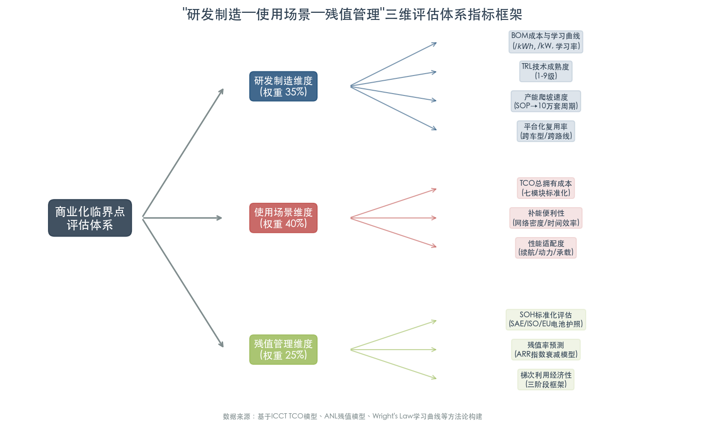

该框架的理论根基源自三个方向的学术积累：

**第一，技术成本预测的学习曲线理论。** Wright's Law 描述了"每当累积产量翻倍，单位成本按固定比例下降"的幂律关系，已在逾50项技术中得到统计验证[Our World in Data](https://ourworldindata.org/learning-curve "Max Roser 2023, Wright's Law学习曲线综述")。锂离子电池是这一规律的经典例证：1991—2016年间，以累积产量计的全类型电芯学习率为20.4%，圆柱形电芯达24.0%；纳入能量密度提升后，学习率分别提高至26.6%和30.9%，同期电芯价格（以能量容量计）累计下降约97%[Ziegler & Trancik, Energy & Environmental Science 2021](https://pubs.rsc.org/en/content/articlehtml/2021/ee/d0ee02681f "锂离子电池学习率实证研究")。Way et al.（2022）在此基础上提出概率性成本预测方法，通过附加误差模型生成预测置信区间，经逾50项技术回测验证，其预测误差显著低于传统能源经济模型[Way et al., Joule 2022](https://www.oxfordmartin.ox.ac.uk/publications/empirically-grounded-technology-forecasts-and-the-energy-transition-2 "概率性技术成本预测方法论")。

**第二，技术扩散的S曲线理论。** Rogers（1962）在《创新的扩散》中提出技术采纳遵循S曲线规律，RMI（2022）进一步将其细化为五阶段模型——方案探索、概念验证、早期采纳、系统整合、市场扩展——增长由学习曲线、规模经济、技术强化、社会扩散四大正反馈环路驱动[RMI](https://rmi.org/wp-content/uploads/2022/10/theory_of_rapid_transition_how_s_curves_work.pdf "RMI S曲线理论")。实证研究表明，技术采纳的"起飞点"通常出现在渗透率达到10%—20%的区间[ResearchGate S-curve meta-analysis](https://www.researchgate.net/figure/The-cumulative-S-curve-and-adopter-categories-a-The-S-curve-provides-a-general_fig1_228664605 "S曲线起飞点阈值")。这一阈值为商业化临界点中渗透率判据的设定提供了坚实的实证锚点。

**第三，多准则决策分析（MCDA）的权重校准方法。** Kügemann & Polatidis（2020）系统综述了40篇MCDA在交通燃料与车辆评估领域的应用文献，发现层次分析法（AHP）是最常用的权重设定方法，且评估结果对分析方法的选择并不敏感，但对准则选择和权重设定高度敏感[Kügemann & Polatidis, Energies 2020](https://www.mdpi.com/1996-1073/13/1/157 "MCDA在交通燃料评估中的文献综述")。这一发现直接指导了本框架中指标选取与权重分配的方法论设计——需通过敏感性分析验证结论的稳健性。

## 2.2 研发制造维度：从BOM成本到产能爬坡

### 2.2.1 指标体系构成

研发制造维度聚焦"技术能否实现规模量产、量产成本几何"这一核心命题，设置四类一级指标：

- **BOM成本与学习曲线**：单位核心零部件成本（美元/kWh、美元/kW）、成本学习率及其置信区间、与可比燃油车基准的成本差距比例。
- **技术成熟度（TRL）**：采用TRL 1—9分级标准（沿用第1章定义），标记各技术在评估时点的等级及距商业化门槛（TRL 8—9）的阶梯数。
- **产能建设与爬坡速度**：从SOP（量产启动）到年产能达10万套的时间周期、产能利用率、扩产资本强度。
- **平台化与模块化复用率**：跨车型共用率、跨动力路线兼容性（如同一底盘平台兼容BEV与PHEV）。

### 2.2.2 BOM成本量化基准与学习曲线应用

电池包成本是BEV路线BOM中权重最大的单一变量。BNEF 2025年数据显示，全球锂离子电池包均价已降至108美元/kWh（同比-8%），其中BEV电池包均价99美元/kWh，LFP电池包81美元/kWh，中国市场进一步低至84美元/kWh[BloombergNEF 2025](https://about.bnef.com/insights/clean-transport/lithium-ion-battery-pack-prices-fall-to-108-per-kilowatt-hour-despite-rising-metal-prices-bloombergnef/ "2025年BNEF电池价格")。回溯至2024年12月，全球电池包均价为115美元/kWh（同比-20%），BEV电池包均价首次突破100美元/kWh关口降至97美元/kWh[BloombergNEF 2024](https://about.bnef.com/insights/commodities/lithium-ion-battery-pack-prices-see-largest-drop-since-2017-falling-to-115-per-kilowatt-hour-bloombergnef/ "2024年BNEF电池价格报告")。电池成本占BEV总成本的30%—40%，中国头部OEM的LFP电池包成本约64欧元/kWh、NMC约82欧元/kWh，较欧美同行低25%—40%[McKinsey Center for Future Mobility](https://www.mckinsey.com/features/mckinsey-center-for-future-mobility/our-insights/the-future-of-affordable-evs-breakthroughs-in-battery-pack-costs "McKinsey电池包成本分析")。

在电驱系统端，DOE EDTT 2024路线图给出了清晰的成本下降轨迹：2022年商用100 kW电驱系统（电机+逆变器）制造成本约1,140美元（7.6美元/kW），2025年目标为150 kW系统4.0美元/kW（600美元），2030年目标为200 kW系统3.0美元/kW[DOE EDTT路线图](https://www.energy.gov/sites/default/files/2024-06/EDTT_Roadmap_2023_JOG_Consensus_compliant.pdf "2024年电驱技术路线图成本目标")。全球e-Axle（三合一电驱桥）市场均价约900—1,200美元（标准型），中国市场约6,000—8,000元人民币。全球e-Axle市场2024年规模约156亿美元，预计2030年达518亿美元（CAGR 22.2%）[Yahoo Finance/ResearchAndMarkets](https://finance.yahoo.com/news/automotive-e-axle-market-intelligence-100700963.html "e-Axle市场预测")。

在应用学习曲线进行成本预测时，评估框架须充分正视其固有不确定性。Ziegler & Trancik（2021）的实证研究表明，锂离子电池学习率估计值在14%—30%之间宽幅波动，取决于所选时间区间和度量方式[Ziegler & Trancik 2021](https://pubs.rsc.org/en/content/articlehtml/2021/ee/d0ee02681f "学习率估计不确定性")。因此，本评估框架借鉴Way et al.（2022）的概率性预测范式，要求对每一项成本预测均附带误差模型和置信区间，避免给出单一点估计值所带来的误导性精确感[Way et al., Joule 2022](https://www.oxfordmartin.ox.ac.uk/publications/empirically-grounded-technology-forecasts-and-the-energy-transition-2 "回测校验方法论")。

### 2.2.3 产能爬坡与平台化考量

产能爬坡速度决定了技术从实验室验证走向市场规模化的时间窗口。以SiC功率器件为参照案例：2024年中国SiC功率模块装机量突破208万套（同比+116%），国产厂商合计份额达45.7%[IICIE第三代半导体研究](https://iicieexpo.com/news/1493_info.html "2024年中国SiC模块装机量")，从小批量试制到年产百万套级别用时约3—4年，为其他新兴技术的产能爬坡提供了可参考的标杆周期。

平台化复用率方面，行业内尚无统一的量化标准。本框架建议以"同一平台覆盖的车型数 × 跨动力路线兼容性"作为代理指标。以比亚迪e平台3.0 Evo为例，该平台兼容BEV与PHEV两条路线，覆盖A级至C级车型，属于高平台化复用的典型案例；而固态电池由于与现有液态电池产线兼容性较低，其平台化复用率评分相应偏低，构成制约其短期商业化进程的结构性因素之一。

## 2.3 使用场景维度：TCO模型与补能便利性

### 2.3.1 TCO模型的方法论框架

全生命周期总拥有成本（TCO）是使用场景维度的核心量化工具。ICCT于2026年3月发布的TCO计算器提供了标准化的方法论框架，覆盖七大成本模块：购置成本（含激励）、能源成本、维保成本、融资成本、基础设施成本、保险及残值[ICCT TCO Calculator](https://theicct.org/the-economic-case-for-zevs-is-often-hidden-in-plain-sight-the-iccts-total-cost-of-ownership-calculator-reveals-it-mar26/ "2026年ICCT TCO计算器方法论")。该计算器的实证应用表明，在加州和得州Class 2b-3电动配送车年行驶45,000英里条件下，均可在5年内实现与燃油车的TCO平价。

IEA在Global EV Outlook 2025中进一步验证了电动汽车TCO优势的普遍性：即使油价低至40美元/桶，家充情景下BEV仍具备显著的燃料成本优势[IEA Global EV Outlook 2025](https://www.iea.org/reports/global-ev-outlook-2025/executive-summary "EV TCO优势")。该结论具有重要的方法论启示——TCO分析必须将能源价格的波动范围纳入敏感性分析，而非仅依赖单一能源价格假设。

在TCO模型的各项成本中，折旧/残值通常占据最大份额。ANL（2022）的研究明确揭示了这一关键特征，并采用基于Edmunds TMV真实交易数据的调整保值率（ARR）方法论进行残值估算[ANL车辆残值分析报告](https://publications.anl.gov/anlpubs/2022/05/175614.pdf "2022年ANL残值与TCO分析")。残值预测的准确性直接决定了TCO分析的可靠性，这也正是本评估框架将残值管理单独列为第三维度的核心依据。

### 2.3.2 补能便利性评估

补能便利性是影响消费者购买决策和车辆使用效率的关键因素，但行业内尚缺乏统一的标准化量化评分方法。本框架建议从三个子指标构建评估体系：

- **网络密度指数**：每万辆保有车辆对应的补能站点数量（充电桩/加氢站/换电站）。截至2025年3月，中国累计建成1,374.9万台充电设施（同比+47.6%）[中国充电联盟](https://www.163.com/dy/article/JT9QUE3A05198UNI.html "充电设施保有量")；相比之下，全球加氢站仅约1,160—1,369座，且五国（中韩日德法）占比高达80%[H2stations.org/LBST](https://www.h2stations.org/press-release-2025-milestone-reached-over-1000-hydrogen-refuelling-stations-in-op-eration-worldwide-in-2024/ "2024年全球加氢站")。两者之间量级差距达四个数量级，直观反映了不同动力路线在补能基础设施上的成熟度分化。
- **补能时间效率**：单次补能至80% SOC所需时间。800V架构配合超快充桩可实现10—15分钟补能，比亚迪Super-e平台已实现5分钟补充约400公里续航[IEA Global EV Outlook 2025](https://www.iea.org/reports/global-ev-outlook-2025/electric-vehicle-charging "比亚迪Super-e平台")；加氢时间虽仅3—5分钟，但受制于站点稀缺，实际可达性显著低于充电网络。
- **场景覆盖度**：高速公路、城市核心区、乡镇等不同场景的补能可达性。2024年全球超快充桩（150kW+）增长50%，达约71,000台[IEA Global EV Outlook 2025](https://www.iea.org/reports/global-ev-outlook-2025/electric-vehicle-charging "2025年全球充电基础设施数据")，但高速公路沿线和农村地区的覆盖率仍存在显著缺口。

### 2.3.3 性能适配度

不同动力系统路线在不同使用场景中的性能表现存在显著差异，单一路线难以在所有场景中保持竞争优势。评估框架将性能适配度分解为四项子指标：续航能力（WLTP/CLTC工况标准续航与低温/高速衰减幅度）、动力响应（0—100 km/h加速时间）、承载能力（额定载荷与实际可用空间）、环境适应性（极寒/极热/高海拔工况表现）。各子指标根据细分市场（乘用车A00—D级、商用车轻卡—重卡、特种车辆）进行差异化权重分配，以反映不同应用场景对性能维度的优先级差异。

## 2.4 残值管理维度：SOH标准、残值预测与梯次利用

### 2.4.1 电池SOH评估的标准化挑战

电池健康状态（SOH）评估是残值管理的逻辑起点，但截至2026年初，全球仍未形成统一标准。现行标准体系呈碎片化分布：SAE J3257标准仍在制定中，ISO 12405系列规定电池包性能测试程序，IEC 62660系列规定电芯寿命测试，UL 1974提供电池再利用评估规范[TÜV SÜD](https://www.tuvsud.com/en-us/e-ssentials-newsletter/automotive-essentials/e-ssentials-01-2024/batteries-in-electric-cars--no-standard-for-battery-soh "2024年TÜV SÜD SOH标准化现状")。这一标准碎片化现状直接加剧了二手新能源车估值体系的不确定性。

两项重要的制度性突破即将改变这一局面。其一，欧盟电池法规（EU Regulation 2023/1542）要求自2027年起，电动车电池须配备数字电池护照，包含实时SOH数据[TÜV SÜD](https://www.tuvsud.com/en-us/e-ssentials-newsletter/automotive-essentials/e-ssentials-01-2024/batteries-in-electric-cars--no-standard-for-battery-soh "欧盟电池法规SOH要求")。其二，中国将于2026年7月发布首个固态电池国家标准[To7Motor](https://to7motor.com/solid-state-batteries-2026-commercial-reality "中国固态电池国标计划")。这些标准化进程将为残值评估提供更坚实的数据基础，但在过渡期内，评估框架需兼容多套标准体系并对标准差异带来的估值偏差进行修正。

### 2.4.2 残值率实证数据与预测模型

**美国市场。** ANL残值预测采用指数衰减模型 ARR(i,m,p) = b × exp(k × i)，实证发现大众市场BEV年折旧率为19.2%—19.9%，而ICEV仅为11.3%—11.6%；特斯拉车型3年ARR比同类豪华BEV高出约25个百分点，品牌溢价效应显著[ANL车辆残值分析报告](https://publications.anl.gov/anlpubs/2022/05/175614.pdf "ANL残值指数衰减模型参数")。

**中国市场。** 58汽车研究院数据显示，2024年1—10月中国市场纯电动车三年平均保值率为43.5%，插混车型（含增程）为39.3%，同期燃油车为48.3%，油电混动为51.2%[58汽车研究院](https://pdf.dfcfw.com/pdf/H3_AP202501021641517162_1.pdf?1735853541000.pdf "2024年中国汽车保值率研究报告")。中汽协2025年11月数据进一步显示，插混车型三年保值率升至42.4%，纯电车型为41.3%，两者差距已缩窄至约1个百分点[中汽数研](https://www.163.com/dy/article/KHSFJFVV05566SBU.html "2025年11月中国新能源汽车保值率")。

尤为值得关注的是，至2026年2月，纯电与燃油车的保值率差距已出现结构性收窄。中国汽车流通协会与精真估联合发布的数据显示，传统主流燃油车三年保值率已普遍跌破55%，部分美系、法系品牌甚至滑向45%以下；而头部纯电车型三年保值率稳定在50%—62%区间，纯电与燃油的保值率差值已从三年前的约20个百分点缩窄至5—8个百分点[汽车之家/中国汽车流通协会](https://chejiahao.autohome.com.cn/info/25075001 "2026年2月纯电三年保值率分析")。这一趋势的驱动因素包括三个方面：800V高压平台和大容量电池包技术趋于成熟使早期"技术恐慌期"基本结束；头部车企通过官方认证二手车体系和审慎定价策略稳定了价格体系；新车价格战对燃油车二手估值形成反向冲击。图2-2直观呈现了这一收窄趋势。

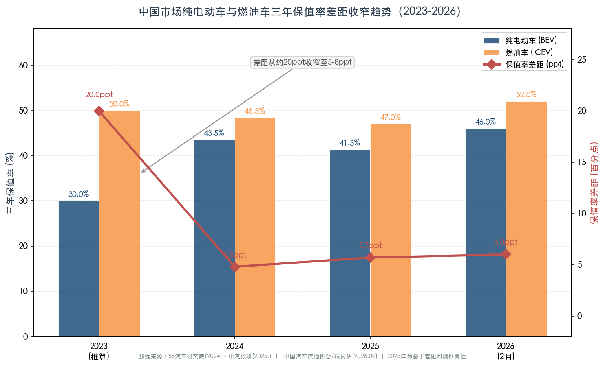

全国工商联汽车经销商商会与车e估联合发布的《2025年度汽车保值率报告》提供了更精细的品牌与车型层面数据：日系燃油车三年保值率均值为58.07%，德系紧随其后，国产品牌以54.72%位列第三[全国工商联汽车经销商商会/车e估](https://www.cadcc.com.cn/article/3095.html "2025年度汽车保值率报告")。在新能源插混SUV榜单中，保时捷Cayenne新能源以93.87%居首，比亚迪宋PLUS新能源、宋Pro新能源均超71%，理想L9达72.98%。纯电动轿车中，特斯拉Model 3以84.38%领跑一年保值率。

### 2.4.3 梯次利用经济性评估

退役电池的梯次利用是残值管理的延伸环节，直接影响电池全生命周期的残余价值回收。NREL/IREC提出的三阶段评估框架——电池状态评估、技术可行性评估、经济性评估——为梯次利用的可行性判断提供了结构化方法。电池拆解成本的参考值为：从车辆拆卸117欧元、至模组级617欧元、至电芯级892欧元；二次电池采购成本为40—165欧元/kWh[Montes et al., Batteries 2022](https://docs.nrel.gov/docs/fy22osti/84527.pdf "NREL/IREC梯次利用评估框架")。

第一波大规模电池退役潮正在涌现——2017—2020年间大规模销售的早期EV电池已陆续进入退役期。梯次利用经济性面临化学体系分化带来的挑战：NMC电池中钴、镍等贵金属含量较高，回收具有正向经济性；LFP电池由于材料价值较低，回收经济性相对受限。然而，随着LFP在2025年首次超越NMC成为全球部署量最大的电池化学体系[InsideEVs/RhoMotion](https://insideevs.com/news/784963/lfp-overtakes-nickel-battery-chemistry/ "LFP首次超越NMC")，LFP回收技术的经济性改善已成为行业亟需突破的关键议题。

## 2.5 商业化临界点的操作性定义

### 2.5.1 多维判据的交集逻辑

商业化临界点不应被简化为单一指标的阈值突破，而应定义为多维条件同时满足的"交集"状态。基于前述三维指标体系和实证数据，本评估框架提出三重判据：

**判据一：无补贴TCO平价。** 在无政府补贴情景下，目标技术路线的5年/10年TCO不高于同级别、同使用场景的燃油车基准。关键参数涵盖购置价差、年行驶里程假设、能源单价、维保成本差异、融资利率及残值回收。ICCT TCO计算器的七模块结构为此提供了标准化计算框架[ICCT TCO Calculator](https://theicct.org/the-economic-case-for-zevs-is-often-hidden-in-plain-sight-the-iccts-total-cost-of-ownership-calculator-reveals-it-mar26/ "ICCT TCO方法论")。IEA已判定电动汽车全生命周期TCO在家充情景下低于同级燃油车，即使油价低至40美元/桶仍然成立[IEA Global EV Outlook 2025](https://www.iea.org/reports/global-ev-outlook-2025/executive-summary "EV TCO优势")；但在以公共充电为主的使用模式和无补贴条件下，该结论需进行情景修正。

**判据二：渗透率突破阈值（10%—20%区间）。** 依据S曲线理论，当某技术路线在目标市场的年新车销售渗透率进入10%—20%区间时，正反馈环路启动，市场增长从线性阶段转入指数增长阶段[RMI](https://rmi.org/wp-content/uploads/2022/10/theory_of_rapid_transition_how_s_curves_work.pdf "S曲线起飞理论")。该判据的操作性要点在于：渗透率须按细分市场分别计量。BEV在中国乘用车市场已远超20%，但在美国重卡市场仍处于个位数；同一技术路线在不同地理市场的渗透率可能处于S曲线的截然不同阶段。

**判据三：残值率不低于可比燃油车基准。** 3年残值率（ARR）不低于同级别、同价位燃油车的行业均值。该判据反映的是市场对某一技术路线长期价值稳定性的信心水平。当前中国市场数据显示，纯电车三年保值率（41.3%—43.5%）仍低于燃油车（48.3%—55%），但差距正在快速收窄至5—8个百分点[58汽车研究院](https://pdf.dfcfw.com/pdf/H3_AP202501021641517162_1.pdf?1735853541000.pdf "2024年中国汽车保值率")；部分头部纯电车型已达到甚至超过可比燃油车水平，如特斯拉Model 3三年保值率52.2%、比亚迪元PLUS一年保值率80.27%[全国工商联汽车经销商商会/车e估](https://www.cadcc.com.cn/article/3095.html "2025年度保值率报告")。

### 2.5.2 三重判据的逻辑关系与判定规则

三重判据之间的逻辑关系为"交集"而非"并集"——即三项条件须同时满足方可判定该技术路线在目标市场跨过商业化临界点。图2-3以维恩图和状态表的形式展示了这一交集逻辑及各路线的当前达标状态。

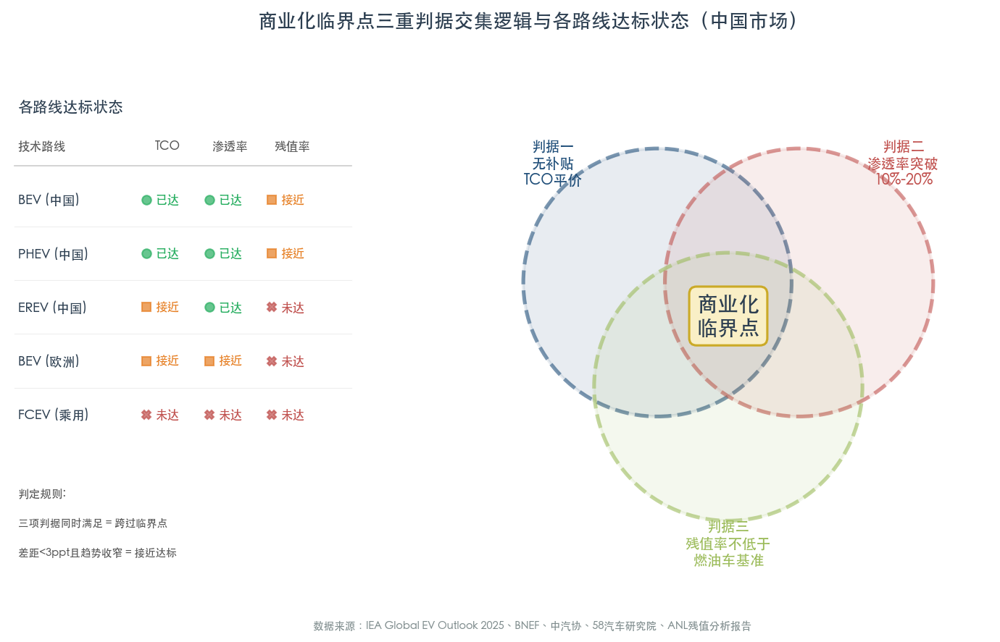

设定交集逻辑的理由在于：

- 仅满足TCO平价但渗透率未突破阈值，表明消费者认知或基础设施尚未就绪，市场增长缺乏自我强化机制；
- 仅满足渗透率阈值但TCO仍依赖补贴支撑，表明商业化建立在政策输血之上而非市场内生竞争力；
- 仅满足前两项但残值率显著低于燃油车，表明消费者和金融机构对该技术长期可靠性的信心不足，融资成本和保险成本的系统性偏高将持续侵蚀TCO优势。

在实际操作中，评估框架允许对三重判据进行"接近达标"的定性修正。例如，当某路线已满足判据一和判据二，且判据三的残值率差距低于3个百分点并呈持续收窄趋势时，可判定为"接近临界点/窗口期内"，以区别于完全未达标的路线。

### 2.5.3 市场与场景的分层适用

商业化临界点的判定须在特定市场与特定场景中分别进行，不存在"全球统一"的临界点。本框架设置三级分层结构：

- **地理市场层**：中国、欧洲、北美、东南亚、日韩——各市场的政策环境、消费者偏好、基础设施成熟度和能源价格结构存在根本性差异，直接影响三重判据的达标时序。
- **车辆细分层**：乘用车（A00级至D级）、商用车（轻卡至重卡）、特种车辆——不同车辆类型对续航、载荷、TCO结构的需求差异导致各路线的竞争力排序显著不同。
- **使用场景层**：城市通勤、城际出行、长途干线运输、特定封闭场景（矿山、港口、园区）——场景差异决定了补能便利性和性能适配度在综合评分中的权重分配。

## 2.6 权重设定与框架校验方法

### 2.6.1 指标权重的确定方法

鉴于Kügemann & Polatidis（2020）的综述结论——评估结果对权重设定高度敏感[Kügemann & Polatidis, Energies 2020](https://www.mdpi.com/1996-1073/13/1/157 "MCDA权重敏感性")——本框架采用AHP与敏感性分析相结合的权重确定流程：

1. **初始权重设定**：由行业专家（涵盖整车OEM、零部件供应商、金融机构、政策研究者四类利益相关方）通过AHP矩阵给出三维度及各子指标的相对权重。建议基准权重为：研发制造维度35%、使用场景维度40%、残值管理维度25%。使用场景维度权重最高的理由在于，最终购买决策由消费者基于使用体验和全生命周期经济性做出。
2. **敏感性检验**：对各维度权重在±10个百分点范围内进行参数扫描，检验商业化临界点判定结果是否发生翻转。若某路线的判定结果在权重合理波动范围内保持稳健，则结论可信度较高。
3. **动态调整机制**：权重应随技术与市场发展阶段进行动态修正。在技术萌芽期（TRL 4—6），研发制造维度权重应上调至45%以上，因为此阶段制造可行性是最大瓶颈；在技术成熟期（TRL 8—9），使用场景和残值管理维度的权重应相应上调，以反映市场端约束的主导地位。

### 2.6.2 框架校验：回测与交叉验证

评估框架的有效性需通过回测检验加以确认。借鉴Way et al.（2022）的回测校验范式——用历史数据前段拟合模型、后段检验预测精度[Way et al., Joule 2022](https://www.oxfordmartin.ox.ac.uk/publications/empirically-grounded-technology-forecasts-and-the-energy-transition-2 "回测校验方法论")——本框架设计了两层校验机制：

- **历史回测**：以中国BEV市场为标杆案例，将2020—2023年的BOM成本、渗透率、残值率数据代入框架，检验框架是否能在2023—2024年输出"已跨过临界点"的正确判定。初步验证表明，2024年中国近2/3的BEV售价已低于同级燃油车，渗透率远超20%，符合框架判据一和判据二的要求[IEA Global EV Outlook 2025](https://www.iea.org/reports/global-ev-outlook-2025/trends-in-electric-car-affordability "中国BEV价格平价")。
- **跨市场一致性检验**：同一框架应用于不同地理市场时，输出结果应与可观察的市场表现保持一致。框架应能正确识别"中国BEV已跨过临界点"而"欧洲BEV尚未跨过但处于临近阶段"的差异状态，而非给出不分市场的统一判断。

## 2.7 框架应用路径

三维评估体系的应用遵循"数据输入—指标计算—判据判定—敏感性分析—结论输出"的标准化流程：

1. **数据收集**：针对目标技术路线和目标市场/场景，收集研发制造（BOM、TRL、产能）、使用场景（TCO参数、补能网络、性能数据）、残值管理（SOH、历史残值率、梯次利用成本）三维度数据。
2. **指标标准化**：将各维度原始数据标准化为0—100分的可比评分，消除量纲差异。
3. **三重判据评估**：分别评估无补贴TCO平价状态、渗透率所处S曲线阶段、残值率与燃油车基准的对比关系。
4. **综合加权评分**：按AHP确定的权重进行加权汇总，输出商业化成熟度综合得分。
5. **敏感性与情景分析**：对关键参数（电池成本、能源价格、政策补贴力度、残值率变化趋势）进行多情景扫描，输出各情景下的临界点时间窗口。
6. **判定输出**：明确给出"已跨过/接近/尚远"三级判定结论，并标注关键风险因素与时间窗口。

上述流程将在第3章中应用于BEV、EREV、PHEV、FCEV四条技术路线的逐一量化分析，在第4章中引入驱动架构变量进行修正，在第6章中纳入政策情景进行临界点时间偏移计算，形成从方法论到应用实践的完整闭环。

# 第3章 四大动力系统技术路线商业化临界点量化分析

本章运用第2章构建的"研发制造—使用场景—残值管理"三维评估框架，以商业化临界点多维判据（无补贴 TCO 平价 + 渗透率突破 10%–20% S 曲线起飞阈值 + 残值率不低于可比燃油车基准）为判定标准，对 BEV（纯电动）、EREV（增程式）、PHEV（插电混动）、FCEV（氢燃料电池）四条技术路线逐一展开量化分析。全章驱动架构统一假设为集中式驱动，分布式驱动对各路线临界点的修正效应将在第4章单独展开。分析覆盖乘用车与商用车两大板块，横跨中国、欧洲、美国三大区域市场，最终给出各路线商业化临界点的时间窗口排序与确定性等级。

## 3.1 BEV 路线：中国已跨过临界点，欧美正在接近

### 3.1.1 市场渗透率：S 曲线起飞阶段的区域分化

BEV 路线在全球范围内已进入 S 曲线"早期采纳→系统整合"过渡的关键阶段，但区域分化极为显著。2024 年全球电动汽车（BEV+PHEV）销量突破 1,700 万辆（同比+25%），市场份额首次突破 20%；其中中国贡献超 1,100 万辆，份额逼近 50%。2025 年全球销量预计超 2,000 万辆（份额约 25%），中国市场份额预计进一步升至 60%[IEA Global EV Outlook 2025](https://www.iea.org/reports/global-ev-outlook-2025/trends-in-electric-car-markets-2 "2024-2025年全球EV销量")。

依据第2章界定的 S 曲线起飞点阈值（10%–20% 渗透率），中国市场 BEV 渗透率已明确越过这一临界值，步入加速扩张阶段。IEA 在 STEPS 情景下预计 2030 年中国电动车份额将达约 80%[IEA Global EV Outlook 2025](https://www.iea.org/reports/global-ev-outlook-2025/executive-summary "2030年渗透率预测")。欧洲市场正逼近起飞点，IEA 预计其 2030 年份额接近 60%；美国则因联邦税收抵免废除而面临较大不确定性，BNEF 于 2025 年大幅下调美国 2030 年 EV 渗透率预测至约 27%[CleanTechnica/BNEF](https://cleantechnica.com/2025/06/18/bloomberg-2025-electric-vehicle-outlook-report/ "BNEF 2025 EVO")。三大市场的渗透率分化，折射出政策环境、充电基础设施密度与消费者接受度的综合差异。

### 3.1.2 研发制造维度：BOM 成本已跨过平价门槛

电池包成本是 BEV BOM 中最大的单项变量，占整车总成本的 30%–40%。BNEF 2025 年数据显示，全球锂离子电池包均价已降至 108 美元/kWh（同比-8%），其中 BEV 电池包均价 99 美元/kWh，LFP 电池包 81 美元/kWh；中国市场进一步低至 84 美元/kWh[BloombergNEF 2025](https://about.bnef.com/insights/clean-transport/lithium-ion-battery-pack-prices-fall-to-108-per-kilowatt-hour-despite-rising-metal-prices-bloombergnef/ "2025年BNEF电池价格")。中国头部 OEM 凭借垂直一体化供应链，LFP 电池包成本约 64 欧元/kWh、NMC 约 82 欧元/kWh，较欧美同行低 25%–40%[McKinsey Center for Future Mobility](https://www.mckinsey.com/features/mckinsey-center-for-future-mobility/our-insights/the-future-of-affordable-evs-breakthroughs-in-battery-pack-costs "McKinsey电池包成本分析")。

上述成本水平已直接转化为终端价格竞争力：2024 年中国近 2/3 的 BEV 售价已低于同级燃油车，中位购买价约 24,000 美元；SUV 细分首次实现购买价格平价；小型车电动化率接近 95%[IEA Global EV Outlook 2025](https://www.iea.org/reports/global-ev-outlook-2025/trends-in-electric-car-affordability "中国BEV价格平价")。相比之下，欧美市场 BEV 购买溢价仍显著存在——德国小型 BEV 溢价约 45%、SUV 约 20%；美国仅 2 款 BEV 售价低于 3 万美元。预计 2026 年底欧洲将有近 10 款低于 25,000 欧元的 BEV 上市，有望大幅缩小这一溢价差距[IEA Global EV Outlook 2025](https://www.iea.org/reports/global-ev-outlook-2025/trends-in-electric-car-affordability "欧美BEV购买溢价")。

从全系统 BOM 结构审视，纯电车核心驱动系统全 BOM 约 16,000 美元（含电池管理、电机、逆变器、OBC 等），同级燃油车约 9,000 美元；但排除电池后，电驱系统与 ICE 动力总成的 BOM 已基本持平[Thunder Said Energy](https://thundersaidenergy.com/downloads/electric-vehicle-cost-breakdown-by-component/ "2024年EV成本拆解")。这一结构特征意味着，电池成本的持续下降将近乎线性地转化为 BEV 整车购买平价的推进。

### 3.1.3 使用场景维度：TCO 优势已确立

IEA 明确判断，电动汽车全生命周期 TCO 已低于同级燃油车，即使油价低至 40 美元/桶，家充情景下仍具备显著燃料成本优势[IEA Global EV Outlook 2025](https://www.iea.org/reports/global-ev-outlook-2025/executive-summary "EV TCO优势")。这一结论在中国市场尤为确定——电价较柴油每公里成本低约 65%，BEV 能源成本较柴油车低 50% 以上。

下图以中国市场 C 级 SUV、5 年 15 万公里持有期为基准，展示了 BEV 与其他动力系统技术路线的 TCO 成本结构对比：

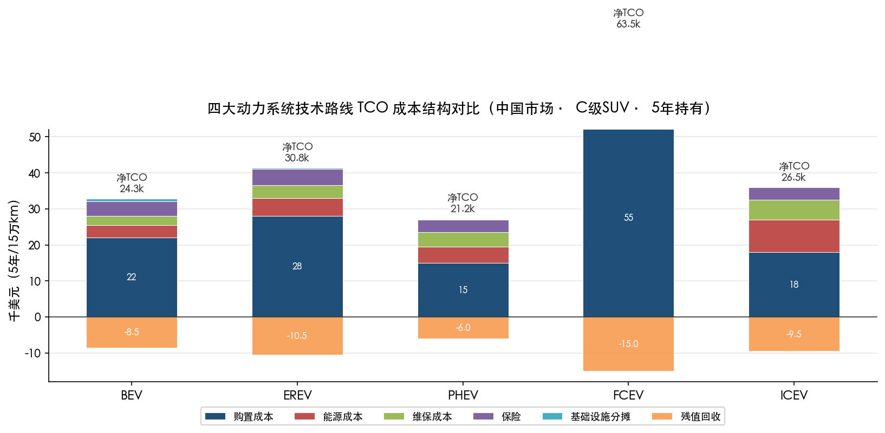

图中数据显示，在中国市场基准条件下，PHEV 以 21.2 千美元的净 TCO 位居最优，BEV 以 24.3 千美元紧随其后，两者均显著低于 ICEV 的 26.5 千美元。EREV 因购置成本较高（28 千美元），净 TCO 达 30.8 千美元，高于 ICEV。FCEV 则以 63.5 千美元的净 TCO 远超其他方案，主要受购置成本（55 千美元）和能源成本的双重拖累。

补能便利性方面，800V 架构与超充网络的协同效应正在快速消解续航焦虑。截至 2025 年 3 月，中国累计建成充电设施 1,374.9 万台（同比+47.6%）[中国充电联盟](https://www.163.com/dy/article/JT9QUE3A05198UNI.html "充电设施保有量")，比亚迪 Super-e 平台已实现 5 分钟补充约 400 公里续航。消费者最低续航期望已升至 500 km[McKinsey](https://www.mckinsey.com/features/mckinsey-center-for-future-mobility/our-insights/new-twists-in-the-electric-vehicle-transition-a-consumer-perspective "2025消费者调研")，而 2025 年主流 BEV 续航已普遍覆盖 500–800 km 区间，补能便利性已从制约因素转变为竞争优势。

### 3.1.4 残值管理维度：差距收窄但仍存短板

BEV 残值率目前仍系统性低于可比燃油车。ANL 实证研究显示，大众市场 BEV 年折旧率为 19.2%–19.9%，ICEV 仅 11.3%–11.6%；Tesla 3 年保值率（ARR）比同类豪华 BEV 高出约 25 个百分点，表明品牌效应与超充网络生态对残值形成显著支撑[ANL 车辆残值分析报告](https://publications.anl.gov/anlpubs/2022/05/175614.pdf "ANL残值指数衰减模型参数")。残值偏低的核心驱动因素包括：电池衰减不确定性、技术迭代导致的功能性贬值（"电子产品化"效应），以及二手车评估标准的缺失。

积极信号在于制度层面的改进正在推进。欧盟电池法规（EU Regulation 2023/1542）要求自 2027 年起电动车电池须配备数字电池护照，包含实时 SOH 数据[TÜV SÜD](https://www.tuvsud.com/en-us/e-ssentials-newsletter/automotive-essentials/e-ssentials-01-2024/batteries-in-electric-cars--no-standard-for-battery-soh "欧盟电池法规SOH要求")，这将显著降低二手 BEV 评估中的信息不对称。梯次利用经济性方面，NREL/IREC 提出三阶段评估框架（电池状态评估→技术可行性评估→经济性评估），二次电池采购成本区间为 40–165 €/kWh，对退役电池残值构成正向支撑[Montes et al., Batteries 2022](https://docs.nrel.gov/docs/fy22osti/84527.pdf "NREL/IREC梯次利用评估框架")。综合判断，随着电池护照制度落地和梯次利用产业链成熟，BEV 残值率有望在 2027–2030 年逐步收窄与燃油车的差距。

### 3.1.5 BEV 商业化临界点判定

综合三维评估结果：

- **中国市场（乘用车）**：已于 2023–2024 年全面跨过商业化临界点——TCO 优于燃油车、渗透率远超 20% 起飞阈值、购买价格在多数细分市场实现平价。残值率偏低是唯一短板，但不足以改变整体判断。
- **欧洲市场（乘用车）**：预计 2026–2028 年跨过临界点。2026 年底大批平价 BEV 上市将推动购买平价实现，CO₂ 法规与 ETS2 碳价（2027–2030 年均 99 欧元/吨）将持续加压燃油车运营成本[BNEF EU ETS II 报告](https://assets.bbhub.io/promo/sites/16/EU_ETS_II_Pricing_Scenarios_Balancing_Cuts_and_Costs.pdf "ETS2碳价情景")，但反补贴关税对依赖中国供应链的低价 BEV 构成约束。
- **美国市场（乘用车）**：预计 2027–2029 年，但存在显著政策下行风险。联邦 EV 税收抵免已于 2025 年 9 月 30 日终止，哈佛 Salata 研究所建模显示，叠加全部联邦政策倒退可使 2030 年 EV 占比从 48% 降至 32%[哈佛 Salata 研究所](https://salatainstitute.harvard.edu/unpacking-trumps-ev-policy-overhaul/ "政策情景建模")。加州 ACC-II（2035 年 100% 零排放销售目标）的存续性是决定美国市场节奏的关键变量。

### 3.1.6 BEV 重卡场景：TCO 平价正在实现

BEV 在重卡领域的商业化进展快于此前行业预期。2024 年全球电动中重卡销量超过 90,000 辆（同比+80%），中国占比逾 80%[IEA Global EV Outlook 2025](https://www.iea.org/reports/global-ev-outlook-2025/trends-in-heavy-duty-electric-vehicles "2024年全球电动卡车销量")。

IEA 基于日行驶 500 km 的重卡 TCO 分析表明：在中国，BEV 重卡 TCO 已低于柴油重卡——电价较柴油每公里成本低约 65%，能源成本优势超 50%；在欧盟和美国，2030 年 BEV 重卡 TCO 有望与柴油重卡持平，关键前提是充电基础设施利用率从当前约 5% 提升至 30%（可使基础设施分摊成本降低约 80%）[IEA Global EV Outlook 2025](https://www.iea.org/reports/global-ev-outlook-2025/trends-in-heavy-duty-electric-vehicles "重卡TCO分析")。

Fraunhofer ISI 与 KIT 于 2024 年发表于 Nature Energy 的研究进一步印证了这一趋势：卡车电池系统成本可在 2035 年前下降 64%–75%，降至 150 欧元/kWh 以下；研究结论指出，零排放卡车运营成本竞争力"已在当下可行"[Link et al., Nature Energy 2024](https://www.nature.com/articles/s41560-024-01531-9 "卡车电池与燃料电池成本快速下降")。

尽管如此，购置成本差距仍是 BEV 重卡大规模推广的主要障碍。搭载 800 kWh 电池（满足 500 km 续航）的 BEV 重卡购买价格为同级柴油重卡的 2–3 倍，电池占购车成本近半。预计未来五年 BEV 重卡购买价格将下降 15%–35%（视区域而定），但仍将高于柴油重卡[IEA Global EV Outlook 2025](https://www.iea.org/reports/global-ev-outlook-2025/trends-in-heavy-duty-electric-vehicles "重卡购置成本差距")。

## 3.2 EREV 路线：增长窗口打开后正在收窄

### 3.2.1 市场渗透率：中国独占现象与增速拐点

EREV 路线是中国市场的独特产物，在全球范围内几乎不存在规模化先例。2024 年中国 EREV 占电动车总销量超 10%（2020 年仅约 2.5%），四年间增长逾四倍[IEA Global EV Outlook 2025](https://www.iea.org/reports/global-ev-outlook-2025/trends-in-electric-car-markets-2 "中国EREV占比")。然而，增速拐点已明确显现：2025 年 EREV 增速骤降至约 6%（全年约 123.5 万辆），而此前四年同比增速分别为 218%、130%、154%、70.9%[CarNewsChina](https://carnewschina.com/2025/11/10/li-auto-among-erevs-hit-by-sales-slump-amid-longer-range-faster-charging-electric-cars/ "EREV增速放缓")。值得关注的是，EREV 在中国以外市场发展极为有限——全球约 70 万辆年销量几乎全部来自中国，这一地域集中度在主流技术路线中是独一无二的。

### 3.2.2 研发制造维度：BOM 的"电池-增程器"跷跷板

EREV 的 BOM 结构与 BEV 存在显著差异，其核心逻辑是以较小电池包换取增程器总成的加入。McKinsey 建模分析显示，以皮卡为例，150 英里纯电续航的 EREV 仅需 68 kWh NMC 电池包，而同等总续航（500 英里）的 BEV 需要 228 kWh 电池包；由此 EREV 动力总成成本可比 BEV 低 30%–40%，绝对差值约 6,000 美元[McKinsey](https://www.mckinsey.com/industries/automotive-and-assembly/our-insights/could-extended-range-evs-nudge-more-car-buyers-toward-full-electric "EREV与BEV动力总成成本对比")。

这一成本优势的机理清晰：EREV 用一台成本约 1,500–3,000 美元的增程器总成（小型发动机+发电机），替代了 100–160 kWh 的额外电池容量（按 100 美元/kWh 计，约 10,000–16,000 美元）。然而，这一"跷跷板"正在随电池降本而倾斜——McKinsey 同步指出，BEV 与 EREV 的生产成本差距将随电池价格下降而持续收窄[McKinsey](https://www.mckinsey.com/industries/automotive-and-assembly/our-insights/could-extended-range-evs-nudge-more-car-buyers-toward-full-electric "成本差距收窄趋势")。按当前学习曲线推算，若电池包价格在 2028–2030 年降至 60–70 美元/kWh，EREV 的 BOM 成本优势将从当前的 30%–40% 收窄至 10%–15%，届时增程器总成的制造复杂度与维保成本反而将成为负项。

### 3.2.3 使用场景维度：续航焦虑缓解器的时效性

EREV 的核心价值主张在于消除续航焦虑：100–200 英里纯电续航覆盖日常通勤，增程器将总续航延伸至 500 英里以上，且补能可完全依托既有加油站网络。McKinsey 消费者调研显示，在美国和欧洲，分别有 18% 和 13%–15% 的购车者在获悉 EREV 选项后会优先选择，其中约 2/3 此前倾向购买燃油车或混动车——这意味着 EREV 具备将传统燃油车用户转化为电动出行用户的独特"桥梁"功能[McKinsey](https://www.mckinsey.com/industries/automotive-and-assembly/our-insights/could-extended-range-evs-nudge-more-car-buyers-toward-full-electric "EREV消费者调研")。

但 EREV 的购买溢价不容忽视。2024 年中国 SUV 市场中 EREV 对比同级燃油车溢价仍达 60%，其增长更多受消费者偏好（低续航焦虑心理溢价）而非价格竞争力驱动[IEA Global EV Outlook 2025](https://www.iea.org/reports/global-ev-outlook-2025/trends-in-electric-car-affordability "EREV购买溢价")。更关键的是，EREV 的续航焦虑缓解优势具有时效性——随着 BEV 续航普遍提升至 600–800 km、超充网络密度持续扩大（中国充电设施已逾 1,374.9 万台），纯电补能体验正在快速逼近燃油加注的便利水平。2025 年 EREV 增速骤降至 6%，即为这一替代趋势的直接市场验证。

### 3.2.4 残值管理维度：双动力系统的残值不确定性

EREV 面临独特的残值管理挑战。其同时搭载电驱和 ICE 增程器两套动力系统，在二手车市场估值中面临"双系统衰减叠加"的困境：电池衰减遵循 BEV 退化逻辑，增程器磨损遵循燃油车衰减规律。由于 EREV 规模化销售历史较短（中国市场大规模交付始于 2021–2022 年），二手车交易数据积累不足，尚难以建立可靠的残值预测模型。

从定性角度判断，EREV 残值率可能介于 BEV 与 PHEV 之间——较大的电池容量使其面临与 BEV 类似的电池贬值风险，但增程器提供的"最低续航保障"形成心理溢价，对残值构成部分支撑。

### 3.2.5 EREV 商业化临界点判定

- **中国市场**：EREV 正接近但尚未完全跨过商业化临界点。渗透率虽已超 10% 起飞阈值，但增长动力主要来自消费者偏好而非价格竞争力（60% 购买溢价），且增速正急剧放缓（2025 年仅 6%）。我们判断 EREV 的有效商业化窗口期约为 2023–2028 年，窗口正在收窄。
- **欧美市场**：EREV 正处于概念导入期。美国监管环境对 EREV 相对友好（EPA 合规积分对 70 英里以上纯电续航给予 65% 奖励），Scout Motors 等新品牌已获得可观预订量。但欧盟 2035 禁燃令（虽已软化至 90% 减排目标）将 EREV 的销售窗口限定在 2034 年之前。McKinsey 估算，OEM 若实现 EREV 动力总成较 BEV 平均节约 3,000 美元并将其中 2/3 让利消费者，则至少需销售 100 万辆方能收回约 10 亿美元的平台开发投资[McKinsey](https://www.mckinsey.com/industries/automotive-and-assembly/our-insights/could-extended-range-evs-nudge-more-car-buyers-toward-full-electric "EREV投资回报测算")。
- **核心判断**：EREV 本质上是 BEV 全面普及前的过渡方案，其商业化可持续性高度依赖 BEV 补能体验提升的速度。一旦 BEV 超充普及使充电时间降至 10 分钟以内、续航普遍超 600 km，EREV 的核心竞争优势将基本消解。

## 3.3 PHEV 路线：中国市场的价格破坏者

### 3.3.1 市场渗透率：中国强势增长，全球动力分化

PHEV 在全球层面呈现增速放缓态势：2025 年全球 PHEV 增速从 2024 年的 55.2% 骤降至 11.1%[Autovista24](https://autovista24.autovistagroup.com/news/the-worlds-best-selling-new-bevs-phevs-2025/ "2025年PHEV增速放缓")。但中国市场的 PHEV 表现截然不同——比亚迪 2025 年交付约 229 万辆 PHEV（占其总销量 50.4%）与 226 万辆 BEV（49.6%），合计约 460 万辆[WSJ/BYD](https://www.wsj.com/business/autos/byds-sales-growth-slowed-in-2025-but-still-set-to-top-tesla-d8aabcfb "2025年BYD销量")，单一企业即撑起了中国 PHEV 市场的半壁江山。这一格局表明，中国 PHEV 的增长高度集中于比亚迪 DM 技术生态，行业整体的路线健康度需要审慎评估。

### 3.3.2 研发制造维度：DM 5.0 重新定义成本竞争力

比亚迪第五代 DM 技术平台将 PHEV 的制造成本与性能推至新极限：发动机热效率达 46.06%（实验室最高 49.5%）、亏电油耗仅 2.9L/100km、综合续航超 2,100 km。搭载 DM 5.0 的海豹 05 DM-i 起售价仅 79,800 元（约 11,200 美元）[CarNewsChina](https://carnewschina.com/2025/10/11/2026-byd-seal-05-dm-i-with-2000-km-range-enters-market-at-11200-usd/ "BYD DM 5.0技术参数")，已低于多数同级燃油车。

这一价格水平意味着中国 PHEV 已在 SUV 和中型车市场实现购买价格优势（2024 年数据确认）。相比之下，欧美市场的 PHEV 溢价依然高企——德国 SUV 溢价 50%、美国 35%[IEA Global EV Outlook 2025](https://www.iea.org/reports/global-ev-outlook-2025/trends-in-electric-car-affordability "中国PHEV价格优势")。这一差距的根源在于中国车企的垂直一体化产业链优势——以比亚迪为代表，自研电池、电机、电控乃至半导体芯片——而非单纯的劳动力成本差异。

PHEV 的 BOM 结构中，电池成本占比约 10%–15%（远低于 BEV 的 30%–40%），但需额外承担一套完整 ICE 系统（发动机、变速箱、排气处理）。在电池价格持续下降的背景下，PHEV 从电池降本中获得的边际收益小于 BEV，这将逐步削弱 PHEV 相对于 BEV 的成本优势。

### 3.3.3 使用场景维度：终极灵活性与能耗悖论

PHEV 在使用场景维度的核心优势是"双能源灵活性"——城市通勤可纯电行驶（主流 PHEV 纯电续航已达 100–200 km），长途出行依托燃油驱动，补能兼容现有加油站和充电桩双网络。比亚迪 DM 5.0 将综合续航推至 2,100 km 以上，近乎彻底消除了续航焦虑。

然而 PHEV 存在固有的"能耗悖论"：大量 PHEV 用户在日常使用中长期不充电、以亏电模式运行（尤其在无家充条件的场景），导致实际油耗远高于工况标称值。这一现象在欧洲市场尤为突出，已成为监管机构质疑 PHEV 实际减排贡献的核心论据。

从 TCO 角度看，PHEV 的使用成本高度依赖充电行为：频繁充电的 PHEV 用户可享受接近 BEV 的能源成本优势，而纯燃油模式运行的用户则面临高于同级燃油车的 TCO（因购置溢价无法通过燃油节约回收）。

### 3.3.4 残值管理维度：双系统衰减风险

与 EREV 类似，PHEV 面临电池与 ICE 双系统衰减的残值评估挑战。不同之处在于 PHEV 电池容量通常较小（10–30 kWh），因此电池衰减对整车残值的影响权重低于 BEV 和 EREV。在梯次利用方面，PHEV 退役电池因单体容量小，拆解成本相对于电池价值占比过高，经济性不如 BEV 退役电池。

### 3.3.5 政策退坡的关键约束

PHEV 路线面临的政策约束正在多维度收紧。中国方面：2026 年新能源车购置税减半执行，且纯电续航不足 100 km 的 PHEV 不再享受减免；上海已取消 PHEV 绿牌特权；北京自 2025 年起将增程车按燃油车标准限行[中国税务总局公告](https://fgk.chinatax.gov.cn/zcfgk/c102416/c5207352/content.html "购置税减免政策")。双积分政策持续升级——2026 年达标比例 48%、2027 年进一步提升至 58%，且纯电续航须达 300 km 以上方可获 1 个基础积分[中国消费者报/中青在线](http://auto.cyol.com/gb/articles/2025-11/19/content_v62xpdcMYv.html "2026-2027双积分新规")，实质性地抬高了 PHEV 的合规门槛。

欧洲方面，虽然 2035 禁燃令软化至 90% 减排允许部分 PHEV 继续销售，但欧盟正在考虑将反补贴关税扩展至混动车型[Rest of World](https://restofworld.org/2026/why-the-eu-is-ready-to-drop-high-tariffs-on-china-made-evs/ "EU关税扩展至混动")，这将直接影响中国 PHEV 对欧出口。

### 3.3.6 PHEV 商业化临界点判定

- **中国市场（乘用车）**：已于 2024 年跨过商业化临界点。DM 5.0 技术驱动的价格平价使 PHEV 在多数细分市场实现了无补贴购买价格优势，渗透率远超起飞阈值。但政策退坡将加速 PHEV 窗口的关闭。
- **欧美市场**：短期内 PHEV 不具备跨过临界点的条件——购买溢价高达 35%–50%，且政策对 PHEV 的支持力度显著弱于 BEV。
- **核心判断**：PHEV 在中国市场的商业化成功系以比亚迪为代表的极致成本控制所驱动，但其长期可持续性受到三重挤压——BEV 成本持续下降侵蚀 PHEV 的相对成本优势、政策对 PHEV 的优惠逐步退坡、以及 PHEV 双动力系统较高的工程复杂度在规模化后的边际成本劣势。我们预计 PHEV 作为独立路线的商业化窗口将在 2028–2030 年逐步关闭，届时其角色将演变为特定场景（如长途出行、无充电条件用户群体）的补充方案。

## 3.4 FCEV 路线：远未到达临界点的长期赌注

### 3.4.1 市场渗透率：全球销量微乎其微

FCEV 路线距离商业化临界点最为遥远。2025 年全球 FCEV 销量仅 16,011 辆（同比+24.4%），其中韩国 6,802 辆、中国 7,797 辆；欧洲、日本、美国分别仅 566、430、365 辆[Hydrogen Insight/SNE Research](https://www.hydrogeninsight.com/transport/global-sales-of-hydrogen-fuel-cell-vehicles-grew-by-almost-25-in-2025/2-1-1941532 "2025年全球FCEV销量")。日本的 FCEV 推广是一个标志性的反面案例——原定 2025 年实现 20 万辆 FCEV 保有量的国家目标，全年实际销量仅 430 辆，目标达成率不足 0.3%[CSIS](https://www.csis.org/analysis/japans-hydrogen-industrial-strategy "日本氢能战略")。

SNE Research 预测 FCEV 2030 年全球销量 15 万辆、2040 年 303 万辆，其中商用车占比将达 70%[Fuel Cells Works/SNE Research](https://fuelcellsworks.com/2026/03/09/fuel-cells/global-fcev-market-projected-to-reach-3-03-million-units-by-2040-with-commercial-vehicles-accounting-for-70-percent "FCEV市场预测")。即便这一预测完全实现，2030 年 FCEV 渗透率仍远低于 S 曲线起飞点，不具备自我强化式增长的条件。

### 3.4.2 研发制造维度：系统成本仍是核心瓶颈

DOE/Strategic Analysis 2024 年成本分析显示：275 kW 重卡燃料电池系统在年产 50,000 套假设下，当前成本为 161 美元/kW，2030 年预计降至 114 美元/kW；DOE 的最终目标为 80 美元/kW[DOE/Strategic Analysis](https://www.hydrogen.energy.gov/docs/hydrogenprogramlibraries/pdfs/review24/fc353_james_2024_o.pdf "2024年DOE燃料电池系统成本")。Fraunhofer ISI/KIT 的研究预测燃料电池系统成本可在 2030 年代后期降至约 150 欧元/kW[Link et al., Nature Energy 2024](https://www.nature.com/articles/s41560-024-01531-9 "燃料电池成本预测")，但这一降幅仍不足以使 FCEV 在多数场景中具备与 BEV 竞争的经济性。

FCEV 重卡的购买价格为柴油重卡的 3–4 倍（中国市场的相对差距最大），电池、燃料电池系统和储氢罐合计占购车成本约 50%，且这一结构比例预计到 2030 年不会发生显著变化[IEA Global EV Outlook 2025](https://www.iea.org/reports/global-ev-outlook-2025/trends-in-heavy-duty-electric-vehicles "FCEV重卡成本结构")。

### 3.4.3 使用场景维度：氢价与基础设施的双重约束

绿氢成本全球约 3.50–6.00 美元/kg（无补贴条件），中国凭借可再生能源成本优势可降至 2.50–3.00 美元/kg；IEA 预计 2030 年中国可再生制氢有望与灰氢实现成本竞争[IEA Global Hydrogen Review 2025](https://www.iea.org/reports/global-hydrogen-review-2025/executive-summary "绿氢成本趋势")。按当前氢价计算，FCEV 重卡每公里燃料成本较柴油重卡高约 35%[IEA Global EV Outlook 2025](https://www.iea.org/reports/global-ev-outlook-2025/trends-in-heavy-duty-electric-vehicles "FCEV燃料成本")。

下图以日行驶 500 km 工况为基准，对比了 BEV 重卡、FCEV 重卡与柴油重卡在三大区域市场的 TCO 结构差异：

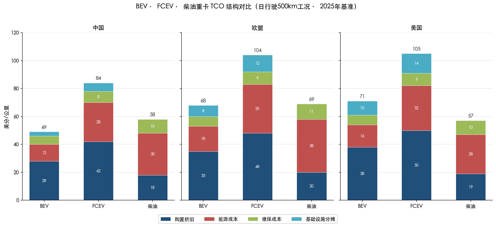

图表清晰揭示了 FCEV 重卡面临的双重成本劣势：在中国市场，FCEV 重卡净 TCO 为 84 千美元，不仅远高于 BEV 重卡的 49 千美元，亦显著高于柴油重卡的 58 千美元；欧盟和美国市场呈现类似格局，FCEV 重卡 TCO 分别高达 104 千美元和 105 千美元。能源成本与基础设施分摊是 FCEV 相对劣势的主要来源。

加氢基础设施的极度匮乏构成另一重结构性约束：全球仅约 1,160–1,369 座加氢站，中、韩、日、德、法五国占据 80%；美国仅 89 座[H2stations.org/LBST](https://www.h2stations.org/press-release-2025-milestone-reached-over-1000-hydrogen-refuelling-stations-in-op-eration-worldwide-in-2024/ "2024年全球加氢站")。IEA TCO 分析显示，加氢站基础设施成本在 FCEV 重卡 TCO 中占比达 10%（中国）至 15% 以上（欧美），且加氢站利用率即使从 30% 提升至 80%，也仅能使氢能基础设施成本降低约 60%、整体每公里燃料成本降低 25%——在高利用率假设下，FCEV 每公里能源与基础设施合计成本仍为 BEV 低利用率场景的 1.05 倍、高利用率场景的 2 倍[IEA Global EV Outlook 2025](https://www.iea.org/reports/global-ev-outlook-2025/trends-in-heavy-duty-electric-vehicles "FCEV vs BEV基础设施成本对比")。

IEA 进一步指出，每投入 100 万美元基础设施建设，高利用率的 350 kW 充电桩可覆盖的车辆行驶公里数是高利用率加氢站的 2 倍以上。且加氢站无法像充电桩那样渐进式部署——加氢站必须伴随大量 FCEV 车辆同步投入才能避免单车燃料成本过高，构成典型的"先有鸡还是先有蛋"困局[IEA Global EV Outlook 2025](https://www.iea.org/reports/global-ev-outlook-2025/trends-in-heavy-duty-electric-vehicles "基础设施投资效率对比")。

### 3.4.4 残值管理维度：数据真空

由于 FCEV 全球保有量极低（累计不足 10 万辆），二手 FCEV 市场几乎不存在，无法建立有效的残值预测模型。燃料电池堆衰减规律、储氢系统长期可靠性、加氢站网络的可持续运营等因素均构成残值不确定性的来源。我们判断 FCEV 残值管理在 2030 年前无法形成成熟的评估体系，这一维度的"数据真空"本身即构成商业化的障碍——消费者和金融机构难以对 FCEV 进行合理的残值预期定价。

### 3.4.5 FCEV 商业化临界点判定

- **乘用车**：2030 年后仍难以跨过临界点。在 BEV 续航提升至 600–800 km、超充网络密度持续扩大的背景下，FCEV 乘用车的核心价值主张（快速加氢+长续航）正被 BEV 逐步替代。现代汽车虽在 FCEV 乘用车全球市场占据 43% 份额（2025 年），但绝对数量仅约 6,800 辆，远不足以形成规模效应和成本学习曲线。
- **重卡/长途商用车**：预计 2030–2035 年有条件跨过临界点。FCEV 重卡的核心竞争优势在于载荷敏感性低（燃料电池+储氢系统重量低于等效续航所需的大容量电池包）和加氢速度快（3–5 分钟 vs BEV 重卡 45–60 分钟），在日行驶 800 km 以上的长途干线运输中仍具不可替代性。但这一场景窗口正受到 BEV 重卡技术进步的挤压——兆瓦级充电（MCS）技术的发展可能显著缩短 BEV 重卡充电时间，进一步削弱 FCEV 在长途场景中的优势。IEA 数据表明，在中、欧、美三大市场 2030 年之前，FCEV 重卡 TCO 在所有场景下均高于 BEV 重卡[IEA Global EV Outlook 2025](https://www.iea.org/reports/global-ev-outlook-2025/trends-in-heavy-duty-electric-vehicles "FCEV vs BEV重卡TCO")。
- **核心判断**：FCEV 是四条路线中距商业化临界点最远的一条。其唯一的潜在生存空间在于 BEV 技术边界之外的极端场景——超长途重卡干线运输、矿用及港口特种车辆、以及极寒地区（电池性能大幅衰减的环境）。即便在这些利基场景中，FCEV 的商业化亦高度依赖绿氢成本降至 2 美元/kg 以下和加氢站网络的大规模建设，两项条件在 2030 年前均无法确定实现。

## 3.5 四条路线商业化临界点综合排序

基于上述三维量化分析，下图以甘特图形式直观展示各路线在不同市场和场景中的商业化临界点时间窗口与状态：

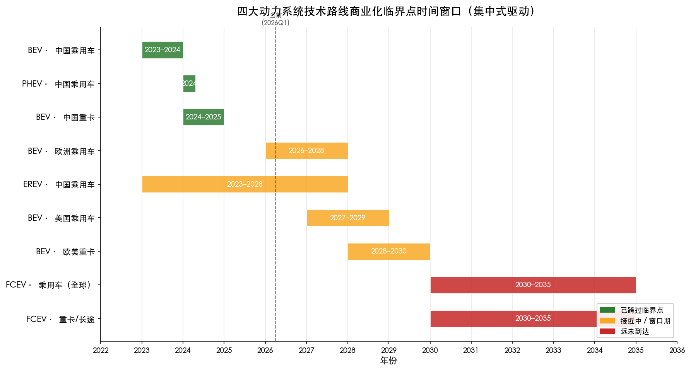

图中绿色标识"已跨过临界点"、琥珀色标识"接近中/窗口期"、红色标识"远未到达"，虚线标注当前时间节点（2026Q1）。具体排序如下表所示：

| 排序 | 技术路线 × 市场 | 临界点状态 | 预计时间 | 核心驱动因素 |
|------|----------------|-----------|----------|-------------|
| 1 | BEV（中国乘用车） | **已跨过** | 2023–2024 | 电池降本+购买平价+渗透率>40% |
| 2 | PHEV（中国乘用车） | **已跨过** | 2024 | DM 5.0 价格破坏+渗透率超阈值 |
| 3 | BEV（中国重卡） | **已跨过/正在跨过** | 2024–2025 | TCO 平价+政策驱动+短途场景先行 |
| 4 | BEV（欧洲乘用车） | 接近中 | 2026–2028 | CO₂ 法规+ETS2 碳价+低价 BEV 上市 |
| 5 | EREV（中国乘用车） | 窗口正在关闭 | 2023–2028 窗口 | 消费偏好驱动但 BEV 替代加速 |
| 6 | BEV（美国乘用车） | 接近中 | 2027–2029 | 政策不确定性高，加州 ACC-II 是关键 |
| 7 | BEV（欧美重卡） | 接近中 | 2028–2030 | 充电基础设施利用率为核心变量 |
| 8 | FCEV（乘用车） | 远未到达 | 2030 年后 | 面临 BEV 全面替代风险 |
| 9 | FCEV（重卡/长途） | 有条件接近 | 2030–2035 | 绿氢降本+加氢网络为前置条件 |

上述分析可提炼为两个核心结论：

**第一，BEV 路线在乘用车和商用车两大板块均展现出最强的商业化动能。** 中国市场已全面跨过临界点，欧洲和美国正在加速接近。BEV 的竞争优势根植于 Wright's Law 驱动的电池成本下降曲线——这是一条已被 25 年以上实证数据验证的、确定性最高的技术经济学规律。区域之间的差异本质上是政策环境的差异：中国全面推动、欧洲碳价推拉、美国联邦退缩但州级坚持。

**第二，EREV 和 PHEV 本质上是过渡性方案，其商业化窗口受 BEV 成本曲线的刚性约束。** 中国市场的实践表明，EREV/PHEV 可在充电基础设施尚不完善、消费者对纯电接受度有限的阶段发挥有效的"桥梁"功能。但随着 BEV 补能体验持续改善和电池成本持续下降，EREV/PHEV 的核心价值主张——续航焦虑缓解——将逐步消解。其商业化窗口具有时效性，而非像 BEV 那样具备自我强化的扩展动力。FCEV 则仅在 BEV 技术边界之外的极端场景中保有长期潜力，但其商业化路径高度依赖氢经济生态的整体建立，不确定性在四条路线中最大。

# 第4章 集中式驱动与分布式驱动的经济性与场景适配对比

## 4.1 驱动架构技术边界与研究框架

第3章对四条动力系统技术路线进行商业化临界点量化分析时，驱动架构统一假设为集中式驱动。然而，驱动架构的选择本身构成对临界点判定的重要修正变量——不同驱动架构在成本结构、系统效率和场景适配性上的差异足以改变临界点的时间窗口判定。本章系统比较集中式驱动（单电机/双电机 e-Axle）与分布式驱动（轮边电机/轮毂电机）的经济性与技术特征，量化驱动架构变量对各路线商业化临界点的偏移效应。

**集中式驱动**指电机布置于车身中央或车轴位置，通过减速器、差速器、半轴等传动机构将动力传递至车轮的方案。当前主流产品形态为三合一电驱桥（e-Axle），即电机、电机控制器与减速器的一体化集成，进一步演进为六合一（增加 OBC、DC-DC、PDU）乃至十合一以上的多合一超集成方案。集中式方案凭借成熟的供应链体系与规模量产优势，占据当前新能源乘用车市场的绝对主导地位。

**分布式驱动**指将驱动电机置于车轮附近或车轮内部，实现各车轮独立驱动的方案。按集成深度可分为三级形态：轮边电机（电机贴近车轮但仍在悬挂弹簧上方或通过短传动轴连接）、轮毂电机（电机直接内置于轮毂，取消一切中间传动机构）、角模块（以轮毂电机为动力源，在轮端独立集成转向、制动与悬架系统的完整行驶单元）。三种形态分别代表了分布式驱动由浅至深的技术演进路径，当前量产实践集中于轮边电机，轮毂电机尚处于原型验证与小批量装车阶段。

## 4.2 集中式电驱总成的成本结构与演进趋势

### 4.2.1 当前成本基线

集中式电驱系统的成本基线是衡量分布式方案经济竞争力的核心参照。美国能源部（DOE）电驱动技术路线图（EDTT 2024）给出了明确的成本里程碑：2022 年商用 100 kW 电驱系统（电机+逆变器）制造成本约 1,140 美元（合 7.6 美元/kW），其中电机 756 美元、逆变器 384 美元；2025 年目标为 150 kW 系统 4.0 美元/kW（约 600 美元），2030 年目标为 200 kW 系统 3.0 美元/kW（约 600 美元）[DOE EDTT 路线图](https://www.energy.gov/sites/default/files/2024-06/EDTT_Roadmap_2023_JOG_Consensus_compliant.pdf "2024年电驱技术路线图成本目标")。

在终端市场层面，三合一 e-Axle 全球市场均价约 900–1,200 美元（标准型），中国市场约 6,000–8,000 元人民币。按三合一电驱总成 8,000 元/台的均价测算，预计 2026 年中国电驱系统市场规模达 1,278 亿元[汇川技术研究报告](https://pdf.dfcfw.com/pdf/H3_AP202311061609024460_1.pdf "券商电驱市场规模测算")。全球 e-Axle 市场 2024 年约 156 亿美元，预计 2030 年达 518 亿美元（CAGR 22.2%）[Yahoo Finance/ResearchAndMarkets](https://finance.yahoo.com/news/automotive-e-axle-market-intelligence-100700963.html "e-Axle市场预测")。

从整车 BOM 视角看，纯电车核心驱动系统全 BOM 约 16,000 美元（含电池管理、电机、逆变器、OBC 等），同级燃油车动力总成约 9,000 美元；若排除电池相关组件，电驱与内燃机系统 BOM 已基本接近[Thunder Said Energy](https://thundersaidenergy.com/downloads/electric-vehicle-cost-breakdown-by-component/ "2024年EV成本拆解")。电驱系统（电机+电控）在新能源汽车整车造价中约占 13%，电池及整车控制约占 38%，合计三电系统占比约 51%[汇川技术年报分析](https://www.vzkoo.com/read/202404286bbe46f8a259bc3e30762ed4.html "电驱成本占比")。这意味着电驱系统虽非整车成本中最大的单项，但其架构选择对传动链、悬架等关联组件的成本产生连锁影响，在整车平台层面的经济性差异不容忽视。

### 4.2.2 集成化驱动的降本路径

集中式电驱正加速从三合一向多合一超集成方向演进，集成化成为最核心的降本主线。据 NE 时代统计，2025 年全年中国新能源乘用车电驱系统装机量达 989 万套（同比+27.5%），其中多合一电驱（六合一及以上）占系统总成比例已达 33%，同比增长 91.6%[NE 时代](https://ne-time.cn/web/article/37874 "2025年电驱年终总结")。120 kW–160 kW 功率区间是集成电驱应用最广泛的区间，主要对应 A0 级和 A 级主流车型。

多合一集成带来三重降本效应：其一，共壳体设计减少零部件数量与装配工序；其二，热管理系统共享降低冷却回路成本；其三，高压线束缩短降低铜材用量。联合动力最新 X 合一超集成驱动总成实现 58 kg 轻量化设计，最高可达 12 合一超高集成，系统工况效率达 89.2%[NE 时代](https://ne-time.cn/web/article/37874 "联合动力12合一")。镁合金壳体的导入是另一降本方向——上汽智己系列、吉利星驱科技已率先量产镁合金电驱，但整体占比尚不足 1%，预计 2026 年将有所突破。

在供应格局上，第三方 Tier 1 在各集成方案中所占比例为 35.5%，其中三合一系统中第三方供应商占比高达 69.3%，而多合一方案中仅为 30.7%——这一结构性差异表明，随着集成度提升，整车企业自研自制的趋势日益显著[NE 时代](https://ne-time.cn/web/article/37874 "Tier1供应格局")。弗迪动力（比亚迪）以 19.1% 的份额蝉联中国电驱系统装机量第一，华为数字能源以 8.2% 位列第二[NE 时代](https://ne-time.cn/web/article/37801 "2025年电驱装机量排名")。

### 4.2.3 SiC 对集中式电驱成本的影响

800V 高压架构的普及正加速推动 SiC MOSFET 在逆变器中的渗透。2025 年 1 月，中国新能源乘用车主驱模块 SiC 渗透率已达 18.9%，800V 车型中 SiC 渗透率更高达 71%[IICIE 第三代半导体研究](https://iicieexpo.com/news/1493_info.html "SiC渗透率")。SiC 器件单价虽仍高于硅基 IGBT，但其在系统层面带来的效率提升（降低逆变器损耗约 3%–5%）可缩小电池容量需求，从而在整车层面实现净成本下降。

SiC 成本压力正在快速缓解。2024 年，6 英寸 SiC 衬底价格从 4,000–4,500 元降至 2,500–2,800 元，全年降幅超过 40%；与此同时，中国本土供应商合计份额提升至 45.7%[IICIE 第三代半导体研究](https://iicieexpo.com/news/1493_info.html "SiC衬底价格下降")。这一趋势对集中式与分布式驱动均产生影响：集中式方案可通过 SiC 逆变器实现更高效率和更小电池包，而分布式方案因需配置四套独立逆变器，SiC 器件的成本下降对其经济可行性的改善效果更为显著。

## 4.3 分布式驱动的成本结构与对冲机制

### 4.3.1 轮毂电机自身成本与系统级对冲

分布式驱动成本分析的核心方法论要点在于：不能仅比较电机单体价格，而必须从整车平台层面评估系统成本增减。单个 Elaphe 轮毂电机约 27 kg，若仅看四个轮毂电机的采购成本，确实高于一套双 e-Axle 方案。然而，轮毂电机方案可系统性取消减速器、差速器、半轴、传动轴等传动机构，并可简化甚至取消 ABS 执行器与部分悬挂部件，释放底盘空间的同时产生显著的成本对冲。

Elaphe CTO 在 CES 2025 上明确表示，若整车从零设计适配轮毂电机平台，可实现整车成本降低约 20%、续航/效率提升约 20%（综合设计优化效果）[Green Car Reports](https://www.greencarreports.com/news/1145830_in-wheel-motors-ev-cost-boost-range "Elaphe CES 2025采访")。进一步地，Elaphe 估算取消 ABS 执行器、部分悬挂部件后，分布式驱动平台总成本可长期降低最多 30%[SAE/Mobility Engineering Tech](https://www.mobilityengineeringtech.com/component/content/article/52715-sae-ma-07543 "Elaphe系统成本对冲分析")。

图4-1以整车平台BOM为口径，分项对比了集中式（双 e-Axle AWD）与分布式（四轮毂电机）方案在七个成本项上的增减关系。分布式方案虽然在电机总成和逆变器两项上成本更高，但通过完全取消减速器/差速器、半轴/传动轴和 ABS 执行器三项组件实现成本对冲，系统级合计成本较集中式方案节约约 1.9%。

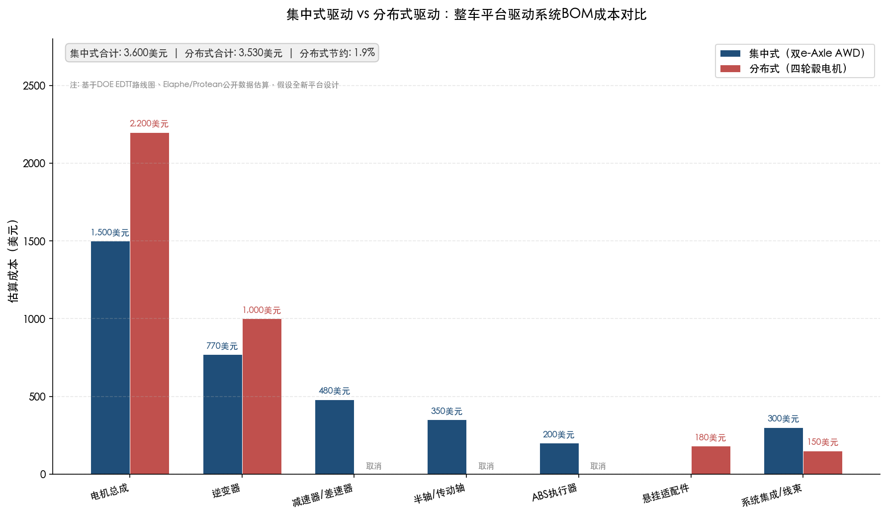

**图4-1 集中式驱动 vs 分布式驱动：整车平台驱动系统 BOM 成本对比**（基于 DOE EDTT 路线图及 Elaphe/Protean 公开数据估算，假设全新平台设计）

### 4.3.2 供应商成本平价声明与审慎评估

多家轮毂电机供应商已公开宣称实现或接近与集中式方案的成本平价。2025 年 9 月，Protean Electric 宣布其 Pm18 2500 轮毂电机已实现与双 e-Axle 方案的成本平价——每轮超过 2,500 Nm/220 kW 输出，计划 2026 年投产[Electric & Hybrid Vehicle Technology](https://www.electrichybridvehicletechnology.com/news/protean-electric-announces-production-ready-in-wheel-motors-for-2026.html "Protean成本平价声明")。Donut Lab 则声称其第二代轮毂电机制造成本比传统电驱低 50%，每轮峰值可达 630 kW/4,300 Nm[CleanTechnica](https://cleantechnica.com/2025/01/09/in-wheel-electric-motors-from-donut-labs-elaphe-debut-at-ces-2025/ "Donut Lab CES 2025")。

我们对上述成本平价声明持审慎态度。供应商声称的成本对标均未公开详细 BOM 拆解，且平价条件通常以大批量（年产数十万套）生产为前提。在当前阶段（年产量仅千台级），轮毂电机方案的实际采购成本仍显著高于集中式方案。成本平价的实现路径高度依赖于规模效应——这恰恰是轮毂电机当前最缺乏的条件。

### 4.3.3 中国市场分布式驱动的成本实践

中国市场在分布式驱动的产业化进程上已走在全球前列，但其主流形态并非轮毂电机，而是轮边电机。以比亚迪"易四方"平台为代表，四轮轮边独立电驱系统首先搭载于仰望 U8（售价 109.8 万元），此后通过腾势 Z9/Z9 GT 将价格下探至 33–40 万元区间。据 NE 时代统计，2025 年中国分布式电驱装机量已超过 8 万套，同比增长 232.6%，搭载分布式电驱的车型超过 10 款[NE 时代](https://ne-time.cn/web/article/37874 "2025年分布式电驱装机量")。吉利银河 M9 四驱领航版更将分布式车型价格区间拉低至 23 万元，标志着该架构正从超高端向主流市场渗透。

中国市场当前的分布式驱动多采用双牵引电机架构——左右车轮各由独立驱动电机单独驱动，直接取消传统差速器。车辆直行时两侧电机同步驱动，转弯时以不同转速独立调控。部分方案通过换挡装置耦合两侧电机动力以提升脱困能力。这一技术路径的演进逻辑为"轮边电机→轮毂电机→角模块集成式驱动"，正逐步实现平台化与标准化[NE 时代](https://ne-time.cn/web/article/37874 "分布式架构演进路径")。中国方案的独特价值在于，通过轮边电机这一"中间形态"率先实现了分布式驱动的规模量产验证，为全球轮毂电机技术路径提供了市场可行性的参照基准。

## 4.4 性能与效率的系统性对比

### 4.4.1 扭矩响应与动态控制

分布式驱动在动态控制维度具有集中式方案难以企及的结构性优势。轮毂电机的扭矩响应时间仅 4 ms（控制频率 10 kHz），而集中式 e-Axle 约 80–100 ms，两者相差约 20 倍[Green Car Reports](https://www.greencarreports.com/news/1145830_in-wheel-motors-ev-cost-boost-range "扭矩响应对比")。这一量级的响应速度差距意味着分布式驱动可实现单轮级别的实时扭矩矢量控制——在冰雪路面、紧急变道等极限工况下，该能力可提供远超集中式方案的主动安全性能。

Elaphe 于 2026 年 3 月在瑞典冰面上基于现代 Ioniq 5 四轮毂电机原型车（每电机 188 马力/1,254 磅·英尺扭矩）验证了上述能力：四轮独立扭矩矢量控制与线控底盘的集成在极端低附着力路面上展现出显著的稳定性优势[MotorTrend](https://www.motortrend.com/reviews/elaphe-hub-motor-prototype-review "Elaphe 2026年3月原型车测试")。

### 4.4.2 能量效率

轮毂电机方案由于取消了减速器、差速器、半轴等传动机构中的摩擦损耗，在系统效率上具备结构性优势。Elaphe 与 Lightyear 联合开发的轮毂电机在 WLTP 工况下实现 91% 的驱动循环能效，峰值效率达 97%[Charged EVs](https://chargedevs.com/newswire/in-wheel-motor-co-developed-by-lightyear-and-elaphe-reaches-97-energy-efficiency-during-testing/ "Elaphe-Lightyear效率测试")。作为对比，主流集中式 e-Axle 系统的 WLTP 工况综合效率通常在 82%–87% 范围内，二者存在约 4–9 个百分点的效率差距。

此外，四轮独立再生制动可额外提高能量回收效率 5%–10%。Elaphe 设定的 2030 年目标为 95% 电池到车轮效率[Green Car Reports](https://www.greencarreports.com/news/1145830_in-wheel-motors-ev-cost-boost-range "再生制动与效率目标")。若该目标达成，意味着分布式驱动可在不增加电池容量的前提下提升约 10%–15% 的续航里程，或在同等续航下减少电池容量需求。后者直接转化为电池成本节约——以当前 BEV 电池包均价 99 美元/kWh 计，60 kWh 电池包缩减 10% 即可节约约 600 美元，这一数字与电驱系统本身的 BOM 差异量级相当。

### 4.4.3 簧下质量的影响与工程缓解

簧下质量增加是轮毂电机长期面临的核心技术质疑。每个轮毂电机约 27 kg，但扣除可取消的集中式组件（半轴、差速器等分摊至车轮的等效质量）后，Elaphe 估算净簧下质量增量约为既有簧下质量的 30%（每轮约 16 kg）[Green Car Reports](https://www.greencarreports.com/news/1145830_in-wheel-motors-ev-cost-boost-range "净簧下质量增量")。

Lotus Engineering 与 Protean 联合开展的量化研究提供了关键的工程参考数据。该研究基于 Ford Focus 平台（每轮增加 30 kg）进行测试，结果显示：车轮跳动模态从 14 Hz 降至 10 Hz，主动安全 KPI 降低约 0.05 g，但这一影响远小于更换低端轮胎带来的性能差异，且可通过常规悬挂调校完全恢复[Protean/Lotus Engineering](https://www.proteanelectric.com/f/2018/04/protean-Services3.pdf "簧下质量量化影响研究")。

上述研究结果表明，簧下质量问题在工程实践中并非不可逾越的障碍，而是一个可通过悬挂系统适配解决的设计约束。随着轻量化材料和主动悬挂技术的进步，这一约束的影响有望进一步降低。

## 4.5 场景适配矩阵

不同驱动架构的商业化路径高度依赖应用场景。基于前述技术特征与经济性分析，我们构建了覆盖六大场景、六个评估维度的场景适配矩阵（图4-2）。矩阵显示，分布式驱动在动态控制和空间效率维度具有跨场景的结构性优势，而集中式驱动在供应链成熟度和耐久可靠性维度仍占据主导地位。

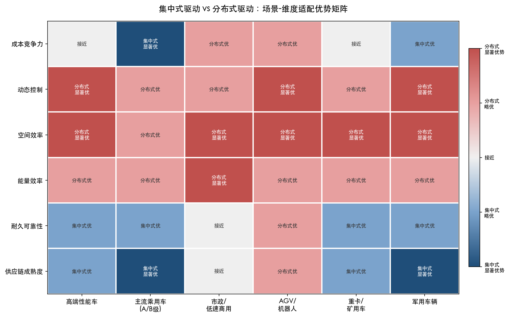

**图4-2 集中式驱动 vs 分布式驱动：场景-维度适配优势矩阵**（红色系表示分布式优势，蓝色系表示集中式优势，浅灰表示两者接近）

### 4.5.1 高端性能乘用车

高端性能车是轮毂电机切入乘用车市场的首选细分领域。Elaphe Sonic.1 瞄准 10 万美元以上市场，每轮最高 347 马力/259 kW，预计 2026 年小批量装车[Electric & Hybrid Vehicle Technology](https://www.electrichybridvehicletechnology.com/news/ces-2025-elaphes-iwm-technology-promises-347-hp-per-wheel.html "Elaphe Sonic.1规格")。在该价位段，消费者对技术溢价的接受度较高，轮毂电机带来的极致扭矩矢量控制和底盘空间释放构成差异化卖点。

比亚迪仰望系列已验证了高端分布式驱动在中国市场的商业可行性。仰望 U7 于 2025 年 3 月以 62.8 万元起售价上市，搭载易四方技术平台[比亚迪仰望](https://finance.sina.com.cn/tech/digi/2025-03-27/doc-inerceui7885528.shtml "仰望U7上市")。从 109.8 万元（U8）到 62.8 万元（U7），再到腾势 Z9 的 33 万元，比亚迪正通过规模效应和平台化复用持续拉低分布式驱动的成本门槛。

### 4.5.2 主流乘用车市场

主流市场（15–30 万元）对成本敏感度极高，当前集中式 e-Axle 方案凭借成熟供应链和规模效应占据绝对主导。分布式驱动进入该市场需满足两个前置条件：轮毂/轮边电机年产量达到十万套级以实现规模成本下降；主流 OEM 承诺全新平台投资以释放设计优化红利。吉利银河 M9 将分布式（轮边）方案价格拉低至 23 万元，但该车型定位为大型 SUV——A 级轿车的分布式驱动成本平价预计仍需 3–5 年的产业化积累。

### 4.5.3 市政与低速商用车

市政及低速商用车是轮毂电机已实现商业化交付的细分场景。舍弗勒已向 Jungo 等厂商交付 14 英寸轮毂电机（7–60 kW），应用于道路清扫车、货运车和除雪车[Automotive Powertrain Technology](https://www.automotivepowertraintechnologyinternational.com/news/electric-powertrain-technologies/schaeffler-to-deliver-in-wheel-electric-drives-for-municipal-vehicles.html "舍弗勒市政车辆交付")。该场景对簧下质量不敏感，行驶工况以低速、频繁启停为主，轮毂电机的高效再生制动优势得以充分发挥。市政车辆对成本的容忍度高于消费级乘用车，使其成为轮毂电机积累量产经验和供应链成熟度的理想场景。

### 4.5.4 AGV 与机器人

自动导引运输车（AGV）和服务机器人是轮毂电机已实现规模化应用的成熟领域。该场景对簧下质量完全不敏感，驱动架构选择完全由空间集成度和控制灵活性主导，轮毂电机在结构紧凑性和单轮独立控制方面具备无可替代的优势。AGV 场景的成功实践表明，轮毂电机的核心技术（电磁设计、控制算法、密封防护）已具备工业级可靠性，其向乘用车和商用车迁移的主要障碍在于成本规模化和极端环境耐久性验证，而非基础技术可行性。

### 4.5.5 重卡与矿用车辆

重卡是分布式驱动的高潜力增长场景。Donut Lab 在 CES 2025 展示了 Class 8 重卡轮毂电机方案（每轮 200 kW/3,000 Nm）[CleanTechnica](https://cleantechnica.com/2025/01/09/in-wheel-electric-motors-from-donut-labs-elaphe-debut-at-ces-2025/ "重卡轮毂电机")。矿用卡车已长期使用轮边电驱桥方案，属于分布式驱动的传统优势领域。

重卡场景的适配逻辑在于三个层面：卡车底盘空间有限而轴荷巨大，轮毂电机释放底盘空间可增加电池或货物容量；簧下质量增量相对于既有车轮组件（包括制动鼓/盘）的占比较乘用车更低，影响可控；重卡行驶工况中频繁制动的特征使得四轮独立再生制动的能量回收优势得以放大。

### 4.5.6 军用车辆

轮毂电驱已被定义为"下一代军用地面平台关键架构"[ESD Conference](https://events.esd.org/wp-content/uploads/2017/08/Next-Generation-In-Wheel-Electric-Hub-Drives.pdf "军用轮毂电驱论文")。军用场景对成本敏感度远低于民用，但对生存性（被弹后单轮可独立驱动）、机动性（原地转向、极低速精确控制）和静默行驶能力有极端需求。这些需求特征与分布式驱动的技术优势高度匹配，使军用领域成为轮毂电机技术验证和应用拓展的重要方向。

## 4.6 供应商格局与产业化节奏

### 4.6.1 全球轮毂电机供应商图谱

全球轮毂电机领域呈现"多点突破、尚未收敛"的竞争格局，主要参与者的技术路径和目标场景各有侧重：

- **Elaphe**（斯洛文尼亚）：技术成熟度最高的独立轮毂电机供应商，计划 2026 年小批量高端车型装车，2030 年前后与"家喻户晓品牌"OEM 实现大批量量产合作[MotorTrend](https://www.motortrend.com/reviews/elaphe-hub-motor-prototype-review "Elaphe量产规划")。
- **Protean Electric/Exedy**：2026 年 2 月被日本 Exedy 收购，Pm18 2500 计划 2026 年投产。东风 E70 搭载 Protean Pd18 获中国工信部认证，成为全球首款认证轮毂电机乘用车[electrive.com](https://www.electrive.com/2026/03/09/exedy-acquires-protean-electric/ "Exedy收购Protean") [Protean Electric](https://www.proteanelectric.com/the-first-homologated-passenger-car-with-in-wheel-motors/ "东风E70认证")。Exedy 的收购为 Protean 提供了日本制造体系的规模量产支撑。
- **DeepDrive**（德国）：获 BMW i Ventures 投资，采用独特的双转子径向磁通电机架构，计划 2026 年小批量、2028 年大规模量产[Electric Motor Engineering](https://www.electricmotorengineering.com/deepdrive-the-power-of-a-dual-rotor-motor/ "DeepDrive双转子电机")。
- **舍弗勒**：侧重商用及低速场景，14 英寸轮毂电机已实现商业化交付，是当前唯一在非乘用车领域形成批量出货的轮毂电机供应商。
- **Donut Lab**：聚焦重卡与高性能场景，第二代产品声称制造成本较传统电驱低 50%，技术路径差异化明显但量产验证尚待推进。

### 4.6.2 中国分布式驱动供应链

中国市场的分布式驱动供应链以整车企业垂直整合为主导模式。比亚迪弗迪动力自主供应易四方平台轮边电机，吉利星驱科技为银河 M9、领克 900 等车型提供分布式镁合金电驱总成。第三方供应商中，联合电子已推出多款分布式镁合金电驱总成产品[NE 时代](https://ne-time.cn/web/article/37874 "中国分布式电驱供应商")。这一"主机厂主导+第三方补充"的供应格局与集中式电驱领域的趋势一致——多合一方案中 OEM 自研比例高达 69.3%，反映出整车企业对核心驱动技术掌控力的战略诉求。

### 4.6.3 关键商业化时间线

综合各供应商公开时间表与产业化节奏，分布式驱动的商业化进程呈现"中国轮边方案领先全球轮毂方案约 3–5 年"的显著节奏差异（图4-3）。

| 时间节点 | 里程碑事件 |
|---------|-----------|
| 2022–2023 | 东风 E70 获工信部认证（全球首款轮毂电机认证乘用车），Protean 年产约 1,500 台 |
| 2023–2024 | 比亚迪仰望 U8/U9 上市，易四方轮边电机量产 |
| 2025 | 中国分布式电驱装机量超 8 万套（+232.6%），腾势 Z9 将价格下探至 33 万元，银河 M9 下探至 23 万元 |
| 2025–2026 | Protean Pm18 2500 投产，Elaphe Sonic.1 小批量装车 |
| 2028 | DeepDrive 大规模量产目标 |
| 2030 前后 | Elaphe 首批大众市场 OEM 合作车型量产 |
| 2030 年代 | 若平台级整合成功，轮毂电机有望进入主流乘用车市场 |

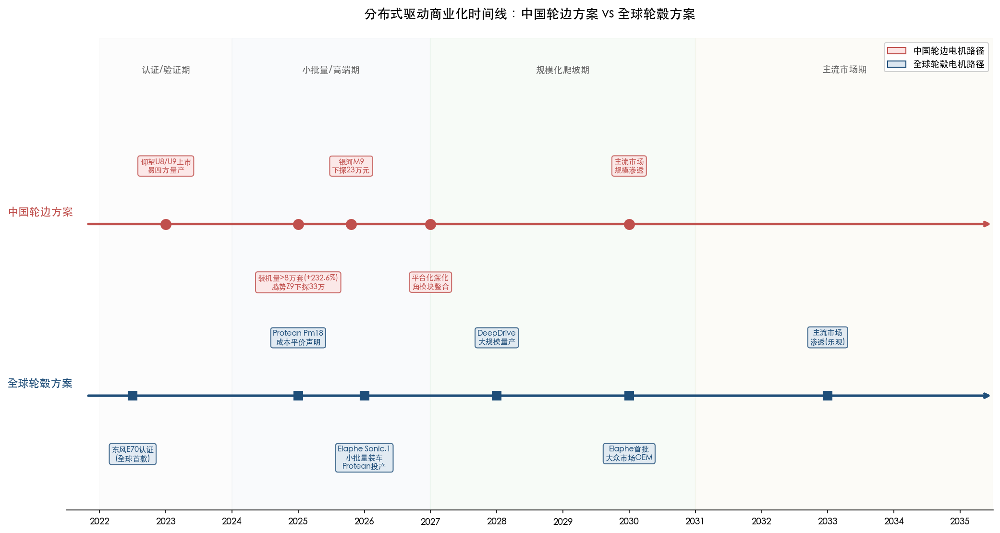

**图4-3 分布式驱动商业化时间线：中国轮边方案 vs 全球轮毂方案**（红色为中国轮边电机路径，蓝色为全球轮毂电机路径，背景色带区分认证验证期、小批量高端期、规模化爬坡期和主流市场期四个阶段）

## 4.7 驱动架构与动力系统技术路线的组合效应

驱动架构并非独立于动力系统路线的技术选择，两者的组合方式决定了分布式驱动在不同路线中的商业化切入路径与潜在收益。

### 4.7.1 BEV + 分布式驱动

BEV 是与分布式驱动兼容性最高的技术路线。全新 BEV 平台从底盘架构层面适配轮毂电机，可同时释放空间优化、传动链简化和效率提升三重红利。Elaphe 估算全新平台方案可降低整车成本约 20%、提升续航约 20%[Green Car Reports](https://www.greencarreports.com/news/1145830_in-wheel-motors-ev-cost-boost-range "BEV平台整合优势")。

然而，全新平台开发需 OEM 承诺约 50 亿美元级别的前期投资[Green Car Reports](https://www.greencarreports.com/news/1145830_in-wheel-motors-ev-cost-boost-range "OEM投资门槛")，这构成了短期内最大的商业化瓶颈。在当前行业盈利承压、多家欧美 OEM 推迟全面电动化转型的背景下，承诺全新分布式驱动平台的决策门槛进一步抬高。

### 4.7.2 PHEV/EREV + 分布式驱动

PHEV 和 EREV 可将轮毂电机作为前轮或后轮加装模块，无需重做碰撞结构即可升级为全时四驱。这一"渐进式整合路径"显著降低了 OEM 的投资门槛和技术风险，可能成为分布式驱动在主流市场的破冰方式[Green Car Reports](https://www.greencarreports.com/news/1145830_in-wheel-motors-ev-cost-boost-range "混动加装优势")。

比亚迪已在 PHEV 平台上验证了分布式驱动的技术可行性——腾势 Z9 作为插混车型搭载易四方分布式驱动平台，证明了混动动力系统与四轮独立驱动的集成兼容性。这一实践为全球其他 OEM 以渐进方式导入分布式驱动提供了直接参考。

### 4.7.3 FCEV + 分布式驱动

FCEV 与分布式驱动的组合在理论上具有吸引力——轮毂电机释放的底盘空间可用于储氢系统布置，缓解 FCEV 长期面临的空间约束。然而，由于 FCEV 自身商业化进程仍处于早期阶段（2025 年全球仅售出 16,011 辆），两项尚未成熟技术的叠加意味着更高的集成风险和更长的验证周期。该组合在可预见的时间窗口内不具备规模化条件，其商业化前景取决于 FCEV 自身的产业化突破。

## 4.8 对商业化临界点的修正评估

基于上述分析，我们对分布式驱动给第3章所确定各路线商业化临界点带来的修正效应进行分阶段评估。

**短期（2026–2028 年）**：分布式驱动仍处于小批量与高端车型验证阶段。轮毂电机仅应用于 10 万美元以上性能车和特种场景（市政车辆、AGV）。中国市场的轮边电机方案已进入加速渗透期（2025 年装机量同比增长 232.6%），但集中在 23–100 万元价位段的 SUV 车型。对主流市场（10–25 万元乘用车）的 TCO 临界点基本无修正效应。

**中期（2028–2030 年）**：若 DeepDrive、Elaphe 按计划实现大规模量产，轮毂电机可望在高端与性能车细分市场率先证明 TCO 优势。保守估算 TCO 修正幅度约 10%–13%，主要来源于传动链取消带来的 BOM 节约（约 1,030 美元）和系统效率提升（WLTP 工况效率差 4–9 个百分点）。对 BEV 路线而言，这一修正可能使欧美市场的 TCO 平价时间提前 0.5–1 年。

**长期（2030 年后）**：乐观场景下，若有主流 OEM 投入全新分布式平台开发且年产量达到十万辆级，TCO 修正可达 20% 以上。届时分布式驱动将从"修正变量"升级为"路线重塑因素"，可能显著改变 BEV 在各市场的临界点判定。该场景高度依赖 OEM 战略决策，不确定性较大。

**场景差异化修正**：

- **高端性能车**：修正幅度最大。分布式驱动已在中国市场证明商业可行性，预计 2028 年前全球主要高端品牌均将推出分布式驱动车型。
- **市政/商用/AGV**：轮毂电机已实现商业化交付，对该细分场景的 TCO 评估应直接采用分布式方案作为基准。
- **重卡**：中期有望成为轮毂电机的高增长场景，但需等待 Donut Lab 等方案的量产验证与实车数据积累。
- **主流乘用车（A/B 级）**：2030 年前修正幅度有限，2030 年后取决于 OEM 全新平台投资决策及供应链规模化进展。

## 4.9 关键制约因素与风险

分布式驱动在走向规模化商业化的过程中仍面临若干结构性约束，这些因素将直接影响上述修正评估的实现概率。

**OEM 平台投资门槛**：释放分布式驱动全部潜力需要全新底盘平台开发，投资规模约 50 亿美元。在当前行业盈利承压、多家欧美 OEM 推迟电动化转型的背景下，多数整车企业倾向于在现有平台上渐进式改造而非承诺颠覆性重投。中国 OEM（比亚迪、吉利）在轮边电机平台化方面的先行实践降低了这一门槛，但向轮毂电机的跨越仍需更大的架构变革投入。

**极端环境耐久性验证**：轮毂电机直接暴露于车轮环境，面临涉水（IP67/69K）、严寒、盐雾等极端条件考验。目前仅有供应商自身声明通过相关测试，尚无独立第三方机构发布系统性耐久性验证报告。对于追求零召回的主流 OEM 而言，缺乏第三方验证数据是导入决策的重要障碍。

**EMC 电磁兼容性**：轮毂电机紧邻轮速传感器、ABS 传感器等关键安全组件，电磁干扰风险需通过严格的车规级 EMC 认证。东风 E70 获得中国工信部认证是一个积极信号，但全球主要市场（欧盟 ECE、美国 FCC）的认证案例仍然有限，跨市场法规合规仍是产业化的必经环节。

**供应链成熟度差距**：与集中式 e-Axle 已形成的百万套级供应链相比，轮毂电机供应链仍处于万套级阶段——两者存在约两个数量级的规模差距。产能爬坡速度将直接决定成本下降曲线的斜率，也是供应商成本平价声明能否兑现的关键前提。

# 第5章 技术路线选择对产业链与供应链格局的影响

动力系统技术路线的切换不仅是整车层面的产品策略选择，更是一场贯穿上游资源、中游零部件、下游整车及后市场的产业链利益再分配。800V 高压架构、碳化硅电驱、固态电池、分布式驱动等技术的加速迭代，正在从根本上重塑各环节的竞争格局、价值分布与供应安全边界。本章从产业链视角出发，系统分析不同技术路线的规模化部署如何向上下游各环节传导，并就核心问题——技术路线切换对产业链各环节的利益再分配和供应安全意味着什么——给出结构化判断。

## 5.1 上游关键材料：供需格局与路线依赖

### 5.1.1 锂：结构性过剩收窄但仍承压

锂作为所有电化学储能路线的基础性材料，其供需格局直接影响电池成本乃至技术路线的经济性排序。2025 年全球锂化学品市场呈现结构性过剩，过剩量约 14.1 万吨碳酸锂当量（LCE），预计 2026 年将收窄至 10.9 万吨[S&P Global Energy](https://www.spglobal.com/energy/en/news-research/latest-news/metals/010926-commodities-2026-lithium-carbonate-surplus-to-narrow-energy-storage-to-drive-growth "锂供需平衡与价格")。价格方面，中国电池级碳酸锂在 2025 年下半年经历一轮反弹，价格回升 58% 至约 11.7 万元/吨，但仍远低于 2022 年年末的历史高点。

锂价的阶段性企稳对 BEV 路线构成利好：电芯成本持续下降的确定性增强，纯电动车型与燃油车型的价格平价窗口进一步前移。对 PHEV/EREV 而言，由于单车电池容量通常仅为纯电车型的 1/3 至 1/2，锂价波动的敏感度相对较低，但同样受益于成本下行趋势。FCEV 路线不依赖大容量锂电池（仅将其作为小容量功率缓冲），因此锂价波动对其成本结构的影响有限。

### 5.1.2 正极化学体系：LFP 全球反超 NMC

正极材料的化学体系选择正在重新划定产业链版图。2025 年，磷酸铁锂（LFP）首次超越三元锂（NMC）成为全球部署量最大的电池化学体系，LFP 需求同比增长 48%，中国市场超过 80% 的电动车搭载 LFP 电池[InsideEVs/RhoMotion](https://insideevs.com/news/784963/lfp-overtakes-nickel-battery-chemistry/ "LFP首次超越NMC")。

LFP 的崛起对产业链形成深层次冲击。在上游端，LFP 不依赖钴和镍，显著削弱了高镍三元路线对刚果（金）钴矿和印尼镍矿的资源依赖；在中游端，LFP 正极几乎完全由中国企业供应——中国占全球 LFP 正极产能的 95% 以上，产业链集中度风险由此从矿端转移至加工端[IEA 关键矿物评论](https://www.iea.org/commentaries/with-new-export-controls-on-critical-minerals-supply-concentration-risks-become-reality "关键矿物集中度")。

NMC 路线所依赖的镍和钴供需格局呈现分化态势。全球镍市场连续处于过剩状态——国际镍研究组（INSG）数据显示 2025 年过剩量约 209–212 千吨，S&P Global 预测 2026 年过剩约 156 千吨，印尼占全球镍矿产量约 60%[Carbon Credits/S&P Global](https://carboncredits.com/the-ultimate-guide-to-nickel-supply-demand-and-nickel-prices-for-2026-and-beyond/ "镍供需平衡与展望")。S&P Global 预计全球镍库存将在 2028 年前后见顶，2031 年市场天平有望翻转为赤字，届时价格可能回升至 25,000 美元/吨以上。钴市场则因刚果（金）2025 年 2 月实施出口禁令而从过剩急转为短缺——禁令导致钴价翻倍，Fastmarkets 估计 2025 年全球钴市场出现"显著技术性赤字"[Fastmarkets](https://www.fastmarkets.com/insights/dried-up-feedstock-pipeline-cobalt-prices-soaring-2025-deficit/ "刚果钴出口禁令影响")。

LFP 的全球化扩张还带来一重战略含义：欧美车企若大规模转向 LFP 以降低电池成本，将不得不面对更深层次的对华供应链依赖——中国不仅掌控了 LFP 正极的几乎全部产能，还控制了磷酸铁前驱体的绝大部分供应。这一矛盾在当前中美贸易摩擦和欧盟反补贴关税背景下尤为突出，形成了"降本"与"去风险"之间的两难选择。

### 5.1.3 稀土永磁体：供应链集中度最高的脆弱环节

电机是电动汽车动力系统的核心部件，而约 95% 的量产电动车采用永磁同步电机（PSM），其核心材料钕铁硼（NdFeB）永磁体高度依赖稀土元素。中国占全球永磁体产量的 94%，2024 年出口约 58,000 吨稀土磁体[IEA 关键矿物评论](https://www.iea.org/commentaries/with-new-export-controls-on-critical-minerals-supply-concentration-risks-become-reality "稀土出口管制影响")。2025 年，中国实施的两轮出口管制已导致实质性供应断裂，欧洲市场稀土价格一度攀升至中国国内价格的 6 倍，凸显了这一环节的极端脆弱性。

面对稀土供应风险，无稀土电机技术正在加速推进。BMW 第六代 eDrive（Gen6）是目前进展最快的无稀土量产方案：该系统在后轴采用外部励磁同步电机（EESM）、前轴采用异步电机（ASM），完全不使用稀土元素和永磁体。2025 年 8 月，BMW 在奥地利施泰尔工厂启动 Gen6 电机量产，实现能量损耗降低 40%、重量减轻 10%、成本降低 20%，投入约 1,000 名员工专注于新产线[BMW 集团官方公告](https://www.bmwgroup.com/en/news/general/2025/gen6-electric-drive.html "Gen6电机量产启动")。雷诺和日产也已在部分车型中部署 EESM 方案，通用汽车和 Stellantis 的无稀土电机则仍处于开发阶段[All About Industries](https://www.all-about-industries.com/plan-b-for-e-motors-without-china-a-3db8e11fd00b9304448e700293ae8863/ "无稀土电机进展综述")。中国方面，比亚迪、华为、昆腾科技等企业均在推进 EESM 技术研发，但尚未实现大规模量产。

无稀土电机的量产突破具有重大产业链含义：若 EESM/ASM 方案在性能和成本上逼近 PSM，稀土永磁体的"卡脖子"风险将大幅降低，电机环节的供应链地理格局有望从东亚独占转向多区域分布。但短期内，PSM 仍是性能与效率的基准方案，无稀土电机的规模替代需要 3–5 年的过渡窗口。

### 5.1.4 碳化硅衬底：中国从"被卡脖子"到"卡别人脖子"

碳化硅（SiC）功率器件产业链呈现出与传统认知截然相反的格局。在终端器件层面，全球 SiC 功率器件市场前五大供应商占据 91.9% 的收入份额——意法半导体以 32.6% 居首，安森美和英飞凌分列二、三位[TrendForce](https://www.semiconductor-today.com/news_items/2024/jun/trendforce-200624.shtml "SiC功率器件市场份额")。然而在上游衬底材料端，中国已占据全球约 70% 的产能，且价格较国际厂商低 30%–40%：6 英寸衬底价格从 2024 年初的 4,000–4,500 元跌至年末的 2,500–2,800 元，全年降幅超过 40%[IICIE 第三代半导体研究](https://iicieexpo.com/news/1493_info.html "中国SiC衬底份额与价格趋势")。

值得关注的是，国际 SiC 领军企业正面临严峻经营挑战。Wolfspeed 虽于 2025 年 9 月率先商业化发布 200mm（8 英寸）SiC 材料，但因持续亏损已于 2025 年 5 月申请破产保护[Wolfspeed 官方公告](https://www.wolfspeed.com/company/news-events/news/wolfspeed-announces-the-commercial-launch-of-200mm-silicon-carbide-materials-portfolio-unlocking-the-industrys-ability-to-manufacture-at-scale/ "Wolfspeed 200mm商业化发布")；安森美因终端需求下滑叠加中国企业价格竞争，于 2025 年 4 月暂停韩国 8 英寸工厂的投资建设[IICIE 第三代半导体研究](https://iicieexpo.com/news/1493_info.html "安森美暂停韩国8英寸工厂")。

中国 SiC 衬底的价格优势和产能规模正沿产业链向下传导。2024 年中国 SiC 功率模块装机量突破 208 万套（同比增长 116%），国产厂商（比亚迪半导体、芯聚能、芯联集成等）合计份额达 45.7%[IICIE 第三代半导体研究](https://iicieexpo.com/news/1493_info.html "2024年中国SiC模块装机量")。集邦咨询预测 8 英寸产品市占率 2026 年约 15%、2030 年突破 20%；天岳先进于 2024 年 11 月推出全球首款 12 英寸导电型 SiC 衬底样品，标志着中国在晶圆大尺寸化方面保持领先节奏。

SiC 产业链的格局变化对不同技术路线产生不对称影响。在 800V 架构下，SiC 是核心功率器件——800V 车型中 SiC 渗透率已从 2023 年不到 20% 攀升至 2025 年 1 月的 71%[IICIE 第三代半导体研究](https://iicieexpo.com/news/1493_info.html "NE时代统计中国SiC主驱渗透率")。中国衬底价格的快速下降有望加速 800V+SiC 方案向中低端车型渗透，进一步巩固 BEV 的成本竞争力。而 PHEV/EREV 由于电机功率需求相对较低且多数仍采用 400V 平台，对 SiC 的依赖度较低，IGBT 方案在这一场景中仍具成熟替代性。

### 5.1.5 铂族金属：PHEV/EREV 延缓替代进程

铂族金属（PGM）的供需动态揭示了 PHEV/EREV 路线对传统供应链的反向支撑效应。铂市场已连续三年处于赤字状态——2024 年供应缺口为 774,000 盎司，2025 年预计为 736,000 盎司[Johnson Matthey PGM Market Report](https://matthey.com/documents/161599/509428/PGM_Market_Report_25.pdf "2025年PGM市场报告")。PHEV/EREV 的快速增长部分抵消了 BEV 对 PGM 需求的替代效应：中国 PHEV/EREV 2024 年产量增长 80% 至超过 500 万辆，这些车型仍需搭载含 PGM 的尾气催化剂。

从产业链视角审视，只要 PHEV/EREV 保持一定市场份额，PGM 供应链的商业价值就不会快速坍塌。这为南非（全球铂供应的主要来源国）的矿业就业和出口收入提供了缓冲期，同时也意味着 FCEV 路线所需的铂催化剂成本不会因供应过剩而大幅下降——铂的持续赤字反而增加了 FCEV 的材料成本压力。

下图汇总了上述关键材料在供应集中度与供需平衡两个维度上的定位，直观呈现各材料的供应风险等级差异。

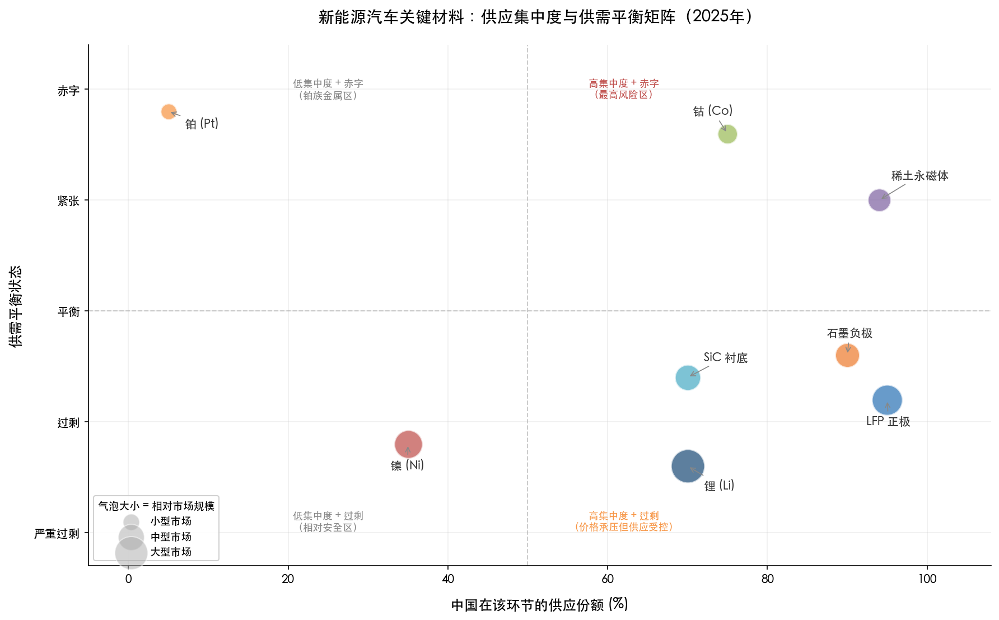

上图显示，稀土永磁体和钴处于"高集中度+赤字"的最高风险象限，LFP 正极和石墨负极虽然供需处于过剩状态，但因中国供应份额超过 90% 而面临地缘政治驱动的供应管控风险。镍和铂的中国供应份额较低，但铂的持续赤字和镍的中期供需翻转趋势值得密切关注。

## 5.2 中游核心零部件：集中度加剧与本土化浪潮

### 5.2.1 动力电池：双巨头格局持续强化

动力电池作为电动汽车成本占比最高的单一零部件（通常占整车成本 30%–40%），其竞争格局对整个产业链具有决定性影响。2025 年全球电动车电池装机量达到 1,187 GWh（同比增长 31.7%），宁德时代以 39.2% 的市场份额稳居第一，比亚迪以 16.4% 位列第二，两者合计占据 55.6%；韩系三家（LG、三星 SDI、SK on）份额从 18.7% 降至 15.4%[ChinaEVHome/SNE Research](https://chinaevhome.com/2026/02/04/global-ev-battery-installations-hit-1187-gwh-in-2025-catl-claims-39-2-share/ "2025年全球电池装机份额")。

双巨头格局的强化产生了多重产业链连锁效应。对整车企业而言，电池采购议价能力持续受压，推动车企加速自研电池或扶持二线供应商以分散供应风险——蔚来投资卫蓝新能源布局半固态电池、大众通过 PowerCo 推进自研即为典型案例。对韩系电池企业而言，份额的持续收缩迫使其转向差异化竞争：三星 SDI 加注全固态电池研发以构建技术代差优势，LG 则侧重北美本地化生产以利用 IRA 补贴优势。

不同技术路线对电池需求量的分化亦在深刻影响中游格局。BEV 每辆车的电池需求通常在 50–100 kWh，PHEV 约 15–30 kWh，EREV 约 30–50 kWh，FCEV 仅需 1–5 kWh 的缓冲电池。若全球路线格局从"BEV 主导"偏向"多路线并行"（如欧洲市场正在发生的趋势），单车平均带电量降低将削弱动力电池的总需求增速，进而影响头部企业的产能利用率和规模效应释放。

### 5.2.2 SiC 功率模块：本土化率快速攀升

碳化硅功率模块环节正经历中国本土供应商对国际巨头的快速份额蚕食。2024 年中国 SiC 功率模块本土化率达到 45.7%，比亚迪半导体、芯聚能、芯联集成等企业凭借上游衬底成本优势和与整车客户的深度绑定关系，实现了市场份额的快速跃升。Yole 预测全球 SiC 器件市场 2030 年将达 103 亿美元（2024–2030 CAGR 超过 20%），其中汽车及出行领域贡献约 70%[世强硬创-Yole报告](https://www.sekorm.com/news/580438173.html "Yole 2025碳化硅市场预测")。

SiC 模块本土化的加速对产业链产生两个层面的影响。其一，显著降低了中国 BEV 制造商在 800V 平台上的关键器件对外依赖度，提升了供应链韧性；其二，加剧了意法半导体、安森美等国际 SiC 龙头在中国市场的份额流失压力，可能迫使其加速在中国本地设厂或主动调整定价策略以维持市场地位。

### 5.2.3 电驱动总成：集成化与多元化并行

电驱动总成（e-Axle）市场正经历从分立式向高度集成式的快速转型，"电机+电控+减速器"三合一方案已成为行业主流。全球电驱动总成市场规模预计从 2026 年的 403.6 亿美元增长至 2034 年的 909.5 亿美元，复合增长率约 10.7%[Fortune Business Insights](https://www.fortunebusinessinsights.com/zh/electric-drive-unit-market-115499 "全球电驱动总成市场预测")。在中国市场，比亚迪凭借整车-电驱垂直整合优势占据显著份额；日本电产（Nidec）在第三方供应商中位居前列；采埃孚、博世、麦格纳等国际 Tier 1 供应商亦在积极布局。

驱动架构的技术路线切换将深刻改变电驱总成环节的竞争格局。在集中式驱动（单电机或双电机）方案下，传统 Tier 1 供应商的系统集成能力和规模优势仍然显著；而分布式驱动（轮毂/轮边电机）一旦实现量产，将从根本上改变电驱总成的产品形态——从整车前后桥集成件转变为轮端独立模块，传统 Tier 1 的既有产线和设计经验将面临颠覆性挑战，Elaphe 等专业轮毂电机供应商则可能借此获得先发优势。

## 5.3 整车企业的技术路线押注与战略分化

### 5.3.1 欧洲车企：从"全面纯电"退向"多路线并行"

过去一年，欧洲汽车产业在技术路线选择上经历了一次显著的战略转向。欧盟于 2025 年 12 月实质性软化 2035 禁燃令——将 CO₂ 削减目标从 100% 调整至 90%，允许 2035 年后继续销售 PHEV、增程、轻混及使用合成燃料的车型[Reuters](https://www.reuters.com/business/autos-transportation/eu-relent-combustion-engines-ban-after-auto-industry-pressure-2025-12-16/ "EU放弃2035禁燃令")。在政策松动的背景下，Ford 欧洲业务、Stellantis、沃尔沃等多家车企相继推迟全面电动化时间表，奢华品牌的战略退缩尤为明显[EU Perspectives](https://euperspectives.eu/2026/03/carmakers-flee-from-evs-as-europes-transition-slows/ "欧洲车企电动化退缩")。

欧洲车企的路线回撤对产业链产生多维影响。短期而言，欧洲本土电池工厂的产能消化压力增大——欧洲已规划超过 600 GWh 的电池产能，若 BEV 渗透放缓，产能利用率将显著低于预期。从中长期看，多路线并行意味着欧洲供应链需要同时维护内燃机、混动和纯电三套零部件体系，供应链复杂度和成本负担随之上升。

### 5.3.2 中国车企：BEV+PHEV 双线并进的差异化格局

中国市场的车企路线布局呈现高度分化特征。比亚迪以 PHEV/BEV 各占约 50% 的均衡布局覆盖最广泛的市场，蔚来、小鹏坚持纯电路线深耕智能化差异，理想、问界则主攻增程式技术切入中高端 SUV 市场。2025 年增程式电动车增速放缓至约 6%（此前连续两年超过 50%），表明中国市场正进入技术路线的收敛期。

这一分化格局向产业链的传导逻辑各有不同。坚持纯电路线的车企在电池、SiC 器件、热管理等核心零部件上的采购规模更大且需求更集中，有利于与供应商开展深度协同和联合技术迭代；而布局 PHEV/EREV 的车企需要同时管理发动机、变速箱等传统动力总成供应链和三电系统供应链，供应链管理复杂度更高，但风险分散度也相应提升。

### 5.3.3 日韩车企：各执一端的路线赌注

日韩车企的路线选择对全球产业链的影响不容忽视。丰田坚持多路线并行策略——其混动技术全球领先（HEV 全球累计销量超 2,500 万辆），同时重金押注固态电池（目标 2030 年后大规模量产，能量密度 450–500 Wh/kg）和氢燃料电池。现代-起亚则在 FCEV 乘用车领域保持全球领先地位（2025 年全球 FCEV 乘用车销量中现代占比 43%），同时通过 E-GMP/IMA 平台加速纯电布局。

丰田的固态电池战略若取得成功，将重新定义动力电池产业链的技术天花板——硫化物固态电池不使用液态电解质，关键材料从目前的碳酸酯类电解液溶剂（EC、DMC 等）转向硫化物固态电解质（Li₂S、P₂S₅ 等），由此催生全新的材料供应链和制造工艺体系，对当前以液态锂电池为中心的产业链格局构成潜在颠覆。

## 5.4 后市场与残值生态：BEV 渗透的结构性冲击

### 5.4.1 BEV 对传统维保体系的颠覆

BEV 的全面渗透正在对传统汽车后市场形成结构性冲击。德勤预测，BEV 大规模普及将导致传统维保收入和利润下降 30%–45%[Deloitte](https://image.marketing.deloitte.de/lib/fe31117075640474771d75/m/1/f4745f5f-9dc9-46b4-942c-128691250356.pdf "Deloitte售后预测")。冲击的根源在于 BEV 取消了发动机、变速箱、排气系统等传统高利润维修部件——BEV 无需更换机油、火花塞、正时皮带和传动轴，制动系统因动能回收技术的广泛应用而磨损大幅降低。

对产业链而言，这意味着数以万计的传统维修门店、零部件经销商和独立售后市场供应商面临转型压力。新的利润中心正向电池健康诊断、热管理系统维护、高压线束检修和软件升级（OTA）等领域迁移，对技术人员的技能要求也从传统机械维修转向电气与软件能力。

相比之下，PHEV/EREV 对后市场的冲击较为温和——其保留了发动机和传动系统，维保收入结构与传统燃油车更为接近。这也构成了部分经销商和售后网络在路线选择上更倾向于支持 PHEV/EREV 的经济动因。

### 5.4.2 BEV 残值管理：快速贬值与改善趋势并存

BEV 的残值表现是影响其全生命周期经济性的关键变量。iSeeCars 2025 年发布的研究显示，美国市场 BEV 五年平均贬值率达 58.8%，显著高于全行业均值的 45.6% 和混合动力车的 40.7%[iSeeCars/Autoblog](https://www.autoblog.com/news/ev-depreciation-crisis-electric-cars-lose-58-8-of-value-in-five-years "iSeeCars五年贬值率研究")。部分早期车型的五年贬值率甚至超过 65%（如 Tesla Model S 贬值 65.2%、Model X 贬值 63.4%），而最保值的电动车型五年残值率可达 40%–60%。在英国市场，Cox Automotive 数据显示 BEV 三年平均贬值率为 38%–42%，与 ICE 车型的 35%–40% 差距正在缩小[Cox Automotive](https://www.coxautoinc.eu/ev-hub/industry-ev-hub/resources/ev-vs-ice-depreciation-and-residual-values-explained/ "英国BEV与ICE残值对比")。

BEV 贬值较快的核心原因有三：一是电池技术快速迭代导致老款车型技术竞争力的衰减速度远快于传统燃油车；二是消费者对电池健康状态的不确定性担忧压低了二手定价；三是新车端的频繁降价（尤其是特斯拉的多轮调价）通过价格锚定效应拉低了二手车价值。积极信号在于，随着 BEV 新车价格逐步企稳、电池健康诊断体系日益成熟、以及消费者认知的提升，BEV 的贬值曲线正在趋缓——新一代长续航车型的前三年残值率已明显优于早期短续航车型。

### 5.4.3 电池回收：第一波退役潮涌现

动力电池的梯次利用和回收已从概念验证进入产业化阶段。全球锂电池回收产能约 160 万吨/年，其中中国占约 70%（约 120 万吨/年），已规划产能超过 300 万吨/年[ResearchAndMarkets/IDTechEx](https://www.businesswire.com/news/home/20250512077618/en/Global-Li-ion-Battery-Recycling-Market-Report-2025-2045-China-Leads-Global-Li-ion-Battery-Recycling-Capacity-with-70-Share---ResearchAndMarkets.com "全球电池回收产能")。第一波电池退役潮正在涌现——2017–2020 年大规模销售的早期电动车电池陆续进入退役期，为回收产业链提供了规模化的原料来源。

电池化学体系对回收经济性的影响值得关注。NMC 电池因含有高价值的钴和镍（尤其在当前钴价因刚果出口禁令而翻倍的背景下），回收经济性较好；LFP 电池因不含钴和镍，回收后的材料价值较低，经济性面临挑战——但技术关注度正快速上升，中国多家企业已开发出 LFP 直接再生技术，能够将废旧 LFP 正极材料修复后再利用。

电池回收产业链的区域分布高度集中于中国，与锂电池生产的地理集中度保持一致。欧盟电池法规要求 2027 年起设定碳足迹阈值、2031 年起锂回收率达 80%，将推动欧洲本地回收产能建设，但短期内在规模和成本上仍难以与中国形成有效竞争。

## 5.5 供应链安全与区域化重构

### 5.5.1 中国的供应链绝对优势与出口管制

全球新能源汽车供应链的集中度已达到引发系统性风险关注的水平。IEA 数据显示，20 种战略矿物中有 19 种由中国在冶炼加工环节排名第一（平均份额约 70%），电池前驱体和 LFP 正极材料中国占比超过 95%[IEA 关键矿物评论](https://www.iea.org/commentaries/with-new-export-controls-on-critical-minerals-supply-concentration-risks-become-reality "关键矿物集中度")。2025 年 10 月，中国进一步对锂电池供应链实施出口管制，覆盖电芯、正极材料、负极材料、设备和技术，标志着供应链博弈进入新阶段。

下图系统展示了产业链各关键环节的中国供应份额及对应的"卡脖子"风险等级。

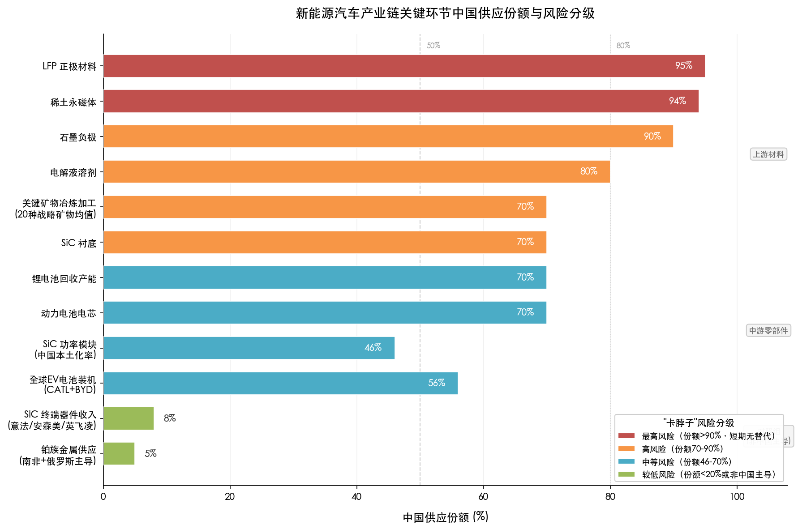

我们认为，"卡脖子"风险应按照产业链环节的可替代性进行分级评估：

- **最高风险环节**：稀土永磁体（中国占 94%）、前驱体和 LFP 正极（中国占 95% 以上）——短期内几乎不存在可替代的供应来源
- **高风险环节**：SiC 衬底（中国占 70%，方向与传统"中国被卡"的认知恰好相反，实际上中国具有"卡别人"的能力）、石墨负极（中国占 90% 以上）
- **中等风险环节**：动力电池电芯（中国占全球约 70%，但韩企在北美和欧洲已有本地化产能布局）、电解液溶剂（中国占比超过 80%）
- **较低风险环节**：锂矿资源（澳大利亚、智利、阿根廷实现多元供应）、铜箔（多国具有产能基础）

### 5.5.2 供应链区域化：本地化投资加速

面对供应链集中度风险和各国本地化政策要求，中国电池企业的海外建厂步伐明显加速。宁德时代匈牙利 100 GWh 工厂于 2026 年初投产（投资不超过 73.4 亿欧元），比亚迪匈牙利工厂于 2026 年第一季度试产[CnEVPost/Reuters](https://cnevpost.com/2025/09/08/catl-hungarian-plant-begin-production-early-2026/ "CATL匈牙利工厂")。这些投资的驱动力兼顾了关税规避（欧盟对中国产 BEV 反补贴关税 7.8%–35.3%）和贴近终端市场的供应效率提升。

美国方面，IRA 将中国制造的电池排除在补贴资格之外，推动韩企加速北美建厂。LG、三星 SDI 和 SK on 在美国和加拿大的在建电池工厂合计产能超过 200 GWh。然而，美国 2025 年 7 月废除 IRA 联邦 EV 税收抵免的政策变动，为这些投资的回报前景蒙上了不确定性阴影[CNBC](https://www.cnbc.com/2025/07/01/trump-big-beautiful-bill-axes-7500-ev-tax-credit-after-september.html "EV税收抵免废除")。

欧盟方面，18 亿欧元"Battery Booster"计划支持本土电池制造、2027 年起碳足迹阈值、2031 年起锂回收率 80% 等政策组合，旨在建立自主可控的区域电池供应链。但在规模经济和技术积累方面，欧洲本土电池企业与中韩龙头之间仍存在显著差距。

### 5.5.3 不同技术路线的供应链脆弱度对比

技术路线选择直接决定了供应链的脆弱度结构。下图从六个关键维度对三大技术路线的供应链脆弱度进行对比评分。

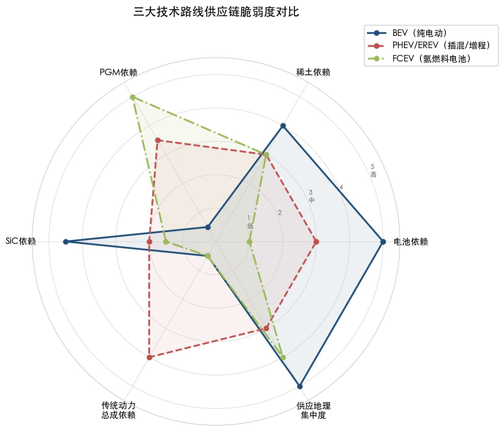

如图所示，三条技术路线在供应链风险维度上各有侧重：

- **BEV**：对锂、正极材料（LFP 或 NMC）、SiC 器件、铜箔的依赖度最高，供应链集中度风险最大，但也最受益于中国本土供应链的成本优势。在中国以外市场生产的 BEV，供应链安全挑战最为突出。
- **PHEV/EREV**：电池需求量较低，对电池供应链的依赖程度约为 BEV 的 1/3 至 1/2；但同时需要发动机、变速箱等传统动力总成，供应链在地理分布上更为分散（欧美日均有成熟供应体系），整体供应安全度较高。
- **FCEV**：对铂催化剂的依赖构成独特的供应风险（南非和俄罗斯合计占全球铂供应约 90%），但不依赖大规模锂电池，因此不受锂电池供应链集中度的制约。质子交换膜和碳纸等关键材料的全球供应商数量有限，产业化规模不足导致成本居高不下。

## 5.6 产业链价值再分配的趋势判断

综合上述分析，我们对技术路线切换引发的产业链价值再分配做出以下四项趋势判断：

**第一，电池和电力电子器件将成为产业链价值重心。** BEV 渗透率每提升 10 个百分点，全球动力电池市场规模预计增加约 200–300 亿美元，SiC 器件市场同步扩容。在 BEV 主导的情景下，电池和 SiC 器件在整车 BOM 中的占比将从当前的约 35% 提升至 40% 以上，传统动力总成（发动机+变速箱）的份额则趋近于零。

**第二，中国供应链的全球地位将继续巩固但面临"脱钩"压力。** 中国在锂电池全链条（从矿产加工到电芯制造再到回收）、SiC 衬底和稀土加工环节的绝对优势短期内不可撼动。然而，美国 IRA、欧盟电池法规和碳足迹阈值等政策正在人为塑造区域化供应链，中国企业的海外建厂是应对"脱钩"压力的必然战略选择。

**第三，"多路线并行"将增加供应链管理的复杂度和成本。** 欧洲车企从纯电路线退缩至多路线并行，虽然降低了对单一技术的押注风险，但需要同时维护三套以上的零部件供应体系（内燃机+混动+纯电），对采购效率、库存管理和研发投入形成拖累。我们判断，这种"对冲"策略的产业链成本将在未来 3–5 年内逐步显现。

**第四，后市场和残值管理将成为路线竞争的"隐形战场"。** BEV 的快速贬值（美国市场五年贬值率 58.8%）和传统维保收入的萎缩，正在倒逼产业链建立以电池健康为核心的残值评估体系。哪条技术路线能率先建立透明、可信的残值管理机制，就将在消费者信心和融资租赁市场中获得结构性竞争优势。

# 第6章 政策环境与市场趋势对商业化临界点的修正效应

前五章基于技术成本曲线、产业链传导逻辑与评估方法论，对各动力系统路线的商业化临界点形成了"技术内生"的基线判断。然而，商业化临界点并非仅由技术经济学单一维度决定——政策激励或约束、消费者偏好迁移、贸易壁垒重构、宏观经济周期波动等外部变量，均可能将临界点提前或推迟数年乃至改变路线竞争格局。本章系统梳理全球主要市场 2025—2026 年的政策演变与需求结构变化，量化外部变量对各路线临界点的修正方向与幅度，并构建"政策积极/中性/保守"三种情景以检验前五章结论的稳健性。

## 6.1 中国市场：政策工具箱全面切换与路线分化加速

### 6.1.1 购置税退坡三阶段与技术门槛递进

中国新能源汽车购置税优惠政策已进入明确的三阶段退坡通道：2024—2025 年购置税全免（减免上限 3 万元），2026—2027 年减半征收（上限 1.5 万元），2028 年起完全取消[中国国务院政策公告](https://english.www.gov.cn/news/202306/21/content_WS64929394c6d0868f4e8dd11c.html "购置税优惠政策")。这一阶梯式安排对不同技术路线的影响具有显著的非对称性。

关键的技术门槛调整发生在 2025 年 10 月：纯电续航低于 100 km 的 PHEV/EREV 车型不再享受购置税减免[China Daily](https://www.chinadaily.com.cn/a/202510/14/WS68eda438a310f735438b4ce4.html "2026-2027技术门槛提升")。该门槛精准地将低纯电续航的"油改电"PHEV 排除在外，迫使 PHEV 路线搭载更大容量动力电池以满足政策要求，从而推高其 BOM 成本并侵蚀相对于 BEV 的价格优势。对于 BEV 路线，由于主流车型续航已普遍达到 400—600 km，购置税退坡虽将增加消费者购车成本，但在 2025 年中国市场电池包均价已降至 84 美元/kWh 的背景下[BloombergNEF 2025](https://about.bnef.com/insights/clean-transport/lithium-ion-battery-pack-prices-fall-to-108-per-kilowatt-hour-despite-rising-metal-prices-bloombergnef/ "2025年BNEF电池价格")，BEV 全生命周期 TCO 优势已基本不受税收抵免变动的颠覆。

### 6.1.2 双积分制度的阶梯式升级

2026—2027 年双积分政策迎来力度显著提升的新阶段：新能源汽车积分比例要求从 2025 年的 38% 阶梯式升至 2026 年 48%、2027 年 58%，纯电续航须达 300 km 以上方可获得 1 个基础积分，同时引入低温续航调整系数[中国消费者报/中青在线](http://auto.cyol.com/gb/articles/2025-11/19/content_v62xpdcMYv.html "2026-2027双积分新规")。该政策对传统燃油车企构成刚性约束——若无法通过自产新能源车完成积分考核，须从积分富余企业购买新能源正积分，形成事实上的"碳交易成本"转嫁。

低温续航调整系数的引入具有明确的路线筛选效应：依赖小电池+增程器的 EREV 车型在北方寒冷地区的积分收益将被打折，进一步削弱增程路线在政策维度的竞争力。结合北京 2025 年 3 月起对增程车实施与燃油车相同的工作日五环内尾号限行政策[有驾/北京市交通委](https://youjia.baidu.com/view/articleDetail/9575104316140139554 "北京增程车限行")，EREV 在一线城市的政策红利已大幅缩水。

### 6.1.3 以旧换新与充电基础设施倍增计划

2026 年以旧换新补贴从定额制转为按车价比例制：报废旧车购新能源车补贴车价的 12%（上限 2 万元），置换补贴 8%（上限 1.5 万元）[证券时报](https://www.stcn.com/article/detail/3565358.html "2026年以旧换新调整")。比例制设计使中高端 BEV 获得更大绝对补贴额，有利于加速 B/C 级纯电市场的渗透。

充电基础设施"三年倍增"计划为 BEV 路线提供关键的场景侧支撑：目标至 2027 年底全国充电设施达到 2,800 万个，满足超 8,000 万辆电动车的充电需求。截至 2025 年 3 月，全国充电设施累计达 1,374.9 万台（同比增长 47.6%）[中国充电联盟](https://www.163.com/dy/article/JT9QUE3A05198UNI.html "充电设施保有量")。充电网络密度的快速提升正在持续侵蚀 EREV/PHEV 路线的"补能焦虑"优势——而这一优势恰恰是增程路线在 2021—2024 年高速增长的核心驱动力。

### 6.1.4 氢能政策：从交通示范走向工业主战场

中国氢能政策正经历方向性转折。截至 2025 年底，全国建成加氢站超 540 座，推广燃料电池汽车约 2.4 万辆，可再生能源制氢产能累计超 25 万吨/年（较上年翻番）[国家能源局/科创板日报](https://www.cls.cn/detail/2275475 "氢能产业进展")。然而，加氢站实际建成数量远低于各省市规划累计的 1,200 座目标，折射出商业化落地与规划愿景之间的实质性落差。

"十五五"规划建议首次提出"前瞻布局氢能"的明确要求，将氢能定位为全新经济增长点。国家能源局 2025 年底发布首批能源领域氢能试点名单（涵盖 41 个项目和 9 个区域），标志着氢能产业从"零星示范"迈向"规模化试点"[国家能源局/科创板日报](https://www.cls.cn/detail/2275475 "十五五氢能方向")。值得关注的是，政策信号明确指向工业领域（钢铁、有色、化工等难减排行业）而非交通运输——这意味着 FCEV 乘用车在可预见的政策周期内难以获得与 BEV 同等力度的消费端支持，其商业化临界点仍将高度依赖商用车（重卡、物流车）场景的突破。

## 6.2 欧洲市场：禁燃令软化、碳约束强化与关税博弈

### 6.2.1 2035 禁燃令的实质性后退

2025 年 12 月，欧盟对 2035 年禁燃令做出实质性修改：CO₂ 削减目标从 100% 调整为 90%，允许 2035 年后继续销售 PHEV、增程、轻混甚至纯燃油车（剩余 10% 排放通过 e-fuel 等方式抵消）；2025—2027 年排放达标方式改为三年滚动平均，赋予车企更大的合规弹性[Reuters](https://www.reuters.com/business/autos-transportation/eu-relent-combustion-engines-ban-after-auto-industry-pressure-2025-12-16/ "EU放弃2035禁燃令") [S&P Global Mobility](https://www.spglobal.com/automotive-insights/en/blogs/2025/12/europe-shifts-into-reverse-on-eu-2035-ice-ban "禁燃令修订详情")。

这一政策转向直接降低了欧洲车企短期全面电动化的紧迫感。Ford 已放弃 2030 年欧洲市场全面纯电目标，沃尔沃将 2030 年目标调低为允许至多 10% 混动销售，雷诺宣布 ICE 与 BEV 双线战略将持续十年以上[EU Perspectives](https://euperspectives.eu/2026/03/carmakers-flee-from-evs-as-europes-transition-slows/ "欧洲车企电动化退缩")。IEA STEPS 情景下，欧洲电动轻型车销售份额 2030 年预计接近 60%，显著高于 2024 年不足 20% 的基数，但增长路径较此前预测更为平缓[IEA Global EV Outlook 2025](https://www.iea.org/reports/global-ev-outlook-2025/outlook-for-electric-mobility "欧洲EV展望")。

### 6.2.2 EU ETS2 碳市场：隐性推力

与禁燃令软化形成对冲的是 EU ETS2（交通与建筑碳排放交易体系）将于 2027 年启动。BNEF 预测 2027—2030 年均碳价 99 欧元/吨（峰值 122 欧元/吨），这将使柴油零售价格上涨约 22%、汽油上涨约 18%，年均增加柴油乘用车碳成本 250—350 欧元[BNEF EU ETS II 报告](https://assets.bbhub.io/promo/sites/16/EU_ETS_II_Pricing_Scenarios_Balancing_Cuts_and_Costs.pdf "ETS2碳价情景")。碳成本的显性化将直接改变 TCO 模型中的能源成本变量——以年行驶 15,000 km、百公里油耗 6L 的中型燃油车测算，ETS2 碳价每年将增加约 200—300 欧元用车成本，使 BEV 在家庭充电场景下的 TCO 优势进一步扩大约 5%—8%。

此外，欧盟推出 18 亿欧元"Battery Booster"计划以支持本土电池制造，并设立小型 BEV 类别（车长 ≤ 4.20 m，目标售价 15,000—20,000 欧元），旨在填补欧洲市场长期缺乏平价电动车的结构性空白。上述供给侧措施若如期落地，将在 2027—2028 年显著改善欧洲 BEV 的可得性与价格竞争力。

### 6.2.3 反补贴关税与最低价格承诺

欧盟于 2024 年对中国制造 BEV 征收 7.8%—35.3% 的反补贴关税（比亚迪 17%、吉利 18.8%、上汽 35.3%），2026 年 1 月转向以"最低价格承诺"替代方案进行谈判，并正在考虑将关税范围扩展至混动车型[Rest of World](https://restofworld.org/2026/why-the-eu-is-ready-to-drop-high-tariffs-on-china-made-evs/ "EU反补贴关税")。关税对欧洲 BEV 商业化临界点的影响具有两面性：短期内抬高了进口中国平价 BEV 的终端售价，延缓欧洲消费者获取低价 BEV 的时间窗口；但同时为欧洲本土电池和整车产能建设争取了战略窗口期——宁德时代匈牙利 100 GWh 工厂 2026 年初投产、比亚迪匈牙利工厂 2026 年 Q1 试产[CnEVPost/Reuters](https://cnevpost.com/2025/09/08/catl-hungarian-plant-begin-production-early-2026/ "CATL匈牙利工厂")，本地化产能在中期将有效稀释关税壁垒的影响。

我们判断，关税和最低价格承诺的综合效果是将欧洲 BEV 商业化临界点推迟约 1—2 年（相对于无关税的基线情景），但不会改变 BEV 在欧洲市场最终胜出的方向。

## 6.3 北美市场：联邦激励撤退与州级法规的对冲

### 6.3.1 IRA 税收抵免废除的冲击

2025 年 7 月，美国联邦政府宣布废除《通胀削减法案》（IRA）项下的新车 7,500 美元和二手车 4,000 美元 EV 税收抵免，并于 9 月 30 日终止执行[CNBC](https://www.cnbc.com/2025/07/01/trump-big-beautiful-bill-axes-7500-ev-tax-credit-after-september.html "EV税收抵免废除")。哈佛大学 Salata 研究所建模显示：仅废除税收抵免将使 2030 年美国 EV 销售份额从约 48% 降至 42%（降幅 6 个百分点）；若叠加取消加州排放豁免等全部政策倒退措施，则降至 32%（降幅 16 个百分点）[哈佛 Salata 研究所](https://salatainstitute.harvard.edu/unpacking-trumps-ev-policy-overhaul/ "政策情景建模")。

BNEF 在 2025 年版全球电动车展望中大幅下调美国 2030 年 EV 渗透率预测至约 27%（前一年预测约 50%），全球电池需求预测因此下调 3.4 TWh，其中 2.8 TWh 来自美国市场的减量[CleanTechnica/BNEF](https://cleantechnica.com/2025/06/18/bloomberg-2025-electric-vehicle-outlook-report/ "BNEF 2025 EVO")。IEA STEPS 情景下，美国电动轻型车 2030 年销售份额约 20%，仅为全球其他主要市场平均水平（约 40%）的一半[IEA Global EV Outlook 2025](https://www.iea.org/reports/global-ev-outlook-2025/outlook-for-electric-mobility "美国EV STEPS展望")。

### 6.3.2 加州 ACC-II 与州级碎片化格局

联邦激励撤退与州级法规形成鲜明的对冲效应。加州 ACC-II 要求 2026 年 EV/FCEV 新车占比达 35%、2035 年达 100%，目前已有 11 州及华盛顿特区采纳该标准，合计覆盖美国约 30% 的轻型车市场[IEA GEVO 2025](https://www.iea.org/reports/global-ev-outlook-2025/outlook-for-electric-mobility "加州ACC-II")。然而，行政令 14154 已指示终止加州排放豁免——该豁免的存废将成为美国 EV 前景最大的单一政策变量。

若加州豁免得以保留，约 30% 的美国市场仍将沿高电动化路径推进，从而有效限制联邦政策倒退的全国影响；若豁免被撤销，美国 BEV 商业化临界点可能进一步推迟至 2030 年代初。鉴于加州豁免的法律争议仍在进行中，我们在中性情景中假设豁免在 2027 年前保持有效，此后面临部分限制。

### 6.3.3 关税叠加效应与电池供应链

美国 2025 年 3 月宣布对所有进口汽车（包括电动车）加征 25% 关税，并对电池及相关组件维持高关税。IEA 分析指出，2024 年美国 40% 的电动车为进口（超 60 万辆），来源涵盖欧洲、墨西哥、日本和韩国[IEA Global EV Outlook 2025](https://www.iea.org/reports/global-ev-outlook-2025/outlook-for-electric-mobility "美国EV进口关税影响")。关税对电池成本的冲击尤为关键：中国生产了全球近 80% 的电池电芯、85% 的正极活性材料和 90% 以上的负极材料，25% 的关税将直接抵消过去一年电池价格约 20% 的降幅。

不过，各国同步推进的本地电池产能建设将在中期逐步缩小区域成本差距。IRA 虽废除了消费端税收抵免，但其中针对电池制造的生产税收抵免（45X）在立法博弈中获得部分保留，为在美国建厂的电池企业提供了一定程度的成本缓冲。

## 6.4 其他关键市场的政策信号

### 6.4.1 日本：FCEV 目标严重落空

日本是全球最早系统性押注氢能交通的国家，但执行结果远低于预期：原定 2025 年 20 万辆 FCEV 的保有量目标，实际全年销量仅 430 辆，差距超过两个数量级[CSIS](https://www.csis.org/analysis/japans-hydrogen-industrial-strategy "日本氢能战略")。IEA STEPS 情景下，日本电动轻型车销售份额 2030 年约 20%，与日本政府"次世代汽车战略"中 20%—30% 的目标区间下沿一致[IEA Global EV Outlook 2025](https://www.iea.org/reports/global-ev-outlook-2025/outlook-for-electric-mobility "日本EV展望")。

日本案例对 FCEV 路线的政策修正含义清晰而深刻：即使在政策最为支持的市场，仅靠补贴亦无法克服基础设施不足和成本过高的硬约束。FCEV 乘用车的商业化临界点不会因为任何单一市场的政策支持而实质性提前，反而因日本这一最具说服力的政策实验场的落空而进一步强化了"基础设施先行"的路径依赖判断。

### 6.4.2 东南亚：新兴电动化热土

东南亚市场正成为 BEV 商业化的重要增量来源。IEA 预测该地区 2030 年 EV 综合销售份额接近 30%[IEA GEVO 2025](https://www.iea.org/reports/global-ev-outlook-2025/outlook-for-electric-mobility "东南亚EV展望")。泰国 EV 3.5 政策延续至 2027 年，印尼 2026 年取消进口 BEV 关税豁免以推动本地化生产，马来西亚对 BEV 进口关税减免延续至 2027 年。中国 BEV 供应链的成本优势在东南亚市场具有天然适配性：比亚迪泰国罗勇工厂与长城泰国工厂已形成产能输出能力，为中国品牌的区域扩张提供了关税规避与本地化生产的双重基础。

## 6.5 市场需求结构：消费者偏好的方向与惰性

### 6.5.1 区域购买意向分化

消费者调研揭示了各市场电动化意愿的巨大分化。McKinsey 2025 年全球调研显示：中国 45% 的受访者下一辆车意向 BEV，欧洲 23%，美国仅 12%[McKinsey](https://www.mckinsey.com/features/mckinsey-center-for-future-mobility/our-insights/new-twists-in-the-electric-vehicle-transition-a-consumer-perspective "2025消费者调研")。Deloitte 2025 年全球汽车消费者调研数据更为悲观——美国仅 5% 受访者意向 BEV，全球消费者对 HEV 和增程技术的兴趣呈上升趋势[Deloitte](https://www.deloitte.com/global/en/industries/automotive/perspectives/global-automotive-consumer-study-2025.html "Deloitte全球汽车消费者调研")。

上述分化的核心驱动因素是价格。McKinsey 调研清晰揭示了价格—意愿函数的非线性特征：当前价格条件下全球仅 33% 的消费者意向 EV，当 EV 与 ICEV 实现购买价格平价时升至 55%，低于 ICEV 时进一步升至 63%[McKinsey](https://www.mckinsey.com/features/mckinsey-center-for-future-mobility/our-insights/new-twists-in-the-electric-vehicle-transition-a-consumer-perspective "价格与意愿关系")。换言之，价格每降低一个台阶（从"溢价"到"平价"再到"折价"），购买意愿提升约 10—20 个百分点。这意味着在中国市场（BEV 已实现价格平价甚至折价），消费者偏好已不构成渗透率提升的核心瓶颈；而在欧美市场，购买溢价仍是最大的需求侧制约因素。

### 6.5.2 BEV 复购率与续航期望

全球 76% 的 BEV 车主在下次购车时仍将选择 BEV[McKinsey](https://www.mckinsey.com/features/mckinsey-center-for-future-mobility/our-insights/new-twists-in-the-electric-vehicle-transition-a-consumer-perspective "BEV复购率")。这一高复购率表明 BEV 的使用体验本身具有"锁定效应"——一旦消费者完成首次 BEV 购买，向传统动力系统回流的概率显著偏低。对于 EREV/PHEV 路线而言，每一位被 BEV 转化的消费者大概率将长期留在纯电阵营，增程和插混路线的潜在客户池随 BEV 渗透率提升而持续收缩。

消费者对续航里程的最低期望已升至 500 km[McKinsey](https://www.mckinsey.com/features/mckinsey-center-for-future-mobility/our-insights/new-twists-in-the-electric-vehicle-transition-a-consumer-perspective "续航期望")。考虑到 2025—2026 年主流 BEV 续航已普遍达到 500—700 km，且 800V 超充网络加速部署（中国公共充电桩累计超 1,370 万台），续航焦虑作为 EREV/PHEV 核心卖点的有效性正在系统性衰减。

## 6.6 政策-市场联动情景建模与临界点修正

### 6.6.1 IEA 情景框架下的区域展望

IEA Global EV Outlook 2025 STEPS 情景提供了当前政策环境下最具权威性的区域预测基准[IEA Global EV Outlook 2025](https://www.iea.org/reports/global-ev-outlook-2025/outlook-for-electric-mobility "IEA STEPS 2030")：

- **中国**：2030 年电动车（含全车型，不含两/三轮车）销售份额接近 80%，已远超政府原定 2027 年 45% 的目标。基于市场竞争力与政策延续性，中国 BEV 和 PHEV 的商业化临界点在 STEPS 情景下已得到充分确认。
- **欧洲**：2030 年电动轻型车销售份额接近 60%（2024 年不足 20%），增长由 EU CO₂ 法规和英国零排放车辆令驱动，但增速因禁燃令软化而较前一年预测下调约 5 个百分点。
- **美国**：2030 年电动轻型车销售份额约 20%（前一年 STEPS 预测为 50% 以上），为全球主要市场中降幅最大的地区，核心驱动因素为联邦激励撤退和政策不确定性。
- **日本**：2030 年电动轻型车销售份额约 20%，燃料电池轻型车约 3%。
- **东南亚**：2030 年 EV 综合份额接近 30%。

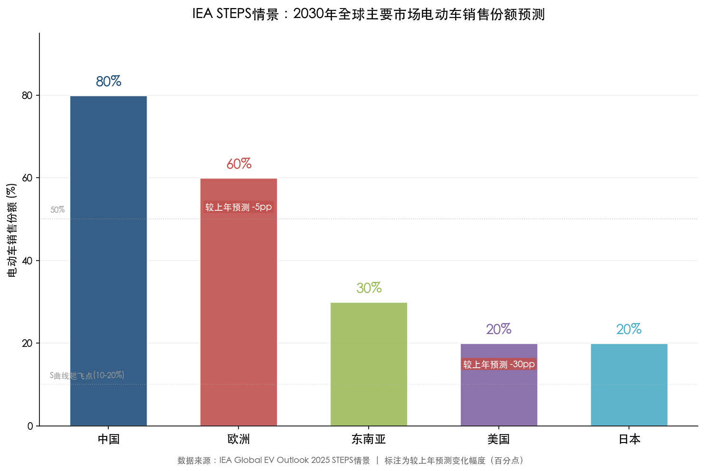

图 6-1 直观呈现了各市场在 STEPS 情景下 2030 年的电动车销售份额预测值及较上年预测的变化幅度。美国市场预测值下调 30 个百分点尤为突出，凸显联邦政策变量对渗透率预期的决定性影响。

在 IEA NZE（净零排放）情景下，全球电动车销售份额须在 2030 年达到约 60%，全球 EV 保有量达 3.8 亿辆[Virta/IEA](https://www.virta.global/blog/the-future-of-electromobility-ieas-global-ev-outlook "NZE情景目标")。STEPS 情景下全球 2030 年份额约 40%，表明当前政策力度与净零目标之间仍存在约 20 个百分点的"政策差距"。

### 6.6.2 三情景框架：临界点时间偏移量化

基于上述政策和市场变量，我们构建三种情景以量化各技术路线商业化临界点的时间偏移。

**情景一：政策积极**——假设中国政策整体延续当前力度、欧盟严格执行 2030 年 CO₂ 目标且 ETS2 如期启动、美国加州豁免得以保留且部分联邦激励恢复、全球充电/加氢基础设施投资维持增长。

**情景二：政策中性**（基线情景）——假设各国政策按当前既定方案执行，不做进一步加强或减弱，即 IEA STEPS 情景的政策假设。

**情景三：政策保守**——假设中国购置税提前完全取消（2027 年）、欧盟 CO₂ 目标进一步软化、美国加州豁免被撤销且无联邦替代激励、全球贸易壁垒持续升级。

各路线在三情景下的商业化临界点修正如下表所示：

| 技术路线 × 市场 | 技术基线临界点 | 政策积极 | 政策中性（STEPS） | 政策保守 |
|:---|:---|:---|:---|:---|
| BEV 中国 | 已跨过（2023—2024） | 0 | 0 | 0（已不可逆） |
| PHEV 中国 | 已跨过（2024） | 窗口 2028 年前关闭 | 窗口 2027 年前关闭 | 窗口 2026 年提前关闭 |
| EREV 中国 | 接近临界点 | 窗口 2026—2027 年关闭 | 窗口 2025—2026 年已开始收缩 | 窗口 2025 年加速关闭 |
| BEV 欧洲 | 2027—2028 年 | 提前至 2026—2027 年 | 推迟至 2027—2029 年 | 推迟至 2029—2031 年 |
| BEV 美国 | 2028—2029 年 | 维持 2028—2029 年 | 推迟至 2029—2032 年 | 推迟至 2031—2034 年 |
| FCEV 乘用车 | 2030 年后 | 2030—2033 年 | 2033 年后 | 2035 年后或不可达 |
| FCEV 重卡/长途 | 2030—2035 年 | 2030—2033 年 | 2032—2035 年 | 2035 年后 |

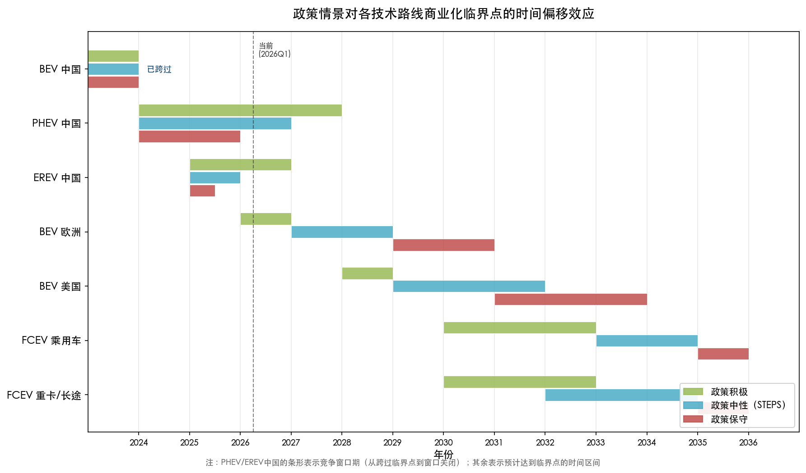

图 6-2 以时间轴形式呈现上表中各路线在三种情景下的临界点区间偏移，2026 年 Q1 虚线标注当前时间节点。PHEV/EREV 中国的条形表示竞争窗口期（从跨过临界点到窗口关闭），其余路线条形表示预计达到临界点的时间区间。

### 6.6.3 关键修正机制的逻辑推导

**BEV 中国：临界点已不可逆。** 2024 年中国近 2/3 的 BEV 售价已低于同级燃油车[IEA Global EV Outlook 2025](https://www.iea.org/reports/global-ev-outlook-2025/trends-in-electric-car-affordability "中国BEV价格平价")，购置税退坡对已实现购买价格平价的市场影响有限。即使在政策保守情景下，BEV 在中国的商业化临界点亦已不可逆转——这是由技术经济学内生决定的结果，政策仅扮演加速而非决定性角色。

**PHEV/EREV 中国：政策加速窗口关闭。** 购置税退坡（2026—2027 年减半、2028 年取消）、双积分技术门槛提升（纯电续航 300 km+ 基线）、一线城市限行政策的叠加效应，将使 PHEV/EREV 的政策红利在 2026—2027 年大幅缩水。EREV 增速已在 2025 年放缓至约 6%（前四年同比增速分别为 218%/130%/154%/70.9%）[CarNewsChina](https://carnewschina.com/2025/11/10/li-auto-among-erevs-hit-by-sales-slump-amid-longer-range-faster-charging-electric-cars/ "EREV增速放缓")，这一趋势在政策收紧背景下将进一步加速。与此同时，BEV 续航突破 600—800 km、超充网络密度持续提升以及 76% 的 BEV 高复购率，正从需求侧系统性侵蚀增程和插混路线的生存空间。

我们认为，PHEV 在中国市场的角色将从"过渡技术路线"逐步演变为"特定场景补充方案"——主要服务于极端严寒工况、超长途无充电设施路线等具有刚性需求的用户群体。增程路线的竞争窗口期在政策中性情景下预计于 2028 年前基本关闭。

**BEV 欧洲：推迟 1—2 年但方向不变。** 禁燃令软化降低了车企短期电动化的紧迫感，关税抬高了中国平价 BEV 的终端售价，但 EU CO₂ 2025—2029 年排放标准（较 2021 年削减 15%）、2030 年标准（削减 55%）以及 ETS2 碳成本的叠加效应仍构成强有力的监管推力。综合来看，BEV 在欧洲市场的商业化临界点在政策中性情景下推迟约 1—2 年至 2027—2029 年，但长期方向不受影响。

**BEV 美国：最大变数区域。** 美国是政策不确定性对 BEV 商业化临界点影响最大的市场。联邦税收抵免废除直接增加消费者购车成本 7,500 美元，对于购买溢价仍然显著的美国 BEV 市场（仅 2 款 BEV 售价低于 3 万美元）冲击尤为严重。加州豁免的存废构成最大的单一政策变量——在保守情景下（豁免被撤销），美国 BEV 临界点可能推迟至 2031—2034 年，相对于技术基线偏移达 3—5 年。然而，即使在保守情景下，电池成本持续下降（2025 年 BEV 电池包均价已低于 100 美元/kWh）和本地化生产扩张仍将为 BEV 提供长期成本竞争力支撑。

**FCEV：政策无法替代基础设施约束。** 日本 FCEV 目标的严重落空（目标 20 万辆 vs 实际 430 辆）是最有力的政策实验证据，表明仅靠补贴和购买激励无法克服加氢站密度不足和绿氢成本过高的硬约束。全球约 1,160—1,369 座加氢站中五国（中韩日德法）占 80%[H2stations.org/LBST](https://www.h2stations.org/press-release-2025-milestone-reached-over-1000-hydrogen-refuelling-stations-in-op-eration-worldwide-in-2024/ "2024年全球加氢站")，基础设施密度远低于支撑大规模乘用车市场所需的临界值。FCEV 的商业化路径在可预见的政策周期内仍高度集中于重卡和特定商用场景，乘用车临界点在所有情景下均处于 2030 年以后。

## 6.7 政策修正的结构性启示

### 6.7.1 政策角色的三种模式

综合各市场分析，政策对商业化临界点的修正作用可归纳为三种典型模式：

**一是"催化剂"模式（中国 BEV）：** 技术经济学已达成内生平衡（BEV 售价低于同级燃油车），政策的增量补贴仅加速渗透斜率，撤销后不改变临界点判断。这代表技术路线商业化的最成熟状态。

**二是"必要条件"模式（欧美 BEV）：** 技术经济学尚未完全达成平衡（购买溢价仍在 20%—45%），政策激励是缩小 TCO 差距的必要补充。在此模式下，政策方向的改变可导致临界点偏移 2—5 年。

**三是"不充分条件"模式（FCEV 乘用车）：** 即使政策给予强力支持，技术和基础设施约束仍使商业化难以达成。日本案例表明，在技术和生态系统未就绪的前提下，政策激励的边际效用极低。

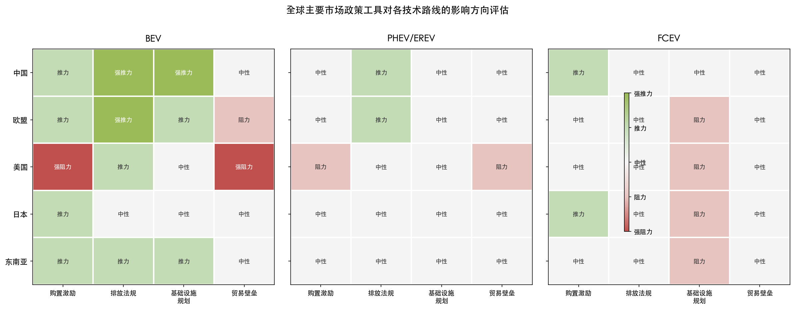

图 6-3 以矩阵热力图形式呈现了中国、欧盟、美国、日本、东南亚五大市场在购置激励、排放法规、基础设施规划、贸易壁垒四个政策维度对 BEV、PHEV/EREV、FCEV 三条路线的影响方向，便于识别各市场的政策合力方向与跨路线差异。

### 6.7.2 外部变量的交互效应

宏观经济下行、油价波动与贸易壁垒三大外部变量之间存在复杂的交互效应。IMF 2025 年 4 月将全球 GDP 增速预期从 3.3% 下调至 2.8%，美国从 2.7% 下调至 1.8%[IEA Global EV Outlook 2025](https://www.iea.org/reports/global-ev-outlook-2025/outlook-for-electric-mobility "IMF经济增速下调")。经济下行压缩消费者购买力，但对所有车型（包括燃油车）的销量均构成抑制——IEA 指出，经济放缓可能同步降低燃油车和电动车的绝对销量，但对 BEV 销售份额的影响相对有限。

油价在 2025 年 4 月一度跌破 60 美元/桶，较 2024 年均价（约 80 美元）下跌约 25%。低油价削弱了 BEV 的运行成本优势，但 IEA 分析表明即使油价低至 40 美元/桶，具备家庭充电条件的 BEV 用户在所有主要市场仍保持显著的运行成本优势[IEA Global EV Outlook 2025](https://www.iea.org/reports/global-ev-outlook-2025/outlook-for-electric-mobility "低油价对EV TCO影响")。这意味着油价波动对 BEV 临界点的修正幅度有限——除非出现持续数年的极端低油价（低于 40 美元/桶），否则不会逆转 TCO 平价的基本判断。

## 6.8 本章小结

政策环境与市场趋势对各技术路线商业化临界点的修正方向明确，幅度因市场而异。中国市场的 BEV 临界点已由技术经济学内生锁定，政策变量不构成逆转风险；PHEV/EREV 在中国的竞争窗口正因政策收紧与 BEV 体验优势而加速关闭。欧洲 BEV 临界点因禁燃令软化和关税壁垒推迟 1—2 年，但 CO₂ 法规与 ETS2 碳成本仍提供强有力的监管推力。美国是政策不确定性最大的市场，联邦激励撤退可能将 BEV 临界点推迟 2—5 年。FCEV 乘用车在所有市场和情景下均处于 2030 年后，日本案例充分证明政策激励无法替代基础设施与技术经济学约束的根本解决。

我们认为，在技术迭代加速、电池成本持续下行的大趋势下，政策角色正从"决定性力量"向"调节性因素"转变。对于已跨过商业化临界点的路线（中国 BEV/PHEV），政策的核心任务已从"激励推广"切换为"规范竞争秩序"与"保障残值生态"。对于尚未跨过临界点的路线和市场，政策仍是关键的催化剂，但其效力取决于是否与技术成熟度和基础设施就绪度形成协同——单一维度的政策推力无法独立撬动商业化临界点的到达。

# 结论与风险提示

## 核心结论

本报告基于"研发制造—使用场景—残值管理"三维评估框架，以"无补贴TCO平价＋渗透率突破S曲线起飞阈值＋残值率不低于可比燃油车基准"三重交集判据，对四条动力系统技术路线在两种驱动架构下的商业化临界点进行了系统量化分析。综合六章研究内容，形成以下五项核心结论。

**结论一：BEV路线在技术经济学层面已形成自我强化的竞争优势，中国市场率先实现不可逆转的商业化突破。** Wright's Law驱动的电池成本下降曲线是当前确定性最高的技术经济学规律——全球锂离子电池包均价已降至108美元/kWh，中国市场低至84美元/kWh，25年以上的实证数据支撑了成本持续下行的高置信度预测。在中国市场，近2/3的BEV售价已低于同级燃油车、渗透率远超20%、TCO在家充情景下即使油价低至40美元/桶仍具显著优势，三重判据均已达标。欧洲和美国BEV商业化临界点分别预计在2027–2029年和2029–2032年到达，区域差异的本质是政策环境而非技术可行性的差异。在重卡领域，中国BEV重卡TCO已低于柴油重卡，欧美市场预计2028–2030年达到TCO平价。

**结论二：EREV和PHEV是具有时效性的过渡方案，其商业化窗口由BEV成本曲线的下行斜率刚性决定。** PHEV凭借比亚迪DM 5.0的极致成本控制已在中国市场跨过临界点，EREV凭借续航焦虑缓解功能在2021–2024年实现高速增长。但两者的核心价值主张——价格优势（PHEV）和补能焦虑消除（EREV）——均正被BEV的技术进步系统性侵蚀。电池包价格若在2028–2030年降至60–70美元/kWh，EREV的BOM成本优势将从当前的30%–40%收窄至10%–15%；800V超充网络密度持续扩大（中国充电设施已超1,374.9万台）和BEV续航普遍达到600–800 km，正使"续航焦虑"这一增程路线的存在基础逐步消解。政策退坡（购置税减半、双积分门槛提升、一线城市限行）进一步加速窗口关闭。PHEV的有效竞争窗口预计在2028–2030年逐步关闭，EREV窗口预计在2028年前基本关闭。

**结论三：FCEV在所有情景下均距商业化临界点最远，其唯一的规模化生存空间在于BEV技术边界之外的极端场景。** 2025年全球FCEV销量仅16,011辆，日本20万辆FCEV国家目标的严重落空（达成率不足0.3%）充分证明，在基础设施和技术成本约束未根本解决的前提下，政策激励的边际效用极低。FCEV在中、欧、美三大市场2030年前所有场景的TCO均高于BEV，全球仅约1,160–1,369座加氢站的基础设施密度远不足以支撑乘用车市场。FCEV重卡在日行驶800 km以上的超长途干线运输中保有有条件的竞争窗口，但这一窗口正受到兆瓦级充电技术和BEV重卡续航提升的持续挤压。FCEV的规模化商业化高度依赖绿氢成本降至2美元/kg以下和加氢网络的大规模建设，两项条件在2030年前均无法确定实现。

**结论四：分布式驱动处于从技术验证向商业化跨越的临界窗口，中国轮边电机方案已率先证明规模量产可行性。** 中国市场2025年分布式电驱装机量超8万套（同比增长232.6%），比亚迪易四方平台已将轮边电机车型价格从109.8万元下探至23万元区间。全球轮毂电机路径则仍处于原型验证阶段（TRL 5–6），Elaphe、Protean/Exedy等供应商计划2026年小批量投产，大规模量产预计2028–2030年。分布式驱动释放的系统级红利——传动链取消（BOM节约约1,030美元）、WLTP工况效率提升4–9个百分点、四轮独立再生制动提升能量回收效率5%–10%——在全新平台设计中可实现整车成本降低约20%、续航提升约20%，但释放这一潜力需要OEM承诺约50亿美元级别的全新平台投资，这是当前最大的商业化瓶颈。

**结论五：产业链价值正加速向电池与电力电子器件集中，中国供应链的全球主导地位与地缘政治"脱钩"压力之间的张力将定义未来五年的产业格局。** 中国在20种战略矿物中19种冶炼加工份额约70%，LFP正极产能占全球95%以上，SiC衬底产能占全球约70%，稀土永磁体产量占全球94%。LFP于2025年首次超越NMC成为全球部署量最大的电池化学体系，进一步加深了全球对华供应链依赖。与此同时，美国IRA生产税收抵免、欧盟电池法规碳足迹阈值和Battery Booster计划、以及中国2025年10月对锂电池供应链实施的出口管制，正将供应链博弈推向"降本"与"去风险"的两难抉择。

## 风险提示

以上结论建立在当前可获取的数据、已公开的政策文件和已验证的技术经济学模型之上。以下风险因素可能导致实际商业化进程偏离本报告的基线判断：

**一、技术突变风险。** 全固态电池若在2028年前实现超预期的量产良率突破（当前宁德时代自评TRL仅4/9），可能从根本上重塑BEV的成本曲线和能量密度天花板，使半固态电池作为过渡技术的生命周期大幅缩短。反之，若固态电池产业化持续延迟，当前液态锂电池的成本优化空间可能接近物理极限（BOM中非电池成本的压缩空间有限），BEV成本下降速度可能低于Wright's Law外推的预期。

**二、关键矿物供应冲击。** 稀土永磁体（中国占94%）和LFP正极材料（中国占95%以上）的极端供应集中度构成系统性风险。2025年中国两轮稀土出口管制已导致欧洲市场稀土价格一度攀升至中国国内价格的6倍。若地缘政治冲突升级引发更大范围的供应中断，电机和电池成本可能出现阶段性逆转，影响BEV成本下降曲线的连续性。

**三、政策方向逆转。** 美国加州ACC-II排放豁免的存废是影响全球第二大汽车市场BEV临界点的最大单一政策变量——若豁免被撤销，美国约30%的轻型车市场将失去电动化的刚性约束，BEV临界点可能推迟至2031–2034年。欧盟2035禁燃令已从100%调整至90%，若进一步软化，欧洲BEV渗透率的增长斜率将显著放缓。

**四、宏观经济与能源价格波动。** IMF已将2025年全球GDP增速预期从3.3%下调至2.8%。经济下行压缩消费者购买力，尤其对购买溢价仍然显著的欧美BEV市场影响较大。油价若长期维持在40美元/桶以下，将削弱BEV在公共充电场景下的运行成本优势，但对家充场景的影响有限。

**五、残值体系成熟度滞后。** 电池SOH评估全球仍未形成统一标准（SAE J3257仍在制定中），BEV五年平均贬值率在美国市场高达58.8%，显著高于行业均值45.6%。欧盟数字电池护照制度（2027年起实施）和中国固态电池国家标准（2026年7月发布）有望改善这一局面，但在过渡期内，残值不确定性仍将是BEV全生命周期经济性的主要短板，亦是三重判据中最后达标的一项。

**六、分布式驱动产业化进程存在非线性不确定性。** 轮毂电机供应链处于万套级阶段，与集中式e-Axle百万套级供应链之间存在约两个数量级的规模差距。供应商宣称的成本平价均以大批量生产为前提，若OEM平台投资决策持续推迟，分布式驱动可能长期停留在高端利基市场，无法向主流市场扩散。此外，轮毂电机的极端环境耐久性验证尚缺乏独立第三方系统性报告，这一验证缺口是主流OEM导入决策的重要障碍。

## 局限性说明

本报告的分析框架和结论受以下方法论局限性约束：

**一、数据时效性约束。** 本报告的数据采集窗口截至2026年3月。新能源汽车产业技术迭代速度快、政策调整频繁，部分数据点（尤其是成本预测和渗透率预测）可能在报告发布后短期内发生实质性变化。

**二、学习曲线外推的固有不确定性。** 本报告大量依赖Wright's Law和S曲线理论进行成本和渗透率预测。Ziegler & Trancik（2021）的实证研究表明，锂离子电池学习率估计值在14%–30%之间宽幅波动，取决于所选时间区间和度量方式。本报告借鉴Way et al.（2022）的概率性预测范式，但受限于公开数据的可得性，未能对所有成本预测均附带完整的概率分布和置信区间。

**三、权重设定的主观性。** 三维评估框架的建议基准权重（研发制造35%、使用场景40%、残值管理25%）基于行业专家判断而非大样本统计校验。虽然已建议通过敏感性分析验证结论稳健性，但本报告未完成全部参数扫描，部分路线的临界点判定在权重极端取值下可能发生偏移。

**四、FCEV数据样本量不足。** FCEV全球累计保有量不足10万辆，二手交易数据近乎空白，残值管理维度的分析主要依赖定性推断而非实证数据。FCEV的TCO分析对绿氢价格假设高度敏感，而全球各地绿氢价格差异巨大，单一价格假设难以充分反映区域异质性。

**五、分布式驱动成本数据的可得性限制。** 轮毂电机供应商尚未公开详细BOM拆解数据，本报告对分布式驱动的系统成本对比主要基于供应商公开声明和DOE路线图数据的推算，实际量产成本可能与估算存在偏差。
