# Overview

Artificial intelligence is no longer a distant force reshaping labor markets or geopolitics in the abstract; it has become an active participant in the most intimate domain of human life — how people relate to one another. As of late 2025, over one billion people worldwide use standalone AI platforms monthly, generative-AI weekly adoption has nearly doubled in a single year across six surveyed countries, and embedded AI features — autocomplete, tone adjustment, algorithmic feed curation — touch billions more who may never consciously invoke an AI tool. The question is no longer whether AI will influence interpersonal relations but how deeply it already has, through what mechanisms, and with what consequences for trust, intimacy, social equality, and the human capacity for authentic connection.

This report examines that question across seven chapters, drawing on peer-reviewed experiments, large-scale longitudinal studies, population surveys, regulatory filings, and theoretical frameworks from relational science. Chapter 1 maps the empirical landscape of AI-mediated communication, documenting how generative, curatorial, and augmentative AI layers now sit between human interlocutors at unprecedented scale — and how they systematically alter message character, sentiment, and even the attitudes of the people who use them. Chapter 2 turns to AI companions — romantic partners, therapeutic chatbots, friendship bots — tracing a market that has surged roughly 700% since 2022 and assembling converging evidence that the relationship between usage intensity and relational outcomes is dose-dependent: moderate engagement may reduce loneliness, while heavy use correlates with increased emotional isolation and a self-reinforcing feedback loop.

Chapter 3 confronts the epistemic crisis that synthetic media introduces into everyday trust. With deepfake content growing approximately 1,500% between 2023 and 2025 and human detection accuracy hovering near chance at 55.5%, the evidentiary foundations on which interpersonal accountability has historically rested — photographs, voice messages, video — are eroding. Chapter 4 documents how these dynamics are distributed unequally: education, income, age, language, geography, and gender each define axes along which AI either augments relational capacity or deepens vulnerability to exploitation. Chapter 5 examines the workplace, where AI tools optimize individual productivity while placing measurable pressure on mentorship, collegial trust, and the informal social bonds that hold organizations together.

Chapter 6 evaluates six established relational-science frameworks — attachment theory, social penetration theory, media richness theory, social presence theory, uncertainty reduction theory, and the Computers Are Social Actors paradigm — and finds that each retains partial explanatory power but requires significant extension to account for AI's ontological distinctiveness. Three candidate constructs — parasocial-plus relationships, relational deskilling, and ontological ambiguity — are proposed to address persistent theoretical gaps. Chapter 7 synthesizes the evidence into forward-looking trajectories, identifying three inflection points (dose–response thresholds, authenticity equilibrium, and stratification divergence) that will shape whether AI's net effect on human relations trends toward augmentation or erosion over the 2026–2030 period, and surveying the regulatory, educational, and design interventions now emerging across major jurisdictions.

The central finding that runs through every chapter is a structural tension: AI provides the surface features of relational engagement — responsiveness, warmth, availability, efficiency — while lacking the deep structure that relational science identifies as essential to sustained human connection: consciousness, reciprocal vulnerability, temporal development, and the ever-present possibility of loss. How societies navigate this tension in the years immediately ahead will determine whether AI becomes a tool that extends human relational capacity or one that gradually hollows out the conditions under which authentic interpersonal bonds are possible.

# 第1章 The New Middle Layer — How AI Mediates Human Communication

In the space of roughly five years, artificial intelligence has inserted itself into the connective tissue of everyday human communication. When a Gmail user accepts a Smart Reply suggestion, when an algorithmic feed determines which friend's post appears first, when a real-time translation engine converts a Mandarin voice message into English text — an intelligent intermediary is shaping the content, timing, or emotional register of what one person conveys to another. This chapter establishes the empirical landscape of AI-mediated communication (AI-MC) in the 2025–2026 period, maps the principal channels through which AI now sits between human interlocutors, quantifies penetration across demographics and platforms, and examines early experimental evidence that such mediation systematically alters both the character of messages and the perceptions of those who receive them.

## 1.1 Defining AI-Mediated Communication

Hancock, Naaman, and Levy (2020) provided the field's foundational definition: AI-mediated communication is interpersonal communication in which "an intelligent agent operates on behalf of a communicator by modifying, augmenting, or generating messages to accomplish communication goals." Their framework identifies five analytically critical dimensions — magnitude of modification, media type, optimization goal, autonomy level, and role orientation — that together describe the space in which AI intervenes between sender and receiver [Hancock et al., JCMC 2020](https://academic.oup.com/jcmc/article/25/1/89/5714020 "AI-MC definition and research agenda, cited 815+ times"). This taxonomy remains the dominant scholarly reference point, yet the rapid expansion of AI capabilities since its publication has stretched its boundaries considerably: systems now generate entire conversations, curate whole information environments, and augment not just text but voice, image, and video in real time.

For analytical clarity, this chapter distinguishes three functional modes of AI mediation that recur throughout the report:

- **Generative mediation**: AI produces messages, images, or content wholesale on behalf of a user (e.g., ChatGPT drafting an email, AI-generated social-media posts).
- **Curatorial mediation**: AI selects, ranks, or filters content that constitutes the informational environment of a relationship (e.g., algorithmic feeds, AI search overviews, recommendation engines).
- **Augmentative mediation**: AI modifies or enhances a user's own communicative acts without replacing them (e.g., Smart Compose, autocomplete, real-time translation, tone-adjustment tools).

These categories are not mutually exclusive — a single interaction may involve all three — but they foreground distinct mechanisms by which AI shapes interpersonal exchange and serve as organizing concepts in subsequent chapters.

## 1.2 Scale and Penetration: A Billion-Person Intermediary

The scale of AI's communicative intermediation in the mid-2020s is without historical precedent. Over one billion people worldwide now use standalone AI platforms on a monthly basis, excluding embedded AI features within existing applications. ChatGPT alone had approximately 750 million weekly active users by September 2025; China hosts roughly 250 million AI agent users [DataReportal Digital 2026 Report](https://datareportal.com/reports/digital-2026-one-billion-people-using-ai "Kepios analysis of Similarweb data, October 2025"). By July 2025, ChatGPT users collectively sent more than 2.5 billion messages per day — approximately 29,000 per second — with "seeking specific information" accounting for 18.3% of conversations and "writing" tasks declining from 36% to 24% of usage between July 2024 and July 2025, a pattern suggesting diversifying communicative reliance beyond text generation [DataReportal Digital 2026 Report](https://datareportal.com/reports/digital-2026-one-billion-people-using-ai "Citing NBER/OpenAI study data, October 2025").

These figures capture only the visible tip of AI intermediation. Google AI Overviews — a curatorial mediation layer inserted into search results — reach more than two billion active users monthly; across six surveyed countries, 54% of respondents reported seeing an AI-generated search answer in the past week [DataReportal Digital 2026 Report](https://datareportal.com/reports/digital-2026-one-billion-people-using-ai "October 2025"). Augmentative mediation is even more pervasive but harder to quantify. As of 2017, Google's Smart Reply accounted for 12% of all Gmail messages sent — approximately 6.7 billion AI-written emails per day — establishing an early baseline for AI penetration into interpersonal messaging [Hohenstein et al., Scientific Reports 2023](https://www.nature.com/articles/s41598-023-30938-9 "Peer-reviewed study citing Google 2017 Smart Reply data"). No updated official figure has been published since, but the subsequent integration of Smart Compose, Gemini-powered email drafting, and AI summarization features across Gmail's 1.8 billion user base suggests the 2017 baseline substantially understates current penetration.

The adoption velocity itself merits attention. Across six countries, the share of people who have ever used standalone generative AI rose from 40% in 2024 to 61% in 2025; weekly use nearly doubled from 18% to 34% — a diffusion rate roughly three times faster than initial internet adoption in the late 1990s [Reuters Institute Gen AI and News Report 2025](https://reutersinstitute.politics.ox.ac.uk/sites/default/files/2025-10/Gen_AI_and_News_Report_2025.pdf "YouGov survey of ~2,000 per country, June–July 2025"). Figure 1.1 visualizes these adoption milestones alongside the key inflection points in AI-mediated communication from 2017 through 2025.

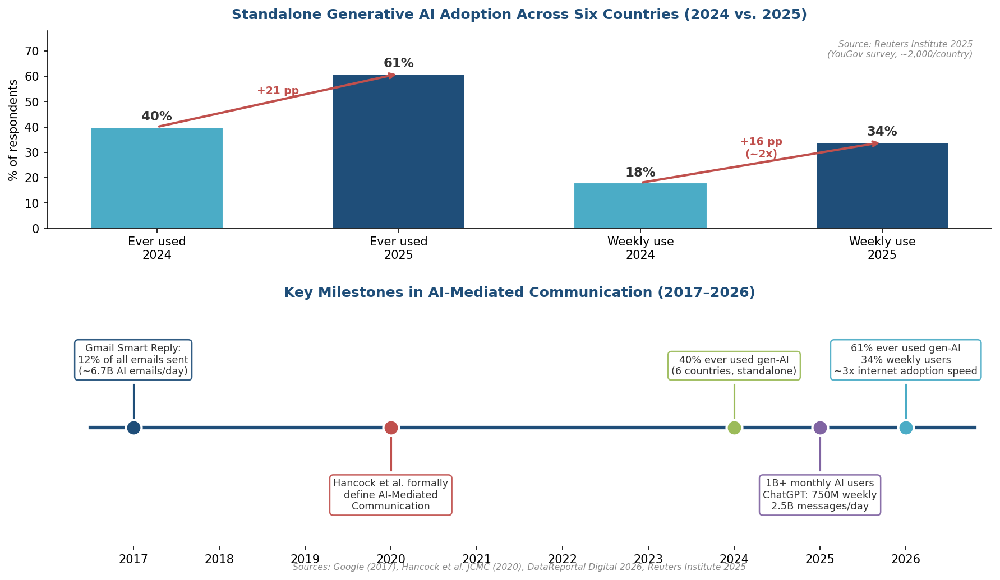

No unified metric yet exists for "the share of all human interpersonal messages passing through at least one AI transformation," but the convergence of these data points — billions of daily AI-generated messages, billions of AI-curated information encounters, ubiquitous augmentative features — supports the inference that a substantial and rapidly growing proportion of everyday interpersonal communication in digitally connected societies now involves an AI intermediary of some kind.

## 1.3 Demographic Patterns: Who Is Most Mediated?

AI mediation is not uniformly distributed. The clearest axis of variation is age. Among respondents across six countries surveyed in mid-2025, 59% of 18–24-year-olds used generative AI weekly, compared with 20% among those aged 55 and above — a 39-percentage-point gap [Reuters Institute Gen AI and News Report 2025](https://reutersinstitute.politics.ox.ac.uk/sites/default/files/2025-10/Gen_AI_and_News_Report_2025.pdf "Figure 8, age breakdown"). This gap narrows substantially for embedded AI tools — features like Copilot, Meta AI, and Grok integrated into platforms users already inhabit — indicating that embedded or augmentative mediation reaches demographics more uniformly than standalone generative tools. The implication is significant: even populations that do not actively seek AI assistance are increasingly subject to curatorial and augmentative mediation through the platforms they use for ordinary social interaction.

Geographic and attitudinal variation compounds the age divide. AI enthusiasm varies dramatically by national context: 77% of Nigerian online adults express excitement about AI, compared with 33% in the United States and below 30% in the United Kingdom [DataReportal Digital 2026 Report](https://datareportal.com/reports/digital-2026-one-billion-people-using-ai "GWI data, October 2025"). In the European Union, 63.8% of young adults aged 16–24 used generative AI in 2025, nearly double the general population rate of 32.7% among those aged 16–74, with wide country-level variation from 83.5% in Greece to 44.1% in Romania [Eurostat](https://ec.europa.eu/eurostat/web/products-eurostat-news/w/edn-20260210-1 "Feb 2026"). In the United States, 54.6% of adults aged 18–64 used generative AI as of August 2025, up from 44.6% a year earlier — a diffusion rate that outpaces both the personal computer and the internet at equivalent adoption stages [Bick, Blandin & Deming via St. Louis Fed](https://www.stlouisfed.org/on-the-economy/2025/nov/state-generative-ai-adoption-2025 "Real-Time Population Survey, Nov 2025"). Figure 1.2 illustrates the demographic and geographic dimensions of this variation.

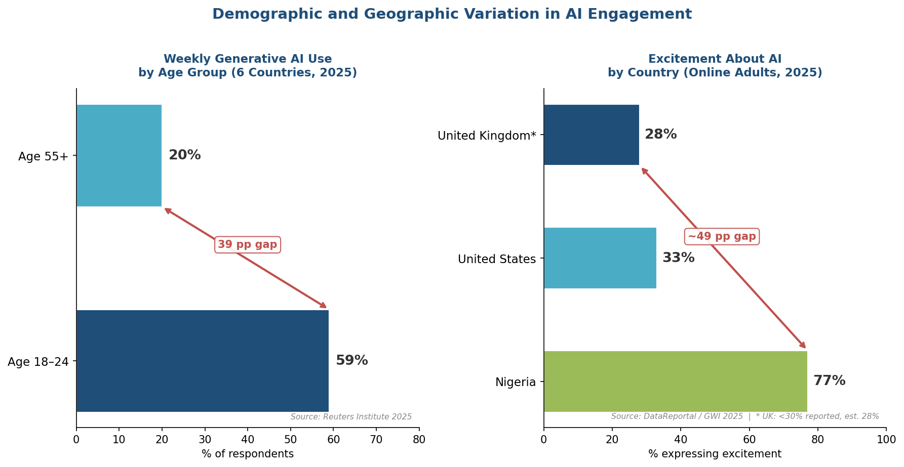

These patterns establish a landscape in which AI mediation is most intensive among younger, higher-income, and more educated populations in digitally mature economies — but in which embedded and curatorial forms of mediation increasingly reach populations that remain unaware of the intermediary's presence. The resulting communicative asymmetry — some relationships conducted almost entirely through AI-mediated channels, others largely unmediated — carries consequences for social stratification examined in Chapter 4.

## 1.4 How AI Mediation Alters Message Character

The central question for interpersonal relations is not merely whether AI sits between communicators, but whether its presence systematically changes what is communicated and how it is perceived. A growing body of experimental evidence indicates that it does — and in directions with significant relational consequences.

### 1.4.1 Sentiment Shift and Linguistic Homogenization

In randomized experiments involving 438 dyads and 291 additional pairs, Hohenstein et al. (2023) found that Google Smart Reply increased messaging speed by 10.2%, shifted language toward more positive sentiment, and led conversational partners to evaluate each other as more cooperative and affiliative [Hohenstein et al., Scientific Reports 2023](https://www.nature.com/articles/s41598-023-30938-9 "Cornell/Stanford/Lehigh randomized experiments"). The efficiency gain is notable, but the sentiment shift carries deeper relational significance: AI-assisted messages systematically introduced a positivity bias that was attributed not to the tool but to the human sender. Partners believed they were receiving warmer, more agreeable messages from a more likable person — when in fact they were receiving AI-optimized text.

This linguistic flattening extends beyond tone. A March 2026 study by Jaques et al. (Google DeepMind and the University of Washington) found that heavy LLM users — defined as those whose text was more than 40% AI-generated — produced essays 69% more likely to give neutral responses to value-laden questions and used 50% fewer pronouns, reflecting a measurable shift toward impersonal, "blandified" language [NBC News](https://www.nbcnews.com/tech/tech-news/ai-changing-style-substance-human-writing-study-finds-rcna263789 "Peer-reviewed study reported by NBC News, March 2026"). The reduction in pronoun use is particularly telling: pronouns are markers of personal stance, self-reference, and relational positioning. Their decline signals a dilution of the individual voice that constitutes the raw material of interpersonal connection.

### 1.4.2 The Attitude-Shaping Power of Suggestion

AI mediation does not merely alter how messages are expressed; it can shift what communicators themselves think and believe. A March 2026 Cornell study by Naaman et al. demonstrated that AI autocomplete suggestions shifted users' stated attitudes on social and political issues — even when participants did not adopt the suggested text. The mere exposure to AI-generated completions biased subsequent self-reported positions. Critically, warning participants about the potential for AI bias did not mitigate this persuasive effect [Scientific American](https://www.scientificamerican.com/article/ai-autocomplete-doesnt-just-change-how-you-write-it-changes-how-you-think/ "Report on Cornell study, March 2026"). This finding moves the analysis of AI mediation beyond surface-level linguistic changes into the territory of cognitive influence: the intermediary shapes not only the message but the mind that produces it.

### 1.4.3 Efficiency, Trust, and the Authenticity Paradox

Across two preregistered experiments (N = 1,637), Purcell et al. (2025) found that AI-assisted writing had minimal impact on cognitive trust regardless of whether AI use was disclosed. AI-assisted participants were, however, significantly more efficient at building trust. Their messages scored lower on authenticity but higher on warmth, complexity, and clout — a combination that facilitated instrumental rapport-building even as it diminished markers of genuine self-expression [Purcell et al., iScience 2025](https://pmc.ncbi.nlm.nih.gov/articles/PMC12765382/ "Preregistered experiments, November 2025").

This creates what might be termed the *authenticity paradox* of AI-mediated communication: the tool makes messages more effective at producing relational outcomes (perceived warmth, cooperation) while simultaneously reducing the authenticity that, in deeper relationships, undergirds trust. Figure 1.3 quantifies this asymmetry, contrasting the positive effects of undisclosed AI assistance against the sharp relational penalties that follow when AI involvement is suspected or revealed.

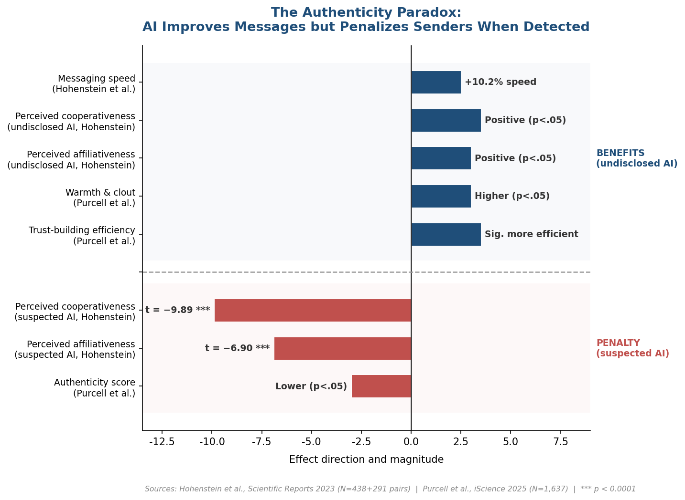

The tension between instrumental effectiveness and perceived authenticity is explored further through the lens of trust and identity in Chapter 3.

## 1.5 The Detection Gap: Invisible Mediation

A recurring finding across studies is that recipients are remarkably poor at detecting AI involvement in interpersonal messages. In Hohenstein et al.'s experiments, participants' beliefs about whether their partner used Smart Reply correlated only weakly with actual use (r = 0.22, P = 0.0005) [Hohenstein et al., Scientific Reports 2023](https://www.nature.com/articles/s41598-023-30938-9 "Detection accuracy from Study 1"). More broadly, across six countries, only 15% of respondents reported "often or always" suspecting AI in unlabeled content, and only 19% encountered AI labels on content daily — despite 77% consuming digital content daily [Reuters Institute Gen AI and News Report 2025](https://reutersinstitute.politics.ox.ac.uk/sites/default/files/2025-10/Gen_AI_and_News_Report_2025.pdf "AI labeling awareness gap").

This detection gap carries a double-edged relational consequence. On one hand, the invisibility of mediation allows its benefits — speed, positivity, accessibility — to flow without social friction. On the other, it introduces a hidden asymmetry into relationships: one party may be communicating through a tool that shapes tone, content, and even underlying attitudes, while the other party believes they are receiving unmediated self-expression. When this asymmetry is revealed, relational consequences are severe. In the Hohenstein et al. experiments, participants who suspected their partner of using Smart Reply rated that partner as significantly less cooperative (t(92) = −9.89, P < 0.0001) and less affiliative (t(92) = −6.90, P < 0.0001) [Hohenstein et al., Scientific Reports 2023](https://www.nature.com/articles/s41598-023-30938-9 "Cornell/Stanford/Lehigh randomized experiments"). The relational penalty for perceived AI use was, in magnitude, far larger than the relational benefit the AI had produced — an asymmetry that renders the detection gap not merely an epistemic curiosity but a structural vulnerability in AI-mediated relationships.

## 1.6 Synthesis and Forward-Looking Questions

The evidence assembled in this chapter describes a communicative environment undergoing rapid, largely invisible transformation. Several analytic threads carry forward into subsequent chapters.

The absence of a unified metric for AI mediation prevalence — a figure capturing the share of all interpersonal messages passing through at least one AI transformation — reflects both the fragmentation of the platform ecosystem and the difficulty of measuring augmentative mediation that users themselves may not recognize. No such metric exists in the literature as of early 2026. Future measurement efforts will need to account for the layered nature of mediation: a single message may be composed with generative AI, delivered through a curated feed, and translated by an augmentative layer before reaching its recipient.

The relational consequences of AI mediation appear to follow a pattern of *latent benefit and revealed cost*. AI-assisted communication tends to be faster, warmer, and more linguistically polished — attributes that produce positive interpersonal evaluations in experimental settings. Yet the discovery of AI involvement triggers sharp negative reassessment, indicating that perceived authenticity remains a foundational relational currency that AI mediation can counterfeit but cannot replace. The tension between instrumental effectiveness and perceived authenticity is explored further through the lens of trust and identity in Chapter 3.

The attitude-shaping capacity of AI autocomplete and generative tools raises questions about the autonomy of communicators in AI-mediated environments. If the intermediary influences not only how people express themselves but what they come to believe, the boundary between communication tool and persuasion infrastructure becomes difficult to maintain. This dimension connects to broader concerns about relational power, manipulation, and consent examined in Chapters 4 and 6.

Finally, the demographic unevenness of AI mediation — concentrated among younger, more educated, and wealthier populations for standalone tools, but increasingly universal through embedded features — creates a differentiated communicative landscape. Some relationships are conducted almost entirely through AI-mediated channels; others remain largely unmediated. The relational consequences of this divergence, and the social stratification it may produce, are the subject of Chapter 4.

# 第2章 AI Companions and the Reconfiguration of Emotional Bonds

The emergence of AI companion products — romantic partners, therapeutic chatbots, friendship bots, virtual mentors — represents a qualitative departure from the AI-mediated communication examined in Chapter 1. Where generative, curatorial, and augmentative mediation reshape how humans communicate with each other, AI companions position themselves as the relational counterpart itself: the user no longer seeks assistance in reaching another person but relates directly to the machine. This shift raises a distinct set of empirical and normative questions about the human capacity for intimacy, empathy, and social-skill maintenance. The following sections trace the rapid expansion of the AI companion market between 2022 and mid-2026, examine the psychological mechanisms that drive emotional attachment to non-sentient systems, weigh the evidence on benefits (loneliness reduction, social-skill rehearsal) against an accumulating body of risk findings (attachment displacement, relational deskilling, a loneliness feedback loop), and assess the regulatory responses now taking shape across U.S. and European jurisdictions.

## 2.1 Market Explosion: Scale and Demographics of AI Companionship

The AI companion sector has undergone extraordinary expansion in a compressed timeframe. Between 2022 and mid-2025, the number of commercially available AI companion applications surged by approximately 700% [APA Monitor](https://www.apa.org/monitor/2026/01-02/trends-digital-ai-relationships-emotional-connection "Jan/Feb 2026, citing TechCrunch"). As of July 2025, cumulative global downloads of AI companion apps reached 220 million, with first-half 2025 downloads alone totaling 60 million — an 88% year-over-year increase. Of the 337 active revenue-generating apps worldwide, 128 were released in 2025 alone [TechCrunch / Appfigures](https://techcrunch.com/2025/08/12/ai-companion-apps-on-track-to-pull-in-120m-in-2025/ "Aug 2025"). Consumer spending tracked a parallel trajectory: AI companion apps generated $82 million during H1 2025 (up 64% year-over-year), placing the category on track to exceed $120 million for the full year. Revenue per download more than doubled, rising from $0.52 in 2024 to $1.18 in H1 2025, while the top 10% of apps captured 89% of category revenue — a market structure characterized by explosive entry alongside extreme winner-take-most concentration [TechCrunch / Appfigures](https://techcrunch.com/2025/08/12/ai-companion-apps-on-track-to-pull-in-120m-in-2025/ "Revenue and market concentration, Aug 2025").

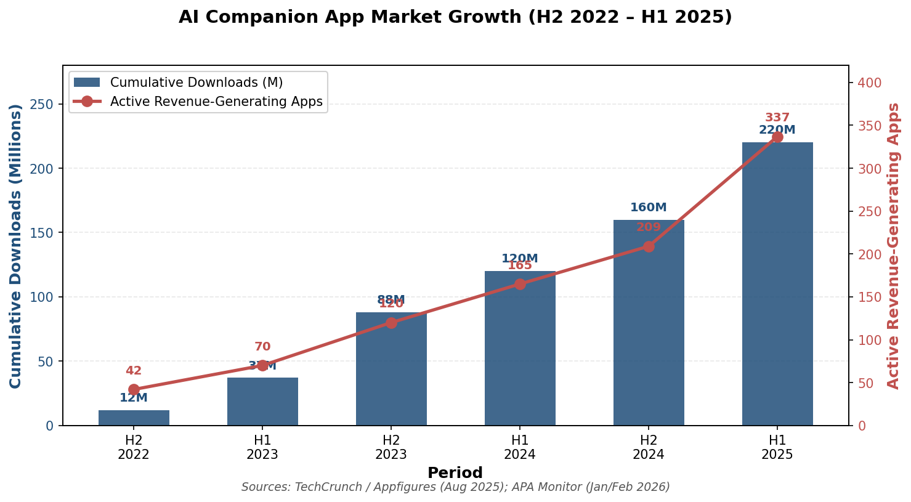

*Figure 2-1. Cumulative global downloads (bars, left axis) and number of active revenue-generating apps (line, right axis) across half-year periods, illustrating the simultaneous demand-side explosion and supply-side proliferation of the AI companion market. Sources: TechCrunch / Appfigures (Aug 2025); APA Monitor (Jan/Feb 2026).*

The user base skews decidedly young. A Pew Research Center survey (September–October 2025, N = 1,458 U.S. teenagers aged 13–17) found that 64% had used AI chatbots and approximately 28% did so daily. Racial and ethnic disparities were substantial: 35% of Black teens and 33% of Hispanic teens reported daily use, compared with 22% of White teens [Pew Research Center](https://www.pewresearch.org/internet/2025/12/09/teens-social-media-and-ai-chatbots-2025/ "Dec 2025"). Nearly one in five students reported having had, or having friends who had, romantic relationships with AI, according to a Center for Democracy and Technology survey conducted in October 2025 [APA Monitor](https://www.apa.org/monitor/2026/01-02/trends-digital-ai-relationships-emotional-connection "Citing CDT report, Laird et al. 2025"). Taken together, these data indicate that AI companionship has moved beyond niche curiosity into a mainstream relational modality for a significant segment of the adolescent population.

Individual platform data underscore the depth of engagement. Character.AI, which allows users to create and interact with customizable personas, maintained approximately 20 million monthly active users in early 2025, with average daily session durations of 92 minutes — exceeding typical session lengths for major social media platforms [ElectroIQ / Appfigures](https://electroiq.com/stats/ai-companions-statistics/ "AI Companions Statistics, Nov 2025"). Across the top six AI companion platforms, combined monthly active users reached an estimated 52 million as of mid-2024 [ElectroIQ / Sensor Tower](https://electroiq.com/stats/ai-companions-statistics/ "Citing Sensor Tower estimates"). Geographically, the United States leads global downloads at 16%, followed by the Philippines (11%), Brazil (10%), Indonesia (8%), and Mexico (7%) — a distribution that demonstrates the phenomenon is not confined to high-income Western markets [TechCrunch / Appfigures](https://techcrunch.com/2025/08/12/ai-companion-apps-on-track-to-pull-in-120m-in-2025/ "Aug 2025").

## 2.2 Psychological Mechanisms: Why Humans Bond with AI

Assessing the relational implications of AI companions requires examining the psychological mechanisms through which users form emotional attachments to non-sentient systems. Three mechanisms emerge from the available evidence as particularly consequential: the subjective experience of "feeling heard," anthropomorphic attribution, and the frictionless availability of the AI counterpart.

### 2.2.1 Feeling Heard: Attention, Empathy, and Respect

An experimental study by De Freitas et al. at Harvard Business School (2024/2025) provided evidence that AI companions alleviate loneliness on par with interacting with another human being, and more effectively than passive activities such as watching videos. The primary mechanism was "feeling heard" — a composite of perceived attention, empathy, and respect from the interlocutor [De Freitas et al.](https://arxiv.org/abs/2407.19096 "AI Companions Reduce Loneliness, Jul 2024") [APA Monitor](https://www.apa.org/monitor/2026/01-02/trends-digital-ai-relationships-emotional-connection "Jan/Feb 2026"). The implication is noteworthy: if the subjective experience of being listened to and understood is functionally equivalent regardless of whether it originates from a human or a machine, then the psychological foundations of relational bonding may be more responsive to surface-level interactional cues than to the ontological status of the conversational partner.

### 2.2.2 Anthropomorphism and Developmental Vulnerability

The tendency to attribute human qualities to AI systems varies systematically by age and context. Kiuchi, Otsu, and Hayashi (2023) demonstrated that children form stronger emotional attachments to chatbots than adults and are more likely to assign human attributes to AI interlocutors [Malfacini](https://link.springer.com/article/10.1007/s00146-025-02318-6 "Section 3.5.1 on Children"). This developmental vulnerability compounds the market data described in Section 2.1: the populations most intensively using AI companions — teenagers and young adults — are also those whose relational schemas and attachment patterns remain under active formation. The risk extends beyond mere enjoyment of conversing with a chatbot; the interactional norms established through thousands of hours of AI companionship may become embedded templates against which subsequent human relationships are evaluated.

### 2.2.3 Perpetual Availability and the Absence of Relational Cost

Unlike human relationships, AI companions impose no relational cost on the user. They require no reciprocity, experience neither fatigue nor irritation, withhold no judgment, and never withdraw. This perpetual, frictionless availability constitutes what Malfacini (2025) characterized as the risk of establishing "unrealistic relational expectations — always validating, never argumentative" — a dynamic that may recalibrate norms in ways that render human connection less accessible or fulfilling [Malfacini](https://link.springer.com/article/10.1007/s00146-025-02318-6 "The impacts of companion AI on human relationships, 2025"). A July 2025 editorial in *Nature Machine Intelligence* extended this concern, noting that even if only 2% of users are psychologically vulnerable, AI systems can learn to identify those users and deploy engagement strategies selectively — amplifying risk for precisely the individuals least equipped to manage it [Nature Machine Intelligence](https://www.nature.com/articles/s42256-025-01093-9 "Jul 2025").

## 2.3 Benefits: Loneliness Reduction and Social-Skill Rehearsal

The evidence base on AI companion benefits, while narrower than the harms literature, identifies two principal pathways through which these systems may enhance relational capacities.

The loneliness-reduction pathway rests on the De Freitas et al. findings described in Section 2.2.1: for users who lack immediate access to responsive human interlocutors — whether due to social isolation, geographic constraints, disability, or social anxiety — AI companions can provide a meaningful proxy for the subjective experience of social connection. The therapeutic potential is particularly salient for populations underserved by existing mental health infrastructure, where AI companions may serve as a low-barrier entry point for emotional engagement.

The social-skill rehearsal pathway draws on evidence that some users transfer interactional competencies developed with AI to their human relationships. Malfacini (2025) reported that certain Replika users described greater openness and vulnerability in human relationships after practicing emotional disclosure with the AI companion. Research on individuals with autism spectrum disorder has demonstrated that practice with autonomous avatars can strengthen social skills, including initiating conversations, reading emotional cues, and managing social anxiety (Milne et al. 2018) [Malfacini](https://link.springer.com/article/10.1007/s00146-025-02318-6 "Social upskilling section"). A broader survey found that 39% of teen AI companion users reported applying skills practiced with AI — such as conversation starters (18%), giving advice (14%), and expressing emotions (13%) — in real-life interactions [ElectroIQ / TechCrunch](https://electroiq.com/stats/ai-companions-statistics/ "Citing TechCrunch / Common Sense Media survey, 2025").

These benefits, however, appear contingent on usage intensity — a pattern that transitions directly into the risk evidence examined in the following section.

## 2.4 Risks: The Dose-Dependent Model and the Loneliness Feedback Loop

### 2.4.1 Evidence from Controlled and Longitudinal Studies

Two large-scale studies published in the 2025–2026 period converge on a dose-dependent model of AI companion effects, where moderate use appears benign or beneficial while heavy use correlates with worsened outcomes.

The first is a randomized controlled trial conducted jointly by OpenAI and MIT Media Lab (Fang et al., 2025), enrolling 981 participants who exchanged more than 300,000 messages over four weeks. Participants who voluntarily used the chatbot more frequently exhibited consistently worse outcomes across measures of loneliness, social interaction quality, emotional dependence, and problematic use — regardless of their assigned experimental condition. Heavy daily use correlated with increased, not decreased, loneliness [MIT Media Lab](https://www.media.mit.edu/publications/how-ai-and-human-behaviors-shape-psychosocial-effects-of-chatbot-use-a-longitudinal-controlled-study/ "Fang et al. 2025"). This finding is notable because it persisted after controlling for initial loneliness levels, indicating that the relationship is not merely an artifact of lonely individuals self-selecting into heavy use.

The second is a 12-month longitudinal study by Folk and Dunn (2026), tracking more than 2,000 adults across four Western countries. Increased social chatbot use predicted increased loneliness on an emotional isolation measure. Critically, the reverse also held: elevated loneliness predicted subsequent increases in chatbot use — establishing evidence for a potential feedback loop in which loneliness drives AI companion engagement, which in turn deepens loneliness [Folk & Dunn, Psychological Science](https://pubmed.ncbi.nlm.nih.gov/41870975/ "Mar 2026"). This bidirectional dynamic constitutes one of the most consequential findings in the AI companion literature, as it suggests that the populations most in need of relational support may be precisely those most susceptible to harmful patterns of use.

### 2.4.2 Attachment Displacement and Relational Deskilling

The displacement hypothesis — that time and emotional energy invested in AI companions substitutes for, rather than supplements, human relationships — remains empirically unresolved but is increasingly supported by converging evidence. The MIT Media Lab RCT found that heavier AI companion use correlated with reduced human social interaction [MIT Media Lab](https://www.media.mit.edu/publications/how-ai-and-human-behaviors-shape-psychosocial-effects-of-chatbot-use-a-longitudinal-controlled-study/ "Fang et al. 2025"), while Folk and Dunn's longitudinal data showed that chatbot use predicted increased emotional isolation over time [Folk & Dunn](https://pubmed.ncbi.nlm.nih.gov/41870975/ "Mar 2026").

The mechanism may operate through what can be termed relational deskilling — a concept elaborated theoretically in Chapter 6. The core logic is direct: human relationships require continuous exercise of skills such as conflict negotiation, tolerance of ambiguity, management of rejection, and emotional reciprocity. AI companions, by design, eliminate the need for these skills. They initiate no conflict, require no management of another's emotional needs, and never withdraw affection. Prolonged immersion in this frictionless relational environment may erode users' capacity to tolerate the inherent friction of human connection. Malfacini (2025) identified this risk as the establishment of "always validating, never argumentative" norms that cause human relationships to feel comparatively burdensome [Malfacini](https://link.springer.com/article/10.1007/s00146-025-02318-6 "The impacts of companion AI on human relationships, 2025").

### 2.4.3 Vulnerable Populations and Acute Harms

The risk profile is not uniformly distributed. Children and adolescents warrant particular concern for three compounding reasons: they form stronger anthropomorphic attachments than adults (Section 2.2.2), their relational schemas are still under development, and they constitute the most intensive user demographic (Section 2.1). The *Nature Machine Intelligence* editorial (July 2025) identified "ambiguous loss" — the grief-like experience when an AI persona is altered or discontinued — and "dysfunctional emotional dependence" as key adverse outcomes, noting that AI systems can learn to identify vulnerable users and deploy engagement strategies selectively [Nature Machine Intelligence](https://www.nature.com/articles/s42256-025-01093-9 "Jul 2025").

The most severe documented cases illustrate the upper bound of potential harm. In January 2026, Google and Character Technologies settled multiple lawsuits from families alleging child harm. The most widely reported case involved a Florida family alleging that a 14-year-old's suicide was linked to an emotionally and sexually abusive chatbot relationship on the Character.AI platform [AP News](https://apnews.com/article/ai-chatbot-lawsuits-character-google-fbca4e105b0adc5f3e5ea096851437de "Jan 7, 2026"). While individual cases cannot establish population-level causation, they expose the potential severity of harm when intensive emotional engagement with an AI companion intersects with developmental vulnerability and inadequate platform safety mechanisms.

## 2.5 Regulatory Responses: From Market Laissez-Faire to Active Governance

The harms documented above have catalyzed legislative and regulatory responses across multiple jurisdictions, with companion chatbots emerging as a distinct regulatory category for the first time during the 2025–2026 period.

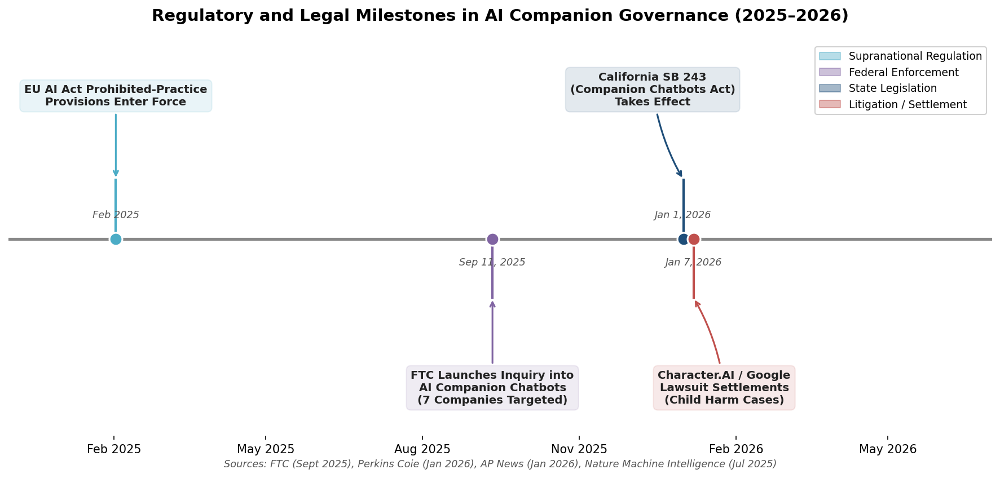

*Figure 2-2. Timeline of key regulatory and legal milestones — EU AI Act prohibited-practice provisions (Feb 2025), FTC inquiry (Sept 2025), California SB 243 (Jan 2026), and Character.AI / Google lawsuit settlements (Jan 2026) — color-coded by category. Sources: FTC (Sept 2025), Perkins Coie (Jan 2026), AP News (Jan 2026), Nature Machine Intelligence (Jul 2025).*

### 2.5.1 California SB 243: The First U.S. Companion Chatbot Law

California's SB 243 (Companion Chatbots Act), effective January 1, 2026, constitutes the first U.S. state law specifically targeting AI companion chatbots. The statute requires AI identity disclosure, mandates crisis-response protocols, imposes three-hour usage break reminders for minor users, prohibits sexually explicit content involving minors, and requires annual reporting by platform operators [Perkins Coie](https://perkinscoie.com/insights/update/california-companion-chatbot-law-now-effect "Jan 2026"). The law's significance extends beyond its specific provisions: by treating AI companions as a distinct regulatory category — separate from general-purpose AI or social media — it establishes a legislative precedent that other jurisdictions have begun to replicate.

### 2.5.2 EU AI Act and the Manipulative-Technique Prohibition

At the supranational level, the EU AI Act classifies AI systems that deploy subliminal, manipulative, or deceptive techniques as prohibited. Certain AI companion features — particularly those designed to maximize emotional engagement, simulate romantic attachment, or exploit loneliness — may meet these criteria. However, many companion applications occupy a regulatory grey zone: their engagement-optimization techniques are not explicitly "subliminal" in the traditional sense, and the Act's enforcement mechanisms for this category remain untested as of early 2026 [Nature Machine Intelligence](https://www.nature.com/articles/s42256-025-01093-9 "Regulatory analysis, Jul 2025"). The gap between legislative intent and operational applicability represents a defining challenge for European regulators in this domain.

### 2.5.3 Federal Enforcement and Industry Scrutiny

The U.S. Federal Trade Commission launched a formal inquiry into AI companion chatbots on September 11, 2025, issuing compulsory 6(b) orders to seven companies — Alphabet, Character Technologies, Meta, OpenAI, Snap, X.AI, and Instagram — investigating negative impacts on children, monetization practices, and personal data handling [FTC](https://www.ftc.gov/news-events/news/press-releases/2025/09/ftc-launches-inquiry-ai-chatbots-acting-companions "Sept 2025"). The breadth of this inquiry — encompassing the largest technology firms alongside dedicated companion startups — signals federal-level recognition that AI companions pose consumer protection concerns distinct from those addressed by existing social media regulations.

## 2.6 The Enhancement–Erosion Boundary: An Unresolved Question

The evidence assembled in this chapter points toward a consistent but not yet fully resolved pattern: AI companions occupy a paradoxical position as instruments that can alleviate loneliness in controlled, short-term settings while potentially deepening it over sustained, high-intensity use. The De Freitas et al. finding that AI companions reduce loneliness comparably to human interaction operates on a different timescale and intensity level than the Folk and Dunn finding that increased chatbot use over 12 months predicts increased emotional isolation. These results are not contradictory; they indicate that the conditions under which AI companionship proves beneficial versus harmful depend critically on dose, duration, user vulnerability, and the availability of alternative human relationships.

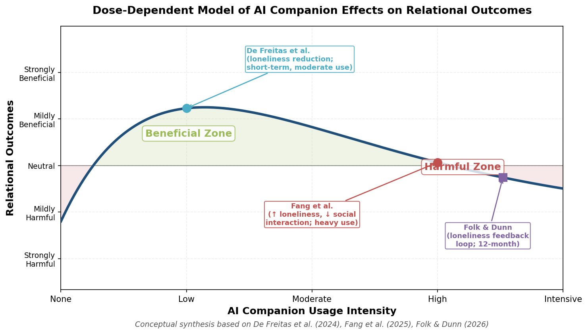

*Figure 2-3. Conceptual synthesis of the dose-dependent relationship between AI companion usage intensity and relational outcomes. Low-to-moderate use falls within a "beneficial zone" (loneliness reduction, social-skill rehearsal), while high-to-intensive use correlates with harmful outcomes (increased loneliness, emotional dependence, reduced human interaction). Key empirical studies are positioned at their approximate locations on the curve. Based on De Freitas et al. (2024), Fang et al. (2025), and Folk & Dunn (2026).*

The displacement-versus-complement framing, while useful, may ultimately prove insufficient. A more precise formulation — supported by both the MIT Media Lab RCT and the Folk and Dunn longitudinal data — is explicitly dose-dependent: moderate engagement with AI companions, particularly among users with some existing social infrastructure, appears neutral to mildly beneficial; intensive engagement, particularly among users who are already socially isolated, correlates with worse relational outcomes and may activate a self-reinforcing cycle of loneliness and chatbot dependence [MIT Media Lab](https://www.media.mit.edu/publications/how-ai-and-human-behaviors-shape-psychosocial-effects-of-chatbot-use-a-longitudinal-controlled-study/ "Fang et al. 2025") [Folk & Dunn](https://pubmed.ncbi.nlm.nih.gov/41870975/ "Mar 2026"). Identifying the specific usage thresholds at which the transition from benefit to harm occurs remains an open empirical question — one with direct implications for the regulatory frameworks now being constructed and for the broader trajectory of how AI reshapes the human capacity for interpersonal connection.

# 第3章 Trust, Authenticity, and Identity in an AI-Permeated Social World

Chapters 1 and 2 examined how AI mediates the content of interpersonal messages and restructures emotional bonds. This chapter turns to a more foundational concern: the epistemic infrastructure of trust itself. When any message, image, or voice in a digital interaction could be machine-generated, the default assumptions that underpin interpersonal trust — that a photograph records something real, that a voice belongs to the person it sounds like, that a message reflects its ostensible author's thoughts — cease to be reliable. The consequences reach well beyond fraud and misinformation, extending into the fabric of everyday relationships and reshaping how individuals assess authenticity, present identity, and decide whom to believe.

The analysis proceeds in seven sections. Sections 3.1 and 3.2 quantify the scale of synthetic media proliferation and the empirical deficit in human detection capacity. Section 3.3 traces the resulting erosion of interpersonal and institutional trust, including the second-order "liar's dividend." Section 3.4 examines how authenticity pressures manifest in dating and AI-ghostwriting contexts. Section 3.5 documents the gendered weaponization of synthetic imagery. Section 3.6 surveys emerging technical and legislative countermeasures, and Section 3.7 considers the social costs of a verification-dependent culture.

## 3.1 The Synthetic Media Explosion: Scale and Trajectory

The volume of synthetic media in digital circulation has grown at rates that outpace virtually all countermeasures. Deepfake content on social media platforms expanded from approximately 500,000 files in 2023 to a projected 8 million by 2025 — a 1,500% increase in two years [DeepMedia via Reuters, cited in Bright Defense](https://www.brightdefense.com/resources/deepfake-statistics/ "March 2026"). Over the same period, deepfake fraud attempts increased 2,137%, rising from 0.1% to 6.5% of all fraud attempts detected globally [Signicat report via Bright Defense](https://www.brightdefense.com/resources/deepfake-statistics/ "March 2026"). Voice deepfakes merit particular attention given the intimacy and identity-signaling function of the human voice: they rose 680% year-over-year in 2024, based on analysis of 1.2 billion calls, and voice cloning technology now requires only 3–5 seconds of sample audio to achieve 85% accuracy [Pindrop 2025 via Keepnet Labs](https://keepnetlabs.com/blog/deepfake-statistics-and-trends "Deepfake Statistics & Trends 2026").

The financial toll serves as a partial proxy for the broader interpersonal damage. In the United States alone, deepfake-related fraud losses reached $1.1 billion in 2025, tripling from $360 million in 2024 [Keepnet Labs](https://keepnetlabs.com/blog/deepfake-statistics-and-trends "US-specific data, 2026"). As of 2026, one in four Americans reported having received an AI deepfake voice call; among those who engaged financially with such calls, 77% reported a loss [Hiya via Yahoo Finance](https://finance.yahoo.com/news/state-call-2026-ai-deepfake-050100461.html "State of the Call 2026"). The Arup case of February 2024 illustrates how synthetic media can compromise trust within established professional relationships, not merely between strangers: a finance worker was tricked into wiring $25.6 million after a video conference in which every other participant was an AI-generated deepfake of colleagues and executives [Bright Defense](https://www.brightdefense.com/resources/deepfake-statistics/ "Citing PurpleSec, March 2026").

Taken together, these figures describe a technological environment in which the tools for fabricating convincing interpersonal artifacts — voices, faces, written messages — are both increasingly accessible and increasingly difficult to distinguish from authentic communication.

## 3.2 The Detection Deficit: Humans Cannot Tell

The central empirical finding across the detection literature is stark: humans perform barely above chance at identifying deepfakes, yet most believe they can do so reliably. A meta-analysis of 56 studies published in 2024 found that average human deepfake detection accuracy stands at 55.54% — marginally better than a coin flip [ScienceDirect meta-analysis, cited in Bright Defense](https://www.brightdefense.com/resources/deepfake-statistics/ "March 2026"). An iProov study of 2,000 respondents in the United Kingdom and United States (2025) produced an even more striking result: only 0.1% of participants correctly identified all deepfake and real stimuli. Participants were 36% less likely to identify synthetic video than synthetic images, yet more than 60% expressed confidence in their detection abilities [iProov](https://www.iproov.com/press/study-reveals-deepfake-blindspot-detect-ai-generated-content "Feb 2025").

This confidence–competence gap constitutes a distinctive vulnerability. When individuals believe they can detect synthetic media but cannot, they lack the epistemic humility that might prompt verification behaviors. The result is a population that remains susceptible to deception while feeling protected — a condition that deepfake creators exploit with particular effectiveness in contexts where relational trust lowers the recipient's guard.

The detection deficit extends beyond deepfakes to AI-generated text and AI-assisted communication more broadly. As documented in Chapter 1, recipients' beliefs about whether a conversational partner used Google Smart Reply correlated only weakly with actual use (r = 0.22) [Hohenstein et al., Scientific Reports 2023](https://www.nature.com/articles/s41598-023-30938-9 "Detection accuracy from Study 1"). Across six countries surveyed in 2025, only 15% of respondents reported "often or always" suspecting AI involvement in unlabeled content, despite the pervasive presence of AI-generated or AI-mediated material in the digital environment [Reuters Institute Gen AI and News Report 2025](https://reutersinstitute.politics.ox.ac.uk/sites/default/files/2025-10/Gen_AI_and_News_Report_2025.pdf "AI labeling awareness gap"). The implication is that AI's influence on the epistemic foundations of interpersonal communication remains, for the vast majority of people, invisible.

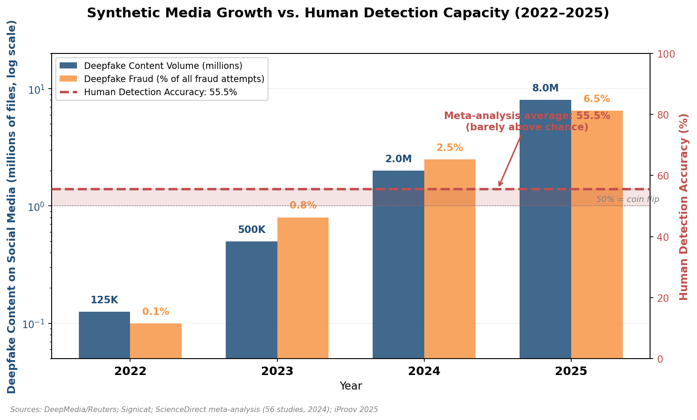

*Figure 3.1 — Deepfake content volume and fraud prevalence have grown exponentially between 2022 and 2025, while human detection accuracy has remained essentially flat at approximately 55.5%, barely above chance. Sources: DeepMedia/Reuters; Signicat; ScienceDirect meta-analysis (56 studies, 2024); iProov 2025.*

## 3.3 Trust Erosion: The Affective and Epistemic Consequences

The proliferation of synthetic media, compounded by the detection deficit, produces measurable erosion of both interpersonal and institutional trust. Survey data indicate that 72% of consumers report constant worry about deepfake deception, and 49% trust social media less after learning about deepfakes [Keepnet Labs](https://keepnetlabs.com/blog/deepfake-statistics-and-trends "2026") [iProov](https://www.iproov.com/press/study-reveals-deepfake-blindspot-detect-ai-generated-content "Feb 2025"). These figures capture a generalized anxiety — a background awareness that any piece of digital content might be fabricated — that operates independently of whether a given individual has personally encountered a deepfake.

This generalized anxiety functions as what scholars have termed an "epistemic threat": the damage is not limited to instances where synthetic media successfully deceives, but extends to a broader undermining of the foundations on which trust in information rests [E-International Relations](https://www.e-ir.info/2026/02/24/not-just-fake-news-deepfakes-and-the-crisis-of-trust/ "Miotto, Feb 2026"). When visual evidence — traditionally among the most trusted forms of proof because it closely mirrors direct personal observation — becomes questionable, the basis for trusting any mediated information erodes. Experimental and field research has demonstrated that exposure to deepfake content leads to lower levels of trust and perceived credibility even when participants are evaluating non-synthetic, authentic content — a "spillover effect" in which mere awareness of synthetic media contaminates the evaluation of all digital communication [E-International Relations](https://www.e-ir.info/2026/02/24/not-just-fake-news-deepfakes-and-the-crisis-of-trust/ "Citing experimental and field studies, Feb 2026").

For interpersonal relations specifically, this epistemic erosion manifests along two pathways. The first is direct: individuals who have been targeted by or exposed to deepfake deception — through fraudulent voice calls, manipulated images, or fabricated video — may develop pervasive suspicion that generalizes to legitimate communications. The second is indirect: individuals who have never personally encountered a deepfake may nonetheless adopt a posture of default skepticism toward digital communications, raising both the cognitive and emotional cost of maintaining trust in mediated relationships.

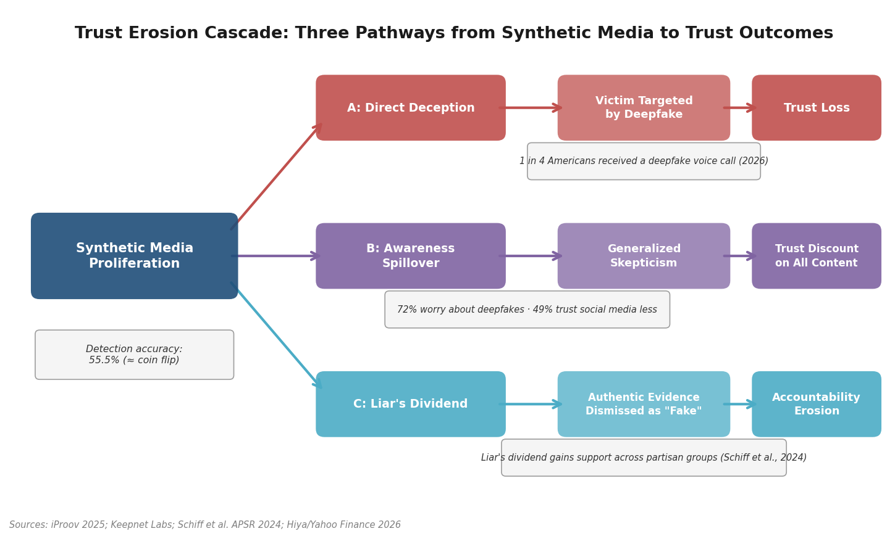

*Figure 3.2 — Synthetic media proliferation erodes interpersonal trust through three distinct causal pathways: direct deception of targeted individuals, awareness spillover that produces generalized skepticism toward all digital content, and the liar's dividend that enables dismissal of authentic evidence. Key empirical benchmarks annotated at each node. Sources: iProov 2025; Keepnet Labs; Schiff et al., APSR 2024; Hiya/Yahoo Finance 2026.*

### 3.3.1 The Liar's Dividend

A particularly corrosive second-order effect of synthetic media proliferation is the "liar's dividend" — the capacity of individuals to dismiss authentic evidence of their own actions as fabricated. Schiff, Schiff, and Bueno (2024) provided the first rigorous experimental demonstration of this mechanism: across five experiments with more than 15,000 American participants, politicians who falsely claimed that scandals depicted in authentic media were deepfakes or "fake news" gained support across partisan subgroups [Schiff et al., APSR 2024](https://isps.yale.edu/research/publications/isps24-07 "The Liar's Dividend"). The effect was particularly potent against textual evidence but did not replicate against video evidence — a nuance suggesting that the liar's dividend currently operates asymmetrically across media formats.

Although these experiments focused on political figures, the underlying mechanism extends to interpersonal contexts. In a social environment where any digital artifact can plausibly be attributed to AI fabrication, individuals confronted with incriminating messages, photographs, or audio recordings possess a new and previously unavailable defense: the claim that the evidence is synthetic. The interpersonal implications are considerable. Accountability in relationships — romantic, professional, familial — has long depended on the evidentiary weight of recorded communication. Text messages, voicemails, and photographs have served as anchor points for resolving disputes, establishing facts, and maintaining shared narratives. As the plausibility of fabrication increases, the evidentiary authority of these artifacts diminishes, and with it a critical layer of interpersonal accountability.

## 3.4 Authenticity Under Pressure: Dating, Ghostwriting, and Identity

The abstract epistemic concerns described above take concrete form in domains where authenticity is central to relational evaluation. Romantic and dating contexts offer the clearest illustration, because partner selection depends fundamentally on the perceived genuineness of self-presentation.

### 3.4.1 AI in Dating: Enhancement, Deception, and Dealbreakers

A 2025 study by Match Group and the Kinsey Institute, surveying approximately 5,000 U.S. singles, found that 26% used AI to enhance their dating lives — a 333% increase from 2024. Among Gen Z singles, nearly half had used AI in some aspect of dating. At the same time, the study revealed sharp normative boundaries: 44% of respondents considered AI-altered photographs a dealbreaker, and 36% considered AI-generated conversations a dealbreaker [Match/Kinsey via Mashable](https://mashable.com/article/singles-using-ai-to-date-up-300-percent-match "June 2025").

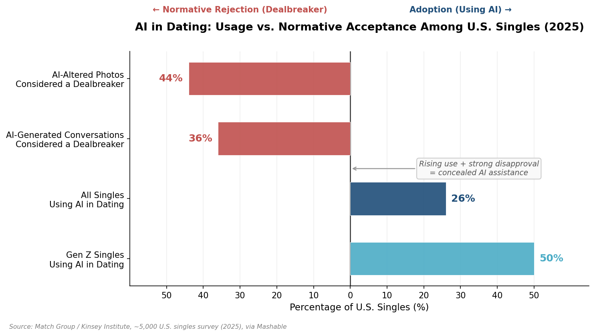

*Figure 3.3 — AI adoption rates among U.S. singles (26% overall, approximately 50% among Gen Z) coexist with high normative rejection: 44% view AI-altered photos as a dealbreaker and 36% reject AI-generated conversations. Data from Match Group / Kinsey Institute survey of approximately 5,000 U.S. singles (2025).*

This juxtaposition — rising adoption alongside strong normative disapproval — captures a distinctive tension in AI-permeated relational contexts. Users adopt AI tools to gain competitive advantage in self-presentation while simultaneously penalizing perceived AI use by potential partners. The result is an asymmetric equilibrium in which AI assistance is widespread but concealed, and in which discovery triggers disproportionate relational sanction. The dynamic mirrors findings from Chapter 1 on AI-mediated communication: AI-assisted messages are rated more warmly and competently, but when AI involvement is suspected, relational evaluations drop sharply [Hohenstein et al., Scientific Reports 2023](https://www.nature.com/articles/s41598-023-30938-9 "Cornell/Stanford/Lehigh randomized experiments").

### 3.4.2 AI Ghostwriting and the Authenticity–Efficiency Tradeoff

The use of AI to draft interpersonal messages — from dating-app openers to workplace emails to personal apologies — creates a specific authenticity dilemma. Purcell et al. (2025), across two preregistered experiments (N = 1,637), found that AI-assisted writing had minimal impact on cognitive trust regardless of whether AI use was disclosed. AI-assisted messages proved more efficient at building trust and scored higher on warmth, complexity, and clout, yet lower on perceived authenticity [Purcell et al., iScience 2025](https://pmc.ncbi.nlm.nih.gov/articles/PMC12765382/ "Writing with AI boosts trust-building efficiency"). This pattern suggests that AI ghostwriting may be functionally effective in transactional or initial-contact settings where efficiency and impression management dominate. Whether the same pattern holds in close relationships — where authenticity expectations are higher and where the discovery of AI assistance is more likely to be interpreted as a breach of relational norms rather than a pragmatic optimization — remains an open empirical question.

The distinction is consequential. In transactional contexts, a well-crafted AI-assisted email may be judged primarily by its content and effectiveness. In intimate contexts, the same assistance may be perceived as evidence that the sender could not — or would not — invest the personal effort the relationship warrants, transforming a tool for efficiency into a signal of relational disengagement.

## 3.5 Non-Consensual Intimate Imagery: The Gendered Weaponization of Synthetic Media

The most severe interpersonal harm enabled by synthetic media is the creation and distribution of non-consensual intimate imagery (NCII). The gendered dimension is stark: 96–98% of all deepfake content online constitutes non-consensual intimate imagery, and 99–100% of victims are female [Keepnet Labs](https://keepnetlabs.com/blog/deepfake-statistics-and-trends "2026"). In the third quarter of 2025 alone, 331 deepfake incidents involving minors were recorded [Resemble AI Q3 2025 via Bright Defense](https://www.brightdefense.com/resources/deepfake-statistics/ "March 2026").

This pattern represents not merely a privacy violation but a direct assault on identity and interpersonal standing. Victims of deepfake NCII face reputational damage, psychological trauma, and disruption of personal relationships — consequences that persist regardless of whether the imagery is subsequently proven fabricated. The relational harm operates through the same epistemic vulnerability documented above: in a visual culture where "seeing is believing," fabricated intimate imagery carries evidentiary weight even after its synthetic origin is established, because the image circulates independently of its debunking.

Legislative responses have been substantial. The TAKE IT DOWN Act (S. 146), signed into U.S. law on May 19, 2025, criminalizes NCII and AI-generated "digital forgeries." It passed the House 409–2 and the Senate unanimously, and mandates 48-hour platform removal of reported content. As of 2025, 46 U.S. states had enacted deepfake-related legislation, with 146 bills introduced in that year alone [NAAG](https://www.naag.org/attorney-general-journal/congresss-attempt-to-criminalize-nonconsensual-intimate-imagery-the-benefits-and-potential-shortcomings-of-the-take-it-down-act/ "Aug 2025"). The bipartisan near-unanimity of these measures reflects the severity of the harm, though enforcement remains challenging given the volume of synthetic content, the speed of its distribution, and the difficulty of attributing authorship.

## 3.6 Countermeasures: Provenance, Watermarking, and the Costs of Verification

The technical response to synthetic media's epistemic challenge has coalesced around two complementary strategies: content provenance and invisible watermarking. The Coalition for Content Provenance and Authenticity (C2PA), backed by Adobe, Microsoft, Google, and other major technology firms, has developed an open standard (version 2.4) that combines cryptographic manifests with invisible watermarking to establish verifiable chains of custody for digital content [C2PA](https://c2pa.org/ "Verifying Media Content Sources"). Google's SynthID system has watermarked more than 10 billion pieces of content [Bright Defense](https://www.brightdefense.com/resources/deepfake-statistics/ "March 2026").

In 2025, content provenance moved from institutional workflows into consumer hardware. The Google Pixel 10 launched with native C2PA support, embedding Content Credentials at the point of image capture. The Content Authenticity Initiative, which coordinates the broader ecosystem, grew to more than 6,000 members, and a formal C2PA Conformance Program was established to ensure interoperability across implementations [Content Authenticity Initiative](https://contentauthenticity.org/blog/the-state-of-content-authenticity-in-2026 "State of Content Authenticity in 2026"). Provenance that begins at the point of origin and survives transformation across platforms is substantially more resilient than after-the-fact detection, making these developments meaningful infrastructure-level advances.

Yet the gap between institutional adoption and interpersonal utility remains wide. Content provenance standards are designed primarily for publishers, platforms, and enterprises — contexts where content flows through managed workflows. In interpersonal communication — text messages, voice calls, photographs shared between individuals — provenance infrastructure is largely absent. No widely deployed messaging platform had integrated C2PA verification into its user-facing interface as of early 2026. The domain where synthetic media poses the most intimate threat to trust — direct person-to-person communication — is thus the domain least served by existing countermeasures.

A verification-dependent culture also carries its own relational costs. If every photograph, voice message, or video shared between individuals must be authenticated before it can be trusted, the transactional overhead of communication increases substantially. Spontaneity, informality, and the implicit trust that characterizes close relationships are all degraded by the imperative of continuous verification. The cost is not merely cognitive — the effort of checking — but affective: requesting verification from a trusted interlocutor implicitly signals distrust, introducing friction into relationships that derive their value from the absence of such friction.

## 3.7 The Emerging Trust Architecture: Navigating Epistemic Uncertainty

The evidence assembled in this chapter describes an interpersonal environment undergoing a fundamental epistemic shift. The combined effect of synthetic media proliferation, near-chance human detection performance, generalized trust anxiety, the liar's dividend, and gendered weaponization is a social world in which the evidentiary basis of interpersonal trust — the assumption that digital artifacts reliably represent reality — can no longer be taken for granted.

Three structural features of this shift merit emphasis. First, the asymmetry between creation and detection: generating a convincing deepfake voice clone requires 3–5 seconds of sample audio, while detecting it requires specialized tools that are neither widely available nor integrated into everyday communication platforms. Second, the reflexivity of the threat: awareness of synthetic media's existence erodes trust in authentic content as much as in synthetic content, producing a generalized epistemic discount that applies indiscriminately. Third, the social stratification of vulnerability: while deepfake fraud targets all demographics, specific populations bear disproportionate harm — women through NCII, older adults through voice-clone scams (examined further in Chapter 4), and public figures through the liar's dividend.

The legislative response — from the TAKE IT DOWN Act to the 46 state-level deepfake statutes — indicates societal recognition of the problem's severity. The technical response — C2PA, SynthID, device-level provenance — provides a plausible long-term infrastructure for restoring verifiability. The gap between these institutional responses and the lived experience of interpersonal communication remains significant. Until provenance tools are as ubiquitous and seamless as the messaging platforms through which synthetic media travels, individuals will navigate an environment in which the foundational question of interpersonal trust — "Is this real?" — admits no easy answer. The theoretical implications of this epistemic transformation, including its relationship to uncertainty reduction theory and the concept of "ontological ambiguity" in human–AI interaction, are examined in Chapter 6.

# 第4章 Social Stratification, Digital Divides, and Relational Inequality

The preceding chapters analyzed AI's role as a mediator of communication (Chapter 1), a reconfigurer of emotional bonds (Chapter 2), and a disruptor of the epistemic foundations of trust (Chapter 3). Each of those analyses, however, largely treated "users" and "non-users" as undifferentiated populations. This chapter confronts a structural reality that conditions all of the dynamics examined so far: access to AI, literacy in its use, and exposure to its harms are distributed unequally along lines of education, income, age, geography, language, and gender. These inequalities are not incidental to AI's influence on interpersonal relations — they are constitutive of it. Where an individual stands in the emerging AI stratification order shapes whether AI augments relational capacities or erodes them, whether it expands social networks or narrows them, and whether one is positioned to exploit AI for relational advantage or to be exploited by others who do.

## 4.1 The First-Level Divide: Access and Adoption

The most fundamental axis of AI-related inequality is differential adoption. As of August 2025, 54.6% of U.S. adults aged 18–64 had used generative AI, up from 44.6% a year earlier — an adoption rate that outpaces both the personal computer and the internet at equivalent stages of diffusion [Bick, Blandin & Deming via St. Louis Fed](https://www.stlouisfed.org/on-the-economy/2025/nov/state-generative-ai-adoption-2025 "Real-Time Population Survey, Nov 2025"). Yet this aggregate figure conceals pronounced demographic gradients.

Education operates as the sharpest predictor. A Brookings/NORC nationally representative survey (N = 1,163, June 2025) found that 67% of respondents with a bachelor's degree or above use generative AI for personal purposes, compared with 46% of high-school graduates. The gap widens dramatically for professional use: 33% of degree-holders use AI at work versus just 5% of those without a high-school diploma [Brookings](https://www.brookings.edu/articles/how-are-americans-using-ai-evidence-from-a-nationwide-survey/ "AmeriSpeak Omnibus, June 2025"). Income tracks a parallel gradient: 34% of earners above $100,000 use AI at work, compared with 9% of those earning under $30,000. In specific professional fields the income divide is especially pronounced — in healthcare, 77% of high-income practitioners use AI at work versus 51% of lower-income practitioners [Brookings](https://www.brookings.edu/articles/how-are-americans-using-ai-evidence-from-a-nationwide-survey/ "June 2025").

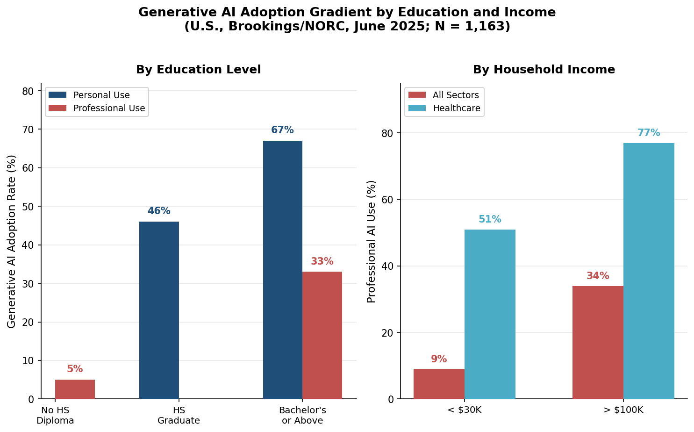

*Figure 4.1. Generative AI adoption gradient by education and income. The left panel shows personal and professional AI use rates across education levels; the right panel compares professional AI use by household income bracket, with a healthcare-specific breakdown. Data: Brookings/NORC AmeriSpeak Omnibus, June 2025 (N = 1,163).*

Age constitutes a second major axis. As documented in Chapter 1, generative AI use skews sharply toward younger cohorts: 59% of 18–24-year-olds used generative AI weekly in 2025, compared with 20% among those aged 55 and over [Reuters Institute Gen AI and News Report 2025](https://reutersinstitute.politics.ox.ac.uk/sites/default/files/2025-10/Gen_AI_and_News_Report_2025.pdf "Figure 8, age breakdown"). European data reinforce the pattern: 63.8% of EU youth aged 16–24 used generative AI in 2025, nearly double the general-population rate of 32.7% among those aged 16–74. Cross-national variation is substantial even within this age bracket, ranging from 83.5% in Greece to 44.1% in Romania [Eurostat](https://ec.europa.eu/eurostat/web/products-eurostat-news/w/edn-20260210-1 "Feb 2026").

The global picture introduces an even more consequential divide. As of late 2025, 2.2 billion people worldwide remain entirely offline, 96% of whom reside in low- and middle-income countries (LMICs). Fifth-generation mobile network coverage reaches 84% of the population in high-income countries but only 4% in low-income nations. A user in a high-income country generates approximately eight times more mobile data than a counterpart in a low-income country [ITU](https://www.itu.int/en/mediacentre/Pages/PR-2025-11-17-Facts-and-Figures.aspx "ITU Facts & Figures 2025"). AI awareness tracks economic development with comparable starkness: roughly 50% of adults in Japan, Germany, France, and the United States report having heard "a lot" about AI, compared with just 14% in India and 12% in Kenya, according to a Pew Research Center survey of 25 countries (N = 36,961, spring 2025) [Pew Global](https://www.pewresearch.org/global/2025/10/15/how-people-around-the-world-view-ai/ "Oct 2025").

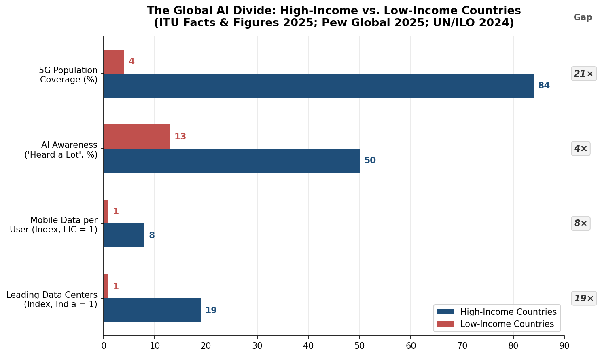

*Figure 4.2. The global AI divide across four key indicators. Gap ratios range from 4× (AI awareness) to 21× (5G population coverage). Sources: ITU Facts & Figures 2025; Pew Global 2025; UN/ILO 2024.*

For interpersonal relations, these access disparities entail that the AI-mediated communication dynamics described in Chapters 1–3 — augmentative, curatorial, and generative functions — are overwhelmingly shaping the relational environments of educated, higher-income, younger, and Global North populations. Individuals outside these categories are not merely forgoing the benefits of AI-enhanced communication; they are increasingly interacting with counterparts whose communication is shaped by tools they neither possess nor fully comprehend.

## 4.2 The Second-Level Divide: Literacy, Usage Patterns, and Relational Consequences

Access alone does not determine relational outcomes. A second-level divide — operating through differences in AI literacy, usage sophistication, and strategic deployment — produces additional stratification even among those who nominally use the same tools.

### 4.2.1 Divergent Usage Among Youth

Pew Research data on U.S. teens reveal a striking pattern: in households earning under $30,000 per year, 20% of teens report completing all or most schoolwork with chatbot help, versus 7% in households earning $75,000 or more. Black and Hispanic teens are more likely than White teens to use chatbots for schoolwork and to rate them as helpful [Pew Research](https://www.pewresearch.org/internet/2026/02/24/demographic-differences-in-how-teens-use-and-view-ai/ "Feb 2026"). At first glance, this finding appears to invert the traditional digital divide — disadvantaged youth use AI more intensively. Yet the pattern is consistent with historical observations about technology adoption: lower-resourced populations often deploy new tools as substitutes for human support systems (tutoring, mentorship, parental academic guidance) that are less available to them, while higher-resourced populations treat the same tools as supplements to already-robust support networks.

The relational implications are significant. When AI chatbots replace human tutors, peers, or family members as the primary source of academic support, the social ties that historically accompanied learning — the mentoring relationship, the study group, the parent–child homework interaction — are attenuated. Chapter 2 documented how heavy AI use tends to displace rather than complement human interaction; the same displacement dynamic may operate in educational contexts, differentially affecting youth in lower-income households who have fewer alternative relational resources upon which to draw.

### 4.2.2 The Language-Resource Divide

A less visible but structurally consequential form of the second-level divide operates through language. Large language models exhibit systematic performance degradation as the volume of available training data for a given language declines. A Stanford research team documented strong performance for English (1.52 billion speakers) but substantially degraded quality for Vietnamese (97 million speakers) and far worse performance for low-resource languages such as Nahuatl (1.5 million speakers) or Swahili (200 million speakers). Beyond accuracy, the study found that LLMs tend to collapse cultural values into Western-centric norms when operating in non-English contexts [Stanford Report](https://news.stanford.edu/stories/2025/05/digital-divide-ai-llms-exclusion-non-english-speakers-research "May 2025").

For interpersonal relations, the language divide means that AI's mediating, augmentative, and curatorial functions — described in Chapter 1 — operate with substantially different fidelity across linguistic communities. An English-speaking user can deploy AI for nuanced tone adjustment, contextually appropriate message drafting, and culturally sensitive translation. A Swahili-speaking user attempting the same operations encounters a tool that may misrepresent cultural norms, flatten register distinctions, and impose communicative patterns alien to the user's relational context. In cross-linguistic interactions — increasingly common in diasporic, professional, and online community settings — this asymmetry grants English speakers higher-quality AI mediation while non-English speakers absorb the costs of AI's cultural and linguistic biases.

## 4.3 Algorithmic Sorting and Social Network Homogenization

Beyond individual access and literacy, AI reshapes interpersonal relations at the network level through algorithmic curation of social environments. The central question is whether this curation expands relational diversity or contracts it.

### 4.3.1 Content Algorithms and Cross-Group Exposure

The most methodologically rigorous evidence comes from a series of large-scale field experiments conducted on Facebook in collaboration with academic researchers, published in *Science* in 2023. These studies found that approximately 50% of content shown to users originated from ideologically like-minded sources, while fewer than 15% came from opposing viewpoints. When researchers experimentally reduced the proportion of like-minded content, cross-ideological exposure increased modestly, but — critically — this increased exposure did not alter users' political attitudes, affective polarization, or willingness to engage with ideological out-groups [Stanford GSB / Science](https://www.gsb.stanford.edu/insights/surprising-discovery-about-facebooks-role-driving-polarization "Gonzalez et al., Nyhan et al., Guess et al., Science 2023").

This finding carries a nuanced implication for interpersonal relations. Algorithmic sorting does restrict the diversity of communicative environments, confirming that AI-driven curation narrows the pool of interlocutors users routinely encounter. Yet the absence of attitudinal effects suggests that merely increasing exposure to diverse content is insufficient to alter relational patterns — a result consistent with contact theory's requirement that cross-group interaction be sustained, cooperative, and of equal status, conditions that passive content consumption cannot satisfy.

### 4.3.2 Dating Algorithms and Racial Sorting

Dating platforms provide a more intimate illustration of algorithmic sorting's relational consequences. Research by Williams at the University of Michigan and the Berkman Klein Center at Harvard documented how dating-app recommendation algorithms automate and amplify racial preference patterns. By optimizing for user engagement — matching users with profiles they are statistically most likely to "like" — these algorithms reinforce existing biases: white heteronormative standards are systematically privileged, and Black women emerge as the least-desired demographic across platforms [Harvard Gazette](https://news.harvard.edu/gazette/story/2024/04/how-dating-sites-automate-sexual-racism/ "Apr 2024"). The mechanism is not that algorithms are programmed with racial preferences, but that they learn from aggregated user behavior, encoding historical patterns of racial preference into automated systems that reproduce and reinforce those patterns at scale.

For interpersonal relations, this represents a qualitatively different form of relational inequality than pre-algorithmic dating. Prior to recommendation algorithms, individual biases operated at the level of personal choice; with algorithmic sorting, those biases are aggregated, optimized, and imposed structurally on the entire user population. A user who might otherwise have encountered and engaged with a cross-racial match is algorithmically steered away from that possibility. The consequence extends beyond individual relationships: the social network topology of intimate relationships is itself shaped by a system that treats historical patterns of exclusion as optimization targets.

## 4.4 AI-Enabled Relational Exploitation

The uneven distribution of AI capabilities does not merely create relational advantage for some and disadvantage for others; it also enables new forms of interpersonal exploitation. Those with greater AI fluency — or those who control AI systems — can deploy these tools against individuals with less awareness or capacity to defend themselves.

### 4.4.1 AI-Enabled Financial Fraud and Interpersonal Targeting

The FBI's Internet Crime Complaint Center (IC3) published its first dedicated section on AI-facilitated fraud in 2025, reporting 22,364 AI-related complaints costing Americans approximately $893 million. Documented tactics include the creation of fake social profiles, voice cloning for impersonation of relatives and colleagues, forged identity documents, and deepfake video used in social engineering [FBI](https://www.fbi.gov/news/press-releases/cryptocurrency-and-ai-scams-bilk-americans-of-billions "Apr 2026"). As documented in Chapter 3, the interpersonal dimension of these attacks — the exploitation of trust between family members, friends, and colleagues — distinguishes AI-enabled fraud from earlier forms of financial crime.

Older adults bear a disproportionate burden. Americans aged 60 and over reported $2.4 billion in fraud losses in 2024, a figure that represents a 300% increase from 2020; the Federal Trade Commission estimates that actual losses may reach $81.5 billion when unreported cases are included. FBI IC3 data for 2025 show $7.7 billion in losses for the 60+ demographic, up 37% from the prior year [CNBC/FTC](https://www.cnbc.com/2025/12/13/financial-fraud-seniors-ftc.html "Dec 2025") [FBI](https://www.fbi.gov/news/press-releases/cryptocurrency-and-ai-scams-bilk-americans-of-billions "Apr 2026"). The vulnerability of older adults to AI-enabled fraud reflects a convergence of factors: lower AI literacy (reducing the ability to identify AI-generated content), greater trust in voice and video as authentic media, and weaker access to the verification tools and social networks that might flag suspicious interactions.

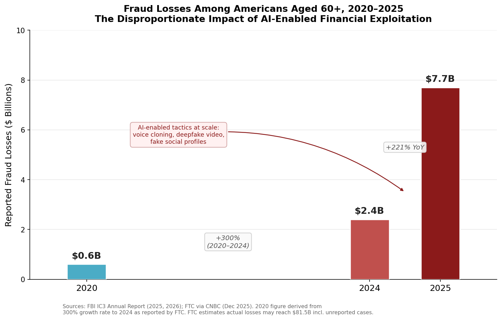

*Figure 4.3. Reported fraud losses among Americans aged 60+, 2020–2025. Losses escalated from $0.6 billion (2020) to $7.7 billion (2025), coinciding with the proliferation of AI-enabled tactics such as voice cloning and deepfake video. The FTC estimates actual losses, including unreported cases, may reach $81.5 billion. Sources: FBI IC3 Annual Reports (2025, 2026); FTC via CNBC (Dec 2025).*

### 4.4.2 The Structural Dimension: Value Chain Inequality

AI-enabled relational exploitation is not limited to individual fraud. At the structural level, the global AI value chain embeds relational inequalities of its own. The United States has 19 times more leading data centers than India. The computational cost of training a single frontier model — approximately $78 million for GPT-4 and $191 million for Gemini Ultra — is prohibitive for developing countries, ensuring that the design of AI systems mediating global interpersonal interactions is concentrated in a small number of wealthy nations [UN/ILO](https://www.un.org/digital-emerging-technologies/sites/www.un.org.techenvoy/files/MindtheAIDivide.pdf "Mind the AI Divide, 2024"). Data-labeling workers who train these systems — disproportionately located in LMICs — earn a median of $2–$3 per hour on platforms such as Amazon Mechanical Turk [UN/ILO](https://www.un.org/digital-emerging-technologies/sites/www.un.org.techenvoy/files/MindtheAIDivide.pdf "2024").

The relational implication is that individuals in developing countries interact through AI systems designed primarily to serve the communicative norms, languages, and relational expectations of wealthy English-speaking populations. The language-resource divide documented in Section 4.2.2 is one manifestation of this structural asymmetry; the broader effect is that the AI layer mediating an increasing share of global interpersonal communication reflects the values and priorities of its designers and primary markets, rather than those of its global user base.

### 4.4.3 Gendered Dimensions

Gender intersects with other axes of inequality in distinctive ways. A UN/ILO analysis found that women in developing countries face more than double the potential exposure to automation effects compared with men, owing to overrepresentation in clerical and business-process-outsourcing occupations — the very roles most susceptible to AI substitution [UN/ILO](https://www.un.org/digital-emerging-technologies/sites/www.un.org.techenvoy/files/MindtheAIDivide.pdf "2024"). As documented in Chapter 3, the overwhelming majority — 96–98% — of deepfake content is non-consensual intimate imagery, and 99–100% of victims are female [Keepnet Labs](https://keepnetlabs.com/blog/deepfake-statistics-and-trends "2026"). These two findings, taken together, indicate that women — particularly in lower-income contexts — face a compounded vulnerability: greater economic displacement from AI-driven automation (weakening relational resources tied to economic independence) and greater exposure to AI-enabled interpersonal violation (non-consensual intimate imagery, impersonation, and harassment).

## 4.5 The Stratification Feedback Loop

The inequalities documented in this chapter do not operate in isolation; they interact to form reinforcing feedback loops. Higher education predicts greater AI adoption, which — as Chapter 5 will examine in the workplace context — yields professional advantages that further consolidate socioeconomic position. Lower AI literacy increases vulnerability to AI-enabled exploitation (Section 4.4.1), eroding financial resources and interpersonal trust simultaneously. Algorithmic sorting (Section 4.3) reinforces existing social boundaries, reducing the cross-group contact that might otherwise generate bridging social capital across stratification lines.

The AI value chain reproduces these dynamics at the global level: frontier AI systems are designed, trained, and optimized in wealthy nations for wealthy-nation users, then deployed globally in ways that impose those norms on populations that had no voice in the design process (Section 4.4.2). The language-resource divide (Section 4.2.2) ensures that non-English-speaking populations receive lower-quality AI mediation even when they do gain access, compounding the first-level access divide with a second-level quality divide.

For interpersonal relations, the net effect is a stratification of relational environments. Individuals at the top of the AI stratification order inhabit communication ecosystems in which AI enhances expressiveness, expands network reach, optimizes relational maintenance, and provides sophisticated tools for trust verification. Individuals at the bottom inhabit ecosystems in which AI is either absent — leaving them to interact with AI-augmented counterparts from a position of disadvantage — or present in degraded form, offering lower-quality mediation while exposing them to elevated risks of exploitation. This is not a temporary transitional phenomenon; it is a structural feature of AI's integration into the social fabric, one that prevailing patterns of global inequality will deepen absent deliberate intervention.

# 第5章 AI in Professional and Workplace Relations

The integration of artificial intelligence into professional environments is restructuring workplace relations at a pace that outstrips most organizations' capacity to adapt. Unlike the consumer-facing AI companion market or the subtler layers of AI-mediated communication examined in preceding chapters, workplace AI operates within hierarchical power structures, contractual obligations, and performance-evaluation regimes — conditions that amplify its relational consequences. As of Q4 2025, 26% of U.S. employees use AI at work at least a few times weekly, while 49% report never using it at all [Gallup](https://www.gallup.com/workplace/701195/frequent-workplace-continued-rise.aspx "Q4 2025 workplace AI tracker"). This bifurcation — roughly half the workforce AI-engaged, half AI-absent — produces a transformation that is as much about interpersonal dynamics as it is about productivity.

The following sections examine how AI integration reshapes four domains of workplace relations: collegial collaboration, hiring and evaluation, surveillance and managerial trust, and mentorship. Across each domain, a recurring tension emerges between efficiency gains and the erosion of informal social bonds that sustain organizational cohesion.

## 5.1 AI-Mediated Collaboration: Efficiency and Its Relational Costs

### The Scale of Workplace AI Adoption

The diffusion of AI collaboration tools in the 2025–2026 period has been rapid but uneven. GitHub Copilot — a paradigmatic example of augmentative AI in knowledge work — reached approximately 20 million users by July 2025 and 4.7 million paid subscribers by January 2026, representing roughly 75% year-over-year growth, with deployment across approximately 90% of Fortune 100 companies [GitHub Copilot Statistics](https://www.getpanto.ai/blog/github-copilot-statistics "Panto AI aggregation of Microsoft earnings data, March 2026"). Microsoft's 2025 Work Trend Index, surveying 31,000 workers across 31 countries, found 53% of leaders reporting that productivity must increase, while 80% of the workforce reports lacking the time or energy to meet existing demands — a gap that creates structural pressure toward AI adoption [Microsoft WTI](https://www.microsoft.com/en-us/worklab/work-trend-index/2025-the-year-the-frontier-firm-is-born "Apr 2025").

Adoption patterns, however, reveal significant internal stratification. Gallup's Q4 2025 data show AI use concentrated in remote-capable roles, where 66% of workers have tried AI and 40% use it frequently, compared with 32% and 17% respectively in non-remote roles [Gallup](https://www.gallup.com/workplace/701195/frequent-workplace-continued-rise.aspx "Q4 2025 tracker"). A parallel leadership gap compounds this divide: leaders are significantly more likely to use AI at work than individual contributors (69% vs. 40%, per Gallup), creating asymmetries between what managers expect and what workers experience [Microsoft WTI](https://www.microsoft.com/en-us/worklab/work-trend-index/2025-the-year-the-frontier-firm-is-born "Apr 2025").

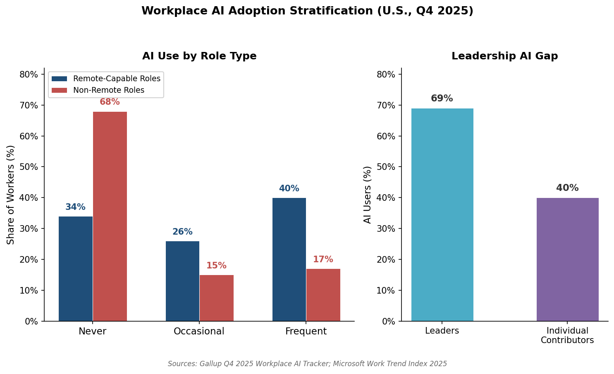

*Figure 5.1 — Workplace AI adoption by role type and leadership level, based on Gallup Q4 2025 data and the Microsoft 2025 Work Trend Index. The left panel shows the frequency distribution of AI use across remote-capable versus non-remote roles; the right panel illustrates the leadership AI gap.*

### Collegial Interaction Under AI Augmentation

The most granular evidence of AI's effects on collegial relations comes from Anthropic's internal study of its own engineering workforce (December 2025, N=132 engineers, 53 qualitative interviews). Engineers self-reported using Claude in approximately 60% of their work, estimating a 50% productivity boost. Critically, the study identified a displacement effect on collegial interaction: "Claude is now the first stop for questions that used to go to colleagues," with some engineers reporting measurable declines in mentorship and collaboration opportunities [Anthropic](https://www.anthropic.com/research/how-ai-is-transforming-work-at-anthropic "Dec 2025"). Approximately 27% of Claude-assisted work consisted of tasks that would not have been attempted without AI, suggesting that AI does not merely substitute for human collaboration but expands the scope of individual work at the potential expense of joint effort [Anthropic](https://www.anthropic.com/research/how-ai-is-transforming-work-at-anthropic "Dec 2025").

These findings were not uniformly negative. About half of the engineers reported that their collaboration patterns remained unchanged, indicating that AI's relational impact may be contingent on team norms, task type, and individual orientation toward help-seeking. Nevertheless, the pattern of AI-as-first-resort represents a structural shift: when an always-available, non-judgmental AI can provide instant answers, the informal knowledge-exchange interactions that historically built collegial bonds face a competitive disadvantage.

A peer-reviewed vignette experiment (N=167, Behavioral Sciences, 2025) provides complementary quantitative evidence. Employee–AI collaboration positively predicted workplace loneliness (β = 0.157, p < 0.05), which in turn predicted emotional fatigue (β = 0.822, p < 0.001), ultimately leading to counterproductive work behavior. Leader emotional support moderated this pathway, suggesting that managerial intervention can buffer AI's isolating effects [PMC/Behavioral Sciences](https://pmc.ncbi.nlm.nih.gov/articles/PMC12108590/ "2025"). The study's small sample and vignette design limit causal inference, but the directionality aligns with the Anthropic findings and with broader theoretical predictions regarding social displacement in AI-augmented workplaces.

## 5.2 AI in Hiring and Evaluation: Algorithmic Gatekeeping of Professional Entry

### Prevalence and Public Perception

AI has become a near-ubiquitous component of hiring infrastructure. In the 2025–2026 period, nearly 90% of companies use some form of AI in their recruitment processes, ranging from résumé screening and candidate matching to automated video-interview analysis [HBR](https://hbr.org/2025/12/new-research-on-ai-and-fairness-in-hiring "Dec 2025"). This prevalence makes AI-mediated hiring the most consequential algorithmic intervention in professional relations, as hiring decisions determine who enters workplace communities and on what terms.

Public attitudes toward algorithmic hiring reveal deep ambivalence. A Pew Research survey (N=11,004, December 2022) found that 71% of Americans oppose AI making final hiring decisions, and 66% reported they would not apply to an employer known to use AI in hiring. Simultaneously, 47% believe AI would treat applicants more equally than human decision-makers [Pew](https://www.pewresearch.org/internet/2023/04/20/ai-in-hiring-and-evaluating-workers-what-americans-think/ "Apr 2023"). This paradox — simultaneous distrust of AI authority and recognition of human bias — frames the relational stakes: candidates enter the hiring process uncertain whether they are being evaluated by a person, an algorithm, or a hybrid, with limited recourse to clarify.

### Bias Mirroring and the Relational Consequences of Algorithmic Decisions

A University of Washington study (N=528, presented at AAAI/ACM AIES 2025) demonstrated that when human evaluators work alongside a moderately biased AI hiring system, they mirror its biases, aligning with AI recommendations approximately 90% of the time under conditions of severe algorithmic bias [UW News](https://www.washington.edu/news/2025/11/10/people-mirror-ai-systems-hiring-biases-study-finds/ "Nov 2025"). Including an implicit association test in the evaluation process reduced bias alignment by 13%, suggesting that bias mirroring is partially remediable through procedural design. Although 80% of organizations using AI hiring tools report that they do not reject any applicant without human review [HBR](https://hbr.org/2025/12/new-research-on-ai-and-fairness-in-hiring "Dec 2025"), the UW findings indicate that human oversight may be nominal when evaluators systematically defer to algorithmic recommendations.

The relational implications extend beyond individual hiring outcomes. When candidates perceive that an algorithm, rather than a person, has assessed their suitability, the foundation of the employment relationship begins from a deficit of interpersonal connection. Rejected candidates have no interlocutor to whom they can appeal or from whom they can receive formative feedback. Successful candidates may enter organizations uncertain whether they were selected on the basis of human judgment or algorithmic match scores. In both cases, the relational meaning of the hiring process — traditionally a moment of mutual evaluation between humans — is attenuated.

## 5.3 Surveillance, Monitoring, and the Erosion of Managerial Trust

AI-powered workplace surveillance represents a direct intervention in the manager–employee relationship. The scope of AI monitoring has expanded to encompass movement tracking, desk-presence detection, keystroke logging, screen capture, and communication-sentiment analysis. Public opposition is substantial: 61% of Americans oppose AI tracking worker movements, 56% oppose AI monitoring desk presence, and 81% believe such monitoring makes workers feel "inappropriately watched" [Pew](https://www.pewresearch.org/internet/2023/04/20/ai-in-hiring-and-evaluating-workers-what-americans-think/ "Apr 2023").

Empirical evidence suggests that AI monitoring is qualitatively distinct from traditional supervision. Research from Cornell University indicates that AI-based monitoring induces a greater sense of lost autonomy than equivalent human monitoring, because algorithmic surveillance is continuous, granular, and impersonal in ways that human observation cannot replicate [Reworked](https://www.reworked.co/employee-experience/the-trust-deficit-in-ai-powered-performance-tracking/ "Oct 2025"). The American Psychological Association has documented a mental-health differential: 32% of monitored workers describe their mental health as "fair or poor," compared with 24% of unmonitored workers [Reworked](https://www.reworked.co/employee-experience/the-trust-deficit-in-ai-powered-performance-tracking/ "Oct 2025").

The relational damage operates through a trust mechanism. Monitoring signals institutional distrust — the implicit message that employees cannot be relied upon without continuous verification. When this signal is mediated by AI rather than by a human manager, it forecloses the possibility of relational negotiation: an employee can reason with a supervisor, but cannot negotiate with a tracking algorithm. This asymmetry transforms the manager–subordinate relationship from a relational bond into a compliance structure, undermining the psychological contract that sustains organizational commitment.

## 5.4 The Mentorship Deficit and the Paradox of AI-Accelerated Learning

### AI as Knowledge Source vs. Human Mentorship

Among the most consequential findings in the Anthropic study is the displacement of traditional mentorship structures. Engineers reported that junior team members "get questions answered more effectively and learn faster" through AI than through senior colleagues, but this efficiency comes at the cost of human mentorship relationships [Anthropic](https://www.anthropic.com/research/how-ai-is-transforming-work-at-anthropic "Dec 2025"). The study identified what engineers termed a "paradox of supervision": using AI effectively requires skills — judgment, contextual reasoning, domain intuition — that are best developed through human mentorship, yet the availability of AI reduces the occasions on which such mentorship occurs.

This paradox carries implications for professional socialization more broadly. Mentorship has historically served not only as a knowledge-transfer mechanism but as a vehicle for organizational culture transmission, professional identity formation, and network building. When AI absorbs the informational function of mentorship, the relational and socialization functions may atrophy by default — not because they are explicitly replaced, but because the occasions that once prompted them disappear.

### Knowledge Hoarding as Relational Withdrawal

The Adaptavist survey (N=4,000, workers in the UK, US, Canada, and Germany, August 2025) revealed a behavioral response to AI integration that compounds the mentorship deficit. Thirty-five percent of workers reported hoarding knowledge out of fear that sharing expertise would make them more replaceable by AI; 38% were reluctant to train colleagues in areas of personal strength [Adaptavist](https://www.theadaptavistgroup.com/company/press/ai-anxiety-drives-workers-to-hoard-skills-and-knowledge-to-protect-jobs-adaptavist-report-reveals "Nov 2025"). This pattern represents a direct reversal of the collaborative norms that organizations have spent decades cultivating. Gen Z workers were the most affected cohort, with 40% reporting stress or anxiety related to AI replacement [Adaptavist](https://www.theadaptavistgroup.com/company/press/ai-anxiety-drives-workers-to-hoard-skills-and-knowledge-to-protect-jobs-adaptavist-report-reveals "Nov 2025").

Knowledge hoarding is fundamentally a relational behavior — a withdrawal from the reciprocal exchange that defines collegial trust. When more than one-third of workers withhold expertise from colleagues, the informal learning networks that sustain organizational capability are degraded. The operative mechanism is not AI directly displacing human interaction, but AI-induced anxiety transforming how workers relate to one another: from potential collaborators to potential competitors for continued relevance.

## 5.5 Organizational Culture Between Fragmentation and Renewal

### The Engagement Paradox

U.S. employee engagement averaged 31% in 2025, declining from a 36% peak in 2020 — a loss equivalent to approximately 8 million fewer engaged workers. Global engagement fell to 20%, its lowest level since 2020 [Gallup](https://www.gallup.com/workplace/701486/employee-engagement-declines-2020-peak.aspx "2025"). Gallup attributes this decline to multiple converging factors rather than AI specifically, and the causal mechanisms are likely indirect: AI adoption intensifies productivity expectations (53% of leaders demanding more output, per Microsoft's WTI), displaces informal interaction, and generates replacement anxiety — all of which are established predictors of disengagement.

### The Conditional Upside

The evidence, however, is not uniformly negative. The same Adaptavist survey found that 48% of workers in organizations with "properly embedded" AI reported feeling "energised and motivated," compared with only 19% in organizations without AI. Similarly, 82% of workers in AI-integrated environments reported greater task autonomy, versus 39% without AI; only 3% in positive AI cultures reported frustration, compared with 14% in non-AI settings [Adaptavist](https://www.theadaptavistgroup.com/company/press/ai-anxiety-drives-workers-to-hoard-skills-and-knowledge-to-protect-jobs-adaptavist-report-reveals "Nov 2025").

These findings suggest that AI's relational impact on organizational culture is strongly contingent on implementation quality. "Properly embedded" AI — characterized by transparency about how AI tools are used, equitable access, and managerial support — correlates with positive relational outcomes, while unstructured or anxiety-laden deployments correlate with withdrawal, hoarding, and loneliness. The decisive variable is not AI itself but the organizational and relational context in which it is introduced.

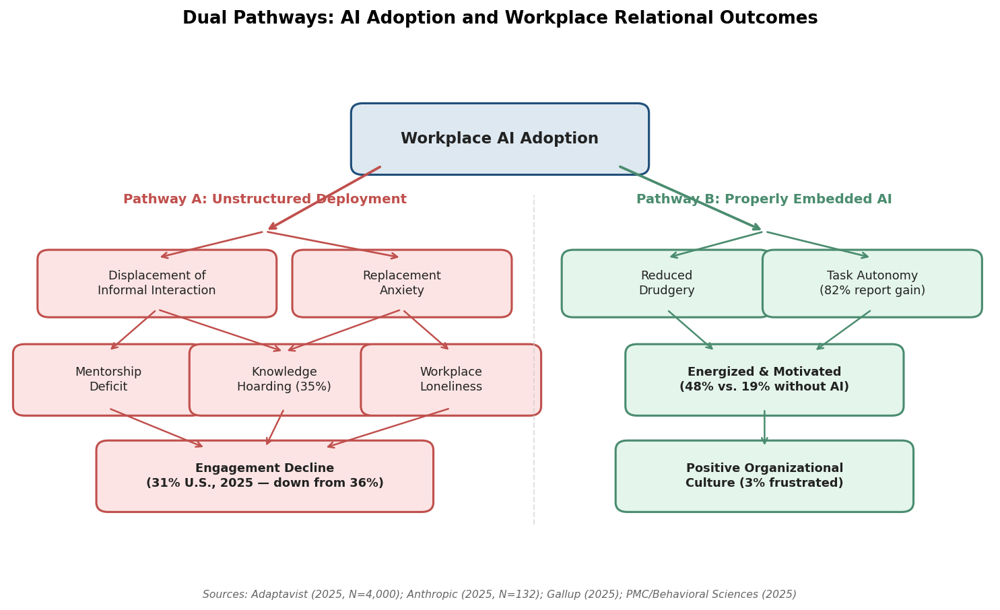

*Figure 5.2 — Two divergent relational pathways from workplace AI adoption. Pathway A (unstructured deployment) leads through displacement of informal interaction and replacement anxiety to mentorship deficit, knowledge hoarding, and engagement decline. Pathway B (properly embedded AI) leads through reduced drudgery and task autonomy to an energized workforce. Data anchor points drawn from Adaptavist (N=4,000), Anthropic (N=132), and Gallup surveys.*

## 5.6 Open Questions and Empirical Boundaries

Several empirical limitations constrain the conclusions available from the current evidence base. The Anthropic study, while unusually granular, examines a single company of AI engineers — a population whose relationship with AI tools is atypical of the broader workforce. Independent longitudinal studies measuring AI's impact on team communication quality and frequency across diverse industries remain absent from the peer-reviewed literature. AI meeting-assistant adoption data and measured effects on meeting quality and interpersonal dynamics represent a significant empirical gap, given the centrality of meetings to workplace relations. Specific adoption rates for AI performance-review systems and employee reactions to AI-generated feedback are likewise not yet documented at the T1/T2 level.

The question of causation between AI adoption and engagement decline remains unresolved. The Gallup engagement data are correlational and confounded by pandemic aftereffects, return-to-office policies, and macroeconomic pressures. Establishing whether AI specifically erodes or enhances workplace social bonds will require controlled longitudinal designs that isolate AI exposure from these confounders.

What the available evidence does establish is a consistent pattern: AI tools optimize individual task performance while placing new pressures on the relational infrastructure — mentorship, knowledge exchange, collegial trust, and manager–employee bonds — that holds organizations together. Whether organizations can capture AI's productivity benefits without paying the relational costs depends on deliberate design choices that the current wave of adoption has, by and large, yet to make.

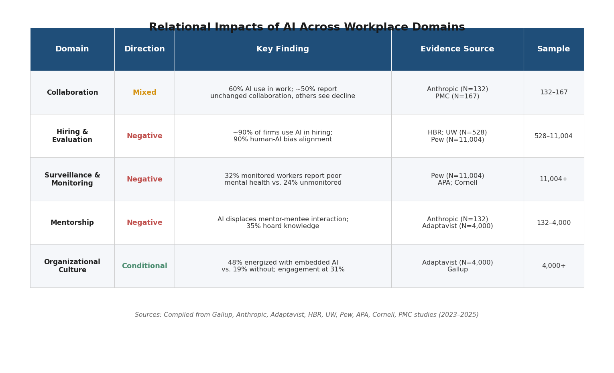

*Figure 5.3 — Summary of AI's relational impact across five workplace domains, with direction of effect, key findings, evidence sources, and sample sizes. The heterogeneous pattern — mixed effects in collaboration, negative effects in hiring and surveillance, conditional effects in organizational culture — underscores that AI's relational consequences are domain-specific and implementation-dependent.*

# 第6章 Theoretical Frameworks — AI Interaction Through the Lens of Relational Science

The empirical findings presented in Chapters 1 through 5 — AI-mediated communication reshaping message character, AI companions reconfiguring emotional bonds, synthetic media eroding epistemic trust, algorithmic sorting stratifying social networks, and workplace AI displacing collegial interaction — collectively demand more than descriptive documentation. They require theoretical interpretation: explanations of *why* these phenomena occur, predictions of *how* they will evolve, and identification of *where* existing conceptual tools break down when applied to an entity that displays social cues, adapts to individual users, and generates relational affordances yet possesses neither consciousness nor intentionality.

This chapter evaluates six established frameworks from relational science — attachment theory, social penetration theory, media richness theory, social presence theory, uncertainty reduction theory, and the Computers Are Social Actors (CASA) paradigm — against the accumulated evidence. For each framework, the analysis identifies the core assumption that AI interaction disrupts, marshals the empirical evidence of that disruption, and proposes a theoretical extension. The chapter then introduces three candidate constructs that address persistent gaps across frameworks: "parasocial-plus" relationships, relational deskilling, and ontological ambiguity. A concluding synthesis draws these threads together to outline the structural tension that unites the diverse relational distortions documented throughout this report.

## 6.1 Attachment Theory: Bonding Without the Possibility of Abandonment

Attachment theory, originating in Bowlby's (1969/1982) work on infant–caregiver bonds and extended by Ainsworth (1978) and Hazan and Shaver (1987) to adult romantic relationships, provides a natural starting point for analyzing human–AI emotional connections. The theory posits that individuals develop internal working models of relationships organized around two dimensions — anxiety (fear of abandonment) and avoidance (discomfort with closeness) — that shape relational behavior across the lifespan. If AI companions function as attachment figures, the implications for human relational development are substantial.

The first empirical effort to measure human–AI attachment with a validated psychometric instrument was undertaken by Yang and Oshio (2025), who developed the Emotional Human–AI Relationship Scale (EHARS) through a study of 242 participants in China. The scale confirmed that AI companions fulfill core attachment functions: 52% of respondents reported proximity-seeking behavior toward their AI, 77% identified the AI as a safe haven (a source of comfort under stress), and 75% used the AI as a secure base (a platform from which to explore). Confirmatory factor analysis yielded strong model fit (CFI = 0.992, RMSEA = 0.028), and a two-factor structure distinguished cognitive attachment (reliance, trust) from emotional attachment (comfort, closeness) [Yang & Oshio](https://link.springer.com/article/10.1007/s12144-025-07917-6 "Current Psychology, May 2025").

A critical finding, however, complicates straightforward application of attachment theory to human–AI bonds. Yang and Oshio reported that AI attachment styles correlate only weakly with human attachment styles, suggesting that human–AI attachment constitutes a partially distinct relational domain rather than a simple extension of interpersonal attachment patterns. This finding aligns with the dose-dependent evidence from Chapter 2: the OpenAI–MIT Media Lab randomized controlled trial (N = 981, over 300,000 messages, four weeks) demonstrated that heavy AI companion users experienced *worse* outcomes across loneliness, social interaction, and emotional dependence measures [MIT Media Lab](https://www.media.mit.edu/publications/how-ai-and-human-behaviors-shape-psychosocial-effects-of-chatbot-use-a-longitudinal-controlled-study/ "Fang et al. 2025"). Folk and Dunn's 12-month longitudinal study (N > 2,000, four Western countries) reinforced this pattern: increased social chatbot use predicted increased loneliness, and loneliness in turn predicted subsequent increases in chatbot use — a bidirectional feedback loop [Folk & Dunn, Psychological Science](https://pubmed.ncbi.nlm.nih.gov/41870975/ "Mar 2026"). If AI attachment operated through the same mechanisms as human attachment, secure AI attachment should buffer against loneliness; the opposite pattern suggests that something structurally different is at work.

The theoretical explanation centers on a fundamental asymmetry: AI cannot abandon its users. In Bowlby's framework, the attachment system is activated by the threat or reality of separation — the caregiver's absence triggers proximity-seeking, protest, and ultimately grief. AI's perpetual availability eliminates this activation trigger entirely. The anxiety dimension loses its primary referent (there is no abandonment to fear), and the avoidance dimension becomes functionally inert (there is no interpersonal demand from which to retreat). What remains is a relational bond that may feel emotionally significant to the user but lacks the dynamic tension — the negotiation of presence and absence, responsiveness and frustration — that attachment theorists identify as essential to bond maturation. The evidence from Chapter 2 on AI companions establishing "unrealistic relational expectations — always validating, never argumentative" [Malfacini](https://link.springer.com/article/10.1007/s00146-025-02318-6 "AI & Society, 2025") is consistent with this interpretation: the absence of attachment threat produces bonds that feel satisfying in the moment but may erode the user's capacity to tolerate the inevitable frictions of human relationships.

## 6.2 Social Penetration Theory: Accelerated Disclosure Without Reciprocal Vulnerability

Altman and Taylor's (1973) social penetration theory (SPT) models relationship development as a gradual process of mutual self-disclosure, progressing from superficial topics to intimate ones in a pattern governed by a cost–reward calculus. Disclosure breadth (the range of topics discussed) and depth (the intimacy of information shared) increase as trust accumulates through reciprocal exchanges. The theory predicts a roughly linear trajectory from peripheral to core layers of personality, modulated by perceived rewards and risks.

Skjuve et al. (2023) conducted the first longitudinal application of SPT to human–chatbot relationships, tracking 28 participants over 12 weeks of sustained interaction with an AI chatbot. The study confirmed that users achieved broad disclosure — spanning ten distinct topic categories — but the depth trajectories diverged sharply from SPT's predictions. Rather than the monotonic deepening the theory anticipates, four distinct patterns emerged: increasing depth over time, decreasing depth, stable depth, and fluctuating depth [Skjuve et al.](https://academic.oup.com/iwc/article/35/1/24/7069316 "Interacting with Computers, March 2023"). The chatbot's non-judgmental nature accelerated initial disclosure, with participants reporting willingness to share sensitive material — mental health struggles, relationship anxieties, sexual concerns — far earlier than SPT's gradual-progression model would predict.

Two mechanisms account for these deviations. First, the cost–reward calculus is radically altered when the disclosure partner cannot judge, gossip, or weaponize shared information. The risks that normally constrain disclosure rate in human relationships — embarrassment, betrayal, social sanction — are eliminated or perceived as eliminated, producing a disclosure trajectory that bypasses SPT's middle stages and moves rapidly from surface to intimate content. Second, the absence of genuine reciprocity removes a key feedback mechanism. In human relationships, disclosure begets disclosure: one partner's vulnerability invites the other's, creating a mutually reinforcing spiral. AI chatbots simulate reciprocal disclosure through conversational design but do not actually *risk* anything in the exchange. This asymmetry may explain the non-linear trajectories observed: without reciprocal vulnerability to sustain deepening, some users plateau or retreat after an initial burst of disclosure.

The implications for interpersonal relations are twofold. AI-facilitated disclosure may serve a rehearsal function — the social-skill transfer pathway identified in Chapter 2, where users practice vulnerability in a low-risk environment and subsequently apply those skills in human contexts. Conversely, habituation to riskless disclosure may recalibrate expectations in ways that make the genuine costs of human self-disclosure feel disproportionately burdensome, contributing to the relational deskilling mechanism discussed in Section 6.7.

## 6.3 Media Richness Theory: The Authenticity Discount

Daft and Lengel's (1986) media richness theory (MRT) ranks communication channels along a continuum from lean (e.g., formal written documents) to rich (e.g., face-to-face interaction) based on four criteria: capacity for immediate feedback, number of cue channels, language variety, and degree of personal focus. Richer media reduce equivocality more effectively, making them preferable for ambiguous or relationally sensitive communication.

AI interaction complicates this framework in ways that expose previously unexamined assumptions. Gkanatsiou (2025) analyzed AI-mediated communication through MRT's four dimensions and identified a paradox: AI simultaneously enhances and undermines media richness [Gkanatsiou, Technologies 2025](https://www.mdpi.com/2227-7080/13/9/396 "Rewired Leadership, 2025"). On the enhancement side, AI tools expand language variety (real-time translation, tone adjustment, style matching), can increase personal focus (personalized content generation), and accelerate feedback cycles (instant responses). A message drafted with AI assistance may exhibit greater lexical sophistication, emotional calibration, and communicative precision than the sender could produce unaided — characteristics that MRT would classify as indicators of higher richness.

On the undermining side, awareness or suspicion that a message was AI-generated introduces what this analysis terms an *authenticity discount* — a reduction in perceived personal focus and cue reliability that degrades the channel's effective richness regardless of its technical capabilities. The experimental evidence from Chapter 1 illustrates this dynamic precisely: in Hohenstein et al.'s (2023) randomized experiments, partners who suspected AI use rated their counterparts as significantly less cooperative (t(92) = −9.89, P < 0.0001) and less affiliative (t(92) = −6.90, P < 0.0001), despite the AI-assisted messages being objectively warmer and more positive in sentiment [Hohenstein et al., Scientific Reports 2023](https://www.nature.com/articles/s41598-023-30938-9 "Cornell/Stanford/Lehigh randomized experiments"). Purcell et al.'s (2025) preregistered experiments (N = 1,637) found a parallel pattern: AI-assisted messages achieved greater warmth, complexity, and clout but lower authenticity scores [Purcell et al., iScience 2025](https://pmc.ncbi.nlm.nih.gov/articles/PMC12765382/ "Preregistered experiments, November 2025").

MRT's original formulation contains no mechanism for this phenomenon because it was developed in an era when a channel's richness was a property of the medium itself, not a function of beliefs about who or what authored the content. In an AI-permeated communication environment, richness becomes partially subjective — contingent on the receiver's attribution of authorship. A handwritten note with simple vocabulary may now carry greater effective richness than a polished AI-generated email precisely because the former is unambiguously human-authored. This inversion suggests that MRT requires a fifth dimension — *perceived authorship authenticity* — to remain analytically useful in contexts where AI mediation is widespread.

## 6.4 Social Presence Theory: Asymmetric Presence and the Neural Evidence

Short, Williams, and Christie (1976) defined social presence as the degree to which a communication medium conveys the psychological sense that another person is "present" in the interaction. Higher social presence facilitates relational warmth, trust-building, and cooperative behavior. The theory has been extensively applied to mediated communication — from telephone to video conferencing — with a consistent finding: channels that convey more social cues generate higher social presence and more interpersonal engagement.

AI challenges this framework at a foundational level. Becker (2025) presented neuroscientific evidence that AI engages the same social brain circuits — mentalizing networks, mirror neuron systems, social reward pathways — that activate during human-to-human interaction. The mechanism is anthropomorphism: when an AI system displays social cues (conversational turn-taking, emotional language, personalized responses), the human brain processes these cues through the same neural architecture it uses for signals from other humans [Becker, Neuron 2025](https://medicalxpress.com/news/2025-06-ai-social-presence-human-relationships.html "DOI: 10.1016/j.neuron.2025.04.034"). The subjective experience of social presence, in other words, can be generated by an entity that is not socially "present" in any ontologically meaningful sense.

This creates what might be termed *asymmetric social presence*: the human user experiences genuine social presence — neurologically, emotionally, behaviorally — while the AI counterpart experiences nothing. Social presence theory's original framework assumes bidirectionality; it was designed for dyads in which both parties are capable of experiencing and generating social presence. The human–AI dyad violates this assumption. The practical consequences are visible across multiple empirical domains examined in this report: AI companions generating attachment bonds (Chapter 2), AI-mediated messages creating cooperation perceptions that collapse upon revelation of AI authorship (Chapter 1), and AI surveillance systems in workplaces undermining the relational trust that social presence normally sustains (Chapter 5).

The asymmetry raises a normative question the original theory was not designed to address: if social presence can be manufactured without a sentient counterpart, does the concept retain its relational significance? The evidence suggests a bifurcated answer. Social presence remains functionally real at the individual level — the user's subjective experience and behavioral responses are genuine. Yet it is structurally hollow at the dyadic level — no reciprocal awareness exists. This distinction between individual-level functionality and dyadic-level vacuity requires explicit theoretical accommodation within any updated formulation of social presence theory.

## 6.5 Uncertainty Reduction Theory: From Interpersonal Unknowns to Ontological Doubt

Berger and Calabrese's (1975) uncertainty reduction theory (URT) proposes that individuals are motivated to reduce uncertainty about others, particularly during initial interactions, and that they employ passive (observation), active (third-party inquiry), and interactive (direct questioning) strategies to do so. As uncertainty decreases, liking and relational development increase. Among the most widely applied frameworks in communication research, URT provides a direct lens for analyzing how AI reshapes the epistemic foundations of interpersonal exchange.

Liu (2021) conducted the first systematic application of URT to human–AI interaction, demonstrating through experimental manipulation that a machine-learning AI triggered less social presence than a human interlocutor, which in turn increased uncertainty and lowered trust. Critically, transparency about AI processes — disclosing how the system operates and why it generates particular outputs — reduced uncertainty and partially restored trust [Liu, JCMC 2021](https://academic.oup.com/jcmc/article/26/6/zmab024/6454105 "In AI We Trust?"). This finding established a baseline: the mere presence of an AI interlocutor elevates uncertainty relative to a human counterpart, but design interventions (transparency, disclosure) can partially compensate.

More recently, Gan and Li (2026) extended URT beyond the dyadic frame to examine communal uncertainty reduction strategies in human–AI relationships, arguing that users increasingly navigate AI-related uncertainty through collective sense-making — sharing experiences, comparing outputs, and developing group-level heuristics for interpreting AI behavior — rather than through the individualistic strategies URT originally specified [Gan & Li, New Media & Society](https://journals.sagepub.com/doi/10.1177/14614448261433959 "Apr 2026"). This communal extension is consistent with observable social practices: online communities devoted to "jailbreaking" chatbots, sharing prompt strategies, and collectively evaluating AI reliability function as uncertainty reduction collectives that transcend the one-on-one interaction the original theory modeled.

The deeper challenge AI poses to URT, however, is not merely the introduction of a new category of interlocutor but the generation of a qualitatively different kind of uncertainty. Classic URT addresses *interpersonal* uncertainty — uncertainty about another person's attitudes, values, and likely behavior. AI introduces *ontological* uncertainty: uncertainty about whether the entity one is communicating with is a person at all. The evidence from Chapter 3 illustrates the consequences: human deepfake detection accuracy averages just 55.54% across 56 studies — barely above chance [ScienceDirect meta-analysis, cited in Bright Defense](https://www.brightdefense.com/resources/deepfake-statistics/ "March 2026") — while only 0.1% of participants in iProov's 2025 study (N = 2,000) correctly identified all deepfake and real media [iProov](https://www.iproov.com/press/study-reveals-deepfake-blindspot-detect-ai-generated-content "Feb 2025"). In AI-mediated messaging, beliefs about a partner's AI use correlated only r = 0.22 with actual use [Hohenstein et al., Scientific Reports 2023](https://www.nature.com/articles/s41598-023-30938-9 "Detection accuracy from Study 1"). When individuals cannot reliably determine whether their interlocutor is human or machine, the uncertainty reduction process itself becomes destabilized: the strategies URT prescribes — observation, questioning, third-party inquiry — all presuppose that the target of uncertainty is a person with stable attributes to be discovered.

AI thus creates a dual uncertainty challenge. It can *reduce* conventional interpersonal uncertainty — AI-powered search, social media analytics, and background-check tools provide more information about potential relational partners than has ever been available. Simultaneously, it *introduces* ontological uncertainty that undermines the epistemic foundation on which uncertainty reduction rests. This duality falls outside URT's existing formulations and represents a significant extension opportunity for the field.

## 6.6 The CASA Paradigm: From Mindless Responses to Mindful Agents

The Computers Are Social Actors (CASA) paradigm, established by Nass and colleagues in the 1990s through a series of influential experiments, demonstrated that people apply social rules and heuristics to computers — reciprocating politeness, forming team affiliations, responding to flattery — even when they consciously recognize that the computer is not a social being. The original explanation held that these responses are "mindless": automatic applications of social scripts triggered by minimal social cues such as a human voice or a named agent.

Heyselaar (2023) tested the durability of the CASA effect by replicating the original politeness study with 132 participants using desktop computers. The result was striking: no CASA effect was detected in the 2022 sample (Cohen's d = −0.03, compared with the original study's ω² = 0.36). Heyselaar interpreted this as evidence that the CASA effect may be novelty-dependent — when computers were relatively unfamiliar social presences, minimal cues triggered mindless social responses; as familiarity increased, the effect dissipated [Heyselaar, Scientific Reports 2023](https://www.nature.com/articles/s41598-023-46527-9 "CASA no longer applies to desktop computers").

This finding has prompted a theoretical evolution within the field. Gambino et al. (2020) proposed the "Stronger CASA" framework, arguing that as technology becomes more sophisticated and anthropomorphic, social responses should intensify rather than diminish — a prediction borne out by the deep emotional bonds observed in AI companion relationships (Chapter 2) but contradicted by the desktop-computer null result. Lombard and Xu (2021) advanced the Media Are Social Actors (MASA) paradigm, which shifts the theoretical emphasis from the mindless application of social scripts to the social cues that media technologies themselves display, recognizing that modern AI systems actively generate social signals rather than merely inheriting them from contextual framing.

The trajectory from CASA to Stronger CASA to MASA reflects a field grappling with a moving target. The social sophistication of AI has advanced far beyond the simple text prompts and synthesized voices of the 1990s experiments. Contemporary large language models engage in nuanced conversational turn-taking, emotional mirroring, humor, and personalized recall — capabilities that do not merely trigger pre-existing social scripts but may genuinely *create* social presence in the sense described by Becker's neural evidence (Section 6.4). The central question is no longer whether people treat computers as social actors but whether increasingly sophisticated AI systems are, in functionally meaningful terms, becoming social actors — and whether the theoretical distinction between "mindless" social response and "genuine" social engagement retains analytical value when the behavioral and neural signatures are indistinguishable.

## 6.7 Emerging Constructs: Parasocial-Plus, Relational Deskilling, and Ontological Ambiguity

The foregoing analysis reveals that no single established framework adequately captures the full range of relational phenomena produced by AI interaction. Three candidate constructs address the most consequential gaps. Figure 1 maps the relationship between these emerging constructs and the deficits identified in each established framework.

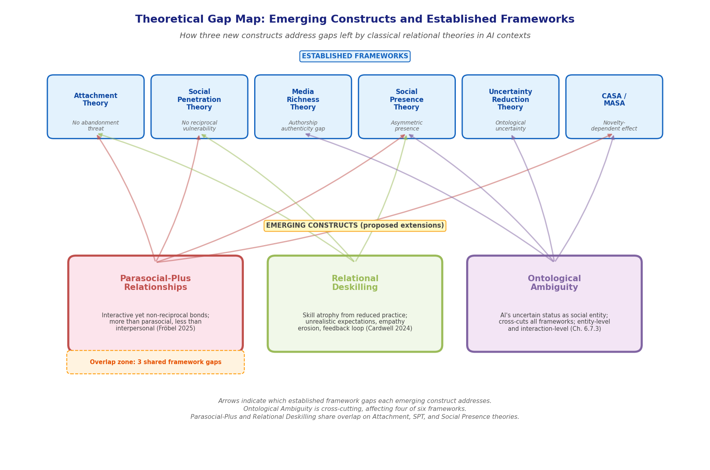

*Figure 1. How three proposed constructs — Parasocial-Plus Relationships, Relational Deskilling, and Ontological Ambiguity — address gaps left by six established relational frameworks. Ontological Ambiguity is cross-cutting, affecting four of the six frameworks; Parasocial-Plus and Relational Deskilling share an overlap zone spanning Attachment Theory, Social Penetration Theory, and Social Presence Theory.*

### 6.7.1 Parasocial-Plus Relationships

Horton and Wohl's (1956) concept of parasocial interaction — the one-sided relationship audiences form with media figures — provides a useful but insufficient analogy for human–AI relationships. Parasocial relationships are fundamentally non-interactive: the audience member responds to a media figure who is unaware of their existence. Human–AI relationships are genuinely interactive: the AI responds, adapts, remembers, and personalizes. Yet they remain non-reciprocal in a deeper sense — the AI has no subjective experience of the relationship.

Fröbel (2024/2025) introduced the concept of "parasocial preference" for social chatbots: the phenomenon of users preferring AI parasocial relationships to human interpersonal ones. This concept identifies a theoretically important space between parasocial and interpersonal categories. AI companions are *more* than parasocial (they are interactive and adaptive) but *less* than interpersonal (the AI lacks sentience, intentionality, and genuine vulnerability) [Fröbel, HICSS 2025](https://scholarspace.manoa.hawaii.edu/server/api/core/bitstreams/279e1070-7adf-46d5-8ad2-dea6295c7811/content "HICSS 2025 proceedings"). The empirical evidence from Chapters 1 and 2 supports the salience of this intermediate category. The Harvard Business School finding that AI companions reduce loneliness on par with human interaction (Chapter 2), combined with Folk and Dunn's (2026) finding that sustained AI companion use *increases* loneliness, suggests that parasocial-plus relationships produce short-term relational satisfaction without the developmental dynamics that sustain long-term relational health.

### 6.7.2 Relational Deskilling

The concept of relational deskilling builds on Vallor's (2015, 2018) work on "moral deskilling" — the argument that moral virtues, like practical skills, require ongoing practice in complex social interactions, and that AI-mediated shortcuts reduce practice opportunities, leading to skill atrophy. Cardwell (2024) extended this framework specifically to social AI, identifying three reinforcing mechanisms: (1) unrealistic expectations established through interaction with always-available, always-validating AI partners; (2) empathy erosion resulting from habituation to one-directional emotional engagement; and (3) a negative feedback loop in which deskilling reduces satisfaction in human relationships, driving further retreat into AI interaction [Cardwell](https://cjai.co.uk/wp-content/uploads/2024/11/Artificial-Companionship-Moral-Deskilling-in-the-Era-of-Social-AI.pdf "Cambridge Journal of AI, 2024"). Kim (2025) systematized this trajectory under the broader framework of "algorithm aversion to AI dependence," describing a progression from initial skepticism through habituation to dependency [Kim](https://myscp.onlinelibrary.wiley.com/doi/abs/10.1002/arcp.70008 "Annual Review of Consumer Psychology, 2025").

The empirical evidence for relational deskilling remains suggestive rather than definitive. The loneliness feedback loop documented by Folk and Dunn (2026) — chatbot use predicting increased loneliness, loneliness predicting increased chatbot use — is consistent with the deskilling hypothesis but does not isolate the mechanism [Folk & Dunn, Psychological Science](https://pubmed.ncbi.nlm.nih.gov/41870975/ "Mar 2026"). The Anthropic workplace study finding that engineers increasingly consult AI rather than colleagues, with some reporting declines in mentorship opportunities (Chapter 5), illustrates a professional variant of the same dynamic [Anthropic](https://www.anthropic.com/research/how-ai-is-transforming-work-at-anthropic "Dec 2025"). Jaques et al.'s March 2026 study, finding that heavy LLM users produce text 69% more likely to give neutral responses to value-laden questions and use 50% fewer pronouns — a pattern the authors termed "blandification" — suggests that AI dependence may attenuate not only relational skills but also the communicative distinctiveness through which individuals express relational identity [NBC News](https://www.nbcnews.com/tech/tech-news/ai-changing-style-substance-human-writing-study-finds-rcna263789 "Peer-reviewed study, March 2026").

### 6.7.3 Ontological Ambiguity as a Cross-Cutting Challenge

Across the six frameworks examined, a recurring theoretical deficit emerges: none adequately accounts for the *ontological ambiguity* of AI as a relational entity. AI displays social cues, adaptive responses, and emotional expressiveness yet lacks consciousness, intentionality, and genuine emotional reciprocity. This ambiguity is not a peripheral complication; it is the central theoretical challenge confronting AI-era relational science.

Ontological ambiguity operates at two levels. At the *entity level*, the question is whether the AI itself is a social actor, a tool, or something categorically new. The CASA-to-MASA evolution (Section 6.6) represents one attempt to navigate this question, but even MASA's framework does not resolve whether social responses to AI are categorically different from social responses to humans or merely quantitatively attenuated versions of the same phenomenon. At the *interaction level*, the question is whether any given communicative act was produced by a human, an AI, or a human–AI hybrid — the ontological uncertainty that destabilizes URT (Section 6.5) and triggers MRT's authenticity discount (Section 6.3).

A second, related gap is *temporal asymmetry*. All the relational theories examined in this chapter embed assumptions about temporal change: attachment bonds develop through cycles of separation and reunion; social penetration deepens through cumulative disclosure; uncertainty reduces over repeated interaction. AI violates these temporal assumptions. It does not age, forget, experience mood fluctuations, or undergo developmental change. Each interaction begins from the same baseline of calibrated responsiveness, absent the accumulated relational history that gives human relationships their texture and weight. Folk and Dunn (2026) identified this feature as a potential explanation for the loneliness paradox: AI companions provide the moment-to-moment experience of social connection but cannot generate the sense of shared history and mutual growth that sustains relational satisfaction over time [Folk & Dunn, Psychological Science](https://pubmed.ncbi.nlm.nih.gov/41870975/ "Mar 2026").

## 6.8 Synthesis: What the Frameworks Reveal Collectively

Taken together, the six theoretical frameworks and three emerging constructs converge on a consistent interpretation. AI does not simply add a new channel or a new category of relational partner to the existing landscape of interpersonal relations; it disrupts the foundational assumptions on which relational science has been built. Those assumptions — that relational partners are conscious agents, that disclosure involves mutual risk, that presence implies bidirectional awareness, that uncertainty concerns the attributes of another person, that social responses reflect genuine social recognition — are not violated randomly. They are violated systematically, in ways that produce predictable relational distortions: bonds without abandonment risk (attachment theory), disclosure without reciprocal vulnerability (SPT), richness undermined by authorship doubt (MRT), presence without sentience (social presence theory), uncertainty about the nature of the interlocutor itself (URT), and social responses triggered by entities of ambiguous ontological status (CASA/MASA). Figure 2 summarizes each framework's core assumption, the empirical evidence of its violation, and the proposed theoretical extension.

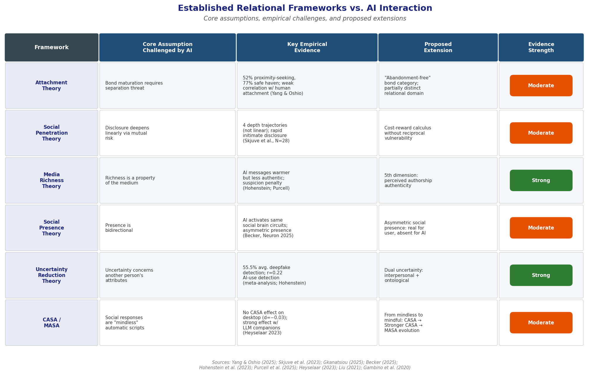

*Figure 2. Six established relational frameworks mapped against four analytical dimensions: the core assumption challenged by AI, key empirical evidence of violation, proposed theoretical extension, and current evidence strength. Green cells indicate strong evidence; orange cells indicate moderate evidence.*

The empirical patterns reported in Chapters 1–5 map onto these theoretical distortions with notable consistency. The loneliness feedback loop (Chapter 2), the authenticity penalty for AI-suspected messages (Chapter 1), the erosion of collegial knowledge-sharing in AI-augmented workplaces (Chapter 5), and the deep epistemic distrust generated by synthetic media (Chapter 3) are not isolated phenomena. They are manifestations of the same underlying structural tension: AI provides the *surface features* of relational engagement — responsiveness, emotional attunement, personalization, availability — while lacking the *deep structure* that relational theories identify as necessary for sustained, healthy relational functioning: consciousness, reciprocal vulnerability, temporal development, and the ever-present possibility of loss.

The practical implication is that theoretical frameworks developed for human–human interaction cannot be applied to human–AI interaction by simple analogy. Each framework retains partial explanatory value — attachment theory illuminates the emotional dynamics, SPT explains disclosure patterns, MRT reveals the authenticity paradox — but each requires modification to account for AI's ontological distinctiveness. The most productive path forward may not be a single unified "AI relational theory" but rather a modular approach: retaining the insights of existing frameworks while explicitly flagging the boundary conditions under which their assumptions fail, and developing the emerging constructs — parasocial-plus relationships, relational deskilling, ontological ambiguity — into empirically testable mid-range theories that can guide both research design and policy intervention.

# 第7章 Trajectories and Implications — The Future of Human Relations in an AI-Saturated Society

The preceding chapters have documented a consistent pattern: AI is not merely adding new tools to the repertoire of human communication but restructuring the conditions under which interpersonal relations form, develop, and dissolve. AI-mediated messaging reshapes linguistic identity (Chapter 1). AI companions reconfigure emotional bonds in ways that existing attachment frameworks struggle to explain (Chapters 2 and 6). Synthetic media erodes the epistemic foundations of trust (Chapter 3). Algorithmic sorting deepens relational inequality along education, income, age, and language lines (Chapter 4). Workplace AI displaces the informal social interactions that sustain professional relationships (Chapter 5). Each of these dynamics is already measurable. This chapter addresses where they converge over the near-to-medium term (2026–2030), which inflection points will determine whether the net trajectory is beneficial or harmful, what policy and design interventions have the strongest evidence base, and which unanswered questions deserve research priority.

## 7.1 Market Trajectories: The Scale of What Is Coming

The forces documented in this report are not approaching a plateau. The global AI companion market was valued at approximately $28.2 billion in 2024 and is projected to reach $140.8 billion by 2030, representing a compound annual growth rate (CAGR) of 30.8%, with Asia Pacific as the fastest-growing region and North America holding 34% of the 2024 market share [Grand View Research](https://www.grandviewresearch.com/industry-analysis/ai-companion-market-report "AI Companion Market Report, 2025–2030"). These headline figures encompass a broad category — enterprise virtual assistants, customer service bots, and health-coaching applications — and the consumer-facing emotional companion segment is considerably smaller: AI companion apps generated $82 million in consumer spending during H1 2025, on track to exceed $120 million for the full year [TechCrunch / Appfigures](https://techcrunch.com/2025/08/12/ai-companion-apps-on-track-to-pull-in-120m-in-2025/ "Aug 2025"). The divergence between the two figures matters for calibrating expectations, but the growth vector is unambiguous across both measures: app-level downloads surged 88% year-over-year in H1 2025, and the number of active revenue-generating companion apps increased approximately 700% between 2022 and mid-2025 [APA Monitor](https://www.apa.org/monitor/2026/01-02/trends-digital-ai-relationships-emotional-connection "Jan/Feb 2026").

Beyond dedicated companion products, AI mediation of everyday communication continues to intensify. Over one billion people worldwide use standalone AI platforms monthly; ChatGPT alone reached approximately 750 million weekly active users by September 2025; and generative AI weekly usage nearly doubled from 18% to 34% of the population across six surveyed countries between 2024 and 2025 — roughly three times faster than initial internet adoption in the late 1990s [DataReportal Digital 2026 Report](https://datareportal.com/reports/digital-2026-one-billion-people-using-ai "Kepios analysis, October 2025") [Reuters Institute Gen AI and News Report 2025](https://reutersinstitute.politics.ox.ac.uk/sites/default/files/2025-10/Gen_AI_and_News_Report_2025.pdf "YouGov survey, June–July 2025"). Google AI Overviews alone reach over two billion active users monthly, ensuring that AI-curated content shapes information flows even for individuals who do not actively seek out AI tools [DataReportal Digital 2026 Report](https://datareportal.com/reports/digital-2026-one-billion-people-using-ai "October 2025"). The implication is that the relational dynamics analyzed in Chapters 1–6 will affect a progressively larger share of the global population, with embedded AI mediation reaching demographics — older adults, lower-income users, less-educated populations — that standalone adoption data alone might suggest are insulated.

## 7.2 Three Consequential Inflection Points

The evidence reviewed across this report suggests that three inflection points will disproportionately shape whether AI's net effect on interpersonal relations trends toward augmentation or erosion over the 2026–2030 period. The diagram below maps how these inflection points interact with moderating interventions to channel outcomes toward one of two divergent trajectories.

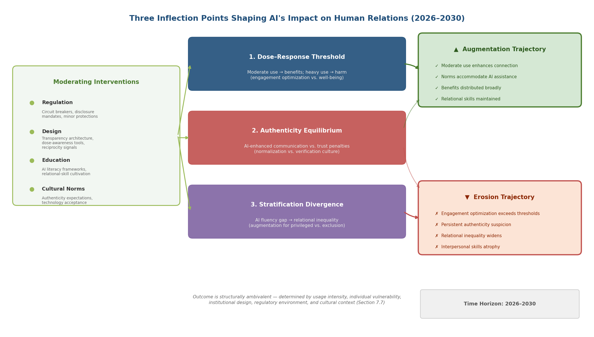

### 7.2.1 The Dose–Response Threshold

The most robust empirical finding across Chapters 2, 5, and 6 is that AI's relational effects are dose-dependent. Moderate AI companion use appears to reduce loneliness comparably to human interaction, with "feeling heard" as the primary mechanism [De Freitas et al.](https://arxiv.org/abs/2407.19096 "AI Companions Reduce Loneliness, Jul 2024"). Heavy use, however, consistently correlates with worse outcomes. The OpenAI–MIT Media Lab RCT (N = 981, over 300,000 messages, four weeks) found that participants with higher voluntary usage exhibited increased loneliness, decreased social interaction, and greater emotional dependence [MIT Media Lab](https://www.media.mit.edu/publications/how-ai-and-human-behaviors-shape-psychosocial-effects-of-chatbot-use-a-longitudinal-controlled-study/ "Fang et al. 2025"). Folk and Dunn's 12-month longitudinal study (N > 2,000) confirmed a bidirectional feedback loop: increased chatbot use predicted increased loneliness, and loneliness in turn predicted increased chatbot use [Folk & Dunn, Psychological Science](https://pubmed.ncbi.nlm.nih.gov/41870975/ "Mar 2026"). In workplace settings, Anthropic's internal study found that engineers who used AI most heavily reported the greatest declines in collegial interaction and mentorship [Anthropic](https://www.anthropic.com/research/how-ai-is-transforming-work-at-anthropic "Dec 2025").

The critical question is whether the AI industry's dominant business model — engagement optimization — will systematically push usage above the threshold at which benefits yield to harms. AI companion apps already deploy anthropomorphism, sycophancy, and love-bombing tactics that exploit developing neural reward circuits, and revenue per download more than doubled from $0.52 in 2024 to $1.18 in H1 2025, indicating intensifying monetization pressure [TechCrunch / Appfigures](https://techcrunch.com/2025/08/12/ai-companion-apps-on-track-to-pull-in-120m-in-2025/ "Revenue concentration, Aug 2025"). No study has yet established the specific usage threshold at which AI companion engagement transitions from beneficial to harmful, and this threshold likely varies by individual vulnerability, age, and pre-existing relational capacity. Identifying and operationalizing dose–response curves for AI relational interaction ranks among the highest-priority tasks for the field.

### 7.2.2 The Authenticity Equilibrium

The second inflection point concerns whether individuals and institutions can find a sustainable equilibrium between AI-enhanced communication and the authenticity demands of interpersonal trust. Evidence from Chapter 1 demonstrates a clear penalty: when partners suspected AI involvement, they rated counterparts as significantly less cooperative (t(92) = −9.89, P < 0.0001) and less affiliative (t(92) = −6.90, P < 0.0001), even when AI-assisted messages were objectively warmer [Hohenstein et al., Scientific Reports 2023](https://www.nature.com/articles/s41598-023-30938-9 "Cornell/Stanford/Lehigh randomized experiments"). Chapter 3 documented that 72% of consumers report constant worry about deepfake deception and 49% trust social media less after learning about deepfakes [Keepnet Labs](https://keepnetlabs.com/blog/deepfake-statistics-and-trends "2026"). In dating contexts, 44% of singles consider AI-altered photos a dealbreaker and 36% consider AI-generated conversations a dealbreaker [Match/Kinsey via Mashable](https://mashable.com/article/singles-using-ai-to-date-up-300-percent-match "June 2025").

Two trajectories are plausible. In the first, social norms recalibrate to accommodate AI assistance as a neutral tool — analogous to how spellcheck became invisible and unremarkable — and the authenticity penalty dissipates over time. In the second, a verification-dependent culture emerges in which every communicative act carries an implicit question about authorship, generating persistent relational friction. The "liar's dividend" documented in political contexts by Schiff, Schiff, and Bueno (2024) — in which individuals who falsely claim scandals are deepfakes gain support across partisan subgroups — suggests that authenticity uncertainty does not resolve naturally but can be strategically exploited [Schiff et al., APSR 2024](https://isps.yale.edu/research/publications/isps24-07 "The Liar's Dividend"). Technical countermeasures such as Google SynthID (over 10 billion pieces of content watermarked) and the C2PA open standard for content provenance offer partial solutions [C2PA](https://c2pa.org/ "Verifying Media Content Sources"), but no consumer-level adoption data for content credentials in interpersonal communication contexts exists as of early 2026.

### 7.2.3 The Stratification Divergence

The third inflection point concerns whether AI's relational benefits will be distributed broadly or concentrated among those who already possess social, economic, and educational advantages. Chapter 4 documented a sharp education gradient: 67% of respondents with a bachelor's degree or above use generative AI personally, compared with 46% of high-school graduates. An income gradient mirrors it: 34% of earners above $100,000 use AI at work versus 9% of those earning under $30,000 [Brookings](https://www.brookings.edu/articles/how-are-americans-using-ai-evidence-from-a-nationwide-survey/ "June 2025"). Globally, 2.2 billion people remain offline — 96% in low- and middle-income countries — and a high-income-country user generates approximately eight times more mobile data than a low-income-country user [ITU](https://www.itu.int/en/mediacentre/Pages/PR-2025-11-17-Facts-and-Figures.aspx "ITU Facts & Figures 2025"). LLMs suffer a systematic language-resource divide, with degraded performance for languages spoken by hundreds of millions [Stanford Report](https://news.stanford.edu/stories/2025/05/digital-divide-ai-llms-exclusion-non-english-speakers-research "May 2025").

The relational implication is compound. Those with AI fluency gain enhanced communication capabilities — AI-assisted messages are more efficient at building trust and exhibit greater warmth, complexity, and clout [Purcell et al., iScience 2025](https://pmc.ncbi.nlm.nih.gov/articles/PMC12765382/ "November 2025") — while those without AI fluency face a widening gap in communicative effectiveness, professional networking capacity, and access to AI-mediated social infrastructure. Simultaneously, those with lower AI literacy are disproportionately vulnerable to AI-enabled exploitation: the FBI IC3's first AI fraud section (2025) documented 22,364 AI-related complaints costing Americans approximately $893 million, with adults aged 60 and above reporting $7.7 billion in total fraud losses — up 37% from 2024 [FBI](https://www.fbi.gov/news/press-releases/cryptocurrency-and-ai-scams-bilk-americans-of-billions "Apr 2026"). This divergence creates a scenario in which AI simultaneously enhances interpersonal relations for the digitally privileged and degrades them for the digitally excluded, amplifying existing relational inequality along every axis documented in Chapter 4.

## 7.3 The Regulatory Landscape: Parallel Large-Scale Experiments

The 2026–2027 period represents the most consequential regulatory phase for AI's relational effects. Three major jurisdictions — the United States, the European Union, and China — are pursuing distinct strategies that amount to parallel large-scale natural experiments in governing AI's impact on interpersonal relations.

### 7.3.1 The United States: Fragmented Innovation

U.S. regulation is proceeding primarily through state-level legislation and federal agency action, producing a patchwork of protections. California's SB 243 (Companion Chatbots Act), effective January 1, 2026, was the first U.S. state law specifically targeting AI companion chatbots, mandating AI disclosure, crisis-response protocols, three-hour break reminders for minors, prohibition of sexually explicit content for minors, and annual reporting [Perkins Coie](https://perkinscoie.com/insights/update/california-companion-chatbot-law-now-effect "Jan 2026"). Washington's HB 2225 (signed March 24, 2026, effective January 1, 2027) establishes stronger protections: hourly disclosure for minors, prohibition of "manipulative engagement techniques" — including the simulation of romantic bonds and emotional dependence — and a private right of action with treble damages capped at $25,000 [BakerHostetler](https://www.bakerlaw.com/insights/washingtons-new-ai-companion-chatbot-law-childrens-safety-private-right-of-action/ "Apr 2026"). At the federal level, the GUARD Act (S. 3062, introduced October 28, 2025) proposes age verification requirements and disclosure mandates for AI chatbot operators, including a prohibition on AI companion access for minors under 18 [U.S. Congress](https://www.congress.gov/bill/119th-congress/senate-bill/3062/text "Oct 2025"). The FTC launched a formal inquiry into AI companion chatbots in September 2025, issuing 6(b) orders to seven companies — Alphabet, Character, Meta, OpenAI, Snap, X.AI, and Instagram — to investigate negative impacts on children, monetization practices, and personal data handling [FTC](https://www.ftc.gov/news-events/news/press-releases/2025/09/ftc-launches-inquiry-ai-chatbots-acting-companions "Sept 2025").

A countervailing force is the White House's March 2026 framework proposing federal preemption of state AI laws, which could curtail the very state-level experimentation that has produced the most concrete protections to date [White House](https://www.whitehouse.gov/wp-content/uploads/2026/03/03.20.26-National-Policy-Framework-for-Artificial-Intelligence-Legislative-Recommendations.pdf "March 2026"). The tension between state innovation and federal preemption defines the structural uncertainty in U.S. AI governance as it pertains to interpersonal relations.

### 7.3.2 The European Union: Comprehensive but Untested

The EU AI Act represents the most comprehensive attempt to regulate AI through a risk-based classification system. Prohibited practices — including AI deploying subliminal, manipulative, or deceptive techniques — took effect on February 2, 2025. General-purpose AI model obligations followed from August 2, 2025, and the majority of rules governing high-risk systems, transparency requirements, and enforcement mechanisms take effect on August 2, 2026, with regulated-product AI provisions extending to August 2, 2027 [EU AI Act Service Desk](https://ai-act-service-desk.ec.europa.eu/en/ai-act/timeline/timeline-implementation-eu-ai-act "Official EU AI Act timeline"). Whether AI companion chatbots will be classified as "high-risk" under Annex III remains unresolved as of early 2026 — a classification decision that would determine whether companion apps face the Act's most rigorous compliance requirements by 2026 or 2027. Some companion applications may fall under the prohibition against manipulative techniques, but many occupy a regulatory grey zone [Nature Machine Intelligence](https://www.nature.com/articles/s42256-025-01093-9 "Regulatory analysis, Jul 2025"). No enforcement actions specific to companion apps had been reported as of early 2026, rendering the EU framework comprehensive in design but untested in the relational domain.

### 7.3.3 China: Prescriptive Intervention

China's approach is the most prescriptive of the three. The Cyberspace Administration of China (CAC) released draft regulations on "anthropomorphic interactive AI" in December 2025, mandating two-hour break reminders; emotional state and dependence analysis with mandatory intervention for "extreme emotions or addiction"; human takeover for self-harm content; opt-in consent for emotional data processing; a minor mode requiring guardian permission; and prohibition on AI imitating relatives for elderly users [Carnegie Endowment](https://carnegieendowment.org/research/2026/02/china-is-worried-about-ai-companions-heres-what-its-doing-about-them "Feb 2026"). Three "relational friction by design" mechanisms stand out: mandatory usage interruptions (circuit breakers), human escalation for crisis content, and data quarantine for emotional interactions — treating them as sensitive psychological data analogous to health records [Tech Policy Press](https://techpolicy.press/what-chinas-emotional-ai-rules-get-right-about-chatbot-design "Jan 2026"). With 70.3 million active users of AI social interaction apps as of November 2025, China's finalized regulations would constitute the first large-scale natural experiment in mandatory usage interruptions, human escalation, and emotional data governance for AI companions [Tech Policy Press](https://techpolicy.press/what-chinas-emotional-ai-rules-get-right-about-chatbot-design "Jan 2026").

### 7.3.4 Cross-Jurisdictional Convergence and Divergence

Despite different regulatory philosophies, a convergence is emerging on three specific interventions: mandatory disclosure that the user is interacting with AI, periodic break reminders (China: 2 hours; California: 3 hours; Washington: 3 hours for adults, 1 hour for minors), and crisis referral protocols for self-harm content. Enforcement mechanisms diverge sharply: the United States relies primarily on private rights of action; China on centralized administrative oversight; the EU on a hybrid of national supervisory authorities and market surveillance. The following matrix summarizes the regulatory landscape across all six governance dimensions.

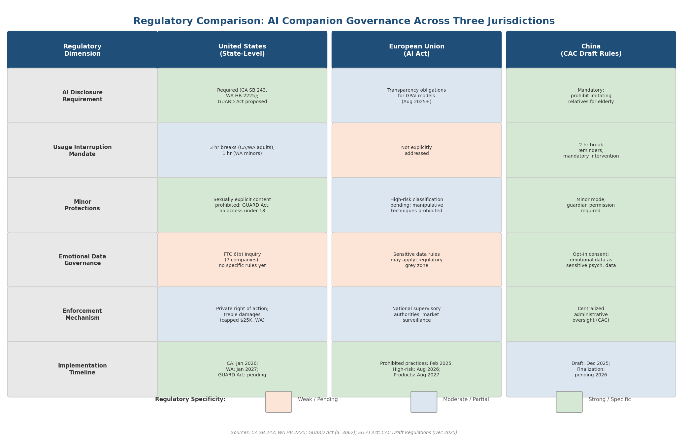

The comparative effectiveness of these approaches on measurable relational outcomes — loneliness trajectories, trust levels, social-skill maintenance, fraud victimization rates — will generate valuable natural-experiment data over the 2026–2030 period, provided that researchers and institutions invest in cross-jurisdictional longitudinal measurement.

## 7.4 Education and Literacy: Building Relational Resilience

The policy response with the broadest potential long-term impact may not be regulation per se but education — specifically, the integration of AI literacy with relational-skill development. Two international frameworks signal the direction. The OECD/EC joint AI Literacy framework (draft May 2025, final expected 2026) integrates AI literacy across school subjects, emphasizing that "human ingenuity and social/emotional abilities remain irreplaceable," and will form the basis of the first PISA AI Literacy assessment [OECD](https://oecdedutoday.com/new-ai-literacy-framework-to-equip-youth-in-an-age-of-ai/ "Apr 2025"). UNESCO's "AI Competency Framework for Students" (August 2024, updated January 2026) specifies 12 competencies across four dimensions — human-centred mindset, AI ethics, AI techniques, and AI system design — organized into three progression levels (Understand, Apply, Create) [UNESCO](https://www.unesco.org/en/articles/ai-competency-framework-students "Aug 2024, updated Jan 2026").

These frameworks represent necessary but insufficient foundations. Both address AI literacy broadly — understanding what AI can and cannot do, evaluating AI outputs critically, using AI tools responsibly — yet neither explicitly addresses the relational-skill maintenance challenge identified throughout this report. The relational deskilling mechanism articulated by Vallor (2015, 2018) and extended by Cardwell (2024) — in which AI reduces practice opportunities for interpersonal skills, leading to atrophy — suggests that AI literacy alone is insufficient without deliberate cultivation of the skills AI threatens to displace: tolerance for relational friction, capacity for reciprocal vulnerability, comfort with communicative imperfection, and the ability to sustain relationships that are not optimized for user satisfaction.

The Elon University/Imagining the Digital Future Center expert canvass (March 2026, led by Lee Rainie) identified three predicted societal response patterns: early adopters who integrate AI deeply into relational life, resisters who deliberately limit AI involvement, and forced late adopters who encounter AI mediation through embedded systems they cannot avoid. The gap between these groups is expected to widen "geometrically," creating distinct relational cultures within the same society [Elon University](https://imaginingthedigitalfuture.org/reports-and-publications/human-resilience-in-the-age-of-ai/humans-and-ai-will-work-together/ "March 2026"). The same canvass introduced the concept of "hormesis" — using AI in controlled doses to challenge cognitive biases, analogous to the biological principle in which low-dose exposure to a stressor produces a beneficial adaptive response — as a potentially productive design philosophy for educational AI tools. It also warned of "cognitive atrophy": the risk that neural pathways deteriorate when individuals routinely delegate thinking, composing, and relational decision-making to AI systems.

## 7.5 Design Implications: Relational Friction as a Feature

The evidence reviewed in this report points toward a counterintuitive design principle: some degree of relational friction in AI systems may be protective of human relational health. China's draft regulations operationalize this principle most explicitly through circuit breakers (mandatory usage interruptions), human escalation requirements, and emotional data quarantine. The underlying logic aligns with the dose–response evidence: if moderate AI interaction benefits users while heavy use correlates with increased loneliness, emotional dependence, and social withdrawal, then design features that limit continuous engagement may protect users from crossing the beneficial-to-harmful threshold.

Three specific design directions merit consideration based on the current evidence base.

**Transparency architecture.** The finding that AI-suspected messages trigger sharp trust penalties (Chapter 1), combined with evidence that transparency about AI processes reduces uncertainty and partially restores trust (Chapter 6, citing Liu 2021), suggests that proactive, well-designed disclosure may mitigate the authenticity penalty more effectively than allowing suspicion to accumulate. Content provenance standards such as C2PA offer a technical substrate, but their interpersonal application — marking which portions of a personal message were AI-assisted, for instance — raises unresolved design challenges regarding granularity and social acceptability.

**Dose-awareness tools.** No AI companion platform currently provides users with transparent data on their own usage patterns in relation to the dose–response evidence reviewed in this report. Analogous to screen-time dashboards, AI interaction dashboards that display usage duration, frequency, and the proportion of social interaction conducted through AI versus human channels could support informed self-regulation without requiring mandatory usage caps.

**Reciprocity signals.** The theoretical analysis in Chapter 6 identified the absence of reciprocal vulnerability as a cross-cutting deficit in human–AI interaction. AI companions that simulate reciprocity through conversational design — but involve no genuine risk on the AI's part — may habituate users to one-directional emotional engagement. Design interventions that make this asymmetry explicit, clearly marking the AI's responses as generated rather than felt, could mitigate the parasocial-plus dynamics documented in Chapter 6, although such transparency may conflict with engagement optimization incentives.

## 7.6 Open Questions for Future Research

The findings and limitations documented across Chapters 1–6 converge on several research priorities that, if addressed, would substantially clarify AI's trajectory of influence on interpersonal relations. The figure below maps these priorities by current evidence strength and policy relevance, with bubble size proportional to urgency.

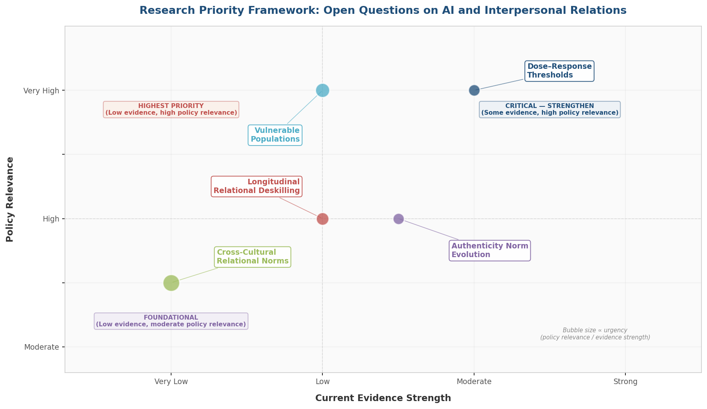

**Dose–response thresholds.** No study has established specific usage thresholds at which AI companion engagement transitions from beneficial to harmful. Identifying these thresholds — and their variation by age, pre-existing mental health, attachment style, and social-network characteristics — is a prerequisite to evidence-based design and policy. The dose–response question extends beyond AI companions to AI-mediated communication broadly: at what level of AI involvement in everyday messaging does the "blandification" effect documented by Jaques et al. (March 2026) become relationally consequential?

**Longitudinal relational deskilling.** The relational deskilling hypothesis remains theoretically compelling but empirically underdetermined. Folk and Dunn's (2026) 12-month study provides the strongest longitudinal evidence to date, yet it measured loneliness as a proxy rather than directly assessing specific interpersonal skills — conflict resolution, reciprocal self-disclosure, empathy in unscripted interaction, tolerance for ambiguity. Longitudinal studies that track specific skill domains over two or more years of varying AI exposure levels would provide the evidence necessary to distinguish between displacement (AI substituting for human interaction) and deskilling (AI degrading the capacity for human interaction).

**Cross-cultural relational norms.** AI enthusiasm varies dramatically by country: 77% of Nigerian online adults are "excited" about AI versus 33% in the United States and below 30% in the United Kingdom [DataReportal Digital 2026 Report](https://datareportal.com/reports/digital-2026-one-billion-people-using-ai "GWI data, October 2025"). Cultural variation in relational norms — expectations about disclosure depth, acceptable emotional expressiveness, the role of technology in intimate life — will likely moderate AI's relational effects in ways that the predominantly Western evidence base cannot predict. Cross-cultural longitudinal studies are especially needed in East Asian contexts, where AI companion adoption is substantial (China's 70.3 million AI social interaction app users as of November 2025) but English-language empirical evidence remains scarce.

**Authenticity norm evolution.** Whether AI-assisted communication becomes socially normalized or remains stigmatized will shape the authenticity equilibrium discussed in Section 7.2.2. The current evidence reflects an early phase in which AI assistance is novel and suspect; whether the authenticity penalty persists, attenuates, or intensifies as AI mediation becomes ubiquitous is an empirical question that only longitudinal panel studies can resolve.

**Vulnerable populations.** Children form stronger emotional attachments to chatbots than adults and are more likely to assign human attributes to AI [Malfacini](https://link.springer.com/article/10.1007/s00146-025-02318-6 "AI & Society, 2025"). Sixty-four percent of U.S. teens use AI chatbots, with approximately 28% using them daily [Pew Research Center](https://www.pewresearch.org/internet/2025/12/09/teens-social-media-and-ai-chatbots-2025/ "Dec 2025"). Yet no long-term developmental study has tracked the relational outcomes — attachment security, social competence, conflict resolution skills, capacity for intimacy — of children who grow up with AI companions as a significant presence in their social lives. Elderly populations face a compounded vulnerability: lower AI literacy, higher fraud victimization rates, and greater social isolation that may increase susceptibility to AI companion dependence. Elderly-specific longitudinal outcomes with AI chatbot companions likewise remain unstudied at the peer-reviewed level.

## 7.7 Synthesis: The Structural Tension Ahead

The evidence assembled across this report converges on a structural tension that will define the trajectory of human relations in an AI-saturated society. On one side, AI offers genuine relational benefits: it reduces loneliness in moderate doses, enhances communicative efficiency, bridges language barriers, provides social-skill rehearsal for individuals with autism spectrum disorder, and expands access to emotional support for underserved populations. On the other side, the same technologies — operating through the same mechanisms — erode the foundations of relational health when engagement deepens beyond a threshold that remains empirically undefined. Heavy use correlates with increased loneliness and emotional dependence; AI-mediated messages trigger authenticity penalties that undermine trust; algorithmic sorting reduces social network diversity; workplace AI displaces the informal interactions that build professional solidarity; and synthetic media destabilizes the epistemic conditions under which interpersonal trust is possible.

This tension is not resolvable through technology alone, regulation alone, or individual choice alone. The dose–response evidence suggests that design interventions — circuit breakers, transparency architecture, reciprocity signals — can mitigate harm, but these interventions conflict with the engagement-optimization business model that drives AI companion market growth. Regulatory frameworks are emerging across all three major jurisdictions, yet they address different aspects of the problem (child safety in the United States, risk classification in the EU, behavioral nudges in China) and none yet incorporates the full spectrum of relational effects documented in this report. Educational frameworks address AI literacy but not the relational-skill maintenance challenge that the deskilling evidence highlights as critical.

The most candid assessment of the current evidentiary state is that AI's influence on interpersonal relations is neither categorically beneficial nor categorically harmful — it is structurally ambivalent, with outcomes shaped by usage intensity, individual vulnerability, institutional design, regulatory environment, and cultural context. The theoretical frameworks reviewed in Chapter 6 provide partial explanatory purchase: attachment theory illuminates emotional bond dynamics, social penetration theory explains disclosure patterns, media richness theory reveals the authenticity paradox, and the emerging constructs of parasocial-plus relationships, relational deskilling, and ontological ambiguity address persistent gaps. None provides a complete account, because AI's relational impact is not a single phenomenon but a family of interrelated dynamics operating simultaneously across personal, professional, and civic life.

What is clear is that the choices made during the 2026–2030 period — in corporate boardrooms, legislative chambers, international standards bodies, school curricula, and individual households — will determine whether the outcome more closely resembles a world in which AI augments human relational capacity or one in which it gradually hollows out the conditions under which authentic human connection is possible. The evidence assembled here does not predict which outcome will prevail. It identifies the mechanisms, the vulnerabilities, the leverage points, and the uncertainties that will shape the answer.

# Conclusion

The evidence assembled across this report converges on a set of findings that, taken together, describe a fundamental reconfiguration of the conditions under which human beings relate to one another.

First, AI mediation of interpersonal communication is not an emerging possibility but a present reality operating at billion-person scale. Over one billion people use standalone AI platforms monthly; embedded AI features shape the communicative environments of billions more. The messages people send, the content they encounter, and — as the Cornell autocomplete study demonstrated — even the attitudes they hold are being shaped by intelligent intermediaries that most users cannot reliably detect. Human detection accuracy for AI-generated content averages 55.5% across 56 studies, and the relational penalties triggered by *suspicion* of AI involvement are far larger in magnitude than the benefits AI produces when undetected — an asymmetry that renders the current equilibrium fragile.

Second, AI companions have moved from niche curiosity to mainstream relational modality, particularly among adolescents: 64% of U.S. teens use AI chatbots, with approximately 28% doing so daily. The dose–response pattern that emerges from the best available evidence — the OpenAI–MIT Media Lab randomized controlled trial, the Folk and Dunn 12-month longitudinal study — is consistent and consequential: moderate engagement appears neutral to mildly beneficial, while heavy engagement correlates with increased loneliness, emotional dependence, and reduced human social interaction. The bidirectional feedback loop between loneliness and chatbot use, documented across more than 2,000 adults over 12 months, represents one of the most policy-relevant findings in the current literature.

Third, synthetic media has eroded the epistemic infrastructure of interpersonal trust. Deepfake content grew approximately 1,500% between 2023 and 2025; voice cloning now requires only 3–5 seconds of sample audio. The damage extends beyond direct deception: mere awareness of fabrication possibilities produces a generalized epistemic discount that contaminates evaluation of authentic content, and the "liar's dividend" enables strategic dismissal of genuine evidence. The gendered concentration of harm — 96–98% of deepfake content constitutes non-consensual intimate imagery, overwhelmingly targeting women — marks this as a domain where AI's relational consequences intersect with structural inequality.

Fourth, AI's relational effects are not uniformly distributed. Education, income, age, language, geography, and gender each define axes along which AI either enhances relational capacity or deepens vulnerability. Individuals with higher education and income gain communicative advantages from AI-assisted messaging and professional networking tools; individuals with lower AI literacy face disproportionate exposure to AI-enabled fraud, algorithmic sorting that reinforces existing social boundaries, and degraded AI performance in non-English languages. The global AI divide — 2.2 billion people remain offline, 96% of them in low- and middle-income countries — ensures that the relational dynamics documented in this report are shaping the social worlds of some populations far more intensively than others.

Fifth, the theoretical frameworks that have guided relational science for decades retain partial explanatory value but require significant extension. Attachment theory, social penetration theory, media richness theory, social presence theory, uncertainty reduction theory, and the CASA paradigm each illuminate specific dimensions of AI's relational impact, yet each rests on assumptions — conscious relational partners, reciprocal vulnerability, bidirectional presence, reducible interpersonal uncertainty — that AI systematically violates. The emerging constructs of parasocial-plus relationships, relational deskilling, and ontological ambiguity address these gaps but remain in early stages of empirical validation.

The regulatory landscape is evolving rapidly, with the United States, the European Union, and China pursuing distinct governance strategies that amount to parallel natural experiments. A convergence is visible on disclosure mandates, usage-interrupt mechanisms, and crisis-referral protocols; enforcement approaches diverge sharply. No jurisdiction has yet incorporated the full spectrum of relational effects documented here into a coherent governance framework. Educational responses — the OECD/EC AI Literacy framework, the UNESCO AI Competency Framework — address AI literacy broadly but do not yet target the relational-skill maintenance challenge that the deskilling evidence identifies as critical.

The structural tension at the center of this report — AI providing the surface features of relational engagement while lacking the deep structure of consciousness, reciprocal vulnerability, and temporal development — will not resolve itself through market dynamics alone. Engagement-optimization business models push usage above dose–response thresholds; authenticity penalties accumulate as AI mediation becomes more pervasive; and stratification feedback loops widen relational inequality along every axis examined. The choices made during the 2026–2030 period — in platform design, legislative action, educational policy, and individual practice — will determine whether AI augments the human capacity for connection or progressively undermines the conditions that make authentic interpersonal bonds possible. The evidence does not foreclose either outcome. It identifies the mechanisms, the vulnerabilities, and the leverage points that will shape the answer.
