# 执行摘要

碳钢是工业管道、换热器和冷却水系统中最基础的结构材料，缓蚀剂则是其腐蚀防护体系中最经济灵活的化学手段。本报告系统梳理了碳钢常用缓蚀剂的分类体系——涵盖八类无机缓蚀剂（铬酸盐、磷酸盐、钼酸盐、钨酸盐、亚硝酸盐、硅酸盐、锌盐、硼酸盐）和七类有机缓蚀剂（咪唑啉类、季铵盐类、硫脲类、有机膦酸类、苯并三唑类、有机胺类、脂肪酸及其衍生物），并基于振动光谱学选择定则，逐一判定每种缓蚀剂的拉曼活性与红外活性特征。对六类工业常见复合缓蚀剂配方，本报告采用"先拆后合"方法论，分别分析各单一组分的光谱活性后，再评估复合体系中的光谱叠加效应与互补检测策略。

核心发现可归纳为三项关键结论。**第一，Td 点群四面体无机阴离子（CrO₄²⁻、PO₄³⁻、MoO₄²⁻、WO₄²⁻、SiO₄⁴⁻）的 ν₁(A₁) 对称伸缩振动仅具有拉曼活性、不具有红外活性**，这些分布于 824–938 cm⁻¹ 的强偏振拉曼峰是拉曼技术在缓蚀剂检测中独占性的诊断标记。**第二，有机缓蚀剂因不具有对称中心，其振动模式同时具有红外和拉曼活性，但不同官能团在两种光谱中的信号强度差异可达一个数量级**：极性官能团（P=O ~1200 cm⁻¹、C=O ~1710 cm⁻¹、N−H ~3350 cm⁻¹）以红外强吸收为特征，高极化率基团（C=S ~730 cm⁻¹、芳环 C=C ~1590 cm⁻¹）则以拉曼强散射为特征。**第三，复合缓蚀剂体系中各组分的光谱标记在频率空间上存在四个系统性叠加热区**（930–960 cm⁻¹ 多方叠加区、820–880 cm⁻¹ 无机离子密集区、2850–2960 cm⁻¹ C−H 通用区、1540–1660 cm⁻¹ 有机官能团叠加区），但通过拉曼与红外的联合使用，辅以偏振拉曼和化学计量学方法，绝大多数组分可实现可靠区分。

在检测技术选型层面，本报告提出"无机阴离子选拉曼、极性有机官能团选红外、高极化率基团选拉曼"三条核心匹配规则，并面向循环冷却水在线监测、配方质量控制、缓蚀膜评估和油气田现场快检四大典型工业场景给出了具体的光谱检测方案建议。SERS 技术在痕量缓蚀剂检测中展现出突出潜力，已实现苯并三唑在纯水中低至 0.10 mg/L 的检测限。

# 第1章 碳钢缓蚀剂分类概述与振动光谱基础

## 1.1 碳钢缓蚀剂的分类体系

碳钢作为工业基础结构材料，广泛应用于管道、换热器、储罐及冷却水系统等设备，但在酸性、中性及含氯介质中极易发生腐蚀，造成显著的经济损失与安全隐患。缓蚀剂（corrosion inhibitor）是向腐蚀介质中加入少量即可显著降低金属腐蚀速率的化学物质，是碳钢防腐体系中最经济、灵活的技术手段之一。根据化学组成与作用机制的不同，碳钢常用缓蚀剂可系统划分为三大类别：无机缓蚀剂、有机缓蚀剂和复合缓蚀剂；按电化学作用机制则可进一步区分为阳极型（anodic）、阴极型（cathodic）和混合型（mixed-type）[RSC综述](https://pubs.rsc.org/en/content/articlehtml/2024/ra/d4ra05662k "Ahmed et al., RSC Adv., 2024, 14, 31877-31920")。

### 1.1.1 无机缓蚀剂

无机缓蚀剂以无机盐或无机阴离子为活性成分，通过在碳钢表面形成钝化膜或沉淀膜抑制腐蚀反应。按电化学作用机制可细分为三个亚类：

**氧化性阳极缓蚀剂**包括铬酸盐（CrO₄²⁻）、钼酸盐（MoO₄²⁻）、亚硝酸盐（NO₂⁻）和钨酸盐（WO₄²⁻）。这类缓蚀剂本身具有氧化性，可在碳钢阳极区直接促进铁的钝化，形成致密的氧化物或含氧酸盐保护膜。铬酸盐曾是效率最高的碳钢缓蚀剂之一，缓蚀效率可超过 95%，但因六价铬（Cr⁶⁺）的强致癌毒性，已在多数工业与环保法规下被限制或禁止使用 [无机缓蚀剂综述](https://www.tribology.rs/journals/2023/2023-2/12-1456.pdf "Al-Amiery et al., Tribology in Industry, 2023, 45(2), 313-339")。钼酸盐和钨酸盐凭借低毒性和良好的环境相容性，已成为铬酸盐的主要替代品。

**非氧化性阳极缓蚀剂**包括磷酸盐（PO₄³⁻）和硅酸盐（SiO₄⁴⁻/SiO₃²⁻）。此类缓蚀剂自身不具有氧化能力，需在溶解氧参与下与碳钢腐蚀产物（Fe²⁺/Fe³⁺）反应，于阳极区生成难溶沉淀膜（如磷酸铁、硅酸铁），从而阻滞金属的进一步溶解 [RSC综述](https://pubs.rsc.org/en/content/articlehtml/2024/ra/d4ra05662k "Ahmed et al., RSC Adv., 2024")。

**阴极沉淀型缓蚀剂**包括锌盐（Zn²⁺）和硼酸盐（BO₃³⁻/B₄O₇²⁻）。锌盐在碳钢阴极区因局部 pH 升高而沉淀为 Zn(OH)₂，覆盖阴极活性面积从而降低阴极反应速率。硼酸盐在冷却水体系中主要承担 pH 缓冲和辅助成膜的功能 [无机缓蚀剂综述](https://www.tribology.rs/journals/2023/2023-2/12-1456.pdf "Al-Amiery et al., Tribology in Industry, 2023")。

### 1.1.2 有机缓蚀剂

有机缓蚀剂以含杂原子（N、O、S、P）的有机分子为活性成分，通过化学吸附或物理吸附在碳钢表面形成疏水性有机保护膜。有机缓蚀剂的缓蚀效能与分子结构密切相关：杂原子的孤对电子及共轭 π 电子体系可与铁表面 d 轨道发生配位作用，吸附能力按杂原子种类排序为 O < N < S < P [RSC综述](https://pubs.rsc.org/en/content/articlehtml/2024/ra/d4ra05662k "Ahmed et al., RSC Adv., 2024")。碳钢领域常用的有机缓蚀剂涵盖以下七个亚类：

1. **有机膦酸类**：包括 1-羟基亚乙基-1,1-二膦酸（HEDP）、氨基三亚甲基膦酸（ATMP）、2-膦酸基丁烷-1,2,4-三羧酸（PBTC）等，是中性冷却水系统中应用最广泛的有机缓蚀剂/阻垢剂。P=O 和 P−OH 官能团可与碳钢表面铁离子配位形成螯合膜。

2. **含氮杂环类**：包括咪唑及其衍生物、苯并三唑（BTA）及其衍生物、三唑类、吡啶类、喹啉类。苯并三唑是铜及铜合金缓蚀剂的"金标准"，在碳钢体系中也因其芳环 π 电子体系而具有一定缓蚀效果。

3. **季铵盐类**：长链烷基三甲基氯化铵（如 DTAC、CTAB）等阳离子表面活性剂，通过静电吸附于带负电荷的碳钢表面，烷基链形成疏水屏障层。

4. **咪唑啉类**：含 C=N 双键的五元杂环结构，常以油酸咪唑啉等形式用于油气田碳钢管道的酸性介质缓蚀。

5. **硫脲类**：含 C=S 官能团，硫原子的高极化率和强配位能力使其在酸性介质中表现出优良的碳钢缓蚀效果。

6. **有机胺类**：包括十二烷基胺、环己胺等，伯胺和仲胺通过 N−H 基团与金属表面相互作用。环己胺常用于蒸汽冷凝系统的气相缓蚀。

7. **脂肪酸及其衍生物**：油酸、硬脂酸及其钠盐等，羧基（−COOH）或羧酸根（−COO⁻）与铁离子配位，长链烷烃部分形成疏水层。

### 1.1.3 复合缓蚀剂

工业实践中，单一缓蚀剂往往难以满足复杂腐蚀工况的全面防护需求，因此复合缓蚀剂——即两种或多种缓蚀剂的协同配方——已成为工业主流方案。常见复合配方包括：钼酸盐–亚硝酸盐复配、磷酸盐–锌盐复配、有机膦酸（HEDP/ATMP）–锌盐复配、苯并三唑–有机膦酸复配、咪唑啉–季铵盐复配以及钼酸盐–柠檬酸复配等。复合配方的设计逻辑在于利用不同组分间的协同效应：阳极缓蚀剂与阴极缓蚀剂配合可同时抑制阳极溶解和阴极还原，有机膜型缓蚀剂与无机成膜剂配合则可构建双层保护结构 [RSC综述](https://pubs.rsc.org/en/content/articlehtml/2024/ra/d4ra05662k "Ahmed et al., RSC Adv., 2024") [无机缓蚀剂综述](https://www.tribology.rs/journals/2023/2023-2/12-1456.pdf "Al-Amiery et al., Tribology in Industry, 2023")。

对于复合缓蚀剂的振动光谱分析，核心方法论是"先拆后合"：首先将复合体系拆分为各单一组分，分别分析其拉曼活性与红外活性；随后讨论复合体系中各组分光谱信号的叠加、干扰与协同识别问题。这一方法论将在本报告后续章节中系统贯彻。

## 1.2 振动光谱学基础：红外吸收与拉曼散射

红外光谱（IR spectroscopy）与拉曼光谱（Raman spectroscopy）是研究分子振动的两种核心技术。二者虽均可提供分子振动信息，但物理机制存在本质差异，由此导致选择定则（selection rules）的判据截然不同。理解这些差异，是判定缓蚀剂各组分振动模式属于"红外活性"还是"拉曼活性"的理论基础。

### 1.2.1 红外吸收的物理机制与选择定则

红外吸收是一个单光子过程：当入射红外光子的能量恰好等于分子两个振动能级之差时，光子被分子吸收，分子从低能级跃迁至高能级。一个振动模式具有**红外活性**（IR-active）的充分必要条件是：该振动过程中分子的**偶极矩（dipole moment）μ** 必须发生变化，即

$$\left(\frac{\partial \boldsymbol{\mu}}{\partial Q}\right)_{Q=0} \neq 0$$

其中 *Q* 为简正坐标 [Hollas, J.M., *Modern Spectroscopy*, 4th Ed., Wiley, 2004](https://jupiter.chem.uoa.gr/pchem/courses/719/Hollas_Modern_spectroscopy.pdf "Hollas (2004) Modern Spectroscopy, Ch.6")。从群论角度而言，该条件要求振动模式所属的不可约表示（irreducible representation）与笛卡尔坐标 *x*、*y*、*z* 的变换性质相同，即属于与平移表示相同的不可约表示 [LibreTexts光谱选择定则](https://chem.libretexts.org/Bookshelves/Inorganic_Chemistry/Supplemental_Modules_and_Websites_(Inorganic_Chemistry)/Advanced_Inorganic_Chemistry_(Wikibook)/01:_Chapters/1.13:_Selection_Rules_for_IR_and_Raman_Spectroscopy "Selection Rules for IR and Raman Spectroscopy")。

从物理直观角度理解：偶极矩是矢量（一阶张量），描述分子内正负电荷的分离程度。当振动引起偶极矩变化时，振荡偶极矩与入射电磁波的电场分量发生耦合，从而实现能量转移。因此，极性基团的伸缩振动——如 C=O、N−H、O−H、P=O——通常具有强红外活性，因为这些振动伴随着显著的偶极矩变化。

### 1.2.2 拉曼散射的物理机制与选择定则

拉曼散射是一个双光子过程（非吸收过程）：单色激发光与分子相互作用后产生散射光，其中频率发生位移的部分即为拉曼散射（Stokes 线或 anti-Stokes 线），位移量等于分子振动频率。一个振动模式具有**拉曼活性**（Raman-active）的充分必要条件是：该振动过程中分子的**极化率张量（polarizability tensor）α** 至少有一个分量发生变化，即

$$\left(\frac{\partial \alpha_{ij}}{\partial Q}\right)_{Q=0} \neq 0$$

其中 *αᵢⱼ* 为极化率张量的分量 [Bernath, P.F., *Spectra of Atoms and Molecules*, 2nd Ed., Oxford University Press, 2005](https://pmc.ncbi.nlm.nih.gov/articles/PMC6514064/ "Bernath (2005) 拉曼散射选择定则") [UIUC振动光谱讲义](https://xuv.scs.illinois.edu/516/lectures/chem516.04.pdf "K. S. Suslick, Chem 516, 2013")。从群论角度而言，该条件要求振动模式所属的不可约表示与坐标二次式（*x²*、*y²*、*z²*、*xy*、*xz*、*yz*）的变换性质相同 [LibreTexts光谱选择定则](https://chem.libretexts.org/Bookshelves/Inorganic_Chemistry/Supplemental_Modules_and_Websites_(Inorganic_Chemistry)/Advanced_Inorganic_Chemistry_(Wikibook)/01:_Chapters/1.13:_Selection_Rules_for_IR_and_Raman_Spectroscopy "Selection Rules for IR and Raman Spectroscopy")。

从物理直观角度理解：极化率是二阶张量，描述外电场使分子电子云发生变形（极化）的程度。当振动引起极化率变化时，入射光的振荡电场对分子感应偶极的调制包含分子振动频率信息，散射光中随之出现频率位移。因此，高极化率基团的对称伸缩振动——如芳环 C=C、C−S、金属-氧键的对称伸缩——通常具有强拉曼活性，因为这些振动伴随着显著的极化率变化。

### 1.2.3 红外与拉曼的本质差异

红外吸收涉及偶极矩矢量（一阶张量），拉曼散射涉及极化率张量（二阶张量）——这一数学阶数差异正是两种技术互补性的物理根源 [UIUC振动光谱讲义](https://xuv.scs.illinois.edu/516/lectures/chem516.04.pdf "K. S. Suslick, Chem 516, 2013")。图 1-1 从物理过程、选择定则物理量、张量阶数、群论要求、典型强信号振动模式及缓蚀剂检测优势标记六个维度，系统对比了红外活性与拉曼活性的判据。

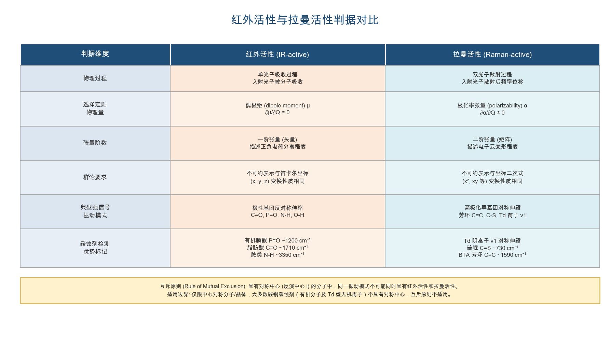

具体而言，两种技术在振动模式强度上呈现出鲜明的互补格局：

- **红外强、拉曼弱**的振动模式：偶极矩变化大而极化率变化小，典型如极性基团的反对称伸缩振动（C=O ~1710 cm⁻¹、P=O ~1200 cm⁻¹、N−H ~3350 cm⁻¹）及弯曲振动。
- **拉曼强、红外弱**的振动模式：极化率变化大而偶极矩变化小，典型如非极性或低极性基团的对称伸缩振动（芳环 C=C ~1590 cm⁻¹、C−S ~730 cm⁻¹、无机四面体离子 ν₁ 对称伸缩）。
- **红外与拉曼均有活性**的振动模式：在大多数低对称性分子中，振动模式同时引起偶极矩和极化率的变化，因此兼具红外和拉曼活性，但两种光谱中的相对强度不同 [EPGP物理光谱模块](https://epgp.inflibnet.ac.in/epgpdata/uploads/epgp_content/S000005CH/P000663/M007443/ET/1454924451CHE__P8_M25_e-Text.pdf "Module 25: Vibrational Raman Spectroscopy")。

上述互补性表明，将红外与拉曼光谱联合使用可获得比单独使用任一技术更为完整的分子振动信息，这对复合缓蚀剂的多组分识别尤为关键。

## 1.3 互斥原则及其适用边界

### 1.3.1 互斥原则的内涵

互斥原则（Rule of Mutual Exclusion）是振动光谱学中最重要的对称性判据之一，其表述为：**对于具有对称中心（反演中心 *i*）的分子，任何简正振动模式不可能同时具有红外活性和拉曼活性** [Hollas, J.M., *Modern Spectroscopy*, 4th Ed., Wiley, 2004](https://jupiter.chem.uoa.gr/pchem/courses/719/Hollas_Modern_spectroscopy.pdf "Hollas (2004) Modern Spectroscopy") [Wikipedia互斥原则](https://en.wikipedia.org/wiki/Rule_of_mutual_exclusion "citing Bernath (2005), Hollas (2004)")。

其群论证明简洁而严密：在含有反演操作 *i* 的点群中，所有不可约表示均可分为偶（gerade, g）和奇（ungerade, u）两类。红外活性要求振动模式属于与笛卡尔坐标（*x, y, z*）相同变换性质的不可约表示，而笛卡尔坐标在反演操作下变号，故属 u 类表示；拉曼活性要求振动模式属于与坐标二次式（*x², xy* 等）相同变换性质的不可约表示，坐标二次式在反演操作下不变，故属 g 类表示。由于同一振动模式不可能同时属于 g 和 u 两类表示，互斥原则得证 [EPGP物理光谱模块](https://epgp.inflibnet.ac.in/epgpdata/uploads/epgp_content/S000005CH/P000663/M007443/ET/1454924451CHE__P8_M25_e-Text.pdf "Module 25: Vibrational Raman Spectroscopy")。

### 1.3.2 互斥原则的适用边界

互斥原则的适用范围有严格的前提限定，需审慎把握以下边界条件：

1. **仅适用于具有对称中心的分子或离子。** 常见实例包括 CO₂（D∞h）、SF₆（Oh）、苯 C₆H₆（D₆h）等。对此类中心对称分子，红外与拉曼光谱提供的是完全互补、互不重叠的振动信息。

2. **不适用于不具有对称中心的分子。** 对于缺乏反演中心的分子，振动模式可以同时具有红外和拉曼活性。经典实例为 NH₃（C₃v 点群），其全部 4 个基频振动——ν₁(A₁) 对称伸缩、ν₂(A₁) 对称弯曲、ν₃(E) 反对称伸缩、ν₄(E) 反对称弯曲——均同时具有红外活性和拉曼活性 [EPGP物理光谱模块](https://epgp.inflibnet.ac.in/epgpdata/uploads/epgp_content/S000005CH/P000663/M007443/ET/1454924451CHE__P8_M25_e-Text.pdf "Module 25: Vibrational Raman Spectroscopy")。

3. **中心对称分子中可能存在"光谱沉默"模式。** 互斥原则排除了红外-拉曼双活性的可能，但并不保证每个模式至少具有其中一种活性。某些振动模式既无红外活性亦无拉曼活性，即所谓"光谱沉默"（spectroscopically silent）模式，例如 SF₆ 的 ν₆(T₂u) 模式 [Wikipedia互斥原则](https://en.wikipedia.org/wiki/Rule_of_mutual_exclusion "citing Keller (1983) J. Chem. Educ., 60, 625")。

4. **晶体场效应可改变互斥原则的适用性。** 一个在自由离子状态不具有对称中心的离子（如 Td 对称的 MoO₄²⁻），当进入具有对称中心的晶体结构（如白钨矿型 CaWO₄ 的 C₄h 空间群）时，因子群分析将其振动模式分裂为 g 和 u 子集，互斥原则在晶体中重新生效 [Nakamoto, K., *Infrared and Raman Spectra of Inorganic and Coordination Compounds*, Part A, 6th Ed., Wiley, 2009](https://www.wiley.com/en-us/Infrared+and+Raman+Spectra+of+Inorganic+and+Coordination+Compounds%252C+Part+A%253A+Theory+and+Applications+in+Inorganic+Chemistry%252C+6th+Edition-p-9780471743392 "Nakamoto (2009) Part A, Ch.1 因子群分析")。

### 1.3.3 对碳钢缓蚀剂光谱分析的指导意义

将互斥原则及其边界条件应用于碳钢缓蚀剂体系，可建立以下关键判断框架：

**碳钢缓蚀剂中绝大多数有机分子不具有对称中心**——咪唑啉、季铵盐、硫脲衍生物、有机膦酸、苯并三唑、有机胺、脂肪酸等有机缓蚀剂分子均为低对称性结构，互斥原则不适用。其振动模式通常同时具有红外和拉曼活性，但不同振动模式在两种光谱中的相对强度差异显著——这一强度差异正是选择最优检测技术的核心依据。

**无机缓蚀剂离子在自由态下多属 Td 或 C₂v 等无反演中心的点群**——CrO₄²⁻、MoO₄²⁻、PO₄³⁻、WO₄²⁻、SiO₄⁴⁻ 属 Td 点群，NO₂⁻ 属 C₂v 点群，BO₃³⁻ 属 D₃h 点群，均不具有对称中心。然而，Td 点群中 ν₁(A₁) 对称伸缩和 ν₂(E) 对称弯曲模式虽不受互斥原则限制，但根据群论分析，A₁ 和 E 表示仅与坐标二次式对应而不与笛卡尔坐标对应，因此这两个模式**仅具有拉曼活性而不具有红外活性**。ν₃(T₂) 和 ν₄(T₂) 模式中 T₂ 表示同时与坐标和坐标二次式对应，故同时具有红外和拉曼活性 [Nakamoto, K., *Infrared and Raman Spectra of Inorganic and Coordination Compounds*, Part A, 6th Ed., Wiley, 2009](https://www.wiley.com/en-us/Infrared+and+Raman+Spectra+of+Inorganic+and+Coordination+Compounds%252C+Part+A%253A+Theory+and+Applications+in+Inorganic+Chemistry%252C+6th+Edition-p-9780471743392 "Nakamoto (2009) Part A, Td 点群特征标分析") [Chemistry LibreTexts](https://chem.libretexts.org/Bookshelves/Physical_and_Theoretical_Chemistry_Textbook_Maps/Supplemental_Modules_(Physical_and_Theoretical_Chemistry)/Spectroscopy/Vibrational_Spectroscopy/Vibrational_Modes/Normal_Modes "Td点群振动模式分析")。这意味着 Td 型无机缓蚀剂的 ν₁ 对称伸缩峰是**拉曼独占标记峰**——只能通过拉曼光谱检测到，在红外光谱中无法观测。图 1-2 以四面体 XY₄ 为模型，展示了四种振动模式的振动形态与光谱活性分配，并列出了 CrO₄²⁻、MoO₄²⁻、PO₄³⁻、WO₄²⁻ 四种代表性缓蚀剂离子的特征波数。

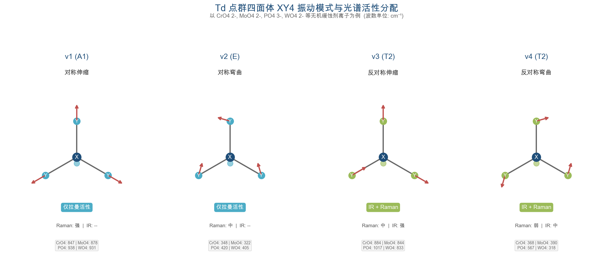

**经验规律的实践价值**：对称振动模式通常拉曼散射强而红外吸收弱，反对称振动和弯曲振动通常红外吸收强而拉曼散射弱 [EPGP物理光谱模块](https://epgp.inflibnet.ac.in/epgpdata/uploads/epgp_content/S000005CH/P000663/M007443/ET/1454924451CHE__P8_M25_e-Text.pdf "Module 25: Vibrational Raman Spectroscopy")。这一经验规律对缓蚀剂光谱检测方案的设计具有直接指导意义。例如，监测冷却水中钼酸盐浓度时，应优先选用拉曼光谱检测其 ν₁(A₁) 对称伸缩峰（~878 cm⁻¹），而非依赖红外光谱。

## 1.4 碳钢缓蚀剂分类与光谱活性判定的整合框架

综合上述分类体系与光谱学基础，我们建立如下分析框架，作为后续各章节逐一分析缓蚀剂光谱活性的统一方法论。图 1-3 以树状结构展示了碳钢缓蚀剂的完整分类体系，并标注了各组分的点群对称性与互斥原则适用情况。

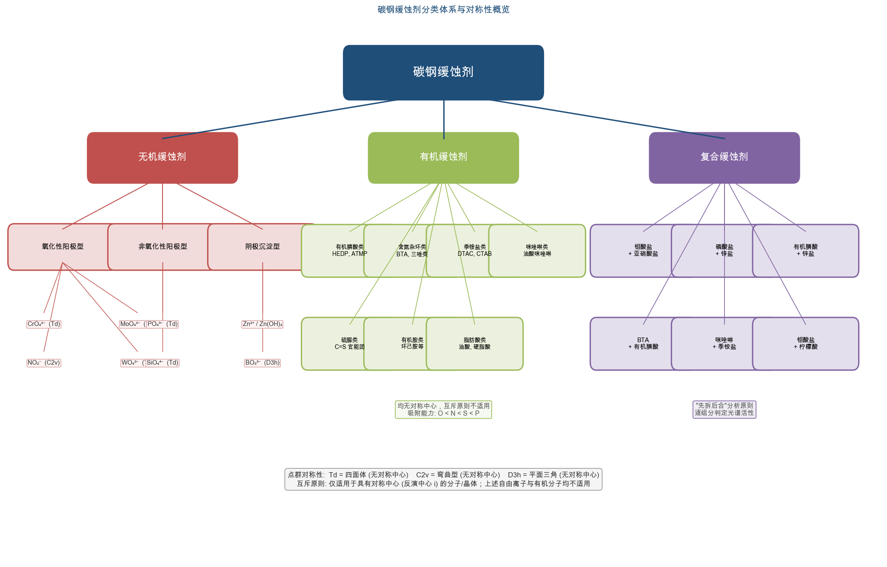

**分析流程**：分子/离子结构 → 对称性分析（点群判定）→ 主要振动模式识别 → 拉曼活性判定（极化率变化 / 群论不可约表示与坐标二次式对应关系）→ 红外活性判定（偶极矩变化 / 不可约表示与笛卡尔坐标对应关系）→ 特征峰波数归属与强度预期。

下表（表 1-1）概括了碳钢常用缓蚀剂各类别的光谱活性总体特征：

| 缓蚀剂大类 | 代表组分 | 对称中心 | 互斥原则 | 光谱活性总体特征 |
|:---|:---|:---|:---|:---|
| 无机—Td 型离子 | CrO₄²⁻、MoO₄²⁻、PO₄³⁻、WO₄²⁻、SiO₄⁴⁻ | 无 | 不适用 | ν₁、ν₂ 仅拉曼活性；ν₃、ν₄ 红外+拉曼双活性 |
| 无机—C₂v 型离子 | NO₂⁻ | 无 | 不适用 | 全部振动模式均红外+拉曼双活性 |
| 无机—D₃h 型离子 | BO₃³⁻ | 无 | 不适用 | ν₁ 仅拉曼；ν₂ 仅红外；ν₃、ν₄ 红外+拉曼双活性 |
| 无机—Td 型（晶体场） | CaWO₄ 中 WO₄²⁻ | 有（C₄h 空间群） | 适用 | g 模式仅拉曼，u 模式仅红外 |
| 有机缓蚀剂 | 咪唑啉、季铵盐、硫脲、膦酸、BTA 等 | 无 | 不适用 | 绝大多数模式红外+拉曼双活性，但强度差异显著 |
| 复合缓蚀剂 | 各组分混合体系 | 取决于各组分 | 逐组分判定 | 先拆分为单一组分分析，再讨论叠加/干扰 |

上述框架的核心要义可凝练为三条原则：

1. **Td 型无机阴离子的 ν₁ 对称伸缩峰是拉曼独占标记**，这是拉曼光谱在缓蚀剂检测中最独特的优势。

2. **有机缓蚀剂的极性基团振动（C=O、P=O、N−H）是红外优势标记，而高极化率基团振动（C=S、芳环 C=C）是拉曼优势标记**。

3. **复合缓蚀剂分析遵循"先拆后合"原则**，各组分独立分析后再评估光谱叠加区域与互补检测策略。

后续章节将以这一统一框架为基础：第2章逐一分析无机缓蚀剂的振动模式与光谱活性，第3章逐一分析有机缓蚀剂的振动模式与光谱活性，第4章讨论复合缓蚀剂体系的组分拆分与光谱活性综合分析。

# 第2章 无机缓蚀剂的拉曼活性与红外活性分析

在碳钢腐蚀防护体系中，无机缓蚀剂凭借成本低廉、热稳定性优异以及对中性至碱性水系统的良好适应性而得到广泛应用。工业常用的无机缓蚀剂涵盖铬酸盐、磷酸盐、钼酸盐、钨酸盐、亚硝酸盐、硅酸盐、锌盐和硼酸盐八大类 [RSC综述](https://pubs.rsc.org/en/content/articlehtml/2024/ra/d4ra05662k "Ahmed et al., RSC Adv., 2024, 14, 31877-31920") [无机缓蚀剂综述](https://www.tribology.rs/journals/2023/2023-2/12-1456.pdf "Al-Amiery et al., Tribology in Industry, 2023, 45(2), 313-339")。这些缓蚀剂的活性组分均为无机阴离子或金属氢氧化物，其分子（离子）对称性与振动模式直接决定了拉曼活性和红外活性的分配规律。本章遵循"离子结构 → 点群对称性 → 振动模式分析 → 拉曼/红外活性判定 → 特征峰归属"的统一分析框架，逐一剖析上述八类无机缓蚀剂的振动光谱特性，为后续复合缓蚀剂体系的光谱识别与检测策略设计提供系统性基础。

## 2.1 Td 点群四面体型离子的振动分析通则

碳钢常用无机缓蚀剂中，铬酸根（CrO₄²⁻）、磷酸根（PO₄³⁻）、钼酸根（MoO₄²⁻）、钨酸根（WO₄²⁻）以及正硅酸根（SiO₄⁴⁻）均属于 XY₄ 型四面体离子，隶属 Td 点群。由于 Td 点群不具有对称中心（反演中心 *i*），互斥原则（Rule of Mutual Exclusion）对这一类离子不适用 [Chemistry LibreTexts](https://chem.libretexts.org/Bookshelves/Physical_and_Theoretical_Chemistry_Textbook_Maps/Supplemental_Modules_(Physical_and_Theoretical_Chemistry)/Spectroscopy/Vibrational_Spectroscopy/Vibrational_Modes/Normal_Modes "Td点群振动模式分析")。

根据群论分析，Td 型 XY₄ 离子具有 9 个振动自由度，可分解为 4 个基本振动模式：

- **ν₁(A₁)——对称伸缩振动**：所有 X−Y 键同相伸缩，极化率张量发生显著变化而偶极矩保持不变，**仅具拉曼活性**。
- **ν₂(E)——对称弯曲振动**：二重简并模式，极化率变化而偶极矩不变，**仅具拉曼活性**。
- **ν₃(T₂)——反对称伸缩振动**：三重简并模式，偶极矩与极化率同时发生变化，**同时具有红外活性和拉曼活性**。
- **ν₄(T₂)——反对称弯曲振动**：三重简并模式，偶极矩与极化率同时变化，**同时具有红外活性和拉曼活性**。

在缓蚀剂光谱检测实践中，ν₁(A₁) 是这类离子最具诊断价值的拉曼标记峰。该模式表现为强偏振谱带（偏振比 ρ ≈ 0），在拉曼光谱中强度突出，而在红外光谱中完全"缺席"，由此构成拉曼技术对 Td 四面体离子的独占检测优势 [UIUC振动光谱讲义](https://xuv.scs.illinois.edu/516/lectures/chem516.04.pdf "K. S. Suslick, Chem 516, 2013")。与之互补的是，ν₃(T₂) 反对称伸缩在红外光谱中通常表现为最强吸收峰，是红外鉴定的主要依据。

需特别指出，当上述离子进入晶体环境时，位置对称性降低可能引起简并模式的分裂。若晶体空间群具有对称中心——例如白钨矿型 CaWO₄ 属 C₄ₕ 空间群——因子群分析将振动模式分裂为 g（gerade）和 u（ungerade）两类，互斥原则在晶体层面重新生效 [Khanna et al. (1968), J. Res. NBS](https://pmc.ncbi.nlm.nih.gov/articles/PMC6640585/ "钨酸盐和钼酸盐单晶拉曼光谱")。这一现象意味着同一离子在溶液态和固态晶体中的光谱活性分配可能存在本质差异。

## 2.2 铬酸盐（CrO₄²⁻）

铬酸盐曾是碳钢循环冷却水系统中效率最高的阳极型缓蚀剂。铬酸根离子 CrO₄²⁻ 在水溶液中保持理想 Td 对称，其四个基本振动模式的特征波数及活性分配如下表所示：

| 振动模式 | 波数 / cm⁻¹ | 拉曼活性 | 红外活性 |
|----------|-------------|---------|---------|
| ν₁(A₁) 对称伸缩 | 847 | **强**（偏振） | 无 |
| ν₂(E) 对称弯曲 | 348 | 中 | 无 |
| ν₃(T₂) 反对称伸缩 | 884 | 中 | **强** |
| ν₄(T₂) 反对称弯曲 | 368 | 弱 | 中 |

上述数据测定于水溶液状态 [Frost (2004), J. Raman Spectrosc.](https://eprints.qut.edu.au/811/1/Raman_microscopy_of_selected_chromate_minerals_JRS_revsied.pdf "铬酸盐矿物拉曼光谱研究")。

CrO₄²⁻ 的 ν₁ = 847 cm⁻¹ 是其最具诊断价值的拉曼标记峰，在碱性水溶液中表现为尖锐的强偏振谱带。在固态铬酸盐矿物中，晶体场效应致使 Td 对称性降低，ν₃ 模式分裂为多个组分；然而 ν₁ 的拉曼强度和频率位置相对稳定，可作为铬酸盐存在的可靠指标 [Frost (2004), J. Raman Spectrosc.](https://eprints.qut.edu.au/811/1/Raman_microscopy_of_selected_chromate_minerals_JRS_revsied.pdf "铬酸盐矿物拉曼光谱")。

从光谱检测角度而言，拉曼技术对铬酸盐的检测具有显著优势：ν₁ 仅具拉曼活性，提供了不受红外干扰的专属检测通道；ν₃ 虽同时具有红外和拉曼活性，但 800–900 cm⁻¹ 区间的红外吸收特异性不及拉曼 ν₁ 的指纹特征突出。

## 2.3 磷酸盐（PO₄³⁻ 及其质子化形态）

磷酸盐是碳钢缓蚀领域使用量最大的无机缓蚀剂类型之一，涵盖正磷酸盐和聚磷酸盐两大类。正磷酸根 PO₄³⁻ 属 Td 点群，其振动模式活性分配遵循 2.1 节所述通则：

| 振动模式 | 波数 / cm⁻¹ | 拉曼活性 | 红外活性 |
|----------|-------------|---------|---------|
| ν₁(A₁) 对称伸缩 | 938 | **强**（偏振） | 无 |
| ν₂(E) 对称弯曲 | 420 | 中 | 无 |
| ν₃(T₂) 反对称伸缩 | 1017 | 中 | **强** |
| ν₄(T₂) 反对称弯曲 | 567 | 弱 | 中 |

上述数据测定于水溶液状态 [Frost et al., Spectrochim. Acta A](https://www.repositorio.ufop.br/server/api/core/bitstreams/8bcb01cb-4f9b-44a8-8edd-9c3dbffa26e2/content "磷酸盐矿物拉曼与红外光谱") [Belhabra et al. (2021)](https://biointerfaceresearch.com/wp-content/uploads/2021/08/20695837123.41404154.pdf "PO₄³⁻ Td振动分析")。

PO₄³⁻ 的 ν₁ = 938 cm⁻¹ 是磷酸盐拉曼检测的核心诊断标记峰，为高强度偏振谱带。在碳钢防腐蚀应用中，该峰可用于直接定量水溶液中的磷酸盐浓度。

然而在实际工况中，正磷酸根常以质子化形态存在。PO₄³⁻ 质子化为 HPO₄²⁻ 时，对称性降低至 C₃ᵥ；进一步质子化为 H₂PO₄⁻ 时，对称性降低至 C₂ᵥ。对称性降低带来两方面直接后果：其一，原本仅具拉曼活性的 ν₁(A₁) 和 ν₂(E) 模式转变为同时具有红外和拉曼活性；其二，简并模式发生分裂，谱带数目增多 [Frost et al., Spectrochim. Acta A](https://www.repositorio.ufop.br/server/api/core/bitstreams/8bcb01cb-4f9b-44a8-8edd-9c3dbffa26e2/content "磷酸盐矿物拉曼与红外光谱")。因此，在中性至弱酸性水溶液（pH 4–9）环境中，HPO₄²⁻ 和 H₂PO₄⁻ 的所有振动模式均同时具有红外和拉曼活性，互斥原则在这些低对称物种中同样不适用。

## 2.4 钼酸盐（MoO₄²⁻）

钼酸盐作为铬酸盐的环保替代品，已在碳钢循环冷却水系统的缓蚀处理中得到广泛推广。钼酸根 MoO₄²⁻ 在水溶液中保持 Td 对称，自由离子的活性分配遵循 2.1 节通则。在 CaMoO₄（钙钼矿，白钨矿型结构）单晶中，位置对称性降低引起模式分裂，实测拉曼数据如下：

| 振动模式 | 波数 / cm⁻¹（CaMoO₄ 单晶） | 拉曼活性 | 红外活性 |
|----------|---------------------------|---------|---------|
| ν₁(Ag) 对称伸缩 | 878 | **强** | 无 |
| ν₂(Ag) 对称弯曲 | 322 | 中 | 无 |
| ν₃ 反对称伸缩 | 844 / 794（分裂） | 中 | **强** |
| ν₄ 反对称弯曲 | 390 / 404（分裂） | 弱 | 中 |

数据来源 [Khanna et al. (1968), J. Res. NBS](https://pmc.ncbi.nlm.nih.gov/articles/PMC6640585/ "钨酸盐和钼酸盐单晶拉曼光谱")。

MoO₄²⁻ 的 ν₁ = 878 cm⁻¹ 是拉曼光谱中的强标记峰。Na₂MoO₄ 红外光谱的实验结果进一步验证了理论预测：ν₁ 和 ν₂ 对应的吸收峰在红外谱图中完全缺失，证实 Td 对称下这两个模式确实仅具拉曼活性 [Khanna et al. (1968), J. Res. NBS](https://pmc.ncbi.nlm.nih.gov/articles/PMC6640585/ "Na₂MoO₄ 红外验证")。这一特征使拉曼光谱成为水溶液中钼酸盐定量检测的优选技术。

值得关注的是，MoO₄²⁻ 的 ν₁（878 cm⁻¹）与 CrO₄²⁻ 的 ν₁（847 cm⁻¹）相距约 31 cm⁻¹，在拉曼光谱中通常可以清晰分辨。这意味着在铬酸盐向钼酸盐过渡的工业配方体系中，拉曼光谱可实现两种离子的同时检出与独立定量。

## 2.5 钨酸盐（WO₄²⁻）

钨酸盐是又一类环保型阳极缓蚀剂，钨酸根 WO₄²⁻ 在水溶液中属 Td 点群，其特征振动波数如下：

| 振动模式 | 波数 / cm⁻¹（水溶液） | 拉曼活性 | 红外活性 |
|----------|---------------------|---------|---------|
| ν₁(A₁) 对称伸缩 | 931 | **强**（偏振） | 无 |
| ν₂(E) 对称弯曲 | 405 | 中 | 无 |
| ν₃(T₂) 反对称伸缩 | 833 | 中 | **强** |
| ν₄(T₂) 反对称弯曲 | 318 | 弱 | 中 |

数据来源 [Frost et al. (2004), Spectrochim. Acta A](https://eprints.qut.edu.au/804/01/Raman_microscopy_of_selected_tungstate_minerals-revised.pdf "钨酸盐矿物拉曼光谱") [Khanna et al. (1968), J. Res. NBS](https://pmc.ncbi.nlm.nih.gov/articles/PMC6640585/ "CaWO₄拉曼光谱")。

WO₄²⁻ 的 ν₁ = 931 cm⁻¹ 是其拉曼诊断标记峰。需特别注意的是，该频率与 PO₄³⁻ 的 ν₁ = 938 cm⁻¹ 仅相差 7 cm⁻¹，在磷酸盐–钨酸盐共存体系中，两者的 ν₁ 拉曼峰极易产生重叠。此类情形下，需借助高分辨率拉曼仪器（分辨率优于 5 cm⁻¹）或化学计量学方法加以区分。

当 WO₄²⁻ 进入白钨矿型晶体 CaWO₄ 时，空间群为 C₄ₕ⁶（I4₁/a），具有对称中心。因子群分析将自由离子的振动模式分裂为 g 与 u 两类子集，互斥原则由此生效：g 下标物种仅具拉曼活性，u 下标物种仅具红外活性 [Khanna et al. (1968), J. Res. NBS](https://pmc.ncbi.nlm.nih.gov/articles/PMC6640585/ "CaWO₄因子群分析")。白钨矿体系清楚地表明，同一离子在不同化学环境中其光谱活性分配可发生根本性改变——这一认识对于从溶液态检测结果推断固态膜层成分时具有重要参考意义。

## 2.6 亚硝酸盐（NO₂⁻）

亚硝酸钠是碳钢闭路冷却水系统及混凝土钢筋防腐中常用的氧化性阳极型缓蚀剂。与前述 Td 四面体离子不同，亚硝酸根 NO₂⁻ 为弯曲型三原子离子，属 C₂ᵥ 点群，不具有对称中心。

在 C₂ᵥ 点群中，所有不可约表示（A₁、A₂、B₁、B₂）均至少与一个笛卡尔坐标或坐标二次式具有相同的变换性质。因此，NO₂⁻ 的全部 3 个振动模式均同时具有红外活性和拉曼活性：

| 振动模式 | 波数 / cm⁻¹（固态 NaNO₂） | 波数 / cm⁻¹（水溶液） | 拉曼活性 | 红外活性 |
|----------|--------------------------|---------------------|---------|---------|
| ν₁(A₁) 对称伸缩 | 1328 | ~1325 | **强** | 强 |
| ν₂(A₁) 弯曲 | 828 | ~830 | 中 | 中 |
| ν₃(B₁) 反对称伸缩 | 1261 | ~1236 | 弱–中 | **强** |

固态数据来源 [Weston & Brodasky (1957), J. Chem. Phys.](https://ui.adsabs.harvard.edu/abs/1957JChPh..27..683W "亚硝酸根红外光谱与力常数")。水溶液拉曼数据中，ν₁ 在约 1325 cm⁻¹ 处表现为强谱带，是亚硝酸盐水溶液拉曼检测的核心标记峰 [Asher et al. (2002), Anal. Chem.](https://pubs.acs.org/doi/10.1021/ac010863q "UV共振拉曼光谱检测硝酸盐与亚硝酸盐")。

NO₂⁻ 的光谱特征呈现红外与拉曼的显著互补性：ν₁ 对称伸缩在拉曼中强度最高（极化率变化显著），而 ν₃ 反对称伸缩在红外中为最强吸收峰（偶极矩变化显著）。这一规律与对称振动模式拉曼强、反对称振动模式红外强的一般经验一致 [EPGP物理光谱模块](https://epgp.inflibnet.ac.in/epgpdata/uploads/epgp_content/S000005CH/P000663/M007443/ET/1454924451CHE__P8_M25_e-Text.pdf "Module 25: Vibrational Raman Spectroscopy")。

在复合缓蚀剂检测场景中，NO₂⁻ 的 ν₁（1325 cm⁻¹）和 ν₃（1236 cm⁻¹）均远离 Td 四面体离子的主要振动区域（300–1050 cm⁻¹），因此在钼酸盐–亚硝酸盐等复合配方中，红外和拉曼光谱均可清晰检出 NO₂⁻ 而不受钼酸根等共存组分的干扰。

## 2.7 硅酸盐（SiO₄⁴⁻ 及聚合态硅酸根）

硅酸盐作为非氧化性阳极缓蚀剂，在碳钢热水系统中具有重要应用。硅酸盐在水溶液中的存在形态较为复杂，取决于 pH 值、浓度和温度等因素：碱性高浓度条件下以链状或环状聚硅酸根（SiO₃²⁻ 链、Si₂O₇⁶⁻ 焦硅酸根等）为主，仅在极碱性条件下才以孤立的正硅酸根 SiO₄⁴⁻ 形态存在。

**正硅酸根 SiO₄⁴⁻（Td 点群）** 的活性分配遵循 2.1 节通则。在橄榄石 Mg₂SiO₄ 中的实测拉曼数据如下：

| 振动模式 | 波数 / cm⁻¹（Mg₂SiO₄） | 拉曼活性 | 红外活性 |
|----------|------------------------|---------|---------|
| ν₁(A₁) 对称伸缩 | ~824 | **强**（偏振） | 无 |
| ν₂(E) 对称弯曲 | ~340–380 | 中 | 无 |
| ν₃(T₂) 反对称伸缩 | ~880–1000（分裂） | 中 | **强** |
| ν₄(T₂) 反对称弯曲 | ~400–530（分裂） | 弱 | 中 |

数据来源 [Liu et al. (2021), J. Am. Ceram. Soc.](https://www.osti.gov/servlets/purl/1865531 "硅酸盐玻璃振动光谱分析")。

**聚合态偏硅酸根（链/层状 SiO₃²⁻ 等）** 通过 Si−O−Si 桥氧键连接，形成的聚合体对称性极低，互斥原则不适用。其光谱特征表现为：Si−O−Si 反对称伸缩在约 900–1100 cm⁻¹ 处产生宽强红外吸收；拉曼光谱中 Q² 物种（桥氧/非桥氧比 = 2:2 的 SiO₄ 四面体单元）的主峰位于约 950–1000 cm⁻¹ [Liu et al. (2021), J. Am. Ceram. Soc.](https://www.osti.gov/servlets/purl/1865531 "硅酸盐拉曼Q-species分析")。

在实际缓蚀剂检测中，硅酸盐的拉曼信号强度相对于钼酸盐和铬酸盐偏弱，且水溶液中聚合态的复杂性导致拉曼谱带较宽。红外光谱中 900–1100 cm⁻¹ 的宽强吸收可作为硅酸盐存在的初步判据，但特异性有限，需结合拉曼光谱中 Q-species 的频率分布信息进行确认。

## 2.8 锌盐（Zn²⁺ / Zn(OH)₄²⁻ / ZnO）

锌盐属阴极沉淀型缓蚀剂，其缓蚀机制在于在碳钢表面形成 Zn(OH)₂ 或 ZnO 沉淀膜。锌在不同 pH 环境中以不同化学形态存在，各形态的振动光谱特性差异显著。

**锌酸根 Zn(OH)₄²⁻（近似 Td 对称）** 在强碱性水溶液中稳定存在，其拉曼光谱数据如下：

| 振动模式 | 波数 / cm⁻¹ | 拉曼活性 | 红外活性 |
|----------|-------------|---------|---------|
| ν₁(A₁) 对称伸缩 | 484 | **强**（偏振） | 无 |
| ν₃(F₂) 反对称伸缩 | 430 | 中 | **强**（430–470 cm⁻¹） |
| ν₄(F₂) 反对称弯曲 | 322 | 弱 | 中 |

数据来源 [Raman Study of Zincate Ions, J. Inorg. Nucl. Chem.](https://www.sciencedirect.com/science/article/pii/0022190276804496/pdf "锌酸根拉曼光谱")。

**氧化锌 ZnO（纤锌矿结构，C₆ᵥ⁴ 空间群）** 不具有对称中心，其主要光学声子模式的活性分配为：

| 振动模式 | 波数 / cm⁻¹ | 拉曼活性 | 红外活性 |
|----------|-------------|---------|---------|
| E₂(high) | 437 | **强**（仅拉曼） | 无 |
| A₁(TO) | 380 | 中 | 中 |
| E₁(TO) | 410 | 中 | 中 |

数据来源 [Cuscó et al. (2007), Phys. Rev. B](https://apps.dtic.mil/sti/tr/pdf/ADA485744.pdf "ZnO拉曼散射")。

ZnO 的 E₂(high) = 437 cm⁻¹ 仅具拉曼活性，是鉴定 ZnO 相存在的最佳拉曼标记峰。A₁(TO) 和 E₁(TO) 则同时具有红外和拉曼活性。

在碳钢缓蚀体系中，锌盐类活性组分的特征波数集中于 300–500 cm⁻¹ 的低波数区域，与 Td 四面体离子的主要 ν₁ 标记峰（800–950 cm⁻¹）互不重叠，拉曼光谱可实现对锌物种的无干扰检测。

## 2.9 硼酸盐（BO₃³⁻ / BO₄⁵⁻ / B₄O₇²⁻）

硼酸盐（通常以硼砂 Na₂B₄O₇·10H₂O 形式添加）在碳钢闭路系统缓蚀中兼具 pH 缓冲和缓蚀协同双重功能。硼酸盐在水溶液中的存在形态高度依赖 pH 值和总硼浓度。

**三配位硼酸根 BO₃³⁻（D₃ₕ 点群）** 具有 σₕ 镜面但不具有对称中心，互斥原则不适用。其 4 个基本振动模式的活性分配如下：

| 振动模式 | 波数 / cm⁻¹ | 拉曼活性 | 红外活性 |
|----------|-------------|---------|---------|
| ν₁(A₁') 对称伸缩 | ~950 | **强** | 无 |
| ν₂(A₂") 面外弯曲 | ~750 | 无 | **强** |
| ν₃(E') 反对称伸缩 | ~1250 | 中 | **强** |
| ν₄(E') 面内弯曲 | ~600 | 弱 | 中 |

数据来源 [Weir & Schroeder (1964), J. Res. NBS 68A](https://nvlpubs.nist.gov/nistpubs/jres/68A/jresv68An5p465_A1b.pdf "结晶无机硼酸盐红外光谱")。

BO₃³⁻ 的 ν₁(A₁') 仅具拉曼活性、ν₂(A₂") 仅具红外活性这一分配特点尤为值得关注：尽管 D₃ₕ 点群不具有对称中心（互斥原则不严格适用），但 A₁' 和 A₂" 分属不同的不可约表示，在 D₃ₕ 群的特征标表中分别仅与坐标二次式或平移坐标相关联，故各自仅具有单一活性。这一结果有力地说明，即使互斥原则不严格适用，特定点群中仍可能存在仅具单一光谱活性的振动模式。

**四配位硼酸根 B(OH)₄⁻（近似 Td 对称）** 是碱性水溶液中硼酸的主要存在形态。拉曼光谱中，B(OH)₄⁻ 的对称 B−O 伸缩振动 ν₁ 出现在 745 cm⁻¹，为强偏振谱带 [Zhou et al. (2011), Spectrochim. Acta A](https://www.sciencedirect.com/science/article/abs/pii/S1386142511006846 "硼酸盐水溶液拉曼光谱与DFT计算")。该频率远低于三配位 BO₃³⁻ 的 ν₁（~950 cm⁻¹），因此拉曼光谱可通过 ν₁ 频率位置准确区分三配位与四配位硼物种。

**硼砂水溶液中的聚硼酸根**：Na₂B₄O₇ 溶于水后发生水解（Na₂B₄O₇ + 7H₂O → 2NaB(OH)₄ + 2B(OH)₃），在高浓度溶液中还存在多种聚硼酸根物种。Zhou et al. 的拉曼与 DFT 联合研究表明，水溶液中至少存在六种硼物种，其对称伸缩拉曼特征频率分别为：B(OH)₃ 约 877 cm⁻¹、B(OH)₄⁻ 约 745 cm⁻¹、B₃O₃(OH)₄⁻ 约 599 cm⁻¹、B₄O₅(OH)₄²⁻ 约 552 cm⁻¹、B₅O₆(OH)₄⁻ 约 521 cm⁻¹ [Zhou et al. (2011), Spectrochim. Acta A](https://www.sciencedirect.com/science/article/abs/pii/S1386142511006846 "聚硼酸根拉曼特征频率")。这些聚硼酸根的对称性极低（~C₁），所有振动模式均同时具有红外和拉曼活性 [Weir & Schroeder (1964), J. Res. NBS 68A](https://nvlpubs.nist.gov/nistpubs/jres/68A/jresv68An5p465_A1b.pdf "硼酸盐红外光谱")。

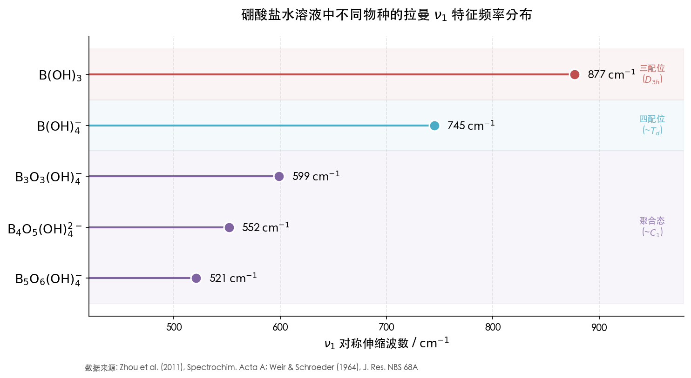

上图展示了硼酸盐水溶液中 B(OH)₃（877 cm⁻¹）、B(OH)₄⁻（745 cm⁻¹）及三种聚硼酸根物种（521–599 cm⁻¹）的拉曼 ν₁ 对称伸缩特征频率，以色带区分三配位（D₃ₕ）、四配位（~Td）和聚合态（~C₁）三类硼物种。不同聚合态硼物种的 ν₁ 频率跨越 521–877 cm⁻¹ 的宽范围，拉曼光谱可借此同时识别多种物种的共存状态与相对分布。

红外光谱在硼酸盐检测中同样提供互补信息：BO₃ 单元的 ν₂ 面外弯曲（~750 cm⁻¹，仅具红外活性）和 ν₃ 反对称伸缩（~1250 cm⁻¹）是硼酸盐的红外诊断标记；BO₃ 与 BO₄ 单元的 ν₃ 频率范围存在系统差异（BO₃ > 1100 cm⁻¹，BO₄ 约 800–1100 cm⁻¹），红外光谱可据此区分三配位与四配位硼 [Weir & Schroeder (1964), J. Res. NBS 68A](https://nvlpubs.nist.gov/nistpubs/jres/68A/jresv68An5p465_A1b.pdf "三配位与四配位硼的红外区分")。

## 2.10 本章小结

上述八类无机缓蚀剂的拉曼活性与红外活性系统分析揭示了以下贯穿性规律：

**第一，Td 四面体离子的拉曼独占优势。** CrO₄²⁻、PO₄³⁻、MoO₄²⁻、WO₄²⁻、SiO₄⁴⁻ 五种 Td 离子的 ν₁(A₁) 对称伸缩均仅具拉曼活性，构成每种离子最强的拉曼诊断标记峰。这些 ν₁ 峰的波数分布在 824–938 cm⁻¹ 范围内，其中 CrO₄²⁻（847 cm⁻¹）、MoO₄²⁻（878 cm⁻¹）、WO₄²⁻（931 cm⁻¹）和 PO₄³⁻（938 cm⁻¹）在多数情况下可借助拉曼光谱相互区分，但 WO₄²⁻ 与 PO₄³⁻ 之间仅 7 cm⁻¹ 的间距构成潜在的重叠风险。

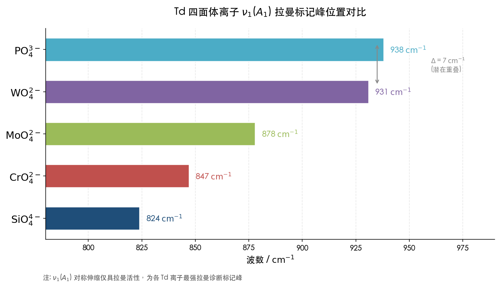

上图直观呈现了五种 Td 四面体离子 ν₁ 对称伸缩拉曼标记峰的波数分布，并标注了 WO₄²⁻ 与 PO₄³⁻ 仅相距 7 cm⁻¹ 的潜在重叠区域。

**第二，C₂ᵥ 和低对称物种的红外–拉曼双活性。** NO₂⁻（C₂ᵥ）、质子化磷酸根（C₃ᵥ / C₂ᵥ）、聚硼酸根（~C₁）等低对称离子的所有振动模式均同时具有红外和拉曼活性。尽管如此，对称伸缩模式拉曼强度占优、反对称伸缩和弯曲模式红外强度占优的经验规律仍然成立。

**第三，D₃ₕ 点群的特殊活性分配。** BO₃³⁻ 虽不具有对称中心，但 ν₁(A₁') 仅具拉曼活性、ν₂(A₂") 仅具红外活性。这一事实表明，"无对称中心则所有振动模式均具红外–拉曼双活性"的简化表述是不严格的，严谨的活性判定必须基于逐模式的群论分析。

**第四，晶体环境对活性分配的影响。** 从自由离子到晶体的对称性降低可导致简并模式分裂乃至活性规则的根本改变。白钨矿型 CaWO₄ 中互斥原则的重新生效是一个经典案例。

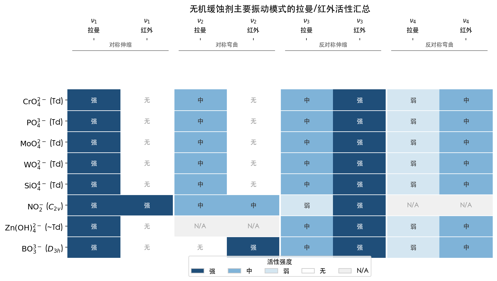

上图以热力图形式汇总了八类无机缓蚀剂离子在四个主要振动模式下的拉曼活性与红外活性强弱分布，直观呈现了 Td 离子 ν₁/ν₂ 仅具拉曼活性、C₂ᵥ 离子全模式双活性、D₃ₕ 离子 ν₂ 仅具红外活性等关键规律。

上述规律为后续复合缓蚀剂体系的光谱叠加分析和检测策略设计奠定了系统性基础。

# 第3章 有机缓蚀剂的拉曼活性与红外活性分析

碳钢防腐体系中，有机缓蚀剂以含杂原子（N、O、S、P）的有机分子为活性成分，通过化学吸附或物理吸附在金属表面形成保护膜。与第2章讨论的高对称无机离子不同，有机缓蚀剂分子通常结构复杂、对称性低，绝大多数不具有对称中心（反演中心 _i_），互斥原则因此不适用，其振动模式在原则上可同时具有红外活性和拉曼活性 [Chemistry LibreTexts](https://chem.libretexts.org/Bookshelves/Physical_and_Theoretical_Chemistry_Textbook_Maps/Supplemental_Modules_(Physical_and_Theoretical_Chemistry)/Spectroscopy/Vibrational_Spectroscopy/Vibrational_Modes/Normal_Modes "振动光谱活性规则")。然而，"同时具有活性"并不意味着两种光谱中的信号强度相当。极性官能团（C=O、N−H、O−H、P=O）因偶极矩变化大而在红外中表现为强吸收；高极化率基团（C=S、芳环 C=C）因极化率变化显著而在拉曼中表现为强散射。这一强度互补性构成了有机缓蚀剂光谱鉴定的实践基础。

本章按照"分子/官能团结构 → 对称性分析 → 主要振动模式 → 拉曼活性判定 → 红外活性判定 → 特征峰归属"的统一分析框架，逐一考察咪唑啉类、季铵盐类、硫脲类、有机膦酸类、苯并三唑类、有机胺类和脂肪酸及其衍生物七类有机缓蚀剂的振动光谱特性，并在章末归纳贯穿性规律。

## 3.1 咪唑啉类

咪唑啉类缓蚀剂是碳钢油气田酸性介质防腐中应用最为广泛的有机缓蚀剂之一。其核心结构为含 C=N 双键的五元杂环（2-咪唑啉环），通常在 2-位连接长链烷基（如油酸基）以增强疏水性。咪唑啉分子不具有对称中心，互斥原则不适用，所有振动模式均可同时具有红外和拉曼活性。

咪唑啉类缓蚀剂的核心光谱标记为环内 C=N 伸缩振动 ν(C=N)，出现在 1620–1660 cm⁻¹ 范围内。Sriplai 与 Sombatmankhong（2024）报道了油酸咪唑啉 FTIR 光谱中 C=N 伸缩峰位于 1641 cm⁻¹ [Sriplai & Sombatmankhong (2024), Langmuir](https://pmc.ncbi.nlm.nih.gov/articles/PMC11171462/ "咪唑啉FTIR光谱：C=N 1641 cm⁻¹")。C=N 双键振动过程中偶极矩变化显著，在红外光谱中表现为中-强吸收峰，是咪唑啉类缓蚀剂最具诊断价值的红外标记；而在拉曼光谱中，C=N 伸缩因极化率变化较小，信号仅为弱至中等强度。

咪唑啉类缓蚀剂各振动模式的活性分配与诊断价值归属如下：

| 振动模式 | 波数 / cm⁻¹ | 红外活性 | 拉曼活性 | 诊断价值 |
|----------|-------------|---------|---------|---------|
| ν(C=N) 环内伸缩 | 1620–1660 | **中-强** | 弱-中 | **核心标记（红外优势）** |
| δ(N−H) 弯曲 | 1540–1560 | 中-强 | 弱 | 辅助标记 |
| ν(C−H) 烷基伸缩 | 2850–2960 | 强 | 强 | 通用标记（非特异） |
| δ(CH₂) 弯曲 | ~1465 | 中 | 中 | 辅助标记 |

N−H 弯曲振动（~1540–1560 cm⁻¹）因偶极矩变化较大而偏向红外活性，在拉曼中较弱。烷基链 C−H 伸缩（2850–2960 cm⁻¹）在红外和拉曼中均较强，但该区域是所有含长链烷基有机分子的通用信号，不具有咪唑啉类的特异性。

综合而言，**红外技术是咪唑啉类缓蚀剂鉴定的首选手段**：C=N ~1640 cm⁻¹ 为最具特异性的红外标记峰，结合 N−H ~1550 cm⁻¹ 可进一步确认咪唑啉环结构的存在。

## 3.2 季铵盐类

季铵盐类缓蚀剂（如十二烷基三甲基氯化铵 DTAC、十六烷基三甲基溴化铵 CTAB）属阳离子表面活性剂，通过带正电荷的季氮头基静电吸附于碳钢表面，长链烷基尾部形成疏水屏障层。季铵盐分子不具有对称中心，互斥原则不适用。

季铵盐的光谱特征相对单调——分子中缺少芳环、C=O、C=S 等具有强特异性光谱响应的官能团，光谱信号以烷基链 C−H 贡献为主。核心官能团 C−N⁺ 的伸缩振动出现在约 960 cm⁻¹ 处 [ResearchGate: FT-IR of quaternary ammonium PEI](https://www.researchgate.net/figure/FT-IR-spectra-a-Polyethyleneimine-b-Quaternary-ammonium-polyethyleneimine-nanoparticles_fig1_225359331 "季铵盐FTIR") [Springer: Mass and FT-IR of quaternary ammonium surfactants](https://link.springer.com/chapter/10.1007/978-94-011-3620-4_1 "季铵表面活性剂FTIR")，红外中表现为弱至中等强度吸收，拉曼中信号极弱。

| 振动模式 | 波数 / cm⁻¹ | 红外活性 | 拉曼活性 | 诊断价值 |
|----------|-------------|---------|---------|---------|
| ν(C−N⁺) 伸缩 | ~960 | 弱-中 | 极弱 | 特征标记（弱但特异） |
| ν(C−H) 烷基伸缩 | 2850–2960 | **强** | **强** | 通用标记（非特异） |
| δ(CH₂) 剪式弯曲 | ~1465 | 中 | 中 | 辅助标记 |
| N−H 伸缩 | — | 无 | 无 | **负标记**（区分伯/仲胺） |

季铵盐类缓蚀剂在光谱鉴定中最重要的"正/负标记"组合为：C−N⁺ ~960 cm⁻¹ 处可检出吸收（正标记），同时 N−H 伸缩区（3200–3500 cm⁻¹）无吸收峰（负标记）。后者可将季铵盐与伯胺、仲胺、咪唑啉等含 N−H 的有机缓蚀剂明确区分。

由于季铵盐缺乏高极化率基团，常规拉曼对其检测灵敏度较低。Peixoto 等（2024）采用金纳米粒子 SERS 技术实现了对苄基二甲基十二烷基氯化铵的低浓度检测 [Peixoto et al. (2024), Spectrochim. Acta A](https://www.sciencedirect.com/science/article/abs/pii/S1386142523012866 "SERS检测季铵盐缓蚀剂")，表明常规拉曼技术对季铵盐类缓蚀剂的检测能力有限，需借助表面增强效应。综合评估，**红外是季铵盐类缓蚀剂鉴定的主要手段**。

## 3.3 硫脲类

硫脲类缓蚀剂（硫脲及其 N-取代衍生物，如 N,N'-二苯基硫脲）因硫原子的高极化率和强配位能力，在酸性介质中对碳钢表现出优良的缓蚀效果。硫脲分子属 C₂ᵥ 点群（具有 σᵥ 和 σᵥ' 镜面），不具有对称中心，互斥原则不适用。

硫脲类缓蚀剂的光谱特征以 C=S 伸缩振动为核心。C=S 与 C=O 伸缩在红外/拉曼中的强度对比，构成了有机缓蚀剂光谱分析中最典型的互补性案例之一：

- **C=S 伸缩**：硫原子的大电子云极化率使 C=S 键振动引起极化率的大幅变化，在**拉曼光谱中表现为强标记峰**。硫脲的 C=S 对称伸缩振动出现在约 729 cm⁻¹ 处 [Rasayan J. Chem. (2014)](https://www.rasayanjournal.co.in/vol-7/issue_3/15_Vol.7_3_,%20287-294,%20%202014,%20RJC-1145.pdf "硫脲光谱：CS 729 cm⁻¹")，在红外中为中-弱吸收，在拉曼中为强谱带。
- **C=O 伸缩**（作为对比）：氧原子极化率小但偶极矩大，C=O 伸缩（~1700 cm⁻¹）在红外中极强，在拉曼中弱。

图3-1以模拟光谱形式直观呈现了这一互补性：C=O 振动的红外极强/拉曼弱与 C=S 振动的红外中-弱/拉曼强，形成完整的强度反转关系。

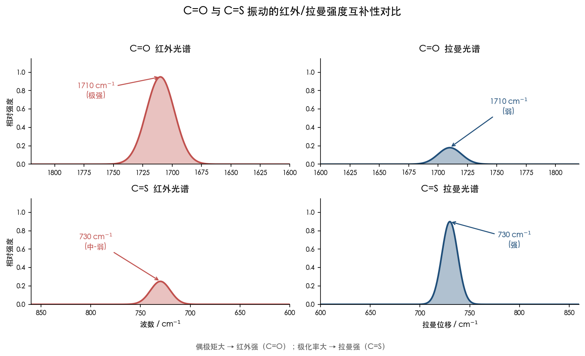

**图3-1 C=O 与 C=S 振动的红外/拉曼强度互补性对比。** 偶极矩主导红外强度（C=O ~1710 cm⁻¹ 红外极强），极化率主导拉曼强度（C=S ~730 cm⁻¹ 拉曼强），二者呈现完整的强度反转。

N,N'-二取代硫脲（如 N,N'-二苯基硫脲）因取代基电子效应，C=S 伸缩频率移至约 700 cm⁻¹ [Spectrochim. Acta A (1971)](https://www.sciencedirect.com/science/article/abs/pii/0584853971802143 "二取代硫脲C=S ~700 cm⁻¹")。Panicker 等（2010）对 1,3-二苯基硫脲的 FT-IR 与 FT-Raman 光谱进行了系统研究并辅以 DFT 计算，指出 C=S 伸缩并非完全独立模式，而是与 N−C−N 伸缩及苯环振动强烈耦合，在约 813 cm⁻¹ 处形成含约 8% C=S 特征的耦合谱带 [Panicker et al. (2010), Eur. J. Chem.](https://www.eurjchem.com/index.php/eurjchem/article/view/42 "二苯基硫脲FT-IR/FT-Raman与DFT计算")。

硫脲类缓蚀剂各振动模式的活性分配汇总如下：

| 振动模式 | 波数 / cm⁻¹ | 红外活性 | 拉曼活性 | 诊断价值 |
|----------|-------------|---------|---------|---------|
| ν(C=S) 对称伸缩 | ~729（硫脲）/ ~700（二取代） | 中-弱 | **强** | **核心拉曼标记** |
| ν(N−C−N) 对称伸缩 | ~1088 | 中 | 中-强 | 辅助标记 |
| ν(N−H) 伸缩 | 3150–3380 | **强** | 弱 | 红外辅助标记 |
| δ(N−H) 弯曲 | ~1580–1630 | 中-强 | 弱 | 辅助标记 |
| ν(C−N) 反对称伸缩 | ~1464 | 中 | 弱-中 | 辅助标记 |

在碳钢缓蚀剂检测实践中，C=S ~730 cm⁻¹ 的强拉曼信号是硫脲类的"指纹标记"，**拉曼光谱是鉴定硫脲类缓蚀剂的首选技术**。该标记峰与有机膦酸类的 P−C 伸缩（700–800 cm⁻¹）在波数范围上存在一定重叠，但 C=S 的拉曼强度远高于 P−C 且频率更为集中，通常可予以区分。

## 3.4 有机膦酸类

有机膦酸类是碳钢中性冷却水系统中应用最为广泛的缓蚀剂/阻垢剂，代表性品种包括 1-羟基亚乙基-1,1-二膦酸（HEDP）、氨基三亚甲基膦酸（ATMP）和 2-膦酸基丁烷-1,2,4-三羧酸（PBTC）。有机膦酸分子的中心磷原子呈四面体构型，连接 P=O 双键、P−OH 羟基和 P−C 碳-磷键，整体分子对称性极低（C₁ 或 Cs），互斥原则不适用。

有机膦酸类的振动光谱特征集中在三个官能团区域：P=O 伸缩、P−O(H) 伸缩和 P−C 伸缩。Peixoto 等（2025）对 ATMP 进行了系统的 DFT 计算与拉曼/SERS 实验研究，报道了 ATMP 固态拉曼光谱中 P=O 伸缩以肩峰出现在 1197 cm⁻¹、主峰位于 1185 cm⁻¹；溶液中因氢键效应宽化至约 1181 cm⁻¹。P−O(H) 弯曲/伸缩模式出现在 978–1034 cm⁻¹ 范围，P−C 伸缩与 P−C−N 弯曲耦合模式出现在 720–774 cm⁻¹ 范围 [Peixoto et al. (2025), ACS Omega](https://pubs.acs.org/doi/10.1021/acsomega.5c04862 "ATMP拉曼与SERS振动归属")。Barnard（2009）对 HEDP 的系统性拉曼研究进一步表明，HEDP 的 P−O 振动区（860–1280 cm⁻¹）因各质子化形态的存在而呈现 pH 依赖性频率变化 [Barnard (2009), PhD Thesis, Univ. of Pretoria](https://repository.up.ac.za/bitstreams/d67b0397-5075-4255-92f5-a357797517fb/download "HEDP拉曼光谱pH依赖性研究")。

有机膦酸类各官能团的振动模式活性分配如下：

| 振动模式 | 波数 / cm⁻¹ | 红外活性 | 拉曼活性 | 诊断价值 |
|----------|-------------|---------|---------|---------|
| ν(P=O) 伸缩 | 1150–1250 | **强** | 弱-中 | **核心红外标记** |
| δ(HOP)/ν(P−O) 伸缩 | 925–1060 | 中-强 | 中 | 辅助标记（拉曼/红外互补） |
| ν(P−C) 伸缩 + δ(PCN) | 700–800 | 弱-中 | 弱-中 | 辅助标记 |
| δ(OPO) 弯曲 | ~440–490 | 弱 | 中 | 低波数辅助标记 |
| ν(C−H) 伸缩 | 2950–3030 | 中 | 中 | 通用标记 |
| ν(N−C) + δ(HCN)（ATMP） | ~1326 | 弱-中 | 弱-中 | 含氮膦酸特征 |

P=O 伸缩（1150–1250 cm⁻¹）是有机膦酸类最重要的光谱标记。P=O 键偶极矩变化极大，在**红外光谱中表现为强吸收**（通常是膦酸分子红外谱中最强峰之一） [ACS: DMMP P=O adsorption](https://pubs.acs.org/doi/10.1021/acsami.9b21846 "P=O ~1200 cm⁻¹ 红外强")，而在拉曼中仅为弱至中等信号。P−O(H) 伸缩区（925–1060 cm⁻¹）在拉曼中的响应优于 P=O 区域，构成红外与拉曼的互补检测窗口。

有机膦酸与金属离子配位时，P=O 伸缩频率会发生显著红移。Appa Rao 等（2013）的实验显示，BPMG 的 P=O 伸缩从游离态 1181 cm⁻¹ 因配位 Zn²⁺ 红移至约 1110 cm⁻¹（红移幅度约 71 cm⁻¹） [Appa Rao et al. (2013), J. Surf. Eng. Mater. Adv. Tech.](https://pdfs.semanticscholar.org/c8a8/042ac9311e41ef0e046f86db0bfe6669923e.pdf "BPMG-Zn配位FTIR")。这一配位红移现象在缓蚀剂成膜检测中具有重要意义：P=O 峰位的偏移可作为有机膦酸与碳钢表面铁离子发生化学吸附的光谱证据。

ATMP 的 SERS 分析进一步揭示了膦酸基团与金属表面的相互作用特征：P=O 伸缩峰在 SERS 光谱中消失（依据 Moskovits 表面选择规则，平行于表面取向的 P=O 键增强效应弱），而 P−C + P−C−N 耦合模式在 770 cm⁻¹ 和 712 cm⁻¹ 处显著增强 [Peixoto et al. (2025), ACS Omega](https://pubs.acs.org/doi/10.1021/acsomega.5c04862 "ATMP SERS光谱P=O消失与P-C增强")。该发现对于利用 SERS 技术检测碳钢表面吸附态膦酸缓蚀剂具有直接的方法学价值。

综合评估，**红外是有机膦酸类缓蚀剂的主要鉴定手段**（依赖 P=O 强吸收），拉曼在 P−O(H) 区域提供互补信息；SERS 可用于低浓度及表面吸附态的专项检测。

## 3.5 苯并三唑类

苯并三唑（BTA）及其衍生物（如甲基苯并三唑 TTA）是铜及铜合金缓蚀的"金标准"，在碳钢多组分缓蚀配方中亦获得广泛应用。苯并三唑分子由苯环与三唑环稠合而成，属 Cs 点群（仅有一个分子平面），不具有对称中心，互斥原则不适用。

苯并三唑的光谱特征同时涵盖芳环振动与杂环振动两个体系：芳环 C=C 伸缩振动和三唑环呼吸振动在拉曼光谱中信号突出，N−H 伸缩在红外光谱中信号突出，二者构成典型的红外-拉曼互补组合。

NIST WebBook 提供了苯并三唑（CAS 95-14-7）的标准气相红外光谱 [NIST WebBook](https://webbook.nist.gov/cgi/cbook.cgi?ID=C95147&Type=IR-SPEC&Index=0 "苯并三唑气相IR")。Aziz 等（2014）对三唑和苯并三唑进行了系统的振动模式归属 [Aziz et al. (2014), Spectrochim. Acta A](https://pubmed.ncbi.nlm.nih.gov/24562851/ "三唑/苯并三唑振动归属")。Thomas 等（2004）报道了苯并三唑的常规拉曼和 SERS 光谱 [Thomas et al. (2004), Spectrochim. Acta A](https://pubmed.ncbi.nlm.nih.gov/14670458/ "苯并三唑拉曼与SERS")。综合上述研究，苯并三唑的关键振动模式及活性分配如下：

| 振动模式 | 波数 / cm⁻¹ | 红外活性 | 拉曼活性 | 诊断价值 |
|----------|-------------|---------|---------|---------|
| ν(C=C) 芳环伸缩 | ~1590 | 中 | **强** | **核心拉曼标记** |
| 三唑环呼吸振动 | ~780 | 中 | 中-强 | 拉曼辅助标记 |
| ν(N−H) 伸缩 | ~3345 | **强** | 弱 | **核心红外标记** |
| γ(C−H) 面外弯曲 | ~730–780 | **强** | 弱 | 红外辅助标记 |
| ν(N=N) + ν(C−N) 三唑伸缩 | ~1200–1300 | 中 | 中 | 指纹区辅助标记 |
| ν(C−H) 芳环伸缩 | ~3050–3100 | 弱-中 | 弱-中 | 通用标记 |

芳环 C=C 伸缩约 1590 cm⁻¹ 是苯并三唑最重要的**拉曼标记峰**。芳环对称伸缩振动引起极化率张量的大幅变化，在拉曼光谱中产生强信号，而在红外中虽有吸收但强度明显偏弱。三唑环呼吸振动（~780 cm⁻¹）在拉曼中亦表现为中-强谱带，可作为苯并三唑的辅助拉曼指纹。

N−H 伸缩（~3345 cm⁻¹）因 N−H 键偶极矩变化大而成为苯并三唑的**核心红外标记**，在拉曼中信号微弱。C−H 面外弯曲（730–780 cm⁻¹）在红外中表现为强吸收，是芳香化合物红外鉴定的经典区域。

从检测策略角度，苯并三唑的光谱鉴定最适合采用**拉曼与红外联合方案**：拉曼检测芳环 C=C（~1590 cm⁻¹）和三唑环呼吸（~780 cm⁻¹），红外检测 N−H（~3345 cm⁻¹）和 C−H 面外弯曲（~740 cm⁻¹）。在工业实践中，苯并三唑与有机膦酸的复配极为常见，二者的核心标记峰分属不同波数区域且各自处于优势光谱频段——苯并三唑拉曼 C=C ~1590 cm⁻¹ 与膦酸红外 P=O ~1200 cm⁻¹——天然构成互补检测组合。

## 3.6 有机胺类

有机胺类缓蚀剂（如十二烷基胺、环己胺、二环己胺）通过氮原子孤对电子与碳钢表面配位实现缓蚀作用。按氮原子上 H 的数量分为伯胺（−NH₂）、仲胺（−NH−）和叔胺（−N<），三者在红外光谱的 N−H 伸缩区呈现高度特征性的区分模式。有机胺分子不具有对称中心，互斥原则不适用。

胺类的诊断关键在于 N−H 伸缩振动区（3200–3500 cm⁻¹）的红外吸收特征 [OpenStax/Chemistry LibreTexts](https://chem.libretexts.org/Bookshelves/Organic_Chemistry/Organic_Chemistry_(OpenStax)/24:_Amines_and_Heterocycles/24.10:_Spectroscopy_of_Amines "胺类IR")：

| 振动模式 | 波数 / cm⁻¹ | 红外活性 | 拉曼活性 | 诊断价值 |
|----------|-------------|---------|---------|---------|
| ν(N−H) 伯胺对称+反对称 | ~3350 / ~3450（双峰） | **强** | 弱 | **伯胺红外核心标记** |
| ν(N−H) 仲胺 | ~3350（单峰） | 中-强 | 弱 | 仲胺红外标记 |
| ν(N−H) 叔胺 | — | 无 | 无 | 叔胺负标记 |
| δ(N−H) 弯曲（伯胺） | 1560–1650 | 中-强 | 弱 | 红外辅助标记 |
| ν(C−N) 伸缩 | 1020–1250 | 弱-中 | 弱-中 | 指纹区辅助标记 |
| ν(C−H) 烷基伸缩 | 2850–2960 | 强 | 强 | 通用标记 |

伯胺的 N−H 伸缩在红外中表现为 3350 cm⁻¹ 和 3450 cm⁻¹ 附近的特征**双峰**（分别对应对称和反对称 N−H 伸缩），是伯胺类缓蚀剂最可靠的红外诊断标记。NIST 标准红外光谱库中环己胺（CAS 108-91-8）的谱图清晰展示了该双峰特征 [NIST WebBook: Cyclohexylamine](https://webbook.nist.gov/cgi/cbook.cgi?ID=C108918&Type=IR-SPEC&Index=1 "环己胺IR参考光谱")。仲胺仅有一个 N−H 键，红外中在 ~3350 cm⁻¹ 处呈现单峰。叔胺因无 N−H 键，在该区域完全无吸收，这一"负标记"可将叔胺与伯/仲胺明确区分。

N−H 伸缩在拉曼中信号微弱（N−H 键极化率变化小），拉曼光谱对有机胺类缓蚀剂的检测灵敏度因此较低。C−N 伸缩（1020–1250 cm⁻¹）在红外和拉曼中均为弱至中等信号，且与多种有机官能团的吸收区域重叠，特异性有限。

我们认为，**红外技术是有机胺类缓蚀剂鉴定的唯一有效手段**，拉曼在该类缓蚀剂的检测中几乎不具备优势。伯胺 N−H 双峰模式是分类鉴别中最为可靠的红外标记。

## 3.7 脂肪酸及其衍生物

脂肪酸类缓蚀剂（如油酸、硬脂酸及其钠盐/钙盐）通过羧基（−COOH）或羧酸根（−COO⁻）与碳钢表面铁离子配位，长链烷烃部分形成疏水保护层。脂肪酸及其盐类不具有对称中心，互斥原则不适用。

脂肪酸类缓蚀剂的光谱特征集中于两个关键官能团区域：羧基/羧酸盐的 C=O/COO⁻ 振动，以及不饱和脂肪酸中的 C=C 双键振动。

| 振动模式 | 波数 / cm⁻¹ | 红外活性 | 拉曼活性 | 诊断价值 |
|----------|-------------|---------|---------|---------|
| ν(C=O) 羧酸 | ~1710 | **极强** | 弱-中 | **核心红外标记** |
| ν(C=C) 烯烃 | ~1654 | 弱-中 | **中-强** | **核心拉曼标记（不饱和脂肪酸）** |
| νₐₛ(COO⁻) 反对称伸缩 | ~1558–1570 | **强** | 弱-中 | 羧酸盐红外标记 |
| νₛ(COO⁻) 对称伸缩 | ~1425–1445 | 中 | 中-强 | 羧酸盐拉曼/红外互补标记 |
| ν(C−H) 烷基伸缩 | 2850–2960 | 强 | 强 | 通用标记 |
| δ(CH₂) 弯曲 | ~1465 | 中 | 中 | 辅助标记 |
| ν(O−H) 羧酸 | 2500–3300（宽） | 中-强 | 弱 | 游离羧酸红外标记 |

C=O 伸缩约 1710 cm⁻¹ 是脂肪酸最重要的**红外标记峰**，羰基偶极矩变化极大，产生红外极强吸收，是有机化学红外光谱中最经典的官能团标记之一。该振动在拉曼中信号弱至中等，C=O 键的极化率变化远小于偶极矩变化。

C=C 伸缩约 1654 cm⁻¹ 是不饱和脂肪酸（如油酸）的**核心拉曼标记** [PMC: Vibrational Spectroscopic Probes of Lipids](https://pmc.ncbi.nlm.nih.gov/articles/PMC11843498/ "油酸拉曼ν(C=C) 1654 cm⁻¹")。烯烃 C=C 键的对称伸缩引起极化率的显著变化但偶极矩变化较小（非极性或弱极性键），**拉曼强而红外弱**——与 C=O 的行为恰好相反。这一互补性为不饱和脂肪酸类缓蚀剂提供了独特的双光谱鉴定能力：红外检测 C=O，拉曼检测 C=C。

当脂肪酸以钠盐形式存在或与铁离子形成配位时，C=O 伸缩（~1710 cm⁻¹）消失，取而代之的是 COO⁻ 反对称伸缩（~1558–1570 cm⁻¹）和对称伸缩（~1425–1445 cm⁻¹） [NIST WebBook: Sodium Oleate](https://webbook.nist.gov/cgi/cbook.cgi?ID=B6005865&Mask=80 "油酸钠IR") [Academia: Metal carboxylates by Raman and IR](https://www.academia.edu/19635595 "金属羧酸盐拉曼/IR互补")。COO⁻ 反对称伸缩在红外中为强吸收，对称伸缩在拉曼中中-强。两个 COO⁻ 伸缩频率之差（Δν = νₐₛ − νₛ）可用于推断金属羧酸盐的配位模式：Δν > 200 cm⁻¹ 指示单齿配位，Δν < 120 cm⁻¹ 指示螯合配位，120 cm⁻¹ < Δν < 200 cm⁻¹ 指示桥联配位。这一频率差判据对于判断脂肪酸类缓蚀剂与碳钢表面铁离子的相互作用方式具有重要参考价值。

## 3.8 有机缓蚀剂振动光谱特性的共性规律

综合前述七类有机缓蚀剂的振动光谱分析，可归纳出以下贯穿性规律：

**第一，极性官能团的红外优势与高极化率基团的拉曼优势。** 含强偶极矩的官能团——P=O（~1200 cm⁻¹）、C=O（~1710 cm⁻¹）、N−H（3200–3500 cm⁻¹）——在红外中表现为强至极强吸收，构成相应缓蚀剂的红外诊断标记。含大电子云极化率的官能团——C=S（~730 cm⁻¹）、芳环 C=C（~1590 cm⁻¹）、烯烃 C=C（~1654 cm⁻¹）——在拉曼中表现为中-强散射，构成相应缓蚀剂的拉曼诊断标记。

**第二，所有有机缓蚀剂均同时具有红外和拉曼活性。** 七类有机缓蚀剂分子均不具有对称中心，互斥原则不适用，每一个振动模式在原理上同时具有红外和拉曼活性。在定性层面上，有机缓蚀剂的每一个官能团振动都是红外-拉曼双活性的；但在信号强度的定量层面上，各官能团的红外/拉曼相对强度差异极大（如 C=O 红外极强/拉曼弱，C=S 拉曼强/红外弱），这种强度互补性是实际检测中选择光谱技术的核心依据。

**第三，最佳诊断标记峰的光谱技术匹配。** 基于上述分析，各类有机缓蚀剂的最佳诊断标记峰及其对应优势光谱技术汇总如下：

| 缓蚀剂类型 | 最佳标记峰 | 波数 / cm⁻¹ | 优势技术 |
|-----------|-----------|-------------|---------|
| 咪唑啉类 | C=N 伸缩 | ~1640 | 红外 |
| 季铵盐类 | C−N⁺ 伸缩 + 无 N−H | ~960 | 红外 |
| 硫脲类 | C=S 伸缩 | ~730 | **拉曼** |
| 有机膦酸类 | P=O 伸缩 | ~1200 | 红外 |
| 苯并三唑类 | 芳环 C=C 伸缩 | ~1590 | **拉曼** |
| 有机胺类 | N−H 双峰伸缩 | ~3350/3450 | 红外 |
| 脂肪酸类 | C=O 伸缩 / C=C 伸缩 | ~1710 / ~1654 | 红外 / **拉曼** |

由此可见，在七类有机缓蚀剂中，硫脲类和苯并三唑类是拉曼技术最具诊断优势的两类，其余五类的核心标记峰均以红外强吸收为特征。不饱和脂肪酸类同时拥有红外核心标记（C=O）和拉曼核心标记（C=C），是红外-拉曼互补性体现最为充分的一类。

图3-2以分组柱状图定量呈现了上述各类缓蚀剂核心标记峰在红外和拉曼中的信号强度等级对比，直观揭示了不同光谱技术的诊断优势分布。

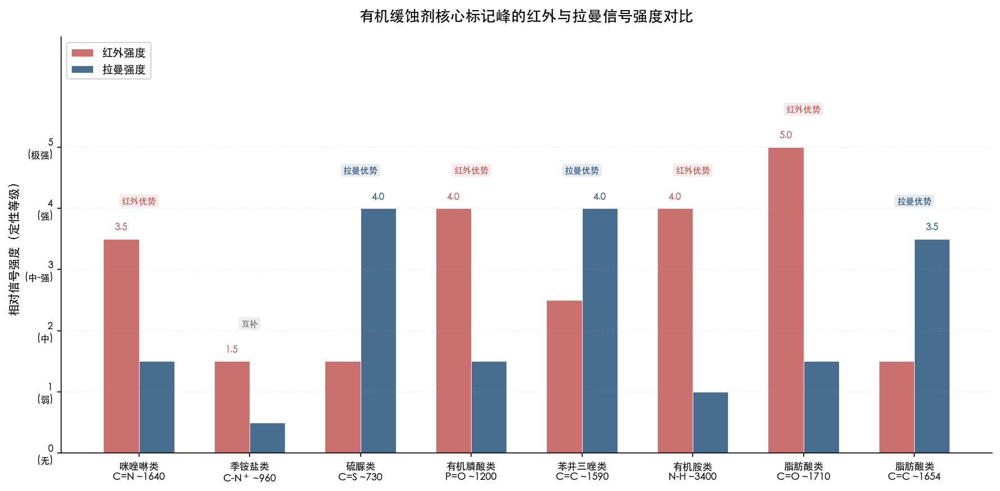

**图3-2 有机缓蚀剂核心标记峰的红外与拉曼信号强度对比。** 红色柱为红外强度，蓝色柱为拉曼强度。C=O、P=O、N−H 等极性基团的红外强度显著高于拉曼，C=S、芳环 C=C 等高极化率基团则拉曼占优。

**第四，C−H 伸缩区（2850–2960 cm⁻¹）是有机缓蚀剂的"通用重叠区"。** 所有含长链烷基的有机缓蚀剂（咪唑啉类、季铵盐类、有机胺类、脂肪酸类）在该区域的红外和拉曼信号高度重叠，无法用于区分不同种类的有机缓蚀剂。在多组分有机缓蚀剂体系中，该区域应视为"光谱盲区"，需依赖指纹区（400–1800 cm⁻¹）的特征峰进行组分鉴定。

图3-3以带状分布图的形式完整展示了七类有机缓蚀剂各核心标记峰在波数轴上的频率分布、所属优势光谱技术以及 C−H 通用重叠区的位置关系，为多组分体系的光谱解析策略提供全局视图。

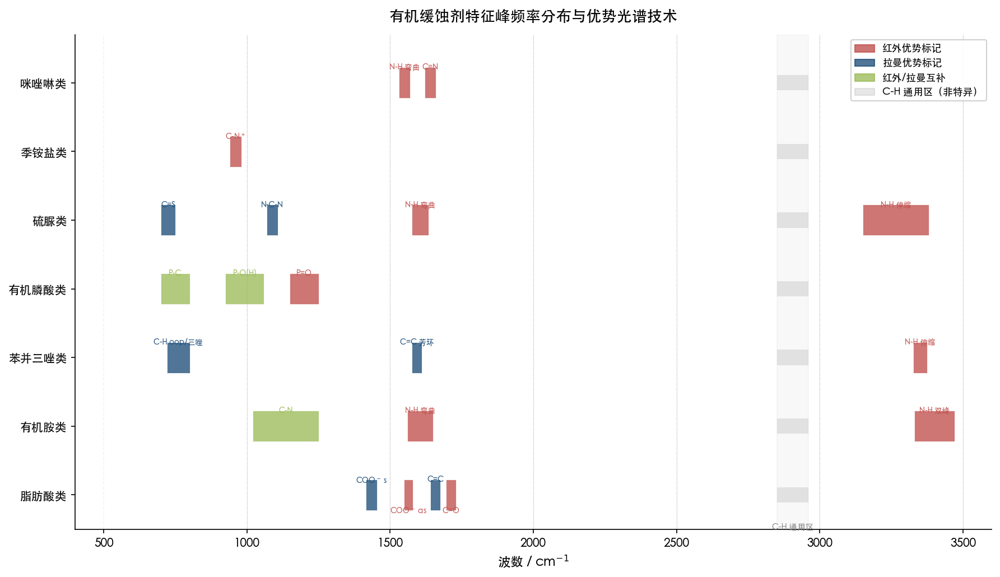

**图3-3 有机缓蚀剂特征峰频率分布与优势光谱技术。** 红色条带标示红外优势标记峰区间，蓝色条带标示拉曼优势标记峰区间，绿色条带标示红外/拉曼互补区间，灰色区域为 C−H 通用非特异区（2850–2960 cm⁻¹）。

# 第4章 复合缓蚀剂的组分拆分与光谱活性综合分析

工业碳钢防腐蚀实践中，单一缓蚀剂往往难以满足多元腐蚀环境的综合防护需求，复合缓蚀剂配方因此成为主流应用方案。复合缓蚀剂通过两种或多种活性组分的协同作用，在更宽的 pH 范围和更复杂的水化学条件下实现高效防腐。然而，多组分体系的振动光谱分析面临三大挑战：其一，各组分特征峰在频率空间上可能发生重叠；其二，组分间化学相互作用可导致特征峰位置偏移；其三，红外与拉曼在不同组分上的灵敏度差异制约着检测策略的制定。

本章采用"先拆分为单一组分 → 引用前文已有分析 → 讨论复合体系中的光谱叠加效应"的三步分析框架，对六类工业常见复合缓蚀剂配方进行系统的光谱活性评估。Chen 与 Yang（2019）系统总结了碳钢中性冷却水缓蚀剂的六大配方体系：（1）铬酸盐配方（CrO₄²⁻ + Zn²⁺ + HEDP + H₃PO₄）；（2）稳定化磷酸盐配方（正磷酸盐 + 聚磷酸盐 + 聚合物）；（3）碱性锌/有机配方（ZnCl₂ + HEDP + H₃PO₄ + TTA + 聚合物）；（4）钼酸盐配方（钼酸钠 + ATMP + TTA + PEG）；（5）全有机配方（HEDP + HPA + POCA + TTA + PAA）；（6）闭路系统配方（NaNO₂ + 硼砂 + 硅酸钠 + TTA + PAA）[Chen & Yang (2019), IntechOpen](https://www.intechopen.com/chapters/68671 "中性介质冷却水缓蚀剂配方")。本章在此分类基础上选取六组具有代表性的复配组合展开逐一分析。

## 4.1 钼酸盐–亚硝酸盐复配体系

### 4.1.1 组分拆分与单一组分光谱特性回顾

钼酸盐–亚硝酸盐复配是碳钢闭路冷却水系统中常见的纯无机缓蚀剂组合方案。MoO₄²⁻ 提供阳极钝化作用，NO₂⁻ 作为氧化性阳极缓蚀剂协同增强钝化膜的稳定性 [Dong et al. (2015), Appl. Surf. Sci.](https://www.sciencedirect.com/science/article/abs/pii/S0169433215016025 "NO₂⁻与MoO₄²⁻碳钢点蚀抑制机制比较")。

**钼酸根 MoO₄²⁻**（Td 点群）的光谱活性已在第 2 章详述：ν₁(A₁) = 878 cm⁻¹ 仅拉曼活性（强偏振谱带），ν₂(E) = 322 cm⁻¹ 仅拉曼活性，ν₃(T₂) = 844/794 cm⁻¹（CaMoO₄ 晶体中因晶体场效应分裂）红外+拉曼活性，ν₄(T₂) = 390/404 cm⁻¹ 红外+拉曼活性 [Khanna et al. (1968), J. Res. NBS](https://pmc.ncbi.nlm.nih.gov/articles/PMC6640585/ "钼酸盐单晶拉曼光谱")。

**亚硝酸根 NO₂⁻**（C₂ᵥ 点群）的 3 个振动模式均同时具有红外和拉曼活性：ν₁(A₁) = 1325 cm⁻¹（水溶液中为拉曼强标记），ν₂(A₁) = 830 cm⁻¹（弯曲振动），ν₃(B₁) = 1236 cm⁻¹（反对称伸缩，红外强标记）[Weston & Brodasky (1957), J. Chem. Phys.](https://ui.adsabs.harvard.edu/abs/1957JChPh..27..683W "亚硝酸根红外光谱与力常数")。

### 4.1.2 复合体系中的光谱叠加分析

该复配体系的光谱分析呈现一个关键叠加区域与两个可清晰分辨的区域：

**叠加区域（820–880 cm⁻¹）**：MoO₄²⁻ 的 ν₁ = 878 cm⁻¹ 与 NO₂⁻ 的 ν₂ = 830 cm⁻¹ 相距约 48 cm⁻¹，在高分辨率拉曼仪器（光谱分辨率 < 10 cm⁻¹）下可予区分；然而 MoO₄²⁻ 的 ν₃ 反对称伸缩分量（约 844 cm⁻¹）与 NO₂⁻ 的 ν₂ 在 830–844 cm⁻¹ 区域存在叠加风险。实践中可利用 MoO₄²⁻ ν₁ 的强偏振特性，通过偏振拉曼测量将其与 NO₂⁻ 信号有效区分。

**红外清晰分辨区域**：NO₂⁻ 的红外强吸收峰位于 1325 cm⁻¹（ν₁）和 1236 cm⁻¹（ν₃），远离 MoO₄²⁻ 的主要红外活性区域（ν₃ 约 800–900 cm⁻¹），红外光谱可不受钼酸根干扰而清晰检出 NO₂⁻ 组分。

**拉曼清晰分辨区域**：MoO₄²⁻ 的 ν₁ = 878 cm⁻¹ 是该离子最强的拉曼标记，且该模式仅拉曼活性（红外沉默），构成拉曼技术的独占检测优势。NO₂⁻ 在 1325 cm⁻¹ 的拉曼信号虽然存在，但与 MoO₄²⁻ 不发生重叠。

综合评估，该复配体系的最佳光谱检测策略为：**拉曼检测 MoO₄²⁻（ν₁ = 878 cm⁻¹），红外检测 NO₂⁻（1325/1236 cm⁻¹）**，两种技术形成天然互补的检测方案。

| 组分 | 诊断标记峰 / cm⁻¹ | 优势技术 | 叠加风险 |
|------|-------------------|---------|---------|
| MoO₄²⁻ | ν₁ = 878（仅拉曼） | **拉曼** | 与 NO₂⁻ ν₂ 相距 48 cm⁻¹，可分辨 |
| NO₂⁻ | ν₁ = 1325, ν₃ = 1236 | **红外** | 远离 MoO₄²⁻ 红外区，无干扰 |

## 4.2 磷酸盐–锌盐复配体系

### 4.2.1 组分拆分与单一组分光谱特性回顾

磷酸盐–锌盐复配是碳钢冷却水处理中最为经典的阴极-阳极协同体系之一。磷酸盐在阳极区形成钝化保护膜，锌盐在阴极区沉积 Zn(OH)₂ 或 ZnO 沉淀膜，二者协同作用实现碳钢表面的全面覆盖防护。

**磷酸根 PO₄³⁻**（Td 点群）：ν₁(A₁) = 938 cm⁻¹ 仅拉曼活性（强偏振谱带，磷酸盐诊断标记峰），ν₃(T₂) = 1017 cm⁻¹ 红外+拉曼活性。工业实际工况中 pH 4–9 范围内磷酸盐以 HPO₄²⁻ 和 H₂PO₄⁻ 为主要存在形态，对称性相应降低至 C₃ᵥ/C₂ᵥ，所有振动模式均变为红外-拉曼双活性 [Frost et al., Spectrochim. Acta A](https://www.repositorio.ufop.br/server/api/core/bitstreams/8bcb01cb-4f9b-44a8-8edd-9c3dbffa26e2/content "磷酸盐矿物拉曼与红外光谱")。

**锌酸根 Zn(OH)₄²⁻**（近似 Td 对称）：ν₁(A₁) = 484 cm⁻¹ 拉曼强偏振谱带，ν₃(F₂) = 430 cm⁻¹ 红外+拉曼活性 [Raman Study of Zincate Ions, J. Inorg. Nucl. Chem.](https://www.sciencedirect.com/science/article/pii/0022190276804496/pdf "锌酸根拉曼光谱")。**氧化锌 ZnO**（纤锌矿 C₆ᵥ⁴）：E₂(high) = 437 cm⁻¹ 仅拉曼活性 [Cuscó et al. (2007), Phys. Rev. B](https://apps.dtic.mil/sti/tr/pdf/ADA485744.pdf "ZnO拉曼散射")。

### 4.2.2 复合体系中的光谱叠加分析

磷酸盐与锌盐的特征光谱区域在波数空间上呈现高度分离的特征：

- PO₄³⁻ 的 ν₁ = 938 cm⁻¹ 和 ν₃ = 1017 cm⁻¹ 位于 900–1100 cm⁻¹ 区间；
- Zn(OH)₄²⁻ 的 ν₁ = 484 cm⁻¹ 和 ZnO E₂(high) = 437 cm⁻¹ 位于 400–500 cm⁻¹ 区间。

两组标记峰相距超过 400 cm⁻¹，在拉曼光谱中不存在叠加问题，可同时清晰检测两种组分 [Frost et al. (2004), Spectrochim. Acta A](https://pubmed.ncbi.nlm.nih.gov/15147685/ "天然磷酸锌矿物红外与拉曼光谱")。

需要指出的是，磷酸盐–锌盐体系在碳钢表面形成的缓蚀膜通常为磷酸锌（hopeite，Zn₃(PO₄)₂·4H₂O）沉淀相。Fernandes 等（2011）采用 FTIR 反射光谱对电镀锌钢表面的磷酸锌涂层进行了系统表征，检测到 PO₄³⁻ 相关红外吸收信号：ν₁ 对称伸缩位于 935 cm⁻¹，ν₃ 反对称伸缩分裂为多个组分（1104、1067、1019、1000 cm⁻¹），ν₄ 弯曲位于 635 cm⁻¹。磷酸锌晶体中 PO₄ 占据低对称 C₁ 位置，导致原本在理想 Td 对称下仅拉曼活性的 ν₁ 在红外中亦可检出，所有振动模式均转变为红外-拉曼双活性 [Fernandes et al. (2011), Rem: Rev. Esc. Minas](https://www.scielo.br/j/rem/a/59QBwdBnbfBLss4G3ZFSgsG/?lang=en "磷酸锌涂层FTIR分析")。

| 组分 | 诊断标记峰 / cm⁻¹ | 优势技术 | 叠加风险 |
|------|-------------------|---------|---------|
| PO₄³⁻ | ν₁ = 938（拉曼独占）；ν₃ = 1017（红外强） | 拉曼 + 红外 | 与锌盐不重叠 |
| Zn(OH)₄²⁻ / ZnO | 484 / 437（拉曼强） | **拉曼** | 与磷酸盐不重叠 |
| Zn₃(PO₄)₂·4H₂O（膜相） | 935, 1019, 1067, 1104（红外） | 红外 | PO₄ 与膜相重叠需频率微移区分 |

## 4.3 有机膦酸–锌盐复配体系

### 4.3.1 组分拆分与单一组分光谱特性回顾

有机膦酸（如 HEDP、ATMP）与锌盐的复配是碳钢循环冷却水系统中应用最为广泛的无铬配方之一。有机膦酸兼具阳极缓蚀与阻垢功能，锌盐提供阴极沉淀防护，两者协同可在宽 pH 范围内实现高效防腐。

**有机膦酸类**的核心光谱标记包括 P=O 伸缩（1150–1250 cm⁻¹，红外强标记）、P−O(H) 伸缩（925–1060 cm⁻¹，红外/拉曼互补）和 P−C 伸缩（700–800 cm⁻¹）。**锌盐**的光谱特性同 4.2 节所述。

### 4.3.2 配位相互作用导致的特征峰位移

有机膦酸–锌盐复配体系中，组分间的化学相互作用是光谱分析的关键问题。与简单的物理混合不同，有机膦酸的 P=O 和 P−OH 基团可与 Zn²⁺ 发生配位，导致特征峰频率显著偏移。

Appa Rao 等（2013）对 BPMG（N,N-二(磷酰甲基)甘氨酸）–Zn²⁺–柠檬酸盐三元缓蚀剂体系进行了系统的 FTIR 研究，提供了配位红移的定量实验证据。游离态 BPMG 与 Zn²⁺ 配位态的特征峰频率对比如下 [Appa Rao et al. (2013), J. Surf. Eng. Mater. Adv. Tech.](https://pdfs.semanticscholar.org/c8a8/042ac9311e41ef0e046f86db0bfe6669923e.pdf "BPMG-Zn-柠檬酸盐三元缓蚀剂FTIR分析")：

| 振动模式 | 游离态波数 / cm⁻¹ | 配位态波数 / cm⁻¹ | 红移量 / cm⁻¹ |
|----------|------------------|------------------|-------------|
| ν(P=O) 伸缩 | 1181 | ~1110 | **71** |
| ν(C=O) 伸缩 | 1732 | ~1690 | **42** |
| ν(P−OH) 伸缩 | 933.5 | ~915 | **18** |

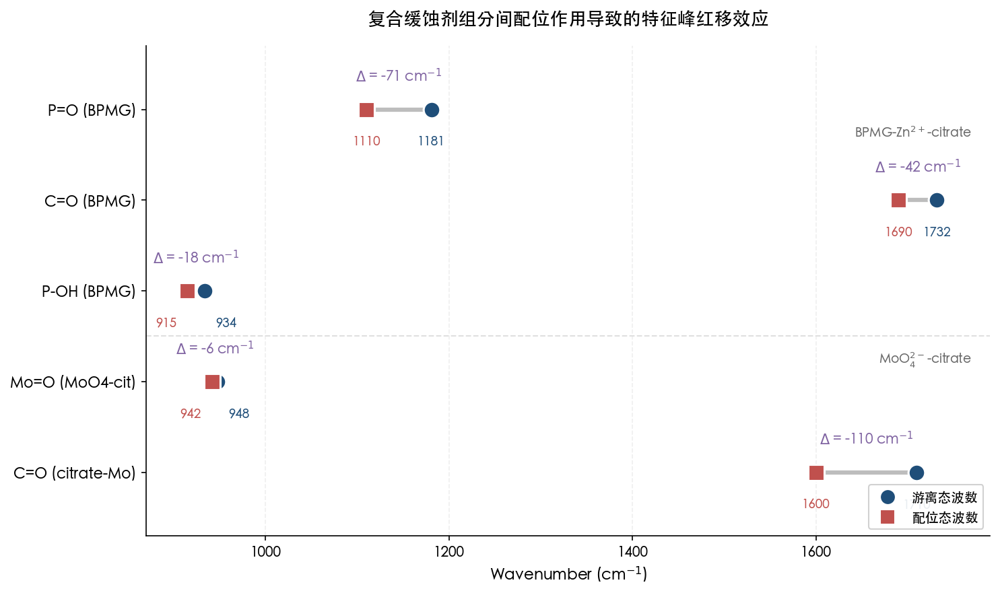

图 4-1 以 BPMG–Zn²⁺–柠檬酸盐体系和 MoO₄²⁻–柠檬酸体系为例，展示了游离态与配位态之间特征峰频率的红移方向与幅度。其中 P=O 伸缩红移幅度最大（71 cm⁻¹），C=O（柠檬酸配位 Mo）红移幅度可达 110 cm⁻¹，直观揭示了配位作用对振动光谱分析的显著影响。

P=O 伸缩红移达 71 cm⁻¹，该幅度足以导致配位态 P=O 频率（~1110 cm⁻¹）偏离游离态常规范围（1150–1250 cm⁻¹），进入 PO₄³⁻ ν₃ 反对称伸缩（~1017 cm⁻¹）的邻域。C=O 伸缩红移 42 cm⁻¹ 则使频率从游离羧酸的典型 1710–1730 cm⁻¹ 区域移至 COO⁻ 配位羧酸盐区域（~1690 cm⁻¹），这一变化反映了柠檬酸羧基参与金属配位的光谱证据。

上述配位红移现象对实际光谱分析具有三重意义：第一，在多组分体系光谱解析中不能简单套用游离态组分的标准频率表，必须充分考虑配位环境的影响；第二，特征峰的位移方向和幅度可作为组分间化学相互作用——尤其是与金属离子配位作用——的光谱诊断依据；第三，P=O 红移后可能与其他含 P−O 基团的组分产生新的频率重叠，增加光谱解析的复杂性。

### 4.3.3 光谱叠加与区分策略

| 组分 | 诊断标记峰 / cm⁻¹ | 优势技术 | 叠加风险 |
|------|-------------------|---------|---------|
| 有机膦酸（游离态） | P=O ~1200（红外强） | **红外** | 配位后红移至 ~1110 可能与 PO₄ ν₃ 邻接 |
| 有机膦酸（配位态） | P−OH ~915（红外/拉曼） | 红外/拉曼 | 与锌酸根（484 cm⁻¹）不重叠 |
| Zn²⁺ / ZnO | 437–484（拉曼强） | **拉曼** | 位于低波数区，无干扰 |

拉曼光谱在该体系中具有独特优势：锌盐标记峰在低波数区（400–500 cm⁻¹），与有机膦酸的主要标记完全分离；有机膦酸的 P−O(H) 伸缩区（~950 cm⁻¹）在拉曼中也可检出，可与锌盐同时定量。红外更适合监测 P=O 峰位的配位红移，从而判断膦酸–锌配位反应的进程。

## 4.4 咪唑啉–季铵盐复配体系

### 4.4.1 组分拆分与单一组分光谱特性回顾

咪唑啉–季铵盐复配广泛应用于碳钢油气田酸性介质的缓蚀防护。咪唑啉通过 C=N 环与金属表面形成化学吸附，季铵盐以阳离子头基的静电吸附作用在金属表面构建疏水屏障。在某些工艺路线中，咪唑啉本身可通过季铵化反应生成 Gemini 型咪唑啉季铵盐。

**咪唑啉类**核心光谱标记：C=N 伸缩 ~1640 cm⁻¹（红外中-强标记），N−H 弯曲 ~1550 cm⁻¹（红外中-强）。**季铵盐类**核心光谱标记：C−N⁺ 伸缩 ~960 cm⁻¹（红外弱但特异），无 N−H 吸收（负标记）。两类缓蚀剂均在 2850–2960 cm⁻¹ 区域因烷基 C−H 伸缩产生强红外和拉曼信号。

### 4.4.2 复合体系中的光谱叠加分析

**可分辨区域**：咪唑啉 C=N ~1640 cm⁻¹ 与季铵盐 C−N⁺ ~960 cm⁻¹ 相距约 680 cm⁻¹，在红外光谱中完全可区分。C=N 峰的存在可确认咪唑啉组分，C−N⁺ 峰的存在可确认季铵盐组分。

**高度重叠区域（2850–2960 cm⁻¹）**：两类组分均含长链烷基，C−H 伸缩信号在该区域完全叠加，无法用于组分区分。该区域在咪唑啉–季铵盐复配体系中属于低诊断价值的"光谱盲区"。

**化学反应导致的光谱变化**：当咪唑啉被季铵化形成 Gemini 型产物时，C=N 伸缩频率因季铵化反应引起的电子效应从游离态的 ~1640 cm⁻¹ 红移至约 1601 cm⁻¹ [Colloids Surf. A (2026)](https://www.sciencedirect.com/science/article/abs/pii/S0927775726004899 "油酸咪唑啉季铵化产物缓蚀性能")。该红移幅度约 39 cm⁻¹，使 C=N 峰移入 N−H 弯曲振动（~1550–1560 cm⁻¹）和 COO⁻ 反对称伸缩（~1560–1570 cm⁻¹）的频率邻域，显著增加了该区域的光谱解析难度。

**N−H 吸收的诊断价值**：在物理复配体系中，红外光谱中应同时观测到 C=N ~1640 cm⁻¹（咪唑啉）和 N−H ~3350 cm⁻¹（咪唑啉环的 N−H），且 N−H 区域仅呈现咪唑啉贡献——季铵盐因无 N−H 键，不产生 3200–3500 cm⁻¹ 吸收。因此，N−H 伸缩信号的有无和强度可辅助判断咪唑啉与季铵盐的相对含量。

| 组分 | 诊断标记峰 / cm⁻¹ | 优势技术 | 叠加风险 |
|------|-------------------|---------|---------|
| 咪唑啉 | C=N ~1640（红外中-强） | **红外** | 季铵化后红移至 ~1601，邻近 N−H δ |
| 季铵盐 | C−N⁺ ~960（红外弱） + 无 N−H | **红外** | 与咪唑啉 C=N 不重叠 |
| 两者共有 | C−H 2850–2960 | 红外/拉曼 | **完全重叠，无法区分** |

鉴于两类组分的核心标记均偏向红外优势（C=N 拉曼弱-中，C−N⁺ 拉曼极弱），该复配体系的组分鉴定主要依赖红外技术，拉曼在此体系中的诊断价值有限。

## 4.5 苯并三唑–有机膦酸复配体系

### 4.5.1 组分拆分与单一组分光谱特性回顾

苯并三唑（BTA 或其甲基化衍生物 TTA）与有机膦酸（HEDP、ATMP）的复配是碳钢中性循环冷却水系统中典型的"全有机"配方组合。BTA 借助芳环 π 电子体系在金属表面形成化学吸附保护层，有机膦酸通过多齿配位吸附兼顾缓蚀与阻垢双重功能。

**苯并三唑类**的核心光谱标记：芳环 C=C 伸缩 ~1590 cm⁻¹（拉曼强标记），三唑环呼吸振动 ~780 cm⁻¹（拉曼中-强），N−H 伸缩 ~3345 cm⁻¹（红外强标记） [NIST WebBook](https://webbook.nist.gov/cgi/cbook.cgi?ID=C95147&Type=IR-SPEC&Index=0 "苯并三唑气相IR") [Thomas et al. (2004), Spectrochim. Acta A](https://pubmed.ncbi.nlm.nih.gov/14670458/ "苯并三唑拉曼与SERS")。

**有机膦酸类**的核心光谱标记：P=O 伸缩 ~1200 cm⁻¹（红外强标记），P−O(H) 伸缩 ~950 cm⁻¹（红外/拉曼互补），P−C 伸缩 ~750 cm⁻¹（弱-中）。

### 4.5.2 复合体系的天然光谱互补性

苯并三唑–有机膦酸复配体系在复合缓蚀剂中堪称光谱互补性最为理想的组合。其核心标记峰在频率空间和光谱技术维度上均实现了良好的分离：

**频率分离**：BTA 的拉曼核心标记（C=C ~1590 cm⁻¹）与膦酸的红外核心标记（P=O ~1200 cm⁻¹）相距约 390 cm⁻¹，不存在频率叠加。BTA 三唑环呼吸振动（~780 cm⁻¹）与膦酸 P−C 伸缩（~750 cm⁻¹）相距约 30 cm⁻¹，在高分辨率拉曼仪器下可予分辨。

**技术互补**：BTA 的诊断优势在拉曼光谱中体现（C=C 对称伸缩引起极化率大幅变化），膦酸的诊断优势则在红外光谱中体现（P=O 偶极矩变化显著），两种组分天然分属不同的优势光谱技术频段。采用拉曼+红外联合检测方案，即可实现对两种组分的无干扰同时鉴定。

**潜在叠加区域**：唯一需要关注的叠加风险出现在指纹区 730–800 cm⁻¹ 范围内——BTA 的 C−H 面外弯曲（~740 cm⁻¹，红外强）、三唑环呼吸（~780 cm⁻¹）与膦酸的 P−C 伸缩（~750 cm⁻¹）形成三个相邻谱带。该区域在红外光谱中可能表现为重叠宽峰，需通过光谱拟合或二阶导数技术加以分辨。

| 组分 | 诊断标记峰 / cm⁻¹ | 优势技术 | 叠加风险 |
|------|-------------------|---------|---------|
| BTA/TTA | C=C ~1590（拉曼强） | **拉曼** | 与膦酸 P=O（~1200）不重叠 |
| BTA/TTA | N−H ~3345（红外强） | **红外** | 膦酸无 N−H，不重叠 |
| 有机膦酸 | P=O ~1200（红外强） | **红外** | 与 BTA C=C（~1590）不重叠 |
| 有机膦酸 | P−O(H) ~950（拉曼中） | 拉曼 | 独立区域 |
| 叠加风险区 | BTA 环呼吸 ~780 / 膦酸 P−C ~750 | — | 相距 30 cm⁻¹，需高分辨率 |

## 4.6 钼酸盐–柠檬酸复配体系

### 4.6.1 组分拆分与单一组分光谱特性回顾

钼酸盐–柠檬酸复配在碳钢缓蚀配方中兼具缓蚀与络合分散双重功能。柠檬酸作为多齿配体可与 Mo(VI) 形成热力学稳定的配合物，从而改变钼酸盐在溶液中的形态分布及其缓蚀行为。

**钼酸根 MoO₄²⁻** 的光谱特性同 4.1 节。

**柠檬酸**（C₆H₈O₇）为不具对称中心的有机分子，核心光谱标记包括：C=O 伸缩 ~1710 cm⁻¹（红外极强），O−H 伸缩 2500–3300 cm⁻¹（宽强红外吸收），C−O 伸缩 1020–1250 cm⁻¹（红外中-强）。

### 4.6.2 配位反应导致的光谱形态变化

钼酸盐与柠檬酸在水溶液中发生配位反应。Zhou 等（2000）合成并通过单晶 X 射线衍射表征了两种 Mo(VI)-柠檬酸配合物的晶体结构：单核 K₄[MoO₃(cit)]·2H₂O 和双核 K₄[(MoO₂)₂O(Hcit)₂]·4H₂O [Zhou et al. (2000), Inorg. Chem.](https://pubs.acs.org/doi/10.1021/ic990042s "Mo(VI)柠檬酸配合物合成与表征")。配位后 Mo 原子形成八面体配位构型，柠檬酸以三齿配体方式通过醇羟基和羧基氧与 Mo 中心配位 [ResearchGate: Mo(VI)-Citric Acid Speciation](https://www.researchgate.net/publication/233452071 "Mo(VI)-柠檬酸配合物水溶液形态分布")。

配合物的形成对振动光谱产生两方面显著影响：

**第一，Mo=O 伸缩频率的变化。** 自由 MoO₄²⁻ 的拉曼 ν₁ 位于 ~878 cm⁻¹（Td 对称）。Murase 等（2000）通过拉曼光谱因子分析对 Mo(VI)-柠檬酸电镀浴进行研究，发现加入柠檬酸后 Mo=O 对称伸缩的拉曼峰从 948 cm⁻¹ 移至 942 cm⁻¹（红移约 6 cm⁻¹）[Murase et al. (2000), J. Electrochem. Soc.](https://cir.nii.ac.jp/crid/1360855569730030592 "Mo(VI)柠檬酸浴拉曼光谱因子分析")。需要指出的是，该研究中 948 cm⁻¹ 的起始频率对应于酸性条件下多钼酸根（而非理想 Td MoO₄²⁻）的 Mo=O 伸缩模式。配合物中 Mo 的配位环境由四面体转变为八面体，Mo=O 键的振动频率因配位效应而发生位移。该拉曼频率变化可作为 Mo(VI)-柠檬酸配合物形成与否的光谱诊断指标。

**第二，柠檬酸 C=O 频率的配位红移。** 游离柠檬酸的 C=O 伸缩位于 ~1710 cm⁻¹；配位后参与金属配位的羧基 C=O 频率移至 ~1560–1690 cm⁻¹ 区域，与 COO⁻ 反对称伸缩频率重叠，而未参与配位的羧基仍保持较高频率。红移幅度（20–150 cm⁻¹）因配位方式的差异而有所不同：单齿配位红移较小，螯合配位红移较大。

### 4.6.3 光谱叠加与区分策略

| 组分/形态 | 诊断标记峰 / cm⁻¹ | 优势技术 | 叠加风险 |
|----------|-------------------|---------|---------|
| MoO₄²⁻（游离） | ν₁ ~878（仅拉曼） | **拉曼** | 与配合物 Mo=O 可通过频率位移区分 |
| Mo(VI)-cit 配合物 | Mo=O ~942（拉曼） | **拉曼** | 配位后频率与 PO₄³⁻ ν₁ 邻近 |
| 柠檬酸（游离） | C=O ~1710（红外极强） | **红外** | 与 COO⁻ 配位态可通过频率区分 |
| 柠檬酸（配位态） | COO⁻ ~1560–1690 | 红外 | 与 C=N、C=C 区域可能叠加 |

该体系的光谱分析关键在于区分游离态与配位态组分。拉曼光谱可通过 Mo=O 频率的位移判断配合物的形成程度；红外光谱可通过 C=O/COO⁻ 频率变化判断柠檬酸的配位状态。两种技术的结合使用为复合体系中组分形态的定性鉴别提供了可靠的分析手段。

## 4.7 闭路系统复合配方（NaNO₂ + 硼砂 + 硅酸钠 + TTA）

### 4.7.1 组分拆分与单一组分光谱特性回顾

闭路冷却系统（如中央空调冷冻水回路）通常采用多组分无机-有机复合配方，典型组成包括亚硝酸钠（NaNO₂）+ 硼砂（Na₂B₄O₇）+ 硅酸钠（Na₂SiO₃）+ 苯并三唑（TTA）+ 聚丙烯酸（PAA）[Chen & Yang (2019), IntechOpen](https://www.intechopen.com/chapters/68671 "闭路系统缓蚀剂配方")。该配方涵盖无机阳极缓蚀剂（NO₂⁻）、pH 缓冲剂（B₄O₇²⁻）、成膜剂（SiO₃²⁻）、有机缓蚀剂（TTA）和分散剂（PAA）五类功能组分，是复合缓蚀剂体系中组分数量最多、光谱叠加问题最为复杂的典型代表。

各组分核心光谱标记回顾如下：

- **NO₂⁻**（C₂ᵥ）：ν₁ = 1325 cm⁻¹（拉曼强），ν₃ = 1236 cm⁻¹（红外强），ν₂ = 830 cm⁻¹（红外/拉曼中）。
- **硼酸盐**：水溶液中以 B(OH)₃（ν₁ ~877 cm⁻¹）和 B(OH)₄⁻（ν₁ ~745 cm⁻¹）为主要形态，聚硼酸根 ν₁ 分布在 521–877 cm⁻¹ 范围。BO₃³⁻ 的 ν₂(A₂") ~750 cm⁻¹ 仅红外活性 [Weir & Schroeder (1964), J. Res. NBS 68A](https://nvlpubs.nist.gov/nistpubs/jres/68A/jresv68An5p465_A1b.pdf "硼酸盐红外光谱") [Zhou et al. (2011), Spectrochim. Acta A](https://www.sciencedirect.com/science/article/abs/pii/S1386142511006846 "硼酸盐水溶液拉曼光谱")。
- **SiO₃²⁻**（链状聚合态）：Si−O−Si 反对称伸缩 ~900–1100 cm⁻¹（红外宽强），Q² 物种拉曼主峰 ~950–1000 cm⁻¹ [Liu et al. (2021), J. Am. Ceram. Soc.](https://www.osti.gov/servlets/purl/1865531 "硅酸盐拉曼Q-species分析")。
- **TTA**：C=C ~1590 cm⁻¹（拉曼强），N−H ~3345 cm⁻¹（红外强），三唑环呼吸 ~780 cm⁻¹（拉曼中-强）。
- **PAA**：C=O ~1710 cm⁻¹（红外强，游离态）；COO⁻ 反对称伸缩 ~1560 cm⁻¹（红外强，盐态）。

### 4.7.2 多组分光谱叠加全景分析

该五组分体系的光谱叠加情况可按波数区间进行系统梳理。

**高波数区（2500–3600 cm⁻¹）**：TTA 的 N−H 伸缩（~3345 cm⁻¹）是该区域唯一具有组分特异性的标记，可在红外光谱中清晰检出。O−H 伸缩（源自水及硼酸）在 ~3200–3600 cm⁻¹ 范围产生宽背景吸收，但由于其谱带宽泛，不影响 N−H 尖峰的辨识。

**有机官能团区（1500–1750 cm⁻¹）**：TTA 的 C=C ~1590 cm⁻¹（拉曼强）、PAA 的 C=O ~1710 cm⁻¹（红外强）以及 COO⁻ ~1560 cm⁻¹（红外强）均分布在该区域。C=C 与 COO⁻ 在红外光谱中可能产生重叠（1560 vs. 1590 cm⁻¹，相距仅 30 cm⁻¹），但在拉曼光谱中 C=C 信号远强于 COO⁻，可优先检出 TTA 组分。

**亚硝酸盐指纹区（1200–1350 cm⁻¹）**：NO₂⁻ 的 ν₁（1325 cm⁻¹）和 ν₃（1236 cm⁻¹）在该区域占据特征性位置。BO₃ 的 ν₃ 反对称伸缩（~1250 cm⁻¹）可能与 NO₂⁻ ν₃ 发生部分叠加，但二者在相对强度上存在明显差异：NO₂⁻ ν₁ 在拉曼光谱中呈现极强信号，而硼酸盐在该区域的拉曼贡献则较弱，因此拉曼光谱可有效区分两种组分。

**硅酸盐/硼酸盐宽吸收区（850–1100 cm⁻¹）**：Si−O−Si 的红外宽强吸收（900–1100 cm⁻¹）与硼酸 B(OH)₃ 的拉曼 ν₁（~877 cm⁻¹）在该区域发生叠加。这是本配方体系中光谱干扰最为严重的波数范围：红外信号以硅酸盐宽吸收为主导，而拉曼光谱则可通过 B(OH)₃ 和 B(OH)₄⁻ 的尖锐 ν₁ 峰实现硼物种的选择性识别。

**低波数区（400–850 cm⁻¹）**：NO₂⁻ ν₂（~830 cm⁻¹）、TTA 三唑环呼吸（~780 cm⁻¹）、BO₃³⁻ ν₂（~750 cm⁻¹，仅红外活性）和 B(OH)₄⁻ ν₁（~745 cm⁻¹，拉曼强偏振）在该区域形成密集谱带群。拉曼偏振测量可有效区分强偏振的 B(OH)₄⁻ ν₁ 与其他非偏振或弱偏振信号。

### 4.7.3 推荐检测策略

基于上述波段叠加分析，闭路系统复合配方的光谱检测宜采用拉曼-红外联合方案，按"无干扰标记优先"原则进行检测任务分配：

| 组分 | 诊断标记峰 / cm⁻¹ | 推荐技术 | 理由 |
|------|-------------------|---------|------|
| NO₂⁻ | ν₁ = 1325 | **拉曼** | 拉曼强谱带，远离其他组分拉曼主峰 |
| B(OH)₃ / B(OH)₄⁻ | ν₁ ~877 / 745 | **拉曼** | 尖锐偏振峰，可区分不同硼物种 |
| BO₃ 单元 | ν₂ ~750（仅红外） | **红外** | 拉曼沉默，红外独占标记 |
| SiO₃²⁻ | 900–1100 宽吸收 | **红外** | 红外宽强吸收可定性检出 |
| TTA | C=C ~1590 | **拉曼** | 拉曼强标记，红外区域叠加多 |
| PAA | C=O ~1710 / COO⁻ ~1560 | **红外** | 红外强吸收，拉曼弱 |

## 4.8 四大关键光谱叠加/干扰区域

综合上述六个复配体系的逐一分析，可归纳出碳钢复合缓蚀剂光谱分析中的四个系统性叠加"热区"。图 4-2 以波数为横轴、六大配方体系为纵轴，直观展示了各组分核心标记峰的频率分布及四大叠加热区的位置。

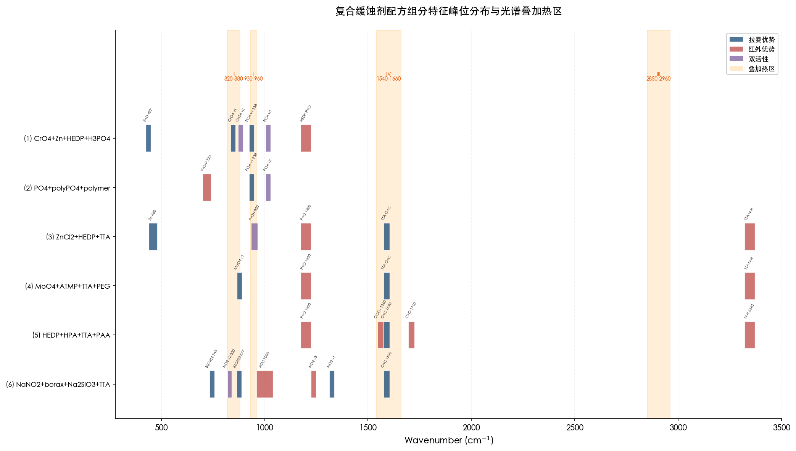

图 4-2 以蓝色（拉曼优势）、红色（红外优势）和紫色（双活性）色块标注各组分的核心标记峰位置，淡橙色阴影区域标记四大叠加热区（I: 820–880 cm⁻¹、II: 930–960 cm⁻¹、III: 1540–1660 cm⁻¹、IV: 2850–2960 cm⁻¹），揭示了复合体系中光谱叠加的全貌。

### 4.8.1 区域一：930–960 cm⁻¹ "多方叠加区"

该区域聚集了多种组分的特征振动：PO₄³⁻ ν₁（938 cm⁻¹）、WO₄²⁻ ν₁（931 cm⁻¹）、BO₃³⁻ ν₁（~950 cm⁻¹）、有机膦酸 P−O(H)（~950 cm⁻¹）以及季铵盐 C−N⁺（~960 cm⁻¹）。在含有上述两种或多种组分的复合配方中，该区域的拉曼和红外信号高度重叠。解决方案包括：（a）利用 Td 离子 ν₁ 的偏振特性（偏振拉曼测量）；（b）通过 ν₃ 反对称伸缩的频率差异辅助归属（PO₄³⁻ ν₃ = 1017 cm⁻¹ vs. WO₄²⁻ ν₃ = 833 cm⁻¹）；（c）采用化学计量学方法（如 MCR-ALS）对叠加谱带进行数学分解。

### 4.8.2 区域二：820–880 cm⁻¹ "无机离子密集区"

CrO₄²⁻ ν₁（847 cm⁻¹）、MoO₄²⁻ ν₁（878 cm⁻¹）、SiO₄⁴⁻ ν₁（~824 cm⁻¹）、B(OH)₃ ν₁（~877 cm⁻¹）和 NO₂⁻ ν₂（~830 cm⁻¹）均在该区域产生拉曼信号。虽然相邻峰间距为 20–50 cm⁻¹，在高分辨拉曼仪器（分辨率 < 5 cm⁻¹）下通常可予分辨，但在低分辨率便携式仪器（分辨率 ~10–15 cm⁻¹）上可能产生混淆。尤为值得关注的是，MoO₄²⁻ 与 B(OH)₃ 的 ν₁ 仅相差约 1 cm⁻¹（878 vs. 877 cm⁻¹），在任何常规仪器上均无法直接区分，必须借助其他波数区域的辅助标记或通过化学方法（如调节溶液 pH）改变硼酸盐的聚合形态来消除干扰。

### 4.8.3 区域三：2850–2960 cm⁻¹ "C−H 伸缩通用区"

所有含长链烷基的有机缓蚀剂——咪唑啉类、季铵盐类、有机胺类、脂肪酸类——在该区域的红外和拉曼信号完全重叠，该区域仅能提供"存在有机组分"的总体定性信息，无法用于区分不同种类的有机缓蚀剂。在多组分有机缓蚀剂体系中，组分的鉴定必须依赖指纹区（400–1800 cm⁻¹）的特征峰。

### 4.8.4 区域四：1540–1660 cm⁻¹ "有机官能团叠加区"

C=N 伸缩（咪唑啉 ~1640 cm⁻¹）、C=C 芳环伸缩（BTA ~1590 cm⁻¹）、N−H 弯曲（~1540–1560 cm⁻¹）、COO⁻ 反对称伸缩（~1560 cm⁻¹）和水的 O−H 弯曲（~1640 cm⁻¹）均在该区域产生信号。在水溶液红外测量中，水的强吸收（~1640 cm⁻¹）构成主要干扰源。拉曼光谱因水的拉曼散射截面极小而可有效规避该干扰。在该区域内，拉曼技术更适合检测 BTA 的 C=C 标记（~1590 cm⁻¹，拉曼强信号），红外技术则需采用 ATR 附件并完成水背景扣除后方可检测 C=N 和 COO⁻。

## 4.9 复合缓蚀剂光谱分析的拉曼-红外互补策略

综合前述各复配体系的分析结果，可以提炼出复合缓蚀剂光谱鉴定的三条核心策略。图 4-3 以热力矩阵形式展示了六个配方体系中各诊断标记的推荐检测技术分配方案。

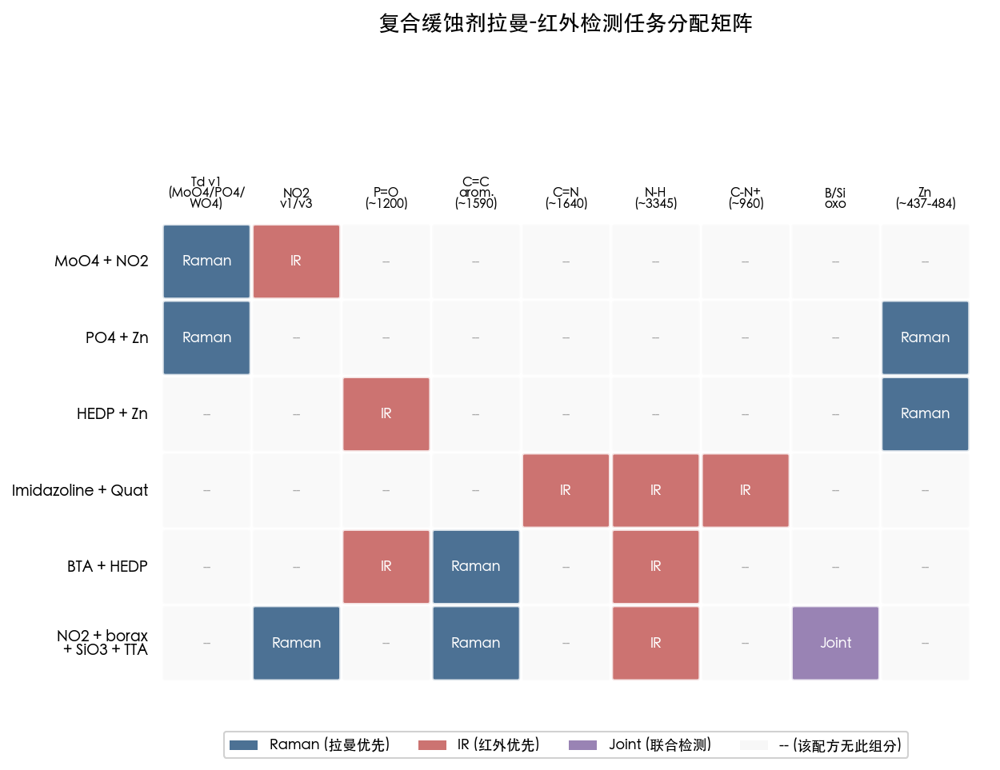

图 4-3 矩阵的行代表六个复配体系，列代表九类关键诊断标记，单元格以蓝色（拉曼优先）、红色（红外优先）和紫色（联合检测）标注推荐技术，灰色表示该配方不含相应组分。该矩阵为实际检测方案的制定提供了直观的决策参考。

**策略一：按组分类型匹配优势技术。** Td 四面体无机阴离子的 ν₁ 对称伸缩仅拉曼活性，是拉曼技术的独占检测优势；有机极性基团（P=O、C=O、N−H）以红外强吸收为特征，是红外技术的优势检测目标；高极化率基团（C=S、芳环 C=C）则是拉曼技术的优势检测对象。在多组分体系中，无机阴离子定量应优先选择拉曼，有机极性基团的定性与定量应优先选择红外。

**策略二：利用配位红移作为化学相互作用的诊断工具。** 有机膦酸–锌盐、钼酸盐–柠檬酸等体系中，特征峰的红移幅度（18–110 cm⁻¹）可直接反映组分间配位反应的程度 [Appa Rao et al. (2013)](https://pdfs.semanticscholar.org/c8a8/042ac9311e41ef0e046f86db0bfe6669923e.pdf "FTIR配位红移实验证据")。在工业在线监测应用中，特征峰位置的漂移趋势可作为配方稳定性与缓蚀剂消耗状态的实时评估指标。

**策略三：识别并规避"光谱盲区"。** C−H 伸缩通用区（2850–2960 cm⁻¹）、930–960 cm⁻¹ 多方叠加区以及水溶液红外中 ~1640 cm⁻¹ 的水吸收干扰区，在多组分体系分析中应被视为"低诊断价值区域"。组分鉴定应优先利用各自无干扰的特征标记，在叠加区域则需结合化学计量学方法（如 MCR-ALS、PLS）对重叠谱带进行数学分解。

Baker Hughes（2020）的专利提出了一种利用便携式表面增强拉曼散射（SERS）技术检测复合缓蚀剂的方案，通过纳米金/银基底的差异化吸附实现对多组分缓蚀剂 ppb 级别的选择性检测 [Baker Hughes (2020), US Patent](https://patents.google.com/patent/US20200347718A1/en "便携式SERS检测油田缓蚀剂")。该方案利用不同缓蚀剂组分对 SERS 基底吸附亲和力的差异，结合光谱特征实现选择性组分识别，代表了复合缓蚀剂现场光谱检测技术的前沿发展方向。

# 第5章 综合对比与检测应用建议

前四章已依次完成碳钢领域八类无机缓蚀剂与七类有机缓蚀剂的振动光谱活性判定，并对六大复合配方体系进行了组分拆分与光谱叠加分析。本章在此基础上，以横向对比视角汇总全部缓蚀剂的拉曼-红外活性特征，系统阐述两种光谱技术在缓蚀剂检测中的互补关系，并面向典型工业应用场景提出光谱检测方案建议。

## 5.1 全部缓蚀剂拉曼活性与红外活性汇总

本节以统一对比表格形式汇总全部缓蚀剂种类的核心特征峰、拉曼活性强度、红外活性强度及最佳诊断标记，为后续检测方案设计提供一站式参照。

### 5.1.1 无机缓蚀剂光谱活性总表

| 缓蚀剂 | 活性离子 | 点群 | 核心诊断标记 | 波数 / cm⁻¹ | 拉曼活性 | 红外活性 | 优势技术 |
|---------|---------|------|------------|-------------|---------|---------|---------|
| 铬酸盐 | CrO₄²⁻ | Td | ν₁(A₁) 对称伸缩 | 847 | **强**（偏振） | 无 | **拉曼** |
| 磷酸盐 | PO₄³⁻ | Td | ν₁(A₁) 对称伸缩 | 938 | **强**（偏振） | 无 | **拉曼** |
| 钼酸盐 | MoO₄²⁻ | Td | ν₁(A₁) 对称伸缩 | 878 | **强**（偏振） | 无 | **拉曼** |
| 钨酸盐 | WO₄²⁻ | Td | ν₁(A₁) 对称伸缩 | 931 | **强**（偏振） | 无 | **拉曼** |
| 硅酸盐 | SiO₄⁴⁻/SiO₃²⁻ | Td/链状 | ν₁ 对称伸缩 / Si−O−Si 反对称伸缩 | ~824 / 900–1100 | 中 / 弱 | 无 / **强** | 拉曼（ν₁）/ 红外（Si−O−Si） |
| 亚硝酸盐 | NO₂⁻ | C₂ᵥ | ν₁(A₁) 对称伸缩 | 1325 | **强** | **强** | 拉曼+红外互补 |
| 锌盐 | Zn(OH)₄²⁻/ZnO | ~Td / C₆ᵥ⁴ | ν₁/E₂(high) | 484 / 437 | **强** | 弱 / 无 | **拉曼** |
| 硼酸盐 | BO₃³⁻/B₄O₇²⁻ | D₃ₕ / ~C₁ | ν₁(A₁') / ν₂(A₂") | ~950 / ~750 | 仅拉曼 / — | — / 仅红外 | 拉曼（ν₁）+ 红外（ν₂）互补 |

上表呈现出三条关键规律。其一，五种 Td 点群四面体离子（CrO₄²⁻、PO₄³⁻、MoO₄²⁻、WO₄²⁻、SiO₄⁴⁻）的 ν₁(A₁) 对称伸缩振动仅具有拉曼活性，在红外光谱中"沉默"，构成拉曼技术在无机缓蚀剂检测中的独占优势 [Chemistry LibreTexts](https://chem.libretexts.org/Bookshelves/Physical_and_Theoretical_Chemistry_Textbook_Maps/Supplemental_Modules_(Physical_and_Theoretical_Chemistry)/Spectroscopy/Vibrational_Spectroscopy/Vibrational_Modes/Normal_Modes "Td点群振动模式分析")。其二，亚硝酸根（C₂ᵥ 点群）的 3 个振动模式因不具对称中心而同时具有红外和拉曼活性，在两种光谱中均可被检出 [Weston & Brodasky (1957), J. Chem. Phys.](https://ui.adsabs.harvard.edu/abs/1957JChPh..27..683W "亚硝酸根红外光谱与力常数")。其三，硼酸根（D₃ₕ 点群）的 ν₁ 仅拉曼活性、ν₂ 仅红外活性，是无机缓蚀剂中红外-拉曼互补性表现最为典型的离子 [Weir & Schroeder (1964), J. Res. NBS 68A](https://nvlpubs.nist.gov/nistpubs/jres/68A/jresv68An5p465_A1b.pdf "结晶无机硼酸盐红外光谱")。

### 5.1.2 有机缓蚀剂光谱活性总表

| 缓蚀剂类型 | 核心官能团 | 最佳诊断标记峰 | 波数 / cm⁻¹ | 红外活性 | 拉曼活性 | 优势技术 |
|-----------|-----------|-------------|-------------|---------|---------|---------|
| 咪唑啉类 | C=N 环内伸缩 | ν(C=N) | ~1640 | **中-强** | 弱-中 | **红外** |
| 季铵盐类 | C−N⁺ 伸缩 + 无 N−H | ν(C−N⁺) | ~960 | 弱-中 | 极弱 | **红外** |
| 硫脲类 | C=S 对称伸缩 | ν(C=S) | ~730 | 中-弱 | **强** | **拉曼** |
| 有机膦酸类 | P=O 伸缩 | ν(P=O) | ~1200 | **强** | 弱-中 | **红外** |
| 苯并三唑类 | 芳环 C=C 伸缩 | ν(C=C) | ~1590 | 中 | **强** | **拉曼** |
| 有机胺类 | N−H 伸缩（伯胺双峰） | ν(N−H) | ~3350/3450 | **强** | 弱 | **红外** |
| 脂肪酸及衍生物 | C=O 伸缩 / C=C 伸缩 | ν(C=O) / ν(C=C) | ~1710 / ~1654 | **极强** / 弱-中 | 弱-中 / **中-强** | 红外（C=O）/ **拉曼**（C=C） |

**关键规律**：七类有机缓蚀剂分子均不具有对称中心，互斥原则不适用，所有振动模式在原理上同时具有红外和拉曼活性。然而信号强度差异显著——极性官能团（P=O、C=O、N−H）偶极矩变化大而红外吸收强，高极化率基团（C=S、芳环 C=C）极化率变化大而拉曼散射强 [EPGP物理光谱模块](https://epgp.inflibnet.ac.in/epgpdata/uploads/epgp_content/S000005CH/P000663/M007443/ET/1454924451CHE__P8_M25_e-Text.pdf "Module 25: Vibrational Raman Spectroscopy")。在七类有机缓蚀剂中，硫脲类和苯并三唑类是拉曼技术最具诊断优势的两类；其余五类的核心标记峰均以红外强吸收为特征。不饱和脂肪酸类同时拥有红外核心标记（C=O ~1710 cm⁻¹）和拉曼核心标记（C=C ~1654 cm⁻¹），是两种技术互补性最充分的体现。

下图以热力图形式汇总上述八类无机缓蚀剂与七类有机缓蚀剂的拉曼-红外活性对比全貌，供快速查阅。

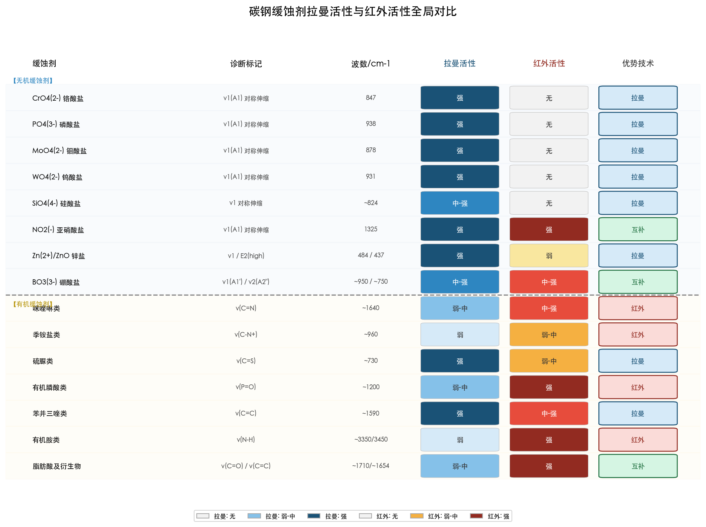

### 5.1.3 复合缓蚀剂光谱活性汇总

复合缓蚀剂的光谱分析遵循"先拆后合"原则：各单一组分的拉曼/红外活性遵循上述两表的判定结论，复合体系的关键挑战在于各组分特征峰在频率空间的叠加与分辨。第4章已系统分析了六大复配体系，此处以决策矩阵形式呈现其核心结论：

| 复配体系 | 组分 A → 优势技术 | 组分 B → 优势技术 | 叠加热区 | 推荐联合策略 |
|---------|-----------------|-----------------|---------|------------|
| 钼酸盐–亚硝酸盐 | MoO₄²⁻ → **拉曼** (ν₁ 878) | NO₂⁻ → **红外** (1325/1236) | 820–880 cm⁻¹ | 拉曼+红外互补 |
| 磷酸盐–锌盐 | PO₄³⁻ → **拉曼** (ν₁ 938) | Zn²⁺/ZnO → **拉曼** (484/437) | 无显著叠加 | 拉曼为主 |
| 有机膦酸–锌盐 | 膦酸 → **红外** (P=O ~1200) | Zn²⁺ → **拉曼** (484) | P=O 配位红移区 | 拉曼+红外互补 |
| 咪唑啉–季铵盐 | 咪唑啉 → **红外** (C=N ~1640) | 季铵盐 → **红外** (C−N⁺ ~960) | C−H 2850–2960 | 红外为主 |
| 苯并三唑–有机膦酸 | BTA → **拉曼** (C=C ~1590) | 膦酸 → **红外** (P=O ~1200) | 730–780 cm⁻¹ | 拉曼+红外天然互补 |
| 钼酸盐–柠檬酸 | MoO₄²⁻ → **拉曼** (ν₁) | 柠檬酸 → **红外** (C=O ~1710) | Mo=O 配位区 | 拉曼+红外互补 |

由上表可见，多数复合缓蚀剂体系中拉曼与红外的组分归属天然互补：无机阴离子的 ν₁ 对称伸缩是拉曼独占标记，有机极性基团则是红外优势目标。其中，苯并三唑–有机膦酸体系的光谱互补性最为理想——BTA 的拉曼核心标记（~1590 cm⁻¹）与膦酸的红外核心标记（~1200 cm⁻¹）在频率维度和技术维度上实现双重分离，几乎不存在交叉干扰。

## 5.2 拉曼光谱与红外光谱在缓蚀剂检测中的互补性分析

### 5.2.1 物理机制层面的互补性

拉曼活性取决于振动过程中极化率张量的变化（∂α/∂Q ≠ 0），红外活性取决于偶极矩的变化（∂μ/∂Q ≠ 0）。极化率为二阶张量，偶极矩为一阶张量，这一数学阶数差异从根本上决定了两种技术在分子不同官能团上的灵敏度互补 [UIUC振动光谱讲义](https://xuv.scs.illinois.edu/516/lectures/chem516.04.pdf "K. S. Suslick, Chem 516, 2013")。在碳钢缓蚀剂体系中，该互补性可凝练为三条实践规律：

**规律一：对称伸缩→拉曼优势，反对称伸缩/弯曲→红外优势。** Td 四面体无机阴离子的 ν₁(A₁) 对称伸缩仅拉曼活性，ν₃(T₂) 反对称伸缩红外强吸收。硼酸根 D₃ₕ 点群的 ν₁(A₁') 仅拉曼活性，ν₂(A₂") 仅红外活性。这些规律直接源于群论对不可约表示与坐标/坐标二次式变换性质的匹配 [LibreTexts光谱选择定则](https://chem.libretexts.org/Bookshelves/Inorganic_Chemistry/Supplemental_Modules_and_Websites_(Inorganic_Chemistry)/Advanced_Inorganic_Chemistry_(Wikibook)/01:_Chapters/1.13:_Selection_Rules_for_IR_and_Raman_Spectroscopy "Selection Rules for IR and Raman Spectroscopy")。

**规律二：极性键→红外强，高极化率键→拉曼强。** C=O（偶极矩变化 ~5 D/Å）红外极强而拉曼弱；C=S（硫原子极化率约为氧的 3.6 倍）拉曼强而红外弱。P=O 和 N−H 属于偶极矩变化大的官能团，红外活性占优；芳环 C=C 和烯烃 C=C 因对称伸缩模式极化率变化大而拉曼活性占优。

**规律三：低对称有机分子的活性兼具但强度分化。** 碳钢常用有机缓蚀剂均不具有对称中心，每个振动模式原理上同时具有红外和拉曼活性，但强度差异可达一个数量级以上——例如苯并三唑的 C=C ~1590 cm⁻¹ 拉曼强度约为红外强度的 5–10 倍，而 N−H ~3345 cm⁻¹ 红外强度约为拉曼的 10 倍以上。

### 5.2.2 样品形态层面的互补性

水溶液是碳钢缓蚀剂最常见的应用介质，两种光谱技术在水相样品分析中的表现差异显著，构成另一层面的互补关系。

**拉曼的水相优势**。水是弱拉曼散射体（O−H 伸缩的拉曼散射截面仅约 5.3 × 10⁻³⁰ cm² sr⁻¹），对溶质拉曼信号的干扰极小，可直接将激光聚焦于水溶液中采集溶质光谱而无需特殊样品制备 [Durickovic (2016), IntechOpen](https://www.intechopen.com/chapters/51969 "拉曼光谱水溶液分析优势")。以溶质特征峰与水 O−H 伸缩峰积分强度之比构建校准曲线，可实现 R² = 0.999 的线性定量，定量不确定度低至 1% [Durickovic (2016), IntechOpen](https://www.intechopen.com/chapters/51969 "拉曼定量方法学")。

**红外的水相挑战与应对**。水在中红外区域（3000–3700 cm⁻¹ 和 ~1640 cm⁻¹）存在极强吸收，严重干扰溶质信号。常规透射红外要求液体池光程控制在微米级别（通常 < 25 μm），操作繁琐。衰减全反射（ATR）附件通过将有效光程限制至约 0.5–2 μm 有效缓解水的吸收干扰，已成为水溶液缓蚀剂红外分析的主流手段。Campbell 与 Jovancicevic（1999）利用 ATR-FTIR 成功追踪了咪唑啉和磷酸酯缓蚀剂在 Fe₃O₄ 表面的吸附动力学过程 [Campbell & Jovancicevic (1999), NACE](https://www.semanticscholar.org/paper/Corrosion-Inhibitor-Film-Formation-Studied-by-Campbell-Jovancicevic/3c87dc4f2105925d0e11b188865a23707bb5003a "ATR-FTIR原位监测缓蚀剂成膜")。

**空间分辨率差异**。拉曼光谱的空间分辨率可达约 1 μm（受衍射极限约束），远优于 FTIR 的 5–10 μm；与此同时，拉曼本征谱线宽度更窄（典型半高宽 5–15 cm⁻¹ vs. 红外 15–30 cm⁻¹），对复合缓蚀剂多组分的精细区分更为有利 [Ali et al. (2013), Anal. Methods](https://arrow.tudublin.ie/cgi/viewcontent.cgi?article=1003&context=biophonart "Raman vs FTIR微光谱成像对比")。

### 5.2.3 灵敏度与抗干扰层面的对比

常规拉曼散射效率极低（约 10⁻¹⁰ 量级），对低浓度缓蚀剂的直接检测能力受到制约。以 Metrohm 应用报告为例，采用手持式 MIRA XTR 拉曼仪（785 nm 激光、50 mW、6 s 采集时间）对磷酸盐水溶液进行 PLS 建模定量分析，在 0.14%–28% 浓度范围内获得了高预测精度（预测误差 < 2.4%），但最低检测浓度仅为 0.14%（约 1400 ppm）[Metrohm应用报告](https://www.metrohm.com/en/applications/application-notes/raman-anram/an-rs-049.html "手持式拉曼磷酸盐定量分析")。对于工业循环冷却水中典型缓蚀剂浓度（通常 10–500 ppm），常规拉曼已接近检测极限边缘。

表面增强拉曼散射（SERS）技术可将拉曼信号增强约 10⁶ 倍，从而将检测限推至 ppb 甚至 sub-ppb 级别。Wieduwilt 等（2020）采用金纳米柱阵列基底实现了水溶液中苯并三唑的 SERS 现场检测，纯水中检测限低于 0.10 mg/L（约 0.84 μmol/L），在废水基质中经预浓缩可达 17.6 μg/L [Wieduwilt et al. (2020), Sci. Rep.](https://www.nature.com/articles/s41598-020-65181-z "SERS苯并三唑现场传感器 LOD < 0.10 mg/L")。Liu 等（2023）开发的 Ag-MXene 柔性 SERS 平台更将自来水中苯并三唑的检测限推至 0.1 nmol/L（约 0.012 μg/L），定量线性范围跨越 10⁻⁴–10⁻¹⁰ mol/L 六个数量级，充分展示了 SERS 技术在痕量缓蚀剂监测领域的巨大潜力 [Liu et al. (2023), ACS EST Water](https://pubs.acs.org/doi/10.1021/acsestwater.3c00285 "柔性SERS平台自来水苯并三唑检测 LOD 0.1 nmol/L")。

红外光谱（尤其是 ATR-FTIR）对含有强红外活性官能团的有机缓蚀剂具有天然灵敏度优势。P=O 伸缩（~1200 cm⁻¹）和 C=O 伸缩（~1710 cm⁻¹）的红外吸收截面远大于相应的拉曼散射截面，ATR-FTIR 可在 ppm 至百 ppm 量级对有机膦酸和脂肪酸类缓蚀剂进行定量检测。此外，ATR-FTIR 能够直接识别缓蚀剂-金属界面的化学配位信息——Appa Rao 等（2013）通过 FTIR 检测到 BPMG 的 P=O 伸缩从游离态 1181 cm⁻¹ 配位 Zn²⁺ 后红移至约 1110 cm⁻¹（红移 71 cm⁻¹），直接证实了有机膦酸通过 P=O 基团与 Zn²⁺ 形成配位键 [Appa Rao et al. (2013), J. Surf. Eng. Mater. Adv. Tech.](https://pdfs.semanticscholar.org/c8a8/042ac9311e41ef0e046f86db0bfe6669923e.pdf "BPMG-Zn-柠檬酸盐三元缓蚀剂FTIR分析")。

含芳环有机缓蚀剂（苯并三唑、吡啶类）在可见光激发下可能产生荧光干扰，叠加于拉曼光谱的 Stokes 信号之上。应对策略包括：选择近红外激发波长（785 nm 或 1064 nm）以降低荧光激发概率，或采用时间门控拉曼技术利用荧光寿命（纳秒级）与拉曼散射（皮秒级）的时间差实现信号分离 [Li et al. (2014), Sensors](https://www.mdpi.com/1424-8220/14/9/17275 "拉曼光谱水质在线监测仪器与潜力") [AZoOptics (2018)](https://www.azooptics.com/Article.aspx?ArticleID=1291 "IR vs Raman优劣势")。

综合上述物理机制、样品形态和灵敏度三个维度的分析，下图以雷达图形式直观呈现拉曼光谱与 ATR-FTIR 在碳钢缓蚀剂检测场景中的技术特性对比。

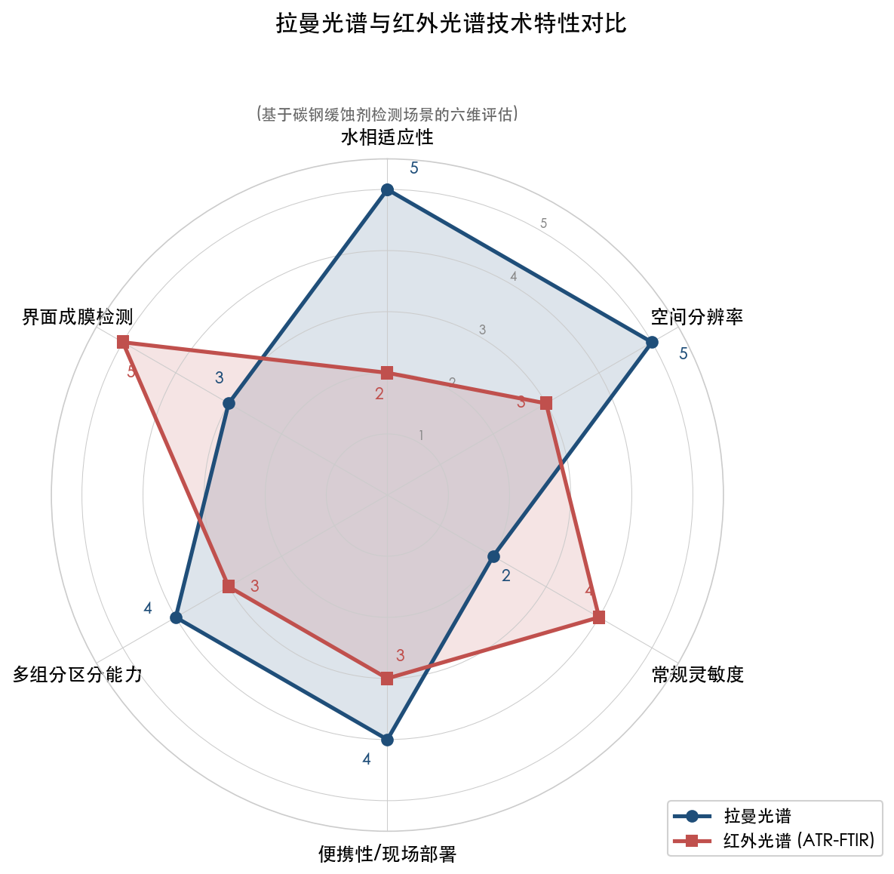

## 5.3 缓蚀剂现场检测技术现状与应用场景

### 5.3.1 便携式拉曼光谱仪的工业部署能力

便携式拉曼仪器已发展至光谱分辨率约 8–12 cm⁻¹、单次采集时间数秒至数十秒的水平，典型设备重量不超过 2 kg，电池供电可连续工作 4 小时以上 [Li et al. (2014), Sensors](https://www.mdpi.com/1424-8220/14/9/17275 "拉曼光谱水质在线监测仪器与潜力")。拉曼光谱的两大物理优势使其尤为适合工业现场部署：其一，可使用光纤探头远程采集信号，光纤长度可达数十米，探头可直接浸入管道或水箱中实现原位测量；其二，激光可穿透玻璃、石英等透明容器壁进行非接触分析，无需打开容器或中断工艺流程 [AZoOptics (2018)](https://www.azooptics.com/Article.aspx?ArticleID=1291 "Raman便携性与远程检测优势")。

对于碳钢循环冷却水系统的缓蚀剂在线监测，拉曼技术的最佳应用目标是具有强拉曼特征峰的无机阴离子。MoO₄²⁻ 的 ν₁ = 878 cm⁻¹、PO₄³⁻ 的 ν₁ = 938 cm⁻¹、WO₄²⁻ 的 ν₁ = 931 cm⁻¹ 均为仅拉曼活性的强偏振谱带，且与水的拉曼背景几乎不重叠，适合采用比值法（以水 O−H 峰为内标）构建校准曲线实现在线定量 [Durickovic (2016), IntechOpen](https://www.intechopen.com/chapters/51969 "拉曼定量方法学 R²=0.999")。

### 5.3.2 ATR-FTIR 在缓蚀剂成膜监测中的应用

与拉曼光谱侧重溶液相组分检测不同，ATR-FTIR 在缓蚀剂-金属界面原位表征领域具有独特优势。ATR 技术中红外光在棱镜与样品界面处产生倏逝波，穿透深度约 0.5–2 μm，恰好覆盖缓蚀剂吸附膜的典型厚度范围，能够灵敏地捕获界面层的分子结构信息。

Campbell 与 Jovancicevic（1999）的开创性工作利用 ATR-FTIR 实时监测了咪唑啉缓蚀剂在 Fe₃O₄ 模拟碳钢表面的吸附过程，通过 C=N 伸缩峰（~1640 cm⁻¹）的时间分辨变化追踪了缓蚀剂的吸附动力学行为 [Campbell & Jovancicevic (1999), NACE](https://www.semanticscholar.org/paper/Corrosion-Inhibitor-Film-Formation-Studied-by-Campbell-Jovancicevic/3c87dc4f2105925d0e11b188865a23707bb5003a "ATR-FTIR原位监测缓蚀剂成膜")。反射吸收红外光谱（RA-FTIR）则可对金属基底上的缓蚀剂膜进行外反射测量，通过特征峰频率的配位红移推断缓蚀剂与金属表面的配位方式——例如 P=O 伸缩红移 71 cm⁻¹ 指示有机膦酸通过 P=O 基团与 Zn²⁺ 配位 [Appa Rao et al. (2013)](https://pdfs.semanticscholar.org/c8a8/042ac9311e41ef0e046f86db0bfe6669923e.pdf "FTIR分析配位红移")。

### 5.3.3 SERS 技术：从实验室到现场的跨越

表面增强拉曼光谱（SERS）通过纳米金属基底（Au/Ag 纳米颗粒或纳米结构阵列）产生的电磁增强效应，将拉曼散射截面提升约 10⁶ 倍，是突破常规拉曼灵敏度瓶颈的最有效途径。在缓蚀剂检测领域，SERS 技术已取得以下实质性进展：

（1）**苯并三唑现场传感**：Wieduwilt 等（2020）采用金纳米柱阵列 SERS 基底配合便携式 i-RamanPro 设备（785 nm，~50 mW），在纯水中实现苯并三唑检测限 < 0.10 mg/L，并验证了便携设备与实验室拉曼系统的光谱一致性 [Wieduwilt et al. (2020), Sci. Rep.](https://www.nature.com/articles/s41598-020-65181-z "SERS苯并三唑现场传感器")。

（2）**缓蚀剂吸附量定量预测**：Ma 等（2020）开发的银纳米棒（AgNRs）胶带 SERS 传感器可检测铝合金表面缓蚀剂吸附行为，SERS 信号强度与电化学阻抗谱（EIS）膜电阻呈正相关 [Ma et al. (2020), Sens. Actuators B](https://www.sciencedirect.com/science/article/abs/pii/S0925400520309631 "AgNRs胶带SERS传感器")。Wang 等（2021）进一步结合偏最小二乘回归（PLSR）算法，实现了 SERS 信号到缓蚀剂吸附量的定量预测 [Wang et al. (2021), Appl. Surf. Sci.](https://www.sciencedirect.com/science/article/abs/pii/S0169433221020262 "SERS+PLSR定量检测缓蚀剂")。

（3）**复合缓蚀剂选择性检测**：Baker Hughes（2020）专利提出利用纳米金/银基底的差异化吸附实现对油田多组分缓蚀剂的 ppb 级选择性 SERS 检测方案 [Baker Hughes (2020), US Patent](https://patents.google.com/patent/US20200347718A1/en "便携式SERS检测油田缓蚀剂")。

SERS 技术的实用化仍面临若干挑战：基底依赖性（分析物必须处于纳米结构"热点"附近方能获得有效增强）；定量重复性受限（增强因子受基底形貌和分子取向影响，典型点对点相对标准偏差约 5%–10%）；银基底氧化劣化影响使用寿命 [Wieduwilt et al. (2020), Sci. Rep.](https://www.nature.com/articles/s41598-020-65181-z "SERS局限性讨论")。MXene 等新型二维材料与贵金属纳米颗粒的复合基底正在逐步改善上述瓶颈——Liu 等（2023）的 Ag-MXene 柔性 SERS 平台已实现点对点 RSD 6.8%、批对批 RSD 6.2% 的良好重复性 [Liu et al. (2023), ACS EST Water](https://pubs.acs.org/doi/10.1021/acsestwater.3c00285 "Ag-MXene柔性SERS平台重复性数据")。

## 5.4 碳钢缓蚀剂光谱检测方案建议

### 5.4.1 按应用场景的技术选型指南

基于前述分析，我们按碳钢防腐的四大典型应用场景提出如下光谱检测技术选型建议。

**场景一：循环冷却水系统缓蚀剂浓度在线监测。** 该场景的核心需求是实时定量水溶液中缓蚀剂残余浓度，以指导自动加药系统。推荐以**拉曼光谱为主**的在线监测方案：

- 拉曼光纤探头浸入冷却水回路，直接监测 MoO₄²⁻ ν₁（878 cm⁻¹）、PO₄³⁻ ν₁（938 cm⁻¹）或 WO₄²⁻ ν₁（931 cm⁻¹）的信号强度。
- 以水 O−H 伸缩峰为内标，建立比值法校准曲线，消除光源功率波动和光路效率变化的影响。
- 有机膦酸组分（HEDP、ATMP）可通过拉曼 P−O(H) 区域（925–1060 cm⁻¹）辅助检出。
- 苯并三唑/TTA 可通过拉曼 C=C ~1590 cm⁻¹ 标记峰检测。

**场景二：缓蚀剂配方质量控制（入厂检验与出厂检验）。** 该场景需确认配方组成是否符合标准，样品浓度较高（百分级至千 ppm 级），可在实验室条件下测量。推荐**拉曼+红外联合方案**：

- 拉曼光谱快速确认无机阴离子组分（Td 离子 ν₁ 独占标记）和芳环有机组分（BTA C=C ~1590 cm⁻¹、硫脲 C=S ~730 cm⁻¹）。
- ATR-FTIR 确认有机极性组分（膦酸 P=O ~1200 cm⁻¹、咪唑啉 C=N ~1640 cm⁻¹、脂肪酸 C=O ~1710 cm⁻¹、胺类 N−H 双峰）。
- 化学计量学方法（PLS 或 MCR-ALS）处理光谱数据，实现多组分同时定量。

**场景三：缓蚀膜完整性与成膜质量评估。** 该场景需对碳钢表面缓蚀膜进行原位或微区表征，判断缓蚀剂是否成功吸附及膜的化学组成。推荐**ATR-FTIR 或拉曼显微镜（微区拉曼）方案**：

- ATR-FTIR 检测缓蚀膜中有机组分的配位状态——P=O、C=O、C=N 等特征峰的配位红移方向和幅度（18–71 cm⁻¹）是缓蚀剂-金属化学吸附的直接光谱证据 [Appa Rao et al. (2013)](https://pdfs.semanticscholar.org/c8a8/042ac9311e41ef0e046f86db0bfe6669923e.pdf "FTIR配位红移诊断")。
- 拉曼显微镜（空间分辨率 ~1 μm）可对缓蚀膜微区进行点扫描或面扫描，识别无机沉淀相（如磷酸锌 ν₁ ~935 cm⁻¹、钼酸盐 ν₁ ~878 cm⁻¹）的空间分布。
- SERS 可在碳钢基底上检测 sub-单层覆盖度的缓蚀剂吸附。

**场景四：油气田酸性介质缓蚀剂现场快检。** 该场景在远离实验室的现场条件下进行，主要针对咪唑啉类和季铵盐类缓蚀剂。推荐**便携式 ATR-FTIR 方案**：

- 咪唑啉 C=N ~1640 cm⁻¹ 和季铵盐 C−N⁺ ~960 cm⁻¹ 的核心标记均为红外优势频段；这两类缓蚀剂的拉曼信号较弱，便携式拉曼检测灵敏度不足。
- 便携式 ATR-FTIR（如 Agilent Cary 630、908 Devices ProtectIR 等商业化设备）已具备现场操作能力，无需样品制备，直接滴加液样即可分析。
- 在油基介质中（非水相），不存在水的中红外干扰，ATR-FTIR 的性能优势更为突出。

下图以决策矩阵形式汇总上述四大场景中常规拉曼、SERS 与 ATR-FTIR 三种技术的适用度评级，供技术选型参考。

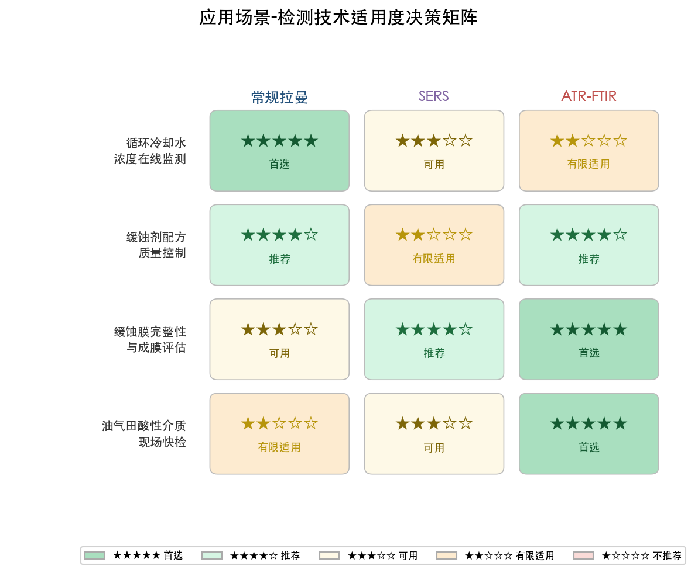

### 5.4.2 组分类型-优势技术匹配规则

基于本报告全部章节的系统分析，我们提炼出碳钢缓蚀剂光谱检测的三条核心匹配规则：

**规则一：无机阴离子选拉曼。** Td 点群四面体离子（CrO₄²⁻、PO₄³⁻、MoO₄²⁻、WO₄²⁻、SiO₄⁴⁻）的 ν₁ 对称伸缩仅拉曼活性且信号强度突出，构成拉曼技术的独占检测标记。拉曼光谱在水溶液中对这些离子的定量分析能力显著优于红外。

**规则二：极性有机官能团选红外。** P=O、C=O、N−H 等偶极矩变化大的官能团在红外中产生强吸收，是有机膦酸、脂肪酸、咪唑啉、有机胺类缓蚀剂的首选鉴定手段。ATR 附件可有效满足水相样品的分析需求。

**规则三：高极化率基团选拉曼。** C=S 和芳环 C=C 的拉曼散射强度显著高于红外吸收强度，硫脲类和苯并三唑类缓蚀剂的拉曼检测灵敏度优于红外。SERS 技术可进一步将这两类缓蚀剂的检测限推至 ppb 级别。

### 5.4.3 四大叠加热区的应对策略

复合缓蚀剂多组分光谱分析中需特别警惕以下四个系统性叠加区域，每一区域均涉及多种组分特征峰的频率重叠，需采取针对性分辨策略：

| 叠加区域 | 波数范围 / cm⁻¹ | 涉及组分 | 推荐应对策略 |
|---------|----------------|---------|------------|
| 多方叠加区 | 930–960 | PO₄³⁻、WO₄²⁻、BO₃³⁻、膦酸 P−OH、季铵盐 C−N⁺ | 偏振拉曼区分 Td ν₁；借助 ν₃ 频率差异辅助归属；MCR-ALS 数学分解 |
| 无机离子密集区 | 820–880 | CrO₄²⁻、MoO₄²⁻、SiO₄⁴⁻、B(OH)₃、NO₂⁻ | 高分辨拉曼（< 5 cm⁻¹）；调节 pH 改变硼酸盐聚合态 |
| C−H 通用区 | 2850–2960 | 所有含长链烷基有机组分 | 该区域无组分区分能力，需转移至指纹区鉴定 |
| 有机官能团叠加区 | 1540–1660 | C=N、C=C、N−H δ、COO⁻、水 O−H δ | 拉曼检测 C=C（水干扰小）；红外 ATR 扣除水背景后检测 C=N/COO⁻ |

## 5.5 技术发展趋势与展望

碳钢缓蚀剂的光谱检测技术正沿三个方向纵深发展。

**第一，SERS 基底标准化与量产化。** SERS 是突破常规拉曼灵敏度瓶颈的关键技术路线。当前研究热点集中于三个层面：（a）高重复性基底制备工艺——MXene-Ag 复合结构等新型基底已将点对点 RSD 降至约 7% [Liu et al. (2023), ACS EST Water](https://pubs.acs.org/doi/10.1021/acsestwater.3c00285 "Ag-MXene柔性SERS平台")；（b）柔性 SERS 基底可贴附于管道内壁实施原位检测，与碳钢防腐工业场景高度适配；（c）Baker Hughes 专利方案所示的纳米基底差异化吸附策略为多组分选择性 SERS 检测提供了可行技术路线 [Baker Hughes (2020), US Patent](https://patents.google.com/patent/US20200347718A1/en "便携式SERS检测油田缓蚀剂")。

**第二，拉曼-红外联合系统集成化。** 基于两种光谱技术对缓蚀剂组分的天然互补性，将拉曼光纤探头与 ATR 红外模块集成于同一检测系统具有显著应用价值。此类"双模光谱"系统可在单次取样中同时获取无机阴离子的拉曼 ν₁ 信号和有机极性基团的红外 P=O/C=O/N−H 信号，从而实现复合缓蚀剂全组分的一站式定性定量分析。

**第三，化学计量学与人工智能辅助谱图解析。** 复合缓蚀剂体系中多组分光谱叠加不可避免，传统人工辨峰方法在叠加热区的可靠性受限。偏最小二乘回归（PLS/PLSR）、多元曲线分辨-交替最小二乘（MCR-ALS）以及深度学习算法正被应用于缓蚀剂光谱的自动组分识别和定量预测 [Wang et al. (2021), Appl. Surf. Sci.](https://www.sciencedirect.com/science/article/abs/pii/S0169433221020262 "SERS+PLSR定量检测缓蚀剂")。这些算法能够从叠加光谱中提取各组分的贡献权重，在前述四大叠加热区实现传统方法难以企及的分辨精度。

# 结论与风险提示

## 核心结论

本报告对碳钢常用缓蚀剂的拉曼活性与红外活性进行了系统性分析，覆盖八类无机缓蚀剂、七类有机缓蚀剂及六类工业复合缓蚀剂配方，得出以下核心结论：

**结论一：无机缓蚀剂的光谱活性由离子对称性严格决定。** 五种 Td 点群四面体阴离子（CrO₄²⁻、PO₄³⁻、MoO₄²⁻、WO₄²⁻、SiO₄⁴⁻）的 ν₁(A₁) 对称伸缩振动仅具有拉曼活性，ν₂(E) 对称弯曲同样仅具有拉曼活性，而 ν₃(T₂) 和 ν₄(T₂) 反对称模式则同时具有红外和拉曼活性。这一分配规律由群论中 Td 点群不可约表示与坐标/坐标二次式的对应关系严格推导而来。亚硝酸根 NO₂⁻（C₂ᵥ 点群）的全部 3 个振动模式均同时具有红外和拉曼活性。硼酸根 BO₃³⁻（D₃ₕ 点群）呈现 ν₁ 仅拉曼活性、ν₂ 仅红外活性的特殊分配模式，表明即使在不具对称中心的点群中，特定振动模式仍可仅具单一光谱活性。

**结论二：有机缓蚀剂的振动模式均同时具有红外和拉曼活性，但信号强度差异构成诊断基础。** 七类有机缓蚀剂——咪唑啉类、季铵盐类、硫脲类、有机膦酸类、苯并三唑类、有机胺类、脂肪酸及其衍生物——分子均不具有对称中心，互斥原则不适用，每个振动模式在原理上同时具有红外和拉曼活性。极性官能团（P=O ~1200 cm⁻¹、C=O ~1710 cm⁻¹、N−H ~3350 cm⁻¹）因偶极矩变化大而红外吸收占优，高极化率基团（C=S ~730 cm⁻¹、芳环 C=C ~1590 cm⁻¹）因极化率变化大而拉曼散射占优。在七类有机缓蚀剂中，硫脲类和苯并三唑类是拉曼诊断优势最为突出的两类，其余五类的核心标记峰以红外强吸收为特征。

**结论三：复合缓蚀剂的光谱分析须遵循"先拆后合"原则，拉曼与红外联合使用可实现绝大多数组分的可靠鉴定。** 六类复合配方的逐一分析表明，各组分的光谱活性遵循其对应单一组分的判定规则，复合体系的关键挑战在于特征峰在频率空间的叠加。四个系统性叠加热区（930–960 cm⁻¹、820–880 cm⁻¹、2850–2960 cm⁻¹、1540–1660 cm⁻¹）已被系统识别，通过拉曼-红外技术互补、偏振拉曼区分、配位红移诊断和化学计量学方法，各组分在绝大多数工业配方中可实现可靠区分与定量。苯并三唑–有机膦酸复配体系是光谱互补性最为理想的组合：BTA 的拉曼核心标记（C=C ~1590 cm⁻¹）与膦酸的红外核心标记（P=O ~1200 cm⁻¹）在频率维度和技术维度上均实现了双重分离。

**结论四：工业检测技术选型应遵循"组分类型–优势技术"匹配规则。** 无机阴离子定量首选拉曼（利用 ν₁ 仅拉曼活性的独占优势），极性有机官能团鉴定首选红外（利用 P=O、C=O、N−H 的强红外吸收），高极化率有机基团检测首选拉曼（利用 C=S、芳环 C=C 的强拉曼散射）。SERS 技术可将拉曼检测限推至 ppb 级别，在痕量缓蚀剂监测领域展现出重要应用前景。

## 局限性分析

**第一，本报告的光谱活性判定主要基于理想分子/离子的气相或水溶液状态分析。** 实际工业体系中缓蚀剂吸附于碳钢表面后，金属-分子相互作用、表面选择规则和局部化学环境变化可能导致振动模式活性和频率发生偏移。例如，Td 离子在晶体场中的对称性降低可使原本仅拉曼活性的 ν₁ 转变为红外-拉曼双活性。本报告虽讨论了若干典型的配位红移和晶体场效应案例，但尚未覆盖全部工业工况条件下的活性变化。

**第二，定量检测极限的讨论受限于已公开的实验数据。** 常规拉曼对水溶液中缓蚀剂的最低检测浓度约为 1400 ppm（磷酸盐体系便携式拉曼实测数据），而工业循环冷却水中缓蚀剂典型浓度为 10–500 ppm，两者之间存在灵敏度缺口。SERS 技术虽可大幅改善灵敏度，但其定量重复性（典型点对点 RSD 约 5%–10%）和基底使用寿命仍面临实用化挑战。本报告所引用的检测限数据来自不同研究团队、不同仪器配置和不同实验条件，不宜进行直接的跨体系比较。

**第三，复合缓蚀剂体系的光谱叠加分析基于理想化的组分叠加假设。** 实际配方中除缓蚀剂活性组分外，还含有分散剂、消泡剂、pH 调节剂等辅料以及水垢沉积物和微生物代谢产物等背景干扰物，这些组分的光谱贡献在本报告中未予系统讨论。

**第四，本报告以传统分子振动光谱学（中红外和常规拉曼）为核心分析框架。** 近红外光谱（NIR）、太赫兹光谱、共振拉曼等其他振动光谱技术在特定缓蚀剂检测场景中亦具应用潜力，但不在本报告讨论范围之内。

**第五，部分缓蚀剂（如某些新型绿色缓蚀剂、植物提取物基缓蚀剂）因缺乏系统性振动光谱研究数据，未被纳入本报告分析范围。** 分析对象以工业主流应用品种为主，覆盖面存在一定局限。
