# 执行摘要

本报告系统研究 2016–2026 年间国际自来水生产及销售企业在技术创新领域已完成产业化落地的前 10 项创新成果，按技术产业化应用实现的经济收益规模排序，并以此为基准对标国内代表性水务企业的技术创新产业化现状，最终提出以产业化应用为目标的五个优先技术攻关方向。

**国际 Top 10 成果呈现高度集中的竞争格局。** Veolia 独占 4 席（高级膜处理平台 WTS、生物能源/碳中和技术群、BeyondPFAS 微污染物治理方案、Hubgrade/AI 数字化运营平台），Xylem 占据 2 席（水处理综合服务 WSS、智能计量与数字分析平台 MCS），其余 4 席分属 SABESP、American Water Works、Anglian Water 和 Severn Trent Water。排名前两位的 Veolia WTS（约 54 亿美元年收入）和 Veolia 生物能源板块（约 44 亿美元年收入）合计贡献近百亿美元年度营收，反映出膜技术与高级水处理、能源回收与碳中和两大技术领域在经济收益维度的绝对领先地位。智慧水务/数字化运营在数量上占据核心——10 项中有 6 项涉及智能计量、数字孪生或 AI 运营优化。

**四大共性规律支撑国际企业的技术产业化成功。** 一是监管驱动是第一推动力——英国 Ofwat AMP8 周期批准创纪录约 880 亿英镑投资，美国 EPA PFAS 标准直接催生数十亿美元治理市场；二是并购整合是缩短产业化周期的主要路径——Xylem 两次并购合计 92 亿美元、Veolia Suez 整合 3 年累计释放 5.34 亿欧元协同效应；三是从设备销售向经常性服务/数字收入转化是提升盈利质量的关键——Xylem 服务收入两年增长 46%，EBITDA 利润率从 15.2% 跃升至 22.2%；四是技术成本下降曲线和规模效应是市场渗透的基础——SWRO 约 15% 的学习率持续驱动海水淡化成本下降。

**国内水务企业与国际领先企业存在系统性差距。** 研发投入方面，国内头部企业（不含碧水源）年度研发费用约 1–2 亿元人民币，与国际巨头约 2–2.5 亿美元之间存在约 10 倍量级差距。碧水源虽以 4.01% 的研发强度居首，但绝对额约 4,700 万美元仅为 Xylem 的五分之一。技术领域方面，PFAS 微污染物治理（国内几乎空白 vs Veolia 33 个运营系统）和能源回收与碳中和（国内单点示范 vs Veolia 44 亿美元年收入板块）差距最为悬殊；管网漏损控制差距最小——深圳 7.7%、福州 5.3% 的漏损率已达国际先进水平。商业模式方面，国内企业以 BOT/PPP 为主的重资产模式与国际企业"技术授权+长期服务+数字收入"的高韧性模式形成鲜明对比。

**五个优先技术攻关方向。** 综合技术可行性、市场规模、政策确定性和现有基础四个维度，建议国内水务企业重点攻关：（1）行业级智慧水务平台与大规模 AMI 部署（对应市场规模 2029 年达 837 亿元）；（2）高性能膜材料国产化与全谱系水处理技术平台（膜行业市场规模 2025 年预计突破 900 亿元）；（3）管网漏损精准检测与智能压力管控系统（全国漏损率再降 2 个百分点可释放约 37.5 亿元/年直接经济价值）；（4）新污染物（PFAS/微污染物）检测与治理技术体系（战略储备方向，强制合规后市场可达数十亿至百亿元/年）；（5）污水处理能源回收与碳中和运行技术（800 座污水厂能源自给率提升至 80% 可年省电费约 24 亿元）。五个方向以"智慧平台+膜材料"为双轮驱动、"管网漏损+能源回收"为效益锚点、"PFAS 治理"为战略储备，形成覆盖水务全价值链的技术攻关布局。

---

# 第1章 国际水务企业技术创新产业化应用 Top 10 成果概览

## 1.1 排名方法论与口径说明

本章系统梳理 2016–2026 年间国际自来水生产及销售企业（含将技术创新成果应用于自来水业务的综合水务集团）在技术创新领域已完成产业化落地的前 10 项创新成果，按"技术产业化应用实现的经济收益规模"排序。经济收益口径涵盖三类：

- **直接营收贡献**——该技术/业务板块产生的年度收入；
- **运营成本节约**——技术应用带来的可量化年度成本削减；
- **间接效率提升**——通过减少无收益水（NRW）、降低能耗或延长资产寿命等途径创造的可估算经济价值。

排名依据以企业年报、财报中可追溯的分部收入或效率增益数据为核心，辅以权威第三方机构（GWI、Bluefield Research、Grand View Research 等）的市场估算。由于部分企业未单独披露单项技术经济贡献（如 Anglian Water 智能计量、Severn Trent 数字孪生），我们采用企业官方新闻稿中披露的项目级投入与收益数据作为补充参考，并在排名表格中以注释标注数据口径差异。货币单位以美元为基准，汇率折算标准如下：欧元按 1 EUR ≈ 1.09 USD（2025 年均值）折算，英镑按 1 GBP ≈ 1.27 USD 折算，巴西雷亚尔按 1 BRL ≈ 0.18 USD 折算。

## 1.2 Top 10 创新成果排名总览

| 排名 | 企业名称 | 技术创新成果 | 技术领域 | 经济收益规模（年度） | 收益口径 |
|:---:|:---|:---|:---|:---|:---|
| 1 | Veolia Water Technologies & Solutions（WTS） | 高级膜处理、反渗透/纳滤、高级氧化、水回用与海水淡化全谱系平台 | 膜技术与高级水处理 | 约 54 亿美元（2025 年收入 49.54 亿欧元） | 直接营收 |
| 2 | Veolia 生物能源/能效板块 | 污水厂沼气回收发电、热水解预处理（THP）、Ecothermal Grid 污水源热能回收 | 能源回收与碳中和 | 约 44 亿美元（2025 年收入 40.21 亿欧元） | 直接营收 |
| 3 | Xylem Water Solutions & Services（含 Evoqua 整合） | 工业/市政水处理外包运营、PFAS 治理、高级氧化与膜处理服务 | 高级水处理与服务 | 约 24.64 亿美元（2025 年收入） | 直接营收 |
| 4 | Xylem MCS（含 Sensus 智能计量与数字分析平台） | AMI 智能水表、数字网络分析、漏损检测与需求管理 | 智慧水务/数字化 | 约 20.86 亿美元（2025 年收入） | 直接营收 |
| 5 | Veolia BeyondPFAS 微污染物治理方案 | 端到端 PFAS 检测-处理-销毁方案（GAC/IX/RO 组合工艺） | 微污染物治理 | 2030 年目标约 11 亿美元（10 亿欧元），当前已运营 33 个处理系统 | 直接营收（目标） |
| 6 | SABESP IoT 智能水表项目 | 全球最大规模 IoT 智能水表部署（440 万只），远程计量与漏损管控 | 智慧水务/数字化 | 投资约 7 亿美元（38 亿雷亚尔），预期大幅削减 NRW | 资本投入/预期收益 |
| 7 | American Water Works 智慧管网升级 | 数字化管网监测、智能计量、自动化控制系统 | 智慧水务/管网管理 | 2025 年资本支出 32 亿美元，运营收入 51.4 亿美元（+9.7%） | 资本投入驱动营收增长 |
| 8 | Veolia 数字化运营效率平台（Hubgrade/AI） | 集中式数字运营中心、AI 优化调度、AQUAVISTA 水务数字平台 | 智慧水务/数字化 | 约 1 亿美元年度直接成本节约（9,200 万欧元，占全集团效率增益 23%） | 成本节约 |
| 9 | Anglian Water 大规模智能水表部署 | 130 万+ AMI 智能水表、AI 驱动管网漏损定位模型 | 管网管理与漏损控制 | 投资约 1.94 亿美元（1.53 亿英镑），年省客户水费约 1,900 万美元（1,500 万英镑），日减供水量 1,800 万升 | 投资+成本节约 |
| 10 | Severn Trent Water AMP8 数字孪生与智能管网 | 数字孪生污水处理厂优化、AI 资产评估、16% 漏损削减目标 | 管网管理与数字化 | AMP8 五年投资约 148 亿美元（116 亿英镑），16% 漏损削减 | 资本投入/效率提升 |

> **注**：排名第 1–4 项及第 8 项经济收益数据来源于企业 2025 财年年报分部披露，可信度最高；第 5 项为 Veolia 官方战略目标；第 6、7、9、10 项经济收益以资本投入规模和已披露的效率指标为参照，直接年度营收贡献尚未独立披露。

下图以水平柱状图直观呈现 Top 10 成果的经济收益规模梯度差异及收益口径类型：

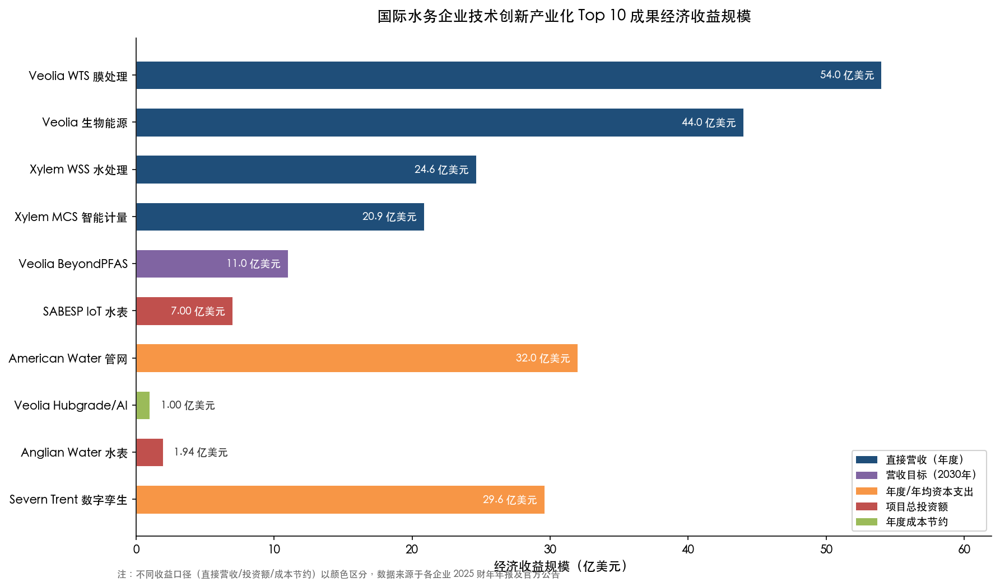

## 1.3 Top 10 成果逐项解析

### 第 1 名：Veolia Water Technologies & Solutions（WTS）—— 高级膜处理与水处理全谱系平台

Veolia WTS 是当前全球规模最大的水处理技术平台。2025 财年，该板块实现收入 49.54 亿欧元（约 54 亿美元），同比有机增长 3.6%，EBITDA 达 6.69 亿欧元，利润率 13.5%，业务覆盖全球 110 余个国家 [Veolia 2025年报新闻稿](https://www.veolia.com/sites/g/files/dvc4206/files/document/2026/02/Finance_PR_Veolia_2025_results.pdf "Veolia 2025财年业绩新闻稿")。

WTS 的核心技术矩阵涵盖反渗透（RO）与纳滤（NF）膜系统、高级氧化工艺（AOP）、离子交换树脂、水回用及海水淡化成套解决方案。该平台在 44 个国家运营，服务超过 8,000 个工业和市政客户，拥有 38 个技术站点和 11 个研发实验室。2025 年，Veolia 以 17.5 亿美元收购 CDPQ 持有的 WTS 30% 少数股权，实现全资控制，预计到 2027 年释放 9,000 万欧元年度协同效应 [Veolia WTS收购公告](https://www.middle-east.veoliawatertechnologies.com/press/veolia-acquires-cdpqs-30-stake-water-technologies-and-solutions-achieving-full-ownership "Veolia WTS全资化公告")。

WTS 的产业化路径呈现鲜明的"并购整合→全资控制→协同释放"特征。该板块源自 2017 年 Veolia 与 SUEZ 联合收购 GE Water & Process Technologies（对价约 34 亿美元），此后经历数年技术融合与客户网络整合。GreenUp 战略（2024–2027）将 WTS 所属"Booster"业务板块年均复合增长率目标设定为 6%–10%，体现了 Veolia 将高附加值水处理技术作为未来利润引擎的战略定位。

### 第 2 名：Veolia 生物能源/灵活性/能效板块 —— 污水能源回收与碳中和技术群

Veolia 生物能源板块 2025 年实现收入 40.21 亿欧元（约 44 亿美元），有机增长 5.8% [Veolia 2025年报新闻稿](https://www.veolia.com/sites/g/files/dvc4206/files/document/2026/02/Finance_PR_Veolia_2025_results.pdf "Veolia 2025财年生物能源板块")。该板块集成三大核心技术方向：

**污水厂沼气回收发电**：通过厌氧消化将污水处理过程中产生的有机物转化为沼气，再经热电联产（CHP）系统发电供热。配合热水解预处理技术（THP），沼气产量可提升约 50%，消化器处理能力扩大至传统工艺的 3 倍 [Cambi](https://www.cambi.com/process "Cambi THP技术介绍")。

**Ecothermal Grid 污水源热能回收**：利用污水恒温特性，通过热泵系统提取低品位热能用于区域供暖和制冷，并与数据中心余热回收形成耦合。波兰波兹南项目是该技术的标杆案例，已实现 25% 的 CO₂ 减排，年替代煤炭消耗 30 万吨。

**灵活性能源管理**：通过智能调度系统优化分布式能源资产的运行，实现电力峰谷价差套利和电网辅助服务收益。该板块不仅为 Veolia 贡献了稳定的经常性收入流，更是其"生态转型"战略的核心支撑——将传统污水处理成本中心转变为能源和资源回收的利润中心。

### 第 3 名：Xylem Water Solutions & Services —— 工业与市政水处理综合服务

Xylem WSS 板块 2025 年实现收入 24.64 亿美元，同比增长 5% [Xylem 2025年报](https://www.xylem.com/en-us/about-xylem/newsroom/press-releases/xylem-reports-fourth-quarter-and-full-year-2025-results/ "Xylem 2025财年WSS板块")。该板块的跨越式增长源于 2023 年 Xylem 以 75 亿美元全股票交易收购 Evoqua Water Technologies [Business Wire](https://www.businesswire.com/news/home/20230123005343/en/Xylem-To-Acquire-Evoqua-in-%247.5-Billion-All-Stock-Transaction "Xylem-Evoqua 75亿美元收购公告")，由此构建起覆盖工业纯水制备、市政污水深度处理、PFAS 去除、高级氧化及膜生物反应器（MBR）等领域的综合水处理服务平台。

整合后的 WSS 板块采用"技术+服务"双轮驱动模式：一方面提供水处理设备和系统解决方案，另一方面通过长期运营维护合同（O&M）和外包运营（DBOO）获取经常性服务收入。Evoqua 并购设定了 1.4 亿美元年度协同目标，截至 2024 年已实现约 1 亿美元 [Monexa AI分析](https://www.monexa.ai/blog/xylem-inc-xyl-margin-inflection-and-evoqua-synergi-XYL-2025-08-25 "Xylem Evoqua协同效应分析")。Xylem 整体服务收入从 2023 年的 10.73 亿美元增至 2025 年的 15.63 亿美元（两年增长 46%），Adjusted EBITDA 利润率从 15.2% 跃升至 22.2%，充分体现从设备销售向经常性服务收入转型所带来的盈利质量提升。

### 第 4 名：Xylem MCS（Measurement & Control Solutions）—— 智能计量与数字分析平台

Xylem MCS 板块 2025 年收入达 20.86 亿美元，同比增长 11%（有机增长 9%），为 Xylem 四大业务板块中增速最高 [Xylem 2025年报](https://www.xylem.com/en-us/about-xylem/newsroom/press-releases/xylem-reports-fourth-quarter-and-full-year-2025-results/ "Xylem 2025财年业绩")。

该板块的基石是 2016 年 Xylem 以 17 亿美元收购智能计量领军企业 Sensus [Xylem Sensus收购公告](https://xyleminc.gcs-web.com/news-releases/news-release-details/xylem-inc-acquire-sensus-global-leader-smart-meters-network "Xylem 17亿美元收购Sensus")。收购时 Sensus 年收入约 8.37 亿美元，预期三年内实现 5,000 万美元年度成本协同。至 2025 年，MCS 板块收入已增长至收购时的 2.5 倍，全球部署超过 3,500 万个智能端点，稳居全球水务智能计量领域领导者地位。

AMI（高级计量基础设施）技术的产业化应用创造了显著的客户侧经济价值。以美国阿尔伯克基水务局为例，部署 Sensus AMI 系统后三年内追回约 250 万美元流失收入，年度表观漏损从约 9.29 亿加仑降至约 0.93 亿加仑 [Internet of Water](https://internetofwater.org/blog/data-stories/return-on-investment/unearthing-the-hidden-benefits-of-advanced-metering-infrastructure-ami "AMI投资回报案例研究")。自 2019 年以来，Xylem 技术帮助全球客户累计减少超过 35 亿立方米无收益水 [Xylem 2024可持续发展报告](https://www.xylem.com/siteassets/sustainability/2024/xylem-2024-sustainability-report.pdf "Xylem 2024可持续发展报告")。按照 Liemberger 与 Baylis（2018）研究中全球 NRW 保守估值 0.31 美元/立方米计算 [Liemberger & Baylis, Water Supply 2018](https://www.researchgate.net/publication/326238463_Quantifying_the_global_non-revenue_water_problem "全球NRW经济价值估算")，这一成果对应的经济价值约为 10.9 亿美元。

### 第 5 名：Veolia BeyondPFAS —— 端到端微污染物治理方案

2024 年 10 月，Veolia 推出 BeyondPFAS 端到端微污染物治理方案，设定 2030 年实现 10 亿欧元（约 11 亿美元）年收入目标 [Smart Water Magazine](https://smartwatermagazine.com/news/veolia/veolia-aims-eu1b-revenue-2030-pioneering-pfas-treatment-micropollutants "Veolia BeyondPFAS 10亿欧元营收目标")。该方案整合了活性炭吸附（GAC）、离子交换（IX）、反渗透（RO）和高温焚烧销毁等全链条技术，提供从水源检测、水体治理到残余物无害化处置的一站式服务。

BeyondPFAS 的产业化背景是全球 PFAS 监管的急剧收紧。美国 EPA 于 2024 年 4 月发布首个 PFAS 饮用水国家标准，将 PFOA/PFOS 的最大污染物限值（MCL）设定为 4.0 ppt，要求公共供水系统在 2029 年前完成合规 [US EPA](https://www.epa.gov/sdwa/and-polyfluoroalkyl-substances-pfas "美国EPA PFAS饮用水标准")。欧盟修订版饮用水指令于 2026 年 1 月 12 日起实施 PFAS 监测要求，Bluefield Research 预测欧洲十国 PFAS 处理总支出到 2036 年将达 36 亿欧元 [Bluefield Research](https://www.bluefieldresearch.com/ns/new-eu-pfas-limits-activate-e3-6-billion-drinking-water-treatment-opportunity/ "欧洲PFAS处理36亿欧元市场预测")。

截至 2024 年 10 月方案发布时，Veolia 已在美国处理超过 800 万立方米 PFAS 污染水、运营 33 个处理系统 [Waste Dive](https://www.wastedive.com/news/veolia-pfas-services-epa-destruction-disposal-technology/730558/ "Veolia BeyondPFAS发布详情")。2025 年投产的美国项目为全国最大 PFAS 处理设施之一，投资约 3,500 万美元。我们认为，PFAS 治理是监管驱动型技术创新产业化的典型案例——强制合规标准直接催生了巨大的市场需求，而拥有端到端技术能力的企业将获得显著的先发优势和定价权。

### 第 6 名：SABESP IoT 智能水表项目 —— 全球最大规模物联网水务部署

巴西圣保罗州水务公司 SABESP 于 2026 年 2 月启动全球最大 IoT 智能水表项目，投资 38 亿雷亚尔（约 7 亿美元），计划在圣保罗部署 440 万个智能水表，目标于 2029 年建成全球最大水务远程计量城市 [TI INSIDE Online](https://tiinside.com.br/en/11/02/2026/sabesp-inicia-maior-projeto-de-iot-do-mundo-para-medicao-de-agua-com-investimento-de-r-38-bilhoes/ "SABESP全球最大IoT智能水表项目")。

SABESP 的产业化投入力度在发展中国家水务企业中堪称史无前例。该公司 2025 年全年资本支出达 152 亿雷亚尔（约 28 亿美元），较 2024 年翻倍；调整后 EBITDA 为 132.21 亿雷亚尔，同比增长 16.6% [Investing.com](https://www.investing.com/news/company-news/sabesp-q4-2025-slides-margin-expansion-drives-13-ebitda-growth-93CH-4566063 "SABESP 2025年Q4资本支出翻倍")。此次大规模智能水表部署旨在从根本上解决圣保罗长期存在的高无收益水问题——通过实时远程计量实现用水异常的即时发现和快速响应，预期将大幅削减商业损失和物理漏损。

SABESP 项目的示范意义在于：它证明新兴经济体大型水务公司完全有能力推动百亿级人民币量级的技术投资，且这种投资的商业合理性建立在"减少无收益水→提升收费率→改善现金流"的清晰回报逻辑之上。

### 第 7 名：American Water Works 智慧管网升级 —— 数十亿美元级基础设施数字化

American Water Works 是北美最大的上市水务公司，2025 年运营收入达 51.4 亿美元，同比增长 9.7%，调整后每股收益（EPS）为 5.64 美元，同比增长 8.9% [American Water 2025年报](https://newsroom.amwater.com/2026-02-18-AMERICAN-WATER-REPORTS-STRONG-2025-RESULTS-AFFIRMS-2026-EPS-GUIDANCE-AND-LONG-TERM-TARGETS "American Water 2025财年业绩")。

2025 年，American Water 资本支出达 32 亿美元，涵盖数字化管网监测系统、智能计量平台和自动化控制系统的大规模升级。该公司已制定未来十年 460–480 亿美元的基础设施投资计划，覆盖管网更新换代、智能化改造和水质保障升级 [Smart Water Magazine](https://smartwatermagazine.com/news/smart-water-magazine/american-water-invest-48-billion-infrastructure-upgrades-over-next-decade "American Water十年480亿美元投资计划")。

American Water 的战略特点在于：通过持续的合规性资本支出驱动费率基数（rate base）增长，进而实现收入和盈利的稳定扩张。数字化和智能化技术在此框架下的产业化路径极为清晰——每一美元的智能化投资都通过监管机构批准的费率调整机制获得回报，形成"投资→费率增长→收入增长→再投资"的良性循环。

### 第 8 名：Veolia Hubgrade/AI 数字化运营效率平台 —— AI 驱动的集约化运营

2025 年，Veolia 全集团运营效率增益总额达 3.99 亿欧元（约 4.35 亿美元），其中数字化和 AI 相关举措贡献 23%，即约 9,200 万欧元（约 1 亿美元）的直接成本节约 [Veolia 2025年报新闻稿](https://www.veolia.com/sites/g/files/dvc4206/files/document/2026/02/Finance_PR_Veolia_2025_results.pdf "Veolia 2025财年效率增益数据") [Smart Water Magazine](https://smartwatermagazine.com/news/smart-water-magazine/veolia-reports-record-2025-results-exceeding-guidance-and-accelerating "Veolia 2025数字化与AI占比23%")。

Hubgrade 是 Veolia 自主开发的集中式数字运营中心，通过对分布在全球数千个水厂和污水处理设施的运行数据进行实时采集、AI 分析和智能调度，实现运营效率的系统性提升。以意大利米兰 Nosedo 污水处理厂为例，Hubgrade 平台每年节约运营成本超过 40 万欧元。AQUAVISTA 则是面向客户侧的水务数字化平台，提供远程监控、工艺优化和预测性维护等 SaaS 服务。

Hubgrade 的产业化意义在于：它证明数字化技术在水务行业的经济价值并非仅停留在概念层面，而是可以转化为利润表上可追溯的贡献。Veolia GreenUp 战略将数字化和 AI 定位为持续提升利润率的关键工具，目标在 2024–2027 年间通过数字化手段实现效率增益的持续攀升。

### 第 9 名：Anglian Water 大规模智能水表部署 —— 英国最大规模 AMI 实践

Anglian Water 截至 2025 年底已安装超过 130 万个智能水表，为英国最大规模的 AMI 部署 [Anglian Water 新闻](https://www.anglianwater.co.uk/news/record-breaking-number-of-smart-meters-installed-in-anglian-water-region/ "Anglian Water 130万智能水表")。该项目第一阶段投资约 1.53 亿英镑（约 1.94 亿美元），完成 110 万只智能水表安装 [Anglian Water LinkedIn](https://www.linkedin.com/posts/anglianwater_smartmeters-growth-waterresources-activity-7302621334080024577-qoVE "Anglian Water 1.53亿英镑投资")。自 2021 年以来，项目累计识别超过 60 万处用户侧泄漏，平均每户每天节约 14.75 升水，总计每日减少供水量超过 1,800 万升，每年为客户节约水费约 1,500 万英镑（约 1,900 万美元）[Smart Water Magazine](https://smartwatermagazine.com/news/anglian-water/anglian-waters-smart-meters-save-millions-litres-and-millions-bills-customers "Anglian Water智能水表节水成效")。

Anglian Water 的产业化策略颇具特色——采用"由外到内"（outside-in）方法，即先通过智能水表数据识别和解决用户侧漏损问题，再利用 AI 驱动的管网水力模型定位管网侧隐蔽漏损 [Computer Weekly](https://www.computerweekly.com/news/366609457/How-digital-models-help-Anglian-Water-manage-leaks "Anglian Water数字化管网模型")。这一策略的经济合理性在于：用户侧漏损修复成本低、见效快，能在短期内为大规模智能水表投资提供可视化的回报证据，从而赢得监管机构和客户的支持。AMP8 期间（2025–2030），Anglian Water 计划再安装 120 万只智能水表，将项目总规模推向更高水平。

### 第 10 名：Severn Trent Water AMP8 数字孪生与智能管网 —— 监管驱动下的系统性数字化转型

Severn Trent Water 在 AMP8（2025–2030）商业计划中提出 16% 的漏损削减目标，计划更换约 1,400 公里水管并大幅提升智能水表覆盖率 [Severn Trent PR24 Business Plan](https://www.severntrent.com/content/dam/stw-plc/investors-02/business-plan-2025-2030/pr24-investor-summary.pdf "Severn Trent AMP8商业计划")。

Severn Trent 在数字孪生技术应用方面表现突出。其污水处理厂数字孪生和 AI 资产评估工具荣获 Net Zero Hub 奖项 [Sand Technologies](https://www.sandtech.com/digital-twin-project-with-severn-trent-water-wins-net-zero-hub-award/ "Severn Trent数字孪生获奖")，代表英国水务行业在数字化资产管理领域的前沿探索。世界经济论坛（WEF）研究指出，数字孪生技术可将水务设施维护时间减少 30%、维护成本减少 25% [World Economic Forum](https://www.weforum.org/stories/2024/11/why-digital-twins-might-transform-the-world-of-water-management/ "WEF数字孪生水务应用研究")；麦肯锡 2025 年研究进一步确认，数字孪生可使大型基础设施项目资本效率和运营绩效提升 20%–30% [McKinsey](https://www.mckinsey.com/industries/public-sector/our-insights/digital-twins-boosting-roi-of-government-infrastructure-investments "麦肯锡2025数字孪生研究")。

Severn Trent 的产业化路径深度嵌入英国 Ofwat 监管框架。AMP8 周期全行业获批投资总额约 880 亿英镑，较 AMP7 增长约 50%，其中增强性支出（enhancement expenditure）约 350 亿英镑，为 AMP7 的 3 倍以上 [Fairgrove Partners](https://fairgrovepartners.com/insight/pr24-and-amp8-a-rising-tide-of-opportunity-for-water-sector-suppliers-2/ "Ofwat PR24/AMP8投资分析")。该框架提供了可预期的长周期投资回报承诺，是推动水务技术创新产业化的关键制度保障。

## 1.4 技术领域分布与市场趋势

从 Top 10 成果的技术领域分布看，呈现以下结构性特征（见下图）：

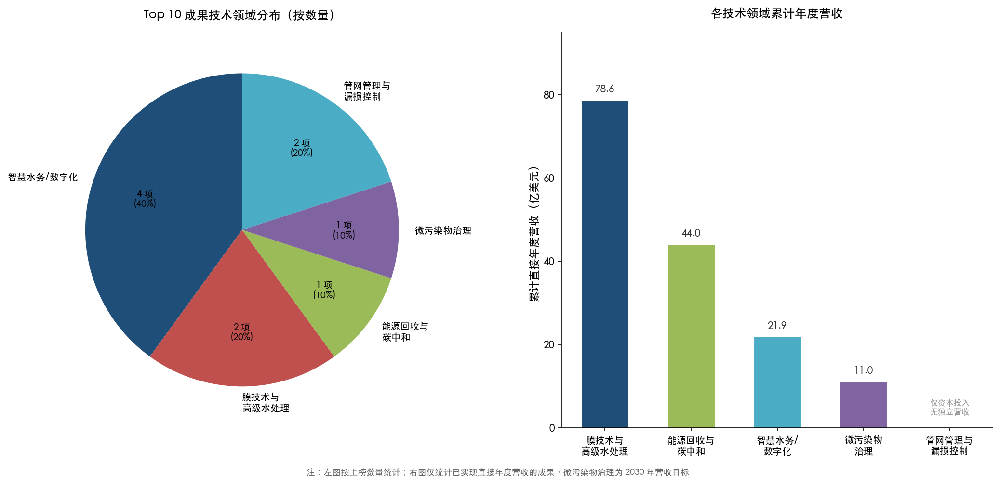

**智慧水务/数字化运营占据数量核心地位**。10 项成果中有 4 项直接涉及智慧水务和数字化技术（第 4、6、8、9 名），另有 2 项属于管网管理与漏损控制范畴（第 7、10 名），反映水务行业从传统基础设施向"数字化+物理资产"融合运营模式加速转型。全球智能水表市场 2024 年已达 90.51 亿美元，预计 2030 年增长至 161.9 亿美元，复合年增长率 10.3% [Grand View Research](https://www.grandviewresearch.com/industry-analysis/smart-water-meters-market "全球智能水表市场2024-2030预测")。

**膜技术与高级水处理仍是最大收入来源**。Veolia WTS 以 54 亿美元的年收入高居榜首，叠加 Xylem WSS 的 24.64 亿美元，两大平台合计贡献约 78.6 亿美元年度营收，远超其他技术领域。全球海水淡化设备市场 2025 年约 200 亿美元，预计 2033 年增长至 427 亿美元，复合年增长率约 10.0% [Grand View Research](https://www.grandviewresearch.com/industry-analysis/water-desalination-equipment-market "全球海水淡化设备市场预测")。

**能源回收与碳中和成为新增长极**。Veolia 生物能源板块以 44 亿美元收入位列第 2，体现"将污水处理厂从成本中心转变为能源工厂"这一范式转变蕴含的巨大经济价值。

**微污染物治理是增长最快的新兴领域**。Veolia BeyondPFAS 虽在绝对收入上尚未进入第一梯队，但其 2030 年 10 亿欧元的营收目标以及 PFAS 监管在欧美的快速推进，使其成为未来五年增速最高的技术方向之一。

## 1.5 企业格局与并购整合特征

Top 10 排名中，Veolia 独占 4 席（第 1、2、5、8 名），Xylem 占据 2 席（第 3、4 名），体现水务技术领域高度集中的竞争格局。两大巨头的共同特征是以大规模并购作为技术产业化的核心引擎（见下图）：

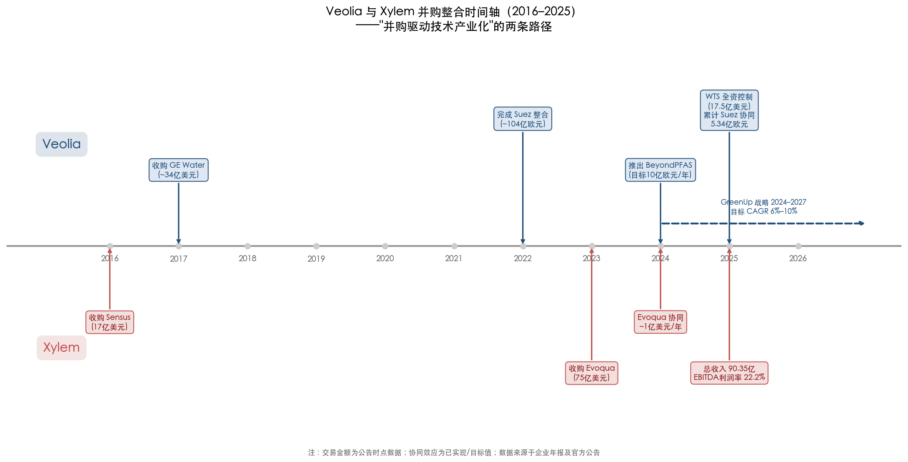

Veolia 在 2022–2025 年间完成对 Suez 的全面整合，累计实现协同效应 5.34 亿欧元 [Veolia 2025年报新闻稿](https://www.veolia.com/sites/g/files/dvc4206/files/document/2026/02/Finance_PR_Veolia_2025_results.pdf "Veolia Suez整合协同效应")。其 GreenUp 战略（2024–2027）进一步向高增长的"Booster"业务（含 WTS、BeyondPFAS、数字化平台等）倾斜——"Booster"业务有机增长率达 4.3%，显著高于"Stronghold"业务的 2.2%，推动集团整体 ROCE 从 8.8% 提升至 9.4%。

Xylem 则通过两次战略并购——2016 年 17 亿美元收购 Sensus、2023 年 75 亿美元收购 Evoqua——构建起全球最大的纯水务技术平台，2025 年总收入达 90.35 亿美元 [Xylem 2025年报](https://www.xylem.com/en-us/about-xylem/newsroom/press-releases/xylem-reports-fourth-quarter-and-full-year-2025-results/ "Xylem 2025财年平台化转型")。

其余上榜企业的产业化路径各有侧重：American Water Works 依托北美监管费率机制实现稳定投资回报；SABESP 凭借巴西水务私有化改革浪潮推动了大规模技术投资；Anglian Water 和 Severn Trent 则在英国 Ofwat AMP 监管框架下获得技术投资的长周期确定性回报。这些多元化路径共同表明：技术创新成果的成功产业化，不仅取决于技术本身的先进性，更取决于商业模式设计、资本投入能力和监管环境的有效协同。

# 第2章 Top 10 创新成果的技术与商业化深度分析

第 1 章以经济收益规模为标尺完成了 Top 10 创新成果的全景排名。本章在此基础上转入纵深分析：按技术领域将 Top 10 成果分为数字化/智慧水务、膜技术与高级水处理、管网管理与漏损控制、微污染物治理、能源回收与碳中和五大类别，系统拆解每类技术从研发到产业化落地的关键成功要素——涵盖技术成熟度演进路径、商业模式设计、资本投入与回报周期、政策与标准支撑及市场推广策略，并在此基础上提炼国际领先水务企业技术创新产业化的共性规律与可复制经验。

## 2.1 数字化/智慧水务：从 AMR 到 AMI 再到数字孪生的产业化跃迁

### 2.1.1 智能计量技术的代际演进

水务智能计量经历了三个清晰的技术代际：自动抄表（AMR）、高级计量基础设施（AMI）以及 AMI 与数字孪生融合的"智慧水网"。美国水务行业智能表市场占比从 2012 年的 22% 提升至 2018 年的 41%，映射出 AMR 向 AMI 快速转型的产业趋势 [Internet of Water](https://internetofwater.org/blog/data-stories/return-on-investment/unearthing-the-hidden-benefits-of-advanced-metering-infrastructure-ami "AMI 代际演进与 ABCWUA 案例")。AMI 的核心优势在于双向通信能力——读表速度较 AMR 提升约 1,000 倍，准确率从 97% 提升至 99.97%，并支持实时异常检测与远程阀控，从根本上改变了水务公司与终端用户之间的数据交互模式。

Xylem 2016 年以 17 亿美元收购 Sensus 进入智能计量领域，收购时 Sensus 年收入约 8.37 亿美元，预期三年内实现 5,000 万美元年度成本协同 [Xylem Sensus收购公告](https://xyleminc.gcs-web.com/news-releases/news-release-details/xylem-inc-acquire-sensus-global-leader-smart-meters-network "Xylem 17亿美元收购Sensus")。截至 2025 年，MCS 板块收入已增长至 20.86 亿美元（有机增长 +9%），全球部署超过 3,500 万个智能端点，收入较收购时增长 2.5 倍 [Xylem 2025年报](https://www.xylem.com/en-us/about-xylem/newsroom/press-releases/xylem-reports-fourth-quarter-and-full-year-2025-results/ "Xylem FY2025 Results")。

### 2.1.2 智能计量的投资回报模型

AMI 项目的投资回报周期因部署规模和地区特征差异较大，但多个典型案例指向 4–13 年的回收区间。美国马里兰州 WSSC Water 的成本效益分析显示，其 AMI 项目预计 11 年内收回全部投资，远低于 20 年的系统生命周期估算，20 年净现值收益为 1.36 亿美元 [WSSC Water AMI成本效益分析](https://www.wsscwater.com/sites/default/files/sites/wssc/files/ami/AMI%20Cost%20Benefit%20Analysis%20-2.pdf "WSSC Water AMI CBA 2020")。行业综合数据表明，智能水表投资的典型 ROI 回收期为 4–6 年 [PatentPC](https://patentpc.com/blog/smart-water-metering-adoption-trends-consumption-stats "智能水表ROI 4-6年")。

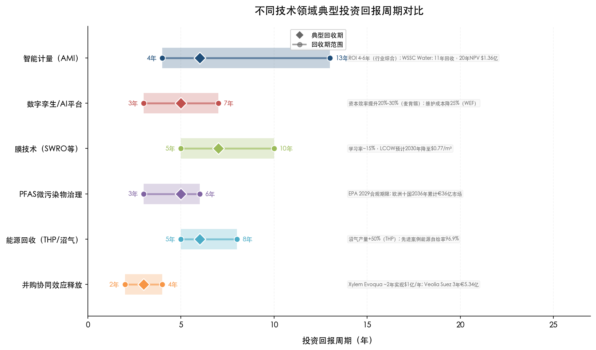

**图：不同技术领域典型投资回报周期对比。** 横轴为投资回报周期（年），菱形标记典型回收期，圆点标记范围上下限。智能计量 AMI 的回收期跨度最大（4–13 年），反映项目规模和地区监管差异；并购协同效应释放的典型周期最短（2–4 年），体现了成熟并购整合模式的快速价值兑现能力。

AMI 项目的收益来源具有多层次特征：直接层面涵盖人工抄表成本削减和因计量精度提升而追回的收入损失；间接层面则包括通过实时数据发现用户侧漏损和管网异常所带来的水资源节约。以美国阿尔伯克基水务局（ABCWUA）为例，部署 Sensus/Xylem AMI 系统后，三年内追回约 250 万美元流失收入，年度表观漏损从约 9.29 亿加仑骤降至约 0.93 亿加仑——降幅达 90% [Internet of Water](https://internetofwater.org/blog/data-stories/return-on-investment/unearthing-the-hidden-benefits-of-advanced-metering-infrastructure-ami "ABCWUA AMI 案例")。

### 2.1.3 数字孪生与 AI 运营平台的经济价值

数字孪生技术代表智慧水务的更高级形态，其核心价值在于构建物理水务系统的虚拟镜像，实现预测性维护和运行优化。麦肯锡 2025 年研究指出，数字孪生可使公共部门大型基础设施项目的资本效率和运营绩效提升 20%–30% [McKinsey](https://www.mckinsey.com/industries/public-sector/our-insights/digital-twins-boosting-roi-of-government-infrastructure-investments "麦肯锡2025数字孪生研究")；世界经济论坛进一步量化了水务领域的具体收益——维护时间减少 30%、维护成本减少 25% [World Economic Forum](https://www.weforum.org/stories/2024/11/why-digital-twins-might-transform-the-world-of-water-management/ "WEF水务数字孪生")。

Veolia 的 Hubgrade 数字运营平台提供了从概念验证到利润表贡献的完整产业化证据。2025 年，Veolia 全集团效率增益达 3.99 亿欧元（约 4.35 亿美元），其中数字化和 AI 贡献占比 23%，对应约 9,200 万欧元（约 1 亿美元）的直接成本节约 [Veolia 2025年报](https://www.otcmarkets.com/stock/VEOEF/news/Veolia-Environnement-2025-a-Pivotal-Year-Record-Results-Above-Guidance?e&id=3414894 "Veolia 2025数字化效率增益")。以意大利 Nosedo 污水处理厂为例，Hubgrade 年节约运营成本超过 40 万欧元。这一模式的核心在于将分散的单厂运行数据汇集到集中式数字运营中心，实现跨设施协同优化——而非仅在单个项目上部署孤立的信息化系统。

### 2.1.4 关键成功要素

数字化/智慧水务技术从研发到大规模产业化的关键成功要素可归纳为以下四点：

**并购整合是最快的规模化路径。** Xylem 收购 Sensus 的案例表明，通过并购获取成熟技术平台和存量客户网络，可大幅缩短从零开始的技术产品化和市场开拓周期。收购 9 年后 MCS 板块收入增长 2.5 倍，验证了"技术并购→渠道整合→规模化部署"路径的有效性。

**从设备销售向数据服务转型是盈利质量提升的关键。** AMI 部署带来的一次性硬件收入之外，数据分析、漏损检测、需求预测等增值服务构成高毛利率的经常性收入流。Xylem 服务收入从 2023 年的 10.73 亿美元增至 2025 年的 15.63 亿美元（两年增长 46%），Adjusted EBITDA 利润率从 15.2% 跃升至 22.2% [Xylem 2025年报](https://www.xylem.com/en-us/about-xylem/newsroom/press-releases/xylem-reports-fourth-quarter-and-full-year-2025-results/ "Xylem服务收入与利润率跃升")。

**监管框架提供长周期投资确定性。** 英国 Ofwat AMP8 周期批准了创纪录的约 880 亿英镑投资（较 AMP7 增长约 50%），其中智能水表专项投资约 15.6 亿英镑、创新基金从 2 亿翻倍至 4 亿英镑 [Fairgrove Partners](https://fairgrovepartners.com/insight/pr24-and-amp8-a-rising-tide-of-opportunity-for-water-sector-suppliers-2/ "Ofwat PR24/AMP8投资规模")。这种五年一周期的监管投资框架为技术供应商和水务运营商提供了可预期的回报路径，大幅降低了智能化投资的不确定性。

**"由外到内"策略加速早期回报可视化。** Anglian Water 的实践表明，优先利用智能水表数据解决用户侧漏损（修复成本低、见效快），再渐进推进管网侧漏损检测与优化，可在项目早期即展现可量化的经济效益，从而赢得监管机构和投资者的持续支持。截至 2025 年底，该公司 130 万个智能水表已识别超过 60 万处用户侧泄漏，平均每户每天节约 14.75 升水 [Anglian Water新闻](https://www.anglianwater.co.uk/news/record-breaking-number-of-smart-meters-installed-in-anglian-water-region/ "Anglian Water 130万智能水表部署")。

## 2.2 膜技术与高级水处理：学习曲线驱动的成本下降与全谱系平台化

### 2.2.1 SWRO 技术的成本演进规律

海水反渗透淡化（SWRO）技术的产业化历程提供了水处理领域技术成本下降规律的经典范例。Caldera 与 Breyer（2018）基于全球装机数据的实证研究表明，SWRO 资本成本遵循约 15% 的学习率——累计装机容量每翻一番，单位投资成本下降约 15%。从绝对值看，1979–2003 年间 SWRO 单位投资从超过 10,000 USD/(m³/d) 降至约 3,000 USD/(m³/d)；2003 年后，16 英寸大直径膜元件的商业化推广触发了一次急剧的成本跳降，降至约 1,160 USD/(m³/d) [Caldera & Breyer, Water Resources Research 2018](https://agupubs.onlinelibrary.wiley.com/doi/full/10.1002/2017WR021402 "SWRO学习曲线实证研究")。预测模型显示，2030 年 SWRO 的平准化供水成本（LCOW）有望从 2015 年的 1.25 USD/m³ 降至 0.77 USD/m³，降幅约 38%。

这一学习率的产业含义在于：SWRO 竞争力将随全球装机规模扩张而持续增强，形成"规模化部署→成本下降→更多市场渗透→进一步规模化"的正反馈循环。全球海水淡化设备市场 2025 年规模约 200 亿美元，预计 2033 年增长至 427 亿美元（CAGR 10.0%）[Grand View Research](https://www.grandviewresearch.com/industry-analysis/water-desalination-equipment-market "全球海水淡化设备市场")，为膜技术企业提供了持续扩大的规模化基础。

### 2.2.2 Veolia WTS 全谱系平台的产业化路径

Veolia Water Technologies & Solutions（WTS）的产业化路径是水处理技术从单一产品走向全谱系平台的标杆案例。该平台技术矩阵覆盖反渗透/纳滤膜系统、高级氧化工艺（AOP）、离子交换树脂、水回用及海水淡化成套方案，在全球 44 国服务超过 8,000 个客户，拥有 38 个技术站点和 11 个研发实验室。2025 年 WTS 实现收入 49.54 亿欧元（约 54 亿美元），EBITDA 利润率 13.5% [Veolia 2025年报新闻稿](https://www.veolia.com/sites/g/files/dvc4206/files/document/2026/02/Finance_PR_Veolia_2025_results.pdf "Veolia 2025 WTS业绩")。

WTS 的构建遵循了清晰的"先并购→再整合→再全资化→释放协同"四步路径：

- **并购切入（2017 年）**：Veolia 参与收购 GE Water & Process Technologies（对价约 34 亿美元），获取全球领先的工业水处理技术组合和客户网络。
- **技术融合与组织整合（2018–2024 年）**：将原 GE Water 的技术资产与 Veolia 既有水处理能力进行系统性融合，统一品牌、销售渠道和研发资源。
- **全资化控制（2025 年）**：以 17.5 亿美元收购 CDPQ 持有的 30% 少数股权，实现完全控制权，消除合资结构对战略决策效率的制约 [Veolia WTS收购公告](https://www.middle-east.veoliawatertechnologies.com/press/veolia-acquires-cdpqs-30-stake-water-technologies-and-solutions-achieving-full-ownership "Veolia WTS全资化")。
- **协同释放（2025–2027 年）**：预计到 2027 年释放 9,000 万欧元年度协同效应，主要来源于采购集中化、研发重复投入削减和交叉销售。

### 2.2.3 研发投入的规模效应

国际水务巨头的研发投入在绝对规模和强度上均远超行业平均水平。Xylem 2024 年研发费用为 2.3 亿美元（占收入 2.7%），2025 年为 2.26 亿美元 [Xylem 2024年报](https://www.xylem.com/siteassets/investors/2024-xylem-annual-report-and-10-k.pdf "Xylem研发费用占收入2.7%") [Fiscal.ai](https://fiscal.ai/company/NYSE-XYL/metrics/income-statement/research-development-expenses/ "Xylem 2025研发支出")。Veolia 2024 年研发与创新总预算为 1.86 亿欧元（约 2.03 亿美元），拥有 14 个全球研发中心 [Veolia 2024 URD](https://www.scribd.com/document/864363734/universal-registration-document-veolia-financial-report-250327 "Veolia 2024研发预算")；2025 年进一步增至 1.94 亿欧元（约 2.12 亿美元）[Veolia 2025 URD](https://www.marketscreener.com/news/veolia-environnement-universal-registration-document-2025-veolia-environnement-ce7e51dbd189f221 "Veolia 2025研发投入")。GreenUp 战略明确提出在 2024–2027 年间额外增加 2 亿欧元创新投资，用于布局"未来技术"方向。

这种规模的研发投入产生了两个重要的规模效应：其一，多领域技术平台之间形成交叉受益——例如 WTS 的膜技术与 BeyondPFAS 微污染物处理方案共享核心膜材料和工艺优化经验；其二，全球化客户网络为研发投入提供了远大于单一市场的商业化承载能力，使得高额研发投入在全球范围内获得充分摊薄和回报。

## 2.3 管网管理与漏损控制：监管框架驱动的技术投资闭环

### 2.3.1 英国 AMP 监管周期的产业化驱动机制

英国 Ofwat 水务监管体系为全球水务技术产业化提供了最成熟的制度模板。AMP（Asset Management Period）每五年一个周期，监管机构批准水务公司的资本支出计划和绩效目标，同时允许通过水价调整机制回收合理投资成本。该机制的核心优势在于为技术投资创造可预期的五年回报路径，大幅降低水务公司和技术供应商面临的投资不确定性。

AMP8（2025–2030）标志着英国水务技术投资的历史性跃升。Ofwat PR24 最终裁定批准全行业约 880 亿英镑投资计划（较 AMP7 增长约 50%），其中增强性支出（enhancement expenditure）约 350 亿英镑，相当于 AMP7 的 3 倍以上。具体而言，漏损削减专项投入 5.45 亿英镑（支撑全行业 13% 漏损削减目标），智能水表投资约 15.6 亿英镑，创新基金从 2 亿翻倍至 4 亿英镑 [Fairgrove Partners](https://fairgrovepartners.com/insight/pr24-and-amp8-a-rising-tide-of-opportunity-for-water-sector-suppliers-2/ "Ofwat PR24/AMP8创纪录投资")。

### 2.3.2 Anglian Water 与 Severn Trent 的差异化实践

同处 Ofwat 监管框架之下，Anglian Water 和 Severn Trent Water 展现了两种不同但互补的管网管理技术产业化路径。

**Anglian Water 的"由外到内"智能计量策略。** 截至 2025 年底，Anglian Water 已安装超过 130 万个智能水表（英国最大规模部署），采用 AMI 数据与 AI 管网模型结合的方式实现隐蔽漏损快速定位。其独特之处在于优先聚焦用户侧漏损检测——已发现超过 60 万处用户侧泄漏，平均每户每天节约 14.75 升水 [Anglian Water新闻](https://www.anglianwater.co.uk/news/record-breaking-number-of-smart-meters-installed-in-anglian-water-region/ "Anglian Water由外到内策略")。这一策略的经济逻辑在于：用户侧维修成本远低于管网侧大修，且用户直接感知的节水收益有助于提升公众对智能水表投资的接受度，从而降低推广阻力。

**Severn Trent 的数字孪生与资产评估路径。** Severn Trent 在 AMP8 中提出 16% 漏损削减目标，计划更换约 1,400 公里水管并提升智能水表覆盖率 [Severn Trent PR24 Business Plan](https://www.severntrent.com/content/dam/stw-plc/investors-02/business-plan-2025-2030/pr24-investor-summary.pdf "Severn Trent AMP8计划")。其污水处理厂数字孪生和 AI 资产评估工具获得 Net Zero Hub 奖项 [Sand Technologies](https://www.sandtech.com/digital-twin-project-with-severn-trent-water-wins-net-zero-hub-award/ "Severn Trent数字孪生获奖")。Severn Trent 的差异化在于将数字孪生技术同时应用于管网运行优化和资产全生命周期评估，后者直接影响 AMP 周期内的资本支出优先级排序，帮助公司将有限投资集中于劣化最严重、投资回报最高的资产环节。

### 2.3.3 SABESP：新兴经济体的跨越式部署

SABESP 于 2026 年 2 月启动的全球最大 IoT 智能水表项目，为新兴经济体大规模智慧水务部署提供了重要的范式参考。该项目投资 38 亿雷亚尔（约 7 亿美元），由 Telefonica Brasil（Vivo）担任系统集成商和连接服务提供商，采用 NB-IoT（窄带物联网）通信技术在圣保罗部署 440 万个智能水表 [Mobile World Live](https://www.mobileworldlive.com/telefonica/water-company-taps-telefonica-for-700m-nb-iot-project/ "SABESP Telefonica NB-IoT合同") [TI INSIDE Online](https://tiinside.com.br/en/11/02/2026/sabesp-inicia-maior-projeto-de-iot-do-mundo-para-medicao-de-agua-com-investimento-de-r-38-bilhoes/ "SABESP全球最大IoT项目")。

该项目的技术和商业模式选择具有重要参考价值。选择 NB-IoT 而非 LoRa 等竞争方案，体现了对运营商级网络覆盖可靠性和大规模端点管理能力的优先考量；由电信运营商而非传统水务设备供应商担任系统集成商，反映了智能水表项目从"水务设备项目"向"IoT 连接服务项目"的范式转变。据 Telefonica Tech 数据，智能水表的采用可将漏损削减 40%、大幅降低维护成本、客户满意度提升 60%。

SABESP 的示范意义在于：它证明大规模 AMI 部署不仅适用于发达国家成熟的监管环境，在新兴经济体中同样可以基于"减少无收益水→提升收费率→改善现金流"的商业逻辑获得投资合理性支撑。该公司 2025 年全年资本支出达 152 亿雷亚尔（约 28 亿美元，较 2024 年翻倍），调整后 EBITDA 为 132.21 亿雷亚尔（同比增长 16.6%）[Investing.com](https://www.investing.com/news/company-news/sabesp-q4-2025-slides-margin-expansion-drives-13-ebitda-growth-93CH-4566063 "SABESP 2025 Q4财务表现")，强劲的财务表现为大规模技术投资提供了坚实的现金流基础。

## 2.4 微污染物治理：监管创造市场的典型案例

### 2.4.1 全球 PFAS 监管的"竞赛式"收紧

PFAS（全氟和多氟烷基化合物）治理是近十年水务行业中监管驱动型技术产业化的最典型案例。各主要经济体监管收紧的节奏之快、力度之大，直接催生了一个数十亿美元级别的新兴技术市场。

**美国方面**，2024 年 4 月 EPA 发布首个 PFAS 饮用水国家标准，将 PFOA/PFOS 的最大污染物限值（MCL）设定为 4.0 ppt（万亿分之四），要求公共供水系统在 2029 年前完成合规 [US EPA](https://www.epa.gov/sdwa/and-polyfluoroalkyl-substances-pfas "EPA PFAS饮用水国家标准")。2025 年 5 月，EPA 在保留该标准的同时提出延长合规期限并提供 10 亿美元资金支持，但强制合规方向未改。

**欧盟方面**，修订版饮用水指令于 2026 年 1 月 12 日起实施 PFAS 监测要求 [European Commission](https://environment.ec.europa.eu/news/new-eu-rules-limit-pfas-drinking-water-2026-01-12_en "欧盟饮用水PFAS新规")。Bluefield Research 预测欧洲十国 PFAS 处理总支出到 2036 年将达 36 亿欧元，德、意、法、西四国合计约占三分之二 [Bluefield Research](https://www.bluefieldresearch.com/ns/new-eu-pfas-limits-activate-e3-6-billion-drinking-water-treatment-opportunity/ "欧洲PFAS处理市场36亿欧元")。

这种"竞赛式"监管收紧的产业效应极为显著：不仅创造了巨大的增量技术需求，更为先行布局的技术企业提供了定价权和市场准入壁垒。PFAS 治理涉及极低浓度检测（ppt 级）、复杂的多技术组合工艺和残余物无害化处置，技术门槛远高于常规水处理，这使得早期进入者能够建立显著的经验优势和客户粘性。

### 2.4.2 Veolia BeyondPFAS 的端到端商业模式

Veolia 于 2024 年 10 月推出的 BeyondPFAS 方案，是将监管驱动的技术需求转化为结构化商业平台的典范之作。该方案整合了活性炭吸附（GAC）、离子交换（IX）、反渗透（RO）和高温焚烧销毁等全链条技术，提供从水源检测到水体治理再到残余物无害化处置的一站式服务 [Waste Dive](https://www.wastedive.com/news/veolia-pfas-services-epa-destruction-disposal-technology/730558/ "Veolia BeyondPFAS发布")。

截至方案发布时，Veolia 已在美国处理超过 800 万立方米 PFAS 污染水、运营 33 个处理系统。2025 年投产的美国项目是全国最大 PFAS 处理设施之一，投资约 3,500 万美元。Veolia 为 BeyondPFAS 设定了 2030 年 10 亿欧元（约 11 亿美元）年收入目标 [Smart Water Magazine](https://smartwatermagazine.com/news/veolia/veolia-aims-eu1b-revenue-2030-pioneering-pfas-treatment-micropollutants "Veolia BeyondPFAS 2030年10亿欧元目标")。

BeyondPFAS 的商业模式设计有三个值得关注的特征：其一，"端到端"策略构建完整的价值链闭环，避免了仅提供单一处理环节的低附加值竞争；其二，整合 Veolia 水务、废弃物管理和能源三大业务板块的协同能力，尤其是高温焚烧销毁 PFAS 残余物的能力，这是纯水务技术公司难以复制的核心壁垒；其三，以 2030 年 10 亿欧元营收目标为锚，向资本市场传递清晰的增长预期，有助于获取持续的资本支持。

我们认为，Veolia BeyondPFAS 的案例深刻揭示了一条规律：在监管驱动型技术市场中，能够率先构建"检测→治理→销毁"全链条能力的企业，将在合规截止日期到来时获得远超市场平均水平的份额和利润率。

## 2.5 能源回收与碳中和：从成本中心到利润中心的范式转变

### 2.5.1 热水解预处理（THP）的技术杠杆效应

热水解预处理技术在污水处理厂能源回收领域发挥了关键的"技术杠杆"作用。Cambi ASA 作为全球 THP 技术的领导者，占据中国以外全球 THP 产能约 90% 的市场份额。THP 的核心价值体现在三重提升：沼气产量增加约 50%，消化器处理能力扩大至传统工艺的 3 倍，且产出物可达 Class A 级生物固体标准（可直接用于农业土地施用）[Cambi](https://www.cambi.com/process "Cambi THP技术原理与效益")。

THP 的经济逻辑十分清晰：通过预处理提升污泥的可消化性，使同等规模的消化器处理更多有机物、产出更多沼气，再经热电联产（CHP）系统转化为电力和热能。在全球能源价格持续上行的背景下，这一技术路线的投资回报吸引力持续增强，部分欧洲先进案例已实现污水处理厂 96.9% 以上的能源自给率。

### 2.5.2 Veolia 生物能源板块的产业化规模

Veolia 生物能源/灵活性/能效板块 2025 年实现收入 40.21 亿欧元（约 44 亿美元），有机增长 5.8% [Veolia 2025年报新闻稿](https://www.veolia.com/sites/g/files/dvc4206/files/document/2026/02/Finance_PR_Veolia_2025_results.pdf "Veolia 2025生物能源板块业绩")。该板块集成了三大技术方向：

**污水厂沼气回收发电。** 通过厌氧消化+THP 组合工艺将有机物转化为沼气，经 CHP 系统发电供热。该技术路线在欧洲已实现大规模产业化部署，部分先进案例的能源自给率达到 96.9% 以上。

**Ecothermal Grid 污水源热能回收。** 利用污水的恒温特性，通过热泵系统提取低品位热能用于区域供暖和制冷，并可与数据中心余热回收耦合。波兰波兹南项目是该技术的标杆案例——实现 25% 的 CO₂ 减排、年替代 30 万吨煤炭消耗 [Veolia 2025年报](https://www.otcmarkets.com/stock/VEOEF/news/Veolia-Environnement-2025-a-Pivotal-Year-Record-Results-Above-Guidance?e&id=3414894 "Veolia Ecothermal Grid波兹南项目")。

**灵活性能源管理。** 通过智能调度系统优化分布式能源资产运行，实现电力峰谷价差套利和电网辅助服务收益。

该板块 44 亿美元的年收入规模充分证明了"将污水处理厂从成本中心转变为能源和资源回收的利润中心"这一范式转变具备巨大经济价值。其深层逻辑在于：传统污水处理被视为市政公用服务的成本负担，而能源回收技术使污水处理厂成为分布式能源节点，在全球"双碳"目标和能源转型背景下获得了全新的商业定位和盈利空间。

## 2.6 并购整合：技术产业化的核心加速器

### 2.6.1 并购作为缩短技术产业化周期的主要路径

Top 10 成果的梳理揭示了一个显著规律：国际领先水务企业几乎无一例外地将并购整合作为技术产业化的核心引擎。与纯粹的内部研发路径相比，并购整合的优势在于能够同时获取技术、人才、客户网络和市场准入资质，将技术从实验室到商业化部署的周期压缩数年乃至十年以上。

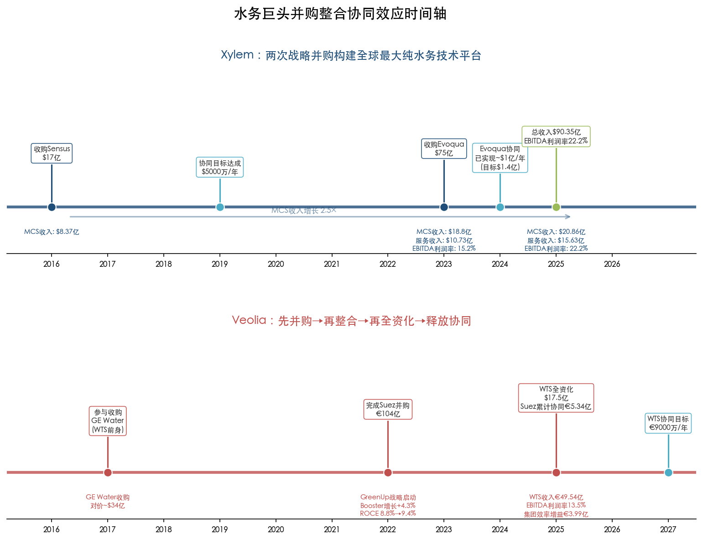

**图：水务巨头并购整合协同效应时间轴。** 蓝色时间轴为 Xylem（Sensus 17 亿美元 + Evoqua 75 亿美元），红色时间轴为 Veolia（GE Water/WTS + Suez 104 亿欧元）。时间轴标注了 2016–2027 年间各并购节点的交易金额、协同目标与已实现进度，以及 MCS 收入增长 2.5 倍、EBITDA 利润率从 15.2% 升至 22.2%、Suez 累计协同 5.34 亿欧元等关键财务指标。

**Xylem 的"双并购"平台构建。** 2016 年以 17 亿美元收购 Sensus 进入智能计量领域，2023 年以 75 亿美元收购 Evoqua 获取工业水处理技术和服务平台，两次并购合计投入超过 92 亿美元，构建起全球最大纯水务技术公司（2025 年总收入 90.35 亿美元）。Evoqua 整合设定 1.4 亿美元年度协同目标，2024 年已实现约 1 亿美元 [Monexa AI分析](https://www.monexa.ai/blog/xylem-inc-xyl-margin-inflection-and-evoqua-synergi-XYL-2025-08-25 "Xylem Evoqua协同进展")。

**Veolia 的"阶梯式"并购与全资化策略。** Suez 并购（对价约 104 亿欧元）3 年累计协同 5.34 亿欧元 [Veolia 2025年报新闻稿](https://www.veolia.com/sites/g/files/dvc4206/files/document/2026/02/Finance_PR_Veolia_2025_results.pdf "Veolia Suez协同5.34亿欧元")；WTS 全资化投入 17.5 亿美元，预计额外释放 9,000 万欧元年度协同。GreenUp 战略向"Booster"业务倾斜——Booster 有机增长率 4.3%，显著高于 Stronghold 业务的 2.2%，集团整体 ROCE 从 8.8% 提升至 9.4% [Veolia 2025年报](https://www.otcmarkets.com/stock/VEOEF/news/Veolia-Environnement-2025-a-Pivotal-Year-Record-Results-Above-Guidance?e&id=3414894 "Veolia GreenUp战略")。

### 2.6.2 并购整合的价值创造模型

基于 Xylem 和 Veolia 的实践，可以提炼出水务行业并购整合的典型价值创造模型：

| 价值创造层级 | 具体机制 | 典型时间窗口 | 代表案例 |
|:---|:---|:---|:---|
| 采购协同 | 供应商议价能力提升、膜材料与化学品集中采购 | 1–2 年 | Veolia Suez 整合采购协同 |
| 收入协同 | 交叉销售、新客户网络接入、技术组合打包销售 | 2–3 年 | Xylem 将 Sensus 智能计量与水泵产品组合销售 |
| 研发协同 | 消除重复研发投入、技术平台共享 | 2–4 年 | Veolia WTS 研发实验室合并 |
| 运营协同 | IT 系统整合、共享服务中心、管理层级扁平化 | 3–5 年 | Xylem Evoqua 运营整合（目标 1.4 亿美元/年） |
| 战略协同 | 市场定位重塑、客户认知升级、定价权增强 | 持续性 | Veolia"生态转型冠军"品牌定位 |

### 2.6.3 从设备销售到服务收入的转型

并购整合的另一重要成果是推动商业模式从一次性设备销售向经常性服务收入转型。Xylem 的数据最具说服力：服务收入从 2023 年的 10.73 亿美元增至 2025 年的 15.63 亿美元（两年增长 46%），EBITDA 利润率从 15.2% 跃升至 22.2%。Evoqua 作为独立公司时，其 O&M 合同和外包运营的经常性收入占比本就较高；并入 Xylem 后，这种高毛利率的服务模式向 Xylem 传统设备销售渠道实现了有效渗透与复制。

这一转型的本质是将客户关系从"一次性交易"升级为"长期合作伙伴"，从而提升客户终身价值（LTV）和收入可预测性。对资本市场而言，经常性服务收入的高稳定性和可预测性通常对应更高的估值倍数，这也是并购整合推动企业价值重估的重要机制。

## 2.7 共性规律：国际水务企业技术创新产业化的四大支柱

综合 Top 10 成果的技术与商业化分析，我们提炼出国际领先水务企业技术创新产业化的四大共性规律。下图以气泡矩阵形式呈现各技术领域的产业化进度差异与主要路径选择，为理解四大规律提供全景视角。

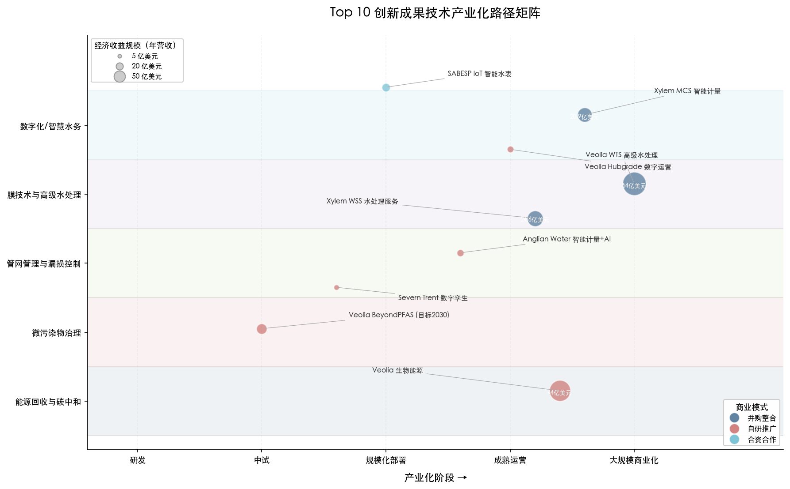

**图：Top 10 创新成果技术产业化路径矩阵。** 横轴为产业化阶段（研发→中试→规模化部署→成熟运营→大规模商业化），纵轴为五大技术领域，气泡大小表征经济收益规模（年营收/亿美元），颜色区分商业模式类型（蓝色：并购整合，红色：自研推广，浅蓝色：合资合作）。Veolia WTS（54 亿美元）和 Veolia 生物能源（44 亿美元）已进入大规模商业化阶段，微污染物治理（BeyondPFAS）仍处中试到规模化部署的过渡期。

**规律一：监管驱动是第一推动力。** 无论是英国 Ofwat AMP 周期为智能水表和管网改造提供的长周期投资回报框架，还是美国 EPA 和欧盟 PFAS 标准直接催生的数十亿美元治理市场，监管政策始终是水务技术产业化的第一推动力。水务行业的公用事业属性决定了技术投资回报高度依赖于费率机制和合规要求——缺乏明确监管信号的市场，技术产业化进程将显著滞后。

**规律二：并购整合是缩短技术产业化周期的主要路径。** Top 10 核心企业均将并购作为技术产业化主引擎。Xylem 两次并购（合计 92 亿美元）和 Veolia 的 Suez 整合+WTS 全资化均证明：通过并购获取成熟技术和客户网络，可将产业化周期压缩 5–10 年。水务行业客户关系壁垒和地域准入限制较高，纯有机增长的市场渗透速度远低于"并购+整合"路径。

**规律三：从设备销售向经常性服务/数字收入转化是提升盈利质量的关键。** Xylem 服务收入占比提升直接驱动利润率从 15.2% 飙升至 22.2%；Veolia 数字化平台每年创造约 1 亿美元成本节约。这一转型的本质是从"卖硬件"走向"卖解决方案和数据"，通过锁定客户长期关系获取更高的经常性收入与利润率。

**规律四：技术成本下降曲线和规模效应是市场渗透的基础。** SWRO 约 15% 的学习率使海水淡化从"奢侈水源"走向"经济可行水源"；全球智能水表市场以 10.3% 的 CAGR 持续扩张，从 2024 年的 90.51 亿美元预计增长至 2030 年的 161.9 亿美元 [Grand View Research](https://www.grandviewresearch.com/industry-analysis/smart-water-meters-market "全球智能水表市场2024-2030")。技术成本的持续下降使越来越多的中小型水务公司和新兴经济体市场进入采购门槛，为头部技术企业提供了持续扩大的可触达市场。

这四大规律并非独立运作，而是形成了"监管创造需求→并购加速供给→服务模式提升盈利→规模效应降低成本→更多市场渗透"的正循环体系。理解这一体系，是国内水务企业借鉴国际经验、制定技术攻关路线图的关键前提。

# 第3章 国内水务企业技术创新产业化现状对比分析

前两章从全景排名与商业化深度分析两个维度，完成了对国际水务企业 Top 10 技术创新产业化成果的系统梳理。本章将视角切换至国内，选取北控水务、首创环保、碧水源、粤海水务、深圳环境水务集团等代表性企业，沿研发投入强度、同类技术领域产业化进展、成果转化机制与核心瓶颈等维度，与国际标杆进行结构化对标。对标的目的不在于简单指出差距，而在于精确识别差距的维度与量级，为第 4 章技术攻关方向建议提供事实基础。

## 3.1 研发投入强度：量级差距下的结构性短板

### 3.1.1 国内头部水务企业研发投入现状

国内水务行业呈现"规模大、研发弱"的典型特征。以 2024 年度数据为基准，五家代表性企业的研发投入状况如下：

| 企业名称 | 2024 年营收 | 研发费用 | 研发/营收 | 核心技术领域 |
|:---|:---|:---|:---|:---|
| 北控水务 | 242.70 亿元（约 33.3 亿美元） | 约 1.18 亿元 | 不足 1% | 智慧水务平台、轻资产运营 |
| 首创环保 | 200.50 亿元（约 27.5 亿美元） | 约 1.76 亿元 | 0.88% | WEAM 生态智慧运营平台、好氧颗粒污泥 |
| 碧水源 | 85.49 亿元（约 11.7 亿美元） | 3.43 亿元 | 4.01% | MBR 膜、纳滤/反渗透、海水淡化 |
| 粤海水务 | — | — | — | 智慧水厂、漏损检测技术 |
| 深圳环境水务集团 | 约 112.5 亿元（约 15.4 亿美元） | 约 1.33 亿元 | 约 1.18% | 智慧水务、管网漏损控制 |

> 注：北控水务研发费用数据来源于北控水务（中国）科创债募集说明书（近三年 1.24/0.99/1.18 亿元）[北控水务(中国)科创债募集说明书](https://static.sse.com.cn/disclosure/bond/announcement/company/c/new/2024-11-25/241740_20241125_6GY6.pdf "北控水务科创债")；碧水源数据来源于主体信用评级报告 [碧水源主体信用评级报告](https://www.chinamoney.com.cn/dqs/cm-s-notice-query/fileDownLoad.do?contentId=3296471&priority=0&mode=save "碧水源2024信用评级")；首创环保数据来源于 2024 年年报 [首创环保2024年报](https://money.finance.sina.com.cn/corp/view/vCB_AllBulletinDetail.php?stockid=600008&id=10868162 "首创环保2024年报")；深圳环境水务集团数据来源于 2024 年公司债券年度报告 [深圳环境水务集团2024年公司债券年度报告](https://pdf.dfcfw.com/pdf/H2_AN202504301665268576_1.pdf "深圳环境水务集团2024债券年报")。

碧水源是国内水务企业中研发投入强度最高的代表，2022–2024 年研发投入分别为 2.59 亿元、3.76 亿元和 3.43 亿元，占营业总收入的 2.98%、4.21% 和 4.01% [碧水源主体信用评级报告](https://www.chinamoney.com.cn/dqs/cm-s-notice-query/fileDownLoad.do?contentId=3296471&priority=0&mode=save "碧水源2024信用评级")。碧水源也是国内极少数将膜材料研发置于核心战略地位的水务企业，截至 2024 年底累计获得专利 612 项。然而，即便是碧水源 3.43 亿元（约 4,700 万美元）的年度研发投入，也仅相当于 Xylem 2025 年研发费用（2.26 亿美元）的约五分之一。

北控水务和首创环保作为国内营收最高的两家水务企业（合计超过 440 亿元），研发投入强度均不足 1%。北控水务中国子公司近三年研发费用在 0.99–1.24 亿元之间波动 [北控水务2024年报](https://www.bewg.net/uploadfile/2025/0428/20250428055826205.pdf "北控水务2024年报")，首创环保 2024 年研发费用约 1.76 亿元 [首创环保2024年报](https://money.finance.sina.com.cn/corp/view/vCB_AllBulletinDetail.php?stockid=600008&id=10868162 "首创环保2024年报")，这一投入水平与其行业规模严重不匹配。

### 3.1.2 与国际巨头的量级对比

国际对标数据进一步凸显差距的严峻程度：

| 企业 | 2025/2024 年营收 | 研发费用 | 研发/营收 |
|:---|:---|:---|:---|
| Veolia | 444 亿欧元（约 484 亿美元，2025 年） | 1.94 亿欧元（约 2.12 亿美元，2025 年） | 约 0.44% |
| Xylem | 90.35 亿美元（2025 年） | 2.26 亿美元（2025 年） | 2.5% |
| 碧水源（国内最高） | 85.49 亿元（约 11.7 亿美元，2024 年） | 3.43 亿元（约 0.47 亿美元） | 4.01% |
| 北控水务 | 242.70 亿元（约 33.3 亿美元，2024 年） | 约 1.18 亿元（约 0.16 亿美元） | 不足 1% |

> 注：Xylem 研发数据来源于 2025 年 10-K 年报 [Xylem 2025年报10-K](https://www.xylem.com/siteassets/investors/2025-annual-report-on-form-10-k.pdf "Xylem R&D 2.5% of revenue")；Veolia 研发数据来源于 2025 年 URD [Veolia 2025 URD](https://www.marketscreener.com/news/veolia-environnement-universal-registration-document-2025-veolia-environnement-ce7e51dbd189f221 "Veolia R&D 2025")。

下图以统一美元口径直观呈现上述差距：碧水源虽然研发强度（4.01%）位列六家企业之首，但其研发费用绝对额仅约 4,700 万美元，不足 Xylem 的五分之一。

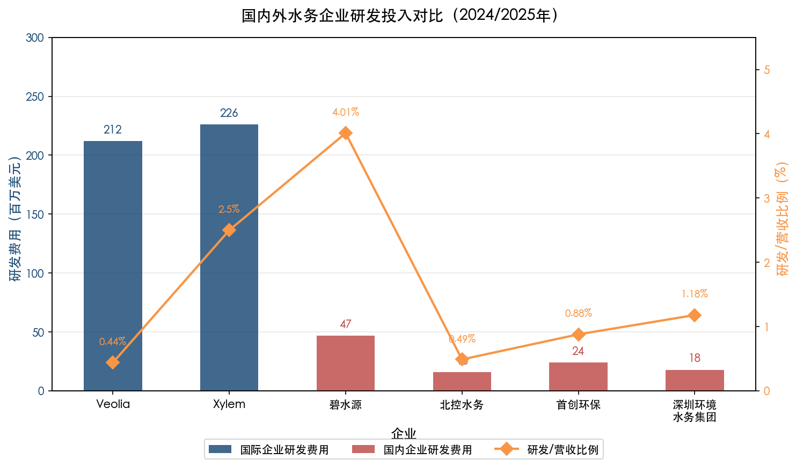

值得注意的是，Veolia 的研发/营收比例看似不高（0.44%），但绝对金额约 2.12 亿美元，且 GreenUp 战略（2024–2027）额外增加 2 亿欧元创新投资用于"未来技术"设计。更关键的是，Veolia 技术产业化的核心路径并非内部研发，而是并购整合——仅 Suez 整合即释放 5.34 亿欧元累计协同效应，WTS 全资化预计再释放 9,000 万欧元年度协同。这意味着国际巨头的"有效技术投入"远高于财务报表中的研发费用行项，而国内企业几乎不具备通过大规模并购获取技术能力的资本实力与国际化经验。

国内头部水务企业（不含碧水源）的研发投入绝对金额约 1–2 亿元人民币（约 1,500 万–2,700 万美元），与国际巨头约 2–2.5 亿美元的研发投入之间存在约 10 倍的量级差距。即便考虑购买力平价因素，这一差距也足以构成结构性制约。

## 3.2 膜技术与高级水处理：碧水源 vs Veolia WTS

### 3.2.1 碧水源的技术优势与规模

碧水源是国内膜法水处理领域的绝对龙头。截至 2024 年底，其 MBR（膜生物反应器）膜占国内膜法水处理市场份额超过 70%，日处理总规模超过 2,200 万吨/天，年产微滤/超滤膜 2,000 万 m²、纳滤/反渗透膜 1,900 万 m²，累计承建全球 10 万吨/日以上 MBR 工程数量居首位 [碧水源2024年报摘要](https://money.finance.sina.com.cn/corp/view/vCB_AllBulletinDetail.php?stockid=300070&id=10863324 "碧水源膜技术")。在技术迭代方面，碧水源自主开发的 V-MBR 较传统 MBR 降低能耗 20% 以上、设备成本降低 25%；MBR-DF 双膜技术运行压力降低 60%–70%、能耗降低 60%–65% [碧水源ESG报告](http://vip.stock.finance.sina.com.cn/corp/view/vCB_AllBulletinDetail.php?stockid=300070&id=10863349 "碧水源ESG")。

在海水淡化领域，碧水源已承建青岛董家口（10 万吨/日，2016 年投运，国内首个自主大型海水淡化工程）和山东鲁北（15 万吨/日）两个标杆项目 [碧水源2024年报摘要](https://money.finance.sina.com.cn/corp/view/vCB_AllBulletinDetail.php?stockid=300070&id=10863324 "碧水源海水淡化")。国产 RO 膜替代方面，沃顿科技作为国产反渗透膜龙头，2024 年膜产品营收达 10.33 亿元，系全球第二家实现干式膜元件规模化生产的企业 [沃顿科技/长城证券研报](http://www.cgws.com/cczq/ggdt/ccyj/202201/P020220107556309937395.pdf "膜进口替代空间")。

### 3.2.2 与 Veolia WTS 的对标差距

碧水源在国内市场占据绝对领导地位，但与 Veolia WTS 的对标仍揭示出多维度的结构性差距：

**规模差距**：碧水源 2024 年整体营收 85.49 亿元（约 11.7 亿美元），Veolia WTS 2025 年收入 49.54 亿欧元（约 54 亿美元），后者约为前者的 4.6 倍 [Veolia 2025年报新闻稿](https://www.veolia.com/sites/g/files/dvc4206/files/document/2026/02/Finance_PR_Veolia_2025_results.pdf "Veolia 2025 FY Results Press Release")。

**技术谱系差距**：碧水源以 MBR 为核心技术路线，尽管正向纳滤和反渗透方向拓展，但技术谱系仍较为单一。Veolia WTS 则覆盖反渗透/纳滤、高级氧化工艺（AOP）、离子交换树脂、水回用及海水淡化的全谱系方案，在 44 国服务超过 8,000 客户，拥有 38 个技术站点和 11 个研发实验室。

**盈利质量差距**：Veolia WTS 2025 年 EBITDA 利润率达 13.5%（6.69 亿欧元），碧水源 2024 年归母净利润仅 5,858 万元，同比暴跌 92.34% [碧水源2024年报摘要](https://money.finance.sina.com.cn/corp/view/vCB_AllBulletinDetail.php?stockid=300070&id=10863324 "碧水源2024年报")。利润急剧下滑的核心原因在于碧水源高度依赖 BOT/PPP 模式——地方政府支付能力与支付意愿的波动直接冲击项目收入和应收账款质量，这一商业模式的脆弱性与 Veolia WTS"技术授权+运营服务+长期合同"的多元化商业模式形成鲜明对比。

**国际化差距**：Veolia WTS 业务覆盖全球 110 余个国家，碧水源的国际业务仍处起步阶段。Veolia 还在持续深化在华布局——2024 年 2 月投资 1,000 万欧元在常熟建设中国首个离子交换再生工厂（Q2 投运），服务微电子、制药、石化等高端工业水处理市场 [Veolia水务技术中国](https://www.veoliawatertechnologies.com.cn/zh-hans/xinwen/weiliyashuiwujishujianzaoqizaizhongguodeshougelizijiaohuanzaishenggongchang "Veolia常熟工厂")，这表明国际巨头正在国内高端细分市场持续强化竞争压力。

### 3.2.3 国内膜行业的整体态势

从行业整体看，中国水处理膜市场规模从 2019 年的 269 亿元增至 2024 年的 456 亿元，2025 年预计突破 900 亿元（占全球 35% 以上），国内企业占据 78% 市场份额，已在大多数产品领域实现进口替代 [智研咨询](https://finance.sina.com.cn/stock/relnews/cn/2025-09-27/doc-infrwynt9930848.shtml "水处理膜行业发展现状")。然而，功能性膜材料国产化率仍不足 35%，高端海水淡化 RO 膜和医疗膜领域的进口替代空间依然广阔——陶氏化学和海德能分别占据全球 RO 膜市场约 30% 和 26% 的份额 [沃顿科技/长城证券研报](http://www.cgws.com/cczq/ggdt/ccyj/202201/P020220107556309937395.pdf "膜进口替代空间")。

综合来看，碧水源在 MBR 领域的国内领先地位毋庸置疑，但从国际对标视角审视，其核心瓶颈在于技术路线单一、商业模式过度依赖 BOT/PPP 周期、国际化程度极低。中国膜行业的整体挑战则表现为"量大但高端不足"——规模领先但价值链中高附加值环节仍由国际企业主导。

## 3.3 智慧水务与数字化运营：平台碎片化困局

### 3.3.1 国内智慧水务的市场规模与格局

中国智慧水务（供水领域）市场 2024 年约 306.6 亿元（约 42 亿美元），预计 2029 年突破 837 亿元，复合年增长率达 22.25% [艾瑞咨询](https://pdf.dfcfw.com/pdf/H3_AP202504151656947858_1.pdf "2025年中国智慧水务行业研究报告")。增速远高于全球平均水平，但品牌格局高度分散——未选择头部品牌的水司占比超过 60%。这种碎片化格局既折射出市场的巨大增长潜力，也暴露了行业标准缺位与平台互不兼容的深层问题。

### 3.3.2 各企业数字化实践

**北控水务**：2024 年成立北水科技和北水云两大轻资产平台，完成 14 项核心产品定型，推出污水行业云平台"忠虫网"、在线工艺仿真系统 BE-Think、小蓝机器人等数字化产品 [北控水务2024年报](https://www.bewg.net/uploadfile/2025/0428/20250428055826205.pdf "北控水务轻资产平台")。上述举措标志着北控水务从重资产运营商向轻资产技术服务商的战略转型启动，但数字平台目前仍以服务自有项目为主，尚未形成跨企业、跨区域的行业级影响力。

**粤海水务**：黄阁水厂"智慧水厂"标杆项目实现 AI 轨道机器人远程巡检替代人工、混凝剂投加量降低 15%、管网三层级分区每年节约水资源约 360 万吨。更具产业化推广价值的是，其漏损检测技术已应用于 20 余家自来水公司，年节水逾 4,000 万吨、节省成本 2,000 余万元 [中国水网](https://www.h2o-china.com/news/349293.html "粤海水务智慧水务")，是国内少数实现技术对外输出的典型案例。

**首创环保**：WEAM 生态智慧运营平台已落地 30 余项目，入选五大国家级及省部级推荐名录 [中国水网](https://www.h2o-china.com/news/357264.html "首创环保WEAM平台")，在环保行业智慧运营领域具备较高知名度，但覆盖范围仍局限于首创自有体系。

**深圳**：深圳市水务局与华为签署战略合作，推进鸿蒙生态赋能水务数字化转型。2026 年 1 月深圳智能水务大会签约金额突破 2 亿元 [深圳市水务局](https://swj.sz.gov.cn/xxgk/zfxxgkml/gzdt/content/post_12561254.html "深圳水务鸿蒙生态") [21财经](https://m.21jingji.com/article/20260129/herald/c9cd7a566742b6d501dae4d79097792c_zaker.html "深圳智能水务大会")。深圳环境水务集团三个项目入选 2024 年智慧水务典型案例，其政企合作模式为行业数字化转型提供了可参考路径。

### 3.3.3 与国际标杆的对标差距

将上述国内实践与第 1 章、第 2 章梳理的国际标杆进行对比，差距集中体现在三个层面：

**平台层级差距**：Veolia Hubgrade 是覆盖全球数千个运营设施的跨国集中式数字运营平台，2025 年数字化和 AI 直接创造约 9,200 万欧元（约 1 亿美元）成本节约 [Veolia 2025年报新闻稿](https://www.veolia.com/sites/g/files/dvc4206/files/document/2026/02/Finance_PR_Veolia_2025_results.pdf "Veolia 2025 FY - efficiency gains")。国内企业的数字平台则以单厂或单项目部署为主，尚未形成跨企业的集中式运营优化能力。各家企业自建平台、互不兼容，行业层面缺乏统一的数据标准与互通机制。

**智能计量规模差距**：Xylem 全球部署超过 3,500 万个智能端点，MCS 板块 2025 年收入达 20.86 亿美元 [Xylem 2025年报](https://www.xylem.com/en-us/about-xylem/newsroom/press-releases/xylem-reports-fourth-quarter-and-full-year-2025-results/ "Xylem FY2025 Results")；Anglian Water 在英国单一供水区域即部署 130 万个智能水表、识别超 60 万处用户侧泄漏 [Anglian Water新闻](https://www.anglianwater.co.uk/news/record-breaking-number-of-smart-meters-installed-in-anglian-water-region/ "Anglian Water smart meters")。中国智能水表渗透率约 53%（2024 年），2025 年出货量预计突破 5,200 万台 [华经产业研究院](https://m.huaon.com/channel/trend/1077028.html "智能水表渗透率53%")，但以"机械+远传模块"（AMR）为主，真正的 AMI（高级计量基础设施）大规模部署仍处起步阶段。AMI 相较 AMR 读表速度提升约 1,000 倍、准确率从 97% 提升至 99.97%，这一代际差距意味着国内智能计量在数据密度和实时性方面远未达到支撑数字孪生与 AI 漏损定位等高级应用的水平。

**数据变现能力差距**：国际巨头已完成从设备销售到数据服务的商业模式转型——Xylem 服务收入两年增长 46%，EBITDA 利润率从 15.2% 跃升至 22.2%。国内平台数据主要用于内部运营辅助，尚未形成对外输出的数据增值服务与经常性收入模式。

## 3.4 管网智能检测与漏损控制：政策推动下的快速追赶

### 3.4.1 国内漏损控制的阶段性成效

管网漏损控制是国内水务技术创新中追赶速度最快的领域。全国城市公共供水管网漏损率已从 2021 年的 12.68% 降至 2024 年的约 10%（国务院披露数据），住建部和发改委联合要求 2025 年将漏损率控制在 9% 以内 [国新办](http://www.scio.gov.cn/live/2024/33621/index.html "国务院政策吹风会") [新华社](http://www.news.cn/politics/2022-02/04/c_1128330675.htm "漏损率9%目标")。

部分先进城市的表现尤为突出：深圳漏损率 7.7%（2022 年）[深圳环境水务集团2022社会责任报告](https://www.sz-water.com.cn/prod-api/profile/upload/2023/06/19/%E6%B7%B1%E5%9C%B3%E5%B8%82%E7%8E%AF%E5%A2%83%E6%B0%B4%E5%8A%A1%E9%9B%862022%E7%A4%BE%E6%8A%250615_20230619171403A010.pdf "深圳漏损率7.7%")；福州从 2012 年的 42% 大幅降至 2023 年的 5.3%，成为全国漏损控制的标杆城市。福州的经验具有重要参考价值——2017 年率先在全国批量部署 NB-IoT 智能远传水表，并引进供水管网数字孪生系统，技术路径选择与国际先进实践高度一致 [中国水网](https://www.h2o-china.com/news/349570.html "漏损率数据与福州案例")。无锡通过 DMA（独立计量分区）建设使漏损率从 9.3% 降至 8.2%，也验证了精细化管网管理的有效性。

### 3.4.2 与 Ofwat AMP 框架下英国水务企业的对标

深圳和福州等先进城市的漏损率已达国际先进水平（英国水务行业平均漏损率约 15%–20%），但全国范围的管网升级仍面临三重制约：

**投资框架差距**：英国 Ofwat AMP8（2025–2030）批准全行业约 880 亿英镑投资（较 AMP7 增长约 50%），其中漏损削减专项投入 5.45 亿英镑、智能水表投资约 15.6 亿英镑、创新基金从 2 亿英镑翻倍至 4 亿英镑 [Fairgrove Partners](https://fairgrovepartners.com/insight/pr24-and-amp8-a-rising-tide-of-opportunity-for-water-sector-suppliers-2/ "Ofwat PR24/AMP8")。这一五年一周期的监管投资框架为水务公司和技术供应商提供了可预期的长周期回报路径。反观中国，"十四五"期间全国供水管网改造资金总需求约 1,500 亿元（年均 300 亿元）[中国水网](https://www.h2o-china.com/news/349570.html "管网改造资金需求")，主要依赖企业自筹和地方财政，缺乏类似 Ofwat 的系统性投资回收机制。

**智能水表部署差距**：Anglian Water 在单一供水区域部署 130 万个 AMI 智能水表，实现了用户侧漏损的系统性识别与管网级漏损的 AI 定位 [Anglian Water新闻](https://www.anglianwater.co.uk/news/record-breaking-number-of-smart-meters-installed-in-anglian-water-region/ "Anglian Water strategy")；SABESP 更启动了 440 万个 IoT 智能水表的全球最大规模部署项目 [TI INSIDE Online](https://tiinside.com.br/en/11/02/2026/sabesp-inicia-maior-projeto-de-iot-do-mundo-para-medicao-de-agua-com-investimento-de-r-38-bilhoes/ "SABESP IoT project")。国内虽然智能水表年出货量超过 5,000 万台，但以 AMR 为主，AMI 大规模部署仍处起步期，DMA 覆盖率整体偏低。

**数据应用深度差距**：英国水务企业已将智能水表数据与 AI 管网模型深度融合——Anglian Water 采用"由外到内"策略先识别用户侧漏损再推进管网漏损定位，Severn Trent 的数字孪生工具同时服务于运行优化和资产全生命周期评估。国内大多数城市的智能水表数据仅用于远程抄表和基础计费，在漏损定位、需求预测和资产管理方面的潜力尚未充分释放。

### 3.4.3 经济效益估算

管网漏损控制蕴含可观的经济效益。若全国漏损率在当前基础上再降 2 个百分点至约 8%，以 2024 年全国城市供水总量约 625 亿 m³ 估算，年减少水资源浪费约 12.5 亿 m³；以综合供水成本 3 元/吨计，年节约直接经济价值约 37.5 亿元 [中国水网](https://www.h2o-china.com/news/349570.html "漏损控制经济效益")。上述测算尚未包含因漏损减少带来的管网维护成本降低和供水设施压力缓解等间接收益。

## 3.5 微污染物治理（PFAS）：监管驱动力的显著落差

### 3.5.1 中国 PFAS 监管现状

中国是全球最大的氟化合物制造和消费国，含氟聚合物产量占全球约 64.9%，PFAS 已在国内水体中普遍检出 [中国水网](https://www.h2o-china.com/news/361886.html "中国PFAS监管")。然而，中国 PFAS 监管力度与欧美之间存在显著落差：

- GB 5749-2022 饮用水卫生标准仅将 PFOA 和 PFOS 列为"参考指标"（非强制执行），水务企业不面临法定合规压力；
- 2024 年四川省率先发布全国首个化工园区全氟化合物排放限值地方标准（PFOA 0.05mg/L、PFOS 不得检出），属地方层面的先行探索 [中国水网](https://www.h2o-china.com/news/361886.html "四川PFAS地方标准")；
- 生态环境部 2023 年 12 月发布 HJ 1333/1334-2023 两项 PFAS 监测方法标准（2024 年 7 月实施），为后续可能的强制监管奠定方法学基础 [金杜律师事务所](https://www.kwm.com/cn/zh/insights/latest-thinking/regulatory-status-of-pfas-in-china-and-risk-prevention-of-corporate-legal-liabilities.html "PFAS监测标准")；
- 2025 年 11 月拟发布的《优先控制化学品名录（第三批）》预计纳入 24 类含 PFAS 物质 [REACH24H](http://www.reach24h.com/chemical/industry-news/priority-chemicals-list "优先控制化学品第三批")。

### 3.5.2 与国际标杆的对标差距

对比之下，美国 EPA 已于 2024 年 4 月发布首个 PFAS 饮用水国家标准（PFOA/PFOS MCL 4.0 ppt），要求 2029 年前强制合规 [US EPA](https://www.epa.gov/sdwa/and-polyfluoroalkyl-substances-pfas "EPA PFAS MCL")；欧盟修订版饮用水指令于 2026 年 1 月起实施 PFAS 监测，Bluefield Research 预测欧洲十国 PFAS 处理总支出到 2036 年将达 36 亿欧元 [Bluefield Research](https://www.bluefieldresearch.com/ns/new-eu-pfas-limits-activate-e3-6-billion-drinking-water-treatment-opportunity/ "EU PFAS €3.6B market")。

在产业化层面，Veolia BeyondPFAS 已运营 33 个美国处理系统、累计处理超 800 万 m³ PFAS 污染水，设定 2030 年 10 亿欧元（约 11 亿美元）营收目标 [Smart Water Magazine](https://smartwatermagazine.com/news/veolia/veolia-aims-eu1b-revenue-2030-pioneering-pfas-treatment-micropollutants "Veolia €1B PFAS target")。国内水务企业在 PFAS 治理领域几乎无产业化成果，相关研发集中在高校和科研院所，尚未形成从检测到治理的成套技术体系与商业化能力。

差距的根源在于监管驱动力的缺失。第 2 章总结的国际经验表明，"监管驱动是第一推动力"——在缺乏强制合规压力的条件下，水务企业缺乏投资 PFAS 治理技术的经济激励。然而，鉴于中国氟化合物产业的全球领先规模与国际监管趋势的传导效应，我们判断中国升格 PFAS 为强制监管指标是大概率趋势。参照 Bluefield 欧洲模型推算，中国饮用水 PFAS 治理一旦进入强制合规阶段，市场规模有望达到数十亿元/年量级。当前的监管窗口期为国内水务企业提供了技术储备的战略机遇。

## 3.6 能源回收与碳中和：从单点示范迈向规模化的跨越

### 3.6.1 国内的标杆实践

在"双碳"战略推动下，污水处理能源回收已成为国内水务行业的重要方向。发改委、住建部和生态环境部于 2023 年 12 月联合发布《关于推进污水处理减污降碳协同增效的实施意见》，明确提出到 2025 年建成 100 座能源资源高效循环利用的绿色低碳标杆厂，地级以上缺水城市再生水利用率达 25% 以上 [国家发改委](https://www.ndrc.gov.cn/xxgk/jd/jd/202312/t20231229_1363010.html "减污降碳实施意见")。

代表性标杆案例包括：北京高安屯再生水厂通过沼气发电、光伏和再生水源热泵实现能源自给率 100%，年降低运行费用 4,700 万元 [中国建筑业协会](http://cces.net.cn/html/tm/29/38/69/content/7629.html "高安屯能源自给率100%")；粤海水务在梅州丰顺建成国内首座以清洁能源和智慧管控实现 CO₂ 零排放的"碳中和"水厂，汕尾全地埋式污水处理厂能耗/药耗较传统工艺降低 10%–15%、常驻人员精简近 50% [中国水网](https://www.h2o-china.com/news/349293.html "粤海水务碳中和水厂")；碧水源提出"污水处理未来厂"概念，研发纳米级膜分离技术用于资源和能源回收，但仍处于实验室研发阶段 [碧水源2024年报摘要](https://money.finance.sina.com.cn/corp/view/vCB_AllBulletinDetail.php?stockid=300070&id=10863324 "碧水源未来厂")。

### 3.6.2 与 Veolia 生物能源板块的对标差距

Veolia 生物能源/灵活性/能效板块 2025 年收入达 40.21 亿欧元（约 44 亿美元），有机增长 5.8%，覆盖热水解预处理（THP）、沼气回收发电、Ecothermal Grid 污水源热能回收等成熟技术体系 [Veolia 2025年报新闻稿](https://www.veolia.com/sites/g/files/dvc4206/files/document/2026/02/Finance_PR_Veolia_2025_results.pdf "Veolia 2025 FY - Bioenergies segment")。其中波兰波兹南项目实现 25% CO₂ 减排、年替代 30 万吨煤炭。全球 THP 产能（中国以外）约 90% 由 Cambi ASA 提供，THP 技术可使沼气产量提升 50%、消化器处理能力扩大至 3 倍 [Cambi](https://www.cambi.com/process "Cambi THP technology")。

差距主要体现在三个维度：

**规模差距**：国内以单点示范项目为主（如高安屯、粤海水务碳中和水厂），尚未形成可规模化复制的商业模式。Veolia 已将能源回收作为独立业务板块运营，年收入 44 亿美元充分证明了该领域的商业化可行性。

**技术深度差距**：中国污水处理厂厌氧消化能源自给率约 30%–40%，而欧洲先进案例可达 96.9%。芬兰 Kakolanmäki 污水厂通过余温热能回收实现碳中和率高达 333%——即净能源输出为自身消耗的 3.3 倍 [中国城镇供水排水协会](https://www.cuwa.org.cn/category/guojijiaoliu/4142.html "能源自给率对比")。中国全国城镇污水处理全过程碳排放约 3,416 万吨 CO₂（2020 年数据），碳抵消量仅 769.1 万吨，净排放 2,646.9 万吨 [中国水网/张辰](https://www.h2o-china.com/column/1527.html "碳排放3416万吨")。

**商业模式差距**：Veolia 已将传统的污水处理成本中心转变为能源和资源回收的利润中心——通过沼气发电、热能供应和碳信用交易等多元收入流实现盈利。国内碳中和水厂示范项目主要依靠清洁能源（光伏、水源热泵）替代外购电力实现成本节约，尚未形成能源输出与碳交易的增量收入模式。

## 3.7 成果转化机制与核心瓶颈

### 3.7.1 轻资产转型：从重资产运营到技术服务输出

2024 年是国内头部水务企业集体启动轻资产转型的标志性年份。北控水务全年获得上百项轻资产合同，成立北水科技和北水云两大平台 [北控水务2024年报](https://www.bewg.net/uploadfile/2025/0428/20250428055826205.pdf "北控水务轻资产转型")；首创环保 2024 年签约 47.5 亿元中轻资产订单占比达 85%，好氧颗粒污泥技术（Capital CREATE）实现首单商用落地 [中国水网](https://www.h2o-china.com/news/357264.html "首创环保轻资产85%")。

轻资产转型的实质是从"建设-运营项目公司"向"技术产品与服务输出"的商业模式升级——这与第 2 章总结的国际经验"从设备销售向经常性服务/数字收入转化是提升盈利质量的关键"高度一致。Xylem 服务收入两年增长 46%、EBITDA 利润率从 15.2% 跃升至 22.2% 的实践，为国内企业转型方向提供了清晰的价值验证。

然而，国内轻资产转型仍处起步阶段。北控水务的轻资产合同主要依托自有项目网络拓展，首创环保好氧颗粒污泥技术虽已首单落地但尚待规模验证。与国际巨头通过大规模并购加速技术产业化（Xylem 92 亿美元双并购、Veolia Suez 104 亿欧元整合）相比，国内企业的轻资产转型更多依赖内生增长，速度与规模均存在明显差距。

### 3.7.2 五大核心瓶颈

综合上述各领域对比分析，国内水务企业技术创新产业化面临五大核心瓶颈，下图以鱼骨图形式呈现其结构化关系：

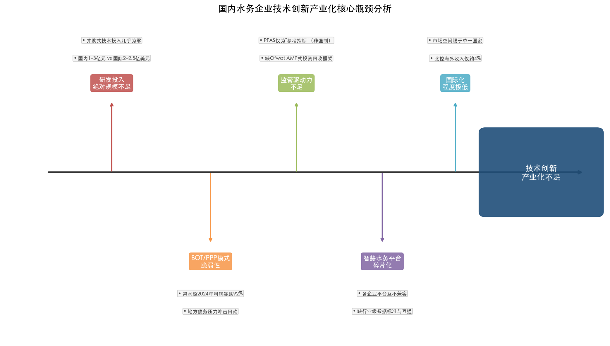

**瓶颈一：研发投入绝对规模严重不足。** 国内头部水务企业年度研发费用 1–3 亿元人民币（约 1,500 万–4,700 万美元），与国际巨头约 2–2.5 亿美元的研发投入以及百亿美元级的并购式技术投入相比，差距超过一个数量级。更关键的是，国内企业几乎不具备通过大规模国际并购获取前沿技术的资本能力与海外整合经验。

**瓶颈二：BOT/PPP 商业模式的脆弱性。** 碧水源 2024 年利润暴跌 92.34% 是这一脆弱性的极端体现。BOT/PPP 模式高度依赖地方政府的支付能力和支付意愿，在宏观经济下行与地方债务压力加大的背景下，项目回款风险显著上升。国际企业通过技术授权、长期运营服务合同与水价联动机制实现了更为稳定的现金流。

**瓶颈三：监管驱动力不足。** 中国既缺乏类似 Ofwat AMP 的长周期监管投资回收框架，也缺乏类似 EPA PFAS 标准的强制合规驱动。水价调整机制僵化（多数城市供水价格数年未调），水务企业难以通过水价传导技术投资成本。管网改造"十四五"资金需求 1,500 亿元主要依赖企业自筹，技术投资的回报路径缺乏制度保障。

**瓶颈四：智慧水务平台碎片化。** 各企业自建数字平台互不兼容，行业层面缺乏统一的数据标准、接口规范与互通机制。这不仅导致重复投资，更限制了数据的跨组织流动与价值释放，与 Veolia Hubgrade 跨国集中式运营平台的模式形成鲜明反差。

**瓶颈五：国际化程度极低。** 北控水务海外收入占比约 4%，碧水源和首创环保的海外业务均处起步阶段。国际化不足直接限制了技术产品的市场承载空间——碧水源膜技术即便在国内市占率超过 70%，其整体营收规模仍不足 Veolia WTS 的四分之一，根本原因在于市场空间受限于单一国家。

## 3.8 综合对比：差距的结构化图景

下图以 1–5 分制雷达图直观呈现国内外水务企业在五大技术领域的产业化进展对比，PFAS 微污染物治理（0.5 vs 4.5）和能源回收与碳中和（1.5 vs 5）两个领域差距最为悬殊，管网漏损控制（3 vs 5）差距相对最小。

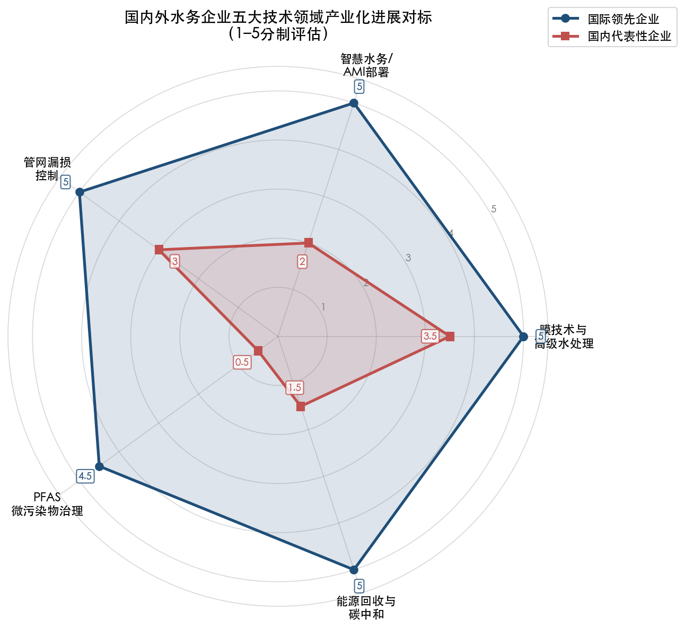

| 对比维度 | 国际领先企业 | 国内代表性企业 | 差距评估 |
|:---|:---|:---|:---|
| 研发投入绝对额 | 约 2–2.5 亿美元/年（Xylem/Veolia） | 约 0.15–0.47 亿美元/年 | 约 5–15 倍 |
| 并购式技术投入 | 累计数百亿美元（Xylem 92 亿、Veolia Suez 104 亿欧元） | 几乎为零 | 不可比 |
| 膜技术营收规模 | Veolia WTS 约 54 亿美元 | 碧水源约 11.7 亿美元 | 约 4.6 倍 |
| 智慧水务平台 | 跨国集中运营（Hubgrade），年度成本节约约 1 亿美元 | 单厂/单项目，互不兼容 | 架构代差 |
| AMI 部署规模 | Xylem 3,500 万端点，Anglian Water 130 万 | 以 AMR 为主，AMI 起步 | 代际差距 |
| PFAS 产业化 | Veolia 33 个运营系统，2030 年目标 11 亿美元 | 几乎空白 | 从零到一 |
| 能源回收 | Veolia 板块 44 亿美元年收入 | 单点示范（高安屯等） | 约 100 倍+ |
| 商业模式 | 技术授权+长期服务+数字收入 | BOT/PPP 为主 | 模式代差 |
| 国际化 | 全球 110+ 国家（Veolia） | 海外收入 <5% | 结构性差距 |

上述对比揭示，国内水务企业与国际领先企业的差距并非单一维度的"技术落后"，而是覆盖研发投入、商业模式、监管环境、市场空间与国际化能力的系统性差距。值得关注的亮点在于管网漏损控制领域——深圳 7.7%、福州 5.3% 的漏损率已达国际先进水平，"十四五"政策推动下全国漏损率正在快速下降。智慧水务市场的高增速（CAGR 22.25%）和膜行业的进口替代进展（国产化率 78%）同样为后续技术攻关提供了有利的市场基础。

精确识别上述差距的维度与量级，是制定有针对性的技术攻关路线图的前提。第 4 章将在此基础上，结合国际经验与国内实际条件，提出以产业化应用为目标的优先技术攻关方向。

# 第4章 国内水务企业技术攻关方向建议

前三章从国际标杆全景排名、商业化深度分析和国内外对标三个层面，完成了对水务技术创新产业化的系统研究。分析表明，国内水务企业与国际领先企业之间的差距并非单一技术维度的落后，而是覆盖研发投入强度、商业模式韧性、监管驱动力度、市场空间拓展和国际化能力的系统性差距。但差距之中亦蕴含机遇：管网漏损控制领域追赶速度最快，智慧水务市场增速远超全球平均水平（CAGR 22.25%），膜行业进口替代率已达 78%。

本章在上述事实基础上，综合技术可行性、市场需求规模、政策导向契合度和国内现有技术基础四个维度，提出以实现技术创新成果产业化应用为目标的五个优先技术攻关方向。每个方向均涵盖技术攻关具体内涵与边界、对标国际先进水平与差距、产业化应用目标场景与预期经济效益、推进路径建议与关键里程碑四部分内容。五个方向的排序逻辑遵循"市场规模 × 技术可行性 × 政策确定性"综合评分框架，优先选择产业化路径最清晰、经济效益可量化的方向。

## 4.1 方向一：行业级智慧水务平台与大规模 AMI 部署

### 4.1.1 技术攻关内涵与边界

本方向的攻关核心并非开发单个智慧水务产品，而在于突破制约行业整体数字化水平提升的三个关键瓶颈：

**第一，行业级数据标准与互通协议。** 第 3 章对比分析揭示，国内智慧水务平台最突出的结构性缺陷在于"碎片化"——各企业自建平台互不兼容，缺乏统一的数据标准和接口规范。攻关重点在于牵头制定涵盖水源—水厂—管网—用户全链条的数据采集、传输、存储和交互标准体系，参照吴忠市智慧水务平台实践中基于《基于窄带物联网（NB-IoT）的智能水表抄表系统通用技术规范》的拓展经验，规范不同厂家远传设备的接入协议。

**第二，从 AMR 向 AMI 的代际跨越。** 中国智能水表渗透率已达约 53%（2024 年），2025 年出货量预计突破 5,200 万台，NB-IoT 在新增智能水表中占比接近 60% [E20供水研究中心](https://www.h2o-china.com/news/361138.html "E20户用智能水表行业研究报告2025")。然而，当前计量仍以"机械表+远传模块"（AMR）为主，超声波和电磁式智能水表应用有限。AMI 相较 AMR 读表速度提升约 1,000 倍、准确率从 97% 提升至 99.97% [Internet of Water](https://internetofwater.org/blog/data-stories/return-on-investment/unearthing-the-hidden-benefits-of-advanced-metering-infrastructure-ami "AMI技术代际对比")，并支持双向通信和实时异常检测。攻关重点在于突破低功耗、高精度超声波/电磁水表核心传感器的国产化，以及面向百万量级端点的 AMI 网络管理平台。

**第三，跨设施集中式数字运营平台。** 对标 Veolia Hubgrade 的全球跨设施集中运营能力——2025 年数字化和 AI 直接创造约 9,200 万欧元（约 1 亿美元）成本节约 [Veolia 2025年报新闻稿](https://www.veolia.com/sites/g/files/dvc4206/files/document/2026/02/Finance_PR_Veolia_2025_results.pdf "Veolia 2025数字化效率增益")，国内攻关方向应聚焦构建覆盖"源—厂—网—站—户"的统一数字底座，实现跨水厂、跨区域的协同优化调度，而非停留在单厂级信息化系统的重复建设。

### 4.1.2 对标差距

| 维度 | 国际先进水平 | 国内现状 | 差距 |
|:---|:---|:---|:---|
| AMI 端点规模 | Xylem 全球 3,500 万端点；SABESP 440 万只 IoT 水表 | 以 AMR 为主，AMI 大规模部署处于起步期 | 代际差距 |
| 平台架构 | Veolia Hubgrade 跨国集中式运营 | 各企业自建、单厂/单项目为主 | 架构代差 |
| 数据变现 | Xylem 服务收入两年+46%，EBITDA 利润率 22.2% | 数据主要用于内部辅助，无对外数据服务 | 模式差距 |
| 行业标准 | 英国 Ofwat AMP 框架提供统一投资回报路径 | 缺乏行业级数据标准与互通机制 | 制度差距 |

### 4.1.3 产业化目标场景与预期经济效益

**目标场景一：城市级 AMI 大规模部署。** 参照 SABESP 440 万只智能水表项目（投资约 7 亿美元）和 Anglian Water 130 万只 AMI 水表部署经验 [TI INSIDE Online](https://tiinside.com.br/en/11/02/2026/sabesp-inicia-maior-projeto-de-iot-do-mundo-para-medicao-de-agua-com-investimento-de-r-38-bilhoes/ "SABESP全球最大IoT项目") [Anglian Water新闻](https://www.anglianwater.co.uk/news/record-breaking-number-of-smart-meters-installed-in-anglian-water-region/ "Anglian Water 130万智能水表")，建议在深圳、福州等数字化基础领先的城市率先开展百万量级 AMI 示范部署，通过实时数据驱动漏损定位和需求管理。粤海水务漏损检测技术已应用于 20 余家自来水公司、年节水逾 4,000 万吨、节省成本 2,000 余万元 [中国水网](https://www.h2o-china.com/news/349293.html "粤海水务漏损检测技术")，在 AMI 数据支撑下经济效益有望实现倍增。

**目标场景二：行业级集中式数字运营平台。** 以北控水务北水云或首创环保 WEAM 为基础，推动平台从"服务自有项目"向"行业级开放平台"升级。世界经济论坛研究表明，数字孪生可将水务维护时间减少 30%、成本减少 25% [World Economic Forum](https://www.weforum.org/stories/2024/11/why-digital-twins-might-transform-the-world-of-water-management/ "WEF水务数字孪生")，这一效益规模为平台化运营提供了充分的经济可行性支撑。

**预期经济效益：** 中国智慧水务（供水领域）市场 2024 年约 306.6 亿元，预计 2029 年突破 837 亿元（CAGR 22.25%）[艾瑞咨询](https://pdf.dfcfw.com/pdf/H3_AP202504151656947858_1.pdf "2025年中国智慧水务行业研究报告")。中国智能水表市场规模 2024 年约 130 亿元，预计 2030 年达 250 亿元 [华经产业研究院](https://m.huaon.com/channel/trend/1077028.html "智能水表市场规模")。行业级平台若能覆盖全国 10% 水厂的集中数字运营，参照 Veolia 数字化每年约 1 亿美元成本节约的规模效应，我们保守估计可释放年度成本节约 20 亿–30 亿元。

### 4.1.4 推进路径与关键里程碑

综合标准建设、示范验证和规模推广三个维度，建议分四个阶段推进：

| 阶段 | 时间窗口 | 关键里程碑 |
|:---|:---|:---|
| 标准先行 | 2026–2027 | 住建部/水利部牵头发布智慧水务数据标准与设备接入协议，深圳鸿蒙生态赋能水务数字化转型提供技术底座参考 |
| 示范部署 | 2027–2028 | 在 3–5 个先进城市完成百万量级 AMI 部署示范，验证投资回报模型 |
| 平台互通 | 2028–2029 | 头部企业平台实现跨企业数据互通，形成行业级数字运营能力 |
| 规模推广 | 2029–2030 | AMI 在全国新增智能水表中占比超 50%，集中式数字运营平台覆盖 500 座以上水厂 |

## 4.2 方向二：高性能膜材料国产化与全谱系水处理技术平台

### 4.2.1 技术攻关内涵与边界

膜技术是水处理领域最具经济价值的核心技术之一。Veolia WTS 2025 年膜技术相关收入达 49.54 亿欧元（约 54 亿美元），构成全球规模最大的水处理技术平台 [Veolia 2025年报新闻稿](https://www.veolia.com/sites/g/files/dvc4206/files/document/2026/02/Finance_PR_Veolia_2025_results.pdf "Veolia 2025 WTS业绩")。国内以碧水源为代表的企业在 MBR 领域已建立显著领先地位（国内市场份额 70%+、日处理规模超 2,200 万吨/天），但技术路线单一、高端产品对进口依赖度较高。攻关重点集中在以下三个层面：

**第一，高端反渗透膜与特种功能膜的国产化突破。** 全球 RO 膜市场由陶氏化学（约 30% 份额）和海德能（约 26% 份额）主导 [沃顿科技/长城证券研报](http://www.cgws.com/cczq/ggdt/ccyj/202201/P020220107556309937395.pdf "膜进口替代空间")。国产反渗透膜市场份额已从 2020 年的约 40% 提升至 2025 年的约 58%，预计 2026 年将进一步提升至 65%；膜材料整体自给率有望在 2026 年突破 80% [绿循网](https://www.lvxunhk.com/newsdetail.aspx?bsid=4173 "2025工业废水治理复盘")。然而，功能性膜材料国产化率仍不足 35%，高端海水淡化 RO 膜（耐高压、抗污染、超低能耗）和医疗级膜（血液透析膜）领域的进口替代空间依然广阔。攻关重点包括：突破高选择性、高通量反渗透膜制备工艺（目标：单支膜元件产水量提升 20%、脱盐率 ≥99.8%）；开发耐极端 pH/高温工况的特种功能膜（服务于半导体超纯水、锂电池废水等高附加值场景）。

**第二，从单一 MBR 走向全谱系水处理技术平台。** 碧水源的核心瓶颈之一是技术路线过度聚焦 MBR。对标 Veolia WTS 覆盖 RO/NF、高级氧化（AOP）、离子交换、水回用和海水淡化的全谱系方案，攻关方向是将现有的 MBR/超滤/纳滤/RO 产品线与高级氧化、电渗析等新兴技术整合，形成面向不同水质场景的组合方案能力。值得关注的是，Veolia 2024 年 2 月投资 1,000 万欧元在常熟建设中国首个离子交换再生工厂 [Veolia水务技术中国](https://www.veoliawatertechnologies.com.cn/zh-hans/xinwen/weiliyashuiwujishujianzaoqizaizhongguodeshougelizijiaohuanzaishenggongchang "Veolia常熟工厂")，这表明国际巨头正在加速抢占国内高端细分市场，国内企业构建全谱系能力的紧迫性日益凸显。

**第三，海水淡化 RO 膜规模化生产成本优化。** 海水反渗透淡化（SWRO）遵循约 15% 的学习率——累计装机每翻一番单位成本降 15%，2030 年平准化供水成本（LCOW）有望从 2015 年的 1.25 USD/m³ 降至 0.77 USD/m³ [Caldera & Breyer, Water Resources Research 2018](https://agupubs.onlinelibrary.wiley.com/doi/full/10.1002/2017WR021402 "SWRO学习曲线")。《海水淡化利用发展行动计划（2021–2025）》目标全国海淡总规模 290 万吨/日以上，布局膜制造、装备制造、水处理药剂三大产业集群 [国家发改委](https://www.ndrc.gov.cn/xxgk/zcfb/ghwb/202106/P020210602537048020841.pdf "海水淡化行动计划")。攻关重点在于国产大尺寸（16 英寸）海淡 RO 膜元件的量产工艺优化和成本控制。

### 4.2.2 对标差距

| 维度 | 国际先进水平 | 国内现状 | 差距 |
|:---|:---|:---|:---|
| 营收规模 | Veolia WTS 约 54 亿美元（2025 年） | 碧水源约 11.7 亿美元（2024 年） | 约 4.6 倍 |
| 技术谱系 | RO/NF/AOP/IX/水回用/海淡全覆盖，44 国部署 | 以 MBR 为核心，RO/NF 处于拓展阶段 | 谱系宽度差距 |
| 高端 RO 膜 | 陶氏/海德能占全球约 56% | 国产 RO 膜份额约 58%，但高端海淡膜进口依赖 | 高端细分差距 |
| 功能膜国产化 | 全谱系自主供应 | 功能性膜材料国产化率 <35% | 结构性短板 |
| 商业模式 | 技术授权+长期运营+全资化释放协同 | BOT/PPP 为主（碧水源 2024 年利润暴跌 92%） | 模式脆弱性 |

### 4.2.3 产业化目标场景与预期经济效益

**目标场景一：高端 RO 膜进口替代。** 中国水处理膜行业市场规模 2024 年达 456 亿元，2025 年预计突破 900 亿元（占全球 35% 以上）[智研咨询](https://finance.sina.com.cn/stock/relnews/cn/2025-09-27/doc-infrwynt9930848.shtml "水处理膜行业发展现状")。若高端海淡 RO 膜和工业特种膜实现进口替代（目标替代陶氏/海德能约 56% 全球份额中的国内部分），仅国内市场即可释放约 100 亿元/年级别的替代空间。沃顿科技作为国产 RO 膜龙头，2024 年膜产品营收已达 10.33 亿元，系全球第二家实现干式膜元件规模化生产的企业，具备进一步向高端产品线突破的技术基础。

**目标场景二：海水淡化工程国产化率提升。** 碧水源已承建青岛董家口（10 万吨/日，2016 年投运）和山东鲁北（15 万吨/日）两个标杆工程 [碧水源2024年报摘要](https://money.finance.sina.com.cn/corp/view/vCB_AllBulletinDetail.php?stockid=300070&id=10863324 "碧水源海水淡化")。全球海水淡化设备市场 2025 年约 200 亿美元，预计 2033 年增长至 427 亿美元（CAGR 10.0%）[Grand View Research](https://www.grandviewresearch.com/industry-analysis/water-desalination-equipment-market "全球海水淡化设备市场")。国内企业在核心膜组件实现国产替代后，海淡工程的整体成本有望再降 15%–20%，将显著提升中国海淡技术在"一带一路"沿线国家的出口竞争力。

**目标场景三：全谱系水处理技术平台服务工业高附加值客户。** 半导体超纯水制备需求同比增长 30%，新能源锂电池含锂废水处理成为焦点。通过整合 MBR/RO/AOP/IX 等技术形成面向半导体、制药、锂电等行业的全谱系解决方案，突破 Veolia 等国际巨头在国内高端工业水处理市场的主导地位。

### 4.2.4 推进路径与关键里程碑

膜材料国产化与全谱系平台建设建议分四个阶段推进：

| 阶段 | 时间窗口 | 关键里程碑 |
|:---|:---|:---|
| 核心材料攻关 | 2026–2027 | 高端海淡 RO 膜和耐极端工况特种膜实验室性能达标，启动中试验证；国产 RO 膜市场份额突破 65% |
| 量产工艺优化 | 2027–2028 | 国产 16 英寸大尺寸海淡 RO 膜实现千万支/年级量产，功能性膜国产化率突破 50% |
| 平台化整合 | 2028–2029 | 以碧水源或沃顿科技为核心，通过内生研发与外延并购形成覆盖 MBR/RO/NF/AOP/IX 的全谱系技术平台 |
| 国际化突破 | 2029–2030 | 在"一带一路"沿线 5–10 个国家建立海淡/工业水处理工程示范，膜产品出口额突破 50 亿元 |

政策层面，《关于加快发展节水产业的指导意见》（2024 年 6 月）已明确提出突破高性能膜材料关键共性技术 [智研咨询](https://finance.sina.com.cn/stock/relnews/cn/2025-09-27/doc-infrwynt9930848.shtml "节水产业指导意见")，"十五五"规划建议将"加强原始创新和关键核心技术攻关"提升至战略高度 [广东省城镇供水协会](https://gdwsa.com/Item/16585.aspx "十五五规划建议看水务新机遇")，为该方向提供了高度确定的政策支撑。

## 4.3 方向三：管网漏损精准检测与智能压力管控系统

### 4.3.1 技术攻关内涵与边界

管网漏损控制是国内水务技术创新中追赶速度最快、产业化条件最成熟的领域。全国城市公共供水管网漏损率已从 2021 年的 12.68% 降至 2024 年的约 10% [国新办](http://www.scio.gov.cn/live/2024/33621/index.html "国务院政策吹风会")，深圳达到 7.7%（2022 年）、福州达到 5.3%（2023 年），均已跻身国际先进水平 [深圳环境水务集团2022社会责任报告](https://www.sz-water.com.cn/prod-api/profile/upload/2023/06/19/%E6%B7%B1%E5%9C%B3%E5%B8%82%E7%8E%AF%E5%A2%83%E6%B0%B4%E5%8A%A1%E9%9B%862022%E7%A4%BE%E6%8A%250615_20230619171403A010.pdf "深圳漏损率7.7%") [中国水网](https://www.h2o-china.com/news/349570.html "福州漏损率5.3%")。然而，从先进城市到中小城市的推广复制仍面临技术和制度双重挑战。攻关重点集中在以下三个层面：

**第一，AI 驱动的管网漏损精准定位系统。** 对标 Anglian Water 将 AMI 数据与 AI 管网模型结合的"由外到内"策略——先解决用户侧漏损（已累计识别超 60 万处）再推进管网漏损定位 [Anglian Water新闻](https://www.anglianwater.co.uk/news/record-breaking-number-of-smart-meters-installed-in-anglian-water-region/ "Anglian Water策略") [Computer Weekly](https://www.computerweekly.com/news/366609457/How-digital-models-help-Anglian-Water-manage-leaks "Anglian Water数字模型")，国内攻关方向应聚焦于开发适配中国管网特征（管材多样性高、建设年代跨度大、基础数据完整度低）的 AI 漏损检测与定位算法，整合声学检测、压力波分析和流量平衡三种技术路线。

**第二，DMA 精细化管理与智能压力调控一体化系统。** 无锡 DMA 建设使漏损率从 9.3% 降至 8.2% [中国水网](https://www.h2o-china.com/news/349570.html "无锡DMA案例")，验证了分区计量管理的有效性。然而，全国 DMA 覆盖率整体偏低，攻关方向是开发低成本、标准化的 DMA 部署方案，集成智能压力调控阀和区域流量计，实现分区压力优化和夜间最小流量自动分析。

**第三，供水管网数字孪生系统。** Severn Trent Water 的数字孪生工具同时服务于运行优化和资产全生命周期评估 [Sand Technologies](https://www.sandtech.com/digital-twin-project-with-severn-trent-water-wins-net-zero-hub-award/ "Severn Trent数字孪生获奖")；麦肯锡 2025 年研究指出，数字孪生可使基础设施项目资本效率和运营绩效提升 20%–30% [McKinsey](https://www.mckinsey.com/industries/public-sector/our-insights/digital-twins-boosting-roi-of-government-infrastructure-investments "麦肯锡数字孪生研究")。福州已率先引进供水管网数字孪生系统，2017 年在全国首批商业化部署 NB-IoT 智能水表。攻关方向是以福州模式为基础，开发适用于不同规模城市的标准化管网数字孪生产品，降低中小城市的部署门槛和运维成本。

### 4.3.2 产业化目标场景与预期经济效益

**核心经济测算：** 若全国漏损率在当前基础上再降 2 个百分点至约 8%，以 2024 年全国城市供水总量约 625 亿 m³ 估算，年减少水资源浪费约 12.5 亿 m³；以综合供水成本 3 元/吨计，年节约直接经济价值约 37.5 亿元 [中国水网](https://www.h2o-china.com/news/349570.html "漏损控制经济效益")。上述测算尚未涵盖管网维护成本降低、供水设施压力缓解和延迟扩容投资等间接收益。

**投资规模参照：** "十四五"期间全国供水管网改造资金总需求约 1,500 亿元（年均 300 亿元）[中国水网](https://www.h2o-china.com/news/349570.html "管网改造资金需求")。英国 Ofwat AMP8（2025–2030）批准全行业约 880 亿英镑投资，其中漏损削减专项 5.45 亿英镑、智能水表投资约 15.6 亿英镑 [Fairgrove Partners](https://fairgrovepartners.com/insight/pr24-and-amp8-a-rising-tide-of-opportunity-for-water-sector-suppliers-2/ "Ofwat AMP8投资规模")。国内若借鉴 Ofwat 模式建立管网投资的长周期回收机制，可大幅提升社会资本的参与意愿和技术投资的确定性。

**目标场景：** 在全国 50 个以上城市推广"AMI+DMA+数字孪生"集成方案，以技术服务输出而非 BOT 模式切入，形成可复制的商业模型。粤海水务漏损检测技术已成功推广至 20 余家自来水公司的经验表明，技术输出模式在管网领域具备可行性。

### 4.3.3 推进路径与关键里程碑

管网漏损控制的推进路径强调技术验证与制度创新并行：

| 阶段 | 时间窗口 | 关键里程碑 |
|:---|:---|:---|
| 技术验证 | 2026–2027 | AI 漏损定位算法在深圳/福州/无锡完成不少于 3 个 DMA 级别验证，定位精度达到 50 米以内 |
| 标准化产品 | 2027–2028 | "AMI+DMA+数字孪生"一体化方案形成标准化产品，发布技术导则 |
| 规模推广 | 2028–2029 | 在 50 个以上城市部署，全国漏损率降至 8.5% 以下 |
| 制度突破 | 2029–2030 | 探索建立类似 Ofwat AMP 的分周期管网投资回收机制，将漏损率与水价调整挂钩 |

住建部和发改委联合要求 2025 年漏损率控制在 9% 以内 [新华社](http://www.news.cn/politics/2022-02/04/c_1128330675.htm "漏损率9%目标")，"十五五"规划建议进一步强调"加快建设现代化水网，增强城乡供水保障能力" [广东省城镇供水协会](https://gdwsa.com/Item/16585.aspx "十五五规划建议")，政策方向明确且持续加码。

## 4.4 方向四：新污染物（PFAS/微污染物）检测与治理技术体系

### 4.4.1 技术攻关内涵与边界

PFAS 治理是第 2 章总结的"监管驱动是第一推动力"规律的典型体现。中国虽然是全球最大氟化合物制造消费国（含氟聚合物产量占全球约 64.9%），PFAS 已在国内水体普遍检出 [中国水网](https://www.h2o-china.com/news/361886.html "中国PFAS现状")，但当前监管力度远低于欧美——GB 5749-2022 仅将 PFOA/PFOS 列为"参考指标"（非强制），水务企业尚不面临法定合规压力。然而，多重信号表明中国 PFAS 监管升格为大概率趋势：

- 生态环境部 2023 年 12 月发布 HJ 1333/1334-2023 两项 PFAS 监测方法标准（2024 年 7 月实施），为后续强制监管奠定方法学基础 [金杜律师事务所](https://www.kwm.com/cn/zh/insights/latest-thinking/regulatory-status-of-pfas-in-china-and-risk-prevention-of-corporate-legal-liabilities.html "PFAS监测标准")；
- 四川省 2024 年率先发布全国首个化工园区全氟化合物排放限值地方标准（PFOA 0.05mg/L、PFOS 不得检出）[中国水网](https://www.h2o-china.com/news/361886.html "四川PFAS地方标准")；
- 2025 年 11 月《优先控制化学品名录（第三批）》拟纳入 24 类含 PFAS 物质 [REACH24H](http://www.reach24h.com/chemical/industry-news/priority-chemicals-list "优先控制化学品第三批")；
- 国际参照效应：美国 3M PFAS 和解金 103 亿美元、EPA 强制合规标准（PFOA/PFOS 4.0 ppt MCL，2029 年前合规）[US EPA](https://www.epa.gov/sdwa/and-polyfluoroalkyl-substances-pfas "EPA PFAS标准")，欧盟 2036 年 PFAS 处理总支出预计达 36 亿欧元 [Bluefield Research](https://www.bluefieldresearch.com/ns/new-eu-pfas-limits-activate-e3-6-billion-drinking-water-treatment-opportunity/ "欧洲PFAS市场36亿欧元")。

攻关重点集中在以下两个层面：

**第一，ppt 级 PFAS 快速检测技术国产化。** PFAS 治理的前提是精准检测。目前国内 PFAS 检测主要依赖进口液相色谱—串联质谱（LC-MS/MS）设备，检测成本高、通量低。攻关方向是开发适用于现场快速筛查的低成本检测设备（目标：检测下限 ≤10 ppt、单样本检测时间 ≤30 分钟），以及面向水厂在线连续监测的 PFAS 传感器。

**第二，PFAS 全链条处理与销毁技术体系。** 对标 Veolia BeyondPFAS 整合 GAC（活性炭吸附）、IX（离子交换）、RO（反渗透）和高温焚烧销毁的端到端方案——该方案已在美国运营 33 个处理系统、2030 年目标实现 10 亿欧元（约 11 亿美元）年收入 [Smart Water Magazine](https://smartwatermagazine.com/news/veolia/veolia-aims-eu1b-revenue-2030-pioneering-pfas-treatment-micropollutants "Veolia BeyondPFAS目标")。国内攻关方向是整合已有的活性炭吸附和膜分离技术优势，突破 PFAS 浓缩液的高效销毁技术（电化学氧化、超临界水氧化等），形成从检测到处理到残余物无害化的全链条国产技术体系。

### 4.4.2 产业化目标场景与预期经济效益

**市场规模预估：** 参照 Bluefield Research 欧洲十国 PFAS 处理总支出到 2036 年达 36 亿欧元的预测模型，考虑中国供水规模约为欧洲十国的 3–4 倍、氟化合物生产和消费规模全球最大，一旦中国将 PFAS 升格为强制监管指标，我们判断中国饮用水 PFAS 治理市场规模有望达数十亿元至百亿元/年量级。当前的监管窗口期（预计 2–5 年内逐步收紧）为技术储备提供了宝贵的战略机遇。

**目标场景一：饮用水水源地和自来水厂 PFAS 达标处理。** 在四川等已出台地方标准的区域率先开展示范工程，验证技术可靠性和处理成本。

**目标场景二：化工园区 PFAS 废水专项治理。** 氟化工集中区域（山东、江苏、浙江、四川等）的含 PFAS 工业废水处理是短期内最确定的产业化应用场景。

**目标场景三：PFAS 检测设备与试剂的国产化供应。** 随着 HJ 1333/1334-2023 监测标准实施和监测覆盖面扩大，PFAS 检测设备和耗材需求将持续增长。

### 4.4.3 推进路径与关键里程碑

鉴于 PFAS 治理的监管驱动特征，推进路径需兼顾技术储备的前瞻性与标准衔接的及时性：

| 阶段 | 时间窗口 | 关键里程碑 |
|:---|:---|:---|
| 技术储备 | 2026–2027 | 完成 ppt 级 PFAS 快速检测设备样机开发和实验室验证；GAC/IX/RO 组合工艺完成中试 |
| 示范工程 | 2027–2028 | 在四川、山东等 PFAS 重点区域完成 3–5 个工业废水/饮用水源地示范工程 |
| 标准衔接 | 2028–2029 | 配合生态环境部推进 PFAS 强制监管标准出台，同步完善处理技术导则和工程设计规范 |
| 规模化应用 | 2029–2030 | 形成年处理能力百万吨级的 PFAS 治理产业化能力，检测设备国产化率超 50% |

该方向的核心策略可概括为"在监管窗口期完成技术储备，在强制合规期到来时抢占先发优势"。Veolia BeyondPFAS 的成功经验充分表明，在监管驱动型市场中，率先构建端到端技术能力的企业将获得远超市场平均水平的份额和利润率。

## 4.5 方向五：污水处理能源回收与碳中和运行技术

### 4.5.1 技术攻关内涵与边界

污水处理能源回收是将传统市政成本中心转变为能源和资源回收利润中心的关键路径。Veolia 生物能源/能效板块 2025 年收入达 40.21 亿欧元（约 44 亿美元），充分证明了该领域的商业化潜力 [Veolia 2025年报新闻稿](https://www.veolia.com/sites/g/files/dvc4206/files/document/2026/02/Finance_PR_Veolia_2025_results.pdf "Veolia 2025生物能源板块")。国内虽有高安屯再生水厂（能源自给率 100%、年降运行费 4,700 万元）等标杆案例 [中国建筑业协会](http://cces.net.cn/html/tm/29/38/69/content/7629.html "高安屯能源自给率100%")，但整体仍处于单点示范阶段。攻关重点集中在以下三个层面：

**第一，热水解预处理（THP）技术国产化与规模化推广。** Cambi ASA 占据中国以外全球 THP 产能约 90%，THP 可使沼气产量提升 50%、消化器处理能力扩大至传统工艺的 3 倍 [Cambi](https://www.cambi.com/process "Cambi THP技术")。国内少数污水厂已引进 THP 技术，但设备高度依赖进口、运维成本较高。攻关方向是实现 THP 核心设备（高温高压反应器、热回收系统）的国产化，将设备成本降低 30%–40%，推动 THP 在日处理 10 万吨以上大型污水厂中的规模化应用。

**第二，污水源热泵技术规模化供暖应用。** Veolia Ecothermal Grid 利用污水恒温特性和热泵技术提供低碳供暖，波兰波兹南项目实现 25% CO₂ 减排、年替代 30 万吨煤炭 [Veolia 2025年报](https://www.otcmarkets.com/stock/VEOEF/news/Veolia-Environnement-2025-a-Pivotal-Year-Record-Results-Above-Guidance?e&id=3414894 "Veolia Ecothermal Grid")。中国北方集中供暖面积超 200 亿 m²，污水源热泵若能替代 2%–3% 的供暖需求，市场规模可达百亿元/年量级。攻关方向是解决污水源热泵在低温（<10°C）和高浊度工况下的效率衰减问题，开发适合北方城市冬季严寒工况的高效热泵机组。

**第三，"光伏+沼气发电+智能调度"综合能源管理系统。** 整合厂内光伏发电、沼气热电联产和智能用能调度三大要素，实现能源自给率最大化。北京高安屯再生水厂通过沼气发电、光伏和水源热泵的组合方案实现 100% 能源自给，年降运行费 4,700 万元。攻关方向是将该成功模式标准化和模块化，适配不同规模和气候条件的污水处理厂，降低复制推广的工程门槛。

### 4.5.2 对标差距与经济效益估算

中国污水处理厂厌氧消化能源自给率约 30%–40%，欧洲先进案例可达 96.9%，芬兰 Kakolanmäki 污水厂通过余温热能回收甚至实现碳中和率 333%（净能源输出为自身消耗的 3.3 倍）[中国城镇供水排水协会](https://www.cuwa.org.cn/category/guojijiaoliu/4142.html "能源自给率对比")。全国城镇污水处理全过程碳排放约 3,416 万吨 CO₂（2020 年），碳抵消量仅 769.1 万吨 [中国水网/张辰](https://www.h2o-china.com/column/1527.html "碳排放3416万吨")，减碳潜力巨大。

**核心经济测算：** 全国 4,000 余座万吨/日以上污水处理厂中，若 20%（约 800 座）实现能源自给率从约 30% 提升至 80%，以单厂年均节电约 500 万 kWh、电价 0.6 元/kWh 估算，年节约电费约 24 亿元。叠加污水源热泵供暖替代收入和碳交易收入，综合经济效益预计可达数十亿元/年。

发改委、住建部和生态环境部联合发布《关于推进污水处理减污降碳协同增效的实施意见》（2023 年 12 月），明确到 2025 年建成 100 座能源资源高效循环利用的绿色低碳标杆厂，地级以上缺水城市再生水利用率达 25% 以上 [国家发改委](https://www.ndrc.gov.cn/xxgk/jd/jd/202312/t20231229_1363010.html "减污降碳实施意见")。"十五五"期间，绿色低碳转型作为规划建议的核心主线之一，明确要求"深入打好碧水保卫战"，污水处理能源回收预计将获得更强的政策推动力 [广东省城镇供水协会](https://gdwsa.com/Item/16585.aspx "十五五规划建议")。

### 4.5.3 推进路径与关键里程碑

能源回收方向的推进路径以设备国产化为起点，逐步向标准化复制和供暖市场突破延伸：

| 阶段 | 时间窗口 | 关键里程碑 |
|:---|:---|:---|
| 技术国产化 | 2026–2027 | THP 核心设备国产化样机完成工程验证，设备成本较进口降低 30% 以上 |
| 示范推广 | 2027–2028 | 在 10 座以上大型污水厂部署"THP+光伏+沼气+智能调度"综合能源系统，能源自给率达 80%+ |
| 标准化复制 | 2028–2029 | 形成标准化设计方案和运维体系，在 100 座以上污水厂推广应用 |
| 供暖突破 | 2029–2030 | 北方城市污水源热泵供暖示范工程覆盖 5 个以上城市，年替代常规供暖面积 1,000 万 m² 以上 |

## 4.6 五大方向的综合评价与优先排序

五个方向并非孤立的技术攻关任务，而是相互关联、能够形成协同效应的技术体系。AMI 部署（方向一）产生的数据是管网漏损精准检测（方向三）的基础输入，膜技术突破（方向二）为 PFAS 治理（方向四）中的膜分离环节提供核心材料，能源回收（方向五）则依赖数字化平台（方向一）实现智能调度优化。

从产业化条件成熟度和经济效益确定性两个维度综合评价，五个方向的优先排序如下：

| 优先级 | 攻关方向 | 市场规模 | 技术可行性 | 政策确定性 | 产业化路径清晰度 |
|:---:|:---|:---|:---|:---|:---|
| ★★★★★ | 行业级智慧水务平台与 AMI 部署 | 极大（837 亿元/2029） | 高（国内已有产业基础） | 高（"十五五"+鸿蒙生态） | 高（商业模式已验证） |
| ★★★★★ | 高性能膜材料国产化 | 极大（900 亿元+/年） | 高（碧水源/沃顿已具备基础） | 高（节水产业指导意见） | 高（进口替代路径清晰） |
| ★★★★☆ | 管网漏损精准检测 | 大（37.5 亿元/年节约） | 高（深圳/福州已验证） | 高（漏损率硬指标） | 中高（需制度配套） |
| ★★★★☆ | 污水处理能源回收 | 大（24 亿元/年+供暖市场） | 中高（THP 需国产化） | 高（减污降碳政策） | 中（需标准化推广） |
| ★★★☆☆ | PFAS 检测与治理 | 潜力大（强制合规后数十亿元+） | 中（检测设备需攻关） | 中（尚无强制标准） | 中低（依赖监管节奏） |

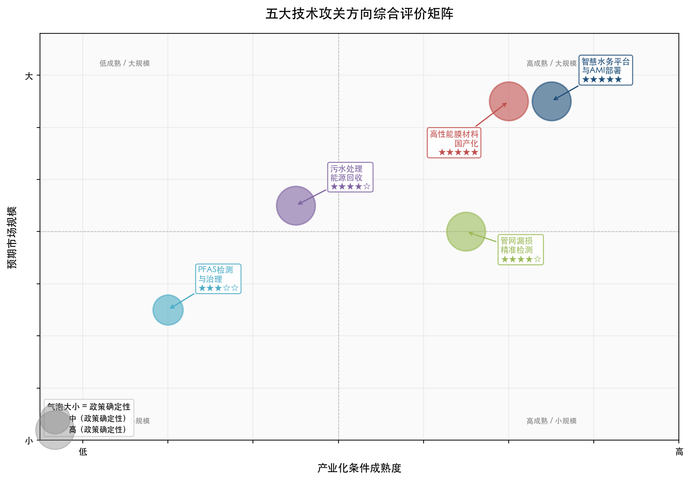

上图以产业化条件成熟度（横轴）和预期市场规模（纵轴）构建二维矩阵，气泡大小反映政策确定性强弱。智慧水务平台与膜材料国产化处于"高成熟/大规模"象限，PFAS 治理因监管不确定性暂居"低成熟/小规模"区域，但其战略储备价值不可忽视。

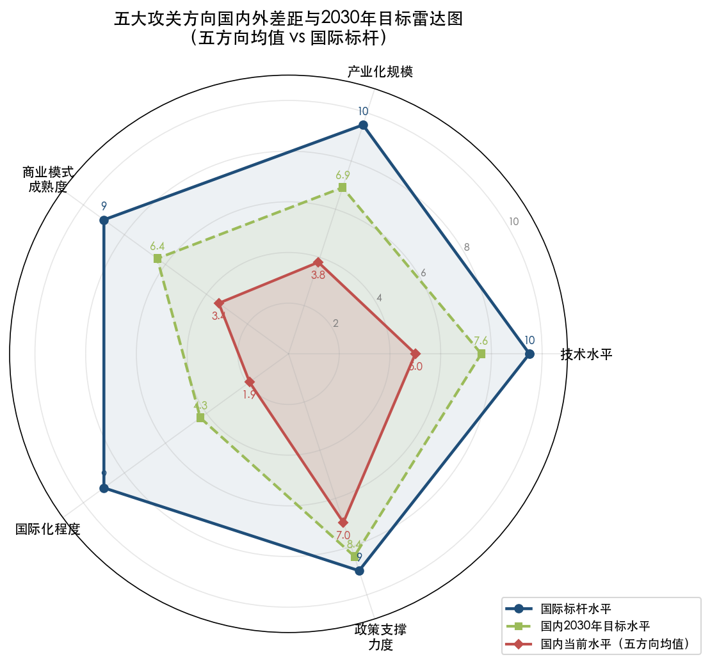

上图以技术水平、产业化规模、商业模式成熟度、国际化程度和政策支撑力度五个维度，对比国际标杆水平、国内当前水平和 2030 年目标水平。国际化程度和商业模式成熟度是当前差距最大的两个维度，政策支撑力度差距相对最小，这为技术攻关提供了有利的制度环境。

PFAS 治理方向虽在当前优先级中相对靠后，但鉴于全球监管收紧趋势的确定性和中国作为最大氟化合物生产消费国的特殊地位，我们强烈建议将其作为"战略储备"方向纳入攻关体系。一旦中国升格 PFAS 为强制监管指标，拥有技术储备的企业将获得显著的先发优势——Veolia BeyondPFAS 在美国市场的经验已充分证明了这一逻辑。

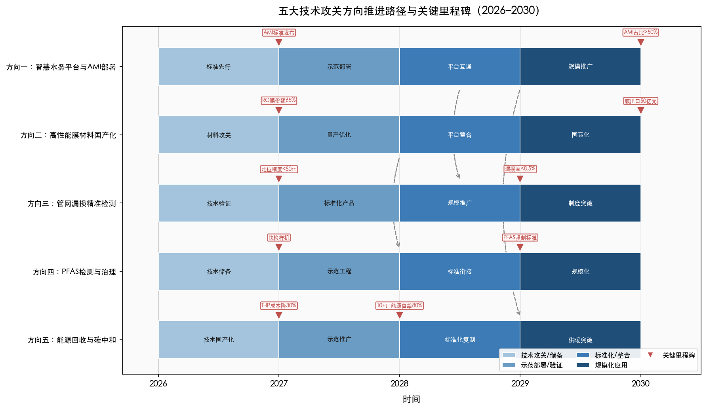

上图以 2026–2030 年为时间轴，展示五个方向从技术攻关/储备到规模化应用的四阶段推进路径。虚线箭头标注了方向间的关键依赖关系：AMI 数据驱动管网漏损检测、膜材料支撑 PFAS 治理、智慧平台赋能能源回收优化调度。

综上，以上五个方向既立足于国内水务企业的现有技术基础和市场条件，又系统对标国际领先企业的成功经验和产业化规律。核心逻辑是：以智慧水务平台和膜材料国产化为"双轮驱动"，以管网漏损控制和能源回收为"效益锚点"，以 PFAS 治理为"战略储备"，形成覆盖水务全价值链的技术攻关布局。在推进过程中，应借鉴国际巨头"并购整合+服务转型+监管驱动"的产业化三大支柱，同步推动商业模式从 BOT/PPP 向技术服务输出和数字化运营转型，方能实现技术创新成果的真正产业化落地与经济效益释放。

# 结论与风险提示

## 核心结论

**结论一：国际水务技术创新产业化的核心引擎是"监管驱动+并购整合+服务转型"三位一体模式。** Top 10 成果的系统分析表明，没有一项成功的大规模产业化案例仅靠技术先进性本身驱动。Veolia 和 Xylem 均以百亿美元级并购为技术获取主通道，在 Ofwat AMP、EPA PFAS 标准等监管框架提供的长周期投资确定性下，通过从设备销售向经常性服务收入转型实现盈利质量的跃升。这一模式对国内水务企业的启示在于：技术攻关必须同步推进商业模式升级和监管制度完善，三者缺一不可。

**结论二：国内水务企业与国际领先企业的差距是系统性的，但并非不可弥合。** 差距覆盖研发投入强度（约 10 倍量级差）、商业模式韧性（BOT/PPP 脆弱性 vs 技术服务/数字收入稳定性）、监管驱动力度（缺乏类 Ofwat 长周期投资回收框架和类 EPA 强制合规标准）、市场空间（国际化程度极低）和并购整合能力五个维度。但国内在管网漏损控制（深圳 7.7%、福州 5.3%）、MBR 膜技术（碧水源国内市占率 70%+）和智慧水务市场增速（CAGR 22.25%，远超全球平均水平）等领域已具备可观的追赶基础。

**结论三：五个优先攻关方向构成一个相互依赖、协同增效的技术体系。** 行业级智慧水务平台与 AMI 部署（方向一）产生的数据是管网漏损精准检测（方向三）的基础输入；高性能膜材料国产化（方向二）为 PFAS 治理（方向四）中的膜分离环节提供核心材料；能源回收技术（方向五）依赖数字化平台实现智能调度优化。孤立推进任何单一方向的经济效益将显著低于体系化推进。

**结论四：商业模式转型的紧迫性不亚于技术突破本身。** 碧水源 2024 年利润暴跌 92.34% 是对 BOT/PPP 模式脆弱性的极端警示。北控水务、首创环保已在 2024 年启动轻资产转型，但进程仍处起步阶段。参照 Xylem 从设备销售向服务收入转型后 EBITDA 利润率从 15.2% 跃升至 22.2% 的经验，国内企业应加速从"建设-运营项目公司"向"技术产品与服务输出"转型，建立以经常性服务收入和数字化运营为核心的盈利模式。

**结论五：PFAS 治理是当前确定性最高的战略储备方向。** 中国作为全球最大的氟化合物生产消费国，PFAS 升格为强制监管指标的方向确定、时间可期。生态环境部已发布监测方法标准，四川省率先出台地方排放限值，优先控制化学品名录正在扩容。参照欧洲十国 PFAS 处理支出 2036 年达 36 亿欧元的预测，中国强制合规后的市场规模有望达数十亿至百亿元/年。在监管窗口期完成技术储备的企业将在合规期到来时获取显著先发优势。

## 风险提示

**局限一：经济收益数据的可比性受限。** Top 10 排名中，排名前 4 项及第 8 项的经济收益数据来源于企业年报分部披露，可信度较高；但第 5 项（BeyondPFAS）为企业战略目标值，第 6、7、9、10 项以资本投入规模和已披露的效率指标为参照，直接年度营收贡献尚未独立披露。不同企业的收入分部口径、成本节约核算方式和币种折算标准存在差异，排名结果应作为量级参考而非精确排序。

**局限二：国内企业数据披露深度不足。** 粤海水务和深圳环境水务集团作为非上市或有限披露企业，财务数据获取受限。北控水务中国子公司的研发费用数据来源于科创债募集说明书而非合并报表，可能低估集团整体研发投入。国内企业的技术创新产业化成效缺乏类似国际企业年报分部披露的细粒度数据支撑，对标分析的精度受到制约。

**局限三：监管政策演进具有不确定性。** 五个攻关方向中，PFAS 治理方向的产业化前景高度依赖中国 PFAS 监管升格的时间节奏和力度。水价调整机制的改革进程、"十五五"规划中水务技术投资的具体安排、以及类 Ofwat 长周期投资回收框架在中国落地的可能性，均存在政策不确定性。本报告基于现有政策信号做出的趋势判断可能因政策变化而需修正。

**局限四：并购整合路径的适用性需审慎评估。** 国际经验表明并购整合是缩短技术产业化周期的主要路径，但国内水务企业在国际并购的资本能力、跨境整合经验和海外市场准入资质方面与 Veolia、Xylem 差距巨大。本报告建议的技术攻关路径以内生研发和国内市场拓展为主，对并购整合路径的可操作性分析有限。

**局限五：技术成本与效益估算基于现有参数外推。** 报告中涉及的经济效益测算（如全国漏损率降低 2 个百分点节约 37.5 亿元/年、800 座污水厂能源自给率提升至 80% 年省电费 24 亿元等）均基于当前单价和技术参数的静态估算，未充分考虑技术成本下降、水价调整、能源价格波动和碳交易市场发育等动态因素。实际产业化经济效益可能因上述变量变化而偏离估算值。
