# 执行摘要

时幅效应（time walk）是电子学读出系统中因信号幅度变化而引入系统性时间偏移的关键物理效应，其修正精度直接制约着飞行时间正电子发射断层扫描（TOF-PET）、核物理飞行时间测量以及高能物理大型实验定时子系统的性能极限。传统时幅修正方法——包括恒比定时甄别器（CFD）、前沿定时配合查表修正（LED+TWC）、过阈时间修正（TOT）及双阈值法——依赖预设参数化函数（如 $1/\sqrt{ADC}$、对数函数）近似实际物理过程，在非线性残差、多通道一致性（如 ALICE TOF 约 15 万通道、CMS BTL 约 10 万通道）、环境敏感性及 ASIC 延迟线实现困难等方面面临固有瓶颈。

本报告系统调研了 AI/ML 算法能否提升现有电子学读出时幅修正方法，基于 2018–2026 年间已发表的代表性实验成果，从传统方法物理基线、AI/ML 方法论图谱、实验性能基准、硬件部署路径与开放问题五个维度展开深度分析，核心发现如下：

**AI 方法可带来 0–30% 的符合时间分辨率（CTR）改善，改善幅度由三个因素的组合效应决定。** 第一，闪烁体速度——慢闪烁体（如 BGO，衰减时间约 300 ns）场景下 CNN 可将 CTR 从 157 ps 改善至 115 ps（改善 26%），而快闪烁体（LSO/LYSO，衰减时间约 40 ns）场景下仅 1–3%。第二，晶体长度——BGO 短晶体（3 mm）CNN 增益为 11%，长晶体（20 mm）不足 1%。第三，读出信息丰度——ASIC 离散读出系统中梯度提升决策树（GBDT）方法可获 20–29% CTR 改善（如 LSO 4×4 阵列从 304 ps 改善至 216 ps），而高频完整波形读出下额外改善空间有限。

**三条技术路线已形成差异化格局。** 端到端波形级 CNN/Transformer 方法（Berg & Cherry 2018, Feng 2024, Muhashi 2024）在高频示波器读出条件下定时精度最高（185–189 ps CTR），但依赖高速示波器且模型黑箱性强；残差物理 + GBDT 方法（Naunheim 2023–2025）在 ASIC 读出系统中工程可行性最高——可解释性强（SHAP 分析验证物理一致性）、训练数据采集仅需约 3 分钟（较早期方案加速约 1,000 倍）、模型复杂度低（树深仅 4，16 叶节点/树），且可通过 conifer 工具在 FPGA 上以约 60 ns 延迟运行；无标签物理约束方法（Ai 2023）完全不依赖已知时间标签，在缺乏精确参考时钟的场景下具有独特价值。

**硬件部署工具链日趋成熟但闭环验证仍为空白。** hls4ml（神经网络）和 conifer（决策树）两大开源框架已覆盖 AMD、Intel、Siemens 三大 FPGA 厂商，MLP 推理延迟 12–24 ns，BDT 推理延迟约 60 ns，均可满足 PET 实时读出（约 2 μs 事件间隔）和高能物理 L1 触发（约 100 ns 窗口）的约束。PulseDL-II 专用 SoC 在 FPGA 验证平台上达到 60 ps 时间分辨率。然而，截至 2026 年 3 月，尚无已发表的在真实 DAQ 环境中完成 ML 定时推理闭环验证的案例。

**AI 的本质定位为"信息提取优化器"而非"物理极限突破者"。** 基于多元 Cramér-Rao 下界（CRLB）的理论分析表明，AI 方法的核心价值在于缩小实际性能与理论极限之间的差距；当传统方法已充分利用信号中的定时信息（信息饱和场景）时，AI 的贡献趋近于零。面向 10 ps CTR 路线图，AI 方法无法突破闪烁体本征参数决定的物理极限，但在次优读出条件下的性能恢复、元闪烁体复杂信号解析以及大规模系统自动化校准中将持续发挥核心工程价值。泛化性不足（所有验证均锁定于单一配置）、逐事件不确定性量化缺失和社区标准化空白是当前最突出的三项开放挑战。

# 第1章 电子学读出时幅修正的物理基础与传统方法

在核物理与粒子物理实验、正电子发射断层扫描（PET）以及各类飞行时间（TOF）测量系统中，精确的时间标记是实现高质量物理测量的基石。当探测器信号经由电子学读出系统转化为数字时间信息时，信号幅度的变化会引入系统性的时间偏移——即"时幅效应"（time walk）。这一效应长期以来制约着多种定时测量的精度极限，其修正技术的演进也构成了电子学读出领域的核心课题之一。本章从时幅效应的物理成因出发，系统梳理恒比定时（CFD）、前沿定时配合查表修正（LED+TWC）、过阈时间修正（TOT）及双阈值法等传统时幅修正（time-walk correction, TWC）方法的技术原理与性能边界，建立当前主流实验中传统方法所达到的时间分辨率基线，为后续章节评估 AI/ML 方法的改进潜力提供定量参照。

## 1.1 时幅效应的物理成因与数学描述

### 1.1.1 时幅效应的基本机制

时幅效应是使用前沿定时甄别器（LED, Leading Edge Discriminator）时，由于信号幅度差异导致阈值交叉时间产生系统性偏移的现象。当不同幅度的脉冲通过固定阈值的比较器时，幅度较大的脉冲比幅度较小的脉冲更早越过阈值，造成时间标记的系统性漂移。在 Jefferson Lab CLAS12 中央飞行时间探测器（CTOF）的实验中，这一效应的典型偏移量级可达数百皮秒（ps）[JLab CTOF技术报告](https://www.jlab.org/Hall-B/ctof/notes/2015-006.pdf "CLAS12 CTOF Time-Walk Corrections, 2016")。

时幅效应的根源在于信号前沿斜率与噪声的竞争关系。定时抖动（timing jitter）的基本物理表达式为：

$$\sigma_t = \frac{e_n}{dV/dt}$$

其中 $e_n$ 为叠加在信号上的噪声电压幅度，$dV/dt$ 为信号前沿越过甄别器阈值时的斜率。这一公式揭示了一个关键事实：时间分辨率的品质因数取决于**斜率噪声比**（slope-to-noise ratio），而非通常意义上的信号噪声比 [ORTEC快速定时甄别器导论](https://www.ortec-online.com/-/media/ametekortec/other/fast-timing-discriminator-introduction.pdf "ORTEC Fast-Timing Discriminator Introduction")。在闪烁体计数器中，信号幅度不同但上升时间基本恒定，因此较小幅度的脉冲在阈值处的斜率更低、定时抖动更大，同时系统性地晚于大幅度脉冲触发阈值。

图 1-1 以双面板形式直观展示了时幅效应的产生机制与恒比定时（CFD）的补偿原理。左面板中，三个不同幅度的脉冲越过固定阈值时产生明显的时间偏移（time walk）；右面板中，经 CFD 合成处理后的信号在不同幅度下过零点基本重合，从而消除了幅度依赖的时间偏移。

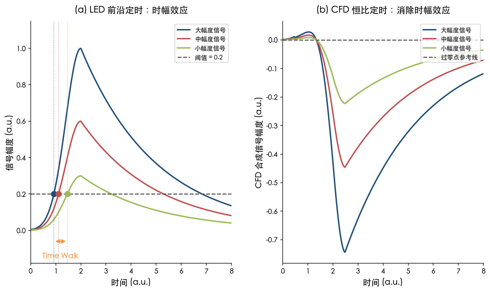

### 1.1.2 经验修正函数与理论定时极限

在闪烁体探测器中，时幅效应与信号幅度之间存在可预测的函数关系。JLab CLAS12 CTOF 实验广泛验证了如下经验修正函数：

$$t_w = \frac{A}{\sqrt{ADC + B}}$$

其中 $A$、$B$ 为逐通道标定常数，$ADC$ 为脉冲幅度的数字化测量值 [JLab CTOF技术报告](https://www.jlab.org/Hall-B/ctof/notes/2015-006.pdf "CLAS12 CTOF Time-Walk Corrections, 2016")。该函数形式对应于闪烁体光子统计涨落对定时精度的影响——光子数与能量沉积成正比，而光子到达时间的统计涨落与光子数的平方根成反比。

从更一般的理论角度审视，对于信号幅度 $V_0$、探测器电荷收集时间 $t_c$ 和放大器上升时间 $t_{ra}$ 构成的系统，Spieler 导出了定时优化公式：$\sigma_t \propto (t_c \cdot t_{ra})^{1/2} \cdot \sqrt{t_c^2 + t_{ra}^2} / V_0$，当 $t_{ra} = t_c$ 时取最小值。Spieler 等人在硅探测器核质谱飞行时间测量中实现了 50 ps FWHM（$\sigma_t$ = 21 ps）的时间分辨率 [Spieler定时讲义](https://www-physics.lbl.gov/~spieler/physics_198_notes/PDF/V-5-Timing.pdf "Introduction to Radiation Detectors and Electronics, V.5 Timing Measurements, 1998")。该结果表明，在信号幅度变化范围有限且噪声受到严格控制的最优条件下，传统模拟电子学已能实现极高的定时精度，但这些理想条件在实际大规模实验中往往难以同时满足。

## 1.2 传统时幅修正方法的技术原理

### 1.2.1 恒比定时甄别器（CFD）

恒比定时甄别器（CFD, Constant Fraction Discriminator）是应对时幅效应最经典的硬件方案。其核心原理是将输入信号分为两路：一路衰减至原信号的 $f$ 倍（$f$ 通常取 0.2–0.4），另一路延迟并反相。两路叠加后形成双极性信号，其过零点对应于原始脉冲上升沿的固定比例触发点。由于过零点时间与脉冲幅度无关（前提是信号形状一致），CFD 从原理上消除了幅度依赖的时幅效应 [ORTEC快速定时甄别器导论](https://www.ortec-online.com/-/media/ametekortec/other/fast-timing-discriminator-introduction.pdf "ORTEC Fast-Timing Discriminator Introduction")。

在 PET 探测器应用中，Du 等人使用 SensL MicroFB 硅光电倍增管（SiPM）配合 2.5×2.5×20 mm³ LYSO 晶体和 ORTEC 584 CFD 模块，在 425–650 keV 能窗下获得符合时间分辨率（CTR）为 442.8 ± 12.8 ps FWHM [Du等IEEE论文](https://pmc.ncbi.nlm.nih.gov/articles/PMC5739333/ "A Time-Walk Correction Method for PET Detectors Based on LED, IEEE TRPMS, 2017")。该数值代表了早期 SiPM 配合商用 CFD 模块的典型性能水平。

CFD 的固有局限主要体现在三个层面。第一，CFD 要求输入信号具有一致的上升时间；当上升时间变化显著时（如大体积锗探测器的电荷收集时间从 50 ns 到 600 ns 变化极大），标准 CFD 无法完全补偿时幅效应，需引入幅度和上升时间补偿定时（ARC timing）技术 [ORTEC快速定时甄别器导论](https://www.ortec-online.com/-/media/ametekortec/other/fast-timing-discriminator-introduction.pdf "ORTEC Fast-Timing Discriminator Introduction")。第二，CFD 在专用集成电路（ASIC）中难以实现，因为精确的延迟线组件在紧凑集成电路工艺中实现困难，非延迟线替代方案需要更多元件。第三，数字 CFD 虽可在 FPGA 中通过可变延迟实现，但需要极高速的模数转换器（ADC），功耗和成本均大幅上升 [Du等IEEE论文](https://pmc.ncbi.nlm.nih.gov/articles/PMC5739333/ "IEEE TRPMS, 2017")。

### 1.2.2 前沿定时配合时幅修正（LED+TWC）

相较于 CFD 的硬件复杂度，前沿定时甄别器（LED）结构极为简单——仅需一个固定阈值的比较器。LED 产生的时间标记存在严重的幅度依赖偏移，但可通过事后测量脉冲幅度（或能量）并以经验函数逐事件修正来大幅抑制。常见的修正方法包括分段三次 Hermite 插值多项式拟合（pchip）和 $1/\sqrt{ADC}$ 函数拟合，统称为查表法或多项式修正。

在量化对比中，LED+TWC 方案展现出超越 CFD 的潜力。Du 等人的实验表明，在 15 keV 低阈值条件下，LED 配合 pchip 拟合修正后 CTR 为 367.3 ± 0.5 ps FWHM（425–650 keV 能窗），优于同条件下 CFD 的 442.8 ± 12.8 ps [Du等IEEE论文](https://pmc.ncbi.nlm.nih.gov/articles/PMC5739333/ "IEEE TRPMS, 2017")。这一结果表明，当修正函数的拟合质量足够高且阈值足够低时，LED+TWC 可以超越 CFD 的性能。

然而，LED 方法对阈值设置极为敏感。同一实验中，当阈值提升至 300 keV 时，LED 的 CTR 急剧劣化至 3874 ± 41.5 ps FWHM（未修正）和 2716.8 ± 4.7 ps FWHM（修正后），而 CFD 在不同阈值下几乎不变（约 442 ps）[Du等IEEE论文](https://pmc.ncbi.nlm.nih.gov/articles/PMC5739333/ "IEEE TRPMS, 2017")。这意味着 LED 方法必须配合尽可能低的触发阈值使用，对前端电子学的噪声控制提出了严格要求。

在核物理实验中，JLab CLAS12 CTOF 的系统性比较提供了更为丰富的工程视角。LED 读出经时幅修正后与 CFD 的计数器时间分辨率偏差小于 7%，但在全坐标范围上 CFD 仍比 LED+TWC 优约 13%。制约 LED 修正精度的因素涵盖多个维度：统计量不足时的拟合误差、几何对准误差（±0.25 英寸）、两端 PMT 间 time-walk 参数的交叉耦合，以及修正参数对闪烁体计数器击中坐标的依赖——time walk 参数在闪烁体两端到中央可变化一倍 [JLab CTOF技术报告](https://www.jlab.org/Hall-B/ctof/notes/2015-006.pdf "CLAS12 CTOF Time-Walk Corrections, 2016")。

### 1.2.3 过阈时间修正（TOT）

过阈时间（TOT, Time-over-Threshold）方法通过测量信号超过阈值的持续时间 $\Delta T$ 来间接提取能量信息，并利用对数关系 $\Delta T = a + b \cdot \ln(E)$ 进行非线性修正。相较于需要完整波形数字化的方法，TOT 仅需记录阈值交叉的起止时间，电路复杂度和功耗显著降低，因而特别适合大规模通道系统 [Gaudin等NIM-A论文](https://pmc.ncbi.nlm.nih.gov/articles/PMC7332782/ "Dual-Threshold TOT Nonlinearity Correction, NIM-A, 2020")。

单阈值 TOT 存在时间分辨率与能量分辨率之间的固有权衡：低阈值有利于定时但牺牲动态范围，高阈值有利于能量测量但劣化定时。双阈值 TOT 方案通过设置低阈值 $S_1$ 优化定时、高阈值 $S_2$ 优化能量分辨率和动态范围，实现二者的同时优化。Gaudin 等人报道了基于 LabPET II ASIC 的 64 通道双阈值 TOT 实现，校准后在 511 keV 处的能量分辨率仅比标准 ADC 系统劣化不超过 8% [Gaudin等NIM-A论文](https://pmc.ncbi.nlm.nih.gov/articles/PMC7332782/ "NIM-A, 2020")。

TOT 方法的核心局限在于非线性模型的精度天花板。$\Delta T = a + b \cdot \ln(E)$ 的对数模型在能量范围的两端偏离实际响应曲线，决定系数 $R^2$ 约为 0.995–0.997 [Gaudin等NIM-A论文](https://pmc.ncbi.nlm.nih.gov/articles/PMC7332782/ "NIM-A, 2020")。这 0.3%–0.5% 的残差看似微小，但在追求亚百皮秒时间分辨率的应用场景中，将成为系统性能的关键制约因素。

### 1.2.4 双阈值法与斜率测量

双阈值法将 TOT 的思路进一步发展为直接测量信号前沿斜率的方案。CMS 桶部 MIP 定时层（BTL）所用的 TOFHIR2C ASIC 即采用双阈值定时架构，通过测量信号在两个阈值之间的过渡时间来估计脉冲前沿斜率：$Slope = (thr_2 - thr_1) / dt$。时幅修正由此简化为线性表达式：

$$t_{corrected} = t_i - \frac{AWC}{Slope_i}$$

其中 AWC（Amplitude Walk Coefficient）为逐通道标定的单一常数。在 25 个通道的测试中，AWC 的通道间 RMS 展开约为 22%，通过斜率-幅度映射校准后可压缩至约 13% [White等arXiv论文](https://arxiv.org/html/2507.07127v1 "Amplitude Walk in Fast Timing: The Role of Dual Thresholds, 2025")。该方案的核心优势在于：无需外部时间基准（$t_0$）即可实现初始校准，且修正公式为简洁的线性形式，便于在 ASIC 中高效实现。

## 1.3 不同探测器架构中时幅效应的表现差异

时幅效应的具体表现因探测器架构而异，修正策略也需相应调整。以下从三类典型探测器架构分析其差异特征。

**闪烁体 + PMT/SiPM 架构**——在闪烁体探测器中，time walk 主要由脉冲幅度变化驱动，信号上升时间基本恒定，CFD 可有效补偿。然而，不同闪烁体材料之间差异显著。快闪烁体如 LYSO（衰减时间约 40 ns）产生大量闪烁光子，光子统计涨落对定时精度的影响相对有限，时幅修正后即可接近物理极限。慢闪烁体如 BGO（衰减时间约 300 ns）闪烁光子产率低、且存在少量切伦科夫提示光子（约 17 个/511 keV 事件）的事件级波动，时幅效应尤为显著，传统修正方法难以完全捕捉这种复杂的统计行为 [Loignon-Houle等EJNMMI论文](https://pmc.ncbi.nlm.nih.gov/articles/PMC11739447/ "Improving timing resolution of BGO for TOF-PET, EJNMMI Physics, 2025")。

**半导体探测器架构**——在锗探测器等半导体器件中，定时特性主要由电荷收集时间变化所导致的上升时间变化（time slew）决定，而非单纯的幅度依赖效应。大体积同轴锗探测器的电荷收集时间可从 50 ns 到 600 ns 变化极大，标准 CFD 无法应对如此巨大的上升时间差异，需采用 ARC 定时技术同时补偿幅度和上升时间两个维度的变化 [ORTEC快速定时甄别器导论](https://www.ortec-online.com/-/media/ametekortec/other/fast-timing-discriminator-introduction.pdf "ORTEC Fast-Timing Discriminator Introduction")。

**TPC/气体探测器架构**——ALICE 实验的 TOF 系统包含约 15 万通道多间隙电阻板室（MRPC）探测器，其 walk 校准涉及三个分量的分离标定：全局时间偏移、通道级偏移和 ADC 依赖的 time walk。该系统从 Run 1 的 82 ps 时间分辨率经改进 walk 校准后，在 Run 2 提升至 56 ps（高斯模型）[ALICE TOF报告](https://pos.sissa.it/321/232/ "PID performance of the ALICE-TOF detector at Run 2, LHCP2018")。这一案例充分说明，在大规模通道系统中，walk 校准精度往往是决定最终时间分辨率的关键瓶颈。

## 1.4 传统方法的性能基线：从实验室到商用系统

### 1.4.1 实验室级最佳性能

实验室条件下，传统定时方法在最优配置中已展现出极高的时间分辨率水平，以下数据构成评估 AI 方法改进空间的核心参照基线。

在 BGO 闪烁体配置中，Loignon-Houle 等人（2025）使用 2×2×3 mm³ BGO 晶体配合 FBK NUV-HD-MT SiPM 和 20 GS/s 高频读出电子学，LED 方法 CTR 为 157 ± 3 ps FWHM，经双阈值时幅修正（TWC）后改善至 129 ± 2 ps FWHM（改善幅度 18%）。对于 2×2×20 mm³ BGO（更接近临床应用长度），LED CTR 为 280 ± 8 ps，TWC 后改善至 241 ± 7 ps（改善幅度 14%）[Loignon-Houle等EJNMMI论文](https://pmc.ncbi.nlm.nih.gov/articles/PMC11739447/ "EJNMMI Physics, 2025")。

在快闪烁体 LYSO 配置中，Nadig 等人（2023）使用商用钙共掺 LYSO:Ce 晶体配合 FBK NUV-MT SiPM：3×3×19 mm³ 晶体在高频读出下 CTR 达 95 ps FWHM，使用系统级 TOFPET2 ASIC 读出时为 157 ps FWHM [Nadig等Phys Med Biol论文](https://pubmed.ncbi.nlm.nih.gov/36808914/ "Timing advances of co-doped LYSO:Ce and SiPMs, 2023")。作为对照，LSO:Ce:0.2%Ca 2×2×3 mm³ 晶体的 LED CTR 已达 61 ps FWHM，距离理论物理极限仅有极为有限的改善空间 [Loignon-Houle等EJNMMI论文](https://pmc.ncbi.nlm.nih.gov/articles/PMC11739447/ "EJNMMI Physics, 2025")。

图 1-2 以水平条形图汇总了上述关键 CTR 数据点，按探测器配置与修正方法分组呈现，直观展示传统方法在 61–443 ps 范围内的性能分布。

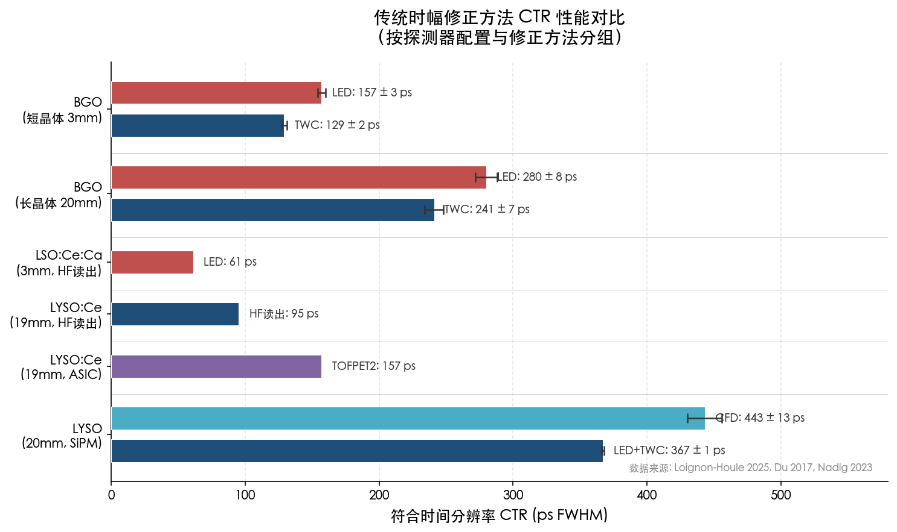

### 1.4.2 商用 PET 系统的 CTR 水平

实验室级的最佳结果与商用系统之间存在显著差距，后者必须在灵敏度、能量分辨率、成本和可靠性之间进行多维折中。当代主流 SiPM 基数字 PET/CT 系统的 CTR 性能如下：

Siemens Biograph Vision 采用 3.2×3.2×20 mm LSO 晶体配合 SiPM 阵列，NEMA 标准测试中 TOF 时间分辨率为 210–215 ps FWHM（从低计数率至峰值 NECR 仅劣化约 5 ps）[van Sluis等JNM论文](https://jnm.snmjournals.org/content/60/7/1031 "Performance Characteristics of the Digital Biograph Vision PET/CT System, JNM 60:1031, 2019")。GE Discovery MI（4-ring）系统使用 LBS 晶体配合 SiPM，测得 CTR 为 377 ± 3 ps FWHM [Chicheportiche等EJNMMI Physics论文](https://pmc.ncbi.nlm.nih.gov/articles/PMC6960280/ "Comparison of NEMA characterizations for Discovery MI, EJNMMI Physics, 2020")。Philips Vereos 作为首款商用数字 PET/CT，CTR 约为 310 ps FWHM [Vereos性能评估](https://link.aps.org/doi/10.1103/vy9h-twqf "Vereos CTR reference")。作为对照，上一代 PMT 基系统 Siemens Biograph mCT Flow 的 CTR 约为 540 ps FWHM [van Sluis等JNM论文](https://jnm.snmjournals.org/content/60/7/1031 "JNM 60:1031, 2019")，GE Discovery MI-DR（PMT 版）约为 553 ps FWHM [Chicheportiche等EJNMMI Physics论文](https://pmc.ncbi.nlm.nih.gov/articles/PMC6960280/ "EJNMMI Physics, 2020")。

图 1-3 以时间线散点图形式呈现了 2014–2020 年间主要商用 PET/CT 系统的 CTR 演进历程，清晰标示了从 PMT 时代至 SiPM 数字系统的技术转型节点。

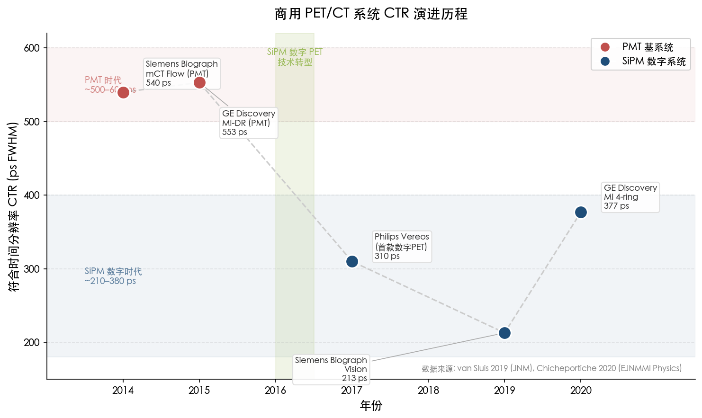

从 PMT 时代的 500–600 ps 到 SiPM 数字系统的 210–380 ps，商用 PET 系统的 CTR 在过去十年间实现了约 2 倍的改善，但距实验室单通道的 60–100 ps 水平仍有数倍差距。这一差距主要源于系统级约束：数万通道的一致性标定、长晶体（20 mm）的景深效应（DOI）、ASIC 读出的有限时间信息，以及温度-增益稳定性要求等。

### 1.4.3 核物理与高能物理实验中的定时基线

在核物理和高能物理大型实验中，传统时幅修正方法同样定义了重要的性能基线。

JLab CLAS12 CTOF 使用 CAEN 1290a TDC（24 ps LSB），CFD 读出下闪烁体计数器的平均时间分辨率约为 80–120 ps [JLab CTOF技术报告](https://www.jlab.org/Hall-B/ctof/notes/2015-006.pdf "CLAS12 CTOF Time-Walk Corrections, 2016")。

ALICE 实验 TOF 系统在 Run 2 通过改进 walk 校准，将约 15 万通道 MRPC 系统的整体时间分辨率从 82 ps 提升至 56 ps [ALICE TOF报告](https://pos.sissa.it/321/232/ "LHCP2018")。这一改善幅度超过 30%，凸显了精细化校准在大规模系统中的核心价值。

CMS 高亮度 LHC 升级的桶部 MIP 定时层（BTL）使用 LYSO 阵列配合 SiPM 和 TOFHIR2C ASIC，Day-1 目标时间分辨率为 30 ps 以下。双阈值斜率方法已被验证可在无外部时间基准的条件下实现初始 walk 校准 [White等arXiv论文](https://arxiv.org/html/2507.07127v1 "Amplitude Walk in Fast Timing: The Role of Dual Thresholds, 2025")。

## 1.5 传统方法的核心瓶颈

尽管上述传统方法在各自的适用场景中均发挥了关键作用，但它们面临若干共性瓶颈。这些瓶颈正是后续章节所讨论的 AI/ML 方法的核心切入点。

**非线性残差与模型精度受限**——无论是 $1/\sqrt{ADC}$ 经验修正函数还是 TOT 的对数模型，传统方法本质上均依赖于预设的参数化函数形式。当实际物理过程（如切伦科夫光子波动、SiPM 非线性响应、晶体内光传输多径效应）产生的时间偏移不符合预设函数形式时，残差无法被进一步修正。TOT 模型的 $R^2$ 约为 0.995–0.997 [Gaudin等NIM-A论文](https://pmc.ncbi.nlm.nih.gov/articles/PMC7332782/ "NIM-A, 2020")，这一拟合残差在追求 100 ps 级甚至亚百皮秒级定时精度时将成为显著的性能瓶颈。

**多通道一致性挑战**——在大规模系统（如 ALICE TOF 的 15 万通道或 CMS BTL 的约 10 万通道）中，通道间响应差异构成核心挑战。TOFHIR2C 的 AWC 通道间展开达 ±22%，即使经过 Slope-to-Q 映射校准后仍残余约 13% 的展开 [White等arXiv论文](https://arxiv.org/html/2507.07127v1 "arXiv:2507.07127, 2025")。对每个通道进行独立的高精度标定需要大量时间和标定数据，且标定参数会随环境条件变化而持续漂移。

**环境敏感性与参数漂移**——SiPM 探测器的 time walk 特性随温度、偏压和辐照剂量变化。在 HL-LHC 辐照环境下，探测器每年可能需要多次调整工作条件并重新标定 [White等arXiv论文](https://arxiv.org/html/2507.07127v1 "arXiv:2507.07127, 2025")。传统修正方法的标定参数本质上为静态量，无法自适应地跟踪这些环境驱动的漂移，导致修正精度随运行时间逐步退化。

**ASIC 实现困难**——CFD 需要精确的模拟延迟线，在纳米级 CMOS 工艺中实现难度很高。数字 CFD 虽可借助 FPGA 实现可变延迟，但需要高速 ADC（采样率通常 ≥5 GS/s），功耗和成本远超大规模通道系统的可承受范围 [Du等IEEE论文](https://pmc.ncbi.nlm.nih.gov/articles/PMC5739333/ "IEEE TRPMS, 2017")。这一工程约束迫使大多数 ASIC 读出方案采用简化的 LED+TWC 或 TOT 方法，从而放弃了 CFD 的硬件级幅度补偿能力。

**坐标依赖性**——在细长闪烁体计数器中，time walk 参数不仅取决于信号幅度，还与粒子击中坐标密切相关。CTOF 实验表明，修正参数在闪烁体两端到中央可变化一倍，使全区间统一修正的精度受限 [JLab CTOF技术报告](https://www.jlab.org/Hall-B/ctof/notes/2015-006.pdf "CLAS12 CTOF Time-Walk Corrections, 2016")。传统方法通常将坐标依赖性视为二阶效应而予以忽略或仅做粗略分段修正，但在追求极致时间分辨率时，这一近似已不再成立。

综合上述分析，传统时幅修正方法的根本局限在于其依赖预设的参数化模型来近似实际的物理过程，而真实探测器中影响定时的因素——幅度、上升时间、击中坐标、温度、通道间差异、事件级统计波动等——之间存在复杂的高维关联。这一多变量非线性映射问题，恰恰是机器学习方法天然擅长处理的领域。基于传统方法的上述瓶颈，下一章将系统梳理 AI/ML 方法在时幅修正领域的方法论图谱。

# 第2章 AI/ML 算法在时幅修正中的方法论图谱

第 1 章已阐明传统时幅修正方法在非线性残差、多通道一致性、环境敏感性及 ASIC 延迟线实现困难等方面的固有瓶颈。这些瓶颈具有共同的技术根源：传统方法依赖预设的函数形式（如 $1/\sqrt{ADC}$、对数函数）和固定的硬件电路拓扑（如 CFD 延迟-衰减-过零），难以捕捉信号中的高阶非线性效应与事件级波动信息。AI/ML 方法凭借数据驱动的非线性拟合能力，为突破上述瓶颈提供了全新路径。

本章系统梳理已被提出或实验验证的 AI/ML 时幅修正方法，将其归纳为端到端波形级深度学习、分步流水线方法和残差物理 + 梯度提升树三条技术路线，逐一分析各方法的算法架构与定时性能，讨论训练数据的需求与获取策略，并深入探讨模型可解释性、物理约束嵌入以及 PINN 在定时问题中的适用性。

## 2.1 方法论分类框架：三条技术路线

当前 AI/ML 时幅修正领域的研究成果可归纳为三条主要技术路线，各路线在物理先验嵌入程度上形成连续谱。

**第一条路线——端到端波形级深度学习**。以原始探测器波形（或其数字化采样序列）作为神经网络输入，直接输出定时估计值或飞行时间差。代表性工作包括 Berg & Cherry（2018）的 CNN 以及 Feng 等（2024）的 Transformer-CNN 混合网络。这一路线的核心假设是：原始波形中蕴含比传统特征提取所能捕获的更丰富的时间信息，网络可在训练过程中自动学习最优特征表示。

**第二条路线——分步流水线方法**。先由传统定时算法（如 LED）给出初始时间标记，再由 ML 模型对该初始标记进行修正。Onishi 等（2022）的 LED+CNN 残差修正和 Ai 等（2019）的深度学习替代曲线拟合是这一路线的代表。其优势在于 ML 模型仅需学习残差修正量而非绝对时间，降低了学习难度并保留了传统方法的物理可解释性。

**第三条路线——残差物理 + 梯度提升方法**。先以解析物理模型处理一阶时幅效应和系统偏移等主要效应，再以 GBDT/XGBoost 等梯度提升树模型学习残差中的高阶非线性效应。Naunheim 等（2023, 2024, 2025）系列工作系统发展了这一范式。其核心理念是"AI 补充物理而非替代物理"，ML 模型的输出是有限范围内的修正值，可设置物理合理上界。

上述三条路线并非互斥，而是代表了物理先验嵌入程度由弱到强的连续谱：从端到端学习的最小先验，到分步流水线的中度先验，再到残差物理方法的最大先验。图 2-1 以分组柱状图形式汇总了六项代表性工作的传统基线 CTR 与 AI 方法 CTR，直观呈现各技术路线的绝对性能和相对改善幅度。

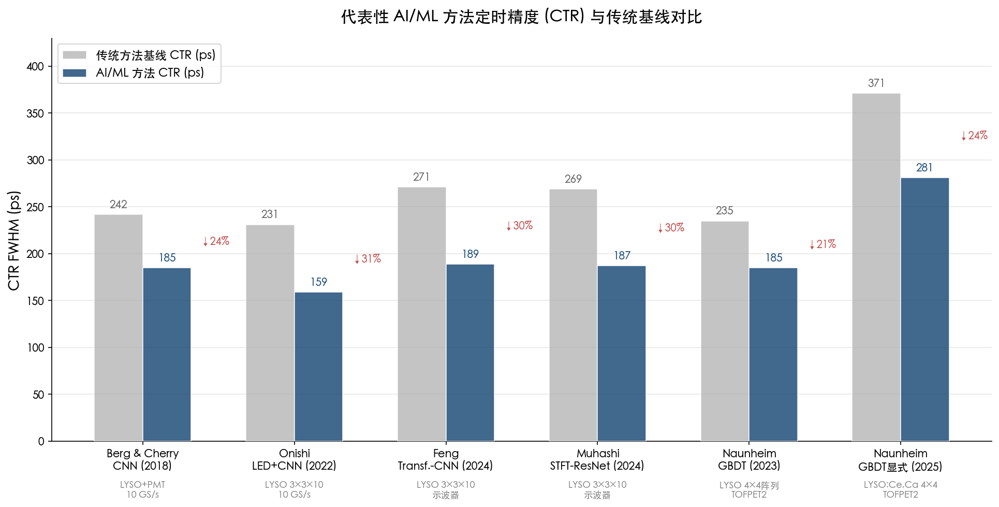

## 2.2 端到端波形级 CNN 方法

### 2.2.1 开创性工作：Berg & Cherry（2018）

Berg 与 Cherry 于 2018 年首次将卷积神经网络（CNN）用于 PET 探测器飞行时间（TOF）估计，开辟了 AI 时幅修正研究的新方向。其网络架构为 6 层锥形 CNN：卷积核宽度从 2×11 逐级缩减至 1×5，特征图数量从 64 递增至 128，后接 256 节点全连接层和 50% dropout 正则化。网络以 10 GS/s 示波器采集的双路波形为输入（覆盖信号上升沿和峰值附近约 30 ns 窗口），直接输出 TOF 差值估计。在荧光闪烁体 + PMT 配置下，CTR 从 LED 的 231 ps FWHM 和 CFD 的 242 ps FWHM 改善至 185 ± 2 ps FWHM，提升幅度达 20–23% [Berg & Cherry 2018 Phys. Med. Biol.](https://pmc.ncbi.nlm.nih.gov/articles/PMC5784837/ "CNN-based TOF estimation proof-of-concept")。

该工作确立了若干关键基准：训练 ≥1,000 波形对/源位即可达到稳定性能，总训练集约 145,000 对（29 源位 × ~5,000 对）。Berg 与 Cherry 推测 CNN 定时改善可能源于三种机制——对光电响应函数的反卷积、对作用深度（DOI）相关波形模式的利用、以及对信号早期上升沿超前信息的提取——但囿于 CNN 的黑箱特性，上述假设至今未能确切验证 [Berg & Cherry 2018 Phys. Med. Biol.](https://pmc.ncbi.nlm.nih.gov/articles/PMC5784837/ "CNN黑箱讨论")。

### 2.2.2 Transformer-CNN 混合网络

Feng 等（2024）提出了结合全局自注意力机制与局部感受野的 Transformer-CNN 混合网络。其中，Transformer 模块负责捕捉波形中的长程依赖关系（如信号起始相位与尾部衰减形态的关联），CNN 模块提取局部上升沿特征。在 LYSO 3×3×10 mm³ + MPPC 配置下，该网络达到平均 CTR 189 ps FWHM，较 CFD 改善超过 30%（减少约 82 ps），较纯 CNN 再改善约 6.4% [Feng et al. 2024 Phys. Med. Biol.](https://pubmed.ncbi.nlm.nih.gov/38749457/ "Transformer-CNN混合网络TOF预测")。

同一课题组还发展了三阶段网络策略，引入信号上升时间分类和 TOF 核函数先验知识，在 BGO 闪烁体上达到 128.2 ps FWHM / 286.6 ps FWTM [Feng et al. 2024 Phys. Med. Biol.](https://pubmed.ncbi.nlm.nih.gov/39137808/ "Three-stage network for BGO, PMB 69:175013, 2024")。该结果与 Loignon-Houle 等（2025）报告的 BGO 3 mm 晶体 CNN 性能（115 ps FWHM）处于同一量级，进一步验证了深度学习在慢闪烁体上的显著定时优势。

### 2.2.3 3D-CNN 与单片晶体探测器

Maebe 与 Vandenberghe（2022）将 3D-CNN 应用于单片晶体探测器的多通道波形处理。在蒙特卡罗仿真条件下（50×50×16 mm³ 闪烁体），3D-CNN 同时处理多个 SiPM 像素的波形信息，利用光子到达不同像素的时间差异推断作用位置并精确定时，仿真 CTR 达到 141 ps FWHM [Maebe & Vandenberghe 2022 Phys. Med. Biol.](https://pubmed.ncbi.nlm.nih.gov/35617948/ "3D-CNN monolithic PET timing simulation")。这一工作代表了从单通道波形处理向多通道时空信息联合处理的演进方向，但其性能尚待实验验证。

### 2.2.4 STFT-ResNet：时频域联合特征

Muhashi 等（2024）提出了基于短时傅里叶变换（STFT）与残差网络（ResNet）结合的方法，将一维波形变换为二维时频谱图后以 ResNet 提取特征。在 LYSO 3×3×10 mm³ + MPPC 配置下，CTR 达到 187 ps FWHM，较 CFD 改善 30.4%，同时将 TOF 估计偏差降低 17.9% [Muhashi et al. 2024 NIM-A](https://www.sciencedirect.com/science/article/abs/pii/S0168900224004662 "STFT-ResNet for PET timing, NIM-A 1065:169540, 2024")。时频域变换的引入使 CNN 利用波形频率信息的过程得以显式呈现，为理解深度学习定时的内部机制提供了一种可解释的分析视角。

### 2.2.5 ComLSTM 与 MRPC 探测器

波形级深度学习的适用范围并不局限于闪烁体探测器。Wang 等（2020）将复合长短时记忆网络（ComLSTM）应用于多气隙阻性板室（MRPC）探测器的定时，在宇宙线测试中达到 16.8 ps 时间分辨率，满足 JLab SoLID 实验对 20 ps π/K 分离能力的需求 [Wang et al. 2020 JINST](https://arxiv.org/abs/2005.03903 "ComLSTM for MRPC, JINST 15:C09033, 2020")。MRPC 的模拟信号带宽窄、上升时间一致性较好，该结果表明即使在信号质量较优的场景下，深度学习仍可从波形细节中提取传统方法未能利用的定时信息。

## 2.3 分步流水线与早期深度学习方法

### 2.3.1 LED + CNN 残差修正：Onishi 等（2022）

Onishi 等人于 2022 年提出了一种将传统定时与深度学习相结合的混合策略：首先由 LED 给出初始时间标记，然后以 CNN 估计并修正 LED 的时间差误差。该方案的关键创新在于训练数据策略——仅需单一放射源位置的训练数据即可生成无偏 TOF 估计，避免了 Berg & Cherry 方案中需要 29 个源位覆盖的复杂数据采集。在 LYSO 3×3×10 mm³ 晶体实验中，CTR 达到 159 ps FWHM [Onishi et al. 2022 Phys. Med. Biol.](https://pubmed.ncbi.nlm.nih.gov/35100575/ "单源位训练无偏TOF估计")。

这一工作在方法论层面具有重要意义：它证明 ML 模型并非必须从头学习完整的定时物理，而可以在传统方法的基础上进行增量优化。单源位训练策略还极大简化了标定流程，降低了 ML 方法在临床 PET 系统中部署的工程障碍。

### 2.3.2 MHz ADC 深度学习定时：Ai 等（2019）

在高能物理读出电子学领域，Ai 等人于 2019 年提出以深度学习替代传统曲线拟合来提取 MHz 采样率 ADC 数字化脉冲的时间信息。该工作以 ALICE 实验 PHOS 电磁量能器的前端电子学（FEE）卡为实验平台，系统对比了传统曲线拟合在长期漂移、短期变化和随机噪声三类非理想条件下的定量表现，并验证了专用神经网络架构可大幅抑制噪声均方根（RMS）和改善时间分辨率，性能较曲线拟合提升超过 20% [Ai et al. 2019 JINST](https://iopscience.iop.org/article/10.1088/1748-0221/14/03/P03002 "Timing and characterization of shaped pulses with MHz ADCs, JINST 14:P03002, 2019")。该工作率先将深度学习引入以 MHz 量级 ADC 为核心的高能物理前端读出系统，为后续 PulseDL 系列专用 ASIC 的研发奠定了算法基础。

### 2.3.3 受约束瓶颈自编码器

Jesús-Valls 等（2022）发展了一种受约束瓶颈自编码器（constrained bottleneck autoencoder），在单一架构内同时实现脉冲参数估计（包括到达时间）、高保真波形仿真以及信号去噪三项功能。瓶颈层的结构约束确保潜在空间保留物理可解释的维度（如幅度、时间、衰减常数），而非任意的抽象表示 [Jesús-Valls et al. 2022 JINST](https://iopscience.iop.org/article/10.1088/1748-0221/17/06/P06016 "Constrained bottleneck autoencoder")。该工作展示了深度学习在探测器信号处理中"一模型多任务"的潜力，但其定时精度尚未与专用定时网络进行系统性对比。

## 2.4 残差物理 + 梯度提升树方法

### 2.4.1 核心范式：物理模型处理主效应，ML 学习残差

Naunheim 等人于 2023 年系统性地提出了"残差物理（Residual Physics）"范式，其核心思想分为两步：第一步，以解析物理模型——包括通道级偏移修正（channel-level offset correction）、能量依赖时幅修正（energy-dependent walk correction，通常采用 $t_w = c_0 + c_1/\sqrt{E}$ 函数形式）和晶体标识修正（crystal identification correction）——处理一阶系统效应；第二步，以梯度提升决策树（GBDT，具体实现为 XGBoost）学习解析模型残差中的高阶非线性效应。

在概念验证实验中（Philips dSiPM + TOFPET2 ASIC，4×4 LYSO:Ce 阵列，3.9×31.9×19 mm³ 晶体），该范式将 CTR 从解析校准后的 235 ps 改善至 185 ps FWHM（提升 >20%）。SHAP（SHapley Additive exPlanations）分析揭示 XGBoost 模型确实学习到了与 time-walk 效应物理一致的特征重要性排序：能量相关特征和通道位置特征被赋予最高权重 [Naunheim et al. 2023 IEEE TNNLS](https://www.researchgate.net/publication/374897482_Improving_the_Timing_Resolution_of_Positron_Emission_Tomography_Detectors_Using_Boosted_Learning-A_Residual_Physics_Approach "Residual physics + GBDT for PET timing")。

### 2.4.2 方法演进：从隐式修正到显式修正

Naunheim 系列工作经历了从"隐式修正"到"显式修正"的方法论演进。2023 年和 2024 年的工作采用隐式修正模型——GBDT 直接预测两个探测器模块的绝对时间标记差值；2025 年的最新工作则转向显式修正范式——GBDT 直接预测每个模块的修正值（而非时间差），修正值被叠加到传统方法给出的初始时间标记上。

显式修正范式带来了三方面实质性改进。其一，训练数据采集大幅简化：隐式修正需覆盖不同源位以学习完整的 TOF 映射，显式修正仅需单一源位数据即可工作，标定时间从 43 小时压缩至约 3 分钟（加速约 1,000 倍）[Naunheim et al. 2024 Phys. Med. Biol.](https://publications.rwth-aachen.de/record/1015553/files/1015553.pdf "Holistic evaluation under data sparsity, PMB 69:155026, 2024")。其二，TOF 线性度显著改善：显式修正保持了传统方法的线性 TOF 响应，而隐式修正在训练步宽 ≥50 mm 时出现严重性能退化和线性度丧失。其三，模型复杂度大幅降低：显式修正 GBDT 的最优树深仅为 4（16 叶节点/树），而隐式修正需要树深 18（262,144 叶节点/树），内存需求降低约 16,384 倍 [Naunheim et al. 2025 Front. Phys.](https://www.frontiersin.org/journals/physics/articles/10.3389/fphy.2025.1570925/full "Explicit TOF corrections, Frontiers in Physics 2025")。

在最新实验配置中（4×4 LYSO:Ce,Ca 阵列，3.8×3.8×20 mm³ + Broadcom NUV-MT SiPM + TOFPET2 ASIC），显式修正 GBDT 将 CTR 从 371 ± 6 ps 改善至 281 ± 5 ps FWHM（提升 24%）[Naunheim et al. 2025 Front. Phys.](https://www.frontiersin.org/journals/physics/articles/10.3389/fphy.2025.1570925/full "Explicit TOF corrections, 2025")。

### 2.4.3 残差物理范式的工程优势

残差物理方法在工程适用性方面具有独特优势。首先，GBDT/XGBoost 的训练速度远快于深度神经网络——在标准 CPU 上数分钟即可完成，无需 GPU 资源。其次，模型天然具有可解释性：SHAP 值可追溯每个预测的特征贡献，这对需要严格审计和验证的物理实验具有重要意义。再次，GBDT 的推理过程本质上是一系列 if-else 判断的级联，可高效映射到 FPGA 的查找表（LUT）结构。以树深为 4、100 棵估计器的配置为例，参照 Summers 等人（2020）的 conifer 工具资源模型，在 Xilinx VU9P 器件上仅需约 60 ns 推理延迟和约 85k LUT，具备实时部署的可行性。

## 2.5 性能边界理论分析

### 2.5.1 多元 Cramér-Rao 下界框架

理解 AI 方法为何能改善定时精度，需要从信息论角度审视传统方法的效率损失。Ai 等人（2021）提出了基于多元 Cramér-Rao 下界（CRLB）的系统评估框架，对探测器脉冲定时问题进行了严格的理论分析。CRLB 给出了在给定信号模型和噪声条件下任何无偏估计器所能达到的时间分辨率理论极限。

该分析的核心发现是：在高信噪比条件下，传统 CFD 已接近 CRLB，因此神经网络的改善空间有限；但在低信噪比或信号畸变（如脉冲堆积、基线漂移）条件下，传统方法与 CRLB 之间存在显著间隙，神经网络能更好地逼近这一理论下界 [Ai et al. 2021 JINST](https://iopscience.iop.org/article/10.1088/1748-0221/16/09/P09019 "NN timing performance bound analysis")。这一结论为实验中观察到的现象提供了理论解释：AI 方法在慢闪烁体（如 BGO，衰减时间约 300 ns，有效光子数少、单光子信噪比低）上改善显著（可达 26%），而在快闪烁体（如 LSO/LYSO + 高频读出）上改善微弱（仅 1–3%），原因正是后者的传统方法已非常接近 CRLB。

### 2.5.2 信息论视角下的 AI 优势解读

CRLB 框架揭示了 AI 定时方法的本质角色：**信息提取效率的优化器**。传统定时算法（如 LED 仅利用阈值交叉时刻，CFD 仅利用过零点时刻）丢弃了波形中的大量信息；相比之下，端到端 CNN 以完整波形为输入，理论上可利用波形中的全部信息——包括上升沿斜率、峰值位置、衰减形态以及不同 SiPM 像素间的光子到达时间分布。在 ASIC 多通道系统中（如 TOFPET2 仅输出每通道一个时间戳和一个能量值），残差物理方法通过利用光共享效应中多个相邻通道的能量分布信息，间接恢复了被 ASIC 数字化过程丢弃的部分波形信息。这一机制解释了残差物理方法在 ASIC 读出系统上实现 20–29% CTR 改善的物理原因。

## 2.6 训练数据策略与获取成本

训练数据的获取成本是 AI 方法从概念验证走向工程应用的关键瓶颈。当前研究中已形成四种主要数据策略，在数据量需求、采集时间和适用场景上差异显著。图 2-2 以双对数刻度对比了各策略的事件数量与采集时间，直观呈现从早期大规模采集到近期高效策略的量级跃迁。

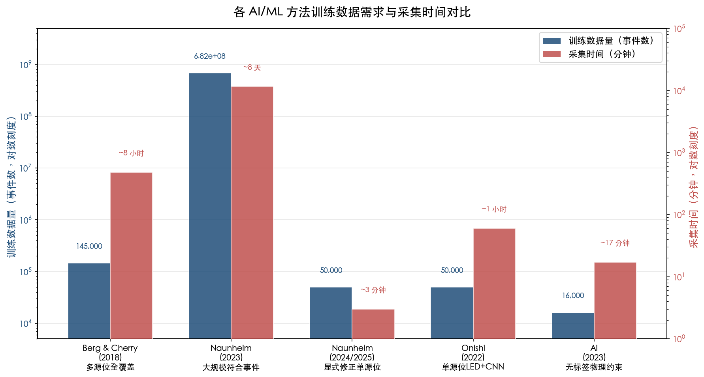

### 2.6.1 多源位全覆盖采集

Berg & Cherry（2018）的端到端 CNN 需要 29 个源位的完整覆盖采集，总计约 145,000 波形对，使用 10 GS/s 示波器逐事件记录双路波形。该方案的优势在于训练数据覆盖了完整的 TOF 值域，保证了模型在全视场（FOV）范围内的准确性，但数据获取的硬件成本（高带宽示波器）和时间成本均较高。

### 2.6.2 大规模符合事件采集

Naunheim 等人在 2023 年概念验证中使用了约 6.82 × 10⁸ 符合事件（采集约 8 天），但后续工作证明该数据量远超必要水平：2024 年的系统性评估表明训练数据采集可从 43 小时压缩至约 3 分钟，性能仅有边际损失 [Naunheim et al. 2024 Phys. Med. Biol.](https://publications.rwth-aachen.de/record/1015553/files/1015553.pdf "3-min training viable, PMB 69:155026, 2024")。2025 年的显式修正范式进一步将单源位训练确立为标准操作流程。

### 2.6.3 无标签物理约束学习

Ai 等人（2023）提出了一种突破性的 label-free 训练策略。在模块化探测器中，多个通道记录同一事件的信号，信号到达时间之间存在由几何距离决定的线性约束关系。Ai 等人将这一物理约束编码为无标签损失函数，完全不需要已知的"真实"时间标签即可完成训练。在双通道 SiPM 实验中该方法达到单通道 8.8 ps 精度，在 NICA-MPD 电磁量能器（ECAL）宇宙线数据中 CNN 达到 384 ps（优于 CFD 和 LED-SC），训练仅需约 10,000 事件对（玩具实验，17 分钟）或约 16,000 事件（ECAL），在 RTX 2070 GPU 上训练耗时数分钟至 1 小时 [Ai et al. 2023 MLST](https://iopscience.iop.org/article/10.1088/2632-2153/acfd09 "Label-free timing with physics-constrained deep learning")。

该方法的核心意义在于将探测器定时校准从对已知参考信号的依赖中解放出来，使得在缺乏精确参考时钟或标定放射源的条件下（如在束运行期间）进行在线校准成为可能。

### 2.6.4 仿真数据驱动分析

仿真数据在性能极限研究和新架构验证中发挥着不可替代的作用。Ai 等人（2021）的 CRLB 分析和 Maebe（2022）的 3D-CNN 工作均建立在蒙特卡罗仿真生成的训练数据基础之上。仿真数据的优势在于可精确控制信号参数、生成任意规模的训练样本并获取完美的"真值"标签。然而，仿真与实验之间的域差距（sim-to-real domain gap）是已知的系统性风险——目前在探测器定时领域尚缺乏对该差距的定量评估 [Ai et al. 2021 JINST](https://iopscience.iop.org/article/10.1088/1748-0221/16/09/P09019 "仿真驱动分析")。

## 2.7 物理约束嵌入与模型可解释性

### 2.7.1 物理约束嵌入的三种范式

将物理先验知识融入 ML 定时模型已通过三种不同路径得到实现：

**损失函数嵌入**。Ai 等人（2023）将多通道信号的线性时间约束（即信号到达不同通道的时间差与几何距离成正比）直接编码为神经网络的训练损失函数。这一约束既提供了无标签训练的可能性，又确保了网络输出满足物理一致性。在方法论精神上，这与物理信息神经网络（PINN）将偏微分方程（PDE）残差编码为损失函数的理念高度一致，但并非嵌入具体的 PDE 方程 [Ai et al. 2023 MLST](https://iopscience.iop.org/article/10.1088/2632-2153/acfd09 "Label-free timing with physics-constrained deep learning")。

**实验设计注入与事后验证**。Naunheim 等人（2023）在特征工程阶段注入物理知识——选择能量值、通道位置、通道间能量比等物理意义明确的特征作为 GBDT 输入；训练完成后，通过 SHAP 值分析验证模型学到的特征重要性排序与 time-walk 效应的物理机制相一致 [Naunheim et al. 2023 IEEE TNNLS](https://www.researchgate.net/publication/374897482_Improving_the_Timing_Resolution_of_Positron_Emission_Tomography_Detectors_Using_Boosted_Learning-A_Residual_Physics_Approach "SHAP分析")。

**物理模型预处理 + ML 学残差**。Onishi 等人（2022）的 LED+CNN 方案本质上属于物理预处理：LED 物理模型捕获了信号前沿的主要时间信息，CNN 仅需学习 LED 估计的系统性偏差。Naunheim 系列工作的"解析校准 + GBDT 残差"结构是这一思路的更系统化实现。

### 2.7.2 可解释性的梯度分布

不同 AI/ML 方法在可解释性上呈现清晰的梯度。GBDT/XGBoost 具有天然的最高可解释性：每棵决策树的分裂规则可直接检查，SHAP 值提供逐预测的特征贡献分解。Naunheim 等人（2023）的 SHAP 分析不仅验证了模型的物理一致性，还揭示了传统方法未曾利用的通道间能量分布信息对定时的贡献。

Jesús-Valls 等人（2022）的受约束瓶颈自编码器通过结构化潜在空间实现了中等可解释性：瓶颈层的各维度对应物理参数，潜在空间的连续性保证了模型行为的可预测性 [Jesús-Valls et al. 2022 JINST](https://iopscience.iop.org/article/10.1088/1748-0221/17/06/P06016 "Constrained bottleneck autoencoder")。

端到端 CNN（Berg & Cherry 2018）和 Transformer-CNN（Feng 2024）处于可解释性光谱的低端。虽然梯度类可视化方法（如 Grad-CAM）可观察网络关注的波形区域，但无法精确解读网络学到的物理特征。Berg 与 Cherry 提出的三种可能机制——反卷积光电响应、DOI 波形模式、早期上升沿信息——至今仍属推测性假设。

### 2.7.3 PINN 在定时问题中的适用性评估

物理信息神经网络（PINN）通过将 PDE 残差嵌入损失函数，在流体力学、热传导等由已知 PDE 控制的物理问题中取得了显著成功。在探测器领域，Bombini 等人（2025）已将 PINN 应用于钻石粒子探测器的设计优化，以混合专家 PINN 求解描述电极电阻对信号传播延迟影响的 3+1D PDE [Bombini et al. 2025 SciPost](https://scipost.org/submissions/2509.21123v1/ "PINN for diamond detector design optimisation")。

然而，截至 2026 年 3 月，尚无已发表的 PINN 直接用于闪烁体探测器时幅修正的工作。我们认为这并非偶然，而是由定时问题的特殊性质所决定。闪烁体探测器的定时过程涉及光子产生（闪烁/切伦科夫）→ 光传输（晶体内全反射与衰减）→ 光转换（SiPM 光电效应）→ 电信号成形（前端电子学）的多环节级联，每一环节均涉及随机过程（光子统计、暗噪声、电子噪声），难以用单一 PDE 完整描述。相比之下，已有的物理约束方法（如 Ai 2023 的线性时间约束）以代数约束而非微分方程形式嵌入物理先验，更适合定时问题的统计估计本质。PINN 在定时场景中的潜在切入点可能在于探测器响应函数的正向建模——即以 PINN 学习从物理参数（光产率、衰减时间、光传输效率等）到脉冲波形的映射，用于生成高保真仿真训练数据，而非直接用于定时估计本身。

## 2.8 PulseDL 系列：从算法到硬件加速的桥梁

将深度学习定时算法部署到实时读出系统需要专用硬件的支撑。Ai 等人的 PulseDL 系列工作代表了从算法验证到硬件加速的系统化演进路径。

PulseDL（2020）是首个面向核探测器脉冲特征提取的深度学习专用 ASIC，采用 GSMC 130 nm 工艺，芯片面积 24 mm²，计算效能达 12.4 GOPS/W，其"Compact"网络架构支持 15.1 个并行通道的实时处理 [PulseDL 2020 NIM-A](https://www.sciencedirect.com/science/article/abs/pii/S0168900220308172 "PulseDL ASIC for pulse characterization")。

PulseDL-II（2022/2023）在此基础上发展为集成 ARM Cortex-M0 RISC CPU 的系统级芯片（SoC），在 100 MHz 工作频率下较前代运行时间降低 1.83 倍、能耗降低 1.81 倍，查找表/乘法器比降低 1.40 倍。该 SoC 设计了与 TensorFlow 兼容的量化方案（支持 8/16 位定点），在 FPGA 验证平台上达到 60 ps 时间分辨率和 0.40% 能量分辨率（信噪比 47.4 dB）[PulseDL-II arXiv/IEEE TNS](https://arxiv.org/abs/2209.00884 "PulseDL-II SoC, IEEE TNS 2023")。PulseDL-II 的目标应用场景涵盖 NICA-MPD ECAL（从传统方法的约 1 ns 提升至约 150 ps）等大规模核物理实验。

PulseDL 系列的技术路线体现了一个重要趋势：从通用 GPU/FPGA 上的算法验证到面向特定应用的 SoC/ASIC 硬件化，是 AI 定时方法走向工程部署的必经阶段。

## 2.9 方法论比较与技术路线选择

综合以上梳理，各 AI/ML 时幅修正方法在定时精度、数据需求、可解释性和部署复杂度等维度上呈现差异化的优劣势格局。图 2-3 以五维雷达图直观对比了四类方法的相对表现。

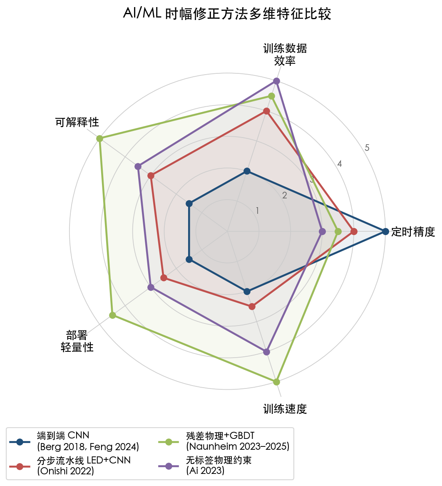

**端到端 CNN 类方法**在 10 GS/s 波形输入条件下定时精度最高，但对数据采集硬件要求严苛（需高速示波器），模型黑箱性强，且在 ASIC 级多通道系统中因缺乏原始波形而无法直接应用。

**残差物理 + GBDT 方法**在 ASIC 读出系统中（仅有时间戳和能量信息）是目前最具工程可行性的方案：可解释性最高，训练和推理速度最快，且已被证明可在极少训练数据（3 分钟采集量）下有效工作。其局限在于无法利用原始波形信息，理论性能上界受限于 ASIC 提供的特征维度。

**分步流水线方法**（LED+CNN）在方法论上处于前两者之间，既可利用一定程度的波形信息，又保留了传统方法的物理可解释性，且通过单源位训练策略大幅降低了数据需求。

**无标签物理约束方法**代表了一种独特的理论创新，打破了对标定数据的依赖，但目前仅在特定的模块化探测器几何构型中得到验证。

我们认为，最优技术路线的选择取决于具体应用场景的三个核心约束：读出信息丰度（是否具备原始波形）、实时性需求（是否需要在线推理）以及标定基础设施条件（是否具备精确参考时钟和标定源）。对于采用 ASIC 读出的大规模 PET 系统，残差物理 + GBDT 是目前最成熟的选择；对于以高速数字化器为基础的研究型探测器系统，端到端 CNN 或 Transformer-CNN 可充分发挥波形信息的潜力。

# 第3章 代表性实验成果与性能基准比较

第2章从方法论维度梳理了端到端波形级 CNN、分步流水线 LED+CNN 与残差物理 + 梯度提升树三条技术路线的算法原理。方法论的优劣最终须以可复现的实验性能来检验。本章汇总 2018–2026 年（重点为 2024–2025 年）已发表的代表性实验结果，以符合时间分辨率（CTR, Coincidence Time Resolution）FWHM 值和改善百分比为核心度量指标，按闪烁体类型、读出方式和应用领域分类建立性能对比基准。在此基础上，通过对实验条件的系统性分析，提炼 AI 方法优势最显著与增益有限的边界条件，为不同应用场景下的技术选型提供定量依据。

## 3.1 TOF-PET 领域：BGO + SiPM 高频读出配置

锗酸铋（BGO）作为最早用于 PET 的闪烁体，凭借高密度（7.13 g/cm³）和高有效原子序数（Z_eff = 74）具备优异的 511 keV γ 光子探测效率，但其约 300 ns 的主衰减时间和较低的光产率使定时性能长期落后于 LSO/LYSO 类快闪烁体。近年来，利用 BGO 中切伦科夫提示光子改善定时的研究路线取得重要突破，而 AI 方法在该场景中展现出最为显著的性能增益——这也是深度学习时幅修正文献中数据最密集的实验配置之一。

### 3.1.1 Loignon-Houle 等（2025）：CNN 与传统方法的系统对比

Loignon-Houle 等（2025）在 BGO 和 LSO:Ce:Ca 两种闪烁体上对 CNN、前沿定时（LED）与经典时幅修正（TWC）方法进行了迄今最为系统的对比研究，采用 FBK NUV-HD-MT 硅光电倍增管（SiPM）配合 20 GS/s 高频（HF）示波器读出。实验结果清晰揭示了 AI 方法增益随实验条件变化的规律：

在 BGO 2×2×3 mm³ 短晶体配置下，LED 原始 CTR 为 157 ± 3 ps FWHM，经传统时幅修正后改善至 129 ± 2 ps FWHM，CNN 进一步将 CTR 压低至 115 ± 2 ps FWHM。CNN 较 LED 原始值改善 26%，较 TWC 仍额外改善 11%（约 14 ps）。然而在 BGO 2×2×20 mm³ 长晶体配置下，LED 原始 CTR 为 280 ± 8 ps FWHM，TWC 修正至 241 ± 7 ps FWHM，而 CNN 仅达到 239 ± 7 ps FWHM——CNN 相对于 TWC 的边际增益不足 2 ps，在统计误差范围内几乎不显著 [Loignon-Houle et al. 2025 EJNMMI Physics](https://pmc.ncbi.nlm.nih.gov/articles/PMC11739447/ "Improving timing resolution of BGO for TOF-PET, 2025")。

作为对照，同一实验在快闪烁体 LSO:Ce:0.2%Ca 上测试了相同的 CNN 模型。2×2×3 mm³ 短晶体 LED CTR 为 61 ps FWHM，CNN 仅微改至 59 ps FWHM；20 mm 长晶体 LED 108 ps，CNN 107 ps。这组数据表明，当传统方法已能充分利用信号中的定时信息——即快闪烁体配合高频读出构成的"信息饱和"场景——CNN 几乎无法提供额外贡献 [Loignon-Houle et al. 2025 EJNMMI Physics](https://pmc.ncbi.nlm.nih.gov/articles/PMC11739447/ "Improving timing resolution of BGO for TOF-PET, 2025")。

### 3.1.2 Feng 等（2024）：三阶段深度学习网络

Feng 等（2024）针对 BGO 闪烁体提出三阶段深度学习策略，包含 CNN 粗估计、Transformer 精细修正和偏差微调三个级联模块，并引入信号上升时间分类与 TOF 核函数先验知识以约束网络输出。在 BGO 双端读出 + HF 采集配置下，该方法达到 128.2 ps FWHM / 286.6 ps FWTM 的 CTR [Feng et al. 2024 Phys. Med. Biol.](https://pubmed.ncbi.nlm.nih.gov/39137808/ "Three-stage network for BGO, PMB 69:175013, 2024")。这一结果与 Loignon-Houle 等在 BGO 短晶体上报告的 115 ps 处于同一量级，两项独立工作相互印证了深度学习在慢闪烁体上的定时改善潜力。

上述两项 BGO 实验指向一致的物理解释：BGO 约 300 ns 主衰减时间产生的常规闪烁光子对定时贡献有限，CNN/Transformer 等深度学习模型所利用的核心信息源是切伦科夫提示光子——511 keV γ 射线在 BGO 中激发约 17 个切伦科夫光子——的事件级波动模式。这些亚 ns 时间尺度的快速光子到达分布蕴含丰富的定时信息，但其统计涨落及与闪烁光子的叠加使传统参数化方法难以充分提取，恰好构成了深度学习的优势场景。

## 3.2 TOF-PET 领域：LYSO + ASIC 读出配置

硅酸钇镥（LYSO）及其同族晶体（LSO/LGSO）是当前商用 PET 扫描仪的主流闪烁体材料，约 40 ns 的衰减时间和约 30,000 光子/MeV 的光产率使传统方法已能实现 150–250 ps 级 CTR。在这一配置下，AI 方法的优势主要体现在与商用 ASIC 读出芯片（如 TOFPET2）的结合——ASIC 仅输出离散时间戳而非完整波形，传统修正方法可利用的信息维度显著受限，而 ML 方法能够通过挖掘多通道光共享信息（光子在阵列相邻晶体间的串扰模式）弥补信息损失，从而实现显著的定时改善。

### 3.2.1 Naunheim 系列工作：残差物理 + GBDT 方法的系统验证

Naunheim 等在 2023–2025 年间发表的三项研究构成了残差物理 + 梯度提升决策树（GBDT）方法在 PET 定时校准中最为完整的验证体系，覆盖了从概念验证、系统评估到范式优化的完整研究链条。

**概念验证（2023 年，IEEE TNNLS）**：在 Philips 数字 SiPM + TOFPET2 ASIC 配置下，4×4 LYSO:Ce 阵列（3.9×31.9×19 mm³），CTR 从解析校准的 235 ps FWHM 改善至 185 ps FWHM，改善幅度超过 20%。SHAP（SHapley Additive exPlanations）可解释性分析揭示，模型自主学习到了与时幅效应物理一致的特征重要性排序——幅度相关特征的 SHAP 值呈现清晰的非线性依赖关系，验证了 GBDT 在学习物理上有意义的修正规律而非过拟合噪声 [Naunheim et al. 2023 IEEE TNNLS](https://www.researchgate.net/publication/374897482_Improving_the_Timing_Resolution_of_Positron_Emission_Tomography_Detectors_Using_Boosted_Learning-A_Residual_Physics_Approach "Residual physics + GBDT for PET timing")。

**全面评估（2024 年，Phys. Med. Biol.）**：在 Hamamatsu S13 模拟 SiPM + TOFPET2 配置下，4×4 LSO 阵列（4×4×20 mm³），CTR 从解析校准的 304 ± 5 ps FWHM 改善至 216 ± 1 ps FWHM，改善幅度达 29%。该研究系统评估了训练数据稀疏性的影响：训练数据采集时间可从完整标定的 43 小时压缩至约 3 分钟（约 1,000 倍加速），性能退化仅为边际水平。这一发现对实际部署意义重大——ML 校准可像传统增益标定一样快速完成，支持周期性重校准以补偿温度漂移和器件老化等环境因素 [Naunheim et al. 2024 Phys. Med. Biol.](https://publications.rwth-aachen.de/record/1015553/files/1015553.pdf "Holistic evaluation under data sparsity, PMB 69:155026, 2024")。

**显式修正范式（2025 年，Frontiers in Physics）**：在 Broadcom NUV-MT SiPM + TOFPET2 配置下，4×4 LYSO:Ce,Ca 阵列（3.8×3.8×20 mm³），采用重新定义的"显式修正"残差（模型直接预测修正值而非绝对时间差），CTR 从 371 ± 6 ps FWHM 改善至 281 ± 5 ps FWHM，改善幅度 24%。显式修正范式在单源位训练条件下即可工作，且模型复杂度大幅降低——树深从隐式模型的 18 降至 4（16 叶节点/树 vs. 262,144 叶节点/树），模型内存需求降低约 16,384 倍 [Naunheim et al. 2025 Front. Phys.](https://www.frontiersin.org/journals/physics/articles/10.3389/fphy.2025.1570925/full "Explicit TOF corrections, 2025")。尤为值得关注的是，隐式修正 GBDT 在训练步宽 ≥50 mm 时出现严重性能退化和线性度丧失，而显式修正范式有效缓解了这一问题，在工程部署友好性上具有明显优势。

### 3.2.2 波形级深度学习方法在 LYSO 配置下的验证

在保留完整波形信息的示波器读出条件下，多种深度学习架构在 LYSO 配置上均取得了显著且高度一致的定时改善。

Feng 等（2024）的 Transformer-CNN 混合网络在 LYSO 3×3×10 mm³ + MPPC 配置下达到平均 CTR 189 ps FWHM，较 CFD 方法的 271 ps 改善超过 30%（减少约 82 ps），较纯 CNN 方法再改善约 6.4% [Feng et al. 2024 Phys. Med. Biol.](https://pubmed.ncbi.nlm.nih.gov/38749457/ "Transformer-CNN hybrid, PMB 69:115047, 2024")。Transformer 模块引入的全局自注意力机制使网络能够捕捉波形中的长程时序依赖关系，弥补了传统 CNN 有限感受野的不足。

Muhashi 等（2024）提出短时傅里叶变换-残差网络（STFT-ResNet）方法，将探测器原始波形先变换至时频联合域，再以 ResNet 进行特征提取和定时估计。在相同的 LYSO 3×3×10 mm³ + MPPC 配置下，CTR 达到 187 ps FWHM，较 CFD 改善 30.4%，时间偏差降低 17.9% [Muhashi et al. 2024 NIM-A](https://www.sciencedirect.com/science/article/abs/pii/S0168900224004662 "STFT-ResNet for PET timing, NIM-A 1065:169540, 2024")。STFT 预处理将信号的频率成分显式化，为 ResNet 提供了比原始时域波形更丰富的输入表征维度。

Feng（189 ps）和 Muhashi（187 ps）两项独立工作在相似配置下取得了高度一致的 CTR 性能，均较 CFD 改善约 30%，这种跨课题组的数据复现性显著增强了结果的可信度。需要指出的是，两者均采用示波器级高带宽采样，在 ASIC 读出条件下能否保持同等性能水平仍是一个开放问题，第四章将就此展开讨论。

### 3.2.3 开创性工作回溯：Berg & Cherry（2018）

Berg 与 Cherry 于 2018 年发表的 CNN TOF 估计工作在本领域具有里程碑意义。在镥基闪烁体 + PMT + 10 GS/s 示波器配置下，6 层 CNN 将 CTR 从 CFD 的 242 ps FWHM 改善至 185 ± 2 ps FWHM，提升幅度达 23% [Berg & Cherry 2018 Phys. Med. Biol.](https://pmc.ncbi.nlm.nih.gov/articles/PMC5784837/ "CNN-based TOF estimation proof-of-concept")。这一工作首次以实验数据证明深度学习可系统性超越传统定时算法，奠定了整个 AI 时幅修正领域的基准线。Feng（2024）与 Muhashi（2024）在类似条件下复现了接近的性能水平（185–189 ps），并在网络架构层面做了进一步优化，但绝对性能的趋同也表明，在示波器级高频读出 + 快闪烁体这一特定配置下，深度学习定时估计可能已接近信息论极限。

## 3.3 核物理与高能物理领域

AI 辅助时幅修正的应用范围并不局限于医学 PET 探测器。在核物理飞行时间系统和高能物理大型实验的定时子系统中，相关探索同样取得了有价值的成果，且面临的实验环境（高事件率、大规模通道、辐照损伤）对算法鲁棒性提出了更严苛的要求。

### 3.3.1 ALICE TOF Run 3：大规模 MRPC 系统的定时校准

ALICE 实验的飞行时间探测器由约 150,000 通道多间隙电阻板室（MRPC）构成，是当前运行中规模最大的 TOF 系统之一。在 LHC Run 3（13.6 TeV pp 碰撞）数据中，两种独立的校准方法一致给出了优于 80 ps 的系统时间分辨率，较 Run 2 的 82 ps 水平实现了进一步改善，其中改进后的 walk 校准是关键驱动因素之一 [ALICE 2025 arXiv:2511.10311](https://arxiv.org/abs/2511.10311 "ALICE TOF Run 3, submitted to EPJP, 2025")。ALICE 采用的三分量分离标定策略——全局偏移、通道级偏移与 ADC 依赖 walk 的逐层校准——虽然仍基于传统解析方法，但其处理的多维标定问题在特征空间结构上与 ML 方法的输入高度契合，为未来引入 ML 辅助校准提供了明确的切入点。

### 3.3.2 Wang 等（2020）：ComLSTM 用于 MRPC 高精度定时

Wang 等（2020）将复数长短期记忆网络（ComLSTM）应用于 MRPC 探测器的定时处理。在宇宙线测试中，ComLSTM 达到 16.8 ps 的时间分辨率，满足 JLab SoLID 实验提出的 20 ps π/K 粒子分离需求 [Wang et al. 2020 JINST](https://arxiv.org/abs/2005.03903 "ComLSTM for MRPC, JINST 15:C09033, 2020")。ComLSTM 利用复数值权重同时编码信号的幅度和相位信息，尤其适合处理 MRPC 探测器快速脉冲（纳秒级前沿）的精细时间结构。16.8 ps 这一数值在气体探测器领域已接近单 gap MRPC 的本征时间分辨率极限，表明 AI 方法在该类探测器上同样具备将定时精度推向物理边界的潜力。

### 3.3.3 Ai 等（2023）：无标签物理约束 CNN 在量能器中的验证

Ai 等（2023）在 NICA-MPD 电磁量能器（ECAL, shashlyk 型）宇宙线数据上验证了无标签物理约束 CNN 的定时性能。该方法利用模块化探测器多通道信号间的线性时间约束构建自监督损失函数，在 8 通道 SiPM 读出配置下达到 384 ps 的时间分辨率，优于同一数据集上 CFD 和 LED 斜率修正（LED-SC）方法 [Ai et al. 2023 MLST](https://iopscience.iop.org/article/10.1088/2632-2153/acfd09 "Label-free timing with physics-constrained deep learning")。这一工作的独特价值在于：它证明了在缺乏精确时间标签（无需高精度参考探测器）的条件下，仅依靠物理约束即可训练出有效的定时模型。对于大规模实验中标定成本高昂且程序复杂的现实约束，无标签训练范式提供了一条极具前景的替代路径。

## 3.4 硬件验证平台上的定时性能

除离线算法验证外，AI 定时方法在硬件平台上的性能验证亦已取得初步成果。PulseDL-II SoC 是目前唯一公开报道的面向核探测器脉冲分析的深度学习专用集成电路（ASIC）方案（硬件架构与部署细节详见第4章）。其 FPGA 验证平台在信噪比 47.4 dB 条件下实现了 60 ps 时间分辨率和 0.40% 能量分辨率（均为 FWHM），目标应用场景为 NICA-MPD ECAL——该探测器传统读出方案的时间分辨率约为 1 ns，PulseDL-II 有望将其提升至约 150 ps 量级 [PulseDL-II 2023 IEEE TNS](https://arxiv.org/abs/2209.00884 "PulseDL-II SoC, IEEE TNS 70:971-978, 2023")。从 1 ns 到 150 ps 的预期改善幅度虽然包含了信号处理全链路优化的综合贡献（并非仅归功于 AI 算法本身），但这一量级的提升足以说明 AI 硬件化推理在实际探测器系统中的工程可行性。

## 3.5 性能对比汇总

下表汇总本章讨论的代表性实验成果，按闪烁体类型和读出方式分类，以统一口径（CTR FWHM, ps）进行横向比较。图 3-1 以分组柱状图形式直观呈现各配置下传统方法与 AI 方法的绝对 CTR 性能及相对改善幅度。

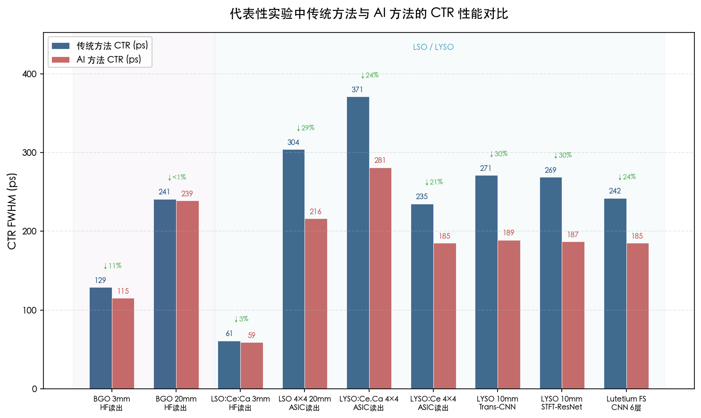

**图 3-1** 分组柱状图展示了九组代表性实验配置下传统方法（蓝色）与 AI 方法（红色）的 CTR FWHM 值。ASIC 读出配置（LSO/LYSO 4×4 阵列）下 AI 改善幅度普遍达 20–29%，而 HF 读出 + 快闪烁体配置下改善幅度显著收窄。

| 闪烁体 | 尺寸 (mm³) | SiPM / 读出 | 传统 CTR (ps) | AI 方法 | AI CTR (ps) | 改善幅度 | 来源 |
|---|---|---|---|---|---|---|---|
| BGO | 2×2×3 | FBK NUV-HD-MT / HF 20 GS/s | 129±2 (TWC) | CNN | 115±2 | 11% vs. TWC | Loignon-Houle 2025 |
| BGO | 2×2×20 | FBK NUV-HD-MT / HF 20 GS/s | 241±7 (TWC) | CNN | 239±7 | <1% vs. TWC | Loignon-Houle 2025 |
| BGO | 双端 / HF | — | — | CNN+Transformer 三阶段 | 128.2 | — | Feng 2024 |
| LSO:Ce:0.2%Ca | 2×2×3 | FBK NUV-HD-MT / HF 20 GS/s | 61 (LED) | CNN | 59 | 3% | Loignon-Houle 2025 |
| LSO 4×4 阵列 | 4×4×20 | Hamamatsu S13 / TOFPET2 | 304±5 (解析) | GBDT 残差物理 | 216±1 | 29% | Naunheim 2024 |
| LYSO:Ce,Ca 4×4 阵列 | 3.8×3.8×20 | Broadcom NUV-MT / TOFPET2 | 371±6 (解析) | GBDT 显式修正 | 281±5 | 24% | Naunheim 2025 |
| LYSO:Ce 4×4 阵列 | 3.9×31.9×19 | Philips dSiPM / TOFPET2 | 235 (解析) | XGBoost | 185 | 21% | Naunheim 2023 |
| LYSO | 3×3×10 | MPPC / 示波器 | 271 (CFD) | Transformer-CNN | 189 | 30% vs. CFD | Feng 2024 |
| LYSO | 3×3×10 | MPPC / 示波器 | 269 (CFD) | STFT-ResNet | 187 | 30.4% vs. CFD | Muhashi 2024 |
| Lutetium FS | — | PMT / 示波器 10 GS/s | 242 (CFD) | CNN 6 层 | 185±2 | 23% vs. CFD | Berg & Cherry 2018 |
| ECAL shashlyk | — | 8ch SiPM / 示波器 | >384 (CFD) | CNN label-free | 384 | 优于 CFD/LED-SC | Ai 2023 |
| MRPC | — | 前端电子学 / ADC | — | ComLSTM | 16.8 | 显著改善 | Wang 2020 |

## 3.6 AI 优势边界条件分析

综合上述实验结果，可以系统性地提炼出 AI 方法在时幅修正中性能增益的三个核心决定因素。图 3-2 以气泡散点图展示了 AI 增益与闪烁体衰减时间之间的宏观趋势，图 3-3 的三因素定性矩阵则提供了更为精细的条件组合分析框架。

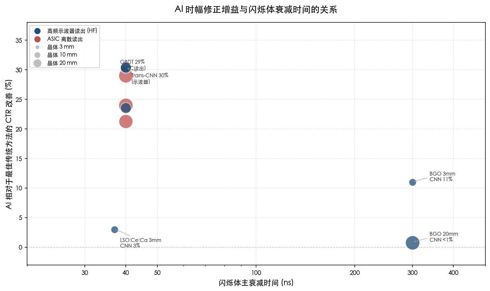

**图 3-2** 以闪烁体主衰减时间（对数刻度）为横轴、AI 相对于最佳传统方法的 CTR 改善百分比为纵轴，气泡大小表示晶体长度、颜色区分 HF 示波器与 ASIC 离散读出，直观呈现"慢闪烁体场景 AI 增益大"以及"ASIC 读出系统 ML 改善显著"两条核心趋势。

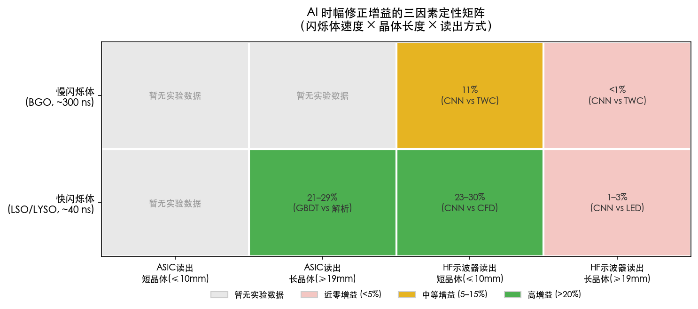

**图 3-3** 以闪烁体速度（慢/快）为行、晶体长度与读出方式的组合为列，用颜色编码展示不同实验条件组合下 AI 定时改善幅度的定性预期：绿色表示高增益（>20%），黄色表示中等增益（5–15%），粉色表示近零增益（<5%），灰色表示尚无实验数据。

### 3.6.1 闪烁体速度：慢闪烁体场景下 AI 增益远超快闪烁体

这是本章实验数据揭示的最为鲜明的规律。在 Loignon-Houle 等（2025）的直接对比中，同一 CNN 模型在 BGO（约 300 ns 衰减）短晶体上获得 26% 改善（LED→CNN），而在 LSO:Ce:Ca（约 37 ns 衰减）短晶体上仅获得 3% 改善。物理机制可从信息论角度理解：慢闪烁体信号包含多种时间尺度的信息成分（切伦科夫提示光子、快闪烁分量、慢闪烁分量），传统参数化模型仅能利用单一时间标记点的信息，而深度学习可从完整波形中同时提取多尺度特征；快闪烁体信号的时间结构相对单一，传统方法已能捕获绝大部分定时信息。

Ai 等（2021）从理论角度给出了一致的解释：基于多元 Cramér-Rao 下界（CRLB）的分析表明，神经网络定时估计器在低信噪比条件下更接近理论最优下界，而传统方法（CFD 等）在低 SNR 下与 CRLB 的偏离更为显著 [Ai et al. 2021 JINST](https://iopscience.iop.org/article/10.1088/1748-0221/16/09/P09019 "NN timing performance bound analysis")。慢闪烁体配合低光产率本质上构成了低有效 SNR 条件，AI 方法在此场景下的优势因而在理论上可预期。

### 3.6.2 晶体长度：短晶体配置下 AI 增益优于长晶体

在 BGO 配置下，3 mm 短晶体的 CNN 相对于 TWC 额外增益为 14 ps（11%），而 20 mm 长晶体仅有 2 ps（<1%）[Loignon-Houle et al. 2025 EJNMMI Physics](https://pmc.ncbi.nlm.nih.gov/articles/PMC11739447/ "Improving timing resolution of BGO for TOF-PET, 2025")。长晶体中光子在晶体两端间的多次反射以及作用深度（DOI）效应引入了额外的时间展宽，这种展宽具有几何随机性质，难以被 CNN 从波形形态中有效消除。换言之，长晶体中 DOI 效应对定时分辨率的贡献成为主导不确定性来源，CNN 对切伦科夫光子模式的利用被几何效应"稀释"。

### 3.6.3 读出信息丰度：ASIC 离散读出构成 ML 方法的最佳应用场景

这一结论源自 Naunheim 系列工作的实验证据。TOFPET2 ASIC 仅输出每通道的时间戳和能量值而非完整波形。在 4×4 阵列中，16 通道的离散输出构成 32–48 维特征向量（每通道时间戳 + 能量 + TOT），GBDT 可从中学习到光共享模式——邻近晶体的信号分配比例反映 γ 光子作用位置——与定时偏移的关联关系，实现 20–29% 的 CTR 改善 [Naunheim et al. 2023, 2024, 2025 综合]。

与之对比，高频示波器读出保留了完整波形信息，传统方法已能从中提取接近最优的定时估计。这解释了一个表面上看似矛盾的现象：同为 LYSO 配置，Naunheim 在 ASIC 读出下获得 20–29% 改善，而 Loignon-Houle 在 HF 读出下的 LSO 改善仅 1–3%。核心差异并非来自算法本身的能力差异，而是来自读出系统所提供的信息量与传统方法利用效率之间的"间隙"大小。ASIC 读出造成的信息压缩恰好为 ML 方法留下了更大的改善空间——ML 能够从 ASIC 未充分利用的多通道关联信息中"找回"被浪费的定时信息。

### 3.6.4 AI 增益有限或无增益的典型场景

基于上述三因素分析框架，可以明确界定 AI 方法增益有限的边界条件：

- **快闪烁体 + 高频读出**：LSO:Ce:Ca 2×2×3 mm³ + HF 20 GS/s 配置下，LED 信息已高度饱和，CNN 仅贡献 1–2 ps 的边际改善 [Loignon-Houle et al. 2025 EJNMMI Physics](https://pmc.ncbi.nlm.nih.gov/articles/PMC11739447/ "Improving timing resolution of BGO for TOF-PET, 2025")。
- **长晶体 BGO + HF 读出**：BGO 2×2×20 mm³ 配置下，CNN 在 FWHM 指标上与 TWC 几乎无差异（239 vs. 241 ps）。但 CNN 在 FWTM（全宽十分之一最大值）指标上仍显示出边际优势，表明 AI 对时间分布尾部的抑制能力略优于传统方法 [Loignon-Houle et al. 2025 EJNMMI Physics](https://pmc.ncbi.nlm.nih.gov/articles/PMC11739447/ "Improving timing resolution of BGO for TOF-PET, 2025")。
- **训练数据严重稀疏的极端条件**：Naunheim（2025）的隐式修正 GBDT 在训练步宽 ≥50 mm 时出现严重性能退化和线性度丧失，显式修正范式虽有所缓解但仍需关注数据覆盖度 [Naunheim et al. 2025 Front. Phys.](https://www.frontiersin.org/journals/physics/articles/10.3389/fphy.2025.1570925/full "Explicit TOF corrections, 2025")。

## 3.7 核心结论

综合本章汇总的十余项代表性实验成果，我们得出以下定量结论：

**AI 方法在时幅修正中的性能改善幅度为 0–30%**，具体取决于三个因素的组合效应：(a) 闪烁体速度——慢闪烁体（BGO, 约 300 ns 衰减）场景下 AI 增益可达 11–26%，快闪烁体（LSO/LYSO, 约 40 ns 衰减）场景下仅 1–3%；(b) 晶体长度——短晶体（3 mm）增益显著高于长晶体（20 mm）；(c) 读出信息丰度——ASIC 离散读出系统中 ML 可获 20–29% 改善，高频完整波形读出下额外改善空间有限。

这一结论揭示了 AI 时幅修正的本质定位：**AI 是信息提取效率的优化器，而非物理极限的突破者**。当传统方法已能充分利用信号中的定时信息时（快闪烁体 + HF 读出的信息饱和场景），AI 的贡献趋近于零；当信号中蕴含传统方法难以提取的高维信息时（慢闪烁体切伦科夫光子波动模式、ASIC 多通道光共享关联、低 SNR 条件），AI 方法通过更充分的信息利用可实现 20% 以上的可观改善。这一判断为第4章讨论硬件部署的优先级排序和第5章研判未来技术路线提供了关键的实验基础。

# 第4章 硬件实现与实时部署挑战

第3章的实验数据表明，AI/ML 方法在时幅修正中可带来 0–30% 的符合时间分辨率（CTR）改善，尤其在慢闪烁体和 ASIC 离散读出等"信息欠利用"场景中优势显著。然而，上述成果几乎全部基于离线分析——以高采样率示波器采集波形、在工作站上进行浮点运算推理——与实际探测器系统对实时性、功耗和大规模通道可扩展性的工程需求之间存在显著落差。从离线算法到可部署的在线推理引擎，横亘着模型量化、硬件资源约束、数据获取（DAQ）系统集成以及长期运行稳定性等一系列工程化挑战。

本章系统评估 AI 时幅修正方法从离线验证走向实时部署的工程化路径：4.1 节梳理 FPGA 平台上从定时数字化器到完整 ML 推理引擎的部署现状；4.2 节分析专用 ASIC 方案的架构特点与性能边界；4.3 节讨论模型量化的精度-资源权衡；4.4 节评估与现有 DAQ 系统的集成方案；4.5 节探讨模型在线更新与漂移补偿策略；4.6 节综述高层次综合（HLS）工具链生态；4.7 节以统一框架对比各部署方案；4.8 节总结工程化路径并提出近期优先事项。

## 4.1 FPGA 平台上的 ML 模型部署

现场可编程门阵列（FPGA）凭借可重配置性、确定性延迟和低功耗特性，成为探测器前端 ML 推理的首选部署平台。FPGA 上的部署工作可划分为三个递进层次：定时数字化器（提供高精度时间戳的硬件基础）、决策树推理引擎（对应梯度提升决策树等特征级模型）以及神经网络推理引擎（对应 CNN/MLP 等深度学习模型）。近年来，多个独立研究组已在各层次完成原型验证。

### 4.1.1 定时数字化器：FPGA 实现的基础层

FPGA 定时数字化器为后续叠加 ML 推理层提供硬件基础。Lee 与 Kwon（2025）实现了首款面向锗酸铋（BGO）飞行时间正电子发射断层扫描（TOF-PET）的 FPGA 数字化器，部署于 Xilinx Virtex-7（XC7VX485T）平台。该设计的核心定时引擎采用双端时间-数字转换器（TDC），平均分辨率约 6 ps，单通道仅占用 604 个查找表（LUT）和 342 个触发器（FF），分别占 FPGA 总资源的 0.19% 和 0.06%。在 BGO 2×2×3 mm³ + FBK NUV-HD SiPM 配置下，双通道系统实测 CTR 为 407 ± 8 ps FWHM，与同配置下示波器读出的 403 ± 14 ps 在统计误差范围内一致，双通道总功耗仅 0.463 W [Lee & Kwon 2025 PMB](https://pmc.ncbi.nlm.nih.gov/articles/PMC12077746/ "FPGA-based BGO TOF digitizer, PMB 70:075019, 2025")。该结果表明，FPGA 定时数字化器可在极低资源占用下达到与实验室级设备同等的定时精度。

Zhang 等（2025）将 FPGA 读出方案扩展至 64 通道规模：8×8 SiPM 阵列配合 8×8 LYSO 晶体阵列（3.2×3.2×10 mm³），在单块 FPGA 上实现多通道并行读出，平均 CTR 364.9 ps FWHM，动态范围达 240 倍 [Zhang et al. 2025 IEEE TRPMS](https://ui.adsabs.harvard.edu/abs/2025ITRPM...9...11Z/abstract "64-channel FPGA readout, IEEE TRPMS 9:11-19, 2025")。该设计规模已接近商用 PET 读出 ASIC（如 TOFPET2 的 64 通道）的通道密度，表明 FPGA 平台在中等规模探测器系统中具备实际工程可行性。

### 4.1.2 梯度提升树的 FPGA 部署：conifer 框架

第2章与第3章讨论的残差物理 + 梯度提升决策树（GBDT）方法在离线验证中展现了 20–29% 的 CTR 改善。将 GBDT 模型转化为 FPGA 可执行固件的关键工具是 conifer——由高能物理快速机器学习实验室（Fast Machine Learning Lab）开发的开源 Python 库，专门针对提升决策树的 FPGA 部署优化。

Summers 等（2020）在 conifer/hls4ml 框架下系统评估了 BDT 在 AMD XCVU9P FPGA 上的资源消耗与推理延迟：100 棵深度 4 的 BDT 集成体仅需 12 个时钟周期（在 200 MHz 时钟频率下对应 60 ns），占用 96,148 个 LUT（VU9P 总资源的 8.1%），不消耗任何 DSP 或 BRAM 资源 [Summers et al. 2020 JINST](https://arxiv.org/pdf/2002.02534 "Fast BDT inference on FPGAs, JINST 15:P06015, 2020")。该架构的核心特征在于所有决策树完全并行执行、阈值静态固化于 LUT 逻辑中，使得推理延迟仅与树深成对数关系，而非随估计器数量线性增长。

Summers 等进一步建立了 BDT-FPGA 资源消耗的解析模型：LUT 占用量 r ≈ 22 n_e + 53 n_e · 2^d，其中 n_e 为估计器（树）数量，d 为树深。LUT 消耗与估计器数量呈线性关系，但与树深呈指数关系——浅树、多估计器的集成策略在硬件效率上远优于深树策略 [Summers et al. 2020 JINST](https://arxiv.org/pdf/2002.02534 "BDT FPGA resource model, JINST 15:P06015, 2020")。

将该资源模型应用于 Naunheim 等（2025）的显式修正 GBDT——树深仅 4（每棵树 16 个叶节点，对比隐式模型的深度 18 / 262,144 个叶节点）——可推算约 100 棵估计器在 VU9P 级 FPGA 上约需 85,000 个 LUT，以约 60 ns 延迟完成推理。在定点化方面，Summers 等验证 18 位定点量化即可达到与 32 位浮点等同的分类性能，11 位量化下 AUC 仍保持 99% 以上 [Summers et al. 2020 JINST](https://arxiv.org/pdf/2002.02534 "BDT fixed-point performance, JINST 15:P06015, 2020")。考虑到 TOFPET2 ASIC 的最大事件率约 480 kHz/通道（对应约 2 μs 事件间隔），60 ns 的 BDT 推理延迟仅占事件间隔的 3%，时间预算裕度充足。

需要指出的是，截至 2026 年 3 月，conifer 在探测器定时/时幅修正场景中尚无直接部署的公开案例——现有基准测试主要覆盖高能物理喷注分类（jet tagging）和一级触发（L1 trigger）等场景。将 conifer 与 Naunheim 等人已验证的 GBDT 定时模型对接并在真实 DAQ 链路中完成闭环验证，是当前工程化路径中最具可操作性的近期目标。

### 4.1.3 神经网络的 FPGA 部署：hls4ml 工具链

对于波形级卷积神经网络（CNN）和多层感知器（MLP）等深度学习模型，hls4ml（High Level Synthesis for Machine Learning）是目前最成熟的开源部署框架。hls4ml v1.3.0（2025）支持 Keras、PyTorch 和 ONNX 模型导入，后端覆盖 AMD（Vivado/Vitis HLS）、Intel（Quartus）和 Siemens（Catapult HLS）三大 FPGA 厂商，架构支持范围涵盖 MLP、CNN、RNN、图神经网络（GNN）和 Transformer [hls4ml 2025 arXiv:2512.01463](https://cds.cern.ch/record/2950352/files/2512.01463.pdf "hls4ml platform paper, 2025")。

hls4ml 的基准测试揭示了不同模型架构间资源消耗的显著差异。MLP 模型（3 层全连接网络）在 AMD XCVU9P 上仅需 3,000–13,000 个 LUT、15–55 个 DSP，推理延迟为 3–5 个时钟周期（对应 12–24 ns），0 个 BRAM。CNN 模型的资源需求则高出一到两个数量级：SVHN 分类 CNN 延迟约 1,050 个时钟周期（在 200 MHz 下约 5.3 μs），消耗 58 个 DSP、69,000 个 LUT 和 32 个 BRAM [hls4ml 2025](https://cds.cern.ch/record/2950352/files/2512.01463.pdf "hls4ml MLP/CNN benchmark, 2025")。

上述数据对时幅修正场景具有直接的工程参考意义。MLP 的 12–24 ns 延迟可满足几乎所有探测器读出场景的实时性需求，包括高能物理一级触发的 <100 ns 窗口。CNN 的 5.3 μs 延迟虽不满足 L1 触发要求，但对于 PET 事件读出（约 480 kHz/通道，约 2 μs 间隔）而言处于边际可接受范围——若将 CNN 规模缩减至 Berg & Cherry（2018）6 层定时网络的参数量级（远小于 SVHN 分类 CNN），延迟有望降至亚微秒级。

hls4ml 通过 Catapult HLS 后端已扩展至 ASIC 设计流程，结合 ESP（Embedded Scalable Platform）片上系统框架可实现从模型训练到 ASIC 流片的端到端自动化设计流 [hls4ml 2025](https://cds.cern.ch/record/2950352/files/2512.01463.pdf "hls4ml ASIC pathway, 2025")。这一能力为从 FPGA 原型验证平滑过渡至量产级 ASIC 方案提供了工具链基础。

### 4.1.4 辐照环境下的 FPGA 部署

高能物理实验中 FPGA 面临的辐照损伤问题为 ML 部署引入了额外约束。Govorkova 等（2026）首次在 Microchip PolarFire 抗辐照 FPGA 上完成了 hls4ml 模型的自动化部署，以 LHCb PicoCal 量能器为测试案例。部署的自编码器模型推理延迟仅 25 ns，采用 10 位量化感知训练（QAT），模型可完全放入 FPGA 的保护逻辑区域，从而规避辐照诱发的单粒子翻转（SEU）影响 [Govorkova et al. 2026 arXiv:2602.15751](https://arxiv.org/abs/2602.15751 "Radiation-hard FPGA ML, 2026")。这项工作打通了从标准 FPGA 到抗辐照平台的 ML 部署链路，对需要在辐照环境中长期运行的大型粒子物理实验（如 CMS BTL、ALICE TOF 升级）的定时 ML 应用具有基础设施级意义。

## 4.2 专用 ASIC 方案：PulseDL 系列

当 FPGA 的资源利用率和功耗仍不满足大规模探测器阵列的严格约束时，专用集成电路（ASIC）成为必要选择。PulseDL 系列是目前唯一公开报道的面向核探测器脉冲分析的深度学习专用 ASIC 设计路线。

### 4.2.1 PulseDL（2020）：首代概念验证芯片

PulseDL（2020）是首个面向核探测器脉冲特征提取的深度学习 ASIC，采用 GSMC 130 nm 工艺制造，芯片面积 24 mm²，工作频率 25 MHz，供电电压 1.2 V，能效达 12.4 GOPS/W。其"Compact"网络架构可支持 15.1 个并行通道的实时推理 [PulseDL 2020 NIM-A](https://www.sciencedirect.com/science/article/abs/pii/S0168900220308172 "PulseDL ASIC, NIM-A 977:164355, 2020")。作为概念验证芯片，PulseDL 证明了将一维卷积神经网络（1D-CNN）固化于低功耗 ASIC 用于探测器脉冲实时处理的技术可行性。

### 4.2.2 PulseDL-II（2023）：集成处理器的片上系统

PulseDL-II（2023）在首代基础上进行了重大架构升级，演进为集成 ARM Cortex-M0 处理器的片上系统（SoC）。这一设计使芯片在保留固定加速器推理能力的同时，获得了通用处理器的灵活性——涵盖模型参数加载、数据调度和外设控制等系统级功能。

在 100 MHz 工作频率下，PulseDL-II 相比首代实现了运行时间 1.83 倍改善和能耗 1.81 倍改善，LUT/乘法器面积比降低 1.40 倍 [PulseDL-II 2023 IEEE TNS](https://arxiv.org/abs/2209.00884 "PulseDL-II SoC, IEEE TNS 70:971-978, 2023")。在 FPGA 验证平台上，PulseDL-II 在信噪比 47.4 dB 条件下达到 60 ps 时间分辨率和 0.40% 能量分辨率（均为 FWHM）。其目标应用场景为 NICA-MPD 电磁量能器（ECAL）——该探测器传统读出方案的时间分辨率约 1 ns，PulseDL-II 有望将其提升至约 150 ps 量级。

量化策略方面，PulseDL-II 采用三阶段量化感知训练（QAT）流程：首先以 32 位浮点训练基准模型，然后逐步将权重和激活值量化至 8/16 位定点表示，最终微调以恢复量化损失。该流程与 TensorFlow 工具链兼容，使研究人员可在标准深度学习框架中完成训练，再通过 QAT 将模型适配至硬件资源约束。实验结果表明，定点化后 60 ps / 0.40% 的性能与浮点基准近乎无损 [PulseDL-II 2023 IEEE TNS](https://arxiv.org/abs/2209.00884 "PulseDL-II QAT pipeline, IEEE TNS 70:971-978, 2023")。

PulseDL-II 的数据流架构为：Quad SPI 接口接收数字化脉冲数据 → 双端口缓冲区暂存 → Cortex-M0 处理器中继与调度 → 神经网络加速器执行推理 → UART 接口输出结果。权重参数在部署时一次性固定映射至加速器内部存储，以减少推理阶段的数据传输开销 [PulseDL-II 2023 IEEE TNS](https://arxiv.org/abs/2209.00884 "PulseDL-II dataflow, IEEE TNS 70:971-978, 2023")。

需要特别指出的是，截至 2026 年 3 月，PulseDL-II 的全部性能数据均来自 FPGA 验证平台而非 ASIC 实测。原始论文提出了未来的 28/65 nm 工艺流片计划，但尚无公开的流片后测试结果。从 FPGA 验证到 ASIC 流片之间仍存在版图设计、工艺偏差和封装测试等工程环节，ASIC 实测性能与 FPGA 验证结果之间可能存在差异。

## 4.3 模型量化：从浮点到定点的精度-资源权衡

模型量化是将离线训练的浮点模型部署至资源受限硬件的关键技术环节。量化将 32 位浮点参数压缩为低位宽定点表示（典型为 4–16 位），换取 LUT/DSP 资源的数量级降低和推理速度的显著提升。不同模型架构的量化策略与精度损失特征存在本质差异。

### 4.3.1 BDT 模型的定点化

BDT 模型的量化策略相对直接：决策阈值和叶节点输出值均为标量，量化仅需确保定点表示的精度足以区分相邻阈值。Summers 等（2020）的系统评估表明，18 位定点量化即可达到与 32 位浮点完全等同的分类性能（AUC 无差异），即使压缩至 11 位，AUC 仍保持在浮点值的 99% 以上 [Summers et al. 2020 JINST](https://arxiv.org/pdf/2002.02534 "BDT quantization evaluation, JINST 15:P06015, 2020")。对于时幅修正场景，由于 GBDT 输出为连续值修正量（而非分类标签），量化精度对最终时间分辨率的影响需针对性验证，但 18 位方案在资源消耗上已极为经济——不额外消耗 DSP 或 BRAM 资源。

### 4.3.2 神经网络的量化感知训练

神经网络的量化复杂度显著高于 BDT，因为卷积核和全连接权重矩阵中参数的数值分布跨度大，逐层均匀量化可能引入显著精度损失。hls4ml 平台集成的 HGQ（High Granularity Quantization）框架提供了参数级异构量化能力：每个参数的位宽可独立学习，有效位宽可降至 0 位以实现自动剪枝，同时以 EBOPs（Equivalent Bit Operations）作为可微分的硬件资源代理嵌入训练损失函数 [hls4ml 2025](https://cds.cern.ch/record/2950352/files/2512.01463.pdf "HGQ quantization, 2025")。与传统均匀量化相比，HGQ 在相同精度约束下可将 LUT 消耗降低 50–95%、DSP 消耗降低 50–100%——这一量级的资源节省对于在单块 FPGA 上部署多通道并行推理引擎具有决定性意义。

PulseDL-II 采用的三阶段 QAT 流程代表了另一种实用化路径：先浮点训练至收敛，再逐步引入量化约束并微调。该流程在 8/16 位混合精度下保持了 60 ps / 0.40% 的定时/能量分辨率性能，与浮点基准近乎无损 [PulseDL-II 2023 IEEE TNS](https://arxiv.org/abs/2209.00884 "PulseDL-II QAT results, IEEE TNS 70:971-978, 2023")。

### 4.3.3 量化位宽对定时精度的系统性评估缺口

当前文献中尚缺乏对不同量化位宽（INT4/INT8/INT16 vs. FP32）在定时精度指标上的系统性对比评估。BDT 领域的 18 位/11 位基准针对分类任务（AUC 指标），而非回归任务中的时间分辨率（ps FWHM 指标）；PulseDL-II 的 8/16 位 QAT 仅报告了单一配置点的结果。对于计划在 FPGA 上部署定时 ML 模型的工程实践而言，建立覆盖 4–16 位范围、以时间分辨率为直接评价指标的量化精度-资源消耗关系曲线，是亟待填补的工程数据缺口。

## 4.4 与现有 DAQ 系统的集成

将 ML 推理引擎嵌入探测器数据获取（DAQ）链路，需要解决接口协议、数据格式和系统级时序三方面的集成问题。本节以 PET 领域主流的 TOFPET2 ASIC 链路和高能物理 DAQ 系统为例，分析集成的技术路径与约束。

### 4.4.1 TOFPET2 ASIC 读出链路

TOFPET2 是 PETsys Electronics 开发的 64 通道前端读出 ASIC，采用 110 nm CMOS 工艺，集成 30 ps/bin TDC，最大事件率 480 kHz/通道，功耗仅 5 mW/通道 [TOFPET2 技术规格](https://www.petsyselectronics.com/web/website/docs/products/product1/TOFPET2_Overview.pdf "TOFPET2 specifications")。PETsys 配套的 DAQ 板使用 Kintex-7 FPGA 作为后端数据汇聚芯片，为 ML 推理集成提供了自然的硬件切入点。

在 Naunheim 系列工作验证的残差物理 + GBDT 工作流中，TOFPET2 输出每次符合事件的 16 通道时间戳和能量值（32–48 维特征向量），GBDT 模型在此特征空间上执行推理并输出修正值。将此工作流迁移至 FPGA 的技术路径为：TOFPET2 ASIC 以 SPI/LVDS 接口向 Kintex-7 输出事件数据帧 → FPGA 内部解帧提取特征 → conifer BDT 推理引擎计算修正量 → 修正后时间戳传入后续重建流水线。按 4.1.2 节估算，BDT 推理延迟约 60 ns，远低于事件间隔（约 2 μs），不构成数据吞吐瓶颈。

### 4.4.2 功耗约束的工程分析

功耗是大规模探测器系统中 ML 部署面临的最严格约束之一。表 4-1 汇总了当前各方案的功耗水平。

**表 4-1 各硬件方案功耗对比**

| 方案 | 功耗量级 | 来源 |
|---|---|---|
| TOFPET2 ASIC | 5 mW/通道 | [TOFPET2 技术规格](https://www.petsyselectronics.com/web/website/docs/products/product1/TOFPET2_Overview.pdf "TOFPET2 specifications") |
| PulseDL ASIC（估算） | ~12.4 GOPS/W | [PulseDL 2020 NIM-A](https://www.sciencedirect.com/science/article/abs/pii/S0168900220308172 "NIM-A 977:164355, 2020") |
| BGO FPGA 数字化器 | 0.463 W / 2 通道（~232 mW/通道） | [Lee & Kwon 2025 PMB](https://pmc.ncbi.nlm.nih.gov/articles/PMC12077746/ "PMB 70:075019, 2025") |
| conifer BDT（VU9P，估算） | ~10–15 W 全芯片（可支撑数百通道并行） | [Summers 2020 JINST](https://arxiv.org/pdf/2002.02534 "JINST 15:P06015, 2020") 综合推算 |

一台全尺寸 PET 扫描仪通常包含数万个 SiPM 通道（如 Siemens Biograph Vision 约 32,000 通道），前端功耗预算极为紧张。TOFPET2 的 5 mW/通道已是高度优化的商用方案，在此基础上叠加 ML 推理的功耗增量需严格控制。ASIC 路线（如 PulseDL 的 12.4 GOPS/W 能效）在规模部署时具备功耗优势，但 FPGA 路线在快速迭代和模型灵活更新方面更具吸引力。综合而言，FPGA 方案更适合中等规模系统（如实验室原型或核物理专用探测器阵列），大规模量产系统最终需要向 ASIC 方案过渡。

### 4.4.3 高能物理 DAQ 系统的 ML 集成

高能物理大型实验的 DAQ 系统面临更为极端的实时性和数据吞吐要求。LHC 实验的一级触发（L1 trigger）延迟窗口通常为微秒级（CMS L1 约 3.8 μs，ATLAS L1 约 2.5 μs），分配给单个算法模块的时间预算通常不超过 100 ns。如 4.1 节所述，conifer BDT 的 60 ns 延迟和 hls4ml MLP 的 12–24 ns 延迟均可在此窗口内完成推理；波形级 CNN（按 hls4ml 基准估算延迟约 1–5 μs）则无法满足 L1 触发约束，更适合在高级触发（HLT）或离线重建阶段部署。

对于 ALICE TOF 等大规模飞行时间系统（约 150,000 通道 MRPC），ML 辅助校准更可能以"离线训练、在线查表"的方式实现——在离线环境中以 ML 方法训练通道级修正参数，将训练完成的修正函数烧录至 FPGA 查表或以简化多项式形式固化，而非在每个事件上执行完整的 ML 推理。这种折中方案兼顾了 ML 方法对复杂非线性效应的建模能力与在线系统对确定性延迟和低资源占用的要求。

## 4.5 模型在线更新与漂移补偿

探测器系统在长期运行中面临温度变化、SiPM 偏压漂移、辐照损伤等环境因素导致的响应漂移，固定参数的 ML 模型校准精度将因此逐渐退化。有效的漂移补偿策略是 ML 方法在实际系统中长期稳定运行的前提。

### 4.5.1 SiPM 增益漂移的定量规模

SiPM 增益对温度高度敏感，典型温度系数约 3–5%/°C [Hamamatsu 技术说明](https://hub.hamamatsu.com/us/en/technical-notes/mppc-sipms/how-does-temperature-affect-the-gain-of-an-SiPM.html "SiPM gain ~3-5%/°C")。在未配备温度补偿的系统中，环境温度 1°C 的波动即可导致增益变化 3–5%，进而改变信号幅度分布，使 ML 模型的时幅修正参数偏离最优工作点。商用 PET 系统通常配备偏压温度补偿回路以抑制增益漂移，但残余漂移（典型量级 <1%）仍可能对 ps 级定时精度产生可测量影响。

### 4.5.2 快速重训练策略

Naunheim 等（2024）的实验数据为漂移补偿提供了一条实用路径：GBDT 训练数据采集可从完整标定的 43 小时压缩至约 3 分钟（约 1,000 倍加速），性能退化仅为边际水平 [Naunheim et al. 2024 Phys. Med. Biol.](https://publications.rwth-aachen.de/record/1015553/files/1015553.pdf "3-min training viable, PMB 69:155026, 2024")。3 分钟的重训练耗时使 ML 校准可像传统增益标定一样作为周期性维护程序执行——例如每日或每个温度循环后自动触发重校准。对于 GBDT 模型，重训练仅涉及 scikit-learn/XGBoost 级别的 CPU 计算（非 GPU 密集型），在 DAQ 板载嵌入式处理器上即可完成。

### 4.5.3 FPGA 模型更新机制

FPGA 平台支持两种不同粒度的模型更新方式。对于 BDT 模型，由于决策阈值和叶节点值静态固化于 LUT 配置中，模型更新需重新生成综合比特流（bitstream）并通过完整或部分重配置加载。FPGA 的部分重配置（Partial Reconfiguration）技术允许在系统不中断运行的条件下更新特定逻辑区域——将 BDT 推理引擎放置于可重配置分区中，即可在不影响 TDC、触发和数据传输等静态逻辑的前提下完成模型热更新。

对于 CNN 模型，更新灵活性更高：网络结构（卷积核大小、层数、通道数）固化于逻辑中，但权重参数存储于 BRAM 中，可通过 DMA（直接内存访问）完成更新，无需重综合或重配置 FPGA 逻辑，更新延迟显著低于完整 bitstream 加载 [PulseDL-II 2023 IEEE TNS](https://arxiv.org/abs/2209.00884 "Weight update via DMA, IEEE TNS 70:971-978, 2023")。这一特性使 CNN 模型在应对环境漂移时具有更高的更新灵活性，可实现分钟级甚至秒级的参数热刷新。

### 4.5.4 长期稳定性的开放问题

当前文献中尚无 ML 定时模型在真实探测器系统上连续运行数周至数月的稳定性评估数据。Naunheim 的 3 分钟快速重训练方案虽在概念上解决了漂移补偿问题，但以下工程问题仍为开放状态：(a) 自动触发重校准的判据——如何以在线监控指标实时检测模型性能退化并触发重训练；(b) 辐照诱发的 SiPM 暗计数率增加对 ML 模型的长期影响——暗计数率在辐照后可增加数个量级，从根本上改变噪声统计特性；(c) 重训练过程中的数据质量保证——周期性重训练依赖于标定数据的可靠获取，在某些实验配置下（如加速器束流运行期间）标定数据采集可能受到限制。

## 4.6 HLS 工具链与 ASIC 设计通路的生态现状

### 4.6.1 hls4ml 的架构与生态定位

hls4ml 已演进为探测器领域 AI 硬件部署最重要的开源生态系统。其核心架构采用模块化设计：前端解析器从 Keras/PyTorch/ONNX 中提取计算图，中间表示层执行模型优化（剪枝、量化、层融合），后端代码生成器输出目标平台的 HLS C++ 代码 [hls4ml 2025](https://cds.cern.ch/record/2950352/files/2512.01463.pdf "hls4ml architecture, 2025")。这种前后端分离设计使同一训练模型可无缝映射至不同厂商的 FPGA 平台，甚至通过 Catapult HLS 后端直接输出 ASIC RTL 代码。

与 AMD Research 开发的 FINN 框架相比，hls4ml 在模型架构覆盖面上更广（FINN 专注于二值化/低位宽 CNN），而 FINN 在极端量化（二值化权重和激活值）下的推理吞吐量更高，可达每秒百万级推理、功耗 <25 W [FINN 2017 arXiv:1612.07119](https://arxiv.org/abs/1612.07119 "FINN framework for BNN, 2017")。在核探测器定时场景中，FINN 尚无直接应用案例，但其极端量化策略为资源极度受限的场景（如单通道嵌入式读出）提供了潜在技术储备。

### 4.6.2 从 FPGA 到 ASIC 的设计通路

对于需要大规模量产的探测器系统（如全身 PET 扫描仪的数万通道），从 FPGA 原型向 ASIC 量产过渡是降低单通道成本和功耗的必然路径。当前可用的设计通路包括两条：

- **hls4ml + Catapult HLS + ESP SoC**：hls4ml 通过 Catapult 后端输出可综合的 RTL 代码，结合 ESP SoC 框架中的标准化加速器接口和 NoC 互连，可构建完整的 ASIC 设计包 [hls4ml 2025](https://cds.cern.ch/record/2950352/files/2512.01463.pdf "hls4ml ASIC flow, 2025")。
- **PulseDL 直接 ASIC 设计**：PulseDL 系列采用传统的手工 RTL + 标准单元库综合流程（GSMC 130 nm），以最大化硬件效率为目标，但设计灵活性和迭代速度不及 HLS 路线 [PulseDL 2020 NIM-A](https://www.sciencedirect.com/science/article/abs/pii/S0168900220308172 "PulseDL ASIC design, NIM-A 977:164355, 2020")。

两条路径各有优劣：HLS 路线降低了硬件设计门槛、加速了迭代周期，但可能在面积和功耗上不及手工优化的 ASIC 设计；直接 ASIC 路线在硬件效率上最优，但设计周期长、修改成本高。鉴于当前探测器定时 ML 领域仍处于算法快速迭代的阶段，我们认为 HLS 路线更具短期实用价值——待算法架构趋于收敛后，再转向手工 ASIC 优化以追求极致功耗效率，是更为务实的工程策略。

## 4.7 硬件部署方案综合对比

综合以上各节讨论，表 4-2 以统一框架呈现当前各硬件部署方案的核心性能指标。

**表 4-2 AI 定时模型硬件部署方案综合对比**

| 平台 | 模型类型 | 工艺/FPGA | 推理延迟 | LUT 占用 | DSP 占用 | BRAM | 已验证定时性能 | 来源 |
|---|---|---|---|---|---|---|---|---|
| PulseDL ASIC | 1D-CNN | GSMC 130 nm | — | — | — | — | — | [PulseDL 2020 NIM-A](https://www.sciencedirect.com/science/article/abs/pii/S0168900220308172 "NIM-A 977:164355") |
| PulseDL-II SoC | 1D-CNN | FPGA 验证 | 1.83× 改进 | 529（乘法器） | — | — | 60 ps | [PulseDL-II 2023 IEEE TNS](https://arxiv.org/abs/2209.00884 "IEEE TNS 70:971-978") |
| hls4ml MLP | MLP 3 层 | XCVU9P | 12–24 ns | 3k–13k | 15–55 | 0 | — | [hls4ml 2025](https://cds.cern.ch/record/2950352/files/2512.01463.pdf "hls4ml platform paper") |
| hls4ml CNN | CNN（SVHN） | XCVU9P | ~5.3 μs | 69k | 58 | 32 | — | [hls4ml 2025](https://cds.cern.ch/record/2950352/files/2512.01463.pdf "hls4ml CNN benchmark") |
| conifer BDT | 100 树 深度 4 | VU9P | 60 ns | 96k (8.1%) | 0 | 0 | — | [Summers 2020 JINST](https://arxiv.org/pdf/2002.02534 "JINST 15:P06015") |
| BGO TOF 数字化器 | TDC+TOT | XC7VX485T | — | 604/通道 | — | — | CTR 407 ps | [Lee & Kwon 2025 PMB](https://pmc.ncbi.nlm.nih.gov/articles/PMC12077746/ "PMB 70:075019") |
| PolarFire ML | 自编码器 | PolarFire 抗辐照 | 25 ns | 低 | — | — | — | [Govorkova 2026](https://arxiv.org/abs/2602.15751 "arXiv:2602.15751") |

图 4-1 以分组柱状图形式直观呈现上述方案在 LUT、DSP 和 BRAM 三类资源上的占用差异。BDT 仅消耗 LUT 而不占 DSP/BRAM 的特征尤为突出，这意味着 BDT 与 CNN 在同一块 FPGA 上混合部署时可充分利用异构资源的互补关系。

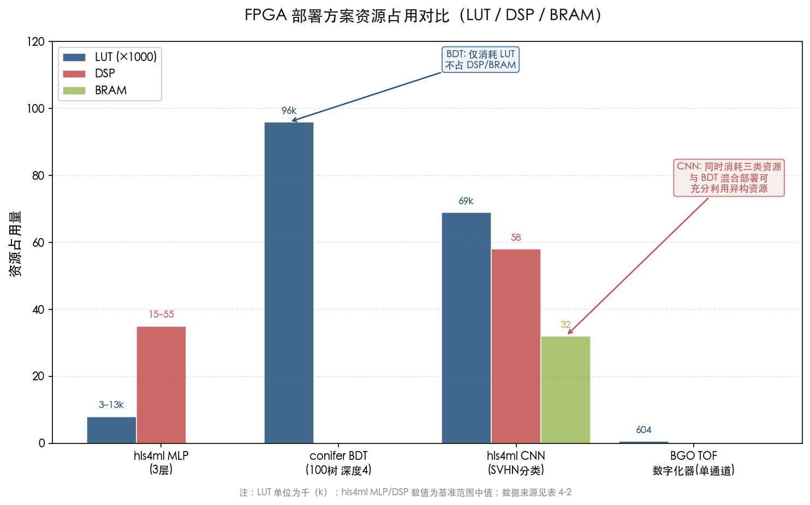

图 4-2 进一步以对数时间轴展示各方案的推理延迟，并叠加高能物理 L1 触发约束（~100 ns）和 PET 事件间隔约束（~2 μs / 480 kHz/通道）两条系统级约束线。MLP、BDT 和 PolarFire 自编码器均可满足 L1 触发的纳秒级要求；CNN 的微秒级延迟则更适合 PET 实时读出或 HLT/离线处理场景。

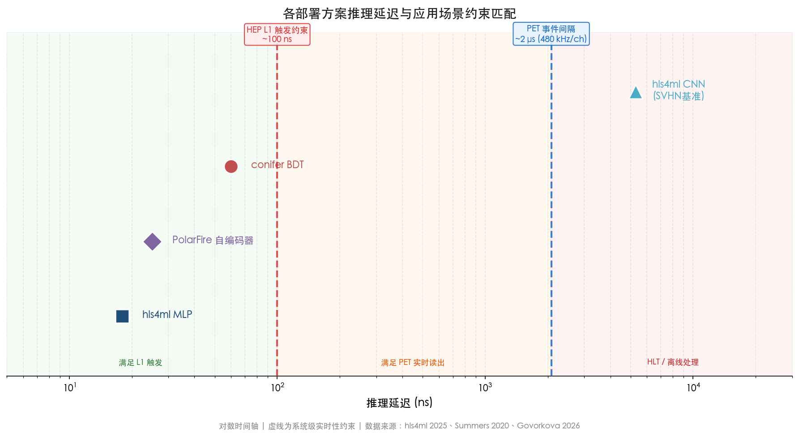

该对比揭示了三个关键权衡维度：(a) **延迟 vs. 模型复杂度**——MLP/BDT 的纳秒级延迟与 CNN 的微秒级延迟相差两个数量级；(b) **LUT vs. DSP 互补关系**——BDT 仅消耗 LUT 不占 DSP，CNN 同时消耗两类资源，混合部署可更充分利用 FPGA 异构资源；(c) **FPGA 灵活性 vs. ASIC 效率**——FPGA 方案在模型快速迭代和在线更新方面具有优势，ASIC 方案在功耗和面积效率上占优但设计周期更长。

## 4.8 工程化路径总结与近期优先事项

从离线算法验证到实时部署的完整工程化路径可概括为五个阶段：离线模型训练与验证 → 量化感知训练（QAT/HGQ） → HLS 综合（hls4ml/conifer） → FPGA 原型验证 → ASIC 量产（视规模需求）。图 4-3 展示了该路径的完整流程，各阶段标注了关键工具链名称与技术就绪度（TRL）。当前进展表明，前三个阶段的工具链已基本成熟（TRL 4–5），瓶颈集中在后两个阶段（TRL 2–4）——特别是在真实 DAQ 环境中的闭环验证。

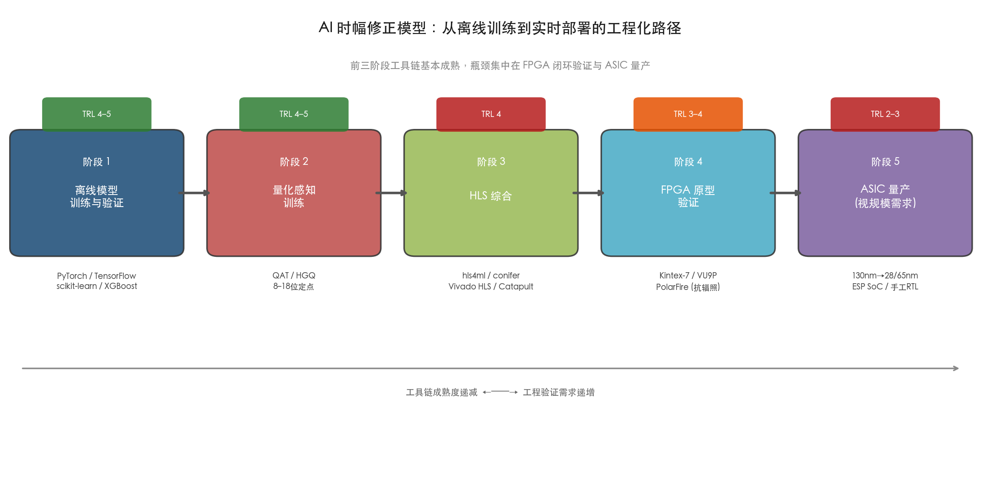

基于本章分析，我们认为以下三项工程任务构成近期（未来 6–12 个月）最具可操作性的优先事项：

1. **conifer + GBDT 定时模型的 FPGA 闭环验证**：将 Naunheim 等已训练的显式修正 GBDT 模型通过 conifer 综合至 PETsys Kintex-7 DAQ 板，在 TOFPET2 + LYSO 配置下执行在线推理并对比离线分析的 CTR 一致性。这是技术就绪度从 TRL 3–4（实验室验证）跃升至 TRL 5–6（原型系统验证）的关键步骤。

2. **定时精度导向的量化位宽系统评估**：以 CTR FWHM 为直接评价指标，建立 INT4/INT8/INT16 vs. FP32 的精度-资源曲线，为 FPGA/ASIC 设计提供定量的位宽选择依据。

3. **快速重训练的自动化闭环**：在 FPGA 平台上实现温度监控 → 自动触发重校准 → conifer 重综合 → 部分重配置加载的完整自动化链路，验证 ML 定时校准作为"免维护"标定方案的工程可行性。

# 第5章 方法局限性、开放问题与未来方向

前四章的系统分析表明，AI/ML 方法在电子学读出时幅修正中已取得 0–30% 的符合时间分辨率（CTR）改善，且从 hls4ml/conifer 工具链到 PulseDL-II 专用 ASIC 的工程化路径日趋成熟。然而，从实验室单探测器验证到大型物理实验正式分析流水线的全面采纳之间，仍横亘着泛化性不足、训练数据瓶颈、可解释性争议与标准化缺失等核心障碍。与此同时，元闪烁体（metascintillator）、SPAD 阵列和量子硅探测器（QSD）等新型探测器技术正在从根本上重塑定时问题的信息结构，为 AI 方法开辟了超越传统时幅修正范畴的新应用空间。本章客观评估当前方法尚未解决的问题与风险，审视 AI 时幅修正在 10 ps CTR 路线图中的角色定位，并探讨标准化与基准测试的社区共识建设路径。

## 5.1 泛化性：从单探测器验证到跨配置迁移

### 5.1.1 当前工作的配置锁定特征

泛化性不足是当前 AI 时幅修正方法面临的最根本性障碍。截至 2026 年 3 月，所有已发表的实验验证工作均在单一探测器配置上完成训练和测试——模型有效性严格绑定于特定闪烁体类型、SiPM 型号、读出 ASIC 和几何尺寸的组合。Naunheim 等在 2023–2025 年间发表的三项系统性研究分别使用 Philips dSiPM、Hamamatsu S13 和 Broadcom NUV-MT 三种不同 SiPM，每次均需从头训练全新模型 [Naunheim et al. 2025 Front. Phys.](https://www.frontiersin.org/journals/physics/articles/10.3389/fphy.2025.1570925/full "探测器专用训练")。Berg 与 Cherry（2018）的开创性 CNN 工作同样仅在单一 PMT 配置上验证，作者在讨论中明确指出需为每种新探测器配置重新采集训练数据 [Berg & Cherry 2018 PMB](https://pmc.ncbi.nlm.nih.gov/articles/PMC5784837/ "PMT 专用 CNN 验证")。

这种"配置锁定"特征源于两个层面的差异。**信号形态层面**：不同 SiPM 的增益、暗计数率、单光子时间分辨率及光子探测效率差异导致脉冲波形的基本统计特性迥异。**物理效应耦合层面**：闪烁体衰减时间、晶体几何形状和光导结构决定了 time walk 与幅度之间的函数映射形式——BGO 中切伦科夫光子主导的 time walk 模式与 LYSO 中闪烁光子主导的模式在物理本质上存在根本差异。ML 模型在训练过程中将这两个层面的特征纠缠在一起学习，难以分离出可迁移的通用定时知识。图 5-3 以五级递进层次展示了泛化性挑战的全貌与当前研究状态。

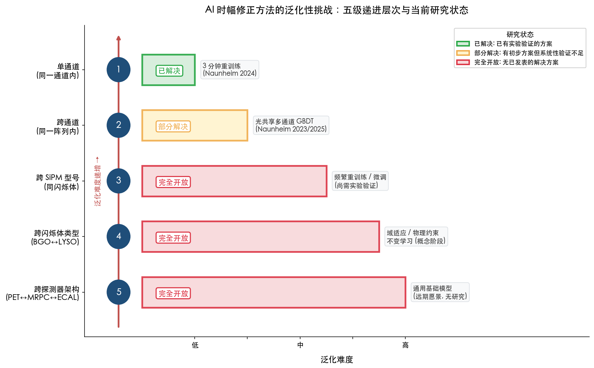

**图 5-3** 泛化性挑战的五级递进层次。从单通道内的已解决问题到跨探测器架构的完全开放问题，泛化难度逐级递增。绿色表示已有实验验证方案，黄色表示部分解决，红色表示无已发表的解决方案。

### 5.1.2 域适应的潜在路径与现状

高能物理领域已积累域适应（domain adaptation）的初步经验。Baalouch 等（2019）在 LHCb 数据上应用域对抗神经网络（DANN），将仿真-实验间的 Kolmogorov-Smirnov 距离从 0.19 压缩至 0.06，显著缩小了 sim-to-real 差距 [Baalouch et al. 2019 NeurIPS ML4PS](https://ml4physicalsciences.github.io/2019/files/NeurIPS_ML4PS_2019_20.pdf "LHCb DANN 域适应")。然而，该工作聚焦于粒子鉴别任务，涉及的域迁移主要来自仿真器与真实探测器之间的系统性偏差，与定时校准中跨硬件配置的迁移需求存在本质区别。

截至研究时点，探测器定时领域不存在已发表的跨配置迁移学习或域适应工作。我们认为以下三种路径具有可行性但尚需系统验证：

- **微调策略（fine-tuning）**：在源配置上预训练完整模型，仅用目标配置的少量数据微调最后几层。Naunheim 等（2024）已证明 GBDT 训练数据量可压缩至约 3 分钟采集量 [Naunheim et al. 2024 PMB](https://publications.rwth-aachen.de/record/1015553/files/1015553.pdf "3 分钟快速重标定")，若微调进一步将所需数据量降至数十秒级，迁移策略将具备实际工程价值。
- **物理约束编码的域不变表示**：Ai 等（2023）的 label-free 方法利用线性时间约束构建损失函数，这种物理约束本质上与具体硬件无关，有望形成跨配置的域不变学习框架 [Ai et al. 2023 MLST](https://iopscience.iop.org/article/10.1088/2632-2153/acfd09 "物理约束无标签定时")。
- **残差物理框架的天然迁移优势**：在残差物理范式中，一阶 time walk 由解析物理模型处理（模型参数可通过简单标定获得），ML 仅学习残差高阶效应。若残差分布的统计特性在不同配置间具有一定程度的一致性，则预训练的残差模型有望以较少数据迁移至新配置。

### 5.1.3 频繁重训练：实用替代方案及其局限

Naunheim 等（2024）的 3 分钟重训练方案提供了一条务实的替代路径：与其追求真正的跨配置泛化，不如将重训练成本降低到工程上可接受的水平，使每个新配置或环境变化后的快速重校准成为常规操作 [Naunheim et al. 2024 PMB](https://publications.rwth-aachen.de/record/1015553/files/1015553.pdf "3 分钟训练可行性验证")。该策略在 PET 应用中具备工程可行性——商用 PET 扫描仪通常在每日开机时执行增益和定时校准，3 分钟的 ML 重训练可自然嵌入现有校准流程。

然而，频繁重训练方案并不等同于泛化能力的获得。其仍要求每个探测器通道在部署时可获取有效的标定数据源（如放射源或符合事件流），而在某些实验配置下这一条件可能无法满足——例如加速器束流运行期间无法安排专用标定运行，或空间探测器部署后无法更换放射源。此外，Naunheim 等（2025）发现隐式修正 GBDT 在训练步宽增至 50 mm 以上时出现严重的性能退化和线性度丧失 [Naunheim et al. 2025 Front. Phys.](https://www.frontiersin.org/journals/physics/articles/10.3389/fphy.2025.1570925/full "训练步宽敏感性分析")，这表明训练数据分布的覆盖度对模型鲁棒性具有决定性影响——即使在同一硬件配置内，数据采集策略的变化亦可能导致性能不稳定。

## 5.2 训练数据瓶颈与仿真-实验鸿沟

### 5.2.1 数据获取成本的量级差异

不同 AI 方法对训练数据的需求跨越数个数量级，这一差异直接决定了各方法的适用场景。波形级 CNN（Berg & Cherry 2018）需要 10 GS/s 高速示波器采集约 145,000 对波形（29 个源位 × 约 15,000 对/源位），对数据获取设备和采集时间均提出较高要求 [Berg & Cherry 2018 PMB](https://pmc.ncbi.nlm.nih.gov/articles/PMC5784837/ "CNN 训练数据需求")。Naunheim 等（2023）的初始 GBDT 方案累计采集约 6.82×10⁸ 符合事件（约 8 天），但后续工作（2024）证明仅需约 3 分钟即可获取足够训练数据，实现了约 1000 倍的采集效率提升 [Naunheim et al. 2024 PMB](https://publications.rwth-aachen.de/record/1015553/files/1015553.pdf "数据采集优化")。Ai 等（2023）的 label-free 方法进一步将标定数据需求降至约 10,000 事件对（17 分钟采集），且无需已知位置的放射源 [Ai et al. 2023 MLST](https://iopscience.iop.org/article/10.1088/2632-2153/acfd09 "无标签方法最小数据需求")。

数据获取成本直接制约方法的应用范围：波形级 CNN 更适合实验室环境中精度优先的离线优化场景，而 GBDT 和 label-free 方法凭借低数据需求可服务于在线校准和大规模系统部署。对于 ALICE TOF（约 150,000 通道）或全身 PET 扫描仪（约 32,000 通道）这类大规模系统，逐通道训练数据的获取和管理本身即构成一项系统工程挑战。

### 5.2.2 仿真数据的角色与 sim-to-real 鸿沟

仿真数据在两类研究中发挥关键作用：性能极限的理论分析（Ai 等 2021 年基于 Cramér-Rao 下界的评估框架 [Ai et al. 2021 JINST](https://iopscience.iop.org/article/10.1088/1748-0221/16/09/P09019 "CRLB 仿真分析框架")）和新型探测器概念的前瞻性验证（Maebe & Vandenberghe 2022 年 3D-CNN 单片晶体定时仿真 [Maebe & Vandenberghe 2022 PMB](https://pubmed.ncbi.nlm.nih.gov/35617948/ "3D-CNN 单片 PET 定时仿真")）。然而，仿真数据与实验数据之间的系统性差异——即 sim-to-real gap——在定时领域至今尚未获得定量评估。

sim-to-real 鸿沟的来源涵盖多个物理过程：闪烁光子传输中光学界面反射与散射的精细建模、SiPM 像素间串扰和后脉冲的概率特性、前端电子学噪声的非高斯成分等。这些效应的累积可能导致仿真训练的 ML 模型在真实数据上出现不可预测的性能退化。Maebe & Vandenberghe（2022）的 3D-CNN 工作仅基于仿真数据报告了 141 ps CTR，该结果的实验可重复性仍属开放问题。建立高保真仿真工具链并系统量化 sim-to-real gap 对定时 ML 精度的影响，是推动仿真数据在实际训练流程中发挥更大作用的先决条件。

## 5.3 可解释性、不确定性量化与物理社区接受度

### 5.3.1 黑箱问题的现实影响

可解释性已成为物理学 ML 应用的核心研究焦点。Wetzel 等（2025）在系统综述中指出，可解释的机器学习在物理学中服务于四重目标：增强信任、减少错误、改进底层物理模型、实现人-AI 协作科学发现 [Wetzel et al. 2025 arXiv:2503.23616](https://arxiv.org/abs/2503.23616 "物理学可解释 ML 综述")。在定时校准场景中，可解释性的缺失直接影响实验合作组对 ML 方法的采纳意愿——若 ML 模型的修正值出现异常（如明显偏离物理预期的修正量），操作者需要能够诊断异常原因，而对黑箱 CNN 而言，这一需求几乎无法满足。

Berg 与 Cherry（2018）在 CNN 工作中坦承无法确切验证网络的内部工作机制，仅推测了三种可能的信息利用途径：反卷积光电响应函数以提取到达时间、识别与晶体内相互作用深度（DOI）相关的波形模式、利用脉冲早期上升沿的精细结构 [Berg & Cherry 2018 PMB](https://pmc.ncbi.nlm.nih.gov/articles/PMC5784837/ "CNN 黑箱讨论")。这种推测性解释对于要求严格系统性不确定性控制的高能物理实验而言远不充分。

### 5.3.2 已有的可解释性实践

当前定时 AI 领域已涌现三种不同层级的可解释性实践，从事后解释到先验约束逐步深入：

**特征归因分析**：Naunheim 等（2023）对 GBDT 模型应用 SHAP（SHapley Additive exPlanations）分析，明确揭示了模型学习到的特征重要性排序——能量相关特征和相邻通道时间戳的贡献最为显著，与 time walk 物理效应的预期高度一致 [Naunheim et al. 2023 IEEE TNNLS](https://www.researchgate.net/publication/374897482_Improving_the_Timing_Resolution_of_Positron_Emission_Tomography_Detectors_Using_Boosted_Learning-A_Residual_Physics_Approach "SHAP 特征归因分析")。GBDT 的树结构天然比深度神经网络更具可解释性，构成当前定时场景中最透明的 ML 方案。

**物理约束嵌入**：物理先验已通过三种方式融入 ML 定时模型——Ai 等（2023）将线性时间约束编码为损失函数 [Ai et al. 2023 MLST](https://iopscience.iop.org/article/10.1088/2632-2153/acfd09 "物理约束损失函数")、Naunheim 等（2023）通过实验设计注入物理知识并以 SHAP 验证模型是否学到预期模式、Onishi 等（2022）用 LED 物理模型预处理后由 CNN 学习残差。这些方法虽非严格意义上的物理信息神经网络（PINN），但实质性地将物理先验融入了学习过程，使模型行为更具物理可预测性。

**可审计的残差物理设计**：Naunheim 等（2025）的显式修正范式将 ML 的角色限定为输出小量修正值（而非直接估计绝对时间戳），可为修正量设定物理合理的上界，使异常输出可被自动检测和拒绝 [Naunheim et al. 2025 Front. Phys.](https://www.frontiersin.org/journals/physics/articles/10.3389/fphy.2025.1570925/full "可审计 ML 设计")。这种"AI 补充物理而非替代物理"的设计哲学显著降低了信任门槛，为 ML 方法在保守的物理实验社区中获得采纳提供了可行路径。

### 5.3.3 不确定性量化的缺失

截至研究时点，所有已发表的定时 AI 工作均未提供逐事件的预测不确定性估计。在物理实验中，时间测量的不确定性直接传播至最终物理量（如粒子质量重建、飞行时间粒子鉴别的置信度），因此 ML 修正值的不确定性量化不仅是"可选"特性，而是正式分析流水线采纳的前置条件。贝叶斯神经网络、MC Dropout 和 deep ensemble 等不确定性估计方法已在粒子物理其他 ML 应用中获得广泛探索，但将其引入实时定时校准场景面临额外的推理延迟开销约束——例如 deep ensemble 通常需要 5–10 倍的推理计算量，这在 FPGA 实时部署环境中可能超出资源预算。

## 5.4 与新型探测器技术的协同演进

### 5.4.1 元闪烁体（Metascintillator）：AI 定时的天然基底

元闪烁体概念由 Lecoq 等提出，通过将高密度宿主材料（如 BGO、LYSO）与超快发射层（如塑料闪烁体 EJ232、BaF₂ 或纳米晶体）交替排列，在保持高探测效率的同时显著提升定时性能 [Lecoq 2022 EPJ Plus 137:964](https://link.springer.com/article/10.1140/epjp/s13360-022-03159-8 "元闪烁体概念")。第一代元闪烁体已接近 100 ps 等效 CTR，第二代利用 Purcell 效应的纳米光子特征进一步加速发射过程，实验证明 CTR 改善因子达 1.6 [Shultzman et al. 2024 arXiv:2406.15058](https://arxiv.org/abs/2406.15058 "第二代元闪烁体 Purcell 效应")。

元闪烁体产生的信号具有复杂的双组分时间结构：来自超快发射层的提示光子（亚纳秒时间尺度）叠加在宿主材料的常规闪烁光子之上，两组分的相对比例随每次 γ 射线相互作用的能量沉积位置而波动。Konstantinou 等（2025）的最新实验工作证实了这一复杂性的实用价值：对 3×3×15 mm³ BGO:EJ232 元闪烁体（体积比 3:1），通过脉冲特征分析执行时幅修正，全光电峰 CTR 从 280.1 ps 改善至 204.7 ps（改善约 25%）；进一步筛选出快发射层能量沉积比例最高的 10% 事件后，CTR 从 106 ps 压低至 54.7 ps（改善约 50%）[Konstantinou et al. 2025 JINST 20 C03021](https://iopscience.iop.org/article/10.1088/1748-0221/20/03/C03021 "元闪烁体脉冲分析与时幅修正")。

这一结果揭示了 AI 方法在元闪烁体上的两层潜在价值：第一层是利用 CNN/Transformer 等深度学习模型从复杂双组分波形中最优提取定时信息，超越简单脉冲特征分析所能达到的精度；第二层是通过事件级能量共享分类实现自适应定时策略——对快光子丰富的事件采用切伦科夫定时策略，对闪烁光主导的事件采用传统时幅修正策略。Konstantinou 等的工作目前仅使用传统脉冲特征分析实现了 25–50% 的改善，我们预期 AI 方法可在此基础上进一步提升全光电峰的平均 CTR 性能。

### 5.4.2 SPAD 阵列与量子硅探测器：高维数据驱动的 AI 刚需

单光子雪崩二极管（SPAD）阵列和量子硅探测器（QSD）概念代表了光电探测器的范式转变——从积分式模拟信号转向逐光子数字时间戳。Bocchieri 等（2024）首次使用 SPAD 相机（SwissSPAD2, 512×512 像素）对单个闪烁事件进行成像，实现了闪烁体内三维定位 [Bocchieri et al. 2024 Commun. Eng.](https://www.nature.com/articles/s44172-024-00281-6 "SPAD 相机闪烁成像")。QSD 概念更进一步，将 SPAD 与逐像素 TDC 通过 3D CMOS 技术集成，单通道已达 17.5 ps FWHM 单光子时间分辨率 [Lecoq et al. 2020 PMB 65:21RM01](https://pmc.ncbi.nlm.nih.gov/articles/PMC7721485/ "QSD 概念与 17.5 ps SPAD 性能")。

这些新型光电探测器将探测器数据从"每个事件一对波形"升级为"每个事件数百至数千个单光子时间戳"。在这种高维数据结构下，传统参数化时幅修正方法完全失效——不存在将数百个时间戳简化为单一幅度变量的自然方式。多光子到达时间的最优融合本质上是一个高维统计推断问题，正是 AI 方法的核心竞争力所在。图神经网络（GNN）和 attention 机制尤其适合处理这种不规则的点过程数据：光子时间戳可表示为图节点，空间邻近的 SPAD 像素之间的关联可通过消息传递机制高效捕获。

我们判断，SPAD 阵列和 QSD 的成熟将使 AI 从时幅修正的"辅助优化工具"升级为"不可或缺的信号提取引擎"——在数字 SiPM 的高维数据场景中，不使用 AI 方法将意味着对大量可用信息的系统性浪费。

### 5.4.3 超快闪烁材料的 AI 适配前景

CdSe 纳米片和 CsPbBr₃ 钙钛矿纳米晶体等下一代超快发射材料（衰减时间约 100–500 ps）在辐照稳定性和规模化生产方面仍面临重大挑战 [ACS Nano 2024 综述](https://pmc.ncbi.nlm.nih.gov/articles/PMC11155248/ "下一代闪烁体工程综述")。然而，一旦这些材料成熟并集成于元闪烁体架构中，其超快发射特性将产生极为尖锐的光子到达时间分布——少数先到光子携带的定时信息将占主导地位，而这些光子的统计涨落恰恰是 AI 方法可充分利用的信息源。在超快闪烁体与数字 SiPM 结合的未来配置中，AI 方法有望在逐光子层面执行最优时间估计，突破传统 LED/CFD 仅利用信号前沿单一特征的信息瓶颈。

## 5.5 10 ps CTR 路线图中 AI 方法的角色定位

### 5.5.1 物理极限的不可突破性

Lecoq 等（2020）提出的 10 ps CTR 路线图确立了四大技术支柱：光产生（元闪烁体、超快闪烁体）、光传输（光子晶体）、光转换（新一代 SiPM/QSD）和读出电子学 [Lecoq et al. 2020 PMB 65:21RM01](https://pmc.ncbi.nlm.nih.gov/articles/PMC7721485/ "10 ps TOF-PET 路线图")。CTR 的物理极限由闪烁体本征参数决定：

$$\text{CTR} \propto \sqrt{\frac{\tau_r \cdot \tau_d}{\text{LY}}}$$

其中 τ_r 为上升时间，τ_d 为衰减时间，LY 为光产率。AI 方法无法改变闪烁体的本征发射特性——从这一意义上说，10 ps CTR 的实现根本上取决于材料科学和光电器件的突破，而非算法层面的改进。

Gundacker 等（2020）的实验验证了这一判断：2×2×3 mm³ LSO:Ce:Ca + FBK NUV-HD SiPM + 高频读出已达 CTR 58 ± 2 ps FWHM，接近该闪烁体配置的理论极限 [Gundacker et al. 2020 PMB 65:025001](https://iopscience.iop.org/article/10.1088/1361-6560/ab63b4 "实验时间分辨率极限")。在此"理想"条件下，Loignon-Houle 等（2025）证实 CNN 仅能将 CTR 从 61 ps 微改至 59 ps [Loignon-Houle et al. 2025 EJNMMI Physics](https://pmc.ncbi.nlm.nih.gov/articles/PMC11739447/ "CNN 在快闪烁体上的微小增益")。从 100 ps 到 10 ps 的跨越需要闪烁体光子产率提高约 20 倍，这完全超出算法优化的能力范围。图 5-2 直观呈现了四大技术支柱对 10 ps CTR 目标的贡献权重与 AI 方法在各支柱中的角色层级。

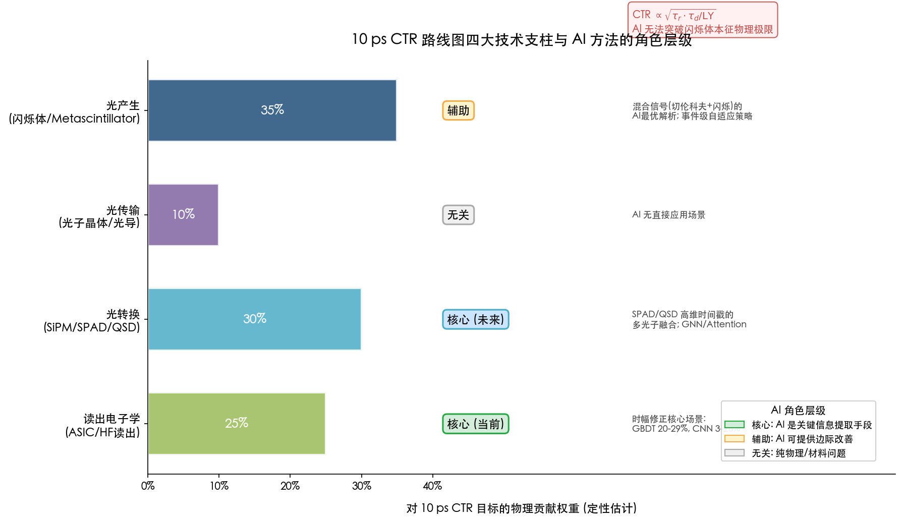

**图 5-2** 10 ps CTR 路线图技术支柱与 AI 角色。AI 在读出电子学中扮演核心角色（当前），在光转换（SPAD/QSD）中具备核心潜力（未来），在光产生中提供辅助价值，在光传输中无直接应用场景。

### 5.5.2 AI 作为"信息提取优化器"的定位

基于前述分析，我们提出 AI 在 10 ps CTR 路线图中的角色定位为**"信息提取优化器"**——在给定探测器硬件条件下，最大化利用可用信息以逼近 Cramér-Rao 下界（CRLB）。Ai 等（2021）的理论分析证明，神经网络在低信噪比条件下比 CFD 更接近 CRLB [Ai et al. 2021 JINST](https://iopscience.iop.org/article/10.1088/1748-0221/16/09/P09019 "NN 逼近 CRLB 理论分析")。这一理论结果意味着 AI 方法的最大价值在于**缩小实际性能与理论极限之间的差距**，而非突破理论极限本身。

具体而言，AI 方法在以下三类场景中价值最为突出：

1. **次优硬件条件下的性能恢复**：当读出电子学因成本或通道数限制无法提供完整波形信息时（如 ASIC 仅输出离散时间戳），ML 方法可通过利用多通道光共享信息实现 20–29% 的 CTR 改善 [Naunheim et al. 2024 PMB](https://publications.rwth-aachen.de/record/1015553/files/1015553.pdf "ASIC 多通道 GBDT 改善") [Naunheim et al. 2025 Front. Phys.](https://www.frontiersin.org/journals/physics/articles/10.3389/fphy.2025.1570925/full "显式修正 GBDT")。
2. **复杂混合信号的最优解析**：元闪烁体的双组分信号和数字 SiPM 的多光子时间戳数据具有传统方法难以充分利用的复杂信息结构，AI 方法可在此类场景中发挥独特优势。
3. **大规模系统的自动化校准**：数万通道的探测器系统中，ML 方法可将逐通道标定从人工密集型操作转变为数据驱动的自动化流程，3 分钟重训练方案已验证了这一路径的工程可行性。

图 5-1 以象限图形式展示了 AI 方法在不同探测器条件下的角色定位与典型改善幅度。

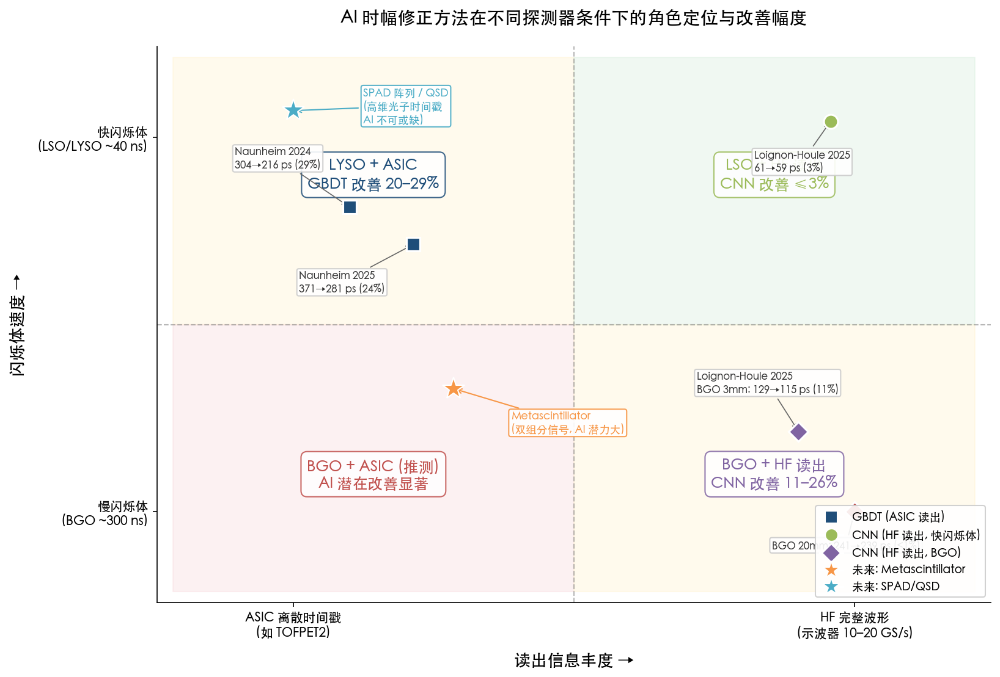

**图 5-1** AI 时幅修正方法的角色定位象限图。横轴为读出信息丰度（ASIC 离散时间戳至 HF 完整波形），纵轴为闪烁体速度（BGO 慢闪烁体至 LSO/LYSO 快闪烁体）。在 ASIC 离散读出 + 快闪烁体象限中，GBDT 方法实现 20–29% 的 CTR 改善；在 HF 读出 + 快闪烁体象限中，CNN 仅贡献 ≤3%；元闪烁体和 SPAD/QSD 标注了未来 AI 方法的高价值应用方向。

### 5.5.3 AI 改善幅度的收敛趋势

第3章的性能对比数据揭示了一个值得关注的趋势：随着基线硬件条件的改善（更快的闪烁体、更高频的读出、更低噪声的 SiPM），AI 方法的边际改善幅度趋于缩小。BGO + HF 读出下 CNN 改善约 26%（短晶体）或 <1%（长晶体），LYSO + ASIC 下 GBDT 改善 20–29%，而 LSO + HF 下 CNN 仅改善约 3%。这一趋势的物理解释在于：当传统方法已能充分利用信号中的定时信息时——即达到"信息饱和"条件——AI 方法无法提取额外信息。

在 10 ps 路线图的推进过程中，随着探测器硬件逐步接近理论极限，AI 方法的绝对改善幅度（以 ps 计）将趋于缩小。然而，其在大规模系统自动化校准和复杂信号解析中的工程价值将持续增长——这两类应用的价值与绝对时间改善无关，而取决于系统管理效率和信息提取完备性。

## 5.6 标准化与基准测试的社区共识建设

### 5.6.1 当前的碎片化现状

定时 AI 领域的一个突出问题是缺乏社区共识的基准数据集和标准化评价流程。各研究组使用不同的硬件配置（闪烁体类型、SiPM 型号、读出电子学）、不同的数据格式（波形数据、ASIC 时间戳、仿真输出）、不同的评价指标（CTR FWHM 与 FWTM、改善百分比的基线选择不一致），且大多数训练数据和模型代码未公开。这种碎片化状态使得不同方法之间的公正比较几乎不可能——第3章汇总表中的数据来自不同实验条件，严格意义上并不构成受控对比（controlled comparison）。

### 5.6.2 FAIR 原则的引入与标准化建议

Duarte 等（2023）为高能物理 AI 模型提出了 FAIR（Findable / Accessible / Interoperable / Reusable）原则，涵盖 cookiecutter4fair 项目模板、Zenodo DOI 持久标识、DLHub API 模型托管和 ONNX 互操作格式等具体工具 [Duarte et al. 2023 MLST](https://arxiv.org/html/2212.05081v3 "HEP FAIR AI 模型原则")。这套框架为定时 AI 领域提供了可直接借鉴的基础设施。

我们认为定时 AI 社区亟需推动以下三项标准化工作：

1. **开放基准数据集**：发布覆盖主流配置（BGO/LYSO + SiPM + ASIC/HF 读出）的标注波形数据集，包含完整的实验条件元数据（温度、偏压、放射源位置、SiPM 型号及序列号），以 HDF5 或 ROOT 格式存储并分配 DOI。
2. **标准化评价协议**：统一 CTR 报告标准（明确 FWHM/FWTM、能窗范围、是否含本底事件），规定传统方法基线的计算规则（LED/CFD/TWC 三级基线），使 AI 改善百分比具有跨文献可比性。
3. **模型互操作与复现**：要求发表的定时 AI 模型以 ONNX 格式提供导出版本，训练代码以开源仓库形式发布，并附 Docker 容器化的复现脚本。hls4ml 和 conifer 作为探测器 AI 部署最成熟的开源工具，应成为定时模型发布的推荐接口标准。

### 5.6.3 从 hls4ml 生态到定时 AI 基础设施

hls4ml 已建立起从模型训练到 FPGA/ASIC 部署的完整工具链 [hls4ml 2025 arXiv:2512.01463](https://cds.cern.ch/record/2950352/files/2512.01463.pdf "hls4ml 平台论文")，但其在定时校准场景中尚无直接应用案例。将 hls4ml/conifer 工具链与已验证的定时 AI 模型（如 Naunheim 的 GBDT、Berg & Cherry 的 CNN）对接，并建立面向定时场景的标准化 benchmark 套件（包含参考模型、测试数据和性能评估脚本），是构建社区基础设施的关键一步。这一工作不仅服务于学术研究的可比较性，更是 AI 定时方法从实验室论文转化为可部署工程组件的必要基础。

## 5.7 综合评估与前瞻判断

基于本章的系统分析，我们对 AI 时幅修正方法的现状与前景作出以下综合判断：

**核心局限**：泛化性不足和标准化缺失是当前最突出的两大障碍。前者限制了方法的工程可推广性——截至 2026 年 3 月，所有实验验证仍锁定于单一探测器配置，跨配置迁移学习处于完全空白状态；后者阻碍了社区对方法有效性的共识形成——缺乏统一的基准数据集和评价协议使不同方法之间的公正比较无从实现。训练数据瓶颈已通过快速重训练（3 分钟）和 label-free（17 分钟、无需放射源）方法获得实质性缓解，但 sim-to-real gap 的定量理解仍然缺乏。可解释性方面，残差物理 + GBDT + SHAP 的组合已提供了一条可审计的技术路径，但逐事件不确定性量化的缺失仍是正式采纳的关键障碍。

**角色定位**：AI 方法在定时领域的定位为"信息提取优化器"而非"物理极限突破者"。在给定硬件条件下，AI 的核心价值是缩小实际性能与 CRLB 理论下界之间的差距。该价值在三类场景中尤为突出：次优读出条件（ASIC 离散输出，GBDT 改善 20–29%）、复杂信号结构（元闪烁体双组分波形，传统脉冲分析已实现 25–50% CTR 改善，AI 有望进一步提升）和大规模系统自动化校准。相反，在快闪烁体 + 高频读出的"理想"条件下，AI 的贡献趋近于零（LSO + HF 读出下 CNN 仅改善约 3%）。

**发展趋势**：短期（2026–2027），我们预计残差物理 + GBDT 方法将在 PET 读出系统中率先完成 FPGA 闭环验证，成为首个从离线分析走向在线部署的定时 AI 方案——conifer 工具链已证明 100 棵深度 4 的 BDT 可在 FPGA 上以约 60 ns 延迟运行。中期（2027–2029），元闪烁体 + CNN/attention 方法的实验验证将成为研究热点，SPAD 阵列产生的高维数据将催生新的 AI 架构需求（GNN、point cloud 网络等）。长期而言，随着探测器硬件逐步逼近 10 ps 物理极限，AI 方法在绝对时间改善方面的空间将持续收窄，但其在系统级自动化校准、实时异常检测和跨通道一致性优化中的工程价值将不断增长，最终成为大型探测器系统不可或缺的软件基础设施组件。

# 结论与风险提示

## 核心结论

本报告通过对 2018–2026 年间已发表文献的系统分析，对"AI 算法能否提升现有电子学读出时幅修正方法"这一问题给出肯定但有条件的回答。

**结论一：AI/ML 方法在特定条件下可显著提升时幅修正精度。** 十余项独立实验成果一致表明，AI 方法相对于传统最佳方法可实现 0–30% 的 CTR 改善。改善幅度由三个因素的组合效应决定：闪烁体速度（慢闪烁体如 BGO 上改善 11–26%，快闪烁体如 LSO/LYSO 上仅 1–3%）、晶体长度（短晶体增益高于长晶体）和读出信息丰度（ASIC 离散读出下 GBDT 方法改善 20–29%，高频完整波形读出下额外改善空间有限）。跨课题组的数据复现性——Feng（189 ps）与 Muhashi（187 ps）在相似 LYSO 配置下独立取得高度一致的结果——增强了上述结论的可信度。

**结论二：残差物理 + GBDT 方法是当前工程可行性最高的技术路线。** Naunheim 等（2023–2025）系统发展的"解析物理模型处理一阶效应 + XGBoost 学习残差"范式在 PET ASIC 读出场景中展现了最优的综合表现：CTR 改善 20–29%、训练数据采集仅需约 3 分钟、模型可通过 SHAP 分析验证物理一致性、显式修正范式的树深仅 4（16 叶节点/树），模型内存需求较隐式方案降低约 16,384 倍。该方法已具备通过 conifer 框架在 FPGA 上以约 60 ns 延迟实时运行的技术条件。

**结论三：端到端波形级深度学习在保留完整波形的研究型探测器中潜力最大。** 当读出系统可提供高频（≥10 GS/s）数字化波形时，CNN/Transformer 等深度学习方法可从波形中提取传统定时算法无法利用的高阶信息——包括切伦科夫提示光子到达模式、作用深度（DOI）相关波形特征以及信号早期上升沿的精细结构——实现 20–30% 的 CTR 改善。然而，这些方法对采集硬件要求严苛、模型黑箱性强，在商用 ASIC 读出系统中因缺乏原始波形而无法直接应用。

**结论四：AI 是信息提取效率的优化器，而非物理极限的突破者。** 基于 Cramér-Rao 下界的理论分析明确了 AI 方法的能力边界：当传统方法已能充分利用信号中的定时信息（如 LSO:Ce:Ca 短晶体 + 高频读出配置，LED CTR 仅 61 ps），AI 的贡献趋近于零。从 100 ps 到 10 ps 的 CTR 跨越根本上取决于闪烁体材料科学和光电器件的突破（光产率需提高约 20 倍），而非算法层面的改进。

**结论五：硬件部署工具链已基本就绪，但闭环验证为关键缺失环节。** hls4ml 和 conifer 两大开源框架已覆盖主流 FPGA 厂商并支持 ASIC 设计通路，MLP/BDT 推理延迟（12–60 ns）可满足从 PET 实时读出到高能物理 L1 触发的全域约束。PulseDL-II 专用 SoC 的 FPGA 验证达到 60 ps 时间分辨率。将已验证的定时 AI 模型通过上述工具链在真实 DAQ 环境中完成闭环验证，是技术就绪度从实验室验证（TRL 3–4）跃升至原型系统验证（TRL 5–6）的关键步骤。

## 风险提示

**泛化性风险。** 截至 2026 年 3 月，所有已发表的实验验证均锁定于单一探测器配置，不存在跨配置迁移学习或域适应的已发表工作。模型有效性严格绑定于特定闪烁体类型、SiPM 型号、读出 ASIC 和几何尺寸的组合，每更换配置均需从头训练。这一现状意味着当前报告中汇总的性能数据不可直接外推至未经验证的新配置。

**标准化缺失风险。** 定时 AI 领域缺乏社区共识的基准数据集和标准化评价协议。各研究组使用不同的硬件配置、数据格式和评价指标，训练数据和模型代码大多未公开。本报告第 3 章汇总表中的数据来自不同实验条件，严格意义上并不构成受控对比。

**长期稳定性风险。** 当前文献中不存在 ML 定时模型在真实探测器系统上连续运行数周至数月的稳定性评估数据。SiPM 增益温度系数约 3–5%/°C，辐照后暗计数率可增加数个量级，这些环境因素对 ML 模型校准精度的长期影响尚未得到定量评估。3 分钟快速重训练方案虽在概念上提供了漂移补偿路径，但自动触发重校准的判据和辐照环境下的长期适用性仍为开放问题。

**不确定性量化缺失风险。** 所有已发表的定时 AI 工作均未提供逐事件的预测不确定性估计。在物理实验中，时间测量的不确定性直接传播至最终物理量（如粒子质量重建的置信度），ML 修正值的不确定性量化是正式分析流水线采纳的前置条件。贝叶斯方法和 deep ensemble 等技术虽在高能物理其他 ML 应用中获得探索，但将其引入实时定时场景面临推理延迟开销的额外约束。

**仿真-实验鸿沟风险。** 部分关键结论（如 Maebe & Vandenberghe 2022 的 3D-CNN 单片晶体定时 141 ps CTR、Ai 等 2021 的 CRLB 理论分析）建立在蒙特卡罗仿真数据之上。仿真与实验之间的域差距（sim-to-real gap）在探测器定时领域至今缺乏定量评估，仿真条件下获得的性能数据在转化为工程指标时需审慎折扣。

## 局限性

本报告的分析范围主要覆盖 TOF-PET 闪烁体探测器和核/高能物理飞行时间系统中的时幅修正问题，未涉及半导体探测器（如 CdZnTe）和气体探测器（除 MRPC 外）领域的定时 AI 应用。报告以 2018–2026 年 3 月间已发表的英文同行评审文献和预印本为主要信源，可能遗漏未以英文发表或尚未公开的最新研究进展。各章引用的定量性能数据来自原始文献的自报结果，本报告未进行独立的实验复现或数据再分析。由于各研究组使用的实验条件差异显著，第 3 章汇总表中的跨文献性能比较具有参考价值但不等同于受控实验对比。
