# 执行摘要

数学并非量子计算的外围装饰，而是其理论内核与工程可行性的共同源泉。本报告系统梳理全球数学与量子计算交叉领域的主要研究团队及其成果，从研究方向、论文产出、国际合作、资金支持和工业界合作五个维度进行横向比较，评估未来 5—10 年内最有可能推动重大突破的团队与方向，并预测可能产生的关键性数学理论或应用技术。核心发现如下。

**学科格局：八大耦合轴线，两大方向最为活跃。** 数学与量子计算的交叉沿编码理论与量子纠错（QEC）、代数拓扑与拓扑量子计算、数论与密码学、概率论/随机矩阵/信息几何、表示论、组合优化、微分几何/算子代数、数值分析与 QSP/QSVT 框架八条"耦合轴"展开。其中，编码理论与 QEC、数值分析与 QSP/QSVT 以最高活跃度并列第一，反映了容错架构过渡对数学理论供给的强力拉动。2025 年 1—10 月 QEC 码相关论文已达 120 篇，而 2024 年全年仅 36 篇，呈"QEC 码爆炸"态势。

**团队竞争格局：高度集中，梯队分明。** 全球约 28 个核心团队构成数学—量子计算交叉研究的主体。综合突破势能评估中，IBM Quantum Bravyi 组（qLDPC 码端到端闭环）、MIT Chuang 组（QSP/QSVT 框架原创性）、Google Quantum AI（理论—实验闭环最强）和 Caltech IQIM（多方向综合深度 + AWS 产学研融合）获得最高评级。INRIA Leverrier-Zémor（Quantum Tanner Codes 代数理论）、Microsoft Station Q（Fields 奖得主领衔拓扑路线）、NTT CIS Lab（工业界后量子密码学理论全球之首）、RIKEN RQC（量子资源理论 + 模拟最优性）和魏茨曼研究所（Vidick/Brakerski/Stern 多维度理论集群）紧随其后。亚太地区已不再是纯粹的"追赶者"——日本 RIKEN RQC 和 NTT CIS Lab 在特定方向已达全球一流，悉尼大学贡献了里程碑级拓扑纠错码构造（Layer Codes），新加坡 CQT 在量子复杂性理论方面稳居第一梯队。中国核心优势在于实验验证能力和论文总量（USTC 以 1,877 篇居全球机构首位），但在纯数学理论原创性方面与北美、欧洲头部团队存在结构性差距。

**产出与影响力：规模与质量的不对称。** 美国以篇均 44.0 次引用领跑，加拿大 FWCI 2.13 居首；中国虽总引用位居第二，但篇均仅 11.9 次。INRIA Leverrier-Zémor 仅以二人之力完成 qLDPC 码两大理论突破之一的事实表明，在数学密集型方向上，洞察力与原创性远比规模化产出更具决定性。

**资金与政策：数学基础研究的结构性缺位。** 全球政府累计承诺量子投资约 557 亿美元，但面向数学家的专项资助信号严重不足。SIAM 2024 年量子交叉研讨会诊断数学科学界在量子研究中"基本缺席"。在美国联邦体系中，NSF 数学科学司（DMS）几乎是数学家承接量子课题的唯一窗口。AI 行业私人投资（2024 年约 1,090 亿美元）是量子领域（约 26 亿美元）的 42 倍，对高水平数学人才构成强烈的虹吸效应。

**合作网络：中美收缩，多极重组。** 中美学术合作自 2019 年起呈"反转 J 曲线"——中国论文国际合著比从 2018 年的 26.6% 降至 2023 年约 19.4%，其中中美合著份额下降 6.4 个百分点。合作网络正从"以美国为核心的星形结构"向"多中心集团化结构"演变，欧洲理论团队从中获益最大。

**突破预测：五大里程碑与六项数学理论。** 我们预测 2026—2036 年间五大里程碑：（1）qLDPC 码容错实现（2027—2030 年）；（2）QSP/QSVT 标准范式化（2027—2031 年）；（3）后量子密码学安全性精细分析（2027—2033 年）；（4）低能态量子模拟最优算法（2028—2034 年）；（5）量子学习信息论最优界的实验验证（2027—2031 年）。最可能产生的六项关键数学理论包括：有限长度 qLDPC 码最优构造理论、多变量量子信号处理最优逼近理论、格问题量子攻击精确渐近复杂度理论、化学相关哈密顿量模拟紧致资源下界理论、有噪量子学习信息论最优界、以及拓扑与代数纠错码统一数学框架。

**核心风险。** 六大风险因素包括：技术路线选择风险（拓扑路线实验争议尚未平息）、地缘政治与国际合作风险（中美收缩可能延缓关键理论突破）、人才与"AI 虹吸"风险（全球 QEC 专业人员仅约 1,800—2,200 人，远低于路线图需求）、资金持续性风险（NSF 预算保护的持续性不确定）、替代技术风险（经典 AI/HPC 持续抬高量子优势门槛）、以及去量子化风险（量子优势适用范围持续被收窄）。

# 第1章 数学与量子计算交叉领域——定义边界、演进脉络与当前热点

## 1.1 引言：数学——量子计算的"隐形基础设施"

量子计算作为一项有望从根本上重塑人类算力边界的技术，其每一项核心进展背后几乎都矗立着一座数学构造物。从 Shor 算法对数论中整数分解困难性的量子突破，到 Kitaev 拓扑码对代数拓扑中任意子辫子群理论的工程化转译，再到近年量子低密度奇偶校验码（quantum Low-Density Parity-Check codes, qLDPC 码）对代数编码理论的深度依赖，数学并非量子计算的外围装饰，而是其理论内核与工程可行性的共同源泉。

然而，一个值得深思的悖论是：尽管数学在量子计算中的角色如此关键，数学科学界在量子研究中却长期处于"基本缺席"（largely absent）的状态。2024 年 10 月，美国工业与应用数学学会（SIAM）在国家科学基金会（NSF）资助下召开了"量子交叉会议"（Quantum Intersections Convening, DMS-2425995），80 余名来自数学、物理、计算机科学和工程领域的专家汇聚一堂，核心诊断即指向这一断层 [SIAM QIC 报告](https://www.siam.org/media/orydkrzd/quantum-convening-report.pdf "2024")。

本章旨在为整份报告建立学科坐标系：界定"数学与量子计算交叉领域"所涵盖的数学分支及其与量子计算技术栈的耦合方式，梳理从量子信息论萌芽到当前多学科深度融合的演进脉络，并识别 2025—2026 年度最活跃的研究前沿方向。这一坐标系将贯穿后续各章，为团队画像、产出评估与突破预测提供统一的分类与评价基准。

## 1.2 学科范畴界定：核心数学分支与量子计算技术栈的耦合图谱

数学与量子计算的交叉并非均匀分布，而是沿若干高密度"耦合轴"展开。图 1-1 以网络关系图的形式直观呈现了八个核心数学分支与对应量子计算技术栈之间的耦合关系——节点大小反映当前研究活跃度，连线粗细反映耦合深度。以下从耦合深度和当前活跃程度两个维度，逐一界定本报告所覆盖的核心交叉方向。

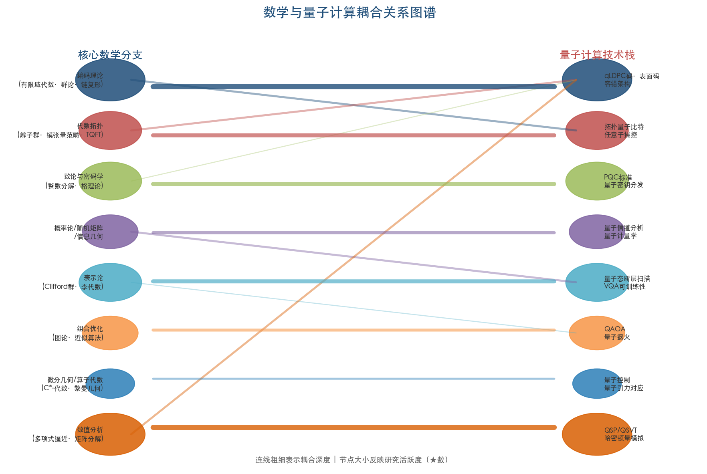

### 1.2.1 编码理论与量子纠错（QEC）

编码理论与量子纠错码（Quantum Error Correction, QEC）构成当前最深入、研究投入最大的数学—量子计算耦合方向。其核心数学工具包括有限域上的线性代数、群论（特别是阿贝尔群和非阿贝尔群上的积构造）、代数拓扑中的链复形，以及概率图模型中的信念传播（Belief Propagation）解码算法。

这一方向的数学深度在 2021—2022 年间经历了里程碑级跃升。2021 年，Panteleev 与 Kalachev 利用非阿贝尔群上 lifted product 构造，证明了渐近优良量子 LDPC 码的存在性——即同时达到常数编码率和常数相对距离 [Panteleev & Kalachev 论文](https://arxiv.org/abs/2111.03654 "Asymptotically Good Quantum and Locally Testable Classical LDPC Codes, 2021")。紧随其后，Leverrier 和 Zémor 于 2022 年提出 Quantum Tanner Codes，基于二维 Cayley 复形构造了另一族具有常数率和常数相对距离的量子 LDPC 码，其构造方法更加直观且对后续实用化设计产生了深远影响 [Quantum Tanner Codes](https://arxiv.org/abs/2202.13641 "Leverrier & Zémor, FOCS 2022")。

从理论到工程的转化速度同样引人注目。2024 年 3 月，IBM 的 Bravyi 等人在 Nature 上发表了 bivariate bicycle（BB）LDPC 码的实验结果，仅用 288 个物理量子比特即可保护 12 个逻辑量子比特，纠错阈值达 0.7%，编码效率较传统表面码提升约一个数量级 [Bravyi et al.](https://www.nature.com/articles/s41586-024-07107-7 "Nature 627, 778–782, 2024")。Riverlane 2025 年的统计数据更为直观地展现了这一领域的加速态势：2025 年 1—10 月 QEC 码相关论文已达 120 篇，而 2024 年全年仅 36 篇，呈现出显著的"QEC 码爆炸"趋势 [Riverlane](https://www.riverlane.com/blog/quantum-error-correction-our-2025-trends-and-2026-predictions "QEC code explosion")。

### 1.2.2 代数拓扑与拓扑量子计算

拓扑量子计算是数学在量子计算中最具理论野心的应用方向之一，其核心数学基础横跨代数拓扑、辫子群表示论、模张量范畴（modular tensor categories）与拓扑量子场论（TQFT）。1997 年，Kitaev 提出 Toric Code 与任意子容错方案，将二维拓扑不变量与量子纠错直接联系起来，奠定了该方向的数学基石 [Kitaev 论文](https://arxiv.org/abs/quant-ph/9707021 "Fault-tolerant quantum computation by anyons, 1997/2003")。

这条路线的工业化进展在 2025 年迎来关键节点。2025 年 2 月，微软发布 Majorana 1 处理器，声称实现了首个基于拓扑超导体的硬件保护量子比特，配套论文发表于 Nature [微软公告](https://azure.microsoft.com/en-us/blog/quantum/2025/02/19/microsoft-unveils-majorana-1-the-worlds-first-quantum-processor-powered-by-topological-qubits/ "2025-02-19")；[Nature 论文](https://www.nature.com/articles/s41586-024-08445-2 "Interferometric single-shot parity measurement in InAs–Al hybrid devices")。然而这一声明引发了激烈学术争议——Science 报道指出"许多物理学家认为微软尚未提供马约拉纳准粒子存在的确凿证据" [Science 报道](https://www.science.org/content/article/debate-erupts-around-microsoft-s-blockbuster-quantum-computing-claims "2025")。拓扑量子计算的核心数学挑战——非阿贝尔任意子辫子群的计算完备性证明、拓扑保护在真实材料中的定量理论——至今悬而未决，使其成为高风险与高回报并存的典型方向。

### 1.2.3 数论与密码学

Shor 算法是数论与量子计算之间最经典的纽带。Peter Shor 于 1994 年在 FOCS 会议上发表、1997 年完整版刊于 SIAM J. Comput. 的这一算法，证明了量子计算机可在多项式时间内完成整数分解和离散对数问题 [Shor 算法](https://epubs.siam.org/doi/10.1137/S0097539795293172 "SIAM J. Comput. 26(5), 1997")，其直接后果是对基于 RSA 和椭圆曲线密码学的整个现代密码体系构成存在性威胁。

作为回应，后量子密码学（Post-Quantum Cryptography, PQC）在过去十年间从学术议题上升为全球性标准化行动。2024 年 8 月，美国国家标准与技术研究院（NIST）正式发布首批三项后量子密码学标准 FIPS 203/204/205，其数学基础为 Module-LWE（模格上含错误学习）问题 [NIST 公告](https://www.nist.gov/news-events/news/2024/08/nist-releases-first-3-finalized-post-quantum-encryption-standards "2024-08-13")。2025 年 3 月，NIST 进一步选定 HQC（Hamming Quasi-Cyclic）作为第五个 PQC 算法，体现了"数学多样性"策略——同时以格问题和纠错码两个独立数学基础作为安全性支柱 [NIST 公告](https://www.nist.gov/news-events/news/2025/03/nist-selects-hqc-fifth-algorithm-post-quantum-encryption "2025-03-11")。这一双轨并行的策略本身即反映出数学基础在密码体系设计中的核心地位。

### 1.2.4 概率论、随机矩阵理论与量子信息几何

概率论与随机矩阵理论在量子计算中的应用覆盖多个关键场景：量子纠缠的统计刻画、量子信道容量的渐近分析，以及监控量子电路中测量诱导相变的解析描述。2024 年，J. Stat. Phys. 发表的研究利用随机矩阵模型系统刻画了监控量子电路的相变行为，为理解量子多体系统的信息动力学提供了新的数学框架 [Random-Matrix Models of Monitored Quantum Circuits](https://link.springer.com/article/10.1007/s10955-024-03273-0 "J. Stat. Phys., 2024")。

量子信息几何（Quantum Information Geometry）作为概率论与微分几何的交叉分支，近年在量子参数估计领域获得了显著的发展动力。其核心工具——量子 Fisher 信息矩阵（Quantum Fisher Information Matrix, QFIM）——为多参数量子估计的精度极限设定了量子 Cramér-Rao 下界。2025 年，Zhao 等人在 Science Advances 上建立了量子 Fisher 信息与量子相干性之间的分解定律，提供了一种仅需测量初态相干性即可推断参数估计方差下界的新方法，在量子传感和量子计量学中具有直接应用价值 [Zhao et al.](https://www.science.org/doi/10.1126/sciadv.adv8132 "Science Advances, 2025")。2026 年 3 月，Chen 在 Physical Review Letters 上进一步将量子 Cramér-Rao 界表述为多可观测量不确定性关系，深化了量子度量张量的数学刻画 [Chen](https://arxiv.org/pdf/2603.04615 "PRL, 2026")。这些进展表明，量子信息几何正从纯数学理论工具向量子技术设计的指导性框架演进。

### 1.2.5 表示论与量子态断层扫描

表示论在量子计算中的角色近年日益深化，尤其集中在 Clifford 群与辛群的结构分析方面。Clifford 群是量子态断层扫描（quantum state tomography）和随机基准测试（randomized benchmarking）的数学支柱，其表示论性质直接决定了这些协议的统计效率。

2025 年，IBM 展示了利用群论指导量子算法设计的新方法，将有限群的表示论结构直接映射为量子线路设计原则 [IBM Quantum Blog](https://www.ibm.com/quantum/blog/group-theory "Discovering a new quantum algorithm via group theory, 2025")。同年，Larocca 等人在 Nature Reviews Physics 综述中提出了基于李代数的荒原高原（barren plateaus）统一理论，揭示变分量子电路可训练性的根本限制源于电路对称群的李代数结构 [Larocca et al.](https://arxiv.org/abs/2405.00781 "Barren plateaus in variational quantum computing, Nature Reviews Physics 7(4), 2025")。这一理论框架将表示论从量子态表征工具升级为量子算法设计的核心数学约束，标志着表示论在量子计算中的角色实现了质的跃迁。

### 1.2.6 组合优化与量子近似优化算法

组合优化是量子计算最受关注的潜在应用场景之一。量子近似优化算法（Quantum Approximate Optimization Algorithm, QAOA）自 2014 年由 Farhi 等人提出以来，始终是连接数学规划理论与量子计算的重要桥梁。2024 年，Science Advances 报告了 QAOA 在特定结构化问题上的扩展优势证据，为量子优势在优化领域的可能性提供了新的实证支撑 [QAOA 扩展优势](https://www.science.org/doi/10.1126/sciadv.adm6761 "Science Advances, 2024")。然而，QAOA 在一般优化问题上是否具有可证明的超多项式优势，至今仍是一个悬而未决的核心数学问题，其解决有赖于计算复杂性理论的进一步突破。

### 1.2.7 微分几何、量子控制论与算子代数

微分几何在量子计算中的应用主要集中于三个层面：量子门的几何相位设计、量子态流形上的测地线搜索（用于最优控制路径规划），以及 Fisher 信息度量在量子参数估计中的几何解读（与 1.2.4 节量子信息几何存在交叉）。

算子代数（C*-代数与 von Neumann 代数）则为量子信道的数学刻画、纠缠张量范畴的构造以及量子引力中的全息对应提供了严格的公理化框架。这两个方向虽不如编码理论和拓扑量子计算那样直接面向工程实现，却为量子计算的理论完备性提供了不可或缺的深层数学结构。

### 1.2.8 数值分析与量子算法大一统框架

数值分析与量子算法的耦合在 2018—2019 年间迎来了范式级突破：量子信号处理（Quantum Signal Processing, QSP）与量子奇异值变换（Quantum Singular Value Transformation, QSVT）框架的提出，统一描述了几乎所有已知的主要量子算法——包括 Shor 算法、Grover 搜索、哈密顿量模拟和量子线性系统算法。该框架本质上将量子算法设计转化为多项式逼近理论中的问题，使得数值分析成为量子算法构造的天然数学语言。

2025 年，Rossi、Ceroni 和 Chuang 在 Quantum 9:1776 上发表了模块化多变量 QSP 理论，将 QSP 重构为函数式编程中的单子（monad）类型，极大地扩展了框架的表达力与可组合性 [Rossi et al.](https://quantum-journal.org/papers/q-2025-06-18-1776/ "Modular QSP in many variables, 2025")。这一进展反映了数值分析社区正在系统性地将经典数学工具库注入量子算法设计。2026 年 Gene Golub SIAM 暑期学校（Duke 大学）选定"容错量子计算算法"为主题 [G2S3 2026](https://sites.duke.edu/siamss2026/ "Duke University, 2026")，进一步标志着应用数学主流社区对量子计算研究的正式参与。

## 1.3 演进脉络：从量子信息论萌芽到多学科深度融合

数学与量子计算的交叉并非一蹴而就，而是经历了四十余年的渐进积累和数次关键跃迁。图 1-2 以时间轴形式呈现了从 1982 年 Feynman 量子模拟构想到 2026 年 Bennett-Brassard 获图灵奖的关键里程碑，按四个发展阶段划分并以不同颜色标识。以下按时间顺序梳理各阶段核心里程碑，以揭示两个学科从松散关联走向深度交融的内在逻辑。

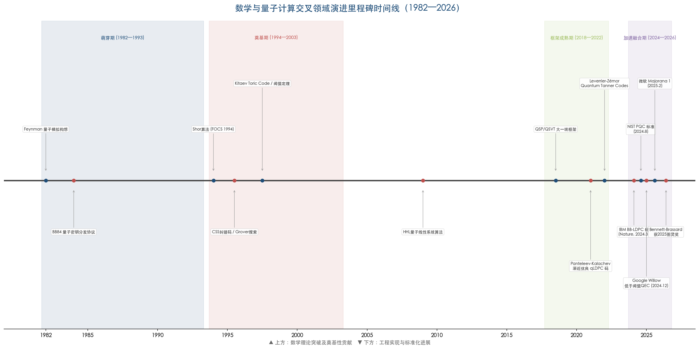

### 1.3.1 萌芽期（1982—1993）：物理直觉引领数学想象

1982 年，Richard Feynman 在一次著名演讲中提出量子模拟构想，指出经典计算机在模拟量子系统时面临指数级困难，而量子系统本身或许能成为高效的计算工具。两年后，Bennett 和 Brassard 于 1984 年提出 BB84 量子密钥分发协议，开创了量子密码学这一全新领域。2026 年 3 月 18 日，ACM 宣布 Bennett 和 Brassard 获得 2025 年图灵奖，表彰其"创立量子密码学"的开创性贡献 [ACM 公告](https://www.acm.org/media-center/2026/march/turing-award-2025 "2025 ACM Turing Award, 2026-03-18")。萌芽期的数学工具使用尚处于初级阶段，主要借助线性代数和概率论的基本框架，但物理直觉已为后续数学深度介入埋下伏笔。

### 1.3.2 奠基期（1994—2003）：核心算法与容错架构的数学基石

1994 年是量子计算史上的转折点。Shor 算法的发表证明，量子计算并非仅是物理学家的思想实验，而是能够解决经典算法束手无策的重大数学问题。1995—1996 年间，Calderbank-Shor-Steane（CSS）量子纠错码框架建立，将经典纠错码理论系统性地推广到量子领域；同期，Grover 提出量子搜索算法，提供了平方根级加速 [Grover](https://dl.acm.org/doi/10.1145/237814.237866 "STOC 1996")。

1996—1999 年间，量子纠错阈值定理的证明（由 Aharonov 和 Ben-Or 在 STOC 1997 首次提出，完整版后刊于 SIAM J. Comput.）从数学上确立了容错量子计算的可能性：只要单个量子门的错误率低于某一常数阈值，即可通过足够深的纠错编码实现任意精度的量子计算 [阈值定理](https://epubs.siam.org/doi/10.1137/S0097539799359385 "SIAM J. Comput., 2008")。这一定理被广泛视为量子计算从理论构想走向工程可行性的最关键数学保证。

1997 年，Kitaev 提出 Toric Code，为拓扑量子计算奠定了数学基础。2009 年，Harrow、Hassidim 和 Lloyd 提出 HHL 算法，展示了量子计算在线性系统求解中的指数加速潜力。至此，量子计算的主要数学支柱——算法理论、纠错码框架与拓扑保护方案——均已确立。

### 1.3.3 框架成熟期（2018—2022）：大一统理论与渐近最优码

2018—2019 年，QSP/QSVT 大一统框架的提出标志着量子算法设计从"逐个发明"模式转向"系统性构造"模式。该框架将量子算法问题还原为切比雪夫多项式逼近理论中的问题，使数值分析家成为量子算法设计的天然参与者。

2021—2022 年，量子纠错码理论迎来了双重突破：Panteleev-Kalachev 的 lifted product 构造与 Leverrier-Zémor 的 Quantum Tanner Codes 分别独立证明了渐近优良 qLDPC 码的存在性。这两项成果被公认为量子纠错理论自 CSS 框架以来最重要的进展，打破了长期以来"量子 LDPC 码无法同时达到常数编码率和常数距离"的隐含预期，为后续的工程实用化奠定了坚实的理论基础。

### 1.3.4 加速融合期（2024—2026）：理论与硬件的距离急剧缩短

2024 年起，理论突破向硬件实现的转化速度显著加快，一系列标志性事件密集出现：

- **2024 年 3 月**，IBM 在 Nature 上发表 BB-LDPC 码实验结果，实现了 qLDPC 码从理论到物理器件的首次验证。
- **2024 年 8 月**，NIST 发布首批 PQC 标准（FIPS 203/204/205），完成了从 Shor 算法威胁到防御体系建立的完整闭环。
- **2024 年 12 月**，Google Willow 处理器首次实现低于阈值的表面码量子纠错，distance-7 码逻辑错误率每轮仅 0.143%±0.003%，误差抑制因子 Λ=2.14±0.02 [Google Willow 论文](https://www.nature.com/articles/s41586-024-08449-y "Nature 638, 920–926, 2025")。
- **2025 年 2 月**，微软发布 Majorana 1 拓扑量子处理器，将拓扑量子计算路线推入实验验证阶段。
- **2025 年**，Peter Shor 获得 IEEE Shannon 奖 [IEEE 公告](https://www.itsoc.org/news/shannon-award-2025 "Shannon Award 2025: Peter Shor")，标志着信息论社区对量子—数学交叉贡献的正式认可。
- **2026 年 3 月**，Bennett 与 Brassard 获 2025 年图灵奖，量子密码学的数学奠基贡献获得计算机科学最高荣誉。

上述事件的密度与跨度表明，数学与量子计算的交叉领域已从纯理论研究阶段进入理论—工程深度互动的新时期。

## 1.4 标志性学术建制事件：数学社区的制度性觉醒

除技术里程碑外，2024—2026 年间还发生了若干对数学社区具有结构性影响的学术建制事件，预示着数学家在量子研究中的角色正在经历制度性转变。

**SIAM 量子交叉会议与社区建设**。2024 年 10 月的 SIAM Quantum Intersections Convening（NSF 资助 DMS-2425995）汇聚 80 余名参与者，梳理了数学可贡献于量子研究的五大方向，并提出四项核心建议：支持数学—QIS 交叉研发、加强教育与劳动力培养、增加资金与联网机制、与数学学会合作建设社区 [SIAM QIC 报告](https://www.siam.org/media/orydkrzd/quantum-convening-report.pdf "2024")。该报告建议创建 SIAM Activity Group on QIS（量子信息科学活动小组），但截至 2026 年 3 月，SIAM 官方活动小组列表中尚未出现该小组 [SIAM 活动小组页面](https://www.siam.org/get-involved/connect-with-a-community/activity-groups/ "2026 年 3 月查询")。不过，SIAM 已在制度建设上持续推进：SIAM Journal on Scientific Computing（SISC）正在征集"量子计算：数值算法与应用"特刊（截止 2026 年 4 月 30 日），目标是将 SISC 打造为应用数学与量子计算交叉研究的核心期刊平台 [SIAM News](https://www.siam.org/publications/siam-news/articles/celebrating-a-century-of-quantum-science-sisc-special-section-on-quantum-computing/ "2026")。

**联合国国际量子科学与技术年（IYQ 2025）**。2025 年被联合国大会宣布为"国际量子科学与技术年"，纪念现代量子力学奠基百年，开幕仪式于 2025 年 2 月在巴黎 UNESCO 总部举行 [UNESCO 页面](https://www.unesco.org/en/years/quantum-science-technology "IYQ 2025")。IYQ 2025 提供了全球性平台，使数学与量子计算交叉研究获得了前所未有的公众可见度与政策关注度。

**Gene Golub SIAM 暑期学校（G2S3 2026）**。2026 年 7—8 月在 Duke 大学举办的 G2S3 暑期学校选定"容错量子计算算法"为主题 [G2S3 2026](https://sites.duke.edu/siamss2026/ "Duke University, 2026")。G2S3 是应用数学领域面向研究生和博士后的最具声望的暑期学校之一，其选题直接反映了应用数学主流社区对量子计算的战略研判——量子计算已不再被视为物理学的专属领地，而是数学科学共同体的核心前沿之一。

## 1.5 2025—2026 年度八大研究前沿

基于对文献、会议议程和机构布局的系统分析，我们识别出当前数学与量子计算交叉领域最活跃的八个研究前沿方向。图 1-3 以雷达图与评分表的形式，从论文产出、机构投入和工程转化三个维度对各方向的活跃度进行了定量评估。其中，qLDPC 码实用化与解码算法以综合 15 分位列榜首，后量子密码学安全性分析以 14 分紧随其后，量子优势边界与去量子化以 6 分位列末位。

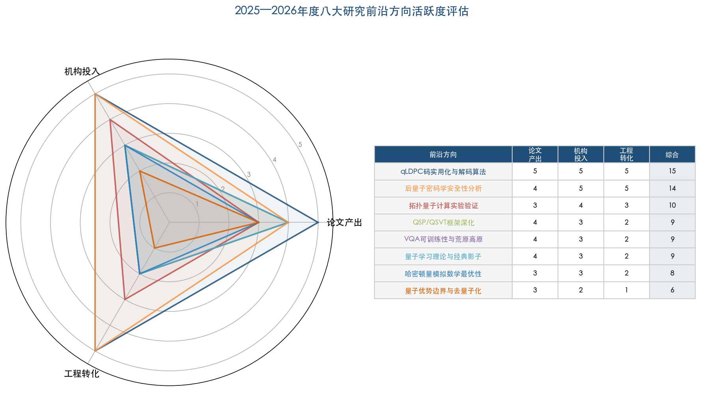

### 前沿一：量子 LDPC 码实用化与解码算法

qLDPC 码的理论存在性已被 2021—2022 年的突破所确立，当前焦点已转向实用化的三大核心挑战：有限长度码在真实噪声模型下的性能优化、belief propagation 解码算法对量子噪声的适配，以及码结构与硬件拓扑的协同设计。IBM 在 2025 年接连取得工程进展——展示了 Relay-BP 解码算法 [IBM 博客](https://www.ibm.com/quantum/blog/relay-bp-error-correction-decoder "2025-08-04")，并在 Loon 实验处理器上实现了延迟低于 480 纳秒的实时经典解码 [IBM 博客](https://www.ibm.com/quantum/blog/qldpc-codes "Computing with error-corrected quantum computers")。在所有前沿方向中，qLDPC 码实用化最接近产业化转化。

### 前沿二：拓扑量子计算实验验证与数学基础深化

微软 Majorana 1 处理器的发布将拓扑量子计算从纯理论推入实验验证阶段，但同时也暴露了一系列亟待解决的核心数学挑战：非阿贝尔任意子辫子群的计算完备性证明、拓扑保护在真实材料中的定量理论，以及拓扑码与 qLDPC 码的协同方案设计。该方向的理论深度与实验不确定性并存，属于典型的高风险高回报前沿。

### 前沿三：QSP/QSVT 框架深化

QSP/QSVT 框架正从单变量向多变量推广，核心数学问题包括多变量最优度数界的完整确定、block-encoding 的高效构造，以及相位因子计算的数值稳定性。2024 年，Dong 和 Lin 发表 Infinite QSP 理论 [Quantum 8:1558](https://doi.org/10.22331/q-2024-12-10-1558 "2024")，进一步拓展了框架的适用范围，使其能够处理无界算子的函数逼近问题。该方向是数值分析社区切入量子计算研究的最直接入口。

### 前沿四：变分量子算法可训练性与荒原高原数学理论

变分量子算法（Variational Quantum Algorithms, VQA）曾被视为近期含噪量子器件的主要应用途径。然而，Larocca 等人 2025 年在 Nature Reviews Physics 上提出的基于李代数的荒原高原统一理论，揭示了该类算法面临的根本限制：当电路对称群的李代数维度随量子比特数指数增长时，代价函数梯度将指数趋近于零 [Larocca et al.](https://arxiv.org/abs/2405.00781 "Nature Reviews Physics 7(4), 2025")。这一理论框架同时为规避荒原高原提供了明确的数学条件——利用问题的固有对称性限制 ansatz 空间——从而为"去量子化边界"的精确刻画提供了新的分析工具。

### 前沿五：量子学习理论与经典影子断层扫描

量子学习理论近年取得了突破性进展。Huang、Kueng 和 Preskill 于 2020 年提出的经典影子（classical shadows）方法开辟了量子态高效表征的新范式。Huang 等人 2022 年在 Science 上发表的后续研究（截至目前已被引用逾 818 次），证明了量子实验数据在三类学习任务中提供可证明的指数优势 [Huang et al.](https://doi.org/10.1126/science.abn7293 "Science 376, 2022")。2025 年，Nature Communications 进一步发展了贝叶斯推断鲁棒浅层影子方法，增强了该框架在含噪环境下的实用性 [Nature Comms](https://www.nature.com/articles/s41467-025-57349-w "2025")。支撑这一前沿的核心数学工具涵盖信息论、高维概率论与矩阵浓度不等式。

### 前沿六：后量子密码学安全性精细分析

NIST 首批 PQC 标准（FIPS 203/204/205）的发布并非终点，而是新一轮数学攻防的起点。核心前沿问题包括：Module-LWE 量子攻击复杂度的精细分析、格基约化算法渐近行为的严格刻画，以及新量子密码原语的可证明安全性。NTT CIS Lab 在 Crypto 2025 上获得最佳论文奖，其成果构造了首个标准模型下的一次性签名方案，解决了量子密码学中一个悬而未决长达十年的开放问题 [NTT 公告](https://ntt-research.com/ntt-presents-23-papers-and-receives-best-paper-award-at-crypto-2025/ "Crypto 2025")。

### 前沿七：量子哈密顿量模拟数学最优性

量子哈密顿量模拟是量子计算最原始的应用动机（Feynman, 1982），其核心数学前沿在于 Trotter-Suzuki 分解的最优误差界确定与系统局部结构的有效利用。2025 年 9 月，RIKEN 的 Mizuta 和 Kuwahara 在 Physical Review Letters 135 上证明了低能态 Trotterization 的最优误差界：误差至多与初始态能量成线性关系、与系统尺寸呈多对数关系 [PRL 135, 130602](https://link.aps.org/doi/10.1103/q87n-5xhz "2025-09-23")。这一结果对量子化学模拟和凝聚态物理模拟的资源估计具有直接的指导意义。

### 前沿八：量子优势数学边界与去量子化

量子优势（quantum advantage）的精确数学边界是当前最深层的理论前沿之一。2026 年 2 月，Physical Review Letters 发表了可证明且可验证的样本复杂度量子优势的严格构造 [Benedetti et al.](https://link.aps.org/doi/10.1103/q55v-wm7y "PRL 2026")；CCC 2025 则报告了改进的量子—经典查询复杂性分离结果 [CCC 2025](https://drops.dagstuhl.de/storage/00lipics/lipics-vol339-ccc2025/LIPIcs.CCC.2025.5/LIPIcs.CCC.2025.5.pdf "Improved Separation")。然而，真正可证明的超多项式量子优势目前仅在有限场景下严格成立，主要包括 Shor 算法、特定量子模拟、采样问题和量子学习任务；组合优化和通用机器学习领域的量子优势证据依然薄弱。"去量子化"（dequantization）研究持续收窄量子优势的适用范围，但值得注意的是，最具韧性的优势领域——量子模拟与密码分析——恰恰是数学密集型方向，这从侧面印证了数学基础对于界定量子优势边界的不可替代性。

## 1.6 耦合图谱总结与分类标准

综合上述分析，本报告将数学与量子计算的交叉领域按以下分类体系组织。该体系基于耦合方向、核心数学分支、量子技术栈对应关系与当前活跃度四个维度构建，将贯穿后续所有章节。

| 耦合方向 | 核心数学分支 | 量子技术栈对应 | 当前活跃度 |
|---|---|---|---|
| 编码理论与 QEC | 有限域代数、群论、链复形 | qLDPC 码、表面码、容错架构 | ★★★★★ |
| 代数拓扑与拓扑量子计算 | 辫子群、模张量范畴、TQFT | 拓扑量子比特、任意子操控 | ★★★★☆ |
| 数论与密码学 | 整数分解、格理论、纠错码 | PQC 标准、量子密钥分发 | ★★★★☆ |
| 概率论/随机矩阵/信息几何 | 随机矩阵、QFIM、信息度量 | 量子信道分析、量子计量学 | ★★★☆☆ |
| 表示论 | Clifford 群、李代数 | 量子态断层扫描、VQA 可训练性 | ★★★★☆ |
| 组合优化 | 图论、近似算法 | QAOA、量子退火 | ★★★☆☆ |
| 微分几何/算子代数 | C*-代数、黎曼几何 | 量子控制、量子引力对应 | ★★☆☆☆ |
| 数值分析 | 多项式逼近、矩阵分解 | QSP/QSVT、哈密顿量模拟 | ★★★★★ |

活跃度评级基于 2024—2026 年度的论文产出密度、主要会议议程占比和头部机构资源投入三个维度的综合判断。编码理论与 QEC、数值分析与 QSP/QSVT 两个方向以最高活跃度并列第一，反映了当前量子计算向容错架构过渡这一核心产业需求对数学理论供给的强力拉动。

本章建立的学科范畴界定与分类体系将作为后续章节——团队画像（第 2—3 章）、研究产出分析（第 4 章）、资金与政策评估（第 5 章）以及突破预测（第 6 章）——的共同参照框架。

# 第2章 全球主要研究团队画像——北美与欧洲

数学与量子计算的交叉研究在全球范围内呈现高度集中态势：最具影响力的研究团队绝大多数分布于北美和欧洲。这一地理格局既反映了基础数学与理论计算机科学长达半个多世纪的学术积淀，也与过去二十年间两个地区在量子科技领域的持续高强度公共与私营投资密切相关。本章从北美学术团队、北美工业界研究团队和欧洲学术与研究团队三个维度，逐一梳理主要机构的核心画像——涵盖研究方向、学术带头人、机构定位（纯学术型与产学研融合型）、标志性成果及比较优势。在本章末尾，以色列希伯来大学量子信息科学中心因其核心人物与北美学术网络的深度联系而一并纳入讨论。最后，通过差异化定位矩阵和关键里程碑时间线，对全部团队进行横向比较分析。

## 2.1 北美学术团队

### 2.1.1 麻省理工学院量子信息科学理论群（MIT QIS Theory）

麻省理工学院（MIT）在数学与量子计算交叉领域拥有全球最深厚的学术传统之一。其量子信息科学研究力量分布于数学系、物理系、电子工程与计算机科学系（EECS）及理论物理中心（CTP），形成了跨系协同的独特格局 [MIT CTP QIS 页面](https://physics.mit.edu/research/labs-centers/mit-center-for-theoretical-physics-leinweber-institute/research-efforts-in-the-center-for-theoretical-physics/quantum-information-science/ "MIT 官方介绍")。

该群体的学术领军人物 Peter Shor 现任 MIT 数学系教授，是整个数学与量子计算交叉领域的奠基人之一。1994 年，Shor 提出大整数分解量子算法（Shor 算法），至今仍是量子计算相对于经典计算最具说服力的超多项式加速案例，并直接催生了后量子密码学（Post-Quantum Cryptography, PQC）这一数学研究领域 [Shor 算法原始论文](https://epubs.siam.org/doi/10.1137/S0097539795293172 "SIAM J. Comput. 26(5), 1997")。Shor 同时是稳定子码（CSS 码）的联合创建者，该框架构成了当今几乎所有量子纠错码（Quantum Error Correction, QEC）的数学基础。2025 年，Shor 获得 IEEE 信息论学会最高荣誉——Shannon 奖 [IEEE 公告](https://www.itsoc.org/news/shannon-award-2025 "Shannon Award 2025: Peter Shor")。

Aram Harrow 是量子算法设计领域的核心人物，与 Hassidim、Lloyd 于 2009 年共同提出的 HHL 算法是量子线性系统求解的经典方案。Anand Natarajan 近年在量子复杂性理论领域迅速崛起，是 MIP*=RE 定理的核心贡献者之一——该定理证明多证明者交互式证明系统的量子版本等价于递归可枚举语言，被普遍视为量子计算复杂性理论近十年来最深刻的成果。Natarajan 于 2024 年获得美国国家科学基金会（NSF）CAREER 基金资助。Soonwon Choi 在量子多体动力学与监控量子电路（monitored quantum circuits）的数学理论方面同样具有突出贡献。

**机构定位与比较优势**：MIT QIS 理论群属于纯学术型团队，核心优势集中于量子算法设计与量子复杂性理论两大方向。从 Shor 算法到 MIP*=RE，MIT 始终是量子计算数学基础理论最重要的策源地之一。

### 2.1.2 加州理工学院量子信息与物质研究所（Caltech IQIM）

加州理工学院量子信息与物质研究所（Institute for Quantum Information and Matter, IQIM）汇聚了全球密度最高的顶级量子信息理论人才，兼具纯学术纵深与产学研融合能力。

John Preskill 是量子信息理论的开创者之一，也是"近期中等规模量子"（Noisy Intermediate-Scale Quantum, NISQ）概念的提出者，其学术影响力横跨量子纠错、量子复杂性与量子学习理论三大领域。Alexei Kitaev 是拓扑量子计算的数学奠基人——1997 年提出的 Toric Code 与基于任意子（anyons）的容错量子计算方案开辟了一条利用拓扑保护实现天然容错的技术路线 [Kitaev 原始论文](https://arxiv.org/abs/quant-ph/9707021 "Fault-tolerant quantum computation by anyons, 1997/2003")。Fernando Brandão 同时担任 Caltech 理论物理教授和亚马逊云科技（AWS）应用科学总监，是学术-工业界"双重身份"模式的典型代表。2025 年 2 月，Brandão 团队与 AWS 联合在 Nature 发表了基于猫态量子比特（cat qubits）的硬件高效量子纠错方案——Ocelot 芯片 [Nature 论文](https://www.nature.com/articles/s41586-025-08642-7 "Hardware-efficient QEC via concatenated bosonic qubits, 2025")。Thomas Vidick 是 MIP*=RE 定理的另一核心贡献者（已于 2024 年全职转入以色列魏茨曼研究所，详见第 3 章）；Urmila Mahadev 在可验证量子计算领域做出突破性贡献。

**机构定位与比较优势**：IQIM 在拓扑量子计算数学理论（Kitaev）、量子学习理论（Preskill、Huang）、量子复杂性（Vidick 学术遗产）和产学研融合（Brandão/AWS）方面具有全球罕见的综合优势。该研究所是少数同时在数学理论深度和工程应用两端均保持顶级水平的机构，其人才密度在全球量子信息理论领域无出其右。

### 2.1.3 滑铁卢大学量子计算研究所（IQC）与圆周理论物理研究所（Perimeter Institute）

加拿大滑铁卢地区形成了独特的量子研究双子集群。滑铁卢大学量子计算研究所（Institute for Quantum Computing, IQC）自 2002 年成立以来，累计发表超过 3,000 篇论文、获得 119,000 次引用，累计获得超过 7.8 亿加元研究资金 [IQC 官方页面](https://uwaterloo.ca/institute-for-quantum-computing/about "IQC 关键统计")。2026 年 3 月，加拿大国家研究委员会（NRC）在一项总额 9 亿加元的国防创新投资中向 IQC 拨付超过 1.61 亿加元（约 1.17 亿美元），用于推进量子科技在国防领域的应用 [IQC 公告](https://uwaterloo.ca/institute-for-quantum-computing/news/new-federal-funding-set-reinforce-canadian-quantum-tech-and "NRC 1.61亿加元投资, 2026")；[HPCwire 报道](https://www.hpcwire.com/off-the-wire/canadas-nrc-allocates-c161m-to-quantum-tech-within-broader-c900m-defense-plan/ "Canada NRC C$161M")。

核心研究人物包括 David Gosset（量子算法与经典模拟边界）和 Michele Mosca（后量子密码学，是全球最早系统评估"量子威胁时间表"的学者之一）。毗邻的圆周理论物理研究所（Perimeter Institute）拥有 Daniel Gottesman——稳定子形式主义（stabilizer formalism）的创始人，该框架是量子纠错码的核心数学语言。

**机构定位与比较优势**：IQC 属于产学研融合型机构，在后量子密码学和量子算法复杂性理论方面积累深厚；Perimeter 则偏重纯理论研究。两机构的地理邻近与人员互动构成了北美最集中的量子理论走廊之一。IQC 新获得的大规模政府资金进一步巩固了其在实验基础设施和应用转化方面的优势。

### 2.1.4 洛斯阿拉莫斯国家实验室量子计算中心（LANL）

洛斯阿拉莫斯国家实验室（Los Alamos National Laboratory, LANL）于 2026 年 2 月正式成立量子计算专项研究中心，整合三十余名量子研究人员 [LANL 公告](https://www.lanl.gov/media/news/0203-quantum-computing-focused-research-center "2026-02-03")。该中心的研究方向以变分量子算法（Variational Quantum Algorithms, VQA）的数学分析和量子机器学习的数学基础为特色。其中一项值得关注的成果是 2025 年从数学上证明了量子神经网络在特定极限下收敛为高斯过程，为量子与经典机器学习的理论比较提供了新的分析工具。

**机构定位与比较优势**：LANL 量子计算中心属于国家实验室型团队，优势在于国家安全需求驱动的长期稳定资金和与美国能源部（DOE）五大国家量子信息科学中心的协同效应。在纯数学理论原创性方面尚未达到 MIT 或 Caltech 的层次，但其对变分量子算法可训练性问题的数学刻画具有独特价值。

## 2.2 北美工业界研究团队

### 2.2.1 IBM 量子研究院（IBM Quantum Research）

IBM 量子研究院是全球少数能够从量子纠错码的数学理论一直推进到物理硬件实现的一体化团队，在数学与量子计算交叉领域占据核心位置。

团队领军人物 Sergey Bravyi 是当前量子低密度奇偶校验码（quantum Low-Density Parity-Check codes, qLDPC 码）实用化方向的首席推动者。2024 年 3 月，Bravyi 等人在 Nature 发表双变量自行车码（Bivariate Bicycle codes, BB 码），实现 0.7% 的纠错阈值，仅用 288 个物理量子比特即可保护 12 个逻辑量子比特，并在近 100 万个综合征测量周期中保持逻辑信息完整，编码效率较传统表面码（surface code）提升约一个数量级 [Bravyi et al.](https://www.nature.com/articles/s41586-024-07107-7 "Nature 627, 778–782, 2024")。2025 年 8 月，团队进一步发布 Relay-BP 解码算法，为 qLDPC 码的实时经典解码提供了高效方案 [IBM 博客](https://www.ibm.com/quantum/blog/relay-bp-error-correction-decoder "2025-08-04")。Andrew Cross 和 Theodore Yoder 在量子编译与纠错码工程化方面提供关键支撑。

在更广泛的数学与量子交叉视野下，IBM 于 2025 年展示了群论指导量子算法设计的新方法 [IBM Quantum Blog](https://www.ibm.com/quantum/blog/group-theory "Discovering a new quantum algorithm via group theory, 2025")，并持续推进 qLDPC 码在实际处理器上的验证。2025 年 11 月，IBM Loon 实验处理器实现了 qLDPC 码的实时经典解码，延迟低于 480 纳秒，比原定路线图提前约一年达标 [IBM 新闻室](https://newsroom.ibm.com/2025-11-12-ibm-delivers-new-quantum-processors,-software,-and-algorithm-breakthroughs-on-path-to-advantage-and-fault-tolerance "Loon 提前达标, 2025-11-12")。

**机构定位与比较优势**：IBM Quantum 是产学研一体化的典型代表，核心优势在于从代数码理论（Bravyi）到解码算法（Relay-BP）再到硬件验证（Loon）的端到端闭环能力。在 qLDPC 码实用化这一当前量子计算数学最活跃的方向上，IBM 是全球综合能力最强的团队。

### 2.2.2 谷歌量子人工智能实验室（Google Quantum AI）

谷歌量子人工智能实验室（Google Quantum AI）在量子纠错实验验证与量子学习理论两个方向上均处于全球前列。

团队负责人 Hartmut Neven 于 2025 年入选 TIME AI 100 [TIME AI 100](https://time.com/collections/time100-ai-2025/7305880/hartmut-neven/ "Hartmut Neven")。Ryan Babbush 担任算法与应用总监，在量子化学资源估计领域发表了多篇奠基性工作。Sergio Boixo 是 2019 年量子优越性（quantum supremacy）实验的理论设计者。Craig Gidney 在表面码资源估计方面的系统性工作被全球广泛引用。Jeongwan Haah 从微软转入谷歌后，将代数量子码的理论专长引入该团队，进一步增强了其在纠错码方向上的数学深度。

2024 年 12 月，谷歌在 Nature 发表 Willow 处理器实验结果：首次实现低于阈值的表面码量子纠错，其中 distance-7 码的逻辑错误率为每轮 0.143%±0.003%，误差抑制因子 Λ=2.14±0.02 [Google Willow 论文](https://www.nature.com/articles/s41586-024-08449-y "Nature 638, 920–926, 2025")。该实验验证了随着码距增大逻辑错误率指数下降的理论预测，是容错量子计算从理论走向实践的关键里程碑。

在量子学习理论方面，谷歌团队（Hsin-Yuan Huang、Kueng、Preskill 等）于 2020 年提出经典影子（classical shadows）协议，2022 年在 Science 发表论文证明量子实验数据在三类学习任务中具备可证明的指数优势，截至目前引用已超过 818 次 [Huang et al.](https://doi.org/10.1126/science.abn7293 "Science 376, 2022")。

**机构定位与比较优势**：谷歌 QAI 是理论与实验闭环能力最强的工业团队之一。其独特优势在于同时推进量子纠错硬件验证（Willow）和量子学习理论前沿（经典影子），形成理论预测与实验验证之间的快速迭代。在量子资源估计和容错算法实际开销分析方面，谷歌团队的系统性工作为全球量子计算路线图提供了关键基准参数。

### 2.2.3 微软 Station Q / 微软量子研究团队（Microsoft Station Q / Microsoft Quantum）

微软 Station Q 是全球主要科技公司中对纯数学理论投入最深的量子研究团队，也是唯一以拓扑量子计算为核心技术路线的主要工业研究机构。

该团队由菲尔兹奖（Fields Medal）得主 Michael Freedman 创建并领衔。Freedman 因 1986 年证明四维庞加莱猜想获奖，此后将拓扑学工具系统性地引入量子计算领域。Chetan Nayak 负责实验验证方向，Matthew Hastings 在量子纠错与拓扑序的数学理论方面做出多项开创性贡献。Zhenghan Wang 是辫子群表示论与模张量范畴（modular tensor categories）领域的核心专家，其数学工作为拓扑量子计算的计算完备性分析提供了关键理论框架。

2025 年 2 月，微软发布 Majorana 1 处理器，声称实现首个基于拓扑超导体的硬件保护量子比特，配套论文发表于 Nature [Nature 论文](https://www.nature.com/articles/s41586-024-08445-2 "Interferometric single-shot parity measurement in InAs–Al hybrid devices")。同期发布的 200 余人合著容错路线图论文提出了从当前 8 个拓扑量子比特到最终百万级可靠量子操作（rQOPS）量子超级计算机的六个里程碑 [微软路线图](https://quantum.microsoft.com/en-us/vision/quantum-roadmap "Six milestones")。然而，这一技术路线仍面临争议：Science 杂志报道指出"许多物理学家认为微软尚未提供马约拉纳准粒子存在的确凿证据" [Science 报道](https://www.science.org/content/article/debate-erupts-around-microsoft-s-blockbuster-quantum-computing-claims "2025")；澳大利亚研究团队的分析表明 1/f 噪声可能导致拓扑量子比特的退相干时间短于 1 微秒，远低于门操作所需的 32.5 微秒 [HPCwire 报道](https://www.hpcwire.com/2025/07/02/another-challenge-to-microsofts-majorana-quantum-roadmap/ "2025-07-02")。

**机构定位与比较优势**：Station Q 自 2006 年成立以来持续深耕拓扑数学，其数学理论深度在工业界首屈一指——菲尔兹奖得主领衔、辫子群与模张量范畴等前沿纯数学工具的直接应用在工业研究中极为罕见。然而，拓扑量子比特的实验争议意味着这条路线也承载着所有主要技术路线中最高的不确定性。

## 2.3 欧洲学术与研究团队

### 2.3.1 苏黎世联邦理工学院量子信息理论组（ETH Zurich QIT）

苏黎世联邦理工学院（ETH Zurich）的量子信息理论组由 Renato Renner 领导，专攻量子密码学的信息论基础 [ETH Zurich QIT](https://qit.ethz.ch/the-group.html "官方页面")。Renner 在量子密钥分发（QKD）安全性证明中创立的 min-entropy 框架已成为该领域的标准数学工具，被后续大量安全性证明所采用。近年来，该组将研究视野拓展至量子引力的信息论视角，参与 WOST（Wormholes, Observers, Spacetime Translations）国际联盟。

**机构定位与比较优势**：ETH Zurich QIT 属于纯学术型团队，核心优势在于量子密码学与量子信息论的数学严格性。在后量子密码学安全性精细分析和量子信道容量理论方面，Renner 组提供的数学框架具有广泛影响力。

### 2.3.2 牛津大学量子计算组（Oxford Quantum Computing Group）

牛津大学计算机科学系的量子计算组以范畴论方法在量子计算中的应用为核心特色 [Oxford CS Quantum](https://www.cs.ox.ac.uk/activities/quantum/ "官方页面")。Aleks Kissinger 是 ZX-calculus 的核心开发者，这一基于范畴量子力学的图形化语言已发展为量子电路优化和验证的重要数学工具，并被产业化为 PyZX 和 QuiZX 等开源量子编译器的底层框架。Quantinuum（霍尼韦尔量子计算子公司）已在其编译流水线中采用 ZX-calculus。Jonathan Barrett 在量子因果结构的数学基础方面做出重要贡献。

**机构定位与比较优势**：牛津量子计算组属于纯学术型团队，独特优势在于范畴论与量子计算的原创性交叉。ZX-calculus 代表了一条从纯数学抽象（范畴量子力学）直接产出实用量子编译工具的罕见路径，是数学理论驱动工程实践的典型案例。

### 2.3.3 柏林自由大学 Eisert 组（FU Berlin AG Eisert）

Jens Eisert 领导的柏林自由大学理论物理研究组以数学物理的严格性为指导原则，在张量网络（tensor networks）理论、量子态认证与设备验证、量子学习理论和量子纠错等多个方向保持前沿活跃度 [AG Eisert](https://www.physik.fu-berlin.de/en/einrichtungen/ag/ag-eisert/index.html "官方页面")。

2024—2025 年间，该组展现出极高的学术产出强度。仅 2025 年度，Eisert 组在 Nature Physics 发表 3 篇论文，分别涉及兰道尔原理在量子多体体系中的实验验证、计算资源受限条件下的纠缠理论、以及连续变量系统的量子态学习 [FU Berlin 2025 出版物列表](https://www.physik.fu-berlin.de/en/einrichtungen/ag/ag-eisert/Publications/2025/index.html "2025 Publications")。在量子纠错方向，Hillmann 等人于 2025 年在 Nature Communications 发表量子 LDPC 码的局部化统计解码方法（Localized Statistics Decoding）。在量子学习理论方面，该组在 PRX Quantum 发表了变分张量网络断层扫描、高效分布式内积估计、费米子态最优迹距离界等多项成果。此外，Hinsche 与 Helsen 于 2025 年在 ACM STOC 大会上发表了单拷贝稳定子测试的理论工作。

**机构定位与比较优势**：Eisert 组属于纯学术型团队，在欧洲量子计算数学理论领域处于领先地位。其核心比较优势在于研究覆盖面极广——张量网络、量子学习、量子纠错、量子热力学均有前沿贡献——且始终坚持数学物理层面的严格证明范式，使其成为量子计算理论与严格数学之间的重要桥梁。

### 2.3.4 法国国家信息与自动化研究所与波尔多大学（INRIA / Université de Bordeaux）

Anthony Leverrier（INRIA Paris）与 Gilles Zémor（波尔多大学）的合作代表了纯代数编码理论驱动量子纠错研究的欧洲路线。2022 年，两人在计算机科学理论顶级会议 FOCS 上发表量子 Tanner 码（Quantum Tanner Codes），基于二维 Cayley 复形构造了具有常数编码率和常数相对距离的量子 LDPC 码族 [Leverrier & Zémor](https://arxiv.org/abs/2202.13641 "Leverrier & Zémor, FOCS 2022")；[INRIA 报道](https://www.inria.fr/en/error-correcting-codes-fundamental-results-quantum-computer "INRIA 官方")。这一成果与 Panteleev-Kalachev 2021 年的 lifted product 构造 [Panteleev & Kalachev](https://arxiv.org/abs/2111.03654 "Asymptotically Good Quantum and Locally Testable Classical LDPC Codes, 2021") 并列为渐近优良 qLDPC 码存在性证明的两大理论里程碑。

**机构定位与比较优势**：INRIA/波尔多组合属于学术与政府研究机构的混合体，核心优势在于代数编码理论——特别是有限群论和 Cayley 复形方法在量子纠错中的原创应用。与 IBM Bravyi 组侧重有限长度码的工程化路径不同，Leverrier-Zémor 的贡献更偏向渐近存在性等基础数学问题，两者构成理论与工程的互补关系。

### 2.3.5 荷兰量子研究集群：QuSoft/CWI 与 QuTech

荷兰在量子计算数学理论领域拥有两个功能互补的研究集群。

QuSoft 研究中心（隶属于荷兰国家数学与计算机科学研究中心 CWI）约有 100 人规模，核心研究者包括 Harry Buhrman（1996 年即投身量子计算研究，是全球最早的量子信息理论研究者之一）和 Ronald de Wolf（量子查询复杂性领域的核心人物）[QuSoft](https://qusoft.org/ "官方页面")。QuSoft 的核心优势在于量子算法复杂性理论与量子软件基础：该中心系统性地研究量子计算的能力边界、去量子化（dequantization）条件和量子查询模型，为量子优势的数学界定提供了关键理论工具。

QuTech（代尔夫特理工大学与荷兰应用科学研究组织 TNO 的联合机构）则更侧重实验验证和量子网络工程，与 QuSoft 的理论路线形成互补。荷兰政府累计向量子科技投入约 6.15 亿欧元，为两个集群提供了充足的资金保障。

**机构定位与比较优势**：QuSoft/CWI 属于纯学术型团队，在量子算法复杂性理论方面与 MIT 的 Natarajan 和新加坡 CQT 的 Jain 处于同一梯队。其独特优势在于对量子与经典计算能力边界的系统性探索。

### 2.3.6 马克斯·普朗克学会体系（Max Planck Society）

马克斯·普朗克学会（Max-Planck-Gesellschaft）的量子计算数学理论力量分散在多个研究所，其中最重要的是位于 Garching 的马克斯·普朗克量子光学研究所（MPQ）。MPQ 理论部门由 Ignacio Cirac 领导——Cirac 是量子信息理论的核心奠基人之一，1995 年与 Peter Zoller 共同提出离子阱量子计算方案（引用超 6,000 次），其后在张量网络、量子模拟和纠缠理论方面持续产出里程碑式工作。2025 年，Cirac 获得西班牙国家研究委员会（CSIC）科学卓越奖章和比利时皇家科学院最高荣誉奖（Prix de l'Académie）。

MPQ 理论部门内，Mari Carmen Bañuls 领导张量网络算法与应用组，专注于张量网络方法在量子多体系统数值模拟和格规范理论中的发展与应用 [MPQ 张量网络组](https://www.mpq.mpg.de/6944607/tensor-networks "Tensor Network Algorithms and Applications")。Rahul Trivedi 作为研究组组长，于 2024 年在 Nature Communications 发表关于噪声环境下量子模拟器稳定性与量子优势的分析 [Trivedi et al.](https://www.nature.com/articles/s41467-024-50750-x "Nat Commun 15, 6507, 2024")，并于 2025 年获得 150 万欧元 ERC Starting Grant 资助，用于发展噪声量子模拟器的理论基础。此外，MPI 数学科学研究所（MPI-MiS, Leipzig）的 Xianqing Li-Jost 领导密码系统研究组，从纯数学角度研究量子信息理论 [Max Planck Quantum Alliance](https://max-planck-quantum-alliance.mpg.de/quantum-information-theory/ "Quantum Information Theory")。

**机构定位与比较优势**：马克斯·普朗克体系属于纯基础研究机构，其优势在于研究自由度极高和长期稳定的资金保障。Cirac 在张量网络与量子模拟的数学理论方面处于全球领先地位。不过，该体系的量子计算数学力量分散在多个研究所，缺乏统一的量子计算专项组织架构，这在一定程度上限制了其在 qLDPC 码等快速推进方向上的集中竞争力。

## 2.4 以色列：希伯来大学量子信息科学中心（Hebrew University QISC）

希伯来大学量子信息科学中心（Quantum Information Science Center, QISC）成立于 2011 年，拥有 27 个研究组，是以色列规模最大的量子研究集群之一。将该机构纳入本章而非第 3 章（亚太及其他新兴力量），主要原因在于其核心人物 Dorit Aharonov 与北美学术网络的深度联系。Aharonov 是量子计算复杂性理论的核心奠基人之一，与 Ben-Or 于 1997 年在 STOC 共同证明了量子计算容错阈值定理 [阈值定理](https://epubs.siam.org/doi/10.1137/S0097539799359385 "SIAM J. Comput., 2008")，该定理为整个容错量子计算路线提供了数学存在性保证。2023 年，Aharonov 当选美国国家科学院（NAS）外籍院士 [NAS 页面](https://www.nasonline.org/directory-entry/dorit-aharonov-i0a4uv/ "Dorit Aharonov")。她同时担任以色列量子计算初创公司 QEDMA 的首席科学家，体现了学术与产业的双重身份。

2024 年 12 月，希伯来大学联合其技术转化公司 Yissum 推出以色列首台国产超导量子计算机（20 量子比特），标志着以色列在量子硬件方面迈出从纯理论走向实验验证的关键一步。

**机构定位与比较优势**：QISC 在量子复杂性理论和容错量子计算数学基础方面拥有以 Aharonov 为核心的世界级学术传统。以色列活跃的风险投资生态（量子领域 VC 投资超过 6.5 亿美元）为该地区团队提供了从理论到产业转化的独特通道。

## 2.5 团队差异化定位与比较分析

综合以上梳理，北美与欧洲的主要研究团队可依据其核心研究方向和机构类型进行差异化定位。图 2-1 以二维矩阵形式直观展示了 14 个团队在"机构类型光谱"（纯理论—产学研融合）和"核心研究方向"两个维度上的分布格局。

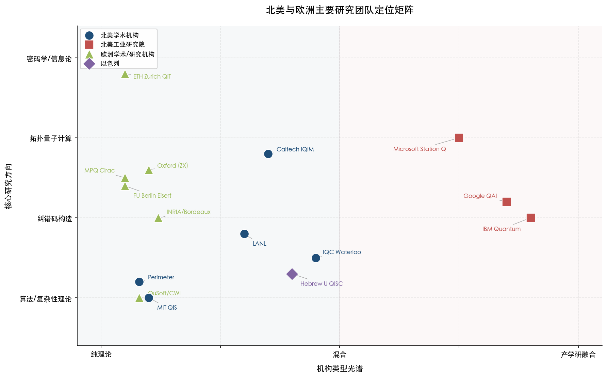

**图 2-1　北美与欧洲主要研究团队定位矩阵。** 横轴为机构类型光谱（纯理论—混合—产学研融合），纵轴为核心研究方向（算法/复杂性理论、纠错码构造、拓扑量子计算、密码学/信息论）。北美学术机构（蓝色）、北美工业研究院（红色）、欧洲学术/研究机构（绿色）与以色列（紫色）分色标注。

**偏纯数学理论方向**：Caltech IQIM（Kitaev 的拓扑量子计算数学奠基）、微软 Station Q（Freedman/Wang 的辫子群与模张量范畴）、牛津大学（Kissinger 的 ZX-calculus 与范畴量子力学）、ETH Zurich（Renner 的量子信息论基础）。这些团队的共同特征是从纯数学结构出发探索量子计算的可能性边界，其成果往往在短期内不直接对应硬件实现，但为长期技术路线提供了数学存在性论证和理论根基。

**偏算法设计与复杂性理论方向**：MIT（Shor/Harrow/Natarajan 的量子算法与复杂性理论）、QuSoft/CWI（Buhrman/de Wolf 的量子查询复杂性与去量子化）、Perimeter（Gosset/Gottesman 的稳定子形式主义与量子算法）。这些团队专注于回答"量子计算能做什么、不能做什么"这一基本问题，其理论成果为量子优势的精确数学边界提供了核心判据。

**偏纠错码构造方向**：INRIA/波尔多（Leverrier/Zémor 的 Quantum Tanner Codes 代数构造）、IBM Quantum（Bravyi/Cross/Yoder 的 BB 码工程化）、谷歌 QAI（Gidney/Haah 的表面码资源估计与代数码理论）。这一方向是 2024—2026 年间进展最快、学术产出增长最迅猛的分支——Riverlane 2025 年报告显示 2025 年前十个月 QEC 码相关论文达 120 篇，而 2024 年全年仅 36 篇 [Riverlane 报告](https://www.riverlane.com/blog/quantum-error-correction-our-2025-trends-and-2026-predictions "QEC code explosion")。图 2-2 展示了 qLDPC 码实用化从理论突破到工程验证的关键里程碑推进序列。

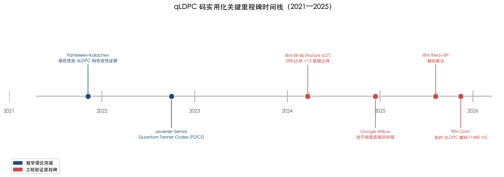

**图 2-2　qLDPC 码实用化关键里程碑时间线（2021—2025）。** 蓝色标注数学理论突破（Panteleev-Kalachev 渐近存在性证明、Leverrier-Zémor Quantum Tanner Codes），红色标注工程验证里程碑（IBM BB 码 Nature 论文、Google Willow 低于阈值纠错、IBM Relay-BP 解码算法、IBM Loon 实时解码）。

**产学研深度融合型**：Caltech/AWS（Brandão 的双重身份模式）、IBM Quantum（从码理论到硬件的端到端闭环）、谷歌 QAI（理论与实验快速迭代）、IQC-Waterloo（大规模政府资金与工业合作）、希伯来大学/QEDMA（Aharonov 的学术-产业双通道）。这类团队的比较优势在于能够将数学理论突破迅速转化为工程验证和产业应用。

我们认为，在上述格局中，qLDPC 码实用化方向正在经历一个"临界跨越"时期——IBM Bravyi 组的 BB 码（2024 年 Nature 发表）到 Loon 处理器的实时解码（2025 年提前达标），与 INRIA Leverrier-Zémor 的渐近存在性理论形成了"工程拉动—理论推动"的双向加速态势。这一方向有望在未来五年内产生容错量子计算领域的决定性进展，而能够同时贯通数学理论与硬件验证的团队将在这场竞赛中占据最有利位置。

图 2-3 以速查表形式汇总了本章涉及全部 14 个团队的核心信息，便于横向比较。

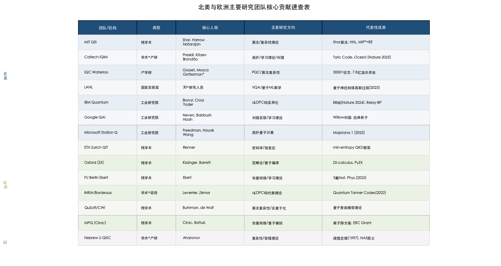

**图 2-3　北美与欧洲主要研究团队核心贡献速查表。** 按北美（蓝色底纹）、欧洲（绿色底纹）和以色列（紫色底纹）分区着色，汇总各团队的机构类型、核心人物、主要研究方向和代表性成果。

# 第3章 全球主要研究团队画像——亚太地区及其他新兴力量

第 2 章聚焦于北美与欧洲两大传统学术重镇，本章将视野拓展至亚太地区及其他正在快速崛起的研究力量。在数学与量子计算交叉领域，亚太地区的竞争格局呈现出鲜明的多极化特征：中国凭借实验-工程闭环能力和庞大论文体量占据量化产出优势，日本在后量子密码学数学理论和量子资源理论方面已达全球一流水平，澳大利亚悉尼大学贡献了里程碑级的拓扑纠错码构造，新加坡量子技术中心（Centre for Quantum Technologies, CQT）在量子通信复杂性理论上与欧洲 CWI 并驾齐驱，以色列魏茨曼研究所（Weizmann Institute of Science）则因 Thomas Vidick 的加盟而跃升为量子复杂性理论的全球新高地。本章沿用第 2 章的画像口径——核心研究方向、带头人、机构定位（纯学术型 vs. 产学研融合型）、标志性成果与比较优势——逐一梳理各国及地区主要团队，并在章末与北美、欧洲头部力量进行横向对标。

需要说明的是，以色列的两个核心机构分布于本报告的不同章节：希伯来大学量子信息科学中心（Hebrew University QISC）因 Dorit Aharonov 与北美学术网络的深度联系已在第 2 章讨论；魏茨曼研究所则因 Vidick 于 2024 年全职转入这一标志性人才流动事件，归入本章作为新兴力量变迁的代表性案例。

## 3.1 中国

### 3.1.1 中国科学技术大学潘建伟/陆朝阳团队（USTC）

中国科学技术大学（University of Science and Technology of China, USTC）潘建伟/陆朝阳团队是中国量子计算领域规模最大、国际能见度最高的研究力量。截至 2026 年初，该团队在 Scopus 数据库中以 1,877 篇量子计算相关论文位居全球机构发文量首位 [EPJ QT 文献计量研究](https://link.springer.com/article/10.1140/epjqt/s40507-026-00464-4 "Mapping the quantum computing landscape, 2026-01-15")，研究方向涵盖超导量子计算、光量子计算和量子通信三大板块。

在数学与量子计算的交叉维度上，该团队最具代表性的近期成果是 2025 年 12 月发表于 Physical Review Letters 的工作：通过全微波泄漏抑制方案，在 distance-7 表面码上实现量子纠错，逻辑错误抑制因子达到 Λ=1.40(6)，使 USTC 成为美国以外首个实现低于阈值的表面码量子纠错的团队 [He et al., PRL 135, 260601](https://link.aps.org/doi/10.1103/rqkg-dw31 "2025-12-22")。作为参照，Google Willow 处理器在 distance-7 码上实现的逻辑错误抑制因子为 Λ=2.14±0.02 [Google Willow 论文](https://www.nature.com/articles/s41586-024-08449-y "Nature 638, 920–926, 2025")。USTC 的结果虽在绝对抑制因子上低于 Google，但已跨过低于阈值这一关键理论门槛。

**机构定位与比较优势**：USTC 团队属于产学研融合型，核心竞争力以实验与工程能力为主导，在量子硬件制备、大规模量子比特集成和采样实验方面居全球前列。然而，该团队在纯数学驱动的码构造理论方面——如 qLDPC 码代数理论、拓扑码新构造等——的原创性贡献低于 IBM Bravyi 组或 INRIA Leverrier-Zémor 组。我们判断，USTC 团队在数学与量子计算交叉领域的贡献主要体现在将已有理论框架（如表面码）推向极限实验验证，而非开辟新的数学理论方向。

### 3.1.2 清华大学交叉信息研究院-量子信息中心（IIIS-CQI）

清华大学交叉信息研究院（Institute for Interdisciplinary Information Sciences, IIIS）由图灵奖得主姚期智（Andrew Yao）创立，是中国理论计算机科学与量子信息交叉研究的核心策源地。姚期智是最早将理论计算机科学工具系统引入量子信息领域的核心人物之一——其 1993 年建立的量子通信复杂性模型为量子信息论奠定了重要的计算复杂性基础。

量子信息中心（CQI）由段路明担任执行主任。段路明于 2024 年获国际量子奖，2025 年 1 月其团队首次在双重编码量子比特间实现高保真度纠缠门 [CQI 官方页面](https://iiis.tsinghua.edu.cn/lzzx/zxjj.htm "CQI 中心简介")。CQI 的研究覆盖量子计算、量子通信和量子网络，在离子阱量子计算和量子存储方面具有鲜明的实验特色。

**机构定位与比较优势**：IIIS-CQI 属于纯学术型团队，其核心优势在于姚期智所奠定的理论计算机科学与量子信息交叉传统。与 USTC 的大规模实验导向形成对照，CQI 更侧重原理性验证和理论指导下的精密实验，在中国量子计算研究版图中扮演理论策源地的角色。

### 3.1.3 清华大学求真书院刘子文组（YMSC）

清华大学丘成桐数学科学中心（Yau Mathematical Sciences Center, YMSC）的刘子文是中国大陆在纯数学驱动量子纠错码研究方面最具代表性的学者。2024 年 9 月，刘子文连续发表两篇 Physical Review Letters：其一关于协变量子纠错码（基于 SU(2) 对称性框架），其二关于镶嵌码（tessellation codes，利用几何旋转实现编码量子逻辑门）[清华求真书院报道](https://qzc.tsinghua.edu.cn/info/1017/7694.htm "两篇 PRL 论文详细介绍")。这两项工作在方法论上最接近 INRIA Leverrier-Zémor 所代表的代数编码理论传统——即从纯数学结构（对称群、几何构造）出发推导量子码的性质，而非从硬件约束倒推码设计。

**机构定位与比较优势**：刘子文组属于纯数学学术型团队，是中国大陆在"数学→量子纠错"这一方向上理论深度最接近国际前沿的研究力量。其协变码和镶嵌码工作展现了利用群论与几何学构造量子码的独到路径。不过，该团队规模较小，尚未形成与 IBM Bravyi 组或 INRIA 组相当的持续产出能力，从能力种子到规模化突破仍需时日。

### 3.1.4 北京量子信息科学研究院（BAQIS）与中科院物理研究所

北京量子信息科学研究院（Beijing Academy of Quantum Information Sciences, BAQIS）成立于 2017 年，定位为新型研发机构，龙桂鲁（量子安全直接通信开创者）任副院长。2024 年，BAQIS 接收了百度量子实验室捐赠的量子计算设备 [CSIS 分析报告](https://www.csis.org/analysis/understanding-chinas-quest-quantum-advancement "Understanding China's Quest for Quantum Advancement")，反映出中国工业界量子研究资源向学术机构转移的趋势。

中国科学院物理研究所范桁团队是 BAQIS 的重要合作力量。范桁任中科院物理所固态量子信息与计算实验室主任，同时兼任 BAQIS 量子计算研究部部长。2026 年 1 月，该团队利用自主研制的 78 量子比特超导芯片"庄子（Chuang-tzu）2.0"，在 Nature 发表了随机多极驱动下可调控预热化平台的首次实验观测成果 [21世纪经济报道](https://www.21jingji.com/article/20260201/herald/bf06334045360267c72730896eb739cd.html "中科院范桁采访, 2026-02-01")。该实验虽以实验物理为主导，但其核心机制——非周期驱动系统中预热化阶段的数学结构——涉及随机矩阵理论和多体量子动力学中的深层数学问题。

**机构定位与比较优势**：BAQIS 与中科院物理所在超导量子计算硬件和量子模拟实验方面具备独立能力，"庄子 2.0"芯片是中国超导量子计算的重要硬件平台之一。然而与 USTC 类似，其核心竞争力在实验与工程维度，纯数学理论原创性并非该团队的主要优势所在。

## 3.2 日本

### 3.2.1 理化学研究所量子计算研究中心（RIKEN RQC）

理化学研究所（RIKEN）量子计算研究中心（RQC）是日本量子计算研究的核心枢纽，拥有两个在数学与量子计算交叉领域达到全球顶级水平的理论团队。

**藤井啓祐（Keisuke Fujii）团队**专攻容错量子计算（Fault-Tolerant Quantum Computing, FTQC）架构与量子软件的数学基础。藤井于 2018 年发表于 Physical Review A 的"量子电路学习"（Quantum Circuit Learning）论文累计被引超 2,200 次，是变分量子算法数学基础领域引用量最高的论文之一。2025 年，藤井入选联合国国际量子科学与技术年（IYQ 2025）"Quantum 100"全球百名领军人物 [IYQ Quantum 100](https://quantum2025.org/quantum-100/professor-keisuke-fujii/ "Keisuke Fujii")。同年 6 月，藤井团队开发出更高效的魔态制备方法（magic state distillation），直面容错量子计算的核心资源瓶颈。

**Bartosz Regula 团队**（RIKEN 白眉研究员，数学量子信息团队）聚焦于量子资源理论的数学基础。2023 年，Regula 在 Nature Physics 发表的工作否定了量子纠缠操控的"第二定律"猜想——即证明纠缠在某些操作下不存在类似热力学第二定律的普适可逆性——这一成果被视为量子信息理论的里程碑 [RIKEN 官方页面](https://www.riken.jp/en/research/labs/rqc/math_qtm_inf_riken_hakubi/index.html "Bartosz Regula")。此外，RIKEN RQC 的 Mizuta 和 Kuwahara 于 2025 年 9 月在 PRL 135 证明了低能态 Trotterization 的最优误差界——误差至多与初始态能量线性相关、与系统尺寸仅有多对数关系 [PRL 135, 130602](https://link.aps.org/doi/10.1103/q87n-5xhz "2025-09-23")，为量子哈密顿量模拟的数学最优性理论做出关键贡献。

**机构定位与比较优势**：RIKEN RQC 属于国家级研究机构，在量子资源理论数学基础（Regula）和容错架构数学（Fujii）两个方向上均居全球前列。Regula 的工作在理论深度和影响力上可与 ETH Zurich Renner 组对标，藤井在容错量子计算算法方面则是全球少数具有全面框架能力的团队领军者之一。

### 3.2.2 大阪大学量子信息与量子生命研究中心（QIQB）

大阪大学 QIQB 由藤井啓祐兼任副主任，与 RIKEN RQC 形成制度化的双机构协同格局。QIQB 与富士通（Fujitsu）开展深度合作以推进实用量子计算，是日本产学研融合的典型代表。在数学与量子计算交叉方面，QIQB 的贡献集中于量子编译优化的数学方法和容错量子算法的资源估计。

**机构定位与比较优势**：QIQB 属于产学研融合型机构，其核心优势在于将 RIKEN 的理论成果向实用化方向推进，特别是在与日本产业界的合作方面构建了系统性的转化桥梁。

### 3.2.3 名古屋大学 Le Gall 组

François Le Gall 是法裔数学家，现于名古屋大学（Nagoya University）领导量子算法与代数复杂性理论研究，其从法国 CNRS 学术系统向日本的迁移本身即为亚太地区人才吸引力提升的标志性案例。Le Gall 的核心研究方向包括量子分布式算法和量子-经典计算边界的数学刻画。2024 年，Le Gall 发表了量子机器学习鲁棒去量子化的重要工作 [Le Gall 出版物](https://francoislegall.com/publications.html "Publications")，为理解量子机器学习的真实优势边界提供了新的数学工具。

**机构定位与比较优势**：Le Gall 组属于纯学术型小型团队，在代数复杂性理论应用于量子算法方面具有鲜明特色。其去量子化工作对于精确判定量子优势的成立条件具有直接理论意义，与 CWI/QuSoft 的 de Wolf 组形成学术互补。

### 3.2.4 NTT 密码学与信息安全实验室（NTT CIS Lab）

日本电信电话公司（NTT）研究院的密码学与信息安全实验室（CIS Lab）在后量子密码学数学理论方面达到全球工业研究机构的最高水平。2025 年，NTT CIS Lab 在国际密码学顶级会议 Crypto 2025 上发表 23 篇论文，约占全部被接收论文的 15%，并斩获最佳论文奖——该获奖工作提出了标准模型下首个一次性签名（one-time signature）方案，解决了量子密码学领域十年未决的公开问题 [NTT 公告](https://ntt-research.com/ntt-presents-23-papers-and-receives-best-paper-award-at-crypto-2025/ "Crypto 2025")。

**机构定位与比较优势**：NTT CIS Lab 属于工业研究院型机构，其核心优势在于后量子密码学的纯数学理论研究能力。在后量子密码学（PQC）数学理论深度上，NTT CIS Lab 超越了多数大学团队，可与魏茨曼研究所的 Brakerski、ETH Zurich 的 Renner 同列一线。该实验室的卓越表现使日本在全球 PQC 标准化进程中拥有独特的学术话语权。

### 3.2.5 东京大学 Murao 量子信息组

东京大学物理学系的村尾美绪（Murao Mio）教授领导的量子信息组是高阶量子运算（higher-order quantum operations）数学理论的全球开创者之一。该团队的核心研究方向为利用量子梳（quantum combs）和表示论工具研究量子运算的通用变换——即以量子运算本身作为输入和输出的"元运算"。

2025 年 5 月，该组在 Quantum 期刊发表等距伴随化（isometry adjointation）协议的普适构造工作，利用 Clebsch-Gordan 变换实现最优近似误差 ε=Θ(d²/n)，证明不确定因果序协议在等距反演和通用错误检测中的理论优势 [Yoshida, Soeda & Murao, Quantum 9, 1750](https://quantum-journal.org/papers/q-2025-05-20-1750/ "Universal adjointation of isometry operations, 2025")。2025 年 3 月，Murao 作为核心作者之一完成了长达 106 页、包含 566 篇参考文献的高阶量子运算综述论文，系统梳理了该领域的数学框架与公开问题 [Taranto, Milz, Murao, Quintino & Modi](https://arxiv.org/abs/2503.09693 "Higher-Order Quantum Operations, 2025")。

**机构定位与比较优势**：Murao 组属于纯数学学术型团队，在高阶量子运算的范畴论和表示论基础方面具有全球独创性。该研究方向虽非当前量子计算工程的直接热点，但为理解量子计算的深层数学结构提供了不可替代的理论工具，且与量子编程理论和量子因果结构研究的联系日益紧密。

## 3.3 澳大利亚

### 3.3.1 悉尼大学量子理论组

悉尼大学（University of Sydney）量子理论组是南半球量子计算数学理论的领军力量。核心人物 Stephen Bartlett 的学术引用超过 15,400 次，研究横跨拓扑纠错码、对称保护拓扑序与量子计算资源理论。

该组最具代表性的近期突破来自 Dominic Williamson。2024 年 11 月，Williamson 在 Nature Communications 发表 Layer Codes——一种三维拓扑码构造，实现 L²级（即码距平方级）的错误处理能力，解决了拓扑量子纠错领域十余年的公开问题 [悉尼大学报道](https://www.sydney.edu.au/news-opinion/news/2024/11/11/layer-codes-quantum-error-correction-quantum-hard-drive.html "Layer Codes, Nature Communications 2024")。Layer Codes 的数学核心在于将二维拓扑码通过时间方向的"分层"构造提升至三维，利用三维流形的拓扑性质实现更高效的存储容量和容错能力。从方法论视角审视，这一工作与 INRIA Leverrier-Zémor 的代数 qLDPC 码构成互补——前者从拓扑几何出发，后者从代数编码理论出发，两条路线共同推进量子纠错码的理论前沿。

2025 年，悉尼大学获得澳大利亚研究理事会（Australian Research Council, ARC）卓越中心支持，进一步强化了量子计算数学理论方向的研究资源。

**机构定位与比较优势**：悉尼大学量子理论组属于纯学术型团队，在拓扑纠错码的几何构造方面具有独到优势。Layer Codes 的突破使该组跻身全球量子纠错码理论的一线行列；但团队规模较小，在持续高产出方面不及 IBM Bravyi 组或 INRIA 组等建制化大型团队。

### 3.3.2 新南威尔士大学（UNSW）

新南威尔士大学以硅基量子比特实验为核心方向，Andrea Morello 领导的团队在硅中单原子量子比特的控制精度方面达到全球领先水平。其理论力量偏向实验理论支撑，在纯数学原创性方面低于悉尼大学。UNSW 属于产学研融合型机构，与澳大利亚量子计算初创公司 Silicon Quantum Computing 保持密切联系。

## 3.4 新加坡

### 3.4.1 量子技术中心（CQT）

新加坡国立大学量子技术中心（Centre for Quantum Technologies, CQT）成立于 2007 年，是新加坡的国家旗舰量子研究机构，现有约 200 人规模，由新加坡国家研究基金会（NRF）持续资助。

CQT 在数学与量子计算交叉领域的核心优势集中于量子通信复杂性理论和量子密码学信息论基础两个方向。核心人物 Rahul Jain 是 QIP=PSPACE 定理的证明者之一——该定理确立了量子交互式证明系统的精确计算能力——近年持续在理论计算机科学顶级会议上保持高产出，2024 年分别在 FOCS 和 STOC 发表论文 [CQT Rahul Jain](https://www.cqt.sg/people/rahul-jain/ "CQT PI")。Troy Lee 在量子查询复杂性理论方面拥有核心贡献，Miklos Santha 同时持有法国 CNRS 联合任命，是 CQT 与欧洲学术网络联结的重要纽带。

2025 年 3 月，新加坡 NRF 向量子-超算集成方向投入 2,450 万美元，标志着该国在量子计算领域投资力度的进一步加速。

**机构定位与比较优势**：CQT 属于国家旗舰研究中心，兼具学术自由度和充足资金支持。在量子算法复杂性理论方面，Jain 与 CWI/QuSoft 的 Buhrman/de Wolf 处于同一梯队。CQT 的独特优势在于其高度国际化的人才结构——多位首席研究员持有双重机构任命——使其成为亚太与欧洲量子理论合作的关键枢纽节点。

## 3.5 韩国

### 3.5.1 韩国科学技术院量子大学院（KAIST）

韩国科学技术院（Korea Advanced Institute of Science and Technology, KAIST）正处于量子计算研究的快速建设期。2026 年 1 月，KAIST 与 MIT 建立量子计算合作关系，并启动国家量子制造设施建设 [朝鲜日报](https://www.chosun.com/english/industry-en/2026/01/26/ZJOK5WFHLRBHTM4VZ7XYDN3U7Y/ "KAIST Quantum, 2026-01-26")；韩国政府已承诺至 2035 年投资约 23 亿美元用于量子科技发展。

在数学与量子计算交叉方面，KAIST 的理论积累尚不及 RIKEN RQC 或 CQT，但与 MIT 的制度化合作为其快速追赶提供了有利条件。我们预判，韩国量子研究在未来五年内将从当前的设施建设期进入理论产出期，但形成独立的数学理论贡献仍需较长时间周期。

## 3.6 印度

### 3.6.1 塔塔基础研究所与印度科学研究所（TIFR/IISc）

印度的量子计算研究根植于其深厚的理论计算机科学传统——塔塔基础研究所（Tata Institute of Fundamental Research, TIFR）的理论计算机科学组（TCS）自 1960 年代起即为全球理论计算机科学的重要培养基地。印度国家量子使命（National Quantum Mission）于 2023 年启动，计划投资约 60 亿卢比（约 7.3 亿美元）[The Quantum Insider](https://thequantuminsider.com/2024/11/27/quantum-computing-advancements-in-india/ "Quantum Computing in India, 2024")。

在数学与量子计算交叉领域，印度的贡献以纯理论研究为主，受限于量子实验基础设施的不足。尤为值得关注的是印度的人才外溢效应：多位活跃在全球顶级量子研究机构的学者出自印度学术系统，如 CQT 的 Rahul Jain 即从 TIFR 培养而来。

**机构定位与比较优势**：TIFR 和印度科学研究所（Indian Institute of Science, IISc）属于学术型机构，在量子复杂性理论和算法设计方面拥有人才储备优势，但将这些人才留在国内的制度环境和资金支持尚待完善。值得注意的是，印度在全球量子合作网络中的中介中心性（betweenness centrality）位居前列——EPJ Quantum Technology 文献计量研究显示其中介中心性达到 0.114 [EPJ QT 文献计量研究](https://link.springer.com/article/10.1140/epjqt/s40507-026-00464-4 "Fig. 8 & Section 3.2")——表明印度学者在连接不同国际学术社区方面扮演着独特的桥梁角色。

## 3.7 以色列：魏茨曼研究所量子中心

### 3.7.1 Vidick-Brakerski-Stern 多维度理论集群

魏茨曼科学研究所（Weizmann Institute of Science）量子科学与技术中心拥有 22 位首席研究员（PI），近年因关键人才流动而发生质的跃升 [Weizmann 量子中心](https://centers.weizmann.ac.il/quantum-science-technology/members/principal-investigators "PI 列表")。

最具标志性的变化是 Thomas Vidick 的加盟。Vidick 是 MIP*=RE 定理的核心贡献者之一（该工作已在第 2 章 Caltech IQIM 项下详细讨论），2024 年秋从 Caltech 全职加入魏茨曼研究所数学与计算机科学系，同期亦在 EPFL 获聘全职教授 [EPFL 公告](https://actu.epfl.ch/news/two-new-quantum-professors-hired-at-epfl/ "Two new quantum professors hired at EPFL")；[Blavatnik 奖](https://blavatnikawards.org/honorees/profile/thomas-vidick/ "2024 Israel Award Winner")。Vidick 在 FOCS 2024 上发表了基于高维立方复形构造的量子局部可测码（Quantum Locally Testable Codes, qLTC）应用工作（与 Dinur、Lin 合作），进一步拓展了 qLDPC 码理论的数学疆界。

Zvika Brakerski 在后量子密码学和格密码学（lattice-based cryptography）方面居全球前列，其对 Module-LWE 问题安全性分析的贡献构成 NIST PQC 标准化进程的重要理论基础之一。Ady Stern 在拓扑量子计算的数学物理方面——特别是非阿贝尔任意子（non-Abelian anyons）理论——拥有核心贡献。

**机构定位与比较优势**：Vidick（量子复杂性）、Brakerski（后量子密码学）、Stern（拓扑物理）三人的学术组合使魏茨曼形成了罕见的多维度量子数学理论集群。该集群的独特之处在于同时覆盖量子计算数学基础的三大前沿方向，且每个方向的带头人均属全球顶级。Vidick 的加入使魏茨曼在量子复杂性理论方面与 MIT（Natarajan）和 CQT（Jain）形成三足鼎立的格局。

## 3.8 亚太及新兴力量与北美欧洲头部团队的横向对标

将本章梳理的 14 个团队置于全球竞争格局中进行系统对标，可识别出以下关键比较维度。图 3-1 以热力图形式展示了各团队在八个核心数学理论方向上的覆盖深度，为后续分维度对标提供总览。

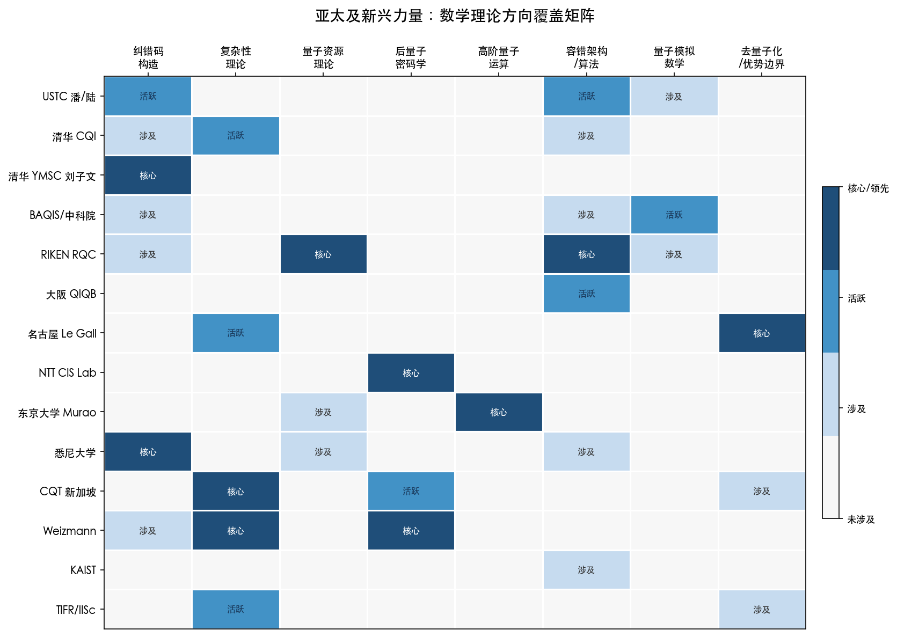

**图 3-1 亚太及新兴力量数学理论方向覆盖矩阵。** 行为 14 个亚太及新兴力量团队，列为 8 个核心数学理论方向，色阶从浅至深分别表示"未涉及""涉及""活跃""核心/领先"。可直观识别亚太地区的方向集中度与空白领域。

### 3.8.1 纯数学理论深度

在量子资源理论的数学基础方面，RIKEN Regula 的工作（2023 年 Nature Physics，否定纠缠"第二定律"猜想）在理论深度和学术影响力上可与 ETH Zurich Renner 组对标。在量子复杂性理论方面，魏茨曼 Vidick 与 MIT Natarajan 属同一梯队。在高阶量子运算的范畴论基础方面，东京大学 Murao 组具有全球独创性。清华 YMSC 刘子文在协变码和几何码构造方面展现了可与 INRIA 代数编码传统对话的理论能力，但产出规模尚有差距。

### 3.8.2 算法复杂性

CQT 的 Jain（QIP=PSPACE 定理证明者之一）与 CWI 的 Buhrman 处于同一竞争层次，两者分别代表亚太和欧洲在量子查询复杂性与通信复杂性方面的最高水平。名古屋大学 Le Gall 在去量子化方向的工作则为精确判定量子优势边界提供了关键数学工具。

### 3.8.3 纠错码构造

悉尼大学 Williamson 的 Layer Codes（三维拓扑码，L²级错误处理能力）与 INRIA Leverrier-Zémor 的代数 qLDPC 码构成两条互补的理论路线——一条从拓扑几何出发，一条从代数编码理论出发。两者的综合推进正为下一代量子纠错码提供日益丰富的设计空间。USTC 的表面码量子纠错实验（Λ=1.40）追平了 Google Willow 的阈值突破地位，但在纯数学码构造理论层面，中国团队与 IBM Bravyi 组仍存在显著差距。

### 3.8.4 产学研融合

亚太地区在产学研融合方面呈现多元模式：NTT CIS Lab 以工业研究院的纯数学理论深度取胜，在后量子密码学方面超越多数大学团队；大阪大学 QIQB 与富士通的合作代表了日本式的渐进产学融合路径；USTC 团队则体现了中国以国家战略驱动的大规模产学研集成模式。相比之下，北美的 Brandão"双重身份"模式（Caltech/AWS）和 Microsoft Station Q 以 Fields 奖得主领衔纯数学研究的模式，在学术与工业的深度融合方面仍然更为成熟。

与产学研融合密切相关的另一维度是关键人才的跨国流动。图 3-2 呈现了三个典型案例以及一项制度化合作安排，展示亚太地区通过人才吸引重塑全球竞争格局的动态过程。

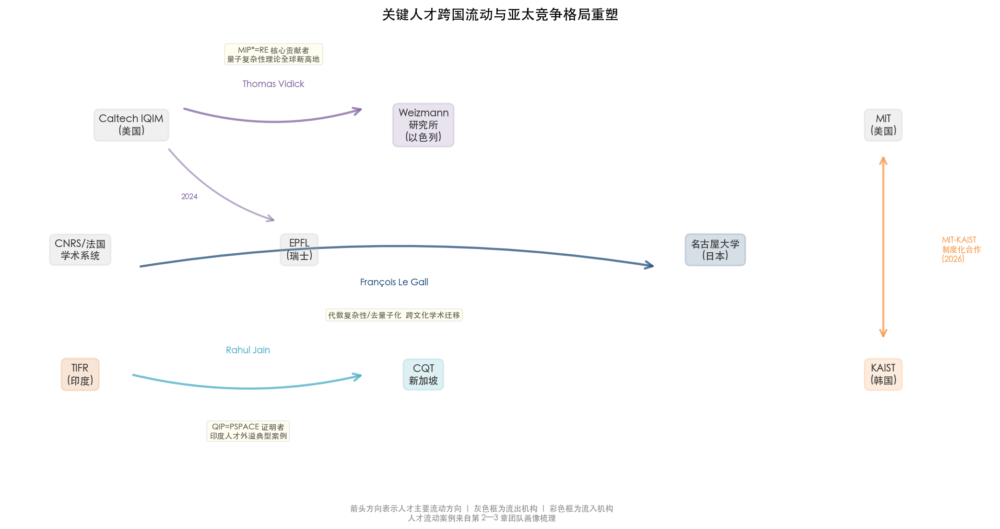

**图 3-2 关键人才跨国流动与亚太竞争格局重塑。** Vidick 从 Caltech 转至 Weizmann/EPFL（2024 年）、Le Gall 从法国 CNRS 体系迁至名古屋大学、Jain 从 TIFR 赴 CQT 三例典型人才流动，以及 MIT-KAIST 制度化合作（2026 年），揭示了亚太地区通过人才引进和制度合作改写全球学术版图的趋势。

### 3.8.5 整体格局判断

图 3-3 将本章 14 个亚太及新兴力量团队与第 2 章 7 个北美/欧洲头部团队置于同一坐标系中，以"产学研融合度"为横轴、"纯数学理论深度"为纵轴，气泡大小反映团队相对影响力量级，提供全景式竞争定位视角。

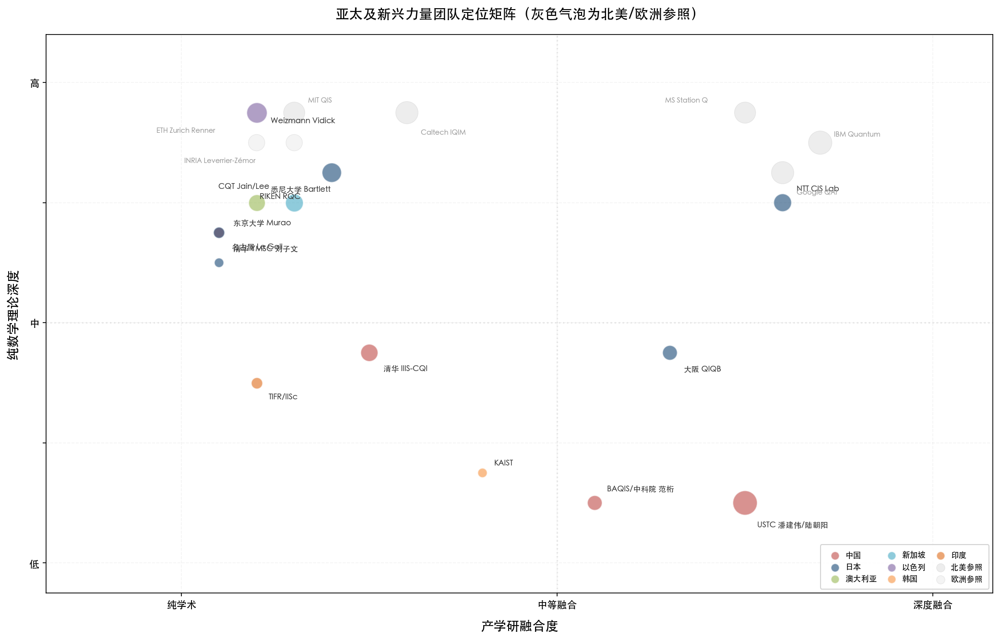

**图 3-3 亚太及新兴力量团队定位矩阵（灰色气泡为北美/欧洲参照）。** 横轴为产学研融合度（纯学术—中等融合—深度融合），纵轴为纯数学理论深度（低—中—高）。彩色气泡为本章亚太及新兴力量团队，灰色/白色气泡为北美和欧洲参照团队。

综合以上四个维度的对标分析，亚太地区在数学与量子计算交叉领域已不再是纯粹的"追赶者"。日本（RIKEN RQC + NTT CIS Lab）和以色列（魏茨曼研究所）在特定理论方向上已达到全球一流水平；澳大利亚悉尼大学在拓扑纠错码构造方面贡献了里程碑级成果；新加坡 CQT 在量子复杂性理论方面稳居全球第一梯队。中国的核心优势在于实验验证能力和论文总量，但在纯数学理论原创性方面——特别是在 qLDPC 码代数理论、量子复杂性理论的前沿定理证明等维度上——与北美、欧洲头部团队仍有结构性差距。我们认为，清华 YMSC 刘子文组的出现标志着中国在"纯数学→量子纠错"这一关键方向上开始形成能力种子，但从种子到规模化产出尚需 5 至 10 年的持续投入。

# 第4章 研究产出、影响力与国际合作网络

前两章分别勾画了北美—欧洲与亚太地区数学—量子计算交叉领域的团队图谱。本章转入定量视角，从论文产出规模、引用影响力和国际合著网络三个维度对上述团队及其所在国家展开横向比较，旨在回答三个核心问题：谁在产出最多的高质量研究？学术影响力是否与论文体量成正比？全球合作网络呈现何种结构特征，又正经历怎样的地缘政治重塑？

本章主要数据来源为 2026 年 1 月发表于 *EPJ Quantum Technology* 的综合文献计量研究，该研究覆盖 Scopus 数据库 1980—2025 年间 31,662 篇量子计算论文，是迄今公开可得的最完整的领域级文献计量分析 [EPJ QT](https://link.springer.com/article/10.1140/epjqt/s40507-026-00464-4 "Mapping the quantum computing landscape, 2026-01-15")。在此基础上，本章辅以英国科学与技术部（DSIT）的场加权引用影响力（Field-Weighted Citation Impact, FWCI）数据、美国国家科技委员会（NSTC）量子国际合作报告，以及学术会议和期刊的最新统计，力图构建一幅多维度、多数据源交叉验证的研究态势全景图。

## 4.1 全球论文产出的规模与增长态势

### 4.1.1 指数增长与 2024 年峰值

量子计算研究的发文量经历了从边缘学科到主流热点的典型 S 型增长曲线。1980—2014 年间，年均发文量长期处于低位缓增状态；自 2015 年起进入指数增长阶段，至 2024 年达到历史发文峰值 [EPJ QT](https://link.springer.com/article/10.1140/epjqt/s40507-026-00464-4 "Fig. 4")。这一增长拐点与多重因素同步共振：2015—2016 年 IBM 开放量子云平台显著降低了研究准入门槛，2019 年 Google Sycamore 处理器的"量子优越性"实验引发全球性学术与产业关注，以及各国政府密集出台量子战略带动了研究经费的快速扩张。

在 31,662 篇论文中，期刊论文占 63.2%，会议论文占 31.6%，综述和专著章节占余下份额。学科分布以物理与天文学（30.3%）和计算机科学（24.5%）为主，二者合计超过全部产出的一半，其后依次为工程学、数学、材料科学和化学 [EPJ QT](https://link.springer.com/article/10.1140/epjqt/s40507-026-00464-4 "Fig. 3")。值得注意的是，数学在整体学科分布中的显式占比虽低于物理和计算机科学，但正如 SIAM 量子交叉研讨会（Quantum Intersections Convening, QIC）2024 年报告所指出的，大量数学贡献被归类于物理或计算机科学期刊而非数学期刊，导致数学的实际贡献被系统性低估 [SIAM QIC 报告](https://www.siam.org/media/orydkrzd/quantum-convening-report.pdf "2024")。

### 4.1.2 机构层面的产出排名

在机构层面，中国科学技术大学（USTC）以 1,877 篇论文居全球首位，大幅领先排名第二的加州大学系统（1,040 篇）。其后依次为法国国家科学研究中心（CNRS，759 篇）、中国科学院（CAS，729 篇）、滑铁卢大学（600 篇）、麻省理工学院（MIT，593 篇）、牛津大学（534 篇）和新加坡国立大学（493 篇）[EPJ QT](https://link.springer.com/article/10.1140/epjqt/s40507-026-00464-4 "Table 2")。

需要指出的是，上述排名主要反映量子计算的广义论文产出，而非数学与量子计算交叉领域的专精产出。USTC 的论文体量优势在很大程度上来自实验物理和量子通信方向的大规模发文，而 MIT、滑铁卢大学和 INRIA 等机构在纯数学理论驱动的量子纠错码构造、量子算法复杂性等方向上的人均高影响力产出更为突出。这一区分对于准确评估各机构在数学—量子计算交叉领域的实际竞争力至关重要。

### 4.1.3 国家层面的产出格局

按国家—论文实例计数（即同一论文若有多国作者则每个国家各计一次），美国以 27,092 篇居首，中国以 25,407 篇紧随，德国（7,893 篇）和印度（7,305 篇）分列第三、第四 [EPJ QT](https://link.springer.com/article/10.1140/epjqt/s40507-026-00464-4 "Fig. 5")。然而，若以通讯作者归属计量——这一指标更能反映研究主导权——中国以 6,695 篇略超美国的 6,601 篇 [EPJ QT](https://link.springer.com/article/10.1140/epjqt/s40507-026-00464-4 "Fig. 6")。中国通讯作者占比偏高的现象与其较高的国内单一国家发表比例（Single-Country Publications, SCP）相一致：中国约 68% 的量子计算论文为纯国内合作，而美国、英国和德国的国际合著比例明显更高。这一结构性差异将在后文关于国际合作网络的分析中进一步展开。

## 4.2 核心发表渠道与新兴期刊格局

### 4.2.1 传统 Q1 期刊的主导地位

量子计算的高影响力论文发表高度集中于有限的旗舰期刊和顶级会议。根据 EPJ QT 的统计，*Physical Review A*（含 Atomic, Molecular and Optical Physics 版本）、*Physical Review Letters*（PRL）、*Physical Review Research* 和 *Physical Review B* 是发文量最大的四类 Q1 期刊，共同构成了量子信息领域的核心发表阵地 [EPJ QT](https://link.springer.com/article/10.1140/epjqt/s40507-026-00464-4 "Table 1")。对于本报告聚焦的数学—量子计算交叉领域而言，PRL 的地位尤为关键：前文各章所述的 qLDPC 码实验验证（Google Willow、USTC 表面码纠错）、Trotter 误差最优界（RIKEN Mizuta-Kuwahara）、协变量子纠错码（清华 YMSC 刘子文）等里程碑成果均发表于 PRL。*Nature* 及 *Nature* 子刊则承担跨学科重大突破的首发渠道功能——IBM bivariate bicycle 码（*Nature* 2024）、Microsoft Majorana 1（*Nature* 2025）、AWS Ocelot 猫态量子比特（*Nature* 2025）等产学研融合型成果集中于此。

### 4.2.2 新兴旗舰期刊的崛起

2020 年以来，三份新兴期刊迅速跻身数学—量子计算交叉研究的重要发表渠道，形成了与传统物理期刊互补的新生态。

***PRX Quantum***（美国物理学会，2020 年创刊）是目前量子信息领域影响因子最高的专科期刊。根据 Scimago Journal & Country Rank 数据，PRX Quantum 自创刊以来发文量稳步增长：2020 年 39 篇（创刊年，部分年度运行），2021 年 235 篇，2022 年 218 篇，2023 年 192 篇，2024 年 242 篇 [Scimago PRX Quantum](https://www.scimagojr.com/journalsearch.php?q=21101081601&tip=sid&clean=0 "PRX Quantum Documents by Year")。其 2024 年影响因子为 11.0 [APS 期刊指标](https://journals.aps.org/prxquantum/about "PRX Quantum metrics, 2023 JCR")，在量子信息专科期刊中居首。PRX Quantum 的选稿标准强调跨子领域影响力，使其成为量子纠错理论、量子算法设计和量子学习理论等数学密集型方向的首选投稿目标之一。

***Quantum***（非营利社区期刊，2017 年创刊）由量子信息研究社区自主运营，采用开放获取模式。2024 年（第 8 卷）共发表 365 篇论文 [Quantum 期刊官网](https://quantum-journal.org/volumes/8/ "Volume 8, 2024")，截至 2026 年 3 月已累计发表超过 2,047 篇 [Quantum 期刊首页](https://quantum-journal.org/ "2,047 papers in 10 volumes")。其 2024 年影响因子约为 5.4—5.7 [Journal Citation Reports](https://www.citefactor.org/impact-factor/impact-factor-of-quantum.html "IF 2024-25: 5.4")。Rossi-Ceroni-Chuang 的多变量 QSP 模块化理论（2025 年）即发表于 *Quantum*，代表了量子算法设计框架在数学层面的最新进展。

***npj Quantum Information***（Nature Partner Journals，2015 年创刊）2024 年影响因子为 8.3，CiteScore 为 14.9 [npj QI 期刊指标](https://www.nature.com/npjqi/journal-impact "Journal Impact Factor: 8.3, 2024")。该期刊在量子算法应用、量子化学和量子网络方向上发文较多，但数学理论纯度低于 PRX Quantum 和 Quantum。

这三份期刊的快速崛起折射出量子信息领域对专科高影响力发表渠道的旺盛需求，亦表明数学—量子计算交叉研究正从传统物理期刊（PRA、PRL）和综合顶刊（*Nature*/*Science*）的覆盖之外，形成更具学科认同感的独立发表生态。

### 4.2.3 顶级理论计算机科学会议中的量子研究渗透

在理论计算机科学的旗舰会议中，量子计算相关论文的占比正呈现显著上升趋势。STOC 2025（第 57 届 ACM 计算理论年会）的被接收论文列表中，可识别出约 37 篇与量子计算直接相关的工作，涵盖量子纠错码（如 Golowich-Guruswami 的"渐近优良带横截非 Clifford 门的量子码"、Golowich-Lin 的"qLDPC 码乘积代数构造"）、量子复杂性（"QMA vs QCMA 与伪随机性"）、量子密码学（"量子优势的密码学刻画"、"量子一次性程序"）、量子学习理论（"影子断层扫描的维度无关高效算法"、"学习浅层电路制备的量子态"）和量子算法（"量子 Gibbs 采样器的高效热化与通用量子计算"、"Jacobi 分解电路：近线性门数和亚线性空间的量子因式分解"）等方向 [STOC 2025 论文列表](https://acm-stoc.org/stoc2025/accepted-papers.html "STOC 2025 Accepted Papers")。在总计约 140 余篇被接收论文中，量子相关论文占比约达 25%——这一比例在十年前几乎难以想象。

QIP（Quantum Information Processing）会议作为量子信息领域规模最大的年度学术盛会，近年提交量持续攀升——2023 年提交量约 500 篇（参会约 1,000 人），且大会口头报告（contributed talks）的接受率极低，通常仅约 32 篇获选 [QIP 章程](https://qipconference.org/qipcharter "~32 accepted talks")。QIP 2026 于 2026 年 1 月在拉脱维亚里加举行 [QIP 2026](https://qip2026.lu.lv/ "29th QIP, Riga, Latvia")，被接收论文中同样可见大量数学—量子计算交叉主题，如常数速率量子计算机的线性布局方案（Craig Gidney 等，Google Quantum AI）等 [QIP 2026 接收论文](https://qip2026.lu.lv/programme/accepted-papers/ "QIP 2026 Accepted Papers")。

FOCS 2024（第 65 届 IEEE 计算机科学基础年会）共接收 133 篇论文（提交 463 篇），其中多篇涉及量子计算复杂性和量子密码学前沿，包括"常温 Gibbs 采样的量子计算优势"等理论性工作 [FOCS 2024](https://focs.computer.org/2024/accepted-papers-for-focs-2024/ "FOCS 2024 Accepted Papers")。

上述数据共同表明，数学—量子计算交叉研究正从量子物理会议的传统阵地向主流理论计算机科学与数学学术会议加速扩展，学科渗透力和影响力正处于历史最高水平。

## 4.3 引用影响力分析

### 4.3.1 全球引用概览与国别差距

EPJ QT 的文献计量研究显示，31,662 篇量子计算论文累计获得 804,137 次引用，篇均 25.40 次，h-index 达 311 [EPJ QT](https://link.springer.com/article/10.1140/epjqt/s40507-026-00464-4 "Section 3.1")。在国家层面，引用影响力的分布呈现显著的不均衡格局：

- 美国以 138,916 次总引用和 44.0 次篇均引用领跑全球，反映其在高引基础理论和算法研究上的深厚积累。
- 中国虽以 53,454 次总引用位居第二，但篇均引用仅 11.9 次，远低于美国的 44.0 次。这一差距与中国强调国内发表、高 SCP 比例（约 68%）以及部分论文发表于较低影响力渠道等结构性因素密切相关。
- 奥地利（50.7 次/篇）和南非（48.4 次/篇）等小型研究体系反而展现出最高的篇均引用，原因在于这些国家的研究体量虽小但高度聚焦于高影响力方向，且国际合作比例极高。
- 英国（38.3 次/篇）和瑞士（41.1 次/篇）则展现了规模与质量的均衡兼顾 [EPJ QT](https://link.springer.com/article/10.1140/epjqt/s40507-026-00464-4 "Table 6")。

### 4.3.2 场加权引用影响力（FWCI）

为更精确地控制学科和时间窗口效应，场加权引用影响力（FWCI，世界均值=1.0）提供了更具可比性的质量度量。根据英国科学与技术部（DSIT）基于 Scopus/SciVal 2017—2021 年数据的分析，主要国家在量子研究领域的 FWCI 排序如下：加拿大 2.13 > 美国 2.07 > 英国 2.02 > 法国/德国 1.88 > 中国 1.48 [英国国家量子战略附加证据](https://assets.publishing.service.gov.uk/media/6572db4433b7f20012b720b7/national-quantum-strategy-additional-evidence-annex.pdf "DSIT, Table 1, 2023-12")。

这一排名揭示了若干重要的结构性信息。加拿大 FWCI 居首并非偶然：滑铁卢大学量子计算研究所（IQC）和 Perimeter 研究所的理论研究传统——以量子算法、稳定子形式主义和后量子密码学为核心——天然倾向于发表在高引用率的理论期刊和顶级会议上。美国和英国紧随其后，分别受益于 MIT/Caltech/Google/IBM 的综合实力和牛津大学 ZX-calculus 等原创理论的持续高引用。法国和德国的 FWCI 同处 1.88 水平，反映了 INRIA Leverrier-Zémor（法国）和 FU Berlin Eisert 组（德国）等高影响力理论团队与较大体量实验研究的混合效应。中国的 FWCI 为 1.48，虽高于世界均值，但在主要量子研究大国中居末，与其全球第二的论文体量形成鲜明对比，印证了"规模优先、质量追赶"的阶段性特征。

图 4-1 以气泡图方式直观呈现了上述"规模—质量"不对称格局：横轴为论文总量，纵轴为篇均引用次数，气泡面积正比于 FWCI。美国位于右上方（高体量、高影响力），中国位于右下方（高体量、低篇均引用），加拿大和英国等中等规模体系则凭借高 FWCI 占据纵轴上方区域。

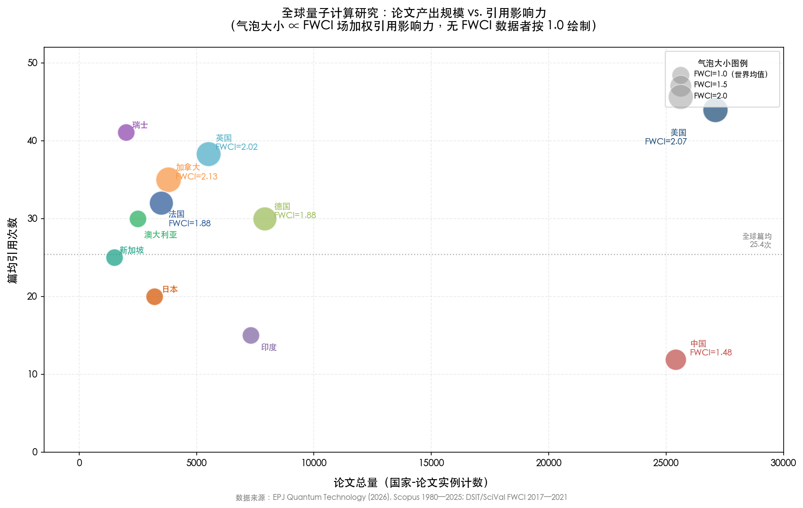

### 4.3.3 高质量论文（前 10%）的竞争格局

澳大利亚战略政策研究所（ASPI）关键技术追踪器 2025 年更新提供了另一个质量维度的参照。在所追踪的 74 项关键技术中，中国在 66 项上的高质量论文（前 10% 高引论文）产出领先全球，但美国在量子计算等 8 项技术中仍保持领先 [Nature 报道](https://www.nature.com/articles/d41586-025-04048-7 "Nature 649, 13-14, 2025-12-12")。这一结果表明，尽管中国在量子计算的总体量上已接近甚至超过美国，但在最具突破性的顶层研究——包括本报告核心关注的数学理论驱动型工作——美国的领先优势依然稳固。

### 4.3.4 知识结构的双核架构

从共被引网络的拓扑结构来看，量子计算研究的知识体系呈现清晰的"双核"架构：一个以 Shor（1994/1997）、Grover（1996）、Nielsen & Chuang 教科书（2000）为中心的基础理论集群，以及一个以 NISQ 算法、变分方法、量子机器学习为主题的近期应用集群。两大集群通过 QAOA（Farhi 等，2014）、Gottesman 稳定子码（1997）等高中介中心性节点紧密耦合 [EPJ QT](https://link.springer.com/article/10.1140/epjqt/s40507-026-00464-4 "Fig. 10 & Section 3.3")。

这一双核结构对理解数学—量子计算交叉领域具有直接启示意义。基础理论集群中的经典算法和编码理论成果构成了该领域的数学基底，而近期应用集群中的工作虽然体量更大，但仍结构性地依赖于前者的理论突破。Nielsen & Chuang 教科书以 2,748 次被引频率在引用文献分析中高居榜首 [EPJ QT](https://link.springer.com/article/10.1140/epjqt/s40507-026-00464-4 "Table 5")，而 Farhi 等人的 QAOA 论文以最高的介数中心性（32.33）发挥着跨领域桥梁作用，将基础理论与近期应用两大知识板块有机连结 [EPJ QT](https://link.springer.com/article/10.1140/epjqt/s40507-026-00464-4 "Section 3.3")。

## 4.4 国际合作网络的结构与演变

### 4.4.1 全球合著网络的拓扑特征

量子计算研究的国际合著网络呈现典型的小世界网络特征。EPJ QT 的网络分析揭示：网络密度为 0.2174（约 21.7% 的可能合作关系已实现），平均路径长度仅 1.93（任意两国平均不到两步即可连通），聚类系数高达 0.7349，小世界指数 σ=3.21 [EPJ QT](https://link.springer.com/article/10.1140/epjqt/s40507-026-00464-4 "Section 3.2")。这组拓扑参数意味着全球量子计算的合作格局兼具局部的紧密抱团特性（高聚类系数）和全局的高效信息传播能力（短路径长度），是一个高度成熟且互联的研究社区。

在节点中心性指标上，各国的角色呈现明显分化：

- **度中心性**（直接合作广度）：美国最高（0.745），与全球约四分之三的国家存在直接合作关系，印度（0.698）和英国（0.679）紧随其后。
- **特征向量中心性**（合作伙伴质量加权）：美国居首（0.198），英国（0.192）和印度（0.188）分列二、三位，表明这三国不仅合作面广，且合作对象本身也是网络中的高影响力节点。
- **中介中心性**（桥梁角色）：印度以 0.114 领先于美国（0.085）和德国（0.084）。这一看似出人意料的结果反映了印度在连接南亚—东南亚与欧美量子研究网络中的独特桥梁地位——印度拥有大量理论计算机科学人才，且人才外溢效应显著，如 TIFR 培养的 Rahul Jain 现任新加坡 CQT 首席研究员 [EPJ QT](https://link.springer.com/article/10.1140/epjqt/s40507-026-00464-4 "Fig. 8 & Section 3.2")。

### 4.4.2 美国量子研究的国际合作强度

美国 NSTC 2024 年 8 月发布的《推进 QIST 国际合作》报告提供了更为精细的合作画像：2018—2022 年间，美国量子信息科学与技术（QIST）研究中约一半涉及国际合作，这一比例显著高于全科学约 40% 的国际合作均值 [NSTC 报告](https://www.quantum.gov/wp-content/uploads/2024/08/Advancing-International-Cooperation-in-QIST.pdf "2024-08")。同一时期，联邦 QIST 研究支出从 2019 财年的约 4.5 亿美元倍增至 2022 财年的超 10 亿美元 [NSTC 报告](https://www.quantum.gov/wp-content/uploads/2024/08/Advancing-International-Cooperation-in-QIST.pdf "Figure 1")，国际合作强度的高企与联邦投入的快速扩张相辅相成。

美国已与 11 个国家签署双边量子合作声明，覆盖澳大利亚、丹麦、芬兰、法国、德国、日本、韩国、荷兰、瑞典、瑞士和英国 [NSTC 报告](https://www.quantum.gov/wp-content/uploads/2024/08/Advancing-International-Cooperation-in-QIST.pdf "11 bilateral statements")。这些双边协议构成了一个以美国为中心、覆盖主要西方与亚太盟友的量子研究合作网络，其对象与第 2—3 章中讨论的主要研究团队所在国高度重合——滑铁卢 IQC（加拿大）、ETH Zurich（瑞士）、INRIA（法国）、QuTech（荷兰）、RIKEN（日本）等团队均可通过上述双边框架实现资源和人才的互通。

### 4.4.3 中美合作的结构性收缩

在全球量子合作网络总体保持高度互联的表面之下，中美学术合作正经历一场自 2019 年以来持续深化的结构性收缩——这是本章分析中最值得关注的趋势性变化。

Kitajima 与 Okamura 2025 年 3 月发表于 *Nature Humanities & Social Sciences Communications* 的研究发现，中美学术合作距离自 2019 年起出现"反转 J 曲线"（inverted J-curve），即合作距离经历短暂缩短后急剧拉大。这一现象在中国与其他主要科技合作国（如日本、德国、英国）之间均未观察到，为中美双边关系所独有 [Kitajima & Okamura](https://www.nature.com/articles/s41599-025-04550-3 "Nature HSSC, 2025-03-03")。InCites 数据进一步显示，中国论文的国际合著比例从 2018 年的 26.6% 降至 2023 年的约 19.4%，降幅达 7.2 个百分点；其中中美合著份额降幅为 6.4 个百分点，即中国国际合著比例下降的绝大部分源自中美合著的减少 [Scientific American](https://www.scientificamerican.com/article/china-u-s-science-collaborations-are-declining-slowing-key-research/ "2024-07-24")。

OECD 2025 年 12 月发布的量子技术国家战略概览报告从更宏观的视角确认了这一趋势：量子研究的国际合作强度自 2019 年出现下降，国际共同作者率从约 33% 降至 2022 年低于 30%，美国—欧盟之间的量子合作强度在 2018—2022 年间亦下降约 15% [OECD 报告](https://www.oecd.org/content/dam/oecd/en/publications/reports/2025/12/an-overview-of-national-strategies-and-policies-for-quantum-technologies_33a0b249/5e55e7ab-en.pdf "Figure 5")。这意味着合作收缩并非中美独有，而是在地缘政治紧张和出口管制背景下整个量子研究领域的系统性变化；但中美轴线的收缩速度和深度远超其他双边关系。

图 4-2 以折线图方式呈现了 2015—2023 年间三项关键合作指标的变化轨迹，清晰展示了 2019 年这一拐点的标志性意义及此后的持续下行趋势。

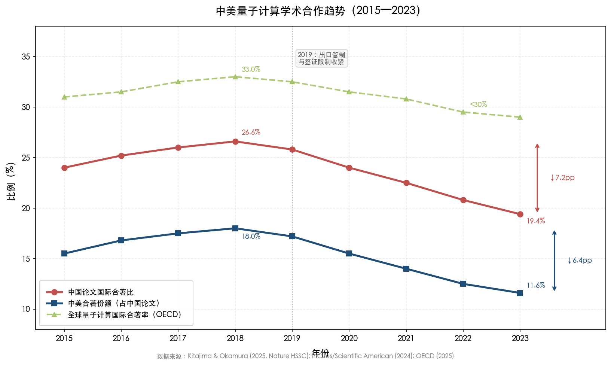

### 4.4.4 合作重组：新轴线的形成

中美合作收缩并未导致全球量子网络的碎片化，而是催生了合作关系的结构性重组。我们观察到三条主要趋势。

**其一，中国向欧盟的知识外溢率上升。** 随着中美直接合作的减少，中国研究者正在增加与欧盟机构的合作频率，尤其在量子通信和量子模拟方向上，中欧合作论文的比例有所上升 [NSTC 报告](https://www.quantum.gov/wp-content/uploads/2024/08/Advancing-International-Cooperation-in-QIST.pdf "合作伙伴再平衡")。

**其二，美国强化了与 11 个双边合作声明国的量子研究联系。** 前述 NSTC 报告表明，美国正有意识地将量子合作从广泛的多边框架转向更具战略选择性的双边合作，优先对象集中在拥有强劲量子研究基础设施的盟友国。

**其三，区域性合作集群日趋成型。** EPJ QT 的社区检测分析（基于 Louvain 模块性算法）识别出多个合作社区，其边界并不严格遵循地理邻近性，而是反映了共同资金倡议和历史合作纽带 [EPJ QT](https://link.springer.com/article/10.1140/epjqt/s40507-026-00464-4 "Fig. 8")。例如，新加坡 CQT 的 Miklos Santha 同时持有 CNRS 联合聘任，体现了法国—新加坡在量子理论领域长期而稳定的合作通道；RIKEN 与 MIT、Google 的合作则在量子模拟最优性方向上形成了跨太平洋的理论研究轴线。

### 4.4.5 合作模式的新趋势："大科学设施"范式与学术—工业界融合

量子计算研究的合作模式正沿两个方向同时演化。

**"大科学设施"范式的浮现。** Google Quantum AI 2025 年发表于 *Nature Electronics* 的论文明确将量子计算研究比作"CERN/LIGO 级大科学设施"，呼吁建立类似高能物理和引力波天文学领域的大规模产学合作机制。这一类比并非单纯修辞——EPJ QT 数据显示，量子计算论文的平均团队规模为 3.97 人/篇，协作系数 0.621（高于 0.5 即表明强多作者倾向），且大型合作（≥10 位作者）的比例正在上升 [EPJ QT](https://link.springer.com/article/10.1140/epjqt/s40507-026-00464-4 "Section 3.1")。Microsoft 2025 年 Majorana 1 拓扑量子比特配套容错路线图论文由 200 余人合著，堪称这一趋势的极端案例。

**学术—工业界界限的日趋模糊。** Fernando Brandão 同时担任 Caltech IQIM 教授和 AWS 应用科学总监，Sergey Bravyi 在 IBM Quantum 研究院推进 qLDPC 码从理论到硬件的一体化实现，Jeongwan Haah 从微软转至 Google 后继续推进代数量子码研究——上述案例表明，在数学—量子计算交叉领域，学术机构与工业界研究院之间的人才流动和双重归属正在成为常态而非例外。这种模式对传统的论文归属统计构成了挑战：一篇 *Nature* 论文的通讯作者可能同时挂靠大学和科技公司，使得"学术产出"与"工业产出"的边界愈加模糊。

## 4.5 团队层面的定量对比

### 4.5.1 核心发表渠道的团队分布

将前两章的团队画像与本章的产出数据相结合，可以勾勒出数学—量子计算交叉领域各团队在核心发表渠道上的差异化分布特征。

在 ***Nature*/*Science* 主刊** 级别发表的数学密集型量子计算成果高度集中于少数产学研融合型团队：IBM Quantum 的 Bravyi 组（bivariate bicycle 码，*Nature* 2024）、Google Quantum AI（Willow 表面码纠错，*Nature* 2025）、Microsoft Station Q（Majorana 1，*Nature* 2025）以及 Caltech/AWS 联合团队（Ocelot，*Nature* 2025）。纯学术团队在 *Nature*/*Science* 主刊的发表集中在理论性里程碑级工作，如 RIKEN Regula 否定纠缠操控"第二定律"（*Nature Physics* 2023）。

在 **PRL** 级别，数学—量子计算交叉团队的分布更为广泛：USTC（表面码 QEC，PRL 2025）、RIKEN Mizuta-Kuwahara（Trotter 最优性，PRL 2025）、清华 YMSC 刘子文（协变码和镶嵌码，2×PRL 2024）以及 MIT Natarajan（量子复杂性）等纯学术团队均为 PRL 的活跃发表者。

在 **STOC/FOCS/QIP** 等理论计算机科学顶级会议上，MIT（Shor/Harrow/Natarajan）、CWI/QuSoft（Buhrman/de Wolf）、Caltech IQIM（Vidick/Mahadev）、Weizmann（Vidick 转入后/Brakerski）以及 CQT（Jain）构成了核心发表力量。尤为引人注目的是，NTT CIS Lab 在 Crypto 2025 上以 23 篇论文（约占全部被接收论文的 15%）和最佳论文奖展现了工业研究院在后量子密码学数学理论方向上的卓越产出 [NTT 公告](https://ntt-research.com/ntt-presents-23-papers-and-receives-best-paper-award-at-crypto-2025/ "Crypto 2025")。

图 4-3 以矩阵图方式系统呈现了 14 个核心研究团队在 6 个高影响力发表渠道上的分布格局，清晰展示了产学研融合型团队集中于 *Nature*/*Science* 而纯学术团队更偏重 STOC/FOCS/QIP 的差异化发表模式。

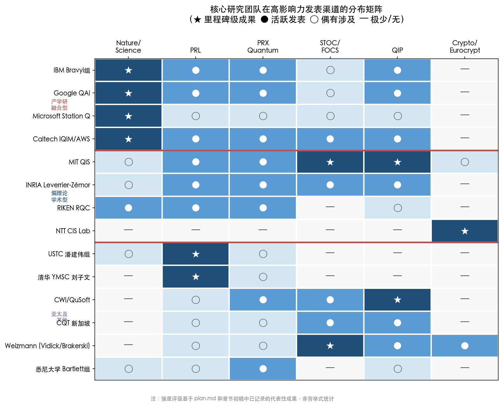

### 4.5.2 引用影响力的团队分化

在作者层面的引用影响力上，EPJ QT 数据显示 Peter Shor 以约 19,500 次引用位居量子计算领域引用最高的研究者之列，John Preskill 以约 11,262 次引用紧随其后——两人恰好分别来自 MIT 和 Caltech IQIM，即本报告评估的两个综合势能最高的学术团队。在产出量方面，RIKEN 的藤井启祐（64 篇入库论文）、潘建伟（60 篇）和 Daniel Lidar（56 篇）位居前列 [EPJ QT](https://link.springer.com/article/10.1140/epjqt/s40507-026-00464-4 "Fig. 9")。

然而，论文和引用的绝对数量并不直接等同于数学理论影响力。INRIA 的 Leverrier-Zémor 团队仅以二人之力完成了 Quantum Tanner Codes 这一渐近优良 qLDPC 码的两大理论突破之一，其单篇影响力远超许多大规模团队的累计产出。类似地，Daniel Gottesman（Perimeter 研究所）的稳定子形式主义论文以 158.27 的介数中心性在共被引网络中占据关键桥梁位置，尽管其总论文数量远少于大型研究组 [EPJ QT](https://link.springer.com/article/10.1140/epjqt/s40507-026-00464-4 "Section 3.3")。这些案例进一步印证了一个在数学密集型方向上反复出现的规律：原创性洞察的价值往往远超规模化产出的累积。

### 4.5.3 资助来源的分布与结构性缺口

公共资金的分布与论文产出格局密切相关但并不完全重合。在资助量子计算研究的政府机构中，中国国家自然科学基金委员会（NSFC）以超过 3,000 个量子相关项目居全球首位，美国国家科学基金会（NSF）约 2,450 个，欧盟委员会（主要通过 Horizon 2020 及后续框架）超 2,000 个。美国能源部（DOE）和国防部（DoD）分别在基础设施和国防应用方向补充了大量项目 [EPJ QT](https://link.springer.com/article/10.1140/epjqt/s40507-026-00464-4 "Table 7")。

值得特别关注的是，对数学—量子计算交叉方向的专项资助在各国资金结构中均未被单独标识。SIAM QIC 2024 年报告尖锐指出，数学科学界在量子研究中"基本缺席"（largely absent），核心原因之一在于缺乏面向数学家的明确资助信号 [SIAM QIC 报告](https://www.siam.org/media/orydkrzd/quantum-convening-report.pdf "2024")。在美国联邦体系中，NSF 数学科学部（DMS）是数学家从事量子算法基础研究的最关键资金来源，因为 DOE 的先进科学计算研究办公室（ASCR）明确将量子算法和密码学排除在其资助范围之外 [NQI FY2025 报告](https://www.quantum.gov/wp-content/uploads/2024/12/NQI-Annual-Report-FY2025.pdf "Section 3.2 NSF")。这一资金结构性缺陷意味着，数学—量子计算交叉领域的论文产出增长在相当程度上是研究者自发跨界的结果，而非系统性资金引导的产物。

## 4.6 关键词演变与研究前沿趋势

EPJ QT 的关键词共现分析为识别数学—量子计算交叉领域的热点迁移提供了定量依据。在 45 个核心关键词的时间序列分析中，"量子机器学习"和"后量子密码学"是 2020 年以来增长最快的两个研究方向——前者的中位出版年集中在 2020 年附近，后者更靠近 2021—2022 年，且两者的词频节点面积（反映论文总量）均处于快速膨胀状态 [EPJ QT](https://link.springer.com/article/10.1140/epjqt/s40507-026-00464-4 "Fig. 14")。

在关键词共现频率上，"量子计算"与"量子机器学习"的共现最为频繁（263 篇），"量子计算"与"量子算法"紧随其后（157 篇）[EPJ QT](https://link.springer.com/article/10.1140/epjqt/s40507-026-00464-4 "Fig. 12")。值得注意的是，"后量子密码学"与"量子计算"的直接共现频率较低（仅约 4 篇），表明后量子密码学在当前文献计量中仍被视为一个相对独立的研究社区，与量子计算的核心算法和硬件研究之间存在主题间隔。这一发现与本报告的团队画像分析高度一致：NTT CIS Lab 和 Weizmann Brakerski 等后量子密码学数学理论团队的核心发表渠道（Crypto、Eurocrypt、IACR）与量子计算主流渠道（PRL、PRX Quantum、*Nature*）之间确实存在较低的交叉引用密度。

我们认为，这种主题间隔既反映了真实的学科边界差异——密码学与量子物理在方法论上存在深刻分野——也预示着一个重要的融合机遇：随着容错量子计算的推进，量子算法对密码学基础设施的威胁将从理论推演转化为工程现实，后量子密码学将不可避免地与量子纠错、量子算法和量子硬件研究实现更深度的交叉。2024 年 8 月 NIST 正式发布首批三项后量子密码学标准（FIPS 203/204/205）以及 2025 年 3 月 HQC 算法的入选 [NIST 公告](https://www.nist.gov/news-events/news/2025/03/nist-selects-hqc-fifth-algorithm-post-quantum-encryption "2025-03-11")，正在为这一融合提供制度性推力。

## 4.7 本章小结

本章的定量分析揭示了数学—量子计算交叉领域的四个核心结构性特征。

**规模与质量的不对称。** 中国和美国分别以论文体量和引用影响力引领全球产出，但二者之间存在显著的质量—规模不对称。加拿大、英国和瑞士等中等规模研究体系凭借深厚的理论研究传统和高国际合作率，在场加权引用影响力上居于前列。INRIA Leverrier-Zémor 等小团队以极少人力产出里程碑级理论成果的案例表明，在数学密集型方向上，规模并非决定性因素——洞察力与原创性才是核心竞争力。

**发表渠道的专业化分化。** *PRX Quantum*、*Quantum* 和 *npj Quantum Information* 三份新兴期刊在不足五年的时间内已形成与传统物理期刊和综合顶刊互补的专科发表生态，数学—量子计算交叉研究正获得日益明确的学科认同。与此同时，STOC/FOCS 等理论计算机科学旗舰会议中的量子论文占比已达约四分之一，学科渗透力处于历史最高水平。

**合作网络的战略重组。** 中美合作的结构性收缩正在重塑全球量子研究网络——中国向欧盟的知识外溢上升，美国强化了与 11 国的双边合作，区域性合作集群正在成型。然而，量子研究的高度互联性（平均路径长度仅 1.93）使得完全脱钩在技术层面几乎不可实现。

**资金结构的缺口。** 尽管 NSFC、NSF 和欧盟委员会等机构支撑了量子研究的指数增长，但面向数学家的专项资助信号严重不足。数学科学界在量子研究中的"基本缺席"与数学在量子计算中日益核心的角色之间的矛盾，构成当前全球量子研究资金结构中最突出的未补缺口。

# 第5章 资金支持、政策环境与工业界合作

量子计算的科学突破从来不是纯粹由好奇心驱动的。资金规模决定了哪些研究方向能够获得持续投入，政策框架塑造了人才流动和国际合作的边界，而工业界合作则为理论成果提供了从论文到原型的转化通道。前文已分别勾画了全球主要研究团队的画像（第2—3章）及其论文产出和合作网络（第4章），本章从资金与政策维度回答一个更根本的问题：在数学与量子计算交叉领域，资源如何分配，分配格局又如何反作用于研究方向和团队竞争力？

分析从三个层面展开：首先比较主要国家的政府量子投资规模与政策框架，其次聚焦数学基础研究在量子资金中的结构性位置，最后审视科技巨头的量子数学研究投入及产学合作模式。

## 5.1 全球政府量子投资格局

### 5.1.1 总量概览：557 亿美元承诺与"实际拨付"之间的鸿沟

截至 2025 年 10 月，全球各国政府自 2013 年以来累计承诺的量子科技投资约 557 亿美元。然而，经济合作与发展组织（Organisation for Economic Co-operation and Development, OECD）2025 年 12 月发布的专题报告明确指出，这些数字"通常反映计划预算而非实际拨付"（typically reflect planned budgets rather than actual disbursements），各国在实际支出的透明度上差异极大 [OECD 报告](https://www.oecd.org/content/dam/oecd/en/publications/reports/2025/12/an-overview-of-national-strategies-and-policies-for-quantum-technologies_33a0b249/5e55e7ab-en.pdf "OECD Digital Economy Papers No. 379, 2025-12")。

OECD Fundstat 数据库提供了目前最系统的实际资助追踪：覆盖 19 个成员国和欧盟委员会，在 2015—2023 年间共识别出 12,209 个量子研发项目，累计资助约 111 亿美元（按购买力平价计算），项目均值约 92 万美元。其中 2022—2023 两年的资助额占该时段总量的三分之一以上，显示资金投入正在加速集中于近年 [OECD 报告](https://www.oecd.org/content/dam/oecd/en/publications/reports/2025/12/an-overview-of-national-strategies-and-policies-for-quantum-technologies_33a0b249/5e55e7ab-en.pdf "Figure 3")。2025 年初公共融资公告更是进入密集期：日本宣布约 1,300 亿日元（约 8.55 亿美元）量子专项追加拨款，西班牙宣布 9 亿美元投资，仅前四个月的全球公共融资公告总额已超过 100 亿美元 [麦肯锡量子技术监测报告](https://www.mckinsey.com/capabilities/tech-and-ai/our-insights/the-year-of-quantum-from-concept-to-reality-in-2025 "Exhibit 2")。

### 5.1.2 美国：联邦投资规模最大，但数学基础研究承受预算波动

美国在量子科技领域的联邦投资规模居全球之首。据《国家量子倡议》（National Quantum Initiative, NQI）FY2025 年度报告，联邦量子信息科学（Quantum Information Science, QIS）研发支出从 FY2019 的 4.56 亿美元增至 FY2022 峰值 10.41 亿美元，FY2025 预算申请为 9.98 亿美元 [NQI FY2025 报告](https://www.quantum.gov/wp-content/uploads/2024/12/NQI-Annual-Report-FY2025.pdf "Figure 2.1")。

NQI 第一期（2019—2024 年）总投入约 12 亿美元；2024 年 NQI 再授权法案追加 18 亿美元覆盖 2025—2029 年 [CSIS 分析](https://www.csis.org/analysis/government-demand-creator-quantum-industry "2026-03")。在项目层面，能源部（DOE）2025 年 11 月宣布以 6.25 亿美元续期五个国家 QIS 研究中心（此前五年已累计投入约 6.25 亿美元）[DOE 公告](https://www.energy.gov/articles/energy-department-announces-625-million-advance-next-phase-national-quantum-information "2025-11-04")。国防高级研究计划局（Defense Advanced Research Projects Agency, DARPA）"量子基准测试倡议"（Quantum Benchmarking Initiative, QBI）预算上限 3.15 亿美元，目标在 2033 年验证量子计算"效用规模运行" [CSIS 分析](https://www.csis.org/analysis/government-demand-creator-quantum-industry "2026-03")。

FY2026 预算经历了从"悬崖"到"软着陆"的戏剧性过程。2025 年 5 月总统预算申请将 NSF 总预算从约 90.6 亿美元削减 55.8% 至 39 亿美元，引发科学界强烈反弹 [The Quantum Insider](https://thequantuminsider.com/2025/05/02/white-house-budget-preserves-quantum-funding-but-signals-caution-on-emerging-tech-spending-expansion/ "2025-05-02")。经国会参众两院审议后，2026 年 1 月 15 日参议院通过、1 月 23 日总统签署的 FY2026 拨款法案最终为 NSF 拨付 87.5 亿美元，较 FY2024 仅削减 3.4%，远低于总统提案的 57% 幅度。其中"研究与相关活动"（Research and Related Activities, R&RA）账户获 72 亿美元，与 FY2024 持平，并且法案明确规定"任何研究司的拨款削减不得超过 FY2024 水平的 5%"[美国天文学会报道](https://aas.org/posts/news/2026/01/congress-passes-fiscal-year-2026-spending-bills-nsf-nasa-and-doe "2026-01-15")。这一结果对数学-量子交叉研究至关重要——NSF 数学科学司（Division of Mathematical Sciences, DMS）是美国数学家从事量子算法基础研究的最关键联邦资金来源（详见 5.3 节）。

### 5.1.3 中国：投资规模争议与项目密度

中国的量子科技投资常被引用为"150 亿美元"，但这一数字存在重大争议。中国科学技术大学陆朝阳在接受采访时指出，实际政府投资可能仅为公开数字的三分之一左右 [OECD 报告](https://www.oecd.org/content/dam/oecd/en/publications/reports/2025/12/an-overview-of-national-strategies-and-policies-for-quantum-technologies_33a0b249/5e55e7ab-en.pdf "China: actual expenditures unreported")。OECD 特别标注中国为"实际支出未报告"的国家，这意味着任何中国量子投资的精确比较都应审慎对待。

可以确认的是中国在项目密度方面的绝对领先地位：国家自然科学基金委员会（National Natural Science Foundation of China, NSFC）资助的量子相关项目超过 3,000 个，居全球首位，远超美国 NSF 的约 2,450 个和欧盟委员会的超 2,000 个 [EPJ QT](https://link.springer.com/article/10.1140/epjqt/s40507-026-00464-4 "Table 7")。2025 年 NSFC 发布"第二代量子体系"重大研究计划指南，涵盖培育项目、重点项目和集成项目三个层级 [NSFC 公告](https://www.nsfc.gov.cn/p1/3381/2824/79525.html "2025-05-13")。然而，NSFC 数理科学部在量子-数学交叉方向上的专项资助金额未单独披露，无法精确评估纯数学基础研究在量子总投资中的占比。

### 5.1.4 欧洲：分散但累计规模可观

欧洲的量子投资格局以分散性为特征。欧盟委员会层面，"量子旗舰计划"（Quantum Flagship）自 2018 年启动，十年期预算至少 10 亿欧元 [OECD 报告](https://www.oecd.org/content/dam/oecd/en/publications/reports/2025/12/an-overview-of-national-strategies-and-policies-for-quantum-technologies_33a0b249/5e55e7ab-en.pdf "EU Quantum Flagship")。各主要成员国另有独立投资：德国约 20 亿欧元，法国约 18 亿欧元，荷兰 6.15 亿欧元。

英国的量子投资在 2026 年 3 月迎来重大升级。英国政府 2026 年 3 月 17 日宣布价值高达 20 亿英镑（约 26.7 亿美元）的"量子飞跃"（Quantum Leap）投资计划，使英国成为全球首个承诺大规模采购和部署量子计算机的国家。该计划包括两大支柱：10 亿英镑用于量子计算先进采购计划"ProQure: Scaling UK Quantum Computing"，将于 2026 年 3 月下旬启动企业提案征集，目标在 2030 年代初交付大规模量子计算机原型；另有超过 10 亿英镑分四年投入技术开发、技能培训和基础设施建设，其中超过 5 亿英镑专门面向量子计算、4 亿英镑面向量子传感与导航、1.25 亿英镑面向量子网络。此外还注入 1,380 万英镑追加支持英国五个国家量子研究中心（National Quantum Research Hubs）[英国政府公告](https://www.gov.uk/government/news/uks-quantum-leap-tohelp-beat-diseasedeliver-high-paid-jobs-and-strengthen-national-security-as-first-country-in-the-world-to-roll-out-quantum "2026-03-17")。英国政府估计量子技术可在未来 20 年提升生产率 7%，创造超过 10 万个就业岗位，产生约 2,120 亿英镑的经济效益 [英国政府公告](https://www.gov.uk/government/news/uks-quantum-leap-tohelp-beat-diseasedeliver-high-paid-jobs-and-strengthen-national-security-as-first-country-in-the-world-to-roll-out-quantum "经济影响评估")。

在数学-量子交叉的具体层面，法国的优势尤为突出。INRIA 研究员 Anthony Leverrier 与波尔多大学教授 Gilles Zémor 在法国公共研究体系的长期稳定支持下完成了 Quantum Tanner Codes 的理论突破，这是渐近优良 qLDPC 码两大突破之一 [INRIA 报道](https://www.inria.fr/en/error-correcting-codes-fundamental-results-quantum-computer "INRIA 官方")。法国模式——以国家研究机构（INRIA、CNRS）为载体提供长期、低压力的基础研究环境——在催生数学-量子交叉原创理论方面展现了独特价值。

### 5.1.5 亚太其他经济体

日本是亚太地区量子投资增长最迅猛的国家。2025 年 11 月，日本政府宣布在补充预算中拨付约 1,300 亿日元（约 8.55 亿美元）专门用于量子技术研发，包括 1,004 亿日元用于在国家产业技术综合研究所（AIST）建设量子研发基地，33 亿日元用于加强国内量子中心间协作 [The Quantum Insider](https://thequantuminsider.com/2025/11/28/japan-channels-almost-900-million-u-s-into-quantum-push/ "2025-11-28")。加上此前的"登月研究开发计划"（Moonshot Research & Development Program）中约 8 亿美元的量子专项，以及纳入更广泛科技框架的约 74 亿美元总预算，日本的量子投入力度在亚太地区仅次于中国。

其他经济体方面：韩国计划至 2035 年投入约 23 亿美元，2026 年 1 月宣布与 MIT 建立量子计算合作关系并启动国家量子制造设施 [朝鲜日报](https://www.chosun.com/english/industry-en/2026/01/26/ZJOK5WFHLRBHTM4VZ7XYDN3U7Y/ "KAIST Quantum, 2026-01-26")；加拿大 2025 年联邦预算拨付 3.34 亿加元五年期量子计划；澳大利亚累计投入超过 23 亿澳元，2025 年澳大利亚研究理事会（ARC）卓越中心支持悉尼大学量子理论组继续推进拓扑纠错码研究；印度国家量子使命 2023 年启动，投资约 7.3 亿美元；新加坡累计超过 3 亿美元，其中 2025 年 3 月国家研究基金会（NRF）向量子-超算集成追加投入 2,450 万美元；以色列以风险资本驱动为主，量子科技领域累计风投超过 6.5 亿美元。

## 5.2 私人资本与量子产业现状

政府投资构成了量子研究的基础骨架，但私人资本的流向更敏锐地反映了市场对技术成熟度的判断。

2024 年全球量子科技（Quantum Technologies, QT）初创企业融资接近 20 亿美元，同比增长约 50%。量子计算公司的收入约为 6.5—7.5 亿美元，麦肯锡预测 2025 年将突破 10 亿美元门槛 [麦肯锡量子技术监测报告](https://www.mckinsey.com/capabilities/tech-and-ai/our-insights/the-year-of-quantum-from-concept-to-reality-in-2025 "2025")。然而，一个具有警示意义的对比是：2024 年量子领域的私人投资总额约 26 亿美元，仅占同年人工智能（AI）私人投资 1,090 亿美元的 2.4% [CSIS 分析](https://www.csis.org/analysis/government-demand-creator-quantum-industry "2026-03")。这一比例从侧面解释了量子人才面临的 AI 虹吸效应——在薪酬和短期商业化前景上，AI 对高水平数学和计算人才的吸引力远超量子计算。

在专利维度上，IBM 以 191 项量子技术专利居全球首位，Google 以 168 项紧随其后 [麦肯锡量子技术监测报告](https://www.mckinsey.com/capabilities/tech-and-ai/our-insights/the-year-of-quantum-from-concept-to-reality-in-2025 "2025")。这两家公司也是将数学理论研究与专利布局最紧密结合的机构——IBM 的 bivariate bicycle 码和 Google 的表面码纠错实验均产生了从理论到专利再到硬件验证的完整链条。

## 5.3 数学基础研究在量子资金中的结构性缺位

### 5.3.1 SIAM 的"基本缺席"诊断

2024 年 10 月 SIAM 量子交叉研讨会（Quantum Intersections Convening, QIC）的核心发现指向一个令人警醒的事实：数学科学界在量子研究中"基本缺席"（largely absent）。尽管量子计算对代数编码理论、拓扑学、表示论、数论等数学分支的依赖不断加深（如第1章所述），数学家参与量子研究的比例、数学系开设的量子相关课程、以及面向数学家的专项资助信号，均与这一需求严重不匹配 [SIAM QIC 报告](https://www.siam.org/media/orydkrzd/quantum-convening-report.pdf "DOI: 10.11337/25M1741017")。

SIAM QIC 提出四大建议：一是支持数学-QIS 交叉方向的研发投资；二是加强教育与劳动力培养，在数学系建立量子方向明确课程路径；三是增加资金与联网机制，为数学家进入量子研究提供"入口匝道"（on-ramp）；四是与美国数学学会（AMS）、数学及其应用研究所（MSRI/SLMath）等机构合作建设社区 [SIAM QIC 报告](https://www.siam.org/media/orydkrzd/quantum-convening-report.pdf "四大建议")。该报告是已知唯一由主要数学学会组织的、以整合数学家进入量子研究为明确目标的大型行动。

### 5.3.2 NSF DMS：数学家进入量子研究的最关键联邦通道

在美国联邦资金体系中，NSF 数学科学司（DMS）是数学家从事量子基础研究的最关键资金来源——这一点并非因为 DMS 的量子投入最大，而是因为其他主要联邦机构存在结构性排斥。DOE 先进科学计算研究办公室（ASCR）明确排除了量子算法和密码学方向的资助范围，而 DOE 基础能源科学办公室（BES）侧重物理和材料而非数学。DOD（国防部）旗下 DARPA 和 IARPA 资助量子研究，但偏向工程和应用导向。因此 NSF DMS 成为纯数学研究者承接量子课题的几乎唯一联邦窗口 [NQI FY2025 报告](https://www.quantum.gov/wp-content/uploads/2024/12/NQI-Annual-Report-FY2025.pdf "Section 3.2 NSF")。

DMS 近年已资助多个量子交叉项目，包括：C*-代数在量子力学中的应用（DMS-2406319）、量子拓扑与量子信息（DMS-2350250）、拓扑量子计算（DMS-2327208）等 [NQI FY2025 报告](https://www.quantum.gov/wp-content/uploads/2024/12/NQI-Annual-Report-FY2025.pdf "Section 3.2 NSF")。然而，这些项目在 DMS 总拨款中的占比极小。FY2026 拨款法案确保 NSF R&RA 账户维持在 72 亿美元，且规定各研究司削减不超过 5%，为 DMS 量子交叉资助提供了短期稳定性 [美国天文学会报道](https://aas.org/posts/news/2026/01/congress-passes-fiscal-year-2026-spending-bills-nsf-nasa-and-doe "2026-01-15")。但这一保护的持续性取决于后续年度的国会意愿——FY2026 拨款法案的成功更多是反映了国会对科学预算大幅削减的抵制，而非对数学-量子交叉研究的专项承诺。

### 5.3.3 全球视角下的数学-量子资金缺口

SIAM QIC 的诊断并非仅适用于美国。纵观全球主要量子战略文件，各国普遍侧重硬件开发和近期应用场景，对"数学基础研究"的专门重视程度普遍较低。英国 20 亿英镑新计划中超过 5 亿英镑专门面向量子计算，但其重点是硬件采购和商业化应用，对数学理论研究的专项拨付未见单独条目 [英国政府公告](https://www.gov.uk/government/news/uks-quantum-leap-tohelp-beat-diseasedeliver-high-paid-jobs-and-strengthen-national-security-as-first-country-in-the-world-to-roll-out-quantum "2026-03-17")。德国、日本的量子战略同样以硬件和平台为导向。

这一结构性缺位意味着，数学-量子交叉研究在全球范围内主要依赖两类资金来源：一是面向数学的通用基础研究资金（如 NSF DMS、欧洲研究理事会 ERC 的个人资助、法国 INRIA 研究员编制），二是量子领域工业界对数学理论的直接投资（如 Microsoft Station Q、IBM Quantum 理论组）。前者规模有限但自由度高，后者资金充裕但方向受企业路线图约束。

## 5.4 科技巨头的量子数学研究投入与产学合作

### 5.4.1 Microsoft Station Q：科技巨头中对纯数学投入最深的案例

Microsoft Station Q 自 2006 年成立以来，始终以拓扑量子计算的纯数学理论为核心研究方向，由 Fields 奖得主 Michael Freedman 领衔。这一长达二十年的持续投资在科技巨头中绝无仅有——没有其他工业机构曾以如此深度和如此长周期投资一个以纯数学为基础的量子计算路线。Station Q 汇聚了辫子群表示论专家 Zhenghan Wang、代数量子码理论家 Jeongwan Haah（后转至 Google Quantum AI）、凝聚态理论家 Matthew Hastings 和 Chetan Nayak 等数学背景极强的研究者。

2025 年 2 月 Majorana 1 拓扑量子处理器的发布及其配套的 200 余人合著容错路线图论文，代表了 Station Q 二十年数学投资的首次大规模硬件兑现尝试 [Nature 论文](https://www.nature.com/articles/s41586-024-08445-2 "Interferometric parity measurement, 2025")；[微软路线图](https://quantum.microsoft.com/en-us/vision/quantum-roadmap "Six milestones")。但正如第1章所述，这一声明面临学术界的严肃质疑。Microsoft Station Q 的案例证明了一个深层逻辑：纯数学理论投资的回报周期极长且不确定性极高，但一旦成功，其颠覆性将远超工程改进路线。

### 5.4.2 IBM Quantum：从码理论到物理实现的一体化推进

IBM 是全球少数能从码理论到物理实现一体化推进的团队，其模式与 Station Q 的纯数学路线形成互补。IBM Quantum 理论组由 Sergey Bravyi 领衔，Andrew Cross 和 Theodore Yoder 协同，专注于将代数编码理论转化为可在实际硬件上运行的量子纠错方案。

在产学合作维度，IBM 构建了量子领域最庞大的生态系统：开源 Qiskit 生态吸引了数十万开发者；Quantum Network 拥有 200 余个合作伙伴机构；2024 年 4 月在 Rensselaer Polytechnic Institute（RPI）安装了全球首台大学校园内的 IBM Quantum System One [IBM 新闻室](https://newsroom.ibm.com/2024-04-05-Rensselaer-Polytechnic-Institute-and-IBM-unveil-the-worlds-first-IBM-Quantum-System-One-on-a-university-campus "2024-04-05")；在日本和韩国与约 4 万名学生开展量子教育合作。这种"硬件驻场+开源软件+教育合作"的三位一体模式，为数学理论研究者提供了从理论设计到实验验证的完整通道。

IBM 的商业路线图也为其数学理论投入提供了时间表驱动力：2026 年底前验证量子优势，2029 年前交付首台大规模容错量子计算机 [IBM 新闻室](https://newsroom.ibm.com/2025-11-12-ibm-delivers-new-quantum-processors,-software,-and-algorithm-breakthroughs-on-path-to-advantage-and-fault-tolerance "2025-11-12")。qLDPC 码（特别是 bivariate bicycle 码）在这一路线图中居于核心位置——2025 年 11 月 IBM Loon 实验处理器已实现 qLDPC 码的实时经典解码（延迟<480ns），比原计划提前一年 [IBM 新闻室](https://newsroom.ibm.com/2025-11-12-ibm-delivers-new-quantum-processors,-software,-and-algorithm-breakthroughs-on-path-to-advantage-and-fault-tolerance "Loon: one year ahead of schedule")。

### 5.4.3 Google Quantum AI：理论-实验闭环最强

Google Quantum AI 的独特竞争力在于其理论-实验闭环的紧密程度。理论端拥有经典影子（classical shadows）发明人 Hsin-Yuan Huang（与 Caltech IQIM 的 Preskill 合作）、表面码资源估计专家 Craig Gidney、代数量子码理论家 Jeongwan Haah（自 Microsoft 转入），以及量子算法与应用总监 Ryan Babbush。实验端拥有 Willow 处理器——2024 年 12 月在 Nature 发表的结果首次实现了低于阈值的表面码量子纠错，distance-7 码逻辑错误率每轮 0.143%±0.003%，误差抑制因子 Λ=2.14±0.02 [Google Willow 论文](https://www.nature.com/articles/s41586-024-08449-y "Nature 638, 920–926, 2025")。

Google QAI 2025 年在 Nature Electronics 发表的观点文章将量子计算比作"CERN/LIGO 级大科学设施"，呼吁加强产学合作，建立类似粒子物理学大型实验的共享基础设施模式。这一呼吁反映了量子计算正在从单一实验室规模向"大科学"模式演进的趋势。

### 5.4.4 AWS/Caltech 模式与新型人才旋转门

亚马逊网络服务（Amazon Web Services, AWS）量子计算中心通过与 Caltech IQIM 的深度融合，开创了一种新型产学合作模式。Fernando Brandão 同时担任 Caltech IQIM 教授和 AWS 应用科学总监——这种"双重身份"模式允许同一研究者在学术发表自由和工业资源之间无缝切换。2025 年 2 月 Brandão 团队与 AWS 在 Nature 合作发表了 Ocelot 猫态量子比特芯片的硬件高效量子纠错方案 [Nature 论文](https://www.nature.com/articles/s41586-025-08642-7 "Hardware-efficient QEC via concatenated bosonic qubits, 2025")。

人才旋转门现象在量子-数学交叉领域日趋活跃。除 Brandão 模式外，Jeongwan Haah 从 Microsoft Station Q 转至 Google Quantum AI 并继续推进代数量子码研究，JPMorgan Chase 量子研究团队参与了 SIAM QIC 的核心角色，Dorit Aharonov 同时任 Hebrew University 教授和量子错误缓解初创公司 QEDMA 首席科学家。这种跨部门流动加速了理论成果的转化，但也带来了知识产权归属和研究方向受企业路线图约束的张力。

### 5.4.5 NTT CIS Lab：工业界后量子密码学数学理论之首

日本电报电话公司（NTT）密码学与信息安全实验室（CIS Lab）在后量子密码学的纯数学理论贡献方面居全球工业研究机构之首。Crypto 2025 会议上，NTT 发表 23 篇论文（约占全部被接收论文的 15%）并获最佳论文奖——该论文提出了首个标准模型下的一次性签名方案，解决了量子密码学领域十年未解的开放问题 [NTT 公告](https://ntt-research.com/ntt-presents-23-papers-and-receives-best-paper-award-at-crypto-2025/ "Crypto 2025")。NTT CIS Lab 的模式体现了日本大型企业基础研究传统在量子时代的延续——长期养成式投入，不追求短期商业化回报，而以学术声誉和标准制定影响力为核心目标。

## 5.5 国际合作格局变迁与地缘政治影响

### 5.5.1 合作强度下降的结构性趋势

OECD 数据显示，量子研究的国际合作强度自 2019 年起呈下降趋势。国际共同作者率从约 33% 降至 2022 年低于 30%。美国-欧盟之间的量子合作强度在 2018—2022 年间下降了 15% [OECD 报告](https://www.oecd.org/content/dam/oecd/en/publications/reports/2025/12/an-overview-of-national-strategies-and-policies-for-quantum-technologies_33a0b249/5e55e7ab-en.pdf "Figure 5")。这一趋势与整体科学国际合作率的平稳形成对比——美国 NSTC 2024 年 8 月报告指出，2018—2022 年间美国 QIST 研究约半数涉及国际合作（高于全科学约 40% 的均值），但合作比例正在收窄 [NSTC 报告](https://www.quantum.gov/wp-content/uploads/2024/08/Advancing-International-Cooperation-in-QIST.pdf "2024-08")。

### 5.5.2 中美量子合作的"反转 J 曲线"

如第4章详述，中美学术合作的结构性收缩在量子领域表现尤为突出。Kitajima 与 Okamura 2025 年 3 月发表于 Nature Humanities and Social Sciences Communications 的研究发现，中美合作距离自 2019 年起出现"反转 J 曲线"（inverted J-curve），这一现象在其他双边关系中未见到。中国论文的国际合著比从 2018 年的 26.6% 降至 2023 年约 19.4%（降 7.2 个百分点），中美合著份额下降 6.4 个百分点 [Kitajima & Okamura](https://www.nature.com/articles/s41599-025-04550-3 "Nature HSSC, 2025-03-03")。

合作再平衡正在同步发生：中国方面，向欧盟的知识流率上升，替代部分对美合作缺口；美国方面，截至 2024 年已与 11 个国家（澳大利亚、丹麦、芬兰、法国、德国、日本、韩国、荷兰、瑞典、瑞士、英国）签署双边量子合作声明 [NSTC 报告](https://www.quantum.gov/wp-content/uploads/2024/08/Advancing-International-Cooperation-in-QIST.pdf "11 bilateral statements")。在数学-量子交叉领域，这种再平衡意味着 Leverrier-Zémor（法国 INRIA）、Renner（瑞士 ETH）、Oxford ZX-calculus 组等欧洲理论团队在与美国工业界合作中的战略价值将进一步上升。

### 5.5.3 出口管制的双刃剑效应

多国已宣布对量子计算技术实施出口管制，普遍设定的门槛为 34 量子比特以上的量子计算机禁止出口。OECD 报告对此提出直言不讳的质疑："为什么这一阈值构成有意义的国家安全风险，专家并不清楚"[OECD 报告](https://www.oecd.org/content/dam/oecd/en/publications/reports/2025/12/an-overview-of-national-strategies-and-policies-for-quantum-technologies_33a0b249/5e55e7ab-en.pdf "Section 1.5.1")。

英国皇家联合服务研究所（Royal United Services Institute, RUSI）2025 年 6 月的分析进一步指出，出口管制正在"加速中国国内量子供应链"的建设 [RUSI](https://www.rusi.org/explore-our-research/publications/commentary/export-controls-accelerate-chinas-quantum-supply-chain "2025-06")。对数学-量子交叉研究而言，出口管制的影响呈非对称性：硬件管制主要限制实验合作和设备流通，但对数学理论本身的开放性几乎无约束力——论文预印本（arXiv）和国际学术会议（QIP、STOC、FOCS、Crypto）依然是全球数学家共享成果的核心通道。然而，管制带来的"寒蝉效应"可能间接抑制跨国合作意愿，尤其对华裔研究者参与美国联邦资助项目的意愿产生心理层面的负面影响。

## 5.6 资金与政策对研究方向的塑造效应

综合以上分析，我们认为资金和政策环境对数学-量子计算交叉领域的研究方向产生了三重塑造效应：

**第一重：硬件路线图驱动数学议题设置。** 工业界的数十亿美元投资集中在特定硬件路线（IBM 的超导+qLDPC 码、Microsoft 的拓扑路线、Google 的超导+表面码），直接拉动了与这些路线最相关的数学分支——代数编码理论（qLDPC 码构造与解码）、代数拓扑（拓扑码与任意子理论）、有限群论（Clifford 群结构与量子态断层扫描）。这种路线图驱动效应解释了为什么 qLDPC 码方向在 2024—2025 年出现"论文爆炸"——IBM BB 码 Nature 2024 论文直接激活了全球编码理论社区的研究热情 [Riverlane](https://www.riverlane.com/blog/quantum-error-correction-our-2025-trends-and-2026-predictions "QEC code explosion")。

**第二重：资金结构决定人才流动方向。** AI 投资 1,090 亿美元与量子投资 26 亿美元的 42 倍差距，构成了对高水平数学人才的结构性虹吸。量子领域能够吸引和留住顶尖数学人才，很大程度上依赖三类补偿机制：一是学术自由度（大学终身教职+NSF DMS 自由探索资助），二是工业界的高薪加学术声誉双重回报（如 Brandão 的 Caltech/AWS 双重身份），三是问题本身的智力吸引力（Fields 奖得主 Freedman 二十年专注 Station Q 即为例证）。

**第三重：地缘政治重塑合作网络的数学收益分配。** 中美合作收缩和美国 11 国双边合作扩展正在重新配置全球数学-量子知识流的拓扑结构。欧洲理论团队（INRIA、ETH、Oxford）从这一再平衡中获益最大——它们既与美国工业界保持密切合作，又不受中美紧张关系的直接波及。以色列（Weizmann 的 Vidick+Brakerski 组合）和新加坡（CQT 的 Jain）凭借灵活的双边关系同样处于有利位置。

# 第6章 突破潜力评估与关键理论/技术预测

前五章分别界定了数学与量子计算交叉领域的学科边界与演进脉络（第1章），勾画了北美—欧洲（第2章）和亚太（第3章）的主要研究团队画像，从论文产出、引用影响力与国际合作网络进行了定量横向比较（第4章），并剖析了资金支持、政策环境与工业界合作的全球格局（第5章）。在此基础上，本章承担整份报告最具前瞻性的任务：综合前述所有维度的证据，研判哪些方向和团队最有可能在 2026—2036 年间推动重大突破，并预测可能产生的关键性数学理论或应用技术。

评估框架遵循三条原则。其一，所有前瞻判断锚定于前述章节已建立的事实基础，不做悬空推断。其二，在方向评估中区分"理论成熟度"与"工程就绪度"两个正交维度，避免将数学定理的发表等同于技术突破的完成。其三，对不确定性保持诚实，以条件式语言标注关键假设并给出核心依据。

## 6.1 候选突破方向成熟度评估

### 6.1.1 量子低密度奇偶校验码实用化——"临界突破"状态

在所有候选方向中，量子低密度奇偶校验码（quantum Low-Density Parity-Check codes, qLDPC 码）的实用化处于最高优先级的"临界突破"状态。这一判断基于从理论到实验、从算法到硬件的多环节进展在 2021—2025 年间呈现出罕见的同步加速——理论上两项独立突破几乎同时解决了数十年悬猜，工程上从码设计到实时解码的闭环在 2024—2025 年间快速闭合。

理论层面，2021 年 Panteleev 与 Kalachev 利用非阿贝尔群上的提升积（lifted product）构造首次证明了渐近优良量子 LDPC 码的存在性 [Panteleev & Kalachev](https://arxiv.org/abs/2111.03654 "Asymptotically Good Quantum and Locally Testable Classical LDPC Codes, 2021")；2022 年 Leverrier 和 Zémor 提出 Quantum Tanner Codes，基于二维 Cayley 复形构造了具有常数率和常数相对距离的量子 LDPC 码族 [Leverrier & Zémor](https://arxiv.org/abs/2202.13641 "FOCS 2022")。这两项独立成果在两年内几乎同时解决了量子编码理论中持续数十年的核心悬猜，标志着纯代数方法在量子纠错领域的决定性突破。

工程转化层面的进展同样值得关注。IBM Bravyi 团队 2024 年 3 月在 Nature 发表 bivariate bicycle（BB）LDPC 码，以仅 288 个物理量子比特保护 12 个逻辑量子比特，编码效率较传统表面码提升约 10 倍，纠错阈值达 0.7%，在近 100 万个综合征测量周期内维持逻辑量子比特稳定 [Bravyi et al.](https://www.nature.com/articles/s41586-024-07107-7 "Nature 627, 778–782, 2024")。2025 年 8 月，IBM 发布 Relay-BP 解码算法，通过随机化记忆权重和多实例并行评估显著提升解码效率 [IBM Relay-BP](https://www.ibm.com/quantum/blog/relay-bp-error-correction-decoder "2025-08-04")。尤为关键的是，2025 年 11 月 IBM Loon 实验处理器实现了 qLDPC 码的实时经典解码，延迟低于 480 纳秒，较原定路线图提前一年达标 [IBM 新闻室](https://newsroom.ibm.com/2025-11-12-ibm-delivers-new-quantum-processors,-software,-and-algorithm-breakthroughs-on-path-to-advantage-and-fault-tolerance "Loon: one year ahead of schedule")。

IBM 的后续路线图进一步强化了 qLDPC 码作为容错量子计算核心路线的地位。Kookaburra 处理器计划于 2026 年推出，将以 144 或 288 个硬件量子比特承载 12 个逻辑量子比特并实现稳定量子存储（码距分别为 12 和 18）；Cockatoo 芯片将多个计算单元通过"通用桥"（Universal Bridge）总线互联，使逻辑量子比特数突破单芯片限制；Starling 系统预计 2029 年交付，目标为在 200 个逻辑量子比特上执行 1 亿次无误操作 [Ars Technica](https://arstechnica.com/science/2025/06/ibm-is-now-detailing-what-its-first-quantum-compute-system-will-look-like/ "IBM Starling 详细规划, 2025-06-10")。IBM 研究副总裁 Jay Gambetta 表示"我们已经基本回答了所有与纠错相关的科学问题，现在正在转向工程问题" [Ars Technica](https://arstechnica.com/science/2025/06/ibm-is-now-detailing-what-its-first-quantum-compute-system-will-look-like/ "Gambetta 原话")。这一判断虽可能偏于乐观，但确实反映了 qLDPC 码路线从理论验证向工程优化的实质性转折。

学术社区的响应同样印证了这一趋势。Riverlane 2025 年报告指出，2025 年 1—10 月间 QEC 码相关论文数达到 120 篇，而 2024 全年仅 36 篇，呈"QEC 码爆炸"（code explosion）趋势 [Riverlane](https://www.riverlane.com/blog/quantum-error-correction-our-2025-trends-and-2026-predictions "QEC code explosion")。该报告预测 2026 年其他工业玩家将跟进 qLDPC 路线。

尽管如此，qLDPC 码距完全实用化仍面临三大数学-工程混合障碍。其一，有限长度码在真实噪声模型下的性能优化——当前理论以渐近分析为主，短码的精确距离-阈值权衡需要组合数学与概率论的新方法。其二，高连通性硬件拓扑的工程实现——qLDPC 码要求超越最近邻连接的布线架构，IBM 已通过多层布线和破面耦合器初步解决，但规模化后的串扰控制仍属开放问题。其三，实时解码延迟与物理门速率的匹配——Relay-BP 解码器的 FPGA 实现已展示可行性，但向更大码距扩展时的计算复杂度增长需要算法层面的进一步创新。

核心团队：IBM Bravyi 组（BB 码设计+硬件验证闭环）、INRIA Leverrier-Zémor（Quantum Tanner Codes 代数理论）、Google Haah（代数量子码理论+资源估计）、悉尼大学 Williamson（Layer Codes 拓扑纠错码构造）。

### 6.1.2 拓扑量子计算——高风险/高回报，实验争议未消

拓扑量子计算是所有候选路线中数学理论根基最深、但实验验证争议最大的方向。其核心构想源自 Kitaev 1997 年提出的 Toric Code 与任意子容错方案 [Kitaev](https://arxiv.org/abs/quant-ph/9707021 "Fault-tolerant quantum computation by anyons, 1997/2003")，数学基础涉及拓扑量子场论、辫子群表示论和模张量范畴等深层结构。

2025 年 2 月，微软发布 Majorana 1 处理器，声称实现了首个基于拓扑超导体的硬件保护量子比特，配套论文发表于 Nature [微软公告](https://azure.microsoft.com/en-us/blog/quantum/2025/02/19/microsoft-unveils-majorana-1-the-worlds-first-quantum-processor-powered-by-topological-qubits/ "2025-02-19")；[Nature 论文](https://www.nature.com/articles/s41586-024-08445-2 "Interferometric single-shot parity measurement in InAs–Al hybrid devices")。微软同时发布了六里程碑容错路线图，终极目标为 100 万个可靠量子运算每秒（rQOPS）的量子超级计算机 [微软路线图](https://quantum.microsoft.com/en-us/vision/quantum-roadmap "Six milestones")。

然而，学术界的质疑远未平息。Science 杂志报道指出，"许多物理学家认为微软尚未提供马约拉纳准粒子存在的确凿证据" [Science 报道](https://www.science.org/content/article/debate-erupts-around-microsoft-s-blockbuster-quantum-computing-claims "2025")。更具体的挑战来自澳大利亚研究团队——其实验发现 1/f 噪声导致退相干时间不足 1 微秒，远短于门操作所需的 32.5 微秒 [HPCwire 报道](https://www.hpcwire.com/2025/07/02/another-challenge-to-microsofts-majorana-quantum-roadmap/ "2025-07-02")。该结果若获确认，意味着拓扑保护在真实材料中的有效性远低于理论预期。

拓扑路线需要的数学突破至少包括三个方面。其一，非阿贝尔任意子辫子群计算完备性的严格证明——目前仅对特定任意子类型（如 Fibonacci 任意子）建立了完备性，一般情况下的辫子群表示论尚不完整。其二，拓扑保护在真实材料中的定量理论——从理想的拓扑场论描述到包含无序、杂质和 1/f 噪声的实际材料之间存在巨大理论鸿沟。其三，拓扑码与 qLDPC 码的协同方案——如何将拓扑保护与代数纠错码的高编码率相结合，是两条看似平行的路线可能交汇的关键数学问题。

核心团队：Microsoft Station Q（Freedman/Nayak/Hastings/Wang，全球唯一以拓扑量子计算为核心路线的主要工业机构，数学理论深度在工业界无出其右）、Caltech Kitaev（拓扑理论奠基人）、Weizmann Stern（任意子理论数学物理）。

### 6.1.3 量子信号处理/量子奇异值变换框架成熟化——稳步推进

量子信号处理（Quantum Signal Processing, QSP）及其推广形式量子奇异值变换（Quantum Singular Value Transformation, QSVT）是 2018—2019 年间建立的统一算法框架，能够以"大一统"方式描述几乎所有已知量子算法 [SIAM G2S3 2026](https://sites.duke.edu/siamss2026/ "Duke University, 2026: Algorithms for Fault-Tolerant Quantum Computing")。2026 年 SIAM Gene Golub 暑期学校以"容错量子计算算法"为主题，从侧面印证了学术社区对该框架的高度重视。

2024—2025 年间，QSP/QSVT 框架在数学理论上取得了两项重要进展。Dong 与 Lin 2024 年在 Quantum 期刊发表"无穷 QSP"（Infinite QSP），将框架从有限维推广至无穷维函数空间 [Dong & Lin](https://doi.org/10.22331/q-2024-12-10-1558 "Quantum 8:1558, 2024")；Rossi、Ceroni 与 Chuang 2025 年发表模块化多变量 QSP 理论，将 QSP 重构为函数式编程中的单子（monad）类型，由此建立了多变量量子信号处理的数学基础 [Rossi et al.](https://quantum-journal.org/papers/q-2025-06-18-1776/ "Modular QSP in many variables, Quantum 9:1776, 2025")。

框架成熟化的剩余数学障碍集中在三个方面。第一，多变量最优度数界（optimal degree bounds）的完整刻画尚未完成——当前对单变量 QSP 的最优性已有清晰理解，但多变量情形的逼近论远更复杂。第二，块编码（block-encoding）的高效构造仍是瓶颈——如何将一般矩阵高效嵌入酉算子是连接 QSP/QSVT 理论与具体问题的关键步骤。第三，相位因子计算的数值稳定性——在实际实现中，QSP 相位因子的精确求解涉及高度非线性的优化问题，数值不稳定性可能限制算法的实际精度。

核心团队：MIT Chuang 组（QSP 创始团队，多变量模块化持续引领）、UC Berkeley Lin Lin（量子化学应用中 QSP/QSVT 的理论先驱）、RIKEN 藤井组（容错量子算法的日本领军力量）。

### 6.1.4 后量子密码学纵深发展——制度基础已就位

后量子密码学（Post-Quantum Cryptography, PQC）的制度基础在 2024—2025 年间完成了从理论到标准的关键跨越。2024 年 8 月，NIST 正式发布首批三项后量子密码学标准 FIPS 203/204/205，其数学基础为模格上学习问题（Module Learning With Errors, Module-LWE）[NIST 官方公告](https://www.nist.gov/news-events/news/2024/08/nist-releases-first-3-finalized-post-quantum-encryption-standards "2024-08-13")。2025 年 3 月，NIST 选定 HQC（Hamming Quasi-Cyclic）作为第五个 PQC 算法，作为 ML-KEM 的备份方案——该选择体现了"数学多样性"策略，即同时在格问题和纠错码两个独立数学基础上构建安全保障 [NIST HQC 公告](https://www.nist.gov/news-events/news/2025/03/nist-selects-hqc-fifth-algorithm-post-quantum-encryption "2025-03-11")。

在攻击端，NTT CIS Lab 在 Crypto 2025 上发表 23 篇论文（约占全部被接收论文的 15%）并获最佳论文奖——首个标准模型下的一次性签名方案，解决了量子密码学领域十年未解的问题 [NTT 公告](https://ntt-research.com/ntt-presents-23-papers-and-receives-best-paper-award-at-crypto-2025/ "Crypto 2025")。该成果不仅具有理论价值，更表明量子密码学前沿正从"构造安全方案"转向"证明安全原语的可实现性"——后者是纯数学理论（特别是计算复杂性理论和代数数论）的核心领地。

下一阶段的数学前沿集中在三个方向。第一，Module-LWE 量子攻击的精确复杂度界——当前安全参数的选择依赖于最优已知攻击的渐近分析，但量子算法在格基约化问题上的潜在优势尚未被精确量化。第二，同源密码学（isogeny-based cryptography）的重建——2022 年 SIDH 被经典攻击破解后，基于椭圆曲线同源的密码方案正在寻找新的数学基础。第三，量子密码原语可证明安全性的系统化理论。

核心团队：NTT CIS Lab（工业界 PQC 理论全球之首）、Weizmann Brakerski（格密码学理论前沿）、ETH Zurich Renner（密码学信息论基础）、Waterloo Mosca（PQC 过渡策略与安全评估）。

### 6.1.5 量子优势数学边界——精确条件逐步明晰

量子计算最根本的科学问题之一在于：量子计算机究竟在什么条件下能提供可证明的超多项式优势？该问题的答案直接决定整个量子计算领域的长期价值命题。

最新进展正从两个方向收窄不确定性区间。2026 年 2 月，Physical Review Letters 发表了首个可证明且可验证的样本复杂度量子优势 [Benedetti et al.](https://link.aps.org/doi/10.1103/q55v-wm7y "PRL 2026")。2025 年 Computational Complexity Conference（CCC 2025）发表了改进的量子-经典查询复杂性分离结果 [CCC 2025](https://drops.dagstuhl.de/storage/00lipics/lipics-vol339-ccc2025/LIPIcs.CCC.2025.5/LIPIcs.CCC.2025.5.pdf "Improved Separation")。Google Quantum AI 2025 年 10 月在 Nature 发表 Quantum Echoes 算法，利用 Willow 芯片实现了首个可验证的量子优势算法——基于乱时序关联函数（Out-of-Time-Order Correlator, OTOC）的量子回声技术，运行速度较最快经典超级计算机快约 13,000 倍 [Google Quantum Echoes](https://www.nature.com/articles/s41586-025-09526-6 "Nature, 2025")。

然而，一个必须直面的事实是：真正可证明的超多项式量子优势仅在有限场景中严格成立——包括 Shor 算法（整数分解/离散对数）、特定量子模拟（如上述 OTOC 计算）、采样问题（如玻色采样）和特定量子学习任务。在组合优化和通用机器学习等广受期待的应用方向上，量子优势的证据仍然薄弱。Google Quantum AI 自身在 2025 年 11 月的预印本中坦率承认，"识别具体优势实例"是当前"资源不足的核心挑战" [Babbush et al.](https://arxiv.org/abs/2511.09124 "arXiv, 2025-11")。该团队提出的五阶段应用成熟度框架指出，从抽象算法发现（Stage I）到实际应用部署（Stage V）之间的中间阶段——寻找困难实例（Stage II）和建立理论-应用桥梁（Stage III）——构成当前最大瓶颈 [Google AI 五阶段框架](https://thequantuminsider.com/2025/11/14/google-ai-outlines-five-stage-roadmap-to-make-quantum-computing-useful/ "The Quantum Insider, 2025-11-14")。

与此同时，去量子化（dequantization）研究持续收窄量子优势的适用范围——Tang 2018 年以来的系列工作表明，某些此前被认为具有量子优势的线性代数问题可在经典计算上达到几乎匹配的效率。值得注意的是，最具韧性的量子优势领域——量子模拟和密码分析——恰恰是数学理论最为密集的方向，这意味着未来量子优势边界的划定将越来越依赖数学家的贡献。

核心团队：MIT Natarajan（量子复杂性理论，MIP*=RE 核心贡献者）、CWI/QuSoft Buhrman/de Wolf（量子查询复杂性先驱）、CQT Jain（量子通信复杂性）、Caltech Mahadev（可验证量子计算）。

### 6.1.6 量子学习理论——快速发展的新兴前沿

量子学习理论是 2020 年以来增长最快的数学-量子计算交叉分支。其标志性贡献包括 Huang、Kueng 与 Preskill 2020 年提出的经典影子（classical shadows）框架，以及 Huang 等人 2022 年在 Science 上发表的里程碑论文（截至 2026 年初被引 818 次），该研究证明量子实验数据在三类学习任务中提供可证明的指数优势 [Huang et al.](https://doi.org/10.1126/science.abn7293 "Science 376, 2022")。

2025 年的进展集中在鲁棒化与实验验证两个方向。Nature Communications 发表了贝叶斯推断鲁棒浅层影子方法，解决了经典影子在有限采样和系统噪声下的稳定性问题 [Nature Communications](https://www.nature.com/articles/s41467-025-57349-w "2025")。与此同时，哈密顿量学习（Hamiltonian learning）新方法持续涌现，将量子态和过程的学习从信息论最优性推向实际可实现的协议设计。

该方向的独特优势在于"近期可行性"——经典影子协议仅需对量子系统进行有限次数的简单测量，不依赖完全容错量子计算，因此有望成为最先在近期量子设备上展示实际量子优势的理论框架。

核心团队：Google QAI（经典影子发明者 Huang/Kueng/Preskill + Willow 实验平台，形成理论-实验最强闭环）、Caltech IQIM、FU Berlin Eisert（张量网络与量子态认证数学框架）。

### 6.1.7 哈密顿量模拟最优性——基础理论突破持续

量子计算的"杀手级应用"始终被认为是模拟量子系统本身——正是 Feynman 1982 年最初构想的核心动机。在模拟算法的数学最优性方面，2025 年取得了重要进展：RIKEN Mizuta 与 Kuwahara 在 PRL 135 上证明了低能态 Trotterization 的最优误差界——误差至多与初始态能量成线性关系、与系统尺寸成多对数关系 [PRL 135, 130602](https://link.aps.org/doi/10.1103/q87n-5xhz "2025-09-23")。同年 PRX Quantum 发表了线性组合酉算子（LCU）补偿 Trotter 误差的混合方法，进一步丰富了模拟算法的工具箱。

IBM 2026 年 3 月发布的量子中心超级计算参考架构（quantum-centric supercomputing reference architecture）已将量子模拟列为首要应用场景：IBM 与 RIKEN 科学家联合利用 Heron 量子处理器和 Fugaku 超算全部 152,064 个经典计算节点协同完成了铁硫簇（iron-sulfur cluster）的大规模量子模拟，这是量子中心计算模式最具说服力的早期用例之一 [IBM 新闻室](https://newsroom.ibm.com/2026-03-12-ibm-releases-a-new-blueprint-for-quantum-centric-supercomputing "2026-03-12")。

核心团队：RIKEN Kuwahara/Mizuta（Trotter 最优性理论）、Google Babbush 组（量子资源估计与算法-硬件协同优化）、UC Berkeley Lin Lin（量子化学应用的数学基础）。

上述七大候选方向的理论成熟度与工程就绪度呈现出显著的二维分布差异。图 6-1 以散点矩阵形式直观展示了各方向的定位：qLDPC 码实用化与后量子密码学处于"临界突破区"（理论成熟 + 工程就绪），拓扑量子计算虽理论根基深厚但工程验证尚处争议阶段，量子优势边界则处于"长期培育区"。气泡大小反映各方向的核心团队数量。

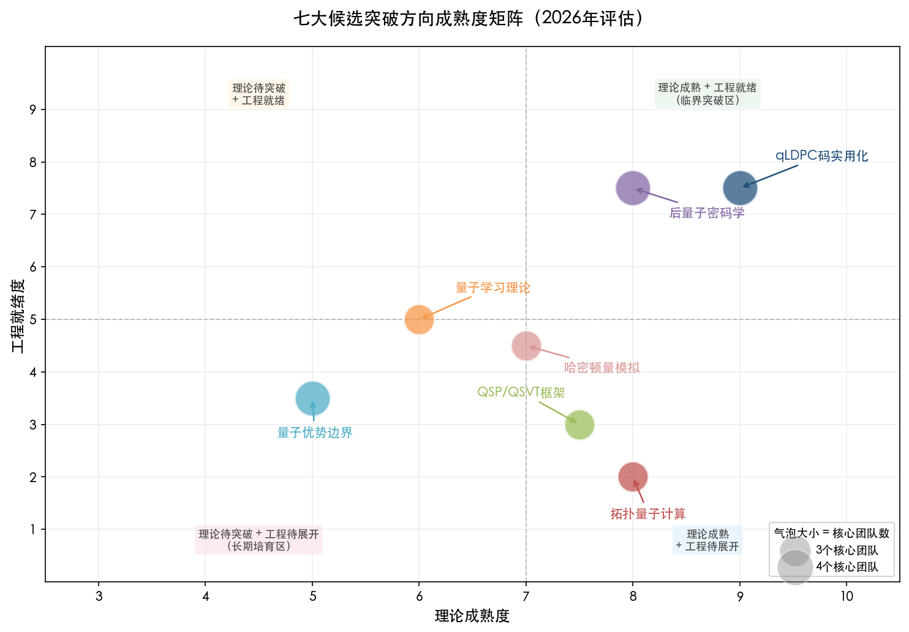

## 6.2 权威机构的时间线预测与市场规模估计

多家权威咨询机构和工业实验室已对容错量子计算的时间线与市场规模发布预测。这些预测的一致性与分歧本身即构成评估突破潜力的重要参照系。

麦肯锡 2025 年量子技术监测报告预测，量子计算市场到 2035 年将达到 280—720 亿美元区间，并指出量子公司收入在 2025 年有望首次突破 10 亿美元 [麦肯锡](https://www.mckinsey.com/capabilities/tech-and-ai/our-insights/the-year-of-quantum-from-concept-to-reality-in-2025 "QT Monitor 2025")。波士顿咨询集团（BCG）2024 年将量子计算发展划分为三个阶段：NISQ 阶段（至 2030 年）、广泛量子优势阶段（2030—2040 年）和完全容错阶段（2040 年以后），总经济价值估计为 4,500—8,500 亿美元 [BCG](https://www.bcg.com/publications/2024/long-term-forecast-for-quantum-computing-still-looks-bright "2024")。麦肯锡 2035 年预测的 2.6 倍区间跨度（280 对 720 亿美元）和 BCG 的 1.9 倍区间跨度（4,500 对 8,500 亿美元）本身即为不确定性的定量度量——这一量级的预测区间在成熟技术的市场分析中极为罕见。

在工业界路线图层面，主要厂商的承诺呈现显著差异：

IBM 2025 年 11 月宣布目标在 2026 年底前验证量子优势，2029 年前交付首台大规模容错量子计算机 Starling（200 个逻辑量子比特，1 亿次无误操作），更远期的 Blue Jay 系统（2033 年，2,000 个逻辑量子比特）将具备破解 RSA 加密等复杂算法的能力 [IBM 新闻室](https://newsroom.ibm.com/2025-11-12-ibm-delivers-new-quantum-processors,-software,-and-algorithm-breakthroughs-on-path-to-advantage-and-fault-tolerance "2025-11-12")；[Ars Technica](https://arstechnica.com/science/2025/06/ibm-is-now-detailing-what-its-first-quantum-compute-system-will-look-like/ "Starling & Blue Jay 路线图")。微软声称其拓扑路线可在 3 年内解决"不可能的计算" [微软路线图](https://quantum.microsoft.com/en-us/vision/quantum-roadmap "Six milestones")。Google Quantum AI 在 Willow 芯片实现低于阈值的表面码纠错后，正推进路线图中的第三个里程碑——长寿命逻辑量子比特 [Google 博客](https://blog.google/innovation-and-ai/technology/research/quantum-echoes-willow-verifiable-quantum-advantage/ "Milestone 3")。DARPA 量子基准测试倡议（QBI）将 2033 年设定为验证量子计算"效用规模运行"的关键节点。

我们认为，对上述预测应持审慎态度：工业界路线图具有内在的乐观偏差（incentive bias），而咨询机构的市场规模预测高度依赖容错时间线假设。一个更为稳健的判断基础来自 Riverlane 的人才缺口分析——全球目前仅有约 600—700 名量子纠错（QEC）专业人员，而到 2030 年需要 5,000—16,000 名，培训周期约 10 年 [Riverlane](https://www.riverlane.com/press-release/riverlane-report-reveals-scale-of-the-quantum-error-correction-challenge "2025")。这一人才约束是所有技术路线图中最容易被低估的瓶颈。

## 6.3 综合团队突破势能评估

基于前述各章建立的事实基础——研究方向（第1章）、团队画像（第2—3章）、论文影响力与合作网络（第4章）、资金与政策支持（第5章）——以及本章对候选方向成熟度的评估，本节对全球主要团队在 2026—2036 年间的突破势能进行综合评估。评估采用五级制（★1—5），综合考量四个维度：（1）核心方向的理论成熟度与工程就绪度；（2）团队在该方向上的已证实贡献；（3）资金稳定性与制度支持；（4）产学研闭环能力。

| 团队 | 核心突破方向 | 势能评级 | 关键依据 |
|---|---|---|---|
| IBM Quantum Bravyi 组 | qLDPC 码实用化 | ★★★★★ | BB 码 Nature 2024 + Relay-BP 解码 + Loon 提前达标 + Starling 2029 路线图明确 |
| MIT Chuang 组 | QSP/QSVT 框架 | ★★★★★ | QSP 创始团队，多变量模块化理论持续引领，2026 年 SIAM G2S3 暑期学校主题验证 |
| Google Quantum AI | 量子学习+纠错实验 | ★★★★★ | 经典影子发明者 + Willow 低于阈值纠错 + Quantum Echoes 可验证优势，理论-实验闭环最强 |
| Caltech IQIM | 拓扑理论+量子学习+可验证计算 | ★★★★★ | Kitaev/Preskill/Brandão/Mahadev 综合深度 + AWS 产学研融合 |
| INRIA Leverrier-Zémor | qLDPC 码代数理论 | ★★★★☆ | Quantum Tanner Codes 理论突破，法国长期基础研究环境保障，但缺乏硬件验证闭环 |
| Microsoft Station Q | 拓扑量子计算 | ★★★★☆ | Fields 奖得主领衔，工业界数学理论深度无出其右，但实验争议（1/f 噪声、马约拉纳证据）构成实质性风险 |
| NTT CIS Lab | 后量子密码学数学理论 | ★★★★☆ | Crypto 2025 最佳论文，23 篇发文占全部约 15%，工业界 PQC 理论全球之首 |
| RIKEN RQC | 模拟最优性+资源理论 | ★★★★☆ | PRL 2025 Trotter 最优性 + Nature Physics 2023 资源理论里程碑 + 与 IBM/Fugaku 协同 |
| Weizmann Institute | 复杂性+PQC+拓扑物理 | ★★★★☆ | Vidick 从 Caltech 转入使复杂性理论实力飙升 + Brakerski 格密码学前沿 + Stern 任意子理论 |
| 悉尼大学 Bartlett/Williamson | 拓扑纠错码 | ★★★☆☆ | Layer Codes 解决十年公开问题（Nature Communications 2024），但团队规模小、硬件闭环弱 |

以上评级需附加两个重要说明。第一，五星团队之间存在显著差异：IBM Bravyi 组的优势在于从码理论到物理实现的一体化推进能力，Google QAI 的优势在于理论-实验闭环的完整性与资源规模，MIT Chuang 组的优势在于算法框架的原创性与影响力，Caltech IQIM 的优势在于多方向综合深度。第二，评级反映的是综合势能而非确定性预测——例如，Microsoft Station Q 的四星评级并非否定拓扑路线的长期价值，而是反映当前实验争议所带来的实质性不确定性。

图 6-2 以雷达图形式直观呈现五支代表性团队在理论原创性、硬件闭环能力、资金稳定性、国际合作网络和人才深度五个维度上的差异化优势格局。

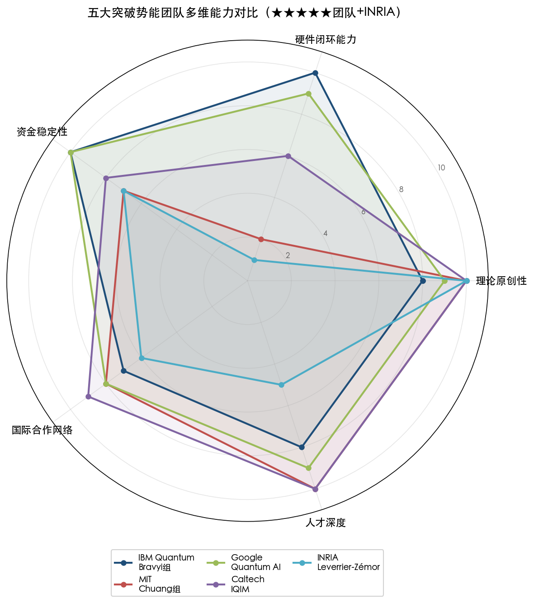

## 6.4 2026—2036 年五大里程碑预测

综合以上方向评估和团队势能分析，我们提出未来十年五大里程碑预测。每项预测均标注核心假设和实现条件。图 6-3 以甘特图形式展示了五大里程碑的预测达成区间及工业路线图锚点。

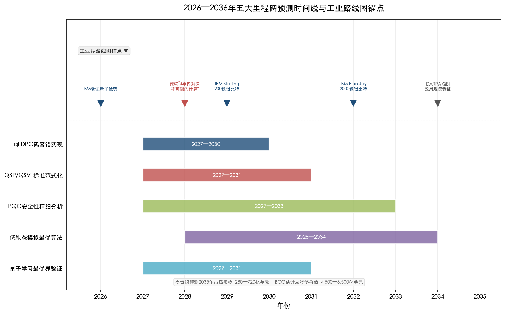

**里程碑一：qLDPC 码容错实现（预计 2027—2030 年）**

首个基于 qLDPC 码的实用容错逻辑量子比特系统将实现逻辑错误率低于 10⁻⁶。IBM 的 Kookaburra→Cockatoo→Starling 路线是当前最清晰的实现路径：码距 18 的 BB-LDPC 码在 288 个物理量子比特上承载 12 个逻辑量子比特，通过"通用桥"互联扩展至 200 个逻辑量子比特。核心假设包括：（a）Relay-BP 解码器的实时实现可向码距 18 以上扩展而不突破延迟约束；（b）多层布线封装的串扰率维持在 4×10⁻⁴ 以下；（c）qLDPC 码的有限长度性能优化在 2028 年前取得充分数学进展。

关键数学理论产出预测：有限长度 qLDPC 码的最优距离-阈值权衡定理；基于概率论与随机矩阵理论的真实噪声模型下解码性能精确分析。

核心推动团队：IBM Bravyi 组、INRIA Leverrier-Zémor、Google Haah。

**里程碑二：QSP/QSVT 标准范式化（预计 2027—2031 年）**

多变量 QSP/QSVT 框架在量子化学和组合优化中展示端到端量子算法——即从问题输入到量子电路编译再到资源估计的完整流程。核心假设包括：（a）多变量最优度数界在 2028 年前获得完整刻画；（b）块编码的高效构造方法取得突破，使量子化学核心问题（如电子结构计算）的电路深度降至近期容错设备可承受水平。

关键数学理论产出预测：多变量多项式逼近的量子最优性定理（推广 Chebyshev 逼近至量子信号处理设定）；块编码复杂度的下界证明。

核心推动团队：MIT Chuang 组、UC Berkeley Lin Lin、RIKEN 藤井组。

**里程碑三：后量子密码学安全性精细分析（预计 2027—2033 年）**

Module-LWE 量子攻击的精确复杂度界被重新标定，可能导致 NIST PQC 标准参数的调整或升级。与此同时，新一代量子密码原语（如量子一次性签名、量子不可伪造性）进入标准化候选。核心假设包括：（a）格基约化问题的量子算法取得实质性进展（目前最优量子算法仅提供多项式加速）；（b）后 SIDH 时代的同源密码学找到新的安全数学基础。

关键数学理论产出预测：格问题量子攻击的精确渐近界（统一描述 BKZ 类算法在量子计算模型下的行为）；新同源密码方案的可证明安全性定理。

核心推动团队：NTT CIS Lab、Weizmann Brakerski、ETH Zurich Renner。

**里程碑四：低能态量子模拟最优算法（预计 2028—2034 年）**

统一的量子模拟框架将量子化学核心问题（如过渡金属催化剂电子结构）的量子资源成本降低数个数量级，使容错量子计算机在量子化学模拟中首次展示超越经典计算的明确优势。核心假设包括：（a）Trotter 误差界的局部结构利用理论在 2030 年前成熟——即证明对于化学相关的哈密顿量，可利用其局部几何结构将模拟成本从系统尺寸的多项式降至多对数级别；（b）量子-经典混合计算架构（如 IBM 的量子中心超级计算参考架构）在 2030 年前实现稳定运行。

关键数学理论产出预测：化学相关局部哈密顿量模拟的紧致下界定理；LCU-Trotter 混合方法的最优混合比理论。

核心推动团队：RIKEN Kuwahara/Mizuta、Google Babbush 组、UC Berkeley Lin Lin。

**里程碑五：量子学习信息论最优界的实验验证（预计 2027—2031 年）**

经典影子协议在近期量子设备上展示样本复杂度优势的实验验证。这有望成为数学-量子计算交叉领域中最先在实际设备上产生"有用"量子优势的方向——因为经典影子仅需少量简单测量即可提取量子态的丰富信息，不依赖完全容错量子计算。核心假设包括：（a）鲁棒浅层影子方法的信噪比在 100+ 量子比特设备上仍可维持实用水平；（b）哈密顿量学习协议的样本复杂度优势获得端到端实验确认。

关键数学理论产出预测：有噪经典影子的信息论最优样本复杂度定理；量子态认证的测量最优性证明。

核心推动团队：Google QAI（Huang/Kueng/Preskill + Willow 平台）、Caltech IQIM、FU Berlin Eisert。

## 6.5 方向间的交叉效应与风险对冲

上述七大方向并非彼此独立——它们之间存在重要的交叉效应，这些效应可能显著加速或延缓特定突破的实现。

**qLDPC 码与拓扑计算的潜在合流**。虽然 qLDPC 码和拓扑码表面上代表两条不同的容错路线，但数学上存在深层联系。Leverrier 与 Zémor 的 Quantum Tanner Codes 本身建立在 Cayley 复形这一代数拓扑结构之上；悉尼大学 Williamson 的 Layer Codes 在三维拓扑码中实现了 L² 级错误处理能力 [悉尼大学报道](https://www.sydney.edu.au/news-opinion/news/2024/11/11/layer-codes-quantum-error-correction-quantum-hard-drive.html "Nature Communications 2024")。如果拓扑保护与代数编码率能够在统一的数学框架下结合，可能产生兼具两者优势的新型码族。

**QSP/QSVT 与量子模拟的协同**。QSP/QSVT 框架为哈密顿量模拟提供了统一的算法描述语言——Trotterization、LCU 和量子行走等不同模拟方法均可视为 QSP/QSVT 的特例。框架的成熟化将直接降低模拟算法的设计与优化门槛。

**去量子化与量子优势的动态博弈**。去量子化研究每收窄一个量子优势声明，都会重新定义哪些问题真正需要量子计算。这种"对抗性"动态实际上有利于领域的健康发展——它迫使量子算法研究者寻找更强、更精确的优势证明，同时也清晰界定了量子计算的核心价值区间。

**AI 对量子研究的双重影响**。一方面，AI 对高水平数学和计算人才的虹吸效应加剧了量子领域的人才短缺——量子私人投资仅占 AI 的 2.4% [CSIS 分析](https://www.csis.org/analysis/government-demand-creator-quantum-industry "2026-03")。另一方面，Google Quantum AI 已开始使用 Gemini 等大语言模型辅助识别量子算法的潜在应用场景 [Google AI 五阶段框架](https://thequantuminsider.com/2025/11/14/google-ai-outlines-five-stage-roadmap-to-make-quantum-computing-useful/ "2025-11-14")，AI 工具也在加速相位因子搜索、量子电路优化等数学-量子交叉问题的求解。

从风险对冲视角审视，我们认为最稳健的研究组合策略为：以 qLDPC 码实用化为核心投注（最高成熟度 + 最清晰工程路径），以 QSP/QSVT 框架成熟化和量子学习理论为中期配置（确定性较高的数学理论进展），以拓扑量子计算和后量子密码学纵深发展为长期对冲（高风险/高回报 + 制度驱动的确定性路线）。该组合同时覆盖了代数编码理论、拓扑学、逼近论和计算复杂性理论等不同数学分支，避免了对单一数学工具链的过度依赖。

## 6.6 关键性数学理论产出总结

综合以上分析，我们预测 2026—2036 年间最有可能产生的六项关键性数学理论或应用技术：

1. **有限长度 qLDPC 码的最优构造理论**——结合组合数学、概率论和代数编码理论，为短码在真实噪声下的性能提供精确数学刻画，直接支撑容错量子计算机的工程实现。
2. **多变量量子信号处理的最优逼近理论**——推广经典逼近论至量子信号处理设定，为量子算法设计提供统一的最优性框架。
3. **格问题量子攻击的精确渐近复杂度理论**——重新标定后量子密码学的安全参数基础，可能引发 NIST 标准的参数修订。
4. **化学相关哈密顿量模拟的紧致资源下界理论**——利用局部几何结构精确界定量子模拟的最低资源需求，为"量子计算在哪些化学问题上有用"这一核心问题提供数学回答。
5. **有噪量子学习的信息论最优界**——为经典影子等近期可实现的量子学习协议提供精确的样本复杂度与保真度保证。
6. **拓扑与代数纠错码的统一数学框架**——若得以实现，将标志着量子纠错理论从"两条路线并行"走向"统一理论"，其数学意义可与经典编码理论中 Turbo 码和 LDPC 码的联系相类比。

以上六项预测的共同特征在于：它们均处于纯数学理论与量子技术工程需求的交汇点上，既需要深层数学创新（代数结构、逼近论、复杂性理论），又直接回应容错量子计算的工程瓶颈。这正是 SIAM 2024 年量子交叉研讨会所呼吁的方向——将数学家从量子研究的"基本缺席"状态带入核心角色 [SIAM QIC 报告](https://www.siam.org/media/orydkrzd/quantum-convening-report.pdf "2024")。

# 第7章 总结、风险因素与展望

数学与量子计算交叉领域正处于一个独特的历史节点。前六章的分析揭示了一幅充满张力的全景图：量子纠错码的理论-工程闭环正在以超出预期的速度推进（第1、6章），全球研究团队的差异化定位日趋清晰（第2—3章），论文产出的指数增长与国际合作的结构性收缩同步发生（第4章），资金规模的急剧膨胀与数学基础研究的结构性缺位之间的反差则愈发突出（第5章）。本章承担三项核心任务：将前述六章的关键发现凝练为五条战略性结论，识别六项可能实质性改变预判方向的风险因素，并面向科研管理者、政策制定者和投资决策者提供简明的行动参考框架与后续追踪节点。

## 7.1 五大核心结论

### 7.1.1 量子低密度奇偶校验码处于"临界跨越"阶段——容错量子计算时间表的关键变量

在本报告评估的七大候选突破方向中，量子低密度奇偶校验码（qLDPC 码）的实用化以最高确信度被判定为最具近期突破潜力的方向。这一判断并非基于单一进展，而是源于 2021—2025 年间理论、算法与硬件三个环节罕见的同步加速。

在理论层面，Panteleev-Kalachev 的 lifted product 构造（2021 年）与 Leverrier-Zémor 的 Quantum Tanner Codes（2022 年）在两年内几乎同时解决了渐近优良量子 LDPC 码的存在性悬猜 [Panteleev & Kalachev](https://arxiv.org/abs/2111.03654 "Asymptotically Good Quantum and Locally Testable Classical LDPC Codes, 2021") [Leverrier & Zémor](https://arxiv.org/abs/2202.13641 "Quantum Tanner Codes, FOCS 2022")。在工程层面，IBM Bravyi 团队 2024 年在 Nature 发表 bivariate bicycle 码实验，以 288 个物理量子比特保护 12 个逻辑量子比特，编码效率较表面码提升约 10 倍 [Bravyi et al.](https://www.nature.com/articles/s41586-024-07107-7 "Nature 627, 778–782, 2024")；2025 年 11 月，IBM Loon 实验处理器实现 qLDPC 码实时经典解码（延迟 <480 纳秒），较原计划提前一年达标 [IBM 新闻室](https://newsroom.ibm.com/2025-11-12-ibm-delivers-new-quantum-processors,-software,-and-algorithm-breakthroughs-on-path-to-advantage-and-fault-tolerance "Loon 处理器 qLDPC 实时解码, 2025-11-12")。在学术社区层面，Riverlane 2025 年报告显示，2025 年 1—10 月 QEC 码相关论文达 120 篇，而 2024 全年仅 36 篇，呈现"QEC 码爆炸"态势 [Riverlane](https://www.riverlane.com/blog/quantum-error-correction-our-2025-trends-and-2026-predictions "QEC 趋势与预测, 2025")。

综合上述多维度证据，我们判断 qLDPC 码的成败将直接决定容错量子计算的时间表。IBM 的 Kookaburra（2026 年）→ Cockatoo → Starling（2029 年，目标 200 个逻辑量子比特、1 亿次无误操作）路线图是当前公开信息中最清晰的工程实现路径 [Ars Technica](https://arstechnica.com/science/2025/06/ibm-is-now-detailing-what-its-first-quantum-compute-system-will-look-like/ "IBM Starling 路线图, 2025-06")。核心推动团队——IBM Bravyi 组、INRIA Leverrier-Zémor、Google Haah、悉尼大学 Williamson——分别占据编码设计、代数理论、资源估计和拓扑码构造四个互补生态位，形成了覆盖该方向核心数学需求的全球协作网络。

### 7.1.2 数学科学界"基本缺席"——最大的制度性瓶颈尚未被突破

2024 年 10 月 SIAM 量子交叉研讨会（QIC）的核心诊断指出：数学科学界在量子研究中"基本缺席"（largely absent）[SIAM QIC 报告](https://www.siam.org/media/orydkrzd/quantum-convening-report.pdf "Quantum Intersections Convening 报告, 2024")。截至 2026 年初，这一判断在制度层面尚未得到实质性改变。

多组证据确认了这一断层的持续性。在资金结构方面，全球主要量子战略普遍侧重硬件和应用，对数学基础研究未设专门条目；在美国联邦体系中，NSF 数学科学司（DMS）几乎是数学家承接量子课题的唯一窗口，DOE ASCR 则明确将量子算法和密码学方向排除在外 [NQI FY2025 报告](https://www.quantum.gov/wp-content/uploads/2024/12/NQI-Annual-Report-FY2025.pdf "Section 3.2 NSF 资助结构")。在人才流动方面，AI 行业的虹吸效应正在加剧：2025 年 Google、Amazon、微软和 Meta 四家公司在 AI 基础设施上的投入合计达 3,800 亿美元，个别顶尖 AI 研究者获得的薪酬包高达四年 2.5 亿美元 [Schneier & Sanders](https://www.schneier.com/blog/archives/2026/03/academia-and-the-ai-brain-drain.html "AI 人才虹吸效应分析, 原载 Nature, 2026-03")。Jurowetzki 等人 2025 年发表的研究表明，职业生涯约五年、引用排名靠前的年轻学者从学术界转入工业界的概率是资深中引用学者的 100 倍 [Jurowetzki et al.](https://link.springer.com/article/10.1007/s00146-024-02171-z "AI & Society, 2025")。量子计算领域的私人投资仅为 AI 的 2.4%（2025 年约 26 亿美元对 1,090 亿美元）[CSIS](https://www.csis.org/analysis/government-demand-creator-quantum-industry "政府作为量子产业需求创造者, 2026-03")，在薪酬竞争力上处于根本劣势。

值得注意的是，这一"基本缺席"恰恰与量子研究对数学的依赖达到历史峰值同步发生。2026 年 3 月 Bennett-Brassard 获图灵奖 [ACM 图灵奖公告](https://www.acm.org/media-center/2026/march/turing-award-2025 "2025 ACM Turing Award, 2026-03-18")，2025 年 Shor 获 IEEE Shannon 奖 [IEEE Shannon 奖](https://www.itsoc.org/news/shannon-award-2025 "Shannon Award 2025: Peter Shor")，2026 年 SIAM G2S3 暑期学校以"容错量子计算算法"为主题 [G2S3 2026](https://sites.duke.edu/siamss2026/ "Duke University, 2026")——这些学术荣誉和教育信号表明数学-量子交叉正从学术边缘走向学科核心，但人才供给和资金结构远未匹配这一转向所需的规模。SIAM QIC 提出的四大建议——支持交叉研发、加强教育与劳动力培养、增加资金联网机制、与数学学会合作建设社区——仍是已知唯一由主要数学学会驱动的系统性行动方案，其落实进度将是衡量这一制度性瓶颈能否突破的核心指标。

### 7.1.3 中美学术合作结构性收缩正在重塑全球研究网络

国际合作是数学-量子计算交叉领域进步的基础条件。美国国家科学技术委员会（NSTC）2024 年报告显示，2018—2022 年美国量子信息科学与技术（QIST）研究中约一半涉及国际合作，高于全科学领域 40% 的均值 [NSTC 报告](https://www.quantum.gov/wp-content/uploads/2024/08/Advancing-International-Cooperation-in-QIST.pdf "美国 QIST 国际合作报告, 2024-08")。然而，这一合作基础正在遭受侵蚀。

Kitajima 与 Okamura 2025 年 3 月在 Nature Humanities and Social Sciences Communications 发表的研究揭示了一个引人注目的现象：中美合作距离自 2019 年起呈现"反转 J 曲线"，即在全球主要双边科学合作关系中，唯有中美表现出这一逆转趋势 [Kitajima & Okamura](https://www.nature.com/articles/s41599-025-04550-3 "Nature HSSC, 2025-03-03")。InCites 数据进一步显示，中国论文国际合著比从 2018 年的 26.6% 降至 2023 年约 19.4%（下降 7.2 个百分点），其中中美合著份额下降 6.4 个百分点 [Scientific American](https://www.scientificamerican.com/article/china-u-s-science-collaborations-are-declining-slowing-key-research/ "中美科学合作下降趋势, 2024-07-24")。OECD 数据同样确认，量子研究国际合作强度自 2019 年持续下降——国际共同作者率从约 33% 降至 2022 年的不足 30%，美-欧量子合作强度在 2018—2022 年间下降 15% [OECD 报告](https://www.oecd.org/content/dam/oecd/en/publications/reports/2025/12/an-overview-of-national-strategies-and-policies-for-quantum-technologies_33a0b249/5e55e7ab-en.pdf "Figure 5, 量子技术国家战略概览")。

收缩的后果已经开始显现：中国向欧盟的知识流率上升，美国则强化与 11 个国家（澳大利亚、丹麦、芬兰、法国、德国、日本、韩国、荷兰、瑞典、瑞士、英国）的双边量子合作声明 [NSTC 报告](https://www.quantum.gov/wp-content/uploads/2024/08/Advancing-International-Cooperation-in-QIST.pdf "11 bilateral statements")。研究网络正从"以美国为核心枢纽的星形结构"向"多中心集团化结构"演变。对于数学-量子计算交叉领域而言，这一趋势尤为值得关注——该领域的突破往往依赖极少数顶尖数学家的跨机构合作（如 Panteleev-Kalachev 的俄美合作、Leverrier-Zémor 的法国内部合作），合作通道的收窄可能直接延缓关键理论进展的产生。

### 7.1.4 量子价值主张面临经典 AI/高性能计算与去量子化的双重挤压

量子计算的长期价值命题依赖于"量子优势"——即量子计算机在特定问题上能提供可证明的超多项式加速。然而，这一命题正在两个方向上同时承压。

一方面，去量子化（dequantization）研究自 Tang 2018 年的开创性工作以来持续收窄量子优势的成立范围。截至 2026 年初，真正可证明的超多项式量子优势仅在有限场景中严格成立：Shor 算法（整数分解/离散对数）、特定量子模拟（如 Google 的量子回声实验 [Google 量子回声实验](https://www.nature.com/articles/s41586-025-09526-6 "Nature, 2025")）、采样问题以及特定量子学习任务。在组合优化和通用机器学习等广受期待的应用方向上，量子优势的证据仍然薄弱。Google Quantum AI 在 2025 年 11 月的论文中坦率承认，"识别具体优势实例"是当前"资源不足的核心挑战" [Babbush et al.](https://arxiv.org/abs/2511.09124 "Concrete quantum advantage challenges, arXiv, 2025-11")。

另一方面，经典 AI 和高性能计算（HPC）的快速进步正在持续抬高量子计算必须跨越的"优势门槛"。2025 年四大科技巨头在 AI 基础设施上合计投入 3,800 亿美元 [Schneier & Sanders](https://www.schneier.com/blog/archives/2026/03/academia-and-the-ai-brain-drain.html "原载 Nature, 2026-03")，经典计算的算力上限不断被推高。麦肯锡 2035 年量子计算市场预测的 2.6 倍区间跨度（280—720 亿美元）本身即是这种不确定性的定量度量 [麦肯锡](https://www.mckinsey.com/capabilities/tech-and-ai/our-insights/the-year-of-quantum-from-concept-to-reality-in-2025 "Quantum Technology Monitor 2025")。

值得强调的是，最具韧性的量子优势领域——量子模拟和密码分析——恰恰是数学理论最密集的方向 [Quanta Magazine](https://www.quantamagazine.org/what-is-the-true-promise-of-quantum-computing-20250403/ "量子计算的真实前景, 2025-04-03")。这意味着量子价值主张的捍卫将越来越依赖数学家的贡献：精确界定优势成立条件、构造抗去量子化算法、证明特定模拟问题的经典不可解性。

### 7.1.5 量子纠错人才缺口是最紧迫的系统性瓶颈

所有技术路线图——无论是 IBM 的 qLDPC 码路线、Google 的表面码路线还是微软的拓扑路线——都以充足的高水平人才供给为隐含前提，但这一前提正面临严峻挑战。

Riverlane 2025 年 QEC 报告提供了迄今最为详细的定量评估：全球目前仅有约 1,800—2,200 名量子纠错（QEC）专业人员，50%—66% 的量子相关职位空缺无法填补，而 QEC 专家的培养周期长达 10 年 [Riverlane QEC 报告](https://www.riverlane.com/press-release/riverlane-report-reveals-scale-of-the-quantum-error-correction-challenge "QEC 人才规模评估, 2025")。MIT 量子指数报告 2025 进一步显示，美国量子技能相关职位在 2011—2024 年间占总职位发布的比例增长了近 3 倍，供需缺口仍在持续扩大 [MIT 量子指数报告](https://qir.mit.edu/workforce/ "基于 Lightcast 劳动市场数据")。

人才缺口的形成源于三重因素叠加。其一，QEC 本身是高度交叉的学科，要求研究者同时掌握代数编码理论、概率论、凝聚态物理和硬件工程，培养门槛极高。其二，如前所述，AI 行业的薪酬溢价对具备量化能力的博士级人才构成强烈的虹吸效应。其三，数学系在量子方向上缺乏明确的课程路径和职业信号（SIAM QIC 核心发现），致使原本最适合 QEC 理论工作的纯数学人才未能进入培养管道。

## 7.2 六大风险因素

图 7-1 以气泡矩阵形式展示了六大风险因素在"发生可能性""对预判影响程度"和"时间紧迫度"三个维度上的综合评估。人才与 AI 虹吸风险位于右上高可能性/高影响区域且紧迫度最高，技术路线选择风险和去量子化风险位于中等可能性/高影响区域，资金持续性和替代技术风险则处于相对较低位置。

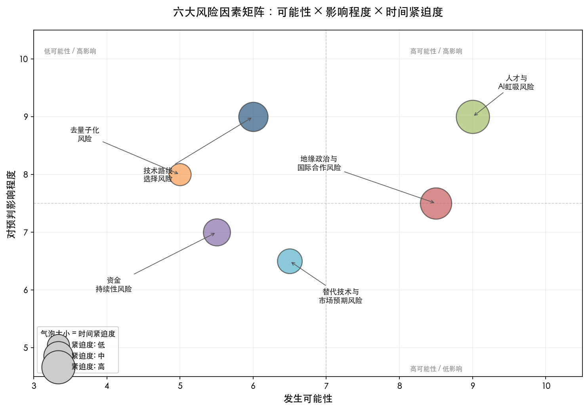

### 7.2.1 技术路线选择风险

量子计算当前存在三条主要容错路线——qLDPC 码/表面码（超导/离子阱）、拓扑量子计算（拓扑超导体）和猫态量子比特（玻色子编码），各路线在数学基础、硬件成熟度和人才需求上差异显著。投注错误路线意味着稀缺数学人才和十年级别培养周期的双重浪费。

拓扑路线的争议尤为突出。微软 2025 年 2 月发布 Majorana 1 处理器及六里程碑路线图后，学术界的质疑持续升级。2025 年 3 月，Nature 报道物理学家 Legg 对微软拓扑量子比特协议提出分析性质疑，认为其声称的奇偶校验测量协议存在漏洞 [Nature 报道](https://www.nature.com/articles/d41586-025-00683-2 "Nature 639, 555–556, 2025")。Science 杂志报道指出"许多物理学家认为微软尚未提供马约拉纳准粒子存在的确凿证据" [Science](https://www.science.org/content/article/debate-erupts-around-microsoft-s-blockbuster-quantum-computing-claims "围绕微软量子声明的争论, 2025")。澳大利亚研究团队发现 1/f 噪声导致的退相干时间（<1 微秒）远短于门操作所需时间（32.5 微秒）[HPCwire](https://www.hpcwire.com/2025/07/02/another-challenge-to-microsofts-majorana-quantum-roadmap/ "拓扑路线的噪声挑战, 2025-07-02")。截至 2026 年 4 月，尚无第三方独立验证微软拓扑量子比特声明的公开结果——这一事实本身即构成重大不确定性。微软 2026 年 1 月启动的"量子先锋计划"（Quantum Pioneers Program）面向外部研究者开放拓扑量子比特测量相关课题 [The Quantum Insider](https://thequantuminsider.com/2026/01/23/microsoft-2026-quantum-pioneers-program-measurement-based-computing/ "微软量子先锋计划, 2026-01-23")，可视为推动独立验证的间接尝试，但其结果尚需时日。

### 7.2.2 地缘政治与国际合作风险

第4章和第5章的分析已表明，中美学术合作的结构性收缩是当前全球量子研究网络面临的最大外部冲击。多国已宣布量子技术出口管制（34 量子比特以上量子计算机禁止出口），但 OECD 公开质疑这一阈值的合理性——"为什么这一阈值构成有意义的国家安全风险，专家并不清楚" [OECD 报告](https://www.oecd.org/content/dam/oecd/en/publications/reports/2025/12/an-overview-of-national-strategies-and-policies-for-quantum-technologies_33a0b249/5e55e7ab-en.pdf "Section 1.5.1, 出口管制阈值讨论")。英国皇家联合军种研究所（RUSI）2025 年的分析更指出，出口管制正在"加速中国国内量子供应链"的自主化进程 [RUSI](https://www.rusi.org/explore-our-research/publications/commentary/export-controls-accelerate-chinas-quantum-supply-chain "出口管制与中国量子供应链, 2025-06")，暗示管制的实际效果可能与政策初衷相悖。

对数学-量子计算交叉领域而言，地缘政治风险的传导路径相对间接但影响深远。数学理论本身属于非涉密的公开知识，不受出口管制直接约束；但人员交流限制、签证政策收紧和合作信任的侵蚀，正在抑制跨国研究团队的形成——而前文已论及，该领域的关键突破高度依赖极少数顶尖人才的跨机构协作。

### 7.2.3 人才与"AI 虹吸"风险

人才风险构成三重叠加效应：QEC 专业人员的定量短缺（全球现有 1,800—2,200 人，远低于技术路线图所隐含的需求规模）、数学家在量子研究中的制度性缺席（SIAM QIC 诊断）、以及 AI 行业对顶尖量化人才的虹吸效应。

AI 虹吸效应的规模值得充分重视。2025 年，AI 研究者薪酬已达到学术界难以竞争的水平：Fortune 杂志报道新毕业 AI 方向博士的起薪包已进入六位数乃至七位数美元区间 [Fortune](https://fortune.com/2025/06/25/ai-companies-court-ai-phds-with-huge-pay-packages-raising-fears-of-an-academic-brain-drain/ "AI 博士薪酬与学术人才流失, 2025-06-25")。Nature 2026 年 3 月发表的分析文章进一步指出，这一趋势对年轻高引学者的影响最为显著 [Schneier & Sanders](https://www.schneier.com/blog/archives/2026/03/academia-and-the-ai-brain-drain.html "原载 Nature, 2026-03")——恰恰是量子数学交叉领域最需要吸引的人才群体。量子计算领域 2025 年私人投资约 26 亿美元，仅占同期 AI 私人投资（1,090 亿美元）的 2.4%，在市场薪酬信号上处于根本劣势。

### 7.2.4 资金持续性风险

量子研究的资金前景并非一路上行。美国 FY2026 预算经历了从"悬崖"到"软着陆"的戏剧性过程：总统预算提案曾将 NSF 总预算削减 55.8%，最终国会将其恢复至 87.5 亿美元（较 FY2024 仅减 3.4%），并规定各研究司削减幅度不超过 5% [美国天文学会报道](https://aas.org/posts/news/2026/01/congress-passes-fiscal-year-2026-spending-bills-nsf-nasa-and-doe "FY2026 拨款法案, 2026-01-15")。然而，这一保护主要反映国会对科学预算大幅削减的整体抵制，而非对数学-量子交叉研究的专项承诺，后续年度的拨款水平仍存在显著不确定性。

中国方面，OECD 报告特别标注其量子投资为"实际支出未报告"——陆朝阳指出实际政府投资可能仅为公开数字的三分之一左右 [OECD 报告](https://www.oecd.org/content/dam/oecd/en/publications/reports/2025/12/an-overview-of-national-strategies-and-policies-for-quantum-technologies_33a0b249/5e55e7ab-en.pdf "China: actual expenditures unreported")。这一事实意味着，以中国公开承诺数字（常被引用为 150 亿美元）为基准的国际比较可能严重失真。

### 7.2.5 替代技术与市场预期风险

量子计算的市场预测跨度之大本身即构成风险信号。麦肯锡预测 2035 年全球量子计算市场规模为 280—720 亿美元（2.6 倍跨度），BCG 预测总经济价值为 4,500—8,500 亿美元（1.9 倍跨度）[BCG](https://www.bcg.com/publications/2024/long-term-forecast-for-quantum-computing-still-looks-bright "量子计算长期预测, 2024")。BCG 已下调 NISQ 阶段的近期价值预期。DARPA 量子基准倡议（QBI）将效用规模验证节点设在 2033 年——距今仍有七年，期间经典 HPC 和 AI 硬件可能取得进一步重大进展，从而再次抬高量子计算必须跨越的优势门槛。

### 7.2.6 去量子化风险

去量子化研究对量子价值主张构成持续性压力。自 Tang 2018 年的工作以来，部分此前被认为具有量子优势的线性代数问题已被证明在经典计算上可达到几乎匹配的效率。2025 年 CCC（Computational Complexity Conference）发表的改进量子-经典查询复杂性分离结果 [CCC 2025](https://drops.dagstuhl.de/storage/00lipics/lipics-vol339-ccc2025/LIPIcs.CCC.2025.5/LIPIcs.CCC.2025.5.pdf "Improved Quantum-Classical Separation") 和 2026 年 PRL 发表的可证明可验证样本复杂度量子优势 [Benedetti et al.](https://link.aps.org/doi/10.1103/q55v-wm7y "PRL, 2026") 从正面推进了优势边界的精确刻画，但对量子计算在通用场景下的商业价值而言，去量子化风险远未消除。

关键的缓冲因素在于：最具韧性的量子优势领域（量子模拟、密码分析、量子学习任务）恰恰是数学密集方向，而去量子化研究自身也依赖深层数学工具——这在客观上强化了数学家在界定量子计算核心价值区间中不可替代的角色。

## 7.3 行动参考框架

### 7.3.1 面向科研管理者

**优先级一：qLDPC 码方向的数学人才定向培养。** qLDPC 码实用化是当前确信度最高的突破方向，其剩余障碍——有限长度码优化、真实噪声模型下的解码性能分析、高连通性硬件拓扑的协同设计——对代数编码理论、概率论和组合数学人才的需求最为迫切。建议在数学系明确设立量子纠错方向的博士生资助和博士后项目，响应 SIAM QIC 关于建立"入口匝道"（on-ramp）的建议，降低纯数学人才进入量子研究的制度门槛。

**优先级二：建立"技术路线对冲"的研究组合。** 鉴于 qLDPC 码、表面码和拓扑码三条路线尚未收敛，科研管理者应同时支持代数编码理论、拓扑学/辫子群表示论和逼近论/多变量函数论方向的研究，避免对单一数学工具链的过度依赖。第6章的分析表明，这三条路线之间存在潜在的数学交汇点（如 Quantum Tanner Codes 与 Cayley 复形的联系、Layer Codes 的拓扑-代数融合），跨路线研究可能催生意外的理论突破。

**优先级三：利用 AI 工具加速数学-量子交叉研究。** Google Quantum AI 已开始使用大语言模型辅助识别量子算法的潜在应用场景和优化相位因子搜索。科研管理者应鼓励数学家将 AI 辅助工具纳入量子理论研究的工作流程，将 AI 从潜在的人才竞争对手转化为研究生产力的倍增器。

### 7.3.2 面向政策制定者

**优先级一：维护数学-量子交叉资金的稳定性。** NQI 再授权法案追加的 18 亿美元（2025—2029 年）应明确将数学基础研究列为优先领域之一。NSF DMS 是数学家承接量子课题的最关键窗口——FY2026 拨款法案确保各研究司削减不超过 5%，但这一保护需在后续年度持续巩固。英国 20 亿英镑"量子飞跃"计划 [英国政府公告](https://www.gov.uk/government/news/uks-quantum-leap-tohelp-beat-diseasedeliver-high-paid-jobs-and-strengthen-national-security-as-first-country-in-the-world-to-roll-out-quantum "英国量子飞跃计划, 2026-03-17") 和日本 8.55 亿美元量子追加拨款等最新案例表明，主要经济体正在加码量子投资，但对数学基础研究的专项重视仍需积极倡导。

**优先级二：审慎评估量子出口管制的实际效果。** OECD 和 RUSI 的分析均指出，当前以 34 量子比特为阈值的出口管制在合理性和实效上存疑。对于数学理论这种本质上公开、非涉密的知识而言，人员交流的便利性远比硬件管制更能影响创新速率。

**优先级三：在国家量子战略中增设"数学基础研究"专门条目。** SIAM QIC 提出的行动方案是已知唯一由主要数学学会组织的系统性倡议。各国量子战略应将数学基础研究从"隐含需求"提升为"显性优先"，设立专项资助通道和跨学科培养项目，打通从数学系到量子实验室的人才输送管道。

### 7.3.3 面向投资决策者

**优先级一：关注 qLDPC 码生态链的投资机会。** qLDPC 码从理论到工程的转化正在催生一系列新技术需求——实时解码硬件（FPGA/ASIC）、量子纠错编译器、协同处理器架构——每个环节均可能产生投资机会。IBM Starling 系统（2029 年目标）和后续 Blue Jay 系统（2033 年目标）的路线图为投资时间窗口提供了参考锚点。

**优先级二：对量子应用落地时间保持审慎预期。** DARPA QBI 的效用规模验证节点设在 2033 年，BCG 将"广泛量子优势"阶段定位于 2030—2040 年区间。在此期间，量子计算公司收入（2024 年约 6.5—7.5 亿美元，2025 年预计突破 10 亿美元 [麦肯锡](https://www.mckinsey.com/capabilities/tech-and-ai/our-insights/the-year-of-quantum-from-concept-to-reality-in-2025 "Quantum Technology Monitor 2025")）主要来自云访问、硬件销售和咨询服务，而非量子优势驱动的商业价值创造。

**优先级三：将去量子化进展纳入投资假设的压力测试。** 任何以"量子优势"为核心价值主张的投资论证都应设定去量子化情景假设——即特定问题类别的量子优势在 5—10 年内被经典算法部分或完全抵消的可能性。将这一情景纳入敏感性分析，有助于在不确定性中建立更为稳健的投资决策框架。

## 7.4 后续追踪方向

基于前述分析，我们识别出六个在未来 12—24 个月内最值得持续追踪的关键节点（图 7-2），每个节点的进展都可能实质性改变本报告的核心判断。

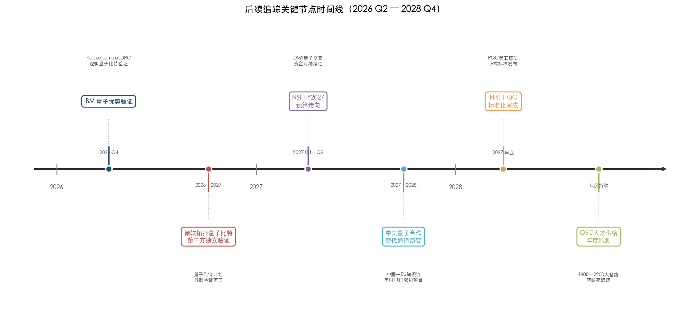

**节点一：IBM 2026 年底量子优势验证。** IBM 已明确承诺在 2026 年底前验证量子优势——这是 qLDPC 码路线的首个决定性节点。Kookaburra 处理器将以 144 或 288 个硬件量子比特承载 12 个逻辑量子比特并实现稳定量子存储。若验证成功，将为 Starling 系统（2029 年）奠定工程基础；若失败或显著延迟，则将引发对整条路线时间表的重新评估。

**节点二：微软拓扑量子比特的第三方独立验证。** 截至 2026 年 4 月，微软的拓扑量子比特声明尚未获得独立验证。微软 2026 年启动的"量子先锋计划"为外部验证提供了潜在通道。独立验证的成败将直接影响拓扑路线在全球量子研究资源配置中的权重。

**节点三：NSF FY2027 预算走向。** FY2026 拨款法案对 NSF 的保护究竟是一次性政治妥协还是持续性制度承诺，将在 FY2027 预算过程中见分晓。DMS 量子交叉资助的可持续性直接决定了美国数学家进入量子研究的制度通道是否稳定。

**节点四：中美量子合作"替代通道"的演变。** 中国向欧盟知识流的上升和美国 11 国双边合作项目的推进，正在形成新的合作拓扑结构。这些替代通道能否有效补偿中美直接合作的萎缩，将在未来两年内逐步显现。

**节点五：QEC 人才供给的年度监测。** Riverlane 报告建立的 1,800—2,200 名 QEC 专业人员基准线和 50%—66% 的职位空缺率，为年度追踪提供了定量锚点。该指标的变化将直接反映人才培养政策的效果与 AI 虹吸效应的消长态势。

**节点六：NIST PQC 标准更新周期。** HQC 预计 2027 年完成标准化。Module-LWE 量子攻击精确界的任何重大进展都可能触发现有 PQC 标准参数的重新标定——这将成为数学理论直接影响全球网络安全基础设施的又一典型案例。

# 结论与风险提示

## 核心结论

本报告历经七章、覆盖全球约 28 个核心研究团队的系统分析，最终凝练为以下五项核心判断。

**第一，qLDPC 码实用化是未来十年确信度最高的突破方向。** 2021—2022 年间 Panteleev-Kalachev 和 Leverrier-Zémor 两项独立的渐近存在性证明，2024 年 IBM BB 码在 Nature 发表的实验验证（288 个物理量子比特保护 12 个逻辑量子比特），以及 2025 年 IBM Loon 处理器提前一年实现实时经典解码（延迟 <480 纳秒），共同构成了从理论到工程的罕见同步加速。IBM Starling 系统（2029 年目标，200 个逻辑量子比特、1 亿次无误操作）是当前公开信息中最清晰的容错量子计算工程路径。qLDPC 码的成败将直接决定容错量子计算的时间表。

**第二，数学家在量子研究中的"基本缺席"是最大的制度性瓶颈。** SIAM 2024 年量子交叉研讨会的诊断至今未获得实质性改变。全球量子战略普遍侧重硬件和近期应用，面向数学基础研究的专项资助严重匮乏。在美国联邦体系中，NSF DMS 几乎是数学家承接量子课题的唯一窗口，而 AI 行业以 42 倍于量子领域的私人投资对高水平数学人才形成结构性虹吸。全球 QEC 专业人员仅约 1,800—2,200 人，培养周期长达 10 年，人才缺口构成所有技术路线图中最容易被低估的系统性瓶颈。

**第三，全球竞争格局呈"北美—欧洲领跑、亚太差异化追赶"态势。** 在纯数学理论深度方面，MIT、Caltech IQIM、INRIA 和 ETH Zurich 仍处于全球最前沿。在产学研闭环能力方面，IBM Quantum、Google QAI 和 Microsoft Station Q 构成第一梯队。亚太地区的突破性贡献集中在日本 RIKEN RQC（量子资源理论里程碑、Trotter 最优性定理）、NTT CIS Lab（Crypto 2025 最佳论文）、悉尼大学（Layer Codes）和魏茨曼研究所（Vidick 转入后复杂性理论实力飙升）。中国在论文总量和实验验证能力上领先，但在 qLDPC 码代数理论、量子复杂性前沿定理等纯数学方向与北美、欧洲头部团队存在结构性差距——清华 YMSC 刘子文组的出现标志着能力种子的形成，但规模化产出尚需 5—10 年。

**第四，中美学术合作的结构性收缩正在重塑全球知识流网络。** 中国论文国际合著比自 2018 年的 26.6% 降至 2023 年约 19.4%，降幅中 6.4 个百分点源自中美合著的减少。合作网络正从星形结构向多中心集团化结构演变。欧洲理论团队（INRIA、ETH Zurich、Oxford）从这一再平衡中获益最大，以色列（魏茨曼）和新加坡（CQT）凭借灵活双边关系同样处于有利位置。

**第五，量子价值主张面临经典 AI/HPC 与去量子化的双重挤压。** 真正可证明的超多项式量子优势仅在有限场景中严格成立（Shor 算法、特定量子模拟、采样问题、特定量子学习任务）。去量子化研究持续收窄优势范围，经典 AI 基础设施投入（2025 年四大科技巨头合计 3,800 亿美元）不断抬高量子计算必须跨越的门槛。值得注意的是，最具韧性的量子优势领域——量子模拟和密码分析——恰恰是数学理论最密集的方向，这意味着量子价值主张的捍卫将越来越依赖数学家的深度参与。

## 风险提示

本报告的前瞻判断建立在 2026 年 4 月之前可获取的公开信息基础之上，以下六项风险因素可能实质性改变上述预判。

1. **技术路线选择风险。** qLDPC 码/表面码（超导/离子阱）、拓扑量子计算和猫态量子比特三条主要容错路线尚未收敛。微软拓扑量子比特声明截至 2026 年 4 月未获第三方独立验证，1/f 噪声导致的退相干时间（<1 微秒）与门操作需求（32.5 微秒）之间的数量级差距构成实质性技术不确定性。
2. **地缘政治与国际合作风险。** 中美量子合作的"反转 J 曲线"和多国 34 量子比特出口管制阈值正在改变研究网络拓扑。OECD 和 RUSI 均对管制实效提出公开质疑——管制可能加速目标国自主供应链建设而非抑制其能力增长。
3. **人才与"AI 虹吸"风险。** 全球 QEC 专业人员仅约 1,800—2,200 人，50%—66% 的量子职位空缺无法填补，培养周期长达 10 年。AI 行业薪酬溢价对年轻高引学者——恰恰是量子数学交叉领域最需要吸引的人才——影响最为显著。
4. **资金持续性风险。** 美国 FY2026 拨款法案对 NSF 的保护（各研究司削减不超过 5%）主要反映国会对科学预算大幅削减的整体抵制，后续年度的拨款水平仍存在显著不确定性。中国量子投资的实际支出数据未公开披露，以公开承诺数字为基准的国际比较可能严重失真。
5. **替代技术与市场预期风险。** 麦肯锡 2035 年量子计算市场预测的 2.6 倍区间跨度（280—720 亿美元）和 BCG 的 1.9 倍跨度（4,500—8,500 亿美元总经济价值）本身即为不确定性的定量度量。DARPA 效用规模验证节点（2033 年）距今七年，期间经典计算和 AI 硬件可能取得进一步重大进展。
6. **去量子化风险。** 去量子化研究对量子优势声明构成持续性压力。量子优势在组合优化和通用机器学习方向上的证据仍然薄弱。任何以"量子优势"为核心的技术或投资判断都应设定去量子化情景假设。

## 局限性

本报告存在以下分析局限性，读者在引用相关结论时应予以充分考量。

1. **数据时效性约束。** 本报告信息截止日期为 2026 年 4 月初。量子计算领域的进展速度极快——例如 IBM 2025 年 11 月 Loon 处理器实时解码比路线图提前一年达标——后续重大进展可能改变本报告的部分判断基础。
2. **论文计量的结构性偏差。** 本报告引用的 EPJ QT 文献计量研究覆盖 Scopus 数据库，但数学贡献被系统性低估——大量数学驱动的工作发表于物理或计算机科学期刊而非数学期刊。此外，论文数量和引用次数并不等同于数学理论影响力：INRIA Leverrier-Zémor 仅以二人之力完成 qLDPC 码理论两大突破之一，其单篇影响力远超许多大规模团队的累计产出。
3. **中国投资数据的不透明性。** 中国量子投资的实际拨付金额未公开披露（OECD 明确标注为"实际支出未报告"），本报告对中国资金维度的分析精确度受此制约。
4. **团队覆盖的选择性。** 本报告聚焦于数学与量子计算交叉领域最活跃的约 28 个团队，无法穷尽全球所有相关研究力量。部分新兴团队——如近年在量子信息几何方向崭露头角的学者——可能因尚未形成规模化产出而未被纳入分析。
5. **突破时间线预测的固有不确定性。** 五大里程碑预测及其时间区间建立在多项核心假设之上（如解码器扩展性、噪声模型适配、格攻击算法进展等），任何假设的偏离都可能导致时间表的显著调整。工业界路线图存在内在的乐观偏差，咨询机构市场预测高度依赖容错时间线假设——本报告力图保持审慎，但前瞻性判断的固有不确定性无法完全消除。
