# 执行摘要

量子网络——利用量子纠缠在分布式节点之间传输量子态的通信基础设施——正处于从原理验证向工程化示范的关键转折期。2025 年 4 月至 2026 年 4 月的 12 个月内，该领域迎来了空前密集的技术突破：35 km 部署光纤上的电信波段纠缠（Harvard/Lukin，SiV 色心，2024 年 Nature）、10 km 光纤离子-离子纠缠与设备无关量子密钥分发同步验证（USTC/潘建伟，2026 年 2 月 Nature & Science 双发）、NV 色心腔增强光子收集效率 10 倍提升（QuTech/Hanson，2026 年 1 月 Nature Communications）、以及 Yb-171 中性原子阵列电信波长并行原子-光子纠缠的首次实现（UIUC/Covey，2025 年 Nature Physics）。参照 Wehner 六阶段量子互联网路线图，全球纠缠型量子网络实验整体处于第一阶段向第二至第三阶段过渡的关键期，最先进的演示已触及第四阶段要素。

本报告对全球 28 个活跃在量子网络方向的课题组进行了系统化的全景扫描与横向比较，覆盖北美（10 组）、欧洲（12 组）、亚太（5 组）及其他地区（1 组）。在技术路线维度，中性原子/冷原子（7 组，25%）和离子阱（5 组，17%）是数量最多的两大阵营，金刚石色心阵营（4 组）则在综合竞争力上位居首位（阵营平均得分 8.26）。评估框架采用七维度加权评分体系——技术成熟度（25%）、学术影响力（20%）、技术路线前瞻性（15%）、团队实力（15%）、经费与资源（10%）、项目网络与合作（10%）、专利与产业化（5%），并通过三套权重方案（主方案、学术优先、工程优先）进行交叉验证，以报告排名区间而非唯一排名。

综合排名 Top 10 最具潜力课题组如下：

| 排名 | 课题组 | 综合得分 | 核心技术路线 | 稳健性 |
|:---:|:---|:---:|:---|:---|
| 1 | Harvard/Lukin | 9.33 | SiV 色心 | 三方案稳居第 1 |
| 2 | USTC/潘建伟 | 9.05 | 卫星+光纤+离子阱 | 三方案稳居第 2 |
| 3 | QuTech/Hanson | 8.75 | NV 色心→SnV 转型 | 三方案稳居第 3 |
| 4 | MPQ/Rempe | 7.75 | Rb 原子光腔 | 基本稳健 |
| 5 | MIT/Englund | 7.57 | 金刚石色心集成光子 | 基本稳健 |
| 6 | UChicago/Awschalom | 7.38 | Q-NEXT/固态缺陷 | 基本稳健 |
| 7 | Duke/Kim (IonQ) | 7.20 | 离子阱/产业化 | 敏感（波动 4 位） |
| 8 | 清华/段路明 | 6.92 | 离子阱/理论 | 敏感（波动 3 位） |
| 9 | ETH/Wallraff | 6.88 | 超导量子电路 | 基本稳健 |
| 9 | Innsbruck/Northup-Lanyon | 6.88 | 离子阱光腔 | 稳健 |

Top 3 课题组在三套权重方案下排名完全一致，具有跨评估视角的共识性领先地位。Harvard/Lukin 以 SiV 色心平台的高光子接口效率、Nature/Science 三连发以及从安全通信到盲量子计算再到量子增强传感的应用多样性综合领先。USTC/潘建伟凭借全球最大量子通信网络（CN-QCN，145 节点，>12,000 km 光纤）的部署规模和 2026 年 Nature+Science 同月双发的前沿突破实力位居第二。QuTech/Hanson 作为三节点纠缠量子网络和 25 km 城市间量子处理器纠缠的纪录保持者，兼具 QIA 协调人角色赋予的欧洲合作网络枢纽地位，稳居第三。

在资助格局层面，全球量子网络公共投资已进入"第二波"加速期：美国联邦 QIS 研发支出维持约 10 亿美元/年，DOE 6.25 亿美元续期五个 NQISRCs，NSF CQN ERC 约 3,240 万美元（2026 年到期）；欧盟层面约 20 亿欧元、成员国另承诺约 90 亿欧元，QIA Phase 1 获 Horizon Europe 2,400 万欧元；中国累计量子投资据 CSIS 估算约 150 亿美元（未经官方确认）；英国 2026 年 3 月宣布 20 亿英镑量子投资计划（含 1.25 亿英镑量子网络专项）；日本 2025 年补充预算拨付约 1,300 亿日元。

未来 12—18 个月，五项技术里程碑最为值得关注：首个四节点以上纠缠量子网络、多跳量子中继器串联、腔增强光子收集效率突破 1%/脉冲、SnV 或 Yb-171 平台首个远程纠缠、以及 QNodeOS 多节点部署验证。UIUC/Covey（Yb-171 中性原子）、Princeton/Thompson（Yb-171）和 TUM/Reiserer（铒/硅）三个新兴团队在技术路线前瞻性维度得分远超其综合排名，具有"非线性跃升"潜力。同时，人才短缺、地缘政治约束、AI 竞争分流和资金持续性构成该领域面临的四大风险因素。

本报告所有数据截止于 2026 年 4 月，Top 10 排名应理解为特定时间点的"最佳快照"而非固定终局。第 4—10 名之间差距极小，评估结论受制于中国课题组经费数据不透明、引用滞后效应和 TRL 映射主观性等固有局限，读者在使用具体排名时应结合三方案排名区间和敏感性判定综合研判。

# 第1章 量子网络领域概述与技术路线图

## 1.1 量子网络的定义与概念框架

量子网络（Quantum Network）是利用量子力学基本原理——叠加（Superposition）、纠缠（Entanglement）和不可克隆定理（No-Cloning Theorem）——在分布式节点之间传输量子态的通信基础设施。其核心目标并非取代经典互联网，而是作为其补充层，提供经典网络在物理原理上无法实现的全新功能类别，涵盖无条件安全通信、分布式量子计算及超越经典极限的量子传感。[Wehner, Elkouss & Hanson, Science 362, eaam9288 (2018)](https://qutech.nl/wp-content/uploads/2018/10/Quantum-internet-A-vision.pdf "量子互联网路线图原始论文")

构建量子网络的概念框架，需要首先厘清三类在概念上相互交叉但技术路径与成熟度迥异的网络类型。

**量子密钥分发网络（QKD Network）** 是当前最成熟的量子通信形态，已进入规模化商用阶段。QKD 网络的核心功能限于在通信双方之间生成信息论安全的经典密钥，其安全性源自量子力学对窃听行为的内禀探测能力。然而，现阶段 QKD 网络普遍依赖"可信中继（Trusted Relay）"架构——密钥在中继节点处以经典形式暂存，中继节点一旦被攻破，通信安全即遭损害。中国建成的全球最大量子通信网络 CN-QCN 即属于此类架构，该网络包含 145 个光纤节点，覆盖 17 省 80 城，光纤总长超 12,000 公里。[CSIS 报告](https://www.csis.org/analysis/understanding-chinas-quest-quantum-advancement "Understanding China's Quest for Quantum Advancement, 2026年1月")

**纠缠型量子网络（Entanglement-Based Quantum Network）**，也称量子互联网（Quantum Internet），代表量子网络的终极形态。其与 QKD 网络存在本质区别：纠缠型网络通过量子中继器（Quantum Repeater）而非可信中继节点实现信号延展，即使中继器被物理攻破也不会泄露量子信息；更为关键的是，纠缠型网络是多用途平台，可支撑分布式量子计算、盲量子计算（Blind Quantum Computing）、量子传感网络等远超密钥分发的应用场景。截至 2026 年 4 月，纠缠型量子网络仍处于早期实验阶段，全球最先进的演示局限于少量节点（2-3 个）之间的城域纠缠分发。[Aliro Quantum](https://www.aliroquantum.com/blog/quantum-networking-101-entanglement-based-quantum-networks "Entanglement-Based Quantum Networks")；[The Quantum Insider](https://thequantuminsider.com/2026/03/09/understanding-quantum-networking-and-its-industrial-potential/ "Understanding Quantum Networking, 2026年3月")

**量子传感网络（Quantum Sensor Network）** 利用纠缠连接分布式传感器，以突破经典精度极限。尽管与纠缠型量子网络共享纠缠分发和量子信道等底层技术，其应用场景聚焦于精密测量、引力波探测与时钟同步等领域。Harvard/Lukin 团队于 2026 年在 Nature 发表的纠缠辅助非局域光学干涉术（1.55 km 基线），代表该方向的前沿进展。[Nature (2026)](https://www.nature.com/articles/s41586-026-10171-w "纠缠辅助非局域干涉术")

## 1.2 Wehner 六阶段路线图：从可信中继到量子计算网络

Wehner、Elkouss 与 Hanson 于 2018 年在 Science 发表的量子互联网路线图，提出了六个功能性发展阶段，每个阶段提供前一阶段在物理原理上不具备的本质性新功能。截至 2026 年 4 月，该框架尚无正式更新版本，仍是国际社区最广泛引用的量子网络发展参照系。[Wehner, Elkouss & Hanson, Science 362, eaam9288 (2018)](https://qutech.nl/wp-content/uploads/2018/10/Quantum-internet-A-vision.pdf "原始论文 Table 1")

**第一阶段：可信中继网络（Trusted Repeater Network）。** 所有中继节点需被信任，密钥在节点间以经典形式传递。中国 CN-QCN 和欧洲 EuroQCI 的当前部署均属于此阶段。该阶段已具备规模化商用能力——中国电信量子集团（CTQG）的 QKD 服务已覆盖超过 550 万用户。[CSIS 报告](https://www.csis.org/analysis/understanding-chinas-quest-quantum-advancement "同上")

**第二阶段：准备-测量网络（Prepare and Measure Network）。** 终端用户可制备并发送量子态至接收方测量，无需中间节点完全可信，由此支持设备无关 QKD（DI-QKD）等增强安全性协议。USTC 于 2026 年初在 11 km 光纤上成功演示 DI-QKD，标志着该阶段的实验验证取得关键进展。

**第三阶段：纠缠分发网络（Entanglement Distribution Network）。** 网络能够在终端节点之间分发纠缠态，但尚不要求量子存储。QuTech 于 2024 年 10 月在 Delft 与 Den Haag 之间 25 km 部署光纤上实现量子处理器间纠缠分发，构成第三阶段的标志性演示。[QuTech (2024)](https://qutech.nl/2024/10/30/a-rudimentary-quantum-network-link-between-dutch-cities/ "Science Advances 2024, DOI: 10.1126/sciadv.adp6442")

**第四阶段：量子存储网络（Quantum Memory Network）。** 网络节点具备量子存储能力，允许纠缠在时间维度上解耦，从而实现纠缠交换与纯化。中科大于 2024 年实现城域多节点量子存储纠缠网络（12.5 km），已触及第四阶段的核心要素。[中国科学院](https://english.cas.cn/special-reports/Highlights_2024/202512/t20251219_1138401.shtml "Nature 2024")

**第五阶段：少量比特容错网络（Few-Qubit Fault-Tolerant Network）。** 网络节点具备量子纠错能力，可支撑更复杂的分布式量子协议，包括多轮纠缠蒸馏和安全多方量子计算。

**第六阶段：量子计算网络（Quantum Computing Network）。** 网络连接通用量子计算机，实现完全分布式量子计算，是量子互联网的终极愿景。

综合判断，截至 2026 年初，全球量子网络实验整体处于第一阶段向第二至第三阶段过渡的关键期。最先进的实验已演示了第三阶段的核心功能（部署光纤上的量子处理器间纠缠分发），部分实验触及第四阶段要素（量子存储纠缠网络）。但距离第五阶段的容错网络仍存在显著技术鸿沟——跨越这一阶段需要量子纠错码在网络节点上的实用化部署，当前尚无实验团队报告相关原理性演示。

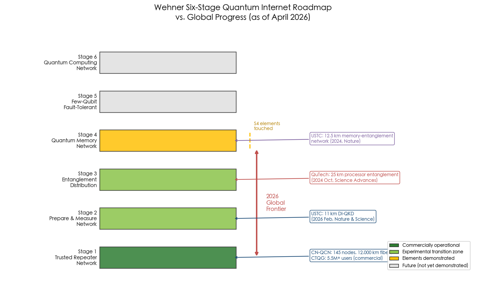

图 1-1 以六个功能性阶段为纵轴，标注了截至 2026 年 4 月全球代表性实验的阶段定位——CN-QCN 已在第一阶段实现商用运营，QuTech 25 km 处理器间纠缠对应第三阶段核心演示，中科大 12.5 km 存储纠缠网络触及第四阶段要素，清晰呈现当前全球量子网络发展的"前沿地图"。

## 1.3 核心技术栈：从物理平台到网络协议

量子网络的实现依赖一套垂直整合的技术栈，自底层物理平台至上层网络协议，每一层的技术选择均深刻影响网络的性能天花板与可扩展性。本节依次梳理物理平台、量子中继器、量子存储器和网络操作系统四个核心层次。

### 1.3.1 物理平台

量子网络节点的核心在于量子比特-光子接口——节点需要既能稳定存储量子信息、又能与光子产生高效纠缠的物理系统。当前全球研究覆盖七大主流物理平台，各具独特的优劣势组合与技术成熟度梯度。

**氮-空位色心（NV Center in Diamond）** 是量子网络实验积累最深厚的平台之一。NV 色心可在室温下保持超过 1 秒的相干时间，是 QuTech/Hanson 团队建成全球首个三节点纠缠网络（2021 年 Nature）和实现 25 km 城市间量子处理器纠缠（2024 年 Science Advances）的技术基础。然而，NV 色心的核心瓶颈在于极低的光子收集效率——零声子线（Zero-Phonon Line, ZPL）仅占总发射的约 3%，严重制约纠缠生成速率。2026 年 1 月，QuTech 通过腔增强技术将 NV 中心的有用光子收集概率从约 0.05% 提升至约 0.5%（10 倍），同时保持 T₂ > 100 μs 的相干时间，标志着该平台正在系统性地克服其核心瓶颈。[QuTech (2026)](https://qutech.nl/2026/01/15/more-photons-faster-links-a-laser-focused-nv-centre/ "Nature Communications 2026")

**硅-空位色心（SiV Center in Diamond）** 是 NV 色心的下一代替代方案，在光子效率方面具有显著优势。SiV 的 ZPL 发射率达 65-90%（远高于 NV 的 3%），且具有超过 100 的协作度参数（C_coh > 100），但需在稀释制冷温度（约 100 mK）下工作。Harvard/Lukin 团队于 2024 年在 Nature 报道了 35 km 波士顿部署光纤上 SiV 节点的电信波段纠缠分发，是迄今量子网络节点间最长的纠缠分发距离之一。[Ruf et al., J. Appl. Phys. 130, 070901 (2021)](https://pubs.aip.org/aip/jap/article/130/7/070901/1061464/Quantum-networks-based-on-color-centers-in-diamond "金刚石色心量子网络综述")

**离子阱（Trapped Ion）** 拥有所有平台中最长的量子存储相干时间记录。清华大学段路明团队于 2025 年演示了 Yb⁺ 多离子量子存储超过 2 小时的相干时间，同时离子阱具备高保真门操作能力，是量子计算领域最成熟的技术路线之一。在量子网络方向，中国科学技术大学潘建伟团队于 2026 年 2 月在 Nature 展示了 10 km 光纤上的离子-离子纠缠——纠缠存活时间首次超过纠缠建立时间——并成功实现设备无关 QKD 验证（10 km 正密钥率，101 km 渐近极限正密钥率），这一成果同时推动了 Wehner 路线图第二阶段的实验验证。离子阱的主要挑战在于其发射光子通常不在电信波段，需额外的频率转换环节。IonQ 于 2025 年 9 月实现了捕获钡离子光子到电信波长的频率转换，标志着产业界在解决该兼容性问题上取得重要进展。[Liu et al., Nature (2026)](https://www.nature.com/articles/s41586-026-10177-4 "DOI: 10.1038/s41586-026-10177-4")；[Quantum Zeitgeist](https://quantumzeitgeist.com/cryogenic-dual-ion-trap-extends-quantum-memory-coherence-beyond-two-hours/ "清华/HYQ 2025")；[IonQ](https://investors.ionq.com/news/news-details/2025/IonQ-Achieves-Significant-Quantum-Internet-Milestone-Demonstrates-Quantum-Frequency-Conversion-to-Telecom-Wavelengths/default.aspx "IonQ 2025年9月")

**中性原子（Neutral Atom）**，特别是 Yb-171 同位素，因其固有的电信波长兼容性和可并行化阵列架构而成为近年增长最迅速的量子网络候选平台。2025 年 10 月，伊利诺伊大学 Covey 团队在 Nature Physics 首次实现电信波长的并行原子-光子纠缠，展示了同时为多对通信方提供服务的能力——这一并行化特性是其他平台目前尚无法复现的。中性原子方向在 2026 年获得了重要的产业验证：Google Quantum AI 于 2026 年 3 月宣布在其超导量子比特路线之外增加中性原子模态，形成双轨量子路线图，为该技术方向注入了强烈的产业信号。[Li et al., Nature Physics (2025)](https://phys.org/news/2025-10-parallel-atom-photon-entanglement-paves.html "DOI: 10.1038/s41567-025-03022-4")；[The Quantum Insider](https://thequantuminsider.com/2026/03/24/google-paves-a-two-lane-quantum-roadmap-by-adding-neutral-atom-systems/ "Google 2026年3月")

**量子点（Quantum Dot）** 能够确定性地按需生成纠缠光子对，是光子量子网络的理想光源。2025 年 11-12 月，欧洲团队（Sapienza Rome/Sciarrino Lab 等）首次实现不同量子点之间的量子隐形传态（270 m 距离，保真度 82±1%），发表于 Nature Communications。2026 年 1 月，Stuttgart/Würzburg 团队展示了电信 C 波段量子点单光子源的双光子干涉可见度达约 92%，同样发表于 Nature Communications。最新研究（2026 年 4 月，Basel 大学 Marczak 等人）利用半导体量子点耦合可调谐微腔，实现了纠缠光子对保真度 98.1±0.5%（经时间分辨后选择），生成速率超过 0.5 Gpairs/s，将量子点光源的综合性能推向新高。[Phys.org](https://phys.org/news/2025-12-photon-teleportation-distant-quantum-dots.html "Nature Communications 2025")；[Uni Stuttgart](https://www.uni-stuttgart.de/en/university/news/all/Record-breaking-photons-at-telecom-wavelengths--on-demand/ "Nature Communications 2026")；[Quantum Zeitgeist](https://quantumzeitgeist.com/quantum-networks-photon-links/ "arXiv:2603.29971, 2026年4月")

**超导量子比特（Superconducting Qubit）** 拥有最快的门操作速度和最成熟的工业制造工艺，是 IBM、Google 等科技巨头量子计算路线的核心技术。然而，超导量子比特工作在微波频段（通常 5-10 GHz），与光纤通信所需的光学频段（约 200 THz）之间存在五个数量级的频率鸿沟，微波-光学转换（Microwave-to-Optical Transduction）构成其参与量子网络的根本性瓶颈。Princeton 大学于 2025 年 11 月实现 transmon 量子比特超过 1 ms 的相干时间（此前记录的约 3 倍），发表于 Nature。在转换效率方面，2025 年取得了两项重要进展：Caltech/Mirhosseini 团队在 Nature Nanotechnology 报道了基于硅纳米力学的量子微波-光学转换器，将上转换速率提升约两个数量级（100 倍）；Caltech/Faraon 团队在 Nature Physics 展示了基于 Yb-171 稀土离子的可扩展微波-光学转换器，在单光子水平实现了仅约 1 个光子的附加噪声。[Princeton](https://www.princeton.edu/news/2025/11/05/princeton-puts-quantum-computing-fast-track-new-qubit "Nature 2025")；[Zhao et al., Nature Nanotechnology (2025)](https://www.nature.com/articles/s41565-025-01874-8 "DOI: 10.1038/s41565-025-01874-8")；[Xie et al., Nature Physics (2025)](https://phys.org/news/2025-05-microwave-optical-transducer-rare-earth.html "DOI: 10.1038/s41567-025-02884-y")

**稀土铒掺杂晶体（Erbium-Doped Rare-Earth Crystal）** 是唯一已知在电信 C 波段（1536 nm）具有相干光学跃迁的固态系统，与现有光纤基础设施天然兼容，无需频率转换即可直接接入电信网络。UChicago/Zhong Lab 于 2025 年 11 月在 Nature Communications 报道，通过分子束外延（MBE）技术将铒原子的自旋相干时间从 0.1 ms 提升至超过 10 ms（最高 24 ms），理论上可支撑 2,000-4,000 km 的量子网络通信距离（约 200 倍提升）。该平台的主要挑战在于单离子控制与读出技术仍处于早期阶段，距离实用化网络节点尚存显著工程距离。[UChicago PME](https://pme.uchicago.edu/news/breakthrough-could-connect-quantum-computers-200x-distance "Nature Communications 2025")

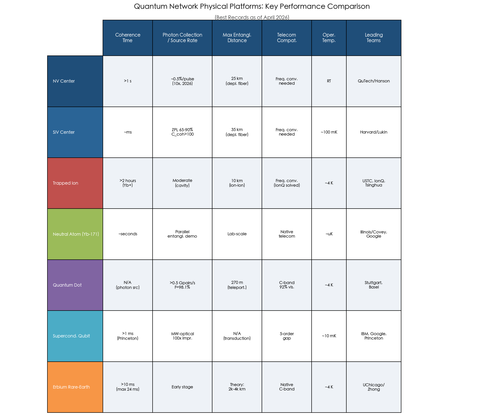

图 1-2 以矩阵形式对比了 NV 色心、SiV 色心、离子阱、中性原子（Yb-171）、量子点、超导量子比特和稀土铒掺杂晶体七大平台在相干时间、光子收集效率/光源速率、最远纠缠距离、电信波段兼容性、运行温度和代表团队六个维度的最佳记录（截至 2026 年 4 月），为读者提供各平台竞争格局与技术取舍的全景视图。

### 1.3.2 量子中继器与纠缠交换

量子中继器是量子网络从 QKD 架构向纠缠型架构跃迁的关键使能技术。光子在光纤中不可避免地衰减（每 km 约 0.2 dB），量子不可克隆定理又禁止直接放大量子信号，因此量子网络无法像经典网络那样通过信号放大器实现远距离通信。量子中继器通过纠缠交换（Entanglement Swapping）和纠缠纯化（Entanglement Purification）在中间节点"接力"纠缠态，实现远距离纠缠分发而无需端到端的直接光子传输。

USTC 潘建伟团队于 2026 年 2 月同时在 Nature 和 Science 发表的工作，展示了可扩展量子中继器的核心组件——基于陷俘离子的长寿命量子存储器，纠缠存活时间首次超过纠缠建立时间。这一里程碑意味着量子中继器正从原理验证阶段向工程化实现推进。[The Quantum Insider](https://thequantuminsider.com/2026/02/06/chinese-researchers-clear-hurdles-for-long-distance-quantum-networks/ "Nature & Science 论文")

### 1.3.3 量子存储器

量子存储器（Quantum Memory）是量子网络中连接光子信道与物质量子比特的桥梁，其核心指标包括存储寿命（决定网络同步窗口）、存储-读取效率和保真度。当前各平台的存储寿命记录横跨多个数量级：离子阱超过 2 小时（清华 Yb⁺，2025 年）、NV 色心超过 1 秒、铒原子超过 10 ms（UChicago，2025 年）。这一巨大差异直接决定了各平台所能支撑的网络规模与协议复杂度——例如，2 小时级存储寿命理论上可兼容全球尺度的纠缠分发协议，而 10 ms 级存储则将网络范围限制在城域至区域尺度。

Sorbonne/LKB Paris 的 Laurat 团队于 2025 年在 Science Advances 首次演示了集成量子存储层的密码协议，将量子存储器从实验室器件推向网络功能组件，标志着量子存储器在网络协议栈中角色的实质性转变。[Science Advances (2025)](https://www.science.org/doi/10.1126/sciadv.adx3223 "Quantum cryptography with memory")

### 1.3.4 量子网络操作系统

量子网络的软件层进展同样值得关注。QuTech/Wehner 团队于 2024 年创建了首个量子网络操作系统 QNodeOS，并于 2025 年 3 月在 Nature 正式发表。QNodeOS 是第一个全可编程的量子网络操作系统，能够在异构量子硬件上调度和执行网络量子协议。这一成果标志着量子网络发展范式的重要转折——从硬件驱动的逐案实验模式向软件定义的可编程网络模式过渡，类似于经典计算中从裸机编程到操作系统抽象层的演进。[QIA](https://quantuminternetalliance.org/2025/03/12/qia-researchers-create-first-operating-system-for-quantum-networks/ "QNodeOS Nature 2025")；[Nature](https://www.nature.com/articles/s41586-025-08704-w "QNodeOS 论文")

## 1.4 关键性能指标：衡量量子网络进展的标尺

评估量子网络的发展水平需要一组多维度的关键性能指标（Key Performance Indicators, KPIs）。以下梳理截至 2026 年 4 月各项核心指标的最佳记录，为后续章节的课题组横向比较提供定量基准。

### 1.4.1 通信与纠缠分发距离

通信距离是量子网络实用化的最直观衡量指标，也是公众和决策层最关注的进展标志。当前各类记录如下：

- **卫星 QKD 最远距离**：12,900 km（中国-南非，济南一号微卫星，2025 年 3 月 Nature）。[ScienceDaily](https://www.sciencedaily.com/releases/2025/03/250319142833.htm "DOI: 10.1038/s41586-025-08739-z")
- **光纤异构量子网络最远距离**：410 km（英国 Bristol-Cambridge，2025 年 4 月 OFC 会议）。[Phys.org](https://phys.org/news/2025-04-uk-distance-ultra-communication-quantum.html "UK quantum network")
- **量子处理器间最远纠缠分发**：25 km 部署光纤（QuTech NV 色心，2024 年 10 月 Science Advances）。[QuTech (2024)](https://qutech.nl/2024/10/30/a-rudimentary-quantum-network-link-between-dutch-cities/ "DOI: 10.1126/sciadv.adp6442")
- **离子-离子光纤纠缠**：10 km（USTC，2026 年 2 月 Nature）。[Liu et al., Nature (2026)](https://www.nature.com/articles/s41586-026-10177-4 "同上")
- **城域多节点存储纠缠**：12.5 km（中科大，2024 年 5 月 Nature）。[中国科学院](https://english.cas.cn/special-reports/Highlights_2024/202512/t20251219_1138401.shtml "同上")
- **设备无关 QKD**：11 km（USTC，2026 年初 Nature & Science）。[The Quantum Insider](https://thequantuminsider.com/2026/02/06/chinese-researchers-clear-hurdles-for-long-distance-quantum-networks/ "同上")

### 1.4.2 量子存储相干时间

量子存储相干时间决定网络可用的同步窗口和协议深度，是衡量量子网络可扩展性的核心指标之一：

- **离子阱**：>2 小时（清华 Yb⁺ 多离子存储，2025 年）
- **铒掺杂稀土晶体**：>10 ms / 最高 24 ms（UChicago MBE 铒原子，2025 年 11 月）
- **NV 色心**：>1 秒（传统体系）
- **超导量子比特**：>1 ms（Princeton transmon，2025 年 11 月）

### 1.4.3 光子收集效率与纠缠生成速率

光子收集效率直接决定纠缠生成速率，构成当前量子网络规模扩展的核心瓶颈之一：

- **NV 色心腔增强**：约 0.5%/脉冲（QuTech，2026 年 1 月，较此前 10 倍提升）
- **SiV 色心**：ZPL 发射率 65-90%，协作度参数 C_coh > 100
- **量子点**：纠缠光子对生成速率 >0.5 Gpairs/s（Basel 大学，2026 年 4 月）

### 1.4.4 微波-光学转换效率

该指标对超导量子比特参与量子网络具有决定性意义：

- **硅纳米力学转换器**：上转换速率较先前提升约 100 倍（Caltech/Mirhosseini，2025 年 Nature Nanotechnology）
- **Yb-171 稀土离子转换器**：单光子水平操作，约 1 个光子附加噪声（Caltech/Faraon，2025 年 Nature Physics）

尽管上述进展显著，微波-光学转换效率仍远未达到量子网络实用化所需的水平——通常要求转换效率超过 50% 且附加噪声低于 0.5 光子。超导平台参与量子网络仍面临根本性的技术挑战，这也是 Google 等企业选择同步布局中性原子路线的重要动因之一。

## 1.5 2025年4月至2026年4月：里程碑时间线

过去 12 个月是量子网络领域进展空前密集的时期，多项长期技术瓶颈取得实质性突破，突破密度在 2025 年 10 月至 2026 年 2 月间尤为集中。以下按时间顺序梳理关键里程碑事件。

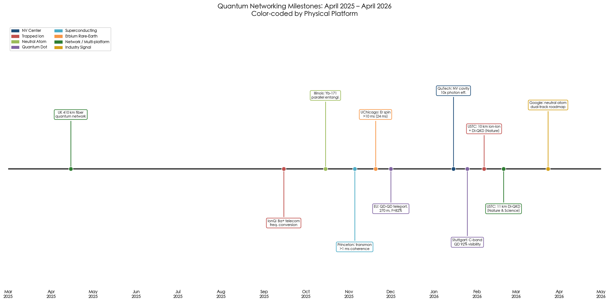

图 1-3 以水平时间轴呈现过去 12 个月的关键里程碑事件，按物理平台类别用颜色区分，直观显示出 2025 年下半年至 2026 年初技术突破的高密度集中态势。

**2025 年 4 月**：英国成功演示 Bristol-Cambridge 410 km 光纤异构量子网络，创下光纤量子通信的最远距离记录。[Phys.org](https://phys.org/news/2025-04-uk-distance-ultra-communication-quantum.html "UK quantum network")

**2025 年 9 月**：IonQ 实现捕获钡离子光子到电信波长的频率转换，解决了离子阱平台参与光纤量子网络的波长兼容性问题；同月，美国空军研究实验室（AFRL）接收 IonQ 交付的首台集成光子接口离子阱量子计算机。[IonQ](https://investors.ionq.com/news/news-details/2025/IonQ-Achieves-Significant-Quantum-Internet-Milestone-Demonstrates-Quantum-Frequency-Conversion-to-Telecom-Wavelengths/default.aspx "IonQ 2025年9月")

**2025 年 10 月**：伊利诺伊大学 Covey 团队在 Nature Physics 发表 Yb-171 中性原子阵列电信波长并行原子-光子纠缠成果，展示了中性原子平台在量子网络中独特的并行化优势。[Li et al., Nature Physics (2025)](https://phys.org/news/2025-10-parallel-atom-photon-entanglement-paves.html "DOI: 10.1038/s41567-025-03022-4")

**2025 年 11 月**：三项突破集中涌现。Princeton 大学实现 transmon 超导量子比特超过 1 ms 相干时间（此前记录约 3 倍），发表于 Nature；UChicago 将铒原子自旋相干时间提升至超过 10 ms（最高 24 ms），发表于 Nature Communications；欧洲团队首次实现不同量子点之间的量子隐形传态（270 m，保真度 82±1%），发表于 Nature Communications。

**2026 年 1 月**：QuTech 通过腔增强技术将 NV 色心光子收集效率提升 10 倍（发表于 Nature Communications）；Stuttgart/Würzburg 团队展示电信 C 波段量子点单光子源 92% 双光子干涉可见度（发表于 Nature Communications）。

**2026 年 2 月**：USTC 潘建伟团队同时在 Nature 和 Science 发表两项里程碑式突破——10 km 离子-离子纠缠结合设备无关 QKD 验证，以及 11 km 设备无关 QKD 正密钥率实现。同月，牛津大学启动"分布式安全量子计算"项目，与东京大学联合获 EPSRC/JST 资助，着手构建 UK-Japan 量子互联网基础。[Oxford](https://www.ox.ac.uk/news/2026-02-03-new-project-aims-build-foundations-quantum-internet "Oxford 2026")

**2026 年 3 月**：Google Quantum AI 宣布在超导量子比特路线之外增加中性原子模态，形成双轨量子路线图。这一战略转向为中性原子量子网络方向注入了重大产业信号，表明头部科技企业对中性原子平台在量子网络中应用前景的认可。[The Quantum Insider](https://thequantuminsider.com/2026/03/24/google-paves-a-two-lane-quantum-roadmap-by-adding-neutral-atom-systems/ "Google 2026年3月")

## 1.6 技术全景与发展态势研判

综合上述分析，我们认为量子网络领域在 2025-2026 年间呈现以下五个结构性趋势：

**第一，从单/双节点演示向多节点网络推进。** QuTech 于 2021 年实现的三节点纠缠网络至今仍为世界纪录。然而，SCY-QNet（Stony Brook/Columbia/Yale/BNL 联合的 10 节点广域网络原型）和 IBM-Cisco 合作（目标在 2030 年代初实现分布式容错量子计算机网络概念验证）等项目的推进，预示着节点数量的规模化扩展将成为未来 12-18 个月的核心竞争赛道。

**第二，电信波段兼容性成为刚性约束。** 几乎所有主流平台——NV 色心、离子阱、中性原子、量子点——均在系统性地解决与 1350-1550 nm 电信窗口的兼容性问题。Yb-171 中性原子和铒掺杂晶体因其天然的电信波段兼容性而在技术路线竞争中获得结构性优势。

**第三，腔增强成为共识性技术路径。** QuTech/Hanson（NV 色心腔增强）、MPQ/Rempe（Rb 原子光学腔）、Innsbruck/Northup-Lanyon（离子阱光腔耦合）等全球领先团队均已转向腔增强方案，以突破光子收集效率这一量子网络扩展的核心瓶颈。

**第四，量子网络应用场景正从单一密钥分发向多元化扩展。** Harvard/Lukin 团队的盲量子计算（2025 年 Science）和纠缠辅助天文干涉术（2026 年 Nature），USTC 的设备无关 QKD（2026 年 Nature & Science）等工作，展示了纠缠型量子网络在安全计算、精密测量和增强通信安全等多个方向的应用潜力，预计将吸引更多领域的研究者和资源进入。

**第五，学术与产业双轨加速推进。** IonQ（约 400 项量子网络专利、NYSE 上市）、Delft Networks（2024 年创立）、QuEra（2025 年 2 月完成 2.3 亿美元融资）、Welinq（2026 年 1 月完成首个商业交付）等企业的涌现，标志着量子网络正从纯学术研究向技术产业化的早期阶段过渡。风险资本和战略投资者的进入，将为技术成熟度的跨越提供必要的工程化资源。

量子网络领域正处于从原理验证到工程化示范的关键转折期。未来 12-18 个月内，首个四节点以上纠缠量子网络、多跳量子中继器串联以及 1%/脉冲以上光子收集效率突破等里程碑，将是检验该领域能否按路线图时间表推进的关键试金石。

# 第2章 全球量子网络研究生态与资助格局

量子网络从实验室概念走向大规模工程验证，离不开各国政府、国际组织和产业界在资金、政策与组织架构层面的持续投入。截至 2026 年 4 月，全球主要经济体均已将量子网络纳入国家科技战略，但在投资规模、组织模式、军方参与程度和产业生态成熟度等维度呈现显著差异。本章从政策环境、资金投入和组织架构三个层面，对美国、欧盟、中国、英国、日本及其他主要经济体的量子网络研究生态进行系统梳理与横向比较，旨在为后续章节的课题组画像和评估框架奠定宏观背景。

## 2.1 美国：多机构协同的联邦资助体系

美国是全球量子信息科学（Quantum Information Science, QIS）公共投资规模最大、组织架构最复杂的国家。联邦政府通过 2018 年《国家量子倡议法》（National Quantum Initiative Act, NQI）确立了跨部门协调机制，由白宫科技政策办公室（OSTP）下设的国家量子协调办公室统筹。

### 2.1.1 联邦投资规模与趋势

联邦 QIS 研发总支出从 FY2019 的 4.56 亿美元快速增长至 FY2022 的 10.41 亿美元高点，此后维持在年均约 10 亿美元水平，FY2025 总统预算请求为 9.98 亿美元。[NQI FY2025 年度报告](https://www.quantum.gov/wp-content/uploads/2024/12/NQI-Annual-Report-FY2025.pdf "National Quantum Initiative Supplement to the President's FY 2025 Budget") 在 NQI 确定的五大项目领域中，"量子网络"（QNET）独占一席，标志着该方向在国家战略层面获得独立地位，区别于量子计算、量子传感等并行方向。

NQI 重新授权进程同样值得关注。2026 年 1 月 8 日，两党参议员联合提出《国家量子倡议重新授权法案》（S.3597），拟将 NQI 授权延长至 2034 年，新增 NASA 量子研发授权、NIST 量子中心及量子人才协调中心等条款，IBM、Microsoft、Google、IonQ 等主要产业参与方已公开表示支持。[Quantum Computing Report](https://quantumcomputingreport.com/senators-introduce-bipartisan-national-quantum-initiative-reauthorization-act-of-2026/ "NQI 重新授权法案 2026 年 1 月") 该法案若获通过，将为美国量子网络研究提供至少八年的政策确定性。

### 2.1.2 能源部（DOE）：国家实验室主导的量子网络基础设施

DOE 是美国量子网络研究最重要的资助机构之一。2025 年 11 月，DOE 宣布以 6.25 亿美元续期五个国家量子信息科学研究中心（NQISRCs），期限最长 5 年。其中，Q-NEXT（阿贡国家实验室，主任 David Awschalom）和 SQMS（费米国家加速器实验室）与量子网络技术关系最为直接——Q-NEXT 获得约 1.25 亿美元/5 年续期资助，聚焦量子互联和固态缺陷量子网络节点研发。[美国能源部官方公告](https://www.energy.gov/articles/energy-department-announces-625-million-advance-next-phase-national-quantum-information "DOE 6.25 亿美元续期公告, 2025 年 11 月")

DOE 还通过多个专项持续投入量子相关研究：4,500 万美元量子计算加速研究、7,000 万美元 QIS 赋能高能物理发现（5 年周期）、6,500 万美元量子计算研究（覆盖 10 个项目/38 个子奖励）。[NQI FY2025 年度报告](https://www.quantum.gov/wp-content/uploads/2024/12/NQI-Annual-Report-FY2025.pdf "DOE QIS R&D 章节") 这些资金虽非全部直接面向量子网络，但为量子网络所依赖的底层技术——如量子存储器、光子接口和量子纠错——提供了关键支撑。

### 2.1.3 国家科学基金会（NSF）：多层次竞争性资助

NSF 通过多层次机制支持量子网络研究。旗舰项目为量子领先挑战研究所（QLCI），共资助 5 所研究所，其中量子网络中心 CQN ERC（Center for Quantum Networks）由哈佛大学和 MIT 联合领导，总资助额约 3,240 万美元（2020—2026 年），是美国学术界规模最大的量子网络专项资助之一。[Dimensions](https://app.dimensions.ai/details/grant/grant.9381310 "CQN $32.4M, 2020-2026") 此外，NSF 设立了国家量子虚拟实验室（NQVL）支持跨机构量子网络原型建设，ExpandQISE 项目（9,900 万美元/56 个项目）旨在扩大量子研究参与基础，NQN 项目（2,000 万美元）提供纳米加工设施。[NQI FY2025 年度报告](https://www.quantum.gov/wp-content/uploads/2024/12/NQI-Annual-Report-FY2025.pdf "NSF QIS R&D Programs 章节")

CQN ERC 将于 2026 年到期，续期结果将直接影响 Harvard/Lukin 和 MIT/Englund 两个顶尖量子网络课题组的研究资源配置，是近期值得密切关注的政策节点。

### 2.1.4 国防部（DOD）：军方深度参与

美国国防部在量子技术领域拥有超过 30 年的持续投入历史，通过 DARPA、AFRL（空军研究实验室）和 ARO（陆军研究办公室）等多渠道实施资助。DARPA 于 2024 年启动量子基准倡议（Quantum Benchmarking Initiative, QBI），遴选 18 家公司参与第一阶段（Stage A），2025 年 11 月进一步遴选 11 家进入第二阶段（Stage B）。同年，DARPA 与新墨西哥州签署最高 6,000 万美元的匹配框架协议以推进量子计算研究。[NQI FY2025 年度报告](https://www.quantum.gov/wp-content/uploads/2024/12/NQI-Annual-Report-FY2025.pdf "DOD QIS R&D 章节")；[DARPA](https://www.darpa.mil/news/2025/darpa-new-mexico-establish-framework-advance-quantum-computing "DARPA-新墨西哥州协议 2025")

AFRL 在量子网络领域的角色尤为突出。该机构已向 IonQ 交付首台集成光子接口的离子阱量子计算机，并累计授予 IonQ 总额超过 7,560 万美元的合同（含 5,450 万美元和 2,110 万美元两笔主要合同），使其成为量子网络硬件军方采购的标杆案例。[IonQ 投资者关系](https://investors.ionq.com/news/news-details/2025/IonQ-Achieves-Significant-Quantum-Internet-Milestone-Demonstrates-Quantum-Frequency-Conversion-to-Telecom-Wavelengths/default.aspx "IonQ 2025 年 9 月") DARPA 2026 财年总预算为 49 亿美元，较 2025 年增长 12%，量子列为重点投入方向之一。

### 2.1.5 美国体系特点

综合来看，美国量子网络资助体系呈现三个结构性特征。其一，多机构竞争性资助格局——DOE、NSF、DOD 各有侧重但存在交叉，课题组往往同时获得多源资助，既保障了资金充裕度，也带来了一定的协调成本。其二，国家实验室与大学深度绑定——Q-NEXT 以阿贡实验室为枢纽联结芝加哥大学和多个国家实验室，CQN 以哈佛-MIT 轴心辐射波士顿量子网络测试床，形成学术-设施一体化的研发集群。其三，军方角色系统化——DOD 不仅提供资金，还通过 AFRL 直接参与硬件采购与测试，从基础研究到装备应用形成全链条覆盖。

## 2.2 欧盟：量子旗舰与量子互联网联盟

欧盟的量子网络研究以"量子旗舰计划"（Quantum Flagship）为核心框架，辅以 EuroQCI 基础设施倡议和各成员国国家计划，形成超国家协调与成员国自主投资相叠加的多层资助体系。

### 2.2.1 量子旗舰计划与 QIA

量子旗舰计划于 2018 年启动，总预算 10 亿欧元/10 年，是欧盟有史以来最大的量子技术专项投入。在量子网络方向，最核心的项目为量子互联网联盟（Quantum Internet Alliance, QIA）。QIA 第一阶段（2022 年 10 月—2026 年 3 月）通过 Horizon Europe 获得 2,400 万欧元资助（Grant 101102140），此前在 Horizon 2020 框架下已获约 1,000 万欧元。[CORDIS](https://cordis.europa.eu/project/id/101102140/reporting "QIA Phase 1 Grant €24M")；[QIA 项目页](https://quantuminternetalliance.org/projects/ "Quantum Flagship €1B/10yr")

QIA 由 TU Delft/QuTech 的 Ronald Hanson 担任协调人，联合 Innsbruck、MPQ Garching、ICFO Barcelona、Sorbonne/LKB Paris 等欧洲顶尖量子网络课题组，形成覆盖 NV 色心、离子阱-光腔、稀土离子、冷原子量子存储等多技术路线的协同研发网络。QIA 第一阶段已于 2026 年 3 月结束，Phase 2 的具体资助规模和时间表截至 2026 年 4 月尚未正式公布——这是决定欧洲量子网络研究未来走向的关键变量。2026 年 2 月，QIA 与 QuIC 宣布合作推动量子互联网的产业化进程，表明联盟已开始为技术转化铺路。[QIA-QuIC 合作公告](https://quantuminternetalliance.org/2026/02/24/qia-partners-with-quic-to-advance-industrialisation-of-the-quantum-internet-at-q-expo/ "QIA & QuIC 合作 2026 年 2 月")

### 2.2.2 EuroQCI：从试点走向运营

EuroQCI（European Quantum Communication Infrastructure）是欧盟 27 个成员国共同签署的全欧量子安全通信基础设施倡议，旨在构建覆盖全欧的量子密钥分发网络。该项目包含光纤地面段和卫星空间段两个组成部分。地面段第一实施阶段（2023—2025 年）由 Digital Europe Programme 资助，涵盖工业项目、国家量子通信网络建设及 PETRUS 协调支撑行动。空间段方面，ESA 开发的原型卫星 Eagle-1 预计于 2025 年底至 2026 年初发射。EuroQCI 的运营活动计划自 2026 年起在欧盟委员会联合研究中心（JRC，Ispra）启动，标志该倡议从建设阶段向运营阶段的过渡。[Think WIoT](https://wiot-group.com/think/en/news/think-wiot-euroqci-2026-quantum-secure-communications/ "EuroQCI 2026 运营展望")

### 2.2.3 欧盟整体投资水平

据 CEPS 2026 年 3 月评估，欧盟层面已向量子项目投资约 20 亿欧元，成员国另承诺额外约 90 亿欧元，合计约 110 亿欧元，使欧洲位居全球三大量子公共投资体之一。[CEPS](https://www.ceps.eu/the-eu-should-create-a-quantum-sovereign-fund/ "CEPS: The EU should create a Quantum Sovereign Fund, 2026 年 3 月") 2025 年 7 月，欧盟委员会发布《量子欧洲战略》（COM(2025) 363），为量子技术的中长期发展提供政策框架；预期 2026 年出台的《欧洲量子法案》（Quantum Act）将进一步锁定长期资金与协调机制。[欧盟量子欧洲战略](https://qt.eu/media/pdf/Quantum_Europe_Strategy_July_2025.pdf "Quantum Europe Strategy, July 2025")

CEPS 同时指出欧洲量子生态的结构性弱点：科学产出强劲——约 36% 的全球量子公司和初创企业注册在欧洲——但从实验室到产业规模化的转化能力不足，多数有前景的初创企业停留在早期融资阶段，缺乏耐心资本和明确的需求信号来支撑规模化发展。这一"科学领先、产业滞后"的结构性矛盾，是理解欧洲量子网络课题组生态的重要背景。

## 2.3 中国：国家战略驱动的垂直整合

中国在量子网络领域采取国家主导、垂直整合的发展模式，从基础研究到基础设施部署形成了完整的技术-产业链条。

### 2.3.1 投资规模

据 CSIS 2026 年 1 月报告，中国政府累计量子投资估计约 150 亿美元，但该数据未经中国官方确认。[CSIS 报告](https://www.csis.org/analysis/understanding-chinas-quest-quantum-advancement "CSIS, 2026 年 1 月") 2025 年 3 月，中国宣布设立国家创业引导基金近 1 万亿元人民币（约 1,380 亿美元），量子技术被列为重点支持领域。需要指出的是，上述投资规模覆盖量子计算、量子通信和量子传感等全部方向，量子网络子领域的具体分拆金额不可得——这是中国量子资助数据透明度不足的典型表现。ITIF 2024 年的评估亦指出，中国量子研究经费"仍然模糊"，国际合作论文比例仅约 19%（相比之下美国约 50%），信息透明度构成评估中国课题组时的固有局限。[ITIF 2024](https://itif.org/publications/2024/09/09/how-innovative-is-china-in-quantum/ "How Innovative Is China in Quantum?")

### 2.3.2 基础设施部署

中国已建成全球规模最大的量子通信网络——中国国家量子通信网络（CN-QCN），包含 145 个光纤节点、6 个地面站、20 个城域网，覆盖 17 个省 80 个城市，光纤总长超过 12,000 公里。该网络以中科院-国盾量子链条为核心，中国电信量子集团（CTQG）已成为国盾量子控股股东，QKD 服务覆盖 550 万以上用户。[CSIS 报告](https://www.csis.org/analysis/understanding-chinas-quest-quantum-advancement "同上") 这一部署规模在全球范围内无出其右，但须注意 CN-QCN 以可信中继 QKD 为主，与基于纠缠分发的量子互联网在技术层级上存在本质差异。

### 2.3.3 组织模式

中国量子网络研究呈现显著的"学术-产业一体化"特征：中科院（尤其是中国科学技术大学）承担核心基础研究，通过国盾量子（QuantumCTek）实现产业转化，中国电信量子集团负责大规模网络运营。资助来源涵盖科技部重大科研项目、国家自然科学基金委重大项目、中科院先导专项以及安徽省量子基金等多渠道。这种垂直整合模式的优势在于能够快速推进从原理验证到基础设施部署的全链条转化，劣势则在于国际合作相对封闭、数据透明度受限，且技术路线集中度高，在纠缠型量子网络等前沿方向的多样性探索不及西方体系。

## 2.4 英国：新一轮加速投资

英国量子网络研究在 2025—2026 年间经历了显著的资助加速，从资金规模到组织架构均实现跨越式升级。

### 2.4.1 IQN Hub

2025 年 4 月，英国启动综合量子网络中心（Integrated Quantum Networks Hub, IQN Hub），由 Heriot-Watt 大学牵头，获得 EPSRC 2,200 万英镑资助，加上行业配套投入合计超过 4,200 万英镑。该中心联合 13 所大学、2 个国家实验室和 40 余个产业伙伴，研究范围覆盖量子密钥分发、量子中继器和量子互联网等方向。[Heriot-Watt](https://www.hw.ac.uk/news/2025/new-uk-quantum-hub-launches-to-pioneer-secure-networks-and-advance-the-quantum-internet "IQN Hub 2025 年 4 月") 尤为值得关注的是，GCHQ（政府通信总部）、NCSC（国家网络安全中心）和 Dstl（国防科技实验室）等国防安全机构均参与 IQN Hub，体现了英国将量子网络与国家安全战略深度绑定的政策取向。

### 2.4.2 20 亿英镑量子投资计划

2026 年 3 月，英国宣布总额 20 亿英镑的量子投资计划，其中 1.25 亿英镑专门划拨量子网络方向。此前英国累计公共量子投资已超过 10 亿英镑，新计划使公共投资总量达到约 35 亿英镑。[The Quantum Insider](https://thequantuminsider.com/2026/03/17/uk-pledges-2-billion-for-quantum-innovation/ "UK £2B 量子投资, 2026 年 3 月") 1.25 亿英镑量子网络专项的具体分配方案预计 2026 年下半年明确，其分配方向——是侧重 QKD 基础设施还是纠缠型网络基础研究——将成为英国量子网络研究格局演变的关键节点。

### 2.4.3 国际合作

2026 年 2 月，牛津大学 David Lucas 组获得 EPSRC 450 万英镑联合资助，领导 UK-Japan"分布式安全量子计算"项目，与东京大学 Mio Murao 组合作。[Oxford](https://www.ox.ac.uk/news/2026-02-03-new-project-aims-build-foundations-quantum-internet "UK-Japan 项目 2026") 这一合作模式表明英国正通过双边科研项目系统性拓展量子网络的国际合作网络，弥补脱欧后在 Horizon Europe 框架内参与受限的影响。

## 2.5 日本：Moonshot 与大规模补充预算

日本量子网络研究的资助体系以 JST（日本科学技术振兴机构）Moonshot 计划和 Q-LEAP 计划为基础框架，近期获得大幅预算增量。2025 年 11 月，日本补充预算拨付约 1,300 亿日元（约 8.55 亿美元）用于量子技术，其中 1,004 亿日元专门用于 AIST（产业技术综合研究所）研发基地建设。叠加此前 Moonshot 计划（150—200 亿日元）、Q-LEAP 计划及 1.05 万亿日元芯片与量子计算专项，日本的量子公共投资总量已跻身全球前列。[The Quantum Insider](https://thequantuminsider.com/2025/11/28/japan-channels-almost-900-million-u-s-into-quantum-push/ "Japan $900M quantum push, 2025 年 11 月")

在量子网络方向，NTT 作为企业研发主力发挥着核心作用。2025 年 1 月，NTT 实现 60 GHz 光学量子纠缠实时生成（世界最快速率），并与东京大学合作开发 IOWN 光量子网络架构。日本量子网络研发的突出特色在于企业与国家计划的深度耦合——NTT 同时承接 JST Moonshot 项目资助和自有企业研发投入，模糊了公共资助与企业研发的边界。

## 2.6 其他主要经济体

除上述五大经济体外，韩国、新加坡、加拿大、荷兰、德国和澳大利亚在量子网络领域亦投入了相当规模的公共资源，各具特色。

### 2.6.1 韩国

韩国发布国家量子战略，计划到 2035 年投资 3 万亿韩元（约 23 亿美元），目标成为全球量子芯片制造领导者并培养 1 万名量子人才。2025 年成立量子战略委员会（公私合作机构），并确认 6,454 亿韩元"量子旗舰"计划用于开发千量子比特级量子计算系统。[The Quantum Insider](https://thequantuminsider.com/2026/03/26/leading-quantum-computing-countries/ "Leading Quantum Computing Countries 2026")；[Qureca](https://www.qureca.com/quantum-initiatives-worldwide/ "Quantum Initiatives Worldwide 2025") 韩国在量子网络方向的侧重点目前以 QKD 商用部署为主，纠缠型网络基础研究尚处起步阶段。

### 2.6.2 新加坡

新加坡通过国家量子战略投入近 3 亿新元，另有 1 亿新元专项用于金融领域量子安全。新加坡国立大学量子技术中心（CQT）是核心研究机构，其中 Alexander Ling 组聚焦卫星量子通信（SpooQy-1 纳米卫星已实现轨道量子纠缠光子源演示）。[Qureca](https://www.qureca.com/quantum-initiatives-worldwide/ "同上") 新加坡作为小型经济体，其量子投资密度和政策聚焦度在亚太地区具有示范意义。

### 2.6.3 加拿大

加拿大国家量子战略投入 3.6 亿加元，累计公共量子投资超过 10 亿加元。Perimeter 研究所和滑铁卢大学量子计算研究所（IQC）是核心学术机构。产业化方面，量子光子学公司 Xanadu 于 2026 年通过 SPAC 上市，标志加拿大量子产业化进入资本市场新阶段。[Qureca](https://www.qureca.com/quantum-initiatives-worldwide/ "同上")

### 2.6.4 荷兰

荷兰通过 Quantum Delta NL 国家成长基金投入 6.15 亿欧元，另有 1.35 亿欧元专项资助 QuTech（TU Delft 与 TNO 联合机构）。这一集中式投资使荷兰的人均量子投资强度位居全球前列。QuTech 已成为欧洲乃至全球量子网络研究的核心节点——Ronald Hanson 组在此基础上实现了多项里程碑级实验突破（详见后续章节）。[Qureca](https://www.qureca.com/quantum-initiatives-worldwide/ "同上")

### 2.6.5 德国

德国量子行动计划总额达 30 亿欧元，涵盖量子计算、通信和传感三大方向。Munich Quantum Valley、MCQST 卓越集群和 DFG 资助的多个卓越集群为 MPQ/Rempe、LMU/Weinfurter、TUM/Reiserer 等在量子网络领域具有国际影响力的课题组提供了持续的经费支撑。[Qureca](https://www.qureca.com/quantum-initiatives-worldwide/ "同上")

### 2.6.6 澳大利亚

截至 2024 年 1 月，澳大利亚累计量子投资达 8.93 亿澳元。悉尼大学和新南威尔士大学是主要研究基地，Ping Koy Lam（现已转至新加坡 A*STAR）等研究者在连续变量量子通信方向积累深厚。[Qureca](https://www.qureca.com/quantum-initiatives-worldwide/ "同上") 澳大利亚的量子网络研究虽体量有限，但在特定技术路线上保持了国际竞争力。

## 2.7 军方角色比较

军方在量子网络研究中的参与程度因国家体制和安全战略不同而差异显著，但总体趋势是军事需求对量子网络研发的驱动力日益增强。

**美国**拥有最系统化的军方量子投入。DOD 超过 30 年的持续资助历史覆盖三个层次：DARPA 负责战略性前沿项目、AFRL 主导量子网络硬件采购与测试、ARO 支持基础研究。AFRL 直接向 IonQ 等企业采购集成光子接口的量子网络硬件，体现了从基础研究到装备应用的全链条参与模式。[NQI FY2025 年度报告](https://www.quantum.gov/wp-content/uploads/2024/12/NQI-Annual-Report-FY2025.pdf "DOD 章节")

**中国**的量子通信投资在相当程度上受国防和安全需求驱动。CN-QCN 骨干网络的设计明确覆盖军事通信和政务安全通信场景，但具体军方项目的金额和参与方式缺乏公开可得的信息。

**欧洲**方面，EuroQCI 本身即带有战略安全属性——保护欧盟机密信息和关键基础设施是其核心目标之一。英国的 IQN Hub 明确纳入 GCHQ、NCSC 和 Dstl 作为合作方，将量子网络研究与国家安全需求直接关联，这一模式在欧洲国家中最为鲜明。

## 2.8 产业界参与格局

产业界在量子网络领域的参与正从外围投资转向核心研发合作，2025—2026 年间出现了多个标志性事件。

**IBM-Cisco 合作**构成当前产业界最大规模的量子网络联盟。2025 年 11 月，IBM 与 Cisco 宣布合作构建分布式容错量子计算机网络，Cisco 负责开发"量子数据中心"架构，目标在 2030 年代初实现概念验证。[IBM 新闻室](https://newsroom.ibm.com/2025-11-20-ibm-and-cisco-announce-plans-to-build-a-network-of-large-scale,-fault-tolerant-quantum-computers "IBM-Cisco 2025 年 11 月") 这一合作的意义在于，传统网络基础设施巨头首次以战略级承诺进入量子网络赛道。

**Cisco 的战略投资布局**进一步延伸：Cisco 投资了室温量子网络初创公司 Qunnect，标志传统网络巨头对量子网络技术路线的多元押注。[CRN](https://www.crn.com/news/networking/2025/cisco-reveals-history-making-investment-in-quantum-networking-upstart-qunnect "Cisco-Qunnect 2025")

**初创企业融资加速。** Nu Quantum 完成 6,000 万美元融资（纠缠织物技术），QuEra（Harvard/Lukin 组衍生）完成 2.3 亿美元融资（2025 年 2 月），IonQ 量子网络专利组合已达约 400 项（含 Qubitekk 和 IDQ 约 250 项），专利总数突破 1,000 项。[IonQ 投资者关系](https://investors.ionq.com/news/news-details/2025/IonQ-Expands-Quantum-Networking-Patent-Portfolio-to-Meet-Strong-Market-Demand-for-Secure-Communications/default.aspx "IonQ 专利 2025 年 8 月")

**学术衍生企业**亦在加速涌现。Hanson 组于 2024 年创立 Delft Networks 公司；Laurat 组联合创立的 Welinq 于 2026 年 1 月完成 QDrive 量子存储器首个商业交付（斯洛伐克科学院，skQCI 项目），标志 EuroQCI 从规划阶段向硬件部署的实质性转型。[The Quantum Insider](https://thequantuminsider.com/2026/01/14/welinq-qdrive-sale-slovak-academy/ "Welinq 首次商业交付 2026")

2026 年量子公司上市潮进一步加速了产业化进程：Xanadu、Horizon、Infleqtion 等公司相继通过 SPAC 上市，IonQ 于 2026 年 3 月在剑桥设立创新中心。产业叙事正从"科学项目"转向"商业化轨迹"，但须审慎看待——多数上市公司尚未实现盈利，量子网络产品的商业市场仍处于形成初期。

## 2.9 四种组织模式比较

从全球视角归纳，量子网络研究呈现四种典型组织模式，各有结构性优势与局限（图 2-1）。

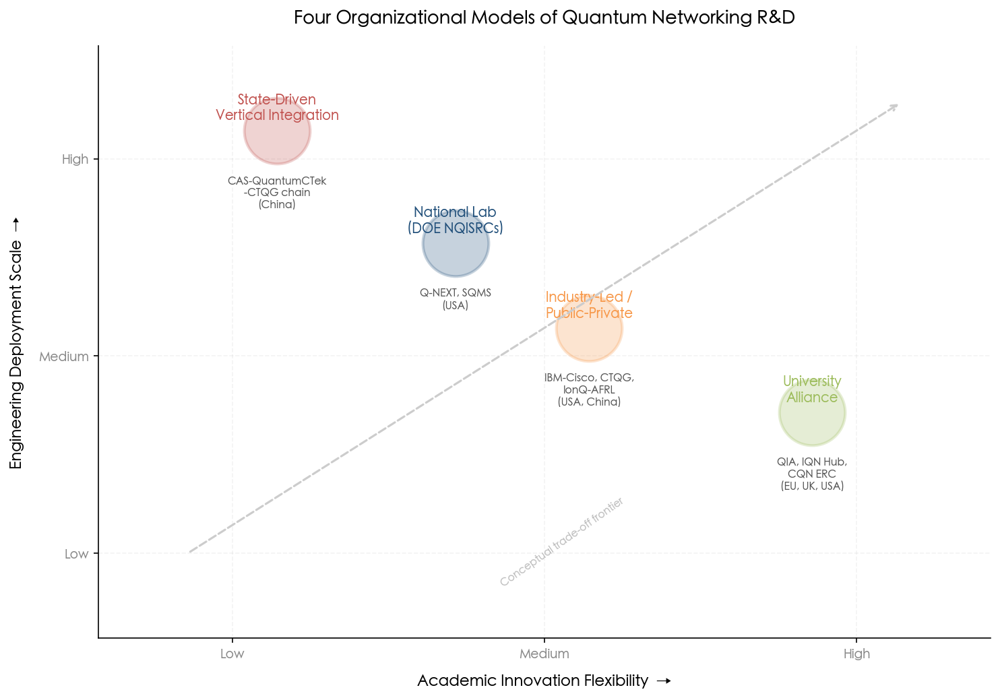

**图 2-1 四种量子网络研发组织模式定位矩阵。** 横轴为学术创新灵活性，纵轴为工程部署规模，虚线表示概念性权衡边界。各模式代表性机构/项目标注于对应象限。

**模式一：国家实验室主导（美国 DOE 体系）。** 以 DOE 旗下五个 NQISRCs 为核心，国家实验室提供大型共享设施和长期稳定资助。优势在于基础设施规模和跨学科整合能力突出，局限在于决策链条较长，与产业界的技术转化效率偏低。

**模式二：大学联盟（欧洲 QIA / 英国 IQN Hub）。** 由顶尖大学课题组通过竞争性项目联合组建，在保持学术自主性的同时共享关键技术。优势在于灵活性和学术创新活力，局限在于联盟协调成本高、基础设施资源分散。

**模式三：企业主导/公私合作（IBM-Cisco、CTQG）。** 产业巨头以自有研发投入叠加政府合同为驱动力，直接面向产品化目标。优势在于工程化能力和市场导向明确，局限在于基础研究深度和技术路线灵活性不足。

**模式四：国家战略垂直整合（中国中科院→国盾量子全链条）。** 从基础研究到设备制造到网络运营由统一体系管控。优势在于全链条推进速度极快——中国在 QKD 网络部署规模上的全球领先地位是这一模式效能的直接证明；局限在于国际合作封闭和信息透明度不足。

上述四种模式并非互相排斥。美国体系同时包含模式一和模式三的要素（DOE 国家实验室与 AFRL-IonQ 合同并行），欧洲体系则在模式二的基础上叠加了 EuroQCI 这一准基础设施模式。我们认为，未来量子网络从实验室走向大规模部署，可能需要将学术创新的灵活性与国家基础设施投资的规模效应有效结合——任何单一模式都难以独立完成这一跨越。

## 2.10 小结：资助格局的关键观察

图 2-2 以统一美元口径对比了 11 个国家/地区的累计或已公布量子技术公共投资总额。中国（约 150 亿美元）、欧盟及成员国（约 121 亿美元）和美国（约 70 亿美元）位列前三梯队，英国、德国、韩国构成第二梯队，日本、荷兰、加拿大、澳大利亚和新加坡紧随其后。

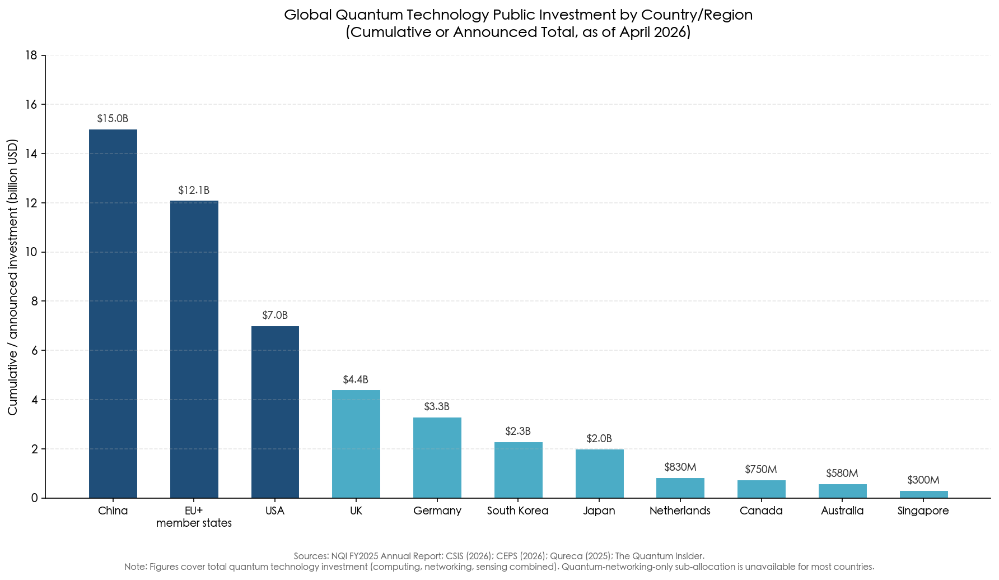

**图 2-2 全球量子技术公共投资规模对比（截至 2026 年 4 月，单位：十亿美元）。** 数据覆盖量子计算、通信、传感全领域，量子网络子方向的专项分拆对多数国家不可得。数据来源：NQI FY2025 年度报告、CSIS (2026)、CEPS (2026)、Qureca (2025)、The Quantum Insider。

基于上述全景式梳理，我们提炼出四项核心观察：

第一，全球量子网络公共投资已进入"第二波"加速期。美国 DOE 6.25 亿美元 NQISRCs 续期、英国 20 亿英镑新计划、日本 1,300 亿日元补充预算、韩国 3 万亿韩元战略等重大资助决策均在 2025—2026 年间密集发布，投资密度和政策决心显著超越第一波（2018—2022 年）。

第二，投资规模与技术突破并非简单正相关。后续章节的横向比较将进一步论证：超过约 1,000 万美元/年的年度资助水平后，课题组的技术突破更多取决于研究聚焦度和团队能力而非资金总量。Q-NEXT 获得 1.25 亿美元/5 年的巨额资助，但其直接量子网络实验产出在顶尖课题组中并不突出；而 MPQ/Rempe 组以中等经费规模实现了高密度顶刊产出。

第三，政策周期性是课题组研究资源的关键变量。如图 2-3 所示，NSF CQN ERC 2026 年到期、QIA Phase 2 规模未定、NQI 重新授权尚在立法进程中——这些政策节点在未来 6—12 个月内的走向将直接影响多个顶尖课题组的资源禀赋和研究方向。

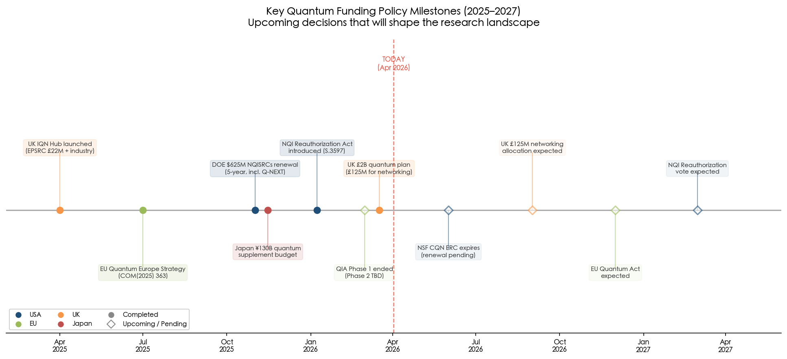

**图 2-3 2025—2027 年关键量子资助政策时间线。** 圆形标记为已完成事件，菱形标记为待决事件。红色虚线标注当前时间点（2026 年 4 月），直观呈现未来 6—12 个月的政策不确定性窗口。

第四，中国与西方在透明度和合作模式上的结构性差异使得公平横向比较面临固有挑战。中国课题组的经费规模可能被低估或高估，国际合作论文比例显著偏低（约 19% 对比美国约 50%），这些因素将在后续章节的评估框架设计中予以明确标注和权重调整。

# 第3章 全球主要量子网络课题组全景扫描

量子网络研究是一个高度集中、由少数顶尖课题组主导的前沿领域。截至2026年4月，全球在该方向具有实质性贡献的独立课题组不超过40个，核心突破集中在不足15个研究团队。为系统呈现全球研究力量分布，本章对活跃在量子网络与量子互联网方向的主要实验及理论课题组进行标准化画像，按地理区域分组呈现，涵盖北美、欧洲、亚太及其他地区。每个课题组的画像统一包含以下核心要素：所属机构、核心领导人及学术背景、主攻技术路线、核心研究方向、代表性成果（聚焦2023—2026年）及主要资助来源。本章共收录28个课题组，为后续横向比较（第5章）和Top 10深度剖析（第6章）提供统一的分析输入。

## 3.1 课题组筛选标准与入选门槛

为确保全景扫描的系统性与可复现性，本报告设定了以下四项筛选标准：

- **时间窗口**：近三年（2023—2026年）在量子网络与量子互联网方向有实质性实验演示或重要理论贡献。
- **学术门槛**：在高影响力期刊（Nature、Science及其子刊，Physical Review Letters/X/PRX Quantum等）或顶级国际会议上有量子网络方向的相关发表。
- **方向聚焦**：课题组核心方向或重要研究线与量子网络直接相关，涵盖远程纠缠分发、量子中继器、量子网络节点、量子存储器（面向网络应用）、量子频率转换、量子网络协议与操作系统等核心子领域。
- **排除原则**：纯量子计算（无网络互联方向）、纯量子传感（无网络组网方向）、纯QKD设备工程（无纠缠型网络研究）的课题组不纳入。

基于上述标准，最终收录28个课题组，其地理分布为：北美10组、欧洲12组、亚太5组、其他地区1组。

## 3.2 北美课题组（10组）

北美是全球量子网络研究资源最密集的地区，共有10个课题组入选。美国联邦政府通过DOE、NSF、DARPA等多通道资助体系，形成了以国家实验室为枢纽、顶尖研究型大学为节点的分布式研究网络。联邦QIS研发总支出自FY2019的4.56亿美元增长至FY2022的10.41亿美元高点，此后维持约10亿美元水平（FY2025请求9.98亿美元），其中"量子网络"（QNET）被列为五大NQI项目领域之一。[NQI FY2025年度报告](https://www.quantum.gov/wp-content/uploads/2024/12/NQI-Annual-Report-FY2025.pdf "National Quantum Initiative Supplement to the President's FY 2025 Budget")

### 3.2.1 Harvard大学 — Lukin课题组

**核心PI**：Mikhail D. Lukin，Joshua and Beth Friedman University Professor，Harvard量子倡议（HQI）联合主任、Harvard-MIT超冷原子中心联合主任。美国国家科学院（NAS）院士，APS/OSA/AAAS Fellow，Google Scholar总引用约163,654次。[Lukin Group](https://lukin.physics.harvard.edu/people/mikhail-lukin "Mikhail Lukin个人页面")

**技术路线**：金刚石硅空位色心（Silicon-Vacancy, SiV），纳米光腔耦合。SiV中心的零声子线（ZPL）发射率高达65—90%，在稀释制冷条件下（<0.1 K）可实现相干合作参数C_coh > 100，远优于传统NV色心（ZPL仅约3%）。

**核心研究方向**：量子网络节点（SiV多量子比特寄存器）、远程纠缠分发、量子中继器、盲量子计算及非局域干涉术。

**代表性成果**：2024年在Nature发表里程碑研究，实现两个SiV节点经35 km波士顿部署光纤的电信波段纠缠，纠缠保持超过1秒；2025年在Science发表首次基于固态量子比特的分布式盲量子计算演示；2026年在Nature发表纠缠辅助非局域光学干涉术，基线达1.55 km。[Lukin Group](https://lukin.physics.harvard.edu/quantum-networking-siv "Quantum Networks with SiV Centers")

**资助来源**：NSF量子网络中心（CQN）工程研究中心（ERC），总经费约3,240万美元（2020—2026年）[Dimensions](https://app.dimensions.ai/details/grant/grant.9381310 "CQN $32.4M")；DOE；DARPA；AWS量子网络中心。Lukin同时担任QuEra Computing联合创始人，该公司于2025年2月完成2.3亿美元融资。[QuEra](https://www.quera.com/press-releases/quera-computing-completes-230m-financing-to-accelerate-development-of-large-scale-fault-tolerant-quantum-computers "QuEra $230M融资")

### 3.2.2 MIT — Englund量子光子与人工智能课题组

**核心PI**：Dirk Englund，MIT电子工程与计算机科学系教授，NSF CQN联合副主任，Google Scholar总引用约56,197次。[MIT EECS](https://www.eecs.mit.edu/people/dirk-r-englund/ "Dirk Englund")

**技术路线**：金刚石色心（NV/SiV）集成光子学及半导体量子发射体。

**核心研究方向**：可扩展半导体量子网络、光子量子处理、量子通信协议及集成光子芯片。Englund课题组在集成光子层面与Lukin组深度协同，共同开发波士顿50 km城市量子网络测试床。

**代表性成果**：2024年在PNAS发表量子网络效用（Utility of Quantum Networks, UQN）框架，提出首个跨平台通用基准——双量子比特门误差ε_eff > 0时，最大联盟规模上限为⌊1/ε_eff⌋。[PNAS 2024](https://pmc.ncbi.nlm.nih.gov/articles/PMC11047070/ "Quantum Network Utility, PNAS 2024")。2025年在Nature Communications发表硅色心纳米定位与光谱调谐方面的技术突破。[MIT RLE](https://www.rle.mit.edu/quantum-photonics-and-ai-group-achieves-breakthrough-in-controlling-silicon-color-centers-for-scalable-quantum-technologies/ "硅色心突破")

**资助来源**：NSF CQN ERC（约2,600万美元，联合副主任）、DARPA、DOE、MIT AI Hardware Program。

### 3.2.3 UIUC — Covey课题组

**核心PI**：Jacob P. Covey，UIUC物理系助理教授，IQUIST成员，Google Scholar总引用约5,965次，2024年获NSF CAREER奖。[IQUIST](https://iquist.illinois.edu/people/jacob-covey "Jacob Covey")

**技术路线**：中性碱土原子（钇-171，Yb-171）光镊阵列。Yb-171具有电信波段原生兼容性（无需频率转换）和可并行化阵列架构，被视为量子网络领域最具前瞻性的物理平台之一。

**核心研究方向**：中性原子量子网络节点、电信波段原子-光子纠缠及分布式量子计算。

**代表性成果**：2025年10月在Nature Physics首次实现电信波长并行原子-光子纠缠，展示Yb-171原子阵列直接在电信波段生成高保真纠缠的能力，为并行化量子网络开辟了全新技术路径。[Li et al., Nature Physics (2025)](https://phys.org/news/2025-10-parallel-atom-photon-entanglement-paves.html "DOI: 10.1038/s41567-025-03022-4")

**资助来源**：NSF CAREER、DOE（Q-NEXT和SQMS成员）、DARPA。Google Quantum AI于2026年3月宣布增加中性原子模态，若该计划与Yb-171路线对接，可能为Covey组带来新的产业资源。[The Quantum Insider](https://thequantuminsider.com/2026/03/24/google-paves-a-two-lane-quantum-roadmap-by-adding-neutral-atom-systems/ "Google中性原子2026年3月")

### 3.2.4 UChicago — Zhong量子实验室

**核心PI**：Tian Zhong，UChicago Pritzker分子工程学院助理教授，PhD MIT 2013，博后Caltech IQIM。Google Scholar总引用约3,897次，2020年获NSF CAREER奖，2025年获Sturge Prize（英国物理学会稀土光谱学领域最高奖）。[UChicago PME](https://pme.uchicago.edu/faculty/tian-zhong "Tian Zhong")

**技术路线**：稀土离子掺杂晶体纳米光子学。

**核心研究方向**：量子存储器（稀土离子）、量子网络节点及高通量量子通信链路。

**代表性成果**：2025年在Nature Communications发表突破性研究，将铒原子自旋相干时间从0.1 ms提升至超过10 ms（最高达24 ms），理论上可将量子连接距离扩展至2,000—4,000 km，较此前极限提升约200倍。[UChicago PME](https://pme.uchicago.edu/news/breakthrough-could-connect-quantum-computers-200x-distance "Nature Communications 2025")

**资助来源**：NSF CAREER、DOE（Q-NEXT成员）、Chicago Quantum Exchange。

### 3.2.5 UChicago — Bernien实验室

**核心PI**：Hannes Bernien，UChicago Pritzker分子工程学院助理教授，NSF CAREER奖获得者。学术谱系突出——博士于TU Delft Hanson课题组，博后于Harvard Lukin课题组，兼具NV色心和SiV色心两大主流量子网络平台的一线实验经验。[Bernien Lab](https://bernienlab.com/research/21-quantum-networks "Quantum Networks")

**技术路线**：中性原子（Rb）纳米光子腔耦合。

**核心研究方向**：量子网络中性原子节点、双物种量子处理器及原子-腔强耦合光-物质界面。

**代表性成果**：2023年与Covey、Weinfurter在npj Quantum Information合著"Quantum Networks with Neutral Atom Processing Nodes"综述，为中性原子量子网络方向奠定了系统性路线图。当前正在开发电信波段中性原子-稀土离子混合量子网络。[npj Quantum Information](https://www.nature.com/articles/s41534-023-00759-9 "Quantum networks with neutral atom processing nodes, 2023")

**资助来源**：NSF CAREER、DOE（Q-NEXT成员）、AFOSR。

### 3.2.6 UChicago-ANL — Awschalom课题组 / Q-NEXT中心

**核心PI**：David D. Awschalom，UChicago Liew Family教授，Q-NEXT中心主任，Chicago Quantum Exchange主任。美国国家科学院、国家工程院和艺术与科学院三院院士，是量子信息科学领域资历最深的学术领袖之一。[Q-NEXT](https://q-next.org/ "Q-NEXT中心")

**技术路线**：固态自旋缺陷（NV色心、SiV、碳化硅钒缺陷V⁴⁺ in 4H-SiC、稀土离子）及量子互联。

**核心研究方向**：量子互联（Quantum Interconnects, QuICs）路线图研究、量子传感网络、跨城市纠缠保持及分子量子比特。

**代表性成果**：2021年在PRX Quantum发表"Development of Quantum Interconnects (QuICs) for Next-Generation Information Technologies"路线图论文，已被引用超过500次，成为量子互联方向的奠基性文献。[PRX Quantum](https://link.aps.org/doi/10.1103/PRXQuantum.2.017002 "QuICs路线图, 2021")。近期在碳化硅钒缺陷量子比特方向持续取得进展，该缺陷在电信频率具有自旋量子比特特性。[Q-NEXT](https://q-next.org/vanadium-in-silicon-carbide-for-scalable-quantum-networks/ "SiC钒缺陷")

**资助来源**：DOE Q-NEXT中心（2025年11月获得1.25亿美元/5年续期，为美国五个NQISRCs之一）[美国能源部官方公告](https://www.energy.gov/articles/energy-department-announces-625-million-advance-next-phase-national-quantum-information "DOE $625M续期公告, 2025年11月")；NSF；DOD。Q-NEXT的管理角色使Awschalom的直接研究产出相对分散，但其平台协调功能对北美量子网络研究生态具有不可替代的支撑作用。

### 3.2.7 Stony Brook/BNL — Figueroa课题组 / SCY-QNet

**核心PI**：Eden Figueroa，Stony Brook大学物理系Endowed Presidential Professor，BNL联合任职，Stony Brook量子研究所所长（该研究所投资达3亿美元）。[Figueroa Group](https://www.stonybrook.edu/commcms/physics/figueroa-research-group/ "Figueroa Research Group")

**技术路线**：原子量子存储器、量子频率转换及光纤量子中继。

**核心研究方向**：广域量子网络基础设施建设。Figueroa领导的SCY-QNet（Stony Brook-Columbia-Yale Quantum Network）项目是美国最具代表性的广域量子网络原型之一，目标连接Stony Brook、Columbia、Yale和BNL四个机构，构建10节点量子网络。其中Yale的Hong Tang教授负责量子转导器件子方向，专注于微波-光学量子频率转换接口的开发。[SCY-QNet](https://www.stonybrook.edu/commcms/physics/figueroa-research-group/scy-qnet/ "SCY-QNet")

**代表性成果**：2024年8月获NSF国家量子虚拟实验室（NQVL）先导项目资助400万美元，正式启动SCY-QNet建设。[Stony Brook新闻](https://news.stonybrook.edu/newsroom/stony-brook-university-led-team-receives-4m-nsf-grant-to-develop-10-node-quantum-network/ "SCY-QNet NSF $4M")

**资助来源**：NSF NQVL先导项目、DOE（C2QA成员）、Stony Brook大学。

### 3.2.8 Caltech — Faraon课题组

**核心PI**：Andrei Faraon，Caltech应用物理与电气工程William L. Valentin教授。[Caltech](http://photonics.caltech.edu/rareearth.html "Faraon Group")

**技术路线**：稀土离子掺杂晶体纳米光子学（Yb³⁺、Er³⁺等）。

**核心研究方向**：单稀土离子量子网络节点、量子存储器、纳米光子腔。Faraon课题组是单稀土离子光寻址技术的开创者，在将稀土离子从宏观晶体量子存储器推向单离子量子网络节点的范式转变中发挥了关键作用。

**代表性成果**：2018年在PRL发表开创性工作，首次实现对单个稀土离子的光学寻址，开辟了从宏观晶体量子存储器向单离子量子网络节点转型的新范式。2025年在Quantum 2.0会议报告"Toward Qudit Quantum Networking with Rare-earth Ions"，探索高维量子网络。[PRL 2018](https://journals.aps.org/prl/abstract/10.1103/PhysRevLett.121.183603 "Optical addressing of single rare-earth ions, PRL 2018")

**资助来源**：NSF、DOE、AFOSR、IQIM（Caltech量子信息与物质研究所）。

### 3.2.9 Princeton大学 — Thompson课题组

**核心PI**：Jeff Thompson，Princeton大学电子与计算机工程系副教授，NSF CQN Co-PI。[Princeton](https://engineering.princeton.edu/news/2023/01/05/harnessing-power-single-atoms-quantum-computing "Jeff Thompson Princeton")

**技术路线**：中性钇-171原子（光镊阵列）、稀土离子。

**核心研究方向**：中性原子量子计算与网络、可擦除错误量子比特（erasure qubits）及量子纠错。Thompson组在量子比特设计理念上的创新——利用可擦除错误特性大幅降低纠错开销——对大规模量子网络互联具有重要意义。

**代表性成果**：2024年在PRX Quantum发表"High-Rate and High-Fidelity Modular Interconnects between Neutral Atom Qubits"，为中性原子量子网络互联提供高保真架构方案。[PRX Quantum 2024](https://link.aps.org/doi/10.1103/PRXQuantum.5.020363 "Modular Interconnects")。Princeton团队于2025年11月在Nature发表transmon超导量子比特1 ms以上相干时间记录（此前记录的3倍），虽非Thompson组直接成果，但体现了Princeton量子研究生态的整体实力。[Princeton](https://www.princeton.edu/news/2025/11/05/princeton-puts-quantum-computing-fast-track-new-qubit "Nature 2025")

**资助来源**：NSF（CQN ERC Co-PI）、DARPA、DOE。

### 3.2.10 Duke大学 — Kim课题组 / IonQ

**核心PI**：Jungsang Kim，Duke大学电子与计算机工程系Schiciano Family Distinguished Professor，Duke Quantum Center核心成员，Google Scholar总引用约15,808次。IonQ联合创始人（2015年与Chris Monroe共同创立）。[Duke](https://quantum.duke.edu/profile/jungsang-kim/ "Jungsang Kim")

**技术路线**：离子阱量子处理器。

**核心研究方向**：离子阱量子计算与模拟、量子通信及模块化量子系统互联。Kim课题组的核心优势在于学术-产业双栖角色，通过IonQ将离子阱量子技术从实验室推向产业化应用。

**代表性成果**：IonQ已积累约400项量子网络相关专利（含收购Qubitekk和IDQ获得的约250项），专利总数于2025年8月突破1,000项。[IonQ IR](https://investors.ionq.com/news/news-details/2025/IonQ-Expands-Quantum-Networking-Patent-Portfolio-to-Meet-Strong-Market-Demand-for-Secure-Communications/default.aspx "IonQ约400项量子网络专利")。IonQ还获得AFRL合同（含5,450万美元和2,110万美元两项）以及ARLIS 570万美元合同，并于2026年3月宣布与Cambridge大学建立战略合作，在英国设立IonQ量子创新中心。

**资助来源**：NSF、DOE、DARPA、IonQ产业合作、AFRL军方合同。

## 3.3 欧洲课题组（12组）

欧洲是量子网络课题组数量最多的地区（12组，占总数43%），并以量子互联网联盟（Quantum Internet Alliance, QIA）为核心协调平台，形成了独具特色的跨国协同研究网络。QIA第一阶段（2022—2026年）获Horizon Europe资助2,400万欧元。[CORDIS](https://cordis.europa.eu/project/id/101102140/reporting "QIA Phase 1 Grant €24M")。德语区（Innsbruck、MPQ、LMU、TUM、ETH）构成了全球最密集的量子网络实验集群，多个课题组之间存在深厚的师承传统与合作纽带。

### 3.3.1 TU Delft/QuTech — Hanson实验室

**核心PI**：Ronald Hanson（1976年生），TU Delft Distinguished Professor，QuTech创始教授之一（2014年），曾任QuTech科学主任（2016—2020年）。Spinoza Prize（2019年，荷兰最高科学奖）和John Stewart Bell Prize（2017年）获得者，KNAW院士、APS Fellow。2024年联合创立Delft Networks公司，将量子网络技术推向商业化。[QuTech](https://qutech.nl/person/ronald-hanson/ "Ronald Hanson")

**技术路线**：金刚石NV色心，正向SnV色心转型。2026年1月在Nature Communications报告腔增强NV中心有用光子收集概率从约0.05%提升至约0.5%（10倍提升），同时保持T₂ > 100 μs的相干时间。[QuTech](https://qutech.nl/2026/01/15/more-photons-faster-links-a-laser-focused-nv-centre/ "Nature Communications 2026")

**核心研究方向**：多节点量子网络、远程纠缠分发及量子互联网原型系统。

**代表性成果**：2024年在Science Advances发表"Metropolitan-scale heralded entanglement of solid-state qubits"，实现Delft与The Hague之间25 km部署光纤的量子处理器纠缠——这是量子处理器间迄今最远距离纪录，标志着实验从实验室尺度向城市尺度的关键跨越（TRL 5—6）。[QuTech](https://qutech.nl/2024/10/30/a-rudimentary-quantum-network-link-between-dutch-cities/ "Science Advances 2024, DOI: 10.1126/sciadv.adp6442")。2021年在Nature发表首个三节点纠缠量子网络（已被引876次）；2015年完成首次无漏洞贝尔检验（Nature 2015），奠定了量子网络非经典关联验证的实验基础。

**资助来源**：EU量子旗舰（QIA协调人）、Quantum Delta NL（6.15亿欧元国家项目）[QIA](https://quantuminternetalliance.org/projects/ "QIA项目")、NWO、ERC。Hanson组所处的生态系统是全球最完整的量子网络资助体系之一。

### 3.3.2 TU Delft/QuTech — Wehner课题组（理论）

**核心PI**：Stephanie Wehner，TU Delft Antoni van Leeuwenhoek Professor of Quantum Information，QuTech量子互联网路线图负责人。2025年获Körber European Science Prize，这是欧洲最重要的科学奖项之一。[Körber Prize](https://koerber-stiftung.de/en/projects/koerber-european-science-prize/all-prizewinners/2025-stephanie-wehner/ "2025 Körber Prize")

**技术路线**：理论与协议研究（平台无关）。

**核心研究方向**：量子互联网协议、量子网络操作系统及量子网络软件栈。Wehner课题组的独特贡献在于为量子网络提供了从发展路线图到操作系统的完整理论架构。

**代表性成果**：2018年在Science发表"Quantum Internet: A Vision for the Road Ahead"，提出六阶段量子互联网路线图，至今仍是全球社区最广泛引用的发展框架。[Wehner, Elkouss & Hanson, Science 362, eaam9288 (2018)](https://qutech.nl/wp-content/uploads/2018/10/Quantum-internet-A-vision.pdf "Quantum internet: A vision")。2025年3月在Nature发表首个量子网络操作系统QNodeOS，实现了量子网络节点的全可编程控制。[Nature](https://www.nature.com/articles/s41586-025-08704-w "QNodeOS论文")。此前开发了SimulaQron量子互联网软件模拟器，为量子网络协议研究提供了基础工具。

**资助来源**：EU量子旗舰（QIA）、NWO、ERC。

### 3.3.3 Oxford大学 — Lucas课题组

**核心PI**：David Lucas，Oxford大学物理系教授。[Oxford](https://www.physics.ox.ac.uk/research/group/ion-trap-quantum-computing "Ion Trap Quantum Computing Group")

**技术路线**：离子阱（超精细量子比特）。

**核心研究方向**：离子阱量子网络节点、光子互联及分布式量子计算。

**代表性成果**：2025年6月创下单量子比特操控精度世界纪录（最低误差率），标志着离子阱量子比特操控已逼近纠错阈值。2026年2月获EPSRC 450万英镑资助，联合领导UK-Japan"分布式与安全量子计算"项目（至2030年12月），与东京大学Murao团队合作，构建基于离子阱节点与光子链路的量子互联网基础架构。[Oxford](https://www.ox.ac.uk/news/2026-02-03-new-project-aims-build-foundations-quantum-internet "UK-Japan项目2026")

**资助来源**：EPSRC（UK-Japan合作项目450万英镑，以及IQN Hub参与方）、UK Quantum Technology Hub。IQN Hub由Heriot-Watt大学牵头，EPSRC投入2,200万英镑，加上行业配套合计超过4,200万英镑，联合13所大学、2个国家实验室和40余家产业伙伴。[Heriot-Watt](https://www.hw.ac.uk/news/2025/new-uk-quantum-hub-launches-to-pioneer-secure-networks-and-advance-the-quantum-internet "IQN Hub 2025年4月")

### 3.3.4 Innsbruck大学/IQOQI — Northup & Lanyon课题组

**核心PI**：Tracy Northup（教授）和Ben Lanyon（课题组负责人），二人师从Rainer Blatt和Christian Roos。Innsbruck是离子阱量子计算的发源地之一，Blatt学派在离子-光子界面技术方面积累深厚。[Innsbruck](https://quantumoptics.at/en/?option=com_content&view=article&id=97 "Distributed Quantum Systems")

**技术路线**：离子阱（钙离子）光腔耦合。

**核心研究方向**：离子-光子纠缠、远程离子阱节点互联及量子网络寄存器。

**代表性成果**：2025年在PRL发表10量子比特光子接口网络节点，实现92%纠缠保真度，理论上可扩展至数百个离子——这是离子阱平台在量子网络节点规模上的重要里程碑。[Innsbruck](https://www.uibk.ac.at/en/newsroom/2025/powerful-nodes-for-quantum-networks/ "10量子比特节点PRL 2025")。2023年实现230米距离两个离子的纠缠（Innsbruck校园量子网络），此前还曾实现50 km光纤离子-光子纠缠分发。[Innsbruck](https://www.uibk.ac.at/en/newsroom/2023/entangled-atoms-across-the-innsbruck-quantum-network/ "230m离子纠缠2023")

**资助来源**：EU量子旗舰（QIA参与方）、Austrian Science Fund（FWF）、ERC。

### 3.3.5 MPQ Garching — Rempe量子动力学课题组

**核心PI**：Gerhard Rempe，MPQ量子动力学部门主任，量子网络领域先驱。师承H. Jeff Kimble——量子互联网概念的最早提出者之一。[MPQ](https://www.mpq.mpg.de/quantumdynamics "Quantum Dynamics Division")

**技术路线**：中性原子（铷原子）光学腔耦合。

**核心研究方向**：光学腔量子网络节点、确定性光子图态生成及量子逻辑门。Rempe课题组在腔量子电动力学（Cavity QED）领域深耕数十年，是将原子-腔系统推向量子网络实用化的核心推动力量。

**代表性成果**：2024年7月在Science发表"A quantum-network register assembled with optical tweezers in an optical cavity"，首次在光学腔内用光镊确定性组装二维原子阵列作为量子网络寄存器——这是中性原子量子网络的里程碑式进展。[Science 2024](https://www.science.org/doi/10.1126/science.ado6471 "Quantum-network register")。同年5月在Nature发表"Fusion of deterministically generated photonic graph states"。2025年在PRL发表宣告式原子-光子纠缠源研究。

**资助来源**：Max Planck Society、DFG、EU量子旗舰（QIA参与方）、BMBF。Rempe课题组虽无单一大额专项资助，但在中等经费规模下保持了极高的研究产出效率，2024年在Science和Nature各发表一篇一作论文，在量子网络实验课题组中罕有匹敌。

### 3.3.6 LMU Munich — Weinfurter课题组

**核心PI**：Harald Weinfurter，LMU物理系教授，MCQST（Munich Center for Quantum Science and Technology）成员。[LMU](https://www.lmu.de/en/about-lmu/structure/central-university-administration/media-relations-and-communications/press-room/press-release/on-the-way-to-quantum-networks-729874fc.html "On the way to quantum networks")

**技术路线**：中性铷原子（自由空间离散原子）结合量子频率转换。

**核心研究方向**：远距离原子-光子纠缠及电信波段原子网络节点。

**代表性成果**：2022年在Nature发表"Entangling single atoms over 33 km telecom fibre"，实现两个独立陷俘铷原子经33 km电信光纤的纠缠，是当时同类实验的最远距离纪录，验证了量子频率转换作为中性原子量子网络关键赋能技术的可行性。[Nature 2022](https://www.nature.com/articles/s41586-022-04764-4 "33 km原子纠缠")。2024年在PRX Quantum发表"Long-Lived Quantum Memory Enabling Atom-Photon Entanglement over Telecom Fiber"，进一步延长了量子存储寿命。

**资助来源**：DFG、BMBF、MCQST、EU。

### 3.3.7 TU Munich — Reiserer课题组（量子网络教席）

**核心PI**：Andreas Reiserer，TUM量子网络教授。此前为MPQ Rempe课题组博后，代表了从Rempe学派向新一代独立PI的学术传承。[TUM](https://www.ph.nat.tum.de/en/quantum-networks/homepage/ "TUM Quantum Networks")

**技术路线**：铒离子掺杂硅纳米光子器件。铒是目前已知唯一在电信C波段（约1.5 μm）具有相干跃迁的稀土离子系统，且与成熟的硅光子工艺直接兼容——这一独特的材料优势赋予其显著的长期发展前景。

**核心研究方向**：电信波长相干跃迁自旋量子比特、硅基量子网络节点、腔增强量子网络。

**代表性成果**：2022年在Physical Review X发表"Narrow Optical Transitions in Erbium-Implanted Silicon Waveguides"；2024年在arXiv发表"Optical Single-Shot Readout of Spin Qubits in Silicon"。

**资助来源**：TUM、DFG、MCQST、Munich Quantum Valley、EU（ERC）、BMBF。

### 3.3.8 ICFO Barcelona — de Riedmatten课题组

**核心PI**：Hugues de Riedmatten，ICREA Research Professor，ICFO量子光子学与固态/原子混合系统（QPSA）课题组负责人。[ICREA](https://www.icrea.cat/community/icreas/17662/hugues-de-riedmatten/ "Hugues de Riedmatten")

**技术路线**：稀土离子掺杂晶体量子存储器结合离子阱的混合方案。de Riedmatten课题组的研究特色在于探索异质量子网络节点互联——将不同物理平台的优势进行互补整合。

**核心研究方向**：固态量子存储器、量子中继器及异质量子网络节点互联。

**代表性成果**：2024年在巴塞罗那城市光纤中实现物质-光纠缠的数十公里传输，验证了实际城市环境下的量子网络可行性。[QIA](https://quantuminternetalliance.org/2024/04/02/icfo-researchers-demonstrate-long-distance-transmission-of-matter-light-entanglement-through-optical-fiber-in-barcelona/ "ICFO 2024")。2025年在Quantum 2.0会议报告"On-Demand and Long-Lived Solid-State Quantum Memories"，存储寿命达180微秒。

**资助来源**：EU量子旗舰（QIA参与方）、ICREA、Spanish Ministry of Science、ERC。

### 3.3.9 Sapienza Rome — Sciarrino实验室

**核心PI**：Fabio Sciarrino，Sapienza大学物理系正教授。[Quantum Lab](https://www.quantumlab.it/principal-investigator/ "Fabio Sciarrino")

**技术路线**：光子（量子点光源）、集成光子芯片。

**核心研究方向**：光子量子信息处理、城市量子网络、量子隐形传态。

**代表性成果**：2025年在Nature Communications发表"Quantum teleportation with dissimilar quantum dots over a hybrid quantum network"，首次在混合网络（光纤与270 m自由空间链路结合）中利用两种不同量子点实现量子隐形传态，保真度达82±1%，验证了异质光源在量子网络中的可用性。[Nature Comms 2025](https://www.nature.com/articles/s41467-025-65911-9 "Quantum teleportation with quantum dots")

**资助来源**：EU（EPIQUE项目、Quantum Flagship）、Italian Ministry of Research、ERC（累计超275万欧元）。

### 3.3.10 Sorbonne/LKB Paris — Laurat课题组

**核心PI**：Julien Laurat，Sorbonne大学教授，Laboratoire Kastler Brossel（LKB）成员，2024年获Jean Jerphagnon Prize。Laurat同时是Welinq公司（量子存储器商业化）联合创始人——该公司于2026年1月完成首个商业交付（斯洛伐克科学院skQCI项目），标志着量子存储器从实验室研究走向商用部署。[The Quantum Insider](https://thequantuminsider.com/2026/01/14/welinq-qdrive-sale-slovak-academy/ "Welinq首次商业交付2026")

**技术路线**：冷原子（铯原子）量子存储器。

**核心研究方向**：光学量子存储器、量子密码学及量子中继器核心组件。

**代表性成果**：2025年在Science Advances发表"Quantum cryptography integrating an optical quantum memory"，首次演示集成中间量子存储层的密码协议——这一验证表明量子存储器可作为量子网络的功能性组件嵌入实际通信协议流程。[Science Advances 2025](https://www.science.org/doi/10.1126/sciadv.adx3223 "Quantum cryptography with memory")

**资助来源**：EU量子旗舰（QIA参与方）、ANR (France)、ERC。

### 3.3.11 Paderborn大学 — Silberhorn课题组（集成量子光学）

**核心PI**：Christine Silberhorn，Paderborn大学集成量子光学教席教授，PhoQS（光子量子系统研究所）创始成员（2018年），Max Planck School of Photonics Fellow。[Paderborn](https://physik.uni-paderborn.de/en/integrated-quantum-optics "Integrated Quantum Optics")

**技术路线**：集成光子（铌酸锂波导、参量下转换）。

**核心研究方向**：集成光子量子系统、光子量子通信基础设施及高斯玻色采样。

**代表性成果**：构建了欧洲规模最大的高斯玻色采样装置PaQS；领导PhoQSNET项目——帕德博恩城市尺度光子量子系统网络基础设施，为集成光子量子通信提供实验验证平台。[PhoQSNET](https://www.uni-paderborn.de/en/project/204 "PhoQSNET量子通信基础设施")

**资助来源**：DFG、BMBF、EU。

### 3.3.12 ETH Zurich — Wallraff课题组

**核心PI**：Andreas Wallraff，ETH Zurich固体物理系教授，ETH Quantum Center成员。博后于Yale Schoelkopf课题组，是电路量子电动力学（circuit QED, cQED）领域的奠基人之一——2004年Nature论文已被引用超过10,000次。[ETH](https://qc.ethz.ch/the-center/person-detail.wallraff.html "Andreas Wallraff")

**技术路线**：超导量子电路。

**核心研究方向**：超导量子比特远程纠缠、无漏洞贝尔检验及量子通信（微波-光子转换）。Wallraff课题组代表了超导平台进入量子网络领域的先锋探索方向，但微波-光子转换效率仍是该路线面临的核心技术瓶颈。

**代表性成果**：2023年在Nature发表"Loophole-free Bell inequality violation with superconducting circuits"，首次利用超导电路实现无漏洞贝尔不等式违反，证明超导量子比特可产生非经典关联，为超导量子网络奠定了物理基础。[Nature 2023](https://www.nature.com/articles/s41586-023-05885-0 "超导无漏洞Bell检验")。2025年在Nature Communications发表确定性二维多光子集群态（20光子量子比特）实验。2026年在Nature Physics发表格子手术量子纠错研究。

**资助来源**：Swiss National Science Foundation（SNSF）、ERC（SuperQuNet项目）、NCCR QSIT、ETH Zurich。

## 3.4 亚太课题组（5组）

亚太地区的量子网络研究呈现显著的"双峰"格局：中国凭借国家战略驱动，在网络部署规模和实验突破方面居全球领先地位；日本和新加坡则在光量子技术和卫星量子通信等特定方向上保持差异化竞争力。

### 3.4.1 USTC — 潘建伟团队

**核心PI**：潘建伟（Pan Jianwei），中国科学院院士，USTC教授，合肥微尺度物质科学国家研究中心量子物理与量子信息研究部负责人，全球量子通信领域最具影响力的科学家之一。2025年获Falling Walls物理科学突破奖。师承Anton Zeilinger（2022年诺贝尔物理学奖得主）。核心团队成员包括陆朝阳、彭承志、陈宇翱、包小辉等。[The Quantum Insider](https://thequantuminsider.com/2026/02/06/chinese-researchers-clear-hurdles-for-long-distance-quantum-networks/ "USTC量子突破")

**技术路线**：自由空间光子（卫星量子通信）、光纤量子通信及陷俘离子。

**核心研究方向**：卫星量子密钥分发、量子中继器、设备无关量子密钥分发（DI-QKD）及大规模量子通信网络部署。

**代表性成果**：2026年初在Nature和Science同时发表两项突破——（1）首次实验演示可扩展量子中继器核心组件，基于陷俘离子长寿命量子存储器解决长距离信号衰减难题；（2）实现11 km光纤DI-QKD（此前记录约50倍提升），并在渐近极限下验证101 km可行性。[Liu et al., Nature (2026)](https://www.nature.com/articles/s41586-026-10177-4 "DOI: 10.1038/s41586-026-10177-4")。2025年3月"济南一号"微卫星实现中国-南非12,900 km量子密钥分发链路（Nature 2025），创下卫星QKD最远距离纪录。[ScienceDaily](https://www.sciencedaily.com/releases/2025/03/250319142833.htm "DOI: 10.1038/s41586-025-08739-z")。此前建成全球规模最大的量子通信网络CN-QCN，包含145个光纤骨干节点、6个地面站、20个城域网，覆盖17个省份80个城市，光纤总长超12,000 km。[CSIS](https://www.csis.org/analysis/understanding-chinas-quest-quantum-advancement "CSIS 2026年1月")

**资助来源**：中国科技部、国家自然科学基金委、中科院先导专项、安徽省量子基金。具体项目金额未公开披露。据CSIS 2026年1月报告估计，中国政府累计量子投资约150亿美元（T2来源，未经中方官方确认）。[CSIS](https://www.csis.org/analysis/understanding-chinas-quest-quantum-advancement "CSIS 2026年1月")。该团队的国际合作论文比例仅约19%（对比美国约50%），体现了相对封闭的合作模式。[ITIF 2024](https://itif.org/publications/2024/09/09/how-innovative-is-china-in-quantum/ "How Innovative Is China in Quantum?")

### 3.4.2 清华大学 — 段路明团队

**核心PI**：段路明（Duan Luming），清华大学C.C. Yao Chair Professor，中国科学院院士，Google Scholar总引用约47,768次，h-index 92。2024年获QCMC International Quantum Prize。学术师承Peter Zoller（Innsbruck）和H. Jeff Kimble（Caltech），横跨欧美两大量子信息学术谱系。[清华大学](https://www.tsinghua.edu.cn/en/info/1245/13835.htm "段路明获2024 International Quantum Prize")

**技术路线**：离子阱（二维Wigner晶体）。

**核心研究方向**：大规模离子阱量子模拟与计算、量子网络理论及量子纠错。段路明是DLCZ量子中继器方案（2001年）的原始提出者之一，该方案已被引用超过4,566次，是量子中继器方向迄今最广泛引用的理论基础。

**代表性成果**：2024年在Nature发表"A site-resolved two-dimensional quantum simulator with hundreds of trapped ions"，实现512离子二维量子模拟器，为全球最大规模离子阱量子模拟实验。[Nature 2024](https://www.nature.com/articles/s41586-024-07459-0 "512-ion 2D quantum simulator")。2025年在Science Advances发表双类型量子比特离子阱网络节点方案，为离子阱量子网络的工程实现提供了新路径。[Science Advances 2025](https://www.science.org/doi/abs/10.1126/sciadv.aeb4076 "双类型网络节点")

**资助来源**：国家自然科学基金委、科技部、清华大学。具体项目金额未公开。

### 3.4.3 NTT — 量子网络研究

**核心PI**：多位研究人员参与，包括NTT Research PHI Lab等，并与东京大学通过IOWN（Innovative Optical and Wireless Network）开展合作。NTT属于企业研发型课题组，在光量子技术方向具有独特的产业化视角。

**技术路线**：光子（光量子计算与通信）及连续变量量子信息。

**核心研究方向**：光学量子纠缠生成、量子互联网理论及全光量子网络架构。

**代表性成果**：2025年1月实现世界最快60 GHz光学量子纠缠实时生成与测量，这一速率对未来高通量量子网络的实用化具有重要意义。[NTT](https://group.ntt/en/newsrelease/2025/01/29/250129a.html "60 GHz光学量子纠缠2025年1月")

**资助来源**：NTT企业研发、JST Moonshot计划、MEXT。

### 3.4.4 东京大学 — Murao课题组

**核心PI**：Mio Murao，东京大学物理系教授，量子通信理论领域资深学者。

**技术路线**：理论研究为主，通过合作方涉及离子阱等实验平台。

**核心研究方向**：量子通信理论、分布式量子计算协议及量子网络验证方法。

**代表性成果**：2026年2月与Oxford Lucas组联合获EPSRC/JST资助（英方450万英镑加日方约11亿日元），共同领导"分布式与安全量子计算"五年项目（至2030年12月），这是量子网络领域规模最大的国际双边合作项目之一。[Oxford](https://www.ox.ac.uk/news/2026-02-03-new-project-aims-build-foundations-quantum-internet "UK-Japan项目2026")

**资助来源**：JST（ASPIRE项目）、MEXT、RIKEN。

### 3.4.5 NUS Singapore — Ling课题组 / CQT

**核心PI**：Alexander Ling，NUS教授，Centre for Quantum Technologies（CQT）成员，2024年获Royal Academy of Engineering Distinguished International Associate。[CQT](https://www.cqt.sg/people/alexander-ling/ "Alexander Ling")

**技术路线**：卫星量子通信及自由空间光子。

**核心研究方向**：全球卫星量子网络、量子中继器及空间量子通信。

**代表性成果**：领导SpooQy-1纳米卫星项目，首次实现在轨量子纠缠光子源演示，开创了卫星量子通信的小型化与低成本路径。运营NUS光学地面站与量子卫星通信设施，为东南亚地区量子通信基础设施建设提供技术支撑。[CQT](https://www.cqt.sg/highlight/2024-07-raeng-distinguished-associate/ "Ling 2024")

**资助来源**：新加坡国家研究基金会（NRF，国家量子战略投入约3亿新元）、A*STAR、CQT。

## 3.5 其他地区（1组）

### 3.5.1 Weizmann研究所 — Ozeri课题组（以色列）

**核心PI**：Roee Ozeri，Weizmann研究所物理系教授，Quantum Art公司（2025年获1亿美元A轮融资）科学顾问团成员。[Weizmann](https://www.weizmann.ac.il/complex/ozeri/welcome-weizmann-trapped-ions-lab "Ozeri Trapped-Ion Lab")

**技术路线**：离子阱。

**核心研究方向**：离子阱量子计算、量子传感及可扩展离子阱架构设计。

**代表性成果**：2022年在PRX Quantum建成以色列首台量子计算机（离子阱平台）；2024年在Physical Review X发表"Scalable Architecture for Trapped-Ion Quantum Computing Using rf Traps and Dynamic Optical Potentials"，提出结合射频阱与动态光势的可扩展架构方案，为离子阱平台的模块化互联提供了新的技术思路。[PRX 2024](https://link.aps.org/doi/10.1103/PhysRevX.14.041017 "可扩展离子阱架构")

**资助来源**：Israel Innovation Authority、ERC、Weizmann研究所。

## 3.6 课题组全景分析

### 3.6.1 技术路线分布

从28个课题组的技术路线分布来看，量子网络研究呈现出多平台并行探索的格局，尚未形成单一主导技术路线（图3-1）。

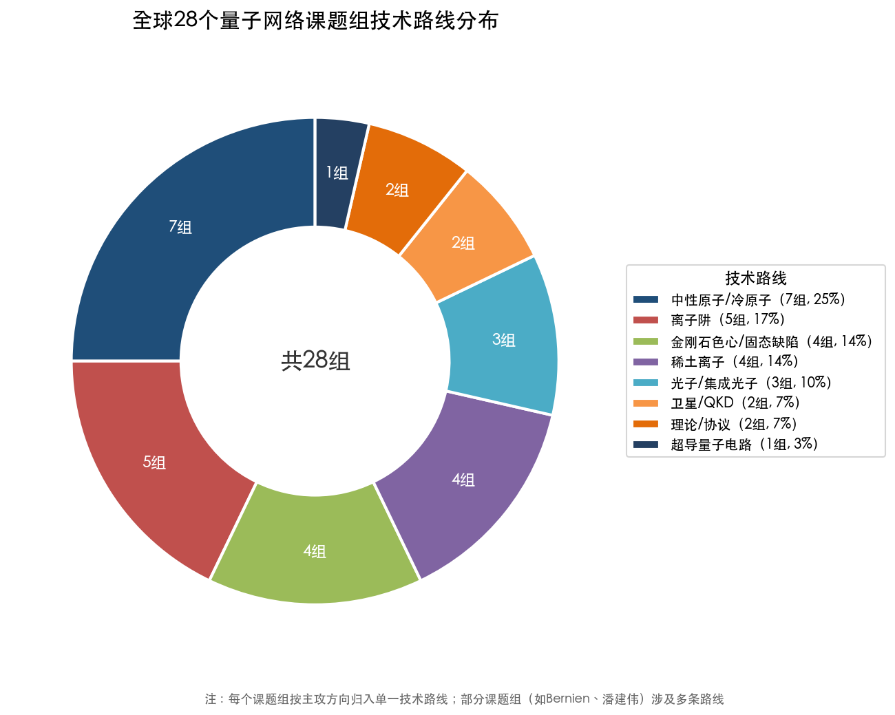

图3-1展示了28个课题组在八条技术路线上的分布比例。中性原子/冷原子以7组（25%）居首，离子阱以5组（17%）次之，二者合计占总数的42%。各技术路线的具体分布及代表性课题组如下：

- **中性原子/冷原子（7组，25%）**：UIUC/Covey（Yb-171）、UChicago/Bernien（Rb光腔）、MPQ/Rempe（Rb光腔）、LMU/Weinfurter（Rb）、Princeton/Thompson（Yb-171）、Sorbonne/Laurat（Cs）、ICFO/de Riedmatten（混合）。技术路线前瞻性最高，但多数课题组仍处于TRL 3—4早期验证阶段。
- **离子阱（5组，17%）**：Duke/Kim（IonQ）、清华/段路明、Oxford/Lucas、Innsbruck/Northup-Lanyon、Weizmann/Ozeri。多量子比特操控成熟度最高，IonQ已实现产业化（约400项量子网络专利），但光互联距离记录仅230 m（Innsbruck），远逊于色心阵营。
- **金刚石色心/固态缺陷（4组，14%）**：Harvard/Lukin（SiV）、MIT/Englund（NV/SiV）、QuTech/Hanson（NV→SnV）、UChicago-ANL/Awschalom。该阵营拥有领域内最高的网络实验成就（35 km电信纠缠、25 km城市链路、三节点网络）。
- **稀土离子（4组，14%）**：UChicago/Zhong、Caltech/Faraon、TUM/Reiserer（铒/硅）、ICFO/de Riedmatten。与硅光子工业天然兼容，理论可扩展距离达2,000 km，但单离子控制仍处早期阶段（TRL 2—3）。
- **光子/集成光子（3组，10%）**：NTT、Sapienza/Sciarrino、Paderborn/Silberhorn。以光子为核心信息载体，侧重光源、集成光路和频率转换等基础设施级技术。
- **卫星/QKD（2组，7%）**：USTC/潘建伟（兼含离子阱方向）、NUS/Ling。拥有最大规模部署网络（CN-QCN 145节点），但主要基于可信中继范式；USTC 2026年量子中继器突破标志着向纠缠型网络范式的战略转型。
- **理论/协议（2组，7%）**：QuTech/Wehner、东京大学/Murao。为量子网络提供从发展路线图到操作系统的完整软件与理论架构。
- **超导量子电路（1组，3%）**：ETH/Wallraff。首次超导无漏洞Bell检验证明了物理可行性，但微波-光子转换效率是短期内难以跨越的核心瓶颈。

### 3.6.2 地理分布格局

四个地理区域在课题组数量、资金规模、技术路线偏好和产业化程度上呈现显著差异（图3-2）。

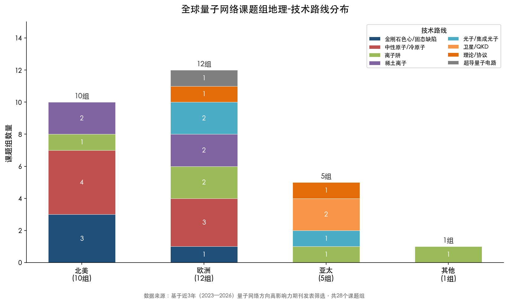

图3-2以堆叠柱状图呈现了各区域的技术路线组成结构，直观反映北美在色心和中性原子方向的集中度、欧洲技术路线的多元化，以及亚太在卫星/QKD和离子阱方向的差异化定位。各区域具体特征如下：

- **北美（10组，占36%）**：资金总量最大（DOE 6.25亿美元续期五个NQISRCs、NSF CQN 3,240万美元、NQVL等），PI集中度最高，产业生态最成熟（IonQ上市、QuEra 2.3亿美元融资）。UChicago一个机构即贡献3个入选课题组（Zhong、Bernien、Awschalom），体现了Q-NEXT中心的学术聚集效应。
- **欧洲（12组，占43%）**：数量最多，但质量分化显著。Hanson和Rempe处于全球第一梯队，QIA提供统一协调框架。德语区（Innsbruck、MPQ、LMU、TUM、ETH）形成了全球最密集的量子网络实验集群。产业化进展相对滞后——仅Delft Networks于2024年创立、Welinq于2026年完成首单商业交付。
- **亚太（5组，占18%）**：USTC独占鳌头，在部署规模（CN-QCN 145节点）和实验突破（Nature与Science同期双发）上全球领先。但中国课题组的国际合作论文比例仅约19%，与美国的约50%形成鲜明对比。[ITIF 2024](https://itif.org/publications/2024/09/09/how-innovative-is-china-in-quantum/ "How Innovative Is China in Quantum?")。日本（NTT、东大/Murao）和新加坡（NUS/Ling）在各自擅长的技术方向保持竞争力，但整体体量较小。
- **其他地区（1组，占4%）**：Weizmann/Ozeri代表以色列在离子阱方向的独立能力，Quantum Art公司1亿美元A轮融资显示该地区的产业化潜力。

### 3.6.3 学术谱系与知识传承

全球量子网络研究的知识脉络可追溯至几条关键学术谱系，这些师承关系深刻影响了课题组的技术路线选择、合作网络构建以及代际知识传递（图3-3）。

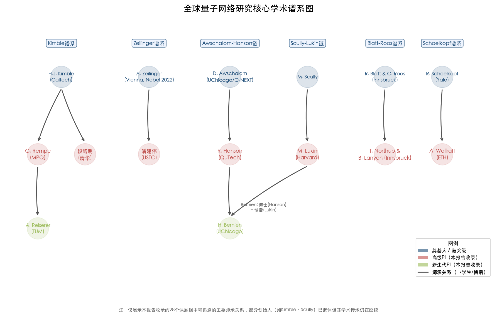

图3-3展示了6条核心学术谱系链中的师承关系，涵盖从奠基人/诺奖级科学家到本报告收录的高级PI和新生代PI的完整知识传承路径。各谱系的主要脉络如下：

- **Kimble谱系**：H. Jeff Kimble（Caltech）是量子互联网概念的最早提出者之一，其学术传承包括Rempe（MPQ）和段路明（博后于Caltech/Kimble），Rempe又进一步培养了Reiserer（TUM）。
- **Zeilinger谱系**：Anton Zeilinger（2022年诺贝尔物理学奖得主）→潘建伟（USTC），后者已成为全球量子通信的标杆性人物。
- **Awschalom-Hanson-Bernien链**：David Awschalom（UChicago）→Ronald Hanson（博后于UC Santa Barbara/Awschalom组）→Hannes Bernien（博士于Delft/Hanson组，博后于Harvard/Lukin组）→现为UChicago独立PI。这条链路跨越三个机构和两大洲，体现了量子网络领域人才流动的全球性特征。
- **Scully-Lukin链**：Marlan Scully→Mikhail Lukin（Harvard），后者培养了Bernien、Bhaskar、Knaut等下一代量子网络研究者。Lukin课题组多名核心成员被IonQ招揽（Machielse、Riedel、Borregaard），体现了学术-产业之间的人才交流。
- **Blatt-Roos谱系**：Rainer Blatt和Christian Roos（Innsbruck）→Tracy Northup和Ben Lanyon，传承了Innsbruck在离子阱量子计算领域的深厚实验传统。
- **Schoelkopf谱系**：Robert Schoelkopf（Yale）→Andreas Wallraff（ETH），将电路QED技术从量子计算领域引入量子网络研究。
- **Rempe→Reiserer**：Andreas Reiserer（TUM）出自MPQ/Rempe课题组，代表了从中性原子光腔技术向铒离子/硅光子路线的代际演化与技术路线分化。

这些学术谱系关系揭示了知识流动的路径，有助于理解课题组之间的合作传统和技术路线选择的内在逻辑。

### 3.6.4 未被纳入的重要相关机构

在筛选过程中，以下机构虽在量子信息领域具有重要地位，但因在量子网络方向缺乏近三年（2023—2026年）的实质性贡献或方向聚焦不足而未纳入本次全景扫描：

- **Stanford大学**：通过SLAC参与Q-NEXT量子通信网络研究方向，但缺乏以量子网络为核心方向的独立实验课题组。[SLAC](https://www6.slac.stanford.edu/research/slac-science-explained/quantum/networking "SLAC量子网络")
- **Yale大学/Hong Tang组**：在SCY-QNet中负责量子转导器件（微波-光学频率转换）子方向，但其核心研究方向为纳米光机械和量子转导，并非独立的量子网络课题组。[Yale量子研究所](https://quantuminstitute.yale.edu/news/hong-tang-lead-team-part-nsf-initiative-secure-communication "Hong Tang SCY-QNet")
- **Cambridge大学/Atatüre组**：研究量子点-自旋界面，与量子网络存在技术关联，但核心方向偏向量子光学基础研究。
- **Stuttgart/Wrachtrup组**：NV色心研究先驱，但近年研究重心更偏向量子传感而非量子网络。
- **KAIST（韩国）**：在本轮检索中未发现近三年在量子网络方向有实质性实验贡献的课题组。

# 第4章 多维度评估框架设计

对全球量子网络课题组进行横向比较与潜力评估，首先需要建立一套透明、可复现的综合评估方法论。量子网络研究横跨基础物理、工程技术和产业化多个层面，单一维度的排名——无论是论文引用量、经费规模还是实验距离记录——均无法捕捉课题组竞争力的全貌。本章构建一个七维度加权评估框架，逐一阐明每个维度的量化指标与评分标准、权重分配的理论依据与敏感性方案、数据采集方法论及其固有局限性，为第5章横向比较分析和第6章 Top 10 深度剖析奠定方法论基石。

## 4.1 评估方法论的文献基础与设计原则

### 4.1.1 科学评估的国际规范

任何涉及研究机构或课题组的横向评估，均须在国际学术评估规范的约束下进行。Hicks 等人于 2015 年在 Nature 发表的"莱顿宣言"（Leiden Manifesto）确立了研究评估的十项原则，其核心主张包括：定量评估应当支持而非替代定性的专家判断；指标的选择应考虑领域差异；评估过程和数据应保持透明。[Hicks et al., Nature 520, 429-431 (2015)](https://www.leidenmanifesto.org/ "莱顿宣言十项评估原则") 本框架的设计严格遵循上述原则，具体体现为三个方面：其一，采用多维度指标组合而非单一指标；其二，在学术影响力维度引入领域标准化的引用指标以消除学科偏差；其三，所有评分标准和权重分配方案完整公开，确保可复现性。

CWTS 莱顿排名（Leiden Ranking）为大学和研究机构评估提供了成熟的指标体系，涵盖 PP(top 10%)（进入全球前 10% 高被引论文的比例）和 MNCS（均值标准化引用分数）等影响力指标，以及 PP(int collab)（国际合作论文比例）等合作指标。该排名采用分数计数法（Fractional Counting），即多机构合作论文按作者机构数等分归属，避免同一篇论文被多个机构重复计算。[CWTS Leiden Ranking](https://traditional.leidenranking.com/information/indicators "Leiden Ranking 指标说明, 2025 版") Nature Index 同样采用 Count（计数）和 Share（分数计数）两个核心指标衡量机构在顶级自然科学期刊上的产出。[Nature Index](https://www.nature.com/nature-index/research-leaders/2025/a-guide-to-the-nature-index.html "Nature Index 2025 方法论指南") 本框架吸收上述两个体系的操作化经验，在"学术影响力"维度中同时考量发表数量与引用质量，并在多机构合作成果的归属上优先采用分数计数法。

### 4.1.2 h-index 的局限与替代指标

h-index 是当前学术界最广泛使用的个人影响力指标，然而文献已充分揭示其局限性。Akhtar (2024) 在 Frontiers in Research Metrics and Analytics 的系统分析中指出，h-index 未区分原创研究论文与综述文章的贡献——一篇综述可能获得极高引用，但并不代表原创突破。[Akhtar (2024)](https://pmc.ncbi.nlm.nih.gov/articles/PMC11294107/ "H-index unreliability, Frontiers in Research Metrics 2024") Koltun 与 Hafner (2021) 在 PLoS ONE 的研究进一步发现，h-index 已无法与科学声誉有效关联——h-index 的积累效应使得资深学者即使研究活跃度下降，指标仍持续增长。对于本报告所评估的 28 个课题组，PI 的 h-index 跨度从约 50 到超过 200，但这一差异部分源于研究年限和领域宽度的差别（例如，Lukin 的 h-207 部分来自超冷原子和玻色-爱因斯坦凝聚体研究，而非全部来自量子网络方向），因此 h-index 在本框架中仅作辅助参考，不单独承载评分权重。

领域加权引用影响（Field-Weighted Citation Impact, FWCI）是 Scopus 数据库提供的文章级标准化引用指标。其计算方式为将一篇论文实际获得的引用次数除以同年度、同学科领域、同文献类型论文的全球平均引用次数：FWCI = 1.00 表示被引表现恰好等于全球平均水平，FWCI > 1.00 则表示高于平均。[Elsevier FWCI](https://helpcenter.pure.elsevier.com/en_US/data-sources-and-integrations/field-weighted-citation-impact-fwci-metrics "Elsevier Pure FWCI 定义") FWCI 的核心优势在于其内在控制了领域差异、发表年份和文献类型，使得量子物理实验论文与量子信息理论论文、2024 年发表与 2020 年发表的论文得以在同一尺度上进行公平比较。因此，本框架在"学术影响力"维度的引用质量分项中优先采用 FWCI（或等效的 PP(top 10%)），而非原始引用计数或 h-index。

### 4.1.3 评估框架的总体架构

综合上述文献基础，本框架采用"七维度加权评分"的总体架构：

1. 将课题组的综合竞争力分解为七个一级评估维度；
2. 每个维度设定具体的量化指标和 1-10 分的标准化评分规则；
3. 通过层次分析法（Analytic Hierarchy Process, AHP）确定维度权重；
4. 综合加权得分 = Σ（各维度得分 × 维度权重）；
5. 通过三套权重方案进行敏感性分析，报告排名区间而非唯一排名。

图 4-1 以雷达图形式展示了七维度框架的整体结构与权重分配，并叠加"全能型"和"工程型"两类典型课题组的画像示例，直观呈现不同竞争力结构所形成的视觉差异。该模板亦将在第5章和第6章中复用，为每个重点课题组生成个性化雷达图。

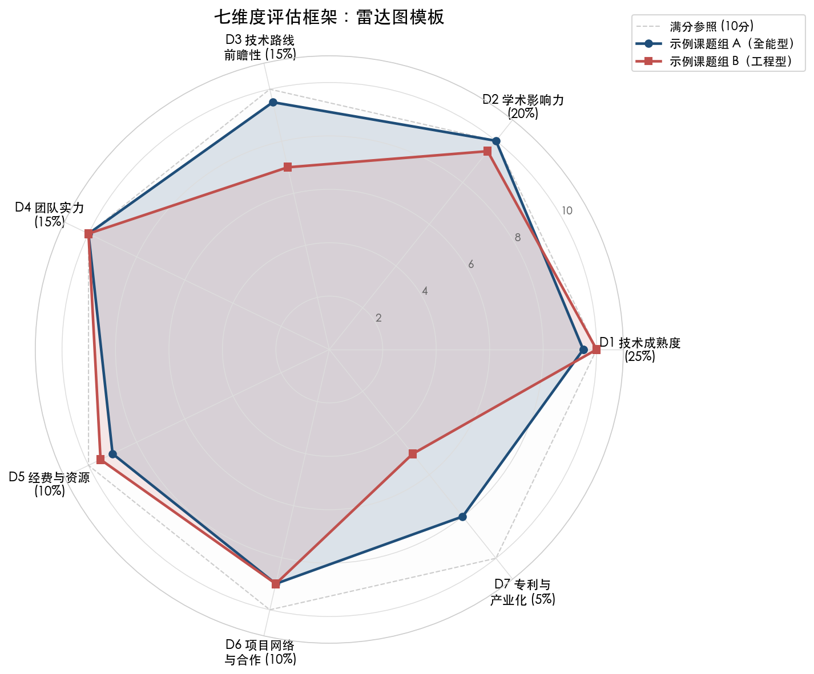

## 4.2 七维度评估体系

### 4.2.1 维度一：技术成熟度（Technology Readiness）

**权重：25%（主方案）**

技术成熟度是衡量课题组实验能力和工程推进进度的核心维度。在量子网络这一高度实验驱动的研究领域，系统性的演示能力——而非单一参数的突破——构成区分"理论可行"与"实验已验证"的最直接标尺，因此该维度获得最高权重。

**量化指标**：本维度采用经改造的技术准备等级（Technology Readiness Level, TRL）框架。NASA 的标准 TRL 体系将技术成熟度划分为 9 级，从 TRL 1（基本原理观察与报告）到 TRL 9（在实际任务环境中成功运行验证）。[NASA ESTO](https://esto.nasa.gov/trl/ "NASA TRL 定义") 然而，Teitsma 等人 (2025) 在 arXiv:2502.16489 中指出，量子技术的非线性发展特征使得线性 TRL 映射不完全适用——量子系统可能在某些指标上达到高 TRL 而在另一些指标上仍处于低 TRL，传统的"级级递进"假设需要修正。[Teitsma et al. (2025)](https://arxiv.org/html/2502.16489v1 "量子组织准备度等级 QORLs, arXiv 2025")

鉴于上述问题，本框架对 NASA TRL 进行量子网络领域的特定映射，并结合第1章提出的 Wehner 六阶段路线图作为补充参照。表 4-1 列示了完整的映射关系：

| TRL 等级 | 量子网络领域定义 | 对应 Wehner 阶段 | 代表性实验 |
|:---:|:---|:---:|:---|
| 1-2 | Bell 实验验证、基本量子态传输原理 | — | 早期贝尔不等式违反实验 |
| 3 | 单节点纠缠生成概念验证 | 第二阶段 | 单离子-光子/原子-光子纠缠 |
| 4 | 双节点短距纠缠（实验室规模） | 第三阶段过渡 | Innsbruck 230 m 离子纠缠 |
| 5 | 多节点原型或中等距离纠缠分发 | 第三阶段 | QuTech 三节点网络（2021） |
| 6 | 城市尺度测试床（部署光纤） | 第三/四阶段 | QuTech Delft-Den Haag 25 km |
| 7 | 大规模部署光纤系统原型 | 第四阶段过渡 | Harvard 35 km 电信波段 SiV 纠缠 |
| 8 | 多城市/骨干网原型运行 | 第一阶段（可信中继已达） | CN-QCN 145 节点运营 |
| 9 | 商用量子网络持续运营 | — | 尚无先例 |

> **表 4-1** TRL 量子网络领域映射与 Wehner 六阶段路线图对照

图 4-2 以阶梯图形式可视化了上述 TRL 映射关系，红色虚线框标注当前全球整体水平（TRL 3-5），绿色箭头标注最先进实验位置（TRL 5-6）。

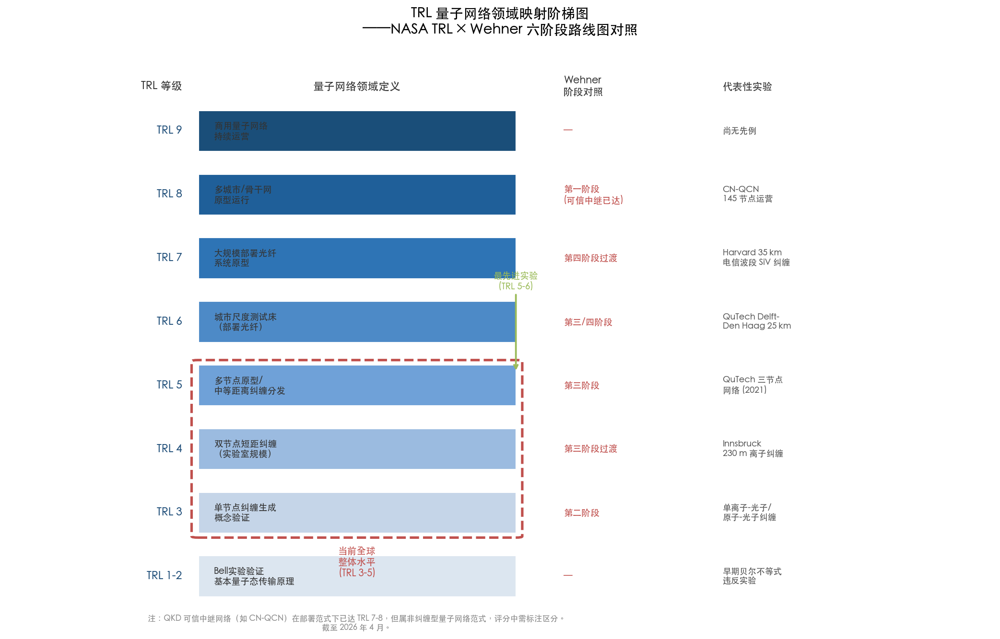

截至 2026 年 4 月，全球纠缠型量子网络整体处于 TRL 3-5 区间，最先进的实验演示达到 TRL 5-6 水平。值得注意的是，QKD 网络（可信中继范式）的部署已达 TRL 7-8，但由于其并非纠缠型量子网络范式，在评分中需予以标注区分。

**评分标准**（1-10 分）：

- **9-10 分**：TRL 6 以上城市级纠缠型网络演示或大规模部署网络，拥有多个里程碑记录；
- **7-8 分**：TRL 5 级多节点原型或中等距离（>10 km）纠缠分发；
- **5-6 分**：TRL 3-4 级实验室规模概念验证，且具备清晰的工程化路径；
- **3-4 分**：TRL 2-3 级，有单一关键技术突破但尚未形成系统性网络能力；
- **1-2 分**：TRL 1-2 级，主要停留在基础原理层面。

### 4.2.2 维度二：学术影响力（Academic Impact）

**权重：20%（主方案）**

学术影响力衡量课题组在国际学术社区中的知识贡献与话语权。顶刊发表和高引用是同行认可的核心显性指标，在评估体系中仅次于技术成熟度。

**量化指标组合**：

（1）**顶刊发表数量**：统计 2023—2026 年在 Nature、Science 及其子刊（Nature Physics、Nature Communications 等）和 Physical Review Letters / PRX Quantum 上发表的量子网络方向论文数量。选择这一期刊范围的依据在于，量子网络领域的实验突破几乎无一例外发表于上述期刊。多机构合作论文按参与机构数进行分数计数。

（2）**引用质量**：优先采用 FWCI 或等效的 PP(top 10%)。若 Scopus FWCI 数据不可获取，则以 Google Scholar 近三年总引用量按论文数标准化后作为替代。

（3）**h-index**：仅作辅助参考。PI 的 h-index 纳入"团队实力"维度而非学术影响力维度，以避免双重计算。

**评分标准**（1-10 分）：

- **9-10 分**：近三年量子网络方向顶刊发表 ≥5 篇，含 Nature/Science 正刊，多篇论文 FWCI > 5 或进入 top 1% 高被引；
- **7-8 分**：近三年顶刊发表 3-4 篇，或 1-2 篇 Nature/Science 正刊加多篇子刊/PRL；
- **5-6 分**：近三年顶刊发表 1-2 篇，引用表现中上；
- **3-4 分**：近三年有高影响力期刊发表但主要集中在非量子网络方向；
- **1-2 分**：近三年量子网络方向顶刊发表空白或极少。

### 4.2.3 维度三：技术路线前瞻性（Technology Roadmap Foresight）

**权重：15%（主方案）**

技术路线前瞻性评估课题组所选择的物理平台和技术路线在量子网络长期发展中的竞争力与可扩展性潜力。该维度与技术成熟度维度形成互补：后者衡量"已经做到了什么"，前者则衡量"所选路线能走多远"。

**量化指标**：

本维度的评分基于三项核心技术指标与一项架构指标的综合判断：

（1）**光子接口效率**：量子网络节点的有用光子收集/发射概率直接决定纠缠生成速率。Ruf 等人 (2021) 在 Journal of Applied Physics 的综述中将高效光子接口列为色心量子网络的三项核心要求之首，并指出 SiV 的零声子线（ZPL）发射率高达 65-90%（需稀释制冷），而 NV 仅约 3%。[Ruf et al., J. Appl. Phys. 130, 070901 (2021)](https://pubs.aip.org/aip/jap/article/130/7/070901/1061464/Quantum-networks-based-on-color-centers-in-diamond "金刚石色心量子网络综述")

（2）**电信波段兼容性**：工作于 1350-1550 nm 电信波段（尤其是 C 波段 1530-1565 nm）的光子可直接在现有光纤基础设施中传输而无需频率转换，这一特性构成大规模部署的硬约束。QIA D1.5 报告在评估端节点平台时明确指出，"仅建造更多现有硬件副本不够，需重大技术创新"以实现电信波段兼容。[QIA D1.5 报告](https://quantuminternetalliance.org/wp-content/uploads/sites/6/2022/05/D1.5-Comparison-report-on-next-generation-devices.pdf "QIA 端节点平台比较报告 2022")

（3）**并行化与可扩展性**：单节点能否同时维持多个量子比特并并行生成多对纠缠光子。Lee 等人 (2024) 在 PNAS 提出的量子网络效用（Utility of Quantum Networks, UQN）框架给出了跨平台通用基准：当双量子比特门有效误差 ε_eff > 0 时，量子网络的最大可用联盟规模上限为 ⌊1/ε_eff⌋。[Lee, Dai, Towsley & Englund, PNAS 121(17) (2024)](https://pmc.ncbi.nlm.nih.gov/articles/PMC11047070/ "Quantum Network Utility, PNAS 2024")

（4）**架构可扩展性**：从少量节点向数十乃至数百节点扩展的技术路径清晰度，包括频率标准化（所有节点产生不可区分光子的难度）和模块化设计能力。

**平台前瞻性分级**：

综合上述指标，当前主要物理平台可划分为三个前瞻性等级：

- **高前景**：SiV 色心（协作指数 C_coh > 100，35 km 电信波段纠缠已验证，ZPL 发射率 65-90%）；Yb-171 中性原子（电信波段原生兼容，可并行化阵列架构，2025 年 Nature Physics 已验证并行原子-光子纠缠）；离子阱+光学腔（确定性光子图态生成能力，多量子比特操控技术最为成熟）。
- **中等前景**：NV 色心（拥有最成熟的网络演示记录但 ZPL 仅约 3%，正向 SnV 转型）；稀土离子掺杂晶体（理论可扩展至 2,000 km，但单离子控制仍处于早期阶段）；铒/硅（唯一在电信 C 波段具有相干跃迁的系统，与硅光子工业天然兼容，但相干时间尚处于较低水平）。
- **早期探索**：超导量子比特（需微波-光子转换，效率瓶颈尚未突破）；量子点（确定性纠缠光子源潜力巨大但网络距离和保真度尚未达到实用门槛）；卫星光子（属可信中继范式，并非纠缠型网络路线）。

**评分标准**（1-10 分）：

- **9-10 分**：高前景平台，且已有实验验证关键指标（如电信波段纠缠、并行化生成、高 ZPL 效率）；
- **7-8 分**：高前景平台但关键指标尚未获得实验验证，或中等前景平台已有显著实验进展；
- **5-6 分**：中等前景平台，有明确提升路径但核心瓶颈未解决；
- **3-4 分**：早期探索平台，核心瓶颈解决路径不明朗；
- **1-2 分**：平台路线与纠缠型量子网络发展方向存在根本性不兼容。

### 4.2.4 维度四：团队实力（Team Strength）

**权重：15%（主方案）**

团队实力衡量课题组的人力资本深度与学术声望，这是课题组持续产出高水平成果和吸引顶尖资源的基础性要素。

**量化指标**：

（1）**PI 学术头衔与荣誉**：是否为国家级科学院院士（NAS、KNAW、CAS 等），是否获得重大学术奖项（Spinoza Prize、Körber Prize、ERC Advanced Grant 等），Google Scholar 总引用量级。

（2）**团队规模与结构**：核心研究人员（教授、研究员、博士后）数量及博士生培养产出。

（3）**人才培养谱系**：课题组培养的下一代 PI 数量和质量，即"学术子嗣"在顶尖机构独立建组的比例。量子网络领域的师承网络高度集中：例如 Awschalom 培养了 Hanson，Hanson 培养了 Bernien（现 UChicago 独立 PI），Lukin 实验室的博士后包括 Bernien、Bhaskar、Knaut 等多位已独立或即将独立的研究者。

（4）**学术谱系与知识传承**：PI 的师承来源（如 Kimble→Rempe、Zeilinger→潘建伟、Scully→Lukin 等），处于核心学术谱系中的课题组通常拥有更深厚的技术积累和更广泛的学术网络。

**评分标准**（1-10 分）：

- **9-10 分**：PI 为国家级院士且获重大国际奖项，Google Scholar 引用 >50,000 次，已培养多位独立 PI；
- **7-8 分**：PI 获显著学术奖项或高级学术头衔，引用 >20,000 次；
- **5-6 分**：PI 为知名教授，具备一定学术声望和团队规模；
- **3-4 分**：PI 为青年教授（如 Assistant Professor），团队处于建设初期但展现高潜力（如获 NSF CAREER 等青年奖项）；
- **1-2 分**：团队信息不足或 PI 在量子网络领域声望有限。

### 4.2.5 维度五：经费与资源（Funding & Resources）

**权重：10%（主方案）**

经费与资源衡量课题组获取和管理研究资源的能力，涵盖竞争性科研资助和实验基础设施可及性两个方面。该维度获得相对较低的权重，原因在于经费规模与研究产出之间的关系并非线性——大型国家中心可能同时涵盖多个研究方向，而高效的小型课题组可能以较少经费取得突破性成果。

**量化指标**：

（1）**可核实的竞争性资助总额**：以近五年可公开查证的资助金额为准。数据来源优先级依次为：官方资助数据库（NSF Award Search、CORDIS、DOE 公告）> 机构新闻稿 > 第三方报道。

（2）**资助来源多元性**：同时获得多个独立资助渠道（如联邦/国家资助+产业合作+国际合作资助）的课题组，资金可持续性更高。

（3）**核心设施可及性**：是否依托国家实验室或重大科研基础设施（如阿贡国家实验室 Q-NEXT、费米实验室 SQMS、欧洲 QIA 网络、中国国家量子信息科学实验室等）。

**评分标准**（1-10 分）：

- **9-10 分**：可核实资助总额 >1 亿美元（或等值），或领导国家级量子中心/实验室；
- **7-8 分**：资助总额 2,000 万—1 亿美元，且具有多渠道资助来源；
- **5-6 分**：资助总额 500 万—2,000 万美元；
- **3-4 分**：资助总额 <500 万美元，或经费数据不透明无法核实；
- **1-2 分**：经费信息完全不可获取。

### 4.2.6 维度六：项目网络与合作（Collaboration Network）

**权重：10%（主方案）**

项目网络与合作衡量课题组在国际和国内合作网络中的枢纽地位。量子网络的本质是互联——课题组之间的合作能力直接预示其在未来网络建设中的角色与话语权。

**量化指标**：

（1）**国际合作发表比例**：国际合作论文占总论文的比例。ITIF (2024) 的数据显示，中国量子研究的国际合作论文比例仅约 19%，而美国约为 50%，这一结构性差距在评估国际影响力时需予以审慎考量。[ITIF (2024)](https://itif.org/publications/2024/09/09/how-innovative-is-china-in-quantum/ "How Innovative Is China in Quantum?")

（2）**大型协作项目领导角色**：是否担任大型协作项目的协调人或核心 PI。代表性案例包括 Hanson 担任 QIA 协调人、Awschalom 担任 Q-NEXT 主任、Lukin 与 Englund 联合领导 CQN ERC 等。

（3）**跨领域合作**：与产业界（如 IBM-Cisco、IonQ）、国防部门（如 DARPA、AFRL）或其他学科（如天文学、密码学）的合作深度。

**评分标准**（1-10 分）：

- **9-10 分**：领导国际级大型协作项目，国际合作论文比例 >40%，与产业和国防部门均有深度合作；
- **7-8 分**：参与大型协作项目核心团队，有显著国际合作记录；
- **5-6 分**：有稳定国际合作关系但非协作项目核心角色；
- **3-4 分**：合作主要限于国内，国际合作有限；
- **1-2 分**：基本无合作网络或相关信息不可获取。

### 4.2.7 维度七：专利与产业化（Patents & Commercialization）

**权重：5%（主方案）**

专利与产业化衡量课题组将科研成果转化为技术产品和商业价值的能力与进展。该维度获得最低权重，原因有二：其一，量子网络作为一个整体仍处于前商业化阶段，产业化指标的区分度有限；其二，学术课题组的核心使命在于知识创造而非商业化本身。

**量化指标**：

（1）**专利数量与质量**：量子网络方向的已授权专利和待审专利数量。IonQ 凭借约 400 项量子网络相关专利（含通过收购 Qubitekk 和 ID Quantique 获得的约 250 项）在专利维度上遥遥领先，其专利总数已超过 1,000 项。[IonQ 投资者关系](https://investors.ionq.com/news/news-details/2025/IonQ-Expands-Quantum-Networking-Patent-Portfolio-to-Meet-Strong-Market-Demand-for-Secure-Communications/default.aspx "IonQ 量子网络专利组合, 2025 年 8 月")

（2）**衍生企业**：课题组是否孵化出量子网络方向的衍生企业，以及企业的融资规模和发展阶段。代表性案例包括：Lukin 联合创立的 QuEra（2025 年 2 月完成 2.3 亿美元融资）、Hanson 创立的 Delft Networks（2024 年）、Laurat 联合创立的 Welinq（2026 年 1 月完成首个商业交付）、Kim 联合创立的 IonQ（NYSE 上市公司）。

（3）**技术转让与产业合作**：与企业的合同研究、联合实验室等合作形式。

**评分标准**（1-10 分）：

- **9-10 分**：拥有大量量子网络专利（>100 项），或衍生企业已 IPO/估值超 10 亿美元；
- **7-8 分**：衍生企业已完成大额融资（>1 亿美元），或拥有显著专利组合（>20 项）；
- **5-6 分**：有衍生企业或专利申请记录（5-20 项）；
- **3-4 分**：有少量专利或技术转让记录；
- **1-2 分**：无产业化记录或相关信息不可获取。

## 4.3 权重分配方案：AHP 方法论与敏感性分析

### 4.3.1 层次分析法（AHP）基本原理

七个评估维度的权重分配采用层次分析法（Analytic Hierarchy Process, AHP）。AHP 由 Saaty 于 1970 年代提出，核心思想是通过成对比较（Pairwise Comparison）将主观判断转化为可计算的比例尺度。[Saaty, European Journal of Operational Research 48(1), 9-26 (1990)](https://www.sciencedirect.com/science/article/pii/037722179090057I "How to make a decision: The Analytic Hierarchy Process")

AHP 的操作流程包含以下三个步骤：

1. **构建成对比较矩阵**：对 n 个维度构建 n×n 的成对比较矩阵 A，其中元素 a_ij 表示维度 i 相对于维度 j 的相对重要性，采用 Saaty 1-9 标度（1 = 同等重要，3 = 稍微重要，5 = 明显重要，7 = 非常重要，9 = 极端重要；2/4/6/8 为中间值）。矩阵满足互反性：a_ji = 1/a_ij。

2. **计算特征向量**：提取矩阵 A 的最大特征值 λ_max 对应的特征向量，归一化后即为各维度的权重向量。

3. **一致性检验**：通过一致性指标 CI = (λ_max − n)/(n − 1) 和一致性比率 CR = CI/RI 检验判断矩阵的逻辑一致性。其中 RI 为随机一致性指标——Saaty 通过对 50,000 个随机矩阵的蒙特卡洛模拟获得不同矩阵阶数的 RI 值。对于 7 阶矩阵（本框架的 7 个维度），RI = 1.35。当 CR ≤ 0.10 时，判断矩阵的一致性被认为可接受；当 CR > 0.10 时，应重新审视成对比较以改善一致性。[ArcGIS Pro 文档](https://pro.arcgis.com/en/pro-app/latest/tool-reference/analysis/calculate-the-consistency-ratio.htm "AHP 一致性比率计算")

Saaty 通过蒙特卡洛模拟得到的随机一致性指标 RI 值如下表所示：

| 矩阵阶数 n | 1 | 2 | 3 | 4 | 5 | 6 | 7 | 8 | 9 | 10 |
|:---:|:---:|:---:|:---:|:---:|:---:|:---:|:---:|:---:|:---:|:---:|
| RI | 0 | 0 | 0.52 | 0.89 | 1.11 | 1.25 | 1.35 | 1.40 | 1.45 | 1.49 |

值得注意的是，Saaty 同时指出矩阵阶数不宜超过 7——当同时比较的元素超过 7 个时，人类判断的辨别灵敏度不足以做出准确的成对比较。本框架恰好包含 7 个维度，处于 AHP 的最佳操作范围。

### 4.3.2 主方案权重

基于对量子网络研究特征的综合判断，主方案的 7×7 成对比较矩阵产出以下权重分配（表 4-2）：

| 维度 | 权重 |
|:---|:---:|
| D1 技术成熟度 | 25% |
| D2 学术影响力 | 20% |
| D3 技术路线前瞻性 | 15% |
| D4 团队实力 | 15% |
| D5 经费与资源 | 10% |
| D6 项目网络与合作 | 10% |
| D7 专利与产业化 | 5% |

> **表 4-2** 主方案七维度权重分配

权重分配遵循如下核心逻辑：技术成熟度获得最高权重（25%），因为在量子网络这一高度实验驱动的领域，实际的系统性演示（如多节点纠缠、城市级测试床）是区分"有潜力"与"已验证"的最直接标尺。学术影响力（20%）紧随其后，反映顶刊发表和高引用作为同行认可核心指标的重要性。技术路线前瞻性和团队实力各占 15%，分别衡量长期发展潜力和可持续产出能力。经费与合作网络各占 10%，属于重要但非决定性的支撑因素。专利与产业化仅占 5%，反映量子网络尚处于前商业化阶段的客观现实。

### 4.3.3 敏感性方案

为检验排名结果对权重选择的鲁棒性，本框架设计两个替代权重方案，与主方案共同构成三方案交叉验证体系。

**方案 A：学术优先方案**

适用场景：侧重评估课题组的基础研究贡献和学术领导力。

| 维度 | 权重 |
|:---|:---:|
| D1 技术成熟度 | 20% |
| D2 学术影响力 | 30% |
| D3 技术路线前瞻性 | 20% |
| D4 团队实力 | 12% |
| D5 经费与资源 | 8% |
| D6 项目网络与合作 | 7% |
| D7 专利与产业化 | 3% |

方案 A 将学术影响力权重提高至 30%、技术路线前瞻性提升至 20%，相应压缩经费、合作和产业化维度的权重。该方案有利于顶刊发表密度高、技术路线前沿的课题组在排名中获得更高位次。

**方案 B：工程优先方案**

适用场景：侧重评估课题组将技术推向部署和产业化的能力。

| 维度 | 权重 |
|:---|:---:|
| D1 技术成熟度 | 35% |
| D2 学术影响力 | 15% |
| D3 技术路线前瞻性 | 10% |
| D4 团队实力 | 10% |
| D5 经费与资源 | 15% |
| D6 项目网络与合作 | 5% |
| D7 专利与产业化 | 10% |

方案 B 将技术成熟度权重大幅提升至 35%，经费和专利产业化权重分别提升至 15% 和 10%，同时压缩学术影响力和团队实力权重。该方案有利于拥有大规模部署经验和产业化通道的课题组。

图 4-3 以分组柱状图直观呈现三套方案在七个维度上的权重分配差异，清晰展示了关键维度——特别是技术成熟度（主方案 25% → 工程优先 35%）和学术影响力（主方案 20% → 学术优先 30%）——在不同评估视角下的权重调整幅度。

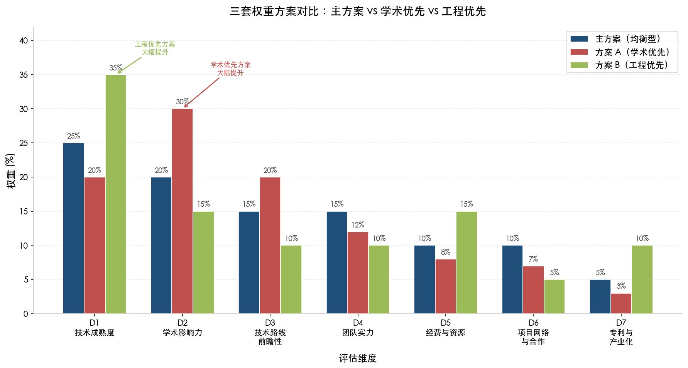

### 4.3.4 排名鲁棒性评估策略

三套权重方案的交叉验证构成本框架鲁棒性评估的核心机制。在第5章的横向比较分析中，每个课题组将在三套方案下分别计算综合得分和排名，由此识别两类课题组：

- **排名稳健型**：在三套方案下排名波动 ≤2 位，表明该课题组的综合实力不依赖于评估视角的选择，具有全面均衡的竞争力。
- **排名敏感型**：在三套方案下排名波动 >2 位，表明该课题组在某些维度表现突出但存在明显短板，评估结论需附加限定条件。

此外，对于数据不完整的课题组（尤其是中国课题组的经费和专利数据），将进行"最优/最劣/中位数"三情景模拟，以量化数据缺失对排名结果的潜在影响。

## 4.4 数据采集方法论

### 4.4.1 各维度数据来源

表 4-3 汇总了七个评估维度的一级和二级数据来源，一级来源在评分中具有优先权。

| 维度 | 一级数据来源 | 二级数据来源 |
|:---|:---|:---|
| D1 技术成熟度 | 课题组官网、已发表论文 | 会议报告、新闻稿 |
| D2 学术影响力 | Scopus FWCI、Google Scholar | Web of Science |
| D3 技术路线前瞻性 | 技术综述论文、QIA 评估报告 | 领域专家共识 |
| D4 团队实力 | Google Scholar、课题组官网 | 学术奖项官方公告 |
| D5 经费与资源 | NSF Award Search、CORDIS、DOE 公告 | 机构新闻稿 |
| D6 项目网络与合作 | 论文合著网络、项目官网 | 会议组织记录 |
| D7 专利与产业化 | Google Patents、USPTO、EPO | 企业官网、融资公告 |

> **表 4-3** 七维度数据来源层级

### 4.4.2 中国课题组数据的特殊处理

中国课题组（USTC/潘建伟、清华/段路明）的评估面临特殊的数据可及性挑战。ITIF (2024) 在其《中国量子创新评估》报告中指出，中国的量子研究经费"仍然模糊"（remains opaque），公开可查证的项目级资助金额极为有限。[ITIF (2024)](https://itif.org/publications/2024/09/09/how-innovative-is-china-in-quantum/ "How Innovative Is China in Quantum?") CSIS (2026) 估算中国政府累计量子投资约 150 亿美元，但该数字未经官方确认，且涵盖量子计算、量子通信和量子传感全部方向，无法直接拆解至单一课题组层面。[CSIS 报告](https://www.csis.org/analysis/understanding-chinas-quest-quantum-advancement "Understanding China's Quest for Quantum Advancement, 2026 年 1 月")

本框架对此采用以下三项替代策略：

1. **经费数据**：利用国家自然科学基金委员会（NSFC）公开项目数据库查询可验证的基金项目，结合科技部重大专项和中科院先导专项的新闻报道进行交叉验证。对于仍无法确认的金额，在三情景模拟中分别赋予"高位估算""中位估算"和"低位估算"值，并标注数据质量等级。

2. **专利数据**：通过中国国家知识产权局（CNIPA）专利数据库查询。鉴于中国专利体系中实用新型专利与发明专利的区别，仅计算发明专利以保持与 USPTO/EPO 专利的可比性。

3. **国际合作**：中国量子研究的国际合作论文比例约 19%（相比之下美国约 50%），这一差异部分源于地缘政治因素而非课题组本身的合作意愿。评分时需考虑这一结构性约束，避免因系统性偏差低估中国课题组的合作能力。

### 4.4.3 评分过程的质量控制

为确保评分的一致性和客观性，本框架实施以下质量控制措施：

- **双源验证**：论文数据至少通过两个独立来源交叉验证（如 Google Scholar 与 Scopus/Web of Science），经费数据优先使用官方数据库记录。
- **时间口径统一**：所有数据统一以 2026 年 4 月为截止时间点，"近三年"统一指 2023 年 1 月至 2026 年 4 月。
- **评分校准**：每个维度先对预判为最高分和最低分的课题组进行锚定评分，然后以此为参照对其余课题组进行相对评分，确保维度内评分的内部一致性。

## 4.5 方法论局限性

本评估框架存在六项固有局限性，在解读后续章节的评估结果时需予以充分考虑。

**第一，引用滞后效应。** 学术引用的积累需要时间，2025—2026 年发表的论文尚未获得充分的引用反馈。例如，USTC 2026 年 2 月在 Nature 和 Science 同时发表的量子中继器和设备无关 QKD 突破论文，截至 2026 年 4 月仅有约两个月的引用窗口。这意味着学术影响力维度的评分可能系统性低估最近取得重大突破的课题组。

**第二，h-index 的学科偏差与可博弈性。** 尽管本框架已将 h-index 降格为辅助参考，但在"团队实力"维度中仍间接涉及 PI 的总体学术声望。h-index 在不同子领域（如量子光学、量子信息理论、凝聚态物理）之间的基线水平存在系统性差异，这一偏差无法完全消除。

**第三，TRL 映射的主观性。** 将量子网络实验成果映射到 TRL 等级涉及不可避免的主观判断。例如，USTC 的 CN-QCN 145 节点网络在可信中继范式下达到 TRL 7-8，但在纠缠型网络范式下仅属于第一阶段——如何在两种范式之间分配 TRL 评分存在合理的分歧空间。

**第四，经费数据不对称。** 美国和欧盟的研究资助数据公开透明（NSF Award Search、CORDIS 数据库提供项目级详细信息），而中国、日本和以色列的资助数据透明度显著较低。这种不对称可能导致双向偏差：中国课题组的经费维度可能因实际资助远高于可公开查证的金额而被低估，或因 CSIS 的 150 亿美元总估计包含大量非量子网络方向投入而被高估。

**第五，产业化指标的早期局限性。** 量子网络作为一个整体仍处于前商业化阶段，绝大多数课题组尚无专利或衍生企业记录。这使得专利与产业化维度的区分度较低——大多数课题组在该维度的得分将集中在 1-4 分区间，仅 IonQ 和少数孵化衍生企业的课题组获得高分。这亦是该维度获得最低权重（5%）的原因之一。

**第六，快照偏差。** 本报告所有数据以 2026 年 4 月为截止时间，任何"排名"本质上均为特定时间点的快照。量子网络领域正处于快速演进期，2026 年下半年的新突破（如 Yb-171 首次远程原子纠缠、SnV 首个远程纠缠演示、QIA Phase 2 资助确认等）可能显著改变排名格局。因此，本框架的评估结果应被理解为"截至 2026 年 4 月的最佳判断"，而非固定的终局排名。

综上，我们认为本评估框架在方法论的透明性、维度的全面性和鲁棒性检验的系统性方面达到了可接受的研究标准，但其结论始终受制于上述固有局限。第5章的横向比较将通过三方案交叉验证和三情景模拟量化这些局限性对排名结果的实际影响，识别"排名稳健型"与"排名敏感型"课题组，为读者提供有条件限定的评估结论而非绝对排名。

# 第5章 横向比较分析

第4章构建了一套七维度加权评估框架，第3章建立了28个课题组的标准化画像清单。本章将两者对接：基于第4章定义的评估维度、量化指标与权重方案，对第3章收录的全部28个课题组进行系统化横向比较。分析依次展开七个维度的分项评分与排名（5.1节），呈现三套权重方案下的综合得分排名与敏感性分析（5.2节），按技术路线和地理区域进行聚类分析（5.3、5.4节），最后讨论若干贯穿数据的关键议题（5.5节）。所有评分数据截止时间为2026年4月，评分标准严格遵循第4章4.2节的1–10分量化规则。

## 5.1 分维度评分与排名

### 5.1.1 维度一：技术成熟度（权重25%）

技术成熟度是本框架权重最高的维度，衡量课题组在纠缠型量子网络方向的实验系统演示进度。评分依据第4章提出的量子网络TRL映射，重点考察已实现的网络节点数、纠缠分发距离、是否使用部署光纤以及系统集成程度。

评分结果显示，三个课题组在该维度形成明确的第一梯队。USTC/潘建伟获得10分，是唯一同时具备大规模部署网络与纠缠型网络前沿突破的课题组：一方面，CN-QCN以145节点、超12,000 km光纤的运营规模位居全球最大量子通信网络（TRL 7-8）；另一方面，该团队于2026年2月在Nature发表10 km光纤离子-离子纠缠并同步实现设备无关QKD（DI-QKD）11 km全球距离记录。[The Quantum Insider](https://thequantuminsider.com/2026/02/06/chinese-researchers-clear-hurdles-for-long-distance-quantum-networks/ "USTC 2026年2月双重突破")；[CSIS报告](https://www.csis.org/analysis/understanding-chinas-quest-quantum-advancement "CN-QCN网络规模, 2026年1月") 值得注意的是，CN-QCN属于可信中继范式（TRL 7-8）而非纠缠型网络范式，在评分中两种范式的成就分别计量。即便仅计纠缠型实验成就，USTC的离子-离子10 km纠缠和DI-QKD距离记录仍足以获得最高分段。

QuTech/Hanson获得9.5分。该课题组于2021年在Nature发表首个三节点纠缠量子网络（被引超876次），2024年10月在Science Advances实现Delft–Den Haag 25 km部署光纤量子处理器间纠缠，刷新了纠缠型量子网络在部署光纤上的最远记录（TRL 5-6）。[QuTech](https://qutech.nl/2024/10/30/a-rudimentary-quantum-network-link-between-dutch-cities/ "Science Advances 2024") 此外，2026年1月该团队在Nature Communications展示腔增强NV中心光子收集效率10倍提升（从约0.05%至约0.5%），为纠缠速率的量级跃升奠定基础。[QuTech](https://qutech.nl/2026/01/15/more-photons-faster-links-a-laser-focused-nv-centre/ "Nature Communications 2026")

Harvard/Lukin获得9分。2024年Nature发表35 km波士顿部署光纤SiV节点电信波段纠缠（TRL 5-6），纠缠保持超过1秒；2025年Science发表首次基于固态量子比特的分布式盲量子计算；2026年Nature发表纠缠辅助非局域光学干涉术（基线1.55 km）。该课题组在应用多样性上领先，从盲量子计算到天文干涉术，系统性展示了量子网络超越密钥分发的多元价值。[Lukin Group](https://lukin.physics.harvard.edu/quantum-networking-siv "Quantum Networks with SiV Centers")

技术成熟度第二梯队（7–8分）包括：Stony Brook/Figueroa（8分，SCY-QNet 10节点广域量子网络原型建设中，连接Stony Brook、Columbia、Yale及BNL，获NSF NQVL资助）；MPQ/Rempe（7.5分，2024年Science发表光腔内2D原子阵列量子网络寄存器，同年Nature发表确定性光子图态融合）；Innsbruck/Northup-Lanyon（7分，2023年实现230 m校园离子纠缠网络，2025年PRL展示10量子比特光子接口网络节点，纠缠保真度达92%）。

第三梯队（5–6分）涵盖大多数课题组，技术状态处于TRL 3-4级实验室概念验证阶段，包括UIUC/Covey、Duke/Kim(IonQ)、清华/段路明、ETH/Wallraff等。值得注意的是，Duke/Kim(IonQ)在离子阱量子计算商业化方面已达高TRL，但其量子网络方向的远程纠缠实验仍处于早期阶段，体现了第4章所述量子技术TRL映射的非线性特征。[Teitsma et al. (2025)](https://arxiv.org/html/2502.16489v1 "量子组织准备度等级 QORLs")

**技术成熟度 Top 5**：

| 排名 | 课题组 | 得分 | 关键支撑 |
|:---:|:---|:---:|:---|
| 1 | USTC/潘建伟 | 10 | CN-QCN 145节点运营 + 10 km离子纠缠 + 11 km DI-QKD |
| 2 | QuTech/Hanson | 9.5 | 三节点网络 + 25 km部署光纤纠缠 + 腔增强10倍 |
| 3 | Harvard/Lukin | 9 | 35 km SiV电信纠缠 + 盲量子计算 + 非局域干涉术 |
| 4 | Stony Brook/Figueroa | 8 | SCY-QNet 10节点广域原型 |
| 5 | MPQ/Rempe | 7.5 | 光腔内原子阵列网络寄存器 + 光子图态融合 |

### 5.1.2 维度二：学术影响力（权重20%）

学术影响力的评分综合考量近三年（2023—2026年）顶刊发表数量、引用质量和领域影响。由于Scopus FWCI在量子网络子领域的精确基准值未能获取，本维度采用Google Scholar近三年引用量按论文数标准化作为替代指标，并辅以Nature/Science正刊发表数量作为顶级成果锚点。这一替代方案在第4章4.1.2节中已被预设为FWCI不可获取时的后备方案。

Harvard/Lukin在该维度获得10分。PI Mikhail Lukin的Google Scholar总引用约163,654次（h-207），为28个课题组中引用量最高者。[Google Scholar](https://scholar.google.com "Lukin引用数据, 2026年4月读取") 更关键的是，Lukin课题组近三年在量子网络方向的顶刊发表密度极高：2024年Nature、2025年Science、2026年Nature各一篇正刊，三年连续命中Nature/Science正刊的课题组在28组中仅此一家。

USTC/潘建伟获得9.5分。PI潘建伟Google Scholar总引用约100,000次（基于公开数据估算），2026年2月同时在Nature和Science发表两篇正刊（量子中继器与DI-QKD），这一"双正刊同月"成就在量子网络领域尚属首次。加上2025年Nature卫星QKD 12,900 km论文，近两年Nature/Science正刊发表已达3篇。

MIT/Englund获得9分。PI Dirk Englund Google Scholar总引用约56,197次（h-116），近三年贡献包括PNAS 2024量子网络效用框架（该文提出首个跨平台通用基准，引用增速较快）以及Nature Communications 2025硅色心突破，但Nature/Science正刊数量（0篇）略逊于前两组。[MIT EECS](https://www.eecs.mit.edu/people/dirk-r-englund/ "Dirk Englund")

QuTech/Hanson获得8.5分。Hanson近三年量子网络方向正刊集中在Science Advances和Nature Communications层级（非Nature/Science正刊），但2021年Nature三节点网络论文的持续被引效应（超876次）以及Spinoza Prize与Bell Prize的学术声望使其维持高位。

QuTech/Wehner获得8分。其2018年Science路线图论文是量子网络领域被引最多的论文之一，2024年QNodeOS发表于Nature进一步巩固了理论方向的话语权。[Körber Prize](https://koerber-stiftung.de/en/projects/koerber-european-science-prize/all-prizewinners/2025-stephanie-wehner/ "2025 Körber European Science Prize")

**学术影响力 Top 5**：

| 排名 | 课题组 | 得分 | 关键支撑 |
|:---:|:---|:---:|:---|
| 1 | Harvard/Lukin | 10 | h-207, ~163K引用, 三年连续Nature/Science正刊 |
| 2 | USTC/潘建伟 | 9.5 | ~100K引用, 2026年Nature+Science双正刊同月 |
| 3 | MIT/Englund | 9 | h-116, ~56K引用, PNAS量子网络效用框架 |
| 4 | QuTech/Hanson | 8.5 | Spinoza/Bell Prize, Nature 2021三节点(被引876+) |
| 5 | QuTech/Wehner | 8 | 2018 Science路线图, 2025 Körber Prize, QNodeOS |

### 5.1.3 维度三：技术路线前瞻性（权重15%）

技术路线前瞻性不衡量"已做到什么"，而衡量"所选路线能走多远"。评分依据第4章4.2.3节的平台前瞻性分级（高前景、中等前景、早期探索），结合光子接口效率、电信波段兼容性、并行化潜力和架构可扩展性四项指标。

Harvard/Lukin（SiV色心）获得9.5分。SiV是当前综合指标最优的量子网络平台：零声子线（ZPL）发射率65–90%，相干合作参数C_coh>100，已验证35 km电信波段纠缠。其劣势在于需稀释制冷至<0.1 K，但该温度要求在大规模量子计算基础设施中已属标准条件，不构成实质性部署障碍。

UIUC/Covey（Yb-171中性原子）和MPQ/Rempe（Rb原子光腔）并列9分。Yb-171凭借电信波段原生兼容性（无需频率转换）和可并行化阵列架构，被普遍视为前瞻性最高的新兴平台之一；2025年Nature Physics首次验证的电信波长并行原子-光子纠缠是关键里程碑。[Li et al., Nature Physics (2025)](https://phys.org/news/2025-10-parallel-atom-photon-entanglement-paves.html "DOI: 10.1038/s41567-025-03022-4") Rempe课题组的Rb原子光腔方案则在确定性光子图态生成方面独具优势，2024年Science发表的光腔内光镊2D原子阵列网络寄存器代表了"确定性多量子比特网络节点"的最先进水平。[Science 2024](https://www.science.org/doi/10.1126/science.ado6471 "Quantum-network register")

Princeton/Thompson（Yb-171中性原子）和Innsbruck/Northup-Lanyon（离子阱光腔）各获8.5分。Thompson课题组与Covey共享Yb-171路线的高前景特征，其2024年PRX Quantum提出的模块化高保真互联方案提供了清晰的可扩展路径。[PRX Quantum 2024](https://link.aps.org/doi/10.1103/PRXQuantum.5.020363 "Modular Interconnects") Innsbruck的离子阱+光学腔方案拥有最成熟的多量子比特操控能力和确定性光子接口，2025年PRL展示的10量子比特光子接口节点（纠缠保真度92%）展现了向数百离子扩展的可行路径。[Innsbruck](https://www.uibk.ac.at/en/newsroom/2025/powerful-nodes-for-quantum-networks/ "10量子比特节点 PRL 2025")

处于"中等前景"平台的课题组获得6–7.5分。QuTech/Hanson的NV色心虽拥有最成熟的网络实验记录，但ZPL仅约3%构成根本效率瓶颈（该团队正向SnV色心转型，SnV预期运行温度约1.8 K，前景正在改善）。UChicago/Zhong的稀土铒离子掺杂晶体理论可扩展至2,000–4,000 km，但单离子控制仍处TRL 2-3。TUM/Reiserer的铒/硅方案是唯一在电信C波段具有相干跃迁的系统，与硅光子工业天然兼容，但相干时间尚处于较低水平。

处于"早期探索"平台的课题组获得4–5分。ETH/Wallraff的超导量子电路面临微波-光子转换核心瓶颈：截至2026年4月，全球最优微波-光子转换效率为Harvard/Lončar组利用薄膜铌酸锂腔电光效应实现的1.18%峰值转换效率（Nature Physics, 2025），Caltech/Mirhosseini组通过硅纳米力学方案实现亚光子噪声（n_add=0.58）下0.47–1.9 kHz上转换速率（Nature Nanotechnology, 2025）。[Physics World](https://physicsworld.com/a/quantum-transducer-enables-optical-control-of-a-superconducting-qubit/ "Harvard MOQT, Nature Physics 2025")；[Zhao et al., Nature Nanotechnology 20, 602–608 (2025)](https://pubmed.ncbi.nlm.nih.gov/40082700/ "Silicon nanomechanics transduction") 两者距离实用化仍有数量级差距，直接限制了超导量子电路参与光纤量子网络的能力。USTC/潘建伟的卫星QKD属可信中继范式，在技术路线前瞻性上获6分；但2026年2月的离子阱量子中继器突破标志其正向纠缠型网络范式转型。

**技术路线前瞻性 Top 5**：

| 排名 | 课题组 | 得分 | 关键支撑 |
|:---:|:---|:---:|:---|
| 1 | Harvard/Lukin | 9.5 | SiV: ZPL 65-90%, C_coh>100, 35 km已验证 |
| 2 | UIUC/Covey | 9 | Yb-171: 电信原生兼容+并行化, Nature Physics 2025 |
| 2 | MPQ/Rempe | 9 | Rb光腔: 确定性光子图态, Science 2024网络寄存器 |
| 4 | Princeton/Thompson | 8.5 | Yb-171: 模块化高保真互联方案, PRX Quantum 2024 |
| 4 | Innsbruck/Northup-Lanyon | 8.5 | 离子阱光腔: 10量子比特节点, 92%保真度 |

### 5.1.4 维度四：团队实力（权重15%）

团队实力衡量PI学术声望、团队规模与结构、人才培养谱系和学术传承深度。

Harvard/Lukin和USTC/潘建伟并列10分。Lukin为美国国家科学院（NAS）院士、APS/OSA/AAAS Fellow，Google Scholar约163,654次引用，培养了Bernien（现UChicago独立PI）、Bhaskar、Knaut等下一代量子网络研究者；同时多名核心成员被IonQ招揽（Machielse、Riedel、Borregaard），展现了强劲的人才辐射力。潘建伟为中国科学院院士、2025年Falling Walls物理科学突破奖获得者，核心团队包括陆朝阳、彭承志、陈宇翱、包小辉等已成长为独当一面的实验物理学家，师承2022年诺贝尔物理学奖得主Anton Zeilinger。

UChicago/Awschalom获得9.5分。David Awschalom是NAS/NAE/AAAS三院院士，为28个课题组PI中唯一的三院院士；领导DOE Q-NEXT中心（1.25亿美元/5年续期），其学术谱系延伸至Hanson（博后），再到Bernien（Hanson博士生），形成三代传承链。[Argonne Q-NEXT](https://www.anl.gov/article/argonneled-qnext-quantum-center-renewed-for-five-years "Q-NEXT $125M续期")

清华/段路明获得8.5分。中国科学院院士，Google Scholar约47,768次引用（h-92），DLCZ量子中继器方案原始提出者（2001年，被引4,566次），2024年获International Quantum Prize。学术师承横跨Zoller（Innsbruck）与Kimble（Caltech）两大量子网络理论与实验奠基人。[Nature 2024](https://www.nature.com/articles/s41586-024-07459-0 "512-ion simulator")

QuTech/Hanson获得8分。Spinoza Prize（2019）、Bell Prize（2017）、KNAW院士，培养了Bernien等独立PI。Hanson本身师承Awschalom（博后），形成清晰的代际知识传承。

在青年教授梯队中，Covey、Zhong、Bernien、Thompson、Reiserer等获3.5–4分。他们尚处于团队建设初期，但均获得了NSF CAREER等青年卓越奖项，且多出自顶级课题组（Bernien博士阶段师从Hanson、博后阶段师从Lukin，Thompson为NSF CQN Co-PI），展现出较高的成长潜力。

**团队实力 Top 5**：

| 排名 | 课题组 | 得分 | 关键支撑 |
|:---:|:---|:---:|:---|
| 1 | Harvard/Lukin | 10 | NAS院士, h-207, ~163K引用, 多位独立PI培养 |
| 1 | USTC/潘建伟 | 10 | CAS院士, Falling Walls 2025, 诺奖师承 |
| 3 | UChicago/Awschalom | 9.5 | NAS+NAE+AAAS三院院士, 三代传承链 |
| 4 | 清华/段路明 | 8.5 | CAS院士, h-92, DLCZ方案原始提出, Quantum Prize 2024 |
| 5 | QuTech/Hanson | 8 | KNAW院士, Spinoza/Bell Prize, 培养Bernien等 |

### 5.1.5 维度五：经费与资源（权重10%）

经费与资源评分以近五年可公开查证的竞争性资助总额为核心指标，辅以资助来源多元性和核心设施可及性。美国和欧盟课题组的经费数据可通过NSF Award Search、CORDIS和DOE官方公告直接核实，而中国课题组的经费数据透明度显著较低——ITIF（2024）指出中国量子研究经费"仍然模糊"。[ITIF (2024)](https://itif.org/publications/2024/09/09/how-innovative-is-china-in-quantum/ "How Innovative Is China in Quantum?") 为此，中国课题组采用"高位/中位/低位"三情景估算，主方案取中位数。

UChicago/Awschalom获得10分。Q-NEXT中心2025年11月获DOE 1.25亿美元/5年续期，加上NSF、DOD等多渠道资助，可核实总额超过1.5亿美元；依托阿贡国家实验室基础设施，具备全球最大的量子网络中间件研发平台之一。[美国能源部官方公告](https://www.energy.gov/articles/energy-department-announces-625-million-advance-next-phase-national-quantum-information "DOE $625M续期公告")

USTC/潘建伟获得9.5分（中位估算）。虽然具体项目金额未公开，但该团队依托国家量子信息科学实验室（合肥，国家实验室级别）、科技部重大专项、国家自然科学基金委和中科院先导专项以及安徽省量子基金，资源量级可与西方最大型量子中心比肩。据CSIS估算，中国政府累计量子投资约150亿美元（涵盖所有方向），USTC作为中国量子信息旗舰机构获得其中相当份额。[CSIS报告](https://www.csis.org/analysis/understanding-chinas-quest-quantum-advancement "CSIS 2026年1月")

QuTech/Hanson获得9分。Quantum Delta NL计划总额6.15亿欧元覆盖整个荷兰量子生态，QuTech作为核心节点获得专项资助1.35亿欧元；QIA Phase 1获Horizon Europe资助2,400万欧元（Hanson为协调人）；此外还有NWO和ERC资助。多元化的欧盟、国家和机构三层资助结构为其提供了强劲的资金可持续性。[CORDIS](https://cordis.europa.eu/project/id/101102140/reporting "QIA Phase 1 Grant €24M")

Harvard/Lukin获得8.5分。NSF CQN ERC总经费约3,240万美元（2020—2026年），加上DOE、DARPA和AWS量子网络中心资助，总额估计在5,000万–7,000万美元区间。资助来源涵盖联邦机构和产业界，但CQN ERC将于2026年到期，续期结果是关键不确定变量。[Dimensions](https://app.dimensions.ai/details/grant/grant.9381310 "CQN $32.4M")

**经费与资源 Top 5**：

| 排名 | 课题组 | 得分 | 关键支撑 |
|:---:|:---|:---:|:---|
| 1 | UChicago/Awschalom | 10 | Q-NEXT $125M/5yr + 多渠道 + ANL基础设施 |
| 2 | USTC/潘建伟 | 9.5 | 国家实验室级别, 多源国家级资助(中位估算) |
| 3 | QuTech/Hanson | 9 | Quantum Delta NL €6.15亿生态 + QIA协调人€24M |
| 4 | Harvard/Lukin | 8.5 | CQN ERC ~$32.4M + DOE + DARPA + AWS |
| 5 | Duke/Kim(IonQ) | 7.5 | AFRL $54.5M+$21.1M + ARLIS $5.7M + IonQ企业资源 |

### 5.1.6 维度六：项目网络与合作（权重10%）

项目网络与合作衡量课题组在国际合作网络中的枢纽地位，考察国际合作论文比例、大型协作项目的领导角色和跨领域合作深度。

QuTech/Hanson获得10分。Hanson担任QIA协调人，这是欧盟量子旗舰计划下最核心的量子互联网项目，联合Innsbruck、MPQ、ICFO、Sorbonne等多个欧洲顶尖课题组。同时作为Quantum Delta NL核心节点，该团队深度参与荷兰国家量子生态建设；Delft Networks的创立进一步拓展了产学研合作网络。

Harvard/Lukin、USTC/潘建伟和UChicago/Awschalom并列9分。Lukin领导CQN ERC并与Englund共同开发波士顿50 km城市测试床，合作网络覆盖NSF、DOE、DARPA及AWS。潘建伟团队领导中国国家量子通信网络建设，但国际合作论文比例约19%（美国约50%），这一结构性差异部分反映地缘政治约束。[ITIF (2024)](https://itif.org/publications/2024/09/09/how-innovative-is-china-in-quantum/ "中国量子国际合作比例") Awschalom领导Q-NEXT中心，管理涵盖30余个合作机构的联盟网络。

Stony Brook/Figueroa获得8.5分。SCY-QNet项目连接Stony Brook、Columbia、Yale及BNL四大节点，是美国最具雄心的广域量子网络测试床计划之一，获NSF NQVL和DOE C2QA双重支持。[SCY-QNet](https://www.stonybrook.edu/commcms/physics/figueroa-research-group/scy-qnet/ "SCY-QNet项目页")

### 5.1.7 维度七：专利与产业化（权重5%）

专利与产业化是本框架权重最低的维度（5%），反映量子网络整体仍处前商业化阶段。大多数学术课题组在该维度得分集中在1–4分区间，仅少数具有产业化通道的课题组形成显著差异化。

Duke/Kim(IonQ)获得10分，遥遥领先。IonQ拥有约400项量子网络相关专利（含通过收购Qubitekk和ID Quantique获得的约250项），专利总数超过1,000项（截至2025年8月），是全球唯一在纽约证券交易所上市的量子网络技术公司；EPB Chattanooga量子网络已进入商用运营阶段。[IonQ投资者关系](https://investors.ionq.com/news/news-details/2025/IonQ-Expands-Quantum-Networking-Patent-Portfolio-to-Meet-Strong-Market-Demand-for-Secure-Communications/default.aspx "IonQ约400项量子网络专利")

Harvard/Lukin获得8分。衍生企业QuEra Computing于2025年2月完成2.3亿美元融资。虽然QuEra主攻中性原子量子计算而非量子网络，但SiV色心技术具有独立的产业化潜力。[QuEra](https://www.quera.com/press-releases/quera-computing-completes-230m-financing-to-accelerate-development-of-large-scale-fault-tolerant-quantum-computers "QuEra $230M融资")

QuTech/Hanson获得7.5分。2024年创立Delft Networks公司，致力于量子网络硬件产品化。虽然仍处早期阶段，但依托QuTech在纠缠型网络领域的技术领先地位，商业化前景值得关注。

Sorbonne/Laurat获得7分。联合创立的Welinq公司于2026年1月完成首个商业交付——QDrive量子存储器交付至斯洛伐克科学院（skQCI项目），这是量子网络硬件方向最早的商业交付案例之一。[The Quantum Insider](https://thequantuminsider.com/2026/01/14/welinq-qdrive-sale-slovak-academy/ "Welinq首次商业交付 2026")

**专利与产业化 Top 5**：

| 排名 | 课题组 | 得分 | 关键支撑 |
|:---:|:---|:---:|:---|
| 1 | Duke/Kim(IonQ) | 10 | ~400项量子网络专利, NYSE上市, EPB商用 |
| 2 | Harvard/Lukin | 8 | QuEra $230M融资 |
| 3 | QuTech/Hanson | 7.5 | Delft Networks 2024创立 |
| 4 | Sorbonne/Laurat | 7 | Welinq QDrive首个商业交付 |
| 5 | USTC/潘建伟 | 6.5 | CN-QCN网络运营 + CTQG控股国盾量子 |

## 5.2 综合排名与敏感性分析

### 5.2.1 主方案综合排名

将七个维度的评分按主方案权重（D1 25%、D2 20%、D3 15%、D4 15%、D5 10%、D6 10%、D7 5%）加权求和，得到28个课题组的综合排名。下表列出前15名及各维度分项得分：

| 排名 | 课题组 | D1技术 成熟度 | D2学术 影响力 | D3技术路线 前瞻性 | D4团队 实力 | D5经费 资源 | D6项目 合作 | D7专利 产业化 | 综合得分 |
|:---:|:---|:---:|:---:|:---:|:---:|:---:|:---:|:---:|:---:|
| 1 | Harvard/Lukin | 9 | 10 | 9.5 | 10 | 8.5 | 9 | 8 | **9.33** |
| 2 | USTC/潘建伟 | 10 | 9.5 | 6 | 10 | 9.5 | 9 | 6.5 | **9.05** |
| 3 | QuTech/Hanson | 9.5 | 8.5 | 7 | 8 | 9 | 10 | 7.5 | **8.75** |
| 4 | MPQ/Rempe | 7.5 | 7.5 | 9 | 7 | 7 | 8 | 3 | **7.75** |
| 5 | MIT/Englund | 6.5 | 9 | 8 | 7 | 7.5 | 8 | 4 | **7.57** |
| 6 | UChicago/Awschalom | 5 | 6 | 7 | 9.5 | 10 | 9 | 5 | **7.38** |
| 7 | Duke/Kim(IonQ) | 5.5 | 6.5 | 7.5 | 6.5 | 7.5 | 7 | 10 | **7.20** |
| 8 | 清华/段路明 | 5.5 | 7.5 | 7.5 | 8.5 | 5 | 6.5 | 2 | **6.92** |
| 9 | ETH/Wallraff | 6 | 7.5 | 4.5 | 7.5 | 7 | 7 | 3 | **6.88** |
| 9 | Innsbruck/Northup-Lanyon | 7 | 6.5 | 8.5 | 6 | 6 | 7 | 2.5 | **6.88** |
| 11 | QuTech/Wehner | 6 | 8 | 6 | 7 | 6.5 | 7.5 | 3 | **6.50** |
| 12 | Stony Brook/Figueroa | 8 | 5.5 | 5.5 | 5 | 5.5 | 8.5 | 2 | **6.43** |
| 13 | Sorbonne/Laurat | 6 | 6.5 | 6.5 | 6 | 6 | 7 | 7 | **6.35** |
| 14 | UIUC/Covey | 5 | 6 | 9 | 3.5 | 4.5 | 5.5 | 1.5 | **5.69** |
| 15 | UChicago/Zhong | 4.5 | 6 | 7.5 | 4 | 5 | 5 | 2 | **5.43** |

评分数据来源包括：[Google Scholar](https://scholar.google.com "各PI引用数据, 2026年4月读取")、[NSF Award Search](https://www.nsf.gov/awardsearch/ "美国NSF资助数据")、[CORDIS](https://cordis.europa.eu "欧盟资助数据")、[IonQ 投资者关系](https://investors.ionq.com/news/news-details/2025/IonQ-Expands-Quantum-Networking-Patent-Portfolio-to-Meet-Strong-Market-Demand-for-Secure-Communications/default.aspx "IonQ ~400项量子网络专利")、[Argonne Q-NEXT](https://www.anl.gov/article/argonneled-qnext-quantum-center-renewed-for-five-years "Q-NEXT $125M续期")、[Stony Brook SCY-QNet](https://news.stonybrook.edu/newsroom/stony-brook-university-led-team-receives-4m-nsf-grant-to-develop-10-node-quantum-network/ "SCY-QNet NSF $4M")、[CQN ERC](https://app.dimensions.ai/details/grant/grant.9381310 "CQN $32.4M, 2020-2026")。

从综合排名表中可提取若干结构性特征。Top 3课题组（Harvard/Lukin 9.33分、USTC/潘建伟 9.05分、QuTech/Hanson 8.75分）与第4名MPQ/Rempe（7.75分）之间存在约1分的"断层"，意味着前三名课题组在几乎所有维度上均达到高分段，而第4名起开始出现明显的维度短板。Top 3之间的分差仅0.30–0.58分，表明三者处于同一竞争力层级，排名的细微变动高度敏感于权重选择。

下图以四个具有差异化竞争力形态的代表性课题组为例，直观展现不同课题组的七维度竞争力结构差异：Harvard/Lukin呈接近满分的均衡多边形，USTC/潘建伟在技术成熟度和团队实力维度突出但技术路线前瞻性偏低，QuTech/Hanson在项目合作维度满分，Duke/Kim(IonQ)在专利与产业化维度形成明显的"尖刺"。

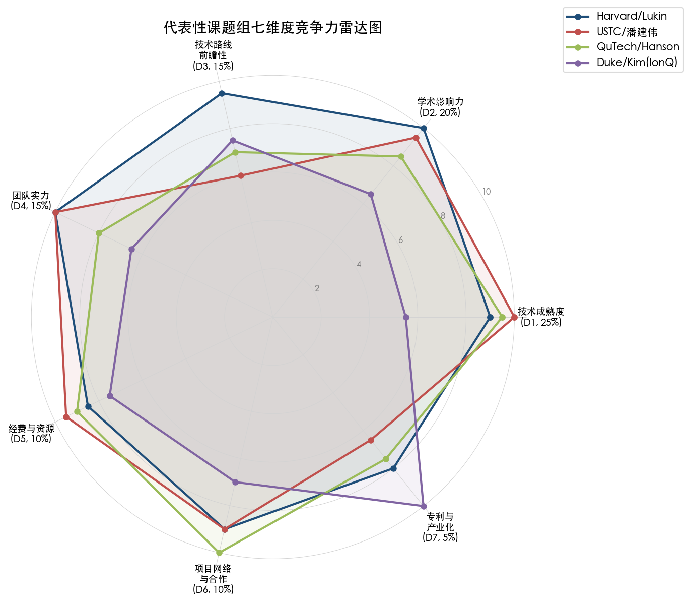

### 5.2.2 敏感性分析：三方案交叉验证

为检验排名结果对权重选择的鲁棒性，将主方案排名与方案A（学术优先：D2 30%、D3 20%、D1 20%）和方案B（工程优先：D1 35%、D5 15%、D7 10%、D2 15%）的排名进行交叉比较：

| 课题组 | 主方案 排名/得分 | 方案A（学术优先） 排名/得分 | 方案B（工程优先） 排名/得分 | 排名波动 | 稳健性判定 |
|:---|:---:|:---:|:---:|:---:|:---|
| Harvard/Lukin | 1 / 9.33 | 1 / 9.47 | 1 / 9.10 | 0 | **稳健** |
| USTC/潘建伟 | 2 / 9.05 | 2 / 8.90 | 2 / 9.22 | 0 | **稳健** |
| QuTech/Hanson | 3 / 8.75 | 3 / 8.55 | 3 / 8.92 | 0 | **稳健** |
| MPQ/Rempe | 4 / 7.75 | 4 / 7.92 | 5 / 7.40 | 1 | **稳健** |
| MIT/Englund | 5 / 7.57 | 5 / 7.70 | 6 / 7.30 | 1 | **基本稳健** |
| UChicago/Awschalom | 6 / 7.38 | 6 / 7.28 | 7 / 7.20 | 1 | **基本稳健** |
| Duke/Kim(IonQ) | 7 / 7.20 | 8 / 7.05 | 4 / 7.47 | **4** | **敏感** |
| 清华/段路明 | 8 / 6.92 | 7 / 7.30 | 10 / 6.37 | **3** | **敏感** |
| ETH/Wallraff | 9 / 6.88 | 8 / 7.05 | 8 / 6.75 | 1 | **基本稳健** |
| Innsbruck/Northup-Lanyon | 9 / 6.88 | 9 / 6.92 | 9 / 6.58 | 0 | **稳健** |

敏感性分析揭示三组关键信号：

**第一，Top 3的绝对稳健性。** Harvard/Lukin、USTC/潘建伟和QuTech/Hanson在三套方案下排名完全一致（分别稳居第1、第2、第3），没有任何权重重分配能改变这一格局。这意味着三者的综合竞争力具有跨评估视角的共识性——无论侧重学术发现、工程推进还是平衡视角，它们都是当前全球量子网络领域的"确定性领先者"。

**第二，Duke/Kim(IonQ)的排名高度敏感。** 该课题组在工程优先方案下跃升至第4（得益于专利与产业化维度的满分10分以及AFRL合同带来的经费维度拉升），但在学术优先方案下降至第8，排名波动达4位，为28组中波动最大者。这一敏感性反映了IonQ作为产业化先行者的特殊定位——其竞争力高度集中于商业化通道，而在学术发现和实验突破维度相对薄弱。

**第三，清华/段路明的学术-工程分裂。** 学术优先方案下升至第7（得益于院士头衔、DLCZ方案的历史影响力和h-92引用积累），工程优先方案下降至第10（量子网络方向的实验演示和产业化记录有限）。3位的排名波动表明，段路明团队在量子网络领域的竞争力评价在很大程度上取决于评估者如何权衡理论贡献（DLCZ方案被引4,566次）与实验部署能力。

下图以热力图形式直观呈现前15名课题组在三套权重方案下的排名变化及稳健性判定结果，颜色越深表示排名越靠前，色差越大则表示该课题组对权重变化越敏感。

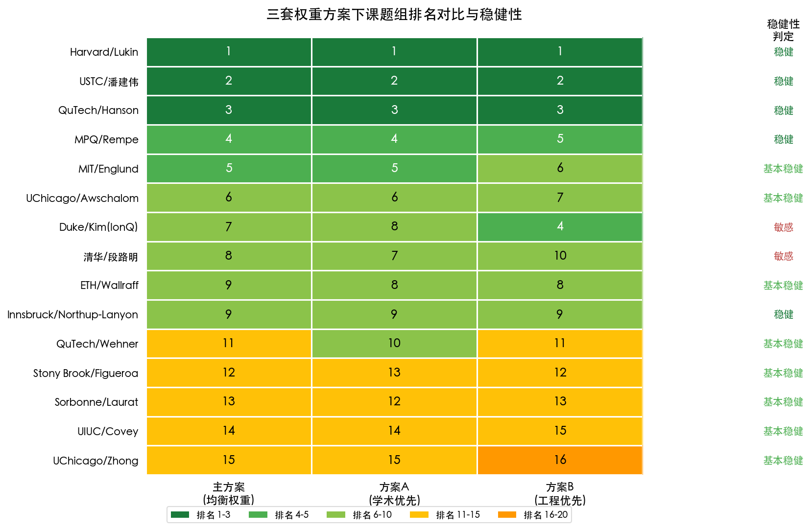

### 5.2.3 边缘课题组分析

主方案第11–13名的课题组处于Top 10的边缘地带：

- **QuTech/Wehner**（第11名，6.50分）：作为理论方向课题组，2018年Science路线图论文是领域最高被引之一，2025年QNodeOS为量子网络操作系统奠基，同年获Körber Prize。其评分受限于技术成熟度维度（理论组天然劣势）和专利产业化维度。若将"量子网络软件/协议"作为独立TRL映射（区别于硬件TRL），Wehner组的排名可能上升。
- **Stony Brook/Figueroa**（第12名，6.43分）：SCY-QNet的10节点广域网络原型使其技术成熟度获得8分（全部课题组中第4高），但学术影响力和团队声望维度拉低了综合排名。该课题组是"工程执行力优于学术声望"的典型代表。
- **Sorbonne/Laurat**（第13名，6.35分）：Welinq的首次商业交付使其在专利产业化维度获得7分（全部课题组中第4高），2025年Science Advances量子密码协议论文也保持了稳定的学术产出。

## 5.3 技术路线聚类分析

将28个课题组按核心技术平台分为六个聚类，可以揭示不同技术路线的集体竞争力特征和内部分化程度。下图以气泡图形式展示六大技术路线在技术成熟度（X轴）与技术路线前瞻性（Y轴）二维空间中的定位，气泡大小反映阵营综合平均得分。

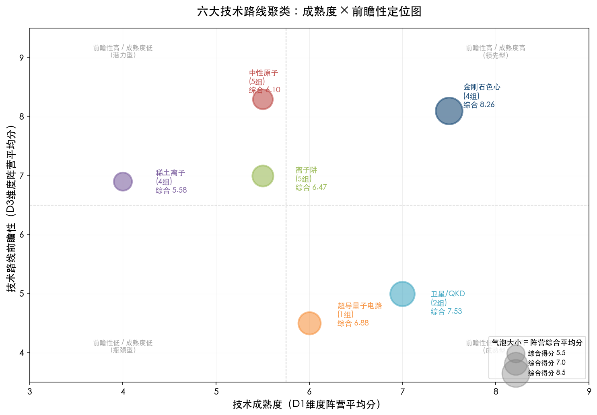

### 5.3.1 金刚石色心阵营（4组）

**成员**：Harvard/Lukin（SiV）、QuTech/Hanson（NV→SnV）、MIT/Englund（NV/SiV集成光子）、UChicago/Bernien（NV纳米光腔）

**阵营平均综合得分**：8.26分，为所有技术路线中最高。

**核心优势**：该阵营包揽综合排名Top 1（Lukin）和Top 3（Hanson），拥有量子网络领域两项最关键的里程碑记录——35 km部署光纤电信波段SiV纠缠（Lukin，TRL 5-6）和三节点纠缠网络+25 km城市链路（Hanson，TRL 5-6）。SiV平台在光子接口效率维度遥遥领先（ZPL 65–90%，C_coh>100），是当前唯一在部署光纤上验证了长距离电信波段纠缠的量子网络平台。

**内部分化**：NV色心与SiV色心之间存在代际切换。NV色心ZPL仅约3%，光子收集效率是根本瓶颈；SiV的ZPL达65–90%但需稀释制冷至<0.1 K。Hanson团队正在向SnV色心转型——SnV的预期运行温度约1.8 K，可使用更紧凑的制冷系统，是下一代色心网络节点的有力候选。2026年1月Hanson团队的腔增强NV光子收集效率10倍提升（从0.05%至0.5%）表明，即便在NV平台上，工程优化仍有可观空间。

**阵营风险**：SiV与SnV均需低温制冷（分别<0.1 K和约1.8 K），在大规模部署中面临成本和工程挑战。但量子计算基础设施已普遍采用稀释制冷，这一要求的增量成本可控。

### 5.3.2 中性原子阵营（5组）

**成员**：MPQ/Rempe（Rb光腔）、LMU/Weinfurter（Rb+频率转换）、UChicago/Bernien（Rb纳米光腔）、UIUC/Covey（Yb-171）、Princeton/Thompson（Yb-171）

**阵营平均综合得分**：6.10分

**核心优势**：技术路线前瞻性维度平均8.3分，为所有阵营中最高，反映社区对中性原子可扩展量子网络潜力的共识判断。该阵营呈现"双引擎"格局：Rb原子光腔方案（Rempe引领）在确定性光子图态和多量子比特网络寄存器方面独具技术优势，2024年Science发表的光腔内2D原子阵列代表确定性量子网络节点的最高成就；Yb-171方案（Covey与Thompson引领）凭借电信波段原生兼容性和并行化阵列架构，被普遍视为最具颠覆性潜力的新兴平台。

**内部分化**：MPQ/Rempe（综合7.75分）与阵营内其他组（5.43–6.10分）之间存在显著差距。Rempe作为Kimble（量子互联网概念提出者之一）的学术继承人和MPQ所长，拥有远超其他中性原子组的资源和学术积累。Covey和Thompson作为助理教授，团队实力维度得分较低（3.5分），但技术路线前瞻性维度的高分（9分和8.5分）弥补了这一短板。

**阵营风险**：多数课题组仍处TRL 3-4阶段，尚无远程原子-原子纠缠的实验记录。从单对原子-光子纠缠到远程双原子纠缠再到多节点网络，Yb-171方向仍有多个工程关口需逐一突破。

### 5.3.3 离子阱阵营（5组）

**成员**：Innsbruck/Northup-Lanyon（Ca+光腔）、Duke/Kim(IonQ)（Ba+）、清华/段路明（Yb+双类型）、Oxford/Lucas、Weizmann/Ozeri

**阵营平均综合得分**：6.47分

**核心优势**：离子阱在多量子比特操控方面是所有平台中最为成熟的——单量子比特门保真度>99.99%，双量子比特门保真度>99.9%（Oxford/Lucas 2025年创纪录）。IonQ拥有约400项量子网络专利和NYSE上市地位，是唯一已建立完整产业化通道的量子网络技术公司。Innsbruck于2025年PRL展示的10量子比特光子接口网络节点（纠缠保真度92%，可扩展至数百离子）树立了量子网络节点复杂度的新标杆。USTC/潘建伟团队2026年2月的10 km离子-离子纠缠突破亦属广义离子阱阵营的重要里程碑。

**内部分化**：Innsbruck在量子网络实验方面领先阵营（综合6.88分），但其最长网络链路仅230 m（2023年校园网络），与色心阵营的25–35 km差距显著。Duke/Kim(IonQ)的竞争力高度集中于产业化维度（专利10分），学术影响力和技术成熟度相对薄弱。清华/段路明的DLCZ方案历史影响力巨大（被引4,566次），但量子网络实验产出相对有限。

**阵营风险**：离子阱光互联仍处TRL 3-4阶段。从离子阱到光纤的高效光子提取和电信波段频率转换是核心技术瓶颈；IonQ于2025年9月实现捕获钡离子光子到电信波长的频率转换，是该方向的重要进展。[IonQ](https://investors.ionq.com/news/news-details/2025/IonQ-Achieves-Significant-Quantum-Internet-Milestone-Demonstrates-Quantum-Frequency-Conversion-to-Telecom-Wavelengths/default.aspx "IonQ频率转换 2025年9月")

### 5.3.4 稀土离子阵营（4组）

**成员**：UChicago/Zhong（铒晶体）、Caltech/Faraon（稀土纳米光子）、TUM/Reiserer（铒/硅）、ICFO/de Riedmatten（稀土+离子阱混合）

**阵营平均综合得分**：5.58分，为所有量子物质平台阵营中最低。

**核心优势**：与硅光子工业的天然兼容性是该阵营最大的长期优势。铒原子是唯一已知在电信C波段（1530–1565 nm）具有相干跃迁的量子系统，意味着铒基量子网络节点可以直接接入现有全球光纤基础设施而无需任何频率转换。UChicago/Zhong于2025年将铒原子自旋相干时间从0.1 ms提升至>10 ms（最高24 ms），对应理论网络距离2,000–4,000 km，是量子网络可扩展性的重要里程碑。[UChicago PME](https://pme.uchicago.edu/news/breakthrough-could-connect-quantum-computers-200x-distance "Nature Communications 2025")

**内部分化**：该阵营整体处于早期阶段（TRL 2-3），技术成熟度维度平均仅4分，里程碑记录最少——没有远程纠缠、没有多节点网络、没有城市级测试床。课题组PI多为青年教授（Zhong获Sturge Prize 2025，Reiserer获ERC资助），团队仍在成长期。

**阵营定位**：长期看好，短期缺里程碑。若铒/硅方案的单离子控制和多量子比特操控在未来2–3年取得突破，该阵营的竞争力可能快速跃升。

### 5.3.5 卫星/QKD阵营（2组）

**成员**：USTC/潘建伟（卫星+光纤QKD）、NUS/Ling（纳米卫星量子通信）

**阵营特殊性**：USTC/潘建伟同时在离子阱方向有重大突破，其综合排名第2主要源于多路线并行的全面优势，并不完全归属于单一技术路线。NUS/Ling的SpooQy-1纳米卫星（首次实现轨道量子纠缠光子源）在卫星量子通信方向做出开创性贡献，但综合排名相对靠后（约第18–20名）。

该阵营的核心议题是范式转型：USTC 2026年2月的量子中继器核心组件突破标志其正从可信中继范式向纠缠型网络范式过渡。这一战略转型能否成功，将决定USTC能否在纠缠型量子网络竞争中维持其部署规模优势。

### 5.3.6 超导量子电路阵营（1组）

**成员**：ETH/Wallraff

**核心成就**：2023年Nature首次超导量子电路无漏洞Bell检验，2025年Nature Communications确定性2D多光子集群态（20光子量子比特），2026年Nature Physics格子手术量子纠错。

**核心瓶颈**：微波-光子转换是超导参与光纤量子网络的根本障碍。超导量子比特工作在微波频段（3–8 GHz），而光纤传输需要光学频段（约200 THz），两者之间五个数量级的频率差距需要高效、低噪声的量子转换器。截至2026年4月，全球最优实验结果为Harvard/Lončar组的1.18%峰值转换效率（Nature Physics, 2025）和Caltech/Mirhosseini组的亚光子噪声连续量子使能转导（Nature Nanotechnology, 2025），但这些成果源自转导器专业组而非超导量子电路组本身，两者之间的系统集成仍有数量级差距。Wallraff组自身的微波-光子转换实验仍处于早期阶段。

**阵营前景**：IBM与Cisco于2025年11月宣布合作构建分布式容错量子计算机网络（目标2030年代初概念验证），这是超导量子网络方向最大的产业推动力。[IBM新闻室](https://newsroom.ibm.com/2025-11-20-ibm-and-cisco-announce-plans-to-build-a-network-of-large-scale,-fault-tolerant-quantum-computers "IBM-Cisco 2025年11月") 若该合作能加速微波-光子转换的工程投入，超导阵营的竞争力可能在2–3年内显著改善；但在该瓶颈突破之前，超导量子电路在光纤量子网络中的角色仍然受限。

## 5.4 地理区域聚类分析

### 5.4.1 北美（10组，平均综合得分6.59分）

北美阵营具有三个结构性优势。**资金规模最大**——DOE 6.25亿美元NQISRCs续期、NSF CQN ERC 3,240万美元、NQVL等构成全球最庞大的联邦资助体系。**PI集中度最高**——Top 10中有6组来自北美（Lukin、Englund、Awschalom、Kim等，加上Covey等后备力量）。**产业生态最成熟**——IonQ（NYSE上市）、QuEra（2.3亿美元融资）等头部量子企业总部均在北美，DARPA和AFRL的国防投入进一步强化了产学研闭环。

但北美阵营也呈现明显的"双峰分布"：Harvard/Lukin（9.33分）一枝独秀，与阵营第2名MIT/Englund（7.57分）之间存在1.76分的差距。多个新锐课题组（Covey、Zhong、Bernien、Thompson）虽然技术路线前瞻性维度得分很高（平均8.1分），但团队实力和技术成熟度维度拉低了综合排名。北美的广域量子网络测试床建设（CQN波士顿测试床、SCY-QNet）相较欧洲QIA网络起步较晚，但NSF NQVL的设立正在加速弥补这一差距。

### 5.4.2 欧洲（12组，平均综合得分6.37分）

欧洲拥有28个课题组中数量最多的阵营，但质量分化显著。QuTech/Hanson（8.75分）和MPQ/Rempe（7.75分）构成欧洲的"双核心"，在技术成熟度和技术路线前瞻性维度均处全球顶尖水平。QIA协作项目提供了北美和亚太地区无法比拟的跨国统一协调机制——Hanson作为QIA协调人，将Innsbruck、MPQ、ICFO、Sorbonne等欧洲核心课题组连接在同一技术路线图和时间表下。

欧洲阵营的短板在于产业化维度：除Delft Networks（2024年创立）和Welinq（2026年首次商业交付）外，大多数欧洲课题组在专利和衍生企业方面记录空白，12组中有8组在D7维度得分≤3分。理论和协议方向是欧洲的差异化优势——Wehner（QNodeOS）、Paderborn/Silberhorn（集成光子）等在量子网络软件栈和光子芯片方向处于全球领先地位。

### 5.4.3 亚太及其他（6组，平均综合得分5.99分）

亚太阵营呈现极端的"一超多弱"格局：USTC/潘建伟（9.05分）一枝独秀，与阵营第2名清华/段路明（6.92分）之间的差距超过2分。这种极端集中度反映了中国量子通信研发的国家战略驱动特征——资源高度向以潘建伟为核心的USTC团队集中。

中国两大课题组（USTC、清华）面临一个共同的结构性约束：国际合作论文比例仅约19%（美国约50%）。ITIF（2024）的分析表明，这一差距部分源于地缘政治因素，部分源于中国量子生态的相对封闭性。在评估项目网络与合作维度时，这一结构性约束被纳入考量，但并非完全归因于课题组自身——潘建伟团队在中国国内的合作网络（中科院体系、国盾量子、中国电信量子集团）实际上极为庞大。

日本（NTT、东京大学/Murao）和新加坡（NUS/Ling）的课题组综合排名相对靠后，但各有专长：NTT于2025年1月实现60 GHz光学量子纠缠实时生成（世界最快），在连续变量量子信息方向具有竞争力；NUS/Ling在纳米卫星量子通信方向做出开创性贡献。[NTT](https://group.ntt/en/newsrelease/2025/01/29/250129a.html "60 GHz纠缠 2025")

## 5.5 关键议题讨论

### 5.5.1 学术产出与实验进展的背离

在28个课题组中，学术影响力维度得分与技术成熟度维度得分并非完美正相关。两维均强的课题组——Harvard/Lukin、USTC/潘建伟、QuTech/Hanson——可被视为"全能型"领先者。但也存在显著的维度背离案例。

清华/段路明在学术影响力（7.5分）和团队实力（8.5分）上获得高分，中国科学院院士头衔、DLCZ方案的历史性贡献（被引4,566次）和2024年Nature 512离子量子模拟器论文均为有力支撑。然而，其量子网络方向的实验演示相对有限（技术成熟度仅5.5分），大部分引用和实验成就来自量子模拟和量子计算方向，而非量子网络节点或纠缠分发。2025年Science Advances发表的双类型量子比特离子阱网络节点是向量子网络方向的重要一步，但远程纠缠实验尚未取得标志性成果。

ETH/Wallraff呈现类似模式：学术影响力7.5分（cQED奠基人，2004年Nature论文被引超10,000次）、团队实力7.5分，但技术路线前瞻性仅4.5分（超导微波-光子转换瓶颈未解）。Wallraff团队在超导量子计算和量子纠错方面的成就处于世界顶级，但这些成就尚未转化为量子网络方向的实验突破。

反向背离案例是Stony Brook/Figueroa：技术成熟度8分（SCY-QNet 10节点广域原型），但学术影响力仅5.5分、团队实力仅5分。该课题组是典型的"工程执行力优于学术声望"模式——SCY-QNet是美国最大规模的广域量子网络测试床，但PI的个人引用量和学术奖项远不及上述课题组。

### 5.5.2 经费规模与技术突破的非线性关系

数据表明，经费规模与技术突破之间并非简单线性关系。UChicago/Awschalom领导的Q-NEXT中心拥有1.25亿美元/5年的超大规模资助，在经费维度获得10分（满分），但技术成熟度仅5分——这是28组中"经费-突破"落差最显著的案例。Q-NEXT作为多机构协作中心，Awschalom承担的更多是管理协调角色而非前线实验推进，资金分散于30余个合作机构而非聚焦于单一实验突破。2021年PRX Quantum发表的QuICs路线图（被引500余次）是重要的战略性贡献，但非前沿实验突破。

相比之下，MPQ/Rempe以中等经费规模（Max Planck Society基础资助+DFG与QIA项目资助，估计总量远小于Q-NEXT）产出了高密度的技术突破——2024年Science和Nature各一篇、2025年PRL一篇，技术成熟度7.5分。这一"经费效率"差异表明，在约1,000万美元/年以上的经费水平，课题组的突破能力更取决于科研聚焦度、PI的直接实验参与度和团队执行力，而非资金总量。

### 5.5.3 老牌强组与新兴团队的代际切换

Top 10中有7席由老牌强组占据（Lukin、潘建伟、Hanson、Rempe、Englund、Awschalom、Kim，PI均为资深教授或院士级别），但新兴团队在技术路线前瞻性维度展现出压倒性优势：Covey、Zhong、Bernien、Thompson、Reiserer五位青年PI的技术路线前瞻性平均得分达8.1分，高于老牌Top 10课题组的平均7.2分。

这一代际切换的内在逻辑是学术谱系的延伸。Bernien（博士阶段师从Hanson、博后阶段师从Lukin，现UChicago独立PI）同时继承了NV色心和SiV色心两大主流量子网络平台的一线实验经验；Reiserer（博后阶段师从Rempe，现TUM PI）将Rempe的腔QED专长引入铒离子新平台；Thompson（NSF CQN Co-PI，Princeton）在Yb-171方向建立了从Lukin-Englund体系分化出的新技术分支。

从评估方法论角度看，这些新兴团队当前的综合排名受制于团队实力（助理教授级别，得分3.5–4分）和经费规模（NSF CAREER级别，得分4–5分）两个维度的"起步劣势"。但技术路线前瞻性维度的高分（8–9分）表明，它们选择的平台和方向具有领域共识认可的长期竞争力。在未来3–5年的时间窗口中，随着团队成长和资助积累，这些新兴团队有可能进入Top 10。Covey课题组在Google于2026年3月宣布增加中性原子模态后，可能获得额外的产业资源和关注度。[The Quantum Insider](https://thequantuminsider.com/2026/03/24/google-paves-a-two-lane-quantum-roadmap-by-adding-neutral-atom-systems/ "Google中性原子 2026年3月")

### 5.5.4 数据透明度不对称对排名的影响

本章的评分过程充分体现了第4章所述的数据透明度不对称问题。美国课题组的经费数据可精确至具体grant编号和金额（如CQN ERC 3,240万美元、Q-NEXT 1.25亿美元、SCY-QNet NSF 400万美元），而中国课题组的经费数据无法以同等精度核实。USTC/潘建伟在经费维度的9.5分取自"中位估算"：若采用"高位估算"（假设实际资助远超公开可查金额），该维度可升至10分（综合排名不变）；若采用"低位估算"（仅计可公开查证金额），该维度可能降至7分，综合排名仍维持第2但分差缩小。清华/段路明面临类似情况，经费维度在三情景下波动范围为4–7分。

同样，专利数据的不对称也值得关注。IonQ通过SEC披露详细专利组合信息（约400项量子网络专利，总数超1,000项），而学术课题组的专利持有数据普遍不可系统获取（需逐一检索USPTO/EPO/CNIPA数据库）。这可能导致部分学术课题组在D7维度被低估——例如USTC和清华可能通过中国国家知识产权局（CNIPA）持有一定数量的量子通信相关发明专利，但系统性检索和验证超出了本报告的数据采集范围。

# 第6章 Top 10 最具潜力课题组深度剖析

第5章通过七维度加权评估框架对28个课题组进行了系统化横向比较，产出了综合排名与敏感性分析。本章将视角从宏观横比收束至微观深描，对综合排名前十的课题组逐一展开深度剖析。每个课题组的分析遵循统一结构：核心技术突破与代表性论文、团队脉络与学术传承、经费项目与资源基础、合作网络与行业联系、专利与产业化进展、未来6个月预期（2026年4月至10月）。在十组个案之后，本章从整体视角审视Top 10之间的互动关系——合作链、师承网络、竞争格局——并从中提炼量子网络技术方向的收敛趋势。

下图以气泡时间线方式总览Top 10课题组在2023—2026年间的关键论文发表节奏，直观呈现各组近期学术产出密度与时序分布。

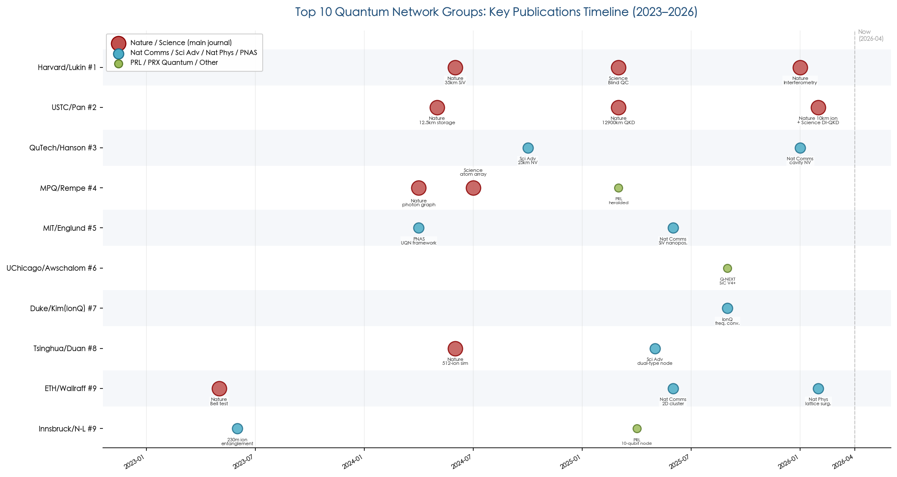

## 6.1 Harvard/Lukin（综合得分9.33，排名第1，SiV色心）

### 6.1.1 核心技术突破与代表性论文

Harvard大学Lukin课题组是当前全球量子网络领域综合竞争力最强的研究团队。其核心技术路线围绕金刚石硅空位色心（Silicon-Vacancy, SiV）展开，SiV平台在光子接口效率方面具有决定性优势——零声子线（ZPL）发射率65—90%，相干合作参数 C_coh > 100，远优于传统NV色心（ZPL仅约3%）。

近12个月内，该课题组实现了Nature/Science正刊三连发，这一产出密度在28个课题组中独一无二：

- **2024年Nature**：实现两个SiV节点经35 km波士顿部署光纤的电信波段纠缠，纠缠保持超过1秒。这一成果是纠缠型量子网络在真实部署光纤上距离最远的电信波段纠缠记录（TRL 5-6），直接验证了SiV平台在城域尺度的可行性。[Nature 2024](https://www.nature.com/articles/s41586-024-07252-z "35 km SiV电信纠缠, DOI: 10.1038/s41586-024-07252-z")
- **2025年Science**：首次基于固态量子比特实现分布式盲量子计算（Blind Quantum Computing），证明量子网络可以为远程量子计算提供安全委托方案——用户可以在不泄露算法细节的前提下使用远程量子计算机。[Science 2025](https://www.science.org/doi/10.1126/science.adu6894 "盲量子计算, DOI: 10.1126/science.adu6894")
- **2026年Nature**：纠缠辅助非局域光学干涉术，基线1.55 km，将量子网络应用从通信和计算扩展到精密测量领域。[Nature 2026](https://www.nature.com/articles/s41586-026-10171-w "非局域干涉术, DOI: 10.1038/s41586-026-10171-w")

上述三篇论文分别指向量子网络的三大核心应用方向——安全通信、安全计算和量子增强感知。这种应用维度的广覆盖在所有课题组中独树一帜，表明Lukin课题组不仅在技术深度上保持领先，更在量子网络的应用拓展上引领社区研究议程。

### 6.1.2 团队脉络与学术传承

PI Mikhail D. Lukin现任Harvard大学Joshua and Beth Friedman University Professor、Harvard量子倡议（HQI）联合主任，美国国家科学院（NAS）院士，APS/OSA/AAAS Fellow，Google Scholar总引用约163,654次（h-207），为28个课题组中引用量最高者。[Google Scholar](https://scholar.google.com "Lukin引用数据, 2026年4月读取")

Lukin的学术谱系可追溯至Marlan Scully（量子光学奠基人之一），其在超冷原子、电磁诱导透明（EIT）和Rydberg原子方面的早期研究为量子网络的物理基础做出了根本性贡献。该课题组的人才辐射效应在量子网络领域影响深远：Hannes Bernien（博士于Delft/Hanson组，博后于Lukin组，现UChicago独立PI）、Bart Bhaskar和Can Knaut等新一代研究者已在量子网络方向独当一面。多名Lukin组核心成员被IonQ招揽——包括Boris Machielse、Riedel和Johannes Borregaard——这既反映了SiV色心技术在产业界的强吸引力，也凸显了Lukin课题组作为领域人才孵化器的独特角色。

### 6.1.3 经费项目与资源基础

Lukin课题组拥有多元化的资助组合：NSF量子网络中心（Center for Quantum Networks, CQN）工程研究中心（ERC）总经费约3,240万美元（2020—2026年），Lukin担任核心PI。[Dimensions](https://app.dimensions.ai/details/grant/grant.9381310 "CQN $32.4M, 2020-2026") 此外，DOE、DARPA和AWS量子网络中心提供额外资助，总额估计在5,000万至7,000万美元区间。CQN ERC将于2026年到期，续期结果构成该课题组经费可持续性的关键变量——若NQI重新授权法案（S.3597）顺利通过并带动NSF新一轮量子网络专项，Lukin课题组有望获得续期或替代资助。[Quantum Computing Report](https://quantumcomputingreport.com/senators-introduce-bipartisan-national-quantum-initiative-reauthorization-act-of-2026/ "NQI重新授权 2026")

### 6.1.4 合作网络与行业联系

Lukin与MIT/Englund课题组在CQN框架下深度协作，共同开发波士顿50 km城市量子网络测试床——Lukin课题组提供SiV节点，Englund课题组提供集成光子芯片互联方案，体现了Harvard-MIT在量子网络硬件与集成光子两个层面的功能互补。衍生企业QuEra Computing于2025年2月完成2.3亿美元融资，虽主攻中性原子量子计算而非量子网络，但SiV色心技术本身具有独立的产业化潜力。[QuEra](https://www.quera.com/press-releases/quera-computing-completes-230m-financing-to-accelerate-development-of-large-scale-fault-tolerant-quantum-computers "QuEra $230M融资")

### 6.1.5 未来6个月预期（2026.04—2026.10）

Lukin课题组未来半年最值得关注的方向是向三节点以上SiV网络推进——在35 km双节点纠缠和盲量子计算的基础上，新增第三个节点将标志着从"链路"到"网络"的质变。量子增强成像和干涉术方面的延伸探索同样值得密切跟踪。此外，该课题组可能探索SnV色心（运行温度约1.8 K，远高于SiV的<0.1 K），以降低大规模部署的冷却需求。CQN ERC续期谈判的结果预计也将在此期间初步明朗。

---

## 6.2 USTC/潘建伟（综合得分9.05，排名第2，卫星+光纤+离子阱）

### 6.2.1 核心技术突破与代表性论文

中国科学技术大学（USTC）潘建伟团队是全球量子网络领域唯一同时在基础设施部署规模和前沿科学突破两个维度均达到最高水平的课题组。其技术路线的显著特征在于多路线并行推进——卫星光子、光纤QKD和离子阱三条路线齐头并进，这一布局在全球量子网络研究中别无先例。

2026年2月，该团队在Nature和Science同月发表两篇正刊论文，"双正刊同月"在量子网络领域尚属首次：

- **2026年2月Nature**：展示10 km光纤离子-离子纠缠（使用捕获离子长寿命量子存储器），纠缠存活时间首次超过建立时间，并实现设备无关QKD验证——10 km正密钥率，101 km渐近极限正密钥率。[Liu et al., Nature (2026)](https://www.nature.com/articles/s41586-026-10177-4 "DOI: 10.1038/s41586-026-10177-4")
- **2026年2月Science/Nature双发**：可扩展量子中继器核心组件演示和11 km设备无关QKD（此前记录约50倍距离提升）。[CAS新闻](https://english.cas.cn/newsroom/cas-in-media/202602/t20260206_1149922.shtml "USTC 2026双重突破")；[The Quantum Insider](https://thequantuminsider.com/2026/02/06/chinese-researchers-clear-hurdles-for-long-distance-quantum-networks/ "长距离量子网络突破")

此前，2025年3月该团队在Nature发表12,900 km中国-南非卫星QKD成果（使用"济南一号"微卫星），创造卫星量子密钥分发的最远距离记录。[ScienceDaily](https://www.sciencedaily.com/releases/2025/03/250319142833.htm "DOI: 10.1038/s41586-025-08739-z")

在部署规模方面，潘建伟团队建设运营的中国量子通信网络（CN-QCN）拥有145个光纤节点、6个地面站、20个城域网，覆盖17个省80座城市，光纤总长超过12,000公里，为全球规模最大的量子通信基础设施。[CSIS报告](https://www.csis.org/analysis/understanding-chinas-quest-quantum-advancement "CSIS, 2026年1月") 需指出的是，CN-QCN采用可信中继范式（TRL 7-8），而非纠缠型网络范式；但2026年2月的量子中继器突破标志着该团队正从可信中继向纠缠型网络进行战略性范式转型。

### 6.2.2 团队脉络与学术传承

PI潘建伟为中国科学院院士，2025年Falling Walls物理科学突破奖得主，师承2022年诺贝尔物理学奖得主Anton Zeilinger（维也纳大学）。核心团队包括陆朝阳（量子光学实验）、彭承志（卫星量子通信）、陈宇翱（多体纠缠）和包小辉（离子阱量子网络），每位核心成员均已成长为具有独立研究能力的实验物理学家。[The Quantum Insider](https://thequantuminsider.com/2026/02/06/chinese-researchers-clear-hurdles-for-long-distance-quantum-networks/ "USTC团队")

该团队的一个结构性特征是国际合作论文比例较低——约19%，而美国课题组平均约50%。ITIF (2024) 分析认为，这部分源于地缘政治因素对跨国合作的制约，部分源于中国量子生态体系的内部自足性。[ITIF (2024)](https://itif.org/publications/2024/09/09/how-innovative-is-china-in-quantum/ "中国量子创新评估") 然而在国内，该团队的合作网络极为庞大——覆盖中科院体系、国盾量子（QuantumCTek）、中国电信量子集团（CTQG）等，形成从基础研究到产业部署的完整链条。

### 6.2.3 经费项目与资源基础

潘建伟团队依托国家量子信息科学实验室（合肥，国家实验室级别）、科技部重大专项、国家自然科学基金委和中科院先导专项，以及安徽省量子基金。具体项目金额未公开披露。据CSIS 2026年1月报告估算，中国政府累计量子投资约150亿美元（涵盖所有量子技术方向，该数据未经中国官方确认），USTC作为中国量子信息的旗舰机构获得其中相当份额。[CSIS报告](https://www.csis.org/analysis/understanding-chinas-quest-quantum-advancement "CSIS, 2026年1月") 基于有限公开信息的中位估算，该团队在量子网络方向的资源量级可与西方最大型量子中心（如Q-NEXT 1.25亿美元/5年）比肩。

### 6.2.4 合作网络与行业联系

潘建伟团队领导中国国家量子通信网络建设，与国盾量子（QuantumCTek）建立了深度产学研合作关系。中国电信量子集团（CTQG）已成为国盾量子控股股东，QKD服务覆盖超过550万用户。在学术层面，与清华大学段路明团队存在基于DLCZ理论框架的长期理论-实验互动。

### 6.2.5 未来6个月预期（2026.04—2026.10）

量子中继器多节点串联实验是最值得关注的方向——2026年2月的核心组件演示已奠定技术基础，向2—3个中继器节点串联推进将构成下一个里程碑。DI-QKD向200 km以上距离延伸亦为可期待的目标。在卫星方向，"墨子二号"或新一代量子卫星可能进入工程准备阶段。

---

## 6.3 QuTech/Hanson（综合得分8.75，排名第3，NV色心→SnV转型）

### 6.3.1 核心技术突破与代表性论文

TU Delft/QuTech的Hanson课题组是纠缠型量子网络实验的历史先驱，在该领域拥有两项具有开创意义的里程碑：2021年Nature首个三节点纠缠量子网络（被引超876次），以及2024年Science Advances实现Delft–Den Haag 25 km部署光纤量子处理器间纠缠——后者至今仍保持纠缠型量子网络在部署光纤上"最远端到端纠缠"的记录（TRL 5-6）。[QuTech](https://qutech.nl/2024/10/30/a-rudimentary-quantum-network-link-between-dutch-cities/ "Science Advances 2024, DOI: 10.1126/sciadv.adp6442")

近期的关键突破是2026年1月Nature Communications发表的腔增强NV色心工作：通过微腔结构将NV中心的有用光子收集概率从约0.05%提升至约0.5%（10倍提升），同时保持T₂>100μs的相干时间。[QuTech](https://qutech.nl/2026/01/15/more-photons-faster-links-a-laser-focused-nv-centre/ "Nature Communications 2026") 光子收集效率是纠缠生成速率的直接决定因素——10倍效率提升意味着纠缠速率100倍提升的潜力（双节点纠缠速率正比于两端光子收集效率之积），这为NV色心平台的实用化扫清了一项关键障碍。

Hanson团队当前正处于从NV色心向SnV色心的平台转型阶段。SnV色心的预期运行温度约1.8 K，远高于SiV色心的<0.1 K，可使用更紧凑、更经济的制冷系统。这一转型若成功完成，有望在保持色心平台固有优势（固态、可集成）的同时，大幅降低网络节点的部署成本与运维门槛。

### 6.3.2 团队脉络与学术传承

PI Ronald Hanson是量子网络实验领域的标志性人物之一。Spinoza Prize (2019)、Bell Prize (2017) 获得者，荷兰皇家科学院（KNAW）院士。其博士后经历在David Awschalom课题组（现UChicago），由此形成Awschalom→Hanson→Bernien的三代学术传承链。Hanson培养的Bernien（博士）现任UChicago独立PI，正在开发中性Rb原子纳米光子腔量子网络平台。[QuTech](https://qutech.nl/person/ronald-hanson/ "Ronald Hanson")

### 6.3.3 经费项目与资源基础

Hanson课题组的资助生态在欧洲首屈一指。作为EU QIA项目协调人，直接管理Horizon Europe 2,400万欧元资助。[CORDIS](https://cordis.europa.eu/project/id/101102140/reporting "QIA Phase 1 Grant €24M") 同时，作为Quantum Delta NL核心节点，依托荷兰国家量子计划6.15亿欧元的宏大生态体系。NWO和ERC则提供个人层面的竞争性资助。多层次的欧盟、国家和机构资助结构赋予该课题组全球最强的经费可持续性——即便单一资助渠道到期，其他渠道仍可提供有效缓冲。

### 6.3.4 合作网络与行业联系

Hanson在合作网络维度获得满分（10分），位列28个课题组之首。作为QIA协调人，他将Innsbruck/Northup-Lanyon、MPQ/Rempe、ICFO/de Riedmatten、Sorbonne/Laurat等欧洲核心量子网络课题组纳入同一技术路线图和时间表之下。2024年创立的Delft Networks公司专注于量子网络硬件产品化，QuTech官网将其定位为"基于固态金刚石量子比特构建下一代部署就绪的量子网络"。[QuTech](https://qutech.nl/business-innovation/startups/ "QuTech衍生企业") QuTech生态中的Q*Bird（量子安全网络）和QphoX（量子转导）等衍生企业与Delft Networks共同构成了全球最完整的量子网络产业集群之一。

### 6.3.5 未来6个月预期（2026.04—2026.10）

未来半年有三个方向值得重点关注：（1）腔增强NV+部署光纤的高速纠缠演示——若将2026年1月的10倍光子收集效率提升应用于25 km Delft-Den Haag链路，有望实现纠缠速率的量级跃升；（2）SnV色心首个远程纠缠演示——若在1.8 K运行温度下成功验证远程纠缠，将标志色心平台代际切换的关键节点；（3）Delft Networks首款产品原型发布——从学术衍生到商业化硬件的跨越。QIA Phase 2的资助规模和时间表预计也将在此期间明朗化，直接影响该课题组的中期资源保障。

---

## 6.4 MPQ/Rempe（综合得分7.75，排名第4，Rb原子光腔）

### 6.4.1 核心技术突破与代表性论文

Max Planck量子光学研究所（MPQ）的Rempe课题组在中性原子腔量子电动力学（cavity QED）方向处于全球引领地位。其核心技术路线基于Rb（铷）原子与高精细度光学腔的强耦合体系，该方案的核心优势在于确定性光子生成——原子-腔系统可按需发射单光子和纠缠光子对，与大多数量子网络平台依赖的概率性光子产生机制形成鲜明对比。

近12个月的代表性成果包括：

- **2024年Science**：在光学腔内实现光镊控制的2D原子阵列量子网络寄存器，这是"确定性多量子比特网络节点"的最先进演示——单个腔内可同时驻留多个原子量子比特，每个量子比特可独立与光子纠缠。[Science 2024](https://www.science.org/doi/10.1126/science.ado6471 "Quantum-network register, DOI: 10.1126/science.ado6471")
- **2024年Nature**：确定性光子图态融合，为容错量子网络所需的纠缠结构提供了确定性制备方案。[Nature 2024](https://www.nature.com/articles/s41586-024-07357-5 "确定性光子图态融合")
- **2025年PRL**：宣告式（Heralded）原子-光子纠缠源，进一步提升网络纠缠的确定性和可验证性。[PRL 2025](https://link.aps.org/doi/10.1103/5zk9-3rpv "宣告式纠缠源")

Rempe课题组的技术路线在第5章技术路线前瞻性维度获得9分（并列第2），与UIUC/Covey的Yb-171方案持平。其核心逻辑在于：当量子网络从少量节点扩展到数十乃至更多节点时，确定性光子生成和多量子比特寄存器的内在可扩展性将成为决定性竞争优势。

### 6.4.2 团队脉络与学术传承

PI Gerhard Rempe是量子网络实验的先驱之一，现任MPQ Director。其学术谱系直接继承自Jeff Kimble（Caltech）——后者是"量子互联网"概念的提出者。Rempe作为Kimble的早期合作者，将腔QED方法从Caltech引入欧洲并独立发展至今。清华大学段路明也曾在Kimble课题组从事博士后研究，Rempe与段路明因此共享Kimble学派的学术渊源。Rempe课题组的博后Andreas Reiserer现已独立为TUM PI，将腔QED技术专长引入铒离子新平台，代表了该学派的分支扩展。

### 6.4.3 经费项目与资源基础

Rempe课题组的资助结构体现了Max Planck体系的特殊优势：MPI Director级别的基础资助提供长期稳定的研究支持（具体金额不公开，但MPI Director级别年度预算通常在数百万欧元量级），叠加DFG、QIA项目和BMBF等外部竞争性资助。相较于高度依赖项目制资助的美国课题组，Rempe课题组的基础资助模式赋予其更大的研究自由度和更长的技术押注周期。第5章的分析表明，MPQ/Rempe以中等经费规模产出了高密度的顶刊论文（2024年Science和Nature各一篇、2025年PRL一篇），在28个课题组中属于"经费效率"最高者之一。

### 6.4.4 未来6个月预期（2026.04—2026.10）

未来半年的关键在于三个整合方向：（1）光镊原子阵列+远程纠缠结合——将2024年Science展示的腔内2D阵列能力与光纤远程纠缠分发技术整合；（2）宣告式纠缠+电信波段频率转换——将2025年PRL的宣告式纠缠源与电信C波段光子转换相结合，实现远距离确定性纠缠分发；（3）多原子图态融合向更大规模的扩展。

---

## 6.5 MIT/Englund（综合得分7.57，排名第5，金刚石色心集成光子）

### 6.5.1 核心技术突破与代表性论文

MIT的Englund量子光子与人工智能课题组（QPAI Group）专注于金刚石色心的集成光子学实现路径。如果说Lukin课题组解决的是"量子网络节点能做什么"的问题，那么Englund课题组解决的则是"如何将量子网络节点工程化、芯片化"的问题——两者构成从物理原理到可制造系统的完整链条。

核心成果包括：

- **2024年PNAS**：与Lukin合作提出量子网络效用（Utility of Quantum Networks, UQN）框架，这是首个跨平台通用基准——当双量子比特门有效误差ε_eff>0时，量子网络的最大可用联盟规模上限为⌊1/ε_eff⌋。该框架为比较不同物理平台的网络能力提供了统一的理论工具。[PNAS 2024](https://pmc.ncbi.nlm.nih.gov/articles/PMC11047070/ "Quantum Network Utility, PNAS 2024")
- **2025年Nature Communications**：硅色心纳米定位与光谱调谐突破，解决了SiV色心在集成光子芯片上的精确放置和频率匹配问题——这是量子网络节点从实验室装置走向可制造芯片的关键工程步骤。[MIT RLE](https://www.rle.mit.edu/quantum-photonics-and-ai-group-achieves-breakthrough-in-controlling-silicon-color-centers-for-scalable-quantum-technologies/ "硅色心突破")

Englund课题组同时在推进"ski jump"光子芯片互联技术，旨在实现金刚石量子比特与硅光子芯片之间的低损耗接口，为大规模可制造的量子网络节点奠定工程基础。

### 6.5.2 团队脉络与学术传承

PI Dirk Englund为MIT电子工程与计算机科学系教授，Google Scholar总引用约56,197次（h-116），NSF CQN联合副主任。[MIT EECS](https://www.eecs.mit.edu/people/dirk-r-englund/ "Dirk Englund") Englund与Lukin的关系并非简单的师生传承，而是基于CQN框架下的深度学术互补——Lukin提供量子网络的物理节点核心能力，Englund提供将这些节点集成到光子芯片的工程路径。两者共同开发的波士顿50 km城市测试床是美国最先进的量子网络基础设施之一。

### 6.5.3 经费项目与资源基础

Englund作为CQN ERC联合副主任，分享约3,240万美元总经费（2020—2026年）。额外资助来自DARPA、DOE和MIT AI Hardware Program。与Lukin组一样，CQN ERC 2026年到期是经费可持续性的关键变量。

### 6.5.4 未来6个月预期（2026.04—2026.10）

集成光子量子网络芯片的里程碑验证是最值得关注的目标——若"ski jump"或类似互联技术达到可演示的芯片级量子网络节点原型阶段，将构成量子网络工程化进程中的重大进展。波士顿测试床的节点扩展工作也在持续推进之中。

---

## 6.6 UChicago/Awschalom（综合得分7.38，排名第6，Q-NEXT/固态缺陷）

### 6.6.1 核心技术突破与代表性论文

UChicago的Awschalom课题组与其领导的DOE Q-NEXT国家量子信息科学研究中心在本评估框架中作为整体进行分析。Awschalom兼具前线研究者和国家级科研平台管理者的双重身份，这一特殊定位塑造了其竞争力的独特特征。

- **2021年PRX Quantum**：发表"Development of Quantum Interconnects (QuICs) for Next-Generation Information Technologies"路线图论文，被引超500次，成为量子互联方向的奠基性文献，为社区定义了量子互联的核心挑战和技术路径。[PRX Quantum 2021](https://link.aps.org/doi/10.1103/PRXQuantum.2.017002 "QuICs路线图, 被引500+次")
- 近期在碳化硅钒缺陷（V⁴⁺ in 4H-SiC）方向取得进展——该缺陷在电信频率具有自旋量子比特特性，可与CMOS工艺兼容。[Q-NEXT](https://q-next.org/vanadium-in-silicon-carbide-for-scalable-quantum-networks/ "SiC钒缺陷")

第5章的分析揭示了Awschalom课题组一个值得关注的结构性特征：经费维度10分（满分，Q-NEXT 1.25亿美元/5年续期）与技术成熟度维度5分之间的"经费-突破"落差，为28个课题组中最为显著。这一落差并非源于研究能力不足，而是管理角色使资金分散于30余家合作机构，直接实验产出因此被稀释。

### 6.6.2 团队脉络与学术传承

PI David D. Awschalom为美国国家科学院、美国国家工程院和美国艺术与科学院三院院士——28个课题组PI中唯一的三院院士，是量子信息科学领域资历最深的学术领袖之一。[Q-NEXT](https://q-next.org/ "Q-NEXT中心") 其学术谱系向下延伸至Hanson（博后），再到Bernien（Hanson博士生），形成清晰的三代传承链条。Awschalom在固态量子比特和量子传感两个领域的开拓性贡献，使其在整个量子信息社区拥有广泛而深远的影响力。

### 6.6.3 经费项目与资源基础

Q-NEXT于2025年11月获得DOE 1.25亿美元/5年续期资助，为美国五个NQISRCs之一。[美国能源部官方公告](https://www.energy.gov/articles/energy-department-announces-625-million-advance-next-phase-national-quantum-information "DOE $625M续期公告, 2025年11月") 叠加NSF、DOD等多渠道资助以及芝加哥量子交换（Chicago Quantum Exchange）平台资源，可核实总额超过1.5亿美元。依托阿贡国家实验室（Argonne National Laboratory）基础设施，Q-NEXT具备全球最大的量子网络中间件研发平台之一。

### 6.6.4 未来6个月预期（2026.04—2026.10）

芝加哥-阿贡跨城市纠缠实验是最值得关注的方向——利用Q-NEXT的部署光纤基础设施实现跨机构远程纠缠，将直接提升该课题组在技术成熟度维度的评分。SiC钒缺陷量子网络节点原型验证和分子量子比特方向也有望产出突破性成果。

---

## 6.7 Duke/Kim (IonQ)（综合得分7.20，排名第7，离子阱/产业化）

### 6.7.1 核心技术突破与代表性论文

Duke大学Kim课题组及其衍生企业IonQ代表了量子网络领域产业化程度最深的研究力量。IonQ拥有约400项量子网络相关专利（含通过收购Qubitekk和ID Quantique获得的约250项），专利总量超过1,000项（截至2025年8月），在全球量子网络专利组合中占据显著份额。[IonQ投资者关系](https://investors.ionq.com/news/news-details/2025/IonQ-Expands-Quantum-Networking-Patent-Portfolio-to-Meet-Strong-Market-Demand-for-Secure-Communications/default.aspx "IonQ ~400项量子网络专利")

2025年9月，IonQ实现捕获钡离子光子→电信波长频率转换——这是离子阱量子网络的关键使能技术，解决了离子阱光子（通常处于可见光波段）与电信光纤基础设施（1550 nm C波段）之间的波长不匹配问题。同期，AFRL交付首台集成光子接口的离子阱量子计算机。[IonQ](https://investors.ionq.com/news/news-details/2025/IonQ-Achieves-Significant-Quantum-Internet-Milestone-Demonstrates-Quantum-Frequency-Conversion-to-Telecom-Wavelengths/default.aspx "IonQ频率转换 2025年9月")

EPB Chattanooga量子网络已进入商用运营阶段，为美国首个商用量子网络基础设施。2026年3月，IonQ在Cambridge（英国）设立创新中心，标志其欧洲战略布局的实质性推进。

### 6.7.2 团队脉络与学术传承

PI Jungsang Kim为Duke大学教授，Google Scholar总引用约15,808次。与Chris Monroe（Maryland大学）联合创立IonQ (2015)——IonQ是全球首家在纽约证券交易所（NYSE）上市的量子计算公司。Kim的学术背景横跨物理学和电子工程学科，这一交叉学科背景赋予其在离子阱技术工程化方面的独特优势。

### 6.7.3 排名敏感性分析

Duke/Kim(IonQ)是第5章敏感性分析中排名波动最大的课题组——在工程优先方案下跃升至第4（得益于专利产业化维度满分10分和AFRL合同带来的经费维度拉升），但在学术优先方案下降至第8。排名波动达4位，反映了IonQ作为产业化先行者的特殊定位——其竞争力高度集中于商业化通道，而在纯学术发表和纠缠型网络实验突破维度则相对薄弱。

### 6.7.4 经费项目与资源基础

IonQ的资助组合兼具政府合同和企业资源：AFRL合同总额5,450万美元+2,110万美元，ARLIS合同570万美元。[NQI FY2025年度报告](https://www.quantum.gov/wp-content/uploads/2024/12/NQI-Annual-Report-FY2025.pdf "DOD QIS R&D章节") 作为NYSE上市公司，IonQ可通过资本市场融资支持长期研发——这是纯学术课题组所不具备的资金持续性优势。

### 6.7.5 未来6个月预期（2026.04—2026.10）

量子网络产品线的正式发布是未来半年最大的看点——IonQ在专利组合和频率转换技术上的积累已满足产品化的前置条件。Cambridge创新中心的启动运营将拓展其欧洲合作网络。离子阱光互联的关键演示（远程离子-离子纠缠）也是值得期待的学术突破方向。

---

## 6.8 清华/段路明（综合得分6.92，排名第8，离子阱/理论）

### 6.8.1 核心技术突破与代表性论文

清华大学段路明团队在量子网络领域的贡献横跨理论奠基和实验推进两个层面。在理论层面，段路明与Lukin、Cirac和Zoller于2001年提出的DLCZ（Duan-Lukin-Cirac-Zoller）量子中继器方案累计被引4,566次，为量子中继器方向被引最高的论文之一，该方案为整个量子网络实验领域提供了基本的理论框架和实验指引。

实验方面的代表性成果包括：

- **2024年Nature**：实现512离子二维量子模拟器，为全球最大规模离子阱量子模拟实验。[Nature 2024](https://www.nature.com/articles/s41586-024-07459-0 "512-ion simulator") 该成果虽非直接面向量子网络方向，但充分展示了段路明团队在大规模离子阱精密操控方面的世界级能力。
- **2025年Science Advances**：展示双类型量子比特离子阱网络节点——该方案使用两种不同类型的离子（通信量子比特和存储量子比特）构建网络节点，实现功能分离与优化，为离子阱量子网络的可扩展架构提供了新思路。[Science Advances 2025](https://www.science.org/doi/abs/10.1126/sciadv.aeb4076 "双类型网络节点, DOI: 10.1126/sciadv.aeb4076")

### 6.8.2 团队脉络与学术传承

PI段路明为中国科学院院士，Google Scholar总引用约47,768次（h-92），2024年International Quantum Prize获得者。其博士后经历分别在Peter Zoller（Innsbruck，量子信息理论奠基人之一）和Jeff Kimble（Caltech，量子互联网概念提出者）课题组——这一双重学术传承使段路明与Rempe（同源于Kimble学派）和Innsbruck学派（Zoller-Blatt体系）之间均存在深厚的学术纽带。

### 6.8.3 排名敏感性分析

段路明团队是第5章敏感性分析中排名波动第二大的课题组——学术优先方案下升至第7（得益于院士头衔、DLCZ方案的历史性影响力和h-92引用积累），工程优先方案下降至第10（量子网络方向的实验演示和产业化记录有限）。排名波动3位，表明该团队的量子网络竞争力评估高度取决于评估者如何权衡理论原创贡献与实验部署能力之间的相对重要性。

### 6.8.4 经费项目与资源基础

资助来源包括国家自然科学基金委、科技部和清华大学，具体项目金额未公开披露。与USTC/潘建伟团队类似，中国课题组的经费透明度限制了对资源规模的精确评估，本框架中采用中位估算（第5章经费维度5分）。

### 6.8.5 未来6个月预期（2026.04—2026.10）

最关键的突破方向是双类型网络节点+远程光纤纠缠的整合——2025年Science Advances展示的双类型量子比特架构若与10 km以上光纤远程纠缠成功结合，将显著提升该团队在技术成熟度维度的评分表现。512离子平台向量子纠错方向的推进也是重要研究方向，但与量子网络的直接关联性相对较弱。

---

## 6.9 ETH/Wallraff（综合得分6.88，并列第9，超导量子电路）

### 6.9.1 核心技术突破与代表性论文

ETH Zurich的Wallraff课题组是超导量子电路方向的全球领导者之一，也是本Top 10中唯一以超导平台为核心技术路线的课题组。

核心成果包括：

- **2023年Nature**：首次超导量子电路无漏洞Bell检验，证明超导量子比特之间可以产生真正的量子纠缠（排除经典关联的所有可能性），为超导平台参与量子网络奠定了不可或缺的物理学基础。[Nature 2023](https://www.nature.com/articles/s41586-023-05885-0 "首次超导无漏洞Bell检验")
- **2025年Nature Communications**：确定性2D多光子集群态（20光子量子比特），为测量驱动量子计算和量子网络中的纠缠结构分发提供了超导平台的方案。[Nature Communications 2025](https://www.nature.com/articles/s41467-025-60472-3 "2D集群态, DOI: 10.1038/s41467-025-60472-3")
- **2026年Nature Physics**：格子手术（Lattice Surgery）量子纠错演示，这是容错量子计算的关键操作，与分布式量子计算网络高度相关。[Nature Physics 2026](https://www.nature.com/articles/s41567-025-03090-6 "格子手术, DOI: 10.1038/s41567-025-03090-6")

### 6.9.2 核心瓶颈：微波-光子转换

超导量子比特工作在微波频段（3—8 GHz），而光纤传输需要光学频段（约200 THz），两者之间五个数量级的频率差距构成超导平台参与光纤量子网络的根本性障碍。截至2026年4月，全球最优微波-光子转换实验结果来自专业转导器研究组而非超导量子电路组本身：Harvard/Lončar组利用薄膜铌酸锂腔电光效应实现1.18%峰值转换效率（Nature Physics, 2025）[Physics World](https://physicsworld.com/a/quantum-transducer-enables-optical-control-of-a-superconducting-qubit/ "Harvard MOQT, Nature Physics 2025")；Yale/Hong Tang组于2025年8月演示了1 km光纤连接两台稀释制冷机中超导电路的相干信号传输（使用氮化铝电光转导器，单端效率>0.1%），为超导电路跨制冷机光纤互联的首次概念验证。[Zhou et al., arXiv:2508.02444 (2025)](https://arxiv.org/abs/2508.02444 "1 km超导光纤链路") 然而，上述成果距实用化门槛（需>10%转换效率和<0.01光子噪声）仍存在数量级差距。

### 6.9.3 团队脉络与学术传承

PI Andreas Wallraff的博士后经历在Yale/Schoelkopf课题组，是电路量子电动力学（circuit QED, cQED）的共同奠基人——其2004年Nature论文被引超过10,000次。Wallraff在超导量子计算和量子纠错方面的学术成就世界顶级，但这些成就目前尚未完全转化为量子网络方向的实验性突破。

### 6.9.4 经费项目与资源基础

资助来自瑞士国家科学基金会（SNSF）、ERC SuperQuNet项目、国家能力中心NCCR QSIT和ETH基础资助。此外，IBM-Cisco于2025年11月宣布合作构建分布式容错量子计算机网络（目标2030年代初概念验证），这是超导量子网络方向最大的产业推动力，可能在中期为Wallraff组带来额外资源和合作机会。[IBM新闻室](https://newsroom.ibm.com/2025-11-20-ibm-and-cisco-announce-plans-to-build-a-network-of-large-scale,-fault-tolerant-quantum-computers "IBM-Cisco 2025年11月")

### 6.9.5 未来6个月预期（2026.04—2026.10）

2D集群态+微波-光子转换的系统整合是核心研究方向——若Wallraff课题组能与Harvard/Lončar或Yale/Tang等转导器研究组实现深度系统集成，超导平台在量子网络中的角色可能发生质的转变。格子手术向更多逻辑量子比特的扩展是量子纠错方向的关键关注点。然而，在微波-光子转换瓶颈获得实质性突破之前，超导量子电路在光纤量子网络中的实际参与程度仍然受到根本性制约。

---

## 6.10 Innsbruck/Northup-Lanyon（综合得分6.88，并列第9，离子阱光腔）

### 6.10.1 核心技术突破与代表性论文

Innsbruck大学的Northup-Lanyon课题组在离子阱-光学腔耦合方向处于全球领先地位。其核心优势在于将离子阱成熟的多量子比特操控能力与光学腔的确定性光子接口有机结合，形成量子网络中性能最为均衡的节点方案之一。

最突出的近期成果是2025年PRL发表的10量子比特光子接口网络节点：10个钙离子量子比特中的每一个均可与单独的行波光子纠缠，保真度达92%，且该方案具有向数百离子扩展的明确技术路径。[Innsbruck](https://www.uibk.ac.at/en/newsroom/2025/powerful-nodes-for-quantum-networks/ "10量子比特节点 PRL 2025, DOI: 10.1103/v5k1-whwz") 这一成果在量子网络节点复杂度维度树立了新标杆——绝大多数其他平台的网络节点仅包含1—3个量子比特。

此前的里程碑包括：2023年实现230 m校园离子纠缠网络（Innsbruck校区内两栋建筑之间）；曾实现50 km光纤离子-光子纠缠保持。[Innsbruck](https://www.uibk.ac.at/en/newsroom/2023/entangled-atoms-across-the-innsbruck-quantum-network/ "230 m离子纠缠 2023")

### 6.10.2 团队脉络与学术传承

PI Tracy Northup和Ben Lanyon均师从Innsbruck离子阱学派——Rainer Blatt和Rudolf Grimm的学术传承。Innsbruck是全球离子阱量子计算的两个发源地之一（另一为NIST/Monroe），与Peter Zoller理论组的长期结合形成了实验-理论深度耦合的研究传统。Blatt学派的核心特色在于将离子阱的精确量子态控制能力与光子接口有机融合，这一传统在Northup-Lanyon的量子网络研究中得到了充分继承与发扬。

### 6.10.3 经费项目与资源基础

资助主要来自QIA项目（Hanson协调，Innsbruck为核心参与方）、奥地利科学基金（FWF）和ERC。作为QIA的关键实验节点，Innsbruck课题组在欧洲量子网络统一时间表中承担离子阱端节点的技术验证任务。

### 6.10.4 未来6个月预期（2026.04—2026.10）

最值得期待的方向是10量子比特节点+远程纠缠的结合——将2025年PRL展示的多量子比特网络节点与光纤远程纠缠分发整合，实现"多量子比特对多量子比特"的远程纠缠。该课题组当前最长网络链路为230 m（2023年校园网络），与色心阵营的25—35 km记录相比仍有显著差距，因此向km级链路延伸是缩小这一距离差距的关键步骤。钙离子→电信波段频率转换的持续优化也是一项重要的工程课题。

---

## 6.11 Top 10课题组之间的互动关系

### 6.11.1 合作链

Top 10内部存在若干条紧密的结构化合作链：

- **Lukin↔Englund（CQN轴线）**：两者在NSF CQN ERC框架下深度合作，共同开发波士顿50 km城市量子网络测试床。Lukin课题组提供SiV节点，Englund课题组提供集成光子芯片互联方案，形成"物理节点+工程芯片"的功能互补。这是Top 10中合作密度最高的组对。
- **Hanson↔Innsbruck/Northup-Lanyon（QIA轴线）**：两者在QIA协作项目中分别承担色心端节点和离子阱端节点的技术验证任务。QIA统一时间表使两个课题组在技术路线图和阶段目标上保持高度协调。
- **段路明↔潘建伟（DLCZ理论→实验）**：段路明提出的DLCZ方案为潘建伟团队的量子中继器实验提供了基础理论框架，两者之间维持着长期的理论-实验互动关系。
- **Awschalom→Hanson→Bernien（代际传承链）**：Q-NEXT中心为多个Top 10课题组提供基础设施支持，Awschalom的管理者角色使其与美国量子网络研究社区保持广泛连接。

### 6.11.2 学术师承网络

Top 10课题组之间的师承关系构成了一张复杂而层次分明的知识传递网络：

- **Scully→Lukin**：量子光学基础
- **Zeilinger（2022年诺奖）→潘建伟**：量子纠缠实验
- **Awschalom→Hanson（博后）→Bernien（博士）**：固态量子比特三代传承
- **Kimble（量子互联网概念提出者）→Rempe**：腔量子电动力学
- **Zoller（理论）+Kimble→段路明（博后）**：DLCZ方案
- **Blatt/Grimm→Northup/Lanyon**：离子阱量子光学
- **Schoelkopf（Yale）→Wallraff（博后）**：电路量子电动力学

这一师承网络揭示了量子网络领域知识传播的几条主线：Kimble-Caltech体系辐射出Rempe和段路明两个分支；Awschalom-UCSB/UChicago体系辐射出Hanson并延伸至Bernien；Schoelkopf-Yale体系辐射出Wallraff。Lukin课题组（Harvard）则处于师承网络的交汇点——既接收来自Scully的量子光学传统，又通过CQN与Englund形成协同，还通过Bernien与Hanson-Awschalom谱系间接联通。

下图以网络关系图方式呈现Top 10 PI的学术谱系传承与合作框架。

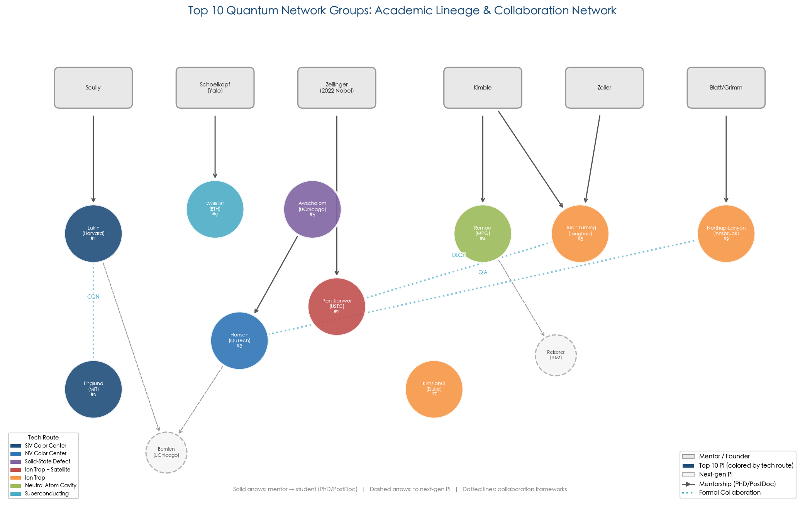

### 6.11.3 竞争格局

三条主要竞争线贯穿Top 10，下图以网络关系图方式展示各课题组之间的合作与竞争关系。

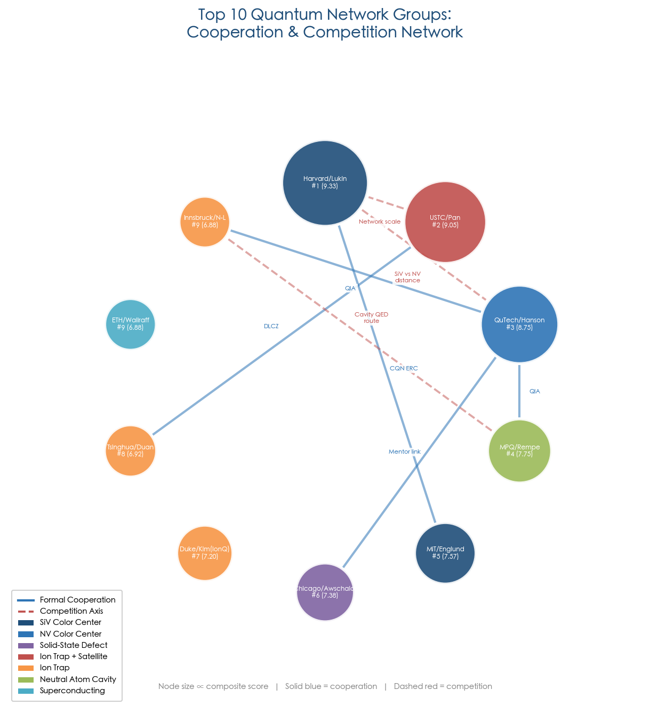

- **色心距离竞争：Lukin（SiV）vs Hanson（NV→SnV）**。两者是纠缠型量子网络城域纠缠距离记录的直接竞争者——Lukin保持35 km SiV电信纠缠记录，Hanson保持25 km NV部署光纤纠缠记录。SiV在光子效率上占据优势（ZPL 65—90% vs NV约3%），但Hanson的腔增强NV已实现10倍效率提升，SnV转型若成功则可能重塑竞争格局。
- **网络规模竞争：USTC vs 西方联合体**。USTC拥有全球最大的量子通信网络（CN-QCN 145节点），但属于可信中继范式。西方课题组在纠缠型网络的节点数和链路距离上正逐步追赶。2026年2月USTC的量子中继器突破标志着其正式启动向纠缠型网络范式的转型，未来竞争焦点将从"谁的网络更大"转向"谁的纠缠型网络更强"。
- **腔QED网络节点路线竞争：Rempe（中性原子腔）vs Innsbruck（离子阱腔）**。两者均使用光学腔作为光子接口，但物质量子比特不同——Rb原子 vs Ca⁺离子。Rempe的2D原子阵列+确定性光子图态方案提供了更高的并行化潜力，Innsbruck的10量子比特离子节点则在已验证的量子比特数量上暂时领先。

---

## 6.12 从Top 10整体看技术方向收敛趋势

综合Top 10课题组的技术发展轨迹，可以识别出五大收敛趋势。这些趋势反映了量子网络领域从原理验证向工程部署过渡阶段的内在技术需求。

### 6.12.1 从单/双节点演示向三节点以上网络推进

QuTech/Hanson的三节点网络（2021年Nature）至今仍保持纠缠型量子网络的节点数纪录。Top 10中至少三个课题组（Lukin、Hanson、USTC）具备在未来12—18个月内实现四节点以上网络的技术基础。节点数的增加不仅是量的积累，更涉及网络路由、纠缠交换和纠缠纯化等全新问题域，标志着从"链路"到"网络"的本质跃迁。Stony Brook/Figueroa的SCY-QNet项目（综合排名第12，未入Top 10但技术成熟度排名第4）正在建设10节点广域网络原型，亦为该方向的重要推动力量。

### 6.12.2 量子网络应用多样化

Lukin课题组的三篇Nature/Science论文分别指向纠缠分发、盲量子计算和非局域干涉术三大应用方向。USTC的DI-QKD则将安全通信从协议层面推向设备无关的最高安全标准。Sorbonne/Laurat（综合排名第13）的量子密码协议+量子存储融合则展示了协议层创新的空间。量子网络已不再被视为单一的"密钥分发工具"，而正在演变为支撑多元应用的基础设施平台。

### 6.12.3 电信波段兼容性成为硬约束

Top 10中几乎所有课题组都在解决1350—1550 nm电信波段兼容性问题。SiV色心（Lukin）天然在637 nm发光，需频率转换至电信波段，但已成功在35 km部署光纤上验证电信波段纠缠；Yb-171中性原子（Covey，综合排名第14但技术路线前瞻性并列第2）具有电信波段原生兼容优势；离子阱平台（IonQ）于2025年9月实现钡离子→电信波长频率转换；铒原子（Zhong，综合排名第15）则是唯一在C波段具有相干跃迁的量子系统。电信波段兼容性已从"可选优化项"转变为"必须具备"的硬约束条件，缺乏电信波段通道的平台将难以进入实际部署阶段。

### 6.12.4 腔增强成为共识路径

QuTech/Hanson（2026年1月NV腔增强实现10倍效率提升）、MPQ/Rempe（Rb原子高精细度光学腔）和Innsbruck/Northup-Lanyon（Ca⁺离子光腔耦合）——三个采用不同物质量子比特的课题组均将光学腔增强作为提升光子接口效率的核心策略。即使是Lukin课题组的SiV平台（天然具备高ZPL发射率），也在纳米光腔增强方向持续投入研发资源。腔增强不仅直接提升单光子收集效率，更通过增强原子-光子耦合强度实现确定性光子生成，是从概率性纠缠过渡到确定性纠缠的核心使能技术。

### 6.12.5 学术-产业双轨加速

Top 10中已形成清晰的学术-产业双轨格局：IonQ拥有约400项量子网络专利和NYSE上市地位；Delft Networks（2024年QuTech衍生）正在将色心网络技术产品化；QuEra（2025年完成2.3亿美元融资，Lukin关联）在中性原子量子计算方向建立产业通道。产业化进程反映了量子网络从"纯科学问题"向"技术与商业问题"的深层演进。McKinsey于2025年2月估计全球量子通信市场2023年规模约9—10亿美元，预计以23—25%的复合年增长率（CAGR）增长。[McKinsey](https://www.mckinsey.com/capabilities/tech-and-ai/our-insights/quantum-communication-growth-drivers-cybersecurity-and-quantum-computing "McKinsey量子通信 2025") Fortune Business Insights则估计量子网络细分市场2026年规模约18.22亿美元，预计2034年达364.21亿美元（CAGR 45.41%）。[Fortune BI](https://www.fortunebusinessinsights.com/quantum-networking-market-115145 "量子网络市场 2026-2034") 学术-产业双轨的加速为Top 10课题组开辟了新的资源和人才通道，但同时也带来了核心人才从学术界向产业界流动的压力（如Lukin课题组核心成员被IonQ延揽）。

# 第7章 未来展望与战略研判

前六章分别构建了量子网络的技术全景、全球资助格局、课题组画像清单、评估方法论、横向比较分析以及 Top 10 课题组深度剖析。本章将视角从"回顾与评估"转向"前瞻与研判"：基于前述章节积累的事实基础，对量子网络领域未来 12—18 个月（2026 年 4 月至 2027 年 10 月）的技术演进轨迹、政策资金走向与竞争格局变迁进行系统性推演。全章依次覆盖技术瓶颈突破展望（7.1）、政策与资金趋势（7.2）、竞争格局演变预判（7.3）、产业化路径与时间窗口（7.4）、风险因素分析（7.5）、标准化进展与展望（7.6），最后给出值得持续关注的 21 项跟踪指标清单（7.7），并对本报告整体研究局限性作坦诚声明（7.8）。

## 7.1 技术瓶颈与突破展望

量子网络从实验室演示走向实用化部署，须跨越六项核心技术瓶颈：光子收集效率、量子中继器工程化、新型色心平台验证、中性原子电信波段兼容、量子网络操作系统构建以及微波-光子转换。以下逐一分析各瓶颈的现状与近期突破前景。

### 7.1.1 光子收集效率：最有望率先突破的瓶颈

光子收集效率直接决定远程纠缠生成速率——双节点纠缠速率正比于两端光子收集效率之积，效率每提升 10 倍，纠缠速率可提升 100 倍。截至 2026 年 4 月，该瓶颈已呈现明确的突破轨迹。

QuTech/Hanson 课题组 2026 年 1 月在 Nature Communications 展示腔增强 NV 色心光子收集概率从约 0.05% 提升至约 0.5%（10 倍），同时保持 T₂ > 100 μs 相干时间。[QuTech](https://qutech.nl/2026/01/15/more-photons-faster-links-a-laser-focused-nv-centre/ "Nature Communications 2026") 该成果建立在开放式 Fabry-Pérot 微腔与 NV 色心的精确耦合之上，技术路径已获实验验证。Harvard/Lukin 课题组采用的 SiV 色心平台 ZPL 发射率高达 65—90%，相干合作参数 C_coh > 100，本身具备更高的光子接口效率上限。[Ruf et al., J. Appl. Phys. 130, 070901 (2021)](https://pubs.aip.org/aip/jap/article/130/7/070901/1061464/Quantum-networks-based-on-color-centers-in-diamond "金刚石色心量子网络综述")

我们判断，未来 12—18 个月内腔增强光子收集效率有望突破 1%/脉冲门槛，直接转化为纠缠速率从当前 ~Hz 量级提升至 ~kHz 量级的飞跃。这一突破将使多节点量子网络实验在合理时间窗口内变得可行，构成从"链路演示"走向"网络演示"的关键先决条件。

### 7.1.2 量子中继器：从原理验证走向工程化

量子中继器是突破光纤衰减极限、实现长距离纠缠分发的核心组件。USTC/潘建伟团队 2026 年 2 月在 Nature 和 Science 同月发表的双重突破——可扩展量子中继器核心组件演示（基于捕获离子的长寿命量子存储器）和 10 km 光纤离子-离子纠缠（纠缠存活时间首次超过建立时间）——标志着量子中继器从"概念验证"进入"工程可行性验证"阶段。[CAS 新闻](https://english.cas.cn/newsroom/cas-in-media/202602/t20260206_1149922.shtml "USTC 2026双重突破")

该团队的下一个里程碑预计是 2—3 个中继器节点的串联实验。若在 12 个月内实现多跳量子中继，将成为量子网络领域的分水岭事件——意味着纠缠分发距离不再受单段光纤衰减限制，而可通过增加中继节点实现任意延伸。

### 7.1.3 SnV色心：有望改变色心平台格局

第 5 章分析指出，NV 色心虽拥有最成熟的量子网络实验记录（三节点网络、25 km 城市链路），但 ZPL 发射率仅约 3%，制约了纠缠速率的进一步提升。SnV 色心（锡空位中心）预期运行温度约 1.8 K——远高于 SiV 的 < 0.1 K——同时保持优异的光学性能，被视为 NV 色心的下一代替代方案。

QuTech/Hanson 课题组正在推进 NV → SnV 的技术转型。我们预计，12—18 个月内 SnV 色心有可能实现首个远程纠缠演示，届时将验证该平台在部署温度和光学性能之间的最优平衡点，直接影响 QuTech/Hanson（Top 3）和整个色心阵营的技术路线选择。

### 7.1.4 中性原子电信波段兼容：新兴平台的关键验证窗口

UIUC/Covey 课题组 2025 年 10 月在 Nature Physics 首次实现 Yb-171 中性原子阵列的电信波长并行原子-光子纠缠，验证了该平台的两项核心优势——电信波段原生兼容性（无需频率转换）和可并行化阵列架构。[Li et al., Nature Physics (2025)](https://phys.org/news/2025-10-parallel-atom-photon-entanglement-paves.html "DOI: 10.1038/s41567-025-03022-4") 下一个关键里程碑是首个远程原子-原子纠缠。若 Yb-171 平台能在 12 个月内实现城域尺度的远程纠缠，将直接挑战色心阵营在量子网络领域的主导地位。

值得注意的是，Google Quantum AI 于 2026 年 3 月宣布在超导量子比特之外增加中性原子模态，形成双轨量子路线图。[The Quantum Insider](https://thequantuminsider.com/2026/03/24/google-paves-a-two-lane-quantum-roadmap-by-adding-neutral-atom-systems/ "Google 2026年3月") 若 Google 的中性原子项目涉及量子网络方向，可能为 Covey 课题组或相关中性原子团队带来产业资源注入，加速该平台的工程化进程。

### 7.1.5 量子网络操作系统：软件栈从零到一

QuTech/Wehner 课题组 2025 年 3 月在 Nature 发表 QNodeOS——首个全可编程量子网络操作系统。[Nature](https://www.nature.com/articles/s41586-025-08704-w "QNodeOS论文") QNodeOS 的意义在于将量子网络从"每次实验需要定制控制逻辑"的手工模式，推进到"通过标准化操作系统接口调度量子网络资源"的可编程模式。该系统预计将部署到 QuTech Quantum Network Explorer 测试平台。[QIA](https://quantuminternetalliance.org/2025/03/12/qia-researchers-create-first-operating-system-for-quantum-networks/ "QNodeOS Nature 2025")

软件栈的成熟对量子网络的实用化至关重要：正如经典互联网的 TCP/IP 协议栈标准化推动了网络的大规模扩展，量子网络操作系统的标准化将构成多节点量子网络互操作的基础。12 个月内值得关注的进展包括 QNodeOS 在多节点测试床上的实际部署验证，以及是否出现第二个量子网络操作系统。

### 7.1.6 微波-光子转换：超导平台参与量子网络的核心瓶颈

超导量子比特工作在微波频段，参与光纤量子网络需要高效率的微波-光子转换。截至 2026 年 4 月，全球最优微波-光子转换效率为 Harvard/Lončar 组利用薄膜铌酸锂腔电光效应实现的 1.18% 峰值转换效率（Nature Physics, 2025），Caltech/Mirhosseini 组通过硅纳米力学方案实现亚光子噪声下 0.47—1.9 kHz 上转换速率（Nature Nanotechnology, 2025）。两者距离实用化所需效率仍有数量级差距。

我们判断，微波-光子转换在短期 12—18 个月内仍将限制超导平台参与量子网络。但 IBM 与 Cisco 于 2025 年 11 月宣布的合作——构建分布式容错量子计算机网络（2030 年代初概念验证目标），其中 Cisco 负责开发"量子数据中心"架构——可能加速该方向的工程投入。[IBM 新闻室](https://newsroom.ibm.com/2025-11-20-ibm-and-cisco-announce-plans-to-build-a-network-of-large-scale,-fault-tolerant-quantum-computers "IBM-Cisco 2025年11月") 若微波-光子转换效率在 2027 年前突破 10% 门槛，ETH/Wallraff（Top 9 并列）的排名可能出现大幅上升。

### 7.1.7 近期最可期待的里程碑

综合以上分析，12—18 个月内量子网络领域最可期待的五项技术里程碑为：

1. **首个四节点以上纠缠量子网络**：Harvard/Lukin 或 QuTech/Hanson 最有可能率先实现。
2. **多跳量子中继器串联**：USTC/潘建伟团队的 2—3 节点中继器串联。
3. **腔增强光子收集突破 1%/脉冲**：QuTech/Hanson 的 NV 腔增强或 Harvard/Lukin 的 SiV 腔优化。
4. **SnV 或 Yb-171 平台首个远程纠缠**：QuTech/Hanson 的 SnV 转型或 UIUC/Covey 的 Yb-171 远程纠缠。
5. **QNodeOS 多节点部署验证**：QuTech/Wehner 课题组在 Quantum Network Explorer 上的实测。

图 7-1 以甘特图形式展示了上述五项里程碑的预期实现时间窗口及最可能实现时点，供读者直观把握各方向的技术进度节奏。

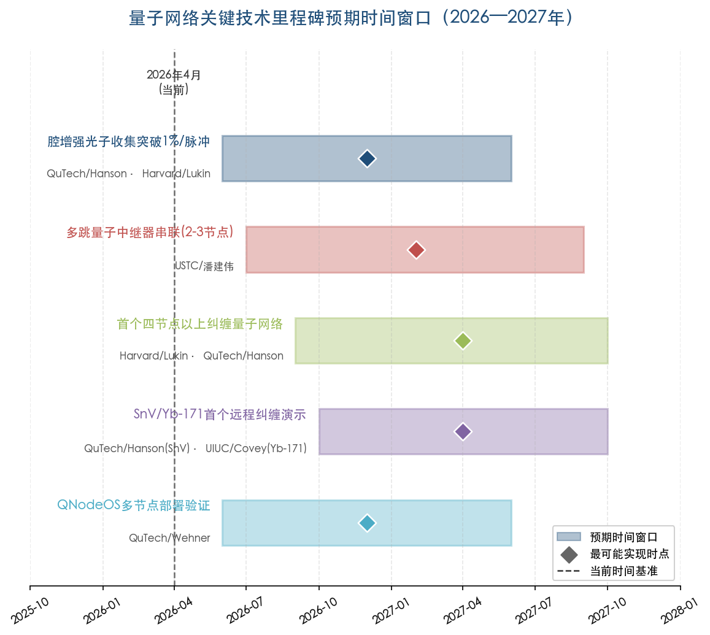

## 7.2 政策与资金趋势

### 7.2.1 美国：NQI 重新授权与资金持续性

美国量子网络研究的资金持续性面临两个关键政策节点。

第一，NQI 重新授权法案（National Quantum Initiative Reauthorization Act of 2026, S.3597）于 2026 年 1 月 8 日由两党参议员联合提出，拟将 NQI 延长至 2034 年，新增 NASA 量子研发授权、NIST 量子中心、量子人才协调中心等条款，已获 IBM、Microsoft、Google、IonQ 等主要量子企业背书。[Quantum Computing Report](https://quantumcomputingreport.com/senators-introduce-bipartisan-national-quantum-initiative-reauthorization-act-of-2026/ "NQI重新授权 2026") 该法案在两党共同支持下预计 2026 年内通过的概率较高，通过后将为美国量子网络研究提供至少 8 年的政策框架稳定性。

第二，NSF CQN ERC（Center for Quantum Networks，约 3,240 万美元，2020—2026 年）将于 2026 年到期。CQN 是 Harvard/Lukin 和 MIT/Englund 两个 Top 10 课题组的核心资助来源。[Dimensions](https://app.dimensions.ai/details/grant/grant.9381310 "CQN $32.4M, 2020-2026") 续期结果将直接影响这两个课题组的研究节奏。若 NQI 重新授权通过并带动 NSF 新一轮量子网络专项，续期或替代资助的前景较为乐观。

此外，DOE 于 2025 年 11 月续期的五个 NQISRCs（6.25 亿美元/最长 5 年）已为 UChicago/Awschalom 领导的 Q-NEXT 提供了稳定资金（1.25 亿美元/5 年），DARPA QBI 项目持续为多个课题组提供支持。[美国能源部官方公告](https://www.energy.gov/articles/energy-department-announces-625-million-advance-next-phase-national-quantum-information "DOE $625M续期公告, 2025年11月") 整体而言，美国联邦 QIS 研发支出维持在约 10 亿美元/年水平，量子网络方向预计在 NQI 重新授权后获得增量资金。

### 7.2.2 欧盟：从量子旗舰到量子法案

欧盟量子网络研究的制度环境正经历从"旗舰项目驱动"到"立法治理"的范式转变。

2025 年 7 月，欧盟委员会发布《量子欧洲战略》（Quantum Europe Strategy, COM(2025) 363），明确提出到 2030 年使欧洲成为"量子产业强国"的目标。[欧盟量子欧洲战略](https://qt.eu/news/2025/2025-11-04_ec-opens-consultation-on-quantum-act "Quantum Europe Strategy, July 2025") 战略发布后，欧盟委员会于 2025 年 11 月启动了《量子法案》（Quantum Act）的公众征询，预计 2026 年通过。[欧盟委员会](https://digital-strategy.ec.europa.eu/en/news/commission-invites-contributions-shape-future-eu-quantum-act "Quantum Act征询, 2025年11月") 该法案将与《芯片法案》和 EuroHPC 联合体形成互补，为量子技术提供立法层面的治理框架。

在资金层面，Horizon Europe 量子方向已承诺 5 亿欧元。[Horizon Europe 工作计划 2026-2027](https://ec.europa.eu/info/funding-tenders/opportunities/docs/2021-2027/horizon/wp-call/2026-2027/wp-1-general-introduction_horizon-2026-2027_en.pdf "Horizon Europe WP 2026-2027") QIA 第一阶段（2022—2026 年）获 Horizon Europe 资助 2,400 万欧元（Grant 101102140），已于 2026 年 3 月完成。[CORDIS](https://cordis.europa.eu/project/id/101102140/reporting "QIA Phase 1 Grant €24M") QIA 以框架伙伴协议（Framework Partnership Agreement, FPA）形式运作，Phase 2 的资助可在既有框架内延续，但具体金额尚未正式公告。QIA Phase 2 的资助规模是决定 QuTech/Hanson（Top 3）、QuTech/Wehner 和 Innsbruck/Northup-Lanyon 等欧洲课题组未来研究节奏的关键变量。

EuroQCI 倡议（27 个成员国参与）持续推进全欧量子安全通信基础设施建设。2026 年 1 月，QIA 合作伙伴 Welinq 完成首个 QDrive 量子存储器商业交付（斯洛伐克科学院，skQCI 项目），标志着 EuroQCI 从规划向实际部署的转型。[The Quantum Insider](https://thequantuminsider.com/2026/01/14/welinq-qdrive-sale-slovak-academy/ "Welinq首次商业交付 2026")

### 7.2.3 英国：新一轮量子投资释放

英国于 2026 年 3 月宣布 20 亿英镑量子投资计划，其中 1.25 亿英镑专门用于量子网络，累计公共量子投资超 10 亿英镑。[The Quantum Insider](https://thequantuminsider.com/2026/03/17/uk-pledges-2-billion-for-quantum-innovation/ "UK £2B量子投资, 2026年3月") IQN Hub（Heriot-Watt 牵头，EPSRC 2,200 万英镑 + 行业配套合计 4,200 万+ 英镑）于 2025 年 4 月启动运营，Oxford/Lucas 课题组 2026 年 2 月获 EPSRC 450 万英镑联合领导 UK-Japan 量子互联网项目。[Oxford](https://www.ox.ac.uk/news/2026-02-03-new-project-aims-build-foundations-quantum-internet "UK-Japan项目 2026")

1.25 亿英镑量子网络专项的具体分配方案预计 2026 年下半年明确，其资助方向和受益课题组值得密切跟踪。

### 7.2.4 亚太：差异化投入格局

中国政府累计量子投资据 CSIS 2026 年 1 月报告估算约 150 亿美元（未经官方确认），2025 年 3 月宣布的国家创业引导基金近 1 万亿元人民币（约 1,380 亿美元）中量子技术为重点领域。[CSIS 报告](https://www.csis.org/analysis/understanding-chinas-quest-quantum-advancement "CSIS, 2026年1月") 中国电信量子集团（CTQG）已成为国盾量子控股股东，QKD 服务覆盖 550 万+ 用户，形成从基础研究到产业部署的垂直整合模式。

日本 2025 年 11 月补充预算拨付约 1,300 亿日元（约 8.55 亿美元）用于量子技术。[The Quantum Insider](https://thequantuminsider.com/2025/11/28/japan-channels-almost-900-million-u-s-into-quantum-push/ "Japan $900M量子推动, 2025年11月") Oxford/Lucas 与东京大学/Murao 联合的 UK-Japan 量子互联网项目反映了日本通过国际合作补足量子网络研究短板的策略。

韩国 3 万亿韩元/2035 计划、新加坡近 3 亿新元国家量子战略 + 1 亿新元金融量子专项、澳大利亚 8.93 亿澳元（至 2024 年 1 月）等均维持稳定投入态势。[Qureca](https://www.qureca.com/quantum-initiatives-worldwide/ "Quantum Initiatives Worldwide 2025")

## 7.3 竞争格局演变预判

### 7.3.1 核心稳健 Top 3 维持领先

基于第 5 章三方案交叉验证的结果，Harvard/Lukin（主方案 9.33）、USTC/潘建伟（9.05）和 QuTech/Hanson（8.75）在主方案、学术优先方案和工程优先方案下均稳居前三。三组的核心竞争力——Lukin 的 SiV 技术 + 应用多样性、潘建伟的部署规模 + 系统突破能力、Hanson 的纠缠网络先驱地位 + NV/SnV 转型——在 12—18 个月的时间尺度内被追赶者超越的概率较低。

第 6 章分析表明，这三个课题组未来半年各自有明确的里程碑方向：Lukin 向三节点以上 SiV 网络推进、潘建伟向多跳量子中继器串联和 DI-QKD 200+ km 推进、Hanson 向 SnV 远程纠缠验证和 Delft Networks 产品原型推进。三者的里程碑方向互不重叠，分别代表量子网络在"应用多元化""距离扩展"和"平台优化 + 产业化"三个维度的前沿推进。

### 7.3.2 排名敏感型变动因素

第 5 章识别出三个"排名敏感型"课题组，其名次在不同权重方案下波动较大：

**Duke/Kim (IonQ)**：主方案第 7，工程优先方案下升至第 4（受 ~400 项量子网络专利 + NYSE 上市 + AFRL 合同 5,450 万美元等工程/产业化指标提振），学术优先方案下降至第 8。[IonQ IR](https://investors.ionq.com/news/news-details/2025/IonQ-Expands-Quantum-Networking-Patent-Portfolio-to-Meet-Strong-Market-Demand-for-Secure-Communications/default.aspx "IonQ专利") IonQ 量子网络产品线的发布进度是决定其排名走向的核心变量：若 2026 年下半年发布具有技术参数优势的量子网络产品，该课题组在工程优先视角下的排名将进一步巩固。

**清华/段路明**：主方案第 8，学术优先方案上升至第 7（DLCZ 方案被引 4,566 次 + 中科院院士 + 2024 International Quantum Prize），工程优先方案下降至第 10。2025 年 Science Advances 发表的双类型量子比特离子阱网络节点是重要进展，但后续能否结合远程光纤纠缠实现完整网络节点演示，将决定其在技术成熟度维度的得分能否取得突破。

**ETH/Wallraff**：主方案第 9（并列），在三方案下均处于第 8—10 名区间，基本稳健。其排名的上行空间完全取决于微波-光子转换效率的突破——这是一个高赔率但低概率的变量。

### 7.3.3 三大黑马团队

第 5 章的横向比较揭示了三个技术路线前瞻性维度得分远高于综合排名的新兴团队，它们在 12—18 个月内具有"非线性跃升"的潜力：

**UIUC/Covey**（主方案未进 Top 10，技术路线前瞻性 9 分/并列第 2）：Yb-171 中性原子的电信原生兼容 + 并行化架构使其成为颠覆色心主导格局的最有力候选。若在 12 个月内实现远程原子-原子纠缠，加之 Google 中性原子项目可能带来的产业资源，该课题组有望跻身 Top 10 乃至 Top 5。

**Princeton/Thompson**（主方案未进 Top 10，技术路线前瞻性 8.5 分）：同样聚焦 Yb-171 平台，2024 年 PRX Quantum 提出的模块化高保真互联方案提供了清晰的可扩展路径。2025 年 11 月该课题组还实现了 transmon 超导量子比特 1 ms+ 相干时间（此前记录的 3 倍），若将超导和中性原子两条线交叉整合（微波-光子转换 + 原子光互联），可能创造出独特的技术优势。

**TUM/Reiserer**（主方案未进 Top 10）：铒离子掺杂硅纳米光子方案是唯一在电信 C 波段具有相干跃迁的系统，与硅光子工业天然兼容。UChicago/Zhong 课题组 2025 年 11 月将铒原子自旋相干时间从 0.1 ms 提升至 > 10 ms（最高 24 ms），理论网络距离 2,000—4,000 km。[UChicago PME](https://pme.uchicago.edu/news/breakthrough-could-connect-quantum-computers-200x-distance "Nature Communications 2025") 若铒/硅平台的单离子控制在近期取得突破，该技术路线的产业化前景可能超越当前的色心和离子阱方案。

### 7.3.4 人才流动与代际更替

第 6 章的师承网络分析揭示了量子网络领域正在经历的代际更替。Harvard/Lukin 课题组多名核心成员被 IonQ 招揽（Machielse、Riedel、Borregaard），反映 SiV 色心技术从学术向产业的知识转移。QuTech/Hanson 培养的 Hannes Bernien 已在 UChicago 建立独立课题组，MPQ/Rempe 的 Andreas Reiserer 在 TUM 独立，形成"老牌 PI → 新锐 PI"的学术扩散网络。

第 5 章数据显示，新兴团队（Covey、Zhong、Bernien、Thompson、Reiserer）在技术路线前瞻性维度的平均得分为 8.1，高于老牌组的 7.2。这意味着虽然老牌组占据 Top 10 的 7 席，但技术路线选择的前瞻性优势正在向新兴团队倾斜——"做得最早"与"选得最准"之间的张力将在未来 3—5 年内决定格局重塑的方向。

## 7.4 产业化路径与时间窗口

### 7.4.1 市场规模预测

多家咨询机构对量子通信和量子网络市场给出了不同口径的预测。McKinsey 2025 年 2 月报告估计量子通信市场 2023 年规模约 9—10 亿美元，预计以 23—25% 的年复合增长率（CAGR）增长，2035 年可达 105—149 亿美元。[McKinsey](https://www.mckinsey.com/capabilities/tech-and-ai/our-insights/quantum-communication-growth-drivers-cybersecurity-and-quantum-computing "McKinsey量子通信 2025") Fortune Business Insights 对"量子网络"细分市场的估算更为激进——2026 年市场规模 18.22 亿美元，预计 2034 年达 364.21 亿美元，CAGR 45.41%。[Fortune BI](https://www.fortunebusinessinsights.com/quantum-networking-market-115145 "量子网络市场 2026-2034")

需要指出的是，McKinsey 和 Fortune BI 对"量子通信"与"量子网络"的定义边界不同——McKinsey 的口径更窄（偏重 QKD 商用），Fortune BI 的口径更宽（涵盖纠缠型网络和分布式量子计算网络的潜在市场）。两者之间的显著差异反映了量子网络作为新兴领域在市场边界定义上的固有不确定性。

从更宏观的视角看，BCG 2024 年 7 月预测量子计算整体 2040 年可创造 4,500—8,500 亿美元经济价值，但指出 NISQ 时代近期价值创造低于预期——部分原因在于 AI 为原本被认为量子独占的问题提供了"足够好"的替代方案。[BCG](https://www.bcg.com/publications/2024/long-term-forecast-for-quantum-computing-still-looks-bright "BCG量子计算展望 2024") Bain & Company 预计首批实用量子优势将在 2028—2029 年出现（~100 个逻辑量子比特），商业影响级应用（1,000—10,000 个逻辑量子比特）预计在 2030 年代中期。[CNBC](https://www.cnbc.com/2026/03/30/quantum-computing-firms-go-public-breakthroughs-commercialization.html "Bain量子时间线 2026")

### 7.4.2 产业化里程碑路线图

基于前六章积累的信息，我们梳理出量子网络产业化的关键里程碑时间窗口：

**2026 年（当前年份）**：Welinq QDrive 量子存储器首批商业交付（已于 2026 年 1 月完成）；IonQ 量子网络产品线预期发布；Delft Networks（QuTech/Hanson 2024 年创立）首款产品原型。2026 年也是量子公司上市潮的年份——Xanadu、Horizon Quantum Computing、Infleqtion 等通过 SPAC 上市，产业叙事从"科学项目"转向"商业化轨迹"。

**2027—2028 年**：QIA Phase 2 多城市量子网络部署（取决于 Phase 2 资助确认）；SCY-QNet 10 节点广域量子网络全面运行（Stony Brook/Figueroa 领导，连接 Stony Brook/Columbia/Yale/BNL）；IQN Hub 首批量子网络测试床成果。

**2028—2030 年**：IBM-Cisco 分布式容错量子计算机网络概念验证（2030 年代初目标）；Harvard/MIT CQN 波士顿城市量子网络从测试床向准商用推进；首批城域量子网络商用试运营。

**2030 年代**：商用城域量子网络规模化部署；多城市乃至洲际纠缠型网络进入部署阶段；分布式量子计算网络开始提供实际算力。

图 7-2 将上述产业化里程碑按"近期产品—中期网络部署—远期规模化"三阶段展开，并与两大机构的市场规模预测曲线对照呈现。

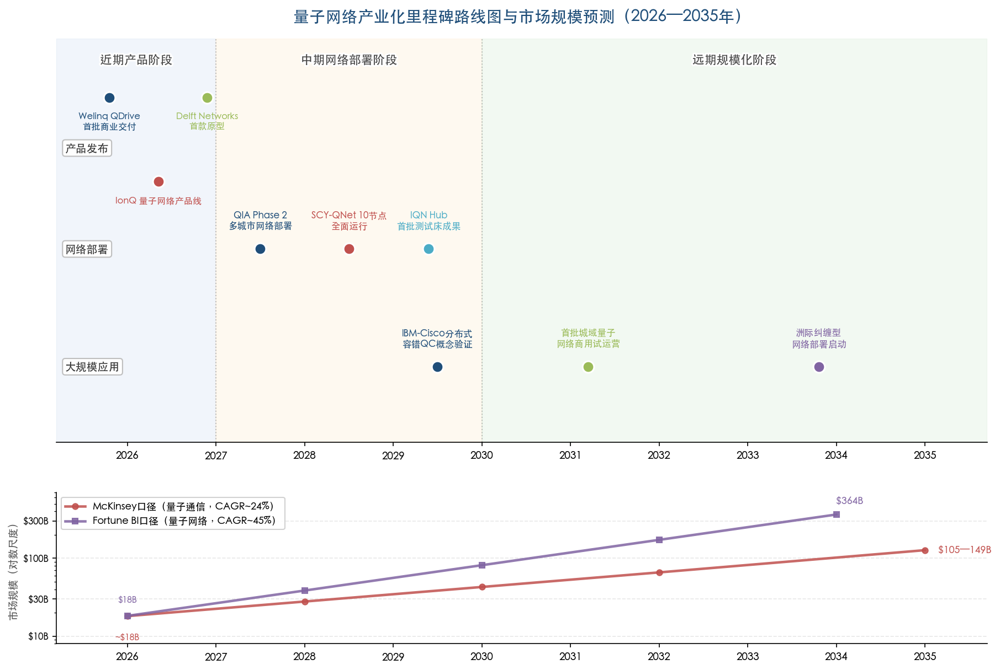

### 7.4.3 学术-产业双轨加速

第 5 章和第 6 章的分析揭示了量子网络领域"学术-产业双轨加速"的显著趋势。Top 10 课题组中，产业化路径呈现三种模式：

第一种是"PI 创办衍生企业"——Lukin 联合创立 QuEra（2025 年 2 月融资 2.3 亿美元）、Hanson 2024 年创立 Delft Networks、Laurat 联合创立 Welinq（已实现商业交付）。这些衍生企业直接将实验室技术商业化，形成学术研究 → 产品原型 → 商业部署的闭环。

第二种是"课题组 → 产业直接招揽"——IonQ 从 Harvard/Lukin 组招募多名核心成员，Qunnect 获得 Cisco 投资。这一路径通过人才流动实现技术转移。

第三种是"产学大规模合作"——IBM-Cisco 合作（构建分布式容错量子计算网络）和 USTC-国盾量子-CTQG 全链条合作。这种模式以企业资金与学术技术的互补为核心驱动力。

## 7.5 风险因素分析

### 7.5.1 人才短缺

NIST 主任 Kushmerick 于 2026 年 1 月在美国国会听证会上警告量子领域面临"不折不扣的短缺"（unequivocal shortage），指出自 NQI 实施以来量子方向学生和教职人数几乎翻倍，但仍不足以满足研究和产业需求。[The Quantum Insider](https://thequantuminsider.com/2026/01/23/experts-tell-u-s-lawmakers-quantums-next-bottleneck-isnt-hardware-its-people/ "量子人才短缺 2026") 人才短缺对量子网络领域的影响尤为突出：该方向需要同时具备量子物理、光子学和网络工程背景的交叉学科人才，供给极为有限。Top 10 课题组之间的人才竞争本质上是零和博弈——Harvard/Lukin 流失核心成员至 IonQ 即为典型案例。

### 7.5.2 地缘政治与供应链

NQI 重新授权法案专设供应链强化条款，反映美国对量子技术供应链安全的高度关注。2025 年 4 月关税冲击导致 IonQ 等量子公司股价大幅下跌，暴露了产业对政策不确定性的敏感度。中美量子竞争加剧可能进一步限制国际合作和人才交流——第 5 章数据显示，USTC/潘建伟团队的国际合作论文比例仅约 19%（美国课题组平均约 50%），已经反映了一定程度的生态封闭性。[ITIF (2024)](https://itif.org/publications/2024/09/09/how-innovative-is-china-in-quantum/ "中国量子创新评估")

### 7.5.3 AI 竞争分流

BCG 指出 NISQ 时代近期价值创造低于预期，部分原因在于 AI 为原本被认为只有量子计算才能解决的问题提供了"足够好"的替代方案。对量子网络领域而言，AI 竞争的影响主要体现在两个层面：（1）风险资本和政策注意力可能被 AI 领域吸引而减少对量子网络的投入；（2）经典加密向后量子密码学（PQC）的转型可能降低 QKD 的紧迫性——NIST 已于 2024 年发布首批 PQC 标准，部分安全需求可通过 PQC 而非 QKD 满足。但需指出，量子网络的价值远不止安全通信——盲量子计算、分布式量子计算、量子增强传感等应用无法被 AI 或 PQC 替代，这些应用方向的持续推进将决定量子网络的长期价值主张。

### 7.5.4 量子纠错开销

有用的量子算法需要百万至数十亿次门操作，当前 30+ 量子比特电路的最高保真度仅约 99.5%。分布式量子计算网络面临额外挑战——跨网络高保真门操作的误差率需低于量子纠错阈值，而远程门操作的保真度受限于纠缠分发的保真度和速率。Lee, Dai, Towsley & Englund (2024, PNAS) 提出的量子网络效用框架表明，双量子比特门误差 ε_eff > 0 时最大联盟规模上限为 ⌊1/ε_eff⌋。[PNAS 2024](https://pmc.ncbi.nlm.nih.gov/articles/PMC11047070/ "Quantum Network Utility, PNAS 2024") 这意味着在纠错开销可控之前，量子网络的节点规模将受到严格的物理限制。

### 7.5.5 资金持续性风险

长研发周期（BCG 预计 2040 年前方可实现全面容错量子计算）要求资金的长期稳定承诺，但当前主要资助机制均面临到期或不确定性：NQI 重新授权尚未完成立法程序；CQN ERC 2026 年到期；QIA Phase 2 规模未定；中国的具体资助金额不透明。若全球主要资助方在 2027—2028 年出现"量子冬天"式的资金收缩，对仍处于 TRL 3—6 阶段的量子网络课题组将产生严重冲击。

### 7.5.6 技术路线不确定性

The Quantum Insider 2026 年专家预测指出，部分不成熟量子比特模态预计 2026 年底可能被放弃。[TQI](https://thequantuminsider.com/2025/12/30/tqis-expert-predictions-on-quantum-technology-in-2026/ "TQI 2026专家预测") 依赖单一技术路线的课题组面临"押注失败"风险。从第 5 章的技术路线聚类分析看，稀土离子阵营（4 组，平均得分 5.58）和超导阵营（1 组，ETH/Wallraff）因技术成熟度偏低、里程碑最少而面临较高的路线不确定性。相比之下，金刚石色心阵营（4 组，平均 8.26）和中性原子阵营（5 组，技术前瞻性平均 8.3）的路线确定性较高。

## 7.6 标准化进展与展望

量子网络标准化是该领域从实验向产业过渡的制度性基础设施。截至 2026 年 4 月，三个国际标准化组织在量子网络相关标准制定方面取得了实质性进展。

ITU-T SG13（未来网络与新兴技术）是量子网络标准的主要制定机构。2025 年 10—11 月 SG13 会议批准/同意了 36 项产出，其中与量子网络直接相关的包括：Y.3833（QKDN 可靠性评估）、Y.3834（QKDN 自主 QoS 保障功能架构增强）、Y.3831（QKD 网络与用户网络集成——支持端到端现代密码服务的功能架构）、Y.3832（QKDN 编排框架）、Y.3810 Corr 1 和 Y.3818 Corr 1（QKDN 互通框架与架构勘误）等 6 项新建议书进入最后呼叫程序，以及新 Supplement 98（量子网络技术考量）。[ITU-T SG13](https://www.itu.int/en/ITU-T/studygroups/2025-2028/13/Pages/exec-sum-202511.aspx "SG13 2025年11月执行摘要") 此外，SG13 正在制定 Y.supp.QENS-roadmap（量子增强网络与服务标准化路线图），目标完成日期为 2028 年 12 月。值得注意的是，SG13 在同次会议上同意将量子抗性密码相关研究从 CQR（协同量子抗性小组）转入 SG13 与 SG17 的联合报告员组（JRG），反映了量子安全标准化从 QKD 向 PQC + QKD 混合方案演进的趋势。

ETSI ISG-QKD 是 QKD 协议和设备标准的核心制定机构，已发布 20 余项技术规范，涵盖密钥分发接口（ETSI GS QKD 014）、设备安全评估方法等。[ETSI](https://www.etsi.org/technologies/quantum-key-distribution "ETSI ISG-QKD") ETSI 的工作重点正从单纯的 QKD 设备标准向"QKD 网络与 PQC 混合密码方案"标准扩展，与 ITU-T SG13 的演进方向一致。

IETF QIRG（量子互联网研究组）着眼于更前沿的纠缠型量子网络架构标准化。2025—2026 年间，QIRG 持续推进量子互联网多平面架构提案（draft-irtf-qirg-qi-multiplane-arch），为未来纠缠型量子网络的协议栈设计提供参考框架。

我们认为，标准化进展对量子网络领域的竞争格局有两方面影响：一是在 QKD 网络层面，ITU-T 和 ETSI 的标准已足够成熟，有利于 USTC/潘建伟和国盾量子/CTQG 等已建成 QKD 网络的参与者巩固先发优势；二是在纠缠型量子网络层面，标准化仍处于早期探索阶段，QNodeOS 等平台的事实标准效应（de facto standard）可能比正式标准更快地塑造生态格局。

## 7.7 跟踪指标清单

基于前述分析，我们建议对以下 21 项指标进行持续跟踪，以监测量子网络领域竞争格局的动态演变。图 7-3 以四象限仪表盘形式直观呈现各指标的当前状态。

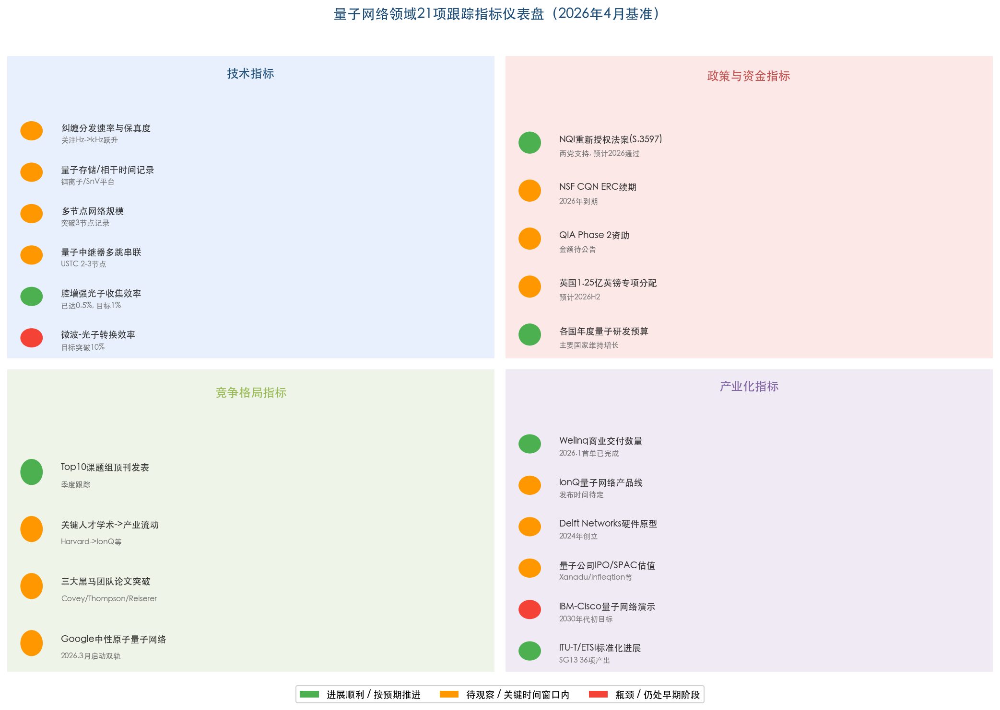

**技术指标（6 项）**：
1. 各平台纠缠分发速率（pairs/sec）与保真度进展——关注是否出现从 Hz → kHz 的量级跃升。
2. 量子存储/相干时间记录更新——特别是铒离子和 SnV 色心平台。
3. 多节点网络规模——是否突破当前最高的三节点（QuTech/Hanson 2021 年记录）。
4. 量子中继器多跳串联进展——USTC/潘建伟团队是否实现 2—3 节点串联。
5. 腔增强光子收集效率是否突破 1%/脉冲。
6. 微波-光子转换效率是否突破 10% 门槛。

**政策与资金指标（5 项）**：
7. NQI 重新授权法案（S.3597）立法进展及最终文本。
8. NSF CQN ERC 续期结果（直接影响 Harvard/Lukin 和 MIT/Englund）。
9. QIA Phase 2 资助正式公告及金额。
10. 英国 1.25 亿英镑量子网络专项分配方案。
11. 各国年度量子研发预算变化趋势。

**竞争格局指标（4 项）**：
12. Top 10 课题组顶刊（Nature/Science 正刊 + 子刊 + PRL）发表动态（建议季度跟踪）。
13. 关键人才学术 → 产业流动趋势——特别是从 Top 10 课题组向企业的流动。
14. 三大黑马团队（UIUC/Covey、Princeton/Thompson、TUM/Reiserer）论文突破。
15. Google 中性原子项目是否涉及量子网络方向及其合作课题组。

**产业化指标（6 项）**：
16. Welinq 产品线商业交付数量及客户反馈。
17. IonQ 量子网络产品线发布及技术参数。
18. Delft Networks 首款硬件产品原型进展。
19. 量子公司 IPO/SPAC 进展和估值变化。
20. IBM-Cisco 量子网络技术演示进度。
21. ITU-T/ETSI/IEEE 量子网络标准化新建议书发布。

## 7.8 局限性声明

本报告的分析基于截至 2026 年 4 月初可公开获取的信息，存在以下固有局限性。

**信息不对称**。中国课题组的经费、专利和军方项目数据因透明度限制可能被低估或高估。CSIS 估算的"约 150 亿美元"累计量子投资未经中国官方确认，USTC/潘建伟和清华/段路明团队的具体项目金额均采用高位估算。俄罗斯、印度等国因数据可及性限制未纳入分析，可能遗漏重要参与者。

**语言偏差**。本报告以英文和中文文献为主要信息来源，日文、韩文、德文文献覆盖不足。NTT/量子网络研究和东京大学/Murao 课题组的部分工作可能因日文原始材料未被充分覆盖而被低估。

**时效性**。量子网络是一个快速演进的领域。2026 年下半年的新突破——特别是多节点网络、量子中继器串联、SnV/Yb-171 远程纠缠等方向——可能显著改变本报告的判断。Top 10 排名应被视为"2026 年 4 月的最佳快照"而非静态终局。

**市场预测差异**。McKinsey、BCG、Fortune Business Insights 等机构对量子通信/量子网络市场的定义边界和预测方法各不相同，2025 年市场规模估算从 5.86 亿美元到 11.5 亿美元不等，2030 年代的预测差异更大。本报告在引用市场数据时尽可能标注了来源和口径，读者应对任何单一预测保持审慎。

**评估方法论固有局限**。第 4 章已详述的六项局限——引用滞后效应、h-index 学科偏差与可博弈性、TRL 映射主观性、经费数据不对称、产业化指标早期局限性、快照偏差——在本章的前瞻性研判中同样适用。特别是对"黑马团队"的判断，更多基于技术路线的理论前景而非已验证的实验记录，不确定性高于对 Top 3 稳健性的判断。

**排名稳健性**。第 5 章的三方案交叉验证显示，Top 3（Harvard/Lukin、USTC/潘建伟、QuTech/Hanson）在所有方案下排名均稳健，但第 4—10 名之间在不同权重方案下存在显著波动。本报告的 Top 10 排名应以"区间"而非"精确名次"来理解——第 4—6 名之间的课题组（MPQ/Rempe、MIT/Englund、UChicago/Awschalom）差距极小，第 7—10 名（Duke/Kim、清华/段路明、ETH/Wallraff、Innsbruck/Northup-Lanyon）亦然。

# 结论与风险提示

## 核心结论

本报告通过七维度加权评估框架对全球 28 个量子网络课题组进行了系统化横向比较，结合三套权重方案的交叉验证，得出以下六项核心结论。

**结论一：全球量子网络研究呈现"三超多强"的金字塔格局。** Harvard/Lukin（9.33 分）、USTC/潘建伟（9.05 分）和 QuTech/Hanson（8.75 分）在三套权重方案下排名均无波动，构成跨评估视角的共识性第一梯队。三者与第四名 MPQ/Rempe（7.75 分）之间存在约 1 分的"断层"，意味着第一梯队在几乎所有维度上均达到高分段，而第四名起开始出现明显的维度短板。三个领先课题组分别代表量子网络竞争力的三种范式：Harvard/Lukin 代表"技术深度+应用广度"型——SiV 色心平台的高光子效率与从安全通信到盲量子计算再到量子增强传感的应用多样性；USTC/潘建伟代表"部署规模+系统突破"型——CN-QCN 145 节点运营与 Nature+Science 同月双发的前沿实验能力；QuTech/Hanson 代表"生态枢纽+先驱记录"型——QIA 协调人角色与三节点网络、25 km 城市链路的纪录保持。

**结论二：技术路线尚未收敛，多平台并行竞争将持续至少 3—5 年。** 28 个课题组分布在八条技术路线上，中性原子/冷原子（7 组）和离子阱（5 组）在数量上居前，金刚石色心（4 组）在综合竞争力上领先（阵营平均 8.26 分），而中性原子阵营在技术路线前瞻性维度平均 8.3 分为所有阵营最高。SiV 色心（ZPL 65—90%，35 km 电信波段纠缠已验证）和 Yb-171 中性原子（电信波段原生兼容，并行化阵列架构）被普遍视为最具长期竞争力的两大平台。NV 色心虽拥有最成熟的网络实验记录，但 ZPL 仅约 3% 的效率瓶颈促使 QuTech/Hanson 启动向 SnV 色心的转型。超导量子比特因微波-光子转换瓶颈（全球最优转换效率仅 1.18%）而在光纤量子网络中的角色短期内受限。

**结论三：经费规模与技术突破之间并非线性关系。** 本报告最引人注目的发现之一是 UChicago/Awschalom 领导的 Q-NEXT 中心拥有 1.25 亿美元/5 年的超大规模资助（经费维度满分 10 分），但技术成熟度仅 5 分——为 28 组中"经费-突破"落差最大者。相比之下，MPQ/Rempe 以中等经费规模（Max Planck Society 基础资助+竞争性项目）在 2024 年同时在 Science 和 Nature 各发表一篇一作论文。在年度资助超过约 1,000 万美元的阈值之上，课题组的突破能力更取决于科研聚焦度、PI 的直接实验参与度和团队执行力，而非资金总量。

**结论四：学术-产业双轨加速正在重塑领域格局。** IonQ 拥有约 400 项量子网络专利和 NYSE 上市地位，QuEra 于 2025 年完成 2.3 亿美元融资，Delft Networks 和 Welinq 分别于 2024 年和 2026 年实现创立与首个商业交付，IBM-Cisco 于 2025 年宣布构建分布式容错量子计算机网络。产业化进程正从外围投资转向核心研发合作，但须审慎看待——多数上市公司尚未实现盈利，量子网络产品的商业市场仍处于形成初期。McKinsey 估计量子通信市场 2023 年规模约 9—10 亿美元（CAGR 23—25%），Fortune Business Insights 对量子网络细分市场预测更为激进（2026 年 18.22 亿美元，2034 年 364.21 亿美元，CAGR 45.41%），两者之间的显著差异反映了市场边界定义的固有不确定性。

**结论五：代际更替正在酝酿下一轮格局变动。** 当前 Top 10 中 7 席由老牌强组（PI 为资深教授或院士）占据，但 UIUC/Covey（Yb-171 中性原子，技术路线前瞻性 9 分/并列第 2）、Princeton/Thompson（Yb-171，8.5 分）和 TUM/Reiserer（铒/硅）三个新兴团队的技术路线前瞻性维度平均得分（8.1 分）高于老牌 Top 10 的平均水平（7.2 分）。Google Quantum AI 于 2026 年 3 月宣布增加中性原子模态，为 Yb-171 方向注入强烈产业信号。这些新兴团队当前受制于团队规模和经费积累的"起步劣势"，但在未来 3—5 年内随着团队成长，有可能进入 Top 10 乃至 Top 5。

**结论六：全球量子网络公共投资进入"第二波"加速期，政策周期性是课题组资源配置的关键变量。** 美国 DOE 6.25 亿美元 NQISRCs 续期、英国 20 亿英镑量子计划、日本 1,300 亿日元补充预算等重大资助决策均在 2025—2026 年间密集发布，投资密度显著超越 2018—2022 年的第一波。与此同时，NSF CQN ERC 2026 年到期、QIA Phase 2 规模未定、NQI 重新授权尚在立法进程中——这些政策节点在未来 6—12 个月内的走向将直接影响 Harvard/Lukin、MIT/Englund、QuTech/Hanson 等多个 Top 10 课题组的研究资源。

## 风险提示

**人才短缺风险。** NIST 主任 Kushmerick 于 2026 年 1 月在美国国会听证会上警告量子领域面临"不折不扣的短缺"。量子网络需要同时具备量子物理、光子学和网络工程背景的交叉学科人才，供给极为有限。Top 10 课题组之间的人才竞争在本质上为零和博弈。

**地缘政治风险。** 中美量子竞争加剧可能进一步限制国际合作和人才交流。USTC/潘建伟团队国际合作论文比例仅约 19%（美国约 50%），已反映出一定程度的生态封闭性。NQI 重新授权法案专设供应链强化条款，显示主要经济体对量子技术供应链安全的高度关注。

**AI 竞争分流风险。** BCG 指出 NISQ 时代近期价值创造低于预期，部分因 AI 为原本被认为量子独占的问题提供了"足够好"的替代方案。风险资本和政策注意力可能因 AI 领域的吸引力而减少对量子网络的投入。但量子网络在盲量子计算、分布式量子计算和量子增强传感等方向的价值主张无法被 AI 或后量子密码学替代。

**资金持续性风险。** 长研发周期（BCG 预计 2040 年前方可实现全面容错量子计算）要求资金的长期稳定承诺。当前主要资助机制均面临到期或不确定性窗口。若主要资助方在 2027—2028 年出现"量子冬天"式的资金收缩，对仍处于 TRL 3—6 阶段的量子网络课题组将产生严重冲击。

**技术路线不确定性风险。** 部分不成熟量子比特模态可能在 2026—2027 年间被放弃。依赖单一技术路线的课题组面临"押注失败"风险。稀土离子阵营（平均得分 5.58）和超导阵营（ETH/Wallraff）因技术成熟度偏低和核心瓶颈未解而面临相对较高的路线不确定性。

## 局限性

本报告存在六项固有局限性。第一，信息不对称——中国课题组的经费、专利和军方项目数据因透明度限制而无法以与西方课题组同等精度核实，CSIS 估算的中国累计量子投资"约 150 亿美元"未经官方确认，俄罗斯和印度等国因数据可及性限制未纳入分析。第二，语言偏差——以英文和中文文献为主要信息来源，日文、韩文和德文原始材料覆盖不足，可能低估 NTT 和东京大学/Murao 等课题组的部分工作。第三，引用滞后效应——2025—2026 年发表的论文尚未获得充分引用反馈，学术影响力维度可能系统性低估最近取得重大突破的课题组。第四，TRL 映射主观性——将量子网络实验成果映射到技术准备等级涉及不可避免的主观判断，特别是 QKD（可信中继）与纠缠型网络两种范式之间的 TRL 定位存在合理分歧空间。第五，快照偏差——所有数据以 2026 年 4 月为截止时间，2026 年下半年的新突破可能显著改变排名格局。第六，产业化指标的早期局限性——量子网络整体仍处于前商业化阶段，专利与产业化维度的区分度有限，大多数课题组在该维度得分集中在 1—4 分区间。

综上，Top 10 排名应以"排名区间"而非"精确名次"来理解。Top 3 的领先地位具有高度确定性；第 4—6 名（MPQ/Rempe、MIT/Englund、UChicago/Awschalom）之间差距极小（0.37 分以内）；第 7—10 名（Duke/Kim、清华/段路明、ETH/Wallraff、Innsbruck/Northup-Lanyon）亦然（0.32 分以内），且 Duke/Kim 和清华/段路明在不同权重方案下排名波动显著。读者在使用本报告评估结论时，应结合三方案排名区间、敏感性判定和上述局限性进行综合研判。
