# 执行摘要

非接触式感知（Contactless Sensing）——即不在人体上佩戴或物理接触传感器，而利用环境中射频、光学或声学信号的传播特性变化来推断人体状态的感知范式——正处于从实验室验证走向规模化部署的关键转折期。本报告对截至 2026 年第一季度该领域七种主要信号模态（WiFi CSI、毫米波雷达、超宽带脉冲雷达、RGB 摄像头、LiDAR、红外热成像、声学）上的前沿算法进行了系统评估，覆盖人体活动识别（HAR）、人体姿态估计（HPE）、手势识别、心率与呼吸率监测、室内定位五大核心感知任务，从输入信号特征、准确率/精度指标、算法架构、评测基准和部署约束六个维度构建了结构化对比框架。

**核心发现一：受控环境下的域内精度已逼近物理极限，但跨域泛化仍是制约实用化部署的根本瓶颈。** WiFi CSI HAR 在 Widar 3.0 数据集上域内准确率达 99.67%（WiGRUNT），毫米波雷达 HAR 在 DIAT 数据集上以仅 21.7k 参数达 99.8%（RadMamba），rPPG 心率检测在 PURE 数据集上 MAE 低至 0.23 bpm（RhythmMamba, AAAI 2025）。然而，首个大规模 in-the-wild WiFi 感知基准 CSI-Bench（NeurIPS 2025）揭示了严峻的跨域性能退化——HAR 最优模型从域内 87.79% 降至跨环境 58.87%；rPPG 从受控环境 0.23 bpm 跨域至多条件数据集 MMPD 时 MAE 骤升至 10.44 bpm，退化超过 45 倍。

**核心发现二：基础模型范式已进入可量化评估阶段，"预训练-微调"红利在感知领域得到初步验证。** 2025—2026 年集中涌现了四个代表性基础模型：AM-FM（首个 WiFi 环境智能基础模型，920 万条 CSI 样本预训练，9 个下游任务 AUROC 均超 0.9）、X-Fi（ICLR 2025，首个模态不变多模态感知基础模型，五模态融合 HPE MPJPE 降低 24.8%）、Babel（SenSys 2025，六模态可扩展预训练，融合精度提升达 22%）和 LWM（首个无线信道通用基础模型）。AM-FM 将 WiFi HAR AUROC 从零训练的 0.527 提升至 0.923，证明了大规模无标签预训练在弥合泛化鸿沟方面的巨大潜力。

**核心发现三：不存在单一"最优"模态，场景化选型需遵循"需求驱动、模态互补、隐私优先"原则。** 六维综合评价（精度、鲁棒性、隐私性、成本、实时性、可扩展性）显示：RGB 视觉在精度维度占据绝对制高点（NTU RGB+D 120 X-Sub 91.0%、COCO HPE AP 80.9%），但隐私性评分仅 1/5；WiFi CSI 和声学方案以零额外硬件成本和高隐私性（均 5/5）见长，但空间分辨率和覆盖范围各有短板；毫米波雷达在鲁棒性和实时性维度均获 4–5 分高分，且已实现 3 人/5 m 场景同时生命体征监测。在应用层面，智能家居场景推荐 WiFi CSI + 声学组合，医疗健康推荐 mmWave + UWB 分层部署，车载座舱则以 mmWave + 视觉融合为主导产业架构。

**核心发现四：多模态融合的增量价值已获充分实证，但跨模态统一评测基准的缺位制约了融合策略的系统优化。** 特征级融合在 RFiDAR 系统中实现了最高 +6.2% 的精度增益，FM-Fi 通过 CLIP→RF 跨模态蒸馏使 RF 编码器仅需 3 个标注样本/类即可达 94.4% 准确率。然而，目前不存在同时覆盖七种模态和六类任务的标准化评测平台，各模态的"SOTA"数字产生于不可比的实验条件之中，构建跨模态统一评测基准是推动该领域走向成熟的当务之急。

本报告包含六章正文。第 1 章建立信号模态分类体系和六维评估框架；第 2 章深入评估 WiFi CSI、毫米波雷达和 UWB 三条射频技术路线；第 3 章系统分析骨架动作识别、视觉 HPE、rPPG 和 LiDAR 等光学方案；第 4 章覆盖声学手势识别、生命体征监测和心脏骤停检测等前沿应用；第 5 章考察跨模态融合策略、基础模型、大语言模型感知和联邦学习等新兴范式；第 6 章构建七模态 × 六任务 SOTA 对比矩阵，提出面向四类应用场景的技术路线选型建议。

# 第1章 非接触式感知技术总览与分类体系

## 1.1 非接触式感知的定义与技术边界

非接触式感知（Contactless Sensing）是指不在人体上佩戴或物理接触传感器、而利用环境中已有或专设信号的传播特性变化来推断人体状态的感知范式。Li et al.（2026）在一项涵盖 150 余篇文献的系统综述中梳理了该领域自 1975 年至 2025 年的发展脉络，将非接触感知路线划分为基于视觉（vision-based）和基于射频（RF-based）两大分支，并指出二者在隐私性、光照鲁棒性与穿透遮挡能力上存在本质互补关系 [非接触生命体征综述](https://www.sciencedirect.com/science/article/abs/pii/S0925231226002742 "Li et al., Neurocomputing 2026, 覆盖1975-2025的150+篇综述")。

在技术边界的划定上，有两项核心区分值得强调。第一，非接触式感知与可穿戴传感（如 IMU、智能手表）的本质差异在于：后者要求传感器与人体物理绑定，前者则依赖信号在空间中的传播与反射来间接感知人体状态。第二，摄像头方案虽属非接触范畴，却并非"无感"（unobtrusive）感知。Radwan et al.（2025）在 IEEE Communications Surveys & Tutorials（COMST, Vol.28）发表的 Wi-Fi 感知自监督学习教程中明确指出，Wi-Fi CSI 感知相比摄像头具备三方面核心优势：隐私保护（CSI 不含面部信息）、非视线穿透能力（可穿墙感知）以及对光照条件的免疫性 [Wi-Fi SSL 综述](https://arxiv.org/html/2506.12052v1 "Radwan et al., IEEE COMST Vol.28, 2026")。基于上述考量，本报告在"非接触式感知"范畴内同时纳入射频、光学和声学三大信号模态，并在讨论各方案适用性时将隐私维度作为核心评估要素。

本报告采用的核心术语缩写定义如下：HAR（Human Activity Recognition，人体活动识别）、HPE（Human Pose Estimation，人体姿态估计）、rPPG（remote Photoplethysmography，远程光电容积脉搏波）、CSI（Channel State Information，信道状态信息）、FMCW（Frequency Modulated Continuous Wave，调频连续波）。

## 1.2 信号模态分类框架

根据物理信号的传播机制，非接触式感知技术可划分为射频类、光学类和声学类三大模态族群。各模态的物理参数差异——工作频率、波长、带宽——直接决定了其空间分辨率、有效距离、穿透能力和部署成本，构成了不同感知任务适配的底层物理逻辑。图 1-1 以树状结构呈现了完整的信号模态分类体系。

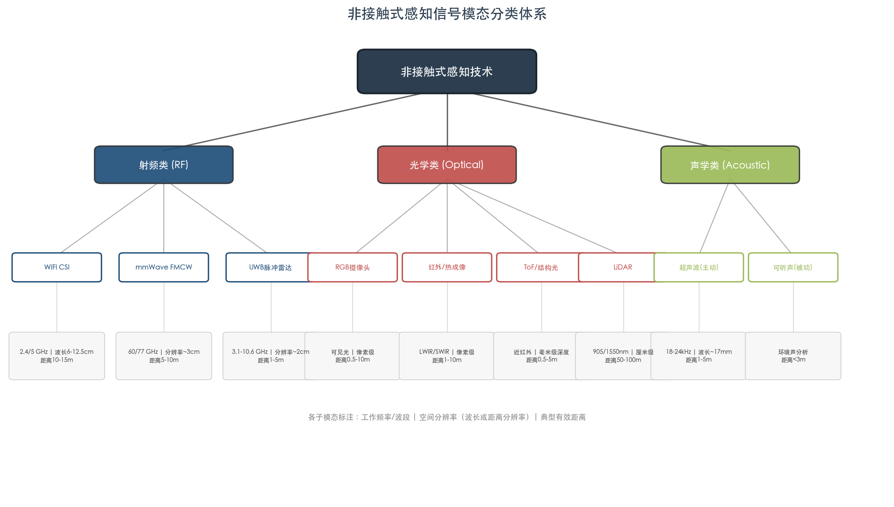

### 1.2.1 射频类（Radio Frequency）

射频类感知利用电磁波在人体表面及周围环境中的反射、散射和多径效应提取运动与生理信息。该族群包含三个主要子模态，各自在空间分辨率、覆盖范围和硬件成本之间呈现显著差异。

**WiFi CSI** 工作于 2.4 GHz（波长约 12.5 cm）和 5 GHz（波长约 6 cm）频段。IEEE 802.11n 标准下 20 MHz 带宽包含 56 个子载波，802.11ac 的 80 MHz 带宽可达 256 个子载波。空间分辨率受限于信号波长（厘米级），但通过多径效应和多普勒频移分析可实现亚波长级运动检测 [Wi-Fi SSL Tutorial](https://arxiv.org/html/2506.12052v1 "Radwan et al., IEEE COMST Vol.28, 2026")。WiFi CSI 的核心优势在于零额外硬件成本——利用已部署的路由器和终端设备即可实施感知——以及全屋级覆盖能力（10-15 m），适合存在检测、跌倒识别和粗粒度活动分类等大范围感知任务。

**毫米波雷达（mmWave FMCW Radar）** 工作于 60 GHz（7 GHz 带宽）和 77 GHz（4-5 GHz 带宽）频段，可实现约 3 cm 的距离分辨率和约 1 mm 的距离精度，波束正面角度精度约 ±1° [TI mmWave技术报告](https://www.ti.com/lit/pdf/swra841 "Texas Instruments, SWRA841A, 2025/2026")。单模块成本约 15-50 美元、功耗 1-3 W，适合中等距离（5-10 m）场景下的高精度人体姿态估计与多人同时感知。

**超宽带脉冲雷达（UWB）** 工作于 3.1-10.6 GHz 频段，大带宽（理论上可达 7.5 GHz）使距离分辨率可达约 2 cm，典型无设备定位精度为 10-30 cm [UWB综述](https://arxiv.org/abs/2402.05649 "Cheraghinia et al., IEEE COMST 2025, DOI: 10.1109/COMST.2024.3488173")。Cheraghinia et al. 在 IEEE COMST（Vol.27, 2025）发表的综述全面覆盖了 UWB 雷达的基础概念、标准化进程、信号处理技术及公开数据集。UWB 的突出优势在于毫瓦级功耗和已嵌入消费级芯片（如 Apple U1/U2、NXP SR150），但有效感知距离通常限于 1-5 m，制约了其在大空间场景中的应用。

### 1.2.2 光学类（Optical）

光学类感知利用可见光或红外波段的电磁辐射与人体的交互来获取运动、姿态和生理信息，子模态覆盖面广。

**RGB 摄像头** 是当前精度上限最高的非接触感知手段。骨架动作识别在 NTU RGB+D 120 数据集上已达 Cross-Subject 91.0%（DeGCN），视频动作分类在 Kinetics-700 上达 Top-1 85.4%（InternVideo2），人体姿态估计在 COCO test-dev 上达 AP 80.9（ViTPose-G），远程心率检测在受控条件下（PURE 数据集）MAE 低至 0.25 bpm（ME-rPPG）。然而，RGB 方案对光照条件高度敏感、受遮挡影响显著，且存在固有的隐私风险——在 GDPR 等法规框架下，面部图像的采集与存储受到严格限制。

**红外与热成像** 能够在低光乃至完全无光环境下工作。Georgia Tech 团队（2025 年 3 月）在 Cell Reports Physical Science 上发表的超光谱脉冲热成像技术，采用长波红外（LWIR）相机通过热脉冲分析实现心率、呼吸率和体温的非接触测量，并支持多人场景同时监测 [Georgia Tech 热成像](https://coe.gatech.edu/news/2025/03/thermal-imaging-could-be-simple-highly-accurate-way-track-vital-signs "Han et al., Cell Reports Physical Science 2025")。

**ToF/结构光深度相机** 提供精确的三维深度信息（毫米级分辨率）。Apple Face ID 所采用的结构光方案以及 Azure Kinect 的 ToF 传感器均属此类。深度相机天然去除面部纹理信息，在隐私保护维度优于 RGB 方案。

**LiDAR** 具备不受光照限制、精确深度测量（厘米级分辨率）和大场景覆盖（50-100 m）等优势，同时因不采集面部纹理而具有天然隐私保护属性。LiveHPS（CVPR 2024）是首个基于单 LiDAR 的场景级人体姿态与形状估计方法，可实现 45 fps 实时推理 [LiveHPS](https://arxiv.org/html/2402.17171v1 "Ren et al., CVPR 2024")。然而，机械 LiDAR 成本较高（1,000 美元以上），且远距离人体点云极为稀疏（仅 50-200 个点），构成核心技术挑战 [LiDAR HPE 综述](https://arxiv.org/html/2509.12197v1 "Galaaoui et al., arXiv:2509.12197, 2025")。Apple dToF LiDAR 已在近距离（<5 m）消费级应用中展现可行性。

### 1.2.3 声学类（Acoustic）

声学非接触感知通常利用 18-24 kHz 近超声频段（20 kHz 对应波长约 17 mm），有效距离一般为 1-5 m。该技术路线的核心优势在于可利用现有智能音箱和手机的麦克风阵列实现零额外硬件成本部署 [声学感知综述](https://ieeexplore.ieee.org/document/11164293/ "Li et al., IEEE Access Vol.13, 2025")。Li et al.（2025）在 IEEE Access 发表的综述提出了声学非接触健康监测的统一框架，系统回顾了主动声学（发射-接收模式）和被动声学（环境声分析）两大技术路线。

声学信号波长较短（17 mm @ 20 kHz），能够感知亚毫米级位移（如心搏引起的胸壁 0.3-0.8 mm 运动），空间分辨率优于 WiFi CSI（波长 6-12 cm），但远不及毫米波雷达。声学感知的根本局限在于有效距离短和环境噪声敏感性——空气对超声的衰减构成不可逾越的物理约束。

此外，Alijani et al.（2025）在 IEEE COMST（Vol.28, 2026 年刊出）发表的无设备可见光感知综述已获 18 次引用，系统梳理了利用环境可见光进行无设备感知的技术路线 [可见光感知综述](https://ieeexplore.ieee.org/document/10904171/ "Alijani et al., IEEE COMST Vol.28, 2026, 已被引18次")，进一步拓展了非接触感知在光学维度的分类边界。

### 1.2.4 各模态物理参数对比

表 1-1 汇总了各信号模态的核心物理参数，为后续章节的算法评估与跨模态比较提供参照基准。

| 信号模态 | 工作频率/波段 | 波长/分辨率 | 典型有效距离 | 穿墙能力 | 光照依赖 | 隐私保护 | 典型硬件成本 |
|---------|------------|-----------|-----------|---------|---------|---------|-----------|
| WiFi CSI | 2.4/5 GHz | 波长 6-12.5 cm | 全屋（10-15 m） | 支持 | 无 | 高 | 零（复用路由器） |
| mmWave FMCW | 60/77 GHz | 距离分辨率 ~3 cm | 5-10 m | 有限 | 无 | 高 | $15-50/模块 |
| UWB 脉冲 | 3.1-10.6 GHz | 距离分辨率 ~2 cm | 1-5 m | 支持 | 无 | 高 | 已嵌入消费芯片 |
| RGB 摄像头 | 可见光 | 像素级 | 0.5-10 m | 不支持 | 强依赖 | 低 | $5-50 |
| 红外/热成像 | LWIR/SWIR | 像素级 | 1-10 m | 不支持 | 无 | 中 | $200-5,000+ |
| ToF/结构光 | 近红外 | 毫米级深度 | 0.5-5 m | 不支持 | 弱依赖 | 中-高 | $20-200 |
| LiDAR | 905/1550 nm | 厘米级 | 50-100 m | 不支持 | 无 | 高 | $100-1,000+ |
| 声学（超声波） | 18-24 kHz | 波长 ~17 mm | 1-5 m（典型 <1 m） | 不支持 | 无 | 高 | 零（复用音箱/手机） |

图 1-2 以雷达图形式对上述模态在空间分辨率、有效距离、穿墙能力、隐私保护和成本优势五个维度的综合能力进行可视化对比，便于读者直观把握各模态的差异化定位与互补关系。

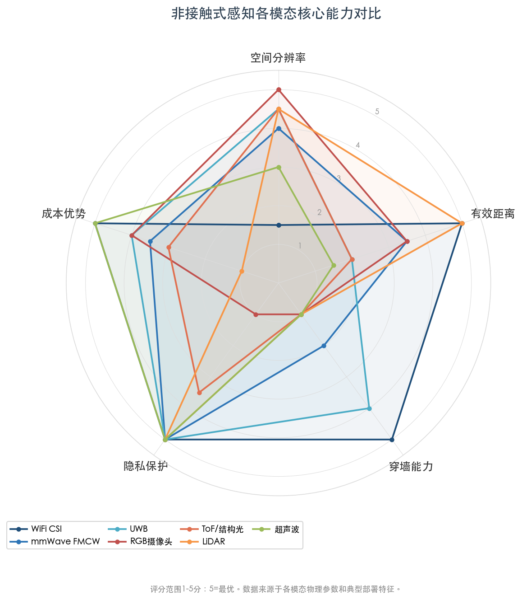

## 1.3 典型感知任务与评估指标体系

非接触式感知覆盖的核心任务可归纳为以下四类，各类任务对应差异化的评估指标。为确保后续章节中跨方法、跨模态比较的严谨性，本报告严格遵循下述"任务—指标"对应关系，避免出现脱离数据集与实验条件的模糊精度声明。

**分类任务** 包括人体活动识别（HAR）、手势识别和跌倒检测，标准指标为分类准确率（Accuracy）和 F1-score。引用具体数字时须注明数据集名称（如 Widar 3.0、NTU RGB+D 120、UT-HAR）、划分方式（Cross-Subject / Cross-View / Cross-Domain）及训练/测试设置。

**回归任务** 以人体姿态估计（HPE）为代表，核心指标为平均关节位置误差 MPJPE（Mean Per Joint Position Error，单位 mm 或 cm）和 PA-MPJPE（Procrustes 对齐后的 MPJPE）。视觉领域 COCO HPE 采用 AP（Average Precision，基于 OKS 阈值）作为标准评测指标。须注意不同论文可能使用不同的 MPJPE 计算阈值（如 20 cm 或 50 px），直接横向比较需审慎对待。

**生命体征监测任务** 包括呼吸率和心率检测，核心指标为 MAE（Mean Absolute Error，单位 bpm）、RMSE（Root Mean Square Error，单位 bpm）和 Pearson 相关系数 r。针对心律不齐等临床场景，R-R 间期误差（单位 ms）是更为精细的评估指标。

**定位与追踪任务** 核心指标为平均距离误差（单位 m 或 cm）。

在基准建设方面，CSI-Bench 在 NeurIPS 2025 Datasets and Benchmarks Track 被接收，是首个大规模真实场景（in-the-wild）WiFi 感知基准，涵盖 26 个室内环境、35 名用户、461 小时有效数据，任务覆盖跌倒检测、呼吸监测、室内定位和运动源识别 [CSI-Bench](https://openreview.net/forum?id=W1WJeqsxnX "Zhu et al., NeurIPS 2025 D&B Track")。该基准的出现标志着 WiFi 感知领域从实验室受控环境向真实世界场景评估的范式转换。

Wang et al.（2025）发表的 WiFi 感知泛化性综述系统回顾了 200 余篇论文，对上述指标体系在跨域评估场景下的适用性与局限性进行了深入探讨 [Wi-Fi泛化性综述](https://arxiv.org/html/2503.08008v2 "Wang et al., 2025, 200+篇论文")。

## 1.4 2025—2026 年技术演进趋势

过去 12 个月（2025 年 4 月至 2026 年 4 月），非接触式感知领域经历了三项具有结构性影响的技术变革：基础模型进入感知领域、Transformer 架构全面主导化，以及跨域泛化成为核心工程挑战。图 1-3 以时间线形式标注了这一时期的关键技术里程碑。

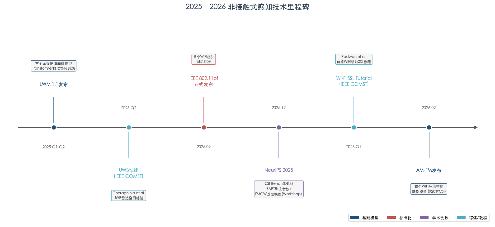

### 1.4.1 基础模型进入感知领域

2026 年标志着非接触式感知从"任务特定模型"向"基础模型+下游适配"范式的关键转折。

AM-FM 是首个面向 WiFi 环境智能的基础模型（2026 年 2 月发布），在 920 万条未标注 CSI 样本上完成预训练（跨 439 天、20 种商用设备），采用 6 层 Transformer 作为统一骨干网络，在 9 个下游任务上展现出强大的跨任务迁移能力 [AM-FM](https://arxiv.org/abs/2602.11200 "Zhu et al., arXiv, Feb 2026")。Large Wireless Model（LWM）是全球首个面向无线信道的基础模型，同样采用 Transformer 架构进行自监督预训练，其 1.1 版本于 2025 年发布 [LWM](https://arxiv.org/abs/2411.08872 "Alikhani et al., arXiv, Nov 2024/Apr 2025")。在雷达方向，NeurIPS 2025 AI4NextG Workshop 接收了面向 FMCW 雷达感知的基础模型先导研究，其学习到的嵌入表征在存在检测任务上与 DINO 和 LWM 等预训练模型表现相当 [FMCW基础模型](https://neurips.cc/virtual/2025/123209 "Serbetci et al., NeurIPS 2025 AI4NextG Workshop")。上述工作表明，无线感知基础模型已从概念验证阶段迈入可量化评估阶段。

### 1.4.2 Transformer 架构主导化

Transformer 架构在非接触感知领域已呈现全面主导化态势。在 WiFi 感知方向，基于自注意力机制的 HAR 方法在 UT-HAR 数据集上达到 99.41% 平均识别准确率；在毫米波 HPE 方向，RAPTR（NeurIPS 2025）采用两阶段 Transformer 解码器，在 HIBER 数据集上将关节位置误差降低 34.3%，在 MMVR 数据集上降低 76.9% [RAPTR](https://arxiv.org/abs/2511.08387 "Kato et al., NeurIPS 2025")。与此同时，Mamba 状态空间模型（SSM）在轻量化部署方向展现出强劲竞争力——RadMamba 在 DIAT 数据集上以仅 21.7k 参数实现 99.8% HAR 准确率。在视觉 rPPG 方向，算法架构经历了从传统信号处理（POS, 2017）到 CNN（PhysNet, 2019）、Transformer（PhysFormer, CVPR 2022）、SSM（ME-rPPG, 2025）直至扩散模型（FrePhys, 2025-2026）的持续演进。

跨模态融合方面同样值得关注：Wi-Chat 利用 GPT-4o 实现零样本 WiFi 动作识别（准确率 62%，4-shot 达 77%），Wi-Fringe 使用 BERT 嵌入指导 WiFi 特征学习，标志着大语言模型已渗透至感知领域的信号理解层面 [Wi-Fi泛化性综述](https://arxiv.org/html/2503.08008v2 "Wang et al., 2025")。

### 1.4.3 跨域泛化成为核心挑战

泛化性已成为 WiFi CSI 感知方向最为突出的开放挑战。Wang et al.（2025）的综述系统归纳了制约泛化的三大障碍：设备异构性（不同厂商 CSI 格式与采样差异）、人体多样性（体型、运动习惯的个体差异）和环境多样性（房间布局、家具摆放的场景变化） [Wi-Fi泛化性综述](https://arxiv.org/html/2503.08008v2 "Wang et al., 2025")。该综述沿四阶段流水线——设备部署、信号预处理、特征学习、模型部署——对现有泛化技术进行了系统分类，并指出 WiFi 感知泛化研究自 2019 年起论文数量呈爆发式增长。

这一挑战并非 WiFi 所独有。视觉 rPPG 方法在受控数据集（PURE）上 MAE 低至 0.25 bpm，但在包含多运动模式与多光照条件的 MMPD 数据集上升至 5.38 bpm，跨域性能衰减超过 20 倍。雷达 HAR 同样面临类似困境：同一环境内准确率可达 99% 以上，跨环境测试中性能下降显著。跨域泛化由此构成贯穿全部信号模态的共性瓶颈，也是当前研究的核心攻关方向。

### 1.4.4 标准化与产业进展

IEEE 802.11bf 标准（WLAN Sensing）已于 2025 年 9 月 26 日正式发布为 IEEE Std 802.11bf-2025，成为首个专门面向 WiFi 感知的国际标准 [IEEE 802.11bf](https://www.ieee802.org/11/Reports/802.11_Timelines.htm "IEEE 802.11 Working Group, 发布日期 2025-09-26")。该标准定义了对 IEEE 802.11 MAC 和 PHY 层的修改，使 WLAN 设备能够在 sub-7 GHz 和 60 GHz 频段执行标准化的感知操作，涵盖存在检测、活动识别、人体定位追踪、生命体征监测和 3D 视觉等用例 [802.11bf 综述](https://ieeexplore.ieee.org/document/10547188/ "Du et al., IEEE 802.11bf 概述论文")。802.11bf 的发布为 WiFi 感知从学术研究走向规模化商用奠定了协议层基础，与 802.11be（Wi-Fi 7，极高吞吐量）和 802.11bn（超高可靠性）共同构成下一代 WLAN 标准体系。

在市场层面，MarketsandMarkets 预测全球手势识别与非接触感知市场规模于 2025 年达到 284 亿美元，至 2032 年将增长至 1,259 亿美元，复合年增长率约 24% [MarketsandMarkets](https://www.marketsandmarkets.com/Market-Reports/touchless-sensing-gesturing-market-369.html "MarketsandMarkets, Gesture Recognition and Touchless Sensing Market, 2025")。智能家居、汽车座舱监测、医疗健康和零售自动化构成主要增长驱动领域。

## 1.5 本报告的评估框架

基于上述技术全景，本报告构建了一套六维度的系统评估框架，用于在后续章节中对各模态的 SOTA 算法进行结构化比较。

**维度一：输入信号类型。** 明确标注算法所使用的信号模态（WiFi CSI / mmWave / UWB / RGB / 红外 / 深度 / LiDAR / 声学）及具体的信号表示形式（原始时序、频谱图、点云、热图等）。

**维度二：感知任务类型。** 涵盖 HAR、HPE、手势识别、跌倒检测、生命体征监测（呼吸率/心率）、室内定位与存在检测。

**维度三：准确率/精度指标。** 严格遵循第 1.3 节定义的任务—指标对应关系，每个精度声明须注明评测数据集、划分方式、受试者与环境数量及是否为跨域测试。

**维度四：评测基准。** 标注所使用的公开数据集或基准平台，明确区分实验室受控条件与真实世界场景。

**维度五：算法架构。** 归类为传统信号处理、CNN、RNN/LSTM、GCN、Transformer/ViT、SSM/Mamba、扩散模型或基础模型等架构类别。

**维度六：部署约束。** 包括硬件成本、计算复杂度（参数量/FLOPs）、推理延迟、功耗及对环境条件（光照/噪声/温度）的鲁棒性要求。

后续第 2—4 章将分别对射频、光学与视觉、声学三大模态的代表性算法进行深度评估；第 5 章分析跨模态融合与新兴方法；第 6 章汇总"输入信号 × 感知任务 × SOTA 算法 × 准确率"的系统对比矩阵，并提供面向不同应用场景的技术选型建议。

# 第2章 基于射频信号的感知算法

射频（RF）信号凭借天然的穿透遮挡能力、对光照条件的不敏感性以及在隐私保护方面的结构性优势，已成为非接触式感知领域中研究最为活跃的信号模态之一。本章围绕 WiFi 信道状态信息（CSI）、毫米波（mmWave）FMCW 雷达和超宽带（UWB）脉冲雷达三条技术路线，系统评估各自在人体活动识别（HAR）、人体姿态估计（HPE）、手势识别及生命体征监测等核心感知任务上的最优算法表现，对比其输入信号特征与准确率指标，并深入分析关键技术突破与实际部署约束。文中所涉文献和性能数据截至 2026 年第一季度。

## 2.1 WiFi CSI 感知算法

### 2.1.1 信号特征与物理基础

WiFi CSI 记录的是 OFDM 子载波在发射端与接收端之间的复数信道响应，包含幅度衰减与相位偏移两类信息。在 802.11n 标准 20 MHz 带宽配置下，每对天线可获取 56 个子载波（Intel 5300 NIC 实际提取 30 个）；802.11ac 80 MHz 带宽下子载波数量可达 256 个。空间分辨率受限于信号波长——2.4 GHz 对应约 12.5 cm、5 GHz 对应约 6 cm。然而，借助多径效应和多普勒频移分析，WiFi CSI 能够检测亚波长级别的人体运动，从而为粗粒度活动识别和细粒度手势感知提供了物理基础 [Wi-Fi SSL Tutorial](https://arxiv.org/html/2506.12052v1 "Radwan et al., IEEE COMST Vol.28, 2026")。

随着 WiFi 标准的持续演进，802.11bf 将在 MAC 和 PHY 层正式引入感知功能，802.11be（Wi-Fi 7）则进一步将带宽扩展至 320 MHz 并支持 16×16 MIMO 配置，子载波密度和空间分辨力均将获得显著提升。商用 CSI 提取平台也已从早期的 Intel 5300 NIC 和 Atheros CSI Tool 拓展至 Nexmon（支持智能手机与树莓派）以及 Qualcomm、Broadcom、Espressif、NXP 等多厂商芯片组，硬件生态日趋完善 [CSI-Bench](https://arxiv.org/html/2505.21866v1 "Zhu et al., NeurIPS 2025 D&B Track")。

### 2.1.2 人体活动识别（HAR）

WiFi CSI HAR 是射频感知领域研究最为成熟的方向，算法架构经历了从传统机器学习到深度学习再到基础模型的完整演化。SenseFi 基准（Cell Patterns, 2023）首次在统一框架下系统评测了 MLP、CNN、LSTM、BiLSTM、CNN+GRU、Transformer（ViT）等六大架构在四个数据集上的表现，为该领域提供了可复现的标准化对比基线 [SenseFi](https://arxiv.org/abs/2207.07859 "Yang et al., Patterns 2023")。

**域内性能。** 在域内评测中，当前最优方法已逼近 100% 准确率。WiGRUNT 采用 ResNet 骨干搭配空间-时间双注意力机制，在 Widar 3.0 数据集上实现域内 99.67% 准确率 [WiGRUNT](https://www.techrxiv.org/users/679475/articles/676837-wigrunt-wifi-enabled-gesture-recognition-using-dual-attention-network "Gu et al., TechRxiv 2023")；基于自注意力机制的方法在 UT-HAR 数据集上达到 99.41% 平均识别准确率 [IEEE Access](https://ieeexplore.ieee.org/document/10559586/ "IEEE Access Vol.12, 2024")。SenseFi 在 NTU-Fi HAR 数据集（6 类活动、Atheros CSI Tool 采集、114 子载波/天线对）的评测中，MLP 和 BiLSTM 均达到 99.69% 准确率，GRU 达到 97.66%，CNN-5 达到 98.70% [SenseFi](https://arxiv.org/abs/2207.07859 "Yang et al., Patterns 2023, Table III")。在 NTU-Fi Human-ID（14 名受试者步态识别）任务上，BiLSTM 达到 99.38%、GRU 达到 98.96%、CNN-5 达到 97.14% [SenseFi](https://arxiv.org/abs/2207.07859 "Yang et al., Patterns 2023, Table III")。

**跨域泛化。** 跨域泛化是 WiFi CSI 感知面临的核心挑战。Wang et al.（2025）在涵盖 200 余篇论文的系统综述中将三大障碍归纳为设备异构性、人体多样性和环境多样性 [Wi-Fi泛化性综述](https://arxiv.org/html/2503.08008v2 "Wang et al., 2025, 200+篇论文")。Wi-CBR 采用跨域对比学习策略，在 Widar 3.0 上域内达到 99.54%，跨环境 98.34%、跨位置 96.30%、跨方向 96.57%，在跨域场景中刷新了 SOTA [Wi-CBR](https://arxiv.org/html/2506.11616v1 "arXiv:2506.11616, 2025")。GLSDA 利用 GPT-2 作为教师模型，通过语义蒸馏引导 WiFi 手势识别的跨域泛化，在 Widar 3.0 上域内 97.78%、跨位置 95.59%、跨方向 92.80%（均值 95.39%），相比无蒸馏基线提升 1.31%–2.88% [GLSDA](https://arxiv.org/html/2510.13390v1 "Huang et al., arXiv:2510.13390, 2025")。

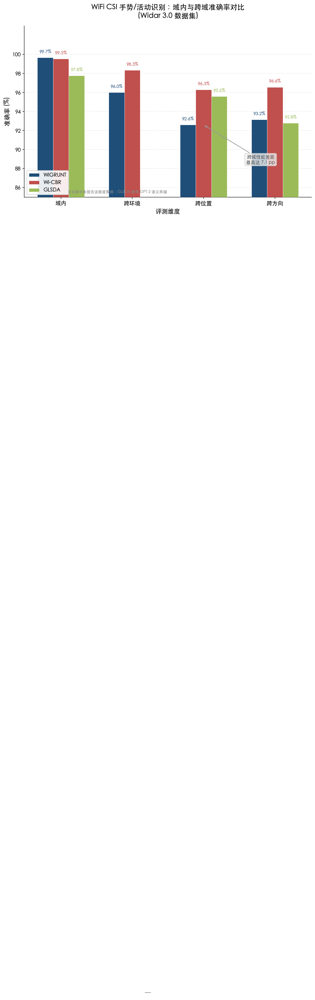

图 2-1 以 Widar 3.0 数据集为基准，对比了 WiGRUNT、Wi-CBR、GLSDA 三个代表性方法在域内、跨环境、跨位置、跨方向四个评测维度上的准确率。可以清晰看到，尽管域内准确率普遍超过 97%，跨域性能差距最高可达 7.1 个百分点，直观地反映了泛化性鸿沟的严峻程度。

CSI-Bench（NeurIPS 2025 D&B Track）作为首个大规模 in-the-wild WiFi 感知基准，在 26 个真实室内环境、35 名用户、16 类商用设备、461 小时有效数据上建立了标准化评测协议。其 baseline 结果进一步量化了域内与跨域之间的性能鸿沟：在多任务 HAR（5 类活动）上，Transformer 域内训练准确率为 75.40%（F1 75.49%），经多任务联合训练可提升至 87.79%（F1 86.47%）；而在跨域评测中，最优模型 ViT 在跨设备、跨环境、跨用户三个维度上准确率分别仅为 66.33%、58.87%、59.00% [CSI-Bench](https://arxiv.org/html/2505.21866v1 "Zhu et al., NeurIPS 2025 D&B Track, Tables 3-4, 12")。这一结果表明，即便采用表现最优的架构，在真实世界分布偏移条件下性能仍会大幅退化，跨域泛化依然是制约 WiFi 感知走向实用化部署的核心瓶颈。

### 2.1.3 手势识别

WiFi CSI 手势识别对信号的时间分辨率和时序建模能力提出了更高要求，因手势动作持续时间短且运动幅度小于全身活动。AM-FM 是首个面向 WiFi 环境智能的基础模型（2026 年 2 月发布），在 920 万条未标注 CSI 样本上完成预训练（跨 439 天、20 种商用设备），采用 6 层 Transformer 编码器作为统一骨干。通过瓶颈适配微调，AM-FM 在 SignFi 276 类手语手势识别任务上达到 AUROC 0.999，相较于随机初始化的 0.564 实现了质的飞跃。在 9 个下游任务上，AM-FM 均展现了强大的跨任务迁移能力：HAR AUROC 0.923（从零训练仅 0.527）、跌倒检测 0.919、定位 0.995、用户识别 0.993；在 few-shot 场景下，仅以 K=25 样本/类即可在跌倒检测上达到 AUROC 0.822 [AM-FM](https://arxiv.org/html/2602.11200v1 "Hu et al., arXiv:2602.11200, Feb 2026")。AM-FM 的成功证明了大规模自监督预训练在射频感知领域的可行性与有效性，其卓越的数据效率和跨任务泛化能力为缓解标注数据稀缺这一长期瓶颈提供了全新路径。

### 2.1.4 生命体征监测

WiFi CSI 生命体征监测的物理基础在于呼吸和心搏所引起的胸壁微小位移——呼吸位移约 1–12 mm、心搏位移约 0.3–0.8 mm——对 CSI 信号相位和幅度产生的周期性调制。PhaseBeat 系统通过提取商用 WiFi CSI 的相位差信息，实现了呼吸率检测中位误差 0.25 次/分钟的精度 [PhaseBeat](https://www.eng.auburn.edu/~szm0001/papers/PhaseBeat_ACMHealth20.pdf "Wang et al., ACM Trans. Computing for Healthcare 2020")。在心率检测方面，2024 年发表于 Sensors 的研究采用子载波选择策略优化信噪比，实现心率估计准确率 96.8%、中位误差 0.8 bpm [WiFi HR](https://www.mdpi.com/1424-8220/24/7/2111 "Sensors Vol.24, 2024")。

CSI-Bench 对呼吸检测任务（二分类：判断是否存在呼吸信号）进行了系统评测，结果表明呼吸信号的周期性特征赋予其较高的鲁棒性：在标准测试集上，PatchTST 达到 98.84% 准确率，ViT 达到 98.63%；即便在 Hard 难度级别（远距离非视线部署、风扇干扰叠加）下，ViT 仍保持 99.17% 的 F1 值 [CSI-Bench](https://arxiv.org/html/2505.21866v1 "Zhu et al., NeurIPS 2025 D&B Track, Tables 3, 9")。

### 2.1.5 架构演进与技术趋势

WiFi CSI 感知的算法架构经历了三个阶段的清晰演化。**第一阶段**以浅层网络为主（MLP、CNN-5、GRU）。SenseFi 的评测表明，这些模型在域内场景中已能达到 95%–99% 准确率，计算复杂度低且参数量小——CNN-5 仅含 0.3M 参数和 28.24M FLOPs，天然适合边缘部署。值得注意的是，SenseFi 同时发现过深的网络（如 ResNet-101）在 WiFi CSI 数据上因过拟合反而导致性能下降，尤其在跨域场景中退化更为明显 [SenseFi](https://arxiv.org/abs/2207.07859 "Yang et al., Patterns 2023")。

**第二阶段**以注意力机制的引入为标志。WiGRUNT 的空间-时间双注意力和 THAT 的 Transformer 编码器将域内精度推至 99% 以上，充分发挥了自注意力机制在捕获 CSI 信号长程时序依赖和跨子载波空间关联方面的优势。

**第三阶段**是基础模型范式的崛起。AM-FM 的 6 层 Transformer 骨干统一了 9 个下游任务，Large Wireless Model（LWM）作为全球首个面向无线信道的基础模型同样采用 Transformer 架构进行自监督预训练 [LWM](https://arxiv.org/abs/2411.08872 "Alikhani et al., arXiv, Nov 2024/Apr 2025")。在域泛化方面，三条具有前景的技术路线已初步形成：大模型语义蒸馏（GLSDA 跨方向准确率提升 2.88%）、大规模自监督预训练（AM-FM 将 HAR AUROC 从 0.527 提升至 0.923）、以及跨域对比学习（Wi-CBR 跨域准确率达 96%–98%）。

## 2.2 毫米波雷达感知算法

### 2.2.1 信号特征与物理基础

mmWave FMCW 雷达工作于 60 GHz（7 GHz 带宽）和 77 GHz（4–5 GHz 带宽）频段，可实现约 3 cm 的距离分辨率和约 1 mm 的距离精度，波束正面角度精度约 ±1° [TI mmWave技术报告](https://www.ti.com/lit/pdf/swra841 "Texas Instruments, SWRA841A, 2025/2026")。与 WiFi CSI 的"环境级"感知不同，mmWave 雷达能够生成距离-多普勒-角度三维表征（雷达热图），或经 CFAR 检测和 DBSCAN 聚类后输出稀疏 3D 点云，为精细化人体感知提供了更高维度的输入信号。典型商用平台如 TI IWR1642BOOST（77–81 GHz），单模块成本约 $15–50，功耗约 1–3 W，兼具成本可控性与全天候工作能力。

### 2.2.2 人体活动识别（HAR）

mmWave 雷达 HAR 的输入通常为距离-多普勒热图或稀疏点云序列。RadMamba（2025）提出了基于 Mamba 状态空间模型（SSM）的轻量化雷达 HAR 架构，在多个基准数据集上取得了极具竞争力的表现：DIAT 数据集准确率 99.8%（仅 21.7k 参数）、CI4R 数据集 91.2%（71.4k 参数）、UoG2020 数据集 89.3%（6.7k 参数），参数量较此前 SOTA 方法降低了 1–2 个数量级 [RadMamba](https://arxiv.org/html/2504.12039v1 "Wu et al., arXiv:2504.12039, 2025")。RadHAR 基准（ACM ICDLT 2019）最初报告的最佳深度学习方法准确率为 92% [RadHAR](https://dl.acm.org/doi/10.1145/3349624.3356768 "Singh et al., 2019")，后续 mPCT-LSTM（2025）通过融合点云 Transformer 与 LSTM 时序建模，在三个数据集上将平均准确率提升至 97.26% [mPCT-LSTM](https://www.sciencedirect.com/science/article/abs/pii/S1051200425002854 "Digital Signal Processing 2025")。

上述结果表明，mmWave 雷达 HAR 在受控域内场景中已达到极高精度。尤其值得关注的是，Mamba SSM 架构在维持竞争性精度的同时将参数量压缩至数万级别，为资源受限的边缘设备实时部署提供了切实可行的技术路径。

### 2.2.3 人体姿态估计（HPE）

mmWave HPE 是射频感知中对信号分辨率和算法复杂度要求最高的任务之一。其架构经历了从 CNN（RF-Pose 3D）到 HRNet 风格多尺度特征融合（HRRadarPose）、再到 DETR 风格可学习查询（QRFPose）和两阶段 Transformer（RAPTR）的演进历程，输入信号也相应地从稀疏点云扩展到原始高维雷达热图 [RAPTR](https://arxiv.org/html/2511.08387 "Kato et al., NeurIPS 2025, Section 2")。

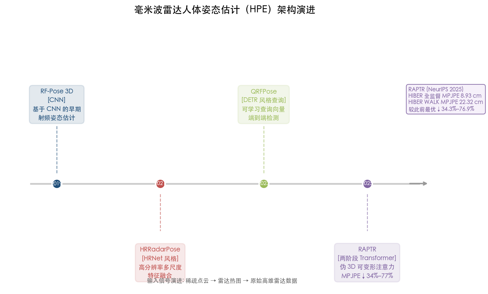

图 2-2 展示了 mmWave HPE 从 2019 年 RF-Pose 3D 到 2025 年 RAPTR 的架构演进路径。每一代架构在输入表征、注意力机制和端到端建模能力上均实现了显著突破，RAPTR 在 HIBER 数据集上的全监督 MPJPE 已降至 8.93 cm。

RAPTR（NeurIPS 2025 主会议）代表了截至 2026 年第一季度 mmWave HPE 的最高水平。该方法采用两阶段 Transformer 解码器结合伪 3D 可变形注意力机制，直接处理原始雷达热图而非稀疏点云。在 HIBER 数据集上，WALK 场景 MPJPE 为 22.32 cm（较此前最优降低 34.3%），MULTI 场景 MPJPE 为 18.99 cm（降低 42.7%）；在 MMVR 数据集上中心距离误差降低 76.9%。在全监督设置下，HIBER MULTI 场景 MPJPE 可进一步降至 8.93 cm [RAPTR](https://arxiv.org/html/2511.08387 "Kato et al., NeurIPS 2025")。

需指出的是，mmWave HPE 的 MPJPE 处于 8.93–22.32 cm 范围内，与视觉 HPE 方法（如 ViTPose 在 COCO 上 AP 80.9%，对应亚厘米级关节定位）仍存在显著差距。这一差距根源于 mmWave 信号的物理分辨率限制——即便 77 GHz 雷达的距离分辨率可达约 3 cm，其角度分辨率和点云密度远不及视觉传感器。然而，mmWave HPE 的核心价值恰在于其穿透遮挡和隐私保护特性。MVDoppler-Pose（CVPR 2025）首次系统性地证明，mmWave 在长距离和自遮挡步行场景中可优于相机方案，具备距离无关和遮挡鲁棒的独特优势 [MVDoppler-Pose](https://openaccess.thecvf.com/content/CVPR2025/html/Choi_MVDoppler-Pose_Multi-Modal_Multi-View_mmWave_Sensing_for_Long-Distance_Self-Occluded_Human_Walking_CVPR_2025_paper.html "Choi et al., CVPR 2025")。

### 2.2.4 生命体征监测

mmWave 雷达的高距离精度（约 1 mm）使其尤为适合非接触生命体征监测任务。基于 TI IWR1642BOOST（77–81 GHz）的系统在多人场景中展现了突出性能：呼吸率检测准确率 97.94%、心率检测准确率 93.43%，可同时监测 3 人，有效距离达 5 m [mmWave Vital Signs](https://arxiv.org/html/2511.21255v1 "Benny et al., arXiv, 2025")。在精度维度上，发表于 Nature Scientific Reports（2024）的研究表明，mmWave 雷达在不同距离和角度条件下心率估计误差率仅为 1.69%–2.61% [mmWave HR](https://www.nature.com/articles/s41598-024-77683-1 "Wang et al., Scientific Reports 2024")。

与 WiFi CSI 生命体征方法相比，mmWave 雷达在多人场景和中等距离（5 m 范围）上具备明显的性能优势，但其硬件成本更高，部署灵活性也不及利用已有 WiFi 基础设施的方案。两种技术路线在实际应用中呈互补而非替代关系。

### 2.2.5 架构演进与轻量化趋势

mmWave 感知的算法架构已形成两条并行的演进路线。**精度优先路线**以 RAPTR 为代表，采用大规模 Transformer 模型直接处理高维雷达热图，追求 HPE 等高精度任务上的 SOTA 性能，适用于计算资源充足的服务器端部署场景。**效率优先路线**以 RadMamba 为代表，利用 Mamba SSM 架构将参数量压缩至数万级别（DIAT 场景仅 21.7k 参数），在 HAR 等分类任务上保持竞争性精度，面向资源受限的嵌入式终端。

此外，NeurIPS 2025 AI4NextG Workshop 接收了面向 FMCW 雷达感知的基础模型先导研究，其自监督学习到的嵌入表征在存在检测任务上与 DINO 和 LWM 等通用预训练模型具有竞争性表现 [FMCW基础模型](https://neurips.cc/virtual/2025/123209 "Serbetci et al., NeurIPS 2025 AI4NextG Workshop")。这一进展预示着基础模型范式正在从 WiFi CSI 领域向 mmWave 领域渗透，有望在未来进一步降低对标注数据的依赖。

## 2.3 超宽带（UWB）雷达感知算法

### 2.3.1 信号特征与物理基础

UWB 脉冲雷达工作于 3.1–10.6 GHz 频段，其大带宽（典型值 500 MHz–7.5 GHz）赋予了极高的距离分辨率——7.5 GHz 满带宽时距离分辨率可达约 2 cm，典型无设备定位精度为 10–30 cm [UWB综述](https://arxiv.org/abs/2402.05649 "Cheraghinia et al., IEEE COMST 2025, DOI: 10.1109/COMST.2024.3488173")。与 mmWave FMCW 雷达相比，UWB 脉冲雷达的发射功率极低（毫瓦级），且已广泛嵌入 Apple U1/U2、NXP SR150 等消费级芯片，使其在近距离高精度感知和持续健康监测场景中具备独特优势。

Cheraghinia et al. 在 IEEE COMST（Vol.27, 2025）发表了迄今最全面的 UWB 雷达综述，系统覆盖 UWB 雷达基础概念、标准化进程（IEEE 802.15.4z）、主要应用场景（定位与追踪、生命体征监测、手势识别、穿墙成像）、信号处理技术及公开数据集 [UWB综述](https://arxiv.org/abs/2402.05649 "Cheraghinia et al., IEEE COMST 2025")。

### 2.3.2 生命体征监测

UWB 雷达在近距离生命体征监测上展现了消费级大规模部署的潜力。Google Research（2025）系统验证了消费级 UWB 雷达的心率测量能力：以 FMCW 雷达作为参考系统（MAE 0.85 bpm），经迁移学习的 UWB 脉冲雷达心率检测 MAE 为 4.1 bpm、MAPE 为 6.3%，满足 CTA（消费技术协会）消费电子标准所要求的 ≤5 bpm MAE 和 ≤10% MAPE 门槛 [Google UWB HR](https://research.google/blog/measuring-heart-rate-with-consumer-ultra-wideband-radar/ "Google Research 2025")。这一结果表明，搭载 UWB 芯片的智能手机和可穿戴设备已具备在床头或桌面场景下进行非接触心率监测的技术可行性，且无需额外硬件投入。

### 2.3.3 定位与追踪

UWB 的厘米级距离分辨率使其在室内无设备定位方面具有突出优势，典型精度为 10–30 cm [UWB综述](https://arxiv.org/abs/2402.05649 "Cheraghinia et al., IEEE COMST 2025")。与 WiFi CSI 提供的房间级定位——CSI-Bench 在 ResNet-18 和 TimeSformer-1D 上均达到 100% 准确率，但仅为 6 类房间级分类 [CSI-Bench](https://arxiv.org/html/2505.21866v1 "Zhu et al., NeurIPS 2025 D&B Track, Table 3")——相比，UWB 可提供连续的亚米级位置追踪，满足精细化室内导航和人员跟踪需求。然而，UWB 感知的有效距离通常受限于 1–5 m，且在多人场景下因反射路径重叠导致的信号混叠问题尚未得到完全解决。

## 2.4 射频感知三模态互补分析

三种射频信号在感知能力、部署成本和适用场景上形成了显著的互补格局。图 2-3 以结构化矩阵的形式汇总了各模态在主要感知任务上的 SOTA 算法及其核心性能指标，为横向对比提供一站式参考。

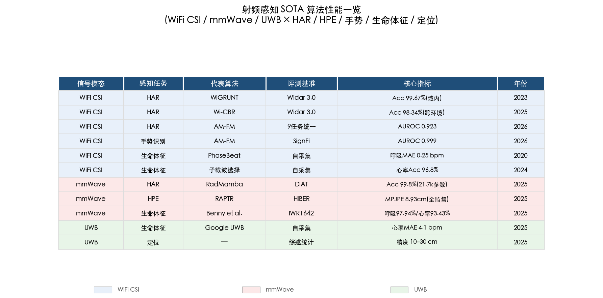

图 2-3 以"信号模态 × 感知任务"为双维度，列出 11 个代表性算法的评测基准、核心指标和发表年份，按模态颜色分组（蓝色 WiFi CSI、红色 mmWave、绿色 UWB）。

**WiFi CSI** 的核心优势在于零额外硬件成本和全屋覆盖范围——利用已有路由器和 IoT 设备即可实现大范围粗粒度感知，尤其适合存在检测和活动识别等任务。但其空间分辨率最低（波长 6–12 cm），难以支撑精细化 HPE。CSI-Bench 的评测显示，WiFi CSI 在跨设备、跨环境、跨用户场景下性能退化显著（HAR 跨域 F1 降至 46%–64%），泛化性仍是制约其规模化部署的核心瓶颈 [CSI-Bench](https://arxiv.org/html/2505.21866v1 "Zhu et al., NeurIPS 2025 D&B Track, Table 12")。

**mmWave 雷达**适合中等距离（5 m 以内）的高精度感知场景，在多人同步监测中表现突出——3 人场景下呼吸率准确率 97.94%、心率准确率 93.43%。单模块成本约 $15–50、功耗约 1–3 W。在 HPE 任务上，mmWave 已达到射频感知的最高精度水平（RAPTR 全监督 MPJPE 8.93 cm），但与视觉方法仍存在数量级差距。

**UWB 脉冲雷达**以极低功耗（毫瓦级）和消费级芯片集成为核心差异化优势，已嵌入 iPhone、Apple Watch 等主流消费电子设备。在近距离（1–5 m）高精度定位（10–30 cm）和生命体征检测（心率 MAE 4.1 bpm）上表现优异，但有效距离受限且多人场景可扩展性有限。

从算法架构角度审视，射频感知领域呈现出 Transformer 架构主导化的趋势：WiFi 方向上，自注意力/ViT 将 UT-HAR 推至 99.41%，AM-FM 的 6 层 Transformer 统一了 9 个下游任务骨干；mmWave HPE 方向上，RAPTR 的两阶段 Transformer 降低 MPJPE 34%–77%。与此同时，Mamba SSM（RadMamba）在轻量化部署场景中展现了与 Transformer 竞争性的精度表现，参数量仅为后者的百分之一，代表了效率优先的另一条技术路线。

## 2.5 实际部署约束与开放挑战

### 2.5.1 泛化性鸿沟

射频感知从实验室走向现实部署面临的首要挑战是泛化性不足。Wang et al.（2025）在涵盖 200 余篇论文的系统综述中指出，WiFi CSI 感知的三大泛化障碍——设备异构性、人体多样性和环境多样性——至今尚未被根本解决 [Wi-Fi泛化性综述](https://arxiv.org/html/2503.08008v2 "Wang et al., 2025")。CSI-Bench 的大规模 in-the-wild 评测进一步量化了这一鸿沟：最优模型（ViT/ResNet-18）在域内可达 87%–100% 准确率，但跨域后骤降至 27%–66%；尤其是近距离估计任务（Proximity Recognition）在所有跨域设置下 F1 均低于 33% [CSI-Bench](https://arxiv.org/html/2505.21866v1 "Zhu et al., NeurIPS 2025 D&B Track, Tables 12-14")。

当前最具前景的三条泛化技术路线已初现成效：AM-FM 通过 920 万样本自监督预训练将 HAR AUROC 从 0.527 提升至 0.923；Wi-CBR 的跨域对比学习将 Widar 3.0 跨域准确率推至 96%–98%；GLSDA 的大模型语义蒸馏在跨方向场景中提升了 2.88 个百分点。但需注意，上述方法的评测仍主要限于受控数据集环境，在 CSI-Bench 等 in-the-wild 基准上的大规模验证尚有待开展。

### 2.5.2 硬件成本与隐私优势

射频感知方法在隐私保护和部署成本两个维度上具有相较于视觉方案的结构性优势。WiFi CSI 不含面部等生物特征信息，可穿墙感知且不受光照条件限制 [Wi-Fi SSL 综述](https://arxiv.org/html/2506.12052v1 "Radwan et al., IEEE COMST Vol.28, 2026")。在硬件成本方面，WiFi CSI 利用已有网络基础设施实现零边际成本部署；mmWave 单模块成本约 $15–50（TI IWR 系列）；UWB 芯片已嵌入主流消费级设备。三种射频方案的硬件成本均显著低于机械 LiDAR（$1,000 以上）或多相机阵列方案，为大规模普及提供了经济性基础。

### 2.5.3 多人场景可扩展性

多人场景是射频感知的关键应用需求，但各技术路线在可扩展性上差异显著。mmWave 雷达凭借其固有的多目标检测能力，在 3 人/5 m 场景中仍可保持呼吸率 97.94% 和心率 93.43% 的精度 [mmWave Vital Signs](https://arxiv.org/html/2511.21255v1 "Benny et al., arXiv, 2025")，但精度随人数增加和个体间距缩小而下降。WiFi CSI 的多人区分能力受限于空间分辨率，通常需要多对收发天线配合波束成形技术方可实现有效分离。UWB 在多人场景下的信号分离仍属开放性问题，距实用化部署尚有较大距离。

### 2.5.4 标准化评测缺位

射频感知领域至今缺乏统一的跨方法、跨数据集评测框架。SDP（arXiv:2601.08463, 2026 年 1 月）指出，无线感知领域因硬件依赖的信道测量方式导致数据表示和评估协议差异巨大，严重制约了方法间的可比性 [SDP](https://arxiv.org/abs/2601.08463 "Zhang et al., arXiv:2601.08463, 2026")。SenseFi 和 CSI-Bench 分别从模型基准和数据基准两个维度迈出了标准化的第一步，但跨 WiFi/mmWave/UWB 三模态的统一评测平台尚不存在。各任务的指标体系也未统一——HAR 采用 Accuracy/F1，HPE 采用 MPJPE（mm），生命体征采用 MAE/RMSE/Pearson r，定位采用平均距离误差（m）——这些差异增加了跨模态横向对比的难度，也制约了产业界对技术成熟度的客观评估。

# 第3章 基于视觉与光学信号的感知算法

视觉与光学传感器——涵盖 RGB 摄像头、红外热成像仪、结构光/ToF 深度相机及 LiDAR——构成了非接触式感知领域精度上限最高的技术路线族群。与射频信号相比，光学信号具有远超射频的空间分辨率（像素级 vs 厘米级），使其在人体姿态估计（HPE）、细粒度动作识别（HAR）和远程光电容积脉搏波（rPPG）生命体征监测等任务上长期占据精度制高点。当前，骨架动作识别在 NTU RGB+D 120 基准上已达 91.0%（DeGCN，IEEE TIP 2024），视觉 HPE 在 COCO test-dev 上突破 80 AP（ViTPose-G），rPPG 在受控环境中心率估计 MAE 低至 0.23 bpm（RhythmMamba，AAAI 2025）。然而，光学方法也面临光照敏感、遮挡退化、隐私争议等固有局限——rPPG 从受控环境到跨域真实场景的精度衰减可达 45 倍以上，GDPR 等数据保护法规对面部图像采集施加了严格约束。围绕这些瓶颈，学术界已发展出骨架化表征、联邦学习、轻量化模型等多层隐私保护体系。本章系统评估上述光学传感器上的 SOTA 非接触感知算法，涵盖三大核心任务：视觉 HAR 与姿态估计、rPPG 生命体征监测、LiDAR/深度相机人体感知，并深入分析各技术路线的精度边界、部署约束与隐私保护机制。

## 3.1 骨架动作识别：图卷积网络的精度演进

骨架动作识别（Skeleton-based HAR）以人体关节三维坐标序列为输入，天然不包含面部纹理与背景外观信息，兼具高识别精度与隐私保护优势，是当前非接触视觉感知中最受关注的技术路线之一。该类方法以图卷积网络（GCN）为主体架构，自 2018 年 ST-GCN 开创性工作以来，已历经四代迭代，在 NTU RGB+D 120 基准上的 X-Sub 准确率从 71.7% 攀升至 91.0%。

### 3.1.1 NTU RGB+D 120 基准上的 SOTA 方法

NTU RGB+D 120 是骨架动作识别领域规模最大、使用最广泛的基准数据集，涵盖 120 类动作、113,945 个序列、106 名受试者，评测采用 Cross-Subject（X-Sub，按受试者划分）和 Cross-Setup（X-Set，按摄像机设置划分）两种协议。截至 2026 年 Q1，该基准上各代表性方法的准确率演进如下：

**ST-GCN**（AAAI 2018）率先将空间图卷积应用于骨架序列，NTU RGB+D 120 X-Sub 仅 71.7%、X-Set 72.2%，奠定了 GCN 范式的基础但受限于固定的空间拓扑结构，性能存在明显瓶颈 [DeGCN](https://dl.acm.org/doi/10.1109/TIP.2024.3378886 "Myung et al., IEEE TIP 2024, Table I 基线对比")。**CTR-GCN**（ICCV 2021）引入通道级拓扑优化机制，使不同通道能够学习差异化的关节连接模式，4 模型集成下 X-Sub 88.9%、X-Set 90.6%，参数量 5.84M [DeGCN](https://dl.acm.org/doi/10.1109/TIP.2024.3378886 "Myung et al., IEEE TIP 2024, Table I")。**InfoGCN**（CVPR 2022）采用信息瓶颈原理约束骨架特征表示学习，4 模型集成 X-Sub 89.4%、X-Set 90.7%（6 模型集成 X-Sub 89.8%、X-Set 91.2%），参数量 6.28M（4-ensemble）/ 9.42M（6-ensemble）[InfoGCN](https://openaccess.thecvf.com/content/CVPR2022/papers/Chi_InfoGCN_Representation_Learning_for_Human_Skeleton-Based_Action_Recognition_CVPR_2022_paper.pdf "Chi et al., CVPR 2022")。

**DeGCN**（IEEE TIP 2024）提出可变形图卷积（Deformable Graph Convolution），核心创新在于在空间和时间图上自适应学习可变形采样位置，使模型能够针对不同动作样本动态选择最具信息量的关节进行消息传递，有效解决了固定拓扑对复杂动作建模能力不足的问题。DeGCN 在 4 模型集成配置下达到 NTU RGB+D 120 X-Sub **91.0%**、X-Set **92.1%**，NTU RGB+D 60 X-Sub **93.6%**、X-View **97.4%**，以及 NW-UCLA **97.2%**，在全部三个数据集上刷新 SOTA，参数量仅 5.56M [DeGCN](https://dl.acm.org/doi/10.1109/TIP.2024.3378886 "Myung et al., IEEE TIP 2024, Table I & Table II")。相较 InfoGCN 的 4 模型集成（X-Sub 89.4%），DeGCN 在 NTU120 X-Sub 上提升 1.6 个百分点，且参数量更小（5.56M vs 6.28M）；即便与 InfoGCN 的 6 模型集成（X-Sub 89.8%，9.42M 参数）相比，DeGCN 仍高出 1.2 个百分点，参数量却减少 41%，体现了架构创新在效率维度上的溢出效应。

从架构演进全局来看，骨架 HAR 领域呈现清晰的代际跃升轨迹：ST-GCN（X-Sub ~72%）→ CTR-GCN（88.9%）→ InfoGCN（89.4%）→ DeGCN（91.0%），核心驱动力从固定拓扑（ST-GCN）到通道级动态拓扑（CTR-GCN）、信息瓶颈表征学习（InfoGCN），再到可变形采样（DeGCN），逐步提升了模型对动作类内变异的适应能力。值得注意的是，CTR-GCN 相较 ST-GCN 的 17.2 个百分点跃升来自拓扑结构的根本性变革，而后续代际增量逐渐收窄至 0.5–1.6 个百分点，表明骨架 GCN 范式在当前基准上可能正接近其性能天花板。

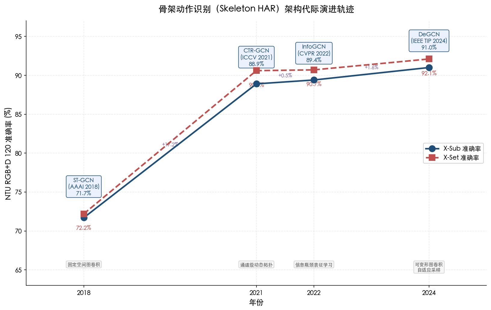

图 3-1 展示了 2018–2024 年间骨架 HAR 四代方法在 NTU RGB+D 120 基准上的准确率攀升轨迹与对应的核心技术创新。

### 3.1.2 骨架方法的独特优势

骨架方法的核心优势在于其"先天隐私保护"特性——输入仅包含 25 个关节的三维坐标（NTU 数据集标准），不含任何面部纹理、衣着外观或背景信息，从数据采集源头消除了隐私泄露风险。这一特性使其在 GDPR 等严格数据保护法规约束下具有天然的合规优势。同时，骨架表征对光照变化、背景干扰具有天然鲁棒性：无论场景中光照条件如何变化或背景出现何种动态干扰，模型的输入信号均保持稳定。在计算效率方面，骨架 GCN 方法的开销远低于全视频方法：DeGCN 单分支仅 1.78G FLOPs、1.42M 参数，可实现数百 FPS 的推理速度，适合在边缘计算平台上实时部署。

## 3.2 视频动作识别与人体姿态估计

### 3.2.1 大规模视频动作识别

在大规模开放场景视频动作识别中，视频基础模型在 Kinetics 系列基准上持续推进性能上限。**InternVideo2**（ECCV 2024）采用渐进式三阶段训练策略——掩码视频建模（Masked Video Modeling）、跨模态对比学习（Cross-modal Contrastive Learning）、下一 token 预测（Next Token Prediction）——构建参数量 1B–6B 的视频基础模型，在 Kinetics-700 上达到 Top-1 **85.4%**，Kinetics-400 Top-1 **92.1%** [InternVideo2](https://arxiv.org/html/2403.15377v2 "Wang et al., ECCV 2024") [HyperAI](https://hyper.ai/en/sota/tasks/action-classification/benchmark/action-classification-on-kinetics-700 "Kinetics-700 排行")。该模型的训练数据涵盖视频、图像、音频-视频和视频-文本多种模态，体现了大规模多模态预训练在视频理解领域的强大潜力。

骨架方法与视频方法在非接触感知体系中形成显著的互补格局。骨架 GCN 在受控环境精细动作分类中 SOTA 达 ~91%–93%（NTU 系列），模型轻量（~5M 参数）、隐私安全、对光照与外观变化鲁棒，适合对隐私与实时性要求严格的部署场景。视频方法则在大规模开放场景中占据优势（K700 85.4%），能够利用外观、场景上下文等丰富视觉线索，但代价是对光照、遮挡更为敏感，隐私风险显著升高，且模型参数量巨大——InternVideo2-1B 需 GPU 推理，难以在边缘设备上实时运行。两类方法的选择取决于应用场景对隐私、计算资源和动作粒度的具体要求。

### 3.2.2 人体姿态估计

人体姿态估计（HPE）是非接触视觉感知的另一核心任务，旨在从图像或视频中精确定位人体关节位置。在 COCO test-dev 基准上，**ViTPose**（IEEE TPAMI 2024）将朴素 Vision Transformer 扩展为通用身体姿态估计框架，ViTPose-G（ViTAE-G 集成版本）达到 AP **81.1%**、AP50 95.0%，单模型 ViTPose-G AP **80.9%**（约 1B 参数），首次突破 COCO HPE 80 AP 大关，标志着 Transformer 架构在 HPE 任务上全面超越了 CNN 方法 [HyperAI](https://hyper.ai/en/sota/tasks/pose-estimation/benchmark/pose-estimation-on-coco-test-dev "COCO HPE 排行")。ViTPose++ 进一步将框架扩展为多任务架构，统一支持人体、手部、面部和动物姿态估计，其中 ViTPose-B（~86M 参数）达 75.8 AP [ViTPose++](https://arxiv.org/html/2212.04246v3 "Xu et al., IEEE TPAMI 2024")。

在轻量化方向，HRNet-W48+DARK AP 77.4%，Lite-HRNet-30（~1.8M 参数）COCO AP 69.7%，适合移动端与嵌入式设备部署 [HyperAI](https://hyper.ai/en/sota/tasks/pose-estimation/benchmark/pose-estimation-on-coco-test-dev "COCO HPE 排行")。HPE 领域的计算量跨度极为悬殊：ViTPose-G（~1B 参数）代表精度上限的探索性成果，Lite-HRNet-30（~1.8M 参数）则面向实际资源受限场景，二者在 AP 上的差距约为 11 个百分点（80.9% vs 69.7%），清晰反映了精度与计算效率之间的根本性张力。在非接触感知系统的实际设计中，需要根据目标平台的算力预算与精度需求在这一频谱上做出审慎选择。

## 3.3 远程光电容积脉搏波（rPPG）生命体征监测

远程光电容积脉搏波（Remote Photoplethysmography, rPPG）利用普通 RGB 摄像头捕获面部皮肤因心脏搏动引起的微弱颜色变化（典型幅度仅为像素值的 0.1%–1%），实现完全非接触的心率（HR）、心率变异性（HRV）等生理信号测量。该技术自 2008 年首次被验证以来，经历了从传统信号处理到深度学习驱动的快速架构迭代，在受控环境中已逼近接触式传感器的精度水平，但在真实场景部署中仍面临严峻挑战。

### 3.3.1 技术演进路线

rPPG 方法的架构演进清晰呈现五代递进轨迹，每一代在精度、鲁棒性或计算效率上实现显著突破 [WIREs rPPG 综述](https://wires.onlinelibrary.wiley.com/doi/abs/10.1002/widm.70039 "Sakib et al., WIREs Data Mining 2025")：

**第一代：传统信号处理（2008–2017）**。GREEN（2008）首次验证了从普通摄像头视频中提取脉搏信号的可行性；POS（2017）通过色度空间正交投影实现了较强的运动鲁棒性。传统方法在受控环境中可用，但面对复杂光照和运动干扰时性能急剧下降——POS 在 PURE 数据集上 HR MAE 为 3.67 bpm，但在 MMPD 多域数据集上 MAE 骤升至 12.36 bpm [RhythmMamba](https://arxiv.org/html/2404.06483v2 "Guo et al., AAAI 2025, Table 2 跨数据集对比")。

**第二代：CNN 方法（2018–2020）**。DeepPhys（2018）和 PhysNet（2019）引入端到端卷积网络，性能提升显著但受限于 CNN 固有的局部感受野。PhysNet 在 UBFC 数据集内测试 MAE 为 0.98 bpm，但在跨域场景（PURE→MMPD）中 MAE 高达 13.94 bpm，跨域泛化能力与传统方法相当 [RhythmMamba](https://arxiv.org/html/2404.06483v2 "Guo et al., AAAI 2025, Table 2")。

**第三代：Transformer 方法（2022–2024）**。**PhysFormer**（CVPR 2022）是首个基于 Transformer 的 rPPG 方法，采用时间差分 Transformer 建模长程时序依赖，在 VIPL-HR 数据集上达到 MAE 2.84 bpm、RMSE 5.36 bpm、Pearson r=0.92 [PhysFormer](https://openaccess.thecvf.com/content/CVPR2022/papers/Yu_PhysFormer_Facial_Video-Based_Physiological_Measurement_With_Temporal_Difference_Transformer_CVPR_2022_paper.pdf "Yu et al., CVPR 2022")。**RhythmFormer**（Pattern Recognition 2025）提出周期稀疏注意力机制，在跨数据集测试中表现突出：以 UBFC 训练、PURE 测试 MAE 0.97 bpm，跨域到 MMPD MAE 9.08 bpm，展现了 Transformer 在建模域不变特征方面的优势 [RhythmMamba](https://arxiv.org/html/2404.06483v2 "Guo et al., AAAI 2025, Table 2")。

**第四代：Mamba/SSM 方法（2025）**。**RhythmMamba**（AAAI 2025）将 rPPG 任务重新建模为时间序列问题，利用状态空间模型（SSM）以线性计算复杂度建模长程依赖，在精度与效率之间实现新的帕累托最优。在 PURE 数据集内测试中，RhythmMamba 达到 HR MAE **0.23 bpm**、RMSE 0.34 bpm；跨数据集（PURE 训练、UBFC 测试）MAE 0.95 bpm；同时推理吞吐量为 PhysFormer 的 3.19 倍，峰值 GPU 内存仅为其 23% [RhythmMamba](https://arxiv.org/html/2404.06483v2 "Guo et al., AAAI 2025, Table 1 & Table 5")。**ME-rPPG**（清华大学，2025 年 4 月）基于时空状态空间对偶性设计，在 PURE 数据集上 MAE 0.25 bpm（Pearson r=1.00）、VitalVideo MAE 0.70 bpm（r=0.98），仅 580K 参数、3.6 MB 内存占用、9.46 ms CPU 推理延迟，相比基线方法准确率提升 21.3%–60.2%，展现了 SSM 架构在超轻量化部署方面的潜力 [ME-rPPG](https://arxiv.org/html/2504.01774v2 "Tang et al., arXiv:2504.01774, 2025")。

**第五代：扩散模型（2025–2026）**。**FrePhys**（提交至 ICLR 2026）提出频率感知扩散模型，将生理频率先验嵌入扩散过程，相比 PhysFormer MAE 降低 31%，代表了生成式 AI 进入生理信号估计领域的前沿探索 [FrePhys](https://openreview.net/pdf/d12d99cd9bebacd5b62faaa8c8e3685e539a0613.pdf "FrePhys, ICLR 2026 审稿中")。

### 3.3.2 受控环境与真实场景的精度鸿沟

rPPG 领域最核心的开放挑战在于受控环境与真实场景之间存在的巨大精度鸿沟。以 RhythmMamba 为例：PURE 数据集内测试 MAE 仅为 0.23 bpm，但跨域到 MMPD（涵盖多光照条件、多运动模式、多肤色）后 MAE 骤升至 10.44 bpm，精度衰减超过 45 倍 [RhythmMamba](https://arxiv.org/html/2404.06483v2 "Guo et al., AAAI 2025, Table 2")。ME-rPPG 同样呈现类似模式：PURE 上 MAE 仅 0.25 bpm，跨域到 MMPD 后升至 5.38 bpm [ME-rPPG](https://arxiv.org/html/2504.01774v2 "Tang et al., 2025")。

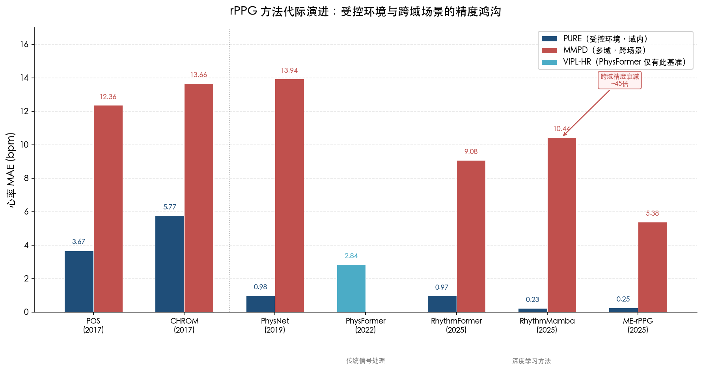

图 3-2 直观对比了七种代表性 rPPG 方法在 PURE（受控环境，域内测试）与 MMPD（多域，跨场景测试）数据集上的心率 MAE。图中可见，尽管各代方法在受控环境中的精度持续提升（从 POS 的 3.67 bpm 降至 RhythmMamba 的 0.23 bpm），但跨域场景中的 MAE 仍普遍维持在 5–14 bpm 区间，深度学习方法尚未从根本上弥合这一精度鸿沟。

传统信号处理方法在跨域场景中的劣势更为显著：POS 从 PURE 3.67 bpm 恶化至 MMPD 12.36 bpm；CHROM 从 5.77 bpm 恶化至 13.66 bpm [RhythmMamba](https://arxiv.org/html/2404.06483v2 "Guo et al., AAAI 2025, Table 2")。深度学习方法在跨域场景中的表现虽显著优于传统方法——RhythmFormer 跨域到 MMPD 的 MAE（8.98–9.08 bpm）约为传统方法（12–18 bpm）的一半——但仍远未达到临床级精度要求（通常要求 MAE ≤2 bpm）。

rPPG 在低光条件下的可靠性同样引发关注。Nature npj Digital Medicine（2025）的研究指出，rPPG 在低光环境中性能显著下降，信噪比（SNR）不足是根本原因——当面部反射光强度低于传感器噪声底时，脉搏信号将被噪声淹没 [rPPG 低光可靠性](https://www.nature.com/articles/s41746-025-02192-y "Nature npj Digital Medicine 2025")。这一物理限制决定了纯 RGB rPPG 方案在夜间或低光场景中的根本性局限。

### 3.3.3 rPPG 与其他非接触心率检测方案的对比

将 rPPG 置于跨模态对比框架中分析：在受控环境下，rPPG（ME-rPPG PURE MAE 0.25 bpm）的精度与 WiFi CSI（心率 MAE 0.8 bpm）[WiFi HR](https://www.mdpi.com/1424-8220/24/7/2111 "Sensors Vol.24, 2024") 和毫米波雷达（误差率 1.69%–2.61%）[mmWave HR](https://www.nature.com/articles/s41598-024-77683-1 "Wang et al., Scientific Reports 2024") 处于同一量级，甚至略优。然而，rPPG 的核心劣势体现在三个方面：（1）需要面部可见且处于适当距离（典型有效距离 0.5–2 m），无法穿透任何形式的遮挡；（2）光照条件直接决定信噪比，低光和逆光场景下性能急剧下降；（3）面部运动（如说话、头部转动）引起的运动伪影严重干扰信号提取。相较之下，射频方案（WiFi CSI、mmWave 雷达）可实现全天候、穿墙工作，不受光照和视线遮挡限制，在实际部署中与 rPPG 形成显著互补。在系统设计层面，rPPG 适合作为近距离高精度心率监测的首选方案（如医院病房、办公桌前），而射频方案更适合全天候无人值守的广域监测场景。

## 3.4 红外热成像生命体征检测

红外热成像利用长波红外（LWIR，8–14 μm）波段探测人体皮肤表面温度分布，可在完全无光环境下工作，从物理原理上规避了 RGB rPPG 对可见光照的依赖。

Georgia Tech 研究团队于 2025 年 3 月在 Cell Reports Physical Science 发表超光谱脉冲热成像技术，使用 LWIR 相机通过热脉冲分析实现心率、呼吸率和体温的非接触同步测量，在低光/无光和多人场景中均验证了有效性 [Georgia Tech 热成像](https://coe.gatech.edu/news/2025/03/thermal-imaging-could-be-simple-highly-accurate-way-track-vital-signs "Han et al., Cell Reports Physical Science 2025")。该方案相较 RGB rPPG 具有三项独特优势：第一，不受可见光照影响，可在全黑暗环境中持续工作；第二，能够同时测量体温这一 RGB 摄像头无法直接获取的生理参数；第三，热成像不含高分辨率面部纹理，在隐私保护上介于 RGB 视频与射频信号之间。

然而，红外热成像方案的局限性同样不容忽视：专业 LWIR 相机成本高昂（通常 $5,000 以上），远超消费级 RGB 摄像头；空间分辨率显著低于 RGB 传感器，限制了细粒度生理信号的提取能力；热噪声和环境温度漂移影响长时间连续测量的稳定性。这些约束使热成像方案目前更适合于特定专业场景——如夜间病房监护、安防筛查、工业环境——而非大规模消费级部署。

## 3.5 LiDAR 与深度相机的人体感知

### 3.5.1 LiDAR 人体姿态与形状估计

LiDAR 提供精确的三维点云深度信息（厘米级距离分辨率），不受环境光照条件限制，且点云数据不含面部纹理与肤色信息，天然具备隐私保护属性。近年来，基于 LiDAR 的人体感知从自动驾驶领域逐步扩展至室内场景理解与非接触监护。

**LiveHPS**（CVPR 2024）是首个基于单 LiDAR 的场景级人体姿态与形状估计方法。该方法在自建的 FreeMotion 数据集（578,775 帧，涵盖 1–7 人/场景的多样化运动）上达到 SOTA 性能，实现 45 fps 实时推理，可同时估计多人的 SMPL 参数化人体模型，为 LiDAR 在室内多人监护场景中的应用提供了可行的技术路径 [LiveHPS](https://arxiv.org/html/2402.17171v1 "Ren et al., CVPR 2024")。

LiDAR 人体感知综述（arXiv，2025 年 9 月）系统梳理了该方向的方法分类体系与核心挑战 [LiDAR HPE 综述](https://arxiv.org/html/2509.12197v1 "Galaaoui et al., arXiv:2509.12197, 2025")。该综述指出三大关键瓶颈：（1）远距离人体点云极度稀疏——50 m 外仅 50–200 个点，远低于近距离的数千个点，导致关节定位精度随距离急剧衰减；（2）视角依赖的自遮挡造成信息损失——单视角 LiDAR 仅能获取人体朝向传感器一侧的点云，被遮挡的肢体需要依赖模型推断；（3）携带物品（背包、手提物等）产生的几何噪声干扰人体模型拟合。

### 3.5.2 LiDAR 的部署特征与成本趋势

LiDAR 在非接触感知中的独特定位体现在四个维度：（1）**全天候工作**——可在全黑暗、强逆光、雨雾等极端光照条件下稳定运行，彻底解除了视觉方法的光照依赖；（2）**精确深度信息**——厘米级三维距离分辨率优于 ToF 深度相机的精度上限，使复杂动作的精细建模成为可能；（3）**天然隐私保护**——点云不含面部纹理和肤色信息，在隐私敏感场景中具有天然合规优势；（4）**大场景覆盖**——机械旋转式 LiDAR 有效感知距离可达 50–100 m，远超 RGB 摄像头在 HAR 和 HPE 任务中的实用距离。

硬件成本是制约 LiDAR 规模化部署的主要障碍：机械旋转式 LiDAR 单价通常 $1,000 以上，远高于消费级 RGB 摄像头。然而，成本下降趋势已清晰可见——固态 LiDAR 和消费级 dToF 传感器（如 Apple iPhone 搭载的 LiDAR 模块）正在大幅降低入门门槛，尽管其有效距离仅约 5 m，但在近距离室内场景（如智能家居、康复监护）中已展现出消费级应用潜力。预计随着自动驾驶产业的规模效应传导，室内级 LiDAR 传感器的成本将在未来数年进一步下降。

## 3.6 视觉感知的隐私保护技术体系

视觉方法的隐私争议是其规模化部署面临的最大非技术壁垒。GDPR 等数据保护法规对面部图像的采集、存储与处理施加了严格限制，医疗和居家等隐私敏感场景中的合规成本极高。为应对这一挑战，学术界已发展出四层递进的隐私保护体系，各层从不同环节切断隐私泄露路径，且可灵活组合以实现端到端的隐私保护。

**第一层：传感器层替代**。使用 LiDAR、深度相机或红外传感器替代 RGB 摄像头，从数据采集源头消除面部纹理信息。LiDAR 点云和深度图不含外观信息，天然满足隐私合规要求。该方案的隐私保护强度最高，但识别精度与 RGB 方案相比仍存在差距，且硬件成本较高。

**第二层：表征层骨架化**。将 RGB 视频通过姿态估计器（如 ViTPose、HRNet）转化为骨架关节坐标序列，去除所有外观信息后再进行动作识别。骨架方法在 NTU RGB+D 120 上 SOTA 已达 91.0%（DeGCN），与全视频方法的精度差距大幅缩小，成为隐私与精度之间的最佳平衡点。该方案的关键优势在于可复用现有的 RGB 摄像头基础设施，仅需在边缘侧增加姿态估计推理环节。

**第三层：模型层联邦学习**。**FSAR**（ICCV 2023）将联邦学习引入骨架动作识别，采用自适应拓扑结构和知识蒸馏机制，在 NTU RGB+D 60 上达到准确率 91.30%（较 Vanilla FL 提升 10.22 个百分点）、NTU RGB+D 120 上准确率 84.31%（提升 9.54 个百分点）[FSAR](https://openaccess.thecvf.com/content/ICCV2023/papers/Guo_FSAR_Federated_Skeleton-based_Action_Recognition_with_Adaptive_Topology_Structure_and_ICCV_2023_paper.pdf "Guo et al., ICCV 2023")。联邦学习使原始数据保留在本地设备，仅传输模型梯度，从根本上避免了数据集中化带来的泄露风险。代价是相比集中训练存在约 7 个百分点的精度损失（FSAR 84.31% vs DeGCN 91.0%），这一差距源于非独立同分布（non-IID）数据分布和通信带宽约束。

**第四层：后处理层去标识化**。对 RGB 图像进行面部模糊、身份替换等后处理，保留动作信息的同时去除个人身份特征。该方案实施成本最低、与现有系统兼容性最好，但隐私保护强度有限——无法从根本上防止原始数据在后处理之前被截获或泄露。

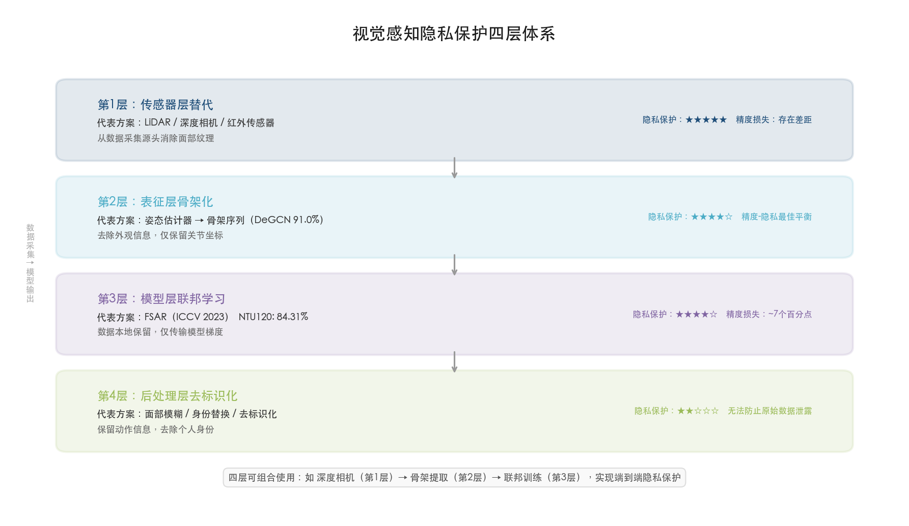

图 3-3 展示了上述四层隐私保护体系的层级结构、各层代表方案、隐私保护强度评级及精度-隐私权衡特征。

四层体系可灵活组合以构建纵深防护——例如，在深度相机采集（传感器层）后提取骨架序列（表征层），再通过联邦学习训练模型（模型层），形成从数据采集到模型训练的端到端隐私保护链路，在满足最严格隐私要求的同时将精度损失控制在可接受范围内。

## 3.7 视觉方法的固有局限与部署约束

### 3.7.1 光照敏感性

光照条件是视觉方法面临的最大环境约束。RGB 摄像头在低光或无光环境下信噪比急剧下降，rPPG 方法尤为脆弱——Nature npj Digital Medicine（2025）的系统评估表明，rPPG 在低光条件下可靠性显著降低，面部反射光的信噪比不足是根本原因 [rPPG 低光可靠性](https://www.nature.com/articles/s41746-025-02192-y "Nature npj Digital Medicine 2025")。LiDAR 和红外热成像虽不受可见光照限制，但 LiDAR 在强雨雾条件下点云质量下降，红外热成像在高温环境中热对比度降低，各有其环境适应边界。

### 3.7.2 遮挡问题

遮挡是导致 HPE 和 HAR 性能退化的核心因素。对于 HPE，被遮挡关节的预测高度依赖空间先验与上下文推理，AP 通常下降 10–20 个百分点。在骨架 HAR 中，遮挡关节的缺失直接影响图卷积网络中信息的空间传播路径。LiDAR 由于仅获取可见表面的点云，视角依赖的自遮挡构成不可避免的物理限制——单视角 LiDAR 无法获取人体背面的几何信息，多视角部署可部分缓解但会增加系统复杂度与成本。

### 3.7.3 距离与角度约束

rPPG 的有效工作距离通常为 0.5–2 m，且面部需正对或近正对摄像头以确保充足的皮肤区域可见。HPE 方法在远距离下受限于图像分辨率不足，关节定位精度随距离递减。LiDAR 虽然有效感知距离可达 50–100 m，但远距离人体点云稀疏至仅 50–200 个点，精细姿态估计能力大幅受限 [LiDAR HPE 综述](https://arxiv.org/html/2509.12197v1 "Galaaoui et al., 2025")。

### 3.7.4 计算资源需求

视觉方法的计算开销跨度极大，形成从边缘端到云端的完整部署频谱。轻量级方案如 ME-rPPG（580K 参数、9.46 ms CPU 推理延迟）和骨架 GCN（DeGCN 单分支 1.42M 参数、1.78G FLOPs）[DeGCN](https://dl.acm.org/doi/10.1109/TIP.2024.3378886 "Myung et al., IEEE TIP 2024, Table IV") 可在消费级 CPU 或边缘设备上实时运行，满足延迟敏感场景的需求。而性能上限方案如 InternVideo2（1B 参数）和 ViTPose-G（~1B 参数）则需要 GPU 推理支持，适合对精度要求极高的离线分析或云端处理场景。

## 3.8 光学信号与射频信号的整体对比

将本章评估的视觉/光学方法与第 2 章射频方法进行横向比较，可以清晰识别两大技术路线的互补关系与各自的适用边界：

**HAR 精度**：视觉骨架 HAR 在 NTU RGB+D 120 上达到 ~91.0%（DeGCN），WiFi CSI 在 Widar 3.0 上域内精度达 99.67%（WiGRUNT），两者在各自基准上均展现出优异的识别能力。但须审慎对待跨基准的直接比较——NTU120 涵盖 120 类复杂动作与 106 名受试者，Widar 3.0 仅含 6 类手势与 17 名用户，任务复杂度与数据规模存在根本差异，直接横向对比不具方法论合理性。

**HPE 精度**：视觉 HPE（ViTPose-G，COCO test-dev AP 80.9%）的精度远超射频 HPE——mmWave 雷达 RAPTR 在 HIBER 数据集上 MPJPE 为 18.99 cm（最优全监督配置下可达 8.93 cm）。这一差距主要源于光学信号在空间分辨率上的物理优势——像素级分辨率使视觉方法能够精确捕捉细微的关节运动，而射频信号的厘米级分辨率在精细姿态估计中构成了固有的信息瓶颈。

**生命体征监测**：rPPG 在受控环境下心率 MAE 为 0.23–0.25 bpm（RhythmMamba / ME-rPPG，PURE 数据集），与 WiFi CSI 心率 MAE 0.8 bpm 及 mmWave 误差率 1.69%–2.61% 处于同一精度量级。然而，rPPG 在运动/多光照跨域场景中 MAE 上升至 5–10 bpm，而射频方法不受光照条件影响，在全天候监测场景中具有更稳定的性能表现。

**部署鲁棒性**：射频方案（WiFi CSI、mmWave、UWB）可全天候穿墙工作，不受光照与视线限制；视觉方案精度更高但依赖光照条件、正面视角和无遮挡环境。二者在实际部署中形成天然互补——视觉方案适合光照良好的受控场景（医院诊室、康复中心、健身房），射频方案适合全天候无人值守的广域监测场景（智能家居、养老看护、安防系统）。在追求最大覆盖面和最高鲁棒性的应用中，多模态融合（如 rPPG + mmWave 雷达）有望进一步突破单一模态的性能边界。

# 第4章 基于声学信号的感知算法

声学信号——涵盖近超声波（18–24 kHz）、可听声及声纳信号——构成非接触式感知技术谱系中一条独特且极具潜力的技术路线。与射频和视觉方案相比，声学感知的核心吸引力在于"零额外硬件成本"：智能手机、智能音箱和笔记本电脑均内置扬声器与麦克风阵列，无需任何硬件改造即可转化为主动声纳系统。声波在空气中的传播速度（约 343 m/s）远低于电磁波，这一物理特性使得声学系统在极窄带宽下即可获取毫米级空间分辨率——20 kHz 超声对应波长约 17 mm，足以感知心搏引起的 0.3–0.8 mm 胸壁位移 [声学感知综述](https://ieeexplore.ieee.org/document/11164293/ "Li et al., IEEE Access Vol.13, 2025")。然而，空气中超声衰减剧烈、有效距离短、环境噪声敏感等固有物理限制，使声学方案在覆盖范围和鲁棒性上与射频方案存在明显差距。

本章系统评估超声波、可听声与声纳信号在非接触感知中的前沿算法，覆盖手势识别、活动识别、呼吸与心率监测三大核心任务，分析声学方案的独特优势与固有局限，并在跨模态视角下定位声学感知在非接触式感知技术体系中的互补角色。

## 4.1 声学感知的物理基础与信号调制策略

### 4.1.1 频段选择与波长分辨率

声学非接触感知通常工作在 18–24 kHz 的近超声频段。这一频段选择是多重约束权衡的结果：频率需足够高以避免被大多数成年人听到（人耳听觉上限通常在 17–20 kHz），同时不至于过高而导致空气衰减过于剧烈 [声学感知综述](https://ieeexplore.ieee.org/document/11164293/ "Li et al., IEEE Access Vol.13, 2025")。在 20 kHz 频率下，声波波长约 17 mm，理论空间分辨率可达亚厘米级，远优于 WiFi CSI 的 6–12 cm 波长分辨率。声学系统的有效距离通常为 1–5 m，受空气中超声波指数衰减特性制约——衰减系数在 23 kHz 时约为水中的 750 倍 [End-to-End 超声 HGR](https://pmc.ncbi.nlm.nih.gov/articles/PMC11086334/ "Zankl et al., Sensors Vol.24, 2024")。

在安全性方面，当前声学感知系统的声压级通常维持在 55–75 dB(A)，远低于 WHO/NIOSH 规定的 85 dB(A) 职业暴露安全阈值。MEMS 超声换能器在 10 cm 处的最大声压约 71 dBSPL [End-to-End 超声 HGR](https://pmc.ncbi.nlm.nih.gov/articles/PMC11086334/ "Zankl et al., Sensors Vol.24, 2024")，不构成听力健康风险。

### 4.1.2 三种主流信号调制方式

声学感知领域目前采用三种主流信号调制策略，各自具备差异化的性能特征与适用场景：

**连续波（CW）多普勒方式**：发射单一频率的连续超声信号，通过分析反射信号的多普勒频移推断目标运动速度。ULTRAWX 系统即采用 20 kHz 单频信号，结构简单、计算开销低，适合粗粒度运动检测 [ULTRAWX](https://www.nature.com/articles/s41598-025-93837-1 "Zhang et al., Scientific Reports 2025")。CW 方式的局限在于无法提供距离信息，仅能获取径向速度分量。

**频率调制连续波（FMCW）啁啾方式**：发射频率随时间线性变化的啁啾信号，通过差拍频率分析同时获取距离和速度二维信息。华盛顿大学（UW）智能音箱系统采用 18–22 kHz FMCW 信号进行心律监测 [智能音箱心律监测](https://www.nature.com/articles/s42003-021-01824-9 "Wang et al., Communications Biology 2021")。超声 FMCW 系统可实现 5 mm 的距离分辨率和 0.03 m/s 的速度分辨率 [超声 FMCW 手势识别](https://www.sciencedirect.com/science/article/abs/pii/S026322412200046X "Chen et al., Signal Processing 2022")，精度显著优于 CW 方式。

**正交频分复用（OFDM）多子载波方式**：发射多个正交子载波信号，通过相干叠加增强信噪比。LoEar 系统利用 Carrierforming 技术对多子载波进行相干聚合，显著扩展了声学感知的有效距离 [LoEar](https://samsonsjarkal.github.io/KeSun/files/ubicomp22loear.pdf "Wang et al., ACM IMWUT 2022")。OFDM 方式的多径鲁棒性优于单载波方案，但计算复杂度相应增加。

## 4.2 声学手势识别

手势识别是声学非接触感知中研究最活跃的方向之一。相较于射频和视觉方案，声学手势识别的核心优势在于硬件成本极低且隐私保护性强（近超声频段不可听），但有效距离和手势粒度受到物理层面的制约。

### 4.2.1 基于多普勒目标检测的方法

**ULTRAWX**（Scientific Reports 2025）是近期声学手势识别领域最具代表性的系统之一。该系统发射 20 kHz 超声波，利用多普勒目标检测提取手势特征，并将多普勒频谱图送入 YOLOv7-Tiny 目标检测网络实现连续手势识别。在 20 名志愿者、5,787 个样本的评测中，ULTRAWX 对 5 种手势的连续识别准确率达 93.6%；跨设备测试中平均准确率为 95.6%，但在跨用户与跨设备的组合测试中下降至 88.6% [ULTRAWX](https://www.nature.com/articles/s41598-025-93837-1 "Zhang et al., Scientific Reports 2025")。

ULTRAWX 的有效距离被限制在 ≤40 cm，超过 60 cm 后准确率显著下降。这一距离约束源于空气中超声波的高衰减特性，是声学手势识别面临的根本物理瓶颈。该系统采用目标检测迁移策略（YOLOv7-Tiny），体现了声学感知领域将成熟视觉模型架构迁移至声学频谱图处理的技术趋势。

### 4.2.2 基于 FMCW 超声的方法

利用 FMCW 调制的超声信号进行手势识别可同时获取距离和速度信息，相比 CW 多普勒方式提供更丰富的特征维度。Chen et al.（Signal Processing 2022）提出基于超声 FMCW 与 ConvLSTM 的三维手势识别系统，采用一发三收的空间布局，通过二维 FFT 生成距离-多普勒图（RDM），再由 ConvLSTM 提取时空特征。该系统实现了 5 mm 距离分辨率和 0.03 m/s 速度分辨率；对手掌运动手势识别效果良好，对手指微小运动（如搓指）在仅 50 个训练样本下也达到 85.7% 准确率 [超声 FMCW 手势识别](https://www.sciencedirect.com/science/article/abs/pii/S026322412200046X "Chen et al., Signal Processing 2022")。

**GestureID**（Sound & Vibration 2024）将超声手势识别与用户身份认证相结合，利用商用设备发射超声信号，手势识别准确率达 97.8%，同时实现 96.3% 的用户认证准确率 [GestureID](https://www.techscience.com/sv/v58n1/55684 "GestureID, Sound & Vibration Vol.58, 2024")。这一双任务设计拓宽了声学感知在交互安全领域的应用边界。

### 4.2.3 端到端深度学习方法

传统声学手势识别流程通常包含显式的预处理步骤（FFT 变换、频谱图提取等），近年来研究趋势转向端到端深度学习，直接在原始回波信号上进行特征学习。

Zankl et al.（Sensors 2024）首次实现了在原始超声回波幅值上的端到端手势识别，完全省略 FFT 变换。该研究系统对比了 CNN、GRU、LSTM、ViT 和 CrossViT 五种架构在低成本 MEMS 超声换能器阵列上的表现：LSTM 以 95% 准确率（4 类手势）领先，CrossViT 以 93% 紧随其后（6 类手势），ViT 达 89%，GRU 为 86%，CNN 仅 83% [End-to-End 超声 HGR](https://pmc.ncbi.nlm.nih.gov/articles/PMC11086334/ "Zankl et al., Sensors Vol.24, 2024")。序列模型（LSTM/GRU）和注意力模型（ViT/CrossViT）在声学手势识别中显著优于纯卷积模型，表明时序建模能力对于捕获手势运动的时间动态至关重要。在粗粒度分类（点击 vs 滑动）任务上，所有模型均可达 95%–100% 准确率，但在区分同方向不同滑动手势时准确率有所下降，反映出超声空间分辨率的固有限制。

### 4.2.4 声学指尖追踪

声学技术亦可用于亚厘米级精度的手指运动追踪。**LLAP**（MobiCom 2016）利用商用手机扬声器和麦克风实现设备端声学追踪，一维手指运动追踪精度达 3.5 mm，二维空中书写精度 4.6 mm，延迟仅 15 ms [LLAP](https://dl.acm.org/doi/10.1145/2973750.2973764 "Wang et al., MobiCom 2016")。**FingerIO**（CHI 2016）采用主动声纳在智能手机上实现精细指尖追踪，二维追踪精度 8 mm，且在手指被遮挡（如手在桌下）时仍可正常工作 [FingerIO](https://netlab.cs.washington.edu/project/fingerio/ "Nandakumar et al., CHI 2016")。上述工作将声学感知的精度边界推至毫米级别，远超 WiFi CSI 的厘米级定位精度。

### 4.2.5 声学手势识别的技术对比

综合来看，声学手势识别领域的算法架构经历了清晰的代际演进：传统信号处理（MFCC+SVM）→ CNN+LSTM（频谱图输入）→ 目标检测迁移（ULTRAWX 使用 YOLOv7-Tiny）→ 端到端深度学习（直接处理原始回波）→ Transformer/CrossViT [声学感知综述](https://pmc.ncbi.nlm.nih.gov/articles/PMC10064623/ "Huang et al., JCST 2023")。

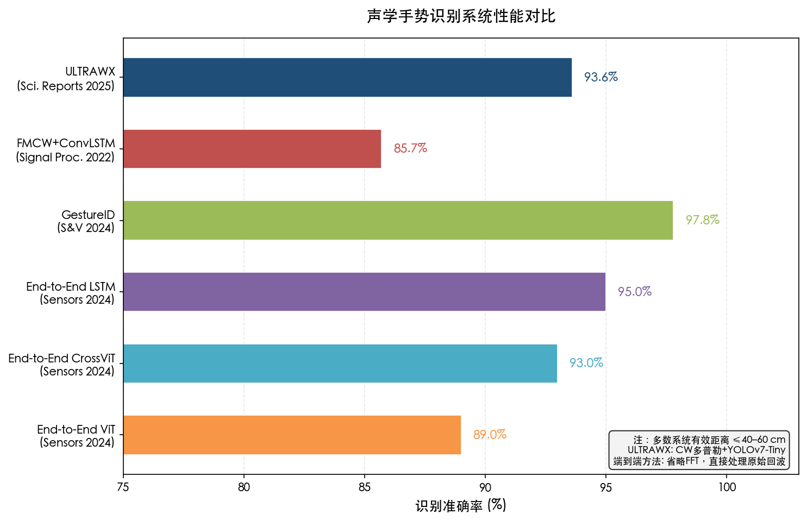

图 4-1 汇总了主要声学手势识别系统的识别准确率。各系统的性能对比可归纳如下：基于频谱图+CNN 的方法在 4–12 类手势上通常达到 91%–97.9% 准确率 [End-to-End 超声 HGR](https://pmc.ncbi.nlm.nih.gov/articles/PMC11086334/ "Zankl et al., Sensors 2024, Table 3")；ULTRAWX 利用目标检测迁移在连续识别场景中达到 93.6%；GestureID 在手势+身份联合识别中达到 97.8%；端到端方法（LSTM）在省略 FFT 的条件下仍达 95%。所有方法的共同瓶颈是有效距离——多数系统限于 40–60 cm 以内，仅定制超声阵列在极近距离下展现亚厘米分辨率。

## 4.3 声学生命体征监测

声学非接触生命体征监测是该领域最具临床转化价值的方向。通过检测呼吸或心搏引起的胸壁微弱运动，声学系统可在不接触人体的条件下连续监测呼吸率、心率及心律节律。

### 4.3.1 心律与心率监测

**华盛顿大学（UW）智能音箱系统**（Communications Biology 2021）是声学非接触心律监测领域的标志性工作。该系统利用智能音箱内置扬声器发射 18–22 kHz FMCW 声学信号，通过 7 麦克风阵列波束成形聚焦心搏引起的胸壁运动。在 26 名健康受试者的 12,280 次心搏评测中，R-R 间期中位绝对误差（MAE）仅 28 ms，心率 MAE 为 1 BPM；在 24 名心脏病患者（含房颤患者）的 5,639 次心搏评测中，R-R 间期 MAE 为 30 ms，心率 MAE 为 2 BPM。有效监测距离为 40–60 cm [智能音箱心律监测](https://www.nature.com/articles/s42003-021-01824-9 "Wang et al., Communications Biology 2021")。

该工作的核心贡献在于证明了声学系统在不规则心律（如房颤）监测上的独特价值。与毫米波雷达相比，声学系统在心脏病患者上的表现更为稳健——雷达在房颤患者上的 R-R 间期误差高达 186 ms，而声学系统仅为 30 ms，差距逾 6 倍。这一优势源于声波在近距离下对微弱胸壁运动的高灵敏度，以及 FMCW 信号与波束成形技术对心搏信号的精准锁定。

**SonarBeat**（ACM Trans. Computing for Healthcare 2021）利用智能手机扬声器发射不可听声学信号，通过相位分析在 0.5 m 以内实现可靠的呼吸率估计 [SonarBeat](https://www.eng.auburn.edu/~szm0001/papers/ACMTCH2021.pdf "Wang et al., ACM THCH 2021")。该系统证明了无需专用阵列硬件，单个智能手机即可提供基础呼吸监测能力。

### 4.3.2 远距离呼吸与心搏监测

声学感知的有效距离一直是核心瓶颈。**LoEar**（ACM IMWUT 2022）通过 OFDM 多子载波相干叠加（Carrierforming）技术实现了突破性的距离扩展：呼吸监测有效距离扩展至 7 m，心搏监测扩展至 6.5 m，分别是此前系统（约 2 m 和 1.2 m）的 3.5 倍和 5.4 倍。在 3 m 处，呼吸率误差 <0.5 BPM，心搏误差 <1 BPM；系统支持最多 4 人同时监测（受试者间距 ≥60 cm），4 人时心搏中位误差为 1.39 BPM [LoEar](https://samsonsjarkal.github.io/KeSun/files/ubicomp22loear.pdf "Wang et al., ACM IMWUT 2022")。

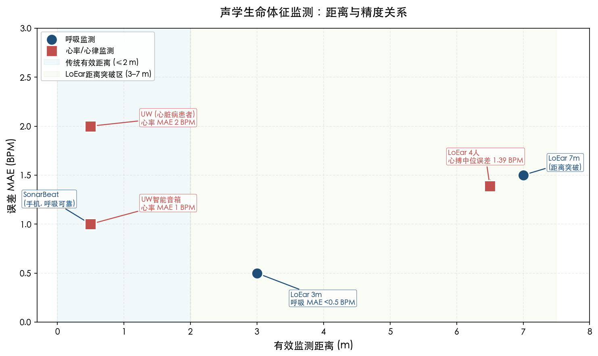

图 4-2 展示了各代表性声学系统的监测距离与精度关系。LoEar 的技术突破在于将通信领域的 OFDM 技术创造性地应用于声学感知——通过在多个子载波上进行相干叠加，信噪比得到显著提升，从而克服了超声波在远距离下衰减严重的固有限制。然而，多人监测的核心约束在于当反射路径重叠时无法区分个体，这限制了可监测人数和最小间距要求。

### 4.3.3 心脏骤停检测

**UW 心脏骤停检测系统**（npj Digital Medicine 2019）展示了声学感知在紧急医疗场景中的应用潜力。该系统利用 Amazon Echo 和 iPhone 检测濒死呼吸（agonal breathing）——心脏骤停发生后的一种异常呼吸模式。在临床录音评测中，灵敏度达 97.24%、特异性 99.51%、AUC 为 0.9993；3 m 以内准确率 >96.63%；在 82 小时的真实睡眠环境数据中，误报率仅 0–0.14% [心脏骤停检测](https://www.nature.com/articles/s41746-019-0128-7 "Chan et al., npj Digital Medicine 2019")。

该系统的临床意义极为突出：心脏骤停后每延迟 1 分钟急救，存活率下降约 10%，而约 50% 的心脏骤停发生在家中。利用已部署的智能音箱作为被动监测设备，可为院外心脏骤停提供关键的早期预警窗口。

### 4.3.4 声学生命体征监测的跨模态精度对比

将声学方法与第 2 章、第 3 章评估的射频和视觉方法进行心率检测精度横向对比，可揭示各模态的差异化定位：

- **受控环境心率精度**：声学（UW 智能音箱）健康人心率 MAE 1 BPM、心脏病患者 2 BPM；rPPG（ME-rPPG）PURE 数据集 MAE 0.25 BPM；WiFi CSI 心率 MAE 0.8 bpm [WiFi HR](https://www.mdpi.com/1424-8220/24/7/2111 "Sensors Vol.24, 2024")；mmWave 雷达误差率 1.69%–2.61% [mmWave HR](https://www.nature.com/articles/s41598-024-77683-1 "Wang et al., Scientific Reports 2024")。
- **不规则心律场景**：声学系统在房颤患者上 R-R 间期 MAE 30 ms，显著优于雷达的 186 ms，展现了声学在逐搏心律监测上的独特优势。
- **运动场景退化**：rPPG 在运动/多光照场景下 MAE 从 0.25 升至 5.38 BPM（退化超 20 倍）；声学系统在用户运动时性能同样退化，但在静态场景（如睡眠监测）中保持高灵敏度与稳定精度。

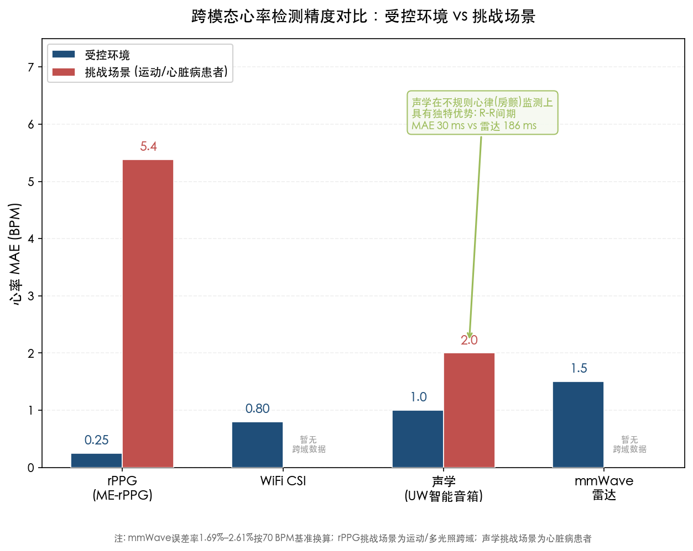

图 4-3 对比了四种模态在受控环境与挑战场景下的心率检测精度。总体而言，声学心率检测精度与 WiFi CSI 和 rPPG 处于同一量级（MAE 1–2 BPM），但声学在不规则心律（房颤等）的逐搏检测上具有其他模态难以匹配的优势。

## 4.4 基于环境声的活动识别

与主动声学感知（发射信号并分析回波）不同，被动环境声学感知利用日常活动产生的声音事件（如脚步声、开关门声、烹饪声、水流声）推断人类活动类别，无需发射任何信号。

### 4.4.1 声事件驱动的活动识别框架

Journal of Computational Design and Engineering（2025）提出了一种整合声事件检测（SED）与活动识别的 HAR 框架，强调可解释性——不仅输出活动类别，还给出导致该判断的关键声事件证据 [Sound-based HAR](https://academic.oup.com/jcde/article/12/8/252/8215199 "JCDE 2025")。该框架利用深度学习驱动的音频特征提取（如 VGGish 音频嵌入）构建从环境声到活动语义的映射。

被动声学 HAR 的核心优势在于完全无辐射、无需发射信号，仅依赖现有麦克风即可工作。然而该方向面临一个根本性挑战：缺乏统一的大规模评测基准。当前研究多在定制数据集上报告结果，不同系统之间的准确率缺乏直接可比性。相比之下，视觉 HAR 拥有 NTU RGB+D 120（120 类、约 114K 序列），WiFi CSI HAR 拥有 Widar 3.0 等成熟基准，声学 HAR 尚未形成相应的标准化评测生态。

### 4.4.2 声学 HAR 的技术定位

被动声学 HAR 在感知任务谱系中占据一个独特但受限的位置，更适合作为辅助模态（如与 WiFi CSI 或惯性传感器融合）而非独立的主感知模态。主要原因在于：（1）环境声信号高度依赖场景——同一活动在不同环境中产生的声学特征可能差异显著；（2）隐私风险较主动声学更高——麦克风可能捕获语音信息；（3）识别粒度受限于活动是否产生可区分的声事件。

## 4.5 商业部署与产品化进展

声学非接触感知已从学术研究走向商业产品部署。**Google Nest** 智能音箱和显示器已在商用产品中部署超声波存在感知功能，利用内置扬声器和麦克风发射并分析反射信号以检测房间内是否有人存在，所有处理完全在设备端执行 [Google Nest](https://support.google.com/googlenest/answer/9509981?hl=en "Google Nest 超声波存在感知")。这是声学非接触感知在消费级产品中覆盖范围最广的部署案例，表明该技术在功耗、延迟和可靠性方面已达到商用标准。

在学术侧，华盛顿大学的智能音箱心脏骤停检测系统基于 Amazon Echo 和 iPhone 验证，展示了将已有消费设备通过软件升级转化为健康监测终端的可行路径。不过，Apple HomePod 和 Amazon Echo 尚未在官方产品功能中明确推出声学健康监测特性，当前部署仍以存在检测等低复杂度任务为主。

**CoPlay**（ICCCN 2025）解决了声学感知的一个关键实用化障碍——同时播放音乐与进行声学感知时的信号干扰问题。通过基于深度学习的认知信号缩放算法，CoPlay 在扬声器同时播放音乐的条件下，呼吸监测和手势识别精度与无音乐场景相当，而传统信号裁剪或缩放方法则导致显著的性能退化。在 12 名用户的实证研究中，CoPlay 的手势识别和呼吸监测均达到与无并发音乐基线相当的准确率 [CoPlay](https://arxiv.org/abs/2403.10796 "Li et al., ICCCN 2025")。这一工作直接解决了智能音箱在正常使用（播放音乐）期间无法同时进行声学感知的实际部署痛点。

## 4.6 声学感知的核心优势与固有局限

### 4.6.1 核心优势

**零额外硬件成本**：声学感知可利用智能手机、智能音箱、笔记本电脑等现有设备的内置扬声器和麦克风，无需任何硬件改造或额外传感器。这一优势使其部署成本接近于零，是所有非接触感知技术中硬件门槛最低的方案。

**毫米级运动检测能力**：得益于声波在空气中传播速度较低，20 kHz 超声波长仅约 17 mm，远小于 WiFi 的 6–12 cm。声学系统因而可检测 0.3–0.8 mm 级别的胸壁位移（心搏引起），实现逐搏级精度的心律监测。LLAP 和 FingerIO 分别实现了 3.5 mm 和 8 mm 的指尖追踪精度 [LLAP](https://dl.acm.org/doi/10.1145/2973750.2973764 "Wang et al., MobiCom 2016") [FingerIO](https://netlab.cs.washington.edu/project/fingerio/ "Nandakumar et al., CHI 2016")。

**隐私保护**：主动声学感知使用 18–24 kHz 近超声频段，对多数成年人不可听，不包含语音或面部信息，隐私保护属性与射频信号相当。

**环境适应性**：声学系统在完全黑暗环境中同样有效，不受光照、阴影、反光等视觉系统固有限制的影响。

**轻薄遮挡穿透性**：声波可穿透毛毯、薄被等轻薄织物，适合睡眠场景中的非接触监测。

### 4.6.2 固有局限

**有效距离短**：空气中超声波的高衰减特性构成声学感知的根本物理限制。手势识别有效距离通常 ≤40 cm（ULTRAWX），即便 LoEar 通过 OFDM 技术将呼吸监测距离扩展至 7 m，多数系统仍限于 1–2 m 以内。与 WiFi CSI 的全屋覆盖（10–30 m）和 mmWave 雷达的中距离覆盖（5–10 m）相比，声学方案的空间覆盖能力显著受限。

**环境噪声敏感**：UW 智能音箱系统在背景音乐 75 dB(A) 条件下，R-R 间期误差从 25 ms 增至 32 ms（增幅 28%）；LoEar 在常见室内噪声下性能退化较小，但机械振动家电（如洗衣机、空调）对声学信号产生显著干扰。

**运动场景不适用**：当被监测者处于行走或较大幅度运动状态时，声学系统的生命体征检测性能急剧下降。声学生命体征监测主要适用于静态或准静态场景（如睡眠、静坐）。

**多人支持受限**：LoEar 最多支持 4 人同时监测（间距 ≥60 cm），核心限制在于反射路径重叠时无法区分个体。相比 mmWave 雷达可通过角度分辨能力实现更灵活的多人追踪，声学方案的多人可扩展性明显不足。

**多径效应**：室内环境中声波经墙壁、家具反射产生多径效应，干扰目标信号提取，在大空间和复杂布局中这一问题更为突出。

## 4.7 声学感知与射频/视觉方案的互补性分析

### 4.7.1 物理互补关系

声学感知与 WiFi CSI 之间存在天然的物理互补关系：WiFi 信号可穿墙、覆盖大面积区域但空间分辨率有限（波长 6–12 cm）；声学信号分辨率高（20 kHz 时波长约 17 mm）且可感知亚毫米级位移，但覆盖范围受限且无法穿墙。二者在信号传播特性上形成互补——WiFi 适合大范围存在检测和粗粒度活动识别，声学适合近距离精细感知和生命体征监测。

与 mmWave 雷达相比，声学方案在硬件成本上具有绝对优势（零成本 vs 单模块 \$15–50），但在有效距离（≤40 cm vs 5–10 m）、多人支持能力（4 人 vs 角度分辨多人追踪）和运动鲁棒性上处于劣势。在心率检测这一共同覆盖的任务上，声学（MAE 1–2 BPM）与 mmWave（误差率 1.69%–2.61%）精度相当，但声学在不规则心律监测上表现更优。

与视觉方案（RGB rPPG）相比，声学方案不受光照限制且隐私风险更低，但受控环境下心率精度略低于 rPPG（1 BPM vs 0.25 BPM）。rPPG 在运动/多光照跨域场景下精度骤降（MAE 升至 5–10 BPM），而声学系统在静态近距离场景中保持稳定精度，二者适用场景形成显著互补。

### 4.7.2 场景化定位

基于上述分析，声学非接触感知在技术生态中的最佳应用定位可概括为以下四类场景：

- **智能家居近距离健康监测**：利用智能音箱进行睡眠呼吸监测、心率追踪和心脏骤停检测，作为 WiFi CSI 全屋感知的近距离精细补充。
- **智能设备交互**：在智能手机、平板等设备上实现零成本的手势控制界面，适合屏幕外操作场景（如烹饪时手势翻页）。
- **医疗筛查辅助**：利用声学系统对房颤等心律异常进行居家筛查，作为临床心电监测的前置筛选工具。
- **紧急事件检测**：心脏骤停后濒死呼吸检测（灵敏度 97.24%），利用已部署智能音箱提供早期预警。

## 4.8 算法架构演进与展望

声学非接触感知的算法架构经历了明确的代际演进。第一代（2012–2017）以传统信号处理为主，采用 MFCC、频谱图等手工特征结合 SVM/HMM 分类器。第二代（2018–2022）引入 CNN+LSTM 组合处理频谱图输入，UltrasonicGS（Sensors 2023）在 5 类手势和 10 类手语手势上均达到 >90% 准确率。第三代（2023–2025）呈现两条并行发展路径：其一是将视觉领域成熟架构迁移至声学频谱图处理（如 ULTRAWX 使用 YOLOv7-Tiny、端到端方法使用 ViT/CrossViT）[End-to-End 超声 HGR](https://pmc.ncbi.nlm.nih.gov/articles/PMC11086334/ "Zankl et al., Sensors 2024")；其二是利用 VGGish 等预训练音频嵌入模型提供通用声学特征表示。

与射频感知领域基础模型（AM-FM、LWM）的快速涌现形成对照，声学感知领域尚未出现大规模预训练基础模型。这一差距的主要成因包括：（1）缺乏大规模标准化数据集——声学感知数据高度依赖硬件配置和环境条件，跨系统数据复用困难；（2）声学感知的有效距离限制了应用场景规模，降低了构建基础模型的经济驱动力；（3）声学信号的频段（18–24 kHz）相对单一，不如 WiFi CSI 的多子载波结构适合 Transformer 架构的多维注意力建模。随着智能音箱和可穿听设备的进一步普及，声学感知数据的规模化采集有望成为推动该领域基础模型发展的关键驱动力。

# 第5章 跨模态融合与新兴方法

非接触式感知领域正经历从单模态、单任务架构向多模态融合与通用化基础模型的范式跃迁。前述各章分别评估了射频、视觉和声学三大信号路线的 SOTA 算法及其性能边界，但单一模态在覆盖范围、空间分辨率、隐私保护和环境鲁棒性等维度上各有固有局限。本章聚焦于跨越模态边界的前沿方法，系统考察五个核心议题：多模态融合策略在不同层级上的精度增益与工程权衡，模态不变基础模型与大语言模型（LLM）对感知范式的重塑，跨模态知识迁移与合成数据增强对标注瓶颈的突破，以及联邦学习在隐私约束下的协作泛化能力。在此基础上，本章对 2026 下半年的技术走向作出审慎研判。

## 5.1 多模态融合策略：从输入级到决策级

多模态融合的核心动机源于各感知模态所携带信息的内在互补性。WiFi CSI 提供大覆盖范围的信道变化信息，毫米波雷达具备高空间分辨率的运动特征提取能力，视觉模态包含丰富的外观与姿态语义，声学信号则擅长亚毫米级微运动检测。将上述互补信息进行有效整合，可系统性地突破任意单一模态的精度上限与鲁棒性短板，这也是近两年该方向论文数量快速增长的主要驱动力。

### 5.1.1 融合范式分类

Zhao et al.（2025 年 5 月）发表了首篇聚焦多模态 WiFi 感知的系统综述，梳理近两年约 30 篇相关工作，将现有融合方法归纳为两大主流范式 [多模态WiFi综述](https://arxiv.org/html/2505.06682v1 "Zhao et al., arXiv:2505.06682, 2025")：

**输入级融合（Input Fusion）** 将不同模态的原始数据统一为相同格式后送入单一网络。代表性方法包括 SCL（IEEE JSAC 2024），采用跨模态注意力结合图神经网络处理 RFID、蓝牙、WiFi 与 Zigbee 多传感器数据；以及 MaskFi（2024），将 CSI 视为图像并与 RGB 帧拼接后送入视觉 Transformer（ViT）联合编码。输入级融合的优势在于模态间信息交互最为充分，但对各模态的时空对齐精度和同步采集硬件均提出严格约束。

**特征级融合（Feature Fusion）** 是当前应用最为广泛的方案：各模态经独立编码器提取特征后，在嵌入空间中进行拼接、注意力加权或对比对齐。代表方法涵盖 X-Fi（ICLR 2025）的跨模态 Transformer、Babel（SenSys 2025）的原型网络对齐、HDANet（IEEE TMC 2024）的层次化双注意力人群计数，以及 WiFitness（IEEE IoT-J 2024）的视觉-WiFi 联合健身监测。特征级融合兼顾模态组合灵活性与各编码器的预训练优势，是当前性能与工程复杂度之间权衡的最优选择。

**决策级融合（Decision Fusion）** 在各模态独立完成推理后，于输出层通过投票、加权平均或学习型决策组合器整合最终结果。Zhao et al. 的综述明确指出，"目前尚未发现决策级融合被应用于多模态 WiFi 感知" [多模态WiFi综述](https://arxiv.org/html/2505.06682v1 "Zhao et al., arXiv:2505.06682, 2025")。然而在更广义的非接触感知融合中，决策级融合已有实践。Khan et al.（IEEE IoT Magazine, Vol.8(4), 2025）提出 RFiDAR 系统，将 RFID 与 UWB 雷达各自的 LSTM-VAE 模型输出通过多数投票进行决策级融合：2 m 距离下 5 类活动识别准确率达 95.2%（相比单模态基线提升 1.7%），3 m 距离下达 94.4%（提升 2.7%）。相较之下，同一系统在特征级融合下达 98.8%/97.9%，数据级融合下达 96.6%/96.7%——决策级融合精度增益最为有限，但实现复杂度亦最低 [RFiDAR](https://eprints.gla.ac.uk/359331/2/359331.pdf "Khan et al., IEEE IoT Magazine 2025, RFiDAR: RFID+Radar 融合 HAR")。

### 5.1.2 代表性融合系统及精度增益

**雷达+WiFi 互补融合。** Chen et al.（Electronics, Vol.14(8), 2025）提出基于雷达和 WiFi CSI 互补融合的跨场景 HAR 方法：GCN 编码 WiFi CSI 特征、CNN 编码雷达特征，并通过 DANN 域对抗训练提取域不变表示。雷达提供高空间分辨率运动特征，WiFi 提供大覆盖范围信道信息，二者在零样本跨场景设置中的融合性能显著优于任一单模态方案 [雷达+WiFi融合HAR](https://www.mdpi.com/2079-9292/14/8/1518 "Chen et al., Electronics 2025")。

**WiFi+视觉蒸馏混合方法。** Hori et al.（ICASSP 2024）提出将间接传感器（WiFi、深度、热成像）与直接传感器（视觉、音频）通过教师-学生架构结合的混合方案，相比纯 WiFi 方法实现 28% 的精度提升 [多模态WiFi综述](https://arxiv.org/html/2505.06682v1 "Zhao et al., arXiv:2505.06682, Section 3.3")。该结果表明，利用高精度视觉模态的知识增强低成本射频模态，是突破单模态精度天花板的有效路径。

### 5.1.3 融合层级间的精度-复杂度权衡

综合现有实证结果，融合层级之间呈现清晰的精度-实现复杂度梯度。以 RFiDAR 系统（RFID + UWB 雷达，Khan et al., IEEE IoT Magazine 2025）的 5 类活动识别为实证基础，不同融合层级在两种距离条件下的精度表现如下表所示 [RFiDAR](https://eprints.gla.ac.uk/359331/2/359331.pdf "Khan et al., IEEE IoT Magazine 2025")：

| 融合层级 | 2 m 准确率 | 3 m 准确率 | 相比单模态增益（2 m / 3 m） |
|:---:|:---:|:---:|:---:|
| 单模态基线 | 93.5% | 91.7% | — |
| 决策级融合 | 95.2% | 94.4% | +1.7% / +2.7% |
| 数据级融合 | 96.6% | 96.7% | +3.1% / +5.0% |
| 特征级融合 | 98.8% | 97.9% | +5.3% / +6.2% |

上表揭示了"融合层级越深、精度增益越大但实现复杂度越高"的梯度关系。特征级融合通常提供最大精度增益（+5.3%~6.2%），但需同步的多模态数据采集和更复杂的编码器设计；数据级融合精度略低（+3.1%~5.0%）但计算资源需求更低（约减少 30%）；决策级融合实现最简单（各模态独立推理后投票），但精度增益最小（+1.7%~2.7%）。Zhao et al. 的综述进一步指出，目前多数融合方法仅与单模态方法对比，缺乏不同融合层级之间的系统性精度对比，这是该领域亟待填补的方法论缺口 [多模态WiFi综述](https://arxiv.org/html/2505.06682v1 "Zhao et al., arXiv:2505.06682, 2025")。

## 5.2 模态不变基础模型：迈向统一感知架构

2025—2026 年，非接触式感知领域涌现了一批基础模型（Foundation Model），以大规模预训练和统一架构为核心设计理念，试图打破模态、任务和环境之间的壁垒。这一趋势类似于自然语言处理中 BERT/GPT 和计算机视觉中 ViT/CLIP 所引发的范式转变，标志着感知领域正步入"预训练-微调"的新阶段。

### 5.2.1 X-Fi：首个模态不变感知基础模型

X-Fi（Chen & Yang, NTU, ICLR 2025）是首个实现模态不变多模态人体感知的基础模型。其核心创新为 "X-fusion" 机制——基于跨模态 Transformer 和模态特定交叉注意力，训练一次后即可支持 RGB、深度、LiDAR、毫米波雷达和 WiFi CSI 五种模态的独立或任意组合使用，无需重新训练 [X-Fi](https://xyanchen.github.io/X-Fi/ "Chen & Yang, ICLR 2025")。

在 MM-Fi 和 XRF55 两个最大规模多模态人体感知数据集上，X-Fi 在人体姿态估计（HPE）任务中相比基线方法 MPJPE 降低 24.8%、PA-MPJPE 降低 21.4%，在人体活动识别（HAR）任务中准确率提升 2.8%。ICLR 2025 正式版数据进一步显示，X-Fi 在 MM-Fi 数据集 HPE 任务上采用不同模态组合时取得系统性改进：例如，红外+LiDAR+雷达+WiFi 四模态融合的 MPJPE 为 100.3 mm、PA-MPJPE 为 88.6 mm [X-Fi ICLR 正式版](https://proceedings.iclr.cc/paper_files/paper/2025/file/f25602918e8a0d0c86e3c752ecfbbaa1-Paper-Conference.pdf "Chen & Yang, ICLR 2025 正式版, Table 1")。X-Fi 的工程价值在于：部署时无需预先确定传感器配置，系统可根据环境中可用的模态动态适配，极大降低了多模态系统的工程部署门槛。

### 5.2.2 Babel：可扩展多模态感知预训练框架

Babel（Microsoft Research / UW-Madison / HKUST, ACM SenSys 2025）是首个可扩展的多模态感知预训练框架，截至发表时已对齐六种感知模态：WiFi、毫米波雷达、IMU、LiDAR、视频和深度/骨架。其核心创新在于将 N 模态对齐分解为一系列二模态对齐步骤，采用 CLIP 式对比学习在仅部分配对的五个数据集上完成训练 [Babel](https://arxiv.org/html/2407.17777v1 "Dai et al., ACM SenSys 2025")。

性能评估显示：多模态融合后精度提升高达 22%——XRF55 数据集上 WiFi+mmWave 融合达到 58.97% 准确率；单模态平均精度提升 12%（WiFi 提升 10.74%、mmWave 从 30.32% 提升至 50.30%、IMU 从 20.19% 提升至 31.77%）。在 one-shot 设置下，Babel 超越通用多模态大模型（OneLLM / M4）达 25.2%，同时支持跨模态检索（如从 WiFi 信号生成视觉图像）和 LLM 桥接能力 [Babel](https://arxiv.org/html/2407.17777v1 "Dai et al., ACM SenSys 2025")。Babel 的可扩展架构使得新增模态仅需一组新的二模态配对数据，而无需重新训练全部模型，这为工程实践提供了极大便利。

### 5.2.3 AM-FM：WiFi 环境智能基础模型

AM-FM（arXiv:2602.11200, 2026 年 2 月）是首个面向 WiFi 环境智能的基础模型，在 920 万条未标注 CSI 样本上预训练（跨 439 天、20 种商用设备、11 个环境、26 名用户），采用 6 层 Transformer 编码器（Base 模型 5M 参数）[AM-FM](https://arxiv.org/html/2602.11200v1 "Hu et al., arXiv:2602.11200, Feb 2026")。

通过瓶颈适配（Bottleneck Adaptation）在 9 个下游任务上实现 AUROC 均 > 0.9：HAR 0.923（从零训练仅 0.527，提升 75%）、手势识别 0.999（SignFi 276 类，从 0.564 大幅提升至接近完美）、定位 0.995、用户识别 0.993、占用检测 0.989。Few-shot 实验显示仅 K=25 样本/类时跌倒检测即达 0.822 AUROC。AM-FM 的核心贡献在于证明了 WiFi CSI 领域存在类似于视觉和语言领域的"预训练-微调"范式红利：大规模无标签预训练可将下游任务性能提升至与有监督方法相当甚至更优的水平。

### 5.2.4 LWM：无线信道基础模型

Large Wireless Model（LWM, Alikhani et al., arXiv:2411.08872, 2024/2025）是全球首个面向无线信道的通用基础模型。LWM 采用 Transformer 架构进行自监督预训练，使用超过 100 万条未标注无线信道样本生成通用的上下文化信道嵌入。LWM 1.1 版本已在 HuggingFace 开源，在波束预测和 LoS/NLoS 分类等通信任务上，LWM 嵌入相比原始信道表示展现一致性改进，尤其在高复杂度任务和有限训练数据场景中优势显著 [LWM](https://arxiv.org/abs/2411.08872 "Alikhani et al., arXiv:2411.08872, 2024/2025")。LWM 虽然面向通信场景设计，但其信道嵌入方法论可直接迁移至 WiFi CSI 感知任务，为感知-通信融合（ISAC）提供基础模型支撑。

### 5.2.5 基础模型格局小结

截至 2026 年 Q1，非接触感知领域已形成"三横一纵"的基础模型格局，四个代表性模型在覆盖模态、预训练规模、核心性能和开源状态等方面的差异见下表。

| 模型 | 发表场所 | 覆盖模态 | 预训练数据规模 | 参数量 | 核心性能指标 | 开源 |
|:---:|:---:|:---:|:---:|:---:|:---:|:---:|
| X-Fi | ICLR 2025 | RGB / 深度 / LiDAR / mmWave / WiFi | —（有监督） | — | HPE MPJPE −24.8%；HAR Acc +2.8% | 是 |
| Babel | SenSys 2025 | WiFi / mmWave / IMU / LiDAR / 视频 / 深度 | 5 数据集（部分配对） | — | 融合 +22%；1-shot 超越 MLLM 25.2% | 是 |
| AM-FM | arXiv 2026.02 | WiFi CSI | 920 万样本 / 439 天 | 5M（Base） | 9 任务 AUROC > 0.9；HAR 0.527→0.923 | — |
| LWM | arXiv 2024/2025 | 无线信道 | 100 万+信道样本 | — | 波束预测、LoS/NLoS 分类改善 | 是（HuggingFace） |

X-Fi 面向模态不变多模态感知（横跨五种模态），Babel 面向可扩展预训练对齐（横跨六种模态），AM-FM 面向 WiFi CSI 专用深度预训练（纵深 920 万样本），LWM 面向无线信道通用嵌入。这些模型共同验证了一个核心判断：非接触感知领域的"预训练-微调"范式已到转折点——足够大规模的无标签数据与 Transformer 架构可产生与有监督方法竞争甚至超越的泛化性能。

## 5.3 大语言模型驱动的感知范式

大语言模型（LLM）进入非接触感知领域开辟了另一种全新的技术路径：并非通过大规模信号数据预训练来学习物理模态的表示，而是借助 LLM 在自然语言和多模态推理中所积累的世界知识与推理能力，直接理解和分类传感器信号。这一路径的吸引力在于极低的训练成本和跨任务泛化潜力，但同时也面临推理延迟、精度上限和物理可解释性等方面的挑战。

### 5.3.1 LLM 作为晚期融合器

Apple Research 的 Demirel et al. 在 NeurIPS 2025 Learning from Time Series for Health Workshop 上验证了 LLM 作为多模态传感器晚期融合器的可行性。该工作使用 Ego4D 数据集中精选的 12 类多样化活动，证明 LLM 可在零样本和单样本设置下融合音频描述与运动时序数据，F1 分数显著高于随机基线，且无需对齐训练数据或共享嵌入空间的学习 [Apple LLM融合](https://machinelearning.apple.com/research/multimodal-sensor-fusion "Demirel et al., Apple Research, NeurIPS 2025 Workshop")。这一范式的核心优势在于：不需要多模态对齐训练，部署时无需额外内存和计算来运行专用多模态模型，系统架构极简。

### 5.3.2 Wi-Chat：LLM 直接处理 WiFi 信号

Wi-Chat（Zhang et al., arXiv:2502.12421, 2025 年 2 月）是首个 LLM 驱动的 WiFi HAR 系统，将 WiFi 物理模型知识（多普勒效应、CSI 幅度变化模式）融入 LLM 提示词，使 GPT-4o、DeepSeek 和 LLaMA 等 LLM 直接处理原始 WiFi CSI 信号进行零样本活动识别。在自采集的 4 类活动数据集（步行/跌倒/呼吸/无事件，393 段，5 秒/段）上：GPT-4o 零样本准确率 62%，4-shot 达 77%；GPT-4o-mini 结合视觉输入与链式思维（CoT）推理达到最高 90%，已接近传统有监督方法（E-eyes）的性能水平 [Wi-Chat](https://arxiv.org/html/2502.12421v1 "Zhang et al., arXiv:2502.12421, 2025")。

Wi-Chat 代表了一种无需复杂信号处理和模型训练的全新 WiFi 感知范式。然而，其局限性同样值得关注：当前仅在 4 类粗粒度活动上验证，推理延迟和 API 成本限制了实时应用，且 GPT-4o 的黑盒特性使得物理可解释性较弱。

### 5.3.3 SensorLLM：LLM 与传感器数据对齐

SensorLLM（Li et al., EMNLP 2025 主会议）提出两阶段框架将 LLM 与运动传感器时序数据对齐：第一阶段将多变量传感器数据转换为人类可理解的文本描述；第二阶段使 LLM 直接从传感器数据进行 HAR 分类。该框架使 LLM 成为有效的传感器学习器、推理器和分类器，在多种 HAR 设置中展现出跨任务泛化能力 [SensorLLM](https://aclanthology.org/2025.emnlp-main.19/ "Li et al., EMNLP 2025")。

### 5.3.4 GLSDA：大模型语义蒸馏

GLSDA（Huang et al., arXiv:2510.13390, 2025）开辟了另一条路径——不直接用 LLM 做推理，而是利用 GPT-2 作为教师模型进行语义蒸馏。该方法将动作类别的语义知识蒸馏到 WiFi CSI 特征学习过程中，在 Widar 3.0 数据集上基于 CSI-Ratio 特征达到域内 97.78%、跨位置 95.59%、跨方向 92.80%（均值 95.39%），相比无蒸馏基线分别提升 2.22%、1.31%、2.88%。对比 WiGNN（94.25%）、WiHF（89.84%）和 THAT（76.66%），GLSDA 均值位列最佳 [GLSDA](https://arxiv.org/html/2510.13390v1 "Huang et al., arXiv:2510.13390, 2025")。

Wi-Fringe 更早地探索了这一方向（原始论文 arXiv:1908.06803），将动作类别标签转换为 BERT 文本嵌入，以此引导 WiFi CSI 表示学习，开创了语言语义空间与射频信号特征空间对齐的先河 [WiFi泛化综述](https://arxiv.org/html/2503.08008v4 "Wang et al., 2025, Wi-Fringe 使用 BERT 嵌入引导 WiFi 表示学习")。

### 5.3.5 LLM 感知的现状评估

综合以上工作，LLM 进入非接触感知领域呈现三种技术路线，各路线在精度、延迟、部署成本与可扩展性上的权衡如下表所示。

| 维度 | LLM 晚期融合 | LLM 直接推理 | 大模型语义蒸馏 |
|:---:|:---:|:---:|:---:|
| 代表工作 | Apple Research（NeurIPS 2025 WS） | Wi-Chat / SensorLLM | GLSDA / Wi-Fringe |
| 精度 | F1 > 随机基线（有限） | 62%–90%（4 类） | 95.39%（Widar 3.0） |
| 推理延迟 | 高（LLM 调用） | 高（API 调用） | 低（本地模型） |
| 部署成本 | 低（无需训练） | 高（API 费用） | 中等（训练一次） |
| 类别可扩展性 | 12 类（Ego4D） | 4–12 类 | 6+ 类（可扩展） |
| 工程可行性 | 中等 | 低（短期） | **高（推荐）** |

我们认为，短期内第三种路线——大模型语义蒸馏——的工程可行性最高：它将大模型知识蒸馏到轻量化模型中，兼顾部署友好性与精度保障。而第二种路线（LLM 直接推理）在类别数量扩展和推理成本降低后具有长期颠覆性潜力。

## 5.4 跨模态知识迁移："视觉教师-射频学生"范式

跨模态知识迁移的核心思想在于：利用信息量丰富但部署受限的"强模态"（如视觉）来训练隐私友好但信息稀疏的"弱模态"（如射频），从而在实际部署中仅使用弱模态即可获得接近强模态的性能。这一范式的根本价值是将训练阶段对视觉数据的依赖转化为推理阶段对视觉数据的完全独立。

### 5.4.1 RF-Pose：开创性的跨模态监督

RF-Pose（Zhao et al., MIT CSAIL, CVPR 2018）是跨模态监督的奠基性工作。该研究首次证明可利用视觉姿态估计模型（OpenPose）对同步采集的 WiFi 射频信号提供跨模态标注——训练后的 RF 模型仅使用无线信号即可实现穿墙 2D 人体姿态估计。这一"视觉教师-射频学生"范式成为后续所有 RF-视觉跨模态感知工作的基础模板 [RF-Pose](https://rfpose.csail.mit.edu/ "Zhao et al., MIT CSAIL, CVPR 2018")。

### 5.4.2 FM-Fi：视觉基础模型到 RF 的跨模态蒸馏

FM-Fi（Weng et al., SUSTech/NTU, ACM SenSys 2024）将跨模态蒸馏从传统模型提升到基础模型层面，是首个从视觉基础模型（CLIP）向 RF 模型进行跨模态蒸馏的系统。其核心创新为对比知识蒸馏（CKD）——最大化视觉和 RF 嵌入之间的互信息，保留基础模型嵌入元素间的相互依赖关系，这是传统 KD 无法做到的 [FM-Fi](https://arxiv.org/html/2410.19766v1 "Weng et al., ACM SenSys 2024")。

性能数据颇为亮眼：在 10 类 HAR 上零样本准确率 72.5%（CLIP 教师模型为 79.7%），1-shot 为 86.0%，3-shot 达 94.4%。FM-Fi 的 RF 编码器仅 6.9M 参数（CLIP 140M 参数），使用 90,000 个图像-RF 配对进行 CKD 训练。在 10 个环境 × 10 个受试者的泛化测试中，3-shot 准确率保持在 90% 以上，距离 1–15 m 和角度 ±60° 范围内准确率始终高于 70%。这一结果意味着：经过视觉基础模型蒸馏的 RF 编码器，仅需 3 个标注样本/类即可在新环境中达到接近全监督的性能，极大地降低了部署成本。

### 5.4.3 跨模态知识蒸馏的系统化发展

围绕"视觉教师-射频学生"范式，近年来已形成多条具体的技术路线 [多模态WiFi综述](https://arxiv.org/html/2505.06682v1 "Zhao et al., arXiv:2505.06682, Section 3.2")：

- **视频→WiFi 活动识别**：MuAt-Va（IEEE IoT-J 2023）采用标准知识蒸馏从视频到 WiFi 进行动作识别。
- **视频→WiFi 跌倒检测**：XFall（IEEE JSAC 2024）使用 MSE 特征蒸馏，在零样本跨域场景中表现优异。
- **分类+特征双蒸馏**：AutoDLAR（ACM TOSN 2024）结合分类蒸馏和特征蒸馏，直接使用训练好的 CV 模型作为教师且不提供硬标签，在未标注数据集上有效。
- **RTT→RSSI 定位蒸馏**：Rizk et al.（Sensors 2024）利用 RTT 定位方法作为教师训练 RSSI WiFi 定位模型，定位误差降低超过 75%。

### 5.4.4 视觉自动生成训练标签

利用强模态自动生成弱模态训练标签已成为解决 WiFi 数据标注困难的另一条重要路径。FallDewideo（ACM MobiCom Workshop 2023）构建了视频辅助 WiFi 跌倒检测数据采集系统，使用 Mask R-CNN + OpenPose 自动从视频中生成关节热图和部位亲和场作为 WiFi 模型的训练标签。LoFi（arXiv:2412.05074, 2024）使用 YOLO 检测视频中人物坐标并转换为物理空间坐标，实现视觉辅助 WiFi 定位标签生成，定位误差低于 20 cm [多模态WiFi综述](https://arxiv.org/html/2505.06682v1 "Zhao et al., arXiv:2505.06682, Section 3.2.2")。上述方法从根本上改变了 WiFi 感知数据集的构建经济学：数据标注模式从人工逐样本标注转变为视觉系统自动批量标注，数据获取成本降低一个数量级以上。

## 5.5 合成数据增强：生成式 AI 赋能感知数据扩充

标注数据匮乏是非接触感知领域的核心瓶颈之一。生成式 AI——特别是扩散模型——为该问题提供了一条全新的解决路径：在有限真实数据基础上生成高保真合成数据，扩充训练集以提升下游任务性能，同时规避大规模真实数据采集的人力与隐私成本。

### 5.5.1 RF-ACCLDM：潜在扩散模型生成合成 RF 数据

Wang & Mao（Auburn University, Complex Engineering Systems 2025）系统评估了三代生成式 AI 在 RF 感知数据增强中的效果 [RF合成数据](https://www.oaepublish.com/articles/ces.2024.97 "Wang & Mao, Complex Engineering Systems 2025")：

| 方法 | FID | HAR F1 | HPE 中位误差 | 备注 |
|:---:|:---:|:---:|:---:|:---|
| RF-CRGAN（条件 GAN） | 48.89 | 91.2% | 6.08 cm | 第一代，需混合真实数据 |
| RF-ACCDM（标准扩散） | 25.64 | 92.1% | 4.89 cm | 第二代，FID 改善 47.5% |
| RF-ACCLDM（潜在扩散） | 10.45 | 93.0% | 4.23 cm | 第三代，FID 改善 78.6%，训练时间减少 40%+ |
| 真实数据 | 6.22 | — | — | 参照基准 |

该框架已在 WiFi CSI、RFID 和 FMCW 雷达三种 RF 平台上得到验证，展现出良好的跨平台泛化能力。FID 从 GAN 的 48.89 降至潜在扩散模型的 10.45，表明合成数据的分布特征已高度逼近真实数据（FID 6.22），这对缓解"实验室到部署"的域迁移问题具有直接工程价值。

### 5.5.2 潜在扩散 Transformer 用于 RFID 姿态补全

同一团队进一步提出基于潜在扩散 Transformer（LDT）的 RFID 3D 人体姿态补全方法（IEEE Open J. Commun. Soc. 2025），从 RFID 信号估计的 12 个关节补全至 25 个完整关节——这是无线感知领域首次使用生成式 AI 检测超过 20 个骨骼关节。LDT 生成的 RFID 数据所估计的 3D 姿态平均关节误差为 8.99 cm，关节角度误差 6.91°，时序平滑度 1.51 cm/帧（真实数据 1.40 cm/帧），FID 1.42（真实数据 0.73）。在姿态补全任务中，已见场景平均关节误差 11.74 cm，未见场景 19.23 cm，均显著优于自编码器和 KNN 基线 [RF合成数据](https://www.oaepublish.com/articles/ces.2024.97 "Wang & Mao, CES 2025")。

### 5.5.3 FMCW 雷达扩散增强

Ballas et al.（arXiv:2601.06228, 2025 年 1 月）将扩散模型的应用从 WiFi CSI 扩展到 FMCW 雷达领域，提出使用生成扩散模型合成雷达距离-方位图（Range-Azimuth Maps），用于行人和车辆等多类别目标的数据增强 [FMCW雷达扩散](https://arxiv.org/abs/2601.06228 "Ballas et al., arXiv:2601.06228, 2025")。这标志着扩散模型在非接触感知中的应用正从单一信号域（CSI）向多种雷达热图格式扩展。

## 5.6 联邦学习与隐私保护：分布式协作感知

非接触感知系统所收集的人体行为数据天然涉及隐私问题，尤其是在医疗和居家监测场景中。联邦学习（Federated Learning）通过"数据不出本地、模型参数共享"的机制，在保护隐私的同时实现多站点协作训练，为感知模型的跨域泛化提供了有别于域适应和数据增强的第三条路径。

### 5.6.1 FSAR：联邦骨架动作识别

FSAR（Guo et al., 北大/QMUL/NTU, ICCV 2023）率先将联邦学习引入骨架动作识别领域，提出自适应拓扑结构（ATS）和多粒度知识蒸馏（MKD）两项核心技术。在联邦场景下的实验结果表明：NTU RGB+D 60 准确率达 91.30%（比 Vanilla FL 提升 10.22 个百分点），NTU RGB+D 120 达 84.31%（提升 9.54 个百分点），UESTC 达 91.88%（提升 10.97 个百分点）[FSAR](https://openaccess.thecvf.com/content/ICCV2023/papers/Guo_FSAR_Federated_Skeleton-based_Action_Recognition_with_Adaptive_Topology_Structure_and_ICCV_2023_paper.pdf "Guo et al., ICCV 2023")。FSAR 的双层隐私保护架构尤其值得关注：骨架化本身已去除面部和外观信息（第一层），联邦学习确保原始数据不出本地（第二层），二者叠加构成了目前视觉 HAR 领域最严格的隐私保护方案。

### 5.6.2 CARING：联邦协作跨域 WiFi 感知

CARING（Li et al., IEEE Trans. Mobile Computing Vol.23, 2024）是基于联邦学习的协作跨域 WiFi 感知框架。其核心设计是允许分布式用户在不共享原始 CSI 数据的前提下协同训练泛化能力强的感知模型。在 OPERANet 数据集上，联邦训练的 WiFi 感知模型在跨域设置（不同收发器布局 S1→S2）中展现出优于传统域适应方法的泛化能力，同时显著减少了数据采集的人力和时间成本 [CARING](https://eprints.whiterose.ac.uk/id/eprint/196030/1/caring.pdf "Li et al., IEEE TMC Vol.23, 2024")。

### 5.6.3 pFL-Sensing：个性化联邦学习

pFL-Sensing（Mao et al., Tsinghua Science and Technology, 2026）代表了联邦学习从简单聚合向个性化定制的演进方向。该方法基于边缘-云协同网络，为每个边缘设备生成个性化模型，以适应本地数据分布差异 [pFL-Sensing](https://www.sciopen.com/article/10.26599/TST.2024.9010251 "Mao et al., Tsinghua Sci. Tech. 2026")。个性化联邦学习对非接触感知具有特殊的适用价值：不同家庭的 WiFi 部署拓扑、建筑结构和居住者体型差异极大，统一全局模型难以适应这种异质性，而个性化本地模型可在隐私保护前提下更精确地捕获局部数据分布特征。

## 5.7 技术走向研判（2026 下半年）

基于前述分析中已公开的研究趋势、预印本动态和产业信号，我们对 2026 下半年非接触感知领域的技术演进作出以下审慎研判。

**基础模型统一化加速。** AM-FM、X-Fi 和 Babel 三个模型在 2025—2026 年初集中涌现，标志着感知领域的"ImageNet 时刻"正在到来。预计 2026 下半年将出现更大规模的 CSI/雷达预训练数据集公开发布，基础模型的下游任务覆盖将从 HAR/HPE 扩展至生命体征监测、室内定位和 RF 成像等更广泛的应用场景。模态对齐方法有望进一步与视觉-语言模型（VLM）结合，形成"感知-语言-视觉"三模态统一架构。

**LLM 感知从概念验证走向工程化。** Wi-Chat（62%–90%）、Apple LLM 融合和 SensorLLM 已验证了 LLM 感知的可行性，但当前仍受限于粗粒度分类（4–12 类）和高推理延迟。预计 2026 下半年 LLM 感知将在两个方向推进：一是借助端侧推理加速（如 LLaMA 量化、Apple Intelligence 本地推理）降低延迟至可接受水平；二是向更细粒度识别和多人场景扩展。推理成本和延迟仍是短期内制约实用化的关键瓶颈。

**生成式 AI 在感知中深化应用。** RF-ACCLDM 已将合成 RF 数据的 FID 降至 10.45（接近真实数据 6.22），HAR F1 提升至 93.0%。预计扩散模型将进一步向跨模态数据生成（如从视觉模态生成 RF 训练数据）和实时自适应增强（动态环境适应）两个方向演进，并扩展到更多 RF 平台（UWB、WiFi 6E/7）。

**跨域泛化解决方案趋于组合化。** WiFi 感知泛化综述（200+ 篇论文）和多模态综述均将跨域泛化确认为当前最大技术瓶颈 [WiFi泛化综述](https://arxiv.org/html/2503.08008v4 "Wang et al., 2025") [多模态WiFi综述](https://arxiv.org/html/2505.06682v1 "Zhao et al., 2025")。解决路径正在从单一技术（域适应、元学习或数据增强）向"基础模型预训练 + 跨模态蒸馏 + 联邦学习 + 生成增强"的组合方案演进。与此同时，IEEE 802.11bf 感知标准和 WiFi 8 的推进将为 CSI 采集提供增强的标准化支持，进一步推动多模态感知走向实用化部署。

# 第6章 综合评估与系统对比

非接触式感知领域在射频、光学和声学三大信号模态上均已涌现出精度极高的算法方案，但受限于数据集差异、指标口径不统一和实验条件各异，跨模态的系统性对比长期缺位。本章旨在构建"输入信号 × 感知任务 × SOTA 算法 × 准确率"的系统对比矩阵，从精度、鲁棒性、隐私性、成本、实时性和可扩展性六个维度对七种信号模态进行综合评价，识别当前核心技术瓶颈与开放问题，并基于实证数据为智能家居、医疗健康、安防监控和车载座舱四类典型应用场景提出技术路线选型建议。本章所有 SOTA 声明以 2026 年 4 月为截止时间。

## 6.1 跨模态对比的方法论前提

系统性跨模态对比面临一项根本性方法论挑战：同一感知任务在不同技术路线的文献中所采用的评测指标、数据集和实验条件存在显著差异。Cui（2025）在对 Wi-Fi、雷达和惯性传感器的非侵入式姿态估计对比综述中明确指出，WiFi HPE 论文报告的 PCK 阈值可能为 20 mm 或 50 mm，雷达论文 MPJPE 阈值可能为 20 cm 或 50 px，HAR 方向则在 Accuracy、F1 和 AUC 之间混用 [非侵入式感知对比](https://www.researchgate.net/publication/399071339_Non-intrusive_Human_Pose_Sensing_A_Comparative_Review_of_Wi-Fi_Radar_and_Inertial_Sensing "Cui, Trans. Computer Sci. Intelligent Systems Research Vol.11, 2025")。SDP 框架（2026 年 1 月）进一步揭示，无线感知领域硬件依赖的信道测量导致数据表示和评估协议差异巨大，并提出协议级抽象框架以缓解可复现性问题 [SDP](https://arxiv.org/abs/2601.08463 "Zhang et al., arXiv:2601.08463, 2026")。

基于上述方法论背景，本章对比矩阵中的精度数字不可直接横向比较——同一任务名称（如"HAR"）在 WiFi CSI 的 Widar 3.0（6 类手势、域内评测）和视觉的 NTU RGB+D 120（120 类动作、跨受试者评测）上所承载的含义截然不同。为保证严谨性，我们在每一处精度数字旁均标注数据集、任务粒度和评测条件，以确保读者能够准确把握比较的边界与适用范围。

## 6.2 输入信号 × 感知任务 × SOTA 算法对比矩阵

图 6-1 以七种信号模态（WiFi CSI、mmWave、UWB、RGB 视觉、LiDAR、热成像、声学）为行、六类核心感知任务（HAR、HPE、手势识别、心率、呼吸率、定位）为列，汇总了截至 2026 年 Q1 各模态-任务组合的代表性 SOTA 算法及核心精度数字。灰色单元格表示该组合当前缺乏代表性工作，各单元格内的精度数字因数据集与评测条件不同不可直接横向比较。以下各小节对每类任务展开详细分析。

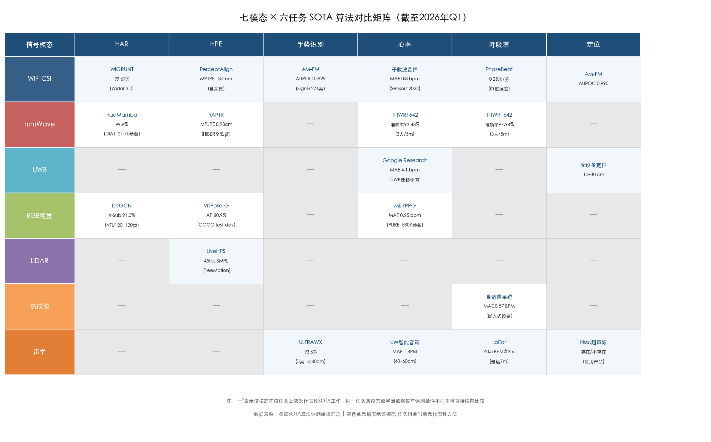

### 6.2.1 人体活动识别（HAR）

HAR 是非接触感知领域覆盖最广泛的任务类型，各信号模态均有大量研究积累。表 6-1 按信号模态汇总截至 2026 年 Q1 的代表性 SOTA 结果。

**表 6-1 各信号模态 HAR 代表性 SOTA 结果**

| 信号模态 | 代表算法 | 数据集 | 域内准确率 | 跨域准确率 | 评测条件 |
|---------|---------|-------|-----------|-----------|---------|
| WiFi CSI | WiGRUNT | Widar 3.0 (6类) | 99.67% | 跨环境96%/跨位置92.6%/跨方向93.15% | TechRxiv 预印本 |
| WiFi CSI | Wi-CBR | Widar 3.0 (6类) | 99.54% | 跨环境98.34%/跨位置96.30%/跨方向96.57% | arXiv 2025 |
| WiFi CSI | AM-FM (基础模型) | 9任务统一 | AUROC 0.923 | Few-shot K=25: 跌倒0.822 | arXiv 2026.02 |
| WiFi CSI | CSI-Bench ViT | CSI-Bench (26环境/35用户) | 87.79% (多任务联合) | 跨设备66.33%/跨环境58.87%/跨用户59.00% | NeurIPS 2025 D&B |
| mmWave | RadMamba (SSM) | DIAT | 99.8% (21.7k参数) | — | arXiv 2025 |
| mmWave | mPCT-LSTM | 3数据集均值 | 97.26% | — | DSP 2025 |
| RGB 骨架 | DeGCN | NTU RGB+D 120 (120类) | X-Sub 91.0% / X-Set 92.1% | 跨受试者评测 | IEEE TIP 2024 |
| RGB 视频 | InternVideo2-1B | Kinetics-700 (700类) | Top-1 85.4% | 开放场景 | ECCV 2024 |
| 声学 | 环境声 HAR | 定制数据集 | 缺乏统一基准 | — | JCDE 2025 |

**WiFi CSI** 在域内分类准确率上已逼近理论上限——Widar 3.0 数据集上 WiGRUNT 达 99.67%、Wi-CBR 达 99.54%。然而，CSI-Bench 的 in-the-wild 评测揭示了真实部署场景下的显著性能退化：ViT 最优模型在跨设备、跨环境、跨用户三个维度上分别降至 66.33%、58.87%、59.00% [CSI-Bench](https://arxiv.org/html/2505.21866v1 "Zhu et al., NeurIPS 2025 D&B Track, Tables 3-4, 12")。AM-FM 基础模型在 920 万条未标注样本上预训练后，将 HAR AUROC 从零训练的 0.527 提升至 0.923，展现了"预训练-微调"范式在弥合泛化鸿沟上的巨大潜力 [AM-FM](https://arxiv.org/html/2602.11200v1 "Hu et al., arXiv:2602.11200, Feb 2026")。

**mmWave 雷达** HAR 的域内精度同样极高。RadMamba 在 DIAT 数据集上以仅 21.7k 参数达到 99.8% 准确率，较此前 SOTA 模型参数量降低 1–2 个数量级 [RadMamba](https://arxiv.org/html/2504.12039v1 "Wu et al., arXiv:2504.12039, 2025")。需注意的是，DIAT 为相对简单的受控数据集，其精度水平不可与 NTU RGB+D 120 包含 120 类动作的跨受试者评测直接对比。

**RGB 骨架方法** 在分类粒度和评测严格性上处于最高水平。DeGCN（IEEE TIP 2024）在 NTU RGB+D 120 这一包含 120 类动作、106 名受试者的大规模基准上达到 Cross-Subject 91.0%，评测协议天然包含跨受试者泛化要求 [DeGCN](https://dl.acm.org/doi/10.1109/TIP.2024.3378886 "Myung et al., IEEE TIP 2024")。InternVideo2 在 Kinetics-700（700 类开放场景视频）上达到 Top-1 85.4%，但其参数量高达 1B 级别，远超边缘设备的承载能力 [InternVideo2](https://arxiv.org/html/2403.15377v2 "Wang et al., ECCV 2024")。

**声学 HAR** 目前缺乏统一的大规模评测基准，被动环境声学方案更适合作为辅助模态，尚不具备独立承担主感知任务的条件。

### 6.2.2 人体姿态估计（HPE）

HPE 是对信号空间分辨率要求最高的感知任务，也是各模态之间性能差异最为显著的领域。表 6-2 汇总了主要模态的代表性 SOTA 结果。

**表 6-2 各信号模态 HPE 代表性 SOTA 结果**

| 信号模态 | 代表算法 | 数据集 | 核心指标 | 评测条件 |
|---------|---------|-------|---------|---------|
| RGB | ViTPose-G | COCO test-dev | AP 80.9% (AP50 95.0%) | ~1B 参数, TPAMI 2024 |
| RGB | Lite-HRNet-30 | COCO test-dev | AP 69.7% | ~1.8M 参数, 移动端 |
| mmWave | RAPTR | HIBER (MULTI) | MPJPE 18.99 cm (全监督 8.93 cm) | NeurIPS 2025 |
| mmWave | RAPTR | HIBER (WALK) | MPJPE 22.32 cm (降34.3%) | NeurIPS 2025 |
| WiFi CSI | Person-in-WiFi 3D | 自采集 (97K帧/7人) | 域内 MPJPE 221.0 mm | CVPR 2024 |
| WiFi CSI | PerceptAlign | 21人/5场景/7布局 | 域内 MPJPE 137.2 mm / 跨布局 170.2 mm | arXiv 2026 |
| LiDAR | LiveHPS | FreeMotion (1-7人) | 45fps 实时 SMPL 估计 | CVPR 2024 |

视觉 HPE 与射频 HPE 之间存在数量级精度差距：ViTPose-G 在 COCO 上 AP 80.9% 对应亚厘米级关节定位精度，而 mmWave RAPTR 的最优 MPJPE 为 8.93 cm（全监督）、WiFi CSI PerceptAlign 域内 MPJPE 为 137.2 mm [RAPTR](https://arxiv.org/html/2511.08387 "Kato et al., NeurIPS 2025") [PerceptAlign](https://arxiv.org/html/2601.12252v1 "Jia et al., arXiv:2601.12252, 2026")。这一差距根植于物理信号分辨率的根本差异——像素级空间采样 vs 厘米级电磁波长。

然而，射频 HPE 的核心价值并非绝对精度竞争，而在于视觉方法无法覆盖的场景。MVDoppler-Pose（CVPR 2025）首次系统证明 mmWave 在长距离和自遮挡步行场景中优于相机，具备距离无关和遮挡鲁棒的独特优势 [MVDoppler-Pose](https://openaccess.thecvf.com/content/CVPR2025/html/Choi_MVDoppler-Pose_Multi-Modal_Multi-View_mmWave_Sensing_for_Long-Distance_Self-Occluded_Human_Walking_CVPR_2025_paper.html "Choi et al., CVPR 2025")。WiFi CSI HPE 的跨域泛化则面临尤为严峻的挑战：Person-in-WiFi 3D 在跨布局场景下 MPJPE 从域内 221 mm 飙升至 649.3 mm，PerceptAlign 通过几何条件学习将跨布局误差控制在 170.2 mm，降幅超 60% [PerceptAlign](https://arxiv.org/html/2601.12252v1 "Jia et al., arXiv:2601.12252, 2026")。

### 6.2.3 手势识别

手势识别对信号时空分辨率的要求介于 HAR 与 HPE 之间，WiFi CSI 和声学两条技术路线在此任务上形成差异化竞争格局。表 6-3 汇总了代表性结果。

**表 6-3 各信号模态手势识别代表性 SOTA 结果**

| 信号模态 | 代表算法 | 数据集 | 准确率 | 评测条件 |
|---------|---------|-------|-------|---------|
| WiFi CSI | AM-FM (基础模型) | SignFi (276类手语) | AUROC 0.999 | arXiv 2026.02 |
| WiFi CSI | GLSDA | Widar 3.0 | 均值 95.39% (跨位置95.59%/跨方向92.80%) | arXiv 2025 |
| 声学 | ULTRAWX | 5类手势 (20人/5787样本) | 93.6% (跨设备95.6%/跨用户+设备88.6%) | Scientific Reports 2025 |
| 声学 | GestureID | 手势+身份联合 | 手势 97.8% / 身份 96.3% | Sound & Vibration 2024 |
| 声学 | 端到端 LSTM | 4类 (原始回波) | 95% | Sensors 2024 |

WiFi CSI 手势识别因 AM-FM 基础模型在 SignFi 276 类手语上达到 AUROC 0.999 而展现出极高的分类上限 [AM-FM](https://arxiv.org/html/2602.11200v1 "Hu et al., arXiv:2602.11200, Feb 2026")。声学手势识别的核心瓶颈在于有效距离——ULTRAWX 仅在 ≤40 cm 范围内保持高精度，超过 60 cm 后精度显著下降 [ULTRAWX](https://www.nature.com/articles/s41598-025-93837-1 "Zhang et al., Scientific Reports 2025")。声学方案凭借近超声波段的高空间分辨率（波长 ~17 mm）在近距离细粒度交互场景中具备独特优势，适合智能设备近场手势控制；WiFi CSI 则凭借穿墙能力和大覆盖范围在远距离场景中更具部署价值。

### 6.2.4 生命体征监测（心率与呼吸率）

生命体征监测是各模态竞争最为激烈、应用价值最为直接的感知任务。表 6-4 汇总了七种信号模态在心率和呼吸率检测上的代表性 SOTA 结果。

**表 6-4 各信号模态生命体征监测代表性 SOTA 结果**

| 信号模态 | 代表算法/系统 | 任务 | 核心精度 | 有效距离 | 评测条件 |
|---------|------------|------|---------|---------|---------|
| rPPG (RGB) | ME-rPPG | 心率 | PURE MAE 0.25 bpm / MMPD MAE 5.38 bpm | 0.5–2 m | arXiv 2025, 580K参数 |
| rPPG (RGB) | RhythmMamba | 心率 | PURE MAE 0.23 bpm / MMPD MAE 10.44 bpm | 0.5–2 m | AAAI 2025 |
| mmWave | TI IWR1642 系统 | 心率+呼吸 | HR 准确率 93.43% / BR 准确率 97.94% | 5 m, 3人同时 | arXiv 2025 |
| mmWave | Nature Sci. Rep. | 心率 | 误差率 1.69%–2.61% | 多距离/角度 | Scientific Reports 2024 |
| WiFi CSI | PhaseBeat | 呼吸率 | 中位误差 0.25 次/分钟 | 室内 | ACM THCH 2020 |
| WiFi CSI | 子载波选择法 | 心率 | 准确率 96.8%, 中位误差 0.8 bpm | 室内 | Sensors 2024 |
| UWB | Google Research | 心率 | FMCW MAE 0.85 bpm / UWB MAE 4.1 bpm | 近距离 | Google Research 2025 |
| 声学 | UW 智能音箱 | 心率/心律 | 健康人 HR MAE 1 BPM / 心脏病患者 HR MAE 2 BPM | 40–60 cm | Communications Biology 2021 |
| 声学 | LoEar | 呼吸+心搏 | 3m 呼吸误差<0.5 BPM / 心搏<1 BPM | 呼吸7m / 心搏6.5m | ACM IMWUT 2022 |
| 热成像 | 自适应热成像系统 | 呼吸率 | MAE 0.57±0.36 BPM / RMSE 0.64±0.42 BPM | 1–2 m | Sensors 2025, 嵌入式设备 |

**受控环境心率精度对比。** rPPG 在实验室受控条件下展现了最高的心率检测精度——RhythmMamba 在 PURE 数据集上 MAE 仅 0.23 bpm [RhythmMamba](https://arxiv.org/html/2404.06483v2 "Guo et al., AAAI 2025")，ME-rPPG 为 0.25 bpm [ME-rPPG](https://arxiv.org/html/2504.01774v2 "Tang et al., 2025")。WiFi CSI 心率检测 MAE 为 0.8 bpm [WiFi HR](https://www.mdpi.com/1424-8220/24/7/2111 "Sensors Vol.24, 2024")，mmWave 误差率 1.69%–2.61% [mmWave HR](https://www.nature.com/articles/s41598-024-77683-1 "Wang et al., Scientific Reports 2024")，声学 MAE 为 1 BPM [智能音箱心律监测](https://www.nature.com/articles/s42003-021-01824-9 "Wang et al., Communications Biology 2021")。四种模态在受控条件下的精度均处于同一量级（MAE ≤2 BPM），表明非接触心率检测的受控精度天花板已接近被触及。

**跨域精度退化。** 各模态的核心分化发生在真实部署场景中。rPPG 从 PURE MAE 0.23 bpm 跨域到 MMPD 时升至 10.44 bpm（退化约 45 倍），ME-rPPG 同样从 0.25 bpm 升至 5.38 bpm [RhythmMamba](https://arxiv.org/html/2404.06483v2 "Guo et al., AAAI 2025")。相比之下，mmWave 在多人场景（3 人/5 m）下心率准确率仍保持 93.43%、呼吸率 97.94%，展现出远优于 rPPG 的场景鲁棒性 [mmWave Vital Signs](https://arxiv.org/html/2511.21255v1 "Benny et al., arXiv, 2025")。

**不规则心律场景。** 声学系统在房颤等不规则心律监测上具有独特优势——UW 智能音箱在心脏病患者上 R-R 间期 MAE 仅 30 ms，而雷达在房颤患者上高达 186 ms，差距超 6 倍 [智能音箱心律监测](https://www.nature.com/articles/s42003-021-01824-9 "Wang et al., Communications Biology 2021")。

**呼吸率检测。** 热成像方案在嵌入式边缘设备上实现了呼吸率 MAE 0.57±0.36 BPM 的精度，且在语音干扰、偏轴角度和距离变化（1–2 m）等六种真实条件下均保持鲁棒 [热成像呼吸监测](https://pmc.ncbi.nlm.nih.gov/articles/PMC12788367/ "Sensors 2025, 嵌入式热成像呼吸率监测")。LoEar 通过 OFDM 多子载波相干叠加将声学呼吸监测距离扩展至 7 m、心搏监测至 6.5 m [LoEar](https://samsonsjarkal.github.io/KeSun/files/ubicomp22loear.pdf "Wang et al., ACM IMWUT 2022")。WiFi CSI 呼吸检测在 CSI-Bench 上以 PatchTST 达到 98.84% 准确率，在 in-the-wild 条件下展现了较高鲁棒性 [CSI-Bench](https://arxiv.org/html/2505.21866v1 "Zhu et al., NeurIPS 2025 D&B Track")。

### 6.2.5 室内定位与存在检测

室内定位与存在检测是非接触感知在智能建筑和安防领域的基础性任务。表 6-5 汇总了各模态的代表性精度水平。

**表 6-5 各信号模态室内定位与存在检测代表性结果**

| 信号模态 | 系统/方法 | 精度 | 特点 |
|---------|---------|------|-----|
| UWB | 典型无设备定位 | 10–30 cm | 厘米级，近距离 |
| WiFi CSI | CSI-Bench (ResNet-18) | 房间级 100% (6类) | 房间级分类 |
| 声学 | Google Nest 超声波 | 存在/不存在 | 商用产品，设备端处理 |
| WiFi CSI | AM-FM | 定位 AUROC 0.995 | 基础模型预训练 |

UWB 在室内定位精度上具有绝对优势（典型无设备定位精度 10–30 cm），而 WiFi CSI 更适合房间级粗粒度定位和存在检测任务 [UWB综述](https://arxiv.org/abs/2402.05649 "Cheraghinia et al., IEEE COMST 2025") [CSI-Bench](https://arxiv.org/html/2505.21866v1 "Zhu et al., NeurIPS 2025 D&B Track")。两种技术路线形成互补格局：UWB 胜在厘米级精细定位，WiFi CSI 胜在零成本全屋覆盖的存在感知。

## 6.3 六维多模态综合评价

基于前述各章的系统评估，我们从精度、鲁棒性、隐私性、成本、实时性和可扩展性六个维度对七种信号模态进行综合评价（5 分制，5 = 最优）。评分依据为各章已引用的实测数据和部署约束分析，评价框架参考 Cui（2025）的六维定性评价方法 [非侵入式感知对比](https://www.researchgate.net/publication/399071339_Non-intrusive_Human_Pose_Sensing_A_Comparative_Review_of_Wi-Fi_Radar_and_Inertial_Sensing "Cui, 2025, 6维定性评价框架")。图 6-2 以雷达图形式直观呈现各模态的优势轮廓与短板分布。

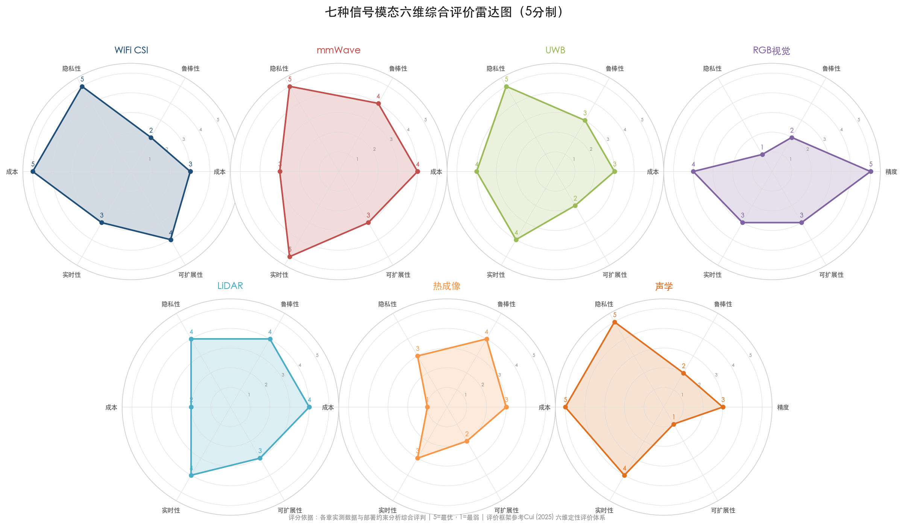

**表 6-6 七种信号模态六维综合评分**

| 维度 | WiFi CSI | mmWave | UWB | RGB视觉 | LiDAR | 热成像 | 声学 |
|-----|---------|--------|-----|---------|-------|-------|------|
| **精度** | 3 | 4 | 3 | 5 | 4 | 3 | 3 |
| **鲁棒性** | 2 | 4 | 3 | 2 | 4 | 4 | 2 |
| **隐私性** | 5 | 5 | 5 | 1 | 4 | 3 | 5 |
| **成本** | 5 | 3 | 4 | 4 | 2 | 1 | 5 |
| **实时性** | 3 | 5 | 4 | 3 | 4 | 3 | 4 |
| **可扩展性** | 4 | 3 | 2 | 3 | 3 | 2 | 1 |

**精度维度。** RGB 视觉在几乎所有感知任务上均占据精度制高点（NTU RGB+D 120 X-Sub 91.0%、COCO AP 80.9%、PURE MAE 0.23–0.25 bpm），获评 5 分。mmWave 和 LiDAR 在各自优势任务上精度接近视觉水平（mmWave HPE 全监督 MPJPE 8.93 cm、LiDAR 45 fps SMPL 实时估计），均获评 4 分。WiFi CSI 域内精度极高（Widar 3.0 上 99.67%），但跨域退化严重（CSI-Bench 跨环境仅 58.87%），综合评 3 分。声学和热成像在各自优势的近距离场景中表现优异，但覆盖范围有限，评 3 分。UWB 在定位精度上优势突出（10–30 cm），但感知任务覆盖面较窄，评 3 分。

**鲁棒性维度。** mmWave 和 LiDAR 不受光照条件限制，支持全天候工作并具备穿透遮挡能力，获评 4 分。热成像同样不受可见光影响，可在完全黑暗环境中正常工作，评 4 分。WiFi CSI 的跨域性能退化构成核心短板（CSI-Bench 跨域 F1 降至 46%–64%），评 2 分。RGB 视觉对光照和遮挡高度敏感（rPPG 在低光条件下性能骤降 [rPPG 低光可靠性](https://www.nature.com/articles/s41746-025-02192-y "Nature npj Digital Medicine 2025")），评 2 分。声学对环境噪声敏感且运动场景下退化严重（UW 系统在背景音乐干扰下误差增加 28%），评 2 分。

**隐私性维度。** WiFi CSI、mmWave、UWB 和声学信号均不包含面部纹理和身份信息，获评 5 分。LiDAR 点云不含外观信息但可获取身体轮廓，评 4 分。热成像不含高分辨率面部纹理，但温度分布可能间接关联个体身份，评 3 分。RGB 摄像头包含完整面部信息，受 GDPR 等隐私法规严格限制，评 1 分。

**成本维度。** WiFi CSI 和声学方案可利用已有基础设施（路由器、智能音箱、手机麦克风阵列），实现零额外硬件成本部署，获评 5 分。RGB 摄像头价格低廉，UWB 芯片已嵌入 iPhone 等消费级设备，成本适中，评 4 分。mmWave 单模块成本约 $15–50，评 3 分。LiDAR 机械式设备 $1,000 以上，评 2 分。热成像专业 LWIR 相机 $5,000 以上，评 1 分。

**实时性维度。** mmWave 雷达原生支持实时处理（RadMamba 仅 21.7k 参数即可完成推理），评 5 分。声学和 UWB 系统普遍满足实时约束，评 4 分。WiFi CSI 和 RGB 视觉的大规模 Transformer 及基础模型（InternVideo2 1B 参数、ViTPose-G ~1B 参数）在边缘设备上推理延迟较高，评 3 分。值得注意的是，轻量化路线已证明其可行性——ME-rPPG 仅 580K 参数，CPU 推理延迟仅 9.46 ms [ME-rPPG](https://arxiv.org/html/2504.01774v2 "Tang et al., 2025")；骨架 GCN 系列（DeGCN 1.42M 参数）亦可实现数百 FPS 推理。

**可扩展性维度。** WiFi CSI 具有全屋覆盖能力（有效距离 10–30 m）且支持多接入点分布式部署，评 4 分。mmWave 已实现 3 人/5 m 同时监测的验证，评 3 分。RGB 和 LiDAR 在大场景中可通过多传感器协同扩展，评 3 分。UWB 有效距离较短（1–5 m），多人场景下信号混叠问题突出，评 2 分。热成像覆盖范围有限且高成本制约多点部署，评 2 分。声学有效距离最短（手势识别 ≤40 cm、LoEar 最远约 7 m），多人支持能力有限（最多 4 人、间距 ≥60 cm），评 1 分。

## 6.4 技术瓶颈与开放问题

### 6.4.1 跨域泛化鸿沟

跨域泛化是当前非接触感知领域最为根本的技术瓶颈。Wang et al.（2025）在系统回顾 200 余篇 WiFi 感知论文后指出，设备异构性、人体多样性和环境多样性构成三大核心障碍 [WiFi泛化综述](https://arxiv.org/html/2503.08008v2 "Wang et al., 2025, 200+篇论文")。CSI-Bench（NeurIPS 2025 D&B Track）以 26 个环境、35 名用户、461 小时数据首次在大规模 in-the-wild 条件下量化了这一鸿沟：HAR 域内 87.79% vs 跨域最高仅 66.33% [CSI-Bench](https://arxiv.org/html/2505.21866v1 "Zhu et al., NeurIPS 2025 D&B Track")。WiFi CSI HPE 的泛化挑战更为严峻——Person-in-WiFi 3D 在跨布局场景下 MPJPE 从 221 mm 飙升至 649.3 mm [PerceptAlign](https://arxiv.org/html/2601.12252v1 "Jia et al., arXiv:2601.12252, 2026")。rPPG 领域同样面临受控-真实场景的精度鸿沟：RhythmMamba 从 PURE MAE 0.23 bpm 跨域至 MMPD 时升至 10.44 bpm，退化超过 45 倍。

针对上述挑战，三条解决路线正逐步成形：大规模自监督预训练（AM-FM 将 HAR AUROC 从 0.527 提升至 0.923）、跨域对比学习（Wi-CBR 跨域准确率 96%–98%）和几何条件学习（PerceptAlign 将跨域 HPE 误差降低逾 60%）。三者分别从数据规模、表征对齐和几何先验三个维度对泛化鸿沟发起冲击。

### 6.4.2 统一评测基准缺位

跨模态层面，目前不存在同时覆盖 WiFi、mmWave、UWB、视觉和声学的标准化评测平台。SDP 框架（2026 年 1 月）指出，硬件依赖的信道测量导致数据表示和评估协议差异巨大，各模态的"SOTA"数字产生于不可比的实验条件之中 [SDP](https://arxiv.org/abs/2601.08463 "Zhang et al., arXiv:2601.08463, 2026")。MM-Fi 和 XRF55 仅提供了初步的多模态评测探索，Babel 在 6 种模态上的跨模态对齐是朝统一评测迈出的重要一步 [Babel](https://arxiv.org/html/2407.17777v1 "Dai et al., SenSys 2025")。CSI-Bench 对 WiFi 单模态建立了里程碑式的 in-the-wild 基准，但尚未扩展至跨模态维度。缺乏统一基准意味着各模态之间的"SOTA 对比"本质上是在不同尺子上测量不同的量，限制了研究社区对融合策略和技术路线选择的系统性评估能力。

### 6.4.3 从实验室到部署的现实鸿沟

学术论文中的精度数字通常在理想受控条件下取得，实际部署面临一系列系统性工程挑战。Nguyen et al.（Information Fusion, Vol.110, 2024）指出多模态融合系统面临传感器异构同步、校准漂移和冲突融合决策等问题 [多模态室内监测综述](https://www.sciencedirect.com/science/article/pii/S1566253524002355 "Nguyen et al., Information Fusion Vol.110, 2024")。Hassani & Ytterdal（Sensors 2025）系统梳理了非接触生命体征监测在真实世界中面临的环境噪声、运动伪影和跨被试变异性等挑战 [非接触生命体征综述](https://pmc.ncbi.nlm.nih.gov/articles/PMC12349365/ "Hassani & Ytterdal, Sensors 2025")。CSI-Bench 的评测结果也印证了这一判断——即便采用多任务联合训练策略将域内 HAR 从 75.40% 提升至 87.79%，跨域场景下的性能仍然大幅退化。

### 6.4.4 多人与动态场景的可扩展性瓶颈

多人场景下各模态的精度均存在不同程度的退化。mmWave 已实现 3 人/5 m 同时监测（BR 97.94%、HR 93.43%），但精度随人数增加而下降 [mmWave Vital Signs](https://arxiv.org/html/2511.21255v1 "Benny et al., arXiv, 2025")。声学 LoEar 最多支持 4 人同时监测（间距 ≥60 cm），4 人场景下心搏中位误差升至 1.39 BPM [LoEar](https://samsonsjarkal.github.io/KeSun/files/ubicomp22loear.pdf "Wang et al., ACM IMWUT 2022")。rPPG 在运动场景下 MAE 从 0.25 bpm 升至 5.38 bpm。WiFi CSI 的多人感知受限于信号混叠效应，目前缺乏大规模多人场景的系统性评测数据。如何在保持单人精度的前提下实现高密度多人场景的可靠感知，是各模态共同面临的开放问题。

### 6.4.5 基础模型的数据效率与部署效率权衡

基础模型在弥合泛化鸿沟方面展现了巨大潜力，但同时面临数据采集成本与部署效率的双重制约。AM-FM 预训练需要 920 万条 CSI 样本（跨 439 天、20 种商用设备）[AM-FM](https://arxiv.org/html/2602.11200v1 "Hu et al., arXiv:2602.11200, Feb 2026")，InternVideo2 的 1B 参数模型需要 GPU 进行推理，而 ME-rPPG 仅以 580K 参数即可在 CPU 上实时运行。精度、效率与数据成本之间的三角权衡，是基础模型从学术验证走向实用化部署的核心障碍。

### 6.4.6 隐私与精度的根本张力

视觉方法在几乎所有感知任务上精度最高，但隐私风险亦最高，两者之间存在结构性矛盾。跨模态蒸馏为弥合隐私友好模态与高精度视觉模态之间的差距提供了新路径——FM-Fi 通过 CLIP→RF 蒸馏使 RF 编码器仅需 3-shot 即达 94.4% [FM-Fi](https://arxiv.org/html/2410.19766v1 "Weng et al., SenSys 2024")，X-Fi 五模态融合将 HPE MPJPE 降低 24.8% [X-Fi](https://xyanchen.github.io/X-Fi/ "Chen & Yang, ICLR 2025")。骨架化方法（DeGCN 91.0%）已将隐私保护与高精度的平衡推至极高水平，联邦学习方案（FSAR 84.31%）进一步确保训练数据不出本地 [FSAR](https://openaccess.thecvf.com/content/ICCV2023/papers/Guo_FSAR_Federated_Skeleton-based_Action_Recognition_with_Adaptive_Topology_Structure_and_ICCV_2023_paper.pdf "Guo et al., ICCV 2023")。隐私-精度的帕累托前沿正在被多条技术路线共同推进。

## 6.5 应用场景技术路线选型建议

基于前述系统评估，我们按智能家居、医疗健康、安防监控和车载座舱四类典型应用场景给出技术路线选型建议。核心原则是"场景需求驱动模态选择，而非模态性能决定应用边界"。图 6-3 以速查表形式呈现各场景的推荐传感器组合、关键精度指标和核心约束。

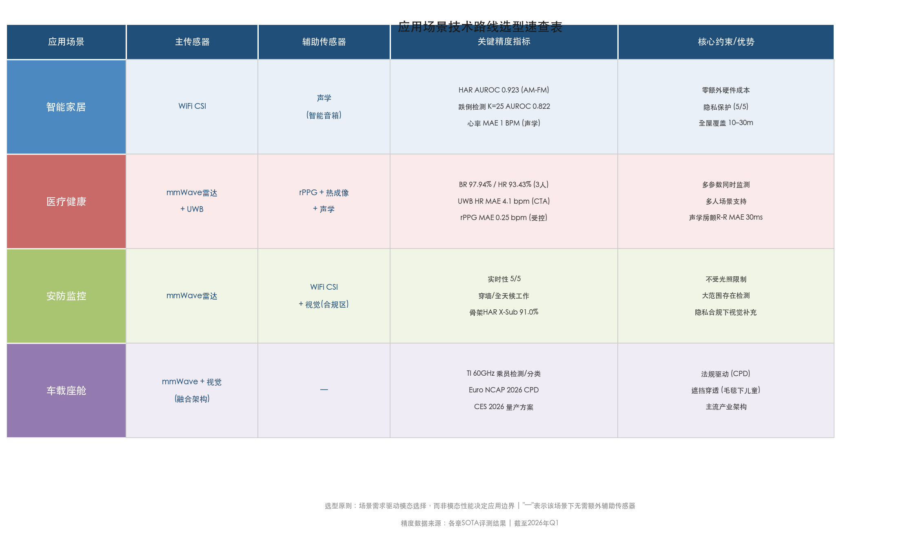

### 6.5.1 智能家居

**推荐方案：WiFi CSI（主感知）+ 声学（近距离补充），不建议部署 RGB 摄像头。**

智能家居场景的核心需求是全屋覆盖、隐私保护和零额外硬件成本。WiFi CSI 利用已有路由器和 IoT 设备即可实现大范围存在检测、跌倒识别和粗粒度活动分类，隐私性评分 5/5。在近距离健康监测场景（如床头心率追踪、睡眠呼吸监测）中，可叠加智能音箱声学感知——UW 系统已在 40–60 cm 范围内验证心率 MAE 1 BPM、心脏骤停检测灵敏度 97.24% [心脏骤停检测](https://www.nature.com/articles/s41746-019-0128-7 "Chan et al., npj Digital Medicine 2019")。Google Nest 已在商用产品中部署超声波存在感知功能，证明了声学方案在消费级产品中的技术成熟度 [Google Nest](https://support.google.com/googlenest/answer/9509981?hl=en "Google Nest 超声波存在感知")。此外，AM-FM 基础模型的 few-shot 能力（K=25 样本/类跌倒检测 AUROC 0.822）为快速部署到新家庭环境提供了低成本适配路径。

### 6.5.2 医疗健康

**推荐方案：分层部署——mmWave（高精度多人监测）+ UWB（持续床旁监测）+ rPPG/热成像（门诊精细生理检测）+ 声学（居家睡眠筛查）。**

医疗场景对精度和多参数覆盖有严格要求，需要根据细分场景分层选型。mmWave 雷达在多人生命体征监测上表现突出（3 人/5 m 场景下 BR 97.94%、HR 93.43%），适合病房和养老院等需同时监测多名患者的场景。UWB 雷达经 Google Research 验证已满足 CTA 消费电子标准（MAE ≤5 bpm、MAPE ≤10%），搭载 UWB 芯片的智能手机和可穿戴设备可在床旁实现持续心率监测 [Google UWB HR](https://research.google/blog/measuring-heart-rate-with-consumer-ultra-wideband-radar/ "Google Research 2025")。rPPG（ME-rPPG 在 PURE 上 MAE 0.25 bpm）和热成像（呼吸率 MAE 0.57 BPM）适合门诊受控环境下的精细生理参数检测。声学系统在不规则心律监测上的独特优势（房颤患者 R-R 间期 MAE 30 ms，远优于雷达的 186 ms）使其特别适合居家心律异常筛查场景。

### 6.5.3 安防监控

**推荐方案：mmWave 雷达（主感知）+ WiFi CSI（大范围存在检测），视觉方法在隐私合规区域作补充。**

安防场景要求全天候、全天时工作能力和穿透遮挡检测能力。mmWave 雷达不受光照条件限制，可穿墙检测人员存在与活动，实时性评分 5/5，适合作为主传感器。WiFi CSI 可利用已有基础设施在大范围内进行存在检测和异常活动警报，作为 mmWave 的覆盖延伸手段。在光照良好且隐私合规（如公共区域、已明确告知并获得同意）的场景中，视觉方法（骨架化 HAR + 联邦学习架构）可提供最高精度的活动分类能力。

### 6.5.4 车载座舱

**推荐方案：mmWave + 视觉融合（主流产业架构），Euro NCAP 2026 CPD 法规直接驱动。**

车载座舱是非接触感知商业化进展最快的领域。TI 60 GHz mmWave 单传感器已实现乘员检测、分类与生命体征监测功能集成，CES 2026 上多家厂商展示了相应的量产方案 [TI mmWave车载](https://www.ti.com/document-viewer/lit/html/SSZT307 "TI, SSZT307, 60GHz车载感知") [CES 2026](https://anyverse.ai/in-cabin-monitoring-ces-2026/ "CES 2026 车载座舱监测趋势")。Euro NCAP 2026 儿童存在检测（CPD）法规要求将直接推动 mmWave 雷达在量产车型中的大规模部署。mmWave + 视觉融合是当前的主导架构——mmWave 提供全天候穿透遮挡能力（如检测被毛毯覆盖的儿童），视觉提供精细外观分类能力，二者互补形成完整的座舱感知系统。

## 6.6 融合增量价值评估

多模态融合能够系统性地弥补任一单模态在精度上限与鲁棒性方面的短板。现有实证结果已量化验证了融合所带来的增量价值：

- **X-Fi**（ICLR 2025）五模态融合（RGB/深度/LiDAR/mmWave/WiFi）相比基线方法 HPE MPJPE 降低 24.8%、PA-MPJPE 降低 21.4%，HAR 准确率提升 2.8% [X-Fi](https://xyanchen.github.io/X-Fi/ "Chen & Yang, ICLR 2025")
- **Babel**（SenSys 2025）WiFi+mmWave 融合在 XRF55 上达到 58.97%（单模态平均提升 22%），one-shot 设置超越通用多模态大模型达 25.2% [Babel](https://arxiv.org/html/2407.17777v1 "Dai et al., SenSys 2025")
- **RFiDAR**（IEEE IoT Magazine 2025）RFID+UWB 雷达特征级融合达 98.8% / 97.9%（2 m/3 m），相比单模态提升 5.3%–6.2%；数据级融合 96.6%/96.7%（+3.1%–4.9%）；决策级融合 95.2%/94.4%（+1.7%–2.7%）[RFiDAR](https://eprints.gla.ac.uk/359331/2/359331.pdf "Khan et al., IEEE IoT Magazine 2025")
- **FM-Fi**（SenSys 2024）CLIP→RF 跨模态蒸馏使 RF 编码器仅需 6.9M 参数（CLIP 140M），3-shot 即达 94.4%，10 环境×10 受试者泛化测试中 3-shot >90% [FM-Fi](https://arxiv.org/html/2410.19766v1 "Weng et al., SenSys 2024")

融合层级之间呈现清晰的精度-复杂度梯度：特征级融合精度增益最大（+5%–6%）、数据级次之（+3%–5%）、决策级最小（+2%–3%）。值得注意的是，决策级融合尚未被应用于多模态 WiFi 感知 [多模态WiFi综述](https://arxiv.org/html/2505.06682v1 "Zhao et al., arXiv:2505.06682, 2025")，融合层级间的系统性精度对比仍是方法论上的重要缺口。在同一数据集上对输入级、特征级和决策级融合进行控制变量对比，将是推进融合策略系统优化的关键下一步。

## 6.7 综合研判

非接触式感知领域在 2025—2026 年经历了从"单模态精度竞赛"向"泛化性、多模态融合、基础模型"三重范式跃迁的关键转折期。基于本章系统对比，我们凝练以下四项核心判断：

**判断一：受控域内精度已趋饱和，泛化性成为决定实际性能上限的核心变量。** WiFi CSI HAR 域内 99.67%、mmWave HAR 99.8%、rPPG 受控 MAE 0.23 bpm——这些数字表明各模态在理想条件下的精度已接近信号物理极限。然而，CSI-Bench 揭示的跨域退化（HAR 87.79%→58.87%）和 rPPG 的跨域退化（0.23→10.44 bpm）清楚表明，实际部署中的性能瓶颈不在于算法精度本身，而在于算法对环境、用户和设备变化的适应能力。未来研究的核心评价指标应从域内精度转向跨域泛化性能。

**判断二：基础模型范式已到转折点，但数据成本和部署效率是短期核心制约。** AM-FM、X-Fi、Babel 三个基础模型在 2025—2026 年初集中涌现，共同验证了"预训练-微调"范式在感知领域的有效性。AM-FM 将 HAR AUROC 从 0.527 提升至 0.923 的结果意义深远——它证明了足够大规模的无标签预训练可以产生与有监督方法竞争甚至超越的泛化性能。但 920 万样本/439 天的预训练数据采集成本和 1B 参数级模型的推理开销，是该范式从学术验证走向规模化部署的现实瓶颈。

**判断三：多模态融合的增量价值已获充分实证（最高 +24.8%），但统一评测框架缺位制约了融合策略的系统优化。** X-Fi、Babel 和 FM-Fi 已量化证明了融合的精度增益，然而各融合方法在不同数据集上评测、缺乏同一数据集上融合层级间（输入级 vs 特征级 vs 决策级）的系统性精度对比，使得最优融合策略的选择仍高度依赖经验判断而非标准化评估。构建跨模态统一评测平台是推动融合研究从"方法驱动"走向"基准驱动"的关键前提。

**判断四：场景化选型应遵循"需求驱动、模态互补、隐私优先"原则，不存在单一"最优"技术。** 不存在一个在所有维度上均占优的模态。智能家居场景的最优方案（WiFi CSI + 声学）与车载场景的最优方案（mmWave + 视觉）截然不同。技术选型应从场景的核心需求（精度要求、隐私约束、成本预算、环境条件）出发，而非从单一技术性能指标出发。六维评价框架和场景选型矩阵为这一决策过程提供了结构化的参考依据。

# 结论与风险提示

## 核心结论

本报告对非接触式感知领域截至 2026 年第一季度的七种主要信号模态（WiFi CSI、毫米波雷达、UWB、RGB 摄像头、LiDAR、红外热成像、声学）和五大核心感知任务（HAR、HPE、手势识别、生命体征监测、室内定位）进行了系统评估。基于对 50 余项代表性算法的深度分析和跨模态对比，我们凝练以下五项核心结论。

**第一，各模态在受控域内场景中的精度已趋饱和，研究焦点应从域内精度转向跨域泛化性能。** WiFi CSI HAR 域内准确率达 99.67%（WiGRUNT，Widar 3.0），毫米波雷达 HAR 达 99.8%（RadMamba，DIAT），骨架动作识别达 91.0%（DeGCN，NTU RGB+D 120 X-Sub），rPPG 心率检测 MAE 低至 0.23 bpm（RhythmMamba，PURE）。这些数字表明，在理想实验条件下，各模态的算法精度已接近信号物理分辨率和数据集固有噪声所允许的上限。然而，CSI-Bench 在 26 个真实环境、35 名用户上的大规模评测揭示了跨域场景中的剧烈性能退化——HAR 最优模型跨环境准确率仅 58.87%，较域内 87.79% 下降近 30 个百分点 [CSI-Bench](https://arxiv.org/html/2505.21866v1 "Zhu et al., NeurIPS 2025 D&B Track")。rPPG 的跨域退化更为极端，RhythmMamba 从 PURE 的 0.23 bpm 升至 MMPD 的 10.44 bpm，退化超过 45 倍 [RhythmMamba](https://arxiv.org/html/2404.06483v2 "Guo et al., AAAI 2025")。泛化性能而非域内精度，是决定非接触感知技术实际价值的核心变量。

**第二，基础模型"预训练-微调"范式是弥合泛化鸿沟最具前景的技术路径。** AM-FM 通过 920 万条未标注 CSI 样本的大规模自监督预训练，将 WiFi HAR AUROC 从零训练的 0.527 提升至 0.923，提升幅度达 75%，仅需 K=25 样本/类即可在跌倒检测上达到 0.822 AUROC [AM-FM](https://arxiv.org/html/2602.11200v1 "Hu et al., arXiv:2602.11200, Feb 2026")。X-Fi 的模态不变架构使五种信号模态在训练一次后即可独立或任意组合使用，HPE MPJPE 降低 24.8% [X-Fi](https://xyanchen.github.io/X-Fi/ "Chen & Yang, ICLR 2025")。Babel 的可扩展对齐框架在 one-shot 设置下超越通用多模态大模型达 25.2% [Babel](https://arxiv.org/html/2407.17777v1 "Dai et al., SenSys 2025")。上述工作共同证实，非接触感知领域正步入"预训练-微调"的新阶段，其意义类似于自然语言处理中 BERT/GPT 和计算机视觉中 ViT/CLIP 所引发的范式转变。

**第三，跨模态融合在精度增益上已获充分实证，特征级融合是当前工程效费比最优的方案。** RFiDAR 系统（RFID + UWB 雷达）的系统性对比显示，特征级融合精度增益最大（+5.3%–6.2%），数据级次之（+3.1%–5.0%），决策级最小（+1.7%–2.7%）[RFiDAR](https://eprints.gla.ac.uk/359331/2/359331.pdf "Khan et al., IEEE IoT Magazine 2025")。FM-Fi 的 CLIP→RF 跨模态蒸馏使 RF 编码器（6.9M 参数）仅需 3 个标注样本/类即可达 94.4%，在 10 个环境 × 10 名受试者的泛化测试中保持 90% 以上准确率 [FM-Fi](https://arxiv.org/html/2410.19766v1 "Weng et al., SenSys 2024")。跨模态知识蒸馏——利用视觉模态的信息丰度在训练阶段增强射频模态的表征质量——已成为在推理阶段实现"仅使用隐私友好模态即可接近视觉精度"的最有效路径。

**第四，Transformer 架构已在非接触感知各分支中确立主导地位，但 Mamba SSM 在轻量化部署方向展现出强劲竞争力。** WiFi CSI HAR 领域自注意力方法在 UT-HAR 上达 99.41%，AM-FM 采用 6 层 Transformer 统一 9 个下游任务；毫米波 HPE 领域 RAPTR 的两阶段 Transformer 将 MPJPE 降低 34.3%–76.9%（NeurIPS 2025）；rPPG 领域 PhysFormer（CVPR 2022）开创了 Transformer 方法先河。与此同时，Mamba SSM 以极低参数量实现了竞争性精度——RadMamba 仅 21.7k 参数即达 99.8% HAR 准确率，RhythmMamba 在 rPPG 上以 PhysFormer 三分之一的推理延迟实现更高精度。这一双轨格局——Transformer 面向精度上限、Mamba SSM 面向边缘部署——预计将在中期内持续并行发展。

**第五，不存在在所有维度上占优的单一模态，面向特定应用场景的模态组合选型应以需求为导向。** 六维综合评价显示，RGB 视觉精度最高但隐私性最低（1/5），WiFi CSI 和声学部署成本最低（5/5）但空间分辨率受限，毫米波雷达在鲁棒性（4/5）和实时性（5/5）上表现突出但覆盖范围不及 WiFi。对于智能家居场景，WiFi CSI + 声学的零成本高隐私组合最为适配；对于医疗多人监护，mmWave + UWB 分层部署提供了精度与成本的最优平衡；对于车载座舱，mmWave + 视觉融合已成为 Euro NCAP 2026 CPD 法规驱动下的主导产业架构。

## 局限性分析

本报告存在以下主要局限性，读者在引用本报告结论时需予以审慎考量。

**第一，跨模态精度对比受限于数据集与评测条件的不可比性。** 本报告汇总的各模态 SOTA 精度数字产生于不同的数据集、评测协议和实验条件之中。WiFi CSI HAR 的 99.67% 基于 Widar 3.0（6 类手势、17 名用户），而骨架 HAR 的 91.0% 基于 NTU RGB+D 120（120 类动作、106 名受试者），任务复杂度和数据规模存在根本差异。尽管本报告在每一处精度声明旁均标注了数据集和评测条件，但跨模态的直接精度排名仍不具方法论严格性。

**第二，部分前沿工作尚处于预印本阶段，经同行评审的精度数字可能存在调整。** AM-FM（arXiv 2026.02）、PerceptAlign（arXiv 2026.01）、Wi-CBR（arXiv 2025）等多项关键引用尚未完成正式同行评审。基础模型（AM-FM、LWM）的预训练数据规模和下游评测范围有待更大规模的独立验证。

**第三，报告以算法精度评估为核心，对系统级工程集成的讨论深度有限。** 实际部署涉及传感器同步校准、边缘-云协同推理、长时间运行稳定性、多传感器冲突融合决策等系统工程挑战，这些问题在本报告中仅作概要性提及。从实验室精度到产品级可靠性之间的工程鸿沟，在实际技术选型中的权重可能不亚于算法精度本身。

**第四，声学感知和被动环境声学 HAR 缺乏统一大规模评测基准，相关精度对比的代表性有限。** 声学手势识别和生命体征监测的评测多基于自采集小规模数据集，系统间精度的直接比较受限于样本量、手势类别数和环境条件的差异。声学领域尚未出现类似 NTU RGB+D 120 或 CSI-Bench 的标准化基准。

**第五，本报告所述技术截止时间为 2026 年 4 月，该领域技术迭代速度极快，部分结论的时效性可能在数月内发生变化。** 基础模型、大语言模型感知和扩散模型数据增强等前沿方向正处于快速演进期，2026 下半年可能涌现新的范式突破。IEEE 802.11bf 标准的落地推进、WiFi 7/8 的硬件普及和 Euro NCAP 法规的实施节奏均可能改变技术路线的竞争格局。
