# 执行摘要

低代码/无代码（LCNC）平台已从边缘性的开发辅助工具成长为企业软件领域增长最快的核心赛道。Gartner 广义口径下全球低代码开发技术市场预计 2029 年达 582 亿美元（2024—2029 年 CAGR 14.1%），84% 的企业已采用 LCNC 工具，87% 的企业开发者至少在部分工作中使用低代码平台。本报告围绕"LCNC 平台对传统开发流程的实际影响"这一核心命题，从市场全景、效率提升、隐性成本、利益相关方立场分歧、生成式 AI 变量、企业采用策略与前景展望七个维度展开系统研究，形成以下核心判断。

**效率提升真实但高度依赖场景匹配。** 在内部业务应用、流程自动化和快速原型验证等适配场景中，多项 Forrester TEI 研究显示 LCNC 平台可实现 50%–90% 的开发时间缩短和 60%–80% 的成本降低，主流平台三年 ROI 在 206%–506% 之间。然而，当自定义代码比例超过 30% 时，低代码的效率优势趋近于零；在高性能计算、深度定制和核心交易系统等场景中，LCNC 不仅无法提速，反而可能增加复杂度。

**维护成本与技术债构成不容忽视的隐性风险。** 学术研究表明，低代码应用在中长期维护中可能积累比传统编码更难处理的技术债务。一项五年期 TCO 模拟显示，150 用户规模的低代码应用总成本反而高出传统开发约 11%，主要因持续性平台许可费侵蚀了开发阶段的成本优势。供应商锁定同样构成结构性风险：62% 的 IT 决策者对此表示担忧，83% 的数据迁移项目最终失败或超出预算。

**管理者与开发者对 LCNC 的认知存在结构性分歧。** 管理者关注季度级的交付提速与成本节约，开发者关注年度级的技术债积累与系统可维护性。融合团队（Fusion Teams）和低代码卓越中心（CoE）等制度化协调机制已被证明能有效弥合这一分歧——采用 CIO-CxO 共同领导模式的"数字先锋"组织数字化举措达标率高达 71%，远超全行业平均的 48%。

**生成式 AI 正在重塑而非替代 LCNC。** AI 为 LCNC 平台叠加了自然语言交互层与 Agent 编排能力，Gartner 预测到 2028 年 80% 的企业将通过 LCAP 实施 Agentic AI。Forrester 提出的"应用生成平台"（AppGen）概念预示着 LCNC、AI 编码工具和 AI 原型工具正向统一品类融合。然而，AI 在加速应用创建的同时也在放大治理挑战——AI 辅助编写的代码问题数量约为人工编写的 1.7 倍，"感知加速但实际减速"的悖论在特定场景中已获实验验证。

**治理能力是决定 LCNC 成败的终极分水岭。** 拥有成熟治理框架的组织实施成功率为 81%，缺乏治理者仅为 43%。企业在推进 LCNC 战略时，应遵循"先治理后扩张"原则，以场景驱动而非技术驱动为选型逻辑，并通过分区治理模型（绿色/黄色/红色三区）平衡创新赋能与风险管控。LCNC 将成为企业应用开发的默认基础设施，但"默认基础设施"不等同于"唯一方式"——传统编码在约 20%–30% 的"硬核心"场景中的不可替代地位，在可预见的未来不会动摇。

# 第1章 低代码/无代码平台的定义、分类与市场全景

## 1.1 概念厘定：低代码与无代码的定义边界

低代码/无代码（Low-Code/No-Code，以下简称 LCNC）平台已成为企业软件开发领域增长最快的技术赛道之一，但业界对"低代码"与"无代码"的定义长期存在模糊之处。不同厂商出于营销目的往往混用这两个术语，给企业选型决策和学术研究带来了概念层面的困扰。建立统一的概念框架，是后续讨论效率提升、技术风险与治理策略的必要前提。

Gartner 在 2025 年企业级低代码应用平台（Enterprise LCAP）魔力象限报告中给出了权威定义：企业级 LCAP 是"利用模型驱动开发工具、生成式 AI 和预构建组件目录，加速开发和维护应用程序的软件平台"，其强制特征包括可视化开发工具/集成开发环境（IDE）、数据虚拟化能力以及 AI 辅助开发功能 [Gartner MQ LCAP 报告](https://www.processexcellencenetwork.com/low-code-automation/news/gartner-releases-magic-quadrant-for-low-code-application-platforms "2025年Gartner Magic Quadrant报告评估12家LCAP厂商")。

关于"无代码"的定位，Gartner 给出了直白的判断——"'无代码'是一个营销术语，意指面向非专业开发者的工具" [Kissflow Gartner 分析](https://kissflow.com/low-code/gartners-magic-quadrant-about-low-code-vs-no-code-2025/ "Gartner关于低代码vs无代码的定义，2025-2026更新")。这一表态具有重要的分类学意义：在 Gartner 的分析框架中，低代码与无代码并非两种截然不同的技术品类，而是同一技术谱系中面向不同用户群体的两个端点。

基于上述定义及业界共识，本报告采用如下统一界定：

**低代码（Low-Code）** 面向有一定编程基础的专业和准专业开发者，提供可视化开发环境（如拖拽式界面设计器、流程编排器）的同时保留代码扩展能力，开发者可在必要时通过编写自定义代码来扩展平台的预设功能边界。典型代表包括 OutSystems、Mendix、Appian 等平台。

**无代码（No-Code）** 完全面向业务用户（即"公民开发者"），通过纯图形化界面完成应用构建，不要求使用者具备任何编程能力。用户以拖拽组件、配置规则、设置数据模型等方式完成应用搭建。典型代表包括简道云、Airtable、AppSheet 等平台。

值得注意的是，低代码与无代码之间的边界在实践中日益模糊。许多标榜"无代码"的平台在功能扩展时亦提供脚本编写或公式配置能力，而越来越多的低代码平台则通过 AI 辅助降低了对编码能力的要求。IDC 中国在 2025 年发布的报告中指出，整合生成式 AI 能力正在成为低代码与零代码产品共同的核心演进方向 [IDC 中国](https://mfe-prod.idc.com/getdoc.jsp?containerId=prCHC53666825 "IDC：低代码与零代码深度融合生成式AI，2025年7月发布")。这一趋势预示着，低代码与无代码的融合将进一步加速，"是否需要编码"这一传统分界线的实际意义正在弱化。

## 1.2 技术分类：Gartner 六大品类与 LCNC 技术图谱

LCNC 并非单一的产品品类，而是涵盖多种技术形态的市场集群。Gartner 将低代码开发技术市场细分为六大品类 [InfoWorld](https://www.infoworld.com/article/2337677/low-code-development-technologies-market-forecast-to-hit-445-billion-by-2026.html "Gartner低代码市场分类与预测")：

1. **低代码应用平台（LCAP）**：最大子市场，支持应用的全生命周期开发与部署，是企业构建业务应用的核心工具。LCAP 允许开发者仅需文本输入公式或简单表达式即可完成主要开发工作。
2. **业务流程自动化（BPA）**：聚焦业务流程的建模、执行与优化，帮助企业实现端到端流程自动化。
3. **多体验开发平台（MXDP）**：支持跨 Web、移动端、可穿戴设备等多触点的应用开发。
4. **机器人流程自动化（RPA）**：通过软件机器人模拟人类操作，实现重复性任务的自动化执行。
5. **集成平台即服务（iPaaS）**：提供云端系统间的数据和应用集成能力。
6. **公民自动化与开发平台（CADP）**：面向非技术用户的自动化和轻量级应用开发工具，是增速最快的子品类。

上述分类框架对于理解市场规模数据至关重要。不同研究机构在估算"低代码市场规模"时采用的品类口径差异显著——有的仅统计 LCAP 子市场，有的则涵盖全部六大品类。这直接导致了各机构发布的市场规模数字之间存在数倍差异，下一节将对此展开详细分析。

## 1.3 全球市场规模：多源数据的交叉验证与口径差异

### 1.3.1 Gartner 广义口径：2029 年达 582 亿美元

Gartner 预测全球低代码开发技术市场（广义口径，含上述六大子品类）到 2029 年将达到 582 亿美元，2024—2029 年复合年均增长率（CAGR）为 14.1% [Gartner 文档摘要](https://www.gartner.com/en/documents/7146430 "Gartner Forecast Analysis: Low-Code Development Technologies, Worldwide")。在这一广义口径下，2026 年的市场规模预计超过 300 亿美元，延续 19% 以上的年增速 [InfoWorld](https://www.infoworld.com/article/2337677/low-code-development-technologies-market-forecast-to-hit-445-billion-by-2026.html "Gartner低代码市场分类与预测")。

其中，LCAP 作为最大子市场，预计 2027 年将达到 165 亿美元，CAGR 为 16.3%，高于市场整体增速 [Gartner Risk and Opportunity Index](https://www.gartner.com/en/documents/5459763 "Gartner LCAP子市场预测")。CADP 是增速最快的子品类，2023 年增速达 30.2%，反映出非技术用户自主开发需求的爆发式增长。

### 1.3.2 Forrester 口径：2028 年逼近 500 亿美元

Forrester 的预测口径与 Gartner 有所不同，其覆盖范围包含公民开发工具。Forrester 预测低代码市场到 2028 年将逼近 500 亿美元，其中公民开发用例将以约 21% 的增速持续增长 [App Builder 统计汇编](https://www.appbuilder.dev/low-code-statistics "引用Forrester 2024年1月报告")。

### 1.3.3 多机构预测对照与口径差异

不同研究机构由于定义范围、统计方法和覆盖品类的差异，对同一时间点的市场规模估算存在显著分歧。以 2025 年为例，各机构的估值从 129 亿美元到 455 亿美元不等，差异超过 3 倍 [App Builder 统计汇编](https://www.appbuilder.dev/low-code-statistics "Grand View Research低代码市场估算")。Mordor Intelligence 预测 2025 年全球低代码开发平台市场估值 263 亿美元，到 2030 年达 671.2 亿美元，CAGR 为 20.61% [Mordor Intelligence](https://finance.yahoo.com/news/low-code-development-platform-market-093200522.html "2025年10月24日")。Precedence Research 以较窄口径估算 2025 年市场规模约 129 亿美元。

下表汇总了主要研究机构的预测数据，帮助读者理解口径差异对市场规模估算的实质影响：

| 研究机构 | 统计口径 | 基准年估值 | 目标年估值 | CAGR |
|---------|---------|-----------|-----------|------|
| Gartner | 广义（六大子品类） | 2026 年 >300 亿美元 | 2029 年 582 亿美元 | 14.1% |
| Gartner | LCAP 子市场 | — | 2027 年 165 亿美元 | 16.3% |
| Forrester | 含公民开发工具 | — | 2028 年 ~500 亿美元 | ~21%（公民开发） |
| Mordor Intelligence | 低代码开发平台 | 2025 年 263 亿美元 | 2030 年 671 亿美元 | 20.61% |
| Precedence Research | 窄口径 | 2025 年 129 亿美元 | — | — |

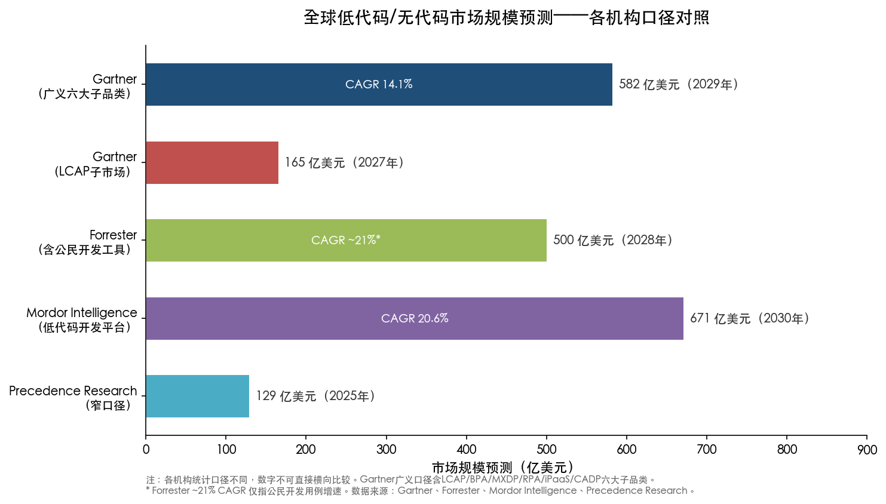

上图直观呈现了不同统计口径下市场估值从 129 亿美元到 671 亿美元的巨大分歧。口径差异的核心在于：Gartner 广义口径将 RPA、iPaaS 等相邻品类纳入统计，而 Precedence Research 等机构仅统计狭义的低代码应用开发平台。尽管数字差异显著，各机构对市场方向的判断高度一致——LCNC 市场正以两位数的年增速持续扩张，是企业软件领域增长最快的赛道之一。

## 1.4 渗透率与采用度：从边缘工具到企业标配

LCNC 技术已完成从"实验性工具"到"企业标配"的跨越。多组关键数据清晰勾勒出这一结构性转变：

**企业采用已成常态。** 84% 的企业已采用低代码或无代码工具以减轻 IT 积压、加速内部应用交付 [Kissflow 统计汇编](https://kissflow.com/low-code/low-code-trends-statistics/ "84%企业采用低代码数据")。Forrester 2023 年开发者调查进一步显示，87% 的企业开发者至少在部分开发工作中使用低代码开发平台 [Forrester 报告页](https://www.forrester.com/report/the-state-of-low-code-global-2025/RES186709 "Forrester State of Low-Code Global 2025")。LCNC 已从可选项变为多数企业的默认技术选择。

**新应用的低代码化比例快速攀升。** Gartner 曾预测到 2025 年 70% 的企业新开发应用将使用低代码或无代码技术（这一比例在 2020 年不足 25%），并进一步预测 2026 年该比例将达到 75% [InfoWorld](https://www.infoworld.com/article/2337677/low-code-development-technologies-market-forecast-to-hit-445-billion-by-2026.html "Gartner预测75%新应用用低代码/2026")。从更长远的时间线看，Gartner 预测到 2028 年近 80% 的企业将依赖 LCAP [Microsoft Power Platform Blog](https://www.microsoft.com/en-us/power-platform/blog/power-apps/microsoft-recognized-as-a-leader-in-the-2025-gartner-magic-quadrant-for-enterprise-low-code-application-platforms/ "Gartner 2028年80%企业采用LCAP预测")。

**非 IT 用户成为开发主力。** 到 2026 年，80% 的低代码工具用户将来自 IT 部门以外 [InfoWorld](https://www.infoworld.com/article/2337677/low-code-development-technologies-market-forecast-to-hit-445-billion-by-2026.html "Gartner预测80%低代码用户来自IT外")。目前，近 60% 的定制企业应用已由非 IT 专业开发者构建，30% 由几乎不具备技术技能的员工构建 [Kissflow 统计汇编](https://kissflow.com/low-code/low-code-trends-statistics/ "行业采用率与公民开发者占比数据")。"公民开发者"群体的壮大正在深刻改变企业软件生产的组织方式。

**行业渗透呈现差异化格局。** 金融服务、医疗健康和制造业是 LCNC 采用最快的三个行业 [Kissflow 统计汇编](https://kissflow.com/low-code/low-code-trends-statistics/ "行业采用率与公民开发者占比数据")。金融行业因监管合规要求高、业务流程标准化程度高，天然适合 LCNC 平台加速交付；制造业借助 LCNC 实现生产看板、设备管理等场景的快速数字化；医疗健康行业则在患者管理、内部流程优化等领域广泛应用。

## 1.5 竞争格局：全球头部阵营与中国市场分野

### 1.5.1 全球竞争格局：双重权威评估体系

2025 年的全球 LCNC 市场已形成相对清晰的竞争格局。Gartner 魔力象限和 Forrester Wave 两大权威评估体系提供了互补的观察视角。

**Gartner 2025 年 MQ for Enterprise LCAP** 评估了 12 家厂商：领导者象限包含 6 家——Microsoft、OutSystems、Mendix、Salesforce、ServiceNow、Appian；挑战者象限有 Oracle 和 Zoho；远见者象限有 Pegasystems 和 SAP；利基厂商象限有 Creatio 和 Retool [Process Excellence Network](https://www.processexcellencenetwork.com/low-code-automation/news/gartner-releases-magic-quadrant-for-low-code-application-platforms "Gartner 2025 MQ LCAP完整评估结果")。

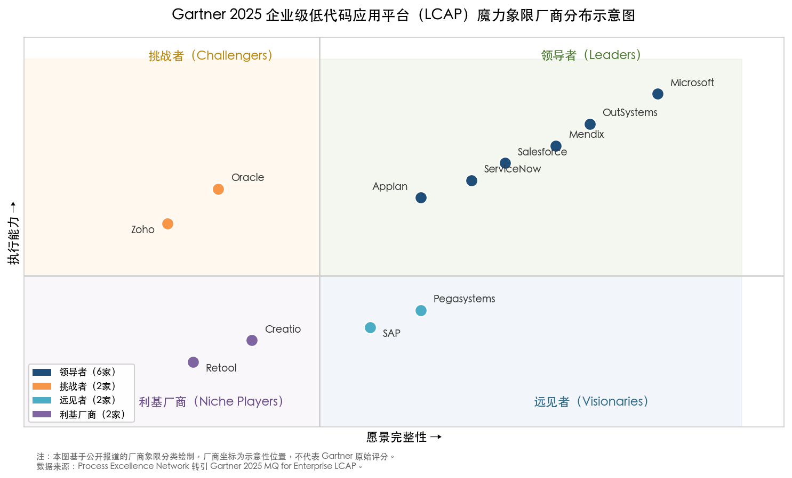

上图以示意形式呈现了 12 家厂商在"执行能力"与"愿景完整性"两个维度上的相对位置。领导者象限集中了 6 家厂商，数量在近年来的魔力象限评估中属于较高水平，反映出 LCAP 赛道已进入成熟竞争阶段。

**Forrester Wave™ Low-Code Platforms for Professional Developers, Q2 2025** 将 Microsoft 评为领导者（在战略与产品两个维度均排名第一），OutSystems 和 ServiceNow 亦获领导者评级 [Microsoft Power Platform Blog](https://www.microsoft.com/en-us/power-platform/blog/power-apps/microsoft-is-a-leader-in-2025-forrester-wave-low-code-platforms-for-professional-developers/ "Microsoft 2025 Forrester Wave领导者公告")。

**Microsoft Power Platform** 在全球领导者中居于最突出的地位。截至 2025 年，Power Platform 拥有超过 5600 万月活跃用户（MAU），同比增长 27%，FY25 期间平台用户已创建超过 300 万个 AI Agent [Microsoft Power Platform Blog](https://www.microsoft.com/en-us/power-platform/blog/power-apps/microsoft-recognized-as-a-leader-in-the-2025-gartner-magic-quadrant-for-enterprise-low-code-application-platforms/ "微软2025年Gartner MQ领导者公告")。5600 万的 MAU 使其成为全球用户规模最大的 LCNC 平台，远超其他竞争对手。这一优势很大程度上源于 Microsoft 365 生态系统的捆绑效应——Power Platform 与 Teams、SharePoint、Dynamics 365 等产品的深度集成，大幅降低了企业用户的采用门槛。

### 1.5.2 中国市场：多层竞争与本土生态主导

中国 LCNC 市场呈现出与全球截然不同的竞争格局。IDC 数据显示，2024 年中国低代码与零代码软件市场规模为 40.3 亿元人民币（约 5.5 亿美元），预计到 2029 年达到 129.8 亿元，未来 5 年 CAGR 为 26.4%——显著高于全球平均增速 [IDC 中国](https://mfe-prod.idc.com/getdoc.jsp?containerId=prCHC53666825 "IDC：低代码与零代码深度融合生成式AI，2025年7月发布")。从产品结构来看，低代码占比 85.6%，零代码占比 14.4%，低代码仍是绝对主流。

中国市场的厂商格局呈现多元化特征，可划分为三大阵营 [IDC 中国](https://mfe-prod.idc.com/getdoc.jsp?containerId=prCHC53666825 "IDC 2024年中国低零代码厂商格局")：

- **独立厂商**：以 LCNC 为核心业务。奥哲蝉联中国低零代码软件市场独立厂商第一 [新浪财经](https://finance.sina.cn/tech/2025-07-11/detail-inffafmt1009343.d.html "奥哲获得独立厂商第一")，简道云以 34.5% 市占率连续四年蝉联零代码平台整体市场第一 [帆软社区](https://auth.fanruan.com/thread-152080-1-1.html "简道云蝉联中国零代码市场占有率第一")。得帆、明道云、轻流等亦在各自细分领域占据重要位置。
- **应用软件/SaaS 厂商**：以金蝶、用友为代表，将低代码能力融入其 ERP/财务等核心产品，形成"应用+平台"的一体化模式。金蝶云·苍穹在 IDC 报告中表现突出。
- **平台型厂商**：华为、浪潮等大型科技企业，以及钉钉宜搭、飞书多维表格等互联网巨头旗下产品，依托母公司的云计算和企业服务生态拓展 LCNC 业务。

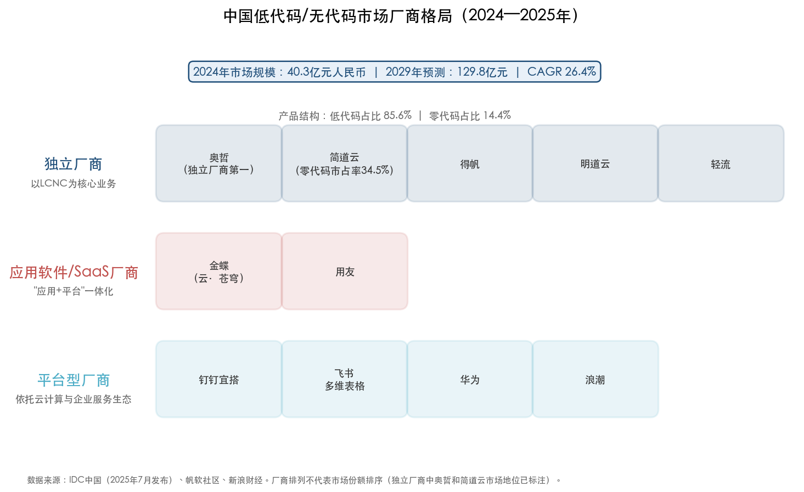

上图系统展示了中国 LCNC 市场三类厂商的代表企业及其定位，并标注了市场整体规模与产品结构数据。

中国市场的下游行业应用覆盖广泛。制造业是最大的下游市场，其次是国有企业和建筑业，金融、教育、零售等行业紧随其后 [华经产业研究院](https://finance.sina.com.cn/roll/2025-06-15/doc-infacvcp0826785.shtml "2025年中国低代码行业产业链及下游应用领域占比分析")。不同行业的需求侧重点存在显著差异：金融行业最重视合规性与现有系统集成能力，制造业聚焦生产流程优化与 IoT 设备接入，零售业追求快速迭代与高并发支持 [腾讯云开发者社区](https://cloud.tencent.com/developer/article/2576443 "AI时代下中国低代码市场发展研究, 2025年10月")。

从结构性差异的角度审视，中国市场与全球市场存在三个显著特征。第一，中国市场的增速（26.4% CAGR）显著高于全球平均水平（14.1% CAGR），反映出中国企业数字化转型的后发追赶效应。第二，中国市场中零代码占比（14.4%）低于全球水平，表明中国企业更偏好保留代码扩展能力的低代码方案。第三，中国市场由本土厂商主导，全球领导者（如 OutSystems、Mendix）在中国的存在感有限，而钉钉、飞书等平台凭借庞大的企业用户基础和本地化生态优势形成了独特的竞争壁垒。

## 1.6 用户画像：LCNC 平台使用者的结构性变迁

从用户画像角度观察，LCNC 平台的使用者群体正在经历深层次的结构性变化，体现在企业规模、用户角色和需求动机三个维度。

**企业规模维度。** LCNC 的采用并非大型企业的专属。Gartner MQ 的入选门槛（年收入至少 6000 万美元、100 家以上大型企业客户）表明大型企业是头部 LCNC 厂商的核心客户群体，但中小企业同样是市场的重要组成部分。对于中小企业而言，LCNC 平台的核心价值在于以极低的技术门槛和成本快速构建业务应用，弥补 IT 能力不足的短板。Gartner 预测到 2028 年将有近 80% 的企业依赖 LCAP，这一预测涵盖各种规模的企业 [Microsoft Power Platform Blog](https://www.microsoft.com/en-us/power-platform/blog/power-apps/microsoft-recognized-as-a-leader-in-the-2025-gartner-magic-quadrant-for-enterprise-low-code-application-platforms/ "Gartner 2028年80%企业采用LCAP预测")。

**用户角色维度。** 如前文所述，Gartner 预测到 2026 年 80% 的低代码用户将来自 IT 部门以外。在中国市场，约 61% 的组织用户认可低代码的价值并愿意持续投资 [腾讯云开发者社区](https://cloud.tencent.com/developer/article/2576443 "AI时代下中国低代码市场发展研究, 2025年10月")。用户对平台的核心需求也在发生演变——65% 的用户关注使用体验与学习成本，57% 关注功能拓展性，52% 关注 AI 赋能水平 [腾讯云开发者社区](https://cloud.tencent.com/developer/article/2576443 "AI时代下中国低代码市场发展研究, 2025年10月")。AI 赋能水平跃升为前三大关注因素之一，表明用户需求已从基础的"可视化开发"向"智能化辅助"升级。

**需求动机维度。** 在中国市场，76% 的用户希望通过 LCNC 提升开发效率，67% 关注降低成本 [腾讯云开发者社区](https://cloud.tencent.com/developer/article/2576443 "AI时代下中国低代码市场发展研究, 2025年10月")。效率提升仍是企业采用 LCNC 的首要驱动力，成本节约紧随其后。随着生成式 AI 能力的深度融合，"智能化"正在成为新的核心关注焦点，这一趋势将在后续章节中进一步探讨。

## 1.7 本章小结

LCNC 平台已从边缘性的开发辅助工具成长为企业软件开发领域的核心力量。

概念层面，低代码面向具备编程基础的专业与准专业开发者，保留代码扩展能力；无代码面向业务用户，以纯可视化方式构建应用；两者之间的边界在生成式 AI 的推动下正加速融合。

市场层面，Gartner 广义口径下全球低代码开发技术市场预计 2029 年达 582 亿美元（CAGR 14.1%），LCAP 子市场预计 2027 年达 165 亿美元（CAGR 16.3%）；中国市场 2024 年规模为 40.3 亿元人民币，预计 2029 年达 129.8 亿元（CAGR 26.4%），增速显著高于全球平均水平。

竞争格局层面，全球市场由 Microsoft、OutSystems、Mendix 等六大领导者主导，Microsoft Power Platform 以 5600 万月活跃用户居于领先地位；中国市场则形成了独立厂商、应用软件厂商与平台型厂商三足鼎立的多元格局，本土厂商凭借生态优势占据主导。

采用度层面，84% 的企业已采用 LCNC 工具，87% 的企业开发者至少部分使用低代码平台，金融、医疗和制造业是渗透最快的行业。LCNC 的使用者结构正在经历深层变化，非 IT 用户占比持续攀升，"公民开发者"群体的壮大正在重塑企业软件的生产方式。

然而，高速增长的市场数据和广泛的企业采用并不意味着 LCNC 是万能灵药。这些平台在加速开发的同时，效率提升的真实图景如何？是否也带来了新的维护成本和技术风险？这些问题将在后续章节中逐一展开分析。

# 第2章 对传统软件开发流程的冲击——效率提升的真实图景

## 2.1 效率提升的量化全景：从"倍速"到"阶段拆分"

低代码/无代码（LCNC）平台的核心承诺在于大幅缩短软件交付周期。这一承诺并非空中楼阁——多项由独立研究机构执行的总体经济影响（TEI）研究提供了可量化的实证支撑。尽管这些研究均系供应商委托且样本量有限，它们仍是当前最具系统性的效率数据来源。

在整体交付速度维度，Forrester 于 2021 年 6 月受 Appian 委托开展的 TEI 研究（基于 5 家企业客户访谈与复合组织建模）显示，使用 Appian 低代码平台相比传统编码方式，应用开发速度提升 17 倍——从平均每项目 5 周、6 名开发者缩短至约 12 小时、4 名开发者，开发资源需求减少 40% [Forrester TEI of Appian](https://media.trustradius.com/product-downloadables/HT/WZ/KLUZNTWL24T2.pdf "Forrester TEI of Appian, 2021年6月, 受Appian委托")。该研究进一步揭示了各环节的具体提升幅度：编码阶段从传统 200 小时缩减至 48 小时（约缩短 76%）；新开发者培训时间缩减 90%；应用上市时间从 6 个月缩短至 3 个月（缩短 50%）[Forrester TEI of Appian](https://media.trustradius.com/product-downloadables/HT/WZ/KLUZNTWL24T2.pdf "Forrester TEI of Appian, 2021年6月")。该研究中某金融服务公司首席信息官的反馈颇具代表性："过去需要五周才能开发的东西，使用 Appian 可以在第二天就完成。"

Microsoft Power Platform 的效率数据同样值得关注。2024 年 9 月 Forrester 受 Microsoft 委托的 Power Platform TEI 研究表明，企业使用 Power Platform 低代码工具可将开发流程加速 35%，三年风险调整后直接开发和 IT 成本节约达 4360 万美元，整体 ROI 为 224%，投资回收期不到 6 个月 [Microsoft Power Platform Blog](https://www.microsoft.com/en-us/power-platform/blog/2024/09/03/reduce-development-times-and-increase-roi-with-microsoft-power-platform/ "2024 Forrester TEI of Microsoft Power Platform")。同期发布的 Power Apps Premium TEI 研究（基于 13 家组织代表访谈，复合组织规模为 30,000 名员工、100 亿美元年收入）进一步表明，专业开发者使用 Power Apps Premium 后应用开发时间缩短 50%，高影响场景中用户每人每年节省 250 小时，三年 ROI 为 206% [Microsoft Power Apps Blog](https://www.microsoft.com/en-us/power-platform/blog/power-apps/millions-of-hours-saved-50-faster-app-development-and-206-roi-achieved-with-microsoft-power-apps-premium/ "Forrester TEI of Power Apps Premium, 2024年9月")。

其他主流平台的 TEI 研究呈现类似趋势。Forrester 2021 年 OutSystems TEI 研究（基于 4 家企业组织访谈）显示三年 ROI 达 506%，开发效率提升高达 66%，投资回收期不到 6 个月 [OutSystems 官方](https://www.outsystems.com/news/tei-low-code-roi/ "Forrester TEI of OutSystems, 2021年")。Forrester 2022 年 Mendix TEI 研究显示，传统编程每个应用需 2.4 名开发者，而使用 Mendix 平台后下降至 0.96 名；以 5 个应用为例，传统开发成本 126 万美元，使用 Mendix 后降至 45.6 万美元，三年应用交付节约达 808 万美元 [Mendix Blog](https://www.mendix.com/blog/quantifiable-impact-how-todays-enterprise-landscape-benefits-from-low-code/ "Forrester TEI of Mendix, 2022年9月")。

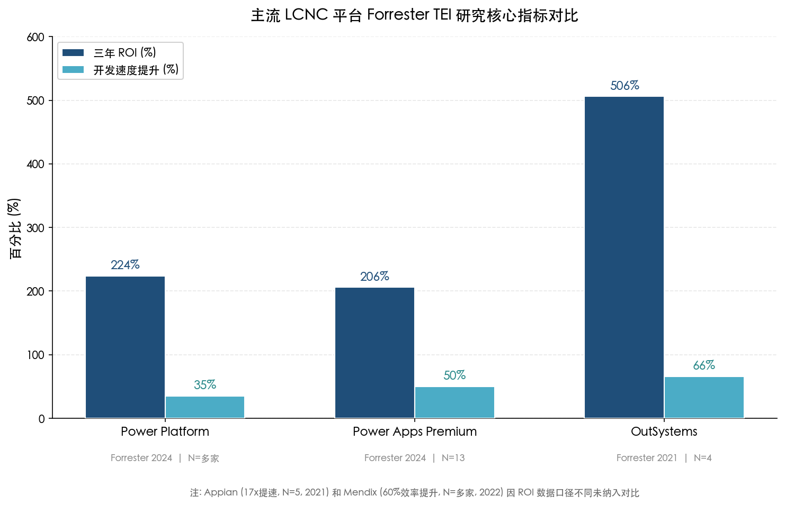

上图对比了 Power Platform、Power Apps Premium 与 OutSystems 三大平台在 Forrester TEI 研究中的核心指标表现。OutSystems 以 506% 的三年 ROI 居首，Power Apps Premium 以 50% 的开发速度提升居中。Appian（17 倍提速）和 Mendix（60% 效率提升）因 ROI 数据口径差异未纳入横向对比，但其效率提升幅度同样显著。

HFS Research 2023 年针对 150 名 Fortune 500 企业决策者（业务与技术领导者各半）的研究指出，在 SDLC 各阶段引入低代码工具可将软件交付整体加速 85%，其中需求阶段因业务用户可直接参与原型构建而显著压缩翻译沟通成本，部署阶段因一键发布和平台托管而大幅简化 [HFS Research](https://www.hfsresearch.com/research/low-code-agile-sdlc/ "HFS Research, 2023年10月, N=150 Fortune 500决策者")。2024 年 Reveal 年度开发者调查（N=585）则从一线开发者视角提供了独立验证：90.4% 的受访者表示低代码工具提升了所在组织的开发者生产力，43.5% 的开发者报告在使用低代码工具的项目中节省了高达 50% 的时间 [Reveal 2024 开发者调查](https://finance.yahoo.com/news/low-code-tools-major-productivity-123000474.html "Reveal Biggest Software Development Challenges Survey, 2024年4月, N=585")。

上述效率数据需要审慎解读。TEI 研究均由供应商委托独立机构执行，样本量为 4–13 家企业，采用复合组织建模方法推算经济效益，反映的是经过筛选的成功实施场景而非全行业平均水平。KPMG 的国际调查同样发现，虽然 81% 的受访企业认为低代码具有战略重要性，但仅 31% 的企业将其作为软件开发战略的核心组成部分，从"认可效率"到"全面采纳"之间仍存在显著落差 [KPMG](https://kpmg.com/cy/en/insights/transformation/how-low-code-platforms-are-driving-digital-transformation.html "KPMG国际低代码调查")。

## 2.2 效率提升在 SDLC 各阶段的差异化表现

LCNC 平台对传统软件开发生命周期（SDLC）的冲击并非在每个阶段均匀分布。综合 Forrester TEI、HFS Research 及独立开发者调查等多项研究，各阶段的差异化影响图景如下。

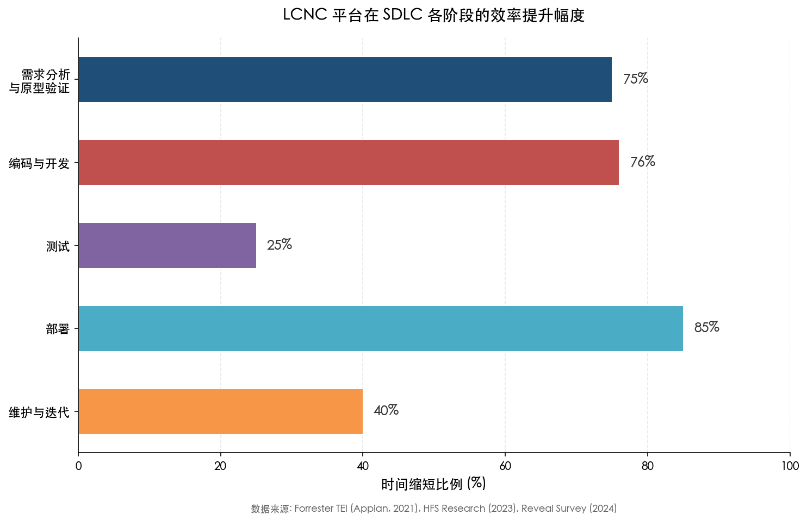

上图汇总了 LCNC 平台在五个核心 SDLC 阶段的时间缩短比例。部署阶段以 85% 的缩短幅度居首，编码与开发阶段为 76%，需求分析与原型验证阶段为 75%，维护与迭代阶段约为 40%，而测试阶段仅约 25%。这一分布揭示了 LCNC 效率优势的结构性特征：平台预置能力越强的环节，加速效果越显著。

**需求分析与原型验证阶段**是 LCNC 效率优势最为突出的环节之一。低代码平台的可视化构建能力使业务用户得以直接参与原型搭建，大幅压缩了传统模式下从业务需求到技术规格之间的翻译成本。McKinsey 2022 年分析指出，低代码/无代码平台的核心价值之一在于快速原型验证——业务团队可在数小时内将构想具象化为可交互原型，验证后可快速转化为生产应用 [McKinsey Tech Forward](https://www.mckinsey.com/capabilities/tech-and-ai/our-insights/tech-forward/low-code-no-code-a-way-to-transform-shadow-it-into-a-next-gen-technology-asset "McKinsey, 2022年8月19日")。学术研究同样佐证了这一判断：Parimi（2025）在 IJRES 发表的综述指出，LCNC 平台使非技术用户可直接参与需求收集阶段的开发过程，业务用户自行搭建应用原型，从而减少了向开发者传递需求所耗费的时间，促进了项目目标的快速对齐 [Parimi 2025](https://ijres.org/papers/Volume-13/Issue-4/1304208212.pdf "IJRES, Volume 13 Issue 4, 2025年4月")。

**编码与开发阶段**的加速幅度最大，但也最依赖场景类型。拖拽式组件、预构建模板和自动化数据集成使典型业务应用的编码工作量大幅下降。Appian TEI 数据显示编码阶段从传统 200 小时缩减至 48 小时（缩短 76%）[Forrester TEI of Appian](https://media.trustradius.com/product-downloadables/HT/WZ/KLUZNTWL24T2.pdf "Forrester TEI of Appian, 2021年6月")。Reveal 2024 调查则显示，开发者投入编码的时间占比从 2023 年的 43.4% 下降至 2024 年的 28.2%，这一变化与低代码工具的广泛采用高度相关 [Reveal 2024 开发者调查](https://finance.yahoo.com/news/low-code-tools-major-productivity-123000474.html "Reveal 2024 Survey, N=585")。

**测试阶段**的效率改善相对有限。多数 LCNC 平台内置了基础的自动化测试和调试工具，对简单的表单驱动和流程应用足以胜任；但对于复杂应用，边缘情况测试和大规模性能验证仍需依赖外部工具或手动测试 [Parimi 2025](https://ijres.org/papers/Volume-13/Issue-4/1304208212.pdf "IJRES, Volume 13 Issue 4, 2025年4月")。这一效率瓶颈与低代码平台的一个固有矛盾密切相关：自动生成的逻辑和组件虽降低了编码工作量，却使测试人员难以对底层行为进行精细控制和白盒验证。

**部署阶段**因云托管和一键发布机制而实现了最大幅度的简化。绝大多数企业级 LCNC 平台提供自动化环境管理和弹性扩展能力，使应用从开发到上线的周期从传统的数周缩短至数小时甚至更短。Power Platform TEI 研究中某金融服务公司的案例极具代表性：原需 3–6 周、10 名全职员工的 HR 手工流程被压缩至 1 小时、2 名员工即可完成 [Microsoft Power Apps Blog](https://www.microsoft.com/en-us/power-platform/blog/power-apps/millions-of-hours-saved-50-faster-app-development-and-206-roi-achieved-with-microsoft-power-apps-premium/ "Forrester TEI of Power Apps Premium, 2024年9月")。

**维护与迭代阶段**呈现双刃剑特征。一方面，LCNC 平台的集中式仪表板和实时编辑能力使短期内的应用更新更为便捷；另一方面，随着应用复杂度增长，平台的向后兼容性负担和供应商锁定风险可能推高长期维护成本——这一议题将在第 3 章中深入探讨。

## 2.3 "公民开发者"的崛起与开发团队构成的重塑

LCNC 平台不仅改变了软件构建的方式，更重塑了"谁来构建软件"这一根本命题。Gartner 将"公民开发者"（Citizen Developer）定义为"使用未被 IT 或业务部门明确禁止的工具，为自身或他人创建应用程序能力的员工" [Kissflow 引述 Gartner](https://kissflow.com/citizen-development/gartner-on-citizen-development/ "Kissflow引述Gartner预测")。这一群体的规模化崛起正在深刻改变企业的开发资源配置格局。

从规模维度观察，Gartner 预测到 2026 年大型企业中公民开发者与专业软件开发者的比例将达到 4:1 [Kissflow 引述 Gartner](https://kissflow.com/citizen-development/gartner-on-citizen-development/ "Kissflow引述Gartner预测")。Forrester 2026 年数据显示全球公民开发者数量已达约 1620 万人，较 2025 年增长 38%，相比同期约 2870 万专业开发者，两者差距正在快速收窄 [SearchLab 统计汇编](https://searchlab.nl/en/statistics/no-code-low-code-statistics-2026 "引用Forrester Research 2026数据")。与此同时，Gartner 预测到 2026 年 80% 的低代码用户将来自 IT 部门以外的非技术专业人员 [byteiota 引述 Gartner](https://byteiota.com/low-code-hits-44-5b-gartner-2026-forecast-explained-2/ "byteiota综述Gartner 2026预测")。

公民开发者的角色分布呈现明显的职能集中特征。运营管理者（24%）、市场营销管理者（19%）和销售管理者（16%）构成了公民开发的三大主力群体 [SearchLab 统计汇编](https://searchlab.nl/en/statistics/no-code-low-code-statistics-2026 "引用Forrester数据")。这一分布表明，公民开发活动主要发生在直接面对业务流程和客户触点的职能部门，而非后台技术团队——恰恰是那些最了解业务痛点、最迫切需要数字化工具的岗位。

公民开发者的生产力表现出乎许多传统 IT 部门的预期。近 60% 的定制企业应用由非 IT 专业开发者构建，30% 由几乎无技术技能的员工构建 [Kissflow 统计汇编](https://kissflow.com/low-code/low-code-trends-statistics/ "行业采用率与公民开发者占比数据")。McKinsey 指出，这种"企业级协作共建"模式的理想形态是业务开发者负责需求定义和低代码逻辑搭建，IT 团队负责架构设计和复杂技术实现，从而将传统的"IT 黑箱交付"转变为业务驱动的协作开发 [McKinsey Tech Forward](https://www.mckinsey.com/capabilities/tech-and-ai/our-insights/tech-forward/low-code-no-code-a-way-to-transform-shadow-it-into-a-next-gen-technology-asset "McKinsey, 2022年8月19日")。

值得注意的是，专业开发者对低代码工具的接受度远高于外界预期。Forrester 2023 年调查显示 87% 的企业开发者在至少部分开发工作中使用低代码开发平台 [Forrester Blog](https://www.forrester.com/blogs/the-low-code-market-could-approach-50-billion-by-2028/ "Forrester博客, 2024年1月29日")。Reveal 2024 调查同样印证了这一趋势：71.8% 的受访开发者正在使用低代码/无代码工具，56.4% 预期在未来将更加依赖这些工具 [Reveal 2024 开发者调查](https://finance.yahoo.com/news/low-code-tools-major-productivity-123000474.html "Reveal 2024 Survey, N=585")。上述数据表明，专业开发者与公民开发者之间并非零和博弈，而是在同一平台生态中扮演互补角色。

然而，开发者对低代码平台的满意度评价呈现分化态势。行业调查显示 82% 的软件专业人士使用过低代码平台，42% 的低代码使用者报告较高工作满意度（高于仅使用传统编码方式的 31%）；但在软件质量层面，评价存在明显分歧——39% 认为低代码改善了软件质量，26% 认为无显著变化，23% 认为质量有所下降 [byteiota 引述行业调查](https://byteiota.com/low-code-hits-44-5b-gartner-2026-forecast-explained-2/ "byteiota综述开发者调查数据")。这种分化实质上反映的是低代码平台在不同使用场景下效果的显著差异，而非工具本身的绝对优劣。

## 2.4 效率提升的适用边界：受益场景与不适用领域

效率提升并非普适性结论。综合多项研究和企业实践案例，LCNC 平台的效率优势具有明确的场景边界。

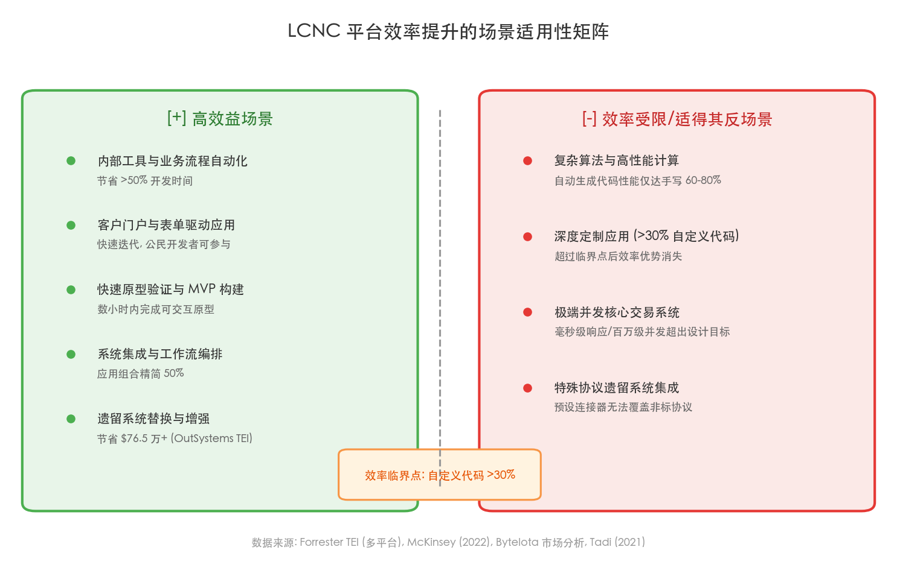

上图以二分矩阵形式直观呈现了 LCNC 平台的高效益场景与效率受限场景，并标注了"自定义代码超过 30%"这一关键效率临界点。

### 2.4.1 高效益场景

**内部工具和业务流程自动化**是 LCNC 效率优势最为显著的领域。G&J Pepsi-Cola Bottlers 使用 Power Platform 累计实现超过 150 万美元节约，其中 Store Audit 应用节省 10 万美元外部开发成本，Parking Lot 应用仅用一天即完成开发 [Microsoft Power Platform Blog](https://www.microsoft.com/en-us/power-platform/blog/2024/09/03/reduce-development-times-and-increase-roi-with-microsoft-power-platform/ "Microsoft博客引述客户案例")。EY 使用 Power Platform 将 SAP 系统自动支付清算率从 30% 提升至 80%，匹配支付率达 95%，预计年节省 23 万小时 [Microsoft Power Apps Blog](https://www.microsoft.com/en-us/power-platform/blog/power-apps/millions-of-hours-saved-50-faster-app-development-and-206-roi-achieved-with-microsoft-power-apps-premium/ "Forrester TEI of Power Apps Premium, 2024年9月")。

**系统集成和工作流编排**同样属于高回报场景。Appian 客户通过低代码实现应用组合精简 50%，将分散在多个系统中的业务流程整合至统一平台，显著降低了运维复杂度 [Forrester TEI of Appian](https://media.trustradius.com/product-downloadables/HT/WZ/KLUZNTWL24T2.pdf "Forrester TEI of Appian")。

**遗留系统替换与增强**是经济效益突出的又一场景。OutSystems TEI 研究中，替换遗留应用为企业节省了 76.5 万美元 [OutSystems Blog](https://www.outsystems.com/blog/posts/low-code-roi/ "OutSystems引述Forrester TEI")。McKinsey 将"增强现有应用"列为低代码的三大核心价值之一——在不推倒重来的前提下，通过低代码平台为遗留系统添加新功能和现代化界面 [McKinsey Tech Forward](https://www.mckinsey.com/capabilities/tech-and-ai/our-insights/tech-forward/low-code-no-code-a-way-to-transform-shadow-it-into-a-next-gen-technology-asset "McKinsey, 2022年8月19日")。

**快速原型验证与 MVP 构建**的效率优势已在 2.2 节论述。KPMG 调查进一步证实，53% 的受访企业将"提升流程效率"视为低代码的首要优势，51% 将"提升员工生产力"列为第二大优势 [KPMG](https://kpmg.com/cy/en/insights/transformation/how-low-code-platforms-are-driving-digital-transformation.html "KPMG国际低代码调查")。

### 2.4.2 效率受限甚至适得其反的场景

LCNC 平台的效率优势在以下场景中显著减弱甚至出现逆转：

**需要复杂算法和高性能计算的系统**超出 LCNC 平台的有效能力范围。低代码平台自动生成的代码性能通常仅为手工优化代码的 60%–80%；学术研究指出，低代码平台自动生成的数据库查询在处理大数据量和复杂连接时效率偏低，在延迟敏感、计算密集型的企业应用中表现明显不足 [byteiota](https://byteiota.com/low-code-hits-44-5b-gartner-2026-forecast-explained-2/ "byteiota综述平台局限性") [Tadi 2021](https://www.researchgate.net/publication/390204681_Scalability_and_Performance_Benchmarking_of_Low-Code_Platforms_vs_Traditional_Development_in_Large-Scale_Enterprise_Applications "JSER 2021")。

**深度定制超出平台预设模式的应用**面临"定制化临界点"的挑战。行业分析指出，当超过 30% 的应用逻辑需要自定义代码实现时，低代码相较传统开发的效率优势将基本消失 [ByteIota 市场分析](https://byteiota.com/low-code-hits-75-enterprise-adoption-66b-market-2026/ "低代码性能与定制化临界点")。这一临界点意味着，对于功能需求高度个性化的应用，低代码平台的开发效率并不必然优于传统编码。

**对规模和并发有极端要求的核心交易系统**同样超出多数 LCNC 平台的架构设计目标。金融核心交易、电信计费等场景对毫秒级响应和百万级并发的严苛要求，远非当前低代码平台的通用架构所能满足。

**遗留系统深度集成中的特殊协议处理**亦是低代码平台力有不逮之处。当集成对象涉及非标准协议、专有数据格式或复杂的中间件链路时，低代码平台预设的集成连接器往往无法覆盖，需要大量自定义代码来弥补能力缺口 [byteiota](https://byteiota.com/low-code-hits-44-5b-gartner-2026-forecast-explained-2/ "byteiota综述平台局限性")。

## 2.5 效率之外的经济效益：营收加速与战略价值

LCNC 平台的经济价值不仅体现在开发成本的节约，更体现在上市速度加快所带来的营收增长效应。Power Platform 2024 TEI 研究证实，7% 的营收增长直接归因于加速上市流程，三年风险调整后额外营收达 1540 万美元；某制造业客户报告营收增长幅度达 18%–20% [Microsoft Power Platform Blog](https://www.microsoft.com/en-us/power-platform/blog/2024/09/03/reduce-development-times-and-increase-roi-with-microsoft-power-platform/ "2024 Forrester TEI of Microsoft Power Platform")。

Forrester 2026 年 TEI 综合研究数据进一步显示，采用 LCNC 平台的组织平均实现 74% 的上市时间缩短和 62% 的开发成本降低；平均无代码/低代码项目周期为 3.2 周，相比传统开发的 14.8 周缩短了约 78% [SearchLab 统计汇编](https://searchlab.nl/en/statistics/no-code-low-code-statistics-2026 "引用Forrester TEI Study 2026与McKinsey Digital 2026数据")。三年期平均 ROI 达 342%，投资通常在 6–9 个月内回收 [SearchLab 统计汇编](https://searchlab.nl/en/statistics/no-code-low-code-statistics-2026 "引用Forrester TEI数据")。

Mendix TEI 研究从四个维度量化了低代码的战略价值：三年总净收益超 2000 万美元，其中应用交付节省 808 万美元、运营效率节省 597 万美元、客户参与度提升贡献 314 万美元、上市加速贡献 333 万美元 [Mendix Blog](https://www.mendix.com/blog/quantifiable-impact-how-todays-enterprise-landscape-benefits-from-low-code/ "Forrester TEI of Mendix, 2022年9月")。这一多维度分解表明，低代码的经济效益远不止于降低开发成本——上市速度加快所带来的市场先发优势和客户体验改善，同样构成不可忽视的价值组成部分。

IT 积压的缓解是另一项重要的战略价值。84% 的企业已采用低代码或无代码工具以减轻 IT 积压、加速内部应用交付 [Kissflow 统计汇编](https://kissflow.com/low-code/low-code-trends-statistics/ "84%企业采用低代码数据")。Gartner 2026 年数据显示，业务团队使用无代码工具处理简单应用后，IT 团队的积压量平均减少 50% [SearchLab 统计汇编](https://searchlab.nl/en/statistics/no-code-low-code-statistics-2026 "引用Gartner数据")。这意味着专业开发者得以从大量重复性、低复杂度的应用开发任务中释放出来，将时间与精力集中投入到真正需要技术深度的战略性项目之中。

## 2.6 效率图景的辩证审视

综合上述分析，我们认为 LCNC 平台对传统软件开发效率的影响可归纳为以下三个层次的判断。

**第一，效率提升是真实且可量化的，但高度依赖场景匹配。** 在内部业务应用、流程自动化、表单驱动型应用和快速原型验证等适配场景中，LCNC 平台可实现 50%–90% 的开发时间缩短和 60%–80% 的成本降低。然而，这一优势在需要高性能计算、深度定制或复杂系统集成的场景中迅速衰减——当自定义代码比例超过 30% 时，低代码方案的效率优势趋近于零。企业在选择低代码路径时，必须对项目的复杂度和定制化需求进行充分的前置评估。

**第二，公民开发者的崛起正在重构而非颠覆开发团队。** 全球约 1620 万公民开发者的涌现并非在取代专业开发者，而是在拓展"谁能参与软件构建"的边界。87% 的专业开发者已在部分工作中使用低代码工具，表明这一变革的本质是工具赋能而非角色替代。核心挑战在于如何建立有效的协作机制和治理框架，使公民开发者的业务洞察与专业开发者的技术深度形成互补，同时避免缺乏管控的公民开发演变为不受约束的"影子 IT"。

**第三，现有效率数据需要审慎解读。** 当前最具权威性的效率数据（Forrester TEI 系列研究）均由供应商委托执行，样本量为 4–13 家企业，采用复合组织建模方法，反映的是经过筛选的成功实施场景而非全行业平均表现。独立的大规模学术研究在该领域仍然匮乏。KPMG 的数据显示，虽然 81% 的企业认可低代码的战略价值，但仅 31% 将其纳入核心开发战略——这一落差提示行业整体仍处于从"试点验证"向"规模化采纳"过渡的关键阶段。

# 第3章 隐性成本与技术风险——维护成本、技术债与供应商锁定

低代码/无代码（LCNC）平台在开发阶段展现出令人瞩目的效率提升（详见第 2 章），但企业在享受快速交付红利的同时，往往在运维阶段遭遇一系列非预期的隐性成本与技术风险。本章从三个维度系统剖析这些隐性挑战：技术债务的独特积累模式、供应商锁定与迁移退出壁垒、以及安全漏洞与影子 IT 对企业治理体系的冲击。这些分析并非否定 LCNC 的价值，而是为决策者提供评估总体拥有成本（TCO）的完整视角，以避免因片面追求开发效率而忽略中长期运营风险。

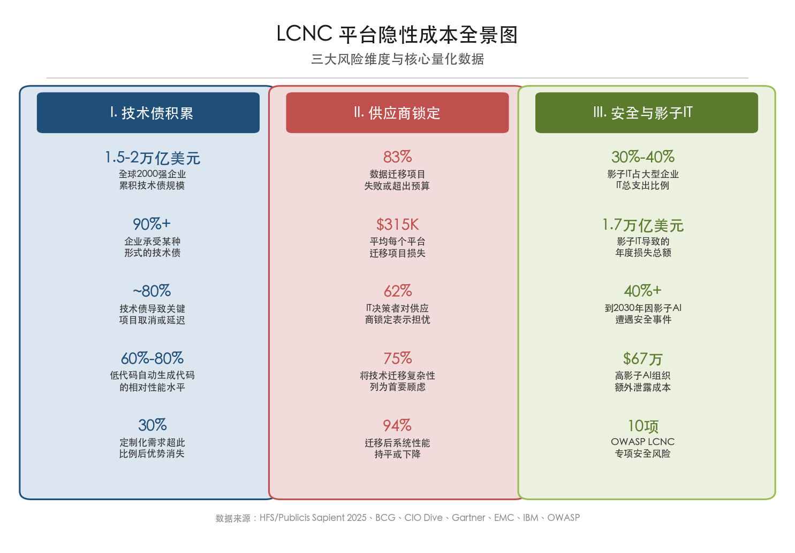

上图汇总了本章所讨论的三大风险维度及其核心量化指标。全球 2000 强企业累积技术债规模达 1.5–2 万亿美元，83% 的数据迁移项目失败或超预算，影子 IT 占大型企业 IT 总支出的 30%–40%——这些数字共同构成了 LCNC 平台隐性成本的全局图景。以下各节将逐一展开分析。

## 3.1 "低代码"何以变成"高代码"——技术债的独特积累模式

### 3.1.1 低代码应用的维护悖论

LCNC 平台的核心价值主张之一是"降低技术门槛、加速交付"，然而学术研究揭示了一个值得警惕的模式：低代码应用在中长期运维中往往积累比传统编码更难处理的技术债务。渥太华大学 Timothy C. Lethbridge 在 2021 年发表的学术论文中明确指出，低代码平台上的软件"往往积累大量复杂代码，其维护难度可能高于传统语言编写的代码" [Lethbridge 2021](https://www.site.uottawa.ca/~tcl/papers/ISola2021-LowCodeisHighCode-Lethbridge-CameraReady.pdf "Low-Code Is Often High-Code, ISoLA 2021")。造成这一悖论的根源在于，多数 LCNC 平台在设计之初偏重"快速构建"，而普遍缺乏对版本控制、关注点分离、自动化测试和文学编程等软件工程基础实践的系统性支持。

Lethbridge 进一步论证了"低代码最终变成高代码"的演化路径：随着业务需求的持续叠加，低代码应用的代码量可增长至数千行脚本甚至数十万行，且由于缺乏模块化、注释和可重用机制，代码的可理解性急剧下降 [Lethbridge 2021](https://www.site.uottawa.ca/~tcl/papers/ISola2021-LowCodeisHighCode-Lethbridge-CameraReady.pdf "ISoLA 2021 案例分析")。更为关键的是，一旦底层平台进行版本更新，应用即被迫进行大规模适配甚至重写——这种由平台生命周期驱动的被动维护负担，在传统开发模式中远不如此突出。

一个极具代表性的案例揭示了维护风险的极端形态：Lethbridge 记录了一位 Excel 专家在两天内构建了一个原本预估需要一个人年开发的应用，但仅其本人能理解和维护该系统，两年内便不得不被更传统的方案所取代 [Lethbridge 2021](https://www.site.uottawa.ca/~tcl/papers/ISola2021-LowCodeisHighCode-Lethbridge-CameraReady.pdf "Excel案例：维护知识过度集中")。该案例集中体现了 LCNC 应用中常见的"知识孤岛"效应——快速构建的便利性反而导致维护知识的过度集中于个人，形成严重的人员依赖风险。

### 3.1.2 技术债的全局规模与 LCNC 叠加效应

技术债务并非 LCNC 独有的问题，但 LCNC 的快速扩散正加速其在企业中的积累。HFS Research 与 Publicis Sapient 于 2025 年发布的联合报告（基于 608 位全球 2000 强企业高管调查）估计，全球 2000 强企业已累积 1.5 至 2 万亿美元的技术债务；近 30% 的 IT 预算被投入现代化改造，但仅约三成组织完成了核心应用的现代化升级 [HFS/Publicis Sapient 2025 报告](https://www.publicissapient.com/content/dam/ps-reinvent/us/en/2025/05/insights-lp/hfs-ai-tech-debt-report/docs/HFS-PS-Report-SmashTechDebt-2025.pdf "基于608位高管调查")。该调查还揭示了技术债的深层组织影响：49% 的企业领导者表示 IT 团队长期聚焦于维护遗留系统而非推动业务变革，36% 表示技术债务未因当前服务模式得到有效削减 [HFS/Publicis Sapient 2025 报告](https://www.publicissapient.com/content/dam/ps-reinvent/us/en/2025/05/insights-lp/hfs-ai-tech-debt-report/docs/HFS-PS-Report-SmashTechDebt-2025.pdf "企业对技术债务与维护模式的不满")。

技术债对创新的扼杀效应在另一项大规模调查中得到进一步印证。2024 年 Morning Consult 受 Unqork 委托对美国 500 名商业和技术领导者的调查显示：超过 90% 的受访者表示其组织承受某种形式的技术债务，近 80% 表示技术债在过去 12 个月内直接导致了业务关键项目的取消或延迟 [Morning Consult/Unqork 2024 调查](https://unqork.com/resource-center/guides/2024-morning-consult-unqork-survey-tech-debt-stifles-innovation-at-80-of-enterprises-surveyed/ "2024年技术债对企业创新的影响调查")。

从开发者个体层面观察，技术债的侵蚀同样触目惊心。学术研究估计，技术债与低质量代码导致 23%–42% 的开发者工作时间被浪费在应对存量问题上，而非投入新功能开发 [CodeScene/ACM 研究](https://dl.acm.org/doi/10.1145/3524843.3528091 "Code Red: The Business Impact of Code Quality, 基于39个生产代码库的量化研究")。当 LCNC 平台的快速创建能力叠加薄弱的工程规范时，这一比例存在进一步恶化的风险——更多应用以更快速度被创建，但每个应用的工程质量缺乏充分保障。

### 3.1.3 性能瓶颈与定制化临界点

技术债的另一种重要表现形式是应用性能的渐进退化。学术研究（Tadi 2021, JSER）通过系统性技术对比分析指出，低代码平台自动生成的数据库查询在处理大数据量和复杂多表连接时效率显著低于手工编写的优化查询，在延迟敏感、计算密集型的企业应用场景中表现明显不足 [Tadi 2021](https://www.researchgate.net/publication/390204681_Scalability_and_Performance_Benchmarking_of_Low-Code_Platforms_vs_Traditional_Development_in_Large-Scale_Enterprise_Applications "JSER 2021")。行业分析进一步估算，低代码平台自动生成代码的运行性能通常为手工优化代码的 60%–80%；当应用中超过 30% 的功能需要自定义代码介入时，低代码方案相对于传统开发的综合优势将基本消失 [ByteIota 市场分析](https://byteiota.com/low-code-hits-75-enterprise-adoption-66b-market-2026/ "低代码性能与定制化临界点")。

这一"30% 定制化临界点"对企业的战略决策具有重要启示：如果预期应用在其生命周期内将持续扩展需求直至大幅超出平台预设模式，那么初期通过低代码获得的速度优势很可能被后期的性能调优和架构重构成本所抵消，甚至得不偿失。

## 3.2 五年总拥有成本的真实对比

评估 LCNC 平台的经济性时，仅关注开发阶段的效率提升而忽略全生命周期成本，可能导致严重的投资误判。一项针对 150 用户规模应用的五年期 TCO 模拟对比揭示了一个出乎许多决策者预期的结论：Appian 低代码平台方案的五年总成本约为 686,700 美元，而 .NET 传统开发方案约为 618,000 美元——低代码方案反而高出约 11%，主要归因于年均约 75,000 美元的平台许可费和更高的维护人员成本 [Unstoppable Software 成本分析](https://unstoppablesoftware.com/the-real-costs-of-low-code-development/ "低代码vs传统开发五年TCO对比")。

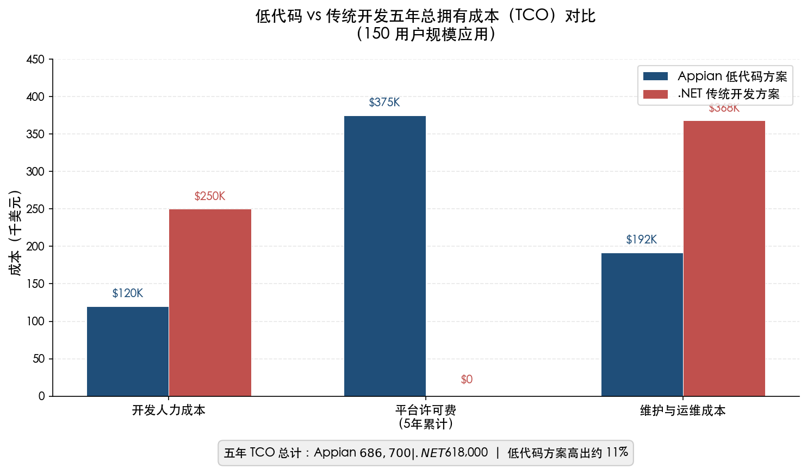

如上图所示，低代码方案在开发人力成本上具备显著优势（120,000 美元 vs. 250,000 美元），但五年累计的平台许可费高达 375,000 美元（传统开发为零），构成了 TCO 逆转的核心驱动因素。这一对比揭示了 LCNC 成本结构中一个常被忽视的特征：开发速度的提升被持续性的许可费用所侵蚀。传统开发虽然前期投入更大，但一旦完成开发，后续运维成本主要由人力和基础设施构成，不包含向平台供应商持续支付的订阅费。对于生命周期较长（5 年以上）的应用，这种累积效应尤为显著。

一个极端案例更具警示意义：一家全球保险公司使用低代码平台构建了管理约 400 万件洪水索赔的应用，维护人员在修复 bug 时意外删除了整个数据库且无备份，导致全部记录丢失 [Unstoppable Software 案例分析](https://unstoppablesoftware.com/the-real-costs-of-low-code-development/ "保险公司低代码应用灾难性数据丢失案例")。此案例虽属极端，却折射出 LCNC 环境中普遍存在的工程规范薄弱问题——缺乏强制性的备份策略、操作审计和权限隔离机制，使得运维风险的潜在代价远超许可费层面。

## 3.3 供应商锁定——被高估的价值与被低估的退出成本

### 3.3.1 锁定困境的普遍性

供应商锁定（Vendor Lock-in）是企业采用 LCNC 平台时面临的一项结构性风险。BCG 研究数据勾勒出一幅充满矛盾的图景：79% 的企业认为当前平台的价值足以证明成本合理，但 70% 仍在积极寻找替代方案；62% 的 IT 决策者明确对供应商锁定表示担忧 [Betty Blocks 引用 BCG 研究](https://blog.bettyblocks.com/breaking-low-code-why-vendor-lock-in-is-the-hidden-cost-you-cant-ignore "BCG供应商锁定研究")。这种"一边使用、一边焦虑"的普遍状态，折射出企业对当前收益与长期风险之间的深层矛盾。

企业更换平台时面临的三大顾虑依次为：技术迁移复杂性（75%）、过渡期生产力损失（64%）和运营停机风险（63%）[Betty Blocks 引用 BCG 研究](https://blog.bettyblocks.com/breaking-low-code-why-vendor-lock-in-is-the-hidden-cost-you-cant-ignore "迁移失败率与成本")。这些顾虑并非杞人忧天——数据显示，83% 的企业数据迁移项目最终失败或超出预算，大型技术项目失败的年均成本可超过 2000 万美元 [Betty Blocks 引用 BCG 研究](https://blog.bettyblocks.com/breaking-low-code-why-vendor-lock-in-is-the-hidden-cost-you-cant-ignore "迁移失败率与成本")。

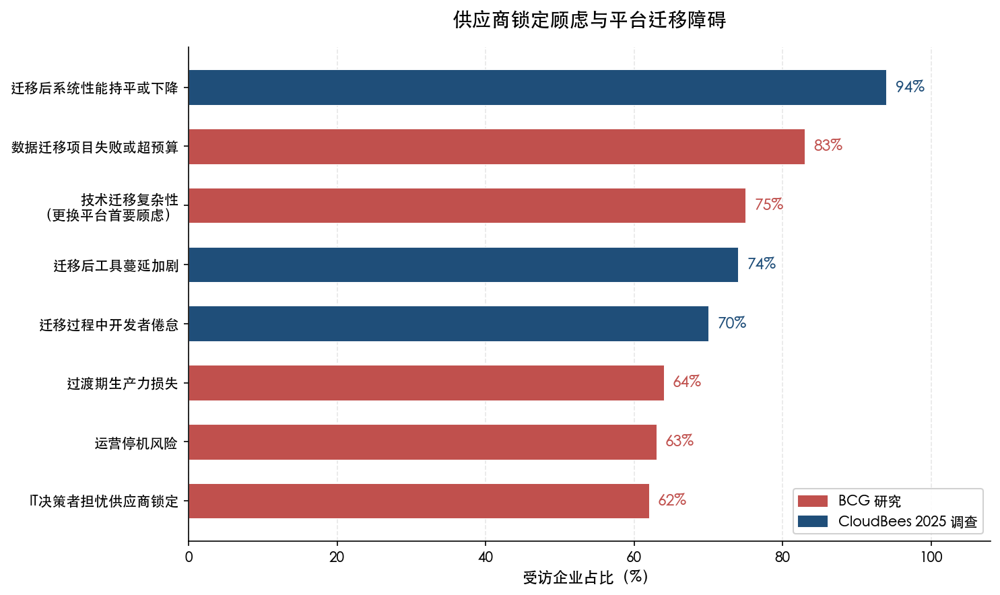

上图综合了 BCG 研究与 CloudBees 2025 DevOps Migration Index 两项调查的数据，直观呈现了企业在供应商锁定与平台迁移中面临的八项核心障碍。其中"迁移后系统性能持平或下降"高达 94%，表明即便完成迁移，预期回报也往往落空。

### 3.3.2 迁移成本的量化证据

2025 年 11 月 CloudBees 发布的 DevOps Migration Index（由独立研究机构 TrendCandy 对超过 300 名企业 IT 和技术领导者开展调查）提供了更为具体的迁移成本画像：企业平均每个平台迁移项目损失 315,000 美元，57% 的受访者在过去一年中花费超过 100 万美元用于平台迁移，平均项目成本超支 18% [CIO Dive](https://www.ciodive.com/news/migration-issues-cost-businesses/805043/ "2025 DevOps Migration Index, N=300+")。更为严峻的是，94% 的 IT 领导者报告迁移后系统性能持平或下降，60% 表示因项目延期而错失收入机会 [CIO Dive](https://www.ciodive.com/news/migration-issues-cost-businesses/805043/ "迁移后ROI未达预期")。

迁移项目对人力资源的消耗同样不容忽视。该调查显示，61% 的 IT 领导者报告迁移疲劳导致项目延迟六个月以上，70% 的企业在平台迁移过程中经历了开发者倦怠现象 [CIO Dive](https://www.ciodive.com/news/migration-issues-cost-businesses/805043/ "迁移疲劳与开发者倦怠")。正如 CloudBees CEO Anuj Kapur 所指出的，"硬性成本是时间和资金的超支，软性成本则是对开发者士气和积极性的打击"——后者虽难以直接量化，但对团队效能的长期影响往往更为深远。

### 3.3.3 多平台策略的两面性

面对单一供应商锁定的风险，越来越多的企业转向多平台策略。Gartner 预测，到 2026 年 75% 的大型企业将使用至少四种低代码工具 [ByteIota 市场分析](https://byteiota.com/low-code-hits-75-enterprise-adoption-66b-market-2026/ "多平台策略与治理复杂度")。多平台策略确实降低了对单一供应商的依赖程度，但同时引入了新的治理复杂度：不同平台之间的数据互通、安全策略统一、人员技能分散等问题，可能部分抵消去锁定化带来的收益。

CloudBees 的调查数据印证了这一矛盾：74% 的 IT 领导者报告在整合后反而经历了工具蔓延加剧的情况 [CIO Dive](https://www.ciodive.com/news/migration-issues-cost-businesses/805043/ "整合后工具蔓延")。Kapur 对此评论道，"试图迁移到单一供应商将剥夺你从市场创新中获益的潜力"，但过度分散同样代价高昂。企业面临的实质挑战，在于如何在平台多元化与治理可控性之间找到平衡。

## 3.4 安全漏洞与"影子 IT"——治理体系的系统性挑战

### 3.4.1 OWASP 定义的十大安全风险

LCNC 平台的安全风险已引起专业安全社区的系统性关注。OWASP（开放式 Web 应用安全项目）专门维护了"Low-Code/No-Code Top 10"安全风险项目，列出十大核心风险类别：账户模拟（LCNC-SEC-01）、授权滥用（LCNC-SEC-02）、数据泄露与意外后果（LCNC-SEC-03）、身份验证与安全通信失败（LCNC-SEC-04）、安全配置错误（LCNC-SEC-05）、注入处理失败（LCNC-SEC-06）、易受攻击和不可信组件（LCNC-SEC-07）、数据与密钥处理失败（LCNC-SEC-08）、资产管理失败（LCNC-SEC-09）以及安全日志与监控失败（LCNC-SEC-10）[OWASP LCNC Top 10 项目](https://github.com/OWASP/www-project-top-10-low-code-no-code-security-risks "OWASP官方GitHub仓库")。

其中两项风险与 LCNC 的平台特性尤为紧密相关。LCNC-SEC-01（账户模拟）在实践中尤为突出：当开发者使用管理员身份连接后端数据库时，终端用户实际上共享同一身份访问数据，导致权限边界模糊、越权访问风险显著上升。LCNC-SEC-09（资产管理失败）则直接对应"无代码蔓延"现象——大量由业务人员创建的应用缺乏统一的资产清单管理，逐渐成为被组织遗忘的安全盲区 [Cloud Wars 解读](https://cloudwars.com/cybersecurity/top-10-low-code-no-code-risks-and-how-to-secure-rapid-development/ "OWASP LCNC Top 10详细解读")。

### 3.4.2 影子 IT 的规模与经济代价

LCNC 平台的低门槛特性在赋能业务用户的同时，客观上也成为"影子 IT"扩散的加速器。Gartner 研究发现，影子 IT 占大型企业 IT 总支出的 30%–40%；Gartner 进一步预测，到 2027 年 75% 的员工将自行获取或创建 IT 部门不知情的技术资产 [Auvik Shadow IT 统计汇编](https://www.auvik.com/franklyit/blog/shadow-it-stats/ "引用Gartner数据")。EMC 研究将影子 IT 的经济代价量化至宏观层面：因影子 IT 导致的数据丢失和系统停机，其年度总成本高达 1.7 万亿美元 [Auvik Shadow IT 统计汇编](https://www.auvik.com/franklyit/blog/shadow-it-stats/ "影子IT年度损失")。

这一问题正随着 AI 技术的渗透而加速演化。Gartner 预测，到 2030 年超过 40% 的全球组织将因未经授权的"影子 AI"工具（包含 LCNC 蔓延在内）而遭遇安全或合规事件 [Gartner 2025 新闻稿](https://www.gartner.com/en/newsroom/press-releases/2025-11-19-gartner-identifies-critical-genai-blind-spots-that-cios-must-urgently-address0 "Gartner预测40%企业将遭遇影子AI安全事件")。IBM 2025 年《数据泄露成本报告》的数据进一步量化了这种风险的经济影响：使用高水平影子 AI 的组织，其数据泄露平均成本较低或无影子 AI 使用的组织高出约 670,000 美元（463 万美元 vs. 396 万美元）[IBM 2025 数据泄露成本报告](https://newsroom.ibm.com/2025-07-30-ibm-report-13-of-organizations-reported-breaches-of-ai-models-or-applications,-97-of-which-reported-lacking-proper-ai-access-controls "IBM 2025年7月发布")。

### 3.4.3 LCNC 蔓延的治理困境

影子 IT 的核心困境在于：完全禁止业务用户使用 LCNC 工具将扼杀创新和效率，但放任不管则必然导致安全盲区和合规风险的持续扩大。这种矛盾在数据上得到清晰印证——Gartner 预测到 2026 年 80% 的低代码用户将来自 IT 部门以外。当绝大多数应用创建者不具备系统性的安全意识和工程规范训练时，企业面临的将不再是孤立的安全事件，而是系统性的治理缺口。

这一问题在实践中已产生惨痛教训。前文所述的保险公司数据库误删事件即为典型案例。Panorama Consulting 于 2026 年 3 月发布的分析报告进一步描述了 LCNC 蔓延的典型失控模式——财务团队自建例外审批路径、HR 搭建案件管理工具、运维构建服务请求工作流——这些彼此独立的应用指向同一个风险：同一业务流程出现多个不受统一管控的版本，各版本的控制假设和问责结构各异，最终危及数据一致性和合规要求。

## 3.5 辩证视角：隐性成本是否可控

在系统审视上述风险之后，有必要强调：这些隐性成本并非不可管理的固有缺陷，其严重程度高度取决于组织的治理成熟度与场景选择的审慎程度。

首先，技术债的积累速度与应用类型密切相关。对于内部工具、流程自动化等生命周期较短（1–3 年）、复杂度较低的应用场景，LCNC 的快速构建优势显著且技术债风险可控；而对于需要长期演进的核心业务系统，传统开发或混合架构策略更为稳健。前述"30% 定制化临界点"可作为场景筛选的实用参考基准。

其次，供应商锁定的严重程度因平台架构而异。部分领先平台（如 OutSystems、Mendix）已开始支持标准化代码导出和容器化部署，在一定程度上降低了迁移壁垒。Gartner 预测到 2026 年 75% 的大型企业将使用至少四种低代码工具，这一趋势本身即是企业应对锁定风险的自然演化策略。

最后，安全与影子 IT 问题的本质是治理问题而非纯粹的技术问题。第 6 章将详述的"三区治理框架"（绿色区自由创建、黄色区协作构建、红色区 IT 全面监督）以及"低代码卓越中心"（CoE）模式，为平衡赋能与控制提供了经过实践验证的方法论。

我们认为，关键不在于这些隐性成本是否存在——它们客观存在且不容忽视——而在于企业是否在决策之初就将其系统性地纳入 TCO 评估框架。忽视隐性成本而仅凭开发效率提升做出平台选型决策，是 LCNC 项目失败的首要成因之一。

# 第4章 立场分歧——企业管理者视角 vs 开发者视角

围绕 LCNC 平台的效率收益与隐性成本之争（详见第2章与第3章），企业管理者与专业开发者形成了两套截然不同的认知框架。管理者倾向于从投资回报率和数字化交付速度衡量 LCNC 的价值，开发者则更关注代码质量、架构可扩展性与职业自主权。这种分歧并非简单的"对错之分"：双方评估 LCNC 时所依据的指标体系、时间维度和利益关切存在结构性差异——管理者看到的是季度级的交付提速与成本节约，开发者看到的是年度级的技术债积累与系统可维护性退化。厘清这些差异的根源并寻找制度化的弥合路径，是企业成功推进 LCNC 战略的关键前提。

## 4.1 管理者视角：降本、提速与消除 IT 瓶颈

### 4.1.1 数字化交付的结构性困境

企业管理层推动 LCNC 采纳的首要驱动力，并非源于对某种技术路线的偏好，而是对数字化交付效率的深层焦虑。Gartner 2025 年度全球 CIO 调查（覆盖 88 国、3,186 名 CIO/技术高管及 1,126 名非 IT 高管，共计 4,312 名受访者）揭示了一个令人警醒的现实：仅 48% 的数字化举措达到或超过其业务成果目标 [Gartner CIO Survey 2025](https://www.gartner.com/en/newsroom/press-releases/2024-10-22-gartner-survey-reveals-that-only-48-percent-of-digital-initiatives-meet-or-exceed-their-business-outcome-targets "N=4,312，2024年10月发布")。超过半数的数字化投资未能实现预期回报——在企业数字化支出持续攀升的背景下，这一数字构成了严峻的管理挑战。

上述困境的直接后果是 IT 项目积压的持续恶化。72% 的 IT 领导者报告因项目积压（backlog）而无法投入战略性工作 [Spidya 低代码 ROI 分析](https://spidya.com/en/blog/cheetah-low-code-development-platform-en/low-code-platforms-rois-insights-from-50-enterprise-projects "引用Forrester Research数据")，开发团队不堪重负，业务部门往往等待数月方能获得一个简单的内部应用。Caspio/StarCIO 调查（N=268）进一步显示，90% 的 IT 决策者认为定制软件应用是企业的战略赋能工具，但仅 41% 的组织对自身应用交付能力具有高度信心 [Caspio 调查报告](https://www.caspio.com/reports/low-code-the-business-transformation-game-changer/ "N=268 IT决策者，StarCIO执行")。战略认知与交付能力之间近 50 个百分点的落差，解释了管理者为何对能够大幅缩短交付周期的技术方案——尤其是 LCNC 平台——产生强烈倾斜。

### 4.1.2 ROI 预期的乐观与盲区

管理者对 LCNC 投资回报的预期普遍高度乐观，且有权威研究机构的数据背书。如第2章所述，Forrester 多项 TEI 研究显示了令人瞩目的回报数据：OutSystems 三年 ROI 达 506%，Microsoft Power Platform 三年 ROI 为 224%，Power Apps Premium 三年 ROI 为 206% [OutSystems 官方](https://www.outsystems.com/news/tei-low-code-roi/ "Forrester TEI of OutSystems, 2021年") [Microsoft Power Platform Blog](https://www.microsoft.com/en-us/power-platform/blog/2024/09/03/reduce-development-times-and-increase-roi-with-microsoft-power-platform/ "2024 Forrester TEI of Microsoft Power Platform")。行业数据进一步显示，制造业三年平均 ROI 为 310%，金融服务为 278%，技术行业为 265% [Reproto ROI 分析](https://reproto.com/low-code-vs-traditional-development-2025-cost-analysis-and-roi-guide-for-enterprise-software/ "引用Forrester TEI研究，2025年成本分析")。这些数字对任何企业高管而言都极具吸引力。

然而，管理者视角中存在两个不容忽视的盲区。

**盲区一：对治理前提条件的忽视。** 上述高 ROI 数字高度依赖成熟的治理框架。数据显示，拥有成熟治理体系的组织 LCNC 实施成功率为 81%，而缺乏治理的组织仅为 43%，两者相差 38 个百分点 [Spidya 低代码 ROI 分析](https://spidya.com/en/blog/cheetah-low-code-development-platform-en/low-code-platforms-rois-insights-from-50-enterprise-projects "治理成熟度对成功率的影响")。这意味着近一半的企业可能无法复制那些令人振奋的 ROI 数字。管理层在决策时往往倾向于引用最佳实践案例的回报率，而非加权考量治理不成熟时的风险折扣。

**盲区二：战略热情与实际投入之间的落差。** Gartner 研究指出，尽管 80% 以上的非 IT 高管（CxO）认为自己对数字化转型负有责任，但仅 18% 的 CxO 投入了足够的领导注意力和人员资源使其数字化举措持续达成预期业务成果 [Gartner 融合团队研究](https://www.gartner.com/en/articles/fusion-teams "Gartner Research，2024年12月")。80% 的"认责率"与 18% 的"投入率"之间逾 60 个百分点的悬殊落差，揭示了一个深层矛盾：管理者在战略层面高度认可 LCNC 的价值，但在操作层面未必愿意配置与之匹配的组织资源和管理精力。

### 4.1.3 管理者的"公民开发者"愿景

管理层推动 LCNC 的另一核心逻辑是"公民开发者"（Citizen Developer）赋能——通过让业务人员自行构建应用来绕过 IT 瓶颈。Gartner 预测到 2026 年，LCNC 应用的 80% 用户将来自 IT 部门以外的非技术专业人员 [byteiota 引述 Gartner](https://byteiota.com/low-code-hits-44-5b-gartner-2026-forecast-explained-2/ "byteiota综述Gartner 2026预测")。Mendix 2020 年调查（N=2,000）亦显示，近 9/10 的业务人员表示，如果有不需要专业编程技能的工具，他们愿意自行尝试开发应用 [Mendix 调查](https://www.mendix.com/press/new-survey-illuminates-gap-in-priorities-between-business-stakeholders-and-application-developers-in-todays-upended-business-landscape/ "N=2,000, 2020年")。在管理者看来，这意味着企业内部潜藏着大量有能力且有意愿参与应用开发的业务人员，只需提供合适的工具即可释放其潜力。

然而，这一愿景的落地面临严峻的能力约束。KPMG 在其低代码白皮书中明确指出，公民开发者"仍然需要大量帮助"，多数人无法独立构建应用的数据处理中间层和系统集成底层，即便是顶层的用户界面也需要"至少有少许编码背景或系统思维能力" [KPMG 低代码白皮书](https://kpmg.com/kpmg-us/content/dam/kpmg/pdf/2023/low-code.pdf "KPMG, Get More from Low Code, 2022年")。公民开发者的实际能力边界与管理者愿景之间的落差，构成了管理者与开发者之间最重要的争议焦点之一，将在4.3节进一步展开分析。

## 4.2 开发者视角：质量焦虑、自主权与职业价值

### 4.2.1 技术顾虑的三重维度

与管理者聚焦投资回报的视角形成鲜明对照，专业开发者对 LCNC 的评价首先建立在技术标准之上。综合多项调查和分析，开发者的核心顾虑集中在以下三个维度。

**代码质量不可控。** 专业开发者习惯于对代码拥有完全的掌控和审查能力，而 LCNC 平台自动生成的代码在优化程度、可读性和可审查性方面往往不及手写代码。资深开发团队普遍秉持"绝不接受混乱代码"的工程信条 [CSHARK 分析](https://www.cshark.com/are-we-doomed-to-low-code-platforms/ "专业开发团队视角的低代码评估")。如第3章所述，渥太华大学 Lethbridge 的学术研究进一步印证了这一担忧——低代码应用往往缺乏模块化、版本控制和自动化测试等基本软件工程实践的支持，长期维护难度可能高于传统代码。

**定制化受限。** 所有 LCNC 平台均存在功能边界，即便是小型定制也可能需要高级编程技能方可实现。行业分析估计，当超过 30% 的应用逻辑需要自定义代码时，低代码方案相对于传统开发的效率优势将基本消失 [ByteIota 市场分析](https://byteiota.com/low-code-hits-75-enterprise-adoption-66b-market-2026/ "低代码性能与定制化临界点")。对于追求技术卓越的开发者而言，这种"天花板效应"意味着复杂需求迟早将突破平台的承载能力，届时已在平台上积累的资产反而成为迁移负担。

**供应商锁定。** LCNC 平台生成的代码和配置往往仅在该平台生态内可用，订阅模式导致应用完成后仍需持续付费 [CSHARK 分析](https://www.cshark.com/are-we-doomed-to-low-code-platforms/ "专业开发团队视角的低代码评估")。BCG 研究发现 62% 的 IT 决策者对供应商锁定表示担忧，更换平台的三大顾虑依次为技术迁移复杂性（75%）、过渡期生产力损失（64%）和运营停机（63%）[Betty Blocks 引用 BCG 研究](https://blog.bettyblocks.com/breaking-low-code-why-vendor-lock-in-is-the-hidden-cost-you-cant-ignore "BCG供应商锁定研究")。

### 4.2.2 初始抵触与态度转变

值得注意的是，开发者对 LCNC 的态度并非铁板一块的全面抵制，而是呈现出从初始怀疑到部分接纳的演变轨迹。Appian 对 400 名开发者的调查（涵盖纯高代码和低代码开发者）发现，64% 的开发者在学习低代码之前对其持怀疑态度，主要顾虑源于缺乏平台经验以及对学习新工具的抗拒 [Appian 开发者调查](https://appian.com/blog/2022/low-code-vs--high-code--compare-developer-careers--earning-poten "N=400+开发者, 2022年")。然而，实际使用低代码后，态度发生了显著转变——42% 的低代码用户表示对工作"非常满意"，而纯高代码开发者中该比例仅为 31% [Appian 开发者调查](https://appian.com/blog/2022/low-code-vs--high-code--compare-developer-careers--earning-poten "N=400+开发者, 2022年")。

从更广泛的行业渗透数据来看，87% 的企业开发者已在至少部分开发工作中使用 LCNC 平台 [Forrester 博客](https://www.forrester.com/blogs/the-low-code-market-could-approach-50-billion-by-2028/ "Forrester博客, 2024年1月29日")。这一渗透率表明，开发者社区的核心关切并非"是否使用 LCNC"，而是"在什么场景下、以什么方式使用"以及"由谁来决定使用方式"——本质上是使用权与治理权的问题。

但不同开发领域的接受度存在显著分化。The Software House 发起的 State of Frontend 2024 调查（N=6,028，覆盖 139 个国家的前端开发者）明确显示"大多数受访者不使用低代码或无代码平台" [State of Frontend 2024](https://tsh.io/state-of-frontend "State of Frontend 2024, N=6,028")。这一结果与前述 87% 的企业开发者使用率形成耐人寻味的对比，揭示了 LCNC 渗透在不同开发领域存在显著差异：企业应用开发者接受度较高，而专注于前端工程、追求精细 UI/UX 控制的开发者则倾向于保持距离。

### 4.2.3 "释放"而非"替代"——开发者眼中的理想定位

当被问及 LCNC 的积极价值时，开发者的回答集中在"释放创造力"而非"替代编程"。IDG 受 Appian 委托对 300 名 IT 从业者的调查（2019 年，企业规模 1,000 名以上员工）显示，开发者认为工作中最差的方面依次为：花在排障上的时间、截止日期压力、浪费在重复编码任务上的时间、以及缺乏参与战略项目的机会 [IDG/Appian 调查](https://appian.gcs-web.com/news-releases/news-release-details/survey-79-it-developers-say-low-code-can-improve-key-aspects-job "N=300, 2019年")。与此对应，80% 的开发者认同低代码有助于自动化重复开发任务，近 80% 认为低代码可以释放时间用于更高层次的项目 [IDG/Appian 调查](https://appian.gcs-web.com/news-releases/news-release-details/survey-79-it-developers-say-low-code-can-improve-key-aspects-job "N=300, 2019年")。

Appian 调查进一步揭示了低代码技能与职业发展之间的正向关联：75% 的具备低代码技能的开发者参与了创新项目（纯高代码开发者为 64%），60% 参与了关键业务项目（高代码为 40%）；73% 的开发者相信获得低代码认证将促进职业发展，84% 的已认证低代码开发者认为低代码帮助实现了更快的职业增长 [Appian 开发者调查](https://appian.com/blog/2022/developers-are-fed-up--they-want-more-fulfilling-work--this-is-h "N=400开发者, 2022年")。这组数据揭示了一个重要信号：当 LCNC 被定位为"增强工具"——帮助开发者减少重复劳动、参与更有价值的工作——而非"替代方案"时，开发者的接受度将显著提升。

### 4.2.4 对软件质量的分裂评价

开发者社区对 LCNC 平台影响软件质量的评价呈现显著分裂。行业调查数据显示，39% 的开发者认为 LCNC 改善了软件质量，26% 认为质量未受影响，23% 则认为质量有所下降 [byteiota 引述行业调查](https://byteiota.com/low-code-hits-44-5b-gartner-2026-forecast-explained-2/ "byteiota综述开发者调查数据")。这种分裂恰恰反映了 LCNC 平台对质量的双重效应：对于标准化程度高的业务应用，平台内置的设计模式和自动化验证确实能提升一致性并减少人为错误；但对于复杂度超出平台预设范围的应用，强制适配反而引入架构扭曲和性能退化。质量评价的分歧本质上是场景适配性问题的折射——开发者并非笼统地否定 LCNC 的质量，而是警告在不适用场景中强行使用所带来的风险。

下图以双栏对照形式总结了管理者与开发者在 LCNC 核心关切上的结构性差异，并标注了弥合机制的关键数据。

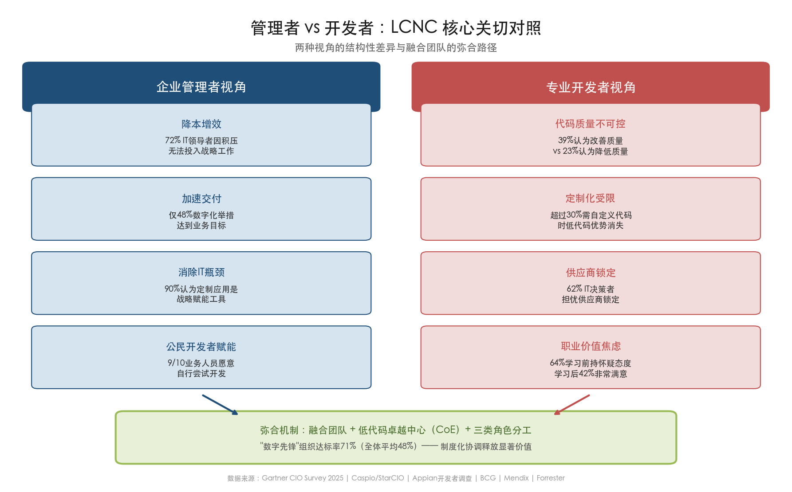

## 4.3 认知鸿沟：两个阵营为何"鸡同鸭讲"

### 4.3.1 对"开发者角色"的根本性误解

管理者与开发者围绕 LCNC 的分歧，根源之一在于双方对"软件开发"这一活动本身的理解存在根本差异。Mendix 委托的大型调查（N=2,000，1,000 名业务人员与 1,000 名 IT 人员，2020 年）以量化数据呈现了这一认知鸿沟的多个切面。

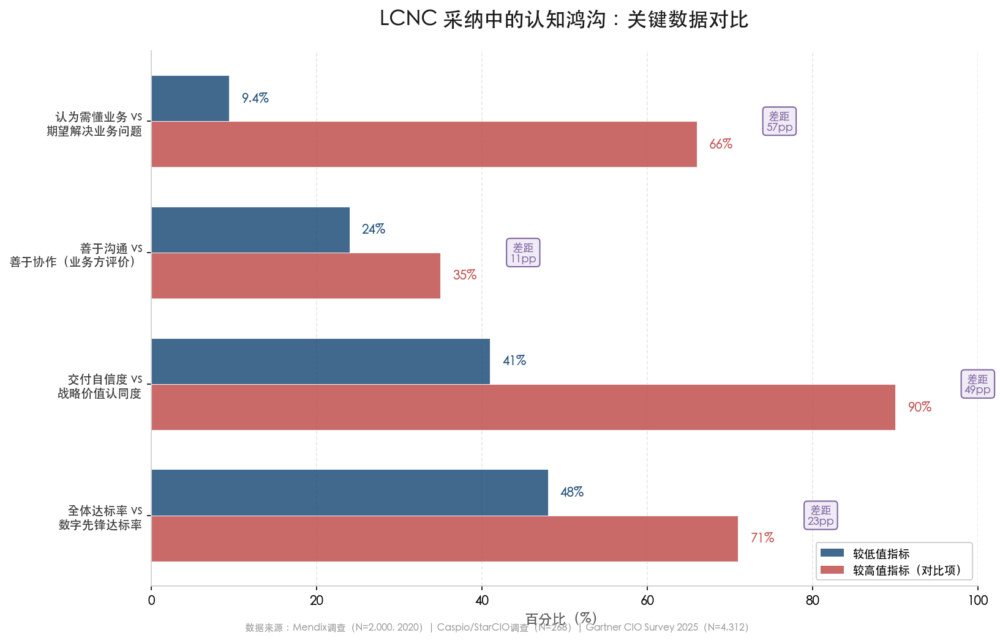

**对开发者能力定位的误读。** 仅 9.4% 的业务人员认为开发者需要理解业务，IT 人员中也仅有 11.4% 持此看法。然而，66% 的业务人员同时期望开发者帮助解决业务问题 [Mendix 调查](https://www.mendix.com/press/new-survey-illuminates-gap-in-priorities-between-business-stakeholders-and-application-developers-in-todays-upended-business-landscape/ "N=2,000, 2020年4月")。"不要求懂业务"与"期望解决业务问题"之间 57 个百分点的落差，揭示了一种广泛存在的认知偏差：管理者倾向于将开发者视为纯粹的"技术执行者"，而忽略了优秀软件开发本身需要深入的业务理解——这也解释了管理者为何容易高估公民开发者替代专业开发者的可能性。

**对开发者沟通与协作能力的低估。** 仅 24% 的业务人员认为开发者"善于沟通"，仅 35% 认为其"善于协作"（IT 人员中该比例为 48%）[Mendix 调查](https://www.mendix.com/press/new-survey-illuminates-gap-in-priorities-between-business-stakeholders-and-application-developers-in-todays-upended-business-landscape/ "N=2,000, 2020年4月")。这种刻板印象加剧了管理者绕过 IT 部门、直接通过 LCNC 赋能业务用户的冲动——既然开发者"不善沟通"，那为何不让业务人员直接上手？

**对 IT 部门责任归属的固化认知。** 54.2% 的业务受访者认为 IT 团队是软件开发的唯一责任方 [Mendix 调查](https://www.mendix.com/press/new-survey-illuminates-gap-in-priorities-between-business-stakeholders-and-application-developers-in-todays-upended-business-landscape/ "N=2,000, 2020年4月")。在这种认知框架下，LCNC 被管理者视为打破 IT 垄断的工具，但也可能导致业务部门在获得开发能力后忽视工程规范和治理要求。

### 4.3.2 不同层级与规模下的系统性差异

认知鸿沟不仅存在于"管理者"与"开发者"之间，还在不同管理层级和企业规模中呈现系统性分化。Caspio/StarCIO 调查（N=268）显示，VP 级及以上高管比一般 IT 人员更倾向于将"失去竞争优势"视为应用开发停滞的核心风险，而一般 IT 人员更关注效率损失和质量影响。在企业规模维度上，差异同样显著：大型组织最关注遗留系统集成和预算约束，中型组织最担忧交付速度，小型组织则最焦虑人才短缺和资金不足 [Caspio 调查报告](https://www.caspio.com/reports/low-code-the-business-transformation-game-changer/ "N=268，按企业规模和职级细分")。

这种分化意味着 LCNC 的采纳决策并不存在"放之四海而皆准"的最优解。同一平台在大型企业中可能因集成复杂度过高而受挫，在中型企业中可能因显著缩短交付周期而大获成功，在小型企业中则可能因许可费用占比过高而丧失经济性优势。管理者在制定 LCNC 采纳策略时，需要将企业规模、IT 成熟度和技术团队能力纳入综合考量，而非简单照搬其他企业的成功范式。

### 4.3.3 公民开发者的能力边界与"新型影子 IT"风险

管理者与开发者之间最尖锐的分歧点之一，在于对公民开发者能力边界的判断。管理者看到的是"巨大潜力"——近 9/10 的业务人员愿意自行尝试开发应用；开发者看到的则是"巨大风险"——缺乏工程训练的人员所构建的应用可能成为新一代影子 IT 的温床。

KPMG 的分析框架为这一争论提供了有价值的中间立场。该白皮书将软件应用比喻为"三层蛋糕"：顶层是用户界面和业务规则，中间层是数据处理和业务逻辑执行，底层是与后端系统的集成。公民开发者通常只能胜任顶层的部分工作，"多数人无法独立构建中间层和底层"，即便顶层也"需要至少有少许编码背景或系统思维能力" [KPMG 低代码白皮书](https://kpmg.com/kpmg-us/content/dam/kpmg/pdf/2023/low-code.pdf "KPMG, Get More from Low Code, 2022年")。这一"三层模型"清晰界定了公民开发者的合理活动范围：在适当指导下处理规则明确的顶层应用，但不应在缺乏专业支持的情况下触及数据层和集成层。

当公民开发者超出能力边界而缺乏治理约束时，LCNC 平台便沦为"新型影子 IT"的主要来源。如第3章所述，Gartner 研究发现影子 IT 占大型企业 IT 总支出的 30%–40%，并预测到 2027 年 75% 的员工将自行获取或创建 IT 部门不知情的技术资产 [Auvik Shadow IT 统计汇编](https://www.auvik.com/franklyit/blog/shadow-it-stats/ "引用Gartner数据")。Panorama Consulting（2026 年 3 月）则明确指出，LCNC 平台已成为"新型影子 IT"的主要来源，典型失控模式包括：财务团队自建例外审批路径、HR 搭建案件管理工具、运维构建服务请求工作流——导致同一业务流程出现多个版本，且各版本的控制假设和问责结构各不相同 [Panorama Consulting](https://www.panorama-consulting.com/the-new-shadow-it-low-code-platforms/ "2026年3月")。

## 4.4 弥合路径：融合团队与制度化协调机制

### 4.4.1 融合团队：从对立到共创

弥合管理者与开发者分歧的关键机制是"融合团队"（Fusion Teams）。Gartner 将融合团队定义为"分布式和多学科的数字业务团队，融合技术和其他类型的领域专长"，其核心理念是由 IT 与业务人员组成跨职能团队，共同承担数字产品交付 [Microsoft Learn 转引 Gartner](https://learn.microsoft.com/en-us/power-platform/developer/fusion-development "Gartner 2019 Digital Business Teams Survey")。这一模式的实质在于打破"管理者提需求、开发者执行"的单向关系，代之以双方共同定义目标、共同为业务成果负责的协作关系。

实证数据表明融合团队确实能够带来显著的绩效提升。Gartner 研究中的"数字先锋"（Digital Vanguard）群体——由 CIO 与 CxO 共同领导数字交付的组织——71% 的数字化举措达到或超过目标，远超全体平均的 48%（高出 23 个百分点）。这些组织的 CxO 将 35% 的业务部门员工分配到技术工作中（普通组织仅为 21%），并与 CIO 的会面频率达到普通 CxO 的 4 倍 [Gartner CIO Survey 2025](https://www.gartner.com/en/newsroom/press-releases/2024-10-22-gartner-survey-reveals-that-only-48-percent-of-digital-initiatives-meet-or-exceed-their-business-outcome-targets "N=3,186 CIO + 1,126 CxO，2024年10月发布")。

Gartner 进一步强调，融合团队的有效运作需要由业务领导者而非 IT 领导者来牵头——"当许多人假设融合团队应由 IT 领导时，这种方式往往导致实现业务目标所需的业务上下文丢失" [Gartner 融合团队研究](https://www.gartner.com/en/articles/fusion-teams "Gartner Research，2024年12月")。OutSystems 的实践指南佐证了这一观点：约 43% 的融合团队领导者直接向非 IT 业务部门汇报，反映了数字交付责任从传统 IT 部门向业务端迁移的趋势 [OutSystems Fusion Teams](https://www.outsystems.com/application-development/what-are-fusion-teams/ "OutSystems Fusion Teams 101指南")。

下图从绩效对比和治理前提两个维度，量化呈现了融合团队模式的实际效果与成功条件。

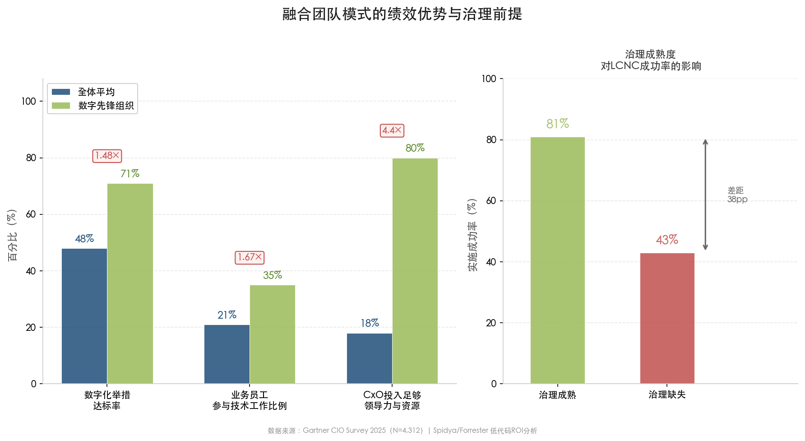

### 4.4.2 角色分工的制度化：三类角色模型

融合团队的有效运行需要对"谁做什么"进行清晰的制度化界定。Microsoft Power Platform 的融合开发模型提供了一个具有参考价值的框架，明确定义了三类角色：(1) **公民开发者/Maker**——具备业务知识、使用可视化低代码工具的业务用户；(2) **专业开发者**——使用 Visual Studio 等工具编写 C#/JavaScript 的技术人员；(3) **IT 专业人员/DevOps 工程师**——负责应用生命周期管理、环境治理和部署流水线 [Microsoft Learn](https://learn.microsoft.com/en-us/power-platform/developer/fusion-development "Power Platform融合开发概述")。这一模型的核心原则是"所有人应使用与其任务匹配的工具"——专业开发者在完成公民开发任务时同样使用可视化工具，避免将工具类型与人员身份绑定。

这种角色分工在制度层面回应了双方的核心关切：管理者获得了业务人员参与开发的合法路径，开发者保留了对架构设计、安全审计和复杂逻辑的技术控制权。其关键在于，角色分工不是简单的"公民开发者做简单的、专业开发者做复杂的"二分法，而是在统一的团队和治理框架内，根据任务性质动态匹配技能和工具。

### 4.4.3 低代码卓越中心：治理与赋能的平衡支点

建立"低代码卓越中心"（Center of Excellence, CoE）是当前被广泛推荐的制度化协调机制。Mendix 提出的 CoE 模型采用"启动-结构化-规模化"（Start-Structure-Scale）三阶段方法论，以五个关键组件——组合管理（Portfolio）、人员发展（People）、流程规范（Process）、平台管理（Platform）、推广传播（Promotion）——为运作框架 [Mendix CoE 指南](https://www.mendix.com/blog/how-to-build-a-low-code-center-of-excellence/ "2024年2月发布")。

KPMG 的白皮书进一步明确了 CoE 的三大核心职责：第一，为公民开发者提供基础培训和持续指导；第二，建立护栏（guardrails），确保公民开发者不会危害现有 IT 系统的速度、可靠性、安全性或违反监管合规要求；第三，构建应用的数据处理中间层和系统集成底层——这些恰恰是公民开发者力所不及的领域 [KPMG 低代码白皮书](https://kpmg.com/kpmg-us/content/dam/kpmg/pdf/2023/low-code.pdf "KPMG, Get More from Low Code, 2022年")。CoE 的制度价值在于，它同时满足了管理者"降低 IT 瓶颈"和开发者"保障工程质量"的核心诉求：业务用户可以在明确的边界内自主开发，专业开发者负责架构治理和复杂组件——双方在同一个制度框架内各得其所。

CoE 还承担着一项关键的附加功能：构建统一的组件库和集成目录。通过发布开箱即用的集成列表、内部开发的插件以及可复用的设计模板，CoE 使公民开发者能够站在专业开发者的肩膀上工作，而非各自为政地重复造轮子。这不仅提升了整体效率，更从源头减少了影子 IT 滋生的动机——当企业提供了足够好的官方路径时，业务人员自行引入私有工具的必要性便自然降低。

### 4.4.4 实效验证：采纳者与非采纳者的绩效对比

上述制度化协调机制的有效性已获得调查数据的初步验证。Caspio/StarCIO 调查发现，使用 LCNC 平台的组织在所有关键绩效指标上的表现显著优于未使用者，涵盖按时按范围按预算交付、跟上业务需求、具备所需技能和资源等维度。LCNC 采纳者将更多时间投入创造新产品和服务，而非升级遗留系统 [Caspio 调查报告](https://www.caspio.com/reports/low-code-the-business-transformation-game-changer/ "N=268，低代码用户vs非用户对比")。

需要审慎指出的是，这一对比存在选择偏差的可能——率先采纳 LCNC 的企业可能在 IT 治理和创新文化方面本身就更为成熟，其优异表现不能完全归因于 LCNC 工具本身。但即便考虑这一偏差因素，数据仍然支持一个审慎的结论：在配套治理体系到位的前提下，LCNC 平台的采纳与更好的交付绩效之间存在正相关关系。

## 4.5 从对立到共识：分歧的本质与解决方向

管理者与开发者围绕 LCNC 的立场分歧，归根结底是两种合理但不完整的视角之间的结构性张力。管理者从投资回报和组织效率出发，关注的是"能否更快、更便宜地交付"——这一视角在 LCNC 的早期采纳阶段具有充分的正当性，但容易低估技术债积累、供应商锁定和治理缺失带来的长期成本。开发者从工程质量和系统可维护性出发，关注的是"能否可靠、可扩展地运行"——这一视角对长期技术健康至关重要，但可能导致对新工具的过度保守和效率机会的错失。

我们认为，两种视角之间的健康张力恰恰是 LCNC 成功采纳的必要条件：管理者的效率驱动提供了变革的动力和资源配置，开发者的质量把关提供了风险控制和技术可持续性保障。当任一方完全压倒另一方时——无论是管理者强推不受治理约束的公民开发，还是开发者以技术洁癖拒绝一切简化工具——结果都将偏离最优均衡。

融合团队、CoE 和结构化角色分工等机制的核心价值，在于将这种张力从"人际冲突"转化为"制度化制衡"。在这些机制下，管理者的降本提速诉求通过公民开发者的合规赋能得到实现，开发者的质量标准通过架构治理和安全护栏得到保障。正如 Gartner 数据所示，采用 CIO-CxO 共同领导模式的"数字先锋"组织数字化举措达标率高达 71%，几乎是全体平均水平（48%）的 1.5 倍 [Gartner CIO Survey 2025](https://www.gartner.com/en/newsroom/press-releases/2024-10-22-gartner-survey-reveals-that-only-48-percent-of-digital-initiatives-meet-or-exceed-their-business-outcome-targets "N=4,312，2024年10月发布")——这一差距量化了制度化协调所能释放的价值。

# 第5章 AI 时代的变量——生成式 AI 对低代码/无代码的重塑

生成式 AI 的爆发式发展正在从根本上重新定义软件开发的方式与门槛。对于 LCNC 平台而言，这一变量既是前所未有的增长引擎，也是潜在的颠覆性力量。前文各章已分别考察了 LCNC 平台带来的效率跃迁（第2章）、隐性成本与技术风险（第3章）以及管理者与开发者之间的立场分歧（第4章），而生成式 AI 正在同时改写这三个维度的底层逻辑。本章从三个维度展开分析：生成式 AI 对 LCNC 价值主张的强化与改造、AI 辅助编程工具与 LCNC 平台之间的竞合关系，以及主流 LCNC 平台整合 AI 能力的最新进展与效果。通过对全球与中国市场的系统考察，本章试图回答一个核心问题——在 AI 时代，LCNC 平台究竟是被替代还是被重塑？

## 5.1 生成式 AI 对 LCNC 价值主张的双重效应

### 5.1.1 强化效应：自然语言成为新的开发界面

生成式 AI 对 LCNC 平台最直接的贡献，在于将其"低门槛"承诺推向新的高度——自然语言正在成为可视化拖拽之外的又一核心开发界面。Forrester 在 2023 年 9 月的专题分析中明确判断"AI 不会杀死低代码市场"，认为自然语言将成为低代码平台的关键互补性开发体验，但不能替代可视化开发工具 [Forrester Blog](https://www.forrester.com/blogs/new-research-will-ai-kill-the-low-code-market/ "Will AI Kill The Low-Code Market, 2023年9月")。这一判断在后续两年间得到了广泛验证：各主流平台竞相将生成式 AI 能力嵌入全生命周期开发流程。

Microsoft Power Platform 的实践提供了迄今最大规模的验证样本。截至 2025 年，Power Platform 拥有超过 5600 万月活跃用户（同比增长 27%），FY2025 期间用户已构建超过 300 万个 AI Agent；Copilot 的整合使 Power Apps 构建成功率提高 60%，数据输入速度提升 30% [Microsoft Power Platform Blog](https://www.microsoft.com/en-us/power-platform/blog/power-apps/microsoft-recognized-as-a-leader-in-the-2025-gartner-magic-quadrant-for-enterprise-low-code-application-platforms/ "2025 Gartner MQ Leader")。上述数据表明，AI 的加持显著降低了公民开发者的使用摩擦，使非技术用户能够完成此前难以企及的开发任务。

其他头部平台亦在不同环节展开 AI 能力布局。Mendix 的 AI 助手 Maia 嵌入 Studio Pro IDE，提供对话问答、逻辑推荐（可提速 30%）及自然语言生成应用架构等能力 [Mendix 官网](https://www.mendix.com/platform/ai/aiad/ "Maia for Smart Development")。OutSystems 推出 AI Agent Builder（无代码构建 AI Agent）和 Agent Workbench（自定义与编排工具），支持以自然语言定义 Agent 行为 [OutSystems 官网](https://www.outsystems.com/low-code-platform/gen-ai/ "Go agentic with OutSystems")。Appian 于 2025 年 11 月宣布 Agent Studio 正式上线（GA），100% Beta 测试用户反馈"直观或非常直观"；Appian Composer 已被 130 余个组织用于构建 1300 余个应用 [Appian 官方公告](https://appian.com/about/explore/press-releases/2025/appian-launches-new-ai-capabilities-to-automate-complex-work "2025年11月")。ServiceNow 则开发了自有领域特定大模型 Now LLM，将 GenAI 嵌入全线产品的 Now Assist 功能，同时支持 Azure OpenAI、Gemini、WatsonX 等第三方模型 [ServiceNow 官网](https://www.servicenow.com/platform/now-assist.html "Now Assist platform overview")。

综合来看，上述实践揭示了一个共性模式：生成式 AI 并未取代可视化开发范式，而是在其基础上叠加了自然语言交互层，形成"自然语言＋可视化＋代码"三种开发模态并存的新格局。

### 5.1.2 替代威胁：AI 代码生成是否消解了低代码的存在意义？

与上述强化效应并行的，是一种更深层的"存在性"质疑——如果 AI 能够直接根据自然语言生成高质量代码，LCNC 平台的可视化抽象层是否还有存在必要？G2 Research 对此指出，AI 代码生成与低代码在短期内各有适用场景，但预测 AI 代码生成最终将改变低代码的概念本身，核心问题是"何时"而非"是否" [G2 Research](https://research.g2.com/insights/ai-code-generation-to-replace-low-code "Will AI Code Generation Replace Low Code")。

Forrester 分析师在 2026 年 2 月进一步提出了更为激进的判断："AppGen 正在吞噬低代码"（AppGen Is Eating Low-Code）。Forrester 于 2024 年 5 月首次定义"应用生成平台"（AppGen）概念，将其描述为整合软件分析、开发、安全、测试和交付各步骤的新一代平台，核心创作体验为自然语言提示与视觉媒介的迭代循环，预计 3 年内走向成熟 [Forrester AppGen 报告](https://www.forrester.com/blogs/the-rise-of-application-generation-platforms/ "2024年5月7日")。到 2026 年初，Forrester 已将 AppGen 定义扩展为涵盖 AI 原型工具、企业级低代码平台演进版、超级厂商和开发者中心构建器在内的广义品类 [Retool 对 Forrester AppGen 概念解读](https://retool.com/blog/enterprise-appgen-the-future-of-low-code "2026年2月25日")。值得注意的是，Forrester 同时强调"这不是开发者的终结"——AppGen 能加速应用创建，但无法替代业务上下文理解、合规治理和人类判断力 [Forrester AppGen 博文](https://www.forrester.com/blogs/appgen-is-eating-low-code-what-it-means-to-you/ "2026年2月5日")。

Retool 的分析则揭示了 AI 原型工具与企业级应用之间的关键鸿沟：AI-only 构建工具（如 Bolt、Replit、Lovable）优化的是原型而非生产系统，缺乏治理、审计、安全的内部数据访问和运营控制能力；传统低代码厂商在简洁性与灵活性之间形成了刚性抽象层，当 AI 试图在这些僵化的私有序列化格式之上生成应用时，结果亦受到制约。真正的企业级 AppGen 平台需要同时解决可信数据访问、灵活部署和内嵌安全治理三个维度的挑战 [Retool 对 Forrester AppGen 概念解读](https://retool.com/blog/enterprise-appgen-the-future-of-low-code "2026年2月25日")。

基于上述分析，我们认为这种"替代"更准确地应被理解为"融合"。低代码平台的核心壁垒从来不仅在于可视化拖拽本身，更在于企业级治理、数据连接、安全合规和多应用生态管理等基础设施层——而这恰恰是纯 AI 代码生成工具目前的显著短板。

## 5.2 AI 辅助编程工具与 LCNC 平台的竞合格局

### 5.2.1 AI 编码工具的爆发式增长

AI 辅助编程工具正以惊人速度渗透开发者生态，其增长态势构成了理解 LCNC 竞争格局的重要背景。截至 2025 年 10 月，GitHub Copilot 用户已超过 2600 万（微软 CEO Nadella 披露），FY2026 Q2 付费订阅者达 470 万（同比增长约 75%），Fortune 100 企业中 90% 已采用 [TechCrunch](https://techcrunch.com/2025/07/30/github-copilot-crosses-20-million-all-time-users/ "GitHub Copilot crosses 20M users") [CNBC](https://www.cnbc.com/2026/02/24/cursor-announces-major-update-as-ai-coding-agent-battle-heats-up.html "Nadella 2025年10月数据")。AI 编码工具 Cursor 的增长更为迅猛：年化经常性收入（ARR）从 2023 年约 100 万美元飙升至 2025 年 11 月突破 10 亿美元，截至 2026 年 2 月据报道已达 20 亿美元 ARR，估值则从 2024 年的 4 亿美元攀升至 2025 年 11 月的 293 亿美元 [Cursor 官方博客](https://cursor.com/blog/series-d "Cursor Series D, 2025年11月") [CNBC](https://www.cnbc.com/2026/02/24/cursor-announces-major-update-as-ai-coding-agent-battle-heats-up.html "Cursor $29.3B valuation")。

AI 编码市场的竞争已全面升温。Anthropic Claude Code 运行收入超过 25 亿美元，OpenAI Codex 周活跃用户超 150 万，Google 收购 Windsurf 核心团队以加速布局 [CNBC](https://www.cnbc.com/2026/02/24/cursor-announces-major-update-as-ai-coding-agent-battle-heats-up.html "AI coding agent battle, 2026年2月")。Gartner 估计 2025 年全球 AI 代码助手市场规模为 30 亿至 35 亿美元 [Panto AI 统计汇编](https://www.getpanto.ai/blog/ai-coding-assistant-statistics "引用Gartner 2025数据")。

从开发者行为层面观察，AI 编码工具的采纳已接近普遍化。Stack Overflow 2025 开发者调查显示，84% 的开发者正在使用或计划使用 AI 工具，51% 的专业开发者每日使用。DX 对 13.5 万名开发者的遥测分析进一步表明，AI 采纳率达 91%，22% 的合并代码由 AI 编写，每日使用 AI 的开发者合并的 PR 数量比轻度用户多约 60% [Panto AI 统计汇编](https://www.getpanto.ai/blog/ai-coding-assistant-statistics "Stack Overflow 2025及DX Q4 2025数据")。平均而言，使用 AI 编码工具的开发者每周节省约 3.6 小时 [Panto AI 统计汇编](https://www.getpanto.ai/blog/ai-coding-assistant-statistics "DX分析, 13.5万+开发者样本")。

### 5.2.2 效率悖论：AI 编码的真实生产力影响

尽管采纳率数据亮眼，AI 编码工具的实际效率提升并非没有争议。METR（一家非营利 AI 安全评估机构）于 2025 年 7 月发表了一项具有里程碑意义的随机对照实验（RCT）：研究招募了 16 名来自大型开源项目（平均 22000+ Stars、100 万+ 行代码）的资深开发者，令其在自己贡献多年的熟悉代码库中完成 246 项真实 Issue，随机分配是否允许使用 AI 工具（主要为 Cursor Pro + Claude 3.5/3.7 Sonnet）。核心发现令人意外——**允许使用 AI 工具的开发者完成任务的时间反而延长了 19%**，而开发者自身预期 AI 能令其快 24%，即使经历减速后仍认为 AI 让自己快了 20% [METR](https://metr.org/blog/2025-07-10-early-2025-ai-experienced-os-dev-study/ "Measuring the Impact of Early-2025 AI on Experienced OS Dev, RCT N=16/246 issues")。

METR 同时审慎指出了研究的适用边界：该结论并非主张 AI 对多数开发者无益，而是特指一个特定场景——经验丰富的开发者在自己极为熟悉的高质量代码库中工作。在不太熟悉的代码库、初级开发者群体或原型构建等场景中，AI 工具的效率提升可能截然不同 [METR](https://metr.org/blog/2025-07-10-early-2025-ai-experienced-os-dev-study/ "研究边界说明")。独立代码分析机构 CodeRabbit 2025 年 12 月的报告从另一个侧面提供了佐证：AI 参与编写的 PR 中问题数量约为纯人工编写的 1.7 倍 [Panto AI 统计汇编](https://www.getpanto.ai/blog/ai-coding-assistant-statistics "CodeRabbit 2025年12月报告")。

上述发现对 LCNC 领域具有重要启示。AI 编码工具在消除样板代码、单元测试生成、API 集成和文档生成等"高贡献区"表现突出，但在架构决策、安全关键逻辑、性能敏感系统和核心业务逻辑等"低贡献区"仍高度依赖人类判断 [Panto AI 统计汇编](https://www.getpanto.ai/blog/ai-coding-assistant-statistics "AI高/低贡献区分析")。这种分化恰好与 LCNC 平台的核心长处形成互补——LCNC 平台的核心价值在于业务流程编排和企业系统集成，而非底层代码生成。

### 5.2.3 从分野走向趋同

AI 编码工具与 LCNC 平台正从不同起点向对方的领域延伸，能力边界日趋重叠。一方面，Cursor 约 35% 的 PR 已由 Agent 在独立虚拟机上生成，标志着 AI 编码工具正向自动化应用构建方向演进 [CNBC](https://www.cnbc.com/2026/02/24/cursor-announces-major-update-as-ai-coding-agent-battle-heats-up.html "Cursor agent updates")；AI-only 原型构建工具（如 Lovable、Replit、Bolt）允许用户输入提示词即可获得完整网站或应用，直接进入了此前 LCNC 平台独占的"快速应用构建"领域。另一方面，传统 LCNC 平台全面整合 GenAI 和 Agent 能力，从可视化开发向自然语言驱动开发演进。图5-1 直观呈现了两类工具能力范围的扩展与趋同态势。

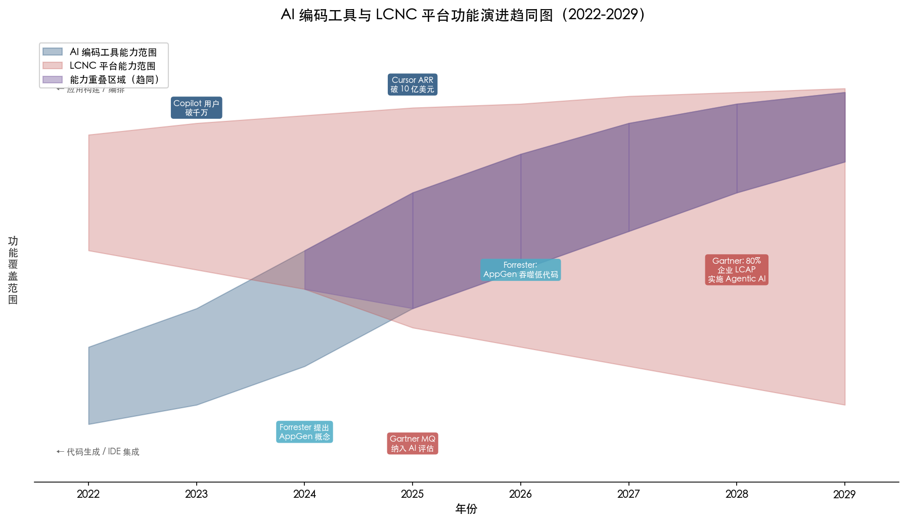

**图5-1 AI 编码工具与 LCNC 平台功能演进趋同图（2022-2029）。** 蓝色区域表示 AI 编码工具能力范围，粉色区域表示 LCNC 平台能力范围，紫色重叠区域逐年扩大，标注了 Copilot 用户破千万、Cursor ARR 破 10 亿美元、Forrester 提出 AppGen 概念等关键事件节点。

GitHub 与 Accenture 的联合研究提供了企业级场景下的效率参照：企业环境中开发者对 Copilot 建议的平均采纳率约 30%，PR 数量提升 8.69%，成功构建率提升 84%，95% 的开发者表示编码体验更愉悦 [GitHub Blog](https://github.blog/news-insights/research/research-quantifying-github-copilots-impact-in-the-enterprise-with-accenture/ "Quantifying Copilot's impact, 2024年5月")。这种"温和但稳定"的效率提升模式与 LCNC 平台所承诺的"数倍提速"形成了值得关注的对比：AI 编码工具在专业开发者场景中的效率提升相对渐进，而 LCNC 平台在公民开发者场景中的提速更为显著——两者的目标用户群体和使用场景仍存在显著分化。

我们判断，在未来 2-3 年内，两个品类的边界将持续模糊，但不会完全合并。LCNC 平台的核心差异化将越来越集中在企业治理基础设施、行业知识沉淀和多应用生态管理上，而 AI 编码工具的核心差异化则在于为专业开发者提供高精度代码生成和深度 IDE 集成。

## 5.3 Agentic AI：重塑 LCNC 平台的下一代引擎

### 5.3.1 LCAP 作为 Agentic AI 的落地基础设施

如果说生成式 AI 为 LCNC 平台增添了"自然语言开发"的新能力，Agentic AI 则有望从根本上改变平台的角色定位——从"应用构建工具"升级为"智能代理编排平台"。

Gartner 在 2025 年 LCAP 魔力象限报告中预测，"到 2028 年全球五分之四的企业将通过企业 LCAP 实施 Agentic AI"，LCAP 由此被视为 Agentic AI 落地的主要基础设施 [Microsoft Power Platform Blog](https://www.microsoft.com/en-us/power-platform/blog/power-apps/microsoft-recognized-as-a-leader-in-the-2025-gartner-magic-quadrant-for-enterprise-low-code-application-platforms/ "引述Gartner MQ报告")。Gartner 同时预测，到 2026 年末 40% 的企业应用将集成任务特定 AI Agent（2025 年该比例不到 5%）；更远期展望至 2035 年，Agentic AI 可驱动约 30% 的企业应用软件收入（规模超 4500 亿美元）[Gartner](https://www.gartner.com/en/newsroom/press-releases/2025-08-26-gartner-predicts-40-percent-of-enterprise-apps-will-feature-task-specific-ai-agents-by-2026-up-from-less-than-5-percent-in-2025 "2025年8月")。

Gartner 描绘了一条清晰的 Agentic AI 五阶段演进路径：AI 助手嵌入（2025）→ 任务特定 Agent（2026，40% 企业应用集成）→ 应用内协作式 AI Agent（2027）→ 跨应用 Agent 生态系统（2028，1/3 用户体验从原生应用转向 Agentic 前端）→ 民主化企业应用新常态（2029，50% 以上知识工作者具备 Agent 协作技能）[Gartner](https://www.gartner.com/en/newsroom/press-releases/2025-08-26-gartner-predicts-40-percent-of-enterprise-apps-will-feature-task-specific-ai-agents-by-2026-up-from-less-than-5-percent-in-2025 "Agentic AI五阶段路径")。如图5-2 所示，在这一路径的每个阶段，LCNC 平台均扮演着不可或缺的角色——提供 Agent 所需的业务流程定义、数据连接、权限管理和部署运维的全套基础设施。

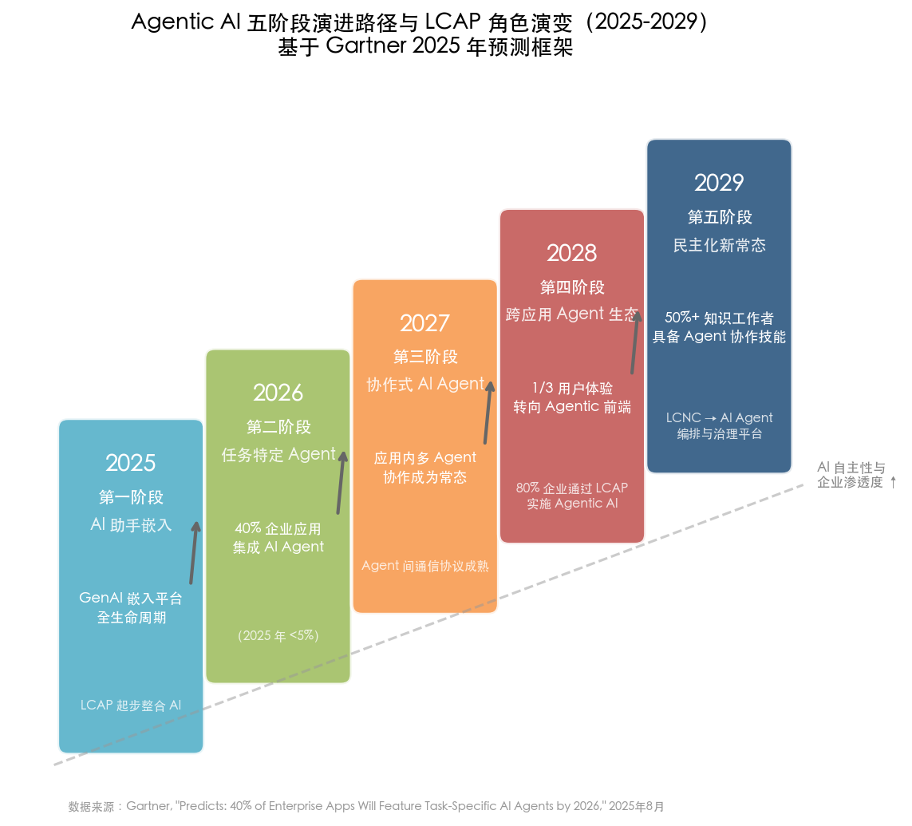

**图5-2 Agentic AI 五阶段演进路径与 LCAP 角色演变（2025-2029）。** 基于 Gartner 2025 年 8 月预测框架，以递升阶梯形式呈现各阶段核心特征与关键量化指标，LCAP 角色从"AI 助手集成平台"逐步演变为"AI Agent 编排与治理平台"。

### 5.3.2 头部平台的 Agent 化实践

各主流 LCNC 平台已在 Agent 化方向展开密集布局，但各自的切入路径和能力成熟度存在明显差异。

Microsoft Power Platform 在规模和治理两个维度均处于领先位置。FY2025 期间，平台用户已构建超过 300 万个 AI Agent；2025 年 7 月，Microsoft 将治理模型扩展至 AI Agent 领域，采用三区模型：Zone One（个人生产力/隔离实验）、Zone Two（协作/团队级开发）、Zone Three（企业托管/生产级）[Microsoft Power Platform Blog](https://www.microsoft.com/en-us/power-platform/blog/2025/07/31/evolving-power-platform-governance-for-ai-agents/ "2025年7月治理博客")。这种将 Agent 治理与传统低代码治理统一管理的做法，体现了平台在 AI 时代持续扮演企业级基础设施角色的能力。

其他头部厂商亦各有侧重。Appian 的 Agent Studio 于 2025 年 11 月正式上线，100% 测试用户反馈操作"直观或非常直观"。OutSystems 的 AI Agent Builder 支持以无代码方式构建 AI Agent，Agent Workbench 提供自定义与编排工具。ServiceNow 基于自有领域特定大模型 Now LLM 的 Now Assist 功能，展示了行业特定 AI 能力与通用低代码平台深度融合的可能路径。Gartner 预测到 2028 年超过 50% 的企业 GenAI 模型将是领域专用模型（DSLMs），这将深刻影响低代码平台的 AI 能力架构设计 [Gartner 2026 战略技术趋势](https://www.gartner.com/en/newsroom/press-releases/2025-10-20-gartner-identifies-the-top-strategic-technology-trends-for-2026 "Gartner Top Strategic Trends")。

图5-3 以矩阵形式对比了全球与中国主要 LCNC 平台在五个关键 AI 能力维度上的成熟度分布，有助于直观把握各平台的差异化定位。

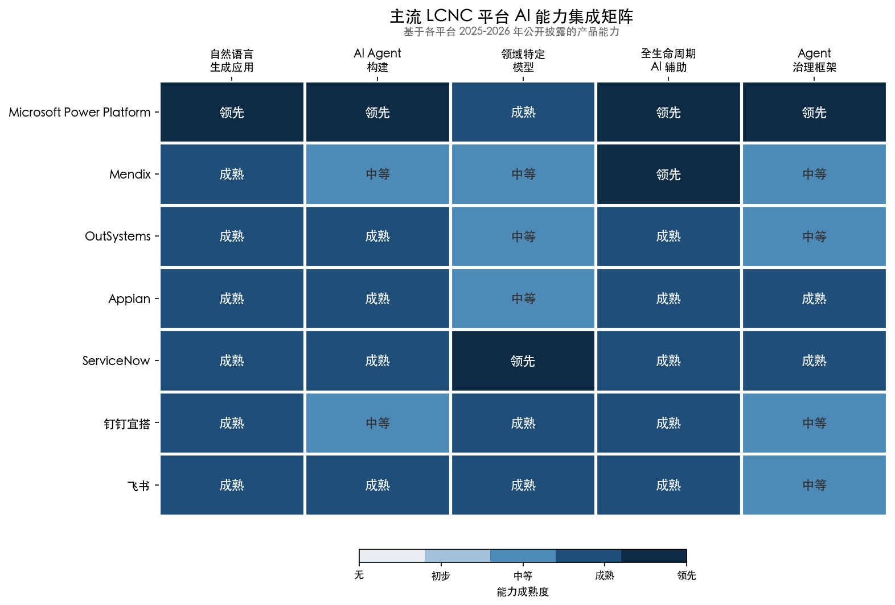

**图5-3 主流 LCNC 平台 AI 能力集成矩阵。** 基于各平台 2025-2026 年公开披露的产品能力，从自然语言生成应用、AI Agent 构建、领域特定模型、全生命周期 AI 辅助和 Agent 治理框架五个维度评估七家主要厂商的能力成熟度。Microsoft Power Platform 在整体 AI 能力集成上保持领先，ServiceNow 在领域特定模型维度表现突出。

### 5.3.3 AI 原生开发平台的战略意涵

Gartner 将"AI 原生开发平台"列为 2026 年十大战略技术趋势之一，并预测到 2030 年 80% 的组织将把大型软件工程团队转变为更小、更灵活的 AI 增强团队 [Gartner](https://www.gartner.com/en/newsroom/press-releases/2025-10-20-gartner-identifies-the-top-strategic-technology-trends-for-2026 "2025年10月")。这一趋势对 LCNC 平台意味着深刻的角色转变：平台不再仅是"让非开发者也能构建应用"的工具，而是成为 AI 与人类协同开发的核心协作环境。

Forrester 提出的 AppGen 概念为上述转变提供了更具体的框架：应用生成平台将整合软件分析、开发、安全、测试和交付各环节，核心创作体验为自然语言提示与视觉媒介的迭代循环，预计 3 年内走向成熟 [Forrester AppGen 报告](https://www.forrester.com/blogs/the-rise-of-application-generation-platforms/ "2024年5月7日")。这意味着到 2027-2028 年，LCNC 平台、AI 编码工具和 AI 原型构建工具之间的边界可能基本消失，整合为统一的"AI 驱动应用生成"品类。这一融合趋势的实质，是软件开发行业从"工具分层"向"能力整合"的范式迁移。

## 5.4 中国市场的差异化路径

### 5.4.1 平台巨头的 AI 整合竞赛

中国 LCNC 市场的 AI 整合呈现出鲜明的平台生态特色，与全球市场以独立厂商为主的格局形成对比。IDC 2024 年 7 月发布的《生成式 AI+低代码：探索新一代开发范式》和《中国低代码开发平台技术评估，2024》报告显示，钉钉宜搭在 11 家主流低代码厂商中综合实力位列第一，被评为"目前生成式 AI 能力集成最深的低代码产品"，六项能力获 IDC 五星评价 [DOIT 产业媒体](https://www.doit.com.cn/p/515708.html "引用IDC《中国低代码开发平台技术评估，2024》")。钉钉宜搭依托通义千问大模型，用户可通过自然语言对话或发送图片快速创建应用、办公门户及各类业务公式，并通过钉钉 AI 助理（AI Agent）激活现有宜搭应用，实现语音自动填写工单、商品分析和销售进展查看等功能。截至 2024 年 1 月，钉钉平台上的低代码应用数量已超过 1000 万个，标杆客户涵盖一汽集团、宁德时代、蒙牛集团、阳光电源等制造、能源、零售和医疗领域的头部企业 [DOIT 产业媒体](https://www.doit.com.cn/p/515708.html "钉钉宜搭低代码客户与规模数据")。

飞书于 2026 年 3 月 19 日举办新品发布会，完成了从"办公协作平台"到"AI Agent 原生平台"的关键跃迁。核心升级聚焦三大产品线：飞书 aily 从问答式 AI 助手升级为常驻 Agent，以对话机器人形态嵌入联系人列表，深度融入飞书工作流，具备自主读取消息、文档和组织关系的能力，支持零门槛创建业务技能，权限体系与用户本人严格一致；飞书妙搭推出自然语言驱动 Agent 生成复杂业务系统的能力，发布会现场演示中，用户仅耗费百余元 Token 费用便生成了市场价值约 2 万元的系统应用；多维表格 AI 搭建能力正式亮相，用户通过自然语言描述即可自动生成数据表、仪表盘、问卷、权限配置乃至整套业务系统 [新华网](http://www.news.cn/tech/20260319/e76a237bb21645b6a6f9ced193222cdd/c.html "飞书发布多款企业级Agent, 2026年3月19日")。飞书 CEO 谢欣在发布会上表示："OpenClaw 的火爆开启了 Agent 应用的全新时代。如何让每个人都能简单、安全地拥有像'龙虾'一样的 Agent 能力，是飞书首要解决的问题" [新华网](http://www.news.cn/tech/20260319/e76a237bb21645b6a6f9ced193222cdd/c.html "飞书CEO谢欣发言")。

### 5.4.2 中国市场的 AI+LCNC 需求特征

中国用户对 AI 与低代码融合的需求特征与全球市场存在明显差异。约 76% 的中国低代码用户希望通过 GenAI 提升开发效率，67% 关注降低成本 [腾讯云开发者社区](https://cloud.tencent.com/developer/article/2576443 "AI时代下中国低代码市场发展研究, 2025年10月")。不同行业的优先级也有所分化：金融行业最重视合规与系统集成，制造业聚焦生产流程与 IoT 集成，零售业追求快速迭代与高并发能力。在产品评价维度上，65% 的用户关注体验与学习成本，57% 关注功能拓展性，52% 关注 AI 赋能水平 [腾讯云开发者社区](https://cloud.tencent.com/developer/article/2576443 "AI时代下中国低代码市场发展研究")。

IDC 的分析进一步指出，AI Agent、智能界面设计、对话式应用构建、应用 AI 化改造和智能数据分析是中国市场更具潜力的落地场景，预计将对低代码开发方式与应用形态本身带来深刻变革 [DOIT 产业媒体](https://www.doit.com.cn/p/515708.html "引用IDC报告观点")。这意味着中国 LCNC 厂商需要对产品交互方式乃至底层架构进行大规模改造，方能把握 AI 时代的增长机遇。

与全球市场相比，中国市场的一个突出特征是平台生态的高度封闭性。钉钉宜搭深度绑定阿里云通义千问生态，飞书 aily 与字节跳动大模型体系紧密耦合。这种"平台＋AI＋低代码"的垂直整合模式在短期内有助于提供流畅的一体化体验，但也可能加剧第3章所讨论的供应商锁定风险——企业一旦深度嵌入特定平台的 AI 能力生态，迁移成本将较传统低代码场景更为高昂。

## 5.5 对"开发效率"命题的重新审视

生成式 AI 的介入要求对前文各章提出的效率与成本命题进行重新审视。

从效率维度看，AI 为 LCNC 平台带来了显著的"二次提速"效应。第2章所引用的传统低代码效率数据（如 Appian 17 倍开发速度提升、Power Apps 50% 开发时间缩短）已经构成了一次显著的效率跃迁；在此基础上，AI 能力的叠加进一步降低了使用门槛（Power Apps 构建成功率提高 60%）并扩展了可构建应用的复杂度上限（Mendix Maia 逻辑推荐可提速 30%）。

然而从风险维度看，AI 也在放大第3章所讨论的隐性成本问题。AI 辅助编写的 PR 问题数量约为人工编写的 1.7 倍这一发现表明，AI 在 LCNC 平台中大规模生成组件和逻辑时，可能加速技术债的积累速度。当公民开发者借助 AI 能力构建出越来越复杂的应用，却缺乏对底层逻辑的深入理解时，第3章所引述的渥太华大学 Lethbridge 关于"低代码最终变成高代码"的警告，在 AI 时代可能被进一步放大。

更值得关注的是，AI 正在重塑第4章讨论的管理者与开发者之间的立场分歧。对管理者而言，AI+LCNC 的组合进一步强化了"人人都是开发者"的愿景——飞书妙搭"百元 Token 生成两万元系统"的案例正是这种愿景的极端体现。对专业开发者而言，情况则更为复杂：METR 研究揭示的"感知加速但实际减速"悖论表明，即使在纯编码领域，AI 工具的实际生产力影响也远非线性提升那样简单。开发者角色正从"代码编写者"向"AI 输出验证者"和"系统架构师"转型。McKinsey 2025 年全球 AI 研究将软件工程列为 AI 经济价值潜力最大的职能之一（在部分行业模型中占比约 25%），但同时强调"捕获 AI 价值需要流程变革——仅采用工具而不改变运营模式的组织难以获得充分回报" [Panto AI 统计汇编](https://www.getpanto.ai/blog/ai-coding-assistant-statistics "引用McKinsey 2025 Global AI研究")。

## 5.6 本章小结

生成式 AI 对 LCNC 平台的影响可以概括为"重塑而非替代"。短期来看（2026-2027），AI 强化了 LCNC 平台的核心价值主张——通过自然语言交互层进一步降低开发门槛，通过 Agent 能力扩展平台的功能边界。中期来看（2027-2029），LCNC 平台、AI 编码工具和 AI 原型工具正向 Forrester 所定义的"应用生成平台"这一统一品类融合，预计约 3 年内走向成熟。长期来看（2029 年以后），LCNC 平台的核心竞争力将从"简化开发"转向"企业级 AI Agent 编排与治理"，Gartner 预测到 2028 年 80% 的企业将通过 LCAP 实施 Agentic AI。

在这一转型过程中，真正的赢家将是那些能够同时提供自然语言生成、可视化编排和代码扩展三种开发模态，同时在企业治理、数据安全和多应用生态管理方面建立深厚壁垒的平台。对于本报告核心命题——LCNC 是否提高了开发效率——的回答也需要更新：在 AI 时代，效率提升的幅度确实在进一步扩大，但验证、治理和质量控制的成本也在同步增加。组织能否从 AI+LCNC 的组合中获得净正价值，最终取决于治理能力的成熟度和对 AI 输出的验证机制是否到位。

# 第6章 企业采用策略与落地实践——从决策到治理的全链条

低代码/无代码（LCNC）平台的价值最终需要在企业实际采用中兑现。前述章节已从效率提升、隐性成本、利益相关方立场分歧和 AI 融合变量等维度构建了多层次分析框架，本章将视角转向企业"怎么做"——如何评估是否采用、如何选择平台、如何落地实施、如何建立治理体系，以及如何从成功与失败案例中提炼可复用的共性经验。我们认为，LCNC 采用本质上是一项组织变革工程而非单纯的技术选型决策；治理成熟度是决定最终成效的关键分水岭——拥有成熟治理框架的组织实施成功率达 81%，而缺乏治理者仅为 43% [Spidya 低代码 ROI 分析](https://spidya.com/en/blog/cheetah-low-code-development-platform-en/low-code-platforms-rois-insights-from-50-enterprise-projects "治理成熟度对成功率的影响")。

## 6.1 决策框架：企业何时该用、何时不该用 LCNC

### 6.1.1 适用场景与不适用场景的系统划分

企业评估 LCNC 平台的场景适配性时，需围绕项目复杂度、定制化需求和性能要求三个核心维度展开研判。综合前文分析与行业实践，LCNC 最具优势的场景集中在五类领域：内部业务管理应用（如审批流程、资产管理、员工门户）、业务流程自动化（如订单处理、报表生成、跨系统数据同步）、客户门户与表单驱动应用、最小可行产品（MVP）与快速原型验证，以及遗留系统的渐进式现代化替换 [LogRocket Blog](https://blog.logrocket.com/low-code-decision-guide/ "2025年7月低代码决策指南")。已有实证表明，Appian 客户通过低代码实现了应用组合精简 50%，OutSystems TEI 研究中替换遗留应用节省 76.5 万美元 [Forrester TEI of Appian](https://media.trustradius.com/product-downloadables/HT/WZ/KLUZNTWL24T2.pdf "Forrester TEI of Appian, 2021年6月") [OutSystems Blog](https://www.outsystems.com/blog/posts/low-code-roi/ "OutSystems引述Forrester TEI")。

与之相对，LCNC 明显不适合以下场景：需要复杂算法和高性能计算的系统（如量化交易引擎、实时风控模型）、深度定制超出平台预设模式的应用、对规模和并发有极端要求的核心交易系统，以及需要完全代码控制权的安全敏感型基础设施 [LogRocket Blog](https://blog.logrocket.com/low-code-decision-guide/ "2025年7月低代码决策指南") [byteiota](https://byteiota.com/low-code-hits-44-5b-gartner-2026-forecast-explained-2/ "byteiota综述平台局限性")。值得注意的是，低代码平台自动生成代码的性能通常仅为手工优化代码的 60%-80%，且当超过 30% 的应用逻辑需要自定义代码扩展时，低代码的效率优势将基本消失 [ByteIota 市场分析](https://byteiota.com/low-code-hits-75-enterprise-adoption-66b-market-2026/ "低代码性能与定制化临界点")。这一"30% 定制化临界点"可作为企业快速判断场景适配性的实用基准。

下图以决策树形式呈现了上述判断逻辑的结构化流程，企业可依据项目复杂度、定制化需求、性能要求和合规要求四个节点逐步筛选，最终导向"推荐 LCNC""混合开发"或"推荐传统开发"三种决策路径。

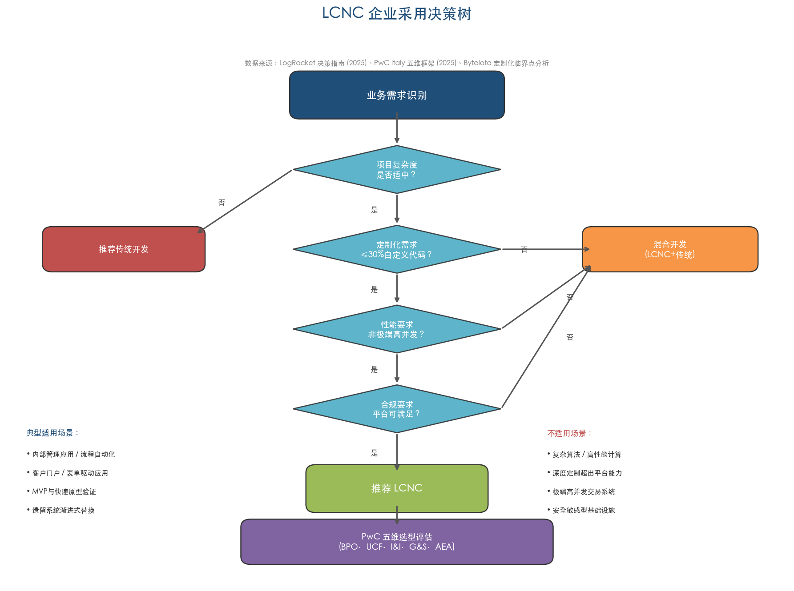

### 6.1.2 结构化选型框架

确定 LCNC 适用性之后，企业面临的下一个关键决策是具体平台选型。PwC Italy 卓越中心 2025 年发表的学术研究提出了一个五维度结构化选型框架，涵盖业务流程优化能力（BPO）、用户体验与定制灵活性（UCF）、集成与互操作性（I&I）、治理与安全（G&S）、以及高级工程与架构（AEA）五大评估维度。该框架的实证研究揭示了显著的行业差异：金融服务业最重视治理与安全维度（权重 28%），制造业最关注集成能力（权重 26%），零售业则更侧重用户体验定制。据报告数据，该框架的引入使企业决策信心提升 30%-40%，评估周期缩短 25%-35% [Lamanna, PwC Italy](https://www.researchgate.net/publication/396747680_A_Structured_Evaluation_Framework_for_Low-Code_Platform_Selection_A_Multi-Criteria_Decision_Model_for_Enterprise_Digital_Transformation "2025年发表")。

在国际权威评估体系层面，两大标杆性报告为企业提供了重要参考。Gartner 2025 年 Magic Quadrant for Enterprise LCAP 以"执行能力"和"愿景完整性"两大维度评估了 12 家厂商，入选门槛包括 LCAP 年收入至少 6000 万美元且拥有 100 家以上大型企业客户 [Pretius Gartner LCAP 分析](https://pretius.com/blog/gartner-quadrant-low-code "2025 Gartner MQ详细解读")。Forrester 2025 Wave™ 则采用 39 项评估标准，其中数据建模与管理、集成能力和数字流程自动化各占 10% 权重，为三项权重最高的能力维度 [OutSystems Forrester Wave 解读](https://www.outsystems.com/blog/posts/recognized-forrester-wave-low-code/ "OutSystems对Forrester Wave Q2 2025的解读")。Gartner 2025 年评估中标注了三大行业趋势：AI 辅助开发已成领导者的关键差异化能力、融合团队成为核心受众、治理与合规从差异化优势演变为基线要求 [Kissflow Gartner 分析](https://kissflow.com/low-code/gartners-magic-quadrant-about-low-code-vs-no-code-2025/ "Gartner 2025 MQ三大趋势")。

在平台策略层面，Gartner 分析师建议企业不应强制标准化到单一低代码平台，而应依赖治理框架赋予业务用户选择适合其需求工具的自主权 [CIO.com](https://www.cio.com/article/189651/8-tips-for-managing-low-code-citizen-developers.html "Gartner分析师混合策略建议")。预计到 2026 年，75% 的大型企业将使用至少四种低代码工具。多平台策略有助于降低单一供应商锁定风险，但也同时增加了治理复杂度，这要求企业在灵活性与可管理性之间寻求动态平衡 [ByteIota 市场分析](https://byteiota.com/low-code-hits-75-enterprise-adoption-66b-market-2026/ "多平台策略与治理复杂度")。

## 6.2 成功落地案例：最佳实践的共性提炼

### 6.2.1 国际标杆案例

以下案例横跨金融、保险、国防、能源和消费品五大行业，展示了 LCNC 在不同业务场景和组织规模下的落地效果。

**金融行业：FirstBank 反洗钱系统。** FirstBank 采用 Appian 低代码平台构建反洗钱（AML）合规系统，从构想到上线仅耗时 12 周，每年节省 1,000 工时，实现 100% AML 合规率 [Appian 案例](https://appian.com/blog/acp/low-code/low-code-examples "Appian官方案例集")。在监管驱动的合规场景中，低代码的快速交付优势尤为突出——传统开发模式下同类系统的交付周期通常为 6-12 个月。

**保险行业：Aviva 客服系统整合。** 全球保险巨头 Aviva（服务 3,300 万客户、运营覆盖 16 个国家）采用 Appian 将 22 个独立系统整合为呼叫中心的单一统一界面，客户服务响应速度提升 9 倍 [Appian 案例](https://appian.com/blog/acp/low-code/low-code-examples "Aviva Insurance案例")。该案例充分体现了低代码在跨系统集成与流程统一方面的价值。

**国防领域：美国空军合同管理系统。** 美国空军采用 Appian 开发 CON-IT 合同撰写系统，取代超过 100 个遗留系统和环境，耗时仅 9 个月，节省 8,300 万美元 [Appian 案例](https://appian.com/blog/acp/low-code/low-code-examples "美国空军CON-IT案例")。该案例在极端复杂的组织环境中验证了低代码对遗留系统现代化的有效性。

**能源行业：Shell 公民开发者运动。** Shell 发起了名为"DIY（Do IT Yourself）"的公民开发者计划，依托 Microsoft Power Platform，最初目标为培训 500 名公民开发者，最终扩展至超过 4,000 名活跃开发者，遍布全球业务线。Shell 在数字工程职能内设立了专门的卓越中心（CoE），使命为"赋能每位员工将工作流程数字化以提升生产力、增强敏捷性并为客户创造更多价值"。具体应用涵盖碳足迹数据请求自动化、化工厂炉窑效率优化（覆盖 20 座熔炉、每座 64 个燃烧器的节能调优）、以及施工现场吊装审批流程优化（审批时间从 2.5 小时缩短约 40% 至 1 小时）[Microsoft 客户案例](https://www.microsoft.com/en/customers/story/1699045592642116808-shell-energy-power-platform-uk "Shell DIY with Power Platform")。

**制造与消费品行业：G&J Pepsi-Cola Bottlers。** G&J Pepsi-Cola Bottlers 借助 Power Platform 实现超过 150 万美元的成本节约，其中 Store Audit 应用节省 10 万美元外部开发成本，Parking Lot 应用仅用一天完成开发 [Microsoft Power Platform Blog](https://www.microsoft.com/en-us/power-platform/blog/2024/09/03/reduce-development-times-and-increase-roi-with-microsoft-power-platform/ "Microsoft博客引述客户案例")。

### 6.2.2 经济回报的量化证据

多项由 Forrester 主导的全面经济影响（TEI）研究为 LCNC 投资回报提供了系统性量化证据。Power Apps Premium TEI 研究（2024 年 7 月，复合组织模型为 30,000 员工/100 亿美元年收入）显示三年 ROI 达 206%，NPV 为 3,100 万美元，第三年累计节省超 100 万工时 [Microsoft Power Platform Blog](https://www.microsoft.com/en-us/power-platform/blog/power-apps/millions-of-hours-saved-50-faster-app-development-and-206-roi-achieved-with-microsoft-power-apps-premium/ "Forrester TEI 2024年7月")。Power Platform 整体 TEI（同期发布）显示三年总收益达 1.182 亿美元，NPV 8,170 万美元，ROI 224% [Forrester TEI of Power Platform](https://tei.forrester.com/go/Microsoft/PowerPlatform2024/ "Forrester TEI 2024年7月")。

Mendix TEI 研究显示三年总净收益超过 2,000 万美元，包括应用交付节省 808 万美元、运营效率提升节省 597 万美元、客户参与度提升贡献 314 万美元、上市加速贡献 333 万美元 [Mendix TEI 博客](https://www.mendix.com/blog/quantifiable-impact-how-todays-enterprise-landscape-benefits-from-low-code/ "Forrester TEI of Mendix")。OutSystems TEI 显示三年 ROI 高达 506%，NPV 1,477 万美元，收益来源包括应用开发与维护节省 550 万美元、业务增长贡献 460 万美元、运营效率提升 670 万美元 [OutSystems TEI](https://www.outsystems.com/news/tei-low-code-roi/ "Forrester TEI of OutSystems")。

下图横向对比了四大主流平台的三年 ROI 与 NPV 表现，直观呈现不同平台的经济回报差异。

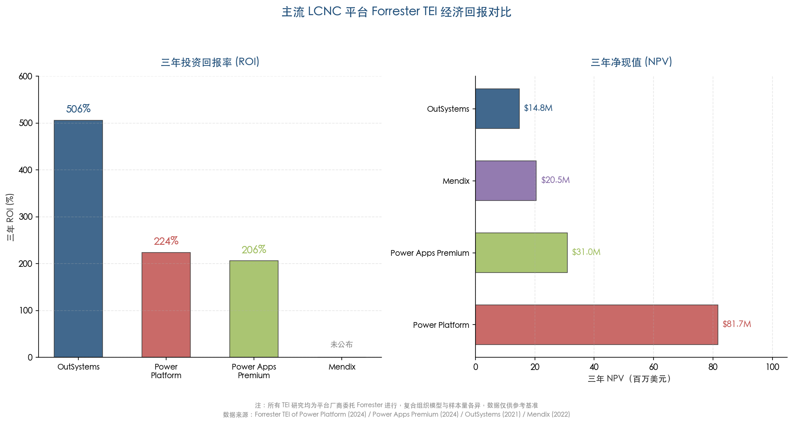

需要审慎看待的是，上述 TEI 研究均为平台厂商委托 Forrester 进行，样本量从 4 家到 13 家组织不等，复合组织模型可能无法覆盖所有行业和企业规模的差异。我们认为，这些数据可作为 LCNC 投资回报的参考基准，但企业实际 ROI 将高度依赖自身的治理成熟度、使用场景适配性以及团队能力建设水平。

### 6.2.3 成功案例的共性特征

综合分析上述案例，LCNC 成功落地呈现以下四项共性特征：

**第一，高管层的明确支持与资源投入。** Shell 任命了专职副总裁负责低代码/无代码开发，并设定了正式的 DIY 计划目标 [Microsoft 客户案例](https://www.microsoft.com/en/customers/story/1699045592642116808-shell-energy-power-platform-uk "Shell DIY with Power Platform")。KPMG 调查亦指出，领导层的战略支持是公民开发项目成功的六大驱动力之一 [KPMG Belgium](https://kpmg.com/be/en/insights/technology/transforming-business-value-creation-with-citizen-development.html "KPMG公民开发六大驱动力")。

**第二，清晰的治理框架与分区管理。** Shell 的分区治理模型（绿色/琥珀色/红色三区，根据应用风险等级匹配不同流程要求）确保了创新与控制之间的平衡。数据表明，拥有成熟治理框架的组织实施成功率达 81%，而缺乏治理者仅为 43% [Spidya 低代码 ROI 分析](https://spidya.com/en/blog/cheetah-low-code-development-platform-en/low-code-platforms-rois-insights-from-50-enterprise-projects "治理成熟度对成功率的影响")。

**第三，渐进式推广与社区驱动的增长策略。** Shell 通过 Boot Camp 培训（累计 188 期）、黑客马拉松、个人学习路径等方式逐步培育公民开发者社区，将原始目标从 500 人扩展至 4,000 人以上 [Microsoft 客户案例](https://www.microsoft.com/en/customers/story/1699045592642116808-shell-energy-power-platform-uk "Shell培训规模")。这种"先试点、后推广"的路径有效降低了组织变革阻力。

**第四，IT 与业务的深度协作模式。** 成功项目无一例外地将 IT 部门定位为支持者和架构守护者而非决策控制者。McKinsey 指出，低代码的核心价值之一在于"企业级协作共建"——业务开发者负责需求定义和低代码逻辑，IT 负责架构和复杂技术工作 [McKinsey Tech Forward](https://www.mckinsey.com/capabilities/tech-and-ai/our-insights/tech-forward/low-code-no-code-a-way-to-transform-shadow-it-into-a-next-gen-technology-asset "McKinsey, 2022年8月19日")。

## 6.3 失败模式与反面教训

### 6.3.1 典型失败模式

并非所有 LCNC 采用都能取得预期成效。Panorama Consulting 于 2026 年 3 月指出，低代码平台已成为"新型影子 IT"的主要来源。典型失控模式包括：财务团队自行搭建例外审批路径、HR 自建案件管理工具、运维自行构建服务请求工作流——导致同一流程出现多个版本，且各版本的控制假设和问责结构互不一致 [Panorama Consulting](https://www.panorama-consulting.com/the-new-shadow-it-low-code-platforms/ "2026年3月")。

综合行业分析，LCNC 项目的十大常见失败模式涵盖：平台灵活性和定制能力有限、扩展性不足、集成能力浅层化、安全合规能力欠缺、厂商锁定、平台特定技能不可迁移、知识瓶颈（仅少数人能维护）、技术债快速积累、开发实践不一致、以及隐性成本超出预期 [Dagster Blog](https://dagster.io/blog/why-no-code-solutions-almost-always-fail "技术分析角度的失败模式汇总")。

### 6.3.2 灾难性案例的教训

第三章已详细分析的保险公司案例具有典型警示意义——一家全球保险公司使用低代码平台构建管理约 400 万件洪水索赔的应用，维护人员在修复 bug 时意外删除整个数据库且无备份，导致全部记录丢失 [Unstoppable Software 案例分析](https://unstoppablesoftware.com/the-real-costs-of-low-code-development/ "保险公司低代码应用灾难性数据丢失案例")。该案例的核心教训并非低代码本身存在固有缺陷，而在于缺乏基本的运维治理——任何关键业务应用都应具备版本控制、自动备份和访问权限分离机制。

学术研究同样提供了有力的警示：渥太华大学 Lethbridge 教授记录了一个案例——一位 Excel 专家在两天内构建了一个预估需一个人年开发的应用，但仅其本人能够维护，两年内便不得不被更传统的系统取代 [Lethbridge 2021](https://www.site.uottawa.ca/~tcl/papers/ISola2021-LowCodeisHighCode-Lethbridge-CameraReady.pdf "Excel案例：维护知识过度集中")。这一模式在 LCNC 环境中尤为普遍：初始开发速度极快，但知识高度集中于单人，一旦此人离职或调岗，应用便沦为"黑箱"。

### 6.3.3 失败的共性根因

基于上述案例与研究，LCNC 项目失败的根本原因可归纳为三类：

**治理缺位。** KPMG 与 HFS 联合研究（2023 年，覆盖欧洲、中东及非洲 700 余家企业）发现，拥有低代码治理指南的企业中 77% 实现了开发成本降低，而缺乏治理的企业这一比例仅为 39%——治理与否导致成本削减成功率相差近一倍 [KPMG/HFS 低代码治理报告](https://assets.kpmg.com/content/dam/kpmgsites/es/pdf/2023/06/kpmg-hfs-lowcodegovernance.pdf "KPMG/HFS, 2023年5月")。然而，同一研究揭示了一个令人警醒的现实：在已使用低代码的企业中，不到三分之一同时建立了配套的指南和治理体系 [KPMG/HFS 低代码治理报告](https://assets.kpmg.com/content/dam/kpmgsites/es/pdf/2023/06/kpmg-hfs-lowcodegovernance.pdf "KPMG Portugal 合伙人Rui Gonçalves引述")。

**场景错配。** 将 LCNC 应用于复杂度超出平台能力上限的场景，或在需要深度定制的项目中勉强使用预设模板，均会触发"低代码最终变成高代码"的恶性循环——应用代码量可增长至数千行甚至数十万行，且缺乏模块化与可重用能力 [Lethbridge 2021](https://www.site.uottawa.ca/~tcl/papers/ISola2021-LowCodeisHighCode-Lethbridge-CameraReady.pdf "ISoLA 2021 案例分析")。

**组织能力不匹配。** 70% 的零编程背景开发者可在一个月内学会使用低代码平台 [Kissflow CoE 指南](https://kissflow.com/no-code/how-to-set-up-a-no-code-coe/ "Kissflow关于建立无代码CoE的框架")，但掌握工具操作并不等同于具备良好的应用设计意识和数据治理素养。KPMG Belgium 指出，"即使有了支持性治理，低代码/无代码工具的广泛使用仍可能无意间导致更多影子 IT——如果员工为了加速开发而绕过已批准的平台或协议" [KPMG Belgium](https://kpmg.com/be/en/insights/technology/transforming-business-value-creation-with-citizen-development.html "KPMG公民开发反直觉洞察")。这一发现表明，工具培训必须与治理意识教育同步推进。

## 6.4 治理体系设计：赋能与控制的平衡

### 6.4.1 分区治理模型

Gartner 建议将公民开发活动划分为"绿色/黄色/红色"三区治理框架：绿色区（个人生产力工具、低风险实验）允许自由创建，黄色区（团队级应用、涉及共享数据）需协作构建并通过基本审查，红色区（涉及业务关键流程、敏感数据或合规要求）则需 IT 全面监督 [CIO.com](https://www.cio.com/article/189651/8-tips-for-managing-low-code-citizen-developers.html "Gartner分析师Jason Wong的三区治理建议")。

Microsoft Power Platform 于 2025 年 7 月将此三区模型扩展至 AI Agent 治理场景：Zone One 定位为个人生产力和隔离实验环境，Zone Two 为协作和团队级开发空间，Zone Three 为企业托管的生产级部署 [Microsoft Power Platform Blog](https://www.microsoft.com/en-us/power-platform/blog/2025/07/31/evolving-power-platform-governance-for-ai-agents/ "2025年7月治理博客")。这一扩展表明，随着 Agentic AI 能力融入低代码平台，治理框架亦需同步演进。

下图以对照表形式展示了三区模型在应用类型、治理要求、责任主体、审批流程和 AI Agent 扩展五个维度上的差异，直观呈现"风险等级递增—治理强度递增"的对应关系。

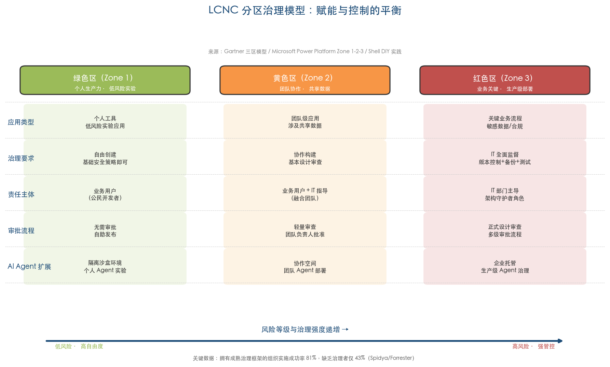

### 6.4.2 管理策略的三种模式

Forrester 分析师 John Bratincevic 提出了三种公民开发管理策略，适用于不同组织成熟度阶段 [CIO.com](https://www.cio.com/article/189651/8-tips-for-managing-low-code-citizen-developers.html "Forrester分析师Bratincevic")：

**小型自治团队模式：** 适用于初始阶段或小型组织，由少量跨职能成员组成自管理团队。该模式灵活性最高，但治理覆盖面有限，适合作为 LCNC 试点的起步形态。

**自助服务模式：** IT 部门提供平台、模板和基础培训，业务用户在预设框架内自行开发。该模式适合中等规模的公民开发项目，但需要平台本身具备足够的内建防护栏（guardrails），以约束开发行为在安全可控范围之内。

**联邦模式（最成熟）：** 由卓越中心（CoE）统一管理平台并实施治理护栏，各业务单元保留一定自主权但须遵守统一的架构标准和安全策略。Shell 的 DIY 计划即是联邦模式的典型实践——全球 CoE 制定统一规则，各业务线在规则框架内自主开发和部署。

### 6.4.3 卓越中心（CoE）的建设路径

Mendix 提出了"低代码卓越中心"的三阶段建设方法论，为企业从零到规模化搭建治理架构提供了清晰路线图 [Mendix CoE 指南](https://www.mendix.com/blog/how-to-build-a-low-code-center-of-excellence/ "2024年2月发布")：

**启动阶段（Launch）：** 确定 CoE 章程与范围，指定初始团队（推广冠军、战略师、治理负责人、运营专家等关键角色），选定 1-3 个试点项目验证价值。

**结构化阶段（Structure）：** 建立正式的治理策略与流程文档，开发培训课程与认证路径，构建可复用的组件库和模板库，设定 KPI 与度量体系。

**规模化阶段（Scale）：** 将 CoE 实践推广至全组织，建立跨业务线的社区实践（COP），实施持续优化的反馈循环。

KPMG 与 HFS 的联合报告对此给出了重要补充视角——强调须区分"社区实践"（COP）与"卓越中心"（CoE）的职责边界：COP 侧重于鼓励实验和创新、分享最佳实践、推动跨部门知识交流；CoE 则聚焦于确保政策执行、软件实施支持和长期运维优化。两者协同运作方能实现"既激发创新又确保可控"的双重目标 [KPMG/HFS 低代码治理报告](https://assets.kpmg.com/content/dam/kpmgsites/es/pdf/2023/06/kpmg-hfs-lowcodegovernance.pdf "KPMG/HFS COP vs CoE框架")。KPMG 报告还引用了 Lloyds Banking Group 的实践——该银行通过将流程自动化工具与低代码工具整合到统一的社区实践中，有效减少了数据架构和软件层面的冗余与重复投资 [KPMG/HFS 低代码治理报告](https://assets.kpmg.com/content/dam/kpmgsites/es/pdf/2023/06/kpmg-hfs-lowcodegovernance.pdf "Lloyds Banking Group案例")。

### 6.4.4 应用生命周期管理与退役机制

Panorama Consulting 提出了四步流程治理恢复建议，针对已出现"应用蔓延"现象的组织尤为适用 [Panorama Consulting](https://www.panorama-consulting.com/the-new-shadow-it-low-code-platforms/ "2026年3月治理建议")：第一，指派跨职能高管负责人（通常兼具 IT 和业务背景）统筹 LCNC 应用组合管理；第二，按关键性对所有现存 LCNC 应用进行三级分类——关键业务型、团队协作型、个人工具型；第三，要求涉及业务规则变更的应用在上线前通过正式设计审查；第四，为临时性工具建立明确的退役规则，避免大量应用缺乏清单管理、被遗忘后仍运行在生产环境中。

退役机制的重要性不可低估。OWASP LCNC Top 10 安全风险中，LCNC-SEC-09（资产管理失败）正是指向这一问题——无代码蔓延导致大量应用缺乏清单管理，成为组织安全体系中的盲区 [Cloud Wars 解读](https://cloudwars.com/cybersecurity/top-10-low-code-no-code-risks-and-how-to-secure-rapid-development/ "OWASP LCNC Top 10详细解读")。

## 6.5 中国市场的差异化实践

### 6.5.1 中国 LCNC 生态的独特格局

中国 LCNC 市场在平台生态、企业数字化基础和行业需求方面与欧美市场存在显著差异。IDC 数据显示，2024 年中国低代码与零代码软件市场规模为 40.3 亿元人民币（约 5.5 亿美元），预计到 2029 年达 129.8 亿元，未来 5 年 CAGR 为 26.4%，增速显著高于全球平均水平 [IDC 中国](https://mfe-prod.idc.com/getdoc.jsp?containerId=prCHC53666825 "IDC：低代码与零代码深度融合生成式AI，2025年7月发布")。与海外市场以独立 LCAP 厂商（OutSystems、Mendix）为主导不同，中国市场呈现"三类厂商并存"的差异化格局：独立厂商（奥哲、得帆、简道云）、应用软件/SaaS 厂商（金蝶、用友）、以及平台型厂商（华为、浪潮）和生态型入口（钉钉宜搭、飞书多维表格）[IDC 中国](https://mfe-prod.idc.com/getdoc.jsp?containerId=prCHC53666825 "IDC 2024年中国低零代码厂商格局")。

在行业需求层面，中国市场呈现清晰的差异化特征：金融行业最重视合规与系统集成，制造业聚焦生产流程与物联网（IoT）集成，零售业追求快速迭代与高并发支持。用户层面的调研显示，65% 关注体验与学习成本，57% 关注功能拓展性，52% 关注 AI 赋能水平 [腾讯云开发者社区](https://cloud.tencent.com/developer/article/2576443 "AI时代下中国低代码市场发展研究, 2025年10月")。

### 6.5.2 生态型平台的独特路径

中国市场的一个显著特征是生态型入口的强势地位。钉钉宜搭深度整合了阿里巴巴的办公协同生态（钉钉覆盖用户超 6 亿、企业组织超 2,000 万），形成了"开发—部署—运营"的闭环管理能力 [如此智能](https://www.ruciai.com/blog/70-low-code-zero-code-platforms "2025年9月最新平台盘点")。2025 年，钉钉宜搭接入 DeepSeek 大模型后，表单生成效率提升 80% [东方财富号](https://caifuhao.eastmoney.com/news/20251127113923995460860 "2025中国低代码平台洞察与选型指南")。这一路径与海外 Microsoft Power Platform 深度绑定 Microsoft 365 生态的策略高度相似——两者均通过办公协同入口降低了 LCNC 的采用门槛，使平台的初始推广得以借助已有用户基础实现快速渗透。

简道云则以 34.5% 市占率连续四年蝉联中国零代码平台整体市场第一 [帆软社区](https://auth.fanruan.com/thread-152080-1-1.html "简道云蝉联中国零代码市场占有率第一")，其定位偏向中小企业快速搭建轻量应用（如报销、请假、库存管理），操作简便、成本低廉，但在复杂场景扩展能力方面存在一定局限 [腾讯云开发者社区](https://cloud.tencent.com/developer/article/2640231 "低代码平台实测对比")。

### 6.5.3 中国市场落地的特殊挑战

中国企业在 LCNC 落地过程中面临几项独特挑战。第一，信创合规要求——部分政务和国有企业须使用国产化技术栈，限制了海外平台的渗透空间。第二，本土生态集成需求——企业往往需要与钉钉、企业微信、飞书等本土办公平台实现深度集成，这对平台的本地化适配能力提出了较高要求。第三，数据安全法规（如《数据安全法》《个人信息保护法》）对数据跨境流动实施严格管控，影响了跨国 LCNC 平台在国内的部署模式选择。调研数据显示，约 61% 的中国组织用户认可低代码价值并愿意持续投资 [腾讯云开发者社区](https://cloud.tencent.com/developer/article/2576443 "AI时代下中国低代码市场发展研究")，表明市场接受度在快速提升，但相较于欧美成熟市场，治理体系建设仍处于相对早期阶段。

## 6.6 综合建议：企业 LCNC 采用的行动路线

基于上述分析，我们为不同规模的企业提出差异化的采用建议：

**大型企业（员工 5,000 人以上）：** 建议采用联邦治理模式，设立正式的 LCNC 卓越中心，实施分区治理（绿/黄/红三区），同时部署多平台策略以降低单一厂商锁定风险。在平台选型时应优先评估治理与安全维度（参照 PwC 五维框架中金融服务业 28% 的治理权重），并建立应用生命周期管理与退役机制。Shell 的 DIY 计划和 Lloyds Banking Group 的统一社区实践均是值得参考的标杆。

**中型企业（员工 500-5,000 人）：** 建议以自助服务模式起步，由 IT 团队选定一至两个核心平台、提供标准化培训和组件库，并逐步向联邦模式演进。首批试点应选择内部管理工具和流程自动化等低风险、高价值场景，在积累经验的同时验证平台与组织的适配性。

**小型企业和初创公司：** 建议从生态型入口平台入手（如 Power Platform、钉钉宜搭或简道云），利用预构建模板快速搭建核心业务应用。治理的优先级应集中在数据备份策略和关键应用的人员冗余（避免单人知识瓶颈）两个方面。

无论企业规模如何，有三条原则值得在任何 LCNC 采用中贯彻。第一，"先治理，后扩张"——在大规模推广前建立治理框架，KPMG/HFS 调查显示有治理的企业成本降低成功率（77%）几乎是无治理企业（39%）的两倍 [KPMG/HFS 低代码治理报告](https://assets.kpmg.com/content/dam/kpmgsites/es/pdf/2023/06/kpmg-hfs-lowcodegovernance.pdf "KPMG/HFS, 2023年5月")。第二，"场景驱动，而非技术驱动"——从具体业务痛点出发选择 LCNC 解决方案，避免"为低代码而低代码"的技术导向偏差。第三，"持续反馈，动态调整"——KPMG 将持续反馈机制列为公民开发项目成功的第六大驱动力，Shell 在三年迭代中不断优化方法论和治理模型正是这一原则的有力例证 [KPMG Belgium](https://kpmg.com/be/en/insights/technology/transforming-business-value-creation-with-citizen-development.html "KPMG六大驱动力框架")。

# 第7章 前景展望——低代码/无代码的演进路径与产业格局预判

前述六章已从市场全景、效率提升、隐性成本、立场分歧、AI 变量与企业实践等维度构建了对 LCNC 生态的全方位分析框架。本章在此基础上将视线投向未来 1—3 年的技术演进方向与产业格局重塑。我们认为，LCNC 正处于一个关键转折期——从可视化开发范式向 AI 原生应用生成范式的过渡已经启动，但这一过渡并非线性替代，而是多路径并行演化。回答"完全低代码化是否可行"和"哪些场景将长期依赖传统编码"这两个核心命题，需要同时审视技术能力边界、产业竞争逻辑与组织适配条件三重维度。

## 7.1 技术演进方向：从低代码到 AI 原生开发平台

### 7.1.1 Gartner 的"AI 原生开发平台"战略预判

Gartner 已将"AI 原生开发平台"（AI-Native Development Platforms）列为 2026 年十大战略技术趋势之一，标志着行业对 LCNC 未来形态的共识正在发生根本性转移。根据 Gartner 预测，到 2030 年 80% 的组织将把大型软件工程团队演变为 AI 增强的更小、更灵活团队，届时 40% 的企业应用组合将由 AI 原生开发平台构建的自定义应用组成 [Gartner 2026 战略技术趋势](https://www.gartner.com/en/newsroom/press-releases/2025-10-20-gartner-identifies-the-top-strategic-technology-trends-for-2026 "2025年10月20日")。

这一判断的底层逻辑在于：AI 正在重塑软件开发生命周期（SDLC）的每一个阶段，从设计到部署均可由 AI 工具半自主或自主完成。Gartner 识别了六大塑造软件工程未来的战略趋势——AI 原生软件工程、构建基于 LLM 的应用与 Agent、GenAI 平台工程、人才密度最大化、开放 GenAI 模型的崛起以及绿色软件工程 [BW Businessworld](https://www.businessworld.in/article/gartner-identifies-six-strategic-trends-shaping-the-future-of-software-engineering-562335 "Gartner六大软件工程战略趋势，2025年7月")。其中，AI 原生软件工程将使开发者的角色从代码实现者转变为 AI 系统的编排者。正如 Gartner 分析副总裁 Joachim Herschmann 所指出的："开发者的角色将从实现转向编排，聚焦于问题解决和系统设计，并确保 AI 工具交付高质量成果" [BW Businessworld](https://www.businessworld.in/article/gartner-identifies-six-strategic-trends-shaping-the-future-of-software-engineering-562335 "Gartner VP Analyst 观点")。

在量化层面，Gartner 进一步预测，到 2028 年 90% 的企业软件工程师将使用 AI 代码助手（2024 年初这一比例不到 14%）；到 2027 年至少 55% 的软件工程团队将积极参与基于 LLM 的功能开发；同期 70% 拥有平台团队的组织将整合 GenAI 能力 [BW Businessworld](https://www.businessworld.in/article/gartner-identifies-six-strategic-trends-shaping-the-future-of-software-engineering-562335 "Gartner预测数据")。上述预测共同指向一个明确的趋势：LCNC 平台的可视化开发界面将被"自然语言+可视化+代码"三模态并行的 AI 原生交互方式所取代或深度重组。

### 7.1.2 Forrester 的"应用生成平台"范式

与 Gartner 遥相呼应，Forrester 于 2024 年 5 月首次提出"应用生成平台"（Application Generation Platforms, AppGen）概念，代表了对低代码品类未来形态的另一种权威预判。AppGen 将整合软件分析、开发、安全、测试和交付各环节，核心创作体验从传统的拖拽操作转变为自然语言提示与视觉媒介的迭代循环，Forrester 估计该品类将在 3 年内走向成熟 [Forrester AppGen 报告](https://www.forrester.com/blogs/the-rise-of-application-generation-platforms/ "2024年5月7日")。

到 2026 年初，Forrester 分析师进一步明确指出"AppGen 正在吞噬低代码"（AppGen Is Eating Low-Code），但同时强调"这不是开发者的终结"——AppGen 能加速创建但无法替代业务上下文理解、合规治理和人类判断力 [Forrester AppGen 博文](https://www.forrester.com/blogs/appgen-is-eating-low-code-what-it-means-to-you/ "2026年2月5日")。Forrester 在 2026 年的最新报告中更直接指出，AppGen 已经"吞噬"（subsume）了低代码，使这些平台成为企业级 AI 驱动软件开发最具可行性的路径 [Forrester AppGen 报告](https://www.forrester.com/report/appgen-myths-and-realities/RES192055 "AppGen Myths And Realities")。

Retool 对 AppGen 品类的深度解析揭示了当前市场的三层分化格局：第一层是 AI-only 原型工具（Bolt、Replit、Lovable），优化原型速度但缺乏治理、审计和安全等企业级能力；第二层是传统低代码厂商的 AI 升级版（OutSystems、Mendix、ServiceNow），拥有企业级基础设施但受限于历史形成的刚性抽象层；第三层是 AI 代码生成工具（Cursor、Claude Code），面向开发者但不提供数据基础设施和治理框架。真正的企业级 AppGen 平台需要同时解决可信数据访问、灵活部署和内嵌安全治理三个维度的问题 [Retool 对 Forrester AppGen 概念解读](https://retool.com/blog/enterprise-appgen-the-future-of-low-code "2026年2月25日")。

我们认为，Gartner 的"AI 原生开发平台"和 Forrester 的"AppGen"虽然术语不同，但指向同一演进方向：低代码平台正在从"以可视化拖拽为核心的开发加速工具"进化为"以 AI 生成为核心、多模态交互为界面、企业治理为底座的应用构建平台"。这一转型的关键不在于抛弃可视化，而在于将可视化降维为多种交互模态之一。

下图呈现了 LCNC 技术从 2020 年至 2030 年的四阶段演进脉络，以及 Gartner 与 Forrester 在各时间节点发布的关键预测里程碑。

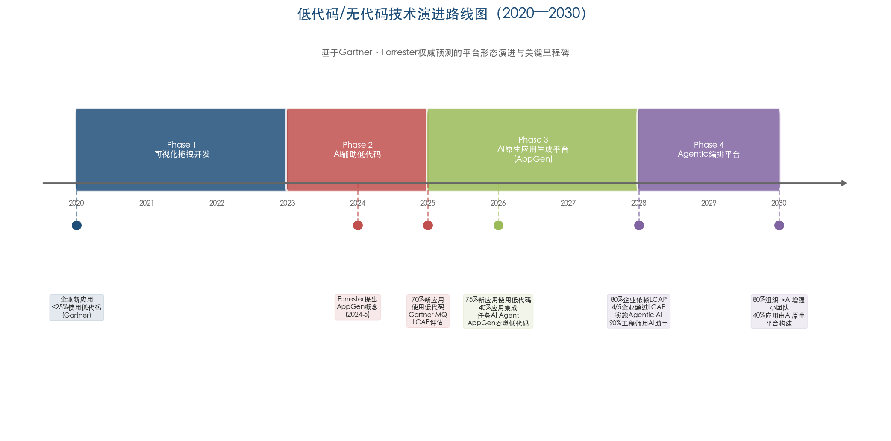

### 7.1.3 Agentic AI 的五阶段演进路径

在技术演进的具体路径上，Gartner 描绘了 Agentic AI 在企业应用中的五阶段演进路径，为 LCNC 平台的近中期发展提供了清晰的时间坐标。

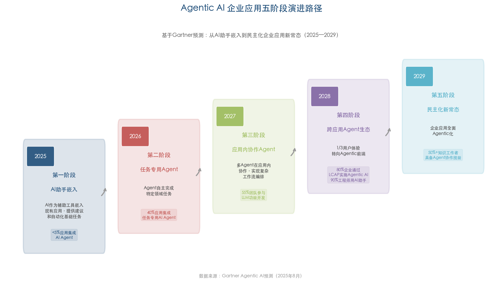

具体而言，上述五个阶段可概括如下：

- **第一阶段（2025 年）：AI 助手嵌入**——AI 作为辅助工具嵌入现有应用，提供建议和自动化基础任务，当前仅不到 5% 的应用集成了 AI Agent。
- **第二阶段（2026 年）：任务专用 Agent**——到 2026 年末 40% 的企业应用将集成任务专用 AI Agent，Agent 能够自主完成特定领域任务。
- **第三阶段（2027 年）：应用内协作 Agent**——多个 Agent 在同一应用内协作，实现更复杂的工作流编排，预计 55% 的团队将参与基于 LLM 的功能开发。
- **第四阶段（2028 年）：跨应用 Agent 生态系统**——三分之一的用户体验将从原生应用转向 Agentic 前端，80% 的企业将通过 LCAP 实施 Agentic AI。
- **第五阶段（2029 年）：民主化企业应用新常态**——超过 50% 的知识工作者将具备 Agent 协作技能，企业应用全面进入 Agentic 化阶段。

[Gartner Agentic AI 预测](https://www.gartner.com/en/newsroom/press-releases/2025-08-26-gartner-predicts-40-percent-of-enterprise-apps-will-feature-task-specific-ai-agents-by-2026-up-from-less-than-5-percent-in-2025 "2025年8月26日")

从更长的时间尺度看，Gartner 预测到 2035 年 Agentic AI 可驱动约 30% 的企业应用软件收入，规模超过 4500 亿美元 [Gartner Agentic AI 预测](https://www.gartner.com/en/newsroom/press-releases/2025-08-26-gartner-predicts-40-percent-of-enterprise-apps-will-feature-task-specific-ai-agents-by-2026-up-from-less-than-5-percent-in-2025 "2025年8月")。与此密切相关的是，Gartner 在 2025 年 LCAP MQ 中预测"到 2028 年全球五分之四的企业将通过企业 LCAP 实施 Agentic AI"，将 LCAP 定位为 Agentic AI 落地的核心基础设施 [Microsoft Power Platform Blog](https://www.microsoft.com/en-us/power-platform/blog/power-apps/microsoft-recognized-as-a-leader-in-the-2025-gartner-magic-quadrant-for-enterprise-low-code-application-platforms/ "引述Gartner MQ报告")。

这一判断具有深远含义：LCNC 平台不仅是应用开发工具，更将成为企业 AI 能力落地的核心载体。Agentic AI 的复杂编排需求恰恰契合 LCNC 平台的核心优势——可视化的工作流定义、预置的企业级连接器、标准化的治理框架。换言之，Agentic AI 时代反而可能强化而非削弱 LCNC 平台的战略地位。

此外，Gartner 预测到 2028 年超过 50% 的企业 GenAI 模型将是领域专用的小型语言模型（DSLMs），这将深刻影响低代码平台的 AI 能力架构——平台将不再仅依赖通用大模型，而是整合针对特定业务领域优化的专用模型，从而进一步提升生成应用的精准度与行业适配性 [Gartner 2026 战略技术趋势](https://www.gartner.com/en/newsroom/press-releases/2025-10-20-gartner-identifies-the-top-strategic-technology-trends-for-2026 "Gartner Top Strategic Trends")。

## 7.2 "完全低代码化"的可行性边界

### 7.2.1 LCNC 可覆盖的应用场景将持续扩展

综合前文分析与趋势预判，我们判断 LCNC 的适用范围将在 AI 加持下持续扩展，但扩展速度和深度因场景而异。

Gartner 的预测序列提供了清晰的量化参照：2020 年不足 25% 的企业新开发应用使用低代码技术，2025 年该比例上升至 70%，预计 2026 年将达 75% [InfoWorld](https://www.infoworld.com/article/2337677/low-code-development-technologies-market-forecast-to-hit-445-billion-by-2026.html "Gartner预测75%新应用用低代码/2026")。展望更远的时间窗口，Gartner 预测到 2028 年近 80% 的企业将依赖 LCAP [Microsoft Power Platform Blog](https://www.microsoft.com/en-us/power-platform/blog/power-apps/microsoft-recognized-as-a-leader-in-the-2025-gartner-magic-quadrant-for-enterprise-low-code-application-platforms/ "Gartner 2028年80%企业采用LCAP预测")。这一趋势线表明，LCNC 正从"补充性工具"演变为"主流开发方式"。

AI 能力的叠加将进一步拓展 LCNC 的应用边界。此前因平台预设模式限制而难以实现的复杂业务逻辑，可通过自然语言描述由 AI 生成定制化代码来弥补。Microsoft Power Platform Copilot 使应用构建成功率提高 60% 的实证数据表明，AI 正在有效降低平台固有的"灵活性天花板" [Microsoft Power Platform Blog](https://www.microsoft.com/en-us/power-platform/blog/power-apps/microsoft-recognized-as-a-leader-in-the-2025-gartner-magic-quadrant-for-enterprise-low-code-application-platforms/ "2025 Gartner MQ Leader")。随着 Agentic AI 能力的逐步成熟，LCNC 平台有望覆盖更多原本需要专业编程才能完成的工作流编排和跨系统集成任务。

### 7.2.2 传统编码不可替代的"硬核心"场景

尽管 LCNC 的能力边界在持续扩展，我们判断仍存在若干"硬核心"场景，在可预见的未来将长期依赖传统编码或深度定制开发。

**高性能计算与复杂算法系统。** 量化交易引擎、实时风控模型、科学计算和大规模数据处理管线对延迟和计算效率有极端要求。学术研究已证实，低代码平台自动生成的数据库查询在处理大数据量和复杂连接时效率较低 [Tadi 2021](https://www.researchgate.net/publication/390204681_Scalability_and_Performance_Benchmarking_of_Low-Code_Platforms_vs_Traditional_Development_in_Large-Scale_Enterprise_Applications "JSER 2021")。低代码平台自动生成代码的性能通常仅为手工优化代码的 60%–80%，这一差距在性能敏感场景中意味着难以接受的效率损失 [ByteIota 市场分析](https://byteiota.com/low-code-hits-75-enterprise-adoption-66b-market-2026/ "低代码性能与定制化临界点")。

**深度安全敏感型基础设施。** 操作系统内核、加密协议库、安全通信框架等场景需要对每一行代码的行为进行精确控制与审计。OWASP 维护的"Low-Code/No-Code Top 10"安全风险项目已系统揭示了 LCNC 平台在账户模拟、授权管理和密钥处理等方面的结构性安全短板 [OWASP LCNC Top 10 项目](https://github.com/OWASP/www-project-top-10-low-code-no-code-security-risks "OWASP官方GitHub仓库")。

**平台级和基础设施层软件。** 数据库引擎、编译器、容器运行时、云计算基础设施等"创造工具的工具"本身需要极致的性能优化和硬件级交互能力，本质上不在任何可视化抽象层的设计目标范围内。

**超过 30% 定制化需求的场景。** 当应用逻辑中超过 30% 需要自定义代码扩展时，低代码的效率优势将基本消失，甚至可能因引入额外的抽象层而增加复杂度。渥太华大学 Lethbridge 教授的研究已明确警示，低代码应用的代码量可增长至数千行脚本乃至数十万行，且普遍缺乏模块化和可维护性 [Lethbridge 2021](https://www.site.uottawa.ca/~tcl/papers/ISola2021-LowCodeisHighCode-Lethbridge-CameraReady.pdf "Low-Code Is Often High-Code, ISoLA 2021")。

综合以上分析，我们估计即使在 AI 能力全面融入 LCNC 平台之后，上述"硬核心"场景仍将占企业应用组合的约 20%–30%。这一判断与 Gartner"到 2030 年 40% 的企业应用组合由 AI 原生平台构建"的预测相呼应——意味着仍有约 60% 的存量应用依赖传统方式开发或维护，"完全低代码化"在中期内仍是一个结构性受限的目标。

## 7.3 产业格局演变趋势

### 7.3.1 市场规模预测的口径对照与增长确定性

不同研究机构对 LCNC 市场未来规模的预测差异显著，但增长方向高度一致。以下为主要机构预测的横向对照：

- **Gartner（广义口径，含六大子品类）**：2024 年约 328 亿美元，2029 年达 582 亿美元，2024–2029 年 CAGR 为 14.1% [Gartner 文档摘要](https://www.gartner.com/en/documents/7146430 "Gartner Forecast Analysis: Low-Code Development Technologies, Worldwide")。
- **Mordor Intelligence**：2025 年估值 263 亿美元，2030 年达 671.2 亿美元，CAGR 为 20.61% [Mordor Intelligence](https://finance.yahoo.com/news/low-code-development-platform-market-093200522.html "2025年10月24日")。
- **Fortune Business Insights**：2026 年估值 489.1 亿美元，2034 年达 3769.2 亿美元，CAGR 约 29% [Fortune Business Insights](https://www.fortunebusinessinsights.com/infographics/low-code-development-platform-market-102972 "低代码开发平台市场预测")。
- **Precedence Research（窄口径）**：2025 年 128.6 亿美元，2034 年 823.7 亿美元，CAGR 约 23% [Precedence Research](https://www.precedenceresearch.com/low-code-development-platform-market "低代码开发平台市场报告")。
- **Research and Markets**：2026 年估值 662 亿美元，2030 年达 2055.6 亿美元，CAGR 为 32.7% [Research and Markets](https://www.researchandmarkets.com/reports/5767220/low-code-development-platform-market-report "2026 Low-Code Market Report")。

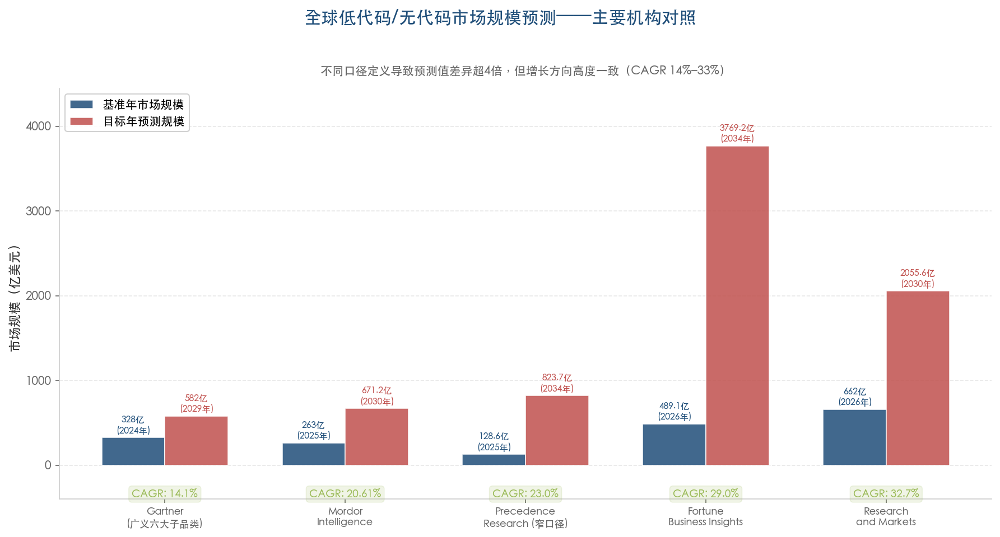

上述预测的绝对数值差异巨大——2034 年远期预测从约 824 亿美元到 3769 亿美元不等，相差逾 4 倍。差异主要源于口径定义的不同：Gartner 将低代码技术细分为 LCAP、BPA、MXDP、RPA、iPaaS、CADP 六大子品类并采用相对保守的估算方法论，Fortune Business Insights 则可能采用更广泛的包含 AI 代码工具在内的口径。尽管如此，所有机构一致预判 CAGR 在 14%–33% 之间，确认了这一市场将持续高速增长的高确定性。

### 7.3.2 平台整合与巨头并购潮

产业格局的另一显著趋势是大型科技企业通过并购加速构建端到端平台生态。2025 年，Salesforce 完成了超过 100 亿美元的并购，收购了 12 家以上公司，其中最大的交易是以约 80 亿美元收购数据管理公司 Informatica [Salesforce 新闻稿](https://www.salesforce.com/news/press-releases/2025/11/18/salesforce-completes-acquisition-of-informatica/ "2025年11月18日完成收购")。这些并购并非零散的技术补充，而是系统性地构建从数据基础、流程智能到自主 Agent 的全栈 AI Agent 平台 [Medium/@abhinavguptas](https://medium.com/@abhinavguptas/salesforces-10billion-dollar-2025-acquisitions-8-insights-c55c03de7fec "Salesforce 2025 年并购分析")。

Microsoft 同样通过并购扩展低代码平台生态，收购 Clear Software 以强化跨平台集成和工作流自动化能力，体现了超级厂商通过并购补齐生态短板的行业趋势 [ChannelE2E](https://www.channele2e.com/news/microsoft-buys-oracle-salesforce-sap-workflow-automation-startup "Microsoft Acquires Clear Software")。

这一并购浪潮折射出 LCNC 产业底层逻辑的深刻变迁：竞争焦点已从单一的"可视化开发体验"转向"数据+AI+自动化+治理"的全栈能力整合。对中小型独立 LCNC 厂商而言，这意味着被大厂收购或被边缘化的双重压力将持续加剧。Gartner 2025 年 MQ 的入选门槛——LCAP 年收入至少 6000 万美元且拥有 100 家以上大型企业客户——已将大量中小厂商排除在领导者竞争之外 [Pretius Gartner LCAP 分析](https://pretius.com/blog/gartner-quadrant-low-code "2025 Gartner MQ详细解读")。

### 7.3.3 开源生态的崛起与"伪开源"争议

在超级厂商主导的格局之外，开源 LCNC 和 AI 工作流平台生态正在形成一股不可忽视的力量。GitHub 上活跃度最高的开源项目呈现三大分化方向 [NocoBase 开源平台盘点](https://www.nocobase.com/en/blog/14-ai-low-code-platforms-github "2026年1月更新")：

- **AI 工作流与 Agent 编排**：n8n（约 157k stars）、Dify（约 119k stars）等项目聚焦于可视化的 AI 工作流编排与自动化，代表了开源社区在 Agentic AI 方向的快速响应。
- **业务应用构建器**：Appsmith（约 38k stars）、ToolJet（约 37k stars）等项目定位于内部工具和业务应用的快速构建，直接对标商业 LCAP 的核心功能区间。
- **数据表应用**：NocoDB（约 59k stars）等项目提供类 Airtable 的开源替代方案，覆盖轻量级数据管理与协作场景。

开源平台的核心吸引力在于灵活性、低成本和无供应商锁定，恰好回应了前文分析的企业三大核心顾虑。然而，开源生态也面临"伪开源"争议：部分平台的自托管版本存在实质性功能限制，完整功能仍需付费订阅，其实际运营模式更接近"开放核心"（Open Core）而非纯开源 [Reddit 讨论](https://www.reddit.com/r/selfhosted/comments/1f4mb9b/genuinely_opensource_selfhostable_lowcode/ "开源低代码平台真实性讨论")。这一现象提醒企业在选型时需审慎评估开源许可的实际范围与长期可持续性。

### 7.3.4 中国市场的独特演进路径

中国 LCNC 市场虽然绝对规模小于全球市场，但增速更为显著。IDC 数据显示，2024 年中国低代码与零代码软件市场规模为 40.3 亿元人民币（约 5.5 亿美元），预计到 2029 年达 129.8 亿元，未来 5 年 CAGR 为 26.4% [IDC 中国](https://mfe-prod.idc.com/getdoc.jsp?containerId=prCHC53666825 "IDC：低代码与零代码深度融合生成式AI，2025年7月发布")。另一份市场研究估计中国低/零代码市场规模从 2021 年 31.0 亿元增长至 2029 年 131.2 亿元，约 61% 的组织用户认可低代码价值并愿意持续投资 [腾讯云开发者社区](https://cloud.tencent.com/developer/article/2576443 "AI时代下中国低代码市场发展研究, 2025年10月")。

中国市场的演进路径与全球市场存在三方面显著差异：

**第一，平台生态与超级应用深度绑定。** 钉钉宜搭、飞书多维表格和企业微信等平台天然嵌入企业协作场景，低代码能力与即时通信、办公协同、组织管理融为一体。这一模式有别于海外以独立 LCAP 产品为主的竞争格局。钉钉已推出超过 200 个 AI 助理，飞书则升级了 AI Agent 平台"飞书 Aily"并上线低代码"AI 专区" [新浪财经](https://finance.sina.cn/stock/jdts/2025-07-14/detail-inffmyaq2952174.d.html "飞书钉钉正面硬刚, 2025年7月")。

**第二，行业需求差异化更加显著。** 中国金融行业最重视合规与系统集成，制造业聚焦生产流程与 IoT 场景，零售业追求快速迭代与高并发能力。用户关注度调研显示，65% 关注体验与学习成本，57% 关注功能拓展性，52% 关注 AI 赋能水平 [腾讯云开发者社区](https://cloud.tencent.com/developer/article/2576443 "AI时代下中国低代码市场发展研究")。76% 的用户希望通过 GenAI 提升开发效率，67% 关注借此降低成本，表明 AI 融合已跃升为中国用户选型的核心考量维度 [腾讯云开发者社区](https://cloud.tencent.com/developer/article/2576443 "AI时代下中国低代码市场发展研究")。

**第三，独立厂商与平台厂商的竞争格局更加多元。** 中国市场并存独立厂商（奥哲、简道云、明道云、轻流）、应用软件厂商（金蝶、用友）和平台型厂商（华为、浪潮）三类竞争主体，各自拥有差异化的客户基础和行业渗透优势 [IDC 中国](https://mfe-prod.idc.com/getdoc.jsp?containerId=prCHC53666825 "IDC 2024年中国低零代码厂商格局")。这种多元竞争格局在为企业提供更多选择的同时，也加剧了市场碎片化的挑战。

## 7.4 对开发者角色与就业市场的影响

### 7.4.1 AI 驱动的劳动力转型：创造多于替代

关于 LCNC 与 AI 对开发者就业的影响，多项权威研究的结论一致指向"转型而非替代"的判断。

Gartner 2025 年 7 月对 700 余名 CIO 的调查得出了一个引人注目的预测：到 2030 年 0% 的 IT 工作将由人类独立完成——其中 75% 将由 AI 增强人类完成，25% 将完全由 AI 独立完成。Gartner 同时预测，到 2028 年 AI 创造的就业岗位将多于其消灭的岗位 [Gartner IT 工作调查](https://www.gartner.com/en/newsroom/press-releases/2025-11-10-gartner-survey-finds-artificial-intelligence-will-touch-all-information-technology-work-by-2030 "2025年11月10日")。

Morgan Stanley Research 的分析进一步支持了这一判断。该机构认为 AI 将提升软件开发生产力并带动更多开发者招聘，而非替代现有岗位。软件开发者岗位预计将持续扩大，增速范围从美国劳工统计局预估的年均 1.6%（至 2033 年）到 IDC 预估的年均 10%（至 2029 年）[Morgan Stanley](https://www.morganstanley.com/insights/articles/ai-software-development-industry-growth "How AI Coding Is Creating Jobs, 2025年10月29日")。其底层逻辑在于：当开发成本下降和效率提升后，软件的总需求量将大幅增加——更多此前因成本过高而未被满足的需求将通过低代码和 AI 工具得以释放。Gartner 的研究还揭示了一个"反直觉"的结论：AI 将创造 57% 更多的开发者角色，而非减少开发者需求 [Instagram/@gartner_inc](https://www.instagram.com/p/DWgZxSHCfDR/ "Gartner 2030 forecast, 引述")。

### 7.4.2 技能结构的深层重组

AI 驱动的劳动力转型不仅体现在岗位数量上，更深刻地重组了开发者的技能结构。Gartner 指出，AI 将使某些技能（如基础代码编写、手动测试）变得不再关键，但同时创造出全新的技能需求领域。正如 Gartner 所概括的："关键不在于更好地执行任务，而在于成为更好的激励者、思考者和沟通者" [Gartner IT 工作调查](https://www.gartner.com/en/newsroom/press-releases/2025-11-10-gartner-survey-finds-artificial-intelligence-will-touch-all-information-technology-work-by-2030 "2025年11月")。

结合前文关于"融合团队"（Fusion Teams）的分析，我们预计开发者角色的演变将呈现三个清晰方向：

- **架构师型开发者**：负责系统架构设计、安全策略制定和 AI 工具编排，担当企业级 LCNC 应用的"护栏设计者"角色。
- **领域专家型开发者**：深度理解特定业务领域，将业务知识转化为 AI Agent 的行为规则和工作流逻辑，成为连接技术与业务的关键桥梁。
- **AI 协作型公民开发者**：Gartner 预测到 2026 年大型企业中公民开发者将以 4:1 的比例超过专业软件开发者 [Kissflow 引述 Gartner](https://kissflow.com/citizen-development/gartner-on-citizen-development/ "Kissflow引述Gartner预测")，这一群体将从简单的表单应用构建者逐步成长为 AI Agent 的配置和编排者。

这一角色演变要求企业重新思考人才培养策略。Gartner 的六大战略趋势之一即为"人才密度最大化"（Maximising Talent Density），强调组织必须超越传统招聘实践，构建以高密度人才为特征的学习型团队，使组织适应能力的提升速度匹配技术变革的节奏 [BW Businessworld](https://www.businessworld.in/article/gartner-identifies-six-strategic-trends-shaping-the-future-of-software-engineering-562335 "Gartner talent density趋势")。

## 7.5 综合研判：LCNC 的未来不是替代而是融合

### 7.5.1 三个核心判断

基于本报告全部七章的系统分析，我们对 LCNC 的未来发展提出三个核心判断：

**判断一：LCNC 将成为企业应用开发的默认基础设施，而非可选工具。** Gartner 预测到 2028 年近 80% 的企业将依赖 LCAP，Forrester 调查显示 87% 的企业开发者已在部分工作中使用低代码平台。LCNC 正从"加速器"演变为企业应用开发的"操作系统层"。但"默认基础设施"不等同于"唯一方式"——传统编码在高性能计算、基础设施软件和深度安全场景中的不可替代地位，在可预见的未来不会动摇。

**判断二：AI 不会消灭低代码，但会重新定义低代码。** Forrester 明确提出"AppGen 正在吞噬低代码"，Gartner 将"AI 原生开发平台"列为 2026 年战略趋势。我们预计到 2028—2030 年，当前意义上的"低代码平台"将被重新定义为"AI 原生应用生成与治理平台"。纯粹以拖拽式可视化为核心卖点、缺乏 AI 生成能力的平台将面临边缘化甚至淘汰。

**判断三：治理能力而非生成能力将成为平台竞争的终极分水岭。** Retool 的分析揭示了一个关键洞察：AI 使得"生成应用"变得极其容易，但"在生产环境中运行、维护和治理应用"仍然是核心挑战。正如其所指出的，"AI 将瓶颈右移了——初始创建不再是约束，约束在于之后的一切" [Retool 对 Forrester AppGen 概念解读](https://retool.com/blog/enterprise-appgen-the-future-of-low-code "2026年2月25日")。Gartner 2025 年 MQ 的三大行业趋势中，"治理与合规从差异化优势演变为基线要求"同样佐证了这一判断。前文数据显示，拥有成熟治理框架的组织实施成功率（81%）远高于缺乏治理者（43%），这一差距在 AI 驱动的大规模应用生成时代只会进一步扩大。

### 7.5.2 企业的战略行动建议

面向未来 1—3 年的技术与产业演变，我们建议企业在以下四个战略方向上进行前瞻性布局：

**一、制定 LCNC 向 AI 原生平台过渡的路线图。** 企业应系统评估现有 LCNC 平台在 AI 生成、Agent 编排和领域专用模型支持方面的能力成熟度，规划分阶段升级路径。Gartner 预测到 2028 年 90% 的企业软件工程师将使用 AI 代码助手，提前布局 AI 原生开发能力将形成显著的先发优势。

**二、优先投资治理基础设施而非生成工具。** 在 AI 使应用创建成本趋近于零的趋势下，企业的核心竞争力将转向对应用全生命周期的管控能力——包括安全审计、版本控制、数据治理、合规监控和应用退役机制。建立或强化低代码卓越中心（CoE），将治理规则嵌入平台基础设施层，是确保 LCNC 规模化应用可持续性的关键举措。

**三、重新设计人才结构与培养体系。** 基于"架构师型开发者+领域专家型开发者+AI 协作型公民开发者"的三层角色模型，重新定义岗位职责、绩效考核标准和技能培养路径。Gartner 所强调的"人才密度最大化"要求组织构建持续学习的文化，而非仅依赖传统招聘来应对技术变革。

**四、采取多平台组合策略并建立统一治理框架。** 到 2026 年 75% 的大型企业预计将使用至少四种低代码工具。企业应基于业务场景需求选择最适合的平台组合，同时建立覆盖所有平台的统一治理框架，在降低单一供应商锁定风险与控制治理复杂度之间取得动态平衡。

# 结论与风险提示

## 核心结论

本报告通过对全球与中国 LCNC 市场的系统研究，得出以下五项核心结论。

**第一，LCNC 平台的效率提升是真实且可量化的，但存在明确的场景边界。** 多项 Forrester TEI 研究一致表明，在内部业务应用、流程自动化、系统集成和遗留系统替换等适配场景中，LCNC 平台能够实现 50%–90% 的开发时间缩短，三年期 ROI 在 206%–506% 之间，投资回收期普遍不超过 6–9 个月。Gartner 预测到 2026 年 75% 的企业新开发应用将使用低代码技术，这一渗透率的快速攀升印证了 LCNC 正从"可选工具"演变为"主流开发方式"。然而，效率优势具有清晰的适用边界：当自定义代码比例超过 30% 时效率优势消失；在高性能计算、深度安全基础设施和平台级软件等"硬核心"场景中，传统编码的不可替代地位在可预见的未来不会动摇。我们估计这些"硬核心"场景仍将占企业应用组合的约 20%–30%。

**第二，LCNC 并非无代价的"银弹"——隐性成本构成全生命周期评估中不可忽略的变量。** 技术债的独特积累模式（低代码应用往往积累比传统代码更难维护的技术债务）、持续性平台许可费对开发阶段成本优势的侵蚀（五年期 TCO 可能高于传统开发约 11%）、以及供应商锁定带来的高昂迁移成本（企业平均每个迁移项目损失 315,000 美元，83% 的数据迁移项目失败或超预算），共同构成了 LCNC 经济性评估中不可忽视的暗面。企业在做出平台选型决策时，必须将这些隐性成本系统性地纳入 TCO 评估框架，而非仅凭开发阶段的效率提升做出判断。

**第三，管理者与开发者之间的立场分歧是结构性的，但可通过制度化机制有效弥合。** 管理者从投资回报视角看到的是交付提速与成本节约，开发者从工程质量视角看到的是技术债积累与可维护性退化。两种视角之间的健康张力恰恰是 LCNC 成功采纳的必要条件。融合团队（Fusion Teams）、低代码卓越中心（CoE）和分区治理模型（绿色/黄色/红色三区）等制度化协调机制已在 Shell、Aviva、FirstBank 等标杆企业的实践中证明了其有效性。Gartner 数据显示，采用 CIO-CxO 共同领导模式的组织数字化举措达标率高达 71%，几乎是全行业平均水平（48%）的 1.5 倍。

**第四，生成式 AI 正在重塑 LCNC 的价值主张与竞争格局，但"重塑"不等于"替代"。** AI 为 LCNC 平台叠加了自然语言交互层与 Agent 编排能力，形成"自然语言＋可视化＋代码"三种开发模态并存的新格局。Gartner 预测到 2028 年 80% 的企业将通过 LCAP 实施 Agentic AI，LCNC 平台正从"应用构建工具"升级为"AI Agent 编排与治理平台"。与此同时，Forrester 提出的 AppGen 概念预示着 LCNC、AI 编码工具和 AI 原型工具正向统一品类融合，预计约 3 年内走向成熟。LCNC 平台在这一融合中的核心壁垒将从可视化拖拽转向企业级治理、数据连接和多应用生态管理等基础设施能力。

**第五，治理能力是决定 LCNC 战略成败的终极分水岭。** 拥有成熟治理框架的组织实施成功率为 81%，缺乏治理者仅为 43%——38 个百分点的差距清晰表明，LCNC 的成功更多取决于组织治理而非技术选型。KPMG/HFS 联合研究显示，具备治理指南的企业中 77% 实现了开发成本降低，而缺乏治理的企业这一比例仅为 39%。然而，在已使用低代码的企业中，不到三分之一同时建立了配套的治理体系——这一治理赤字构成了当前 LCNC 大规模采纳中最亟待解决的系统性短板。

## 对核心命题的回答

回到本报告的原始研究问题——"低代码/无代码平台是否真正提高了开发效率，还是在特定场景下反而增加了维护成本？"

答案并非二元对立的"是"或"否"，而是一个带有明确条件的判断：**在适配场景中，LCNC 平台确实大幅提高了开发效率且经济效益显著；在不适配场景中，它们不仅无法提速，还可能通过技术债积累和平台依赖显著推高中长期维护成本。** 效率提升与维护成本增加并非相互排斥的结论，而是同时存在于不同场景、不同生命周期阶段的两种真实现象。企业能否从 LCNC 中获得净正价值，最终取决于三个关键变量：场景选择的审慎程度、治理体系的成熟度，以及组织在业务团队与技术团队之间建立有效协作机制的能力。

## 局限性分析

本报告在研究方法与数据来源方面存在以下局限性，读者在引用结论时应予以审慎考量。

**第一，效率数据的独立性约束。** 当前最具系统性的效率量化数据（Forrester TEI 系列研究）均由平台供应商委托执行，样本量为 4–13 家企业，采用复合组织建模方法推算经济效益。这些研究反映的是经过筛选的成功实施场景，而非全行业平均水平。独立的大规模随机对照实验在 LCNC 效率领域仍然匮乏。

**第二，中国市场数据的深度有限。** 相较于全球市场，中国 LCNC 市场的公开可用研究数据在颗粒度和覆盖度上均存在差距。中国企业 LCNC 落地的 TCO 对比、治理成熟度分布和行业渗透率等维度缺乏与海外市场同等深度的量化实证，本报告对中国市场的分析在一定程度上依赖行业媒体报道和厂商披露数据。

**第三，技术快速迭代带来的时效性风险。** 生成式 AI 与 LCNC 的融合正处于快速演进期，Forrester 的 AppGen 概念和 Gartner 的 AI 原生开发平台趋势均属近 1–2 年内提出的新范式。本报告中涉及 AI 融合趋势的分析和预测在 12–18 个月后可能需要根据技术进展进行修正。

**第四，用户调查的代表性局限。** 报告引用的多项行业调查（如 Mendix N=2,000、Caspio/StarCIO N=268、Appian N=400）在样本量和受访者构成上存在差异，部分调查的受访者可能偏向已采用 LCNC 的企业或用户，存在选择偏差的可能。

**第五，TCO 对比的情景依赖性。** 报告引用的五年期 TCO 模拟基于特定的应用规模（150 用户）和平台选择（Appian vs. .NET），其结论不宜直接外推至所有应用规模和平台组合。不同平台的许可定价模型、企业的人力成本结构和应用复杂度均会显著影响实际 TCO 对比结果。
