# 执行摘要

凸集图（Graph of Convex Sets, GCS）框架将离散图搜索与连续凸优化统一于同一混合整数凸规划（MICP）模型，已在 7-DOF 操作臂避障规划中实现 0.01–0.14 秒的求解速度与全局最优轨迹质量，显著优于传统 PRM 规划器（0.20–0.26 秒且轨迹更长）[Marcucci et al. 2023 Science Robotics](https://arxiv.org/abs/2205.04422 "Motion Planning around Obstacles with Convex Optimization, Section 7.4")。然而，GCS 框架在求解端取得的性能优势高度依赖于一组质量可控、数量精炼的安全区域凸集作为输入。当前凸集生成环节仍是制约 GCS 大规模实用化的核心瓶颈：所有已发表的 GCS 应用均依赖人工手动选择种子点来初始化 IRIS 类凸集膨胀算法，在 7-DOF 场景中通常需约 18 个手动调优的种子，14-DOF 双臂场景的人工成本更高且覆盖率难以获得系统性保证。

本报告系统论证了一条自动化解决路径：以概率路线图（PRM）算法替代人工种子选取，驱动 IRIS 系列算法自动生成安全区域凸集，并将凸集直接供给 GCS 求解。研究围绕以下四条主线展开。

**GCS 数学基础与应用全景。** GCS 通过透视变换将双线性耦合项转化为凸锥约束，构造出结构紧凑的 MICP 公式（$O(|\mathcal{E}|)$ 个二值变量），其凸松弛在欧氏距离目标下几乎总是精确的。围绕 GCS 核心模型，GCS*（隐式图搜索）、Multi-Query GCS（5 ms 在线查询）、GGCS（黎曼流形扩展）、ST-GCS（多机器人时空规划）等变体已构成活跃的研究生态。GCS 的最高维度验证为 15-DOF（GGCS PR2 实验，平均 25.75 秒/段）[Cohn et al. 2023](https://groups.csail.mit.edu/robotics-center/public_papers/Cohn23.pdf "RSS 2023, Tables I-II")。

**凸集生成瓶颈的深层剖析。** IRIS 系列算法的单区域生成效率已从 C-IRIS 的数百秒跃迁至 GPU 加速 EI-ZO 的 135 ms，跨越约四个数量级。然而，"在哪里膨胀"的种子选取决策仍依赖人工或 VCC 方案。VCC 在约束双臂场景（14-DOF）中 437 秒仅生成 8 个区域、覆盖率不足 1%，其中 95% 时间消耗于 $O(N^2)$ 可见性图构建 [Cohn, Werner & Tedrake 2025](https://groups.csail.mit.edu/robotics-center/public_papers/Cohn25a.pdf "Section VI Discussion")。凸集数量与 GCS 求解效率高度耦合——标准 GCS-Opt 在 10,150 个凸集时已无法求解 [Marcucci et al. 2024 TRO](https://www-leland.stanford.edu/~boyd/papers/pdf/fpp.pdf "Section I-A")。

**PRM 驱动的自动化 Pipeline 设计。** PRM 的概率完备性保证节点渐近覆盖 $\mathcal{C}_{\text{free}}$ 的所有连通区域，$O(N \log N)$ 连接复杂度相比 VCC 的 $O(N^2)$ 可见性图具有决定性的高维可扩展性优势。本报告提出"PRM 自动采样 → 智能稀疏化 → IRIS-ZO 批量膨胀 → GCS 自动建图求解"的三阶段全自动 Pipeline，核心技术决策包括：推荐线段种子模式严格保证凸集连通性、推荐 IRIS-ZO 作为通用膨胀算法、将凸集数量控制在 30–60 个的最优区间。端到端离线时间估计为 20–40 秒（8 线程并行、7-DOF），覆盖率有望接近 70%，比 VCC 快一个数量级以上，同时比 EI-ZO 单路径方案提供显著更广的覆盖范围。该方案可通过 Drake 现有 API 以约 200–300 行 Python 实现原型。

**多维优化方向与实施路线图。** 除凸集自动生成外，GCS 框架在求解效率（GCS*、Multi-Query GCS、Fast Path Planning）、时空扩展（ST-GCS）、任务级逻辑（GHOST、增广 GCS）和计算范式革新（TANGO 张量分解、学习驱动优化）等方向均呈现出活跃的研究前沿。本报告依据"短期可执行性 × 预期收益"给出分阶段实施路线图：短期（3–6 月）交付 PRM + IRIS-ZO + GCS 基础 Pipeline 的最小可行原型；中期（6–12 月）集成 Multi-Query SDP 预计算实现 <10 ms 在线查询；远期（1–2 年）构建离线全覆盖与在线增量膨胀相结合的混合架构。

需要强调的是，截至 2026 年 4 月，公开文献中尚无本文所提完整 Pipeline 的端到端实验验证。方案的可行性论证建立在各组件级证据的合理外推与工程推理之上，其结论的最终确认有赖于系统性的实验验证。

# 第1章 GCS 算法数学基础与核心原理

## 1.1 凸集图的形式化定义

凸集图（Graph of Convex Sets, GCS）是将经典离散图结构与连续凸优化统一到同一数学框架中的新型优化模型。其核心思想在于：在传统有向图的每个顶点上附加一个凸规划问题，在每条边上附加耦合两个凸规划的凸代价和凸约束，从而将图上的组合优化问题（如最短路径、旅行商、最小生成树）推广到连续-离散联合优化层次。

形式化地，一个凸集图定义为有向图 $\mathcal{G} := (\mathcal{V}, \mathcal{E})$，其中每个顶点 $v \in \mathcal{V}$ 关联一个非空紧凸集 $\mathcal{X}_v \subseteq \mathbb{R}^n$ 和一个连续决策变量 $x_v \in \mathcal{X}_v$；每条边 $e = (u, v) \in \mathcal{E}$ 关联一个凸边长度函数 $\ell_e(x_u, x_v)$，用于度量从顶点 $u$ 到顶点 $v$ 的转移代价 [Marcucci et al. 2024 SIAM](https://epubs.siam.org/doi/10.1137/22M1523790 "Shortest Paths in Graphs of Convex Sets, SIAM J. Optim. 34(1):507-532")。图 1-1 直观展示了传统有向图与凸集图在建模层面的核心差异。

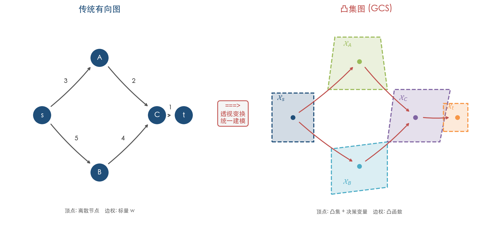

这一定义具备两个关键的退化性质，揭示了 GCS 的"固定一端则简单"的二元结构：

**退化性质一：连续退化。** 当路径 $p = (v_0, v_1, \ldots, v_k)$ 被固定（即离散选择已确定）时，GCS 优化问题退化为一个标准凸优化问题——在路径沿途的凸集约束和边耦合约束下，最小化沿路径的总边长度，此时可调用 SOCP 或 LP 求解器高效求解。

**退化性质二：离散退化。** 当所有顶点变量 $x_v$ 的值被固定（即连续选择已确定）时，GCS 退化为一个经典的加权有向图最短路径问题——每条边的权重为 $\ell_e(x_u, x_v)$ 的具体数值，可用 Dijkstra 或 Bellman-Ford 等经典算法求解。

正是这一二元结构，使得 GCS 框架能够借助混合整数凸规划（Mixed-Integer Convex Programming, MICP）的成熟理论，将两个相互耦合的子问题联合求解 [Marcucci 2024 MIT 博士论文](https://groups.csail.mit.edu/robotics-center/public_papers/Marcucci24a.pdf "Graphs of Convex Sets with Applications to Optimal Control and Motion Planning, MIT PhD Thesis, Chapter 5")。

### 1.1.1 术语与符号约定

为确保全文术语和符号的一致性，本节建立统一的符号体系。$\mathcal{G} = (\mathcal{V}, \mathcal{E})$ 表示凸集图；$|\mathcal{V}|$ 和 $|\mathcal{E}|$ 分别表示顶点数和边数；$\mathcal{X}_v$ 表示顶点 $v$ 关联的凸集；$x_v$ 表示 $\mathcal{X}_v$ 中的连续决策变量；$y_e \in \{0,1\}$ 为边 $e$ 的二值流变量（取 1 表示该边被路径选中）；$z_e := y_e \cdot x_u$ 为辅助变量（用于线性化双线性项）。此外，本文中"凸集""凸区域""安全区域"三个术语在运动规划语境中等价使用，均指配置空间中经数学证明或概率验证不与任何障碍物碰撞的凸多面体（H-多面体，即半空间交集 $\mathcal{P} = \{x \in \mathbb{R}^n : Ax + b \geq 0\}$）。

## 1.2 最短路径问题的 MICP 建模

### 1.2.1 问题陈述

GCS 框架中最核心且研究最深入的优化问题是**凸集图上的最短路径问题（Shortest Path Problem in Graphs of Convex Sets, SPP-GCS）**。给定源顶点 $s$ 和目标顶点 $t$，SPP-GCS 要求同时优化离散路径 $p$（从 $s$ 到 $t$ 的边序列）和连续顶点位置 $\{x_v\}_{v \in p}$，使得总路径代价最小：

$$\min_{p, \{x_v\}} \sum_{e \in p} \ell_e(x_u, x_v), \quad \text{s.t.} \quad x_v \in \mathcal{X}_v, \; \forall v \in p$$

该问题的核心挑战在于路径选择（组合优化）与顶点位置优化（连续凸优化）之间的深度耦合：路径不同，参与优化的凸集和边代价函数随之改变；而位置优化反过来又影响不同路径的总代价排序，两者无法独立求解 [Marcucci et al. 2024 SIAM](https://epubs.siam.org/doi/10.1137/22M1523790 "Section 9.1, Problem Statement")。

### 1.2.2 混合整数凸规划公式

为将 SPP-GCS 建模为可计算的优化问题，Marcucci 等人引入二值流变量 $y_e \in \{0,1\}$ 和辅助变量 $z_e := y_e \cdot x_u$。直接处理双线性项 $y_e \cdot x_u$ 将产生非凸约束，而 GCS 框架的核心技术贡献在于利用**齐次化变换**（homogenization，亦称透视变换 perspective transformation）将双线性项重写为凸锥约束，由此构造出结构紧凑的 MICP。

具体而言，MICP 的目标函数使用边长度函数的**透视函数**（perspective function）$\tilde{\ell}_e(z_e, y_e) = y_e \cdot \ell_e(z_e / y_e)$（当 $y_e > 0$ 时）。当 $y_e = 0$ 时，透视函数取闭包值 0，从而实现"未选中边不贡献代价"的效果。MICP 的约束体系包含三类：

1. **流守恒约束：** 对每个中间顶点 $v$（除源点 $s$ 和汇点 $t$ 外），流入流量等于流出流量，即 $\sum_{e \in \delta^-(v)} y_e = \sum_{e \in \delta^+(v)} y_e$；源点 $s$ 净流出 1，汇点 $t$ 净流入 1。
2. **度约束：** 每个顶点至多被访问一次，即 $\sum_{e \in \delta^+(v)} y_e \leq 1$, $\sum_{e \in \delta^-(v)} y_e \leq 1$。
3. **透视锥约束：** $(z_e, y_e) \in \text{cl}(\tilde{\mathcal{X}}_u)$，其中 $\tilde{\mathcal{X}}_u$ 是 $\mathcal{X}_u$ 的齐次化锥。当 $\mathcal{X}_u$ 以锥形式 $\{x : Ax + b \in \mathcal{K}\}$ 描述时，齐次化锥可简洁地表达为 $\{(z, y) : Az + by \in \mathcal{K}, y \geq 0\}$。

整个 MICP 的规模为 $O(|\mathcal{E}|)$ 个二值变量和 $O(n \cdot |\mathcal{E}|)$ 个连续变量，其中 $n$ 为凸集的维数。Marcucci 等人证明了该 MICP 的最优值等于原始 SPP-GCS 的最优值（Theorem 5.7），保证了建模过程的无损性 [Marcucci et al. 2024 SIAM](https://groups.csail.mit.edu/robotics-center/public_papers/Marcucci21.pdf "Equation (5.5), Theorem 5.7")。

### 1.2.3 透视公式的优势

透视公式的核心优势在于其产生了**紧凑而强松弛**的 MICP。作为对照，经典的 McCormick 包络松弛（McCormick envelope relaxation）虽然也能线性化双线性项，但松弛质量显著逊于透视公式。实验数据表明，McCormick 包络松弛的中位最优性间隙高达 29%–34%，求解时间比透视公式慢 10–13 倍 [Marcucci et al. 2024 SIAM](https://groups.csail.mit.edu/robotics-center/public_papers/Marcucci21.pdf "Section 9.2")。这一差距的根源在于透视公式充分利用了凸集的几何结构信息，而 McCormick 包络仅依赖变量界的矩形松弛，丢失了大量结构信息。

Marcucci 博士论文 Chapter 8 从更抽象的层面分析了透视公式的松弛品质。其核心结果（Section 8.2）证明：当约束集 $\mathcal{Y}$ 为多面体时，若松弛解 $\hat{y}$ 恰好落在 $\mathcal{Y}$ 的某个极端点上，则透视松弛是精确的——凸松弛最优值等于原始 MICP 最优值。该定理为透视公式在实际应用中频繁给出精确解提供了严格的理论基础 [Marcucci 2024 MIT 博士论文](https://groups.csail.mit.edu/robotics-center/public_papers/Marcucci24a.pdf "Chapter 8: Analysis of the Convex Relaxation, Section 8.2 Tightness")。

## 1.3 计算复杂度分析

### 1.3.1 NP-困难性

SPP-GCS 在一般情形下是 NP-困难的。Marcucci 等人通过从经典**哈密顿路径问题**的多项式时间归约证明了这一结论（Theorem 3.1）：给定一个 $N$ 顶点的有向图 $G$，可构造一个具有 $N$ 个点集的 GCS，使得 $G$ 存在哈密顿路径当且仅当该 GCS 的 SPP 具有有限最优值。由于哈密顿路径问题是 NP-完全的，SPP-GCS 即为 NP-困难 [Marcucci et al. 2024 SIAM](https://groups.csail.mit.edu/robotics-center/public_papers/Marcucci21.pdf "Theorem 3.1")。

更具实践意义的是 Theorem 3.2 的加强结果：即使图为**无环图**（DAG）、凸集**两两不相交**、边长度函数**正齐次**（即 $\ell_e(\lambda x_u, \lambda x_v) = \lambda \ell_e(x_u, x_v)$ 对 $\lambda > 0$ 成立），SPP-GCS 仍然是 NP-困难的 [Marcucci et al. 2024 SIAM](https://groups.csail.mit.edu/robotics-center/public_papers/Marcucci21.pdf "Theorem 3.2")。这一结果表明，运动规划中常见的"无环凸集图 + 不相交安全区域 + 欧氏距离"设定并不降低问题的理论复杂度。Marcucci 博士论文 Section 9.2.1 还给出了替代性的 NP-困难性证明，通过不同的归约策略进一步阐明了问题的组合结构 [Marcucci 2024 MIT 博士论文](https://groups.csail.mit.edu/robotics-center/public_papers/Marcucci24a.pdf "Section 9.2.1: Alternative proofs of NP-hardness")。

上述复杂度结果共同表明，在最坏情况下高效精确求解 SPP-GCS 是不可能的，因此实用的 GCS 求解策略必须依赖松弛与启发式方法。

### 1.3.2 MICP 规模分析

MICP 的规模直接决定求解效率。对于包含 $|\mathcal{V}|$ 个顶点、$|\mathcal{E}|$ 条边、每个凸集维度为 $n$ 的 GCS，其变量与约束规模如下：

- **二值变量数：** $O(|\mathcal{E}|)$，每条边对应一个二值流变量 $y_e$。
- **连续变量数：** $O(n \cdot |\mathcal{E}|)$，每条边引入 $n$ 维辅助变量 $z_e$。
- **约束数：** 流守恒约束 $O(|\mathcal{V}|)$、度约束 $O(|\mathcal{V}|)$、透视锥约束规模取决于凸集描述复杂度（半空间数）。

当安全集为多面体时，透视锥约束退化为线性不等式，整个 MICP 成为混合整数线性规划（MILP）；当安全集涉及二次曲面时，透视锥约束为二阶锥约束，MICP 成为混合整数二阶锥规划（MI-SOCP）。这两类问题均有高效商业求解器（如 MOSEK、Gurobi）支持 [Marcucci et al. 2023 Science Robotics](https://arxiv.org/abs/2205.04422 "Sections 5.2-5.6")。

## 1.4 凸松弛与求解策略

GCS 框架提供了三种互补的求解策略：凸松弛配合舍入（推荐的默认策略）、分支定界（全局最优但计算代价高）、以及凸限制（已知路径时的快速求解）。图 1-2 概括了这三种策略的流程与性能特征。

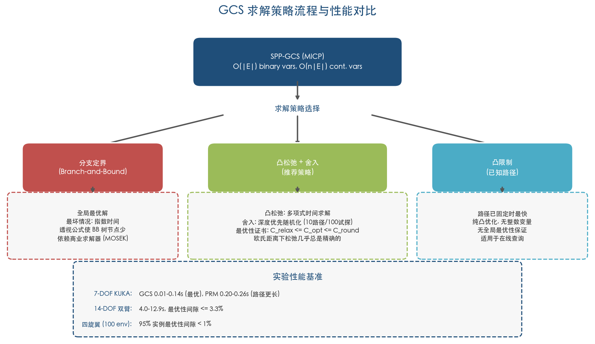

### 1.4.1 凸松弛的构造

GCS 的实用求解依赖于一个关键洞察：仅需将二值约束 $y_e \in \{0,1\}$ 放松为连续约束 $y_e \geq 0$（流守恒和度约束隐含 $y_e \leq 1$），即可将 MICP 转化为标准凸优化问题。凸松弛的最优值 $C_{\text{relax}}$ 提供了原始问题最优值 $C_{\text{opt}}$ 的下界：

$$C_{\text{relax}} \leq C_{\text{opt}}$$

这一松弛极为"廉价"——从 MICP 到凸松弛仅需删除整数约束，不引入额外变量或约束，松弛程序的规模与原始 MICP 完全相同 [Marcucci et al. 2024 SIAM](https://groups.csail.mit.edu/robotics-center/public_papers/Marcucci21.pdf "Section 5.3")。

### 1.4.2 松弛紧度

凸松弛在实践中展现出优异的紧度表现。根据 Marcucci 等人在大规模随机实例上的实验结果：

- 当边长度函数为**欧氏距离**（$\ell_e = \|x_u - x_v\|_2$）时，凸松弛"几乎总是精确的"——松弛解的流变量 $y_e$ 自然取 0 或 1 整数值，无需额外舍入。
- 当边长度函数为**欧氏距离的平方**（$\ell_e = \|x_u - x_v\|_2^2$）时，名义参数下最大松弛间隙为 2.1%；在高维设定（$n = 20$）下最大松弛间隙可达 28.9%，但中位间隙仍维持在较低水平。

上述经验紧度的理论支撑来自 Lemma 7.4（对应 Marcucci 博士论文 Chapter 8 Section 8.2 的松弛紧度定理）：当约束集 $\mathcal{Y}$ 为多面体且凸松弛最优解 $\hat{y}$ 为 $\mathcal{Y}$ 的极端点时，松弛精确 [Marcucci et al. 2024 SIAM](https://groups.csail.mit.edu/robotics-center/public_papers/Marcucci21.pdf "Lemma 7.4, Section 9.2")。从直觉上理解，流守恒和度约束定义的多面体（具有单纯形结构）的极端点恰好是 0-1 向量，因此松弛经常自然地给出整数解。

### 1.4.3 舍入策略

当凸松弛解并非整数时，GCS 框架采用**随机化深度优先舍入**（randomized depth-first rounding）策略将分数解转化为可行整数解。具体步骤如下：

1. 求解凸松弛，获得分数流 $\{\hat{y}_e\}$。
2. 从源顶点 $s$ 出发，将分数流视为概率权重，按概率选择后继边，以深度优先方式向前探索直到到达汇点 $t$ 或进入死胡同。
3. 若到达 $t$，将选定路径 $p_{\text{round}}$ 上所有 $y_e$ 置 1、其余置 0，固定路径后重新求解凸规划得到最优位置 $\{x_v^*\}$，计算舍入代价 $C_{\text{round}}$。
4. 重复步骤 2–3 多次（默认运行 10 条候选路径或 100 次试探），取代价最低的舍入解作为最终输出 [Marcucci 2024 MIT 博士论文](https://groups.csail.mit.edu/robotics-center/public_papers/Marcucci24a.pdf "Section 9.5: Heuristic solution via rounding")。

舍入策略的一个重要优势是**自动提供最优性证书**。对于任意舍入解，最优性间隙 $\delta_{\text{opt}}$ 满足：

$$\delta_{\text{opt}} := \frac{C_{\text{round}} - C_{\text{opt}}}{C_{\text{opt}}} \leq \frac{C_{\text{round}} - C_{\text{relax}}}{C_{\text{relax}}} =: \delta_{\text{relax}}$$

其中 $\delta_{\text{relax}}$ 可直接从松弛下界和舍入上界计算，无需求解完整 MICP 即可量化解的质量。

### 1.4.4 分支定界

当应用场景要求全局最优解时，可将 MICP 直接交给分支定界（Branch-and-Bound, BB）求解器（如 MOSEK 或 Gurobi）处理。BB 算法通过系统性地对二值变量分支——固定某 $y_e = 0$ 或 $y_e = 1$——在每个分支子问题上求解凸松弛以获得下界，配合剪枝策略逐步收敛到全局最优。当前 GCS 框架使用商业求解器的默认 BB 策略，尚无针对 SPP-GCS 结构的定制分支规则 [Marcucci 2024 MIT 博士论文](https://groups.csail.mit.edu/robotics-center/public_papers/Marcucci24a.pdf "Section 3.3.2: Branch and Bound")。得益于透视公式生成的紧凸松弛，BB 树的节点数通常较小，实践中 BB 可在合理时间内收敛。

### 1.4.5 对偶视角

Marcucci 博士论文 Section 9.4 从对偶角度分析了 SPP-GCS 的结构。经典最短路径问题的 LP 对偶为每个顶点赋予一个对偶变量 $\lambda_v$（可解释为距汇点 $t$ 的"距离标号"），对偶约束 $\lambda_u - \lambda_v \leq \ell_e$ 对应每条边的三角不等式。SPP-GCS 的对偶则将这些标量标号推广为**凸函数**：每个顶点 $v$ 关联一个定义在 $\mathcal{X}_v$ 上的凸函数 $\lambda_v(\cdot)$，对偶约束变为 $\lambda_u(x_u) - \lambda_v(x_v) \leq \ell_e(x_u, x_v)$，对所有 $(x_u, x_v) \in \mathcal{X}_u \times \mathcal{X}_v$ 成立。对偶最优值提供了原始问题的下界 [Marcucci 2024 MIT 博士论文](https://groups.csail.mit.edu/robotics-center/public_papers/Marcucci24a.pdf "Section 9.4: Dual problem, Sections 9.4.1-9.4.2")。这一对偶结构为后续研究中 Multi-Query GCS 通过 SDP 预计算 cost-to-go 下界的方法提供了理论基础。

## 1.5 Bézier 曲线参数化与轨迹优化

### 1.5.1 从最短路径到平滑轨迹

GCS 在运动规划中的应用不仅需要求解凸集图上的最短路径，还需要将路径转化为满足运动学和动力学约束的平滑轨迹。GCS 框架通过 Bézier 曲线参数化实现了这一目标，将轨迹优化自然地嵌入 MICP 结构中。

在运动规划 GCS 中，每个安全凸区域 $Q_i$（配置空间中的无碰撞凸多面体）关联一条 $d$ 阶 Bézier 曲线作为轨迹段，该曲线由 $d + 1$ 个控制点 $r_{i,0}, r_{i,1}, \ldots, r_{i,d} \in \mathbb{R}^n$ 定义：

$$b_i(s) = \sum_{j=0}^{d} \binom{d}{j} s^j (1-s)^{d-j} r_{i,j}, \quad s \in [0, 1]$$

### 1.5.2 凸包性质与碰撞规避

Bézier 曲线的**凸包性质**是将碰撞规避约束保持为凸约束的关键数学工具。该性质保证：若所有控制点 $r_{i,0}, \ldots, r_{i,d}$ 均属于凸集 $Q_i$，则整条 Bézier 曲线 $b_i(s)$ 完全包含在 $Q_i$ 内（因为 $b_i(s)$ 是控制点的凸组合）。因此，碰撞规避约束可简洁地表达为线性约束 $r_{i,j} \in Q_i, \; j = 0, 1, \ldots, d$——当 $Q_i$ 为 H-多面体时，这对应于一组线性不等式。

### 1.5.3 连续性约束

相邻轨迹段之间的 $C^\kappa$ 连续性（位置、速度、加速度等各阶连续性）通过匹配 Bézier 曲线端点处的各阶导数控制点实现。Bézier 曲线在端点 $s = 0$ 和 $s = 1$ 处的各阶导数由最外侧的控制点线性决定。例如，$C^0$ 连续性要求相邻段的首尾控制点重合，即 $r_{i,d} = r_{i+1,0}$；$C^1$ 连续性进一步要求一阶导数匹配，即 $d(r_{i,d} - r_{i,d-1})/h_i = d(r_{i+1,1} - r_{i+1,0})/h_{i+1}$（$h_i$ 为时间缩放因子）。所有连续性约束均为线性等式约束，可直接纳入 MICP 的边约束中。

图 1-3 直观展示了上述凸包性质与连续性约束的几何含义。

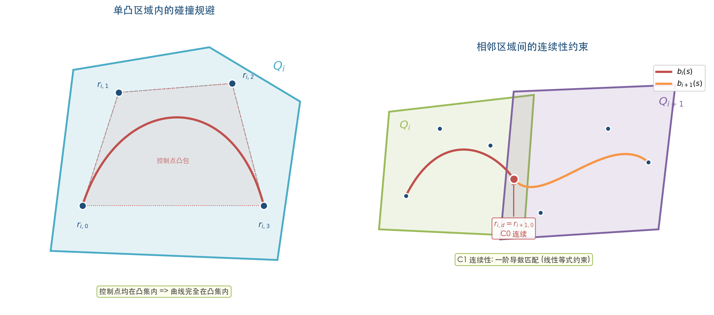

上述两项性质的共同作用使得碰撞规避和轨迹平滑性约束均可表达为线性约束，从而完整保持在凸优化框架内 [Marcucci et al. 2023 Science Robotics](https://arxiv.org/abs/2205.04422 "Sections 5.2-5.6")。

### 1.5.4 时间-形状联合优化

GCS 轨迹优化的一个显著优势是可以**同时优化轨迹形状和时间分配**。每个安全区域不仅关联 Bézier 空间曲线，还关联一个时间缩放变量 $h_i > 0$，路径代价可设为时间、路径长度、能量消耗的加权组合。当安全集为多面体时，整个轨迹优化问题成为 MILP（路径长度代价）或 MI-SOCP（能量代价），均可由高效商业求解器处理 [Marcucci et al. 2023 Science Robotics](https://arxiv.org/abs/2205.04422 "Section 5.5, Joint optimization of trajectory shape and timing")。

## 1.6 实验性能基准

GCS 在运动规划基准任务上的实验结果验证了上述理论分析的实际有效性。

在 7-DOF KUKA iiwa 机械臂的 5 个操控避障任务上，GCS 运行时间为 0.01–0.14 秒，显著低于 PRM 的 0.20–0.26 秒，且 GCS 生成的轨迹长度均短于 PRM。更为关键的是，所有舍入解均为全局最优（$\delta_{\text{opt}} = 0\%$），表明凸松弛在这些实例上完全精确。在 14-DOF 双臂协作任务上，GCS 在 4.0–12.9 秒内完成求解，最优性间隙 $\delta_{\text{relax}} \leq 3.3\%$。在四旋翼无人机的 100 个随机环境中，95% 的实例最优性间隙低于 1% [Marcucci et al. 2023 Science Robotics](https://arxiv.org/abs/2205.04422 "Sections 7.3-7.5")。

上述实验结果的工程含义十分清晰：GCS 框架将运动规划从"NP-困难的组合搜索"转化为"实际可高效求解的凸松弛 + 舍入"，其关键前提是凸松弛的经验紧度和透视公式的结构优势。

## 1.7 从数学到工程的过渡

本章建立了 GCS 算法的完整数学框架。凸集图的形式化定义将离散图搜索与连续凸优化统一于同一模型；MICP 建模通过透视变换实现了紧凑且强松弛的公式化；计算复杂度分析明确了问题的 NP-困难本质及其在实践中可驾驭的根本原因；Bézier 曲线参数化将碰撞规避和连续性约束完整保持在凸框架内。

然而，上述分析隐含了一个关键前提假设：GCS 的输入——凸集图本身——已经被正确构建。具体而言，安全凸区域的集合 $\{Q_i\}$ 及其邻接关系必须在 GCS 求解之前确定。这一凸集生成环节是 GCS pipeline 中计算代价最高、自动化程度最低的阶段，也是制约 GCS 实用化部署的核心技术瓶颈，将在后续章节中进行深入分析。

# 第2章 GCS 在机器人路径规划中的应用现状

GCS（Graph of Convex Sets）框架自 Marcucci 等人 2023 年在 Science Robotics 正式发表以来，已从理论原型迅速演化为一个活跃的研究生态系统。围绕 GCS 的核心混合整数凸优化模型，研究者从求解效率、问题规模、非欧空间适配、多机器人协同以及任务级扩展等多个维度推出了一系列变体算法。本章系统梳理 GCS 框架在机器人运动规划领域的应用全景，着重回答三个核心问题：**GCS 已在哪些场景中验证了有效性？当前的技术边界在哪里？pipeline 中最关键的瓶颈是什么？**

## 2.1 标杆应用：操作臂避障轨迹规划

GCS 框架在操作臂避障规划领域的标杆性成果集中体现于 Marcucci 等人 2023 年的 Science Robotics 论文。在 7-DOF KUKA iiwa 机器人的 5 个操控任务中，GCS 运行时间为 0.01–0.14 秒，显著低于 PRM 规划器的 0.20–0.26 秒；GCS 生成的轨迹长度在所有任务中均短于 PRM，且全部舍入解经验证为全局最优（最优性间隙 $\delta_{\text{opt}} = 0\%$），认证最优性间隙平均 4.1%、最大 13.0% [Marcucci et al. 2023 Science Robotics](https://arxiv.org/abs/2205.04422 "Motion Planning around Obstacles with Convex Optimization, Section 7.4")。

在更高维度的验证中，14-DOF 双臂 KUKA 任务的规划时间为 4.0–12.9 秒，最优性间隙保持在 3.3% 以内。四旋翼无人机在 100 个随机环境中的测试结果尤为突出——95% 的实例最优性间隙低于 1% [Marcucci et al. 2023 Science Robotics](https://arxiv.org/abs/2205.04422 "Sections 7.3-7.5")。上述结果确立了 GCS 作为能在秒级时间内生成接近全局最优轨迹的规划范式的核心地位。

需要指出的是，上述实验中的凸集均由人工选择种子点并调用 IRIS 类算法预先生成。以 KUKA 7-DOF 场景为例，典型部署需约 18 个手动调优的凸区域；14-DOF 双臂场景的凸集数量进一步增加，种子选择对覆盖率和 GCS 求解质量具有直接影响。这一依赖人工的前处理环节构成了后续自动化方案研究的核心出发点。

## 2.2 求解效率优化：隐式搜索与增量规划

标准 GCS 采用凸松弛 + 随机化舍入策略求解 MICP，该方法在中等规模图（数十至低百个凸集）上表现优异。然而，当凸集图规模急剧膨胀时，即便凸松弛也面临包含数百万约束的大规模优化问题。更为关键的是，标准 GCS 的计算量与具体查询无关——无论起终点距离远近，求解器都必须处理完整的图结构 [Natarajan et al. 2024](https://arxiv.org/abs/2410.08909 "INSATxGCS, RSS 2024")。围绕这一瓶颈，近两年涌现了多种求解效率优化方案。

### 2.2.1 GCS*：前向启发式搜索

GCS*（Chia et al., WAFR 2024）将经典 A* 搜索推广到凸集图设定，其核心创新在于两种支配检查机制：**ReachesCheaper**（代价支配，保证最优性与完备性）和 **ReachesNew**（可达性支配，牺牲最优性换取速度，但保留完备性）。GCS* 是目前唯一同时支持隐式图定义并保证完备性与代价最优性的 GCS 求解器 [Chia et al. 2024](https://arxiv.org/abs/2407.08848 "GCS*: Forward Heuristic Search on Implicit Graphs of Convex Sets, WAFR 2024")。

GCS* 的关键优势体现在处理超大规模隐式图的能力上。在 STACK 平面推动任务（约 $1.3 \times 10^9$ 个顶点、$8.5 \times 10^{17}$ 条边）中，采样版 GCS*（$\epsilon$-次优启发式）仅需 21.9 秒即可找到可行解，而 IxG* 因无法构建完整图而超过 10 小时未能求解。在较小规模的 AROUND 任务（194 顶点、8328 边）中，GCS* 的精确多面体包含检查需 7.5 小时，而采样版仅需 26.2 秒——采样版支配检查实现了约 1000 倍的加速 [Chia et al. 2024](https://arxiv.org/abs/2407.08848 "Table 2")。

### 2.2.2 IxG/IxG*：交替搜索与轨迹优化

INSATxGCS（IxG）及其改进版 IxG*（Natarajan et al., RSS 2024）采取了截然不同的策略——交替执行图搜索和局部轨迹优化，从而避免构建和求解完整 MICP。该思路源自 INSAT（INterleaved Search And Trajectory optimization）框架，其核心观察在于：最优轨迹仅经过凸集图中的一小部分顶点，因此无需对整张图进行全局优化 [Natarajan et al. 2024 RSS](https://arxiv.org/abs/2410.08909 "INSATxGCS, RSS 2024")。在包含 18-DOF 多臂装配场景在内的多项任务中，IxG 相对标准 GCS 凸松弛方法展现出显著的加速效果。

IxG 的主要局限在于完备性保证条件较强：其完备性依赖"图中任何路径上的所有边约束可联合满足"这一假设，而实际中单独可行的边约束并不一定联合可行。IxG* 放宽了这一假设，但当 IxG 未能找到可行路径时，IxG* 会退化为使用平凡（无穷大）上界，导致无法有效剪枝，在大规模问题上计算代价急剧上升。此外，IxG/IxG* 的启发式计算仍需显式图构建，限制了其在真正隐式图上的适用性 [Chia et al. 2024](https://arxiv.org/abs/2407.08848 "Section 2: Related Work")。

### 2.2.3 Multi-Query GCS：离线预计算与在线快速查询

Multi-Query GCS（Morozov et al., WAFR 2024）面向静态多查询场景——即同一凸集图需响应大量不同起终点的规划请求。该方法在离线阶段通过 SDP（半定规划）预计算凸二次 cost-to-go 下界（约 6 秒），在线阶段使用短视界贪心凸规划增量生成路径，中位查询时间仅 5 ms [Morozov et al. 2024](https://arxiv.org/abs/2409.19543 "Multi-Query SPP in GCS, WAFR 2024")。

实验表明，Multi-Query GCS 比标准 GCS 快约 40 倍、比 PRM（10,000 节点）快约 110 倍，路径长度仅增加约 7%。其凸二次下界的质量远优于仿射下界——后者在 1-step lookahead 中的失败率高达 27.2% [Morozov et al. 2024](https://arxiv.org/abs/2409.19543 "Table 1")。这一"离线构建 + 在线查询"的架构模式对工业级应用极具吸引力：离线构建高质量凸集图后，在线查询可在毫秒级完成，满足实时响应需求。

### 2.2.4 Fast Path Planning：利用特殊结构的高效求解

Fast Path Planning（Marcucci et al., IEEE TRO 2024）针对大量轴对齐盒（axis-aligned boxes）这一特殊凸集结构，开发了基于线图与凸交替法的专用算法。在包含 25,600 个盒子的场景中，离线阶段仅需 25 秒，在线求解 7.72 秒，路径代价 1.0001 接近全局最优的 1.0；而标准 GCS-Opt 在 10,150 个盒子时已无法求解 [Marcucci et al. 2024 TRO](https://www-leland.stanford.edu/~boyd/papers/pdf/fpp.pdf "Fast Path Planning, IEEE TRO 40, pp.3795-3809")。这一结果表明，利用凸集的特殊几何结构可以突破通用 GCS 的规模瓶颈，为大规模结构化环境下的 GCS 部署提供了可行的替代路径。

## 2.3 问题域扩展：非欧空间与时空规划

标准 GCS 框架的数学建模基于欧几里得空间中的凸集，这一假设限制了其对含移动底座、全周转关节或多体协同等复杂场景的直接适用性。围绕这一局限，研究者从黎曼流形扩展、时空域规划和任务级泛化三个方向推进了 GCS 的问题域覆盖。

### 2.3.1 GGCS：黎曼流形上的运动规划

GGCS（Cohn et al., RSS 2023 / IJRR 2024）将 GCS 推广至黎曼流形，使其能够处理含移动底座或连续旋转关节的机器人系统。核心理论结果表明：在零曲率流形上，GGCS 可精确归约为标准 GCS（Theorem 3），适用于 SE(2)、所有 1-DOF 关节及其乘积空间；但在正曲率流形（如 SO(3)/球关节）上不可处理（Theorem 5），因黎曼距离函数在正曲率区域不具备测地凸性 [Cohn et al. 2023](https://groups.csail.mit.edu/robotics-center/public_papers/Cohn23.pdf "RSS 2023, Theorems 2-3-5")。

实验方面，GGCS 在 PR2 双臂移动操作机器人（15-DOF，配置空间 $SE(2) \times T^2 \times I^{10} \cong T^3 \times I^{12}$）上完成了 14 段运动序列的规划，每段平均耗时 25.75 秒（范围 4.63–50.30 秒）。对比实验中，PRM（100,000 节点，构建耗时 124.39 秒）的路径长度显著长于 GGCS——例如"1M to 4M"任务中 PRM 路径长度为 14.554，而 GGCS 仅为 3.875 [Cohn et al. 2023](https://groups.csail.mit.edu/robotics-center/public_papers/Cohn23.pdf "Tables I-II")。GGCS 在线规划时间范围为 25.51–66.15 秒，而 Drake 轨迹优化（Drake-Trajopt）虽在部分场景更快（2.26–15.23 秒），但频繁产生轻微碰撞或陷入局部最优。GGCS 的实际意义在于证明了 GCS 框架可优雅地扩展到非欧几里得配置空间，对包含移动底座或全周转关节的工业机器人具有直接适用价值。

### 2.3.2 ST-GCS：多机器人时空协同规划

ST-GCS（Tang et al., IROS 2025）将 GCS 扩展至时空域以解决多机器人运动规划问题。其核心思想是将空间凸集沿时间维度挤出为时空凸集，并引入时间正向流和速度界的线性约束。ECD（Edge Collision Detection）算法将每段时空凸集至多分割为 $2d+2$ 个新凸集，计算代价为 $O(k \cdot d)$ 的切割加 $O(|V'|^2)$ 的交集检查 [Tang et al. 2025](https://arxiv.org/abs/2503.00583 "ST-GCS, IROS 2025, Algorithms 1-3")。

在性能验证中，PBS（Priority-Based Search）+ ST-GCS 的组合在 complex 地图、10 机器人场景下保持 100% 成功率，而基线方法 SP+ST-RRT* 和 SP+T-PRM 在机器人数 $n > 2$ 时几乎完全失败；运行时间方面，PBS+ST-GCS 较基线快 1–2 个数量级 [Tang et al. 2025](https://arxiv.org/abs/2503.00583 "Figure 5")。ST-GCS 面临的主要挑战是图膨胀问题——当边数超过约 1000 条时求解器开始出现失败，这需要 PBS 等层级分解框架来有效缓解。

### 2.3.3 GHOST：凸集图上的旅行商问题

GHOST（Tang & Ma, AAAI 2026）定义并求解了 GCS-TSP（凸集图上的旅行商问题），面向覆盖规划、巡检和任务与运动规划（TAMP）等需访问多个目标区域的场景。GHOST 采用分层搜索架构：高层 Lawler-Murty 方法按下界巡回代价枚举抽象巡回方案，低层通过多标签 A* 式搜索结合 LBG 启发式将抽象巡回展开为可行路径 [Tang & Ma 2025](https://arxiv.org/abs/2511.06471 "GHOST, AAAI 2026, Algorithms 1-2")。在所有 Bézier-GCS 实例上，统一 MICP 基线全部求解失败，而 GHOST 全部成功且速度快数个数量级，应用场景涵盖 2D/3D 覆盖规划和 7-DOF TAMP 任务。

## 2.4 非凸扩展与路径质量优化

标准 GCS 的理论框架要求目标函数和约束均为凸函数，这一前提在工程实践中构成了重要限制——非欧度量下的路径畸变、关节加速度约束以及时序逻辑任务规范等需求均超出了纯凸建模的表达能力。为此，若干扩展工作从不同角度放宽了凸性假设。

### 2.4.1 PGD-GCS：去畸变后处理

PGD-GCS（Garg, Cohn & Tedrake, 2024）针对非欧参数化配置空间中的路径畸变问题。当关节空间参数化引入度量畸变时，GCS 在参数空间中生成的最短路径在实际工作空间中可能并非最短。PGD-GCS 通过投影梯度下降后处理策略将 GCS 扩展至非凸目标函数，在双臂搬运和 3D 旋转规划任务中显著改善了路径质量 [Garg, Cohn & Tedrake 2024](https://shrutigarg914.github.io/pgd-gcs-results/ "PGD-GCS 项目页")。

### 2.4.2 NGCSTrajOpt：非凸约束的系统整合

NGCSTrajOpt（von Wrangel & Tedrake, 2024）通过"凸代理引导 + NLP 舍入"策略，将 GCS 扩展至非凸代价和约束（如关节加速度约束）。在 KUKA iiwa 实验中，带加速度约束的求解耗时 8.4 秒，相比纯凸 GCS 的 5.4 秒仅增加约 56% 的计算开销，但轨迹的动力学可行域得到显著扩展。该方法已集成入 Drake 框架，为工程应用提供了即用接口 [von Wrangel & Tedrake 2024](https://groups.csail.mit.edu/robotics-center/public_papers/Wrangel24.pdf "Using Graphs of Convex Sets to Guide Nonconvex Trajectory Optimization, 2024")。

### 2.4.3 TL-GCS：时序逻辑运动规划

TL-GCS（Kurtz & Lin, IEEE TRO 2023）将线性时序逻辑（LTL）运动规划任务转化为 GCS 问题，使 GCS 框架能够处理具有时序约束的复杂任务规范（如"先到达 A 区域，再经过 B 区域，最后返回起点"）[Kurtz & Lin 2023](https://doi.org/10.1109/TRO.2023.3299753 "TL-GCS, IEEE TRO 39(5):3791-3804")。这一扩展与 GHOST 的 GCS-TSP 共同表明，GCS 框架在任务级规划中的表达能力正在持续拓展。

## 2.5 性能对比与技术边界

### 2.5.1 GCS 与采样规划器的系统对比

综合已有实验数据，GCS 框架在轨迹质量和规划时间上均展现出对传统采样规划器的显著优势。在 7-DOF 操作臂场景中，GCS 运行时间 0.01–0.14 秒，低于 PRM 的 0.20–0.26 秒，轨迹更短且具有全局最优性保证 [Marcucci et al. 2023 Science Robotics](https://arxiv.org/abs/2205.04422 "Section 7.4")。在 15-DOF PR2 场景中，GGCS 的轨迹长度系统性地短于 PRM（100,000 节点），但 GGCS 的在线规划时间（25.51–66.15 秒）显著高于 PRM 的查询时间（约 0.5 秒）[Cohn et al. 2023](https://groups.csail.mit.edu/robotics-center/public_papers/Cohn23.pdf "Tables I-II")。这一对比揭示了 GCS 的典型权衡：以更长的单次规划时间换取更高的轨迹质量和全局最优性保证。

Multi-Query GCS 通过"离线预计算 + 在线快速查询"的模式有效化解了上述权衡：离线 SDP 预计算约 6 秒，在线中位查询仅 5 ms，路径长度增加约 7%。在多查询场景中，其综合效率显著优于 PRM [Morozov et al. 2024](https://arxiv.org/abs/2409.19543 "Table 1")。

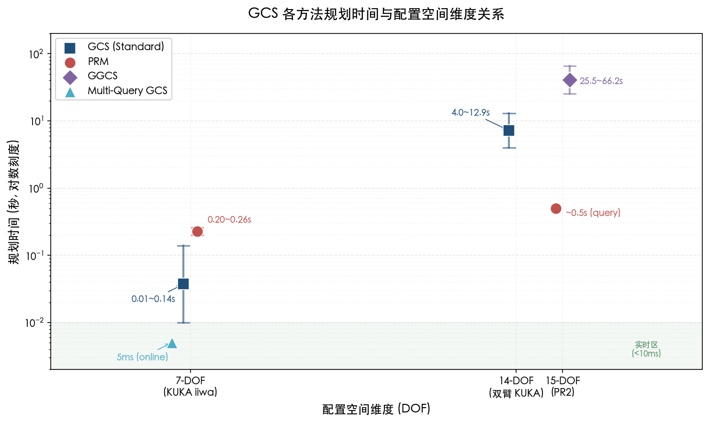

上图以对数时间刻度直观展示了不同 GCS 方法与 PRM 在 7-DOF、14-DOF、15-DOF 三种配置空间维度下的规划时间对比。Multi-Query GCS 的在线查询时间（5 ms）已进入实时区域，而标准 GCS 和 GGCS 的规划时间随维度增长呈现出显著上升趋势。

### 2.5.2 维度可扩展性

截至 2026 年 4 月的公开文献，GCS 的最高维度验证为 15-DOF（GGCS 在 PR2 上，$T^3 \times I^{12}$ 配置空间，每段规划平均 25.75 秒）[Cohn et al. 2023](https://groups.csail.mit.edu/robotics-center/public_papers/Cohn23.pdf "Section VII-D")；其次为 14-DOF 双臂 KUKA（4.0–12.9 秒）[Marcucci et al. 2023 Science Robotics](https://arxiv.org/abs/2205.04422 "Section 7.5")。超过 20-DOF 的系统面临凸集生成和求解的双重瓶颈：一方面，高维空间中 IRIS 区域体积呈指数级缩小，所需凸集数量急剧增加；另一方面，MICP/凸松弛的约束规模随凸集数量快速增长，导致求解代价攀升。

### 2.5.3 GCS 变体能力矩阵

下表汇总了各 GCS 变体的核心能力与适用场景：

| 变体 | 核心创新 | 最优性保证 | 完备性保证 | 适用规模 | 典型场景 |
|------|----------|-----------|-----------|---------|---------|
| 标准 GCS | 凸松弛 + 舍入 | 近似最优 | 否 | 数十至百个凸集 | 操作臂避障 |
| GCS* | A* 推广 + 支配检查 | 是（ReachesCheaper） | 是 | 隐式超大规模图 | 接触规划 |
| IxG/IxG* | 交替搜索与优化 | IxG*: 是 | IxG: 有条件 | 显式中等规模图 | 多臂装配 |
| Multi-Query GCS | SDP 预计算 + 贪心 | 次优（+7%） | 否 | 静态图多查询 | 工业多查询 |
| Fast Path Planning | 线图 + 凸交替 | 近似最优 | 否 | 数万轴对齐盒 | 大规模结构化环境 |
| GGCS | 黎曼流形归约 | 同标准 GCS | 否 | 同标准 GCS | 移动底座/全周转关节 |
| ST-GCS | 时空域扩展 + PBS | 同标准 GCS | 否 | ≤10 机器人 | 多机器人协同 |

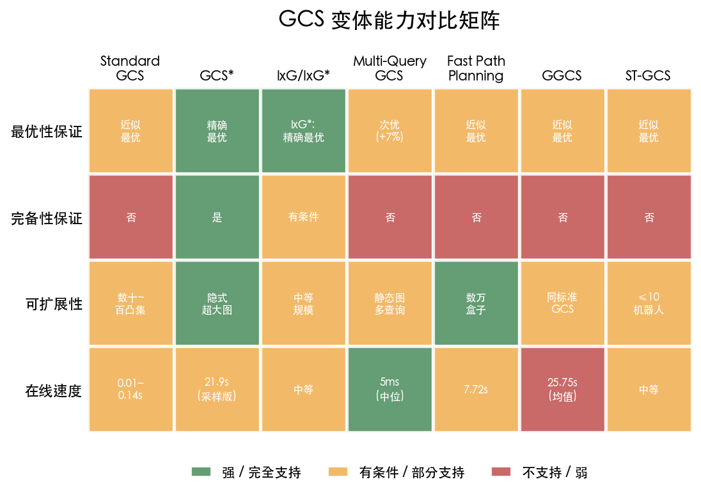

上图以颜色编码矩阵形式对 7 种 GCS 变体在最优性保证、完备性保证、可扩展性和在线速度四个关键维度上的能力差异进行了可视化对比。绿色表示完全支持或性能强，橙色表示有条件或部分支持，红色表示不支持或性能弱。可以清晰看出，GCS* 在完备性和最优性上表现最优，Multi-Query GCS 在在线速度上具有决定性优势，而各变体在可扩展性维度上均面临不同程度的限制。

## 2.6 Pipeline 瓶颈识别：凸集生成是核心障碍

尽管 GCS 在求解端取得了上述一系列重要进展，**凸集生成阶段始终是制约其大规模实用化的核心瓶颈**。这一瓶颈集中体现在以下三个层面。

**人工种子点依赖。** 当前所有 GCS 应用均依赖用户手动提供种子点来初始化 IRIS 类凸集生成算法。在 7-DOF 场景中，典型配置需约 18 个手动选择的种子点；在 15-DOF PR2 场景中，Cohn 等人详细描述了逐区域手动调整种子和中间区域以保证图连通性的过程——IRIS 区域生成平均 30.20 秒/个（范围 8.56–75.42 秒），并行化后全部区域需 156.63 秒 [Cohn et al. 2023](https://groups.csail.mit.edu/robotics-center/public_papers/Cohn23.pdf "Section VII-D")。这一人工流程的成本随问题维度迅速增长，且覆盖率难以获得系统性保证。

**凸集数量与 GCS 求解效率的紧耦合。** 每个凸集的超平面数目决定约束规模，集合总数决定图的顶点和边数，两者共同控制 MICP/凸松弛的计算复杂度。Marcucci et al. 2024 TRO 明确指出标准 GCS-Opt 无法扩展至大量安全集 [Marcucci et al. 2024 TRO](https://www-leland.stanford.edu/~boyd/papers/pdf/fpp.pdf "Section I-A")。GCS* 中精确多面体包含检查的计算成本同样极高——AROUND 任务中精确版耗时 7.5 小时，而采样版仅需 26.2 秒 [Chia et al. 2024](https://arxiv.org/abs/2407.08848 "Table 2")。

**图膨胀问题。** 在 ST-GCS 等多机器人场景中，时空凸集的数量随机器人数量和时间步长快速增长。当边数超过约 1000 条时，求解器开始出现求解失败 [Tang et al. 2025](https://arxiv.org/abs/2503.00583 "Figure 5")。这进一步表明，对凸集数量的高效控制是保证 GCS 框架可扩展性的关键前提。

上述三重瓶颈共同指向一个清晰的研究方向：**如果能够自动化地生成数量精炼、质量可控的安全区域凸集，将直接释放 GCS 框架在求解端已取得的性能红利**。下一章将深入剖析凸集生成方法的技术现状与具体局限性，为后续自动化方案的设计奠定基础。

# 第3章 凸集生成方法现状与局限性分析

第2章的分析表明，凸集生成阶段是制约 GCS 实用化的核心瓶颈。GCS 框架在求解端展现出的速度优势与最优性保证，高度依赖于一组质量可控、数量精炼的安全区域凸集作为输入。本章系统剖析这一环节的技术现状：首先梳理 IRIS 系列算法从 2014 年至 2025 年的演进脉络，逐一分析各代算法的能力边界与计算代价；继而揭示种子点依赖、计算可扩展性和凸集质量三个核心瓶颈的本质机理；最后通过算法横向对比，明确自动化凸集生成方案的迫切需求与技术出发点。

## 3.1 IRIS 系列算法的演进脉络

### 3.1.1 IRIS：奠基性工作

IRIS（Iterative Regional Inflation by Semidefinite programming）是凸集生成领域的奠基性算法，由 Deits 与 Tedrake 于 2014 年提出。该算法的核心思路是在给定种子点周围交替执行两个凸优化子程序——**分离超平面生成**（Separating Planes，QP）与**最大体积内接椭球计算**（Inscribed Ellipsoid，SDP），通过迭代使凸多面体持续膨胀，直至收敛或达到预设迭代次数 [Deits & Tedrake 2014](https://groups.csail.mit.edu/robotics-center/public_papers/Deits14.pdf "Computing Large Convex Regions of Obstacle-Free Space through Semidefinite Programming, WAFR 2014")。

在分离超平面步骤中，IRIS 对每个障碍物 $\mathcal{O}_i$ 求解一个 QP，找到当前椭球度量下距椭球中心最近的障碍物点 $x_i^\star$，并在该点处放置一个将椭球中心与障碍物分离的超平面。超平面法向量由椭球度量自然给出：$a_i = E(x_i^\star - c)$，其中 $E$ 为椭球的正定矩阵，$c$ 为椭球中心。所有超平面的半空间交集构成更新后的凸多面体 $\mathcal{P}$。随后在内接椭球步骤中，求解 SDP 计算 $\mathcal{P}$ 的最大体积内接椭球（MVIE），该椭球体积在迭代过程中单调递增，从而保证算法收敛。

IRIS 的设计优势在于数学简洁性与求解效率：在二维和三维工作空间中，对 $10^6$ 个显式凸障碍物仅需数秒即可收敛。然而，该算法存在两个根本性限制。其一，它要求障碍物以显式凸集形式给出，因而无法处理多连杆机器人配置空间中的非凸障碍物——配置空间障碍物由正向运动学的非线性映射隐式定义，即使工作空间障碍物为简单凸体，其配置空间投影通常仍为非凸。其二，IRIS 对种子点的选取高度敏感，约 5% 的情况下最终生成的凸区域甚至不包含初始种子点 [Deits & Tedrake 2014](https://groups.csail.mit.edu/robotics-center/public_papers/Deits14.pdf "Section 3.5, Failure cases")。

### 3.1.2 C-IRIS：配置空间的数学严格保证

C-IRIS（Certified IRIS，Dai et al. 2023/IJRR 2024）首次在配置空间中生成经数学严格证明（certified）无碰撞的凸多面体。其核心技术突破在于利用**正切半角代换**（tangent half-angle substitution）将运动学方程转化为有理多项式形式，继而借助**平方和规划**（Sum-of-Squares, SOS）在多项式优化框架内证明凸多面体与所有配置空间障碍物不相交。该方法适用于任意自由度的关节机器人，已在 7-DOF KUKA iiwa、6-DOF UR3e 和 12-DOF 双臂操作器上成功验证 [Dai et al. 2023 IJRR](https://arxiv.org/abs/2302.12219 "Certified Polyhedral Decompositions of Collision-Free Configuration Space, IJRR 43(9):1322-1341, 2024")。

C-IRIS 的核心价值在于无碰撞保证的严格性——生成的凸多面体在数学上被证明不包含任何碰撞配置，这对于手术机器人、人机协作等安全关键型应用具有重要意义。然而，SOS 规划的计算代价极为昂贵。在约束双臂场景中，IRIS-NP（基于 C-IRIS 思路的后续实现）平均每个区域需要 305.97 秒（范围 216.20–433.61 秒），生成的多面体平均需 344 个超平面描述 [Cohn, Werner & Tedrake 2025](https://groups.csail.mit.edu/robotics-center/public_papers/Cohn25a.pdf "Faster Algorithms for Growing Collision-Free Regions, Table I")。换言之，为一个 12-DOF 双臂场景生成 20 个凸区域，仅区域生成即需约 1.7 小时——对于需要快速部署或频繁更换场景的工业应用而言，这一时间成本远超可接受范围。

### 3.1.3 IRIS-NP：以概率保证换取计算速度

IRIS-NP（Petersen & Tedrake, 2023）采用与 C-IRIS 截然不同的策略：以**非线性优化**（NLP）替代 QP 搜索分离超平面，通过在任务空间中编码碰撞约束来隐式处理配置空间障碍物。其核心优化问题可表述为：

$$\min_{q,t} \|q - c\|_E^2, \quad \text{s.t.} \quad t \in \mathcal{A}(q) \cap \mathcal{B}(q), \; q \in \mathcal{P}$$

其中 $q$ 为配置空间变量，$t$ 为碰撞几何体交点的辅助变量，$\mathcal{A}(q)$ 与 $\mathcal{B}(q)$ 为碰撞几何对在世界坐标下的表示。NLP 的局部最优解 $q^\star$ 提供一个碰撞配置，据此放置分离超平面。对每个碰撞几何对，IRIS-NP 反复求解该 NLP 直至连续多次返回不可行，继而将该碰撞对视为已充分分离 [Petersen & Tedrake 2023](https://arxiv.org/abs/2303.14737 "Growing Convex Collision-Free Regions in Configuration Space using Nonlinear Programming")。

IRIS-NP 的计算速度远快于 C-IRIS 的 SOS 方法，但其技术局限同样显著。首先，**终止条件依赖手工调参**——用户需指定"连续不可行次数"作为终止阈值，而该参数与区域碰撞分数之间的映射关系不透明，导致调参困难且结果难以预判。其次，**NLP 局部性**使得全局可行性无法保证——即使当前多面体仍包含碰撞区域，NLP 求解器亦可能因初始点不佳而返回不可行。最后，IRIS-NP 须为**每个有效碰撞对**独立求解 NLP，碰撞对数量随场景几何体数量的平方增长，大量从未实际碰撞的几何对仍消耗 NLP 求解时间，构成显著的计算浪费。在约束双臂场景的实验中，19 个种子点中有 8 个（42%）生成的区域碰撞分数超过 1% 的目标阈值 [Cohn, Werner & Tedrake 2025](https://groups.csail.mit.edu/robotics-center/public_papers/Cohn25a.pdf "Table I, IRIS-NP fraction in violation")。

### 3.1.4 FastIRIS：零阶优化与概率终止条件

FastIRIS（Werner et al., 2024）包含两个算法——**IRIS-ZO**（零阶优化）与 **IRIS-NP2**，二者共享一项关键创新：基于 Chernoff 界的**概率终止条件**。该条件允许用户直接指定可容许碰撞体积分数 $\varepsilon$ 和置信度 $\delta$，通过均匀采样与碰撞检测估计区域碰撞分数，当统计检验通过时终止迭代。相较于 IRIS-NP 依赖"连续不可行次数"的启发式条件，这一终止准则具有清晰的统计语义与可控的安全保证 [Werner et al. 2024](https://arxiv.org/html/2410.12649v1 "Faster Algorithms for Growing Collision-Free Convex Polytopes, Theorem 5.1")。

**IRIS-ZO** 完全绕过 NLP 求解器，核心流程为：(1) 在当前多面体中均匀采样一批配置；(2) 通过碰撞检测识别碰撞样本；(3) 对碰撞样本沿朝椭球中心方向执行**二分搜索**（bisection search），逼近障碍物边界；(4) 在逼近点放置分离超平面。整个过程仅依赖碰撞检测器而无需梯度计算，天然适合大规模并行化。在 8 个基准机器人环境（2–14 DOF）上的 800 次实验中，IRIS-ZO 在"快速"设定（90% 无碰撞、90% 置信度）下平均比 IRIS-NP 快 15.5 倍，超平面数减少 1.4 倍；在"精确"设定（99% 无碰撞、95% 置信度）下平均加速 14 倍 [Werner et al. 2024](https://arxiv.org/html/2410.12649v1 "Table 2, Section 6")。

**IRIS-NP2** 仍使用 NLP 求解器，但引入两项关键改进：(1) 以采样发现的碰撞配置作为 NLP 的**可行初始猜测**，避免 IRIS-NP 中大量不可行 NLP 求解的计算浪费；(2) 仅对已知存在碰撞的几何对求解 NLP，跳过从未碰撞的几何对。IRIS-NP2 提供 Greedy 与 Ray 两种采样策略：Greedy 直接使用碰撞样本作为初始猜测，Ray 沿射线方向搜索更近的碰撞点。IRIS-NP2 生成的区域通常具有更大体积和更少超平面，但速度略慢于 IRIS-ZO [Werner et al. 2024](https://arxiv.org/html/2410.12649v1 "Section 5.3, Table 2")。

在约束双臂场景的直接对比中，三种新算法的性能提升尤为显著：IRIS-ZO 平均每区域 1.82 秒（85 个超平面），IRIS-NP2 Greedy 平均 1.65 秒（56 个超平面），IRIS-NP2 Ray 平均 2.36 秒（48 个超平面），而 IRIS-NP 平均 305.97 秒（344 个超平面）。新算法相对 IRIS-NP 实现了约 100–500 倍的加速，超平面数减少至原来的 1/5 至 1/7，且所有新算法的碰撞分数均满足 1% 的目标阈值 [Cohn, Werner & Tedrake 2025](https://groups.csail.mit.edu/robotics-center/public_papers/Cohn25a.pdf "Table I, 19 seed points comparison")。

下图以时间轴形式总览了 IRIS 系列算法从 2014 年至 2025 年的性能演进全貌，直观呈现了单区域生成时间跨越四个数量级的加速历程。

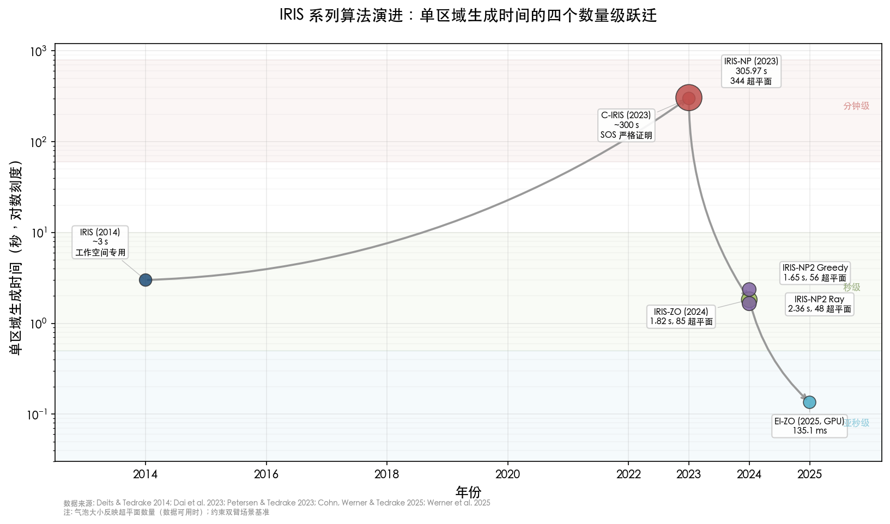

### 3.1.5 GPU 加速的 EI-ZO：线段种子与毫秒级凸集生成

EI-ZO（Edge Inflation with Zero-Order optimization, Werner et al., RSS 2025）将凸集生成的计算效率推向毫秒级。其核心创新体现在两个方面。第一，将种子从"点"扩展为"线段"——在预计算的离散路线图（DRM，本质为 PRM + 体素碰撞查找表）路径的每条边周围膨胀凸多面体，通过 `SetEdgeContainmentTerminationCondition` 保证生成的凸集严格包含该线段，从而确保相邻凸集在路径节点处自动产生非空交集。第二，碰撞检测、采样、二分搜索等核心操作全部在 **GPU 上大规模并行**执行，充分利用现代图形处理器的数千计算核心 [Werner et al. 2025](https://arxiv.org/html/2504.10783v1 "Superfast Configuration-Space Convex Set Computation on GPUs, RSS 2025")。

在 Franka 7-DOF 仿真基准（RTX 3090 GPU）中，EI-ZO 平均仅生成 3.49 个凸集，凸集构建耗时 135.1 ms，端到端规划（含路径查找与轨迹优化）152.5±89.1 ms（最短路径模式），比非线性轨迹优化快约 20 倍，成功率从 72.5% 提升至 100%。在 KUKA 7-DOF 硬件验证（RTX 2080Ti GPU）中，15 次规划平均耗时 0.82 秒 [Werner et al. 2025](https://arxiv.org/html/2504.10783v1 "Tables I-II, Section VII")。

## 3.2 种子点依赖：IRIS 系列算法的共同瓶颈

尽管 IRIS 系列算法在计算效率上实现了跨越式进步——从 C-IRIS 的数百秒到 EI-ZO 的百毫秒——**种子点依赖**始终是所有变体的共同结构性瓶颈。每个 IRIS 类算法均需要一个无碰撞种子点（或种子线段）作为输入，算法从该点出发向外膨胀凸多面体。种子点的位置直接决定生成区域的形状、体积与覆盖方向：优质种子点能膨胀出大体积凸区域并覆盖关键通道，劣质种子点则可能生成局限在小空间中的低效区域。

在低维工作空间（2D/3D）中，人类可凭直觉选择有效的种子分布。然而在高维配置空间（≥7-DOF）中，人类对配置空间几何结构缺乏直觉认知——7-DOF 机器人的配置空间是 $\mathbb{R}^7$ 的子集，障碍物边界是复杂的非凸超曲面，窄通道与大开放区域在高维中的分布完全超出视觉感知能力。Marcucci 等人在 2023 年 Science Robotics 论文中的所有 GCS 实验均依赖手动选择的种子点（7-DOF 场景约 18 个种子），14-DOF 双臂场景的种子选择难度进一步加剧 [Marcucci et al. 2023 Science Robotics](https://arxiv.org/abs/2205.04422 "Section 7, experimental setup")。

### 3.2.1 VCC：首个系统化自动种子方案

VCC（Visibility Clique Cover, Werner et al., ICRA 2024）是首个系统化解决种子选取问题的工作。其核心思路为：(1) 在 $\mathcal{C}_{\text{free}}$ 中均匀采样大量配置；(2) 构建可见性图——若两个采样点之间的直线路径无碰撞，则建立可见性边；(3) 将可见性图分解为大团（clique）；(4) 以每个大团的质心作为 IRIS 的种子点。这一策略的直觉在于：大团中的所有点彼此可见（即直线连通），在其质心处膨胀出的凸区域倾向于覆盖整个团所占据的空间区域 [Werner et al. 2024 VCC](https://groups.csail.mit.edu/robotics-center/public_papers/Werner23.pdf "Approximating Robot Configuration Spaces with few Convex Sets using Clique Covers of Visibility Graphs, ICRA 2024")。

VCC 在 7-DOF 场景中取得了显著成效：约 46 个凸区域在 1 小时内覆盖约 70% 的自由配置空间，较随机种子 IRIS-NP 减少了约 10 倍的区域数量与计算时间。然而，VCC 自身面临严重的可扩展性瓶颈——可见性图的构建需要 $O(N^2)$ 次碰撞路径检查（其中 $N$ 为采样数），在高维约束系统中成为不可承受的计算负担。

### 3.2.2 VCC 在高维约束场景中的性能崩溃

VCC 的可扩展性问题在约束双臂场景中彻底暴露。Cohn, Werner & Tedrake（2025）的实验表明，VCC 在 437 秒内仅生成 8 个区域，覆盖率不足 1%。耗时分解揭示了瓶颈的实质——437 秒中仅 21 秒用于实际的区域生成（得益于 IRIS-ZO 的高效），其余 416 秒（占比 95.2%）全部消耗在可见性图的构建上 [Cohn, Werner & Tedrake 2025](https://groups.csail.mit.edu/robotics-center/public_papers/Cohn25a.pdf "Section VI Discussion, VCC bottleneck analysis")。

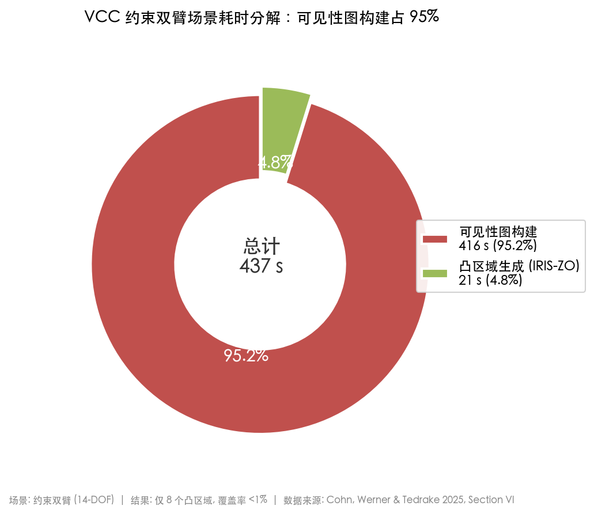

这一结果的根本原因在于：对于运动学约束系统，$\mathcal{C}_{\text{free}} \cap \mathcal{C}_{\text{valid}}$ 在参数化空间中的体积占比极低，均匀采样需大量试探才能获得足够的有效样本；而可见性检查本身又极为昂贵（每次检查需沿直线路径做密集碰撞检测）。VCC 的困境表明，**任何依赖完全可见性图的种子选取方法在高维约束系统中都将面临组合爆炸**。这一认识为探索基于路线图（如 PRM）的替代种子策略提供了明确动机——PRM 的 $O(N \log N)$ 近邻连接策略在计算复杂度上显著优于 VCC 的 $O(N^2)$ 完全可见性检查。

## 3.3 凸集质量对 GCS 求解的系统性影响

凸集生成的质量不仅影响自身环节的效率，更直接决定下游 GCS 求解的可行性与性能表现。凸集质量可从三个关键维度加以刻画——数量、几何复杂度与覆盖率——三者与 GCS 求解效率之间存在紧密的耦合关系。

### 3.3.1 凸集数量与 MICP 求解规模

GCS 的 MICP 公式（第1章 Equation 5.5）包含 $O(|\mathcal{E}|)$ 个二值变量与 $O(n \cdot |\mathcal{E}|)$ 个连续变量，其中 $|\mathcal{E}|$ 为边数、$n$ 为凸集维度。对于 $N$ 个凸集的全连接图，$|\mathcal{E}| = O(N^2)$，MICP 规模随凸集数量的平方增长。即便采用凸松弛，求解大规模凸规划的计算时间仍与约束数量 $O(N^2)$ 正相关。

实验数据清楚地展示了这一规模效应：标准 GCS-Opt 在凸集数量达 10,150 个轴对齐盒时已无法求解 [Marcucci et al. 2024 TRO](https://www-leland.stanford.edu/~boyd/papers/pdf/fpp.pdf "Section I-A")。EI-ZO 在膨胀两条路径（LGCS 模式）而非单条路径时，凸集数量增加导致 GCS 求解时间从毫秒级跃升至 4236.5 ms（完整 MICP），路径代价仅降低 3.7%——时间增加 29 倍而质量改善微乎其微 [Werner et al. 2025](https://arxiv.org/html/2504.10783v1 "Table I, LSCS vs LGCS comparison")。由此可见，凸集数量存在一个有效阈值：超过该阈值后，增加凸集所带来的路径质量边际收益将被求解时间的急剧增长所淹没。

### 3.3.2 超平面数量与约束复杂度

每个凸多面体的超平面数直接决定其约束描述的复杂度。在 GCS 轨迹优化中，Bézier 曲线的控制点被约束在凸集内（$r_{i,j} \in Q_i$），每个控制点对每个超平面产生一个线性不等式约束。若凸集 $Q_i$ 有 $h_i$ 个超平面、Bézier 阶数为 $d$，则该凸集贡献 $(d+1) \cdot h_i$ 个约束。FastIRIS 的一项重要贡献在于显著减少了超平面数——IRIS-NP2 Greedy 平均 56 个超平面对比 IRIS-NP 的 344 个，减幅达 84%，从而直接降低了下游 GCS 优化问题的约束规模 [Cohn, Werner & Tedrake 2025](https://groups.csail.mit.edu/robotics-center/public_papers/Cohn25a.pdf "Table I")。

### 3.3.3 覆盖率与路径可行性

凸集的覆盖率决定了 GCS 可访问的配置空间范围。若凸集仅覆盖 $\mathcal{C}_{\text{free}}$ 的一小部分，GCS 可能无法找到连接起点与终点的可行路径；即使存在可行路径，路径选择亦受限于已覆盖的区域，可能错过质量更优的轨迹。

EI-ZO 的路径依赖性问题是覆盖率局限的典型例证。EI-ZO 仅在初始 DRM 路径附近膨胀凸集（平均 3.49 个），若该路径质量不佳（例如绕行过长），膨胀出的凸集可能不包含更优轨迹。Werner 等人的实验表明，膨胀多条路径的改善仅为边际，这暗示简单增加路径数量的回报递减，而覆盖不同同伦类的互补路径选择策略可能更为有效 [Werner et al. 2025](https://arxiv.org/html/2504.10783v1 "Section VIII Limitations")。

与之对比，VCC 的全覆盖策略（46 个区域覆盖约 70% 自由空间）为 GCS 提供了更充裕的路径选择空间，但以 1 小时的离线时间为代价。这一对比揭示了凸集生成中的核心权衡：**覆盖率与计算效率的帕累托前沿**——高覆盖率需要更多凸集与更长的离线时间，低覆盖率虽然快速但可能牺牲路径质量与可行性。

## 3.4 计算可扩展性的多维度挑战

### 3.4.1 维度诅咒

配置空间维度的增加对凸集生成产生多重挑战。首先，高维空间中 $\mathcal{C}_{\text{free}}$ 的体积占比急剧缩小——Werner et al.（2024）的基准测试表明，随着自由度增加与场景复杂化，自由空间体积比可降至极低水平，使得采样效率大幅下降。其次，高维凸多面体的体积呈指数级缩小：即使 IRIS 成功膨胀出一个凸区域，该区域在高维空间中覆盖的体积比也远小于低维情况，从而需要更多凸集才能达到相同的覆盖率。

截至 2026 年 4 月的公开实验数据，GCS 凸集生成的最高维度验证为 15-DOF（GGCS 在 PR2 平台上，区域生成平均 30.20 秒/个）与 14-DOF（约束双臂场景，IRIS-ZO 平均 1.82 秒/个）。超过 20-DOF 的系统将面临凸集体积指数缩小与碰撞对数量组合爆炸的双重瓶颈。

### 3.4.2 场景复杂度

凸集生成的计算时间与场景中碰撞几何体的数量密切相关。IRIS-NP 的时间复杂度与碰撞对数量成正比——它须为**每个有效碰撞对**执行最少数量的 NLP 求解，而碰撞对数量随场景几何体数量的平方增长。Werner et al.（2024）明确指出，随着环境中碰撞几何体数量的增加，FastIRIS 相对 IRIS-NP 的性能优势将进一步扩大，原因在于 FastIRIS 仅处理已知碰撞的几何对，避免了对未碰撞几何对的无效计算 [Werner et al. 2024](https://arxiv.org/html/2410.12649v1 "Section 7 Discussion")。

### 3.4.3 硬件依赖与部署约束

GPU 加速的 EI-ZO 虽然实现了毫秒级凸集生成，但引入了新的部署约束。CSDecomp 工具箱需要 NVIDIA GPU（RTX 3090 或 RTX 2080Ti）与 CUDA 12.x 环境，且当前仅支持盒体和球体碰撞几何——圆柱与胶囊形状处于开发路线图中但尚未实现，网格碰撞体（工业场景中最常见的几何描述形式）则完全不支持 [CSDecomp GitHub](https://github.com/wernerpe/csdecomp "碰撞几何支持范围与硬件要求")。这一限制意味着 EI-ZO 的超高速度目前仅适用于几何简化的场景，复杂工业环境的应用尚需碰撞几何支持的进一步扩展。

## 3.5 IRIS 系列算法横向对比

下表汇总了 IRIS 系列各代算法在关键维度上的性能特征：

| 算法 | 无碰撞保证 | 典型速度（/区域） | 超平面数 | 种子类型 | 适用场景 |
|------|-----------|------------------|---------|---------|---------|
| IRIS (2014) | 是（显式凸障碍物） | 数秒（2D/3D） | 等于障碍物数 | 点 | 低维工作空间 |
| C-IRIS (2023) | 是（SOS 证明） | 数分钟 | 数百 | 点 | 安全关键型 |
| IRIS-NP (2023) | 否（概率，不可控） | 305.97 秒（约束双臂） | 344 | 点 | 中等复杂度 |
| IRIS-ZO (2024) | 否（概率，可控 $\varepsilon, \delta$） | 1.82 秒（约束双臂） | 85 | 点 | 批量生成 |
| IRIS-NP2 Greedy (2024) | 否（概率，可控） | 1.65 秒（约束双臂） | 56 | 点 | 质量优先 |
| IRIS-NP2 Ray (2024) | 否（概率，可控） | 2.36 秒（约束双臂） | 48 | 点 | 最少超平面 |
| EI-ZO (2025) | 否（概率，可控） | 135.1 ms（7-DOF, GPU） | — | 线段 | 在线实时 |

从上述对比中可以清晰辨识出三个演进趋势。第一，**计算效率的跨数量级跃升**——从 C-IRIS 的数分钟到 EI-ZO 的百毫秒，跨越约四个数量级。第二，**从严格证明向可控概率保证的转变**——计算速度的提升以放弃数学严格性为代价，但概率保证的可控性在 FastIRIS 中得到了显著改善，用户可通过 $\varepsilon$ 和 $\delta$ 参数精确调控安全水平。第三，**从点种子向线段种子的范式演进**——EI-ZO 的线段种子策略内在地解决了相邻凸集的连通性问题，为凸集图的自动构建提供了结构性保证。

下图以雷达图形式直观呈现四种代表性算法在五个性能维度上的能力轮廓与权衡关系。

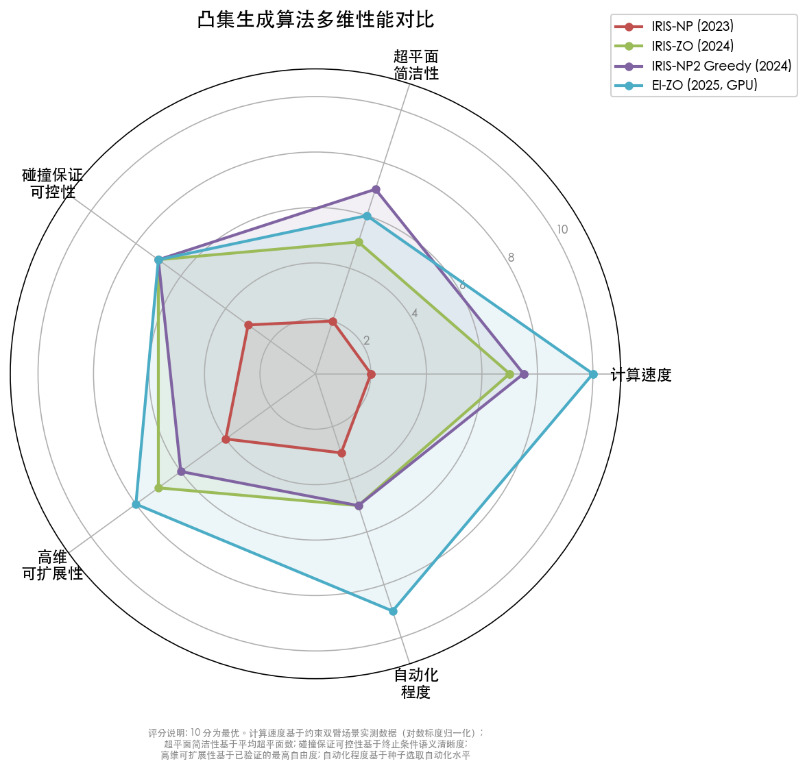

## 3.6 凸集生成瓶颈的本质与自动化需求

综合以上各节分析，当前凸集生成环节的核心瓶颈可归纳为三个层次。

**算法层面**，IRIS 系列的单区域生成效率已接近物理极限（GPU 加速后达百毫秒级），但种子选取策略仍然原始——要么依赖人工选择（耗时且不可扩展），要么依赖 VCC 的完全可见性图（在高维约束场景中计算崩溃）。算法自身的加速并不能解决"在何处膨胀"这一更高层次的决策问题。

**架构层面**，凸集生成与 GCS 求解之间缺乏有效的反馈回路。当前 pipeline 是严格的单向流水线——先生成凸集，再交给 GCS 求解。若凸集覆盖不足或分布不合理，GCS 求解器无法向上游传递"需要在何处补充凸集"的信息。EI-ZO 的路径引导策略虽然引入了任务相关性（仅在与当前查询相关的路径附近膨胀），但其"先找路径、再膨胀"的范式天然受限于初始路径的质量。

**系统层面**，凸集数量与 GCS 求解效率的紧耦合关系要求凸集生成不仅要实现"自动化"，还须达到"精炼化"——生成足够少但足够优质的凸集，使 GCS 在合理时间内找到高质量路径。这一需求直接指向基于路线图的智能种子策略：利用 PRM 等采样规划器的连通图结构来指导凸集的位置与数量选择，同时借助 PRM 的 $O(N \log N)$ 连接复杂度避免 VCC 的 $O(N^2)$ 可见性检查瓶颈。

上述瓶颈分析为第4章"PRM 算法作为自动种子生成器的可行性"提供了明确的技术出发点：一个有效的自动化方案需同时满足三个条件——(1) 无需人工干预即可生成种子点；(2) 种子分布保证凸集图的连通性；(3) 种子数量控制在 GCS 可处理的规模范围内。

# 第4章 PRM 算法原理及其作为自动种子生成器的可行性

第3章的分析揭示了一个核心矛盾：IRIS 系列算法的单区域生成效率已逼近物理极限（GPU 加速后达百毫秒级），但"在哪里膨胀"这一更高层次的决策问题——即种子点的自动选取——仍是制约 GCS 全自动化的关键瓶颈。VCC 方案虽然首次实现了系统化的自动种子选取，但其 $O(N^2)$ 可见性图构建在高维约束场景中面临严重的可扩展性问题：约束双臂场景中耗时 437 秒仅生成 8 个区域，覆盖率不足 1% [Cohn, Werner & Tedrake 2025](https://groups.csail.mit.edu/robotics-center/public_papers/Cohn25a.pdf "Section VI Discussion, VCC bottleneck analysis")。这一困境自然引出一个核心问题：能否利用经典的概率路线图（Probabilistic Roadmap, PRM）算法——一种具有成熟理论基础和广泛工程验证的采样规划方法——来自动生成高质量的 IRIS 种子点？

本章从 PRM 算法的核心机制和理论性质出发，系统论证其作为 GCS 凸集自动种子生成器的可行性与适配条件，并对端到端计算代价和高维可扩展性进行定量评估。

## 4.1 PRM 核心机制回顾

### 4.1.1 两阶段架构

PRM 由 Kavraki、Švestka、Latombe 和 Overmars 于 1996 年提出，是面向静态多查询场景的采样路径规划方法，其核心架构分为学习阶段与查询阶段两个明确的处理环节 [Kavraki et al. 1996](https://www.kavrakilab.org/publications/kavraki-svestka1996probabilistic-roadmaps-for.pdf "Probabilistic Roadmaps for Path Planning in High-Dimensional Configuration Spaces, IEEE Trans. Robotics 12(4):566-580, 1996")。

**学习阶段（预处理）。** 算法在自由配置空间 $\mathcal{C}_{\text{free}}$ 中均匀随机采样大量配置点（称为里程碑，milestones），并对每个采样点执行碰撞检测以验证其无碰撞性。随后，对每个新增节点，在其 $r$-邻域内查找已有节点，使用局部规划器（通常为直线路径）尝试连接；若局部路径无碰撞，则在路线图中建立一条边。学习阶段的输出是一个无向图 $G = (V, E)$，其中 $V$ 为无碰撞配置集合，$E$ 为经碰撞检测验证的局部路径集合。

**查询阶段。** 给定任意起点 $q_{\text{init}}$ 和终点 $q_{\text{goal}}$，算法首先将这两个配置连接到路线图中的最近里程碑，继而在路线图上执行图搜索（如 Dijkstra 或 A*）以寻找路径。路线图的多查询特性意味着：学习阶段一旦完成，同一环境中的多次路径查询可直接复用预计算的路线图，无需重新采样。

上述两阶段架构与 GCS pipeline 的离线-在线分离具有天然的结构契合性。GCS pipeline 同样需要在离线阶段准备凸集（对应学习阶段），在在线阶段快速求解路径（对应查询阶段）。PRM 路线图中的节点恰好提供了一组分布于 $\mathcal{C}_{\text{free}}$ 中的无碰撞配置，而这正是 IRIS 类算法所需的种子点。

### 4.1.2 连接策略与距离度量

PRM 的连接策略决定了路线图的拓扑结构。标准 PRM 使用固定半径 $r$ 或固定邻居数 $k$ 的连接策略：对每个新增节点 $q$，算法查找 $r$-邻域内（或 $k$-最近邻）的所有现有节点，并逐一尝试局部路径连接。其中一项关键的效率优化在于，若 $q$ 已与某个连通分量的节点成功连接，则跳过同一连通分量中的其他候选节点。该"跳过同分量"策略显著减少了碰撞检测次数，但正如 Karaman 和 Frazzoli（2011）在 Theorem 29 中所证明的，这也是标准 PRM 无法实现渐近最优的根本原因 [Karaman & Frazzoli 2011](https://people.eecs.berkeley.edu/~pabbeel/cs287-fa19/optreadings/rrtstar.pdf "Theorem 29, Sampling-based Algorithms for Optimal Motion Planning, IJRR 30(7):846-894, 2011")。

距离度量的选择对高维配置空间中的 PRM 性能具有重要影响。对于旋转关节机器人，常用加权欧氏距离或关节角度差异的加权范数；局部规划器通常采用配置空间中的直线插值，对应于各关节同步线性运动。该方案计算简单，但在工作空间中可能穿越障碍物，因此仍需碰撞检测加以验证。

## 4.2 理论基础：概率完备性与渐近最优性

### 4.2.1 概率完备性

PRM 最重要的理论保证是**概率完备性**——若可行路径存在，则随着采样数趋于无穷，PRM 找到路径的概率趋于 1。Kavraki 等人（1998）给出了该性质的形式化表述：对于鲁棒可行的规划问题（即存在常数 $n_0$ 和 $a > 0$），PRM 成功找到路径的概率满足：

$$P(\text{success}) > 1 - e^{-an}$$

其中 $n > n_0$ 为采样数 [Kavraki et al. 1998](https://www.cs.rice.edu/CS/Robotics/papers/kavraki1998analysis-prm.pdf "Analysis of Probabilistic Roadmaps for Path Planning, IEEE Trans. Robotics 14(1):166-171, 1998")。失败概率以指数速率衰减意味着，即使在复杂环境中，适度增加采样数即可将规划失败的概率降至任意低的水平。

该定理的关键前提是路径的**鲁棒可行性**——存在一条距碰撞边界至少 $\delta > 0$ 的路径（即具有强 $\delta$-clearance）。这一条件排除了零测度的退化可行路径（如恰好贴着障碍物表面的路径），但在绝大多数实际机器人规划问题中自然成立。Karaman 和 Frazzoli（2011）在 Theorem 15 中给出了更现代的表述：在具有强 $\delta$-clearance 路径的条件下，PRM 以概率 1 渐近捕获 $\mathcal{C}_{\text{free}}$ 的完整连通结构 [Karaman & Frazzoli 2011](https://people.eecs.berkeley.edu/~pabbeel/cs287-fa19/optreadings/rrtstar.pdf "Theorem 15, IJRR 30(7):846-894, 2011")。

### 4.2.2 PRM* 与渐近最优性

标准 PRM 的"跳过同分量"连接策略虽然加速了路线图构建，但导致路径代价无法收敛到最优值（Theorem 29）。为解决这一缺陷，Karaman 和 Frazzoli（2011）提出了 PRM* 算法，通过动态调整连接半径实现渐近最优 [Karaman & Frazzoli 2011](https://people.eecs.berkeley.edu/~pabbeel/cs287-fa19/optreadings/rrtstar.pdf "Theorems 29, 30, 34, Algorithm 4: PRM*, IJRR 2011")。

PRM* 的核心修改在于连接半径随采样数 $n$ 按如下规则递减：

$$r(n) = \gamma \left(\frac{\log(n)}{n}\right)^{1/d}$$

其中 $d$ 为配置空间维度，$\gamma$ 为依赖于自由空间体积和维度的常数。该半径既保证路线图在渐近意义下保持连通性，又避免引入过多冗余边。等价地，$k$-近邻版本取 $k(n) = k_{\text{PRM}} \log(n)$，其中 $k_{\text{PRM}} = 2e$ 为通用有效选择（Theorem 34）。PRM* 的计算复杂度为 $O(n \log n)$，与标准 PRM 处于同一量级。

渐近最优性对 GCS pipeline 具有间接但重要的意义：PRM* 路线图中的路径随采样数增加而趋近最优，这意味着基于 PRM* 路径膨胀的凸集更有可能覆盖包含高质量轨迹的配置空间区域。

### 4.2.3 均匀采样的覆盖性保证

PRM 的均匀随机采样策略天然提供对 $\mathcal{C}_{\text{free}}$ 的渐近均匀覆盖。随着采样数 $n \to \infty$，采样点的经验分布以概率 1 收敛到 $\mathcal{C}_{\text{free}}$ 上的均匀分布，确保 PRM 路线图的节点不会系统性地遗漏 $\mathcal{C}_{\text{free}}$ 的任何开放区域——无论是窄通道还是大开放空间。

对于种子点生成而言，均匀覆盖性意味着 PRM 节点集合在统计意义上对 $\mathcal{C}_{\text{free}}$ 的几何结构进行了无偏采样。与人工种子选取（受限于人类对高维空间的认知局限）或 VCC 的可见性团方法（$O(N^2)$ 复杂度导致计算不可扩展）相比，PRM 的均匀采样提供了一种在理论上最简洁、在工程上最可扩展的种子生成基础。

## 4.3 PRM 变体与采样增强策略

### 4.3.1 Gaussian PRM：障碍物边界偏向采样

标准 PRM 的均匀采样在窄通道场景中面临显著挑战：窄通道在配置空间中的体积占比极小，均匀采样命中窄通道内部的概率相应极低。Gaussian PRM（Boor et al., 1999）通过修改采样分布来缓解这一问题 [Orthey, Chamzas & Kavraki 2024](https://www.kavrakilab.org/publications/orthey2024-review-sampling.pdf "Sampling-Based Motion Planning: A Comparative Review, Annual Reviews 2024")。

其核心策略为：(1) 均匀随机采样一个配置 $q_1$；(2) 以 $q_1$ 为中心、按高斯分布采样第二个配置 $q_2$；(3) 仅当 $q_1$ 和 $q_2$ 的碰撞状态不同（一个碰撞、一个无碰撞）时，保留无碰撞的那个配置。该策略的直觉在于：在障碍物边界附近，采样对中一碰一非碰的概率最高；而在远离障碍物的大开放空间中，两个点大概率均无碰撞而被丢弃。最终效果是采样密度偏向障碍物边界，恰好对应窄通道所在的区域。

### 4.3.2 Bridge PRM：窄通道内部直接采样

Bridge PRM（Hsu et al., 2003）采用更激进的策略，直接在窄通道内部生成采样点。其核心是"桥测试"（Bridge Test）：(1) 均匀随机采样一个配置 $q_1$；(2) 若 $q_1$ 在碰撞中，按高斯分布采样 $q_2$；(3) 若 $q_2$ 亦在碰撞中，计算中点 $q_m = (q_1 + q_2)/2$；(4) 若 $q_m$ 无碰撞，则将 $q_m$ 保留为路线图节点。在窄通道中，由于通道两侧均为障碍物，短"桥"容易构建（两个端点自然落入障碍物）；而在大开放空间中，构建短桥极为困难（需两个端点恰好均落入障碍物） [Hsu et al. 2003](https://www.clear.rice.edu/comp450/papers/bridge.pdf "The Bridge Test for Sampling Narrow Passages with Probabilistic Roadmap Planners, ICRA 2003")。

Hsu 等人的实验表明，在包含多种窄通道类型的平面环境中，Bridge PRM 的混合采样策略（桥测试与均匀采样以 5:1 比例混合）相比纯均匀采样，路线图节点数减少约 2–10 倍，同时可靠地捕获了自由空间的连通结构。在 7-DOF 平面铰接机器人的窄开口脱出任务中，该策略的有效性同样得到了验证 [Hsu et al. 2003](https://www.clear.rice.edu/comp450/papers/bridge.pdf "Table 1, Section 5 Experiments")。

### 4.3.3 Lazy PRM：延迟碰撞检测

Lazy PRM（Bohlin & Kavraki, 2000）从另一维度优化 PRM 的计算效率——不改变采样分布，而是减少碰撞检测次数。其核心思想是在路线图构建阶段不对边执行碰撞检测，仅在查询阶段对候选路径上的边进行验证；若某条边被发现碰撞，则删除该边并重新搜索。该策略的收益在于：路线图中大量边永远不会被查询到，跳过对它们的碰撞检测可节省可观的计算资源 [Orthey, Chamzas & Kavraki 2024](https://www.kavrakilab.org/publications/orthey2024-review-sampling.pdf "Section 4.2, Lazy Collision Checking, Annual Reviews 2024")。

### 4.3.4 采样策略对种子生成的启示

上述 PRM 变体为 IRIS 种子生成提供了互补的工具箱：均匀采样保证全局覆盖性，Gaussian PRM 增强障碍物边界附近（即 $\mathcal{C}_{\text{free}}$ 拓扑复杂区域）的采样密度，Bridge PRM 则直接深入窄通道内部。对于 GCS 凸集生成而言，窄通道是最具挑战性的区域——窄通道内的凸集体积小但在拓扑上不可或缺。因此，在种子生成阶段混合使用上述采样策略，有望在全局覆盖和局部精细化之间取得有效平衡。

## 4.4 PRM 节点作为 IRIS 种子点的理论分析

### 4.4.1 无碰撞约束的天然满足

IRIS 类算法对种子点的基本要求是种子点必须位于 $\mathcal{C}_{\text{free}}$ 中。PRM 路线图中的每个节点均经过碰撞检测验证，天然满足这一约束。这一看似简单的观察具有重要的工程意义：它消除了种子点选取过程中碰撞检测的额外开销，因为 PRM 的学习阶段已经完成了全部碰撞验证工作。

### 4.4.2 PRM 路线图连通性对凸集图连通性的先验保证

PRM 路线图的连通性为 IRIS 凸集图的连通性提供了重要的先验信息。考虑 PRM 路线图中由边 $(q_i, q_j)$ 连接的两个相邻节点：该边的存在意味着 $q_i$ 和 $q_j$ 之间存在一条无碰撞的直线路径。当分别以 $q_i$ 和 $q_j$ 为种子点膨胀 IRIS 凸集时，生成的凸集 $Q_i$ 和 $Q_j$ 倾向于覆盖各自种子点附近的自由空间——包括连接二者的直线路径区域——因而大概率产生非空交集 [Werner et al. 2024 VCC](https://groups.csail.mit.edu/robotics-center/public_papers/Werner23.pdf "Section I, ICRA 2024")。

这一"PRM 边继承假说"虽非严格的数学保证（IRIS 膨胀的凸集形状取决于障碍物分布，理论上可能不覆盖 PRM 边的全部区段），但在实践中具有很高的可靠性。EI-ZO pipeline（RSS 2025）已验证了一个更强的变体：以 PRM 边（线段）而非节点（点）作为种子，利用 `SetEdgeContainmentTerminationCondition` 严格保证生成的凸集包含该线段，从而确保相邻凸集在路径节点处产生非空交集 [Werner et al. 2025](https://arxiv.org/html/2504.10783v1 "EI-ZO pipeline 连通性保证, RSS 2025")。

图 4-1 以二维配置空间为例，直观展示了从 PRM 路线图经稀疏化种子选取到 IRIS 凸集图的三阶段转换过程。

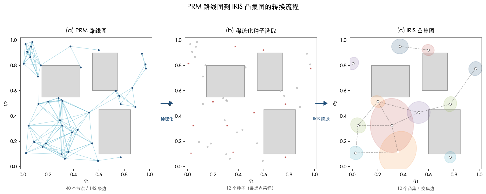

如图 4-1 所示，PRM 路线图中的密集节点经过稀疏化后，保留空间上分散的种子子集；IRIS 在每个种子点处膨胀出凸多面体，相邻凸集的交集自然形成 GCS 图的边。这一"采样→稀疏化→膨胀"的三阶段工作流构成了 PRM 驱动凸集生成的核心范式。

### 4.4.3 覆盖性分析

PRM 的均匀采样提供了对 $\mathcal{C}_{\text{free}}$ 的渐近均匀覆盖，但这并不直接等价于 IRIS 凸集对自由空间的高覆盖率。PRM 节点密度与 IRIS 凸集覆盖率之间的定量关系受到多个耦合因素的制约：

- **凸集体积分布：** 不同种子点膨胀出的凸集体积差异显著。靠近大开放空间中心的种子点可产生大体积凸集，而靠近障碍物边界的种子点仅能产生小体积凸集。
- **凸集重叠：** 相邻种子点的凸集可能高度重叠，导致覆盖增量递减。
- **维度效应：** 高维空间中凸集体积呈指数级缩小（第3章 3.4.1 节已详细讨论），需要更多种子点方能达到相同的覆盖率。

VCC 的实验提供了一个可供参照的基准：在 7-DOF 场景中，约 46 个经可见性团优化的种子点，使用 IRIS-NP 膨胀后覆盖了约 70% 的自由空间 [Werner et al. 2024 VCC](https://groups.csail.mit.edu/robotics-center/public_papers/Werner23.pdf "46 regions/70% coverage, ICRA 2024")。我们有理由推断，相同数量级的 PRM 节点（经适当稀疏化处理后）应能达到类似的覆盖率水平，因为 PRM 的均匀采样在统计意义上与 VCC 的团质心具有可比的空间分布均匀性。需要指出的是，这一推断尚缺乏直接的实验验证，应视为基于理论分析的工程推测。

## 4.5 耦合挑战：采样密度与凸集数量的权衡

### 4.5.1 冗余凸集的 GCS 不可扩展性

第3章已明确指出，GCS 的 MICP 公式规模与凸集数量的平方成正比（$O(|\mathcal{E}|)$ 个二值变量，$|\mathcal{E}| = O(N^2)$），标准 GCS-Opt 在凸集数量达到 10,150 个时已无法求解 [Marcucci et al. 2024 TRO](https://www-leland.stanford.edu/~boyd/papers/pdf/fpp.pdf "Section I-A")。EI-ZO 的实验更直观地揭示了这一瓶颈：膨胀两条路径（LGCS 模式）相比单条路径，GCS 求解时间从毫秒级跃升至 4236.5 ms（完整 MICP），而路径代价仅降低 3.7% [Werner et al. 2025](https://arxiv.org/html/2504.10783v1 "Table I, LSCS vs LGCS")。

这一约束直接限制了 PRM 种子点的数量上限。若直接使用 PRM 的全部节点（通常达数百甚至数千个）作为 IRIS 种子，生成的凸集数量将远超 GCS 的可处理范围。因此，从 PRM 节点到 IRIS 种子的转换必须包含一个**稀疏化（sparsification）**步骤。

### 4.5.2 稀疏化策略

有效的稀疏化策略需在保持路线图连通性与减少种子数量之间取得平衡。以下三类策略值得重点考虑：

**空间稀疏化。** 使用均匀网格、最远点采样（Farthest Point Sampling）或 Poisson 盘采样从 PRM 节点中选取空间上分散的子集。最远点采样尤其适合此场景：从 PRM 节点集合中迭代选取距已选点最远的点，直至达到目标数量。这一贪心策略保证选出的种子点在配置空间中尽可能分散，从而最大化覆盖潜力。

**贪心增量覆盖。** 按某种优先级（如预估凸集体积、局部连通度）逐个选取种子点并执行 IRIS 膨胀，仅当新凸集的覆盖增量超过预设阈值 $\Delta_{\min}$ 时才予以保留。覆盖率可通过蒙特卡洛采样估计，复用 PRM 中未被选为种子的节点作为免费测试样本 [Werner et al. 2024 VCC](https://groups.csail.mit.edu/robotics-center/public_papers/Werner23.pdf "VCC 覆盖率评估, ICRA 2024")。

**路径引导策略。** 不追求全覆盖，而是沿特定 PRM 路径（或路径集合）选取种子点。EI-ZO 的 DRM pipeline 即采用此策略，在 7-DOF 场景中将凸集数量控制在平均 3.49 个 [Werner et al. 2025](https://arxiv.org/html/2504.10783v1 "Table I, RSS 2025")。路径引导的极致形式是以 PRM 边（线段）而非节点（点）作为种子——这一策略已在 EI-ZO 中得到验证，且内在地保证了相邻凸集的连通性。

### 4.5.3 推荐的种子数量区间

综合 GCS 的可扩展性约束与覆盖率需求，我们认为 PRM 种子数量宜控制在 **20–100 个**的区间内，理由如下：

- **下界（约 20 个）：** VCC 在 7-DOF 场景中以 46 个区域达到 70% 覆盖率。考虑到 PRM 均匀采样的空间优化精度可能略低于 VCC 的可见性团策略，20 个种子是保证基本连通性的最低需求。
- **上界（约 100 个）：** Drake 的 `AddRegions` 自动交集检测需要 $O(N^2)$ 次 LP 求解，$N \leq 100$ 时可在秒级完成 [Drake GcsTrajectoryOptimization](https://drake.mit.edu/doxygen_cxx/classdrake_1_1planning_1_1trajectory__optimization_1_1_gcs_trajectory_optimization.html "AddRegions 自动边构建")。超过 100 个凸集后，GCS 凸松弛的求解时间将显著增长。
- **最优区间（30–60 个）：** 在覆盖率与求解效率之间取得平衡，以 VCC 的 46 个区域基准为参考。

## 4.6 端到端计算时间估计

将 PRM 种子生成与 IRIS 凸集膨胀的计算代价结合分析，可对全 pipeline 的时间预算给出定量估算。

### 4.6.1 PRM 路线图构建

PRM 路线图构建的计算代价主要取决于采样数 $N_{\text{sample}}$、单次碰撞检测代价 $t_{\text{cc}}$ 以及连接检测代价 $t_{\text{link}}$。对于 PRM*，每个节点需检测 $O(\log n)$ 个近邻连接，总复杂度为 $O(N_{\text{sample}} \log N_{\text{sample}} \cdot t_{\text{link}})$。在 7-DOF 操作臂场景中，使用现代碰撞检测库（如 Drake 的 CollisionChecker），$t_{\text{cc}}$ 约为数十微秒量级，$t_{\text{link}}$（含路径离散化碰撞检测）约为毫秒量级，生成 1000 个 PRM 节点约需数秒到数十秒。

EI-ZO pipeline 中使用的 DRM（Dense Roadmap）提供了一个可供对照的数据点：其预计算路线图包含 3000–12000 个节点，结合体素碰撞查找表可在离线阶段高效构建，在线查询（最短路径搜索）仅需毫秒级 [Werner et al. 2025](https://arxiv.org/html/2504.10783v1 "Section V, Figure 3, RSS 2025")。

### 4.6.2 IRIS 膨胀时间

IRIS 变体的单区域生成时间已在第3章中详细分析，以下汇总关键数据点：

- **IRIS-ZO：** 约束双臂场景（14-DOF）平均 1.82 秒/区域，生成 85 个超平面 [Cohn, Werner & Tedrake 2025](https://groups.csail.mit.edu/robotics-center/public_papers/Cohn25a.pdf "Table I")
- **IRIS-NP2 Greedy：** 约束双臂场景平均 1.65 秒/区域，生成 56 个超平面
- **GPU 加速 EI-ZO：** 7-DOF 场景下 135.1 ms（3–4 个线段种子）[Werner et al. 2025](https://arxiv.org/html/2504.10783v1 "Table I, RSS 2025")
- **IRIS-NP（旧版）：** 约束双臂场景平均 305.97 秒/区域（344 个超平面），计算代价不可接受

### 4.6.3 组合估算

基于上述数据，对"50 个 PRM 种子 + IRIS-ZO 膨胀"方案的端到端时间估算如下：

| 环节 | 时间估算 | 备注 |
|------|---------|------|
| PRM 构建（1000 节点） | 5–15 秒 | CPU 单线程，7-DOF |
| 稀疏化选取 50 个种子 | <1 秒 | 最远点采样或贪心策略 |
| IRIS-ZO 膨胀（50 区域） | ~91 秒（串行） | 1.82 秒/区域 × 50 |
| IRIS-ZO 膨胀（50 区域） | ~10–20 秒（8 线程并行） | Drake `parallelism` 参数 |
| 交集检测 + GCS 建图 | 数秒 | $O(50^2)$ LP |
| GCS 凸松弛求解 | 0.01–0.5 秒 | 50 区域，凸松弛 + 舍入 |
| **总计** | **约 20–40 秒**（并行） | 离线预处理 |

对比现有基准：VCC 在 7-DOF 场景中约需 1 小时才能生成 46 个区域并达到 70% 覆盖率 [Werner et al. 2024 VCC](https://groups.csail.mit.edu/robotics-center/public_papers/Werner23.pdf "46 regions/70% coverage, ICRA 2024")；EI-ZO 端到端仅需 152.5 ms 但覆盖范围局限于单条路径附近（平均 3.49 个凸集）[Werner et al. 2025](https://arxiv.org/html/2504.10783v1 "Table I, RSS 2025")。PRM + IRIS-ZO 方案在时间和覆盖率之间提供了一个颇具吸引力的中间选择——比 VCC 快一个数量级以上，同时比 EI-ZO 的覆盖面显著更广。

## 4.7 高维可扩展性挑战

### 4.7.1 PRM 在高维空间中的性能退化

PRM 的性能随配置空间维度增加而退化，这一现象已在多项系统性基准测试中得到记录。Orthey、Chamzas 和 Kavraki（2024）在包含 6 个操作臂场景的综合评估中发现：在 7-DOF Franka 场景中，PRM 的成功率和首次解时间不及 RRT-Connect（后者作为单查询方法在高维空间中通常更快找到初始可行路径），但 PRM* 在路径代价优化方面表现更优——6 个场景中有 4 个场景 PRM* 的路径代价收敛至最优 [Orthey, Chamzas & Kavraki 2024](https://www.kavrakilab.org/publications/orthey2024-review-sampling.pdf "Section 6.2: Manipulation Experiments, Figure 5, Annual Reviews 2024")。

在 14-DOF 及更高维度场景中，PRM 面临更为严峻的挑战：自由空间体积占比急剧缩小导致有效采样效率下降，碰撞检测代价随关节数增加而增长，路线图构建时间显著延长。这一限制对 PRM 作为种子生成器的适用范围构成了约束——在 14-DOF 以上的系统中，可能需要引入更高效的采样策略（如基于 RRT 的增量式采样）或 GPU 加速技术来维持可接受的预处理时间。

### 4.7.2 与 EI-ZO 的 DRM 策略对比

EI-ZO pipeline 中的 DRM 本质上是一个 PRM 路线图，但通过两项关键优化实现了高维场景下的高效运行 [Werner et al. 2025](https://arxiv.org/html/2504.10783v1 "Section V, DRM Construction")：

**体素碰撞查找表。** 将工作空间离散化为体素网格，预计算每个机器人配置所对应的占据体素集合。在线阶段通过体素查找替代几何碰撞检测，将单次碰撞检测从毫秒级降至微秒级。这一技术使 DRM 能够包含 3000–12000 个节点并仍保持快速查询能力。

**路径多查询复用。** DRM 的多查询特性允许路线图在不同障碍物配置下复用——仅需剪枝与新增障碍物碰撞的节点和边，而无需重新构建整个路线图。这与 PRM 的"一次学习、多次查询"范式完全一致，为动态环境中的增量更新提供了天然支持。

## 4.8 可行性综合评估

### 4.8.1 PRM 作为种子生成器的核心优势

综合上述分析，PRM 作为 IRIS 种子自动生成器具有以下四方面核心优势：

**理论完备性。** 概率完备性保证 PRM 节点随采样数增加而渐近覆盖 $\mathcal{C}_{\text{free}}$ 的所有连通区域，从根本上消除了人工种子选取可能遗漏关键区域的风险。

**计算可扩展性。** PRM* 的 $O(N \log N)$ 连接复杂度显著优于 VCC 的 $O(N^2)$ 完全可见性图构建。这一复杂度差异正是 VCC 在高维约束场景中性能崩溃的根本原因——约束双臂场景中 437 秒的总耗时中有 416 秒（95.2%）消耗于可见性图构建 [Cohn, Werner & Tedrake 2025](https://groups.csail.mit.edu/robotics-center/public_papers/Cohn25a.pdf "Section VI Discussion")。

**连通性先验。** PRM 路线图的边为凸集图的连通性提供了可靠的先验保证，可大幅减少后验连通性修补的工作量。

**生态系统成熟度。** PRM 在 Drake、OMPL 等主流机器人规划框架中拥有成熟的工程实现，与 IRIS 和 GCS 的集成无需从零开发。

### 4.8.2 关键技术风险

**点种子连通性非严格保证。** 以 PRM 节点（而非边）为种子时，相邻节点膨胀的凸集不一定产生非空交集。该风险可通过后验交集检测结合补膨胀机制加以缓解，或通过直接使用线段种子（如 EI-ZO 策略）从根本上予以解决。

**采样密度与凸集数量权衡。** PRM 节点数量通常远超 GCS 可处理的凸集数量上限，稀疏化步骤的设计质量直接影响方案的整体有效性。

**高维性能退化。** 在 14-DOF 以上系统中，PRM 路线图构建时间和 IRIS 区域体积均出现显著退化，需结合 GPU 加速或混合采样策略予以应对。

### 4.8.3 与既有方案的对比定位

PRM + IRIS 方案在既有凸集生成方案的技术谱系中占据了一个独特的中间定位：

- 相比**人工种子 + IRIS**：实现完全自动化，消除人工干预及其带来的覆盖率不确定性，代价是增加 PRM 构建和稀疏化的计算开销。
- 相比 **VCC**：$O(N \log N)$ vs $O(N^2)$ 的连接复杂度优势在高维场景中具有决定性意义；牺牲了可见性团的精确覆盖优化，换取了计算可扩展性。
- 相比 **EI-ZO**：覆盖面显著更广（全空间 vs 单路径附近），但离线时间更长（数十秒 vs 百毫秒级）；为 GCS 提供更多路径选择空间，潜在的路径质量改善更大。

图 4-2 将上述四种方案在"离线预处理时间-估计覆盖率"坐标系中进行了直观对比。

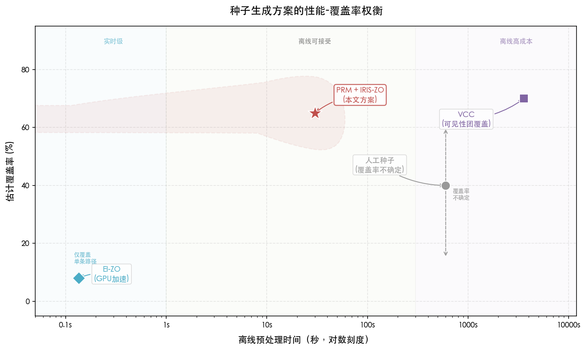

如图 4-2 所示，PRM + IRIS-ZO 方案在"离线可接受"时间区间内实现了接近 VCC 的覆盖率水平，同时避免了 VCC 在高维场景中的可扩展性瓶颈。这一对比表明，PRM + IRIS 方案最适合的应用场景为：**离线预处理时间预算在数十秒到数分钟量级、需要多查询复用、且覆盖率要求高于 EI-ZO 单路径方案**的静态或准静态环境。第5章将在此基础上给出完整的 pipeline 技术方案设计。

# 第5章 PRM + 凸分解 + GCS 自动化 Pipeline 技术方案设计

第4章从理论层面论证了 PRM 作为 IRIS 种子自动生成器的可行性，明确了其在无碰撞约束满足、连通性先验与计算可扩展性等方面的核心优势，并给出了种子数量 20–100 个的推荐区间及 20–40 秒（并行）的端到端时间估算。在此基础上，本章将给出"PRM 自动采样 → 凸集自动生成 → GCS 求解"全自动 pipeline 的完整技术架构设计，旨在回答一个关键工程问题：这条自动化路径在工程上如何落地，关键技术接口如何衔接？需要指出的是，截至 2026 年 4 月，公开文献中尚无该完整 pipeline 的端到端实验验证，本章方案的可行性论证建立在各组件级证据的合理外推与工程推理之上。

## 5.1 Pipeline 总体架构：采样-膨胀-求解三阶段

### 5.1.1 架构概览

本方案提出的全自动 pipeline 由三个主要阶段组成，每个阶段对应一个明确的技术模块与数据接口。图 5-1 给出了 pipeline 的整体架构视图。

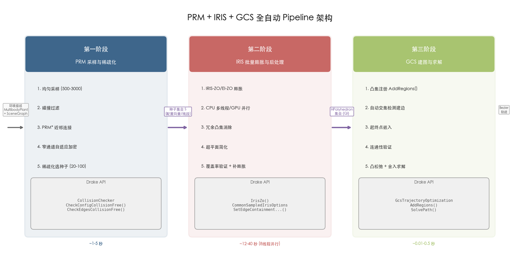

**图 5-1 PRM + IRIS + GCS 全自动 Pipeline 架构。** 横向三列分别对应采样与稀疏化、IRIS 批量膨胀与后处理、GCS 建图与求解三个阶段，标注了各阶段的关键步骤、Drake API 调用及预计耗时。

**第一阶段：PRM 自动采样与智能稀疏化。** 在自由配置空间 $\mathcal{C}_{\text{free}}$ 中构建 PRM/PRM* 路线图，随后通过稀疏化策略从路线图节点中选取一组高质量种子点（或种子线段）。该阶段的输出为有序种子集合 $\mathcal{S} = \{s_1, s_2, \ldots, s_K\}$（点种子或线段种子），以及 PRM 路线图的连通性结构信息。

**第二阶段：IRIS 批量膨胀与后处理。** 对每个种子执行 IRIS 类算法（推荐 IRIS-ZO 或 GPU 加速的 EI-ZO），生成一组凸多面体 $\{Q_1, Q_2, \ldots, Q_K\}$，其中每个 $Q_i$ 以 H-表示（半空间交集，$Q_i = \{q : A_i q \leq b_i\}$）给出。随后执行冗余消除与覆盖率验证等后处理步骤。

**第三阶段：GCS 自动建图与求解。** 将凸多面体集合自动构建为凸集图 $\mathcal{G} = (\mathcal{V}, \mathcal{E})$，通过交集检测建立边集，嵌入起终点，执行 GCS 凸松弛 + 舍入求解。

上述三阶段架构与 EI-ZO pipeline（RSS 2025）在结构上高度同构：EI-ZO 的离线 DRM 构建对应第一阶段，在线 EI-ZO 膨胀对应第二阶段，轨迹优化对应第三阶段 [Werner et al. 2025](https://arxiv.org/html/2504.10783v1 "Superfast SCS on GPU, RSS 2025, Section VI & Table I")。二者的关键区别在于设计目标——本方案以**全覆盖**（而非单路径覆盖）为导向，在离线阶段投入更多计算以换取 GCS 求解阶段更大的路径选择空间与更高的路径质量。

### 5.1.2 数据流与接口定义

Pipeline 的数据流可形式化为以下变换链：

$$\text{环境描述} \xrightarrow{\text{PRM}} G_{\text{PRM}} = (V, E) \xrightarrow{\text{稀疏化}} \mathcal{S} \xrightarrow{\text{IRIS}} \{Q_i\} \xrightarrow{\text{交集检测}} \mathcal{G}_{\text{GCS}} \xrightarrow{\text{GCS}} \text{轨迹}$$

各技术模块之间的接口定义如下：

- **环境描述 → PRM：** 输入为 Drake `MultibodyPlant` + `SceneGraph`（描述机器人几何与障碍物），输出为 PRM 路线图 $G_{\text{PRM}}$（节点为 $\mathcal{C}_{\text{free}}$ 中的配置向量，边为经碰撞检测验证的局部路径）。
- **PRM → 稀疏化：** 输入为完整路线图 $G_{\text{PRM}}$，输出为稀疏种子集合 $\mathcal{S}$（点种子：配置向量集合；线段种子：配置向量对集合）。
- **稀疏化 → IRIS：** 输入为种子集合 $\mathcal{S}$，输出为 `HPolyhedron` 对象集合 $\{Q_i\}$（Drake 原生类型，内部存储 $A_i, b_i$ 矩阵）。
- **IRIS → GCS：** 输入为 `HPolyhedron` 集合，通过 Drake `GcsTrajectoryOptimization.AddRegions(regions, order)` 自动执行交集检测与建边 [Drake GcsTrajectoryOptimization](https://drake.mit.edu/doxygen_cxx/classdrake_1_1planning_1_1trajectory__optimization_1_1_gcs_trajectory_optimization.html "AddRegions 自动边构建")。
- **GCS → 轨迹：** `SolvePath()` 执行凸松弛 + 随机化舍入，输出 Bézier 曲线轨迹。

### 5.1.3 离线-在线分离策略

Pipeline 的三个阶段可根据应用场景按离线-在线边界灵活划分：

**纯离线模式。** 三个阶段全部在离线完成，适用于静态环境下的多查询场景。离线生成的凸集图和 GCS 预求解结果可序列化存储，在线阶段直接加载并执行凸限制求解（毫秒级）。预计离线时间约 20–40 秒（8 线程并行、50 个区域、IRIS-ZO）。

**离线 PRM + 在线膨胀-求解模式。** PRM 路线图在离线阶段构建并存储，当环境发生变化（如障碍物移动）时，仅需在线更新路线图（剪枝碰撞节点与边）并重新执行膨胀和 GCS 求解。EI-ZO 的 DRM 即采用此模式——DRM 支持在不同障碍物配置下复用，仅需剪枝碰撞节点 [Werner et al. 2025](https://arxiv.org/html/2504.10783v1 "Section V, DRM 多查询复用, RSS 2025")。

**全在线模式。** 三个阶段均在线执行，适用于全新或动态变化的环境。此模式对计算速度要求最高，推荐使用 GPU 加速的 EI-ZO 路径级膨胀策略（端到端 152.5 ms），但路径选择空间受限于单条或少数几条路径。

## 5.2 第一阶段：PRM 自动采样与智能种子选取

### 5.2.1 PRM 路线图构建

PRM 路线图的构建基于 Drake 的 `CollisionChecker` 接口，包含以下步骤：

1. **均匀采样。** 在关节角度范围 $[q_{\min}, q_{\max}]$ 内均匀随机采样 $N_{\text{sample}}$ 个配置。推荐 $N_{\text{sample}} \in [500, 3000]$：下界保证基本覆盖性，上界控制路线图构建时间。作为参考，EI-ZO 的 DRM 使用 3000–12000 个节点 [Werner et al. 2025](https://arxiv.org/html/2504.10783v1 "Section V, Figure 3, RSS 2025")。

2. **碰撞过滤。** 使用 `CollisionChecker.CheckConfigsCollisionFree()` 批量检测碰撞，仅保留无碰撞配置。Drake 的 `CollisionChecker` 原生支持 OpenMP 并行碰撞检测，当 $N_{\text{sample}} = 1000$ 时可在毫秒至秒级内完成。

3. **近邻连接。** 采用 PRM* 的连接半径 $r(n) = \gamma(\log(n)/n)^{1/d}$ 或 $k$-近邻连接（$k = 2e \cdot \log(n)$），对每个节点的 $k$ 个近邻使用 `CollisionChecker.CheckEdgesCollisionFree()` 验证局部路径。连接策略的选择直接影响路线图质量与构建时间 [Karaman & Frazzoli 2011](https://people.eecs.berkeley.edu/~pabbeel/cs287-fa19/optreadings/rrtstar.pdf "Theorem 34, PRM* 连接半径, IJRR 2011")。

4. **连通性验证。** 使用 BFS/DFS 验证路线图连通性，确保起终点可达。

### 5.2.2 窄通道自适应采样增强

标准均匀采样在窄通道场景中效率低下，为此 pipeline 采用分层采样策略加以应对：

**第一层：均匀基础采样。** 使用标准均匀采样构建初始路线图，保证全局覆盖性。

**第二层：窄通道检测。** 通过以下信号自动识别窄通道区域 [Orthey, Chamzas & Kavraki 2024](https://www.kavrakilab.org/publications/orthey2024-review-sampling.pdf "Section 4.1, Annual Reviews 2024")：
- 采样拒绝率异常高的空间区域（碰撞样本占比 >90%）；
- PRM 图中局部连通度低（度数 <2）的节点所在区域；
- PRM 边长度异常大的区域（提示两个节点之间存在拓扑瓶颈）。

**第三层：Gaussian/Bridge 局部加密。** 在检测到的窄通道区域执行 Gaussian PRM 或 Bridge PRM 局部加密采样。Gaussian PRM 通过保留碰撞状态不同的采样对中的无碰撞点，使采样密度偏向障碍物边界附近；Bridge PRM 则通过两个碰撞点的中点在窄通道内部直接采样 [Hsu et al. 2003](https://www.clear.rice.edu/comp450/papers/bridge.pdf "The Bridge Test, ICRA 2003")。加密采样的点自动融入路线图并重新执行近邻连接。

### 5.2.3 稀疏化策略：从 PRM 节点到 IRIS 种子

正如第4章所分析，GCS 对凸集数量的可扩展性约束要求将 PRM 节点（通常数百至数千个）稀疏化至 20–100 个种子。本方案推荐以下三种互补策略，可根据应用场景灵活选择：

**策略 A：最远点稀疏化（适用于全覆盖目标）。** 从 PRM 节点集合中迭代选取与已选点距离最远的点（Farthest Point Sampling），直至达到目标种子数 $K$。该策略保证种子在配置空间中最大程度地分散，适合追求高覆盖率的离线场景。初始点可选为路线图的几何质心或用户指定的关键配置。

**策略 B：贪心增量覆盖（适用于效率-覆盖率权衡）。** 按预估凸集体积（以种子点到最近障碍物的距离近似）降序排列 PRM 节点，逐个执行 IRIS 膨胀，仅当新凸集的覆盖增量超过阈值 $\Delta_{\min}$ 时予以保留。覆盖增量通过蒙特卡洛采样估计——可复用 PRM 中未被选为种子的节点作为免费测试样本 [Werner et al. 2024 VCC](https://groups.csail.mit.edu/robotics-center/public_papers/Werner23.pdf "VCC 覆盖率评估, ICRA 2024")。该策略自适应地确定种子数量，避免了预设 $K$ 值的盲目性。

**策略 C：路径引导稀疏化（适用于查询感知场景）。** 当起终点已知或可预估时，在 PRM 路线图中搜索 $M$ 条最短路径（例如通过 Yen 的 $K$-最短路径算法），将路径上的节点（或路径边）作为种子。EI-ZO 即采用此策略的极致形式——单条路径平均仅需 3.49 个凸集 [Werner et al. 2025](https://arxiv.org/html/2504.10783v1 "Table I, RSS 2025")。将路径数扩展至 3–5 条并覆盖不同同伦类，可在控制凸集数量的同时提供更丰富的路径选择空间。

### 5.2.4 点种子与线段种子的选择

种子形式的选择对后续凸集连通性具有根本性影响。

**点种子模式。** 以 PRM 节点为种子，每个种子独立膨胀 IRIS 凸集。该模式的优势在于种子选取简单、支持任意稀疏化策略；劣势在于相邻凸集的交集缺乏严格保证——尽管 PRM 边的存在暗示相邻节点膨胀的凸集大概率产生非空交集（第4章 4.4.2 节的 PRM 边继承假说），但该假说未获严格数学证明，实际应用中需要后验交集检测与补膨胀机制。

**线段种子模式。** 以 PRM 边（线段 $(q_i, q_j)$）为种子，利用 Drake 的 `SetEdgeContainmentTerminationCondition()` 或 CSDecomp 的 EI-ZO 算法，保证所生成凸集严格包含该线段。这一模式内在地保证了相邻凸集在路径节点处产生非空交集：若凸集 $Q_i$ 包含线段 $(q_i, q_j)$ 的端点 $q_j$，凸集 $Q_j$ 包含线段 $(q_j, q_k)$ 的端点 $q_j$，则 $q_j \in Q_i \cap Q_j$ [Drake IRIS API](https://drake.mit.edu/doxygen_cxx/group__planning__iris.html "SetEdgeContainmentTerminationCondition")。

综合评估后，我们认为**线段种子模式是更优选择**，理由如下：(a) 连通性保证从"大概率"升级为"严格"，消除了后验修补的工程复杂度；(b) EI-ZO pipeline 已在 7-DOF 场景中验证了线段种子的可行性与效率（135.1 ms 生成凸集）；(c) 线段种子将凸集数量与路径边数自然绑定，提供了隐式的数量控制机制。

## 5.3 第二阶段：IRIS 批量膨胀与后处理

### 5.3.1 IRIS 变体选择矩阵

IRIS 变体的选择需综合考虑计算平台、精度要求与场景复杂度。基于第3章的分析，推荐的选择矩阵如表 5-1 所示。图 5-2 以决策树形式呈现了变体选择的推理路径。

| 应用场景 | 推荐算法 | 计算平台 | 预期时间/区域 | 备注 |
|---------|---------|---------|-------------|------|
| 7-DOF 通用场景 | IRIS-ZO | CPU 多线程 | ~1.82 秒 | 通用首选 |
| 7-DOF 实时场景 | EI-ZO (GPU) | NVIDIA GPU | ~35 ms | 需 CSDecomp |
| 12-14 DOF 双臂 | IRIS-NP2 Greedy | CPU 多线程 | ~1.65 秒 | 区域体积更大 |
| 安全关键应用 | C-IRIS | CPU | ~306 秒 | 数学证明保证 |

**表 5-1 IRIS 变体选择矩阵。** IRIS-ZO 与 IRIS-NP2 数据取自约束双臂场景（19 个种子点对比实验），EI-ZO 数据取自 7-DOF Franka 仿真 [Cohn, Werner & Tedrake 2025](https://groups.csail.mit.edu/robotics-center/public_papers/Cohn25a.pdf "Table I") [Werner et al. 2025](https://arxiv.org/html/2504.10783v1 "Table I, RSS 2025")。

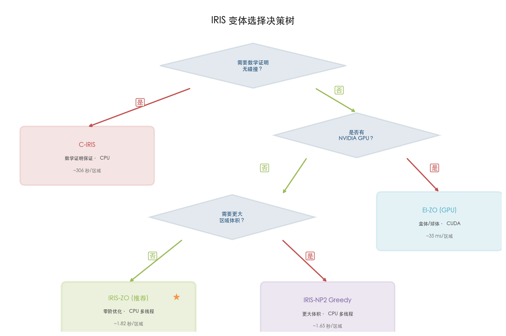

**图 5-2 IRIS 变体选择决策树。** 通过三层决策节点（是否需要数学证明无碰撞 → 是否有 NVIDIA GPU → 是否需要更大区域体积）引导选择合适的 IRIS 变体。IRIS-ZO 被标记为通用推荐算法。

**IRIS-ZO** 是通用场景下的首选算法。其零阶优化策略（采样 → 碰撞检测 → 二分搜索 → 超平面放置）完全绕过 NLP 求解器，天然适合批量并行化。Chernoff 界概率终止条件允许用户直接指定碰撞体积分数 $\varepsilon$（推荐 1%）与置信度 $\delta$（推荐 95%），提供了清晰的质量控制语义 [Werner et al. 2024](https://arxiv.org/html/2410.12649v1 "Faster Algorithms for Growing Collision-Free Convex Polytopes, Theorem 5.1")。

**GPU 加速 EI-ZO** 在实时性要求极高的场景中具有不可替代的优势。CSDecomp 工具箱提供了完整的 CUDA 实现，涵盖 GPU 加速碰撞检测、DRM 与 EI-ZO 算法。需要注意的是，CSDecomp 当前仅支持盒体与球体碰撞几何（圆柱/胶囊的支持列入开发计划），且依赖 Ubuntu 22.04 + NVIDIA GPU（RTX 3090/2080Ti）+ CUDA 12.x 运行环境 [CSDecomp GitHub](https://github.com/wernerpe/csdecomp "CSDecomp: Configuration Space Decomposition Toolbox")。

### 5.3.2 批量并行化策略

IRIS 膨胀是 pipeline 中计算密集度最高的环节，批量并行化是控制端到端时间的关键手段。并行化可从以下三个层次实施：

**GPU 内并行（微秒级）。** EI-ZO 的每次迭代内部，采样、碰撞检测与二分搜索等操作均在 GPU 上并行执行。CSDecomp 的 CUDA 内核支持数千线程同步运算，将单次膨胀迭代的延迟降至微秒级 [Werner et al. 2025](https://arxiv.org/html/2504.10783v1 "Section IV-D CUDA Implementation")。

**CPU 多线程并行（线性加速）。** Drake 的 `IrisZo()` 与 `IrisNp2()` 原生支持 `parallelism` 参数，允许在 IRIS 迭代内部使用 OpenMP 并行碰撞检测。同时，由于不同种子的膨胀操作相互独立，可在任务级使用多线程并行：$K$ 个种子在 $P$ 个线程上并行膨胀，理想加速比为 $P$。以 50 个种子在 8 线程上并行膨胀为例，IRIS-ZO 的预计时间可从约 91 秒降至约 12 秒。

**任务级分批并行（灵活扩展）。** 对于超大规模种子集合（>100 个），可将种子分批提交至多个计算节点或多 GPU 并行处理，每批生成的 `HPolyhedron` 对象在最终阶段统一汇聚。

### 5.3.3 凸集后处理

原始膨胀结果通常需经以下后处理步骤优化：

**冗余消除。** 若凸集 $Q_i$ 被另一凸集 $Q_j$ 完全包含（$Q_i \subseteq Q_j$），则 $Q_i$ 可安全移除。包含检测通过线性规划（LP）实现：$Q_i \subseteq Q_j$ 当且仅当对 $Q_j$ 的所有超平面均有 $\max_{q \in Q_i} (a_j^T q - b_j) \leq 0$。此外，体积过小的凸集（体积低于中位体积的 5%）可直接剔除——此类极小区域通常位于障碍物间的微小缝隙中，对 GCS 路径规划贡献有限却增加求解负担。

**超平面简化。** FastIRIS 生成的凸集超平面数已比 IRIS-NP 减少 5–7 倍（IRIS-ZO 平均 85 个 vs IRIS-NP 平均 344 个），但超平面数仍然影响 GCS MICP 公式中的约束规模。可选的简化策略包括移除冗余超平面（即不影响可行域的超平面）以及合并近似平行的超平面。

**覆盖率验证。** 使用蒙特卡洛方法估计凸集集合对 $\mathcal{C}_{\text{free}}$ 的覆盖率：在 PRM 节点中均匀随机抽取 $M$ 个测试点，检查每个测试点是否被至少一个凸集包含，覆盖率估计为 $\hat{\rho} = (\text{被覆盖的测试点数}) / M$。PRM 中未被选为种子的节点可直接充当免费测试样本，无需额外采样 [Werner et al. 2024 VCC](https://groups.csail.mit.edu/robotics-center/public_papers/Werner23.pdf "VCC 覆盖率评估, ICRA 2024")。当覆盖率低于目标阈值（如 60%）时，在未覆盖区域中选取新种子执行补膨胀。

## 5.4 第三阶段：GCS 自动建图与求解

### 5.4.1 凸集图自动构建流程

基于 Drake API，凸集图的自动构建遵循以下四步流程 [Drake GcsTrajectoryOptimization](https://drake.mit.edu/doxygen_cxx/classdrake_1_1planning_1_1trajectory__optimization_1_1_gcs_trajectory_optimization.html "GcsTrajectoryOptimization Class")：

**步骤 1：凸集注册。** 将后处理后的 `HPolyhedron` 集合通过 `AddRegions(regions, order)` 注册到 `GcsTrajectoryOptimization` 对象中。`regions` 参数接受 `ConvexSet` 列表（`HPolyhedron` 为其子类），`order` 参数指定每个区域内 Bézier 曲线的阶数（推荐 3–5 阶以保证轨迹平滑性）。

**步骤 2：自动交集检测与建边。** `AddRegions` 内部自动执行 $O(N^2)$ 对凸集的交集检测——对每对凸集 $(Q_i, Q_j)$，通过 LP 可行性检查判断 $Q_i \cap Q_j \neq \emptyset$。若交集非空，则在 GCS 图中建立有向边 $(i, j)$ 与 $(j, i)$。边约束集编码 Bézier 控制点的连续性约束（$r_{i,d} = r_{j,0}$ 等线性等式），保证轨迹在区域交界处的 $C^0$ 连续性；更高阶连续性可通过匹配端点各阶导数实现 [Marcucci et al. 2023 Science Robotics](https://arxiv.org/abs/2205.04422 "Sections 5.2-5.4, Equations (7)-(10)")。对于 $N \leq 100$ 的凸集数量，$O(N^2)$ 次 LP 检测在秒级内即可完成。

**步骤 3：起终点嵌入。** 将起点 $q_{\text{init}}$ 与终点 $q_{\text{goal}}$ 作为 `Point` 类型（零维凸集）嵌入图中。Drake 的 `AddRegions` 会自动检测哪些区域包含起终点并建立连接边。若起终点不在任何现有凸集内，则需以该点为种子补膨胀一个新区域。

**步骤 4：连通性验证与补膨胀。** 使用 BFS/DFS 在 GCS 图上验证起点到终点的连通性。若图不连通——即起点可达的连通分量与终点可达的连通分量之间缺乏边连接——则需在断裂处补膨胀：在 PRM 路线图中定位跨越两个连通分量的边的中点，以该中点为种子执行 IRIS 膨胀，将新凸集加入图中并重新执行交集检测。

### 5.4.2 GCS 边代价与约束设计

GCS 边代价的设计直接决定求解结果的物理意义。标准配置为时间、路径长度与能量的加权组合 [Marcucci et al. 2023 Science Robotics](https://arxiv.org/abs/2205.04422 "Section 5.4, Cost Function Design")：

$$\ell_e(x_u, x_v) = w_T \cdot \Delta t + w_L \cdot \|x_v - x_u\|_2 + w_E \cdot \|\dot{x}\|_2^2 \cdot \Delta t$$

其中 $w_T, w_L, w_E$ 为权重系数。对于工业操作臂轨迹规划，推荐以路径长度为主、时间为辅的配置（$w_L = 1.0, w_T = 0.1, w_E = 0.01$），以获得短而快的轨迹。

当安全集为多面体时，边代价中的路径长度项（欧氏范数）使优化问题生成 MI-SOCP（混合整数二阶锥规划），可由 MOSEK 等商业求解器高效处理；能量项（二次范数）同样兼容 SOCP 框架。

### 5.4.3 求解策略选择

GCS 求解策略的选择需综合考量凸集数量与实时性要求 [Marcucci et al. 2024 SIAM](https://groups.csail.mit.edu/robotics-center/public_papers/Marcucci21.pdf "Section 5.3 & 9.2")：

**凸松弛 + 随机化舍入（推荐默认策略）。** 将 MICP 中的二值约束 $y_e \in \{0,1\}$ 松弛为 $y_e \geq 0$，求解凸松弛问题获得下界 $C_{\text{relax}}$，再通过随机化深度优先舍入恢复整数可行解。Drake 默认运行 5 条舍入路径（`max_rounded_paths = 5`），实测中增至 10–20 条可略微改善解质量。凸松弛在欧氏距离代价下几乎总是精确的，最优性界可自动获得：$C_{\text{relax}} \leq C_{\text{opt}} \leq C_{\text{round}}$。对于 50–100 个凸集的中等规模图，凸松弛求解通常在 0.01–0.5 秒内完成。

**凸限制（已知路径时最快）。** 当路径的离散顺序已知（例如直接从 PRM 路径获取）时，可使用凸限制（Convex Restriction）固定路径并求解连续优化问题。凸限制将 GCS 退化为单次凸优化，求解时间可降至毫秒级。

**完整 MICP（全局最优）。** 使用分支定界法求解完整 MICP，保证全局最优但计算代价高昂——EI-ZO 实验中完整 MICP 耗时达 4236.5 ms [Werner et al. 2025](https://arxiv.org/html/2504.10783v1 "Table I: LGCS 4236.5 ms")。仅在对最优性有严格要求且凸集数量较少（<30 个）时推荐使用。

## 5.5 连通性保证机制

### 5.5.1 三层渐进式连通性保证

凸集图的连通性是 GCS 求解成功的必要条件。本方案设计了三层渐进式连通性保证策略：

**第一层：PRM 边继承（概率保证）。** 对于以 PRM 节点为种子膨胀的凸集，PRM 边 $(q_i, q_j)$ 的存在暗示 $Q_i$ 与 $Q_j$ 大概率产生非空交集。该概率保证源于 IRIS 膨胀的局部性——IRIS 从种子点出发向外膨胀，自然覆盖种子点附近的自由空间区域，而 PRM 边的存在保证了两个种子点之间存在无碰撞直线路径。

**第二层：线段种子严格保证。** 使用 PRM 边作为 IRIS 种子线段，通过 `SetEdgeContainmentTerminationCondition()` 或 EI-ZO 严格保证生成的凸集包含该线段。该策略将连通性保证从"概率性"升级为"确定性"，代价是种子形式从点变为线段，IRIS 膨胀可能因包含约束而生成略小的区域 [Drake IRIS API](https://drake.mit.edu/doxygen_cxx/group__planning__iris.html "SetEdgeContainmentTerminationCondition")。

**第三层：后验检测 + 补膨胀（兜底机制）。** 对于前两层未能保证连通性的情况，使用 LP 交集检测验证所有相邻凸集对，对不相交的配对在 PRM 边中点处补膨胀。该策略作为兜底机制，确保 GCS 图在任何情况下均保持连通。

### 5.5.2 连通性与覆盖率的关系

连通性与覆盖率是两个相关但不等价的目标。高覆盖率（凸集集合覆盖 $\mathcal{C}_{\text{free}}$ 的大部分）并不自动保证连通性——若凸集分布于多个不相交的区域中，覆盖率可以很高但图可能不连通。反之，低覆盖率（仅覆盖单条路径附近空间）在路径级策略下可保证连通性，但限制了 GCS 的路径选择空间。

在全覆盖方案中，PRM 路线图的全局连通性为凸集图的连通性提供了结构性保证：只要 PRM 路线图是连通的（概率完备性保证在采样数充分时几乎必然成立），且 PRM 边到凸集交集的继承率足够高，凸集图就能保持连通。VCC 的实验间接支持了这一推断——46 个凸集在覆盖约 70% 自由空间的同时保持了图连通性 [Werner et al. 2024 VCC](https://groups.csail.mit.edu/robotics-center/public_papers/Werner23.pdf "46 regions/70% coverage, ICRA 2024")。

## 5.6 Drake 工程实现参考

### 5.6.1 核心 API 映射

Pipeline 的三个阶段可完整映射至 Drake 的现有 API。需要特别指出的是，`GcsTrajectoryOptimization`、`IrisZo()` 与 `IrisNp2()` 均标记为 **experimental**，接口可能不经兼容过渡直接更改，工程部署时应充分评估接口稳定性风险 [Drake IRIS API](https://drake.mit.edu/doxygen_cxx/group__planning__iris.html "IrisZo/IrisNp2 experimental 标记") [Drake GcsTrajectoryOptimization](https://drake.mit.edu/doxygen_cxx/classdrake_1_1planning_1_1trajectory__optimization_1_1_gcs_trajectory_optimization.html "experimental 标记")。

**第一阶段 API：**
- `SceneGraphCollisionChecker`：构建碰撞检测器。
- `CollisionChecker.CheckConfigCollisionFree(q)`：单点碰撞检测。
- `CollisionChecker.CheckEdgesCollisionFree(edges)`：批量边碰撞检测。
- PRM 连接逻辑需自行实现（Drake 未内置标准 PRM 算法，但 `CollisionChecker` 提供了构建所需的全部碰撞检测接口）。

**第二阶段 API：**
- `IrisZo(plant, context, options)`：执行 IRIS-ZO 膨胀，返回 `HPolyhedron`。
- `IrisNp2(plant, context, options)`：执行 IRIS-NP2 膨胀。
- `CommonSampledIrisOptions`：配置膨胀参数（包括 `epsilon`、`delta`、`max_iterations`、`containment_points`、`parallelism` 等）。
- `IrisZoOptions().containment_points`：设置包含约束（线段种子模式下的端点坐标）。

**第三阶段 API：**
- `GcsTrajectoryOptimization(num_positions)`：创建 GCS 轨迹优化对象。
- `AddRegions(regions, order)`：自动交集检测和建边。
- `AddEdgeCost(cost)` / `AddEdgeConstraint(constraint)`：添加边代价和约束。
- `SolvePath(source, target, options)`：执行凸松弛 + 舍入求解。

### 5.6.2 伪代码实现框架

以下伪代码展示了 pipeline 在 Drake Python API 下的核心实现逻辑（预计约 200–300 行 Python 即可完成原型）：

```python
# === 第一阶段：PRM 构建与稀疏化 ===
# 1. 均匀采样
samples = uniform_sample(q_min, q_max, N=1000)
free_configs = [q for q in samples
                if checker.CheckConfigCollisionFree(q)]

# 2. PRM* 连接
edges = []
for q in free_configs:
    neighbors = k_nearest(q, free_configs, k=k_prm*log(n))
    for q_nbr in neighbors:
        if checker.CheckEdgeCollisionFree(q, q_nbr):
            edges.append((q, q_nbr))

# 3. 稀疏化（最远点采样）
seeds = farthest_point_sampling(free_configs, K=50)

# === 第二阶段：IRIS 批量膨胀 ===
regions = []
options = CommonSampledIrisOptions()
options.epsilon = 0.01    # 1% 碰撞体积分数
options.delta = 0.05      # 95% 置信度
options.parallelism = Parallelism(num_threads=8)

for seed in seeds:
    options.containment_points = seed  # 点种子
    region = IrisZo(plant, context, options)
    regions.append(region)

# === 第三阶段：GCS 建图与求解 ===
gcs = GcsTrajectoryOptimization(num_positions=7)
gcs.AddRegions(regions, order=3)

# 嵌入起终点
source = gcs.AddRegions([Point(q_init)], order=0)
target = gcs.AddRegions([Point(q_goal)], order=0)

# 添加代价
gcs.AddPathLengthCost(weight=1.0)
gcs.AddTimeCost(weight=0.1)

# 求解
trajectory = gcs.SolvePath(source, target)
```

### 5.6.3 CSDecomp 与 Drake 的集成

对于需要 GPU 加速的场景，CSDecomp 工具箱可与 Drake 互补使用。CSDecomp 通过 Python 绑定（`pycsdecomp`）提供 GPU 加速碰撞检测、DRM 与 EI-ZO 功能，其核心输出为 H-表示的凸多面体（$A, b$ 矩阵），可直接转换为 Drake 的 `HPolyhedron(A, b)` 对象并传入 `GcsTrajectoryOptimization.AddRegions()`。

集成方案的关键步骤包括：(a) CSDecomp 负责路径级膨胀（GPU 加速 EI-ZO，毫秒级完成）；(b) Drake 负责 GCS 建图与求解；(c) 凸集数据通过 NumPy 数组（$A, b$）在两个工具之间传递。CSDecomp 当前需从源码编译（Bazel + CUDA 12.x），对部署环境有一定要求 [CSDecomp GitHub](https://github.com/wernerpe/csdecomp "CSDecomp 安装要求")。

## 5.7 与既有方案的系统对比

### 5.7.1 三种方案的定位分析

为清晰定位本方案在现有技术谱系中的位置，将其与两个最相关的既有方案进行系统对比：

**方案 1：VCC + IRIS-NP（ICRA 2024 基准）。** VCC 在 $\mathcal{C}_{\text{free}}$ 中均匀采样构建完全可见性图（$O(N^2)$ 碰撞检查），分解为大团（maximal cliques），以团质心初始化 IRIS-NP。在 7-DOF 场景中，46 个区域约 1 小时达到 70% 覆盖率，其中绝大部分时间消耗在可见性图构建环节。在约束双臂场景中，437 秒仅生成 8 个区域、覆盖率不足 1%，可见性图构建耗时 416 秒（占总时间 95%）[Cohn, Werner & Tedrake 2025](https://groups.csail.mit.edu/robotics-center/public_papers/Cohn25a.pdf "Section VI Discussion, VCC bottleneck analysis")。

**方案 2：EI-ZO pipeline（RSS 2025 基准）。** 离线构建 DRM（3000–12000 节点的 PRM + 体素碰撞查找表），在线依次执行路径查找（毫秒级）→ EI-ZO 膨胀（135.1 ms）→ 轨迹优化（17.4–189.1 ms），端到端 152.5±89.1 ms，平均仅 3.49 个凸集，成功率 100%。核心局限在于路径依赖性——凸集仅覆盖初始 DRM 路径附近空间，膨胀多条路径的改善仅为边际（代价降 3.7%，时间增 29 倍）[Werner et al. 2025](https://arxiv.org/html/2504.10783v1 "Table I, RSS 2025")。

**方案 3：本方案 PRM + IRIS + GCS。** PRM 路线图（$O(N \log N)$ 连接）→ 稀疏化选种子（20–100 个）→ IRIS-ZO/EI-ZO 批量膨胀 → GCS 建图求解。预计离线时间 20–40 秒（并行），覆盖率有望接近 VCC 的 70% 水平。需要强调的是，该方案的性能数据为基于组件级证据的工程推测，尚未经端到端实验验证。

### 5.7.2 多维度对比分析

表 5-2 从八个关键维度对三种方案进行横向对比，图 5-3 以雷达图直观呈现各方案在五个核心维度上的定位差异。

| 维度 | VCC + IRIS-NP | EI-ZO pipeline | PRM + IRIS + GCS（本方案） |
|------|-------------|----------------|-------------------------|
| 离线时间 | ~1 小时（7-DOF） | 135 ms（在线） | 20–40 秒（7-DOF 并行） |
| 凸集数量 | 46（7-DOF） | 3.49 平均 | 30–60（推荐） |
| 覆盖率 | ~70%（7-DOF） | 单路径附近 | ~60–70%（推测） |
| 连通性保证 | 可见性团保证 | 线段种子严格保证 | 线段种子严格保证或后验修补 |
| 高维可扩展性 | 差（$O(N^2)$ 崩溃） | 好（GPU 并行） | 中（$O(N\log N)$） |
| 路径质量 | GCS 全局优化 | 受限于初始路径 | GCS 全局优化 |
| 实时性 | 不适用 | 152.5 ms | 离线预处理后毫秒级查询 |
| 碰撞几何支持 | 任意（Drake） | 盒体/球体 | 任意（Drake IRIS） |

**表 5-2 三种凸集生成方案多维度对比。** 本方案覆盖率数据为基于组件级实验证据的工程推测值。

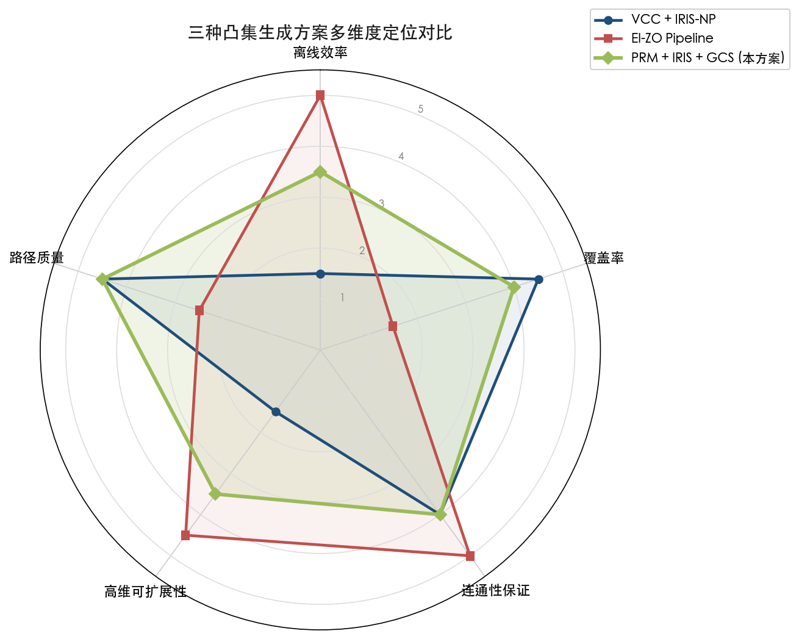

**图 5-3 三种凸集生成方案多维度定位对比。** 雷达图展示 VCC + IRIS-NP、EI-ZO Pipeline 与本方案在离线效率、覆盖率、连通性保证、高维可扩展性和路径质量五个维度上的相对表现。

本方案在 VCC 的覆盖率与 EI-ZO 的效率之间找到了一个有吸引力的平衡点：比 VCC 快一个数量级以上（分钟级 vs 小时级），比 EI-ZO 覆盖面广得多（全空间 vs 单路径），且通过 PRM 的 $O(N \log N)$ 连接复杂度解决了 VCC 在高维场景下的可见性图构建瓶颈。

### 5.7.3 适用场景定位

基于上述对比分析，三种方案各有最优适用场景：

- **EI-ZO pipeline：** 在线实时规划（端到端 <200 ms），可接受路径依赖性，且部署环境配备 NVIDIA GPU。
- **VCC + IRIS-NP：** 离线预处理时间充裕（>1 小时），追求最高覆盖率，适用于 7-DOF 及以下的中低维度场景。
- **PRM + IRIS + GCS（本方案）：** 离线预处理预算在数十秒到数分钟之间，需要多查询复用与高覆盖率，适用于 7–14 DOF 的中高维场景，碰撞几何为任意类型（含网格体）。

## 5.8 关键技术风险与缓解措施

### 5.8.1 凸集数量可扩展性风险

**风险描述。** GCS 的 MICP 公式中二值变量数为 $O(|\mathcal{E}|)$，而 $|\mathcal{E}| = O(N^2)$。当凸集数量 $N$ 超过 100 时，完整 MICP 的求解时间急剧增长。标准 GCS-Opt 在 10,150 个盒子的场景中已无法求解 [Marcucci et al. 2024 TRO](https://www-leland.stanford.edu/~boyd/papers/pdf/fpp.pdf "Section I-A")。

**缓解措施。** (a) 通过稀疏化策略严格控制凸集数量在 30–60 个范围内；(b) 优先使用凸松弛 + 舍入（而非完整 MICP），凸松弛不涉及二值变量，求解时间对凸集数量的增长更为温和；(c) 对于超大规模场景，可引入 GCS*（A* 推广至 GCS）或 Fast Path Planning（线图 + 凸交替法）等专用高效求解器 [Chia et al. 2024](https://arxiv.org/abs/2407.08848 "GCS*, WAFR 2024") [Marcucci et al. 2024 TRO](https://www-leland.stanford.edu/~boyd/papers/pdf/fpp.pdf "Fast Path Planning, IEEE TRO 2024")。

### 5.8.2 点种子连通性非严格保证

**风险描述。** 使用点种子模式时，相邻 PRM 节点膨胀的凸集不一定产生非空交集，可能导致 GCS 图不连通、求解失败。

**缓解措施。** (a) 优先采用线段种子模式，从根本上消除连通性风险；(b) 点种子模式下增设后验交集检测 + 补膨胀机制；(c) 在 PRM 稀疏化阶段优先保留连通性关键节点（如割点与桥边端点），确保路线图的拓扑骨架被种子充分覆盖。

### 5.8.3 高维性能退化

**风险描述。** 14-DOF 以上系统面临双重挑战：PRM 采样效率下降（自由空间体积占比随维度指数缩小）以及 IRIS 区域体积指数缩小（高维凸集天然趋于"扁平"）。当前 GCS 的最高维度验证为 15-DOF（GGCS PR2 实验，平均 25.75 秒）[Cohn et al. 2023/2024](https://groups.csail.mit.edu/robotics-center/public_papers/Cohn23.pdf "RSS 2023, Table I-II")。

**缓解措施。** (a) 使用 GPU 加速碰撞检测（CSDecomp）降低 PRM 构建时间；(b) 采用自适应采样策略（Gaussian/Bridge PRM）提高窄通道区域的采样效率；(c) 在任务空间约束显著时，利用约束流形的低维结构实施降维策略以减少有效维度。

### 5.8.4 端到端实验验证空白

**风险描述。** 截至 2026 年 4 月，公开文献中尚无"标准 PRM 节点 → IRIS 批量膨胀 → GCS 求解"完整 pipeline 的端到端实验验证。本方案的可行性论证建立在组件级证据的合理外推与工程推理基础之上 [Werner et al. 2025](https://arxiv.org/html/2504.10783v1 "RSS 2025") [Werner et al. 2024 VCC](https://groups.csail.mit.edu/robotics-center/public_papers/Werner23.pdf "ICRA 2024")。

**缓解措施。** (a) 各组件（PRM、IRIS-ZO、GCS）在 Drake 中均有成熟实现，集成风险主要集中于接口对接而非核心算法层面；(b) EI-ZO pipeline 已验证了"DRM 路径 → 线段膨胀 → 轨迹优化"这一高度相似的端到端流程，为本方案提供了有力的类比支撑；(c) 短期原型预计可在 3–6 个月内以约 200–300 行 Python 实现并完成初步验证。

## 5.9 与 Multi-Query GCS 的协同增强

本方案的全覆盖特性使其天然适合与 Multi-Query GCS（Morozov et al., 2024 WAFR）协同工作。Multi-Query GCS 通过离线 SDP 预计算凸二次 cost-to-go 下界，在线阶段使用贪心短视界策略增量生成路径，在线查询中位数仅 5 ms，比标准 GCS 快约 40 倍、比 PRM（10,000 节点）快约 110 倍，路径长度仅增加 7% [Morozov et al. 2024](https://arxiv.org/abs/2409.19543 "Multi-Query SPP in GCS, WAFR 2024, Table 1")。

在本方案框架中，协同增强的实施路径如下：(a) 离线阶段使用 PRM + IRIS-ZO 生成高覆盖率凸集图；(b) 在凸集图上执行 SDP 预计算 cost-to-go 下界（一次性代价约 6 秒）；(c) 在线阶段使用 Multi-Query 的贪心策略实现 <10 ms 的路径查询响应。这一组合方案将离线全覆盖预处理的质量优势与 Multi-Query 的在线速度优势统一于同一框架，有望达到工业级在线响应性能。

该协同方案的核心假设是凸集图在离线阶段一次性构建并在多次查询中复用——这恰恰是 PRM 多查询范式的天然适配场景。当环境发生变化时，仅需更新受影响区域的凸集（局部重膨胀）并增量更新 SDP 下界。

## 5.10 本章小结

本章给出了"PRM 自动采样 → IRIS 凸集自动生成 → GCS 求解"全自动 pipeline 的完整技术架构设计。Pipeline 的三个阶段——PRM 采样与智能稀疏化、IRIS 批量膨胀与后处理、GCS 自动建图与求解——通过明确的数据接口与 Drake API 映射实现端到端集成。

方案的核心技术决策包括：(a) 推荐线段种子模式以严格保证凸集连通性；(b) 推荐 IRIS-ZO 作为通用膨胀算法（零阶优化、可并行、概率终止）；(c) 将凸集数量控制在 30–60 个以平衡覆盖率与 GCS 可扩展性；(d) 以凸松弛 + 随机化舍入作为默认求解策略。预计离线预处理时间约 20–40 秒（8 线程并行、7-DOF），覆盖率有望接近 70%。

关键技术风险已逐一识别并给出缓解措施。方案的可行性论证建立在组件级证据的合理外推基础之上——各组件在 Drake 生态中均有经过验证的实现，集成风险主要集中于接口对接与参数调优层面。第6章将拓宽视野，扫描 GCS 体系中其他具备潜力的优化方向。

# 第6章 其他 GCS 优化方向与前沿探索

前述章节围绕"PRM + 凸分解 + GCS"的自动化 pipeline 进行了系统性的技术方案设计。然而，凸集自动生成仅是 GCS 框架优化空间中的一个维度。GCS 作为将离散图搜索与连续凸优化统一的通用框架，其研究前沿正沿求解效率优化、动态与时变场景扩展、非欧空间适配、任务级逻辑扩展以及计算范式革新等多条路径同步推进。本章对这些优化方向进行全景扫描，旨在回答一个核心问题：除自动化凸集生成外，GCS 框架还存在哪些值得关注的改进路径与前沿机遇？

## 6.1 求解效率优化：从全局 MICP 到增量搜索

### 6.1.1 GCS*：隐式图上的前向启发式搜索

标准 GCS 通过凸松弛与随机化舍入求解 MICP，其核心局限在于求解规模与具体查询无关——无论起终点距离远近，求解器均需处理完整图结构中的所有凸集与边。当凸集图规模膨胀至数百乃至数十亿量级时，即便是凸松弛也面临不可承受的计算代价。

GCS*（Chia et al., WAFR 2024）将 A* 搜索推广至凸集图设定，通过前向搜索实现查询感知的增量求解。其核心创新在于两种支配检查（dominance check）机制：**ReachesCheaper**（代价支配）同时保证最优性与完备性；**ReachesNew**（可达支配）牺牲最优性以换取更快的搜索速度，但保留完备性。采样版支配检查相对精确版（多面体包含检查）实现了约 1000 倍加速——AROUND 任务中精确版耗时 7.5 小时，采样版仅需 26.2 秒 [Chia et al. 2024](https://arxiv.org/abs/2407.08848 "GCS*: Forward Heuristic Search on Implicit Graphs of Convex Sets, WAFR 2024, Table 2")。

GCS* 的关键技术优势在于对**隐式图定义**的支持。在 STACK 平面推动任务中，凸集图包含约 $1.3 \times 10^9$ 个顶点和 $8.5 \times 10^{17}$ 条边，任何显式图构建方法均无法处理此等规模。采样版 GCS* 在 21.9 秒内找到可行解，而 IxG* 因依赖显式图构建超过 10 小时未能求解 [Chia et al. 2024](https://arxiv.org/abs/2407.08848 "Table 2, STACK 任务")。GCS* 是目前唯一同时具备隐式图支持、完备性和最优性保证的 GCS 求解器。

需要指出的是，GCS* 的已有实验主要集中于接触规划（contact planning）等结构化场景，在标准操作臂避障任务中与凸松弛方法的直接性能对比尚未见诸公开文献。我们认为，将 GCS* 的增量搜索策略与第5章提出的自动化凸集生成 pipeline 相结合，构成一个颇具前景的研究方向：自动生成的大规模凸集图（50–100 个凸集）恰好处于标准 MICP 开始面临规模压力的区间，而 GCS* 的查询感知特性使其仅需探索与当前起终点相关的图子结构，有望显著降低平均求解时间。

### 6.1.2 Multi-Query GCS：离线预计算驱动的在线快速查询

Multi-Query GCS（Morozov et al., WAFR 2024）面向静态多查询场景——同一凸集图需响应大量不同起终点的规划请求。该方法的核心思路在于将计算代价从在线阶段转移至离线阶段：离线通过半定规划（SDP）预计算凸二次 cost-to-go 下界（约 6 秒），在线阶段采用短视界贪心凸规划增量生成路径。实验表明，在线查询中位数仅 5 ms，比标准 GCS 快约 40 倍、比 PRM（10,000 节点）快约 110 倍，路径长度仅增加约 7% [Morozov et al. 2024](https://arxiv.org/abs/2409.19543 "Multi-Query SPP in GCS, WAFR 2024, Table 1")。

凸二次 cost-to-go 下界的质量是决定 Multi-Query GCS 性能的关键因素。实验对比显示，凸二次下界远优于仿射下界——后者在 1-step lookahead 中的失败率高达 27.2%，而二次下界将该失败率降至可忽略水平 [Morozov et al. 2024](https://arxiv.org/abs/2409.19543 "Table 1")。该工作还讨论了受 MCTS（蒙特卡洛树搜索）启发的在线策略滚动方向，暗示将强化学习决策框架引入 GCS 在线求解具备可行性。

Multi-Query GCS 与第5章的 PRM + IRIS + GCS pipeline 之间存在天然的协同关系：离线阶段自动生成的高覆盖率凸集图为 Multi-Query 提供了更大的路径选择空间，而 Multi-Query 的毫秒级在线查询能力则可将 pipeline 的实用价值从离线预处理扩展至工业级实时响应场景。

### 6.1.3 Fast Path Planning：面向特殊结构凸集的高效求解

Fast Path Planning（Marcucci et al., IEEE TRO 2024）针对轴对齐盒（axis-aligned boxes）这一特殊凸集结构，开发了基于线图（line graph）与凸交替法（ADMM 式交替求解）的专用求解策略。在包含 25,600 个盒子的场景中，离线构建线图仅需 25 秒，在线求解耗时 7.72 秒，路径代价 1.0001 几乎等同于全局最优值 1.0。相比之下，标准 GCS-Opt 在 10,150 个盒子时已无法完成求解 [Marcucci et al. 2024 TRO](https://www-leland.stanford.edu/~boyd/papers/pdf/fpp.pdf "Fast Path Planning, IEEE TRO 40:3795-3809, 2024")。在线阶段 Fast Path Planning 比标准 MICP 快 6–26 倍，且路径代价几乎无损。

这一工作的方法论启示在于：**利用凸集的特殊几何结构可以突破通用 GCS 的规模瓶颈**。当自动化 pipeline 生成的凸集具有特定结构特征（如高维配置空间中的轴对齐超矩形或超长方体）时，可借鉴 Fast Path Planning 的分解策略设计专用求解器，而非一律依赖通用 MICP 求解。

## 6.2 动态与时变场景扩展

### 6.2.1 ST-GCS：多机器人时空协同规划

标准 GCS 假设环境静态——凸集在规划全程保持不变。ST-GCS（Tang et al., IROS 2025）突破了这一假设，将 GCS 扩展至时空域以解决多机器人运动规划（MRMP）问题。其核心思想是将空间凸集沿时间维度挤出（extrude）为时空凸集，并引入两类线性约束：时间正向流约束（保证时间单调递增）和速度界约束（限制机器人最大速度）。

ST-GCS 的关键算法贡献是 ECD（Edge Collision Detection）算法，用于处理机器人之间的动态碰撞回避。ECD 将每条受碰撞约束影响的边至多分割为 $2d+2$ 个新凸集，计算代价为 $O(k \cdot d)$ 的切割加 $O(|V'|^2)$ 的交集检查 [Tang et al. 2025](https://arxiv.org/abs/2503.00583 "ST-GCS, IROS 2025, Algorithms 1-3")。

PBS（Priority-Based Search）与 ST-GCS 的组合在 complex 地图 10 机器人场景下保持 100% 成功率，而基线方法 SP+ST-RRT* 和 SP+T-PRM 在机器人数量 $n > 2$ 时几乎完全失败；PBS+ST-GCS 的运行时间快 1–2 个数量级 [Tang et al. 2025](https://arxiv.org/abs/2503.00583 "Figure 5")。ST-GCS 面临的主要挑战是**图膨胀问题**——当边数超过 1000 条时求解器开始出现失败案例，PBS 等分层分解框架对有效控制每次求解的图规模至关重要。

对于多机器人工业场景（如多臂协同装配），ST-GCS 的时空域建模方式提供了一条优于传统优先级规划的技术路径：通过将时间显式编码为凸集维度，多机器人的时序协调与空间避障可在同一凸优化框架内统一求解，从而规避传统"空间规划 + 时间调度"两阶段解耦所导致的次优性。

### 6.2.2 在线凸集更新：尚未解决的核心挑战

当环境发生变化（如障碍物移动或新增）时，预先生成的凸集图可能部分或全部失效。在线凸集更新仍然是 GCS 框架中一个重要的开放问题，目前的解决方案均属于局部修补策略而非系统性重构方案：

- **EI-ZO 碰撞恢复机制**在 40.22% 的规划实例中被触发，但其恢复策略仅限于在碰撞路径段上重新搜索 DRM 路径并局部重新膨胀凸集，未涉及全局凸集图的更新 [Werner et al. 2025](https://arxiv.org/html/2504.10783v1 "Section VI-B, RSS 2025")。
- **DRM 节点剪枝**可在线实时执行（剪除与新障碍物碰撞的节点和边），但操作对象是离散路线图节点而非凸集本身——凸集的有效性需独立验证。
- **Multi-Query GCS** 讨论了在线策略滚动方向，但其核心架构仍假设凸集图在多次查询间保持不变 [Morozov et al. 2024](https://arxiv.org/abs/2409.19543 "Section 6")。

核心矛盾在于：凸集重构（即便是单个区域的 IRIS 重新膨胀）的计算代价与在线响应时间需求之间存在根本性张力。IRIS-ZO 的 1.82 秒/区域与 GPU 加速 EI-ZO 的 35 ms/区域分别代表当前计算速度的上下界。我们认为，未来可行的突破方向包括：(a) 增量式凸集更新算法——仅修改受影响的超平面而非完全重构整个凸多面体；(b) 预计算多套凸集图对应不同障碍物配置的"场景库"策略；(c) 将凸集更新与 GCS 求解交织执行的惰性更新策略。

## 6.3 高维与非欧空间适配

### 6.3.1 GGCS：黎曼流形上的 GCS

标准 GCS 假设配置空间为欧氏空间 $\mathbb{R}^n$，但实际机器人系统常涉及非欧拓扑——移动底座引入 $SE(2)$，全周旋转关节引入 $SO(2)$，球关节引入 $SO(3)$。GGCS（Geodesic GCS，Cohn et al., RSS 2023 / IJRR 2024）将 GCS 推广至黎曼流形，核心理论贡献包括三个关键定理：

- **Theorem 2**：在一般黎曼流形上定义了测地凸集与测地凸函数的 GCS 框架。
- **Theorem 3**：在**零曲率**流形上，GGCS 可精确归约为标准 GCS——对于 $SE(2)$（平面移动底座）、所有 1-DOF 旋转关节及其任意乘积空间，标准 GCS 求解器可直接适用，无需修改。
- **Theorem 5**：在**正曲率**流形（如 $SO(3)$、球关节）上，测地距离函数在对径点附近不具备测地凸性，GGCS 无法处理此类空间。

在实验验证方面，GGCS 在 PR2 双臂移动操作机器人（15-DOF，配置空间 $SE(2) \times T^2 \times I^{10}$）上完成了 14 段运动序列规划，每段平均耗时 25.75 秒（范围 4.63–50.30 秒）。相较 PRM（100,000 节点，构建耗时 124.39 秒），GGCS 的路径长度显著更优——例如"1M to 4M"任务中 PRM 路径长度为 14.554，而 GGCS 仅为 3.875 [Cohn et al. 2023](https://groups.csail.mit.edu/robotics-center/public_papers/Cohn23.pdf "RSS 2023, Tables I-II")。

GGCS 的 15-DOF PR2 验证是目前 GCS 体系中公开报告的**最高维度实验**。结合 14-DOF 双臂 KUKA 实验（4.0–12.9 秒，最优性间隙 ≤3.3%）[Marcucci et al. 2023 Science Robotics](https://arxiv.org/abs/2205.04422 "Section 7.5")，可初步判断 GCS 在 15-DOF 及以下维度已具备实用性。然而，超过 20-DOF 的系统（如双臂 + 移动底座 + 灵巧手）面临凸集生成与求解的双重瓶颈——高维配置空间中凸集体积指数缩小、MICP 规模急剧膨胀——高维可扩展性仍是一个有待攻克的开放挑战。

### 6.3.2 PGD-GCS：非凸代价函数下的路径质量优化

标准 GCS 要求边长度函数为凸函数，这一约束在非欧配置空间参数化中可能导致路径"畸变"——凸代理代价函数的最优解并非真实代价函数的最优解。PGD-GCS（Garg, Cohn & Tedrake, 2024）通过投影梯度下降（Projected Gradient Descent）后处理策略解决此问题：首先在凸代理目标下求解 GCS 获得可行路径，然后在固定路径拓扑的前提下，对真实非凸目标函数执行 PGD 优化，并将路径投影回凸可行域以维持安全性 [PGD-GCS](https://shrutigarg914.github.io/pgd-gcs-results/ "PGD-GCS 2024")。

PGD-GCS 在双臂搬运和 3D 旋转规划等场景中显著改善了路径质量，与 GGCS 形成互补——GGCS 处理流形拓扑结构，PGD-GCS 处理代价函数的非凸性。两者的结合为非标准配置空间中的高质量轨迹生成提供了较为完整的解决方案。

### 6.3.3 NGCSTrajOpt：面向非凸约束的 GCS 扩展

NGCSTrajOpt（von Wrangel & Tedrake, 2024）进一步将 GCS 扩展至非凸代价和约束——如关节加速度限制、末端执行器姿态约束等工程实际中常见但本质非凸的约束条件。其策略是使用 GCS 凸代理生成引导轨迹，再通过非线性规划（NLP）舍入恢复非凸约束的满足性。在 KUKA iiwa 7-DOF 实验中，含加速度约束的规划耗时 8.4 秒，相比纯凸 GCS 的 5.4 秒仅有限增加，但约束满足性获得显著提升 [von Wrangel & Tedrake 2024](https://groups.csail.mit.edu/robotics-center/public_papers/Wrangel24.pdf "Using Graphs of Convex Sets to Guide Nonconvex Trajectory Optimization, 2024")。NGCSTrajOpt 已集成入 Drake 框架，具备直接工程部署条件。

## 6.4 任务级逻辑扩展：从最短路径到复杂任务规划

### 6.4.1 GHOST：凸集图上的旅行商问题

标准 GCS 求解的是"从 A 到 B 的最短路径"问题。GHOST（Tang & Ma, AAAI 2026）将问题域扩展至 GCS-TSP（凸集图上的旅行商问题）——机器人需访问多个目标凸集区域，同时最小化总路径代价。该问题形式直接对应工业中的巡检、覆盖和任务与运动规划（TAMP）场景。

GHOST 采用分层搜索架构：高层使用 Lawler-Murty 方法按下界巡回代价枚举抽象巡回（abstract tour），低层通过 abstract-path-unfolding（多标签 A* 式搜索 + LBG 启发式）将抽象巡回展开为凸集图中的可行路径 [Tang & Ma 2025](https://arxiv.org/abs/2511.06471 "GHOST, AAAI 2026, Algorithms 1-2, Theorems 1-4")。GHOST 在所有 Bézier-GCS 实例上均成功求解，而统一 MICP 基线全部求解失败——GCS-TSP 的 MICP 规模远超标准 GCS SPP，统一建模导致二值变量数爆炸式增长。GHOST 的应用场景覆盖 2D/3D 覆盖规划及 7-DOF 机器人 TAMP 任务。

### 6.4.2 时序逻辑与优先级约束扩展

TL-GCS（Kurtz & Lin, IEEE TRO 2023）将线性时序逻辑（LTL）运动规划转化为 GCS 问题，使机器人能够在满足复杂时序规约（如"先访问区域 A，再访问区域 B，且始终避开区域 C"）的同时，享受 GCS 凸优化框架的求解效率优势 [Kurtz & Lin 2023](https://doi.org/10.1109/TRO.2023.3299753 "TL-GCS, IEEE TRO 39(5):3791-3804")。

更近期的进展是 **Augmented Graphs of Convex Sets**（You et al., 2025），针对钥匙-门（key-door）型优先级约束——机器人必须先获取"钥匙"才能通过"门"——提出了增广 GCS 的精确编码方法。核心思路是将原始 GCS 按钥匙收集状态复制为多层子图，每层对应一组已收集的钥匙子集，层间有向边编码优先级逻辑。在 2 钥匙环境中，增广 GCS 构建时间 0.0108 秒、求解时间 0.249 秒，比通用时序逻辑工具快约 80 倍；在 5 钥匙环境中，构建时间 0.0423 秒、求解时间 1.573 秒，比通用方法快超过 50,000 倍 [You et al. 2025](https://arxiv.org/html/2510.22015v2 "Motion Planning with Precedence Specifications via Augmented Graphs of Convex Sets")。在所有实验实例中，舍入解与凸松弛下界的最优性间隙均控制在 1% 以内。

增广 GCS 的规模上界为 $2^{n_K}$ 个子图（$n_K$ 为钥匙数），最坏情况下图规模随钥匙数指数增长。然而在实际场景中，可达性约束的剪枝效果使增广图远小于理论上界——例如当钥匙必须按固定顺序获取时，仅需 $n_K + 1$ 个子图。该工作的源代码已开源 [You et al. 2025](https://github.com/TSummersLab/gcspy-precedence-specifications "gcspy-precedence-specifications")。

上述任务级扩展工作共同表明，GCS 框架的适用范围正从单纯的点到点最短路径问题扩展为一个通用的任务与运动规划基础设施。对于第5章提出的自动化 pipeline 而言，这意味着自动生成的凸集图不仅可服务于基本的避障轨迹规划，还可通过 GHOST 或增广 GCS 等扩展直接支撑更复杂的工业任务——如多工位巡检路径规划、带约束顺序的装配操作等。

## 6.5 计算范式革新：张量分解与学习驱动优化

### 6.5.1 TANGO：张量训练分解驱动的配置空间压缩

GCS 对配置空间凸分解的依赖构成其在高维系统中面临的核心可扩展性障碍。TANGO（Tensor ANd Graph Optimization，Reinerth et al., ICRA 2026）提出了一种全新的计算范式：采用**张量训练（Tensor Train）分解**对高维配置空间的可行区域进行压缩表示，然后将压缩后的区域嵌入 GCS 结构进行轨迹优化 [Reinerth et al. 2026](https://arxiv.org/abs/2603.11658 "Coupling Tensor Trains with Graph of Convex Sets, ICRA 2026")。

TANGO 的核心优势在于绕过了传统 IRIS 类算法"逐个种子点膨胀"的顺序计算模式。张量训练分解可在压缩形式下快速发现和估计任务相关区域，其计算复杂度随维度的增长远比显式枚举温和，构成应对"维度灾难"的经典对策。该方法已在平面机器人和真实机器人的仿真研究中验证了压缩效率和轨迹质量方面的优势。

TANGO 代表了 GCS 研究中一个重要的范式转换信号：从"在已有凸集上优化路径"转向"同时优化凸集表示和路径"。若张量训练分解能够扩展至 7-DOF 以上的工业机器人场景，有潜力从根本上改变 GCS pipeline 的架构——将凸集生成从独立的预处理阶段融合为规划过程的有机组成部分。

### 6.5.2 学习驱动的 GCS 优化：现状与展望

将机器学习方法引入 GCS pipeline 是一个尚处于早期探索阶段的前沿方向。截至 2026 年 4 月，公开文献中尚无将深度学习（如 GNN、Transformer）直接用于 GCS 路径搜索或凸集质量优化的研究成果。然而，多条间接证据表明学习方法在 GCS 生态中具备显著的应用潜力：

**学习暖启动轨迹优化。** 神经网络暖启动凸优化的研究已在航天器轨迹规划等领域取得进展——通过训练神经网络预测优化问题的近似解并将其作为求解器初始点，可显著减少迭代次数和求解时间 [Banerjee et al. 2020](https://stanfordasl.github.io/wp-content/papercite-data/pdf/Banerjee.Lew.Bonalli.ea.AeroConf20.pdf "Learning-based Warm-Starting for Fast Sequential Convex Programming")。这一思路可直接迁移至 GCS 的凸松弛求解阶段：训练网络根据起终点与凸集图结构预测松弛解的近似值，从而加速 MOSEK 等求解器的收敛。

**结构化 cost-to-go 合成。** Multi-Query GCS 的 SDP cost-to-go 合成可视为一种结构化学习——从凸集图的几何结构中学习值函数的二次参数化。该工作讨论了受 MCTS（蒙特卡洛树搜索）启发的在线策略滚动方向，暗示将强化学习决策框架引入 GCS 在线求解具备技术可行性 [Morozov et al. 2024](https://arxiv.org/abs/2409.19543 "Section 6: future work on MCTS-inspired rollouts")。

**学习采样策略。** 在 PRM + IRIS pipeline 的上游，学习驱动的采样策略（如使用 GNN 或条件变分自编码器预测高价值种子点分布）可替代均匀采样或最远点采样，以更少的种子点实现更高的凸集覆盖率。采样策略学习在传统运动规划中已有成熟研究积累，向 GCS 凸集种子生成的迁移具有天然的技术接口。

我们认为，学习驱动的 GCS 优化最具前景的短期方向是**学习启发式函数**（用于 GCS* 的搜索引导）和**学习舍入策略**（替代随机化深度优先舍入）。这两个方向均可在不改变 GCS 凸优化核心框架的前提下，通过数据驱动方式显著加速求解过程。

## 6.6 凸集质量的理论基础：开放问题

上述所有优化方向都隐含一个更为基础的理论问题：**给定 $\mathcal{C}_{\text{free}}$ 的几何复杂度，GCS 至少需要多少个凸集才能保证指定的最优性间隙？** 对这一问题的形式化回答将为凸集生成算法提供明确的优化目标——目前常用的覆盖率指标（如 70%）本质上是代理指标，覆盖率与 GCS 求解质量（路径代价、最优性间隙）之间的定量关系尚未建立。

相关的理论开放问题还包括：(a) 凸集数量与 GCS 凸松弛紧度的关系——增加凸集数量是否总能改善松弛紧度，抑或存在递减效应？(b) 凸集形状（超平面数、体积、长宽比）对 GCS 求解质量的影响——"少而大"的凸集是否优于"多而小"的凸集？(c) 不同 IRIS 变体生成的凸集在 GCS 求解质量上是否存在系统性差异。这些理论基础问题的解决将为凸集生成算法的设计提供严格的数学指导，使其从当前依赖经验法则的状态迈向理论驱动的优化。

## 6.7 各优化方向的协同关系与技术路线定位

上述各优化方向并非相互独立，而是存在丰富的协同关系与互补结构。

**求解效率优化（6.1 节）与自动化 pipeline（第5章）的协同。** 自动化 pipeline 可能生成数十至上百个凸集，恰好处于标准 MICP 开始面临规模压力的区间。GCS* 的查询感知搜索、Multi-Query GCS 的离线预计算、Fast Path Planning 的结构化求解，均可作为 pipeline 第三阶段的替代或增强求解器，根据具体场景特征选择最合适的策略。

**时空扩展（6.2 节）与凸集生成的联合挑战。** ST-GCS 的时空凸集需在空间凸集基础上沿时间维度挤出，使凸集生成的计算代价和存储需求进一步增加。自动化 pipeline 生成的空间凸集可作为 ST-GCS 的输入基础，但需额外完成时空挤出与碰撞分割步骤。

**非欧空间适配（6.3 节）与凸集生成的耦合。** GGCS 要求凸集在黎曼流形意义下具备测地凸性，而当前 IRIS 系列算法均在欧氏空间中工作。将 IRIS 扩展至流形凸集生成是一个尚未解决的理论与工程问题，其解决将打通 GGCS 的自动化凸集供给链。

**任务级扩展（6.4 节）对凸集图的复用。** GHOST 和增广 GCS 均以标准 GCS 凸集图为基础，通过图结构的扩展（复制、增广）编码更复杂的任务逻辑。自动化 pipeline 生成的凸集图可直接被这些任务级扩展复用，实现"一次凸集生成、多种任务复用"的效率提升。

**计算范式革新（6.5 节）的长期颠覆潜力。** TANGO 的张量分解路径和学习驱动优化代表了 GCS 研究的长期演化方向。若这些新范式走向成熟，可能从根本上改变当前"IRIS 膨胀 → GCS 求解"的两阶段架构，转向端到端的联合优化。然而在短期内（1–2 年），基于 IRIS + GCS 的组件化架构仍是最务实的技术选择。

图 6-1 以技术成熟度与对 GCS pipeline 潜在影响力为两轴，将本章讨论的各优化方向定位于四象限矩阵中，直观呈现各方向的战略优先级梯度。

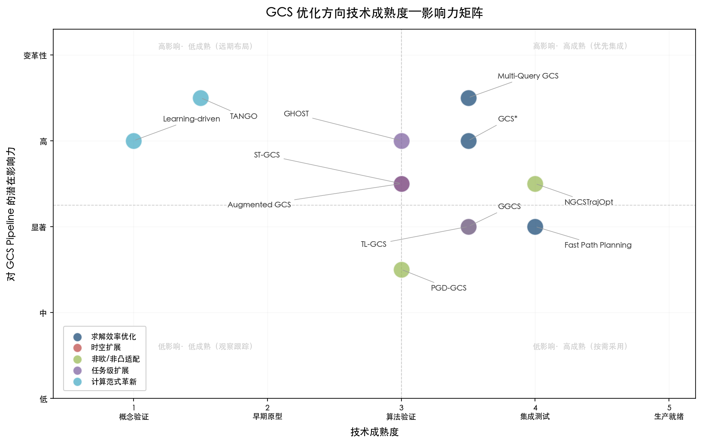

**图 6-1 GCS 优化方向技术成熟度—影响力矩阵。** 横轴为技术成熟度（从"概念验证"到"生产就绪"），纵轴为对 GCS pipeline 的潜在影响力。Multi-Query GCS、GCS* 和 Fast Path Planning 位于"集成测试 × 高影响力"区间，适合短期优先集成；GHOST、ST-GCS 等处于"算法验证"阶段，适合中期布局；TANGO 和学习驱动优化处于早期阶段，属于远期储备方向。

图 6-2 进一步以热力矩阵形式对比各扩展变体在八个关键能力维度上的覆盖情况，帮助读者快速判断各变体的能力边界与互补关系。

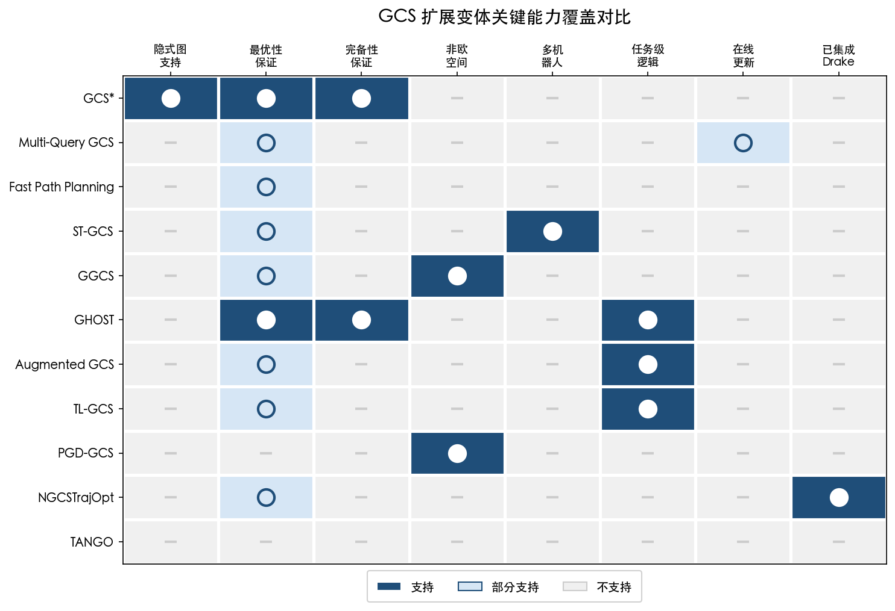

**图 6-2 GCS 扩展变体关键能力覆盖对比。** 深色表示完全支持，浅色表示部分支持，灰色表示不支持。各变体在能力维度上呈现高度互补性——GCS* 独占隐式图支持与完备性保证，GGCS 和 PGD-GCS 覆盖非欧空间，GHOST 和增广 GCS 覆盖任务级逻辑，ST-GCS 独占多机器人能力，NGCSTrajOpt 是唯一已集成 Drake 的扩展变体。

综合来看，各优化方向在技术成熟度和应用时间线上呈现清晰的梯度分布：Multi-Query GCS 和 Fast Path Planning 已有成熟实验验证，可在短期内与自动化 pipeline 集成；GCS*、ST-GCS 和 GHOST 处于算法验证阶段，适合中期集成；TANGO 和学习驱动优化处于概念验证或早期探索阶段，属于远期布局方向。第7章将在综合可行性评估中进一步细化这一时间线与优先级排序。

# 第7章 综合可行性评估与实施路线图

前述六章分别建立了 GCS 的数学基础与应用现状（第1–2章）、凸集生成瓶颈的深层剖析（第3章）、PRM 作为自动种子生成器的理论论证（第4章）、PRM + 凸分解 + GCS 全自动 pipeline 的完整技术方案设计（第5章），以及 GCS 框架在求解效率、时空扩展、非欧空间与任务级逻辑等多维度的前沿优化方向（第6章）。本章作为全文的收束与决策支撑章节，对各优化方向进行系统性综合可行性评估，旨在回答一个核心问题：**在现有技术条件下，哪些方案可优先落地，其实施路径与预期收益如何？** 全章依次展开四个层面的分析——自动化方案的综合评估（7.1节）、各优化方向的横向对比（7.2节）、分阶段实施路线图（7.3节），以及生态系统评估与开放问题（7.4–7.6节）。

## 7.1 PRM + 凸分解 + GCS 自动化方案综合评估

### 7.1.1 技术成熟度评估

PRM + IRIS + GCS 三组件 pipeline 的技术成熟度需从组件级与系统级两个层面加以审视。

**组件级成熟度。** 三个核心组件在 Drake 生态中均已具备原生接口。PRM 路线图构建可基于 Drake 的 `CollisionChecker` 接口完成均匀采样与碰撞检测；凸集膨胀可调用 `IrisZo()` 或 `IrisNp2()` 生成 `HPolyhedron` 对象；凸集图构建与求解可通过 `GcsTrajectoryOptimization.AddRegions(regions, order)` 自动执行交集检测与建边，并经由 `SolvePath()` 完成凸松弛与舍入 [Drake GcsTrajectoryOptimization](https://drake.mit.edu/doxygen_cxx/classdrake_1_1planning_1_1trajectory__optimization_1_1_gcs_trajectory_optimization.html "AddRegions 自动边构建") [Drake IRIS API](https://drake.mit.edu/doxygen_cxx/group__planning__iris.html "IrisZo/IrisNp2 API")。此外，Drake 提供的 `SetEdgeContainmentTerminationCondition()` 支持以 PRM 边作为线段种子进行膨胀，从而严格保证相邻凸集在路径节点处的交集非空。

需要特别指出的是，`GcsTrajectoryOptimization`、`IrisZo()` 和 `IrisNp2()` 三个核心 API 截至 2026 年 4 月仍标记为 **experimental** 状态——其接口可能在后续版本中不经兼容过渡而直接更改 [Drake GcsTrajectoryOptimization](https://drake.mit.edu/doxygen_cxx/classdrake_1_1planning_1_1trajectory__optimization_1_1_gcs_trajectory_optimization.html "experimental 标记") [Drake IRIS API](https://drake.mit.edu/doxygen_cxx/group__planning__iris.html "IrisZo/IrisNp2 experimental 标记")。基于这些 API 构建的 pipeline 需承受一定的接口稳定性风险，工程部署中应预留 API 迁移预案。

**系统级成熟度。** 截至 2026 年 4 月，公开文献中尚无"标准 PRM 节点 → IRIS 批量膨胀 → GCS 求解"完整 pipeline 的端到端实验验证。最接近的三个参照系统为：(1) **EI-ZO pipeline**（RSS 2025），以 DRM 线段膨胀实现端到端 152.5 ms，但仅覆盖单条路径附近空间 [Werner et al. 2025](https://arxiv.org/html/2504.10783v1 "Superfast SCS on GPU, RSS 2025, Table I")；(2) **VCC 方案**（ICRA 2024），通过可见性团覆盖在 7-DOF 场景中以 46 个区域实现约 70% 自由空间覆盖，但在约束双臂场景中 437 秒仅生成 8 个区域、覆盖率不足 1% [Cohn, Werner & Tedrake 2025](https://groups.csail.mit.edu/robotics-center/public_papers/Cohn25a.pdf "Section VI Discussion, VCC bottleneck analysis")；(3) **Multi-Query GCS**（Morozov 硕士论文，MIT 2025），使用 IRIS clique seeding 与 SDP 预计算实现在线 5 ms 查询 [Morozov et al. 2024](https://arxiv.org/abs/2409.19543 "Multi-Query SPP in GCS, WAFR 2024, Table 1")。鉴于此，本文所提方案的可行性论证建立在各组件级证据的合理外推与工程推理之上，本质上属于理论分析，其结论的最终确认有赖于端到端实验验证。

### 7.1.2 性能收益估算

基于各组件的独立性能数据，可对 PRM + IRIS + GCS pipeline 的预期性能进行如下推算。需强调，以下估算均基于组件级数据的合理外推，尚未经过端到端实验验证。

**计算时间。** 以 7-DOF 单臂场景为基准，50 个 PRM 种子点使用 IRIS-ZO（平均 1.82 秒/区域）膨胀，无并行时总计约 91 秒。若采用 CPU 多线程并行（Drake `parallelism` 参数支持），8 线程可将时间压缩至约 10–20 秒 [Cohn, Werner & Tedrake 2025](https://groups.csail.mit.edu/robotics-center/public_papers/Cohn25a.pdf "IRIS-ZO 1.82 s/region, Table I")。PRM 路线图构建本身（1000 节点，$k$-近邻连接）在秒级内即可完成。`AddRegions` 的自动交集检测为 $O(N^2)$ 次 LP 可行性检查，$N \leq 100$ 时处于秒级量级 [Drake GcsTrajectoryOptimization](https://drake.mit.edu/doxygen_cxx/classdrake_1_1planning_1_1trajectory__optimization_1_1_gcs_trajectory_optimization.html "AddRegions")。综合估计，离线阶段端到端时间约 20–40 秒（8 线程并行、50 个区域），GCS 在线求解时间在 0.01–0.14 秒量级 [Marcucci et al. 2023 Science Robotics](https://arxiv.org/abs/2205.04422 "Section 7.4, 7-DOF 求解时间")。

**覆盖率。** 50 个种子点膨胀后的覆盖率有望接近 VCC 的 70% 基准（VCC 以 46 个区域实现该覆盖率），同时 PRM 的 $O(N \log N)$ 连接策略在计算复杂度上优于 VCC 的 $O(N^2)$ 完全可见性图构建 [Werner et al. 2024 VCC](https://groups.csail.mit.edu/robotics-center/public_papers/Werner23.pdf "46 regions, 70% coverage, ICRA 2024")。全覆盖方案赋予 GCS 比 EI-ZO 单路径方案更大的路径选择空间，路径质量的潜在改善更为显著。值得注意的是，EI-ZO 膨胀两条路径（LGCS 策略）相比单条路径仅降低代价 3.7%，而计算时间增加 29 倍，表明简单增加路径数量存在递减效应 [Werner et al. 2025](https://arxiv.org/html/2504.10783v1 "Table I, LSCS vs LGCS, Section VIII")。

**路径质量。** GCS 在 7-DOF KUKA iiwa 场景中已证实轨迹长度短于 PRM、运行时间更低（0.01–0.14 秒 vs 0.20–0.26 秒），舍入解达到全局最优（$\delta_{\text{opt}} = 0\%$）[Marcucci et al. 2023 Science Robotics](https://arxiv.org/abs/2205.04422 "Section 7.4")。在自动生成的凸集图上，GCS 的凸松弛与舍入策略有望延续这一性能优势，其前提条件是凸集图的覆盖率与连通性能达到足够水平。

### 7.1.3 主要技术风险

尽管组件级证据支持 pipeline 的可行性，以下四项技术风险需在实施中重点关注。

**风险一：凸集数量的可扩展性瓶颈。** 标准 GCS-Opt 在凸集数量极大时不可扩展——10,150 个盒子场景即无法求解 [Marcucci et al. 2024 TRO](https://www-leland.stanford.edu/~boyd/papers/pdf/fpp.pdf "Section I-A")。自动化 pipeline 生成的凸集需严格控制在数十至低百量级，这对种子稀疏化策略提出了刚性约束。若场景复杂度要求更多凸集（>100 个），则需引入 GCS* 增量搜索或 Fast Path Planning 等替代求解策略以突破规模瓶颈。

**风险二：点种子连通性的非严格保证。** 以 PRM 节点（而非 PRM 边）作为种子时，相邻节点膨胀出的凸集虽大概率交集非空，但无法提供严格的连通性数学保证。后验交集检测与补膨胀步骤构成必要的安全网——通过 LP 可行性检查识别不相交的凸集对，在 PRM 边中点处执行补膨胀以恢复连通性。线段种子策略（使用 `SetEdgeContainmentTerminationCondition()`）可从根本上消除此风险，但计算代价略高 [Drake IRIS API](https://drake.mit.edu/doxygen_cxx/group__planning__iris.html "SetEdgeContainmentTerminationCondition")。

**风险三：高维场景下 IRIS 区域体积的指数缩小。** 在 14-DOF 以上配置空间中，IRIS 生成的凸区域体积随维度指数缩小，单个凸集覆盖的自由空间比例急剧下降，意味着高维场景需要更多凸集才能达到同等覆盖率，与风险一形成叠加效应。目前 GCS 体系中公开报告的最高维度验证为 15-DOF（GGCS PR2 实验，平均 25.75 秒/段）[Cohn et al. 2023](https://groups.csail.mit.edu/robotics-center/public_papers/Cohn23.pdf "RSS 2023, Tables I-II")，超过 20-DOF 的系统尚无端到端性能数据。

**风险四：GPU 加速工具链的几何体限制。** CSDecomp 工具箱当前仅支持盒体和球体碰撞几何，圆柱与胶囊体尚在开发计划中，网格碰撞体的复杂工业场景无法使用 [CSDecomp GitHub](https://github.com/wernerpe/csdecomp "碰撞几何支持范围与硬件要求")。这一限制直接制约了 GPU 加速 EI-ZO 在工业级场景中的适用范围。

上述四项风险的等级、影响范围、缓解措施和验证时间节点汇总于下图。

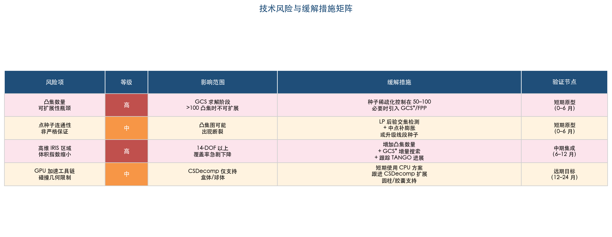

图 7-1 以结构化矩阵形式列出了四项技术风险的等级评定及对应缓解路径。其中，凸集数量可扩展性瓶颈与高维 IRIS 区域体积缩小被评定为高风险等级，分别需在短期原型阶段和中期集成阶段完成验证；点种子连通性与 GPU 工具链限制属中等风险，可通过线段种子升级和跟进 CSDecomp 扩展进展加以缓解。

## 7.2 各优化方向横向对比

为给决策者提供清晰的技术选型依据，本节将第5–6章讨论的所有优化方向在五个关键维度上进行横向对比：计算效率、路径质量、可扩展性、工程就绪度和应用范围。下图以雷达图形式直观展示了六种代表性方案在上述五个维度上的综合评分。

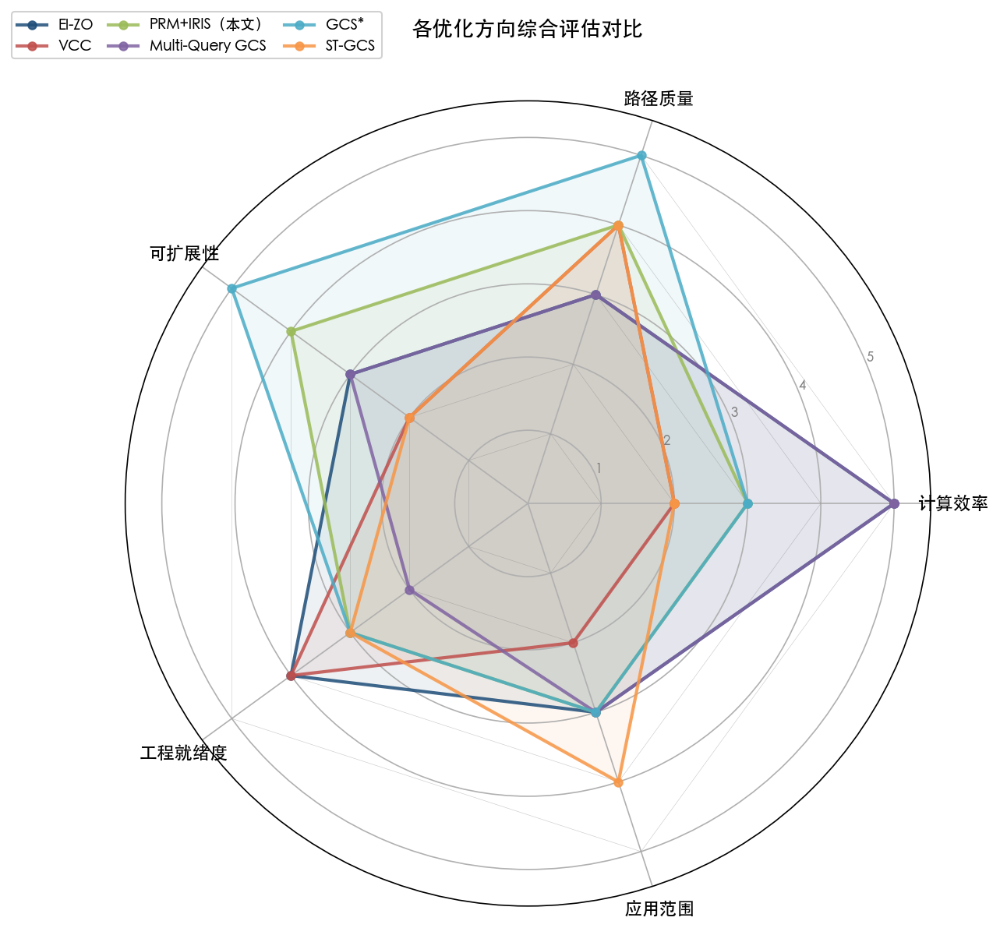

图 7-2 基于第5–7章的定量性能数据与工程可用性分析，对 PRM+IRIS（本文方案）、GCS\*、ST-GCS、Multi-Query GCS、EI-ZO 和 VCC 六种方案进行 1–5 分制评分。PRM+IRIS 方案在可扩展性和工程就绪度维度表现均衡，Multi-Query GCS 在计算效率维度突出，而 EI-ZO 在计算效率和路径质量上均占优但可扩展性受限。

### 7.2.1 凸集生成方案对比

三种凸集生成策略在设计目标和性能特征上存在显著差异，各自适用于不同的应用场景。

**EI-ZO 路径级膨胀（RSS 2025）。** 该方案定位于在线实时应用，端到端耗时 152.5±89.1 ms（含 DRM 路径查找、GPU 膨胀与轨迹优化），平均仅生成 3.49 个凸集。其核心优势在于极低延迟与 GPU 原生加速能力；主要局限在于路径依赖性——凸集仅覆盖初始 DRM 路径附近空间，若初始路径质量欠佳则可能排除高质量轨迹。膨胀多条路径的改善仅为边际（代价降 3.7%，时间增 29 倍）[Werner et al. 2025](https://arxiv.org/html/2504.10783v1 "Table I, RSS 2025")。该方案适用于对延迟要求极高（<200 ms）的在线场景。

**VCC 全覆盖方案（ICRA 2024）。** 该方案定位于离线高覆盖率场景，在 7-DOF 中以 46 个区域实现 70% 自由空间覆盖率。其优势在于覆盖率高且种子选取系统化（可见性团分解）；核心瓶颈在于 $O(N^2)$ 可见性图构建——约束双臂场景中 437 秒仅生成 8 个区域、覆盖率不足 1%，其中 95% 时间消耗在可见性图构建而非区域生成 [Cohn, Werner & Tedrake 2025](https://groups.csail.mit.edu/robotics-center/public_papers/Cohn25a.pdf "Section VI Discussion")。在高维约束场景中该方案几乎不可用。

**PRM + IRIS pipeline（本文方案）。** 该方案定位于离线中等覆盖率场景，预计生成 50 个区域、离线耗时 20–40 秒（8 线程并行）。PRM 的 $O(N \log N)$ 连接策略比 VCC 的 $O(N^2)$ 可见性图构建更具高维可扩展性；PRM 路线图的多查询特性允许在不同障碍物配置下复用（仅需剪枝碰撞节点）。该方案的主要不确定性在于端到端集成尚无实验验证，凸集覆盖率与 GCS 求解质量的定量映射关系有待建立。适用于静态或缓变环境下的离线预处理场景。

### 7.2.2 求解效率优化方案对比

四种 GCS 求解策略在适用场景与性能特征上各有侧重。

**标准凸松弛 + 舍入。** 作为 Drake 默认策略，该方法在 7-DOF 场景中求解时间为 0.01–0.14 秒，欧氏距离目标函数下凸松弛几乎精确。适合中等规模图（50–100 凸集），无需额外开发即可直接使用 [Marcucci et al. 2023 Science Robotics](https://arxiv.org/abs/2205.04422 "Section 7.4")。

**GCS\*。** 面向超大规模隐式图（$10^9$ 量级顶点），采样版支配检查相对精确版实现约 1000 倍加速。GCS\* 是目前唯一同时具备隐式图支持、完备性和最优性保证的 GCS 求解器，但其已有实验集中于接触规划（平面推动）场景，在标准操作臂避障任务中与凸松弛方法的直接性能对比尚未见公开文献 [Chia et al. 2024](https://arxiv.org/abs/2407.08848 "GCS*, WAFR 2024, Table 2")。代码开源于 `shaoyuancc/large_gcs`（Python，依赖 Drake），尚未集成入 Drake 主仓库 [large_gcs GitHub](https://github.com/shaoyuancc/large_gcs "GCS* 实现")。

**Multi-Query GCS。** 面向静态多查询场景，离线 SDP 预计算约 6 秒，在线中位查询时间 5 ms——比标准 GCS 快约 40 倍、比 PRM（10,000 节点）快约 110 倍，路径长度仅增 7% [Morozov et al. 2024](https://arxiv.org/abs/2409.19543 "Table 1")。该方法与本文 PRM + IRIS pipeline 存在天然协同关系：离线自动生成的高覆盖率凸集图为 Multi-Query 提供路径选择空间，Multi-Query 的毫秒级在线查询能力将 pipeline 的价值从离线预处理扩展至工业级实时响应。截至 2026 年 4 月，Multi-Query GCS 无独立公开代码仓库，需基于论文自行实现。

**Fast Path Planning。** 面向轴对齐盒等特殊结构凸集，可处理 25,600 个盒子（离线 25 秒、在线 7.72 秒），代价比值 1.0001 近乎全局最优 [Marcucci et al. 2024 TRO](https://www-leland.stanford.edu/~boyd/papers/pdf/fpp.pdf "IEEE TRO 40:3795-3809, 2024")。适用于凸集具有特定几何结构的场景，不适用于通用多面体。

### 7.2.3 扩展方向对比

以下四个扩展方向分别从时空域、非欧空间、任务级逻辑和配置空间压缩等维度拓展 GCS 的应用边界。

**ST-GCS（IROS 2025）。** 将 GCS 扩展至时空域以解决多机器人运动规划问题。PBS+ST-GCS 在 10 机器人场景保持 100% 成功率，而基线方法在 $n>2$ 时几乎完全失败 [Tang et al. 2025](https://arxiv.org/abs/2503.00583 "Figure 5")。图膨胀问题（>1000 边时求解器开始失败）是其核心瓶颈。代码开源于 `reso1/stgcs`（GPL-3.0）[stgcs GitHub](https://github.com/reso1/stgcs "ST-GCS 实现")。

**GGCS（RSS 2023/IJRR 2024）。** 将 GCS 推广至黎曼流形，在零曲率流形上可精确归约为标准 GCS，但正曲率流形（如 $SO(3)$）不可处理。已在 15-DOF PR2 机器人上验证，平均求解时间 25.75 秒/段 [Cohn et al. 2023](https://groups.csail.mit.edu/robotics-center/public_papers/Cohn23.pdf "RSS 2023, Tables I-II")。适用于含移动底座或连续旋转关节的机器人。

**GHOST（AAAI 2026）。** 解决凸集图上的旅行商问题（GCS-TSP），采用分层搜索架构，比统一 MICP 基线快数个数量级——所有 Bézier-GCS 实例中 MICP 基线全部求解失败，而 GHOST 全部成功 [Tang & Ma 2025](https://arxiv.org/abs/2511.06471 "GHOST, AAAI 2026")。适用于巡检、覆盖规划和 TAMP 等多目标访问场景。

**TANGO（ICRA 2026）。** 采用张量训练分解驱动的配置空间压缩策略，绕过逐点膨胀模式，有潜力从根本上变革 GCS pipeline 架构 [Reinerth et al. 2026](https://arxiv.org/abs/2603.11658 "Coupling Tensor Trains with Graph of Convex Sets, ICRA 2026")。目前仅在平面机器人和仿真中完成初步验证，距工业级应用仍有较大距离。

## 7.3 分阶段实施路线图

基于上述可行性评估与横向对比，本节给出分三阶段的实施路线图，每个阶段明确目标、技术路径、预期成果与风险缓解措施。下图以甘特图形式展示了全部 14 项关键任务的时间跨度、并行关系及三个里程碑节点。

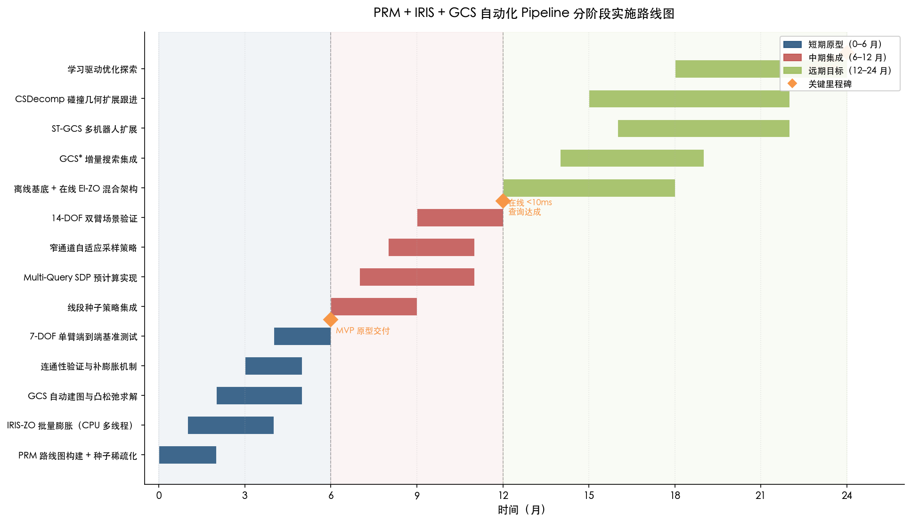

图 7-3 展示了 0–24 个月的三阶段实施时间线：短期原型阶段（0–6 月）聚焦于 PRM 路线图构建、IRIS-ZO 批量膨胀和 GCS 自动建图求解等基础模块的实现与验证，目标是在第 6 个月交付 MVP 原型；中期集成阶段（6–12 月）引入线段种子策略和 Multi-Query SDP 预计算，目标是实现在线 <10 ms 查询；远期目标阶段（12–24 月）着眼于混合架构、GCS\* 集成与多机器人扩展等前沿方向。

### 7.3.1 短期原型阶段（3–6 个月）

**目标。** 在 Drake 框架内实现 PRM + IRIS-ZO + GCS 全自动 pipeline 的最小可行原型（MVP），在 7-DOF 单臂标准基准上完成端到端验证。

**技术路径。** 纯 Drake API 实现，核心代码量约 200–300 行 Python，具体步骤如下：

1. **PRM 路线图构建。** 使用 `CollisionChecker` 均匀采样 500–1000 个配置，以 $k$-近邻策略连接（$k = 2e \cdot \log(n)$），碰撞检测验证边的可行性。
2. **种子稀疏化。** 采用最远点采样（Farthest Point Sampling）从 PRM 节点中选取 20–50 个种子点，兼顾覆盖均匀性与凸集数量控制。
3. **IRIS-ZO 批量膨胀。** 调用 `IrisZo()` 对每个种子执行膨胀，启用 CPU 多线程并行（Drake `parallelism` 参数）。
4. **GCS 自动建图与求解。** 调用 `AddRegions(regions, order)` 自动完成交集检测与建边，经由 `SolvePath()` 执行凸松弛 + 舍入。
5. **连通性验证与修复。** 以 BFS 检查凸集图连通性，不连通处在 PRM 边中点执行补膨胀。

[Drake IRIS API](https://drake.mit.edu/doxygen_cxx/group__planning__iris.html "IrisZo, IrisFromCliqueCoverOptions") [Drake GcsTrajectoryOptimization](https://drake.mit.edu/doxygen_cxx/classdrake_1_1planning_1_1trajectory__optimization_1_1_gcs_trajectory_optimization.html "AddRegions, SolvePath")

**预期成果。** 端到端离线时间 20–40 秒（8 线程并行），GCS 在线求解 <0.2 秒，覆盖率 ≥50%（保守估计），在标准 7-DOF 基准上轨迹质量不劣于 PRM。

**关键验证指标。** (a) 凸集覆盖率（蒙特卡洛采样估计），(b) GCS 求解成功率与最优性间隙，(c) 轨迹长度与 PRM/RRT-Connect 的对比，(d) 端到端时间分解（采样、膨胀、建图、求解各阶段耗时）。

**风险缓解。** 若 IRIS-ZO 并行膨胀时间超出预期，可将种子数量降低至 20 个，或切换至 IRIS-NP2 Greedy 模式（平均 1.65 秒/区域，超平面数更少）[Cohn, Werner & Tedrake 2025](https://groups.csail.mit.edu/robotics-center/public_papers/Cohn25a.pdf "Table I")。若凸集图连通性问题频发，则优先切换至线段种子策略。

### 7.3.2 中期集成阶段（6–12 个月）

**目标。** 引入线段种子策略与 Multi-Query 预计算能力，将 pipeline 扩展至 14-DOF 双臂场景，实现在线查询时间 <10 ms。

**技术路径。**

1. **线段种子策略。** 使用 `SetEdgeContainmentTerminationCondition()` 将 PRM 边作为线段种子传入 IRIS-ZO/EI-ZO，严格保证相邻凸集在路径节点处相交，从根本上消除连通性风险 [Drake API](https://drake.mit.edu/doxygen_cxx/group__planning__iris.html "SetEdgeContainmentTerminationCondition")。
2. **Multi-Query SDP 预计算。** 基于 Morozov et al. 2024 的算法，离线通过 SDP 合成凸二次 cost-to-go 下界（约 6 秒），在线采用短视界贪心凸规划增量生成路径，实现 <10 ms 查询 [Morozov et al. 2024](https://arxiv.org/abs/2409.19543 "Section 3.4, SDP synthesis")。鉴于该算法无公开代码仓库，需基于论文与 Morozov 2025 MIT 硕士论文中的实现细节自行开发。
3. **14-DOF 双臂验证。** 在双臂 KUKA 或同等复杂度场景上验证 pipeline 的高维可扩展性，重点观测凸集体积缩小效应与计算时间增长曲线。
4. **窄通道自适应采样。** 集成第5章提出的分层采样策略——在 PRM 采样拒绝率异常高或 IRIS 区域体积异常小的区域，触发 Gaussian PRM / Bridge PRM 局部加密，提升窄通道覆盖率。

**预期成果。** 离线阶段 ≤2 分钟（14-DOF，CPU 多线程），在线查询 <10 ms（Multi-Query 模式），覆盖率 ≥60%（14-DOF 场景保守估计）。

**关键技术挑战。** Multi-Query GCS 的自行实现工作量较大，SDP 合成涉及凸集图的完整几何结构信息；14-DOF 场景中 IRIS-ZO 单区域膨胀时间可能显著增加（需实测），凸集数量需求可能超出标准 GCS 的可扩展范围。

### 7.3.3 远期目标阶段（1–2 年）

**目标。** 构建离线高覆盖率基底与在线增量膨胀相结合的混合架构，支持动态环境更新与多机器人协同规划。

**技术路径。**

1. **混合架构。** 离线阶段使用 PRM + IRIS 全覆盖方案构建高覆盖率基底凸集图；在线阶段当环境变化触发凸集失效时，借助 GPU 加速 EI-ZO 在受影响区域快速增量膨胀新凸集，并局部更新 GCS 图结构。该架构兼顾离线方案的覆盖质量与在线方案的响应速度。
2. **GCS\* 集成。** 对于自动生成的大规模凸集图（>100 凸集），引入 GCS\* 增量搜索替代全局 MICP 求解，利用其查询感知特性降低平均求解时间 [Chia et al. 2024](https://arxiv.org/abs/2407.08848 "GCS*, WAFR 2024")。
3. **ST-GCS 多机器人扩展。** 将自动生成的空间凸集图作为 ST-GCS 的输入基础，通过时空挤出与 ECD 碰撞分割支持多机器人协同规划 [Tang et al. 2025](https://arxiv.org/abs/2503.00583 "ST-GCS, IROS 2025")。
4. **CSDecomp 碰撞几何扩展。** 持续跟进 CSDecomp 对圆柱、胶囊和网格碰撞体的支持进展，待相关支持成熟后将 GPU 加速凸集膨胀能力引入工业级场景。
5. **学习驱动优化探索。** 在 GCS\* 搜索中引入学习启发式函数（替代手工启发式），在凸松弛求解中引入神经网络暖启动策略，加速求解收敛。

**前置条件。** (a) Drake 核心 API 从 experimental 毕业至稳定状态，(b) CSDecomp 扩展至更广泛的碰撞几何类型，(c) GCS\* 在操作臂避障场景中完成系统性性能验证。

## 7.4 生态系统与工具链评估

工程落地不仅取决于算法性能，还受限于工具链的成熟度与可集成性。本节从 Drake 生态内外两个维度评估可用组件，并分析硬件需求。

### 7.4.1 Drake 生态内可直接集成的组件

以下组件均在 Drake 主仓库中维护，可通过标准 Drake 安装直接使用：

- **凸集生成：** `IrisZo()`、`IrisNp2()`、`IrisNp()`（均标记 experimental）。
- **自动种子策略：** `IrisFromCliqueCover()`（VCC 的 Drake 集成版）。
- **线段种子支持：** `SetEdgeContainmentTerminationCondition()`。
- **GCS 轨迹优化：** `GcsTrajectoryOptimization`（含 `AddRegions`、`SolvePath`，标记 experimental）。
- **底层图操作：** `GraphOfConvexSets`（支持手动图构建和凸优化求解）。
- **非凸扩展：** NGCSTrajOpt（已集成 Drake，支持非凸代价与约束）。

### 7.4.2 Drake 生态外需独立维护的组件

以下组件需从独立仓库获取，在版本兼容性和维护持续性方面可能面临额外风险：

- **GPU 加速凸集膨胀：** CSDecomp（Python/C++/CUDA，需 Ubuntu 22.04 + NVIDIA GPU + CUDA 12.x，仅支持盒体/球体）[CSDecomp GitHub](https://github.com/wernerpe/csdecomp "CSDecomp 工具箱")。
- **GCS\* 增量搜索：** `large_gcs`（Python，依赖 Drake）[large_gcs GitHub](https://github.com/shaoyuancc/large_gcs "GCS* 实现")。
- **Multi-Query GCS：** 无独立公开代码仓库，需基于论文自行实现。
- **ST-GCS：** `stgcs`（GPL-3.0，纯 Python）[stgcs GitHub](https://github.com/reso1/stgcs "ST-GCS 实现")。
- **轻量级 GCS 原型工具：** `gcsopt`（MIT 许可证，CVXPY 语法，独立于 Drake）[gcsopt GitHub](https://github.com/TobiaMarcucci/gcsopt "GCSOPT: Python library for optimization over GCS")。

其中，`gcsopt` 作为 Marcucci 发布的独立 Python 库，以 CVXPY 语法封装 GCS 求解功能，可作为 Drake 之外的轻量级原型验证工具，有效降低早期技术验证的环境依赖门槛。

### 7.4.3 硬件需求评估

**CPU 方案（短期原型适用）。** 标准多核工作站（8+ 核，64 GB RAM），运行 Drake + MOSEK 求解器。IRIS-ZO 多线程并行膨胀 50 个区域约 10–20 秒，GCS 凸松弛求解 <0.2 秒。该配置可满足 7-DOF 至 14-DOF 场景的离线 pipeline 需求，是短期原型阶段的推荐硬件基线。

**GPU 方案（中远期适用）。** 需配备 NVIDIA GPU（RTX 3090/2080Ti 或更高），运行 CSDecomp CUDA 核心。EI-ZO GPU 膨胀路径级凸集约 135.1 ms，端到端 152.5 ms [Werner et al. 2025](https://arxiv.org/html/2504.10783v1 "Tables I-II, RSS 2025")。硬件验证已在 KUKA 7-DOF + RTX 2080Ti 上完成，15 次规划平均 0.82 秒。GPU 方案在碰撞几何限制（仅盒体/球体）消除后，可作为在线增量膨胀的核心加速器，支撑混合架构的实时响应需求。

## 7.5 优先级排序与决策建议

综合前述分析，我们对各优化方向按"短期可执行性 × 预期收益"两个维度进行优先级排序，为工程决策提供系统性参考。

### 7.5.1 第一优先级：PRM + IRIS-ZO + GCS 基础 pipeline

**理由。** 三个核心组件在 Drake 中均有原生接口，端到端实现仅需 200–300 行 Python 代码，离线时间处于可接受范围（20–40 秒）。与现有人工播种方案相比，该方案可实现种子选取的完全自动化，是本文核心研究命题的直接回答，也是后续所有优化方向的基础设施。

**执行建议。** 立即启动短期原型阶段，以 7-DOF 单臂基准为首要验证场景。重点建立凸集覆盖率与 GCS 求解质量之间的定量映射关系——该数据是当前文献中缺失的关键实验证据，其获取对于后续方案优化具有决定性意义。

### 7.5.2 第二优先级：Multi-Query GCS 在线查询加速

**理由。** 在工业应用中，离线预处理时间的容忍度较高（数十秒至数分钟），但在线查询延迟通常要求控制在 10 ms 以内。Multi-Query GCS 的 5 ms 中位查询时间恰好填补了 pipeline 从离线工具到在线服务的关键性能缺口。离线 SDP 预计算仅需约 6 秒，可在第一优先级 pipeline 的输出上增量叠加。

**执行建议。** 在短期原型验证成功后，优先实现 Multi-Query SDP 合成模块。鉴于无公开代码可用，建议参照 Morozov et al. 2024 论文中的数学公式与 MIT 硕士论文中的实现细节自行开发 [Morozov et al. 2024](https://arxiv.org/abs/2409.19543 "Multi-Query SPP in GCS, WAFR 2024") [Morozov 2025](https://groups.csail.mit.edu/robotics-center/public_papers/Morozov25b.pdf "MIT 硕士论文")。

### 7.5.3 第三优先级：线段种子策略 + 高维扩展

**理由。** 线段种子策略通过 `SetEdgeContainmentTerminationCondition()` 严格保证凸集连通性，消除点种子方案中后验检测与补膨胀的不确定性，是 pipeline 从原型走向工程可靠性的关键升级。同时，14-DOF 双臂验证是 pipeline 迈向工业应用的必要维度扩展。

**执行建议。** 与第二优先级并行推进，在中期集成阶段内完成验证。

### 7.5.4 第四优先级：GCS\* 与 ST-GCS 集成

**理由。** GCS\* 的增量搜索在凸集数量超过 100 时可显著降低求解时间，但其在操作臂避障场景的性能验证尚不充分。ST-GCS 为多机器人扩展提供了明确的技术路径，但图膨胀问题限制了其规模上限。两者均属中远期集成目标。

**执行建议。** 在远期目标阶段评估集成可行性，优先跟踪 GCS\* 在标准运动规划基准上的后续实验进展及社区反馈。

### 7.5.5 远期储备：TANGO 与学习驱动优化

**理由。** TANGO 的张量分解路径有潜力从根本上变革 GCS pipeline 架构，学习驱动的启发式函数和舍入策略可能在不改变凸优化核心框架的前提下显著加速求解。但两者均处于早期验证阶段，距工程落地仍有较大距离。

**执行建议。** 持续跟踪 TANGO 在 7-DOF 以上场景的后续实验进展，以及 GCS 领域中将深度学习（GNN/Transformer）直接用于路径搜索或凸集质量优化的首批研究成果。在上述方法展现出可复现的性能优势后，再考虑集成评估。

## 7.6 开放问题与未来研究方向

尽管本文的分析已覆盖 GCS 框架优化的主要技术维度，以下若干开放问题的解决将对 GCS 的实用化进程产生深远影响。这些问题既为学术研究提供了有价值的探索方向，也为工程实践标定了当前认知的边界。

### 7.6.1 凸集质量的理论下界

给定 $\mathcal{C}_{\text{free}}$ 的几何复杂度，GCS 至少需要多少个凸集才能保证指定的最优性间隙？对这一问题的形式化回答将为凸集生成算法提供明确的优化目标。目前常用的覆盖率指标（如 70%）本质上是代理指标，覆盖率与 GCS 求解质量之间的定量映射关系尚未建立。值得关注的开放子问题包括：凸集数量与凸松弛紧度之间的理论关系、凸集形状参数（超平面数、体积、长宽比）对求解质量的影响机制，以及"少而大"与"多而小"凸集策略的系统性比较。

### 7.6.2 在线凸集增量更新

当环境发生变化时，预先生成的凸集图可能部分或全部失效。增量式凸集更新算法——仅修改受影响的超平面而非完全重构整个凸多面体——是一个具有高工程价值但尚未被系统研究的方向。核心矛盾在于凸集重构的计算代价（从 IRIS-ZO 的 1.82 秒/区域到 GPU 加速的 35 ms/区域）与在线实时响应需求之间的张力。如何在保持凸集安全性保证的前提下实现最小化重构，是该方向的关键技术难点。

### 7.6.3 高维可扩展性的系统突破

GCS 当前的最高维度验证为 15-DOF（GGCS PR2 实验）。对于 20-DOF 以上系统（如双臂 + 移动底座 + 灵巧手），凸集生成与 MICP 求解面临双重指数增长压力。TANGO 的张量分解路径、学习驱动的凸集压缩以及 GCS\* 的增量搜索分别从不同角度尝试缓解这一瓶颈，但系统性的高维解决方案——能够在 20-DOF 以上场景中同时维持可接受的覆盖率、求解时间和路径质量——仍有待提出。

### 7.6.4 端到端实验验证

本文 PRM + IRIS + GCS pipeline 的可行性论证基于组件级证据的合理外推。将理论分析转化为经过实验验证的工程方案，需要建立覆盖不同自由度（7、12、14-DOF）、不同场景复杂度（开放空间、窄通道、约束操作）和不同凸集参数（数量、体积、超平面数）的系统性基准测试套件。尤为关键的是，"PRM 节点密度 → IRIS 凸集覆盖率 → GCS 求解质量"这条因果链上的定量关系，需要通过大规模控制变量实验加以建立和验证，这将为 pipeline 各阶段的参数选择提供坚实的实证基础。

# 结论与风险提示

## 核心结论

本报告围绕"如何自动化生成安全区域凸集以优化 GCS 算法"这一核心命题，通过七章系统性分析，得出以下核心结论。

**结论一：凸集生成是 GCS 实用化的关键瓶颈，而非求解端。** GCS 的凸松弛 + 舍入策略在 7-DOF 场景中已实现 0.01–0.14 秒的求解速度与全局最优质量 [Marcucci et al. 2023 Science Robotics](https://arxiv.org/abs/2205.04422 "Section 7.4")。GCS*、Multi-Query GCS、Fast Path Planning 等变体进一步将求解能力扩展至隐式超大规模图（$10^9$ 量级顶点）和毫秒级多查询响应。然而，所有这些求解端的进展都依赖于一个共同前提——高质量凸集图的可用性。当前凸集生成环节的人工种子依赖、VCC 方案在高维场景中的 $O(N^2)$ 可扩展性崩溃，以及凸集数量与 GCS 求解效率的紧耦合关系，共同构成了制约 GCS 从算法原型走向工业部署的核心障碍。

**结论二：PRM 驱动的自动种子生成方案在理论层面具备充分可行性。** PRM 的概率完备性提供渐近覆盖保证，$O(N \log N)$ 连接复杂度解决了 VCC 的高维瓶颈，路线图连通性为凸集图连通性提供可靠先验。端到端计算时间估计（20–40 秒，8 线程并行，50 个区域，7-DOF）处于离线预处理可接受范围内，覆盖率有望接近 VCC 在 7-DOF 场景中的 70% 基准 [Werner et al. 2024 VCC](https://groups.csail.mit.edu/robotics-center/public_papers/Werner23.pdf "46 regions/70% coverage, ICRA 2024")。线段种子模式（利用 PRM 边作为 IRIS 膨胀种子）可严格保证凸集连通性，已在 EI-ZO pipeline 中得到实验验证 [Werner et al. 2025](https://arxiv.org/html/2504.10783v1 "RSS 2025, Section VI")。

**结论三：PRM + IRIS + GCS Pipeline 在 VCC 与 EI-ZO 之间占据独特的技术定位。** 该方案比 VCC 快一个数量级以上（分钟级 vs 小时级），比 EI-ZO 的覆盖面显著更广（全空间 vs 单路径附近），且通过 Drake 现有 API 即可实现原型（约 200–300 行 Python）。与 Multi-Query GCS 的协同方案有望在离线阶段完成高覆盖率凸集图构建后，实现 <10 ms 的在线查询响应，达到工业级实时性能。

**结论四：GCS 优化空间远超凸集自动生成这一单一维度。** 求解效率优化（GCS*、Multi-Query GCS）、时空域扩展（ST-GCS）、任务级逻辑扩展（GHOST、增广 GCS）以及计算范式革新（TANGO 张量分解）等多条研究路径正同步推进。这些方向与自动化凸集生成 Pipeline 之间存在丰富的协同关系——自动生成的凸集图可直接作为上述扩展变体的输入基础，实现"一次凸集生成、多种任务复用"的架构效率。

## 风险提示

本报告的核心方案——PRM + IRIS + GCS 全自动 Pipeline——的可行性论证建立在各组件级证据的合理外推与工程推理之上。以下风险因素需在工程实施中予以充分重视。

**端到端验证空白。** 截至 2026 年 4 月，公开文献中尚无该完整 Pipeline 的端到端实验验证。各组件（PRM、IRIS-ZO、GCS）在 Drake 中均有经过验证的实现，但组件级成功不等同于系统级成功——接口对接、参数耦合与边界条件处理可能引入组件级实验未能暴露的问题。最接近的参照系统为 EI-ZO pipeline（RSS 2025），该工作验证了"DRM 路径 → 线段膨胀 → 轨迹优化"这一高度相似的端到端流程 [Werner et al. 2025](https://arxiv.org/html/2504.10783v1 "RSS 2025")，为本方案提供了有力的类比支撑，但并非直接验证。

**Drake API 稳定性风险。** Pipeline 依赖的三个核心 API——`GcsTrajectoryOptimization`、`IrisZo()` 和 `IrisNp2()`——截至 2026 年 4 月仍标记为 **experimental** 状态，其接口可能在后续版本中不经兼容过渡而直接更改 [Drake IRIS API](https://drake.mit.edu/doxygen_cxx/group__planning__iris.html "experimental 标记")。工程部署中应预留 API 迁移预案。

**高维可扩展性不确定性。** 本方案的定量估算主要基于 7-DOF 场景数据。在 14-DOF 以上配置空间中，PRM 采样效率下降、IRIS 区域体积指数缩小、所需凸集数量增加——三者叠加可能导致离线时间和凸集数量超出当前估计范围。GCS 体系中公开报告的最高维度验证为 15-DOF（GGCS PR2 实验）[Cohn et al. 2023](https://groups.csail.mit.edu/robotics-center/public_papers/Cohn23.pdf "RSS 2023")，超过 20-DOF 的系统目前无端到端性能数据。

**GPU 工具链的几何体限制。** GPU 加速的 EI-ZO（CSDecomp 工具箱）当前仅支持盒体和球体碰撞几何，圆柱、胶囊及网格碰撞体尚未支持 [CSDecomp GitHub](https://github.com/wernerpe/csdecomp "碰撞几何限制")。这一限制直接制约了 GPU 加速方案在包含复杂碰撞几何体的工业场景中的适用范围。

**覆盖率与求解质量的定量映射缺失。** 当前文献中普遍使用覆盖率（如 70%）作为凸集质量的代理指标，但覆盖率与 GCS 求解质量（路径代价、最优性间隙、求解成功率）之间的定量映射关系尚未建立。这意味着本方案"约 70% 覆盖率"的估算无法直接转化为对 GCS 路径质量的定量承诺。建立这一映射关系是短期原型阶段最关键的实验任务之一。

## 局限性分析

**文献时效性。** 本报告的分析基于截至 2026 年 4 月的公开文献。GCS 作为一个高速演化的研究领域，新的算法变体与实验结果持续涌现，报告中的技术对比与性能数据可能随新工作的发表而需要更新。

**性能数据的异构性。** 不同研究使用了不同的硬件平台（CPU 型号、GPU 型号）、不同的场景设定（障碍物数量与复杂度）和不同的评价指标（求解时间、最优性间隙、成功率）。本报告在进行跨方案对比时已尽可能标注数据来源与实验条件，但严格的苹果对苹果对比仍有赖于统一基准下的控制变量实验。

**理论分析的工程推测成分。** Pipeline 的端到端时间估算（20–40 秒）、覆盖率推测（约 70%）以及种子数量推荐（30–60 个）均基于组件级实验数据的合理外推，而非端到端实验测量。这些估算中的线性叠加假设（如各阶段耗时可简单相加）可能忽略了系统级的耦合效应和边界条件约束。

**未覆盖的技术维度。** 本报告聚焦于凸集生成自动化这一核心维度，对以下方面的覆盖有限：(a) GCS 在柔性机器人、水下机器人等非刚性系统中的适用性；(b) GCS 与模型预测控制（MPC）的在线集成；(c) 安全认证要求下凸集的形式化验证流程；(d) 大规模工业部署中的软件工程与运维挑战。这些维度在实际工程落地中可能构成独立的技术瓶颈，需在后续研究中专项分析。
