# 执行摘要

时间序列流失率（churn rate）是 Prometheus 在云原生环境中面临的核心运维挑战。Prometheus 数据模型以指标名称与标签键值对共同标识每条时间序列，任何标签值的变化即创建一条全新序列。在 Kubernetes 环境中，Pod 频繁重建、滚动更新、HPA/VPA 自动扩缩容、短暂 Job/CronJob 以及 Service Mesh sidecar 的维度爆炸，共同驱动序列集合以极高频率更替——这一动态更替速率即为流失率。

高流失率的影响沿 Prometheus 体系全栈展开：TSDB Head Block 因新旧序列在 2–3 小时保留窗口内共存而内存膨胀（生产案例中实际序列数可达瞬时活跃数的 5.5 倍），倒排索引的持续重建加重 CPU 负担，短命序列使 Gorilla 压缩效率从约 10 倍骤降至约 2 倍，WAL 体积膨胀导致重启恢复耗时 30–90 分钟并形成告警盲区。在数据管道层面，Remote Write 1.0 协议要求每样本携带完整标签集，叠加 stale marker 发送使流失事件期间网络流量成倍放大；下游远程存储承受经放大后的摄取压力和存储成本——托管服务中一个高基数标签可使月度账单暴涨 10 倍。在告警层面，`for` 子句因序列更替而被反复重置，可导致系统性漏报。

本报告从五个维度构建了系统性的分析与治理框架。第1章剖析流失率的概念、TSDB 内部机制及 Kubernetes 环境中的六类典型成因。第2章系统分析高流失率在内存、CPU、磁盘、查询性能、WAL 重启盲区、Remote Write 流量放大、远端存储成本和告警可靠性八个维度造成的连锁影响。第3章围绕"减少不必要序列产生"和"降低已产生序列对系统的冲击"两条治理主线，梳理涵盖标签治理、Relabeling 策略、配置调优、Recording Rules 预聚合、架构改进、远程写流控和指标生命周期管理在内的 13 种可落地方案。第4章横向对比 AWS AMP、GCP GMP、Azure Monitor、Grafana Cloud、阿里云和腾讯云六大托管方案在基数限额、治理工具、计费模型、数据保留和 SLA 五个维度的差异——按样本计费模型对短命序列"友好"，而按活跃序列计费的 Grafana Cloud 在高流失率下面临最高 5.5 倍的成本放大。第5章深入 Grafana Mimir、Thanos、VictoriaMetrics 三大推荐开源后端的架构差异化设计，并通过 Cloudflare（916 个 Prometheus 实例、49 亿序列）和 Zomato（22 亿活跃序列、1,750 万样本/秒）两个大规模生产案例，提炼出前置基数限制、预聚合减少序列传导、磁盘与索引成本显式建模、多层防御协同四项工程共识。

核心结论：高流失率治理不存在单点银弹，有效方案必须构建从指标设计、采集管道、存储引擎到查询优化的全栈多层防御体系。源头治理（标签规范与指标设计）是成本最低、效果最持久的手段；过程控制（Relabeling、sample_limit）限制问题传播；架构改进（联邦分片、Agent 模式）隔离影响范围；远端准入控制与智能指标生命周期管理（如 Grafana Adaptive Metrics）构成最后安全网。组织应基于自身工作负载的 Pod 生命周期分布、滚动更新频率和云平台绑定程度，在上述治理手段与托管/自建方案之间选择最优组合。

# 第1章 时间序列流失（Churn）的概念与成因

## 1.1 Prometheus 数据模型基础：标签即身份

Prometheus 的核心数据模型是理解时间序列流失率（churn rate）问题的起点。在 Prometheus 中，每条时间序列（time series）由指标名称（metric name）与一组标签键值对（label key-value pairs）共同唯一标识。例如，`http_requests_total{method="GET", handler="/api", instance="10.0.0.1:8080"}` 构成一条独立序列；任何标签值的变化——即便仅一个标签的值不同——都将创建一条全新的时间序列[Prometheus 官方数据模型文档](https://prometheus.io/docs/concepts/data_model/ "Prometheus Data Model — 标签变化即创建新序列")。

这一设计赋予 Prometheus 强大的多维查询能力，但同时意味着标签值的动态变化会直接转化为序列的创建与消亡。在传统静态基础设施中，服务器名称和 IP 地址相对稳定，序列集合变化缓慢；而在 Kubernetes 云原生环境中，Pod 名称、容器 ID、实例 IP 等标签值随工作负载的生命周期频繁变动，这一特性构成了引发大规模序列流失的根本机制。

## 1.2 流失率的定义：区分 Churn 与 Cardinality

### 1.2.1 Churn Rate 的权威界定

VictoriaMetrics 作者 Aliaksandr Valialkin 将流失率（churn rate）定义为"旧时间序列被新时间序列替代的速率"（the rate at which old time series are substituted by new time series）。在 Kubernetes 滚动更新等操作中，`pod_name` 等标签值发生批量变化，由此引发大规模序列更替[VictoriaMetrics 作者 Aliaksandr Valialkin 博文](https://valyala.medium.com/prometheus-storage-technical-terms-for-humans-4ab4de6c3d48 "Prometheus storage: technical terms for humans")。

Robust Perception 创始人 Brian Brazil 从另一个角度给出了互补定义，将 churn 界定为"时间序列集合的变化频率"（how often the set of time series changes），并将其与基数（cardinality）并列为影响 Prometheus 资源使用和运行效率的两个核心问题[Robust Perception 博文](https://www.robustperception.io/using-tsdb-analyze-to-investigate-churn-and-cardinality "Using tsdb analyze to investigate churn and cardinality")。

### 1.2.2 Churn Rate 与 High Cardinality 的区别与联系

高基数（high cardinality）与高流失率是两个密切相关但本质不同的概念。高基数是一个"静态"规模问题，描述的是某一时刻唯一活跃时间序列总数过多；流失率则刻画动态更替速率，强调时间序列集合随时间推移的变化频率。

两者之间存在明确的因果传导关系：高流失率会持续推高瞬时基数。其机制在于，Prometheus TSDB 的 Head Block 保留窗口通常为 2–3 小时，在此窗口内被新序列替代的旧序列尚未被垃圾回收，新旧序列同时驻留于内存。Valialkin 明确指出"high churn rate increases the cardinality"——持续的高流失率不断叠加瞬时基数，可能导致性能急剧下降、内存用量飙升乃至 OOM（Out of Memory）崩溃[VictoriaMetrics 作者 Aliaksandr Valialkin 博文](https://valyala.medium.com/prometheus-storage-technical-terms-for-humans-4ab4de6c3d48 "Prometheus storage: technical terms for humans — 'high churn rate increases the cardinality'")。

值得注意的是，Prometheus 官方配置文档在 OTLP 接收器配置中也明确警示特定选项"may cause high time series churn"，表明 churn 已被官方认可为需要工程关注的核心问题[Prometheus 官方配置文档](https://prometheus.io/docs/prometheus/latest/configuration/configuration/ "Prometheus Configuration — OTLP churn 警告")。

## 1.3 TSDB 内部机制：为何 Churn 代价高昂

理解流失率的工程代价，需要深入 Prometheus TSDB 的内部架构——尤其是 Head Block、WAL（Write-Ahead Log，预写日志）、Staleness 机制和持久化 Block 索引四个关键组件。

### 1.3.1 Head Block：内存中的活跃数据区域

Prometheus TSDB 的 Head Block 是内存中的活跃数据区域，所有新采集的样本首先写入 Head Block 中的活跃 chunk 和 WAL。当 Head Block 中数据的时间跨度达到 3 小时后，最早 2 小时的数据被压缩（compaction）为持久化 block 写入磁盘[Ganesh Vernekar 系列博文 Part 1](https://ganeshvernekar.com/blog/prometheus-tsdb-the-head-block/ "Prometheus TSDB The Head Block")。

在 Head Block 内部，每条时间序列对应倒排索引（inverted index）中的条目，用以支撑标签匹配查询。高流失率意味着大量短命序列在 Head Block 中不断创建，倒排索引随之持续膨胀。

### 1.3.2 Staleness 机制与 GC 循环

Prometheus 2.0 引入了 staleness 机制：当某条序列在连续 5 分钟内未收到新样本时，Prometheus 在该序列最后一个样本时间戳之后注入一个 stale marker，将其标记为失活（stale）。Head Block 执行压缩时会对倒排索引进行垃圾回收（GC），清理已标记为失活的序列条目[Robust Perception PromCon 2017 演讲](https://promcon.io/2017-munich/slides/staleness-in-prometheus-2-0.pdf "Staleness in Prometheus 2.0")。

在高流失率场景下，"创建 → 标记失活 → GC 清理"这一循环极其频繁，Head Block 的倒排索引始终处于膨胀与重建的交替状态。Prometheus 在 `tsdb/head.go` 中注册了两个关键 Counter 指标用于追踪该过程：`prometheus_tsdb_head_series_created_total`（累计创建序列数）和 `prometheus_tsdb_head_series_removed_total`（累计 GC 移除序列数）[Prometheus 源码 tsdb/head.go](https://github.com/prometheus/prometheus/blob/master/tsdb/head.go "prometheus_tsdb_head_series_created_total 和 _removed_total 注册代码")。

下图展示了从标签值变化触发新序列创建、旧序列进入 staleness 流程，到 Head Block 中新旧序列共存并最终引发索引膨胀和 OOM 风险的完整机制。

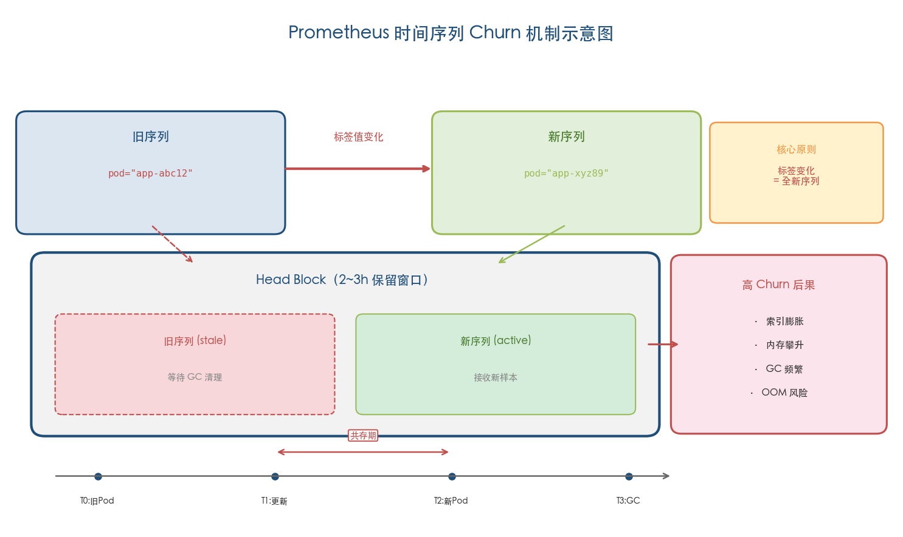

*图 1-1：Prometheus 时间序列 Churn 机制示意图。标签值变化创建全新序列，旧序列注入 stale marker 后等待 GC 清理；在 2–3 小时保留窗口内新旧序列共存，高 Churn 导致索引膨胀、内存攀升与 OOM 风险。*

### 1.3.3 持久化 Block 索引的稀疏化

TSDB 持久化 block 的索引采用 Symbol Table + Postings Lists 结构：Symbol Table 存储所有唯一的标签名和标签值字符串，Postings Lists 为每个标签键值对维护一个序列 ID 列表。在高流失率环境下，每个 2 小时的 block 中包含大量生命周期极短的序列——它们仅存在数分钟甚至数秒即被标记为 stale。这导致三重退化：Postings 列表严重稀疏化（大量条目仅指向一两个样本的序列）、Symbol Table 膨胀（涌入大量短暂存在的标签值）、以及索引整体体积显著增大[Ganesh Vernekar 系列博文 Part 4](https://ganeshvernekar.com/blog/prometheus-tsdb-persistent-block-and-its-index/ "Prometheus TSDB Persistent Block and its Index")。

## 1.4 Kubernetes 云原生环境中的典型 Churn 成因

Grafana Labs 指出，Kubernetes 多层抽象（Pod / Container / Node / Namespace）天然产生高基数，而短暂工作负载的特性进一步加速序列更替[Grafana Labs 博文](https://grafana.com/blog/what-is-high-cardinality-and-is-it-as-scary-as-people-make-it-out-to-be-/ "What is high cardinality — Grafana Labs")。根据触发机制和影响模式的不同，可将导致高流失率的典型场景归纳为以下六类。

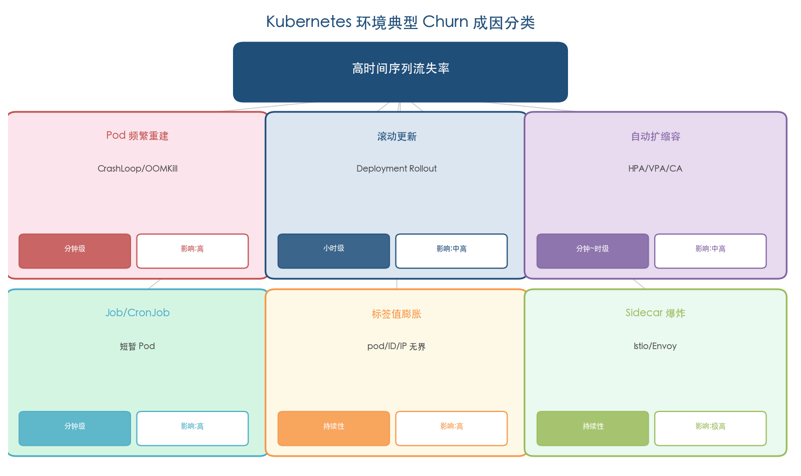

*图 1-2：Kubernetes 环境典型 Churn 成因分类矩阵。六类成因按发生频率（分钟级至持续性）和影响等级（中高至极高）分类，涵盖从 Pod 级生命周期事件到服务网格维度爆炸的完整成因图谱。*

### 1.4.1 Pod 频繁重建（CrashLoopBackOff / OOMKill）

当应用进入 CrashLoopBackOff 状态或因 OOMKill 反复重启时，每次重启的 Pod 将获得新的名称后缀（例如从 `my-app-7b9f4-xk2jp` 变为 `my-app-7b9f4-m3nq8`），所有包含 `pod` 标签的指标序列随之被全量替换。Prometheus 社区讨论记录了这一模式对采集性能的直接冲击[Prometheus-users 邮件列表讨论](https://groups.google.com/g/prometheus-users/c/wRtG7zq6sZ4 "performance impact of high churn rate")。

### 1.4.2 滚动更新（Rolling Update）

Deployment 执行滚动更新时，新旧 ReplicaSet 交替创建和销毁 Pod，每个新 Pod 携带全新的 `pod` 名称和 `instance`（IP:Port）标签值，所有以这些标签为维度的指标序列经历一轮完整流失。对于拥有数百个副本的大型 Deployment，一次常规更新即可在数分钟内触发数万条序列的同时更替[Grafana Labs 博文](https://grafana.com/blog/how-to-manage-high-cardinality-metrics-in-prometheus-and-kubernetes/ "How to manage high cardinality metrics")。

### 1.4.3 自动扩缩容（HPA / VPA / Cluster Autoscaler）

水平 Pod 自动扩缩容（HPA）根据负载动态增减 Pod 副本数，每次扩缩引入或移除一批序列。垂直 Pod 自动扩缩容（VPA）通过驱逐（evict）Pod 并以新的资源请求规格重建来完成调整，同样触发序列更替。Cluster Autoscaler 增减节点时则会导致 Pod 迁移，进一步放大流失效应。在流量波动频繁的微服务架构中，上述自动扩缩操作可能每小时发生数十次[Grafana Labs 博文](https://grafana.com/blog/how-to-manage-high-cardinality-metrics-in-prometheus-and-kubernetes/ "How to manage high cardinality metrics")。

VPA 引发 churn 的破坏力已在生产环境中得到实证。Adevinta 公司运营着 30 多个 Kubernetes 集群、约 9 万个 Pod 的大型平台 SCHIP。2025 年 2 月，VPA Updater 因隐藏的 API 速率限制配置（`kube-api-qps` 默认仅 5）导致 Admission Controller 无法正常注入注解，引发 Pod 无休止驱逐循环。大量 Pod 持续被驱逐和重建所产生的序列流失直接导致 Prometheus 指标高基数，最终 Prometheus 本身因内存溢出被 OOMKill，整个集群的可观测性全面崩溃[Tanat Lokejaroenlarb 技术博客](https://tanatloke.medium.com/when-verticalpodautoscaler-goes-rogue-how-an-autoscaler-took-down-our-cluster-020ff80660a1 "When VerticalPodAutoscaler Goes Rogue — Adevinta 生产事故，2025 年 2 月")。

### 1.4.4 Job 与 CronJob 的短暂生命周期

Kubernetes Job 和 CronJob 本质上是一次性或定时执行的短暂工作负载。每次 Job 执行创建全新 Pod，任务完成后 Pod 进入 Completed 状态，其对应序列被标记为 stale。高频 CronJob（例如每分钟执行一次）每次执行都产生一批新序列——若每次 Job 暴露 50 个指标，按每分钟执行一次计算，一小时内即创建 3,000 条新序列，而这些序列全部在数分钟内变为 stale[Grafana Labs 博文](https://grafana.com/blog/how-to-manage-high-cardinality-metrics-in-prometheus-and-kubernetes/ "How to manage high cardinality metrics — short running jobs")。

### 1.4.5 标签值的无界膨胀

在 Kubernetes 环境中，`pod` 名称、`container` ID、`instance` IP:Port 等标签值均为动态生成且没有上界。Brian Brazil 为此给出了明确的基数控制准则：任何单个指标在 `/metrics` 端点上的基数不应超过 10，超过 100 则需格外谨慎[Robust Perception 博文](https://www.robustperception.io/cardinality-is-key "Cardinality is key — Brian Brazil")。

`kube_pod_status_phase` 等 kube-state-metrics 指标在 Pod 状态每次变化时生成包含新状态标签值的序列。配合大量短运行 Job 和频繁的 Pod 状态转换，此类指标可产生显著的序列增长[Grafana Labs 博文](https://grafana.com/blog/how-to-manage-high-cardinality-metrics-in-prometheus-and-kubernetes/ "How to manage high cardinality metrics in Prometheus and Kubernetes")。

### 1.4.6 Service Mesh Sidecar 的维度爆炸

Istio 等服务网格为每个 Pod 注入 Envoy sidecar，其生成的 `istio_requests_total` 等多维指标天然具备高基数特征。AWS 给出的一个典型规模估算表明：50 个微服务 × 10 个实例 × 20 个 sidecar 指标 = 10,000 条基础指标，再叠加 `source`、`destination`、`response_code` 等标签维度的组合，实际基数可达数亿级别。Istio 社区在 telemetry v2 方案推进过程中也遭遇了严重的基数跳增问题[AWS 博文](https://aws.amazon.com/blogs/mt/how-to-reduce-istio-sidecar-metric-cardinality-with-amazon-managed-service-for-prometheus/ "How to reduce Istio sidecar metric cardinality") [Istio GitHub Issue #19090](https://github.com/istio/istio/issues/19090 "Huge cardinality jump with telemetry v2")。

当 Pod 因上述任何原因发生更替时，sidecar 指标的所有维度组合同步流失并重建，所产生的序列变动量可达应用自身指标的数十倍。

## 1.5 诊断 Churn：观测指标与分析工具

识别和量化 churn 是实施治理的前提。Prometheus 在不同层级提供了多种观测能力。

### 1.5.1 TSDB 内部指标

Prometheus 暴露以下三个核心指标用于观测 churn 动态：

- **`prometheus_tsdb_head_series`**（Gauge）：Head Block 中当前活跃序列总数，反映瞬时基数。
- **`prometheus_tsdb_head_series_created_total`**（Counter）：Head Block 中累计创建的序列总数。
- **`prometheus_tsdb_head_series_removed_total`**（Counter）：Head Block 中累计移除（GC）的序列总数。

通过 `rate(prometheus_tsdb_head_series_created_total[5m])` 可估算每秒创建新序列的速率，即流失率的直接量化指标。若 created 速率持续显著高于零，且与 removed 速率基本相当，说明系统处于持续高流失状态[VictoriaMetrics 作者 Aliaksandr Valialkin 博文](https://valyala.medium.com/prometheus-storage-technical-terms-for-humans-4ab4de6c3d48 "Prometheus storage: technical terms for humans")。

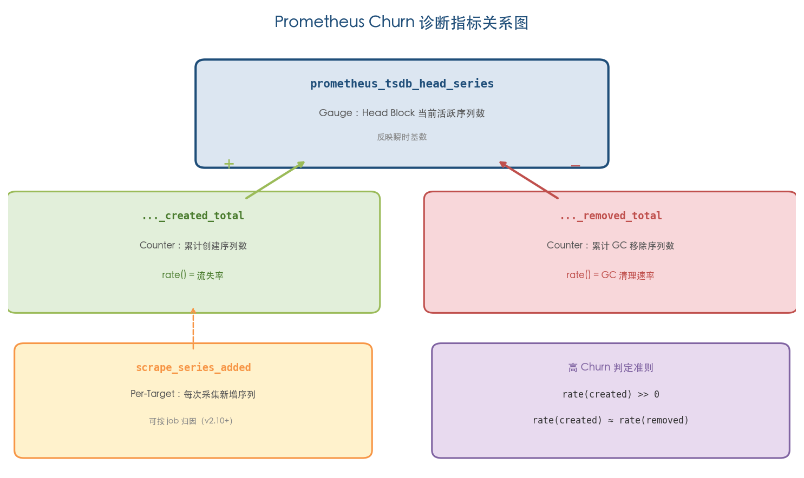

*图 1-3：Prometheus Churn 诊断指标关系图。`prometheus_tsdb_head_series`（Gauge）由 `_created_total` 的增量与 `_removed_total` 的减量共同决定；`scrape_series_added` 提供 Per-Target 级归因能力。右下角标注高 Churn 判定准则：rate(created) >> 0 且 rate(created) ≈ rate(removed)。*

### 1.5.2 Per-Target 级别的 Churn 定位

自 Prometheus v2.10 起引入的 `scrape_series_added` 指标提供了 per-target 级别的 churn 归因能力，记录每次 scrape 中新创建的序列数量，可按 `job` 标签聚合以定位高 churn 来源[VictoriaMetrics 作者 Aliaksandr Valialkin 博文](https://valyala.medium.com/prometheus-storage-technical-terms-for-humans-4ab4de6c3d48 "scrape_series_added 用于定位 churn 来源")。

OKD 官方文档给出了一条实用的 PromQL 查询模板用于定位 churn 热点：

```promql
topk(10, sum by(namespace, job) (sum_over_time(scrape_series_added[1h])))
```

该查询返回过去 1 小时内各 namespace/job 组合新增序列数量的 Top 10 排名，可快速锁定贡献最多流失的采集目标[OKD 文档](https://docs.okd.io/4.13/support/troubleshooting/investigating-monitoring-issues.html "Investigating monitoring issues")。

### 1.5.3 promtool tsdb analyze

`promtool tsdb analyze` 是 Prometheus 官方提供的 TSDB 离线分析工具，可诊断 churn 和 cardinality 问题。其输出中"Label pairs most involved in churning"部分展示各标签对的 sparseness 值——该值越高代表序列生命周期越短、churn 越严重。通过该工具可精确定位哪些标签维度是流失的主要驱动因素[Robust Perception 博文](https://www.robustperception.io/using-tsdb-analyze-to-investigate-churn-and-cardinality "Using tsdb analyze to investigate churn and cardinality")。

社区对 churn 跟踪能力的重视由来已久。2018 年 8 月，brancz 在 GitHub Issue #4547 中正式提议为 Prometheus 添加序列 churn 跟踪能力，该提案推动了后续 `scrape_series_added` 等诊断指标的引入[Prometheus GitHub Issue #4547](https://github.com/prometheus/prometheus/issues/4547 "Add ability to track series churn")。

## 1.6 小结

时间序列流失率是 Prometheus 在云原生环境中面临的核心挑战之一。其根源在于 Prometheus 数据模型中"标签值变化即创建新序列"的设计特性，叠加 Kubernetes 工作负载的高度动态性——Pod 频繁重建、滚动更新、自动扩缩容、短暂 Job、标签值无界膨胀以及 Service Mesh sidecar 的维度爆炸——共同构成了高流失率的典型成因图谱。

从 TSDB 内部机制来看，高流失率直接驱动 Head Block 倒排索引的持续膨胀与重建、持久化 block 索引的稀疏化，以及 staleness-GC 循环的频繁执行。这些机制层面的代价将在第 2 章中展开为具体的内存、CPU、磁盘、查询和告警层面的影响分析。

# 第2章 高流失率对 Prometheus 及其上下游的影响

高流失率（high churn rate）绝非仅存于理论讨论中的边缘问题。当序列更替速度超出 Prometheus TSDB 的设计舒适区后，其影响将沿内存、CPU、磁盘、网络、查询性能、告警可靠性和运营成本等维度同时展开连锁反应，并经由 Remote Write 管道向远程长期存储后端持续传导。本章从 Prometheus 自身 TSDB 的内部机制出发，逐层向上游采集链路和下游存储、查询、告警链路展开，系统分析高流失率在生产环境中造成的多维影响及其相互叠加机制。

## 2.1 内存消耗：Head Block 的膨胀与 OOM 风险

### 2.1.1 每序列内存开销的量化

Prometheus TSDB 的 Head Block 是内存中的活跃数据区域，所有新采集样本首先写入 Head Block。每条活跃时间序列在 Head Block 中均需维护倒排索引条目、chunk 数据和 WAL 记录等多项内存开销，因此序列数量直接决定了 Prometheus 的内存基线。

Prometheus 核心维护者 Ben Kochie 通过 `process_resident_memory_bytes / prometheus_tsdb_head_series` 给出了一个被广泛引用的经验值：典型场景下每序列内存占用约 8 KiB，据此推算，100 万活跃序列约需 8 GB 内存，1000 万活跃序列则需约 80 GB。[Prometheus-users 邮件列表（Ben Kochie 回复）](https://groups.google.com/g/prometheus-users/c/uaJKg5RcC3g "每序列约 8 KiB 的经验估算") 该数值涵盖进程级全部内存开销，包括倒排索引、标签哈希表、chunk 样本数据以及 Go 运行时自身分配。

Last9 的技术分析从更细粒度的数据结构拆解给出了另一组数字：每创建一条新序列需执行哈希计算、分配约 200 字节的 series struct、为每个标签创建 Postings 列表条目、写入 WAL、分配至少 128 字节的 chunk head——合计约 3-4 KB/活跃序列（仅序列元数据开销）。[Last9 技术分析](https://last9.io/blog/high-cardinality-metrics-prometheus-clickhouse/ "High Cardinality Metrics: How Prometheus and ClickHouse Handle Scale") 两组数字的差异源于统计口径不同：Ben Kochie 的 8 KiB 是进程级总内存均摊（含 chunk 样本数据和 Go runtime 开销），Last9 的 3-4 KB 则聚焦于序列注册时的元数据结构分配。在评估高流失率场景的内存影响时，两个口径均有参考价值——前者用于容量规划的粗粒度估算，后者用于理解每条新序列的边际成本。

### 2.1.2 高流失率下的内存膨胀机制

高流失率导致内存膨胀的核心机制在于：在 Head Block 的保留窗口（retention window，默认约 2-3 小时）内，新旧序列同时驻留内存。旧序列被注入 stale marker 后并不立即释放内存，而须等到 Head Block compaction 时由 GC 统一清理。因此，在任一 2 小时的 Head Block 窗口内，Head Block 中的总序列数远超任何"瞬时"活跃的序列数。

Coveo 公司的生产案例为这一机制提供了精确的量化观察。其集群包含 640 个 target、每秒摄取约 20,000 个 samples、瞬时活跃序列约 100 万条，但因高流失率导致 Head Block 中累积了 550 万条总序列——达到瞬时活跃数的 5.5 倍。Go profiler 分析揭示内存热点集中在四个函数：`index.(*decbuf).uvarintStr`（占 15.64%）、`seriesHashmap.set`（占 11.52%）、`newMemSeries`（占 8.03%）和 `(*MemPostings).Delete`（占 3.46%），这些均为高流失率直接驱动的索引创建与删除操作。[Coveo 技术博客](https://source.coveo.com/2021/03/03/prometheus-memory/ "Prometheus - Investigation on high memory consumption")

该案例最终的优化结果极为显著：仅通过 `metric_relabel_configs` 丢弃 kubelet/cadvisor 中的 `id` 标签（container ID，基数达 116,525），样本率降低 75%，Prometheus 内存使用从约 30 GB 降至约 8 GB（降幅达 73%）。[Coveo 技术博客](https://source.coveo.com/2021/03/03/prometheus-memory/ "Prometheus - Investigation on high memory consumption")

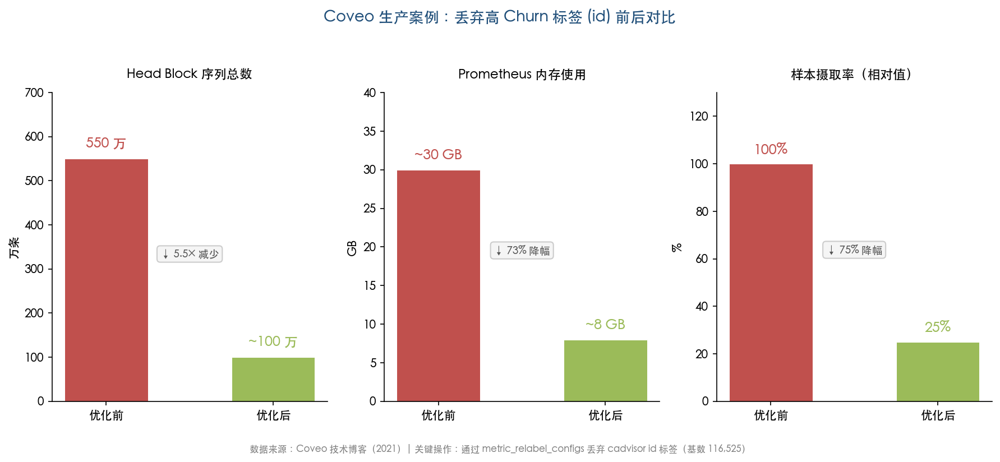

上图展示了 Coveo 案例中丢弃 cadvisor `id` 标签前后在 Head Block 序列总数、内存使用和样本摄取率三个维度上的显著变化，直观体现了单个高流失率标签对系统资源的巨大影响。

Last9 记录的另一案例同样印证了这一问题的严重性：某团队为调试目的添加了 `pod_id` 标签，200 个 Pod 各暴露 50 个指标，部署期间 Pod 平均每 2 分钟重建一次，导致每小时创建约 150,000 条新序列。Prometheus 内存在一周内从 8 GB 飙升至 32 GB，最终触发 OOMKill 并导致告警系统中断。[Last9 技术分析](https://last9.io/blog/high-cardinality-metrics-prometheus-clickhouse/ "High Cardinality Metrics")

此外，Prometheus v2.19.0 引入的 Head Block 内存映射（memory-mapping）机制在低流失率场景下可将内存使用降低 30-40%，但在高流失率场景下效果明显减弱，仅能降低约 10-20%。原因在于短命序列通常无法将 chunk 填满至 120 个样本的阈值，因而无法被 memory-map 到磁盘，该优化路径对其基本失效。[Grafana Labs 博文](https://grafana.com/blog/new-in-prometheus-v2-19-0-memory-mapping-of-full-chunks-of-the-head-block-reduces-memory-usage-by-as-much-as-40/ "Memory-mapping of full chunks — 高流失率场景仅降低 10-20%")

## 2.2 CPU 开销：GC 压力与倒排索引维护

高流失率在消耗内存的同时，也会显著加重 CPU 负担。Prometheus TSDB 的 Head Block 维护着一套完整的倒排索引（inverted index），涵盖 Symbol Table 和 Postings Lists 两大结构。每当新序列注册时，TSDB 需执行哈希计算、创建 series struct 并向多个 Postings 列表插入条目；当旧序列被标记为 stale 后，GC 阶段又需遍历并删除对应条目。在高流失率环境下，这一"创建→标记失活→GC 回收"的循环极其频繁，形成持续的 CPU 压力。

Percona 的基准测试清晰地观察到这一现象：约每 2 分钟出现一次 CPU 尖峰（spike），与 Go 垃圾回收（GC）高度相关；尖峰期间至少部分 CPU 核心完全饱和，甚至导致 Prometheus 自身的 `/metrics` 端点无法响应。[Percona 性能分析](https://www.percona.com/blog/prometheus-2-times-series-storage-performance-analyses/ "Prometheus 2 Times Series Storage Performance Analyses") 在高流失率场景下，大量短命对象的频繁创建和回收使 Go GC 的扫描和标记工作量成倍增加，CPU 尖峰的幅度和频率随之攀升。当 GC 暂停时间过长时，不仅影响 Prometheus 自身的采集和查询响应能力，还可能导致 scrape 超时，进一步触发 stale marker 注入、加剧流失率的恶性循环。

## 2.3 磁盘存储与压缩效率：短命序列的结构性劣势

### 2.3.1 Gorilla 压缩对短命序列的效率骤降

Prometheus TSDB 采用 Facebook Gorilla 论文提出的 XOR 差分压缩算法对时序样本进行编码。Gorilla 论文（VLDB 2015）报告该算法在理想条件下可将每数据点从原始 16 字节压缩至平均 1.37 字节，实现约 12 倍压缩比。[Gorilla 论文](https://www.vldb.org/pvldb/vol8/p1816-teller.pdf "Gorilla: A Fast, Scalable, In-Memory Time Series Database") Prometheus 官方存储文档同样表示，生产环境中每样本平均仅需 1-2 字节存储空间。[Prometheus 官方存储文档](https://prometheus.io/docs/prometheus/2.55/storage/ "Storage - 每样本平均 1-2 字节")

然而，这一优异压缩比的前提是序列具有足够长的生命周期，使连续样本之间的时间戳和数值差分趋于稳定。Last9 的分析揭示了短命序列与长命序列之间的巨大效率鸿沟：一条仅存活约 5 分钟的短命序列（按 15 秒采集间隔计算约产生 20 个样本）仍需约 500 字节的存储开销，压缩比仅约 2 倍；而一条存活 2 小时的长命序列（约 480 个样本）可被压缩至约 1-2 KB，压缩比达到约 10 倍。[Last9 技术分析](https://last9.io/blog/high-cardinality-metrics-prometheus-clickhouse/ "High Cardinality Metrics") 高流失率意味着存储中充斥大量短命序列，Gorilla 编码的整体压缩效率因此骤降，单位样本的实际存储成本显著上升。

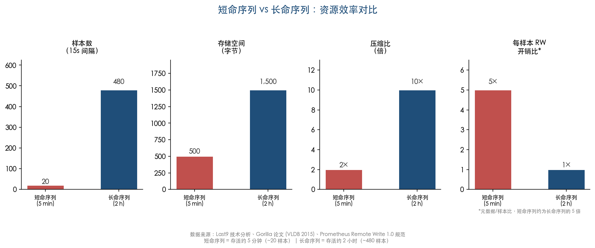

上图从样本数、存储空间、压缩比和 Remote Write 每样本元数据开销比四个维度对比了短命序列（存活约 5 分钟）与长命序列（存活约 2 小时）的资源效率差异，直观揭示高流失率导致短命序列在各项资源效率指标上的结构性劣势。

### 2.3.2 Compaction 开销的加剧

TSDB 持久化 block 的索引结构由 Symbol Table 和 Postings Lists 组成。在高流失率场景下，每个 2 小时 block 都包含大量短命序列，导致 Postings 列表严重稀疏化（每个标签值对应的序列 ID 列表中大部分条目在 block 时间范围内仅存在极短时间）、Symbol Table 膨胀（大量仅出现一次的标签值文本）、索引体积显著增大。[Ganesh Vernekar 系列博文 Part 4](https://ganeshvernekar.com/blog/prometheus-tsdb-persistent-block-and-its-index/ "Prometheus TSDB Persistent Block and its Index")

Percona 的基准测试进一步观察到 compaction 操作引发巨大的磁盘 I/O 和 CPU 尖峰，且 compaction 完成后大量操作系统页面缓存（Cached）被冲刷为 Free 状态——原本缓存的有价值查询数据被迫换出，间接影响后续查询性能。[Percona 性能分析](https://www.percona.com/blog/prometheus-2-times-series-storage-performance-analyses/ "Prometheus 2 TSDB Performance Analyses") Last9 总结指出，高流失率使写放大（write amplification）效应加剧：更多序列意味着更大的 Postings 列表、更难压缩的数据块，以及更频繁的 compaction 周期，形成磁盘 I/O 与 CPU 的双重负担。[Last9 技术分析](https://last9.io/blog/high-cardinality-metrics-prometheus-clickhouse/ "High Cardinality Metrics")

## 2.4 查询性能：从延迟恶化到超时崩溃

### 2.4.1 时间窗口越长，查询代价越高

高流失率对查询性能的影响遵循一个简单却极具破坏力的规律：在任意查询时间窗口内，基数（cardinality）只增不减。即使某一瞬间仅有 N 条序列处于活跃状态，在一个 24 小时的查询窗口内，由于旧序列不断过期、新序列持续创建，窗口内需扫描的唯一序列总数可达 N 的数倍甚至数十倍。Chronosphere 明确阐述了这一机制：查询回溯窗口越长，需扫描的唯一序列越多，即便瞬时基数完全可控的工作负载，在长窗口查询时性能也可能急剧恶化。[Chronosphere 博文](https://chronosphere.io/learn/how-cloud-native-workloads-affect-cardinality-over-time/ "How cloud native workloads affect cardinality over time")

Grafana Labs 同样确认了这一影响：随着数据库中序列数的增长，查询需要访问的序列数同步增加，"根本性地拖慢查询和可视化速度"，直接延长平均故障恢复时间（MTTR）。[Grafana Labs 博文](https://grafana.com/blog/how-to-manage-high-cardinality-metrics-in-prometheus-and-kubernetes/ "How to manage high cardinality metrics") 对于 SRE 团队而言，查询延迟从秒级恶化到分钟级意味着在故障响应的关键窗口期内无法快速获取诊断数据，直接影响事故处置效率。

### 2.4.2 倒排索引选择性崩塌

在 TSDB 的查询路径中，标签匹配器（label matcher）依赖倒排索引的 Postings 列表进行候选序列筛选。高流失率场景下，Postings 列表变得高度稀疏——每个标签值对应的序列 ID 列表中充斥着大量仅存在极短时间的条目，交集操作的计算效率因此骤降。更为关键的是，Prometheus 查询引擎缺乏基于值的谓词下推（value-based predicate pushdown）机制：每条经标签匹配器筛选出的候选序列都必须被完全加载并解压 chunk 数据后才能进行数值过滤，这使得稀疏 Postings 列表带来的额外 I/O 和 CPU 开销无法通过查询优化来规避。[Last9 技术分析](https://last9.io/blog/high-cardinality-metrics-prometheus-clickhouse/ "High Cardinality Metrics")

### 2.4.3 Staleness 对 PromQL 计算的影响

Prometheus 2.0 引入的 staleness 机制在序列失活时注入 stale marker。Brian Brazil 阐释了其对 PromQL 语义的具体影响：range vector 选择器（如 `rate()`、`avg_over_time()`）会完全忽略 stale marker，仅对非 stale 样本进行计算。[Robust Perception 博文](https://www.robustperception.io/staleness-and-promql "Staleness and PromQL") 在高流失率场景下，这一机制会导致 `rate()` 和 `increase()` 等关键计算函数在旧序列与新序列之间产生计算断裂——旧序列被标记为 stale 后其 counter 值被截断，新序列则从零重新计数。跨越序列边界的计算结果将出现不连续性乃至严重失真，对基于 counter 增长率的 SLI/SLO 计算和容量规划造成直接干扰。

## 2.5 WAL 膨胀与重启盲区

Write-Ahead Log（WAL，预写日志）是 Prometheus TSDB 保障数据持久性的关键机制——所有新样本在写入 Head Block 之前先持久化至 WAL。高流失率场景下，新序列的频繁注册使 WAL 中不仅记录了大量样本数据，还包含大量序列注册记录（series records），两者叠加导致 WAL 体积显著膨胀。

WAL 膨胀产生的最危险后果出现在 Prometheus 重启时——Prometheus 须完整重放（replay）WAL 以重建 Head Block 并恢复服务就绪状态。Michal Drozd 在生产环境中记录了一个极具警示意义的案例：高流失率集群中 WAL 重放导致 Prometheus Pod 长时间处于 Running 但 NotReady 状态，持续时间达 30-90 分钟，期间告警评估完全停止。更为危险的是，重放过程中的内存消耗远超稳态水平，极易触发 OOMKill；而 OOMKill 后 WAL 仍未被截断，由此形成"重启→OOM→重启"的死循环，使 Prometheus 陷入无法恢复的困境。[Michal Drozd 技术博客](https://www.michal-drozd.com/en/blog/prometheus-wal-replay-slow-startup/ "Prometheus WAL Replay Hell")

Percona 的基准测试提供了另一组参考数据：在约 100 万 samples/sec 的摄取速率下，使用 SSD 存储的 WAL 恢复耗时约 25 分钟，且恢复过程极度消耗内存。[Percona 性能分析](https://www.percona.com/blog/prometheus-2-times-series-storage-performance-analyses/ "Prometheus 2 TSDB Performance Analyses") 对于承担生产级监控职能的 Prometheus 实例而言，30-90 分钟的告警盲区意味着在此时段内任何基础设施故障都可能无法被及时发现和响应——这对高可用性要求严苛的生产环境构成了不可忽视的运营风险。

## 2.6 Remote Write 流量放大

### 2.6.1 协议层面的结构性开销

Remote Write 是 Prometheus 向远程长期存储后端传输数据的标准协议。Remote Write 1.0 规范明确要求"The complete set of labels MUST be sent with each sample"——每个样本都必须携带完整的标签集。[Prometheus Remote-Write 1.0 规范](https://prometheus.io/docs/specs/prw/remote_write_spec/ "Prometheus Remote-Write 1.0 specification") 对于短命序列，其元数据（标签集）开销与样本数据的比值远高于长命序列：一条存活 5 分钟的序列可能仅产生 20 个样本，但每个样本都须携带完整标签集，元数据的重复传输构成了显著浪费。

Grafana Labs CTO Tom Wilkie 在 2021 年 PromCON 上量化了这一差距："Remote write 1.0 每样本使用 2 到 10 字节进行传输，而 Prometheus 本地磁盘每样本仅使用 1 到 2 字节。"[Grafana Labs 博文](https://grafana.com/blog/how-prometheus-remote-write-v2-can-help-cut-network-egress-costs-by-as-much-as-50-/ "How Prometheus Remote Write v2 can help cut network egress costs by as much as 50%") Remote Write 链路的带宽开销因此可达本地存储的 5-10 倍，而在高流失率环境下标签重复率更低、Snappy/压缩字典效率更差，实际放大倍数可能进一步攀升。

### 2.6.2 Stale Markers 的流量翻倍效应

Remote Write 1.0 规范进一步要求发送方在序列失活时必须发送 stale markers。[Prometheus Remote-Write 1.0 规范](https://prometheus.io/docs/specs/prw/remote_write_spec/ "Prometheus Remote-Write 1.0 specification") 在大规模流失事件（例如一次滚动更新同时替换数百个 Pod）期间，stale marker 的数量可与正常样本相当——每条被替换的序列都需要发送一个携带完整标签集的 stale marker，实质使 Remote Write 流量在短时间内翻倍。这种突发性的带宽尖峰可能导致 Remote Write 队列积压（queue backlog），进而触发背压（backpressure）或样本丢弃。

### 2.6.3 Remote Write 内存开销的叠加

Prometheus 官方 Remote Write 调优文档明确指出，Remote Write 代码为 WAL 中的每条序列维护了一份序列 ID 到标签值的映射缓存。原文表述为："For each series in the WAL, the remote write code caches a mapping of series ID to label values, causing large amounts of series churn to significantly increase memory usage。"[Prometheus 官方 Remote Write 调优文档](https://prometheus.io/docs/practices/remote_write/ "Remote write tuning — churn 导致 remote write 内存额外放大") 在常规场景下，大多数用户报告 Remote Write 使 Prometheus 总体内存增加约 25%；但在高流失率环境中，由于短命序列的映射缓存频繁创建和淘汰，这一比例会显著上升，构成额外的内存压力来源。

### 2.6.4 Remote Write 2.0 的改进与局限

Remote Write 2.0（当前仍为实验性协议）引入了 symbols table 和 labels_refs 机制，通过字符串驻留（string interning）显著减少重复标签文本的传输量。[Prometheus Remote-Write 2.0 规范](https://prometheus.io/docs/specs/prw/remote_write_spec_2_0/ "Prometheus Remote-Write 2.0 specification") Grafana Labs 于 2026 年 2 月报告，将内部所有 Prometheus 监控工作负载从 Remote Write v1 迁移至 v2 后，网络出口流量降低超过 50%，CPU 和内存仅增加约 5%-10%。[Grafana Labs 博文](https://grafana.com/blog/how-prometheus-remote-write-v2-can-help-cut-network-egress-costs-by-as-much-as-50-/ "How Prometheus Remote Write v2 can help cut network egress costs by as much as 50%")

需要注意的是，v2 优化的核心在于标签文本的重复传输，而非序列生命周期管理。短命序列频繁创建和发送 stale markers 的根本问题并未消除——每条序列的创建与消亡仍然需要完整的元数据注册和注销流程。因此，Remote Write 2.0 虽然在带宽维度上提供了实质性改善，但高流失率场景下 Remote Write 的内存缓存膨胀和 stale marker 风暴问题仍需通过源头治理加以解决。

## 2.7 远程长期存储后端的成本传导

高流失率的影响并不止步于 Prometheus 自身——它经由 Remote Write 管道持续向所有下游远程存储后端传导，在存储成本和基础设施开销两个维度同时施压。

### 2.7.1 后端存储的结构性成本

无论是 Grafana Mimir/Cortex、Thanos 还是 VictoriaMetrics，其底层均沿用与 Prometheus TSDB 相似的时序数据模型——序列（series）是存储、索引和计费的基本单位。Last9 的分析指出，这些后端系统虽然在分布式架构、水平扩展和多租户隔离等方面各有优化，但没有任何一个能从根本上消除高流失率带来的基本成本权衡：更多的序列意味着更多的索引条目、更多的存储空间和更高的查询扫描开销。[Last9 技术分析](https://last9.io/blog/high-cardinality-metrics-prometheus-clickhouse/ "High Cardinality Metrics")

Grafana Labs 明确指出：基数增加直接意味着需要更多基础设施和计算资源，对可观测平台的运营支出产生即时影响。[Grafana Labs 博文](https://grafana.com/blog/how-to-manage-high-cardinality-metrics-in-prometheus-and-kubernetes/ "How to manage high cardinality metrics") Last9 在一个更具体的估算中给出了令人警醒的数字：在按活跃序列计费的托管 Prometheus 服务中，一个高基数标签可以一夜之间将月度账单提高 10 倍——例如，误将 `request_id` 作为标签可能导致每月额外产生约 50,000 美元的费用。[Last9 技术分析](https://last9.io/blog/high-cardinality-metrics-prometheus-clickhouse/ "High Cardinality Metrics")

### 2.7.2 联邦架构中的乘法效应

在联邦（federation）架构中，高流失率的传导呈现乘法效应。Chronosphere 指出，云原生工作负载的高流失率可轻易压垮传统 TSDB；在层级联邦或 Remote Write 架构中，上游的流失率通过 federation 端点或 Remote Write 链路传导至下游聚合层，基数膨胀呈乘数级放大——上游 N 个 Prometheus 实例各自的流失率在聚合层汇聚后，聚合层面临的有效基数可能达到各上游实例基数之和。[Chronosphere 博文](https://chronosphere.io/learn/how-cloud-native-workloads-affect-cardinality-over-time/ "How cloud native workloads affect cardinality over time")

Last9 进一步指出，分片（sharding）机制使问题在单节点层面变小，但总量不变。更为棘手的是，跨分片聚合查询可能在协调器（coordinator）处超出内存限制；而基于标签的一致性哈希分片在标签值分布不均时还可能产生热点。[Last9 技术分析](https://last9.io/blog/high-cardinality-metrics-prometheus-clickhouse/ "High Cardinality Metrics") 因此，分片和联邦本质上是将问题分散而非消除——高流失率的根因不解决，架构层面的横向扩展只能推迟而无法规避最终的资源瓶颈。

## 2.8 告警可靠性：从延迟触发到系统性漏报

高流失率对告警系统的影响最为隐蔽但也最为危险——它能够使告警从"延迟触发"逐步退化为"系统性漏报"，直接动摇可观测性体系的核心价值。

### 2.8.1 `for` 子句的重置陷阱

Prometheus 告警规则中的 `for` 子句用于指定告警条件必须持续满足的最短时间窗口，以过滤瞬时抖动产生的虚假告警。然而在高流失率场景下，这一设计产生了反直觉的副作用：当 Pod 被替换时，旧告警向量元素随旧序列一同消失，新 Pod 产生的新序列需要从头经历完整的 `for` 等待期。若流失率高于 `for` 持续时间——例如 Pod 平均每 3 分钟重建一次而 `for` 设为 5 分钟——告警将永远无法从 pending 状态进入 firing 状态，形成系统性的告警盲区。[Prometheus 官方告警规则文档](https://prometheus.io/docs/prometheus/latest/configuration/alerting_rules/ "Alerting rules — for 子句")

### 2.8.2 Staleness 导致的告警中断

Brian Brazil 指出了另一个隐蔽的告警风险：当 scrape 失败时，上一次采集到的所有序列会被标记为 stale，告警条件随之暂时不再满足，引发虚假的告警解除（false resolve）。[Robust Perception 博文](https://www.robustperception.io/staleness-and-promql "Staleness and PromQL") 在高流失率环境中，由于 target 的频繁更替本身就可能导致短暂的 scrape 中断（新 Pod 尚未就绪、服务发现延迟更新等），scrape 失败的概率显著增加。这意味着高流失率不仅通过 `for` 子句重置制造告警盲区，还通过 staleness 机制制造虚假解除，从两个方向同时侵蚀告警可靠性。

### 2.8.3 `keep_firing_for` 的出现佐证问题的普遍性

Prometheus 官方文档中 `keep_firing_for` 子句的描述——"防止因数据丢失导致的虚假解决"——其存在本身便佐证了 staleness/churn 导致告警虚假解除已成为社区公认的痛点。[Prometheus 官方告警规则文档](https://prometheus.io/docs/prometheus/latest/configuration/alerting_rules/ "Alerting rules — keep_firing_for 子句") 该子句允许告警在条件不再满足后继续保持 firing 状态一段时间，为流失率导致的序列中断提供了一定缓冲。然而其本质仍是一种权宜之计——它通过延长告警的"惯性"来掩盖序列断裂带来的信号丢失，并未从根源上解决高流失率对告警评估逻辑的破坏。

## 2.9 影响全景：从技术机理到业务后果

综合以上各节分析，高流失率的影响可归纳为一条贯穿 Prometheus 体系各层的因果链条。

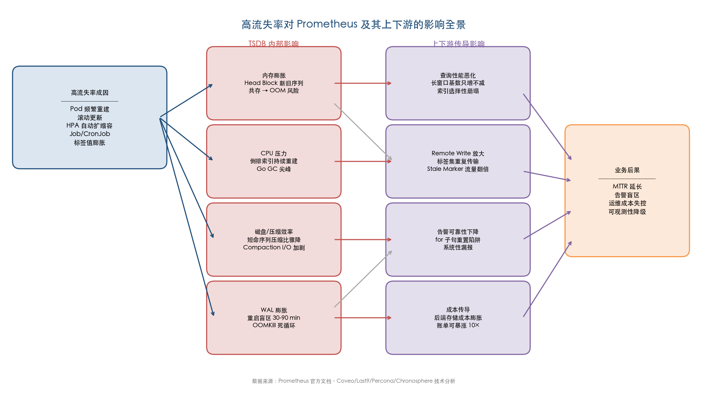

上图以从左至右的流程形式展示了高流失率从成因出发，经由 TSDB 内部影响向上下游传导，最终造成业务后果的完整因果链条。

在 **资源层面**，高流失率导致 Head Block 因新旧序列共存而内存膨胀、倒排索引的持续重建消耗大量 CPU、WAL 体积膨胀拖慢重启恢复、短命序列使 Gorilla 压缩效率骤降、compaction 过程加重磁盘 I/O 负担。

在 **数据管道层面**，Remote Write 1.0 协议要求每样本携带完整标签集造成元数据重复传输，序列失活时的 stale marker 发送使网络流量在流失事件期间成倍放大；Remote Write 代码的序列映射缓存进一步推高 Prometheus 内存使用；下游远程存储后端承受经放大后的摄取压力和存储成本。

在 **可观测性层面**，查询时间窗口内基数只增不减的特性导致长窗口查询性能急剧恶化，Postings 列表稀疏化叠加缺乏谓词下推使倒排索引效率崩塌，staleness 机制导致 `rate()`/`increase()` 等核心函数跨序列边界时产生计算断裂。

在 **运营层面**，WAL 重放盲区意味着 30-90 分钟的告警中断窗口，`for` 子句重置陷阱可能导致系统性漏报，联邦架构中流失率呈乘法效应传导，托管服务的月度账单可能因单个高基数标签而暴涨 10 倍。

我们认为，高流失率的根本挑战在于它同时作用于 Prometheus 体系的每一层——从 TSDB 内部数据结构到网络传输协议，再到告警评估逻辑和成本核算模型——且各层之间的影响相互叠加而非相互独立。这种全栈式的影响渗透使得任何单点优化都只能缓解部分症状；真正有效的治理方案必须是系统性的，需要从指标设计、标签治理、采集配置、架构选型到远程存储策略进行全链路协同优化。

# 第3章 缓解与治理高流失率的系统性方案

第2章系统分析了高流失率在内存、CPU、磁盘、查询性能、告警可靠性和运营成本等维度造成的连锁影响。本章围绕两条治理主线展开：**减少不必要的序列产生**（源头治理）与**降低已产生序列对系统的冲击**（过程缓解）。全章从指标设计与标签治理、Relabeling 策略、Prometheus 配置调优、Recording Rules 预聚合、架构层改进、远程写流控与准入策略、指标生命周期管理七个子方向切入，梳理可在生产环境落地的治理手段，并在末尾通过映射矩阵将每项方案与第2章的影响维度显式关联，帮助读者根据自身痛点选择最优治理组合。

## 3.1 指标设计与标签治理：从源头遏制序列膨胀

### 3.1.1 官方准则：基数控制的量化红线

源头治理是成本最低、效果最持久的手段。Prometheus 官方 Instrumentation 最佳实践文档给出了明确的基数控制准则——任何单一指标的标签基数应控制在 10 以内（"try to keep the cardinality of your metrics below 10"），当标签组合超过 100 时应考虑替代方案，例如使用 summary 或 histogram 替代多维 counter。[Prometheus 官方 Instrumentation 文档](https://prometheus.io/docs/practices/instrumentation/ "Instrumentation - cardinality below 10")

Brian Brazil 进一步阐释了标签基数的乘法效应：各标签维度的基数相乘决定该指标的总序列数。以一个 HTTP 请求指标为例，2 种 HTTP 方法 × 7 个路径 × 5 台机器 × 12 个直方图桶 = 840 条序列；若各维度仅各增加 1，序列总数即跳至 3 × 8 × 6 × 13 = 1,872 条，增幅超过 100%。[Robust Perception 博文](https://www.robustperception.io/cardinality-is-key "Cardinality is key") 这一乘法效应意味着，多维指标的设计阶段每增加一个标签维度都须经过严格的成本评估——维度数量的线性增长将引发序列数量的指数级膨胀。

### 3.1.2 标签治理实操规则

Kubernetes 云原生环境中的标签治理需要遵循以下实操原则：

**禁止将无界值作为标签。** User ID、Request ID、Session ID、Container ID、Pod IP 等值域无上界的标识符绝不应作为 Prometheus 标签。第2章记录的 Last9 案例表明，仅因添加一个 `pod_id` 标签，200 个 Pod 即导致每小时创建 150,000 条新序列，最终触发 OOMKill。[Prometheus 官方 Instrumentation 文档](https://prometheus.io/docs/practices/instrumentation/ "Instrumentation - Do not overuse labels")

**裁剪 Service Mesh Sidecar 指标维度。** Istio/Envoy sidecar 生成的 `istio_requests_total` 等多维指标是基数膨胀的高发区。AWS 场景中的估算显示，50 个微服务 × 10 个实例 × 20 个 sidecar 指标的基础组合即达 10,000 条，叠加 `source`、`destination`、`response_code` 等标签组合后基数可达数亿级别。[AWS 博文](https://aws.amazon.com/blogs/mt/how-to-reduce-istio-sidecar-metric-cardinality-with-amazon-managed-service-for-prometheus/ "How to reduce Istio sidecar metric cardinality") 可行的治理路径包括：通过 Istio Telemetry API 精简上报维度、使用 EnvoyFilter 裁剪冗余标签组合、或在 Prometheus 端通过 `metric_relabel_configs` 丢弃不需要的标签。

**精简直方图桶数量。** 直方图（histogram）的桶边界数量直接乘入总序列数。应根据 SLO（Service Level Objective）需求精简桶配置——例如仅保留 P50、P95、P99 对应的桶边界，而非沿用默认的全套桶设置。[Grafana Labs 博文](https://grafana.com/blog/how-to-manage-high-cardinality-metrics-in-prometheus-and-kubernetes/ "How to manage high cardinality metrics")

### 3.1.3 Grafana Labs 三步治理框架

Grafana Labs 提出了一套结构化的三步治理框架：

1. **获得可见性**——识别高基数指标和高流失标签，借助 `promtool tsdb analyze` 或 Grafana Cloud Cardinality Dashboard 定位问题根源。
2. **归因**——确定贡献最大的团队、环境与指标，建立基数成本的组织归属关系。
3. **优化**——调整 `scrape_interval`、精简直方图桶、丢弃未使用标签。

Grafana Labs 指出，将非关键指标的采集间隔从 15 秒提升至 60 秒可将成本降低高达 75%（"can reduce costs by up to 75%"）。[Grafana Labs 博文](https://grafana.com/blog/how-to-manage-high-cardinality-metrics-in-prometheus-and-kubernetes/ "How to manage high cardinality metrics - 三步治理框架") 该框架的核心价值在于将技术治理嵌入组织流程——基数治理不仅是 SRE 团队的职责，也需要应用开发团队在指标埋点阶段即予以配合。

## 3.2 Relabeling 策略：采集管道中的精准过滤

Relabeling 是 Prometheus 在采集管道中进行序列过滤和标签重写的核心机制。Brian Brazil 明确区分了两类 relabeling 的处理时机——"`relabel_configs` happens before the scrape, `metric_relabel_configs` happens after the scrape"。[Robust Perception 博文](https://www.robustperception.io/relabel_configs-vs-metric_relabel_configs "relabel_configs vs metric_relabel_configs") 在流失率治理中，二者分别承担不同角色，配合 `write_relabel_configs` 构成完整的三阶段过滤体系。

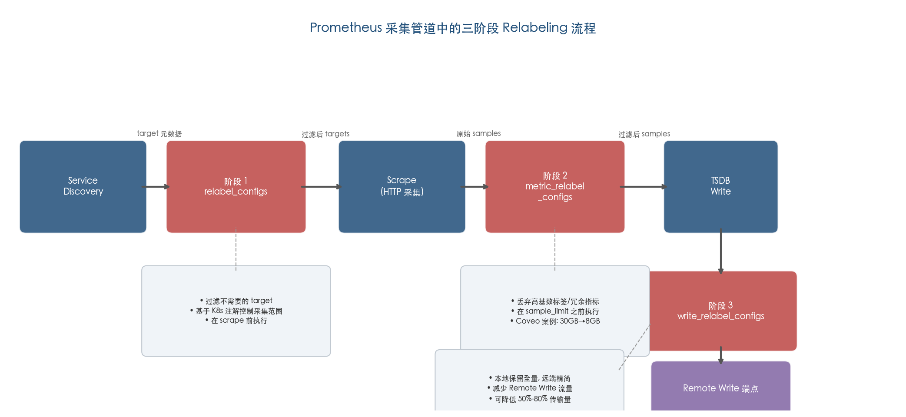

上图展示了从 Service Discovery 到 Remote Write 端点的完整数据流，标注了每个 Relabeling 阶段在流失率治理中的功能定位和典型效果。

### 3.2.1 三阶段 Relabeling 体系

Grafana Labs 系统性阐述了 Prometheus 的三阶段 Relabeling 体系：

**第一阶段：`relabel_configs`。** 在 scrape 执行前作用于 target 元数据，用于过滤不需要采集的 target。例如，可通过 `__meta_kubernetes_pod_annotation_prometheus_io_scrape` 注解控制哪些 Pod 被 Prometheus 发现和采集，从源头减少不必要的 target 数量。

**第二阶段：`metric_relabel_configs`。** 在 scrape 完成后、数据写入 TSDB 前执行，是丢弃高基数标签和冗余指标的主要手段。第2章中 Coveo 案例的治理正是通过 `metric_relabel_configs` 丢弃 cadvisor 的 `id` 标签实现的——仅此一项操作即将内存使用从约 30 GB 降至约 8 GB。

**第三阶段：`write_relabel_configs`。** 在数据发送到 Remote Write 端点前执行，可用于过滤高基数指标或将不同指标路由到特定的远程写目标（"filter metrics with high cardinality or route metrics to specific remote_write targets"）。[Grafana Labs 博文](https://grafana.com/blog/how-relabeling-in-prometheus-works/ "How relabeling in Prometheus works - 三阶段详解") 该阶段的独特价值在于：允许本地 Prometheus 保留全量数据用于实时告警和调试，同时仅将精简后的数据发送远程存储，从而减少 Remote Write 流量和远端存储成本。

### 3.2.2 Relabeling 与 sample_limit 的协同

`metric_relabel_configs` 在 `sample_limit` 检查之前执行。Brian Brazil 指出，可先通过 relabeling 丢弃不需要的序列以降低序列数，再由 `sample_limit` 作为最后的安全阀（"emergency release valve"）。[Robust Perception 博文](https://www.robustperception.io/using-sample_limit-to-avoid-overload "Using sample_limit to avoid overload") 这一协同策略的设计逻辑是：relabeling 负责精细化的标签治理，而 `sample_limit` 提供粗粒度的过载保护，二者缺一不可。

值得注意的是，Prometheus 社区讨论（GitHub Discussion #10598）中有用户报告：当高基数短命指标分布在多个 target 时，`sample_limit` 无法阻止 Head Block 被大量 stale 序列填满——该限制仅作用于单次 scrape 的样本数，不限制 Head Block 中序列的累积总量。[Prometheus GitHub Discussion #10598](https://github.com/prometheus/prometheus/discussions/10598 "Prometheus head series memory issues with high-cardinality ephemeral metrics") 这一局限性表明，`sample_limit` 是必要但不充分的保护手段，须与标签治理、Recording Rules 预聚合等机制配合使用。

## 3.3 Prometheus 自身配置调优

### 3.3.1 安全阀机制：sample_limit、target_limit 与 label_limit

Prometheus 提供了多层限制机制作为系统安全阀：

**`sample_limit`**——限定每次 scrape 可返回的最大样本数。超过阈值时整个 scrape 被视为失败（`up` 指标置为 0），属于"emergency release valve for a sudden increase in cardinality"，适用于紧急过载保护而非精细化配额管理。[Prometheus 官方配置文档](https://prometheus.io/docs/prometheus/latest/configuration/configuration/ "Configuration - sample_limit") [Robust Perception 博文](https://www.robustperception.io/using-sample_limit-to-avoid-overload "Using sample_limit to avoid overload")

**`target_limit`**——限制每个 `scrape_config` 中的 target 数量（实验性功能）。超过限制时 target 被标记为失败且不被抓取，可防止服务发现意外返回大量 target 导致采集规模失控。[Prometheus 官方配置文档](https://prometheus.io/docs/prometheus/latest/configuration/configuration/ "Configuration - target_limit，标注 experimental")

**`label_limit` 系列**——`label_limit`、`label_name_length_limit`、`label_value_length_limit` 三个参数在 metric-relabeling 之后检查，默认均无限制。用于防止应用端无意引入过多标签维度或超长标签值。[Prometheus 官方配置文档](https://prometheus.io/docs/prometheus/latest/configuration/configuration/ "Configuration - label_limit 系列参数")

上述三类限制机制共享"全有或全无"（all-or-nothing）特征——一旦触发，整个 scrape 或 target 被整体拒绝，不提供部分降级能力。相比之下，VictoriaMetrics 的 vmagent 提供了更精细的 per-target `series_limit` 机制（详见第5章），Prometheus 原生尚不具备类似能力。

### 3.3.2 WAL 压缩

`--storage.tsdb.wal-compression` 自 Prometheus 2.20.0 起默认开启，可将 WAL 体积减少约 50%。Prometheus 官方存储文档进一步指出，在控制资源消耗方面，减少序列数比拉长 `scrape_interval` 更为有效，原文表述为"reducing the number of series is likely more effective, due to compression of samples within a series"。[Prometheus 官方存储文档](https://prometheus.io/docs/prometheus/latest/storage/ "Storage - WAL compression 和摄取速率优化建议") 该官方建议直接印证了本章的核心论点：源头减少序列产生是最有效的治理方向。

### 3.3.3 Go GC 调优

Prometheus 的 `runtime.gogc` 默认值为 75（低于 Go 语言默认的 100），即堆内存增长 75% 时触发一次垃圾回收。[Prometheus 官方配置文档](https://prometheus.io/docs/prometheus/latest/configuration/configuration/ "Configuration - runtime.gogc 默认 75") 在高流失率场景下，进一步降低 GOGC 值（如设为 50）可以更频繁地回收短命序列占用的内存、压低内存峰值，但代价是 CPU 开销增加——第2章中 Percona 观测到的每 2 分钟 CPU 尖峰正是 GC 行为的直观体现。GOGC 调优需要在内存峰值控制与 CPU 利用率之间寻找适合自身工作负载的平衡点。

### 3.3.4 双重保留策略

时间保留（`--storage.tsdb.retention.time`）与大小保留（`--storage.tsdb.retention.size`）可同时配置，先触发者先生效。在高流失率场景下，建议缩短本地保留时间（例如从默认 15 天缩短至 2–3 天），同时通过 Remote Write 将数据发送至远程长期存储。该策略可加速本地过期 block 的清理，减少磁盘占用和 compaction 压力。[Prometheus 官方存储文档](https://prometheus.io/docs/prometheus/latest/storage/ "Storage - retention.time 和 retention.size")

### 3.3.5 OTLP 接收器的流失率警告

Prometheus 官方配置中 OTLP 接收器的 `promote_all_resource_attributes` 选项明确警告：将所有资源属性提升为标签会导致每次属性变化产生新序列，从而直接加剧流失率。[Prometheus 官方配置文档](https://prometheus.io/docs/prometheus/latest/configuration/configuration/ "Configuration - OTLP churn 警告") 随着 OpenTelemetry 在云原生监控领域的快速普及，这一警告具有重要的实践意义——在 OTLP 到 Prometheus 的转换路径上，须显式控制哪些资源属性被提升为标签，避免无意引入高流失率标签维度。

## 3.4 Recording Rules 与预聚合：将高基数压缩为低基数

### 3.4.1 Recording Rules 的核心治理价值

Recording Rules 的核心治理价值在于：通过预聚合将含有高流失标签（如 `pod`、`instance`、`container`）的高基数原始指标，压缩为仅保留稳定标签（如 `job`、`namespace`、`service`）的低基数聚合结果。[Prometheus 官方 recording rules 文档](https://prometheus.io/docs/prometheus/latest/configuration/recording_rules/ "Defining recording rules")

这一机制直接缓解第2章所分析的多个影响维度：

- **内存**：仪表板和告警查询低基数聚合指标，不再触发对高基数原始数据的全量加载。
- **查询性能**：聚合后的序列数量级远小于原始序列，长窗口查询不再面临基数只增不减的困境。
- **告警可靠性**：在稳定标签维度（如 `namespace`、`job`）上定义的告警不受 Pod 级流失率影响，`for` 子句不会因 Pod 替换而被重置。

### 3.4.2 命名规范与聚合最佳实践

Prometheus 官方推荐的 recording rules 命名规范为 `level:metric:operations`，其中 `level` 表示聚合后保留的标签层级，`metric` 为原始指标名，`operations` 为所应用的聚合函数。[Prometheus 官方 recording rules 最佳实践](https://prometheus.io/docs/practices/rules/ "Recording rules - level:metric:operations 命名规范")

在聚合操作中须遵循两个关键原则：

1. **优先使用 `without` 而非 `by`**——聚合时应通过 `without` 子句显式指定需要聚合掉的标签（如 `without(pod, instance, container)`），而非使用 `by` 子句列举保留标签。这一做法可确保 `job` 等有用标签被自动保留，且不会因上游新增标签而遗漏聚合。
2. **对比率指标分别聚合分子和分母**——例如错误率应先分别对错误计数和总请求计数执行 `sum(rate(...))`，再相除，而非先计算单点比率再聚合。

### 3.4.3 Recording Rules 的安全机制

`rule_group` 级别的 `limit` 参数可限制单个规则组产生的序列数量。当规则产生的序列数超过限制时，该组所有序列被丢弃并记录评估错误。[Prometheus 官方 recording rules 文档](https://prometheus.io/docs/prometheus/latest/configuration/recording_rules/ "Defining recording rules - rule_group limit 参数") 这一安全机制可有效防止 recording rules 自身因表达式编写不当而成为新的序列爆炸源。

## 3.5 架构层改进：联邦、分片与 Agent 模式

当单实例 Prometheus 的配置调优已无法满足业务增长和流失率控制需求时，架构层面的改进成为必要选择。下图展示了从单实例到分布式架构的渐进式扩展决策路径。

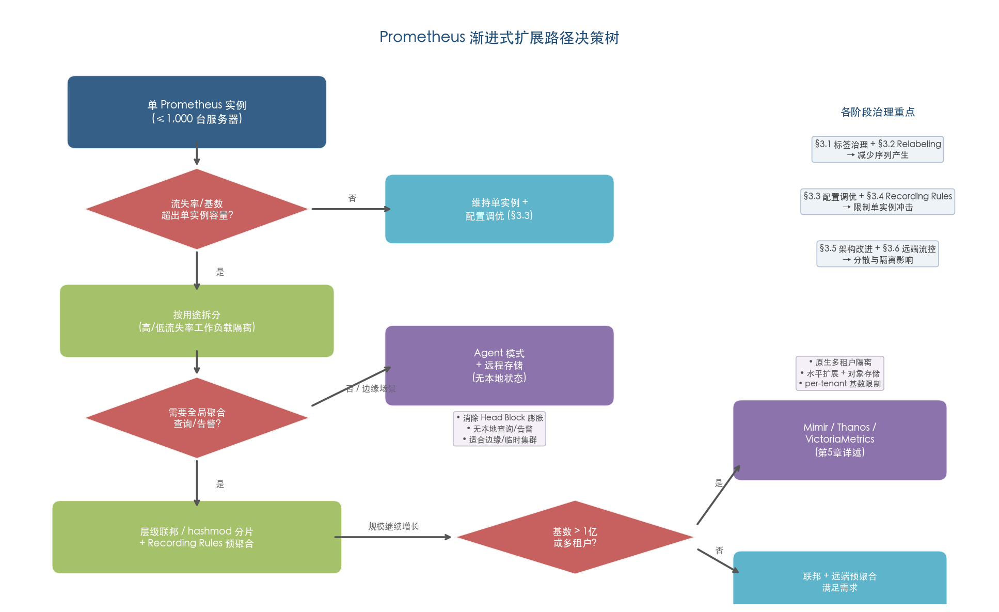

### 3.5.1 层级联邦：通过聚合减少流失率传导

第2章指出，联邦架构中高流失率的传导呈乘法效应。层级联邦（hierarchical federation）提供了一种结构性的缓解方案：全局 Prometheus 从下级实例仅收集预聚合的时间序列，而非全量原始数据。[Prometheus 官方联邦文档](https://prometheus.io/docs/prometheus/latest/federation/ "Federation - hierarchical federation")

具体实施路径为：下级 Prometheus 通过 recording rules 完成预聚合后，仅将聚合结果经 `/federate` 端点暴露给上级。由此，即便下级集群存在高流失率，上级全局 Prometheus 仅接收稳定的聚合序列，流失率在联邦边界处被显著衰减。

### 3.5.2 渐进式扩展路径

Brian Brazil 提出了 Prometheus 的渐进式扩展路径：单 Prometheus → 按用途拆分 → hashmod 分片 + leader 联邦。他指出，单个 Prometheus 实例可处理约 1,000 台服务器规模的监控负载。[Robust Perception 博文](https://www.robustperception.io/scaling-and-federating-prometheus "Scaling and Federating Prometheus")

在高流失率场景下，按用途拆分（functional sharding）尤为有效：将高流失率工作负载（如频繁重建的 Job/CronJob、CI/CD pipeline）与低流失率工作负载（如长期运行的数据库、中间件）分配到不同的 Prometheus 实例。高流失率的影响由此被隔离在专用实例中，不会拖累其他工作负载的监控稳定性。

### 3.5.3 Agent 模式：无状态采集与前向传输

Prometheus Agent 模式（自 v2.32.0 起正式集成）提供了一种根本性不同的运行范式：禁用查询、告警和本地存储功能，替换为自定义的精简 TSDB WAL。采集的数据在成功写入远程存储后立即删除，内存占用仅为正常模式的一小部分。[Prometheus 官方 Agent Mode 文档](https://prometheus.io/docs/prometheus/latest/prometheus_agent/ "Prometheus Agent Mode")

Agent 模式对流失率治理的价值体现在三个层面：

1. **消除 Head Block 膨胀**——不维护完整的 Head Block 和倒排索引，短命序列不会在本地累积。
2. **降低内存占用**——仅保留 WAL 和 Remote Write 队列所需内存，资源需求大幅收窄。
3. **易于水平扩展**——本质无状态，可根据采集规模灵活扩缩容。

该模式由 Grafana Labs 工程师 Robert Fratto 于 2019 年创建，经 Grafana Agent（现已演进为 Grafana Alloy）大规模生产验证后集成进 Prometheus 上游，特别适用于边缘集群、受限网络和大量临时集群等场景。[Prometheus 官方博文](https://prometheus.io/blog/2021/11/16/agent/ "Introducing Prometheus Agent Mode")

Agent 模式的局限性同样需要明确认知：无本地查询能力、不支持 recording rules、不支持告警。所有预聚合和告警评估须在远程存储端执行，这实质上将采集端的流失率治理压力转移到了远端——远端系统必须具备足够的基数处理能力和告警评估能力。[Prometheus 官方 Agent Mode 文档](https://prometheus.io/docs/prometheus/latest/prometheus_agent/ "Prometheus Agent Mode - limitations")

## 3.6 远程写与远程存储端的流控与准入策略

### 3.6.1 Remote Write 队列调优

第2章分析了 Remote Write 在高流失率下的流量放大效应和内存开销叠加问题。`queue_config` 提供了调节 Remote Write 行为的核心参数集：`capacity`（建议设为 `max_samples_per_send` 的 3–10 倍）、`max_shards`（并行发送的最大分片数）、`min_shards`（最小分片数）、`max_samples_per_send`（默认 2,000，每批次发送的最大样本数）以及 `batch_send_deadline`（强制发送的最大等待时间）。[Prometheus 官方 Remote Write 调优文档](https://prometheus.io/docs/practices/remote_write/ "Remote write tuning - queue_config 参数")

Prometheus 官方文档明确揭示了 Remote Write 与流失率之间的内存放大关系——"For each series in the WAL, the remote write code caches a mapping of series ID to label values, causing large amounts of series churn to significantly increase memory usage"。[Prometheus 官方 Remote Write 调优文档](https://prometheus.io/docs/practices/remote_write/ "Remote write tuning - churn 导致 remote write 内存额外放大") 在高流失率场景下，Remote Write 的内存缓存中充斥大量已标记为 stale 但尚未清理的序列映射，导致内存增幅远超正常场景下的 25% 基线。

### 3.6.2 write_relabel_configs：远程写端的最后过滤层

`write_relabel_configs` 是 Remote Write 管道中的最后一道过滤关卡，其核心价值在于允许本地保留全量数据的同时，仅将精简后的数据发送至远程存储。[Grafana Labs 博文](https://grafana.com/blog/how-relabeling-in-prometheus-works/ "How relabeling in Prometheus works - write_relabel_configs")

在高流失率治理中，一种典型的 `write_relabel_configs` 策略是：丢弃仅用于本地调试的高基数指标（如详细的 container 级别指标），仅将服务级聚合指标发送远程存储。该策略在不牺牲本地调试能力的前提下，可将 Remote Write 流量减少 50%–80%。

### 3.6.3 远程存储端的多层准入控制（以 Grafana Mimir 为例）

远程存储端的准入控制是抵御高流失率冲击的最后防线。以 Grafana Mimir 为例，其 Distributor 组件提供了 per-tenant 的多层准入控制能力：

- **请求速率限制**——限制每秒写入请求数，防止突发洪峰。
- **摄取速率限制**——限制每秒摄取样本数，保护 Ingester 资源。
- **数据校验**——`max-label-names-per-series`（每序列最大标签数）、`max-length-label-name`（标签名最大长度）、`max-length-label-value`（标签值最大长度），从数据质量层面阻断异常序列。
- 超限时返回 HTTP 429，并支持 per-tenant 覆盖以实现差异化的资源分配。

[Grafana Mimir Distributor 文档](https://grafana.com/docs/mimir/latest/references/architecture/components/distributor/ "Grafana Mimir distributor - per-tenant rate limiting")

该多层准入控制机制的治理价值在于：即便上游 Prometheus 实例因配置疏忽或突发事件导致流失率暴涨，Mimir Distributor 的限流与校验仍可阻止异常流量冲击 Ingester，保障整个存储集群的稳定性。

## 3.7 指标生命周期管理与过期序列清理

### 3.7.1 Prometheus 原生的序列生命周期

Prometheus 原生的序列生命周期机制决定了短命序列的最低资源占用时长：任何序列一旦创建，至少在 Head Block 中滞留一个完整的 block 周期（约 2 小时），期间持续消耗内存。过期 block 的清理在后台异步进行，从序列失活到内存实际释放可能需要长达 2 小时。[Prometheus 官方存储文档](https://prometheus.io/docs/prometheus/latest/storage/ "Storage - block cleanup") 这意味着，在不改变 Prometheus 架构的前提下，无论一条序列的实际存活时间是 5 分钟还是 2 小时，它至少占用 2 小时的资源，这是流失率治理中不可绕过的硬性约束。

### 3.7.2 发现和清理未使用指标

Grafana Labs 开源的 `mimirtool` 工具提供了指标使用分析能力——通过对比仪表板（dashboard）、告警规则和 recording rules 中实际引用的指标，自动生成未使用指标列表。[Grafana Labs 博文](https://grafana.com/blog/how-to-manage-high-cardinality-metrics-in-prometheus-and-kubernetes/ "How to manage high cardinality metrics - mimirtool") 在大规模 Prometheus 部署中，未使用指标的比例往往超出预期：团队在调试阶段添加的临时指标、已下线服务遗留的指标、默认开启但从未被查询的 exporter 指标，均属清理候选对象。系统性地识别并丢弃这些指标，是降低序列总量和流失率影响的低成本高回报手段。

### 3.7.3 Grafana Adaptive Metrics：自动化的智能指标优化

Grafana Adaptive Metrics 代表了指标生命周期管理的更高级形态。该功能通过持续分析组织在 Grafana Cloud 中与指标的交互方式——涵盖仪表板、告警、recording rules 和即席查询——判断每个指标处于未使用、部分使用还是关键指标状态，进而自动推荐将低利用率指标聚合为低基数版本。[Grafana Labs Adaptive Metrics 文档](https://grafana.com/docs/grafana-cloud/adaptive-telemetry/adaptive-metrics/introduction/ "Introduction to Adaptive Metrics")

Adaptive Metrics 的工作流程涵盖四个阶段：（1）**分析**——自动检测指标的使用模式、类型、标签基数和流失率；（2）**推荐**——为未使用或部分使用的指标生成聚合建议，对已聚合但近期被查询的指标建议恢复原始粒度；（3）**执行**——基于用户审批或自动策略，在保证现有仪表板和告警不受影响的前提下降低持久化序列数；（4）**持续适应**——随使用模式变化动态更新推荐。[Grafana Labs Adaptive Metrics 文档](https://grafana.com/docs/grafana-cloud/adaptive-telemetry/adaptive-metrics/introduction/ "Introduction to Adaptive Metrics - How it works")

在生产效果方面，SailPoint 通过 Adaptive Metrics 将指标量减少 33%，Grafana Labs 整体报告的平均缩减比例达 35%。[Grafana Labs SailPoint 案例](https://grafana.com/success/sailpoint/ "SailPoint - cut metric volume by 33%") [Grafana Labs 博文](https://grafana.com/blog/how-to-aggregate-metrics-but-retain-critical-data-introducing-exemptions-in-adaptive-metrics/ "Adaptive Metrics - 35% reduction") 对于高流失率场景，Adaptive Metrics 具有独特优势：它能够自动发现那些因 Pod 频繁重建而产生大量短命序列、但实际仅在 `namespace` 级别被查询的指标，并推荐对应的聚合规则，从而在不损失可观测性的前提下显著降低序列数量。

## 3.8 治理方案与影响维度的因果映射

为帮助读者根据自身场景选择合适的治理手段，下图以热力图形式展示本章 13 种治理方案与第2章 7 个影响维度之间的对应关系，用颜色深浅区分强效、中等、间接和无关四个等级。

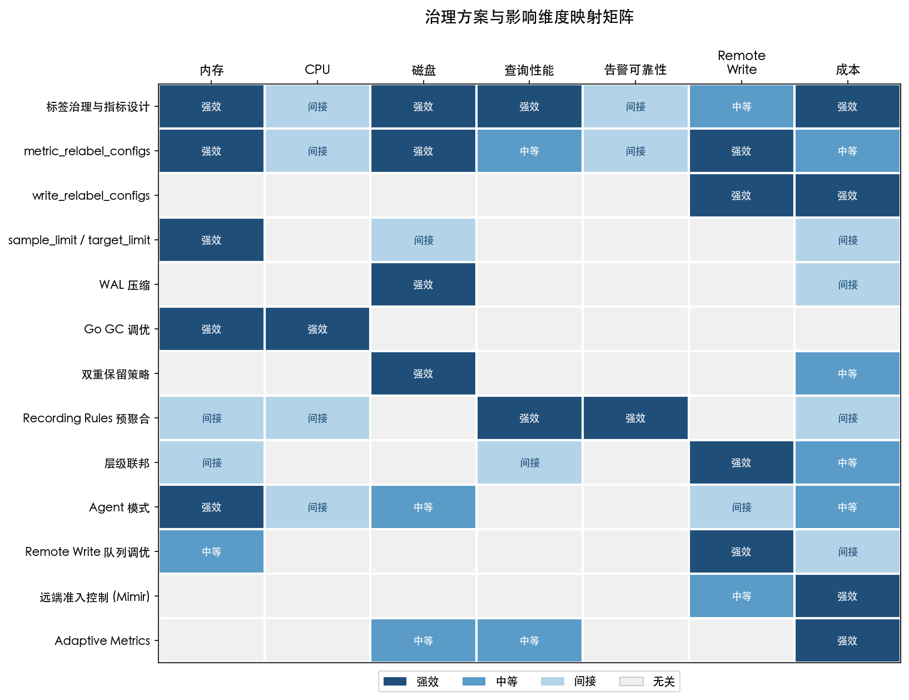

下表进一步以文字形式归纳各方案的核心治理机制：

| 治理手段 | 对应影响维度 | 治理机制 |
|---------|-----------|---------|
| 标签治理与指标设计 | 内存、磁盘、查询、成本 | 从源头减少序列总量，降低所有下游影响 |
| `metric_relabel_configs` | 内存、磁盘、Remote Write 流量 | 在 TSDB 写入前丢弃高基数标签和冗余指标 |
| `write_relabel_configs` | Remote Write 流量、远端成本 | 在远程写前过滤，减少传输量和远端摄取压力 |
| `sample_limit` / `target_limit` | 内存（OOM 保护） | 防止突发基数爆炸导致 Prometheus 崩溃 |
| WAL 压缩 | 磁盘、重启盲区 | 减少 WAL 体积约 50%，加速 WAL 重放 |
| Go GC 调优 | 内存峰值、CPU | 降低 GOGC 值以更频繁回收短命对象，降低峰值内存 |
| 双重保留策略 | 磁盘、Compaction 压力 | 缩短本地保留加速过期 block 清理 |
| Recording Rules 预聚合 | 查询性能、告警可靠性 | 在稳定标签维度聚合，消除 `for` 子句重置问题 |
| 层级联邦 | Remote Write 流量、联邦乘法效应 | 在联邦边界衰减流失率传导 |
| Agent 模式 | 内存（Head Block 膨胀）、重启盲区 | 消除本地 Head Block，数据写入后即删除 |
| Remote Write 队列调优 | Remote Write 内存放大 | 控制缓存大小和发送频率 |
| 远端准入控制（Mimir） | 远端稳定性、成本 | per-tenant 限流防止异常流量冲击存储集群 |
| Adaptive Metrics | 存储成本、查询性能 | 自动发现并聚合低利用率指标 |

我们认为，有效的流失率治理必须是多层次、体系化的——源头治理（标签设计与指标规范）减少问题的产生，过程控制（Relabeling、sample_limit）限制问题的传播，架构改进（联邦、Agent 模式）隔离问题的影响，而远端准入控制和指标生命周期管理则构成最后的安全网。任何单一手段都不足以应对生产环境中复杂多变的流失率场景，唯有将上述手段有机组合为分层治理策略，才能在保障可观测性完整性的前提下有效控制系统资源消耗和运营成本。

# 第4章 云厂商与商业产品的托管方案对比

第3章系统梳理了可在自建 Prometheus 环境中落地的七类治理手段。然而，对于缺乏专职基础设施团队或追求更高运维效率的组织而言，云厂商和商业产品提供的托管 Prometheus 方案往往是更具吸引力的选择——它们将底层 TSDB 的运维复杂性封装在服务层之后，用户只需关注指标的摄入与查询。但托管方案并非"开箱即忘"的万灵药：各平台在基数限额、治理工具、计费模型等维度的设计差异，决定了其在高流失率场景下的实际表现和成本可控性。

本章横向对比 AWS Amazon Managed Service for Prometheus（AMP）、GCP Managed Service for Prometheus（GMP）、Azure Monitor Managed Prometheus、Grafana Cloud、阿里云可观测监控 Prometheus 版和腾讯云 Prometheus 监控服务（TMP）六大方案，从基数/序列限额与配额机制、基数检测与标签治理工具、计费模型对高流失率场景的敏感度、数据保留期以及 SLA 可用性保障五个统一维度展开分析。

## 4.1 基数与序列限额：各厂商的"安全阀"设计

如第2章所述，高流失率场景下活跃时间序列数量可在短时间内急剧攀升——一次大规模滚动更新即可在数分钟内使活跃序列翻倍。托管方案的核心防线是活跃序列限额：超限时拒绝新序列摄入，防止单一租户或失控的指标源拖垮整个服务。然而，不同厂商对"活跃"的判定窗口（从 20 分钟到 24 小时不等）和限额粒度（全局 vs. per-resource vs. label-based）的设计差异显著，直接影响其在高流失率场景下的弹性表现。

### 4.1.1 AWS AMP：高天花板 + 细粒度标签限额

AWS AMP 在活跃序列限额方面提供了最高的天花板。截至 2025 年 7 月，其默认活跃序列限额从 1,000 万提升至 5,000 万/workspace，最大可通过 Service Quotas 申请至 10 亿/workspace；活跃序列的判定窗口为 2 小时，即过去 2 小时内收到过样本的序列计为活跃。[AWS AMP Quotas](https://docs.aws.amazon.com/prometheus/latest/userguide/AMP_quotas.html "AWS 官方配额文档") [AWS AMP 50M 公告](https://aws.amazon.com/about-aws/whats-new/2025/07/amazon-managed-service-prometheus-50M-default-activeserieslimit/ "2025 年 7 月默认限额提升至 50M") 摄取限流采用 token bucket 机制，默认速率为活跃序列限额的 1/30（即 5,000 万限额下约 166 万/秒），为突发摄入留出了充足的缓冲空间。[AWS AMP Quotas](https://docs.aws.amazon.com/prometheus/latest/userguide/AMP_quotas.html "token bucket 限流")

2025 年 4 月，AWS AMP 以 GA 状态发布了 label-based series limits 功能，允许用户按标签组合（如 `namespace`、`job`）为 workspace 的子集设置独立的活跃序列上限。[AWS AMP Label-Based Limits](https://aws.amazon.com/about-aws/whats-new/2025/04/amazon-managed-service-prometheus-label-based-series-limits/ "2025 年 4 月 GA 发布") 这一机制对高流失率治理意义重大：当某个服务因 CrashLoopBackOff 或频繁滚动更新导致序列爆炸时，受影响服务的配额被独立限制，不会耗尽全局配额、影响其他团队的监控可用性。

### 4.1.2 GCP GMP：per-resource 粒度 + Monarch 全局规模

GCP GMP 的限额策略采用 per monitored resource 粒度：每资源最多 100 万条 Prometheus 指标序列（活跃窗口 24 小时），另有每 project 25,000 个 metric descriptor 的限制。这些限额为系统级安全限制，不可由用户自定义调整。[GCP Cloud Monitoring Quotas](https://docs.cloud.google.com/monitoring/quotas "GCP 官方配额文档")

GMP 的后端采用 Google 内部 Monarch 时间序列数据库，官方声称可处理超 2 万亿活跃时间序列的全局规模。[GCP Managed Prometheus](https://cloud.google.com/managed-prometheus "Key features 描述") 对于需要超大基数支撑的场景，Monarch 的架构天花板远高于其他竞品。但值得注意的是，per-resource 100 万的前端限额意味着单一数据源不可能无限膨胀——这一设计在高流失率场景下既是保护机制，也可能成为约束：当单个 Kubernetes 集群的序列因频繁 Pod 重建而逼近 100 万上限时，超限序列将被直接拒绝。

### 4.1.3 Azure Monitor Managed Prometheus：保守默认值 + 审批扩展

Azure Monitor Managed Prometheus 的默认限额为每 workspace 100 万活跃序列，活跃窗口约 12 小时，默认摄取速率为 100 万事件/分钟。两项指标均可通过 ARM API 或工单申请增加，但超过 2,000 万 ActiveTimeSeries 需特殊审批。[Azure Monitor Service Limits](https://learn.microsoft.com/en-us/azure/azure-monitor/fundamentals/service-limits "Azure 官方服务限制文档") [Azure Monitor Workspace Ingest Limits](https://github.com/MicrosoftDocs/azure-monitor-docs/blob/main/articles/azure-monitor/metrics/azure-monitor-workspace-monitor-ingest-limits.md "Azure 文档 GitHub 仓库")

值得注意的是，Azure 存在一项与原生 Prometheus 行为不同的特性：标签值大小写不敏感——仅标签值大小写不同的两条序列被视为同一序列，可能导致用户预期之外的数据合并或丢弃。此外，每序列最多 63 个标签、标签名上限 511 字符、标签值上限 1,023 字符，任一限制被触发时该 scrape job 的所有指标均被丢弃，而非仅丢弃违规序列。[Azure Monitor Prometheus Details](https://learn.microsoft.com/en-us/azure/azure-monitor/metrics/prometheus-metrics-details "Azure 官方技术细节文档") 这种"全有或全无"的丢弃策略在高流失率场景下可能导致监控盲区扩大——一个违规标签即可导致整个 scrape job 的数据丢失。

### 4.1.4 Grafana Cloud：按活跃序列计量的弹性模式

Grafana Cloud 免费层提供 10,000 活跃序列（活跃窗口 20 分钟），Pro 层按量扩展，无硬性上限。[Grafana Cloud Pricing](https://grafana.com/pricing/ "Grafana Labs 官方定价") 其 20 分钟活跃窗口显著短于 AWS AMP 的 2 小时和 Azure 的 12 小时——序列在停止接收样本后更快"退出活跃"。然而，在持续高流失率场景下，新旧序列交替频繁，短窗口反而可能导致问题：若滚动更新间隔短于 20 分钟，则新序列与尚未过期的旧序列同时计为活跃，推高峰值计量值。这一特性与其按活跃序列计费的模型叠加，使 Grafana Cloud 在高流失率工作负载下面临独特的成本挑战（详见 4.3.2 节）。

### 4.1.5 阿里云与腾讯云：以上报量为限制维度

阿里云可观测监控 Prometheus 版未公开全局活跃时间线上限，而是通过 Agent 采集能力施加间接约束：单副本一次最多采集 350 万数据点、最大 5,000 个 Target。[阿里云 Prometheus 服务限制](https://help.aliyun.com/zh/arms/prometheus-monitoring/product-overview/service-limits "阿里云官方服务限制")

腾讯云 TMP 同样未公开活跃序列硬性上限，以上报数据量（百万条/日）作为主要限制和计费维度。[腾讯云 TMP 计费概述](https://cloud.tencent.com/document/product/1416/113555 "腾讯云官方计费概述")

两者的策略本质上将"序列限额"转化为"数据量限额"，在高流失率场景下缺乏精确到序列级别的配额控制。这意味着一次基数爆炸事件不会触发显式的序列限额告警，而是以数据量超限或 Agent 采集能力饱和的形式间接暴露，诊断链路相对较长。

下图从限额规模和活跃窗口两个维度，直观展示了各厂商在"安全阀"设计思路上的差异：

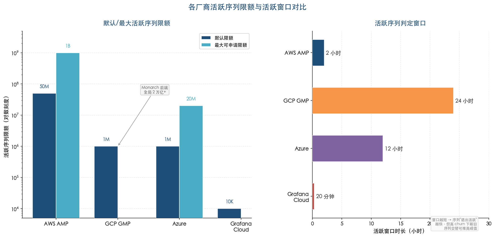

图中左面板以对数刻度呈现各厂商默认与最大活跃序列限额的量级差异——AWS AMP 的 10 亿上限较 Azure 默认 100 万高出三个数量级；右面板对比各厂商的活跃序列判定窗口，从 Grafana Cloud 的 20 分钟到 GCP GMP 的 24 小时，窗口越长意味着高流失率事件下新旧序列同时计为活跃的时间越久。

## 4.2 基数检测与标签治理工具：谁能帮你"看见"问题

高流失率的治理始于可见性——若无法识别哪些指标、哪些标签组合贡献了最多的短命序列，治理策略便无从落地。各厂商在基数分析和标签治理工具的成熟度上存在显著梯度差异。

### 4.2.1 Grafana Cloud：工具链最完整

Grafana Cloud 在基数治理工具链上最为成熟，提供从发现到优化的完整闭环能力：

1. **Cardinality Management Dashboard**——专用面板分析指标基数、识别高基数指标和标签，支持按标签维度进行成本归因，使团队能够快速定位哪些服务或指标贡献了最多的活跃序列。[Grafana Cloud Metrics Usage](https://grafana.com/docs/grafana-cloud/cost-management-and-billing/understand-usage-cost/metrics/ "Usage 监控功能")

2. **Adaptive Metrics（GA）**——自动分析并推荐将低利用率的高基数指标聚合为低基数版本。用户可通过交互式 UI、API 或 Terraform 应用聚合建议。Grafana Labs 官方宣传该工具可优化成本高达 80%；实际案例中，SailPoint 通过 Adaptive Metrics 将指标量减少 33%，Grafana Labs 内部报告平均缩减率为 35%。[Grafana Adaptive Metrics](https://grafana.com/docs/grafana-cloud/adaptive-telemetry/adaptive-metrics/ "官方 Adaptive Metrics 文档") [Grafana Labs SailPoint 案例](https://grafana.com/success/sailpoint/ "SailPoint - cut metric volume by 33%") 该工具的核心价值在于将第3章讨论的 Recording Rules 预聚合策略自动化——无需工程师手动编写聚合规则，系统即可识别并推荐可安全聚合的指标。

3. **Usage 与 Billing 面板**——实时展示活跃序列数、DPM（Data Points per Minute）、P95 峰值等计量指标，帮助用户在账单膨胀前识别异常趋势。

### 4.2.2 GCP GMP：Metrics Management 页面

GCP Cloud Monitoring 控制台中内置 Metrics Management 页面，可显示各指标的摄取量、标签和基数信息、读取次数、以及在告警和仪表板中的使用情况。用户可直接在该页面排除不需要的指标。[GCP Cloud Monitoring Quotas](https://docs.cloud.google.com/monitoring/quotas "Metrics Management 页面功能") 该工具满足"看见问题"的基本需求，但与 Grafana Cloud 相比，缺乏自动化推荐聚合或主动基数异常告警能力——用户仍需自行判断哪些指标应被聚合或丢弃。

### 4.2.3 AWS AMP：CloudWatch 集成 + 手动 PromQL

AWS AMP 自 2025 年 9 月起支持通过 Service Quotas 和 CloudWatch 监控活跃序列使用量并设置告警，配合 label-based series limits 可实现分组配额告警。[AWS AMP Quota Visibility](https://aws.amazon.com/about-aws/whats-new/2025/09/amazon-managed-service-prometheus-quota-visibility-aws-service-quotas-cloudwatch/ "2025 年 9 月发布") 然而，AWS AMP 没有内置 Cardinality Explorer 或类似 Adaptive Metrics 的自动化治理工具，用户需依赖 CloudWatch 的 DiscardedSamples 指标或手动编写 PromQL 检查基数。[AWS AMP Optimizing Ingestion](https://aws.amazon.com/blogs/mt/optimizing-metrics-ingestion-with-amazon-managed-service-for-prometheus/ "AWS 官方博文") 对于已深度使用 CloudWatch 生态的团队而言，这一集成路径自然顺畅；但对于希望获得开箱即用基数治理体验的团队，工具链的欠缺意味着需要投入额外的工程努力。

### 4.2.4 Azure、阿里云与腾讯云：基础监控为主

Azure 需通过 ActiveTimeSeries 和 Events Ingested Per Minute 等通用摄取指标配合告警规则发现配额问题，缺少专用 Cardinality Explorer。[Azure Monitor Workspace Ingest Limits](https://github.com/MicrosoftDocs/azure-monitor-docs/blob/main/articles/azure-monitor/metrics/azure-monitor-workspace-monitor-ingest-limits.md "Azure 文档 GitHub 仓库")

阿里云和腾讯云在其文档和控制台中提供了用量统计页面，但截至目前未提供专用的基数分析或标签治理工具。在高流失率场景下，这三家厂商的用户需要更多依赖第3章所述的自建 PromQL 监控方案（如 `rate(prometheus_tsdb_head_series_created_total[5m])`）和 relabeling 策略来主动识别和控制流失率。

## 4.3 计费模型对高流失率场景的敏感度

计费模型决定了高流失率事件对运营成本的传导方式，其影响可能远超单价差异。当前各厂商的计费模型可分为两大类：**按样本/数据点计费**和**按活跃序列计费**，二者在高流失率场景下的成本行为截然不同。

### 4.3.1 按样本计费：短命序列的"友好"模式

AWS AMP、GCP GMP、Azure Monitor Managed Prometheus、阿里云和腾讯云均采用按样本（或数据点）计费的核心模式。短命序列仅在其存活期间产生样本费用，不因新序列的注册而产生额外的基数费用——流失率本身不引入额外计费维度。

具体单价对比如下（以摄取计费为主轴，按各厂商基础档位）：

| 厂商 | 摄取单价（基础档） | 阶梯递减 | 存储费 | 查询费 |
|------|-------------------|---------|--------|--------|
| AWS AMP | $0.90/千万样本（前 20 亿） | $0.35/千万样本（20 亿–2500 亿） | $0.03/GB/月 | $0.10/十亿样本 |
| GCP GMP | $0.060/百万样本（前 500 亿） | $0.024/百万样本（5000 亿以上） | 含在摄取费中（24 个月免费保留） | 含在摄取费中 |
| Azure | $0.16/千万样本 | 无公开阶梯 | 含在摄取费中（18 个月保留） | $0.10/千万样本 |
| 阿里云 | 0.80 元/百万条（≤5000 万/日） | 0.25 元/百万条（>12 亿/日） | 标准版 90 天免费存储 | 无独立查询费 |
| 腾讯云 | $0.19/百万条（存储 15 天，≤2 亿/日） | $0.05/百万条（>15 亿/日） | 含在阶梯单价中（按存储时长区分） | 无独立查询费 |

[AWS AMP Pricing](https://aws.amazon.com/prometheus/pricing/ "AWS 官方定价页面") [GCP Managed Prometheus](https://cloud.google.com/managed-prometheus "GCP 官方产品页面定价表") [Azure Monitor Pricing](https://azure.microsoft.com/en-us/pricing/details/monitor/ "Azure 官方定价页面") [阿里云 Prometheus 计费](https://help.aliyun.com/zh/arms/prometheus-monitoring/product-overview/billing-description/ "阿里云官方计费文档") [腾讯云 TMP 按量计费](https://www.tencentcloud.com/zh/document/product/1116/43156 "腾讯云国际站按量计费文档")

在高流失率场景下，按样本计费的核心优势在于：短命序列的成本与其生命周期严格成正比。以一个 15 秒采集间隔为例，仅存活 5 分钟的序列产生约 20 个样本，而存活 2 小时的序列产生约 480 个样本——前者的费用仅为后者的 1/24。无论流失率多高，只要总样本数不变，成本即保持稳定。

### 4.3.2 按活跃序列计费：Grafana Cloud 的双刃剑

Grafana Cloud 采用按活跃序列 + DPM 的混合计费模型：免费层 10,000 活跃序列，Pro 层超出部分 $6.50/千序列/月，账单取活跃序列与总 DPM 两者中较大值，按 P95 计算。[Grafana Cloud Pricing](https://grafana.com/pricing/ "Grafana Labs 官方定价") [Grafana Cloud Metrics Usage](https://grafana.com/docs/grafana-cloud/cost-management-and-billing/understand-usage-cost/metrics/ "计量和计费文档")

在高流失率场景下，此模型存在显著的成本放大风险。以 20 分钟活跃窗口为例：假设一个服务每 10 分钟完成一次滚动更新（新旧 Pod 交替），则在任意 20 分钟窗口内，新序列和尚未过期的旧序列同时计为"活跃"，实际被计量的活跃序列数可达基线的 1.5 倍甚至更高。Last9 的分析指出，在托管 Prometheus 中按活跃序列计费时，一个高基数标签可一夜之间将账单提高 10 倍，例如 `request_id` 标签可能导致每月 50,000 美元额外成本。[Last9 技术分析](https://last9.io/blog/high-cardinality-metrics-prometheus-clickhouse/ "High Cardinality Metrics")

下图直观展示了不同滚动更新频率下，两种计费模型的成本放大效应差异：

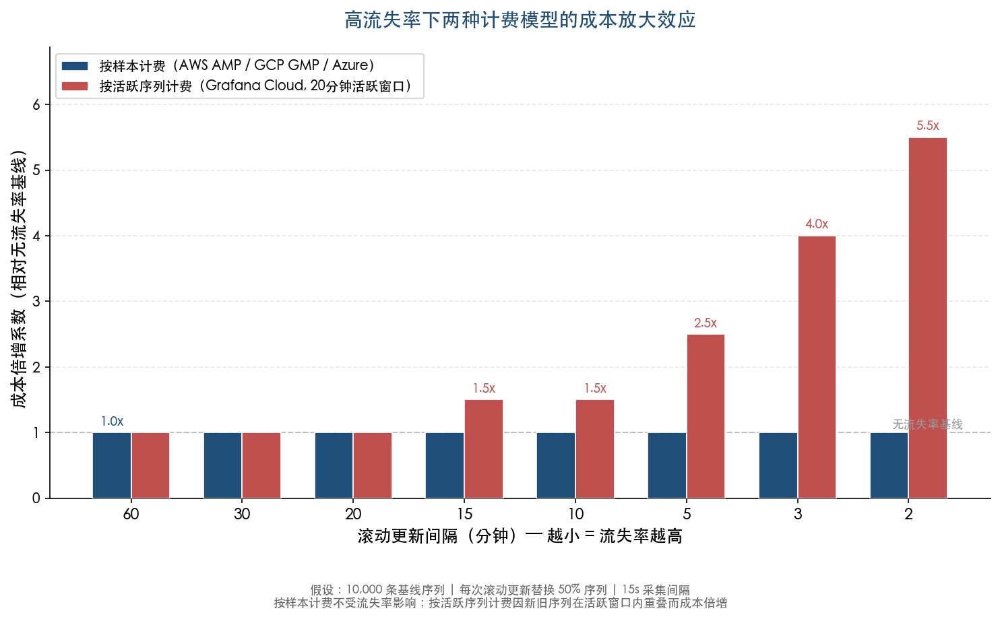

如图所示，按样本计费模型在所有滚动更新频率下均保持 1.0x 的成本倍增系数——流失率不影响成本。而按活跃序列计费模型随着滚动更新间隔从 60 分钟缩短至 2 分钟，成本倍增系数从 1.0x 攀升至 5.5x。Grafana Cloud 通过 Adaptive Metrics 工具在一定程度上缓解了这一问题，但计费模型本身对高流失率工作负载并不"友好"。

### 4.3.3 免费额度对比

免费额度的大小直接影响中小规模团队的评估门槛和初期使用成本。各厂商的免费额度差异如下：

| 厂商 | 免费额度 |
|------|---------|
| AWS AMP | 每月 4,000 万样本摄取 + 10 GB 存储 + 2 亿样本查询 |
| GCP GMP | 前 500 亿样本 $0.060/百万（无明确免费层） |
| Azure | 无专项免费层（Azure Monitor 整体有部分免费额度） |
| Grafana Cloud | 10,000 活跃序列（含 50 GB Logs、50 GB Traces 等） |
| 阿里云 | 基础指标免费 + 自定义指标 50 GB/月写入量免费（或每实例每日 50 万条免费上报） |
| 腾讯云 | 部分基础指标 15 天免费存储 |

## 4.4 数据保留期对比

数据保留期决定了用户可以回溯多长时间窗口的监控历史。在高流失率环境中，较长的保留期意味着更多短命序列的历史数据被持久化——如第2章所述，高流失率下短命序列在查询时窗口越长、扫描的唯一序列越多，存储成本和查询开销均随之上升。因此，保留期的选择不仅是存储成本问题，更直接影响查询性能。

| 厂商 | 保留期 | 备注 |
|------|--------|------|
| AWS AMP | 最长 1,095 天（3 年），可配置 | 默认保留期可通过 workspace 配置调整 |
| GCP GMP | 24 个月 | 含自动降采样，无额外存储费 |
| Azure | 18 个月 | 不可更改 |
| Grafana Cloud | Pro 层 13 个月 | 超出部分按存储费另计 |
| 阿里云 | 标准版 90 天、旗舰版 180 天热存储（免费）；支持归档存储扩展 | 归档存储另计费 |
| 腾讯云 | 15 天–2 年可选 | 不同存储时长对应不同摄取单价 |

[AWS AMP 文档](https://docs.aws.amazon.com/prometheus/latest/userguide/what-is-Amazon-Managed-Service-Prometheus.html "AWS 官方文档——保留期最长 1095 天") [GCP Managed Prometheus](https://cloud.google.com/managed-prometheus "24 个月保留 + 降采样") [Azure Monitor Service Limits](https://learn.microsoft.com/en-us/azure/azure-monitor/fundamentals/service-limits "18 个月保留期") [阿里云 Prometheus 计费](https://help.aliyun.com/zh/arms/prometheus-monitoring/product-overview/billing-description/ "热存储时长与版本关系") [腾讯云 TMP 按量计费](https://www.tencentcloud.com/zh/document/product/1116/43156 "存储时长与单价关系")

GCP GMP 在保留期维度具有显著优势：24 个月数据保留且无额外存储费，同时内置自动降采样机制，有效平衡长期保留与查询效率。AWS AMP 提供最长 3 年的保留期配置，是所有方案中天花板最高的，但存储费用（$0.03/GB/月）随保留时长线性增长，高流失率环境下需谨慎评估长保留期的成本影响。Azure 的 18 个月固定保留期不可调整，灵活性最低。腾讯云的阶梯定价将存储时长与摄取单价绑定，用户在选择存储时长时需综合权衡性价比。

## 4.5 SLA 可用性保障

可观测性平台的可用性直接影响告警和故障响应的可靠性。如第2章分析，高流失率本身可导致 Prometheus 重启缓慢、告警评估中断等可用性问题。选择托管方案的一个核心考量正是将这些可用性风险转移给服务提供商。各厂商的 SLA 承诺反映了其对可用性的底线保障：

| 厂商 | SLA 可用性承诺 | 不达标赔偿 |
|------|---------------|-----------|
| AWS AMP | 99.9% | <99.9% 赔 10%，<99.0% 赔 25%，<95.0% 赔 100% |
| GCP GMP（Cloud Monitoring） | 99.95% | 按 GCP Cloud Observability SLA 执行 |
| Azure Monitor Managed Prometheus | 99.9% | <99.9% 赔 10%，<99.0% 赔 25% |
| Grafana Cloud | 99.5%（标准 SLA） | 按 Grafana Cloud SLA 执行 |

[AWS AMP SLA](https://aws.amazon.com/prometheus/sla/ "AWS 官方 SLA 文档") [GCP Cloud Observability SLA](https://cloud.google.com/operations/sla "GCP 官方 SLA——99.95%") [Azure Monitor SLA](https://www.azure.cn/en-us/support/sla/monitor/ "Azure Monitor SLA——99.9%") [Grafana Cloud SLA](https://grafana.com/legal/grafana-cloud-sla/ "Grafana Cloud Standard SLA——99.5%")

阿里云和腾讯云的 Prometheus 监控服务 SLA 条款在其官方文档中未单独公开专项可用性承诺，通常适用各自云平台的通用服务条款。

GCP 以 99.95% 提供了最高的 SLA 承诺（相当于每月不超过约 22 分钟的不可用时间），AWS 和 Azure 均为 99.9%（每月约 43 分钟）。Grafana Cloud 的标准层 SLA 仅 99.5%，意味着每月允许约 3.6 小时的不可用时间——对于依赖该平台进行关键告警的场景，这一差距值得审慎评估。需要强调的是，SLA 承诺和实际可用性是两个不同概念：SLA 定义的是违约赔偿的触发阈值，而非系统实际运行的可用性水平。

## 4.6 横向对比总结

综合以上五个维度的分析，各方案的特征可归纳为以下对比矩阵。下图以颜色编码直观呈现各维度的优劣势分布：

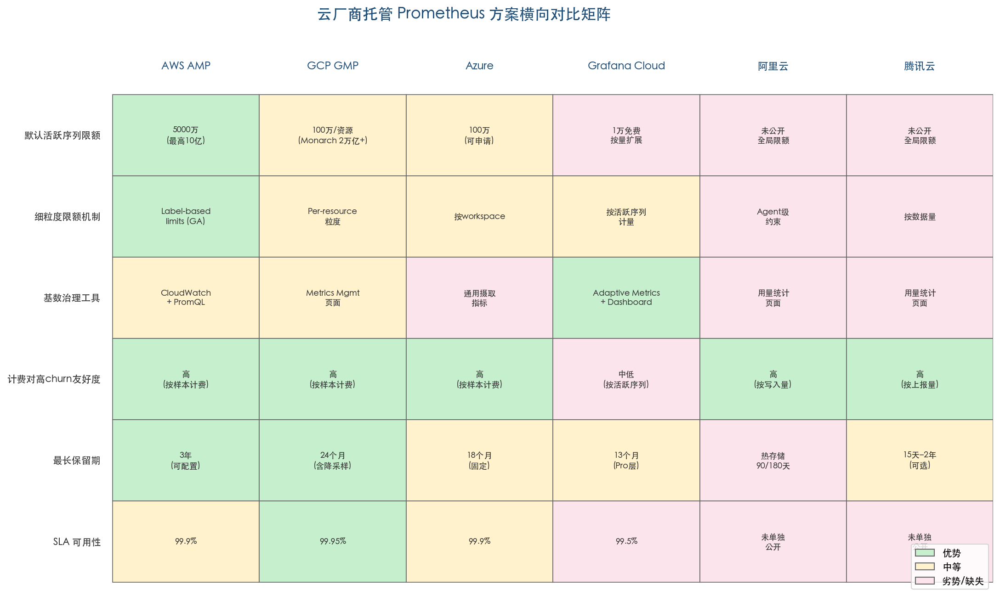

绿色表示该维度下的明确优势，黄色表示中等水平，红/粉色表示劣势或信息缺失。下表提供更详细的数据：

| 维度 | AWS AMP | GCP GMP | Azure | Grafana Cloud | 阿里云 | 腾讯云 |
|------|---------|---------|-------|---------------|--------|--------|
| **默认活跃序列限额** | 5,000 万（最高 10 亿） | 100 万/资源（Monarch 全局 2 万亿+） | 100 万（可申请） | 1 万免费/按量扩展 | 未公开全局限额 | 未公开全局限额 |
| **活跃窗口** | 2 小时 | 24 小时 | ~12 小时 | 20 分钟 | — | — |
| **细粒度限额** | label-based limits（GA） | per-resource 粒度 | 按 workspace | 按活跃序列计量 | Agent 级约束 | 按数据量 |
| **Cardinality 工具** | CloudWatch 告警 + PromQL | Metrics Management 页面 | 通用摄取指标 | Adaptive Metrics + Dashboard | 用量统计页面 | 用量统计页面 |
| **计费模型** | 按样本阶梯 | 按样本阶梯 | 按样本 | 按活跃序列+DPM | 按写入量/上报量 | 按上报量阶梯 |
| **对高 churn 的计费友好度** | 高 | 高 | 高 | 中低（短命序列推高峰值） | 高 | 高 |
| **最长保留期** | 3 年（可配置） | 24 个月（含降采样） | 18 个月（固定） | 13 个月（Pro 层） | 热存储 90/180 天 + 归档 | 15 天–2 年 |
| **SLA** | 99.9% | 99.95% | 99.9% | 99.5% | 未单独公开 | 未单独公开 |

### 4.6.1 按场景的适用性分析

**大规模 Kubernetes 集群、高流失率工作负载**。AWS AMP 凭借 5,000 万默认活跃序列限额（最高 10 亿）、label-based series limits 的细粒度控制和按样本计费模型，在大规模高流失率场景下提供了最高的天花板和最精细的治理手段。GCP GMP 虽然 per-resource 限额为 100 万，但 Monarch 后端的全局扩展能力（超 2 万亿活跃序列）使其在 Google Cloud 原生生态中具有独特优势，尤其适合多 project 分布式部署架构。

**成本敏感型场景**。GCP GMP 提供 24 个月数据保留且无额外存储费，对于需要长期保留监控数据的场景具有显著的成本优势。阿里云的基础指标免费策略和腾讯云的阶梯递减定价对于国内用户在中等规模场景下具有吸引力。需要注意的是，成本敏感场景更应优先选择按样本计费模型，避免高流失率导致的非线性成本膨胀。

**多云与混合云场景**。Grafana Cloud 作为云中立的商业平台，支持接入任意云环境的 Prometheus 数据。其 Adaptive Metrics 和 Cardinality Dashboard 在基数治理工具链上最为成熟，但按活跃序列计费的模型要求用户在高流失率场景下格外关注成本控制——建议此类场景下优先启用 Adaptive Metrics 并配合严格的标签治理策略。

**对可用性要求极高的场景**。GCP GMP 以 99.95% 提供了最高的 SLA 承诺。AWS AMP 和 Azure 均为 99.9%。在可观测性平台不可用直接影响 MTTR 的关键业务场景中，SLA 差异可能是决定性因素。

**国内合规与本地化部署**。阿里云和腾讯云是国内合规场景的自然选择。阿里云 Prometheus 版提供与容器服务（ACK）的深度集成和基础指标免费策略；腾讯云 TMP 的套餐包模式（预付费）为预算可控的企业提供了固定成本选项。两者在基数治理工具的成熟度上与 Grafana Cloud 存在明显差距，需要用户更多依赖第3章所述的自建 PromQL 监控和 relabeling 策略来控制流失率。

### 4.6.2 计费模型与高流失率的核心关系

本章分析表明，在高流失率场景下，计费模型的选择对运营成本的影响可能远超单价差异。按样本计费的模型（AWS AMP、GCP GMP、Azure、阿里云、腾讯云）在本质上对短命序列"友好"——序列仅在存活期间产生样本费用，流失率不构成额外成本因子。而按活跃序列计费的模型（Grafana Cloud）则在活跃窗口内将新旧序列同时计为活跃，导致流失率本身成为一个直接的成本放大因子——如本章图表所示，滚动更新间隔从 60 分钟缩短至 2 分钟可使成本倍增至 5.5 倍。

然而，计费友好度只是选择托管方案的一个维度。基数治理工具的成熟度（Grafana Cloud 领先）、SLA 保障（GCP 最高）、最大序列限额天花板（AWS AMP 最高）和数据保留策略（GCP 最经济）各有侧重。组织应基于自身的工作负载特征（尤其是 Pod 生命周期分布和滚动更新频率）、云平台绑定程度和合规要求，综合权衡选择最适合的方案。对于已确认面临高流失率挑战的团队，我们建议将按样本计费模型和细粒度序列限额机制作为首要筛选条件。

# 第5章 开源生态替代方案与工程实践

第4章对比了各云厂商托管 Prometheus 方案在高流失率场景下的能力与局限。对于选择自建可观测性基础设施或希望规避厂商锁定的组织而言，开源长期存储后端提供了另一条可行路径。Grafana Mimir、Thanos、VictoriaMetrics 和 Cortex 四个项目均兼容 Prometheus 协议生态，但在存储引擎设计、Ingester 内存管理、索引分片策略、压缩机制和查询性能等维度上采用了截然不同的技术路线，其在高流失率场景下的表现差异显著。

本章沿三条线索展开：首先逐一剖析四个开源后端在高流失率场景下的架构优势与局限；其次通过统一维度的横向对比，为读者在自身场景下的选型决策提供参考框架；最后汇集社区真实工程案例，总结大型 Kubernetes 集群中经实战验证的 churn 治理最佳实践。

## 5.1 Grafana Mimir：微服务化架构与多租户隔离

### 5.1.1 Ingester 内存管理与 Block 写入

Ingester 是 Mimir 写入路径的核心组件——所有摄入的样本首先在 Ingester 内存中以 TSDB Head Block 形式存储，默认每 2 小时压缩为持久化 TSDB block 并上传至对象存储（S3、GCS 等）。[Mimir Ingester 文档](https://grafana.com/docs/mimir/latest/references/architecture/components/ingester/ "Mimir v3.0 Ingester 组件文档") 在高流失率场景下，大量短命序列在 Ingester 内存中驻留至下一次 block 写入（1–3 小时），其生命周期往往远短于 block 间隔，导致 Ingester 内存中同时存在大量已被 stale marker 标记但尚未 flush 的序列元数据。这一行为与第2章描述的 Prometheus Head Block 膨胀机制本质相同——底层 TSDB 引擎一致，Mimir 通过分布式部署将单节点压力分散至多个 Ingester 实例，但并未从根本上消除每个 Ingester 的内存膨胀风险。

### 5.1.2 Ingest Storage：基于 Kafka 的写入路径解耦

Mimir v3.0 引入了 Ingest Storage 架构——基于 Kafka 的写入路径重构。在该架构下，Distributor 将摄入数据写入 Kafka partition，Ingester 仅作为读路径消费者从 Kafka 拉取数据。[Mimir Ingester 文档](https://grafana.com/docs/mimir/latest/references/architecture/components/ingester/ "Ingest Storage Architecture") 这一解耦设计对高流失率治理意义重大：写入成功仅依赖 Kafka 而非 Ingester 状态，当某个 Ingester 实例因高 churn 导致的内存压力而发生重启或扩缩容时，写入路径不受影响。这一机制有效规避了第2章记录的 Prometheus 原生部署中"WAL 重放期间 30–90 分钟 NotReady 盲区"问题——即便 Ingester 需要重启恢复状态，Kafka 作为持久化缓冲层保证了摄入数据不会丢失。

### 5.1.3 Split-and-Merge Compactor

Mimir 的 split-and-merge compactor 是应对高基数与高流失率的关键架构创新。传统 Prometheus TSDB compaction 受限于单个 block 的索引大小上限，而 split-and-merge compactor 先将源块拆分为 M 个分片块，再按分片合并，从根本上克服了索引大小限制。官方建议每 800 万活跃序列配置 1 个分片，1 亿活跃序列约需 12 个分片。[Mimir Compactor 文档](https://grafana.com/docs/mimir/latest/references/architecture/components/compactor/ "split-and-merge 压缩策略") 该机制使 Mimir 在保持 compaction 效率的同时支撑远超原生 Prometheus 的基数规模。Grafana Labs 在 2022 年 3 月的发布公告中指出，配合 sharded query engine 可将高基数查询加速最高 40 倍。[Grafana Mimir 发布公告](https://grafana.com/blog/2022/03/30/announcing-grafana-mimir/ "2022 年 3 月 30 日发布")

### 5.1.4 Per-Tenant 多层准入控制

Mimir 提供了精细的 per-tenant 限额体系，直接回应高流失率场景下的防护需求。核心参数 `max_global_series_per_user` 默认限额为 150,000 条活跃序列/租户，`max_global_series_per_metric` 则用于限制单个指标的全局序列数，两者均可通过 runtime configuration 按租户动态覆盖。[Mimir 配置参数文档](https://grafana.com/docs/mimir/latest/configure/configuration-parameters/ "max_global_series_per_user 默认 150,000") 当某租户因 churn 爆发触及限额时，Distributor 返回 HTTP 429 拒绝新序列摄入，从而保护其他租户不受影响。

Distributor 组件还提供多层次请求校验：请求速率限制、摄取速率限制以及数据格式校验（`max-label-names-per-series`、`max-length-label-name`、`max-length-label-value`），形成从协议层到数据层的多重准入防线。[Grafana Mimir Distributor 文档](https://grafana.com/docs/mimir/latest/references/architecture/components/distributor/ "Grafana Mimir distributor - per-tenant rate limiting")

### 5.1.5 Shuffle Sharding 与故障隔离

Mimir 的 Shuffle Sharding 机制将每个租户的序列分配到集群节点的一个子集。以 50 个 partition 的集群为例，若每租户仅分配 4 个 partition，则两个随机租户有 71% 的概率不共享任何 partition。[Mimir Shuffle Sharding 文档](https://grafana.com/docs/mimir/latest/configure/configure-shuffle-sharding/ "Shuffle Sharding 配置") 这一概率隔离特性意味着，当某一租户发生 cardinality 爆炸时，其影响被限制在少数节点上，其他租户的写入和查询性能不受波及。在多团队共享的大规模监控平台中，Shuffle Sharding 构成了防止单一服务 churn 爆发拖垮全局的关键保障。

### 5.1.6 乱序样本摄入

Kubernetes 高流失率环境中，Pod 重建可能导致 Remote Write 队列中的样本出现时序错乱——旧 Pod 的最后一批样本可能在新 Pod 的样本之后才到达后端。Mimir 支持 `out_of_order_time_window` 配置，允许在指定时间窗口内接受乱序样本摄入，避免因时序错乱导致的样本丢弃。[Mimir OOO 文档](https://grafana.com/docs/mimir/latest/configure/configure-out-of-order-samples-ingestion/ "out-of-order samples 配置指南") 这一特性在滚动更新期间尤为关键，有效防止了因网络延迟或队列积压引发的数据缺失。

## 5.2 Thanos：以对象存储为中心的扩展方案

### 5.2.1 Sidecar 与 Receiver 双模式

Thanos 提供两种数据接入模式，分别适用于不同的部署场景。Sidecar 模式在每个 Prometheus 实例旁部署 Sidecar 容器，将本地 TSDB block 上传至对象存储，要求禁用本地 compaction 以避免冲突。Receiver 模式则实现了 Remote Write API，可直接接受远程写入并支持多租户。[Thanos Receiver 文档](https://thanos.io/tip/components/receive.md/ "Receiver 组件文档")

在高流失率场景下，Receiver 模式的 Ketama 一致性哈希分配策略具有独特优势：当节点增减时，序列重分配范围被最小化，不会引发全局性的序列 churn 和内存峰值。Receiver 还支持 Shuffle Sharding 和可用区（AZ）感知分配，配合 Receive Controller 可自动化 hashring 管理并结合 HPA 进行弹性扩缩容。[Thanos Receiver 文档](https://thanos.io/tip/components/receive.md/ "Shuffle sharding")

### 5.2.2 三级降采样

Thanos Compactor 实现了三级降采样机制：超过 40 小时的数据降采样至 5 分钟分辨率，超过 10 天的数据降采样至 1 小时分辨率。[Thanos Compact 文档](https://thanos.io/tip/components/compact.md/ "Downsampling") 降采样的核心价值在于加速大时间范围查询——这正是第2章所述"查询窗口越长、扫描的 churn 序列越多、性能急剧恶化"问题的直接对策。

但该机制存在两个需要评估的局限。其一，降采样不节省存储空间——原始分辨率、5 分钟分辨率和 1 小时分辨率的数据同时保留，存储总量可能增长约 3 倍。其二，短命序列的数据点本身就稀疏（第2章分析显示，5 分钟寿命的序列仅约 20 个样本），降采样对此类序列的聚合效果十分有限。[Thanos Compact 文档](https://thanos.io/tip/components/compact.md/ "Downsampling")

### 5.2.3 活跃序列限制（实验性）

Thanos Receiver 提供了实验性的 Active Series Limiting 功能：通过查询元监控端点检查每个租户的活跃序列数，当超过配置阈值时拒绝整个 Remote Write 请求。[Thanos Receiver 文档](https://thanos.io/tip/components/receive.md/ "Active Series Limiting experimental") 该功能被标注为 best-effort 限制——当元监控端点不可用时不施加限制，且缺乏 per-metric 粒度的控制能力。相比 Mimir 已成熟的 per-tenant 限额体系（含 `max_global_series_per_user`、`max_global_series_per_metric` 等多层参数），Thanos 在配额管理方面的能力仍处于早期阶段。

### 5.2.4 Compactor 单例限制与扩展性

Thanos Compactor 存在一个关键架构约束：同一块流（block stream）只能由一个 Compactor 实例处理。在高流失率场景下，大量短命序列产生的碎片化 block 使 compaction 工作量剧增，单例 Compactor 可能成为吞吐瓶颈。可行的扩展方式是通过 label sharding 将不同 block 流分配到不同 Compactor 实例，但这需要运维团队手动规划分片策略。[Thanos Compact 文档](https://thanos.io/tip/components/compact.md/ "Scalability 和 Retention") 相比之下，Mimir 的 split-and-merge compactor 原生支持水平扩展，在超大规模高 churn 场景下的 compaction 吞吐量具有显著优势。

## 5.3 VictoriaMetrics：独立存储引擎的差异化路线

### 5.3.1 存储引擎设计

VictoriaMetrics 从零使用 Go 语言构建了独立的存储引擎，不复用 Prometheus TSDB 源码，其设计借鉴了 ClickHouse 的列式存储理念。存储层由 indexdb（倒排索引）和 data（时序数据）两级结构组成。[VictoriaMetrics FAQ](https://docs.victoriametrics.com/victoriametrics/faq/ "Why IndexDB size is so large")

indexdb 采用三阶段轮转机制：next IndexDB、current IndexDB 和 previous IndexDB。默认情况下，轮转在每个 `-retentionPeriod` 周期结束时的 UTC 凌晨 4 点执行，可通过 `-retentionTimezoneOffset` 参数调整时间。[VictoriaMetrics 单节点文档](https://docs.victoriametrics.com/victoriametrics/single-server-victoriametrics/ "indexdb rotation") 高流失率场景下，这一设计产生一个显著问题：大量短命序列的索引条目在 indexdb 中持续累积，清理仅在 retention cycle 结束时批量执行。印度食品配送平台 Zomato 的生产案例印证了这一问题——其 indexdb 大小达到时序数据本身的 10 倍。[Zomato 工程博客](https://www.zomato.com/blog/migrating-to-victoriametrics-a-complete-overhaul-for-enhanced-observability "Migrating to VictoriaMetrics, 2024")

### 5.3.2 vmagent 双层基数限制

VictoriaMetrics 通过 vmagent 组件在数据到达存储层之前实施多层 churn 控制，这是其在高流失率治理中最具特色的设计之一。

**per-target 序列限制。** `series_limit` 参数限制单个 scrape target 可暴露的唯一序列数，超限后在 24 小时窗口内丢弃新序列的样本。[vmagent 文档](https://docs.victoriametrics.com/vmagent/ "Cardinality limiter") 这一能力直接对标第3章讨论的 `sample_limit` 安全阀机制，但控制粒度更细——`sample_limit` 限制每次 scrape 的样本总数，而 `series_limit` 限制唯一序列数，后者对 churn 的控制更为精准。

**全局基数限制。** `-remoteWrite.maxHourlySeries` 和 `-remoteWrite.maxDailySeries` 两个参数分别控制每小时和每天可写入远程存储的唯一序列上限。[vmagent 文档](https://docs.victoriametrics.com/vmagent/ "Cardinality limiter") 其中 `-remoteWrite.maxDailySeries` 实质上构成了对日度 churn 率的直接约束——若日度新增序列超过阈值，多余序列的样本将被丢弃，从源头扼制 churn 对下游存储的冲击。

### 5.3.3 Stream Aggregation

vmagent 的 Stream Aggregation 功能允许在数据到达远程存储之前按时间窗口和标签维度进行实时预聚合，丢弃高基数标签后将聚合结果以低基数序列写入后端。[vmagent 文档](https://docs.victoriametrics.com/vmagent/ "Stream Aggregation") 这一机制的效果等同于第3章讨论的 Recording Rules 预聚合策略，但执行位置在采集端（edge）而非存储端（center）。在多集群联邦场景中，Stream Aggregation 可在网络传输之前完成高基数标签的聚合裁剪，避免高 churn 数据经由广域网络传输至中心存储端再行聚合，从而显著降低网络带宽消耗和中心端的存储压力。

### 5.3.4 扩展性与已知局限

VictoriaMetrics 单节点版可处理最高 1 亿活跃序列和每秒 200 万样本的摄入率，集群版可进一步扩展至数十亿活跃序列规模。[VictoriaMetrics FAQ](https://docs.victoriametrics.com/victoriametrics/faq/ "What is the scalability limits") 其原生支持 backfilling 和乱序样本摄入，无需像 Mimir 那样额外配置 `out_of_order_time_window`，在数据回填和迁移场景中操作更为简便。

然而，VictoriaMetrics 在高流失率场景下存在两个需要重点关注的局限：

1. **indexdb 膨胀。** 如前所述，典型 Kubernetes 监控场景中 indexdb 可达数据目录体积的 2 倍以上（Zomato 案例中达到 10 倍）。运维团队须在容量规划中将 indexdb 膨胀作为显式变量纳入建模，并预留充足的磁盘空间。[VictoriaMetrics FAQ](https://docs.victoriametrics.com/victoriametrics/faq/ "Why IndexDB size is so large")

2. **开源版不支持降采样。** 降采样功能仅在企业版中提供。对于需要长保留期（如 1 年以上）并频繁执行大时间范围查询的场景，缺少降采样意味着查询性能可能不及 Thanos 的三级降采样方案，需依赖 Recording Rules 预聚合或限制查询时间范围等替代手段来弥补。[VictoriaMetrics FAQ](https://docs.victoriametrics.com/victoriametrics/faq/ "Why IndexDB size is so large")

## 5.4 Cortex：Mimir 的前身与当前定位

Cortex 是 Mimir 的直接前身——Mimir 于 2022 年 3 月发布，fork 自 Cortex 代码库（2019–2021 年间 Cortex 约 87% 的 commits 来自 Grafana Labs）。Mimir 将此前仅在 Grafana Enterprise Metrics 中提供的 split-and-merge compactor（支持无限基数的水平扩展 compaction）和 sharded query engine（高基数查询加速最高 40 倍）等核心能力开源，采用 AGPLv3 许可证。[Grafana Mimir 发布公告](https://grafana.com/blog/2022/03/30/announcing-grafana-mimir/ "2022 年 3 月 30 日发布")

Cortex 目前仍处于 CNCF 孵化阶段，但社区活跃度已大幅下降。其缺少 split-and-merge compactor 等针对高基数场景的关键优化，在高流失率工作负载下的 compaction 效率和查询性能与 Mimir 存在代际差距。Grafana Labs 官方建议现有 Cortex 用户迁移至 Mimir，并提供了详细的迁移指南和兼容性说明。[Mimir 迁移文档](https://grafana.com/docs/mimir/latest/set-up/migrate/migrate-from-cortex/ "Cortex 到 Mimir 迁移指南") 综合评估，对于新建项目，Cortex 已不再是推荐选项。

## 5.5 横向对比：四大开源后端的 Churn 应对能力

下表从存储引擎、写入路径、compaction 扩展性、基数限制、降采样、索引管理、乱序样本支持、运维复杂度等维度，对四个开源后端在高流失率场景下的能力进行结构化对比。

| 对比维度 | Grafana Mimir | Thanos | VictoriaMetrics | Cortex |
|---------|--------------|--------|----------------|--------|
| **存储引擎** | 复用 Prometheus TSDB + 分布式扩展 | 复用 Prometheus TSDB + 对象存储 | 独立引擎，借鉴 ClickHouse | 复用 Prometheus TSDB |
| **写入路径高可用** | Kafka ingest storage（v3.0）解耦写入与 Ingester 状态 | Receiver Ketama 哈希最小化重分配 | 原生支持 backfilling 和乱序 | 无 Kafka 集成 |
| **Compaction 水平扩展** | split-and-merge compactor 原生水平扩展 | Compactor 单例，需 label sharding 手动分片 | 后台自动 compaction，无外部依赖 | 无 split-and-merge |
| **Per-Tenant 基数限制** | `max_global_series_per_user` 默认 150,000，可 per-tenant 覆盖 | Active Series Limiting（实验性） | vmagent 双层限制（per-target + 全局） | 类似 Mimir 但缺少后续增强 |
| **降采样** | 不原生支持（依赖 Recording Rules 预聚合） | 三级降采样（5min / 1h），加速大时间范围查询 | 开源版不支持（企业版支持） | 不原生支持 |
| **高 Churn 下索引管理** | split-and-merge 克服索引大小限制 | 依赖 Prometheus TSDB 索引，受同等限制 | indexdb 可膨胀至数据体积 2–10 倍 | 同 Mimir 前身，无优化 |
| **乱序样本支持** | `out_of_order_time_window` 可配置 | 不支持（要求严格时序） | 原生支持，无需配置 | 不支持 |
| **运维复杂度** | 最高（微服务组件多，尤其 Kafka 架构） | 居中（Compactor 单例 + 对象存储依赖） | 最低（单二进制无外部依赖） | 中高（与 Mimir 类似但文档和社区支持不足） |
| **单节点扩展上限** | 不适用（微服务架构） | 不适用（依赖 Prometheus 单节点） | 1 亿活跃序列 / 200 万样本/秒 | 不适用 |
| **许可证** | AGPLv3 | Apache 2.0 | Apache 2.0（企业版单独许可） | Apache 2.0 |
| **推荐新部署** | 是 | 是 | 是 | 否 |

下图以雷达图形式直观展示 Mimir、Thanos 和 VictoriaMetrics 三个推荐方案在六个关键维度上的能力侧重与互补关系（Cortex 因不推荐新部署而未纳入）。

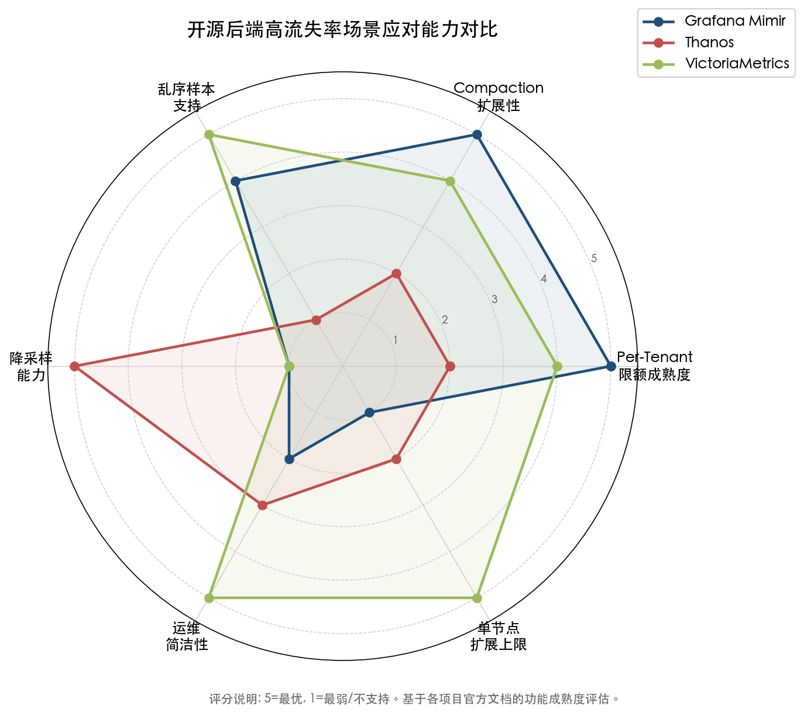

上表与雷达图共同呈现了四个方案在技术维度上的差异化定位，但选型决策还须结合组织自身的团队能力、现有基础设施和业务需求：

- **Mimir** 适合需要严格多租户隔离、超大基数支撑（数十亿活跃序列）和成熟治理工具链的场景，但运维团队须具备管理 Kafka 及微服务集群的能力，初始部署和运维成本较高。
- **Thanos** 适合已有 Prometheus 部署并希望以最小侵入性添加长期存储的场景，Sidecar 模式可直接复用现有 Prometheus 实例。三级降采样是长保留期场景下加速大时间范围查询的独特优势。
- **VictoriaMetrics** 适合追求运维简洁性和高性价比的场景，单节点即可支撑大多数中型集群的监控负载。vmagent 的前置基数限制是从源头控制 churn 的实用工具，但须在容量规划中为 indexdb 膨胀预留充足磁盘空间。
- **Cortex** 由于社区活跃度下降和关键优化缺失，已不建议用于新建部署。

## 5.6 社区工程案例：大规模集群的 Churn 治理实战

### 5.6.1 Cloudflare：916 个 Prometheus 实例的定制化治理

Cloudflare 运营着 916 个 Prometheus 实例，管理 49 亿时间序列，是社区中规模最大的自建 Prometheus 部署之一。[Cloudflare 工程博客](https://blog.cloudflare.com/how-cloudflare-runs-prometheus-at-scale/ "How Cloudflare runs Prometheus at scale, 2023") 该团队在 churn 治理方面采用了两项自定义 TSDB 补丁，体现了在原生 Prometheus 能力边界之外的工程探索：

**TSDB 全局序列上限。** 当活跃序列总数达到配置上限时，Prometheus 拒绝创建新序列，但继续为已存在的序列追加样本。这一机制与 Prometheus 原生 `sample_limit` 的"超限即丢弃整个 scrape"行为形成鲜明对比——Cloudflare 的设计保护了已有序列的数据连续性，仅牺牲新增序列的摄入能力。[Cloudflare 工程博客](https://blog.cloudflare.com/how-cloudflare-runs-prometheus-at-scale/ "How Cloudflare runs Prometheus at scale, 2023")

**sample_limit 软降级。** 对原生 `sample_limit` 行为进行修改，使其在超限时不将整个 scrape 标记为失败（`up=0`），而是继续为已存在的序列追加样本，仅丢弃超出限额的新序列。[Cloudflare 工程博客](https://blog.cloudflare.com/how-cloudflare-runs-prometheus-at-scale/ "How Cloudflare runs Prometheus at scale, 2023")

Cloudflare 将默认 `sample_limit` 设定为 200/target，超过此阈值的 target 须通过 CI 流程显式申请更高配额。这一策略背后的 churn 成本分析值得关注：即使一个仅被采集一次的序列，仍保证在内存中驻留 1–3 小时（Head Block 生命周期），因此严格控制每个 target 可引入的新序列数量，是从源头降低内存成本的有效手段。[Cloudflare 工程博客](https://blog.cloudflare.com/how-cloudflare-runs-prometheus-at-scale/ "短命序列成本分析")

此外，Cloudflare 使用 Thanos 作为统一查询层，将分布在全球的数千个 Prometheus 实例整合为统一查询视图，并在 KubeCon 2024 分享了在动态环境中扩展 Thanos 的实践经验。[Cloudflare 博客](https://blog.cloudflare.com/safe-change-at-any-scale/ "Thanos scaling in dynamic Prometheus environments")

### 5.6.2 Zomato：从 Prometheus+Thanos 到 VictoriaMetrics 的全面迁移

印度最大的食品配送平台 Zomato 提供了从 Prometheus+Thanos 栈迁移至 VictoriaMetrics 的完整生产案例。迁移前的架构包含 144 台 Prometheus 实例（双可用区部署）配合 Thanos，长期面临频繁 OOM、WAL 损坏和查询延迟过高等困境。[Zomato 工程博客](https://www.zomato.com/blog/migrating-to-victoriametrics-a-complete-overhaul-for-enhanced-observability "Migrating to VictoriaMetrics, 2024")

迁移后（2024 年数据），Zomato 的监控集群峰值处理 22 亿活跃序列、1,750 万样本/秒的摄入率。迁移带来了显著改善：查询响应时间降低约 1/3，活跃序列减少 40%（得益于 vmagent 的 Stream Aggregation 和基数限制在数据进入存储层前完成了有效裁剪）。[Zomato 工程博客](https://www.zomato.com/blog/migrating-to-victoriametrics-a-complete-overhaul-for-enhanced-observability "Migrating to VictoriaMetrics, 2024")

值得注意的是，Zomato 也坦诚记录了 VictoriaMetrics 的实际挑战：由于高 churn 率，indexdb 大小达到数据目录的 10 倍，团队须预留双倍磁盘空间以应对日常 indexdb 膨胀。此外，开源版不支持降采样，长保留期场景下的查询性能须依赖 Recording Rules 预聚合或调整查询时间范围等替代手段来弥补。[Zomato 工程博客](https://www.zomato.com/blog/migrating-to-victoriametrics-a-complete-overhaul-for-enhanced-observability "Migrating to VictoriaMetrics, 2024")

### 5.6.3 从案例中提炼的治理共识

综合 Cloudflare 和 Zomato 两个大规模生产案例，以及前几章讨论的治理策略，可以提炼出社区已形成的工程共识：

1. **前置基数限制是高 ROI 手段。** 无论采用哪种存储后端，在数据进入存储层之前实施基数控制（Cloudflare 的 sample_limit 软降级、VictoriaMetrics 的 vmagent series_limit、Mimir 的 Distributor 限流）均能以最低成本遏制 churn 对系统的冲击。越靠近数据源头的治理措施，单位投入产生的效益越高。

2. **预聚合减少序列传导。** VictoriaMetrics 的 Stream Aggregation、Prometheus 的 Recording Rules、Mimir 的 Ruler 组件——不同技术方案殊途同归，核心思想均是在数据链路的尽早位置将高基数标签聚合掉，使下游存储和查询层仅面对低基数聚合结果。Zomato 通过 Stream Aggregation 实现活跃序列减少 40% 即为这一策略的直接验证。

3. **磁盘与索引成本不可忽视。** Prometheus TSDB 的 Head Block 内存膨胀、VictoriaMetrics 的 indexdb 膨胀、Thanos 降采样后的存储增长——每种方案都存在高 churn 特有的存储成本放大效应，须在容量规划中显式建模，避免因存储预算不足导致运行时故障。

4. **单一工具不能解决全部问题。** Cloudflare 在 Prometheus 基础上叠加 Thanos 统一查询层与自定义补丁，Zomato 从 Prometheus+Thanos 迁移至 VictoriaMetrics 后仍需配合 Stream Aggregation 和基数限制。高流失率治理本质上是一个多层防御体系，需要从指标设计、采集管道、存储引擎到查询优化的全栈协同。

下图展示了这一多层防御体系的完整架构，标注了从指标埋点到查询告警各层可部署的 churn 治理手段及对应的开源工具。

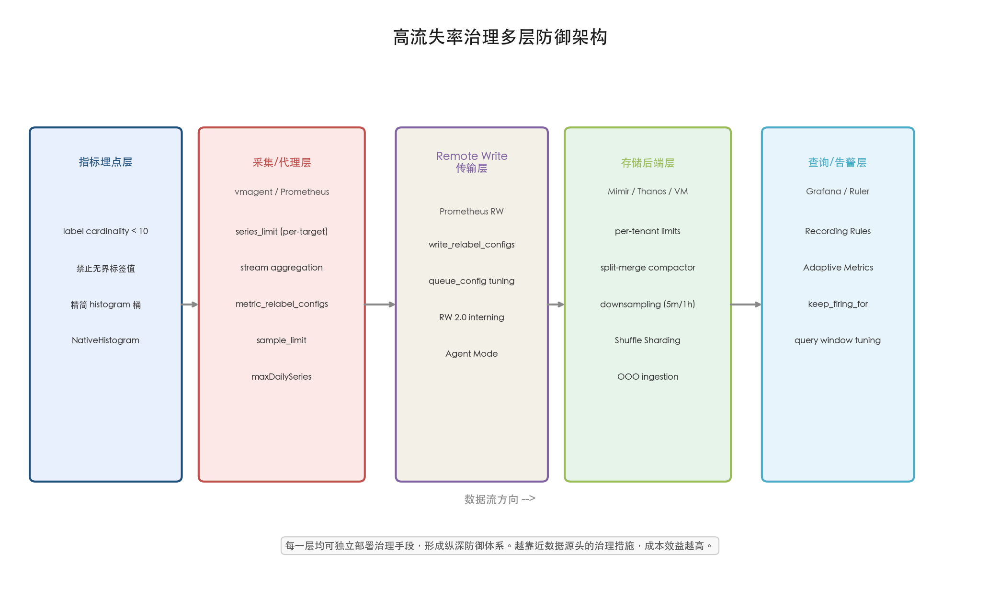

# 结论与风险提示

## 核心结论

本报告围绕 Prometheus 高流失率的成因、影响、治理方案与平台选型展开了系统性分析，得出以下核心结论。

**第一，高流失率是 Prometheus 在 Kubernetes 云原生环境中不可回避的结构性挑战。** Prometheus"标签值变化即创建新序列"的数据模型设计与 Kubernetes 工作负载的高度动态性之间存在根本张力。Pod 频繁重建、滚动更新、自动扩缩容、短暂 Job 和 Service Mesh sidecar 的维度爆炸，使序列流失成为规模化部署的常态而非异常。Coveo 的生产数据表明，高流失率可使 Head Block 中的序列总数达到瞬时活跃数的 5.5 倍；Adevinta 的 VPA 驱逐循环事件则展示了 churn 可在分钟级时间内导致 Prometheus 本身 OOMKill，引发整个集群可观测性全面崩溃。

**第二，高流失率的影响具有全栈渗透性，各层之间相互叠加而非相互独立。** 从 TSDB Head Block 内存膨胀、倒排索引重建引发的 CPU 尖峰、Gorilla 压缩效率骤降、WAL 膨胀导致的重启盲区，到 Remote Write 协议层的流量放大、远端存储的成本传导，再到告警 `for` 子句重置与 staleness 导致的系统性漏报——高流失率同时作用于 Prometheus 体系的每一层。这种全栈式影响意味着任何单点优化只能缓解部分症状，无法从根本上解决问题。

**第三，有效的治理方案必须是多层次、体系化的分层防御策略。** 源头治理（标签规范与指标设计）是成本最低、效果最持久的手段——Brian Brazil 给出的"单一指标标签基数不超过 10"准则是基本红线，Coveo 仅通过丢弃一个高流失标签即实现内存降低 73%。过程控制（三阶段 Relabeling、sample_limit/target_limit 安全阀）限制问题传播。Recording Rules 预聚合将高基数原始数据压缩为低基数聚合结果，同时解决查询性能和告警可靠性问题。架构改进（层级联邦、功能分片、Agent 模式）隔离影响范围。远端准入控制（如 Mimir Distributor 的 per-tenant 限流）和智能指标生命周期管理（如 Grafana Adaptive Metrics）构成最后安全网。Cloudflare 和 Zomato 的大规模生产实践均印证了"多层防御、全栈协同"的治理共识。

**第四，托管方案的选择应以计费模型和基数限额机制为首要筛选条件。** 按样本计费模型（AWS AMP、GCP GMP、Azure、阿里云、腾讯云）对短命序列天然"友好"，流失率不构成额外成本因子；按活跃序列计费模型（Grafana Cloud）在高流失率下面临最高 5.5 倍的成本放大。AWS AMP 凭借 5,000 万默认活跃序列限额（最高 10 亿）和 label-based series limits 的细粒度控制，在大规模高流失率场景下提供了最高的天花板；GCP GMP 的 Monarch 后端和 99.95% SLA 在可用性和全局规模上占优；Grafana Cloud 的 Adaptive Metrics 工具链在基数治理自动化方面最为成熟。

**第五，开源后端的选型需在运维复杂度、churn 应对能力和功能完整性之间权衡。** Grafana Mimir 通过 Kafka ingest storage、split-and-merge compactor 和 per-tenant 限额体系，在超大基数和多租户隔离场景下具有最强的 churn 应对能力，但运维复杂度最高。Thanos 的三级降采样是长保留期场景的独特优势，Sidecar 模式对现有 Prometheus 部署侵入性最低。VictoriaMetrics 以单二进制无外部依赖的运维简洁性见长，vmagent 的双层基数限制和 Stream Aggregation 是从源头控制 churn 的实用工具，但 indexdb 膨胀问题（Zomato 案例中达数据体积的 10 倍）须在容量规划中显式建模。

## 局限性分析

**数据来源的局限性。** 本报告的量化数据主要来源于厂商技术博客、开源社区文档和少量公开的生产案例（Coveo、Cloudflare、Zomato、Adevinta 等），缺乏在受控实验环境中使用统一工作负载进行的标准化基准测试。不同案例的集群规模、工作负载特征和配置参数差异较大，量化结论（如"每序列约 8 KiB 内存"、"短命序列压缩比仅约 2 倍"）应视为经验性参考而非精确工程规格，实际数值将随具体工作负载和 Prometheus 版本变化。

**云厂商信息的时效性。** 云厂商的产品功能、配额限制和定价策略处于持续迭代中。本报告中记录的限额数值（如 AWS AMP 默认 5,000 万活跃序列、GCP GMP per-resource 100 万）和计费单价基于截至 2026 年初的公开文档，可能在报告发布后发生变更。阿里云和腾讯云的部分技术细节（如全局活跃序列限额、专项 SLA 条款）在公开文档中披露不完整，相关分析基于可获取的最佳信息。

**开源项目的快速演进。** Grafana Mimir、Thanos 和 VictoriaMetrics 均处于活跃开发阶段，新版本可能引入对高 churn 场景有实质性影响的功能变更。例如 Mimir v3.0 的 Kafka ingest storage、Thanos Receiver 的实验性 Active Series Limiting 等功能，其生产稳定性和性能表现尚需更多大规模部署验证。本报告的对比分析基于各项目截至分析时的最新稳定版本文档，可能无法反映后续版本的能力提升。

**治理方案的组织适配性。** 本报告提出的多层防御策略假设组织具备跨团队协调能力——标签治理需要应用开发团队在指标埋点阶段配合，Recording Rules 预聚合需要 SRE 团队理解业务查询模式，架构选型需要平台团队具备分布式系统运维能力。对于组织成熟度较低或基础设施团队规模有限的场景，部分治理手段的实施难度可能高于预期，建议优先从源头治理（标签规范）和托管方案（将运维复杂性转移给服务提供商）两个方向切入。

**覆盖范围的边界。** 本报告聚焦于 Prometheus 及其兼容生态的 metrics 数据类型，未涉及 OpenTelemetry 原生度量管道（OTLP Metrics → 非 Prometheus 后端）在高流失率场景下的表现与治理方案。此外，报告未深入讨论基于 eBPF 的无侵入式监控方案（如 Pixie、Cilium Hubble）作为高 churn 指标的替代数据采集路径的可行性——该方向可能在特定场景下提供绕过传统 Prometheus 标签模型的技术路线。
