# 执行摘要

Anthropic 于 2024 年 11 月发布 Model Context Protocol（MCP）时，采用 HTTP+SSE 双端点架构作为远程传输方案。该架构因强制 SSE 长连接、双端点管理复杂度高、与 Serverless 部署模式不兼容、连接中断后消息不可恢复等结构性缺陷，在生产化过程中暴露出严重瓶颈。2025 年 3 月，MCP 核心维护者 jspahrsummers 通过 PR #206 提出 Streamable HTTP 传输方案，经 Shopify、Vercel、Cloudflare、LangChain 等多方协作贡献后合入规范，正式替代旧版 HTTP+SSE 传输。

Streamable HTTP 的核心设计变革体现在五个维度。**第一**，统一端点模型——所有通信通过单一 MCP 端点的 POST/GET/DELETE 方法完成，消除了旧版的双端点依赖与动态 URI 传递机制。**第二**，SSE 从强制基础设施降格为可选增强——最基础的服务端仅需处理 POST 请求并返回 JSON 响应即可运行，长耗时操作可逐请求升级为 SSE 流。**第三**，会话管理可选化——服务端 MAY 分配 `MCP-Session-Id` 开启有状态模式，不分配则隐式运行为无状态模式，天然兼容 Serverless 部署。**第四**，SSE 轮询机制（2025-11-25 版引入）——通过预备事件、服务端主动断连与客户端定时重连，将长连接模型转化为短连接+轮询模型。**第五**，事件 ID 驱动的可恢复性——客户端可通过 GET + `Last-Event-ID` 从断点恢复 SSE 流，解决了旧版"连接断开即消息丢失"的根本缺陷。

在工程实现层面，TypeScript SDK（v1.10.0 起）和 Python SDK（v1.8.0 起）作为官方参考实现，分别提供了框架无关（Node.js 原生/Express/Hono）和 ASGI 原生（Starlette）的服务端 transport。两大 SDK 均通过构造参数（`sessionIdGenerator`/`mcp_session_id`、`enableJsonResponse`/`json_response`、`EventStore`/`event_store`）系统化建模了规范中的 MAY/SHOULD 条款，支持开发者在有状态/无状态、JSON/SSE 两个维度上自由组合。Java SDK（Reactive Streams + Spring 生态）、Kotlin SDK（客户端先行，服务端在途）和 C# SDK（v1.0，首个实现实验性 Task 原语）构成了完整的多语言 SDK 生态。

安全方面，2025 年 12 月同日披露的 CVE-2025-66414（TypeScript SDK）和 CVE-2025-66416（Python SDK）揭示了 DNS 重绑定防护默认缺失的系统性问题，推动 2025-11-25 版规范将 Origin 校验从建议升级为 MUST 约束。OAuth 授权框架从 2025-03-26 版的单体模式演进至 2025-11-25 版的去中心化信任模型，引入 Client ID Metadata Documents（CIMD）和 Cross App Access（XAA）以支撑大规模开放生态。

迁移路径方面，规范提供了客户端"先尝试 Streamable HTTP、失败后回退 SSE"的协商机制，以及服务端双端点并行托管策略。HTTP+SSE 自 2025-03-26 版起持续处于 deprecated 状态，但截至 2026 年 4 月的 draft 版仍保留完整向后兼容章节，短期内不会被移除。我们建议所有新建 MCP 服务端直接采用 Streamable HTTP 传输，存量系统按双端点并行策略有序迁移。

# 第1章 从 HTTP+SSE 到 Streamable HTTP——背景与动机

## 1.1 MCP 的诞生与初始传输层设计

Anthropic 于 2024 年 11 月 25 日正式公开发布 Model Context Protocol（MCP），旨在为大语言模型（LLM）应用提供与外部数据源和工具之间的标准化集成接口。首版规范（版本号 2024-11-05）定义了两种传输方式：**stdio**（标准输入/输出，适用于本地子进程通信）和 **HTTP+SSE**（适用于远程网络通信）[Anthropic 官方公告](https://www.anthropic.com/news/model-context-protocol "Introducing the Model Context Protocol, 2024-11-25")。

HTTP+SSE 传输层采用**双端点强制架构**。依据 2024-11-05 版规范，服务端 MUST 提供一个 SSE 端点（供客户端建立长连接并接收服务端推送消息）和一个独立的 HTTP POST 端点（供客户端主动发送消息）。连接建立时，服务端 MUST 首先通过 SSE 通道发送一个 `endpoint` 事件，将后续 POST 请求所需的目标 URI 传递给客户端[MCP 规范 2024-11-05 Transports](https://modelcontextprotocol.io/specification/2024-11-05/basic/transports "MCP 2024-11-05 版传输层规范原文")。

该设计的核心意图在于支持 MCP 作为有状态双向协议运行：服务端可主动向客户端推送通知（如资源变更、工具列表更新）以及发起采样请求（sampling），客户端则通过 POST 通道发送 JSON-RPC 请求与响应。SSE 充当服务端到客户端的单向持久通道，POST 充当客户端到服务端的请求通道，两条通道共同构成逻辑上的双向通信链路。

## 1.2 HTTP+SSE 架构的核心瓶颈

随着 MCP 从实验性协议走向生产环境，HTTP+SSE 双端点架构暴露出一系列结构性缺陷。PR #206 的作者 Justin Spahr-Summers（Anthropic/MCP 核心维护者）在提案中归纳了三大核心问题：**(1)** 不支持可恢复性（resumability）；**(2)** 要求服务端维持高可用的长连接；**(3)** 所有服务端消息只能通过 SSE 通道投递[PR #206](https://github.com/modelcontextprotocol/modelcontextprotocol/pull/206 "RFC: Replace HTTP+SSE with new Streamable HTTP transport")。

将上述抽象问题映射到工程实践层面，可以识别出五个维度的具体痛点。

### 1.2.1 双连接管理复杂度

SSE 端点与 POST 端点运行在不同的 HTTP 连接上。客户端首先通过 GET 建立 SSE 长连接，接收 `endpoint` 事件获取 POST 目标 URI，此后所有请求通过独立的 POST 连接发出。每个 MCP 会话因此实际维护着两条活跃连接，服务端必须在 SSE 流与 POST 请求之间建立关联映射。Shopify 协作者 Ates Goral 在 Discussion #102 中指出，这种架构"在 Pod 化部署中被迫使用进程间消息传递机制来关联 JSON-RPC POST 请求与 SSE 流"，实现复杂度显著高于常规 HTTP 服务[Discussion #102](https://github.com/modelcontextprotocol/modelcontextprotocol/discussions/102 "State, and long-lived vs. short-lived connections")。

### 1.2.2 长连接的扩展性困局

SSE 基于 HTTP 长连接机制运行——连接一旦建立便持续存在，服务端不断向其写入事件流。这一特性与现代分布式部署模式存在根本性冲突。在 Kubernetes 多 Pod 部署场景下，客户端的 SSE 连接被路由至某一 Pod，但后续的 POST 请求可能被负载均衡器轮询分发至其他 Pod，导致协议直接中断。开发者 in-op 在 Discussion #102 中描述了这一场景："客户端连接到 1 个 Pod 的 SSE 连接，但后续 POST 请求被轮询分配到任何其他 Pod，这完全破坏了协议"[Discussion #102](https://github.com/modelcontextprotocol/modelcontextprotocol/discussions/102 "State, and long-lived vs. short-lived connections")。

SSE 长连接还存在资源消耗问题：每个活跃客户端占用一个持久的 TCP 连接和服务端线程或协程，难以承载大规模并发。Anthropic 维护者 jerome3o 在同一讨论中总结认为，"关键问题在于长连接的扩展特性以及无法使用 Serverless 部署"[Discussion #102](https://github.com/modelcontextprotocol/modelcontextprotocol/discussions/102 "State, and long-lived vs. short-lived connections")。

### 1.2.3 与 Serverless 部署模式不兼容

Serverless 平台（如 AWS Lambda、Vercel Functions、Cloudflare Workers）的核心模型基于短生命周期、按需启停的函数实例。SSE 长连接与这一模型存在根本矛盾：AWS Lambda 函数有 15 分钟执行超时限制，Serverless 实例随时可能被回收，长连接无法跨实例存续。Automattic（WordPress 母公司）开发者 artpi 在 Discussion #102 中描述了在 PHP/WordPress 环境中实现 SSE 的困境——不得不通过大量 `php.ini` 指令来强行维持 SSE 连接，将响应存储在数据库中并在 SSE 端点中循环读取[Discussion #102](https://github.com/modelcontextprotocol/modelcontextprotocol/discussions/102 "State, and long-lived vs. short-lived connections")。

### 1.2.4 连接中断与消息不可恢复

旧版架构缺乏任何形式的可恢复性机制。当 SSE 连接因网络波动、服务端重启或负载均衡切换而断开时，正在传输中的响应直接丢失，客户端无法从断点恢复。在长耗时工具调用（如大规模数据查询、复杂 Agent 工作流）场景下，一次偶发的连接中断即可导致数分钟的计算结果付之东流，客户端只能重新发起完整请求[fka.dev 技术分析](https://blog.fka.dev/blog/2025-06-06-why-mcp-deprecated-sse-and-go-with-streamable-http/ "Why MCP Deprecated SSE and Went with Streamable HTTP")。

### 1.2.5 与 HTTP/2 及 HTTP/3 的兼容性摩擦

部分 SSE 实现在 HTTP/2 和 HTTP/3 上存在兼容性问题。HTTP/2 的多路复用机制与 SSE 的单流长连接模型之间存在微妙的交互差异，某些客户端库和中间代理对 SSE 流在 HTTP/2 上的行为处理不一致[fka.dev 技术分析](https://blog.fka.dev/blog/2025-06-06-why-mcp-deprecated-sse-and-go-with-streamable-http/ "Why MCP Deprecated SSE and Went with Streamable HTTP")。这一兼容性约束进一步限制了 MCP 在现代基础设施栈中的部署灵活性。

## 1.3 社区讨论与设计共识的形成

上述痛点并非仅由 Anthropic 内部感知，而是在开源社区中迅速形成了广泛共识。MCP 首版规范发布仅 11 天后——2024 年 12 月 6 日——MCP 核心维护者 jspahrsummers 便在 GitHub Discussion #102 中发起了题为"State, and long-lived vs. short-lived connections"的讨论，直接聚焦传输层的有状态与无状态取舍问题[Discussion #102](https://github.com/modelcontextprotocol/modelcontextprotocol/discussions/102 "State, and long-lived vs. short-lived connections")。

jspahrsummers 在原帖中提出了三个候选方向：**Option 1**——通过会话令牌（session token）封装状态，将长连接交互转化为独立请求；**Option 2**——同时提供"有状态"和"无状态"两种协议变体，实现渐进式能力降级；**Option 3**——将 MCP 全面改造为无状态协议，放弃所有需要长连接的特性。

该讨论吸引了来自 Vercel（cramforce）、Shopify（atesgoral）、Automattic（artpi）、AWS（clareliguori）等平台的开发者参与，累计产生 31 条评论和 60 条回复。Vercel 的 cramforce 明确表态支持会话令牌方案并提出混合策略——"即使有状态的负载均衡也能从完整的可恢复性中获益"；Shopify 的 atesgoral 则提出了**渐进增强**（progressive enhancement）理念——将 JSON-RPC 的请求/响应与 SSE 通知解耦为不同平面，简单工具调用走普通 POST 即可，仅在需要实时通知时才订阅 SSE 流[Discussion #102](https://github.com/modelcontextprotocol/modelcontextprotocol/discussions/102 "State, and long-lived vs. short-lived connections")。

Anthropic 维护者 jerome3o 在 2025 年 1 月 30 日的长文回复中综合社区意见，提出了一个关键方向：所有客户端到服务端消息通过 HTTP POST 发送（包括初始化），服务端发起的消息（通知和采样请求）通过可选的 SSE 流传递。其核心表述为——"SSE 通道的实现对服务端是可选的，使得服务端实现者无需支持长连接即可获取 MCP 的核心价值"——这一构想已非常接近后来 Streamable HTTP 的最终形态[Discussion #102](https://github.com/modelcontextprotocol/modelcontextprotocol/discussions/102 "State, and long-lived vs. short-lived connections")。

jspahrsummers 对此方向表示认同，并进一步提议"让 SSE 支持成为服务端的更强要求，但允许服务端在任何时候断开连接"，由此勾勒出短生命周期双向通信的轮廓——客户端周期性发送 POST 请求、周期性连接 SSE、服务端投递排队消息后主动断开。这一思路直接奠定了 PR #206 中 Streamable HTTP 的核心设计哲学[Discussion #102](https://github.com/modelcontextprotocol/modelcontextprotocol/discussions/102 "State, and long-lived vs. short-lived connections")。

值得注意的是，Discussion #102 中也出现了对 WebSocket 方案的呼声。calclavia 在 2025 年 1 月 27 日的评论中指出"真正的问题不在于有状态性，而在于 SSE 本身"，并询问为何不选择 WebSocket 或 gRPC。对此的回应是：SSE 作为标准 HTTP 的一部分，采用 WebSocket 对现有 Web 栈的改造成本普遍更高[Discussion #102](https://github.com/modelcontextprotocol/modelcontextprotocol/discussions/102 "State, and long-lived vs. short-lived connections")。

## 1.4 Streamable HTTP 的诞生：PR #206

社区讨论凝聚为设计共识后，jspahrsummers 于 2025 年 3 月 17 日以 RFC 形式提交了 PR #206，标题为"RFC: Replace HTTP+SSE with new Streamable HTTP transport"。该 RFC 经历 24 次提交和超过 205 条讨论评论，于 2025 年 3 月 24 日合入主分支，获得 321 个 👍 反应。其设计凝聚了 Shopify、Pydantic、Cloudflare、LangChain、Vercel 等多方的协作贡献[PR #206](https://github.com/modelcontextprotocol/modelcontextprotocol/pull/206 "RFC: Replace HTTP+SSE with new Streamable HTTP transport, merged Mar 24 2025")。

PR #206 提出了五项核心设计变更：

1. **移除 `/sse` 端点**——不再需要独立的 SSE 长连接通道。
2. **所有消息通过单一端点的 POST 发送**——客户端的所有 JSON-RPC 消息均通过 HTTP POST 提交到同一 MCP 端点。
3. **服务端可将 POST 响应升级为 SSE 流**——对于长耗时操作，服务端可自主选择以 `text/event-stream` 格式返回响应，在最终结果前先推送中间通知。
4. **服务端可选择建立 `Mcp-Session-Id` 维持状态**——不分配则实现完全无状态运行，分配则支持会话路由与恢复。
5. **客户端可通过 GET 请求发起 SSE 流**——用于接收服务端主动发起的通知和请求。

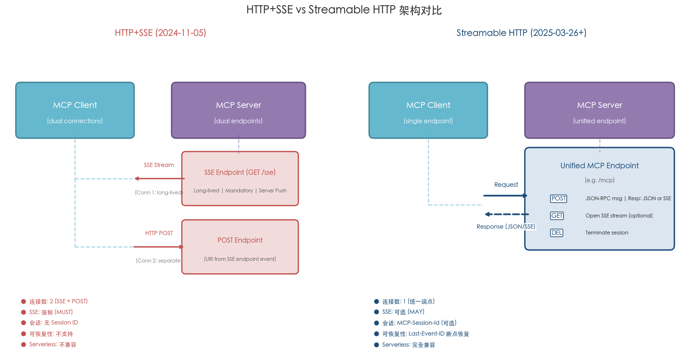

图 1-1 直观展示了旧版 HTTP+SSE 双端点架构与新版 Streamable HTTP 统一端点架构在连接模型、SSE 角色、会话管理、可恢复性和 Serverless 兼容性五个维度上的核心差异。

上述五项变更的设计精髓在于：**将 SSE 从强制基础设施降格为可选增强能力**。最基础的 MCP 服务端只需处理 POST 请求并返回 JSON 响应即可运行，完全无需长连接支持，天然兼容 Serverless 部署；而需要流式传输、实时通知和服务端主动请求的复杂场景则可渐进式地启用 SSE 流[PR #206](https://github.com/modelcontextprotocol/modelcontextprotocol/pull/206 "TL;DR section of the RFC")。

PR #206 同时明确阐释了不选择 WebSocket 的三点理由：**(1)** 在 RPC 风格无状态调用中，WebSocket 引入不必要的连接建立与维持开销；**(2)** 浏览器环境中 WebSocket 无法附加 `Authorization` 等自定义 HTTP 头部，不利于认证集成；**(3)** 将 POST 端点升级为 WebSocket 需要额外的两步过程（HTTP Upgrade 握手），引入不必要的复杂性[PR #206](https://github.com/modelcontextprotocol/modelcontextprotocol/pull/206 "Why not WebSocket section")。

## 1.5 三版规范迭代中的定位演进

Streamable HTTP 被纳入 2025 年 3 月 26 日发布的规范版本后，又经历了两次重要迭代。三版规范共同勾勒出该传输机制从引入到成熟的完整演进路径。

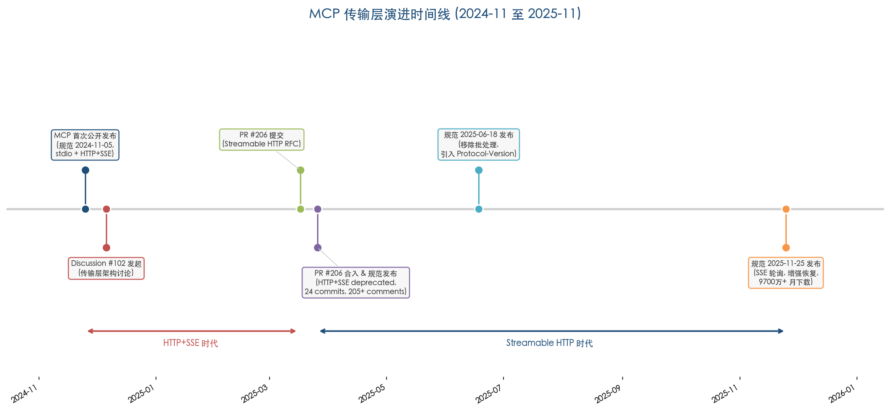

图 1-2 以时间线形式呈现了 MCP 传输层从 2024 年 11 月首次发布到 2025 年 11 月第三版规范发布期间的关键里程碑，清晰标示出 HTTP+SSE 时代与 Streamable HTTP 时代的分界。

### 2025-03-26 版：引入与替代

2025-03-26 版 changelog 将"Replaced the previous HTTP+SSE transport with a more flexible Streamable HTTP transport"列为第二项重大变更。同版本还引入了 OAuth 2.1 授权框架、JSON-RPC 批处理和工具注解[MCP 2025-03-26 Changelog](https://modelcontextprotocol.io/specification/2025-03-26/changelog "2025-03-26 版官方变更日志")。

自此版本起，旧版 HTTP+SSE 传输被正式标记为 deprecated。规范 Backwards Compatibility 章节以"deprecated HTTP+SSE transport (from protocol version 2024-11-05)"开篇，提供了客户端和服务端的向后兼容指导[MCP 2025-03-26 Transports](https://modelcontextprotocol.io/specification/2025-03-26/basic/transports "Backwards Compatibility 章节")。

### 2025-06-18 版：收窄与强化

2025-06-18 版对 Streamable HTTP 进行了两项关键调整。其一，移除 JSON-RPC 批处理支持（PR #416），POST 请求体改为仅接受单个 JSON-RPC 消息。其二，引入 `MCP-Protocol-Version` HTTP 头部要求——客户端在初始化后的所有请求中 MUST 携带此头部，服务端未收到时 SHOULD 假定版本为 2025-03-26，无效版本 MUST 返回 400 Bad Request[MCP 2025-06-18 Changelog](https://modelcontextprotocol.io/specification/2025-06-18/changelog "2025-06-18 版官方变更日志")。

该版本 Backwards Compatibility 章节措辞与 2025-03-26 版保持一致，以相同的"Clients and servers can maintain backwards compatibility with the deprecated HTTP+SSE transport (from protocol version 2024-11-05) as follows"开篇，未提供独立的废弃声明文档，而是将废弃信息内联于传输层规范之中[MCP 2025-06-18 Transports](https://modelcontextprotocol.io/specification/2025-06-18/basic/transports "2025-06-18 版 Backwards Compatibility 章节原文")。

### 2025-11-25 版：走向成熟

2025-11-25 版是 MCP 协议发布一周年之际的重大更新，标志着 Streamable HTTP 走向成熟。该版本的核心增强包括：

- **SSE 轮询机制（SEP-1699）**——服务端可在发送初始带事件 ID 的预备事件后主动关闭连接，客户端通过轮询重连。该机制解决了 SEP-1335 在 2025 年 8 月识别的三个核心问题：SSE 流启动后断连前无事件则客户端无法恢复、规范不允许服务端主动关闭连接导致必须维持长连接、缺少重连等待指导[SEP-1335](https://github.com/modelcontextprotocol/modelcontextprotocol/issues/1335 "Address Streamable HTTP transport issues")。
- **会话 ID 头部标准化**——从 `Mcp-Session-Id` 改为 `MCP-Session-Id`。
- **Origin 头校验增强**——无效 Origin MUST 返回 403 Forbidden，强化 DNS 重绑定攻击防护。
- **实验性 Task 支持（SEP-1686）**——为长时任务引入异步管理原语。

断连前服务端 SHOULD 发送含 `retry` 字段的事件以指导客户端轮询间隔，客户端 MUST 遵守此值。这一设计将传统的"服务端必须维持长连接"模型转化为"短连接 + 主动断开 + 客户端轮询重连"模型，从根本上解决了 Serverless 环境下的兼容性问题[MCP 2025-11-25 Changelog](https://modelcontextprotocol.io/specification/2025-11-25/changelog "2025-11-25 版官方变更日志")。

## 1.6 生态影响与采纳规模

截至 2025 年 11 月 25 日——MCP 发布一周年——协议已积累超过 9,700 万月度 SDK 下载量和 10,000 余个活跃服务端。ChatGPT、Claude、Cursor、Gemini、Microsoft Copilot、VS Code 等主流 AI 客户端均已提供一级 MCP 支持[MCP 官方博客](https://blog.modelcontextprotocol.io/posts/2025-11-25-first-mcp-anniversary/ "One Year of MCP: November 2025 Spec Release")。

在 SDK 层面，TypeScript SDK 1.10.0（2025 年 4 月 17 日发布）是首个支持 Streamable HTTP 的 SDK 版本[Anthropic 官方公告](https://www.anthropic.com/news/model-context-protocol "Introducing the Model Context Protocol, 2024-11-25")。此后 Python SDK（自 v1.8.0 起支持）、Java SDK、Kotlin SDK、C# SDK（v1.0，2026 年 3 月 5 日发布）等相继跟进，形成了完整的多语言 SDK 生态。

HTTP+SSE 传输的废弃演进路径清晰可循：2024-11-05 版作为唯一远程传输方式 → 2025-03-26 版被 Streamable HTTP 替代并标记为 deprecated → 后续版本持续保持废弃状态并不断强化 Streamable HTTP。所有后续版本的 Backwards Compatibility 章节均保留 HTTP+SSE 的废弃标注和过渡指导，但未设定明确的移除时间线[MCP 2025-03-26 Transports](https://modelcontextprotocol.io/specification/2025-03-26/basic/transports "Backwards Compatibility 章节")。

从 HTTP+SSE 到 Streamable HTTP 的演进，本质上是 MCP 从"面向实验的有状态双向协议"向"面向生产的渐进增强传输层"的范式转换。这一转换保留了 MCP 的全部核心能力——双向通信、实时通知、服务端采样——同时通过单端点模型、SSE 可选升级和无状态模式消除了旧版架构的结构性瓶颈，为 MCP 在企业级分布式环境中的大规模部署奠定了基础。

# 第2章 Streamable HTTP 协议设计与传输机制

## 2.1 统一端点模型：从双端点到单一 MCP 端点

Streamable HTTP 传输层最具标志性的架构变革，在于将旧版 HTTP+SSE 方案的双端点强制架构收敛为单一 HTTP 端点路径。MCP 2025-11-25 版规范明确要求：服务端 MUST 提供一个同时支持 POST 和 GET 两种 HTTP 方法的端点（规范称之为"MCP endpoint"），例如 `https://example.com/mcp`。[MCP 规范 2025-11-25 版 Transports](https://modelcontextprotocol.io/specification/2025-11-25/basic/transports "Streamable HTTP 统一端点定义")

这一设计决策的战略意图清晰而明确。旧版 HTTP+SSE 传输要求服务端维护两个独立端点——一个 SSE 端点供客户端建立连接并接收服务端推送消息，一个 HTTP POST 端点供客户端发送消息。更为复杂的是，POST 端点的 URI 并非预先约定，而须在 SSE 连接建立后由服务端通过 `endpoint` 事件动态传递给客户端。[MCP 规范 2024-11-05 Transports](https://modelcontextprotocol.io/specification/2024-11-05/basic/transports "MCP 2024-11-05 版传输层规范原文") 这意味着客户端必须先完成 SSE 握手方能获得消息发送能力，形成了隐含的时序依赖链条。

统一端点模型彻底消除了这一复杂性。所有客户端到服务端的消息均通过 POST 发送到同一路径，服务端到客户端的监听通过 GET 在同一路径上建立。会话终止（DELETE）也在同一端点完成。这种设计使 MCP 服务端在负载均衡器、API 网关和反向代理的配置上大幅简化——只需路由一个路径即可覆盖全部通信功能。

更为关键的是，统一端点模型支持从最基础到功能丰富的多级服务端实现。PR #206 的 TL;DR 章节将其概括为五种范式：纯 POST+JSON 响应的最小无状态服务端、支持 SSE 流式响应的无状态服务端、带会话管理的有状态服务端、支持服务端主动推送（通过 GET SSE 流）的服务端，以及支持可恢复性的完整功能服务端。[PR #206](https://github.com/modelcontextprotocol/modelcontextprotocol/pull/206 "RFC: Replace HTTP+SSE with new Streamable HTTP transport") 这种渐进式功能叠加的设计哲学，使得 Serverless 函数（如 AWS Lambda）和边缘计算节点（如 Cloudflare Workers）均能作为合规的 MCP 服务端运行，而旧版架构因强制长连接 SSE 将此类运行时排除在外。

下图展示了 Streamable HTTP 的完整交互流程，涵盖初始化、SSE 升级和 GET 监听轮询三个阶段：

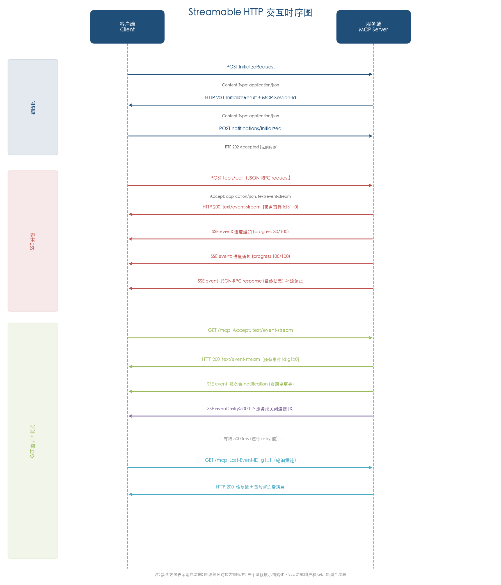

## 2.2 客户端到服务端：POST 请求承载 JSON-RPC 消息

### 2.2.1 POST 请求的基本约束

Streamable HTTP 规定客户端发送的每条 JSON-RPC 消息 MUST 通过一个新的 HTTP POST 请求发送到 MCP 端点。[MCP 规范 2025-11-25 版 Transports](https://modelcontextprotocol.io/specification/2025-11-25/basic/transports "POST 请求基本约束") 请求 MUST 携带 `Accept` 头部，同时列出 `application/json` 和 `text/event-stream` 两种内容类型，以表明客户端具备处理同步 JSON 响应与异步 SSE 流响应的双重能力。

POST 请求体的格式经历了一次重要收窄。2025-03-26 版引入 Streamable HTTP 时允许请求体为 JSON-RPC 消息数组（即 JSON-RPC 批处理），而 2025-06-18 版通过 PR #416 移除了批处理支持，要求请求体 MUST 为单个 JSON-RPC request、notification 或 response 对象。[PR #416](https://github.com/modelcontextprotocol/modelcontextprotocol/pull/416 "Remove batching requirement") 该决策由 MCP 核心团队成员 ihrpr 于 2025-04-25 提出并合并，理由在于 TypeScript 和 Python SDK 的实现过程中未发现批处理存在具有说服力的使用场景，且需要并行处理的工具调用可通过多个并发 POST 请求（利用 HTTP/2 多路复用）实现等价效果。

### 2.2.2 差异化响应处理

服务端对 POST 请求中不同类型 JSON-RPC 消息的处理规则存在明确分化，这是理解 Streamable HTTP 协议行为的关键。下图以流程图形式完整呈现了服务端的响应决策路径：

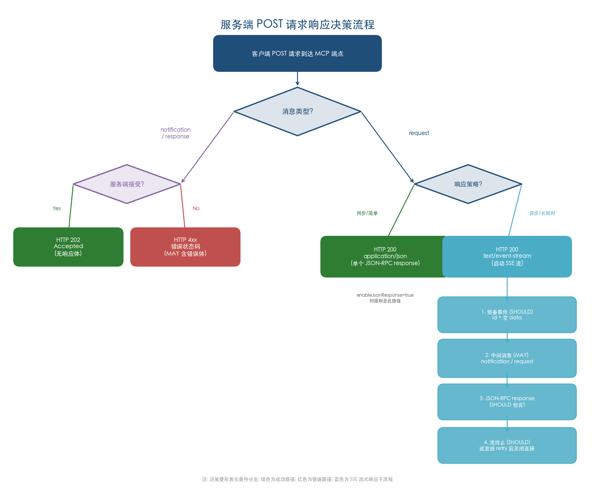

**Notification 和 Response 类型消息**：当服务端接受输入时，MUST 返回 HTTP 202 Accepted 且无响应体；当服务端拒绝输入时，MUST 返回 HTTP 错误状态码（如 400 Bad Request），响应体 MAY 包含一个无 `id` 的 JSON-RPC error response。[MCP 规范 2025-11-25 版 Transports](https://modelcontextprotocol.io/specification/2025-11-25/basic/transports "POST 响应规则")

**Request 类型消息**：服务端 MUST 选择以下两种响应方式之一——返回 `Content-Type: application/json` 直接给出单个 JSON-RPC response 对象，或返回 `Content-Type: text/event-stream` 启动一个 SSE 流。客户端 MUST 同时支持这两种响应格式。这种二选一的设计构成了 Streamable HTTP 的核心弹性机制，2.4 节将对此展开详细分析。

以下示例展示了一个典型的 POST 请求-响应交互（JSON 模式）：

```http
POST /mcp HTTP/1.1
Host: example.com
Content-Type: application/json
Accept: application/json, text/event-stream
MCP-Protocol-Version: 2025-11-25
MCP-Session-Id: a1b2c3d4-e5f6-7890-abcd-ef1234567890

{
  "jsonrpc": "2.0",
  "id": 1,
  "method": "tools/list",
  "params": {}
}
```

同步 JSON 响应：

```http
HTTP/1.1 200 OK
Content-Type: application/json

{
  "jsonrpc": "2.0",
  "id": 1,
  "result": {
    "tools": [
      {"name": "get_weather", "description": "获取天气信息"}
    ]
  }
}
```

### 2.2.3 协议版本头部

2025-06-18 版规范引入了 `MCP-Protocol-Version` HTTP 头部，用于在初始化完成后的所有通信中显式声明协议版本。客户端 MUST 在初始化完成后的所有后续请求中携带该头部，其值 SHOULD 为初始化阶段协商确定的协议版本（例如 `MCP-Protocol-Version: 2025-11-25`）。服务端在未收到该头部且无法通过其他方式（如初始化阶段缓存的版本）确定版本时，SHOULD 假定协议版本为 `2025-03-26`——该默认回退策略为旧客户端到新服务端的平滑过渡提供了兼容保障。服务端收到无效或不支持的版本号时 MUST 返回 400 Bad Request。[MCP 规范 2025-06-18 版 Transports](https://modelcontextprotocol.io/specification/2025-06-18/basic/transports "MCP-Protocol-Version 头部要求")

## 2.3 服务端到客户端：GET 请求开启 SSE 监听流

POST 方向的通信遵循请求-响应模型——客户端主动发起，服务端被动响应。然而，MCP 协议存在服务端需要主动向客户端发送消息的场景，例如服务端触发的工具结果通知、资源变更推送或 `ping` 心跳请求。GET 方向的 SSE 流即为此类场景而设计。

客户端 MAY 向 MCP 端点发起 HTTP GET 请求以开启一个 SSE 流，请求 MUST 包含 `Accept: text/event-stream` 头部。[MCP 规范 2025-11-25 版 Transports](https://modelcontextprotocol.io/specification/2025-11-25/basic/transports "GET 请求开启 SSE 流") 此处使用的约束关键词为 MAY——GET SSE 流并非客户端的强制行为，仅在客户端需要接收服务端主动推送消息时方有必要建立。

服务端对 GET 请求 MUST 选择以下两种响应之一：
- 返回 `Content-Type: text/event-stream` 启动 SSE 流；
- 返回 HTTP 405 Method Not Allowed，表示服务端不支持在该端点提供 SSE 流。

这意味着一个最小化的 MCP 服务端可以完全不支持 GET SSE 流——仅依靠 POST 请求与 JSON/SSE 响应即可完成全部交互。HTTP 405 响应为纯请求-响应模式的服务端（如 Serverless 函数）提供了合规的拒绝机制。

GET 流上的消息约束与 POST 流存在重要差异：服务端 MAY 在 GET SSE 流上发送 JSON-RPC request 和 notification，且这些消息 SHOULD 与任何正在并发执行的客户端请求无关——换言之，GET 流承载的是"带外"（out-of-band）消息。核心约束在于，服务端 MUST NOT 在 GET 流上发送 JSON-RPC response，除非是在恢复（resume）一个与先前客户端请求关联的流时。[MCP 规范 2025-11-25 版 Transports](https://modelcontextprotocol.io/specification/2025-11-25/basic/transports "GET 流消息约束")

## 2.4 SSE 流的动态升降级设计

### 2.4.1 核心弹性机制

SSE 动态升降级是 Streamable HTTP 最精巧的协议特性之一，赋予服务端在逐请求粒度上选择响应模式的完全自主权。当客户端 POST 一个 JSON-RPC request 时，服务端可根据操作特征自行决定响应方式：

**降级路径（JSON 响应）**：对于简单、同步、低延迟的操作（如 `tools/list`、`ping`），服务端直接返回 `Content-Type: application/json` 和单个 JSON-RPC response 对象。整个交互在一次 HTTP 请求-响应往返中完成，无需维持任何持久连接。

**升级路径（SSE 流响应）**：对于长耗时、需要进度报告或可能触发中间交互的操作（如 `tools/call` 执行一个耗时的外部 API 调用），服务端返回 `Content-Type: text/event-stream` 启动 SSE 流。在最终的 JSON-RPC response 发送之前，服务端 MAY 在流中先发送 JSON-RPC request（如采样请求）和 notification（如进度通知），这些中间消息 SHOULD 与发起的原始请求相关。[MCP 规范 2025-11-25 版 Transports](https://modelcontextprotocol.io/specification/2025-11-25/basic/transports "SSE 流生命周期")

### 2.4.2 SSE 流的生命周期

一个完整的 SSE 流生命周期遵循以下规范约束：

1. **流启动**：服务端返回 `Content-Type: text/event-stream` 并开始发送 SSE 事件。服务端 SHOULD 立即发送一个仅含事件 ID 和空 `data` 字段的预备事件（prime event），以便客户端在后续断连时能够使用该事件 ID 作为 `Last-Event-ID` 重连。[MCP 规范 2025-11-25 版 Transports](https://modelcontextprotocol.io/specification/2025-11-25/basic/transports "SSE 轮询机制")

2. **中间消息传递**：服务端 MAY 在流中发送多个 SSE 事件，每个事件承载一条 JSON-RPC 消息。SSE 事件使用 `event: message` 作为事件类型名称（该命名沿袭自旧版 HTTP+SSE 规范中对"SSE `message` events"的定义，所有主流 SDK 实现均遵循此约定），`data:` 字段承载 JSON 序列化的完整 JSON-RPC 消息。[MCP 规范 2024-11-05 Transports](https://modelcontextprotocol.io/specification/2024-11-05/basic/transports "Server messages are sent as SSE message events")

3. **流终止**：SSE 流 SHOULD 最终包含对应原始请求的 JSON-RPC response，response 发送后服务端 SHOULD 终止流。如果会话过期，服务端 MAY 提前终止流。

以下示例展示了一个升级为 SSE 流的 POST 交互，包含进度通知和最终响应：

```http
POST /mcp HTTP/1.1
Host: example.com
Content-Type: application/json
Accept: application/json, text/event-stream
MCP-Protocol-Version: 2025-11-25

{"jsonrpc":"2.0","id":2,"method":"tools/call","params":{"name":"analyze_data","arguments":{"dataset":"sales_2025"}}}
```

```http
HTTP/1.1 200 OK
Content-Type: text/event-stream

id: stream1::0
data:

id: stream1::1
event: message
data: {"jsonrpc":"2.0","method":"notifications/progress","params":{"progressToken":"pt-2","progress":30,"total":100}}

id: stream1::2
event: message
data: {"jsonrpc":"2.0","method":"notifications/progress","params":{"progressToken":"pt-2","progress":100,"total":100}}

id: stream1::3
event: message
data: {"jsonrpc":"2.0","id":2,"result":{"content":[{"type":"text","text":"分析完成：2025年销售额同比增长15%"}]}}
```

在该示例中，第一个事件为预备事件（仅含 ID 和空 data），后续两个进度通知先行送达，最终的 JSON-RPC response 在 `id: stream1::3` 事件中到达，之后服务端关闭流。

### 2.4.3 设计意义

动态升降级将响应模式的选择权交给服务端，而非在协议层面强制固定一种传输模式。这一设计产生了两个关键影响：

第一，**部署灵活性大幅提升**。不支持长连接的运行时（如 API Gateway 后的 Lambda 函数）可以仅使用 JSON 响应模式，在不违反协议的前提下正常运行。TypeScript SDK 为此类场景提供了 `enableJsonResponse` 配置选项，开启后所有 POST 请求返回纯 JSON，GET 请求返回 405。[TypeScript SDK Server Guide](https://github.com/modelcontextprotocol/typescript-sdk/blob/main/docs/server.md "enableJsonResponse 配置")

第二，**渐进增强成为可能**。同一服务端可以对不同请求采用不同策略——对 `tools/list` 返回 JSON，对 `tools/call` 返回 SSE 流——从而实现细粒度的传输策略优化。

## 2.5 SSE 轮询机制：从长连接到短连接

### 2.5.1 问题背景

2025-03-26 版引入 Streamable HTTP 后，SSE 流在生产环境中仍面临长连接维护的压力。SEP-1335（2025-08-12）首次系统性地识别了四个关键问题：(1) SSE 流启动后若在断连前未发送任何事件，客户端将无法获得事件 ID 用于恢复；(2) 规范未明确允许服务端主动关闭连接，意味着服务端被迫维持长连接直到流逻辑终止；(3) 客户端可能在断连后过度重连，造成服务端资源浪费；(4) 服务端缺乏已投递消息的垃圾回收指导。[SEP-1335](https://github.com/modelcontextprotocol/modelcontextprotocol/issues/1335 "Address Streamable HTTP transport issues")

### 2.5.2 轮询机制设计

2025-11-25 版规范通过 SEP-1699 引入了 SSE 轮询机制，其核心创新在于确立了"连接"关闭与"流"终止的概念区分——服务端可以关闭 HTTP 连接（connection），同时保持逻辑上的 SSE 流（stream）未终止，客户端随后通过重连继续接收后续消息。[MCP 规范 2025-11-25 版 Transports](https://modelcontextprotocol.io/specification/2025-11-25/basic/transports "SSE 轮询机制") [SEP-1699](https://github.com/modelcontextprotocol/specification/discussions/1699 "Support SSE polling via server-side disconnect")

该机制的工作流程如下：

1. **预备事件**：服务端启动 SSE 流时 SHOULD 立即发送一个仅含事件 ID 和空 `data` 字段的事件。该事件的目的是确保客户端在任何时刻断连后都持有至少一个事件 ID，从而可以在重连时通过 `Last-Event-ID` 头部恢复。

2. **主动断连**：服务端发送过含事件 ID 的事件后，MAY 在任何时候关闭连接。关闭前 SHOULD 发送一个包含标准 `retry` 字段的 SSE 事件，指示客户端等待指定毫秒数后再尝试重连。客户端 MUST 遵守 `retry` 值。

3. **客户端轮询**：客户端在连接断开后，按照 `retry` 指定的间隔向 MCP 端点发起新的 GET 请求（携带 `Last-Event-ID`），服务端恢复流并投递断连后积累的消息。

4. **语义澄清**：断连 SHOULD NOT 被解释为客户端取消请求。如需取消，客户端 SHOULD 显式发送 MCP `CancelledNotification`。[MCP 规范 2025-11-25 版 Transports](https://modelcontextprotocol.io/specification/2025-11-25/basic/transports "断连语义与多连接约束")

该轮询机制将 SSE 从持久长连接模型转变为短连接加定时重连模型。对于需要水平扩展的生产部署而言，这一转变意义重大：负载均衡器不再需要为 SSE 连接维持粘性会话（或将维持时间大幅缩短），连接资源可在轮询间隔期间得到释放，从而显著降低并发连接数和内存占用。

### 2.5.3 多连接管理

规范允许客户端同时维持多个 SSE 流（MAY），但对服务端的消息投递施加了严格约束：服务端 MUST 将每条 JSON-RPC 消息仅在一个连接的流上发送，MUST NOT 在多个流上广播相同消息。[MCP 规范 2025-11-25 版 Transports](https://modelcontextprotocol.io/specification/2025-11-25/basic/transports "多连接约束") 多连接场景下的消息丢失风险 MAY 通过使流可恢复来缓解——第 3 章将对此机制展开详细讨论。

## 2.6 HTTP 状态码语义矩阵

Streamable HTTP 对 HTTP 状态码的使用定义了精确的语义规范，形成了客户端与服务端之间的行为契约。以下为规范中明确规定的状态码体系：

| 状态码 | 场景 | 规范约束 |
|--------|------|----------|
| 200 OK | 成功返回 JSON 响应或 SSE 流 | POST request 类型消息的正常响应 |
| 202 Accepted | notification/response 被接受 | MUST 返回，无响应体 |
| 400 Bad Request | 缺少 Session ID / 无效 MCP-Protocol-Version | MUST 返回（Session ID 为 SHOULD，版本号为 MUST） |
| 403 Forbidden | Origin 头部验证失败 | MUST 返回（2025-11-25 版新增强制要求） |
| 404 Not Found | 会话已终止 | MUST 返回，客户端 MUST 重新初始化 |
| 405 Method Not Allowed | 不支持 GET SSE / 不允许 DELETE | MUST 返回 |

[MCP 规范 2025-11-25 版 Transports](https://modelcontextprotocol.io/specification/2025-11-25/basic/transports "HTTP 状态码使用约束")

值得关注的是，规范未对 Accept 头部协商失败场景显式定义 406 Not Acceptable 状态码。尽管 RFC 9110 将 406 定义为服务端无法产生客户端可接受内容时的标准响应码，MCP 规范选择通过 MUST 级别的 Accept 头部约束（客户端 MUST 同时列出 `application/json` 和 `text/event-stream`）从客户端侧预防该场景发生，而非在服务端侧定义容错响应码。实践中，Python SDK 的部分版本在 Accept 头部不匹配时返回 406 响应，这属于 SDK 级别的防御性实现而非协议层面的显式要求。

## 2.7 MUST/SHOULD/MAY 约束层级分布

Streamable HTTP 规范遵循 RFC 2119 的关键词体系，通过 MUST、SHOULD、MAY 三个层级对客户端和服务端的行为进行精确约束。理解这三个层级的分布，对于构建合规的 MCP 实现至关重要。下图以同心环结构可视化了三个约束层级的渐进式功能叠加关系：

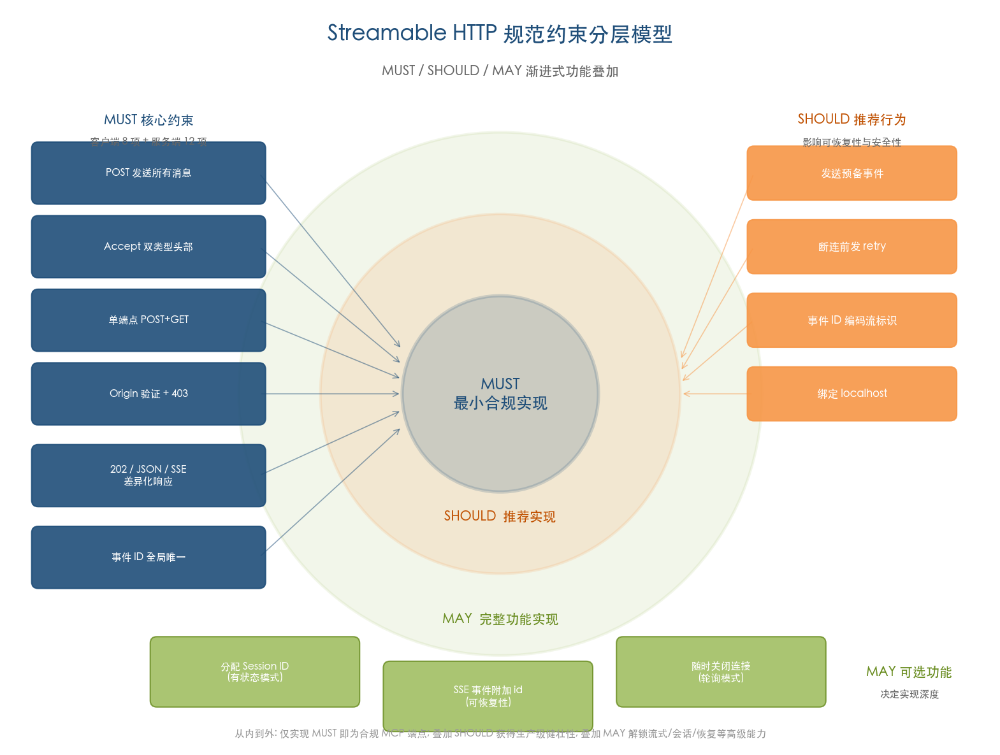

### 2.7.1 客户端 MUST 条款（8 项）

客户端实现必须满足以下 8 项强制性要求：

1. 使用 HTTP POST 发送所有 JSON-RPC 消息
2. POST 请求中包含 `Accept` 头部，同时列出 `application/json` 和 `text/event-stream`
3. POST 请求体为单个 JSON-RPC 消息（非数组）
4. 支持服务端返回 JSON 或 SSE 两种响应格式
5. GET 请求中包含 `Accept: text/event-stream`
6. 遵守服务端在 SSE 事件中指定的 `retry` 值
7. 初始化后所有请求携带 `MCP-Protocol-Version` 头部
8. 收到 404 响应时重新发送 `InitializeRequest` 开始新会话

[MCP 规范 2025-11-25 版 Transports](https://modelcontextprotocol.io/specification/2025-11-25/basic/transports "完整 MUST/SHOULD/MAY 约束")

### 2.7.2 服务端 MUST 条款（12 项核心约束）

服务端实现的强制性要求涵盖范围更广，共计 12 项核心约束：

1. 提供单一端点同时支持 POST 和 GET 方法
2. 验证所有请求的 `Origin` 头部
3. 对无效 Origin 返回 HTTP 403 Forbidden
4. 对接受的 notification/response 返回 202 Accepted
5. 对拒绝的 notification/response 返回 HTTP 错误状态码
6. 对 request 返回 `application/json` 或 `text/event-stream` 之一
7. 对 GET 请求返回 `text/event-stream` 或 405 Method Not Allowed
8. 每条消息仅在一个 SSE 流上发送（不广播）
9. 事件 ID 在会话内所有流中全局唯一
10. 会话终止后对该 Session ID 的请求返回 404
11. 对无效 `MCP-Protocol-Version` 返回 400
12. 恢复时不得重放不同流的消息

### 2.7.3 关键 SHOULD 条款

SHOULD 层级定义了推荐但非强制的行为，其中对系统健壮性影响最大的条款包括：

- 服务端 SHOULD 立即发送预备事件（影响可恢复性）
- 服务端断连前 SHOULD 发送 `retry` 字段（影响轮询间隔）
- 事件 ID SHOULD 编码流标识信息（影响恢复路由）
- 服务端 SHOULD 绑定 localhost 而非 0.0.0.0（影响安全性）
- 中间消息 SHOULD 与发起请求相关（影响 GET 流语义划分）

### 2.7.4 关键 MAY 条款

MAY 层级定义了可选功能，决定了服务端实现的功能深度：

- 服务端 MAY 分配 Session ID（MAY 不分配则为无状态模式）
- 服务端 MAY 为 SSE 事件附加 `id` 字段（MAY 不附加则不支持恢复）
- 客户端 MAY 发起 GET 请求开启 SSE 流
- 服务端 MAY 在发送事件 ID 后随时关闭连接（支持轮询模式）
- 服务端 MAY 重放断连后的消息（实现重投递）

这种 MUST/SHOULD/MAY 的层级设计，是 Streamable HTTP 渐进式功能叠加哲学在协议规范中的具体表达。一个仅实现全部 MUST 条款的服务端即已构成合规的 MCP 实现；在此基础上逐步叠加 SHOULD 和 MAY 条款，则可渐进解锁流式传输、可恢复性、会话管理等高级能力。

## 2.8 未来方向：Transport Working Group 路线图

MCP Transport Working Group 于 2025-12-19 发布的路线图指出，Streamable HTTP 在大规模生产部署中仍面临若干结构性挑战。其中两个核心问题尤为突出：其一，负载均衡器需要解析完整的 JSON-RPC 负载才能将请求路由到正确的后端实例，而标准 HTTP 负载均衡器仅基于路径和头部进行路由，无法深入检查请求体；其二，有状态连接迫使采用粘性路由（sticky routing），严重阻碍了自动扩缩容能力。[MCP Transport Future Blog](https://mcpcn.com/en/blog/transport-future/ "MCP Transport Working Group 路线图")

Working Group 提出的未来演进方向涵盖三个层面：将协议进一步无状态化、将会话概念从传输层提升至数据模型层、将 JSON-RPC 路由信息（如方法名、资源标识）暴露到 HTTP 路径或头部以实现无需解析请求体的路由。上述改进计划在 2026 年 6 月的下一版规范中落地。

上述路线图揭示了一个重要信号：Streamable HTTP 在当前形态下是一个务实而有效的中间方案，它解决了旧版 HTTP+SSE 的核心痛点（双端点、强制长连接、不可恢复），但尚未完全达到大规模分布式系统对传输层的理想要求。协议设计团队对此有清晰的认知，并已规划了从传输层感知到传输层透明的演进路径。

# 第3章 会话管理、可恢复性与状态机制

Streamable HTTP 在传输层的核心设计创新之一，在于将会话管理与可恢复性从"协议强制要求"降级为"服务端可选能力"。这一架构选择使协议能够同时覆盖从无状态 Serverless 函数到长时运行有状态服务的广谱部署场景，而旧版 HTTP+SSE 传输因强制长连接而无法实现这一灵活性。本章从 `MCP-Session-Id` 头部的分配机制出发，系统分析会话的完整生命周期管理，进而深入 SSE 事件 ID 驱动的可恢复性与重投递机制，并讨论有状态与无状态两种运行模式的工程取舍，最后审视会话安全威胁及规范层面尚待解决的开放议题。

## 3.1 MCP-Session-Id 的分配规则与安全约束

### 3.1.1 分配时机与传递机制

MCP 会话（session）定义为客户端与服务端之间一组逻辑相关的交互序列，始于初始化阶段（initialization phase）。在 Streamable HTTP 传输层中，服务端 MAY 在初始化时分配 Session ID，具体方式是在包含 `InitializeResult` 的 HTTP 响应头部中附加 `MCP-Session-Id` 字段。[MCP 规范 2025-11-25 版 Transports](https://modelcontextprotocol.io/specification/2025-11-25/basic/transports "Session Management")

该"MAY"级别的约束体现了经过深思熟虑的设计哲学：不分配 Session ID 即隐式实现无状态模式，分配则开启有状态会话管理。PR #206 原始提案对此作出明确阐释——"Stateless servers are now possible—eliminating the requirement for high availability long-lived connections"，并给出了 "Stateless server" 和 "Stateless server with streaming" 两种运行范式的具体示例。[PR #206](https://github.com/modelcontextprotocol/modelcontextprotocol/pull/206 "Stateless servers are now possible")

一旦服务端分配了 Session ID，客户端 MUST 在后续所有 HTTP 请求（POST、GET、DELETE）的 `MCP-Session-Id` 头部中携带该值。需要 Session ID 的服务端 SHOULD 对缺少该头部的非初始化请求返回 400 Bad Request，从而在协议层面强制会话一致性。[MCP 规范 2025-11-25 版 Transports](https://modelcontextprotocol.io/specification/2025-11-25/basic/transports "Session Management")

### 3.1.2 Session ID 的格式与安全性要求

Session ID 受到编码和安全两个层面的严格约束。编码层面，Session ID MUST 仅包含可见 ASCII 字符（0x21–0x7E），排除空格及控制字符，确保其可安全嵌入 HTTP 头部字段中传输而不引发解析歧义。[MCP 规范 2025-11-25 版 Transports](https://modelcontextprotocol.io/specification/2025-11-25/basic/transports "Session ID 格式")

安全层面，规范提出了多层递进要求：

- Session ID SHOULD 全局唯一且密码学安全，推荐形式包括安全生成的 UUID、JWT 或加密哈希；
- 安全最佳实践进一步要求 MUST 使用不可确定的（non-deterministic）标识符，SHOULD 使用密码学安全的随机数生成器（CSPRNG）；
- SHOULD 将 Session ID 绑定用户信息，推荐采用 `<user_id>:<session_id>` 的复合格式，以缓解会话劫持风险；
- 2025-11-25 版新增客户端 MUST 安全处理 Session ID 的要求，将安全责任从服务端侧延伸至客户端侧。

[MCP 规范 2025-11-25 版 Transports](https://modelcontextprotocol.io/specification/2025-11-25/basic/transports "Session ID 格式") [MCP 安全最佳实践](https://modelcontextprotocol.io/docs/tutorials/security/security_best_practices "Session Hijacking 缓解")

### 3.1.3 头部名称的演变

Session ID 头部名称经历了一次标准化调整：2025-03-26 和 2025-06-18 版使用 `Mcp-Session-Id`，2025-11-25 版将其改为 `MCP-Session-Id`。由于 HTTP/1.1 规范（RFC 9110）明确规定头部名称不区分大小写，且 HTTP/2 强制将头部名称小写处理，该变更在协议兼容性上实际无影响。[MCP 规范 2025-03-26 版 Transports](https://modelcontextprotocol.io/specification/2025-03-26/basic/transports "Mcp-Session-Id") [MCP 规范 2025-11-25 版 Transports](https://modelcontextprotocol.io/specification/2025-11-25/basic/transports "MCP-Session-Id")

值得注意的是，各 SDK 的头部名称使用并不统一——TypeScript SDK 在代码中使用 `mcp-session-id`（全小写），Python SDK 使用 `Mcp-Session-Id`，AWS Bedrock AgentCore 同样采用 `Mcp-Session-Id`。这一现象印证了 HTTP 头部大小写不敏感的协议保证，但同时提醒实现者在进行头部匹配时应始终采用大小写不敏感的比较策略，以避免互操作性问题。

### 3.1.4 从客户端生成到服务端分配的设计演进

Session ID 的生成主体在 PR #206 的讨论过程中经历了关键转变。初始版本采用客户端生成方案，但社区参与者 daviddenton 质疑了该设计的安全性，指出客户端生成的 ID 可能被伪造或猜测，进而建议改由服务端在 initialize 响应中生成并签名。该建议获得 12 个赞同后被正式采纳，确立了最终规范中"服务端分配"的设计范式。[PR #206](https://github.com/modelcontextprotocol/modelcontextprotocol/pull/206 "daviddenton 建议改为服务端生成")

服务端生成方案具有多重安全与工程优势：服务端可使用密码学安全的随机数生成器确保 ID 不可预测；可将用户信息编码进 ID 实现身份绑定；可对 ID 进行签名以防止篡改；在集群部署场景中，服务端亦能确保 ID 格式与路由策略保持一致。

## 3.2 会话生命周期管理

MCP 会话经历从初始化到活跃再到终止的完整生命周期。图 3-1 以状态机形式展示了这一过程中的关键状态及其转换条件。

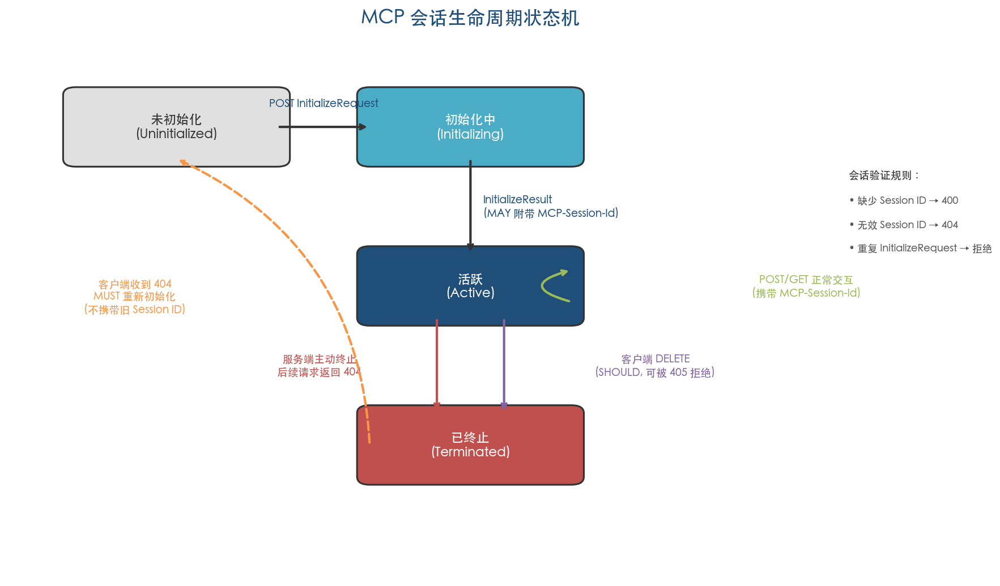

### 3.2.1 初始化阶段

会话的建立始于客户端发送 `InitializeRequest`。服务端处理该请求后，若决定开启有状态会话，则在 `InitializeResult` 响应的 HTTP 头部中附加 `MCP-Session-Id`。此后，客户端在同一会话内的所有后续请求均须携带该 ID，形成会话级别的逻辑绑定。

TypeScript SDK 的实现展示了初始化阶段的工程细节：服务端通过 `sessionIdGenerator` 配置项决定是否生成 Session ID——传入 `() => randomUUID()` 即启用有状态模式，传入 `undefined` 则运行为无状态模式。初始化完成后，SDK 通过 `onsessioninitialized` 回调通知应用层，便于将 transport 实例存入 `Map<string, Transport>` 数据结构以供后续路由。[TypeScript SDK Server Guide](https://github.com/modelcontextprotocol/typescript-sdk/blob/main/docs/server.md "NodeStreamableHTTPServerTransport")

### 3.2.2 活跃阶段的会话维持

初始化完成后进入活跃阶段，会话通过 `MCP-Session-Id` 头部在每个 HTTP 请求-响应周期中维持逻辑连续性。有状态模式下，服务端根据 Session ID 执行以下分层验证逻辑：

1. 缺少 `MCP-Session-Id` 头部的非初始化请求，SHOULD 返回 400 Bad Request；
2. 携带无效（不匹配任何已知会话）Session ID 的请求，MUST 返回 404 Not Found；
3. 已初始化的服务端收到重复的 `InitializeRequest`，应予以拒绝以防止重复初始化。

TypeScript SDK 的 `validateSession` 方法完整实现了上述逻辑，同时还处理了 Session ID 头部值为数组（即头部被重复提交）的异常情况，统一返回 400 Bad Request。这种防御性验证策略在生产环境中有效防范了格式异常的恶意请求。

### 3.2.3 服务端终止会话

服务端 MAY 在任何时候单方面终止会话。终止后，服务端 MUST 对包含该 Session ID 的后续请求返回 404 Not Found。客户端收到 404 后 MUST 发送新的 `InitializeRequest` 启动新会话，且不得附带任何旧的 Session ID。[MCP 规范 2025-11-25 版 Transports](https://modelcontextprotocol.io/specification/2025-11-25/basic/transports "服务端终止会话")

会话终止产生级联影响——当会话过期时，服务端 MAY 终止所有与该会话关联的活跃 SSE 流。这意味着正在进行的长耗时操作可能因会话终止而中断。客户端需对此做好容错处理：检测到 404 响应后，应在新会话中重新发起被中断的请求，而非尝试恢复旧会话。[MCP 规范 2025-11-25 版 Transports](https://modelcontextprotocol.io/specification/2025-11-25/basic/transports "客户端终止会话")

### 3.2.4 客户端主动终止会话

当客户端不再需要某个会话时（例如用户关闭应用或切换上下文），SHOULD 发送 HTTP DELETE 到 MCP 端点并携带 `MCP-Session-Id` 头部，以显式终止会话并释放服务端资源。[MCP 规范 2025-11-25 版 Transports](https://modelcontextprotocol.io/specification/2025-11-25/basic/transports "客户端终止会话")

服务端对 DELETE 请求有两种合法响应路径：

- **接受终止**：规范未明确指定成功时的 HTTP 状态码。TypeScript SDK 实现中使用 200 OK 作为成功响应——在 `handleDeleteRequest` 方法中，SDK 先调用 `onsessionclosed` 回调通知应用层，再执行 `close()` 关闭所有 SSE 连接并清理内部状态，最后返回 `res.writeHead(200).end()`。
- **拒绝终止**：服务端 MAY 返回 405 Method Not Allowed，表示不允许客户端主动终止会话。draft 版规范进一步要求返回 405 时 MUST 包含 `Allow` 头部列出支持的方法。[MCP 规范 draft 版 Transports](https://modelcontextprotocol.io/specification/draft/basic/transports "DELETE 405 响应 Allow 头部要求")

DELETE 成功状态码在规范中的缺失构成一个值得关注的规范空白。依据 RESTful 语义惯例，204 No Content 是 DELETE 操作成功且无响应体时的标准选择，但 TypeScript SDK 选择了 200 OK。由于规范仅约束了 405 拒绝场景，实现者在成功状态码的选择上拥有自由裁量空间，这可能在跨 SDK 互操作时引发语义不一致。

## 3.3 SSE 流的可恢复性与重投递机制

### 3.3.1 事件 ID 的设计原则

可恢复性（resumability）是 Streamable HTTP 解决旧版 HTTP+SSE 传输"连接断开即消息丢失"痛点的核心机制，其技术基础是 SSE 标准中的事件 ID（event ID）机制。

服务端 MAY 为 SSE 事件附加 `id` 字段。若启用事件 ID，则必须满足两项关键约束：

1. **全局唯一性**：事件 ID MUST 在会话内所有流中全局唯一（若未启用会话管理，则在与特定客户端的所有流中全局唯一）；
2. **流标识编码**：事件 ID SHOULD 编码足够的流标识信息，使服务端能够将 `Last-Event-ID` 关联到正确的源流。

事件 ID 在语义上按 per-stream 基准分配，充当流内的游标（cursor）。Issue #1847 提出了一种推荐编码格式 `streamId::sequence`——例如 `abc123::5` 表示 `abc123` 流中的第 5 个事件——能够同时满足全局唯一性和流标识编码两项要求。[MCP 规范 2025-11-25 版 Transports](https://modelcontextprotocol.io/specification/2025-11-25/basic/transports "事件 ID 全局唯一性与 per-stream cursor") [Issue #1847](https://github.com/modelcontextprotocol/modelcontextprotocol/issues/1847 "事件 ID 格式建议")

### 3.3.2 恢复流程：统一通过 GET + Last-Event-ID

当客户端因网络故障或服务端主动关闭连接而断连后，恢复始终通过 HTTP GET 请求加 `Last-Event-ID` 头部执行。2025-11-25 版新增了一项重要澄清——无论原始流通过 POST 还是 GET 启动，恢复均统一走 GET 路径。[MCP 规范 2025-11-25 版 Transports](https://modelcontextprotocol.io/specification/2025-11-25/basic/transports "恢复始终通过 GET")

图 3-2 展示了 SSE 流可恢复性与重投递的完整交互时序，涵盖初始连接、流式传输、连接断开到恢复重连的四个阶段。

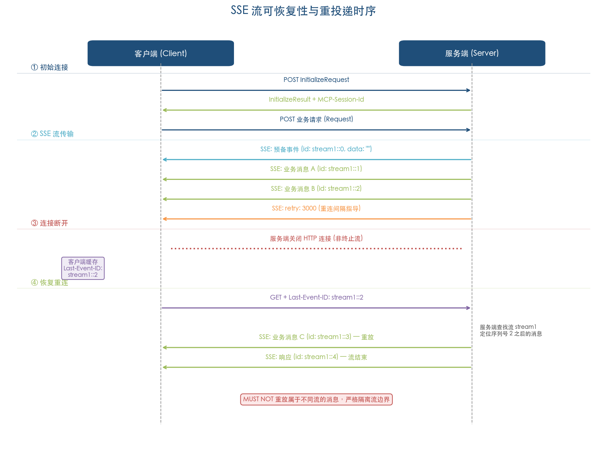

具体恢复流程包含以下步骤：

1. 客户端检测到连接断开；
2. 客户端向 MCP 端点发送 GET 请求，携带 `Last-Event-ID: <上次收到的事件 ID>` 头部；
3. 服务端根据 `Last-Event-ID` 查找该事件所属的流，从该事件之后的位置开始重放后续消息；
4. 服务端 MUST NOT 重放属于不同流的消息，严格隔离流边界。

Issue #1847 的讨论揭示了一个早期实现缺陷——旧版 TypeScript SDK 曾错误地使用 POST 请求进行恢复，违反了恢复语义的统一性原则。2025-11-25 版规范通过明确"恢复始终通过 GET"修正了这一歧义，确保所有实现遵循一致的恢复路径。[Issue #1847](https://github.com/modelcontextprotocol/modelcontextprotocol/issues/1847 "建议所有恢复统一走 GET")

### 3.3.3 SSE 轮询机制与预备事件

2025-11-25 版引入的 SSE 轮询机制（SSE polling，源自 SEP-1699）是可恢复性演进的关键步骤。该机制与可恢复性深度耦合，旨在解决 SEP-1335 于 2025 年 8 月首次系统识别的四大缺陷。

**SEP-1335 识别的核心缺陷（2025-08-12）：**

1. SSE 流启动后，若在断连前未发送任何带 ID 的事件，客户端将无法恢复——因为缺少可用的 `Last-Event-ID`；
2. 规范不允许服务端主动关闭连接，迫使服务端必须维持长连接，与 Serverless 部署模型相悖；
3. 客户端因缺乏重连等待指导而可能过度重连，加剧服务端压力；
4. 缺乏消息垃圾回收策略，长期运行的会话可能导致内存无限增长。

[SEP-1335](https://github.com/modelcontextprotocol/modelcontextprotocol/issues/1335 "首次识别可恢复性问题")

**SEP-1699 的解决方案（2025-10-22，部分取代 SEP-1335）：**

SEP-1699 采用了比 SEP-1335 原始提议更宽松的约束级别（SHOULD 而非 MUST），引入三项关键机制：

1. **预备事件（Prime Event）**：服务端启动 SSE 流时 SHOULD 立即发送一个仅含事件 ID 和空 `data` 字段的预备事件。该事件确保客户端在接收任何业务消息前即获得一个有效的 `Last-Event-ID`，从根本上解决"无初始事件则无法恢复"的缺陷；
2. **服务端主动关闭连接**：发送预备事件后，服务端 MAY 在任何时候关闭 HTTP 连接（而非终止逻辑 SSE 流），客户端 SHOULD 通过轮询方式重新连接以继续接收消息；
3. **重连间隔指导**：服务端关闭连接前 SHOULD 发送含 SSE 标准 `retry` 字段的事件，客户端 MUST 遵守该 `retry` 值作为重连等待时间，从而避免过度重连。

[MCP 规范 2025-11-25 版 Transports](https://modelcontextprotocol.io/specification/2025-11-25/basic/transports "SSE 轮询") [SEP-1699](https://github.com/modelcontextprotocol/modelcontextprotocol/issues/1699 "部分取代 SEP-1335")

### 3.3.4 "连接"关闭与"流"终止的概念区分

2025-11-25 版引入了一个关键的概念层次分离：HTTP"连接"（connection）的关闭与 SSE"流"（stream）的终止是两个独立的操作。服务端可以关闭底层 HTTP 连接而不终止上层逻辑 SSE 流，客户端通过 GET + `Last-Event-ID` 重连后可继续接收同一逻辑流上的后续消息。[MCP 规范 2025-11-25 版 Transports](https://modelcontextprotocol.io/specification/2025-11-25/basic/transports "连接关闭 vs 流终止")

这一概念区分在 2025-03-26 和 2025-06-18 版中并不存在。旧版本中，连接断开的语义含混——既可能意味着服务端主动终止流，也可能是网络故障导致的被动断连，客户端无法区分二者。2025-11-25 版通过以下规则消除了这一歧义：

- 断连 SHOULD NOT 被解释为客户端取消请求，取消需通过显式发送 `CancelledNotification` 实现；
- 服务端关闭连接而非终止流时，SHOULD 先发送含 `retry` 字段的事件，作为"连接即将关闭"的信号；
- 客户端 MAY 同时维持多个 SSE 流，服务端 MUST 将每条消息仅在一个流上发送，不得广播。

这一设计使 Streamable HTTP 从长连接模型演进为短连接+轮询混合模型，在大幅降低服务端并发连接压力的同时，通过可恢复性机制保证了消息的可靠投递。

## 3.4 有状态与无状态模式的工程取舍

Streamable HTTP 通过 Session ID 的可选分配，在协议层面同时支持有状态和无状态两种运行模式。图 3-3 对比展示了两种模式的部署架构差异。

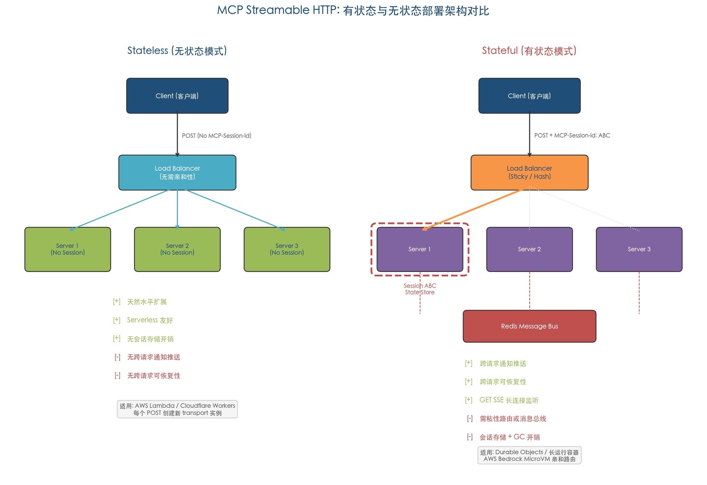

### 3.4.1 无状态模式

无状态模式通过服务端选择不分配 Session ID 隐式实现。规范并未显式定义"无状态模式"这一概念——它是 Session ID 分配为 MAY 级别约束的自然推论。[PR #206](https://github.com/modelcontextprotocol/modelcontextprotocol/pull/206 "Stateless servers are now possible")

无状态模式在工程层面具有显著优势：

- **水平扩展**：每个请求独立处理，无需在节点间共享会话状态，负载均衡器可将请求自由分发至任意可用节点；
- **Serverless 友好**：函数实例按需启停，无长连接开销，天然适配 AWS Lambda、Cloudflare Workers 等事件驱动平台；
- **运维简化**：无需会话存储基础设施，不涉及会话过期与垃圾回收等状态管理问题。

然而，无状态模式在客户端识别方面存在规范空白。当服务端不分配 Session ID 时，规范并未定义"与特定客户端的所有流"中的"特定客户端"如何识别。我们认为，在实际部署中，无状态服务端通常依赖请求层面的上下文信息进行客户端区分——例如 OAuth 令牌中的用户身份、HTTP 认证头部或 API 密钥——这些机制属于应用层认证范畴，不在传输层规范的覆盖范围内。

TypeScript SDK 在无状态模式下的实现策略值得关注：每个 POST 请求创建一个新的 transport 实例（而非复用已有实例），以规避请求 ID 冲突。这意味着无状态模式下的服务端实际上无法支持跨请求的服务端主动推送——因为没有持久的 SSE 连接可供发送通知。[NPM @modelcontextprotocol/sdk](https://www.npmjs.com/package/@modelcontextprotocol/sdk "Session Management 示例")

### 3.4.2 有状态模式

有状态模式通过服务端分配 Session ID 开启，适用于需要维护跨请求会话上下文、支持服务端主动推送通知、或需要长耗时操作流式响应的业务场景。

有状态模式的核心工程挑战在于水平扩展中的会话路由。PR #206 明确描述了路由策略——"server can use session ID for sticky routing or routing messages on a message bus"。在水平扩展的部署中，POST 消息可到达任一节点，须通过 Redis 等消息代理（message broker）路由到持有会话状态的特定节点。[PR #206](https://github.com/modelcontextprotocol/modelcontextprotocol/pull/206 "Stateful server 路由")

Sentry 创始人 mitsuhiko 在 PR #206 讨论中提出了一项重要的工程实践建议：应确保 Session ID 可被基本负载均衡器直接读取。这意味着 Session ID 应出现在 HTTP 头部（而非请求体内）的标准位置，且格式对负载均衡器透明——这正是 `MCP-Session-Id` 作为 HTTP 头部传递的设计动机之一。[PR #206](https://github.com/modelcontextprotocol/modelcontextprotocol/pull/206 "Stateful server 路由")

在实际生产部署中，有状态模式的路由策略主要体现为两种模式：

- **粘性路由（Sticky Routing）**：负载均衡器基于 `MCP-Session-Id` 头部的一致性哈希将同一会话的请求路由到同一节点。例如，AWS Bedrock AgentCore 使用 `Mcp-Session-Id` 实现 MicroVM 亲和路由，将属于同一会话的请求固定到特定的微虚拟机实例；
- **消息总线路由**：请求到达任一节点后，通过 Redis Pub/Sub 或类似消息总线机制转发到持有会话状态的目标节点，适用于需要动态扩缩容的弹性部署场景。

### 3.4.3 模式选择的决策框架

两种模式的选择取决于具体的业务需求和部署约束。表 3-1 从六个关键维度对比了两种模式的特征差异。

**表 3-1 无状态模式与有状态模式对比**

| 维度 | 无状态模式 | 有状态模式 |
|------|-----------|-----------|
| Session ID | 不分配 | 服务端生成并分配 |
| 水平扩展 | 天然支持，无需特殊路由 | 需粘性路由或消息总线 |
| 服务端推送 | 不支持跨请求通知 | 支持通过 GET SSE 流推送 |
| 可恢复性 | 仅单请求内可用 | 跨请求可恢复 |
| 部署形态 | Serverless / 无状态容器 | 长运行进程 / Durable Objects |
| 运维复杂度 | 低 | 中至高（会话存储、路由、GC） |

Python SDK 的文档推荐在生产环境中使用 `stateless_http=True` + `json_response=True` 组合，以获得最佳的部署灵活性和运维简洁性——这一推荐反映了当前 MCP 生态中无状态优先的工程共识。[Python SDK README](https://github.com/modelcontextprotocol/python-sdk/blob/main/README.md "Streamable HTTP 配置")

## 3.5 会话安全：劫持攻击与防御

Session ID 机制在提供会话管理能力的同时，不可避免地引入了新的安全攻击面。MCP 安全最佳实践文档明确识别了一种名为"Session Hijack Prompt Injection"的攻击路径：攻击者获取有效 Session ID 后，可向目标 MCP 服务端发送恶意构造的事件，这些事件通过共享消息队列传递给原始客户端，从而实现消息注入攻击。[MCP 安全最佳实践](https://modelcontextprotocol.io/docs/tutorials/security/security_best_practices "Session Hijack Prompt Injection")

可恢复性机制进一步放大了这一攻击面——由于恢复通过 GET + `Last-Event-ID` 进行，攻击者若同时获取了事件 ID 和 Session ID，即可冒充合法的恢复请求获取会话中的后续消息，或在恢复流中注入恶意内容。

针对上述威胁，安全最佳实践提出了多层纵深防御策略：

1. **不可预测 ID**：MUST 使用密码学安全的随机数生成器（CSPRNG）生成 Session ID，杜绝通过枚举或推测获取有效 ID 的可能；
2. **用户绑定**：SHOULD 将 Session ID 与用户身份信息绑定（如 `<user_id>:<session_id>` 格式），验证请求时同时校验用户身份，防止跨用户会话劫持；
3. **传输层加密**：使用 HTTPS 对所有通信进行加密，防止 Session ID 在网络传输中被中间人窃取；
4. **客户端安全存储**：客户端 MUST 安全处理 Session ID，避免将其暴露于日志、URL 参数或不安全的本地存储中。

## 3.6 可恢复性的未完成议题

尽管 2025-11-25 版通过 SSE 轮询机制大幅改善了可恢复性的实际可用性，SEP-1335 提出的四大问题仅被部分解决。

已纳入规范的解决方案涵盖三项缺陷：无初始事件导致无法恢复（通过预备事件机制解决）、服务端被迫维持长连接（通过允许主动关闭连接解决）、客户端缺乏重连等待指导（通过 `retry` 字段解决）。

仍未纳入规范的问题是**消息垃圾回收**（message garbage collection）。当服务端为支持可恢复性而缓存了大量 SSE 事件时，何时可安全地清除这些缓存？缓存的无限增长将对长期运行的有状态服务构成内存压力。SEP-1335 提出了这一问题，但 SEP-1699 的解决方案有意聚焦于轮询机制，将垃圾回收策略留给实现层面自行处理。[SEP-1335](https://github.com/modelcontextprotocol/modelcontextprotocol/issues/1335 "首次识别可恢复性问题") [SEP-1699](https://github.com/modelcontextprotocol/modelcontextprotocol/issues/1699 "部分取代 SEP-1335")

TypeScript SDK 提供的 `EventStore` 抽象接口和内置 `inMemoryEventStore.ts` 参考实现，将事件存储策略的选择权交给开发者——内存存储适合短会话场景，Redis 或数据库存储适合需要跨节点可恢复性的生产部署。然而，无论采用何种存储方案，开发者均需自行实现事件过期清理逻辑，规范层面未提供任何指导。[TypeScript SDK Server Guide](https://github.com/modelcontextprotocol/typescript-sdk/blob/main/docs/server.md "EventStore 抽象")

# 第4章 官方 SDK 工程实现

Streamable HTTP 规范界定的是协议层面的"应然"约束，SDK 实现则需要回答"实然"层面的工程问题——如何在具体语言运行时中将 POST/GET/DELETE 三方法路由、SSE 流管理、会话 ID 分配与可恢复性等规范条款，落地为可开箱即用的库。本章以 TypeScript SDK 与 Python SDK 两大官方参考实现为主线，深入拆解客户端 transport 与服务端 transport 的核心设计模式，并覆盖 Java、Kotlin、C# 等多语言 SDK 的实现进展与架构差异。

## 4.1 TypeScript SDK：参考实现与生态基石

TypeScript SDK 是 MCP 生态中迭代最快、用户覆盖面最广的官方实现，事实上承担着规范参考实现的角色。NPM 包名为 `@modelcontextprotocol/sdk`，2025 年 4 月 17 日发布的 v1.10.0 首次引入 Streamable HTTP 传输支持；截至 2026 年 4 月，最新稳定版为 v1.22.0，周下载量超过 880 万次。[NPM @modelcontextprotocol/sdk](https://www.npmjs.com/package/@modelcontextprotocol/sdk "版本历史")

### 4.1.1 客户端 Transport：StreamableHTTPClientTransport

客户端通过 `StreamableHTTPClientTransport` 类建立与远程 MCP 服务端的连接。该类的构造函数接受一个 `URL` 对象作为 MCP 端点地址，以及可选的配置对象，关键参数包括：

- **`authProvider`**：认证提供者，支持 Bearer token、Client Credentials、Private Key JWT 以及完整 OAuth 授权码流程；
- **`fetch`**：自定义 fetch 函数，可通过 `createMiddleware()` 与 `applyMiddlewares()` 组合中间件管道，实现请求拦截、日志注入等横切关注点。

[TypeScript SDK Client Guide](https://github.com/modelcontextprotocol/typescript-sdk/blob/main/docs/client.md "StreamableHTTPClientTransport 构造函数用法")

基本连接流程如下所示：

```typescript
import { Client } from "@modelcontextprotocol/sdk/client/index.js";
import { StreamableHTTPClientTransport } from "@modelcontextprotocol/sdk/client/streamableHttp.js";

const client = new Client({ name: "my-client", version: "1.0.0" });
const transport = new StreamableHTTPClientTransport(
  new URL("http://localhost:3000/mcp")
);
await client.connect(transport);
```

断开连接时，SDK 推荐先调用 `transport.terminateSession()` 向服务端发送 HTTP DELETE 请求以终止会话，再调用 `client.close()` 释放本地资源。这一两步式设计确保服务端能够及时回收会话状态，避免无主 session 的累积。[TypeScript SDK Client Guide](https://github.com/modelcontextprotocol/typescript-sdk/blob/main/docs/client.md "terminateSession 用法")

**SSE 回退机制**。TypeScript SDK 在客户端文档中给出了 Streamable HTTP 优先、SSE 回退的标准模式：先尝试以 `StreamableHTTPClientTransport` 建立连接，若服务端不支持 Streamable HTTP 而返回 4xx 错误，则捕获异常并切换到旧版 `SSEClientTransport`。值得注意的是，回退过程需要创建全新的 `Client` 实例，原实例不可复用：

```typescript
try {
    const client = new Client({ name: "my-client", version: "1.0.0" });
    const transport = new StreamableHTTPClientTransport(baseUrl);
    await client.connect(transport);
} catch {
    const client = new Client({ name: "my-client", version: "1.0.0" });
    const transport = new SSEClientTransport(baseUrl);
    await client.connect(transport);
}
```

SDK 提供了 `streamableHttpWithSseFallbackClient.ts` 完整示例以供参考。[TypeScript SDK Client Guide](https://github.com/modelcontextprotocol/typescript-sdk/blob/main/docs/client.md "SSE fallback")

**可恢复性支持**。客户端 SDK 通过 `resumptionToken` 与 `onresumptiontoken` 回调实现 SSE 流的断点续传功能。开发者在 `client.request()` 的选项中传入上次断开时保存的 token，SDK 每次收到新的 SSE 事件 ID 时触发 `onresumptiontoken` 回调；开发者应在回调中持久化该 token，以便进程重启后恢复中断的请求。SDK 附带的 `ssePollingClient.ts` 示例演示了服务端主动断开 SSE 连接后、客户端自动重连并重放事件的完整流程。[TypeScript SDK Client Guide](https://github.com/modelcontextprotocol/typescript-sdk/blob/main/docs/client.md "Resumption tokens")

### 4.1.2 服务端 Transport：NodeStreamableHTTPServerTransport

服务端使用 `NodeStreamableHTTPServerTransport` 类（从 `@modelcontextprotocol/sdk/server/streamableHttp.js` 导入）处理 Streamable HTTP 请求。该类的构造函数参数直接映射规范中的若干 MAY/SHOULD 条款，体现了 SDK 对规范可选行为的系统化建模：

| 参数 | 类型 | 规范对应 | 说明 |
|------|------|----------|------|
| `sessionIdGenerator` | `(() => string) \| undefined` | 会话管理 MAY | `undefined` 表示无状态模式；`() => randomUUID()` 启用有状态模式 |
| `enableJsonResponse` | `boolean` | POST 响应 MAY 返回 JSON | `true` 时所有 POST 返回纯 JSON，GET 返回 405 |
| `enableDnsRebindingProtection` | `boolean` | Origin 校验 MUST | DNS 重绑定防护开关 |
| `allowedHosts` / `allowedOrigins` | `string[]` | Host/Origin 白名单 | 绑定 `0.0.0.0` 时需显式配置 |

核心方法 `transport.handleRequest(req, res, body)` 接受标准 Node.js 的 `IncomingMessage`/`ServerResponse` 对象，内部依据 HTTP 方法路由至 POST（JSON-RPC 消息处理）、GET（SSE 流建立）、DELETE（会话终止）三条处理路径。这一设计使 SDK 不与任何特定 HTTP 框架绑定，可无缝集成 Express、Hono 或原生 HTTP 模块。[TypeScript SDK Server Guide](https://github.com/modelcontextprotocol/typescript-sdk/blob/main/docs/server.md "NodeStreamableHTTPServerTransport 参数与 handleRequest")

### 4.1.3 有状态与无状态模式的 SDK 实现

SDK 通过 `sessionIdGenerator` 参数区分两种部署模式，二者的核心差异体现在 transport 实例的生命周期管理策略上。

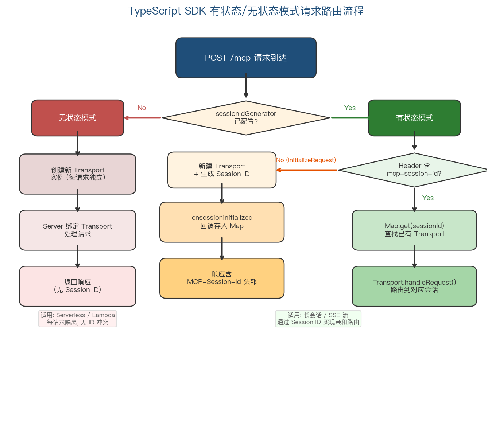

上图展示了 POST 请求到达后 SDK 的路由决策过程：根据 `sessionIdGenerator` 是否配置，分为无状态模式（每请求创建独立 Transport）与有状态模式（基于 `mcp-session-id` 查找或创建 Transport）两条路径。

**无状态模式**（`sessionIdGenerator: undefined`）下，每个 POST 请求均创建新的 transport 实例。这一看似冗余的设计实则必要——不同客户端可能使用相同的 JSON-RPC 请求 ID（例如均从 1 开始递增），若共享 transport 状态，响应将被路由到错误的 HTTP 连接。无状态模式天然适配 Serverless 部署场景（AWS Lambda、Cloudflare Workers），每次请求完全独立，无需维护跨请求状态。[NPM @modelcontextprotocol/sdk](https://www.npmjs.com/package/@modelcontextprotocol/sdk "Session Management 示例")

**有状态模式**下，初始化请求创建 transport 实例，并通过 `onsessioninitialized` 回调将其存储至 `Map<string, Transport>` 映射表中；后续请求通过 `mcp-session-id` 头部查找已有 transport 实例。GET 请求（SSE 通知流建立）和 DELETE 请求（会话终止）同样通过 session ID 路由到对应的 transport 实例：

```typescript
const transports = new Map<string, Transport>();

const transport = new NodeStreamableHTTPServerTransport({
  sessionIdGenerator: () => randomUUID(),
  onsessioninitialized: (sessionId) => {
    transports.set(sessionId, transport);
  }
});

// 后续请求路由
app.all("/mcp", (req, res) => {
  const sessionId = req.headers["mcp-session-id"];
  const existing = transports.get(sessionId);
  if (existing) {
    existing.handleRequest(req, res, req.body);
  }
  // ...
});
```

[NPM @modelcontextprotocol/sdk](https://www.npmjs.com/package/@modelcontextprotocol/sdk "With Session Management 示例")

### 4.1.4 框架集成与 EventStore

SDK 提供了 `createMcpExpressApp()`（来自 `@modelcontextprotocol/express`）和 `createMcpHonoApp()`（来自 `@modelcontextprotocol/hono`）两个开箱即用的框架集成函数。当绑定地址为 `127.0.0.1` 或 `localhost` 时，两者均自动启用 DNS 重绑定防护；绑定到 `0.0.0.0` 时则需显式提供 `allowedHosts` 白名单。Hono 集成额外支持 Web Standard 运行时（Cloudflare Workers、Deno、Bun），对应示例文件为 `honoWebStandardStreamableHttp.ts`。[TypeScript SDK Server Guide](https://github.com/modelcontextprotocol/typescript-sdk/blob/main/docs/server.md "createMcpExpressApp / createMcpHonoApp")

服务端可恢复性通过 **EventStore** 抽象层实现——SDK 定义了标准化的事件存储接口，并内置 `inMemoryEventStore.ts` 作为参考实现。当客户端通过 `Last-Event-ID` 头部发起重连请求时，服务端从 EventStore 中检索并重放断连点之后的事件。这一抽象层的设计使开发者能够在生产环境中以 Redis、关系型数据库等持久化后端替换内存存储，满足水平扩展与高可用的需求。[TypeScript SDK Server Guide](https://github.com/modelcontextprotocol/typescript-sdk/blob/main/docs/server.md "EventStore 与 inMemoryEventStore.ts")

## 4.2 Python SDK：ASGI 原生与 FastMCP 高级接口

Python SDK 的 PyPI 包名为 `mcp`，最新版本为 v1.26.0，自 v1.8.0 起支持 Streamable HTTP 传输。其核心依赖栈包括：httpx 与 httpx-sse（客户端 HTTP 及 SSE 处理）、Starlette（服务端 ASGI 框架）、anyio（异步 I/O 抽象）和 pydantic（数据验证）。v1.x 为当前稳定版本，main 分支正在开发 v2 pre-alpha 版本。[PyPI mcp](https://pypi.org/project/mcp/ "mcp 包依赖与版本") [Python SDK GitHub](https://github.com/modelcontextprotocol/python-sdk/blob/main/README.md "v1.x 稳定版")

### 4.2.1 客户端 Transport：StreamableHTTPTransport 与 streamable_http_client

Python SDK 的客户端传输层由两个互补组件构成：底层的 `StreamableHTTPTransport` 类与上层的 `streamable_http_client` 异步上下文管理器，均位于 `mcp.client.streamable_http` 模块。[Python SDK 源码 streamable_http.py](https://github.com/modelcontextprotocol/python-sdk/blob/v1.x/src/mcp/client/streamable_http.py "客户端 transport 源码")

`StreamableHTTPTransport` 类的构造函数签名为 `__init__(self, url: str)`，仅接受 MCP 端点 URL 作为必需参数。早期版本支持的 `headers`、`timeout`、`sse_read_timeout`、`auth` 等参数已被标记为 `@deprecated`，SDK 转而推荐通过预配置的 `httpx.AsyncClient` 传入这些设置，以保持单一职责原则。该类内部维护 `session_id` 和 `protocol_version` 两个状态字段，在初始化响应中自动提取并持久化。

开发者通常通过 `streamable_http_client` 异步上下文管理器使用客户端传输：

```python
from mcp.client.streamable_http import streamable_http_client

async with streamable_http_client("http://localhost:8000/mcp") as (
    read_stream, write_stream, get_session_id
):
    # read_stream: 从服务端接收消息
    # write_stream: 向服务端发送消息
    # get_session_id: 获取当前会话 ID
    ...
```

该函数接受可选的 `http_client: httpx.AsyncClient` 参数（传入预配置的客户端实例以控制超时、认证、代理等行为）和 `terminate_on_close: bool` 参数（退出上下文时是否发送 DELETE 终止会话，默认 `True`）。[Python SDK 源码 streamable_http.py](https://github.com/modelcontextprotocol/python-sdk/blob/v1.x/src/mcp/client/streamable_http.py "streamable_http_client 签名与参数")

在 SSE 流处理层面，Python SDK 客户端的 `_handle_sse_event` 方法以 `sse.event == "message"` 作为事件类型判断条件，并对空 data 的 priming 事件执行特殊处理（仅触发 resumption 回调而不解析 JSON），从实现角度验证了规范中 SSE 事件 `event` 字段类型名为 `message` 这一约定。

**可恢复性与重连**。客户端的 `_handle_reconnection` 方法实现了 SSE 流断连后的自动重连逻辑——当 POST 响应的 SSE 流在收到事件 ID 后意外断开时，客户端通过 GET 请求携带 `Last-Event-ID` 头部进行重连，最大重连尝试次数为 2 次（`MAX_RECONNECTION_ATTEMPTS = 2`），重连延迟遵循服务端 `retry` 字段指定的间隔或默认 1 秒（`DEFAULT_RECONNECTION_DELAY_MS = 1000`）。该实现严格遵循 2025-11-25 版规范中"恢复始终通过 GET 执行"的要求。[Python SDK 源码 streamable_http.py](https://github.com/modelcontextprotocol/python-sdk/blob/v1.x/src/mcp/client/streamable_http.py "_handle_reconnection 方法")

### 4.2.2 服务端 Transport：StreamableHTTPServerTransport

Python SDK 服务端的核心类为 `StreamableHTTPServerTransport`，位于 `mcp.server.streamable_http` 模块，实现代码共计 1,073 行（910 行有效代码），直接构建于 Starlette ASGI 框架之上。[Python SDK 源码 streamable_http.py](https://github.com/modelcontextprotocol/python-sdk/blob/v1.x/src/mcp/server/streamable_http.py "服务端 transport 源码")

构造函数的关键参数如下：

```python
def __init__(
    self,
    mcp_session_id: str | None,
    is_json_response_enabled: bool = False,
    event_store: EventStore | None = None,
    security_settings: TransportSecuritySettings | None = None,
    retry_interval: int | None = None,
) -> None:
```

- **`mcp_session_id`**：传入 `None` 表示无状态模式，传入字符串则启用有状态模式。SDK 对 session ID 执行严格的 ASCII 可见字符校验（`0x21-0x7E` 范围），不合规时直接抛出 `ValueError`。
- **`is_json_response_enabled`**：启用后所有 POST 请求返回纯 JSON 响应，GET 请求返回 405。
- **`event_store`**：可恢复性的抽象接口（`EventStore` ABC），定义了 `store_event()` 和 `replay_events_after()` 两个抽象方法。
- **`retry_interval`**：SSE priming 事件中 `retry` 字段的值（毫秒），用于控制客户端的轮询重连间隔。

核心入口方法 `handle_request(scope, receive, send)` 遵循 ASGI 协议签名，内部路由至 `_handle_post_request`、`_handle_get_request`、`_handle_delete_request` 和 `_handle_unsupported_request` 四条处理路径。对不支持的 HTTP 方法，SDK 返回 405 状态码并在 `Allow` 头部声明 `GET, POST, DELETE`，符合规范对 405 响应的要求。

**Priming 事件的版本感知处理**。服务端在发送 SSE priming 事件前会检查客户端的协议版本：仅对 `protocolVersion >= "2025-11-25"` 的客户端发送 priming 事件（空 data + 事件 ID），因为旧版客户端在尝试将空 data 解析为 JSON 时将触发异常。这一细节体现了 SDK 在规范跨版本演进中对向后兼容的审慎处理。

### 4.2.3 FastMCP 高级接口

Python SDK 提供了 `FastMCP` 作为面向开发者的高级抽象层，将底层 transport 的配置细节封装为简洁的声明式接口。启动一个 Streamable HTTP 服务端仅需数行代码：

```python
from mcp.server.fastmcp import FastMCP

mcp = FastMCP("my-server")

@mcp.tool()
def add(a: int, b: int) -> int:
    return a + b

mcp.run(transport="streamable-http")
```

关键配置选项通过 `FastMCP` 构造参数或 `mcp.run()` 参数传入：

- **`stateless_http=True`**：启用无状态模式，推荐用于生产环境和 Serverless 部署场景；
- **`json_response=True`**：纯 JSON 响应模式，禁用 SSE 流式传输；
- **`streamable_http_path`**：自定义端点路径，默认为 `/mcp`。

官方文档推荐生产部署采用 `stateless_http=True` + `json_response=True` 的组合配置，以获得最佳可扩展性。[Python SDK README](https://github.com/modelcontextprotocol/python-sdk/blob/main/README.md "Streamable HTTP 配置")

对于需要将 MCP 服务端嵌入已有 Web 应用的场景，`mcp.streamable_http_app()` 方法返回标准 ASGI 应用实例，可挂载到 Starlette 的 `Mount` 路由上。这一机制支持多个 MCP 服务端在同一 Starlette 应用中并行运行（例如分别挂载于 `/echo/mcp` 和 `/math/mcp` 路径）。[Python SDK README](https://github.com/modelcontextprotocol/python-sdk/blob/main/README.md "Starlette 挂载")

## 4.3 TypeScript SDK 与 Python SDK 的架构差异

两大官方 SDK 在多个维度上体现了各自语言生态的惯例差异，同时在规范条款的具体落地方式上也存在显著分化。

### 4.3.1 框架绑定策略

TypeScript SDK 的服务端 transport 采用框架无关设计——`NodeStreamableHTTPServerTransport.handleRequest()` 接受标准 Node.js `IncomingMessage`/`ServerResponse` 对象，可与 Express、Hono 或原生 HTTP 模块集成。SDK 另行提供 `@modelcontextprotocol/express` 和 `@modelcontextprotocol/hono` 两个独立适配器包，以简化常见框架的集成流程。[TypeScript SDK Server Guide](https://github.com/modelcontextprotocol/typescript-sdk/blob/main/docs/server.md "handleRequest 框架无关")

Python SDK 则直接基于 Starlette ASGI 框架构建服务端 transport，`StreamableHTTPServerTransport.handle_request()` 的签名遵循 ASGI 标准的 `(scope, receive, send)` 三元组，天然兼容 Uvicorn、Hypercorn 等 ASGI 服务器。这一设计选择反映了 Python 异步 Web 生态对 ASGI 标准的广泛采纳。[Python SDK 源码 streamable_http.py](https://github.com/modelcontextprotocol/python-sdk/blob/v1.x/src/mcp/server/streamable_http.py "ASGI 签名")

### 4.3.2 认证体系

TypeScript SDK 客户端内置了层次丰富的认证提供者体系：`AuthProvider`（基础 Bearer token）、`ClientCredentialsProvider`（OAuth client_credentials 流程）、`PrivateKeyJwtProvider`（private_key_jwt 认证）、`CrossAppAccessProvider`（企业管理授权，对应 SEP-990）以及完整的 `OAuthClientProvider`（授权码流程）。这一设计使客户端开发者无需引入外部认证库即可覆盖主流认证场景。[TypeScript SDK Client Guide](https://github.com/modelcontextprotocol/typescript-sdk/blob/main/docs/client.md "Authentication")

Python SDK 的认证机制则侧重于服务端 OAuth 2.1 资源服务器功能，通过 `mcp.server.auth` 模块实现，采用 `TokenVerifier` 协议接口进行 token 验证，配合 `AuthSettings` 配置 issuer URL、资源服务器 URL 和所需 scopes。客户端侧更多依赖 `httpx.AsyncClient` 自身的认证能力，体现了 Python 生态"组合已有工具"的设计哲学。[Python SDK README](https://github.com/modelcontextprotocol/python-sdk/blob/main/README.md "Authentication")

### 4.3.3 CORS 配置

在浏览器客户端场景下，两个 SDK 均要求 CORS 配置显式暴露 `Mcp-Session-Id` 头部，并在 `allowedMethods` 中包含 GET、POST、DELETE 三种方法。TypeScript SDK 通过 Express `cors` 中间件的 `exposedHeaders: ['Mcp-Session-Id']` 实现；Python SDK 则使用 Starlette 的 `CORSMiddleware` 配置 `expose_headers=["Mcp-Session-Id"]`。两者在 CORS 层面的需求完全一致，差异仅在于各自框架的配置语法。[TypeScript SDK Server Guide](https://github.com/modelcontextprotocol/typescript-sdk/blob/main/docs/server.md "CORS") [Python SDK README](https://github.com/modelcontextprotocol/python-sdk/blob/main/README.md "CORS Configuration")

### 4.3.4 JSON 响应模式

TypeScript SDK 的 `enableJsonResponse: true` 与 Python SDK 的 `json_response=True` 均实现了规范中"服务端 MAY 对 POST 请求返回 `application/json` 而非 SSE"的可选行为。启用该模式后，服务端对所有 POST 请求返回纯 JSON 响应，对 GET 请求返回 405 Method Not Allowed。该模式尤其适合无需服务端主动推送的简单请求-响应场景以及无状态 Serverless 部署环境，可显著降低服务端资源消耗。[TypeScript SDK Server Guide](https://github.com/modelcontextprotocol/typescript-sdk/blob/main/docs/server.md "JSON response mode") [Python SDK README](https://github.com/modelcontextprotocol/python-sdk/blob/main/README.md "json_response=True")

## 4.4 Java SDK：Reactive Streams 与 Spring 生态集成

Java SDK 由 Anthropic 与 Spring AI 团队合作维护，仓库位于 `github.com/modelcontextprotocol/java-sdk`。客户端基于 JDK 11+ 内置的 `HttpClient`（无需额外依赖），服务端使用 Jakarta Servlet API，编程模型建立在 Reactive Streams 规范之上，以 Project Reactor 作为内部实现，同时提供同步门面（synchronous facade）供阻塞场景使用。JSON 序列化默认采用 Jackson（支持 Jackson 2 和 Jackson 3），但可通过 SDK 抽象层替换。运行时要求 Java 17+。[Java SDK GitHub](https://github.com/modelcontextprotocol/java-sdk "架构与设计")

Java SDK 的 Streamable HTTP 客户端 transport 类为 `HttpClientStreamableHttpTransport`，采用 Builder 模式进行构造：

```java
var transport = HttpClientStreamableHttpTransport
    .builder("http://localhost:8080/mcp")
    .endpoint("/mcp")
    .build();
var client = McpClient.sync(transport).build();
client.initialize();
```

[Java SDK GitHub Issue #411](https://github.com/modelcontextprotocol/java-sdk/discussions/411 "HttpClientStreamableHttpTransport 用法") [Spring AI MCP Blog](https://spring.io/blog/2025/09/16/spring-ai-mcp-intro-blog "McpClient.sync 示例")

SDK 的模块结构体现了清晰的关注点分离原则：`mcp-core`（核心实现：STDIO、JDK HttpClient、Servlet）、`mcp-json-jackson2`/`mcp-json-jackson3`（JSON 绑定层）、`mcp`（便捷 bundle：core + Jackson 3）以及 `mcp-test`（测试工具）。Spring AI 2.0+ 进一步提供了 `WebClient`（客户端）和 `WebFlux`/`WebMVC`（服务端）的 Spring 集成 transport，通过 `StreamableHttpHttpClientTransportAutoConfiguration` 实现自动装配。Maven 坐标为 `io.modelcontextprotocol.sdk`。[Java SDK GitHub](https://github.com/modelcontextprotocol/java-sdk "模块结构")

值得关注的是，Java SDK 的 `HttpClientStreamableHttpTransport` 存在若干已知工程问题：不支持 301 重定向（Issue #729）、`reconnect()` 在状态码检查前即被调用可能导致重复连接（Issue #773）。这些问题反映出 Streamable HTTP 在非参考实现语言中的工程细节仍在持续打磨。[Java SDK GitHub Issue #729](https://github.com/modelcontextprotocol/java-sdk/issues/729 "不支持重定向") [Java SDK GitHub Issue #773](https://github.com/modelcontextprotocol/java-sdk/issues/773 "重复连接问题")

## 4.5 Kotlin SDK：客户端先行，服务端在途

Kotlin SDK 由 Anthropic 与 JetBrains 合作维护，仓库为 `github.com/modelcontextprotocol/kotlin-sdk`（1,300+ stars），以 Ktor 作为底层 HTTP 框架。客户端 Streamable HTTP 支持自 v0.6.0 引入，但服务端支持截至 2025 年 10 月 28 日仍在开发之中——维护者 devcrocod 在 Issue #346 中明确回应："Streamable http for the client was introduced in version 0.6.0. We're currently working on adding streamable HTTP support for the server."[Kotlin SDK GitHub Issue #346](https://github.com/modelcontextprotocol/kotlin-sdk/issues/346 "客户端 v0.6.0，服务端开发中")

社区方案 http4k MCP SDK 自 2025 年 5 月起即已支持 Kotlin/JVM 平台的 Streamable HTTP 客户端与服务端双端实现，为 Kotlin 生态中等待官方服务端支持的开发者提供了可行的替代选择。

## 4.6 C# SDK：Microsoft 主导的 .NET 参考实现

C# SDK 由 Microsoft 官方主导维护，于 2026 年 3 月 5 日达成 v1.0 里程碑，完整支持 2025-11-25 版 MCP 规范。NuGet 包名为 `ModelContextProtocol`。[.NET Blog](https://devblogs.microsoft.com/dotnet/release-v10-of-the-official-mcp-csharp-sdk/ "C# SDK v1.0 发布")

### 4.6.1 SSE 事件流存储与轮询

C# SDK 通过 `ISseEventStreamStore` 接口抽象 SSE 事件流存储，内置提供 `DistributedCacheEventStreamStore` 实现，可与任意 `IDistributedCache` 实例配合使用（如 `MemoryDistributedCache`）。当请求处理器希望主动释放 SSE 连接、让客户端切换至轮询模式获取结果时，调用如下方法：

```csharp
await context.EnablePollingAsync(
    retryInterval: TimeSpan.FromSeconds(5)
);
```

SDK 提供了完善的事件流保留策略指导：支持基于会话终止的清理、基于时间的过期策略（`EventSlidingExpiration`、`EventAbsoluteExpiration`）以及选择性存储（仅存储最终结果、丢弃中间进度通知）。这一设计直接对应 2025-11-25 版规范中的 SSE 轮询机制（SEP-1699）。[.NET Blog](https://devblogs.microsoft.com/dotnet/release-v10-of-the-official-mcp-csharp-sdk/ "ISseEventStreamStore 与 EnablePollingAsync")

### 4.6.2 实验性 Task 原语

C# SDK v1.0 是目前已知首个实现 2025-11-25 规范中实验性 Task 原语的 SDK。该功能通过 `IMcpTaskStore` 接口管理 task 状态（内置 `InMemoryMcpTaskStore` 参考实现），支持五种状态的完整生命周期：`working` → `input_required` → `completed` / `failed` / `cancelled`。工具方法根据返回类型自动推断 task 支持级别——`Task<T>`/`ValueTask<T>` 被推断为异步方法，开发者也可通过 `ToolTaskSupport` 枚举（`Forbidden`/`Optional`/`Required`）显式控制 task 行为。客户端通过 `CallToolAsync` 启动 task，通过 `PollTaskUntilCompleteAsync`、`GetTaskResultAsync`、`ListTasksAsync`、`CancelTaskAsync` 等方法管理完整生命周期。[.NET Blog](https://devblogs.microsoft.com/dotnet/release-v10-of-the-official-mcp-csharp-sdk/ "Task 实验性支持")

## 4.7 多语言 SDK 全景对比

截至 2026 年 4 月，MCP 官方 SDK 生态已覆盖五种主要编程语言，各 SDK 在 Streamable HTTP 实现的完整度与设计哲学上呈现明显分化。

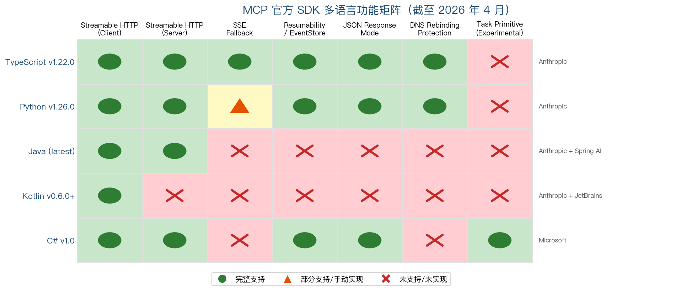

上图以矩阵热力图形式展示了五大官方 SDK 在客户端/服务端 Streamable HTTP、SSE 回退、可恢复性/EventStore、JSON 响应模式、DNS 重绑定防护及 Task 原语七项核心功能上的支持状态。

| SDK | 最新版本 | Streamable HTTP 支持 | 服务端框架 | 客户端框架 | 维护方 |
|-----|---------|---------------------|-----------|-----------|--------|
| TypeScript | v1.22.0 | 客户端+服务端（v1.10.0 起） | Node.js 原生/Express/Hono | 自定义 fetch | Anthropic |
| Python | v1.26.0 | 客户端+服务端（v1.8.0 起） | Starlette ASGI | httpx + httpx-sse | Anthropic |
| Java | — | 客户端+服务端 | Jakarta Servlet | JDK HttpClient | Anthropic + Spring AI |
| Kotlin | v0.6.0+ | 仅客户端 | 服务端开发中 | Ktor | Anthropic + JetBrains |
| C# | v1.0 | 客户端+服务端 | ASP.NET Core | — | Microsoft |

TypeScript SDK 作为最早引入 Streamable HTTP 的实现，事实上承担着参考实现的角色——规范中的许多设计决策（如批处理移除的动因）最先在 TypeScript 和 Python SDK 的实现过程中得到验证。C# SDK 虽然起步最晚（v1.0 于 2026 年 3 月发布），但凭借 Microsoft 的工程投入在功能覆盖上迅速追平，成为首个实现 Task 实验性原语与 `ISseEventStreamStore` 分布式缓存集成的 SDK。Kotlin SDK 的服务端支持缺失仍是 JVM 生态中一个值得关注的缺口，社区方案（http4k、Quarkus MCP Server）在一定程度上填补了这一空白。

# 第5章 安全机制与生产部署

## 5.1 DNS 重绑定攻击与防护体系

### 5.1.1 攻击原理与 MCP 暴露面

DNS 重绑定（DNS Rebinding）是一种利用 DNS 记录动态切换绕过浏览器同源策略的攻击手法。攻击者控制一个域名（如 `evil.example.com`），使其初始解析指向攻击者自有 IP；当受害者浏览器与该域名建立连接后，攻击者将 DNS 解析切换至 `127.0.0.1`。由于浏览器仍认为自身在与 `evil.example.com` 通信，后续请求被允许发往 localhost，从而绕过网络边界访问运行在本地的服务。MCP 安全最佳实践明确将 DNS 重绑定列为已知攻击向量之一。[MCP 安全最佳实践](https://modelcontextprotocol.io/docs/tutorials/security/security_best_practices "DNS rebinding 攻击向量")

这一攻击对 MCP 场景具有特殊威胁性：MCP 服务端在开发阶段通常绑定在 localhost 上运行且不配置认证，天然暴露于此类攻击面之下。Straiker AI Research（STAR）团队系统性地展示了这一攻击链，将其命名为"MCP 重绑定攻击"（MCP Rebinding Attack）。攻击流程分为四步：(1) 受害者访问钓鱼页面或恶意站点；(2) 域名通过 DNS 重绑定从公网 IP 切换到 `127.0.0.1`；(3) 攻击者通过 SSE 的 GET 请求（跳过浏览器 CORS 预检）直接触达本地 MCP 服务端，执行恶意工具调用（如读取环境变量中的 API 密钥并通过 curl 外泄）；(4) 即使浏览器后续 CORS 拦截了 JavaScript 读取响应，命令本身已在 MCP 服务端执行完毕。该团队强调，虽然 MCP 已迁移至 Streamable HTTP 协议，但若未启用防护措施，攻击路径依然有效。[Straiker AI 安全研究](https://www.straiker.ai/blog/agentic-danger-dns-rebinding-exposing-your-internal-mcp-servers "MCP Rebinding Attack 四步攻击链")

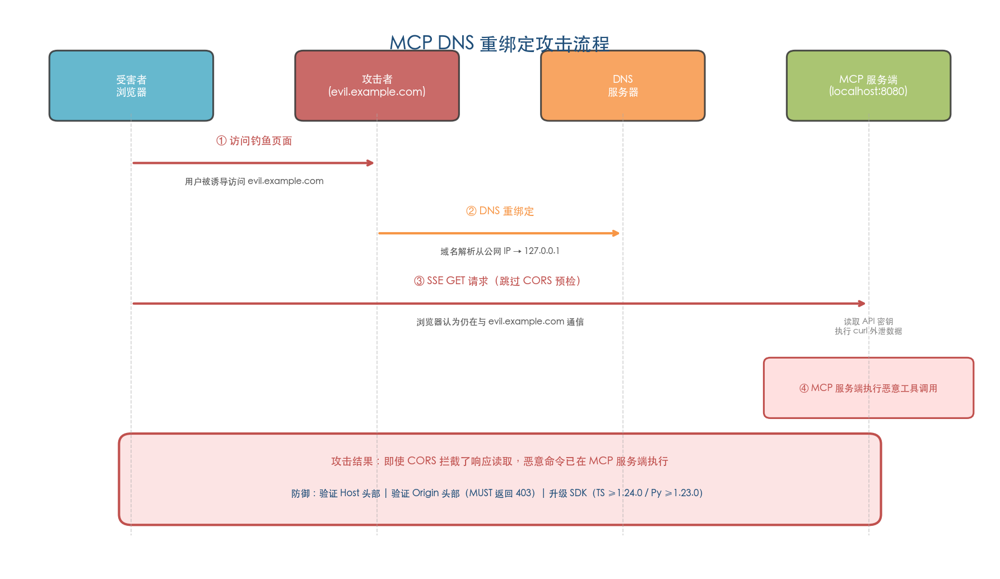

图 5-1 展示了 DNS 重绑定攻击的完整时序：从受害者访问钓鱼站点、DNS 解析切换至 127.0.0.1、SSE GET 请求跳过 CORS 预检直达本地 MCP 服务端、到恶意工具调用执行的四步攻击链，以及底部标注的关键防御要点。

### 5.1.2 SDK 层面的防御机制与已知漏洞

2025 年 12 月 2 日，官方 TypeScript SDK 与 Python SDK 同日披露了 DNS 重绑定防护缺失的安全漏洞，揭示出两套 SDK 在安全默认值设计上的系统性不足。

**CVE-2025-66414（TypeScript SDK）**：影响 `@modelcontextprotocol/sdk` 1.24.0 以下版本，CVSS v4 评分 7.6（High），漏洞类型为 CWE-1188（不安全默认初始化）。`StreamableHTTPServerTransport` 和 `SSEServerTransport` 均默认未启用 `enableDnsRebindingProtection` 参数。修复方案包括两条路径：通过 `createMcpExpressApp()` 创建的服务端在绑定 localhost 时自动启用防护；使用自定义 Express 配置的开发者则需手动应用导出的 `hostHeaderValidation()` 中间件。[GitHub Security Advisory GHSA-w48q-cv73-mx4w](https://github.com/modelcontextprotocol/typescript-sdk/security/advisories/GHSA-w48q-cv73-mx4w "CVE-2025-66414")

**CVE-2025-66416（Python SDK）**：影响 `mcp` 包 1.23.0 以下版本，CVSS v4 评分同为 7.6（High），漏洞类型同为 CWE-1188。`FastMCP` 默认未启用 DNS 重绑定防护。修复后，当 `host` 参数为 `127.0.0.1` 或 `localhost` 时，防护将自动启用。[GitHub Security Advisory GHSA-9h52-p55h-vw2f](https://github.com/modelcontextprotocol/python-sdk/security/advisories/GHSA-9h52-p55h-vw2f "CVE-2025-66416")

两个漏洞的根本原因一致：SDK 未对传入请求的 `Host` 头部实施验证。在 DNS 重绑定攻击中，浏览器发送的请求携带攻击者域名作为 `Host` 头部值；若服务端不校验该值是否匹配期望的主机名（如 `localhost` 或 `127.0.0.1`），则无法区分合法请求与重绑定请求。修复后的实现逻辑为：将传入请求的 `Host` 头部（去除端口后）与允许的主机名白名单比对，不匹配则返回 HTTP 421（Misdirected Request）。[DNS 重绑定漏洞综合分析](https://vulnerablemcp.info/vuln/cve-2025-66414-66416-dns-rebinding-mcp-sdks.html "Host 头部未校验是根因")

在具体配置层面，TypeScript SDK 提供三个参数实现防护：`enableDnsRebindingProtection`（布尔值，启用 Host 头部校验）、`allowedHosts`（允许的 Host 白名单数组）、`allowedOrigins`（允许的 Origin 白名单数组）。Express 和 Hono 框架集成在绑定 localhost 时默认启用防护。Python SDK 的 `FastMCP` 类在构造时检查 `host` 参数：若为 `127.0.0.1` 或 `localhost`，则自动启用 `dns_rebinding_protection`。第三方平台如 Posit Connect 进一步建议添加 Starlette 的 `TrustedHostMiddleware` 验证 Host 头部，以在框架层形成额外防线。[TypeScript SDK Server Guide](https://github.com/modelcontextprotocol/typescript-sdk/blob/main/docs/server.md "DNS rebinding protection 配置") [Posit Connect MCP 文档](https://docs.posit.co/connect/user/mcp-servers/ "TrustedHostMiddleware 建议")

### 5.1.3 MCP Inspector 远程代码执行漏洞

SDK 层面的防护缺陷之外，MCP 开发工具链自身同样暴露了严重安全风险。CVE-2025-49596 影响 MCP Inspector 0.14.1 以下版本，CVSS 评分高达 9.4（Critical）。MCP Inspector 的 Proxy 服务默认监听 `0.0.0.0:6277`，且未配置任何认证机制。攻击者可结合浏览器 `0.0.0.0`-day 缺陷，通过 CSRF 跨域请求调用 Inspector Proxy 暴露的 MCP 功能，最终实现远程代码执行。修复方案引入了会话令牌认证和 Origin 校验两项措施。[Oligo Security](https://www.oligo.security/blog/critical-rce-vulnerability-in-anthropic-mcp-inspector-cve-2025-49596 "CVE-2025-49596 攻击链详解") [NVD](https://nvd.nist.gov/vuln/detail/CVE-2025-49596 "NVD 记录")

该漏洞与前述 DNS 重绑定攻击形成了一条危险的攻击链：Inspector 监听全接口（`0.0.0.0`）意味着不仅 localhost 流量可达，同一网络内的任意主机亦可发起攻击。这一案例凸显出 MCP 生态中"开发工具即攻击面"的安全盲区——开发者在调试阶段使用的辅助工具若未经加固，同样可能成为生产环境的安全隐患。

### 5.1.4 规范层面的强制性要求

2025-11-25 版规范在 Origin 校验方面显著强化了约束层级。规范明确要求：服务端 MUST 验证所有传入连接的 Origin 头部以防止 DNS 重绑定攻击；若 Origin 无效，MUST 返回 HTTP 403 Forbidden。这一从"建议"到"强制"的升级，直接反映了上述 CVE 漏洞与实际攻击案例对规范演进的推动作用。结合 SDK 层面的默认防护与规范层面的 MUST 约束，MCP 生态在 DNS 重绑定防御上形成了"规范约束 + SDK 默认值 + 框架中间件"三层纵深防线。[MCP 规范 2025-11-25 版 Transports](https://modelcontextprotocol.io/specification/2025-11-25/basic/transports "Origin 校验 MUST 约束")

## 5.2 OAuth 授权框架的集成演进

### 5.2.1 三版规范中的 OAuth 架构变迁

MCP 的 OAuth 集成经历了从单体到解耦、从集中式到去中心化的三阶段演进，每一阶段均对应着生态规模扩大后暴露的新需求与新挑战。

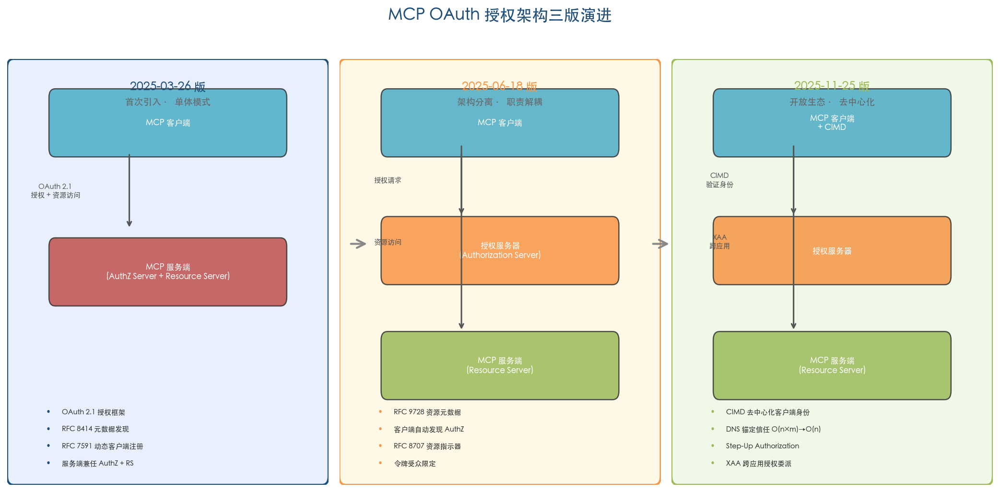

图 5-2 并列展示了三个版本的 OAuth 架构组件关系、信任流向与关键特性演进。

**2025-03-26 版（首次引入，单体模式）**：OAuth 2.1 授权框架与 Streamable HTTP 同版引入。在此版本中，MCP 服务端可同时兼任授权服务器（Authorization Server）与资源服务器（Resource Server），形成单体授权模型。技术依赖包括 OAuth 2.1 协议本身、RFC 8414（授权服务器元数据发现）以及 RFC 7591（动态客户端注册）。[MCP 规范 2025-03-26 版 Authorization](https://modelcontextprotocol.io/specification/2025-03-26/basic/authorization "初版 OAuth")

**2025-06-18 版（架构分离，职责解耦）**：这一版本实施了关键性的架构重构——引入 RFC 9728（Protected Resource Metadata），将 MCP 服务端明确定位为资源服务器（Resource Server），与授权服务器实现职责解耦。MCP 服务端 MUST 实现 Protected Resource Metadata，使客户端能够自动发现对应的授权服务器。同时新增 RFC 8707（Resource Indicators）要求，确保令牌的受众（audience）限定为特定 MCP 资源，防止令牌被滥用于未授权的服务。[MCP 规范 2025-06-18 版 Authorization](https://modelcontextprotocol.io/specification/2025-06-18/basic/authorization "引入 RFC 9728，MCP 服务端定位为 Resource Server")

**2025-11-25 版（开放生态支撑，去中心化）**：该版本引入三项重大增强以支撑大规模开放生态。其一，Client ID Metadata Documents（CIMD）——一种基于 DNS 的去中心化客户端身份注册方案，客户端在自有域名上托管 JSON 元数据文档，授权服务器通过 HTTPS 获取并验证客户端身份，无需预注册。其二，Step-Up Authorization——允许 MCP 服务端在运行时要求更高级别的授权（如多因素认证），适配敏感操作场景。其三，Cross App Access（XAA）——基于 ID-JAG（Identity Justification and Authorization Grants）实现的企业级跨应用授权流程，支持四步无用户交互的授权委派，解决 AI 代理跨多服务协调操作时的逐一授权痛点。[MCP 规范 2025-11-25 版 Authorization](https://modelcontextprotocol.io/specification/2025-11-25/basic/authorization "CIMD、Step-Up、XAA")

### 5.2.2 去中心化信任模型的工程意义

OAuth 领域专家 Aaron Parecki 指出，CIMD 是首次在主流协议中大规模采用"基于 DNS 的去中心化信任模型"。传统 OAuth 生态依赖动态客户端注册（DCR）机制，但在数千个 MCP 客户端接入数千个 MCP 服务端的开放生态中，DCR 会导致注册信息的组合爆炸——每个客户端需要在每个授权服务器上分别注册，注册规模呈 O(n×m) 增长。CIMD 通过将客户端身份锚定在 DNS 域名所有权上，将注册负担从 O(n×m) 降至 O(n)，显著降低了生态接入门槛。

XAA 则解决了企业场景中的另一核心痛点：当一个 AI 代理需要跨多个 SaaS 应用协调操作时，传统 OAuth 要求用户逐一授权每个服务，交互成本随服务数量线性增长。XAA 通过基于 ID-JAG 的四步无交互流程实现一次授权后的级联访问，使得 AI 代理能够在企业授权体系内自主协调跨应用操作。[Aaron Parecki 博文](https://aaronparecki.com/2025/11/25/1/mcp-authorization-spec-update "CIMD 和 XAA 分析")

## 5.3 五大攻击向量与纵深防御

MCP 安全最佳实践文档系统性地定义了五大攻击向量，共同构成 Streamable HTTP 生产部署的安全基线。以下逐一分析各向量的威胁模型与对应防御策略。

**混淆代理攻击（Confused Deputy Problem）**：当 MCP 代理服务器以单一 OAuth Client ID 连接多个下游客户端时，各客户端共享同一组权限，攻击者或恶意代理可能借用其他用户的授权上下文执行越权操作。防御要求包括：为每个客户端实施独立的同意流程（consent flow），代理服务器 MUST 不得将一个用户的令牌用于另一用户的请求，确保授权上下文严格隔离。[MCP 安全最佳实践](https://modelcontextprotocol.io/docs/tutorials/security/security_best_practices "Confused Deputy Problem")

**令牌透传禁令（Token Passthrough）**：MCP 规范明确禁止（MUST NOT）服务端将用户的访问令牌直接转发给下游第三方 API。令牌透传打破了 OAuth 的受众（audience）边界——一个颁发给 MCP 服务端的令牌不应被用于访问其他资源服务器。正确的做法是 MCP 服务端使用自身凭证（Client Credentials）向下游服务独立申请令牌，从而维持令牌的受众隔离。[MCP 安全最佳实践](https://modelcontextprotocol.io/docs/tutorials/security/security_best_practices "Token Passthrough MUST NOT")

**服务端请求伪造（SSRF）**：MCP 服务端经常需要代表用户访问外部 URL（如抓取网页、调用 API），这天然构成 SSRF 攻击面。安全最佳实践定义了四层防御体系：(1) 强制使用 HTTPS 协议；(2) 阻止请求指向私有 IP 范围（遵循 RFC 9728 Section 7.7 的安全指导）；(3) 验证所有重定向目标的安全性，防止通过重定向绕过 IP 限制；(4) 部署出口代理（egress proxy）统一管控出站流量，在网络层实施白名单控制。[MCP 安全最佳实践](https://modelcontextprotocol.io/docs/tutorials/security/security_best_practices "SSRF 四层防御")

**会话劫持与提示注入（Session Hijacking Prompt Injection）**：攻击者若获取到有效的 `MCP-Session-Id`，可向共享消息队列注入恶意事件，经由中间件传递给原始客户端。可恢复性机制（通过 `Last-Event-ID` 重放消息）进一步扩大了消息注入的攻击窗口。防御措施包括：使用不可猜测的 Session ID（SHOULD 使用安全随机数生成器）；将 Session ID 绑定用户信息（推荐格式 `<user_id>:<session_id>`）；在共享基础设施中实施消息签名验证，确保消息来源的不可伪造性。[MCP 安全最佳实践](https://modelcontextprotocol.io/docs/tutorials/security/security_best_practices "Session Hijacking 缓解")

**本地服务端沦陷（Local Server Compromise）**：运行在 localhost 的 MCP 服务端天然信任本地请求，一旦通过 DNS 重绑定或其他手段突破网络边界，攻击者即可调用暴露的全部工具。前述 DNS 重绑定防护（5.1 节）和 MCP Inspector 漏洞均属此类攻击面的具体实例。防御的核心在于：即使在开发环境中也应启用 Host/Origin 头部验证，并确保调试工具不监听全接口。[MCP 安全最佳实践](https://modelcontextprotocol.io/docs/tutorials/security/security_best_practices "Local Server Compromise")

## 5.4 生产部署模式

Streamable HTTP 的协议灵活性使其能够适配从完全无状态的 Serverless 函数到有状态长连接的容器化服务等多种部署形态。部署模式的选择取决于三个核心维度：是否需要 SSE 流式推送、是否存在 Serverless 部署约束、以及是否需要会话状态持久化。

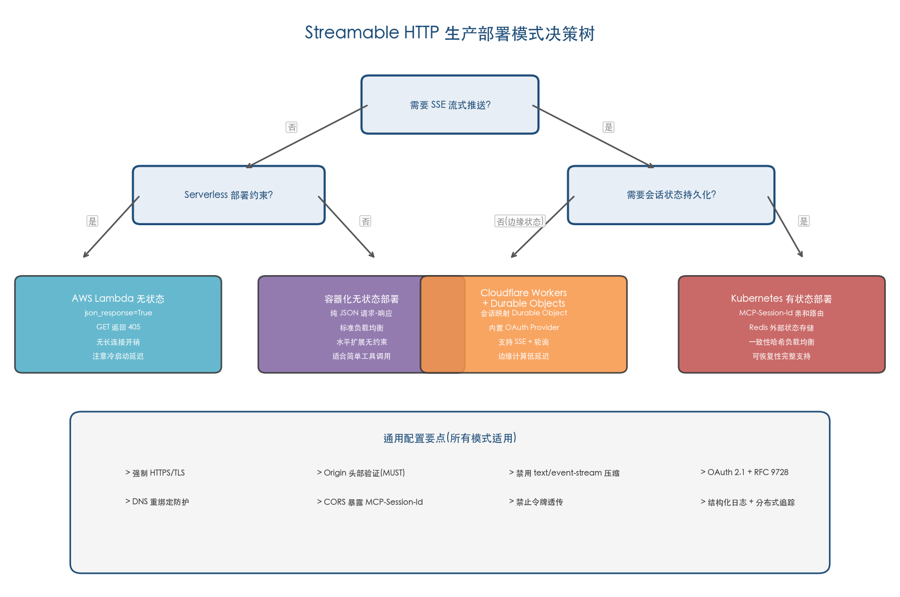

图 5-3 以决策树形式呈现了四种部署模式的选型路径及各模式通用的安全与运维配置要点。

### 5.4.1 无状态 Serverless 部署

Streamable HTTP 的核心设计目标之一是支持 Serverless 部署。当服务端不分配 `MCP-Session-Id`（无状态模式）并配置 `json_response=True`（所有 POST 返回纯 JSON、GET 返回 405）时，MCP 服务端退化为标准的请求-响应 HTTP 服务，可直接部署在 AWS Lambda、Google Cloud Functions 等 Serverless 平台上，无需维持长连接。

**AWS Bedrock AgentCore** 提供了目前最完整的托管部署方案。其协议合约要求 MCP 服务端在 `0.0.0.0:8000/mcp` 上通过 Streamable HTTP 传输提供服务，推荐采用 stateless 模式（`stateless_http=True`），同时兼容 stateful 模式。对于有状态会话，平台通过 `Mcp-Session-Id` 实现 MicroVM 亲和路由——确保同一会话的所有请求被路由到同一 MicroVM 实例。OAuth 认证通过 RFC 9728 的 `WWW-Authenticate` 响应头配合 `resource_metadata` URL 实现自动发现。[AWS Bedrock AgentCore MCP 部署文档](https://docs.aws.amazon.com/bedrock-agentcore/latest/devguide/runtime-mcp.html "stateless/stateful 模式与 MicroVM 亲和")

**AWS Lambda 直接部署** 则面临显著的工程挑战。AWS Serverless Hero Ran Isenberg 在实测中报告，采用 API Gateway → Lambda Web Adapter → FastAPI → FastMCP 架构时，冷启动延迟高达 5 秒，根因在于需要在 Lambda 中启动完整的 HTTP 服务器。此外，API Gateway 对 SSE 的支持有限，需要设置 `json_response=True` 或改用 Lambda Function URL；Lambda 的 15 分钟执行超时限制也约束了长时间 SSE 流的使用。在可观测性方面，FastAPI、FastMCP 和 AWS Powertools 三套日志系统格式不统一，导致日志碎片化。Isenberg 随后发布的 AWS Lambda MCP Cookbook 模板项目采用纯 Lambda Handler（不嵌入 HTTP 服务器）的方式规避了上述问题，为 Serverless 场景提供了更轻量的实践参考。[Ran Isenberg 技术博客](https://ranthebuilder.cloud/blog/mcp-server-on-aws-lambda/ "Lambda 部署实测：冷启动 5 秒、可观测性碎片化")

### 5.4.2 有状态长连接部署

对于需要 SSE 流式推送、进度通知和可恢复性保障的场景，有状态部署模式是必要选择。

**Cloudflare Workers + Durable Objects** 提供了一种兼具 Serverless 弹性与会话状态持久化的方案。其核心思路是将每个 MCP 会话映射到一个 Durable Object 实例，利用 Durable Objects 的内置持久化能力和单线程一致性模型保证会话状态的可靠性。平台提供内置 OAuth Provider 库 `workers-oauth-provider`，并于 2025 年 4 月 30 日更新支持 Streamable HTTP 传输。Cloudflare 方案还支持同时提供 SSE 和 Streamable HTTP 两种传输实现，通过 URL 路径路由实现向后兼容（详见第 6 章迁移策略）。Python Workers 的支持进一步扩大了该方案的适用范围。[Cloudflare Blog](https://blog.cloudflare.com/remote-model-context-protocol-servers-mcp/ "Durable Objects MCP 方案") [Cloudflare Blog](https://blog.cloudflare.com/streamable-http-mcp-servers-python/ "Streamable HTTP 支持与 Python Workers")

**容器化部署（Kubernetes）** 是最通用的生产方案，适用于需要完整控制会话状态和部署拓扑的企业级场景。MCP 服务端作为有状态微服务部署在 Kubernetes 集群中，关键配置包括：基于 `MCP-Session-Id` 头部的会话亲和性路由（通过 Ingress Controller 或 Service Mesh 实现一致性哈希）、多副本水平扩展、健康检查探针（`/health` 和 `/ready`）、以及 Pod 安全上下文（非 root 用户运行、只读根文件系统）。有状态模式下的水平扩展需要外部状态存储（如 Redis）同步会话上下文，使任意实例都能接管已有会话，避免单点故障。

### 5.4.3 API 网关配置要点

无论选择何种部署模式，API 网关的正确配置对 Streamable HTTP 的稳定运行至关重要。以下四项配置构成生产环境的关键基线。

**会话亲和性**：有状态 MCP 服务端要求同一会话的所有请求到达同一后端实例。网关需基于 `MCP-Session-Id` 头部值进行一致性哈希路由。AWS Bedrock AgentCore 通过 MicroVM 粘性路由实现这一语义。在自建部署中，Nginx 的 `hash` 指令或 Envoy 的 Ring Hash 负载均衡策略均可满足需求。[AWS Bedrock AgentCore 协议合约](https://docs.aws.amazon.com/bedrock-agentcore/latest/devguide/runtime-mcp-protocol-contract.html "MicroVM Stickiness")

**SSE 超时与缓冲**：反向代理和 API 网关通常对 HTTP 连接设置超时（如 Nginx 默认 60 秒）。SSE 长连接需要显著延长超时阈值，或利用 2025-11-25 版引入的 SSE 轮询机制将长连接转化为短连接+重连模式。该版本规范要求服务端 SHOULD 在 SSE 流启动时立即发送预备事件（prime event），之后 MAY 随时关闭连接并通过 `retry` 字段指导客户端重连间隔，从而大幅降低对网关长连接超时配置的依赖。draft 版规范进一步建议服务端 SHOULD 发送 `X-Accel-Buffering: no` 头部，指示 Nginx 等反向代理禁用响应缓冲，确保 SSE 事件能够实时推送到客户端。[MCP 规范 2025-11-25 版 Transports](https://modelcontextprotocol.io/specification/2025-11-25/basic/transports "SSE 轮询降低长连接需求") [MCP 规范 draft 版 Transports](https://modelcontextprotocol.io/specification/draft/basic/transports "X-Accel-Buffering 指导")

**CORS 配置**：跨域部署场景中需正确配置 CORS 头部。`Access-Control-Expose-Headers` MUST 包含 `MCP-Session-Id`，使客户端 JavaScript 能够读取会话标识；`Access-Control-Allow-Methods` MUST 包含 GET、POST、DELETE 三种方法，覆盖 Streamable HTTP 的全部 HTTP 动词。TypeScript SDK 和 Python SDK 文档均对此有明确要求。[Python SDK README](https://github.com/modelcontextprotocol/python-sdk/blob/main/README.md "CORS 暴露 MCP-Session-Id")

**Content-Type 透传**：网关 MUST NOT 修改或压缩 `text/event-stream` 类型的响应体。部分 CDN 或网关默认启用的 gzip 压缩会破坏 SSE 的逐行推送语义，导致事件被批量缓冲后交付而非实时流式传递，严重影响进度通知和可恢复性机制的正常运作。

### 5.4.4 JSON 响应与 SSE 流的选型

Streamable HTTP 的核心设计优势在于同一端点支持两种响应模式的动态切换，生产环境中应根据业务特征审慎选型。

**JSON 响应模式**（`json_response=True`）适合以下场景：简单的请求-响应工具调用（如数据库查询、API 代理）、Serverless 部署（无长连接开销）、以及需要经过 API Gateway 或 CDN 缓存的请求。该模式下所有 POST 请求返回 `application/json`，GET 请求返回 405 Method Not Allowed，服务端无需维护 SSE 流的生命周期。[MCP 规范 2025-11-25 版 Transports](https://modelcontextprotocol.io/specification/2025-11-25/basic/transports "JSON 响应模式")

**SSE 流模式** 适合以下场景：长耗时操作（如代码生成、大文件处理）需要实时进度通知、服务端主动推送通知或请求、以及需要可恢复性保障的关键任务。服务端可自主决定将 POST 响应升级为 SSE 流，在流中穿插进度通知后发送最终响应，为客户端提供细粒度的执行状态反馈。

在底层传输协议层面，HTTP/1.1 即可承载 Streamable HTTP 的全部功能，但 HTTP/2 的多路复用能力可在客户端维持多条 SSE 流时显著降低 TCP 连接开销。2025-11-25 版引入的 SSE 轮询机制进一步优化了连接效率——将长连接模型转变为短连接+重连模式，使并发连接数从"活跃流数量"降至"轮询周期内的瞬时连接数"，对基础设施容量规划的友好度大幅提升。[MCP 规范 2025-11-25 版 Transports](https://modelcontextprotocol.io/specification/2025-11-25/basic/transports "SSE 轮询性能影响")

## 5.5 生产部署安全检查清单

基于前述分析，以下将 Streamable HTTP 生产部署的安全与运维要求归纳为五个维度的关键检查项。

**传输层安全**：强制 HTTPS/TLS 加密所有通信；验证 Origin 头部（2025-11-25 版 MUST 约束）；启用 DNS 重绑定防护（特别是 localhost 部署场景）；升级 TypeScript SDK 至 1.24.0+、Python SDK 至 1.23.0+ 以获取默认防护；配置 `X-Accel-Buffering: no` 确保 SSE 事件实时推送。

**认证与授权**：实施 OAuth 2.1 授权框架；MCP 服务端实现 RFC 9728 Protected Resource Metadata 以支持授权服务器自动发现；禁止令牌透传（Token Passthrough MUST NOT）；为每个客户端颁发独立的、有受众限制的短期令牌；在代理场景中实施独立同意流程以防止混淆代理攻击。

**会话安全**：使用密码学安全的随机数生成器创建 Session ID；将 Session ID 绑定用户信息（推荐 `<user_id>:<session_id>` 格式）；设置合理的会话超时策略；对已终止会话的请求返回 404 Not Found。

**网络层防护**：部署 WAF（Web Application Firewall）过滤恶意流量；配置速率限制防止滥用；SSRF 防御覆盖四层——强制 HTTPS、阻止私有 IP 范围、验证重定向目标、部署出口代理；SSE 端点配置合理超时或启用轮询模式以降低长连接资源占用。

**可观测性**：结构化日志记录每次工具调用（会话 ID、工具名称、参数摘要、结果状态）；监控活跃 SSE 连接数、请求延迟百分位、错误率；部署分布式追踪（OpenTelemetry）覆盖从客户端到工具执行的完整调用链路；敏感操作审计日志持久化存储，满足合规审计要求。

# 第6章 迁移路径与向后兼容策略

Streamable HTTP 自 2025-03-26 版规范引入之日起即取代了旧版 HTTP+SSE 传输，后者同步被标记为 deprecated。然而，协议废弃并不等同于立即移除——MCP 规范在三个正式版本（2025-03-26、2025-06-18、2025-11-25）及截至 2026 年 4 月的 draft 版中始终保留了完整的向后兼容章节，为存量系统提供了结构化的迁移路径。本章从协议层协商机制、服务端双模式托管、SDK 层兼容封装以及版本间破坏性变更四个维度，系统还原从旧版传输到 Streamable HTTP 的完整迁移蓝图，并对废弃时间线与移除前景作出研判。

## 6.1 规范定义的向后兼容检测机制

### 6.1.1 客户端协议协商流程

MCP 规范为客户端定义了一套确定性的协议协商流程，使同一客户端能够透明地连接旧版 HTTP+SSE 服务端与新版 Streamable HTTP 服务端。其核心逻辑遵循"先尝试新协议，失败后回退旧协议"的渐进式探测策略：

1. **POST 探测**：客户端向目标 MCP 服务端 URL 发送 HTTP POST 请求，请求体为 `InitializeRequest` JSON-RPC 消息，`Accept` 头部 MUST 同时列出 `application/json` 和 `text/event-stream` 两种内容类型。
2. **成功路径**：若 POST 请求返回 200 OK，客户端即确认服务端支持 Streamable HTTP 传输，后续所有通信通过该单一 MCP 端点的 POST/GET/DELETE 方法进行。
3. **回退路径**：若 POST 请求返回特定错误状态码，客户端转而向同一 URL 发起 GET 请求，期望打开一条 SSE 流并收到旧版传输所定义的 `endpoint` 事件——该事件包含后续 POST 请求所使用的 URI。一旦收到 `endpoint` 事件，客户端即确认服务端运行旧版 HTTP+SSE 传输，并切换至旧版通信模式。

触发回退的 HTTP 状态码条件在规范版本间经历了显著收窄。2025-03-26 和 2025-06-18 版将回退条件笼统地定义为"4xx"错误码，而 2025-11-25 版将其精确缩窄为三个特定状态码：400 Bad Request、404 Not Found 和 405 Method Not Allowed。[MCP 规范 2025-11-25 版 Transports](https://modelcontextprotocol.io/specification/2025-11-25/basic/transports "Backwards Compatibility 客户端回退流程") 这一收窄意味着 401 Unauthorized、403 Forbidden、429 Too Many Requests 等状态码不再触发协议回退，而是被正确归类为业务层错误。该设计演进具有合理性——401/403 表示认证或授权失败而非协议不匹配，将其排除出回退条件可避免客户端误判协议类型。

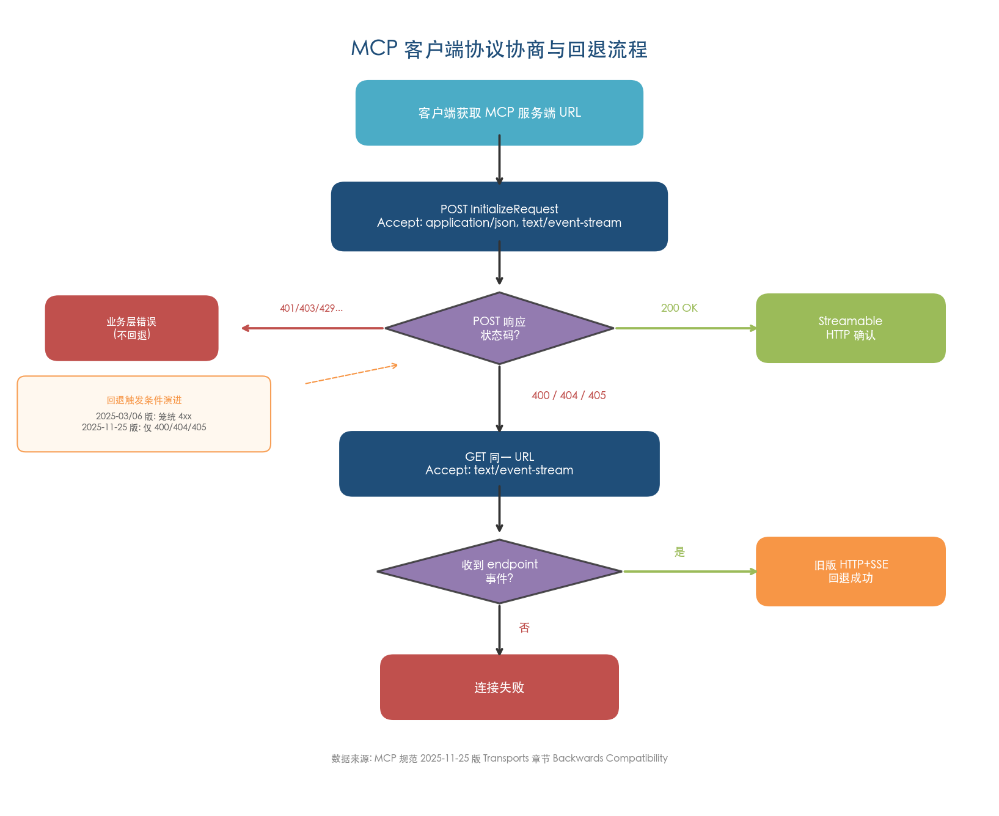

上图完整展示了客户端从获取服务端 URL 到确认传输模式的决策路径，包括 Streamable HTTP 确认（200 OK）、旧版 HTTP+SSE 回退（400/404/405 触发 GET 探测）以及业务层错误（其他 4xx 不回退）三条分支，并标注了 2025-11-25 版对回退状态码的收窄变更。

### 6.1.2 服务端双模式托管策略

规范对服务端的向后兼容指导同样明确：希望支持旧版客户端的服务端 SHOULD 同时维护旧版 SSE 端点（含 POST 端点）与新版 MCP 端点，通过独立的 URL 路径区分两种传输。[MCP 规范 2025-11-25 版 Transports](https://modelcontextprotocol.io/specification/2025-11-25/basic/transports "服务端向后兼容指导") 规范同时指出，理论上可在同一端点上合并旧版 POST 端点与新版 MCP 端点，但"this may introduce unneeded complexity"。我们认为这一建议具有务实性——两种传输的端点语义存在根本差异：旧版传输中 POST 端点的 URI 由服务端通过 SSE `endpoint` 事件动态传递，而新版传输中 POST 目标即为 MCP 端点本身。在同一路由上兼容两种语义将导致请求分发逻辑复杂化，增加维护负担。

独立端点模式的典型部署结构如下：

| 路径 | 传输模式 | 支持方法 | 用途 |
|------|---------|---------|------|
| `/mcp` | Streamable HTTP（新版） | POST / GET / DELETE | 新版客户端的唯一通信端点 |
| `/sse` | HTTP+SSE（旧版，deprecated） | GET | 旧版客户端建立 SSE 连接并接收 `endpoint` 事件 |
| `/message`（动态） | HTTP+SSE（旧版，deprecated） | POST | 旧版客户端发送 JSON-RPC 消息 |

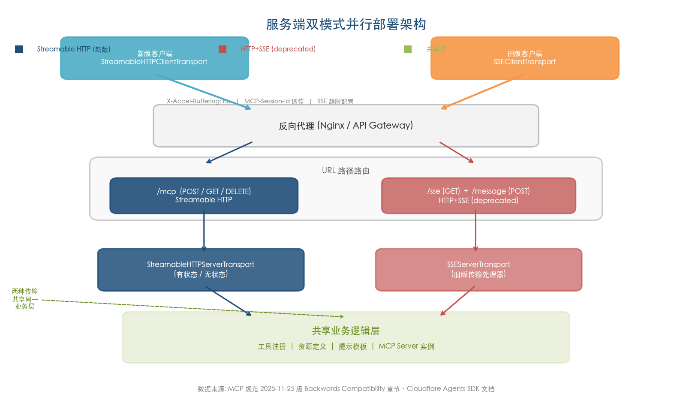

上图展示了存量服务端升级时的双传输并行部署结构：新版与旧版客户端经反向代理层进入 URL 路径路由，分别由 `StreamableHTTPServerTransport` 和 `SSEServerTransport` 处理，底层共享同一业务逻辑层（工具注册、资源定义、提示模板）。这种架构确保两种传输模式的业务语义完全一致，迁移仅涉及传输层替换。

## 6.2 SDK 层面的兼容性封装

协议层的向后兼容机制需要 SDK 层面的工程实现来落地。各主流 SDK 和生态框架在回退策略上呈现出从"手动选择"到"自动协商"的演进趋势。

### 6.2.1 TypeScript SDK：try/catch 回退模式

TypeScript SDK 提供了 Streamable HTTP 优先、SSE 回退的标准实现模式，通过官方示例 `streamableHttpWithSseFallbackClient.ts` 展示。其核心逻辑基于 try/catch 异常捕获：先尝试以 `StreamableHTTPClientTransport` 建立连接，连接失败时创建新的 `Client` 实例并使用 `SSEClientTransport` 回退。[TypeScript SDK Client Guide](https://github.com/modelcontextprotocol/typescript-sdk/blob/main/docs/client.md "SSE fallback")

```typescript
try {
    const client = new Client({ name: 'my-client', version: '1.0.0' });
    const transport = new StreamableHTTPClientTransport(baseUrl);
    await client.connect(transport);
} catch {
    const client = new Client({ name: 'my-client', version: '1.0.0' });
    const transport = new SSEClientTransport(baseUrl);
    await client.connect(transport);
}
```

一个关键的实现约束在于：回退时 MUST 创建全新的 `Client` 实例，原实例不可复用。`Client` 在首次 `connect()` 调用中已绑定特定的传输层状态，连接失败后该状态无法清除。这一约束对上层应用有直接影响——开发者需确保回退路径中的 `Client` 配置（工具注册、事件监听等）与首次尝试完全一致，否则回退后的客户端行为可能与预期不符。

### 6.2.2 Python SDK：显式配置模式

与 TypeScript SDK 的自动回退不同，官方 Python SDK（`mcp` PyPI 包）不提供内置的运行时回退机制。官方示例通过环境变量 `MCP_TRANSPORT_TYPE` 以 if/else 逻辑选择 `streamable_http_client` 或 `sse_client`，将传输类型选择权交给部署配置而非运行时协商。[Python SDK simple-auth-client 示例](https://github.com/modelcontextprotocol/python-sdk/blob/main/examples/clients/simple-auth-client/mcp_simple_auth_client/main.py "if/else 选择逻辑")

这一设计选择反映了 Python SDK 团队对显式配置的偏好。在 Python 生态的典型部署场景中，服务端传输类型在部署时即已确定（例如通过 Docker Compose 环境变量或 Kubernetes ConfigMap 注入），运行时动态协商的需求相对较低。

第三方框架 FastMCP（独立于官方 `mcp` 包的社区项目）在 v2 版本中将 Streamable HTTP 设为默认传输，并内置了 SSE 回退支持，标志着自动回退在社区层面已成为标准行为。[FastMCP v2](https://gofastmcp.com/v2/servers/server "SSE legacy, HTTP recommended")

### 6.2.3 LangChain 生态：内置自动回退

`langchain-mcp-adapters` 库内置了 Streamable HTTP → SSE 的自动回退机制，开发者无需手动处理协议协商。其文档明确声明"Streamable HTTP automatically falls back to SSE for compatibility with legacy MCP server implementations"。[langchain-mcp-adapters 文档](https://reference.langchain.com/javascript/langchain-mcp-adapters "自动回退")

这一趋势表明协议协商回退已从 SDK 示例代码层面的推荐实践，演化为生态系统框架的内置默认行为。随着 Streamable HTTP 在主流客户端（ChatGPT、Claude、Cursor、Gemini、VS Code）中获得一级支持，我们预计自动回退逻辑将逐步成为客户端 SDK 的基线能力。

### 6.2.4 Cloudflare Agents SDK：服务端双传输路由

Cloudflare Agents SDK 提供了服务端双传输模式的典型工程实现——通过 URL 路径路由将旧版 SSE 与新版 Streamable HTTP 隔离到不同的处理器。[Cloudflare Agents Transport 文档](https://developers.cloudflare.com/agents/model-context-protocol/transport/ "双传输模式")

```typescript
export default {
  fetch(request, env, ctx) {
    const url = new URL(request.url);
    if (url.pathname === '/sse' || url.pathname === '/message') {
      // Legacy SSE transport
      return MyMCP.serveSSE('/sse').fetch(request, env, ctx);
    }
    if (url.pathname === '/mcp') {
      // New Streamable HTTP transport
      return MyMCP.serve('/mcp').fetch(request, env, ctx);
    }
  }
}
```

该模式具备三项工程优势：其一，两种传输的处理逻辑完全独立，不存在路由冲突或状态共享问题；其二，旧版路径可随时移除而不影响新版端点的正常运行；其三，基于 Durable Objects 的会话隔离确保两种传输模式下的状态互不干扰。这一实现方式与规范推荐的独立端点策略高度一致，可作为双模式托管的参考范式。

## 6.3 版本间破坏性变更与迁移要点

从 2025-03-26 版引入 Streamable HTTP 至 2026 年 4 月的 draft 版，规范经历了多次结构性调整。以下逐一梳理各项破坏性变更及其迁移影响。

### 6.3.1 从双端点到单端点的架构迁移

旧版 HTTP+SSE 传输要求服务端维护两个端点：一个 SSE 端点供客户端 GET 请求建立连接，一个 POST 端点其 URI 由 SSE `endpoint` 事件动态传递。Streamable HTTP 将全部通信统一到单一 MCP 端点，同时支持 POST、GET、DELETE 三种 HTTP 方法，彻底消除了动态 URI 传递机制。[MCP 规范 2025-11-25 版 Transports](https://modelcontextprotocol.io/specification/2025-11-25/basic/transports "单端点模型")

这一架构变更对迁移的影响体现在三个层面：

- **路由简化**：服务端不再需要管理动态生成的 POST 端点 URI，API 网关和负载均衡器的路由规则从多路径匹配简化为单路径配置。
- **安全策略调整**：旧版架构中 POST 端点 URI 可能与 SSE 端点位于不同路径甚至不同端口，迁移后仅需为单一端点配置防火墙规则和安全组策略。
- **监控指标重构**：基于路径的请求计数、延迟统计等监控配置需从双路径模式调整为按 HTTP 方法（POST/GET/DELETE）区分的单路径指标体系。

### 6.3.2 JSON-RPC 批处理的移除

2025-06-18 版移除了 JSON-RPC 批处理支持（PR #416），POST 请求体从允许 JSON-RPC 消息数组收窄为仅接受单个 JSON-RPC 消息。[MCP 规范 2025-06-18 版 Changelog](https://modelcontextprotocol.io/specification/2025-06-18/changelog "移除批处理") PR #416 的提出者 ihrpr 指出，TypeScript SDK 和 Python SDK 的实现过程中未发现批处理的 compelling use case，并行工具调用可通过多个并发 POST 请求实现。[PR #416](https://github.com/modelcontextprotocol/modelcontextprotocol/pull/416 "Remove batching requirement")

对于依赖批处理的存量客户端，推荐的迁移策略包括：

1. 将批量 JSON-RPC 调用拆分为多个独立的 POST 请求并发送。
2. 利用 HTTP/2 多路复用特性降低并发连接开销——多个请求共享同一 TCP 连接，避免 HTTP/1.1 下逐个串行或多连接并发的低效模式。
3. 在应用层实现请求聚合与结果合并逻辑，将原本由协议层承担的批处理责任上移至业务层。

### 6.3.3 MCP-Protocol-Version 头部的引入

2025-06-18 版引入了 `MCP-Protocol-Version` HTTP 头部要求：客户端在初始化完成后的所有后续请求中 MUST 携带该头部，其值为初始化阶段协商确定的协议版本字符串（如 `MCP-Protocol-Version: 2025-11-25`）。[MCP 规范 2025-06-18 版 Transports](https://modelcontextprotocol.io/specification/2025-06-18/basic/transports "MCP-Protocol-Version 头部要求")

该头部的向后兼容策略体现了渐进式强化的设计理念：服务端在未收到 `MCP-Protocol-Version` 头部时 SHOULD 假定客户端使用 2025-03-26 版协议——即 Streamable HTTP 引入时的初始版本。这确保了从 2025-03-26 版客户端到 2025-06-18+ 服务端的平滑迁移，不会因缺少新头部而导致连接失败。但若服务端收到无效或不支持的版本号，则 MUST 返回 400 Bad Request，防止版本不匹配导致的静默错误。

### 6.3.4 会话 ID 头部的命名演进

会话 ID 头部名称经历了从 `Mcp-Session-Id`（2025-03-26 版至 2025-06-18 版）到 `MCP-Session-Id`（2025-11-25 版起）的变更。[MCP 规范 2025-03-26 版 Transports](https://modelcontextprotocol.io/specification/2025-03-26/basic/transports "Mcp-Session-Id") [MCP 规范 2025-11-25 版 Transports](https://modelcontextprotocol.io/specification/2025-11-25/basic/transports "MCP-Session-Id")

从协议兼容性角度分析，HTTP/1.1 规范（RFC 9110）明确头部名称大小写不敏感，HTTP/2 则将所有头部名称强制转换为小写传输。因此这一命名变更在协议层面不构成破坏性变更。然而，工程实践中仍存在以下需要关注的兼容性风险：

- **SDK 间大小写不统一**：TypeScript SDK 使用 `mcp-session-id`（全小写），Python SDK 使用 `Mcp-Session-Id`（旧版格式），AWS Bedrock AgentCore 使用 `Mcp-Session-Id`。跨 SDK 互操作时可能引发 Header 读取失败。
- **中间件实现缺陷**：某些应用框架或中间件（特别是基于严格字符串匹配的 Header 读取逻辑）可能在大小写不敏感处理上存在实现缺陷，导致 Session ID 丢失。
- **迁移建议**：服务端和客户端的 Header 读取逻辑 SHOULD 统一使用大小写不敏感的匹配方式，兼容 `Mcp-Session-Id`、`MCP-Session-Id` 及 `mcp-session-id` 三种形式。

### 6.3.5 draft 版的新增约束

截至 2026 年 4 月的 draft 版规范引入了若干新约束，进一步影响迁移规划：[MCP 规范 draft 版 Transports](https://modelcontextprotocol.io/specification/draft/basic/transports "draft 版新增约束")

- **`X-Accel-Buffering: no` 头部**：服务端在 SSE 流响应中 SHOULD 发送此头部，指示 Nginx 等反向代理禁用响应缓冲。该约束解决了生产部署中 SSE 事件被代理缓冲导致实时性降低的常见问题，对已有 Nginx 部署的存量系统尤为重要。
- **GET 流约束收紧**：GET 请求开启的 SSE 流仅允许发送 notifications 和 pings，不再允许发送 requests。这一变更简化了 GET 流的语义定位——GET 流成为纯粹的服务端推送通道，双向交互完全通过 POST 完成。依赖 GET 流接收 requests 的既有实现需要调整消息路由逻辑。
- **405 响应增强**：对不支持的 HTTP 方法返回 405 Method Not Allowed 时 MUST 包含 `Allow` 头部，列出该端点实际支持的方法。这符合 HTTP 规范（RFC 9110 Section 15.5.6）的要求，为客户端提供了更精确的能力发现信息。

## 6.4 废弃时间线与迁移窗口

### 6.4.1 HTTP+SSE 废弃演进路径

HTTP+SSE 传输的废弃历程经历了四个正式版本和一个 draft 版，演进路径清晰可追溯：

- **2024-11-05**：HTTP+SSE 作为 MCP 唯一的远程传输方式，与 stdio 并列为两种标准传输机制。[MCP 规范 2024-11-05 版 Transports](https://modelcontextprotocol.io/specification/2024-11-05/basic/transports "初版传输层定义")
- **2025-03-26**：Streamable HTTP 引入，HTTP+SSE 同步被标记为 deprecated。此后三个正式版本的 Backwards Compatibility 章节文本结构完全一致，均以"deprecated HTTP+SSE transport (from protocol version 2024-11-05)"开篇。[MCP 规范 2025-03-26 版 Transports](https://modelcontextprotocol.io/specification/2025-03-26/basic/transports "Backwards Compatibility")
- **2025-06-18**：继续保持 deprecated 状态，同版本引入 `MCP-Protocol-Version` 头部以增强版本协商能力。
- **2025-11-25**：继续保持 deprecated 状态，同版本通过 SSE 轮询机制（SEP-1699）和增强恢复能力进一步强化 Streamable HTTP 的生产就绪度。
- **draft 版（截至 2026 年 4 月）**：Backwards Compatibility 章节仍完整保留，规范中不存在明确的 HTTP+SSE 移除时间线。[MCP 规范 draft 版 Transports](https://modelcontextprotocol.io/specification/draft/basic/transports "draft 版 Backwards Compatibility 仍在")

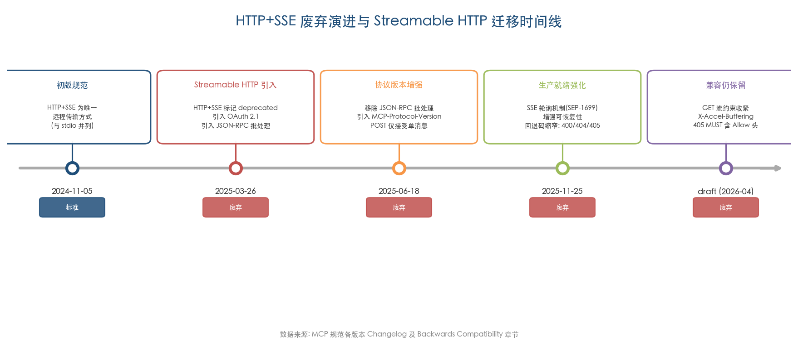

上图以时间轴形式呈现了从 2024-11-05 初版规范到 draft 版的五个关键版本节点，标注了各版本中 HTTP+SSE 的废弃状态及对应的迁移关键变更，完整还原了传输层的演进脉络。

### 6.4.2 移除前景评估

尽管 HTTP+SSE 已持续处于 deprecated 状态超过一年，规范仍未设定移除时间表。GitHub 社区中已有讨论（Discussion #2177）询问 SSE 传输是否会被正式移除，但截至 2026 年 4 月未获得官方明确回应。[GitHub Discussion #2177](https://github.com/modelcontextprotocol/modelcontextprotocol/discussions/2177 "SSE 传输移除讨论")

我们判断短期内（2026 年内）HTTP+SSE 不会被移除，主要基于以下三方面考量：

1. **存量生态规模庞大**：截至 2025 年 11 月，MCP 生态已拥有超过 9,700 万月度 SDK 下载量和 10,000 余个活跃服务端，[MCP 官方博客](https://blog.modelcontextprotocol.io/posts/2025-11-25-first-mcp-anniversary/ "MCP 周年报告") 其中相当部分仍运行旧版传输。贸然移除向后兼容支持将造成大面积兼容性破坏。
2. **向后兼容章节仍在积极维护**：draft 版规范不仅保留了向后兼容指导，2025-11-25 版还精确化了回退状态码（从笼统 4xx 缩窄至 400/404/405），表明规范团队仍在积极优化该回退路径而非准备移除。
3. **SDK 层面的持续支持**：TypeScript SDK 仍保留 `SSEClientTransport` 和 `SSEServerTransport` 类，Python SDK 仍提供 `sse_client` 和 `sse_server` 模块，均未标记为 deprecated。

然而，从中长期视角来看（2027 年以后），随着 Streamable HTTP 在主流 AI 客户端中的全面普及，向后兼容章节的移除将是必然趋势。我们建议所有新建 MCP 服务端直接采用 Streamable HTTP 传输，不再投入旧版传输的开发与维护成本。

## 6.5 迁移实施建议

基于上述分析，迁移路径可归纳为三类典型场景：

**场景一：纯新建系统**。直接采用 Streamable HTTP 传输，无需考虑旧版兼容性。服务端仅暴露单一 MCP 端点，客户端使用 `StreamableHTTPClientTransport`（TypeScript）或 `streamable_http_client`（Python）。这是成本最低、架构最简洁的选择。

**场景二：存量服务端升级**。采用双端点并行策略——在现有旧版 SSE/POST 端点基础上新增 `/mcp` 端点托管 Streamable HTTP 传输。两种传输共享同一业务逻辑层（工具注册、资源定义、提示模板），仅传输层并行运行。通过流量监控持续观察旧版端点的请求量趋势，当旧版流量降至可忽略水平时执行端点移除。

**场景三：存量客户端升级**。实现 Streamable HTTP → SSE 的自动回退逻辑。TypeScript 生态可直接复用 SDK 提供的 try/catch 模式，Python 生态可参考 FastMCP v2 或 `langchain-mcp-adapters` 的实现。关键约束在于确保回退路径中的 `Client` 实例配置与主路径完全一致。

跨场景通用的工程注意事项如下：

- **`MCP-Protocol-Version` 头部**：所有客户端在初始化完成后 MUST 携带该头部，服务端应实现优雅降级（未收到时假定 2025-03-26 版）。
- **会话 ID 头部解析**：统一使用大小写不敏感的 Header 匹配逻辑，兼容 `Mcp-Session-Id`、`MCP-Session-Id` 及 `mcp-session-id` 三种形式。
- **反向代理配置**：Nginx 等代理需为 SSE 端点禁用响应缓冲（`X-Accel-Buffering: no`），配置足够的超时时间以避免过早终止长连接，并确保 `MCP-Session-Id` 头部的透传不被拦截。
- **CORS 策略**：`Access-Control-Expose-Headers` 需显式包含 `MCP-Session-Id`，`Access-Control-Allow-Methods` 需包含 GET、POST、DELETE 三种方法，确保浏览器环境下的跨域访问正常工作。

# 结论与风险提示

## 核心结论

Streamable HTTP 传输方案代表了 MCP 协议从实验性设计向生产级基础设施的关键跨越。通过对协议规范三版迭代（2025-03-26、2025-06-18、2025-11-25）、PR #206 及相关社区讨论、五大官方 SDK 工程实现以及安全漏洞演进的系统性分析，本报告得出以下核心结论。

**第一，"渐进增强"是 Streamable HTTP 最重要的设计哲学。** 该方案通过 MUST/SHOULD/MAY 三层约束体系，将 SSE 流、会话管理、可恢复性等高级能力从协议强制要求降级为可选增强，使得最基础的 MCP 服务端——仅处理 POST 请求并返回 JSON 响应——即可在 Serverless 平台上合规运行。这一设计在不牺牲协议完整性的前提下，将 MCP 的部署范围从长连接有状态服务扩展至无状态函数、边缘计算节点和短生命周期容器，从根本上解决了旧版 HTTP+SSE 架构的核心瓶颈。

**第二，SSE 轮询机制（SEP-1699）是 Streamable HTTP 走向成熟的关键补丁。** 2025-03-26 版引入的初始设计虽已解决双端点和强制长连接问题，但 SEP-1335 于 2025 年 8 月识别的四大缺陷——无初始事件则无法恢复、服务端被迫维持长连接、客户端缺乏重连指导、消息缓存无垃圾回收策略——表明初版 Streamable HTTP 在可恢复性方面仍不完善。2025-11-25 版通过预备事件、服务端主动断连和 `retry` 字段三项机制系统性地解决了前三个缺陷，将传统长连接模型转化为短连接+轮询混合模型，大幅提升了协议在真实生产环境中的健壮性。

**第三，安全机制的演进呈现出"漏洞驱动强化"的典型模式。** CVE-2025-66414 和 CVE-2025-66416 的同日披露直接推动了 Origin 校验从 SHOULD 升级至 MUST 约束；CVE-2025-49596（MCP Inspector 远程代码执行）则暴露了开发工具链自身的安全盲区。OAuth 授权框架从单体模式演进至去中心化信任模型（CIMD + XAA）的过程，同样是生态规模扩大后安全需求倒逼协议演进的结果。安全防线已从单一的传输层加密扩展为"规范约束 + SDK 默认值 + 框架中间件"的三层纵深体系。

**第四，多语言 SDK 实现的成熟度存在显著梯度。** TypeScript SDK 和 Python SDK 作为官方参考实现，在功能覆盖度和工程质量上领先于其他语言 SDK。C# SDK 虽起步最晚但凭借 Microsoft 的工程投入迅速追平，成为首个实现实验性 Task 原语和分布式缓存事件存储的 SDK。Kotlin SDK 服务端支持仍处于开发中，Java SDK 存在不支持重定向等已知工程缺陷。SDK 生态的非均衡发展反映出 Streamable HTTP 在非参考实现语言中的工程落地仍需时间。

**第五，从 HTTP+SSE 到 Streamable HTTP 的迁移具有清晰可执行的路径。** 规范提供了客户端协议协商回退机制和服务端双端点并行托管策略，SDK 层面从 TypeScript 的 try/catch 模式到 LangChain 生态的内置自动回退，迁移工具链已趋于成熟。HTTP+SSE 短期内不会被移除，但所有新建系统应直接采用 Streamable HTTP。

## 风险提示

本报告的分析存在以下局限性与风险因素，需在解读结论时予以考量。

**第一，规范演进的时效性约束。** 本报告的分析截止至 2026 年 4 月的 draft 版规范。MCP 协议仍处于快速迭代阶段——Transport Working Group 已规划在 2026 年 6 月发布的下一版规范中推进协议无状态化和路由信息暴露等重大变更。本报告的部分结论（如有状态模式的路由策略、事件 ID 编码格式）可能因后续规范调整而需要修正。

**第二，SDK 源码分析的覆盖范围有限。** 本报告重点分析了 TypeScript SDK 和 Python SDK 的架构设计与关键实现逻辑，对 Java、Kotlin、C# SDK 的分析主要依据官方文档、发布说明和 Issue 讨论，未对其源码进行同等深度的逐行审查。各 SDK 的内部实现细节（如并发控制、内存管理、异常处理路径）可能存在本报告未覆盖的工程差异。

**第三，生产部署实测数据的缺失。** 本报告对 Serverless 部署延迟（如 Lambda 冷启动 5 秒）、SSE 轮询机制的性能影响、有状态模式下的水平扩展瓶颈等工程问题的讨论，主要来源于社区开发者的公开报告和平台文档，缺乏基于受控实验的系统性基准测试数据。不同云平台、网络环境和负载模式下的实际表现可能与本报告引用的数据存在差异。

**第四，安全分析聚焦于已知攻击向量。** 本报告覆盖了 MCP 安全最佳实践文档定义的五大攻击向量和已披露的 CVE 漏洞，但未进行独立的安全审计或渗透测试。Streamable HTTP 的可恢复性机制（`Last-Event-ID` 重放）、SSE 轮询模式下的连接状态管理等新引入的协议特性可能存在尚未被公开识别的安全风险。

**第五，消息垃圾回收策略的规范空白。** SEP-1335 提出的四大缺陷中，消息垃圾回收是唯一未被纳入规范的问题。本报告虽然识别了该问题并描述了 SDK 层面的抽象接口设计（如 TypeScript SDK 的 `EventStore` 和 C# SDK 的 `ISseEventStreamStore`），但未能给出规范层面的系统性解决方案评估，这一问题有待后续规范版本和社区实践的进一步澄清。
