# 执行摘要

人工智能与教育的深度融合正在重塑全球教育体系的底层逻辑。本报告围绕"AI 在教育中的应用现状与落地场景""AI 教育面临的核心挑战""教育对 AI 高端人才培养的支撑作用"三条主线，对 2025—2026 年全球及中国 AI 教育领域的市场格局、技术实践、治理框架与人才培养体系进行了系统性深度研究。核心发现如下：

**市场正处于高速增长的确认期。** 尽管不同研究机构因口径差异给出的 2025 年全球 AI 教育市场规模跨度从 22 亿美元到 189 亿美元，但复合年增长率（CAGR）30% 以上的增长共识已经确立。中国市场呈现"基建+应用"双层叠加的独特结构——狭义软件+服务口径约 5 亿美元（2024 年），广义口径含教育信息化和智能硬件超 700 亿元人民币（2025 年），政策推进密度和执行速度居全球前列。

**落地场景分化显著，"学"端成熟度最高。** 自适应学习与个性化推荐是部署规模最大、效果实证最丰富的赛道——Duolingo 日活用户达 5270 万，松鼠 Ai 累计服务 2400 万学生，Khanmigo 用户从 6.8 万一年内增长至超 70 万。科大讯飞在中国服务超 5 万所学校、1.3 亿师生，构成智慧教育基础设施的核心支柱。AI 辅助教学、智能评估和教育管理的落地程度依次递减，越是涉及高利害判断和深层人际互动的场景，推进越需审慎。

**挑战是多维度、相互关联的系统性问题。** 大语言模型在开放域中的幻觉率仍高达 33%—51%，PowerSchool 事件暴露了 6200 万条学生记录的安全漏洞，英国高校 AI 作弊案例率在一年内增长逾两倍，AI 评分中存在针对特定族裔的系统性偏差，教师 AI 培训的经济分化达 28 个百分点。OECD 提出的"去技能化"警示尤为深刻：学生在 AI 辅助下完成任务时表现优异，但移除 AI 后优势消失甚至逆转，这一发现将教育的核心挑战从"如何使用 AI"重新定向为"如何保护人类独立思考能力"。

**全球治理正从"空白期"进入"建制期"。** 中国以罕见的政策密度构建起从《教育强国建设规划纲要》到教育部全学段指南再到大规模试点的完整制度闭环；欧盟《人工智能法案》将教育 AI 归入高风险分类，2026 年 8 月全面适用；美国以行政令 14277 和联邦拨款指引推动从"完全市场驱动"向"联邦指引+市场执行"的转型。三种范式在限制低龄学生独立使用 AI、强调教师主导地位和优先保护数据隐私三个方向上形成了跨制度共识。

**教育对 AI 人才培养的支撑体系正经历系统性重构。** 中国开设 AI 本科专业的高校从 2018 年的 35 所增至 2024 年的 535 所，清华、复旦、浙大等头部高校在"AI+X"课程体系上形成了各具特色的创新路径，50 家国家卓越工程师学院推动产教深度融合。但麦肯锡预测到 2030 年中国 AI 人才缺口仍可能高达 400 万人，AI 伦理教育的系统化程度与国际标杆相比仍有差距。

**趋势展望方面，我们提出三个核心命题。** 第一，技术能力不再是瓶颈，治理能力成为关键分水岭；第二，AI 教育的核心价值将从"效率工具"向"教育公平基础设施"迁移；第三，教育系统必须在"AI 赋能"与"人类独立能力保护"之间建立新的平衡。

# 第1章 全球与中国 AI 教育市场全景——规模、增速与驱动力

人工智能正以前所未有的速度渗透全球教育体系。从硅谷的自适应学习平台到中国县域的智慧课堂，AI 技术已从教育领域的概念性前沿演变为一个拥有明确市场规模、可测量增速和多重结构性驱动力的新兴产业赛道。本章旨在为全篇研究提供定量底座和宏观语境，系统回答"AI 在教育领域的整体渗透程度如何"这一基础性问题。具体而言，本章将梳理 2025—2026 年全球及中国 AI 教育市场的规模与增长态势，解析政策、技术与需求三重核心驱动因素，并对比中国、美国和欧盟三大经济体的政策推进范式差异。全章以"全球框架 + 中国聚焦"的结构展开，在全球市场数据铺底后，重点剖析中国 AI 教育市场的独特发展路径。

## 1.1 全球 AI 教育市场规模：多源口径下的增长共识

对全球 AI 教育市场规模的研判，首先需正视一个方法论挑战：不同研究机构因定义口径差异，给出的数字可能相差数倍。我们系统比较了四家主要市场研究机构的估算，以帮助在多源数据中锚定合理的认知区间。

Grand View Research 估算，2024 年全球 AI 教育市场规模为 58.8 亿美元，2025 年预计达 83 亿美元，到 2030 年将增长至 322.7 亿美元，2025—2030 年复合年增长率（CAGR）为 31.2%。该口径覆盖 K-12、高等教育和企业培训三大板块，技术口径涵盖机器学习（占 64.7% 份额）与自然语言处理，解决方案类收入占比 70.3%（2024 年）[Grand View Research](https://www.grandviewresearch.com/industry-analysis/artificial-intelligence-ai-education-market-report "AI In Education Market Size & Share, Industry Report 2025-2030")。Precedence Research 的估算与之大体可比，将 2025 年全球市场定位于 70.5 亿美元，预计到 2035 年增长至 1367.9 亿美元，2026—2035 年 CAGR 约 34.52%；该报告指出北美以 38% 的市场份额领先，亚太地区为增速最快区域，学习平台与虚拟辅导占 47% 以上应用份额 [Precedence Research](https://www.precedenceresearch.com/ai-in-education-market "AI in Education Market Size to Surge USD 136.79 Bn by 2035")。

在口径较窄的一端，MarketsandMarkets 聚焦于 LMS、自适应学习平台和聊天机器人等软件品类，估算 2024 年全球 AI 教育市场为 22.1 亿美元，到 2030 年增长至 58.2 亿美元，CAGR 为 17.5%；北美占 43% 份额，内容生成工具是增速最快的细分方向（CAGR 19.1%）[MarketsandMarkets](https://www.marketsandmarkets.com/Market-Reports/ai-in-education-market-200371366.html "AI in Education Market Report 2024-2030")。在口径最宽的一端，Research and Markets 将 2025 年全球市场估算为 189.2 亿美元，预计到 2030 年达 486.3 亿美元，CAGR 为 20.7%；该口径涵盖范围最广，可能包含更广泛的教育 IT 基础设施和数字化转型投入 [Research and Markets](https://www.researchandmarkets.com/report/education-ai "Artificial Intelligence in Education Market Size & Trends, 2025-2030")。

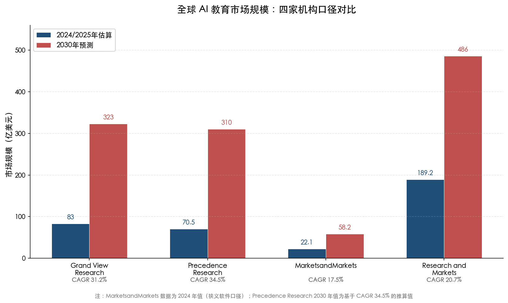

上述四家机构的 2025 年全球 AI 教育市场估算跨度从约 22 亿美元到 189 亿美元（见图），核心差异体现在三个维度：是否涵盖企业培训与终身学习市场、是否将底层云基础设施和教育 IT 计入、以及生成式 AI 内容工具是否独立测算。Grand View Research 和 Precedence Research 口径居中（70—83 亿美元），两者在覆盖范围和统计方法上较为可比，本报告在后续分析中以这一区间作为主要参照基准。尽管绝对数字存在显著分歧，四家机构对增长方向的判断高度一致：CAGR 均超过 17%，中位区间在 30% 以上。融中咨询 2026 年 3 月发布的综合分析同样印证了这一共识，指出各研究机构对 2025 年市场规模估算虽介于 70 亿至 150 亿美元之间，但对复合年增长率的预测高度一致，CAGR 普遍超过 30%，预计到 2030 年市场规模将达数百亿美元以上 [融中咨询](https://caifuhao.eastmoney.com/news/20260326154109748112920 "AI+教育正重写答案，2026年3月发布")。

## 1.2 中国 AI 教育市场：狭义口径与广义口径的双重图景

中国 AI 教育市场的规模测算同样存在显著的口径差异，但恰恰是这种差异勾勒出中国市场的完整面貌——一个由纯 AI 软件服务与庞大教育信息化基建共同构成的复合生态。

Grand View Research 中国区子报告显示，2024 年中国 AI 教育市场收入为 5.09 亿美元（狭义软件+服务口径），预计到 2030 年达 28.459 亿美元，2025—2030 年 CAGR 为 31.6%。按此口径，2024 年中国占全球 AI 教育市场的 8.7%，在亚太区域中居领先地位 [Grand View Research 中国区报告](https://www.grandviewresearch.com/horizon/outlook/ai-in-education-market/china "China AI In Education Market Size & Outlook, 2025-2030")。

与之形成鲜明对照的是广义口径下的市场图景。多鲸教育研究院《2025 AI 赋能教育行业发展趋势报告》估算，2025 年中国 AI+教育市场规模超 700 亿元人民币（约 96 亿美元），涵盖校内教育信息化和校外教育两端市场；预计到 2030 年将达到近 3000 亿元，2025—2030 年复合增速约 47% [多鲸教育研究院报告](https://news.qq.com/rain/a/20250627A04XQB00 "2025 AI 赋能教育行业发展趋势报告，转引自腾讯新闻")。这一广义口径将校内教育信息化投入（包含智慧教室硬件基础设施）和校外智能教育硬件（学习机等）纳入"AI+教育"范畴，反映了中国市场的一个重要结构特征：AI 教育的渗透并非单纯的软件层创新，而是与大规模教育基础设施升级深度耦合。

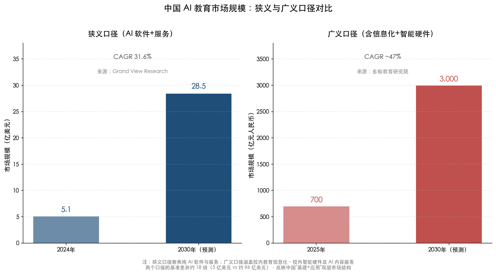

两个口径之间约 18 倍的差距（5.09 亿美元 vs 约 96 亿美元），折射出中国 AI 教育市场的独特结构——底层依托政府主导的教育信息化投入，上层由市场化的 AI 软件和智能硬件产品驱动（见图）。校内市场增长源于教育信息化中 AI 渗透率的持续攀升，校外市场增长来自学习机等智能硬件和 AI 内容服务的升级迭代。这种"基建+应用"双层叠加的结构，是理解中国 AI 教育市场高增速的关键所在。

## 1.3 全球 EdTech 投融资格局：资本从狂热回归纪律

资本市场的资金流向为理解 AI 教育产业的发展阶段提供了另一重要维度。HolonIQ 数据显示，2025 年全球 EdTech 风险投资总额为 26 亿美元，同比增长约 11%，市场进入"稳健纪律化"阶段；近 40% 的交易金额在 500 万美元以上，资本集中流向 AI 赋能产品和与就业对接的平台 [HolonIQ](https://www.holoniq.com/notes/edtech-hits-2-6b-in-investment-as-the-market-stabilizes-bigger-bets-in-ai-and-workforce-training "EdTech hits $2.6B in investment, 2025年度总结")。这一数字是在经历了 2021 年峰值和 2024 年跌至 24 亿美元十年冰点之后的温和回升，标志着 EdTech 投资正从后疫情时代的大幅波动中逐步企稳。

2025 年的重大并购反映了行业整合加速的趋势：Workday 以 11 亿美元收购 AI 学习平台 Sana，Coursera 收购 Udemy，企业学习和 AI 赋能能力构建成为并购的核心主题。全年全球教育并购交易量约 410 笔（含 22 笔 PE 收购），同比增长约 20% [HolonIQ](https://www.holoniq.com/notes/edtech-hits-2-6b-in-investment-as-the-market-stabilizes-bigger-bets-in-ai-and-workforce-training "2025全球教育M&A数据")。代表性风险投资事件包括 MagicSchool AI 获 4500 万美元融资、Starbridge 获 4200 万美元、Leap Scholar 获 6500 万美元，AI 赋能教育产品已成为资本押注的核心方向。

中国市场的资本图景呈现出不同的演变节奏。据融中咨询基于 HolonIQ 数据的分析，在 2010 至 2025 年第一季度期间，中国累计获得高科技 AI 教育领域投资 297 亿美元，美国为 282 亿美元，中国在累计投资额上居全球首位 [融中咨询](https://caifuhao.eastmoney.com/news/20260326154109748112920 "基于HolonIQ数据，AI+教育融资地域分布")。然而 2021 年"双减"政策后，以中国为代表的亚太市场投资热度显著降温，北美和欧洲成为新的主力投资区域。多鲸教育研究院的分析显示，2025 年中国国内教育行业一级市场全年约发生 56 起投融资与并购事件，天使轮占比居高，A 轮及以后轮次有限，资本呈现"早期试探"与"存量整合"双轨并行的结构特征 [多鲸](https://m.36kr.com/p/3626414997193730 "56起、26亿、天使轮扎堆……2025教育投资的钱都流向了哪里，2026年1月发布")。这种审慎但持续的资本参与方式，反映了"双减"后中国教育投资逻辑的根本转变——从追逐用户规模扩张转向为产品验证阶段付费，从直接切入教学核心转向教育外围环节布局。

值得关注的是，尽管纯教育赛道投资整体承压，AI 赋能教育的方向依然获得资本青睐。AI 儿童益智玩具品牌 Haivivi 获 2 亿元 A 轮融资，AI 志愿填报、面试辅导等标准化程度高且监管风险低的应用场景成为资金流入的优先方向。

## 1.4 全球 AI 投资大格局中的教育赛道定位

将 AI 教育投资置于全球 AI 产业投资的整体框架下审视，有助于理解其相对位势和增长潜力。斯坦福大学 HAI《2025 AI 指数报告》显示，2024 年全球企业 AI 投资达 2523 亿美元，其中私人投资同比增长 44.5%；美国私人 AI 投资达 1091 亿美元，约为中国（93 亿美元）的 12 倍、英国（45 亿美元）的 24 倍；生成式 AI 全球私人投资达 339 亿美元，同比增长 18.7% [斯坦福 HAI](https://hai.stanford.edu/ai-index/2025-ai-index-report/economy "2025 AI Index Report, Economy Chapter")。

相较于全球 AI 投资 2523 亿美元的总盘，AI 教育赛道 26 亿美元的 EdTech 风投总额仅占约 1%。然而，考虑到教育市场本身超过 7 万亿美元的全球体量（HolonIQ 估算 2025 年全球教育支出约 7 万亿美元），AI 在教育中的渗透率仍处于极早期阶段，增量空间巨大。

在区域格局方面，Grand View Research 美国区子报告显示，美国 AI 教育市场 2024 年收入为 17.661 亿美元，预计到 2030 年增至 89.894 亿美元，为全球最大的单一国家市场 [Grand View Research](https://www.grandviewresearch.com/horizon/outlook/ai-in-education-market/united-states "U.S. AI In Education Market, 2024-2030")。与此同时，斯坦福 HAI 报告指出，大中华区在组织层面的 AI 使用率实现 27 个百分点的同比增长，为全球最高增幅之一；欧洲紧随其后增长 23 个百分点 [斯坦福 HAI](https://hai.stanford.edu/ai-index/2025-ai-index-report/economy "大中华区AI使用率增长全球领先")。组织层面 AI 使用率的高速增长，为 AI 教育市场的后续爆发提供了基础设施就绪度和用户习惯基础。

## 1.5 三重结构性驱动力

AI 教育市场的高速增长并非偶然的技术扩散现象，而是政策推动、技术跃迁和需求拉动三重结构性力量共振的结果。

### 1.5.1 政策驱动：中国"自上而下系统推进"的密集部署

中国在 AI 教育的政策布局上展现出全球最快的闭环节奏。2025 年 1 月 19 日，中共中央、国务院印发《教育强国建设规划纲要（2024—2035 年）》，其中第二十六条明确提出"促进人工智能助力教育变革"，核心条文涵盖打造人工智能教育大模型、建设云端学校、制定完善师生数字素养标准、深化人工智能助推教师队伍建设、建立基于大数据和人工智能支持的教育评价与科学决策制度 [教育部官网](http://www.moe.gov.cn/jyb_xxgk/moe_1777/moe_1778/202501/t20250119_1176193.html "教育强国建设规划纲要（2024—2035年）全文")。这一纲领性文件为教育部层级的具体行动方案提供了法理基础和政策授权。

教育部自 2024 年 3 月启动"人工智能赋能教育行动"以来，截至 2025 年底已取得五项阶段性进展：印发《中小学人工智能通识教育指南》等多份规范文件；依托国家智慧教育公共服务平台汇聚 AI 精品课程超 1000 门；组织高校教职工线上培训覆盖 2000 余所高校、50 万师生；组织建设 23 个教育专用大模型和 13 个学科领域垂类模型；设立 509 所人工智能教育基地校 [CERNET](https://www.edu.cn/xxh/focus/zc/202601/t20260107_2714511.shtml "教育部：将继续深入推进人工智能赋能教育行动")。

在试点部署层面，教育部已遴选东部地区 7 个省份、中西部地区 20 个地市、18 所高校开展 AI 赋能教育试点，一体推进人工智能教学应用、课程工具开发和安全体系构建 [CERNET](https://www.edu.cn/xxh/focus/zc/202601/t20260107_2714511.shtml "教育部2026年政策部署")。教育部科技司司长周大旺 2026 年 1 月明确表示，计划 2026 年出台人工智能赋能教育的系统性政策文件。截至 2026 年 4 月该文件尚未正式公开发布，但从政策信号的密度和具体程度判断，中国正在构建从国务院纲要到部委行动方案、再到地方试点执行的完整政策闭环。

### 1.5.2 技术驱动：大语言模型能力跃迁与开源降本

2025 年初 DeepSeek 大模型以开源形式发布，其强推理能力和低成本特性使国内 AI 大模型在教育领域达到"大规模可用级别"。多家头部教育企业（好未来、猿编程、松鼠 Ai 等）迅速宣布接入 DeepSeek，大幅缩小了底层模型能力差距，推动 AI+教育行业进入"全民时代"[多鲸教育研究院报告](https://news.qq.com/rain/a/20250627A04XQB00 "DeepSeek催化AI+教育进入全民时代")。开源大模型的崛起意味着 AI 教育产品的核心竞争力正在从"谁拥有最强模型"转向"谁对教育场景理解最深、谁拥有最大规模的垂类教育数据"。

MarketsandMarkets 报告指出，生成式 AI 是当前 AI 教育市场中增速最快的技术细分方向，NLP 技术在自动评分、翻译和语言辅助等场景的应用持续扩展 [MarketsandMarkets](https://www.marketsandmarkets.com/Market-Reports/ai-in-education-market-200371366.html "GenAI为AI教育市场增速最快技术方向")。从产品形态演进来看，AI 教育正经历从"刚性脚本式"智能辅导系统向"对话式数字教学代理"的范式转换——生成式 AI 赋予教育产品前所未有的自然交互能力和内容生成能力。Duolingo 借助 AI 使课程开发时间缩短 80%、Khan Academy 旗下 Khanmigo 从 6.8 万用户一年内增长至 70 万用户，均为这一技术跃迁在教育场景中释放需求的典型例证。

### 1.5.3 需求驱动：教师短缺与个性化学习的刚性需求

在需求端，全球教师短缺构成 AI 教育渗透的结构性推力。UNESCO 2024 年发布的《全球教师报告》指出，到 2030 年全球中小学教育面临 4400 万名教师的缺口，其中撒哈拉以南非洲需要增加 1500 万名教师；仅招聘教师用于普及初等教育的成本即约 128 亿美元，普及中等教育则需 1068 亿美元 [UNESCO](https://www.unesco.org/en/articles/global-report-teachers-addressing-teacher-shortages-and-transforming-profession "Global report on teachers, 2024年2月发布")。如此巨大的人力缺口在短期内几乎不可能通过传统师范教育体系填补，AI 辅助教学因而成为弥合教师供给鸿沟的关键技术手段。

个性化学习需求是 AI 教育市场最为核心的增长驱动力。Grand View Research 强调，学校和机构日益采用智能辅导系统（ITS）、聊天机器人和学习分析工具来提升学生参与度和优化教学方法 [Grand View Research](https://www.grandviewresearch.com/industry-analysis/artificial-intelligence-ai-education-market-report "个性化学习为AI教育核心驱动力")。传统课堂教学面临"一个教师对几十名学生"的结构性矛盾，难以实现真正的因材施教。AI 技术通过精准学情诊断、个性化学习路径规划和实时反馈调适，正在从技术层面打破传统教育"个性化—高质量—大规模"的"不可能三角"。这一驱动力在企业培训与终身学习领域同样强劲——Grand View Research 预计企业培训与终身学习将成为预测期内增速最快的终端应用细分市场。

## 1.6 中外政策范式比较：三种路径的分野

AI 教育的全球扩张并非在统一的制度环境下展开。中国、美国和欧盟三大经济体在政策推进模式上呈现显著的路径分野，这些差异直接塑造了各自市场的发展节奏和产品形态。

**中国：自上而下系统推进。** 如 1.5.1 节所述，中国从国务院层级的《教育强国建设规划纲要》到教育部的具体行动方案和试点部署，形成了从顶层设计到执行落地的完整政策闭环。2025 年 4 月教育部等九部门联合印发《关于加快推进教育数字化的意见》，2025 年 8 月国务院发布《关于深入实施"人工智能+"行动的意见》，2026 年 3 月教育部部署"人工智能+教育"推动教育数字化战略行动 2.0，政策密度在全球范围内独树一帜 [教育部官网](http://www.moe.gov.cn/jyb_xwfb/s5148/202604/t20260402_1432732.html "2026年4月2日《中国教育报》")。这种模式的优势在于执行效率高、资源调配力度大，但也面临"部分试点存在'重形式轻实效'倾向、区域间改革进度不一"的落地挑战。

**美国：市场驱动 + 联邦指引。** 美国的 AI 教育创新主要由科技企业和高校主导，Khan Academy 与 Microsoft 合作向全美 K-12 教师免费提供 AI 助教 Khanmigo 是典型案例。联邦层面，2025 年 4 月特朗普签署行政令 14277"推进美国青年人工智能教育"，设立白宫 AI 教育工作组，但政策框架总体上属鼓励性而非强制性。AI 教育产品的准入和使用主要由市场竞争和学区自主选择决定。

**欧盟：规范先行，合规驱动。** 欧盟《人工智能法案》于 2025 年起正式实施，将教育领域的 AI 系统（如自动评分、入学筛选）归类为"高风险"应用，要求提供者遵守数据治理、透明度和人类监督等全套合规义务 [欧洲委员会](https://education.ec.europa.eu/focus-topics/digital-education/actions/plan/ethical-guidelines-for-educators-on-using-artificial-intelligence "EU Guidelines on ethical use of AI in education, 2025年更新版")。这一"先规范再发展"的路径优先保障了伦理底线和用户权益，但在产品创新速度和市场规模扩张方面形成一定约束。

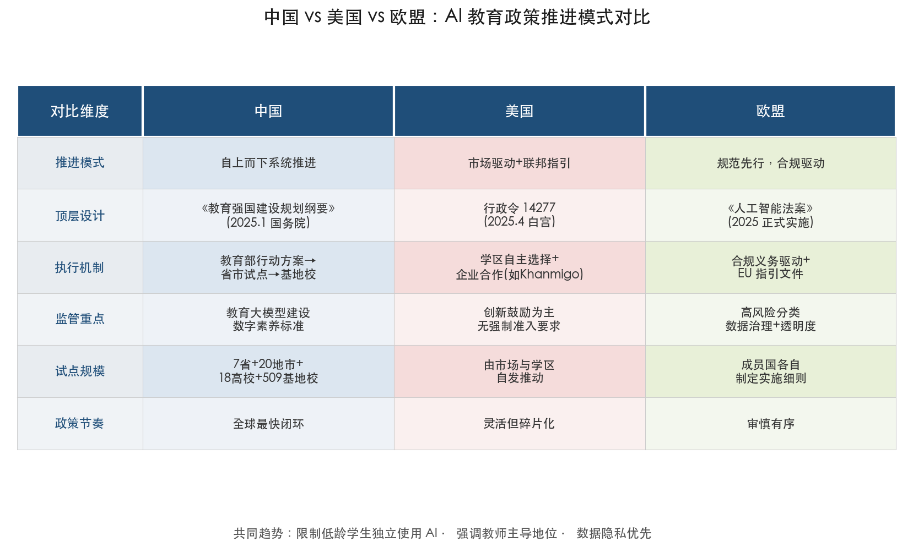

三种范式虽各有侧重，但共同趋势值得关注（见图）：限制低龄学生独立使用 AI、强调教师在 AI 辅助教学中的主导地位、以及将数据隐私置于优先级。这些跨越制度差异的共识，构成了全球 AI 教育发展的制度性底线。

## 1.7 本章小结

综合以上分析，本章得出以下核心判断：

**第一，全球 AI 教育市场正处于高速增长的确认期。** 尽管不同机构因口径差异给出的 2025 年市场规模跨度从 22 亿美元到 189 亿美元，但 CAGR 30% 以上的增长共识已经确立。AI 教育正在从概念验证阶段迈向规模化部署。

**第二，中国 AI 教育市场呈现"基建+应用"双层叠加的独特结构。** 狭义软件+服务口径约 5 亿美元（2024 年），广义口径含教育信息化和智能硬件超 700 亿元人民币（2025 年），两者共同构成中国 AI 教育的完整图景。中国在政策推进密度和执行速度上全球领先，但在纯 AI 教育软件市场规模上仍远小于美国。

**第三，政策、技术和需求三重结构性力量共同驱动市场增长。** 中国的"自上而下系统推进"模式、开源大模型带来的技术民主化、以及全球 4400 万教师缺口所代表的刚性需求，三者交汇形成了 AI 教育渗透加速的充分条件。

**第四，全球资本对 AI 教育的态度已从狂热回归纪律，但方向明确。** AI 赋能的教育产品和与就业对接的平台是资本持续押注的核心方向。中国市场在"双减"后经历深度调整，资本正以更审慎的方式重新进入，"验证阶段付费"和"教育外围环节布局"成为新的投资逻辑。

上述定量发现和结构性判断，为后续讨论 AI 教育的具体落地场景（第2章）、挑战与风险（第3章）、政策治理框架（第4章）以及人才培养体系（第5章）奠定了必要的市场基础和宏观坐标。

# 第2章 AI 教育落地场景深度扫描——从自适应学习到智能管理

人工智能在教育领域的应用已从概念愿景走向规模化实践。然而，不同场景之间的成熟度差异显著：部分应用已触达数千万级用户并形成稳定的商业或公共服务闭环，另一些仍停留在百校试点甚至概念验证阶段。本章以教育阶段（K-12、高等教育、职业教育与终身学习）和功能维度（教、学、评、管）为双重坐标，对当前 AI 教育的主要落地场景进行系统扫描，逐一评估其部署规模、实证效果与成熟度等级，回答一个核心问题：**AI 在教育中到底能做什么、做到了什么程度？**

本章聚焦中外代表性案例的交叉对比。海外以 Khan Academy（Khanmigo）、Duolingo、Coursera、Century Tech 等平台为观察窗口，中国以科大讯飞、松鼠 Ai、好未来、猿辅导等头部企业以及教育部首批"人工智能+高等教育"典型案例为主线，构建 AI 教育应用的全景图谱。

## 2.1 自适应学习与个性化推荐——规模最大、实证最丰富的赛道

自适应学习（Adaptive Learning）是 AI 教育应用中部署规模最大、效果实证最充分的场景。其核心逻辑是通过知识图谱与学习者画像，动态调整教学内容的难度、顺序和呈现方式，实现"千人千面"的个性化学习路径。这一赛道已诞生多个用户规模达百万乃至千万级别的产品，且在标准化测试中积累了较为扎实的效果证据。

### 2.1.1 Khanmigo：从试点到百万用户的跨越

Khan Academy 旗下 AI 导师 Khanmigo 是全球基础教育领域最受关注的 AI 产品之一。在 2024—25 学年，Khanmigo 用户数从约 6.8 万师生增长至超过 70 万，合作学区从 45 个扩展到 380 多个，预计 2025—26 学年将突破 100 万用户 [Education Week](https://www.edweek.org/technology/opinion-can-an-ai-powered-tutor-produce-meaningful-results/2025/07 "2025年7月Khanmigo访谈报道")。效果层面的数据同样值得关注：Khan Academy 对约 35 万名 3—8 年级学生的研究表明，每周使用 Khanmigo 30 分钟以上的学生在 MAP Growth 标准化测试中获得约 20% 的超预期学习增益，效应量达到 0.36——在教育干预研究中属于"中等偏上"水平 [Khan Academy 官方博客](https://blog.khanacademy.org/khan-academy-efficacy-results-november-2024/ "2024年11月效能研究报告")。

Khanmigo 的设计理念值得关注：它并非直接给出答案，而是通过苏格拉底式问答引导学生自主推理，这一机制在降低"AI 依赖症"风险方面具有示范意义。需要指出的是，多伦多大学和斯坦福大学合作的独立效能研究尚未正式公布结论，Khanmigo 的长期学习效果仍有待第三方验证。

### 2.1.2 松鼠 Ai：中国自适应学习的规模化标杆

在中国市场，松鼠 Ai 是自适应学习赛道的代表性企业。截至 2025 年，松鼠 Ai 已累计服务超过 2400 万名中国学生，运营超过 3000 家线下学习中心，2024 年营收达 3.24 亿美元 [Forbes](https://www.forbes.com/sites/forbeschina/2025/02/18/derek-li-and-squirrel-ai-aim-to-lead-the-future-of-ai-driven-education/ "2025年2月Forbes报道")。其自适应学习系统被 TIME 杂志评为"2025 年最佳发明"之一 [TIME](https://time.com/collections/best-inventions-2025/7318298/squirrel-ai-intelligent-adaptive-learning-system/ "2025年最佳发明")，并被世界经济论坛列为"AI 赋能数百万学生"的代表性案例——该案例特别关注松鼠 Ai 通过 AI 替代或辅助人工教师为中国偏远地区学生提供个性化教学的实践 [世界经济论坛](https://www.weforum.org/videos/ai-tutor-china/ "WEF视频报道")。

从技术路径来看，松鼠 Ai 与 Khanmigo 存在显著差异：前者更依赖精细化的知识图谱拆分和"纳米级知识点"诊断，后者则以大语言模型的自然对话能力为核心。两种路径分别代表了"结构化自适应"与"生成式自适应"两条技术演进方向，其适用场景和效果边界的比较研究将成为未来学术关注的焦点。

### 2.1.3 Duolingo：AI 驱动语言学习的商业闭环

Duolingo 是 AI 教育应用中用户规模最大的单一平台。2025 全年，Duolingo 营收达到 10.376 亿美元（同比增长 39%），Q4 日活用户达 5270 万（同比增长 30%）[Duolingo 股东信](https://investors.duolingo.com/static-files/961ce633-3cee-49d0-bd7a-2c63731d45fb "Q4/FY2025 Shareholder Letter")。AI 不仅支撑了 Duolingo 的个性化学习推荐引擎，还极大提升了内容生产效率——AI 使课程开发时间缩短 80%，2025 年全年新增 148 门课程。Duolingo 的案例表明，在标准化程度较高的学科（如外语）中，AI 驱动的自适应学习已具备成熟的商业闭环能力，"技术降本→内容扩张→用户增长→数据反馈"的飞轮效应已经形成。

### 2.1.4 Century Tech：英国公立教育体系的 AI 试点

英国 Century Tech 提供了 AI 自适应学习在公立教育体系中的试点样本。该平台在利物浦城市区域覆盖 100 多所小学、超过 28000 名学生。效果评估显示，高频使用 Century Tech 的学生在数学 SATs 考试达标率为低频使用者的 3 倍以上 [BBC](https://www.bbc.com/news/articles/c939jg8xkqwo "2025年8月BBC报道") [Century Tech 官方](https://www.century.tech/news/century-tech-report-reveals-significant-positive-impact-of-ai-powered-learning-on-primary-sats-outcomes/ "2025年7月SATs影响报告")。这一数据虽然令人振奋，但需注意"高频使用"本身可能包含学习动机的自选择偏差，因果推断仍需更严格的实验设计。

Century Tech 的意义在于，它代表了政府主导、公立学校为主体的 AI 教育推广路径，与 Khanmigo 的学区合作模式和松鼠 Ai 的商业加盟模式形成互补，为政策制定者提供了不同制度环境下 AI 教育落地的参照坐标。

上述四个案例展示了自适应学习赛道从万级到千万级用户的跨度分布。下图对六大代表性 AI 教育产品的部署规模进行了直观对比，采用对数刻度以清晰呈现量级跨度。

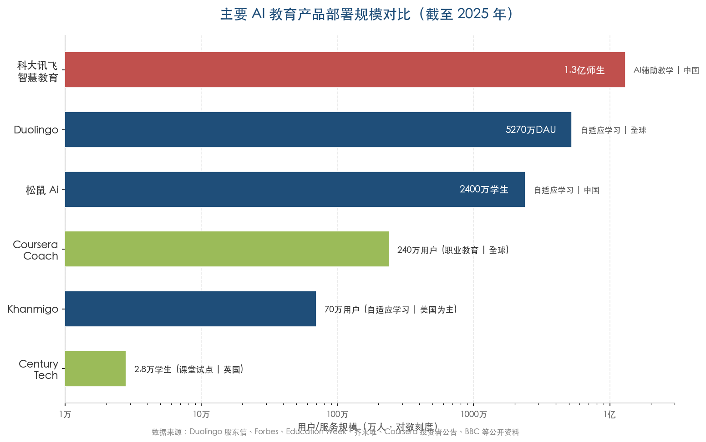

从图中可以看出，科大讯飞以 1.3 亿师生的服务规模居于首位（但其口径涵盖智慧教育基础设施全产品线），Duolingo 以 5270 万日活用户紧随其后，松鼠 Ai 累计服务 2400 万学生，而 Khanmigo 和 Century Tech 虽然用户规模相对较小，但在效果实证方面积累了更为丰富的数据。产品之间的规模差异反映了商业模式、市场定位和教育制度的深层差异。

## 2.2 AI 辅助教学——从智能备课到课堂实时互动

自适应学习主要作用于"学"的环节，AI 辅助教学则聚焦于"教"——帮助教师提升备课效率、丰富教学手段、实现课堂差异化教学。中国在这一赛道的投入力度和部署规模居于全球前列，已形成涵盖硬件终端、教育大模型和内容生态的完整产业链。

### 2.2.1 科大讯飞：中国智慧教育基础设施的领军者

科大讯飞是中国 AI 辅助教学领域覆盖面最广的企业。2025 年上半年，其智慧教育业务收入达 35.31 亿元人民币（同比增长 23.47%），服务超过 5 万所学校、累计超过 1.3 亿师生 [芥末堆](https://www.jiemodui.com/N/138994.html "2025年8月半年报报道")。为进一步强化在 AI 教育基础设施领域的技术优势，科大讯飞拟定增 40 亿元用于星火教育大模型的研发与部署。

在硬件终端方面，中国 AI 学习平板市场在 2025 年保持了稳健增长。洛图科技数据显示，2025 年中国学习平板全渠道销量为 632.1 万台（同比增长 6.7%），销售额达 199.1 亿元（同比增长 4.5%）[洛图科技](https://zhuanlan.zhihu.com/p/2010101108907987097 "2025年中国学习平板市场数据，转引自知乎")。学而思、科大讯飞、作业帮、步步高、小猿等品牌构成第一梯队。其中，猿辅导旗下小猿学练机自 2023 年推出后 16 个月内销量突破 100 万台，凭借墨水屏护眼与"数据驱动个性化学习"定位快速切入市场 [服贸会报道](https://tradeinservices.mofcom.gov.cn/article/fmh/qyalzs/202509/178826.html "小猿全矩阵产品亮相2025服贸会")。从竞争格局来看，AI 学习机赛道的核心竞争力已从硬件参数转向 AI 内容生态与个性化推荐能力。

### 2.2.2 好未来：教育垂直大模型的先行者

好未来 2025 财年（截至 2025 年 2 月）全年净收入达 22.5 亿美元（同比增长 51%），自研"九章大模型"（MathGPT）是国内首批通过备案的教育大模型 [财联社](https://m.cls.cn/detail/2016428 "2025年4月好未来财报分析")。学而思学习机平均周活跃率约 80%，体现了较高的用户粘性和产品留存能力。2025 年 2 月，好未来宣布接入 DeepSeek 大模型，通过"自研+开源"双引擎策略进一步增强 AI 教学能力。九章大模型在数学解题与讲解领域的表现尤为突出，代表了"学科垂直大模型"在教育领域的重要落地方向。

### 2.2.3 Coursera Coach：职业教育领域的 AI 辅导

在高等教育和职业教育领域，Coursera 的 AI 辅导工具 Coach 是全球最大规模的 AI 学习伴侣之一。截至 2025 年，Coach 已与超过 240 万名学习者交换了超过 3400 万条消息，支持 26 种语言 [Coursera 投资者公告](https://investor.coursera.com/news/news-details/2025/Coursera-Coach-Wins-Newsweek-AI-Impact-Award/default.aspx "2025年6月新闻稿")。2025 年全年，Coursera 平台 GenAI 课程注册达到 540 万次，接近上年的两倍；平台累计新增 4180 万次课程注册（同比增长 14%），累计注册用户达 1.75 亿 [Coursera 博客](https://blog.coursera.org/2026s-fastest-growing-skills-and-top-learning-trends-from-2025/ "2025年度回顾")。

Coursera Coach 的应用场景涵盖实时答疑、学习进度建议、代码调试辅助和职业规划指导，其核心价值在于将原本依赖人工导师才能提供的个性化支持拓展至百万量级用户，显著降低了优质教育辅导的边际成本。

## 2.3 智能评估——效率提升与公平性的张力

AI 在评估环节的应用主要沿两条路径展开：一是 AI 辅助评分（自动批改作文、编程作业等），旨在提升评价效率；二是 AI 生成内容的检测与学术诚信管理，旨在维护评价体系的可信度。两者共同面临精度与公平性之间的结构性张力。

### 2.3.1 AI 辅助评分：低风险场景可用，高利害考试尚不成熟

加州大学尔湾分校的一项研究对 1800 篇作文进行了 ChatGPT 评分与专业评卷员评分的对比分析。结果显示，AI 评分与人工评分的一致性中 89% 的差值在 1 分以内，但精确匹配率仅约 40% [Hechinger Report](https://hechingerreport.org/proof-points-ai-essay-grading/ "2024年5月AI作文评分研究报道")。这一结论表明，AI 自动评分目前适用于低风险的形成性评价（如课堂练习反馈、过程性写作评估），但在高利害考试（如中高考、标准化入学测试）中，评分精度和公平性尚未达到可独立运用的水平。

AI 评分的核心优势在于效率：教师可将批改时间从数小时压缩到几分钟，从而将更多精力投入到个性化教学反馈中。然而，AI 在评估创造性写作、跨文化表达和深层论证逻辑方面仍存在显著局限，短期内难以完全取代人工评卷。

### 2.3.2 AI 生成内容检测：技术军备竞赛的困境

AI 内容检测领域正经历一场持续升级的"技术军备竞赛"。Turnitin 2026 年 2 月数据显示，约 15% 的英语论文提交被标记为含 80% 以上 AI 生成内容，而 2023 年 4—8 月该比例仅为 3.3%，两年半内增长逾 4 倍 [Turnitin 官方](https://www.turnitin.com/press/turnitin-data-shows-transparency-about-ai-use-benefits-students-and-educators "2026年2月新闻稿")。

然而，检测技术本身面临根本性挑战。JISC（英国联合信息系统委员会）2025 年 6 月的评估指出，主流 AI 检测工具的假阳性率约为 1%—2%，在 20000 名学生规模的机构中，这意味着每年约 4800 次错误指控；更为关键的是，经改写工具（如 Quillbot）处理后，AI 文本的检出率从高位骤降至仅 7.9% [JISC 国家AI中心](https://nationalcentreforai.jiscinvolve.org/wp/2025/06/24/ai-detection-assessment-2025/ "2025年6月AI检测评估")。这种"道高一尺、魔高一丈"的态势表明，单纯依赖技术手段进行学术诚信管理愈发不可持续。教育界正逐步转向"过程评价+AI 素养教育"的综合治理路径，将重心从"检测 AI 使用"转移到"规范 AI 使用"。

## 2.4 教育管理——从预测分析到智能决策

AI 在教育管理领域的应用覆盖学生画像、学业预警、招生优化、资源调配等多个环节。其核心价值在于将海量教育数据转化为可行动的决策支持，从而实现从"经验驱动"到"数据驱动"的管理范式转型。

### 2.4.1 佐治亚州立大学：预测分析的全球标杆

佐治亚州立大学（Georgia State University）的 GPS Advising 系统是全球教育管理 AI 应用中最成熟、效果评估最完整的案例之一。该系统追踪超过 40000 名学生的 800 项风险因子，实施以来四年毕业率提高了 7 个百分点 [Georgia State University 官方](https://success.gsu.edu/approach/ "GSU预测分析项目介绍")。尤为值得关注的是其在促进教育公平方面的成效——实施以来，该校非裔学生学士学位授予数增长了 103%。GPS Advising 的实践证明，AI 驱动的预测分析不仅能提升整体教育质量，还能通过精准识别"高风险"学生并提前干预，有效缩小不同群体之间的教育差距。

### 2.4.2 中国高校的智能管理探索

在中国，教育管理 AI 的部署正从试点走向制度化推广。2024 年，教育部公布首批 18 个"人工智能+高等教育"应用场景典型案例，其中华中科技大学"构建智能学业预警与协同帮扶机制"是教育管理领域的代表 [教育部高等教育司](https://gxkj.resource.edu.cn/news/17852.html "首批18个人工智能+高等教育应用场景典型案例，2024年4月")。该项目基于课程成绩历史数据构建 AI 预警模型，通过特征因子抽取与机器学习算法对学生学业困难进行及时预警，并建立协同联动帮扶体系。

在更广泛的层面，2025 年世界数字教育大会成果汇编显示，重庆大学、天津大学等 136 所高校已建设学生工作智能体，涵盖学生发展动态画像、风险行为智能预警、管理任务自动执行与治理指标可视分析等功能 [世界数字教育大会](https://itc.zcmu.edu.cn/202506172.pdf "2025世界数字教育大会成果汇编")。与佐治亚州立大学已积累系统性效果评估数据不同，中国高校的教育管理 AI 应用多处于建设推广阶段，公开的量化效果评估仍相对有限，这也是下一阶段需要重点突破的方向。

## 2.5 特殊教育与教育公平——AI 的普惠价值

AI 在特殊教育和教育公平领域的应用虽然规模尚小，但其社会价值潜力不容忽视。这一赛道的核心命题在于：AI 究竟是缩小还是扩大教育鸿沟？

### 2.5.1 特殊教育中的 AI 辅助

AI 驱动的辅助替代沟通（AAC）系统和 VR/AR 技术正被越来越多地用于特殊教育学生的沟通辅助和社交技能训练。这些技术能够为语言障碍、自闭症谱系障碍等特殊需求学生提供高度个性化的支持，同时显著减轻教师在个别化教育计划（IEP）文档编制方面的工作负担 [EdTech Magazine](https://edtechmagazine.com/k12/article/2026/02/how-ai-tools-can-support-special-education-students-and-teachers "2026年2月报道")。

当前，AI 在特殊教育中的应用仍处于早期部署阶段，大规模实证研究较少，产品化程度不高，距离系统性推广尚有较大距离。

### 2.5.2 AI 弥合教育鸿沟的双面效应

AI 技术对教育公平具有显著的双面效应。一方面，松鼠 Ai 等平台通过 AI 导师替代或辅助人工教师，为中国偏远地区学生提供了此前难以获得的个性化教学资源。另一方面，EDUCAUSE 2025 年 AI 景观研究显示，83% 的受访者担忧 AI 反而会加剧数字鸿沟 [EDUCAUSE](https://www.educause.edu/content/2025/2025-educause-ai-landscape-study/introduction-and-key-findings "2025年2月发布")。Inside Higher Ed 2025 年调查进一步揭示，约 50% 的美国高校尚未向学生提供 GenAI 工具的机构级访问权限，大型机构更可能提供此类资源，而中小型院校和社区学院的学生面临"AI 使用权鸿沟" [Inside Higher Ed](https://www.insidehighered.com/news/tech-innovation/artificial-intelligence/2025/04/21/half-colleges-dont-grant-students-access "2025年4月报道")。

从全球视角来看，UNESCO 2024 年《全球教师报告》指出，到 2030 年全球中小学教育面临 4400 万名教师的缺口，其中撒哈拉以南非洲需要增加 1500 万名教师 [UNESCO](https://www.unesco.org/en/articles/global-report-teachers-addressing-teacher-shortages-and-transforming-profession "Global report on teachers, 2024年2月发布")。在如此巨大的人力缺口面前，AI 教学工具的普及可能是缓解全球教育不平等的关键路径之一。然而这也意味着，若 AI 教育资源的分配本身不公平，技术进步反而可能拉大而非缩小差距——这一悖论要求政策制定者在推广 AI 教育的同时，必须将公平性设计纳入顶层架构。

## 2.6 场景成熟度分级：一张全景矩阵

综合上述分析，我们将当前 AI 教育落地场景按成熟度划分为三个等级。下图以"部署规模"为横轴、"功能维度"为纵轴，将各场景定位于成熟度矩阵中，直观呈现其分布格局。

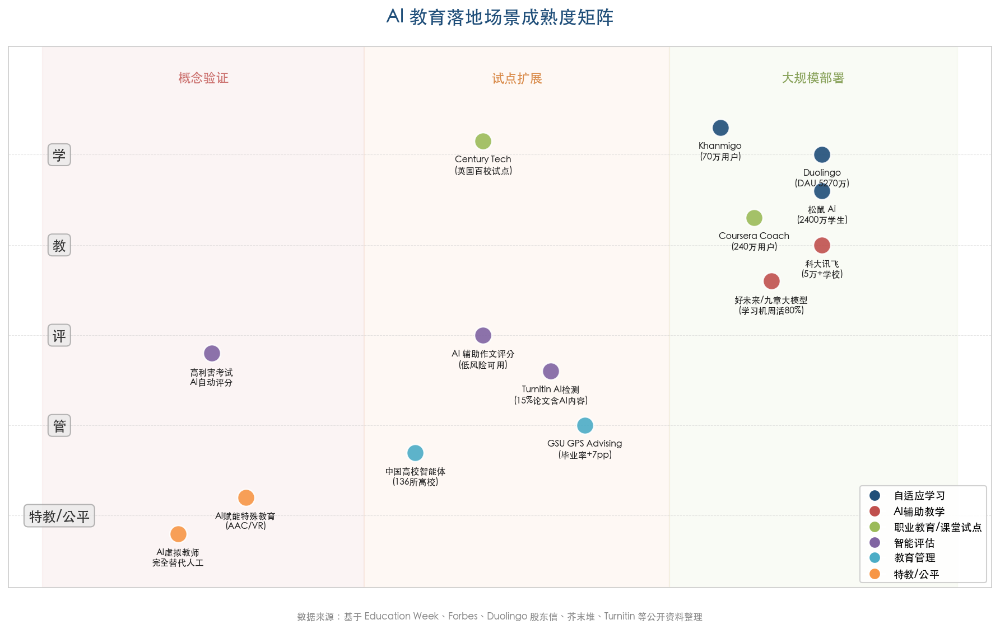

**已大规模部署（用户量级达百万以上，具备商业或公共服务闭环）：**

- **自适应学习与个性化推荐**：Duolingo 日活 5270 万用户、松鼠 Ai 累计服务 2400 万学生、Khanmigo 超 70 万用户并快速扩张。该场景技术成熟度最高，效果实证最为丰富。
- **中国智慧教育基础设施**：科大讯飞服务超 5 万所学校、1.3 亿师生；中国 AI 学习平板 2025 年全渠道销量达 632 万台。硬件、软件与内容生态已形成完整产业链。
- **职业教育 AI 辅导**：Coursera Coach 覆盖 240 万学习者，GenAI 课程注册达 540 万次。在线职业教育是 AI 渗透最早、闭环最完整的高等教育细分领域。

**试点扩展中（已在数十至数百所机构验证，尚未实现全面推广）：**

- **AI 自适应课堂教学**：Century Tech 在英国利物浦覆盖 100 多所小学、2.8 万学生，初步效果积极但地域覆盖面仍然有限。
- **AI 辅助作文评分**：在低风险形成性评价场景中已具可用性（89% 差值在 1 分以内），高利害考试场景的精度与公平性尚不达标。
- **AI 写作透明监测**：Turnitin 等工具已实现大规模部署，但检测准确率受改写工具冲击严重，系统性治理效果有待观察。
- **高校教育管理 AI**：佐治亚州立大学 GPS Advising 是效果评估最完整的成熟标杆；中国 136 所高校已建设学生工作智能体，但整体仍处于建设推广阶段。

**早期部署/概念验证（技术可行性已初步验证，但大规模推广面临显著障碍）：**

- **AI 赋能特殊教育**：AAC 系统和 VR/AR 社交训练已有应用案例，但产品化程度较低，大规模实证研究不足。
- **AI 虚拟教师完全替代人工**：松鼠 Ai 和猿辅导"AI 超拟人 1V1 老师"等产品在积极探索，但距离完全替代人工教师仍有很大距离，社会接受度亦存在争议。
- **高利害考试 AI 自动评分**：精确匹配率约 40%，公平性和可解释性问题尚未解决，主要教育考试机构暂未采用。

从整体格局来看，"学"端的 AI 应用（自适应学习、个性化推荐）成熟度最高，"教"端（AI 辅助教学、智能备课）次之，"评"端（自动评分、学术诚信检测）面临精度与公平性的双重挑战，"管"端（预测分析、智能决策）潜力巨大但数据治理和制度配套仍需完善。这一格局背后存在清晰的逻辑：越是标准化程度高、人际互动复杂度低的环节，AI 的落地速度越快；而涉及高利害判断、伦理敏感性和深层人际互动的场景，则需要更为审慎的推进节奏。

# 第3章 挑战与风险——技术瓶颈、伦理争议与实施障碍

AI 教育应用的快速扩张并非没有代价。第 2 章所描绘的落地图景越是繁荣，其背后潜藏的技术缺陷、伦理冲突与制度缺口就越需要被严肃审视。本章从技术可靠性、数据隐私与安全、学术诚信与公平性、实施障碍四个维度，逐一剖析 AI 在教育领域面临的核心挑战。每个维度均遵循"问题严重性—当前应对—尚存缺口"的分析结构，力图呈现一幅兼具警示性与建设性的全景图，中外案例穿插对比，兼顾全球视角与中国语境。

## 3.1 技术可靠性：幻觉、多语言落差与学科差异

### 3.1.1 大语言模型幻觉——教育场景的"阿喀琉斯之踵"

大语言模型（LLM）的"幻觉"现象——即生成看似流畅却在事实上错误的内容——构成 AI 教育应用面临的最根本技术瓶颈。截至 2026 年初，主流 LLM 在受控文档摘要等封闭任务中的幻觉率已降至 0.7%–1.5%（Google Gemini-2.0-Flash 以约 0.7% 居最低水平），但在开放域事实问答与复杂推理任务中，幻觉率仍高达 33%–51%。值得警惕的是，OpenAI o3 系列在 PersonQA 和 SimpleQA 基准上的幻觉率达到早期 o1 模型（约 16%）的两倍以上 [幻觉分析综合](https://www.scottgraffius.com/blog/files/ai-hallucinations-2026.html "2026年1月发布，综合Vectara/OpenAI/Stanford HAI等多源数据")。这一数据揭示了一个令人不安的悖论：随着模型推理能力增强，其在开放域中"自信地犯错"的概率反而上升。

在教育场景中，幻觉的危害被显著放大。学生通常缺乏独立验证 AI 输出的知识储备与批判意识，错误信息一旦被吸收便可能固化为知识缺陷。慕尼黑大学（LMU）Herklotz 等人 2025 年发表的研究在真实课堂环境中对此进行了量化：在一门统计学导论课的模拟考试中，GPT-4 为 70 名学生的 2389 条作答生成个性化反馈，其中 6.99%（167 条）被专家评审判定为包含错误 [Herklotz et al.](https://arxiv.org/html/2511.04213v1 "2025年发表于arXiv/EDM，LMU Munich团队")。研究者将这些错误细分为两类：第一类为技术性失误（如将 0.30 欧元等价于 30 分时拒绝接受正确答案），学生相对容易识别；第二类则属概念性误导——例如将二分类变量当作连续变量解释回归系数、混淆序数变量与名义变量——此类错误表述流畅、逻辑自洽，学生几乎无法察觉，构成"静默的认知污染"。

与之形成对照的是，Google LearnLM 与英国教育平台 Eedi 合作的一项研究表明，通过精心设计的提示工程与人类监督机制，LLM 数学辅导的错误率可降至 0.14%——每千条消息仅约一次错误 [No More Marking](https://substack.nomoremarking.com/p/maybe-llm-tutors-might-be-able-to "2026年1月分析文章")。该实验在英国 5 所中学的真实课堂中开展，LLM 辅导在学生答题正确率上与人类教师表现相当，且显著优于预设的静态提示方案。然而，即便 0.14% 的错误率看似微小，按每节课约 50 条交互、每周 5 节课、每学年 35 周计算，一名学生一年中仍可能遭遇约 12 次错误——这一规模足以逐步侵蚀学生对系统的信任。

### 3.1.2 学科差异与多语言性能落差

LLM 在不同学科领域的可靠性存在显著差异。上述 LMU 统计学研究发现，在 38 道考题中，13 道未产生任何反馈错误，但涉及相关分析和回归分析的题目错误频次显著偏高，其中两道题各产生超过 30 条错误反馈 [Herklotz et al.](https://arxiv.org/html/2511.04213v1 "同前")。数学与统计学虽常被视为 LLM 的"舒适区"，但当任务涉及多步推理、变量定义歧义或跨概念迁移时，错误率仍居高不下。人文社科领域的评估则面临另一重挑战：正确答案往往不唯一，LLM 的幻觉更难被客观检测与纠正。

语言维度的性能落差同样不容忽视。苏黎世联邦理工学院 Gupta 等人 2025 年对 6 款主流 LLM 在 8 种非英语语言、4 项教育任务上的系统评测发现，低资源语言的模型表现与英语之间存在"频繁且显著的性能下降"，性能水平大致与训练数据中该语言的代表比例成正比 [Gupta et al.](https://arxiv.org/abs/2504.17720 "2025年4月发表于arXiv，ETH Zurich团队")。这意味着以阿拉伯语、斯瓦希里语或孟加拉语为学习语言的数亿学生，在使用同一 AI 教育产品时将获得质量显著低于英语用户的体验——技术差距正被语言不平等所放大。

### 3.1.3 应对进展与尚存缺口

检索增强生成（RAG）技术是当前最受关注的幻觉缓解方案。多项实验表明，RAG 可将 LLM 幻觉率降低 40%–71%，其核心机制在于将模型生成与权威知识库的检索结果相锚定，从而限制模型"自由发挥"的空间。然而，RAG 在教育产品中的大规模落地仍处于早期阶段，主要受限于高质量教育知识库的构建成本与实时检索的延迟问题。Google LearnLM 与 Eedi 的研究则提示了另一条有效路径：将 LLM 嵌入结构化教学任务（如基于诊断性题目的一对一辅导）并辅以人类监督，可显著提升准确率。

尚存缺口在于：当前关于 LLM 幻觉率的基准评测几乎全部基于通用任务或医学、法律等专业领域，教育专用基准评测体系尚付阙如。AI 在不同学科（如数学精确计算、历史论述、文学赏析）中的准确度缺乏系统性对比数据，致使教育决策者难以针对具体学科制定差异化的部署策略。

## 3.2 数据隐私与网络安全：教育数据的"裸奔"困境

### 3.2.1 大规模数据泄露——PowerSchool 事件的警示

AI 教育系统的运行依赖对学生数据的大规模采集与持续处理，而教育领域的数据安全基础设施长期薄弱，两者之间的矛盾在 2024—2025 年集中爆发。2024 年 12 月，美国教育信息平台 PowerSchool 遭遇迄今为止最大规模的儿童数据泄露事件：超过 6200 万名学生记录和近 1000 万名教师记录被窃取，被盗数据涵盖社会安全号码（SSN）、医疗状况、个别化教育计划（IEP）等高度敏感信息 [Tech Policy Press](https://techpolicy.press/unmasking-edtechs-surveillance-infrastructure-in-the-age-of-ai "2026年2月深度分析")。这一事件暴露了教育科技行业长期累积的系统性安全债务——大量平台在"快速扩张"的商业逻辑驱动下，将安全投入视为可削减的成本而非不可逾越的底线。

PowerSchool 事件并非孤例。Clever 公司 2026 年发布的网络安全报告揭示了更广泛的行业困境：2025 年超过 52% 的美国学区经历过网络安全事件，同比上升 16 个百分点；尤为值得关注的是，第三方供应商违规占比从 4% 飙升至 32%，而学生多因素认证（MFA）覆盖率仅约 13% [Clever 2026 Cybersecure 报告](https://whiteboardadvisors.com/cybersecurity-breaches-are-the-new-normal-for-k-12/ "2026年3月发布")。第三方供应商违规比例的激增表明，随着学区引入日益增多的 AI 工具和外部服务，攻击面正以远超防御能力增速的速度扩大。

### 3.2.2 隐私顾虑：AI 采用的首要障碍

数据安全与隐私不仅是技术问题，更构成阻碍 AI 教育规模化部署的首要心理障碍。Ellucian 公司 2026 年对 779 名受访者（覆盖 300 余所高等教育机构）的年度调查显示，数据安全与隐私仍是个人层面（61%）和机构层面（56%）采用 AI 的最大障碍 [Ellucian 调查](https://www.ellucian.com/newsroom/ellucians-3rd-annual-higher-education-ai-survey-signals-shift-individual-ai-use "2026年3月发布")。该比例在连续三年的调查中始终居于首位，表明尽管技术能力持续进步，教育界的信任赤字并未缩小。

### 3.2.3 应对进展与尚存缺口

在制度层面，欧盟《人工智能法案》（EU AI Act）将教育 AI 系统归类为"高风险"应用，要求满足数据治理、人类监督、透明度等全套合规义务，并于 2026 年 8 月 2 日起全面适用。中国教育部在 2025 年底提出"五安全一体"框架（技术安全、数据安全、内容安全、算法安全、伦理安全），并持续开展 10 万人级别的长期跟踪调研。在技术层面，联邦学习、差分隐私和端侧推理等隐私保护技术正加速发展，但距离在教育产品中实现标准化部署仍有相当距离。

尚存缺口在于：中国教育领域迄今尚未出现 PowerSchool 级别的公开数据泄露案例报道，但这并不意味着风险不存在——更可能反映的是事件披露机制与公众监督体系的不完善。在全球范围内，教育数据保护法规的执行力度普遍弱于金融和医疗等行业，教育领域的数据安全治理亟需补齐短板。

## 3.3 学术诚信：AI 作弊的蔓延与检测的困境

### 3.3.1 AI 作弊的规模化增长

生成式 AI 工具的普及正在深刻冲击传统学术诚信体系。英国《卫报》2025 年 6 月通过信息自由法（FOI）申请获得的数据显示，2023—24 学年英国高校共有近 7000 例被证实的 AI 作弊案例，每千名学生 5.1 例，较上一学年的 1.6 例增长超过两倍；截至 2025 年 5 月，该比例预计进一步升至约 7.5 例/千人 [The Guardian](https://www.theguardian.com/education/2025/jun/15/thousands-of-uk-university-students-caught-cheating-using-ai-artificial-intelligence-survey "2025年6月15日调查报道")。美国方面的数据同样令人警醒：Coursera 2025 年 10 月对 4261 名大学师生的全球调查发现，24% 的学生承认曾提交过未披露的 AI 生成作业 [Coursera 调查](https://www.nasdaq.com/press-release/4-5-students-say-ai-improved-their-academic-performance-only-20-universities-have "2026年2月发布")。

Turnitin 2026 年 2 月的数据进一步勾勒了这一趋势的加速轨迹：约 15% 的英语论文提交被标记为含 80% 以上 AI 生成内容，而在 2023 年 4—8 月该比例仅为 3.3%，不到三年间增长逾 4.5 倍 [Turnitin 官方](https://www.turnitin.com/press/turnitin-data-shows-transparency-about-ai-use-benefits-students-and-educators "2026年2月新闻稿")。教师群体的感知与数据高度一致：AAC&U 与 Elon 大学 2025 年 11 月的全国教师调查（1057 名受访者）显示，78% 的教师认为生成式 AI 使校园作弊增加，73% 亲自处理过相关学术诚信问题，高达 95% 的教师担忧学生对 AI 产生过度依赖 [AAC&U 调查](https://www.aacu.org/newsroom/national-survey-95-of-college-faculty-fear-student-overreliance-on-ai-and-diminished-critical-thinking-among-learners-who-use-generative-ai-tools "2025年12月发布")。

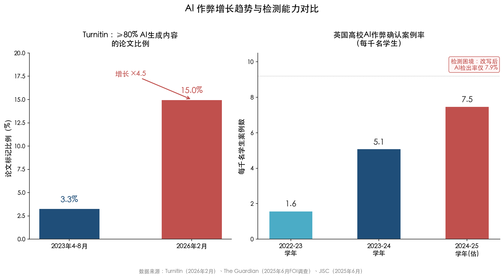

**图 3-1　AI 作弊增长趋势与检测能力对比。** 左图展示 Turnitin 标记含≥80% AI 生成内容的论文比例从 2023 年的 3.3% 升至 2026 年的 15.0%；右图展示英国高校每千名学生 AI 作弊确认案例率的逐年攀升，并标注改写工具处理后 AI 检出率仅 7.9% 的检测困境。

### 3.3.2 检测工具的局限性

面对 AI 作弊的蔓延，AI 检测工具成为高校的第一道防线，但其可靠性远不足以支撑高利害决策。英国 JISC 国家 AI 中心 2025 年 6 月的系统评估指出，主流 AI 检测工具的假阳性率约为 1%–2%。这一数字看似微小，但在拥有 20,000 名学生的高校中，每年可能产生约 4,800 次错误指控——将未使用 AI 的学生误判为作弊者，其对个体学术声誉的潜在伤害不可忽视 [JISC 国家AI中心](https://nationalcentreforai.jiscinvolve.org/wp/2025/06/24/ai-detection-assessment-2025/ "2025年6月AI检测评估")。更为棘手的是，经改写工具（如 Quillbot）处理后，AI 生成文本的检出率从高位骤降至仅 7.9%，这意味着稍具技术意识的学生即可轻松绕过检测。

检测困境的本质源于一个不对称博弈：攻方（文本改写与混合人机写作）的成本极低且手段不断进化，守方（检测算法）则面临假阳性与假阴性的两难平衡——任何阈值调整都只是将错误从一端转移到另一端。

### 3.3.3 制度应对：政策缺口与先行探索

全球高校的 AI 政策制定远落后于技术扩散的速度。Coursera 调查显示，仅 20% 的美国大学拥有正式的 AI 使用政策 [Coursera 调查](https://www.nasdaq.com/press-release/4-5-students-say-ai-improved-their-academic-performance-only-20-universities-have "同前")。UNESCO 2025 年 9 月对 90 个国家的调查同样发现，仅 19% 的高校已有正式 AI 政策，另有 42% 正在制定中；但区域差异显著——欧洲和北美约 70% 的高校已有或正在制定指导方针，而拉美和加勒比地区仅为 45% [UNESCO 调查](https://www.unesco.org/en/articles/unesco-survey-two-thirds-higher-education-institutions-have-or-are-developing-guidance-ai-use "2025年9月2日发布")。

在制度先行者中，中国顶尖高校的探索具有标杆意义。清华大学 2025 年 11 月发布《人工智能教育应用指导原则》，这是国内首个系统性 AI 教育应用指导规范，明确严禁将 AI 生成内容直接作为学业成果提交。复旦大学更早于 2024 年 11 月发布本科毕业论文 AI 工具使用规范 [CERNET](https://www.edu.cn/xxh/xy/xytp/202511/t20251127_2704065.shtml "2025年11月27日报道")。这些规范的共同特征在于承认 AI 作为学习辅助工具的合理性，同时划定不可逾越的底线——学术成果的原创性归属必须始终清晰。

OECD 2026 年 1 月发布的《数字教育展望 2026》基于 TALIS 2024 数据（覆盖全球初中教师的大规模调查），提供了一个更深层的警示：72% 的初中教师认为 AI 可能损害学术诚信。报告特别指出，多项研究表明学生使用通用生成式 AI 辅助完成任务后，一旦移除 AI 访问权限，其考试优势消失甚至出现逆转 [OECD](https://www.oecd.org/en/publications/oecd-digital-education-outlook-2026_062a7394-en.html "2026年1月19日发布")。这一发现指向学术诚信之外更深层的问题——第 3.5 节将进一步探讨的"去技能化"风险。

## 3.4 公平性与偏见：AI 可能制造新的不平等

### 3.4.1 AI 评分中的人口统计偏差

AI 教育工具在推进个性化学习的同时，可能无意中复制甚至放大既有的社会不平等。ETS（美国教育测试服务中心，SAT 管理机构）研究人员 Johnson 和 Zhang 对超过 13,000 篇 8—12 年级学生作文的评分实验发现，GPT-4o 在整体上比人类评卷员平均低约 0.9 分（6 分制），但对亚裔美国学生的扣分幅度额外增加约 0.25 分，差值达到约 1.1 分，而白人、黑人和西班牙裔学生的人机评分差异均在 0.9 分左右 [Hechinger Report](https://hechingerreport.org/proof-points-asian-american-ai-bias/ "2024年7月报道ETS研究")。研究者坦言，GPT-4o 对亚裔学生的额外惩罚原因尚不明确，AI 系统是一个"巨大的黑箱"，其算法运作方式"连开发者自己也未能完全理解"。

The Learning Agency 2025 年基于 ASAP 2.0 基准数据集（约 24,000 篇美国中学生议论文）的进一步研究发现，ChatGPT 在评分中复制了人类评分数据中已有的种族差异——黑人学生的平均分低于亚裔学生，且差距已达引起关切的水平。该研究还揭示了 AI 评分的另一系统性缺陷：相较于人类评卷员，ChatGPT 给出的分数高度集中于中等区间，极少给出满分或极低分，这意味着优秀写作者得不到应有认可，薄弱写作者的问题亦未被充分识别 [The 74](https://www.the74million.org/article/ai-shows-racial-bias-when-grading-essays-and-cant-tell-good-writing-from-bad/ "2025年5月分析报道")。

### 3.4.2 数字鸿沟的 AI 化延伸

教育公平面临的另一重挑战在于 AI 工具获取机会的不均等。EDUCAUSE 2025 年 AI 景观研究显示，83% 的受访者对 AI 加剧数字鸿沟表达了担忧 [EDUCAUSE](https://www.educause.edu/content/2025/2025-educause-ai-landscape-study/introduction-and-key-findings "2025年2月发布")。Inside Higher Ed 2025 年调查进一步发现，约 50% 的美国高校未向学生提供生成式 AI 工具的机构级访问权限，且大型机构更有可能提供此类资源——这意味着资源匮乏的社区学院和小型院校的学生正被系统性地排除在外 [Inside Higher Ed](https://www.insidehighered.com/news/tech-innovation/artificial-intelligence/2025/04/21/half-colleges-dont-grant-students-access "2025年4月报道")。

在全球视野下，这一鸿沟更为触目惊心。UNESCO 2025 年 9 月对 90 个国家高校的调查显示，AI 政策覆盖率在欧洲和北美约 70%，在拉美和加勒比地区仅为 45% [UNESCO 调查](https://www.unesco.org/en/articles/unesco-survey-two-thirds-higher-education-institutions-have-or-are-developing-guidance-ai-use "2025年9月2日发布")。政策覆盖率差距的背后，是更为深层的基础设施和资金鸿沟——缺乏稳定网络连接、计算设备和教师培训的地区，即便有可用的 AI 工具，也难以实现有效部署与持续运营。

### 3.4.3 应对进展与尚存缺口

在技术层面，偏见缓解策略主要包括公平性约束训练、多样化测试数据集审计和后处理校准。ETS 的研究者建议，在将 AI 评分应用于真实教学场景之前，必须对不同人口统计群体进行系统性公平性评估。在制度层面，欧盟 AI 法案明确要求高风险 AI 系统（包括教育评估系统）实施偏见监测和人类监督。

尚存缺口在于：AI 评分偏见的研究目前集中于英语写作评估领域，中文 AI 评分系统是否存在类似的人口统计偏差尚无公开实证研究。此外，AI 推荐系统（如自适应学习平台的内容推荐）对不同经济背景、地区和性别学生产生差异化学习路径的系统性研究亦极为有限，这一研究空白亟待填补。

## 3.5 实施障碍：教师准备不足与机构能力缺口

### 3.5.1 教师培训的鸿沟

教师是 AI 教育落地的"最后一公里"，但这一群体的准备程度远未能匹配技术扩散的速度。RAND Corporation 分析显示，2024 年秋季 48% 的美国学区已对教师进行 AI 培训，较 2023 年的 23% 实现翻倍增长，但增长背后隐藏着显著的经济差距：低贫困学区的培训覆盖率为 67%，而高贫困学区仅为 39%，两者相差 28 个百分点 [Education Week](https://www.edweek.org/technology/more-teachers-than-ever-before-are-trained-on-ai-are-they-ready-to-use-it/2025/04 "2025年4月报道，引用RAND数据")。更根本的瓶颈在于培训质量——半数学区领导表示难以找到同时具备教育学背景和 AI 专业知识的培训专家。

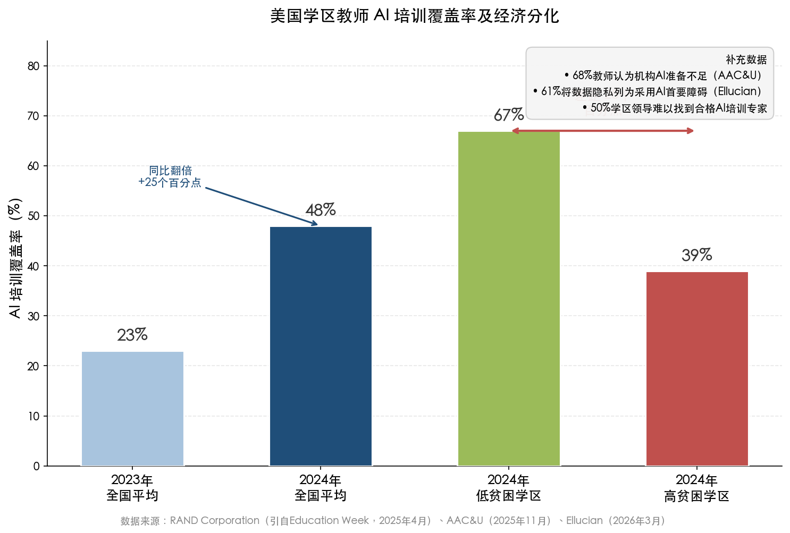

**图 3-2　美国学区教师 AI 培训覆盖率及经济分化。** 2023—2024 年全国平均覆盖率从 23% 翻倍至 48%，但 2024 年低贫困学区（67%）与高贫困学区（39%）之间存在 28 个百分点的显著差距，右侧补充数据反映了机构准备不足和隐私顾虑等叠加障碍。

AAC&U 调查进一步印证了这一判断：68% 的教师认为其所在机构未充分准备好让教师使用生成式 AI [AAC&U 调查](https://www.aacu.org/newsroom/national-survey-95-of-college-faculty-fear-student-overreliance-on-ai-and-diminished-critical-thinking-among-learners-who-use-generative-ai-tools "同前")。教师面临的不仅是技术技能的缺口，更是角色认知的深层转型压力：在 AI 辅助教学环境中，教师需要从"知识传递者"转型为"学习设计师"和"AI 输出的质量把关者"——而这一转型目前缺乏系统性的职业发展支持体系。

### 3.5.2 机构准备不足与新兴顾虑

在机构层面，AI 教育部署面临基础设施、组织文化和财务可持续性的三重挑战。Ellucian 2026 年调查揭示了两个值得关注的新兴趋势：超过五分之一的受访者将环境影响列入 AI 采用的前三大障碍（这一关切在上一年度调查中几乎不存在），同时对 AI 导致岗位淘汰的担忧从上年的 7% 跃升至 14% [Ellucian 调查](https://www.ellucian.com/newsroom/ellucians-3rd-annual-higher-education-ai-survey-signals-shift-individual-ai-use "同前")。

在中国语境下，中国教育新闻网 2026 年 3 月发布的年度报告直言不讳地指出了试点推进中的落地差距："部分试点存在'重形式轻实效'倾向，区域间改革进度不一，教师负担与专业支持不匹配，数字化应用'有平台无深度'" [中国教育新闻网](http://www.jyb.cn/rmtzcg/xwy/wzxw/202603/t20260326_2111459069.html "2025中国基础教育年度报告")。这一评价与前述美国教育领域"培训有数量缺质量"的现象形成呼应，表明无论是自上而下的政策推进模式还是市场驱动的创新模式，在"最后一公里"的教师能力建设问题上都面临着共同的结构性困境。

### 3.5.3 深层挑战："去技能化"风险

在所有实施障碍之上，OECD《数字教育展望 2026》提出了一个更具根本性的警示：成功使用生成式 AI 完成任务并不等同于学习（"successful use of GenAI to complete a task ≠ learning"）。多项研究表明，学生在 AI 辅助下完成任务时表现优异，但一旦移除 AI 访问权限，考试中的优势消失甚至出现逆转——这意味着学生可能形成了对 AI 工具的路径依赖，而非真正内化了知识与技能 [OECD](https://www.oecd.org/en/publications/oecd-digital-education-outlook-2026_062a7394-en.html "2026年1月19日发布")。Gartner 进一步预测，到 2026 年底，生成式 AI 使用导致的批判性思维萎缩将推动 50% 的全球组织要求实施"无 AI 辅助"的技能评估 [Gartner](https://www.gartner.com/en/articles/strategic-predictions-for-2026 "2025年11月")。

这一发现将教育系统的核心挑战从"如何使用 AI"重新定向为"如何确保人类独立思考能力和基础技能不发生退化"。教育的终极目标不是让学生学会操作工具，而是培养其在没有工具时仍然具备的思维能力和知识储备——在 AI 无处不在的时代，这一古老的教育信念正面临前所未有的考验。

## 3.6 本章小结

AI 教育应用面临的挑战是多维度、相互关联的系统性问题，图 3-3 以雷达图形式直观呈现了五大挑战维度在问题严重性与应对成熟度之间的结构性失衡。

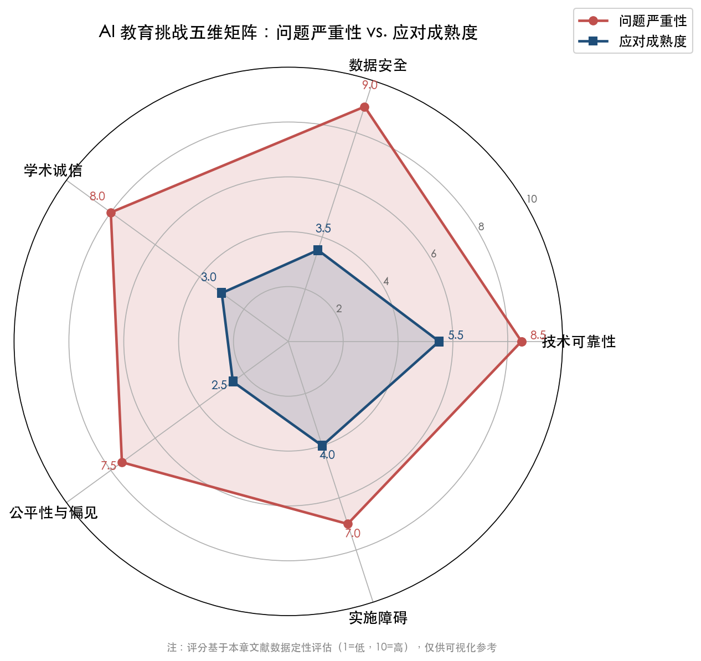

**图 3-3　AI 教育挑战五维矩阵：问题严重性 vs. 应对成熟度。** 雷达图显示五大维度均呈现"问题严重性高、应对成熟度低"的结构性失衡，其中公平性与偏见（应对成熟度仅 2.5）和学术诚信（应对成熟度仅 3.0）的缺口最为突出。评分基于本章文献数据的定性评估。

具体而言：技术层面，LLM 幻觉在开放域中仍高达 33%–51%，教育专用基准评测的缺位使得准确率评估缺乏针对性；数据安全层面，PowerSchool 事件暴露了 6200 万条学生记录的系统性防护漏洞，52% 的美国学区经历过网络安全事件；学术诚信层面，AI 作弊率以年均两倍以上的速度增长，而检测工具在假阳性与绕过率之间构成难以调和的矛盾；公平性层面，AI 评分的人口统计偏差和数字鸿沟的 AI 化延伸可能制造新的不平等；实施层面，教师培训的经济分化（低贫困学区 67% vs. 高贫困学区 39%）和"去技能化"风险构成最深层的障碍。

这些挑战并非否定 AI 在教育中的价值，而是清晰地表明：负责任的 AI 教育部署，必须将技术创新与安全保障、公平审计、教师赋能和批判性思维保护作为同等优先级来统筹推进。下一章将转向政策与治理框架，考察全球监管体系如何回应上述挑战。

# 第4章 政策与治理框架——全球监管图谱与中国制度设计

前三章分别勾画了 AI 教育的市场全景、落地场景与挑战风险。技术和市场力量的持续释放，离不开制度设计的引导与约束。本章将视角转向治理层面，系统梳理全球主要经济体和国际组织在 2025—2026 年间围绕"AI+教育"所构建的监管与政策体系，重点回答一个核心问题：**制度准备是否跟得上技术落地的速度？**

在地理维度上，本章采用"中国纵深 + 全球横向"的双层结构：首先以中国政策链条为主线，展现从中共中央/国务院顶层设计到教育部全学段规范再到省市校试点的完整传导路径；继而横向展开欧盟、美国、英国的治理方案以及 UNESCO、OECD 等国际组织的规范引导；最终提炼三种监管范式的多维比较与治理缺口评估。

## 4.1 中国：自上而下的制度闭环——从纲要到课堂

### 4.1.1 顶层设计：《教育强国建设规划纲要》的法理锚点

2025 年 1 月 19 日，中共中央、国务院印发《教育强国建设规划纲要（2024—2035 年）》，第二十六条以"促进人工智能助力教育变革"为专题，提出五项核心任务：打造人工智能教育大模型、建设云端学校、制定完善师生数字素养标准、深化人工智能助推教师队伍建设、建立基于大数据和人工智能支持的教育评价和科学决策制度 [教育部官网](http://www.moe.gov.cn/jyb_xxgk/moe_1777/moe_1778/202501/t20250119_1176193.html "教育强国建设规划纲要（2024—2035年）全文")。这份横跨"十四五"至"十五五"的纲领性文件，为教育部后续密集出台的 AI 教育政策提供了最高层级的法理依据。该纲要明确将 AI 定位为教育体系变革的"核心杠杆"而非辅助工具，这一政策高度在全球主要经济体的教育规划文件中极为罕见——欧盟《数字教育行动计划》和美国行政令 14277 均未达到将 AI 视为教育体制性变量的战略层级。

### 4.1.2 行动方案：四份指南构建全学段规范矩阵

以纲要为起点，教育部在 2025 年内依次发布四份面向不同学段和主体的规范性文件，形成覆盖基础教育全学段及教师群体的"政策矩阵" [CERNET](https://www.edu.cn/xxh/focus/zc/202601/t20260107_2714511.shtml "教育部2025年12月30日发布会")：

**第一份：《中小学人工智能通识教育指南（2025 年版）》。** 2025 年 5 月，教育部基础教育教学指导委员会发布该指南，构建"小学—初中—高中"分层递进的 AI 通识教育体系。核心架构为"知识—技能—思维—价值观"四位一体素养培育框架：小学阶段侧重体验与兴趣培养（感知语音识别、图像分类等基础技术），初中阶段要求掌握机器学习基本流程与监督学习概念，高中阶段则需理解生成式 AI 技术特征并构建简易算法模型。实施路径方面，指南提出"独立设课、跨学科融合、实践活动"三种课堂整合方式，并明确要求将人工智能素养纳入学生综合素质评价 [CERNET](https://cernet.edu.cn/edu/202505/t20250513_2667990.shtml "指南全文")。

**第二份：《中小学生成式人工智能使用指南（2025 年版）》。** 该指南在通识教育框架之上叠加了一层针对生成式 AI 工具的使用边界规定。最具影响力的条款是：**小学阶段禁止学生独自使用开放式内容生成功能**，教师可在课内适当使用以辅助教学；初中阶段可适度探索生成内容的逻辑性分析；高中阶段允许结合技术原理开展探究性学习。保障机制方面，指南确立五项应用原则（育人导向、教育公平、价值引领、需求驱动、底线思维），并要求教育行政部门建立动态调整的"白名单"制度，明确可入校使用的生成式 AI 工具清单 [CERNET](https://cernet.edu.cn/edu/202505/t20250513_2667992.shtml "指南全文")。

**第三份：《教师生成式人工智能应用指引（第一版）》。** 2025 年 11 月发布的该文件从教师端建立了"六大助力 + 六项规范"的双轨框架。"正面清单"涵盖学习、教学、育人、评价、管理、研究六大应用方向，提供 30 个具体场景示例，覆盖对话式学习、学情分析、试题设计、教学反思等日常教学高频环节。"规范清单"则划定六条行为边界：坚持育人主体地位（不得将 AI 答案作为最终方案）、加强内容审查把关（高敏感内容须提交学校审查）、恪守学术创作伦理、引导学生规范使用、合规合法处理数据、践行技术向善原则 [CERNET](https://www.edu.cn/xxh/focus/zc/202511/t20251128_2704300.shtml "2025年11月发布")。

**第四份：《职业院校人工智能应用指引》。** 该文件将政策覆盖范围延伸至职业教育学段，与前三份指南共同构成了从基础教育到职业教育的完整规范链条。

四份文件的发布密度和覆盖广度，使中国成为全球首个在一年之内完成 K-12 全学段生成式 AI 使用规范体系构建的主要经济体。

### 4.1.3 试点推进：从政策文本到实践检验

政策文本的密集出台之后是规模化试点部署。2025 年 11 月，教育部正式启动 AI 赋能教育行动试点，遴选**东部地区 7 个省份、中西部地区 20 个地市、18 所高校**作为首批试点单位，一体推进人工智能教学应用、课程工具开发和安全体系构建。同年 12 月，全国中小学人工智能教育联盟宣告成立，下设华东、华南、华中、华北、东北、西北、西南七大区域协作中心，形成覆盖全国的协同推进网络。教育部同期公布第二批中小学人工智能教育基地 325 个，两批合计 834 个 [CERNET](https://www.edu.cn/xxh/focus/zc/202601/t20260107_2714511.shtml "教育部2025年12月30日发布会") [中国教育新闻网](http://www.jyb.cn/rmtzcg/xwy/wzxw/202603/t20260326_2111459069.html "2025中国基础教育年度报告")。

在技术基础设施方面，教育部依托国家智慧教育公共服务平台汇聚 AI 精品课程超 1000 门，组织建设 23 个教育专用大模型和 13 个学科领域垂类模型，培训覆盖 2000 余所高校的 50 万名师生 [CERNET](https://www.edu.cn/xxh/focus/zc/202601/t20260107_2714511.shtml "教育部2025年12月30日发布会")。这一基础设施布局使中国成为在国家层面系统组织教育专用大模型开发的少数经济体之一。

### 4.1.4 安全底线："五安全一体"框架与大规模跟踪调研

在加速推进 AI 教育应用的同时，教育部建立了系统性的风险管控框架。核心架构为"五安全一体"——统筹保障技术安全、数据安全、内容安全、算法安全和伦理安全五大维度。具体措施包括：研制人工智能应用安全评估指标体系、对国家平台上线的 AI 大模型和工具开展算法备案和安全评估、严格按照国家法律法规落实大模型备案制度。尤为引人关注的是，教育部持续开展 **10 万人级别的长期跟踪调研**，以系统评估智能技术对教学效果和学生发展的实际影响 [CERNET](https://www.edu.cn/xxh/focus/zc/202601/t20260107_2714511.shtml "教育部2025年12月30日发布会")。这一大规模纵向追踪研究设计在全球教育治理实践中属于前沿之举——多数国家的 AI 教育政策评估仍停留在横截面调查或案例分析阶段。

### 4.1.5 2026 年最新部署：迈向"战略行动 2.0"

2026 年 3 月 31 日，教育部召开国家教育数字化战略行动 2026 年部署会，明确以"人工智能+教育"为抓手，推动 AI 融入教育全要素、全过程、全场景，奋力开创国家教育数字化战略行动 2.0 新格局。会议统筹推进三项改革试点：国家智慧教育平台全面深化应用试点、人工智能赋能教育行动试点、数字赋能学习型社会建设试点。同期发布的《十五个五年规划纲要》明确提出"深化拓展'人工智能+'，促进人工智能助力教育模式变革" [教育部官网](http://www.moe.gov.cn/jyb_xwfb/s5148/202604/t20260402_1432732.html "《中国教育报》2026年4月2日")。

教育部科技司司长周大旺此前在 2026 年 1 月发布会上明确表示，计划 2026 年出台人工智能赋能教育的系统性政策文件，系统部署推进 AI 教育和应用 [CERNET](https://www.edu.cn/xxh/focus/zc/202601/t20260107_2714511.shtml "教育部2026年1月发布会")。截至本报告写作日（2026 年 4 月 5 日），该系统性文件尚未正式公开发布，但其政策方向已在前述部署会中得到充分预示。

图 4-1 以时间轴形式展示了 2025 年 1 月至 2026 年 3 月期间中国 AI 教育政策从顶层设计到落地执行的完整传导路径，直观呈现了这一期间中国在 AI 教育治理领域罕见的政策密度与推进节奏。

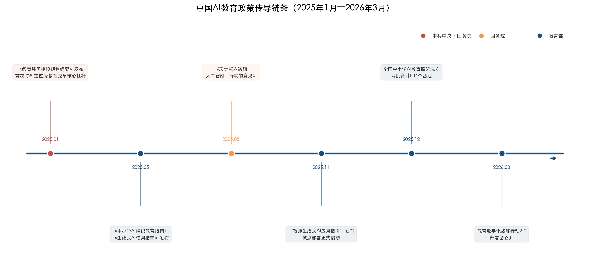

### 4.1.6 高校层面的制度响应

中国顶尖高校在中央和教育部政策框架之下，率先构建校级 AI 治理规范，呈现出两条互补的制度创新路径。

**清华大学**于 2025 年 11 月发布《清华大学人工智能教育应用指导原则》，确立"主体责任、合规诚信、数据安全、审慎思辨、公平包容"五大核心原则，严禁将 AI 生成内容直接复制或简单转述后作为学业成果提交，并要求师生对 AI 使用情况进行披露声明。截至发布时，清华已有超过 402 门课程深度融入 AI 教学实践 [CERNET](https://www.edu.cn/xxh/xy/xytp/202511/t20251127_2704065.shtml "2025年11月发布")。

**复旦大学**则更早一步，于 2024 年 11 月发布国内首个专门针对本科毕业论文中 AI 工具使用的规范性文件——《复旦大学关于在本科毕业论文（设计）中使用 AI 工具的规定（试行）》，明确划定禁止与允许使用的范围。自 2025 年起，复旦已实现 AI 课程覆盖全体本研学生及全部一级学科。同年，复旦、北京师范大学、中国传媒大学等多所高校首次将"AI 生成内容检测"纳入毕业论文审查环节 [CERNET](https://www.edu.cn/xxh/xy/xytp/202511/t20251127_2704065.shtml "同上") [CERNET](https://www.edu.cn/xxh/focus/zc/202601/t20260107_2714511.shtml "复旦大学AI课程全覆盖")。

清华的"指导原则"代表了系统性重构教学模式与 AI 融合规则的路径，复旦的"论文规范"则是针对学术诚信紧迫痛点的快速响应。两条路径互为补充，共同填充了中央—教育部层级政策在高校微观场景中的执行空白。

## 4.2 欧盟：规范先行的法律强制力

### 4.2.1 EU AI Act 教育高风险条款

欧盟在 AI 教育治理领域采取了与中国截然不同的路径——以具有法律约束力的硬法为核心，通过风险分类体系对教育场景实施精准规制。《欧盟人工智能法案》（Regulation (EU) 2024/1689）附件三第 3 条将教育领域四类 AI 系统明确归为"高风险"（High-Risk）：(a) 用于决定自然人进入各级教育和职业培训机构的入学或分配；(b) 用于评估学习成果（包括以评估结果引导学习过程）；(c) 用于评估个人将接受或能够获得的适当教育水平；(d) 用于在考试期间监测和检测学生的违规行为 [EU AI Act](https://artificialintelligenceact.eu/annex/3/ "Annex III, Regulation (EU) 2024/1689")。

被归为高风险的 AI 系统须遵守全套合规义务，包括风险管理体系（Art. 9）、数据治理（Art. 10）、技术文档（Art. 11）、透明度（Art. 13）、人类监督（Art. 14）以及准确性、鲁棒性与网络安全（Art. 15）。这些义务将于 **2026 年 8 月 2 日起全面适用**。

值得特别注意的是该法案在教育场景中引入的两项关键限制。其一，第 5(1)(f) 条明确禁止在教育环境中使用情感识别系统（emotion recognition），该禁令已于 **2025 年 2 月 2 日**起生效 [EU AI Compass](https://euaicompass.com/eu-ai-act-for-education.html "EU AI Act for Education and EdTech")。换言之，任何通过面部表情分析、压力指标检测等方式判断学生情绪状态的 AI 考试监控工具，在欧盟境内已属违法。其二，法案对 AI 系统的提供者（EdTech 企业）和部署者（学校、大学）分别设定差异化义务——提供者须完成合规评估、CE 标识认证和上市后监测，部署者须遵守人类监督、AI 素养培训和透明度义务，公立教育机构还须完成基本权利影响评估（FRIA）。

### 4.2.2 合规倒计时：EdTech 行业的现实挑战

距离 2026 年 8 月 2 日全面适用日仅剩不到四个月，欧洲 EdTech 行业正面临合规成本急剧上升的压力。教育领域 AI 系统须同时满足 EU AI Act 的系统安全要求和 GDPR 的数据保护要求——后者对未成年人数据处理设定了尤为严格的限制（GDPR 第 8 条要求处理儿童数据须获得家长同意，各成员国年龄门槛为 13—16 岁不等）。自动评分和 AI 监考系统几乎必然需要完成 GDPR 第 35 条规定的数据保护影响评估（DPIA），形成"双重合规"负担。

我们判断，EU AI Act 教育条款的全面适用将在短期内对欧洲 EdTech 创新产生抑制效应——中小型 EdTech 企业可能因合规成本过高而被迫退出高风险应用场景，市场集中度将进一步提升。但从中期（2027—2028 年）来看，合规标准有望推动教育 AI 产品质量的整体提升，并为欧洲 EdTech 企业进入其他受监管市场创造信任优势。

## 4.3 美国：市场驱动与联邦指引的渐进整合

### 4.3.1 行政令 14277：联邦层面首次系统部署

2025 年 4 月 23 日，特朗普总统签署第 14277 号行政命令《推进美国青年人工智能教育》（*Advancing Artificial Intelligence Education for American Youth*），确立"推动 AI 素养与能力"为国策。该行政令设立白宫人工智能教育工作组（由科技政策办公室主任任组长，成员涵盖教育部、劳工部、国家科学基金会等），核心举措包括：90 天内建立"总统人工智能挑战赛"计划；通过公私合作为 K-12 学生开发在线 AI 素养资源（180 天内须可供教学使用）；教育部 90 天内发布关于使用联邦拨款改善 AI 教育成果的指导；120 天内在教师培训拨款项目中引入 AI 内容；劳工部增加 AI 相关注册学徒项目 [美国联邦公报](https://www.federalregister.gov/documents/2025/04/28/2025-07368/advancing-artificial-intelligence-education-for-american-youth "Executive Order 14277")。

这是美国联邦层面首次以总统行政命令形式系统部署 K-12 及终身学习阶段的 AI 教育战略，标志着美国从此前的"完全市场驱动"向"联邦指引 + 市场执行"的混合模式转型。

### 4.3.2 联邦拨款指导的落地

行政令签署后约三个月，美国教育部于 2025 年 7 月 22 日向联邦教育拨款的现有和未来受助方发出《致同事信》（Dear Colleague Letter, DCL），明确联邦教育拨款可用于：开发或采购 AI 教学工具、培训教育者和家长使用 AI 工具、利用 AI 帮助学生探索职业路径、以及支持虚拟学业辅导，条件是遵守包括《家庭教育权利与隐私法》（FERPA）在内的现行法规 [美国教育部](http://www.ed.gov/about/news/press-release/us-department-of-education-issues-guidance-artificial-intelligence-use-schools-proposes-additional-supplemental-priority "US DOE AI DCL, 2025年7月22日")。教育部长琳达·麦克马洪（Linda McMahon）同日宣布第四项补充拨款优先事项，聚焦推进 AI 教育，并提交《联邦公报》进行为期 30 天的公众评议。

这封《致同事信》的政策意义在于打通了"政策宣示—财政工具—执行指引"的传导闭环：在行政令提供战略方向后，联邦拨款指导为各州和学区将 AI 教育纳入现有经费使用范围提供了合规依据。

### 4.3.3 州级立法的碎片化图景

与联邦层面的渐进整合形成鲜明对照的是州级立法的高度碎片化。CDT（Center for Democracy & Technology）统计显示，2025 年美国州立法会期中，共有 **21 个州提出 53 项** AI 教育法案（其中 51 项专门针对 K-12 学校），但最终仅 **4 个州**（伊利诺伊、路易斯安那、内华达、新墨西哥）成功立法 [CDT](https://cdt.org/insights/states-focused-on-responsible-use-of-ai-in-education-during-the-2025-legislative-session/ "2025年立法会期总结")。立法趋势可归纳为五类：推进 AI 素养教育（15 项提案）、要求制定 AI 使用指南（13 项提案）、设立研究小组或工作组（12 项提案）、禁止特定 AI 使用场景（8 项提案，如内华达 AB 406 禁止在学校心理健康咨询中使用 AI）、应对 AI 生成的深度伪造影像（5 项提案）。

这一格局揭示了美国 AI 教育治理的结构性张力：创新活力源自市场和地方实践，但也导致合规标准不统一、政策可预见性不足。2026 年 3 月 20 日，白宫发布《人工智能国家政策框架》，核心立场是以联邦统一框架替代州级"拼凑式"立法 [白宫官网](https://www.whitehouse.gov/releases/2026/03/president-donald-j-trump-unveils-national-ai-legislative-framework/ "2026年3月20日发布")。该框架尚未包含教育领域专章，但其"联邦优先"原则预计将对各州已推进的 AI 教育立法走向产生深远影响。

## 4.4 英国：指导先行的务实路径

英国教育部（DfE）在 AI 教育治理上选择了一条介于欧盟硬法强制与美国碎片化自治之间的中间道路——以持续迭代的指导性文件为核心治理工具。DfE 发布并持续更新的《Generative Artificial Intelligence (AI) in Education》政策文件（最新版本更新至 2025 年 8 月 12 日），核心立场为：教师面向使用的即时效益更明确、风险更低；学生面向使用的循证基础仍在积累，需"极度谨慎"；学校和学院可自主决定 AI 工具的适用场景，但须遵守数据保护法、《保护学校儿童安全》（KCSIE）指引和知识产权法 [英国政府官网](https://www.gov.uk/government/publications/generative-artificial-intelligence-in-education/generative-artificial-intelligence-ai-in-education "DfE政策文件")。

英国模式的特色在于将政策投入集中于教师端工具开发。DfE 资助 Oak National Academy 开发教师 AI 助手 Aila，并通过 300 万英镑"内容商店"（Content Store）试点支持 AI 教育工具创新。Ofsted（教育标准办公室）和 Ofqual（资格考试监管局）分别发布了 AI 对学校视察和资格考试的监管立场文件，形成"教育部指导 + 独立监管机构立场 + 公共投资催化"的三层治理架构。

这种务实路径的优势在于保持了政策灵活性与创新空间，但局限性同样显著：非强制性指导无法确保全国范围内的执行一致性，学校之间在 AI 采用能力和风险管理水平上的差距可能持续扩大。

## 4.5 国际组织：全球规范的锚定与引导

### 4.5.1 UNESCO：人文主义愿景下的底线共识

UNESCO 于 2023 年 9 月发布《Guidance for Generative AI in Education and Research》，是联合国系统首份针对生成式 AI 教育应用的全球指南（持续更新至 2026 年 1 月 16 日），已翻译为阿拉伯语、中文、法语等 12 种语言 [UNESCO](https://www.unesco.org/en/articles/guidance-generative-ai-education-and-research "2023年9月首发，持续更新")。该指南基于人文主义愿景提出关键政策建议：强制保护数据隐私；设定与生成式 AI 平台独立对话的最低年龄限制；通过"人类中介"和"年龄适当性"原则进行伦理验证和教学设计；建议各国制定连贯、全面的政策框架以规范教育中的生成式 AI 使用。

然而，UNESCO 2025 年 9 月数字学习周期间发布的全球调查（覆盖 90 个国家、400 份回复）揭示了全球治理能力的巨大落差：仅约 19% 的受访高等教育机构已有正式 AI 政策，另有 42% 正在制定中。区域差异尤为显著——欧洲和北美约 70% 的机构已有或正在制定 AI 指导方针，而拉美和加勒比地区仅 45%；四分之一的受访者报告其所在大学已遭遇与 AI 相关的伦理问题 [UNESCO](https://www.unesco.org/en/articles/unesco-survey-two-thirds-higher-education-institutions-have-or-are-developing-guidance-ai-use "2025年9月2日发布")。这一数据表明，从国际组织的指南到各国各校的制度落地之间，存在着巨大的"最后一公里"鸿沟。

### 4.5.2 OECD：基于实证的政策警示

OECD 于 2026 年 1 月 19 日发布的《数字教育展望 2026》（*Digital Education Outlook 2026*）以 TALIS 2024 教师调查数据为基础，为全球 AI 教育政策提供了迄今最为系统的实证参照。核心数据显示：37% 的初中教师在 2024 年使用过 AI 辅助工作，57% 认同 AI 有助于编写或改进教案，但 72% 担忧 AI 可能损害学术诚信 [OECD](https://www.oecd.org/en/publications/oecd-digital-education-outlook-2026_062a7394-en.html "2026年1月19日发布")。

该报告提出四项核心政策建议：其一，培育以人为本的生成式 AI 教学——学习活动应首先以发展人类知识和技能为目标，生成式 AI 应有选择性地、出于明确教学目的使用。其二，投资教育专用生成式 AI 研发——通用工具并非为学习而设计，需激励开发基于学习科学、与教师共创的专用工具。其三，构建可信赖生成式 AI 的政策环境——涵盖隐私保护、安全保障、偏见测试、年龄适当性和算法透明度。其四，确保公平的生成式 AI 基础设施——实现设备、网络连接、数字资源和持续专业学习机会的均等化。

OECD 在报告中发出的最重要警示是：学生使用通用生成式 AI 工具虽可在任务执行阶段提升即时表现，但**当移除 AI 访问权限后，学生在考试中的优势消失甚至发生逆转**。这一发现直接挑战了"AI 辅助学习必然提升学习效果"的普遍假设，为各国政策制定者在"拥抱"与"限制"之间寻找平衡点提供了关键实证依据。

## 4.6 三种监管范式的比较分析

综合前述各国和国际组织的治理实践，全球 AI 教育治理已形成三种典型范式（图 4-2）。

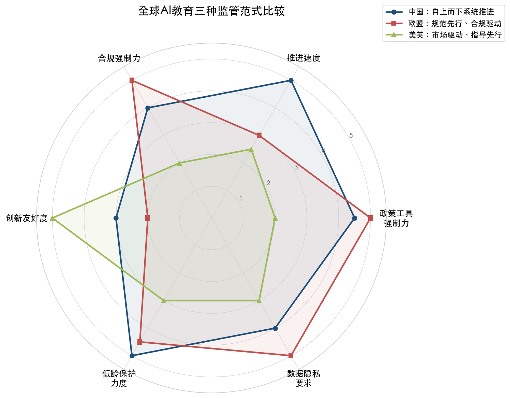

**范式一：中国"自上而下系统推进"模式。** 从《教育强国建设规划纲要》（中共中央、国务院级）→ 教育部"赋能教育行动"→ 四份指南/指引 → 省市校试点，形成完整的政策传导闭环。政策密度和推进节奏在全球主要经济体中最快，2025 年一年之内即完成从纲要到全学段规范再到大规模试点的全链条部署。核心优势在于政策一致性和执行效率，但面临"自上而下"模式固有的信息衰减和地方差异化执行挑战。

**范式二：欧盟"规范先行、合规驱动"模式。** 以 EU AI Act 为硬法底线，将教育 AI 归入高风险分类并设定严格合规义务（2026 年 8 月全面适用），辅以欧委会《数字教育行动计划》和教师伦理指南，形成"硬法 + 软法"双轨治理结构。核心优势在于法律确定性和权利保护力度，但合规成本高企可能抑制中小型 EdTech 企业创新。

**范式三：美英"市场驱动、指导先行、立法滞后"模式。** 美国以行政令 + 公私合作为主（联邦统一立法框架直至 2026 年 3 月才提出），州级立法呈碎片化状态（2025 年仅 4 州成功立法）。英国以 DfE 指导性文件为主，不强制但鼓励学校自主制定 AI 政策，侧重投资教师端工具。核心优势在于创新友好度和市场活力，但规则不统一和保护力度不足构成潜在隐患。

三种范式之间也呈现出**显著的趋同方向**：第一，均对未成年人尤其低龄学生的 AI 独立使用设有不同程度的限制——中国明确禁止小学生独立使用开放式生成功能，欧盟禁止教育场景中的情感识别系统，美国多个州提案限制特定 AI 使用场景。第二，均强调教师的主导地位不可被 AI 替代——这一共识已从价值宣言层面进入制度设计层面（如中国的"六项规范"、OECD 的"与教师共创"建议）。第三，均将数据隐私保护视为底线要求——从中国的"五安全一体"框架到欧盟的 GDPR + AI Act 双重约束，再到美国的 FERPA 合规要求，三大经济体在数据治理底线上已形成实质性共识。

## 4.7 治理缺口：从文件到落地的距离

政策文本的完备性并不等同于治理效能。评估全球 AI 教育治理的实际效果时，三个层面的结构性缺口值得关注。

**缺口一：执行颗粒度不足。** 以中国为例，中国教育新闻网 2026 年 3 月发布的基础教育年度报告指出，"部分试点存在'重形式轻实效'倾向，区域间改革进度不一，教师负担与专业支持不匹配，数字化应用'有平台无深度'" [中国教育新闻网](http://www.jyb.cn/rmtzcg/xwy/wzxw/202603/t20260326_2111459069.html "2025中国基础教育年度报告")。这一评估揭示了"自上而下系统推进"模式的结构性局限：中央层面的政策供给充分甚至超前，但地方的消化和转化能力存在显著差异。发达地区与欠发达地区之间的执行落差，可能反向加剧本欲缩小的教育公平鸿沟。

**缺口二：评估机制滞后于部署速度。** 各国 AI 教育政策大多聚焦于"允许什么""禁止什么"和"如何推进"，但对已部署 AI 工具的教育效果进行系统性评估的制度安排仍然薄弱。中国教育部的 10 万人级别长期跟踪调研是一个积极信号，但其方法论和阶段性成果尚未公开披露。OECD 基于 TALIS 2024 数据发出的"移除 AI 后优势消失"警示，从侧面印证了缺乏纵向评估数据对循证决策的制约。

**缺口三：全球治理碎片化。** UNESCO 全球调查数据显示，仅 19% 的高校拥有正式 AI 政策，且区域差异悬殊（图 4-3）。在缺乏具有约束力的国际协调机制的情况下，各国治理范式的分化可能导致跨境教育服务面临合规冲突——一家 EdTech 企业的产品在中国需通过算法备案和安全评估，在欧盟需完成 CE 认证和合规评估，在美国则主要依赖行业自律和州级法规，合规成本和策略因市场而异。

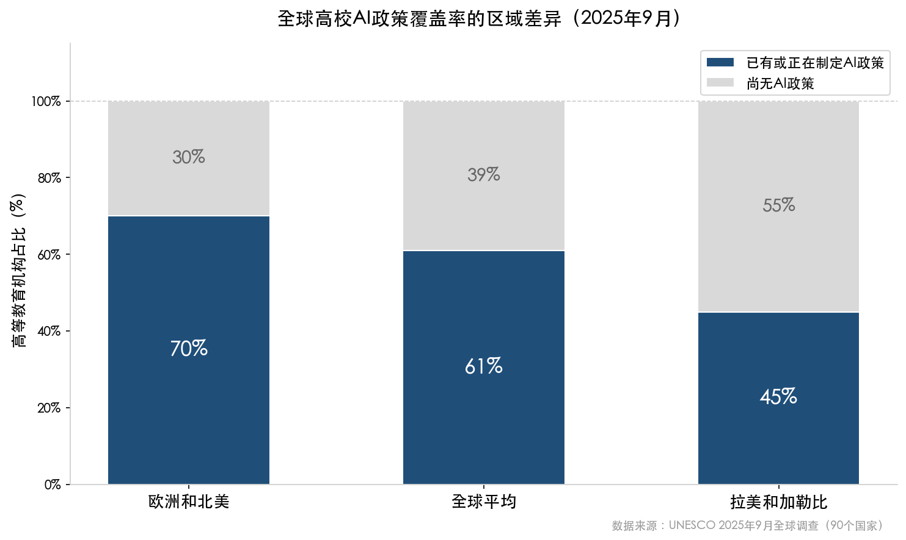

## 4.8 小结

2025—2026 年是全球 AI 教育治理从"空白期"进入"建制期"的关键转折点。中国以罕见的政策密度和推进速度，在一年之内构建起从顶层纲要到全学段规范再到大规模试点的完整制度链条，展现了体制优势带来的高效政策传导能力，但也面临执行颗粒度不足和区域差异化的现实挑战。欧盟以法律强制力锚定了教育 AI 的合规底线，为全球树立了权利保护的标杆，但合规成本对中小型 EdTech 企业创新活力的抑制效应有待市场检验。美国正从碎片化的州级探索向联邦统一框架过渡，过程中产生的政策不确定性既是创新的空间，也是治理的风险。

回到本章开篇提出的核心问题——**制度准备是否跟得上技术落地**——我们的判断是：主要经济体的制度框架搭建速度已显著加快，但在执行深度、评估机制和国际协调三个维度上仍存在系统性缺口。制度建设与技术演进之间的"时间差"正在缩小，但尚未消除。下一章将视角从制度层面转向人才供给侧，探讨教育体系如何回应 AI 时代对高端人才培养的全新要求。

# 第5章 教育反哺 AI——高校 AI 人才培养体系的重构

前四章从市场规模、落地场景、挑战风险到治理框架，系统梳理了人工智能对教育体系的渗透与重塑。本章转换视角，聚焦"教育如何反向支撑 AI 产业发展"这一核心命题。AI 技术的持续突破离不开高端人才的供给，而人才培养的质量与速度，直接决定一个国家在全球 AI 竞赛中的战略位势。本章以中国高校 AI 人才培养实践为主体，辅以美国顶尖高校的国际对标，从人才供需格局、学科布局、课程体系、培养模式创新和素养框架五个维度，剖析高等教育如何重构自身体系以回应 AI 时代的人才需求。

## 5.1 全球 AI 人才供需格局：缺口与竞争

### 5.1.1 中国：规模扩张与结构性短缺并存

中国 AI 人才培养的规模扩张速度在全球范围内首屈一指。2018 年教育部首批批准 35 所高校开设人工智能本科专业，截至 2023 年 4 月这一数字已增长至 498 所 [21经济网](https://www.21jingji.com/article/20250214/herald/8c369dfe36081666d878ab30b833fb9a.html "一年内已有10余所大学官宣AI学院，2025年2月")。到 2024 年，全国开设人工智能专业的高校进一步增至 535 所，占全部本科院校的比例超过 50% [赛氪资讯](https://news.saikr.com/news/detail/327 "国内高校专业大调整，人工智能一骑绝尘")。仅 2024 年度，人工智能专业以 89 所高校新增的数量高居所有专业榜首 [腾讯网](https://news.qq.com/rain/a/20250702A07Q5000 "国家战略布局！这个专业成就业'黄金赛道'")。六年间增长逾 14 倍的扩张速度，折射出国家层面对 AI 人才储备的高度紧迫感。

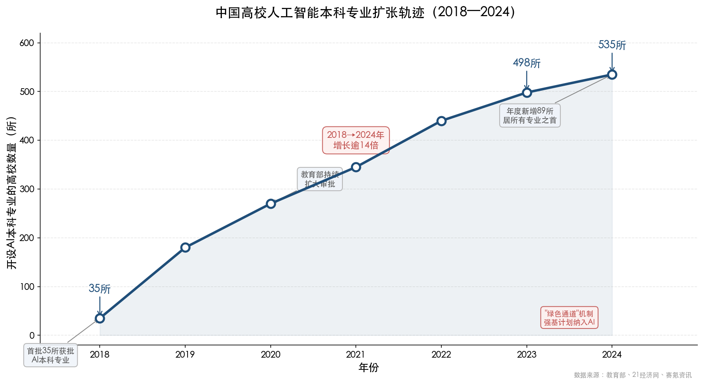

上图清晰呈现了 2018 至 2024 年间中国高校 AI 本科专业开设数量的指数级增长轨迹，并叠加了首批审批、教育部持续扩大审批、"绿色通道"机制建立及强基计划纳入 AI 方向等关键政策节点。

然而，规模扩张并未消解结构性人才短缺。麦肯锡预测，到 2030 年中国对 AI 专业人才的需求将达到 600 万人，缺口可能高达 400 万人 [21经济网](https://www.21jingji.com/article/20250214/herald/8c369dfe36081666d878ab30b833fb9a.html "2025年2月报道")。这一缺口不仅体现在数量上，更集中于领军型人才和交叉复合型人才层面。保尔森基金会的统计显示，全球排名前 20% 的顶尖 AI 研究者中 47% 来自中国，位居第一，美国以 18% 居第二 [21经济网](https://www.21jingji.com/article/20250214/herald/8c369dfe36081666d878ab30b833fb9a.html "2025年2月")。换言之，中国在 AI 研究人才的"基本盘"上已具备全球竞争力，但从学术研究到产业转化的高端人才链条仍有待强化。

### 5.1.2 全球视野：人才分布与流动格局

从全球格局看，AI 人才的分布呈现高度集中与快速扩散并行的特征。斯坦福大学 HAI《2025 AI 指数报告》显示，2024 年美国 AI 相关岗位占全部招聘的 1.8%，新加坡以 3.2% 居全球首位；生成式 AI 技能需求同比增长超过 3 倍 [Stanford HAI](https://hai.stanford.edu/assets/files/hai_ai-index-report-2025_chapter4_final.pdf "AI Index Report 2025 Economy Chapter")。

人才集中度方面，以色列以 2.0% 的 AI 人才占总就业比例居首，新加坡（1.6%）和卢森堡（1.4%）紧随其后。新兴经济体正在快速追赶：自 2016 年以来，印度 AI 人才增长 252%，哥斯达黎加增长 240% [Stanford HAI](https://hai.stanford.edu/assets/files/hai_ai-index-report-2025_chapter4_final.pdf "同上")。这一趋势表明，AI 人才培养正从少数发达国家向更广泛的地理范围扩散，但顶尖研究人才仍高度集中于少数科研中心。

从性别结构看，全球 AI 专业人才中 69.5% 为男性 [Stanford HAI](https://hai.stanford.edu/assets/files/hai_ai-index-report-2025_chapter4_final.pdf "同上")，人才多样性不足仍是全球性挑战。

### 5.1.3 产业界与学术界的人才争夺

AI 人才供需失衡的一个重要维度是产业界对学术界人才的"虹吸效应"。斯坦福 HAI 报告显示，2024 年近 90% 的主要 AI 模型由产业界产出，其中美国贡献 40 个、中国贡献 15 个 [Stanford HAI](https://hai.stanford.edu/ai-index/2025-ai-index-report "2025 AI Index Report")。产业界在算力、数据和薪酬上的碾压性优势，使得高校在吸引和留住顶尖 AI 研究者方面面临持续压力。这一现实也倒逼高校在人才培养模式上做出根本性调整——不是简单扩大招生规模，而是构建产教深度融合的培养生态，使高校培养的人才能够真正服务于产业需求。

## 5.2 学科布局重构：AI 学院潮与新专业矩阵

### 5.2.1 独立 AI 学院的集中设立

2024—2025 年间，中国高校经历了一轮 AI 学院设立的高峰期。清华大学、哈尔滨工业大学、武汉大学、上海交通大学、华东师范大学、上海财经大学、山东大学、港中大（深圳）等十余所高校先后成立独立 AI 学院 [21经济网](https://www.21jingji.com/article/20250214/herald/8c369dfe36081666d878ab30b833fb9a.html "2025年2月")。其中，清华大学 AI 学院由图灵奖得主、中国科学院院士姚期智担任院长，定位于培养"具有坚实数理基础和前沿 AI 能力的领军人才"；武汉大学 AI 学院计划自 2025 年 9 月起招收首批本科生，年招生规模 150 人 [21经济网](https://www.21jingji.com/article/20250214/herald/8c369dfe36081666d878ab30b833fb9a.html "2025年2月")。

在区域层面，上海的布局尤为系统。截至 2025 年，上海已推动 14 所高校成立 AI 研究院、19 所高校开设 AI 相关专业，并组建上海创智学院支持学生创业团队 [新华网](http://www.news.cn/liangzi/20250731/2f712c9890ff4940bd8a76b48bbae53e/c.html "2025世界人工智能大会")。这一密集的建院进程，标志着 AI 正从传统计算机科学的子方向独立为一个完整的学科建制。

### 5.2.2 新专业目录与"绿色通道"机制

教育部 2025 年 4 月更新的《普通高等学校本科专业目录（2025 年）》增列 29 种新专业，其中包括"人工智能教育""智能视听工程"等直接与 AI 相关的专业方向。更新后的专业目录涵盖 93 个专业类、845 种专业，全国高校本科专业布点达 6.28 万个 [新浪财经](https://finance.sina.com.cn/tech/digi/2025-04-22/doc-inetzenw7833924.shtml "教育部2025年增设29种本科新专业")。尤为值得关注的是，教育部首次建立了战略急需专业的"超常设置"绿色通道，AI 相关前沿专业可绕过常规审批周期获得快速设立资格，体现了国家层面对 AI 人才培养的超常规推进力度。

### 5.2.3 "强基计划"纳入 AI 方向

2025 年是"强基计划"实施的第六年。多所高校在强基计划中新增了人工智能相关培养方向：南京大学新增"智能科学"培养方向，依托人工智能学院进行培养，聚焦国家在智能科学领域的战略需求 [南京大学官网](https://www.nju.edu.cn/info/1056/416011.htm "南京大学发布2025年强基计划")；北京航空航天大学新增依托人工智能学院的培养方向，强化学生在复杂数据系统研究中的能力 [北航新闻网](https://news.buaa.edu.cn/info/1002/65522.htm "北航2025年强基计划招生简章")。强基计划向 AI 方向的延伸，标志着国家对 AI 顶尖人才的培养正从"专业扩张"走向"基础深耕"——通过夯实数理基础、实行本硕博贯通培养，力图破解"量多质不高"的瓶颈。

## 5.3 课程体系革新："AI+X"与全覆盖模式

AI 人才培养的关键抓手在于课程体系的革新。2024—2025 年间，中国头部高校在"AI+X"交叉课程建设上形成了各具特色的模式，且这一改革已从精英高校向省级层面和地方院校扩展。

### 5.3.1 复旦模式："三个 100%"

复旦大学在课程体系革新方面走在前列。自 2024—2025 学年起，复旦推出至少 100 门 AI 领域课程，实现"三个 100%"——AI 课程覆盖全体本科及研究生学生、覆盖全部一级学科、AI 素养能力要求覆盖全部专业。教育部科技司在 2025 年 12 月新闻发布会上专门提及复旦模式，将其视为"面向智能时代的未来人才培养经验"的典型 [教育部新闻发布会](http://www.moe.gov.cn/fbh/live/2025/77791/twwd/202512/t20251230_1425181.html "2025年12月30日")。复旦模式的核心理念在于：AI 素养不是计算机学院的专属课程，而是所有学科背景学生的必备能力。

### 5.3.2 清华模式："AI+X"复合培养

清华大学 2025 年拟增加约 150 名本科生招生名额，专门用于培养"AI+X"复合型人才。在课程层面，清华首批启动 117 门试点课程开展 AI 赋能教学改革，至 2025 年 12 月已完成 402 门课程的 AI 建设，另有 38 门 AI 通识课程正在建设中 [清华大学官网](https://www.tsinghua.edu.cn/info/1182/117320.htm "2025年3月")。清华路径的特色在于将 AI 作为一种"方法论工具"嵌入传统学科，而非仅将其作为一个独立专业方向，由此推动人文、社科、理工各学科实现 AI 深度融合。

### 5.3.3 浙大模式：教材—课程—平台三位一体

浙江大学在"AI+X"课程建设上形成了教材、课程与平台三位一体的完整体系。截至 2025 年底，浙大已出版 27 种"AI+X"教材，立项 158 门 AI+X 交叉课程，设立 13 个特色微专业 [教育部新闻发布会](http://www.moe.gov.cn/fbh/live/2025/77791/twwd/202512/t20251230_1425181.html "浙大副校长发言")。在跨校协作方面，浙大联合华东五校启动微专业共建行动，已有 600 余名学生参与。在平台建设方面，浙大的"智海 Mo"科教平台已服务千余所学校、超过 15 万名师生，成为全国性的 AI 教学基础设施 [教育部新闻发布会](http://www.moe.gov.cn/fbh/live/2025/77791/twwd/202512/t20251230_1425181.html "同上")。浙大还率先发布了"大学生人工智能素养红皮书"，构建了"体系化知识、构建式能力、创造性价值和人本型伦理"四维 AI 素养框架 [浙江大学官网](https://www.zju.edu.cn/2025/0304/c76699a3023323/page.htm "2025年3月")。浙大模式的突出价值在于，它不仅解决了"教什么"的问题，还通过平台建设和跨校合作解决了"如何大规模推广"的问题。

### 5.3.4 湖北省级实践：大一 AI 通识课全覆盖

在省级层面，湖北省 2024 年秋季学期率先面向全省大一本科生开设 AI 通识课，课程 32 学时，累计选课超 13 万名学生，视频观看达 240 万人次 [科技日报](https://www.stdaily.com/web/gdxw/2025-03/07/content_306079.html "2025年3月")。这一实践表明，AI 通识教育的全面铺开并非头部高校的"特权"，而是可以在省级范围内系统推进的教育改革，为其他省份提供了可复制的经验。

### 5.3.5 地方高校创新：浙江工商大学"158"体系

AI 人才培养并非"双一流"高校的专属领域。浙江工商大学形成了"158"体系，建设 18 门"BAT-X"AI 课程群和 16 个"AI+X"微专业，联合浙大、用友共建"商学智脑"大模型，入选教育部首批生成式 AI 教育专用大模型项目 [浙江教育报](http://www.zjjyb.cn/html/2026-01/23/content_68491.htm "2026年1月")。这一案例表明，地方高校可以通过与头部高校及产业界的深度合作，在 AI 人才培养上找到差异化定位，避免在同质化竞争中被边缘化。

## 5.4 培养模式创新：产教融合与规模化培训

课程体系的革新需要制度支撑和规模化推广机制。在产教融合和大规模培训两个维度，中国已初步构建起从政策设计到执行落地的完整链条。

### 5.4.1 卓越工程师学院：校企联合培养的制度化

产教融合是解决 AI 人才"学用脱节"问题的关键路径。截至 2025 年底，中国已建设 50 家国家卓越工程师学院和 4 家国家卓越工程师创新研究院，校企联合招收培养工程硕博士近 2.6 万人，其中 60 多人以实践成果获得学位 [教育部新闻发布会](http://www.moe.gov.cn/fbh/live/2025/77288/twwd/202512/t20251210_1423038.html "2025年12月10日")。卓越工程师培养模式打破了传统学术导向的研究生培养范式，将企业真实技术挑战作为学位论文或实践成果的核心来源，推动人才培养从"论文驱动"向"问题驱动"转变。

### 5.4.2 国家级政策支撑：多部门协同推进

2025 年 4 月，教育部等九部门联合印发《关于加快推进教育数字化的意见》，提出建设"通用+特色"高校 AI 通识课程和"AI+X"国家级实验教学中心 [教育部官网](http://www.moe.gov.cn/srcsite/A01/s7048/202504/t20250416_1187476.html "教育部等九部门意见")。同年 8 月，国务院发布《关于深入实施"人工智能+"行动的意见》（国发〔2025〕11 号），明确提出"超常规构建领军人才培养新模式" [央广网教育](https://edu.cnr.cn/talk/20251028/t20251028_527409956.shtml "2025年10月")。工信部随后将 AI 智能建造师、AI 财务管理师等 20 余个岗位纳入 IITC 岗位能力评价体系，为 AI 人才的职业化发展搭建了认证通道 [央广网教育](https://edu.cnr.cn/talk/20251028/t20251028_527409956.shtml "同上")。这一从国务院到部委层面的政策联动，构成了 AI 人才培养的完整制度保障。

### 5.4.3 大规模师生培训：国家平台驱动

教育部依托国家智慧教育平台组织的 AI 培训已覆盖 2000 余所高校和 50 万名师生，本科毕业生 AI 综合应用能力培训达 131 万人 [教育部新闻发布会](http://www.moe.gov.cn/fbh/live/2025/77791/twwd/202512/t20251230_1425181.html "2025年12月30日")。这一规模化培训体系的意义在于，它并非针对 AI 专业学生的"纵深培养"，而是面向全体大学生的"水平覆盖"，旨在确保每一位走出校门的毕业生都具备基本的 AI 应用能力。从产业需求角度看，131 万人的年培训规模相较于 600 万人的 2030 年需求预测，仍存在显著的供给缺口，培训的提速与扩面势在必行。

## 5.5 国际对标：顶尖高校的差异化路径

在中国大规模推进 AI 学科建设和课程改革的同时，美国顶尖高校凭借先发优势和长期积累，形成了各具特色的 AI 人才培养体系。对标分析有助于识别中国模式的优势与待补齐的短板。

### 5.5.1 CMU：全球首个 AI 本科学位的成熟体系

卡内基梅隆大学（CMU）于 2018 年在其计算机科学学院推出全球首个人工智能本科学位（B.S. in Artificial Intelligence），课程体系由数学与统计核心（7 门）、计算机科学核心（5 门）、人工智能核心（3 门，涵盖 AI 表示与问题求解、机器学习入门、自然语言处理或计算机视觉任选其一）、四大 AI 聚类选修（决策与机器人、机器学习进阶、感知与语言、人机交互）以及伦理必修课构成 [CMU SCS](https://www.cs.cmu.edu/bs-in-artificial-intelligence/curriculum "BSAI Curriculum")。CMU 体系具有三项显著特色：其一，将伦理课程设为必修而非选修，反映出美国顶尖高校对 AI 社会影响的高度重视；其二，四大聚类选修允许学生根据兴趣深入特定 AI 分支，兼顾专业深度与灵活性；其三，人文社科课程中要求至少一门认知科学或认知心理学课程，体现了"理解人类智能以构建人工智能"的教育理念。

### 5.5.2 MIT：计算学院的跨学科融合

麻省理工学院（MIT）于 2019 年成立史蒂芬·A·施瓦茨曼计算学院（Schwarzman College of Computing），投资 10 亿美元打造跨学科计算教育平台。该学院提供多个计算相关本科学位，其中 Course 6-4（人工智能与决策）聚焦于感知、通信、行动和学习系统的分析与合成。MIT 的独特之处在于其"混合专业"（blended majors）设计：Course 6-7 将计算机科学与分子生物学结合，Course 6-9 将计算与认知融合，Course 6-14 将计算机科学与经济学及数据科学整合，Course 11-6 将城市科学与计算机科学对接 [MIT Schwarzman College](https://computing.mit.edu/academics/undergraduate-programs/ "Undergraduate Programs")。MIT 模式的核心理念在于：AI 不是一个孤立学科，而是一种可以与任何领域深度交叉的计算方法论，这与中国高校推行的"AI+X"方向在理念上高度一致。

### 5.5.3 中美路径对比

将中国与美国头部高校的 AI 人才培养模式进行系统对比，可以观察到以下差异与趋同。

**规模维度**：中国的 AI 专业扩张速度和覆盖面远超美国——535 所高校开设 AI 专业，省级 AI 通识课覆盖数十万学生；美国则以少数顶尖高校的精细化培养为主，CMU、MIT、斯坦福等形成了各具特色的 AI 教育品牌。

**培养理念**：中美正在趋同——两国都强调"AI+X"交叉融合，但实现路径不同。中国主要通过行政推动（专业目录调整、绿色通道、九部门文件）实现快速覆盖；美国则更多依赖高校自主创新和产业界拉动。

**伦理教育**：CMU 将 AI 伦理设为本科必修课程，MIT 设有"计算的社会与伦理责任"跨学科项目；中国高校尚未形成系统化的 AI 伦理必修课程体系，但清华大学 2025 年 11 月发布的《人工智能教育应用指导原则》提出的"审慎思辨"原则，为未来课程建设指明了方向。

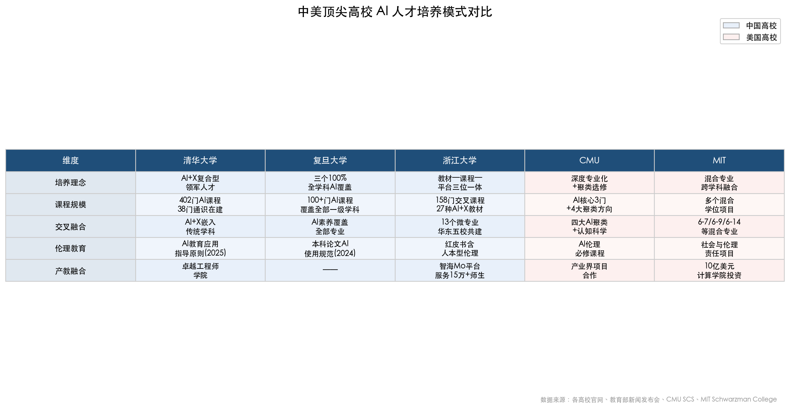

上表从培养理念、课程规模、交叉融合、伦理教育和产教融合五个维度，横向对比了清华大学、复旦大学、浙江大学、CMU 与 MIT 五所高校的 AI 人才培养模式差异。

**K-12 师资短板**：在全球 K-12 层面，斯坦福 HAI 报告指出，全球已有三分之二的国家开设或计划开设 K-12 计算机科学教育（较 2019 年翻倍），但不到一半的美国 K-12 计算机科学教师有能力教授 AI [Stanford HAI](https://hai.stanford.edu/ai-index/2025-ai-index-report "2025 AI Index Report")。这一数据揭示了一个全球性问题：AI 人才培养的"基座"——K-12 阶段的 AI 师资——仍然是亟待补齐的短板，中美两国概莫能外。

## 5.6 AI 素养框架：从能力定义到评价体系

AI 人才培养不仅是专业教育问题，更是全民素养提升问题。构建科学的素养框架，是将 AI 能力要求从模糊的方向性表述落实为可操作的教育标准的基础。

### 5.6.1 UNESCO 全球素养框架

UNESCO 2024 年 9 月发布的《AI Competency Framework for Students》构建了 4 个维度、12 项能力、3 个进阶层级的系统框架；同期发布的教师版框架包含 15 项能力 [UNESCO](https://www.unesco.org/en/articles/ai-competency-framework-students "2024年8月")。这是联合国系统首次为 AI 教育提供全球性的能力标准参照体系，为各国制定本土化 AI 素养标准提供了基准。

### 5.6.2 中国素养框架的本土化探索

在国内，浙江大学 2024 年 6 月发布了《大学生人工智能素养红皮书》，将 AI 素养定义为"体系化知识、构建式能力、创造性价值和人本型伦理"四维框架 [浙江大学官网](https://www.zju.edu.cn/2025/0304/c76699a3023323/page.htm "2025年3月")。浙江工商大学在此基础上发布了《浙江省大学生人工智能应用能力框架》，将浙大的理论框架进一步落地为可操作的省级评价标准 [浙江大学官网](https://www.zju.edu.cn/2025/0304/c76699a3023323/page.htm "同上")。

从中国四维框架与 UNESCO 全球框架的对比看，两者在结构上高度对应：UNESCO 的"人本型"价值观维度与浙大的"人本型伦理"一脉相通，UNESCO 的"创造"维度与浙大的"创造性价值"可相互映射。这表明，中国的 AI 素养框架建设既具有本土特色，也与全球趋势保持了基本一致性。

### 5.6.3 从框架到实践：评价体系的挑战

我们认为，AI 素养框架的建立只是第一步，真正的挑战在于如何将其转化为可操作的评价体系。当前的关键瓶颈在于：AI 能力的评价难以用传统纸笔考试方式衡量，需要结合项目制实践、作品集评估和过程性评价等多元手段。教育部提出将 AI 素养纳入学生综合素质评价的方向是正确的，但评价工具和标准的开发仍需大量实证研究支撑。如何在确保评价信度与效度的前提下，实现面向数百万学生的规模化 AI 素养测评，将是未来两到三年间的核心课题。

## 5.7 本章小结

中国高校 AI 人才培养体系正经历一场从学科布局到培养模式的系统性重构。在规模上，535 所高校开设 AI 专业、50 家卓越工程师学院、131 万本科毕业生接受 AI 应用能力培训，构成了全球最大规模的 AI 人才培养基座。在深度上，清华、复旦、浙大等头部高校在"AI+X"课程体系、交叉微专业和科教平台建设上形成了各具特色的创新路径。在制度层面，从国务院的"超常规培养"部署到教育部的专业"绿色通道"、强基计划的 AI 方向扩展，政策链条日趋完整。

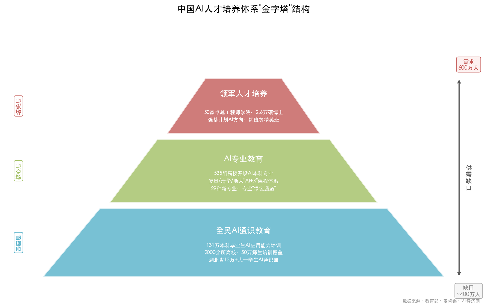

上图以金字塔结构呈现了中国 AI 人才培养体系的三层架构——基座层为全民 AI 通识教育，核心层为 AI 专业教育，塔尖层为领军人才培养，同时标注了麦肯锡预测的 600 万人需求与约 400 万人缺口，直观展示供需张力。

与此同时，我们也应清醒地认识到若干待解命题：第一，约 400 万人的预测缺口表明，当前的培养规模增速仍可能不足以匹配产业需求的爆发式增长；第二，AI 伦理教育的系统化程度与 CMU、MIT 等国际标杆相比仍有差距；第三，地方高校和中西部院校在 AI 教学资源（师资、算力、数据集）上的不均衡，可能复制并放大既有的教育公平问题；第四，从素养框架到评价体系的落地转化，仍处于探索阶段。

教育对 AI 的反哺效果，最终将由培养出的人才在全球 AI 竞争中的表现来检验。

# 第6章 趋势展望——2026 下半年至中期的演进方向

前五章从市场全景、落地场景、挑战风险、治理框架和人才培养五个维度，系统呈现了人工智能与教育双向赋能的当下图景。本章在上述事实基础之上，聚焦 2026 年下半年至中期（1—3 年）的关键趋势判断，涵盖技术演进、市场格局、政策走向和人才生态四个维度。所有前瞻性判断均标明时间窗口与前提假设，力求以审慎、有据的研究视角为教育决策者和产业参与者提供参考。下图以时间线形式概括本章核心判断的全貌。

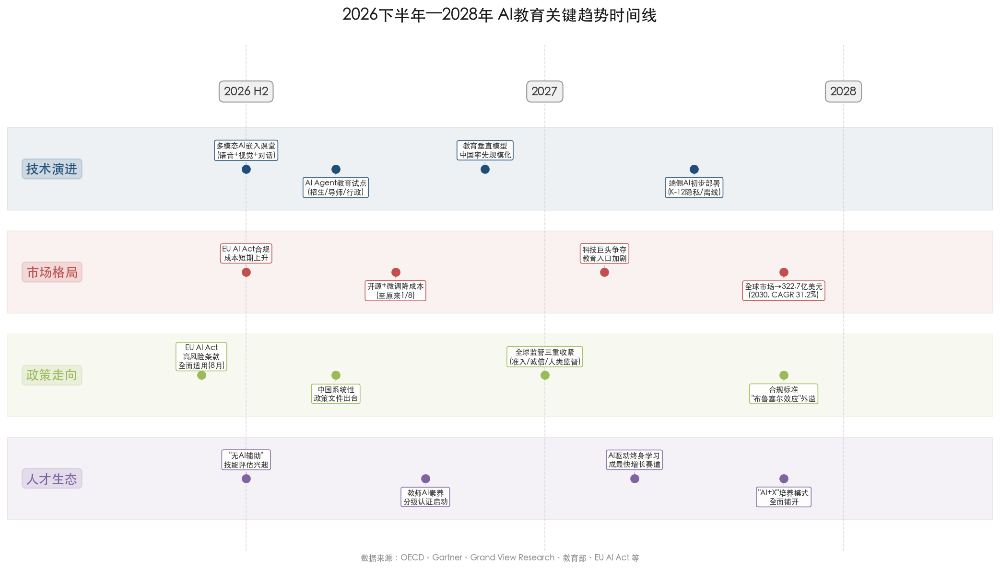

上图将本章四个分析维度的 16 个关键趋势节点按时间轴展开，涵盖 EU AI Act 全面适用、中国系统性政策文件出台、端侧 AI 初步部署、"无 AI 辅助"评估兴起等里程碑事件，为后续各节的深入分析提供导览。

## 6.1 技术演进：从工具辅助到智能代理

### 6.1.1 多模态 AI 深度嵌入课堂

OECD《数字教育展望 2026》指出，生成式 AI 驱动的智能辅导系统（ITS）正从"刚性脚本式数字导师"进化为"对话式数字教学代理" [OECD](https://www.oecd.org/en/publications/oecd-digital-education-outlook-2026_062a7394-en.html "2026年1月发布")。这一转变的底层驱动力在于多模态 AI 技术的成熟——语音交互、视觉理解和自然对话能力的深度融合，使 AI 工具不再局限于文本问答，而是能够理解学生的语音提问、识别手写作业中的错误，乃至通过表情分析感知学习困惑。

Google 的实践为上述判断提供了有力佐证。2025 年 5 月 Google I/O 大会宣布将教育专用模型 LearnLM 直接嵌入 Gemini 2.5，使其成为面向教育场景的旗舰学习模型。同年 11 月在伦敦举办的 Google AI for Learning Forum 上，Google 公布了一项针对 165 名英国 13—15 岁学生的随机对照试验（RCT）结果：在经验丰富教师的监督下，使用 LearnLM 进行数学辅导的学生在后续新题目上的解题成功率比仅由人类教师辅导的学生高出 5.5 个百分点，且 LearnLM 的事实性错误率仅为 0.1% [Google Blog](https://blog.google/products-and-platforms/products/education/ai-learning-commitments/ "2025年11月11日发布")。Google 同期宣布投入 3000 万美元用于学习项目资助，并与爱沙尼亚政府合作推进 AI Leap 计划，为 2 万余名师生提供 AI 工具与培训；此外还计划在美国、英国、印度和塞拉利昂等国开展更大规模的 RCT 研究，以科学验证 AI 对学习成效的影响 [Google Blog](https://blog.google/products-and-platforms/products/education/ai-learning-commitments/ "同上")。

基于上述进展，我们判断：2026 下半年至 2028 年间，多模态 AI 将从当前"文本对话为主"向"语音+视觉+自然对话"全面融合演进，深度嵌入课堂互动工具。这一判断的前提假设是大语言模型的多模态推理能力持续改善，且部署成本继续沿当前轨迹下降。

### 6.1.2 AI Agent 进入教育执行阶段

2026 年，"Agentic AI"（智能代理）从概念验证走向实际部署，构成教育技术领域最值得关注的范式转换之一。UPCEA 2026 年 1 月分析指出，高校预计在 2026 年开始广泛部署"有治理的智能代理工作流"（governed agentic workflows），涵盖招生助理、苏格拉底式导师、心理健康初筛、科研文献综述等 12 类应用场景 [UPCEA](https://upcea.edu/the-rise-of-the-agentic-ai-university-in-2026/ "2026年1月")。

与传统聊天机器人不同，AI Agent 具备自主规划、分步执行和跨系统调用的能力。在教育场景中，一个招生 AI Agent 可自主收集申请者材料、核验成绩单、初步评估匹配度并生成推荐报告；一个教学 AI Agent 可根据学生的实时表现动态调整教学路径、自动生成个性化练习，并向教师推送干预建议。

然而，Gartner 对 AI Agent 部署的前景给出了审慎警告：预计超过 40% 的 Agentic AI 项目将因治理不足在 2027 年前失败 [Gartner](https://joget.com/ai-agent-adoption-in-2026-what-the-analysts-data-shows/ "转引Gartner数据")。教育场景的特殊性——涉及未成年人数据、高利害决策（入学、评分）和伦理敏感性——使得治理要求比一般商业场景更为严格。基于上述分析，我们判断：AI Agent 在教育领域的落地将呈现"高期望—快速试点—治理瓶颈—选择性收敛"的 S 曲线演进路径，最终在招生辅助、个性化学习路径规划和行政自动化等风险可控的场景率先站稳。

### 6.1.3 教育专用垂直模型的规模化

通用大语言模型在教育场景中面临的两大结构性短板——开放域事实问答中高达 33%—51% 的幻觉率以及非英语语言的显著性能落差——推动了教育专用垂直模型的加速发展。中国教育部已组织建设 23 个教育专用大模型和 13 个学科垂类模型，并上线"育小苗"等教育智能体 [CERNET](https://www.edu.cn/xxh/focus/zc/202601/t20260107_2714511.shtml "教育部2026年1月发布会")。在企业端，好未来"九章大模型"、科大讯飞星火教育大模型等已在各自生态中实现规模化应用。

我们判断，2026 下半年至 2028 年，教育专用垂直模型将从中国率先实现规模化部署，全球其他地区以开源微调方式跟进。这一判断基于三个前提：其一，中国在教育 AI 领域的政策推动力度和执行速度居全球前列；其二，开源模型（如 DeepSeek）大幅降低了垂直模型的训练门槛；其三，教育场景对领域知识准确性的刚性需求赋予垂直模型相较通用模型的天然优势。

### 6.1.4 端侧 AI 与离线教育助手

端侧 AI（Edge AI）构成另一个值得关注的技术演进方向。Dell 和 Deloitte 的 2026 年技术展望报告均指出，小语言模型和端侧推理正加速向终端设备部署 [Dell](https://www.dell.com/en-us/blog/the-power-of-small-edge-ai-predictions-for-2026/ "2026年预测") [Deloitte](https://www.deloitte.com/us/en/insights/topics/technology-management/tech-trends/2026/2026-technology-signals.html "2026年技术信号")。在教育领域，端侧 AI 的核心价值在于破解两个关键痛点：一是隐私敏感场景下的本地化推理需求（K-12 阶段的儿童数据无需离开设备即可完成分析），二是基础设施薄弱地区的 AI 可达性问题（无需依赖稳定的网络连接）。

基于当前小语言模型的参数压缩技术进展和移动端芯片算力的年均提升速率，我们判断 2027—2028 年端侧 AI 将在 K-12 隐私敏感场景和欠发达地区实现"离线 AI 助手"的初步部署。这一趋势对于弥合全球教育数字鸿沟意义重大——UNESCO 数据显示全球中小学教育到 2030 年面临 4400 万名教师的缺口 [UNESCO](https://www.unesco.org/en/articles/global-report-teachers-addressing-teacher-shortages-and-transforming-profession "Global report on teachers, 2024年2月发布")，端侧 AI 辅助教学工具可在师资严重短缺的地区发挥关键补充作用。

## 6.2 市场格局：从实验到规模化部署

### 6.2.1 市场规模的持续扩张

全球 AI 教育市场正处于高速增长通道。Grand View Research 预计，2025 年全球 AI 教育市场规模约为 83 亿美元，到 2030 年将达到 322.7 亿美元，2025—2030 年 CAGR 为 31.2%；北美以 38% 的市场份额领先，亚太地区为增速最快区域 [Grand View Research](https://www.grandviewresearch.com/industry-analysis/artificial-intelligence-ai-education-market-report "AI In Education Market Size & Share, 2025-2030")。Precedence Research 的预测更为激进，认为到 2035 年全球 AI 教育市场将达到 1367.9 亿美元（CAGR 34.52%）[Precedence Research](https://www.precedenceresearch.com/ai-in-education-market "AI in Education Market Size to Surge USD 136.79 Bn by 2035")。

中国市场同步呈现高速增长态势。多鲸教育研究院估算 2025 年中国 AI+教育市场规模超 700 亿元人民币（约 96 亿美元，广义口径含硬件和信息化投入），预计到 2030 年将达近 3000 亿元，复合增速约 47% [多鲸教育研究院报告](https://news.qq.com/rain/a/20250627A04XQB00 "2025 AI 赋能教育行业发展趋势报告")。驱动市场持续扩张的核心力量包括：生成式 AI 技术成熟度的快速提升、教育公平的刚性需求、全球性教师短缺的结构性挑战、以及各国政策的积极推动。

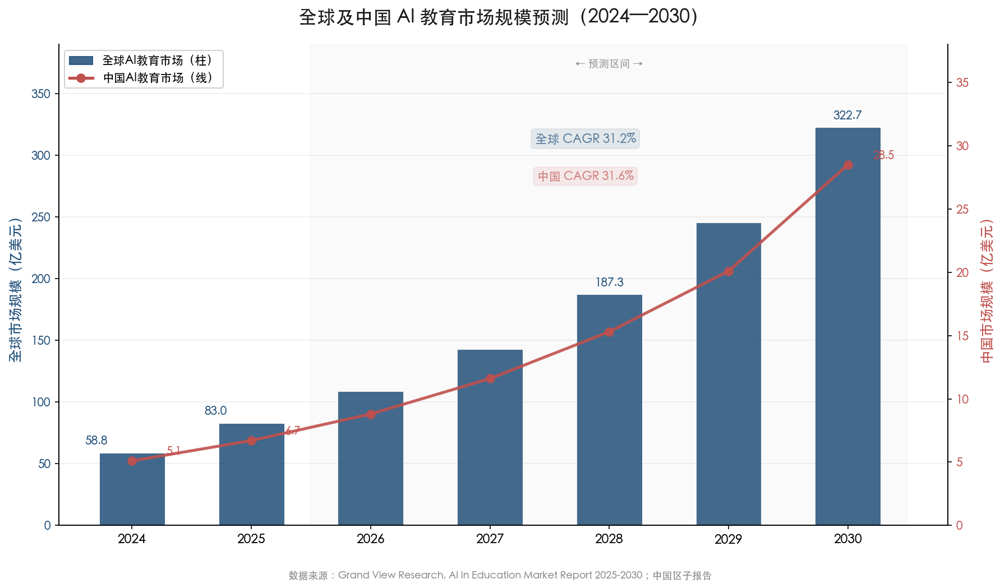

上图基于 Grand View Research 数据，以柱状图展示全球 AI 教育市场从 2024 年 58.8 亿美元增长至 2030 年 322.7 亿美元的预测轨迹（CAGR 31.2%），叠加折线图呈现中国市场从 2024 年 5.1 亿美元增长至 2030 年 28.5 亿美元的同步增长态势（CAGR 31.6%），直观反映全球与中国市场的高增长趋势及中国市场份额的渐进提升。

### 6.2.2 资本流向：从"AI 实验"到"有治理的部署"

HolonIQ 2026 全球教育展望显示，EdTech 领域的资本偏好正从"AI 实验"阶段转向"有治理的部署"，投资者日益青睐能够展示可量化学习成效的平台 [HolonIQ](https://www.holoniq.com/notes/2026-global-education-outlook "2025年12月发布")。2025 年全球 EdTech 风险投资总额为 26 亿美元（同比+11%），重大交易信号明确：Workday 以 11 亿美元收购 AI 学习平台 Sana，Coursera 完成对 Udemy 的收购 [HolonIQ](https://www.holoniq.com/notes/edtech-hits-2-6b-in-investment-as-the-market-stabilizes-bigger-bets-in-ai-and-workforce-training "EdTech hits $2.6B in investment")。上述大额并购表明行业正从分散的创业实验阶段进入整合期，拥有成熟 AI 能力和可验证学习成效的平台将获得显著的估值溢价。

一个尤为值得关注的市场信号是科技巨头对教育入口的战略性布局。OpenAI 于 2026 年 1 月发布"Education for Countries"计划，首批与 8 个国家和机构合作，提供 ChatGPT Edu 和 GPT-5.2 [OpenAI](https://openai.com/index/edu-for-countries/ "2026年1月28日")。此前，OpenAI 已向约 35 所美国公立大学售出超过 70 万份许可证，定价仅为每用户每年 12 美元 [Bloomberg](https://www.bloomberg.com/news/articles/2025-12-18/schools-ink-chatgpt-copilot-deals-with-students-embracing-ai "2025年12月")。Google 同样大举投入：LearnLM 嵌入 Gemini 后免费向全球教育机构开放，同期投入 3000 万美元资助学习项目 [Google Blog](https://blog.google/products-and-platforms/products/education/ai-learning-commitments/ "2025年11月")。这一"低价/免费抢占教育入口→积累数据→成为基础设施"的渗透路径，预示着未来 1—3 年科技巨头与传统 EdTech 企业之间的竞争将显著加剧。

### 6.2.3 开源生态降低成本推动普惠化

2025 年初 DeepSeek 大模型以开源形式发布，其强推理能力和低使用成本对 AI 教育领域产生了深远影响。开源模型叠加检索增强生成（RAG）和领域微调技术，可将大语言模型的使用成本降低至原来的约 1/8 [成本优化实践](https://www.decodingai.com/p/our-blueprint-to-cut-llm-costs-by "LLM成本降低88%")。

我们判断，2026 下半年至 2028 年，"开源基座+垂直微调"的技术组合将推动 AI 教育工具从头部机构向中小学校和发展中国家加速普及。这一判断的前提是开源社区保持当前的活跃度，且各国监管政策不对开源模型在教育领域的使用设置过高门槛。在中国国内，好未来、猿编程、松鼠 Ai 等头部教育企业已率先接入 DeepSeek [多鲸教育研究院报告](https://news.qq.com/rain/a/20250627A04XQB00 "DeepSeek催化AI+教育进入全民时代")，这一趋势有望加速 AI 教育工具在下沉市场的渗透。

### 6.2.4 中外发展路径的差异化

中国与北美在 AI 教育市场的发展路径呈现显著的结构性差异。中国教育部 2026 年 3 月部署会提出六大"AI for"方向，明确从"聚焦学校教育"向"构建全民终身教育体系"拓展，沿袭"政府顶层设计+国家平台主导"路径 [教育部官网](http://www.moe.gov.cn/jyb_zzjg/huodong/202603/t20260331_1432621.html "2026年3月31日")。美国则以市场驱动为主，科技企业通过产品渗透和高校合作建立生态壁垒，联邦层面以行政令和政策指引为主要调控工具。

两种路径各具优劣。中国模式的优势在于速度与覆盖面——从政策宣示到试点落地的周期短，国家平台可快速实现大规模覆盖；其劣势在于自上而下推进可能导致"重形式轻实效"的倾向（中国教育新闻网 2026 年 3 月年度报告已明确指出这一问题 [中国教育新闻网](http://www.jyb.cn/rmtzcg/xwy/wzxw/202603/t20260326_2111459069.html "2025中国基础教育年度报告")）。美国模式的优势在于创新活力和产品打磨的精细度，劣势则在于覆盖面有限、教育公平问题更为突出——约 50% 的美国高校尚未向学生提供 GenAI 工具的机构级访问权限 [Inside Higher Ed](https://www.insidehighered.com/news/tech-innovation/artificial-intelligence/2025/04/21/half-colleges-dont-grant-students-access "2025年4月报道")。

## 6.3 政策走向：监管收紧与制度完善

### 6.3.1 中国：系统性政策文件即将出台

教育部科技司司长周大旺于 2026 年 1 月明确表示，计划在 2026 年出台人工智能赋能教育的系统性政策文件，对 AI 教育应用进行全面部署 [CERNET](https://www.edu.cn/xxh/focus/zc/202601/t20260107_2714511.shtml "教育部2026年1月发布会")。2026 年 3 月 31 日教育部部署会进一步提出以"人工智能+教育"为抓手推动教育数字化战略行动 2.0，同期发布的《十五个五年规划纲要》则提出"深化拓展'人工智能+'" [教育部官网](http://www.moe.gov.cn/jyb_xwfb/s5148/202604/t20260402_1432732.html "2026年4月2日")。

基于上述密集政策信号，我们判断该系统性政策文件将于 2026 年下半年正式出台（截至 2026 年 4 月 5 日尚未正式发布）。该文件预计将覆盖以下关键领域：教育专用大模型的质量标准与安全认证体系、AI 教育产品进校园的准入机制、教师 AI 素养的强制性培训要求以及学生数据保护的专项规定。此文件的出台将为中国 AI 教育从"试点探索"迈向"系统化部署"提供制度基础。

在制度化进程的实践层面，中国已积累了相当规模的试点经验：东部 7 个省份、中西部 20 个地市、18 所高校的 AI 赋能教育试点正在推进，全国中小学人工智能教育联盟已成立并设置七大区域协作中心，两批合计 834 个中小学 AI 教育基地已投入运行 [CERNET](https://www.edu.cn/xxh/focus/zc/202601/t20260107_2714511.shtml "教育部2026年1月发布会")。

### 6.3.2 欧盟：AI 法案教育条款全面适用

欧盟《人工智能法案》（EU AI Act）的高风险 AI 系统条款将于 2026 年 8 月 2 日起全面适用。根据该法案附件三第 3 条，四类教育 AI 系统被明确归为高风险类别：入学和招生决策系统、学习评估系统、教育水平评定系统和考试违规监测系统——上述系统须遵守第 9—15 条全套合规义务，涵盖风险管理体系、数据治理、技术文档、透明性和人类监督等要求 [EU AI Act](https://artificialintelligenceact.eu/annex/3/ "Annex III, Regulation (EU) 2024/1689")。此外，教育场景中的情感推断系统被明确列入禁止范围 [FeedbackFruits](https://feedbackfruits.com/blog/from-regulation-to-innovation-what-the-eu-ai-act-means-for-edtech "EU AI Act对教育的影响")。

然而，行业的合规准备度令人担忧。Vision Compliance 于 2026 年 4 月发布的《EU AI Act 准备度报告》显示：跨八个行业的合规评估中，78% 的企业尚未采取实质性合规措施，83% 没有正式的 AI 系统清单，74% 缺乏指定的 AI 合规治理主体，61% 尚未建立高风险 AI 系统所需技术文档的生成流程 [Vision Compliance](https://www.providencejournal.com/press-release/story/50029/vision-compliance-releases-2026-eu-ai-act-readiness-report-finds-78-of-enterprises-unprepared-for-obligations/ "2026年4月1日发布")。

我们判断，2026 年 8 月的全面适用将对欧洲 EdTech 行业产生双重效应：短期内（2026 下半年至 2027 年上半年），合规成本上升将抑制小型 EdTech 创业企业的创新节奏，部分不合规产品可能被迫退出欧盟市场；中期内（2027—2028 年），合规标准的明确化将整体提升 AI 教育产品的质量和用户信任度，合规能力强的头部企业将获得竞争优势，且欧盟标准有望通过"布鲁塞尔效应"外溢至全球其他市场。

### 6.3.3 全球监管的三重收紧趋势

纵观全球主要经济体，AI 教育监管呈现"准入门槛提升+学术诚信治理强化+人类监督义务固化"三重收紧趋势。

**第一重收紧：准入门槛提升。** 欧盟的高风险分类为全球树立了监管标杆，中国教育部提出的"五安全一体"框架（技术安全、数据安全、内容安全、算法安全、伦理安全）以及教育产品"白名单"制度构成了另一种形式的准入管理。美国虽在联邦层面采取相对宽松的指引模式，但 2025 年已有 21 个州提出 53 项 AI 教育法案 [CDT](https://cdt.org/insights/states-focused-on-responsible-use-of-ai-in-education-during-the-2025-legislative-session/ "2025年立法会期总结")。

**第二重收紧：学术诚信治理强化。** OECD TALIS 2024 数据显示，72% 的初中教师认为 AI 可能损害学术诚信 [OECD](https://www.oecd.org/en/publications/oecd-digital-education-outlook-2026_062a7394-en.html "TALIS 2024数据")。Gartner 预测到 2026 年底，GenAI 使用导致的批判性思维萎缩将推动 50% 的全球组织要求"无 AI 辅助"技能评估 [Gartner](https://www.gartner.com/en/articles/strategic-predictions-for-2026 "2025年11月")。英国高校 AI 作弊案例在 2023—24 学年已达每千名学生 5.1 例（较上年 1.6 例增长逾两倍） [The Guardian](https://www.theguardian.com/education/2025/jun/15/thousands-of-uk-university-students-caught-cheating-using-ai-artificial-intelligence-survey "2025年6月15日调查报道")，这一态势将加速各国高校建立更严格的 AI 使用规范。

**第三重收紧：人类监督义务固化。** 无论是欧盟 AI 法案的"human oversight"条款、中国教育部的"教师主导"原则、还是英国 DfE 的"教师优先使用"立场，全球主要经济体在"AI 不能替代人类在教育关键决策中的主体地位"这一底线上形成了罕见的共识。

下图以结构化表格对比中国、美国和欧盟在 AI 教育治理七个维度上的路径差异，清晰呈现三种监管范式的特征与优劣。

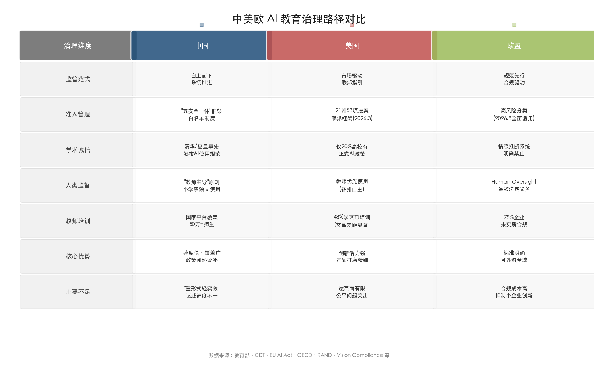

## 6.4 人才生态：核心命题的重新定义

### 6.4.1 "学习≠使用 AI 完成任务"——范式级警示

OECD《数字教育展望 2026》提出了一个对整个 AI 教育叙事具有颠覆性意义的核心命题："成功使用生成式 AI 完成任务并不等同于学习" [OECD](https://www.oecd.org/en/publications/oecd-digital-education-outlook-2026_062a7394-en.html "核心发现")。多项研究表明，学生在使用 AI 辅助工具期间的考试表现确有提升，但一旦移除 AI 支持，学生的考试优势随即消失甚至出现逆转——即学生的实际独立能力可能较未使用 AI 时更差。

这一发现将教育系统面临的核心挑战从"如何教授 AI"重新定义为"如何确保人类独立思考和基础技能不退化"。Gartner 预测 50% 的组织将要求"无 AI 辅助"的技能评估 [Gartner](https://www.gartner.com/en/articles/strategic-predictions-for-2026 "2025年11月")。我们认为，这一趋势在 2026 下半年至 2028 年间将对教育评价体系产生根本性影响：高利害考试（高考、研究生入学考试、职业资格考试等）将强化"无 AI 环境"下的独立能力考核；形成性评价将更加注重过程性数据而非最终产出；雇主在招聘中将越来越多地要求候选人展示独立完成核心任务的能力——在不借助 AI 工具的条件下证明自身的专业素养。

### 6.4.2 终身学习体系的加速构建

世界经济论坛预测，到 2030 年全球 22% 的岗位将被颠覆，39% 的工人核心技能将发生变化；然而全球仅 0.5% 的 GDP 投入成人终身学习，若增加投入可在 2030 年前为全球 GDP 额外贡献 6.5 万亿美元 [WEF](https://www.weforum.org/stories/2026/01/reskilling-revolution-preparing-1-billion-people-for-tomorrows-economy/ "2026年1月")。

中国教育部 2026 年 3 月明确提出"积极布局 AI for 终身教育" [教育部官网](http://www.moe.gov.cn/jyb_zzjg/huodong/202603/t20260331_1432621.html "2026年3月31日")，标志着政策重心从"聚焦学校教育"向"构建全民终身教育体系"的延伸。在产业端，Coursera 2025 年全年新增 4180 万次课程注册（同比+14%），其中 GenAI 课程注册达 540 万次，接近上年两倍 [Coursera 博客](https://blog.coursera.org/2026s-fastest-growing-skills-and-top-learning-trends-from-2025/ "2025年度回顾")。

我们判断，2026 下半年至 2028 年，AI 驱动的终身学习将成为 AI 教育市场增长最快的细分赛道。其核心逻辑在于：AI 同时激活了"技能颠覆"的需求侧和"个性化学习"的供给侧——前者推动数以亿计的在职人员寻求重新技能化（reskilling），后者借助 AI 辅导工具使大规模个性化学习在成本上变得可行。

### 6.4.3 教师角色的重塑：从知识传授者到 AI 协同设计者

未来 1—3 年内，教师角色将经历一次深刻重塑。OECD 提出"共同设计"（co-design）模式，主张将教师纳入 AI 工具的开发过程，使生成式 AI 成为教师能力的放大器而非替代者 [OECD](https://www.oecd.org/en/publications/oecd-digital-education-outlook-2026_062a7394-en.html "政策建议")。Microsoft 2026 年 AI 趋势预测亦指出，"AI 的未来不是替代人类而是放大人类" [Microsoft](https://news.microsoft.com/source/features/ai/whats-next-in-ai-7-trends-to-watch-in-2026/ "2025年12月")。

这一转变对教师培训体系提出了全新要求。当前教师 AI 培训的覆盖率虽在快速提升（美国 2024 年秋季 48% 的学区已开展教师 AI 培训，较 2023 年的 23% 翻倍 [Education Week](https://www.edweek.org/technology/more-teachers-than-ever-before-are-trained-on-ai-are-they-ready-to-use-it/2025/04 "2025年4月报道，引用RAND数据")），但培训质量和深度仍存在显著不足——半数学区领导表示难以找到具备教育 AI 专业知识的培训专家。在中国，教育部依托国家智慧教育平台组织的培训已覆盖 2000 余所高校 50 万名师生 [CERNET](https://www.edu.cn/xxh/focus/zc/202601/t20260107_2714511.shtml "教育部2026年1月发布会")，但从"了解 AI"到"有效运用 AI 改善教学"的能力跨越，仍是教师培训的核心挑战。

我们认为，2026 下半年至 2028 年，教师角色重塑的关键突破点在于三个方面：其一，建立教师 AI 素养的分级认证体系（参照 UNESCO 教师 AI 能力框架的 15 项能力标准）；其二，在职前教育阶段系统嵌入 AI 教学法课程；其三，通过激励机制（职称评定加分、教学创新奖励等）推动教师从被动接受转为主动探索。

### 6.4.4 AI 人才培养的持续深化

在第五章分析的基础上，我们判断 2026 下半年至 2028 年中国 AI 人才培养体系将呈现三个新趋势。

第一，"AI+X"培养模式将从头部高校向地方院校全面铺开。清华、复旦、浙大等先行者在课程体系、交叉微专业和科教平台上积累的经验，将通过教育部政策推动和华东五校微专业共建等机制向更广泛的院校群体扩散。湖北省 2024 年秋季面向全省大一本科生开设 AI 通识课、覆盖超 13 万名学生的实践 [科技日报](https://www.stdaily.com/web/gdxw/2025-03/07/content_306079.html "2025年3月")，预示着省级统筹推进 AI 通识教育的路径将被更多省份复制。

第二，产教融合将从"校企合作"走向"深度共生"。在 50 家国家卓越工程师学院和 4 家创新研究院的基础上，AI 领域的校企联合培养将进一步深化 [教育部新闻发布会](http://www.moe.gov.cn/fbh/live/2025/77288/twwd/202512/t20251210_1423038.html "2025年12月10日")。以实践成果获得学位的路径已有 60 多人完成，这一模式在 AI 人才培养中的推广将有效缩短从学术研究到产业应用的转化周期。

第三，AI 素养框架将从"能力定义"走向"评价落地"。浙江大学的四维素养框架和 UNESCO 的全球能力标准为 AI 素养提供了理论基座 [浙江大学官网](https://www.zju.edu.cn/2025/0304/c76699a3023323/page.htm "2025年3月") [UNESCO](https://www.unesco.org/en/articles/ai-competency-framework-students "2024年8月")，下一步的关键挑战是开发可操作的评价工具——结合项目制实践、作品集评估和过程性评价等多元手段，将 AI 素养从抽象框架转化为可衡量的教育成果。

## 6.5 综合研判：三个核心命题

基于以上四个维度的趋势分析，我们提出 2026 下半年至中期 AI 教育领域的三个核心命题。

**命题一：技术能力不再是瓶颈，治理能力成为关键分水岭。** 多模态 AI、AI Agent、教育垂直模型和端侧 AI 的技术成熟度在未来 1—3 年将持续提升。然而，正如 Gartner 警告的那样，40% 以上的 Agentic AI 项目可能因治理不足而失败 [Gartner](https://joget.com/ai-agent-adoption-in-2026-what-the-analysts-data-shows/ "转引Gartner数据")。技术领先但治理滞后的机构和国家，将面临数据泄露、学术诚信崩坏和公众信任流失的系统性风险。反之，治理能力强的参与者——无论是率先建立"五安全一体"框架的中国、以 AI 法案高风险分类设定底线的欧盟、还是以行业自律和机构自治为主的美国高校——将在中期竞争中占据优势。

**命题二：AI 教育的核心价值将从"效率工具"向"教育公平基础设施"迁移。** 当 AI 辅导工具的成本通过开源+微调降低至原来的 1/8 [成本优化实践](https://www.decodingai.com/p/our-blueprint-to-cut-llm-costs-by "LLM成本降低88%")，当端侧 AI 使离线学习成为可能，AI 在教育领域的最大价值将不再是让优势群体学得更快，而是让弱势群体获得此前无法企及的个性化教学支持。全球 4400 万教师缺口 [UNESCO](https://www.unesco.org/en/articles/global-report-teachers-addressing-teacher-shortages-and-transforming-profession "Global report on teachers, 2024年2月发布")、中国中西部教育资源不均衡、发展中国家教育可达性不足等问题，均为 AI 教育公平基础设施提供了巨大的需求空间。

**命题三：教育系统必须在"AI 赋能"与"人类独立能力保护"之间建立新的平衡。** OECD 的警示具有深远意义——如果教育系统在拥抱 AI 的过程中未能同步强化学生独立思考和基础技能的锻炼，AI 赋能可能反向削弱人类的核心竞争力 [OECD](https://www.oecd.org/en/publications/oecd-digital-education-outlook-2026_062a7394-en.html "核心发现")。这并非技术问题，而是教育哲学层面的根本命题。未来 1—3 年，教育评价体系的改革（增设"无 AI 环境"考核模块）、课程设计的重构（明确 AI 辅助与独立学习的边界）以及教育文化的再塑（从"用 AI 完成任务"转向"用 AI 深化学习"），将成为全球教育系统面临的最深层挑战。

# 结论与风险提示

## 核心结论

本报告基于对全球及中国 AI 教育领域市场数据、落地案例、政策文件和学术研究的系统性梳理，形成以下五项核心结论。

**结论一：AI 与教育的融合已跨越概念验证阶段，进入规模化部署的早期。** 2025 年全球 AI 教育市场规模居于 70—83 亿美元区间（中位口径），CAGR 30% 以上的增长共识跨越了所有主要研究机构的口径差异。Duolingo、松鼠 Ai、科大讯飞等平台的用户规模已达千万至亿级，Khanmigo 在标准化测试中录得 0.36 的效应量，Google LearnLM 的事实性错误率降至 0.1%——这些数据表明，AI 教育产品已具备可量化、可复制的教学效果。然而，规模化部署集中于"学"端的自适应学习和个性化推荐领域，"评"端和"管"端的成熟度仍显著滞后。

**结论二：AI 教育的价值实现高度依赖场景适配与人机协同设计。** 第 2 章和第 3 章的交叉分析揭示了一条清晰的规律：标准化程度高、人际互动复杂度低的教育环节（如外语学习、数学练习、行政自动化）是 AI 落地最快、效果最显著的场景；涉及高利害判断（入学筛选、考试评分）、伦理敏感性（情感识别、心理健康）和深层人际互动（师生关系、价值观引导）的场景，则需要更严格的人类监督和更审慎的部署策略。"AI 赋能教育"的正确路径不是让 AI 替代教师，而是让 AI 成为教师能力的放大器——这一判断已从价值共识进入制度设计层面。

**结论三：挑战的严重性与应对的成熟度之间存在系统性失衡。** 大语言模型在开放域的幻觉率仍高达 33%—51%，而教育专用的准确度基准评测体系尚付阙如；PowerSchool 事件暴露了教育数据安全的系统性债务，52% 的美国学区经历过网络安全事件；AI 作弊率以年均两倍以上的速度增长，而检测工具在改写处理后的检出率仅为 7.9%；AI 评分对亚裔美国学生存在额外的系统性偏差，其机制"连开发者自己也未能完全理解"。上述问题均指向同一结论：当前 AI 教育领域的技术创新速度显著快于安全保障、公平审计和伦理治理的建设速度，这一失衡构成了行业最大的系统性风险。

**结论四：中国在政策推进密度和人才培养规模上居全球前列，但在执行深度和质量维度上仍有提升空间。** 中国在 2025 年一年内完成了从《教育强国建设规划纲要》到全学段 AI 使用指南再到大规模试点部署的完整制度链条构建，535 所高校开设 AI 专业、131 万本科毕业生接受 AI 应用能力培训，政策密度和覆盖速度在全球范围内无出其右。但"部分试点存在'重形式轻实效'倾向""数字化应用'有平台无深度'"的官方评估，以及约 400 万人的预测人才缺口，均表明从政策文本到实效落地、从规模扩张到质量提升之间仍存在显著距离。

**结论五：教育系统面临的最深层挑战是在"AI 赋能"与"人类独立能力保护"之间建立新的平衡。** OECD 基于 TALIS 2024 数据发出的警示具有范式级意义：学生使用 AI 辅助完成任务后，移除 AI 访问权限时考试优势消失甚至逆转。Gartner 预测到 2026 年底 50% 的组织将要求"无 AI 辅助"的技能评估。教育的终极目标不是让学生学会操作工具，而是培养其在没有工具时仍然具备的思维能力和知识储备。在 AI 无处不在的时代，如何在拥抱技术的同时保护人类核心智识能力，是一个超越技术与制度层面的教育哲学命题。

## 风险提示

本报告的分析基于截至 2026 年 4 月 5 日可获取的公开信息，以下因素可能导致实际发展轨迹与本报告判断产生偏差：

**技术演进的不确定性。** 大语言模型的幻觉率改善速率、多模态 AI 的成本下降曲线以及端侧 AI 芯片算力的提升节奏，均可能快于或慢于当前预期。若关键技术瓶颈未能如期突破，AI 教育产品的规模化部署进程将受到制约。

**政策与监管的变动风险。** 中国教育部拟于 2026 年出台的系统性政策文件截至本报告写作日尚未正式发布，其具体内容和力度可能影响市场发展轨迹。欧盟 AI 法案教育条款于 2026 年 8 月全面适用后的实际执行效果存在不确定性。美国联邦与州级 AI 教育立法的碎片化状态可能持续，也可能因白宫 2026 年 3 月提出的国家政策框架而加速整合。

**市场预测的口径差异。** 本报告引用了多家市场研究机构的预测数据，不同机构因定义口径差异给出的市场规模估算跨度可达数倍。这些预测基于特定的技术扩散假设和宏观经济前提，实际市场规模可能与任何单一机构的预测产生显著偏差。

**数据覆盖的局限性。** AI 教育应用的效果评估数据以英语环境中的研究为主，中文环境下的系统性实证研究相对有限；中国教育领域的数据安全事件披露机制不够完善，可能导致本报告对中国教育数据安全现状的评估不够全面；AI 评分偏见的研究集中于英语写作评估领域，中文 AI 评分系统的公平性研究尚属空白。

**教育效果的长期验证缺口。** 本报告引用的多数效果评估数据为短期或中期研究结论，AI 教育工具对学生长期学习效果、独立思维能力和职业发展的影响尚缺乏纵向追踪数据。Khanmigo 的多伦多大学—斯坦福大学独立效能研究尚未公布结论，多项关键产品的第三方长期效果验证仍在进行中。
