# 执行摘要

中国艺术类专业毕业生正经历一场深刻的结构性转型。2024届艺术学门类本科毕业去向落实率仅83.8%，在12个学科门类中排名倒数第二；绘画、音乐表演、美术学连续多年被列为就业红牌专业；艺术类毕业生起薪与工学头部专业的差距接近一倍。传统就业赛道——美术教育、音乐教育、画廊、剧团——的岗位容量增长已趋于停滞，而高校端的专业撤并潮与考生"用脚投票"式的报考意愿下降，共同印证了传统模式的不可持续性。

与此同时，数字经济与文化产业的融合正为艺术人才开辟大规模的增量就业空间。游戏产业2025年市场规模达3507.89亿元，艺术学背景从业者占比24.46%，游戏特效设计岗位人才紧缺指数高达4.92；微短剧产业2025年市场规模达677.9亿元，直接吸纳就业约69万人，乘数效应总就业贡献突破203万人；文化新业态16个行业小类2025年上半年营收同比增速达13.6%。然而，新兴赛道对"艺术+技术"复合型能力的刚性要求，与传统培养模式下毕业生的技能结构之间存在显著错位，"能力适配"成为多元化职业发展的核心瓶颈。

制度环境对艺术人才发展空间的制约同样不容忽视。社会评价体系中"唯学历""唯职称"导向与艺术职业特殊性之间存在深层矛盾，"破五唯"改革方向虽已确立，但"旧标已破、新标未立"的过渡期困境依然突出。收入分配呈现极端分化特征，微短剧行业头部主演与群众演员的薪酬差距可达200—500倍，独立音乐人群体中近半数月收入不足2000元。灵活就业常态化进一步加剧了社会保障缺失——超过2亿灵活就业者中仅约三分之一纳入职工养老保障体系。知识产权保护方面，中国在AI版权司法判例上已居全球前列，但从制度保护到创作者收入提升的传导机制仍不畅通，文化消费升级的红利受制于中间环节利润截留和头部集中效应，未能均衡惠及广大艺术从业者。

国际经验提供了差异化的制度参照。法国间歇性演艺工作者制度覆盖约30.5万人，德国KSK三方融资社保模式覆盖18.7万名自由职业艺术家，韩国《艺术人才福利法》构建了"法律+专门机构+专项资金"的三位一体保障框架，英国以产业生态培育策略推动创意产业贡献约1240亿英镑GVA，北欧国家通过同行评审和直接财政补助保障艺术家创作自由。这些经验共同指向一个核心命题：提升艺术人才社会地位需要社会保险、劳动法律、产业政策、财政投入和文化认知的系统性协同。

本报告基于上述分析，提出教育改革、产业政策、社会保障、知识产权保护和人才评价机制五维协同推进的政策框架。"十五五"规划期是关键的政策窗口——纲要已明确"推进文化和科技融合""提高灵活就业人员参保率""探索建立人工智能生成物权利归属规则"等政策方向。近期应重点关注"十五五"文化发展专项规划出台、职业伤害保障试点全国扩围以及《著作权法实施条例》修订中AI版权规则的落地；中期应推动建立全国统一的新文艺群体分类评价标准，启动"中国版"三方融资社保方案试点；远期力争实现艺术类灵活就业者社保覆盖率显著提升和新型评价体系全面落地，为中国文化产业高质量发展奠定坚实的人才基础。

# 第1章 中国艺术类专业就业现状与结构性困境

## 1.1 就业全景：艺术学门类毕业生的去向落实与薪资图谱

2024届中国本科毕业生整体毕业去向落实率为86.7%，但学科门类之间的分化已十分显著。在12个学科门类中，工学以89.6%的落实率继续领跑，农学（88.7%）、历史学（87.2%）紧随其后；而艺术学门类仅为83.8%，在所有学科中排名倒数第二，仅高于法学的78.4%[《财经》杂志报道](https://www.sohu.com/a/961898790_115571 "麦可思《2025年中国本科生就业报告》数据")。进一步细分至专业类层面，美术学类（80.0%）与音乐与舞蹈学类（81.0%）的落实率均跻身61个本科主要专业类的倒数十位，折射出传统纯艺术方向毕业生在劳动力市场上所承受的严峻竞争压力。

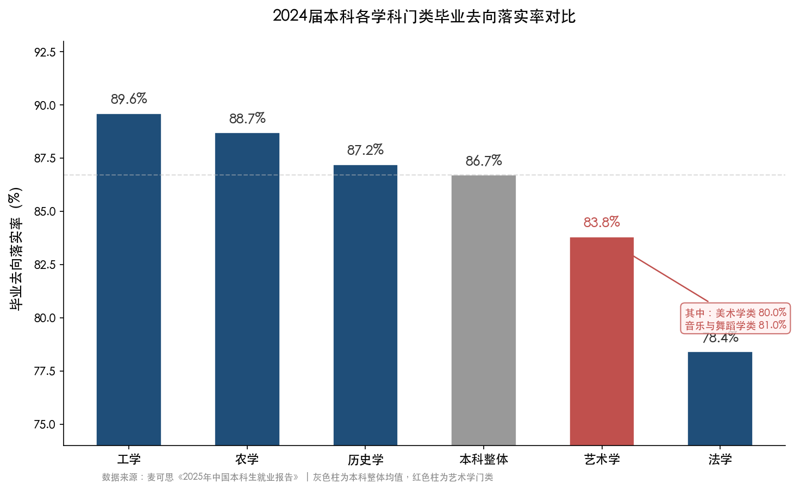

**图1-1 2024届本科各学科门类毕业去向落实率对比。** 艺术学门类（83.8%）在12个学科门类中排名倒数第二，其中美术学类（80.0%）和音乐与舞蹈学类（81.0%）尤为低迷。数据来源：麦可思《2025年中国本科生就业报告》。

薪资维度的差距同样值得关注。2024届本科毕业生半年后平均月收入为6199元，各学科门类中工学最高达6841元，经济学6280元、理学6115元、管理学6075元，教育学最低仅5085元[时代财经](https://www.tfcaijing.com/article/page/4c6c665163665362544376464c443168506372684a513d3d "麦可思2025年就业蓝皮书数据")。麦可思2025年版就业蓝皮书公布的月收入最高前10个本科专业——从信息安全（7599元）到机械电子工程（7018元）——全部为工学类专业，艺术类无一专业进入高薪前50名。以二线城市视觉传达设计为例，起薪仅约4000余元，与工学头部专业的薪资差距已近一倍[时代财经](https://www.tfcaijing.com/article/page/4c6c665163665362544376464c443168506372684a513d3d "二线城市设计类起薪数据")。

就业满意度数据呈现出更为复杂的面貌。2024届本科毕业生整体就业满意度为81%，学科门类中法学最高达84%，医学、理学、经济学均为83%[《财经》杂志报道](https://www.sohu.com/a/961898790_115571 "麦可思2025年就业蓝皮书满意度数据")。播音与主持艺术（87%）、摄影、舞蹈学、广播电视编导等4个艺术学专业进入了就业满意度前20名[科学网](https://news.sciencenet.cn/htmlnews/2025/6/546065.shtm "麦可思2025就业蓝皮书满意度TOP20专业")，但这一现象更多反映了文化、体育和娱乐业中自由职业与自媒体工作所具有的较高自主性，而非收入水平的整体改善。部分艺术毕业生对职业的主观满意度与客观经济回报之间存在显著背离——从事热爱的工作与获得稳固的经济基础之间，尚未形成有效的统一。

从院校层级看，就业分化同样严峻。"双一流"高校2024届毕业去向落实率达91.9%，地方本科仅为85.6%，两者相差6.3个百分点[《财经》杂志报道](https://www.sohu.com/a/961898790_115571 "麦可思2025年就业蓝皮书院校分化数据")。即便在专业艺术院校内部，天津美术学院（90.05%）与吉林艺术学院（83.36%）之间也存在显著落差。中国美术学院2023届毕业生中，80.9%流向杭州、上海、江苏、广东、北京等经济发达地区[中国网教育](http://edu.china.com.cn/2024-12/17/content_117613220.shtml "中国美术学院就业质量报告")，印证了艺术类就业对一线及准一线城市的文化消费市场和创意产业集聚效应的高度依赖——中西部地区和下沉市场的岗位容量极为有限。

就业质量的另一关键维度——专业对口率——同样不容乐观。2023届动画专业毕业生就业对口率仅为64%，数字媒体艺术为69%，均低于本科平均水平的72%；其中18%的动画专业毕业生因"达不到岗位技术要求"而被迫转岗[人民日报客户端](https://www.peopleapp.com/rmharticle/30051277947 "艺术类专业就业数据")。山东省2024年就业数据更为突出，艺术类专业占据低就业率专业的9个席位，传统纯艺术专业的对口就业率不足30%[人民日报客户端](https://www.peopleapp.com/rmharticle/30051277947 "山东省就业数据")。大量毕业生流向与所学专业无直接关联的行业，在校积累的专业技能难以得到有效转化——这既构成个体人力资本的浪费，也是高等教育资源配置效率低下的集中体现。

## 1.2 "红牌"警示：传统艺术专业为何连续预警

麦可思研究院每年基于毕业去向落实率、薪资水平和就业满意度综合评定"红黄绿牌"专业，为高校专业设置提供预警参考。2025年本科就业红牌专业共5个，其中艺术学门类独占3席——音乐表演、绘画、美术学，占比高达60%[人民日报客户端](https://www.peopleapp.com/rmharticle/30049515009 "2025年本科红牌专业公布，麦可思研究")。更值得警惕的是这一趋势的持续性：绘画专业已连续五年被列为红牌专业，音乐表演在过去五年中4次上榜，美术学同样是榜单"常客"。

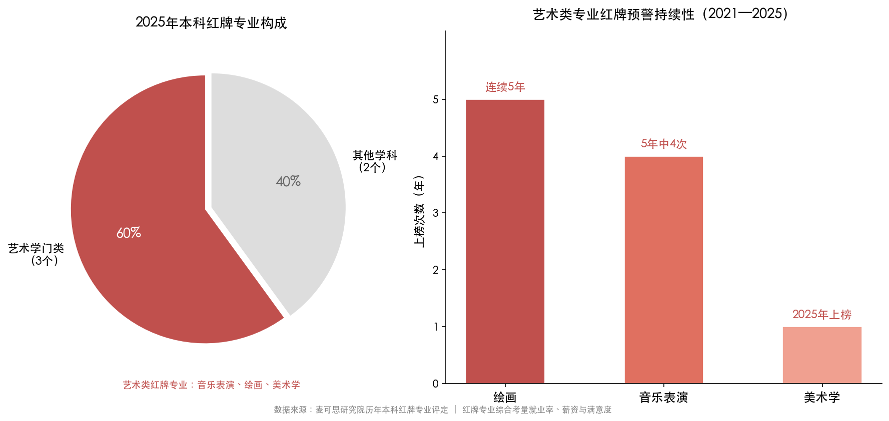

**图1-2 2025年本科红牌专业构成与艺术类专业红牌预警持续性（2021—2025）。** 左图显示2025年红牌专业中艺术学门类占60%；右图揭示绘画连续5年、音乐表演5年中4次上榜的长期预警趋势。数据来源：麦可思研究院历年本科红牌专业评定。

"红牌"现象的形成并非偶然，而是供需两端结构性矛盾长期累积的必然结果。

从供给端来看，中国高校艺术类专业经历了近二十年的快速扩张。自1999年高等教育大扩招以来，艺术类招生规模急剧膨胀，大量综合性大学和地方院校竞相开设艺术类专业，门槛相对较低的美术学、音乐表演等传统方向尤为突出。这一扩张在短期内满足了社会对高等教育入学的需求，却也导致了供给侧的严重过剩——截至近年，艺术类本科专业点的存量依然庞大，远超市场有效岗位的吸纳能力。

从需求端来看，传统艺术领域的岗位容量增长缓慢乃至停滞。画廊、博物馆、剧团、文化馆等传统文化机构的编制数量受限于财政拨款，增量空间极为有限；中小学美术、音乐教师的需求虽然持续存在，但受学龄人口下降和师资结构调整的影响，增长同样趋缓。与此同时，用人单位对艺术人才的能力需求正在发生深刻转变——从对单一"纯艺术技能"（如油画创作、声乐演唱）的需求，转向"复合型能力"（如兼备设计思维与数字工具应用能力、通晓艺术与商业运营的跨界人才）。传统培养模式下的毕业生，往往难以满足这一新兴需求。

## 1.3 专业撤并潮与招生萎缩：高等教育端的结构性调整

面对艺术类专业就业的持续低迷，高等教育系统已启动深度调整。2014至2023年间，全国高校撤销数量排名前20的专业中，艺术学占据3个席位：服装与服饰设计被撤销108个专业点、产品设计98个、动画49个[人民日报客户端](https://www.peopleapp.com/rmharticle/30051277947 "麦可思《中国-世界高等教育趋势报告（2025）》")。市场信号已通过就业端传导至教育端，部分过剩专业正在被逐步"出清"。

2024年度，教育部进一步加快专业结构优化步伐：全国高校新增1839个专业点，同时撤销或停招3648个，净减少1809个[教育部官网](http://www.moe.gov.cn/jyb_xwfb/gzdt_gzdt/s5987/202504/t20250422_1188245.html "教育部2024年度本科专业备案和审批结果")。教育部明确提出"从严控制艺术类专业设置"的政策导向。在此背景下，多所头部高校率先行动：2025年吉林大学一次性停招6个艺术类专业；华东师范大学、同济大学、中南大学等"双一流"高校也集中缩减了艺术类专业布局[人民日报客户端](https://www.peopleapp.com/rmharticle/30051277947 "高校艺术类专业缩减")。

与供给侧的主动收缩相呼应的，是需求侧的自发萎缩。以广东省为例，美术统考报名人数在三年间下降约20%——从2023年的3.77万人降至2024年的3.3万人，再到2025年的约3万人——尽管同期广东省高考总报名人数仍在增加[中国网教育](http://edu.china.com.cn/2024-12/17/content_117613220.shtml "广东省艺考数据")。考生和家庭正在"用脚投票"，主动减少对传统艺术类专业的报考意愿。2024年，部分民办本科和艺体类专科批次甚至出现大面积缺额，招生市场从"卖方市场"向"买方市场"的转换已初步显现。

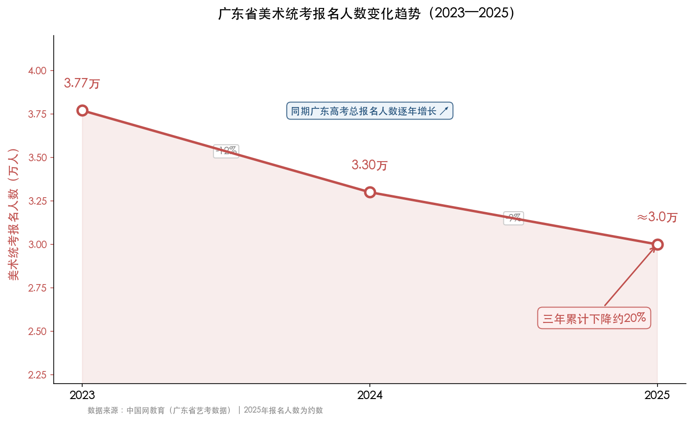

**图1-3 广东省美术统考报名人数变化趋势（2023—2025）。** 三年间报名人数从3.77万降至约3.0万，累计降幅约20%，而同期广东高考总报名人数逆势增长，形成鲜明反差。数据来源：中国网教育。

值得注意的是，"减法"与"加法"并行推进。在传统艺术专业收缩的同时，面向数字经济和产业融合的新型艺术专业正在快速扩张。2020至2024年间，全国已有86所高校新增数字媒体艺术本科专业。更具标志性的是，2025年教育部本科专业目录一次新增8个"艺术+科技"交叉专业——舞蹈治疗、音乐科技、数字戏剧、数字演艺设计、智能影像艺术、虚拟空间艺术、人居设计、游戏艺术设计[人民日报客户端](https://www.peopleapp.com/rmharticle/30051277947 "教育部备案数据与2025年新增专业")。这一"减旧增新"的调整逻辑清晰表明：政策层已认识到，单纯压缩招生规模无法从根本上解决问题，必须从专业结构层面实现转型，使人才供给与产业需求重新对齐。

## 1.4 产业端的双重信号：传统赛道收窄与新兴市场扩容

从产业端观察，艺术类毕业生所面临的就业格局呈现"冰火两重天"的鲜明特征。

一方面，传统艺术相关行业的岗位增长空间受到多重制约。美术教育、音乐教育岗位受制于基础教育阶段学龄人口持续下降的大趋势；画廊行业受经济周期波动影响显著；传统媒体机构的编辑、记者等岗位因数字化转型而持续缩减。这些因素共同构成了传统就业赛道的"天花板"。

另一方面，文化产业的整体增长势头依然强劲，为艺术人才开辟了新的增量空间。2024年全国营业性演出达48.84万场（同比增长10.85%），票房收入579.54亿元（同比增长15.37%），演出市场总收入796.29亿元（同比增长7.61%）；演出经纪相关企业约60.8万家，当年新增9.4万家[中新社](https://www.chinanews.com/cj/2025/01-17/10355534.shtml "中国演出行业协会《2024年全国演出市场简报》")。演出市场的蓬勃发展，为表演、舞美、灯光音响、演出策划等关联岗位创造了可观的就业机会。

文化新业态的增长更为迅猛。2024年，文化新业态16个行业小类实现营收59082亿元（同比增长9.8%），2025年上半年同比增速进一步攀升至13.6%[国家统计局数据](http://www.ctba.org.cn/list_show.jsp?record_id=340470 "国家统计局2024年文化产业数据")。数字内容创作、创意设计服务、互动新媒体等领域以远超传统文化行业的速度扩张，对兼具艺术素养和数字技能的复合型人才形成了强劲需求。

然而，产业增长并不自动转化为艺术毕业生的就业改善。问题的关键在于"能力适配"——新兴文化产业所需的人才画像与传统艺术类专业培养的毕业生之间存在显著错位。游戏特效设计要求同时掌握美术功底与引擎操作能力，微短剧制作要求兼备影视创作与平台运营思维，AI视觉内容生成则需要将算法逻辑与审美判断有机结合。这些新岗位本质上属于"艺术+"的复合型角色，而非传统纯艺术岗位的简单延伸。当前培养体系与市场需求之间的"最后一公里"差距，正是结构性困境的核心症结。

## 1.5 结构性困境的深层逻辑

综合以上分析，中国艺术类专业的就业困境并非简单的供给过剩或需求不足，而是一个多维度交织的结构性问题，其深层逻辑可从四个维度加以解读。

第一，**规模扩张惯性与市场容量有限之间的矛盾**。过去二十年高校艺术类专业的快速扩张形成了巨大的存量，而传统对口岗位的增量极为有限。尽管教育部已启动专业"瘦身"，存量消化仍需相当时间，短期内供需失衡的局面难以根本扭转。

第二，**培养模式滞后与产业需求迭代之间的错位**。传统艺术教育强调"技法训练"和"师徒传承"，课程体系更新缓慢，跨学科教学资源匮乏。而产业端对人才的需求已从"单一技能"转向"复合能力"，从"线下创作"转向"数字化协作"。教育产出与市场需求之间的"代差"，致使大量毕业生陷入"学非所用"的困境。

第三，**城市依赖与区域发展不平衡之间的张力**。艺术类就业高度集中于一线和准一线城市，这既反映了文化产业的集聚规律，也暴露了中西部和下沉市场文化消费能力不足的短板。当少数核心城市的岗位容量趋于饱和，新增毕业生的竞争烈度将急剧上升。

第四，**评价标准单一与职业路径多元之间的脱节**。社会对艺术人才的价值判断仍偏重"是否成名"或"是否进入体制内"，对跨界就业、自由职业、灵活就业等多元路径缺乏系统性认知与制度支持。艺术毕业生中相当比例从事自由职业或灵活就业，但这些非标准化就业形态往往面临社保覆盖不足、职业发展路径不清晰等现实障碍。

上述结构性矛盾的化解，不能仅靠存量调整——压缩招生规模虽属必要之举，但终究治标不治本。更根本的出路在于开拓增量空间：一方面通过教育改革培养适应新产业需求的复合型艺术人才，另一方面通过产业政策和制度建设拓展艺术人才的职业发展版图。

# 第2章 多元化职业路径——艺术人才的跨界突围与新兴赛道

传统艺术就业赛道容量见顶的困境并非终局。随着数字经济深度渗透文化产业、技术变革重塑内容生产方式，以及"艺术+"跨界融合理念向教育、医疗、商业等领域持续延伸，艺术背景人才正被更广泛的新兴行业所吸纳。本章系统梳理当前正在大规模吸纳艺术人才的新兴赛道——游戏、微短剧、AI驱动的设计变革、艺术疗愈、文化新业态与演出市场，分析数字经济与技术变革对人才需求结构的重塑效应，评估高校课程改革的供给侧适配效果，力图为艺术类毕业生的多元化职业发展提供清晰的赛道图谱。

## 2.1 游戏产业：艺术人才的第一大增量就业池

游戏产业已成为当前吸纳艺术背景人才最具规模和薪酬竞争力的行业之一。2025年，中国国内游戏市场实际销售收入达3507.89亿元（同比+7.68%），用户规模6.83亿（同比+1.35%），自研游戏海外收入204.55亿美元（同比+10.23%），三项核心指标均创历史新高 [游戏大观转引中国音数协游戏工委](http://www.gamelook.com.cn/2025/12/584413/ "《2025年中国游戏产业报告》")。持续扩张的市场规模直接驱动了对美术、动画、特效等艺术类岗位的刚性需求。

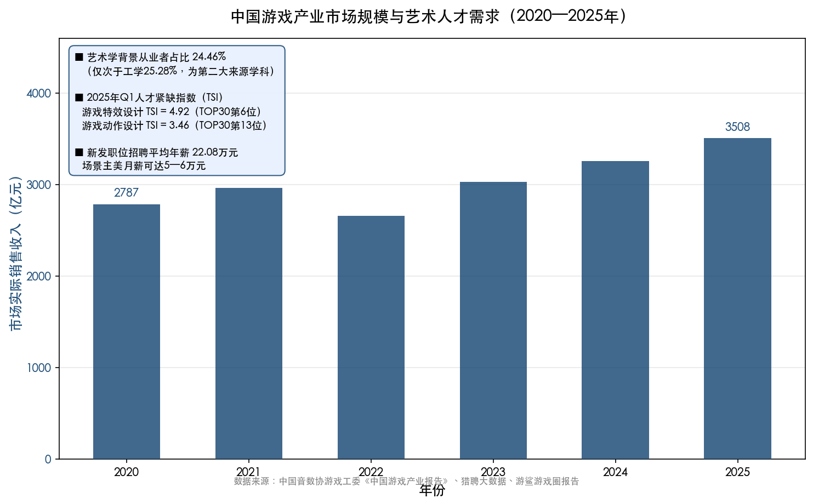

**图 2-1 中国游戏产业市场规模与艺术人才需求（2020—2025年）**——2020年至2025年，中国游戏市场实际销售收入从2787亿元增长至3508亿元，艺术学背景从业者占比达24.46%，游戏特效设计岗位人才紧缺指数（TSI）高达4.92，反映出游戏产业对艺术人才的强劲吸纳力。

从人才结构来看，游戏行业从业者中艺术学背景占24.46%，仅次于工学（25.28%），为第二大人才来源学科 [21世纪经济报道引游鲨游戏圈报告](https://www.21jingji.com/article/20250703/herald/738b0e1b55ab670c54299cef52218200.html "游戏从业人员学历专业数据")。换言之，游戏行业中每四名从业者即有约一人具备艺术学教育背景，充分体现了艺术人才在游戏产业链中的核心支撑地位。值得注意的是，美术类岗位中专科学历从业者占比达18.82%，表明该行业更侧重作品能力与实操水平而非单纯学历资质，这为不同教育层次的艺术毕业生提供了相对公平的竞争起点 [21世纪经济报道引游鲨游戏圈报告](https://www.21jingji.com/article/20250703/herald/738b0e1b55ab670c54299cef52218200.html "游戏从业人员学历专业数据")。

从薪酬水平来看，游戏行业为艺术人才提供了远高于传统艺术就业领域的经济回报。2024年1—7月，游戏行业新发职位招聘平均年薪达22.08万元；高端岗位如游戏场景主美月薪可达5—6万元 [21世纪经济报道](https://www.21jingji.com/article/20250703/herald/738b0e1b55ab670c54299cef52218200.html "游戏产业人才缺口报道")。2025年第一季度，猎聘大数据统计的人才紧缺指数TOP30中，游戏特效设计TSI达4.92、游戏动作设计TSI达3.46，分列第6位和第13位 [21世纪经济报道](https://www.21jingji.com/article/20250703/herald/738b0e1b55ab670c54299cef52218200.html "游戏产业人才缺口报道")。供不应求的市场格局赋予了艺术类求职者显著的薪酬议价空间。

不过，行业也正经历结构性调整。据游鲨游戏圈统计，2024年国内游戏公司社保缴纳总人数为275,588人，较2023年减少6,246人，但减幅已较前一年大幅收窄 [GameLook转引游鲨游戏圈](http://www.gamelook.com.cn/2025/09/578581/ "游戏圈就业地图：2024年游戏公司人数增减统计")。从企业层面看，腾讯及其内包部门全年净增近4,000人，叠纸、米哈游等新锐厂商同步扩招，但完美世界、网易等传统大厂因战略调整出现不同程度的减员。这一格局表明，游戏行业的就业增量正从"普遍增长"转向"结构分化"——聚焦于技术含量更高的特效、3D建模、动作捕捉等美术细分领域，而传统UI贴图等低技术门槛岗位则面临被AI工具部分替代的压力。

从区域分布来看，广东省2024年游戏营收达2604.31亿元（同比+6.26%），占全国79.94%，是游戏产业就业的绝对重镇；深圳成为唯一实现从业者正增长的一线城市，杭州、成都、武汉等新一线城市则成为人才承接的新高地 [21世纪经济报道](https://www.21jingji.com/article/20250703/herald/738b0e1b55ab670c54299cef52218200.html "广东、浙江游戏产业政策") [GameLook转引游鲨游戏圈](http://www.gamelook.com.cn/2025/09/578581/ "游戏圈就业地图")。浙江省已明确支持高校探索"翻译+网游传播"等复合型人才培养模式，从政策层面推动游戏人才供给侧改革 [21世纪经济报道](https://www.21jingji.com/article/20250703/herald/738b0e1b55ab670c54299cef52218200.html "浙江游戏产业政策")。

## 2.2 微短剧产业：爆发式增长中的新型就业引擎

如果说游戏产业是艺术人才的"存量大池"，微短剧则是近两年爆发速度最快的"增量引擎"。2025年，中国微短剧市场规模达677.9亿元，首次超越同期全国电影票房（518.32亿元），用户规模6.96亿人，现存微短剧相关企业10.02万家 [新华网](http://www.news.cn/ent/20251230/9b41cf895b594bb8a1f787d14e10491f/c.html "微短剧产业报道")。一个三年前尚被视为"边缘内容"的业态，如今在市场体量上已超越中国电影业——这一结构性变化深刻改写了影视类艺术人才的就业版图。

微短剧产业的就业拉动效应尤为显著。北京大学国家发展研究院报告显示，2025年微短剧行业直接吸纳就业约69万人，叠加产业链上下游的乘数效应，总就业贡献突破203万人；直接劳动投入约3685万个工日，标准化剧组规模60—90人 [新华网](https://www.news.cn/tech/20260205/589adfb1cb2d485eb7182955c348d6a6/c.html "北大国发院微短剧就业报告")。中国网络视听协会的数据进一步印证了这一趋势：微短剧主要生产环节已带动133.3万个就业岗位，2025年前三季度人才需求同比增长26%；剧组规模从早期的10—15人扩至40—60人，较2023年增长3—4倍 [光明网](https://topics.gmw.cn/2025-12/05/content_38460423.htm "《2025微短剧行业生态洞察报告》")。

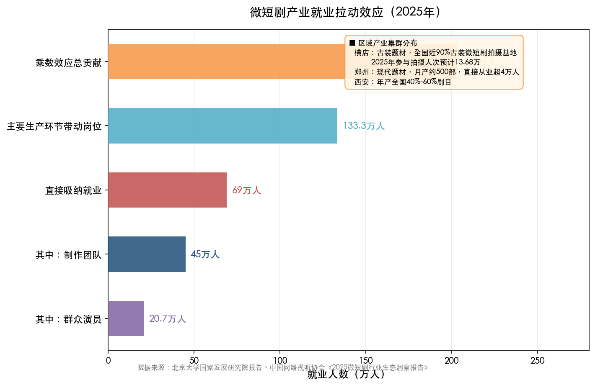

**图 2-2 微短剧产业就业拉动效应（2025年）**——从直接吸纳就业69万人（其中制作团队45万、群众演员20.7万），到主要生产环节带动133.3万个岗位，再到乘数效应总贡献突破203万人，微短剧已成为影视类艺术人才最重要的增量就业渠道之一。

微短剧产业链几乎覆盖影视类艺术专业的全部岗位门类——导演、编剧、摄影、美术指导、服化道、后期剪辑等均存在旺盛需求。区域分工格局亦为不同城市的艺术毕业生提供了差异化的入行路径：横店主打古装题材，承接全国近90%古装微短剧拍摄，2025年参与拍摄人次预计达13.68万，较2024年翻近9倍；郑州专注现代题材，月产约500部，直接从业人员超4万人；西安年产全国40%—60%的微短剧剧目 [新华网](https://www.news.cn/fortune/20260114/2521dd0947d74a22a5b9b30146808c7e/c.html "微短剧区域分工") [光明网](https://topics.gmw.cn/2025-12/05/content_38460423.htm "横店微短剧拍摄人次数据")。

然而，微短剧行业的就业质量存在显著的分层现象，需予以客观审视。头部编剧年薪可达100—200万元，但高薪集中于极少数人 [光明网](https://topics.gmw.cn/2025-12/05/content_38460423.htm "《2025微短剧行业生态洞察报告》")。大量基层从业者——尤其是群众演员、场务、初级剪辑师——普遍面临收入不稳定、劳动合同缺失、社会保障覆盖不足等问题。微短剧虽极大拓展了艺术人才的"就业入口"，但从职业可持续性角度看，行业规范化建设仍任重道远。

## 2.3 AI浪潮下的设计行业：从"全面焦虑"到"能力重构"

人工智能工具的迅速普及正深刻重塑设计行业的就业格局，对艺术类人才而言既构成严峻挑战，亦蕴含结构性转型机遇。

站酷发布的《AI时代的超级设计师研究手册》揭示了一幅多维图景：99%的设计师已使用过AI工具，68%日均使用时长超过1小时；掌握AI工具的设计师平均时薪高出28%，求职中获得面试的概率高出42%；但与此同时，71%的设计师在使用AI后工作时长反而增加——AI并未简单地"减轻劳动"，而是抬高了产出标准与客户预期 [腾讯新闻转引站酷报告](https://view.inews.qq.com/a/20251106A05ZVS00 "站酷《AI时代的超级设计师研究手册》")。

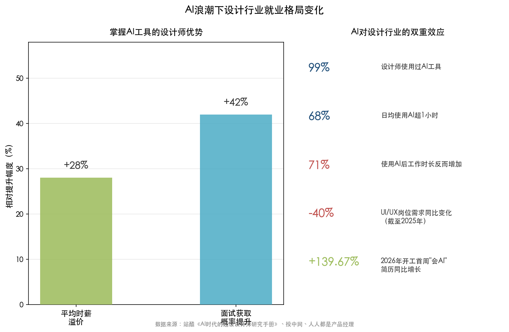

**图 2-3 AI浪潮下设计行业就业格局变化**——左侧对比展示掌握AI工具的设计师在时薪（+28%）和面试获取概率（+42%）方面的溢价优势；右侧数据卡片呈现AI"既替代又赋能"的双重效应，包括UI/UX岗位需求同比减少40%与"会AI"简历同比增长139.67%并存的结构性变局。

从就业市场的结构性变化来看，2023—2025年UI/UX岗位需求总体下滑，截至2025年岗位数量同比减少约40% [人人都是产品经理](https://www.woshipm.com/ai/6204654.html "AI浪潮下设计师生存状况调研")。大型互联网企业已取消专职UI岗位，转而要求动效、3D、品牌、运营、用研全栈能力的"综合设计岗" [腾讯新闻转引站酷报告](https://view.inews.qq.com/a/20251106A05ZVS00 "AI超级设计师能力模型")。这一趋势表明，单一技能的"工具型设计师"正加速被边缘化，而具备跨领域整合能力、能驾驭AI工具进行创意决策的"策略型设计师"则供不应求。

劳动力市场对"AI能力"的溢价效应已十分显著。2026年开工首周，简历中标明"会AI"的人才同比增长139.67%，其中平面设计、视觉设计位居增长最快的前三位 [投中网](https://www.chinaventure.com.cn/news/78-20260317-390513.html "大厂AI抢人大战")。薪酬层面，一线城市UI设计师平均月薪为16,000—19,500元，但初级及应届岗位起薪仅约5,800元，呈现出显著的经验溢价与能力分化格局 [人人都是产品经理](https://www.woshipm.com/ai/6204654.html "AI浪潮下设计师生存状况调研")。

我们认为，AI对艺术设计行业的影响不应简单理解为"替代"，而是一次深层次的能力要求重构。麦肯锡预测，到2030年中国AI人才需求将达600万人，供给约200万人，缺口约400万；91.3%受访企业反映面临AI人才短缺问题 [国家信息中心](https://www.sic.gov.cn/sic/81/455/0821/20250821171020335196479_pc.html "《DeepSeek崛起对我国就业市场人才的影响》")。在这一巨大缺口中，兼具审美素养与AI技术能力的"AI视觉创意人才"是最稀缺的复合型人才类别之一。艺术类毕业生若能在传统美学训练基础上叠加AI提示工程（Prompt Engineering）、数据标注与模型微调等新兴技能，将在人才市场中占据独特的竞争优势。

## 2.4 "艺术+健康"：艺术疗愈的职业化探索

艺术与健康的跨界融合正在开辟一条全新的职业路径。"艺术疗愈"被列为2024年全国艺术学科十大研究前沿热点之首，标志着该领域已从小众实践上升为学术界与政策层面关注的重点议题 [光明日报](https://epaper.gmw.cn/gmrb/html/2025-08/02/nw.D110000gmrb_20250802_1-07.htm "《艺术疗愈，治愈的不只是心灵》")。

制度层面的突破尤为值得关注。2025年教育部本科专业目录首次纳入"舞蹈治疗"专业，这是中国艺术治疗领域的里程碑式进展，意味着艺术疗愈从实践经验层面正式进入专业教育体系，为该领域的人才培养奠定了制度性基础 [光明日报](https://epaper.gmw.cn/gmrb/html/2025-08/02/nw.D110000gmrb_20250802_1-07.htm "《艺术疗愈，治愈的不只是心灵》")。临床实践方面，北京协和医院自2023年起系统化开展"粉红花园"艺术疗愈项目，将绘画、音乐等艺术手段纳入乳腺癌患者的康复干预方案，代表了顶级医疗机构对艺术治疗临床价值的正式认可 [光明日报](https://epaper.gmw.cn/gmrb/html/2025-08/02/nw.D110000gmrb_20250802_1-07.htm "《艺术疗愈，治愈的不只是心灵》")。

然而，艺术疗愈在中国的职业化进程仍处于早期阶段。当前国内尚无统一的艺术治疗师职业资格认证体系：音乐治疗师的认证由中国商业企业管理协会下设的行业委员会自行管理，并非人社部主导的国家职业资格认证；舞蹈治疗领域的资格认证则更多依赖国际组织（如美国舞蹈治疗协会ADTA）的标准。职业认证体系的缺位制约了从业者的职业发展和收入预期，也使该领域存在良莠不齐的乱象风险。尽管如此，全球疗愈经济市场规模预计2025年将达到7万亿美元，中国禅意"五感"疗愈细分市场规模预计从2022年的52.6亿元增长至2025年的104.1亿元 [亿欧网](https://www.iyiou.com/news/202504221095487 "疗愈经济风口已至")。市场需求端的快速扩张为艺术治疗领域的职业化发展提供了坚实的经济基础。

## 2.5 文化新业态与演出市场：传统艺术专业的增量空间

在游戏、微短剧、AI设计等"新赛道"之外，文化产业内部的新业态演进同样为艺术人才创造了可观的就业增量。2024年，全国文化新业态16个行业小类营收达59,082亿元（同比+9.8%），2025年上半年增速进一步加快至同比+13.6% [国家统计局数据](http://www.ctba.org.cn/list_show.jsp?record_id=340470 "国家统计局2024年文化产业数据")。数字内容创作、沉浸式展演、线上演播、虚拟现实体验等新形态，正为传统美术、音乐、戏剧等专业的毕业生提供技术赋能后的全新应用场景。

演出市场的持续繁荣为表演艺术类毕业生带来了更为直接的就业机会。2024年，全国营业性演出48.84万场（同比+10.85%），票房收入579.54亿元（同比+15.37%），演出市场总收入796.29亿元（同比+7.61%）；演出经纪相关企业约60.8万家，当年新增9.4万家 [中新社](https://www.chinanews.com/cj/2025/01-17/10355534.shtml "中国演出行业协会《2024年全国演出市场简报》")。2025年，全国营业性演出进一步增至64.04万场（同比+6.58%），票房收入616.55亿元（同比+6.39%），观众1.94亿人次（同比+4.22%） [中国演出行业协会](http://www.cishannews.com/news/gy/2026/0116/38900.html "2025年演出市场数据")。演出场次与市场收入连续两年的高速增长，直接拉动了对演员、编导、舞美设计、灯光音响工程师等岗位的需求。

艺术教育市场本身亦是一个不可忽视的就业出口。2024年，中国艺术教育市场规模约为1,766亿元，2020—2024年复合年增长率达8.5% [东方财富引华经产业研究院](https://caifuhao.eastmoney.com/news/20251225154243367084740 "2025年中国艺术教育行业市场规模")。2020年中央提出"全面加强和改进新时代学校美育工作"以来，学校美育师资缺口已成为各地教育部门面临的普遍挑战。上海市2024年策划"社会大美育课堂"艺术普及教育活动3.5万场，服务人群约989万人次；市民艺术夜校开设1,752门课程，惠及学员近10万人次 [上海市文旅局](https://whlyj.sh.gov.cn/wbzx/20250414/0ed42a095a1c43cdb421d607ad546416.html "上海社会大美育课堂")。社会美育的蓬勃发展为艺术类毕业生开辟了超越传统学校编制的多元化教育从业路径。

## 2.6 高校供给侧改革：专业目录的"新旧更替"

面对市场需求结构的深刻变化，高校教育的供给侧改革正在加速推进。2025年，教育部本科专业目录新增8个"艺术+科技"方向专业——舞蹈治疗、音乐科技、数字戏剧、数字演艺设计、智能影像艺术、虚拟空间艺术、人居设计、游戏艺术设计 [人民日报客户端转引EOL](https://www.peopleapp.com/rmharticle/30051277947 "教育部备案数据与2025年新增专业")。其中，游戏艺术设计专业首批开设院校为中国传媒大学、北京电影学院、山东工艺美术学院 [腾讯新闻](https://news.qq.com/rain/a/20250424A02SMQ00 "教育部增设游戏艺术设计专业")；华东师范大学进一步增设"游戏与数字文创"硕士方向，将人才培养层次从本科延伸至研究生阶段 [腾讯新闻](https://news.qq.com/rain/a/20250424A02SMQ00 "教育部增设游戏艺术设计专业")。

与"增"同步进行的是"减"。2020—2024年间，全国86所高校新增数字媒体艺术本科专业，但同期服装与服饰设计被撤销108个、产品设计被撤销98个、动画被撤销49个 [人民日报客户端转引EOL](https://www.peopleapp.com/rmharticle/30051277947 "麦可思《中国-世界高等教育趋势报告（2025）》")。教育部2024年度全国高校新增1,839个专业点、撤销或停招3,648个，净减少1,809个 [教育部官网](http://www.moe.gov.cn/jyb_xwfb/gzdt_gzdt/s5987/202504/t20250422_1188245.html "教育部2024年度本科专业备案和审批结果")。这一"有增有减"的调整策略，本质上是将艺术类专业的人才培养从"规模扩张"导向"结构优化"，使教育供给更加贴合产业需求的演变方向。

然而，新增专业的人才培养效果尚需时间验证。首批游戏艺术设计等新专业的本科毕业生最早要到2029年方能进入就业市场；当前阶段，师资储备是制约教学质量的首要瓶颈。2026年2月全国首届游戏艺术设计师资研修班的举办，正是对这一紧迫需求的回应 [京报新闻](https://news.bjd.com.cn/2026/02/04/11565174.shtml "首届游戏艺术设计师资研修班")。校企合作亦在加速推进——2025年12月，腾讯互动娱乐事业群与中国美术学院签署深度合作协议，设立"百万级"奖学金、游戏美术冬令营和精品课程共建项目，探索产教融合培养模式 [新浪新闻](https://news.sina.cn/sx/2025-12-19/detail-inhciuaf7572311.d.html?vt=4 "腾讯游戏与中国美术学院合作")。

## 2.7 多元化路径的整体图景：机遇与挑战并存

综合上述分析，艺术人才多元化职业发展的赛道图谱已较为清晰。从就业吸纳规模看，微短剧产业以直接就业69万人、乘数效应总贡献203万人居于首位；游戏产业凭借近28万社保在册人员和远高于行业平均的薪酬水平，构成艺术人才的高质量就业核心；文化新业态和演出市场以万亿级营收体量支撑着庞大的岗位基数。从能力要求看，"艺术+技术"的复合型素质已成为跨越各赛道的共同入场券——无论是游戏行业的3D建模与引擎操作，微短剧行业对数字化制片流程的掌握，还是设计行业对AI工具链的驾驭，单一的"纯艺术技能"已难以满足用人单位的需求。

与此同时，多元化路径面临的结构性挑战同样不容忽视。其一，新兴赛道的就业质量分化严重——微短剧行业头部与基层的薪酬差距可达200—500倍，游戏行业内部亦呈现出显著的企业分化与岗位分化；其二，AI技术在提升效率的同时也在压缩传统设计岗位的总需求量，UI/UX岗位同比减少约40%的数据已释放出明确的警示信号；其三，艺术疗愈等跨界新领域的职业化进程尚处起步阶段，从专业设置到职业认证体系建立、再到形成稳定的就业市场，仍需较长的培育周期。

因此我们认为，艺术人才的多元化职业发展并非自然发生的过程，而是需要个体主动转型、教育体系适时调整与产业政策精准引导三方协同方能实现的系统工程。新兴赛道打开了"增量空间"，但这一空间能否切实惠及广大艺术类毕业生，还取决于社会评价体系、收入分配机制和知识产权保护制度等制度环境的完善程度——这正是下一章将深入探讨的问题。

# 第3章 社会评价体系、收入结构与知识产权保护

艺术人才的职业发展不仅取决于市场机遇与个人能力，更深层地受制于社会评价体系的导向、收入分配的结构性特征以及知识产权保护制度的有效性。前文所展现的多元化职业路径固然为艺术背景人才开辟了广阔的发展空间，但这些机遇能否真正转化为可持续的职业回报，关键仍在于制度环境的支撑与保障。本章聚焦三个核心议题：社会评价体系如何制约艺术人才的发展空间，艺术从业者的收入结构呈现怎样的分化特征，以及知识产权保护与文化消费升级能否有效提升艺术人才的经济待遇。

## 3.1 社会评价体系：从"破五唯"到"立新标"的制度转型

### 3.1.1 "唯学历""唯职称"导向与艺术职业特殊性的冲突

艺术创作的本质是个体化、非标准化的智识活动，其价值难以通过统一的量化指标加以衡量。然而，中国长期形成的人才评价体系——以学历层次、论文发表、职称等级为核心指标——与艺术职业的特殊性之间存在深刻的结构性矛盾。一位画家的艺术造诣无法用SCI论文数量衡量，一位舞蹈演员的专业水准也不应以学位等级为唯一标尺。

2020年10月，中共中央、国务院印发《深化新时代教育评价改革总体方案》，明确提出"破除唯分数、唯升学、唯文凭、唯论文、唯帽子"的"破五唯"改革方向 [教育部官网](http://www.moe.gov.cn/jyb_xxgk/moe_1777/moe_1778/202010/t20201013_494381.html "深化新时代教育评价改革总体方案")。这一顶层设计对艺术领域意义尤为重大，标志着国家层面对人才评价范式转型的明确承诺。然而，从政策文本到实践落地之间仍存在显著距离。

2025年12月，《光明日报》在解读"十五五"规划建议时指出，尽管规划建议明确提出以"创新能力、质量、实效、贡献"为导向健全人才评价体系，但实际推进中存在"旧标已破、新标未立"的困境 [光明日报](https://epaper.gmw.cn/gmrb/html/2025-12/11/nw.D110000gmrb_20251211_3-05.htm "完善人才评价机制推进科技创新发展")。对于艺术领域而言，这一困境尤为突出：传统的论文和课题导向虽已在政策层面被否定，但以作品质量、社会影响力、艺术贡献为核心的新型评价标准尚未形成统一、可操作的制度框架，评价改革在相当程度上仍停留于"破"而未竟"立"的过渡阶段。

### 3.1.2 职称制度改革：打通新文艺群体的职业认证通道

职称评审是影响艺术从业者职业发展和收入水平的关键制度环节。长期以来，职称评审通道主要面向体制内的国有文艺院团和高校教师，大量自由职业艺术家、独立演员、网络作家等"新文艺群体"被排斥在体系之外，其专业能力缺乏权威的制度化认证。

2020年9月，人社部、文旅部联合印发《关于深化艺术专业人员职称制度改革的指导意见》，在制度层面实现了三项重要突破：其一，设置舞台艺术（编剧、导演、演员等）、美术、艺术设计、文物博物4个专业类别共16个细分方向，构建了覆盖面更广的专业分类体系；其二，推行代表作制度，以艺术作品的质量和影响力替代论文作为评审核心依据；其三，明确要求打通新文艺群体的职称评审渠道，使独立演员、自由美术工作者、网络文学创作者等群体能够参评，且"与国有单位享同等待遇" [文旅部官网](https://www.mct.gov.cn/whzx/bnsj/rss/202009/t20200929_875678.html "深化艺术专业人员职称制度改革指导意见")。

2022年，文旅部、教育部进一步联合印发文件，要求文化艺术职业教育"实施分类评价""突出艺术实践、艺风艺德"导向 [文旅部官网](https://zwgk.mct.gov.cn/zfxxgkml/kjjy/202204/t20220424_932643.html "促进文化艺术职业教育高质量发展指导意见")。这一系列改革的方向无疑具有积极意义，但从实施效果来看，代表作制度的评审标准如何量化、新文艺群体的实际参评率和通过率等关键指标，目前尚缺乏系统的全国性统计，改革实效有待持续观察。

### 3.1.3 评价体系失灵的连锁效应

社会评价体系的偏差不仅影响艺术人才的职业认证，更通过一系列连锁反应制约其整体发展空间。

在高校层面，艺术类教师面临"教学—创作—科研"的三重压力。职称晋升要求发表学术论文和申报科研项目，迫使许多优秀的艺术实践型教师将精力从创作转向论文写作，导致教学与创作质量的双重损耗。在用人单位层面，"唯学历"导向使得一些技艺精湛但学历层次不高的艺术人才被排斥在优质岗位之外——而游戏行业美术类岗位专科从业者占比达18.82%的现实 [21世纪经济报道](https://www.21jingji.com/article/20250703/herald/738b0e1b55ab670c54299cef52218200.html "游戏从业人员学历专业数据")，恰恰证明了作品能力在市场端的实际权重远高于学历。在社会认知层面，缺乏权威的职业认证体系使得公众对艺术职业的"专业性"缺乏清晰认知，进而削弱了艺术从业者的社会地位和市场议价能力。

上述三重效应相互叠加、彼此强化，构成了一个"评价失灵—认知偏差—待遇低迷"的负向循环。打破这一循环，有赖于以作品质量和社会贡献为核心的新型评价标准尽快落地，从而为艺术人才的职业发展提供更为公正的制度基础。

## 3.2 收入结构全貌：低基数、高波动与极端分化

### 3.2.1 艺术毕业生的起薪劣势

从就业入口来看，艺术类毕业生在薪酬方面处于明显劣势。2025年版麦可思就业蓝皮书数据显示，2024届本科毕业生平均月收入为6199元，高薪前10名专业全部为工学类（月收入区间7018–7599元），艺术类无一专业跻身高薪前50位 [时代财经](https://www.tfcaijing.com/article/page/4c6c665163665362544376464c443168506372684a513d3d "麦可思2025年就业蓝皮书数据")。在二线城市，视觉传达设计专业的起薪仅约4000余元，不及工学类热门专业的六成。

互联网设计领域的薪资梯度进一步印证了这一格局。据行业调研数据，2025年一线城市UI设计师平均月薪在16000–19500元区间，但初级/应届毕业生平均月薪仅约5800元；1–3年经验的设计师月薪升至8000–9000元，3–5年中级设计师约12000–13000元 [人人都是产品经理](https://www.woshipm.com/ai/6204654.html "AI浪潮下设计师生存状况调研")。相较于同龄工科毕业生进入互联网行业的起薪水平，艺术背景的设计师在职业起步阶段即面临约20%–30%的收入差距，这一差距在职业早期尤为显著。

### 3.2.2 "头部效应"与收入极端分化

艺术行业的收入分配呈现出远超一般行业的极端分化特征，"赢家通吃"现象尤为显著。

微短剧行业提供了一个鲜明的当代案例。据北京大学国家发展研究院报告，2025年微短剧行业直接吸纳就业约69万人，其中制作团队约45万人、群众演员约20.7万人 [北京大学国发院报告](https://www.nsd.pku.edu.cn/docs/2026-02/48accc85b74f4939b8f4c4b612e610ec.pdf "2025年中国微短剧产业格局与就业发展报告")。然而，该行业的薪资分层极为剧烈：群众演员日薪80–150元，而头部主演日薪可达2–8万元，两端差距高达200–500倍；头部编剧年薪可达100–200万元 [光明网](https://topics.gmw.cn/2025-12/05/content_38460423.htm "《2025微短剧行业生态洞察报告》")，与基层群演年化收入不足3万元形成天壤之别。

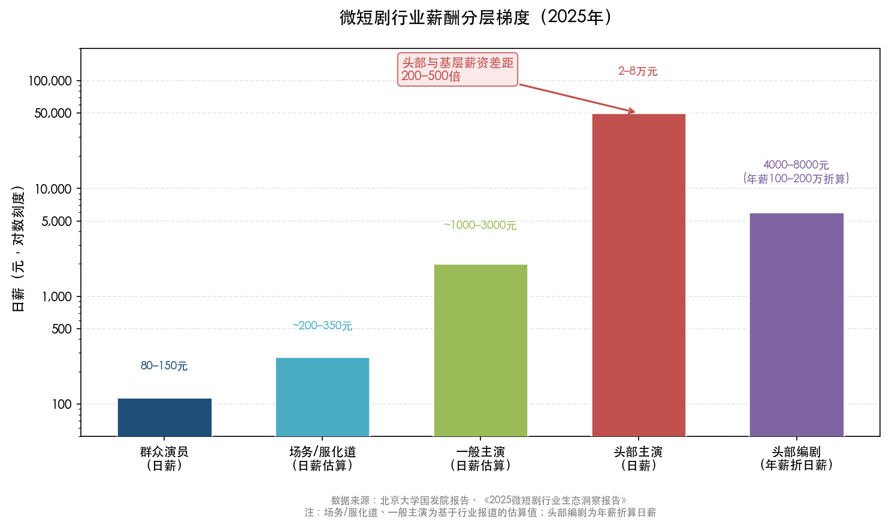

上图以对数刻度直观呈现了微短剧行业从群众演员到头部主演、头部编剧之间的薪酬梯度。这种金字塔式的收入分布并非微短剧行业独有，而是整个艺术行业"赢家通吃"格局的缩影。

在音乐产业中，平台与创作者之间的收入分配同样存在结构性张力。腾讯音乐2025年全年总收入达329.0亿元（同比+15.8%），在线音乐付费用户达1.274亿，调整后净利润99.2亿元（同比+22.0%） [钛媒体](https://www.tmtpost.com/7919425.html "腾讯音乐2025年营收329亿元财报")。平台通过分层运营策略最大化挖掘用户支付意愿——QQ音乐热歌榜VIP可听占比从38%提升至95%，付费率从11%提升至21%；网易云音乐从4%提升至48%，付费率从16%提升至26% [腾讯新闻](https://news.qq.com/rain/a/20250925A06DRB00 "当'摇滚经济学'照进中国在线音乐市场")。然而，这一收入增长未能等比例传导到中尾部创作者层面。中国传媒大学发布的音乐人调查报告系列研究显示，长期以来独立音乐人群体中有近半数月收入不足2000元，超五成音乐人表示没有音乐收入 [半月谈](http://www.banyuetan.org/jrt/detail/20200409/1000200033134991586241688880503825_1.html "中国音乐人之困")，大量创作者无法仅凭音乐维持生计。平台端营收的持续增长与中尾部创作者的经济困境并存，深刻揭示了数字内容产业中版权收益分配机制的结构性失衡。

### 3.2.3 灵活就业常态与社会保障缺失

艺术从业者高度依赖灵活就业方式，这一特征进一步加剧了收入的不稳定性和社会保障的缺失。国务院2025年12月向全国人大常委会提交的专题报告指出，中国灵活就业人员规模已超过2亿人，但截至2024年底参加职工养老保险的仅7057万人、参加职工医保的仅6615.9万人，"社会保险覆盖面总体不高" [全国人大网](http://www.npc.gov.cn/npc/c2/c30834/202512/t20251224_450484.html "国务院灵活就业权益保障报告")。换言之，超过2亿灵活就业者中，仅约三分之一纳入了职工养老保障体系。

艺术从业者作为灵活就业群体中较为典型的组成部分，面临更为严峻的保障困境。微短剧行业中，基层工种——包括群众演员、场务、服化道人员等——普遍缺乏稳定劳动合同与社保 [北京大学国发院报告](https://www.nsd.pku.edu.cn/docs/2026-02/48accc85b74f4939b8f4c4b612e610ec.pdf "2025年中国微短剧产业格局与就业发展报告")。独立音乐人、自由画家、独立编剧等群体的社保参保率预计更低，尽管目前缺乏专门针对艺术类自由职业者的精确统计数据。收入波动性大、项目制工作模式以及雇佣关系的模糊性，共同构成了艺术灵活就业者社保缺失的结构性根源。

政策层面正在积极回应这一问题。"十五五"规划建议明确提出"提高灵活就业人员参保率""扩大失业、工伤保险覆盖面"；自2025年7月起，新就业形态职业伤害保障试点已扩至17省、累计2325万人参保；2025年6月，中办国办要求"全面取消在就业地参保的户籍限制" [国务院报告](http://www.npc.gov.cn/npc/c2/c30834/202512/t20251224_450484.html "国务院灵活就业权益保障报告") [最高检转载](https://www.spp.gov.cn/tt/202506/t20250609_697861.shtml "中办国办民生意见")。这些政策为艺术类灵活就业者的社保接入提供了制度空间，但从政策出台到针对艺术从业群体的有效覆盖，仍需更加精细化的实施机制和更具针对性的参保激励措施。

## 3.3 知识产权保护：数字时代的版权攻防

### 3.3.1 著作权登记规模与结构特征

知识产权保护是艺术人才获取合理经济回报的制度基础。2025年，全国著作权登记总量达到1067.7万件（同比+0.44%），其中美术作品476.6万件（占全部作品登记量的63.60%），摄影作品、文字作品紧随其后，而音乐作品仅4.09万件（占0.55%） [国家版权局](https://www.ncac.gov.cn/xxfb/tzgg/202603/t20260317_962958.html "2025年全国著作权登记情况")。

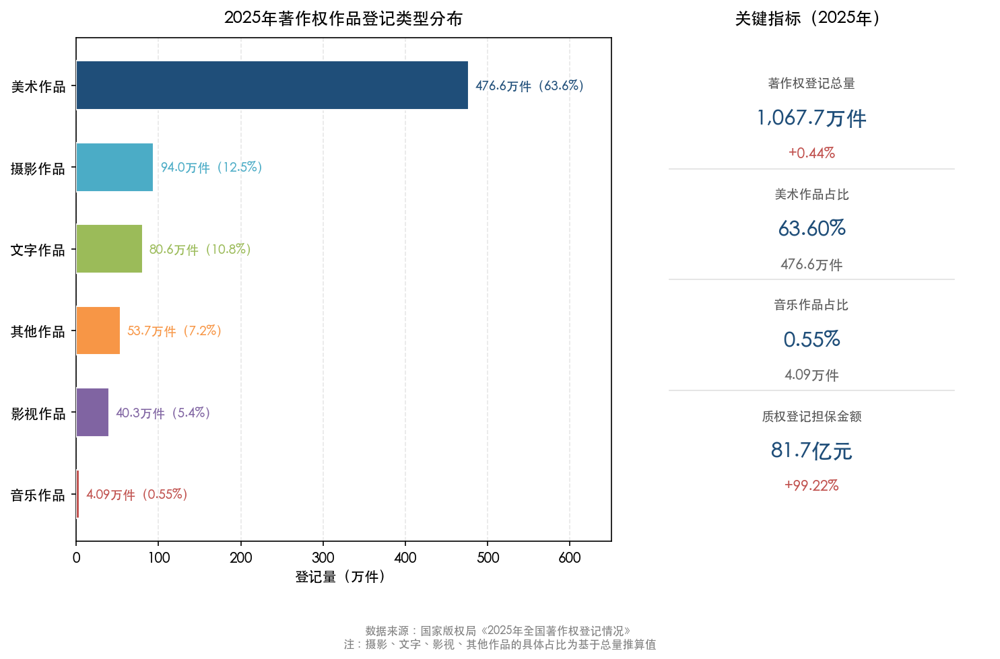

上图清晰展示了2025年著作权登记的类型分布格局。美术作品占据绝对主导地位，反映出该领域版权保护意识和登记习惯已相对成熟；而音乐作品的单独登记量极低，这与音乐产业主要通过集体管理组织和平台授权机制运作的特点密切相关——音乐版权的确权与交易更多依赖行业性批量授权而非个体逐件登记。

值得特别关注的是，著作权质权登记担保金额达81.7亿元（同比+99.22%），几乎翻倍，表明版权的金融化价值正在被市场迅速认可，版权资产作为融资担保物的功能日益凸显。这对于艺术创作者而言意味着，优质版权资产不仅可以带来持续性的版税收入，还具备了资本化运作的潜力，为创作者开辟了版税收入之外的新变现路径。

### 3.3.2 AI时代的版权保护新挑战

人工智能技术的迅猛发展给传统版权保护体系带来了前所未有的挑战，涉及AI生成内容的权属认定、AI训练数据中版权作品的合法使用边界等核心议题。在司法层面，中国法院已通过一系列具有开创性意义的判例，逐步构建起AI时代的版权裁判规则。

2023年11月，北京互联网法院审结全国首例"AI文生图"著作权案，认定原告使用AI工具生成的图片具有独创性，原告对其享有著作权 [北京互联网法院](https://www.bjinternetcourt.gov.cn/details.html?id=255 "AI文生图著作权案")。这一判决在全球范围内率先确立了AI生成内容可受著作权保护的司法先例，对艺术创作者运用AI工具进行创作具有重要的权益保障意义。2024年2月，广州互联网法院审结全球首例生成式AI服务侵权案，认定AI平台构成直接侵权 [21世纪经济报道](https://m.21jingji.com/article/20240226/herald/133a6c2f9c0b045899e4dea10c5778eb.html "全球首例生成式AI服务侵权案")。2025年6月，北京通州区法院更进一步宣判首例利用AI侵犯著作权刑事案，涉案非法经营额27万余元，被告人被判处有期徒刑 [法治日报](http://epaper.legaldaily.com.cn/fzrb/content/20250618/Articel06005GN.htm "北京首例AI侵权刑案")。从民事侵权认定到刑事责任追究，司法实践正在迅速填补AI版权保护的制度空白，形成了民事—行政—刑事三位一体的保护梯度。

在立法与行政层面，保护力度也在同步加强。"剑网2025"专项行动聚焦视听作品、音乐、美术作品版权等六大领域，全年查办实体市场侵权案件2713件 [商务部/中国保护知识产权网](https://ipr.mofcom.gov.cn/article/gnxw/zfbm/zy/bw/202603/1995421.html "版权执法成效")。国家版权局2025年7月发布《加快推进版权事业高质量发展的意见》，明确提出健全AI等新兴领域版权保护制度 [国家版权局](https://www.ncac.gov.cn/xxfb/tzgg/202507/t20250723_923374.html "版权事业高质量发展意见")。

然而，AI训练数据中大规模使用版权作品的问题仍是一个亟待立法明确的灰色地带。全国人大代表马一德指出，AI训练中使用版权作品的合法性边界"需在著作权法实施条例修改中厘清" [最高检网站](https://www.spp.gov.cn/zdgz/202504/t20250425_694112.shtml "AI创作的权利边界在哪里")。对于艺术创作者群体而言，这一问题尤为紧迫——海量的绘画、摄影、设计、音乐作品被用作AI模型的训练语料，而创作者在此过程中既未获得知情同意，也未获得经济补偿。这一问题的制度解决方案，将直接决定AI时代艺术人才能否从技术进步中公平受益。

### 3.3.3 版权保护对艺术人才经济回报的传导机制

版权保护制度向艺术人才经济回报的传导并非自动完成，而是需要通过一系列中间机制来实现。这一传导链条包括四个关键环节：版权确权（登记、存证）、版权交易（许可、转让）、集体管理（代收、分配）以及司法救济（维权诉讼成本与效率）。任何一个环节的效率低下或制度缺位，都可能导致版权价值无法有效转化为创作者收入。

在确权环节，2025年9月上线的中国（北京）数字版权交易平台——由中国技术交易所运营——提供基于区块链的版权确权—挂牌—交易—结算全流程服务，为降低确权成本、提升交易效率提供了重要的基础设施支撑 [央广网](https://finance.cnr.cn/zghq/20250915/t20250915_527362805.shtml "数字版权交易平台上线")。然而，在集体管理和收益分配环节，中尾部创作者仍面临议价能力弱、信息不对称和分配透明度不足等系统性障碍。音乐产业中平台营收高速增长与独立音乐人收入微薄并存的现象，正是这一传导机制失灵的典型体现。实现从"保护制度存在"到"创作者切实受益"的跨越，仍需在分配透明度和集体管理效能方面进行深层次的制度优化。

## 3.4 文化消费升级：能否转化为艺术人才的收入红利

### 3.4.1 文化消费的持续扩张

从宏观数据来看，中国居民的文化消费正处于持续扩张轨道。2025年，全国居民人均教育文化娱乐消费支出达3489元，同比增长9.4%，在八大消费类别中增速排名第二，占人均消费支出的比重达到11.8% [国家统计局](https://www.stats.gov.cn/sj/zxfb/202601/t20260119_1962321.html "2025年居民收入和消费支出情况")。"十四五"期间（2020–2024年），全国居民人均文化娱乐消费支出从569元增至955元，增长67.8%，增速显著快于同期人均消费支出整体增幅 [新华网](http://www.news.cn/20251003/8d6e2e48b1d24e16b64a2323caf6cd54/c.html "十四五以来我国居民文化消费不断提升")。

文化产业的产值数据同样印证了这一趋势。2025年，规模以上文化企业营收达152135亿元（同比+7.4%），其中文化新业态16个行业小类营收68253亿元（同比+14.3%，占总营收44.9%）；内容创作生产板块实现营收34991亿元（同比+13.5%），创意设计服务营收27377亿元（同比+12.3%） [国家统计局](https://www.stats.gov.cn/sj/zxfb/202601/t20260119_1962411.html "2025年文化产业数据")。2024年全国文化产业增加值达62094亿元，占GDP比重4.61%，其中文化服务业增加值43256亿元（占69.7%） [国家统计局](https://www.stats.gov.cn/sj/zxfb/202512/t20251230_1962179.html "2024年文化产业增加值")。

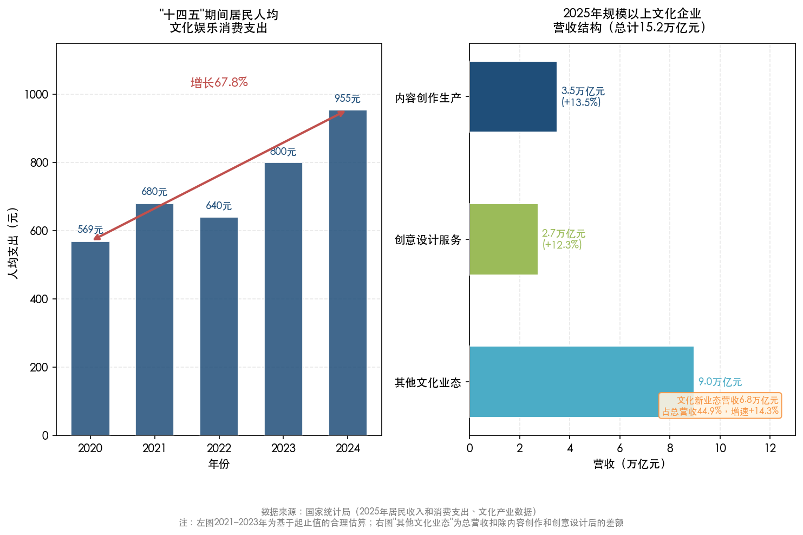

上图左侧展示了"十四五"期间居民人均文化娱乐消费支出的稳步增长轨迹，右侧呈现了2025年规模以上文化企业的营收结构。内容创作生产与创意设计服务两大板块的双位数增速，表明与艺术人才直接相关的产业领域正处于扩张周期。

演出市场的表现同样亮眼。2025年全国营业性演出64.04万场（同比+6.58%），票房收入616.55亿元（同比+6.39%），观众达1.94亿人次（同比+4.22%） [中国演出行业协会](http://www.cishannews.com/news/gy/2026/0116/38900.html "2025年演出市场数据")。其中大型演出票房324.48亿元（同比+9.49%），显示出消费者对高品质文化体验的付费意愿持续增强。

### 3.4.2 消费升级红利的传导瓶颈

文化消费的持续扩张是否有效转化为艺术人才的收入提升？我们认为，答案是"有限度的传导"——产业规模扩大确实带动了就业岗位增长和部分从业者的收入改善，但受到多重瓶颈制约，消费端的红利并未均匀地惠及艺术人才群体。

其一，中间环节的利润截留。文化消费支出的增长更多体现为平台、渠道商和内容聚合方的营收扩张，创作者作为产业链上游的价值贡献者，在收入分配中往往处于弱势地位。前述音乐流媒体平台的案例已清晰揭示，平台端实现了强劲的营收和利润增长，但中尾部音乐人的收入改善极为有限。

其二，消费结构的错配。居民文化消费的增长很大程度上流向了标准化、可规模复制的文化产品（如流媒体订阅、直播打赏、短视频消费），而非对原创艺术品的直接购买或对高水平艺术创作的付费委托。文化消费的"量增"并不必然带来对原创艺术价值的"价升"。

其三，头部集中效应。消费升级带来的收入增量高度集中于少数头部艺术家和明星IP，广大中基层艺术从业者难以从中获益。微短剧行业中群演与头部主演200–500倍的收入差距即为典型例证。这一集中效应在注意力经济的驱动下呈加剧趋势，消费者的付费意愿进一步向头部内容倾斜。

### 3.4.3 弥合消费升级与人才待遇的制度路径

消费升级红利向艺术人才的有效传导，需要一系列制度性安排来打通堵点。在版权保护层面，更加透明和公平的版权收益分配机制——特别是流媒体平台的分成规则透明化、集体管理组织的运营效率提升——是确保创作者从消费增长中切实获益的基础条件。在社会保障层面，为灵活就业艺术从业者提供可及性强的社保接入通道，有助于降低其因收入波动而产生的生存焦虑，使其能够更专注于创作本身。在市场培育层面，发展原创艺术品交易市场、推动企业和公共机构的艺术品采购制度化，有助于为原创艺术建立更稳健的需求端支撑。

2025年9月上线的中国（北京）数字版权交易平台以及著作权质权登记金额的翻倍增长（81.7亿元，同比+99.22%），为版权资产的交易流通和金融化提供了新的基础设施 [国家版权局](https://www.ncac.gov.cn/xxfb/tzgg/202603/t20260317_962958.html "2025年全国著作权登记情况") [央广网](https://finance.cnr.cn/zghq/20250915/t20250915_527362805.shtml "数字版权交易平台上线")。这些制度创新若能持续深化并有效运作，有望在文化消费持续扩张的宏观背景下，为艺术人才的经济待遇改善提供更坚实的制度保障，逐步弥合产业繁荣与从业者收入之间的结构性鸿沟。

## 3.5 本章小结

社会评价体系、收入分配结构与知识产权保护，构成了影响艺术人才发展空间和经济待遇的三个核心制度维度。在评价体系方面，"破五唯"改革方向已经确立，职称制度改革亦为新文艺群体打开了认证通道，但"旧标已破、新标未立"的过渡期困境依然突出。在收入结构方面，艺术从业者面临起薪偏低、收入波动大、头部效应极端的三重挑战，灵活就业常态化进一步加剧了社会保障的缺失。在知识产权保护方面，中国在AI版权领域已建立起全球领先的司法判例体系，版权基础设施亦在快速完善，但从版权保护到创作者收入提升的传导机制仍不畅通。文化消费的持续升级为改善艺术人才经济待遇提供了宏观利好，但受制于中间环节利润截留、消费结构错配和头部集中效应，红利的均衡传导仍需制度性突破。

这些制度层面的核心痛点并非中国独有。在下一章中，我们将系统比较法国、德国、韩国、英国和北欧国家在应对类似挑战时的制度设计与实践经验，以期为中国的制度优化提供他山之石。

# 第4章 国际比较——艺术人才社会地位提升的他山之石

艺术人才面临的社会保障缺失、收入不稳定和职业认同困境并非中国独有的现象。在全球范围内，艺术工作的间歇性、项目制和高度自雇特征构成了各国劳动保障制度的共同挑战。不同国家基于各自的社会保障传统、文化政策理念和产业发展阶段，发展出了差异显著而各具启发性的制度回应。本章系统梳理法国、德国、韩国、英国及北欧国家在提升艺术人才社会地位、保障经济待遇方面的核心制度设计与实践经验，在此基础上提炼可供中国借鉴的制度创新要素，并评估其在中国语境下的可移植性。

## 4.1 法国：间歇性演艺工作者社会保险的标杆与争议

法国的"间歇性演艺工作者"（Intermittent du Spectacle）制度是全球最早、制度化程度最高的艺术劳动者专项保障体系之一。该制度创设于1936年（部分文献将其正式纳入失业保险附件的时间追溯至1939年），法律依据为《法国劳动法典》第L1251-1条，通过失业保险体系下的特殊附件（Annexes VIII和X）运作。其核心制度逻辑在于承认演艺工作的间歇性本质，将"不连续就业"纳入失业保险的正式覆盖范围，而非将其视为劳动市场的"异常状态"。

### 4.1.1 制度机制与覆盖规模

根据法国公共就业服务机构France Travail于2025年12月发布的统计报告，2024年法国间歇性演艺工作者制度覆盖约30.5万名受薪工作者，产生30亿欧元的工资总额，对应1.29亿个工作小时，涉及11.9万家用人单位 [France Travail](https://www.francetravail.org/statistiques-analyses/entreprises/emploi-intermittents-du-spectacl/l-emploi-intermittent-dans-le-spectacle-au-cours-de-l-annee-2024.html "2024年间歇性演艺工作者就业统计")。这一覆盖人数较2023年的约31.2万人下降了2.3% [ARTCENA](https://www.artcena.fr/fil-vie-pro/augmentation-de-26-du-nombre-dintermittents-en-2023 "2023年间歇性演艺工作者数据")，但仍处于2012年以来的历史高位区间。

该制度的准入机制具有明确的量化门槛：艺术工作者须在10个月内完成507小时的有效工作，即可获得失业补助金资格，日均补助金额在31.36至133.27欧元之间浮动，并附带医疗保险、产假、退休金和职业培训等附属福利 [Nogueira & Damasceno 2025](https://periodicos.ufrn.br/artresearchjournal/article/download/38861/21511/153348 "Art Research Journal v.12 n.2")。这种"以工作时间换取保障资格"的机制，实质上为高度不稳定的演艺劳动提供了一套可预期的社会安全网。

### 4.1.2 制度的局限与争议

法国模式虽被广泛引用为"艺术家社保典范"，但围绕其运行的争议同样突出。欧洲议会研究服务部（EPRS）在2023年的系统性评估中指出，该制度"受益人数相对有限、公共支出较高"，且存在"虚假工时申报"的欺诈风险 [欧洲议会EPRS研究](https://www.europarl.europa.eu/RegData/etudes/STUD/2023/747426/EPRS_STU(2023)747426_EN.pdf "EU framework for artists, 2023年11月")。更为关键的结构性限制在于覆盖范围：该制度仅适用于以"受雇"形式参与表演艺术生产的工作者，大量以自由职业身份执业的视觉艺术家、独立音乐人和艺术教育工作者均被排除在外。换言之，法国模式本质上是"表演艺术劳动市场"的制度回应，而非全艺术门类的普惠性覆盖方案。2003年以来，法国政府多次推进改革（收紧准入条件、缩短补助期限等），每次均引发艺术从业者的大规模社会运动，折射出制度调整的政治敏感性与利益博弈的复杂性。

在全球范围内，仅有比利时建立了与法国类似的间歇性演艺工作者失业保险制度 [ETUI报告](https://www.etui.org/publications/art-managing-intermittent-artist-status-france "ETUI: The art of managing the intermittent artist status in France")。这一事实本身即表明该模式对制度环境的高度依赖——它需要一套成熟的、以受雇关系为基础的失业保险体系作为底层架构，在缺乏这一前提条件的国家中难以直接复制。

## 4.2 德国：KSK三方融资的社会保险创新

德国的艺术家社会保险基金（Künstlersozialkasse，简称KSK）代表了另一条截然不同的制度路径。与法国依托失业保险体系不同，KSK直接切入社会保险（养老、医疗和长期护理）领域，通过独创的"三方融资"机制解决了自由职业艺术家面临的最核心保障缺口。

### 4.2.1 三方融资机制与运行规模

KSK的制度设计逻辑简洁而有力：艺术家本人承担50%的社会保险缴费（与普通雇员比例相同），"利用者"企业（即使用艺术作品或服务的画廊、出版社、唱片公司、广告公司等）缴纳约30%的艺术家社会保险附加费（Künstlersozialabgabe），联邦政府补贴剩余约20%（行政运营费用全部由联邦财政承担）。2024至2025年，利用者企业的附加费费率维持在5.0%，2026年将小幅下调至4.9% [KSK官方统计](https://www.kuenstlersozialkasse.de/service-und-medien/ksk-in-zahlen "KSK in Zahlen") [KSK新闻](https://www.kuenstlersozialkasse.de/nachrichten/detail/kuenstlersozialabgabe-sinkt-im-jahr-2026-auf-49-prozent "2026年费率调整")。

2024年联邦政府对KSK的财政补贴为2.765亿欧元，2025年预算增至2.828亿欧元 [德国联邦议院](https://www.bundestag.de/presse/hib/kurzmeldungen-1015554 "2025年联邦预算：劳动与社会部单列")。KSK 2024年预计总支出约13.9亿欧元 [VGSD报告](https://www.vgsd.de/bmas-plant-kuenstlersozialabgabe-soll-auch-2024-bei-50-prozent-bleiben/ "2024年KSK预算推算")。截至2025年，KSK拥有186,592名活跃参保人，按艺术门类分布为视觉艺术35.1%、音乐27.6%、文字工作20.1%、表演艺术17.2% [KSK官方统计](https://www.kuenstlersozialkasse.de/service-und-medien/ksk-in-zahlen "KSK in Zahlen")。

### 4.2.2 参保人收入与性别差异

KSK的统计数据清晰呈现了自由职业艺术家的收入现实及其内部分化。2025年参保人平均年收入为21,016欧元（折合月收入约1,751欧元），其中男性23,917欧元、女性17,967欧元，性别收入差距约为25% [KSK官方统计](https://www.kuenstlersozialkasse.de/service-und-medien/ksk-in-zahlen "KSK in Zahlen")。这一收入水平远低于德国全职雇员中位数（约4.2万欧元/年），即便在拥有成熟社保覆盖的国家，自由职业艺术家仍属于劳动市场中的低收入群体。值得注意的是，KSK的准入门槛设置相对宽松——年收入超过3,900欧元且不雇佣超过1名员工即可申请参保，这一设计有意降低"门槛排斥"效应，确保收入最不稳定的艺术家也能被纳入保障体系。

### 4.2.3 KSK模式的制度价值

KSK最核心的制度创新在于将艺术作品或服务的"利用者"引入社保融资链条。这一设计基于一个关键认知：艺术家虽为自由职业者，但其劳动成果的价值实现依赖于产业链下游的使用方——出版社使用文字、画廊展售作品、唱片公司发行音乐——因此使用方理应承担类似于"雇主"的部分社保责任。这种"准雇主义务"的制度安排，在不改变艺术家自由职业身份的前提下，有效弥合了传统社保制度中"无雇主即无保障"的制度盲区。德国联邦劳动与社会保障部对利用者企业的附加费征收持续强化执法力度，以确保制度的长期财务可持续性。

## 4.3 韩国：立法驱动的艺术人才福利体系

韩国在东亚地区率先建立了以专门立法为基础的艺术人才福利制度。《艺术人才福利法》（2011年颁布）和依据该法设立的韩国艺术人才福利财团（Korea Artists Welfare Foundation）共同构成了一套覆盖全艺术门类的保障框架，在制度设计理念上兼具"福利保障"与"产业振兴"双重目标。

### 4.3.1 法律框架与核心机制

《艺术人才福利法》明确禁止文化策划者强迫艺术家签订不公平合同或拒绝进行利润分配，并在行业内推广标准合同制度——采用标准合同的用人方可在申请公共资助时获得优先权 [韩国法律信息研究院](https://elaw.klri.re.kr/eng_mobile/viewer.do?hseq=48734&type=part&key=38 "Artist Welfare Act英文全文")。这种"标准合同+不公平行为禁止"的制度组合，直接回应了艺术劳动市场中普遍存在的合同不规范与从业者弱势谈判地位问题。

韩国文化体育观光部在艺术文化领域的财政投入力度显著。2024年该部门预算达6.95万亿韩元（约53亿美元）[韩国政府](https://www.korea.net/NewsFocus/policies/view?articleId=244296 "文化部2024年预算")。作为内容产业的核心执行机构，韩国文化内容振兴院（KOCCA）2025年预算为6,093亿韩元，同比增长3.04% [KOCCA预算报告](https://www.alchedek.com/news/articleView.html?idxno=244 "KOCCA 2025年预算")。KOCCA于2026年1月发布年度人才培养路线图，以网漫（Webtoon）和AI驱动创作为核心方向，新设AI内容学院计划培训超过1,000名创作者（含新人及专业艺术家），并为约140名网漫专业人才提供从策划、制作到全球发行的全链条培训 [KOCCA 2026人才路线图](https://superanimestore.com/blogs/events/kocca-unveils-2026-talent-roadmap-to-train-webtoon-creators-with-ai-as-major-focus "KOCCA Unveils 2026 Talent Roadmap")。

### 4.3.2 2026年福利计划的突破性扩展

韩国艺术人才福利财团2026年计划呈现出几项值得关注的制度突破。在社会保险层面，国民年金保费补助范围扩展至以自由职业身份参加地区型（自愿）国民年金的艺术家，由政府承担50%保费，目标是将更多艺术家纳入退休收入保障体系。与此同时，"Yesul-ro"项目（促进艺术家与企业、机构合作的计划）将在项目期间全额承担参与艺术家的产业灾害保险保费，以降低艺术活动中的意外伤害风险 [AJU Press](https://www.ajupress.com/view/20260213133670511 "Korea Artists Welfare Foundation 2026 Plan")。

在生活保障层面，"艺术活动准备基金"（Art Activity Preparation Fund）计划向约18,000名艺术家每人提供300万韩元（约合1.6万元人民币），防止艺术家因财务困难而中断创作活动。住房支持方面，全税贷款（Jeonse Loan）上限从1亿韩元提高至1.2亿韩元，利率维持1.95%的低息水平。此外，财团还将启动"艺术家福利基金"（Artists Welfare Fund），为互助产品和其他福利服务提供稳定的资金支撑 [AJU Press](https://www.ajupress.com/view/20260213133670511 "Korea Artists Welfare Foundation 2026 Plan")。

### 4.3.3 韩国模式的特征

韩国模式的突出特征在于"法律+专门机构+专项资金"三位一体的制度架构。《艺术人才福利法》提供法律基础，艺术人才福利财团承担执行功能，文化部的大额财政拨款则确保资金供给的稳定性。这种制度组合使得韩国在不根本改变社会保险制度框架的前提下，通过"叠加式"的专项福利安排，有针对性地弥补了艺术从业者在既有社保体系中的覆盖缺口。尤为值得关注的是，韩国将艺术人才福利与内容产业国际竞争力建设紧密挂钩——KOCCA的人才培养计划本质上服务于韩国文化输出战略（K-content），福利保障与产业振兴由此形成相互强化的双轨推进格局。

## 4.4 英国：创意产业生态培育与市场化路径

英国对艺术人才社会地位的提升采取了与欧陆国家显著不同的路径——更多依赖产业政策和市场化机制，而非直接的社会保险制度创新。其核心策略是将"创意产业"（Creative Industries）定义为国家经济的战略性增长部门，通过做大产业蛋糕来间接提升从业者的收入水平和职业认同。

### 4.4.1 创意产业的经济贡献与政策支持

英国创意产业2023年贡献了约1,240亿英镑的总增加值（GVA），占GDP约5%，提供约240万个就业岗位。2010至2023年间，创意产业GVA累计增长35%，显著高于全国经济22%的平均增速 [英国政府](https://assets.publishing.service.gov.uk/media/685943ddb328f1ba50f3cf15/industrial_strategy_creative_industries_sector_plan.pdf "Creative Industries Sector Plan 2025")。英格兰艺术委员会（Arts Council England，简称ACE）作为艺术领域的核心公共资助机构，2023/24年度总收入达7.983亿英镑 [ACE交付计划](https://www.artscouncil.org.uk/lets-create/delivery-plan-2024-2027/setting-context "ACE Delivery Plan 2024-27")。

2025年，英国政府发布的创意产业部门计划设定了两项关键目标：设立1.5亿英镑"创意场所增长基金"（Creative Places Growth Fund），以及到2035年将创意产业年度商业投资从170亿英镑提升至310亿英镑 [英国政府](https://assets.publishing.service.gov.uk/media/685943ddb328f1ba50f3cf15/industrial_strategy_creative_industries_sector_plan.pdf "Creative Industries Sector Plan 2025")。在税收政策层面，英国已构建起覆盖影视制作、独立电影、视觉特效、剧院、管弦乐团和电子游戏等多领域的税收优惠体系，以产业激励手段促进文化生产与就业扩展。

### 4.4.2 自由职业者保障的制度回应

值得注意的是，英国政府在2025年的创意产业部门计划中首次设置"创意自由职业者专员"（Creative Freelancer Commissioner）并将其纳入政策委员会，标志着对创意产业中大量自由职业者群体权益保障问题的正式制度回应。这一举措旨在解决英国创意产业长期存在的结构性问题——高自雇率、合同不稳定以及社会保障覆盖不足。

### 4.4.3 英国模式的特征与局限

英国模式的核心优势在于其"产业生态思维"——通过做大创意产业总量、吸引商业投资、构建集群效应来提升整个行业的经济基础，进而惠及从业者。ACE的公共资助与商业投资之间形成的"杠杆效应"、税收优惠对产业链全环节的激励，以及教育体系（如英国高度国际化的艺术设计院校）与产业需求的紧密衔接，共同构成了一套以市场为主导、公共投资为催化的生态系统。然而，这一模式的局限同样不容忽视：产业增长的红利分配并不均匀，头部创意企业和明星创作者获取了不成比例的收入份额，大量基层自由职业艺术家的实际收入和保障水平并未与产业总量同步提升——这也正是设立"创意自由职业者专员"的现实驱动力所在。

## 4.5 北欧：国家文化投资理念下的艺术家补助金

北欧国家以"臂长原则"（arm's length principle）为核心的公共文化资助体系，代表了艺术人才支持的另一种制度理念——国家承认艺术创作的内在价值，以直接财政补助保障艺术家的创作自由和基本生活条件，而非要求其完全依赖市场回报来维持职业存续。

### 4.5.1 芬兰Taike：同行评审与免税补助

芬兰艺术促进中心（Taike）是这一理念的典型实践者。2024年，Taike共发放4,640万欧元政府拨款用于支持艺术文化事业，处理15,526份申请，其中2,169份获批，通过率约21% [Taike年度统计](https://www.taike.fi/en/press-releases/annual-statistics-2024-taike-awards-46-million-euros-support-arts-and-culture "Annual statistics 2024")。2025年的艺术家月补助金标准为2,196.30欧元（免税），可授予半年至5年不等的期限 [Taike补助金公告](https://www.taike.fi/en/calls-for-applications/call-applications-2025-artist-grants "2025年艺术家补助金")。

Taike体系中最值得关注的制度设计是"同行评审"（peer review）机制：补助金的分配由独立的专业委员会决定，政府不直接干预具体的资金流向，由此实现了"政治决策"与"专业判断"的制度分离。这一"臂长原则"在北欧各国被广泛实践，旨在确保公共资助不受政治偏好干扰，切实服务于艺术创作的多元生态。

### 4.5.2 丹麦：终身艺术家补助金

丹麦的终身艺术家补助金（Livsvarige Ydelser）制度自1964年起运作，由国家艺术基金（Statens Kunstfond）管理，文化部根据基金会建议授予"取得重大艺术成就"的艺术家 [芬兰艺术委员会研究报告](https://www.taike.fi/en/file-download/download/public/235 "The Nordic Model for Supporting Artists")。该制度覆盖视觉艺术、文学、音乐、手工设计、建筑、电影与戏剧领域的创作者，但将表演艺术家排除在外（后者通常通过其他渠道获得保障）。终身补助金的象征意义在某种程度上超越其覆盖广度——它向社会传递了一个明确信号：杰出的艺术创作具有终身的公共价值，值得国家给予持续的回报与认可。

### 4.5.3 爱尔兰：基本收入试点

爱尔兰于2022年启动了艺术家基本收入试点计划（Basic Income for the Arts Pilot Scheme），向入选的艺术家和创意工作者每周支付325欧元（年约16,900欧元），并配套开展效果评估研究 [UNESCO第五次全球磋商报告](https://www.unesco.org/creativity/sites/default/files/medias/fichiers/2024/06/387452eng.pdf "Empowering Creativity, 2023年")。这一试点将"基本收入"理念与艺术政策相结合，试图从根本上缓解艺术家的收入波动与生存焦虑，属于全球范围内最为前沿的政策实验之一。

## 4.6 欧盟层面与UNESCO框架：全球共识的形成

### 4.6.1 欧盟：文化创意部门的政策协调

欧盟文化创意部门（CCS）约雇用770万人，占欧盟劳动力的3.8%，其自雇率高达31.7%，远超全经济平均水平的13.8% [欧洲议会EPRS研究](https://www.europarl.europa.eu/RegData/etudes/STUD/2023/747426/EPRS_STU(2023)747426_EN.pdf "EU framework for artists, 2023年11月")。2023年，欧洲议会启动立法倡议程序，旨在为成员国的艺术家身份认定和权益保障提供统一框架。EPRS评估认为，约120万名没有永久就业关系的CCS专业人员（占CCS劳动力的17%）有望从中受惠。这一进程反映出，在各国层面制度差异显著的背景下，区域性政策协调正成为弥合保障缺口的新方向。

### 4.6.2 UNESCO 1980年建议书的持续影响

UNESCO 1980年通过的《关于艺术家地位的建议书》是全球范围内最早呼吁改善艺术家专业、社会和经济地位的国际文书。UNESCO第五次全球磋商（2022—2023年）的调查结果揭示了一个值得深思的落差：68%的会员国报告本国已有定义"艺术家地位"的法律，但在面向非政府组织的调查中，仅有36%的受访方认可此类法律确实存在 [UNESCO报告](https://www.unesco.org/creativity/sites/default/files/medias/fichiers/2024/06/387452eng.pdf "Empowering Creativity, 2023年")。法律的形式存在与实际执行之间的巨大鸿沟，构成全球各国面临的共同治理难题——"有法可依"远不等于"有法必行"。

## 4.7 跨国比较：共性、差异与制度选择逻辑

### 4.7.1 共性：间歇性劳动的制度承认

尽管各国制度路径差异显著，但所有成熟模式均建立在一个共同的制度前提之上：承认艺术工作的间歇性和项目制特征，将其视为"正常的工作形态"而非需要矫正的"就业偏差"。这一共识的制度含义深远——它要求社会保障制度从"以稳定雇佣关系为前提"的假设中解放出来，发展出适配非连续性劳动的保障机制。

社会保障覆盖是所有国家的核心议题。无论是法国通过失业保险、德国通过三方融资社保、韩国通过专项补贴，还是北欧通过直接财政拨款，各国目标殊途同归：确保艺术从业者不因工作形态的特殊性而被排除在社会安全网之外。专业化中介机构（KSK、ACE、Taike、韩国艺术人才福利财团等）的存在是各国制度的又一共同要素——它们在政府与艺术家个体之间搭建起制度化桥梁，提供信息对称、资源配置和权益维护的组织平台。

### 4.7.2 核心差异维度

各国制度的核心差异可沿三个维度展开比较。

**覆盖范围**差异最为突出。法国的Intermittent制度仅覆盖以受雇形式参与的表演艺术工作者，将视觉艺术家和自由职业音乐人排除在外；德国KSK覆盖视觉艺术、音乐、文字和表演艺术四大门类的自由职业者，但不覆盖受雇艺术家（受雇者由普通社保体系覆盖）；韩国《艺术人才福利法》则不限定特定艺术门类，覆盖范围最为广泛。

**融资机制**反映了不同的制度逻辑。法国依托失业保险体系的特殊附件运作，属于"嵌入式"设计；德国KSK采用"艺术家50%+利用者企业30%+联邦政府20%"的三方融资，属于"独立式"制度创新；英国以国家彩票基金和财政拨款支撑ACE运作，辅以产业税收优惠，属于"市场催化式"路径；北欧国家则以纯粹的政府财政拨款为主，属于"国家投资式"安排。

**支持理念**构成最深层的分野。法国和德国本质上将艺术家保障视为"社会保险权利"——艺术家作为劳动者有权获得社保覆盖；英国将其定位为"产业生态培育"——通过壮大创意产业来改善从业者境遇；北欧将其理解为"国家文化投资"——艺术创作本身具有公共价值，值得无条件支持；韩国则兼取"福利保障"与"产业振兴"双轨，将艺术家福利与K-content全球竞争力战略绑定。

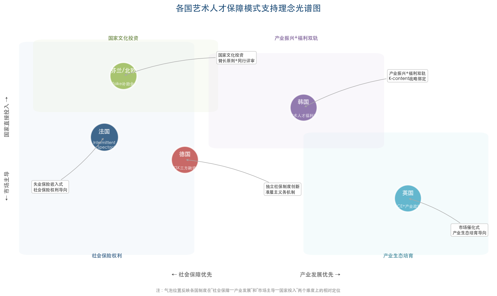

上图直观呈现了五国模式在"社会保障优先—产业发展优先"和"国家直接投入—市场主导"两个维度上的相对定位，有助于理解各国制度设计背后的理念分野。

### 4.7.3 各国制度核心指标对比

综合上述分析，可以对各国制度的关键参数进行系统对比。法国模式覆盖约30.5万受薪工作者（2024年），以失业保险附件为法律依据，产生30亿欧元工资总额；德国KSK覆盖186,592名自由职业者（2025年），以《艺术家社会保险法》为依据，年度总支出约13.9亿欧元，其中联邦补贴2.765亿欧元（2024年）；韩国艺术人才福利财团2026年向约18,000名艺术家提供活动准备基金，文化部预算6.95万亿韩元（2024年）；英国ACE年度收入7.983亿英镑（2023/24年），创意产业贡献1,240亿英镑GVA；芬兰Taike年度拨款4,640万欧元（2024年），月补助金标准为2,196.30欧元。

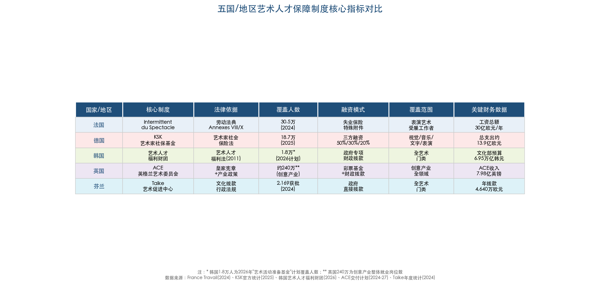

上表以结构化方式汇总了五国制度在法律依据、覆盖人数、融资模式、覆盖范围和关键财务数据等维度的核心差异，便于横向比较。

## 4.8 对中国的借鉴：可移植性评估

上述各国经验并非可以"整体移植"的现成方案，但其中蕴含的制度要素在中国语境下具有差异化的借鉴价值。

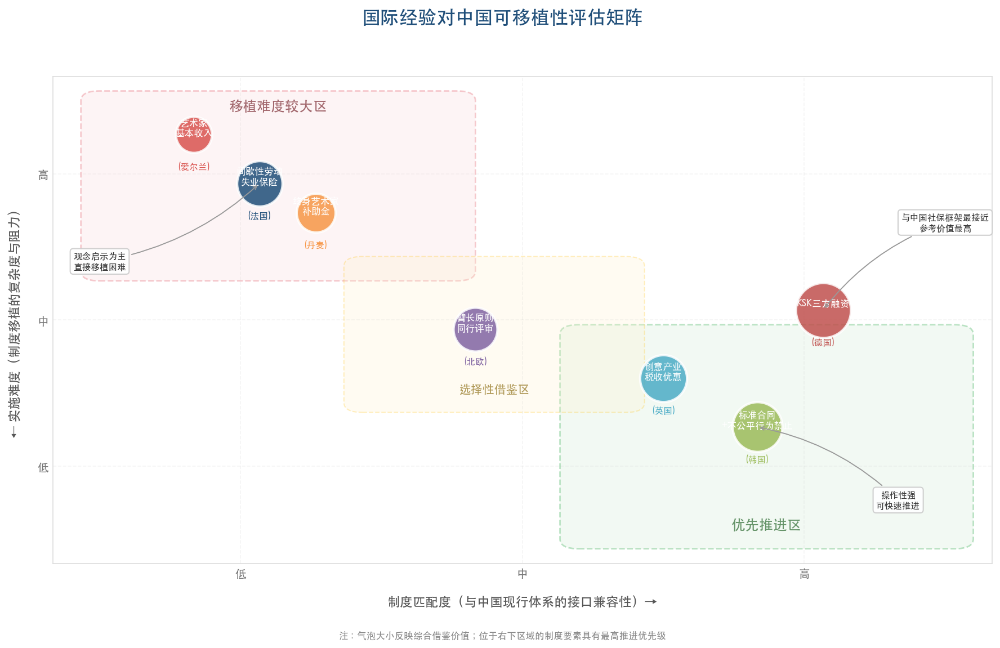

上图以"制度匹配度"和"实施难度"为双轴，将各国可借鉴的制度要素定位于优先推进区、选择性借鉴区和移植难度较大区，为政策优先级判断提供参考。

**德国KSK"三方融资"模式的参考价值最高。** 中国现行社会保险体系以雇佣关系为基本前提，灵活就业人员参保面临显著制度门槛。截至2024年底，中国灵活就业人员规模超2亿人，但参加职工养老保险的仅7,057万人 [全国人大网](http://www.npc.gov.cn/npc/c2/c30834/202512/t20251224_450484.html "国务院灵活就业权益保障报告")。KSK的制度逻辑——由使用艺术劳动成果的平台、企业或甲方承担部分"准雇主"社保义务——与中国近年来推进的新就业形态职业伤害保障试点（截至2025年底累计参保2,510万人）在底层逻辑上存在对接空间。探索由艺术家、使用方（平台/剧组/甲方）和政府三方共担的中国版方案，在技术路径上具有现实可行性。

**韩国"标准合同+不公平行为禁止"的制度组合对中国具有直接借鉴意义。** 中国艺术劳动市场中合同不规范、拖欠报酬、强制买断版权等问题普遍存在，微短剧行业基层工种（群演日薪80—150元）普遍缺乏稳定劳动合同与社保覆盖。韩国通过立法明确禁止不公平合同行为，并以标准合同与公共资助挂钩的机制激励用人方合规，这一"胡萝卜+大棒"策略在操作层面具有较强的可复制性。

**英国创意产业的税收优惠和集群培育策略在产业政策维度具有重要参考价值。** 中国已有成都（2025年数字文创产业规模突破4,100亿元）、上海临港等地方在数字文创领域的积极政策探索，英国经验可为这些地方实践提供更系统的税收激励和集群建设框架。

**法国模式因高度依赖其特殊的失业保险架构，直接移植难度较大。** 然而，其核心理念——承认间歇性劳动的正当性并在失业保险中予以制度化回应——对中国完善灵活就业保障制度具有重要的观念启示。

**北欧的同行评审和免税补助金制度在中国短期内不具备大规模推广的财政条件**，但其"臂长原则"——确保公共资助的专业判断独立于行政干预——对中国完善国家艺术基金的项目评审机制和人才评价体系具有方法论层面的借鉴价值。

综合来看，各国经验共同指向一个核心命题：提升艺术人才社会地位并非单一制度的突破所能实现，而是社会保险、劳动法律、产业政策、财政投入和文化认知的系统性协同。中国的制度创新空间在于，借鉴上述各国的"比较优势"要素，将其嵌入中国自身的社保改革进程和文化产业发展战略之中，形成兼顾保障覆盖与产业效率的本土化方案。

# 第5章 前瞻与建议——构建中国艺术人才多元化发展的支撑体系

前四章的分析勾勒出一幅复杂而清晰的全景图：中国艺术类毕业生正面临传统赛道容量见顶与新兴赛道快速扩张并存的结构性转型期——多元化职业路径已然开启却远未普及，社会评价体系、收入分配机制与知识产权保护制度仍存在系统性短板，而主要发达国家的制度实践则提供了丰富且差异化的参照。本章在综合上述发现的基础上，从教育改革、产业政策、社会保障、知识产权保护和人才评价机制五个维度，提出面向2026年下半年至"十五五"规划期的趋势研判与系统性政策建议，旨在为构建支撑中国艺术人才多元化发展的制度生态提供分析框架与行动参考。

## 5.1 顶层设计：十五五规划开启的政策窗口

### 5.1.1 规划纲要中的艺术人才政策信号

2026年3月发布的"十五五"规划纲要为艺术人才的多元化发展提供了前所未有的顶层政策空间。纲要在多个章节中释放了与艺术人才直接相关的政策信号：第三十五章提出"推进文化和科技融合""发展数字动漫、沉浸式展演、线上演播、短视频、微短剧等新型文化业态" [十五五规划纲要](http://www.npc.gov.cn/npc/c2/c30834/202603/t20260316_453274.html "2026年3月发布")。微短剧等新兴业态首次被写入国家五年规划，标志着第二章所揭示的游戏、微短剧、数字文创等新兴就业赛道获得了国家战略层面的明确认可。

在教育领域，纲要提出"强化科技教育和人文教育协同"，为高校"艺术+科技"复合型人才培养改革提供了政策依据。在人才评价层面，纲要明确"以创新能力、质量、实效、贡献为评价导向""赋予用人单位更大人才评价自主权，防止简单以称号头衔确定薪酬待遇" [十五五规划纲要](http://www.npc.gov.cn/npc/c2/c30834/202603/t20260316_453274.html "涉及第十一、十四章")，直接回应了第三章所诊断的"唯学历""唯职称"评价困境。在社会保障领域，纲要明确"提高灵活就业人员参保率""建立健全职业伤害保障制度"，为解决艺术从业者社保缺失问题提供了制度框架。尤为值得关注的是，纲要在AI治理领域首次提出"探索建立人工智能生成物权利归属和开发者经营者使用者权责认定规则" [十五五规划纲要](http://www.npc.gov.cn/npc/c2/c30834/202603/t20260316_453274.html "第四十三章")，该条款对于厘定AI训练使用版权作品的合法性边界、保障艺术创作者的版权权益，具有直接的立法指引意义。

### 5.1.2 待出台的关键专项政策

"十五五"文化发展专项规划截至2026年4月初尚未正式发布，预计于2026年下半年出台 [国家民委存档](https://www.nia.gov.cn/n741440/n741547/c1562657/content.html "十四五文化发展规划参照")。参照"十四五"文化发展规划曾专设"加强领军人物和专业人才培养"一节的先例，十五五文化发展专项规划有望在艺术人才培养、评价、激励等方面提出更为具体的制度安排。与此同时，《著作权法实施条例》修订正在推进之中，全国人大代表马一德明确指出AI训练中使用版权作品的合法性边界"需在著作权法实施条例修改中厘清" [最高检网站](https://www.spp.gov.cn/zdgz/202504/t20250425_694112.shtml "AI创作的权利边界在哪里")。上述专项政策的出台节奏，将在很大程度上决定2026年下半年至2027年艺术人才制度环境的实质性改善幅度。

此外，2026年《政府工作报告》首次写入"繁荣互联网条件下新大众文艺"，标志着新文艺群体正式进入国家文化战略视野 [中华网](https://m.tech.china.com/redian/2026/0401/042026_1838091.html "新文艺群体职称评审报道")。这一措辞上的突破为后续建立面向新文艺群体的系统性支持制度奠定了政治基础。

## 5.2 教育改革：从"纯艺术"到"艺术+X"的供给侧重构

### 5.2.1 专业结构调整的加速推进

教育端的改革已从"被动缩减"转向"主动重构"。2024年度全国高校新增1839个专业点、撤销或停招3648个，净减少1809个，教育部明确"从严控制艺术类专业设置" [教育部官网](http://www.moe.gov.cn/jyb_xwfb/gzdt_gzdt/s5987/202504/t20250422_1188245.html "教育部2024年度本科专业备案和审批结果")。与"减法"并行的是精准"加法"：2025年本科专业目录新增8个"艺术+科技"专业——舞蹈治疗、音乐科技、数字戏剧、数字演艺设计、智能影像艺术、虚拟空间艺术、人居设计、游戏艺术设计 [人民日报客户端](https://www.peopleapp.com/rmharticle/30051277947 "教育部备案数据与2025年新增专业")。这8个新增专业几乎逐一对应了第二章所梳理的新兴就业赛道——游戏产业、沉浸式演出、AI驱动内容创作以及艺术疗愈。

我们认为，本轮专业结构调整的方向正确，但速度和深度仍有待加强。当前的主要矛盾已从"是否应该调整"转向"如何有效调整"。2020至2024年间全国86所高校新增数字媒体艺术本科专业的经验表明，新专业的设立并不自动等同于人才培养质量的提升——师资储备、产教融合深度、实验条件配套等要素才是决定培养成效的关键变量。

### 5.2.2 师资建设与产教融合的瓶颈突破

新增"艺术+科技"专业面临的最大瓶颈在于师资。2026年2月举办的全国首届游戏艺术设计师资研修班 [京报新闻](https://news.bjd.com.cn/2026/02/04/11565174.shtml "首届游戏艺术设计师资研修班")，正是对新专业师资紧缺的直接回应。然而，单一研修班远不足以弥补全国性的师资缺口，亟需建立更为系统化的师资培养和引进机制。

2025年12月腾讯IEG与中国美术学院签署校企深度合作协议，设立"百万级"奖学金、游戏美术冬令营和精品课程共建 [新浪新闻](https://news.sina.cn/sx/2025-12-19/detail-inhciuaf7572311.d.html?vt=4 "腾讯游戏与中国美术学院合作")，代表了产教融合的理想模式——头部企业直接参与课程设计、提供实训资源并承担部分师资培训功能。我们建议将此类合作从个案示范扩展为制度性安排，具体路径包括三个层面：其一，鼓励游戏、影视、数字文创领域的头部企业与专业艺术院校共建联合实验室，推行产业导师制度；其二，将企业实习实训纳入"艺术+科技"专业的必修学分体系；其三，探索"订单式"人才培养模式，使培养方案与产业岗位需求实现精准对接。

### 5.2.3 建议：建立动态专业预警与调整机制

教育部门应建立艺术类专业的动态预警与调整机制，其核心要素包括：以麦可思等第三方机构的就业监测数据为基础，建立艺术类专业年度供需评估报告制度；对连续三年就业落实率低于学科门类均值5个百分点以上的专业启动缩招程序；对新兴交叉专业实行"先试点、再推广"的审慎扩展策略，避免重蹈传统艺术专业大规模扩招后市场饱和的覆辙。唯有将"减法"与"加法"纳入统一的制度闭环，方能实现艺术人才供给侧的结构性优化。

## 5.3 社会保障：为灵活就业艺术从业者兜底

### 5.3.1 职业伤害保障试点扩围的窗口期

艺术从业者高比例的灵活就业特征，使其在现有社会保障体系中处于覆盖盲区。第三章的分析显示，中国灵活就业人员规模已超过2亿人，但截至2024年底参加职工养老保险的仅7057万人 [全国人大网](http://www.npc.gov.cn/npc/c2/c30834/202512/t20251224_450484.html "国务院灵活就业权益保障报告")，覆盖率不足三分之一。

2026年正处于一个重要的政策窗口期。人社部2026年1月披露，截至2025年底新就业形态职业伤害保障试点累计参保2510万人，覆盖11家企业、17省 [国新办发布会](http://www.scio.gov.cn/xwfb/bwxwfb/gbwfbh/rlzyhshbzb/202601/t20260128_948113.html "人社部2026年1月发布会")。根据人社部等九部门联合通知，2026年该试点将扩大到全国所有省份，并将出行、即时配送、同城货运三个行业的更多平台企业纳入覆盖范围 [新华网](https://www.news.cn/politics/20250708/984d11941b7448dfa186a0f3fdadb8d4/c.html "职业伤害保障试点扩围")。然而需要指出，当前试点主要覆盖的是依托互联网平台就业的外卖骑手、网约车司机等群体，尚未明确涵盖自由职业艺术家、独立编剧、自由撰稿人等艺术类灵活就业者。如何将艺术领域的灵活就业者纳入制度覆盖范围，是下一步政策设计需要回应的关键议题。

### 5.3.2 借鉴德国KSK：探索"中国版"三方融资社保方案

德国KSK模式对中国具有最为直接的制度参考价值。KSK的核心创新在于其三方融资机制——艺术家承担50%社保费用、使用方（画廊、出版社、唱片公司等）承担约30%、联邦政府补贴约20%——巧妙化解了"自由职业者无雇主即无保障"的制度盲区 [KSK官方统计](https://www.kuenstlersozialkasse.de/service-und-medien/ksk-in-zahlen "KSK in Zahlen")。KSK 2025年拥有186,592名活跃参保人，覆盖视觉艺术、音乐、文字和表演艺术四大门类。

在中国语境下，KSK模式的本土化移植可分三步推进：第一步，在现有新就业形态职业伤害保障试点框架内，将影视剧组、文化传媒公司、在线内容平台纳入"利用者企业"名单，探索由这些机构为其雇佣的短期合同制艺术工作者缴纳职业伤害保障费用；第二步，在试点基础上逐步扩展至养老保险和医疗保险领域，参照KSK的费率分担结构，建立适合中国国情的分担比例；第三步，设立专业化中介机构——类似于KSK在德国的角色——负责艺术类灵活就业者的参保登记、费用征收和权益维护。

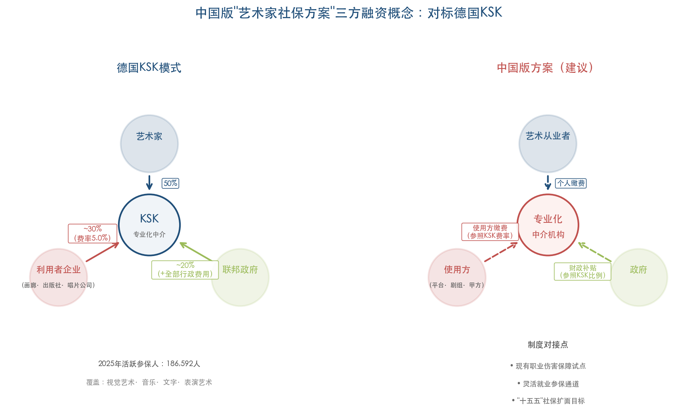

上图对比呈现了德国KSK模式与建议的中国版方案的三方融资结构。德国KSK以"艺术家50%—利用者企业约30%—联邦政府约20%"为费率基准，中国版方案则建议以"艺术从业者—使用方平台/剧组/甲方—政府"为三方主体，分别对接现有职业伤害保障试点、灵活就业参保通道以及"十五五"社保扩面目标三个制度接口。

"十五五"规划纲要已明确"提高灵活就业人员参保率"和"建立健全职业伤害保障制度" [十五五规划纲要](http://www.npc.gov.cn/npc/c2/c30834/202603/t20260316_453274.html "第四十一章")，人社部2026年亦将实施"人工智能技术技能提升"培训行动 [国新办发布会](http://www.scio.gov.cn/xwfb/bwxwfb/gbwfbh/rlzyhshbzb/202601/t20260128_948113.html "人社部2026年培训行动")。在此政策背景下，将艺术类灵活就业者纳入社保试点覆盖范围在政策可行性上已具备条件。

## 5.4 人才评价机制：从"旧标已破"到"新标落地"

### 5.4.1 职称制度改革的破冰实践

第三章诊断的"旧标已破、新标未立"困境，正通过各地的实践探索逐步化解。2020年人社部、文旅部联合推出的艺术专业人员职称制度改革——以代表作制度替代论文导向、打通新文艺群体评审通道——已在多个省份产生实质性成果。

2025年，河南省文联完成首批新文艺群体高级职称评审，36人获评副高级职称、2人获评正高级职称 [中华网](https://m.tech.china.com/redian/2026/0401/042026_1838091.html "新文艺群体职称评审报道")。2026年3月，四川省首次集中评审新文艺群体职称，从55名申报者中评选出12名副高级职称获得者，涵盖演员、导演（编导）、美术3个专业方向。四川省文联此前调研显示，全省超九成新文艺工作者有职称评审意愿 [四川日报](https://finance.sina.cn/2026-04-02/detail-inhszyea2207463.d.html?vt=4 "四川首次集中评审新文艺群体职称")。此次评审不设档案、户籍、单位性质门槛，对无单位挂靠的独立文艺从业者由省文联直接受理，切实实现了"能评尽评"。获评者中包括三度登上央视春晚的歌手海来阿木、获第十三届中国民间文艺山花奖的青年唐卡画师着着等在各自领域具有显著社会影响力的艺术家。

更为瞩目的"破格晋升"案例出现在浙江：2026年初，浙江小百花越剧院青年演员陈丽君、李云霄凭借越剧《新龙门客栈》的现象级影响力和国家级奖项（第十八届文华表演奖），拟直接评定为国家一级演员（正高级职称），从走红到正高仅历时两年 [中华网](https://m.tech.china.com/redian/2026/0401/042026_1838091.html "新文艺群体职称评审报道")。该案例充分体现了"用作品说话、用能力说话、用影响力说话"的改革方向，标志着代表作制度和绿色通道从政策文本走向了制度实践。

### 5.4.2 建议：建立全国统一的分类评价标准

尽管各地实践成效初显，改革推进仍面临三个层面的挑战：其一，各省市评审标准不统一，新文艺群体在跨省流动时面临职称认定的衔接困难；其二，评审专业覆盖面不足，目前多数省份仅开放演员、美术等少数专业方向，设计学、数字媒体艺术、游戏艺术等新兴方向尚未纳入评审体系；其三，评审频次和规模有限，四川首批55名申报者中仅12人获评，大量有意愿的新文艺工作者仍在等待渠道开放。

对此，我们建议在以下方面加快推进：第一，由文旅部、人社部牵头制定全国统一的新文艺群体分类评价指导标准，在保障地方灵活性的前提下确保评审结果的跨省互认；第二，将评审覆盖面扩展至"艺术+科技"新兴交叉领域——如数字媒体艺术、游戏美术、AI视觉设计等方向——以回应产业发展对新型人才认证的迫切需求；第三，借鉴2026年全国两会上曾小敏委员的建议，统一破格标准，畅通优秀人才成长的"快车道"。

## 5.5 知识产权保护：数字时代的制度建设

### 5.5.1 AI版权规则的立法紧迫性

AI技术对艺术创作领域产生了双重影响——既赋能创作者大幅提升效率，又通过大规模训练数据的无偿使用侵蚀版权利益——这使得版权制度的完善具有高度紧迫性。第三章的分析表明，中国在AI版权司法实践中已建立起全球领先的判例体系：从2023年北京互联网法院首例"AI文生图"著作权案，到2024年广州互联网法院全球首例生成式AI服务侵权案，再到2025年北京通州区首例AI侵权刑事案，形成了民事—行政—刑事三位一体的保护梯度。

在行政治理层面，2025年9月1日起施行的《人工智能生成合成内容标识办法》要求AI内容标识不得删除篡改 [深圳市委网信办](https://www.szzg.gov.cn/2025/xwzx/szkx/202509/t20250909_5075306.htm "AI标识办法施行")，为区分人工创作与AI生成内容提供了技术治理手段。同月上线的中国（北京）数字版权交易平台，提供基于区块链的版权确权—挂牌—交易—结算全流程服务 [央广网](https://finance.cnr.cn/zghq/20250915/t20250915_527362805.shtml "数字版权交易平台上线")，为版权资产的流通和变现构建了基础设施。

然而，司法判例和行政措施无法替代系统性立法。"十五五"规划纲要提出"探索建立人工智能生成物权利归属和开发者经营者使用者权责认定规则"，为AI版权立法提供了顶层设计依据。我们认为，《著作权法实施条例》修订应重点回应以下三个核心议题：AI训练使用版权作品的合理使用边界、创作者的知情同意权和合理补偿机制、AI辅助创作与纯AI生成内容的版权归属认定标准。

### 5.5.2 建议：版权保护的制度深化

南开大学周志强教授在解读"十五五"规划建议时提出四项建议——完善知识产权保护、建立科学IP转化机制、在评奖中鼓励原创、加大基金对原创项目扶持 [新华网](https://www.news.cn/politics/20251121/50b3af924c6344a79366b042d2a29ad2/c.html "聚焦十五五规划建议")。在此基础上，我们进一步提出三方面的制度深化建议。

第一，推动流媒体平台版权收益分配透明化。当前音乐流媒体平台营收持续高速增长——腾讯音乐2025年全年总收入329.0亿元（同比+15.8%） [钛媒体](https://www.tmtpost.com/7919425.html "腾讯音乐2025年营收329亿元财报")——但中尾部音乐创作者的收入改善极为有限。主管部门应推动建立平台版权分成规则的信息公开制度，使创作者能够清晰了解其作品的播放数据和收益计算方式。

第二，加快AI训练数据版权补偿机制的制度设计。可参考欧盟在《人工智能法案》中对训练数据透明度的要求，建立AI模型训练使用版权作品的强制登记制度，并探索通过集体管理组织向创作者支付合理补偿的可行路径。

第三，深化版权资产金融化基础设施建设。2025年著作权质权登记担保金额达81.7亿元（同比+99.22%） [国家版权局](https://www.ncac.gov.cn/xxfb/tzgg/202603/t20260317_962958.html "2025年全国著作权登记情况")，版权资产的融资担保功能日益凸显。应进一步降低版权质押融资的门槛和成本，使更多中小型创作者能够利用版权资产获取发展资金。

## 5.6 产业政策：培育数字文创就业增量

### 5.6.1 地方产业政策的积极实践

数字文创产业正成为各地吸纳艺术人才就业的重要增量来源。2025年成都数字文创产业规模突破4100亿元，2026年目标4400亿元以上，围绕影视动漫、游戏电竞、创意设计等六大赛道推进 [证券时报](https://www.stcn.com/article/detail/3621778.html "成都数字文创")。上海临港发布2026—2027数字文化产业政策，对数字游民等准创客每月补贴最高2500元 [上海高新技术信息网](https://www.sh-hitech.com/ryrd/21383.html "临港数字文化产业政策")。

上述地方实践的价值不仅在于产业规模本身，更在于其正在探索的就业友好型产业政策模式——将人才吸引、创业支持、产业集聚和基础设施建设有机结合。上海临港对"数字游民"的月度补贴政策尤为值得关注：它标志着地方政府开始正视并主动适应灵活就业、远程工作等新型工作形态，为艺术类自由职业者提供了制度化的生存空间。

### 5.6.2 建议：构建系统化的产业扶持体系

英国创意产业的经验提供了重要参照——英国创意产业2023年贡献约1240亿英镑GVA、占GDP约5%，提供约240万个就业岗位 [英国政府](https://assets.publishing.service.gov.uk/media/685943ddb328f1ba50f3cf15/industrial_strategy_creative_industries_sector_plan.pdf "Creative Industries Sector Plan 2025")。我们建议在以下方面构建更加系统化的扶持体系：

第一，借鉴英国模式，建立覆盖影视、动漫、游戏、数字演艺等领域的专项税收优惠政策，降低中小型文创企业的税负成本，增强其吸纳和培养艺术人才的能力。

第二，借鉴韩国KOCCA的产业人才培养实践——KOCCA 2025年预算达6093亿韩元（同比+3.04%），2026年新设AI内容学院计划培训超过1000名创作者 [KOCCA](https://superanimestore.com/blogs/events/kocca-unveils-2026-talent-roadmap-to-train-webtoon-creators-with-ai-as-major-focus "KOCCA 2026 Talent Roadmap")——建立由政府主导、行业参与的数字文创人才专项培训计划，重点面向AI辅助创作、沉浸式内容制作、跨文化内容运营等新兴技能方向。

第三，韩国《艺术人才福利法》中"标准合同+不公平行为禁止"的制度组合对中国具有直接借鉴意义 [韩国法律信息研究院](https://elaw.klri.re.kr/eng_mobile/viewer.do?hseq=48734&type=part&key=38 "Artist Welfare Act英文全文")。第三章的分析揭示了中国微短剧行业中基层工种普遍缺乏稳定劳动合同与社保覆盖的现实，迫切需要以立法形式明确禁止不公平合同行为，并以标准合同与政府补贴资格挂钩的方式激励用人方合规。

## 5.7 AI就业冲击的主动应对

### 5.7.1 风险识别与趋势研判

"十五五"规划纲要将"综合应对AI等新技术对就业的影响"列为国家级关注议题 [十五五规划纲要](http://www.npc.gov.cn/npc/c2/c30834/202603/t20260316_453274.html "第四十一章")。对艺术人才群体而言，AI的影响呈现高度分化的特征：一方面，传统UI设计、基础插画、标准化排版等可自动化程度较高的岗位面临显著的替代压力——2023至2025年UI/UX岗位需求总体下滑，截至2025年岗位数量同比减少约40%；另一方面，游戏特效设计（人才紧缺指数TSI 4.92）、动作设计（TSI 3.46）等需要创意判断和复杂美学把控的高端岗位，反而因AI赋能而产生更强的人才吸纳力。AI并非均匀地冲击所有艺术岗位，而是加速了岗位结构的分化与重组。

### 5.7.2 建议：建立"AI素养+人文审美"双轮驱动的培训体系

针对AI对艺术就业的结构性影响，我们建议从三个层面构建主动应对机制：

第一，在人社部2026年实施的"人工智能技术技能提升"培训行动中设置面向艺术从业者的专项模块 [国新办发布会](http://www.scio.gov.cn/xwfb/bwxwfb/gbwfbh/rlzyhshbzb/202601/t20260128_948113.html "人社部2026年培训行动")，重点培训AI工具的创作辅助应用——如AI辅助概念设计、AI音乐编曲、AI视频后期等——使艺术从业者从"被替代者"转型为"驾驭AI的创作者"。站酷平台调研数据显示，掌握AI工具的设计师平均时薪高出28%、求职面试概率高42% [腾讯新闻转引站酷报告](https://view.inews.qq.com/a/20251106A05ZVS00 "站酷《AI时代的超级设计师研究手册》")，这一数据充分说明了AI技能培训的实际经济回报。

第二，在高校"艺术+科技"专业的课程体系中，将AI素养训练纳入核心必修模块，确保新一代艺术毕业生具备与AI协同工作的基本能力。2025年本科专业目录新增的8个"艺术+科技"专业——尤其是智能影像艺术、虚拟空间艺术和游戏艺术设计——应在课程设计中率先践行"人机协同创作"的教学理念。

第三，在行业层面推动建立"AI创作伦理准则"，明确AI在艺术创作流程中的定位——作为工具而非替代者，辅助而非取代人的审美判断。这不仅是版权保护层面的议题，更关乎艺术职业价值认同的根基。

## 5.8 系统性建议框架：五维协同推进

综合上述分析，构建中国艺术人才多元化发展的支撑体系需要教育改革、产业政策、社会保障、知识产权保护和人才评价机制五个维度的系统协同。五维之间并非孤立运行，而是相互依存、彼此强化：教育改革培育具备复合能力的新型人才→产业政策创造吸纳人才的增量岗位→社会保障为灵活就业者兜底→知识产权保护保障创作者合理回报→评价机制打通职业发展通道。任何单一维度的突破都难以独立实现系统性改善，唯有五维协同方能形成正向循环。

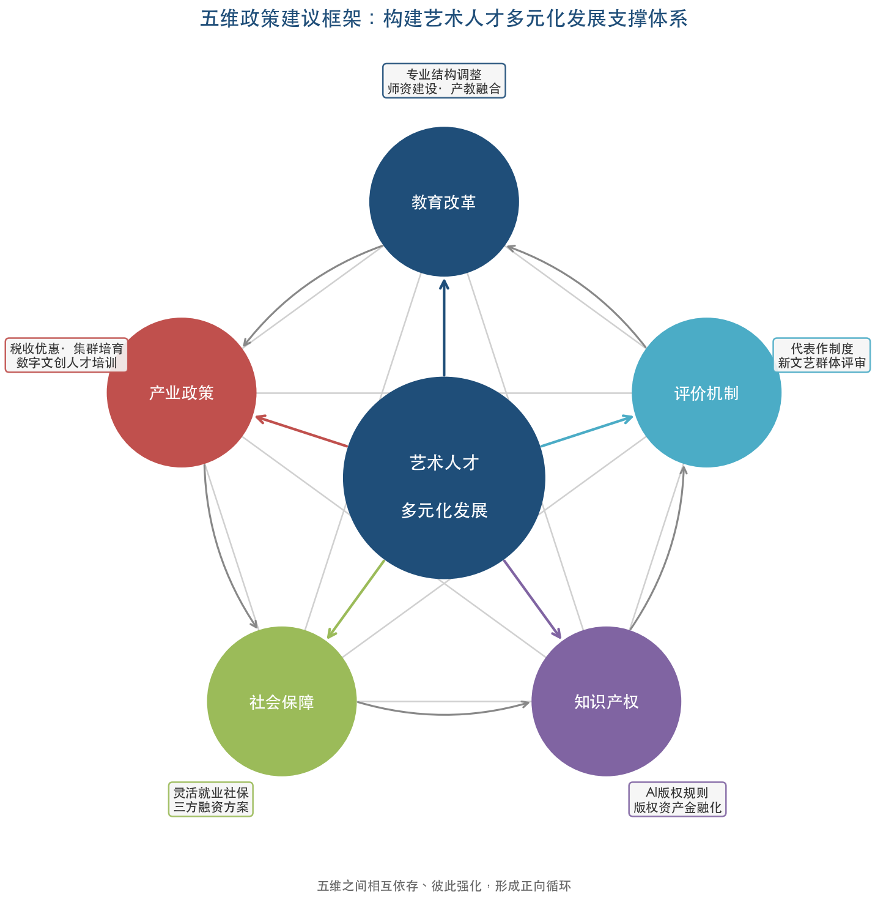

上图展示了教育改革、产业政策、社会保障、知识产权保护与评价机制五个维度之间的循环强化关系。每个维度各有核心举措：教育改革聚焦专业结构调整与师资建设、产教融合；产业政策聚焦税收优惠、集群培育和数字文创人才培训；社会保障聚焦灵活就业社保覆盖和三方融资方案；知识产权聚焦AI版权规则与版权资产金融化；评价机制聚焦代表作制度与新文艺群体评审渠道建设。

在实施节奏上，我们建议按照"近期突破—中期推进—远期布局"的逻辑分层推进：**近期（2026年下半年）**，重点关注"十五五"文化发展专项规划出台中涉及艺术人才的条款、职业伤害保障试点扩围全国的实施细则中是否纳入艺术类灵活就业者、《著作权法实施条例》修订中AI版权规则的具体条款；**中期（2027年）**，推动建立全国统一的新文艺群体分类评价标准、启动"中国版"三方融资社保方案的试点、建立数字文创人才专项培训计划；**远期（十五五规划期末）**，力争实现艺术类灵活就业者的社保覆盖率显著提升、新型人才评价体系在全国范围内全面落地、艺术人才多元化职业发展格局基本形成。

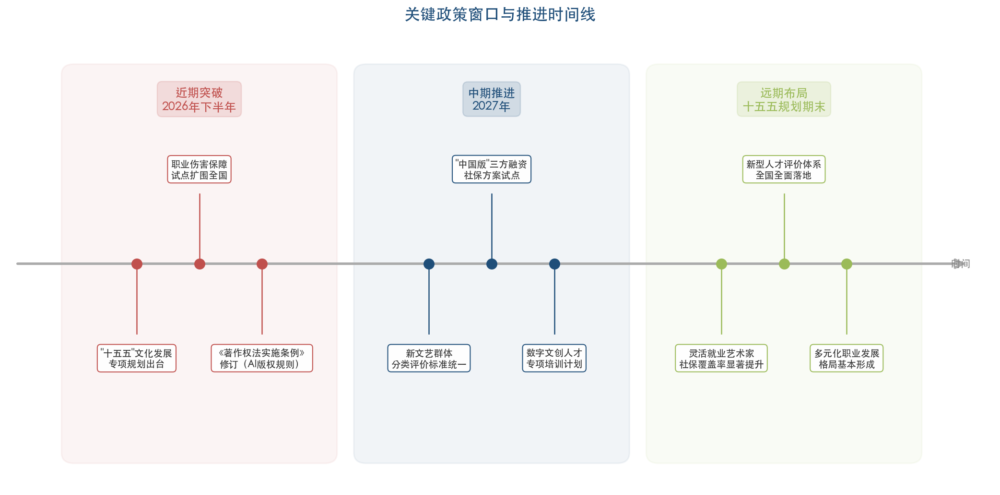

上图以时间轴形式呈现了三个阶段的关键政策窗口与预期里程碑：近期阶段聚焦于"十五五"文化专项规划出台、《著作权法实施条例》修订和职业伤害保障全国扩围三大突破口；中期阶段着力推进评价标准统一、社保方案试点和人才培训体系建设；远期阶段则以制度全面落地和格局基本形成为目标。

上述五维框架并非凭空构建，而是建立在前四章实证分析的基础之上：第一章揭示的结构性困境——传统赛道容量见顶、招生与就业的供需错配——指向教育改革和产业政策的紧迫性；第二章发现的新兴赛道机遇——游戏、微短剧、数字文创的爆发性增长——为产业政策和人才培训提供了明确方向；第三章诊断的制度瓶颈——评价体系失灵、收入极端分化、版权传导不畅——指明了评价改革、社保建设和版权制度优化的着力点；第四章梳理的国际经验——德国KSK三方融资、韩国标准合同制度、英国创意产业税收优惠、北欧同行评审机制——为具体制度设计提供了可操作的参照模板。

中国艺术人才的多元化发展，既是一个劳动力市场的供需调适问题，更是一个涉及教育体系、社会保障、产业政策和文化治理的系统性命题。"十五五"规划期是关键的政策窗口期，如能在上述五个维度实现协同突破，中国有望建立起一套兼顾保障覆盖与产业效率的本土化艺术人才发展支撑体系——不仅改善艺术类毕业生和从业者的职业境遇，更为中国文化软实力的提升和文化产业的高质量发展奠定坚实的人才基础。

# 结论与风险提示

## 核心结论

本报告围绕中国艺术生多元化职业发展这一核心议题，从就业现状诊断、新兴赛道机遇、制度环境制约、国际经验比较和政策建议五个层面展开系统分析，得出以下核心结论。

**第一，中国艺术类专业的就业困境是供需两端结构性错位的产物，而非简单的周期性波动。** 供给侧，近二十年高校艺术类专业的大规模扩张形成了庞大存量，传统纯艺术方向毕业生供给持续超出市场吸纳能力；需求侧，传统对口岗位容量增长趋于停滞，而新兴文化产业对"艺术+技术"复合型人才的需求迅速上升。教育部已启动"减旧增新"的专业结构调整——2024年度全国高校净减少1809个专业点，同时新增8个"艺术+科技"交叉专业——方向正确但存量消化仍需较长时间。

**第二，多元化职业路径已然打开，但"增量空间"能否惠及广大艺术毕业生取决于能力适配与制度保障。** 游戏产业（2025年市场规模3507.89亿元，艺术学背景从业者占比24.46%）、微短剧产业（2025年市场规模677.9亿元，直接就业69万人）、AI驱动的设计变革、艺术疗愈以及文化新业态与演出市场，共同构成了艺术人才的新赛道图谱。但这些赛道对复合型能力的刚性要求，使得传统培养模式下的毕业生在"最后一公里"面临显著的适配障碍。

**第三，社会评价体系、收入分配机制和知识产权保护制度是制约艺术人才发展的三大制度瓶颈。** "破五唯"改革虽已在政策层面确立方向，但以作品质量和社会贡献为核心的新型评价标准尚未形成可操作的制度框架。艺术行业的收入分配呈现极端"赢家通吃"格局，叠加灵活就业常态化带来的社保缺失，广大中基层从业者的经济处境与产业繁荣之间存在结构性鸿沟。知识产权保护在司法判例层面已建立起全球领先的AI版权裁判规则，但从制度保护到创作者经济回报的传导链条仍存在多处断点。

**第四，国际经验提供了丰富的制度参照，但不存在可整体移植的"现成方案"。** 法国间歇性演艺工作者制度、德国KSK三方融资社保模式、韩国"标准合同+不公平行为禁止"组合、英国创意产业税收优惠与集群培育策略以及北欧同行评审与直接补助金制度，各有其制度前提和适用边界。德国KSK模式与韩国标准合同制度在中国的制度可移植性最高，而法国失业保险附件模式和北欧大规模直接补助则受限于制度基础和财政条件，短期内难以直接复制。

**第五，"十五五"规划期是构建中国艺术人才多元化发展支撑体系的关键政策窗口。** 规划纲要已释放出明确的政策信号——推进文化和科技融合、提高灵活就业人员参保率、探索AI生成物权利归属规则。教育改革、产业政策、社会保障、知识产权保护和人才评价机制的五维协同推进，是实现系统性改善的必由之路。

## 风险提示

本报告的分析和建议基于截至2026年4月初的公开数据与政策信息，以下因素可能影响结论的适用性和建议的可行性，需予以审慎关注。

**一、AI技术演进的不确定性。** AI对艺术创作和设计行业的影响正处于快速演变期，其对就业结构的冲击规模和节奏难以精确预判。本报告引用的2023—2025年UI/UX岗位需求下降约40%的数据反映的是阶段性趋势，AI技术的后续突破可能加速或改变这一趋势方向。若大模型在视觉创作、音乐生成、动画制作等领域的能力出现超预期提升，部分新兴赛道的就业吸纳预期可能需要修正。

**二、宏观经济与文化消费的周期性波动。** 文化消费的持续扩张是本报告多项分析的宏观前提。若宏观经济增速放缓或居民可支配收入增长承压，文化消费支出增速可能回落，进而影响演出市场、微短剧产业和数字文创等赛道的就业增量预期。2024年以来部分文化消费领域已出现增速换挡迹象，需保持对消费端变化的动态跟踪。

**三、政策落地的时滞与执行偏差。** "十五五"文化发展专项规划、《著作权法实施条例》修订、职业伤害保障试点全国扩围等关键政策的出台时间和具体条款存在不确定性。从政策制定到基层执行之间的时滞，以及地方在执行中可能出现的选择性落实，均可能影响本报告所提建议的实际效果。

**四、数据可得性的局限。** 艺术类灵活就业者的精确规模、社保参保率、收入分布等关键数据缺乏系统性的全国统计，本报告在涉及上述维度时不得不依赖间接推断和局部样本。各地新文艺群体职称评审的实际参评率和通过率同样缺乏全国性汇总数据，制约了对改革实效的精确评估。

**五、新兴赛道的可持续性风险。** 微短剧产业虽在2025年实现了677.9亿元的市场规模并创造了大量就业，但该行业尚处于高速成长期，面临内容质量参差、监管政策趋严、竞争格局快速变化等不确定因素。艺术疗愈领域的职业化进程仍处于早期阶段，从专业设置到形成稳定的就业市场尚需较长培育周期。对新兴赛道就业前景的判断应保持审慎预期。

## 研究局限性

本报告的主要局限性体现在以下方面：其一，研究聚焦于本科及以上层次的艺术类毕业生和从业者，对高职高专层次和非学历培训背景的艺术从业者群体的覆盖不足；其二，国际比较部分侧重于制度设计层面的梳理，对各国制度实际运行效果的评估受限于可得评估数据的范围；其三，收入分析主要基于行业调研和平台统计等二手数据，缺乏对艺术从业者收入的大规模一手调查支撑；其四，报告撰写时部分关键政策（如"十五五"文化发展专项规划）尚未发布，相关分析具有前瞻性质，需在政策出台后结合具体条款进行修正和深化。
