# 执行摘要

全国高校教师教学创新大赛（创新赛）与全国高校青年教师教学竞赛（青教赛）是我国高校教师教学领域影响力最大、权威性最高的两项全国性赛事。本报告以两大赛事历届全国一等奖获奖课程与选手为研究对象，系统梳理赛事制度框架、获奖数据分布、教学设计共性特征与典型案例，并据此提炼面向备赛团队的实操策略建议。

**赛事制度层面**，创新赛（2020 年创办，每年一届）聚焦"教学创新"，以团队形式参赛，无年龄限制，核心评审维度为教学创新的系统性与成效的可推广性；青教赛（2012 年创办，每两年一届）聚焦"上好一门课"，以个人形式参赛，限 40 周岁以下青年教师，核心评审维度为教学基本功与现场感染力。两赛定位互补，共同构成了从"教学基本功"到"教学创新系统"的完整能力评价谱系。创新赛赛道已从首届 6 个竞赛单元扩展至第六届（2026 年）9 大赛道，青教赛组别从 3 个扩展至 5 个，赛事制度的演变直接回应了"四新"建设、课程思政、产教融合和人工智能赋能教育等国家政策方向。

**获奖画像层面**，创新赛五届（2021—2025 年）合计评出全国一等奖 326 项，校赛参赛教师从首届 5.04 万人增至第五届 12.70 万人；青教赛第五至第七届（2020—2024 年）合计评出 75 名一等奖，每届约 160 名选手参加全国决赛，获奖率不足万分之一。创新赛通过赛道分类和职称分组为不同层次院校创造了差异化竞争空间，非"双一流"院校在副高组和中级组中展现出较强竞争力；青教赛以"每省每组别推荐 1 人"的赛制突破了院校层级壁垒，但决赛层面顶尖高校仍占据明显优势——清华大学 5 次获全国第一名，上海交通大学第七届 3 名选手全部获一等奖。

**教学设计层面**，一等奖课程呈现高度一致的底层逻辑：以"学生发展为中心"为核心理念，以"两性一度"金课标准贯穿教学内容，以混合式教学、PBL/CBL 和数智化技术为方法创新载体，以"如盐化水"的方式实现课程思政有机融入。创新赛获奖课程遵循"发现真问题→构建创新模式→数据证明成效→辐射推广"的逻辑闭环；青教赛获奖课程则以"精准选题→精炼设计→精彩呈现→深度反思"为核心路径，故事化教学和"起承转合"式结构设计成为高分策略。

**典型案例分析**表明，一等奖的获取需同时满足三个条件：课程本身的教学质量和创新深度、与赛事评审标准的精准对齐、院校层面的系统性支撑。河北工业大学"三位一体"培养体系（同届 3 项一等奖）、暨南大学 70 余次研讨打磨、清华大学跨 5 个院系辅导团队、湖北省 4 期封闭集训等案例充分证明，组织化备赛能力已成为影响获奖概率的关键变量。一等奖级别的参赛课程，其课程建设周期通常在 3 年以上，备赛打磨周期在 6 个月至 2 年之间。

本报告最终形成面向备赛团队的系统化实操指南，涵盖赛事选择与赛道定位策略、四阶段备赛规划、核心材料打磨要领、现场呈现与答辩技巧、常见失分规避以及院校支撑体系建设建议，为正在辅导高校教师竞赛的教务部门和教师发展中心提供基于证据的行动参考。

# 第1章 两大赛事制度概览与比较分析

高校教师教学竞赛是我国推进本科教育教学改革、引导教师回归课堂的重要制度安排。在"以赛促教、以赛促改"的政策框架下，全国高校教师教学创新大赛（以下简称"创新赛"）与全国高校青年教师教学竞赛（以下简称"青教赛"）已成为影响力最大、权威性最高的两项全国性教学赛事。本章系统梳理两大赛事的创立背景、赛制演变与最新规则，并从主办定位、评审维度、参赛门槛、晋级机制和奖项结构五个维度展开制度比较，为后续章节的获奖分析与备赛策略研究提供制度坐标。

## 1.1 全国高校教师教学创新大赛：赛事沿革与制度要素

### 1.1.1 创立背景与制度定位

2018 年，教育部在新时代全国高等学校本科教育工作会议上明确提出"淘汰水课、打造金课"的改革方向。同年 11 月，时任教育部高教司司长吴岩在第十一届"中国大学教学论坛"上首次提出"高阶性、创新性、挑战度"（即"两性一度"）的金课标准 [人民网报道](http://theory.people.com.cn/n1/2018/1205/c40531-30443262.html "光明日报报道：打造金课需要改革教育评价制度做支撑，2018年12月")。在此政策背景下，2020 年 9 月 30 日，中国高等教育学会发布《关于举办首届全国高校教师教学创新大赛的通知》（高学会〔2020〕107 号），教育部高等教育司为指导单位，创新赛正式创立。该赛事系唯一纳入《教育部直属单位三评一竞赛保留项目清单》的高校教师教学竞赛 [首届创新赛通知全文](https://www.sohu.com/a/436589066_214420 "搜狐转载中国高等教育学会首届通知原文，2020年12月")。

创新赛的核心定位在于"教学创新"——以问题导向推动教学方法、教学内容、教学评价和教学技术的系统性变革，聚焦以学生发展为中心的教学改革实践与成效证据。

### 1.1.2 历届赛制演变

创新赛自 2021 年起每年举办一届，至 2026 年已历六届。下表列出各届核心数据：

| 届次 | 年份 | 承办高校 | 校赛参赛教师数 | 全国赛入围规模 | 一等奖数量 |
|------|------|---------|--------------|--------------|----------|
| 第一届 | 2021 | 复旦大学 | 50,386 人 | 198 个团队 | 30 项 |
| 第二届 | 2022 | 西安交通大学 | — | 406 个团队（网评）| 63 项 |
| 第三届 | 2023 | 浙江大学 | 83,224 人 | 465 个团队（网评）| 72 项 |
| 第四届 | 2024 | 电子科技大学 | 104,686 人 | 483 门课程 | 73 项 |
| 第五届 | 2025 | 北京理工大学 | 127,000 人 | 588 门课程 | 88 项 |
| 第六届 | 2026 | 南京大学、南京理工大学 | 赛事进行中 | — | — |

*数据来源：[科学网报道](https://news.sciencenet.cn/htmlnews/2021/8/462407.shtm "首届规模")、[中国青年报](http://m.cyol.com/gb/articles/2023-08/23/content_WVBWg2uLn3.html "第三届规模")、[北京理工大学官网](https://zh.bit.edu.cn/xw/blyw/1930230a9aea416cb75475dd52214ee2.htm "第四届、第五届规模")、[第六届创新赛通知](https://www.sohu.com/a/986108507_121123740 "第六届通知")*

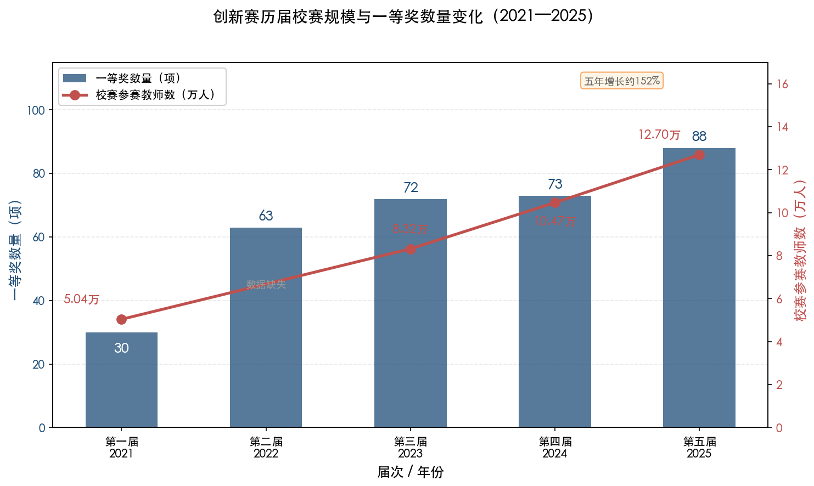

*图 1-1：创新赛第一至第五届校赛参赛教师数（折线）与全国一等奖数量（柱状）的变化趋势。校赛参赛教师数从首届（2021 年）的 5.04 万人增至第五届（2025 年）的 12.70 万人，五年增长约 152%；一等奖数量从 30 项增至 88 项 [科学网报道](https://news.sciencenet.cn/htmlnews/2021/8/462407.shtm "首届规模") [北京理工大学官网](https://zh.bit.edu.cn/xw/blyw/1930230a9aea416cb75475dd52214ee2.htm "第五届规模")。*

赛事规模的持续扩张，既反映了政策引导下高校对教学竞赛的重视程度不断提升，也表明创新赛正在成为高校教师教学能力评价与发展的重要参照系。

**赛道结构经历了三个阶段的演变。**

**第一阶段（第一至第二届，2021—2022 年）**：按高校管理归属设**部属高校（含部省合建高校）**和**地方高校**两个赛道，每赛道按主讲教师专业技术职务分为正高组、副高组、中级及以下组三个组别，共 6 个竞赛单元 [首届创新赛通知全文](https://www.sohu.com/a/436589066_214420 "首届通知")。第三届（2023 年）在此基础上引入学科分类，按"四新一基础+课程思政"设置赛道，并交叉三个职称组别，形成 18 个竞赛小组。

**第二阶段（第四届，2024 年）**：在主赛道基础上新增**产教融合赛道**和**新教师赛道**。产教融合赛道采用省赛→全国赛二级赛制，不再区分职称组，每支参赛团队至少包含 1 名行业产业部门人员。该届首次吸引 27 所军队院校和国家开放大学体系内 17 所学校参赛 [北京理工大学转引新华网](https://zh.bit.edu.cn/xw/blyw/1930230a9aea416cb75475dd52214ee2.htm "第四届规模与新赛道")。

**第三阶段（第五至第六届，2025—2026 年）**：赛道体系全面扩展为 **9 大赛道**——新工科、新医科、新农科、新文科、基础课程、课程思政、产教融合、人工智能+、新教师（第五届）。其中前 6 个赛道按职称分正高、副高、中级及以下三个小组。第六届以**实验教学赛道**替代新教师赛道（下分综合设计型实验课程组和研究探索型实验课程组），人工智能赛道进一步强调"系统性融入教学全过程"，9 大赛道格局基本稳定 [中国教育在线](https://www.eol.cn/news/yaowen/202508/t20250819_2685966.shtml "第五届赛道设置") [第六届创新赛通知](https://www.sohu.com/a/986108507_121123740 "第六届赛道调整")。

需要特别说明的是，创新赛中的"赛道"和"组别"构成两级分类体系。"赛道"对应学科或主题领域（如新工科、课程思政），"组别"对应主讲教师的职称层级（正高组、副高组、中级及以下组）。例如"新工科赛道-正高组"表示新工科领域正高职称教师参赛的竞赛单元。

### 1.1.3 参赛资格与条件

创新赛的参赛对象为普通本科高校在职教师，**无年龄限制**，覆盖所有职称层级。参赛方式以团队为主——1 名主讲教师搭配不超过 3 名团队教师，形成"1+3"团队模式。首届要求主讲教师近 5 年对参赛课程讲授 3 轮及以上，第二届起放宽为 **2 轮及以上** [首届创新赛通知全文](https://www.sohu.com/a/436589066_214420 "首届参赛条件") [暨南大学报道](https://cffd.jnu.edu.cn/2022/0825/c26867a713893/page.htm "第二届放宽条件")。

第六届（2026 年）新增限制性条件：已获往届全国赛一等奖的主讲教师不得再次参赛，上一届获二、三等奖的主讲教师不得连续参赛 [第六届创新赛通知](https://www.sohu.com/a/986108507_121123740 "第六届参赛限制")。该规定旨在拓宽获奖覆盖面，避免出现强者恒强的马太效应。

### 1.1.4 评审流程与评分指标

创新赛全国赛分为**网络评审**和**现场评审**两个阶段。

**网络评审**（60 分）：评审内容为课堂教学实录视频（40 分）和教学创新成果报告（20 分）。课堂教学实录须为参赛课程中两个 1 学时的完整教学录像，全程连续录制，要求主讲教师出镜并包含学生镜头，不得使用摇臂、无人机等脱离教学实际的录制手段 [第五届全国赛通知](https://bm.cugb.edu.cn/jsfzzx/upload/resources/file/2025/06/12/268027.pdf "第五届全国赛通知，课堂教学实录视频标准")。创新成果报告篇幅不超过 4000 字，须聚焦教学实践中的"真实问题"，采用教学实验研究范式，明确阐述教学成效及推广价值 [第五届全国赛通知](https://bm.cugb.edu.cn/jsfzzx/upload/resources/file/2025/06/12/268027.pdf "成果报告要求")。

**现场评审**（40 分）：参赛教师（团队）进行教学设计创新汇报，评委依据汇报内容进行提问交流 [第五届全国赛通知](https://bm.cugb.edu.cn/jsfzzx/upload/resources/file/2025/06/12/268027.pdf "现场评审")。

评分权重从首届到第五届经历了结构性调整：首届权重为课堂教学实录视频 50% + 创新成果报告 15% + 教学设计创新汇报 35%；到第四届和第五届则调整为**课堂教学实录 40 分 + 成果报告 20 分 + 现场汇报 40 分**（总分 100 分）。现场汇报权重从 35% 提升至 40%，成果报告从 15% 提升至 20%，课堂教学实录从 50% 下调至 40% [首届创新赛通知全文](https://www.sohu.com/a/436589066_214420 "首届评分权重") [第五届全国赛通知](https://bm.cugb.edu.cn/jsfzzx/upload/resources/file/2025/06/12/268027.pdf "第五届评分权重")。这一调整表明赛事评价重心正从"课堂呈现"向"创新设计的系统性与可推广性"转移——对备赛而言，成果报告的写作质量和现场汇报的答辩能力已与课堂教学本身同等重要。

### 1.1.5 获奖等级与奖项结构

创新赛设一等奖、二等奖、三等奖三个等级，以及教学活动创新奖、教学学术创新奖、教学设计创新奖等多种专项奖，另设优秀基层教学组织奖和优秀组织奖。以第五届为例，全国赛共评出一等奖 88 项、二等奖 205 项、三等奖 295 项 [中国教育在线](https://www.eol.cn/news/yaowen/202508/t20250819_2685966.shtml "第五届获奖数据")。一等奖数量随赛道扩展逐年增加，从首届的 30 项增至第五届的 88 项，五届合计 326 项。

## 1.2 全国高校青年教师教学竞赛：赛事沿革与制度要素

### 1.2.1 创立背景与制度定位

青教赛创办于 2012 年，由**中华全国总工会与教育部联合主办**，**中国教科文卫体工会与教育部教师工作司联合承办**，每两年举办一届，截至 2024 年已连续举办七届，第八届（2026 年）正在进行中。该赛事被纳入全国总工会"十四五"全国引领性劳动和技能竞赛项目清单，兼具劳动竞赛属性与教育培养功能 [教育部官网报道](http://www.moe.gov.cn/jyb_xwfb/gzdt_gzdt/s5987/202409/t20240904_1148946.html "第七届全国高校青年教师教学竞赛决赛举办，2024年9月")。

青教赛的核心定位在于"上好一门课"——以教学基本功展示为核心，引导青年教师扎根教学岗位、锤炼教学能力，强调教学设计的规范性、课堂教学的表现力与教学反思的深度。

### 1.2.2 历届赛制演变

青教赛每两年一届，下表列出各届核心数据：

| 届次 | 年份 | 决赛地点 | 组别设置 | 决赛选手数 | 参赛高校/教师规模 |
|------|------|---------|---------|----------|----------------|
| 第一届 | 2012 | — | 文/理/工 3 组 | — | — |
| 第二届 | 2014 | — | 文/理/工 3 组 | — | — |
| 第三届 | 2016 | 华东师范大学 | 文/理/工 3 组 | — | — |
| 第四届 | 2018 | — | 文/理/工 3 组 | — | — |
| 第五届 | 2020 | 南京（线下） | 文/理/工/医/思政 5 组 | 162 人 | 覆盖近半数高校，累计参加教师逾百万 |
| 第六届 | 2022/2023 | 清华大学 | 文/理/工/医/思政 5 组 | 158 人 | 1,800 余所高校、近 50 万名教师 |
| 第七届 | 2024 | 上海交通大学 | 文/理/工/医/思政 5 组 | 159 人 | 2,028 所高校、30 余万名教师 |
| 第八届 | 2026 | 待定 | 文/理/工/医/思政 5 组 | — | 赛事进行中 |

*数据来源：[新浪新闻](https://news.sina.cn/gn/2020-10-30/detail-iiznezxr8962366.d.html "第五届决赛")、[教育部官网](http://www.moe.gov.cn/jyb_xwfb/gzdt_gzdt/s5987/202304/t20230425_1057138.html "第六届青教赛报道")、[教育部官网](http://www.moe.gov.cn/jyb_xwfb/gzdt_gzdt/s5987/202409/t20240904_1148946.html "第七届报道")、[五邑大学校赛通知](https://www.wyu.edu.cn/hr/info/1552/6001.htm "第八届校赛通知")*

**组别设置的重大调整发生在第五届（2020 年）**：从文科、理科、工科三个组别扩展为**五个组别**，新增医科组和思想政治课专项组，第七至第八届延续该设置 [第五届青教赛通知](https://sub2.dlust.edu.cn/jxzlb/uploadfile/file/20220310/20220310082737_14191.pdf "第五届通知") [教育部官网报道](http://www.moe.gov.cn/jyb_xwfb/gzdt_gzdt/s5987/202409/t20240904_1148946.html "第七届报道")。

值得注意的是，青教赛的"组别"按学科领域划分（文科、理科、工科、医科、思政），与创新赛中按职称层级划分"组别"的逻辑截然不同。各组别之间在课堂教学评分标准上略有差异，但整体评审框架保持一致。

从参赛规模来看，第六届（2022/2023 年）覆盖全国 1,800 余所高校的近 50 万名青年教师参与校院级和省级选拔，高校参赛率约 60%，1,501 所学校的 8,550 名选手参加省级选拔赛，最终 158 名选手进入全国决赛 [中国教育新闻网](http://www.jyb.cn/rmtzgjyb/202304/t20230425_2111033012.html "第六届青教赛规模")。第七届（2024 年）参赛高校增至 2,028 所，参赛率提升至 65%，159 名选手参加全国决赛 [教育部官网报道](http://www.moe.gov.cn/jyb_xwfb/gzdt_gzdt/s5987/202409/t20240904_1148946.html "第七届规模")。青教赛"广覆盖、窄决赛"的特征由此可见一斑。

### 1.2.3 参赛资格与条件

青教赛的参赛对象为全国各级各类高等院校从事教育教学工作的青年教师，核心门槛为**年龄在 40 周岁以下**。第八届（2026 年）进一步提高参赛条件：教龄须达 **5 年（含）以上**，近 3 学年须持续从事一线教学工作，参赛课程学分不少于 2 个学分 [第五届青教赛通知](https://sub2.dlust.edu.cn/jxzlb/uploadfile/file/20220310/20220310082737_14191.pdf "第五届参赛条件") [五邑大学第八届校赛通知](https://www.wyu.edu.cn/hr/info/1552/6001.htm "第八届校赛通知")。参赛形式为**个人参赛**，不设团队模式，这意味着青教赛更侧重考察教师个体的教学功力与临场发挥能力，而非团队协作与分工。

### 1.2.4 竞赛环节与评分细则

青教赛以"上好一门课"为竞赛理念，由**教学设计、课堂教学和教学反思**三个环节组成。

**教学设计**：选手需准备参赛课程若干学时（第五届为 20 个学时，第七、八届调整为 16 个学时）的完整教学设计方案及配套课件。评分维度包括教学指导思想、内容分析、学情分析、教学目标与重难点、教学过程设计等 [第五届青教赛通知](https://sub2.dlust.edu.cn/jxzlb/uploadfile/file/20220310/20220310082737_14191.pdf "教学设计要求")。

**课堂教学**：决赛当日由选手现场抽签确定具体参赛的教学节段，规定时间为 **20 分钟**，采用无生上课形式（教室中无学生，选手独立完成教学展示）。课堂教学是青教赛的核心环节，其评分由四个维度构成——以第五届为例：教学内容 30 分（含立德树人 6 分、理论联系实际 6 分、学术性 6 分、学科前沿 3 分、重点条理 9 分）、教学组织 30 分（含过程安排 10 分、启发性 10 分、时间安排 3 分、多媒体运用 4 分、板书设计 3 分）、语言教态 10 分、教学特色 5 分，合计 75 分 [第五届青教赛通知](https://sub2.dlust.edu.cn/jxzlb/uploadfile/file/20220310/20220310082737_14191.pdf "课堂教学评分细则")。

**教学反思**：第五届和第六届采用 45 分钟内完成的书面反思（500 字以内，占 5 分），第八届（2026 年）改为 **3 分钟口头反思**，要求从教学理念、教学方法、教学过程三方面进行即时反思 [五邑大学第八届校赛通知](https://www.wyu.edu.cn/hr/info/1552/6001.htm "第八届教学反思调整")。

**评分权重的演变趋势**呈现课堂教学占比逐步提升的特征：第五届为教学设计 20 分 + 课堂教学 75 分 + 教学反思 5 分 = 100 分；第七届（2024 年）调整为教学设计 15 分 + 课堂教学 80 分 + 教学反思 5 分 = 100 分；第八届部分校赛进一步调整为教学设计 20 分 + 课堂教学 80 分 = 100 分（书面反思改为口头反思后是否单独计入总分尚待国赛通知确认）[第五届青教赛通知](https://sub2.dlust.edu.cn/jxzlb/uploadfile/file/20220310/20220310082737_14191.pdf "第五届评分权重") [西藏大学第八届校赛通知](https://jwc.utibet.edu.cn/info/1021/1985.htm "第八届校赛权重")。课堂教学从 75 分提升至 80 分，进一步巩固了"上好一门课"的核心导向。

### 1.2.5 获奖等级与荣誉激励

青教赛决赛每个组别各评出一等奖 5 名、二等奖 10 名、三等奖若干名。各组别一等奖第一名且符合条件的选手可按程序申报**"全国五一劳动奖章"**——这是由全国总工会颁发的国家级荣誉，在高校教师个人荣誉体系中具有极高含金量，也是青教赛区别于其他教学竞赛的标志性制度安排 [第五届青教赛通知](https://sub2.dlust.edu.cn/jxzlb/uploadfile/file/20220310/20220310082737_14191.pdf "青教赛奖项设置")。

## 1.3 两大赛事制度比较

### 1.3.1 主办单位与定位差异

创新赛由**中国高等教育学会主办、教育部高等教育司指导**，聚焦"教学创新"，核心理念是推动以学生发展为中心的教学改革。青教赛由**中华全国总工会与教育部联合主办、中国教科文卫体工会与教育部教师工作司联合承办**，聚焦"教学基本功"，核心理念是"上好一门课"。

从组织架构可以看出，创新赛在教育系统内部运行，与高等教育改革政策（"金课"建设、新工科/新医科/新农科/新文科、课程思政等）紧密关联；青教赛则嵌入工会系统，兼具劳动竞赛属性和教育培养功能，"全国五一劳动奖章"的授予通道使其在荣誉层级上具有独特优势。

### 1.3.2 评审维度对比

两大赛事的评审维度差异体现了各自的核心定位：

**创新赛**强调"教学创新的系统性"：评审内容涵盖真实课堂实录（须有学生出镜）、教学创新成果报告（以学术研究范式呈现）和教学设计创新汇报。评分标准要求"聚焦教学实践的'真实问题'"、"形成具有较强辐射推广价值的教学新方法、新模式"，以信息技术融合与教学成效证据为重要考量维度 [首届创新赛通知全文](https://www.sohu.com/a/436589066_214420 "创新赛评审维度") [第五届全国赛通知](https://bm.cugb.edu.cn/jsfzzx/upload/resources/file/2025/06/12/268027.pdf "成果报告要求")。

**青教赛**强调"教学基本功的精湛性"：评审采用现场无生上课 + 抽签节段的方式，考察教师在有限时间内独立完成高质量教学展示的能力。"语言教态"（10 分）是青教赛独有的显性评审维度，涵盖普通话水平、声音感染力、肢体语言和教态自然度等要素。板书设计（3 分）在数字化时代的青教赛中仍占一席之地，体现了赛事对传统教学基本功的持续重视 [第五届青教赛通知](https://sub2.dlust.edu.cn/jxzlb/uploadfile/file/20220310/20220310082737_14191.pdf "青教赛评审维度")。

### 1.3.3 参赛门槛与晋级机制对比

创新赛无年龄限制，覆盖正高至中级的全部职称层级，鼓励以"1+3"团队模式参赛；青教赛限 40 周岁以下青年教师，以个人形式参赛，无职称限制但有教龄要求（第八届起须 5 年以上）。两赛参赛门槛的差异，本质上反映了各自的功能定位——创新赛面向成熟教师群体考察系统创新能力，青教赛面向青年教师群体锻造教学基本功。

在晋级机制方面，创新赛采用**校赛→省赛→全国赛三级赛制**（产教融合赛道为省赛→全国赛两级）。全国赛先经网络评审淘汰后进入现场评审，最终入围全国现场赛的规模较大——第五届有 588 门课程、2,253 位教师入围 [北京理工大学官网](https://zh.bit.edu.cn/xw/blyw/1930230a9aea416cb75475dd52214ee2.htm "第五届入围规模")。

青教赛采用**校赛/省赛（初赛）→全国决赛两级赛制**，各省（区、市）和新疆生产建设兵团每个组别仅推荐 **1 名**选手参加全国决赛，五个组别合计约 160 名选手。这一"广覆盖、窄决赛"的赛制使省赛成为最关键的竞争节点——在教育强省（湖北、上海、北京等），省内竞争激烈程度往往不亚于全国决赛 [第五届青教赛通知](https://sub2.dlust.edu.cn/jxzlb/uploadfile/file/20220310/20220310082737_14191.pdf "青教赛晋级规则")。

### 1.3.4 获奖等级与奖项结构对比

创新赛一等奖数量较多（第五届达 88 项），随赛道扩展逐年增加，另设多种专项奖鼓励不同维度的教学创新；青教赛一等奖数量精少（每组 5 名，五组别合计 25 名），但一等奖第一名可申报"全国五一劳动奖章"，荣誉层级显著高于创新赛。

两种奖项结构各有制度优势：创新赛较宽的获奖面有利于激励更多教师投入教学改革，专项奖的设置也为不同创新路径提供了认可空间；青教赛极为精简的获奖结构则凸显了个体教学卓越的稀缺性，"五一劳动奖章"的荣誉含金量对青年教师具有极强的激励效应。

### 1.3.5 制度比较总表

| 比较维度 | 创新赛 | 青教赛 |
|---------|-------|-------|
| **主办单位** | 中国高等教育学会（教育部高教司指导） | 全国总工会与教育部联合主办 |
| **创办年份** | 2020 年（首届 2021 年） | 2012 年 |
| **举办频率** | 每年一届 | 每两年一届 |
| **核心理念** | 教学创新 | 上好一门课 |
| **参赛资格** | 本科高校在职教师，无年龄限制 | 40 周岁以下青年教师，教龄 5 年以上（第八届） |
| **参赛形式** | 团队参赛（1 名主讲 + ≤3 名团队教师） | 个人参赛 |
| **赛道/组别** | 9 大赛道（第六届），按职称分正高/副高/中级组 | 5 个学科组别（文/理/工/医/思政） |
| **竞赛内容** | 课堂教学实录（真实课堂）+ 创新成果报告 + 教学设计创新汇报 | 教学设计（16 学时）+ 课堂教学（20 分钟无生上课，抽签）+ 教学反思 |
| **评分权重（最新）** | 实录 40 分 + 报告 20 分 + 汇报 40 分 = 100 分 | 设计 15–20 分 + 课堂教学 75–80 分 + 反思 0–5 分 = 100 分 |
| **赛制层级** | 校赛→省赛→全国赛（三级） | 校赛/省赛→全国决赛（两级） |
| **全国赛规模** | 第五届 588 门课程入围 | 每届约 160 名选手 |
| **一等奖数量** | 第五届 88 项 | 每届 25 名（每组 5 名） |
| **最高荣誉** | 一等奖及专项奖 | 各组第一名可申报"全国五一劳动奖章" |

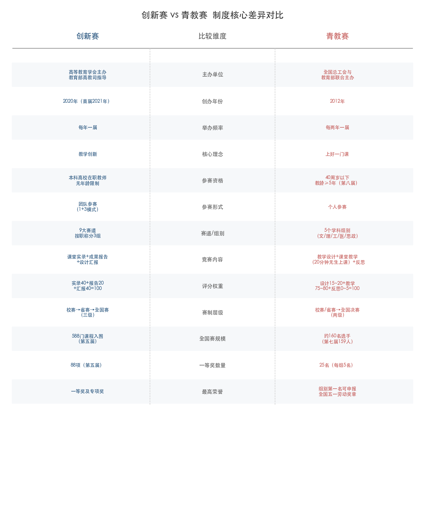

*图 1-2：创新赛与青教赛在主办单位、参赛资格、竞赛内容、评分权重、赛制层级、获奖结构等 13 个维度的制度核心差异对比。两赛在定位、评审逻辑与荣誉体系上形成鲜明互补。*

## 1.4 赛制演变的政策逻辑与互补关系

纵观两大赛事的制度演变，可以识别出清晰的政策逻辑脉络。

创新赛的赛道扩展直接回应了国家高等教育政策的重点方向：第四届新增产教融合赛道呼应了国务院关于深化产教融合的政策导向，第五届增设人工智能+赛道回应了教育部关于人工智能赋能教育的战略部署，第六届以实验教学赛道替代新教师赛道则体现了对实践教学能力的持续重视。评分权重的调整——现场汇报和成果报告占比提升、课堂实录占比下降——表明赛事越来越重视教学创新的"系统性"和"可推广性"，而非单纯的课堂呈现效果。

青教赛的演变则表现为两条主线：其一是组别扩展（从三组到五组），将医科和思政课纳入赛事体系，与"新医科"建设和课程思政全覆盖的政策要求相呼应；其二是课堂教学权重持续上升（从 75 分到 80 分），进一步巩固了"教学基本功"的核心地位。第八届将教龄门槛从无明确要求提高到 5 年以上，体现了赛事从"鼓励新手教师参与"向"选拔有一定积累的青年教学骨干"的定位升级。

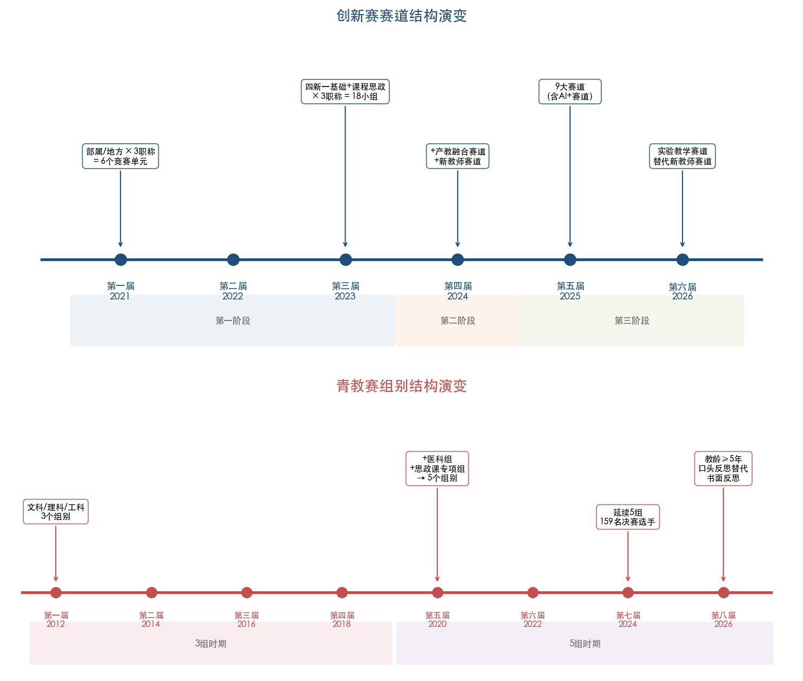

*图 1-3：两大赛事赛道/组别结构演变时间线。上半部分展示创新赛从 6 个竞赛单元到 9 大赛道体系的三阶段扩展，下半部分展示青教赛从 3 个学科组别到 5 个组别的演变过程，并标注各阶段的关键政策变化。*

从制度互补的角度审视，创新赛和青教赛共同构成了高校教师教学能力评价的"双轮驱动"格局。创新赛面向全年龄段教师、以团队为单位考察教学创新的系统能力，适合拥有成熟教学体系和改革实践成果的教师群体；青教赛面向 40 周岁以下青年教师、以个人为单位考察教学基本功，适合教学表现力强、教学设计精到的年轻教师。二者定位互补，共同构成了从"教学基本功"到"教学创新系统"的完整能力评价谱系。对于承担教师教学发展与竞赛辅导工作的院校管理部门而言，准确把握两大赛事的制度差异，是精准选拔参赛人选、合理定位赛道组别、科学制定备赛方案的基本前提。

# 第2章 全国一等奖获奖课程与选手的整体画像

全国高校教师教学创新大赛（以下简称"创新赛"）与全国高校青年教师教学竞赛（以下简称"青教赛"）作为国内最具影响力的两大教师教学竞赛，其全国一等奖获奖课程与选手的特征分布，直接反映了高等教育教学创新的前沿方向与人才结构。本章通过对两大赛事历届一等奖数据的系统梳理，从获奖规模演变、赛道与学科分布、院校层次结构、选手职称与年龄画像、团队构成模式等维度，回答"什么样的课程、什么样的教师更容易获得全国一等奖"这一核心问题，为备赛团队提供基于数据的定位参考。

## 2.1 创新赛一等奖的规模演变与赛道分布

### 2.1.1 一等奖数量的持续扩张

创新赛自 2021 年举办首届以来，全国一等奖数量呈现稳步增长态势。首届（2021 年）评出一等奖 30 项，第二届（2022 年，西安交通大学承办）扩大至 63 项，第三届（2023 年，浙江大学承办）增至 72 项，第四届（2024 年，电子科技大学承办）为 73 项，第五届（2025 年，北京理工大学承办）达到 88 项，五届合计 326 项一等奖 [科学网报道](https://news.sciencenet.cn/htmlnews/2021/7/462392.shtm "首届获奖名单") [中国教育在线](https://news.eol.cn/yaowen/202308/t20230826_2458196.shtml "第三届获奖名单") [中国教育在线](https://news.eol.cn/yaowen/202407/t20240731_2627166.shtml "第四届73项一等奖") [中国教育在线](https://www.eol.cn/news/yaowen/202508/t20250825_2686427.shtml "第五届88项一等奖")。

与一等奖数量同步增长的是参赛规模。校赛参赛教师数从首届的 50386 人增至第五届的 12.7 万人，5 年增长约 152%；参赛高校从首届的 1071 所增至第四届的 1249 所，第五届进一步覆盖全部 32 个赛区和所有学科门类 [科学网报道](https://news.sciencenet.cn/htmlnews/2021/8/462407.shtm "首届全国赛规模") [光明日报](https://news.gmw.cn/2025-08/20/content_38229127.htm "第五届全国现场赛")。这一规模扩张的底层逻辑在于：创新赛是目前唯一纳入《教育部直属单位三评一竞赛保留项目清单》的高校教师教学竞赛，其获奖成果在职称评审、教学成果奖申报等方面具有显著的制度认可度。

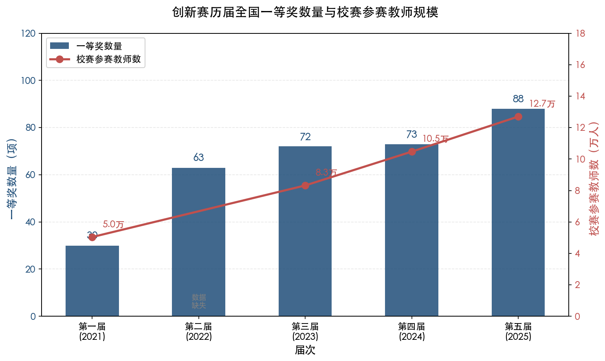

**图 2-1 创新赛历届全国一等奖数量与校赛参赛教师规模。** 蓝色柱状图为各届一等奖数量（左轴），红色折线为校赛参赛教师数（右轴，万人）。第二届校赛参赛教师数据未公开。一等奖数量与参赛规模总体呈同步增长态势。

| 届次 | 年份 | 承办单位 | 校赛参赛教师数 | 全国赛入围数 | 一等奖数 |
|------|------|----------|---------------|-------------|---------|
| 第一届 | 2021 | — | 50,386 | 198 | 30 |
| 第二届 | 2022 | 西安交通大学 | — | 406 | 63 |
| 第三届 | 2023 | 浙江大学 | 83,224 | — | 72 |
| 第四届 | 2024 | 电子科技大学 | 104,686 | — | 73 |
| 第五届 | 2025 | 北京理工大学 | 127,000 | 588 | 88 |

**表 2-1 创新赛历届一等奖数量与参赛规模一览。** "—"表示该项数据未在公开渠道获取。

### 2.1.2 赛道结构的三阶段演变

创新赛的赛道设置经历了三个阶段的结构性演变。**第一阶段（第 1—2 届）** 采用"部属高校/地方高校"两赛道，每赛道按职称分正高组、副高组、中级及以下组三个组别，共 6 个竞赛单元。**第二阶段（第 3 届）** 引入学科分类维度，设置新工科、新医科、新农科、新文科、基础课程、课程思政六大赛道，每赛道再按职称分组，形成 18 个竞赛小组 [搜狐·高教国培](https://www.sohu.com/a/713880354_120492088 "第三届分组说明")。**第三阶段（第 4—5 届）** 进一步扩展为 9 大赛道——第四届新增产教融合赛道和新教师赛道，第五届增设人工智能赛道 [北京理工大学官网](https://zh.bit.edu.cn/xw/blyw/1930230a9aea416cb75475dd52214ee2.htm "第五届创新赛赛道")。赛道结构从"按院校类型分"到"按学科分"再到"按创新方向分"的演进轨迹，折射出赛事定位从"分类公平竞争"向"引领教学创新方向"的转型。

### 2.1.3 第三届一等奖的学科分布样本

由于创新赛首届、第二届、第四届、第五届的一等奖完整文字版名单在公开渠道获取有限，以第三届（2023 年）72 项一等奖为样本进行学科分布分析。根据第三届完整获奖名单逐条统计：新工科赛道获 18 项一等奖（占 25%），新文科赛道获 16 项（22%），基础课程赛道获 14 项（19%），新医科赛道获 10 项（14%），课程思政赛道获 9 项（12%），新农科赛道获 5 项（7%） [第三届获奖名单PDF](http://jsy-reptile-img.oss-cn-guangzhou.aliyuncs.com/crawler_img/20230826/1692964393519500.pdf "第三届获奖名单逐条统计")。

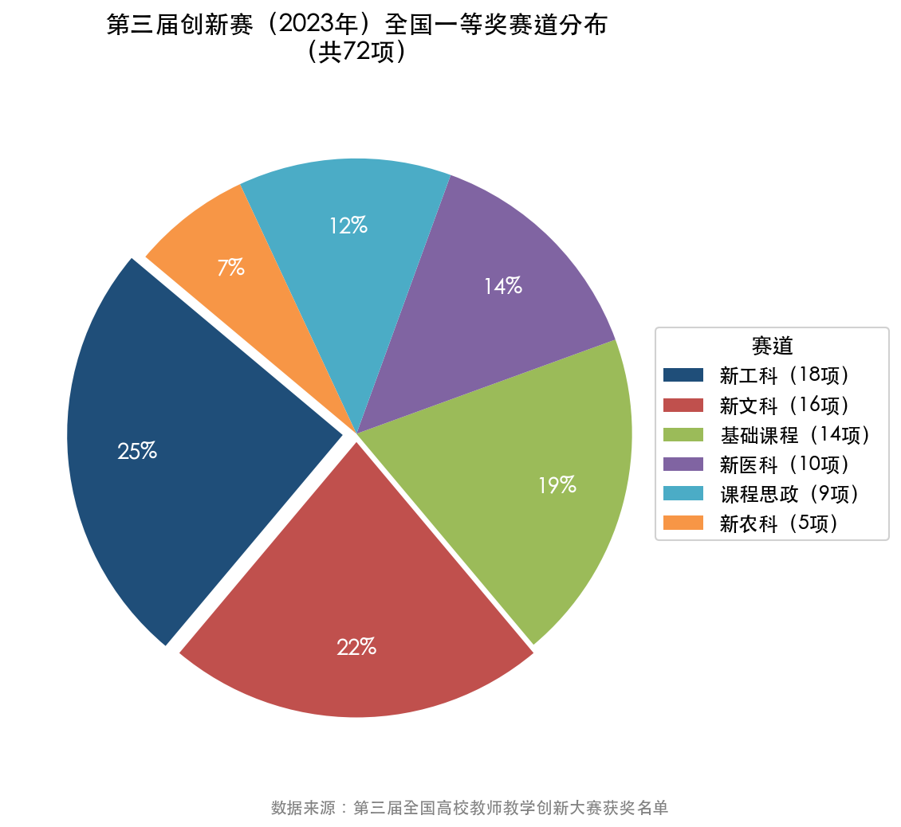

**图 2-2 第三届创新赛（2023 年）全国一等奖赛道分布（共 72 项）。** 新工科与新文科合占一等奖总数的 47%，构成两大优势赛道。

这一分布揭示两个值得关注的特征。其一，新工科和新文科合占一等奖总数的 47%，体现了这两类学科在高校教学创新中的主导地位，这与"四新"建设中新工科、新文科的先发优势相吻合。其二，新农科的一等奖占比仅 7%，与该学科在高等教育体系中的规模基本匹配，但也意味着农科领域的教学创新样本相对稀缺——具备独特创新点的农科课程在竞争中或更易脱颖而出。

### 2.1.4 产教融合赛道的异军突起

第四届（2024 年）新增的产教融合赛道迅速成为重要竞争领域。全国共有 993 所高校 5031 名教师参加该赛道省赛，最终评出一等奖 12 项。该赛道的显著特点在于团队构成的强制性要求——每支参赛团队至少须有 1 名来自行业产业部门的成员，这一制度设计将产学研协同直接嵌入参赛资格，确保了"产教融合"并非停留在概念层面 [中国科协](https://www.cast.org.cn/xw/qgxh/ZHXX/art/2024/art_d7929070ea034584993b2464bd8c4af3.html "第四届产教融合赛道")。第五届（2025 年）新增的人工智能赛道同样值得关注，其设立传递了教育主管部门将 AI 赋能教学纳入教学创新核心方向的明确信号。

## 2.2 青教赛一等奖的组别分布与选手特征

### 2.2.1 组别演变与一等奖配额

青教赛自 2012 年创办以来，竞赛组别经历了从 3 组到 5 组的扩展。第 1—4 届设文科、理科、工科 3 个组别；第 5 届（2020 年）起增设医科组和思想政治课专项组，形成 5 组格局并延续至第 8 届 [第五届青教赛通知](https://sub2.dlust.edu.cn/jxzlb/uploadfile/file/20220310/20220310082737_14191.pdf "第五届通知") [教育部官网](http://www.moe.gov.cn/jyb_xwfb/gzdt_gzdt/s5987/202409/t20240904_1148946.html "第七届报道")。每个组别设一等奖 5 名、二等奖 10 名、三等奖 16—18 名；各组别第一名可按程序申报"全国五一劳动奖章"，这一由全国总工会颁发的荣誉使青教赛在荣誉层级上具有独特的制度优势 [第五届青教赛通知](https://sub2.dlust.edu.cn/jxzlb/uploadfile/file/20220310/20220310082737_14191.pdf "第五届奖项设置")。

按此标准，5 组别时代每届评出一等奖 25 名，第 5—7 届三届合计 75 名全国一等奖。相较创新赛五届 326 项的体量，青教赛一等奖的稀缺性更为突出，竞争烈度也更高——以第七届（2024 年）为例，全国 2028 所高校 30 余万名青年教师参与，仅 159 名选手进入全国决赛，最终 25 人获一等奖，获奖率不足万分之一 [教育部官网](http://www.moe.gov.cn/jyb_xwfb/gzdt_gzdt/s5987/202409/t20240904_1148946.html "第七届青教赛")。

### 2.2.2 一等奖选手的院校与组别分布

第五届青教赛（2020 年，南京大学承办）共有 162 名选手参加决赛，评出一等奖 25 名。各组别前三名选手信息如表 2-2 所示 [新浪新闻](https://news.sina.cn/gn/2020-10-30/detail-iiznezxr8962366.d.html "第五届决赛") [搜狐·青教赛获奖视频整理](https://www.sohu.com/a/503258263_121124031 "第五届前三名名单")。

| 组别 | 第一名 | 第二名 | 第三名 |
|------|--------|--------|--------|
| 文科组 | 孙乐强（南京大学） | 蒙克（清华大学） | 邓弋威（浙江工商大学） |
| 理科组 | 刘白羽（北京科技大学） | 雷萌萌（河南农业大学） | 向圆圆（河海大学） |
| 工科组 | 赵勃（南京邮电大学） | 班慧勇（清华大学） | 刘晓晶（上海交通大学） |
| 医科组 | 袁东智（四川大学） | — | — |
| 思政组 | 马慎萧（中国人民大学） | — | — |

**表 2-2 第五届青教赛各组别一等奖前三名。** 医科组和思政组第二、三名完整信息未在公开渠道获取。

值得关注的是，文科组第三名浙江工商大学、理科组第二名河南农业大学、工科组第一名南京邮电大学均为非"双一流"建设高校。这一事实表明，青教赛以"教学基本功"为核心评审维度的制度设计，在相当程度上突破了院校层级的壁垒——个人教学能力而非院校平台成为决定性因素。

### 2.2.3 选手职称与年龄结构

第五届青教赛决赛 162 名选手的职称分布呈现显著的"讲师—副教授"双核心特征：讲师 84 人（占 51.9%）、副教授 67 人（41.4%）、教授 7 人（4.3%），其余为助教及其他职称 [新浪新闻](https://news.sina.cn/gn/2020-10-30/detail-iiznezxr8962366.d.html "第五届职称结构")。选手平均年龄为 36 岁。考虑到青教赛要求参赛教师年龄在 40 周岁以下（第八届进一步要求教龄 5 年以上），核心竞争群体为 30—39 岁、具有 5—15 年教龄的中青年教师。

讲师占比超过半数这一数据具有重要的政策含义。一方面，青教赛为尚未获得高级职称的青年教师提供了全国级别的展示平台与荣誉通道；另一方面，讲师群体在教学一线投入的时间和精力往往多于已承担大量行政或科研任务的副教授和教授，长期一线教学的浸润可能赋予其在教学基本功打磨上的比较优势。

## 2.3 获奖院校的层次分布

### 2.3.1 创新赛：非"双一流"院校的突破空间

创新赛的赛道与分组设计从制度层面为不同层次院校创造了差异化竞争空间。第 1—2 届明确设置"部属高校赛道"与"地方高校赛道"，第 3 届起虽改为按学科分赛道，但在职称分组中保留了"正高/副高/中级及以下"三个层次，使得不同职称层级的教师在同类群体中展开竞争。

从第三届（2023 年）一等奖获奖名单来看，非"双一流"院校在特定赛道和组别中展现出较强的竞争力。贵阳学院在新工科副高组获得一等奖，丽江文化旅游学院在新文科中级及以下组获得一等奖 [第三届获奖名单PDF](http://jsy-reptile-img.oss-cn-guangzhou.aliyuncs.com/crawler_img/20230826/1692964393519500.pdf "第三届获奖名单")。这些案例表明，在创新赛的评审框架下，具备独特教学创新亮点的地方院校教师同样能够脱颖而出，尤其在副高组和中级组中，非"双一流"院校与名校教师处于相对均衡的竞争起点。

河北工业大学的表现尤为突出。这所"双一流"建设高校连续三届获得创新赛全国一等奖，第五届（2025 年）更以 3 项一等奖位居当届获奖数量最多的三所高校之一 [河北工业大学本科生院](https://ugs.hebut.edu.cn/xwdt/d9bee06c60f54e32be2f265d1b40fd33.htm "河北工大3项一等奖")。多所院校在同一届中获 2 项以上一等奖——如哈尔滨医科大学、哈尔滨工程大学、西南交通大学等 [腾讯新闻](https://news.qq.com/rain/a/20230903A05SUQ00 "第三届多项数据")，这一现象反映出院校层面的系统化备赛支撑是批量产出获奖成果的关键因素。

### 2.3.2 青教赛：顶尖高校优势明显但非"双一流"院校仍有突破

青教赛"每省每组别推荐 1 人"的赛制设计，使得各省代表选手必然来自全省最优秀的青年教师，院校层次的差异在省级选拔阶段已经过充分竞争的筛选。第六届青教赛（2022 年，清华大学承办）25 名一等奖获得者中，湖北工业大学同时获得理科组和工科组各 1 项一等奖，兰州理工大学获工科组一等奖，南京邮电大学获理科组一等奖——多所非"双一流"院校在全国决赛中取得了优异成绩 [国家智慧教育平台](https://teacher.higher.smartedu.cn/h/subject/young/gkz/ydj/ "第六届工科组获奖名单")。

与此同时，顶尖高校在青教赛中的优势仍然显著。清华大学的表现最为突出：第七届（2024 年）文科组郭璐获一等奖第一名后，清华大学官方确认"清华大学青年教师第五次荣获全国青教赛第一名" [清华大学官网](https://www.tsinghua.edu.cn/info/1176/113536.htm "清华第五次获全国青教赛第一名")，这一成绩体现了顶尖高校在青年教师教学培养方面的深厚积累与系统化投入。上海交通大学在第七届创造了 3 名选手全部获一等奖的纪录——赵维殳获理科组第 1 名、叶枫获医科组第 1 名、王新昶获工科组第 3 名——为该校历史最好成绩 [上海交通大学教学发展中心](https://ctld.sjtu.edu.cn/news/detail/1162 "交大三名选手获一等奖")。

### 2.3.3 地域分布的不均衡性

从青教赛的地域表现来看，高教资源富集省份展现出持续的竞争优势。第七届（2024 年）湖北代表队获得 3 项一等奖，居全国第二 [荆楚网](http://news.cnhubei.com/content/2024-09/11/content_18392941.html "湖北3项一等奖")。湖北、上海、北京、江苏等省市在历届青教赛中一等奖获取率较高，这与上述地区高校密度高、教师发展中心建设成熟、省级备赛支撑体系完善密切相关。这一地域分布特征提示：对于中西部省份的青年教师而言，省级选拔阶段的竞争压力相对较小，但全国决赛层面则需面对来自教育强省选手的高水平比拼。

## 2.4 获奖团队构成与参赛模式

### 2.4.1 创新赛的团队参赛模式

创新赛以团队参赛为基本模式，通常由 1 名主讲教师和最多 3 名团队成员组成"1+3"团队 [首届获奖名单PDF](https://case.bit.edu.cn/docs//2021-08/8550a4b5377f4146bc8c00d4a1be1e60.pdf "首届获奖名单")。这一制度设计体现了教学创新的协作属性：课堂教学实录视频须由主讲教师独立完成，但创新成果报告和教学设计往往凝聚了整个团队在课程建设、技术开发、数据分析等方面的集体智慧。产教融合赛道在此基础上增设了特殊要求——参赛团队中至少须有 1 人来自行业产业部门，以确保产教融合的真实性与实质性 [中国科协](https://www.cast.org.cn/xw/qgxh/ZHXX/art/2024/art_d7929070ea034584993b2464bd8c4af3.html "产教融合赛道团队要求")。

第五届（2025 年）的数据清晰地印证了团队参赛的普遍性：588 门课程共 2253 位教师入围全国赛 [光明日报](https://news.gmw.cn/2025-08/20/content_38229127.htm "第五届全国现场赛")，平均每门参赛课程约 3.8 位教师，高度接近"1+3"的满额配置。这一数据说明，绝大多数参赛团队选择满额组队，团队协作已成为创新赛参赛的标准模式。

### 2.4.2 青教赛的个人竞技与集体备赛

与创新赛的团队模式形成鲜明对比，青教赛是典型的个人竞技赛事。参赛选手须独立完成 16 个学时的教学设计、20 分钟无生上课的课堂教学展示以及教学反思环节，评审全部维度指向选手个人的教学能力。

然而，"个人参赛"并不等于"个人备赛"。从一等奖获得者的备赛经历来看，系统化的团队支撑几乎是获奖的标准配置：清华大学跨 5 个院系组建辅导团队，湖北省代表队组织 4 期封闭集训、聘请 10 位专家和 8 位历届获奖选手全程指导 [清华大学官网](https://www.tsinghua.edu.cn/info/1176/113536.htm "清华跨院系辅导团队") [荆楚网](http://news.cnhubei.com/content/2024-09/11/content_18392941.html "湖北封闭集训")。我们认为，青教赛呈现出"前台个人竞技、后台组织支撑"的双层结构，院校和省级层面的备赛投入已成为决定成绩的隐性但关键的变量。

## 2.5 历届获奖趋势的关键变化

### 2.5.1 创新赛：从"教学改进"到"教学创新系统"

创新赛的获奖趋势呈现三个显著转向。**第一，评审导向从"教学方法改进"转向"教学创新系统"。** 第四届评分标准明确要求"形成具有较强辐射推广价值的教学新方法、新模式"，不再满足于单点改进，而是强调创新成果的系统性、可复制性和推广价值。**第二，赛道从通用走向精细分化。** 第五届的 9 大赛道已覆盖新工科、新医科、新农科、新文科、基础课程、课程思政、产教融合、人工智能+、新教师等全部方向 [北京理工大学官网](https://zh.bit.edu.cn/xw/blyw/1930230a9aea416cb75475dd52214ee2.htm "第五届9大赛道")。**第三，制度设计趋向成熟。** 第六届（2026 年，南京大学和南京理工大学承办）增设限制条款——已获往届全国赛一等奖的主讲教师不能再次参赛 [第六届创新赛通知](https://www.sohu.com/a/986108507_121123740 "第六届通知")，这一变化既避免了"职业参赛选手"现象的出现，也为更多教师腾出了获奖空间，有助于赛事发挥更广泛的教学引领作用。

### 2.5.2 青教赛：参赛规模持续扩大与竞争格局演化

青教赛的参赛规模呈持续扩张态势。第六届（2022 年）1800 余所高校近 50 万名教师参与 [教育部官网](http://www.moe.gov.cn/jyb_xwfb/gzdt_gzdt/s5987/202304/t20230425_1057138.html "第六届青教赛规模")，第七届（2024 年）参赛高校增至 2028 所、30 余万名青年教师参与 [教育部官网](http://www.moe.gov.cn/jyb_xwfb/gzdt_gzdt/s5987/202409/t20240904_1148946.html "第七届青教赛规模")。参赛高校从约 1800 所增至 2028 所，参赛率从约 60% 升至约 65%，反映出赛事的覆盖面和影响力仍在持续扩展。

第六届各组别一等奖第一名分别为：文科组梁思思（清华大学）、理科组周峰（山东师范大学）、工科组高晓沨（上海交通大学）、医科组朱桂全（四川大学）、思政组赵坤（浙江大学） [教育部官网](http://www.moe.gov.cn/jyb_xwfb/gzdt_gzdt/s5987/202304/t20230425_1057138.html "第六届各组第一名")。第七届各组别第一名来自清华大学、上海交通大学、中国农业大学等高校 [教育部官网](http://www.moe.gov.cn/jyb_xwfb/gzdt_gzdt/s5987/202409/t20240904_1148946.html "第七届青教赛")。两届数据中，第六届理科组第一名来自非"双一流"院校山东师范大学，再次印证了青教赛"凭教学基本功说话"的赛事特质。

### 2.5.3 两赛获奖格局的差异化定位

综合两赛历届获奖数据，我们认为创新赛与青教赛已形成显著的差异化获奖格局，可从以下四个维度加以概括。

**其一，获奖体量与竞争逻辑不同。** 创新赛一等奖从首届 30 项扩至第五届 88 项，体现了"宽通道、多赛道"的设计理念；青教赛维持每届 25 名一等奖的固定配额，体现了"窄通道、强选拔"的竞赛逻辑。

**其二，院校分布呈现差异化特征。** 创新赛通过赛道分类和职称分组为不同层次院校创造了差异化竞争空间，非"双一流"院校在中级组和副高组中表现突出；青教赛通过"每省推 1 人"的赛制客观上提升了各省最优秀教师（不论院校层级）的入围概率，但决赛层面顶尖高校仍占据优势——清华大学 5 次获全国第一名的纪录即为明证。

**其三，选手画像存在结构性差异。** 创新赛不限年龄、以团队参赛，获奖者涵盖从中级到正高各职称层级，核心竞争力在于教学创新的系统性；青教赛限 40 岁以下、个人参赛，获奖者以讲师和副教授为主（合占 93.3%），核心竞争力在于教学基本功的精湛度。

**其四，备赛支撑均呈高度组织化特征。** 两赛获奖者背后普遍有院校层面的系统化投入。河北工业大学构建"全员专项培训+骨干教师深度研修+参赛选手精粹培育"三位一体培养模式 [河北工业大学官网](https://www.hebut.edu.cn/gdxw/1ae80e84d0b7474b876e4541579cea5e.htm "三位一体培养模式")，暨南大学为一个参赛团队组织 70 余次研讨和培训 [暨南大学官网](https://news.jnu.edu.cn/wap/content/202412/25/c4018.html "备赛70余次研讨")，这些高强度的组织支撑已成为争取一等奖的必要条件。

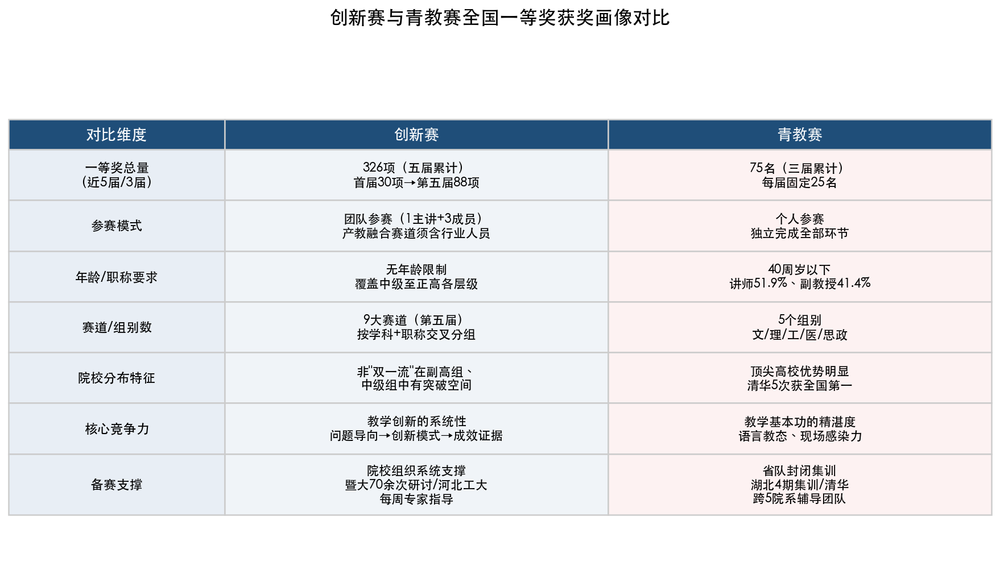

**图 2-3 创新赛与青教赛全国一等奖获奖画像对比。** 从一等奖总量、参赛模式、年龄职称要求、赛道组别数、院校分布特征、核心竞争力、备赛支撑七个维度呈现两赛的差异化定位。

# 第3章 一等奖获奖课程的共性特征与教学设计分析

第2章从数据画像角度回答了"什么样的课程和教师获得了一等奖"，本章则聚焦教学设计维度，探讨"获奖课程在教学设计上做对了什么"。通过对创新赛和青教赛历届一等奖课程的教学理念、方法创新、技术应用和思政融入进行系统梳理，我们提炼出一等奖课程在教学设计层面的共性特征与规律，为备赛团队提供可参照的设计框架。

## 3.1 教学理念与目标设计：从"以教为中心"到"以学为中心"

### 3.1.1 "以学生发展为中心"的制度性要求

"以学生发展为中心"并非获奖课程自发的修辞选择，而是两大赛事评分标准的刚性要求。创新赛第四届评分标准将"以学生发展为中心"作为贯穿所有评审维度的核心理念，课堂教学实录（40分）、创新成果报告（20分）和现场汇报（40分）三大板块的首条评价要点均涉及"学生中心"教育理念 [第四届创新赛评分标准](https://jwc.nepu.edu.cn/fujian134xin.pdf "第四届评分标准PDF")。青教赛的评分体系同样以学生为导向——课堂教学评分中"启发性"一项独占10分（满分75分中），要求教师"注重启发式教学，调动学生思维，激发学生学习主动性" [第五届青教赛通知](https://sub2.dlust.edu.cn/jxzlb/uploadfile/file/20220310/20220310082737_14191.pdf "第五届课堂教学评分细则")。

从获奖课程的实际呈现来看，"以学生发展为中心"具体体现为三个层次：第一，教学目标的设定从"教师教什么"转向"学生学会什么"，即成果导向教育（OBE）理念的落地；第二，教学过程的组织从单向讲授转向互动探究，学生成为课堂活动的主体；第三，教学评价的设计从终结性考试转向过程性、多元化的学习成效评估。

### 3.1.2 "两性一度"金课标准的贯彻

"两性一度"（高阶性、创新性、挑战度）是当前高校"金课"建设的核心标准。2018年11月，时任教育部高等教育司司长吴岩在第十一届"中国大学教学论坛"上首次系统阐释这一概念，提出金课应具备"高阶性"（知识、能力、素质的有机融合，培养学生解决复杂问题的综合能力和高阶思维）、"创新性"（课程内容反映前沿性和时代性，教学形式呈现先进性和互动性，学习结果具有探究性和个性化）、"挑战度"（课程有一定难度，需要学生和教师共同跳一跳才能够得着）[人民网报道](http://theory.people.com.cn/n1/2018/1205/c40531-30443262.html "光明日报报道：打造金课需要改革教育评价制度做支撑，2018年12月")。

创新赛评分标准将"两性一度"直接纳入教学内容评价要点，原文要求"教学内容有深度、广度，体现高阶性、创新性与挑战度" [第四届创新赛评分标准](https://jwc.nepu.edu.cn/fujian134xin.pdf "第四届评分标准PDF")。在获奖课程中，"两性一度"的实现路径各有不同。以第五届创新赛一等奖河北工业大学王坤《传热学》为例，课程针对工科基础课"重理论轻实践、重计算轻思维"的痛点，通过"基于多元身份建构"的教学创新，将传热学原理与工程伦理、社会责任等高阶目标融为一体 [河北工业大学官网](https://www.hebut.edu.cn/gdxw/1ae80e84d0b7474b876e4541579cea5e.htm "第五届创新赛获奖报道，2025年8月")。暨南大学侯雅文团队的《多元统计分析》则通过构建含100余个应用情境的虚拟仿真和AI智能分析平台，将统计理论与经管实际问题深度绑定，学生在真实数据分析中实现从"知道公式"到"解决问题"的高阶能力跃迁 [暨南大学官网](https://news.jnu.edu.cn/wap/content/202412/25/c4018.html "侯雅文AI赋能教学，2024年12月")。

### 3.1.3 OBE理念下的目标—过程—评价一致性

成果导向教育（Outcome-Based Education，OBE）理念在获奖课程中表现为"反向设计、正向实施"的闭环结构：先明确学生应达到的学习成果，再据此设计教学活动和评价方式，确保三者之间的一致性。这一逻辑与创新赛评分标准中"教学设计体现系统性，教学过程体现一致性，教学成效体现可验证性"的要求高度契合。

创新赛获奖课程普遍遵循"发现问题—解决问题—证明有效"的逻辑闭环。以河北工业大学苑帅民《中国近现代史纲要》为例，课程首先聚焦三大真实教学问题——"历史发展规律认知难、代际思想情感认同难、红心铸魂笃志践行难"，然后构建"理-实-虚-情-践"史工融合沉浸式教学模式予以回应，最终以学生学习行为数据和思想认同测评结果证明创新的有效性 [河北工业大学官网](https://www.hebut.edu.cn/gdxw/1ae80e84d0b7474b876e4541579cea5e.htm "第五届创新赛获奖报道，2025年8月")。这种"问题—方案—证据"的三段式结构，不仅是一种教学设计方法论，也是创新成果报告的核心写作框架。

## 3.2 教学方法与模式创新：多元方法的系统整合

### 3.2.1 混合式教学：获奖课程最普遍的模式创新

混合式教学（线上线下结合）是一等奖课程中出现频率最高的教学模式。其典型结构为"课前线上自学+课中翻转互动+课后拓展实践"的三段式，旨在将知识传递环节前移至线上，将课堂时间释放给高阶思维活动。

首届创新赛一等奖获得者中，多个课程展示了混合式教学的不同实现路径。云南大学邓铭构建"四化一体"（数字化、网络化、情境化、个性化）教学创新模式，将在线资源与课堂教学深度融合；复旦大学蒋玉龙提出"在线课程+原位翻转课堂+费曼学习法"的三位一体模式，要求学生以"教会别人"为目标进行深度学习 [上海财经大学论坛报道](https://gongkai.sufe.edu.cn/69/26/c227a157990/page.htm "高校课程创新与教学学术高峰论坛")。混合式教学模式之所以在获奖课程中普遍采用，根本原因在于它与创新赛"教学创新"的评审导向高度契合——信息技术的深度融入本身就是创新维度的重要体现，而翻转课堂所释放的互动空间则为"以学生为中心"的教学理念提供了实现载体。

### 3.2.2 PBL/CBL：以问题和案例驱动深度学习

问题导向学习（Problem-Based Learning，PBL）和案例导向学习（Case-Based Learning，CBL）在获奖课程中被广泛采用，尤其在医科、工科和经管类课程中表现突出。PBL/CBL的核心特征是以真实或仿真情境中的问题/案例为学习起点，学生在小组协作中自主建构知识。

上海财经大学叶巍岭《市场营销学》以"知行合一思想与PBL模式协同"为核心创新，将企业真实营销案例引入课堂，学生在解决实际营销问题的过程中完成理论学习与能力训练的统一 [上海财经大学论坛报道](https://gongkai.sufe.edu.cn/69/26/c227a157990/page.htm "论坛获奖课程展示")。在青教赛中，PBL/CBL同样是高频出现的教学方法。第七届工科组一等奖第一名、中国农业大学程楠在《食品卫生与安全控制》课程中，以"亚硝酸盐致癌是否成立"为认知冲突点切入，引导学生沿着"基本特征（Root）—作用原理（Reaction）—检测方案（Regulation）"的"3R知识体系"逐层深入探究，将传统的知识灌输转化为问题驱动的主动学习 [众师云平台](https://zhuanlan.zhihu.com/p/1916415591037777083 "青教赛工科组第一名教学设计全拆解")。

### 3.2.3 故事化教学：青教赛的独特高分路径

与创新赛侧重"系统性教学模式创新"不同，青教赛更强调教师个人的教学呈现能力，"故事化教学"因此成为青教赛一等奖获得者的高频策略。所谓故事化教学，是指教师将抽象的学科知识嵌入具有情节性、情感性和启发性的叙事结构中，以"讲好一个故事"为教学设计的组织原则。

第七届青教赛理科组一等奖第二名、南京理工大学高如如的核心教学理念即为"讲好一个故事，从知识传递到情感共鸣"——以人类对自然过程的认知历史为叙事主线，将学科知识编织进科学发现的故事之中，使学生在情感共鸣中完成知识建构 [南京理工大学钟声网](https://zs.njust.edu.cn/2f/44/c3554a339780/page.htm "高如如人物特写")。第六届青教赛思政组一等奖第一名、浙江大学赵坤将教学设计概括为"问题式切入、问题链铺排、问题性留白"三大策略，强调教学要有"深厚的学理支撑"引领高阶思维，还要有"动人的情感浸润"实现心灵共鸣 [太原理工大学工会](https://gonghui.tyut.edu.cn/info/1083/5735.htm "赵坤教学示范与专题报告")。第六届工科组一等奖第一名、上海交通大学高晓沨则将一堂优质课的教学设计提炼为"起承转合"四式——"起"即引人入胜的导入，"承"即循序渐进的知识展开，"转"即思维转折与认知冲突，"合"即提纲挈领的总结升华 [太原理工大学工会](https://gonghui.tyut.edu.cn/info/1083/5735.htm "高晓沨起承转合四式")。

这些经验表明，青教赛的20分钟无生上课要求教师在极短时间内完成完整的教学叙事，教学设计的"故事性"和"结构感"直接决定课堂的感染力与评分。

## 3.3 信息技术与数智化赋能：从工具应用到教学重构

### 3.3.1 虚拟仿真实验教学：技术与教学的深度融合

虚拟仿真实验教学是获奖课程中技术应用最为典型的方向，尤其在工科、医科和理科课程中已成为重要的教学创新增长点。其核心价值在于突破物理实验的时空、成本和安全约束，使学生能够在虚拟环境中反复操作、深度探究。

第四届创新赛一等奖暨南大学侯雅文《多元统计分析》课程的教学创新体系堪称虚拟仿真与教学融合的典范。团队构建了"四大平台"——虚拟仿真平台、教材数字化平台、统计分析平台和AI智能分析平台，涵盖100余个应用情境。该课程获评国家级一流本科课程，其教学创新建立在王斌会教授团队20余年教学积累之上，2005年即出版国内首部"经管+自主知识产权软件"教材，此后两年一版持续迭代 [暨南大学官网](https://news.jnu.edu.cn/wap/content/202412/25/c4018.html "侯雅文团队20余年积累，2024年12月")。这一案例揭示了一个重要规律：获奖课程的技术应用并非临时搭建的展示性工具，而是长期教学积累中自然生长出来的系统性解决方案。

第六届创新赛（2026年）新设的实验教学赛道进一步印证了虚拟仿真在教学创新中的战略地位。该赛道要求参赛课程提交不超过60分钟实验教学实录和不超过15分钟说课视频，下分综合设计型实验课程组和研究探索型实验课程组 [第六届创新赛实施方案](https://bhws.tjfsu.edu.cn/UploadFile//20260310050252364.doc "实验教学赛道要求")。

### 3.3.2 AI大模型赋能教学：从前沿探索到制度确认

AI大模型赋能教学已从个别获奖者的前沿探索迅速上升为赛事层面的制度性要求。暨南大学侯雅文团队率先将KIMI、文心一言等生成式AI工具引入数据分析教学，学生借助AI辅助完成数据清洗、模型选择和结果解读，教学重心从"教操作"转向"教判断" [暨南大学官网](https://news.jnu.edu.cn/wap/content/202412/25/c4018.html "AI赋能教学经验")。河北工业大学苑帅民《中国近现代史纲要》则运用AI、VR和知识图谱等数智化手段活化历史情境，将静态的历史文献转化为可交互的沉浸式学习体验 [河北工业大学官网](https://www.hebut.edu.cn/gdxw/1ae80e84d0b7474b876e4541579cea5e.htm "第五届创新赛获奖报道，2025年8月")。

从制度层面看，第五届创新赛（2025年）新增"人工智能+"赛道，第六届（2026年）对该赛道提出了更为具体的技术规范：参赛课程须利用国家高等教育智慧教育平台资源或依托生成式AI技术建设教学智能体，至少包括2个AI教学情境，成果报告须"提供可验证的客观证据或对比数据"证明AI教学效果，同时明确数据治理与安全合规要求。评分标准特别强调"系统性重新设计而非技术简单堆砌" [第六届创新赛实施方案](https://bhws.tjfsu.edu.cn/UploadFile//20260310050252364.doc "人工智能赛道要求")。这一信号表明，AI赋能教学的评价标准正在从"有没有用AI"向"AI是否带来了实质性教学改进"转变。

### 3.3.3 智慧课堂工具与数字化教学资源

除虚拟仿真和AI大模型之外，获奖课程还广泛使用智慧课堂交互工具（如雨课堂、学习通等）实现即时反馈与学情监测，以及自建数字化教学资源（慕课、微课、在线题库等）支撑混合式教学。这些技术工具在创新赛评分中被归入"教学过程"和"教学效果"两个维度——教学过程要求"合理运用现代信息技术手段"，教学效果要求"学生的学习反馈积极正面" [第四届创新赛评分标准](https://jwc.nepu.edu.cn/fujian134xin.pdf "第四届评分标准PDF")。

值得注意的是，两大赛事对信息技术的评审侧重存在显著差异。创新赛以"教学创新系统性与成果推广价值"为评审核心，技术应用需要体现在完整的教学体系设计中，采用真实课堂实录（须有学生出镜），因此对技术与教学的融合深度要求更高。青教赛则以"教学基本功"为评审重心，采用20分钟无生上课并抽签决定教学节段，PPT和板书等传统教学手段的表现力更为关键，信息技术更多作为辅助性工具出现 [第四届创新赛评分标准](https://jwc.nepu.edu.cn/fujian134xin.pdf "创新赛成果辐射要求") [第五届青教赛通知](https://sub2.dlust.edu.cn/jxzlb/uploadfile/file/20220310/20220310082737_14191.pdf "青教赛评审维度")。

## 3.4 课程思政融入策略：从"贴标签"到"如盐化水"

### 3.4.1 课程思政的政策背景与赛事要求

2020年5月，教育部印发《高等学校课程思政建设指导纲要》（教高〔2020〕3号），明确要求"将价值塑造、知识传授和能力培养三者融为一体"，并对不同学科类型提出差异化的课程思政建设要求 [教育部官网](http://www.moe.gov.cn/srcsite/A08/s7056/202006/t20200603_462437.html "课程思政建设指导纲要")。这一政策直接影响了两大赛事的评审体系。

创新赛从第三届（2023年）起单设课程思政赛道，与此同时，非思政赛道中课程思政同样是必备评审维度。评分标准明确要求"深挖课程思政元素，有机融入课程教学"，思政赛道的评审标准更进一步要求实现"如盐化水、润物无声"的融入效果 [第四届创新赛评分标准](https://jwc.nepu.edu.cn/fujian134xin.pdf "课程思政组评分标准")。青教赛课堂教学评分中，"立德树人"一项占6分（课堂教学总分75分），要求教师在知识讲授过程中自然融入价值引领 [第五届青教赛通知](https://sub2.dlust.edu.cn/jxzlb/uploadfile/file/20220310/20220310082737_14191.pdf "第五届课堂教学评分细则")。

### 3.4.2 获奖课程的思政融入路径

梳理一等奖课程的思政融入实践，可以归纳出"立足课程定位→深挖学科育人特性→选取典型思政素材→有机嵌入教学环节"的四步路径。不同学科的融入方式呈现鲜明的差异化特征。

**思政课和人文社科类课程**的思政融入属于"显性思政"，其挑战在于如何将宏大叙事转化为可感知、可共鸣的教学体验。第五届创新赛一等奖苑帅民《中国近现代史纲要》采用"情感+直观"教学法，将思政课转化为"历史舞台剧"，运用VR和AI活化历史情境，使学生在沉浸式体验中完成思想认同的建构 [河北工业大学官网](https://www.hebut.edu.cn/gdxw/1ae80e84d0b7474b876e4541579cea5e.htm "苑帅民教学方法")。第七届青教赛思政组一等奖第一名武汉大学徐嘉鸿在讲授"延安整风运动中的党史学习"时，以思考题切入，通过两大板块循循善诱，在叙事推进中自然完成价值引领 [武汉大学新闻网](http://www.lianpp.com/whu/smu_news/info/1013/464557.htm "徐嘉鸿获奖报道，2024年8月")。

**理工科和医科课程**的思政融入属于"隐性思政"，需要在专业知识讲授中找到与家国情怀、科学精神、职业伦理等思政元素的自然结合点。第七届青教赛工科组一等奖第一名、中国农业大学程楠在《食品卫生与安全控制》课程中，通过讲述金华火腿的制作工艺引入亚硝酸盐话题时，巧妙融入中国传统饮食文化的自信教育；在讲解亚硝酸盐检测技术的演进时，引用敦煌莫高窟《辅行诀》中的古方案例，将中华优秀传统文化与现代科学技术自然衔接；在课程结尾强调"食品安全并非检测出来的，而是生产出来的"，激发学生的专业责任感与使命担当 [众师云平台](https://zhuanlan.zhihu.com/p/1916415591037777083 "青教赛工科组第一名教学设计全拆解")。

浙江大学赵坤在青教赛思政组的经验分享中提出，课程思政不能"贴标签"，而应做到"有效的问题引导"与"动人的情感浸润"并重——前者通过"问题式切入、问题链铺排、问题性留白"的策略实现理性认知，后者通过故事化叙述实现情感共鸣 [太原理工大学工会](https://gonghui.tyut.edu.cn/info/1083/5735.htm "赵坤教学设计理念与方法")。

### 3.4.3 思政融入的常见误区

学术研究指出，部分课程在思政融入上存在"增量"对"质量"支撑度较低、为"思政"而"思政"脱离教学实际的问题。具体表现为：思政元素与专业知识之间缺乏内在逻辑关联，仅在课堂开头或结尾附加一段思政内容；思政素材选取缺乏针对性，同一个"大国重器"案例在不同课程中反复出现而缺少学科特色；思政融入停留在口号式表述，缺乏具体的教学设计和实施路径 [上海体育大学学报论文](https://shtyxyxb.xml-journal.net/cn/article/pdf/preview/10.16099/j.sus.2024.10.03.0001.pdf "赵富学，教创赛课程思政教学创新问题及消解路径，2025年")。一等奖课程与一般参赛课程在思政融入上的核心差距，往往不在"有没有做课程思政"，而在"是否真正实现了专业知识与价值引领的有机统一"。

## 3.5 两赛评审侧重的差异与对教学设计的启示

### 3.5.1 创新赛：系统性创新与可推广性

创新赛的教学设计逻辑可以概括为"发现教学真问题→构建创新教学模式→数据证明成效→辐射推广"。评分标准明确要求参赛课程"形成具有较强辐射推广价值的教学新方法、新模式" [第四届创新赛评分标准](https://jwc.nepu.edu.cn/fujian134xin.pdf "创新赛成果辐射要求")。这意味着，一个获奖的教学创新不能只是个人的教学实践，还须具备可复制、可推广的特征。

创新赛评分权重的演变也反映了这一导向的强化。从首届的"课堂实录50% + 报告15% + 汇报35%"到第四、五届的"实录40分 + 报告20分 + 汇报40分"，成果报告和现场汇报的合计权重从50%上升至60%，而课堂实录的权重从50%下降至40% [首届创新赛通知全文](https://www.sohu.com/a/436589066_214420 "首届评分权重") [第四届创新赛评分标准](https://jwc.nepu.edu.cn/fujian134xin.pdf "第四届评分权重")。这表明赛事评价重心已从"课堂呈现好不好"向"教学创新的系统性与可推广性够不够"转移。

因此，面向创新赛的教学设计应着力于：（1）精准锚定3个左右的真实教学痛点；（2）构建命名明确、结构清晰的创新教学模式（如"理-实-虚-情-践"模式、"四大平台"体系）；（3）提供可验证的成效数据（学生成绩对比、学习行为分析、同行评价等）；（4）展示推广应用的实际成果（兄弟院校采用、教学成果奖、一流课程认定等）。

### 3.5.2 青教赛：教学基本功与现场感染力

青教赛的教学设计逻辑可以概括为"精准选取知识点→故事化/问题化设计→20分钟精炼呈现→教学基本功展示"。评分体系中"语言教态"独占10分，是青教赛独有的显性评审维度，要求教师"普通话标准、声音洪亮、吐字清晰、语速适当"，同时考察教态自然大方、举止得体 [第五届青教赛通知](https://sub2.dlust.edu.cn/jxzlb/uploadfile/file/20220310/20220310082737_14191.pdf "语言教态评分标准")。

青教赛的20分钟无生上课+随机抽签教学节段，对教学设计提出了独特要求：每个教学节段必须是一个完整的教学单元，既要有引人入胜的导入，也要有收束有力的总结，而非一节完整课程的片段压缩。第七届理科组一等奖南京理工大学高如如的备赛经历具有代表性——2022年省赛获二等奖后，她彻底推翻全部课程主线和PPT，2024年以全新设计获省赛第一并在国赛中获一等奖第二名；决赛中被抽中非最满意章节但仍冷静发挥，她总结"优秀的教学设计是比赛成功的关键" [南京理工大学钟声网](https://zs.njust.edu.cn/2f/44/c3554a339780/page.htm "高如如人物特写")。

因此，面向青教赛的教学设计应着力于：（1）16个学时的教学设计须每个都能独立成篇、各具亮点，不留"弱节段"；（2）每个节段采用"认知冲突—知识构建—思维升华"的三段式结构，确保20分钟内完成完整的教学叙事；（3）PPT设计须体现"人无我有"的特色——自行拍摄的实验视频、一手科研数据和自制教具等，比通用素材更具说服力；（4）语言教态的训练与课程内容的打磨同等重要。

## 3.6 产教融合：新兴获奖方向的教学设计特征

产教融合作为教学创新的重要方向，在第四届创新赛中新设独立赛道后迅速成为一等奖课程的重要来源。第五届一等奖河北工业大学白振旭《激光原理》构建"多元主体协同"产教融合模式，联合中国电子科技集团第五十三研究所等多家企业，共建"政校行企研"五方协同的实验室和实践基地 [河北工业大学官网](https://www.hebut.edu.cn/gdxw/1ae80e84d0b7474b876e4541579cea5e.htm "第五届获奖报道")。

产教融合赛道的教学设计与主赛道的核心区别在于：第一，团队构成要求至少1名来自行业产业部门的成员，教学创新须体现"校企协同"而非单纯的校内改革 [中国科协](https://www.cast.org.cn/xw/qgxh/ZHXX/art/2024/art_d7929070ea034584993b2464bd8c4af3.html "第四届产教融合赛道")；第二，教学内容须将产业真实问题转化为课程教学案例，学生的学习成果应能回应产业需求；第三，教学成效的评价维度增加了"产业认可度"——企业合作方的评价、学生就业/创业质量等成为重要的成效证据。

## 3.7 获奖课程共性特征的总结性归纳

综合以上分析，两大赛事一等奖课程在教学设计层面呈现以下共性特征：

| 维度 | 创新赛一等奖特征 | 青教赛一等奖特征 | 共同点 |
|------|----------------|----------------|--------|
| 教学理念 | "以学生发展为中心"贯穿全课程体系，OBE闭环设计 | "以学生发展为中心"落实到每个20分钟教学节段 | 均以"学生中心"为核心理念 |
| 教学内容 | 体现"两性一度"，课程内容有深度和前沿性 | 精选知识点，注重学科思想与学科前沿 | 均要求内容的高阶性与学术性 |
| 教学方法 | 混合式教学、PBL/CBL、虚拟仿真等系统化应用 | 问题驱动、故事化教学、"起承转合"结构 | 均强调启发式教学与学生参与 |
| 技术应用 | 深度融合，建平台、建系统，技术是创新的核心载体 | 适度应用，PPT+板书为主，技术为辅助手段 | 均要求技术服务于教学而非炫技 |
| 课程思政 | 系统设计，与专业知识形成内在关联 | 自然融入，在知识讲授中实现价值引领 | 均要求"有机融入"而非"贴标签" |
| 创新逻辑 | "真问题→创新模式→成效证据→辐射推广" | "精准选题→精炼设计→精彩呈现→深度反思" | 均以问题为起点，以成效为落脚 |
| 团队/个人 | 1+3团队协作，强调系统性 | 个人参赛，强调教学基本功和个人魅力 | 均离不开院校层面的系统支撑 |

这一对比表明，尽管两大赛事的评审侧重不同，但在教学设计的底层逻辑上高度一致——都要求参赛教师回答三个核心问题：学生应该达到什么目标（教学理念）？教师用什么方法帮助学生达到目标（教学方法与技术）？如何证明学生确实达到了目标（教学成效）？能否系统、清晰、有说服力地回答这三个问题，是区分一等奖与普通获奖课程的关键分水岭。

# 第4章 典型获奖案例深度剖析

第3章从教学设计维度提炼了一等奖课程的共性特征——"以学生发展为中心"的理念驱动、"两性一度"金课标准的贯彻、混合式教学与PBL/CBL的系统整合、数智化技术的深度赋能以及课程思政的有机融入。然而，共性特征在不同赛道、不同学科中如何具象化落地？顶尖获奖者在课程设计、材料打磨和现场呈现中究竟做了什么？

本章选取三个创新赛一等奖案例（苑帅民《中国近现代史纲要》、侯雅文《多元统计分析》、白振旭《激光原理》）和三个青教赛一等奖案例（郭璐《中国古代城市规划史》、赵维殳《极端生物学》、徐嘉鸿《中国近现代史纲要》），以"课程背景—教学创新体系—备赛与院校支撑—获奖关键因素"的统一分析框架进行深度剖析，并在此基础上开展横向对比，为备赛团队提供可解剖、可借鉴的实操样本。

## 4.1 创新赛一等奖案例剖析

### 4.1.1 案例一：苑帅民《中国近现代史纲要》——基础课程赛道正高组（第五届，2025年）

**课程与教师背景。** 苑帅民为河北工业大学马克思主义学院教授，拥有22年教龄，曾获"全国模范教师"称号，并受教育部邀请为全国14.5万名思政课教师讲授示范课，教学影响力在参赛前已覆盖全国。其主讲的《中国近现代史纲要》获评国家级线上线下混合式一流本科课程，课程建设积淀深厚。2025年，苑帅民以基础课程赛道正高组参赛第五届全国高校教师教学创新大赛，斩获一等奖 [河北工业大学融媒网](http://www.lianpp.com/hebut/smu_xww/hyjyjjs/844ace59c1b44775ad7ec09c86b26961.htm "苑帅民全国模范教师报道，2025年9月")。

**教学创新体系。** 苑帅民的核心创新在于构建"理-实-虚-情-践"史工融合沉浸式教学模式。这一模式的起点是对思政课教学中三大真实痛点的精准诊断："历史发展规律认知难、代际思想情感认同难、红心铸魂笃志践行难"。针对这三个层层递进的难题，课程设计了五维对应策略——"理"（理论阐释系统化）、"实"（实践案例工程化，依托河北工业大学工科优势）、"虚"（虚拟仿真活化历史情境）、"情"（情感体验沉浸化）、"践"（践行转化项目化），形成从认知到认同再到践行的完整教学闭环 [河北工业大学官网](https://www.hebut.edu.cn/gdxw/1ae80e84d0b7474b876e4541579cea5e.htm "第五届创新赛获奖报道，2025年8月")。

该教学体系充分体现了第3章所提炼的"问题—方案—证据"三段式逻辑闭环：从真实教学问题出发，构建系统性创新方案，并以学生行为数据和学习成效变化证明创新有效。苑帅民独创的"情感+直观"教学法尤为突出——将思政课转化为"历史舞台剧"，运用AI技术、VR虚拟现实和知识图谱等数智化手段活化历史情境，使学生从旁观者变为历史的"亲历者"。这种将技术创新与情感共鸣深度绑定的教学设计，助其连续15次获得本科教学质量优秀奖 [河北工业大学融媒网](http://www.lianpp.com/hebut/smu_xww/hyjyjjs/844ace59c1b44775ad7ec09c86b26961.htm "苑帅民教学方法")。

**备赛与院校支撑。** 河北工业大学为苑帅民组建了10余位校内外专家团队，实施每周一次一对一指导，这种"密集专家打磨"模式是该校"全员专项培训+骨干教师深度研修+参赛选手精粹培育"三位一体培养体系的缩影。河北工业大学在第五届创新赛中以3项一等奖的成绩位居全国前三，表明系统化的院校支撑是可复制的成功要素 [河北工业大学官网](https://www.hebut.edu.cn/gdxw/1ae80e84d0b7474b876e4541579cea5e.htm "三位一体培养模式")。

**获奖关键因素分析。** 苑帅民案例的核心竞争力可归结为三点：其一，22年教龄和国家级一流课程的深厚积淀，使教学创新拥有坚实的课程基础而非"为赛而造"；其二，"史工融合"定位精准——在工科院校讲思政课，将学校学科优势转化为课程特色，实现差异化竞争；其三，数智化手段（AI/VR/知识图谱）的应用不是技术堆砌，而是紧扣"情境化"和"沉浸式"的教学目标，技术始终服务于教学逻辑。

### 4.1.2 案例二：侯雅文《多元统计分析》——新文科副高组（第四届，2024年）

**课程与教师背景。** 侯雅文为暨南大学经济学院副教授，其参赛课程《多元统计分析》在第四届全国高校教师教学创新大赛（2024年）新文科副高组中获一等奖。该课程的背后是一个跨越20余年的教学创新团队——以王斌会教授为奠基人，团队自2005年出版国内首部"经管领域+自主知识产权统计分析软件"教材以来，每两年更新一版，持续迭代至今。侯雅文作为团队新生代力量，在长期积累基础上实现了AI时代的教学升级 [暨南大学官网](https://news.jnu.edu.cn/wap/content/202412/25/c4018.html "侯雅文团队20余年积累，2024年12月")。

**教学创新体系。** 侯雅文团队的核心创新为"四大平台"教学体系：虚拟仿真实验平台、教材数字化平台、统计分析平台和AI智能分析平台。四大平台构成相互支撑的教学生态，涵盖100余个应用情境，学生可在模拟真实经管场景中完成从数据采集、预处理到多元统计建模的全流程训练。该课程获评国家级一流本科课程 [暨南大学官网](https://news.jnu.edu.cn/wap/content/202412/25/c4018.html "四大平台与备赛过程")。

AI工具的深度融入是该案例最具前瞻性的亮点。侯雅文团队将KIMI、文心一言等生成式AI工具引入数据分析教学，并非简单替代学生的计算过程，而是让学生在人机协作中理解统计方法的逻辑本质——学生先用传统方法完成分析，再用AI工具验证和拓展，在对比中深化对统计原理的理解。这一做法呼应了第3章所归纳的"数智化赋能不是技术堆砌，而是服务于教学目标的系统重构"这一共性特征 [暨南大学官网](https://news.jnu.edu.cn/wap/content/202412/25/c4018.html "AI赋能教学经验")。

**备赛与院校支撑。** 暨南大学为侯雅文团队的备赛提供了充分的制度保障——累计组织70余次研讨和培训，从课程打磨到材料优化，每一轮研讨均有校内外专家参与点评。暨南大学自创新赛举办以来累计获得国赛奖项19项，位居全国高校之首，这一记录的背后是该校对教学竞赛长期、系统性的投入 [暨南大学官网](https://news.jnu.edu.cn/wap/content/202412/25/c4018.html "备赛70余次研讨")。

**获奖关键因素分析。** 侯雅文案例的核心启示在于"厚积薄发"与"技术前瞻"的结合。其一，20余年团队积累使课程创新拥有扎实的学术根基和完整的迭代记录，创新成果报告得以展示"从哪里来、到哪里去"的清晰演进脉络；其二，四大平台的建设体现了教学创新的系统性——并非单点突破，而是整体重构；其三，AI工具的引入精准把握了教学改革的时代脉搏，体现了评分标准所强调的"教学内容反映前沿性和时代性"。

### 4.1.3 案例三：白振旭《激光原理》——产教融合赛道地方高校组（第五届，2025年）

**课程与教师背景。** 白振旭为河北工业大学教授、副院长，博士毕业于哈尔滨工业大学，其参赛课程《激光原理》在第五届创新赛（2025年）产教融合赛道地方高校组中获一等奖。白振旭团队建设时间不到七年，相较于苑帅民22年和侯雅文团队20余年的积淀，这是一个在相对短周期内实现竞赛突破的典型案例 [中国网报道](http://szjj.china.com.cn/2025-08/26/content_43212216.html "白振旭产教融合模式，2025年8月")。

**教学创新体系。** 白振旭的核心创新在于构建"多元主体协同"的产教融合教学模式。课程围绕激光技术从原理到应用的完整链条，与中国电子科技集团第五十三研究所等多家企业建立深度合作，联合"政校行企研"多方力量共建实验室和实践基地，学生在课程学习中不仅掌握激光原理的理论知识，还能接触产业一线的真实技术挑战和工程案例 [中国网报道](http://szjj.china.com.cn/2025-08/26/content_43212216.html "白振旭产教融合模式，2025年8月")。

产教融合赛道系第四届创新赛（2024年）新增赛道，要求每支参赛团队至少包含1名来自行业产业部门的成员。第四届该赛道全国赛有993所高校5031名教师参加省赛，评出一等奖12项 [中国科协](https://www.cast.org.cn/xw/qgxh/ZHXX/art/2024/art_d7929070ea034584993b2464bd8c4af3.html "第四届产教融合赛道")。白振旭选择这一赛道参赛，充分利用了自身在校企合作方面的积累，实现了"课程特色"与"赛道特色"的精准匹配。

**获奖关键因素分析。** 白振旭案例对备赛团队的启示尤为独特。其一，团队建设周期不到七年即实现国赛一等奖突破，证明在精准定位差异化方向的前提下，短周期高强度的课程建设同样可以产出高质量参赛成果；其二，产教融合赛道作为新设赛道，竞争格局尚在形成期，地方高校在产业资源整合方面可能具有独特优势；其三，"政校行企研"五方协同的模式直接回应了评分标准中"具有较强辐射推广价值的教学新方法、新模式"的要求，创新成果的可推广性成为核心得分要点。

## 4.2 青教赛一等奖案例剖析

### 4.2.1 案例四：郭璐《中国古代城市规划史》——文科组一等奖第一名（第七届，2024年）

**选手与课程背景。** 郭璐为清华大学建筑学院副研究员，师从人居环境科学创建者吴良镛院士，在清华大学学习和工作逾20年。其参赛课程《中国古代城市规划史》是一门将建筑学与历史学交叉融合的专业课程。2024年，郭璐在第七届全国高校青年教师教学竞赛中获文科组一等奖第一名，这是清华大学青年教师第五次荣获全国青教赛第一名，反映了该校教学文化和培育体系的深厚底蕴 [清华大学官网](https://www.tsinghua.edu.cn/info/1176/113536.htm "清华第五次获全国青教赛第一名")。

**备赛历程。** 郭璐的参赛经历体现了青教赛典型的"长周期迭代打磨"路径：2022年校赛获第一名；2023年北京市青教赛获一等奖第二名，同时斩获"最佳教案""最佳现场""最佳教学回顾"三项单项奖；2024年国赛摘得文科组第一。从校赛到国赛历时两年，每一阶段均构成对教学设计和课堂呈现的系统升级 [清华大学官网](https://www.tsinghua.edu.cn/info/1179/115244.htm "郭璐：课堂内外师生之间一点灵明")。

**教学设计与课堂呈现亮点。** 郭璐的核心教学理念为"内容为王，课比天大"。据报道，其电脑存满50多GB文献，每一讲背后均有上百篇文献支撑。在20分钟无生上课中，郭璐善用"钩子"问题驱动思考——以一个悬念式的问题开场，引导评委进入知识探索的情境。其PPT含大量古代城市画作和三维模型动画，她还专门3D打印建筑模型辅助现场教学，将抽象的城市空间结构转化为可触摸的实物教具。备赛过程中，清华大学跨5个院系组建辅导团队，PPT历经七版迭代更新 [清华大学官网](https://www.tsinghua.edu.cn/info/1179/115244.htm "郭璐教学理念与备赛过程")。

**获奖关键因素分析。** 郭璐案例集中体现了青教赛"教学基本功"评审导向下的致胜要素。其一，学术深度与教学转化能力突出——师从吴良镛院士的学术背景使其对中国古代城市规划拥有第一手研究积淀，而50多GB文献库保证了每一个教学节段都有充实的知识支撑；其二，PPT设计和教具创新形成了"人无我有"的差异化优势——3D打印模型、古代画作高清复原等手段使建筑学知识高度"可视化"；其三，两年长周期迭代使教学设计不断精炼，每一轮赛事反馈都成为下一轮升级的依据。

### 4.2.2 案例五：赵维殳《极端生物学》——理科组一等奖第一名（第七届，2024年）

**选手与课程背景。** 赵维殳为上海交通大学生命科学技术学院副研究员，拥有近15年极端环境微生物研究经验。其参赛课程《极端生物学》堪称国内外"前无古人"的原创课程——以马里亚纳海沟、珠穆朗玛峰、火山口等极端环境中的生命为研究对象，在全球范围内几乎没有同类课程可供参照。2024年，赵维殳在第七届青教赛中获理科组一等奖第一名。同届比赛中，上海交通大学3名参赛选手全部获一等奖（赵维殳理科组第一名、叶枫医科组第一名、王新昶工科组第三名），创该校历史最好成绩 [上海交通大学教学发展中心](https://ctld.sjtu.edu.cn/news/detail/1162 "交大三名选手获一等奖") [上海交通大学教学发展中心](https://ctld.sjtu.edu.cn/news/detail/1163 "赵维殳简介")。

**教学设计与课堂呈现亮点。** 赵维殳最突出的教学优势在于"科研反哺教学"的深度——她曾亲赴马里亚纳海沟和珠穆朗玛峰等极端环境开展科学考察，这些一手科考经历被直接融入课堂教学。在20分钟无生上课中，评委仿佛跟随一位探险科学家走入地球的极端角落，从深海热泉到高原冻土，从极端微生物的生存机制中理解生命的边界与可能性。这种将一手科研经历转化为教学素材的做法，精准契合了青教赛课堂教学评分标准中"学科前沿"（3分）和"教学特色"（5分）两项评价维度 [上观新闻](https://www.jfdaily.com/sgh/detail?id=1420567 "赵维殳人物报道，2024年9月")。

赵维殳在赛后总结中指出，青教赛最大的收获是"在不同学科名师的帮助下，迅速搭建起《极端生物学》的知识框架和核心理论体系"。这一表述揭示了青教赛"以赛促教"理念的深层价值——对于一门全新课程而言，备赛过程本身便是学科知识体系化建设的催化剂。与郭璐依托成熟课程体系参赛不同，赵维殳在备赛过程中同步完成了课程的系统建构 [上观新闻](https://www.jfdaily.com/sgh/detail?id=1420567 "赵维殳备赛收获")。

**获奖关键因素分析。** 赵维殳案例的核心启示在于"独创性课程"的竞争优势。其一，《极端生物学》在全球范围内几乎没有同类课程，"人无我有"的差异化定位使评委耳目一新；其二，一手科考经历是任何教材和资料都无法替代的教学素材，赋予课堂不可复制的真实感和感染力；其三，上海交通大学同届3人全部获一等奖的表现表明该校已形成成熟的青教赛备赛支撑体系，个人才华与院校培育形成良性共振。

### 4.2.3 案例六：徐嘉鸿《中国近现代史纲要》——思政组一等奖第一名（第七届，2024年）

**选手与课程背景。** 徐嘉鸿为武汉大学马克思主义学院讲师，社会学博士，同时为武汉大学人类学研究所特聘研究员，主要研究方向为社会人类学和中国近现代史基本问题，主持有国家社科基金和省部级课题 [中国图书网](https://m.bookschina.com/9776723.htm "徐嘉鸿著作作者简介")。其参赛课程《中国近现代史纲要》为全国高校思想政治理论课必修课，徐嘉鸿参与建设的该课程慕课获评国家级一流本科课程。2024年，徐嘉鸿在第七届青教赛中获思想政治课专项组一等奖第一名。此前她已获湖北省青教赛一等奖、湖北省高校思政课竞赛特等奖、教育部全国思政课教学展示活动特等奖等荣誉，竞赛经历丰富 [武汉大学新闻网](http://www.lianpp.com/whu/smu_news/info/1013/464557.htm "徐嘉鸿获奖报道，2024年8月")。

**教学设计与课堂呈现亮点。** 徐嘉鸿的决赛教学节段为"'党书'故事——延安整风运动中的党史学习"，以一系列思考题切入，通过"延安整风运动是中国共产党的自我革命""以党史学习推进延安整风运动"两大板块，循循善诱、深入浅出地讲授相关知识。这一教学节段的设计体现了思政课教学的核心难题与破解之道：如何使历史事件"活"起来，让学生从知识接收者转变为主动思考者。

徐嘉鸿的教学设计得益于武汉大学"中国近现代史纲要"课程中心教学团队的集体智慧——团队精心打磨了16个教学节段。备赛过程中，马克思主义学院联合历史学院成立专家团队，跨学科的专家支撑使徐嘉鸿能够将历史学一手史料研究方法融入思政课教学，以新颖的选题、详实的史料和循循善诱的价值引导赢得评委认可 [武汉大学新闻网](http://www.lianpp.com/whu/smu_news/info/1013/464557.htm "徐嘉鸿参赛内容与武大纪录")。

**获奖关键因素分析。** 徐嘉鸿案例的启示体现在三个层面。其一，丰富的赛事经验和多层次的竞赛历练——从省赛到全国思政课教学展示再到青教赛国赛，每一轮竞赛经验均在提升教学呈现的精准度和表现力；其二，跨学科团队支撑——马克思主义学院与历史学院的联合专家团队使思政课教学突破了单一学科局限，社会人类学的研究视角赋予思政课教学独特的学术深度；其三，武汉大学在青教赛中保持着7位参赛教师全部获一等奖的完美纪录，这一纪录的背后是自2022年省赛起即启动的多轮系统化培训和常态化专家打磨辅导机制。

## 4.3 横向对比与核心启示

在逐一剖析六个案例之后，有必要将其并置比较，提炼两赛获奖路径的结构性差异和共性规律。图4-1以结构化对比表的形式汇总了六个案例在赛事赛道、课程积累、备赛周期和院校支撑等关键维度上的异同，为后续分析提供总览。

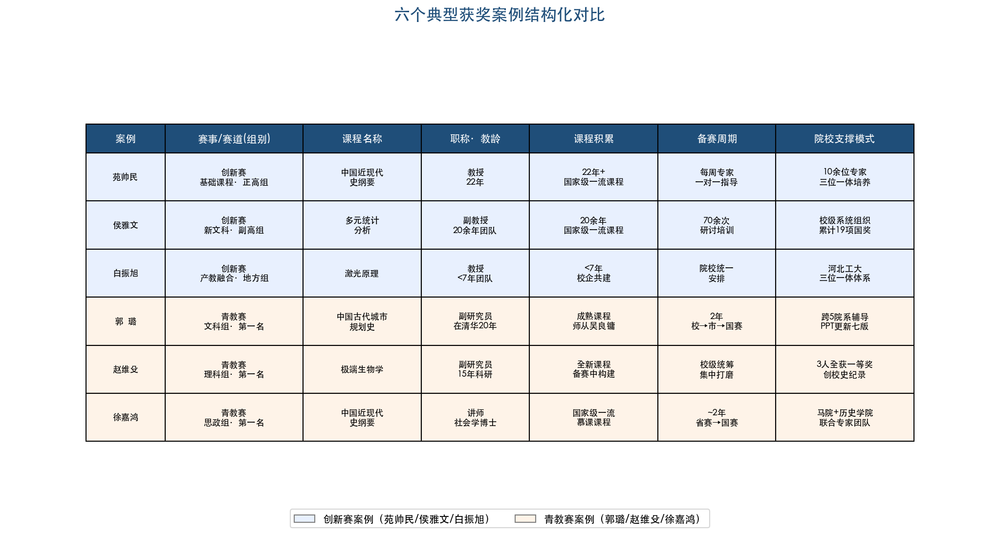

<b>图4-1 六个典型获奖案例结构化对比</b>

### 4.3.1 两赛获奖路径的结构性差异

将上述六个案例并置比较，两赛获奖路径的结构性差异清晰可见（图4-2）。

创新赛的核心叙事逻辑为"发现教学真问题→构建创新教学模式→数据证明成效→辐射推广"。苑帅民的"三大痛点→'理-实-虚-情-践'模式→学习行为数据验证"、侯雅文的"经管数据分析能力短板→四大平台教学体系→100余个情境应用成效"、白振旭的"理论与实践脱节→多元主体协同产教融合→校企合作成果"——三个案例均遵循这一叙事框架。创新赛评审的核心关切是"系统性"和"可推广性"：创新不是某个教学技巧的改良，而是一整套教学模式的重构；成果不是自我验证，而是对其他课程和院校具有辐射价值。

青教赛的核心路径则为"精准选取知识点→故事化/问题化设计→20分钟精炼呈现→教学基本功展示"。郭璐以"钩子"问题驱动对古代城市空间的探索、赵维殳以一手科考经历将《极端生物学》转化为"学术探险"、徐嘉鸿以思考题切入延安整风运动——三位选手的共同点在于将知识传递转化为问题驱动的思维旅程。青教赛评审的核心关切是"个人教学功力"和"现场感染力"：在20分钟无生上课中，教师需仅凭自身的学术深度、语言表达、教态仪表和PPT设计打动评委。

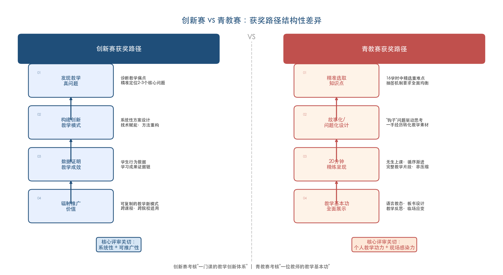

<b>图4-2 创新赛与青教赛获奖路径结构性差异对比</b>

两赛的核心差异可概括为：创新赛考核的是"一门课的教学创新体系"，青教赛考核的是"一位教师的教学基本功"。这一差异直接决定了备赛策略的分野——创新赛需要团队协作和长期课程建设积累，青教赛则需要个人反复打磨和密集训练。

### 4.3.2 院校支撑体系的高度一致性

六个案例在院校支撑层面呈现高度一致的规律：一等奖的获取并非个人或团队的孤军奋战，而是院校层面系统性投入的产出。

| 案例 | 院校支撑模式 | 支撑强度与成效 |
|------|------------|---------------|
| 苑帅民（河北工大·创新赛） | 10余位校内外专家、每周一对一指导 | "全员培训+骨干研修+选手精粹培育"三位一体体系 |
| 侯雅文（暨南大学·创新赛） | 70余次研讨和培训 | 校级系统组织，国赛累计奖项数全国第一（19项） |
| 白振旭（河北工大·创新赛） | 同上河北工大三位一体体系 | 同届3项一等奖，居全国前三 |
| 郭璐（清华大学·青教赛） | 跨5个院系辅导团队，PPT迭代七版 | 校赛→市赛→国赛两年长周期培育 |
| 赵维殳（上海交大·青教赛） | 校级教学发展中心统筹 | 同届3人全部一等奖，创校史纪录 |
| 徐嘉鸿（武汉大学·青教赛） | 马克思主义学院联合历史学院专家团队 | 7位参赛教师全部获一等奖的完美纪录 |

湖北省代表队在第七届青教赛中的备赛模式更是将"系统支撑"推向极致：4期封闭集训，聘请10位专家和8位历届获奖选手全程指导，最终获3项一等奖，居全国第二 [荆楚网](http://news.cnhubei.com/content/2024-09/11/content_18392941.html "湖北封闭集训")。这一事实表明，在当前竞赛生态中，院校和省级层面的组织化备赛能力已成为影响获奖概率的关键变量。

### 4.3.3 备赛周期与课程积累的关键作用

六个案例的备赛周期和课程积累时间存在显著差异，但均达到相当的投入强度。

在课程积累维度上，侯雅文团队20余年持续迭代构成了极端案例——长期建设使其创新成果报告得以展示一条完整的课程演进轨迹。苑帅民22年教龄同样属于长周期积累。相比之下，白振旭团队建设不到七年即实现突破，证明在产教融合等新赛道中，课程积累的时间门槛相对较低，方向选择的精准性更为关键。

在备赛打磨维度上，郭璐从2022年校赛到2024年国赛历时两年，是青教赛中典型的长周期迭代路径；徐嘉鸿自2022年获省赛一等奖后即启动国赛备赛，同样经历约两年的打磨期；暨南大学70余次研讨则代表了创新赛备赛的密集程度。

南京理工大学高如如（第七届理科组一等奖全国第二名）的备赛经历为"迭代打磨"提供了更为鲜明的注脚：2022年省赛仅获二等奖后，她彻底推翻全部课程主线和PPT，用近两年时间重新设计课程逻辑，2024年重新参赛获省赛第一名，继而在国赛中获理科组第二名。决赛中她被抽中并非最满意的章节，但仍冷静发挥，赛后总结"优秀的教学设计是比赛成功的关键" [南京理工大学钟声网](https://zs.njust.edu.cn/2f/44/c3554a339780/page.htm "高如如人物特写")。这一案例表明，青教赛因其"抽签决定教学节段"的机制，对教学设计的全面性和均衡性提出了极高要求——16个学时的教学设计必须每一个都经得住考验。

综合来看，一等奖级别的参赛课程，其课程建设周期通常在3年以上，备赛打磨周期在6个月至2年之间。对于计划竞争一等奖的备赛团队而言，"临时抱佛脚"式的突击备赛几乎不可能成功——课程本身的教学创新质量才是参赛的根基。

### 4.3.4 从案例到规律：获奖的"三要素"模型

综合六个案例的分析，我们认为，无论创新赛还是青教赛，一等奖的获取需要同时满足三个核心条件，形成一个"三要素"模型（图4-3）：

**第一，课程本身的教学质量和创新深度。** 六位获奖者无一例外拥有扎实的课程建设基础——国家级一流课程、国家级精品课程或全球唯一的原创课程。竞赛评审的核心是教学质量，而非表演技巧。

**第二，与赛事评审标准的精准对齐。** 苑帅民选择基础课程赛道发挥思政课优势、白振旭选择产教融合赛道匹配校企合作积累、赵维殳以一手科考经历命中青教赛"学科前沿"和"教学特色"维度——每一个获奖案例都体现了"课程优势"与"评审标准"的精准匹配。

**第三，院校层面的系统性支撑。** 从河北工业大学的三位一体培养体系到清华大学的跨院系辅导团队，从暨南大学的70余次研讨到湖北省的4期封闭集训——院校支撑并非锦上添花，而是将个人（团队）的教学实力转化为竞赛成果的关键放大器。

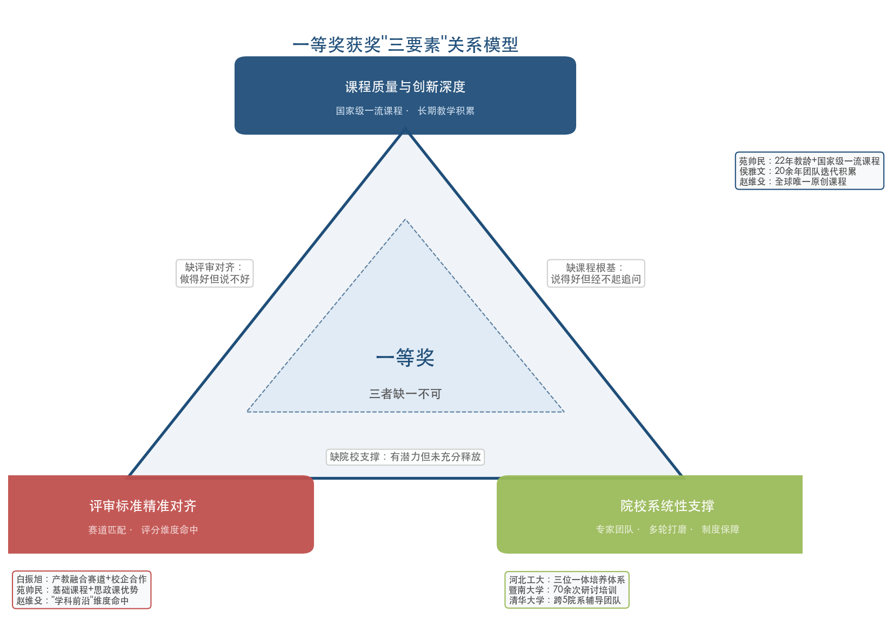

<b>图4-3 一等奖获奖"三要素"关系模型</b>

三个条件缺一不可：仅有教学质量而不了解评审标准，可能"做得好但说不好"；仅有赛事技巧而缺乏课程根基，可能"说得好但经不起追问"；仅有个人实力而缺乏院校支撑，可能"有潜力但未充分释放"。对于正在辅导高校教师竞赛的管理部门与教学发展中心而言，同时构建这三个维度的能力，是提升获奖概率的根本路径。

# 第5章 面向备赛团队的实操指南

前四章系统梳理了创新赛与青教赛的赛制框架、获奖画像、共性特征和典型案例。本章将上述分析成果转化为可执行的备赛行动方案，围绕"从现在开始应该怎么做"这一核心问题，从赛事选择与定位、备赛全流程规划、核心材料打磨、现场呈现与答辩、常见失分规避以及院校支撑体系建设六个维度，为正在辅导教师竞赛的教务部门、教师发展中心及备赛团队提供系统化的实操参考。

## 5.1 赛事选择与赛道定位策略

### 5.1.1 创新赛与青教赛的适配逻辑

基于第 1 章的制度比较和第 4 章的案例分析，两赛在评审导向上存在本质差异：创新赛考核的是"一门课的教学创新体系"，青教赛考核的是"一位教师的教学基本功"。这一差异直接决定了参赛教师的选择策略。

**适合创新赛的教师画像。** 创新赛无年龄限制，以团队形式参赛（1 名主讲教师 + 不超过 3 名团队成员），核心考核维度为"教学创新的系统性与成效的可验证性"。以下三类教师尤为适合参赛：其一，主讲课程已具备 2 轮以上教学经验，且在教学方法、教学技术或课程体系上有明确的创新积累；其二，拥有国家级或省级一流课程、精品课程等教学建设成果作为参赛基础；其三，40 岁以上的资深教师或以"教学创新体系"为核心竞争力的教师。第 4 章案例中，苑帅民（22 年教龄）和侯雅文团队（20 余年积累）均属于长周期教学积淀后的竞赛爆发 [第六届创新赛通知](https://www.sohu.com/a/986108507_121123740 "第六届通知，2026年2月")。

**适合青教赛的教师画像。** 青教赛限 40 周岁以下青年教师参赛，第八届（2026 年）进一步要求教龄 5 年（含）以上、近 3 学年持续从事一线教学 [五邑大学第八届校赛通知](https://www.wyu.edu.cn/hr/info/1552/6001.htm "第八届校赛通知")。该赛事采用个人参赛形式，核心考核"教学设计能力、课堂呈现功力和语言教态"。以下三类教师更具竞争优势：其一，教学基本功扎实、个人表现力强、语言表达清晰且富有感染力；其二，对所教课程有深刻理解，能够在 20 分钟内完整呈现一个教学片段的逻辑闭环；其三，具备一定竞赛经验或舞台表现力。第 4 章案例中，赵维殳以一手科考经历构建独创课程，郭璐以"钩子"问题驱动教学叙事，均体现了青教赛对个人教学魅力的高度要求。

### 5.1.2 创新赛赛道选择策略

第六届创新赛（2026 年）设 9 大赛道：新工科、新医科、新农科、新文科、基础课程、课程思政、产教融合、人工智能+、实验教学 [第六届创新赛通知](https://www.sohu.com/a/986108507_121123740 "第六届通知，2026年2月")。赛道选择的核心原则是**课程特色与赛道评审导向的精准匹配**。

**赛道选择的三条决策规则：**

第一，**按学科属性归位**。工科课程归新工科、医学课程归新医科、农林课程归新农科、人文社科课程归新文科、数理化英等公共基础课归基础课程赛道。这是最直接的赛道归属逻辑。

第二，**按创新亮点升维**。若课程的核心竞争力不在学科内容本身，而在特定创新维度上，应考虑选择对应的专项赛道。具体而言，AI 赋能教学效果显著的课程可选"人工智能+"赛道，与企业深度合作的课程可选"产教融合"赛道，思政育人特色突出的课程可选"课程思政"赛道，含实验教学环节的课程可选"实验教学"赛道。第 4 章白振旭案例即是将《激光原理》从"新工科"赛道定位转至"产教融合"赛道，精准匹配了自身在校企合作方面的积累优势。

第三，**评估竞争格局**。第 2 章数据显示，第三届创新赛 72 项一等奖中，新工科 18 项（25%）和新文科 16 项（22%）合占总数的 47%，为获奖数量最多但竞争也最激烈的两大赛道；新农科一等奖仅 5 项、占比 7%，竞争压力相对较小 [第三届获奖名单PDF](http://jsy-reptile-img.oss-cn-guangzhou.aliyuncs.com/crawler_img/20230826/1692964393519500.pdf "第三届获奖名单逐条统计")。产教融合、人工智能+和实验教学作为近年新设赛道，竞争格局尚在形成期，具备独特亮点的课程更易脱颖而出。

**需特别注意的参赛限制：** 第六届创新赛新增限制性规定——已获往届全国赛一等奖的主讲教师不能再次参赛，上一届获二、三等奖的主讲教师不能连续参赛 [第六届创新赛通知](https://www.sohu.com/a/986108507_121123740 "第六届参赛限制")。各备赛团队须在选拔阶段即核查拟推荐教师的历史参赛记录。

### 5.1.3 青教赛组别定位与省际竞争考量

青教赛设文科、理科、工科、医科、思想政治课专项 5 个组别，每省每组别仅推荐 1 名选手参加全国决赛。这一"窄口"机制意味着**省赛是实质意义上的淘汰赛**，省内竞争的激烈程度直接决定参赛教师能否进入国赛。

从第七届青教赛（2024 年）各省获奖情况来看，教育强省的省内竞争尤为激烈——湖北省代表队获 3 项一等奖居全国第二 [荆楚网](http://news.cnhubei.com/content/2024-09/11/content_18392941.html "湖北3项一等奖")，上海交通大学 3 名选手全部获一等奖 [上海交通大学教学发展中心](https://ctld.sjtu.edu.cn/news/detail/1162 "交大三名选手获一等奖")。这些省份的备赛支撑体系也更为成熟，获奖概率与备赛强度呈正相关。中西部省份虽然省内竞争压力相对较小，但相应的备赛资源和专家指导网络也较为薄弱，备赛团队需主动寻求外部资源支持。

## 5.2 备赛全流程规划

两大赛事的备赛均需系统性规划，涵盖从课程积累到赛前冲刺的完整周期。图 5-1 以时间线形式分别展示了创新赛（第六届·2026 年）和青教赛（第八届·2026 年）的四阶段备赛流程及关键赛程节点。

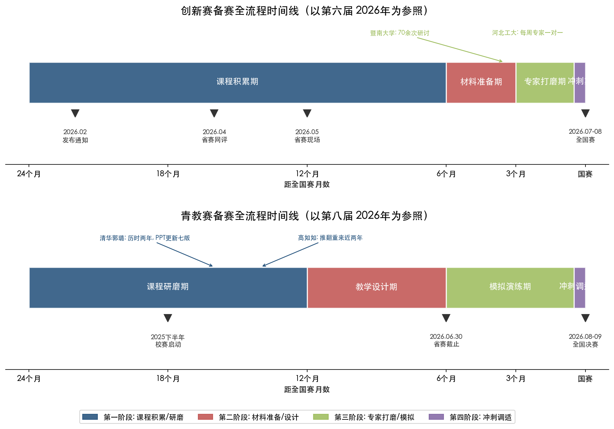

**图 5-1 创新赛与青教赛备赛全流程时间线**

### 5.2.1 创新赛备赛时间线

以第六届创新赛（2026 年）为参照，关键赛程节点如下：2026 年 2 月发布全国通知 → 各省 3—4 月组织省赛网评（如山西省材料提交截止 4 月 2 日）→ 4—5 月省赛现场评审 → 全国赛预计 7—8 月 [山西省第六届创新赛通知](https://jyt.shanxi.gov.cn/xwzx/ggtz/202603/P020260312393289668744.pdf "山西省赛通知")。

基于历届获奖案例的备赛经验，创新赛备赛宜划分为**四个阶段**：

| 阶段 | 时间节点 | 核心任务 | 关键产出 |
|------|---------|---------|---------|
| 课程积累期 | 赛前 1—2 年 | 打磨课程体系、实施教学创新、积累成效数据 | 课程建设成果、学生反馈数据、教改论文 |
| 材料准备期 | 赛前 3—6 个月 | 撰写创新成果报告、录制课堂教学实录 | 报告初稿、实录视频素材 |
| 专家打磨期 | 赛前 1—3 个月 | 邀请校内外专家多轮点评与修改 | 定稿报告、精剪实录、现场汇报 PPT |
| 冲刺期 | 赛前 1—2 周 | 模拟汇报与答辩、细节打磨、心理调适 | 完整预演、应急预案 |

暨南大学为侯雅文团队累计组织 70 余次研讨和培训 [暨南大学官网](https://news.jnu.edu.cn/wap/content/202412/25/c4018.html "备赛70余次研讨")，河北工业大学为苑帅民组建 10 余位专家每周一对一指导 [河北工业大学官网](https://www.hebut.edu.cn/gdxw/1ae80e84d0b7474b876e4541579cea5e.htm "专家指导模式")。上述获奖案例表明，"专家打磨期"的投入强度与获奖概率高度相关。

### 5.2.2 青教赛备赛时间线

以第八届青教赛（2026 年）为参照，关键赛程节点如下：各高校 2025 年下半年至 2026 年初组织校赛→省赛 2026 年 6 月 30 日前完成→全国决赛预计 2026 年 8—9 月 [五邑大学第八届校赛通知](https://www.wyu.edu.cn/hr/info/1552/6001.htm "第八届校赛通知")。

青教赛的备赛规划同样建议分四个阶段，但侧重点有所不同：

| 阶段 | 时间节点 | 核心任务 | 关键产出 |
|------|---------|---------|---------|
| 课程研磨期 | 赛前 1—2 年 | 选定参赛课程、确定核心教学理念、梳理知识体系 | 课程逻辑主线、教学特色定位 |
| 教学设计期 | 赛前 6—12 个月 | 撰写教学大纲、完成 16 个学时的教学设计与 PPT | 教学设计方案全套、PPT 全套 |
| 模拟演练期 | 赛前 2—6 个月 | 反复试讲、专家点评、逐节打磨 20 分钟教学 | 各节段试讲视频、修改记录 |
| 冲刺调适期 | 赛前 1—2 周 | 适应赛场环境、心理建设、抽签应对训练 | 赛场模拟、应急方案 |

清华大学郭璐从 2022 年校赛到 2024 年国赛历时两年，PPT 前后更新七版 [清华大学官网](https://www.tsinghua.edu.cn/info/1179/115244.htm "郭璐备赛两年")。南京理工大学高如如 2022 年省赛获二等奖后，彻底推翻全部课程主线和 PPT，用近两年时间重新设计后获省赛第一 [南京理工大学钟声网](https://zs.njust.edu.cn/2f/44/c3554a339780/page.htm "高如如人物特写")。上述案例表明，青教赛的备赛周期实际上从"选定课程和教学理念"即已开始，远非仅准备 20 分钟试讲所能涵盖。

## 5.3 创新赛核心材料打磨

### 5.3.1 创新成果报告撰写要领

创新成果报告是创新赛网络评审阶段的核心材料之一（占 20 分），写作质量直接影响能否通过网评进入现场赛。第六届创新赛要求报告不超过 4000 字（含 300 字摘要），查重率高于 20% 则无法上传 [第六届创新赛实施方案](https://bhws.tjfsu.edu.cn/UploadFile//20260310050252364.doc "报告要求") [山西省赛通知](https://jyt.shanxi.gov.cn/xwzx/ggtz/202603/P020260312393289668744.pdf "查重要求")。

基于第 3 章归纳的获奖课程共性特征和第 4 章的案例解剖，报告的推荐框架为**"摘要 → 课程概况 → 痛点问题 → 教学创新理念 → 创新举措 → 创新成效 → 总结反思"**七段式结构 [众师云平台指南](https://zhuanlan.zhihu.com/p/1910264074555623161 "如何写出打动评委的教学创新报告")。其核心逻辑可概括为一句话：**发现真问题、提出真方案、证明真有效。**

**痛点问题（约 400—600 字）**是报告的起点与灵魂。第 4 章苑帅民案例的三大痛点——"历史发展规律认知难、代际思想情感认同难、红心铸魂笃志践行难"——之所以具有说服力，在于三个"难"层层递进、相互关联，且每一个"难"都指向了真实的教学困境。报告中的痛点问题一般以 3 个为宜，须做到：来源于真实教学场景、可被教学创新针对性解决、具有一定的普遍性和代表性。

**创新举措（约 1200—1500 字）**是报告的核心部分，每项举措须遵循"措施内容 → 实施路径 → 实施效果"的递进逻辑。以侯雅文案例为参照，其"四大平台"（虚拟仿真/教材数字化/统计分析/AI 智能分析）的写法要点在于：每个平台并非孤立的技术展示，而是服务于教学目标的有机组成部分；平台之间具有逻辑关联而非简单并列；每个平台的教学效果均有数据支撑。

**创新成效（约 500—800 字）**必须以"可验证的客观证据"为支撑。可采用的证据类型包括：学生成绩对比数据（前后测/对照组）、学生评教数据变化、课程获评一流课程或教学成果奖等第三方认可、教改论文发表情况、课程辐射推广的院校数量或受益学生规模等。评分标准明确要求成果"具有较强辐射推广价值" [第四届创新赛评分标准](https://jwc.nepu.edu.cn/fujian134xin.pdf "创新赛成果辐射要求")，因此成效部分须明确阐述创新成果的推广应用情况。

**报告撰写的常见问题：**

- **查重率超 20%**：直接无法上传，须提前使用知网等查重系统检测并进行原创性改写
- **字数超 4000 字**：须精简至限定范围内，优先删减背景描述和文献综述部分
- **痛点问题过于宽泛**：如"学生学习兴趣不高""课程内容与实践脱节"等通用表述缺乏针对性，难以支撑后续创新举措的逻辑展开
- **创新举措与痛点脱节**：举措未对应到具体痛点，无法形成"问题—方案—成效"的逻辑闭环
- **成效缺乏数据支撑**：仅有定性描述而无定量证据，说服力不足

### 5.3.2 课堂教学实录拍摄规范

课堂教学实录视频在网络评审中占 40 分（满分 60 分中），权重最大。第六届创新赛对实录有严格的技术规范：须提交参赛课程中 2 个 40—50 分钟完整学时的教学录像，全程连续录制，不得中断；不得使用摇臂、无人机、画中画、配音等脱离教学常态的录制手段；拍摄机位不超过 2 个；主讲教师必须出镜且须有学生镜头；视频格式为 MP4、720P 以上，单个文件不超过 1200MB [第六届创新赛实施方案](https://bhws.tjfsu.edu.cn/UploadFile//20260310050252364.doc "视频要求")。

视频评分涵盖教学理念、教学内容、课程思政、教学过程、教学效果、视频质量六个维度，其中"视频质量"一项要求"客观真实反映教学常态" [第六届创新赛实施方案](https://bhws.tjfsu.edu.cn/UploadFile//20260310050252364.doc "视频评分标准")。

**实录拍摄的实操建议：**

**选课策略。** 在参赛课程的全部学时中，选择教学创新亮点最集中的 2 个学时进行录制。所选学时应能充分展示创新举措的实施过程——如翻转课堂的互动环节、PBL 的小组讨论、虚拟仿真的操作演示等，使评委能够"看到"创新举措在真实课堂中的落地效果。

**机位设置。** 建议采用双机位方案：1 个全景机位（固定于教室后方，覆盖教师和学生全貌）+ 1 个中近景机位（机动跟拍教师教学和学生互动），两路信号后期切换剪辑。须特别注意：画面中不得出现任何暴露参赛教师姓名、学校名称的信息（如教室铭牌、PPT 署名等）。

**课堂状态。** "常态化"是评分的隐性标准。教师应以日常教学状态授课，避免明显的"表演痕迹"。学生的课堂参与（提问、讨论、展示）应自然流畅。若学生状态过于"配合"或明显经过排练，反而可能引起评委的负面判断。

### 5.3.3 人工智能赛道与实验教学赛道的特别要求

第六届创新赛两个专项赛道有差异化的材料要求。

**人工智能赛道。** 参赛课程须利用国家高等教育智慧教育平台资源或依托生成式 AI 技术建设教学智能体，至少包含 2 个 AI 教学情境。成果报告须"提供可验证的客观证据或对比数据"证明 AI 教学效果，同时须明确数据治理与安全合规措施。评分尤其强调"系统性重新设计而非技术简单堆砌"——AI 应融入教学的全过程（课前预习、课中互动、课后评估），而非仅作为课堂演示的点缀 [第六届创新赛实施方案](https://bhws.tjfsu.edu.cn/UploadFile//20260310050252364.doc "人工智能赛道要求")。

**实验教学赛道。** 参赛课程须提交不超过 60 分钟的实验教学实录视频（可倍速播放，分为综合设计型实验课程组和研究探索型实验课程组）以及不超过 15 分钟的说课视频。该赛道替代了第五届的"新教师赛道"，是第六届新增的重要赛道 [第六届创新赛实施方案](https://bhws.tjfsu.edu.cn/UploadFile//20260310050252364.doc "实验教学赛道要求")。

## 5.4 青教赛核心材料打磨

### 5.4.1 教学设计撰写框架

青教赛教学设计须覆盖参赛课程 16 个学时（第八届部分省赛调整为 8 个学时，如广东省），每个学时对应 1 份完整设计方案与配套 PPT [第五届青教赛通知](https://sub2.dlust.edu.cn/jxzlb/uploadfile/file/20220310/20220310082737_14191.pdf "教学设计评分细则") [东莞理工学院校赛通知](https://jwb.dgut.edu.cn/info/1101/29971.htm "第八届广东省赛选拔通知")。教学设计虽然在总分中仅占 20 分（第五届标准），但它是课堂教学的"设计图纸"，直接决定 20 分钟课堂教学的呈现质量。

教学设计评分包含六个要点：紧密围绕立德树人根本任务、突出课程思政（2 分）；符合教学大纲、内容充实、反映学科前沿（4 分）；教学目标明确、任务清晰（4 分）；准确把握课程重点和难点、针对性强（4 分）；教学进程组织合理、方法手段运用恰当有效（4 分）；文字表达准确简洁、阐述清楚（2 分） [第五届青教赛通知](https://sub2.dlust.edu.cn/jxzlb/uploadfile/file/20220310/20220310082737_14191.pdf "教学设计评分细则")。

**教学设计撰写的关键要领：**

**第一，教学设计重在"设计"而非"内容搬运"。** 有评审专家指出，教学设计最常见的错误是"直接罗列、摘抄教材的内容"——教学设计不是教材的翻版，也不是 PPT 内容的文字化，而是教师对教学活动的系统规划，须体现教师个人的教学理念和设计思路 [科学网博客·杜学领](https://blog.sciencenet.cn/blog-3400925-1499156.html "评审青教赛：对教学设计的思考")。

**第二，16 个学时的学情分析须有差异性。** 每一节课的学情分析应针对该节课的具体内容，反映学生在学习本节课之前的知识基础和可能的认知障碍，而非 16 节课使用同一段学情分析。同理，即使采用相似的教学方法，不同节次的教学过程设计也应有针对性差异 [科学网博客·杜学领](https://blog.sciencenet.cn/blog-3400925-1499156.html "学情分析差异性")。

**第三，教学目标不宜过多，重难点须精准提炼。** 一节课仅有 45—50 分钟，设置过多的教学目标和重难点会给评委"难以完成"之感。重难点尤其不应将所有主干内容和教材章节标题都列为重点——评委将据此判断教师是否具备区分重难点的能力。设定教学目标后，须回头核查：目标能否在本节教学中实现？实现的路径在教学过程设计中是否有对应？ [科学网博客·杜学领](https://blog.sciencenet.cn/blog-3400925-1499156.html "教学目标与重难点")

**第四，教学设计的内容必须能在课堂中落实。** 若教学设计中写了精心的教师活动、学生活动和设计意图，但在 20 分钟的课堂教学中完全无法呈现，评委会认为教学设计和课堂教学"两张皮"，甚至质疑教学设计是否由参赛教师本人完成 [科学网博客·杜学领](https://blog.sciencenet.cn/blog-3400925-1499156.html "设计与落实的一致性")。

**第五，学科前沿的体现方式。** "反映学科前沿"是评分要点之一（4 分中的组成部分）。可行的融入路径包括：作为新课导入的案例引入并分析其前沿性质；作为学完新内容后的应用拓展；作为课堂讨论的背景或问题；在扩展阅读中给出并布置明确的学习任务。无论采用哪种方式，都须在设计中明确标注该内容属于学科前沿，以便评委识别 [科学网博客·杜学领](https://blog.sciencenet.cn/blog-3400925-1499156.html "学科前沿融入方式")。

### 5.4.2 20 分钟课堂教学的选题与编排

课堂教学是青教赛的核心环节：第五届评分权重为 75 分（满分 100 分），第七届提升至 80 分，第八届延续课堂教学作为主体环节的地位。20 分钟课堂教学采用"无生上课"形式，参赛选手面对评委讲授，通过抽签确定教学节段 [第五届青教赛通知](https://sub2.dlust.edu.cn/jxzlb/uploadfile/file/20220310/20220310082737_14191.pdf "课堂教学评分细则")。

课堂教学评分涵盖四个维度：教学内容 30 分（含立德树人 6 分、理论联系实际 6 分、学术性 6 分、学科前沿 3 分、重点条理 9 分）、教学组织 30 分（含启发性 10 分、过程安排 10 分）、语言教态 10 分、教学特色 5 分 [第五届青教赛通知](https://sub2.dlust.edu.cn/jxzlb/uploadfile/file/20220310/20220310082737_14191.pdf "课堂教学评分细则")。

**20 分钟教学的核心原则——"循序渐进、引人入胜"：**

**选题原则。** 20 分钟并非 1 学时内容的"压缩版"，而是精选一个完整的教学片段。优先选择逻辑性和系统性强的重难点内容，使之在 20 分钟内形成"导入 → 展开 → 深化 → 总结"的完整闭环。第 4 章赵维殳案例以"极端环境微生物"的特定知识点切入，在 20 分钟内完成了从现象引入到机制分析再到学科前沿的完整教学叙事 [科学网博客·杜学领](https://blog.sciencenet.cn/blog-3400925-1499439.html "评审青教赛：20分钟课堂教学的思考")。

**开场设计。** 第 3 章和第 4 章的分析表明，获奖教师普遍善用"钩子"问题或故事化导入。郭璐以悬念式问题开场驱动思考，赵维殳以一手科考经历构建"学术探险"情境，高晓沨将教学结构提炼为"起承转合"四式——"起"即引人入胜的导入 [清华大学官网](https://www.tsinghua.edu.cn/info/1179/115244.htm "郭璐教学理念")。开场的前 2—3 分钟是评委注意力最集中的时段，须以问题、案例、故事或认知冲突迅速抓住评委。

**PPT 设计。** 须体现"人无我有"的差异化特色——自行拍摄的实验/实践视频、自制教具、一手科研数据或图表等，均能形成鲜明的竞争优势。郭璐的 PPT 含大量古代城市画作和三维模型动画，并 3D 打印建筑模型辅助教学 [清华大学官网](https://www.tsinghua.edu.cn/info/1179/115244.htm "郭璐PPT设计")。PPT 格式须为 Powerpoint 演示文稿 16:9，分辨率 1600×900，须提前在赛场设备上测试兼容性。

**时间控制。** 20 分钟的教学节段须精确控制节奏。建议各环节时间分配为：导入 2—3 分钟、新知展开 12—14 分钟、总结升华 2—3 分钟。超时或明显不足都会影响评分。可在试讲中使用计时器反复训练，将时间误差控制在 ±30 秒以内。

### 5.4.3 教学反思的写作与口头呈现

教学反思环节经历了显著演变：第五届为课后 45 分钟手写 500 字，第七届延续手写形式，第八届调整为 3 分钟口头反思——参赛选手在课堂教学环节结束后现场准备 2 分钟，随即进行 3 分钟口头反思 [五邑大学第八届校赛通知](https://www.wyu.edu.cn/hr/info/1552/6001.htm "第八届校赛通知") [东莞理工学院校赛通知](https://jwb.dgut.edu.cn/info/1101/29971.htm "第八届广东省赛选拔通知")。

**口头反思的应对策略：**

口头反思须从教学理念、教学方法、教学过程三个方面展开，避免空泛表述，以具体例证支撑反思判断 [众师云平台指南](https://zhuanlan.zhihu.com/p/1969328183171090179 "青教赛教学反思环节指南")。建议采用"三段式"结构：（1）回顾本节课的教学目标与设计理念（约 40 秒）；（2）反思教学过程中的亮点与不足（约 100 秒）——此处须结合刚刚完成的 20 分钟教学实际情况，体现"即时反思"的真实性，而非背诵预设模板；（3）提出改进思路和教学启示（约 40 秒）。

鉴于口头反思需要在 2 分钟准备后即时呈现，建议备赛阶段为每个教学节段准备反思要点框架，日常试讲时同步练习口头反思，使之成为肌肉记忆。但须注意，反思内容不能完全照搬预设——评委期望看到教师对本次教学的真实思考，而非"万能模板"。

## 5.5 现场呈现与答辩技巧

### 5.5.1 创新赛现场汇报策略

创新赛现场评审（占 40 分）包含 12 分钟汇报与 8 分钟专家提问两个环节。有评委将现场汇报的风格特征概括为"类似'说课'、重点环绕'创新'、表现就是'讲课'、水平赢在'重点'" [中国地质大学教师发展中心](https://bm.cugb.edu.cn/jsfzzx/c/2025-02-06/820242.shtml "评委视角：如何做好现场汇报")。

**汇报结构建议：**

**"凤头"开场（前 1—2 分钟）。** 直接摆出教学痛点问题或亮出最核心的创新成效数据。应避免从课程背景、学校概况等"外围信息"开始——评委在一天之内可能要听数十个汇报，冗长的背景铺垫会迅速消耗其注意力。

**主体陈述（中间 8—9 分钟）。** 围绕"问题 → 方案 → 成效"的创新逻辑展开，而非按照 PPT 页码逐页讲述。评分标准涵盖教学理念、教学内容、课程思政、教学过程、教学效果、汇报质量、创新特色七个评价维度，但汇报时不应逐条"对标"，而应以创新叙事为主线自然覆盖各维度 [中国地质大学教师发展中心](https://bm.cugb.edu.cn/jsfzzx/c/2025-02-06/820242.shtml "汇报评分维度")。

**"豹尾"收束（最后 1 分钟）。** 以最亮眼的数据或事实定格结尾——如"课程已辐射 XX 所高校""学生学习成效提升 XX%""获评国家级一流课程"等——为评委留下最深刻的最终印象。

### 5.5.2 答辩应对策略

8 分钟的专家提问环节是创新赛现场评审的重要组成部分。评委提问通常围绕以下方向展开：（1）创新的原创性与独特性——"这个做法和别人有什么不同？"；（2）成效的可靠性——"数据是怎么采集的？有没有对照组？"；（3）可推广性——"其他院校能复制你的做法吗？"；（4）课程思政的融入——"能具体说说思政元素是怎么融入的？"。

答辩的核心原则是"先肯定提问价值，再从容回应，不轻易否定自身工作"。有评委建议参赛选手在气场营造上做到三点：充满自信（将评委视为学生）、充满活力（微笑为主、适当动情）、稳定成熟（有张有弛、保持节奏） [中国地质大学教师发展中心](https://bm.cugb.edu.cn/jsfzzx/c/2025-02-06/820242.shtml "气场营造与答辩")。面对不熟悉的问题，可以坦诚说明后续改进方向，但不宜表现出对自身工作的否定或不确定。

### 5.5.3 青教赛语言教态要点

语言教态是青教赛独有的显性评审维度，占 10 分。这一维度在创新赛中没有对应的独立评分项，是青教赛"教学基本功"导向的典型体现。

**声音与语言。** 声音洪亮、吐字清晰是基本要求。方言口音过重可能影响评分，有口音困扰的教师宜进行针对性的普通话训练。语速以适中偏慢为宜（约 180—200 字/分钟），关键概念处适当放慢并加重语气。有评审专家指出，播音主持专业背景的教师在语言教态维度获得高分的概率较大 [科学网博客·杜学领](https://blog.sciencenet.cn/blog-3400925-1499439.html "语言教态评分详解")。

**教态与站位。** 以讲台为活动中心，建议采用"黄金三角站位法"——站在投影屏幕左侧或右侧完成 80% 的讲述（身体朝向评委而非屏幕），在教学亮点处向前一步走向评委以强化感染力。须避免"定在原地不动"或"来回踱步"两个极端。手势应自然配合内容表达，避免双手插兜、抱臂或紧握教鞭等封闭性动作。

**目光交流。** 虽为"无生上课"，但须假设评委席即为学生，保持与不同方位评委的目光交流。每次目光停留 2—3 秒后自然转移，覆盖评委席的左、中、右三个区域。

## 5.6 常见失分点与规避策略

### 5.6.1 创新赛常见失分点

基于赛事规则和评审经验，创新赛的常见失分点可归纳为以下几类：

**材料硬伤类。** 查重率超 20%（无法上传）；报告字数超过 4000 字；视频使用了禁止的录制手段（摇臂、无人机、画中画、配音等）；视频或材料中泄露了参赛教师姓名或学校名称 [山西省赛通知](https://jyt.shanxi.gov.cn/xwzx/ggtz/202603/P020260312393289668744.pdf "材料规范")。

**内容逻辑类。** 创新成果报告"问题 → 方案 → 成效"逻辑链断裂；创新举措与痛点问题对应不上；成效数据缺乏说服力或可验证性不足；课程思政融入"贴标签"——为"思政"而"思政"，与课程内容和教学过程脱节。第 3 章引用的学术研究指出，部分课程存在思政创新"增量"对"质量"支撑度较低的问题 [上海体育大学学报论文](https://shtyxyxb.xml-journal.net/cn/article/pdf/preview/10.16099/j.sus.2024.10.03.0001.pdf "课程思政教学创新问题，2025年")。

**现场表现类。** 汇报超过 12 分钟被打断；全程背诵台词，缺乏互动感和自然感；面对答辩问题过度紧张或轻易否定自身工作。

### 5.6.2 青教赛常见失分点

**教学设计类。** 16 个学时的学情分析千篇一律；教学设计直接摘抄教材内容；教学目标过多且无法在教学中落实；重难点罗列教材章节标题而非精准提炼；教学设计中存在低级错误（错别字、信息前后不一致、格式错乱、课程名称不统一等） [科学网博客·杜学领](https://blog.sciencenet.cn/blog-3400925-1499156.html "教学设计常见错误")。

**课堂教学类。** 将 1 学时内容"压缩"到 20 分钟导致赶进度，无法展开深度教学和互动设计；PPT 视频/动画格式与赛场设备不兼容（须提前测试）；未适应赛场环境（讲台高度、话筒距离、翻页器信号等）；课程思政"贴标签"式融入而非"如盐化水"般有机嵌入。

**教学反思类。** 空泛表述"本节课基本达到了教学目标"而无具体分析；完全背诵预设模板，缺乏即时反思的真实感；反思角度单一，仅从"教"的角度反思而忽略"学"的角度。

### 5.6.3 两赛通用的材料自查清单

为便于备赛团队在材料提交前进行系统检查，图 5-2 以可视化双栏形式汇总了创新赛与青教赛的核心材料自查要点。

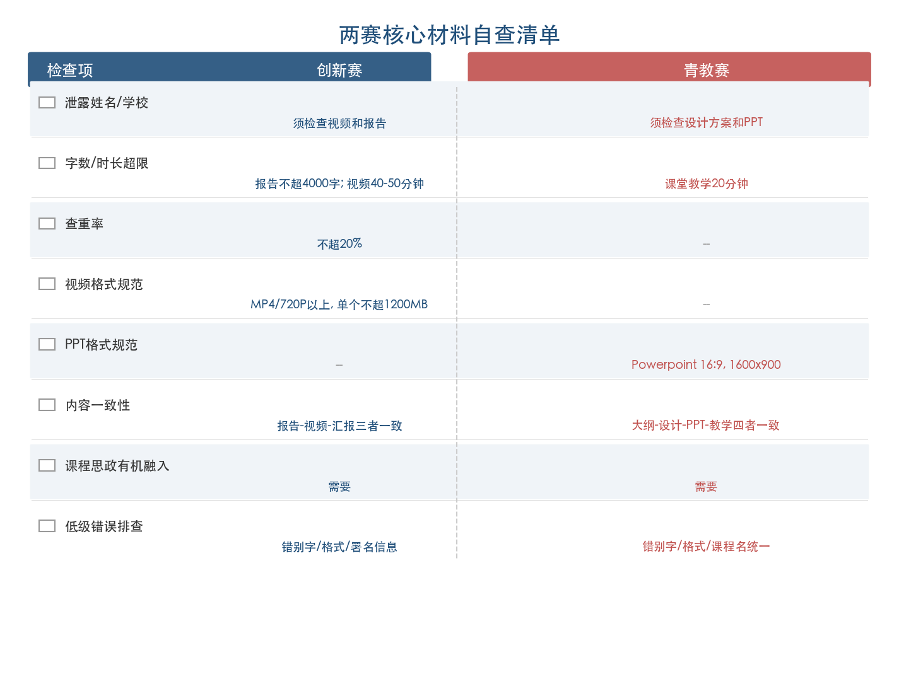

**图 5-2 两赛核心材料自查清单**

下表为对应的详细检查项：

| 检查项 | 创新赛 | 青教赛 |
|-------|--------|--------|
| 材料中是否泄露姓名/学校 | ✓ 须检查视频和报告 | ✓ 须检查设计方案和 PPT |
| 字数/时长是否超限 | ✓ 报告≤4000字，视频 40-50分钟 | ✓ 课堂教学 20分钟 |
| 查重率 | ✓ ≤20% | — |
| 格式规范 | ✓ MP4/720P以上，单个≤1200MB | ✓ PPT 16:9/1600×900 |
| 内容一致性 | ✓ 报告↔视频↔汇报三者一致 | ✓ 大纲↔设计↔PPT↔课堂教学四者一致 |
| 课程思政有机融入 | ✓ | ✓ |
| 低级错误排查（错别字、格式等） | ✓ | ✓ |

## 5.7 院校支撑体系建设

### 5.7.1 从个人备赛到院校系统工程

第 4 章的横向对比揭示了一个核心规律：在当前竞赛生态中，一等奖的获取需要同时满足"课程质量与创新深度""评审标准精准对齐""院校系统支撑"三个条件。院校支撑并非锦上添花，而是将教师个人（团队）的教学实力转化为竞赛成果的关键放大器。

从历届获奖院校的实践来看，系统化的院校支撑包含三个递进层次（图 5-3）：

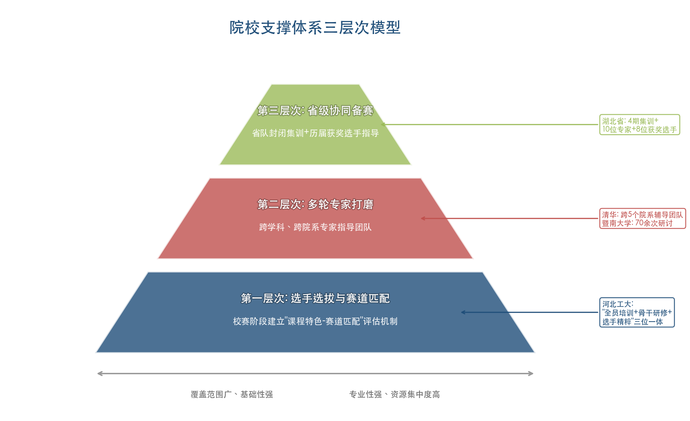

**图 5-3 院校支撑体系三层次模型**

**第一层次：选手选拔与赛道匹配。** 在校赛阶段即建立"课程特色—赛道（组别）匹配"的评估机制，由教务部门或教师发展中心牵头，组织校内专家对拟推荐教师的课程进行诊断，协助其确定最优赛道定位。河北工业大学的"全员专项培训 + 骨干教师深度研修 + 参赛选手精粹培育"三位一体模式，在选拔阶段即完成了从"广撒网"到"精准培育"的漏斗筛选 [河北工业大学官网](https://www.hebut.edu.cn/gdxw/1ae80e84d0b7474b876e4541579cea5e.htm "三位一体培养模式")。

**第二层次：多轮专家打磨。** 组建跨学科、跨院系的专家指导团队，对参赛教师进行从材料到呈现的全方位打磨。清华大学为郭璐跨 5 个院系组建辅导团队 [清华大学官网](https://www.tsinghua.edu.cn/info/1179/115244.htm "跨院系辅导团队")；武汉大学马克思主义学院联合历史学院成立专家团队，为徐嘉鸿提供跨学科支撑 [武汉大学新闻网](http://www.lianpp.com/whu/smu_news/info/1013/464557.htm "跨学科专家团队")。跨学科专家的独特价值在于帮助参赛教师跳出本学科视角，以"外行评委"的眼光审视教学设计和课堂呈现是否具备普遍说服力。

**第三层次：省级协同备赛。** 青教赛的"省队集训"模式在近年来愈发成熟。湖北省代表队在第七届青教赛中组织 4 期封闭集训、聘请 10 位专家和 8 位历届获奖选手全程指导，最终获 3 项一等奖居全国第二 [荆楚网](http://news.cnhubei.com/content/2024-09/11/content_18392941.html "湖北封闭集训")。省级层面的组织化备赛能力已成为影响青教赛获奖概率的关键变量。

### 5.7.2 辅导团队的工作模式建议

对于承担辅导高校教师竞赛任务的部门而言，基于上述获奖院校的经验，可参考以下工作模式。

**建立"诊断—打磨—模拟"三阶段辅导流程。** 诊断阶段（1—2 次），由专家团队评估教师课程的创新基础、竞赛潜力和最优赛道定位；打磨阶段（持续 2—4 个月），每周至少 1 次一对一或小组研讨，逐项打磨材料和教学呈现；模拟阶段（赛前 2—4 周），组织全流程模拟比赛，邀请校外专家担任"模拟评委"，进行实战演练和针对性反馈。

**构建获奖案例资源库。** 系统收集历届创新赛和青教赛一等奖获奖课程的公开信息——包括获奖名单、参赛课程信息、公开分享的教学设计和课堂视频（如国家智慧教育平台上的青教赛获奖教师教学视频、B 站上的公开课堂实录等），形成可供参赛教师学习借鉴的结构化资源库。

**引入历届获奖教师担任辅导专家。** 湖北省的成功经验表明，8 位历届获奖选手的全程指导是备赛体系中不可替代的环节——他们能够从参赛者视角提供最贴近实战的建议，涵盖赛场细节、心理调适和评审偏好等经验类知识 [荆楚网](http://news.cnhubei.com/content/2024-09/11/content_18392941.html "湖北封闭集训")。

# 结论与风险提示

## 核心结论

本报告通过对全国高校教师教学创新大赛（创新赛）与全国高校青年教师教学竞赛（青教赛）历届全国一等奖获奖课程与选手的系统研究，形成以下核心结论。

**第一，两大赛事已形成定位互补、制度成熟的高校教师教学竞赛双轨格局。** 创新赛以"教学创新的系统性与可推广性"为核心评审标准，面向全年龄段教师以团队参赛，赛道体系从首届 6 个竞赛单元扩展至第六届 9 大赛道，直接回应"四新"建设、课程思政、产教融合和人工智能赋能教育等国家政策方向。青教赛以"教学基本功的精湛性"为核心评审标准，面向 40 周岁以下青年教师以个人参赛，课堂教学权重从 75 分持续提升至 80 分，各组别第一名可申报"全国五一劳动奖章"。两赛从"教学基本功"到"教学创新系统"构成了完整的教师教学能力评价谱系。

**第二，一等奖获奖课程在教学设计层面呈现高度一致的底层逻辑。** 尽管两赛评审侧重不同，但获奖课程均需系统回答三个核心问题：学生应该达到什么目标（"以学生发展为中心"的理念）、教师用什么方法帮助学生达到目标（混合式教学、PBL/CBL、数智化技术等方法创新）、如何证明学生确实达到了目标（成效证据与教学反思）。创新赛获奖课程遵循"发现真问题→构建创新模式→数据证明成效→辐射推广"的四步闭环，青教赛获奖课程则以"精准选题→精炼设计→精彩呈现→深度反思"为核心路径。能否系统、清晰、有说服力地回答上述三个问题，是区分一等奖与普通获奖课程的关键分水岭。

**第三，一等奖的获取需同时满足"课程质量与创新深度""评审标准精准对齐""院校系统支撑"三个条件。** 六个典型案例的深度剖析表明，顶尖获奖者无一例外拥有扎实的课程建设基础（国家级一流课程、20 余年团队积累或全球唯一的原创课程），同时精准匹配赛事评审导向（如苑帅民选择基础课程赛道发挥思政课优势、白振旭选择产教融合赛道匹配校企合作积累），并获得院校层面的系统化投入（河北工业大学三位一体培养体系、暨南大学 70 余次研讨打磨、清华大学跨 5 个院系辅导团队）。组织化备赛能力已从"锦上添花"上升为影响获奖概率的关键变量。

**第四，备赛工作应从"课程建设"而非"竞赛准备"起步。** 一等奖级别的参赛课程，其课程建设周期通常在 3 年以上，备赛打磨周期在 6 个月至 2 年之间。"临时抱佛脚"式的突击备赛几乎不可能竞争一等奖。对于承担教师竞赛辅导工作的部门而言，最有价值的长期投入不是赛前的集中培训，而是日常教学改革生态的系统培育——建立从"全员教学能力提升"到"骨干教师深度研修"再到"参赛选手精准培育"的递进式培养体系。

**第五，赛道选择与定位是备赛策略的首要决策节点。** 创新赛赛道从通用走向精细分化，产教融合、人工智能+和实验教学等新设赛道竞争格局尚在形成期，具备独特亮点的课程更易脱颖而出。青教赛"每省每组别推荐 1 人"的机制使省赛成为实质性淘汰赛，教育强省省内竞争激烈程度往往不亚于全国决赛。赛道（组别）选择应遵循"课程特色与赛道评审导向精准匹配"的核心原则，而非简单按学科属性归位。

## 风险提示与局限性

**第一，数据完整性受限。** 本报告的分析依赖公开渠道可获取的赛事信息，部分关键数据存在缺失。创新赛方面，第一、二、四、五届的完整文字版获奖名单在公开渠道获取有限，学科分布分析主要以第三届 72 项一等奖为样本；青教赛方面，决赛选手的完整职称、院校信息仅部分可获取，医科组和思政组的详细获奖信息在公开渠道较为稀缺。数据的不完整性可能导致对某些赛道或组别竞争格局的判断存在偏差。

**第二，案例样本的代表性边界。** 本报告深度剖析的六个典型案例（创新赛 3 个、青教赛 3 个）选自公开报道信息较为丰富的获奖者，案例选取客观上偏向了信息披露较充分的院校和选手。部分获奖但公开信息有限的课程——尤其是中西部地方院校的获奖案例——未能纳入深度分析，可能导致对获奖路径多样性的呈现不够充分。

**第三，赛事规则的动态演变。** 两大赛事的赛制、评分标准和参赛条件处于持续调整之中。创新赛第六届（2026 年）以实验教学赛道替代新教师赛道、新增往届一等奖主讲教师不得再次参赛的限制，青教赛第八届将教学反思从书面改为口头形式、教龄门槛提高至 5 年——这些变化均在本报告撰写时为最新规则，但后续届次可能继续调整。本报告基于截至 2026 年 4 月可获取信息所归纳的备赛策略，需在每届赛事通知发布后根据具体规则进行针对性更新。

**第四，备赛策略的效用边界。** 本报告提炼的备赛策略基于历届获奖案例的共性特征归纳，具有一定的参考价值，但教学竞赛的评审本质上具有主观性，评委构成、评审偏好和竞争对手的差异均可能影响最终结果。备赛策略能够提升参赛质量和获奖概率，但无法保证特定结果。教学竞赛的根本目的是"以赛促教"——推动教师回归教学、提升教学质量，而非单纯追求获奖。

**第五，院校支撑体系的移植性差异。** 本报告所引用的院校支撑模式（河北工业大学三位一体体系、暨南大学系统化备赛、湖北省封闭集训等）均产生于特定的制度环境和资源条件下，不同院校在组织架构、经费支持、专家网络和竞赛传统等方面存在显著差异。直接移植成熟模式可能因条件不匹配而效果有限，各院校需结合自身实际进行适应性调整。
