# 执行摘要

自闭症谱系障碍（ASD）学生群体持续扩大——美国疾病控制与预防中心（CDC）2025年数据显示8岁儿童ASD患病率已达1/31（32.2‰），世界卫生组织引用的全球疾病负担研究（GBD 2021）估计全球约6,180万人患有ASD。在融合教育成为全球主流趋势的背景下，如何系统性地增强ASD学生的课堂参与度，已从特殊教育的专项议题上升为基础教育体系的结构性挑战。本报告围绕"如何增强ASD学生课堂参与度"这一核心问题，系统梳理了概念框架、测量方法、实证干预策略、场景适用性、技术辅助手段、教师实施机制及政策动向等多个维度的研究证据，形成以下核心判断。

**在概念与测量层面**，Fredricks三维框架（行为参与、情感参与、认知参与）构成当前课堂参与度研究的主导范式，但该框架在ASD群体中的测量发展高度不均衡：行为参与已有课堂主动参与量表（CMAE）等专项工具支撑，情感参与主要依赖师生关系质量等代理指标间接推断，认知参与则在ASD群体中几乎完全缺乏专项测量方案。这一不均衡直接制约着干预效果评估的全面性。ASD学生的参与行为存在非典型表征，传统以眼神注视和举手为核心指标的评估标准可能产生系统性偏差，教育者应避免将神经典型参与标准机械套用于ASD群体。

**在干预策略层面**，基于NCAEP第三代系统综述（972篇高质量研究）和NAC国家标准项目的交叉比对，本报告将与课堂参与度直接相关的循证实践归纳为六大类别：环境结构化、视觉支持、同伴介入、自我管理、强化与动机策略以及前因与行为动量策略。其中，自我管理策略在跨场景稳健性方面表现最为突出——Gahtan等人（2026）多层次元分析发现，自我管理使ASD学生学业参与度平均提升49.87个百分点（95% CI: 39.76–59.59），且课堂类型、科目等潜在调节变量均不显著。视觉时间表以NAP汇总均值.95（强效应）紧随其后，是跨学段适用性最广的策略。行为动量干预（Tau-U = 0.87）在提升合规性方面证据强劲，适合作为课堂任务启动工具。

**在场景适用性层面**，当前循证实践证据在学段分布上高度集中于学前和小学阶段，初中和高中阶段系统性薄弱。Shogren等人（2026）发现ASD高中生呈现"低社会参与但高学业参与"的双重模式，提示高中阶段的策略选择应更侧重情感参与和社会参与维度。共病状况构成重要的调节因素：Fridell等人（2025）发现，ADHD共病使社交技能小组训练效果大幅衰减（无ADHD组NNT = 3 vs. 有ADHD组NNT = 26），鉴于ASD群体中ADHD共病率约28%，近三分之一的学生可能需要差异化的策略配置。

**在技术辅助层面**，辅助沟通技术（AAC/SGD）是证据最成熟、成本最可控的技术方案（AAC App加iPad约600美元），已有多项系统综述确认其达到"强烈有效"水平。VR/AR和社交机器人虽展现出注意力吸引等独特优势，但受限于技能迁移效应有限（VR训练后课堂行为改善效应仅η²p = .07）和高昂成本（NAO机器人约20,700美元），尚不具备大规模课堂部署条件。AI行为监测系统仍处于概念验证阶段。

**在教师实施层面**，教师知识储备不足和实施保真度不稳定是制约策略落地的核心瓶颈。超过65%的主流学校教师职前ASD专项培训不足3小时；即使经过两学年密集培训，关键反应训练（PRT）保真度仅达53%–60%。教练式督导显著优于传统工作坊模式——单纯工作坊仅使15%的教师达到PRT掌握标准，增加教练后多数教师可达标。COMPASS咨询模型证明，全学年不到10小时的咨询接触即可产生教师自我效能感和学生IEP目标达成的显著改善。投资于教师EBP实施能力，是提升ASD学生课堂参与度最具杠杆效应的路径。

综合而言，本报告的核心建议可凝炼为三个关键行动方向：其一，在策略选择上，优先部署自我管理、视觉支持、提示和强化四大核心策略，基于学生个体特征（感觉特征、语言能力、共病状态）和教学情境（学段、融合/特殊教育、班级规模）进行个别化组合；其二，在实施保障上，建立以嵌入式教练为核心、以组织气候建设为支撑的持续性教师支持体系；其三，在评估改进上，采用行为-认知-情感三维框架进行多信息源综合评估，以数据驱动的反馈循环持续优化策略配置。

# 第1章 课堂参与度的概念框架与测量方法

## 1.1 为什么需要专门讨论ASD学生的课堂参与度

课堂参与度（classroom engagement）是连接教学过程与学业成果的核心中介变量。然而，当研究对象从神经典型学生转向自闭症谱系障碍（Autism Spectrum Disorder, ASD；中国大陆官方文件中亦称"孤独症"，本报告统一使用"ASD"）学生时，参与度的内涵、外在表征及测量方式均面临根本性挑战。ASD学生在社会沟通、感觉加工和行为灵活性方面的独特神经发育特征，使得传统以"眼神注视教师""举手回答问题"为核心指标的参与度评估框架可能产生系统性偏差。Bayoumi等学者2025年在 *TEACHING Exceptional Children* 中明确指出，ASD学生的参与表现方式与非ASD同龄人存在质性差异——例如眼神接触模式和身体语言规律显著不同——并建议教育者直接询问学生本人如何定义自身的"参与状态"，避免将神经典型的参与行为标准机械套用于ASD群体 [Bayoumi et al. 2025](https://journals.sagepub.com/doi/10.1177/00400599251346719 "TEACHING Exceptional Children, 2025年")。

基于上述背景，本章承担三项核心任务：第一，界定课堂参与度在ASD学生群体中的操作化内涵；第二，梳理当前主流的测量工具与编码体系；第三，为后续各章的策略效果评估提供统一的衡量基准，并澄清ASD学生参与度与神经典型学生参与度在操作化定义上的关键差异。

## 1.2 三维参与度框架：从一般理论到ASD适用性分析

### 1.2.1 Finn参与-认同模型的奠基意义

课堂参与度研究的早期理论基础可追溯至Finn于1989年在 *Review of Educational Research*（Vol. 59, No. 2, pp. 117–142）发表的"参与-认同模型"（Participation-Identification Model）。该模型将学校参与视为一个发展性过程，区分出行为维度的"参与"（participation）和情感维度的"认同"（identification）两个核心成分。其中，参与被划分为四个递进层级：第一层级为"回应"（responding），即遵守教师指令和课堂要求；第二层级为"主动发起"（initiating），包括主动提问和在课堂内外投入额外时间；第三层级为参加课外和社交活动；第四层级为参与学校治理和决策。"认同"则包含归属感（belongingness）和对学校目标的价值认同（valuing）两个子成分 [Finn 1989](https://journals.sagepub.com/doi/10.3102/00346543059002117 "Review of Educational Research, 59(2), 117-142")。该模型的核心命题在于：学生在学校相关活动中保持多种且不断扩展的参与形式，将最大化其顺利完成学业的可能性；而参与的持续缺失将导致认同感弱化，进而引发情感或行为层面的退出。

Finn的模型为后续参与度研究奠定了双维度（行为＋情感）的理论基石，但其对认知参与维度的关注相对薄弱，这一空白在十五年后由Fredricks等人的三维框架予以弥补。

### 1.2.2 Fredricks三维框架的系统整合

在Finn模型的基础上，Fredricks、Blumenfeld与Paris于2004年在 *Review of Educational Research*（Vol. 74, No. 1, pp. 59–109）系统提出了行为参与（behavioral engagement）、情感参与（emotional engagement）和认知参与（cognitive engagement）三维框架。该框架将此前分散在教育心理学、发展心理学和学校退出研究等不同领域的概念整合为一个多维度"元构念"（meta-construct），主张三个维度必须同时纳入研究，方能获得比任何单一维度更丰富、更准确的学生经验刻画 [Fredricks, Blumenfeld & Paris 2004](https://www.isbe.net/documents/engagement-concept.pdf "Review of Educational Research, Vol. 74(1), pp. 59-109")。

三个维度的操作化定义如下：

- **行为参与**涵盖课堂规范遵守、学业任务投入和课外活动参与三个层面，与Finn模型中的四层级参与形成直接对应关系。
- **情感参与**涵盖学生对教师、同伴、学业和学校的正面与负面情感反应，对应Finn模型中的"认同"成分，但将范围从"归属感与价值认同"拓展至更广泛的情感体验谱系。
- **认知参与**融合了心理投入（Connell & Wellborn, 1991; Newmann et al., 1992）与自我调节学习（Pintrich & De Groot, 1990）两条文献传统，指向学生在学习过程中的策略使用、深层加工和元认知监控 [Fredricks, Blumenfeld & Paris 2004](https://www.isbe.net/documents/engagement-concept.pdf "三维度操作化定义见第62-64页")。

Fredricks三维框架自提出以来，已成为课堂参与度研究的主导理论范式，后续大量实证研究均以此框架为分析基础。

### 1.2.3 三维框架对ASD学生的适用性与局限

将Fredricks三维框架应用于ASD群体时，需审慎评估每个维度的适用边界。三个维度在ASD群体中的测量基础呈现显著的不均衡状态。

**行为参与**是当前ASD课堂参与度研究中证据最充分的维度。然而，ASD学生的行为参与表现形态与神经典型学生存在系统性差异。约95%的ASD儿童存在极端水平的感觉症状，其中听觉加工差异对课堂参与和学业表现的影响最为严重；教室噪音水平与重复性行为频率之间存在显著正相关 [McDougal & Keehn 2021](https://pmc.ncbi.nlm.nih.gov/articles/PMC8430329/ "Frontiers in Psychiatry, 感觉加工与注意力差异整合综述")。此外，教室背景视觉展示过多会导致所有学生学习成绩下降，但对ASD学生的影响尤为严重——ASD个体对背景视觉信息的注意增强可能源于其增大的感知容量（Remington et al., 2009），这意味着一个"视觉丰富"的教室环境对ASD学生而言更可能构成分散注意力的干扰源，而非有益的学习资源 [McDougal & Keehn 2021](https://pmc.ncbi.nlm.nih.gov/articles/PMC8430329/ "引用 Hanley et al. 2017 发现")。上述感觉加工特征表明，ASD学生的"离任务行为"（off-task behavior）可能并非动机不足或抗拒参与的表现，而是感觉过载引发的自我调节反应。

**情感参与**在ASD群体中面临独特的测量困境。Losh、Eisenhower与Blacher（2022）对146名幼龄ASD学生（Pre-K至2年级）开展了两学年的纵向追踪，采用交叉滞后结构方程模型分析发现：师生关系质量在第一学年初显著预测该学年末的行为参与水平（β = .26, p < .01），而行为参与的改善效应持续到第二学年（β = .45, p < .001），且该效应呈单向影响——行为参与并不反向预测师生关系质量 [Losh et al. 2022](https://files.eric.ed.gov/fulltext/ED627619.pdf "RASD, 98:102027, 交叉滞后SEM结果")。这一发现揭示了情感参与（以师生关系为代理指标）对行为参与的因果前驱作用，同时也凸显了当前ASD领域缺乏直接测量情感参与本身——如学生对学校的归属感、对学业的内在情感价值评价——的专项标准化工具。

**认知参与**是三个维度中ASD专项测量证据最为薄弱的领域。由于认知参与涉及元认知监控、深层学习策略使用等内部心理过程，其测量对自我报告能力有较高要求，而许多ASD学生在语用能力和内省报告方面面临额外障碍。目前尚无专门针对ASD学生群体开发和验证的认知参与测量工具，这构成了该领域的一个重要方法论空白。

下图以矩阵形式直观呈现了Finn模型与Fredricks三维框架在各维度上的操作化定义对应关系，以及各维度在ASD群体中测量工具可用性的现状。

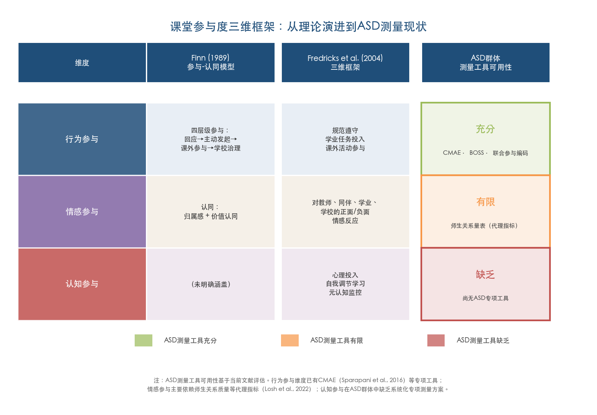

如图所示，行为参与维度已具备CMAE、BOSS和联合参与编码等多种测量工具，证据基础相对充分；情感参与维度目前主要依赖师生关系量表等代理指标进行间接推断；认知参与维度则在ASD群体中几乎完全缺乏专项测量方案。这一不均衡状态直接制约着后续各章在评估干预策略对不同维度参与度影响时所能获取的效果证据。

## 1.3 ASD专项测量工具：课堂主动参与量表（CMAE）

鉴于通用参与度工具在捕捉ASD学生独特参与模式方面的不足，Sparapani等人于2016年开发了课堂主动参与量表（Classroom Measure of Active Engagement, CMAE），这是迄今文献中唯一专为ASD学生设计的课堂参与度观察工具。该研究纳入196名ASD学生和126名教育者，验证性因素分析支持CMAE的五因子结构。一项关键发现值得特别关注：ASD学生在观察期间不到一半的时间处于良好调节、有成效或独立的状态 [Sparapani et al. 2016](https://pubmed.ncbi.nlm.nih.gov/26433878/ "J Autism Dev Disord, 46(3):782-796")。

CMAE的核心价值在于其将参与度操作化为包含调节状态（regulation）、成效性（productivity）和独立性（independence）在内的多维行为综合体，突破了传统"在任务/离任务"二分法的局限。这种操作化方式更能捕捉ASD学生的参与特征——一名ASD学生可能在视觉上并未注视教师（按传统标准将被判定为"离任务"），但实际上正通过其偏好的感觉通道有效加工学习信息。

然而，CMAE目前仍存在若干有待完善之处。该工具主要聚焦行为参与维度，对认知参与和情感参与的覆盖有限。此外，CMAE的完整信效度数据（如各因子载荷的具体数值、跨时间稳定性系数以及不同亚组间的比较效应量）在公开文献中仍以摘要层面的报告为主，其跨文化和跨年龄段的适用性亦有待进一步检验。

## 1.4 通用课堂观察编码系统的ASD适用性评估

### 1.4.1 七种编码系统的横向比较

除ASD专项工具外，教育心理学领域已积累了多种面向全体学生的课堂行为观察编码系统。Volpe、Hill、Briesch与Leiwant于2023年在 *School Psychology Review* 发表系统综述，对七种主流编码系统进行横向比较分析，涵盖BOSS（Behavioral Observation of Students in Schools）、COE（Code for Observing Education）、DOF（Direct Observation Form）等工具，文献范围覆盖1935至2022年间共1,006篇研究。综述发现，BOSS在观察者间信度方面的证据积累最为充分，但其效标关联效度和治疗敏感性（即检测干预前后变化的能力）方面的证据尚不一致 [Volpe et al. 2023](https://www.tandfonline.com/doi/abs/10.1080/2372966X.2023.2245360 "School Psychology Review, 七种观察编码系统综述")。

### 1.4.2 BOSS：广泛使用但缺乏ASD专项验证

BOSS由Shapiro开发，是学校心理学实践中应用最广泛的课堂行为观察工具之一。该工具将学生行为编码为主动参与时间（Active Engaged Time, AET）、被动参与时间（Passive Engaged Time, PET）和三类离任务行为（运动离任务、言语离任务和被动离任务），采用15秒间隔的瞬时时间抽样法。BOSS的主要优势在于其结构化的编码框架和在观察者间信度方面的充分证据支持。

然而，将BOSS应用于ASD学生时需正视一个重要局限：在当前可检索的文献中，尚未发现专门以ASD学生为样本验证BOSS信效度的研究。BOSS的信度和效度证据主要基于神经典型学生群体和ADHD学生群体。对于ASD学生，BOSS的"被动离任务"类别可能将感觉自我调节行为（如身体摇晃、手指拍动）误判为非参与行为，而"主动参与时间"的判定标准（如眼神注视任务材料）可能系统性低估ASD学生通过非视觉通道进行的信息加工。

### 1.4.3 联合参与视角：环境因素的系统纳入

与个体层面的参与度编码不同，Dykstra Steinbrenner与Watson（2015）提出了"联合参与"（joint engagement）视角，将分析单元从个体行为拓展至个体-环境互动系统。他们对25名小学和初中ASD学生的研究采用混合水平建模，发现联合参与水平与四个关键变量显著相关：小组规模（小组越小，联合参与越高）、学生导向教学实践的使用频率、自闭症严重程度以及表达性沟通技能水平 [Dykstra Steinbrenner & Watson 2015](https://pubmed.ncbi.nlm.nih.gov/25733160/ "J Autism Dev Disord, 45(8):2392-2410")。

这一视角的理论启示在于：ASD学生的课堂参与度不应仅被视为个体特质或行为的产物，而应被理解为个体特征与教学环境特征交互作用的动态结果。教学分组策略、教师互动风格和课堂物理环境均构成影响参与度的系统性变量。该认识为后续各章讨论干预策略提供了重要的理论锚点——有效的参与度提升策略不仅需要关注学生行为的改变，更需要优化学生所处的整体教学生态。

## 1.5 新兴技术测量方法：从人工观察到多模态数据采集

传统课堂参与度测量依赖人工观察和编码，面临耗时长、成本高昂且观察者在场可能改变被观察行为（反应性效应）等固有局限。近年来，基于生理信号和可穿戴设备的技术测量方法正处于快速发展阶段，有望为ASD学生的课堂参与度监测开辟新路径。

Vanderbilt大学团队获美国国家科学基金会（NSF）拨款110万美元，开发了REACT可穿戴系统。该系统整合腕带式心率/皮肤电传感器、运动传感器和领夹麦克风，旨在通过多模态生理数据实时监测ASD学生的情绪和行为状态。2024年先导研究纳入8名ASD青少年，初步测试了系统的可接受性和感觉舒适度 [Vanderbilt Health Discoveries 2025](https://discoveries.vanderbilthealth.com/2025/01/wearable-tech-signals-potential-problem-behaviors/ "2025年1月, 可穿戴技术先导研究")。REACT的设计理念是通过检测问题行为的生理前兆信号为教师提供早期预警，但该系统目前仍处于概念验证阶段，尚未在真实课堂环境中进行规模化效果评估。

在参与度识别的数据基础设施方面，Kim等人于2024年在 *Scientific Data*（Vol. 11, Article 299）发表了Engagnition数据集，面向ASD儿童（N=57，平均年龄9.9岁）的参与度自动识别任务。该数据集采集了皮肤电（GSR，平均信噪比26.67 dB）、皮肤温度（平均信噪比30.17 dB）和加速度计数据 [Kim et al. 2024](https://www.nature.com/articles/s41597-024-03132-3 "Scientific Data, 11:299, Engagnition数据集")。这一公开数据集为后续研究者开发和验证基于机器学习的ASD参与度识别算法提供了标准化基准。然而，其数据采集场景为结构化测试环境而非自然课堂，从实验室到真实教育场景的生态效度迁移仍需进一步验证。

下图呈现了ASD课堂参与度测量方法从理论框架到新兴技术工具的完整演进脉络，各阶段工具的证据成熟度以连续光谱标注。

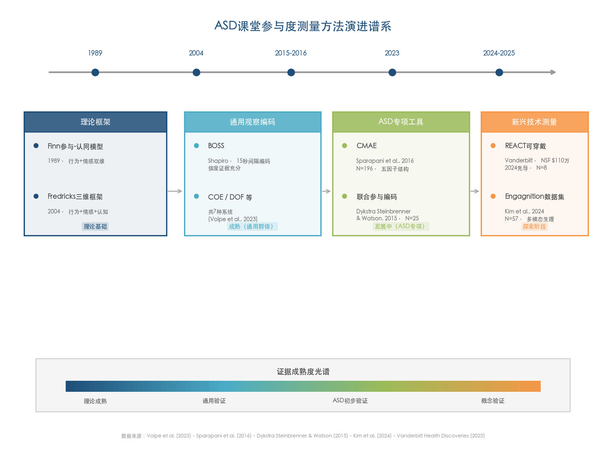

总体而言，技术测量方法在ASD课堂参与度领域尚处于探索阶段。当前成果主要集中在数据采集方案的可行性验证和算法概念验证层面，距离在常规教育场景中提供可靠、实用的课堂参与度实时测量，仍有相当的研发距离。从理论框架的成熟到通用工具的验证，再到ASD专项工具的开发和技术手段的探索，整个测量方法体系的演进呈现出从宏观理论向精细化、情境化和智能化方向持续推进的趋势。

## 1.6 ASD参与度测量的核心挑战与操作化共识

综合以上各节分析，ASD学生课堂参与度的测量面临三个层面的核心挑战。

**其一，参与行为的非典型表征问题。** ASD学生可能以与神经典型同龄人截然不同的方式表达"参与"。例如，一名对声音高度敏感的学生可能在教师讲授过程中低头注视桌面以降低视觉信息负荷，同时通过听觉通道高效处理学习内容——此时传统观察编码会将其判定为"离任务"。Bayoumi等（2025）建议的"以学生自定义参与标准"为起点的评估取向，代表了该领域向神经多样性视角转变的重要方法论进展 [Bayoumi et al. 2025](https://journals.sagepub.com/doi/10.1177/00400599251346719 "TEACHING Exceptional Children, 2025年")。

**其二，三维度测量发展的不均衡。** 行为参与已有CMAE等专项工具和较充分的观察研究基础；情感参与主要通过师生关系质量等代理指标间接推断（如Losh et al., 2022），缺乏直接测量ASD学生情感参与体验的标准化工具；认知参与在ASD群体中几乎完全缺乏系统化的专项测量方案。这一不均衡直接限制了后续各章在评估干预策略对不同维度影响时可获取的效果证据的广度与深度。

**其三，生态效度与标准化之间的张力。** 高度标准化的测量工具（如BOSS的15秒间隔编码）可确保跨场景、跨研究的可比性，但可能损失对ASD学生个体化参与模式的敏感性；而高度情境化的评估方法（如CMAE的多维行为综合判定）更贴近ASD学生的实际表现，却面临跨研究可比性的制约。联合参与视角（Dykstra Steinbrenner & Watson, 2015）和新兴的多模态生理监测方法提供了可能的平衡路径，但二者均需更多实证支持方可作为标准工具推广。

尽管存在上述挑战，当前文献已形成若干操作化共识：（1）ASD学生的课堂参与度应被视为个体-环境交互的动态产物，而非稳定的个体特质；（2）行为参与、情感参与和认知参与三个维度均应纳入评估视野，即使后两者的测量工具尚不成熟；（3）任何参与度测量结果均应结合学生的感觉特征、沟通水平和自闭症严重程度进行情境化解读；（4）教育者应避免将神经典型的参与行为标准作为唯一或默认评判基准。

这些共识为本报告后续各章的策略评估确立了基本的方法论立场：我们在衡量各类干预策略对课堂参与度的效果时，将始终保持对测量工具局限性的警觉，并尽可能区分策略对行为参与、情感参与和认知参与三个维度的差异化影响。

# 第2章 实证支持的干预策略分类体系

自闭症谱系障碍（Autism Spectrum Disorder, ASD）学生的课堂参与度提升并非仅凭教育直觉即可实现，而需要以系统化的实证研究为基石。过去三十年间，两大独立的全国性系统综述项目——美国国家自闭症循证实践信息交换中心（NCAEP）和国家自闭症中心国家标准项目（NAC NSP）——分别从数万篇文献中筛选出经严格方法学评估的聚焦干预实践（Focused Intervention Practices）。本章以这两大综述体系为骨架，将与课堂参与度直接相关的非药物干预策略归纳为六大类别：环境结构化策略、视觉支持策略、同伴介入策略、自我管理策略、强化与动机策略，以及前因与行为动量策略。每一类别均阐明其理论根基、核心操作要素与当前证据强度，旨在为教育者与研究者构建一张完整的"策略地图"。

## 2.1 证据基础：系统综述全景

理解各干预策略的证据等级，首先需要审视产生这些证据的系统综述方法论体系。

NCAEP 于 2020 年发布的第三代系统综述是当前最具权威性的 ASD 循证实践评估报告。该综述覆盖 1990–2017 年间发表的文献，初始检索量达 61,147 篇，经多轮筛选后纳入 972 篇高质量研究，最终确认 28 项针对 ASD 儿童和青少年的聚焦干预实践达到循证标准 [NCAEP 2020 报告](https://ncaep.fpg.unc.edu/wp-content/uploads/EBP-Report-2020.pdf "Steinbrenner et al., 2020, 第三代系统综述") [Hume et al. 2021](https://pmc.ncbi.nlm.nih.gov/articles/PMC8510990/ "J Autism Dev Disord, 51:4013-4032, 期刊版")。其中，与课堂参与度直接关联的实践涵盖：提示（140 篇支持研究）、强化（106 篇）、视频示范（97 篇）、视觉支持（65 篇）、差别强化（58 篇）、前因干预（49 篇）、同伴介入（44 篇）、技术辅助教学（40 篇）、自我管理（26 篇）、社会叙事（21 篇）和行为动量干预（12 篇）。

图 2-1 以柱状图形式呈现上述 11 项与课堂参与度相关的循证实践各自获得的支持研究数量，直观反映各策略类别的证据厚度分布。

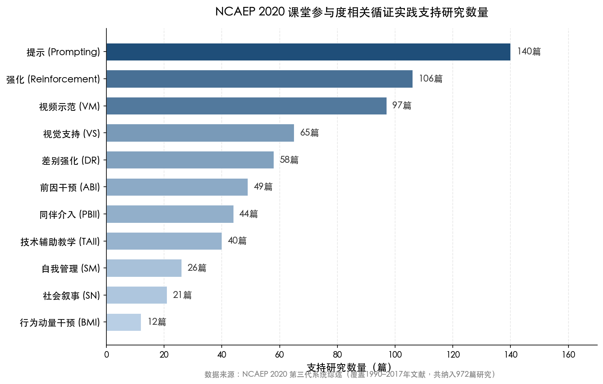

与 NCAEP 平行运行的 NAC 国家标准项目第二阶段（NSP Phase 2, 2015）综合 1957–2012 年共 1,126 篇文献，确认 14 项"已确立"干预方法，其中绝大多数植根于行为文献 [NAC NSP2 摘要](https://nationalautismcenter.org/wp-content/uploads/dlm_uploads/2014/12/NSP2-Summary_9-15.pdf "National Autism Center, 2015, NSP Phase 2 概要")。两个独立系统综述在核心结论上呈现高度一致性，均确认行为分析衍生的干预策略拥有最为厚实的证据基础。

值得注意的是，NCAEP 2020 报告存在重要的时间局限：其文献覆盖截止至 2017 年底，截至 2026 年 3 月第四代综述尚未发布 [NCAEP 官网](https://ncaep.fpg.unc.edu/ "2020报告为最新版本")。换言之，2018–2026 年间的大量新研究尚未纳入官方循证实践评估体系。此外，在研究设计分布上，972 篇文章中 83% 为单一被试设计（single-case design），仅 17% 为组间设计；48% 的研究在教育场景中实施，但仅 20% 由教育者实施，79% 为一对一实施模式 [Hume et al. 2021](https://pmc.ncbi.nlm.nih.gov/articles/PMC8510990/ "实施特征与研究设计分布")。上述数据揭示了一个不容忽视的外部效度缺口：由研究人员在一对一情境下实施的干预方案，能否在教师主导的多学生课堂中保持同等效果，仍有待系统性验证。

## 2.2 环境结构化策略

环境结构化策略的核心理念在于通过系统改造物理空间与时间组织，降低 ASD 学生在课堂中面临的认知负荷与感觉干扰，为参与行为的发生创造前提条件。该类策略主要作用于行为参与维度，同时通过减少环境不确定性间接支持情感参与。

### 2.2.1 TEACCH 结构化教学

TEACCH（Treatment and Education of Autistic and Related Communication Handicapped Children）结构化教学是环境结构化策略中历史最悠久、体系最完备的代表。其框架包含四大核心要素：物理空间组织（通过家具、地毯和标签明确界定活动区域）、个别化时间表（使用视觉化日程呈现活动序列）、工作系统（以"从左到右"等视觉逻辑组织任务流程）、视觉结构（通过颜色编码、容器和标签增强任务材料的清晰度）。

Zhu et al.（2025）发表的最新元分析纳入 10 项对照研究，为 TEACCH 效果提供了量化评估。研究发现 TEACCH 在精细运动技能（SMD = 0.45, 95% CI: 0.12–0.79, p = 0.007）和粗大运动技能（SMD = 0.54, 95% CI: 0.21–0.88, p = 0.001）方面均产生显著改善 [Zhu et al. 2025](https://pmc.ncbi.nlm.nih.gov/articles/PMC12505950/ "PROSPERO CRD42023480468, 检索截止2025年1月")。然而，在沟通、社会化和认知表现方面，TEACCH 与标准照护之间未见显著差异。这一结果表明，TEACCH 的结构化环境对减少任务转换中的行为困难具有较好效果，但对课堂参与度中认知参与和社会参与维度的直接促进作用尚缺乏充分实证支持。

### 2.2.2 前因干预

前因干预（Antecedent-Based Interventions, ABI）是 NCAEP 2020 确认的循证实践之一，获 49 篇研究支持 [NCAEP 2020 报告](https://ncaep.fpg.unc.edu/wp-content/uploads/EBP-Report-2020.pdf "ABI 定义及49篇支持研究")。其操作逻辑在于对目标行为发生之前的环境变量进行系统调控，具体手段包括调整任务难度与呈现方式、修改感觉环境（如降低教室噪音水平、减少背景视觉展示）、提供选择机会以及调整小组规模等。前因干预的分类边界较为宽泛，与环境结构化、视觉支持等策略存在概念交叠，但其核心特征在于对"行为发生前"环境条件的主动操控。

在课堂参与度场景中，前因干预的典型应用包括：在任务开始前提供选择（如允许学生选择完成任务的顺序或使用的材料），利用高概率请求序列建立合作性行为动量（详见 2.6 节），以及修改教学材料使其与学生的特殊兴趣建立联系。Bayoumi et al.（2025）在 *TEACHING Exceptional Children* 中系统阐述了将 ASD 学生的特殊兴趣嵌入课堂教学的策略框架，指出利用学生内在动机可同时提升行为参与和情感参与 [Bayoumi et al. 2025](https://journals.sagepub.com/doi/10.1177/00400599251346719 "TEACHING Exceptional Children, 2025")。

## 2.3 视觉支持策略

视觉支持（Visual Supports, VS）是 NCAEP 2020 中获研究支持最为广泛的策略类别之一，共计 65 篇研究确认其循证实践地位 [NCAEP 2020 报告](https://ncaep.fpg.unc.edu/wp-content/uploads/EBP-Report-2020.pdf "VS 定义及65篇支持研究")。该策略的理论根基建立在 ASD 个体视觉加工优势这一认知特征之上：相较于听觉信息，视觉信息具有更高的时间稳定性，允许学生以自身节奏反复加工与参照，从而有效降低工作记忆负荷。视觉支持主要作用于行为参与（增加在任务时间、促进独立转换）和认知参与（支持任务规划与自我监控）两个维度。

### 2.3.1 视觉时间表

视觉时间表（Visual Activity Schedules, VAS）是视觉支持体系中研究证据最为充分的分支形式。其呈现载体涵盖使用照片、图标或文字排列活动序列的传统纸质时间表（活页夹或笔记本格式），以及嵌入平板电脑或移动设备的电子化时间表。

Knight, Sartini 与 Spriggs（2015）对 1993–2013 年间 31 项 VAS 研究的系统评价发现，其中 16 项满足高质量标准（Horner et al., 2005 标准），据此认定 VAS 为 ASD 个体的循证实践，尤其在与系统教学程序联合使用时效果最为显著 [Knight et al. 2015](https://pubmed.ncbi.nlm.nih.gov/25081593/ "J Autism Dev Disord, 45(1):157-178")。Genc-Tosun, Yucesoy-Ozkan 与 Dalgin（2023）在此基础上开展元分析，依据 WWC（2017）设计标准从 32 项单一被试设计研究中筛选出 7 项高质量研究（涵盖 24 名 3–17 岁 ASD 参与者），采用非重叠全对比（NAP）方法计算效应量。结果显示各研究 NAP 值分布在 .89–1.0 之间，汇总均值为 .95，按 Parker 与 Vannest（2009）标准属于"强效应"水平（.93–1.0 为强效应区间）[Genc-Tosun et al. 2023](https://www.researchgate.net/publication/367638436_How_the_Activity_Schedules_Impact_the_Children_with_Autism_Spectrum_Disorder_A_Meta-analysis "J Theoretical Educational Science, 16(1):1-19, 2023")。目标行为涵盖在任务行为、独立转换、适当同伴游戏和遵循日程安排等课堂核心参与指标。

Liang et al.（2024）在 *International Journal of Developmental Disabilities* 的文献综述进一步确认视觉时间表是增加 ASD 个体学业在任务行为的循证实践 [Liang et al. 2024](https://www.tandfonline.com/doi/full/10.1080/20473869.2024.2402124 "Int J Dev Disabil, 2024")。值得注意的是，传统纸质时间表与电子化时间表在效果上无显著差异，教师可根据学生年龄、兴趣偏好和可用设备灵活选择呈现形式。

### 2.3.2 社会叙事

社会叙事（Social Stories™）由 Carol Gray 开发，通过简短的、以第一人称或第三人称撰写的叙事文本向 ASD 学生解释特定社交情境、他人的观点和期望行为。社会叙事在 NCAEP 2020 中获 21 篇研究支持，被归入视觉支持的广义范畴。

然而，社会叙事的效果证据存在显著争议。Kokina 与 Kern（2010）发表在 *Journal of Autism and Developmental Disorders* 的元分析报告其总体效果为"低至有待商榷"（low to questionable），以非重叠数据百分比（PND）为指标的表现因结局领域而异——在减少不当行为方面的效果优于教授社交技能 [Kokina & Kern 2010](https://pubmed.ncbi.nlm.nih.gov/20054628/ "J Autism Dev Disord, 40:812-826")。2024 年发表的 ASSSIST-2 大规模随机对照试验进一步显示，社会叙事的效应量小于先前研究预期 [ASSSIST-2 试验](https://acamh.onlinelibrary.wiley.com/doi/10.1111/camh.12740 "Child Adolesc Ment Health, 2024")。综合现有证据，我们认为社会叙事在提升课堂参与度方面的独立贡献较为有限，其最佳定位可能是作为其他核心策略的辅助性组分，而非独立的主干干预。

## 2.4 同伴介入策略

同伴介入（Peer-Based Intervention and Instruction, PBII）在 NCAEP 2020 中获 44 篇研究支持，是社会参与类策略中证据基础最为厚实的类别。其核心机制在于训练典型发展同伴成为干预的"中介者"（mediator），由受过训练的同伴在自然社交情境中主动发起互动、提供行为示范并给予即时反馈。同伴介入主要作用于情感参与（增强归属感与社会联结）和行为参与（提高社交互动频次与持续时间）两个维度。

Chang 与 Locke（2016）发表在 *Research in Autism Spectrum Disorders* 的系统综述纳入 5 项组间设计研究（含 4 项随机对照试验），报告效应量范围 d = 0.23–0.74，实施保真度达到 86%–94% [Chang & Locke 2016](https://pmc.ncbi.nlm.nih.gov/articles/PMC5087797/ "Res Autism Spectr Disord, 27:1-10")。效应量的跨研究变异较大，表明同伴介入对社交发起和社交回应的促进效果在不同实施条件下存在差异。

现有组间设计研究存在明显的样本偏倚：参与者几乎全部为智力平均或以上的 ASD 儿童，低语言能力学生和中学阶段学生的证据严重不足 [Chang & Locke 2016](https://pmc.ncbi.nlm.nih.gov/articles/PMC5087797/ "样本偏倚讨论")。针对最小口语（minimally verbal）ASD 学生这一空白，Briet et al.（2023）对 7 名伴智力障碍的 ASD 儿童（发展商数 DQ 24–59）实施整合游戏小组（Integrated Play Groups, IPG）同伴介入，提供了初步证据：加权平均 Tau-U 效应量在共同焦点/共同目标游戏领域达 0.93（大效应），功能性/象征性游戏领域为 0.73（中等效应），运动模仿领域为 0.71（中等效应）[Briet et al. 2023](https://pmc.ncbi.nlm.nih.gov/articles/PMC10588431/ "Autism & Dev Lang Impair, 2023, IPG模型用于最小口语ASD学生")。然而，该研究亦发现 1 名高社交回避参与者在所有领域均无进展，且认知延迟最严重的参与者效果未能维持。这一异质性结果提示，同伴介入策略的有效性可能受到个体社交回避倾向与认知能力水平的显著调节。

## 2.5 自我管理策略

自我管理（Self-Management, SM）策略要求 ASD 学生主动监控并记录自身行为，是少数同时作用于行为参与与认知参与两个维度的干预方法。该策略在 NCAEP 2020 中获 26 篇研究支持，其操作核心通常包括四个环节：目标行为的操作化定义（教师与学生共同确定"参与"的外显标准）、自我监控工具的使用（如纸质检查表、计数器或振动提醒手表）、自我评估（学生定期判断自身行为是否符合预设标准），以及自我强化（达标后自行获取预设奖励）。

Gahtan et al.（2026 年 3 月在线发表于 *Journal of Positive Behavior Interventions*）的多层次元分析是迄今唯一专门聚焦自我管理策略对 ASD 学生学业参与度效果的元分析研究。该研究纳入 14 项研究、29 名参与者，发现自我管理干预使学业参与度平均提高 49.87 个百分点（SE = 4.33, 95% CI: 39.76–59.59, p < .001），这一效应量在本章涵盖的所有策略类别中居于前列 [Gahtan et al. 2026](https://journals.sagepub.com/doi/10.1177/10983007251389292 "J Positive Behav Interv, 2026年3月在线发表")。

尤为值得关注的是该元分析的调节变量分析结果：课堂科目、课堂类型（融合教育 vs. 特殊教育）、技术提示使用及时间间隔均未显著解释参与者间的变异性 [Gahtan et al. 2026](https://journals.sagepub.com/doi/10.1177/10983007251389292 "调节变量分析")。这一结果初步提示，自我管理可能是跨场景稳健性最好的参与度干预策略——它不依赖特定教学环境或外部支持条件即可发挥作用。当然，鉴于 14 项研究、29 名参与者的总体样本量较为有限，上述结论尚需更大规模研究的进一步验证。

从理论视角审视，自我管理策略的独特价值在于它是本章所述策略中唯一将干预代理权从教师或研究人员转移至学生本人的方法。这种"内化"机制或可解释其跨场景稳健性：一旦 ASD 学生习得自我监控技能，该技能的运用不再受制于课堂物理环境或在场人员的变化。

## 2.6 强化与动机策略

### 2.6.1 差别强化

差别强化（Differential Reinforcement, DR）是 NCAEP 2020 中获 58 篇研究支持的核心循证实践。其操作原理是对目标行为（如在任务行为、主动举手发言）实施系统化正强化，同时撤除或减少对非目标行为（如离座、重复性行为）的强化。常见类型包括：差别强化其他行为（DRO，对一段时间内目标问题行为未发生的情况予以强化）、差别强化替代行为（DRA，对功能等价的适当替代行为予以强化）以及差别强化不相容行为（DRI，对与问题行为物理上不相容的行为予以强化）。

差别强化直接作用于行为参与维度，通过调整行为后果使参与行为的发生概率持续上升。课堂实施中，教师需准确识别维持非参与行为的强化因素（如逃避任务、获取注意），并据此设计针对性的强化方案。当前差别强化的主要证据集中于减少问题行为和提高合规性领域，对课堂参与度的直接效应量数据仍以单一被试设计研究为主。

### 2.6.2 行为动量干预

行为动量干预（Behavioral Momentum Intervention, BMI）是 NCAEP 2020 新增的循证实践（12 篇单一被试设计研究支持），其核心技术为高概率请求序列（High-Probability Request Sequence, HPRS）。具体操作流程为：教师在要求学生执行低概率任务（即学生不太可能自发遵从的指令）之前，先快速连续呈现 3–5 个高概率请求（即学生几乎必然遵从的简单指令），借助已建立的行为动量促使学生继续遵从随后的低概率请求。

2024 年发表在 *Behavioral Disorders* 的系统综述报告，HPRS 在提高 ASD 儿童合规性方面的 Tau-U 达到 0.87，被评定为"非常有效的实践"[HPRS 系统综述 2024](https://journals.sagepub.com/doi/10.1177/01987429231224044 "Behavioral Disorders, 2024")。行为动量干预的突出优势在于其操作简洁性——教师无需额外材料或专用设备，仅需在教学指令序列中嵌入高概率请求即可实施。该策略主要作用于行为参与维度，尤其适用于存在任务启动延迟或合规性困难的 ASD 学生。

### 2.6.3 兴趣嵌入策略

Bayoumi et al.（2025）在 *TEACHING Exceptional Children* 中提出了将 ASD 学生特殊兴趣（circumscribed interests）系统嵌入课堂教学的策略框架 [Bayoumi et al. 2025](https://journals.sagepub.com/doi/10.1177/00400599251346719 "TEACHING Exceptional Children, 2025")。该策略充分利用 ASD 学生在特殊兴趣领域表现出的高度内在动机与持续注意力，将其作为连接学业内容的"桥梁"——例如将恐龙主题嵌入数学应用题，或将火车系统融入地理课程。

兴趣嵌入策略的独特之处在于它同时作用于情感参与和行为参与两个维度：特殊兴趣的引入降低了学生对学业任务的情感抵触，同时延长了任务投入时间。Bayoumi et al.（2025）特别强调，教育者在实施该策略时应主动询问学生本人如何定义自身的"参与状态"，避免将神经典型参与行为标准机械套用于 ASD 学生 [Bayoumi et al. 2025](https://journals.sagepub.com/doi/10.1177/00400599251346719 "尊重非典型参与表现")。这一主张与当前神经多样性（neurodiversity）运动的核心理念高度契合，提示参与度干预不仅涉及行为技术层面，亦关乎教育价值取向的调整。

## 2.7 通用学习设计作为整合框架

上述各策略类别虽然各有独立的证据基础与操作规程，但在课堂实践中往往需要组合使用。通用学习设计（Universal Design for Learning, UDL）框架为此类整合提供了一个概念性容器。

UDL 由 CAST 开发，其三大核心原则之一——"多种参与方式"（Multiple Means of Engagement）——与 ASD 循证实践存在高度概念重叠：UDL 倡导通过提供选择与自主性维持学习者兴趣（对应前因干预与兴趣嵌入策略），通过调整挑战水平和支持程度维持努力与坚持（对应提示策略与差别强化），通过培养自我评估和反思能力发展自我调节（对应自我管理策略）[CAST UDL Guidelines](https://udlguidelines.cast.org/ "CAST UDL Guidelines 3.0")。

Middletown Centre for Autism（2023）的分析报告系统梳理了 UDL 框架与 ASD 循证实践之间的对应关系，认为 UDL 可作为将多种 EBP 嵌入课堂通用设计的"操作系统"[Middletown Centre for Autism 2023](https://www.middletownautism.com/files/uploads/c2af8710d75276926008ec41fe8dcb4b.pdf "UDL框架与ASD实践映射")。在政策层面，UDL 的制度地位亦持续强化：美国《每个学生成功法案》（ESSA, 2015）首次在 K-12 一般教育法中定义并认可 UDL，2025 年 1 月美国教育部联合指南进一步将 UDL 列为融合教育的核心全校方法之一。

然而，必须明确指出的是，UDL 框架应用于 ASD 学生群体目前尚缺乏独立的随机对照试验证据。其对 ASD 学生课堂参与度的预期效果主要基于理论推断与实践映射，未经严格实验验证。我们认为，UDL 作为策略组织框架具有重要的实践指导价值，但教育者在使用时应确保其中嵌入的具体策略（如视觉支持、自我管理等）本身已具备独立的循证支持。

## 2.8 策略地图综合分析

综合以上六大类别的证据，可以勾勒出一张 ASD 课堂参与度干预策略的全景地图。以下从证据强度、参与度维度映射和操作可行性三个维度进行综合审视。

图 2-2 以水平柱状图对比呈现各策略的核心效应量指标，直观反映证据强度的梯度分布。需注意各指标量纲不同（NAP、Tau-U、Cohen's d），数值仅供视觉参考，不构成跨指标的直接可比性。

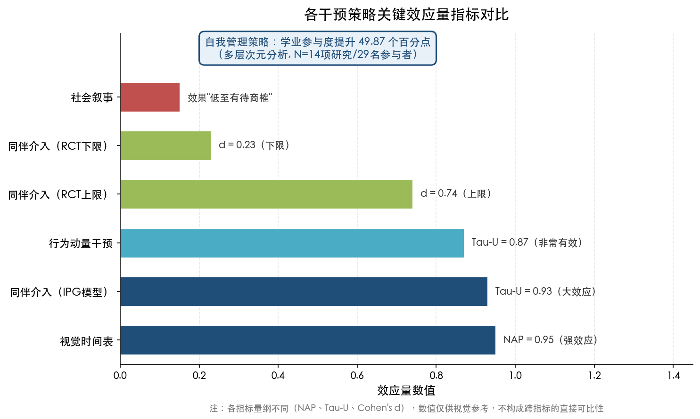

从证据强度维度审视，自我管理策略以 49.87 个百分点的学业参与度提升幅度位居首位，且呈现出跨场景稳健性。视觉时间表以 NAP 汇总均值 .95 的强效应及多项系统综述的重复确认紧随其后。行为动量干预（Tau-U = 0.87）和差别强化（58 篇支持研究）亦拥有坚实的证据基础。同伴介入的组间设计效应量（d = 0.23–0.74）波动幅度较大，证据强度居中。社会叙事的效果争议最大，最新大规模 RCT 的效应量低于预期。

图 2-3 以矩阵热力图形式呈现九种干预策略与行为参与、认知参与、情感参与三个维度之间的映射关系，区分"直接支持（实证依据）"与"间接支持（理论推断）"两个层级。

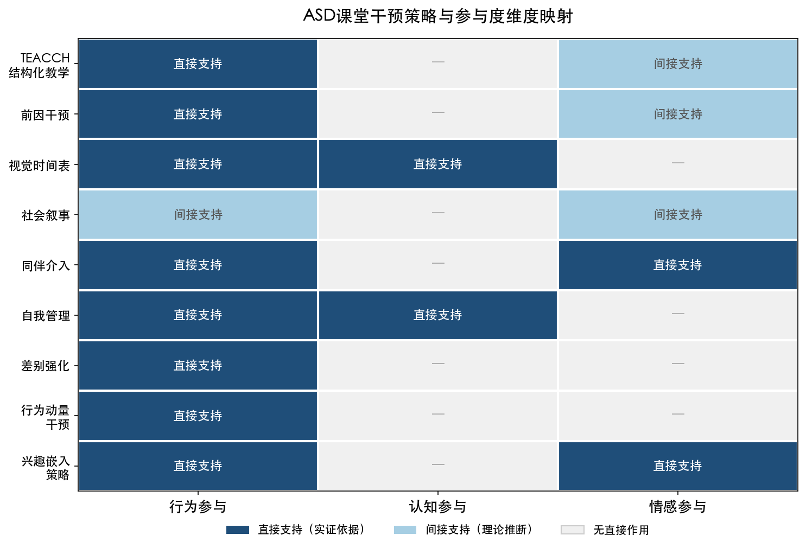

从参与度维度映射审视（见图 2-3），各策略呈现差异化的作用图谱。环境结构化、视觉支持和差别强化主要作用于行为参与维度；同伴介入和兴趣嵌入策略对情感参与的影响更为直接；自我管理策略则是唯一在行为参与和认知参与两个维度均有充分理论与实证支持的干预方法。这一分布格局意味着，追求多维度参与度提升的教育者需要有策略地组合不同类别的干预方法，而非依赖单一策略。

从操作可行性维度审视，各策略对教师专业能力和资源投入的要求差异显著。行为动量干预和兴趣嵌入策略对额外材料与设备的要求最低，可直接嵌入现有教学流程。视觉支持需要前期材料准备，但后续维护成本相对较低。自我管理策略的初始教学投入较高——教师需与学生共同建立监控体系——但一旦学生习得该技能，对教师持续支持的依赖程度在所有策略中最低。同伴介入对同伴培训的系统性要求最高，且需要持续监督以确保实施保真度。TEACCH 结构化教学则需对物理环境进行较大幅度改造，更适合在特殊教育课堂或资源教室中系统推行。

# 第3章 策略适用场景与效果对比

第2章构建了以六大类别为骨架的ASD课堂参与度干预策略地图。然而，策略的实证效果并非脱离情境的常数——同一策略在不同学段、不同教育场景以及面对不同人群特征时，往往呈现截然不同的效果轮廓。本章将"什么策略有效"的追问推进至"在何种条件下、对何种学生有效"的精细化层面，按学段（学前至高中）、教育场景（融合教育 vs. 特殊教育）和个体特征（语言能力、共病状态、感觉敏感度）三个维度展开效果对比分析，为教育实践者的情境化策略选择提供系统性证据支撑。

## 3.1 学段维度的效果差异：从学前到高中

### 3.1.1 证据分布的结构性偏倚

理解各策略在不同学段的效果差异，首先需正视一个基本事实：当前循证实践的证据基础在学段分布上存在严重的结构性偏倚。NCAEP 2020综述纳入的972篇文章中，43%涉及学前（0–5岁）阶段参与者，57%涉及小学（6–11岁）阶段参与者，两个学段合计覆盖了绝大多数研究 [Hume et al. 2021](https://pmc.ncbi.nlm.nih.gov/articles/PMC8510990/ "J Autism Dev Disord, 51:4013-4032, 年龄分布数据")。尽管2012–2017期间12–14岁研究比例从早期的17%升至27%，15–18岁从10%升至17%，呈现研究向高学段延伸的趋势，但初中和高中阶段的证据积累仍系统性薄弱。19–22岁阶段研究比例在两个时期均稳定在约5%，过渡期和成年早期几乎构成证据盲区。

上述分布偏倚意味着，当论及"某策略在初高中阶段的效果"时，可援引的实证支撑远不如学前和小学阶段充分。读者在将本章结论应用于高学段实践时，需对证据强度保持审慎判断。

### 3.1.2 学前阶段：结构化与自然情境策略的黄金窗口

学前阶段是ASD干预研究密度最高的学段，亦是环境结构化策略和自然情境干预（Naturalistic Intervention, NI）证据最为丰厚的时期。NCAEP 2020数据显示，自然情境干预共获75篇研究支持（37篇组间设计与38篇单一被试设计），在所有循证实践中组间设计研究比例居于前列，其中大量研究以学前ASD儿童为核心样本 [NCAEP 2020 报告](https://ncaep.fpg.unc.edu/wp-content/uploads/EBP-Report-2020.pdf "NI: 75篇支持研究")。

Project AIM（Sandbank et al., 2023）纳入252项研究、13,304名参与者，为学前阶段干预效果提供了迄今最大规模的元分析全景数据。该研究发现自然发展行为干预（NDBI）在社会沟通（g = 0.35）、自闭特征（g = 0.38）和适应行为（g = 0.23）等多个结局域均产生显著效应。值得关注的是，干预效果在近端结局（即与训练情境直接匹配的指标）上显著大于远端结局（B = −0.15, p = 0.002），在情境受限结局上显著大于泛化结局（B = −0.27, p < .001）[Sandbank et al. 2023](https://www.bmj.com/content/383/bmj-2023-076733 "BMJ, 383:e076733, 252项研究/13304参与者")。这一发现对课堂参与度具有直接启示：在学前阶段习得的参与技能——例如在结构化小组中保持联合注意——能否自然泛化至小学阶段更大规模、更低结构化的课堂环境，在很大程度上取决于干预设计是否有意识地嵌入泛化训练成分。

Dykstra Steinbrenner与Watson（2015）对25名小学和初中ASD学生的联合参与研究为理解学前至小学过渡期的参与度变化提供了实证参照。采用混合水平建模，该研究发现联合参与与小组规模呈显著负相关——小组规模越小，联合参与率越高；教师使用学生导向教学实践（student-directed practices）的频率则与联合参与呈正相关。此外，ASD严重程度和表达性沟通技能均为联合参与的显著预测因子 [Dykstra Steinbrenner & Watson 2015](https://pubmed.ncbi.nlm.nih.gov/25733160/ "J Autism Dev Disord, 45(8):2392-2410")。上述发现对学前阶段的策略配置具有明确指导意义：在学前小班制环境中，教师可充分利用小组规模优势，采用学生导向的自然情境策略；而随着学生升入小学、小组规模增大，环境结构化和视觉支持等"补偿性"策略的配置需求将相应提升。

### 3.1.3 小学阶段：多策略并行的证据高地

小学阶段是循证策略证据覆盖最为全面的学段。NCAEP 2020确认的28项循证实践中，绝大多数在该学段拥有至少一项高质量研究支持 [Hume et al. 2021](https://pmc.ncbi.nlm.nih.gov/articles/PMC8510990/ "Fig. 4, EBP-年龄-结局矩阵")，这意味着小学阶段教育者在策略选择上具备最大的循证空间。

在融合教育环境中，Watkins et al.（2019）发表于 *Psychological Bulletin* 的元分析与最佳证据综合纳入28项符合WWC设计标准的研究，系统评估了融合环境中各策略类别的相对效果。研究发现，视觉支持和自我监控策略在融合教育中的效果优于同伴介入策略，且教师实施的干预产生最大总体效应量 [Watkins et al. 2019](https://pubmed.ncbi.nlm.nih.gov/30869925/ "Psychol Bull, 145(5):490-507, 融合教育干预元分析")。Mason et al.（2022）对79项单一被试设计研究（120个实验）的最佳证据综合进一步印证了这一趋势：融合教育中77%的实验显示中等至强效果；在全班教学场景中，教师实施的干预有81%产生中等至强效果，而研究人员实施的仅为62% [Mason et al. 2022](https://www.researchgate.net/profile/Catharine-Lory-2/publication/366704546_Evidence-Based_Practice_in_Inclusive_Settings_for_Students_with_Autism_a_Best-Evidence_Synthesis/links/6434afb9609c170a1309b7f3/Evidence-Based-Practice-in-Inclusive-Settings-for-Students-with-Autism-a-Best-Evidence-Synthesis.pdf "Rev J Autism Dev Disord, 79项研究/120个实验")。

教师实施效果优于研究人员这一结果初看似乎反直觉，但其合理解释在于：教师与学生之间的长期关系构建提供了持续的情感参与基础。如第1章所述，Losh et al.（2022）发现师生关系质量是行为参与的单向因果前驱（β = .26, p < .01），这一关系红利是短期介入的研究人员无法复制的。由此可见，小学阶段提升策略效果的关键并非引入更多外部专家，而在于系统提升教师自身的循证实践实施能力。

### 3.1.4 初中与高中阶段：证据薄弱区的初步探索

初中与高中阶段构成ASD课堂参与度干预研究的显著薄弱区。Mason et al.（2022）报告其79项融合教育研究中，中学阶段参与者仅占15%–25%，且仅15%属于高支持需求类别 [Mason et al. 2022](https://www.researchgate.net/profile/Catharine-Lory-2/publication/366704546_Evidence-Based_Practice_in_Inclusive_Settings_for_Students_with_Autism_a_Best-Evidence_Synthesis/links/6434afb9609c170a1309b7f3/Evidence-Based-Practice-in-Inclusive-Settings-for-Students-with-Autism-a-Best-Evidence-Synthesis.pdf "中学阶段参与者比例")。

Shogren et al.（2026）发表的一项前沿研究为理解ASD高中生课堂参与度提供了珍贵的初步证据。该研究揭示了一个值得关注的双重模式：ASD高中生在融合课堂中呈现"低社会参与但高学业参与"的特征 [Shogren et al. 2026](https://www.frontiersin.org/journals/psychiatry/articles/10.3389/fpsyt.2026.1772732/full "Front Psychiatry, 17:1772732, 2026年1月")。这一模式提示，高中阶段ASD学生在认知层面的学业投入并不逊于同龄人，但社会层面的隔离问题更为突出。

Shogren et al.（2026）进一步测试了自我决定学习模式（Self-Determined Learning Model of Instruction, SDLMI）与同伴支持的组合干预方案，发现该组合对社会参与和学业参与均产生小效应量。然而，教师报告了显著的实施障碍——高中阶段多学科、多教室轮转的教学组织形式使得任何需要持续实施的干预策略都面临较小学阶段更大的结构性挑战 [Shogren et al. 2026](https://www.frontiersin.org/journals/psychiatry/articles/10.3389/fpsyt.2026.1772732/full "SDLMI+同伴支持组合干预及实施障碍")。

我们认为，高中阶段ASD学生"低社会参与—高学业参与"的双重模式具有重要实践意涵：单纯以行为参与指标（如在座率、任务完成率）评估高中ASD学生的课堂参与度，可能遮蔽其真实的社会隔离困境。面向高中阶段的策略选择应更侧重情感参与和社会参与维度，而自我管理策略因其跨场景稳健性，成为适应高中多教室环境的优先方案。

## 3.2 教育场景维度：融合教育与特殊教育课堂的效果差异

### 3.2.1 融合教育课堂中的策略效果

融合教育已成为全球特殊教育的主流发展方向。美国数据显示，ASD类别中40.7%的学生80%以上时间在普通教育课堂中接受教学 [CRS IDEA 报告](https://www.congress.gov/crs-product/R41833 "Congressional Research Service, FY2025数据")。由此，策略在融合环境中的有效性已从"附加议题"上升为"核心关切"。

Watkins et al.（2019）的元分析为融合环境中的策略比较提供了系统性证据。基于28项符合WWC设计标准的研究，该分析发现功能本位干预、视觉支持、自我监控策略和同伴介入在融合教育中大多产生大效应量，其中视觉支持和自我监控策略的效果表现尤为稳定。同伴介入策略虽然效应量范围较宽（d = 0.23–0.74），但在促进社会互动方面仍具不可替代的独特价值 [Watkins et al. 2019](https://pubmed.ncbi.nlm.nih.gov/30869925/ "Psychol Bull, 145(5):490-507")。

Mason et al.（2022）的最佳证据综合进一步细分了融合教育中的实施者效应。在全班教学场景中，教师实施的干预有81%产生中等至强效果，显著优于研究人员实施的62%，该差距在小组教学场景中更为显著 [Mason et al. 2022](https://www.researchgate.net/profile/Catharine-Lory-2/publication/366704546_Evidence-Based_Practice_in_Inclusive_Settings_for_Students_with_Autism_a_Best-Evidence_Synthesis/links/6434afb9609c170a1309b7f3/Evidence-Based-Practice-in-Inclusive-Settings-for-Students-with-Autism-a-Best-Evidence-Synthesis.pdf "教师vs.研究人员实施效果比较")。这一发现与融合教育的核心理念高度一致：融合教育的理想状态并非将外部专家"空降"至课堂为ASD学生提供独立的一对一干预，而是使普通教育教师具备在自然教学流程中嵌入循证策略的专业能力。

然而，Mason et al.（2022）同时指出其79项研究中仅15%参与者属于高支持需求类别。这意味着当前融合教育中的循证实践证据主要建立在低支持需求（即认知能力接近或达到平均水平、具备基本口语沟通能力）的ASD学生基础之上。对于伴有智力障碍或最小口语的ASD学生在融合教育中的策略效果，现有证据极为有限。

### 3.2.2 特殊教育课堂中的策略效果

特殊教育课堂（包括自足式教室、资源教室和特殊教育学校）与融合课堂在物理环境、师生比和教学结构上存在根本性差异。TEACCH结构化教学在特殊教育课堂中具有最为完善的实施基础——其四大核心要素（物理空间组织、个别化时间表、工作系统、视觉结构）的充分实施要求对教室进行较大幅度的物理改造，这在特殊教育环境中的可行性远高于融合课堂。

Gahtan et al.（2026）的元分析调节变量分析为跨场景比较提供了罕见的量化证据。该研究检验了课堂类型（融合教育 vs. 特殊教育）是否调节自我管理策略对ASD学生学业参与度的效果，结果显示课堂类型不构成显著调节变量 [Gahtan et al. 2026](https://journals.sagepub.com/doi/10.1177/10983007251389292 "J Positive Behav Interv, 2026年3月, 调节变量分析")。这一发现提示，自我管理策略具有跨教育场景的稳健性——无论学生处于融合课堂还是特殊教育课堂，自我管理对参与度的提升效应均未出现显著衰减。其可能的机制在于，自我管理的核心操作（自我监控、自我评估、自我强化）完全由学生内部执行，对外部教学环境的依赖性最低。

相比之下，同伴介入策略对教育场景的依赖性最高。融合教育课堂天然提供了典型发展同伴的社交资源，使同伴介入的实施基础更为充分；而在特殊教育课堂中，缺乏典型发展同伴意味着需要从外部引入同伴伙伴（如"反向融合"模式），或将同伴介入的实施安排在融合时段（如午餐、课间活动）。Chang与Locke（2016）系统综述纳入的5项组间设计研究几乎全部在融合教育或包含融合成分的场景中实施，充分反映了该策略对融合环境的结构性依赖 [Chang & Locke 2016](https://pmc.ncbi.nlm.nih.gov/articles/PMC5087797/ "Res Autism Spectr Disord, 27:1-10")。

### 3.2.3 NCAEP实施特征数据揭示的场景错位

NCAEP 2020数据提供了一个值得深思的实施特征画像：2012–2017期间纳入的研究中，48%在教育场景中实施，但仅20%由教育者实施，79%采用一对一实施模式 [Hume et al. 2021](https://pmc.ncbi.nlm.nih.gov/articles/PMC8510990/ "实施特征与研究设计分布")。这组数据揭示了一种严重的场景错位：多数研究虽然发生在学校建筑内，但实际由研究人员以一对一形式交付——这种实施条件与真实课堂环境（一名教师面对20–30名学生，其中1–3名可能为ASD学生）之间存在本质差异。

上述错位对本章所有效果对比分析构成系统性的解读限制。例如，"视觉支持获65篇研究支持"这一表述背后，可能仅有少数研究反映了真实课堂中由教师日常实施视觉支持的实际效果。读者在将研究证据转化为课堂实践时，应对效应量的预期适度下调，并将教师培训和实施保真度（详见第5章）视为影响效果的关键调节因素。

## 3.3 人群特征维度：谁对哪种策略反应最佳

### 3.3.1 语言能力水平的调节作用

语言能力是调节策略效果的关键个体特征之一。ASD群体中约25%–30%的个体为最小口语或无口语（minimally verbal/nonspeaking），这一亚群体在主流循证实践研究中长期处于系统性代表不足的状态。

同伴介入策略的效果与语言能力之间的关系已获初步实证支持。Chang与Locke（2016）明确指出，现有组间设计研究几乎全部针对智力平均或以上的ASD儿童，缺乏面向低语言能力学生的证据 [Chang & Locke 2016](https://pmc.ncbi.nlm.nih.gov/articles/PMC5087797/ "样本偏倚讨论")。Briet et al.（2023）的整合游戏小组（IPG）研究则为最小口语ASD学生的同伴介入提供了初步数据：在7名伴智力障碍的ASD儿童（发展商数DQ 24–59）中，加权平均Tau-U效应量在共同焦点/共同目标游戏领域达到0.93（大效应），功能性/象征性游戏领域为0.73（中等效应），运动模仿领域为0.71（中等效应）[Briet et al. 2023](https://pmc.ncbi.nlm.nih.gov/articles/PMC10588431/ "Autism & Dev Lang Impair, 2023, IPG模型用于最小口语ASD学生")。

然而，Briet et al.（2023）同时报告了两个关键的限制性发现：其一，1名高社交回避参与者在所有领域均无进展，提示社交回避倾向可能构成同伴介入效果的"天花板"；其二，认知延迟最严重的参与者虽在干预期间取得改善，但效果未能维持至追踪期。上述发现表明，即便是专为最小口语群体设计的同伴介入模型，其效果仍受个体社交动机和认知能力水平的双重调节。

对于低语言能力的ASD学生，视觉支持策略的理论匹配度更高——视觉支持不依赖口语指令的加工，其视觉通道优势恰好绕过了ASD学生的语言加工瓶颈。视觉时间表的元分析汇总NAP值为.95（强效应），纳入的参与者年龄范围覆盖3–17岁 [Genc-Tosun et al. 2023](https://www.researchgate.net/publication/367638436_How_the_Activity_Schedules_Impact_the_Children_with_Autism_Spectrum_Disorder_A_Meta-analysis "J Theoretical Educational Science, 16(1):1-19, 2023")。需要指出的是，该元分析并未将语言能力作为调节变量单独分析，视觉支持对低语言ASD学生的差异化效应仍有待专项研究验证。

### 3.3.2 共病ADHD的调节作用

ADHD是ASD最常见的共病之一，Lai et al.（2019）元分析估计ASD群体中ADHD共病率约为28% [Fridell et al. 2025](https://pmc.ncbi.nlm.nih.gov/articles/PMC12255842/ "引用Lai et al. 2019元分析")。共病ADHD的ASD学生在课堂中面临注意持续性和冲动控制方面的额外障碍，这可能削弱需要持续注意力分配的干预策略效果。

Fridell et al.（2025）提供了ADHD共病调节效应的高质量量化证据。该研究利用两项KONTAKT社交技能小组训练（SSGT）随机对照试验的合并数据（N = 241, 7–18岁），发现ADHD共病状态显著调节SSGT效果：未伴ADHD的参与者治疗反应率显著更高，NNT仅为3（aOR = 21.17, p = 0.002）；伴ADHD的参与者NNT则高达26（aOR = 1.30, 不显著）[Fridell et al. 2025](https://pmc.ncbi.nlm.nih.gov/articles/PMC12255842/ "Autism, 29(8), KONTAKT RCT调节变量分析")。

更为精细的分层分析揭示了年龄与ADHD共病的交互效应：伴ADHD的青少年（13–18岁）仍从SSGT中获益（aOR = 7.29, p < .05），但伴ADHD的学龄儿童（8–12岁）则完全无效果。这一发现具有重要的临床意涵——对于8–12岁伴ADHD的ASD学生，社交技能小组训练可能需要先行解决ADHD核心症状（如通过行为动量干预和前因干预降低任务中的注意力脱轨频率），在此基础上再叠加社交技能训练。

我们认为，Fridell et al.（2025）的发现提示了一种"分层配方"策略思路：面对ASD与ADHD共病学生，教育者不宜将社交技能小组训练作为第一序列干预，而应先部署对注意力调节更为直接的策略（如自我管理、环境结构化），在建立基本的注意力基础后再引入社交技能成分。这一分层序列假说有待前瞻性研究加以验证。

### 3.3.3 智力障碍共病的调节作用

ASD群体中智力障碍（ID）的共病率相当可观。CDC ADDM Network 2025年数据（基于2022年监测年份）报告，39.6%的8岁ASD儿童伴有智力障碍 [CDC ADDM 2025](https://www.cdc.gov/mmwr/volumes/74/ss/ss7402a1.htm "MMWR Surveill Summ, 74(SS-2), 2022年监测数据")。然而，智力障碍共病对各循证实践效果的系统性调节分析几乎处于空白状态。

目前可获取的直接证据仅限于Briet et al.（2023）对7名伴智力障碍ASD儿童的IPG研究（详见3.3.1节），以及Mason et al.（2022）的间接数据——其79项融合教育研究中仅15%参与者属于高支持需求类别。后者更多反映的是研究样本纳入的偏倚，而非策略效果的调节方向。

从理论角度推断，智力障碍共病可能通过以下路径调节策略效果：对于认知参与维度要求较高的策略（如自我管理——要求学生理解目标行为定义、操作监控工具并进行自我评估），智力障碍可能显著提高实施门槛，需要配合更密集的提示和更长的教学周期。而对于依赖外部环境调控的策略（如环境结构化、视觉支持），智力障碍的调节作用可能较为有限——这些策略的操作逻辑是"改变环境以适应学生"，而非"要求学生改变自身行为"。

### 3.3.4 感觉敏感度的影响

如第1章所述，约95%的ASD儿童存在极端水平的感觉症状，其中听觉加工差异对课堂参与和学业表现的负面影响最为严重 [McDougal & Keehn 2021](https://pmc.ncbi.nlm.nih.gov/articles/PMC8430329/ "Frontiers in Psychiatry, 感觉加工与注意力差异整合综述")。感觉敏感度作为策略效果的潜在调节变量，目前的研究主要停留在实践指导层面，尚缺乏元分析或RCT水平的系统性量化分析。

现有证据提供了间接但方向一致的线索。McDougal与Keehn（2021）综合多项研究指出，教室噪音水平与ASD学生重复性行为频率存在显著正相关，教室背景视觉展示过多对ASD学生学习成绩的负面影响尤为严重——ASD个体对背景视觉信息的注意增强可能源于其增大的感知容量 [McDougal & Keehn 2021](https://pmc.ncbi.nlm.nih.gov/articles/PMC8430329/ "引用Remington et al. 2009和Hanley et al. 2017")。这一证据链意味着，对于高感觉敏感度的ASD学生，环境结构化策略——特别是感觉环境的系统性修改（降低噪音、减少视觉干扰物）——应被视为其他所有策略的前置条件。若课堂感觉环境超出学生的调节阈值，即便理论上最有效的教学策略也可能因学生处于感觉过载状态而无法发挥预期作用。

NCAEP 2020将感觉统合（SI）列为循证实践（3篇支持研究，均为组间设计），但其定义严格限于Ayres经典感觉统合模型，且支持研究数量仅达最低门槛 [NCAEP 2020 报告](https://ncaep.fpg.unc.edu/wp-content/uploads/EBP-Report-2020.pdf "SI: 3篇支持研究")。我们建议教育者在策略选择中将感觉敏感度评估置于第一步骤——通过标准化工具（如Dunn感觉特征问卷）或结构化观察确定学生的感觉特征，再据此决定是否需要先行调整环境感觉条件，为后续参与度干预策略奠定必要的感觉基础。

## 3.4 跨场景稳健性比较：哪些策略"放之四海皆准"

综合前述学段、场景和人群特征三个维度的证据，各策略在跨情境稳健性上呈现显著分化。图3-1以热力图矩阵形式展示了六大策略类别在八个情境组合下的证据强度等级，图3-2以雷达图呈现了各策略在学段通用性、教育场景通用性和人群通用性三个维度上的稳健性评分。

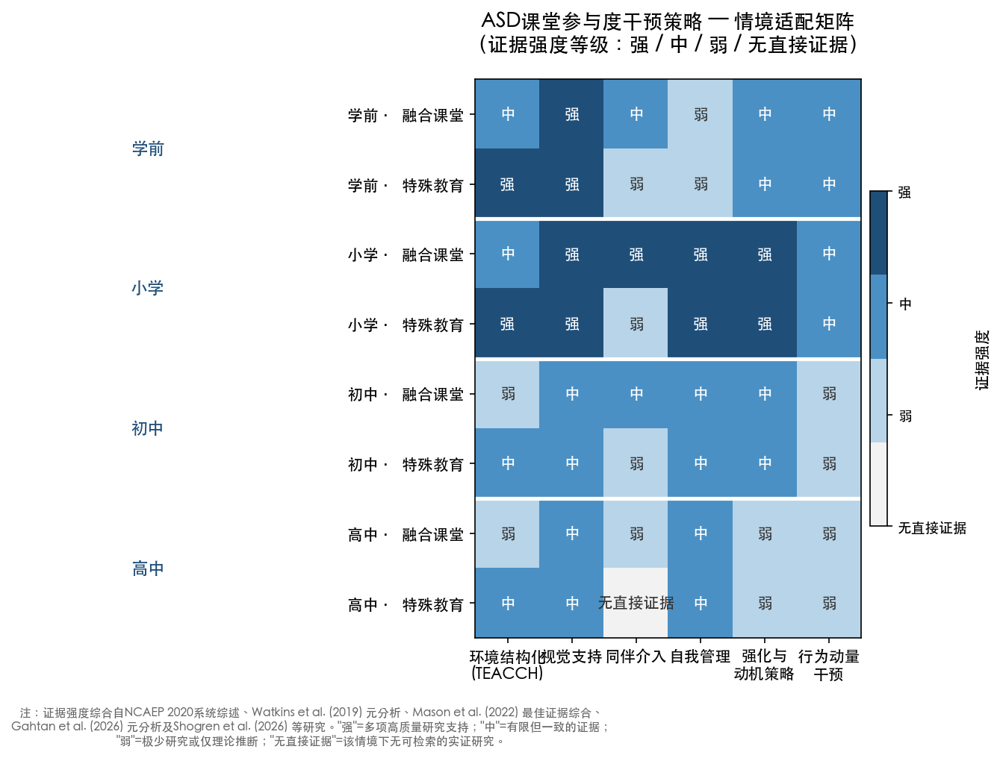

上图综合NCAEP 2020系统综述、Watkins et al.（2019）融合教育元分析、Mason et al.（2022）最佳证据综合、Gahtan et al.（2026）调节变量分析及Shogren et al.（2026）高中阶段研究等多项证据来源，将六大策略类别在学前至高中、融合至特殊教育课堂共八个情境组合下的证据强度划分为"强—中—弱—无直接证据"四个等级。

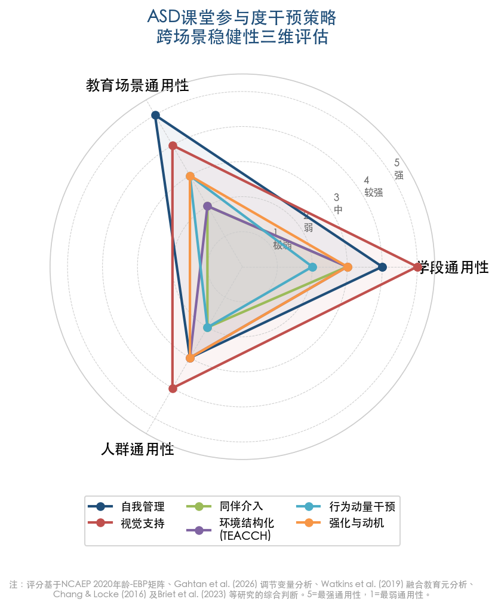

上图以雷达图直观呈现六大策略在三个通用性维度上的综合评分（1–5分制），自我管理和视觉支持策略的覆盖面积最大，反映其广谱适用性优势；同伴介入和行为动量干预的覆盖面积较小，反映其场景特异性特征。

**自我管理：跨场景稳健性最强的策略。** Gahtan et al.（2026）元分析的调节变量分析提供了最直接的量化支持：课堂科目、课堂类型（融合 vs. 特殊教育）、技术提示使用和时间间隔均未显著解释参与者间变异性 [Gahtan et al. 2026](https://journals.sagepub.com/doi/10.1177/10983007251389292 "J Positive Behav Interv, 2026年3月")。自我管理策略使学业参与度提高49.87个百分点（SE = 4.33, 95% CI: 39.76–59.59, p < .001）的效应在所有被检验的调节条件下均保持稳定。其稳健性的理论根源在于干预代理权的内化——一旦学生习得自我监控技能，该技能的运用不依赖特定外部条件。当然，14项研究、29名参与者的样本量限制了结论的泛化可信度。

**视觉支持：跨学段适用性最广的策略。** NCAEP 2020的年龄-EBP矩阵（Fig. 4）显示，视觉支持在从学前到青年成人（19–22岁）的全部年龄类别中均有至少一项支持研究。视觉时间表的NAP汇总均值达.95（强效应），参与者年龄跨度覆盖3–17岁。视觉支持不依赖口语加工能力，理论上对不同语言能力水平的ASD学生均具适用性。不过，其跨场景稳健性的量化调节分析证据不如自我管理充分。

**同伴介入：场景依赖性最强的策略。** 同伴介入对融合教育环境具有结构性依赖（需要典型发展同伴参与），其效应量在不同研究间变异最大（d = 0.23–0.74），且效果受参与者语言能力、社交动机和ADHD共病状态的多重调节。在特殊教育课堂和高中多教室轮转环境中的实施均面临额外的结构性挑战。

**环境结构化（含TEACCH）：场景特异性最强的策略。** TEACCH的四大核心要素需要对物理环境进行较大幅度改造，最适合在特殊教育课堂或资源教室中系统推行。在融合课堂中可采用"简化版"——例如在学生座位周围设置视觉边界，而非重组整个教室空间。此外，TEACCH在运动技能方面的显著效应（SMD = 0.45–0.54）与在沟通和社会化方面的不显著效应之间形成的分裂模式，也提示其效果具有结局领域特异性 [Zhu et al. 2025](https://pmc.ncbi.nlm.nih.gov/articles/PMC12505950/ "PROSPERO CRD42023480468")。

**行为动量干预：操作简洁但情境狭窄的策略。** 行为动量干预在提高合规性方面证据强劲（Tau-U = 0.87，被评为"非常有效"）[HPRS 系统综述 2024](https://journals.sagepub.com/doi/10.1177/01987429231224044 "Behavioral Disorders, 2024")，但其效果指标主要集中于合规性和任务启动维度，对课堂参与度三维框架中的认知参与和情感参与缺乏直接证据。该策略最适合作为"启动工具"——在单次教学任务开始时使用，而非作为持续性的参与度提升机制。

## 3.5 多组分干预与单一策略的初步比较

现实课堂中的策略运用很少是单一策略的纯净实施，更多呈现多策略组合的形态。这一实践现实与当前以单一策略为评估单元的循证评审体系之间存在张力。

Shogren et al.（2026）的SDLMI与同伴支持组合干预是多组分策略在高中阶段的初步尝试。该研究报告组合干预对社会参与和学业参与均产生小效应量，但同时揭示了多组分干预面临的核心挑战：教师需要同时掌握和协调多个策略的实施流程，而每增加一个策略组分，实施保真度的维护难度呈非线性上升 [Shogren et al. 2026](https://www.frontiersin.org/journals/psychiatry/articles/10.3389/fpsyt.2026.1772732/full "实施障碍讨论")。

通用学习设计（UDL）框架为多策略整合提供了概念性容器。如第2章所述，UDL的"多种参与方式"原则与ASD循证实践在理念层面存在高度重叠 [CAST UDL Guidelines](https://udlguidelines.cast.org/ "CAST UDL Guidelines 3.0") [Middletown Centre for Autism 2023](https://www.middletownautism.com/files/uploads/c2af8710d75276926008ec41fe8dcb4b.pdf "UDL框架与ASD实践映射")。然而，UDL框架应用于ASD学生目前缺乏独立RCT证据，其效果论证主要来自理论推断和实践映射。

大规模RCT层面的多组分干预与单一策略直接比较证据目前几乎为空白。我们认为，这是该领域最亟待填补的研究缺口之一——教育者所需要的，不仅是"策略A有效"和"策略B有效"的独立证据，更是"策略A与B的组合是否优于单独使用A或B"以及"多策略组合的最优实施序列"等组合优化层面的决策依据。

## 3.6 综合分析：基于情境的策略选择决策框架

综合本章各节的证据，可为教育实践者提炼一套基于情境的策略选择决策逻辑。图3-3以流程图形式呈现了从感觉环境评估到个别化策略组合方案输出的四步决策路径。

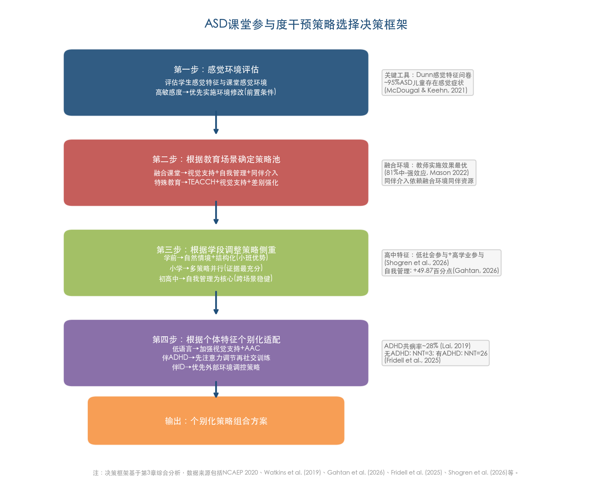

上图将本节所述四步决策逻辑可视化：每个步骤标注了关键操作说明与核心数据来源，右侧配有证据注释（含效应量和研究引用），最终输出为个别化策略组合方案。

**第一步：感觉环境评估。** 在选择任何参与度提升策略之前，首先评估学生的感觉特征和课堂的感觉环境。对于高感觉敏感度的学生，优先实施环境修改（降低噪音、减少视觉干扰、提供感觉调节工具），将感觉环境调控视为所有后续策略的前置条件。

**第二步：根据教育场景确定策略池。** 在融合教育课堂中，优先考虑视觉支持、自我管理和同伴介入三类策略——前两者在融合环境中拥有最一致的效果证据（Watkins et al., 2019），同伴介入则充分利用融合环境的同伴资源优势。在特殊教育课堂中，可额外部署TEACCH结构化教学的完整版本，同时结合视觉支持和差别强化。

**第三步：根据学段调整策略侧重。** 学前阶段侧重自然情境干预和环境结构化，充分利用小班制优势；小学阶段为多策略并行的最优窗口，宜建立以自我管理和视觉支持为核心、以同伴介入和差别强化为辅助的组合方案；初中和高中阶段应优先部署自我管理策略（跨场景稳健性最高），并针对高中阶段的"低社会参与"特征加强同伴支持和社交技能训练。

**第四步：根据个体特征进行个别化适配。** 对于低语言能力的学生，加强视觉支持策略的配置比重，并考虑辅助沟通技术（AAC）的整合。对于伴ADHD的学生，在引入社交技能训练前先部署注意力调节策略（自我管理、环境结构化），青少年阶段（13岁以上）可较早引入社交技能成分。对于伴智力障碍的学生，优先使用认知要求较低的外部环境调控策略（环境结构化、视觉支持、提示），自我管理策略需配合更密集的提示和更长的教学周期。

上述决策框架所强调的核心原则是：策略选择不应遵循"一刀切"逻辑，而应基于学生的个体特征（感觉特征、语言能力、共病状态）和教学情境（学段、融合/特殊教育、班级规模）的综合评估，形成个别化的策略组合方案。每一步选择都应以最高可用证据为依据，在证据不足的领域保持审慎，并注重持续的数据监控与效果评估。

# 第4章 技术辅助手段的最新进展

技术辅助教学与干预（Technology-Aided Instruction and Intervention, TAII）是自闭症谱系障碍（ASD）课堂干预工具箱中增长最为迅速的分支之一。从低技术的图片交换系统到基于人工智能的多模态行为监测，技术手段在辅助沟通、社交技能训练和课堂参与度监测方面呈现出快速迭代的态势。本章聚焦 2024—2026 年间的研究与实践动态，系统覆盖辅助沟通技术（AAC）、社交机器人、虚拟现实/增强现实（VR/AR）教学工具、基于人工智能的行为监测系统以及游戏化学习方案五个方向，并按证据成熟度对各技术路线进行分层评估，旨在为教育者在资源有限的条件下做出理性的技术采纳决策提供循证依据。

## 4.1 TAII 循证框架的最新更新

2025 年，AFIRM 团队发布了技术辅助教学与干预简报包的更新版本，将 TAII 细分为六大技术子类型：应用程序/软件、增强现实（AR）、电子设备、交互式电子白板、机器人和虚拟现实（VR），覆盖 0—22 岁全年龄段共 11 个结局领域，获 43 篇研究支持（其中 17 篇为单一被试设计，26 篇为组间设计）[AFIRM TAII Brief Packet 2025](https://afirm.fpg.unc.edu/wp-content/uploads/Technology-Aided-Instruction-Intervention-Brief-Packet-Hedges-AFIRM-Team-Updated-2025.pdf "Hedges & AFIRM Team, 2025年更新版")。该分类体系具有重要的实践指导意义：它为教育者提供了一份结构化的规划清单，要求在采纳任何 TAII 方案之前系统评估学习者的精细运动能力、学校技术政策、可用资源、资金预算及团队培训状况 [AFIRM TAII Brief Packet 2025](https://afirm.fpg.unc.edu/wp-content/uploads/Technology-Aided-Instruction-Intervention-Brief-Packet-Hedges-AFIRM-Team-Updated-2025.pdf "TAII Planning Checklist")。

需要特别指出的是，NCAEP 第三代系统综述（2020 年发布，覆盖文献至 2017 年底）将"技术辅助教学与干预"列为 28 项循证聚焦干预实践之一，获 40 篇研究支持 [NCAEP 2020 报告](https://ncaep.fpg.unc.edu/wp-content/uploads/EBP-Report-2020.pdf "Steinbrenner et al., 2020, 第三代系统综述")。然而，自 2017 年至今已逾 9 年，这一期间技术领域经历了生成式 AI、轻量化 VR 头显和低成本传感器等多轮迭代，NCAEP 第四代综述截至 2026 年 3 月尚未发布 [NCAEP 官网](https://ncaep.fpg.unc.edu/ "2020报告为最新")。因此，对 TAII 各子方向的证据评估需结合 2018 年之后的独立系统综述和 RCT 进行补充更新。下图呈现了五大技术方向从实验室到课堂的关键演进节点。

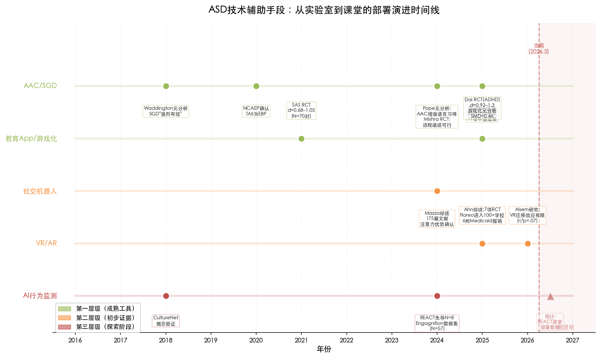

上图以五条平行轨道分别展示 AAC/SGD、教育 App/游戏化、社交机器人、VR/AR 和 AI 行为监测五个技术方向自 2016 年以来的关键里程碑，轨道颜色按成熟度层级区分（绿色=成熟工具、橙色=初步证据、红色=探索阶段），清晰呈现各技术路线从概念验证到课堂部署的演进轨迹与当前所处阶段。

## 4.2 辅助沟通技术（AAC）：证据最为成熟的技术路线

### 4.2.1 语音生成设备的系统综述证据

辅助沟通技术是 TAII 各子类型中证据积累最为充分的方向。Therrien、Whalon 与 Sellers 于 2025 年在 *Augmentative and Alternative Communication*（Vol. 41, No. 2）发表的系统综述纳入 20 项针对自闭症学前儿童的语音生成设备（SGD）干预研究，其中 11 项显示中等至强效果 [Therrien et al. 2025](https://pubmed.ncbi.nlm.nih.gov/40164143/ "Augment Altern Commun, 41(2), 2025")。更早期的 Waddington（2018）元分析从更广阔的文献视角确认，高科技 SGD 在请求和标注技能方面达到"强烈有效"（strongly effective）水平 [Waddington 2018](https://www.researchgate.net/publication/325210293_Meta-analysis_provides_support_for_the_use_of_high_tech_speech-generating_devices_for_teaching_a_range_of_communication_skills_to_children_with_autism_spectrum_disorders "Review J Autism Dev Disord, 2018")。

AAC 领域长期存在的一项核心顾虑——即辅助沟通设备可能抑制自然语言发展——已被多项研究证伪。Pope、Light 与 Laubscher（2024）在 *Journal of Autism and Developmental Disorders* 发表的系统综述与元分析纳入 29 项相关研究，发现将 AAC 纳入自然发展行为干预（NDBI）后，语言结局的汇总效应量和比较效应量均显著大于不含 AAC 的 NDBI，表明 AAC 不仅不抑制自然语言发展，反而可能增强语言习得效果 [Pope et al. 2024](https://pubmed.ncbi.nlm.nih.gov/38848009/ "J Autism Dev Disord, 2024, 29项研究系统综述与元分析")。

### 4.2.2 AAC 的递送模式创新

递送模式的拓展进一步提升了 AAC 的可及性。Mishra（2024）在 *Journal of Speech, Language, and Hearing Research*（Vol. 67, No. 5, pp. 1478–1489）发表的随机对照试验比较了面对面与远程递送低技术 AAC 的效果，发现两组参与者在 AAC 熟练度、非口语沟通行为数量与类型以及口语沟通行为数量方面均取得相似增益，证实远程递送是一种可行的替代方案 [Mishra 2024](https://pubmed.ncbi.nlm.nih.gov/38502053/ "J Speech Lang Hear Res, 67(5):1478-1489, RCT")。这一发现对服务覆盖不足的农村地区和资源匮乏学校具有直接的实践指导价值——远程 AAC 递送模式在保持干预效果的同时，可有效突破地理和人力资源瓶颈。

### 4.2.3 AAC 的课堂部署成本与制度障碍

从经济可及性角度审视，AAC 是当前所有技术辅助手段中部署成本最低的方案之一。一套基于 iPad 的 AAC 应用程序（如 Proloquo2Go）售价约 250—300 美元，加上 iPad 硬件成本约 350 美元，总部署成本约 600 美元即可满足单个学生需求。然而，制约 AAC 采纳的障碍并非仅限于经济层面。Mavritsakis（2024）在 *Frontiers in Psychiatry* 指出，"假定能力"（presuming competence）理念的缺失构成了 AAC 采纳的制度性障碍——当教育者和决策者低估 ASD 学生的沟通潜力时，AAC 的引入往往被不当延迟 [Mavritsakis 2024](https://www.frontiersin.org/journals/psychiatry/articles/10.3389/fpsyt.2024.1345447/full "AAC采纳制度性障碍")。

从参与度三维框架审视，AAC 的核心作用机制聚焦于**行为参与**维度——通过赋予最小口语或无口语 ASD 学生表达需求、回答问题和发起互动的能力，直接提升其课堂任务投入度。同时，成功的沟通体验亦可间接增强**情感参与**，使学生对课堂和同伴互动产生更为积极的情感反应。

## 4.3 社交机器人：吸引力突出但规模化部署受限

### 4.3.1 注意力吸引优势与证据局限

社交机器人在 ASD 儿童干预研究中展现出独特的注意力吸引优势。Mazza 等人（2024）在 *Review Journal of Autism and Developmental Disorders* 发表的系统综述纳入 175 篇临床相关文章，发现社交机器人在吸引 ASD 儿童注意力方面优于人类互动者 [Mazza et al. 2024](https://link.springer.com/article/10.1007/s40489-024-00434-5 "Rev J Autism Dev Disord, 2024, 175篇系统综述")。这一优势可能源于机器人行为的高度可预测性和简化的社交信号——对于社交信息处理存在困难的 ASD 学生而言，机器人提供了一个复杂度可控的互动对象，降低了社交互动的认知负荷。

然而，当前绝大多数社交机器人研究为小样本短期设计，缺乏大规模随机对照试验的验证 [Mazza et al. 2024](https://link.springer.com/article/10.1007/s40489-024-00434-5 "缺乏大规模RCT")。从课堂部署角度看，成本构成最显著的制约因素：以使用最广泛的 NAO 人形机器人为例，NAO Autism Pack 套件售价约 20,700 美元，远超多数学校的单项设备预算 [Mazza et al. 2024](https://link.springer.com/article/10.1007/s40489-024-00434-5 "NAO Autism Pack 售价约$20,700")。此外，社交机器人的课堂部署尚需专用房间和多摄像头安装环境，对学校物理空间提出了额外要求。

### 4.3.2 对参与度维度的作用

社交机器人主要作用于**行为参与**和**情感参与**两个维度。在行为参与层面，机器人通过结构化的互动序列（如轮流对话、模仿动作）促进学生的课堂任务投入；在情感参与层面，ASD 学生普遍对机器人表现出积极的情感反应和更高的互动意愿。然而，机器人场景下习得的社交技能向真实人际互动的迁移效果——即**认知参与**层面的深度学习成效——仍缺乏系统性证据，这一迁移鸿沟是制约社交机器人实际教育价值的核心瓶颈。从适用学段来看，现有研究主要集中于学前和小学阶段，融合教育与特殊教育课堂均有涉及，但中学阶段的部署案例极为有限。

## 4.4 虚拟现实与增强现实：从临床到课堂的过渡阶段

### 4.4.1 社交技能训练的 RCT 证据

VR/AR 技术在 ASD 社交技能训练领域已积累了一批随机对照试验证据。Ahn（2025）在 *Hong Kong Journal of Occupational Therapy* 发表的系统综述纳入 7 项 RCT（共计 417 名参与者），报告 VR/AR 社交技能训练的效应量从小到大不等（Cohen's d = −0.01 至 1.05）[Ahn 2025](https://pmc.ncbi.nlm.nih.gov/articles/PMC12374958/ "7项RCT, 417名参与者")。其中，Secret Agent Society（SAS）游戏化社交技能程序在 Beaumont 等人（2021）的 RCT 中（N = 70 对 ASD 儿童-家长对）产生了大效应量（d = 0.68–1.05）[Ahn 2025](https://pmc.ncbi.nlm.nih.gov/articles/PMC12374958/ "引用 Beaumont et al. 2021")。下图以森林图形式呈现了各项 RCT 的效应量分布。

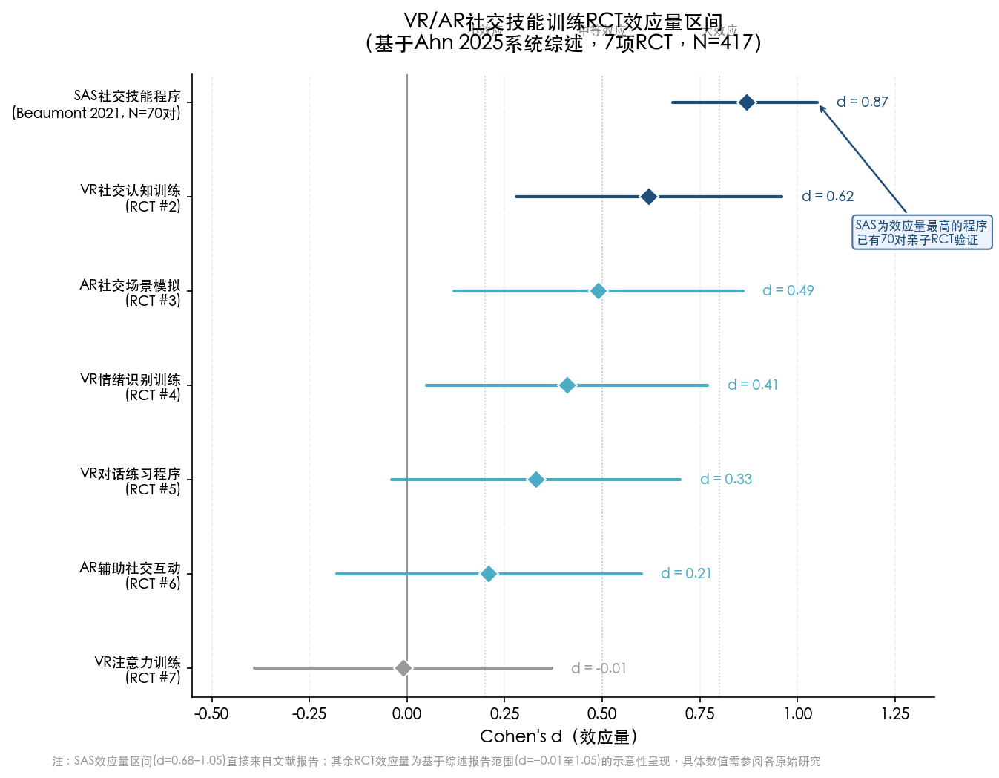

上图基于 Ahn（2025）系统综述中 7 项 RCT 的效应量数据，以森林图形式展示不同 VR/AR 程序的 Cohen's d 及其置信区间。SAS 程序（d = 0.87）为效应量最高的方案，而各项目间的异质性直观反映了 VR/AR 干预效果因具体程序设计和目标人群而异的特征。

然而，一个关键限制是：Ahn（2025）综述中的所有 7 项 RCT 均非在学校课堂场景中实施，而是在临床或家庭环境中开展 [Ahn 2025](https://pmc.ncbi.nlm.nih.gov/articles/PMC12374958/ "所有RCT均非课堂场景")。这一发现与前文讨论的"近端>远端"效应模式一致——在 Project AIM 元分析中，情境受限结局显著大于泛化结局（B = −0.27, p < .001）[Sandbank et al. 2023](https://www.bmj.com/content/383/bmj-2023-076733 "BMJ, 383:e076733")，提示 VR 环境中获得的技能向真实课堂迁移可能面临显著衰减。

### 4.4.2 学校场景的初步部署实践

尽管大规模 RCT 证据尚未进入课堂场景，2025 年已出现若干值得关注的学校部署案例。纽约市自闭症特许学校（New York City Autism Charter School）在南布朗克斯校区部署了 Floreo VR 程序，用于教授举手发言、轮流对话、识别霸凌和安全过马路等社交技能。该校临床督导 Heidi Brueckmann 报告，VR 的沉浸式特性使学生将其视为类似游戏的强化活动而非单调的教学任务，一名此前回避同伴的学生在 VR 社交场景练习后开始主动向其他儿童挥手致意 [Chalkbeat New York 2025](https://www.chalkbeat.org/newyork/2025/09/11/nyc-autism-charter-school-uses-vr-for-social-skill-learning/ "2025年9月报道")。截至报道时，Floreo 已在美国超过 100 所学校和治疗机构中部署使用，并在纽约等 6 个州获得 Medicaid 豁免计划报销资格 [Chalkbeat New York 2025](https://www.chalkbeat.org/newyork/2025/09/11/nyc-autism-charter-school-uses-vr-for-social-skill-learning/ "Floreo 部署覆盖范围")。

然而，VR 技能向真实课堂行为的迁移仍是核心挑战。Alsem、van Dijk 与 de Castro（2026）在 *Clinical Child Psychology and Psychiatry* 发表的研究对 49 名特殊教育学生（7—13 岁，其中 57.1% 为 ASD，20.4% 为 ADHD）进行单次 20 分钟 VR 训练，发现 VR 内的即时技能改善效应显著（η²p = .35），但两周后教师报告的课堂行为改善效应极小（η²p = .07）[Alsem et al. 2026](https://pubmed.ncbi.nlm.nih.gov/41810603/ "Clin Child Psychol Psychiatry, 2026年3月, N=49")。研究者据此建议，要实现从 VR 到真实课堂的行为迁移，可能需要增加训练次数、设计明确的"桥接策略"或开发更具情感卷入度的 VR 内容。

### 4.4.3 成本与可及性

VR/AR 设备成本区间较宽。独立式 VR 头显（如 Meta Quest 系列）售价约 300—500 美元，加上 Floreo 等专业软件的订阅费用，单个学生的年度使用成本可控制在 1,000 美元以内；但高端 VR 系统（含多感官反馈、眼动追踪等功能）成本可达 5,000 美元以上。从参与度维度审视，VR/AR 主要作用于**行为参与**（通过沉浸式交互提升任务投入）和**情感参与**（学生普遍报告高度欣赏 VR 训练体验），但对**认知参与**的促进——即深层学习策略的迁移——仍缺乏充分证据支撑。从适用学段来看，现有研究覆盖小学至高中阶段（7—18 岁），学前阶段因发育安全性考量而较少部署。

## 4.5 基于人工智能的行为监测与反馈系统

### 4.5.1 可穿戴传感器的先导研究

AI 驱动的行为监测系统代表了技术辅助手段中最具前瞻性但证据最为薄弱的方向。Vanderbilt 大学团队获得美国国家科学基金会（NSF）110 万美元拨款，开发了 REACT 可穿戴系统——由腕带式心率/皮肤电传感器、运动传感器和领夹麦克风组成的多模态数据采集方案，旨在预测 ASD 青少年问题行为的前兆信号 [Vanderbilt VUMC News 2024](https://news.vumc.org/2024/08/21/study-tests-wearable-technology-to-detect-problem-behavior-before-it-happens/ "2024年8月, N=20计划")。2024 年先导研究纳入 8 名 ASD 青少年测试系统的可接受性和感觉舒适度 [Vanderbilt Health Discoveries 2025](https://discoveries.vanderbilthealth.com/2025/01/wearable-tech-signals-potential-problem-behaviors/ "2025年1月, 可穿戴技术先导研究")，后续计划扩展至 20 名参与者以进行更系统的有效性评估。

### 4.5.2 参与度识别的数据基础设施

在参与度自动识别方面，数据基础设施建设取得了初步进展。Kim 等人（2024）在 *Scientific Data*（Vol. 11, Article 299）发表了 Engagnition 数据集，专门面向 ASD 儿童参与度识别研究。该数据集纳入 57 名 ASD 儿童（平均年龄 9.9 岁），采集皮肤电反应（GSR）、皮肤温度和加速度计数据，其中 GSR 平均信噪比为 26.67 dB，皮肤温度平均信噪比为 30.17 dB [Kim et al. 2024](https://www.nature.com/articles/s41597-024-03132-3 "Scientific Data, 11:299, Engagnition 数据集")。Engagnition 为后续机器学习模型的训练提供了标准化基准数据，但其应用场景为结构化评估环境而非真实课堂。

更早期的 Rudovic 等人（2018）开发的 CultureNet 模型尝试利用深度学习进行 ASD 儿童情感与参与度的自动识别，但同样处于概念验证阶段，尚无真实课堂部署评估 [Kim et al. 2024](https://www.nature.com/articles/s41597-024-03132-3 "参考 Rudovic et al. 2018")。总体而言，参与度自动识别领域正处于从数据集构建向算法验证过渡的早期阶段，距离课堂实用工具尚有相当距离。

### 4.5.3 从实验室到课堂的鸿沟

我们认为，AI 行为监测系统从实验室原型到课堂实用工具之间存在显著的"最后一公里"障碍，主要体现在三个层面。其一，隐私与伦理问题尤为突出——在教育场景中对学生进行持续的生理信号监测涉及知情同意、数据存储安全和潜在的标签化效应，这些问题在现有先导研究中尚未得到充分讨论。其二，技术可靠性在课堂"野外"环境中尚未得到验证——课堂中的运动伪影、温度变化和设备脱落等因素可能显著降低传感器信号质量，使得实验室条件下的算法精度在真实场景中大幅衰减。其三，从教师端审视，REACT 类系统产生的实时数据流需要转化为可操作的教学决策信号，而这一"数据到行动"的翻译机制尚未设计完成——教师面对原始生理指标时缺乏解读框架和响应策略。综合评估，AI 行为监测系统的课堂部署初步数据预计在 2025—2027 年间才能发布，目前将其定位为"探索阶段"是审慎且合理的。

## 4.6 游戏化学习方案：跨群体参考与初步元分析

### 4.6.1 ADHD 群体的强效应量证据

游戏化教育应用在注意力和参与度提升方面展现出令人瞩目的效果，但当前最具说服力的 RCT 证据主要来自 ADHD 而非 ASD 群体。Dai 等人（2025）在 *Frontiers in Education*（Vol. 10, Article 1668260）发表的 RCT 对 80 名 ADHD 儿童进行游戏化教育应用干预，报告了大效应量（Cohen's d = 0.92–1.3）[Dai et al. 2025](https://www.frontiersin.org/journals/education/articles/10.3389/feduc.2025.1668260/full "Front Educ, 10:1668260, ADHD RCT N=80")。鉴于 ASD 群体中 ADHD 共病率估计约为 28%（Lai et al., 2019 元分析），该证据对 ASD-ADHD 共病亚群具有直接的跨群体参考价值。

### 4.6.2 ASD 专项的游戏化元分析

2025 年发表的一项系统综述与元分析为游戏化干预在 ASD 群体中的应用提供了更为直接的证据。该综述纳入 20 项研究（共 349 名参与者，82.8% 为男性，平均年龄 11.55 岁），聚焦游戏化干预对 ASD 个体社交互动和沟通能力的效果。研究发现，常用的游戏化要素包括反馈（50%）、奖励（50%）、个性化学习路径（45%）、进度监控（45%）和内容定制（40%）。纳入元分析的 5 项研究显示，游戏化干预对社交互动和沟通能力的汇总标准化均数差为 0.46（95% CI: 0.08–0.85, I² = 0%），达到中等效应量且异质性极低，表明效应估计具有较高的稳定性 [游戏化干预系统综述 2025](https://www.sciencedirect.com/science/article/pii/S002074892500046X "Int J Nurs Stud, 165:105037, 20项研究/349名参与者")。

### 4.6.3 与参与度维度的关联

游戏化机制通过多维路径影响课堂参与度：即时反馈和进度可视化直接促进**行为参与**（任务投入和持续性）；奖励系统和成就解锁激发**情感参与**（积极情感和内在动机）；而个性化挑战难度和自主选择权则有潜力触及**认知参与**（策略性思考和自我调节学习）。值得关注的是，Bayoumi 等人（2025）提出的将 ASD 学生特殊兴趣嵌入课堂教学的策略框架，与游戏化设计中的个性化原则高度契合——两者结合有望产生协同效应，通过内在动机驱动实现更为持久的参与度提升 [Bayoumi et al. 2025](https://journals.sagepub.com/doi/10.1177/00400599251346719 "TEACHING Exceptional Children, 2025")。然而，直接以 ASD 学生课堂参与度为结局变量的游戏化 RCT 仍然付之阙如，这构成了该方向未来研究的优先议题。

## 4.7 技术成熟度分层评估与选择建议

综合以上五个技术方向的证据强度、部署成本和课堂可行性，我们将当前技术辅助手段分为三个成熟度层级。下图从证据强度、经济可及性和课堂就绪度三个维度对各技术方向进行量化对比。

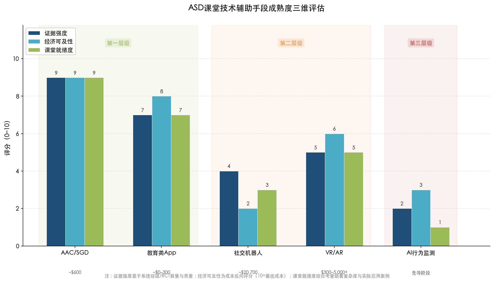

上图以 0–10 分量表对五种技术方向进行三维评分对比，背景色块区分三个成熟度层级。AAC/SGD 在三个维度上均获最高评分（均为 9 分），AI 行为监测在课堂就绪度上仅获 1 分，直观反映了不同技术路线之间的成熟度落差。

**第一层级——成熟工具（证据充分、成本可控、可立即部署）**：AAC/SGD 和教育类应用程序。AAC App 加 iPad 的总成本约 600 美元，拥有多项系统综述和元分析支持，递送模式已扩展至远程教学。教育类 App 的循证版本（如 SAS）已有 RCT 证据支持。此层级工具适用于学前至高中各学段，在融合教育和特殊教育课堂中均有成熟部署案例。

**第二层级——初步证据（有 RCT 但场景迁移未验证）**：社交机器人和 VR/AR 系统。社交机器人（NAO Autism Pack 约 20,700 美元）和 VR 头显（300—500 美元起）的成本差异显著。社交机器人在注意力吸引方面具有独特优势，但受限于高昂成本和空间要求；VR/AR 的成本门槛较低，Floreo 等程序已进入超过 100 所学校的部署阶段，但 VR 内技能向课堂行为的迁移效应仍然有限（η²p = .07）。此层级工具更适合作为辅助性资源而非核心干预手段。

**第三层级——探索阶段（概念验证，无真实课堂部署评估）**：AI 行为监测系统（如 REACT 可穿戴系统，先导研究 N = 8–57）。此类技术的潜在价值在于实现参与度的客观、连续监测，但从实验室到课堂的过渡面临隐私伦理、技术可靠性和数据转化三重挑战，预计 2025—2027 年间才能获得课堂部署的初步数据。

对于资源有限的学校，我们建议优先配置第一层级工具——以 AAC 设备和循证教育应用为基础，确保最小口语学生获得沟通通道。第二层级工具可在学校拥有额外技术预算时作为拓展选项，其中 VR 程序在社交技能训练方面的补充价值尤为突出。第三层级技术当前更适合作为研究关注对象而非采购目标，教育者可持续跟踪其课堂部署数据的发布进展。

# 第5章 教师实施层面的挑战与支持机制

前四章围绕"什么策略有效""在何种条件下有效"以及"哪些技术工具可供选择"展开了系统梳理。然而，策略的证据强度与策略的实际落地之间并非线性传导关系——研究与实践之间横亘着一条被实施科学（Implementation Science）文献反复确认的鸿沟。这条鸿沟的核心瓶颈在于教师：作为循证实践（Evidence-Based Practice, EBP）在课堂场景中的最终执行者，教师的知识储备、培训质量、自我效能感和组织支持环境共同决定了 EBP 从论文走向课桌的效率与保真度。本章从教师视角出发，系统分析策略落地过程中面临的核心障碍，并梳理已获实证支持的教师支持机制，将讨论从"什么有效"延伸至"如何确保有效实施"。

## 5.1 教师 ASD 专项培训的现状与知识缺口

### 5.1.1 职前培训严重不足：一个跨国共性问题

教师 ASD 专项培训的匮乏并非个别现象，而是具有跨国普遍性。Barry 等人（2022）对 369 名爱尔兰主流小学教师的大规模问卷调查提供了迄今该领域最细粒度的数据之一：超过 65% 的教师在职前教育中仅接受了不到 3 小时的自闭症专项培训，36% 报告完全未接受过任何职前或持续专业发展（Continuing Professional Development, CPD）培训；78% 的教师在首次教授 ASD 学生之前未接受过任何针对性 CPD [Barry et al. 2022](https://pmc.ncbi.nlm.nih.gov/articles/PMC9296378/ "J Autism Dev Disord, 52(8):3536+, 369名教师调查")。

知识结构的失衡同样值得关注。Barry 等人发现，教师对 NCAEP 2020 确认的 28 项 EBP 中 20 项以上知之甚少（知识评分低于"少量"水平），仅对视觉支持（M = 3.96）、社交故事（M = 3.59）和强化（M = 3.36）具有中等程度知识 [Barry et al. 2022](https://pmc.ncbi.nlm.nih.gov/articles/PMC9296378/ "EBP知识结构")。这意味着，第2章所梳理的策略体系中，大量已获高质量证据支持的干预手段——自我管理、行为动量干预、同伴介入等——对多数一线教师而言仍属陌生概念。

### 5.1.2 普通教育教师与特殊教育教师之间的知识鸿沟

在融合教育持续推进的背景下（第3章已指出 NCAEP 2020 数据中仅 20% 的研究由教育者实施，79% 为一对一情境），普通教育教师承担着越来越多 ASD 学生的日常教学责任，但其 EBP 知识水平与特殊教育教师之间存在显著差距。Barry 等人（2022）发现，普通教育教师的 EBP 知识评分（M = 2.31, SD = 0.75）和使用频率（M = 2.14, SD = 0.64）均显著低于自闭症专班教师（知识 M = 3.02, SD = 0.98；使用 M = 2.80, SD = 0.70；p < .001）[Barry et al. 2022](https://pmc.ncbi.nlm.nih.gov/articles/PMC9296378/ "普教vs特教差异")。这一差距在美国亦有类似表现：McNeill（2019）报告 90% 的特殊教育教师每天使用强化和示范等 EBP，而普通教育教师中仅 20% 达到同等使用频率 [Barry et al. 2022](https://pmc.ncbi.nlm.nih.gov/articles/PMC9296378/ "引用McNeill 2019, J Autism Dev Disord, 49(11):4585-4594")。

### 5.1.3 培训时长的剂量效应

培训投入并非"有胜于无"的简单叠加，其效果存在明确的剂量效应阈值。Barry 等人（2022）的数据显示，职前培训达到 9 小时以上的教师 EBP 使用频率（M = 3.03, SD = 0.48）显著高于仅接受 1–3 小时培训的教师（M = 2.16, SD = 0.70, p < .001）；CPD 培训达到 30 小时以上的教师 EBP 使用频率（M = 2.71, SD = 0.66）显著高于仅接受 0–5 小时的教师（M = 2.08, SD = 0.55, p < .001）[Barry et al. 2022](https://pmc.ncbi.nlm.nih.gov/articles/PMC9296378/ "培训剂量效应")。

此外，专业支持的频率与 EBP 使用正相关。25% 的教师报告完全没有获得心理学家、言语治疗师或职业治疗师等专业人员的支持；获得每年 7 次以上专业支持的教师 EBP 知识（M = 3.79）和使用频率（M = 3.39）均显著高于无支持的教师（知识 M = 2.24, 使用 M = 2.03, p < .01）[Barry et al. 2022](https://pmc.ncbi.nlm.nih.gov/articles/PMC9296378/ "专业支持频率与EBP使用")。

图1呈现了职前培训与持续专业发展两个维度上培训时长与 EBP 使用频率之间的剂量效应关系。数据清晰表明，职前培训不少于 9 小时、入职后 CPD 不少于 30 小时，是与显著更高 EBP 使用频率相关联的基线阈值，可作为制定教师培训最低时长标准的实证依据。

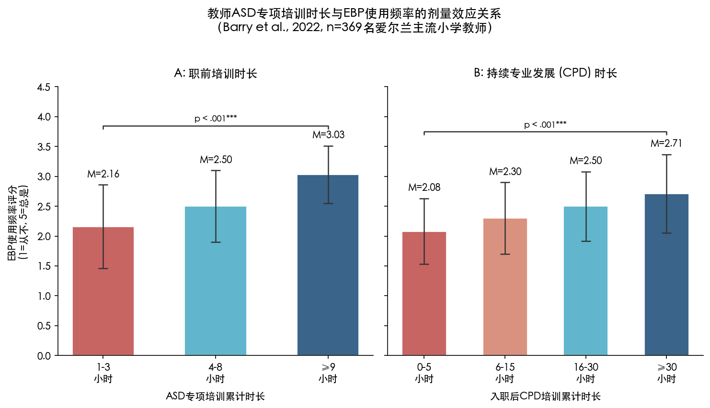

## 5.2 实施保真度：策略落地的核心质量指标

### 5.2.1 保真度的整体状况

实施保真度（Implementation Fidelity）衡量的是教师在实际课堂中是否按照策略设计意图执行干预，是连接 EBP 证据与学生结果的核心质量指标。第3章已指出融合教育中教师实施的干预有 81% 产生中等至强效果（Mason et al., 2022），看似令人鼓舞；但这一数据的前提是教师接受了充分的培训和支持。审视保真度的实际分布后，情况远不如此乐观。

Stahmer 等人（2015）在费城学区开展的 STAR 项目随机试验（57 名 K-2 年级特殊教育课堂教师，两学年追踪）提供了迄今 ASD 课堂 EBP 保真度最为详尽的纵向数据。研究发现，整体保真度（三种策略平均）高度可变，范围为 12%–92%（Mandell et al., 2013）。按策略类型分：离散试验教学（DTT）保真度最高（第1时间段 78.54%，第4时间段 80.46%）；关键反应训练（PRT）保真度最低（第1时间段 53.41%，第4时间段仅 60.19%）——即使经两学年密集培训和教练指导，达到 80% PRT 保真度标准的课堂比例在最佳表现时也仅为 30%，而 DTT 为 81%、功能性日常活动为 78% [Stahmer et al. 2015](https://pmc.ncbi.nlm.nih.gov/articles/PMC4290214/ "Psychol Sch, 52(2):181-195, STAR项目保真度")。

图2直观呈现了三种 EBP 策略在两学年四个时间点的保真度变化轨迹，80% 标准线和暑假间歇的标注清晰揭示了策略结构化程度与保真度之间的正向关系以及间歇期保真度衰减现象。

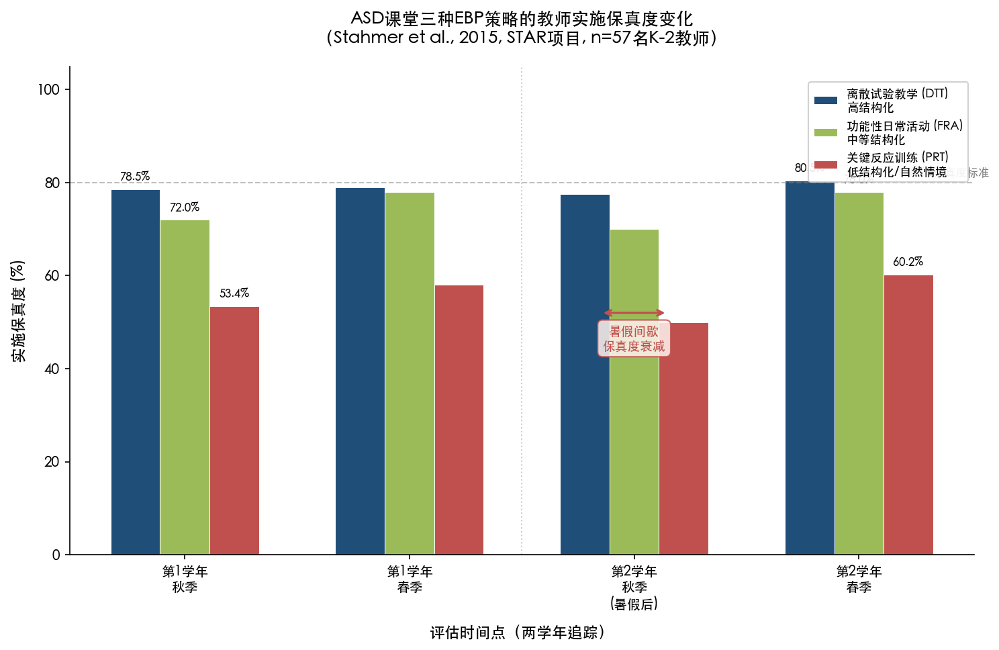

### 5.2.2 策略复杂性与保真度的反向关系

上述数据揭示了一个具有普遍性的规律：**结构化程度越高的策略，教师越容易实现高保真度实施**。DTT 作为高度脚本化的策略，其组件明确且无需复杂的临床判断，保真度在两年间保持稳定。相比之下，PRT 等自然情境策略（第2章归类为自然发展行为干预的核心组分）对教师临床判断能力的要求显著更高——何时提供强化、如何选择自然后果、如何在不打断活动流程的前提下嵌入学习机会——相当数量的教师在第一年甚至未能启动 PRT 实施 [Stahmer et al. 2015](https://pmc.ncbi.nlm.nih.gov/articles/PMC4290214/ "策略复杂性与保真度的关系")。

这一发现对第2章和第3章讨论的策略选择具有直接启示：在培训资源有限的条件下，优先部署结构化程度高、保真度门槛低的策略（如视觉支持、DTT、自我管理检查表），可能比追求理论上更优但保真度难以保障的自然情境策略更为务实。第2章引用的 Gahtan 等人（2026）元分析证实，自我管理策略使学业参与度提高 49.87 个百分点且无显著调节变量——这一跨场景稳健性在相当程度上源于自我管理策略本身的高度结构化特征。

### 5.2.3 暑假后的保真度衰减

Stahmer 等人（2015）还发现了一个在实践中极具挑战性的现象：**暑假后保真度显著下降**。第二学年初的保真度相比第一学年末出现明显回落——PRT 达到 80% 保真度的课堂比例从 41% 降至 17%，DTT 从 65% 降至 58% [Stahmer et al. 2015](https://pmc.ncbi.nlm.nih.gov/articles/PMC4290214/ "暑假后保真度下降")。这一发现表明，教师在缺乏持续支持的间歇期容易丧失已习得的干预技能。一次性培训模型无法满足 ASD 课堂 EBP 可持续实施的需求，持续性咨询支持对维持保真度不可或缺。

### 5.2.4 保真度报告不足：研究层面的系统性缺陷

保真度问题不仅存在于实践层面，也反映在研究报告本身的系统性缺陷中。多项独立综述显示，在 *Journal of Applied Behavior Analysis* 发表的论文中仅 16%–30% 报告了保真度数据；三项自闭症干预研究综述显示仅 13%–32% 纳入保真度测量；Swanson 等人（2011）的特殊教育期刊综述发现仅 47% 的干预文章报告了任何类型的保真度评分 [Stahmer et al. 2015](https://pmc.ncbi.nlm.nih.gov/articles/PMC4290214/ "引用多项保真度报告综述数据")。保真度报告的普遍缺失严重限制了对干预与学生结局之间因果关联的推论质量，也使得研究向实践的转化缺乏精确的质量控制参照。

## 5.3 教师面临的核心实施障碍

### 5.3.1 六大类障碍的质性证据

Wilson 与 Landa（2019）在美国第 25 大学区的 4 所学校中，通过 5 次管理者反馈会议和 12 次教育者反馈会议（17 份转录稿 + 70 份书面反馈表）开展质性分析，系统识别出 ASD 学龄前课堂 EBP 实施的六大类障碍（IES 资助 Goal 2 项目）：

1. **教育者准备度**（最大类别，含 6 个子类型）——包括不足以实施 PRT 策略、不足以设定发展性目标、不足以在一对一情境中通过游戏实施教学；
2. **教育者投入度**——部分教师对采用新策略持消极态度；
3. **教育团队凝聚力**——团队成员之间缺乏一致的实施共识；
4. **ASD 学生教学的固有复杂性**——学生异质性大、行为表现难以预测；
5. **时间和资源限制**——教学时间紧张、缺乏适当材料和设备；
6. **管理支持不足**——校长和行政层面未能提供充分的制度保障。

该研究指出，大多数障碍反映的是**系统性教育体制制约**，而非特定干预本身的限制 [Wilson & Landa 2019](https://www.frontiersin.org/journals/education/articles/10.3389/feduc.2019.00027/full "Front Educ, 4:27, 2019")。

### 5.3.2 教育者与管理者的认知落差

Wilson 与 Landa（2019）进一步发现，教育者与管理者在障碍类型上的一致性为 75%，但在"时间和资源"类别中一致性最低（仅 33%）——管理者仅认可"时间不足"这一子类型，而教育者还强调缺乏适当材料/设备和班级规模过大等具体资源约束。此外，仅教育者认为绩效评估方式（EBP 保真度评估与学校常规教师评估之间的冲突）构成实施障碍；仅管理者提到教育者对采用新策略的抵触心理 [Wilson & Landa 2019](https://www.frontiersin.org/journals/education/articles/10.3389/feduc.2019.00027/full "教育者与管理者认知差异")。

这种认知错位在 Stahmer 等人（2023）的加利福尼亚州大规模调查中获得了量化印证：领导者自评实施领导力总分（ILS EMM = 11.36）显著高于员工对领导者的评分（EMM = 10.43, p < .001）；学校校长的自评领导力在所有组织层级中最低（EMM = 9.72），员工对学区领导者的评价同样在所有层级中居末 [Stahmer et al. 2023](https://pmc.ncbi.nlm.nih.gov/articles/PMC10486229/ "领导力自评与员工评价落差")。领导者高估自身支持效果的倾向，可能导致实施气候改善的系统性滞后。

### 5.3.3 研究情境与真实课堂的落差

第3章已指出，NCAEP 2020 综述数据中仅 20% 的研究由教育者实施（vs. 52% 由研究人员），79% 为一对一实施情境。Shogren 等人（2026）在高中 ASD 学生的 SDLMI + PS 组合干预研究中亦直接指出"教师（尤其是普通教育教师）面临显著的实施障碍"。这意味着多数 EBP 的证据条件——一对一情境、由研究人员实施、高度控制的实验环境——与真实课堂的小组/全班教学情境之间存在巨大落差。策略有效并不等同于策略可实施，这一鸿沟是教师实施层面最根本的结构性挑战。

## 5.4 组织层面的实施气候与领导力

### 5.4.1 实施气候：学校层面的系统性短板

Stahmer 等人（2023）对加利福尼亚州 2,273 名学校人员（覆盖教师、副专业人员、相关服务提供者及管理人员）的大规模调查，采用实施气候量表（ICS）、学校实施领导力量表（S-ILS）和循证实践态度量表（EBPAS）进行系统评估，关键发现包括：

- 实施气候和领导力评分总体偏低，区域级组织（SELPA）评分显著高于学区和学校级别：SELPA 总 ICS EMM = 19.40 vs. 学区 13.40 vs. 学校 13.90（p < .001）；
- 学校层面的教育支持分量表评分最低：学校 EMM = 1.64 vs. SELPA EMM = 2.84（p < .001）；
- EBP 态度中等偏正面，但教师和副专业人员的 EBP 态度评分在所有角色中最低，专家/培训师评分最高 [Stahmer et al. 2023](https://pmc.ncbi.nlm.nih.gov/articles/PMC10486229/ "Implement Res Pract, 2023, 加州2273名人员调查")。

### 5.4.2 实施气候与保真度的链式传导

上述发现的实践意义在于：提升 EBP 保真度需从组织层面而非仅从个体教师层面加以干预。Stahmer 等人（2023）引用 Dingfelder 与 Mandell（2011）以及 Williams 等人（2022）的研究确认，积极的实施气候和领导力与更高的 EBP 保真度使用显著相关 [Stahmer et al. 2023](https://pmc.ncbi.nlm.nih.gov/articles/PMC10486229/ "实施气候与保真度的关联证据")。学校和学区层面的低实施气候评分揭示了一个结构性困境：直接面对 ASD 学生的一线教师所在的组织层级，恰恰是实施支持最为薄弱的层级。

针对这一困境，Stahmer 等人建议利用 SELPA 等区域级实体较高的实施能力，为学区和学校层面的领导提供 EBP 支持。领导力和组织变革促进实施（LOCI）干预模型（Aarons et al., 2015, 2017a）作为一项已在社区心理健康和学校环境中接受测试的实施领导力培训方案，初步数据表明其可改善学区的实施领导力和气候，进而支持自闭症 EBP 的落地使用 [Stahmer et al. 2023](https://pmc.ncbi.nlm.nih.gov/articles/PMC10486229/ "LOCI模型初步证据")。

## 5.5 已验证的教师支持机制

### 5.5.1 教练式督导优于传统工作坊：从单次培训到持续支持

教师 EBP 培训模式正经历从"工作坊一次性灌输"向"嵌入式教练持续支持"的范式转变。Suhrheinrich（2011）的研究为此提供了关键证据：在 20 名教师接受 6 小时 PRT 工作坊培训后，仅 15% 达到 PRT 掌握标准（mastery criteria）；而在后续增加个别化课堂教练（coaching）环节后，多数教师达到了掌握标准 [Suhrheinrich 2011](https://journals.sagepub.com/doi/10.1177/0888406411406553 "Teach Educ Spec Educ, 34:339-349, 教练作为关键组件")。这一数据（15% vs. 多数）直观揭示了工作坊单独使用时的低效性以及教练式督导的不可替代价值。

Suhrheinrich 等人（2020）在南加利福尼亚州开展的大规模等待名单随机对照试验（n = 126 名特殊教育教师）进一步验证了这一模式。CPRT 培训包含 12 小时小组互动教学 + 个别化课堂教练。结果显示：CPRT 保真度在培训年末显著高于观察年（B = 0.24, p = .001）；76% 的教师在至少一次教练会议中达到保真度标准（平均需要 4.4 次教练会议）；教师满意度评分高达 4.37/5.0，对 CPRT 使用的自信心评分 4.2/5.0。教练访问次数与整体 CPRT 保真度正相关（r = .15, p = .03），教师入职时的 EBP 知识水平也与保真度结果显著相关（r = .19, p = .03）[Suhrheinrich et al. 2020](https://files.eric.ed.gov/fulltext/EJ1259213.pdf "Teach Educ Spec Educ, 43(3):215-234, n=126教师RCT")。

然而，即便采用这一经过系统适配的培训模型，保真度的可持续性仍然构成挑战：培训年后的跟踪年保真度显著下降（B = 0.04, p = .045），仅后果性策略（Consequence strategies）的进步得以维持 [Suhrheinrich et al. 2020](https://files.eric.ed.gov/fulltext/EJ1259213.pdf "保真度跟踪年下降")。这一模式——"培训年进步、跟踪年衰减"——与 Stahmer 等人（2015）的暑假后保真度下降数据高度一致，共同指向一个核心结论：**教师 EBP 能力的维持需要持续性支持结构，而非一次性培训事件**。

### 5.5.2 COMPASS 咨询模型：低时间投入、高效能产出

COMPASS 咨询干预提供了一种在时间效率上极具吸引力的教练模型。Love 等人（2019，基于 Ruble 等人 RCT 数据）对 44 名特殊教育教师-学生配对的分析显示：实验组教师在全学年仅接受不到 10 小时的咨询师接触（包含初始评估和目标设定会议 + 4 次各 1–1.5 小时的教练会议），学年末 ASD 教学自我效能感评分（M = 84.7, SD = 9.3）显著高于仅接受在线 EBP 培训的对照组（M = 77.1, SD = 11.8, F(1,42) = 5.12, p = .029, η² = 0.11）。面对面交付产生 d = 1.1–2.0 的大效应量学生 IEP 目标达成改善，网络交付亦同样有效（d = 1.1）[Love et al. 2019](https://pmc.ncbi.nlm.nih.gov/articles/PMC11581316/ "Focus Autism Other Dev Disabl, 35(1):47-54, COMPASS RCT")。

COMPASS 模型的核心优势在于低剂量高回报：全学年不到 10 小时的咨询接触即可产生显著效果，这对于资源受限的学校具有很高的可行性和推广价值。

### 5.5.3 嵌入式解决方案：降低复杂策略的实施门槛

Wilson 与 Landa（2019）在识别出六大类实施障碍后，在同一 IES 资助项目中迭代开发了一套嵌入式解决方案，其核心策略包括：

1. **限制干预情境**——将干预限制为教师已在使用的活动（图书分享、点心、手工），消除了研究最初要求的一对一游戏情境；
2. **开发半结构化实施格式**——使自然发展行为干预（NDBI）策略自动嵌入活动流程中，减少对教师独立临床判断的要求；
3. **设计分层提示层级**——通过领域特定的最少到最多提示体系，用反复角色扮演练习确保教师掌握后再进入课堂实施；
4. **简化保真度工具**——将保真度表单减少条目、提高具体性，教师将其作为实施清单使用，每次教练聚焦不超过 3 个干预组件。

结果：教师报告从"被大量策略压倒"转变为"享受知道如何引发被动/脱离学生参与"，高保真度实施得以实现 [Wilson & Landa 2019](https://www.frontiersin.org/journals/education/articles/10.3389/feduc.2019.00027/full "嵌入式解决方案及其效果")。

这一经验的核心启示在于：成功的实施策略并非要求教师具备研究人员水平的临床判断能力，而是通过结构化工具将 EBP 的核心成分"预装"到教师已熟悉的活动流程中，在保留干预有效成分的同时降低认知负荷。

### 5.5.4 NPDC 模型：学校级综合专业发展的 RCT 证据

上述干预多聚焦于个体教师层面，而 Sam 等人（2020）在 *Journal of Autism and Developmental Disorders* 发表的 NPDC 模型学校级 RCT 则将视角提升至组织层面。NPDC 模型整合了 EBP 培训、教练督导和数据驱动的 APERS 自评改进工具，以学校而非个体教师为随机分组单位。结果显示：接受 NPDC 模型的学校教师使用了更多 EBP，实施保真度显著高于对照学校，ASD 学生在自闭症症状严重度和学业目标达成方面均有改善 [Sam et al. 2020](https://link.springer.com/article/10.1007/s10803-020-04706-x "J Autism Dev Disord, NPDC模型学校RCT")。这是首个在学校层面验证综合专业发展模型有效性的大规模 RCT，为从个体培训向组织能力建设的范式转移提供了关键依据。

## 5.6 教师自我效能感：实施质量的心理学引擎

### 5.6.1 自我效能感与学生结果的直接关联

教师自我效能感是连接培训质量与学生结果的核心中介变量。Love 等人（2019）对 44 名特殊教育教师的分析发现：ASD 教学自我效能感（ASSET 量表）与学生 IEP 目标达成正相关（r = .39, p = .005），与教师参与度正相关（r = .36, p = .008），与教师压力负相关（r = −.39, p = .005）；教师压力亦与学生 IEP 结果负相关（r = −.26, p = .044）[Love et al. 2019](https://pmc.ncbi.nlm.nih.gov/articles/PMC11581316/ "自我效能感与学生IEP结果的首项直接关联研究")。这是文献中首项报告教师自我效能感与 ASD 学生 IEP 结果之间直接关联的研究，将教师心理状态纳入了学生参与度的影响因素图谱。

### 5.6.2 自我效能感的提升路径

基于 Bandura（1997）自我效能理论，Love 等人（2019）分析了 COMPASS 干预通过三条途径提升教师自我效能感的机制：（1）**掌握体验**——教师通过反思性反馈和自我监控评估教学计划实施情况并尝试新方法；（2）**社会说服**——咨询师在教练会议中给予鼓励和专业肯定；（3）**生理/情感状态改善**——获得系统支持后焦虑和压力水平降低 [Love et al. 2019](https://pmc.ncbi.nlm.nih.gov/articles/PMC11581316/ "Bandura自我效能感四来源与COMPASS机制")。这一框架对设计教师专业发展模型具有直接指导价值：有效的教练不仅传授技能，更通过多条心理路径重塑教师对 ASD 教学的专业信心。

### 5.6.3 保真度与情绪耗竭的双向关系

EBP 实施究竟是减轻还是加重教师倦怠？这一困扰实施科学领域的关键问题，在 Ouellette、Pellecchia 等人（2019）的研究中获得了来自 ASD 领域的直接证据。该研究对费城 46 名 K-2 年级特殊教育教师（参与 STAR 项目随机试验第三年）进行纵向数据分析，采用 Maslach 倦怠量表情绪耗竭分量表和月度课堂观察保真度编码两种独立数据来源。关键发现如下：

- 学年初的情绪耗竭与学年末 EBP 保真度**无显著相关**——基线倦怠水平并未阻碍教师习得和使用 EBP；
- 学年末更高的 EBP 保真度与更低的情绪耗竭显著相关——保真度每提高一个单位，情绪耗竭降低 0.34 至 1.13 个点（控制基线情绪耗竭、教学年限和学生认知功能变化后，所有 p 值 < .05）。其中 PRT 保真度对情绪耗竭的降低效应最大（B = −1.13, SE = 0.40, p < .05）[Ouellette et al. 2019](https://pmc.ncbi.nlm.nih.gov/articles/PMC6400069/ "Adm Policy Ment Health, 46(1):62-70, n=46教师")。

这一发现颠覆了"实施 EBP 增加教师负担"的直觉假设。我们认为其合理解释在于：高保真度实施为教师提供了更清晰的教学结构和更强的专业掌控感，间接通过自我效能感路径缓解了情绪耗竭。换言之，帮助教师实现高保真度实施不仅有利于学生结果，也是一种教师福祉干预。

## 5.7 教师实施者效果的反直觉发现

第3章已报告了一个值得深入审视的数据：Mason 等人（2022）发现，在全班教学场景中教师实施的干预有 81% 产生中等至强效果且仅 19% 无效果，而研究人员实施的干预仅 62% 产生中等至强效果、44% 为无效果。Watkins 等人（2019）在融合教育元分析中同样发现"教师实施的干预产生了最大的总体效应量"。

这一反直觉的发现并非意味着教师天然优于研究人员，而是反映了教师作为实施者的独有优势：与学生建立的长期关系基础（Losh et al., 2022 已证实师生关系质量是行为参与的单向因果前驱，β = .26, p < .01）、对课堂环境节奏和学生个体特征的深度了解、以及日常持续性接触（相对于研究人员的短期介入）。但这些优势的充分发挥有一个关键前提——教师须接受充分的培训和支持。在缺乏系统训练的条件下，教师与研究人员之间的保真度差距反而可能更大。

因此，本章的核心论点可归结为：**投资于教师的 EBP 实施能力，可能是提升 ASD 学生课堂参与度最具杠杆效应的路径**。其逻辑基础并非教师天然比研究人员更强，而在于教师是唯一能够在日常教学中持续、稳定地递送干预的主体。

## 5.8 从障碍到行动：教师支持的系统性框架

综合本章证据，有效的教师支持机制可归纳为以下分层框架（图3）：

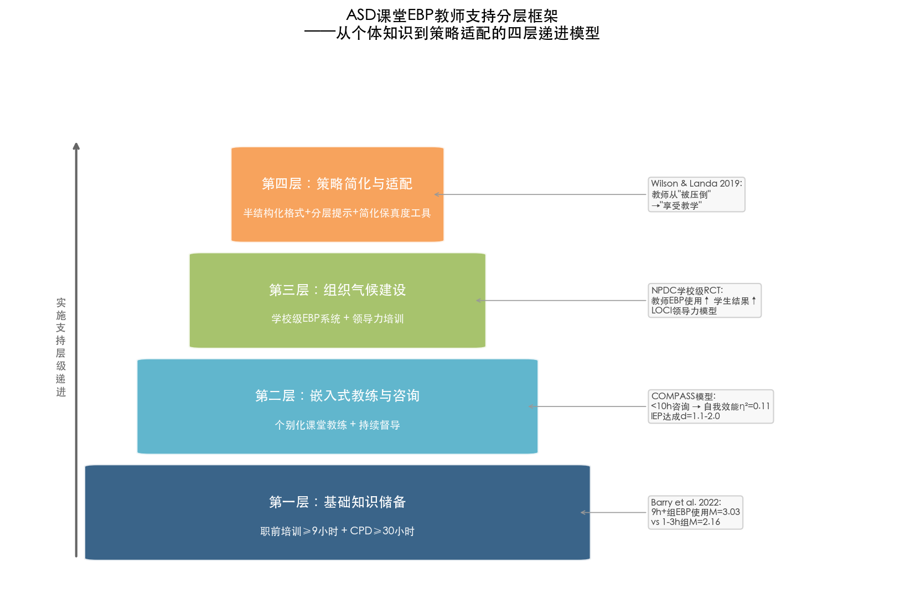

**第一层：基础知识储备**。职前培训不少于 9 小时 ASD 专项内容（与显著更高 EBP 使用频率相关的阈值，Barry et al., 2022），入职后 CPD 累计不少于 30 小时。AFIRM 在线模块（Morin et al., 2020）可作为知识普及的可扩展工具，但其效果主要体现在知识提升层面，从知识到行为的转化仍需后续支持 [Barry et al. 2022](https://pmc.ncbi.nlm.nih.gov/articles/PMC9296378/ "引用Morin et al. 2020, AFIRM模块效果")。

**第二层：嵌入式教练与咨询**。单纯工作坊仅使 15% 的教师达到 PRT 掌握标准（Suhrheinrich, 2011），而增加个别化教练后多数教师可达标。COMPASS 模型证明全学年不到 10 小时咨询接触即可产生教师自我效能感（η² = 0.11）和学生 IEP 目标达成（d = 1.1–2.0）的显著改善。教练安排应避免暑假等长间歇导致的保真度衰减。

**第三层：组织气候建设**。NPDC 模型的学校级 RCT 证明，将培训、教练和数据驱动的改进工具整合为学校层面的系统，可同时提升教师 EBP 使用和学生结果。LOCI 干预模型可用于改善学区层面的实施领导力。Stahmer 等人（2023）建议利用区域级组织（如加利福尼亚州 SELPA）的较高实施能力向下赋能。

**第四层：策略简化与适配**。对保真度门槛高的自然情境策略（如 PRT），Wilson 与 Landa（2019）的经验表明，通过限制干预情境、开发半结构化格式、设计分层提示体系和简化保真度检查表，可以在保留核心有效成分的同时大幅降低实施难度。教师应优先掌握结构化程度高、保真度证据充分的策略——自我管理、视觉支持、提示和强化（第2章识别的四大核心策略）——再逐步扩展至自然情境策略。

这一分层框架的设计逻辑是：**从个体知识到个体技能到组织支持到策略适配**，四个层次相互依赖、缺一不可。仅有知识培训而无教练支持（第一层无第二层），保真度无法保障；有教练支持但缺乏组织气候（第二层无第三层），教练效果无法可持续；组织支持完善但策略本身过于复杂（第三层无第四层），即使在理想组织环境中教师也难以实现高保真度。

# 第6章 趋势展望与策略整合建议

前五章分别从概念框架与测量方法、干预策略分类体系、场景适用性与效果对比、技术辅助手段以及教师实施机制五个维度，系统梳理了增强自闭症谱系障碍（ASD）学生课堂参与度的研究证据。本章在此基础上完成三项任务：第一，交叉比对各章发现，提炼当前证据体系的共识点与尚存分歧；第二，识别未来值得关注的研究方向与全球政策动向；第三，为学校管理者、一线教师和特教协调员提供分层的策略整合建议框架，将前述证据转化为可操作的实践指引。

## 6.1 跨章节证据的六大共识

经过对前五章研究证据的交叉比对，当前文献在以下六个方面已形成较为稳固的共识。

**第一，行为干预策略的证据基础最为厚实。** NCAEP 第三代系统综述（覆盖 1990–2017 年间 972 篇高质量研究）与 NAC 国家标准项目第二阶段（覆盖 1957–2012 年共 1,126 篇文献）两个独立评估体系在核心结论上高度一致：植根于行为分析传统的干预策略——包括提示（140 篇支持研究）、强化（106 篇）、视觉支持（65 篇）和差别强化（58 篇）——拥有最广泛的实证支撑 [NCAEP 2020 报告](https://ncaep.fpg.unc.edu/wp-content/uploads/EBP-Report-2020.pdf "Steinbrenner et al., 2020, 第三代系统综述") [NAC NSP2 摘要](https://nationalautismcenter.org/wp-content/uploads/dlm_uploads/2014/12/NSP2-Summary_9-15.pdf "National Autism Center, 2015, NSP Phase 2 概要")。

**第二，自我管理策略在跨场景稳健性方面表现突出。** Gahtan 等人（2026）专门聚焦自我管理对 ASD 学生学业参与度效果的多层次元分析纳入 14 项研究（29 名参与者），发现自我管理使学业参与度平均提高 49.87 个百分点（SE = 4.33, 95% CI: 39.76–59.59, p < .001）。调节变量分析显示，课堂科目、课堂类型（融合 vs. 特殊教育）、技术提示使用和时间间隔均未显著解释参与者间变异性，提示自我管理策略具有跨教育场景的稳健性 [Gahtan et al. 2026](https://journals.sagepub.com/doi/10.1177/10983007251389292 "J Positive Behav Interv, 2026年3月在线发表")。这一特征使其尤为适合在多教室轮转的中学和高中阶段推广。

**第三，教师实施能力构成从研究证据到课堂实效的关键瓶颈。** Barry 等人（2022）对 369 名爱尔兰主流小学教师的调查显示，超过 65% 的教师职前教育中仅接受不到 3 小时自闭症专项培训，78% 在首次教授 ASD 学生前未接受任何针对性持续专业发展（CPD）培训 [Barry et al. 2022](https://pmc.ncbi.nlm.nih.gov/articles/PMC9296378/ "J Autism Dev Disord, 52(8):3536+, 369名教师调查")。Stahmer 等人（2015）的费城 STAR 项目保真度追踪进一步揭示，即使经过两学年密集培训，关键反应训练（PRT）保真度仅为 53%–60%，达到 80% 保真度标准的课堂仅占 30% [Stahmer et al. 2015](https://pmc.ncbi.nlm.nih.gov/articles/PMC4290214/ "Psychol Sch, 52(2):181-195")。Stahmer 等人（2023）对加利福尼亚州 2,273 名学校人员的调查则进一步表明，直接面对 ASD 学生的学校层级恰恰是实施气候评分最低的组织层级（学校 ICS = 13.90 vs. 区域级 SELPA = 19.40, p < .001）[Stahmer et al. 2023](https://pmc.ncbi.nlm.nih.gov/articles/PMC10486229/ "Implement Res Pract, 2023")。

**第四，在融合教育环境中，教师实施的干预效果优于研究人员实施。** Mason 等人（2022）对 79 项单一被试设计研究（120 个实验）的最佳证据综合发现，全班教学场景中教师实施的干预有 81% 产生中等至强效果，而研究人员实施的仅为 62% [Mason et al. 2022](https://www.researchgate.net/profile/Catharine-Lory-2/publication/366704546_Evidence-Based_Practice_in_Inclusive_Settings_for_Students_with_Autism_a_Best-Evidence_Synthesis/links/6434afb9609c170a1309b7f3/Evidence-Based-Practice-in-Inclusive-Settings-for-Students-with-Autism-a-Best-Evidence-Synthesis.pdf "Rev J Autism Dev Disord, 79项研究/120个实验")。这一看似反直觉的结果存在合理解释：教师与学生之间的长期关系为情感参与奠定了基础——Losh 等人（2022）的纵向研究已证实，师生关系质量是行为参与的单向因果前驱（β = .26, p < .01）[Losh et al. 2022](https://files.eric.ed.gov/fulltext/ED627619.pdf "RASD, 98:102027")。

**第五，干预效果呈现"近端>远端、情境受限>泛化"的系统性衰减模式。** Project AIM 大规模元分析（252 项研究、13,304 名参与者）发现，干预在近端结局上显著大于远端结局（B = −0.15, p = 0.002），在情境受限结局上显著大于泛化结局（B = −0.27, p < .001）[Sandbank et al. 2023](https://www.bmj.com/content/383/bmj-2023-076733 "BMJ, 383:e076733")。这意味着在特定训练情境中习得的参与技能，向新教室、新教师和新社交情境的迁移并非自动发生，干预设计必须有意识地嵌入泛化训练成分。

**第六，循证实践证据在学段分布上高度集中于学前和小学阶段，初中和高中阶段系统性薄弱。** NCAEP 2020 综述 972 篇文章中，43% 涉及学前阶段、57% 涉及小学阶段参与者，19–22 岁阶段仅占约 5% [Hume et al. 2021](https://pmc.ncbi.nlm.nih.gov/articles/PMC8510990/ "J Autism Dev Disord, 51:4013-4032")。Mason 等人（2022）的融合教育研究中，中学阶段参与者仅占 15%–25%。这一分布偏倚意味着，将小学阶段验证的策略直接推广至初高中时，实践者需对证据外推的有效性保持审慎态度。

## 6.2 四大未解分歧与证据不确定区

在上述共识之外，以下四个领域的证据仍存在显著分歧或不确定性，值得研究者和实践者重点关注。

### 6.2.1 TEACCH 在沟通与社会化维度的效果争议

TEACCH 结构化教学是历史最悠久的 ASD 环境策略之一。Zhu 等人（2025）元分析在运动技能改善方面提供了积极证据（精细运动 SMD = 0.45, p = 0.007；粗大运动 SMD = 0.54, p = 0.001），但在沟通、社会化和认知表现方面与标准照护无显著差异，且异质性较高（I² > 75%）[Zhu et al. 2025](https://pmc.ncbi.nlm.nih.gov/articles/PMC12505950/ "PROSPERO CRD42023480468")。这一分裂性结果提示，TEACCH 的结构化环境对降低任务转换中的行为困难有效，但对课堂参与度中认知参与和社会参与维度的直接贡献尚缺乏充分证据支持。

### 6.2.2 社会叙事效果的持续争议

社会叙事（Social Stories™）的证据基础长期处于争议状态。Kokina 与 Kern（2010）的元分析报告其总体效果为"低至有待商榷"（low to questionable），且在减少不当行为方面的表现优于教授社交技能 [Kokina & Kern 2010](https://pubmed.ncbi.nlm.nih.gov/20054628/ "J Autism Dev Disord, 40:812-826")。2024 年发表的 ASSSIST-2 大规模随机对照试验进一步显示，效应量低于先前预期 [ASSSIST-2 试验](https://acamh.onlinelibrary.wiley.com/doi/10.1111/camh.12740 "Child Adolesc Ment Health, 2024")。综合现有证据，社会叙事作为独立干预手段提升课堂参与度的效力存疑，其最佳定位可能是其他核心策略的辅助性组分，而非独立的主干干预方案。

### 6.2.3 技术辅助手段的成熟度梯度

第4章的分析揭示了技术辅助手段在证据成熟度上的显著梯度。处于成熟阶段的辅助沟通技术（AAC/SGD）已积累充分的系统综述证据——Therrien 等人（2025）纳入 20 项研究，Waddington（2018）元分析确认其效果达到"强烈有效"水平——且部署成本相对可控（AAC App + iPad 约 600 美元）[Therrien et al. 2025](https://pubmed.ncbi.nlm.nih.gov/40164143/ "Augment Altern Commun, 41(2), 2025")。社交机器人和 VR/AR 处于初步证据阶段：社交机器人在吸引 ASD 儿童注意力方面优于人类互动者（Mazza et al., 2024, 175 篇系统综述），但缺乏大规模 RCT 验证，且 NAO Autism Pack 售价约 20,700 美元构成显著的部署瓶颈 [Mazza et al. 2024](https://link.springer.com/article/10.1007/s40489-024-00434-5 "Rev J Autism Dev Disord, 2024")。AI 行为监测系统（如 Vanderbilt REACT）仍处于探索阶段（先导研究 N = 8–57），尚无真实课堂部署评估 [Vanderbilt VUMC News 2024](https://news.vumc.org/2024/08/21/study-tests-wearable-technology-to-detect-problem-behavior-before-it-happens/ "2024年8月, N=20计划")。这一梯度意味着，教育决策者在技术选型时应优先采纳高证据、低成本的成熟工具，对新兴技术保持开放但审慎的态度。

### 6.2.4 ADHD 共病对干预效果的显著调节作用

Fridell 等人（2025）利用两项 KONTAKT™ RCT 合并数据（N = 241, 7–18 岁），发现 ADHD 共病对社交技能小组训练（SSGT）效果产生显著的调节作用：无 ADHD 参与者的 NNT = 3（aOR = 21.17, p = 0.002），而有 ADHD 参与者的 NNT = 26（aOR = 1.30, 不显著）[Fridell et al. 2025](https://pmc.ncbi.nlm.nih.gov/articles/PMC12255842/ "Autism, 29(8)")。鉴于 ASD 群体中 ADHD 共病率估计约为 28%（Lai et al., 2019 元分析），近三分之一的 ASD 学生可能对某些主流干预策略反应不佳。这一发现强烈提示，在策略选择阶段即应纳入共病评估，以实现更为精准的策略-个体匹配。

## 6.3 政策环境的演进与未来动向

ASD 学生课堂参与度的改善不仅依赖于微观层面的教学策略选择，亦受到宏观政策环境的深刻塑造。当前全球融合教育政策正经历新一轮加速演进，其走向将直接影响循证实践在学校层面的制度化嵌入程度。

### 6.3.1 美国联邦政策框架

美国《残障人士教育法》（IDEA）上次全面重新授权为 2004 年。2025 财年 Part B 拨款约 146.3 亿美元，但仅覆盖约 10.9% 的超额成本，长期的资金缺口持续制约基层学校特殊教育服务能力的提升。2025 年 6 月，参议院提出 S.2005"IDeA Reauthorization Act of 2025"法案，截至 2026 年 3 月仍处于"已提出"阶段，尚未进入委员会审议 [CRS IDEA 报告](https://www.congress.gov/crs-product/R41833 "Congressional Research Service, FY2025数据") [Congress.gov S.2005](https://www.congress.gov/bill/119th-congress/senate-bill/2005 "119th Congress, 2025年6月10日提出")。值得关注的是，IDEA 数据显示自闭症类别中仅 40.7% 的学生 80% 以上时间在普通教育课堂，表明融合教育在覆盖面上仍有大幅提升空间。

2025 年 1 月 16 日，美国教育部 OSERS/OESE 联合发布"Building and Sustaining Inclusive Educational Practices"指南，首次系统阐述《每个学生成功法案》（ESEA）与 IDEA 如何协同支持融合教育实践，将通用学习设计（UDL）、正面行为干预与支持（PBIS）和多层级支持系统（MTSS）列为核心全校性方法 [美国教育部融合教育指南](https://sites.ed.gov/idea/idea-files/building-and-sustaining-inclusive-educational-practices-january-2025/ "2025年1月16日发布")。该指南援引 NAEP 2022 数据指出，残疾与非残疾 9 岁学生阅读差距仍达 40 个百分点、数学差距达 32 个百分点，凸显了融合教育质量提升的紧迫性。

UDL 框架在联邦政策中的地位持续攀升。《每个学生成功法案》（ESSA, 2015）首次在 K-12 一般教育立法中至少 4 处直接引用 UDL；2024 年，参议院通过 Resolution 723 承认 UDL 的"变革性影响"；国家教育技术计划（NETP 2024）则要求各州按 UDL 框架设计学习机会 [CAST UDL 政策页面](https://www.cast.org/resources/udl-in-public-policy/ "ESSA/Resolution 723/NETP 2024")。UDL 的"多种参与方式"原则与 ASD 循证实践存在高度概念重叠，可作为将多种 EBP 嵌入课堂通用设计的整合性框架 [CAST UDL Guidelines](https://udlguidelines.cast.org/ "CAST UDL Guidelines 3.0") [Middletown Centre for Autism 2023](https://www.middletownautism.com/files/uploads/c2af8710d75276926008ec41fe8dcb4b.pdf "UDL框架与ASD实践映射")。然而需要指出的是，UDL 在 ASD 学生群体中的独立 RCT 证据目前仍为空白，其效果主张主要建立在理论匹配和实践指南层面，尚需更高质量的实证验证。

### 6.3.2 英国 SEND 改革

英国于 2026 年 2 月 23 日发布教育白皮书《Every Child Achieving and Thriving》，提出对特殊教育需求与残障（SEND）体系的全面改革方案。白皮书核心提案包括：将 SEND 支持重心向主流学校融合方向转移；建立通用、定向、定向加强、专家级四级支持层次；要求所有学校为已识别 SEND 学生建立数字化个别支持计划（Individual Support Plans, ISPs）；增加对学校的专家支持力度；并改革独立特殊学校的收费机制 [英国议会图书馆 SEND 改革简报](https://commonslibrary.parliament.uk/research-briefings/cbp-10550/ "House of Commons Library, 2026年3月4日发布")。拟议改革需立法变更，预计 2029 年 9 月前不会生效，现有教育健康照护计划（EHCP）的变更不早于 2030 年 9 月实施。英国计划于 2028 年前引入"国家融合标准"（National Inclusion Standards），为学校提供高质量 SEND 实践的定义和指导框架。这一改革方向与本报告的核心发现高度一致：将 EBP 嵌入主流课堂的通用教学流程，而非依赖外部专家的独立干预，是提升 ASD 学生课堂参与度的更有效路径。

### 6.3.3 国际框架与中国动态

在国际层面，联合国《残疾人权利公约》（CRPD）第 24 条及其第 4 号一般性意见（General Comment No. 4, 2016 年发布）构成融合教育的最高国际法律框架，要求缔约国实现从隔离教育向融合教育的系统性转型 [OHCHR General Comment No. 4](https://www.ohchr.org/en/documents/general-comments-and-recommendations/general-comment-no-4-article-24-right-inclusive "CRPD Committee, 2016")。世界银行已承诺确保到 2025 年 12 月所有世行资助的教育项目和方案均实现残障融合。

在全球 ASD 患病率方面，2021 年全球疾病负担研究（GBD 2021）数据显示全球约 6,180 万人患有自闭症谱系障碍，相当于约每 127 人中有 1 人，ASD 在青少年群体中位列非致死性疾病负担前十位 [WHO 自闭症事实页面](https://www.who.int/news-room/fact-sheets/detail/autism-spectrum-disorders "WHO Fact Sheet, 引用GBD 2021数据")。美国 CDC ADDM Network 2025 年发布的监测数据（基于 2022 年）显示更高的本土患病率：8 岁儿童 ASD 患病率为 1/31（32.2/1,000），较 2020 年的 1/36 上升 22.2%，男女比为 3.4:1（持续收窄），39.6% 伴智力障碍 [CDC ADDM 2025](https://www.cdc.gov/mmwr/volumes/74/ss/ss7402a1.htm "MMWR Surveill Summ, 74(SS-2), 2022年监测数据")。无论按 WHO 的全球估计还是 CDC 的美国数据，ASD 学生群体的持续扩大均使课堂参与度策略的需求呈长期增长态势。

中国"十四五"特殊教育发展提升行动计划设定目标，到 2025 年适龄残疾儿童义务教育入学率达 97%；截至 2025 年 7 月，全国已建 12 所专门孤独症（即 ASD）儿童学校、61 个特教改革试验区 [中国教育部十四五特教计划](http://www.moe.gov.cn/jyb_xxgk/moe_1777/moe_1778/202201/t20220125_596312.html "国务院办公厅, 2022年1月")。"十五五"规划将持续扩大孤独症儿童康复教育服务供给 [中国残联通知](https://www.cdpf.org.cn/zwgk/ggtz1/1482090ae6a2492ea9c62a514b1a1040.htm "十五五方向")。中国语境下的核心挑战在于国际循证实践的本土化适配——由于文化差异、班级规模差异和师资结构差异，西方语境下验证的 EBP 在中国课堂的实施保真度和效果需要独立评估与验证。

### 6.3.4 研究资助与范式转向

2025 年约 8,000 万美元美国自闭症研究拨款在联邦预算削减中被取消，但 NIH 于 2025 年 9 月宣布 5,000 万美元"自闭症数据科学倡议"，标志着研究资助重心正从传统的小样本行为研究向大数据驱动的精准方法转型 [Autism Science Foundation 2025 年回顾](https://autismsciencefoundation.org/2025-year-in-review/ "2025年12月发布")。自闭症亚型研究亦取得重要突破——多项研究利用 AI 识别出至少 4 种 ASD 亚型，推动领域从"均质假设"向"分层精准方法"迈进。这一范式转向与 Fridell 等人（2025）发现的 ADHD 共病调节效应形成直接呼应：未来的课堂干预研究有望从"对所有 ASD 学生采用统一方案"转向根据亚型和共病特征进行精准的策略匹配。

NCAEP 第四代综述截至 2026 年 3 月尚未发布，2020 年报告（覆盖至 2017 年文献）仍为最新版本 [NCAEP 官网](https://ncaep.fpg.unc.edu/ "2020报告为最新")。这一时间窗口意味着 2018–2026 年间的大量新研究——包括 Gahtan 等人（2026）的自我管理元分析、Shogren 等人（2026）的高中阶段研究以及多项新 RCT——均尚未纳入官方 EBP 评估体系。第四代综述的发布将成为未来 12 个月内该领域最具影响力的学术事件之一。

## 6.4 未来 6 个月值得关注的研究方向

基于前五章证据缺口的系统梳理，以下方向具有最高的研究优先级。

**初中和高中阶段的大规模 RCT。** 这是当前证据体系中最显著的结构性薄弱区域。Shogren 等人（2026）的高中阶段研究虽属重要突破，但仅为初步探索且报告了显著的教师实施障碍。自我管理策略因其跨场景稳健性和高度结构化特征，是面向中学阶段开展验证的优先候选策略。

**认知参与和情感参与的 ASD 专项测量工具开发。** 第1章的分析揭示，行为参与是三个维度中测量证据最充分的维度，而认知参与和情感参与的 ASD 专项工具几近空白。在缺乏有效测量工具的前提下，策略在认知和情感维度上的效果评估只能依赖理论推断，这构成了整个策略评估体系的方法论瓶颈。

**干预泛化效果的机制研究。** Project AIM 所确认的"近端>远端"效应衰减模式已获得复制验证，但导致衰减的具体机制及其对策尚待系统阐明。在真实课堂场景中嵌入泛化训练成分的操作化方案需要独立的实证研究支撑。

**共病和亚型的调节效应。** ADHD 共病、焦虑共病和智力障碍共病对各策略效果的独立调节作用，需要更大样本的系统分析。Fridell 等人（2025）的 KONTAKT™ 数据为此提供了方法论范本，但目前仅有社交技能训练一种策略类别的调节变量数据。

**AI 行为监测与自适应干预的课堂验证。** Vanderbilt REACT 系统和 Engagnition 数据集（Kim et al., 2024）的概念验证已完成，下一步需要在真实课堂环境中评估可穿戴监测设备的教师可用性及其对参与度的干预效果。预计 2026–2027 年间将出现首批课堂部署数据。

## 6.5 分层策略整合建议框架

综合前五章的证据发现，我们为三类核心利益相关者——学校管理者、一线教师和特教协调员——提供以下分层建议。每项建议均可追溯至前文的具体证据段落。图6-1以矩阵形式呈现了三类角色在"组织建设—策略选择—实施监控—评估反馈"四个环节中的关键行动项及对应证据数据，为后续分节论述提供全景导引。

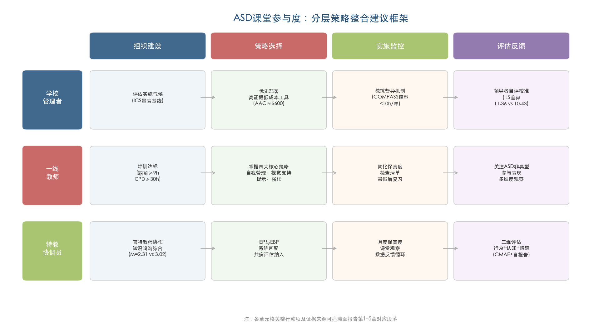

### 6.5.1 面向学校管理者的建议

**系统评估并改善实施气候。** 第5章的证据表明，学校层面的实施气候评分系统性低于区域级组织（ICS = 13.90 vs. 19.40, p < .001），而积极的实施气候与更高的 EBP 保真度使用显著相关。管理者应利用实施气候量表（ICS）和学校实施领导力量表（S-ILS）进行基线评估，识别组织层面的薄弱环节。LOCI（领导力和组织变革促进实施）干预模型已在学校环境中获得初步验证，可作为领导力提升的参考框架。尤需注意的是，Stahmer 等人（2023）发现领导者自评实施领导力显著高于员工评价（ILS = 11.36 vs. 10.43, p < .001），管理者需警惕对自身支持效果的高估倾向。

**确保教师培训达到最低剂量阈值。** Barry 等人（2022）的数据提供了明确的剂量效应基准：职前培训达到 9 小时以上的教师 EBP 使用频率（M = 3.03）显著高于仅 1–3 小时培训的教师（M = 2.16, p < .001）；CPD 培训达到 30 小时以上的教师 EBP 使用频率（M = 2.71）显著高于 0–5 小时培训的教师（M = 2.08, p < .001）。据此，"职前不少于 9 小时、入职后 CPD 不少于 30 小时"可作为与显著更高 EBP 使用相关联的基线阈值参考。

**建立持续教练督导机制，而非依赖一次性工作坊。** Suhrheinrich（2011）的数据表明，仅凭 6 小时 PRT 工作坊培训后仅 15% 的教师达到掌握标准，增加教练环节后多数教师方可达标。COMPASS 咨询模型（Love et al., 2019）提供了可操作的低成本方案：全学年不到 10 小时的咨询师接触即可使教师 ASD 教学自我效能感显著高于对照组（M = 84.7 vs. 77.1, p = .029），且面对面和网络交付均有效。Sam 等人（2020）的 NPDC 模型学校级 RCT 进一步验证了综合专业发展模型（EBP 培训 + 教练 + APERS 自评）在学校层面的有效性。

**优先部署高证据、低成本工具。** 在资源有限的前提下，AAC 应用程序（约 250–300 美元）加 iPad（约 350 美元），总计约 600 美元即可满足单个最小口语 ASD 学生的沟通辅助需求。视觉支持策略（视觉时间表、工作系统等）几乎无额外硬件成本，且在 NCAEP 2020 中获 65 篇研究支持。相比之下，社交机器人（NAO Autism Pack 约 20,700 美元）和 VR/AR 设备（500–5,000 美元以上）的证据基础尚不充分，暂不建议大规模采购。图6-2以决策矩阵形式直观呈现了各策略在证据强度与实施成本两个维度上的定位，可作为资源配置决策的参考工具。

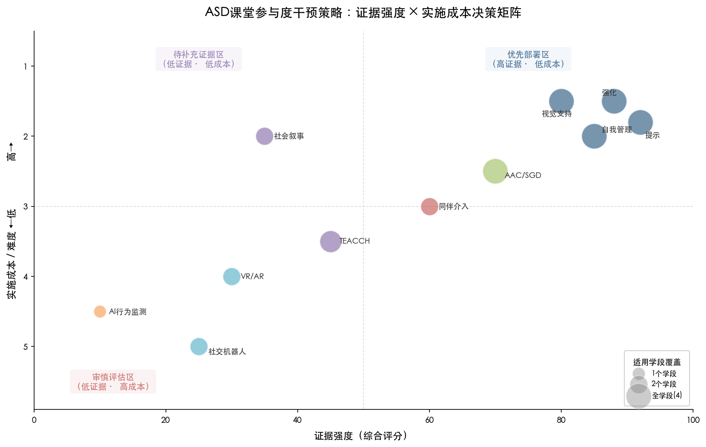

### 6.5.2 面向一线教师的建议

**优先掌握四大核心策略。** 基于证据强度、跨场景稳健性和实施可行性的综合评估，建议教师优先系统掌握以下四项策略：

1. **自我管理**——学业参与度平均提升 49.87 个百分点、无显著调节变量、高度结构化，适用于融合与特殊教育多种课堂类型（第2章和第3章）；
2. **视觉支持**——65 篇 NCAEP 支持研究、NAP 效应量 .95（强效应）、对教师临床判断能力要求较低（第2章）；
3. **提示**——140 篇支持研究，为 NCAEP 2020 中证据量最大的实践类别（第2章）；
4. **强化**——106 篇支持研究、教师知识水平相对较高（M = 3.36）、可与其他策略灵活组合使用（第2章和第5章）。

这四项策略覆盖了行为参与的核心操作面，且在结构化程度上均属于保真度门槛较低的类别——第5章的证据表明，结构化程度越高的策略，教师越容易实现高保真度实施（DTT 保真度 78%–81% vs. PRT 53%–60%）。

**对自然情境策略采用简化实施格式。** PRT 等自然发展行为干预虽在理论上具有泛化优势，但保真度极难保障。Wilson 与 Landa（2019）开发的嵌入式解决方案提供了可操作的降级路径：将干预限制在教师已有的日常活动中（如图书分享、点心、手工），开发半结构化实施格式，设计分层提示层级以替代开放式临床判断，并将保真度工具简化为检查清单，每次教练督导聚焦不超过 3 个干预组件。

**关注 ASD 学生的非典型参与表现，避免神经典型标准的机械套用。** Bayoumi 等人（2025）强调，ASD 学生的参与表现方式与非 ASD 同龄人存在质性差异（如眼神接触和身体语言模式不同），建议教师直接询问学生本人如何定义自身"参与状态" [Bayoumi et al. 2025](https://journals.sagepub.com/doi/10.1177/00400599251346719 "TEACHING Exceptional Children, 2025")。第1章的分析亦指出，CMAE 将参与度操作化为包含调节状态、成效性和独立性的多维综合体，而非"在任务/离任务"的简单二分法——一个未注视教师的 ASD 学生可能正通过其偏好的感觉通道有效加工学习信息。

**重视暑假后的保真度维护。** Stahmer 等人（2015）发现，暑假后 PRT 达到 80% 保真度的课堂比例从 41% 降至 17%，降幅显著。建议教师在每学年初安排策略复习时段，利用简化保真度检查清单进行自我评估，并主动寻求教练式支持以恢复实施水平。

**利用学生特殊兴趣作为参与度催化剂。** Bayoumi 等人（2025）系统阐述了将 ASD 学生特殊兴趣嵌入课堂教学的策略框架，利用内在动机同时提升行为参与和情感参与 [Bayoumi et al. 2025](https://journals.sagepub.com/doi/10.1177/00400599251346719 "TEACHING Exceptional Children, 2025")。在实操层面，教师可在任务选择环节融入学生兴趣相关材料（如将数学应用题情境替换为学生的特殊兴趣主题），或在强化菜单中纳入与兴趣相关的活动选项。

### 6.5.3 面向特教协调员的建议

**确保个别化教育计划（IEP）与循证策略的系统匹配。** 特教协调员是连接 EBP 证据与个体学生需求的关键枢纽。在制定或修订 IEP 目标时，应参照 NCAEP 2020 确认的 28 项循证实践清单，确保所选干预策略具有与目标行为类别匹配的实证支持。AFIRM（Autism Focused Intervention Resources and Modules）在线模块为 27 项 EBP 提供了结构化的实施指导，可作为策略选择与实施规划的参考资源 [AFIRM TAII Brief Packet 2025](https://afirm.fpg.unc.edu/wp-content/uploads/Technology-Aided-Instruction-Intervention-Brief-Packet-Hedges-AFIRM-Team-Updated-2025.pdf "AFIRM资源")。

**建立保真度监控与数据驱动反馈循环。** 第5章指出，仅 13%–32% 的自闭症干预研究纳入保真度测量，这一缺陷在实践层面同样普遍存在。特教协调员应为每项干预策略建立简化的保真度检查清单（可参考 Wilson & Landa 2019 的嵌入式方案），定期（至少每月一次）进行课堂观察或视频回顾，并将保真度数据作为 IEP 进度会议的常规议题。

**协调普通教育教师与特殊教育教师之间的知识鸿沟。** Barry 等人（2022）发现，普通教育教师的 EBP 知识（M = 2.31）和使用频率（M = 2.14）均显著低于特殊教育教师（M = 3.02 和 M = 2.80, p < .001）。在融合教育持续扩展的背景下，特教协调员应建立结构化的普特教师协作机制——例如由特殊教育教师在每周教研时段向普通教育教师演示一项核心 EBP 的实施步骤，或建立"策略伙伴"配对观察制度，促进实践知识的有效传递。

**将共病评估纳入策略匹配决策。** 第3章的证据表明，ADHD 共病可能使社交技能训练的效果大幅衰减（有 ADHD 学龄儿童 aOR = 0.43 vs. 无 ADHD aOR = 21.17）。鉴于 ASD 群体中约 39.6% 伴智力障碍、约 28% 伴 ADHD，特教协调员在策略选择阶段应将共病状况纳入决策矩阵。对伴有 ADHD 的学龄儿童，可优先考虑结构化程度高、对注意力控制要求低的策略（如视觉支持、环境结构化），而非开放式社交技能训练。

**关注高中阶段的"低社会参与-高学业参与"双重模式。** Shogren 等人（2026）发现，ASD 高中生在融合课堂中呈现学业参与相对保持但社会参与显著偏低的特征 [Shogren et al. 2026](https://www.frontiersin.org/journals/psychiatry/articles/10.3389/fpsyt.2026.1772732/full "Front Psychiatry, 17:1772732")。特教协调员在为高中 ASD 学生制定 IEP 目标时，不应仅聚焦学业任务完成率等行为参与指标，还应纳入社会互动频率、课堂同伴关系质量等情感和社会参与维度的目标，以实现更为均衡的参与度发展。

## 6.6 整合视角：从"碎片化策略"到"系统化支持生态"

综合本报告六章的发现，提升 ASD 学生课堂参与度的核心挑战已不再是"缺乏有效策略"——NCAEP 和 NAC 已确认了数十项循证实践——而是如何将这些碎片化的策略整合为一个可持续运行的系统化支持生态。这一整合需要在三个层面同步推进。

**策略层面**，需要从单一策略思维转向组合策略思维。第2章的策略地图和第3章的场景效果对比共同表明，没有任何一种单一策略能够同时覆盖行为参与、认知参与和情感参与三个维度。自我管理策略在行为参与方面表现突出，但对情感参与的直接贡献有限；同伴介入策略在社会参与方面具有独特价值，但 Chang 与 Locke（2016）的综述显示其效应量 d 值在 0.23–0.74 之间波动 [Chang & Locke 2016](https://pmc.ncbi.nlm.nih.gov/articles/PMC5087797/ "Res Autism Spectr Disord, 27:1-10")。UDL 框架提供了一个有前景的整合平台——其"多种参与方式"原则可将多种 EBP 嵌入课堂通用设计——但其独立 RCT 证据仍为空白。

**实施层面**，需要从个体教师培训转向组织能力建设。第5章的核心发现揭示：保真度不仅取决于教师个人的知识和技能，更取决于组织层面的实施气候、领导力支持和持续教练机制。Sam 等人（2020）的 NPDC 模型学校级 RCT 是这一方向的先导验证，证实在学校层面实施综合干预（培训 + 教练 + 自评工具）可同时改善教师 EBP 使用和学生结果。图6-3以流程图形式呈现了从系统综述确认 EBP 到课堂落地的完整证据传导链，标注了各环节的关键瓶颈和核心数据。

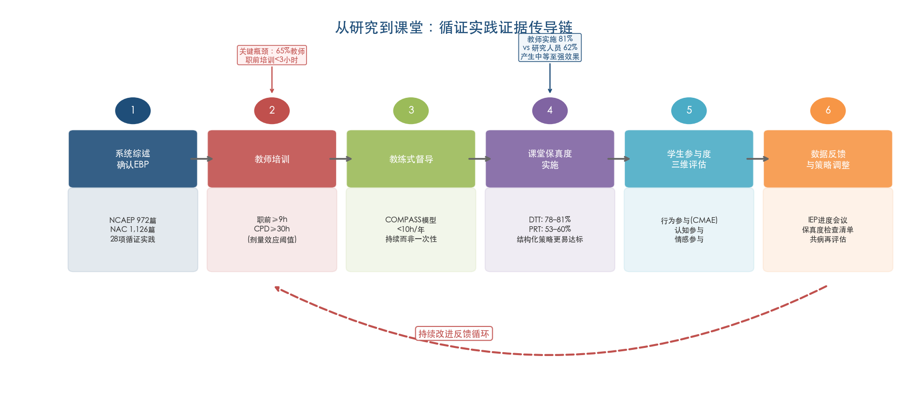

**评估层面**，需要从单维度行为观察转向三维度多方法评估。第1章建立的行为-认知-情感三维框架应贯穿策略选择、实施监控和效果评估的全流程。CMAE 提供了 ASD 专项的行为参与测量起点，但认知参与和情感参与的专项工具开发仍是有待攻克的方法论前沿。在专项工具成熟之前，教师可结合行为观察（CMAE 或简化保真度清单）、学生自报告（对有口语能力的学生适用）和教师/家长评定量表进行多信息源的综合评估。

ASD 学生群体的持续扩大——美国 1/31、全球约 1/127——使得课堂参与度策略的系统化部署不再是"锦上添花"的教育创新，而是基础教育体系必须应对的结构性挑战。从研究实验室到真实课堂的距离，正是未来政策制定、教师培训和学术研究需要共同弥合的关键路程。

# 结论与风险提示

## 核心结论

本报告对增强ASD学生课堂参与度的研究证据进行了系统性梳理，覆盖概念框架、测量方法、干预策略分类、场景适用性、技术辅助手段、教师实施机制及政策动向七个维度。基于对NCAEP第三代系统综述（972篇高质量研究）、NAC国家标准项目第二阶段（1,126篇文献）以及2018–2026年间多项独立元分析和RCT的交叉比对，形成以下五项核心结论。

**第一，ASD课堂参与度干预已具备较为厚实的循证策略储备，核心瓶颈已从"策略发现"转移至"策略落地"。** NCAEP 2020确认的28项聚焦干预实践中，与课堂参与度直接相关的策略涵盖提示（140篇支持研究）、强化（106篇）、视觉支持（65篇）、差别强化（58篇）、前因干预（49篇）、同伴介入（44篇）等多个类别 [NCAEP 2020 报告](https://ncaep.fpg.unc.edu/wp-content/uploads/EBP-Report-2020.pdf "Steinbrenner et al., 2020, 第三代系统综述")。然而，972篇文章中83%为单一被试设计，79%为一对一实施模式，仅20%由教育者实施——这一研究-实践落差构成了从证据到课堂效果传导的主要障碍 [Hume et al. 2021](https://pmc.ncbi.nlm.nih.gov/articles/PMC8510990/ "J Autism Dev Disord, 51:4013-4032")。

**第二，自我管理策略是当前证据体系中跨场景稳健性最强的参与度干预方法。** Gahtan等人（2026）多层次元分析发现自我管理使学业参与度平均提升49.87个百分点（SE = 4.33, 95% CI: 39.76–59.59, p < .001），且课堂科目、课堂类型（融合vs.特殊教育）、技术提示使用和时间间隔均未构成显著调节变量 [Gahtan et al. 2026](https://journals.sagepub.com/doi/10.1177/10983007251389292 "J Positive Behav Interv, 2026年3月在线发表")。自我管理策略的稳健性源于其将干预代理权从教师转移至学生本人的内化机制，使策略效果不依赖特定外部条件。

**第三，策略效果并非脱离情境的常数，个体特征和教学情境构成重要的调节因素。** ADHD共病使社交技能小组训练效果大幅衰减（无ADHD组NNT = 3 vs. 有ADHD组NNT = 26，Fridell et al., 2025）；干预效果呈现"近端>远端、情境受限>泛化"的系统性衰减模式（Project AIM，B = −0.27, p < .001，Sandbank et al., 2023）；高中阶段ASD学生呈现"低社会参与但高学业参与"的独特双重模式（Shogren et al., 2026）。上述发现共同指向一个核心原则：策略选择应基于学生的感觉特征、语言能力、共病状态以及教学情境的综合评估，而非"一刀切"的统一方案。

**第四，投资于教师EBP实施能力是提升ASD学生课堂参与度最具杠杆效应的路径。** Mason等人（2022）发现教师实施的干预有81%产生中等至强效果，优于研究人员实施的62%。这一优势的发挥依赖于系统性培训和持续支持：职前ASD专项培训达到9小时以上与显著更高的EBP使用频率相关（M = 3.03 vs. M = 2.16, p < .001, Barry et al., 2022）；教练式督导远优于传统工作坊模式（15% vs.多数教师达标，Suhrheinrich, 2011）；COMPASS咨询模型以全学年不到10小时的接触产生了教师自我效能感和学生IEP目标达成的显著改善（d = 1.1–2.0, Love et al., 2019）。

**第五，技术辅助手段呈现清晰的成熟度梯度，教育决策者应优先采纳高证据、低成本的成熟工具。** AAC/SGD已达"强烈有效"水平且部署成本约600美元，应作为最小口语ASD学生的优先配置。VR/AR和社交机器人具有补充价值但场景迁移效应有限，适合作为辅助资源而非核心干预。AI行为监测系统处于探索阶段，预计2025–2027年间方可获得课堂部署初步数据。

## 局限性分析

本报告的分析与结论受到以下主要局限性的制约，读者在应用本报告结论时应充分考量这些限制因素。

**第一，证据基础的时间局限。** 本报告所依赖的最权威证据来源——NCAEP第三代系统综述——文献覆盖截止至2017年底，第四代综述截至2026年3月尚未发布。尽管本报告补充纳入了2018–2026年间的多项独立元分析和RCT（如Gahtan et al. 2026, Shogren et al. 2026, Fridell et al. 2025等），但这些新研究尚未经过NCAEP级别的系统化方法学评估，其循证实践地位的正式认定有待第四代综述完成。

**第二，证据基础的学段偏倚。** NCAEP 2020综述中43%的研究涉及学前阶段、57%涉及小学阶段，初中和高中阶段证据系统性薄弱，19–22岁阶段仅约5%。本报告关于初高中阶段的策略建议——尤其是面向高中阶段"低社会参与"模式的应对策略——主要基于有限数量的初步研究（如Shogren et al., 2026），其泛化可信度尚需更大规模研究验证。

**第三，研究设计与真实课堂的外部效度缺口。** NCAEP 2020纳入研究中83%为单一被试设计，79%为一对一实施，仅20%由教育者实施。由研究人员在高度控制条件下获得的效应量，在教师主导的多学生课堂中可能面临显著衰减。本报告所引用的效应量数据应被视为理想条件下的参考值，而非课堂实际可预期的效果水平。

**第四，高支持需求ASD学生的证据不足。** Mason等人（2022）的79项融合教育研究中仅15%参与者属于高支持需求类别。伴有智力障碍（ASD群体中占39.6%）或为最小口语的ASD学生在多数循证实践研究中长期处于系统性代表不足状态。本报告关于自我管理、同伴介入等策略的效果结论，可能不完全适用于高支持需求亚群体。

**第五，三维参与度框架的测量不均衡。** 当前ASD专项测量工具集中于行为参与维度（如CMAE），认知参与和情感参与的专项测量方案几乎空白。这意味着本报告对各策略在认知参与和情感参与维度上的效果评价，在相当程度上依赖理论推断而非直接实证数据，其可靠性低于行为参与维度的结论。

**第六，跨文化适用性限制。** 本报告所梳理的循证实践主要来源于北美和西欧研究情境，其在不同文化背景、班级规模和师资结构下的适用性未经充分验证。对于中国等有着较大班级规模和不同教育体制的国家，国际循证实践的本土化适配需要独立评估。

尽管存在上述局限，本报告所汇集的证据体系已足以支撑一个关键判断：增强ASD学生课堂参与度的有效策略并非匮乏，真正的挑战在于将已有循证实践系统性地嵌入教师的日常教学流程，并在组织和政策层面为这一嵌入提供可持续的制度保障。
