# 执行摘要

中性粒细胞是脑缺血后最早浸润损伤部位的外周免疫细胞，其在急性期、亚急性期和慢性期的功能演变深刻影响着梗死转归与远期神经功能结局。长期以来，中性粒细胞被简化为单一的"促炎损伤"角色，N1（促炎）/N2（抗炎）二分法虽提供了初步分析框架，但已无法涵盖单细胞组学时代揭示的真实异质性。本报告系统整合2019–2026年该领域的研究进展，围绕中性粒细胞的时序性动态、亚群异质性、效应功能、细胞互作网络、治疗靶点转化及未来研究方向六个维度展开深度分析。

**时序性动态与多器官协调。** 脑缺血后中性粒细胞的供给呈现多器官协调特征：脾脏在超急性期（0–12 h）提供即时储备，骨髓在急性期（12–72 h）启动代偿性释放，紧急粒细胞生成在亚急性期（>1 d）持续补充。脑实质浸润在缺血后1–2天达峰，空间上遵循从软脑膜→Virchow-Robin间隙→脑实质的有序推进路径。缺血-再灌注模型（tMCAO）24小时内的中性粒细胞浸润密度约为永久性缺血模型（pMCAO）的4倍，但亚急性期该关系逆转，揭示了再灌注对中性粒细胞浸润的双相调节效应。衰老、糖尿病和高脂血症通过各自独特但潜在协同的机制——衰老增强紧急粒细胞生成并产生CD62Lˡᵒ等促炎亚群、糖尿病增强NETs形成、高脂血症上调CXCR2和ROS通路——共同将中性粒细胞推向更具致病性的状态。

**亚群异质性超越N1/N2范式。** 单细胞RNA测序技术揭示了远超N1/N2二分法的中性粒细胞亚群谱系。NeuMap全景图谱（129,829个小鼠中性粒细胞）鉴定了7个功能枢纽，为中性粒细胞异质性提供了全景参考框架。在脑缺血语境下，至少可辨识四条核心分化轨迹：急性期高活化/促炎轨迹（CD14ʰⁱ/Mmp8⁺）、亚急性期促修复/促血管生成轨迹（SiglecFʰⁱ/VEGFA⁺）、NETosis倾向轨迹（C1qc⁺/PAD4ʰⁱ）和衰老/循环衰老轨迹（CXCR4ᵇʳⁱᵍʰᵗ/CD62Lᵈⁱᵐ）。2025年Nature Communications研究首次在新生小鼠缺氧缺血模型中提供了SiglecFʰⁱᵍʰ中性粒细胞参与神经修复的直接因果证据——晚期耗竭（第6–8天）加重组织萎缩并损害少突胶质细胞再生，而早期耗竭（12–50 h）则减轻损伤，证实不同时间窗的中性粒细胞亚群发挥截然相反的功能。

**效应功能的损伤-修复双重性。** 急性期中性粒细胞通过ROS爆发、MMP-9释放、NETs形成和微血管阻塞构成继发性损伤的关键驱动力。MMP-9阳性中性粒细胞浸润与BBB基底膜降解和出血转化密切相关，EVT后MMP-9升高128.1%为预测出血转化的最佳截断值（AUC=0.701）。NETs在急性期通过促血栓形成加剧微循环障碍，在亚急性期至慢性期通过STING-IFN-β通路持续抑制血管修复——持续14天的中性粒细胞耗竭使BBB通透性降低39.3%、微血管长度增加29.8%。然而，MMP-9在修复期（>7天）转而促进血管新生，N2型和SiglecFʰⁱ亚群分泌VEGF和TGF-β支持组织重塑，揭示了同一效应体系的时相依赖性功能转换。

**互作网络与临床结局导向。** 中性粒细胞与小胶质细胞、星形胶质细胞、内皮细胞、血小板及T细胞亚群构成多层级互作网络。急性期的正反馈环路——NETs→AIM2/NLRP3炎症小体→小胶质细胞焦亡→IL-1β→中性粒细胞再募集——协同驱动梗死扩大；中性粒细胞源性MRP14通过TLR4/NF-κB通路抑制小胶质细胞吞噬功能并驱动焦亡，形成自我维持的炎症放大环路。亚急性期Treg通过PD-L1/PD-1抑制中性粒细胞MMP-9表达，小胶质细胞吞噬清除中性粒细胞→NETs减少→STING-IFN-β解除→血管修复，共同推动从损伤向修复的转换。互作网络的最终走向取决于时间窗口、中性粒细胞亚群构成、小胶质细胞功能状态和适应性免疫介入时机四个关键维度。

**治疗转化与临床前景。** 迄今唯一的中性粒细胞靶向卒中II期RCT（ASTIN试验，2003年）以阴性结果终止，Enlimomab试验甚至显著恶化了患者预后。失败根源在于时间窗失配、非选择性抑制消除修复功能、种属差异及患者异质性。NETs靶向策略代表当前最具转化前景的方向：DNase I已有三项RCT注册（ReSCInD试验为首个II期，预计2026年完成）；PAD4抑制剂、nNIF和GSDMD抑制剂/双硫仑（老药新用）均展现出强临床前证据。新一代试验设计强调以免疫终点为先导、生物标志物分层入组、精确匹配给药时间窗的策略性迭代路径。

**未来研究优先方向。** 五大关键知识缺口——慢性期中性粒细胞命运追踪、人鼠种属差异弥合、亚群与结局的因果验证、昼夜节律整合以及肠-脑轴免疫重编程——构成未来十年的核心议题。NeuMap"诊断条形码"向卒中领域的扩展、取栓样本低输入蛋白质组学、MISTRG人源化小鼠脑缺血模型建立以及CRISPR谱系示踪的脑缺血应用，将为这些知识缺口的填补提供关键技术支撑。该领域正经历从"现象描述"向"机制解析"、从"一刀切干预"向"精准调节"的范式转换——在正确的时间窗、对正确的中性粒细胞亚群、阻断正确的效应通路、同时保留正确的修复功能，是未来治疗突破的核心理念。

# 第1章 中性粒细胞在脑缺血中的时序性动态——从动员到浸润

脑缺血发生后，外周固有免疫系统在数分钟内即被远端危险信号激活，中性粒细胞作为最先响应的效应细胞，经历从骨髓动员、外周循环预激活到跨越血脑屏障（BBB）浸润缺血脑组织的完整级联过程。这一过程的时空动态不仅决定了缺血损伤的早期演进轨迹，也深刻影响着远期神经功能结局。近年来，流式细胞术、活体双光子成像和单细胞组学技术的快速发展，使研究者对这一动态过程的理解从粗略的"中性粒细胞浸润加重损伤"推进至分子通路层面的精细时序解析。本章系统梳理中性粒细胞在脑缺血后从动员到浸润的全过程，涵盖动员机制与紧急粒细胞生成、趋化因子-受体轴与跨内皮迁移的分子级联、浸润的时间窗与空间分布特征、缺血-再灌注与永久性缺血模型间的差异，以及衰老与常见合并症对该动态过程的调节作用。

## 1.1 骨髓动员与紧急粒细胞生成

### 1.1.1 脑缺血触发的骨髓中性粒细胞快速释放

骨髓作为中性粒细胞的主要生产与储存库，在脑缺血后迅速响应远端危险信号启动大规模细胞动员。小鼠tMCAO模型的定量分析显示，骨髓中性粒细胞比例在缺血后12小时内显著下降，反映其向外周循环的快速释放；缺血后1天起该比例恢复并持续升高至第7天，标志着紧急粒细胞生成（emergency granulopoiesis）的正式启动 [Cai et al., Transl Stroke Res](https://pmc.ncbi.nlm.nih.gov/articles/PMC6993940/ "Functional dynamics of neutrophils after ischemic stroke, 2020")。与此同步，外周血中性粒细胞计数在缺血后12小时达到峰值，随后于第2天回落。脾脏在这一过程中充当了关键的早期储备库，在缺血后6–12小时内释放储存的成熟中性粒细胞，为骨髓动员全面启动前提供了快速补充的桥梁 [Cai et al., Transl Stroke Res](https://pmc.ncbi.nlm.nih.gov/articles/PMC6993940/ "脾脏作为中性粒细胞储备库, 2020")。

上述动员时序揭示了脑缺血后中性粒细胞供给的多器官协调特征：脾脏在超急性期（0–12 h）提供即时储备，骨髓在急性期（12–72 h）启动代偿性释放，紧急粒细胞生成则在亚急性期（>1 d）持续补充消耗的外周池。临床证据与此一致——一项纳入225例急性缺血性卒中患者的队列研究显示，排除感染后，大梗死患者的中性粒细胞计数（R²=0.07, P=0.0208）和中性粒细胞-淋巴细胞比值（NLR, R²=0.07, P=0.0447）均与梗死面积呈正相关，提示外周中性粒细胞水平可作为急性期卒中严重程度的早期预测指标 [Cai et al., Transl Stroke Res](https://pmc.ncbi.nlm.nih.gov/articles/PMC6993940/ "患者中性粒细胞与梗死相关性, 2020")。

### 1.1.2 衰老对紧急粒细胞生成的病理性增强

衰老（inflammaging）对脑缺血后粒细胞生成产生了深刻的病理性改变。2023年Nature Immunology发表的一项关键研究表明，衰老小鼠脑卒中后紧急粒细胞生成显著增强，产生两类表型迥异的中性粒细胞亚群：CD101⁺CD62Lˡᵒ成熟型和CD177ʰⁱCD101ˡᵒCD62Lˡᵒ非典型未成熟型 [Gullotta et al., Nat Immunol](https://pubmed.ncbi.nlm.nih.gov/37188941/ "Age-induced alterations of granulopoiesis, 2023; 24(6):925-940")。这些异常中性粒细胞展现出增强的氧化应激能力、吞噬活性和促凝特征，其中CD62Lˡᵒ亚群产生的CXCL3在衰老相关中性粒细胞致病性中发挥关键驱动作用。该研究进一步通过造血干细胞年轻化实验证明，逆转异常粒细胞生成可改善卒中预后，从而在机制层面确立了衰老骨髓微环境与卒中结局之间的因果关系。

在临床验证层面，同一研究团队对老年缺血性卒中患者开展的单细胞蛋白质组学分析，首次在人体水平鉴定出CD62Lˡᵒ中性粒细胞亚群与更差的再灌注效果及临床预后相关 [Gullotta et al., Nat Immunol](https://pubmed.ncbi.nlm.nih.gov/37188941/ "临床蛋白质组学验证, 2023; 24(6):925-940")。这一从动物模型到临床样本的一致性发现，有力地支持了衰老相关异常粒细胞生成作为老年卒中患者预后不良的重要免疫学机制。

## 1.2 趋化因子-受体轴与跨内皮迁移的分子级联

### 1.2.1 趋化因子时序表达与CXCL1-CXCR2轴

中性粒细胞从循环向缺血脑组织的定向迁移依赖于趋化因子梯度的精准引导。脑缺血后，主要趋化因子mRNA（CCL5、CXCL1、CXCL2、CXCL3）在12小时达到表达峰值，48小时回落至假手术组水平 [Cai et al., Transl Stroke Res](https://pmc.ncbi.nlm.nih.gov/articles/PMC6993940/ "趋化因子时序表达, 2020")。在这一趋化因子网络中，CXCL1-CXCR2轴已被确认为驱动中性粒细胞跨内皮迁移和增加BBB通透性的核心通路——Cxcr2基因缺陷小鼠的脑缺血后中性粒细胞脑实质浸润显著减少，直接证明了该轴的关键地位 [Herr et al., Cell Rep](https://www.sciencedirect.com/science/article/pii/S2211124720311396 "CXCL1-CXCR2轴功能验证, 2020; 32(11):108150")。

CXCL1的转录受到多层级表观遗传调控。星形胶质细胞中组蛋白去甲基化酶KDM4A在缺血后特异性上调，通过去甲基化H3K9me3与NF-κB-p65协同激活Cxcl1转录。GFAP-Cre;Kdm4aᶠˡ/ᶠˡ条件敲除小鼠的研究表明，星形胶质细胞特异性消除KDM4A可显著缩小梗死体积并降低BBB通透性，同时特异性减少中性粒细胞浸润，而CD4⁺T细胞、CD8⁺T细胞、B细胞、巨噬细胞和NK细胞的浸润均不受影响 [Huang et al., J Cereb Blood Flow Metab](https://pmc.ncbi.nlm.nih.gov/articles/PMC10981400/ "KDM4A调控中性粒细胞浸润, 2024")。这种高度的细胞类型选择性表明，KDM4A/NF-κB/CXCL1轴构成了星形胶质细胞特异性调控中性粒细胞浸润的关键表观遗传开关。

### 1.2.2 选择素-整合素级联的时序编排

中性粒细胞跨内皮迁移遵循经典多步级联模型——从选择素介导的滚动（rolling）到整合素介导的稳固黏附（firm adhesion）和跨内皮迁移（transendothelial migration）。脑缺血赋予这一级联以严格的时间编排：P-选择素在缺血后15分钟即上调，E-选择素在2小时内启动表达，ICAM-1和整合素介导的黏附从30分钟开始并持续至48小时 [Moustafa & Baron, Front Aging Neurosci](https://pmc.ncbi.nlm.nih.gov/articles/PMC9813499/ "Neutrophil dynamics and inflammaging, 2022")。P-选择素在缺血超早期（<15 min）即已上调这一事实，意味着靶向黏附分子的治疗策略面临极为狭窄的干预窗口，这也是此类策略临床转化困难的重要原因之一。

## 1.3 脑组织浸润的时间窗与空间分布

图1-1以统一时间轴综合展示了脑缺血后中性粒细胞在多器官间的动员动态、不同模型中的脑实质浸润差异、趋化因子与黏附分子的时序表达，以及空间迁移序列，为本节及后续讨论提供全局参照。

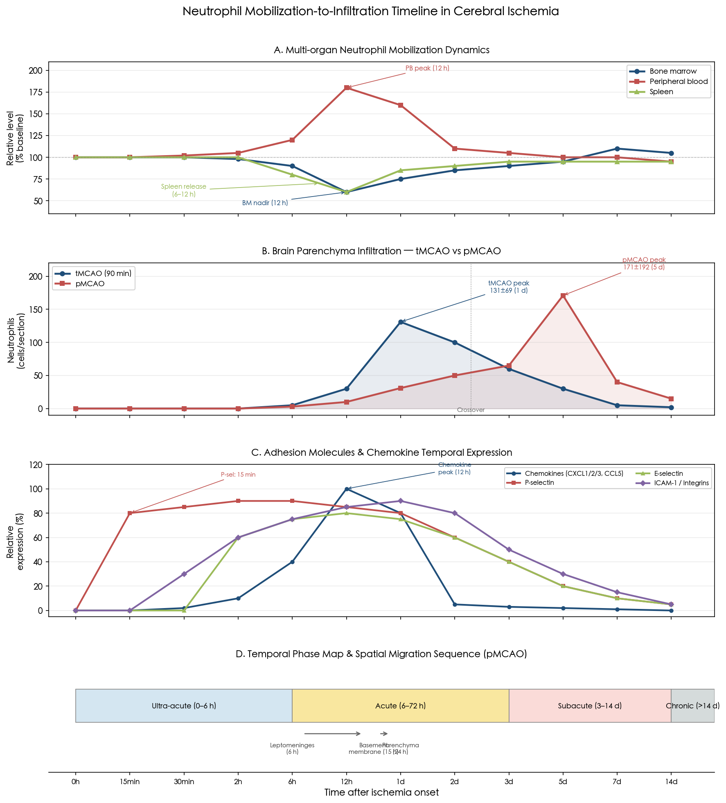

**图1-1 中性粒细胞动员-浸润时间轴全景图。** 以统一时间轴（0 h → 14 d+）同步呈现四组关键动态：(A) 骨髓、外周血和脾脏中性粒细胞的多器官动员时序；(B) tMCAO与pMCAO模型中脑实质浸润密度的差异及"交叉"现象；(C) 趋化因子和黏附分子的时序表达曲线；(D) 时间相位图与pMCAO空间迁移序列。数据综合自Cai et al. 2020、Zhou et al. 2013、Moustafa & Baron 2022。

### 1.3.1 浸润时间窗的动物模型数据

中性粒细胞浸润缺血脑组织遵循明确的时间轨迹。小鼠tMCAO模型中，脑实质中性粒细胞在缺血后12小时首次显著增加，1–2天达到高峰，至第7天几乎完全消退 [Cai et al., Transl Stroke Res](https://pmc.ncbi.nlm.nih.gov/articles/PMC6993940/ "浸润时间窗, 2020")。空间迁移路径呈现从外到内的有序推进：pMCAO模型中，中性粒细胞在缺血后6小时首先出现于软脑膜，15小时进入基底膜和Virchow-Robin间隙，24小时方浸润至脑实质 [Perez-de-Puig et al., Acta Neuropathol, 2015; 129:239-257，引自Cai et al.]。

空间上，早期浸润集中于缺血半暗带和梗死周围区域，反映出这些区域趋化因子梯度和血管通透性改变最为显著。半暗带作为决定最终梗死范围的关键区域，中性粒细胞在此处的富集对缺血损伤的演进方向具有重要影响。

### 1.3.2 人类与动物模型的关键差异

动物模型的浸润数据能否直接外推至人类，是转化研究的核心问题。一项涵盖20项人类研究和188项啮齿类研究的系统荟萃分析显示，人类中性粒细胞浸润在卒中后第2–3天达峰，与小鼠模型的时间窗总体一致 [Beuker et al., Transl Stroke Res](https://link.springer.com/article/10.1007/s12975-021-00887-4 "人类vs啮齿类免疫细胞浸润荟萃分析, 2021; 12:976-990")。然而，空间分布存在实质性种属差异：约4/11项研究报道人类中性粒细胞主要聚集于血管腔和血管周围间隙而非脑实质深部，提示人类脑实质浸润的程度可能低于动物模型。图1-2系统对比了人类与啮齿类在浸润峰值时间、空间分布偏好、中性粒细胞基线比例、无复流证据、消退时间及抗中性粒细胞治疗疗效等关键参数上的差异。

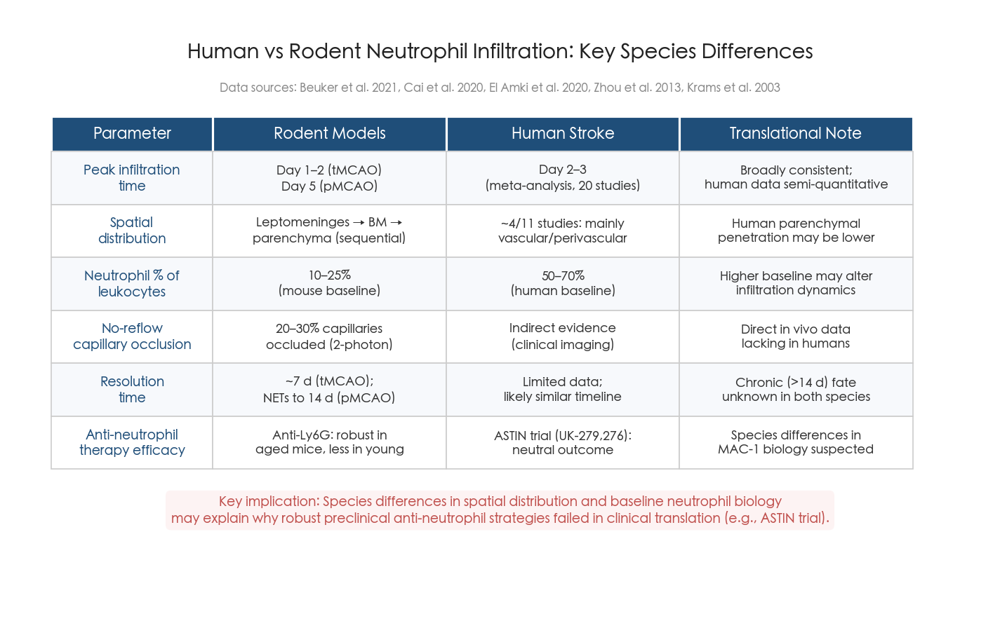

**图1-2 人类与啮齿类中性粒细胞浸润种属差异对比。** 系统对比两者在6个关键参数上的差异，附转化研究注释。该种属差异为解释动物实验中中性粒细胞耗竭策略的显著疗效难以在临床试验中复现（如ASTIN试验）提供了重要线索。数据综合自Beuker et al. 2021、Cai et al. 2020、El Amki et al. 2020、Zhou et al. 2013、Krams et al. 2003。

### 1.3.3 中性粒细胞与微血管阻塞——无复流现象

中性粒细胞在脑微循环中的物理阻塞效应是缺血性卒中后"无复流现象"（no-reflow phenomenon）的主要原因之一。双光子活体成像技术的直接观察证实，梗死核心和半暗带区域约20%–30%的毛细血管被中性粒细胞阻塞 [El Amki et al., Cell Rep](https://pubmed.ncbi.nlm.nih.gov/33053341/ "Neutrophils Obstructing Brain Capillaries, 2020; 33:108260")。抗Ly6G抗体介导的中性粒细胞耗竭可有效促进毛细血管再灌注并改善神经功能预后，且不增加出血风险。这一发现将中性粒细胞的致病作用从传统认知的"组织浸润后释放有害介质"扩展至"血管腔内物理阻塞导致微循环障碍"，揭示了独立于经典炎症损伤机制之外的一种病理效应。

## 1.4 缺血-再灌注与永久性缺血模型的差异

中性粒细胞浸润的时间动力学在tMCAO（缺血-再灌注）与pMCAO（永久性缺血）模型之间存在显著且具有转化意义的差异。缺血后24小时，90分钟tMCAO模型的中性粒细胞浸润密度为131±69个/切片，显著高于pMCAO的31±18个/切片（P<0.05）[Zhou et al., Brain Pathol](https://pmc.ncbi.nlm.nih.gov/articles/PMC8029251/ "tMCAO vs pMCAO白细胞浸润比较, 2013; 23:34-44")。再灌注对BBB完整性的二次打击效应可能是这一差异的主要解释——血流恢复在挽救缺血组织的同时，也为中性粒细胞大量涌入受损脑组织开辟了通道。

然而，这一关系在亚急性期发生逆转：至缺血后第5天，pMCAO模型的中性粒细胞浸润反超tMCAO（171±192 vs 18±23个/切片），伴随更高水平的促炎细胞因子和黏附分子表达 [Zhou et al., Brain Pathol](https://pmc.ncbi.nlm.nih.gov/articles/PMC8029251/ "tMCAO vs pMCAO白细胞浸润比较, 2013; 23:34-44")。我们认为，这一"交叉"现象可能与永久性缺血导致的持续性组织坏死和DAMPs释放有关：tMCAO中再灌注允许早期大量中性粒细胞快速涌入随后消退，而pMCAO中持续缺血导致的缓慢组织崩解在延迟期产生了持续性趋化信号，维持乃至放大中性粒细胞的延迟浸润。

这一模型间差异具有直接的临床启示价值。接受溶栓或血管内取栓治疗的患者在获得再灌注的同时，也面临再灌注触发的早期中性粒细胞大量涌入风险。这一认识为中性粒细胞靶向治疗的时间窗选择——特别是在再灌注治疗前后的最佳干预时机——提供了重要理论依据。

## 1.5 MMP-9阳性中性粒细胞与BBB破坏

中性粒细胞浸润对BBB完整性的损害不仅是浸润的后果，也构成了浸润自我放大的正反馈机制。人类缺血性卒中尸检脑组织的免疫组化分析明确显示，MMP-9阳性中性粒细胞浸润与BBB基底膜IV型胶原降解密切相关 [Rosell et al., Stroke](https://pubmed.ncbi.nlm.nih.gov/18323498/ "MMP-9阳性中性粒细胞与BBB破坏, 2008")。在发生出血转化的梗死区域，中性粒细胞浸润尤为密集，提示中性粒细胞源性MMP-9是缺血后BBB结构破坏和出血转化的关键效应分子。这一在人类临床标本中获得验证的发现，为中性粒细胞-MMP-9-BBB损伤轴的转化价值提供了直接支撑。

## 1.6 衰老与合并症对中性粒细胞动员-浸润模式的调节

### 1.6.1 衰老（Inflammaging）的系统性影响

衰老不仅影响紧急粒细胞生成（见1.1.2节），还从根本上重塑了中性粒细胞的基线免疫表型。衰老小鼠的循环中性粒细胞呈现典型的促炎基线状态：CXCR2表达上调、CXCR4和CD44表达下调、CXCL1/IL-8基线水平升高 [Moustafa & Baron, Front Aging Neurosci](https://pmc.ncbi.nlm.nih.gov/articles/PMC9813499/ "衰老中性粒细胞动力学, 2022")。这一"预激活"状态使中性粒细胞更易发生反向跨内皮迁移（reverse transendothelial migration, rTEM），携带炎症信号扩散至远端器官并可能导致多器官损伤。

在脑缺血的具体情境中，老龄鼠（21–22月龄）卒中后脑浸润中性粒细胞产生的活性氧（ROS）和MMP-9显著多于年轻鼠（3月龄）。抗Ly6G介导的中性粒细胞耗竭在老龄鼠中可改善功能恢复，但在年轻鼠中无明显获益 [Moustafa & Baron, Front Aging Neurosci](https://pmc.ncbi.nlm.nih.gov/articles/PMC9813499/ "衰老中性粒细胞动力学, 2022")。这一年龄依赖性的治疗效果差异表明，衰老状态下中性粒细胞的致病性发生了质变而非仅仅量变，提示中性粒细胞靶向治疗在老年卒中患者中可能具有更大的获益潜力。

临床数据进一步证实了上述动物实验观察。41名急性缺血性卒中患者（发病6小时内）的全血流式分析显示，循环中性粒细胞持续处于高活化状态（CD62L↓/CD11b↑/ROS↑），衰老亚群（CXCR4ᵇʳⁱᵍʰᵗ/CD62Lᵈⁱᵐ）比例在发病当天（D0）、第2天（D2）和第7天（D7）持续升高，rTEM亚群（CD54ʰⁱᵍʰ/CXCR1ˡᵒʷ）显著增加 [Weisenburger-Lile et al., Neurol Neuroimmunol Neuroinflamm](https://pmc.ncbi.nlm.nih.gov/articles/PMC6624098/ "有害中性粒细胞亚群, 2019; 6(4):e571")。上述异常与NIHSS评分密切相关——重度卒中组的ROS产生更高、衰老亚群比例更大，为中性粒细胞衰老表型作为卒中严重程度生物标志物的潜在价值提供了初步证据。

### 1.6.2 糖尿病对中性粒细胞浸润的增强效应

2型糖尿病（T2D）是缺血性卒中的常见合并症，约30%的卒中患者合并糖尿病。db/db T2D小鼠dMCAO模型的研究显示，与正常血糖的db/+对照组相比，糖尿病小鼠呈现延迟但持续增强的脑白细胞浸润：缺血后第3天脑浸润CD4⁺ T细胞即显著升高，至第7天中性粒细胞、CD4⁺ T细胞、CD8⁺ T细胞和B细胞均显著增加 [Zhang et al., Front Immunol](https://www.frontiersin.org/journals/immunology/articles/10.3389/fimmu.2019.02392/full "2型糖尿病小鼠脑缺血后白细胞浸润增强, 2019; 10:2392")。脑浸润的中性粒细胞和T细胞活化标志物CD69和IFN-γ显著上调，而外周血和脾脏中白细胞计数无显著差异，表明糖尿病状态下免疫应答的增强主要发生在缺血脑组织局部微环境层面。

高血糖本身可直接增强中性粒细胞对缺血脑组织的浸润。早期实验证据显示，预先诱导高血糖状态的大鼠在短暂性全脑缺血后出现大规模中性粒细胞沉积，24小时达到高峰 [Justicia et al., Neurosci Lett, 2000; 278:1-4, 引自Zhang et al.]。进一步研究表明，高血糖通过增强中性粒细胞胞外诱捕网（NETs）的形成加剧缺血性脑损伤 [Deng et al., Neurosci Lett](https://pubmed.ncbi.nlm.nih.gov/32937190/ "高血糖增强NETs加剧脑缺血损伤, 2020; 738:135383")，将糖尿病对中性粒细胞浸润的影响从"数量增多"扩展至"效应功能增强"维度。

### 1.6.3 高脂血症对中性粒细胞的致病性增强

高脂血症是卒中的另一重要合并症，对中性粒细胞的动员和浸润模式产生显著影响。ApoE⁻/⁻小鼠联合高胆固醇饮食的高脂血症模型中，缺血后中性粒细胞的脑浸润和外周粒细胞增多症（neutrophilia）均显著增强。CXCR2拮抗剂SB225002可逆转高脂血症小鼠中加重的脑损伤和功能缺损，但对正常血脂小鼠无明显保护作用；抗Ly6G抗体耗竭中性粒细胞在高脂血症小鼠中显著缩小梗死体积，而CXCR2拮抗剂在中性粒细胞耗竭后不再提供额外保护 [Herz et al., Stroke](https://pmc.ncbi.nlm.nih.gov/articles/PMC4589522/ "高脂血症中性粒细胞加重脑缺血, 2015; 46:2916-2925")。这一系列功能缺失/功能获得实验确认了高脂血症环境下中性粒细胞对脑损伤加重的因果性贡献。机制层面，高脂血症小鼠骨髓中性粒细胞的CXCR2表达在缺血后显著上调，iNOS和NOX2 mRNA表达增强，而抗氧化酶（CAT、SOD2）表达降低，整体呈现向促炎、高ROS产生表型偏移的特征。

2024–2025年的研究进一步拓展了这一认识：高脂饮食诱导的高胆固醇血症小鼠在tMCAO后仅3小时即表现出循环和脾脏中性粒细胞数量增加、骨髓中性粒细胞减少的加速动员模式；中性粒细胞表面Ly6G和CD162（PSGL-1）表达上调，血浆NETs（CitH3-DNA）水平显著升高；三维光片荧光显微镜（3D-LSFM）成像直接显示高脂血症小鼠缺血半球中Ly6G⁺中性粒细胞表面积和体积显著增大 [Singh et al., Front Immunol](https://www.frontiersin.org/journals/immunology/articles/10.3389/fimmu.2024.1502346/full "高胆固醇血症加速卒中后中性粒细胞活化, 2025; 15:1502346")。

综合上述证据，衰老、糖尿病和高脂血症三大合并症通过不同但可能协同的机制——衰老增强紧急粒细胞生成并产生促炎表型中性粒细胞、糖尿病通过高血糖增强局部浸润和NETs形成、高脂血症上调CXCR2和ROS通路——共同将中性粒细胞推向更具致病性的状态（图1-3）。这为解释合并多种危险因素的老年卒中患者预后更差提供了免疫学基础。

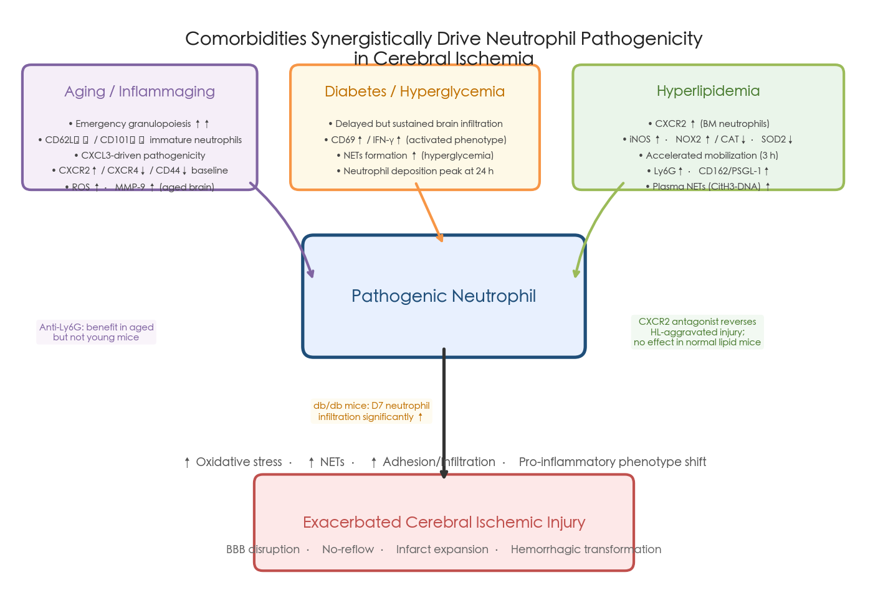

**图1-3 合并症协同驱动中性粒细胞致病性增强机制示意图。** 以"致病性中性粒细胞"为中心节点，展示衰老/inflammaging、糖尿病/高血糖和高脂血症三条通路如何协同驱动中性粒细胞向更具致病性的状态偏移，最终导致BBB破坏、无复流、梗死扩大和出血转化。图中同步标注了关键因果验证证据（如抗Ly6G年龄依赖性疗效、CXCR2拮抗剂对高脂血症小鼠的选择性保护等）。数据综合自Gullotta et al. 2023、Moustafa & Baron 2022、Zhang et al. 2019、Herz et al. 2015、Singh et al. 2025。

## 1.7 中性粒细胞昼夜节律与脑缺血结局

中性粒细胞的表型和功能受昼夜节律的深刻调控，这一维度近年来被认识为影响脑缺血结局的重要变量。2025年发表于Circulation Research的研究综合运用永久性和短暂性MCAO模型、流式细胞术、单细胞RNA测序及540例缺血性卒中患者队列，系统阐明了中性粒细胞昼夜节律对脑缺血结局的调控机制 [Vázquez-Reyes et al., Circ Res](https://pubmed.ncbi.nlm.nih.gov/41293815/ "Circadian Control of Neutrophils Drives Collateral Perfusion and Stroke Outcome, 2025")。

在小鼠模型中，梗死体积和神经功能缺损呈现清晰的昼夜节律振荡——非活动期（Zeitgeber time 5, ZT5）发生的卒中结局显著差于活动期（ZT13）。中性粒细胞耗竭或生物钟基因破坏后这一差异消失，确认了中性粒细胞作为时间依赖性结局差异的因果中介。机制上，非活动期中性粒细胞表现出活化和易于形成NETs的表型，导致微血管阻塞（stalling）加重和侧支循环灌注降低。药理学（Cl-amidine）或遗传学（PAD4敲除）手段抑制NETs形成可恢复微血管灌注并消除时间依赖性差异。在540例患者队列中，中性粒细胞和NETs相关生物标志物（MPO、弹性蛋白酶、sCD40L）表现出昼夜振荡，在人类非活动期（夜晚）达峰，与侧支循环灌注降低和更差的临床结局同步。

这一发现从全新维度揭示了卒中发病时间影响预后的生物学基础，并为时间治疗学（chronotherapy）——将中性粒细胞靶向治疗的给药时机与患者发病时间匹配——提供了理论依据。

## 1.8 小结

本章系统梳理了脑缺血后中性粒细胞从骨髓动员到脑组织浸润的完整时序动态，可概括为以下时间框架。**超急性期（0–6 h）**：P-选择素上调启动中性粒细胞滚动，脾脏释放储备中性粒细胞，趋化因子表达启动。**急性期（6–72 h）**：CXCL1-CXCR2轴介导大量中性粒细胞跨BBB迁移，外周血中性粒细胞12小时达峰，脑实质浸润1–2天达峰，MMP-9释放破坏BBB，中性粒细胞阻塞微血管导致无复流。**亚急性期（3–14 d）**：紧急粒细胞生成持续补充外周池，tMCAO模型中浸润开始消退但pMCAO模型中可能继续升高。**慢性期（>14 d）**：中性粒细胞浸润在多数模型中已基本消退，但永久性缺血模型中NETs标志物可能持续存在。

衰老、糖尿病和高脂血症等合并症通过各自独特但潜在协同的机制增强中性粒细胞的致病性动员和浸润，而昼夜节律则在时间维度上调节这一过程的严重程度。种属差异——特别是人类中性粒细胞脑实质浸润程度可能低于动物模型——构成临床转化研究的重要考量因素，也是理解既往抗中性粒细胞临床试验未达预期的关键线索之一。

# 第2章 中性粒细胞亚群异质性——超越 N1/N2 范式

长期以来，中性粒细胞被视为表型和功能均一的终末效应细胞，其在脑缺血中的角色常被简化为"促炎损伤"。N1（促炎型）/N2（抗炎/促修复型）二分法的引入为理解中性粒细胞功能多样性提供了初步框架，但随着单细胞转录组学（scRNA-seq）、光谱流式细胞术和空间组学等技术的迅速发展，大量证据表明中性粒细胞的异质性远超N1/N2范式所能涵盖的范畴。本章首先回顾N1/N2分型的起源、分子标志物及其在脑缺血研究中的适用性与局限性；继而系统梳理新近揭示的多种中性粒细胞亚群——包括SiglecF⁺中性粒细胞、低密度中性粒细胞（LDNs）、衰老型中性粒细胞以及多种scRNA-seq定义的转录组簇——在缺血性脑损伤不同阶段的丰度演变与功能特征；在此基础上，探讨驱动表型可塑性的微环境因素与代谢重编程机制，以及中性粒细胞胞外诱捕网（NETs）形成与亚群异质性之间的内在联系。

## 2.1 N1/N2分型：起源、定义与脑缺血中的验证

### 2.1.1 肿瘤免疫学的起源与经典分子标志物

N1/N2分型的概念最初由Fridlender等人于2009年在肿瘤免疫学领域提出。该研究发现，TGF-β信号可诱导中性粒细胞向N2型极化，表现为促肿瘤表型（Arginase-1⁺/CCL2⁺），而阻断TGF-β则驱动中性粒细胞向N1型分化，呈现抗肿瘤活性（TNFα⁺，细胞核过度分叶）[Fridlender et al., Cancer Cell](https://www.sciencedirect.com/science/article/pii/S1535610809002153 "N1/N2原始定义, 2009; 16(3):183-194")。由此确立的经典标志物谱系为：N1型以IFNγ、TNFα、iNOS、IL-12、ICAM-1及高水平ROS/MPO为特征；N2型则以CD206、Ym1/Chil3、Arg1、IL-10、TGF-β为标志。这一分类体系借鉴了巨噬细胞M1/M2极化的概念框架，为中性粒细胞功能多样性的研究提供了直观的二元分析模型。

### 2.1.2 N1/N2框架在脑缺血中的首次验证

N1/N2分型向脑缺血领域的移植由Cuartero等人于2013年首次完成。在小鼠永久性大脑中动脉闭塞（pMCAO）模型中，约31%的脑浸润中性粒细胞表达N2标志物Ym1和CD206；PPARγ激动剂罗格列酮可将N2型中性粒细胞比例从31%提升至77%，这一极化偏移与显著的神经保护效应并行出现 [Cuartero et al., Stroke](https://www.ahajournals.org/doi/10.1161/strokeaha.113.002470 "N2 Neutrophils in Brain Inflammation, 2013; 44:3498-3508")。该研究还揭示了一个重要的生物学现象：小胶质细胞对N2型中性粒细胞的吞噬清除率约为N1型的3倍，表明N2极化不仅改变了中性粒细胞自身的效应功能，还通过增强吞噬清除途径促进炎症消退。

后续研究进一步刻画了N2极化的时间动态。在tMCAO模型中，CD206⁺ N2中性粒细胞的比例在缺血后1–5天保持相对稳定，第7天略有升高 [Cai et al., Transl Stroke Res](https://pmc.ncbi.nlm.nih.gov/articles/PMC6993940/ "缺血微环境驱动极化偏移, 2020; 11(1):108-121")。然而，体外实验揭示了与体内观察看似矛盾的结果：以缺血神经元条件培养基处理中性粒细胞后，缺血微环境实际驱使中性粒细胞偏离N2表型，表现为CD206、Arg1、IL-10和TGF-β表达下调，同时促进NETs形成。这一发现提示，体内观察到的N2比例维持可能依赖于额外的保护性机制（如小胶质细胞对N1型的优先吞噬清除），而非缺血微环境的直接驱动。缺血局部信号对中性粒细胞极化的净效应，实际上可能倾向于促炎和促NETosis方向。

### 2.1.3 N1/N2二分法的系统性局限

尽管N1/N2框架在概念层面具有启发性，其作为分类体系的科学严谨性已受到日益严格的质疑。Antuamwine等人的系统性批判综述从四个维度总结了该框架的核心局限 [Antuamwine et al., Immunol Rev](https://onlinelibrary.wiley.com/doi/full/10.1111/imr.13176 "N1/N2批判性评估, 2022; 314:250-279")。

其一，N1/N2分型源于肿瘤微环境，向CNS炎症的移植缺乏系统验证。肿瘤微环境中驱动N2极化的主要因子TGF-β在脑缺血微环境中同样存在，但其浓度、时序和细胞来源均存在本质差异，直接外推存在方法学风险。其二，N1与N2标志物之间存在大量重叠——例如Arg1既被归为N2标志物，又在高度活化的促炎中性粒细胞中表达；CD206在部分N1功能状态下亦可检出。其三，该二分法无法反映中性粒细胞表型的动态连续谱特征：单个中性粒细胞可能同时共表达被分别归类为N1和N2的标志物，处于两极之间的过渡状态。其四，当前中性粒细胞领域至少存在三大并行分类系统——功能极化（N1/N2）、物理密度（高密度HDN/低密度LDN）和免疫抑制功能（PMN-MDSCs），这三个系统描述的可能是高度重叠的细胞状态而非独立的亚群实体。

上述局限性并不意味着N1/N2框架应被完全摒弃，但提示研究者亟需更为精细的分类工具来揭示中性粒细胞的真实异质性。单细胞组学技术的发展正为这一需求提供前所未有的解决方案。

## 2.2 单细胞组学揭示的多维亚群谱系

### 2.2.1 心肌梗死模型的先驱发现：SiglecFᴴᴵ亚群的鉴定

中性粒细胞异质性研究的重大突破来自缺血性心脏病领域。Calcagno等人对心肌梗死后超过28,000个中性粒细胞进行scRNA-seq分析，揭示了5个转录组学上截然不同的主要亚群：Retnlgᴴᴵ、ISGᴴᴵ、NFκBᴴᴵ、HIF-1ᴴᴵ和SiglecFᴴᴵ [Calcagno et al., JAHA](https://www.ahajournals.org/doi/10.1161/JAHA.120.019019 "SiglecFᴴᴵ Marks Late-Stage Neutrophils, 2021; 10:e019019")。其中SiglecFᴴᴵ亚群尤为引人关注：该亚群在梗死后第1天约占中性粒细胞总量的25%，至第4天迅速扩增至超过50%，表面表型为ICAM1ʰⁱ/CD49dʰⁱ/CXCR4ʰⁱ/CD62Lˡᵒ，呈现典型的衰老/活化特征，并高表达氧化磷酸化相关基因。

进一步研究表明，SiglecF⁺中性粒细胞并非骨髓中预成型的独立谱系，而是由常规中性粒细胞在组织微环境中经GM-CSF和TGF-β驱动的局部表型转化而来，其半衰期达3–4天，远超常规中性粒细胞的6–24小时 [Vafadarnejad et al., Circ Res](https://pubmed.ncbi.nlm.nih.gov/32972203/ "组织特异性SiglecF转化, 2020; 127:E232-E249")。这一特征赋予SiglecF⁺中性粒细胞在组织重塑过程中持续发挥效应的时间基础。值得注意的是，SiglecF⁺中性粒细胞的功能呈高度组织依赖性——在鼻腔表现出保护性特征（抗菌/抗原呈递细胞样功能），而在肺部和心脏则展现致病性（促炎/促纤维化）[Sheen et al., Biomedicines](https://pmc.ncbi.nlm.nih.gov/articles/PMC12650654/ "SiglecF⁺综述, 2025; 13(11):2601")。这种功能的组织语境依赖性，从一个侧面预示了该亚群在CNS中可能具有独特的功能定位。

### 2.2.2 SiglecF⁺中性粒细胞在缺血性脑损伤中的直接证据

SiglecF⁺中性粒细胞是否在缺血性脑组织中出现以及其功能取向，长期以来是该领域的关键知识缺口。Richter等人于2025年发表于Nature Communications的研究首次在新生小鼠缺氧缺血性脑损伤（HI）模型中提供了直接的实验证据 [Richter et al., Nat Commun](https://www.nature.com/articles/s41467-025-65517-1 "SiglecFᴴᴵ中性粒细胞在HI脑损伤中的发现, 2025")。

该研究的核心发现可归纳为三个层面。在时序层面，中性粒细胞浸润呈双相模式——第1天和第7天分别出现浸润高峰。早期浸润的中性粒细胞表现为高度活化表型（ROS产生显著增加，CD14ʰⁱ），而第7天浸润的晚期中性粒细胞获得了促血管生成表型，并伴随SiglecF的高表达。光谱流式细胞术鉴定的脑特异性Br1簇（CD101ʰⁱᵍʰCD11bʰⁱᵍʰCD62Lˡᵒʷ CXCR4ʰⁱᵍʰSiglecFʰⁱᵍʰ）在第7天显著富集。

在功能层面，分选的SiglecFʰⁱᵍʰ脑浸润中性粒细胞在qPCR中显示angiopoietin 1、angiopoietin 2和VEGFA的表达显著高于SiglecFˡᵒʷ脑中性粒细胞及血液中性粒细胞。内皮细胞划痕愈合实验中，SiglecFʰⁱᵍʰ中性粒细胞共培养使伤口愈合面积增加70%，而抗VEGF抗体可消除这一效应，证实VEGF是该亚群促修复功能的关键介导因子。主动脉环实验中，第7天的脑中性粒细胞同样显著促进血管新芽延伸。

在因果关系层面，时间特异性中性粒细胞耗竭实验提供了最具说服力的证据。早期耗竭（12 h/36 h/50 h）减轻了HI诱导的神经元和少突胶质细胞损失，改善了青少年期活动过度行为；而晚期耗竭（第6/7/8天）则产生了截然相反的效果——加重组织萎缩、损害少突胶质细胞再生和内皮细胞增殖、恶化髓鞘缺陷并加剧焦虑相关行为。这些结果从功能层面确立了晚期SiglecFʰⁱᵍʰ中性粒细胞在缺血性脑损伤修复中不可替代的贡献。

体外实验进一步证实，GM-CSF可将SiglecFˡᵒʷ血液中性粒细胞诱导转化为SiglecFʰⁱᵍʰ表型，转化后的细胞同样促进内皮迁移并延长存活，与脑组织中第7天的SiglecFʰⁱᵍʰ中性粒细胞高度一致。脑组织GM-CSF蛋白水平在HI后第7天显著上调，为组织微环境驱动的原位表型转化提供了生物学基础。

需要指出的是，上述发现来自新生小鼠模型，其免疫系统和CNS的发育阶段与成年个体存在差异。新生小鼠中性粒细胞浸润呈双峰分布（第1天和第7天各一个高峰），而成年卒中模型中中性粒细胞通常在第1–3天达峰后持续下降。然而，Garcia-Bonilla等人在成年小鼠tMCAO模型的脑血scRNA-seq研究中同样发现，CD101ʰⁱᵍʰ中性粒细胞亚群在缺血后第14天富集，而CD14ʰⁱᵍʰ亚群在第2天占优 [Garcia-Bonilla et al., Nat Immunol](https://pubmed.ncbi.nlm.nih.gov/38177281/ "脑血scRNA-seq分析, 2024; 25(2):357-370")，这一由促炎向促修复方向的表型转换与新生模型中的发现高度一致。脑浸润中性粒细胞相比其循环对应物表现出更大的转录组分化程度，进一步支持表型多样化主要发生在脑内微环境中这一判断。

### 2.2.3 SiglecF⁺亚群在神经炎症中的致病性面向

SiglecF⁺中性粒细胞并非在所有CNS疾病背景下均发挥保护性作用。在实验性自身免疫性脑脊髓炎（EAE）模型中，SiglecF⁺中性粒细胞加剧了Th17介导的神经炎症——GM-CSF单独或与TGF-β协同可诱导SiglecF表达，该亚群促进Th17分化并抑制Treg发育；抗SiglecF抗体治疗减轻了EAE严重程度而不影响总中性粒细胞群体 [Hu et al., Immune Network](https://pmc.ncbi.nlm.nih.gov/articles/PMC12226254/ "SiglecF加剧神经炎症, 2025; 25:e19")。综合缺血性脑损伤中的保护性作用（2.2.2节）与自身免疫性炎症中的致病性表现，SiglecF⁺中性粒细胞的功能取向显然取决于驱动其出现的免疫微环境——在以Th17为主导的自身免疫性炎症中倾向致病，在以组织修复为主导的缺血后亚急性期倾向保护。这种语境依赖性进一步表明，简单的"保护/致病"标签无法准确概括中性粒细胞亚群的功能本质。

### 2.2.4 脑缺血中性粒细胞的scRNA-seq亚群图谱

除SiglecF⁺亚群外，scRNA-seq技术在多种神经系统疾病模型中鉴定出更为细化的中性粒细胞转录组簇。在EAE模型CNS的scRNA-seq中，Wang等人鉴定了5个中性粒细胞簇（Neu1–Neu5），其中Neu2和Neu4高表达Saa3、Il1b和Cxcl2，Neu4尤其富集细胞因子信号通路；其人类直系同源物SAA1在多发性硬化患者血浆中显著升高 [Wang et al., J Neuroinflammation](https://pubmed.ncbi.nlm.nih.gov/41333423/ "CNS中性粒细胞scRNA-seq, 2025/2026")。

更直接与脑缺血相关的是，Zhang等人整合了小鼠tMCAO后3小时至3天的脑组织scRNA-seq数据（213,033个细胞），构建了中性粒细胞在缺血脑微环境中的单细胞图谱。该分析揭示：Mmp8⁺中性粒细胞在超急性期占优，驱动趋化作用并参与BBB破坏；C1qc⁺中性粒细胞被鉴定为NETs产生的关键参与者，可能通过线粒体DNA释放相关的NETosis过程转化为Mbnl2⁺中性粒细胞 [Zhang et al., Biochem Biophys Res Commun](https://www.sciencedirect.com/science/article/abs/pii/S0006291X25013750 "中性粒细胞单细胞图谱, 2025")。基于这些发现，研究者开发了卒中中性粒细胞特征基因签名（SNSig），用于缺血性卒中超急性期的快速诊断（AUC > 0.98），展示了单细胞分辨率亚群图谱向临床转化的潜力。

2025年发表于Nature的NeuMap研究则提供了迄今最全面的中性粒细胞全景图谱——基于129,829个小鼠中性粒细胞的scRNA-seq数据鉴定了7个功能枢纽：PreNeu、未成熟型、免疫沉默型（Cd52⁺，主导血液循环）、IFN应答型（Ifit1⁺Cd274⁺）、免疫抑制I型（Cd14⁺Ptgs2⁺）、免疫抑制II型（Vegfa⁺Cd274⁺）和抗原呈递型（MHCII⁺）[Hidalgo et al., Nature](https://www.nature.com/articles/s41586-025-09807-0 "NeuMap全景图谱, 2025")。该研究发现TGF-β驱动成熟、IFN-β驱动IFN应答、GM-CSF驱动免疫抑制/血管生成转录程序，转录因子JUNB控制血管生成和免疫抑制状态。NeuMap研究还提出了"诊断条形码"概念——通过血液中性粒细胞的NeuMap亚群分布可推断宿主的病理状态。若该策略能扩展至卒中领域，有望实现基于中性粒细胞转录组特征的患者分层和精准预后预测。

综合上述scRNA-seq研究，图2-2呈现了脑缺血后不同中性粒细胞亚群的时序接替规律。

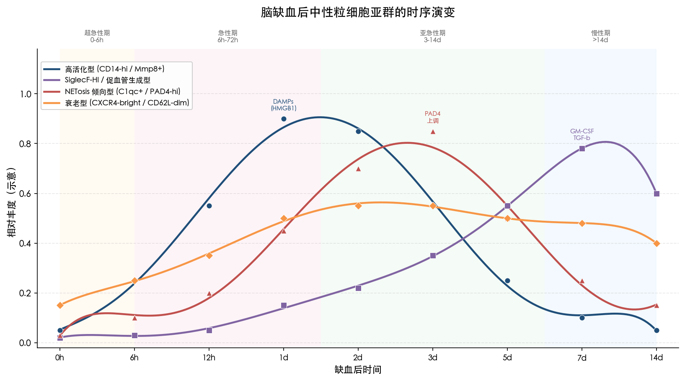

**图2-2** 以缺血后时间为横轴、相对丰度为纵轴，展示高活化型（CD14ʰⁱ/Mmp8⁺）、SiglecFᴴᴵ/促血管生成型、NETosis倾向型（C1qc⁺/PAD4ʰⁱ）和衰老型（CXCR4ᵇʳⁱᵍʰᵗ/CD62Lᵈⁱᵐ）四类中性粒细胞亚群在超急性期至慢性期的丰度动态变化，并标注各阶段主要微环境驱动因子。

## 2.3 低密度中性粒细胞与衰老型亚群在卒中中的角色

### 2.3.1 低密度中性粒细胞（LDNs）：活化与NETosis的桥梁

低密度中性粒细胞（LDNs）是指在密度梯度离心时沉降于外周血单核细胞（PBMC）层而非正常粒细胞层的中性粒细胞亚群。该亚群在健康个体中通常不足总中性粒细胞的2%，但在多种炎症性疾病中可显著升高。在缺血性卒中患者中，Datsi等人的前瞻性研究（35例急性大动脉闭塞卒中患者 vs 16例对照）首次报道了LDN的显著升高——卒中患者LDG中位数为1.93×10³/μL，对照组仅为0.24×10³/μL（P=0.003），升高幅度约8倍 [Datsi et al., BMC Neurology](https://pmc.ncbi.nlm.nih.gov/articles/PMC9121602/ "卒中患者LDG升高, 2022; 22:186")。与此同时，卒中患者的中性粒细胞表现出更高的NETs形成潜力和更差的DNase-I清除能力，血栓内NETs含量与CD66b⁺中性粒细胞浸润密切相关。尤为值得关注的是，血栓中较低的CD66b值独立预测了取栓后更大的NIHSS改善幅度（HR=0.478, P=0.045），提示中性粒细胞活化程度和NETs负荷直接影响机械取栓的治疗效果。

LDNs在卒中病理中的确切角色仍在持续阐释之中。根据现有研究，LDNs可能代表两类细胞的混合群体：异常粒细胞生成产生的不成熟中性粒细胞（CD10⁻）以及在循环中被高度活化后密度降低的成熟中性粒细胞（CD10⁺）。卒中急性期促炎细胞因子（尤其是IL-17、IFN-γ和IL-22）的大幅升高可能影响骨髓粒细胞生成，加速产生倾向于自发NETosis的LDN群体。从分类体系整合的视角审视，最具免疫抑制性的PMN-MDSC亚群（PMN3）以CD14ʰⁱᵍʰ/SiglecF⁺共表达为特征，LDN、PMN-MDSC和SiglecF⁺等标记可能识别的是被微环境深度编程的重叠细胞状态，而非界限分明的独立群体 [Sheen et al., Biomedicines](https://pmc.ncbi.nlm.nih.gov/articles/PMC12650654/ "分型体系整合, 2025; 13(11):2601")。

### 2.3.2 衰老型中性粒细胞：卒中严重程度的细胞标志物

衰老型中性粒细胞（aged neutrophils）是循环中性粒细胞在外周血中逐步成熟和功能转变过程中自然获得的一种表型状态，以CXCR4ᵇʳⁱᵍʰᵗ/CD62Lᵈⁱᵐ为核心表面标志。这一亚群在卒中临床研究中的重要性已获直接验证。

Weisenburger-Lile等人纳入41名发病6小时内的急性缺血性卒中患者，通过全血流式细胞术分析揭示了循环中性粒细胞的持续性高活化状态：在第0天（入院即刻）、第2天和第7天，中性粒细胞均表现为CD62L↓/CD11b↑/ROS↑；衰老亚群（CXCR4ᵇʳⁱᵍʰᵗ/CD62Lᵈⁱᵐ）比例在上述三个时间点持续升高；反向跨内皮迁移（rTEM）亚群（CD54ʰⁱᵍʰ/CXCR1ˡᵒʷ）亦显著增加 [Weisenburger-Lile et al., Neurol Neuroimmunol Neuroinflamm](https://pmc.ncbi.nlm.nih.gov/articles/PMC6624098/ "有害中性粒细胞亚群, 2019; 6(4):e571")。最关键的发现在于上述亚群异常与卒中严重程度存在直接关联——重度卒中组（NIHSS>10）的ROS产生更高、衰老亚群比例更大，各指标与NIHSS评分密切相关。同时，卒中患者循环HMGB1水平显著升高并与中性粒细胞活化标志物相关，提示损伤相关分子模式（DAMPs）是驱动中性粒细胞高活化状态的重要上游因子。

rTEM亚群的出现尤其值得关注。反向跨内皮迁移是指已从血管腔进入组织的中性粒细胞重新穿越内皮返回循环的过程，这一现象在无菌炎症模型中已被活体成像直接可视化。rTEM中性粒细胞携带组织来源的炎症信号重新进入循环，可能将局部脑缺血信号传播至远端器官，从而参与卒中后系统性免疫失调的发生。这一机制为卒中后的多器官并发症提供了一种新的细胞生物学解释。

## 2.4 微环境驱动的表型可塑性与代谢重编程

中性粒细胞的表型多样性并非仅由骨髓来源决定，脑内微环境的原位重编程在其中发挥核心驱动作用。图2-3概括了中性粒细胞从骨髓经外周血进入缺血脑实质的表型转化全景。

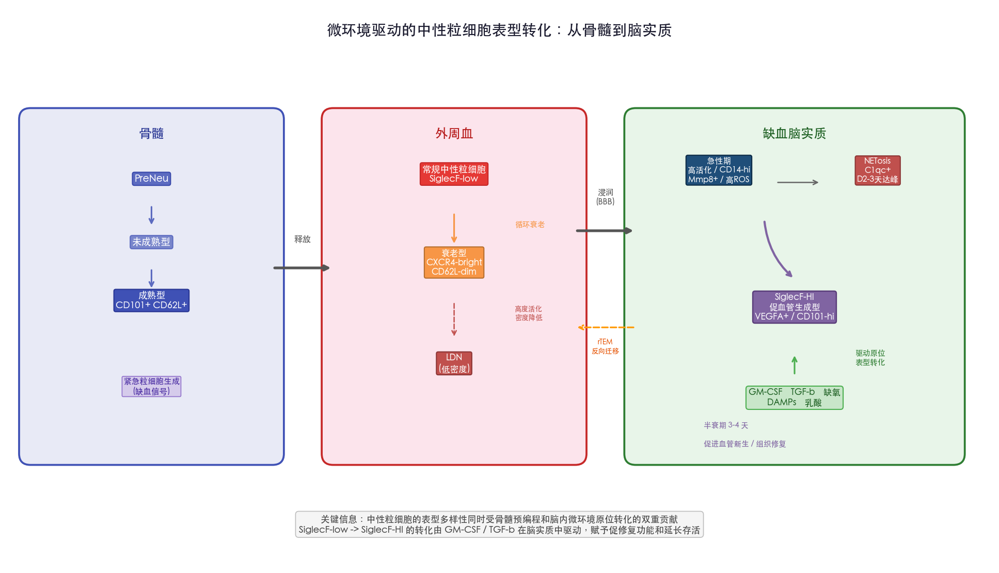

**图2-3** 以骨髓、外周血和缺血脑实质三个区室为架构，展示中性粒细胞从前体细胞到组织特异性效应表型的分化路径。急性期以高活化/NETosis表型为主，亚急性期则由GM-CSF/TGF-β驱动向SiglecFʰⁱ促血管生成型转化，rTEM通路则将脑内炎症信号反向传播至全身循环。

### 2.4.1 缺氧、DAMPs与细胞因子梯度的多重驱动

中性粒细胞的表型可塑性由缺血微环境中多重因素的协同作用所驱动。Garcia-Bonilla等人的研究已证实，脑浸润中性粒细胞相比血液对应物表现出更大的转录组分化程度 [Garcia-Bonilla et al., Nat Immunol](https://pubmed.ncbi.nlm.nih.gov/38177281/ "脑内中性粒细胞转录组分化, 2024; 25(2):357-370")，表明表型多样化主要发生在脑内微环境中而非外周预编程。

驱动这一原位分化的因素至少涵盖三个层次。第一层为损伤信号：缺血后释放的DAMPs（尤其是HMGB1）通过TLR4和RAGE受体直接激活中性粒细胞，上调ROS产生、增强脱颗粒并促进NETosis。卒中患者循环HMGB1水平的显著升高及其与中性粒细胞活化标志物的相关性，为这一通路提供了临床层面的佐证 [Weisenburger-Lile et al., Neurol Neuroimmunol Neuroinflamm](https://pmc.ncbi.nlm.nih.gov/articles/PMC6624098/ "HMGB1驱动中性粒细胞活化, 2019; 6(4):e571")。第二层为细胞因子微环境：缺血脑组织中TGF-β、GM-CSF、IFN-β等细胞因子的时序性表达差异驱动不同的极化方向——TGF-β促进成熟和N2样分化，GM-CSF驱动免疫抑制和促血管生成表型（包括SiglecF上调），IFN-β则驱动IFN应答型程序。第三层为缺氧：缺血核心区的严重缺氧通过HIF-1α通路重编程中性粒细胞的代谢和功能状态，使其适应低氧环境并延长存活。

### 2.4.2 代谢重编程：从糖酵解到氧化磷酸化的转换

中性粒细胞传统上被认为主要依赖糖酵解供能，但新近证据揭示了缺血微环境中更为复杂的代谢重塑。心肌梗死scRNA-seq数据显示，SiglecFᴴᴵ中性粒细胞的氧化磷酸化（OXPHOS）基因显著上调，伴随Myc恢复性表达，支持延长寿命和增强ROS产生的能力 [Calcagno et al., JAHA](https://www.ahajournals.org/doi/10.1161/JAHA.120.019019 "代谢重编程, 2021; 10:e019019")。这种从糖酵解向OXPHOS的代谢转换可能构成SiglecF⁺中性粒细胞半衰期显著延长（3–4天 vs 常规6–24小时）的关键生物学基础——通过更高效的ATP产生维持细胞存活和持续效应功能。

另一条值得关注的代谢重编程途径为缺氧驱动的组蛋白乳酸化（histone lactylation）。Ugolini等人于2025年在Cancer Discovery报道，在脑肿瘤微环境中，乳酸通过组蛋白乳酸化修饰重编程中性粒细胞的基因表达程序，代表一种新型的表观遗传代谢感受机制 [Ugolini et al., Cancer Discov](https://aacrjournals.org/cancerdiscovery/article/15/6/1270/762585/ "组蛋白乳酸化, 2025; 15(6):1270-1296")。鉴于脑缺血核心区和半暗带的高乳酸微环境，这一机制在脑缺血后中性粒细胞功能重编程中的潜在作用值得深入探索。若乳酸化修饰确实参与了缺血后中性粒细胞的表型转化，则意味着代谢产物本身即可充当表观遗传信号，通过全局性基因表达重编程驱动亚群分化。

### 2.4.3 N1→N2极化转换的可逆性

关于N1和N2状态之间是否存在可逆转换，目前尚缺乏明确的体内实时追踪证据，但间接线索提示这种转换至少在部分层面上是可能的。PPARγ激动剂罗格列酮在体内将N2比例从31%提升至77% [Cuartero et al., Stroke](https://www.ahajournals.org/doi/10.1161/strokeaha.113.002470 "PPARγ驱动N2极化, 2013; 44:3498-3508")，尽管尚无法确定这一变化是已浸润的N1中性粒细胞原位转化为N2，还是新募集的中性粒细胞在PPARγ信号下直接分化为N2。Richter等人的新生HI模型研究中，GM-CSF在体外可将SiglecFˡᵒʷ中性粒细胞转化为SiglecFʰⁱᵍʰ表型，为表型转换的可行性提供了证据 [Richter et al., Nat Commun](https://www.nature.com/articles/s41467-025-65517-1 "GM-CSF驱动SiglecF转化, 2025")。然而，Garcia-Bonilla等人的轨迹推断分析则提示，脑浸润中性粒细胞的表型演变可能更多源自血液中不同时间窗的连续从头募集，而非在脑内从一种表型直接转化为另一种 [Garcia-Bonilla et al., Nat Immunol](https://pubmed.ncbi.nlm.nih.gov/38177281/ "轨迹推断, 2024; 25(2):357-370")。

综合现有证据，中性粒细胞的表型多样性可能同时受到两种机制的贡献：（1）不同时间窗募集的中性粒细胞在到达脑组织前即携带不同的预编程状态（如衰老个体与年轻个体的骨髓输出差异）；（2）进入脑实质后，局部微环境（缺氧程度、细胞因子组成、DAMPs浓度）进一步重塑其表型。这两种机制的相对贡献可能随疾病进程而动态变化——急性期以募集差异为主导，亚急性期则以原位微环境重编程为主导。

## 2.5 NETs形成与亚群异质性的交叉

### 2.5.1 NETosis的时间动态与亚群倾向性

中性粒细胞胞外诱捕网（NETs）的形成是中性粒细胞最具病理意义的效应功能之一（详见第3章），其与亚群异质性之间的关系日益成为研究焦点。在时间动态上，脑缺血病灶中NETs形成在tMCAO后2–3天达峰，滞后于中性粒细胞浸润的1–2天高峰以及MPO的第1天峰值。PAD4 mRNA在第3天显著上调，与NETs时间窗一致 [Cai et al., Transl Stroke Res](https://pmc.ncbi.nlm.nih.gov/articles/PMC6993940/ "NETs时间轴, 2020; 11(1):108-121")。这一时间滞后提示NETosis并非中性粒细胞浸润后的即刻反应，而是需要微环境信号的逐步积累方可触发。

在亚群倾向性方面，SiglecF⁺中性粒细胞在多个模型中表现出增强的NETosis倾向 [Sheen et al., Biomedicines](https://pmc.ncbi.nlm.nih.gov/articles/PMC12650654/ "SiglecF⁺NETosis倾向, 2025; 13(11):2601")。考虑到SiglecF⁺亚群在心肌梗死后第4天占比超过50%，其增强的NETosis倾向可能部分解释NETs在缺血损伤中的持续性存在。然而，Zhang等人的脑缺血scRNA-seq分析将C1qc⁺中性粒细胞而非SiglecF⁺亚群鉴定为NETs产生的关键参与者，并提出C1qc⁺中性粒细胞可能通过线粒体DNA释放相关的NETosis过程转化为Mbnl2⁺中性粒细胞 [Zhang et al., Biochem Biophys Res Commun](https://www.sciencedirect.com/science/article/abs/pii/S0006291X25013750 "C1qc⁺与NETosis, 2025")。这一差异提示，不同亚群可能通过不同的分子机制（核DNA释放 vs 线粒体DNA释放）参与NETosis，二者在脑缺血不同阶段的相对贡献尚需进一步阐释。

### 2.5.2 缺血微环境对NETosis的驱动

缺血微环境中多种因素协同驱动NETosis的发生。体外实验已证明，缺血神经元条件培养基可直接促进中性粒细胞NETs形成 [Cai et al., Transl Stroke Res](https://pmc.ncbi.nlm.nih.gov/articles/PMC6993940/ "缺血信号驱动NETosis, 2020; 11(1):108-121")。在上游信号层面，血小板来源的HMGB1已被确认为NET形成的关键介导物。卒中患者血浆H3cit（NETosis的特异性标志物）和MPO-DNA复合物均显著升高，且与出院时mRS评分呈正相关（H3cit: r=0.45, P=0.024; MPO-DNA: r=0.507, P=0.01），而血浆DNase活性在卒中患者中则显著降低 [Denorme et al., J Clin Invest](https://pmc.ncbi.nlm.nih.gov/articles/PMC9106355/ "NETs与卒中预后, 2022")。这种NETosis增强与DNase清除能力下降的"双重失衡"在LDN群体中表现尤为突出——卒中来源的中性粒细胞不仅NETs形成潜力更高，对DNase-I的清除反应也显著减弱 [Datsi et al., BMC Neurology](https://pmc.ncbi.nlm.nih.gov/articles/PMC9121602/ "NETs形成与清除失衡, 2022; 22:186")。这种"产生增多—清除受损"的恶性循环构成了NETs在缺血性卒中中持续存在和发挥病理作用的关键机制基础。

## 2.6 从分类到整合：多维异质性的统一框架

综合本章讨论，中性粒细胞异质性的认知正经历从静态分类向动态连续谱的范式转换。N1/N2二分法、HDN/LDN物理密度分类和PMN-MDSC免疫功能分类并非描述三种独立的细胞群体，而是从不同维度捕捉了中性粒细胞在微环境驱动下的连续表型谱的不同切面（图2-1）。

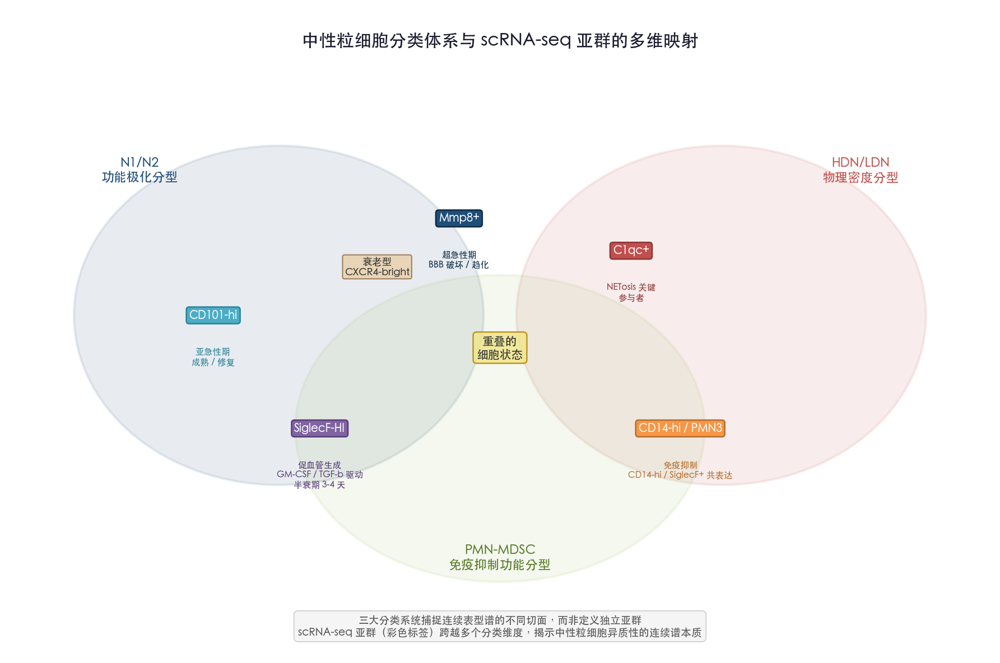

**图2-1** 以Venn式重叠图展示N1/N2功能极化分型、HDN/LDN物理密度分型与PMN-MDSC免疫抑制功能分型三大分类体系的交叉关系，各区域标注scRNA-seq鉴定的关键转录组簇。三大分类系统捕捉的是连续表型谱的不同切面，而非定义互斥的独立亚群。

单细胞组学技术的发展使研究者得以在转录组层面直接观测这一连续谱。从心肌梗死的5个scRNA-seq簇到NeuMap的7个功能枢纽，再到脑缺血中的Mmp8⁺、C1qc⁺和Mbnl2⁺等转录组特异性亚群，每项研究都在更高分辨率上揭示了中性粒细胞异质性的复杂程度。在脑缺血的特定语境下，至少可辨识出以下四条核心分化轨迹：

- **急性期高活化/促炎轨迹**：以CD14ʰⁱ、高ROS、Mmp8⁺为特征，对应经典N1功能，在缺血后第1–2天占主导地位；
- **亚急性期促修复/促血管生成轨迹**：以CD101ʰⁱ、SiglecFʰⁱ、VEGFA⁺为特征，超越了N2标志物的定义范围，在第7–14天逐步富集；
- **NETosis倾向轨迹**：以C1qc⁺、PAD4ʰⁱ为特征，在急性期后期（第2–3天）达峰，通过线粒体或核DNA释放执行NETosis；
- **衰老/循环衰老轨迹**：以CXCR4ᵇʳⁱᵍʰᵗ/CD62Lᵈⁱᵐ为特征，在老龄个体和重度卒中中尤为突出，与不良临床预后密切关联。

上述轨迹之间并非互斥，单个中性粒细胞可能同时表达多条轨迹的部分特征。我们认为，未来研究应逐步摒弃将中性粒细胞归入离散亚群的分析范式，转向以连续表型空间中的位置和运动方向来描述中性粒细胞状态。NeuMap提出的"诊断条形码"概念为这一方向提供了可操作的分析框架，而将其拓展至脑缺血领域则有望实现基于中性粒细胞异质性特征的患者精准分层与个体化治疗策略制定。

# 第3章 中性粒细胞的效应功能——损伤与修复的双刃剑

中性粒细胞浸润缺血脑组织后，其效应功能并非单一的"促炎损伤"，而是在时间、空间和亚群维度上呈现高度复杂的动态谱系。急性期（0–72 h），中性粒细胞通过活性氧（ROS）爆发、基质金属蛋白酶-9（MMP-9）释放、中性粒细胞胞外诱捕网（NETs）形成和微血管阻塞等多重效应机制，构成脑缺血继发性损伤的关键驱动力。然而，随着病程推进至亚急性期和慢性期，部分中性粒细胞亚群——尤其是N2型（抗炎/促修复型）和SiglecFᴴᴵ亚群——展现出碎片清除、分泌促血管生成因子和支持组织重塑的修复功能。本章聚焦中性粒细胞自身的效应机制，系统梳理各损伤与修复途径的分子基础、时序特征和定量证据，并重点讨论NETs的功能演变、中性粒细胞源性细胞外囊泡（EVs）的信号功能，以及MMP-9和NETs在出血转化中的因果贡献。需要特别强调的是，中性粒细胞效应功能的"损伤"与"修复"并非截然分割的二元对立，而是具有时间依赖性、亚群特异性和微环境依赖性的连续谱——同一效应分子（如MMP-9）在不同时期可发挥截然相反的生物学作用。

## 3.1 急性期损伤效应：ROS爆发与氧化应激

### 3.1.1 NADPH氧化酶与超氧阴离子产生

中性粒细胞是脑缺血再灌注后活性氧的主要细胞来源之一。其ROS产生主要依赖NADPH氧化酶（NOX2）复合体，该酶在中性粒细胞活化后数分钟内即可启动呼吸爆发，产生大量超氧阴离子（O₂⁻），后者经歧化反应转化为过氧化氢（H₂O₂），再通过髓过氧化物酶（MPO）催化生成次氯酸（HOCl）等强氧化性物质。在脑缺血-再灌注模型中，Nox2基因敲除小鼠的梗死体积显著缩小，BBB功能障碍明显减轻，直接证实了NOX2来源ROS在缺血性脑损伤中的关键作用 [Kahles & Brandes, Cell Mol Life Sci](https://pmc.ncbi.nlm.nih.gov/articles/PMC11114534/ "NADPH氧化酶与缺血性卒中综述, 2024")。

然而，骨髓移植实验揭示了一个重要的细胞来源分层问题：将Nox2⁻/⁻骨髓移植至野生型受体（白细胞来源NOX2缺失而组织驻留细胞NOX2完整），虽可减轻部分损伤，但其保护效应并未达到全身Nox2基因敲除的程度 [Kahles & Brandes, Cell Mol Life Sci](https://pmc.ncbi.nlm.nih.gov/articles/PMC11114534/ "骨髓移植实验, 2024")。这一结果表明，白细胞来源（主要为中性粒细胞）NOX2-ROS的致病贡献虽然显著，但并非唯一——脑内皮细胞、小胶质细胞和神经元等组织驻留细胞的NOX2同样构成不可忽视的氧化应激来源。中性粒细胞ROS的独特致病性在于其"时间窗效应"：中性粒细胞作为最早浸润缺血脑组织的免疫细胞（12 h内显著增加，1–2天达峰），其ROS爆发恰好发生在再灌注损伤最为剧烈的时间窗内，与BBB通透性升高和细胞外基质降解形成叠加效应。

### 3.1.2 ROS与下游级联损伤

中性粒细胞来源ROS不仅直接造成氧化损伤，还通过多条下游信号通路级联放大病理效应。首先，ROS通过S-亚硝基化修饰激活pro-MMP-9，使其无需蛋白水解切割即可获得酶活性，从而建立ROS→MMP-9的正反馈环路 [Turner & Sharp, Front Cell Neurosci](https://pubmed.ncbi.nlm.nih.gov/26973468/ "MMP9综述, 2016")。其次，超氧阴离子与一氧化氮（NO）反应生成过氧亚硝酸根（ONOO⁻），后者可导致蛋白质硝基化、脂质过氧化和DNA链断裂。此外，NOX2依赖性ROS是NETs形成的上游必要信号——ROS触发中性粒细胞弹性蛋白酶（NE）从颗粒向细胞核的转位，促进组蛋白的瓜氨酸化和染色质解凝聚，最终推动NETosis的发生。因此，中性粒细胞ROS在脑缺血损伤级联中居于"枢纽"地位，同时启动和放大MMP-9介导的基质降解与NETs介导的免疫血栓形成。

临床数据支持上述损伤机制的转化相关性。41名急性缺血性卒中患者（发病6 h内）的全血流式细胞术分析显示，循环中性粒细胞在发病当天（D0）、第2天（D2）和第7天（D7）持续呈现高活化状态（CD62L↓/CD11b↑/ROS↑），且ROS产生水平与卒中严重程度密切相关——重度卒中组（NIHSS评分较高）中性粒细胞ROS产生显著高于轻度组 [Weisenburger-Lile et al., Neurol Neuroimmunol Neuroinflamm](https://pmc.ncbi.nlm.nih.gov/articles/PMC6624098/ "中性粒细胞活化与卒中严重程度, 2019; 6(4):e571")。

## 3.2 MMP-9：BBB破坏的核心效应分子

### 3.2.1 MMP-9的时序表达与细胞来源

基质金属蛋白酶家族（MMPs）中，MMP-9是脑缺血后BBB破坏研究最为深入的成员。MMP-9在中性粒细胞发育晚期即被合成并储存于明胶酶颗粒中（以无活性前体pro-MMP-9形式存在），使中性粒细胞能够在活化后数分钟内脱颗粒释放MMP-9，这一速度远快于小胶质细胞和星形胶质细胞等其他细胞类型所需数小时的从头转录过程 [Turner & Sharp, Front Cell Neurosci](https://pubmed.ncbi.nlm.nih.gov/26973468/ "MMP9综述, 2016")。尤为值得关注的是，中性粒细胞是目前已知唯一不表达MMP-2和组织金属蛋白酶抑制物（TIMPs）的主要免疫细胞类型，这意味着中性粒细胞释放的MMP-9不受内源性抑制调控，具有更强的基质降解潜力。

关于MMP-9的细胞来源，实验证据支持中性粒细胞在急性期（24 h内）是脑缺血后活性MMP-9的主要贡献者。在大鼠MCAO模型中，中性粒细胞耗竭可显著降低脑组织MMP-9表达水平 [Turner & Sharp, Front Cell Neurosci](https://pubmed.ncbi.nlm.nih.gov/26973468/ "中性粒细胞耗竭降低MMP-9, 2016")。然而，也有研究报告中性粒细胞耗竭并未显著改变MMP-9蛋白总量或梗死体积，提示在严重缺血条件下，小胶质细胞、血管内皮细胞和周细胞等组织驻留细胞同样贡献了可观的MMP-9。综合现有证据，我们认为"中性粒细胞启动-组织细胞放大"模型更为合理：中性粒细胞在急性期最早抵达BBB、释放颗粒储备的MMP-9启动基质降解；同时通过ROS和促炎细胞因子（TNF-α等）刺激脑内驻留细胞的MMP-9从头转录，形成级联放大效应。

### 3.2.2 MMP-9与BBB双相开放

脑缺血后BBB的开放呈现经典的双相模式。第一次开放发生在缺血后数小时内，与MMP-2水平升高相关——此时紧密连接组分虽然松弛但仍保留在内皮细胞间隙内，该期BBB破坏具有一定的可逆性。第二次开放发生在24–48 h，与MMP-9水平的显著升高同步，表现为基底膜完全降解和紧密连接蛋白（occludin、ZO-1等）的不可逆破坏 [Turner & Sharp, Front Cell Neurosci](https://pubmed.ncbi.nlm.nih.gov/26973468/ "BBB双相开放, 2016")。在两者的相对贡献方面，MMP-9抑制可对BBB通透性提供强有力的保护，而MMP-2抑制则未能显示出明显的保护效果，且MMP-2基因敲除对急性脑损伤无显著影响 [Turner & Sharp, Front Cell Neurosci](https://pubmed.ncbi.nlm.nih.gov/26973468/ "MMP-9 vs MMP-2在BBB中的作用, 2016")。MMP-3虽然本身对BBB的直接降解作用有限，但可在体内激活pro-MMP-9——MMP-3基因敲除小鼠的活性MMP-9水平降低，BBB破坏减轻，中性粒细胞浸润亦相应减少。因此，在脑缺血后BBB基质降解的级联反应中，MMP-9是最具决定性的终末效应蛋白酶，MMP-3作为其上游激活物发挥间接贡献，而MMP-2的角色相对有限。

### 3.2.3 MMP-9与出血转化的因果关系

MMP-9与出血转化（hemorrhagic transformation, HT）之间的关联是中性粒细胞效应功能研究中最具临床转化意义的发现之一。人类缺血性卒中尸检脑组织研究直接证实，MMP-9阳性中性粒细胞浸润与BBB基底膜IV型胶原降解共定位，在出血转化区域尤为显著——中性粒细胞聚集于微血管周围，伴随严重的基底膜降解和红细胞外渗 [Rosell et al., Stroke](https://pubmed.ncbi.nlm.nih.gov/18323498/ "MMP-9阳性中性粒细胞与BBB破坏, 2008")。

一项纳入30例血管内取栓（EVT）患者的前瞻性研究为MMP-9的预测价值提供了定量证据：53.3%的患者发生HT，HT组EVT后动脉血MMP-9水平的百分比变化显著高于非HT组（147.1% vs 108.8%, P<0.05），MMP-9升高128.1%为预测HT的最佳截断值（ROC AUC=0.701，敏感性62.5%，特异性85.7%）[Huang et al., Front Neurol](https://www.frontiersin.org/journals/neurology/articles/10.3389/fneur.2024.1400270/full "MMP-9预测出血转化, 2024")。

组织纤溶酶原激活物（tPA）治疗进一步放大了MMP-9介导的出血风险。tPA不仅可直接激活pro-MMP-9，还可促进中性粒细胞脱颗粒释放MMP-9：溶栓患者在tPA给药后30分钟即出现中性粒细胞脱颗粒高峰，初级颗粒（MPO、NE）、次级颗粒（MMP-8等胶原酶）和三级颗粒（MMP-9）的内容物同步释放 [Turner & Sharp, Front Cell Neurosci](https://pubmed.ncbi.nlm.nih.gov/26973468/ "tPA促进脱颗粒, 2016")。上述发现对溶栓治疗的安全性管理具有直接启示——联合应用MMP-9抑制剂或中性粒细胞调节策略，有望降低tPA相关出血并发症风险。

### 3.2.4 MMP-9的修复期功能转换

MMP-9在脑缺血修复期（>7天）展现出与急性期截然相反的生物学功能。MMP-9通过基质重塑促进血管新生——其对细胞外基质的受控降解为内皮细胞迁移和新血管芽形成提供必要的空间，并促进基质结合态生长因子的释放。长期MMP抑制实验证实，持续阻断MMP活性可显著损害神经可塑性和血管重塑 [Peiseler & Kubes, J Clin Invest](https://www.jci.org/articles/view/124616 "中性粒细胞修复功能综述, 2019")。这一功能转换构成了MMP-9靶向治疗的核心"时间窗困境"——急性期抑制有益而修复期抑制有害，治疗策略必须精确匹配疾病的时相特征（图3-1）。

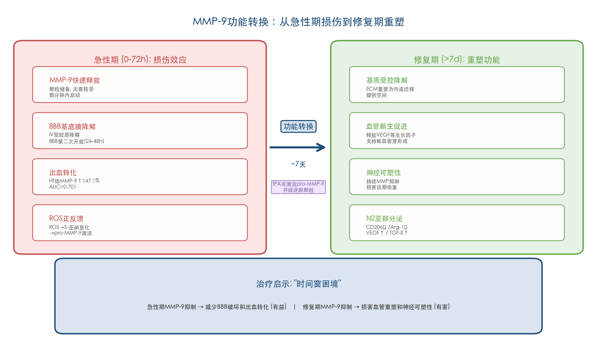

**图3-1 MMP-9功能转换示意图。** 左侧（红色）概括急性期（0–72 h）MMP-9的损伤效应，包括BBB基底膜降解、出血转化和ROS正反馈激活；右侧（绿色）展示修复期（>7天）MMP-9的重塑功能，包括基质受控降解和血管新生促进。中部标注约7天的功能转换节点及tPA对pro-MMP-9的激活作用，底部蓝色面板总结"时间窗困境"的治疗启示。

## 3.3 中性粒细胞胞外诱捕网（NETs）：从促血栓到组织损伤

### 3.3.1 NETs形成的时序特征与分子机制

NETs是活化中性粒细胞释放的网状结构，由去凝聚染色质DNA骨架、修饰组蛋白（如瓜氨酸化组蛋白H3, H3Cit）和丝氨酸蛋白酶（NE、MPO等）共同构成。在脑缺血病灶中，NETs形成呈现与中性粒细胞浸润不同的时间动力学：tMCAO后NETs标志物（MPO/NE/CitH3/DNA共定位）在第2–3天达峰，滞后于中性粒细胞浸润高峰（第1–2天）和MPO活性高峰（第1天）约1–2天。与此一致，PAD4 mRNA在第3天显著上调（达29.3倍），蛋白水平上调3.8倍，与NETs时间窗高度吻合 [Cai et al., Transl Stroke Res](https://pmc.ncbi.nlm.nih.gov/articles/PMC6993940/ "NETs时间轴, 2020; 11(1):108-121")。这一时间滞后特征可能反映了中性粒细胞从浸润到完全活化再到NETosis的渐进过程——浸润后的中性粒细胞需要在缺血微环境中持续接收DAMPs和细胞因子信号，经历ROS积累和PAD4上调，最终触发NETosis。

PAD4（肽基精氨酸脱亚胺酶4）是NETs形成的核心调控酶，催化组蛋白精氨酸残基瓜氨酸化，导致染色质解凝聚和核膜破裂。除PAD4依赖性通路外，GSDMD（Gasdermin D）亦被证实在中性粒细胞中参与NETs释放的膜穿孔步骤——GSDMD缺失可减少脑内中性粒细胞浸润并改善卒中结局 [Kang et al., Front Immunol](https://pmc.ncbi.nlm.nih.gov/articles/PMC9908898/ "GSDMD与卒中")。值得注意的是，溶栓药物tPA可通过LRP-1受体上调PAD4，直接激活缺血中性粒细胞产生NETs——tPA灌注2 h后，中性粒细胞募集增加约96%，H3Cit水平升高2.4倍，PAD4上调2.2倍 [Wang et al., Blood](https://ashpublications.org/blood/article/138/1/91/475346/ "NETs-cGAS-tPA出血, 2021")。这一发现揭示了溶栓治疗的内在矛盾——tPA在恢复血流的同时，可通过增强NETosis悖论性地加剧BBB损伤和出血风险。

### 3.3.2 NETs在卒中血栓中的组成与临床意义

机械取栓技术的广泛应用使直接分析人类卒中血栓的NETs含量成为可能。Laridan等人2017年的研究首次在急性缺血性卒中患者取栓样本中系统鉴定NETs组成——H3Cit在几乎所有血栓中均可检出，H3Cit阳性面积占血栓总面积的比例高达13.45%，并与细胞外DNA和中性粒细胞弹性蛋白酶共定位 [Laridan et al., Ann Neurol](https://pubmed.ncbi.nlm.nih.gov/28696508/ "NETs在卒中血栓中, 2017; 82(2):223-232")。

Abbasi等人对137例取栓患者血栓的定量组织学分析进一步提供了大样本数据：H3Cit平均占血栓面积的19.97%，与红细胞（45.83%）、纤维蛋白（28.27%）和血小板（22.23%）同为血栓的主要结构成分。更具临床意义的是，从发病到穿刺时间延迟（>4 h）的患者，血栓中H3Cit含量显著升高（26.57% vs 16.31%, P=0.03），纤维蛋白和vWF亦相应增加，提示NETs参与了血栓的原位成熟过程，并可能增加再通难度 [Abbasi et al., Thromb Res](https://pmc.ncbi.nlm.nih.gov/articles/PMC8957257/ "血栓组成与再通时间, 2022; 209:99-104")。

2022年Denorme等人的研究将NETs标志物检测从组织层面拓展至血浆层面：27例卒中患者血浆H3Cit和MPO-DNA复合物较对照组显著升高，且与出院时功能预后（mRS评分）呈正相关（H3Cit: r=0.45, P=0.024; MPO-DNA: r=0.507, P=0.01），同时血浆DNase活性在卒中患者中显著降低 [Denorme et al., J Clin Invest](https://pmc.ncbi.nlm.nih.gov/articles/PMC9106355/ "NETs与卒中, 2022")。DNase活性的降低可能反映了宿主NETs清除能力的不足，致使NETs在循环和病灶中持续积累，进而加剧免疫血栓和组织损伤。

### 3.3.3 NETs对亚急性期至慢性期血管重塑的持续损害

NETs的致病作用并不局限于急性期的促血栓效应，而是延伸至亚急性期和慢性期的血管修复进程。在小鼠pMCAO模型中，缺血半暗带H3Cit在第3–5天达高峰并持续至第14天，其中78.7%的H3Cit阳性细胞为Ly6G⁺中性粒细胞 [Kang et al., Nat Commun](https://www.nature.com/articles/s41467-020-16191-y "NETs损害血管重塑, 2020")。关键的功能验证实验显示：持续14天的中性粒细胞耗竭使BBB通透性降低39.3%，同时使微血管长度增加29.8%；DNase I降解NETs则显著增加周细胞覆盖率和灌注毛细血管长度。进一步的机制研究揭示，NETs通过STING（干扰素基因刺激因子）-IFN-β信号通路抑制血管修复——NETs中的DNA激活脑血管内皮细胞的cGAS-STING通路，诱导I型干扰素（IFN-β）产生，后者抑制内皮细胞增殖和血管新生 [Kang et al., Nat Commun](https://www.nature.com/articles/s41467-020-16191-y "STING-IFN-β通路, 2020")。

tPA相关的NETs-BBB损伤同样经由cGAS-STING通路介导。Wang等人的研究表明，PAD4缺陷使tPA相关脑出血减少68%，cGAS缺陷则使之减少57%，从遗传学层面为NETs→cGAS-STING→BBB破坏这一因果链提供了充分证据 [Wang et al., Blood](https://ashpublications.org/blood/article/138/1/91/475346/ "NETs-cGAS-tPA出血, 2021")。

综合上述证据，NETs在脑缺血中的功能呈现"持续损伤"而非"相位转换"的特征：急性期通过促血栓和促炎作用加剧梗死扩大，亚急性期至慢性期则通过STING-IFN-β通路抑制血管修复和神经可塑性。迄今为止，NETs在脑缺血慢性期存在正向功能转换的证据尚付阙如，这与前述MMP-9从损伤到修复的功能转换形成鲜明对比。

### 3.3.4 血小板HMGB1——NETs形成的关键上游信号

在NETs形成的上游调控网络中，血小板来源的高迁移率族蛋白B1（HMGB1）已被鉴定为关键介导物。卒中患者循环HMGB1水平显著升高，并与中性粒细胞活化标志物呈显著相关性 [Weisenburger-Lile et al., Neurol Neuroimmunol Neuroinflamm](https://pmc.ncbi.nlm.nih.gov/articles/PMC6624098/ "HMGB1驱动中性粒细胞活化, 2019; 6(4):e571")。在卒中动物模型中，活化血小板通过释放HMGB1直接触发中性粒细胞NETosis，形成"血小板活化→HMGB1释放→NETosis→NETs捕获血小板"的正反馈促血栓环路。这一机制将中性粒细胞自身的效应功能与第4章将详细讨论的中性粒细胞-血小板互作网络紧密联系起来。

## 3.4 微血管阻塞与无复流现象

中性粒细胞阻塞脑毛细血管是缺血性卒中后"无复流"（no-reflow）现象的主要原因之一。El Amki等人利用双光子活体成像技术在小鼠tMCAO模型中直接可视化了这一过程：梗死核心和缺血半暗带约20%–30%的毛细血管被中性粒细胞物理性阻塞，导致即使大血管成功再通，微循环仍无法有效恢复 [El Amki et al., Cell Rep](https://pubmed.ncbi.nlm.nih.gov/33053341/ "无复流机制, 2020; 33:108260")。

关键的干预实验证实了中性粒细胞阻塞与无复流之间的因果关系：抗Ly6G抗体介导的中性粒细胞耗竭可恢复微血管灌注并缩小梗死体积，且不增加出血风险 [El Amki et al., Cell Rep](https://pubmed.ncbi.nlm.nih.gov/33053341/ "中性粒细胞耗竭改善微循环, 2020; 33:108260")。后一点在安全性评估中尤为重要——它表明中性粒细胞耗竭策略在改善微循环的同时不会悖论性地加剧出血。

中性粒细胞介导的微血管阻塞涉及多重机制的协同作用：(1) 活化中性粒细胞表面黏附分子（CD11b/CD18等整合素）上调，增强了其与内皮细胞的黏附力；(2) 中性粒细胞-血小板聚合体（PNA）的形成进一步增大了阻塞体积；(3) NETosis释放的DNA网络在毛细血管腔内形成支架结构，捕获红细胞和血小板形成微血栓。无复流现象在临床层面表现为取栓后虽然实现大血管再通（mTICI 2b-3），但组织灌注仍不充分，与更差的功能预后密切相关。这一病理机制为中性粒细胞靶向策略作为取栓术辅助治疗提供了理论依据。

## 3.5 修复期效应功能：从碎片清除到血管新生

### 3.5.1 N2型中性粒细胞与促修复亚群的分泌谱

中性粒细胞参与组织修复的直接证据虽然相对有限，但近年来正在快速积累。如第2章所述，pMCAO模型中约31%的脑浸润中性粒细胞在缺血后表达N2型标志物（Ym1、CD206），PPARγ激动剂罗格列酮可将该比例提升至77%，并伴随显著的神经保护效应。N2型中性粒细胞（CD206⁺/Arg-1⁺）在亚急性期表达血管内皮生长因子（VEGF）和转化生长因子-β（TGF-β），理论上可促进血管新生和基质重塑 [Peiseler & Kubes, J Clin Invest](https://www.jci.org/articles/view/124616 "中性粒细胞修复功能综述, 2019")。

更为直接的因果证据来自2025年新生小鼠缺氧缺血模型中SiglecFᴴᴵ中性粒细胞的研究（详见第2章2.2.2节）。分选的SiglecFᴴᴵ脑浸润中性粒细胞表达angiopoietin 1、angiopoietin 2和VEGFA水平显著高于SiglecFˡᵒʷ和血液中性粒细胞；在内皮细胞划痕愈合实验中，SiglecFᴴᴵ中性粒细胞共培养使伤口愈合增加70%，且该效应可被抗VEGF抗体完全消除。更为关键的是，时间特异性耗竭实验表明，晚期耗竭（第6–8天）加重组织萎缩并损害少突胶质细胞再生和内皮细胞增殖。这些结果从功能层面确立了晚期中性粒细胞亚群在缺血性脑损伤修复中的积极贡献。

### 3.5.2 修复功能的局限性与证据不确定性

需要审慎指出的是，N2型中性粒细胞分泌VEGF和TGF-β的证据目前仍以转录组数据和体外实验为主，脑缺血病灶中直接的蛋白水平定量数据仍然缺乏。此外，缺血微环境对中性粒细胞极化的驱动方向实际上偏向损伤——缺血神经元条件培养基使中性粒细胞偏离N2表型（CD206↓/Arg1↓/IL-10↓/TGF-β↓），同时促进NETs形成 [Cai et al., Transl Stroke Res](https://pmc.ncbi.nlm.nih.gov/articles/PMC6993940/ "缺血微环境驱动极化偏移, 2020; 11(1):108-121")。体内观察到的N2比例维持可能更多依赖于小胶质细胞对N1型中性粒细胞的优先吞噬清除（N2清除率约为N1的3倍），而非微环境的直接正向诱导。

NETs在脑缺血修复期的功能转换（从损伤到修复）目前同样缺乏正向证据。尽管在伤口愈合和肿瘤微环境等其他生物学背景下有研究提示NETs可参与基质重塑，但在脑缺血模型中，NETs的持续存在（持续至第14天）始终与BBB通透性升高和血管修复抑制相关联，尚未观察到类似MMP-9的双相功能转换。

## 3.6 中性粒细胞源性细胞外囊泡：远距离信号传递与治疗潜力

中性粒细胞源性细胞外囊泡（EVs）是近年兴起的研究领域，其在脑缺血中的角色同样呈现损伤与治疗应用的双面性。

在损伤层面，活化中性粒细胞来源的外泌体（A-Neu-Exos）可促进BBB损伤和出血转化。活化中性粒细胞在NETosis过程中释放的囊泡携带促炎货物（包括NE、MPO和促炎细胞因子），到达远端BBB后可进一步加剧内皮细胞损伤和通透性升高 [Tang et al., Brain Res](https://www.sciencedirect.com/science/article/abs/pii/S0006899323001452 "活化中性粒细胞外泌体与出血转化, 2023")。

在治疗应用层面，中性粒细胞膜来源的纳米囊泡（NM-NVs）可利用中性粒细胞天然的炎症趋化能力（CD11b/CD18和PSGL-1等表面分子保留在膜表面），实现向缺血脑组织的主动靶向递送 [Dong et al., Adv Mater](https://pmc.ncbi.nlm.nih.gov/articles/PMC6424134/ "中性粒细胞膜纳米囊泡, 2019")。这一仿生策略将中性粒细胞的天然趋化特性从致病机制创造性地转化为药物递送工具。关于中性粒细胞仿生纳米递送的详细治疗策略将在第5章进一步讨论。

## 3.7 NETs靶向治疗的临床前验证

鉴于NETs在脑缺血急性期和亚急性期均发挥显著的致病作用，NETs靶向干预已成为中性粒细胞效应功能调控中最具转化前景的策略之一。当前的临床前干预策略可按作用靶点分为四类：上游抑制NETosis（nNIF、PAD4抑制剂）、降解已形成的NETs（DNase I）、阻断膜穿孔步骤（GSDMD抑制剂）。图3-2整合展示了NETs形成的上游信号、核心分子机器、下游损伤通路及各药理干预靶点的作用位点和关键定量证据。

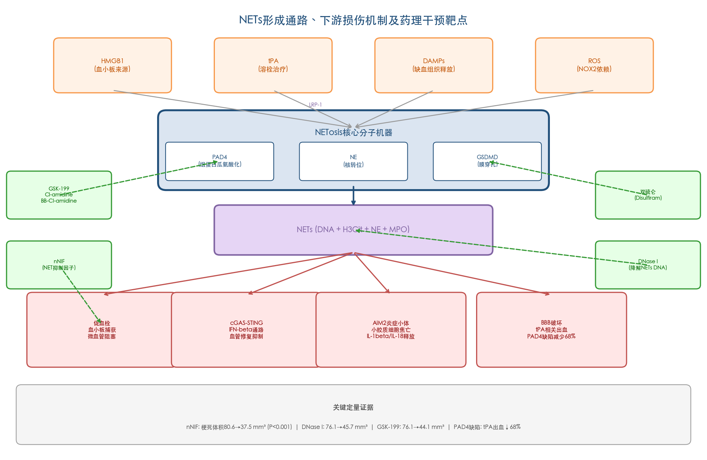

**图3-2 NETs形成通路、下游损伤机制及药理干预靶点。** 自上而下分别展示上游信号（HMGB1、tPA、DAMPs、ROS）、NETosis核心分子机器（PAD4、NE、GSDMD）、NETs结构组分（DNA+H3Cit+NE+MPO），以及四条下游损伤通路（促血栓、cGAS-STING/IFN-β、AIM2炎症小体、BBB破坏）。绿色虚线框标注药理干预靶点，底部汇总关键定量证据。

### 3.7.1 新生儿NET抑制因子（nNIF）

nNIF是目前在脑缺血模型中展现最强疗效数据的NETs靶向分子。预防性给予nNIF使小鼠梗死体积从80.6±23.5 mm³降至37.5±14.6 mm³（缩小53.5%, P<0.001），脑组织中NET形成中性粒细胞比例从29.9%降至11.7%。更具临床转化意义的是以下三点：(1) 卒中后1 h延迟给药仍然有效，说明治疗时间窗具有一定的临床可操作性；(2) 在糖尿病和老龄小鼠模型中均维持疗效——这两个合并症人群恰恰是卒中发病率最高的群体；(3) 21天随访显示持续的功能改善，表明急性期NETs抑制可产生远期神经功能获益 [Denorme et al., J Clin Invest](https://pmc.ncbi.nlm.nih.gov/articles/PMC9106355/ "nNIF治疗数据, 2022")。

### 3.7.2 DNase I降解已形成的NETs

与上游抑制策略互补，DNase I通过酶促降解NETs的DNA骨架发挥治疗作用，靶向已释放至胞外的NETs。在tMCAO模型中，DNase I使梗死体积从76.1±22.9 mm³降至45.7±20.2 mm³（缩小约40%）。更为重要的是，DNase I还改善了卒中后14天的血管重塑——增加周细胞覆盖率和微血管密度，这一效应与解除NETs对STING-IFN-β通路的持续激活直接相关 [Denorme et al., J Clin Invest](https://pmc.ncbi.nlm.nih.gov/articles/PMC9106355/ "DNase I, 2022"); [Kang et al., Nat Commun](https://www.nature.com/articles/s41467-020-16191-y "血管重塑, 2020")。2025年的研究在老龄小鼠中进一步证明了动脉内DNase给药的可行性和有效性，为该策略向老年卒中患者群体的转化提供了关键的临床前证据 [Yin et al., CNS Neurosci Ther](https://pmc.ncbi.nlm.nih.gov/articles/PMC12129710/ "IA DNase, 2025")。

### 3.7.3 PAD4抑制剂阻断NETs形成

PAD4抑制剂从上游阻断NETosis过程。GSK-199使梗死体积从76.1 mm³降至44.1 mm³（缩小42.1%），而不影响中性粒细胞总募集数量，表明该策略特异性靶向NETs生成而非中性粒细胞的整体功能 [Denorme et al., J Clin Invest](https://pmc.ncbi.nlm.nih.gov/articles/PMC9106355/ "GSK-199, 2022")。另一PAD4抑制剂Cl-amidine使BBB通透性降低39.3%，并抑制STING-IFN-β通路。第二代PAD4抑制剂BB-Cl-amidine在大鼠MCAO模型中同样展现出显著疗效 [Xu et al., Front Pharmacol](https://www.frontiersin.org/journals/pharmacology/articles/10.3389/fphar.2025.1537566/full "BB-Cl-amidine, 2025")。NETs→AIM2炎症小体通路的因果验证实验（GSK484处理后AIM2敲低无额外获益）进一步表明，PAD4抑制的神经保护效应至少部分通过阻断NETs对小胶质细胞炎症小体的激活而实现（该互作机制详见第4章）。

### 3.7.4 GSDMD抑制——药物重定向策略

GSDMD在中性粒细胞中介导NETs释放的膜穿孔步骤。遗传学证据表明，GSDMD缺失可减少脑中性粒细胞浸润并改善卒中结局 [Kang et al., Front Immunol](https://pmc.ncbi.nlm.nih.gov/articles/PMC9908898/ "GSDMD与卒中")。值得关注的是，已上市药物双硫仑（disulfiram，长期用于酒精依赖治疗，具有成熟的人体安全性数据）被鉴定为GSDMD的有效药理抑制剂，在tMCAO模型中可减少中性粒细胞浸润并缩小梗死体积 [Hu et al., Cell Death Discov](https://www.nature.com/articles/s41420-023-01440-y "双硫仑抑制GSDMD")。双硫仑作为具有既有安全性数据的老药新用候选，有望加速NETs靶向策略的临床转化进程。关于上述NETs靶向策略及其他中性粒细胞干预手段的系统性转化分析，将在第5章进行详细讨论。

## 3.8 效应功能的整合视角：时间-亚群-机制的三维矩阵

综合本章的分析，中性粒细胞在脑缺血中的效应功能可在时间、亚群和机制三个维度上进行整合理解（图3-3）。

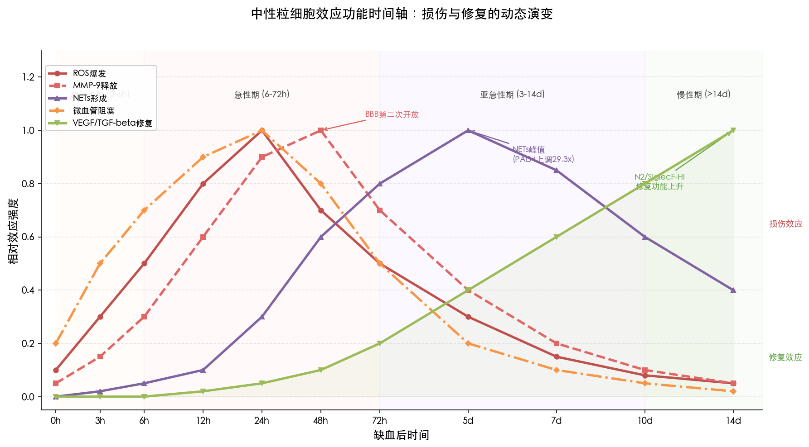

**图3-3 中性粒细胞效应功能时间轴。** 以缺血后时间为横轴，展示ROS爆发、MMP-9释放、NETs形成、微血管阻塞（损伤效应，红色系）和VEGF/TGF-β修复因子（修复效应，绿色）五条效应机制的相对强度动态曲线。背景色带标注超急性期、急性期、亚急性期和慢性期四个时间窗，关键节点包括BBB第二次开放（48 h）、NETs峰值（PAD4上调29.3倍）及N2/SiglecFᴴᴵ修复功能上升。

**超急性期（0–6 h）**：浸润先锋中性粒细胞以ROS爆发和颗粒储备MMP-9的快速释放为主要效应，启动BBB基质降解并促进后续免疫细胞浸润。同时，中性粒细胞在毛细血管中的物理性阻塞启动无复流进程。

**急性期（6–72 h）**：中性粒细胞浸润达峰，MMP-9与ROS形成正反馈环路，驱动BBB的第二次（不可逆）开放。NETs开始形成但尚未达峰。这一时期是MMP-9介导出血转化风险最高的窗口期，尤其在tPA治疗背景下风险进一步叠加。

**亚急性期（3–14天）**：NETs形成在第3–5天达峰并持续存在，通过STING-IFN-β通路持续抑制血管修复。与此同时，N2型和SiglecFᴴᴵ亚群开始发挥修复功能——分泌VEGF和TGF-β促进血管新生。MMP-9的功能亦开始向基质重塑方向转换。损伤与修复效应在此期并行存在，最终的病理转归取决于亚群组成和微环境条件。

**慢性期（>14天）**：tMCAO模型中脑实质中性粒细胞几乎消失，但pMCAO模型中NETs标志物仍可检出。NETs清除效率（取决于宿主DNase活性）可能是决定慢性期血管修复质量的关键变量。修复期MMP-9的受控活性则支持远期神经可塑性的实现。

我们认为，上述时间-亚群-机制的三维整合框架对治疗策略的设计具有直接指导意义。理想的中性粒细胞靶向干预应当在时间维度上精确匹配——急性期抑制ROS和MMP-9的过度释放，同时靶向NETs以减轻促血栓和促炎效应；但在修复期应保留甚至促进N2/SiglecFᴴᴵ亚群的促修复功能，避免全面抑制策略的不良后果。这一"精准调节而非全面抑制"的理念将贯穿第5章的治疗策略讨论。

# 第4章 中性粒细胞与脑内固有/适应性免疫细胞的互作网络

脑缺血后的免疫应答并非由单一细胞类型独立驱动，而是由中性粒细胞与脑内固有免疫细胞（小胶质细胞、星形胶质细胞、内皮细胞）及适应性免疫细胞（T细胞亚群）之间构成的多层级互作网络所协调。中性粒细胞兼具急性期先天免疫先锋效应细胞和先天-适应性免疫信号枢纽的双重身份，其与周围细胞的互作模式随缺血后时间演进而发生质的转变。本章系统阐述中性粒细胞与各主要细胞类型之间的双向调控机制（图4-1），解析从急性期到慢性期互作模式的相位转变，并将这些互作网络与不同临床结局——梗死扩大、出血转化、无复流现象、卒中后免疫抑制综合征（SIDS）及远期神经修复——加以关联。

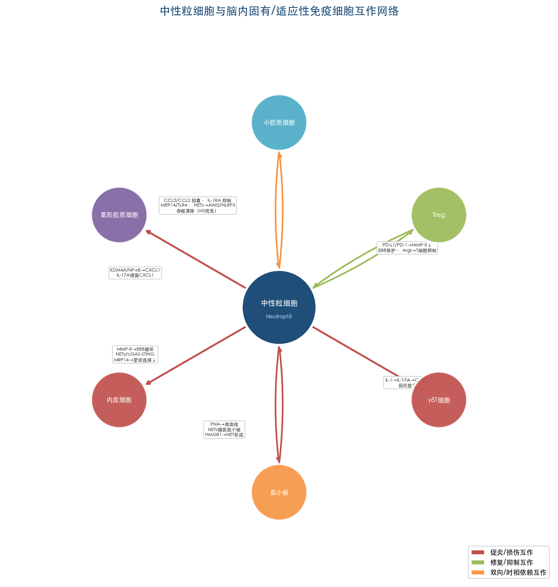

## 4.1 中性粒细胞与小胶质细胞的双向调控

小胶质细胞与中性粒细胞之间的互作构成脑缺血后神经炎症网络的核心轴线。这一互作具有鲜明的双向性：小胶质细胞既招募并调节中性粒细胞浸润，又通过吞噬清除限制中性粒细胞引发的二次损伤；中性粒细胞则通过释放促炎介质和胞外诱捕网（NETs）深刻重塑小胶质细胞的功能表型与存活命运。

### 4.1.1 小胶质细胞对中性粒细胞浸润的调控——"守门人"与"招募者"的双重角色

小胶质细胞在脑缺血后扮演着看似矛盾的双重角色。作为"守门人"，小胶质细胞对中性粒细胞的过度浸润施加关键抑制。利用CX3CR1^creER^:R26^iDTR^转基因系统消融小胶质细胞后，缺血性脑损伤反而加重，中性粒细胞募集显著增加。机制研究表明，小胶质细胞通过分泌IL-1受体拮抗剂（IL-1RA）抑制星形胶质细胞CXCL1表达，从而间接限制中性粒细胞的跨血脑屏障浸润；抗CXCL1中和抗体或重组IL-1RA均可缩小梗死体积 [Huang et al., Glia](https://pubmed.ncbi.nlm.nih.gov/36929654/ "小胶质细胞IL-1RA抑制中性粒细胞浸润, 2023")。

然而，活化的小胶质细胞也主动招募中性粒细胞。缺血再灌注后，小胶质细胞中瞬时受体电位通道蛋白1（TRPC1）表达显著上调，通过增强储存操纵性钙内流（SOCE）激活NFATc1，进而驱动CCL5和CCL2的转录上调。Transwell迁移实验证实，阻断CCL5/CCL2可有效减轻中性粒细胞迁移 [Qian et al., Brain Res Bull](https://pubmed.ncbi.nlm.nih.gov/38325758/ "TRPC1/Ca²⁺/NFATc1/CCL5通路, 2024")。因此，小胶质细胞对中性粒细胞浸润的净效应取决于其激活状态与微环境信号的平衡——在稳态或轻度缺血条件下以"守门"功能为主，而在重度缺血充分激活后，"招募"功能可能逐渐占据主导地位。

### 4.1.2 小胶质细胞对中性粒细胞的吞噬清除——从"优先吞噬"到功能障碍

小胶质细胞介导的吞噬清除对限制中性粒细胞驱动的神经炎症至关重要。Cuartero等人（2013）的经典研究表明，小胶质细胞对N2型（CD206⁺/Arg-1⁺）中性粒细胞具有优先吞噬偏好，清除率约为N1型的3倍；PPARγ激动剂罗格列酮可将N2比例从约31%提升至77%，与神经保护效应平行出现 [Cuartero et al., Stroke](https://www.ahajournals.org/doi/10.1161/strokeaha.113.002470 "N2 Neutrophils in Brain Inflammation, 2013; 44:3498-3508")。

然而，中性粒细胞并非被动接受吞噬清除。2025年Jin等人发表于*Advanced Science*的研究揭示了一个关键的负反馈中断机制：中性粒细胞来源的髓系相关蛋白14（MRP14/S100A9）充当"don't-eat-me"信号，通过TLR4受体诱导小胶质细胞线粒体功能障碍，降低ATP供能和细胞骨架重组能力，从而抑制吞噬功能。在414例急性缺血性卒中患者中，外周中性粒细胞计数与脑水肿分级呈正相关。MRP14基因敲除（KO）小鼠在tMCAO后24小时表现出显著增强的小胶质细胞吞噬功能（CD68荧光强度增加、Ly6G⁺小胶质细胞比例升高）和减少的脑内中性粒细胞聚积。单细胞RNA测序（scRNA-seq）进一步揭示，MRP14 KO小鼠中与吞噬相关的小胶质细胞cluster 1比例显著增加，而与焦亡相关的cluster 0比例降低。MRP14不仅是"don't-eat-me"信号，还作为"kill-you"信号通过TLR4/NF-κB通路激活小胶质细胞NLRP3炎症小体驱动焦亡——焦亡释放的IL-1β又经IL-1R1/MAPK/C/EBPβ通路上调中性粒细胞MRP14表达，并促进骨髓中性粒细胞动员，由此形成自我维持的炎症正反馈环路（图4-3）。MRP14抑制剂paquinimod（10 mg/kg静脉注射）可显著减轻BBB破坏、缩小梗死面积并改善神经功能预后 [Jin et al., Adv Sci](https://www.researchgate.net/publication/393007941 "MRP14介导中性粒细胞-小胶质细胞互作, 2025; 12:e03722")。

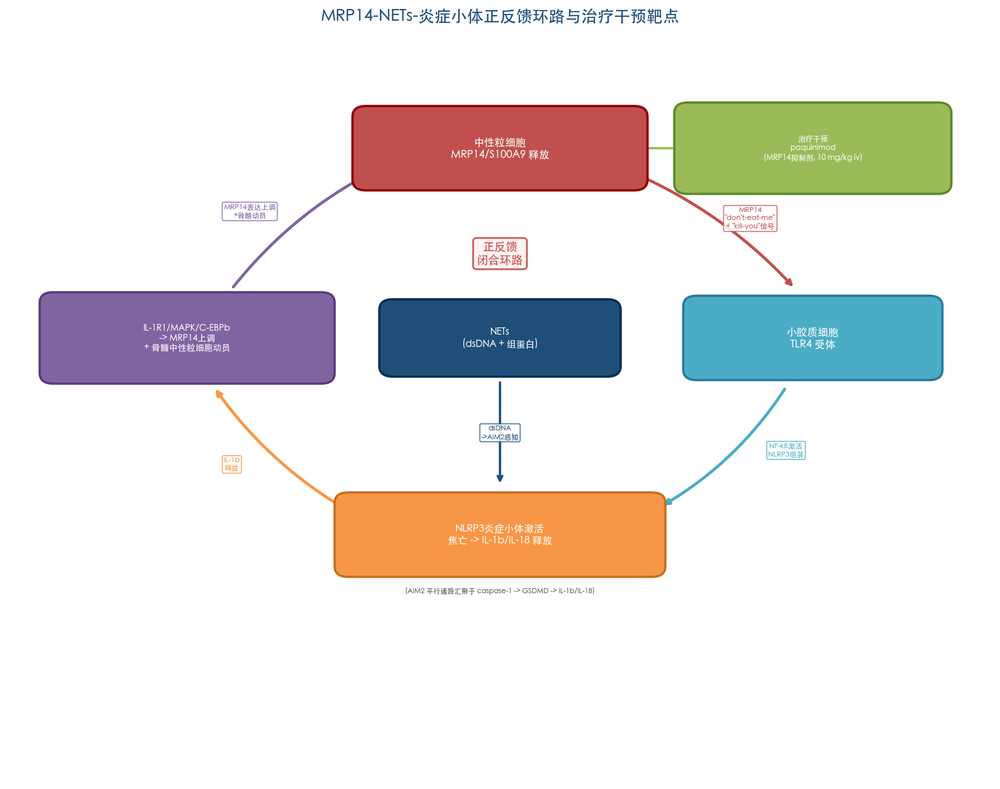

增强小胶质细胞吞噬能力构成一条有前景的治疗策略。NV-Rg1纳米囊泡通过AMPK-线粒体途径改善小胶质细胞代谢和吞噬能力，促进对中性粒细胞的清除，由此减少NETs释放并促进血管新生 [NV-Rg1研究](https://pmc.ncbi.nlm.nih.gov/articles/PMC11790502/ "Rg1增强小胶质细胞吞噬中性粒细胞, 2025")。

### 4.1.3 NETs对小胶质细胞极化和炎症小体活化的调控

中性粒细胞胞外诱捕网（NETs）是中性粒细胞反向调控小胶质细胞功能的关键效应分子。在tMCAO模型中，瓜氨酸化组蛋白H3（CitH3）于缺血后第3天达峰，AIM2/ASC/cleaved caspase-1同步上调。PAD4抑制剂GSK484可降低AIM2、IL-1β、IL-18和N-GSDMD水平；而AIM2基因敲低后GSK484不再产生额外获益，这一因果链验证了NETs主要通过激活小胶质细胞AIM2炎症小体驱动焦亡。体外实验中，300 ng/mL NETs刺激BV2小胶质细胞12小时即可显著增加IL-1β和IL-18分泌 [Aging Dis 2025](https://www.aginganddisease.org/EN/10.14336/AD.2024.1733 "NETs-AIM2炎症小体因果验证, 2025")。来自19例取栓患者的临床数据进一步支持这一通路的临床转化价值：梗死部位动脉血浆NET水平（CitH3-DNA）显著高于股动脉和静脉血，其差值与24小时NIHSS评分正相关（r = 0.46, P = 0.05）[Aging Dis 2025](https://www.aginganddisease.org/EN/10.14336/AD.2024.1733 "临床NET水平与卒中严重程度, 2025")。

除AIM2外，NLRP3炎症小体亦是NETs-小胶质细胞互作的重要信号节点。Byun等人（2023）利用NLRP3基因敲除小鼠在LPS诱导的神经炎症模型中证实，NLRP3并不影响中性粒细胞向脑内的浸润数量，但显著促进浸润后的NETosis过程（Ly6G⁺CitH3⁺MPO⁺三阳性细胞在KO小鼠中显著减少）。双光子活体成像直接可视化了这一差异。NLRP3缺陷减轻BBB损伤（Claudin-5和ZO-1表达恢复）并降低脑IL-1β水平；中性粒细胞耗竭同样降低IL-1β但不影响TNF-α，提示IL-1β是NETs-NLRP3通路驱动神经炎症的关键下游介导因子 [Byun et al., Immune Netw](https://www.immunenetwork.org/DOIx.php?id=10.4110/in.2023.23.e27 "NLRP3促进脑内NETosis, 2023; 23(3):e27")。2026年一项创伤性脑损伤研究进一步构建了NLRP3/GSDMD→NETs→小胶质细胞促炎极化的完整信号轴：MCC950抑制NLRP3或双硫仑抑制GSDMD均可减少NET形成、促进小胶质细胞从CD86⁺促炎表型向CD206⁺抗炎表型转化、降低促炎细胞因子水平（IL-1β/TNF-α/IL-6/IL-18），并改善BBB完整性和14–42天的行为学预后 [Liu et al., Cell Commun Signal](https://pmc.ncbi.nlm.nih.gov/articles/PMC12853595/ "NLRP3/GSDMD依赖的NETs加剧小胶质细胞介导的神经炎症, 2026; 24:65")。

综合AIM2和NLRP3两条炎症小体通路的证据，NETs通过多重模式识别受体激活小胶质细胞炎症信号：NETs中富含的游离双链DNA被AIM2直接感知（详见第3章），而NETs相关组蛋白和颗粒蛋白则可能经由NLRP3通路激活炎症小体。这两条通路均汇聚于caspase-1活化→GSDMD裂解→IL-1β/IL-18成熟释放的终末效应事件，构成NETs驱动小胶质细胞焦亡的"双保险"机制。

## 4.2 中性粒细胞与星形胶质细胞的互作——趋化信号轴与BBB调控

星形胶质细胞是中性粒细胞脑浸润的关键上游调控者。其核心机制在于通过CXCL1趋化轴放大中性粒细胞的跨血脑屏障迁移，而CXCL1的表达水平受到表观遗传调控和适应性免疫信号的双重驱动。

### 4.2.1 KDM4A/NF-κB/CXCL1表观遗传调控轴

缺血后星形胶质细胞中赖氨酸去甲基化酶KDM4A呈特异性上调。利用GFAP-Cre;Kdm4a^fl/fl^条件敲除模型的研究表明，星形胶质细胞特异性KDM4A缺失可显著缩小梗死体积、降低BBB通透性，并特异性减少中性粒细胞浸润——而CD4⁺T细胞、CD8⁺T细胞、B细胞、巨噬细胞和NK细胞的浸润均未受到影响，体现了该通路对中性粒细胞募集的高度选择性。机制上，KDM4A通过去甲基化H3K9me3与NF-κB p65协同激活*Cxcl1*基因转录，从而在表观遗传层面驱动中性粒细胞趋化 [Huang et al., J Cereb Blood Flow Metab](https://pmc.ncbi.nlm.nih.gov/articles/PMC10981400/ "KDM4A调控中性粒细胞浸润, 2024")。

### 4.2.2 IL-1→γδT/IL-17A→星形胶质细胞CXCL1级联

星形胶质细胞CXCL1的表达还受到适应性免疫细胞的间接调控，构成一条跨越先天-适应性免疫边界的多级信号级联。IL-1基因缺陷（*Il1*^−/−^）小鼠在pMCAO后表现出梗死缩小和中性粒细胞浸润减少。机制分析揭示，缺血释放的IL-1诱导γδT细胞产生IL-17A，IL-17A与TNF协同显著增强星形胶质细胞CXCL1表达，最终驱动中性粒细胞募集，由此构成完整的"IL-1→γδT细胞/IL-17A→星形胶质细胞CXCL1→中性粒细胞"信号级联 [Schädlich et al., Neuromolecular Med](https://pubmed.ncbi.nlm.nih.gov/35384588/ "IL-1/IL-17A/CXCL1级联, 2022")。

此外，如4.1.1节所述，小胶质细胞通过IL-1RA抑制星形胶质细胞CXCL1表达，为上述级联提供负调控。因此，星形胶质细胞CXCL1的最终输出水平取决于正向信号（IL-1、IL-17A、KDM4A介导的表观遗传激活）与负向信号（小胶质细胞来源的IL-1RA）之间的动态平衡。缺血的严重程度和时相可能是决定这一平衡倾斜方向的关键因素：在重度缺血或小胶质细胞功能障碍状态下，正向信号占优，中性粒细胞过度浸润加剧损伤。

## 4.3 中性粒细胞与血管系统的互作——BBB破坏与血栓炎症

### 4.3.1 中性粒细胞-内皮细胞互作与BBB破坏

中性粒细胞与脑微血管内皮细胞之间的互作是血脑屏障破坏的直接效应通路。如第3章详述，中性粒细胞是脑缺血后24小时内活性MMP-9的主要细胞来源，MMP-9直接降解BBB基底膜IV型胶原 [Rosell et al., Stroke](https://pubmed.ncbi.nlm.nih.gov/18323498/ "MMP-9阳性中性粒细胞与BBB破坏, 2008")。NETs则通过至少两条独立的核酸感知通路进一步损害内皮屏障功能：其一，AIM2通路驱动小胶质细胞焦亡释放的IL-1β间接破坏BBB；其二，cGAS-STING通路直接作用于内皮细胞——NETs中的游离DNA被cGAS感知后激活STING→IFN-β信号，抑制血管修复并降低周细胞覆盖率 [Kang et al., Nat Commun](https://www.nature.com/articles/s41467-020-16191-y "NETs损害血管重塑, 2020")。

中性粒细胞来源的MRP14（S100A9）在BBB损伤中的作用近期获得直接验证。如4.1.2节所述，MRP14通过促进小胶质细胞焦亡释放IL-1β间接损害BBB。与此同时，来自野生型小鼠的中性粒细胞移植至MRP14 KO小鼠后显著加重BBB渗漏（Evans blue和纤维蛋白原外渗增加）、降低紧密连接蛋白（ZO-1、Occludin、VE-Cadherin）表达并扩大梗死面积，而移植MRP14 KO中性粒细胞则无此效应 [Jin et al., Adv Sci](https://www.researchgate.net/publication/393007941 "中性粒细胞源MRP14驱动BBB破坏, 2025; 12:e03722")。这一交叉移植实验直接证明中性粒细胞源性MRP14是BBB损伤的独立致病因子。

### 4.3.2 中性粒细胞-血小板互作与血栓炎症

中性粒细胞-血小板聚合体（platelet-neutrophil aggregate, PNA）是血栓炎症（thromboinflammation）的核心效应结构。缺血性卒中患者循环PNA水平在急性期显著升高。促凝血小板（磷脂酰丝氨酸外翻/αIIbβ3失活表型）优先与中性粒细胞形成聚合体，其促凝能力与卒中严重程度及预后密切相关。血小板cyclophilin D基因敲除使促凝血小板无法形成，在卒中模型中表现出显著保护作用 [Denorme et al., Curr Opin Hematol](https://pmc.ncbi.nlm.nih.gov/articles/PMC8483595/ "血栓炎症综述, 2021")。

NETs在PNA形成过程中充当正反馈放大器：NETs的网状结构物理捕获血小板和红细胞，其中组蛋白和DNA直接激活血小板并促进凝血酶生成，形成"中性粒细胞→NETs→血小板活化→更多中性粒细胞募集"的促血栓正反馈环路。血小板来源的HMGB1被确认为NET形成的关键上游介导物 [Denorme et al., J Clin Invest](https://pmc.ncbi.nlm.nih.gov/articles/PMC9106355/ "血小板HMGB1与NETs, 2022")。这一正反馈在微血管水平的直接后果即为无复流现象：双光子活体成像证实梗死核心和半暗带约20%–30%的毛细血管被中性粒细胞阻塞；anti-Ly6G介导的中性粒细胞耗竭可恢复微血管灌注并缩小梗死体积，且不增加出血风险 [El Amki et al., Cell Rep](https://pubmed.ncbi.nlm.nih.gov/33053341/ "无复流机制, 2020; 33:108260")。

## 4.4 中性粒细胞与适应性免疫细胞的互作——先天免疫与适应性免疫的桥接

中性粒细胞不仅是先天免疫的效应细胞，还通过与T细胞亚群的多维互作深刻塑造脑缺血后的适应性免疫微环境，对远期神经功能结局产生深远影响。

### 4.4.1 γδT细胞-中性粒细胞轴：急性期的促炎放大器

γδT细胞在卒中后24小时即浸润缺血脑组织，其分泌的IL-17A在急性期达峰。如4.2.2节详述，IL-17A通过星形胶质细胞CXCL1放大中性粒细胞募集，构成急性期最重要的促炎放大回路之一。值得关注的是，肠道微生物群的组成可调控这一轴的活性：改变肠道微生物群可减少肠道IL-17⁺γδT细胞向脑膜的转运，从而减轻缺血损伤——这一发现揭示了肠-脑轴调控卒中后中性粒细胞浸润的重要途径 [Schädlich et al., Neuromolecular Med](https://pubmed.ncbi.nlm.nih.gov/35384588/ "γδT-IL-17A轴, 2022"); [Benakis et al., Nat Med 2016, 引自SIIS综述](https://pmc.ncbi.nlm.nih.gov/articles/PMC8183083/ "肠-脑轴")。

### 4.4.2 Treg-中性粒细胞轴：亚急性期的免疫制动机制

调节性T细胞（Treg）在卒中亚急性期扩增，通过PD-L1/PD-1共抑制信号向中性粒细胞传递功能抑制，具体表现为抑制MMP-9表达、减少浸润并维护BBB完整性。这一互作代表了亚急性期"促炎→修复"免疫转换的重要分子基础 [Treg综述](https://pmc.ncbi.nlm.nih.gov/articles/PMC10239790/ "Treg-中性粒细胞PD-L1/PD-1互作")。

此外，脑浸润Treg还可通过分泌骨桥蛋白促进小胶质细胞介导的白质修复 [Treg综述](https://pmc.ncbi.nlm.nih.gov/articles/PMC10239790/ "Treg-中性粒细胞PD-L1/PD-1互作")，由此形成一条间接但功能重要的双重修复通路："Treg→抑制中性粒细胞MMP-9→保护BBB"与"Treg→小胶质细胞→白质修复"协同运作，共同推动亚急性期组织修复。

### 4.4.3 SiglecF⁺中性粒细胞与Th17细胞的促炎协同效应

尽管SiglecF⁺中性粒细胞在脑缺血模型中的直接证据尚有限，但实验性自身免疫性脑脊髓炎（EAE）模型的研究为这一亚群在中枢神经系统神经炎症背景下的功能提供了重要参考。SiglecF⁺中性粒细胞由GM-CSF单独或与TGF-β协同在组织微环境中诱导产生，该亚群促进Th17分化、抑制Treg发育，加剧Th17介导的神经炎症。抗SiglecF抗体治疗可减轻EAE严重程度，而不影响总中性粒细胞群体 [Hu et al., Immune Network](https://pmc.ncbi.nlm.nih.gov/articles/PMC12226254/ "SiglecF加剧神经炎症, 2025; 25:e19")。这一发现提示，若SiglecF⁺中性粒细胞同样存在于缺血脑组织中，其可能通过推动Th17/Treg平衡向促炎方向偏移而加剧慢性期神经炎症。

## 4.5 互作网络的时相转变与临床结局导向

上述各类互作并非静态共存，而是随缺血后的时间演进发生质的转变（图4-2）。据此，可以构建一个整合性的"互作-结局"因果框架，将分子层面的细胞互作与宏观临床结局加以关联。

### 4.5.1 急性期互作网络（0–72小时）：损伤放大

在急性期，多条互作通路汇聚形成正反馈环路，协同放大组织损伤：

**梗死扩大通路**：中性粒细胞浸润→NETs形成→AIM2/NLRP3双重炎症小体激活→小胶质细胞焦亡→IL-1β大量释放→(1) 直接神经毒性；(2) 正反馈招募更多中性粒细胞（经IL-1→γδT/IL-17A→星形胶质细胞CXCL1级联）；(3) MRP14/TLR4抑制小胶质细胞吞噬功能→中性粒细胞聚积进一步加剧。

**出血转化通路**：中性粒细胞MMP-9直接降解BBB基底膜，同时NETs经cGAS-STING通路损害内皮紧密连接。30例EVT患者的前瞻性数据显示，MMP-9水平升高128.1%为出血转化预测的最佳截断值（ROC AUC = 0.701）[Huang et al., Front Neurol](https://www.frontiersin.org/journals/neurology/articles/10.3389/fneur.2024.1400270/full "MMP-9预测出血转化, 2024")。tPA溶栓可进一步通过LRP-1/PAD4通路直接激活中性粒细胞产生NETs，NETs经cGAS-STING加剧tPA诱导的BBB破坏——PAD4缺陷使tPA相关脑出血减少68% [Wang et al., Blood](https://ashpublications.org/blood/article/138/1/91/475346/ "NETs-cGAS-tPA出血, 2021")。

**无复流通路**：中性粒细胞-血小板聚合体阻塞微血管+NETs捕获血小板形成微血栓。

### 4.5.2 亚急性期互作转换（3–14天）：从损伤到修复的关键窗口

亚急性期是互作网络性质发生"相位转换"的关键窗口期。多种机制协同推动从促炎损伤向组织修复的转变：

(1) **Treg的免疫制动效应**：亚急性期Treg扩增通过PD-L1/PD-1抑制中性粒细胞MMP-9表达，减少持续浸润，维护BBB完整性，同时通过骨桥蛋白促进小胶质细胞介导的白质修复。

(2) **小胶质细胞吞噬清除的修复效应**：小胶质细胞对中性粒细胞（尤其N2型）的吞噬清除减少NETs释放→解除STING-IFN-β对血管修复的抑制→促进周细胞覆盖和微血管新生。DNase I降解NETs可显著增加周细胞覆盖率和灌注毛细血管长度 [Kang et al., Nat Commun](https://www.nature.com/articles/s41467-020-16191-y "NETs损害血管重塑, 2020")。

(3) **中性粒细胞的表型转化**：部分存活的N2型中性粒细胞分泌VEGF和TGF-β，直接参与血管新生和基质重塑。

若上述修复机制启动不足或正反馈环路未能及时中断，亚急性期的损伤将持续延续。pMCAO模型中NETs标志物H3Cit持续至14天 [Kang et al., Nat Commun](https://www.nature.com/articles/s41467-020-16191-y "NETs持续至14天, 2020")，提示在缺乏再灌注的条件下，NETs-炎症小体-小胶质细胞焦亡的正反馈环路可能延续至亚急性期甚至更晚阶段。

### 4.5.3 卒中后免疫抑制综合征（SIDS）：互作网络的系统性后果

中性粒细胞在脑缺血后不仅参与局部神经炎症，还是全身免疫抑制的重要介导者。约30%的卒中患者发生院内感染，其背后机制涉及中性粒细胞与适应性免疫细胞互作的深层失衡。SIDS的核心通路包括：

(1) **AIM2感知cfDNA→单核细胞IL-1β→FasL⁺单核细胞→T细胞凋亡**：脑损伤释放的细胞游离DNA（cfDNA）通过AIM2驱动单核细胞IL-1β释放，FasL⁺单核细胞诱导T细胞凋亡 [Roth et al., Immunity](https://pubmed.ncbi.nlm.nih.gov/33667383/ "AIM2-SIDS机制, 2021")。

(2) **中性粒细胞Arginase I释放→L-精氨酸耗竭→T细胞增殖抑制**：活化中性粒细胞大量释放Arginase I，消耗微环境中的L-精氨酸。L-精氨酸是T细胞增殖和功能维持的必需氨基酸，其耗竭直接导致T细胞增殖受损 [Faura et al., J Neuroinflammation](https://pmc.ncbi.nlm.nih.gov/articles/PMC8183083/ "SIDS综述, 2021")。

(3) **中性粒细胞自身杀菌功能受损**：卒中后中性粒细胞氧化爆发和NETosis能力下降，直接削弱宿主抗感染防御。

SIDS的发生表明脑缺血后中性粒细胞互作网络的影响远超脑局部范畴——它从根本上重塑了全身免疫格局，使卒中后感染成为影响患者预后的重要不良临床结局。

### 4.5.4 互作-结局的整合模型

综合以上分析，中性粒细胞互作网络导向不同临床结局的因果链可归纳为以下五条主线（图4-2）：

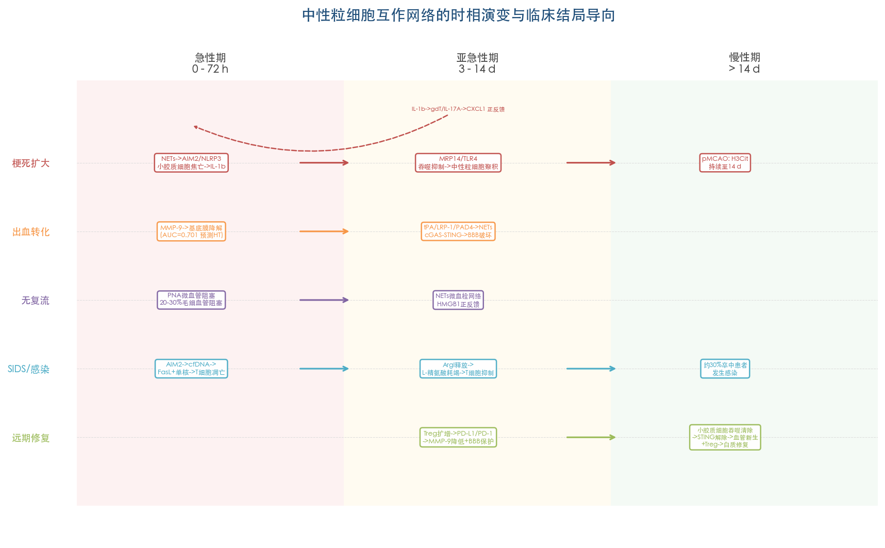

(1) **梗死扩大**：NETs→AIM2/NLRP3小胶质细胞焦亡→IL-1β正反馈+MRP14/TLR4吞噬抑制→中性粒细胞聚积→持续损伤。

(2) **出血转化**：MMP-9直接降解基底膜+NETs/cGAS-STING双通路BBB损伤+tPA/PAD4/NETs额外加重。

(3) **无复流**：PNA微血管阻塞+NETs微血栓网络。

(4) **SIDS与卒中后感染**：Arginase I/FasL→T细胞凋亡/功能抑制+中性粒细胞自身杀菌功能受损。

(5) **远期恢复（有利结局）**：小胶质细胞吞噬中性粒细胞→减少NETs→解除STING-IFN-β血管修复抑制→血管新生+Treg-小胶质细胞白质修复+N2中性粒细胞VEGF/TGF-β促修复。

这一整合框架的核心启示在于：中性粒细胞互作网络的最终走向——损伤抑或修复——取决于时间窗口、中性粒细胞亚群构成、小胶质细胞功能状态以及适应性免疫应答的介入时机四个关键维度。未来的治疗策略不应追求简单的"中性粒细胞耗竭"，而应在正确的时间窗口内精准调控关键互作节点——例如阻断急性期MRP14/TLR4或NETs-AIM2通路，同时保留亚急性期小胶质细胞吞噬和Treg修复功能——以实现从损伤向修复的最优转换。

# 第5章 从基础到转化——治疗靶点与临床转化挑战

前述章节系统阐述了中性粒细胞在脑缺血各时期的动态演变、亚群异质性、效应功能及其与其他免疫细胞的互作网络，为开发以中性粒细胞为靶点的脑缺血治疗策略提供了丰富的分子靶点与机制依据。然而，从实验室发现到临床获益之间横亘着巨大的转化鸿沟——迄今唯一进入II期随机对照试验（RCT）的中性粒细胞靶向药物UK-279,276以阴性结果告终，而抗ICAM-1抗体Enlimomab甚至显著恶化了患者预后。这些教训深刻揭示了中性粒细胞靶向治疗所面临的核心挑战：治疗时间窗与分子事件时序的失配、中性粒细胞损伤-修复功能的双重性、患者群体的高度异质性以及种属间的生物学差异。本章将以治疗策略的靶点层级为主线——从既往失败教训出发，经由靶向NETs、新兴分子靶点、极化调控到纳米仿生递送——系统评估各策略的临床前证据强度与转化前景，深入剖析既往临床试验失败的多维度原因，并就新一代临床试验设计的优化方向提出建议。

## 5.1 既往临床试验的失败教训

### 5.1.1 ASTIN试验——迄今唯一的中性粒细胞靶向卒中RCT

ASTIN试验（Acute Stroke Therapy by Inhibition of Neutrophils）是迄今唯一以中性粒细胞为直接靶点的缺血性卒中II期RCT [Krams et al., Stroke](https://pubmed.ncbi.nlm.nih.gov/14563972/ "ASTIN试验, 2003;34:2543-2548")。该试验于2003年发表，采用贝叶斯自适应剂量探索设计，纳入966例急性缺血性卒中患者，评估UK-279,276（一种重组CD11b/CD18整合素拮抗剂，靶向MAC-1）在10–120 mg剂量范围内的有效性。给药时间窗设定为发病后6小时内，实际中位治疗启动时间为4.1小时；主要终点为90天斯堪的纳维亚卒中量表（SSS）评分变化。该试验因在预定的中期分析中未能达到预设疗效阈值而提前终止，无效后验概率达0.89。事后亚组分析提示，接受tPA溶栓联合UK-279,276的患者可能获得约1.6分的额外改善，但该信号未达统计学显著性，不足以支持进一步的III期验证 [Krams et al., Stroke](https://pubmed.ncbi.nlm.nih.gov/14563972/ "ASTIN试验, 2003;34:2543-2548")。

### 5.1.2 Enlimomab试验——非选择性免疫干预的深刻教训

与ASTIN试验平行的另一关键失败案例是Enlimomab试验（1997/2001），该研究在625例急性缺血性卒中患者中评估了鼠源抗ICAM-1单克隆抗体的疗效。结果不仅未显示任何获益，反而显著恶化了患者预后（P = 0.004）。后续机制分析揭示，鼠源抗体在人体内激活了补体系统并诱导中性粒细胞二次活化，导致全身性炎症反应 [Jickling et al., JCBFM](https://pmc.ncbi.nlm.nih.gov/articles/PMC4640255/ "临床试验失败分析综述, 2015")。这一结果从反面印证了中性粒细胞在急性卒中病理进程中的核心参与——药物不当激活中性粒细胞即可显著加重损伤——但同时也警示了抗体来源及免疫原性问题在转化研究中的决定性影响。

### 5.1.3 失败原因的多维度解析

综合ASTIN与Enlimomab的教训，中性粒细胞靶向卒中治疗的临床失败并非单一因素所致，而是多个维度问题的叠加。

**靶点时间窗与分子事件时序的失配**。MAC-1/CD11b/CD18在脑缺血后15分钟即开始上调，但ASTIN试验的实际中位给药时间为4.1小时，已显著滞后于中性粒细胞黏附级联的关键启动窗口。如第1章所述，P-selectin在缺血后15分钟上调、E-selectin在2小时内启动、ICAM-1介导的黏附从30分钟起持续至48小时 [Moustafa & Baron, Front Aging Neurosci](https://pmc.ncbi.nlm.nih.gov/articles/PMC9813499/ "中性粒细胞动力学, 2022")，这意味着当药物到达靶点时，黏附级联的核心步骤已经启动甚至完成。

**种属间生物学差异**。UK-279,276的临床前疗效数据主要基于啮齿类模型，但人类与小鼠中性粒细胞在基因表达（Pearson r = 0.79，但约25%蛋白质组存在差异）、受体组成（人类缺乏小鼠常用的Ly6G标志物）和细胞比例（人类中性粒细胞占白细胞总数50%–70%，小鼠仅10%–25%）方面存在实质性差异 [Hackert et al., Nat Commun](https://www.nature.com/articles/s41467-023-43573-9 "人鼠中性粒细胞跨物种比较, 2023;14:8133")。这些差异可能导致药物在人体中的靶点结合动力学和下游效应与啮齿类模型存在显著偏差。

**非选择性抑制的功能双重性代价**。ASTIN试验采用的全面MAC-1阻断策略未能区分中性粒细胞的有害功能与有益功能。如第2章和第3章所述，N2型中性粒细胞（CD206⁺/Arg-1⁺）在亚急性期分泌VEGF和TGF-β参与血管新生，且被小胶质细胞优先吞噬清除以促进炎症消退 [Cuartero et al., Stroke](https://www.ahajournals.org/doi/10.1161/strokeaha.113.002470 "N2 Neutrophils, 2013; 44:3498-3508")。非选择性阻断在抑制有害效应的同时，也消除了这些修复性功能，可能导致净获益接近于零甚至为负。

**患者群体的高度异质性**。ASTIN试验纳入的患者中仅部分接受了溶栓治疗，而中性粒细胞浸润动态在再灌注与永久性缺血之间差异显著——如第1章所述，tMCAO模型24小时时中性粒细胞浸润显著多于pMCAO（131 ± 69 vs 31 ± 18细胞/切片, P < 0.05），但5天时pMCAO反超 [Zhou et al., Brain Pathol](https://pmc.ncbi.nlm.nih.gov/articles/PMC8029251/ "tMCAO vs pMCAO, 2013; 23:34-44")。患者间再灌注状态的巨大差异，叠加梗死面积、侧支循环代偿等因素的异质性，使得中性粒细胞靶向治疗的潜在疗效信号被严重稀释。

## 5.2 靶向NETs的治疗策略——当前最具转化前景的方向

鉴于第3章和第4章详述的NETs在急性期（促血栓形成、BBB破坏、炎症小体激活）和亚急性期（通过STING-IFN-β通路抑制血管修复）中的核心病理作用，靶向NETs已成为中性粒细胞相关卒中治疗领域中证据积累最充分、临床转化推进最积极的方向。当前策略涵盖四个互补层面：降解已形成的NETs（DNase I）、从源头阻断NETs生成（PAD4抑制剂）、天然内源性NETs抑制（nNIF）以及阻断NETs释放的膜通道（GSDMD抑制剂）。

### 5.2.1 DNase I——从临床前验证到注册临床试验

DNase I通过酶解NETs的DNA骨架实现NETs降解。在tMCAO模型中，DNase I使梗死体积从76.1 ± 22.9 mm³降至45.7 ± 20.2 mm³（降幅约40%）[Denorme et al., J Clin Invest](https://pmc.ncbi.nlm.nih.gov/articles/PMC9106355/ "DNase I, 2022")。值得关注的是，DNase I的保护效应并不局限于急性期梗死面积缩小，还延伸至亚急性期的血管重塑——给药后14天可观察到周细胞覆盖率和灌注毛细血管长度的显著增加，其机制与降解NETs后解除STING-IFN-β通路的持续激活、从而解除对血管新生的抑制有关 [Kang et al., Nat Commun](https://www.nature.com/articles/s41467-020-16191-y "血管重塑, 2020")。2025年一项研究进一步在老龄小鼠中证实了动脉内DNase给药的可行性和有效性，同时发现白天给药（小鼠非活动期）的保护效果优于夜间给药，提示DNase I的疗效可能受到昼夜节律调控 [Yin et al., CNS Neurosci Ther](https://pmc.ncbi.nlm.nih.gov/articles/PMC12129710/ "IA DNase, 2025"); [Tuz et al., Stroke](https://pubmed.ncbi.nlm.nih.gov/39869712/ "昼夜节律与DNase, 2025")。

然而，2024年发表于*Stroke*的一项关键安全性研究为DNase I的临床转化提出了重要警示。在小鼠tMCAO模型中，延迟给药（缺血后72小时）的DNase I显著增加了出血转化的发生率和面积，而即刻给药组未见此效应；更值得警惕的是，即使在即刻给药条件下，DNase I联合tPA同样显著增加了出血风险 [Hermann et al., Stroke](https://www.ahajournals.org/doi/10.1161/STROKEAHA.124.047862 "延迟DNase-I与出血转化, 2024")。研究者推测，NETs在缺血血管上形成的DNA结构可能对受损微血管起到物理"封堵"作用，DNase I降解这些结构可能导致微血管破裂。相比之下，同一研究中GSDMD抑制剂LDC7559在相同延迟给药方案中未引起出血转化，可能因为它阻断的是NETs的新释放而非已沉积的DNA结构。这一发现对DNase I临床试验的给药时间窗设计和溶栓联合方案的安全性监测具有直接指导意义。

在临床转化层面，已有三项DNase I治疗缺血性卒中的RCT完成注册。其中，ReSCInD试验（NCT05880524）是首个以DNase治疗缺血性卒中的II期RCT，由慕尼黑大学主导，采用单中心、随机、安慰剂对照、单盲设计，计划纳入36例NIHSS ≥ 10的急性缺血性卒中患者，在发病12小时内静脉给予Dornase alfa 500 μg/kg，主要终点为全身免疫反应的变化，预计2026年1月完成 [ReSCInD试验](https://clinicaltrials.gov/study/NCT05880524 "NCT05880524, Phase 2")。ReSCInD选择以全身免疫反应（而非梗死体积或功能结局）作为主要终点，体现了新一代中性粒细胞靶向试验的务实策略——先在小样本中验证靶点可及性和生物标志物反应，再据此优化设计、推进至以功能结局为终点的大型III期试验。

### 5.2.2 PAD4抑制剂——从NETs形成的源头阻断

PAD4（肽基精氨酸脱亚胺酶4）催化组蛋白精氨酸的瓜氨酸化修饰，是NETs形成的核心上游限速酶。与DNase I降解已形成的NETs不同，PAD4抑制剂从源头阻断NETs的生成。这一策略在理论上可能规避DNase I延迟给药所面临的出血风险——因为它不破坏已沉积在微血管上的DNA结构。

多种化学骨架的PAD4抑制剂在脑缺血模型中展现了显著且一致的保护效应。GSK-199（可逆性PAD4选择性抑制剂）使tMCAO梗死体积从76.1 mm³降至44.1 mm³（降幅约42%），且不影响中性粒细胞总募集数量，表明其保护作用特异性地来自NETs抑制而非中性粒细胞耗竭 [Denorme et al., J Clin Invest](https://pmc.ncbi.nlm.nih.gov/articles/PMC9106355/ "GSK-199, 2022")。GSK484通过NETs-AIM2炎症小体通路发挥保护作用，AIM2基因敲低后GSK484的额外获益被消除，从因果层面验证了该靶点的特异性 [Aging Dis 2025](https://www.aginganddisease.org/EN/10.14336/AD.2024.1733 "GSK484-AIM2")。Cl-amidine（不可逆PAD抑制剂）使BBB通透性降低39.3%并抑制STING-IFN-β通路 [Kang et al., Nat Commun](https://www.nature.com/articles/s41467-020-16191-y "Cl-amidine, 2020")。BB-Cl-amidine（第二代不可逆PAD4抑制剂）在大鼠MCAO模型中同样展现了保护效应 [Xu et al., Front Pharmacol](https://www.frontiersin.org/journals/pharmacology/articles/10.3389/fphar.2025.1537566/full "BB-Cl-amidine, 2025")。

PAD4抑制剂临床转化面临的核心安全性问题在于感染风险的增加。2026年发表于*Frontiers in Immunology*的一篇系统性综述首次以"获益-风险-机遇"框架全面评估了PAD4抑制的免疫学后果 [Bonilha & Veras, Front Immunol](https://pmc.ncbi.nlm.nih.gov/articles/PMC12979119/ "PAD4抑制获益-风险评估, 2026; 17:1769421")。该综述指出，PAD4的催化活性远超NETs形成本身——PAD4介导的蛋白质瓜氨酸化还调控细胞因子/趋化因子修饰、抗原呈递和适应性免疫激活等多个免疫过程。在感染性疾病中，PAD4依赖性NETosis是限制病原体扩散的重要防御机制，抑制PAD4可导致宿主病原体控制能力下降。在脑缺血转化场景中，这一风险尤为突出——约30%的卒中患者发生卒中后免疫抑制综合征（SIDS）相关感染（详见第4章），卒中本身已损害中性粒细胞的杀菌功能，PAD4抑制可能进一步加剧感染易感性。

此外，当前大多数PAD4抑制剂（包括Cl-amidine和GSK484）在有效浓度下会部分交叉抑制PAD2同工酶，而PAD2在单核细胞、淋巴细胞和非免疫组织中广泛表达，交叉抑制可能引发更广泛的免疫调节效应 [Bonilha & Veras, Front Immunol](https://pmc.ncbi.nlm.nih.gov/articles/PMC12979119/ "同工酶交叉抑制, 2026; 17:1769421")。因此，开发高选择性PAD4抑制剂（如2025年报道的靶向Ca²⁺依赖性变构位点的新型化合物）并建立脑缺血特异性的安全性评价体系，是推进该策略临床转化的必要前提。

### 5.2.3 nNIF——源自新生儿的天然NET抑制因子

新生儿NET抑制因子（neonatal NET-Inhibitory Factor, nNIF）是一种天然存在的内源性NETs形成抑制多肽，其在脑缺血模型中展现了迄今最为全面的临床前疗效数据 [Denorme et al., J Clin Invest](https://pmc.ncbi.nlm.nih.gov/articles/PMC9106355/ "nNIF治疗数据, 2022")。预防性给药使梗死体积从80.6 ± 23.5 mm³降至37.5 ± 14.6 mm³（降幅53.5%, P < 0.001），脑组织中NET形成中性粒细胞比例从29.9%降至11.7%。nNIF在转化前景上具有以下显著优势：其一，卒中后1小时延迟给药仍能产生显著保护效应，提供了比DNase I更宽的临床可操作时间窗；其二，在糖尿病和老龄小鼠中均验证了疗效，直接回应了合并症背景下的药效担忧；其三，21天长期随访显示持续的功能改善，提示nNIF不仅缓解急性期损伤，还有助于长期神经功能恢复。该研究同时确认血小板来源的HMGB1是触发缺血后NETs形成的关键上游介导分子。nNIF的内源性来源与较宽的治疗时间窗使其转化潜力可能优于DNase I和PAD4抑制剂，但其药代动力学特征、规模化生产工艺和人体安全性数据尚有待系统评估。

### 5.2.4 GSDMD抑制——基于药物重定向的快速转化策略

Gasdermin D（GSDMD）在中性粒细胞中介导NETs释放过程中的膜孔形成，是NETosis的关键执行分子。GSDMD基因缺失可减少脑内中性粒细胞浸润并改善卒中结局 [GSDMD研究](https://pmc.ncbi.nlm.nih.gov/articles/PMC9908898/ "GSDMD与卒中")。在临床转化层面，双硫仑（disulfiram）——一种已获FDA批准的酒精依赖治疗用药——被发现可作为GSDMD的药理学抑制剂，在tMCAO模型中减少中性粒细胞浸润和梗死体积 [双硫仑研究](https://www.nature.com/articles/s41420-023-01440-y "双硫仑抑制GSDMD")。药物重定向策略的核心优势在于双硫仑已积累了大量人体安全性数据和成熟的生产工艺，可显著缩短从临床前验证到临床试验启动的转化周期。

此外，如5.2.1节所述，Hermann等人（2024）的安全性比较研究显示，GSDMD抑制剂LDC7559在延迟给药（缺血后72小时）条件下未引起出血转化 [Hermann et al., Stroke](https://www.ahajournals.org/doi/10.1161/STROKEAHA.124.047862 "延迟DNase-I与出血转化, 2024")，这与DNase I的延迟给药出血风险形成了关键的安全性差异。这一差异的机制解释在于：GSDMD抑制阻断的是NETs的新释放通道，而非已沉积在血管壁上的DNA结构。因此，GSDMD抑制策略可能具有比DNase I更宽的安全给药时间窗，在无法确保超早期给药的临床现实场景中具有独特的应用价值。

## 5.3 新兴分子靶点——从机制发现到转化可能

### 5.3.1 HPK1/MAP4K1——中性粒细胞过度活化的新型调控节点

造血祖细胞激酶1（HPK1/MAP4K1）是2025年报道的一个全新中性粒细胞功能调控靶点 [Zhang et al., EMBO Mol Med](https://pmc.ncbi.nlm.nih.gov/articles/PMC12081623/ "HPK1靶向中性粒细胞, 2025")。Zhang等人发现，HPK1通过NF-κB/STAT3/p38-MAPK信号轴以及GSDMD裂解途径增强中性粒细胞的过度活化和NETs形成，并通过上调CXCR2促进中性粒细胞从骨髓向外周的动员。在功能验证层面，HPK1基因敲除和小分子抑制剂i-HPK1（2 mg/kg，再灌注后30分钟给药）均可显著缩小脑梗死体积并改善小鼠神经功能评分（mNSS）。

HPK1作为卒中靶点的独特转化优势在于"老靶点新适应证"的路径便利——多个HPK1抑制剂已在肿瘤免疫领域进入I期临床试验（如TWT-101试验评估CFI-402411），积累了初步的人体安全性和药代动力学数据 [Zhang et al., EMBO Mol Med](https://pmc.ncbi.nlm.nih.gov/articles/PMC12081623/ "HPK1抑制剂已有肿瘤I期安全性数据, 2025")，可为卒中适应证的临床试验设计提供安全性基线参考。然而，HPK1在T细胞中发挥重要的负调控功能——肿瘤免疫领域抑制HPK1正是为了增强T细胞抗肿瘤活性——因此在卒中背景下抑制HPK1是否会加剧SIDS中的适应性免疫失衡，需要专门的安全性评估。

### 5.3.2 CXCR1/CXCR2轴——选择性与非选择性阻断的经验

CXCL1-CXCR2轴是驱动中性粒细胞跨BBB迁移的核心趋化信号通路（详见第1章和第4章）。Reparixin（CXCR1/CXCR2双重变构拮抗剂）在小鼠和大鼠脑缺血模型中均可减轻缺血损伤 [Sousa et al., Clinics](https://pmc.ncbi.nlm.nih.gov/articles/PMC3611745/ "Reparixin, 2013")。然而，选择性CXCR2单独阻断剂SB225002在小鼠卒中模型中未能改善结局，提示CXCR1和CXCR2之间可能存在功能冗余，需同时阻断两个受体才能有效抑制中性粒细胞浸润 [Jickling et al., JCBFM](https://pmc.ncbi.nlm.nih.gov/articles/PMC4640255/ "临床试验失败分析综述, 2015")。这一发现与第4章描述的趋化信号冗余性——包括星形胶质细胞KDM4A/NF-κB/CXCL1表观遗传调控轴和IL-1→γδT/IL-17A→CXCL1信号级联——相呼应，提示趋化因子网络的多层冗余机制使得单靶点阻断策略难以充分抑制中性粒细胞向缺血脑组织的募集。

### 5.3.3 β1肾上腺素能受体阻断——利用现有药物的附加获益

交感神经系统过度激活是急性卒中后常见的全身性应激反应，可通过β1肾上腺素能受体（β1-AR）直接促进中性粒细胞活化和骨髓动员。阿替洛尔（β1-AR选择性拮抗剂）在大鼠脑缺血模型中通过减弱中性粒细胞过度活化和浸润发挥了神经保护作用 [Lopes et al., Br J Pharmacol](https://pubmed.ncbi.nlm.nih.gov/36181002/ "β1-AR阻断, 2023")。β受体阻滞剂作为临床广泛应用的成熟心血管药物，已具备丰富的人体安全性数据。其在卒中中通过抑制中性粒细胞过度活化产生的潜在"附加获益"，值得通过回顾性队列分析或前瞻性随机试验加以验证——这一路径的转化门槛相对较低，且可为理解交感神经-中性粒细胞轴在卒中病理中的作用提供临床证据。

## 5.4 中性粒细胞仿生纳米递送系统——从被动靶向到主动功能重编程

纳米医学为中性粒细胞靶向卒中治疗开辟了一条概念上截然不同的路径：并非简单地抑制或耗竭中性粒细胞，而是利用中性粒细胞自身的炎症趋化特性实现药物的精准递送，乃至主动重编程中性粒细胞的功能表型，使其从损伤效应细胞转变为治疗载体。

### 5.4.1 中性粒细胞膜仿生纳米囊泡

中性粒细胞膜来源的纳米囊泡保留了母体细胞表面的黏附分子（如MAC-1、LFA-1）和趋化因子受体（如CXCR2），可借助天然的炎症趋化能力靶向缺血脑组织，实现抗炎药物的高效递送 [Dong et al., Adv Mater](https://pmc.ncbi.nlm.nih.gov/articles/PMC6424134/ "中性粒细胞膜纳米囊泡, 2019")。该策略的最新代表是NV-Rg1——负载三七皂苷Rg1的中性粒细胞膜纳米囊泡——它通过激活AMPK-线粒体途径增强小胶质细胞的代谢活力和吞噬能力，促进小胶质细胞对浸润中性粒细胞的清除，进而减少NETs释放并促进血管新生 [NV-Rg1](https://pmc.ncbi.nlm.nih.gov/articles/PMC11790502/ "NV-Rg1, 2025")。NV-Rg1的设计逻辑直接整合了第4章阐述的"小胶质细胞吞噬中性粒细胞→NETs减少→血管修复解除抑制"这一因果链条。

### 5.4.2 APTS平台——"劫持"中性粒细胞实现死亡方式重编程

2024年发表于*Advanced Science*的APTS（Apoptosis-Programmed Targeting System）平台代表了中性粒细胞纳米医学的一项概念性突破 [Yin et al., Adv Sci](https://pmc.ncbi.nlm.nih.gov/articles/PMC11077645/ "APTS平台, 2024")。该系统通过"劫持"（hijacking）浸润至缺血区域的中性粒细胞，将其细胞死亡方式从NETosis（坏死性、促炎性）重编程为凋亡（非炎症性、促清除），使NETs形成减少2.2倍。这一死亡方式转换触发了关键的级联效应：凋亡中性粒细胞（而非NETosis坏死的中性粒细胞）被小胶质细胞有效吞噬后，通过抑制cGAS-STING通路驱动小胶质细胞向M2型抗炎表型极化，最终实现梗死体积缩小5.1倍的显著保护效应。APTS平台的设计理念精确整合了第3章（NETs效应功能的病理后果）和第4章（中性粒细胞-小胶质细胞吞噬互作）的核心机制发现，将"抑制有害效应"与"促进有利互作"融合为一个统一的治疗策略。

### 5.4.3 中性粒细胞源性胞外囊泡的功能双面性

在推进纳米仿生递送系统的同时，必须充分认识中性粒细胞源性胞外囊泡（EVs）本身的功能双重性。活化中性粒细胞释放的天然外泌体（A-Neu-Exos）可携带促炎介质，促进BBB损伤和出血转化 [Tang et al., Brain Res](https://www.sciencedirect.com/science/article/abs/pii/S0006899323001452 "Neu-Exos与出血, 2023")。因此，纳米仿生递送系统的工程化设计需要严格区分人工构建的工程化纳米囊泡与天然活化EVs之间的生物学差异，确保载体本身不会引入额外的促炎或促出血信号。这对制备工艺中的膜蛋白筛选、促炎介质去除和质量控制提出了特殊要求。

## 5.5 转化瓶颈与系统性挑战

### 5.5.1 时间窗困境——治疗策略设计的核心约束

时间窗困境是中性粒细胞靶向卒中治疗面临的最根本转化障碍。中性粒细胞效应功能的时相依赖性——急性期以损伤为主、亚急性期和慢性期逐渐转向修复参与——决定了同一靶点在不同时间窗的干预可能产生截然相反的结局。MMP-9是最典型的例证：急性期抑制MMP-9可保护BBB完整性，但修复期（>7天）持续抑制反而损害血管重塑和神经可塑性（详见第3章）。同理，如5.2.1节所述，DNase I即刻给药可显著缩小梗死体积，但延迟至缺血后72小时给药反而诱发出血转化 [Hermann et al., Stroke](https://www.ahajournals.org/doi/10.1161/STROKEAHA.124.047862 "延迟DNase-I与出血转化, 2024")。

这一困境的本质在于，中性粒细胞在脑缺血中并非静态的"有害效应细胞"，而是在时间维度上经历从损伤主导到修复参与的连续表型转换。第1章建立的时间窗框架（超急性期0–6 h → 急性期6–72 h → 亚急性期3–14 d → 慢性期>14 d）应成为治疗策略设计的核心参照坐标。理想的干预方案应在急性期集中抑制中性粒细胞的有害效应（NETs形成、MMP-9释放、微血管阻塞），而在亚急性期允许甚至促进其修复性功能（N2极化、小胶质细胞吞噬清除、VEGF/TGF-β分泌）。图5-1整合了本章讨论的八类主要治疗策略在不同时间窗的适用性评估。

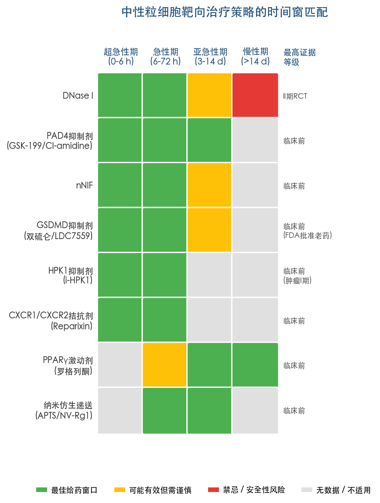

**图5-1 中性粒细胞靶向治疗策略的时间窗匹配矩阵。** 绿色表示最佳给药窗口，黄色表示可能有效但需谨慎监测安全性，红色表示存在禁忌或安全性风险（如DNase I在慢性期的出血转化风险），灰色表示无充分数据支持。右侧标注各策略当前所达到的最高临床证据等级。

### 5.5.2 中性粒细胞功能双重性对治疗策略设计的核心启示

中性粒细胞功能双重性带来的治疗设计启示可凝练为一个核心原则：未来策略不应追求简单的"抗中性粒细胞"或"促中性粒细胞"，而应追求**亚群选择性、时间窗匹配和功能重编程**三维精准的统一。

在亚群选择性层面，靶向特定有害亚群（如SiglecF⁺促炎亚群——第2章述及，在EAE模型中抗SiglecF抗体可减轻疾病而不影响总中性粒细胞群体 [Hu et al., Immune Network](https://pmc.ncbi.nlm.nih.gov/articles/PMC12226254/ "SiglecF靶向, 2025; 25:e19")）或特定效应功能（如PAD4抑制仅阻断NETs形成而不影响中性粒细胞募集总数）的策略，在安全性和有效性上均优于非选择性耗竭方案。

在功能重编程层面，PPARγ激动剂罗格列酮可将N2型中性粒细胞比例从31%提升至77%并伴随显著神经保护 [Cuartero et al., Stroke](https://www.ahajournals.org/doi/10.1161/strokeaha.113.002470 "PPARγ激动剂, 2013; 44:3498-3508")，APTS平台则将NETosis重编程为凋亡以触发小胶质细胞的M2极化 [Yin et al., Adv Sci](https://pmc.ncbi.nlm.nih.gov/articles/PMC11077645/ "APTS, 2024")——这些策略均体现了"引导中性粒细胞走向有益结局"的治疗哲学，相较于简单消除中性粒细胞，更有可能在保留修复功能的前提下实现临床获益。

### 5.5.3 患者分层与生物标志物——精准入组的必要条件

缺乏快速可及的生物标志物用于患者分层，是中性粒细胞靶向试验设计面临的重大障碍。现有候选标志物包括：(1) 中性粒细胞/淋巴细胞比值（NLR），如第1章所述NLR > 6与颅内出血不良预后相关，但其特异性有限，难以区分中性粒细胞驱动型损伤与其他炎症模式；(2) 血浆NETs标志物（CitH3和MPO-DNA复合物），在27例卒中患者中与出院mRS呈正相关（CitH3: r = 0.45, P = 0.024; MPO-DNA: r = 0.507, P = 0.01）[Denorme et al., J Clin Invest](https://pmc.ncbi.nlm.nih.gov/articles/PMC9106355/ "NET标志物, 2022")，但尚缺乏大规模前瞻性验证以确立临床决策阈值。

理想的分层策略应整合中性粒细胞亚群表型特征——如第2章讨论的CD62L^lo^衰老亚群在老年卒中患者中与更差的再灌注效果相关 [Gullotta et al., Nat Immunol](https://pubmed.ncbi.nlm.nih.gov/37188941/ "临床蛋白质组学验证, 2023; 24(6):925-940")——以及多参数组合（NLR + 血浆NET水平 + 中性粒细胞亚群流式分析），实现个体化的风险评估和治疗分配。如第6章将详述的NeuMap"诊断条形码"概念，若扩展至卒中患者群体，有望通过外周血中性粒细胞转录组分布谱推断脑内炎症状态，为精准入组提供全新的分子工具。

### 5.5.4 新一代临床试验设计的优化方向

基于上述系统分析，我们认为未来中性粒细胞靶向卒中临床试验的设计应在以下关键维度进行迭代优化（图5-2）。

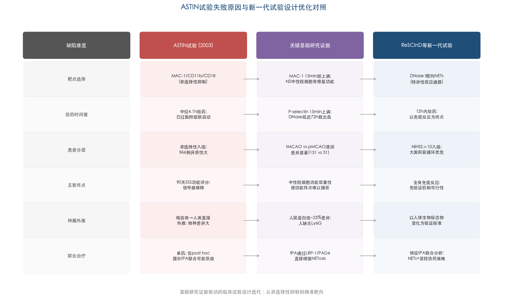

**图5-2 ASTIN试验（2003）失败原因与ReSCInD等新一代试验设计优化的系统对照。** 左列为ASTIN试验在六个维度上的具体缺陷，中列为支撑改进方向的关键基础研究证据，右列为新一代试验的对应优化措施。

**终点选择的策略性调整**。ReSCInD试验以全身免疫反应为主要终点的设计值得借鉴——在靶点验证阶段，以机制性生物标志物反应（血浆NET水平变化、中性粒细胞亚群表型转换、炎症细胞因子谱变化）为主要终点、功能结局为次要终点，可降低II期试验因统计效力不足而失败的风险。

**给药时间窗的精确匹配**。基于5.2.1节讨论的DNase I时间窗安全性数据，未来试验应明确区分"急性期给药"（< 6 h，旨在抑制NETs急性期损伤效应）和"亚急性期给药"（3–7 d，旨在解除NETs对血管修复的持续抑制），并在不同时间窗采用不同的治疗策略和安全性监测方案。

**联合治疗策略的理性设计**。鉴于中性粒细胞效应功能的多通路冗余性，单靶点干预可能不足以产生有意义的临床获益。DNase I联合PAD4抑制剂（同时降解已形成的NETs并阻断新的NETs生成）、NETs靶向药物联合tPA（在溶栓同时预防tPA诱导的NETosis增强）等组合方案值得在临床前模型中进行系统评估。Wang等人（2021）已证明tPA通过LRP-1/PAD4通路直接增强NETosis [Wang et al., Blood](https://ashpublications.org/blood/article/138/1/91/475346/ "NETs-cGAS-tPA出血, 2021")，这为tPA联合PAD4抑制剂方案的合理性提供了直接的机制依据。

**基于生物标志物的患者分层入组**。未来试验应优先纳入NETs负荷高的患者（如血浆CitH3或MPO-DNA高于预设阈值）和中性粒细胞驱动型损伤占主导的亚组（如大面积前循环卒中、NIHSS ≥ 10），而非采用非选择性入组策略，以最大化治疗信号的可检测性。

## 5.6 各策略转化前景的整合评估

综合本章讨论的各类治疗策略，我们依据临床前证据强度、安全性数据完整度和转化路径可行性，将其转化前景按优先级进行分层评估（图5-3）。

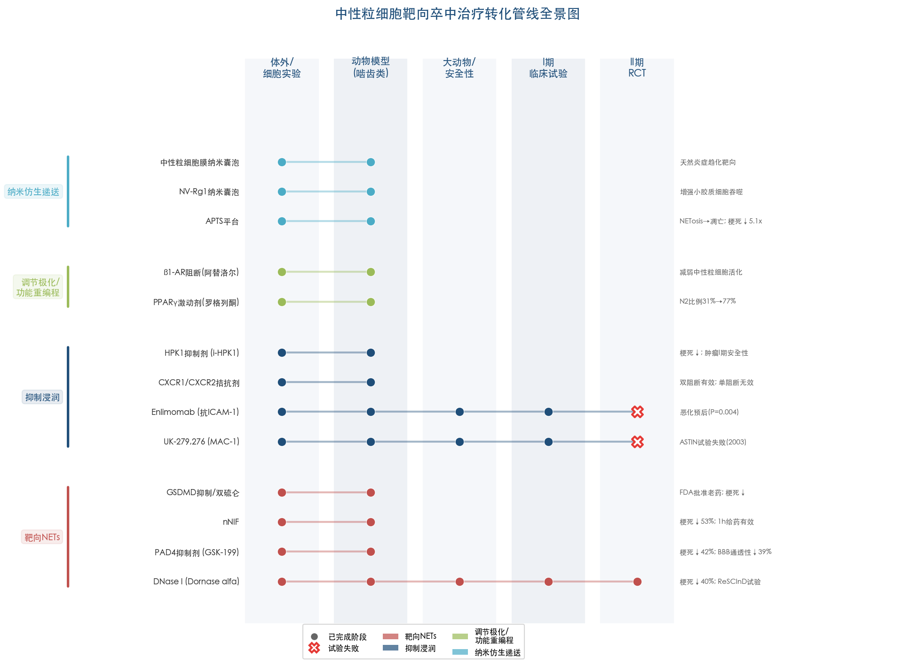

**图5-3 中性粒细胞靶向卒中治疗转化管线全景图。** 横轴为研发转化阶段（从体外/细胞实验到II期RCT），纵轴按靶点层级分组（靶向NETs、抑制浸润、调节极化/功能重编程、纳米仿生递送），圆点标注各策略所达到的最远转化阶段，红叉标注已失败的临床试验（UK-279,276和Enlimomab），右侧注释关键疗效数据。

**第一梯队（已进入或即将进入临床试验阶段）**：DNase I（三项RCT已注册，其中ReSCInD为首个II期试验，安全性关注点——延迟给药出血风险——已明确界定）和GSDMD抑制/双硫仑（已有FDA批准的人体安全性数据，药物重定向路径清晰，延迟给药安全性优于DNase I）。这两类策略分别从NETs降解和NETs释放阻断两个互补角度切入，Hermann等人（2024）的安全性比较数据为两者的差异化临床定位提供了实验依据 [Hermann et al., Stroke](https://www.ahajournals.org/doi/10.1161/STROKEAHA.124.047862 "DNase vs GSDMD安全性比较, 2024")。

**第二梯队（具备强临床前证据，需积累I期安全性数据）**：PAD4抑制剂（多种化学骨架均在脑缺血模型中验证有效，系统性获益-风险评估框架已初步建立 [Bonilha & Veras, Front Immunol](https://pmc.ncbi.nlm.nih.gov/articles/PMC12979119/ "PAD4获益-风险框架, 2026")，核心障碍为感染风险和同工酶交叉抑制）和nNIF（宽时间窗、合并症模型有效性已验证、内源性分子，但药代动力学和规模化生产数据不足）。

**第三梯队（概念验证阶段的新兴靶点）**：HPK1抑制剂（可借鉴肿瘤I期安全性数据，但需评估卒中后SIDS风险）、CXCR1/CXCR2双重拮抗剂（需克服趋化因子冗余性挑战）、β1-AR阻断剂（安全性数据充分，但卒中特异性疗效证据有限）以及中性粒细胞仿生纳米递送系统（如APTS，概念创新但距临床应用尚远）。

**应优先排除或需根本性重新设计的策略**：非选择性中性粒细胞耗竭策略（anti-Ly6G耗竭在年轻小鼠中无显著获益 [Moustafa & Baron, Front Aging Neurosci](https://pmc.ncbi.nlm.nih.gov/articles/PMC9813499/ "衰老中性粒细胞动力学, 2022")，且消除修复功能）和非人源化单克隆抗体方案（Enlimomab免疫原性教训）。

从ASTIN试验（2003年）到ReSCInD试验（2023年注册），中性粒细胞靶向卒中治疗经历了整整二十年的策略迭代。这一漫长的转化历程折射出该领域面临的根本性科学挑战——中性粒细胞功能的时空动态性和亚群异质性使得任何"一刀切"的治疗策略均难以成功。未来的突破将取决于对第1–4章揭示的分子机制进行精准的转化应用：在正确的时间窗、对正确的中性粒细胞亚群、阻断正确的效应通路、同时保留正确的修复功能。这不仅是中性粒细胞靶向治疗的技术难题，更是精准卒中医学理念在免疫治疗维度的具体体现。

# 第6章 未解问题与未来研究方向

前述章节系统梳理了中性粒细胞在脑缺血各时期的动员与浸润动态（第1章）、亚群异质性与超越N1/N2范式的新兴分类框架（第2章）、效应功能的损伤-修复双重性（第3章）、与脑内固有及适应性免疫细胞的互作网络（第4章），以及治疗靶点与临床转化挑战（第5章）。尽管2021–2026年间该领域取得了令人瞩目的进展——从NeuMap全景图谱的发表到NETs靶向治疗进入II期临床试验——一系列关键知识缺口和方法学瓶颈仍制约着对中性粒细胞在脑缺血中角色的全面理解，也限制了基础发现向临床获益的有效转化。本章将从基础生物学未解问题、新兴技术赋能、精准卒中医学整合、肠-脑轴与系统性免疫重编程，以及临床试验设计优化五个维度，系统剖析当前的研究前沿与未来方向。

## 6.1 基础生物学层面的关键知识缺口

### 6.1.1 慢性期中性粒细胞的命运追踪——"消失"之后发生了什么？

当前文献对中性粒细胞在脑缺血后的研究主要集中于急性期（0–72小时）和亚急性期（3–14天），慢性期（>14天）的系统性数据极为匮乏。如第1章所述，tMCAO模型中脑实质中性粒细胞浸润在1–2天达峰、7天时几乎消失 [Cai et al., Transl Stroke Res](https://pmc.ncbi.nlm.nih.gov/articles/PMC6993940/ "浸润时间窗, 2020")。然而，细胞"消失"并不等同于功能终止。来自pMCAO模型的证据表明，NETs标志物H3Cit在缺血半暗带至少持续14天 [Kang et al., Nat Commun](https://www.nature.com/articles/s41467-020-16191-y "NETs持续至14天, 2020")，提示中性粒细胞效应产物的病理影响远超细胞本身的存留期。如第3章所详述，这些残留的NETs通过STING-IFN-β通路持续抑制血管新生，对亚急性期及慢性期的血管修复构成长期障碍。

中性粒细胞在脑组织中"消失"的可能去向至少包括三种途径：(1) 原位死亡后被小胶质细胞/巨噬细胞吞噬清除——第4章已讨论小胶质细胞对N2型中性粒细胞的优先吞噬及其对炎症消退的意义；(2) 反向跨内皮迁移（reverse transendothelial migration, rTEM）返回循环——在无菌炎症模型中已有直接可视化证据，rTEM中性粒细胞具有ICAM1^hi^CXCR1^lo^表型，与卒中患者外周血中检测到的CD54^high^/CXCR1^low^亚群特征一致 [Weisenburger-Lile et al., Neurol Neuroimmunol Neuroinflamm](https://pmc.ncbi.nlm.nih.gov/articles/PMC6624098/ "rTEM亚群, 2019; 6(4):e571")；(3) 在缺血后改变的微环境中发生表型转化，获得延长寿命并执行非经典功能。值得注意的是，rTEM在脑缺血中是否真实发生尚缺乏直接证据，反向迁移的中性粒细胞是否携带"炎症记忆"并在远端器官引发继发性损伤亦不明确，这构成了慢性期研究中亟待回答的核心问题。

Garcia-Bonilla等人2024年发表于*Nature Immunology*的研究提供了迄今最长时间窗口的脑缺血后单细胞转录组数据——该研究对小鼠缺血后第2天和第14天的脑组织及血液进行了scRNA-seq分析，发现脑浸润中性粒细胞在急性期（第2天）与亚急性期（第14天）之间表现出显著的转录组分歧；轨迹推断预测中性粒细胞在不同时间点系从血液中持续从头募集（de novo recruitment），而非在脑内发生原位分化 [Garcia-Bonilla et al., Nat Immunol](https://pubmed.ncbi.nlm.nih.gov/38177281/ "脑与血液单细胞转录组, 2024; 25(2):357-370")。这一发现具有重要意义：即使在亚急性期（第14天），仍有新的中性粒细胞从外周血持续进入缺血脑组织，而非仅依赖急性期浸润细胞的存留。然而，该研究的时间窗口仍未延伸至真正的慢性期（>14天至数月），中性粒细胞在更长时间尺度上的命运——特别是其对远期认知功能和白质修复的影响——仍是亟需填补的关键空白。

### 6.1.2 人类与啮齿类中性粒细胞的种属差异——转化研究的核心障碍

如第5章分析ASTIN试验失败时所指出的，人类与小鼠中性粒细胞之间存在实质性种属差异，这构成制约临床转化的核心障碍之一。2023年发表于*Nature Communications*的系统性跨物种比较研究揭示，人类与小鼠中性粒细胞共享核心转录程序（Pearson r = 0.79，179个跨物种保守炎症基因），但在多个关键维度上存在显著差异：人类中性粒细胞高表达α-防御素而小鼠完全不表达，人类缺乏Ly6G（小鼠中性粒细胞研究的标准标志物），人类中性粒细胞占白细胞总数的50%–70%而小鼠仅为10%–25%，且人类中性粒细胞在循环中的寿命约5.4天，远超此前普遍认知的6–24小时 [Hackert et al., Nat Commun](https://www.nature.com/articles/s41467-023-43573-9 "人鼠中性粒细胞跨物种比较, 2023;14:8133")。2024年发表的1000个中性粒细胞蛋白质组学研究进一步揭示，小鼠中性粒细胞表达的蛋白种类比人类多约25%，且蛋白质与mRNA之间的相关性较差，表明仅依赖转录组层面的跨物种比较可能无法充分反映蛋白质功能层面的实际差异 [Ghosh et al., Mol Cell Proteomics](https://www.mcponline.org/article/S1535-9476(24)00148-8/fulltext "1000细胞蛋白质组学, 2024")。

上述差异对脑缺血研究的转化意义尤为突出。第一，人类中性粒细胞在白细胞中的高占比意味着中性粒细胞介导的损伤在人类卒中中的绝对贡献可能显著大于啮齿类模型的预测。第二，人类中性粒细胞较长的循环寿命（约5.4天 vs 此前认知的不足1天）使得啮齿类模型中"中性粒细胞在脑组织中快速消失"的观察能否外推至人类值得审慎评估。第三，如第1章所述，涵盖20项人类研究与188项啮齿类研究的荟萃分析已揭示，人类中性粒细胞主要聚集于血管腔和血管周围间隙而非脑实质内 [Beuker et al., Transl Stroke Res](https://link.springer.com/article/10.1007/s12975-021-00887-4 "人类vs啮齿类免疫细胞浸润荟萃分析, 2021; 12:976-990")，这一空间分布差异提示人类中性粒细胞的致病机制可能更多发生于血管腔内（如微血管阻塞和血栓炎症），而非脑实质内的直接组织损伤——这对治疗靶点的选择具有重要指导意义。

### 6.1.3 中性粒细胞亚群与临床结局之间的因果关系验证

如第2章详述，NeuMap图谱鉴定的7个功能枢纽（PreNeu、未成熟、免疫沉默、IFN应答、免疫抑制I/II、抗原呈递）为中性粒细胞异质性提供了前所未有的分辨率 [Hidalgo et al., Nature](https://www.nature.com/articles/s41586-025-09807-0 "NeuMap全景图谱, 2025")。然而，这些分子层面精细定义的亚群与脑缺血后特定临床结局——包括梗死扩大、出血转化、卒中后感染和远期神经功能恢复——之间的因果关系尚未建立。现有证据多停留在关联层面：CD62L^lo^中性粒细胞与较差的再灌注效果和临床预后相关 [Gullotta et al., Nat Immunol](https://pubmed.ncbi.nlm.nih.gov/37188941/ "临床蛋白质组学验证, 2023; 24(6):925-940")；衰老亚群（CXCR4^bright^/CD62L^dim^）比例与NIHSS评分密切相关 [Weisenburger-Lile et al., Neurol Neuroimmunol Neuroinflamm](https://pmc.ncbi.nlm.nih.gov/articles/PMC6624098/ "有害中性粒细胞亚群, 2019; 6(4):e571")。这些关联虽然指明了研究方向，但缺乏通过遗传工具实现亚群特异性操作以验证因果链的关键证据。

2025年Yang等人发表于*Advanced Science*的多区室scRNA-seq研究在小鼠pMCAO模型中鉴定了一种新型CD14⁺中性粒细胞亚群（Neut_Cd14），该亚群具有Cd14⁺/Cxcl2⁺/Egr1⁺的转录特征，压倒性地富集于缺血脑组织（占脑中性粒细胞>80%），但在外周血、颅骨和股骨中均不足5%。转录轨迹分析和流式验证提示Neut_Cd14可能源自颅骨骨髓（CBM）而非远端股骨骨髓（FBM），功能富集分析指向吞噬作用和趋化功能 [Yang et al., Adv Sci](https://advanced.onlinelibrary.wiley.com/doi/10.1002/advs.202408722 "多区室scRNA-seq, 2025; 2408722")。这一发现拓展了"颅骨骨髓-脑膜-脑实质"中性粒细胞运输轴的概念，但Neut_Cd14的功能性质——保护性抑或致病性——及其与NeuMap枢纽体系的对应关系仍有待阐明。建立亚群特异性的条件性敲除或消融模型，并结合功能结局评估，是推动关联向因果跨越的必要路径。

### 6.1.4 昼夜节律对中性粒细胞功能和卒中结局的调控

2025年发表于*Circulation Research*的一项里程碑式研究首次系统揭示了中性粒细胞昼夜节律对卒中结局的决定性影响。在小鼠模型中，缺血损伤程度展现出清晰的昼夜振荡——非活动期（ZT5）发生卒中的梗死体积和神经功能缺损显著大于活动期（ZT13），且这一效应在中性粒细胞耗竭或时钟基因（*Bmal1*、*CXCR4*）中性粒细胞特异性敲除后消失。scRNA-seq分析鉴定了8个脑中性粒细胞转录cluster（BNc0–BNc8），其组成在ZT5和ZT13之间存在显著差异：BNc1（促炎/组织损伤表型，富集TLR4/NF-κB/TGF-β通路）在ZT5占优势，而BNc4（IFN应答型）在ZT13占优势。机制层面，非活动期中性粒细胞表现出增强的NET形成倾向（云状NET比例增加），导致微血管阻塞和侧支灌注下降；PAD4基因敲除或DNase-I治疗均可消除这一昼夜差异。在540例缺血性卒中患者队列中，NET相关生物标志物（MPO、弹性蛋白酶、sCD40L）呈现昼夜振荡，于人类非活动期（夜间）达峰，与侧支循环灌注减少和较差预后一致 [Cuartero et al., Circ Res](https://www.ahajournals.org/doi/10.1161/CIRCRESAHA.125.326438 "昼夜节律控制中性粒细胞与卒中结局, 2025")。

这一发现对转化研究具有深远影响。它不仅解释了为何相同干预措施在不同实验室可能产生不一致的结果——实验操作时间的差异可能系统性地偏倚实验结局，也为第5章讨论的神经保护剂临床试验反复失败提供了新的解释维度：若未控制给药的昼夜时间窗，疗效信号可能被节律性噪声所掩盖。这一维度在此前的试验设计中几乎未被考虑，值得在未来研究中系统纳入。

## 6.2 新兴技术赋能——突破方法学瓶颈

上述基础生物学层面的关键知识缺口，在很大程度上源于方法学瓶颈的制约。近年来，多项新兴技术的快速发展为突破这些瓶颈提供了前所未有的可能。图6-1以矩阵形式总结了五项关键未解问题与五类新兴技术手段之间的匹配关系及各技术的成熟度现状。

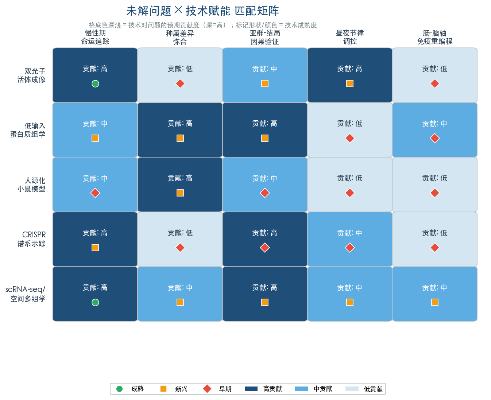

### 6.2.1 单细胞多组学与空间转录组学

单细胞RNA测序（scRNA-seq）已在脑缺血中性粒细胞研究中取得突破性进展。NeuMap图谱（覆盖129,829个小鼠中性粒细胞）为中性粒细胞异质性建立了全景参考框架 [Hidalgo et al., Nature](https://www.nature.com/articles/s41586-025-09807-0 "NeuMap全景图谱, 2025")；Garcia-Bonilla等人的脑-血液纵向scRNA-seq图谱覆盖了缺血后第2天和第14天两个关键时间窗 [Garcia-Bonilla et al., Nat Immunol](https://pubmed.ncbi.nlm.nih.gov/38177281/ "脑与血液单细胞转录组, 2024; 25(2):357-370")；Yang等人的多区室研究将分析延伸至颅骨骨髓和股骨骨髓，揭示了中性粒细胞的组织特异性转录差异 [Yang et al., Adv Sci](https://advanced.onlinelibrary.wiley.com/doi/10.1002/advs.202408722 "多区室scRNA-seq, 2025; 2408722")。

然而，scRNA-seq在中性粒细胞研究中面临独特的技术挑战。其一，中性粒细胞RNA含量低且RNase活性高，导致捕获效率远低于其他免疫细胞类型。其二，成熟中性粒细胞的多叶核结构使其在常规单细胞分离中容易丢失——该问题在PBMC分离的密度梯度离心中尤为突出，可能系统性地低估低密度中性粒细胞（LDNs）的比例。其三，蛋白质与mRNA之间的不匹配在中性粒细胞中尤为严重（中性粒细胞功能高度依赖预成型颗粒蛋白的释放而非新的转录激活），转录组数据因此不能完全代表功能状态 [Ghosh et al., Mol Cell Proteomics](https://www.mcponline.org/article/S1535-9476(24)00148-8/fulltext "RNA-蛋白不匹配, 2024")。

空间转录组学为解决中性粒细胞在缺血脑组织中的空间定位问题提供了新途径。Han等人的空间+scRNA-seq整合分析（19,777个spots）已在缺血小鼠脑中实现了分子和细胞架构的初步表征 [Han et al., Sci Transl Med](https://www.science.org/doi/10.1126/scitranslmed.adg1323 "空间转录组, 2024")。然而，当前10x Visium平台55 μm的分辨率仍无法达到真正的单细胞水平。新一代亚细胞分辨率空间技术——如MERFISH 2.0和Stereo-seq——有望突破这一限制，使研究者能够在原位分辨梗死核心、半暗带和远端区域中不同中性粒细胞亚群的精确分布，以及它们与小胶质细胞、星形胶质细胞、内皮细胞之间的空间邻近关系，从而为理解中性粒细胞-脑免疫细胞互作网络（第4章）提供空间维度的直接证据。

### 6.2.2 CRISPR谱系示踪与活体成像

中性粒细胞的终末分化特性（不再增殖）使传统的谱系示踪方法面临挑战。NeuMap研究已采用iLy6G-tdTomato谱系示踪系统在骨髓前体阶段标记中性粒细胞，并追踪其在不同组织和病理条件下的命运轨迹 [Hidalgo et al., Nature](https://www.nature.com/articles/s41586-025-09807-0 "iLy6G-tdTomato谱系示踪, 2025")，但该工具尚未在脑缺血模型中直接应用。将iLy6G-tdTomato系统与脑缺血模型结合，有望系统回答以下关键问题：(1) 急性期浸润的中性粒细胞在亚急性期/慢性期的最终命运——原位凋亡、被吞噬清除还是反向迁移返回循环？(2) 不同时间窗新募集的中性粒细胞是否承担不同功能？(3) 颅骨骨髓来源与外周骨髓来源的中性粒细胞在脑缺血后是否具有差异化的命运轨迹？

双光子活体成像已在脑缺血研究中成功实现了中性粒细胞毛细血管阻塞的直接可视化 [El Amki et al., Cell Rep](https://pubmed.ncbi.nlm.nih.gov/33053341/ "无复流机制, 2020; 33:108260")和脑内NETosis过程的实时观察 [Byun et al., Immune Netw](https://www.immunenetwork.org/DOIx.php?id=10.4110/in.2023.23.e27 "双光子活体NETosis成像, 2023; 23(3):e27")。未来研究应将活体成像与遗传标记（如CatchUp/Ly6G-tdTomato小鼠）和功能报告基因（如钙指示剂、ROS探针）结合，实现对特定中性粒细胞亚群在脑微血管和脑实质中实时行为的纵向追踪——包括与其他细胞类型的物理接触频率、停留时间和功能状态转换等动态参数。

### 6.2.3 人源化小鼠模型——缩小种属鸿沟

MISTRG人源化小鼠已被证明可支持人类中性粒细胞从早幼粒细胞到成熟分叶核细胞的全发育阶段，且具有正常的脱颗粒、ROS产生、黏附和ADCC功能；G-CSF/Plerixafor可动员人类中性粒细胞，且模型能响应腹膜炎信号实现6倍的迁移增加 [Martinez-Sanz et al., Front Immunol](https://www.frontiersin.org/journals/immunology/articles/10.3389/fimmu.2023.1105103/full "MISTRG模型, 2023")。然而，MISTRG模型存在两个关键限制：稳态外周血中人类中性粒细胞数量极低，且尚无脑缺血/卒中应用的数据。

克服这些限制需要多层面的改进：(1) 通过敲入人类G-CSF受体或优化人类细胞因子表达以提高基线人类中性粒细胞水平；(2) 在MISTRG背景下建立tMCAO或pMCAO模型，评估人类中性粒细胞的浸润动态、亚群组成和效应功能；(3) 将MISTRG脑缺血模型与NeuMap框架整合，确定人类中性粒细胞在脑缺血微环境中是否采纳与小鼠相似的功能枢纽分布。这一方向虽技术难度大且成本高昂，但对于解决6.1.2节所述的种属差异问题以及第5章所分析的临床试验失败中的转化鸿沟而言，具有不可替代的价值。

### 6.2.4 低输入蛋白质组学——从取栓样本到分子诊断

2024年发表的1000个细胞蛋白质组学技术可覆盖中性粒细胞87%的脱颗粒通路蛋白 [Ghosh et al., Mol Cell Proteomics](https://www.mcponline.org/article/S1535-9476(24)00148-8/fulltext "低输入蛋白质组, 2024")。这一技术进步使直接分析机械取栓（EVT）过程中获取的血栓样本和局部动脉血中中性粒细胞蛋白质组成为可能。取栓样本代表了最接近梗死病灶的"液体活检"窗口——其中的中性粒细胞直接暴露于缺血微环境，理论上携带了最为丰富的病理信息。将低输入蛋白质组学应用于取栓样本，可望实现三方面的突破：(1) 在蛋白质水平直接验证scRNA-seq推断的中性粒细胞亚群功能特征，克服前述RNA-蛋白不匹配的局限；(2) 建立中性粒细胞蛋白质组与临床结局的关联模型；(3) 筛选可用于患者分层的蛋白质生物标志物组合，为精准治疗决策提供分子依据。

## 6.3 中性粒细胞异质性与精准卒中医学的整合

### 6.3.1 NeuMap"诊断条形码"——从概念到卒中应用

NeuMap研究的一项开创性发现在于：通过分析血液中性粒细胞在7个功能枢纽中的分布比例，即可推断宿主的病理状态——研究者将此称为"诊断条形码" [Hidalgo et al., Nature](https://www.nature.com/articles/s41586-025-09807-0 "诊断条形码, 2025")。若将这一概念扩展至卒中领域，基于入院时外周血中性粒细胞的转录组特征快速判断患者的免疫状态、预测治疗反应和结局，将为精准卒中医学提供全新的分子工具。

然而，将NeuMap诊断条形码应用于卒中临床实践仍需克服多重障碍：(1) 当前NeuMap仅在FeCl₃动脉损伤模型中有初步数据，缺乏tMCAO和pMCAO模型的系统验证，更无人类卒中数据；(2) 从scRNA-seq到临床可及的快速检测平台（如高维流式细胞术、CyTOF或靶向转录组panel）的技术转化路径尚不清晰；(3) 卒中后全身性免疫抑制（SIDS）可能干扰中性粒细胞亚群分布——如第4章所述，约30%的卒中患者发生感染，感染状态下的中性粒细胞亚群重分布可能混淆诊断信号，需在验证研究中作为重要混杂因素加以控制。

### 6.3.2 基于中性粒细胞亚群的患者分层策略

当前以中性粒细胞为靶点的卒中临床试验（如第5章讨论的ReSCInD试验）面临的核心挑战之一是患者异质性。我们认为，未来的试验设计应系统纳入基于中性粒细胞亚群特征的患者分层策略。以下三类生物标志物组合值得前瞻性验证：

**(1) 外周血中性粒细胞亚群比例**。衰老亚群（CXCR4^bright^/CD62L^dim^）和rTEM亚群（CD54^high^/CXCR1^low^）的比例已被证实与NIHSS评分和卒中严重程度密切相关 [Weisenburger-Lile et al., Neurol Neuroimmunol Neuroinflamm](https://pmc.ncbi.nlm.nih.gov/articles/PMC6624098/ "有害中性粒细胞亚群, 2019; 6(4):e571")。将这些亚群比例作为入组标准或分层依据，可筛选出最可能从中性粒细胞靶向治疗中获益的患者亚组，从而提高试验的统计效力和临床信号检出率。

**(2) 血浆NET标志物阈值**。血浆CitH3和MPO-DNA复合物水平已显示与出院mRS正相关（CitH3: r = 0.45, P = 0.024; MPO-DNA: r = 0.507, P = 0.01）[Denorme et al., J Clin Invest](https://pmc.ncbi.nlm.nih.gov/articles/PMC9106355/ "NETs与卒中, 2022")，但尚缺乏前瞻性验证的最佳截断值。建立NET负荷的临床分级体系（低、中、高），并据此指导靶向NET治疗的决策（如DNase I或PAD4抑制剂的适应证选择），是实现精准治疗的关键一步。

**(3) NLR（中性粒细胞/淋巴细胞比值）的精细化**。NLR是卒中预后最广泛使用的外周标志物之一（NLR>6与颅内出血不良预后存在关联），但其粒度过粗，无法反映中性粒细胞内部的亚群异质性。将NLR与特定亚群标志物（如CD62L^lo^比例、SiglecF表达水平、NET负荷）结合构建复合评分体系，有望显著提高对卒中预后和治疗反应的预测准确性。

### 6.3.3 昼夜节律纳入临床试验设计

如6.1.4节所述，昼夜节律通过调控中性粒细胞表型和NET形成显著影响卒中结局。在540例患者队列中，NET相关生物标志物呈现昼夜振荡，且与侧支循环状态和预后密切相关 [Cuartero et al., Circ Res](https://www.ahajournals.org/doi/10.1161/CIRCRESAHA.125.326438 "昼夜节律与卒中, 2025")。这一发现对临床试验设计提出了新的要求：未来以中性粒细胞为靶点的卒中试验应至少记录患者的卒中发生时间和给药时间，并在统计分析中将昼夜时间作为协变量纳入而非作为噪声忽略。更进一步，"时间治疗学"（chronotherapy）的概念——即根据昼夜节律优化给药时间——可能为NET靶向治疗（DNase I、PAD4抑制剂）的临床应用提供增效策略，使相同药物在最佳时间窗给药时获得更大的治疗收益。

## 6.4 肠-脑轴与系统性免疫重编程

### 6.4.1 肠道微生物群对卒中后中性粒细胞功能的双向调控

2025年发表于*Journal of Neuroinflammation*的研究为肠道微生物群与中性粒细胞互作提供了新的因果层面证据。该研究发现，抗生素耗竭微生物群可诱导中性粒细胞呈现幼稚表型（CD62L⁺↑/CXCR2/CXCR4↓），并使梗死体积缩小；微生物群耗竭（MiD）小鼠血浆NETs水平（CitH3-DNA）在卒中后6小时和24小时均显著低于微生物群正常（MiS）小鼠（P < 0.01）。出乎预料的是，在MiD小鼠中耗竭中性粒细胞反而增加了梗死体积，提示微生物群缺陷状态下的幼稚中性粒细胞实际上具有神经保护功能 [Tuz et al., J Neuroinflammation](https://link.springer.com/article/10.1186/s12974-025-03448-w "肠道微生物-中性粒细胞-卒中, 2025")。这一发现从根本上挑战了"中性粒细胞一律有害"的简化范式，揭示中性粒细胞的致病或保护功能取决于其被"教育"的微环境背景——微生物群正常条件下成熟活化的中性粒细胞加重缺血损伤，而微生物群缺乏条件下保持幼稚状态的中性粒细胞则提供保护。

卒中后系统性免疫重编程涉及双向通路：正向通路（肠道微生物→中性粒细胞活化→脑损伤）和反向通路（脑缺血→肠道屏障破坏→微生物移位→PAMPs重新激活中性粒细胞→全身炎症）。我们认为，这一双向通路构成了一个自我增强的炎症环路：脑缺血→交感神经过度激活→肠道屏障破坏→肠道菌群移位→LPS等PAMPs经门静脉入血→中性粒细胞过度活化→NETs释放增加→BBB进一步破坏→脑损伤加重。打破这一环路的任何一个环节——维护肠道屏障完整性、调节微生物群组成或抑制中性粒细胞过度活化——均可能产生系统性获益，而非仅局限于单一靶点的效果。

### 6.4.2 卒中后免疫抑制综合征（SIDS）中的中性粒细胞角色

如第4章所述，卒中后免疫抑制综合征（SIDS）影响约30%的卒中患者，表现为T细胞凋亡、免疫功能低下和感染易感性增加。中性粒细胞在SIDS中的角色具有双重性：一方面，活化中性粒细胞通过精氨酸酶I（ArgI）释放消耗L-精氨酸，抑制T细胞增殖，加剧适应性免疫功能低下；另一方面，中性粒细胞自身的杀菌功能也受到抑制——氧化爆发和NETosis能力均出现损伤，进一步增加感染风险 [Roth et al., Immunity](https://pubmed.ncbi.nlm.nih.gov/33667383/ "AIM2-SIDS机制, 2021"); [Faura et al., J Neuroinflammation](https://pmc.ncbi.nlm.nih.gov/articles/PMC8183083/ "SIDS综述, 2021")。

一个重要的未来方向是探究SIDS是否在NeuMap框架中表现为独特的中性粒细胞枢纽分布偏移——例如，免疫抑制型枢纽（Cd14⁺Ptgs2⁺和Vegfa⁺Cd274⁺）的过度富集是否构成SIDS的中性粒细胞"分子签名"。若该签名得到验证，则有望在卒中早期通过检测外周血中性粒细胞枢纽分布来预测感染风险，从而指导预防性抗感染治疗的决策。这类研究将直接桥接基础中性粒细胞生物学与临床感染防控策略，体现精准免疫医学在卒中管理中的应用潜力。

## 6.5 临床试验设计的优化方向

### 6.5.1 从"全面抑制"到"精准调节"的策略转变

第5章的分析表明，ASTIN和Enlimomab试验失败的根源之一在于非选择性策略——全面阻断中性粒细胞浸润同时消除了有害（N1型/促炎）和有益（N2型/促修复）功能。未来试验设计应转向精准调节策略，主要体现在三个层面。其一，靶向特定效应分子而非整个细胞群：DNase I和PAD4抑制剂靶向NETs这一特定效应产物，而非如anti-Ly6G那样耗竭所有中性粒细胞，从而保留中性粒细胞的其他有益功能。其二，利用亚群特异性标志物开发选择性干预：第2章讨论的抗SiglecF抗体在EAE模型中减轻神经炎症而不影响总中性粒细胞群体 [Hu et al., Immune Network](https://pmc.ncbi.nlm.nih.gov/articles/PMC12226254/ "SiglecF加剧神经炎症, 2025; 25:e19")，为亚群选择性干预策略提供了概念验证。其三，促进有益亚群功能而非仅抑制有害亚群：如PPARγ激动剂通过增加N2比例实现神经保护 [Cuartero et al., Stroke](https://www.ahajournals.org/doi/10.1161/strokeaha.113.002470 "N2 Neutrophils, 2013; 44:3498-3508")，提示"促修复"策略与"抗损伤"策略的组合可能产生协同效应。

### 6.5.2 克服时间窗困境

中性粒细胞靶向治疗面临的核心时间窗困境在于：分子靶点的上调极为迅速（P-selectin在缺血后15分钟即上调、MAC-1在数十分钟内激活），而现实中的给药时间难以匹配——ASTIN试验中患者的中位给药时间为4.1小时。克服此困境存在以下可能路径：

**(1) 选择时间窗更宽的下游靶点**。如第3章所述，NETs在缺血后2–3天达峰，远晚于黏附分子的上调，为DNase I和PAD4抑制剂提供了更为宽裕的治疗时间窗。此外，HPK1/MAP4K1抑制剂在再灌注后30分钟给药仍显示有效 [Zhang et al., EMBO Mol Med](https://pmc.ncbi.nlm.nih.gov/articles/PMC12081623/ "HPK1靶向中性粒细胞, 2025")，提示新型靶点可部分缓解时间窗限制。

**(2) 与取栓/溶栓联合给药**。机械取栓创造了"直接到达病灶"的独特给药窗口——动脉内给药可在取栓后即刻启动，绕过全身给药的时间延迟问题。2025年首次在老龄小鼠中证明动脉内DNase给药的可行性和有效性，为此路径提供了重要的临床前支撑 [Yin et al., CNS Neurosci Ther](https://pmc.ncbi.nlm.nih.gov/articles/PMC12129710/ "IA DNase, 2025")。

**(3) 从免疫终点到功能结局的阶梯式设计**。ReSCInD试验选择以全身免疫反应（而非梗死体积或功能结局）作为主要终点，代表了新一代试验的务实策略——先验证机制可行性和生物标志物反应，建立剂量-效应关系和安全性窗口，在此基础上再推进至以功能结局为终点的大型III期试验。这一阶梯式路径有助于降低单次试验失败的风险和成本。

### 6.5.3 安全性评估的系统化框架

第5章指出PAD4抑制剂面临感染风险的顾虑。2026年发表的PAD4抑制获益-风险评估综述对此进行了系统阐述 [Bonilha & Veras, Front Immunol](https://pmc.ncbi.nlm.nih.gov/articles/PMC12979119/ "PAD4抑制获益-风险评估, 2026; 17:1769421")。我们认为，针对中性粒细胞靶向卒中治疗，亟需建立系统化的安全性评估框架，至少涵盖以下三个核心维度：(1) **感染监测**——鉴于卒中本身已导致免疫抑制（SIDS），任何进一步抑制中性粒细胞功能的治疗均需将卒中后感染率作为核心安全性终点进行前瞻性监测；(2) **出血风险**——DNase I延迟给药（72小时后）已被证实增加出血转化风险 [Hermann et al., Stroke](https://www.ahajournals.org/doi/10.1161/STROKEAHA.124.047862 "延迟DNase-I与出血转化, 2024")，给药时间窗的安全边界需在临床试验中严格界定；(3) **修复功能的保护**——治疗策略应避免在亚急性期/慢性期干扰N2型中性粒细胞和MMP-9参与的血管修复功能，这要求精确把握治疗的时间窗和靶向深度。

## 6.6 全局研究路线图

基于以上分析，我们提出以下"三阶段"优先研究路线图（图6-2），为中性粒细胞在脑缺血中的基础研究和临床转化提供战略性时间框架。

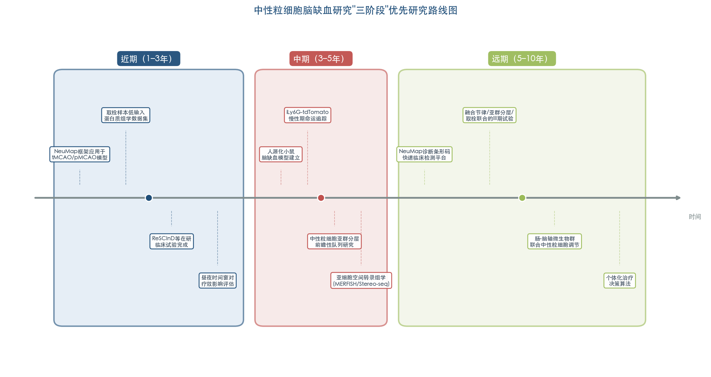

**近期（1–3年）**：(1) 将NeuMap框架系统应用于tMCAO/pMCAO模型，建立脑缺血特异性中性粒细胞枢纽图谱；(2) 利用取栓样本和低输入蛋白质组学建立人类卒中患者中性粒细胞的蛋白质组参考数据集；(3) 完成ReSCInD等在研临床试验并评估免疫终点结果；(4) 在多个实验室系统评估昼夜时间窗对中性粒细胞靶向治疗疗效的影响。

**中期（3–5年）**：(1) 在MISTRG或改进版人源化小鼠中建立脑缺血模型，直接评估人类中性粒细胞的浸润动态和亚群功能，缩小种属差异鸿沟；(2) 利用iLy6G-tdTomato谱系示踪系统追踪中性粒细胞在脑缺血慢性期（>14天至数月）的命运轨迹；(3) 开展基于中性粒细胞亚群分层的前瞻性队列研究，验证NET负荷和亚群比例作为治疗决策生物标志物的临床价值；(4) 利用亚细胞分辨率空间转录组学（MERFISH 2.0/Stereo-seq）建立缺血脑组织中中性粒细胞亚群的高分辨空间定位图谱。

**远期（5–10年）**：(1) 基于NeuMap诊断条形码开发快速临床检测平台，实现卒中急诊中中性粒细胞免疫状态的实时评估；(2) 设计融合昼夜节律校正、中性粒细胞亚群分层和取栓联合给药策略的III期临床试验；(3) 探索靶向肠-脑轴的微生物群干预联合中性粒细胞调节的组合疗法；(4) 建立中性粒细胞靶向治疗的个体化决策算法，根据患者的中性粒细胞组学特征、合并症谱、卒中发生时间和再灌注状态综合推荐最佳治疗方案。

综合而言，中性粒细胞在脑缺血中的研究正处于从"现象描述"向"机制解析"、从"一刀切干预"向"精准调节"转变的关键节点。本章所梳理的五大维度——慢性期命运追踪、种属差异弥合、亚群-结局因果验证、昼夜节律整合和肠-脑轴重编程——共同构成了该领域未来十年的核心议题。跨物种组学整合、新一代空间技术、人源化模型以及以患者分层为核心的试验设计将协同推动这一领域从基础发现走向真正的临床获益。

# 结论与风险提示

## 核心结论

本报告系统整合了2019–2026年间关于中性粒细胞在脑缺血急性期和慢性期功能演变的研究成果，基于对六个维度——时序性动态、亚群异质性、效应功能、细胞互作网络、治疗转化策略及未来研究方向——的深度分析，我们得出以下核心结论。

**第一，中性粒细胞在脑缺血中的角色远非"促炎损伤"一词所能概括，其功能呈现高度的时间依赖性、亚群特异性和微环境依赖性。** 急性期（0–72 h）以ROS爆发、MMP-9释放、NETs形成和微血管阻塞为主导的损伤效应与亚急性期（3–14 d）以N2型极化、SiglecFʰⁱ亚群促血管生成和支持组织重塑为特征的修复效应并非来自不同的细胞群体，而是同一效应体系在缺血微环境驱动下的动态表型转换。SiglecFʰⁱ中性粒细胞在新生小鼠缺氧缺血模型中的时间特异性耗竭实验，以及MMP-9从急性期BBB破坏到修复期血管新生的功能转换，共同确立了"损伤-修复双重性"作为理解中性粒细胞在脑缺血中角色的基本范式。

**第二，N1/N2二分法已不足以反映中性粒细胞的真实异质性，单细胞组学正推动认知向连续表型谱的范式转换。** NeuMap全景图谱鉴定的7个功能枢纽、脑缺血中至少4条核心分化轨迹，以及N1/N2、HDN/LDN和PMN-MDSC三大分类体系之间的广泛重叠，均表明中性粒细胞亚群不应被视为离散的细胞类别，而应在连续表型空间中以位置和运动方向加以描述。这一认知的转变对治疗策略具有直接指导意义：靶向特定功能状态（如NETs形成、MRP14释放）而非整个细胞群体，是实现精准调控的必要前提。

**第三，中性粒细胞与脑内固有及适应性免疫细胞之间的多层级互作网络，而非中性粒细胞自身的效应功能，决定了脑缺血的最终临床走向。** NETs→AIM2/NLRP3炎症小体→小胶质细胞焦亡→IL-1β→中性粒细胞再募集的正反馈环路驱动梗死扩大和出血转化；MRP14/TLR4通路的"don't-eat-me"效应阻断小胶质细胞吞噬清除，形成自我维持的炎症放大机制；Treg通过PD-L1/PD-1抑制中性粒细胞MMP-9并通过骨桥蛋白促进白质修复，代表亚急性期修复转换的关键免疫制动。梗死扩大、出血转化、无复流、卒中后免疫抑制综合征和远期神经修复五条临床结局通路，均可追溯至中性粒细胞互作网络中特定节点的失衡。

**第四，NETs靶向策略代表当前最具转化前景的中性粒细胞相关卒中治疗方向。** DNase I（三项RCT已注册）、PAD4抑制剂（多种化学骨架验证有效）、nNIF（宽时间窗、合并症模型有效）和GSDMD抑制剂/双硫仑（老药新用路径清晰）分别从NETs降解、上游阻断、内源性抑制和膜通道阻断四个互补层面构建了完整的NETs干预策略体系。ASTIN和Enlimomab试验的失败教训——时间窗失配、非选择性抑制、种属差异和患者异质性——为新一代试验设计提供了系统性改进方向：以免疫终点为先导、以生物标志物分层为入组依据、以精确时间窗匹配为给药策略核心。

**第五，衰老、合并症和昼夜节律构成调节中性粒细胞致病性的三大系统性修饰因素。** 衰老通过异常紧急粒细胞生成产生CD62Lˡᵒ促炎亚群，糖尿病通过高血糖增强NETs形成，高脂血症通过CXCR2和ROS通路加剧中性粒细胞动员；昼夜节律通过调控NET形成倾向和微血管阻塞影响侧支灌注和卒中结局。这些系统性修饰因素在临床试验设计中需要被作为分层变量而非噪声源纳入考量。

## 局限性分析

**第一，本报告引用的临床前证据主要基于啮齿类模型，向人类的外推存在固有局限。** 人类与小鼠中性粒细胞在白细胞占比（50%–70% vs 10%–25%）、循环寿命（约5.4天 vs 此前认知<1天）、分子标志物（人类缺乏Ly6G、高表达α-防御素）和脑实质浸润空间分布（人类偏向血管腔和血管周围间隙）等维度存在实质性种属差异。啮齿类模型中抗Ly6G中性粒细胞耗竭的显著疗效在人体中能否复现，尚无法基于现有数据做出可靠判断。

**第二，SiglecFʰⁱ中性粒细胞参与神经修复的直接因果证据目前仅来自新生小鼠模型，其免疫系统和CNS的发育阶段与成年个体存在差异。** 新生小鼠中性粒细胞浸润呈双峰分布（第1天和第7天各一个高峰），而成年卒中模型中中性粒细胞通常在第1–3天达峰后持续下降。该发现能否直接扩展至成年及老年卒中患者，需要在成年动物模型和临床标本中进行进一步验证。

**第三，中性粒细胞亚群与特定临床结局之间的关系目前多停留在关联层面，尚缺乏通过亚群特异性遗传工具验证的因果证据。** 衰老亚群（CXCR4ᵇʳⁱᵍʰᵗ/CD62Lᵈⁱᵐ）与NIHSS评分的相关性、CD62Lˡᵒ亚群与再灌注效果的关联，虽然指明了研究方向，但在建立条件性亚群敲除或消融模型之前，无法排除混杂因素的干扰。

**第四，NETs靶向治疗的安全性数据仍以动物实验为主，人体层面的获益-风险平衡尚不确定。** DNase I延迟给药（72 h后）增加出血转化的风险、PAD4抑制剂可能加剧卒中后感染易感性（约30%的卒中患者已处于SIDS状态）、以及PAD4抑制剂对PAD2同工酶的交叉抑制效应，均需在临床试验中作为核心安全性终点进行系统评估。ReSCInD试验（预计2026年完成）的结果将为首个人体层面的靶点可及性和安全性数据提供关键参考。

**第五，本报告的文献覆盖以2019–2026年间发表于英文同行评审期刊的研究为主，可能遗漏了非英文文献中的相关发现。** 此外，中性粒细胞在脑缺血慢性期（>14天至数月甚至数年）的长期命运追踪数据极为匮乏，这一知识缺口限制了对中性粒细胞远期功能贡献的完整评估。多数动物研究的观察窗口不超过14–21天，能否反映人类卒中后数月乃至数年的免疫微环境演变，仍有待专门的长时程纵向研究加以验证。
