# 执行摘要

慢性抗原刺激下CD8⁺ T细胞的命运抉择——走向不可逆的终末耗竭（Tex_term）抑或分化为功能性组织驻留记忆T细胞（Trm）——是当前肿瘤免疫治疗和HIV功能性治愈领域的核心科学问题。本报告围绕"线粒体动力学如何通过代谢-表观遗传互作网络驱动这一命运分岔"这一核心命题，系统整合截至2026年4月的多层级机制证据，提出定量建模框架，并评估治疗转化前景。

**核心机制发现。** NFAT-TOX-NR4A转录因子级联构成耗竭编程的核心驱动网络，TOX兼具启动者和持续维护者的双重角色——其持续表达构成锁定耗竭命运的表观遗传屏障，消除TOX后耗竭细胞获得向效应样T细胞分化的命运可塑性。线粒体融合/裂变平衡是命运决定的上游关键变量：OPA1介导的线粒体融合通过嵴重塑和电子传递链超复合物组装维持氧化磷酸化（OXPHOS），支撑记忆/Trm分化；而裂变过度与去极化线粒体累积则驱动OXPHOS崩溃，推进终末耗竭的表观遗传锁定。慢性TCR刺激通过NFATc1→USP30轴主动抑制线粒体自噬，肿瘤细胞则通过"投毒式线粒体转移"叠加外源性损伤，形成内外双重线粒体质量控制危机。

**代谢-表观遗传互作网络。** 线粒体功能状态通过四种核心代谢中间物——α-酮戊二酸（α-KG）、乳酸/L-乳酰辅酶A、乙酰辅酶A和NAD⁺——桥接五条表观遗传调控通道（m6A修饰轴、组蛋白乳酸化轴、α-KG/TET/DNA甲基化轴、乙酰-CoA/组蛋白乙酰化轴、NAD⁺/Sirtuin轴）。其中，METTL3→m6A→DNMT3B mRNA稳定→CpG甲基化→记忆基因沉默这一跨层级链条，将RNA表观遗传修饰与DNA甲基化直接串联，构成终末耗竭锁定的关键回路。组蛋白乳酸化（Kla）在CD8⁺ T细胞中呈现反直觉的动态模式：终末耗竭细胞中H3K18la和H3K9la富集极低，可通过"代谢双重衰竭"——OXPHOS与糖酵解同步崩溃——加以调和。

**命运分岔的表观遗传决定因素。** Trm与Tex_term共享254个开放染色质区域但存在5,049个Tex_term特异性区域，两者的表型收敛属收敛性演化而非共同起源。Trm→Tex转化可行但Tex→Trm几乎不可逆，这种不对称性反映Tex_term吸引子势阱深度远大于Trm。耗竭不可逆承诺在慢性刺激第2–3周完成，NR4A家族内部存在功能分工——NR4A1主导可塑性耗竭程序（数小时内可逆），NR4A2/3主导固化耗竭程序（难以逆转）。表观遗传疤痕在抗原清除520天后仍维持Tex样模式，仅2.9%效应细胞染色质区域得到恢复。

**跨疾病场景比较。** 肿瘤微环境（TME）与HIV慢性感染中的耗竭程序共享以TOX超级增强子开放、PDCD1位点去甲基化和12,637个保守染色质可及性区域为代表的核心表观遗传签名。两场景的关键分化在于：TME以高乳酸（约40 mM）/低氧、线粒体碎片化去极化和Kla修饰为特征；HIV以持续I型干扰素信号驱动的OXPHOS抑制、高极化线粒体质量累积和ART后残余低水平抗原为特征。这种"保守内核+场景特异性外壳"的架构为定量建模提供了模块化设计方向。

**定量建模框架。** 本报告提出以"线粒体动力学→代谢通量→表观遗传修饰→细胞命运"为核心链条的整合性建模框架概念架构，通过四层时间尺度分离策略（快层：分钟级代谢通量平衡和m6A翻转；中层：小时级组蛋白修饰；慢层：天级DNA甲基化；最慢层：周级命运承诺）实现跨尺度耦合。Waddington表观遗传景观的数学定量化（势函数U = −ln(P_ss)）为Tpex、Tex_term和Trm三个吸引子盆地提供了统一的定量描述。关键参数缺口包括CD8⁺ T细胞特异性基因组规模代谢模型（GSMM）的缺失、Kla写入/擦除酶动力学的未知以及TIL中α-KG绝对浓度的缺乏。

**治疗转化前景。** 距离临床应用最近的策略包括：tazemetostat（EZH2抑制剂，FDA已批准）联合CAR-T（两项临床试验进行中，NCT05934838和NCT05994235）、STC-15（首个METTL3抑制剂，I期已完成，42例患者入组，3例部分缓解）、daratumumab（抗CD38单抗，FDA已批准）联合ICB（3D模型中PD-1/CD38双重阻断应答率56.7% vs. 单药3.3%），以及NMN联合放疗/免疫治疗（I/II期试验NCT06966583进行中）。USP30抑制剂ST-539和线粒体移植平台处于临床前阶段。基于定量模型的预测，在Tpex→Tex_term转化的早期窗口实施多层级干预（代谢恢复+表观遗传重编程+免疫检查点阻断）有望最大限度地将CD8⁺ T细胞命运从终末耗竭重定向至功能性记忆状态。

# 第1章 慢性抗原刺激下CD8+ T细胞耗竭的分子与细胞生物学基础

## 1.1 引言：从效应应答到耗竭谱系的偏离

CD8+ T细胞在适应性免疫中承担细胞毒性效应的核心角色。在急性感染中，抗原清除后效应T细胞（effector T cell, Teff）大部分经历凋亡收缩，少数分化为长寿命记忆T细胞（memory T cell, Tmem），后者保留快速召回应答的能力。然而，在慢性抗原刺激环境——包括肿瘤微环境（tumor microenvironment, TME）和人类免疫缺陷病毒（HIV）等持续性病毒感染中——CD8+ T细胞偏离经典效应-记忆分化轨道，进入一种以效应功能渐进丧失、共抑制受体（PD-1、TIM-3、LAG-3、CTLA-4、TIGIT等）持续高表达和独特表观遗传景观为标志的功能低下状态，即T细胞耗竭（T cell exhaustion, Tex）[Khan et al., Nature 2019](https://pmc.ncbi.nlm.nih.gov/articles/PMC6713202/ "TOX transcriptionally and epigenetically programs CD8+ T cell exhaustion")。

耗竭并非单一终末状态，而是一个多步骤发育过程。研究已确立耗竭CD8+ T细胞至少包含四个发育亚群：以TCF1⁺Slamf6⁺为特征的前体耗竭T细胞（progenitor exhausted T cell, Tpex）、过渡态耗竭细胞（transitional exhausted T cell, Tex_int）、效应样耗竭细胞（effector-like exhausted T cell, Tex_eff）及TIM-3⁺TOX^hi终末耗竭T细胞（terminally exhausted T cell, Tex_term）[Beltra et al., Immunity 2020](https://www.cell.com/immunity/fulltext/S1074-7613(20)30172-2 "Developmental Relationships of Four Exhausted CD8+ T Cell Subsets")。与此同时，组织驻留记忆T细胞（tissue-resident memory T cell, Trm）作为驻守组织屏障的长期免疫哨兵，虽与耗竭T细胞共享部分表面标记（如CD69、CD103），但在功能程序和表观遗传景观上存在根本分歧。阐明耗竭连续谱的分子基础及其与Trm命运的分岔机制，是开发下一代免疫治疗策略的关键前提。

本章从转录因子层级调控、耗竭亚群发育关系和表观遗传景观重塑三个维度，系统阐述慢性抗原刺激如何驱动CD8+ T细胞耗竭，定义耗竭连续谱中的关键分子检查点与不可逆转化节点，并概述Trm的核心特征，为后续章节讨论代谢-表观遗传互作驱动的命运分岔奠定基础。

## 1.2 TOX：CD8+ T细胞耗竭的核心编程因子

### 1.2.1 TOX的发现与耗竭编程的确立

2019年，四项独立研究几乎同期确立了胸腺细胞选择相关HMG-box蛋白TOX为CD8+ T细胞耗竭的核心编程因子，标志着耗竭研究进入分子机制解析的新阶段。Khan等揭示了TOX的关键信号传导逻辑：TOX最初由钙调磷酸酶-NFAT2（calcineurin-NFAT2）信号通路诱导表达，随后其表达转为不依赖钙调磷酸酶的前馈环路（feedforward loop），在慢性感染中实现自我驱动的持续表达。该研究进一步证明，TOX通过招募HBO1组蛋白乙酰转移酶复合物重塑约4,000个染色质区域（其中约70%位于增强子区域），建立耗竭特异性表观遗传程序；TOX缺失小鼠无法形成Tex细胞，转而分化为效应样细胞并迅速凋亡 [Khan et al., Nature 2019](https://pmc.ncbi.nlm.nih.gov/articles/PMC6713202/ "TOX transcriptionally and epigenetically programs CD8+ T cell exhaustion, Nature 571:211-218")。同期，Scott等（Nature 2019, 571:270–274）、Alfei等（Nature 2019, 571:265–269）和Seo等（PNAS 2019, 116:12410–12415）分别在肿瘤和慢性感染模型中验证了TOX的核心驱动作用，其中Seo等进一步证明TOX与TOX2协同NR4A家族转录因子共同施加耗竭程序，确认了NFAT→TOX/NR4A的层级关系。

### 1.2.2 TOX持续表达的表观遗传屏障功能

TOX不仅在耗竭程序的启动阶段不可或缺，其持续表达对维持已建立的Tex表观遗传状态同样至关重要。2025年3月，Huang等通过在已充分分化的Tex细胞中进行诱导性TOX敲除，首次从时间维度解答了TOX究竟是耗竭的"启动开关"还是"持续维护者"这一核心问题。实验结果显示，TOX消除后Tex细胞出现显著凋亡增加、PD-1和TIM-3等抑制性受体表达降低以及全基因组染色质可及性与转录模式的广泛破坏。尤为关键的是，存活的TOX缺失Tex细胞获得了向效应样T细胞分化的更大命运可塑性。这一研究确立了"TOX持续表达构成Tex持久表观遗传屏障"的核心概念——TOX不仅启动耗竭程序，更作为表观遗传守门人（epigenetic gatekeeper）持续锁定耗竭命运 [Huang et al., Sci Immunol 2025](https://www.science.org/doi/10.1126/sciimmunol.ado3032 "Continuous expression of TOX safeguards exhausted CD8 T cell epigenetic fate")。

### 1.2.3 急性感染中TOX⁺前体的早期形成

传统观点认为耗竭仅在慢性抗原刺激下启动，然而2025年Nature同期发表的两项独立研究对此形成了重要修正。Chu等（Nature 2025, 640:782–792）和McManus等（Nature 2025, 640:772–781）分别报道，TCF1⁺TOX⁺的早期前体T细胞在急性感染期间即已形成，表明TOX表达的启动并不依赖持续性慢性刺激，而是在初始T细胞应答的早期阶段即由强TCR信号触发。区分效应/记忆轨道与耗竭轨道的关键在于后续信号环境：急性感染中抗原清除后TOX⁺前体可转向记忆分化，而慢性抗原持续存在则锁定前馈环路，使TOX表达趋于不可逆 [Frontiers综述引用](https://www.frontiersin.org/journals/immunology/articles/10.3389/fimmu.2025.1576468/full "TOX, through a glass, darkly - 引用Chu et al.和McManus et al. Nature 2025")。

## 1.3 NFAT-TOX-NR4A转录因子网络的层级调控

### 1.3.1 NFAT：耗竭程序的上游启动因子

活化T细胞核因子（Nuclear Factor of Activated T cells, NFAT）是TCR信号传导的核心效应转录因子。在正常效应应答中，NFAT与AP-1（Fos/Jun）协同激活效应基因（IL-2、IFN-γ等）。然而，在慢性抗原持续刺激下，AP-1组分逐渐耗竭，"无伴侣"NFAT（partnerless NFAT）独立驱动一组与功能失调相关的靶基因，包括共抑制受体PD-1（编码基因PDCD1）及关键转录因子TOX和NR4A家族成员 [Seo et al., PNAS 2019](https://pubmed.ncbi.nlm.nih.gov/31152140/ "TOX and TOX2 cooperate with NR4A to impose CD8+ T cell exhaustion")。

NFAT家族中，NFATc1在慢性病毒感染中持续维持CD8+ T细胞应答方面不可或缺。值得注意的是，NFAT5（又称TonEBP）在TME中可被诱导上调，通过独立于经典钙调磷酸酶通路的方式加速CD8+ T细胞耗竭，拓展了NFAT家族在耗竭调控中的功能谱系。NFAT-TOX通路的信号传递逻辑体现了从信号依赖到信号非依赖的关键转换：初始阶段TOX依赖钙调磷酸酶-NFAT2信号诱导表达，一旦TOX蛋白水平超过临界阈值，即形成正反馈环路维持自身表达。此后，即使钙调磷酸酶活性被药理学抑制（如环孢素A处理），TOX表达仍可维持 [Khan et al., Nature 2019](https://pmc.ncbi.nlm.nih.gov/articles/PMC6713202/ "TOX transcriptionally and epigenetically programs CD8+ T cell exhaustion")。

### 1.3.2 NR4A家族：耗竭功能程序的直接执行者

NR4A核受体家族（NR4A1/Nur77、NR4A2/Nurr1、NR4A3/Nor1）在耗竭CD8+ T细胞中持续高表达。Chen等（Nature 2019, 567:530–534）证明NR4A三重敲除的CAR-T细胞展现显著增强的抗肿瘤活性，表明NR4A转录因子通过直接结合并激活PDCD1、HAVCR2（TIM-3）、LAG3等共抑制受体基因的增强子区域施加耗竭程序。

2026年2月，Perez等通过创新性NR4A蛋白降解子（degron）系统提供了更精细的功能分工证据：NR4A蛋白的持续存在是维持耗竭状态所必需的——降解个别NR4A蛋白可在数小时内恢复效应因子（IFN-γ、TNF-α）的产生。该研究进一步区分了NR4A家族成员的功能层次：NR4A1主导"可塑性"耗竭程序（逆转阻力较低），而NR4A2和NR4A3主导"固化"耗竭程序（逆转阻力较大），揭示了NR4A家族内部功能分化对耗竭程序刚性的差异化贡献 [Perez et al., bioRxiv 2026（预印本）](https://www.biorxiv.org/content/10.64898/2026.02.02.701413v1.full-text "Reversible control of T cell exhaustion by NR4A transcription factors")。

### 1.3.3 NFAT-TOX-NR4A网络的整合逻辑

综合现有证据，NFAT-TOX-NR4A构成一个层级分明的转录因子级联网络（图1-1）：(1) NFAT作为TCR信号的直接感受器，在慢性刺激下丧失AP-1伴侣后转向诱导TOX和NR4A表达；(2) TOX通过染色质重塑建立耗竭的表观遗传基础设施，NR4A则直接驱动共抑制受体和功能失调基因的转录；(3) TOX和NR4A之间存在协同关系——Seo等已证明两者协同施加耗竭程序。需要指出的是，该网络的定量参数——包括各转录因子之间调控强度的半定量关系和时序依赖性——仍缺乏精确的生化测量数据。已有研究提供了定性层面的层级关系（NFAT→TOX/NR4A，TOX前馈环路在钙调磷酸酶阻断后仍可维持），但TOX蛋白从依赖态转入自主态的浓度阈值、NR4A各亚型的相对转录贡献度等参数目前缺乏精确定量数据。这一缺口对本报告第6章讨论的数学建模框架构成直接制约。

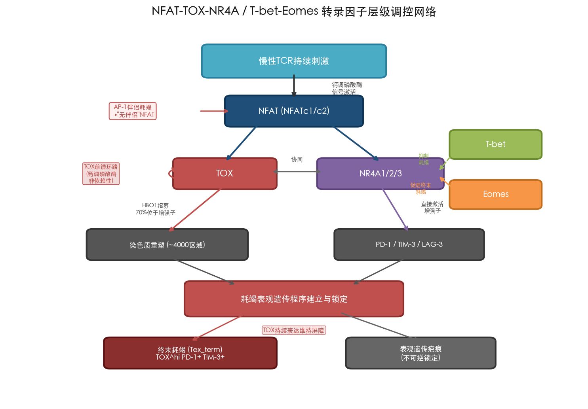

**图1-1 NFAT-TOX-NR4A / T-bet-Eomes 转录因子层级调控网络。** 从慢性TCR持续刺激出发，经钙调磷酸酶-NFAT激活，TOX建立前馈环路并通过HBO1招募重塑约4,000个增强子区域染色质，NR4A直接激活共抑制受体基因增强子。T-bet抑制耗竭进程而Eomes促进终末耗竭，两者构成耗竭分级调控的对立极。

## 1.4 T-bet与Eomes：耗竭分级调控中的对立极

### 1.4.1 经典模型：T-bet抑制与Eomes促进终末耗竭

T-box转录因子家族成员T-bet（编码基因TBX21）和Eomesodermin（Eomes）在CD8+ T细胞分化中发挥核心但功能对立的调控作用。在耗竭背景下，经典模型由Paley等（Science 2012, 338:1220–1225）在LCMV慢性感染模型中确立：T-bet^hi细胞保留较强效应功能并维持前体耗竭状态，Eomes^hi细胞则更深度耗竭，表达更高水平的PD-1、TIM-3等抑制性受体。T-bet直接抑制PDCD1基因转录从而限制PD-1表达水平，T-bet^hi Tex亚群对PD-1阻断治疗响应更佳 [Paley et al., Science 2012](https://pmc.ncbi.nlm.nih.gov/articles/PMC3653769/ "Progenitor and terminal subsets of CD8+ T cells cooperate to contain chronic viral infection")。

在人类慢性病毒感染中，Buggert等（PLoS Pathog 2014）进一步证实，T-bet与Eomes的表达失衡与CD8+ T细胞功能障碍直接相关：HIV特异性CD8+ T细胞功能低下与T-bet/Eomes比值降低密切关联。

### 1.4.2 亚细胞定位：被长期忽视的调控维度

McLane等（Cell Rep 2021, 35:109120）揭示了T-bet和Eomes调控耗竭的一个重要维度——亚细胞定位。该研究发现，耗竭T细胞中T-bet和Eomes的核质比存在差异化变化：T-bet更多滞留于胞质导致其转录活性降低，而Eomes在细胞核中维持较高水平，使Eomes的转录驱动功能在耗竭细胞中占据主导地位。人为调控T-bet的核定位可改善耗竭T细胞的功能状态，提示转录因子的"量"与"位"共同决定耗竭程度 [McLane et al., Cell Rep 2021](https://pubmed.ncbi.nlm.nih.gov/33979613/ "Role of nuclear localization in the regulation and function of T-bet and Eomes in exhausted CD8 T cells")。

### 1.4.3 TCR信号强度与Eomes的协同命运调控

2026年2月，Dreidi等利用自发性肝细胞癌（HCC）模型，系统解析了TCR信号强度与Eomes表达如何协同决定CD8+ T细胞在效应、Trm和耗竭三条轨道之间的命运选择。高亲和力TCR刺激支持强效效应分化和Trm形成，介导早期肿瘤控制；低亲和力刺激则诱导Eomes高表达，促进细胞快速向Tex表型转化。遗传学敲除Eomes可增强高亲和力CD8+ T细胞的Trm分化并延缓肿瘤复发，而异位表达Eomes则加速耗竭并导致更早的肿瘤复发。在低亲和力条件下，Eomes缺失虽提高了Trm/Tex比值，但不足以恢复有效抗肿瘤免疫，表明弱TCR信号施加的内在限制无法仅通过Eomes调控克服 [Dreidi et al., bioRxiv 2026（预印本）](https://www.biorxiv.org/content/10.64898/2026.02.10.705135v1.full-text "TCR Signal Strength and Eomes Coordinate CD8+ T Cell Fate and Antitumor Immunity in HCC")。

上述发现对理解Tex-Trm命运分岔具有重要意义：Eomes不仅是耗竭的被动标记物，更是主动驱动耗竭命运、同时抑制Trm和效应程序的转录因子开关。TCR信号强度与Eomes表达量的交互作用构成了命运决定的双坐标系统。

## 1.5 BATF与IRF4：耗竭表观遗传编程中的语境依赖性角色

碱性亮氨酸拉链ATF样转录因子BATF和干扰素调控因子4（IRF4）在CD8+ T细胞中展现复杂的双重功能。Kurachi等的研究表明，BATF在效应CD8+ T细胞分化中通过与AP-1位点竞争性结合和招募染色质重塑复合物，控制效应基因座的表观遗传可及性。然而，在慢性刺激环境中，BATF的作用发生功能重配：BATF/IRF4复合体被招募至耗竭相关基因座，参与建立耗竭特异性增强子景观 [Kurachi et al., Sci Immunol 2014](https://www.science.org/doi/10.1126/sciimmunol.abi4919 "Batf-mediated epigenetic control of effector CD8+ T cell differentiation")。

就BATF与TOX的关系而言，现有证据支持BATF在耗竭编程中具有部分独立于TOX的贡献。NFAT、BATF、TOX和NR4A不仅驱动耗竭转录程序，更重要的是它们与表观遗传修饰之间形成正反馈环路：转录因子结合触发局部组蛋白修饰变化（如H3K27ac富集），修饰后的染色质状态反过来稳定转录因子的结合，形成自增强的表观遗传锁定 [PMC综述](https://pmc.ncbi.nlm.nih.gov/articles/PMC12582961/ "Epigenetic regulation of CD8+ T cell exhaustion")。在CAR-T细胞研究中，BATF过表达可降低TOX和PD-1表达，提示BATF在特定背景下可对抗耗竭程序，体现了其功能的高度语境依赖性。

## 1.6 前体耗竭T细胞（Tpex）：耗竭连续谱的干性储库

### 1.6.1 Tpex的鉴定与功能特征

前体耗竭T细胞概念由Im等（Nature 2016, 537:417–421）和Utzschneider等（Immunity 2016, 45:415–427）在LCMV慢性感染模型中独立奠基。Im等定义了PD-1阻断治疗后产生增殖爆发的TCF1⁺CXCR5⁺PD-1⁺亚群；Utzschneider等报道TCF1⁺"记忆样"CD8+ T细胞保留自我更新能力并可分化为终末耗竭细胞，而终末耗竭细胞无法回复至前体状态，确立了耗竭分化的单向性 [Utzschneider et al., Immunity 2016](https://pubmed.ncbi.nlm.nih.gov/27533016/ "T Cell Factor 1-Expressing Memory-like CD8+ T Cells Sustain the Immune Response to Chronic Viral Infections")。

### 1.6.2 Tpex的临床转化意义

Miller等（Nat Immunol 2019, 20:326–336）在肿瘤中验证了TCF1⁺ Tpex的临床相关性：仅TCF1⁺Slamf6⁺TIM-3⁻的前体耗竭TIL能对anti-PD-1阻断产生增殖性响应；在黑色素瘤患者中，TCF1⁺PD-1⁺ TIL比例更高者治疗预后更佳 [Miller et al., Nat Immunol 2019](https://www.nature.com/articles/s41590-019-0312-6 "Subsets of exhausted CD8+ T cells differentially mediate tumor control and respond to checkpoint blockade")。这一发现为ICB（immune checkpoint blockade）治疗的生物标志物研究和疗效预测提供了重要依据，表明维持Tpex池的干性和代谢适应性是改善免疫治疗效果的关键策略方向。

## 1.7 耗竭CD8+ T细胞的多步骤发育谱系

### 1.7.1 四亚群发育模型

Beltra等（Immunity 2020, 52:825–841）通过对LCMV慢性感染模型中CD8+ T细胞进行系统性表型与功能分析，基于Ly108（Slamf6）和CD69表达定义了四个发育亚群，确立了Tex作为多步骤发育过程的范式（图1-2）。四个亚群依次为：(1) Ly108⁺CD69⁺（Tpex，干性最高）；(2) Ly108⁺CD69⁻（过渡态前体）；(3) Ly108⁻CD69⁻（效应样中间态）；(4) Ly108⁻CD69⁺（终末耗竭）。每一步转化伴随转录因子层级的系统重配——从TCF1主导的干性程序逐步过渡至TOX/Eomes主导的耗竭程序 [Beltra et al., Immunity 2020](https://www.cell.com/immunity/fulltext/S1074-7613(20)30172-2 "Developmental Relationships of Four Exhausted CD8+ T Cell Subsets")。

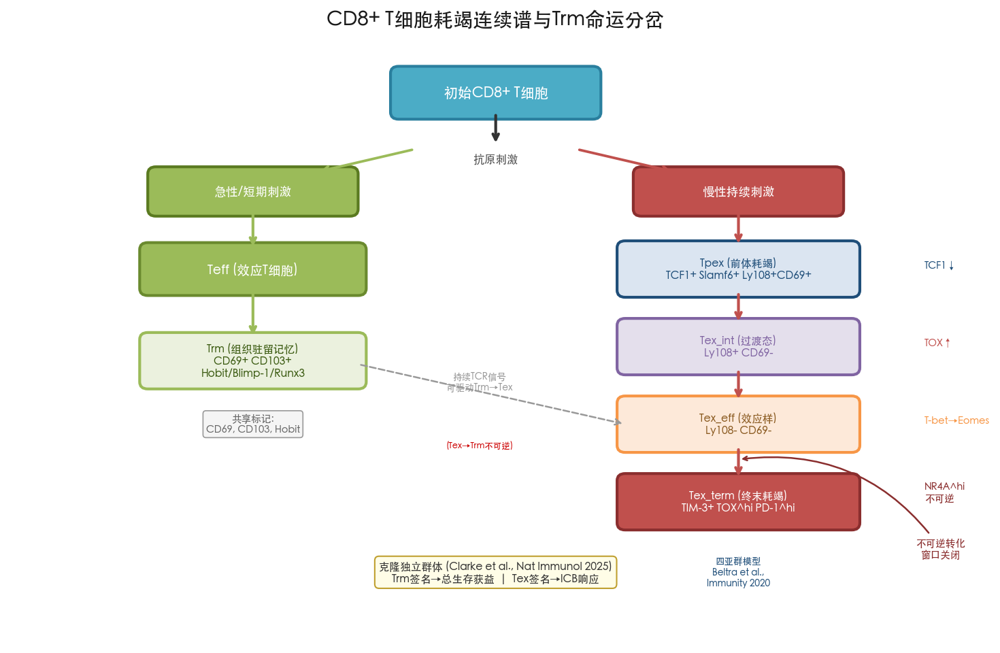

**图1-2 CD8+ T细胞耗竭连续谱与Trm命运分岔。** 初始CD8+ T细胞在急性/短期刺激下经Teff分化为Trm（左侧分支），在慢性持续刺激下依次经Tpex、Tex_int、Tex_eff至Tex_term的四亚群耗竭连续谱（右侧分支）。图中标注各阶段关键转录因子变化（TCF1↓、TOX↑、T-bet→Eomes、NR4A^hi）、Trm与Tex的共享标记及克隆独立性，以及不可逆转化窗口位置。基于Beltra et al.（Immunity 2020）和Clarke et al.（Nat Immunol 2025）数据。

### 1.7.2 蛋白质毒性应激：耗竭驱动力的新维度

2025年10月，Wang等（Nature 2025, 647:1025–1035）报道了蛋白质毒性应激反应（proteotoxic stress response, Tex-PSR）作为一种全新的耗竭驱动机制。该研究发现，终末耗竭T细胞中全局翻译活性异常增加，导致蛋白质聚集体累积和自噬系统代偿性增强。核心发现在于，单纯通过药理学手段破坏蛋白质稳态即可将Teff转化为具有耗竭特征的细胞——无需慢性TCR刺激。靶向内质网分子伴侣gp96（Hsp90b1）可改善小鼠肿瘤免疫治疗效果 [Wang et al., Nature 2025](https://pubmed.ncbi.nlm.nih.gov/41034580/ "Proteotoxic stress response drives T cell exhaustion and immune evasion, Nature 647:1025-1035")。这一发现将耗竭驱动力的范畴从TCR信号持续刺激拓展至蛋白质组水平的应激，表明蛋白质稳态失衡可独立启动耗竭程序。

## 1.8 耗竭的表观遗传景观与"表观遗传疤痕"

### 1.8.1 Tex的独特表观遗传身份

Sen等（Science 2016, 354:1165–1169）率先揭示Tex细胞具有与效应和记忆T细胞截然不同的表观遗传景观。全基因组ATAC-seq分析表明Tex与效应/记忆T细胞之间存在约6,000个差异开放染色质区域（differentially accessible chromatin regions），确立了Tex作为一种表观遗传上独立的细胞状态。Pauken等（Science 2016, 354:1160–1165）同期证明，PD-1阻断治疗虽可暂时恢复Tex的效应功能，但无法持久重塑其表观遗传景观——治疗终止后细胞迅速回复至耗竭状态 [Khan et al., Nature 2019](https://pmc.ncbi.nlm.nih.gov/articles/PMC6713202/ "TOX transcriptionally and epigenetically programs CD8+ T cell exhaustion")。

### 1.8.2 "表观遗传疤痕"的持久性

Abdel-Hakeem等（Nat Immunol 2021, 22:1008–1019）在LCMV慢性感染后抗原清除模型中进一步证实了表观遗传疤痕（epigenetic scar）的极端持久性。即使抗原被清除超过520天，恢复中的Tex（REC-TEX）的ATAC-seq谱仍主要保持Tex样模式，仅约2.9%的被TOX抑制的效应细胞开放染色质区域得到恢复；TOX和PDCD1基因座的开放染色质模式未显著重塑。这一结果意味着，慢性抗原刺激在耗竭CD8+ T细胞的染色质上刻下近乎不可擦除的印记——即使驱动力消失，细胞仍无法回归正常记忆T细胞的表观遗传状态。该发现对HIV感染者接受抗逆转录病毒治疗（ART）后CD8+ T细胞功能恢复的预期设定了重要的生物学限制（图1-3）。

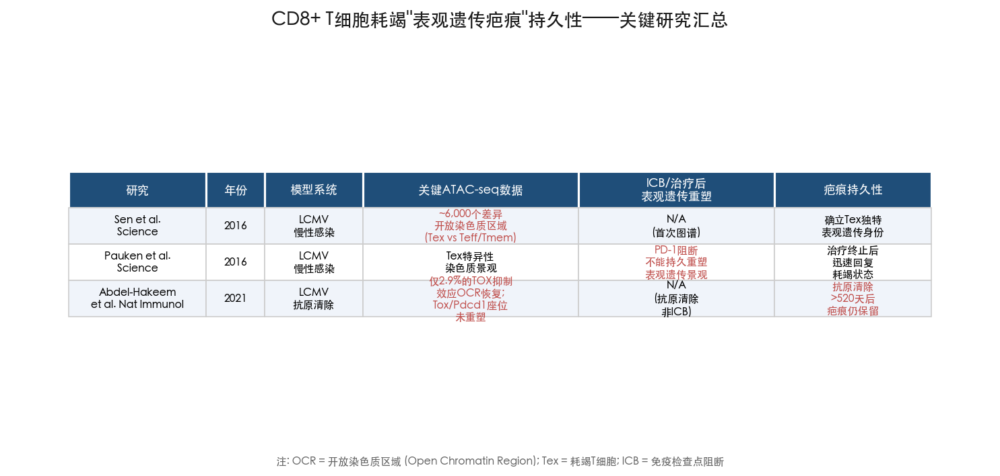

**图1-3 CD8+ T细胞耗竭"表观遗传疤痕"持久性——关键研究汇总。** 对比Sen et al.（Science 2016）、Pauken et al.（Science 2016）和Abdel-Hakeem et al.（Nat Immunol 2021）三项里程碑研究的关键ATAC-seq数据，包括差异开放染色质区域数量（~6,000个）、ICB治疗后表观遗传重塑失败以及抗原清除>520天后仅2.9%效应OCR恢复等定量指标。

## 1.9 组织驻留记忆T细胞（Trm）的核心特征与耗竭的表型重叠

### 1.9.1 Trm的分子定义

组织驻留记忆T细胞（Trm）是一类定居于非淋巴组织的长寿命记忆细胞群体，以表面标记CD69⁺CD103⁺为经典特征。CD69通过拮抗S1P受体S1PR1阻止细胞回流至循环系统；CD103（整合素αE）介导与上皮细胞E-cadherin的粘附，锚定细胞于组织屏障。Trm的核心转录因子程序包括Hobit（ZNF683）、Blimp-1（PRDM1）和Runx3的协同调控——Hobit与Blimp-1协同抑制组织外迁基因（KLF2、S1PR1、CCR7）的表达，Runx3驱动CD103表达和Trm效应功能。

### 1.9.2 Trm与Tex的表型重叠与克隆独立性

Clarke等（Nat Immunol 2025）通过SPLINTR条码追踪系统在乳腺癌模型中解构了肿瘤内Trm与Tex的关系。两类细胞在表面标记上存在显著重叠——均可表达CD103、CD69和Hobit（ZNF683）——但Tex特异性高表达CD38、CD39、PD-1、CTLA-4、TIGIT和TIM-3。克隆追踪分析揭示了一个核心发现：Trm和Tex为克隆独立的群体，即它们来源于不同的前体克隆或在极早期即已发生分化。持续性TCR信号被确认为驱动Trm向Tex转化的关键因素。在预后关联方面，Trm签名高表达与乳腺癌更好的总生存率相关，但仅Tex签名与PD-1阻断治疗响应正相关 [Clarke et al., Nat Immunol 2025](https://www.nature.com/articles/s41590-025-02347-9 "Antigen reactivity defines tissue-resident memory and exhausted T cells in tumors")。

### 1.9.3 Hobit在Trm中的表达特异性再评估

经典模型中Hobit被视为Trm的特异性标记物，但Clarke等2025年的数据显示Trm和Tex均可表达ZNF683/Hobit，削弱了Hobit作为Trm唯一标记的判别价值。在人类样本中，Hobit的表达模式可能更加复杂，其在不同组织和疾病背景下的特异性尚未获得系统性确认。这一观察提示，Trm与Tex的区分不应依赖单一标记物，而需采用综合表面表型、转录组签名和功能评估的多维度策略。

## 1.10 TOX在人类免疫系统中的特殊复杂性

TOX在人类中的功能比小鼠模型更为复杂。Sekine等（Sci Immunol 2020, 5:eaba7918）确认TOX在HIV耗竭T细胞中高表达，但同时发现TOX在人类中并非耗竭的专属标记——CMV和EBV特异性多功能记忆T细胞以及elite controllers（自然控制者）的HIV特异性T细胞同样表达TOX [Sekine et al., Sci Immunol 2020](https://pubmed.ncbi.nlm.nih.gov/32620560/ "TOX is expressed by exhausted and polyfunctional human effector memory CD8+ T cells")。这意味着在人类免疫系统中，TOX的表达不能直接等同于耗竭状态，其功能可能与T细胞经历的抗原刺激历史和分化阶段有关。将小鼠TOX研究结论直接外推至人类临床场景时需保持审慎。

## 1.11 组蛋白乳酸化：连接代谢与表观遗传的新型修饰

组蛋白赖氨酸乳酸化（histone lysine lactylation, Kla）由Zhang等（Nature 2019, 574:575–580）首次报道。该研究在巨噬细胞中共鉴定28个组蛋白Kla位点，其中H3K18la为标志性位点。p300乙酰转移酶被鉴定为Kla的写入酶（writer），以L-乳酰-CoA为酰基供体底物。在肿瘤组织中，乳酸浓度可高达约40 mM，显著高于正常组织。Kla与经典组蛋白乙酰化（Kac）呈现不同的时间动力学——Kac在细胞激活后早期达峰，Kla则在16–24小时延迟升高 [Zhang et al., Nature 2019](https://pmc.ncbi.nlm.nih.gov/articles/PMC10929197/ "Histone lactylation: from tumor lactate metabolism to epigenetic regulation")。

Kla的发现在概念上打通了糖酵解代谢与表观遗传调控之间的直接通路。TME高乳酸环境中CD8+ T细胞的组蛋白乳酸化修饰如何影响耗竭-记忆命运决定，将在本报告第3章和第4章中展开详细讨论。此处引入Kla作为本章的知识铺垫，为后续代谢-表观遗传互作分析奠定基础。

## 1.12 小结

本章从转录因子层级调控、表观遗传景观重塑和细胞亚群发育关系三个维度，系统阐述了慢性抗原刺激下CD8+ T细胞耗竭的分子与细胞生物学基础。核心认识可概括为以下框架：

1. **NFAT-TOX-NR4A转录因子级联**构成耗竭程序的核心驱动网络，其中TOX兼具启动者和维护者的双重角色，持续表达构成锁定耗竭命运的表观遗传屏障。
2. **T-bet与Eomes的表达比例和亚细胞定位**共同调控耗竭深度，TCR信号强度与Eomes表达量交互决定Tex-Trm命运分岔。
3. **耗竭在表观遗传层面产生近乎不可逆的"疤痕"**，构成ICB治疗疗效上限的核心生物学瓶颈。
4. **Trm与Tex虽共享部分表面标记但为克隆独立群体**，两者的命运分离受持续TCR信号驱动。

这些分子与细胞生物学基础为理解线粒体动力学如何通过代谢中间物调控表观遗传重塑、进而驱动命运分岔提供了必要的框架支撑——这正是本报告第2–4章将深入探讨的核心问题。

# 第2章 线粒体动力学在CD8+ T细胞命运决定中的调控机制

线粒体作为细胞能量代谢的核心细胞器，在CD8⁺ T细胞的命运抉择中承担着远超能量供应的调控功能。从效应到记忆、从前体耗竭（Tpex）到终末耗竭（Tex_term）的谱系分岔过程中，线粒体融合/裂变平衡（mitochondrial dynamics）构成关键的程序性决定因素。融合偏好维持氧化磷酸化（OXPHOS）产能以支撑记忆及组织驻留记忆（Trm）细胞分化，而裂变过度与去极化线粒体的累积则驱动终末耗竭的表观遗传锁定。本章围绕三个核心维度展开论述：线粒体融合与裂变的分子调控机器及其在T细胞中的功能验证；线粒体质量控制通路——包括PINK1-Parkin介导的线粒体自噬（mitophagy）和PGC-1α主导的线粒体生物发生——在肿瘤浸润淋巴细胞（TIL）中的系统性失调；以及线粒体-内质网接触位点（MERCs/MAMs）对Ca²⁺信号传递与代谢命运选择的整合调控。上述分子机制为第3章代谢-表观遗传互作网络的讨论提供不可或缺的机制基础。

## 2.1 线粒体融合与裂变的分子机器：从结构到功能

### 2.1.1 融合机器：MFN1/MFN2与OPA1

线粒体融合涉及外膜和内膜两套独立但协调的分子机器。外膜融合由线粒体融合蛋白1和2（Mitofusin 1/2, MFN1/MFN2）介导，二者均属GTPase超家族，通过同源或异源二聚体互作驱动相邻线粒体外膜融合。其中，MFN1具有更高的GTP水解活性，是外膜融合的主要执行者；MFN2在外膜融合之外，还通过锚定于内质网（ER）膜发挥独特的线粒体-ER物理锚定功能（详见2.3节）。内膜融合由视神经萎缩蛋白1（Optic Atrophy 1, OPA1）驱动，OPA1同时参与线粒体嵴（cristae）形态重塑、电子传递链（ETC）超复合物组装及Ca²⁺稳态调节。

OPA1在T细胞命运决定中的角色经历了重要的认知迭代。2016年，Buck等发表了线粒体动力学控制T细胞命运的范式性研究，确立了效应T细胞（Teff）呈碎片化线粒体、记忆T细胞维持融合网络状线粒体的基本格局。该研究证明OPA1为记忆T细胞形成的必要条件，且强制融合具备充分性——可赋予Teff记忆细胞特征并增强抗肿瘤功能。融合通过嵴形态改变促进ETC超复合物组装，偏好OXPHOS和脂肪酸氧化（FAO），由此奠定了"融合→嵴重塑→ETC超复合物→OXPHOS→记忆"的核心范式 [Buck et al., Cell 2016](https://pubmed.ncbi.nlm.nih.gov/27293185/ "Mitochondrial Dynamics Controls T Cell Fate through Metabolic Programming, Cell 166:63-76")。

Willett等2025年的研究对上述范式提出了重要修正。该研究采用dLck-Cre驱动的T细胞特异性OPA1敲除小鼠（经10代以上回交至C57BL/6背景），发现OPA1缺失对效应T细胞的影响远大于对记忆T细胞——OPA1⁻/⁻小鼠中短寿命效应细胞（SLEC）数量减少约20至200倍，而记忆前体效应细胞（MPEC）仅减少2至5倍。scRNA-seq分析揭示OPA1⁻/⁻ T细胞存在独特的转录程序（GEP5），以GCN2氨基酸应激响应上调、线粒体FAO丧失和NAD⁺再循环紊乱为特征。关键的遗传学对照实验表明，MFN1/MFN2双敲除（Mfn dKO）无法完全复制OPA1缺失表型——Mfn dKO对SLEC和MPEC的影响较为均衡，且不共享OPA1⁻/⁻ T细胞的氨基酸代谢紊乱和CD98高表达特征 [Willett et al., Immunity 2025](https://pmc.ncbi.nlm.nih.gov/articles/PMC12600010/ "OPA1 is required for the expansion of effector CD8 T cells")。上述发现表明，OPA1在T细胞中的功能超越了线粒体融合本身，涵盖嵴结构维持、ETC超复合物组装和氨基酸代谢调控等多个层面。对于理解慢性抗原刺激下线粒体融合-裂变失衡的功能后果而言，OPA1功能丧失不仅意味着形态学融合缺陷，更代表多层代谢节点的同步崩溃。OPA1蛋白水平与ETC组装效率、OXPHOS通量变化之间的剂量-效应关系在当前文献中尚缺乏系统性定量测量，构成后续建模面临的参数缺口之一。

### 2.1.2 裂变机器：DRP1及其磷酸化调控

线粒体裂变主要由动力相关蛋白1（Dynamin-Related Protein 1, DRP1）执行。DRP1经受体蛋白FIS1、MFF等介导招募至线粒体外膜，自组装为环状寡聚体，以GTP水解产生的机械力切割线粒体。DRP1活性受多位点磷酸化精密调控：Ser616位点磷酸化（由ERK1/2和CDK1介导）激活裂变，Ser637位点磷酸化（由PKA介导）则抑制裂变。

Simula等2022年的研究在T细胞中首次建立了PD-1信号对DRP1调控的直接因果关系。PD-1信号通过下调ERK1/2和mTOR通路，抑制DRP1 Ser616磷酸化，从而阻止T细胞活化后的线粒体裂变。利用T细胞特异性Drp1条件性敲除小鼠的实验进一步表明，Drp1缺失背景下anti-PD-1治疗效果显著减弱，提示DRP1活性是PD-1阻断疗效的必要条件之一。该研究在方法学上具有示范意义：鉴于Bordt等2017年已证明最广泛使用的DRP1药理学抑制剂Mdivi-1实质上为线粒体复合物I的可逆抑制剂而非特异性DRP1抑制剂，Simula等采用遗传学手段提供了更为严格的功能验证 [Simula et al., Mol Oncol 2022](https://pubmed.ncbi.nlm.nih.gov/34535949/ "PD-1-induced T cell exhaustion is controlled by a Drp1-dependent mechanism")。

需要强调的是，DRP1介导的裂变并非单向地"有害"。在T细胞活化初期，裂变通过增加线粒体数量满足快速增殖细胞的生物量分配需求，属于正常免疫应答的组成部分。病理性后果源于持续的裂变失衡：当融合/裂变天平长期偏向裂变时，碎片化线粒体丧失嵴结构完整性，ETC效率降低，OXPHOS通量下降，细胞被迫转向糖酵解依赖的代谢模式。这一代谢转换构成了从前体耗竭向终末耗竭推进的关键能量学驱动力。

## 2.2 线粒体质量控制：mitophagy失调与耗竭编程

### 2.2.1 PINK1-Parkin通路与TIL中的线粒体自噬缺陷

线粒体质量控制的核心机制为选择性线粒体自噬（mitophagy），其经典通路由PINK1-Parkin轴调控。当线粒体膜电位（ΔΨm）下降时，PINK1在外膜累积并招募E3泛素连接酶Parkin，后者对线粒体外膜蛋白进行K48/K63链泛素化修饰，标记受损线粒体供自噬体吞噬降解。

Yu等2020年在《Nature Immunology》上发表的研究直接建立了线粒体自噬缺陷与T细胞耗竭之间的因果关系。该研究发现TIL中线粒体自噬活性进行性下降，去极化线粒体在CD8⁺ TIL中大量累积。实验设计的关键在于因果方向的确认：药理学强制诱导去极化线粒体累积即可驱动T细胞向终末耗竭方向的表观遗传重编程，无需额外的慢性TCR刺激，从而排除了线粒体失调仅为耗竭伴随现象的可能。同时，该研究发现补充烟酰胺核糖（nicotinamide riboside, NR）可改善anti-PD-1治疗响应，提示NAD⁺代谢恢复可部分逆转线粒体驱动的耗竭程序 [Yu et al., Nat Immunol 2020](https://pubmed.ncbi.nlm.nih.gov/33020660/ "Disturbed mitochondrial dynamics in CD8+ TILs reinforce T cell exhaustion")。去极化线粒体累积比例与耗竭基因座染色质开放之间的剂量-效应关系，可为后续定量建模提供重要约束条件。

### 2.2.2 USP30：连接TCR信号与mitophagy抑制的新轴

Zhang和Gao等2025年在《Science Advances》上报道了USP30作为T细胞耗竭中线粒体自噬关键负调控因子的发现。USP30是一种定位于线粒体外膜的去泛素化酶，可直接对抗Parkin介导的泛素化修饰，从而阻断线粒体自噬的执行。该研究揭示了一条完整的调控轴：慢性抗原刺激→TCR/NFATc1→USP30转录上调→线粒体自噬抑制→去极化线粒体累积→T细胞耗竭。具体而言，在慢性TCR刺激下，NFATc1直接结合USP30启动子区域驱动其转录激活；USP30蛋白水平升高后拮抗Parkin功能，使受损线粒体无法被有效清除。该轴的治疗可行性已获初步验证——USP30选择性抑制剂ST-539口服给药在小鼠肿瘤模型中显著抑制肿瘤生长 [Zhang, Gao et al., Sci Adv 2025](https://pmc.ncbi.nlm.nih.gov/articles/PMC12356266/ "USP30 inhibition augments mitophagy to prevent T cell exhaustion")。

USP30的发现填补了一个长期悬而未决的机制空白。此前虽已明确TIL中线粒体自噬活性下降，但慢性TCR信号如何主动抑制这一质量控制通路的分子机制并不清楚。NFATc1→USP30轴将TCR信号强度与线粒体质量控制效率直接关联，为慢性抗原刺激经由线粒体途径驱动耗竭提供了清晰的分子级解释。

### 2.2.3 Parkin与NIX在记忆T细胞形成中的差异化角色

线粒体自噬对T细胞命运的影响不仅体现在耗竭驱动层面，亦正向参与记忆T细胞的形成与维持。Franco等2023年在《Science Immunology》上系统性解析了线粒体自噬调控记忆CD8⁺ T细胞形成的分子机制。该研究发现Parkin通路和NIX通路这两条独立的mitophagy通路在记忆T细胞形成中发挥非冗余的保护作用：Parkin通过抑制VDAC1依赖的凋亡保护记忆T细胞存活，NIX则通过维持线粒体代谢功能对抗铁死亡（ferroptosis）。记忆T细胞稳态维持的关键细胞因子IL-15可上调Parkin和NIX的表达。尤为引人注目的是，帕金森病患者——已知存在Parkin功能缺陷——的CD8⁺记忆T细胞频率显著低于健康供体，且在COVID-19疫苗接种后未能有效建立记忆T细胞应答 [Franco et al., Sci Immunol 2023](https://pubmed.ncbi.nlm.nih.gov/37738363/ "Regulatory circuits of mitophagy restrict distinct modes of cell death during memory CD8+ T cell formation")。

上述发现与耗竭场景中的线粒体自噬缺陷形成精确的"镜像"关系：记忆分化依赖线粒体自噬维持线粒体健康，而耗竭进程中线粒体自噬经USP30通路被主动抑制导致受损线粒体累积，二者构成一对此消彼长的命运调控机制。

### 2.2.4 从PGC-1α丧失到线粒体生物发生崩溃

线粒体质量控制不仅涉及受损线粒体的清除，亦涵盖新线粒体的生物发生（mitochondrial biogenesis）。PGC-1α（Peroxisome proliferator-activated receptor Gamma Coactivator 1-alpha）是线粒体生物发生的主调控因子。

Scharping等先后于2016年和2021年发表了两项互为补充的研究。2016年的工作首次报道TME抑制T细胞线粒体生物发生：TIL中PGC-1α进行性丢失由持续Akt信号诱导，强制表达PGC-1α可重编程TIL代谢并增强抗肿瘤效能；同时该研究指出，PD-1阻断本身并不能挽救TIL的代谢功能障碍 [Scharping et al., Immunity 2016](https://pubmed.ncbi.nlm.nih.gov/27496732/ "TME Represses T Cell Mitochondrial Biogenesis")。2021年的延续性工作进一步阐明，持续抗原刺激与低氧的协同作用——单独任一因素均不足以驱动——通过Blimp-1介导的PGC-1α转录抑制破坏线粒体重编程能力。由此产生的不可耐受活性氧（ROS）水平通过抑制磷酸酶活性和促进NFAT核定位加速耗竭编程；N-乙酰半胱氨酸（NAC）抗氧化处理可显著恢复T细胞功能 [Scharping et al., Nat Immunol 2021](https://pubmed.ncbi.nlm.nih.gov/33398183/ "Mitochondrial stress induced by continuous stimulation under hypoxia rapidly drives T cell exhaustion")。

Huang等2026年在《Science Immunology》上报道了线粒体质量维持的一条新信号轴。该研究发现PTMA（Prothymosin alpha）在Tpex中高表达且受TCF1直接转录调控，PTMA通过与TFAM（线粒体转录因子A）互作保护mtDNA完整性、维持OXPHOS功能。"TCF1→PTMA→TFAM/mtDNA完整性→OXPHOS维持→Tpex持久性"这一新信号轴揭示了Tpex在耗竭微环境中维持线粒体健康和干性的分子基础 [Huang et al., Sci Immunol 2026](https://pubmed.ncbi.nlm.nih.gov/41544148/ "PTMA safeguards mitochondrial integrity to sustain metabolic function of CD8 T cells")。

综合以上发现，TIL中的线粒体失调呈现多层次协同崩溃的图景：PGC-1α下调阻断新线粒体生成→USP30上调抑制受损线粒体清除→去极化线粒体累积→ROS过产生→表观遗传耗竭程序激活。Tpex通过TCF1-PTMA-TFAM轴部分抵御这一级联崩溃，而该保护机制的丧失则标志着不可逆终末耗竭的到来。图2-1以表格形式系统汇总了上述多条线粒体质量控制通路在正常T细胞与TIL/耗竭状态下的功能变化。

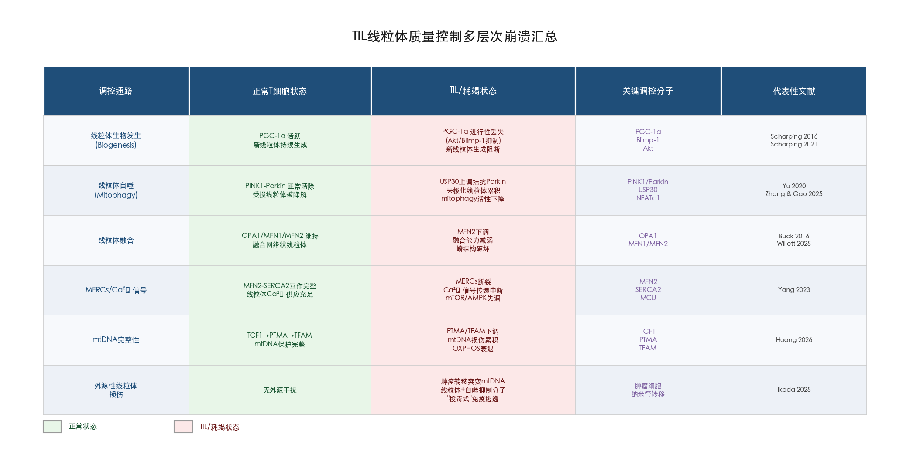

**图2-1 TIL线粒体质量控制多层次崩溃汇总。** 六条线粒体质量控制通路——线粒体生物发生、线粒体自噬、线粒体融合、MERCs/Ca²⁺信号、mtDNA完整性及外源性线粒体损伤——在正常T细胞与TIL/耗竭状态下的功能对比，列示各通路的关键调控分子及代表性文献来源。

## 2.3 线粒体-内质网接触位点（MERCs）：钙信号与代谢命运的交叉点

### 2.3.1 MFN2-SERCA2互作调控TIL代谢适能

线粒体与内质网之间通过物理接触位点——线粒体-内质网接触（mitochondria-ER contacts, MERCs），又称线粒体相关内质网膜（mitochondria-associated ER membranes, MAMs）——实现信号与物质的精密传递。MFN2在这一界面中发挥双重功能：既参与线粒体外膜融合，又充当线粒体-ER物理锚定的关键蛋白。

Yang等2023年在《Science Immunology》上发表了MFN2-SERCA2互作在TIL中功能的系统性研究。该研究首先通过临床数据关联分析发现MFN2表达水平与多种癌症患者预后正相关。在分子机制层面，MFN2通过与ER膜嵌入的Ca²⁺-ATPase SERCA2直接互作增强线粒体-ER接触，促进线粒体Ca²⁺内流以支持高效线粒体代谢；同时，MFN2刺激SERCA2的ER Ca²⁺回收活性，防止线粒体Ca²⁺过度积累和凋亡，形成一种"锚定-缓冲"（tethering-and-buffering）的协同调控模式。在功能验证实验中，提高CD8⁺ TIL中MFN2表达水平可改善肿瘤免疫治疗效果，而Mfn2条件性敲除则损害线粒体代谢和T细胞功能、促进肿瘤进展 [Yang et al., Sci Immunol 2023](https://pubmed.ncbi.nlm.nih.gov/37738362/ "Mitochondria-ER contact mediated by MFN2-SERCA2 interaction supports CD8+ T cell metabolic fitness and function in tumors")。

这一发现将MFN2的功能从单纯的线粒体融合蛋白扩展至细胞器间通信的调控者。在TME中，TIL内MFN2表达下降不仅导致线粒体融合缺陷，还同时破坏MERCs处的Ca²⁺信号传递、mTOR/AMPK传感以及脂质转运，这种多功能丧失的后果远超线粒体形态改变本身。MERCs在CD8⁺ T细胞命运决定中的具体调控机制——尤其是MFN2-SERCA2互作如何影响mTOR与AMPK通路的活化阈值——属于当前研究前沿的空白区域。

### 2.3.2 MERCs与T细胞命运选择的信号整合

MERCs不仅是Ca²⁺传递的物理站点，更是多条信号通路的空间整合平台。ER释放的Ca²⁺经线粒体钙单转运体（MCU）进入线粒体基质，直接刺激TCA循环关键酶（异柠檬酸脱氢酶、α-酮戊二酸脱氢酶）活性，提高OXPHOS通量和ATP产出。同时，MERCs处的Ca²⁺微域对mTORC1和AMPK的活性形成局部调控：充足的线粒体Ca²⁺供应维持mTORC1活性和合成代谢程序，而MERCs断裂导致的Ca²⁺信号不足则激活AMPK，触发分解代谢转换。

从T细胞命运决定的角度审视，MERCs完整性的维持与丧失构成一个关键的"早期预警"节点：当慢性抗原刺激导致MFN2下调、MERCs断裂时，Ca²⁺传递效率降低→TCA循环通量下降→OXPHOS能力减弱→AMPK激活→mTOR抑制，这一级联反应可能先于线粒体融合/裂变失衡的形态学表型显现，构成耗竭的早期代谢诱因。这一假设的定量验证需要在T细胞耗竭进程中对MERCs密度、Ca²⁺传递速率与代谢通量进行时间分辨的同步测量，此类数据在CD8⁺ T细胞系统中尚属空白。

## 2.4 线粒体膜电位作为T细胞命运的预测性标志物

线粒体膜电位（ΔΨm）反映ETC活性和质子梯度的综合状态，是线粒体健康的灵敏指标。Sukumar等2016年的研究建立了ΔΨm作为T细胞干性预测标志物的范式：在同一群活化CD8⁺ T细胞中，低ΔΨm亚群较高ΔΨm亚群具有显著更高的自我更新能力；过继转移实验进一步证实，低ΔΨm CD8⁺ T细胞介导的抗肿瘤活性优于高ΔΨm细胞 [Sukumar et al., Cell Metab 2016](https://www.cell.com/cell-metabolism/fulltext/S1550-4131(15)00569-0 "Mitochondrial Membrane Potential Identifies Cells with Enhanced Stemness")。

这一发现表面上与"融合→高OXPHOS→记忆"的主流范式相悖，实则揭示了更为精细的调控逻辑。维持适度（而非最高）的ΔΨm代表了线粒体代谢的"弹性储备"——低ΔΨm细胞保留更大的呼吸储备容量（spare respiratory capacity, SRC），可在需要时灵活提升OXPHOS通量。相比之下，高ΔΨm可能反映线粒体处于代谢应激的"过度驱动"状态，长期维持将导致ROS过产生和分化潜能丧失。图2-2以倒U型曲线模型直观呈现了ΔΨm与T细胞干性之间的非线性关系。

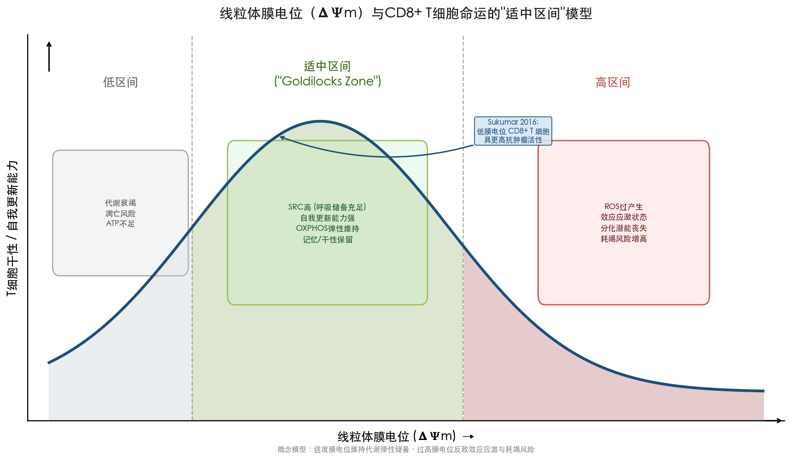

**图2-2 线粒体膜电位（ΔΨm）与CD8⁺ T细胞命运的"适中区间"模型。** 基于Sukumar等2016年研究数据构建的概念模型。横轴为线粒体膜电位，纵轴为T细胞干性/自我更新能力。三个功能区间分别对应：低区间（代谢衰竭/凋亡风险）、适中区间（"Goldilocks Zone"，高SRC、记忆/干性保留）、高区间（ROS过产生、效应应激、耗竭风险）。适度膜电位维持代谢弹性储备，过高膜电位反致效应应激与耗竭风险增高。

## 2.5 OXPHOS受损与耗竭编程的因果链

Vardhana等2020年的研究建立了一条精确的分子因果链：OXPHOS受损→核苷酸合成不足→增殖停止→耗竭程序上调。该研究证明线粒体氧化磷酸化能力的下降直接限制嘧啶核苷酸的从头合成——这一过程依赖于DHODH酶利用线粒体呼吸链提供的泛醌作为电子受体——导致T细胞自我更新能力丧失。维持氧化还原平衡可保护T细胞增殖能力，并诱导干细胞样前体T细胞基因表达程序 [Vardhana et al., Nat Immunol 2020](https://pubmed.ncbi.nlm.nih.gov/32661364/ "Impaired mitochondrial oxidative phosphorylation limits the self-renewal of T cells")。

这一发现将线粒体功能障碍与耗竭编程的联系从相关性提升至因果链水平，其完整的分子逻辑可概括为：线粒体裂变过度→嵴结构破坏→ETC效率下降→OXPHOS减弱→DHODH底物不足→核苷酸池枯竭→增殖停止→耗竭基因程序激活。该链条中各环节的定量参数——例如OXPHOS通量下降至何种水平触发核苷酸合成不足、核苷酸池降至何种浓度激活耗竭程序——已有部分实验测量数据，可作为后续定量建模的关键约束条件。

## 2.6 肿瘤微环境的线粒体"投毒"机制

在TME中，TIL线粒体功能障碍不仅源于细胞内在机制的崩溃，还遭受肿瘤细胞的主动攻击。Ikeda等2025年在《Nature》上报道了一种全新的免疫逃逸机制：肿瘤细胞通过细胞间线粒体转移将携带mtDNA突变的功能障碍线粒体传递至TIL，并同时转移线粒体自噬抑制分子以阻止TIL清除这些"毒性"线粒体。这种"投毒式线粒体转移"（poisonous mitochondrial transfer）揭示了TME通过主动破坏TIL线粒体健康实现免疫逃逸的新策略 [Ikeda et al., Nature 2025](https://www.nature.com/articles/s41586-024-08439-0 "Immune evasion through mitochondrial transfer in the tumour microenvironment")。

与之形成策略性对照的是Baldwin等2024年在《Cell》上发表的工作。该研究开发了一种"反向"线粒体转移平台：利用骨髓基质细胞经纳米管向T细胞转移健康线粒体。接受线粒体转移的CD8⁺ T细胞（Mito⁺）呼吸能力显著增强、耗竭标记物表达降低，在人CD19-CAR T细胞白血病模型中同样展现出增强的抗肿瘤活性 [Baldwin et al., Cell 2024](https://pubmed.ncbi.nlm.nih.gov/39276774/ "Intercellular nanotube-mediated mitochondrial transfer enhances T cell metabolic fitness")。

上述两项研究共同揭示了线粒体作为免疫调控"货币"的双刃剑性质：肿瘤利用有毒线粒体转移瓦解免疫监视，而治疗性健康线粒体补充则可恢复TIL功能。这一发现提示，未来免疫治疗策略不仅需要修复TIL内在的线粒体动力学缺陷，还须应对TME施加的外源性线粒体损伤。

## 2.7 线粒体动力学与T细胞命运分岔的整合模型

综合本章论述的证据，可以构建一个以线粒体为中心的CD8⁺ T细胞命运调控框架（图2-3）。在正常免疫应答中，效应期的线粒体裂变支持快速增殖所需的生物量分配，随后融合/裂变平衡向融合偏移，OPA1驱动的嵴重塑促进ETC超复合物组装和OXPHOS恢复，记忆前体细胞经由该代谢转换进入长寿命记忆谱系。

在慢性抗原刺激下，这一程序被多层次干扰：（1）PD-1信号持续抑制DRP1 Ser616磷酸化，但同时Blimp-1通路压制PGC-1α表达，新线粒体生成减少；（2）NFATc1→USP30轴主动阻断mitophagy，受损线粒体无法有效清除；（3）TME中肿瘤细胞通过线粒体转移直接"投毒"，叠加外源性损伤；（4）MFN2表达下调导致MERCs断裂和Ca²⁺信号传递中断。最终结果是去极化、碎片化的线粒体大量累积，OXPHOS崩溃驱动代谢从氧化磷酸化向糖酵解转移，由此产生的代谢中间物变化——乳酸升高、α-KG降低、ROS过产生——通过改变表观遗传修饰酶的底物可用性，重塑染色质景观向终末耗竭方向演进。

与之形成对偶路径的是，Tpex通过TCF1-PTMA-TFAM轴维持mtDNA完整性和OXPHOS能力，记忆/Trm细胞前体通过Parkin和NIX介导的mitophagy维持线粒体质量，以融合偏好的线粒体网络维持"OXPHOS→α-KG生成→TET酶活性→记忆/Trm增强子去甲基化"的正向调控回路。这一融合→OXPHOS→α-KG→TET→表观遗传可塑性的对偶路径各环节已有独立实验证据，但在Trm系统中从头到尾的串联验证仍缺乏单一综合性研究的覆盖。

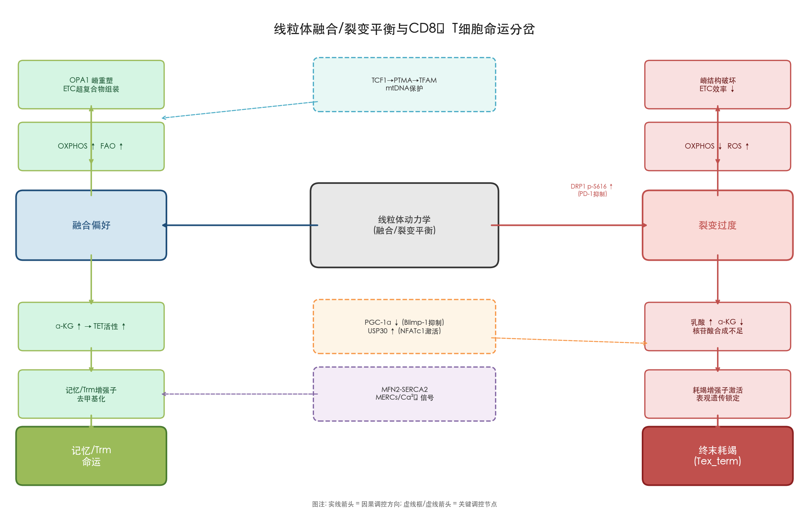

**图2-3 线粒体融合/裂变平衡与CD8⁺ T细胞命运分岔示意图。** 以线粒体动力学为中心，左侧展示"融合偏好→OPA1嵴重塑→ETC超复合物→OXPHOS→α-KG→TET→记忆/Trm"路径，右侧展示"裂变过度→嵴破坏→OXPHOS↓→ROS↑→乳酸↑→终末耗竭"路径。虚线框标注关键调控节点（TCF1-PTMA-TFAM、PGC-1α/Blimp-1、USP30/NFATc1、MFN2-SERCA2、DRP1磷酸化）。实线箭头表示因果调控方向，虚线箭头表示调控节点对主通路的修饰作用。

线粒体动力学如何通过代谢中间物梯度驱动表观遗传景观重塑的具体分子机制，将在第3章中从m6A修饰和组蛋白乳酸化两个维度展开详细讨论。

# 第3章 代谢重编程驱动的表观遗传景观重塑——m6A修饰与组蛋白乳酸化

前两章分别阐述了CD8⁺ T细胞耗竭的分子层级调控网络以及线粒体动力学在命运决定中的核心作用。本章聚焦于代谢状态与表观遗传修饰之间的关键界面——即代谢中间物如何充当"信号编码器"，将线粒体功能状态的信息转译为染色质层面的基因调控指令。具体而言，本章重点解析两条新兴调控轴：m6A RNA甲基化对耗竭-记忆转录组的塑造（第3.1节），以及组蛋白赖氨酸乳酸化（Kla）作为糖酵解与表观遗传之间直接桥梁在CD8⁺ T细胞中的功能（第3.2节）。在此基础上，本章进一步讨论以α-酮戊二酸（α-KG）/琥珀酸平衡、乙酰辅酶A（acetyl-CoA）可用性和NAD⁺/Sirtuin轴为代表的其他代谢-表观遗传界面（第3.3节），为第4章的命运分岔分析和第6章的定量建模提供完整的分子互作图谱。

## 3.1 m6A RNA甲基化修饰在CD8⁺ T细胞耗竭与免疫调控中的多维角色

### 3.1.1 m6A修饰机器的分子组成与动态调控

N6-甲基腺苷（N6-methyladenosine, m6A）是真核mRNA中最丰富的内部化学修饰，由"写入器–擦除器–读取器"（writer–eraser–reader）三元体系动态调控。写入器复合物以METTL3（methyltransferase-like 3）为催化核心亚基，与METTL14形成异源二聚体，并在WTAP、VIRMA等辅助亚基的协助下将甲基基团转移至DRACH共识序列（D=G/A/U; R=G/A; H=A/C/U）的腺苷N6位。擦除器主要包括ALKBH5和FTO两种α-KG依赖的双加氧酶，负责去除m6A标记。读取器家族内部存在功能分工：YTHDF1主要促进翻译效率，YTHDF2经典功能为介导m6A标记转录本在细胞质中的降解，YTHDF3在翻译促进和RNA降解中均可发挥辅助功能，而YTHDC1则在核内行使剪接调控和染色质组织功能。

这一修饰体系在CD8⁺ T细胞活化与分化过程中经历剧烈的动态重编程。液相色谱–串联质谱（LC-MS/MS）定量分析显示，CD8⁺ T细胞在抗CD3/CD28刺激后m6A全局水平显著降低，低甲基化峰主要分布于3'非翻译区（3'UTR），该现象部分归因于YTHDF2上调后对m6A标记转录本的加速降解 [Zhao et al., Nat Commun 2024](https://pmc.ncbi.nlm.nih.gov/articles/PMC11538425/ "YTHDF2 upregulation and subcellular localization dictate CD8 T cell polyfunctionality in anti-tumor immunity")。尤为关键的是，不同m6A调节因子在T细胞分化谱系中呈现明显的亚群特异性表达格局：YTHDF2在早期效应细胞和效应样细胞中高表达，而在终末耗竭细胞中显著下调；METTL3则选择性富集于终末耗竭细胞。这一对称性分布格局表明，m6A写入与读取之间的动态失衡构成驱动耗竭进程的关键表观转录组学事件。

### 3.1.2 METTL3——终末耗竭的表观转录组学引擎

METTL3在CD8⁺ T细胞耗竭中的核心调控地位已获系统性揭示。Ghosh等通过条件性敲除与过表达实验体系，鉴定METTL3为终末耗竭的核心驱动因子：METTL3在终末耗竭CD8⁺ T细胞中选择性富集，通过m6A修饰稳定DNMT3B（DNA甲基转移酶3B）转录本并促进其翻译效率，进而驱动记忆相关基因座（包括Tcf7等前体/记忆关键基因）的CpG岛从头甲基化与转录沉默。该研究建立了"METTL3→m6A→DNMT3B mRNA稳定→CpG甲基化→记忆基因沉默→终末耗竭锁定"的线性调控链条，将RNA表观遗传修饰与DNA甲基化两大调控层级直接串联 [Ghosh et al., bioRxiv 2026（预印本）](https://www.biorxiv.org/content/10.64898/2026.01.06.697843v1 "Mettl3-catalyzed m6A methylation determines CD8+ T cell differentiation fate in tumor")。实验进一步显示，抑制Mettl3–Dnmt3b轴可将终末耗竭细胞的染色质可及性重编程至记忆样状态，提示该轴构成耗竭表观遗传锁定的关键可干预节点。

药理学层面的验证进一步强化了上述机制。Wu等报道METTL3选择性抑制剂STM2457在多种肿瘤模型中增强anti-PD-1免疫检查点阻断疗效，且抗肿瘤效应完全依赖完整免疫系统——单细胞RNA测序（scRNA-seq）显示，STM2457处理后CD8⁺ T细胞耗竭标记物（PD-1、TIM-3、LAG-3）表达显著降低，而效应基因（IFNγ、TNF）上调；联合STM2457与anti-PD-1的疗效显著优于任一单药方案 [Wu et al., Clin Transl Med 2024](https://pmc.ncbi.nlm.nih.gov/articles/PMC11578931/ "Targeting METTL3 as a checkpoint to enhance T cells for tumour immunotherapy")。

然而，METTL3在T细胞中的功能复杂性不容忽视。完全基因敲除与药理学抑制可产生截然不同甚至矛盾的表型：条件性Mettl3敲除小鼠的CD8⁺ T细胞呈现增殖下降和效应功能受损，肿瘤生长反而加速；而STM2457药理抑制则增强抗肿瘤免疫。这一矛盾很可能源于剂量依赖性效应——完全m6A丧失破坏了T细胞发育和活化所必需的基础转录组学平衡，而适度抑制METTL3活性则可选择性降低耗竭驱动转录本的稳定性，同时保留效应功能所需的m6A修饰。这一"治疗窗口"概念对临床转化策略至关重要，第7章将结合首个进入临床的METTL3抑制剂STC-15的I期试验数据展开讨论。

### 3.1.3 WTAP——m6A写入复合物辅助亚基的独立贡献

除METTL3催化亚基外，m6A写入复合物的辅助亚基WTAP（Wilms tumor 1-associated protein）在CD8⁺ T细胞耗竭中同样发挥重要调控功能。Liu等报道WTAP通过促进PD-1 mRNA（PDCD1）的m6A修饰增强其翻译效率，直接驱动CD8⁺ T细胞耗竭并促进肝细胞癌进展；WTAP敲低不仅减轻了CD8⁺ T细胞耗竭标记的表达，还与anti-PD-1治疗产生协同抗肿瘤效应 [Liu et al., J Immunother Cancer 2025](https://pmc.ncbi.nlm.nih.gov/articles/PMC12197553/ "WTAP accelerates exhaustion of CD8+ T cells and progression of hepatocellular carcinoma by promoting m6A modification and translation of PD1 mRNA")。该研究提供了m6A修饰直接作用于耗竭核心效应分子（PD-1）mRNA的首个直接证据，填补了m6A从"酶学机制"到"耗竭效应分子翻译"之间的关键因果环节。值得指出的是，m6A是否直接修饰TOX mRNA并影响其稳定性，目前尚缺乏系统性RIP-seq或MeRIP-seq定量验证；m6A对TOX mRNA半衰期的定量效应仍为第6章建模框架中的参数空白。

### 3.1.4 YTHDF2——效应功能的双重表观遗传守护者

m6A读取器蛋白YTHDF2在抗肿瘤CD8⁺ T细胞免疫中扮演与METTL3功能互补但机制截然不同的角色。Zhao等通过T细胞条件性Ythdf2敲除小鼠（Ythdf2^CKO）系统性研究，揭示了YTHDF2的双重功能机制。

在细胞质中，YTHDF2通过经典m6A依赖性RNA降解通路维持线粒体稳态——Ythdf2缺失导致线粒体核糖体蛋白编码基因（如Mrpl16、Mrps12）和线粒体功能基因（如Coa3、Tefm）的m6A标记转录本异常积累，进而引发线粒体质量过度增加、膜电位紊乱和活性氧（ROS）过量产生。这一病理生理过程与第2章阐述的"去极化线粒体累积→耗竭"因果链直接衔接。N-乙酰半胱氨酸（NAC）抗氧化处理可部分挽救Ythdf2缺失所致的耗竭加速和细胞死亡 [Zhao et al., Nat Commun 2024](https://pmc.ncbi.nlm.nih.gov/articles/PMC11538425/ "YTHDF2 upregulation and subcellular localization dictate CD8 T cell polyfunctionality")。

更值得关注的是YTHDF2的核功能。T细胞活化后，YTHDF2经历从细胞质到细胞核的重新定位——该过程依赖于m6A修饰的新生RNA，METTL3缺失即可阻断YTHDF2的核定位。进入细胞核后，YTHDF2通过直接结合转录抑制因子IKZF1（Ikaros）和IKZF3（Aiolos），阻止其占据靶基因启动子区域并招募HDAC复合物，从而维持TCR下游信号分子（如Stat5a、Rasgrp1）和效应基因的活跃转录状态。Ythdf2缺失导致IKZF1/3对靶基因的转录抑制活性增强、H3K4me活化标记降低，最终损害CD8⁺ T细胞的多功能性和抗肿瘤杀伤能力。

从临床转化视角审视，Ythdf2^CKO小鼠对anti-PD-1治疗完全不响应，而联合使用IKZF1/3降解剂来那度胺（lenalidomide）可大幅恢复Ythdf2缺失CD8⁺ T细胞的效应功能。在人类肿瘤中，YTHDF2阳性CD8⁺ T细胞频率及其核定位与新辅助化疗免疫治疗应答率正相关，提示YTHDF2核定位可作为治疗应答的潜在生物标志物。

### 3.1.5 METTL8与m3C修饰——超越m6A的RNA表观遗传维度

RNA甲基化对CD8⁺ T细胞命运的调控并不局限于m6A单一修饰类型。最新研究揭示了RNA甲基转移酶METTL8通过催化3-甲基胞嘧啶（m3C）修饰调控前体耗竭T细胞（Tpex）维持的全新机制。METTL8在Tpex中高表达，通过m3C修饰稳定TCF1（T细胞因子1）mRNA并促进染色质环化（chromatin looping），维持Tpex的干性状态。Mettl8基因缺失可驱动Tpex向中间态耗竭T细胞（intermediate exhausted T, Int-TEX）高效分化，进而增强抗肿瘤免疫效应。anti-PD-1治疗后Mettl8表达下调，提示免疫检查点阻断可能部分通过解除METTL8介导的Tpex维持锁定发挥疗效 [JEM 2026](https://rupress.org/jem/article/223/5/e20250424/281709/Targeting-Mettl8-Tcf1-axis-promotes-CD8-TPEX "Targeting Mettl8-Tcf1 axis promotes CD8+ TPEX differentiation and antitumor immunity")。这一发现拓展了RNA表观遗传调控的分子维度，表明T细胞命运决定受到m6A与m3C等多种RNA修饰类型的协同调控，而非仅由m6A修饰单一驱动。

### 3.1.6 m6A修饰的肿瘤细胞侧效应与微环境重塑

m6A修饰机器不仅在T细胞内在层面调控耗竭进程，其在肿瘤细胞中的功能同样深刻影响抗肿瘤免疫应答的格局。Wang等证明肿瘤细胞中Mettl3/Mettl14双基因敲除可增加CD8⁺ TIL浸润密度并增强anti-PD-1治疗响应，其机制为稳定IFNγ–Stat1–Irf1信号轴、增强肿瘤免疫原性 [Wang et al., EMBO J 2020](https://www.embopress.org/doi/full/10.15252/embj.2020104514 "m6A RNA methyltransferases METTL3/14 regulate immune responses to anti-PD-1 therapy")。在抗原呈递层面，Han等发现经典树突状细胞中m6A读取器YTHDF1结合溶酶体组织蛋白酶（cathepsin）转录本促进翻译，导致肿瘤新抗原过度降解、限制交叉呈递效率；Ythdf1基因缺失小鼠在PD-L1阻断后实现100%完全肿瘤消退（对照组仅40%），且该效应为DC特异性而非T细胞内在 [Han et al., Nature 2019](https://pmc.ncbi.nlm.nih.gov/articles/PMC6522227/ "Anti-tumour immunity controlled through mRNA m6A methylation and YTHDF1 in dendritic cells")。

m6A擦除器ALKBH5同样深度参与TME重塑。Li等报道ALKBH5通过调控MCT4/SLC16A3转录本稳定性影响TME中乳酸浓度和免疫抑制性细胞（Treg和MDSC）的浸润密度，ALKBH5敲除可增强anti-PD-1治疗疗效 [Li et al., PNAS 2020](https://www.pnas.org/doi/10.1073/pnas.1918986117 "ALKBH5 regulates anti-PD-1 therapy response by modulating lactate and suppressive immune cell accumulation")。这一发现将m6A修饰与TME乳酸代谢直接关联，为第3.2节关于组蛋白乳酸化的讨论提供了上游调控框架。

综合以上各节分析，图3-1汇总了m6A及相关RNA修饰调节因子在CD8⁺ T细胞免疫调控中的多维功能图谱。

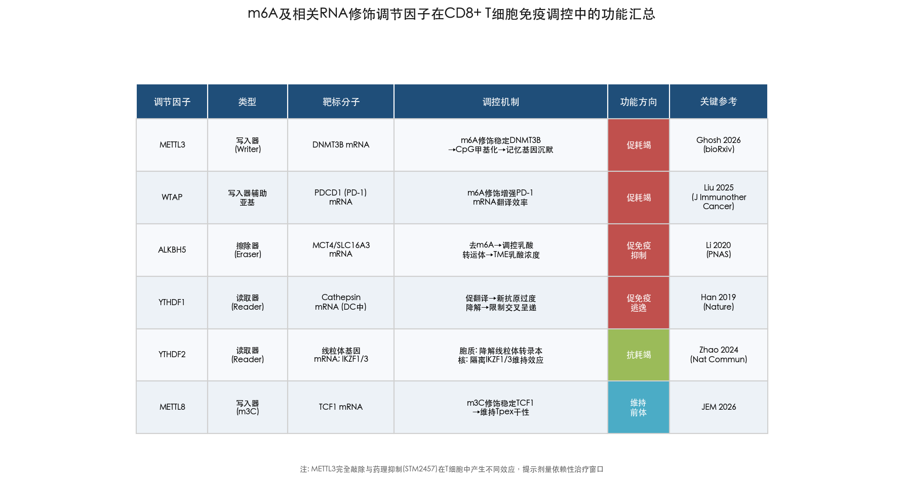

**图3-1** 汇总了METTL3、WTAP、ALKBH5、YTHDF1、YTHDF2和METTL8六种m6A/RNA修饰调节因子的类型、靶标分子、调控机制及功能方向。红色标注促耗竭/促免疫抑制方向，绿色标注抗耗竭方向，蓝色标注维持前体方向。METTL3完全敲除与药理抑制存在剂量依赖性差异，临床转化中需关注治疗窗口的精确定义。

## 3.2 组蛋白赖氨酸乳酸化——糖酵解与染色质调控的直接桥梁

### 3.2.1 组蛋白乳酸化修饰的发现与分子机制

2019年，Zhang等在Nature发表里程碑式研究，首次鉴定组蛋白赖氨酸乳酸化（histone lysine lactylation, Kla）作为一种全新表观遗传修饰。该研究在人MCF-7细胞和小鼠骨髓来源巨噬细胞中共鉴定出28个组蛋白Kla位点，其中H3K18la被确立为标志性位点。组蛋白乙酰转移酶p300经鉴定为Kla的"写入器"，以L-乳酰辅酶A（L-lactyl-CoA）为底物催化赖氨酸残基的乳酸化修饰。一项关键的动力学发现在于，Kla与赖氨酸乙酰化（Kac）呈现截然不同的时间动力学模式：Kac在巨噬细胞极化早期（6小时内）即达峰值，而Kla在16–24小时方延迟升高，表明两种修饰响应不同的代谢时间窗。在肿瘤微环境中，乳酸浓度可达约40 mM（正常血液约1.5–3 mM），为Kla修饰提供了远超生理水平的底物供应 [Zhang et al., Nature 2019](https://pmc.ncbi.nlm.nih.gov/articles/PMC6818755/ "Metabolic regulation of gene expression by histone lactylation")。

### 3.2.2 CD8⁺ T细胞中组蛋白乳酸化的系统性解析

Raychaudhuri等于2024年在Nature Immunology发表了CD8⁺ T细胞中Kla修饰的首个系统性研究，为理解乳酸化在T细胞功能中的角色奠定了关键范式。该研究通过CUT&Tag高分辨率表观基因组图谱揭示了以下核心发现。

**亚群特异性分布**：活化CD8⁺ T细胞中H3K18la和H3K9la均显著富集，但两个位点的调控逻辑存在明确分工——H3K18la主要富集于效应亚群并由糖酵解活性驱动，而H3K9la在多个分化亚群中均有分布，主要由线粒体代谢调控。

**功能性调控**：H3K18la和H3K9la在效应基因座富集，作为转录激活标记驱动CD8⁺ T细胞效应功能输出。通过靶向代谢通路和表观遗传通路调控H3K18la和H3K9la水平，可有效调节CD8⁺ T细胞的效应功能。

**终末耗竭中的反直觉发现**：终末耗竭CD8⁺ T细胞中H3K18la和H3K9la富集极低，耗竭相关基因反而被H3K9ac标记。这一结果与"高乳酸环境→高Kla→促耗竭"的直觉模型形成鲜明矛盾，提示乳酸化与耗竭之间的关系远比既往假设复杂 [Raychaudhuri et al., Nat Immunol 2024](https://www.nature.com/articles/s41590-024-01978-0 "Histone lactylation drives CD8+ T cell metabolism and function")。

### 3.2.3 "乳酸化悖论"的调和——代谢双重衰竭模型

上述发现要求修正关于乳酸化与耗竭关系的简单线性模型。直觉上，TME高乳酸环境应导致终末耗竭T细胞Kla水平升高并驱动免疫抑制程序。然而，Raychaudhuri等的数据表明终末耗竭CD8⁺ T细胞处于"代谢双重衰竭"状态——不仅OXPHOS严重受损（如第2章所详述），糖酵解产能亦同步崩溃，导致内源性乳酸产生能力大幅下降。尽管TME中外源乳酸浓度高达约40 mM，终末耗竭T细胞的整体代谢活性已不足以维持有效的Kla修饰。

基于这一认识，更精确的阶段性模型可概括为：在耗竭早期至中期阶段，CD8⁺ T细胞尚保留一定的糖酵解能力，此阶段Kla可能参与效应功能维持或耗竭增强子的初始激活；而在终末耗竭阶段，随着代谢双重衰竭的完成，Kla修饰水平急剧降低，耗竭基因程序转由H3K9ac标记接管。这一"Kla→Kac转换"模型与第4章对命运分岔的表观遗传分析直接衔接。图3-2直观展示了这一动态转换过程。Kla在耗竭前体→过渡态→终末各阶段的时序动态定量数据仍为第6章建模框架中的参数缺口。

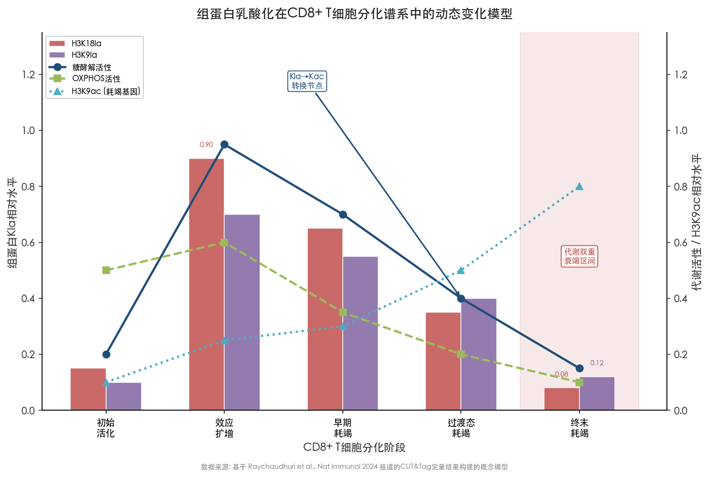

**图3-2** 展示了从初始活化至终末耗竭五个分化阶段中H3K18la和H3K9la相对水平的动态变化（柱状图），叠加糖酵解活性、OXPHOS活性和H3K9ac三条折线趋势。在效应扩增期Kla达峰，终末耗竭期急剧降低；同时H3K9ac在终末耗竭期显著上升，标注"Kla→Kac转换节点"和"代谢双重衰竭区间"。概念模型基于Raychaudhuri et al.（Nat Immunol 2024）CUT&Tag定量结果构建。

### 3.2.4 MCT11——耗竭T细胞的乳酸敏感化通道

尽管终末耗竭T细胞内源性乳酸产生减少，TME外源乳酸仍通过特异性转运通道持续影响其功能状态。Germain等发现耗竭T细胞选择性上调一种新型单羧酸转运体MCT11（SLC16A11），条件性敲除MCT11可显著减少耗竭T细胞的乳酸摄取并改善其效应功能；抗MCT11抗体在荷瘤小鼠中有效减少肿瘤负荷，由此建立了"外源乳酸→MCT11→耗竭功能维持"的因果链 [Germain et al., Nat Immunol 2024](https://www.nature.com/articles/s41590-024-01999-3 "Dysfunction of exhausted T cells is enforced by MCT11-mediated lactate metabolism")。结合ALKBH5对MCT4/SLC16A3表达的m6A调控（Li et al. 2020），TME乳酸微环境的建立与感知涉及m6A修饰与乳酸转运体的多层级互作网络。

需指出的是，外源乳酸通过MCT11进入终末耗竭T细胞后是否引起局部Kla修饰的重新分布，以及这种外源驱动的Kla是否与内源性Kla具有不同的基因组靶向特异性，目前尚缺乏位点特异性遗传操纵实验的因果验证。

### 3.2.5 组蛋白乳酸化的"双刃剑"效应

综合当前证据，组蛋白Kla修饰在CD8⁺ T细胞免疫中呈现复杂的"双刃剑"效应。一方面，内源性Kla（尤其是H3K18la）在活化效应T细胞中富集于效应基因座，支持正常的效应功能输出，维持抗肿瘤免疫活性；另一方面，TME中异常高浓度的外源乳酸可能通过MCT11摄取途径调控Kla修饰谱，推动免疫抑制程序。这一二元性与TME不同区域的乳酸浓度梯度密切相关——在肿瘤核心区（低氧、高乳酸）与肿瘤边缘（相对正常氧、较低乳酸）之间，CD8⁺ T细胞可能经历截然不同的Kla修饰模式，从而导致同一肿瘤内不同空间位置的T细胞呈现异质性的效应/耗竭平衡。不同瘤种TME乳酸浓度的系统性比较数据及乳酸对T细胞效应功能的半数抑制浓度（IC₅₀）目前仍缺乏系统性测量，这构成未来精准调控策略设计的重要数据缺口。

## 3.3 代谢-表观遗传互作网络的其他关键界面

### 3.3.1 α-KG/琥珀酸平衡——TET/JMJD酶活性的代谢调控开关

α-酮戊二酸（alpha-ketoglutarate, α-KG）是TCA循环的关键中间产物，同时也是TET家族DNA去甲基化酶和JMJD家族组蛋白去甲基化酶的必需辅因子。琥珀酸和富马酸作为α-KG的结构类似物，可竞争性抑制TET和JMJD酶活性。因此，细胞内α-KG与琥珀酸/富马酸的浓度比值直接决定表观遗传去甲基化效率——较高的α-KG/琥珀酸比值促进DNA和组蛋白去甲基化，较低比值则抑制之。

Jaccard等2023年在Nature发表的研究为这一调控逻辑在T细胞中的功能提供了里程碑式证据。该研究证明增殖中的效应CD8⁺ T细胞通过线粒体酶异柠檬酸脱氢酶2（IDH2）进行还原性羧化谷氨酰胺，产生的代谢物（包括α-KG）经表观遗传机制指导T细胞分化方向，确立了"线粒体代谢→α-KG→TET介导的DNA去甲基化→T细胞命运决定"的调控链 [Jaccard et al., Nature 2023](https://pubmed.ncbi.nlm.nih.gov/37730993/ "Reductive carboxylation epigenetically instructs T cell differentiation")。

将这一原理与第2章的线粒体动力学框架整合，可构建如下对偶推理路径：一方面，线粒体融合→嵴结构优化→ETC效率提升→TCA循环通量增加→α-KG产生充足→TET酶活性维持→记忆/Trm相关基因座去甲基化→Trm命运倾向；另一方面，线粒体裂变过度→嵴紊乱→TCA循环受损→α-KG产生不足、琥珀酸相对积累→TET酶活性抑制→记忆基因座甲基化维持或加深→终末耗竭倾向。该对偶路径模型中各环节均有独立实验支持（Buck et al. 2016确立线粒体融合与记忆形成的因果关系；Jaccard et al. 2023确立还原性羧化与表观遗传指导的因果关系），但在Trm或终末耗竭情境中将全链路串联验证的单一研究尚付阙如。α-KG/琥珀酸比值在CD8⁺ TIL中的直接质谱测量数据亦不可得，构成第6章定量建模中的关键参数估计缺口。

### 3.3.2 乙酰辅酶A——组蛋白乙酰化的代谢底物供应

乙酰辅酶A（acetyl-CoA）是组蛋白乙酰化修饰的直接底物供体，其细胞核可用性受线粒体TCA循环活性和柠檬酸穿梭通路的共同调控。在CD8⁺ T细胞中，转录因子Bhlhe40通过维持TCA循环活性确保acetyl-CoA的充足产生，进而经p300/CBP催化在H3K9和H3K27位点建立乙酰化标记，维持组织驻留记忆T细胞（Trm）的效应功能。Li等证明Bhlhe40缺失导致肠道Trm中组蛋白乙酰化水平降低、效应基因（如IFNγ、Granzyme B）转录下调，致使Trm在再感染中无法发挥保护功能 [Li et al., Immunity 2019](https://www.cell.com/immunity/fulltext/S1074-7613(19)30302-3 "Bhlhe40 maintains TRM function through TCA cycle and H3 acetylation")。

在耗竭T细胞中，线粒体功能障碍导致TCA循环通量下降、acetyl-CoA产生减少。这一代谢变化可能部分解释终末耗竭细胞中H3K9ac而非Kla标记耗竭基因的现象——在代谢双重衰竭状态下，残余的acetyl-CoA可能被优先导向耗竭维持基因的乙酰化标记，而乳酸化底物则严重不足。acetyl-CoA池在CD8⁺ T细胞耗竭模型中随进程变化的定量代谢组学数据目前尚不可得，构成理解"Kla→Kac转换"机制的又一数据缺口。

### 3.3.3 NAD⁺/Sirtuin轴——代谢感应与表观遗传去乙酰化

烟酰胺腺嘌呤二核苷酸（nicotinamide adenine dinucleotide, NAD⁺）既是线粒体氧化还原反应的核心电子载体，也是Sirtuin家族NAD⁺依赖性去乙酰化酶的必需底物。SIRT1–7在T细胞中构成层级调控网络：SIRT1通过去乙酰化PGC-1α/β促进线粒体生物发生和脂肪酸氧化（FAO），支持记忆分化；SIRT2缺失可增强抗肿瘤免疫和记忆形成，提示SIRT2在某些条件下抑制效应/记忆程序；SIRT6通过抑制HIF-1α和c-Myc调控糖酵解程序 [Hamaidi & Kim, Exp Mol Med 2022](https://www.nature.com/articles/s12276-022-00739-7 "Sirtuins are crucial regulators of T cell metabolism and functions")。

NAD⁺水平在衰老和慢性免疫激活条件下显著降低，其核心机制之一为CD38的上调。CD38作为NAD⁺糖苷水解酶催化NAD⁺降解，Vannini等报道衰老CD8⁺ T细胞中CD38上调加速NAD⁺消耗，导致线粒体功能障碍和T细胞干性丧失；单独补充NAD⁺前体NMN无效（因CD38同时降解补充的NAD⁺），但联合CD38抑制剂78c与NMN可恢复NAD⁺水平、线粒体备用呼吸能力（SRC）和TCF1⁺中央记忆T细胞比例 [Vannini et al., Nat Cancer 2025](https://www.nature.com/articles/s43018-025-00982-7 "Age-associated NAD decline drives CAR-T cell failure")。在肿瘤免疫治疗场景中，Holgado等进一步证明CD38^hi表型与免疫检查点阻断（ICB）耐药强相关（AUC=0.87），CRISPR敲除或78c抑制CD38均可恢复NAD⁺和线粒体功能，双重PD-1/CD38阻断在3D肿瘤模型中应答率达56.7%（对照单药PD-1仅3.3%）[Holgado et al., Nat Immunol 2024](https://pmc.ncbi.nlm.nih.gov/articles/PMC10888727/ "Disrupting CD38-driven T cell dysfunction restores sensitivity to cancer immunotherapy")。

NAD⁺/Sirtuin轴构成代谢感应与表观遗传调控之间的关键枢纽：NAD⁺水平下降→Sirtuin去乙酰化活性降低→组蛋白乙酰化格局改变→基因表达重编程。这一通路与Kla修饰和α-KG/TET轴在同一细胞内并行运作，共同构成代谢–表观遗传互作网络的三大支柱。图3-3整合展示了上述全部代谢–表观遗传互作通路的网络架构。

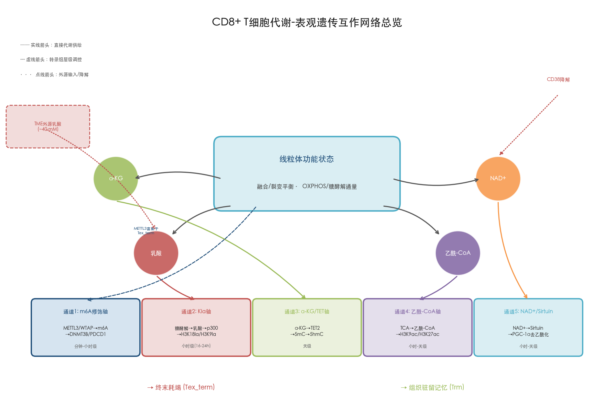

**图3-3** 以线粒体功能状态为中心节点，展示四种核心代谢中间物（α-KG、乳酸、acetyl-CoA、NAD⁺）如何连接五条表观遗传调控通道（m6A修饰轴、Kla轴、α-KG/TET轴、acetyl-CoA轴、NAD⁺/Sirtuin轴），并标注各通道的时间尺度、关键酶/蛋白、TME外源乳酸输入及CD38对NAD⁺的降解作用，最终指向终末耗竭（Tex_term）与组织驻留记忆（Trm）两种命运输出。该网络为第4章命运分岔的表观遗传决定因素分析和第6章定量建模提供系统性分子框架。

### 3.3.4 METTL3→DNMT3B——m6A与DNA甲基化的跨层级串联

综合前述各节分析，本章识别出的最关键调控新发现为METTL3→m6A→DNMT3B mRNA稳定→CpG甲基化→记忆基因沉默这一跨层级线性链条（Ghosh et al. 2026预印本）。该链条与TET2驱动的DNA去甲基化通路（Giles et al., Sci Adv 2024报道TET2促进Tpex向终末耗竭分化）以及DNMT3a催化的Tcf7启动子从头甲基化（Ladle et al., PNAS 2016）共同构成DNA甲基化动态平衡网络。在该网络中：

- **甲基化写入端**：METTL3通过稳定DNMT3B mRNA增强从头甲基化活性→沉默记忆基因→促终末耗竭；DNMT3a同样参与催化Tcf7等记忆基因的甲基化。
- **甲基化擦除端**：TET2以α-KG为辅因子催化5mC→5hmC→胞嘧啶的氧化性去甲基化→开放效应/终末分化相关增强子→促Tpex向效应样/终末分化。

两端的平衡受线粒体代谢状态调控：OXPHOS功能良好时，α-KG充足支持TET2活性，同时acetyl-CoA供应维持组蛋白乙酰化格局；OXPHOS受损时，α-KG不足且METTL3上调导致DNMT3B驱动的记忆基因沉默加速。这一互作网络为第6章定量建模提供了核心调控回路拓扑。

## 3.4 代谢-表观遗传互作网络的整合视图

将本章各节内容整合，CD8⁺ T细胞中代谢状态与表观遗传景观之间的互作可概括为以下多通道并行调控架构。

**通道一：m6A修饰轴**。METTL3/WTAP写入m6A→稳定DNMT3B和PDCD1等耗竭驱动转录本→促进终末耗竭。YTHDF2读取m6A→降解线粒体应激相关转录本维持线粒体稳态→核内隔离IKZF1/3维持效应基因转录→维持抗肿瘤效应。ALKBH5擦除m6A→调控MCT4/乳酸转运体→影响TME乳酸浓度。该通道时间尺度为分钟至小时级（mRNA半衰期通常2–8小时），构成响应速度最快的表观遗传层级。

**通道二：组蛋白乳酸化轴**。糖酵解→乳酸→L-lactyl-CoA→p300催化H3K18la/H3K9la→效应基因/促炎基因激活。外源TME乳酸→MCT11/MCT1摄取→可能增强局部Kla。终末耗竭时代谢双重衰竭→Kla全局降低→耗竭基因转由Kac标记。该通道时间尺度为小时级（Kla在16–24小时达峰）。

**通道三：α-KG/TET/DNA甲基化轴**。线粒体OXPHOS/TCA→α-KG产生→TET2介导5mC→5hmC→效应/分化增强子开放。琥珀酸/富马酸竞争性抑制TET活性。该通道时间尺度为天级（DNA甲基化变化缓慢且具持久性）。

**通道四：acetyl-CoA/组蛋白乙酰化轴**。TCA→柠檬酸→ACLY→acetyl-CoA→p300/CBP→H3K9ac/H3K27ac→效应基因与Trm功能基因表达。Bhlhe40为关键上游转录因子。

**通道五：NAD⁺/Sirtuin轴**。NAD⁺→Sirtuin去乙酰化→PGC-1α活化→线粒体生物发生（正反馈环路）。CD38过表达→NAD⁺耗竭→Sirtuin失活→表观遗传去乙酰化能力丧失。

上述五条通道并非独立运作，而是通过共享的代谢节点（线粒体功能、NAD⁺/NADH比值、乳酸浓度）形成高度耦合的互作网络。第6章将以这一网络拓扑为基础，构建多时间尺度的ODE框架，定量描述代谢输入如何通过表观遗传中间层最终输出细胞命运概率。

本章建立的代谢-表观遗传互作图谱为理解CD8⁺ T细胞命运分岔的表观遗传决定因素奠定了分子基础。下一章将在此基础上，直接比较终末耗竭细胞与组织驻留记忆T细胞在染色质可及性、DNA甲基化和组蛋白修饰谱上的系统性差异，解析命运分岔的"表观遗传开关区域"。

# 第4章 终末耗竭与Trm命运分岔的表观遗传决定因素

前三章分别从耗竭谱系的分子生物学基础、线粒体动力学的命运调控、以及m6A修饰与组蛋白乳酸化两大代谢-表观遗传界面，逐层构建了CD8⁺ T细胞命运决定的调控框架。然而，一个核心问题亟需系统阐明：面对慢性抗原刺激，为何部分CD8⁺ T细胞走向不可逆的终末耗竭（Tex_term），而另一部分则分化为具有组织驻留和自我更新能力的组织驻留记忆T细胞（Trm）？这一命运分岔的表观遗传决定因素是什么？本章整合多组学证据，从染色质可及性景观、DNA甲基化模式、组蛋白修饰谱三个层面系统对比Tex_term与Trm的表观遗传差异，识别驱动命运分岔的"表观遗传开关区域"；在此基础上，阐明线粒体代谢状态如何通过代谢中间物梯度驱动表观遗传景观向不同方向倾斜，并讨论命运承诺的时间窗口与逆转可能性。

## 4.1 Tex_term与Trm的表观遗传景观系统性比较

### 4.1.1 染色质可及性图谱揭示的共享与分歧

Tex_term与Trm在表型上存在显著重叠——两者均可表达CD69、CD103和HOBIT（ZNF683），这一表型收敛长期制约了对两类细胞的精确鉴定与功能区分 [Clarke et al., Nat Immunol 2025](https://www.nature.com/articles/s41590-025-02347-9 "Antigen reactivity defines tissue-resident memory and exhausted T cells in tumors")。然而，在表观遗传层面，两者呈现根本性分歧。

Buquicchio等完成了迄今最为系统的Trm与Tex表观遗传直接比较研究。该团队在7个器官×4种感染模型中实施scATAC-seq分析，构建了组织驻留记忆与耗竭T细胞的全基因组染色质可及性图谱。结果显示，Trm与Tex_term共享254个开放染色质区域（open chromatin regions, OCRs），其中包含位于Pdcd1基因座上游约23 kb的增强子元件；而Tex_term则拥有5,049个特异性OCRs，其中54个与Tox基因座直接相关。尤为关键的是，Tex的前体亚群（Tex-prog）和中间态亚群（Tex-int）与Trm之间并不共享Trm标志性染色质峰，表观遗传相似性仅在终末耗竭阶段才得以浮现——这一发现有力地表明Trm与Tex_term的表型收敛属于收敛性演化而非共同起源的产物 [Buquicchio et al., Immunity 2024](https://www.cell.com/immunity/fulltext/S1074-7613(24)00320-0 "Distinct epigenomic landscapes underlie tissue-specific memory T cell differentiation")。

转录因子结合基序（motif）分析进一步揭示了分岔的分子逻辑。RUNX家族基序在皮肤Trm和Tex_term中均显著富集，反映两者共享的组织驻留适应程序；而FEV、IRF、ETS和BCL家族基序则主要富集于Tex_term特异性OCRs中，构成终末耗竭的"表观遗传签名"。这些转录因子结合位点的差异性开放状态为后续定量建模中命运分岔的"开关变量"提供了明确的分子靶标——254个共享峰与5,049个Tex_term特异性峰的定量参数可作为模型分岔节点的约束条件。

### 4.1.2 三模态组学解析组织驻留耗竭细胞的独立本体

Park等采用TEA-seq（同步检测转录组、表面蛋白组和染色质可及性的三模态组学技术）进一步解构了慢性感染中Trm与Tex的关系。在LCMV慢性感染模型中，持续性抗原刺激驱动一类被命名为"组织驻留耗竭细胞"（tissue-resident exhausted T cells, TR-TEX）的独特亚群形成。TR-TEX的全局染色质模式最接近Tex_term而非经典Trm，两者之间存在超过2,000个差异可及性区域 [Park et al., bioRxiv 2025（预印本）](https://www.biorxiv.org/content/10.1101/2025.08.08.669213v1.full-text "Divergent ontogeny of TR-TEX and TRM")。

Motif分析在Trm与TR-TEX之间揭示了截然不同的转录因子调控网络：Trm富集REL/NFκB和TCF/LEF家族基序，与第1章阐述的TCF1⁺前体维持程序相一致；TR-TEX则富集NR4A、NFAT和IRF家族基序，与TOX/NR4A驱动的耗竭正反馈环路直接对应。更为关键的遗传学证据表明，TOX是TR-TEX发育所必需的，而Trm的形成完全不依赖TOX——这一发现从必要条件的角度明确界定了两条命运轨道的分子分离。

在命运可塑性方面，该研究揭示了一个重要的不对称性：已承诺的Trm在慢性抗原刺激下可转化为Tex，但已承诺的Tex前体无法生成常规Trm。这一单向转化的不可逆性表明，Tex表观遗传程序一旦建立即构成一种"吸引子态"（attractor state），其势阱深度远大于Trm态。该概念将在第6章的Waddington景观定量建模中获得数学化表述。

### 4.1.3 Trm的早期表观遗传承诺与独特调控程序

Trm的表观遗传承诺发生的时间远早于此前预期。Li等系统梳理了近年证据，表明Trm前体在感染后第7天即展现独特的ATAC-seq谱——CD69和Nr4a1基因座的增强子区域已经开放，而指导淋巴组织归巢的Klf2和S1pr1基因座则已关闭 [Li et al., Front Immunol 2025](https://www.frontiersin.org/journals/immunology/articles/10.3389/fimmu.2025.1605972/full "Epigenetic regulation of tissue-resident memory T cells")。这一早期承诺窗口与Angelosanto等的经典时间窗口研究形成对照：耗竭命运的不可逆表观遗传锁定发生在慢性抗原刺激的第2–3周 [Angelosanto et al., J Virol 2012](https://journals.asm.org/doi/10.1128/jvi.00889-12 "Progressive loss of memory T cell potential and commitment to exhaustion")，而Trm承诺则可能在更早的时间窗口即已启动。

在Trm功能维持的表观遗传调控中，转录因子Bhlhe40发挥代谢-表观遗传枢纽的关键作用。Li等证明Bhlhe40通过编程线粒体TCA循环活性维持乙酰辅酶A（acetyl-CoA）的充足供应，继而驱动组蛋白H3乙酰化（包括H3K9ac和H3K27ac）以维持Trm效应基因座的活跃转录状态。Bhlhe40缺失导致TCA循环中间物——特别是柠檬酸和乙酰-CoA——显著减少，组蛋白乙酰化水平降低，Trm和肿瘤浸润淋巴细胞（TIL）的效应功能严重受损 [Li et al., Immunity 2019](https://www.cell.com/immunity/fulltext/S1074-7613(19)30364-4 "The Transcription Factor Bhlhe40 Programs Mitochondrial Regulation of Resident CD8+ T Cell Fitness and Functionality")。Bhlhe40在耗竭CD8⁺ T细胞中同样高表达，但其在Tex中能否有效驱动TCA→乙酰-CoA→组蛋白乙酰化通路，抑或该通路因线粒体功能崩溃而断裂，目前缺乏直接比较数据。基于第2章阐述的终末耗竭T细胞线粒体去极化和OXPHOS崩溃的证据，我们推测Bhlhe40→TCA→乙酰-CoA→H3K乙酰化通路在Tex_term中很可能处于断裂状态，构成Trm与Tex_term代谢-表观遗传分岔的关键节点之一。

此外，EZH2作为多梳抑制复合物2（Polycomb Repressive Complex 2, PRC2）的催化亚基，在肠道Trm分化中通过H3K27me3修饰调节基因沉默程序 [Li et al., Front Immunol 2025](https://www.frontiersin.org/journals/immunology/articles/10.3389/fimmu.2025.1605972/full "Epigenetic regulation of tissue-resident memory T cells")。EZH2的这一功能与其在CAR-T细胞中的作用形成呼应——tazemetostat抑制EZH2可促进CAR-T记忆表型并减少耗竭（详见第7章），提示EZH2介导的H3K27me3在Trm与Tex命运决定中可能发挥双向调控功能。

## 4.2 DNA甲基化与TET2在命运分岔中的枢纽地位

### 4.2.1 TET2驱动的去甲基化推进终末耗竭分化

DNA甲基化（5-methylcytosine, 5mC）的动态调控是T细胞命运承诺的核心表观遗传机制之一。TET（ten-eleven translocation）家族双加氧酶催化5mC经5-羟甲基胞嘧啶（5hmC）中间态实现去甲基化，是连接代谢状态与染色质重塑的关键酶学环节。

Giles等通过系统性研究确立了TET2在驱动CD8⁺ T细胞从前体耗竭向终末耗竭分化中的核心地位。在LCMV慢性感染和肿瘤模型中，TET2条件性敲除产生显著效应：TCF1⁺前体耗竭T细胞（Tpex）比例增加，GZMB⁺终末耗竭T细胞比例降低。全基因组ATAC-seq分析表明，TET2缺失导致终末Tex中82.7%差异可及性区域的开放性降低，这些区域富集TBET和RUNX转录因子结合位点；与此一致，TET2敲除亦导致TOX表达下调。在CAR-T细胞模型中，TET2缺失促进OXPHOS代谢模式并偏向中央记忆表型，与第2章阐述的"OXPHOS维持→记忆/Tpex持久性"范式完全一致 [Giles et al., Sci Adv 2024](https://pmc.ncbi.nlm.nih.gov/articles/PMC11559603/ "TET2 regulates early and late transitions in exhausted CD8+ T cell differentiation")。

上述发现揭示了一个关键的代谢-表观遗传耦合节点：TET2酶活性依赖α-酮戊二酸（alpha-ketoglutarate, α-KG）作为必需辅因子，而琥珀酸和富马酸则是其竞争性抑制物。因此，线粒体TCA循环产生的α-KG浓度直接决定TET2催化活性，进而控制基因组去甲基化速率和终末耗竭分化进程。α-KG浓度→TET2酶活性→5hmC/5mC→特定基因座可及性变化的完整定量链条在CD8⁺ T细胞中目前缺乏来自单一研究的系统性串联验证，这构成第6章建模框架中需重点参数化的环节。

### 4.2.2 α-KG代谢网络对表观遗传状态的调控

α-KG在CD8⁺ T细胞表观遗传调控中的重要性已获多条独立证据链的支持。Jaccard等证明，增殖效应CD8⁺ T细胞通过线粒体酶异柠檬酸脱氢酶2（IDH2）进行还原性羧化反应产生代谢物，这些代谢物通过表观遗传机制指导T细胞分化，从而确立了"线粒体代谢→α-KG→TET→DNA去甲基化→T细胞命运"调控链的核心环节 [Jaccard et al., Nature 2023](https://pubmed.ncbi.nlm.nih.gov/37730993/ "Reductive carboxylation epigenetically instructs T cell differentiation")。

另一相关代谢物L-2-羟基戊二酸（L-2-hydroxyglutarate, L-2-HG）作为α-KG的结构类似物和竞争性抑制物，进一步佐证了这一调控逻辑。Yang等发现Tex细胞中L-2-HG水平显著降低，伴随H3K27me3在TOX启动子区域的富集减少和TOX表达上调。外源补充L-2-HG可通过竞争性抑制UTX（KDM6A）等H3K27去甲基化酶恢复TOX启动子处的H3K27me3水平，下调TOX表达，改善线粒体极化状态和T细胞效应功能。在小鼠黑色素瘤模型中，L-2-HG预处理的过继转移CD8⁺ T细胞展现出显著增强的抗肿瘤活性 [Yang et al., JCI Insight 2025](https://insight.jci.org/articles/view/174600 "Immunometabolite L-2-HG promotes epigenetic modification of exhausted T cells and improves antitumor immunity")。该发现从α-KG代谢网络的竞争性抑制角度揭示了代谢中间物浓度变化如何经由组蛋白甲基化修饰调控耗竭核心转录因子TOX的表达。

在肿瘤微环境中，α-KG水平受到系统性抑制。Li等在肾细胞癌（RCC）临床样本中直接测量发现，肿瘤组织α-KG浓度显著低于癌旁正常组织（中位值差异约3倍），且低α-KG与更高病理分级和更差预后相关。补充细胞渗透性α-KG可通过去甲基化H3K4me1上调B2M表达，增强MHC-I抗原呈递和CD8⁺ T细胞浸润；α-KG联合PD-1阻断在小鼠模型中显著延长生存期 [Li et al., Adv Sci 2023](https://pmc.ncbi.nlm.nih.gov/articles/PMC10520657/ "Targeting Alpha-Ketoglutarate Disruption Overcomes Immunoevasion and Improves PD-1 Blockade Immunotherapy in Renal Cell Carcinoma")。该研究虽主要聚焦于肿瘤细胞侧效应，但其揭示的肿瘤微环境中α-KG系统性下降为理解TIL中TET2酶活性受限提供了微环境层面的解释。

### 4.2.3 DNMT3a——记忆命运的de novo甲基化屏障

与TET2的去甲基化促耗竭功能形成对偶，de novo DNA甲基转移酶DNMT3a在记忆前体T细胞形成中发挥限制性调控作用。Ladle等的研究表明，DNMT3a在T细胞活化后催化Tcf7启动子的CpG岛从头甲基化，从而限制记忆前体的形成。DNMT3a条件性敲除导致CD8⁺ T细胞在效应期后以更高比例分化为TCF1⁺记忆前体 [Ladle et al., PNAS 2016](https://www.pnas.org/doi/10.1073/pnas.1524490113 "De novo DNA methylation by DNA methyltransferase 3a controls early effector CD8+ T-cell fate decisions following activation")。

这一发现在CAR-T细胞治疗领域获得了直接的转化验证。Prinzing等报道DNMT3A敲除的CAR-T细胞展现耗竭抵抗表型，全基因组DNA去甲基化重编程上调了记忆和增殖相关基因，同时伴随IL-10上调介导的抗肿瘤增强效应。DNMT3A-KO CAR-T细胞在体内维持更高的TCF1和TCF7表达，且对抗原重复刺激的耐受性显著增强 [Prinzing et al., Cancer Discov 2021](https://pmc.ncbi.nlm.nih.gov/articles/PMC8733956/ "Deleting DNMT3A in CAR T cells prevents exhaustion and enhances antitumor activity")。

将上述证据整合，可构建一个清晰的DNA甲基化对偶调控模型：DNMT3a介导的de novo甲基化→Tcf7等记忆基因沉默→限制Tpex/记忆分化；TET2介导的去甲基化→终末耗竭相关基因座开放→推进终末分化。第3章阐述的METTL3→m6A→DNMT3B mRNA稳定化链条则将这一DNA甲基化调控层与RNA表观遗传修饰层直接串联 [Ghosh et al., bioRxiv 2026（预印本）](https://www.biorxiv.org/content/10.64898/2026.01.06.697843v1 "Mettl3-catalyzed m6A methylation determines CD8+ T cell differentiation fate in tumor")，形成跨越RNA和DNA两个调控层级的耗竭锁定回路。

DNMT3a在Trm分化中的直接条件性敲除实验数据目前仅基于循环记忆T细胞研究，Trm场景的直接验证仍为开放性问题。鉴于Trm与循环记忆T细胞在TCF1依赖性和组织驻留程序上的差异，DNMT3a对Trm命运的影响方向和幅度是否与循环记忆T细胞一致，尚缺乏定论性证据。

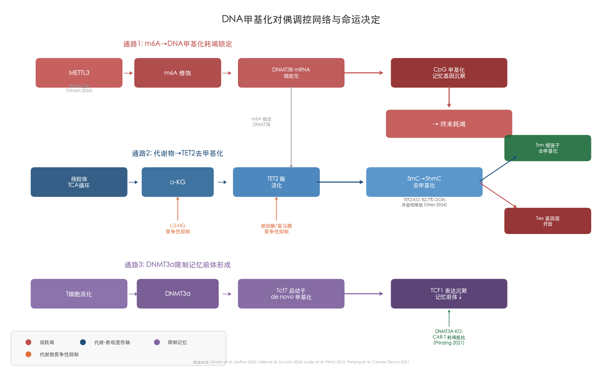

上图整合了三条DNA甲基化相关调控通路的对偶关系：通路1（促耗竭方向）展示METTL3→m6A→DNMT3B→CpG甲基化→记忆基因沉默→终末耗竭的级联效应；通路2（代谢-表观遗传轴）描绘线粒体TCA循环→α-KG→TET2酶活化→去甲基化的分岔过程，并标注L-2-HG和琥珀酸/富马酸的竞争性抑制作用及TET2敲除导致82.7% OCRs开放性降低的定量参数；通路3（限制记忆方向）展示DNMT3a对Tcf7启动子的从头甲基化及DNMT3A-KO赋予CAR-T耗竭抵抗表型的转化证据。三条通路通过m6A稳定DNMT3B形成跨层级连接。

## 4.3 组蛋白乳酸化在耗竭-Trm分岔中的重新审视

### 4.3.1 "代谢双重衰竭"框架对简单线性模型的修正

第3章初步介绍了Zhang等首次鉴定的组蛋白赖氨酸乳酸化（Kla）修饰以及Raychaudhuri等在CD8⁺ T细胞中的系统性研究。在命运分岔的语境下，这些发现需被重新整合进一个更精确的动态模型。

直觉上，"线粒体裂变→糖酵解增强→乳酸升高→Kla富集→耗竭基因激活"这一线性模型具有一定合理性。然而，Raychaudhuri等的CUT&Tag和ChIP-seq数据揭示了一个与此直觉矛盾的关键事实：终末耗竭CD8⁺ T细胞中H3K18la和H3K9la的富集水平极低，而H3K9ac则在耗竭相关基因上显著增加。体外生成的终末耗竭CD8⁺ T细胞中，H3K18la和H3K9la标记均显著减少；体内MB49肿瘤模型的LAG3⁺耗竭性CD8⁺ TIL同样呈现相较于TBET⁺效应细胞更低的Kla水平 [Raychaudhuri et al., Nat Immunol 2024](https://www.nature.com/articles/s41590-024-01978-0 "Histone lactylation drives CD8+ T cell metabolism and function")。

这一反直觉发现可通过"代谢双重衰竭"（dual metabolic collapse）框架获得调和解释。终末耗竭T细胞并非仅有OXPHOS崩溃而糖酵解代偿性增强，而是两条产能通路同时衰竭——第2章已详述的去极化线粒体累积、PGC-1α进行性丢失和ROS过量产生破坏了OXPHOS，而持续的代谢应激和营养物质竞争亦严重削弱了糖酵解产能力。乳酸产生能力本身的下降导致内源性Kla的底物供应不足，终末耗竭细胞因此呈现Kla极低的表观遗传状态。

### 4.3.2 H3K18la与H3K9la在T细胞亚群中的差异性富集

Raychaudhuri等的ChIP-seq与ChromHMM整合分析进一步揭示了H3K18la和H3K9la在不同CD8⁺ T细胞亚群中精细化的差异性分布模式。

H3K18la主要在活化CD8⁺ T细胞中显著富集，标记效应基因（包括Gzmb、Prf1、Icos、Fasl和Pdcd1）的启动子区域，其富集高度依赖糖酵解——LDHA抑制导致活化T细胞H3K18la从Fis1（线粒体裂变基因）启动子区域消失，伴随线粒体形态从碎片化向融合网络状态转变。在初始态和记忆CD8⁺ T细胞中，H3K18la富集极低 [Raychaudhuri et al., Nat Immunol 2024](https://www.nature.com/articles/s41590-024-01978-0 "Histone lactylation drives CD8+ T cell metabolism and function")。

H3K9la的分布则展现更广泛的亚群覆盖特征。在初始T细胞中，H3K9la标记静息相关基因（Bach2、Foxo1、Klf2）的启动子区域；在记忆T细胞中富集于记忆维持基因（Lef1、Ccr7、Il7r）；在活化T细胞中标记OXPHOS相关基因（Ndufs8、Ndufa6、Ndufs4）。关键性的代谢源差异在于：活化T细胞的H3K9la主要由糖酵解驱动，而记忆T细胞的H3K9la则由线粒体代谢通路——包括电子传递链（ETC）、脂肪酸氧化（FAO）和ATP柠檬酸裂解酶（ACLY）——选择性驱动。ETC抑制剂鱼藤酮（rotenone）在活化T细胞中增加H3K9la（因糖酵解代偿性增强），在记忆T细胞中却降低H3K9la（因线粒体来源的乳酸供应中断），展现了同一修饰在不同代谢语境中截然相反的调控逻辑。

在Trm维持的背景下，H3K9la的线粒体代谢依赖性具有重要意义。第2章已确立Trm依赖OPA1介导的线粒体融合和OXPHOS以维持其代谢特征 [Buck et al., Cell 2016](https://pubmed.ncbi.nlm.nih.gov/27293185/ "Mitochondrial Dynamics Controls T Cell Fate through Metabolic Programming")。H3K9la在记忆/Trm中通过线粒体代谢驱动并标记Lef1和Ccr7等关键记忆基因，提示"线粒体融合→OXPHOS/FAO→ACLY→线粒体来源乳酸→H3K9la→记忆基因维持"可能构成Trm表观遗传维持的一条独立通路。同时，H3K18la标记Fis1等裂变基因启动子区域并在活化T细胞中富集，提示"糖酵解→H3K18la→Fis1→线粒体裂变"可能构成一个正反馈环路，在耗竭早期阶段驱动线粒体碎片化。

### 4.3.3 Kla时序动态与命运分岔的阶段性模型

综合上述证据，可提出一个关于Kla在耗竭进程中的修正时序模型：

**早期耗竭阶段**（慢性刺激第1–2周）：糖酵解仍活跃，H3K18la在效应和早期耗竭增强子区域富集，可能参与耗竭基因程序的初始激活；同时H3K9la维持OXPHOS相关基因的转录，线粒体功能尚未完全崩溃。

**过渡阶段**（第2–3周）：随着PGC-1α进行性丢失和去极化线粒体累积加剧，OXPHOS逐渐衰退。线粒体来源的H3K9la供应开始减少，而糖酵解仍可部分代偿，H3K18la维持在中等水平。此阶段可能是命运分岔的关键窗口——若线粒体功能得到修复（如通过USP30抑制恢复线粒体自噬），H3K9la维持的记忆基因程序可被挽救，偏向Trm命运。

**终末耗竭阶段**（第3周后）：OXPHOS与糖酵解双重崩溃，H3K18la和H3K9la均显著降低，耗竭相关基因的表观遗传标记转由H3K9ac承载 [Raychaudhuri et al., Nat Immunol 2024](https://www.nature.com/articles/s41590-024-01978-0 "Histone lactylation drives CD8+ T cell metabolism and function")。此时表观遗传锁定已完成，TOX持续表达维持耗竭状态的正反馈 [Huang et al., Sci Immunol 2025](https://www.science.org/doi/10.1126/sciimmunol.ado3032 "Continuous expression of TOX safeguards exhausted CD8 T cell epigenetic fate")。

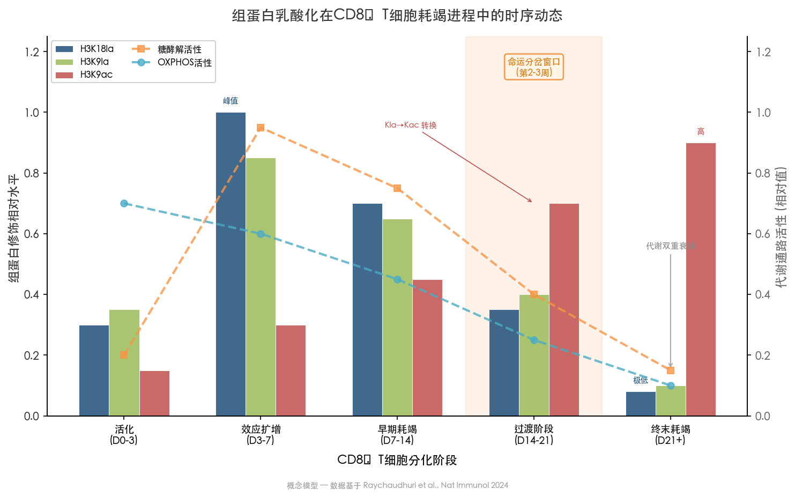

上图以复合柱状图和折线图呈现H3K18la、H3K9la和H3K9ac三种组蛋白修饰在CD8⁺ T细胞从活化至终末耗竭各阶段的相对水平变化，同时叠加糖酵解和OXPHOS两条代谢通路的活性趋势。图中标注了效应期Kla峰值、Kla→Kac转换节点、命运分岔窗口（第2–3周）以及代谢双重衰竭区间，直观呈现终末耗竭细胞中Kla极低而H3K9ac上升的反直觉模式。概念模型基于Raychaudhuri et al., Nat Immunol 2024的实验数据构建。

上述阶段性模型需位点特异性的遗传操纵实验加以验证——例如通过突变组蛋白乳酸化位点或在特定分化阶段条件性操纵p300/HDAC1-3活性。Kla在前体→过渡→终末耗竭各阶段的绝对水平和动力学常数在CD8⁺ T细胞中的系统性时序定量数据目前处于空白状态，该模型为第6章的多时间尺度建模框架提供了重要的生物学约束。

## 4.4 代谢中间物梯度驱动的表观遗传对偶路径

### 4.4.1 "融合→OXPHOS→α-KG→TET→Trm增强子去甲基化"通路

将前三章和本章的证据加以整合，可构建从线粒体状态到细胞命运的两条对偶表观遗传路径。第一条路径描述Trm方向的命运选择：

线粒体融合（OPA1/MFN2介导）→嵴结构优化→ETC复合物高效组装→OXPHOS和FAO活跃→TCA循环中α-KG充足供应→TET酶活性维持→Trm增强子区域选择性去甲基化→Trm转录程序激活。该路径的各环节已分别获得独立实验支持：Buck等确立了OPA1介导的线粒体融合对记忆T细胞形成的充分必要性 [Buck et al., Cell 2016](https://pubmed.ncbi.nlm.nih.gov/27293185/ "Mitochondrial Dynamics Controls T Cell Fate through Metabolic Programming")；Jaccard等证明还原性羧化通过表观遗传机制指导T细胞分化 [Jaccard et al., Nature 2023](https://pubmed.ncbi.nlm.nih.gov/37730993/ "Reductive carboxylation epigenetically instructs T cell differentiation")；Giles等则明确了TET2在前体与终末耗竭转化中的驱动作用 [Giles et al., Sci Adv 2024](https://pmc.ncbi.nlm.nih.gov/articles/PMC11559603/ "TET2 regulates early and late transitions in exhausted CD8+ T cell differentiation")。

与此并行，Bhlhe40→TCA→乙酰-CoA→H3K9ac/H3K27ac通路 [Li et al., Immunity 2019](https://www.cell.com/immunity/fulltext/S1074-7613(19)30364-4 "Bhlhe40 Programs Mitochondrial Regulation of Resident CD8+ T Cell Fitness") 和线粒体来源的H3K9la→记忆基因维持通路（Raychaudhuri 2024）共同构成Trm功能维持的多层表观遗传支撑网络。

需指出，这条完整通路在Trm中的直接串联验证——即在同一实验体系中从线粒体融合经α-KG到Trm增强子去甲基化的连续追踪——在单一研究中尚未完成。各环节目前由独立研究分别支持，完整因果链的严格验证仍是该领域的重要缺口。

### 4.4.2 "裂变→代谢崩溃→表观遗传锁定→终末耗竭"通路

第二条对偶路径描述终末耗竭方向的命运承诺：

线粒体裂变过度（DRP1过度活化/USP30抑制线粒体自噬）→去极化线粒体累积→ROS过量产生→OXPHOS崩溃→α-KG供应不足+琥珀酸/富马酸竞争性抑制TET→DNA去甲基化模式失衡→TOX/NR4A基因座持续开放→耗竭正反馈环路自我维持。

在这条路径中，Abdel-Hakeem等提供了表观遗传锁定的终局证据：在LCMV慢性感染-抗原清除模型中，即使抗原清除超过520天，恢复中Tex（REC-TEX）的ATAC-seq仍主要保持Tex样模式，仅2.9%的TOX抑制的效应细胞开放染色质区域得到恢复，Tox和Pdcd1基因座的开放染色质模式未发生显著重塑 [Abdel-Hakeem et al., Nat Immunol 2021](https://www.nature.com/articles/s41590-021-00975-5 "Epigenetic scarring of exhausted T cells hinders memory differentiation upon antigen withdrawal")。这种持久的"表观遗传疤痕"构成了终末耗竭不可逆性的分子基础。

两条对偶路径的交汇点即为"命运分岔节点"——在此节点，线粒体融合/裂变的平衡状态决定了α-KG/琥珀酸比值、乙酰-CoA可用性和NAD⁺/NADH比值等代谢中间物梯度，这些梯度进而通过TET/DNMT、p300/HDAC和Sirtuin等表观遗传修饰酶决定染色质重塑的方向。

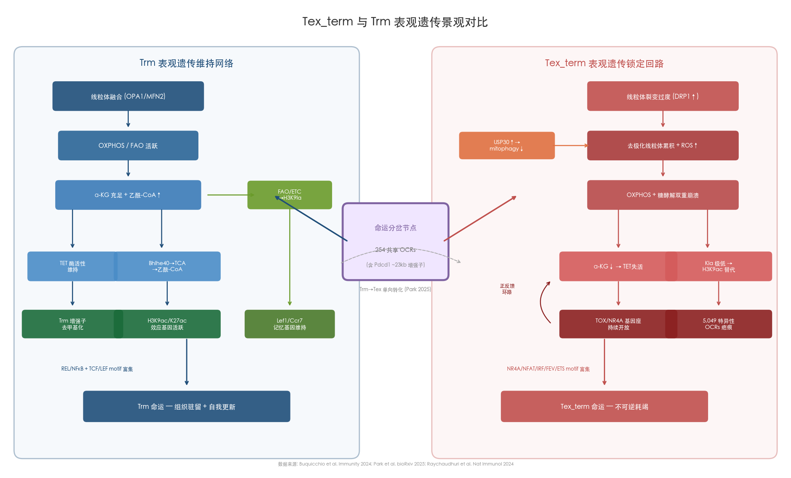

上图以左右对称布局展示Trm与Tex_term两条对偶表观遗传路径。左侧Trm维持网络描绘了线粒体融合（OPA1/MFN2）→OXPHOS/FAO活跃→α-KG充足+乙酰-CoA↑的代谢基础，以及由此驱动的TET酶活性维持、Bhlhe40→TCA→H3K9ac/K27ac效应基因活跃、FAO/ETC→H3K9la→Lef1/Ccr7记忆基因维持三条表观遗传支撑通路。右侧Tex_term锁定回路展示线粒体裂变过度→去极化线粒体累积→OXPHOS+糖酵解双重崩溃→TOX/NR4A基因座持续开放→5,049个特异性OCRs表观遗传疤痕的级联过程。中央命运分岔节点标注254个共享OCRs（含Pdcd1 ~23 kb增强子）及Trm→Tex单向转化的不对称性。

## 4.5 命运承诺的时间窗口与NR4A介导的可逆性控制

### 4.5.1 耗竭不可逆转化的时间节点

耗竭命运承诺具有明确的时间窗口特征。Angelosanto等在LCMV模型中确立了关键时间节点：感染后第8天的CD8⁺ T细胞仍可在转移至急性感染环境后恢复记忆潜能，但第15–30天的细胞已完全丧失这一可塑性 [Angelosanto et al., J Virol 2012](https://journals.asm.org/doi/10.1128/jvi.00889-12 "Progressive loss of memory T cell potential and commitment to exhaustion")。不可逆表观遗传锁定在慢性刺激的第2–3周完成，与前述Kla时序模型中"过渡阶段→终末阶段"的转换窗口高度吻合。

该时间窗口的分子基础可归因于TOX和NR4A转录因子的累积效应。第1章已阐述TOX通过招募HBO1组蛋白乙酰转移酶复合物重塑约4,000个染色质区域（70%位于增强子），建立耗竭表观遗传程序 [Khan et al., Nature 2019](https://pmc.ncbi.nlm.nih.gov/articles/PMC6713202/ "TOX transcriptionally and epigenetically programs CD8+ T cell exhaustion")。Huang等进一步证明TOX的持续表达对维持Tex表观遗传状态不可或缺——TOX消除后Tex出现凋亡和表观遗传解构，获得向效应样T细胞分化的更大命运可塑性 [Huang et al., Sci Immunol 2025](https://www.science.org/doi/10.1126/sciimmunol.ado3032 "Continuous expression of TOX safeguards exhausted CD8 T cell epigenetic fate")。

### 4.5.2 NR4A的层级性调控与可逆性窗口

NR4A家族转录因子（NR4A1/NR4A2/NR4A3）在耗竭表观遗传程序中的功能分工与可逆性控制近期获得了精细解析。Perez等通过NR4A蛋白降解子（degron）系统实现了对内源性NR4A蛋白水平的实时可控操纵，获得了若干具有重要建模意义的发现 [Perez et al., bioRxiv 2026（预印本）](https://www.biorxiv.org/content/10.64898/2026.02.02.701413v1.full-text "Reversible control of T cell exhaustion by NR4A transcription factors")。

NR4A的持续存在是维持耗竭所必需的——个别NR4A的降解可在数小时内恢复效应因子（如IFNγ和TNF）的产生。这一时间分辨率表明，至少部分耗竭程序处于转录因子持续占据的"动态维持"状态，而非完全由染色质结构的被动锁定所决定。NR4A家族内部存在层级分工：NR4A1主导"可塑性"耗竭程序，该程序在NR4A1降解后可被快速逆转；NR4A2和NR4A3则主导"固化"耗竭程序，其耗竭特征在NR4A降解后仍部分保持。

上述发现兼具治疗意义和建模启示。在治疗层面，靶向NR4A1可能提供比PD-1阻断更直接的耗竭逆转策略，因为PD-1阻断无法持久重塑Tex表观遗传景观 [Pauken et al., Science 2016](https://pubmed.ncbi.nlm.nih.gov/27789795/ "Epigenetic stability of exhausted T cells limits durability of reinvigoration by PD-1 blockade")。在建模层面，NR4A1主导的"可塑性"程序和NR4A2/3主导的"固化"程序可被参数化为命运景观中不同深度的势阱——前者为浅势阱（易于逃逸），后者为深势阱（难以逃逸）。Park等的发现——Trm可在慢性抗原下分化为Tex而已承诺Tex前体无法生成Trm——进一步支持这一不对称势阱架构。

### 4.5.3 表观遗传疤痕的持久性与干预窗口

Abdel-Hakeem等和Yates等的研究共同确立了表观遗传疤痕的极端持久性。在LCMV模型中，抗原清除520天后REC-TEX仍维持较高Tox表达和Tex样ATAC-seq模式 [Abdel-Hakeem et al., Nat Immunol 2021](https://www.nature.com/articles/s41590-021-00975-5 "Epigenetic scarring of exhausted T cells hinders memory differentiation")。在人HCV感染治愈后，77.1%的疤痕开放染色质区域在治疗后60–80周仍保持不变，TOX超级增强子在治愈超过1年后仍维持开放 [Yates et al., Nat Immunol 2021](https://senlab.mgh.harvard.edu/wp-content/uploads/2022/05/s41590-021-00979-1.pdf "Epigenetic scars of CD8+ T cell exhaustion persist after cure of chronic infection in humans")。

Yates等进一步证明，慢性TCR刺激而非炎症微环境本身是驱动表观遗传疤痕的主要力量——旁观者群体几乎无表观遗传变化，而病毒逃逸（导致TCR信号终止）的HCV特异性T细胞表观遗传则更接近功能性记忆。这一发现对肿瘤微环境与HIV两大疾病场景的比较分析具有直接指导意义（第5章将予以展开）。

综合NR4A降解子和表观遗传疤痕的证据，我们认为耗竭的可逆性并非"全或无"的二元状态，而是一个具有层级结构的渐变谱系：转录因子占据层面的"动态耗竭"（分钟至小时级可逆）→组蛋白修饰层面的"可塑性耗竭"（天级可逆）→DNA甲基化和染色质拓扑层面的"固化耗竭"（周至月级极难逆转）。这一层级结构为第6章的多时间尺度建模提供了生物学依据，亦为第7章讨论最优治疗干预时间窗口提供了概念框架。

## 4.6 命运分岔的整合模型与建模接口

### 4.6.1 表观遗传开关区域的分子定义

基于本章的系统性分析，可初步定义决定Tex_term与Trm命运分岔的"表观遗传开关区域"。这些区域满足以下标准：(i) 在Tex_term与Trm之间呈现差异性染色质可及性或差异性DNA甲基化；(ii) 其表观遗传状态受代谢中间物（α-KG、乙酰-CoA、乳酸/Kla）水平的直接调控；(iii) 其状态改变足以影响命运承诺方向。

据此标准，以下基因座可被识别为核心开关区域：**Tox基因座**——Tex_term中54个特异性OCR与之相关（Buquicchio 2024），TET2去甲基化驱动其开放（Giles 2024），L-2-HG通过H3K27me3抑制其表达（Yang 2025）；**Tcf7基因座**——DNMT3a/DNMT3B介导的甲基化沉默其表达、限制记忆/Tpex分化（Ladle 2016; Ghosh 2026预印本），DNMT3A敲除可恢复TCF1表达（Prinzing 2021）；**Pdcd1基因座**——~23 kb增强子属于Trm与Tex_term共享的254个OCR之一（Buquicchio 2024），其表观遗传调控方向可能决定PD-1表达水平的分化；**Fis1/Opa1基因座**——H3K18la/H3K9la分别标记裂变/融合基因启动子（Raychaudhuri 2024），构成代谢-表观遗传正反馈环路的组蛋白修饰节点。

### 4.6.2 为定量建模提供的参数约束

本章识别的生物学事实为第6章的建模框架提供以下关键约束条件。

**命运分岔的拓扑结构**：Trm与Tex_term分别构成两个不同深度的吸引子态。Tex_term势阱深度远大于Trm（Park 2025预印本的单向转化证据），NR4A1介导的"可塑性耗竭"对应浅势阱，NR4A2/3介导的"固化耗竭"对应深势阱。

**时间尺度层级**：快层（分钟至小时级）= NR4A转录因子占据动态 + Kla写入/擦除；中层（小时至天级）= 组蛋白乙酰化/甲基化重塑；慢层（天至周级）= TET2/DNMT3a介导的DNA甲基化重塑 + TOX驱动的大规模染色质可及性改变；最慢层（周至月级）= 表观遗传疤痕的固定化。

**代谢输入变量**：线粒体融合/裂变比值→α-KG/琥珀酸比值、乙酰-CoA池大小、NAD⁺/NADH比值、内源性乳酸产生量。这些代谢参数的已有定量测量值（如肿瘤组织α-KG浓度约4 µg/g，肿瘤微环境乳酸浓度可达40 mM）可作为模型的初始条件或边界条件。

**关键阈值效应**：耗竭不可逆承诺在慢性刺激第2–3周完成（Angelosanto 2012），提示模型应包含一个阈值触发的相变机制，对应从可逆态到不可逆态的突变。

上述参数约束将在第6章的代谢-表观遗传互作网络建模中被系统性地转化为数学变量和方程约束，以期实现对命运分岔的定量预测。

# 第5章 肿瘤微环境与HIV潜伏感染——两大疾病场景的比较免疫学分析

前四章围绕CD8⁺ T细胞耗竭的分子基础、线粒体动力学、代谢-表观遗传重塑及命运分岔机制展开论述，主要以肿瘤微环境（tumor microenvironment, TME）为叙事主线，辅以慢性病毒感染模型数据加以佐证。然而，慢性抗原刺激下线粒体动力学如何通过表观遗传重塑驱动终末耗竭与Trm命运分岔这一核心命题，在不同疾病场景中的具体表现存在实质性差异。TME与HIV慢性感染作为CD8⁺ T细胞耗竭研究的两大经典范式，在抗原呈递模式、微环境代谢特征、线粒体损伤机制及表观遗传疤痕可干预性上均呈现出既保守又分化的双重特征。本章旨在系统整合跨疾病场景的免疫学证据，提炼保守的耗竭核心程序与场景特异性调控特征，为第6章代谢-表观遗传互作网络定量建模提供参数分场景设定的生物学依据。

## 5.1 驱动力差异：慢性抗原刺激的模式与微环境特征

### 5.1.1 抗原信号的持续性与多样性

TME与HIV慢性感染中CD8⁺ T细胞所面对的抗原信号在本质上存在差异。TME中的新抗原（neoantigen）来源于肿瘤细胞体细胞突变，随免疫编辑过程（immune editing）持续改变——免疫压力驱动肿瘤细胞发生抗原丢失或HLA下调，导致TCR识别的靶标不断漂变，T细胞面对的实质上是一个持续移动的靶标。相较而言，HIV感染中的核心保守蛋白（如Gag、Pol）提供相对稳定的持续性抗原刺激。尽管HIV高突变率产生逃逸变体，但CTL表位中的保守区域在病毒适应度约束下维持了相当程度的抗原稳定性。

上述差异在耗竭动力学上产生重要后果。在TME中，抗原漂变可能使部分肿瘤特异性T细胞暂时脱离TCR信号驱动，但免疫编辑同步产生新的抗原刺激，使T细胞群体持续处于"追逐-适应"循环之中。在HIV感染中，抗逆转录病毒治疗（antiretroviral therapy, ART）可有效抑制病毒复制并将血浆病毒载量降至检测限以下，但病毒储库的持续存在和低水平抗原表达使CD8⁺ T细胞维持在慢性低水平刺激状态。Yates等的系统性比较研究明确确认，持续性TCR刺激——而非炎症微环境本身——是驱动表观遗传疤痕形成的主要力量：在HCV感染中，病毒逃逸导致TCR信号终止的HCV特异性T细胞，其表观遗传模式更接近功能性记忆T细胞而非耗竭T细胞；旁观者群体（bystander）则几乎无表观遗传变化 [Yates et al., Nat Immunol 2021](https://senlab.mgh.harvard.edu/wp-content/uploads/2022/05/s41590-021-00979-1.pdf "Epigenetic scars of CD8+ T cell exhaustion persist after cure of chronic infection in humans")。

### 5.1.2 微环境代谢拓扑的根本差异

TME与HIV感染所处的微环境在代谢拓扑上存在根本性差异，这构成两大场景中代谢-表观遗传互作的分水岭。

TME具有三项标志性代谢特征。其一，低氧（pO₂ < 10 mmHg），由肿瘤快速增殖导致的血管生成不足所驱动，激活HIF-1α依赖的糖酵解重编程。其二，高乳酸（浓度可达约40 mM），源自肿瘤细胞Warburg效应和CD8⁺ T细胞自身糖酵解，经MCT通道大量输出至细胞外基质 [Zhang et al., Nature 2019](https://pmc.ncbi.nlm.nih.gov/articles/PMC6818755/ "Metabolic regulation of gene expression by histone lactylation")。其三，免疫抑制性细胞因子（TGF-β、IL-10）的局部高浓度，由调节性T细胞（Treg）和肿瘤相关巨噬细胞分泌。三重代谢胁迫共同作用，将CD8⁺ TIL推向代谢困境——OXPHOS受损，而糖酵解通路亦受营养竞争限制。

相比之下，HIV感染的主要解剖学微环境为次级淋巴组织（secondary lymphoid organs, SLOs），如淋巴结和脾脏，并不具备TME级别的低氧或高乳酸环境。尽管T细胞活化时可在淋巴结中产生局部乳酸累积并形成酸性微环境，但其浓度远低于TME中的病理性水平。HIV场景的独特微环境特征在于持续性I型干扰素（IFN-I）信号——由残余病毒复制和储库细胞中的先天免疫感知持续驱动。Cheng等于2026年报道，持续IFN-I信号通过抑制CD8⁺ T细胞线粒体OXPHOS直接损害其代谢适能，而瞬时糖酵解抑制（2-DG处理）可挽救线粒体活性。这一机制为HIV所特有，在TME中IFN-I通常不构成主要的线粒体损伤来源 [Cheng et al., Cell Mol Immunol 2026](https://www.nature.com/articles/s41423-026-01398-8 "Persistent IFN-I signaling inhibits mitochondrial oxidative metabolism in CD8+ T cells during HIV-1 infection")。

上述微环境差异对组蛋白乳酸化（Kla）这一核心表观遗传修饰具有关键意义。如第3章所述，Kla的前体底物是乳酸，其修饰水平直接受乳酸可用性调控。TME中高达约40 mM的乳酸浓度为大规模Kla修饰提供了充足底物；而在HIV感染的SLOs中，乳酸浓度远不及TME水平，提示Kla在HIV场景中可能并非主要的表观遗传调控层。病毒感染中乳酸化的研究主要集中于HBV、HPV、KSHV等可在感染细胞内引起显著糖酵解增强和乳酸累积的DNA病毒 [Chen et al., PLoS Pathog 2025](https://journals.plos.org/plospathogens/article?id=10.1371/journal.ppat.1013366 "Lactylation and viral infections: A novel link between metabolic reprogramming and immune regulation")，而HIV对宿主CD8⁺ T细胞乳酸化修饰的直接影响尚无系统性文献报道。据此判断，在HIV场景中，DNA甲基化和组蛋白乙酰化/去乙酰化——而非乳酸化——可能是更为主要的代谢-表观遗传界面。

### 5.1.3 免疫抑制性信号的层级差异

TME的免疫抑制信号层级远比HIV场景复杂。除可溶性因子（TGF-β、IL-10、IDO代谢物）外，TME通过肿瘤细胞表面PD-L1/PD-L2、CTLA-4配体等免疫检查点分子，Treg细胞和髓源抑制性细胞（myeloid-derived suppressor cells, MDSC）的物理邻近接触，以及胞外基质的物理屏障效应，构建了多层次免疫抑制网络。

HIV感染中的免疫抑制信号主要来自三条通路：PD-1/PD-L1轴介导的直接负性共信号、持续性IFN-I驱动的悖论性免疫激活（paradoxical immunoactivation），以及CD4⁺ T细胞辅助功能的进行性丧失。在未经治疗的HIV感染中，CD4⁺ T细胞数量和功能的持续衰减导致CD8⁺ T细胞缺乏充分的IL-21和IL-2等辅助信号，加速耗竭程序。LCMV模型中的经典实验已证明，CD4辅助缺失通过加深PDCD1位点去甲基化程度加剧耗竭 [Youngblood et al., Immunity 2011](https://pmc.ncbi.nlm.nih.gov/articles/PMC3183460/ "Chronic virus infection enforces demethylation of the locus that encodes PD-1 in antigen-specific CD8+ T cells")。这一机制在HIV场景中尤为突出，因为CD4⁺ T细胞既是HIV的主要靶细胞，又是CD8⁺ T细胞抗病毒功能的关键辅助来源，其双重丧失构成了HIV特有的免疫抑制恶性循环。

## 5.2 线粒体动力学异常的场景特异性表型

### 5.2.1 TME中的线粒体损伤级联

如第2章系统阐述，TME中CD8⁺ TIL的线粒体损伤遵循一条多机制级联路径，其核心环节包括以下四条通路。

**PGC-1α丢失与线粒体生物发生受损。** Scharping等证明TME中持续Akt信号诱导PGC-1α进行性丢失，Blimp-1介导的PGC-1α转录抑制进一步破坏TIL的线粒体重编程能力 [Scharping et al., Immunity 2016](https://pubmed.ncbi.nlm.nih.gov/27496732/ "TME Represses T Cell Mitochondrial Biogenesis")；[Scharping et al., Nat Immunol 2021](https://pubmed.ncbi.nlm.nih.gov/33398183/ "Mitochondrial stress induced by continuous stimulation under hypoxia rapidly drives T cell exhaustion")。

**线粒体自噬缺陷。** Yu等证明TIL中线粒体自噬（mitophagy）活性下降导致去极化线粒体累积，药理学强制诱导去极化线粒体累积即可驱动向终末耗竭方向的表观遗传重编程 [Yu et al., Nat Immunol 2020](https://pubmed.ncbi.nlm.nih.gov/33020660/ "Disturbed mitochondrial dynamics in CD8+ TILs reinforce T cell exhaustion")。Zhang与Gao等于2025年进一步揭示了这一缺陷的分子机制：持续TCR刺激通过NFATc1转录激活USP30，USP30对抗Parkin介导的泛素化从而抑制mitophagy，由此建立"慢性抗原刺激→TCR/NFATc1→USP30↑→mitophagy↓→去极化线粒体累积→耗竭"调控轴 [Zhang, Gao et al., Sci Adv 2025](https://pmc.ncbi.nlm.nih.gov/articles/PMC12356266/ "USP30 inhibition augments mitophagy to prevent T cell exhaustion")。

**肿瘤细胞的"投毒式"线粒体转移。** Ikeda等于2025年揭示了一种全新的免疫逃逸机制：肿瘤细胞向TIL转移携带mtDNA突变的功能障碍线粒体，且共转移线粒体自噬抑制分子以阻止清除 [Ikeda et al., Nature 2025](https://www.nature.com/articles/s41586-024-08439-0 "Immune evasion through mitochondrial transfer in the tumour microenvironment")。这种主动"投毒"策略与内源性mitophagy缺陷协同作用，使TME中的TIL面临内外双重线粒体质量控制危机。

**低氧协同效应。** Scharping等的关键实验证明，持续抗原刺激与低氧联合方可充分驱动耗竭——单独任一条件均不足以完成耗竭编程。ROS水平的不可耐受性升高通过磷酸酶抑制和NFAT核定位促进耗竭程序 [Scharping et al., Nat Immunol 2021](https://pubmed.ncbi.nlm.nih.gov/33398183/ "Mitochondrial stress induced by continuous stimulation under hypoxia rapidly drives T cell exhaustion")。

综合上述四条路径，TME中TIL的线粒体表型可概括为：碎片化线粒体形态（裂变偏好）、去极化线粒体累积、ROS过产生、OXPHOS能力崩溃，以及线粒体DNA完整性受损。

### 5.2.2 HIV感染中的线粒体应激特征

HIV感染中CD8⁺ T细胞的线粒体异常呈现与TME显著不同的表型谱。Deguit等于2019年直接测量HIV感染者CD8⁺ T细胞线粒体参数，发现HIV耗竭CD8⁺ T细胞并非呈现去极化线粒体累积，而是表现为**高极化线粒体质量增加**——线粒体质量（mitochondrial mass, MM）、线粒体膜电位（MMP）和ROS水平均高于未感染者 [Deguit et al., J Acquir Immune Defic Syndr 2019](https://pmc.ncbi.nlm.nih.gov/articles/PMC6746248/ "CD8 T Cell Exhaustion Associated with Altered T Cell Mitochondrial Features and ROS in HIV")。这一结果与TME中TIL的去极化线粒体累积模式形成直接对比。此外，Deguit等发现线粒体质量与CD8⁺ T细胞增殖能力呈显著负相关（p = 0.03），提示线粒体质量的过度累积本身可能构成功能障碍的一种独立机制。

上述差异的机制基础可能与HIV场景中独特的IFN-I介导线粒体损伤有关。如5.1.2节所述，Cheng等证明持续IFN-I信号直接抑制CD8⁺ T细胞线粒体OXPHOS [Cheng et al., Cell Mol Immunol 2026](https://www.nature.com/articles/s41423-026-01398-8 "Persistent IFN-I signaling inhibits mitochondrial oxidative metabolism in CD8+ T cells during HIV-1 infection")。在此模型中，OXPHOS抑制可能发生在维持线粒体膜电位的前提下，这将解释Deguit等观察到的"高极化但功能障碍"表型——线粒体并未去极化和碎片化，但电子传递链活性受到IFN-I信号的直接抑制，导致OXPHOS产能不足而膜电位维持甚至升高。

HIV场景中慢性免疫激活对线粒体应激的长期影响同样不容忽视。未经治疗的HIV感染者长期处于持续免疫激活状态，CD8⁺ T细胞频繁经历活化-增殖循环，加速线粒体磨损和复制性老化。ART虽可降低病毒载量，但并不能完全消除这一免疫激活状态。

### 5.2.3 HBV感染的线粒体靶向恢复——跨疾病对照

HBV慢性感染模型为上述跨场景比较提供了有价值的第三方对照。Fisicaro等于2017年通过转录组比较急性与慢性HBV感染者的HBV特异性CD8⁺ T细胞，发现耗竭的HBV特异性CD8⁺ T细胞在多个细胞过程中存在显著损害，其中以线粒体功能的广泛改变最为突出——包括线粒体生物发生受损、ROS过产生和膜电位异常。关键性地，线粒体靶向抗氧化剂（mitochondria-targeted antioxidants）处理可显著改善HBV特异性CD8⁺ T细胞的线粒体功能和抗病毒效应能力 [Fisicaro et al., Nat Med 2017](https://pubmed.ncbi.nlm.nih.gov/28165481/ "Targeting mitochondrial dysfunction can restore antiviral activity of exhausted HBV-specific CD8 T cells in chronic hepatitis B")。

Fisicaro等的HBV数据在线粒体损伤模式上更接近TME中TIL的表型——线粒体功能广泛受损、ROS过产生——而与Deguit等报道的HIV"高极化线粒体质量增加"模式不同。这一分化提示不同慢性感染场景中的线粒体损伤机制存在病原体特异性差异。HBV感染的肝脏微环境具有高代谢活性和低氧梯度特征，可能与TME共享更多的线粒体代谢胁迫因子。

### 5.2.4 跨场景线粒体损伤的综合比较

基于以上分析，两大场景中的线粒体损伤可从以下维度进行系统性对比（图5-1）。

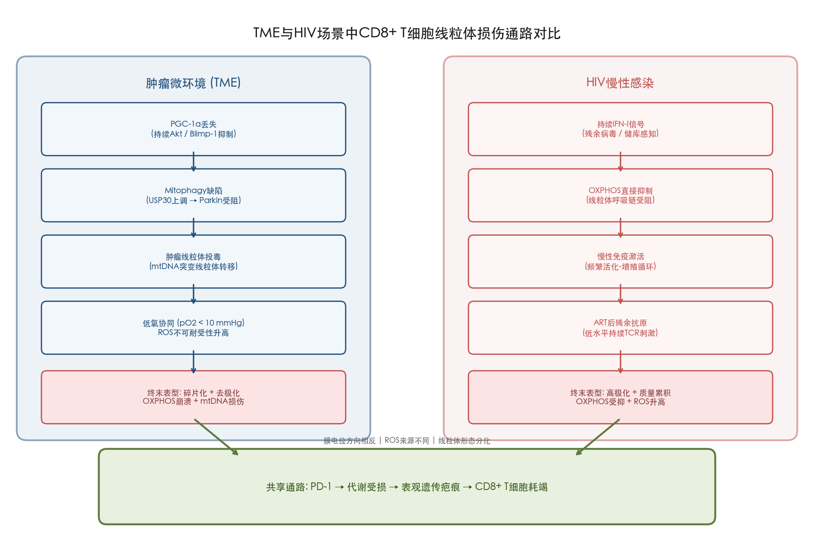

**图5-1 TME与HIV场景中CD8⁺ T细胞线粒体损伤通路对比。** 左侧展示TME中PGC-1α丢失、mitophagy缺陷（USP30）、肿瘤线粒体投毒、低氧协同效应导致的碎片化去极化终末表型；右侧展示HIV中持续IFN-I信号、OXPHOS抑制、慢性免疫激活、ART后残余抗原导致的高极化线粒体质量累积终末表型；底部为两场景共享的PD-1→代谢受损→表观遗传疤痕通路。

**线粒体形态方面，** TME中TIL呈碎片化线粒体（裂变偏好），与Buck等确立的"裂变→效应/耗竭"范式一致 [Buck et al., Cell 2016](https://pubmed.ncbi.nlm.nih.gov/27293185/ "Mitochondrial Dynamics Controls T Cell Fate through Metabolic Programming")。HIV中CD8⁺ T细胞的融合/裂变动力学（MFN2/DRP1/OPA1表达比例）尚缺乏直接测量数据，构成该领域的重要知识空白。

**膜电位状态方面，** TME中去极化线粒体累积是核心特征；HIV中则呈现高极化线粒体，两者的膜电位方向相反。

**ROS产生模式方面，** 两场景中ROS均呈过产生状态，但来源可能存在差异：TME中ROS主要源于去极化线粒体的电子泄漏；HIV中ROS可能源于高极化线粒体在OXPHOS受抑状态下的电子传递链瓶颈效应。

**Mitophagy状态方面，** TME中mitophagy明确受损（USP30上调→Parkin泛素化受阻）；HIV中mitophagy状态的直接研究较少，但线粒体质量的异常累积提示清除机制可能同样受损。

**核心损伤驱动力方面，** TME经"Blimp-1→PGC-1α↓ + USP30↑→mitophagy缺陷 + 肿瘤线粒体投毒"的多机制级联；HIV则经"持续IFN-I→OXPHOS抑制 + 慢性激活→线粒体应激"的不同路径。

上述差异意味着，第6章的定量建模框架在将线粒体动力学作为模型输入变量时，需要为TME和HIV场景设定不同的初始参数和约束条件——TME场景中的核心变量应为线粒体碎片化程度和去极化比例，而HIV场景中则应侧重OXPHOS抑制程度和线粒体质量累积速率。

## 5.3 保守的表观遗传耗竭程序——跨物种、跨疾病的共享签名

### 5.3.1 12,637个核心耗竭染色质可及性区域的跨疾病保守性

尽管TME和HIV在微环境和线粒体损伤模式上存在显著差异，耗竭CD8⁺ T细胞的表观遗传程序在核心层面展现出高度保守性。Yates等通过ATAC-seq系统比较HCV和HIV特异性耗竭CD8⁺ T细胞的全基因组染色质可及性，鉴定出12,637个跨病毒共享的耗竭核心染色质可及性区域（chromatin accessible regions, ChARs），统计显著性极高（P = 1 × 10⁻⁵·³³⁸）。该签名不仅在HCV与HIV之间保守，还跨物种（人-小鼠）和跨感染类型（HCV-HIV-LCMV）保守，由此确立了"核心耗竭表观遗传程序"的概念 [Yates et al., Nat Immunol 2021](https://senlab.mgh.harvard.edu/wp-content/uploads/2022/05/s41590-021-00979-1.pdf "Epigenetic scars of CD8+ T cell exhaustion persist after cure of chronic infection in humans")。

在这一核心程序中，TOX基因座被鉴定为疤痕区域排名第一的超级增强子关联基因。HCV治疗后，77.1%的疤痕ChARs在60–80周后仍维持不变，TOX超级增强子在治疗后超过1年仍保持开放状态。这些发现与第1章所述Abdel-Hakeem等关于表观遗传疤痕持久性以及Huang等关于TOX持续表达构成表观遗传屏障的结论高度一致 [Abdel-Hakeem et al., Nat Immunol 2021](https://www.nature.com/articles/s41590-021-00975-5 "Epigenetic scarring of exhausted T cells hinders memory differentiation")。

### 5.3.2 PDCD1位点的DNA甲基化动态——跨场景保守性调控

PDCD1（编码PD-1蛋白）位点的DNA甲基化动态是理解耗竭表观遗传程序跨疾病保守性的关键窗口。Youngblood等的奠基性工作系统阐明了该位点在急性与慢性感染中的差异性甲基化程序。

在急性LCMV感染中，初始T细胞向效应T细胞分化伴随PDCD1位点保守区域C和B（CR-C、CR-B）的短暂去甲基化——效应高峰（第4天）时CpG位点5至14的甲基化从接近100%降至0–25%。随着病毒清除，第8天效应T细胞即开始重新甲基化，记忆T细胞中CR-B的大多数CpG位点恢复至>70%甲基化水平。这一"甲基化→去甲基化→重新甲基化"的动态程序是功能性记忆分化的表观遗传标志。

相较之下，在LCMV慢性感染中，PDCD1位点CR-C和CR-B在感染后第8天即完全去甲基化，且即使在感染后>135天、病毒滴度降至检测限以下后仍维持完全去甲基化状态。关键实验表明：第一，去甲基化程度与TCR刺激持续时间呈实时相关——通过感染不同剂量和毒株的LCMV梯度调节TCR信号持续时间，可精确滴定CR-B的去甲基化程度；第二，CD4辅助的缺失不影响PDCD1去甲基化的维持，确认TCR信号而非外源性因素是主要驱动力；第三，去甲基化使PDCD1位点处于"蓄势待发"状态——来自慢性感染环境的PD-1^lo CD8⁺ T细胞在体外重刺激后达到最大PD-1表达的速度远快于急性感染来源的记忆T细胞。在分子机制层面，慢性感染中耗竭T细胞的从头甲基转移酶Dnmt3a异构体2（Dnmt3a2）表达较功能性记忆T细胞下调约7倍、较第4天效应T细胞下调约18倍，解释了重新甲基化能力的丧失 [Youngblood et al., Immunity 2011](https://pmc.ncbi.nlm.nih.gov/articles/PMC3183460/ "Chronic virus infection enforces demethylation of the locus that encodes PD-1 in antigen-specific CD8+ T cells")。

这一程序在人类HIV感染中高度保守。Noto等于2013年证明，HIV特异性CD8⁺ T细胞中PDCD1转录调控区域在急性和慢性感染阶段均处于去甲基化状态，而配对的初始T细胞维持甲基化。即使在ART有效控制病毒载量超过2年的患者以及精英控制者（elite controllers）中，HIV特异性CD8⁺ T细胞的PDCD1启动子仍维持去甲基化状态 [Noto et al., J Immunol 2013](https://pubmed.ncbi.nlm.nih.gov/23772031/ "Prolonged exposure to HIV reinforces a poised epigenetic program for PD-1 expression in virus-specific CD8 T cells")。上述发现表明，PD-1表观遗传程序一旦在慢性抗原暴露中"固化"，即使抗原载量大幅降低或清除，该程序也无法自发逆转——这构成跨疾病保守的"表观遗传疤痕"核心特征。

### 5.3.3 TOX在人类系统中的非耗竭专属表达

第1章已确立TOX作为耗竭核心编程因子的地位，但TOX在人类中的功能复杂性远超小鼠模型。Sekine等在2020年的研究中确认TOX在HIV耗竭T细胞中高表达，同时发现TOX在CMV和EBV特异性的多功能记忆T细胞以及精英控制者的HIV特异性T细胞中同样表达 [Sekine et al., Sci Immunol 2020](https://pubmed.ncbi.nlm.nih.gov/32620560/ "TOX is expressed by exhausted and polyfunctional human effector memory CD8+ T cells")。

这一发现意味着，在人类系统中TOX表达本身不足以定义耗竭状态，需要结合TOX的表达水平（可能存在剂量效应）、共表达分子（如NR4A家族、PD-1/TIM-3/TIGIT等共抑制受体的组合模式）以及染色质可及性状态来综合判定。对于定量建模而言，该特征要求模型中的TOX变量不应设计为简单的二元开关，而应作为连续变量纳入，并可能需要额外的"修饰因子"参数来区分人类与小鼠系统中TOX的功能差异。

## 5.4 场景特异性表观遗传特征

在确立跨疾病保守的耗竭核心程序之后，有必要进一步解析两大场景各自独有的表观遗传调控特征。图5-2以表格形式汇总了两场景中关键表观遗传参数维度的定量差异与保守性评估。

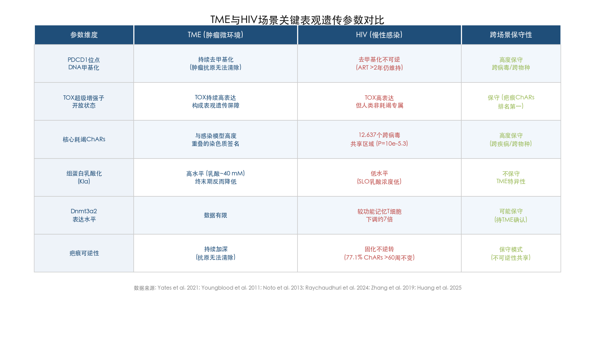

**图5-2 TME与HIV场景关键表观遗传参数对比。** 系统汇总PDCD1位点DNA甲基化、TOX超级增强子开放状态、核心耗竭ChARs、组蛋白乳酸化（Kla）、Dnmt3a2表达水平及疤痕可逆性六个维度的跨场景定量特征与保守性等级评估。

### 5.4.1 TME特有的代谢-表观遗传回路

TME特有的代谢-表观遗传特征根植于其独特的高乳酸/低氧微环境。如第3章详述，Raychaudhuri等在CD8⁺ T细胞中完成的首个系统性Kla研究表明，活化CD8⁺ T细胞H3K18la和H3K9la显著富集——H3K18la主要富集于效应亚群并受糖酵解调控，H3K9la在多亚群均有富集并受线粒体代谢调控。值得注意的是，终末耗竭细胞中H3K18la和H3K9la富集极低 [Raychaudhuri et al., Nat Immunol 2024](https://www.nature.com/articles/s41590-024-01978-0 "Histone lactylation drives CD8+ T cell metabolism and function")。

如第4章所论证，上述发现与"线粒体裂变→糖酵解↑→乳酸↑→Kla↑→耗竭"的简单模型矛盾。调和解释指向终末耗竭细胞处于"代谢双重衰竭"状态——OXPHOS和糖酵解均崩溃，内源性乳酸产能力本身下降。更为精确的时序模型应为：在耗竭早期至中期阶段，糖酵解代偿性上调产生的乳酸可能通过Kla参与耗竭增强子的初始激活；而在终末阶段，代谢衰竭导致Kla降低，耗竭基因的维持转由其他组蛋白修饰（如H3K9ac）承接。

TME中MCT11（SLC16A11）的选择性上调提供了另一条场景特异性通路。Germain等发现耗竭T细胞选择性上调MCT11，条件敲除MCT11可减少乳酸摄取并改善效应功能，抗MCT11抗体可减少肿瘤负荷 [Germain et al., Nat Immunol 2024](https://www.nature.com/articles/s41590-024-01999-3 "Dysfunction of exhausted T cells is enforced by MCT11-mediated lactate metabolism")。MCT11介导的外源性乳酸摄取是TME特有的耗竭驱动回路，在HIV的SLO微环境中预计不具有同等重要性。

TME特有的另一关键通路是METTL3-m6A-DNMT3B轴。如第3章所述，Ghosh等的预印本数据表明METTL3通过m6A修饰稳定DNMT3B转录本，后者催化CpG甲基化沉默记忆基因座，从而驱动终末耗竭。这一"m6A→DNA甲基化"级联将两种表观遗传修饰线性连接。尽管该通路的分子机制在HIV场景中可能同样存在，但TME中METTL3选择性富集于终末耗竭细胞的证据提示，TME的代谢胁迫可能通过特定信号通路增强METTL3表达或活性。

### 5.4.2 HIV特有的表观遗传特征

HIV场景的独特表观遗传特征与其持续免疫激活及ART后储库持续性密切相关。

**PDCD1位点的"不可逆蓄势"程序。** 如5.3.2节所述，HIV中PDCD1位点的去甲基化在ART超过2年后仍不可逆转。需指出的是，这一特征并非HIV独有——Yates等在HCV中也观察到类似疤痕。HIV的独特性在于：ART清除了活跃抗原信号但无法清除储库，导致低水平残余抗原与已固化的表观遗传疤痕叠加，形成一种独特的"低刺激-高疤痕"平衡态。

**持续IFN-I驱动的表观遗传重塑。** 持续IFN-I信号不仅通过抑制OXPHOS直接损害线粒体功能（如5.2.2节所述），还可能通过干扰素刺激基因（interferon-stimulated genes, ISG）启动子的持续去甲基化和组蛋白修饰改变影响全局表观遗传景观。在HIV"功能性治愈"（functional cure）目标框架下，如何逆转这些IFN-I驱动的表观遗传改变，构成与TME领域截然不同的治疗挑战。

**精英控制者的代谢-表观遗传优势。** Angin等发现HIV精英控制者的CD8⁺ T细胞具有"代谢可塑性"——可灵活利用OXPHOS和FAO，线粒体备用呼吸能力（spare respiratory capacity, SRC）显著高于非控制者 [Angin et al., Nat Metab 2019](https://pubmed.ncbi.nlm.nih.gov/32694646/ "Metabolic plasticity of HIV-specific CD8+ T cells associated with natural control of HIV-1")。这一特征与TME模型中"OXPHOS维持→前体/记忆保持→免疫控制"的范式高度一致，提示代谢可塑性可能是跨疾病场景维持免疫控制的共同基础。精英控制者CD8⁺ T细胞的代谢优势在表观遗传层面的对应特征——如Tpex标志物TCF1的维持、TOX/NR4A表达水平的控制——目前缺乏与TME中应答良好患者TIL的表观遗传图谱的直接比较数据。

## 5.5 Trm在两大场景中的命运与功能差异

### 5.5.1 TME中Trm与Tex的克隆独立性与功能分化

如第1章所述，Clarke等通过SPLINTR条码追踪系统在乳腺癌模型中解构了Trm与Tex的关系：两者均表达CD103/CD69/HOBIT，但Tex特异性高表达CD38/CD39/PD-1/CTLA-4/TIGIT/TIM-3。关键性地，Trm和Tex为克隆独立群体，持续性TCR信号是驱动Trm向Tex转化的关键因素。在预后层面，Trm签名高表达与更好的总生存率相关，但仅Tex签名与PD-1阻断响应呈正相关 [Clarke et al., Nat Immunol 2025](https://www.nature.com/articles/s41590-025-02347-9 "Antigen reactivity defines tissue-resident memory and exhausted T cells in tumors")。

上述"克隆独立但命运可转化"的发现具有重要的治疗启示：TME中的Trm可能代表一个尚未被充分开发的免疫治疗靶标群体。通过维持Trm的线粒体融合网络和OXPHOS能力、阻断其向Tex的转化路径，有望在不依赖PD-1阻断的情况下增强抗肿瘤免疫。

### 5.5.2 HIV中Trm的组织分布与功能表征

Trm在HIV感染中同样扮演重要角色。Buggert等于2018年系统表征了HIV淋巴组织CD8⁺ Trm，发现精英控制者淋巴结中HIV特异性Trm频率显著高于进展者，且淋巴结Trm富集效应和细胞毒性基因签名 [Buggert et al., Sci Immunol 2018](https://pmc.ncbi.nlm.nih.gov/articles/PMC6357781/ "HIV-specific resident memory CD8+ T cells in human lymphoid tissue")。这一发现在功能层面呼应了Angin等关于精英控制者代谢可塑性的报道——精英控制者不仅维持了CD8⁺ T细胞的代谢适能，还在关键解剖学位点（淋巴结）维持了高比例的功能性Trm。

HIV中同样存在Trm与耗竭之间的表型连续谱，与TME中Clarke等和Park等的发现形成跨场景呼应。在HIV进展者中，淋巴组织CD8⁺ T细胞可能同时展现Trm特征（CD69⁺CD103⁺）和耗竭标记（PD-1⁺TOX⁺），反映第4章所述的组织驻留耗竭（TR-TEX）中间表型。这一跨场景的表型连续性提示，Trm向Tex的转化可能遵循保守的分子逻辑——以持续TCR信号为核心驱动力，以TOX激活和NR4A正反馈环路为执行机制。

### 5.5.3 共同原则与场景差异

综合TME和HIV场景中Trm的研究数据，可提炼以下共同原则与场景差异。

**共同原则。** 第一，Trm的维持与线粒体OXPHOS能力正相关；第二，持续TCR信号是驱动Trm向Tex转化的共同核心驱动力；第三，精英控制者/治疗应答者中Trm比例更高，提示Trm状态与免疫控制正相关。

**场景差异。** 第一，TME中Trm面对高乳酸/低氧的代谢胁迫，而HIV中Trm面对持续IFN-I和低水平残余抗原。第二，TME中Kla修饰可能参与Trm功能调控，而HIV中Kla可能不构成主要调控层。第三，TME中的治疗策略侧重于阻断Trm→Tex转化（如MCT11阻断、USP30抑制），而HIV中的策略侧重于增强Trm代谢适能以支持储库清除（如NR/NMN补充、2-DG瞬时代谢干预）。

## 5.6 疤痕可干预性与治疗逻辑的场景分化

TME与HIV在表观遗传疤痕的可干预性上存在根本性差异，这直接决定了治疗策略的设计逻辑。

在TME场景中，肿瘤抗原无法自然清除（除非肿瘤完全消退），表观遗传疤痕在持续性TCR信号驱动下持续加深。治疗策略的核心逻辑在于"打断正反馈"——通过免疫检查点阻断（减弱PD-1/PD-L1信号）、代谢重编程（NAD⁺恢复、线粒体质量改善）和表观遗传干预（EZH2抑制、低剂量DNA去甲基化剂）的联合作用，在Tpex→Tex_term转化的早期窗口阻断命运承诺。

在HIV场景中，ART可有效清除活跃病毒复制，但表观遗传疤痕在抗原清除后仍"固定"不变——如Noto等所示PDCD1位点在ART超过2年后仍去甲基化，如Yates等所示77.1%的疤痕ChARs在HCV治疗后60–80周仍不变。这意味着HIV中的治疗逻辑并非"阻止疤痕形成"（疤痕已然固化），而是"主动逆转已固化疤痕"——可能需要更为激进的表观遗传重编程策略，例如低剂量地西他滨的系统性去甲基化或靶向恢复Dnmt3a2表达。

Bengsch等的早期工作为两大场景提供了共同的理论框架：PD-1信号同时抑制糖酵解和线粒体代谢，去极化线粒体累积在耗竭早期即已出现，构成TME和慢性感染共同的"PD-1→代谢受损→耗竭"轴 [Bengsch et al., Immunity 2016](https://pubmed.ncbi.nlm.nih.gov/27496729/ "Bioenergetic Insufficiencies Regulated by PD-1 Are an Early Driver of CD8+ T Cell Exhaustion")。在这一共享框架的基础上，TME和HIV各自叠加场景特异性的代谢胁迫（高乳酸/低氧与持续IFN-I），产生分化的表观遗传后果和差异化的治疗窗口。

## 5.7 为定量建模提供的场景参数设定基础

本章的比较分析为第6章代谢-表观遗传互作网络定量建模提供了明确的参数分场景设定依据。图5-3以概念架构图的形式展示了"保守内核+场景特异性外壳"的模块化建模设计方向。

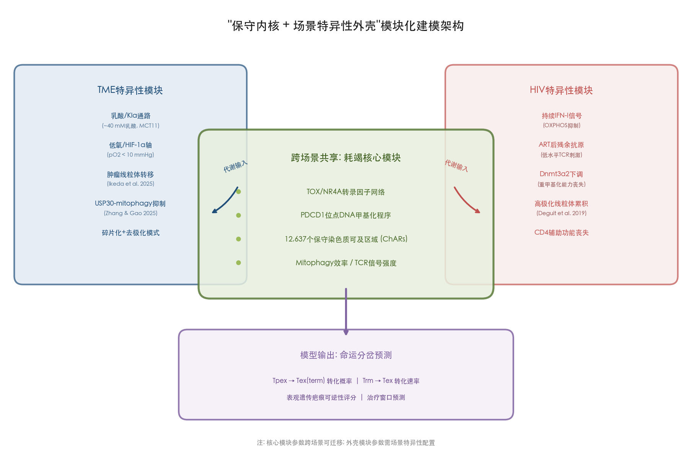

**图5-3 "保守内核+场景特异性外壳"模块化建模架构概念图。** 中心为跨场景共享的耗竭核心模块（TOX/NR4A网络、PDCD1甲基化、12,637个保守ChARs、mitophagy效率/TCR信号强度），左侧为TME特异性模块（乳酸/Kla通路、低氧/HIF-1α轴、肿瘤线粒体转移、USP30-mitophagy抑制），右侧为HIV特异性模块（持续IFN-I信号、ART后残余抗原、Dnmt3a2下调、高极化线粒体累积），底部为模型输出（命运分岔预测、疤痕可逆性评分、治疗窗口预测）。

**共享参数空间。** TCR信号强度与持续时间作为耗竭驱动力的核心输入变量、TOX/NR4A转录因子网络的激活阈值和正反馈增益、PDCD1位点DNA甲基化状态作为耗竭程度指示变量、mitophagy效率作为线粒体质量控制的关键参数——上述参数可在两场景中使用统一的数学描述，仅调整初始值。

**TME特异性参数。** 外源性乳酸输入速率（约40 mM环境浓度作为边界条件）、低氧水平（pO₂ < 10 mmHg激活HIF-1α的阈值函数）、Kla写入速率（作为乳酸浓度的函数）、肿瘤线粒体转移速率（Ikeda等数据）、USP30上调动力学。

**HIV特异性参数。** IFN-I持续信号强度（作为OXPHOS抑制的输入函数）、ART后残余抗原载量（极低但非零的TCR信号）、Dnmt3a2下调程度（影响PDCD1位点重新甲基化能力）、线粒体质量累积速率（而非碎片化程度）。

**参数迁移性约束。** 两场景间可迁移的参数包括TOX-NR4A-NFAT网络拓扑和调控增益系数（跨疾病保守的12,637核心ChARs验证了这一保守性）；不可迁移的参数包括微环境代谢物浓度、线粒体损伤机制的权重系数，以及Kla在耗竭驱动中的贡献权重。

综上所述，本章的比较免疫学分析揭示，CD8⁺ T细胞耗竭的核心表观遗传程序——以TOX超级增强子开放、PDCD1位点去甲基化和12,637个保守ChARs为代表——构成跨疾病、跨物种保守的"耗竭内核"。驱动这一内核激活的上游信号通路和代谢-表观遗传界面则呈现显著的场景特异性。这种"保守内核+场景特异性外壳"的架构为定量建模提供了明确的模块化设计方向——核心耗竭模块可在两场景间共享，而代谢输入模块和微环境参数模块则需场景特异性配置。第6章将据此构建具有跨场景迁移能力的整合性建模框架。

# 第6章 代谢-表观遗传互作网络的定量建模方法

前五章从分子生物学、线粒体动力学、代谢-表观遗传重塑、命运分岔机制以及跨疾病场景比较五个维度，系统描绘了慢性抗原刺激下CD8⁺ T细胞命运决定的多层级调控网络。然而，上述机制研究所揭示的调控回路高度非线性——涉及多时间尺度耦合，且受细胞内在随机性与微环境参数的共同调制，仅凭直觉推理已不足以预测系统行为或指导治疗策略设计。定量建模作为连接分子机制与系统预测的桥梁，在T细胞免疫学领域正受到日益广泛的关注。本章首先综述T细胞分化与耗竭建模的主要计算方法学体系（6.1节），继而阐述Waddington表观遗传景观的数学定量化进展（6.2节），在此基础上提出一个整合性建模框架的概念架构——以线粒体融合/裂变比值为上游输入，经代谢通量模块连接表观遗传修饰模块，输出细胞命运概率（Tex_term vs. Trm vs. Tpex维持）（6.3节），并系统讨论参数估计策略（6.4节）、模型验证方案与关键挑战（6.5节）。

## 6.1 T细胞耗竭与分化的计算建模方法学综述

### 6.1.1 常微分方程（ODE）动力学模型：连续状态下的耗竭轨迹

常微分方程（ordinary differential equation, ODE）模型是刻画生物调控网络时间动力学的经典方法。其核心优势在于可对系统进行相平面分析、稳态求解和分岔分析（bifurcation analysis），从而识别关键参数阈值与多稳态行为——这正是理解T细胞命运"开关"式转化所需的数学工具。

Lai等于2025年发表了首个将T细胞耗竭作为连续结构变量纳入肿瘤-免疫互作的ODE模型。该模型将CD8⁺ T细胞按耗竭水平划分为n+1个连续亚群，杀伤效率随耗竭程度线性降低；通过矩方法（method of moments）对耗竭分布进行化简，原始高维系统被压缩为仅含三个核心变量的ODE系统：总T细胞数（Θ）、平均耗竭水平（μ）和肿瘤细胞数（N）。分岔分析显示该系统可再现免疫编辑假说的"三E"全部行为模式——消除（Elimination）、平衡（Equilibrium）和逃逸（Escape），且在特定参数区间内展现双稳态和三稳态共存。这一数学性质意味着抗原负荷的微小变化即可触发系统从免疫平衡态跃迁至肿瘤逃逸态，为理解免疫检查点阻断的非线性疗效响应提供了严格的数学框架 [Lai et al., Bull Math Biol 2025](https://pmc.ncbi.nlm.nih.gov/articles/PMC11965189/ "The Impact of T-cell Exhaustion Dynamics on Tumour-Immune Interactions")。

从方法论角度评价，Lai模型的核心贡献在于对结构化群体模型的化简策略——矩方法将无穷维连续耗竭分布化约为有限维ODE系统，保留了群体异质性的统计特征（均值和方差），同时大幅降低计算复杂度。然而，该模型仅将耗竭视为单一标量变量，未分解为线粒体、代谢和表观遗传的子维度。对于本报告关注的代谢-表观遗传互作建模，需将"耗竭水平"替换为多维状态向量，在保留Lai模型矩化简思路的同时扩展至多变量空间。

### 6.1.2 布尔网络与逻辑模型：离散状态下的命运吸引子

布尔网络（Boolean network）模型以离散逻辑关系刻画基因调控网络（gene regulatory network, GRN），每个节点取值为0（沉默）或1（活跃），系统演化遵循逻辑更新规则。其核心优势在于无需精确动力学参数即可识别系统的稳态吸引子（attractors），特别适用于参数信息匮乏但网络拓扑结构已知的场景——这恰好与当前T细胞耗竭领域"分子互作图谱日渐清晰而定量参数仍严重不足"的现状高度契合。

Ildefonso与Finley于2023年构建了CD8⁺ T细胞耗竭的首个系统性布尔网络模型。该模型基于25个核心GRN节点，通过文献挖掘确定节点间的逻辑规则，预测出8个稳定吸引子终态——其中6个对应耗竭状态、2个对应记忆状态。模型识别出PD-1→NFATC1→NR4A1构成核心前馈环路（feed-forward loop），其自激活特性从拓扑学层面解释了耗竭程序一旦启动即难以逆转的分子逻辑。在模拟PD-1信号阻断条件下，约86%的初始条件转向促记忆终态，但仍有14%的初始状态被锁定于耗竭吸引子——这一预测与第1章讨论的"PD-1阻断不能持久重塑Tex表观遗传景观"的实验观察（Pauken et al., Science 2016; Sen et al., Science 2016）定性一致，表明布尔模型虽牺牲了连续动力学信息，仍具备捕捉核心生物学行为的能力。该模型代码公开于GitHub，为后续扩展提供了可复现基础 [Ildefonso & Finley, npj Syst Biol Appl 2023](https://www.nature.com/articles/s41540-023-00297-2 "A data-driven Boolean model explains memory subsets in CD8+ T cell exhaustion")。

布尔模型的固有局限在于离散化处理丢弃了连续动力学信息，无法刻画阈值效应和浓度梯度对命运选择的精细调控。对于m6A修饰水平或α-KG浓度等连续变量驱动的表观遗传重塑过程，纯布尔建模的分辨力不足。一种可行的折衷方案是采用多值逻辑模型或连续化布尔模型（如GINsim框架中的Thomas形式化），在保留网络拓扑分析优势的同时引入中间态表达水平。

### 6.1.3 多尺度混合模型：从分子到群体的跨尺度整合

T细胞命运决定发生在多个空间和时间尺度的交汇处：亚细胞分子反应（分钟级）、单细胞代谢与表观遗传重编程（小时至天级）、以及组织微环境中的群体动力学（天至周级）。单一尺度的建模范式——无论ODE或布尔网络——均无法同时捕捉这些跨尺度行为。多尺度混合模型通过将不同尺度的建模范式嵌套耦合，为整合模拟提供了系统性解决方案。

Wertheim等于2021年开发了迄今最全面的T细胞多尺度建模平台，整合四种计算方法跨越三个尺度层级：系统层面以33组ODE描述11种细胞因子的产生、扩散和降解动力学；细胞层面以个体为基础模型（agent-based model, ABM）描述单个T细胞的行为（增殖、死亡、迁移、极化）；分子层面则同时运行73节点布尔网络（描述信号转导和转录因子调控）和基因组规模约束代谢模型（genome-scale metabolic model, GSMM，包含3,854至5,223个代谢反应的通量平衡分析）。该平台成功再现了CD4⁺ T细胞分化动力学和流感感染的群体免疫应答，验证了多尺度耦合策略的技术可行性 [Wertheim et al., PLoS Comput Biol 2021](https://journals.plos.org/ploscompbiol/article?id=10.1371/journal.pcbi.1009209 "A multi-approach and multi-scale platform to model CD4+ T cells")。

Wertheim平台的架构对本报告提出的代谢-表观遗传互作建模具有直接方法论借鉴价值。其关键设计原则——"分子层ODE/布尔网络→单细胞ABM→群体ODE"的三层嵌套架构——可直接平移至CD8⁺耗竭/Trm命运建模场景，只需将分子层的具体网络拓扑从Th1/Th2/Th17极化网络替换为TOX/TCF1/NR4A/NFAT耗竭网络，并增加表观遗传修饰子模块。需要指出的是，该平台目前尚未针对CD8⁺ T细胞耗竭场景完成参数化和验证。

值得关注的是，CD8⁺ T细胞特异性的GSMM在已发表文献中仍然缺乏。现有T细胞GSMM主要针对CD4⁺ T细胞亚群：Puniya等构建了包含幼稚CD4⁺ T细胞（5,179个反应、3,153个代谢物、1,055个基因）、Th1（3,956个反应）、Th2和Th17等四种亚型的基因组规模代谢模型，通过通量平衡分析（flux balance analysis, FBA）识别了针对类风湿关节炎等自身免疫病的药物靶点 [Puniya et al., npj Syst Biol Appl 2021](https://www.nature.com/articles/s41540-020-00165-3 "Integrative computational approach identifies drug targets in CD4+ T cell-mediated immune disorders")。Losada等进一步开发了人CD4⁺ T细胞亚群活化和功能分化过程的定量GSMM，揭示了不同分化谱系间的代谢通量差异 [Losada et al., Cell Rep 2021](https://pubmed.ncbi.nlm.nih.gov/34758307/ "Quantitative genome-scale metabolic modeling of human CD4+ T cell subsets")。将这些CD4⁺ T细胞GSMM框架扩展至CD8⁺ T细胞耗竭场景——整合CD8⁺ TIL的转录组约束（如PGC-1α下调、USP30上调、HIF-1α激活对代谢通量的系统性影响）——是构建完整代谢-表观遗传耦合模型的必要前提之一。

### 6.1.4 单细胞代谢推断与命运预测工具

随着单细胞组学技术的成熟，一系列专用计算工具被开发用于从高维数据中推断细胞代谢状态和命运概率。这些数据驱动方法可为机制建模提供参数约束与验证基准，构成定量建模工作流的关键组成部分。

**Compass算法。** Wagner等于2021年发表了首个基于scRNA-seq和通量平衡分析推断单细胞代谢状态的方法。Compass利用单细胞基因表达谱作为GSMM的转录组约束，为每个细胞计算全基因组代谢通量的最优估计。在Th17细胞的应用中，Compass成功识别了糖酵解、脂肪酸合成和氧化磷酸化通路中的致病性代谢异质性。该方法可直接延伸至CD8⁺ T细胞耗竭场景——通过对Tpex、过渡态Tex和Tex_term三个亚群的scRNA-seq数据运行Compass，可推断各亚群的OXPHOS/糖酵解通量比值、TCA循环中间物（α-KG、琥珀酸）的相对产率等关键代谢参数，从而为表观遗传修饰子模块提供上游输入约束 [Wagner et al., Cell 2021](https://pubmed.ncbi.nlm.nih.gov/34216539/ "Metabolic modeling of single Th17 cells reveals regulators of autoimmunity")。

**CellRank算法。** Lange等于2022年发表的CellRank基于RNA velocity和k近邻图（kNN graph）构建有向马尔可夫转移矩阵，实现单细胞命运概率的定量推断。2024年，Weiler等发表CellRank 2，扩展支持多视图单组学整合和百万级规模分析。CellRank可直接应用于CD8⁺ T细胞的Tpex→Tex vs. Tpex→Trm命运分岔推断——通过计算每个Tpex细胞向两条命运轨道的转移概率，识别影响命运选择的关键分子特征和临界转化点 [Lange et al., Nat Methods 2022](https://pubmed.ncbi.nlm.nih.gov/35027767/ "CellRank for directed single-cell fate mapping")；[Weiler et al., Nat Methods 2024](https://pubmed.ncbi.nlm.nih.gov/38831164/ "CellRank 2: unified fate mapping in multiview single-cell data")。

值得特别强调的是，Daniel等于2025年通过轨迹推断实验揭示了一项具有深远建模意义的发现：CD8⁺ T细胞命运承诺具有概率性而非确定性本质——即使携带记忆预测特征的细胞仍可分化为耗竭表型，反之亦然。这一发现从根本上要求建模方法必须纳入随机性组分：确定性ODE模型无法捕捉这种内在随机性，需引入随机微分方程（stochastic differential equations, SDE）或混合确定-随机建模框架来描述命运分岔的概率性本质 [Daniel et al., Nat Commun 2025](https://pmc.ncbi.nlm.nih.gov/articles/PMC12448961/ "Exploratory trajectory inference reveals convergent lineages for CD8 T cells")。

## 6.2 Waddington表观遗传景观的数学定量化

### 6.2.1 从隐喻到数学：势函数的定义与重构

Conrad Waddington于1957年提出的"表观遗传景观"（epigenetic landscape）隐喻——细胞命运如同球在起伏地形中的滚动——长期被用作理解细胞分化的直觉框架，但缺乏定量基础。王晋辅等于2011年首次实现了该隐喻的数学定量化：在随机动力系统的框架下，将Waddington景观定义为稳态概率分布的负对数，即 U = −ln(P_ss)，其中 P_ss 为系统在状态空间中的稳态概率密度。在这一定义下，景观的"山谷"（吸引子盆地）对应高概率稳态——即不同的细胞命运（如Tpex维持、Tex_term、Trm），"山脊"（分水岭）则对应低概率的过渡态或命运分岔点。势函数的梯度提供了系统演化的驱动力方向，但与确定性梯度系统不同，生物调控网络通常是非梯度的（non-gradient），需要将驱动力分解为梯度分量（势函数驱动）和旋转分量（curl flux）两部分 [Wang et al., PNAS 2011](https://pmc.ncbi.nlm.nih.gov/articles/PMC3100956/ "Quantifying the Waddington landscape")。

这一形式化框架对CD8⁺ T细胞命运分岔建模具有直接适用性：Tpex、Tex_term和Trm可被定义为三维（或更高维）状态空间中的三个吸引子盆地，其势阱深度和宽度分别对应各命运状态的稳定性和可逆性。第4章讨论的"Trm→Tex转化可行但Tex→Trm几乎不可逆"这一不对称性，在景观语言中对应Tex_term吸引子的势阱深度远大于Trm，而两者之间的势垒高度存在显著的方向性差异（图6-1）。

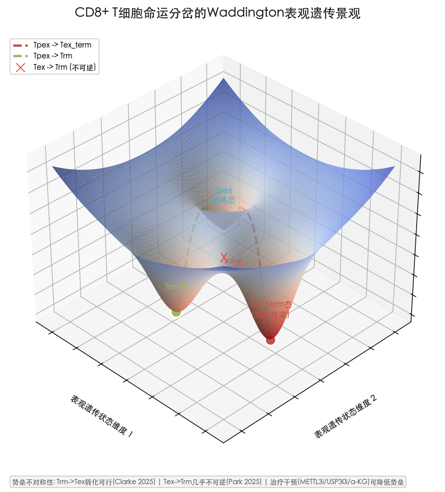

**图6-1 CD8⁺ T细胞命运分岔的Waddington表观遗传景观。** 三维势函数曲面展示Tpex维持态、Tex_term态和Trm态三个吸引子盆地。Tex_term势阱最深，对应其高度不可逆性；Tpex→Tex_term和Tpex→Trm两条命运轨迹以虚线标注；红色叉号标记Tex→Trm方向的不可逆势垒。治疗干预（METTL3抑制剂、USP30抑制剂、外源α-KG补充）有望通过改变景观拓扑降低特定方向的势垒高度。

### 6.2.2 从数据重构景观：最优传输与随机动力系统

将Waddington景观从理论概念转化为可操作的数据驱动工具，关键在于从实验数据中重构势函数。近年来两项方法学进展使这一目标成为可能。

Ramirez Sierra与Theis于2025年发表了一种统一算法，结合最优传输理论（optimal transport）和随机动力系统推断，从时间序列或准时间序列（pseudo-time）的单细胞数据中重构景观。该方法利用最优传输将不同时间点的细胞分布配对为概率质量的流动，反推驱动该流动的漂移场和扩散场，进而通过Fokker-Planck方程求解稳态分布并构建势函数 [Ramirez Sierra & Theis, PNAS 2025](https://www.pnas.org/doi/10.1073/pnas.2521762122 "Reconstructing Waddington's landscape from data")。与此平行，Fard等开发了一种基于变分自编码器（VAE）和最优传输的生成式表观遗传景观方法，利用VAE将高维单细胞ATAC-seq数据嵌入低维潜在空间，在该空间中通过最优传输构建景观势函数。这一方法特别适合处理表观遗传数据，因为染色质可及性在命运分岔中的变化可直接映射为景观拓扑的改变 [Fard et al., bioRxiv 2025（预印本）]。

将上述算法应用于CD8⁺ T细胞耗竭/Trm分岔场景，具有明确的数据基础。Buquicchio等的7器官×4感染模型scATAC-seq数据集（第4章）提供了Trm和Tex的全基因组染色质可及性信息；Park等的TEA-seq三模态数据集可同时提供转录组、蛋白组和表观遗传组的多视图约束。通过在这些数据上运行最优传输景观重构算法，原则上可定量估算Tpex→Tex_term和Tpex→Trm两条命运通道的势垒高度及过渡态特征。

### 6.2.3 双稳态开关与表观遗传记忆的ODE模型

Waddington景观中的吸引子盆地在分子层面对应表观遗传修饰的双稳态（bistability）。两类经典ODE模型为理解这一现象提供了定量框架。

Dodd等在2007年提出了核小体修饰遗传的随机模型，描述相邻核小体上对抗性组蛋白修饰（如激活标记H3K4me3与抑制标记H3K27me3）通过"读-写"正反馈机制维持双稳态的过程。修饰状态为"激活"的核小体可招募写入同种修饰的酶复合物到邻近核小体，由此形成的正反馈回路使修饰区域呈现两种自维持的稳态——全激活或全抑制 [Dodd et al., Cell 2007](https://pubmed.ncbi.nlm.nih.gov/17512414/ "Theoretical analysis of epigenetic cell memory by nucleosome modification")。

Huang与Wang于2021年在此基础上进一步建立了H3K4me3/H3K27me3对抗性组蛋白修饰的ODE模型，证明二价（bivalent）染色质——即同时携带H3K4me3和H3K27me3的区域——可以是一种真正的动力学稳态，而非仅为两种单价态之间的亚稳态过渡。信号强度的变化可触发双稳态开关，使基因座从二价态向激活态或抑制态跃迁。这一模型对T细胞耗竭中的表观遗传"开关"机制具有直接借鉴价值：第4章讨论的TOX基因座在Tpex中可能处于类二价状态，在持续抗原信号下经由TET2介导的去甲基化转向激活态（驱动终末耗竭），而在Trm分化路径中则可能由DNMT3a催化的从头甲基化转向抑制态 [Huang & Wang, iScience 2021](https://www.cell.com/iscience/fulltext/S2589-0042(21)00700-7 "Epigenetic landscape model of histone modification")。

## 6.3 整合性建模框架：代谢-表观遗传-命运耦合模型的概念架构

基于前述方法学综述和前五章建立的分子机制图谱，我们提出一个整合性建模框架的概念架构（图6-2）。该框架采用分层多时间尺度耦合策略，将代谢通量、表观遗传修饰和细胞命运三个调控层面组织为四个时间尺度的嵌套系统。

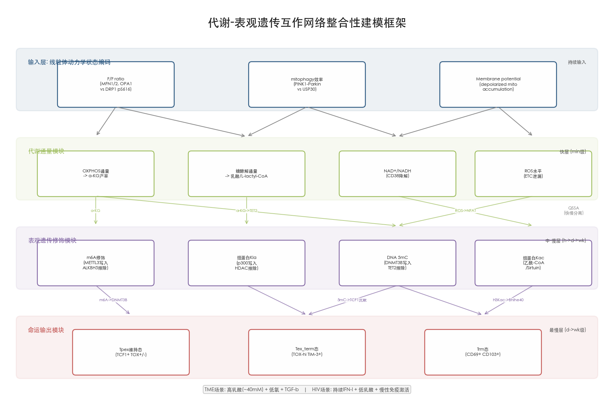

**图6-2 代谢-表观遗传互作网络整合性建模框架。** 该框架包含四个层级模块：输入层（线粒体动力学状态编码）、代谢通量模块（快层，分钟级）、表观遗传修饰模块（中慢层，小时至周级）和命运输出模块（最慢层，天至周级）。各模块间通过核心耦合参数（α-KG、L-lactyl-CoA、NAD⁺→SIRT、ROS→NFAT等）实现信息传递。底部标注TME（高乳酸约40 mM、低氧、TGF-β）与HIV（持续IFN-I、低乳酸、慢性免疫激活）两大场景的关键微环境参数差异。

### 6.3.1 输入层：线粒体动力学状态编码

模型的最上游输入为线粒体融合/裂变平衡的状态参数。基于第2章建立的分子机制，核心输入变量定义如下：

- **融合/裂变比值（F/F ratio）**：由MFN1/MFN2、OPA1（融合驱动因子）和DRP1 pSer616（裂变执行因子）的相对活性决定。DRP1活性受PD-1信号（通过ERK1/2和mTOR抑制Ser616磷酸化）与TCR信号强度的拮抗调控 [Simula et al., Mol Oncol 2022](https://pubmed.ncbi.nlm.nih.gov/34535949/ "PD-1-induced T cell exhaustion is controlled by a Drp1-dependent mechanism")。
- **线粒体自噬效率（η_mito）**：由PINK1-Parkin通路活性与USP30抑制效应的净结果决定。在慢性TCR刺激条件下，NFATc1转录激活USP30使η_mito进行性降低，去极化线粒体逐步累积 [Zhang, Gao et al., Sci Adv 2025](https://pmc.ncbi.nlm.nih.gov/articles/PMC12356266/ "USP30 inhibition augments mitophagy to prevent T cell exhaustion")。
- **线粒体膜电位（ΔΨm）**：去极化线粒体的累积比例可直接映射为表观遗传重编程的驱动力强度，且低ΔΨm亚群与T细胞干性标志物呈正相关 [Yu et al., Nat Immunol 2020](https://pubmed.ncbi.nlm.nih.gov/33020660/ "Disturbed mitochondrial dynamics in CD8+ TILs reinforce T cell exhaustion")。

上述三个变量共同编码了线粒体健康状态向量 **M** = (F/F, η_mito, ΔΨm)，构成整个模型的上游驱动力输入。

### 6.3.2 代谢通量模块：从线粒体状态到代谢中间物

代谢通量模块将线粒体状态向量 **M** 转化为关键代谢中间物的浓度/通量输出。该模块的核心映射关系建立在第2章和第3章确立的因果链条之上。

**（一）OXPHOS通量与α-KG产率。** 线粒体融合偏好（高F/F ratio）维持嵴结构完整性，促进电子传递链（ETC）超复合物高效组装，支撑OXPHOS高通量运行，使TCA循环活跃且α-KG充足 [Buck et al., Cell 2016](https://pubmed.ncbi.nlm.nih.gov/27293185/ "Mitochondrial Dynamics Controls T Cell Fate through Metabolic Programming")。反之，裂变偏好（低F/F ratio）导致嵴碎片化、OXPHOS受损、TCA循环通量降低和α-KG/琥珀酸比值下降。Vardhana等进一步证明OXPHOS受损可直接导致核苷酸合成不足和增殖停止，构成耗竭程序上调的上游代谢驱动力 [Vardhana et al., Nat Immunol 2020](https://pubmed.ncbi.nlm.nih.gov/32661364/ "Impaired mitochondrial oxidative phosphorylation limits the self-renewal of T cells")。

**（二）糖酵解通量与乳酸产率。** OXPHOS受损后代偿性糖酵解上调增加细胞内乳酸产生；TME中MCT11介导的外源乳酸摄入进一步推高细胞内乳酸浓度 [Germain et al., Nat Immunol 2024](https://www.nature.com/articles/s41590-024-01999-3 "Dysfunction of exhausted T cells is enforced by MCT11-mediated lactate metabolism")。乳酸经LDHA/L-乳酰-CoA合成酶转化为L-乳酰-CoA（L-lactyl-CoA），作为p300催化组蛋白乳酸化（Kla）的酰基供体底物。

**（三）NAD⁺/NADH比值与乙酰-CoA池。** OXPHOS受损导致NADH→NAD⁺再氧化效率降低，NAD⁺池收缩；CD38高表达进一步加速NAD⁺的酶促降解 [Vannini et al., Nat Cancer 2025](https://www.nature.com/articles/s43018-025-00982-7 "Age-associated NAD decline drives CAR-T cell failure")。NAD⁺水平直接调控Sirtuin去乙酰化酶家族活性，特别是SIRT1对PGC-1α的去乙酰化激活以及SIRT6对HIF-1α的转录抑制 [Hamaidi & Kim, Exp Mol Med 2022](https://www.nature.com/articles/s12276-022-00739-7 "Sirtuins are crucial regulators of T cell metabolism and functions")。

**（四）ROS水平。** 去极化线粒体通过ETC电子泄漏产生过量活性氧（reactive oxygen species, ROS）。ROS通过抑制磷酸酶活性维持NFAT核定位，促进TOX/NR4A持续转录，从而构成"线粒体损伤→ROS→NFAT→TOX→耗竭"正反馈环路 [Scharping et al., Nat Immunol 2021](https://pubmed.ncbi.nlm.nih.gov/33398183/ "Mitochondrial stress induced by continuous stimulation under hypoxia rapidly drives T cell exhaustion")。

代谢通量模块的实现可采用两种互补策略：对于全局通量分布，可基于CD4⁺ T细胞GSMM框架（Puniya et al. 2021; Losada et al. 2021）扩展构建CD8⁺ T细胞特异性GSMM，以scRNA-seq数据通过Compass算法提供转录组约束进行FBA求解；对于核心调控回路（α-KG/琥珀酸平衡、乳酸产率、NAD⁺动力学），可建立简化的ODE子模型以捕捉关键中间物的时间动力学。

### 6.3.3 表观遗传修饰模块：从代谢物到染色质状态

表观遗传修饰模块将代谢中间物浓度转化为基因座水平的修饰状态，是整个框架中连接代谢输入与命运输出的核心中枢。该模块需刻画三类主要表观遗传修饰的动力学及其耦合关系。

**（一）m6A修饰动力学。** m6A修饰由METTL3-METTL14复合物催化写入、ALKBH5/FTO催化擦除。METTL3-14的催化翻转速率（k_cat）已有体外生化测量数据：Buber等通过酶学RNA甲基化分析和QM/MM模拟确定其k_cat为0.2–0.6 min⁻¹（室温条件），活化能约为22.5 kcal/mol [Buber et al., eLife 2024](https://elifesciences.org/articles/92537 "The catalytic mechanism of the RNA methyltransferase METTL3")。FTO对m6A底物的催化效率k_cat/K_m约为0.3–0.8 min⁻¹·μM⁻¹，ALKBH5的k_cat/K_m约为0.05–0.1 min⁻¹·μM⁻¹ [Zou et al., Sci Rep 2016](https://www.nature.com/articles/srep25677 "N6-Methyladenosine: a conformational marker that regulates the substrate specificity of human demethylases FTO and ALKBH5")。这些体外参数提供了m6A修饰翻转的基本时间尺度估计（秒至分钟级），但需注意T细胞内的有效速率可能因底物可及性、蛋白表达水平和辅因子可用性而显著偏离体外值。在本模型框架中，m6A修饰子模块可以ODE形式描述：

dm6A/dt = k_write × [METTL3] × [SAM] × f(RNA_accessibility) − k_erase × [ALKBH5] × [α-KG] × [m6A]

其中SAM（S-腺苷甲硫氨酸）为甲基供体，α-KG为ALKBH5/FTO所需辅因子，直接连接至代谢通量模块。METTL3在终末耗竭细胞中的选择性富集（第3章）使k_write在Tex_term中增大，驱动m6A全局水平升高并稳定DNMT3B转录本。

**（二）组蛋白乳酸化（Kla）动力学。** Kla的写入由p300/CBP催化，以L-乳酰-CoA（L-lactyl-CoA）为底物。如第3章和第4章所讨论，Kla的时间动力学与乙酰化（Kac）截然不同——Kac在刺激后数小时内达峰，而Kla在16–24小时延迟升高，提示两类修饰的写入机制存在根本差异 [Zhang et al., Nature 2019](https://pmc.ncbi.nlm.nih.gov/articles/PMC6818755/ "Metabolic regulation of gene expression by histone lactylation")。Kla的擦除酶已有初步鉴定（HDAC1-3和SIRT1-3在体外显示去乳酸化活性），但T细胞中Kla写入/擦除的直接酶动力学参数尚无已发表数据，构成当前建模的关键参数缺口之一。在模型中，Kla水平可近似为：

dKla/dt = k_lac_write × [p300] × [L-lactyl-CoA] − k_lac_erase × [HDAC] × [Kla]

其中L-乳酰-CoA浓度直接与代谢通量模块的乳酸输出耦合。第4章的关键实验校正——终末耗竭CD8⁺ T细胞中Kla水平极低（Raychaudhuri et al., Nat Immunol 2024）——在模型中通过"代谢双重衰竭"机制自然涌现：当OXPHOS和糖酵解均崩溃时，乳酸产生能力本身下降，L-乳酰-CoA底物枯竭导致Kla写入速率趋近于零。

**（三）DNA甲基化动力学。** DNA 5mC水平由DNMT3a/DNMT3B催化的从头甲基化与TET2催化的氧化去甲基化（5mC→5hmC→5fC→5caC→C）共同调控。TET2酶活性直接依赖α-KG浓度（K_m约为50–80 μM），且受琥珀酸和L-2-HG的竞争性抑制。因此，α-KG/琥珀酸比值可在模型中作为代谢通量模块向表观遗传模块传递信息的核心耦合参数：

d5mC/dt = k_DNMT × [DNMT3B] × (1 − 5mC) − k_TET × [TET2] × f(α-KG, succinate) × 5mC

其中f(α-KG, succinate) = [α-KG] / ([α-KG] + K_m × (1 + [succinate]/K_i))为Michaelis-Menten竞争性抑制动力学函数。第4章已建立TET2驱动终末耗竭分化（Giles et al., Sci Adv 2024）以及METTL3→DNMT3B链条将m6A与DNA甲基化线性连接（Ghosh et al., bioRxiv 2026）的证据。

三类修饰之间存在关键的交叉耦合关系：m6A→DNMT3B mRNA稳定→5mC增加（促耗竭方向）；α-KG→TET2→5hmC增加→终末分化增强子开放（促耗竭方向）；乳酸→Kla→效应基因激活（在耗竭早期阶段促效应功能，在终末阶段因底物枯竭而消退）。这些耦合关系使三类修饰的动力学并非独立演化，而是通过共享的代谢中间物网络形成一个相互依赖的自洽调控系统。

### 6.3.4 命运输出模块：吸引子盆地与命运概率

命运输出模块将表观遗传状态空间映射为离散的细胞命运概率。基于第4章建立的Trm与Tex_term表观遗传差异图谱，三个核心命运吸引子及其"地标"表观遗传特征可定义如下：

- **Tpex维持态**：TCF1基因座开放（5mC低/H3K4me3高）、TOX基因座中度开放（二价状态）、OXPHOS通量维持正常、α-KG供给充足。
- **Tex_term态**：TCF1基因座沉默（5mC高/H3K27me3富集）、TOX基因座完全开放（H3K4me3主导，含54个特异性OCRs）、NR4A/NFAT motif区域广泛开放、糖酵解和OXPHOS双崩溃。
- **Trm态**：CD69/Nr4a1增强子开放、Klf2/S1pr1基因座关闭、Bhlhe40→TCA→乙酰-CoA→H3K9ac/H3K27ac正反馈维持效应基因活跃转录、REL/NFκB motif富集。

命运概率的计算可采用两种互补策略：其一，基于Waddington景观的稳态概率分布——从ODE/SDE系统求解Fokker-Planck方程获得P_ss，由此得U = −ln(P_ss)，各吸引子盆地内的概率质量即对应命运概率；其二，基于马尔可夫转移矩阵——参照CellRank的算法思路，从代谢-表观遗传状态空间构建转移概率矩阵，通过吸收概率（absorption probability）计算细胞到达各吸引子的概率。

### 6.3.5 多时间尺度耦合策略

前述四个模块涉及截然不同的特征时间尺度，直接联立求解将导致严重的数值刚性问题。为此需要采用时间尺度分离技术进行有效耦合。基于各过程的已知或推算动力学参数，我们提出以下四层时间尺度分层架构：

- **快层（分钟级）**：代谢通量平衡（酶促反应达到拟稳态）、m6A写入/擦除（k_cat约0.2–0.6 min⁻¹）、信号转导事件（TCR→NFAT、PD-1→ERK抑制）。
- **中层（小时级）**：组蛋白修饰翻转（Kla达峰需16–24 h，Kac达峰需数小时）、mRNA稳态水平变化（DNMT3B等m6A靶基因的半衰期调控）。
- **慢层（天级）**：DNA甲基化/去甲基化（CpG岛从头甲基化需经历多轮细胞分裂）、染色质可及性重塑（ATAC-seq景观变化的实验观测时间窗为数天）。
- **最慢层（天至周级）**：转录因子网络的正反馈稳定化（TOX前馈环路的完全建立）、命运承诺与不可逆锁定（Angelosanto et al. 2012确认不可逆转化在慢性刺激第2–3周完成）。

准稳态近似（quasi-steady-state approximation, QSSA）可用于处理快层与中层之间的耦合：快层变量在每个中层时间步内被视为即时达到稳态，其稳态值由当前中层状态参数化决定。类似地，奇异摄动理论（singular perturbation theory）可用于描述中层与慢层的耦合：中层变量沿由慢层参数化的慢流形（slow manifold）演化，慢层变量则以最慢速率推动慢流形本身的漂移。这一分层策略的数学严格性已在经典化学动力学中得到充分验证，可直接移植至本框架。

## 6.4 参数估计：可用数据源与关键缺口

上述建模框架从概念架构走向可执行模型，核心瓶颈在于参数估计。图6-3以结构化汇总表形式呈现了22个核心建模参数的当前可用性状态。

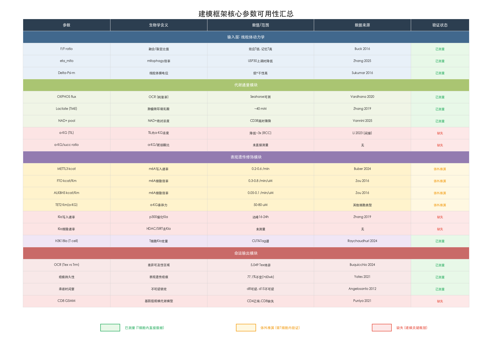

**图6-3 建模框架核心参数可用性汇总。** 表格按四大模块（输入层/代谢通量/表观遗传修饰/命运输出）汇总22个核心参数的名称、生物学含义、数值范围、数据来源和验证状态。绿色标注"已测量"（T细胞内直接数据可用）、橙色标注"体外推算"（需T细胞内验证）、红色标注"缺失"（构成建模关键瓶颈），便于识别参数成熟度与优先实验方向。

### 6.4.1 已有定量参数的数据基础

建模框架的参数估计可从以下已发表数据集中获取约束条件。

**代谢物浓度与通量。** Vardhana等（Nat Immunol 2020）测量了OXPHOS受损后CD8⁺ T细胞中核苷酸池和增殖标记的定量变化，提供了代谢崩溃与增殖停止之间的定量关联。Angin等（Nat Metab 2019）测量了HIV自发控制者CD8⁺ T细胞的线粒体备用呼吸能力（spare respiratory capacity, SRC），提供了功能性CD8⁺ T细胞与耗竭T细胞之间代谢通量差异的直接定量对照。TME乳酸浓度约40 mM [Zhang et al., Nature 2019](https://pmc.ncbi.nlm.nih.gov/articles/PMC6818755/ "Metabolic regulation of gene expression by histone lactylation")，正常血液乳酸约1.5–3 mM，两者可分别作为TME和HIV场景乳酸输入参数的上、下界。

**表观遗传修饰定量。** Raychaudhuri等（Nat Immunol 2024）通过CUT&Tag技术提供了CD8⁺ T细胞各亚群（幼稚、效应、记忆、前体耗竭、终末耗竭）的H3K18la和H3K9la全基因组定量图谱，是当前最直接的T细胞Kla参数估计来源。Abdel-Hakeem等（Nat Immunol 2021）提供了耗竭表观遗传疤痕的全基因组开放染色质区域（OCR）定量数据，可作为DNA甲基化/去甲基化动力学的终点约束。Buquicchio等（Immunity 2024）报道的254个Trm-Tex共享OCR与5,049个Tex_term特异性OCR的定量数据可直接用于约束命运输出模块的吸引子特征。

**线粒体参数。** Buck等（Cell 2016）提供了效应与记忆T细胞线粒体形态学定量数据（融合/裂变比值、嵴密度、SRC）。Sukumar等（Cell Metab 2016）建立了ΔΨm与T细胞干性及抗肿瘤活性的定量对应关系。

**酶动力学参数。** METTL3-14的k_cat = 0.2–0.6 min⁻¹ [Buber et al., eLife 2024](https://elifesciences.org/articles/92537 "The catalytic mechanism of the RNA methyltransferase METTL3")；FTO的k_cat/K_m = 0.3–0.8 min⁻¹·μM⁻¹，ALKBH5的k_cat/K_m = 0.05–0.1 min⁻¹·μM⁻¹ [Zou et al., Sci Rep 2016](https://www.nature.com/articles/srep25677 "N6-Methyladenosine: a conformational marker")；TET2的K_m(α-KG)在其他细胞类型中约为50–80 μM。上述体外参数为模型提供了基准时间尺度估计，但均需标注为推算值（体外→细胞内推算），其在T细胞中的有效值尚无实验实测数据。

### 6.4.2 关键参数缺口

尽管上述数据源提供了模型参数化的基本框架，以下关键缺口仍然存在，构成限制建模精度的主要瓶颈。

**CD8⁺ T细胞特异性GSMM的缺失。** 现有GSMM仅覆盖CD4⁺ T细胞亚群（Puniya et al. 2021; Losada et al. 2021），CD8⁺ T细胞——特别是耗竭亚群——的代谢网络尚未完成基因组规模重构。这意味着代谢通量模块中的全局通量分布只能通过Compass等转录组约束FBA方法间接推断，而无法从CD8⁺特异性模型直接求解。构建涵盖Tpex、过渡态Tex和Tex_term代谢特征的CD8⁺ GSMM，是提升代谢通量模块精度的首要任务。

**m6A修饰动力学的T细胞内有效参数。** 上述酶动力学参数均来自体外纯化蛋白实验。T细胞内的有效写入/擦除速率可能因RNA结合蛋白竞争、亚细胞定位和翻译后修饰等因素而偏离体外值数倍。特别是m6A修饰在单个mRNA分子上的位点特异性写入速率，以及YTHDF2介导的降解速率，在T细胞中均缺乏定量测量。在当前建模阶段，这些参数应被标记为推算值并进行系统的灵敏度分析。

**Kla写入/擦除速率的直接测量。** p300催化组蛋白乳酸化的酶动力学参数在任何细胞类型中均未有系统性体外测量。Zhang等（Nature 2019）报道的Kla 16–24小时延迟达峰动力学提供了表观速率的粗略约束，但尚未分解为写入和擦除两个方向的独立速率常数。

**CD8⁺ TIL中α-KG的直接绝对浓度。** 尽管α-KG在TCA循环代谢和TET2酶活性调控中的枢纽角色已被广泛认可，且TME中肿瘤组织α-KG浓度降低约3倍已有肾细胞癌（RCC）临床数据支持（Li et al., Adv Sci 2023），但CD8⁺ TIL细胞内部的α-KG绝对浓度和α-KG/琥珀酸比值迄今无直接代谢组学测量报道。

**TME与HIV场景间参数迁移策略。** 第5章系统比较了两大疾病场景中线粒体表型和微环境特征的差异（TME：去极化线粒体累积；HIV：高极化线粒体质量增加；TME：高乳酸约40 mM；HIV：IFN-I主导的OXPHOS抑制）。将在TME场景中参数化的模型迁移至HIV场景，需系统性地重新标定微环境输入参数，但两场景间参数对应关系的系统性定量对比数据目前尚不完备。

### 6.4.3 参数估计的实用策略

面对上述缺口，以下三种实用策略可在当前数据条件下推进建模工作。

**灵敏度分析引导实验优先级。** 对模型所有不确定参数进行全局灵敏度分析（如Sobol指数计算），识别对命运概率输出影响最大的参数子集，据此优先分配实验资源。基于现有网络拓扑的初步分析，我们预判α-KG/琥珀酸比值和METTL3蛋白丰度将是高灵敏度参数——前者处于"代谢→TET2→DNA去甲基化"链条的枢纽位置，后者则控制着"代谢→m6A→DNMT3B→DNA甲基化"链条的入口。

**贝叶斯参数推断。** 利用贝叶斯推断框架（如近似贝叶斯计算，Approximate Bayesian Computation, ABC），以已有的多组学数据（ATAC-seq、CUT&Tag、scRNA-seq）作为后验约束，从先验分布中抽样估计未直接测量的参数。该方法特别适合处理参数不确定性较大的情形，其输出为参数的后验概率分布而非点估计，可直接用于量化模型预测的置信区间。

**跨细胞类型参数借用与校正。** 对于T细胞中缺乏直接测量的酶动力学参数（如p300催化Kla的速率常数），可从已有数据的细胞类型（巨噬细胞、胚胎干细胞等）借用基准值，再通过T细胞特异性的基因表达水平校正因子进行调整。这一策略虽引入额外不确定性，但可在缺乏一手测量的阶段为模型提供合理的初始参数空间。

## 6.5 模型验证方案与关键挑战

### 6.5.1 模型验证的多层策略

整合性模型的验证应采用分层策略，在子模块和系统两个层面分别进行独立验证与联合验证。

**子模块验证。** 代谢通量模块可通过Seahorse细胞能量表型分析仪测量的OCR（氧消耗率，代表OXPHOS通量）和ECAR（胞外酸化率，代表糖酵解通量）数据进行校验——将模型预测的通量值与实验测量值进行定量比对。表观遗传修饰模块可通过时间序列CUT&Tag或MeRIP-seq实验跟踪特定基因座修饰状态的动态变化进行验证。命运输出模块可通过CellRank从实验scRNA-seq数据推断的命运概率进行交叉验证。

**系统层面验证。** 最严格的系统验证策略是"扰动预测-实验验证"闭环。模型首先预测特定干预（如METTL3抑制剂STM2457处理、USP30抑制剂ST-539处理、或外源α-KG补充）下的命运概率变化，然后在体外或体内实验中检验这些预测。Ildefonso与Finley的布尔模型已初步展示了这一策略的可行性——其PD-1阻断模拟预测86%转向记忆终态的结果，与PD-1阻断产生部分但非完全疗效的临床观察定性吻合。

**跨场景迁移验证。** 将在TME场景中训练的模型（调整微环境参数后）应用于HIV场景，验证其能否再现HIV特异性CD8⁺ T细胞的独特表型（如高极化线粒体质量增加、IFN-I驱动的OXPHOS抑制）。跨场景迁移的成功将有力验证模型核心架构的普适性，即"线粒体状态→代谢通量→表观遗传修饰→命运"的因果链条在不同疾病背景下保持结构不变。

### 6.5.2 关键挑战

**表观遗传修饰的时间尺度异质性。** 如6.3.5节所述，m6A翻转（分钟级）、组蛋白修饰（小时级）和DNA甲基化（天至周级）跨越四个数量级的时间尺度。刚性ODE求解器（如LSODA）可处理这种多时间尺度系统的数值积分，但模型的参数空间探索和全局灵敏度分析（需大量重复求解）将面临巨大的计算开销。自适应时间步长方法和模型降阶技术（model order reduction）是缓解这一困难的可能途径。

**单细胞异质性的处理。** 同一微环境条件下，克隆内细胞仍可做出截然不同的命运选择（Daniel et al., Nat Commun 2025），表明命运决定具有内在随机性。确定性ODE模型无法捕捉这种异质性。可行的策略包括三种路径：其一，在ODE系统中引入Langevin噪声项构建SDE模型，通过Monte Carlo模拟生成命运概率分布；其二，采用ABM框架，每个Agent携带独立的分子层ODE系统并受到独立噪声扰动；其三，利用Fokker-Planck方程直接描述细胞群体在状态空间中的概率密度演化。Wertheim等的多尺度平台已验证了第二种策略的技术可行性。

**TME与HIV两场景间的参数迁移性。** 第5章的比较分析揭示了两大场景在线粒体表型、微环境代谢拓扑和免疫抑制信号层级上的系统性差异。模型核心架构（线粒体状态→代谢通量→表观遗传修饰→命运）在两场景间应保持结构不变（反映保守的耗竭核心程序），但微环境输入参数需场景特异性标定。具体而言，Kla子模块在HIV场景中可能需要降权或替换为以DNA甲基化和组蛋白乙酰化为主的调控通路（因淋巴组织乳酸浓度远低于TME）；IFN-I对OXPHOS的抑制效应需要在HIV场景中引入为新的输入变量。

**完整耦合模型的缺失现状。** 截至本报告撰写时（2026年4月），将线粒体动力学、代谢通量、多种表观遗传修饰（m6A + Kla + DNA甲基化）和细胞命运完整耦合的整合T细胞模型在已发表文献中尚不存在。本章提出的框架旨在填补这一空白，但其从概念架构到可执行代码的实现需要跨学科协作——计算生物学家提供数学方法与算法实现、免疫学家提供参数化实验数据、系统生物学家提供多尺度整合的工程经验。

本章系统阐述了T细胞耗竭与分化领域的主要计算建模方法学体系，并在此基础上提出了以"线粒体动力学→代谢通量→表观遗传修饰→细胞命运"为核心链条的整合性建模框架概念架构。该框架通过四层时间尺度分离策略实现跨尺度耦合，通过α-KG/琥珀酸比值、L-乳酰-CoA浓度和NAD⁺水平等代谢中间物实现代谢-表观遗传的定量联结。尽管关键参数缺口（特别是CD8⁺ T细胞特异性GSMM和多种表观遗传修饰的T细胞内酶动力学数据）有赖于针对性实验数据的产出，灵敏度分析引导的实验优先级策略和贝叶斯参数推断方法为渐进式推进建模工作提供了可行路径。第7章将在此定量框架的基础上，讨论如何利用模型预测指导治疗策略设计——从最优干预时间窗口预测到药物组合优化，展示建模框架服务于转化医学目标的应用前景。

# 第7章 治疗策略与转化前景——从机制到干预

前六章系统阐述了慢性抗原刺激下CD8⁺ T细胞线粒体动力学通过代谢-表观遗传互作网络驱动终末耗竭与Trm命运分岔的多层级机制，并提出了定量建模框架的概念架构。机制洞见的最终价值在于其转化潜力——能否据此设计精准干预策略，在临床前和临床场景中逆转或重定向CD8⁺ T细胞命运，增强抗肿瘤免疫或改善HIV免疫控制。本章从三个维度评估治疗策略：靶向线粒体动力学的干预、靶向表观遗传通路的干预，以及基于定量模型指导的精准联合治疗设计。图7-1以汇总表形式总览本章讨论的八类核心干预策略及其机制层级、代表性化合物与临床进展。

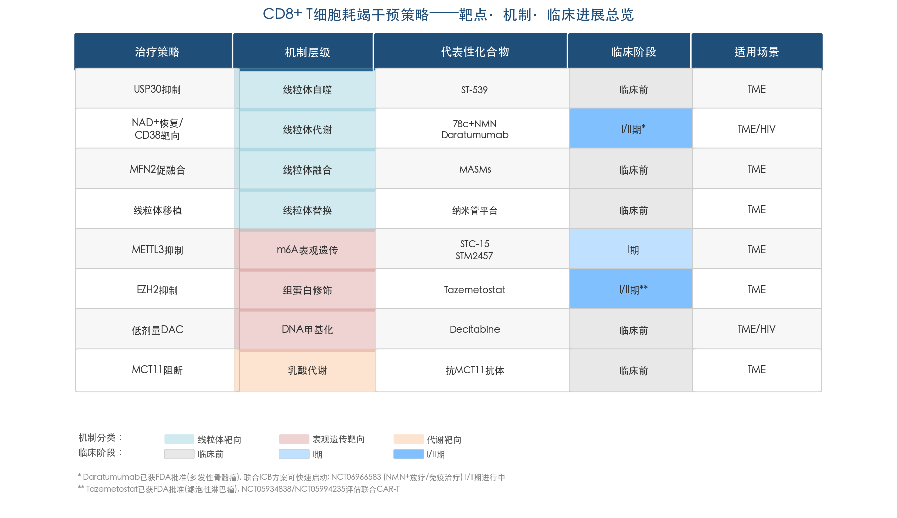

**图7-1 CD8⁺ T细胞耗竭干预策略总览。** 八类治疗策略按机制层级（线粒体靶向、表观遗传靶向、代谢靶向）分类汇总，列出代表性化合物、临床阶段与适用场景。已获FDA批准药物（daratumumab、tazemetostat）可提供快速临床转化路径。

## 7.1 靶向线粒体动力学的治疗策略

### 7.1.1 线粒体自噬恢复：USP30抑制剂

第2章建立的"慢性抗原刺激→TCR/NFATc1→USP30↑→线粒体自噬↓→去极化线粒体累积→耗竭"调控轴，将USP30定位为该级联反应的关键可干预节点。Zhang与Gao等于2025年报道了首个靶向该轴的概念验证性小分子药物ST-539：该化合物通过恢复Parkin介导的泛素化信号重新激活线粒体自噬活性，使CD8⁺ T细胞得以清除累积的去极化线粒体并逆转耗竭表型；在小鼠肿瘤模型中，ST-539口服给药显著抑制肿瘤生长 [Zhang, Gao et al., Sci Adv 2025](https://pmc.ncbi.nlm.nih.gov/articles/PMC12356266/ "USP30 inhibition augments mitophagy to prevent T cell exhaustion")。

USP30靶向策略的机制逻辑具有高度特异性——USP30在耗竭T细胞中选择性上调，使其有望成为区分耗竭细胞与功能正常T细胞的治疗窗口。然而，USP30在非免疫组织（心脏、肝脏、神经系统）中同样参与线粒体质量控制，系统性抑制可能产生脱靶效应。后续转化研究需关注T细胞条件性递送策略（如抗CD8纳米抗体偶联USP30抑制剂），以提高治疗指数。

### 7.1.2 NAD⁺代谢恢复与CD38靶向

NAD⁺作为线粒体电子传递链和Sirtuin去乙酰化酶家族的核心辅因子，其在耗竭T细胞中的进行性耗竭构成代谢崩溃的关键节点。第3章讨论的SIRT1通过去乙酰化PGC-1α促进线粒体生物发生、SIRT6通过抑制HIF-1α调控糖酵解等功能，均依赖充足的NAD⁺池。

Holgado等于2024年揭示了CD38作为NAD⁺降解关键驱动力与免疫检查点阻断（immune checkpoint blockade, ICB）耐药之间的因果关系：在多癌种队列中，CD38高表达与ICB耐药强相关（AUC = 0.87）；CRISPR敲除CD38或使用小分子抑制剂78c可恢复NAD⁺水平和线粒体功能。在3D肿瘤类器官模型中，双重PD-1/CD38阻断的应答率达56.7%，显著优于单药PD-1阻断的3.3%，且52%的应答者来自ICB耐药肿瘤。Daratumumab作为已获美国食品药品监督管理局（FDA）批准的抗CD38单抗（多发性骨髓瘤适应证），为该策略提供了快速临床转化路径 [Holgado et al., Nat Immunol 2024](https://pmc.ncbi.nlm.nih.gov/articles/PMC10888727/ "Disrupting CD38-driven T cell dysfunction restores sensitivity to cancer immunotherapy")。

Vannini等于2025年进一步阐明了NAD⁺补充策略的设计逻辑：单独补充NAD⁺前体烟酰胺单核苷酸（nicotinamide mononucleotide, NMN）或烟酰胺核糖（nicotinamide riboside, NR）在CD38高表达的衰老T细胞中无效，原因在于外源NMN/NR同样被CD38降解。仅当联合CD38抑制剂78c与NMN时，才能将NAD⁺水平恢复至年轻水平、修复线粒体备用呼吸能力（spare respiratory capacity, SRC）并恢复TCF1⁺中央记忆T细胞比例。在老年来源的CAR-T细胞中，该联合方案使抗肿瘤活性恢复至年轻水平 [Vannini et al., Nat Cancer 2025](https://www.nature.com/articles/s43018-025-00982-7 "Age-associated NAD decline drives CAR-T cell failure")。

NCT06966583为首项评估NMN联合放疗和免疫治疗的I/II期临床试验（计划入组20例实体瘤患者），标志着NAD⁺补充策略正式进入免疫肿瘤学临床测试阶段 [ClinicalTrials.gov NCT06966583](https://clinicaltrials.gov/study/NCT06966583 "NAD+ Supplement NMN With Radiotherapy and Immunotherapy")。该试验将为NAD⁺恢复策略的安全性和初步疗效提供首批人体数据。

### 7.1.3 促融合策略：MFN2增强与小分子线粒体融合激动剂

第2章确立的"线粒体融合→嵴结构完整→OXPHOS高效→记忆/Trm分化偏好"范式，为促融合治疗策略提供了理论基础。Yang等于2023年在Science Immunology直接证明了MFN2在CD8⁺ TIL中的治疗潜力：MFN2通过与内质网（endoplasmic reticulum, ER）嵌膜蛋白SERCA2互作增强线粒体-ER接触位点（MERCs），促进线粒体Ca²⁺内流以维持高效OXPHOS代谢；MFN2表达与多种癌症的良好预后正相关，T细胞特异性Mfn2条件性敲除加速肿瘤进展。在CD8⁺ T细胞中提升MFN2表达可改善免疫检查点阻断的疗效 [Yang et al., Sci Immunol 2023](https://www.science.org/doi/10.1126/sciimmunol.abq2424 "Mitochondria-ER contact mediated by MFN2-SERCA2 interaction supports CD8+ T cell metabolic fitness and function in tumors")。

直接靶向MFN2的小分子激动剂开发尚处于早期阶段。Rocha等于2018年在Science报道了首批线粒体融合激动剂（mitofusin-activating small molecules, MASMs），这些化合物通过干扰MFN2蛋白HR1-HR2结构域的自抑制互作促进MFN2向促融合构象转变，且需要内源性MFN1或MFN2方可发挥作用。在Charcot-Marie-Tooth 2A型（CMT2A）神经病变小鼠模型中，MASMs逆转了线粒体碎片化缺陷 [Rocha et al., Science 2018](https://pmc.ncbi.nlm.nih.gov/articles/PMC6109362/ "MFN2 agonists reverse mitochondrial defects in preclinical models of Charcot-Marie-Tooth disease type 2A")。Franco等进一步开发了药代动力学改良的后续化合物，并在eLife报道了"脉冲式"线粒体融合激活策略在CMT2A模型中的疗效 [Franco et al., eLife 2020](https://elifesciences.org/articles/61119 "Burst mitofusin activation reverses neuromuscular dysfunction in murine CMT2A")。尽管MASMs目前仅在神经退行性疾病模型中得到验证，其核心作用机制——促进MFN2依赖的线粒体外膜融合——在CD8⁺ T细胞中同样适用。结合Yang等证明的MFN2在TIL中的关键角色，我们认为将MASMs或其优化衍生物应用于T细胞免疫治疗是一个值得深入探索的转化方向。

间接促融合策略同样具有可行性。4-1BB（CD137）共刺激信号可诱导T细胞线粒体融合和生物发生，鉴于多个4-1BB激动性抗体已在临床试验中评估（如utomilumab、urelumab），这一路径距离临床应用更为接近。此外，强制表达PGC-1α可重启线粒体生物发生程序，Scharping等在TME模型中验证了PGC-1α增强T细胞抗肿瘤效能的可行性 [Scharping et al., Immunity 2016](https://pubmed.ncbi.nlm.nih.gov/27496732/ "TME Represses T Cell Mitochondrial Biogenesis")。

### 7.1.4 线粒体移植与纳米管转移平台

Baldwin等于2024年在Cell发表的研究开辟了T细胞线粒体移植的全新范式：骨髓基质细胞经纳米管向T细胞转移健康线粒体，接受线粒体的Mito⁺ CD8⁺ T细胞呼吸能力显著增强、耗竭标记降低，该效应在人CD19-CAR T细胞白血病模型中同样得到验证 [Baldwin et al., Cell 2024](https://pubmed.ncbi.nlm.nih.gov/39276774/ "Intercellular nanotube-mediated mitochondrial transfer enhances T cell metabolic fitness")。

该策略具有独特的机制优势——绕过耗竭T细胞内源性线粒体损伤的修复瓶颈，直接注入功能完好的线粒体以恢复OXPHOS能力。然而，线粒体移植技术的规模化制备和质量控制仍面临挑战：纳米管介导的线粒体转移依赖供体-受体细胞间的直接物理接触，限制了体内递送的可行性。替代方案包括MITO-Porter脂质纳米载体等纳米递送平台，该系统可将线粒体或线粒体组分封装于脂质体中实现无接触递送，但其在T细胞中的应用效率和安全性目前缺乏充分数据支撑。

Ikeda等于2025年报道的肿瘤细胞"投毒式"线粒体转移揭示了同一生物学过程的反面——肿瘤细胞可向TIL转移携带mtDNA突变的功能障碍线粒体，并共转移线粒体自噬抑制分子以阻止清除 [Ikeda et al., Nature 2025](https://www.nature.com/articles/s41586-024-08439-0 "Immune evasion through mitochondrial transfer in the tumour microenvironment")。因此，治疗性线粒体移植策略需同时兼顾阻断肿瘤源性毒性线粒体转移和增强外源性健康线粒体供给两个目标。

### 7.1.5 线粒体靶向抗氧化剂：疗效证据与剂量复杂性

第2章建立的"去极化线粒体→ROS过产生→磷酸酶抑制→NFAT核定位→TOX/NR4A转录→耗竭"因果链，为靶向线粒体活性氧（mROS）的治疗策略提供了理论依据。N-乙酰半胱氨酸（N-acetylcysteine, NAC）在Scharping等的研究中可显著恢复耗竭T细胞功能 [Scharping et al., Nat Immunol 2021](https://pubmed.ncbi.nlm.nih.gov/33398183/ "Mitochondrial stress induced by continuous stimulation under hypoxia rapidly drives T cell exhaustion")。线粒体靶向抗氧化剂MitoQ和MitoTEMPO在HBV慢性感染模型中可恢复耗竭CD8⁺ T细胞的扩增和细胞因子分泌能力 [Fisicaro et al., Nat Med 2017](https://pubmed.ncbi.nlm.nih.gov/28165481/ "Targeting mitochondrial dysfunction can restore antiviral activity of exhausted HBV-specific CD8 T cells in chronic hepatitis B")。

然而，氧化还原调控的复杂性不容忽视。Chen等的综述指出，在BRAF突变黑色素瘤模型中，MitoQ和MitoTEMPO未能抑制肿瘤生长 [Chen et al., Mol Cancer 2024](https://pmc.ncbi.nlm.nih.gov/articles/PMC11575104/ "Targeting mitochondria: restoring antitumor efficacy of exhausted T cells")。这一差异可能源于ROS在T细胞功能中的双重角色：适度的mROS对TCR信号传导和效应功能不可或缺，过量mROS方驱动耗竭。因此，抗氧化剂治疗需要精确的剂量窗口——将mROS降至耗竭阈值以下，同时维持效应功能所需的最低水平。第6章提出的定量建模框架可为确定这一最优窗口提供理论指导。

## 7.2 靶向表观遗传通路的干预策略

### 7.2.1 METTL3抑制：从分子机制到首个临床试验

第3章建立的"METTL3→m6A→DNMT3B mRNA稳定→CpG甲基化→记忆基因座沉默→终末耗竭"机制链，使METTL3成为高优先级治疗靶点。该通路的治疗逻辑在于：抑制METTL3可同时解除m6A介导的耗竭转录本稳定化和DNMT3B依赖的记忆基因座沉默，将染色质可及性重编程至记忆样状态。

STORM Therapeutics开发的STC-15为首个进入临床的METTL3抑制剂（first-in-class）。I期试验（NCT05584111）已入组42例晚期实体瘤患者，在60–200 mg三种剂量水平均观察到肿瘤消退，其中3例达到部分缓解（partial response, PR）；转化研究显示肿瘤微环境中M1型巨噬细胞富集和干扰素信号通路激活。截至2024年SITC会议报告时，STC-15未达到最大耐受剂量（maximum tolerated dose, MTD），计划推进II期试验 [STORM SITC 2024](https://www.stormtherapeutics.com/news/press-releases/storm-therapeutics-presents-new-clinical-data-on-its-first-in-class-mettl3-inhibitor-stc-15-at-sitc-2024/ "Phase 1 STC-15, SITC 2024")。

另一工具化合物STM2457的临床前研究为METTL3抑制与ICB联合提供了直接依据。Wu等于2024年报道STM2457增强anti-PD-1疗效，该效应完全依赖完整免疫系统；单细胞RNA测序显示联合治疗组CD8⁺ T细胞耗竭标记降低、活化基因上调 [Wu et al., Clin Transl Med 2024](https://pmc.ncbi.nlm.nih.gov/articles/PMC11578931/ "Targeting METTL3 as a checkpoint to enhance T cells for tumour immunotherapy")。Fang等于2025年在胃癌模型中进一步证实STM2457与PD-1单抗的协同效应——METTL3通过m6A/YTHDF2介导PD-L1 mRNA降解，抑制METTL3可恢复PD-L1表达从而增强T细胞浸润 [Fang et al., Cancer Immunol Res 2025](https://aacrjournals.org/cancerimmunolres/article/13/7/1037/763134/METTL3-Inhibition-Restores-PD-L1-Expression "METTL3 Inhibition Restores PD-L1 Expression in Gastric Cancer")。

需要审慎对待的是METTL3抑制的剂量依赖性复杂性。第3章已指出，METTL3完全基因敲除（KO）与药理学部分抑制（STM2457）在T细胞中可能产生不同乃至相反的效应：完全丧失m6A修饰可能破坏T细胞正常的mRNA代谢和翻译调控，而部分抑制则可在不损害基础功能的前提下选择性降低耗竭相关转录本的过度修饰。这一区分对临床给药策略至关重要——STC-15的剂量-疗效关系需在免疫功能终点（而非仅肿瘤退缩）上进行精细滴定。

### 7.2.2 EZH2抑制增强CAR-T细胞免疫治疗

EZH2（enhancer of zeste homolog 2）作为PRC2复合物的催化亚基催化H3K27me3修饰，在耗竭程序中参与记忆基因座的表观遗传沉默。Beguelin等于2024年在Cancer Cell确立了EZH2抑制增强CAR-T疗效的多层机制：tazemetostat（FDA已批准用于滤泡性淋巴瘤的EZH2抑制剂）处理使淋巴瘤细胞恢复免疫原性，同时促进CAR-T细胞向记忆表型分化并减少耗竭标记；体内实验中，tazemetostat联合CAR-T实现100%生存率。双光子成像进一步证实tazemetostat增加CAR-T向肿瘤部位的募集和与靶细胞的接触时间。基于上述临床前数据，两项临床试验已启动（NCT05934838和NCT05994235），评估tazemetostat与CAR-T联合治疗的安全性和疗效 [Beguelin et al., Cancer Cell 2024](https://www.cell.com/cancer-cell/fulltext/S1535-6108(24)00441-0 "EZH2 inhibition enhances T cell immunotherapies")。

EZH2抑制的独特优势在于其"双击"效应——既作用于肿瘤细胞（恢复免疫原性），又作用于T细胞（促进记忆分化），且tazemetostat作为已获批药物具有充分的安全性数据支持快速转化。从第6章建模框架的视角，EZH2抑制可被建模为对H3K27me3在记忆基因座擦除速率k_erase的增加，使Tpex维持态吸引子的势阱深度增大、向Tex_term转化的势垒升高。

### 7.2.3 低剂量地西他滨逆转表观遗传疤痕

第4章讨论的表观遗传疤痕持久性——Abdel-Hakeem等证明即使抗原清除超过520天，恢复中的Tex仍保持耗竭样ATAC-seq模式——构成免疫治疗持久疗效的核心障碍。低剂量DNA甲基转移酶抑制剂（DNMTi）地西他滨（decitabine, DAC）提供了直接擦除这些疤痕的策略。

Li等于2021年在Nature Communications报道，低剂量DAC体外预处理CAR-T细胞（dCAR-T）可赋予其显著增强的抗肿瘤潜能：dCAR-T以低剂量即可根除大体积肿瘤并建立持久记忆应答；全基因组DNA甲基化分析显示，DAC诱导广泛的去甲基化重编程，上调记忆和增殖相关基因程序，同时抑制耗竭相关甲基化程序 [Li et al., Nat Commun 2021](https://www.nature.com/articles/s41467-020-20696-x "Low-dose decitabine priming endows CAR T cells with enhanced antitumour potential")。

该策略的关键设计特征在于"预处理"模式——DAC在CAR-T制造阶段体外施用而非系统性给药，既可充分重编程T细胞表观遗传状态，又避免系统性DNMTi对正常造血和免疫系统的毒性。这一设计理念可推广至其他表观遗传药物：将表观遗传重编程整合到T细胞产品的制造工艺流程中，作为"增强型"细胞治疗平台的标准化环节。

### 7.2.4 靶向乳酸-Kla通路：MCT11阻断与LDH抑制

第3章和第4章建立的乳酸-组蛋白乳酸化（Kla）调控轴为靶向乳酸代谢的干预策略提供了机制基础，但同时揭示了该轴的非线性复杂性。Raychaudhuri等的关键发现——终末耗竭CD8⁺ T细胞中H3K18la和H3K9la富集极低——表明Kla在耗竭程序中的角色具有阶段特异性：可能仅在早期耗竭阶段参与增强子激活，终末阶段因"代谢双重衰竭"（OXPHOS和糖酵解均崩溃）而Kla本身下降。

Germain等于2024年在Nature Immunology揭示了乳酸摄取在耗竭维持中的直接因果关系：耗竭T细胞选择性上调单羧酸转运体MCT11（SLC16A11），条件性敲除MCT11可减少乳酸摄取并改善效应功能；抗MCT11抗体在小鼠模型中减少肿瘤负荷 [Germain et al., Nat Immunol 2024](https://www.nature.com/articles/s41590-024-01999-3 "Dysfunction of exhausted T cells is enforced by MCT11-mediated lactate metabolism")。MCT11作为耗竭T细胞特异性上调的表面分子，具有作为治疗性抗体靶点的天然优势——其表达的细胞特异性有效限制了脱靶效应。

Sang等于2025年在小细胞肺癌（SCLC）模型中进一步揭示了一条完整的"LDH→乳酸→H3K18la→Nur77（NR4A1）"调控轴：肿瘤来源的乳酸通过H3K18la修饰在Nur77启动子281–477 bp区域的富集上调幼稚CD8⁺ T细胞的Nur77表达，增强基线TCR张力信号（tonic signaling），致使T细胞对激动性TCR配体刺激的响应性显著降低。CD8⁺ T细胞特异性Nur77条件性敲除（Nr4a1⁻/⁻）小鼠在anti-PD-1治疗下展现出显著增强的抗肿瘤活性；乳酸抑制剂与PD-1阻断的联合方案在正位肺癌模型中实现了协同抗肿瘤效应 [Sang et al., Adv Sci 2025](https://advanced.onlinelibrary.wiley.com/doi/10.1002/advs.202413608 "The LDH-H3K18La-Nur77 Axis Potentiates Immune Escape in Small Cell Lung Cancer")。

该研究的转化意义在于将第3章讨论的Kla修饰机制直接映射到治疗靶点：LDH抑制剂降低乳酸产生以减少Kla底物供给，MCT11/MCT4阻断减少T细胞乳酸摄取，p300/CBP抑制剂理论上可直接阻断Kla写入。然而，p300/CBP作为广谱组蛋白乙酰化/乳酸化的写入酶，其抑制的选择性仍是主要挑战，Kla位点特异性写入的化学生物学工具目前尚未被开发。

### 7.2.5 ALKBH5/FTO m6A擦除酶的选择性调控

Li等于2020年在PNAS报道，ALKBH5通过调控MCT4/SLC16A3表达和肿瘤微环境乳酸含量影响Treg和MDSC组成，ALKBH5敲除可增强anti-PD-1疗效 [Li et al., PNAS 2020](https://www.pnas.org/doi/10.1073/pnas.1918986117 "ALKBH5 regulates anti-PD-1 therapy response by modulating lactate and suppressive immune cell accumulation")。该发现揭示了m6A擦除酶在肿瘤免疫微环境中的独特角色——与METTL3写入酶促进耗竭不同，ALKBH5在TME中的促免疫抑制功能主要通过调控免疫抑制性细胞群体（Treg/MDSC）而非直接作用于CD8⁺ T细胞。这种细胞类型特异性差异提示，m6A通路干预的策略设计需精确定位靶细胞类型。

ALKBH5和FTO在CD8⁺ T细胞内在功能中的选择性分工尚未完全阐明，第3章关于YTHDF2/YTHDF3功能分工的知识空白同样制约m6A通路精准干预策略的设计。

## 7.3 基于定量模型指导的精准联合治疗

### 7.3.1 联合治疗的协同逻辑与模型预测

前两节讨论的单一靶点干预策略各自作用于代谢-表观遗传互作网络的不同节点。基于第6章建立的整合性建模框架，可从Waddington景观的视角系统分析联合治疗的协同逻辑（图7-2）。

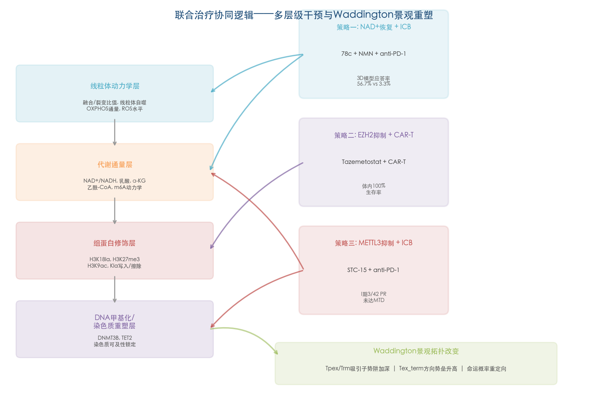

**图7-2 联合治疗协同逻辑与Waddington景观重塑。** 左侧纵轴展示第6章建模框架的四层架构（线粒体动力学层→代谢通量层→组蛋白修饰层→DNA甲基化/染色质重塑层），右侧标注三大联合策略各自作用的模型节点层级，底部汇聚为Waddington景观拓扑改变的共同输出——Tpex/Trm吸引子势阱加深、Tex_term方向势垒升高。

**策略一：NAD⁺恢复 + ICB。** CD38抑制剂78c + NR/NMN补充 + anti-PD-1构成三联方案，同时作用于三个层面：78c恢复NAD⁺池→Sirtuin活性恢复→PGC-1α去乙酰化激活→线粒体生物发生→OXPHOS恢复（线粒体输入层修复）；NAD⁺恢复→SIRT6激活→HIF-1α抑制→糖酵解减弱→乳酸产生降低→Kla修饰减少（代谢-表观遗传耦合调节）；anti-PD-1解除TCR信号的共抑制限制。Holgado等的3D模型数据（56.7% vs. 3.3%应答率）提供了该策略协同效应的直接定量证据 [Holgado et al., Nat Immunol 2024](https://pmc.ncbi.nlm.nih.gov/articles/PMC10888727/ "Disrupting CD38-driven T cell dysfunction restores sensitivity to cancer immunotherapy")。

**策略二：EZH2抑制 + CAR-T。** Tazemetostat预处理 + CAR-T过继转移。协同逻辑为EZH2抑制擦除H3K27me3→TCF1等记忆基因座去抑制→CAR-T偏向记忆分化→持久抗肿瘤效应。两项临床试验（NCT05934838、NCT05994235）正在评估该方案 [Beguelin et al., Cancer Cell 2024](https://www.cell.com/cancer-cell/fulltext/S1535-6108(24)00441-0 "EZH2 inhibition enhances T cell immunotherapies")。

**策略三：METTL3抑制 + ICB。** STM2457/STC-15 + anti-PD-1/PD-L1。该组合靶向m6A-DNMT3B-DNA甲基化链条，解除METTL3驱动的记忆基因座表观遗传沉默。Wu等和Fang等的临床前数据分别从T细胞内在效应和PD-L1恢复两个层面验证了协同机制；STC-15 I期试验的安全性数据为联合方案的推进提供了基础。

### 7.3.2 最优干预时间窗口：模型预测与生物学约束

第4章建立的耗竭命运承诺时间窗口——Angelosanto等证明感染后第8天T细胞仍可恢复记忆潜能，但第15–30天已丧失，不可逆表观遗传锁定在慢性刺激第2–3周完成——对治疗策略设计具有深刻的时序含义（图7-3）。

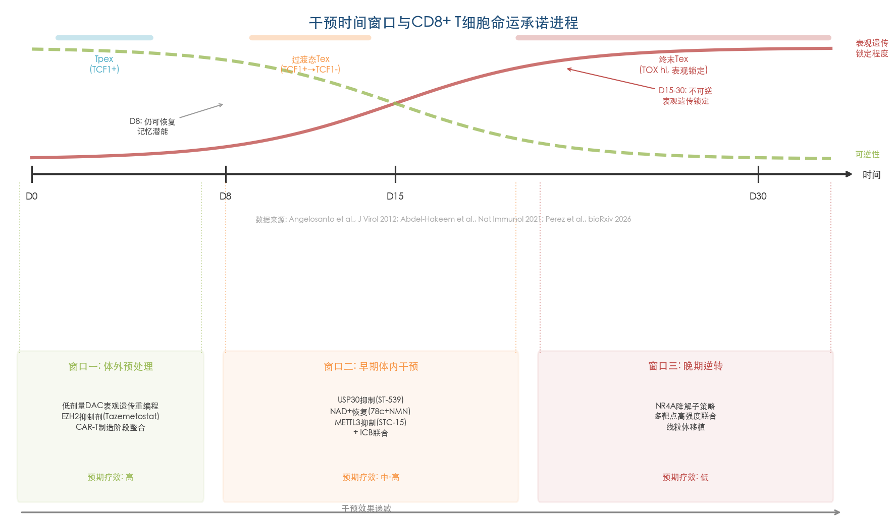

**图7-3 干预时间窗口与CD8⁺ T细胞命运承诺进程。** 横轴为感染/肿瘤暴露后天数（D0→D8→D15→D30），上方双曲线分别表示表观遗传锁定程度（S型递增，红色实线）和可逆性（递减，绿色虚线）；下方对应三个干预窗口（体外预处理、早期体内干预、晚期逆转）及各窗口推荐的策略组合与预期疗效梯度。

从Waddington景观建模的视角，Tex_term吸引子盆地的势垒高度随耗竭进程持续增加，这意味着代谢-表观遗传干预的效果具有高度时间依赖性：在Tpex→过渡态Tex转化的早期窗口实施干预，所需的扰动强度远小于试图从终末耗竭态逆转所需的扰动。Perez等的NR4A蛋白降解子实验提供了令人瞩目的反例——降解个别NR4A可在数小时内恢复效应因子产生，提示即使在相对深度的耗竭状态下，部分关键调控节点的扰动仍可产生快速功能逆转 [Perez et al., bioRxiv 2026（预印本）](https://www.biorxiv.org/content/10.64898/2026.02.02.701413v1.full-text "Reversible control of T cell exhaustion by NR4A transcription factors")。

基于以上证据，治疗干预的时间窗口原则可归纳如下：

- **CAR-T制造阶段**（体外预处理窗口）：低剂量DAC表观遗传重编程和EZH2抑制剂处理应在此窗口实施，利用体外条件的可控性实现充分的表观遗传重塑。
- **Tpex→Tex_term转化早期**（体内早期干预窗口）：USP30抑制、NAD⁺恢复（78c + NMN）和METTL3抑制应在检测到早期耗竭标记（如PD-1上调但TCF1仍表达）时启动，以阻止不可逆表观遗传锁定。
- **终末耗竭态**（体内晚期逆转窗口）：需要更强的多靶点联合干预，可能包括NR4A降解子策略或高强度表观遗传重编程。第6章模型预测该窗口的治疗成功率显著低于早期干预。

### 7.3.3 个体化治疗的生物标志物策略

第6章的建模框架提出线粒体健康状态向量**M** = (F/F ratio, η_mito, ΔΨm)作为模型上游输入。将该向量与可临床检测的生物标志物对应，是实现个体化治疗的必要步骤。

CD38表面表达可通过流式细胞术定量检测，Holgado等已证明CD38⁺与ICB耐药的预测关联（AUC = 0.87），使其成为指导NAD⁺恢复策略的伴随诊断标志物 [Holgado et al., Nat Immunol 2024](https://pmc.ncbi.nlm.nih.gov/articles/PMC10888727/ "Disrupting CD38-driven T cell dysfunction restores sensitivity to cancer immunotherapy")。Vannini等进一步证明NAD⁺代谢签名可预测CAR-T疗效 [Vannini et al., Nat Cancer 2025](https://www.nature.com/articles/s43018-025-00982-7 "Age-associated NAD decline drives CAR-T cell failure")。TCF1⁺PD-1⁺ TIL比例作为Tpex频率的替代标志物，Miller等已证明其与anti-PD-1阻断响应和黑色素瘤患者预后正相关 [Miller et al., Nat Immunol 2019](https://www.nature.com/articles/s41590-019-0312-6 "Subsets of exhausted CD8+ T cells differentially mediate tumor control and respond to checkpoint blockade")。LDH血清水平作为乳酸代谢活跃程度的临床常规指标，Sang等在SCLC队列中证明高LDH水平与ICB疗效不良显著相关，可指导乳酸-Kla通路靶向策略的患者选择 [Sang et al., Adv Sci 2025](https://advanced.onlinelibrary.wiley.com/doi/10.1002/advs.202413608 "The LDH-H3K18La-Nur77 Axis Potentiates Immune Escape in Small Cell Lung Cancer")。

整合上述标志物的多参数算法——基于CD38表达、TCF1⁺ TIL比例、LDH水平和肿瘤m6A修饰谱的综合评分——有望实现更精准的联合治疗策略个体化匹配。第6章的定量模型可作为此类算法的计算引擎：输入患者特异性的线粒体和代谢参数，输出各候选治疗方案的预测命运概率变化，从而指导最优方案选择。

## 7.4 HIV场景的特异性治疗策略

### 7.4.1 代谢恢复为核心的"shock-and-kill"增强

第5章的系统性比较揭示了HIV场景与TME的关键差异：淋巴组织缺乏TME级别的高乳酸和低氧环境，持续I型干扰素（IFN-I）信号而非代谢毒性构成线粒体OXPHOS损伤的主要来源。这些差异决定了HIV场景的治疗策略应以代谢恢复而非乳酸化修饰调控为核心。

Cheng等于2026年的报道为HIV特异性策略提供了直接实验支持：2-脱氧葡萄糖（2-DG）瞬时抑制糖酵解可挽救IFN-I信号所抑制的CD8⁺ T细胞线粒体OXPHOS活性；2-DG联合病毒储库激活剂（latency-reversing agent, LRA）可在人源化小鼠模型中减少HIV病毒储库 [Cheng et al., Cell Mol Immunol 2026](https://www.nature.com/articles/s41423-026-01398-8 "Persistent IFN-I signaling inhibits mitochondrial oxidative metabolism in CD8+ T cells during HIV-1 infection")。该研究为经典"shock-and-kill"方案增加了代谢干预臂——在LRA激活潜伏病毒储库（"shock"）的同时，通过代谢恢复增强CD8⁺ T细胞的杀伤能力（"kill"），克服传统方案中"shock有效但kill不足"的核心瓶颈。

基于第5章的比较分析，我们认为HIV场景的最优联合策略应为"2-DG（瞬时代谢切换）+ NR/NMN + CD38抑制剂（NAD⁺恢复）+ 低剂量DAC（表观遗传疤痕擦除）"。Kla通路靶向在HIV场景中可降低优先级，因淋巴组织乳酸浓度远低于TME水平，组蛋白乳酸化并非HIV中CD8⁺ T细胞耗竭的主要表观遗传调控层。HIV场景中更关键的代谢-表观遗传界面在于DNA甲基化和组蛋白乙酰化/去乙酰化——SIRT1/SIRT6介导的去乙酰化活性直接受NAD⁺水平调控，PDCD1基因座的DNA甲基化状态直接受TET2/DNMT3a动力学调控。

### 7.4.2 Elite controllers的代谢特征作为治疗蓝图

Angin等于2019年在Nature Metabolism报道的HIV自发控制者（elite controllers）CD8⁺ T细胞代谢特征，为治疗目标的定义提供了"金标准"参照：自发控制者的HIV特异性CD8⁺ T细胞具备"代谢可塑性"——可灵活利用OXPHOS和脂肪酸氧化（FAO），线粒体SRC显著高于非控制者 [Angin et al., Nat Metab 2019](https://pubmed.ncbi.nlm.nih.gov/32694646/ "Metabolic plasticity of HIV-specific CD8+ T cells associated with natural control of HIV-1")。

该表型与肿瘤模型中"OXPHOS维持→前体/记忆保持→免疫控制"的范式高度一致。从治疗策略设计的角度，将非控制者的耗竭CD8⁺ T细胞代谢谱重编程至接近自发控制者的代谢可塑性状态，可作为治疗终点的量化目标。第6章建模框架中的代谢通量模块可将自发控制者的OXPHOS/FAO通量和SRC数据作为目标吸引子的参数约束，通过反向模拟确定实现该目标所需的最小干预组合。

## 7.5 转化瓶颈与未来方向

### 7.5.1 核心转化挑战

从基础机制到临床应用的转化面临以下核心挑战。

**递送特异性。** 多数靶向线粒体动力学和表观遗传通路的小分子缺乏T细胞特异性，系统性给药可能对正常免疫细胞和非免疫组织产生非预期效应。抗CD8纳米抗体偶联药物、T细胞靶向脂质纳米粒和基因工程策略（如在CAR-T制造中整合代谢/表观遗传增强模块）可部分解决递送问题。体外预处理策略（低剂量DAC、tazemetostat预处理CAR-T）通过限制药物暴露于目标细胞群体，是当前技术条件下的最优递送方案。

**剂量窗口精确性。** 抗氧化剂、METTL3抑制剂和EZH2抑制剂均呈现剂量依赖性的双向效应——过度抑制可能损害T细胞正常功能。第6章提出的灵敏度分析策略可预先识别对命运概率影响最大的参数范围，为临床剂量探索提供理论指导。

**生物标志物驱动的患者分层。** 联合治疗策略的成本和复杂性要求精确的患者选择。CD38表达、TCF1⁺ TIL比例、LDH水平和肿瘤METTL3表达谱是目前最具潜力的伴随诊断标志物候选（详见7.3.3节）。

### 7.5.2 从概念到临床的时间表展望

截至2026年4月，距离临床应用最近的策略按成熟度排列为：(a) tazemetostat + CAR-T联合（两项临床试验进行中，tazemetostat已获FDA批准）；(b) STC-15 METTL3抑制剂单药（I期完成，II期计划中）；(c) daratumumab抗CD38联合ICB（daratumumab已获FDA批准，联合方案可快速启动）；(d) NMN + 放疗/免疫治疗（I/II期试验NCT06966583进行中）。USP30抑制剂ST-539和线粒体移植平台仍处于临床前概念验证阶段，距离人体试验预计需要3–5年。HIV场景的代谢-表观遗传联合策略目前仅有2-DG + LRA的人源化小鼠数据，临床转化路径在安全性和机制方面的验证数据仍不充分。

综合全章分析，代谢-表观遗传互作网络的多靶点干预已从概念假说进入临床前验证和早期临床测试阶段。通过整合第6章的定量建模框架与本章的转化策略分析，未来有望实现"模型驱动的精准免疫治疗"——在患者特异性参数约束下，通过数学模型优化干预靶点组合、给药时序和剂量窗口，最终将CD8⁺ T细胞命运从终末耗竭重定向至功能性记忆或组织驻留记忆状态。

# 结论与风险提示

## 核心结论

本报告通过系统整合分子免疫学、线粒体生物学、代谢组学、表观遗传学和计算建模五个学科领域的证据，对慢性抗原刺激下CD8⁺ T细胞终末耗竭与Trm命运分岔的代谢-表观遗传驱动机制进行了全景式解析。基于七章的逐层论证，可得出以下核心结论。

**第一，线粒体融合/裂变平衡构成命运分岔的上游关键决定因素。** 线粒体动力学并非耗竭的被动伴随现象，而是通过调控OXPHOS通量、TCA循环中间物产率和ROS水平，主动编码驱动命运选择的代谢信号。OPA1介导的线粒体融合-嵴重塑-ETC超复合物组装级联维持OXPHOS高效运行，支撑Trm和记忆T细胞的代谢特征与表观遗传可塑性；DRP1过度活化和USP30介导的线粒体自噬抑制导致去极化线粒体累积和OXPHOS崩溃，驱动表观遗传景观向终末耗竭方向锁定。Yu等（Nat Immunol 2020）的因果性实验——单纯药理学诱导去极化线粒体累积即可驱动耗竭表观遗传重编程，无需慢性TCR刺激——为线粒体功能障碍的因果驱动地位提供了最有力的证据。

**第二，代谢中间物充当线粒体状态与表观遗传修饰之间的"信号编码器"，构成五条并行但耦合的调控通道。** α-KG/琥珀酸比值决定TET/JMJD酶活性和DNA/组蛋白去甲基化效率；乳酸/L-乳酰-CoA驱动p300催化的组蛋白乳酸化（Kla）；乙酰-CoA供应控制组蛋白乙酰化（Kac）水平和Trm效应基因的活跃转录；NAD⁺水平调控Sirtuin去乙酰化酶家族活性和线粒体生物发生；m6A修饰通过METTL3→DNMT3B mRNA稳定化→CpG甲基化这一跨层级链条将RNA表观遗传修饰与DNA甲基化直接串联。这五条通道通过共享的代谢节点（线粒体功能、NAD⁺/NADH比值、乳酸浓度）形成高度耦合的互作网络，而非独立运作。

**第三，终末耗竭与Trm的命运分岔受表观遗传层面的多重机制驱动，且存在明确的不对称性与时间窗口。** Buquicchio等（Immunity 2024）和Park等（bioRxiv 2025）的多组学分析共同确立了Trm与Tex_term的表观遗传独立性——两者共享254个开放染色质区域（OCRs），但Tex_term拥有5,049个特异性OCRs。已承诺的Trm可在慢性抗原下转化为Tex，但已承诺的Tex前体无法生成常规Trm，这种单向转化的不可逆性反映Tex_term吸引子势阱深度远超Trm。耗竭命运的不可逆表观遗传锁定在慢性刺激第2–3周完成（Angelosanto et al., J Virol 2012），此后表观遗传疤痕即使在抗原清除520天后仍维持Tex样模式，仅2.9%的效应细胞OCRs得到恢复（Abdel-Hakeem et al., Nat Immunol 2021）。然而，NR4A蛋白降解子实验表明部分耗竭程序可在数小时内逆转（Perez et al., bioRxiv 2026），揭示耗竭的可逆性并非"全或无"的二元状态，而是具有层级结构的渐变谱系。

**第四，组蛋白乳酸化在CD8⁺ T细胞耗竭进程中的角色远比既往假设复杂。** Raychaudhuri等（Nat Immunol 2024）的系统性CUT&Tag数据揭示了一个关键的反直觉事实：终末耗竭CD8⁺ T细胞中H3K18la和H3K9la富集极低，耗竭相关基因反由H3K9ac标记。"代谢双重衰竭"模型——OXPHOS与糖酵解同步崩溃导致内源性乳酸产生能力和Kla底物供应同时下降——调和了这一矛盾。Kla可能仅在耗竭早期阶段参与增强子激活，其在命运分岔中的时序动态和位点特异性功能尚未获得充分验证。

**第五，肿瘤微环境与HIV慢性感染共享保守的核心耗竭表观遗传程序，但在驱动机制上存在实质性分化。** 跨疾病、跨物种保守的12,637个核心染色质可及性区域（Yates et al., Nat Immunol 2021）和PDCD1位点的去甲基化动态确立了耗竭程序的保守内核。场景特异性差异体现在三个方面：线粒体损伤模式（TME：碎片化去极化；HIV：高极化质量累积）、微环境代谢拓扑（TME：高乳酸约40 mM/低氧；HIV：持续IFN-I）和Kla调控权重（TME中显著，HIV中预计较低）。这种架构为定量建模提供了"保守内核+场景特异性外壳"的模块化设计方向。

**第六，从概念验证到早期临床测试的转化已经启动，多靶点联合干预是提高疗效的必要策略。** tazemetostat联合CAR-T（NCT05934838、NCT05994235）、STC-15 METTL3抑制剂（I期42例入组）、daratumumab联合ICB以及NMN联合免疫治疗（NCT06966583）标志着代谢-表观遗传靶向免疫治疗从基础研究进入临床验证阶段。基于本报告建立的机制框架和定量建模预测，在Tpex→Tex_term转化的早期窗口同时作用于线粒体质量控制（USP30抑制/NAD⁺恢复）、表观遗传重编程（METTL3抑制/EZH2抑制）和免疫检查点阻断三个层级，有望产生超越单层级干预的协同效应。

## 局限性分析

本报告在证据整合和框架构建中存在以下主要局限性，需在解读结论时予以审慎考量。

**第一，多条核心调控通路的因果链条由独立研究分别支持，缺乏单一综合性研究的完整串联验证。** "线粒体融合→OXPHOS→α-KG→TET→Trm增强子去甲基化"和"线粒体裂变→代谢崩溃→表观遗传锁定→终末耗竭"两条对偶路径中，各环节（Buck et al. 2016确立线粒体融合与记忆形成的因果关系；Jaccard et al. 2023确立还原性羧化与表观遗传指导；Giles et al. 2024确立TET2与耗竭转化）均有独立实验支持，但在同一实验体系中从头到尾追踪完整因果链的单一研究尚不存在。将来自不同模型系统、不同物种和不同实验条件的证据串联推理，存在跨系统外推的固有风险。

**第二，定量建模框架面临关键参数缺口的制约。** CD8⁺ T细胞——特别是耗竭亚群——的基因组规模代谢模型（GSMM）尚未构建，代谢通量模块的全局通量分布只能通过Compass等间接推断。组蛋白乳酸化写入/擦除的酶动力学参数（p300催化Kla的速率常数）在任何细胞类型中均无系统性体外测量。CD8⁺ TIL中α-KG绝对浓度和α-KG/琥珀酸比值缺乏直接代谢组学测量。METTL3-14等酶的体外k_cat值（0.2–0.6 min⁻¹）在T细胞内的有效速率可能因底物可及性和翻译后修饰偏离数倍。这些缺口使所提出的建模框架在当前阶段仍为概念架构，而非可直接执行的定量工具。

**第三，HIV场景中的关键机制数据明显薄弱于TME场景。** HIV感染中CD8⁺ T细胞的线粒体融合/裂变动力学（MFN2/DRP1/OPA1表达比例）、组蛋白乳酸化修饰谱、线粒体自噬效率的直接测量数据均处于空白或极度有限状态。Kla在HIV场景中CD8⁺ T细胞耗竭中的角色尚无直接文献报道。因此，本报告关于HIV场景中"Kla调控权重较低"的判断主要基于微环境乳酸浓度推理而非直接实验证据，这一推论的可靠性受限于现有数据的缺乏。

**第四，部分关键证据依赖预印本数据。** Ghosh等关于METTL3→DNMT3B链条的研究（bioRxiv 2026）、Perez等关于NR4A降解子实验的研究（bioRxiv 2026）、Park等关于TR-TEX与Trm本体分歧的研究（bioRxiv 2025）和Dreidi等关于TCR信号强度与Eomes协同的研究（bioRxiv 2026）均为预印本，尚未完成同行评审。这些研究的核心结论虽与领域内其他已发表数据一致性较好，但其数据质量和可重复性仍有赖于正式同行评审后的重新评估。

**第五，小鼠模型数据向人类的外推需保持审慎。** TOX在人类系统中并非耗竭专属标记物——CMV和EBV特异性多功能记忆T细胞同样表达TOX（Sekine et al., Sci Immunol 2020），这一物种差异意味着小鼠中建立的TOX→耗竭因果关系不能直接等价地推广至人类临床场景。HOBIT（ZNF683）作为Trm标记物的特异性在人类中同样受到质疑。本报告基于小鼠模型构建的多数分子机制框架在人类验证方面仍存在系统性缺口。
