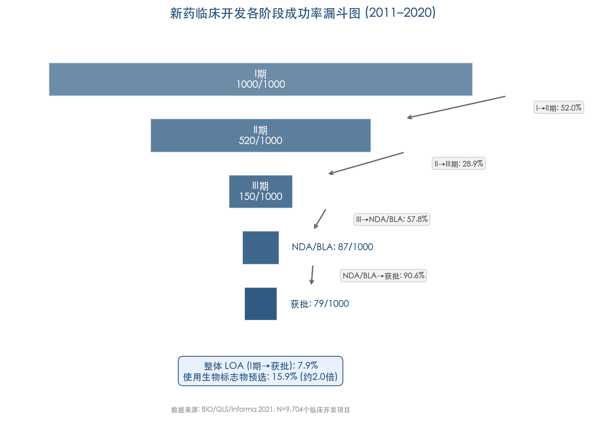
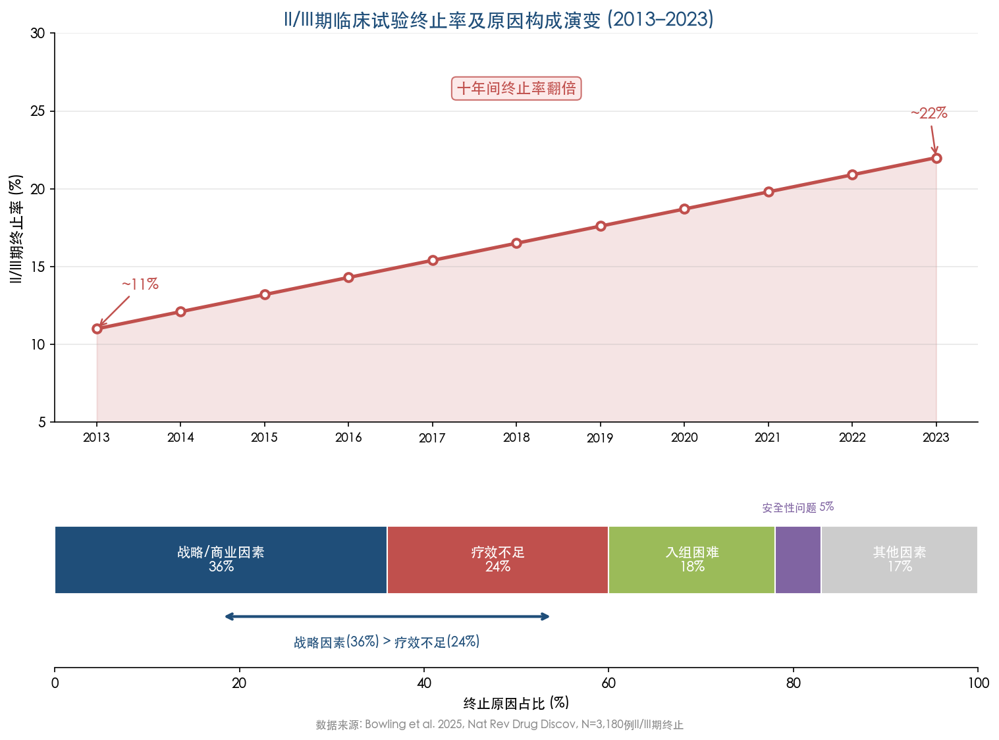
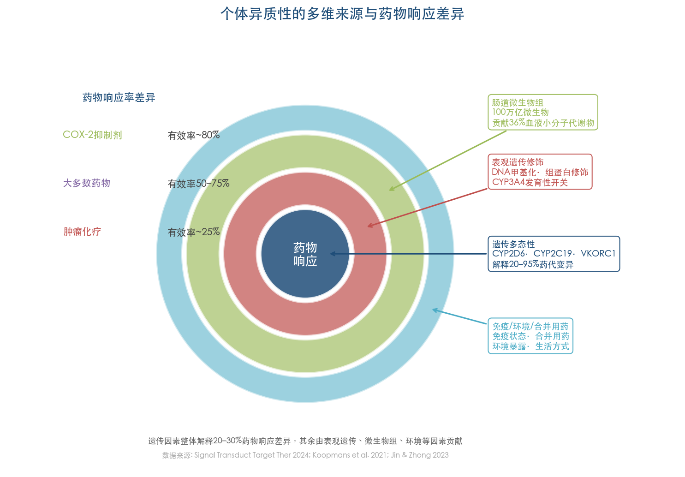
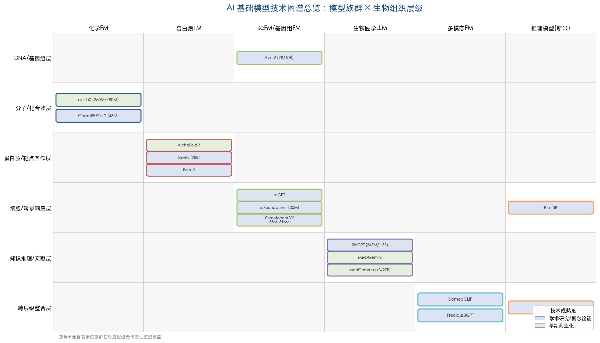
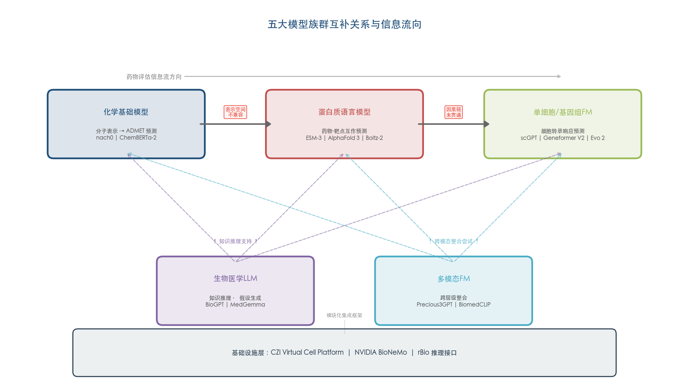
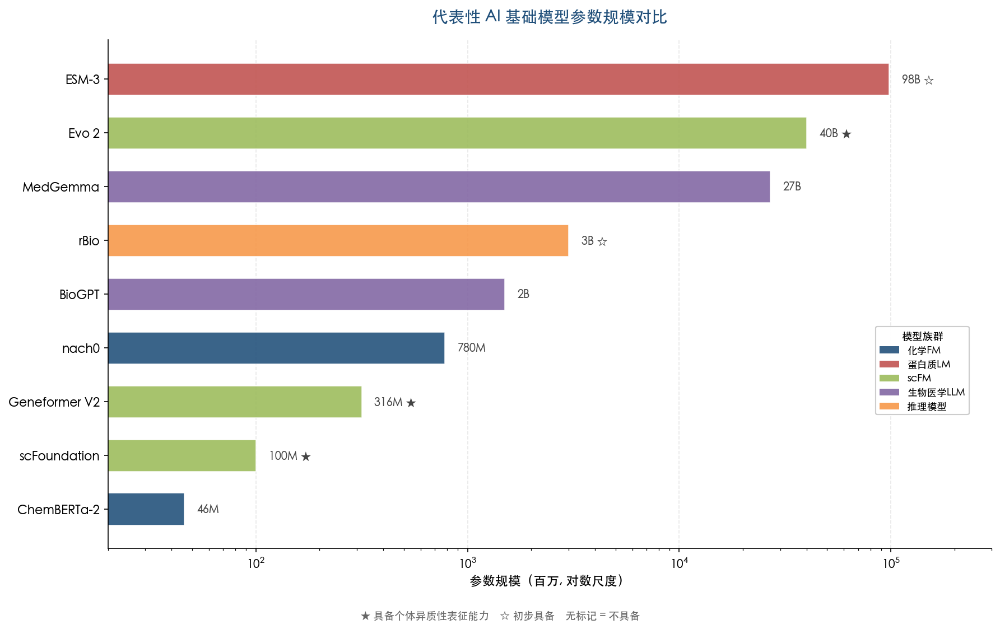
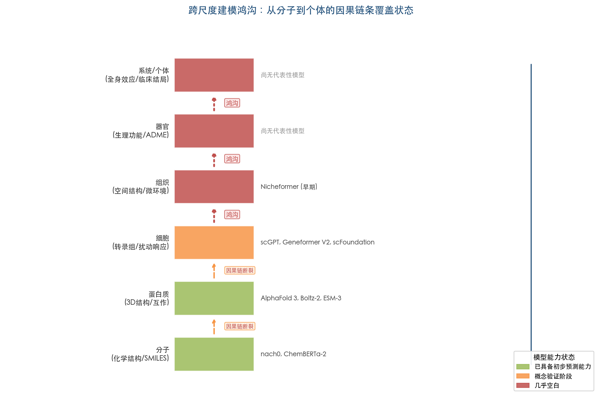
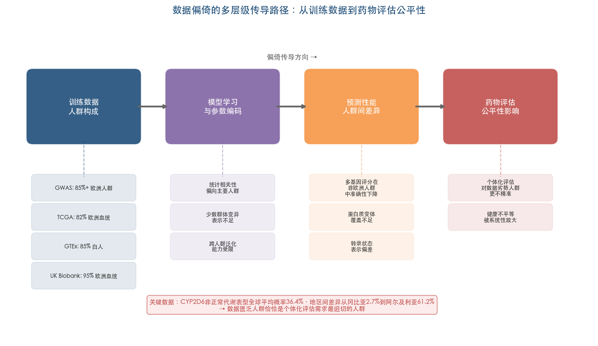
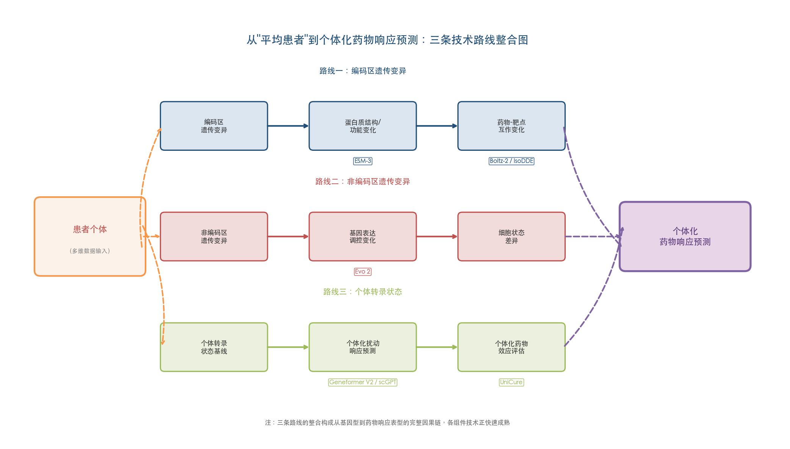
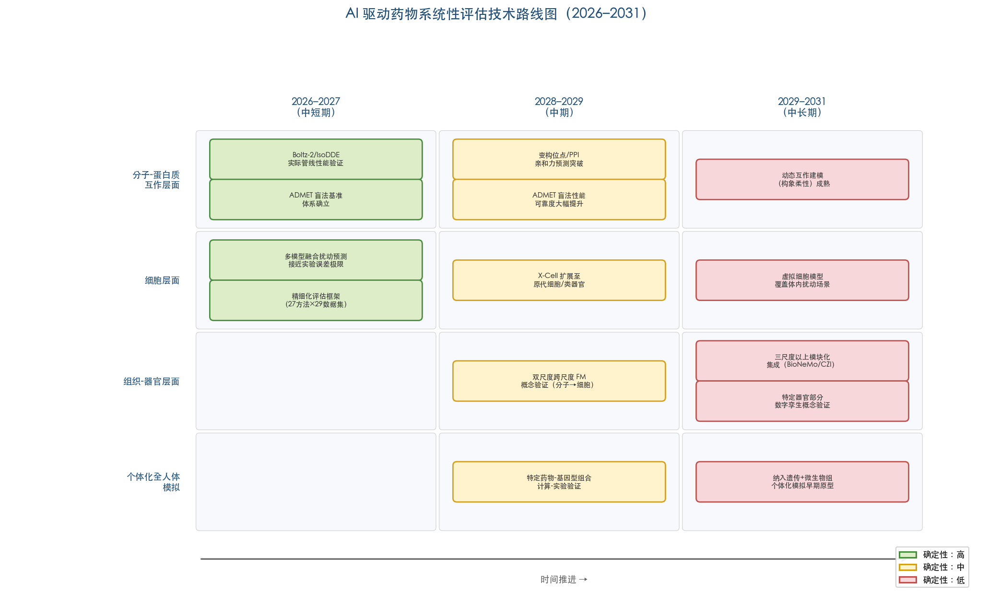

# 执行摘要

传统药物研发正面临系统性效率危机：一种新药从发现到上市的平均资本化总成本高达 25.58 亿美元，临床开发周期中位数为 8.3 年，而从 I 期到获批的整体成功率仅为 7.9% [BIO/QLS/Informa 2021](https://go.bio.org/rs/490-EHZ-999/images/ClinicalDevelopmentSuccessRates2011_2020.pdf "Clinical Development Success Rates and Contributing Factors 2011-2020")。造成这一困境的根源之一，在于现有评估范式——无论是单靶点还原论还是多组学整合方法——均无法系统性地模拟药物对机体的全链条影响，同时也无法有效纳入遗传多态性、表观遗传修饰、肠道微生物组构成等多维个体异质性因素。CYP2D6 非正常代谢表型的全球平均概率高达 36.4%，且地区间差异超过 20 倍 [Koopmans et al. 2021](https://www.nature.com/articles/s41398-020-01129-1 "Transl Psychiatry 2021;11:141")，凸显了"平均患者"假设在药物评估中的根本性局限。

本报告围绕"大模型能否模拟药物对机体的系统性影响、以实现个体化药物评估"这一核心命题，系统调研了当前 AI 基础模型在药物评估链条中的技术能力、产业落地进展、核心瓶颈与未来演进方向。

**在技术能力层面**，五大基础模型族群——生物医学大语言模型、蛋白质语言模型、化学基础模型、单细胞/基因组基础模型和多模态生物医学模型——在药物评估链条上形成天然的分层互补关系。分子-蛋白质互作层面，AlphaFold 3、Boltz-2 和 IsoDDE 已具备与传统物理方法可比甚至超越的预测精度，且计算效率提升数个数量级。细胞层面，尽管 2025 年基准研究表明单细胞基础模型在扰动预测上尚未稳定超越简单基线，但 2026 年的多模型融合方法和 Xaira 的 X-Cell（49 亿参数因果扰动预测模型）正在改变这一格局。组织/器官/系统层面的建模能力则几乎处于空白状态。

**在产业落地层面**，全球 AI 药物发现市场规模从 2024 年的约 19.4 亿美元增长至 2026 年约 50 亿美元。Insilico Medicine 的 Rentosertib Phase IIa 试验数据显示 FVC 改善 +98.4 mL（安慰剂组 −62.3 mL），Recursion 的 REC-4881 Phase 2 结果显示息肉负荷中位减少 53%，提供了 AI 设计药物的首批临床概念验证。2024–2026 年间头部平台的累计合作交易价值已超过百亿美元规模，标志着制药工业正式将 AI 药物发现平台视为战略合作伙伴。

**在核心瓶颈层面**，报告识别出五项关键挑战：(1) 跨尺度建模鸿沟——从分子扰动到全身表型的因果链条在各层级模型之间仍处于断裂状态；(2) 训练数据的人群偏倚——超过 85% 的基因组研究数据来自欧洲血统个体，制约个体异质性建模的公平性；(3) 可解释性与因果推断不足——基础模型学习的是统计相关性而非因果关系，限制了临床决策信任；(4) 监管框架尚处于原则制定阶段——FDA 和 EMA 的联合指导原则已于 2026 年 1 月发布，但端到端 AI 系统的验证标准和算法偏见报告义务等核心问题仍悬而未决；(5) 扰动预测基准的脆弱性——模型在公开基准上的性能提升可能存在排行榜过拟合，与实际临床需求脱节。

**在未来展望层面**，报告提出分层、分时的技术路线图。中短期（2026–2027 年），扰动预测将进入精细化验证阶段，首批 AI 设计药物的 Phase II/III 临床数据将提供决定性验证信号。中期（2028–2029 年），虚拟细胞模型将从细胞系向原代细胞和类器官扩展，跨尺度基础模型有望实现双尺度概念验证。中长期（2029–2031 年），面向特定器官和疾病场景的部分数字孪生概念验证具有可行性，但纳入个体遗传背景、微生物组和生活方式数据的全人体级个体化模拟仍属远期愿景。

我们的核心判断是：AI 基础模型并非要取代传统药物评估范式，而是要补全其缺失的计算维度——提供传统方法无法实现的多尺度模拟、个体化预测和因果推断能力。这一补全过程将是渐进的、分层的、以特定药物类别和疾病场景为切入点的，其推进速度取决于数据、模型、实验验证和监管框架的协同演进。

# 第1章 传统药物评估的系统性困境——从多组学到个体异质性的未解难题

药物研发的终极目标，是将一种化学实体从实验室推进到患者床旁，使之安全、有效地改善人体健康。然而，审视过去数十年制药工业的整体表现，一个令人警醒的事实清晰浮现：传统药物评估范式——无论是基于还原论的单靶点策略，还是近年来不断深化的多组学整合方法——始终未能系统性地、宏观地解析药物对机体产生的全部影响。这一能力缺失直接映射为新药研发的效率危机，并在面对个体异质性（Inter-individual Variability）这一根本性生物学挑战时暴露得尤为彻底。本章从研发成本与失败率的量化数据出发，逐层剖析传统药物评估在高维数据整合、跨尺度因果推断和个体差异建模方面的结构性困境，进而引出对新计算范式的需求命题。

在展开正式论述之前，有必要对贯穿本报告的两个核心概念给出操作性定义。**药物系统性评估**（Systemic Drug Evaluation）是指以多尺度、多层级的视角，从分子互作、细胞响应、组织/器官功能到全身表型结局，全链条地评估一种药物对机体产生的综合影响，涵盖预期的治疗效应与非预期的不良反应。**个体异质性**是指不同个体在接受相同药物治疗时，由于遗传多态性、表观遗传状态、肠道微生物组构成、免疫状态、合并用药、环境暴露及生活方式等多维因素的差异，在药代动力学、药效学和临床结局上表现出的显著个体间差异。

## 1.1 新药研发的效率危机：成本攀升与系统性失败

### 1.1.1 天文数字的研发成本

新药研发成本的持续攀升构成制药工业面临的结构性挑战。DiMasi 等人 2016 年发表的经典估算表明，一种新药从研发到获批上市的平均资本化总成本为 25.58 亿美元（2013 年美元），若纳入上市后研发成本则上升至 28.70 亿美元 [DiMasi et al. 2016](https://pubmed.ncbi.nlm.nih.gov/26928437/ "Innovation in the pharmaceutical industry: New estimates of R&D costs, J Health Econ 2016;47:20-33")。近十年来，这一上升趋势并未缓解：Deloitte 2024 年度报告显示，全球 20 家最大制药企业开发一种药物的平均成本为 22.3 亿美元，2013–2024 年间研发成本复合年增长率达 6.44% [Deloitte 2024 报告](https://www.fiercebiotech.com/biotech/drug-development-cost-pharma-22b-asset-2024-plus-how-glp-1s-impact-roi-deloitte "Drug development cost pharma $2.2B per asset in 2024, Fierce Biotech 2025-03-25 转引Deloitte")。

上述数字同时引发了学术界的方法学讨论。2025 年 JAMA Network Open 发表的一项经济评估覆盖 268 家药企和 38 种 2019 年 FDA 批准新药，采用了不同的成本核算框架。经资本成本和终止项目调整后，新药研发成本中位数为 7.08 亿美元（IQR 2.47–14.2 亿美元），均值为 13.1 亿美元（SD 19.2 亿美元），成本分布呈高度右偏特征 [Mulcahy et al. 2025](https://jamanetwork.com/journals/jamanetworkopen/fullarticle/2828689 "Use of Clinical Trial Characteristics to Estimate Costs of New Drug R&D, JAMA Netw Open 2025;8:e2453275")。无论采用哪种估算方法，两项结论具有高度一致性：其一，新药研发成本以数亿至数十亿美元计；其二，成本的巨大方差本身即反映了研发过程的高度不确定性与效率瓶颈。

### 1.1.2 漫长的开发周期

与高昂成本相伴的是漫长的开发周期。Brown 等人 2022 年在 Nature Reviews Drug Discovery 的分析表明，2010–2020 年间 FDA 批准的 405 种创新药的临床开发时间中位数为 8.3 年，典型创新药临床开发时间为 9.1 年（95% CI = 8.2–10.0 年）[Brown et al. 2022](https://pmc.ncbi.nlm.nih.gov/articles/PMC9869766/ "Clinical development times for innovative drugs, Nat Rev Drug Discov 2022;21:793-794")。BIO/QLS/Informa 2021 年的综合报告将全过程进一步拆解：2011–2020 年一种药物从 I 期进入市场的平均总时间为 10.5 年，其中 I 期 2.3 年、II 期 3.6 年、III 期 3.3 年、监管审查 1.3 年 [BIO/QLS/Informa 2021](https://go.bio.org/rs/490-EHZ-999/images/ClinicalDevelopmentSuccessRates2011_2020.pdf "Clinical Development Success Rates and Contributing Factors 2011-2020")。十年以上的开发周期意味着，药物从设计理念确立到最终送达患者手中时，其所针对的科学认知、患者群体特征乃至疾病治疗格局可能已经发生根本性变迁。

### 1.1.3 触目惊心的临床失败率

在投入数十亿美元和十余年时间之后，绝大多数候选药物最终未能抵达终点。2011–2020 年间 9,704 个临床开发项目的总体 I 期到 FDA 批准成功率（Likelihood of Approval, LOA）仅为 7.9%，即每 100 个进入 I 期临床试验的药物中，平均只有不到 8 个最终获批上市 [BIO/QLS/Informa 2021](https://go.bio.org/rs/490-EHZ-999/images/ClinicalDevelopmentSuccessRates2011_2020.pdf "Clinical Development Success Rates and Contributing Factors 2011-2020")。其中，II 期向 III 期的转换成功率仅为 28.9%，是所有阶段中最低的环节——这一"死亡之谷"深刻反映了从概念验证到规模化临床验证之间的巨大鸿沟。图 1-1 以漏斗图形式直观呈现了这一逐级淘汰过程。

**图 1-1** 以每 1,000 个 I 期项目为基数，展示 I 期→II 期（52.0%）→III 期（28.9%）→NDA/BLA（57.8%）→获批（90.6%）的逐级淘汰过程。整体 LOA 仅为 7.9%，而采用生物标志物预选的项目 LOA 可提升至 15.9%（约 2.0 倍）。数据来源：BIO/QLS/Informa 2021（N=9,704 个临床开发项目）。

来自领先药企的数据同样严峻。一项覆盖 18 家领先药企 2006–2022 年间管线的分析显示，I 期到 FDA 新药首次批准的平均成功率为 14.3%（中位数 13.8%），企业间差异显著，从约 8% 到约 23% 不等 [Drug Discovery Today 2025](https://www.sciencedirect.com/science/article/pii/S1359644625000042 "Benchmarking R&D success rates of leading pharmaceutical companies 2006-2022")。领先药企的成功率约为行业整体水平的 1.8 倍，这一差距提示即便资源充裕、经验丰富的大型制药企业尚且面对如此高的淘汰率，中小型企业的处境更为严峻。

### 1.1.4 临床试验终止的结构性驱动因素

传统观点将临床疗效不足（lack of efficacy）视为药物临床开发失败的首要原因。然而，Bowling 等人 2025 年在 Nature Reviews Drug Discovery 发表的对 2013–2023 年 3,180 例 II/III 期临床试验终止的更新分析揭示了更为复杂的格局：十年间 II/III 期临床试验终止率从约 11% 翻番至约 22%；在报告了终止原因的试验中，战略与商业因素（组合策略调整、并购重组、市场竞争格局变化等）占比约 36%，已超越临床疗效不足（约 24%）成为首要终止驱动因素；入组困难约占 18%，安全性问题仅占约 5% [Bowling et al. 2025](https://www.nature.com/articles/d41573-025-00208-6 "Analysis of phase II and phase III clinical trial terminations from 2013 to 2023, Nat Rev Drug Discov 2025")。图 1-2 展示了这一终止率趋势及原因构成的演变。

**图 1-2** 上半部分呈现 2013–2023 年 II/III 期临床试验终止率从约 11% 倍增至约 22% 的趋势；下半部分为终止原因占比分布，战略/商业因素（36%）已超越疗效不足（24%）成为首要驱动因素，入组困难占 18%，安全性问题仅占 5%。数据来源：Bowling et al. 2025（N=3,180 例 II/III 期终止）。

这一发现具有深刻的方法论含义。当战略因素而非科学证据成为终止试验的首要原因时，大量具有潜在治疗价值的候选药物可能因非科学因素被搁置。与此同时，疗效不足仍占终止原因的近四分之一，这直接指向传统药物评估范式的核心缺陷——在将候选药物推入昂贵的大规模临床试验之前，现有方法对其在人体中的系统性影响缺乏足够精准的预测能力。

## 1.2 传统药物评估范式的能力边界

### 1.2.1 从单靶点还原论到多组学整合的范式演进

经典的药物研发范式建立在"一个药物→一个靶点→一种疾病"的还原论假设之上：通过识别关键的疾病驱动靶点，设计能够特异性调控该靶点的药物分子，进而实现治疗效果。这一范式在过去数十年中贡献了大量成功药物，但其局限性也日益凸显——绝大多数药物并非仅与单一靶点互作，而是在体内产生涉及多靶点、多通路、多组织的系统性效应，包括脱靶效应和代偿性生物学反应。

为突破还原论的桎梏，多组学（multi-omics）方法——涵盖基因组学、转录组学、蛋白质组学、代谢组学及表观基因组学——在过去十五年间迅速发展，旨在从不同分子层级全面描绘药物对生物系统的扰动效应。然而，多组学方法的引入并未从根本上消除传统药物评估的三项核心技术瓶颈 [BioData Mining 2025](https://pmc.ncbi.nlm.nih.gov/articles/PMC11954193/ "Network-based multi-omics integrative analysis methods in drug discovery")：

第一，**数据异质性与整合困难**。不同组学数据具有迥异的技术特征：基因组数据是离散的序列与变异信息，转录组数据是连续的表达量矩阵，蛋白质组数据受限于检测覆盖度和动态范围，代谢组数据则面临化合物注释的瓶颈。将这些异质性数据整合为统一的生物学图景，在计算方法和生物学解释两个层面均极具挑战。

第二，**跨尺度因果推断的缺失**。从分子层面的药物-靶点互作，到细胞层面的信号通路扰动，再到组织/器官层面的功能变化，最终到个体层面的临床表型——这一跨越多个生物学尺度的因果链条，构成传统多组学方法无法实现端到端建模的核心瓶颈。现有技术能够在各个层级独立地观测药物的分子效应，却无法将这些碎片化的观测连接成一条从分子扰动到表型结果的完整因果链。

第三，**时间动态建模的不足**。药物在体内的效应并非静态快照，而是一个动态的时间过程——从吸收分布、靶点占据与解离，到下游信号级联、代偿性调节与适应性反应。传统组学分析多基于有限时间点的快照式测量，难以捕捉药物效应的时空动态全貌。

### 1.2.2 多组学方法未能弥合的鸿沟

尽管网络药理学和系统生物学方法试图通过构建分子互作网络来理解药物的系统性效应，这些方法本质上仍依赖于已知互作数据库的完整性，且在从网络拓扑推断功能因果关系方面存在根本性的方法学局限。单靶点还原论无法覆盖药物与多靶点跨通路的系统性影响；多组学方法虽然拓展了观测的维度和广度，仍无法实现从分子扰动到表型结果的全链条因果推断 [BioData Mining 2025](https://pmc.ncbi.nlm.nih.gov/articles/PMC11954193/ "Network-based multi-omics integrative analysis methods in drug discovery")。

这一困境的实质在于：生物医学领域积累了空前丰富的多层级数据，却缺乏一种能够将这些数据融合为系统性预测的计算框架。多组学方法提高了描述的分辨率，却未能实现从描述到预测的质变。

## 1.3 个体异质性：药物评估的根本性挑战

如果说多组学整合的困难体现了药物评估在"系统性"维度上的不足，那么个体异质性则从"个体化"维度对传统范式构成了更为根本的挑战。同一种药物在不同个体中可以产生截然不同的疗效和安全性表现：COX-2 抑制剂的有效率约 80%，肿瘤化疗药物的有效率仅约 25%，大多数药物的响应率处于 50%–75% 区间 [Signal Transduct Target Ther 2024](https://www.nature.com/articles/s41392-023-01619-w "Drug-microbiota interactions: an emerging priority for precision medicine")。这种巨大的个体间差异根植于多维度的生物学因素。

### 1.3.1 遗传多态性：药物代谢的"先天密码"

遗传因素是个体异质性最为经典的来源。总体而言，遗传变异约解释 20%–30% 的药物响应个体间差异，其余 70%–80% 由环境和病理生理因素贡献 [Lauschke & Ingelman-Sundberg 2016](https://pmc.ncbi.nlm.nih.gov/articles/PMC5968569/ "Integrating rare genetic variants into pharmacogenetic drug response prediction, Hum Mol Genet 2016")。然而，在特定药物中，遗传因素的解释比例可高达 20%–95%，尤其当药物代谢高度依赖于单一或少数几种高度多态性的药物代谢酶时 [Signal Transduct Target Ther 2024](https://www.nature.com/articles/s41392-023-01619-w "Drug-microbiota interactions: an emerging priority for precision medicine")。

以细胞色素 P450（CYP）酶系为例，CYP2D6 和 CYP2C19 是两种多态性最为显著的药物代谢酶。一项涵盖超过 336,000 名受试者和 318 项研究的全球荟萃分析表明，CYP2D6 非正常代谢表型（包括慢代谢、超快代谢和中间代谢型）的全球平均概率为 36.4%，CYP2C19 更高达 61.9% [Koopmans et al. 2021](https://www.nature.com/articles/s41398-020-01129-1 "Meta-analysis of probability estimates of worldwide variation of CYP2D6 and CYP2C19, Transl Psychiatry 2021;11:141")。尤为关键的是，这些多态性的分布存在显著的地理和种族差异——CYP2D6 非正常代谢表型从冈比亚的 2.7% 到阿尔及利亚的 61.2%，差异逾 20 倍。这意味着基于单一人群数据开发的剂量方案，在全球范围应用时可能导致相当比例的患者处于疗效不足或毒性风险增高的状态。

华法林（Warfarin）是遗传多态性影响药物剂量需求的经典范例。约 50% 的华法林剂量变异可由 CYP2C9（约 18%）和 VKORC1（约 30%）的遗传多态性解释 [CPIC 华法林指南](https://files.cpicpgx.org/data/guideline/publication/warfarin/2011/21900891.pdf "CPIC Guidelines for Warfarin Dosing")。然而，约 35% 的华法林响应延迟个体无法用已知遗传因素解释 [Limdi et al. 2008](https://pmc.ncbi.nlm.nih.gov/articles/PMC2757655/ "Influence of CYP2C9 and VKORC1 on warfarin dose")，这提示表观遗传修饰、微生物组和饮食等其他维度的个体异质性因素在其中发挥着不可忽视的作用。

药物基因组学（Pharmacogenomics）的临床转化正在稳步推进。截至 2026 年 3 月，FDA 官方"Table of Pharmacogenomic Biomarkers in Drug Labeling"共列出 676 条药物-生物标志物条目 [FDA 官方数据](https://www.fda.gov/drugs/science-and-research-drugs/table-pharmacogenomic-biomarkers-drug-labeling "FDA Table of Pharmacogenomic Biomarkers in Drug Labeling")。从纵向趋势看，2000–2020 年间约 25.6% 的 FDA 新药初始标签含有药物基因组学信息，这一比例从 2000 年的 10.3% 增长至 2019 年的 33.9%；其中肿瘤药物占含药物基因组学标签新药的 49.4% [Kim et al. 2021](https://pmc.ncbi.nlm.nih.gov/articles/PMC8000585/ "Pharmacogenomic Biomarkers in US FDA-Approved Drug Labels 2000-2020, J Pers Med 2021;11:179")。药物基因组学标签的持续增加，一方面体现了精准医学的实质性进展，另一方面也从监管角度确证了遗传异质性对药物响应的广泛而深刻的影响。

### 1.3.2 表观遗传修饰：被低估的个体内与个体间变异来源

如果说遗传多态性是写在 DNA 序列中的"先天密码"，表观遗传修饰则代表了一层更为动态、更难以系统性捕捉的调控维度。DNA 甲基化、组蛋白修饰和非编码 RNA 等表观遗传机制，能够在不改变 DNA 序列的前提下调控基因表达，从而影响药物代谢酶和转运体的活性水平。

一个具有深远影响的例子是 CYP3A4/CYP3A7 的发育性表观遗传开关。CYP3A4 是人体中含量最丰富的 CYP 酶，负责代谢约 50% 的临床药物。DNA 甲基化介导的 CYP3A4/CYP3A7 发育性开关——即从胎儿期以 CYP3A7 表达为主到出生后向 CYP3A4 表达转换——是儿科与成人药物代谢显著差异的关键机制 [Jin & Zhong 2023](https://pmc.ncbi.nlm.nih.gov/articles/PMC10197210/ "Epigenetic Mechanisms Contribute to Intraindividual Variations of Drug Metabolism, Drug Metab Dispos 2023;51:749-763")。此外，利福平通过激活 PXR 受体改变 CYP3A4 启动子区域的组蛋白修饰，可导致药物-药物相互作用引起的个体内代谢变异——同一患者在不同时间点、不同合并用药条件下，同一药物的代谢速率可能发生显著波动。

表观遗传信息的一个关键特征在于其组织特异性：肝脏中 CYP 酶的表观遗传状态无法通过外周血样本检测，这使得基于表观遗传生物标志物的临床预测面临极高的技术难度 [Jin & Zhong 2023](https://pmc.ncbi.nlm.nih.gov/articles/PMC10197210/ "Epigenetic Mechanisms Contribute to Intraindividual Variations of Drug Metabolism, Drug Metab Dispos 2023;51:749-763")。即便研究者已经阐明了表观遗传修饰对药物代谢的影响机制，在临床实践中实现基于表观遗传状态的个体化用药仍面临根本性的样本可及性障碍。

### 1.3.3 肠道微生物组：药物响应的"第二基因组"

肠道微生物组在药物代谢和响应中的作用，是近年来个体异质性研究中最具变革性的发现领域之一。人体肠道中栖居着超过 100 万亿个微生物，编码约 500 万个基因，远超人类自身基因组的基因数量。微生物编码基因对人类血液中小分子代谢物的贡献高达 36% [Signal Transduct Target Ther 2024](https://www.nature.com/articles/s41392-023-01619-w "Drug-microbiota interactions: an emerging priority for precision medicine")。由于个体间微生物组构成差异巨大，这一"第二基因组"为药物响应的个体异质性增添了一个极为复杂且难以系统控制的变量维度。

多个经典案例展示了微生物组如何通过直接代谢药物分子影响疗效和毒性。**伊立替康**（Irinotecan）是一种广泛使用的结直肠癌化疗药物，其活性代谢物 SN-38 在肝脏中经葡萄糖醛酸化解毒后排入肠道。然而，肠道微生物产生的 β-葡萄糖醛酸酶能够将这一低毒代谢物重新转化为高毒性的 SN-38，导致严重的迟发性腹泻；不同个体肠道中 β-葡萄糖醛酸酶活性的差异，直接解释了伊立替康毒性反应的个体间差异。**地高辛**（Digoxin）的案例同样具有代表性：约 10% 的患者中，肠道细菌 *Eggerthella lenta* 能够将地高辛转化为心脏无活性的二氢地高辛，导致这些患者需要更高剂量方能达到治疗浓度。

在免疫治疗领域，肠道微生物组与药物响应的关联引发了尤为广泛的关注。多项研究表明，特定菌群——如 *Akkermansia muciniphila*——的丰度与免疫检查点抑制剂（Immune Checkpoint Inhibitors, ICIs）的抗肿瘤响应率正相关 [Signal Transduct Target Ther 2024](https://www.nature.com/articles/s41392-023-01619-w "Drug-microbiota interactions: an emerging priority for precision medicine")。这意味着，即便两名患者拥有相同肿瘤类型和相同分子标志物特征，其肠道微生物组构成的差异仍可能导致截然不同的免疫治疗结局。

### 1.3.4 个体异质性的多维交织

上述因素并非孤立存在，而是以高度交织的方式共同决定个体的药物响应。遗传多态性决定了药物代谢酶的"基线潜力"，表观遗传修饰调控其在特定组织和时间点的实际表达水平，微生物组提供了额外的代谢通路，而免疫状态、合并用药和环境暴露等因素则进一步放大了预测的复杂度。图 1-3 以同心圆结构直观呈现了这一多维度因素的层级关系及其对药物响应率的差异化影响。

**图 1-3** 以同心圆结构展示影响药物响应的四个层级因素：核心层为遗传多态性（CYP2D6/CYP2C19/VKORC1，解释 20%–95% 药代变异），第二层为表观遗传修饰，第三层为肠道微生物组（贡献 36% 血液小分子代谢物），外层为免疫状态/环境暴露/合并用药。左侧展示不同药物类别的响应率差异（COX-2 抑制剂约 80%、大多数药物 50%–75%、肿瘤化疗约 25%）。

这种多维度因素的交互作用，使得任何基于单一维度的预测模型——无论是药物基因组学检测还是微生物组分析——都无法完整解释个体间的药物响应差异。唯有将遗传、表观遗传、微生物组和环境因素纳入统一的计算框架进行联合建模，方有可能接近对个体化药物响应的准确预测。

## 1.4 临床试验的内在局限：群体平均值遮蔽下的个体真相

随机对照试验（Randomized Controlled Trial, RCT）被视为评估药物疗效和安全性的"金标准"。然而，RCT 的设计哲学与个体异质性问题之间存在根本性的内在张力。

### 1.4.1 群体平均效应的陷阱

RCT 的核心统计推断依赖于治疗组与对照组之间的平均效应差异（Average Treatment Effect）。这一设计的隐含假设是：治疗效应在纳入人群中相对均一，或至少平均效应能够代表大多数个体的实际体验。然而，当个体间存在显著的响应异质性时，平均效应可能沦为一个"统计幻觉"——它既不代表获益者的实际获益程度，也不反映无获益者或受害者的真实体验。

2025 年 JAMA Network Open 发表的一项系统评价以严谨的定量方法揭示了这一问题的严重程度。该研究纳入 65 篇报告共 162 项 RCT，利用预测性异质性治疗效应（Heterogeneous Treatment Effects, HTE）建模分析发现：在阳性试验（即总体证明治疗有效的试验）中，5%–67% 的患者预计无法从治疗中获益甚至可能遭受净伤害；在阴性试验（即总体未证明治疗有效的试验）中，25%–60% 的患者实际可能从治疗中获益 [Selby et al. 2025](https://jamanetwork.com/journals/jamanetworkopen/fullarticle/2836695 "Predictive Modeling of Heterogeneous Treatment Effects in RCTs, JAMA Netw Open 2025;8:e2522390")。

这一发现具有双重含义。一方面，许多已获批上市的药物可能让相当比例的使用者承受了无谓的风险和副作用而未获得疗效获益；另一方面，一些在 RCT 中因总体平均效应不显著而被放弃的候选药物，可能对特定亚群体具有重要的治疗价值。两种情形均指向同一结论——群体平均效应遮蔽了个体层面的治疗真相。

### 1.4.2 生物标志物预选的部分解答与新问题

作为对上述问题的回应，越来越多的临床试验采用患者预选生物标志物策略——根据特定分子特征（如基因突变状态、蛋白表达水平）筛选最可能响应治疗的患者亚群。这一策略已展现出显著成效：采用患者预选生物标志物的临床试验 I 期到获批的整体成功率（LOA）为 15.9%，是未使用生物标志物项目（7.6%）的两倍以上；在关键的 II 期，使用生物标志物的项目成功率为 46.3%，而未使用者仅为 28.3% [BIO/QLS/Informa 2021](https://go.bio.org/rs/490-EHZ-999/images/ClinicalDevelopmentSuccessRates2011_2020.pdf "Clinical Development Success Rates and Contributing Factors 2011-2020")。

然而，生物标志物驱动的精准试验设计虽然提高了成功率，远未解决个体异质性的全部问题。当前的生物标志物策略通常基于单一或少数几个分子特征进行患者分层，无法覆盖前文所述的多维度个体差异来源。一名患者可能携带"正确"的靶向突变（如 EGFR L858R），却因 CYP 酶多态性导致药物代谢过快、因微生物组构成导致口服药物生物利用度不足、或因表观遗传状态导致耐药信号通路被激活，最终未能从靶向治疗中获益。单一生物标志物策略无法预见和规避这种多维度因素交互导致的个体化治疗失败。

### 1.4.3 罕见不良反应的检测盲区

临床试验的样本量——通常 II 期数百人、III 期数千人——决定了其在检测罕见不良反应方面存在固有的统计学盲区。发生率低于 1/1,000 的严重不良反应在常规 III 期试验中几乎不可能被可靠检出，往往只在药物上市后的广泛人群使用中才逐渐显现，后果从紧急安全性警告到市场撤回不等。而这些罕见不良反应的发生，又往往与特定遗传背景、合并用药或基础疾病状态密切相关——正是个体异质性在安全性维度的集中体现。

## 1.5 核心需求命题：为何需要新的计算范式

综合以上分析，传统药物评估面临三重困境的叠加：

第一层困境是**系统性缺失**。无论是单靶点还原论还是多组学整合，现有方法均无法实现从分子扰动到全身表型的跨尺度因果建模。药物的系统性影响——涵盖预期疗效、脱靶效应、代偿反应和长期适应——远超当前评估方法的建模能力。

第二层困境是**个体化缺失**。遗传多态性、表观遗传修饰、微生物组差异、免疫状态等多维因素的交互作用，使得"平均患者"假设在越来越多的治疗领域中丧失有效性。现有方法既缺乏整合这些多维信息的计算框架，也缺乏在个体层面进行药物响应预测的技术能力。

第三层困境是**两者的叠加放大效应**。系统性评估的缺失与个体化评估的缺失并非相互独立，而是彼此放大。当系统层面的药物完整作用图景无法被充分解析时，就更无从判断个体差异在哪些环节、以何种方式影响最终治疗结局；反之，当个体异质性未被纳入评估框架时，再精细的系统级模型也只是在描绘一个"不存在的平均患者"的虚拟反应。

这一三重困境指向一个清晰的需求命题：药物评估领域需要一种全新的计算范式——能够在多尺度上模拟药物的系统性影响，同时纳入个体差异变量的建模方法。这种范式应具备整合从基因组到表型的多层级生物学信息的能力，跨越分子、细胞、组织和器官的尺度鸿沟，并为每一个具体个体生成差异化的预测。近年来人工智能基础模型（Foundation Model）的快速发展——特别是在蛋白质结构预测、单细胞转录组建模和分子属性预测等领域取得的突破性进展——使得这一愿景首次具备了技术上的现实可能性。后续章节将系统评估这些基础模型在药物系统性评估中的实际能力、应用现状和发展前景。

---

# 第2章 AI 基础模型技术图谱——面向药物影响模拟的模型族群与能力边界

药物对机体的影响横跨分子、蛋白质、细胞、组织直至系统等多个生物组织层级，任何单一计算方法均无法完整覆盖这一全链条。近年来，基础模型（Foundation Model, FM）的快速发展正在为不同层级的建模提供前所未有的工具。本章围绕"能否利用 AI 基础模型模拟药物对机体的系统性影响"这一核心问题，构建面向药物影响模拟的技术图谱，覆盖五大模型族群——生物医学大语言模型（Biomedical LLM）、蛋白质语言模型（Protein Language Model, pLM）、化学基础模型（Chemical FM）、单细胞/基因组基础模型（Single-cell/Genomic FM, scFM）、多模态生物医学模型（Multimodal Biomedical FM）——逐一评估其技术原理、能力边界、个体异质性表征能力与技术成熟度，并厘清族群间的互补关系与整合前景。此外，本章还将讨论以 rBio 为代表的新兴推理模型范式，该范式为连接虚拟细胞模型与研究者交互提供了初步桥梁。

下图以生物组织层级为纵轴、模型族群为横轴，总览各族群在药物影响评估链条上的覆盖范围与空白地带，为后续分节讨论提供全局参照。

## 2.1 生物医学大语言模型：从文本知识到医学推理

生物医学大语言模型以自然语言文本为核心训练数据，在药物影响评估链条中承担知识推理、文献挖掘与辅助假设生成的角色，而非直接建模分子-蛋白质互作或细胞层面的药物响应。尽管如此，该族群的快速演进——尤其是向多模态和基因组数据处理方向的延伸——正在拓宽其在药物评估场景中的适用范围。

### 2.1.1 代表性模型与技术架构

**BioGPT**（Microsoft, 2022）基于 GPT-2 medium 架构，347M 参数，在约 1,500 万篇 PubMed 摘要上从头预训练。BioGPT 在 PubMedQA 问答基准上达到 78.2% 准确率，其大参数版本 BioGPT-Large（1.5B 参数）达 81.0% [BioGPT 原始论文](https://arxiv.org/pdf/2210.10341 "BioGPT: Generative Pre-trained Transformer for Biomedical Text Generation and Mining, arXiv:2210.10341v3, 2023")。BioGPT 开创了生物医学领域生成式预训练的先河，但其模型规模与训练数据量级决定了能力上限仍局限于文本层面的信息抽取与问答。

**Med-Gemini**（Google, 2024）在 MedQA（USMLE 风格）基准上达到 91.1% 准确率，刷新了当时的最优纪录。尤其值得关注的是，Med-Gemini-Polygenic 是首个能从基因组数据预测疾病和健康结局的语言模型，在 8 种健康结局上优于传统线性多基因评分 [Med-Gemini 官方博客](https://research.google/blog/advancing-medical-ai-with-med-gemini/ "Advancing medical AI with Med-Gemini, Google Research 2024")。这一进展标志着生物医学 LLM 正从纯文本推理向结构化生物数据分析延伸，为其在药物基因组学领域的应用开辟了新的可能。

**MedGemma**（Google, 2025 年 5 月发布，2026 年更新至 v1.5）提供 4B 多模态版本和 27B 纯文本版本。MedGemma 27B 在 MedQA 上达到 87.7%，推理成本仅为 DeepSeek R1 的十分之一；在临床影像领域，81% 的 AI 生成胸部 X 光报告被放射科医师评为临床可用 [MedGemma 官方博客](https://research.google/blog/medgemma-our-most-capable-open-models-for-health-ai-development/ "MedGemma: Our most capable open models for health AI development, Google Research 2025")。MedGemma 的开源策略与多模态设计使其成为当前最具部署潜力的医学 LLM 之一。

### 2.1.2 能力边界与个体异质性表征

生物医学 LLM 的核心能力集中在文本模态——从海量生物医学文献中进行知识推理、关系抽取和假设生成。这些模型无法直接建模分子-蛋白质三维互作、细胞层面的转录响应或组织级药物代谢过程。在药物影响模拟链条中，生物医学 LLM 的价值体现在三个层面：(1) 辅助靶点假设生成与文献知识整合；(2) 对已知药物-基因互作关系的结构化提取；(3) 在临床试验设计阶段提供基于证据的推理支持。

在个体异质性表征方面，Med-Gemini-Polygenic 对基因组数据的处理能力标志着 LLM 开始具备纳入部分遗传背景信息的潜力，但该能力仍停留在群体层面的风险预测，尚无法实现对个体转录状态或药物代谢酶活性的直接建模。总体而言，当前生物医学 LLM 仍基于"平均患者"假设运行。

### 2.1.3 技术成熟度

BioGPT 属于学术研究阶段；Med-Gemini 和 MedGemma 处于早期商业化阶段，后者已以开源形式面向开发者社区开放。

## 2.2 蛋白质语言模型：从序列到结构与亲和力

蛋白质语言模型以蛋白质氨基酸序列为主要训练数据，学习进化过程中蕴含的结构与功能规律。在药物影响评估链条中，该族群占据药物-靶点互作预测这一关键环节，是当前技术成熟度最高的模型类型之一。

### 2.2.1 代表性模型与技术架构

**ESM-3**（EvolutionaryScale, 2024）是目前参数规模最大的蛋白质语言模型，最大版本达 98B 参数，在 27.8 亿条蛋白质序列（771B token）上训练。ESM-3 的核心创新在于实现了序列、结构和功能三个模态的统一推理与生成。在 CAMEO 结构预测测试集上，ESM-3 的 LDDT 达 0.880；其蛋白质设计能力已通过实验验证——ESM-3 成功生成了全新荧光蛋白 esmGFP，该蛋白与已知最近荧光蛋白仅有 58% 序列一致性，相当于模拟了约 5 亿年的自然进化 [ESM-3 预印本](https://www.biorxiv.org/content/10.1101/2024.07.01.600583.full "Simulating 500 million years of evolution with a language model, bioRxiv 2024")。对于药物评估而言，ESM-3 理解序列突变与蛋白质结构-功能关系的能力，有望用于预测药物靶点的遗传变异（如单核苷酸多态性）对药物结合的影响，从而为个体异质性建模提供分子层面的基础。

**AlphaFold 3**（DeepMind/Isomorphic Labs, 2024）采用扩散模型架构，将结构预测的适用范围从蛋白质-蛋白质扩展到蛋白质-核酸-小分子-离子复合物的联合结构预测。在 PoseBusters 基准上，AlphaFold 3 大幅优于传统对接工具 Vina（P = 2.27×10⁻¹³）[AlphaFold 3 Nature 论文](https://www.nature.com/articles/s41586-024-07487-w "Accurate structure prediction of biomolecular interactions with AlphaFold 3, Nature 2024")。2024 年 11 月，DeepMind 发布了推理代码和权重（限非商业/学术使用）。AlphaFold 3 对蛋白质-小分子复合物结构的预测能力，为虚拟筛选和先导化合物优化提供了重要的结构基础。

**Boltz-2**（MIT/Recursion, 2025）是首个将结构预测与结合亲和力预测统一到单一框架的完全开源模型。其亲和力预测头经约 75 万条高质量蛋白质-配体对训练（从 ChEMBL、BindingDB、PDBbind 和 MF-PCBA 约 300 万条标准化 Ki/Kd/IC50 测量值中筛选）[Boltz-2 FAQ](https://rowansci.com/blog/boltz2-faq "The Boltz-2 FAQ, Rowan Scientific 2025")。在经典 FEP+ 基准（CDK2、TYK2、JNK1、p38 四个靶点）上，Boltz-2 达到平均 Pearson 相关系数 0.66，与 OpenFE（0.66）持平，接近商业 FEP+（0.78），但计算效率提升超过 1,000 倍——从数小时或数天压缩至分钟级；在 CASP16 亲和力赛道上，Boltz-2 零调优即超越所有参赛者 [Boltz-2 预印本](https://pmc.ncbi.nlm.nih.gov/articles/PMC12262699/ "Boltz-2: Towards Accurate and Efficient Binding Affinity Prediction, bioRxiv 2025")。Boltz-2 以 CC-BY 4.0 许可证完全开源，其意义在于首次实现了从"药物能否结合靶点"到"结合强度多大"的跨越，将结构预测与药理学评估统一于同一模型。

### 2.2.2 能力边界与个体异质性表征

蛋白质语言模型在药物影响评估链条中的核心作用是预测药物-靶点分子互作——识别药物能否结合目标蛋白、结合构象如何、结合强度多大。这一能力直接服务于靶点验证和先导化合物优化环节。然而，该族群存在几个关键局限：(1) 无法建模药物结合后的下游信号转导和细胞响应；(2) 对大构象变化（如铰链开放、结构域交换）的预测能力不足；(3) 对辅因子、有序水分子和金属离子的建模仍不充分。

在个体异质性表征方面，蛋白质语言模型具有独特优势。ESM-3 能够预测序列突变对蛋白质结构与功能的影响，理论上可评估药物代谢酶（如 CYP2D6、CYP2C19 等）的遗传多态性如何改变药物结合位点构象，进而影响个体间的药物代谢差异。AlphaFold 3 的复合物结构预测能力可延伸至突变体-药物复合物建模，为个体化的结构药理学提供基础。Boltz-2 的亲和力预测头则可用于量化评估不同基因型背景下药物-靶点结合强度的差异。需要指出的是，上述能力目前仅在概念验证层面得到初步验证，尚未系统应用于个体异质性驱动的药物评估。

### 2.2.3 技术成熟度

AlphaFold 3 处于早期商业化/临床验证阶段——Isomorphic Labs 已与 Eli Lilly、Novartis 建立合作管线；ESM-3 处于学术研究/早期商业化过渡阶段；Boltz-2 处于学术研究/概念验证阶段。

## 2.3 化学基础模型：分子表示与属性预测

化学基础模型以分子结构表示（SMILES、分子图等）为核心输入，专注于分子属性预测、化学反应预测和分子生成。在药物评估链条中，该族群处于最上游位置，主要服务于 ADMET（吸收、分布、代谢、排泄、毒性）预测和化合物优化环节。

### 2.3.1 代表性模型与技术架构

**nach0**（Insilico Medicine/NVIDIA, 2024）基于 T5 架构，提供 250M 和 780M 两个参数版本。nach0 在约 1,300 万篇 PubMed 摘要和约 1 亿条 ZINC 数据库分子 SMILES 上进行联合预训练，实现了自然语言与化学语言的双模态理解。在正向反应预测中，nach0 达到 88% top-1 准确率；在逆合成预测中达 53% top-1 准确率 [nach0 论文](https://pmc.ncbi.nlm.nih.gov/articles/PMC11151847/ "nach0: multimodal natural and chemical languages foundation model, Chemical Science 2024;15:8380")。nach0 的设计将化学语言与自然语言统一于同一模型框架，为以自然语言驱动分子设计与属性预测提供了技术基础。

**ChemBERTa-2**（2022）约 46M 参数，在最高 7,700 万条 PubChem SMILES 上预训练。在 MoleculeNet 基准上，ChemBERTa-2 在多项分子属性预测任务中与 SOTA 模型竞争性持平 [ChemBERTa-2 论文](https://arxiv.org/abs/2209.01712 "ChemBERTa-2: Towards Chemical Foundation Models, arXiv:2209.01712, 2022")。作为轻量级化学基础模型，ChemBERTa-2 展示了自监督预训练在分子属性迁移学习中的有效性，其较小的参数规模也使得部署门槛显著低于大规模模型。

### 2.3.2 能力边界与个体异质性表征

化学基础模型的核心作用体现在三个方面：(1) 分子属性预测——尤其是 ADMET 属性，帮助在早期阶段筛除药代动力学或毒性风险高的候选分子；(2) 化学反应预测——包括正向合成路线规划和逆合成分析；(3) 分子生成——基于特定属性约束生成新的候选分子。在药物影响评估全链条中，化学模型位于分子表示层，为下游蛋白质模型和细胞模型提供输入。

然而，化学基础模型在个体异质性建模方面存在根本性缺陷。其 ADMET 预测通常基于分子结构本身的物化特性，隐含"平均患者"的生理环境假设。模型无法纳入 CYP 酶多态性、肠道微生物组组成或个体表观遗传状态等变量，因此无法预测同一药物在不同基因型患者中的代谢速率差异。克服这一局限需要与蛋白质模型（预测突变酶活性）和单细胞模型（捕获个体转录状态）进行跨层级整合。

### 2.3.3 技术成熟度

nach0 处于早期商业化阶段，已集成于 Insilico Medicine 的 Pharma.AI 平台；ChemBERTa-2 处于学术研究阶段。

## 2.4 单细胞/基因组基础模型：细胞层面的药物响应预测

单细胞基础模型（scFM）以大规模单细胞转录组数据为训练语料，学习基因表达的"语法"规律，是五大族群中最有潜力实现细胞层面药物响应预测与个体异质性建模的模型类型。基因组基础模型则将建模对象扩展至 DNA 序列层面，捕获从基因组到表型的功能映射。两者共同构成了药物影响评估链条中"细胞/转录响应层"的技术基础。

### 2.4.1 代表性模型与技术架构

**scGPT**（2024 Nature Methods）在超过 3,300 万个单细胞转录组上预训练，采用类 GPT 架构对基因表达值进行自回归建模，支持多项下游任务：细胞类型注释、批次校正、基因网络推断和扰动预测 [scGPT](https://www.nature.com/articles/s41592-024-02201-0 "scGPT: toward building a foundation model for single-cell multi-omics, Nature Methods 2024;21:1470-1480")。scGPT 首次证明了大规模单细胞预训练可以有效迁移到多种细胞生物学任务，为后续 scFM 的发展奠定了范式基础。

**scFoundation**（BioMap/清华大学, 2024 Nature Methods）100M 参数，在超过 5,000 万条单细胞转录组上预训练，覆盖人类和小鼠多种组织类型。scFoundation 在组织药物响应预测等任务上达到 SOTA 性能 [scFoundation 论文](https://pubmed.ncbi.nlm.nih.gov/38844628/ "Large-scale foundation model on single-cell transcriptomics, Nature Methods 2024;21:1481-1491")。其核心创新在于引入非对称架构设计，以高效处理全基因组表达谱中的高维稀疏特征。

**Geneformer V2**（Gladstone/Harvard/Broad, 2026 Nature Computational Science）在 1.04 亿个人类单细胞转录组（约 150B 基因 token）上预训练，覆盖 55 种人体器官，提供 38M–316M 五种参数规模。Geneformer V2 的核心贡献包括三个方面：首先，它首次为转录组掩码学习定义了 scaling laws，证明模型性能随参数和数据规模可预测地提升；其次，GF-316M 在多项网络生物学任务（如基因剂量敏感性预测、染色质动力学建模等）上零样本即超越传统微调方法；第三，4-bit QLoRA 量化微调技术将微调时间缩短至 15%、内存降至 34%，大幅降低了应用门槛 [Geneformer V2](https://www.nature.com/articles/s43588-026-00972-4 "Scaling and quantization enables resource-efficient predictions in network biology, Nature Computational Science 2026")。在药物扰动响应预测方面，第三方评估显示 Geneformer V2 系列模型在 SciPlex 2 药物扰动数据集上的零样本表现随参数规模提升而改善：GF-6L-10M 准确率 65.8%、GF-12L-38M 69.8%、GF-12L-104M 72.4%、GF-18L-316M 72.6%（均为 RidgeClassifier 下游分类，F1 从 0.642 升至 0.716）[Helical Docs Geneformer 评估](https://helical.readthedocs.io/en/latest/notebooks/Geneformer-Series-Comparison/ "Geneformer Series Showdown, Helical 2024")。这一结果初步表明模型规模扩展确实能捕获更丰富的药物扰动信号，但绝对性能仍有较大提升空间。

**Evo 2**（Arc Institute/NVIDIA/Stanford, 2026 Nature）是迄今最大的基因组基础模型，提供 7B 和 40B 两个参数版本，在 9.3 万亿个 DNA 碱基对上训练，覆盖生命三域（细菌、古菌和真核生物）。Evo 2 的上下文窗口达 100 万碱基对，在单核苷酸分辨率上建模。在临床变异解读中，Evo 2 能够零样本预测编码区和非编码区致病变异，在 ClinVar 非 SNV 变异上优于所有其他方法 [Evo 2 Nature 论文](https://www.nature.com/articles/s41586-026-10176-5 "Genome modelling and design across all domains of life with Evo 2, Nature 2026")。对于药物评估而言，Evo 2 若能从 DNA 序列直接预测影响药物代谢酶活性、药物靶点结构或药物转运蛋白表达的遗传变异的功能效应，将为从基因组层面量化个体异质性提供重要工具。

### 2.4.2 扰动预测的关键能力瓶颈

尽管前景令人期待，当前单细胞基础模型在扰动预测（包括基因扰动和药物扰动）上的实际表现仍面临严峻挑战。2025 年 Genome Biology 的零样本评估发现，Geneformer V1 和 scGPT 在零样本聚类任务上并不优于简单基线方法 [零样本评估论文](https://link.springer.com/article/10.1186/s13059-025-03574-x "Genome Biology 2025;26:101")。更为关键的是，2025 年 Nature Methods 的基准研究系统评估了全部 7 个深度学习模型在基因扰动预测上的表现，发现没有任何模型能超越简单线性基线 [Nature Methods 基准](https://www.nature.com/articles/s41592-025-02772-6 "Nature Methods 2025;22:1657-1661")。

这一结果对"基础模型能否在细胞层面模拟药物影响"的核心命题提出了严肃警示：当前 scFM 可能更擅长学习细胞状态的静态表征（如细胞类型注释），而非捕获扰动引起的动态响应。扰动预测要求模型不仅理解"细胞在什么状态"，更要预测"施加扰动后细胞将转变为什么状态"——后者对模型的因果推断能力提出了更高要求。

### 2.4.3 个体异质性表征能力

在五大族群中，scFM 是最具个体异质性表征潜力的模型类型。Geneformer V2 训练于跨 55 种人体器官的 1.04 亿条单细胞转录组，理论上具备捕获个体特异性转录状态的基础——不同患者的同一类型细胞在基因表达谱上的差异可以被模型的嵌入空间编码。Evo 2 能在单核苷酸分辨率预测遗传变异的功能效应，为从基因组层面量化个体异质性提供了工具。然而，当前 scFM 在训练和评估中并未针对"个体间差异"进行专门优化——训练目标通常是跨个体的通用转录组表征学习，而非特异性地建模个体间的药物响应差异。这意味着个体异质性信息虽然存在于训练数据中，但模型并未被显式引导去捕获和利用这些差异。

### 2.4.4 技术成熟度

scGPT 和 scFoundation 处于学术研究/概念验证阶段；Geneformer V2 处于学术研究/早期商业化过渡阶段，已部署于 CZI Virtual Cell Platform；Evo 2 处于学术研究阶段。

## 2.5 多模态生物医学模型：跨层级整合的初步探索

多模态生物医学模型尝试在同一框架内整合来自不同数据模态（图文、组学、分子等）的信息，是面向药物影响"系统级模拟"最具前瞻性的模型类型。该族群的核心价值在于有望打通上述各单模态模型之间的信息壁垒。

### 2.5.1 代表性模型与技术架构

**BiomedCLIP**（Microsoft, 2024 NEJM AI）基于 CLIP 架构，在 PMC-15M 数据集（1,500 万生物医学图文对）上预训练，以开源形式发布 [BiomedCLIP 论文](https://arxiv.org/html/2303.00915v3 "BiomedCLIP, NEJM AI 2024")。BiomedCLIP 的价值在于建立了生物医学图像与文本之间的跨模态对齐表示空间，为后续多模态医学模型的构建提供了预训练范式和技术参照。

**Precious3GPT**（Insilico Medicine, 2024 预印本）是当前最接近"多模态药物影响模拟"理念的模型。作为首个多组学多物种多组织多模态 Transformer，Precious3GPT 在约 120 万组学数据点上训练，可执行靶点识别、衰老时钟构建、药物基因组学预测和数字实验室模拟等任务 [Precious3GPT 预印本](https://www.biorxiv.org/content/10.1101/2024.07.25.605062v1 "Precious3GPT: Multimodal Multi-Species Multi-Omics Multi-Tissue Transformer, bioRxiv 2024")。Precious3GPT 的设计理念直接呼应了"系统性评估药物影响"的需求——通过将转录组、甲基化组、蛋白质组等多组学数据与文本知识整合于同一模型，尝试在跨组学、跨物种、跨组织维度上建模药物效应。截至 2026 年 4 月，Precious3GPT 仍处于预印本阶段，尚未通过同行评审出版。

### 2.5.2 能力边界与个体异质性表征

多模态模型的核心优势在于跨模态信息融合，而这恰恰是药物影响系统性评估的核心需求。然而，当前多模态生物医学模型仍存在显著局限：BiomedCLIP 局限于图文对齐，无法直接处理分子或组学数据；Precious3GPT 虽然在概念设计上最为超前，但其训练数据规模（约 120 万组学数据点）与单模态基础模型（scGPT 3,300 万细胞、Geneformer V2 1.04 亿细胞）相比仍有数量级差距，且缺乏独立评审和外部基准验证。

在个体异质性建模方面，Precious3GPT 通过整合药物基因组学数据和多组学信息，理论上具有五大族群中最强的个体化建模潜力——能够同时纳入遗传变异、表观遗传状态和转录组差异。然而，这一能力的实际表现仍有待严格的外部验证和同行评审。

### 2.5.3 技术成熟度

BiomedCLIP 处于学术研究/早期商业化阶段；Precious3GPT 处于学术研究/概念验证阶段。

## 2.6 新兴范式：推理模型与虚拟细胞的桥接

在上述五大基础模型族群之外，一种新兴范式正在引起广泛关注——利用推理模型（Reasoning Model）将虚拟细胞模型的知识蒸馏为可交互的语言界面。CZI（Chan Zuckerberg Initiative）于 2025–2026 年发布的 **rBio** 模型代表了这一方向的前沿探索。

rBio 是首个在虚拟细胞模型模拟数据上训练的推理模型，其技术路线开创性地提出了两种训练范式：RLEMF（Reinforcement Learning with Experimental Model Feedback，基于实验模型反馈的强化学习）和 RLPK（Reinforcement Learning from Prior Knowledge，基于先验知识的强化学习）。rBio 以 CZI 开发的 TranscriptFormer 虚拟细胞模型为基础，通过强化学习将生物学模型的预测能力蒸馏到一个仅 3B 参数的语言模型中 [rBio 预印本](https://www.biorxiv.org/content/10.1101/2025.08.18.670981v4.full.pdf "rbio1 - training scientific reasoning LLMs with biological world models as soft verifiers, bioRxiv 2026")。

rBio 在 PerturbQA 基准上的表现引人瞩目：结合链式思维（Chain-of-Thought）推理后，rbio-EXP-CoT 达到 F1 = 0.786、Balanced Accuracy = 0.907、MCC = 0.752，大幅超越此前的 SOTA 方法 SUMMER（F1 = 0.695）以及包括 DeepSeek R1 70B、Qwen2.5 72B Instruct、OpenAI OSS 120B 在内的通用推理模型（F1 均在 0.24–0.30 之间）[rBio 预印本](https://www.biorxiv.org/content/10.1101/2025.08.18.670981v4.full.pdf "同上")。换言之，一个仅 3B 参数的领域专用模型，经过生物学软验证器的强化学习训练后，在扰动预测任务上能够超越参数量高达 40 倍的通用 LLM。更值得关注的是，仅在扰动预测数据上训练的 rBio 能够零样本迁移至阿尔茨海默病和骨髓肿瘤的疾病状态预测（F1 分别提升 94% 和 36%），表明生物学软验证器训练产生了可迁移的细胞状态表征能力。

rBio 的范式意义超越了单一模型的性能突破。它提供了一种将"不可对话"的专业生物学模型转化为"可对话"的推理系统的通用框架——研究者无需掌握虚拟细胞模型的专业用法，即可通过自然语言提问获取关于基因扰动和细胞状态变化的预测。这一框架未来可扩展至 CZI Virtual Cell Platform 上的多种虚拟细胞模型，为跨模型、跨尺度的生物学推理提供统一接口。

## 2.7 五大族群的互补关系与整合挑战

### 2.7.1 天然互补分层

五大基础模型族群在药物影响评估链条上形成天然的分层互补关系（见下图）：

- **化学基础模型**处于最上游，负责分子表示与属性预测（ADMET）——定义"这是一个什么样的分子，它可能具有哪些药理属性"
- **蛋白质语言模型**处于分子-靶点互作层，回答"这个分子能否结合目标蛋白、结合构象如何、结合强度多大"
- **单细胞/基因组基础模型**处于细胞响应层，预测"药物结合靶点后，细胞转录组和信号网络如何响应"
- **生物医学大语言模型**横跨全链条提供知识推理支持，从文献中提取已知的药物-基因互作、不良反应信号和临床证据
- **多模态生物医学模型**尝试跨层级整合，将上述各层的信息融合为统一的药物影响预测

### 2.7.2 整合障碍

将上述各族群模型整合为端到端的药物影响模拟系统，面临三大核心障碍：

**表示不兼容**。各族群模型的输入输出表示空间彼此不兼容：化学模型以 SMILES 字符串或分子图为输入，输出分子属性向量；蛋白质模型以氨基酸序列为输入，输出三维结构坐标或嵌入向量；单细胞模型以基因表达计数矩阵为输入，输出细胞状态嵌入。要实现从"分子进入体内"到"细胞如何响应"的连续预测，需要在各层级的表示空间之间建立可微的映射关系，而这一映射目前尚缺乏统一的技术框架。

**缺乏跨尺度训练框架**。当前各族群的基础模型均在单一尺度的数据上训练——蛋白质模型学习的是蛋白质序列-结构的对应关系，单细胞模型学习的是基因表达的统计规律，两者之间的因果关系（靶点结合→信号转导→转录变化）在训练过程中完全缺失。从分子扰动到表型结果的全链条因果推断，目前没有任何端到端模型能够覆盖。

**实验闭环验证缺失**。即便模型能够在计算层面串联各尺度的预测，其输出仍需经实验验证形成闭环。当前大部分基础模型的评估仅限于计算基准测试（如 CASP、PoseBusters、MoleculeNet），与湿实验室的系统性闭环验证机制尚未建立。

### 2.7.3 整合框架的早期探索

面对上述挑战，业界已涌现若干重要的整合框架探索：

**CZI Virtual Cell Platform** 是目前最具系统性的整合尝试。该平台托管了包括 TranscriptFormer、Geneformer、SubCell 等在内的多种虚拟细胞模型，并通过 rBio 推理模型提供统一的自然语言交互界面 [CZI 虚拟细胞平台](https://virtualcellmodels.cziscience.com/ "Virtual Cells Platform, CZI")。2026 年 3 月，CZI 宣布与 NVIDIA 扩大合作，将 NVIDIA Clara 开放模型（包括 MONAI 影像模型和 CodonFM RNA 基础模型）集成到虚拟细胞平台中，共同推进开放基准体系建设 [CZI-NVIDIA 合作](https://chanzuckerberg.com/newsroom/nvidia-partnership-virtual-cell-model/ "CZI, NVIDIA Accelerate Virtual Cell Model Development, 2026")。

**NVIDIA BioNeMo** 生态提供了模块化的基础模型服务平台。截至 2026 年，BioNeMo 已集成 ESM-2、AlphaFold 2、MolMIM 等多种生物分子基础模型的推理服务，并已支持 Boltz-2 模型的 NIM 推理微服务部署，被多家生命科学领先企业采用 [NVIDIA BioNeMo](https://investor.nvidia.com/news/press-release-details/2026/NVIDIA-BioNeMo-Platform-Adopted-by-Life-Sciences-Leaders-to-Accelerate-AI-Driven-Drug-Discovery/default.aspx "NVIDIA BioNeMo Platform Adopted by Life Sciences Leaders, 2026")。BioNeMo 的核心价值在于提供了一个标准化的基础设施层，使不同尺度的基础模型可以在同一平台上被调用和组合，从而降低模型整合的工程门槛。

## 2.8 本章小结：分层能力图谱与关键瓶颈

下图对比了本章讨论的代表性基础模型的参数规模与个体异质性表征能力，直观呈现了各族群在模型量级和个体化建模潜力上的差异格局。

综合上述分析，我们可以为"AI 基础模型能否模拟药物对机体影响"这一问题给出分层回答：

- **分子-蛋白质互作层**：已具备初步可用能力。AlphaFold 3 和 Boltz-2 在药物-靶点结构预测和亲和力估计方面已接近物理化学方法的精度，且计算速度提升数个数量级。这一层级的技术成熟度在五大族群中最高。
- **细胞响应层**：处于概念验证阶段。scGPT、scFoundation、Geneformer V2 等单细胞基础模型已展示了在扰动预测方面的潜力，但 2025 年的基准评估揭示了它们在基因扰动预测上尚未超越简单基线的严峻现实。rBio 的出现提供了一条新路径——通过将虚拟细胞模型蒸馏为推理模型来提升扰动预测性能。
- **组织/器官/系统层**：仍为开放问题。从细胞响应到组织级药效、从器官级代谢到全身药代动力学的建模，目前尚缺乏相应的基础模型覆盖。
- **个体异质性纳入**：尚属远期愿景。虽然 Evo 2 能预测遗传变异的功能效应、Geneformer V2 能编码个体转录状态差异、Precious3GPT 尝试整合药物基因组学数据，但这些能力尚未被系统地组合为面向个体化药物响应预测的统一框架。

五大族群的互补分层关系为未来构建跨尺度药物影响模拟系统提供了理论基础，但从当前各族群"各自为战"的现状到真正的端到端整合，仍存在表示不兼容、缺乏跨尺度训练框架和实验闭环验证缺失三大核心障碍。CZI Virtual Cell Platform 和 NVIDIA BioNeMo 的模块化整合探索代表了突破这些障碍的早期尝试，其进展将直接影响 AI 驱动的药物系统性评估能否从概念走向现实。

---

# 第4章 产业生态与标杆案例——AI 药物评估平台的技术路线与商业化验证

前述章节的技术分析表明，基础模型在药物影响模拟的各个层级已展现出初步能力，但技术潜力最终须经产业落地检验。2024–2026 年间，全球 AI 药物发现市场经历了从概念验证到商业化的关键跃迁——市场规模从约 19.4 亿美元增长至约 50 亿美元，预计到 2034 年将达到 125.6 亿美元 [Fortune Business Insights](https://www.fortunebusinessinsights.com/artificial-intelligence-in-drug-discovery-market-105354 "AI in Drug Discovery Market Report, 2034")。这一增长的驱动力不仅源于技术自身的成熟，更源于一批标杆性平台在"从 AI 发现到临床验证"关键链条上取得的实质性突破。

本章通过对五个代表性平台——Insilico Medicine / Pharma.AI、Recursion Pharmaceuticals / Recursion OS、Isomorphic Labs / IsoDDE、NVIDIA BioNeMo 生态、晶泰科技（XtalPi）——的深度剖析，展示 AI 驱动药物系统性评估的不同技术路线、商业化验证进展以及个体异质性建模方面的差异化策略，并进一步解析产业生态中基础设施层、模型层与应用层之间的协作关系与价值链结构。

## 4.1 Insilico Medicine / Pharma.AI：端到端生成式 AI 平台的临床验证

### 4.1.1 平台架构与核心能力

Insilico Medicine（英矽智能，HKEX: 3696）构建了行业内覆盖面最为完整的端到端生成式 AI 药物发现平台 Pharma.AI，涵盖从靶点发现到临床试验预测的全链条。该平台由三大核心引擎构成：**Biology42**（PandaOmics 靶点发现引擎）、**Chemistry42**（小分子药物设计引擎）和 **Science42**（科学研究辅助系统）。2025 年，平台完成全面升级——PandaOmics 多维度靶点筛选标准得到强化（覆盖可信度、商业可行性、成药性和机制清晰度），并发布了首个药物靶点发现基准 TargetBench 1.0 [Insilico Medicine 2025 年报](https://insilico.com/news/ohz9ozx0t1-insilico-medicine-announces-2025-annual "Insilico Medicine Announces 2025 Annual Results")。

在化学设计层面，Chemistry42 新增多模态化学基础模型 Nach01（基于 T5 架构，在数十亿分子和文本数据点上预训练），可同时处理自然语言和化学结构信息，已上线 AWS Marketplace 和 Microsoft Discovery 平台。2024 年，Insilico 发布了 Precious3GPT——首个多组学、多物种、多组织、多模态 Transformer 预印本，在 120 万组学数据点上训练，可执行靶点识别和药物基因组学预测等任务 [Precious3GPT 预印本](https://www.biorxiv.org/content/10.1101/2024.07.25.605062v1 "Precious3GPT: Multimodal Multi-Species Multi-Omics Multi-Tissue Transformer, bioRxiv 2024")。Precious3GPT 是当前最接近"多模态药物影响模拟"理念的模型，其多物种、多组织设计理论上可为跨尺度药物响应建模提供数据基础。

### 4.1.2 从 AI 发现到临床验证：Rentosertib 的里程碑意义

Insilico Medicine 最具标志性的成就是 Rentosertib（ISM001-055）——全球首个靶点和分子结构均由生成式 AI 发现和设计、并进入临床试验的药物。2019 年，Biology42 / PandaOmics 从海量组学数据中识别出 TNIK（TRAF2 和 NCK 互作激酶）为特发性肺纤维化（IPF）的优先分子靶点；随后 Chemistry42 在不到一年内设计并优化出候选分子 ISM001-055。2021 年 2 月，即靶点发现仅约 18 个月后，该候选分子即获临床前候选提名——较传统药物发现流程压缩了约 3–4 倍 [Insilico Medicine 案例研究](https://insilico.com/casestudy "Case Study: Insilico's Transformation")。

2025 年，Rentosertib 的 Phase IIa 临床试验（GENESIS-IPF，NCT05938920）结果发表于 Nature Medicine，为 AI 设计药物提供了首个临床概念验证。该试验采用随机、双盲、安慰剂对照设计，在中国 21 个中心纳入 71 名 IPF 患者，治疗周期 12 周。关键结果包括：(1) 主要终点安全性和耐受性在所有剂量水平达标；(2) 药物展现剂量依赖性的用力肺活量（FVC）改善——安慰剂组 FVC 平均下降 62.3 mL，而 60 mg QD 组 FVC 平均改善 +98.4 mL [Rentosertib Phase IIa, Nature Medicine 2025](https://www.nature.com/articles/s41591-025-03743-2 "A generative AI-discovered TNIK inhibitor for IPF, Nature Medicine 2025")。对于 IPF 这一目前缺乏治愈性疗法、患者确诊后中位生存期仅 2–5 年的疾病而言，FVC 出现实际改善（而非仅减缓下降）具有重要临床意义。

### 4.1.3 管线规模与商业化进展

截至 2026 年 3 月，Insilico Medicine 累计提名 28 个临床前候选药物，10 个项目处于临床试验阶段，覆盖纤维化、肿瘤学、免疫学、代谢疾病和疼痛等治疗领域；2025 年度新提名 6 个临床前候选药物、推进 8 个临床开发项目，显示 AI 平台在规模化管线扩展上的显著效率 [Insilico Medicine 2025 年报](https://insilico.com/news/ohz9ozx0t1-insilico-medicine-announces-2025-annual "Insilico Medicine Announces 2025 Annual Results")。

在商业合作层面，"AI + 药物发现"双引擎模式取得突破性进展。2026 年 3 月，Insilico 与礼来（Eli Lilly）达成总价值 27.5 亿美元的全球许可与研究合作协议，由 Insilico 利用 AI 平台发现和设计候选药物，礼来负责后续开发与商业化 [Reuters](https://www.reuters.com/business/healthcare-pharmaceuticals/eli-lilly-sign-2-billion-deal-ai-drug-development-with-hong-kongs-insilico-2026-03-29/ "Insilico Medicine secures $2.75 billion drug collaboration with Eli Lilly")。截至 2025 年末，Pharma.AI 平台已服务全球前 20 大制药企业中的 13 家，软件收入同比增长 23.8%，订阅客户数增长 18.3%；新签合作协议总价值达 13 亿美元，累计合作协议价值升至 46 亿美元 [Insilico Medicine 2025 年报](https://insilico.com/news/ohz9ozx0t1-insilico-medicine-announces-2025-annual "Insilico Medicine Announces 2025 Annual Results")。2025 年底，Insilico Medicine 在香港交易所主板上市（HKEX: 3696），成为当年香港最大的生物技术 IPO，募集资金使公司现金余额达到 3.933 亿美元。

### 4.1.4 个体异质性建模路线

Insilico 在个体异质性建模方面的核心工具是 Precious3GPT，其多组学、多物种、多组织设计使其具备在组学层面区分不同组织和物种响应差异的潜力。PandaOmics 整合基因表达谱、基因组变异、文献知识等多维信息进行靶点识别，理论上可纳入人群间差异信号。然而，Precious3GPT 截至 2026 年 4 月仍处于预印本阶段，尚未通过同行评审，其在个体化药物响应预测方面的系统性验证有待开展。从技术路线看，Insilico 的策略侧重于通过多模态组学整合逐步逼近个体化，但从"群体平均"到"单个患者"的跨越仍需更大规模、更高分辨率的个体水平数据支撑。

## 4.2 Recursion Pharmaceuticals / Recursion OS：表型数据驱动的大规模生物学解码

### 4.2.1 平台架构与数据规模

Recursion Pharmaceuticals（NASDAQ: RXRX）采用了与 Insilico 截然不同的技术路线——以大规模表型组学（Phenomics）数据为核心驱动力。Recursion OS 的核心理念在于每周执行数百万次湿实验室实验，生成全球最大的专有生物学和化学数据集之一，再利用 AI/ML 算法从中提炼出数万亿个可搜索的生物学和化学关系 [Recursion 平台](https://www.recursion.com/platform "Recursion OS: The AI platform to industrialize drug discovery")。

支撑这一数据规模的是强大的计算基础设施。BioHive-2 超级计算机由 NVIDIA DGX SuperPOD 构成，配备 63 台 DGX H100 系统共 504 块 NVIDIA H100 Tensor Core GPU，性能较第一代 BioHive-1 提升近 5 倍，跻身全球前 35 名超级计算机之列 [Recursion/NVIDIA](https://ir.recursion.com/news-releases/news-release-details/recursion-announces-completion-nvidia-powered-biohive-2-largest "Recursion Announces Completion of NVIDIA-Powered BioHive-2")。"实验规模 + 计算规模"的双轮驱动模式，使 Recursion 能够在无预设偏见的条件下发现新的药物-靶点-疾病关系。2024 年，Recursion 与 Exscientia 完成合并，进一步整合了后者在精准医学和自动化合成方面的能力，扩充了临床管线和化学设计技术栈 [Recursion/Exscientia 合并](https://s28.q4cdn.com/460399462/files/doc_presentations/2024/Aug/Recursion_Exscientia-Combination-Slides.pdf "Recursion and Exscientia Combination")。

### 4.2.2 REC-4881：表型优先路线的首个临床验证

REC-4881 是 Recursion OS 的首个临床验证案例，集中展示了表型优先（phenotype-first）AI 发现路线的临床转化潜力。通过早期版本的 Recursion OS 进行无偏表型筛选，平台识别出选择性 MEK1/2 抑制作为逆转 APC 功能缺失表型的高度特异性机制——该药物-疾病关联此前从未在临床中被探索。基于这一发现，Recursion 从武田制药引进 REC-4881（一种别构 MEK1/2 抑制剂，原为实体瘤开发），将其重新定位用于家族性腺瘤性息肉病（FAP）。

2025 年 12 月，REC-4881 的 TUPELO Phase 1b/2 试验公布了积极结果：在 Phase 2 部分，4 mg QD 剂量下，12 名可评估疗效的患者在 12 周治疗后息肉负荷中位减少 43%，75% 的患者出现息肉负荷降低；更值得关注的是，停药 12 周后（第 25 周），82% 的患者（11 人中 9 人）维持了息肉负荷的持续减少，中位减少 53% [Recursion Phase 1b/2 新闻稿](https://ir.recursion.com/news-releases/news-release-details/positive-phase-1b2-results-ongoing-rec-4881-tupelo-trial-0 "Positive Phase 1b/2 Results from Ongoing REC-4881 TUPELO Trial, December 2025")。自然病史分析显示 87% 的未治疗 FAP 患者年化息肉负荷呈增加趋势，仅 3% 出现轻微减少——这一对照进一步凸显了 REC-4881 的治疗效果。安全性方面，3 级治疗相关不良事件发生率为 15.8%，未报告 ≥4 级事件。REC-4881 已获得 FDA 快速通道和孤儿药资格认定，Recursion 计划于 2026 年上半年与 FDA 讨论潜在的注册路径。

### 4.2.3 合作生态与管线布局

Recursion 已建立与多家大型制药企业的深度合作关系：与罗氏-基因泰克（Roche-Genentech）在神经科学及胃肠肿瘤领域开展合作，与拜耳（Bayer）达成总价值高达 15 亿美元的肿瘤学联盟 [Pharmaphorum](https://pharmaphorum.com/news/bayer-pledges-15bn-recursion-oncology-alliance "Bayer pledges up to $1.5bn for Recursion oncology alliance")。Recursion OS 2.0 还整合了临床技术（ClinTech）能力——包括对超过 1,000 名美国 FAP 患者和 250,000 份医生笔记的大规模真实世界证据分析，利用自研 LLM 管线处理非结构化临床数据，为单臂试验设计提供自然病史对照。这一能力使 Recursion 从单纯的 AI 药物发现平台向覆盖"发现—开发—临床证据生成"全链条的综合平台演进。

### 4.2.4 个体异质性建模路线

Recursion 的个体异质性建模路线以表型数据驱动为核心特征。通过在 APC 功能缺失的人类细胞模型中进行高内容 AI 表型筛选，平台从细胞层面捕捉"疾病态"与"健康态"之间的多维形态学差异（超过 1,000 个形态学特征），在不预设特定机制的前提下发现药物-疾病关联。这种无偏方法论天然具备纳入表型层面个体差异的潜力。然而，当前筛选规模主要覆盖细胞系而非患者来源的原代细胞或类器官，从细胞系表型到患者层面个体异质性建模之间仍存在实质性距离——跨越这一鸿沟需要引入患者来源样本的大规模表型数据采集与分析能力。

## 4.3 Isomorphic Labs / IsoDDE：结构预测驱动的 AI 原生药物设计

### 4.3.1 技术基础与 IsoDDE 引擎

Isomorphic Labs 由 DeepMind 创始人 Demis Hassabis 于 2021 年创立，是 Alphabet 旗下专注于 AI 药物发现的子公司，技术根基建立在 AlphaFold 系列的结构预测能力之上。其专有药物设计引擎 IsoDDE（Isomorphic Labs Drug Design Engine）已远超 AlphaFold 3 的能力边界。

2026 年 2 月发布的 IsoDDE 技术报告显示，该引擎在蛋白质-配体结构预测的泛化性基准上将 AlphaFold 3 的准确率提高了一倍以上，在结合亲和力预测上优于 Boltz-2 和传统基于物理的方法，并在四项核心计算药物设计任务——蛋白质-配体结构预测、结合亲和力预测、分子生成和分子优化——上均展现显著提升 [IsoDDE 技术报告](https://storage.googleapis.com/isomorphiclabs-website-public-artifacts/isodde_technical_report.pdf "Accurate Predictions of Novel Biomolecular Interactions with IsoDDE, 2026")。Nature 杂志将 IsoDDE 比作"AlphaFold 4"，称其为结构生物学向药物设计跨越的标志性进展 [Nature 报道](https://www.nature.com/articles/d41586-026-00365-7 "'An AlphaFold 4'—scientists marvel at DeepMind drug spin-off's exclusive new AI")。

### 4.3.2 商业合作与临床推进

Isomorphic Labs 于 2024 年 1 月同时与礼来和诺华达成战略合作，合计交易价值近 30 亿美元——礼来合作聚焦多个靶点的小分子药物发现（首付款 4,500 万美元），诺华合作针对三个未公开靶点 [Isomorphic Labs 官网](https://www.isomorphiclabs.com/articles/isomorphic-labs-kicks-off-2024-with-two-pharmaceutical-collaborations "Isomorphic Labs kicks off 2024 with two pharmaceutical collaborations")。2025 年 4 月，公司完成 6 亿美元融资以加速药物发现进程 [DDW Online](https://www.ddw-online.com/isomorphic-labs-raises-600m-to-support-ai-drug-design-34394-202504/ "Isomorphic Labs raises $600m to support AI drug design")。

在临床推进方面，首批 AI 设计药物（主要为肿瘤学候选分子）预计于 2026 年底进入首次人体临床试验 [Reuters](https://www.reuters.com/business/healthcare-pharmaceuticals/google-backed-ai-drug-discovery-startup-isomorphic-labs-delays-clinical-trial-2026-01-20/ "Google-backed Isomorphic Labs delays clinical trial timeline")。这一时间线较 Hassabis 此前宣布的 2025 年底目标有所推迟，反映了从计算预测到临床候选分子的转化过程中合成可行性、ADMET 优化和安全性评估等环节的实际复杂性。作为参照，Insilico Medicine 已实现 AI 提名化合物 100% 的 IND 成功率，即所有 AI 设计的临床前候选药物均成功推进至 IND 申报阶段 [ScienceDirect](https://www.sciencedirect.com/science/article/abs/pii/S0031699725075118 "Leading AI-driven drug discovery platforms: 2025")。

### 4.3.3 个体异质性建模路线

Isomorphic Labs 的技术路线聚焦于分子-蛋白质互作层面的高精度预测，IsoDDE 的核心价值在于准确预测药物分子与靶蛋白的结合模式和亲和力。在个体异质性建模方面，该路线的潜在路径是通过预测遗传变异导致的蛋白质结构变化如何影响药物结合——例如预测不同 CYP 酶变体对药物代谢的影响。然而，截至 2026 年 4 月，Isomorphic Labs 尚未公开发布针对个体化药物-靶点互作预测的专门研究，其技术焦点仍集中于"设计更优分子"而非"为特定患者设计分子"。此外，IsoDDE 采取专有闭源策略，引发了学术界关于开放科学与可重复性的持续讨论——这一策略选择在推动商业化的同时，也限制了外部研究者对其方法论的独立验证。

## 4.4 NVIDIA BioNeMo 生态：基础设施层的平台化赋能

### 4.4.1 BioNeMo 平台定位与能力演进

NVIDIA BioNeMo 在 AI 药物发现产业生态中扮演着独特的基础设施层角色——它不直接开发药物，而是为药物发现全链条提供开放的 AI 开发平台、预训练模型和计算基础设施。BioNeMo 托管并提供包括 ESM 系列蛋白质语言模型、AlphaFold 推理流程、分子生成模型和 ADMET 预测工具在内的多种基础模型，研究者和企业可在此基础上进行微调和部署。

2026 年 1 月，NVIDIA 在 JPM Healthcare 大会上宣布 BioNeMo 平台的重大扩展，新增了 RNA 结构预测（RNAPro）等模型，并被多家生命科学领导者采用 [NVIDIA Investor News](https://investor.nvidia.com/news/press-release-details/2026/NVIDIA-BioNeMo-Platform-Adopted-by-Life-Sciences-Leaders-to-Accelerate-AI-Driven-Drug-Discovery/default.aspx "NVIDIA BioNeMo Platform Adopted by Life Sciences Leaders")。NVIDIA 高级副总裁 Kimberly Powell 预测 2026 年将成为生物学的"Transformer 时刻" [Bio-IT World](https://www.bio-itworld.com/news/2026/01/12/nvidia-bets-big-on-ai-driven-drug-discovery--physical-ai--and-a--1-billion-eli-lilly-partnership "NVIDIA Bets Big on AI-Driven Drug Discovery")。

### 4.4.2 与礼来的旗舰合作

BioNeMo 战略的标志性落地是与礼来共建的 AI 协同创新实验室——双方承诺在旧金山湾区投资超过 10 亿美元（5 年期），实验室基础设施构建于 NVIDIA BioNeMo 平台和下一代 NVIDIA Vera Rubin 架构之上 [NVIDIA/Lilly 公告](https://investor.nvidia.com/news/press-release-details/2026/NVIDIA-and-Lilly-Announce-Co-Innovation-AI-Lab-to-Reinvent-Drug-Discovery-in-the-Age-of-AI/default.aspx "NVIDIA and Lilly Announce Co-Innovation AI Lab, January 2026")。该实验室将礼来的生物学、科学和医学领域专家与 NVIDIA 的 AI 模型构建者和工程师共置一处，目标是构建连接计算预测与实验验证的持续学习系统。这一合作的规模和架构——在 Drug Discovery Trends 的报道中被称为"AI 药物发现领域最大的已披露合作之一" [Drug Discovery Trends](https://www.drugdiscoverytrends.com/lilly-and-nvidia-unveil-1b-co-innovation-lab-in-sf/ "Lilly and NVIDIA unveil $1B co-innovation lab in SF")——标志着基础设施层参与者从技术提供商向药物发现生态共建者的角色转变。

### 4.4.3 生态赋能模式

NVIDIA 同时与 Thermo Fisher 等实验设备提供商合作，将 BioNeMo 与实验室自动化工作流集成，推动"AI 预测—实验验证—数据反馈"闭环的实现。BioNeMo 的开放平台模式使其成为连接基础设施层与应用层的关键桥梁：Insilico Medicine 的 Nach01 和 DORA 等工具已部署于 Microsoft Azure 和 AWS 等云平台，Recursion 的 BioHive-2 超级计算机基于 NVIDIA GPU 构建，这些上下游关系勾勒出 AI 药物发现产业生态的基本架构。

## 4.5 晶泰科技（XtalPi）："AI + 机器人 + 多智能体"的闭环研发平台

### 4.5.1 平台架构与差异化定位

晶泰科技（XtalPi，HKEX: 2228）由三位来自麻省理工学院（MIT）的物理学家于 2015 年创立，其技术路线的核心差异在于将量子物理、AI 算法与自动化机器人实验室深度整合，构建了"AI + 机器人 + 多智能体"的闭环研发飞轮。截至 2025 年底，公司已开发超过 200 个行业专用 AI 模型，覆盖从靶点发现到临床前候选筛选的全流程 [XtalPi 2025 年报](https://www.prnewswire.com/apac/news-releases/xtalpi-holdings-announces-full-year-2025-annual-results-302724975.html "XtalPi Holdings Announces Full Year 2025 Annual Results")。

晶泰科技的独特优势在于其机器人实验室的物理执行能力——AI 智能体每周自主协调数万次化合物合成实验，形成"AI 设计→高通量自动化合成→闭环数据反馈"的完整循环。这一模式直接呼应了 AI 药物评估中"实验闭环"（lab-in-the-loop）的核心范式：计算预测的价值必须在实验验证中得到检验和迭代。公司同时开发了 XenProT™ 蛋白质治疗药物生成式 AI 平台和 XtalFold® 抗原-抗体复合物结构预测工具（Ultra 模式将预测准确度提升约 10 个百分点），以及分子胶、多肽（PepiX™）和核酸（Kodexia™）等新药平台。

### 4.5.2 商业化验证与财务表现

晶泰科技在 2025 年实现了 AI4S（AI for Science）领域 H 股上市公司的首次全年盈利。公司 2025 年收入达到 8.026 亿元人民币，同比增长 201.2%；其中药物发现解决方案收入 5.379 亿元人民币，同比增长 418.9%；调整后净利润 2.582 亿元人民币 [XtalPi 2025 年报](https://www.prnewswire.com/apac/news-releases/xtalpi-holdings-announces-full-year-2025-annual-results-302724975.html "XtalPi Holdings Announces Full Year 2025 Annual Results")。

在合作层面，晶泰科技累计服务全球前 20 大制药企业中的 17 家，2025 年创收客户数同比增长 62%。标志性合作包括与礼来达成的总价值 3.45 亿美元的多靶点战略合作和平台授权协议，与辉瑞（Pfizer）深化的下一代分子模拟平台合作，以及与美国创新药企 DoveTree 达成的总订单规模约 59.9 亿美元的管线合作 [FT 中文网](https://ai.ftchinese.com/story/001107354/en "XtalPi scores landmark deal for AI drug discovery")。

### 4.5.3 孵化管线与临床进展

晶泰科技采用"赋能合作伙伴 + 孵化公司"的双重模式推进管线：与 Signet Therapeutics 共同开发的 SIGX1094（全球首个弥漫型胃癌靶向疗法）已完成 Phase I 临床试验并展现初步疗效信号（200 mg 队列中一名患者病灶缩小 20%），获得 FDA 孤儿药和快速通道资格认定，预计 2026 年第三季度进入 Phase II [XtalPi 2025 年报](https://www.prnewswire.com/apac/news-releases/xtalpi-holdings-announces-full-year-2025-annual-results-302724975.html "XtalPi Holdings Announces Full Year 2025 Annual Results")。此外，METiS Biotech 孵化的 MTS-004 完成 Phase III 主要终点达标，成为中国首个 AI 开发药物完成 Phase III 的案例。

### 4.5.4 个体异质性建模路线

晶泰科技在 2025 年战略性孵化了 Boundless Evolution，专注构建虚拟细胞平台。这一布局反映了公司从分子设计层向细胞/组织层延伸的战略意图——虚拟细胞模型理论上可为个体化药物响应模拟提供细胞层面的计算框架。但该项目仍处于早期融资阶段，距离产生可用于药物评估的个体异质性建模能力尚有实质性距离。

## 4.6 产业生态三层架构：基础设施层-模型层-应用层的协作与价值链

### 4.6.1 三层架构的形成

综合上述标杆案例，AI 药物评估产业生态已形成清晰的三层架构：

**基础设施层**以 NVIDIA BioNeMo 和云计算平台（AWS、Microsoft Azure）为核心，提供 GPU 计算集群、预训练模型托管、开发框架和实验室自动化集成。NVIDIA 与礼来投资超 10 亿美元共建的 AI 协同创新实验室代表了基础设施层向应用层延伸的最高投入水平。

**模型层**包括两类参与者：一是开放/学术模型（AlphaFold 系列、ESM 系列、scGPT、Geneformer V2、Evo 2、Boltz-2 等），它们构成了整个生态的技术公共品；二是专有模型（Isomorphic Labs 的 IsoDDE、Insilico 的 Chemistry42/PandaOmics/Precious3GPT），它们代表了在特定任务上的差异化能力。开放模型与专有模型之间存在微妙的竞合关系——IsoDDE 的闭源策略引发了学术界关于可重复性的质疑，而 Boltz-2 等完全开源模型（CC-BY 4.0）则以"开放替代品"的定位获得广泛关注。

**应用层**以 Insilico Medicine、Recursion Pharmaceuticals、晶泰科技等集成平台为代表，它们将基础设施层的计算能力和模型层的预测能力整合为端到端的药物发现流程。应用层的核心竞争壁垒不仅在于 AI 模型本身，更在于专有数据（Recursion 的数万亿生物学关系数据集、晶泰科技的闭环实验数据）、湿实验室产能（Recursion 每周数百万次实验、晶泰科技的机器人实验室每周数万次合成实验）以及临床推进能力的综合叠加。

### 4.6.2 技术路线分化与互补

五个标杆平台展现了三条主要技术路线的分化：

第一条是 **生成式 AI 端到端路线**（Insilico Medicine 为代表），从靶点发现到分子设计再到临床试验预测全流程由 AI 驱动，Precious3GPT 的多组学整合方向代表了向个体化评估的延伸尝试。

第二条是 **表型数据驱动路线**（Recursion 为代表），以大规模无偏表型筛选为核心，不预设机制假说，通过海量实验数据的 AI 分析发现新的药物-疾病关联。这一路线在 REC-4881 中发现了一个此前从未在临床中被探索的药物作用机制（MEK1/2 抑制逆转 APC 功能缺失），体现了无偏发现的独特价值。

第三条是 **结构预测驱动路线**（Isomorphic Labs 为代表），以分子-蛋白质互作的高精度预测为核心竞争力，通过准确理解药物分子如何与靶蛋白结合来设计更优的候选分子。

晶泰科技则在第一条路线的基础上叠加了"AI + 机器人实验室"的物理执行层，形成独特的闭环研发范式。CZI 虚拟细胞平台和 NVIDIA BioNeMo 则从基础设施和开放生态的角度为上述路线提供共性支撑——CZI 与 NVIDIA 合作加速虚拟细胞模型开发，发布了 rBio 推理模型，目标是使科学家能够通过 LLM 式的易用界面访问虚拟细胞模拟结果 [CZI 博客](https://chanzuckerberg.com/blog/rbio-reasoning-ai-model/ "rBio: Reasoning Model Trained on Virtual Cell Simulations")。

### 4.6.3 商业模式的演进

我们观察到 AI 药物评估平台的商业模式正从早期的"软件即服务"（SaaS）向更深层次的价值获取模式演进。Insilico Medicine 的"许可 + 里程碑付款"模式（与礼来的 27.5 亿美元协议即为此类）、晶泰科技的"平台授权 + 联合开发 + 里程碑收入"模式、Recursion 与拜耳的最高 15 亿美元肿瘤学联盟，均反映了应用层平台从技术服务提供商向药物价值共享者的角色转变。这些大型合作交易的出现——2024–2026 年间头部平台的累计合作交易价值已超过百亿美元规模——标志着制药工业正式将 AI 药物发现平台视为战略合作伙伴而非单纯的技术供应商。

### 4.6.4 临床验证的集体拐点

截至 2026 年 4 月，AI 药物评估领域正处于从"能否设计出候选分子"到"AI 设计的分子能否在人体中有效"的集体验证拐点。Insilico Medicine 的 Rentosertib Phase IIa（FVC 改善 +98.4 mL vs. 安慰剂 −62.3 mL）和 Recursion 的 REC-4881 Phase 2（息肉负荷中位减少 53%）已提供了积极的初步信号，Isomorphic Labs 的首批候选分子预计于 2026 年底进入首次人体试验。然而，我们认为需要审慎看待这些早期结果：Phase IIa/Phase 2 试验的样本量通常较小（Rentosertib 为 71 名患者、REC-4881 为 12 名可评估疗效患者），尚不足以确立确定性的疗效结论。AI 药物的真正临床验证将取决于后续更大规模的 Phase IIb/III 试验结果——这些数据预计将在 2027–2028 年陆续读出，届时才能对 AI 平台在药物系统性评估中的实际临床价值做出更为可靠的判断。

---

# 第5章 核心挑战与技术瓶颈——从模型能力到临床转化的鸿沟

前述各章的分析表明，基础模型已在药物评估链条的多个层级展现出初步能力：蛋白质语言模型能够预测药物-靶点结合构象与亲和力，单细胞基础模型在细胞类型注释和扰动响应预测上不断演进，化学基础模型可预测 ADMET 属性并驱动分子生成，而 Insilico Medicine 的 Rentosertib 和 Recursion 的 REC-4881 则提供了 AI 设计药物的首批临床概念验证。然而，"AI 能否模拟药物对机体的系统性影响"这一核心命题的回答，仍受制于一系列深层次的技术瓶颈与结构性挑战。本章围绕五个维度展开系统剖析——跨尺度建模鸿沟、数据层面的结构性偏倚、可解释性与因果推断困境、监管框架的演化，以及公平性与伦理张力——旨在为评估基础模型从技术潜力到临床转化之间的真实距离提供清晰的分析框架。

## 5.1 跨尺度建模鸿沟：各层级模型各自为战的系统性困境

### 5.1.1 从分子到表型的因果链条断裂

药物系统性评估的终极目标，在于构建从分子扰动到全身表型结果的完整因果链：药物分子进入体内→与靶蛋白结合→触发下游信号通路变化→引起细胞层面的转录与功能重编程→汇聚为组织/器官层面的生理效应→最终呈现为个体层面的临床结局。当前基础模型已在这条链条的若干关键节点上具备独立的预测能力，但节点之间的连接仍处于断裂状态。

**图 5-1** 展示了从分子到系统/个体六个生物组织层级中，基础模型的覆盖状态与因果链条断裂位置。在分子和蛋白质层级，AlphaFold 3、Boltz-2 等模型已具备初步预测能力（绿色）；细胞层级的 scGPT、Geneformer V2 处于概念验证阶段（橙色）；组织、器官和系统/个体层级则几乎为空白（红色），且层级之间存在显著的因果链断裂。

蛋白质语言模型（如 AlphaFold 3、Boltz-2）擅长预测药物-靶点的结合构象与亲和力，但其输出止于分子互作层面，无法告知这一结合事件将如何影响下游信号通路。单细胞基础模型（如 scGPT、Geneformer V2）能够预测基因扰动后的转录响应变化，但其输入通常是抽象的基因扰动标签，而非真实的药物-蛋白质互作信号。化学基础模型（如 nach0、ChemBERTa-2）可预测分子属性和 ADMET 参数，但这些预测通常假设"平均患者"的生理条件。五大模型族群形成了天然的层级互补——化学模型处理分子表示、蛋白质模型预测药物-靶点互作、单细胞模型预测细胞层面转录响应、大语言模型提供知识推理、多模态模型尝试跨层级整合——却始终缺乏将它们串联为端到端因果链条的统一框架。

这一困境的技术根源在于各层级模型的输入/输出表示不兼容。蛋白质语言模型的输出是三维坐标与亲和力数值，单细胞模型的输入是基因表达矩阵，化学模型处理 SMILES 字符串。在缺乏统一表示空间的条件下，将 Boltz-2 预测的结合亲和力变化转化为 Geneformer V2 能够接受的扰动信号，再将后者预测的转录响应映射为组织层面的功能变化，每一步跨越都需要大量领域知识与工程努力，且不可避免地引入级联误差累积。

### 5.1.2 组合式基础模型：概念诱人但落地遥远

面对跨尺度建模鸿沟，学术界提出了"组合式基础模型"（Compositional Foundation Models）的技术路径——通过模块化组合不同尺度/模态的基础模型来构建跨尺度预测能力，而非训练一个覆盖所有尺度的单一端到端大模型。2026 年 Cell Systems 发表的一篇前瞻性论文系统阐述了这一方向：从单模态基础模型出发，通过对比学习、跨模态注意力机制和最优传输等技术手段，将染色质可及性、蛋白质丰度、空间转录组、显微影像和文本注释等多模态数据统一为连贯的细胞行为表示 [Cell Systems 2026](https://www.cell.com/cell-systems/abstract/S2405-4712(26)00016-5 "From modality-specific to compositional foundation models for cell biology, Cell Systems 2026")。该论文同时指出，有限的多模态配对数据可用性和不同模态表示之间的结构性差异仍是核心障碍。

另一项来自 bioRxiv 的研究尝试构建跨分子、分子链、细胞和组织四个生物尺度的统一基础模型 [Kalfon et al. 2025](https://www.biorxiv.org/content/10.1101/2025.05.16.653447v2.full-text "Towards foundation models that learn across biological scales, bioRxiv 2025")。这些探索代表了从"各自为战"走向"系统整合"的重要方向，但其成熟度须审慎评估：截至 2026 年 4 月，尚无任何组合式基础模型在药物系统性评估的实际任务上展示了从分子扰动到表型结果的端到端预测能力。CZI 虚拟细胞平台（Virtual Cell Platform）和 NVIDIA BioNeMo 虽正在构建模块化集成框架，但核心产出仍停留在单层级模型的托管与推理服务层面，距离跨尺度因果模拟仍有显著距离。

### 5.1.3 组织/器官/系统层面的建模空白

即使跨模态对齐的技术难题得以解决，当前基础模型在组织、器官和系统层面的建模能力仍几乎处于空白状态。现有的单细胞基础模型聚焦于分离的细胞状态表征，尚不具备建模细胞间通讯、组织微环境中的空间结构及器官层面生理功能的能力。从细胞到组织的跨越需要整合空间转录组学数据、细胞间互作网络和力学微环境信息——相关基础模型仍处于非常早期的探索阶段。

从器官到系统的跨越则面临更为根本性的挑战：药物在体内的效应不仅涉及靶组织，还牵涉吸收-分布-代谢-排泄（ADME）过程中多个器官的协同作用、免疫系统的全身性反应、肠道微生物组的代谢转化以及神经-内分泌反馈等系统层面的调控机制。截至 2026 年 4 月，没有任何基础模型能够在这些跨器官、跨系统的尺度上进行有效建模。这意味着药物系统性评估中最关键的问题——药物对整个机体而非单一细胞或蛋白质的综合影响——仍是基础模型尚无法触及的领域。

## 5.2 数据层面的结构性挑战

### 5.2.1 训练数据的人群偏倚

基础模型的预测能力从根本上受限于训练数据的代表性。在药物系统性评估的语境下，训练数据的人群偏倚构成制约个体异质性建模的核心障碍。

基因组学数据的偏倚尤为突出。全球基因组关联研究（GWAS）的多样性监测数据显示，超过 85% 的 GWAS 数据来自欧洲血统个体，且近年来这一多样性格局并未实质性改善 [Mills & Rahal 2020](https://www.nature.com/articles/s41588-020-0580-y "The GWAS Diversity Monitor tracks diversity by disease in real time, Nature Genetics 2020;52:242-243")。美国国家人类基因组研究所（NHGRI）的统计进一步揭示了问题的严重性：大规模基因组研究中 87% 为欧洲人群、10% 为亚洲人群、2% 为非洲人群、1% 为拉丁裔、0.5% 为其他人群 [NHGRI 2021](https://www.genome.gov/about-genomics/fact-sheets/Diversity-in-Genomic-Research "Diversity in Genomic Research, National Human Genome Research Institute 2021")。

这一偏倚在大型临床组学数据集中同样普遍。TCGA（癌症基因组图谱）中 82% 的样本为欧洲血统；GTEx（基因型-组织表达项目）中 85% 为白人；UK Biobank 中 95% 为欧洲血统；MIMIC-IV 电子健康记录数据集中 77% 为白人 [Gao & Cui 2023](https://pmc.ncbi.nlm.nih.gov/articles/PMC10529864/ "Addressing the Challenge of Biomedical Data Inequality: An Artificial Intelligence Perspective, Annu Rev Biomed Data Sci 2023;6:153-171")。

**图 5-2** 呈现了数据偏倚的四阶段传导链条：从训练数据的人群构成失衡，经由模型学习阶段的统计相关性偏向，传导至预测性能的人群间差异，最终影响药物评估的公平性。图中标注的 CYP2D6 非正常代谢表型地区间差异（从冈比亚 2.7% 到阿尔及利亚 61.2%），揭示了数据匮乏人群恰恰是个体化评估需求最为迫切的群体。

多项研究证实，使用以欧洲人群为主的数据训练的多基因风险评分和医学 AI 模型，在非欧洲人群中的预测性能显著下降 [Martin et al. 2019](https://www.nature.com/articles/s41588-019-0379-x "Clinical use of current polygenic risk scores may exacerbate health disparities, Nature Genetics 2019;51:584-591")。这一问题的根源不仅在于数据量的不对等，更在于不同人群之间存在真实的生物学差异——包括等位基因频率、效应大小、基因表达模式、表观遗传修饰、代谢特征和微生物组构成等多维度的亚群体偏移（subpopulation shift）[Gao & Cui 2023](https://pmc.ncbi.nlm.nih.gov/articles/PMC10529864/ "Addressing the Challenge of Biomedical Data Inequality")。

对于药物系统性评估中的基础模型而言，这意味着：即使一个模型在欧洲人群数据上展现了优异的药物响应预测能力，其在非洲裔、亚洲裔、拉丁裔等人群中的预测可能存在系统性偏差。而恰恰是在这些数据匮乏的人群中，药物代谢酶的遗传多态性（如 CYP2D6 非正常代谢表型全球平均概率达 36.4%，从冈比亚的 2.7% 到阿尔及利亚的 61.2% 不等）导致了更大的个体间差异和更迫切的个体化评估需求。数据偏倚与个体异质性需求之间的这一结构性矛盾，是当前技术框架中最深层的张力之一。

### 5.2.2 多组学数据标准化与互操作性

构建跨尺度的药物影响模拟模型，其前提是来自不同层级、不同实验室和不同技术平台的数据能够被有意义地整合。然而，多组学数据在标准化与互操作性方面面临系统性挑战。

不同单细胞测序技术（10x Genomics Chromium、Smart-seq2、Drop-seq 等）在基因检测灵敏度、覆盖度和技术噪声特征上存在显著差异，导致跨平台批次效应难以完全消除。蛋白质组学数据受限于检测覆盖度与动态范围的瓶颈，通常仅能检测到转录组中约 30%–50% 基因的蛋白产物。代谢组学数据面临化合物注释难题——大量检测到的代谢物特征无法被可靠地注释为已知化合物。空间转录组学与单细胞测序数据之间的配准和整合虽然近年取得了进展（如 Nicheformer 等基础模型的探索），但在标准化协议和质量控制标准方面仍缺乏社区共识。

这些互操作性问题直接制约了组合式基础模型的实际可行性。如果各层级的训练数据在质量、格式和语义上无法对齐，即使模型架构设计上实现了跨模态注意力机制，输入数据的不一致性也会从根本上限制模型输出的可靠性。

### 5.2.3 高质量标注数据的稀缺与基准评测的脆弱性

基础模型的训练和评估高度依赖高质量标注数据与可靠的基准测试。在药物系统性评估的核心任务——基因扰动预测——上，这两方面均面临严峻挑战。

2025 年 Nature Methods 发表的一项基准研究直击了单细胞基础模型在扰动预测任务上的性能泡沫：对全部 7 个深度学习模型（包括 scGPT、scFoundation 等）的系统性评估发现，没有任何模型能够超越简单的线性基线方法 [Nature Methods 基准](https://www.nature.com/articles/s41592-025-02772-6 "Deep-learning-based gene perturbation effect prediction does not outperform simple baselines, Nature Methods 2025;22:1657-1661")。同年 Genome Biology 的零样本评估同样揭示，Geneformer V1 和 scGPT 的零样本聚类能力并不优于简单基线 [Genome Biology 2025](https://link.springer.com/article/10.1186/s13059-025-03574-x "Genome Biology 2025;26:101")。2026 年 Nature Methods 进一步发表了涵盖 27 种方法、29 个数据集的大规模基准，系统揭示了当前扰动预测方法在跨数据集泛化上的脆弱性 [Wei et al. 2026](https://experiments.springernature.com/articles/10.1038/s41592-025-02980-0 "Benchmarking algorithms for generalizable single-cell perturbation response prediction, Nature Methods 2026")。

这些发现暴露了基础模型评测体系中的两个深层问题。其一，**排行榜过拟合**（leaderboard overfitting）：模型开发者针对有限的公开基准数据集进行反复优化，导致基准上的性能提升无法反映在新数据上的真实泛化能力。其二，**基准与实际需求的脱节**：当前基准主要评估模型在相同细胞系或相同实验条件下对已观测扰动的插值预测能力，而非跨细胞系、跨个体或跨物种的外推预测能力——后者恰恰是药物系统性评估中最关键的需求。

正如 CZI 在 2025 年发起的社区驱动基准倡议所强调的，虚拟细胞领域迫切需要"标准化的、可重复的、与生物学问题紧密对齐的"新型基准体系 [CZI 基准博客](https://chanzuckerberg.com/blog/ai-biology-community-benchmarks/ "Accelerating AI in Biology With Community-Driven Benchmarks, CZI 2025")。在缺乏可靠评测体系的条件下，基础模型在药物评估关键任务上的真实能力水平难以准确判断。

## 5.3 可解释性与因果推断的困境

### 5.3.1 黑箱问题：临床决策信任的根本性障碍

基础模型的核心特征——通过数十亿参数的深度神经网络从大规模数据中学习复杂模式——天然带来可解释性挑战。当一个蛋白质语言模型预测某药物分子与靶蛋白的结合亲和力为 Kd = 5 nM 时，模型的内部推理过程对用户是不透明的：模型捕获的是真实的物理化学规律，还是仅学到了训练数据中的统计相关性？

在药物评估的语境中，黑箱问题不仅是学术层面的关切，更是制约临床决策信任的根本性障碍。药物开发者需要理解模型预测背后的机制逻辑，以指导后续的实验验证与化合物优化策略；临床医生在进行个体化用药决策时，需要获悉 AI 推荐的依据；监管机构在审评过程中，需要评估模型预测的可靠性与适用边界。若模型无法提供可理解的解释，所有这些决策都将缺乏充分的信息基础。

当前的可解释性方法——包括 SHAP 值、注意力权重可视化、显著性图谱和梯度集成等后验解释技术——在一定程度上可以标识模型决策中的关键输入特征，但存在固有局限。后验解释技术本质上是对黑箱模型行为的近似重建，而非模型真实推理过程的忠实呈现。多项研究表明，不同解释方法对同一模型、同一输入可能给出不一致甚至矛盾的归因结果 [Marey et al. 2024](https://link.springer.com/article/10.1186/s43055-024-01356-2 "Explainability, transparency and black box challenges of AI in radiology, Egyptian Journal of Radiology and Nuclear Medicine 2024;55:179")。在药物评估这种对解释可靠性要求极高的场景中，解释方法本身的不可靠性构成了一个无法回避的元层次问题。

### 5.3.2 从相关性到因果性的跨越

比可解释性更根本的挑战是因果推断。基础模型通过从大规模数据中学习统计相关性来进行预测，但统计相关性不等于因果关系。一个模型可能准确预测某种基因表达模式与药物敏感性之间的关联，但无法回答"该基因是否是导致药物敏感性的原因"这一因果性问题。

在药物系统性评估中，因果推断的缺失产生了两个直接后果。第一，限制了机制发现：如果模型只能识别相关性模式而不能揭示因果机制，那么其对药物作用机理的洞察将是浅层的，无法有效指导新靶点的发现和验证。第二，限制了干预预测的可靠性：因果模型在预测"如果改变 X，Y 将如何变化"方面具有统计模型不可替代的优势——这恰恰是药物评估的核心问题（如果给予药物 X，表型 Y 将如何改变）。基于纯相关性的预测在分布偏移（如从体外到体内、从模型生物到人类、从一个患者群体到另一个群体）条件下容易失效。

将因果推断整合进基础模型框架，从技术路径上有两个方向：一是在模型架构中嵌入因果先验（如利用已知的生物学通路知识约束模型的学习空间），二是在模型训练后使用因果发现方法从学到的表示中推断因果图。两条路径都处于非常早期的探索阶段，距离在药物评估场景中的实际可用仍有相当距离。

## 5.4 监管框架的演化与挑战

### 5.4.1 FDA 首份 AI 草案指南：风险导向的可信度框架

2025 年 1 月，美国食品药品监督管理局（FDA）发布了首份针对 AI 在药物和生物制品开发中使用的草案指南——"Considerations for the Use of Artificial Intelligence To Support Regulatory Decision-Making for Drug and Biological Products" [FDA 草案指南 2025](https://www.fda.gov/regulatory-information/search-fda-guidance-documents/considerations-use-artificial-intelligence-support-regulatory-decision-making-drug-and-biological "FDA Draft Guidance: AI to Support Regulatory Decision-Making, January 2025")。这份草案指南的核心是提出了一个基于风险的可信度评估框架（credibility assessment framework），要求药物开发者根据 AI 模型的具体使用场景（context of use, COU）来评估和建立模型的可信度。

该指南标志着 FDA 从此前以讨论文件和个案评估为主的非正式监管模式，向更系统化的框架转变。然而，其局限性同样明显：作为草案，它尚未正式生效；它提供的是高层原则而非具体技术要求；它未对不同类型的 AI 模型（如蛋白质语言模型与单细胞基础模型）的评估标准做差异化规定。此外，2025 年 1 月美国政府换届后，前一届政府的 AI 行政令被撤回，新行政令要求各联邦机构审查并可能修订已有的 AI 相关政策，这给 FDA 草案指南的最终走向增加了不确定性 [Lenarczyk et al. 2025](https://pmc.ncbi.nlm.nih.gov/articles/PMC12598624/ "The future of AI regulation in drug development: a comparative analysis, Journal of Law and the Biosciences 2025;12:lsaf028")。

截至 2026 年 4 月，FDA 的药品评价与研究中心（CDER）已收到超过 500 份包含 AI 组件的药物申报材料 [FDA CDER](https://www.fda.gov/about-fda/center-drug-evaluation-and-research-cder/artificial-intelligence-drug-development "Artificial Intelligence for Drug Development, FDA CDER")。然而，尚无任何 AI 发现或设计的药物获得 FDA 批准上市——AI 在药物开发中的应用仍处于支撑性和辅助性角色，而非决策性角色。

### 5.4.2 EMA 的结构化监管路径与联合指导原则

欧洲药品管理局（EMA）采取了与 FDA 不同的监管策略。2024 年，EMA 发布了"Reflection Paper on the Use of Artificial Intelligence (AI) in the Medicinal Product Lifecycle" [EMA 反思文件 2024](https://www.ema.europa.eu/en/about-us/how-we-work/data-regulation-big-data-other-sources/artificial-intelligence "Artificial Intelligence, European Medicines Agency")，建立了贯穿药物全生命周期的 AI 监管架构。与 FDA 的灵活对话式模式不同，EMA 的框架更为结构化：明确定义了"高患者风险"和"高监管影响"两类应用场景，对不同开发阶段设定了差异化的审查要求——早期发现阶段施加较低的监管力度，关键临床试验阶段则要求预设数据管理流程、冻结和记录模型、进行前瞻性性能测试，并明确禁止在临床试验期间使用增量学习 [Lenarczyk et al. 2025](https://pmc.ncbi.nlm.nih.gov/articles/PMC12598624/ "The future of AI regulation in drug development")。

2025 年 3 月，EMA 的人用药品委员会（CHMP）发布了首个 AI 工具资质认可意见，认可了 PathAI 开发的 AIM-NASH（现称 AIM-MASH AI Assist）工具在代谢相关脂肪性肝炎（MASH）临床试验中辅助诊断的可靠性 [EMA 公告](https://www.ema.europa.eu/en/news/ema-qualifies-first-artificial-intelligence-tool-diagnose-inflammatory-liver-disease-mash-biopsy-samples "EMA qualifies first AI tool to diagnose inflammatory liver disease MASH in biopsy samples, March 2025")。这是监管机构首次正式认可一项 AI 工具在药物临床试验中的特定用途，具有里程碑意义。

2026 年 1 月，FDA 和 EMA 联合发布了"药物开发中良好 AI 实践指导原则"（Guiding Principles of Good AI Practice in Drug Development），提出了 10 条核心原则，涵盖以人为中心的设计、风险导向方法、标准遵从、明确的使用场景界定、多学科专业知识、数据治理与文档记录、模型设计与开发实践、基于风险的性能评估、生命周期管理以及关键信息透明 [FDA/EMA 联合原则](https://www.fda.gov/about-fda/artificial-intelligence-drug-development/guiding-principles-good-ai-practice-drug-development "Guiding Principles of Good AI Practice in Drug Development, FDA/EMA 2026")。这 10 条原则的联合发布表明，尽管 FDA 和 EMA 在具体实施方法上存在差异——FDA 倾向灵活的、个案式评估，EMA 倾向结构化的、分层式要求——两大监管机构在 AI 药物开发的基本原则上正在走向趋同。

### 5.4.3 监管框架尚未回答的核心问题

尽管监管框架的演化速度正在加快，我们认为以下核心问题仍悬而未决：

**端到端 AI 系统的验证标准**。现有监管框架主要针对 AI 作为辅助工具的使用场景（如 AIM-NASH 辅助病理诊断）。但当 AI 系统在药物发现中扮演从靶点识别到分子设计的端到端角色时（如 Insilico Medicine 的 Pharma.AI 平台），传统的验证范式——要求对每个步骤进行独立验证——可能不足以评估系统的整体可靠性。如何验证一个端到端 AI 药物发现系统的综合性能，目前缺乏共识。

**持续学习系统的监管**。传统药物开发中的模型一旦验证即"冻结"使用，但 AI 模型的核心优势之一在于从新数据中持续学习和自我改进。EMA 的反思文件明确禁止在临床试验期间使用增量学习，但允许在上市后阶段进行持续模型增强。这一折衷方案在技术上如何落实、如何确保持续学习不引入安全风险，仍是开放问题。

**算法偏见的检测与报告义务**。现有指南要求评估数据代表性和减轻偏见，但未规定具体的算法公平性指标、测试方法和报告要求。考虑到训练数据的严重人群偏倚（如前述 GWAS 中 85%+ 为欧洲人群），如果基础模型被用于药物评估的个体化预测，其在不同人群中的性能差异需要系统性的评估和公开报告——但目前没有监管框架对此提出明确要求。

**AI 辅助决策中的责任归属**。当 AI 系统参与了药物评估的关键决策——例如基于模型预测选择临床试验的入组人群、确定剂量方案或识别安全信号——如果决策导致了不良后果，责任应归于模型开发者、药物开发企业还是使用模型的临床研究者？这一问题涉及法律、伦理和监管的交叉地带，当前框架中尚未提供清晰的回答。

## 5.5 公平性与伦理维度

### 5.5.1 数据偏倚向模型偏见的传导路径

训练数据的人群偏倚不仅导致模型在特定人群中性能下降，更可能系统性地放大既有的健康不平等。AI 驱动的精准医学——本应为每位患者提供个体化的最优治疗——在数据不平等的条件下，反而面临"对数据劣势人群更不精准"的风险 [Gao & Cui 2023](https://pmc.ncbi.nlm.nih.gov/articles/PMC10529864/ "Addressing the Challenge of Biomedical Data Inequality")。

这一传导路径的具体表现形式包括：多基因风险评分在非欧洲人群中的预测准确性显著低于欧洲人群 [Martin et al. 2019](https://www.nature.com/articles/s41588-019-0379-x "Clinical use of current polygenic risk scores may exacerbate health disparities, Nature Genetics 2019;51:584-591")；基于 AI 的药物-靶点互作预测可能未能充分覆盖在非欧洲人群中高频出现的蛋白质变体；基于单细胞转录组数据训练的基础模型如果样本主要来自特定人群的特定组织，其在其他人群中的转录状态表示可能存在系统性偏差。

值得关注的是，数据偏倚不仅体现在数量维度上，还体现在质量维度上。有研究发现，TCGA 中非洲裔患者的外显子组测序覆盖度系统性低于其他人群 [Wickland et al. 2022](https://academic.oup.com/jnci/article/114/8/1192/6608739 "Lower exome sequencing coverage of ancestrally African patients in TCGA, J Natl Cancer Inst 2022;114:1192-1199")，这意味着即使数量上增加了非欧洲人群的样本，如果数据质量存在系统性差异，模型偏见仍可能以更隐蔽的形式存在。

### 5.5.2 迈向公平的技术与制度路径

解决算法公平性的技术路径主要包括：迁移学习（将在数据丰富人群上学到的知识迁移至数据匮乏人群）、领域适应（校准不同人群间的数据分布差异）以及公平性约束（在训练过程中引入跨人群性能均等化的目标函数）。研究表明，迁移学习能够在不牺牲数据丰富人群性能的前提下，显著提升数据匮乏人群的预测准确性，实现帕累托改进 [Gao & Cui 2023](https://pmc.ncbi.nlm.nih.gov/articles/PMC10529864/ "Addressing the Challenge of Biomedical Data Inequality")。

在制度层面，增加生物医学数据的族裔/血统多样性是根本出路。NIH 的"All of Us"研究计划、CZI 的"人类细胞图谱血统网络"（Ancestry Networks for the Human Cell Atlas）、H3Africa 等国际项目正在系统性地从多样化人群中收集基因组和单细胞多组学数据 [Gao & Cui 2023](https://pmc.ncbi.nlm.nih.gov/articles/PMC10529864/ "Addressing the Challenge of Biomedical Data Inequality")。然而，我们认为需要特别强调：在发达国家中，即使实现按比例代表（proportional representation），仍然意味着所有非欧洲血统群体合计仅占约 27% 的数据——这一比例可能仍不足以从机器学习角度实现公平的跨人群预测。实现真正的 AI 医学公平，可能需要各血统群体拥有大致相等规模的高质量生物医学数据。

## 5.6 综合评估：鸿沟有多宽

综合本章的分析，我们对"基础模型从技术能力到临床转化"之间的鸿沟做出分层评估：

在**分子-蛋白质互作层面**，鸿沟正在快速缩窄。AlphaFold 3 和 Boltz-2 在结构预测和亲和力预测上已达到与传统物理方法可比的精度，且计算效率提升了数个数量级。Isomorphic Labs 的 IsoDDE 进一步将精度提高了一倍以上。这一层级的核心挑战已从"能否预测"转向"预测的实际临床价值如何验证"。

在**细胞层面药物响应预测**上，鸿沟依然宽阔。单细胞基础模型在扰动预测这一核心任务上的性能尚未超越简单线性基线，排行榜上的性能改进可能存在过拟合。从"预测细胞如何响应已知扰动"到"预测特定个体的细胞如何响应特定药物"，能力的跨越仍需根本性的方法学突破。

在**组织/器官/系统层面**，鸿沟几乎等于空白。当前没有任何基础模型具备在组织微环境、器官功能或全身系统层面模拟药物效应的能力。虚拟细胞模型和数字孪生概念虽然提供了远期方向，但距离可用于药物评估的成熟度仍有实质性距离。

在**纳入个体异质性的全人体模拟**层面，鸿沟处于最宽状态。训练数据的人群偏倚、跨尺度因果链条的断裂、可解释性的不足以及监管框架的不完善，共同构成了从"AI 辅助"到"AI 驱动的个体化药物系统性评估"之间的多重障碍。

这些挑战并非不可逾越，但需要在数据基础建设、模型架构创新、评测体系重构和监管框架成熟等多个维度上实现协同突破。下一章将聚焦于这些突破的可能路径和时间线。

---

# 第6章 未来路径——迈向 AI 驱动的药物系统性评估与个体化模拟

前述章节的分析勾勒出一幅层次分明的技术全景：基础模型在药物评估链条的分子-蛋白质互作层面已展现出与传统物理方法可比乃至超越的预测精度，在细胞层面的扰动预测尚未稳定超越简单基线，在组织/器官/系统层面几乎处于空白状态，而纳入个体异质性的全人体模拟仍属远期愿景。然而，这一图景并非静态快照——2025–2026 年间密集涌现的技术突破与产业里程碑正在快速重绘能力边界。本章基于前述分析，分层展望中短期（2026 年底至 2027 年底）和中长期（2029–2031 年）的技术演进路径，聚焦个体异质性这一贯穿全文的核心难题，系统梳理其解题方案，并评估从"AI 辅助"到"AI 驱动"这一范式转换所需满足的技术、数据与制度条件。

## 6.1 中短期（6–18 个月）可期进展：从单点突破到能力跃升

### 6.1.1 单细胞基础模型扰动预测精度的提升路径

第5章的分析表明，2025 年 Nature Methods 基准研究发现全部 7 个深度学习模型在基因扰动预测上均未超越简单线性基线 [Nature Methods 基准](https://www.nature.com/articles/s41592-025-02772-6 "Nature Methods 2025;22:1657-1661")。这一结论在 2025 年下半年至 2026 年初的一系列新研究中开始被实质性修正，两个关键方向正在改变整体格局。

第一，**训练策略的革新**。PertAdapt 框架（2025 年 11 月）提出条件敏感适配器（condition-sensitive adapter）方法，通过基因相似性掩码注意力机制联合编码扰动条件与未扰动细胞的上下文化表示，并以自适应损失函数动态重加权扰动敏感基因。在覆盖单基因和双基因设定的 7 个扰动数据集上，PertAdapt 一致性地超越非预训练基线和现有基础模型基线 [PertAdapt 预印本](https://www.biorxiv.org/content/10.1101/2025.11.21.689655v1 "PertAdapt: Unlocking Single-Cell Foundation Models for Genetic Perturbation Prediction via Condition-Sensitive Adaptation, bioRxiv 2025")。这一结果表明，问题的核心可能不在于基础模型本身缺乏对生物学的理解，而在于如何有效地将预训练知识迁移至扰动预测这一特定下游任务。

第二，**多模型融合策略的突破**。GenBio AI 于 2026 年 2 月发表的大规模基准分析覆盖超过 600 种模型变体，揭示数据模态是预测成功的最关键决定因素——基于互作组（interactome）数据的模型一致性地超越基线，而仅基于 DNA 或蛋白质序列的模型则常低于基线。该研究进一步开发了一种基于注意力机制的多基础模型融合方法，在 Jurkat 和 K562 细胞系上的预测精度已接近实验误差极限，即任何预测方法可达到的理论最佳性能 [GenBio AI 预印本](https://www.biorxiv.org/content/10.64898/2026.02.18.706454v1.full-text "Foundation Models Improve Perturbation Response Prediction, bioRxiv 2026")。该结果具有双重意义：既证明基础模型在特定条件下确实可以超越简单基线，也表明多模态融合是释放单一模型未充分利用的生物学信息的关键路径。

综合上述进展，我们预判在未来 6–18 个月内，扰动预测领域将经历从"是否超越基线"的争论转向"在哪些条件下、对哪些扰动类型能可靠超越"的精细化评估阶段。2026 年 Nature Methods 发表的覆盖 27 种方法和 29 个数据集的大规模基准 [Wei et al. 2026](https://experiments.springernature.com/articles/10.1038/s41592-025-02980-0 "Benchmarking algorithms for generalizable single-cell perturbation response prediction, Nature Methods 2026") 将为这一精细化评估提供标准化框架。

### 6.1.2 蛋白质-配体互作预测：从结构到亲和力的跨越深化

Boltz-2（MIT/Recursion, 2025）首次将结构预测与结合亲和力预测统一于单一框架，在 FEP+ 基准上达到平均 Pearson 相关系数 0.66，计算效率较传统方法提升超过 1,000 倍 [Boltz-2 预印本](https://pmc.ncbi.nlm.nih.gov/articles/PMC12262699/ "Boltz-2: Towards Accurate and Efficient Binding Affinity Prediction, bioRxiv 2025")。Isomorphic Labs 的 IsoDDE 进一步将 AlphaFold 3 的泛化性基准准确率提高一倍以上，在结合亲和力预测上优于 Boltz-2 和传统基于物理的方法 [IsoDDE 技术报告](https://storage.googleapis.com/isomorphiclabs-website-public-artifacts/isodde_technical_report.pdf "Accurate Predictions of Novel Biomolecular Interactions with IsoDDE, 2026")。

在未来 6–18 个月内，这一层级的技术演进将沿两条主线深化。其一，**亲和力预测精度的持续提升**，尤其在变构位点、别构调节剂和蛋白质-蛋白质互作（PPI）等传统方法难以覆盖的靶点类型上寻求突破——IsoDDE 与 Eli Lilly、Novartis 的合作管线以及 Boltz-2 开源生态的发展，将提供实际药物设计场景中的性能数据。其二，**从"静态快照"到"动态互作"的延伸**——当前的结构预测模型主要捕捉热力学最优构象，对药物结合-解离的动力学过程、蛋白质构象柔性和辅因子依赖性等动态因素的建模仍不充分。对上述动态因素的更精确建模，将直接影响先导化合物优化阶段的临床转化率。

### 6.1.3 ADMET 预测基准体系的规范化重建

ADMET（吸收、分布、代谢、排泄和毒性）预测是药物评估全链条中的关键瓶颈——一个在体外靶点活性和选择性上表现优异的候选分子，可能因不良的药代动力学特征而在临床前阶段被淘汰。2025–2026 年间，ADMET 预测领域经历了一场基准体系的"信任危机"与系统性重建。

2026 年 2 月，一项针对 Therapeutics Data Commons（TDC）ADMET 排行榜上机器学习模型的批判性评估，揭示了现有基准程序中的系统性缺陷——包括数据泄漏风险、评估指标不一致和过拟合排行榜等问题 [TDC ADMET 批判性评估](https://www.biorxiv.org/content/10.64898/2026.02.26.708193v1.full-text "Critical Assessment of ML models for ADMET Prediction in TDC leaderboards, bioRxiv 2026")。与此同时，Polaris Hub 和 OpenADMET 联盟推动了一系列盲法预测竞赛——Polaris-ASAP-OpenADMET 抗病毒 ADMET 挑战赛（2025）和 OpenADMET-ExpansionRx 挑战赛（2026）——均采用完全盲法设计，以未公开的实验数据集进行评估，标志着 ADMET 预测评估从"排行榜竞争"向"真实世界验证"的范式转变 [Polaris ADMET 竞赛](https://polarishub.io/competitions/asap-discovery/antiviral-admet-2025 "Polaris Hub ADMET Competition 2025") [Inductive Bio 获胜报道](https://www.prnewswire.com/news-releases/inductive-bio-wins-worlds-largest-admet-prediction-competition-advancing-the-state-of-the-art-in-real-world-drug-discovery-ai-302677579.html "Inductive Bio Wins World's Largest ADMET Prediction Competition, 2026")。

我们判断，ADMET 预测基准的规范化重建将在未来 6–18 个月内显著推动该领域的成熟度跃升。当模型在盲法评估中的真实泛化性能能够被可靠测量时，药物开发者将更有信心将 AI 预测结果纳入化合物优先级排序决策，从而推动 ADMET 预测从"辅助参考"走向"决策依据"。

### 6.1.4 首批 AI 设计药物的关键临床数据读出

2026–2027 年是 AI 药物发现领域的"临床验证窗口期"。多条 AI 发现或设计药物管线将在此时段迎来关键的 Phase II/III 临床数据读出。

Insilico Medicine 的 Rentosertib（ISM001-055）Phase IIa 结果已发表于 Nature Medicine，数据显示 60 mg QD 组 FVC 改善 +98.4 mL，而安慰剂组为 −62.3 mL [Rentosertib Phase IIa](https://www.nature.com/articles/s41591-025-03743-2 "A generative AI-discovered TNIK inhibitor for IPF, Nature Medicine 2025")；公司计划于 2026 年下半年至 2027 年启动 Phase IIb/III 关键性试验 [Insilico 年报](https://insilico.com/news/8tx5ducrx1-insilico-medicine-featured-in-harvard-bu "Insilico's Rentosertib Dilemma: A Star in the Pipeline?, HBS Case 2026")。Recursion Pharmaceuticals 预计在 2026 年底前公布超过 10 项临床数据读出，覆盖 5 个差异化临床项目，其中 REC-4881 在家族性腺瘤性息肉病（FAP）中的 Phase 2 积极结果——息肉负荷中位减少 53%——已获 FDA 快速通道和孤儿药资格 [Forbes 报道](https://www.forbes.com/sites/jonmarkman/2026/02/05/the-most-impactful-ai-is-the-technology-you-will-never-chat-with/ "Forbes 2026")。Isomorphic Labs 的首批 AI 设计候选分子预计于 2026 年底进入首次人体临床试验 [Reuters 报道](https://www.reuters.com/business/healthcare-pharmaceuticals/google-backed-ai-drug-discovery-startup-isomorphic-labs-delays-clinical-trial-2026-01-20/ "Reuters 2026")。晶泰科技孵化的 MTS-004 已完成 Phase III 主要终点达标，SIGX1094 预计 2026 年第三季度进入 Phase II。

上述临床数据的集体读出将构成 AI 药物发现领域的首个系统性验证窗口。若多条管线在 Phase II/III 中展示出与传统药物发现可比甚至更优的疗效信号，将为 AI 驱动药物评估的更广泛采用提供关键的信心基础；反之，若核心管线出现负面结果，则可能触发行业对 AI 药物发现范式的系统性重新审视。

## 6.2 中长期（3–5 年）技术演进方向：从单层级模型走向跨尺度整合

### 6.2.1 虚拟细胞模型的成熟度跃升

虚拟细胞模型（Virtual Cell Model）是从单层级基础模型迈向跨尺度整合的关键枢纽。2024 年 Cell 杂志发表的前瞻性论文提出了"扰动细胞与组织图谱"（Perturbation Cell and Tissue Atlas）的构想——通过系统性地生成覆盖全基因组扰动、多种细胞类型和组织环境的因果性数据，训练一个能够预测或生成此前未观测到的生物学信息的生成式因果基础模型 [Rood et al. 2024](https://www.cell.com/cell/fulltext/S0092-8674(24)00829-8 "Toward a foundation model of causal cell and tissue biology with a Perturbation Cell and Tissue Atlas, Cell 2024")。

这一构想正通过两个旗舰项目逐步落地。

**Xaira Therapeutics 的 X-Cell 模型**。2026 年 3 月，Xaira 发布其首个虚拟细胞模型 X-Cell，训练于 X-Atlas/Pisces——迄今规模最大的全基因组 CRISPRi Perturb-seq 数据集，涵盖 2,560 万个扰动单细胞转录组，覆盖 7 种生物学多样的细胞环境，规模是此前数据集 X-Atlas/Orion 的 3 倍以上。X-Cell 拥有 49 亿参数，是迄今最大的因果扰动预测模型，并遵循与大语言模型相同的幂律缩放动力学。在架构上，X-Cell 采用扩散语言模型（diffusion language model）而非自回归架构，通过迭代精炼过程逐步将对照基因表达值替换为扰动值。其核心能力在于跨实验泛化——X-Cell 能够泛化至未见过的细胞类型、未见过的暴露条件以及来自不同实验室和技术平台的数据 [X-Cell 预印本](https://www.biorxiv.org/content/10.64898/2026.03.18.712807v1 "X-Cell: Scaling Causal Perturbation Prediction Across Diverse Biological Contexts, bioRxiv 2026") [Xaira 新闻稿](https://www.businesswire.com/news/home/20260317710096/en/Xaira-Therapeutics-Launches-X-Cell-Its-First-Virtual-Cell-Model-Trained-on-the-Largest-Ever-Genome-Wide-Perturbation-Dataset-X-AtlasPisces "Xaira Therapeutics Launches X-Cell, March 2026")。

**CZI 虚拟细胞平台**。CZI 与 NVIDIA 于 2025 年宣布扩大合作以加速虚拟细胞模型的开发与部署。该合作的核心目标是将生物数据处理规模扩展至 PB 级（涵盖数十亿细胞观测），并创建支持大规模基础模型训练的数据平台 [CZI/NVIDIA 合作公告](https://chanzuckerberg.com/newsroom/nvidia-partnership-virtual-cell-model/ "CZI, NVIDIA Accelerate Virtual Cell Model Development, 2025")。CZI 已发布 rBio 推理模型和 GREmLN 基因调控网络模型，使科学家能通过类似 LLM 的易用界面访问虚拟细胞模拟结果。

Xaira 的路线图清晰地勾勒了虚拟细胞模型在未来 3–5 年的演进方向：持续将 X-Atlas 数据扩展至原代细胞、iPSC 衍生细胞类型、类器官和体内扰动场景，最终构建能够在药物发现全弧度——从靶点识别、作用机制阐明、靶点-患者匹配到毒性预测——上提供因果生物学洞察的模型。这一路线图的实现将成为从"预测离体细胞系响应"到"预测患者体内药物效应"跨越中的关键里程碑。

### 6.2.2 跨尺度基础模型：统一表示学习的前沿探索

虚拟细胞模型解决的是细胞层面的问题。要实现从分子扰动到全身表型结果的完整因果模拟——即真正意义上的药物系统性评估——还需打通分子、细胞、组织和器官之间的尺度壁垒。

跨尺度基础模型（Cross-scale Foundation Models）的研究正处于从概念框架到初步实验验证的过渡阶段。2025 年 Xpressor 框架首次尝试在分子、分子链、细胞和组织四个生物学尺度之间建立统一基础模型，采用新颖的跨注意力机制将不同尺度的信息压缩为可互操作的表示 [Kalfon et al. 2025](https://www.biorxiv.org/content/10.1101/2025.05.16.653447v2.full-text "Towards foundation models that learn across biological scales, bioRxiv 2025")。2026 年 Cell Systems 发表的前瞻性论文进一步系统阐述了组合式基础模型（Compositional Foundation Model）的技术路线——通过对比学习、跨模态注意力机制和最优传输等方法，将染色质可及性、蛋白质丰度、空间转录组、显微影像和文本注释等多模态数据统一为连贯的细胞行为表示 [Cell Systems 2026](https://www.cell.com/cell-systems/abstract/S2405-4712(26)00016-5 "From modality-specific to compositional foundation models for cell biology, Cell Systems 2026")。2024 年 NeurIPS 上发表的多模态迁移学习研究则探索了 DNA、RNA 和蛋白质三种模态间基础模型的知识互传 [多模态迁移学习](https://arxiv.org/html/2406.14150v1 "Multi-modal Transfer Learning between Biological Foundation Models, NeurIPS 2024")。

我们认为，跨尺度基础模型在未来 3–5 年将经历三个渐进发展阶段：

- **第一阶段（2026–2027 年）——双尺度整合的概念验证**。将蛋白质语言模型的结合亲和力预测与单细胞基础模型的转录响应预测串联，实现"药物-靶点结合→下游转录变化"的初步端到端预测。
- **第二阶段（2027–2029 年）——三尺度以上的模块化集成**。利用 NVIDIA BioNeMo 和 CZI 虚拟细胞平台等模块化框架，将化学模型、蛋白质模型、单细胞模型和空间转录组模型以标准化接口连接。
- **第三阶段（2029–2031 年）——面向药物评估的统一跨尺度模型早期原型**。这一目标极具雄心，其实现取决于多模态配对训练数据的可用性、跨尺度对齐方法的成熟度以及计算基础设施的持续扩展。

### 6.2.3 从器官级到患者级数字孪生

跨尺度基础模型的逻辑终点是**患者级数字孪生**（Patient-level Digital Twin）——一个整合特定患者基因组、转录组、蛋白质组、微生物组、电子健康记录和影像数据的计算模型，能够在给定药物输入后模拟该患者的系统性药物响应。这一概念在工业工程领域已相当成熟，但在药物评估语境中仍处于极早期探索阶段。

实现患者级数字孪生需突破三个前提条件。第一，跨尺度基础模型须具备从分子到系统的端到端预测能力（如 6.2.2 节所述，当前远未实现）。第二，患者级多模态数据的可获取性和标准化——需同一患者的基因组、转录组、蛋白质组、代谢组和临床数据的高质量配对采集，这对数据基础设施和隐私合规提出极高要求。第三，模型的因果推断能力——数字孪生的核心价值在于回答反事实问题（"如果给予药物 X，患者的生理状态将如何变化"），这要求模型具备真正的因果建模能力，而非仅依赖统计相关性。

在未来 3–5 年内，数字孪生有望首先在特定器官和特定疾病场景中取得概念验证——例如，在肝脏药物代谢（整合 CYP 酶基因型、表观遗传状态和微生物组代谢数据）或肿瘤免疫治疗响应（整合肿瘤基因组、免疫微环境和微生物组数据）等高数据密度的应用场景中，构建特定疾病的"部分数字孪生"。全人体级的患者数字孪生在 5 年时间线内仍属远期愿景。

## 6.3 聚焦个体异质性：从"平均患者"到个体化药物响应预测的解题路径

### 6.3.1 纳入个体遗传背景：遗传变异功能效应预测的技术路线

个体异质性的首要来源是遗传多态性——第1章已系统阐述，CYP2D6 非正常代谢表型的全球平均概率高达 36.4%，CYP2C19 为 61.9%，且地区间差异巨大 [Koopmans et al. 2021](https://www.nature.com/articles/s41398-020-01129-1 "Transl Psychiatry 2021;11:141")。基础模型纳入个体遗传背景的技术路线主要有三条。

**路线一：蛋白质语言模型预测变异功能效应**。ESM-3 能够预测序列突变对蛋白质结构与功能的影响，理论上可评估药物代谢酶的遗传多态性如何改变药物结合位点构象，进而量化不同基因型个体间的药物代谢差异。Boltz-2 的亲和力预测头可进一步量化不同基因型背景下药物-靶点结合强度的差异。这一路线在概念上最为直接，但其应用场景限于药物代谢酶和药物靶点已知的蛋白质变体，无法覆盖非编码区变异和调控元件多态性。

**路线二：基因组基础模型预测非编码变异的功能效应**。Evo 2（Arc Institute/NVIDIA/Stanford, 2026）在 9.3 万亿 DNA 碱基对上训练，具有 100 万碱基对的上下文窗口和单核苷酸分辨率，在 ClinVar 非 SNV 变异上的零样本预测优于所有其他方法 [Evo 2 Nature 论文](https://www.nature.com/articles/s41586-026-10176-5 "Genome modelling and design across all domains of life with Evo 2, Nature 2026")。这一能力对药物评估的意义在于：许多影响药物响应的遗传变异位于基因调控区域而非编码区（如影响 CYP3A4 表达量的启动子多态性），Evo 2 有望预测这些非编码变异对基因表达的功能效应。

**路线三：单细胞基础模型纳入个体转录状态**。Geneformer V2（2026 Nature Computational Science）在 1.04 亿个跨 55 种器官的人类单细胞转录组上预训练 [Geneformer V2](https://www.nature.com/articles/s43588-026-00972-4 "Nature Computational Science 2026")，其训练数据的多组织覆盖使其理论上具备捕捉不同个体之间组织特异性转录差异的潜力。若能利用来自特定患者的有限单细胞数据对 Geneformer V2 进行快速微调（4-bit QLoRA 已将微调时间缩短至 15%、内存降至 34%），即有望为该患者构建个体化的转录状态基线，进而预测药物扰动在该个体背景下的转录响应。

将上述三条路线整合——编码区遗传变异→蛋白质结构变化→药物-靶点互作变化，非编码区变异→基因表达调控变化→细胞状态差异，个体转录基线→个体化扰动响应预测——构成一条从基因型到药物响应表型的完整因果链。这一整合尚处于理论构想阶段，但各组件技术的快速成熟使其在 3–5 年时间线内具备概念验证的可能性。图 6-2 直观呈现了三条技术路线的整合逻辑。

> **图 6-2** 个体化药物响应预测的三条技术路线整合。以患者个体的多维数据为起点，路线一通过编码区遗传变异经蛋白质结构变化预测药物-靶点互作变化（ESM-3、Boltz-2/IsoDDE），路线二通过非编码区遗传变异预测基因表达调控变化和细胞状态差异（Evo 2），路线三通过个体转录状态基线预测个体化扰动响应与药物效应（Geneformer V2/scGPT、UniCure），三条路线最终汇聚为完整的个体化药物响应预测因果链。

### 6.3.2 整合微生物组特征：药物-微生物互作的计算建模

第1章的分析表明，肠道微生物组包含超过 100 万亿微生物和约 500 万个基因，微生物编码基因对人类血液中小分子代谢物的贡献高达 36% [Signal Transduct Target Ther 2024](https://www.nature.com/articles/s41392-023-01619-w "Drug-microbiota interactions: an emerging priority for precision medicine")。伊立替康毒性、地高辛失活、免疫检查点抑制剂响应差异等经典案例均表明，微生物组是影响药物个体化响应不可忽视的关键变量。

将微生物组特征纳入基础模型的药物评估框架面临两项核心技术挑战。第一，**微生物组数据的高维性与时间动态性**。个体的肠道微生物组构成受饮食、抗生素使用史、地理环境和年龄等多因素影响，且可在短时间内发生显著变化——这使得基于单一时间点快照的建模存在固有局限。第二，**药物-微生物互作数据的稀缺**。尽管已知数百种药物可被肠道微生物代谢，但系统性的高通量药物-微生物组互作数据集仍然匮乏，制约了基础模型在这一领域的训练深度和泛化能力。

在未来 3–5 年内，微生物组建模有望首先在特定药物类别中实现概念验证——特别是在免疫检查点抑制剂（已有大量关于微生物组与疗效关联的临床数据积累）和窄治疗窗口药物（如地高辛、华法林等微生物代谢显著影响药效的药物）中。Insilico Medicine 的 Precious3GPT 作为首个多组学、多物种、多组织基础模型 [Precious3GPT 预印本](https://www.biorxiv.org/content/10.1101/2024.07.25.605062v1 "bioRxiv 2024")，其多组学整合架构理论上可扩展至纳入宏基因组数据，但这一扩展尚未见具体实施报道。

### 6.3.3 从细胞系到患者：个体化响应预测模型的早期探索

传统药物响应预测模型主要在癌症细胞系数据上训练和评估，而从细胞系预测跨越到患者实际响应是个体化医学的核心挑战之一。2025 年发表的 UniCure 是首个整合组学基础模型（UCE）和化学基础模型（Uni-mol）来预测个体化癌症治疗响应的预训练基础模型，能够预测跨多种细胞/组织环境的转录组药物响应 [UniCure 预印本](https://www.biorxiv.org/content/10.1101/2025.06.14.658531v1.full-text "UniCure: A Foundation Model for Predicting Personalized Cancer Therapy Response, bioRxiv 2025")。同期，scGPT 与图神经网络的整合研究探索了利用预训练单细胞基础模型增强已有药物响应预测框架的技术路径 [scGPT + GNN](https://arxiv.org/html/2504.14361v2 "Integrating Single-Cell Foundation Models with Graph Neural Networks for Drug Response Prediction, arXiv 2025")。

上述早期探索揭示了一个重要趋势：个体化药物响应预测的突破不太可能来自单一模型的"端到端"能力，而更可能来自多个专门化基础模型的协作整合——化学模型提供药物表示、组学模型提供个体生物学状态表示、互作模型预测两者的交叉效应。这一"分工-整合"范式与第2章论述的五大模型族群互补关系以及 GenBio AI 的多模型融合方法高度一致。

## 6.4 范式转换的条件：从"AI 辅助"到"AI 驱动"

### 6.4.1 跨尺度因果模型的可行性

贯穿本报告始终的一个核心判断是：当前基础模型主要通过学习大规模数据中的统计相关性进行预测，而药物系统性评估的终极需求是因果推断——回答"给予药物 X 后，表型 Y 将如何改变"这一反事实问题。从"相关性驱动"到"因果性驱动"的范式跨越，是实现 AI 驱动药物系统性评估的根本性前提。

Xaira 的 X-Cell 模型代表了这一方向的重要进展：该模型明确以因果性干预数据（CRISPRi Perturb-seq 扰动数据）而非观察性数据作为训练基础，使模型学到的是"扰动 A 导致转录变化 B"的因果关系而非两者的共现关联 [X-Cell 预印本](https://www.biorxiv.org/content/10.64898/2026.03.18.712807v1 "bioRxiv 2026")。然而，细胞层面的因果模型与系统层面的因果模型之间仍存在本质差距：前者在受控实验环境中建立基因扰动与转录变化的因果关系，后者需在无法进行受控实验的全身系统中推断药物给予与临床结局的因果关系——后者涉及混杂因素控制、逆向因果和选择偏倚等因果推断的经典难题。

在技术路径上，将因果推断整合进基础模型框架有两个主要方向。第一，**因果先验嵌入**——利用已知的生物学通路知识（如 KEGG、Reactome 等通路数据库）约束模型的学习空间，使模型在学习数据模式的同时遵循已知的生物学因果结构。第二，**因果发现与基础模型的结合**——从基础模型学到的高维表示中，使用因果发现算法推断变量间的因果图。2024 年 Molecular Systems Biology 的前瞻性论文系统讨论了在基础模型时代推进分子因果性的路径 [Molecular causality](https://pmc.ncbi.nlm.nih.gov/articles/PMC11297329/ "Molecular causality in the advent of foundation models, Mol Syst Biol 2024")，表明这一交叉领域正获得日益增长的研究关注。

### 6.4.2 基础模型与机制模型的融合路径

基础模型的优势在于从大规模数据中发现模式，但其黑箱特性使预测的可解释性和可信度受到质疑。传统系统生物学的机制模型（mechanistic model）——如基于常微分方程的药代动力学/药效学（PK/PD）模型——虽然规模有限且参数化困难，但其每一个参数都具有明确的生物学含义，预测过程完全透明。两类模型的融合具有天然的互补逻辑。

具体的融合路径涵盖三个层次。第一，**基础模型为机制模型提供参数**——利用蛋白质语言模型预测的结合亲和力作为 PK/PD 模型中的动力学常数，利用单细胞基础模型预测的转录响应作为信号通路模型的初始条件。第二，**机制模型为基础模型提供结构约束**——将已知的生物学通路结构编码为模型的归纳偏置（inductive bias），限制基础模型的搜索空间，提高预测的生物学合理性和外推泛化能力。第三，**混合建模**——在基础模型的架构中嵌入可微分的机制模型组件，实现端到端的联合训练。

这一融合的产业化前奏已经浮现：NVIDIA 与 Eli Lilly 投资超 10 亿美元共建的 AI 协同创新实验室 [NVIDIA/Lilly 公告](https://investor.nvidia.com/news/press-release-details/2026/NVIDIA-and-Lilly-Announce-Co-Innovation-AI-Lab-to-Reinvent-Drug-Discovery-in-the-Age-of-AI/default.aspx "NVIDIA and Lilly Announce Co-Innovation AI Lab, January 2026") 的核心目标之一，正是构建连接计算预测与实验验证的持续学习系统——该系统本质上需要将基础模型的预测能力与药物开发中的机制知识和实验反馈进行深度融合。

### 6.4.3 实验闭环与自主实验室的角色

从"AI 辅助"到"AI 驱动"的范式转换，不仅取决于模型能力的提升，更取决于计算预测与实验验证之间闭环迭代速度的加快。若 AI 模型预测某化合物对特定靶点的结合亲和力为 5 nM，却需数周才能获得实验验证结果，闭环迭代速度将严重制约模型改进和药物评估的整体效率。

**自主实验室**（Self-driving Lab）或实验闭环（Lab-in-the-loop）模式正在从根本上改变这一等式。2025 年一项综述系统阐述了自主实验室的技术架构——结合 AI 算法与自动化机器人平台，实现实验的自主设计、执行和数据分析 [自主实验室综述](https://pmc.ncbi.nlm.nih.gov/articles/PMC12368842/ "Autonomous 'self-driving' laboratories: a review of technology and ethical considerations, 2025")。在药物发现领域，晶泰科技的 AI + 机器人实验室每周自主协调数万次化合物合成实验，Recursion 每周执行数百万次湿实验室实验。2026 年初，Atinary Technologies 在波士顿启动了首个面向药物发现的自主实验室 [Atinary 新闻](https://www.rdworldonline.com/atinary-launches-its-first-self-driving-lab-in-boston/ "Atinary launches its first self-driving lab in Boston, 2026")。

自主实验室对药物系统性评估的价值不仅在于加速化合物合成和筛选，更在于为基础模型提供高通量、标准化、可溯源的实验数据以支持持续训练和校准。当 AI 模型的预测能够在小时级而非周级的时间尺度上获得实验反馈时，模型的迭代改进速度有望从线性跃升至指数级。Xaira 的 X-Atlas 数据生成策略——在 6 个月内从 800 万细胞扩展至 2,560 万细胞——正是这一数据飞轮效应的初步体现。

### 6.4.4 监管框架的成熟度要求

技术能力的成熟必须与监管框架的就绪同步推进，AI 驱动的药物系统性评估方能真正进入临床实践。第5章已分析了 FDA 和 EMA 在 2025–2026 年间的监管演化，其中 2026 年 1 月两大机构联合发布的"药物开发中良好 AI 实践指导原则"10 条核心原则 [FDA/EMA 联合原则](https://www.fda.gov/about-fda/artificial-intelligence-drug-development/guiding-principles-good-ai-practice-drug-development "Guiding Principles of Good AI Practice in Drug Development, FDA/EMA 2026") 标志着全球主要监管机构在基本原则层面正走向趋同。

在未来 3–5 年内，监管框架需在以下维度实现进一步成熟。第一，为端到端 AI 药物发现系统建立差异化的验证标准——不能仅评估系统中各组件的独立性能，还需评估系统的整体可靠性和失效模式。第二，建立 AI 模型在不同人群中性能差异的系统性报告要求——这对于确保基于基础模型的个体化药物评估不加剧健康不平等至关重要。第三，为持续学习系统设计适应性监管路径——允许模型在积累新数据后进行更新，同时确保更新不引入安全风险。EMA 2024 年反思文件中提出的折衷方案——禁止临床试验期间增量学习、但允许上市后持续模型增强 [EMA 反思文件 2024](https://www.ema.europa.eu/en/about-us/how-we-work/data-regulation-big-data-other-sources/artificial-intelligence "EMA Reflection Paper on AI, 2024")——可能成为这一方向的监管起点。

值得关注的是，2025 年 3 月 EMA 对 PathAI 开发的 AIM-NASH 工具发布首个 AI 资质认可意见 [EMA 公告](https://www.ema.europa.eu/en/news/ema-qualifies-first-artificial-intelligence-tool-diagnose-inflammatory-liver-disease-mash-biopsy-samples "EMA qualifies first AI tool for MASH, March 2025")，开创了监管机构正式认可 AI 工具在药物临床试验中特定用途的先例。我们预判，在 2027–2029 年间，随着更多 AI 工具在特定使用场景中获得监管认可，一个更加细化、基于使用场景分级的 AI 药物评估监管体系将逐步成形。

## 6.5 综合展望：一张分层的技术路线图

综合本章及全文分析，我们对"基础模型能否模拟药物对机体的系统性影响并实现个体化评估"这一核心问题给出分层、分时的展望（图 6-1）。

> **图 6-1** AI 驱动药物系统性评估技术路线图（2026–2031）。横轴为三个时间阶段（中短期 2026–2027、中期 2028–2029、中长期 2029–2031），纵轴为四个生物学层级（分子-蛋白质互作、细胞、组织-器官、个体化全人体），绿色/黄色/红色分别标示高/中/低确定性里程碑，直观呈现从当前能力到未来愿景的渐进路径。

**中短期（2026 年底至 2027 年底）**，确定性最高的进展将集中在三个方面：(1) 单细胞扰动预测领域完成从"是否超越基线"到"在哪些条件下可靠超越"的精细化验证，多模型融合和条件敏感适配器等方法将显著提升特定任务上的预测精度；(2) 蛋白质-配体亲和力预测精度继续提升，Boltz-2 开源生态和 IsoDDE 闭源引擎在实际药物设计管线中的性能数据将提供更为可靠的能力评估；(3) 首批 AI 设计药物的 Phase II/III 临床数据读出将为整个领域提供决定性的验证信号。

**中期（2028–2029 年）**，核心突破点在于虚拟细胞模型从细胞系向原代细胞和类器官的扩展、跨尺度基础模型的双尺度概念验证（分子→细胞）、以及 ADMET 预测在盲法基准下性能可靠度的大幅提升。个体异质性建模将在特定药物-基因型组合（如 CYP2D6 多态性与阿片类药物代谢）和特定疾病场景（如免疫检查点抑制剂响应与微生物组）中取得初步的计算-实验联合验证。

**中长期（2029–2031 年）**，最具变革潜力但不确定性也最高的方向包括：三尺度以上跨尺度基础模型的模块化集成、特定器官/疾病场景的部分数字孪生概念验证、基础模型与机制模型融合架构的成熟化、以及自主实验室与计算预测的全闭环自动化。纳入个体遗传背景、微生物组和生活方式数据的个体化全人体模拟，在此时间线内仍将处于概念验证到早期实验验证的过渡阶段。

我们最终的判断是：AI 基础模型并非要取代传统药物评估范式，而是要**补全其缺失的计算维度**——提供传统方法无法实现的多尺度模拟、个体化预测和因果推断能力。这一补全过程将是渐进的、分层的、以特定药物类别和疾病场景为切入点的。在这条路径上，最关键的不是单一技术的突破，而是数据、模型、实验验证和监管框架的协同演进——任何一个环节的滞后都将成为整个系统的限速步骤。正如 Xaira CEO Marc Tessier-Lavigne 所言，虚拟细胞的目标是"在因果层面理解生物学——能够追问：如果细胞处于疾病状态，需要什么才能让它回到健康状态？" [Xaira 新闻稿](https://www.businesswire.com/news/home/20260317710096/en/Xaira-Therapeutics-Launches-X-Cell-Its-First-Virtual-Cell-Model-Trained-on-the-Largest-Ever-Genome-Wide-Perturbation-Dataset-X-AtlasPisces "Xaira 2026")。将这一追问从单个细胞扩展到拥有独特遗传背景和生活史的完整患者个体，是这一代生物医学 AI 研究者面前最具雄心的科学挑战。

---

# 结论与风险提示

## 核心结论

本报告系统评估了 AI 基础模型在药物系统性评估中的技术能力、产业化进展与未来演进方向，围绕"大模型能否模拟药物对机体的系统性影响并实现个体化评估"这一核心命题，形成以下核心结论。

**结论一：基础模型已在药物评估链条的分子-蛋白质互作层面具备初步可用能力，但距离全链条系统性评估仍有实质性距离。** AlphaFold 3 和 Boltz-2 在药物-靶点结构预测和结合亲和力估计方面已达到与传统物理化学方法可比的精度，计算效率提升超过 1,000 倍。IsoDDE 进一步将泛化性基准准确率较 AlphaFold 3 提高了一倍以上。然而，从分子互作到细胞响应、再到组织/器官/系统层面的跨尺度因果链条仍处于断裂状态——2025 年 Nature Methods 基准研究表明，全部 7 个深度学习模型在基因扰动预测上均未超越简单线性基线 [Nature Methods 基准](https://www.nature.com/articles/s41592-025-02772-6 "Nature Methods 2025;22:1657-1661")，组织/器官/系统层面更几乎没有基础模型覆盖。

**结论二：AI 药物发现已从概念验证进入临床验证的关键阶段，但尚需更大规模试验的确证。** Insilico Medicine 的 Rentosertib Phase IIa 结果（FVC 改善 +98.4 mL vs. 安慰剂 −62.3 mL）和 Recursion 的 REC-4881 Phase 2 结果（息肉负荷中位减少 53%）提供了 AI 设计药物在人体中展现疗效信号的首批证据 [Rentosertib Phase IIa, Nature Medicine 2025](https://www.nature.com/articles/s41591-025-03743-2 "Nature Medicine 2025") [Recursion Phase 1b/2 新闻稿](https://ir.recursion.com/news-releases/news-release-details/positive-phase-1b2-results-ongoing-rec-4881-tupelo-trial-0 "December 2025")。这些早期结果具有里程碑意义，但样本量较小（分别为 71 名和 12 名可评估疗效患者），确定性的疗效结论需待 2027–2028 年更大规模 Phase IIb/III 试验数据的读出。

**结论三：个体异质性建模仍是基础模型面临的最深层挑战，但技术路径已初步显现。** 遗传多态性、表观遗传修饰、肠道微生物组和免疫状态等多维因素的交互作用，使得从"平均患者"假设向个体化药物响应预测的跨越极为复杂。三条技术路线——蛋白质语言模型预测编码区变异功能效应（ESM-3、Boltz-2）、基因组基础模型预测非编码区变异效应（Evo 2）、单细胞基础模型纳入个体转录状态（Geneformer V2）——已分别在各自层面展现出概念验证级能力。将这三条路线整合为从基因型到药物响应表型的完整因果链，在 3–5 年时间线内具备概念验证的可能性，但训练数据超过 85% 来自欧洲血统个体的严重人群偏倚 [NHGRI 2021](https://www.genome.gov/about-genomics/fact-sheets/Diversity-in-Genomic-Research "Diversity in Genomic Research")，将在公平性维度上构成持续制约。

**结论四：产业生态已形成基础设施层-模型层-应用层的三层架构，商业模式正从技术服务向药物价值共享演进。** NVIDIA BioNeMo 提供基础设施层支撑，开放/学术模型与专有模型构成模型层，Insilico Medicine、Recursion、晶泰科技等集成平台构成应用层。2024–2026 年间头部平台的累计合作交易价值已超过百亿美元规模，标志着制药工业正式将 AI 驱动的药物评估能力视为核心战略资产。

**结论五：监管框架正加速演化，但关键制度空白仍有待填补。** FDA 和 EMA 于 2026 年 1 月联合发布的 10 条"良好 AI 实践指导原则"标志着全球主要监管机构在基本原则上走向趋同 [FDA/EMA 联合原则](https://www.fda.gov/about-fda/artificial-intelligence-drug-development/guiding-principles-good-ai-practice-drug-development "FDA/EMA 2026")。然而，端到端 AI 系统的验证标准、持续学习系统的监管路径、算法偏见的检测与报告义务以及 AI 辅助决策中的责任归属等核心问题，仍缺乏具体可操作的监管规定。

## 风险提示

本报告的分析和判断基于截至 2026 年 4 月的公开信息，以下风险因素可能影响报告结论的有效性：

**技术风险。** (1) 首批 AI 设计药物的 Phase IIb/III 临床试验可能出现负面结果，从而动摇行业对 AI 药物发现范式的信心；(2) 当前扰动预测领域的性能提升可能存在排行榜过拟合，实际泛化能力不及预期；(3) 跨尺度建模鸿沟和因果推断难题的解决时间线可能显著长于预期，组织/器官/系统层面的建模空白在中期内可能无法有效填补。

**数据风险。** (1) 训练数据的严重人群偏倚可能导致基于基础模型的个体化药物评估在非欧洲人群中表现不佳，反而加剧而非缩小健康不平等；(2) 高质量配对多组学数据（同一患者的基因组-转录组-蛋白质组-代谢组-临床数据）的匮乏，可能制约跨尺度模型和患者数字孪生的训练与验证。

**监管与政策风险。** (1) 主要监管机构的 AI 药物评估政策存在不确定性，尤其在政府换届和政策优先级调整的背景下；(2) AI 系统在药物评估中的法律责任归属尚不明确，可能影响企业的技术部署决策；(3) 数据隐私和跨境数据流通的法律限制可能制约全球范围内多样化训练数据的汇聚。

**市场与商业风险。** (1) AI 药物发现领域的资本热情可能因核心管线的临床挫折或市场环境变化而出现阶段性退潮；(2) 头部平台的高估值和巨额合作协议以未来临床成功为前提，若兑现不及预期，可能引发价值重估；(3) 开源模型（如 Boltz-2、Geneformer V2）与闭源专有模型（如 IsoDDE）之间的竞合格局演变存在不确定性。

## 局限性

本报告存在以下主要局限性，应在理解结论时予以充分考量：

第一，**时间截面局限**。本报告反映截至 2026 年 4 月的技术和产业状态。AI 基础模型领域的发展速度极快——报告撰写期间，X-Cell 等新模型的发布即显著改变了扰动预测领域的能力格局。因此，报告的某些判断可能在数月内即被新进展修正。

第二，**信息获取局限**。Isomorphic Labs 的 IsoDDE 采取闭源策略，其方法论的独立验证受限；Precious3GPT 仍处于预印本阶段，尚未经过同行评审。部分专有平台（如 Recursion OS）的核心算法和数据集细节未公开披露，对其技术能力的评估主要依赖公开发表的性能数据和临床结果。

第三，**章节覆盖边界**。本报告聚焦于基础模型驱动的药物系统性评估，未深入覆盖传统计算化学方法（如分子动力学模拟）、图神经网络等非基础模型类 AI 方法在药物评估中的应用，也未系统讨论中医药和天然产物药物评估这一具有独特方法学需求的领域。

第四，**量化预测的固有不确定性**。报告中涉及的市场规模预测、技术发展时间线和临床成功概率等前瞻性判断，均建立在当前可获取信息的基础上，存在固有的不确定性。不同研究机构对同一指标的估算差异较大（如新药研发成本估算从 7.08 亿美元到 25.58 亿美元不等），反映了方法学差异对结论的影响。

第五，**跨学科深度的取舍**。药物系统性评估涉及计算生物学、药理学、基因组学、免疫学、微生物组科学、监管科学和伦理学等多个学科交叉领域。在保持报告可读性和篇幅合理性的前提下，对各学科的纵深讨论不可避免地有所取舍。
