# 执行摘要

本报告以1950年代至2026年中国大陆中国古代文学研究领域的头部学者为研究对象，系统考察其毕业院校、院校学科偏向、专业方向、学历层次、导师专业背景及工作经历等知识背景维度的群体性差异与历时演变。研究采用群体传记学方法，将七十余年划分为学科奠基期（1950–1966）、学术断裂期（1966–1978）、学科重建与范式转型期（1979–1999）、专业化与国际化时代（2000–2026）四个阶段，覆盖56位头部学者（第一期25人、第三期15人、第四期16人），通过层次分析法（AHP）构建六维知识背景加权计算模型，实现跨时期的定量比较。

核心发现可凝练为"从多元到专一"的总体演变命题。在专业背景维度上，非中文系本科出身者占比从第一期的约32%（含清华外文系、物理系、经济系等多学科来源）单调递减至第四期的约6%（16人中仅程章灿1人为北大历史系出身），这是1952年院系调整后"专业对口培养"制度、1981年学位制度建立后研究生按二级学科招生、以及古代文学对古典文献素养的高准入门槛三重因素共同作用的结果。在院校集中度维度上，头部学者的培养院校呈U型曲线演变：从第一期清华与北大占52%的"双核"格局，经1978年后因存世老先生分散各地而形成的"多极分散"，到第四期6所院校垄断全部头部学者博士培养的"再集中"。在学历层次上，从第一期约72%无研究生学位到第四期约87.5%持博士学位，呈阶梯式跃升，与1980年《学位条例》通过、1984年首位文学博士莫砺锋获学位等制度里程碑完全同步。

师承网络的考察识别出六大贯穿七十余年的主要学脉——北大学脉（刘师培—黄节—朱自清—林庚—陈贻焮—葛晓音—钱志熙）、南大学脉（黄侃—吴梅—程千帆—莫砺锋等）、复旦学脉（朱东润—王水照—陈尚君等）、南开学脉（王达津—罗宗强—左东岭）、陕师大学脉（霍松林—李浩—尚永亮—康震）、社科院文学所学脉（余冠英—钱锺书—曹道衡—蒋寅等）。1966–1978年的学术断裂期产生了深刻的"瓶颈效应"：多位奠基学者辞世（冯沅君、刘大杰、游国恩、陆侃如），学术梯队出现严重断层，1978年恢复招生时能够担任博导的老先生仅剩十余人，整个学科的知识基因多样性由此受到不可逆的结构性压缩。学术近亲繁殖率从第三期约13.3%跃升至第四期约37.5%，增幅近两倍。古代文学领域始终未出现海归博士群体，海外经历从第一期的学位攻读型（钱锺书牛津B.Litt.、冯沅君巴黎大学博士等）转变为短期访学型（以哈佛燕京学社为首选目的地），"国内培养→国内发表→国内评价"的封闭循环贯穿始终。

学术潮流与文艺方针的塑造效应在各期呈现不同路径：第一期表现为"旧学根底+马克思主义文艺理论叠加"的知识张力，第三期经历了"美学热""方法论热""文化热""国学热"四波潮流的方法论逐层沉积，第四期则受"中华优秀传统文化传承发展工程"（2017）与发表/项目导向评价体制的双重塑造。袁行霈主编《中国文学史》（1999）提出的"文学本位、史学思维、文化学视角"纲领，是四波学术潮流沉积的制度化结晶，标志着古代文学研究方法论从政治化范式到学术自主范式的转型完成。

总体而言，古代文学学科在七十余年间经历了从"非制度化的知识多元"到"高度制度化的知识单一"的深层转变——制度化提升了学术训练的系统性与规范性，但也在收窄知识来源的异质性与偶然性。这一发现为理解中国人文学科在学位制度化背景下的知识生产格局提供了实证基础。

# 第1章 研究设计与方法论框架

## 1.1 研究问题与核心概念界定

自1950年代高等教育体系全面重建以来，中国古代文学研究历经学科奠基、政治运动冲击、拨乱反正后的范式转型以及专业化与国际化并行的多重阶段。不同历史时期的文教政策、学位制度与院校格局深刻塑造了从事该学科研究的学者群体之知识构成。然而，对于这一知识构成的代际差异及其与时代背景之间的关联，学界迄今缺乏系统的实证考察。

本课题的核心研究问题为：**1950年代至今，中国大陆中国古代文学研究头部学者的知识背景呈现怎样的群体性差异与历时演变？**具体而言，本课题围绕毕业院校、院校学科偏向、专业方向、学历层次、导师专业背景及工作单位流动轨迹等维度，通过加权计算与比较分析，揭示不同时期学者群体知识构成之异同。

以下对三个核心概念做出操作化界定。

**"中国古代文学"的学科定位。** 在教育部研究生教育学科专业目录中，"中国古代文学"为二级学科，代码 **050105**，隶属一级学科"中国语言文学"（0501），归入"文学"门类（05）。同一级学科下相邻二级学科包括文艺学（050101）、汉语言文字学（050103）、中国古典文献学（050104）、中国现当代文学（050106）等，该代码体系源自1997年修订的《授予博士、硕士学位和培养研究生的学科、专业目录》。[教育部研究生招生学科专业代码册](http://btpta.xjbt.gov.cn/upload/resources/file/2026/03/16/616372.pdf "研究生国家教育部专业目录") 在国家社科基金项目分类体系中，古代文学学科代码为 **ZWD**，归属"中国文学"大类。[国家社科基金项目数据库](https://fz.people.com.cn/skygb/sk/index.php/Index/seach "国家社科基金项目数据库") 值得注意的是，"中国古代文学"与"中国古典文献学""文艺学（含中国文学批评史方向）"在研究对象和方法上存在交叉，部分头部学者（如郭绍虞、罗宗强等）的学科归属横跨古代文学与文艺学。本课题在遴选中以学者的主要研究领域和学科自我认同为准。

**"头部学者"的操作化定义。** 本课题所称"头部学者"并非泛指所有从事古代文学研究的学者，而是经过多维度交叉筛选后确认的、在学科建设和学术影响力方面居于前列的核心人物。其遴选标准将在本章第三节详述。

**"知识背景"的内涵与外延。** 本课题将学者的"知识背景"分解为六个可采集、可比较的维度：（1）毕业院校及院校的学科总体偏向（综合性大学、师范类院校、专科学校等）；（2）专业方向（中文系、历史系、哲学系、外文系及其他）；（3）学历层次（自学成才/无正规学位、本科、硕士、博士）；（4）导师的专业背景及学术谱系归属；（5）工作单位流动轨迹（是否有跨校、跨机构经历）；（6）海外访学或留学经历（区分学位攻读型与短期访学型）。

本课题从研究问题界定出发，经由头部学者遴选、数据采集、加权计算，最终完成跨时期比较与结论输出，形成完整的研究技术路径。图1-1以流程图形式呈现了这一研究框架的全貌。

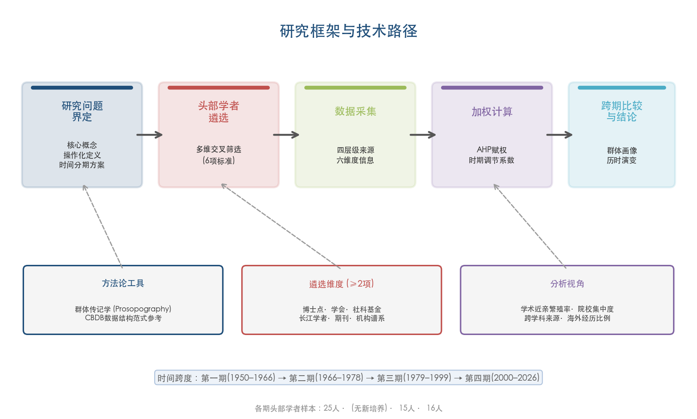

## 1.2 时间分期方案及其历史依据

本课题将1950年至2026年的七十余年划分为四个时期，各期以重大制度转折和教育政策变迁为断限。图1-2以时间轴形式展示了四期划分及各期关键制度事件节点。

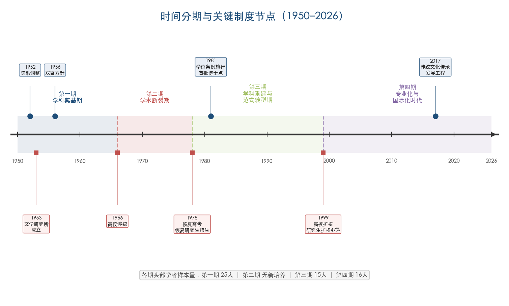

**第一期：学科奠基期（1950–1966）。** 起始标志为中华人民共和国成立后高等教育体系的全面重组。1952年院系调整是该时期最具结构性影响的制度事件——清华大学文科整体并入北京大学，燕京大学文理科并入北大，各校中文系古代文学师资经历大规模重新配置。[清华大学校友总会](https://www.tsinghua.org.cn/info/1952/17478.htm "清华文学院的前世今生") 翌年，中国科学院文学研究所（后改属中国社会科学院）成立，设古代文学研究组。[中国社科院文学研究所古代室](http://literature.cass.cn/jgsz/yjs/gdwxyjs/ "古代文学研究室官方网页") 1956年"百花齐放、百家争鸣"方针的提出，短暂推动了学术研究的展开。[浙江树人大学·党史天天学](https://old.zjsru.edu.cn/info/1042/8745.htm "1956年4月28日提出百花齐放百家争鸣") 该时期学者主要接受民国高等教育体系的训练，知识结构兼具"旧学根底深厚"与"新学训练层叠"的双重特征。以1966年6月高校停止招生为下限。

**第二期：学术断裂期（1966–1978）。** 1966年6月13日，中共中央、国务院决定高校招生推迟，实际导致高考停止长达11年；同月27日，高等教育部暂停研究生招生，研究生培养中断至1978年。[中国科学院大学·研究生教育恢复招生40周年](https://40.ucas.ac.cn/index.php/history/zhuanyan/761-40 "1949–1965研究生教育数据") 1970至1976年间实行工农兵学员制度，六届共招收约百万人，但入学者初中以上文化程度不足20%。[光明网·工农兵大学生写真](https://www.gmw.cn/02sz/2009-08/01/content_1011829.htm "工农兵学员文化程度数据") 该时期头部学者遭受批斗下放，多位奠基学者相继辞世（冯沅君1974年、刘大杰1977年、陆侃如1978年），学术梯队出现严重断层。以1977年恢复高考和1978年恢复研究生招生为下限。

**第三期：学科重建与范式转型期（1979–1999）。** 上限以1978年恢复研究生招生为标志。1980年2月12日，《中华人民共和国学位条例》经全国人大常委会通过，1981年1月1日起施行，确立学士、硕士、博士三级学位制度。[《中华人民共和国学位条例》全文](https://oaa.shanghaitech.edu.cn/2021/0329/c4076a62176/page.htm "上海科技大学转载学位条例原文") 同年11月3日，首批博士学位授权审核由国务院批准公布，首批博士学位授予单位共 151 个（高校111所、科研院所37个），博士点 318 个，博导 1155 名。[教育部学位与研究生教育发展中心](https://www.cdgdc.edu.cn/zgxw30n/info/1086/1516.htm "第一次博士、硕士学位授权审核") 该时期经历了"美学热""文化热""国学热"等学术潮流，西方文论大规模引入，学者知识构成趋于多元。以1999年高校扩招为下限——1998年全国研究生招生规模为7.2万人，1999年扩招幅度达47%。[教育部新闻](http://www.moe.gov.cn/moe_879/moe_329/moe_296/tnull_3008.html "研究生扩招速度惊人")

**第四期：专业化与国际化时代（2000–2026）。** 以高校扩招和"985工程""211工程""双一流"建设为制度背景。2017年1月25日，中办、国办印发《关于实施中华优秀传统文化传承发展工程的意见》，对古代文学学科的社会关注度产生了直接影响。[中国政府网](http://app.www.gov.cn/govdata/gov/201701/25/398045/article.html "2017年1月25日正式印发") 该时期博士学位已成为进入学术界的基本门槛，数字人文方法渐次引入，出土文献研究形成学科交叉需求，但学者群体的专业来源进一步趋于单一化。

上述四期划分的核心依据在于：每一时期的教育制度和文艺方针对学者群体的知识获取渠道构成了根本性约束。第一期学者的知识来源根植于民国高等教育；第二期学术培养渠道近乎封闭；第三期学位制度重建开辟了系统化学术训练的新渠道；第四期则在制度化培养的轨道上进一步趋向专业化与标准化。

## 1.3 "头部学者"的遴选标准与操作化筛选

"头部学者"的遴选是本课题的逻辑起点。本课题采用多维度交叉筛选策略，力求兼顾学术影响力的不同面向，避免单一指标造成的偏差。具体遴选维度如下。

### 1.3.1 博士点设置与学科评估中的关键人物

首批中国古代文学博士点及博导名单构成遴选的第一道基准线。1981年首批古代文学方向博士点分布于约8所高校和1个研究机构，博导约11位：北京大学吴组缃、东北师范大学杨公骥、复旦大学赵景深（另有朱东润"中国各体文学"、郭绍虞"中国文学批评史"）、华东师范大学徐震堮、南京大学程千帆、南京师范学院唐圭璋、扬州师范学院任中敏、江苏师范学院（今苏州大学）钱仲联、山东大学萧涤非、中国社会科学院文学研究所吴世昌和余冠英，另有四川大学杨明照（文学批评史）、中山大学王起（各体文学）。[首批文科博士生导师名单整理](https://zhuanlan.zhihu.com/p/406015587 "信息源自1981年《国务院学位委员会公报》") 此后至2006年，先后进行了十批博士和硕士学位授权审核，之后改为动态审核制度。至第四轮学科评估（2017年公布）时，中国语言文学一级学科共65所高校拥有博士授权、148所参评，A+ 高校为北京大学和北京师范大学，A 级包括复旦大学、华东师范大学、南京大学、浙江大学、山东大学、四川大学。[教育部学位与研究生教育发展中心](https://www.cdgdc.edu.cn/dslxkpgjggb/xkpm/rwskl/a0501_zgyywx.htm "第四轮学科评估0501中国语言文学") 上述博士点及评估中居于核心地位的学科带头人构成头部学者候选池的重要来源。

### 1.3.2 学术团体负责人

古代文学各断代学会的会长、副会长是学术共同体内部认可度的重要标志。以中国唐代文学学会为例，历任会长依次为萧涤非、程千帆、傅璇琮、陈尚君，现任（第十一届）会长为李浩（西北大学）。[中国百科全书数据库](https://www.zgbk.com/ecph/words?SiteID=1&Name=%E4%B8%AD%E5%9B%BD%E5%94%90%E4%BB%A3%E6%96%87%E5%AD%A6%E5%AD%A6%E4%BC%9A&Type=bkzyb "中国唐代文学学会") 类似地，中国古代文学理论学会、中国词学研究会、中国宋代文学研究会等断代或专题学会的核心负责人均纳入遴选视野。

### 1.3.3 国家社科基金项目主持

国家社科基金项目数据库可按学科分类"中国文学—古代文学"（代码ZWD）检索历年重大、重点、一般及青年项目的主持人信息。[国家社科基金项目数据库](https://fz.people.com.cn/skygb/sk/index.php/Index/seach "国家社科基金项目数据库") 其中，重大项目主持人尤能代表该学科的前沿方向与核心力量，是遴选头部学者的高权重指标。

### 1.3.4 学术荣誉与制度性认定

长江学者特聘教授、国家级教学名师等制度性认定提供了第四个筛选维度。古代文学方向的长江学者分布集中于传统强校，如程章灿（南京大学，2008年）、钱志熙（北京大学）、尚永亮（武汉大学）、陈引驰（复旦大学）、康震（北京师范大学，2016年青年学者）等。[教育部2008年长江学者名单](http://www.polymer.cn/UploadFile/IndustryNewsPic/20090930095308-1.pdf "程章灿入选长江学者")

### 1.3.5 学术期刊核心作者群

《文学遗产》《文学评论》等核心期刊的高频作者群体提供了学术产出层面的参照。据2016年发表的统计研究，2014年人大复印资料《中国古代、近代文学研究》全文转载的276篇论文中，排名前8的13家单位共贡献117篇（占42.39%）。[李俊·2013—2014年中国古代文学研究的热点与趋势](http://xb.xynu.edu.cn/cn/article/pdf/preview/59b06f34-e4b8-4390-9837-4254237ac992.pdf "信阳师范学院学报2016年第1期") 头部学者的院校分布与核心期刊论文的机构分布呈高度吻合。

### 1.3.6 机构学术谱系中的核心人物

中国社科院文学研究所古代文学研究室成立于1953年，2016年获评"登峰战略"首批优势学科，其官方网页公开了从第一代（王伯祥、余冠英、钱锺书等）到第五代的完整学术谱系履历。[中国社科院文学研究所古代室](http://literature.cass.cn/jgsz/yjs/gdwxyjs/ "古代文学研究室官方网页") 这类机构内部认定的学术谱系，为遴选提供了纵深的历史维度。

在实际操作中，本课题要求入选者至少满足上述六个维度中的两个。第一期（1950–1966）因学位制度和项目制度未曾建立，主要依据博士点设置中的首批博导身份、院校学科建设中的核心地位以及经典文学史教材的编撰参与等予以认定。第三、四期则可借助更为完善的制度化指标进行筛选。最终各期遴选的头部学者人数分别为：第一期25人、第三期15人、第四期16人。第二期（1966–1978）因高等教育停摆，几乎无新培养学者进入头部行列，该期着重考察已有头部学者的遭遇与非正式学术传承。

## 1.4 学者知识背景数据的采集体系

### 1.4.1 采集维度

学者知识背景数据的采集围绕六个核心维度展开：

**维度一：毕业院校与院校学科偏向。** 记录学者各学历阶段的就读院校，并按院校性质划分为综合性大学（北京大学、复旦大学、南京大学等）、师范类院校（北京师范大学、华东师范大学、陕西师范大学等）、专科学校或非文科院校（无锡国学专修学校、天津棉业专门学校等）及科研院所（中国社科院研究生院等）四类。院校学科偏向的判定以教育部学科评估中的优势学科分布为参照。

**维度二：专业方向。** 记录本科入学时的专业（区分是否存在转专业情况，如林庚由物理系转中文系、吴组缃由经济系转中文系等），以及硕士、博士阶段的研究方向。

**维度三：学历层次。** 分为自学成才/无正规学位、本科、硕士、博士四级。尤须注意的是，1981年学位条例施行前培养的学者多无正式学位，但这并不等同于其学术水准低于后来的博士学位获得者。

**维度四：导师专业背景与学术谱系。** 记录硕士、博士阶段导师的姓名、专业方向及其自身的师承关系。导师谱系是知识传递的核心通道——朱自清→林庚/王瑶/余冠英、吴梅→任中敏/唐圭璋/王季思/程千帆等师承链的追溯，对于理解学科知识的代际流动至关重要。

**维度五：工作单位流动轨迹。** 记录学者毕业后的历任工作单位，区分"留校任教"（学术近亲繁殖的直接指标）与"跨校/跨机构流动"两种路径。1952年院系调整以及1978年学术恢复期的人才重新配置（如程千帆由武汉调入南京大学、王水照由中国社科院文学研究所调入复旦大学）构成流动轨迹中的关键节点。

**维度六：海外学术经历。** 区分学位攻读型（如钱锺书赴牛津取得B.Litt.、冯沅君获巴黎大学博士）与短期访学型（如袁行霈1982–1983年任东京大学外国人教师、刘宁赴哈佛富布莱特访问学者）。

### 1.4.2 数据来源层级

数据采集建立四层级来源体系，按可信度由高至低排列：

**第一层级（最高优先级）：院校官方网站与学者本人学术简历。** 各高校文学院/中文系的教师主页通常包含学者完整的教育与工作经历，如北京大学中文系、南京大学文学院、复旦大学古代文学研究中心、陕西师范大学文学院等均设有教师个人页面。中国社科院文学研究所古代文学研究室官方网页尤为宝贵，提供了从第一代至第五代学者的完整履历信息。[中国社科院文学研究所古代室](http://literature.cass.cn/jgsz/yjs/gdwxyjs/ "古代文学研究室学者履历")

**第二层级：学位论文数据库与学术成果库。** 中国知网（CNKI）学位论文数据库可查询学者的博士论文题目、导师、授予单位等关键信息。国家社科基金项目数据库可查询项目主持人的单位和职称信息。

**第三层级：校史资料与学者纪念文集。** 各校校友会网站、校史馆网页（如北京大学校史馆、清华大学校史馆）中的学者传记资料，以及公开出版的学者纪念文集、学术年谱等，均可提供较为详实的学术履历信息。

**第四层级：权威媒体报道与学术评述。** 《光明日报》《中国社会科学报》等媒体的学者专访及纪念文章，以及同行学者的评述性文章，可作为交叉验证来源。

在数据采集过程中，核心事实（毕业院校、学位、导师姓名等）以第一层级来源为准，仅当第一层级不可获取时方引用下一层级。所有采集信息均建立来源追溯表，以确保数据的可验证性。

## 1.5 知识背景加权计算模型

为实现不同时期学者群体知识背景差异的定量比较，本课题构建一套"知识背景加权计算模型"。该模型的核心理念在于：学者的知识构成并非各维度的简单叠加，不同维度对知识结构的塑造力度存在差异，且同一维度在不同历史时期的权重亦有所不同。

### 1.5.1 赋权逻辑与方法

各维度的权重确定采用层次分析法（Analytic Hierarchy Process, AHP）。AHP由美国运筹学家萨蒂（Thomas L. Saaty）于20世纪70年代创立，其理论基础系统阐述于Saaty 1980年出版的专著*The Analytic Hierarchy Process: Planning, Priority Setting, Resource Allocation*中。AHP的核心步骤为：将复杂评价问题分解为目标层、准则层和方案层的递阶结构；在每一层次的指标之间进行两两比较，构造判断矩阵；计算判断矩阵的最大特征值和对应特征向量，得到各指标的层次排序权重；进行一致性检验（一致性比率CR < 0.1方为可接受）。该方法尤其适用于定性判断与定量分析相结合的评价问题，自提出以来已广泛应用于经济管理、教育评估和人文社科等多个领域。

在本课题中，目标层为"学者知识背景综合指数"，准则层为上述六个采集维度，方案层为各维度内部的具体取值。图1-3展示了该AHP层次结构的完整框架。

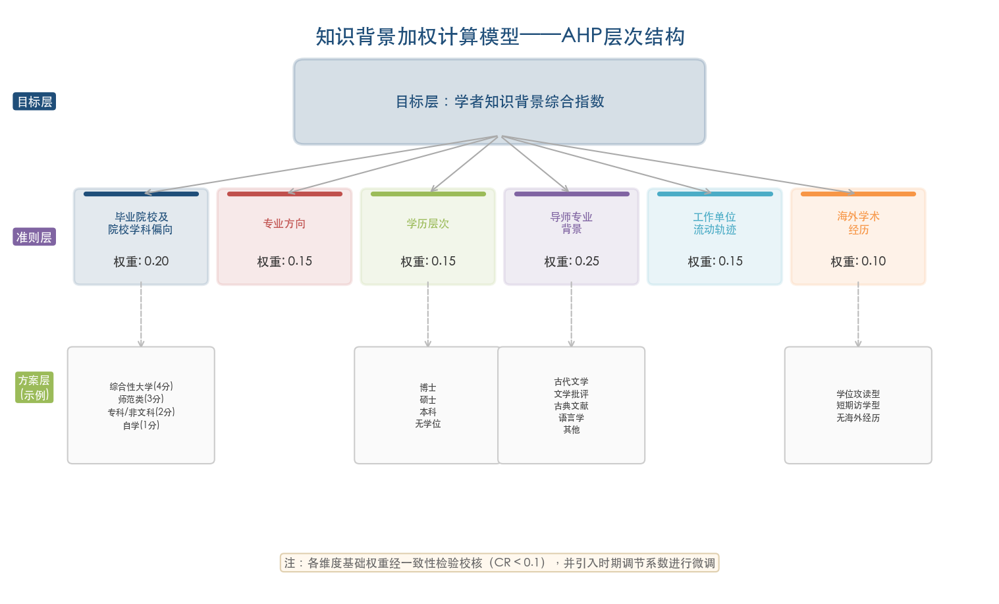

六个维度的基础权重设定如下：

| 维度 | 基础权重 | 赋权依据 |
|------|---------|---------|
| 毕业院校及院校学科偏向 | 0.20 | 院校提供的学术环境和资源构成知识获取的基础条件 |
| 专业方向 | 0.15 | 专业训练决定学者的核心知识结构和方法论取向 |
| 学历层次 | 0.15 | 学历层次反映系统化学术训练的深度 |
| 导师专业背景 | 0.25 | 导师是知识传递的最直接通道，师承关系在人文学科中的权重尤为突出 |
| 工作单位流动轨迹 | 0.15 | 跨机构流动经历拓展学术视野和社会化渠道 |
| 海外学术经历 | 0.10 | 海外经历提供异质性知识来源，但在古代文学领域的实际影响较其他学科偏低 |

上述基础权重需经一致性检验校核。在实际分析中，各维度的时期差异亦须纳入考量：例如"学历层次"在第一期（学位制度未曾建立）的区分度低于第四期（博士门槛化时代）；"海外学术经历"在第一期（少数学者拥有实质性海外学位）的权重应高于第四期（海外经历以短期访学为主、区分度下降）。为此，模型引入时期调节系数，对基础权重在各时期内做适度微调。

### 1.5.2 院校学科偏向的量化方法

院校学科偏向的量化基于两个子指标：其一为院校性质分类（综合性大学赋值4分、师范类院校赋值3分、专科/非文科院校赋值2分、自学成才赋值1分），其二为该院校中国语言文学学科在教育部学科评估中的等级（A+赋值5分、A赋值4分、A-赋值3分、B+及以下赋值2分、无学科评估结果赋值1分）。两个子指标加权求和后归一化为0–1区间的"院校学科偏向指数"。

对于第一期学者（1950–1966），由于其就读院校为民国时期高等院校，学科评估体系并不存在，本课题以该院校在20世纪上半叶的学术声誉和学科传统作为替代指标。清华大学国学研究院和中文系、北京大学国文系、东南大学/中央大学中文系等在民国学术界的核心地位已获广泛认可，可据此赋予相应分值。

### 1.5.3 导师专业背景的传递效应

导师对学生知识构成的塑造是人文学科中最具特殊性的维度。本课题将导师的专业背景划分为五类：纯古代文学方向、文学批评史/文艺理论方向、古典文献学/版本目录学方向、语言学/汉语言文字学方向以及其他（历史学、哲学、外国文学等）。导师背景的传递效应体现于两个层面：一是知识内容的直接传授（如程千帆向弟子传授文献学与文学批评相结合的方法），二是学术网络的继承（弟子进入导师所在院校或学术圈子的概率更高）。

为捕捉导师谱系的多代传递效应，模型引入"谱系深度系数"：直接导师的权重设为1.0，导师的导师（学术祖父）的权重衰减至0.3，再上一代衰减至0.1。这一设定反映了知识传递随代际距离递减但不会完全消失的特征。以钱志熙为例，其直接导师陈贻焮（古代文学方向，权重1.0）、学术祖父林庚（古代文学，权重0.3）、学术曾祖可追溯至朱自清乃至黄节、刘师培（权重0.1），形成了一条从清末民初延伸至当代的完整传承链。钱志熙本人亦自述其学术传承脉络："从刘师培、黄节到林庚、陈贻焮，到葛晓音和我们。"[北京大学中文系·钱志熙专访](https://chinese.pku.edu.cn/xwgg/bdzwr/9993ca8447d649c9b6115f62f6b1e321.htm "杭大本硕、北大博士、导师陈贻焮")

### 1.5.4 加权计算的综合输出

模型的综合输出为各时期学者群体的"知识背景轮廓"（Knowledge Background Profile），包括以下统计量：

- 各维度的群体均值与标准差，用于刻画该时期学者群体知识构成的集中趋势与离散程度；
- 院校集中度指数（赫芬达尔-赫希曼指数/HHI），用于衡量头部学者培养院校的集中或分散程度；
- 跨学科来源比例（非中文系本科出身者占比）；
- 近亲繁殖率（本硕博全部或主要在同一大学完成并留校者占比）；
- 海外经历比例及类型分布。

以上统计量在四个时期之间进行横向比较，即可揭示知识背景的历时演变趋势。

## 1.6 方法论框架：群体传记学与跨学科方法的整合

### 1.6.1 群体传记学（Prosopography）

本课题的核心方法论为群体传记学。Lawrence Stone在1971年发表于*Daedalus*的经典论文中将其定义为："对历史中一群行动者的共同背景特征的调查，方法是对他们的生平进行集体性研究。所采用的方法是确定一个拟研究的群体，然后对其提出一组统一的问题——关于出生与死亡、婚姻与家庭、社会出身与继承的经济地位、居住地、教育、个人财富的数量与来源、职业、宗教信仰、任职经历等。然后将群体中各个个体的各类信息加以并列和组合，检验其中的显著变量。这些变量既用于内部相关性检验，也用于与其他行为或行动形式的相关性检验。"（Lawrence Stone, "Prosopography," *Daedalus* 100.1, 1971: 46-79; 收入F. Gilbert & S. Graubard eds., *Historical Studies Today*, New York, 1972）[CBDB项目群体传记学方法论页面](https://cbdb.hsites.harvard.edu/prosopography "哈佛大学CBDB引用Stone原文") 本课题虽然研究的是当代学者而非历史人物，但群体传记学"先界定群体范围—再系统提出统一问题—再集体并列比较"的方法论范式完全适用。Stone所列举的考察变量中，"教育""职业""社会出身"等维度恰好对应本课题的"毕业院校""工作单位流动""导师谱系"等核心采集维度。

在数据结构设计上，本课题参考了中国历代人物传记资料库（China Biographical Database, CBDB）的结构范式。CBDB由哈佛大学、北京大学、中央研究院合作建设，截至目前收录了超过52万条中国历代人物传记记录，其数据模型涵盖地址、求学地、仕宦、亲属、社会关系等多个维度，是群体传记学方法在中国人物研究中最成熟的实践样本。[CBDB数据库介绍](https://zhuanlan.zhihu.com/p/450286131 "引得数字人文平台介绍CBDB") 本课题的学者数据库参照该结构，设置"基本信息""教育经历""导师信息""工作经历""学术成果""海外经历"六张关联表，实现学者个体信息与群体分析之间的灵活切换。与CBDB处理历史人物不同，当代学者的信息可从院校官方教师主页、CNKI学位论文数据库、国家社科基金项目数据库等在线资源直接采集，但同时也面临信息不完整、自述与他述不一致等问题。因此，在借鉴CBDB数据结构的同时，本课题引入了多源数据交叉验证机制（详见1.4节）。

### 1.6.2 学术近亲繁殖的分析框架

学术近亲繁殖（Academic Inbreeding）是本课题的一个重要分析视角。顾海兵（2006）调查17所中国大学987名教师，其中604人毕业后直接在母校任教（占62%），近亲繁殖程度为0.654；对照的6所海外院校仅为0.1115，中国大学近亲繁殖程度平均比海外高约5倍。[中国教育和科研计算机网](https://www.edu.cn/zui_jin_geng_xin_1169/20140508/t20140508_1110181.shtml "学术近亲繁殖还是远缘杂交") 夏纪军（2014）在《北京大学教育评论》发表实证研究，基于24个经济学院系768名教师数据发现：校际流动以同城为主（59.8%），知名大学间未形成师资交换圈；近亲繁殖率过高导致留校师资质量下降、整体学术创新能力偏低。[夏纪军《近亲繁殖与学术退化》](https://ccj.pku.edu.cn/Article/DownLoad?id=330724920&&type=ArticleFile "北京大学教育评论2014年") 阎光才（2009）在《复旦教育论坛》发表的案例分析进一步发现，理科中留校者与外校引进者科研能力无显著差异，但**文科中外校引进者科研能力高于留校者**。[中国社会科学网](https://www.cssn.cn/ztzl/jzz/rwln/xwpl/sdbd/202209/t20220923_5540878.shtml "学术近亲繁殖利弊之争")

值得注意的是，古代文学领域存在近亲繁殖的正面案例。程千帆弟子莫砺锋、张伯伟、张宏生、曹虹等均留南京大学并获学术界推崇，被作为人文学科学术近亲繁殖正面案例讨论。[中国社会科学网](https://www.cssn.cn/ztzl/jzz/rwln/xwpl/sdbd/202209/t20220923_5540878.shtml "学术近亲繁殖利弊之争") 国际学术界对此问题的认知亦在深化：Horta等学者（2010, 2013, 2022）的系列研究指出，缺乏任何流动经历的"纯近亲繁殖"（pure inbreeding）对学术创新的负面影响最为显著——这类学者"仅接受过单一机构环境的社会化，仅从单一机构获取了一套狭窄的观念、价值和行为模式"。[Horta & Yudkevich, *Higher Education*](https://link.springer.com/article/10.1007/s10734-025-01610-0 "学术近亲繁殖与边界建构：2025年综述论文") 这一区分为本课题提供了重要的分析框架——在衡量古代文学领域近亲繁殖时，需区分"完全近亲繁殖"（博士留校任教）与"纯近亲繁殖"（本硕博全在同一院校完成并留校），后者的知识同质化风险更高。 教育部2010年《全国教育人才发展中长期规划（2010–2020年）》明确提出"大力改善高等学校教师学缘结构，逐步减少和消除'学术近亲繁殖'现象"，为分析2010年前后学缘结构变化提供制度分期参照。[中国教育网](https://www.edu.cn/te_bie_tui_jian_1073/20110804/t20110804_659948.shtml "众专家热议学术近亲繁殖如何消除") 本课题通过计算各时期头部学者的近亲繁殖率，可以检验古代文学领域在政策干预前后学缘结构是否发生实质性变化。

### 1.6.3 研究局限与边界说明

本课题的设计包含若干固有边界。第一，各时期头部学者样本量存在客观差异（第一期25人、第三期15人、第四期16人），这是学术史本身的反映而非抽样偏差——第二期（1966–1978）高等教育全面停摆导致无新一代学者进入头部行列，第三期学位制度建立初期博士点数量有限。在统计分析中，我们采用比例指标（如近亲繁殖率、跨学科比例）而非绝对数值进行跨时期比较，以降低样本量差异对结论的影响。第二，"头部学者"的遴选标准虽采用多维度交叉验证，但第一期学者因制度化指标的缺失（无学位制度、无学科评估、无项目制度），遴选更多依赖学术史共识和首批博导评审结果。第三，学者知识构成受到的影响因素远超本课题覆盖的六个维度——个人天赋、家庭文化资本、出版机会、时代际遇等均可能发挥重要作用，但因数据可获取性的限制未予系统纳入模型。第四，现有学术近亲繁殖的实证研究主要集中在经济学和理工科领域，本课题将其分析框架引入古代文学学者群体具有一定的探索性质，所得结论在古代文学领域的外部效度应审慎看待。

此外，加权计算模型中的权重设定虽经AHP一致性检验，但仍反映的是研究者基于学科知识的专业判断。为检验核心结论对权重变动的敏感性，第4至6章将通过调整维度权重（在基础权重的±30%范围内浮动），验证主要发现——如院校集中度的U型曲线、专业背景单一化趋势、近亲繁殖率的时期间跃升等——是否在不同权重方案下依然成立。

# 第2章 学科奠基期的学者群体画像（1950–1966）

1949年中华人民共和国成立至1966年"文化大革命"爆发前的十七年，是中国古代文学学科从民国学术体系向社会主义学术体制完成根本性转型的关键时期。这一代头部学者几乎全部接受过民国高等教育的系统训练，建国后又被要求以马克思主义文艺理论重新构建知识框架，由此形成了"旧学根底与新学叠加"的独特知识结构。1952年全国高等院校院系调整则从制度层面彻底重塑了古代文学的师资配置格局，将此前分散于十余所院校的学术力量集中到少数几所大学，奠定了此后数十年的学科地理版图。本章以25位头部学者的教育背景、师承关系、院校渊源和知识结构为主线，结合"双百方针"、反右运动及苏联范式输入等时代变量，勾勒这一代学者群体的集体画像。

## 2.1 民国高等教育的训练遗产

### 2.1.1 毕业院校的高度集中：清华、北大与南京系统

本课题遴选的25位奠基期头部学者，其教育背景呈现显著的院校集中特征。从毕业院校分布看，三大教育系统构成了绝对主体——

**清华大学**出身至少6人。林庚（1910–2006）1928年入清华物理系，1930年转中文系，1933年毕业后留校任朱自清助教。[清华校友总会·林庚](https://www.tsinghua.org.cn/info/1014/8681.htm "清华四剑客之一林庚辞世") 王瑶（1914–1989）1934年入清华中文系，1943年入清华研究院师从朱自清，1946年获硕士学位。[北京大学中文系·王瑶学术年表](https://chinese.pku.edu.cn/xwgg/xwdt/1bb9d9c2e972497e8c8cbaac830c8b5e.htm "王瑶学术年表") 钱锺书（1910–1998）1929–1933年就读于清华外文系，1937年在牛津大学获B.Litt.学位，后赴巴黎大学研究一年。[清华大学校史馆](https://xsg.tsinghua.edu.cn/info/1004/2938.htm "钱锺书B.Litt.考") 余冠英（1906–1995）1926年入清华历史系后转中文系，1931年毕业留校。[清华校友总会·余冠英](https://www.tsinghua.org.cn/info/1952/17189.htm "余冠英先生的朋友圈") 吴组缃（1908–1994）1929年入清华经济系，次年转中文系，1933年毕业。[清华大学·清华文学院前世今生](https://www.tsinghua.org.cn/info/1952/17478.htm "清华文学院的前世今生") 萧涤非（1906–1991）1926年入清华，1930年入清华研究院师从黄节，1933年毕业。[山东大学文学院·萧涤非](https://www.lit.sdu.edu.cn/info/1051/3300.htm "萧涤非")

**北京大学**出身至少7人。游国恩（1899–1978）1926年毕业于北大中国文学系。[北京大学校史馆·游国恩](https://www.xsg.pku.edu.cn/heros/scholar/detail/668.html "北京大学校史馆游国恩词条") 陆侃如（1903–1978）1922年入北大，1924年转入清华研究院专攻古典文学。[北师大校史研究室·冯沅君](https://sdxs.bnu.edu.cn/xsyj/sdrw/242662.html "文学史学大师冯沅君先生") 冯沅君（1900–1974）1922年入北大研究所国学门，为北大第一位女研究生，1925年毕业；1935年获巴黎大学文学博士学位。[山东大学·冯沅君](https://www.sdu.edu.cn/info/1011/1105.htm "山东大学历史名人冯沅君") [北京大学校史馆·冯沅君](https://www.xsg.pku.edu.cn/details/1595.html "北大第一位女研究生") 俞平伯（1900–1990）为清代朴学大师俞樾曾孙，1919年毕业于北大。[中国社科院文学研究所·古代室](http://literature.cass.cn/jgsz/yjs/gdwxyjs/ "古代文学研究室官方网页") 任中敏（任半塘，1897–1991）1918年入北大国文系师从吴梅。[东南大学校友总会·吴梅](https://seuaa.seu.edu.cn/2008/0110/c1669a26482/page.htm "吴梅简介") 詹锳（1916–1998）1934年入北大。[光明网·詹锳](https://news.gmw.cn/2020-02/17/content_33560069.htm "詹锳先生的治学精神") 褚斌杰（1933–2006）1950年代就读于北大中文系，1954年毕业后留校任游国恩助教。[光明网·褚斌杰](https://news.gmw.cn/2017-11/20/content_26834627.htm "褚斌杰")

**东南大学/中央大学/金陵大学**（以下统称"南京系统"）出身3人。唐圭璋（1901–1990）1920年代就读于国立东南大学中文系，师从曲学大师吴梅。[光明日报·唐圭璋](https://epaper.gmw.cn/blqs/html/2011-09/07/nw.D110000blqs_20110907_8-01.htm "唐圭璋") 程千帆（1913–2000）1932年入金陵大学中文系，师从黄侃、吴梅、汪辟疆、胡小石，1936年毕业。[南京大学校友网·程千帆](https://alumni.nju.edu.cn/49/c0/c58546a674240/page.htm "程千帆先生与南京大学") 王季思（1906–1996）1925年入国立东南大学文学系师从吴梅。

清华与北大出身者合计占52%（13/25），若加入南京系统则达64%（16/25）。图2-1直观呈现了这一高度集中的院校分布格局。

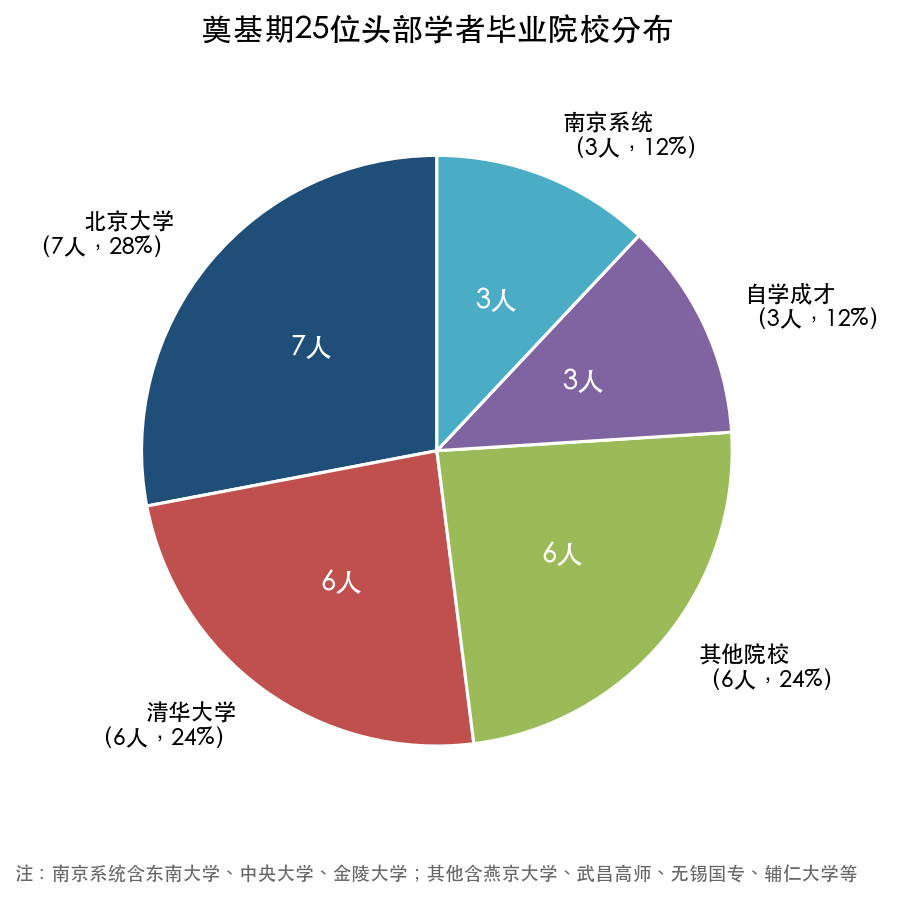

上述数据揭示出一个结构性事实：奠基期古代文学头部学者几乎全部来自民国最顶尖的三到四所大学，院校集中度远超一般想象。这种高度集中的格局并非偶然——清华、北大与南京系统恰恰是民国时期中文学科最具实力的三大教育重镇，它们在师资配置、学术传统和研究资源上的优势经由数十年积累，最终通过毕业生的学术产出得到确认。

### 2.1.2 自学成才型学者

25位学者中有3位并未接受正规大学教育，构成了值得关注的"自学成才"群体。郭绍虞（1893–1984）未受正规大学教育，完全凭借个人著述积累学术声望，1952年调入复旦大学中文系任教授兼系主任，1981年获批首批中国文学批评史博导。[复旦大学图书馆·郭绍虞](https://library.fudan.edu.cn/e6/bc/c42727a517820/page.htm "郭绍虞") 赵景深（1902–1985）1922年毕业于天津棉业专门学校——一所与文科毫无关系的实业学校——此后转向文学研究并自学成才，1930年起在复旦大学中文系任教授，1981年获批首批古代文学博导。[复旦大学图书馆·赵景深](https://library.fudan.edu.cn/e6/c7/c42727a517831/page.htm "赵景深") 王伯祥（1890–1975）同样未受大学教育，长期在中学任教及出版社从事古典文献整理工作，1953年调入中科院文学研究所古代文学组。[中国社科院文学研究所·古代室](http://literature.cass.cn/jgsz/yjs/gdwxyjs/ "古代文学研究室官方网页")

自学成才者的存在折射出民国学术生态的一个重要特征：在现代学位制度未曾建立的时代，学术评价主要依据著述质量与学界声望而非学历凭证，这种以成果为本位的评价机制客观上允许非科班出身者凭借个人才力进入学术核心圈，为学术共同体保留了重要的异质性知识来源。

### 2.1.3 跨学科的专业来源

该代学者的专业背景远非"中文系"所能概括。25位学者中至少有5人在本科阶段并非以中文系为起点入学：钱锺书出身清华**外文系**，余冠英初入清华**历史系**后转中文系，林庚初入清华**物理系**后转中文系，吴组缃初入清华**经济系**后转中文系，杨公骥（1921–1989）则在中华大学、陕北公学和鲁迅艺术学院辗转接受教育，其知识来源兼跨文学与革命文艺两个系统。[东北师范大学文学院·杨公骥](https://chinese.nenu.edu.cn/info/1041/1611.htm "杨公骥") 加上赵景深（天津棉业专门学校）等非典型教育路径者，非中文系正规训练出身者占比超过30%。

这种显著的跨学科构成是民国通才培养模式的直接产物。民国高等教育在学科壁垒上远不如1952年院系调整之后严格，转系行为普遍而自然。以清华大学为例，林庚从物理系转入中文系，吴组缃从经济系转入中文系，均未遭受制度性阻碍。清华1930年代的人文教育环境——朱自清、闻一多、陈寅恪、黄节等名家荟萃——使转入中文系的学生能够获得极为开阔的知识视野和跨学科思维训练。钱锺书虽终身以外文系毕业生身份从事研究，但其比较文学与中国古典文学的深度贯通，恰恰体现了跨学科训练对学术创造力的长期增益。

### 2.1.4 最高学历分布与海外经历

该批学者的最高学历以本科和硕士为主，获海外学位者数量有限但具有标志性意义。钱锺书获牛津大学B.Litt.学位；冯沅君1935年获巴黎大学文学博士学位；刘大杰（1904–1977）1926年赴日本早稻田大学文学部留学，1930年毕业。[复旦大学图书馆·刘大杰](https://library.fudan.edu.cn/e6/c1/c42727a517825/page.htm "刘大杰") 吴世昌（1908–1986）在燕京大学获哈佛燕京学社研究生硕士学位，1947年赴牛津大学讲学，1962年回国任中科院文学研究所研究员。[中国社科院文学研究所·古代室](http://literature.cass.cn/jgsz/yjs/gdwxyjs/ "古代文学研究室官方网页") 詹锳1948年赴美留学，1953年获博士学位回国，此后在河北大学工作逾四十年。[光明网·詹锳](https://news.gmw.cn/2020-02/17/content_33560069.htm "詹锳先生的治学精神") 朱东润（1896–1988）1913年留学英国伦敦西南学院，1916年回国。[复旦大学·朱东润](https://www.gdwx.fudan.edu.cn/76/a5/c3857a30373/page.htm "朱东润先生的中国文学批评史研究")

具有实质性海外经历者共约6人，占全部25人的24%。这一比例在中国古代文学学科内部已属此后各代所不及的高水平——第4至6章的数据将显示，此后七十年间再未出现一位持海外博士学位的古代文学头部学者。奠基期学者的海外经历在建国后虽不再被视为学术优势，但其所带来的比较视野和国际学术规范训练，仍然潜移默化地影响着他们的研究方法和学术判断。

## 2.2 两大核心学术训练基地与师承谱系

### 2.2.1 清华研究院系统：朱自清学脉

清华大学中文系及其研究院在1920–1930年代构建了古代文学研究的核心训练基地。朱自清在清华培养了林庚（1933年留校任助教）、王瑶（1943–1946年硕士研究生）、余冠英等关键人物。[北京大学中文系·王瑶学术年表](https://chinese.pku.edu.cn/xwgg/xwdt/1bb9d9c2e972497e8c8cbaac830c8b5e.htm "王瑶学术年表") 朱自清的学术取向融合了新文学感性与古典文献功底，这一特征深刻塑造了他的弟子群体的治学风格：林庚后来以"盛唐气象"和诗歌艺术研究见长，王瑶成为魏晋南北朝文学与中国新文学研究的双栖学者，余冠英则以先秦两汉文学选注闻名。三人在1952年院系调整后分别进入北大中文系和文学研究所，朱自清学脉由此完成了从清华到北大和文学所的制度性迁移。

另一位在清华研究院产生重要影响的导师是黄节。萧涤非1930年入清华研究院师从黄节学习杜诗研究，1933年毕业，1947年回山东大学任教。[山东大学文学院·萧涤非](https://www.lit.sdu.edu.cn/info/1051/3300.htm "萧涤非") 黄节在诗歌考据与诗学批评方面的训练，为萧涤非后来主持《杜甫全集校注》这一巨型工程奠定了学术根基。

### 2.2.2 东南大学/中央大学系统：吴梅学脉与黄侃学脉

南京是民国学术的另一重镇。东南大学（后改名中央大学）和金陵大学在词曲学与文献学领域形成的深厚传统，由吴梅和黄侃两位大家奠定。

**吴梅学脉**堪称古代文学研究中跨院校传承的典范。曲学大师吴梅先后在北大、东南大学、金陵大学执教，培养了任中敏、唐圭璋、王季思、程千帆四位学者。[东南大学校友总会·吴梅](https://seuaa.seu.edu.cn/2008/0110/c1669a26482/page.htm "吴梅简介") 四人后来分别在扬州师范学院、南京师范学院、中山大学、南京大学各据一方，延续并拓展了词曲学传统，形成了典型的"扇形"扩散格局——从单一导师出发，向全国多所院校辐射，每一位弟子均在所在机构建立了独立的学术据点和传承链条。

**黄侃学脉**以文献学和训诂学见长。黄侃身为章太炎弟子，在中央大学和金陵大学的学术影响深远。程千帆是其重要学术传人，秉承了将文献学考据功底与文学鉴赏能力相统一的治学理念。[南京大学校友网·程千帆](https://alumni.nju.edu.cn/49/c0/c58546a674240/page.htm "程千帆先生与南京大学") 程千帆1932年入金陵大学时同时受教于黄侃、吴梅、汪辟疆、胡小石四位名师，其知识结构因而兼具词曲学的艺术感悟和文献学的实证功底。这种双重训练后来成为他在南京大学构建学术传统的根基，也为中国古代文学研究提供了一种将文本鉴赏与文献考据融为一体的方法论范式。

### 2.2.3 其他学术训练来源

除上述两大主流训练系统之外，部分学者的教育背景呈现独特面貌。聂石樵（1927–2018）1949年入辅仁大学国文系，1952年辅仁并入北京师范大学，1953年毕业后留校任教。[光明网·聂石樵](https://news.gmw.cn/2022-07/11/content_35873141.htm "聂石樵先生的学术") 钱仲联（1908–2003）1926年毕业于无锡国学专修学校，建国后执教于江苏师范学院（今苏州大学），1981年获批首批古代文学博导。[中国百科全书·钱仲联](https://www.zgbk.com/ecph/words?SiteID=1&Name=%E9%92%B1%E4%BB%B2%E8%81%94&Type=bkzyb "钱仲联词条") 无锡国学专修学校虽非正规大学建制，但其国学训练的深度与系统性在民国学界享有盛誉，钱仲联即由此获得了深厚的古典诗文功底，后来成为清诗研究和近代诗文研究的一代宗师。

杨公骥的教育路径代表了另一种极端类型：1937年入武汉中华大学，1938年转赴陕北公学和鲁迅艺术学院学习，其知识结构融合了正统学术训练与延安革命文艺教育。1946年被派往东北大学（今东北师范大学）任教，1956年年仅35岁即评为国家二级教授，1981年获批首批古代文学博导。[东北师范大学文学院·杨公骥](https://chinese.nenu.edu.cn/info/1041/1611.htm "杨公骥") 杨公骥是25位学者中唯一一位教育背景深度嵌入革命教育体制的人物，他在奠基期即已自觉运用马克思主义方法论研究先秦文学，其学术路径预示了此后一种重要的知识整合模式。

## 2.3 1952年院系调整：学科格局的制度性重塑

### 2.3.1 调整的基本方向与规模

1952年全国高等院校院系调整是新中国教育史上规模最大的一次院校重组。其基本方向是仿照苏联高等教育模式，将民国时期的综合性大学拆分为专业性院校，同时在若干大学保留并加强文理科建制。对中国古代文学学科而言，这次调整最为深远的影响在于：它将原本分散在多所院校的古代文学师资力量重新配置到少数几所大学，从制度层面奠定了此后数十年的学科地理格局。图2-2展示了调整中头部学者的具体流动路径。

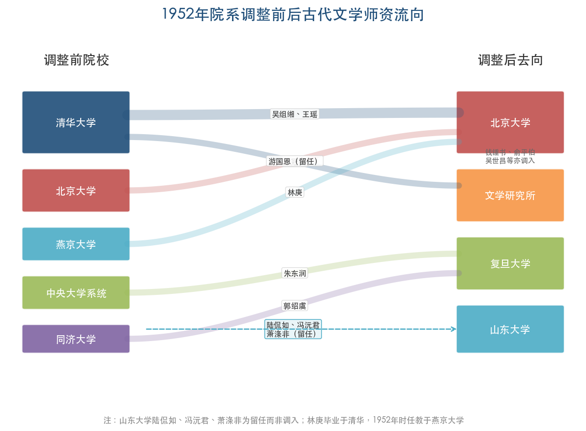

### 2.3.2 北京大学：清华、燕京与北大的三源合流

调整中最具标志性的变动发生在北京。清华大学文科整体并入北京大学，燕京大学文理科亦并入北大。涉及本课题学者的调动包括：吴组缃、王瑶、季镇淮、浦江清由清华转入北大，林庚由燕京大学改任北大中文系教授。[北京大学新闻网](https://news.pku.edu.cn/xwzh/ab9b3c53e65a4effa95a151a08f36949.htm "我与北大中文系") [清华校友总会](https://www.tsinghua.org.cn/info/1952/17478.htm "清华文学院的前世今生") 余冠英则于1953年调至中科院文学研究所。调整后，北大中文系形成了以游国恩、林庚、吴组缃为核心的古代文学教学格局——三位学者分别来自北大、清华（经燕京）和清华，合流后构成了中国古代文学教学领域阵容最为强大的学术团队。

这一合流意味着，调整之前分属清华、燕京、北大三所院校的古代文学师资，经由行政命令的整合，全部集中于新北大中文系。原来的"清华—北大双核"格局由此实质性地合并为"北大单核"格局，北大中文系的古代文学师资优势在此后数十年中无出其右。

### 2.3.3 复旦大学：多源汇聚与方向互补

复旦大学古代文学力量的形成同样是院系调整的直接产物。朱东润从中央大学系统调入复旦，郭绍虞从同济大学调入复旦中文系任系主任，赵景深原本即在复旦任教。[复旦大学·朱东润](https://www.gdwx.fudan.edu.cn/76/a5/c3857a30373/page.htm "朱东润先生") 三人分别擅长传记批评与文学批评史（朱东润）、文学批评史与诗话研究（郭绍虞）、戏曲与民间文学（赵景深），学术方向形成互补格局。朱东润1957–1967年间出任中文系主任，郭绍虞在此之前已任系主任，这种制度性安排使复旦古代文学在调整后迅速形成了与北大并列的另一学术重镇。刘大杰亦在建国后长期任复旦教授，其独撰的《中国文学发展史》是该时期最具影响力的个人著作之一。[复旦大学图书馆·刘大杰](https://library.fudan.edu.cn/e6/c1/c42727a517825/page.htm "刘大杰")

### 2.3.4 山东大学：原有格局的延续与稳固

山东大学的情况与北大、复旦形成鲜明对照。陆侃如、冯沅君夫妇自1947年起即在山大任教，萧涤非亦于1947年回山大，三人在院系调整中均继续留任，构成了山大古代文学的核心学术团队。[山东大学·冯沅君](https://www.sdu.edu.cn/info/1011/1105.htm "山东大学历史名人冯沅君") 山大古代文学的人员构成特征与北大、复旦截然不同：并非通过调整"汇入"新人，而是在原有师资基础上维持稳定延续。陆侃如、冯沅君合著的《中国文学史简编》（初版1933年，建国后以新观点修订）是新中国最早以马克思主义观点改写的文学通史之一，体现了山大古代文学团队在学术转型中的主动性。[山东大学新闻网·文学院历史上的"五岳"](https://www.view.sdu.edu.cn/info/1018/145230.htm "陆侃如冯沅君学术成就") [清华学人与山东大学古典文学学科](https://www.tsinghua.org.cn/info/1951/21002.htm "陆侃如用新观点修订中国诗史和中国文学史简编")

### 2.3.5 调整的三重结构性后果

从古代文学学科的视角审视，1952年院系调整产生了三重结构性后果。

其一，此前民国时期分散于十余所大学的古代文学师资被集中配置到北大、复旦、山大等少数院校，学科资源的空间分布从此高度不均衡，少数院校获得了压倒性的师资优势。其二，清华大学文科被完全取消，中央大学中文系被改编分流，民国时期最重要的两大古代文学训练基地——清华研究院和中央大学/金陵大学词曲学传统——不再作为独立的学术实体存在，其师资和学术传统只能在新体制下以"嫁接"方式延续。其三，调整在客观上促成了不同学术传统的碰撞与融合：游国恩的楚辞学、林庚的诗歌史、吴组缃的小说研究在北大中文系交汇，朱东润的传记批评、郭绍虞的文学批评史、赵景深的戏曲研究在复旦并行。这种跨传统的整合虽非出于学者自愿，却为后来的学科发展提供了宝贵的内在多元性。

## 2.4 中科院文学研究所古代室：国家级学术机构的人员构成

### 2.4.1 建所初期的第一代学者阵容

1953年中国科学院文学研究所成立，古代文学研究最初设两个研究组（中国古典文学组和中国文学史组），1954年合并为古代文学研究组，余冠英长期任组长（1953–1979年）。[中国社科院文学研究所·古代室](http://literature.cass.cn/jgsz/yjs/gdwxyjs/ "古代文学研究室官方网页") 第一代学者（建所初期入所）共13人：王伯祥、孙楷第（北师大国文系）、郑振铎（北京铁路管理学校）、俞平伯、陈友琴（沪江大学肄业）、余冠英、力扬、吴世昌、钱锺书、何其芳（北大哲学系）、汪蔚林、吴晓铃（燕京大学/北大中文系）、范宁（西南联大中文系/清华研究院师从闻一多）。[中国社科院文学研究所·古代室](http://literature.cass.cn/jgsz/yjs/gdwxyjs/ "古代文学研究室官方网页")

这份名单的教育背景构成呈现出显著的多样性：何其芳出身北大哲学系，郑振铎毕业于铁路管理学校，孙楷第来自北师大，陈友琴仅为沪江大学肄业。文学研究所作为国家级科研机构，其选人标准更重学术成果与学界声望而非学历凭证，这一用人逻辑与高校系统有明显差异，也为不同知识背景的学者提供了在同一平台上进行学术协作的制度空间。

### 2.4.2 第二代学者：院系调整效应的下游传导

古代室第二代学者（1950年代中后期至1960年代入所）的培养院校呈现出与第一代截然不同的格局。曹道衡1952年毕业于北大中文系，邓绍基1955年毕业于复旦中文系，王水照1960年毕业于北大中文系并在钱锺书、余冠英指导下工作。[中国社科院文学研究所·古代室](http://literature.cass.cn/jgsz/yjs/gdwxyjs/ "古代文学研究室官方网页") 第二代学者以北大、复旦毕业生为主体，其院校来源与1952年院系调整后形成的高校学科格局高度一致。这一现象表明，院系调整的效果已经通过人才培养链条向下游传导：调整后的强势院校培养出的优秀毕业生，随即被输送至国家级研究机构，形成了从院校优势到研究机构人员构成的完整传导链。

### 2.4.3 陈毓罴：苏联学术范式的直接引入

在文学所古代室人员中，陈毓罴（1930–2010）的教育背景具有独特的学术史意义。他1954年考取留苏研究生，赴莫斯科大学文学系深造，师从苏联文艺理论家波斯别洛夫，1959年归国进入文学研究所。[中国社科院文学研究所·古代室](http://literature.cass.cn/jgsz/yjs/gdwxyjs/ "古代文学研究室官方网页") 陈毓罴是25位头部学者中唯一在苏联接受系统学术训练的个案。苏联文学理论的核心分析框架——强调文学的阶级性、注重社会历史分析法、以现实主义作为文学评价的最高标准——通过陈毓罴及大量翻译著作的引介，成为这一时期古代文学史编写的重要方法论基础。

## 2.5 旧学根底与新学叠加：知识结构的双重性

### 2.5.1 旧学训练的内涵

奠基期学者群体知识结构最显著的特征，是旧学根底深厚而新学训练层叠其上的双重状态。所谓"旧学"，特指经学、小学（文字、音韵、训诂）、目录学和版本校勘学等传统学术训练。这些训练主要来自两个渠道：清华研究院（朱自清、黄节门下）注重以现代学术方法整理古典文献，中央大学/金陵大学词曲学传统（吴梅、黄侃门下）则更直接地承袭了清代乾嘉学派的考据学衣钵。

以程千帆为例，他在金陵大学同时受教于黄侃（训诂学、文献学）和吴梅（词曲学），前者培养了其严格的文献考据能力，后者培养了其对文学艺术形式的精细感受力。程千帆后来提出"将批评建立在考据基础上"的治学理念，这一理念正是对上述双重训练的自觉综合与方法论升华。[南京大学校友网·程千帆](https://alumni.nju.edu.cn/49/c0/c58546a674240/page.htm "程千帆先生与南京大学")

钱仲联毕业于无锡国学专修学校，该校课程以经学、史学、小学为核心，几乎不涉及西方学术方法论。钱仲联由此获得了极为扎实的古典诗文创作和鉴赏能力，其《剑南诗稿校注》和《近代诗钞》等著作体现了传统学术训练的深厚功底。[中国百科全书·钱仲联](https://www.zgbk.com/ecph/words?SiteID=1&Name=%E9%92%B1%E4%BB%B2%E8%81%94&Type=bkzyb "钱仲联词条")

### 2.5.2 马克思主义文艺理论的全面引入

1949年之后，马克思主义文艺理论成为所有学者必须掌握并运用的理论工具。这种"叠加"对不同学者产生了不同程度的影响。

王瑶是一个典型案例。他原以清华研究院的学术训练从事魏晋文学研究，1949年后转向以马克思主义观点讲授和研究中国新文学史，其《中国新文学史稿》是运用新方法论的代表性成果。然而，学术转向并非毫无代价：1958年"双反"运动中，王瑶在北京大学被树为"走白专路线的典型"而受到批判，此后不再担任《文艺报》编委。[北京大学中文系·王瑶学术年表](https://chinese.pku.edu.cn/xwgg/xwdt/1bb9d9c2e972497e8c8cbaac830c8b5e.htm "王瑶学术年表") [中国作家网·红黄蓝色彩的政治学](https://www.chinawriter.com.cn/n1/2020/1124/c404063-31942165.html "1958年北大双反运动详情") 王瑶的遭遇揭示了一个深层困境：即使已经努力运用马克思主义方法的学者，在不断变化的政治标准面前仍可能被判定为"不够彻底"。

苏联文艺理论家季莫菲耶夫、毕达科夫的文学理论教材被翻译引入后，成为高校文学理论教学的基本范本。这些教材强调文学的阶级性，注重社会历史分析法，并以"现实主义"作为最高创作准则，其分析框架深刻影响了1950年代古代文学史的编写范式。[教材编著:马克思主义文论同中华传统文论相结合的一条重要路径](https://journal.ujn.edu.cn/rc-pub/front/front-article/download/44859906/lowqualitypdf/%25E6%259A%2582%25E6%2597%25A0%25E6%25A0%2587%25E9%25A2%2598.pdf "未超出季莫菲耶夫和毕达可夫的蓝本") 涅陀希文在《艺术概论》（1953年原版出版，1958年中译本面世）中提出"世界艺术史即现实主义与反现实主义流派的斗争史"这一命题，该框架在1958年被北大中文系1955级学生集体编写的"红色文学史"全面采纳运用。[中国作家网·红黄蓝色彩的政治学](https://www.chinawriter.com.cn/n1/2020/1124/c404063-31942165.html "涅陀希文艺术概论对中国文学史编写的影响")

### 2.5.3 文学史编写中的范式张力与实践磨合

新旧知识的叠加状态在文学史编写实践中表现得最为充分。

陆侃如、冯沅君合著的《中国文学史简编》初版于1933年，建国后以新观点和新方法进行了系统修订。据记载，陆侃如"用新的观点和方法，修订《中国诗史》和《中国文学史简编》，在此基础上，又新著《中国古典文学简史》"。[清华学人与山东大学古典文学学科](https://www.tsinghua.org.cn/info/1951/21002.htm "陆侃如治学特点") 此处所言"新观点和方法"，即以历史唯物主义和阶级分析法重新评价作家作品的思想倾向和阶级立场，体现了旧学根底对新理论框架的主动接纳与调适。

游国恩、王季思、萧涤非、季镇淮、费振刚五人主编的四卷本《中国文学史》（即"蓝皮本"，1963年由人民文学出版社出版），其编写过程本身即是旧学根底与新学要求之间张力磨合的缩影。编写团队跨越北大、中山大学、山东大学等多所院校，体现了院系调整后全国性学术协作的新模式。据编者后来回顾，此书"编写于1961–1963年，正是'阶级斗争'高潮之间相对平静的时期，当时强调实事求是，注意吸收已有的研究成果，力求公允稳妥"。[中国作家网·红黄蓝色彩的政治学](https://www.chinawriter.com.cn/n1/2020/1124/c404063-31942165.html "费振刚再修订后记") 该书在"人民性"和阶级分析框架下仍保留了大量扎实的文献考据和作品分析，出版近四十年、发行接近二百万套后仍被许多高校用作教材。这一持久生命力在相当程度上归功于游国恩、萧涤非、王季思等老一代学者以旧学功底为文本质量提供的学术保障。

## 2.6 政治运动与文艺方针对学术取向的塑造

### 2.6.1 "百花齐放、百家争鸣"：学术空间的短暂开放

1956年4月28日，毛泽东在中共中央政治局扩大会议上提出"百花齐放、百家争鸣"方针，5月2日正式宣布，5月26日由陆定一在怀仁堂作系统阐述。[浙江树人大学·党史天天学](https://old.zjsru.edu.cn/info/1042/8745.htm "1956年4月28日提出百花齐放百家争鸣") "双百方针"在短期内为古代文学研究提供了相对宽松的学术讨论空间。正是在这一年前后，林庚的《诗人李白》印数达八万余册，其《中国文学简史》上卷付梓面世，《北京大学学报》刊发了林庚的论文《盛唐气象》。[中国作家网·红黄蓝色彩的政治学](https://www.chinawriter.com.cn/n1/2020/1124/c404063-31942165.html "林庚1956–1958年学术活跃期") 游国恩的《楚辞论文集》亦于1957年由古典文学出版社出版。在"双百方针"的政策背景下，学者们的旧学根底得以在新的方法论框架下获得较为充分的发挥空间。

### 2.6.2 反右运动与"拔白旗、插红旗"运动

学术空间的开放窗口极为短暂。1957年反右运动之后，1958年"大跃进"期间掀起了"拔白旗、插红旗"运动。在北京大学中文系，这一运动的烈度尤为显著。据北大当年的记述，"中文系仅在一个月之内就批判了游国恩、林庚、王瑶、王力、高名凯、刘大杰、朱光潜等人的资产阶级学术思想，并对右派分子陆侃如、钟敬文在中国文学史方面的反动谬论进行了批驳，前后共写论文将近一百篇"。[中国作家网·红黄蓝色彩的政治学](https://www.chinawriter.com.cn/n1/2020/1124/c404063-31942165.html "北大1958年批判运动记录") 这些老教授的学术成果被定性为"伪科学"，批判者声称他们的"文学史著作中，除了大量的繁琐考证和材料堆砌外，就是从资产阶级观点出发，对于古典作家和作品进行歪曲的解释"。

在这一运动中，王瑶被树为"走白专路线的典型"而受到批判，此后不再担任《文艺报》编委。[北京大学中文系·王瑶学术年表](https://chinese.pku.edu.cn/xwgg/xwdt/1bb9d9c2e972497e8c8cbaac830c8b5e.htm "王瑶学术年表") 同年，北大中文系1955级学生在党支部书记费振刚的组织下，仅用三十余天即集体编写了一部75万字的《中国文学史》（即"红色文学史"），全书以"现实主义与反现实主义斗争"和"民间文学主流论"作为贯穿始终的理论框架。[中国作家网·红黄蓝色彩的政治学](https://www.chinawriter.com.cn/n1/2020/1124/c404063-31942165.html "红色文学史编写过程")

"红色文学史"事件对理解这一时期学者的知识结构具有双重学术史意义。一方面，它展现了苏联文学理论框架在实践层面的极端化运用——在"现实主义与反现实主义的斗争"和"人民性"标准的逻辑推演下，谢朓、王维、孟浩然、韩愈、李贺、李商隐等大批重要作家被归入"反现实主义"阵营而遭到否定。另一方面，它也从反面证明了老一代学者旧学根底的不可替代性：正如周扬后来所言，"纠正缺点也是对的"，1959年修订本和1963年"蓝皮本"之所以在学术质量上实现大幅提升，关键在于游国恩、林庚等此前被批判的老教授重新参与了编写工作。[中国作家网·红黄蓝色彩的政治学](https://www.chinawriter.com.cn/n1/2020/1124/c404063-31942165.html "游国恩林庚重新加入修订本编写")

### 2.6.3 政治运动对知识结构与表达方式的深层影响

反复的政治运动并未从根本上消解奠基期学者的旧学根底，但深刻改变了他们运用和表达知识的方式。每一位学者都被要求在文献考据和作品分析中嵌入阶级分析的话语框架，即使这种嵌入在学术逻辑上有时显得勉强乃至机械。游国恩在《楚辞》研究中增加了对屈原爱国主义思想的阶级分析，萧涤非在杜诗研究中着力阐发杜甫的"人民性"，这些处理在学术上并非全无洞见，但其理论框架的规定性远大于经验发现的自发性。

我们认为，这种"旧学根底+新学叠加"的知识结构并非简单的"旧瓶装新酒"，而是一种深层的知识张力状态。学者们在经学、训诂、目录学等传统学术训练中形成的实证精神，与马克思主义文艺理论的演绎性分析框架之间，始终存在方法论层面的结构性紧张。游国恩主编《中国文学史》之所以能在意识形态话语的笼罩下保持相当的学术品质，正是因为编者在具体论述中更多地依赖了旧学训练所提供的文献功底和文本鉴赏能力，而非苏联范式所提供的宏观理论架构。

## 2.7 核心学术谱系的制度化分布

### 2.7.1 朱自清学脉：从清华到北大

如前所述，朱自清在清华培养的三位核心弟子——林庚、王瑶、余冠英——在1952年院系调整后分别进入北大中文系和中科院文学研究所，完成了学脉的制度性迁移。在北大中文系，林庚长期讲授魏晋南北朝至唐代文学，其"盛唐气象""布衣感"等学术概念产生了持久而深远的影响。王瑶1949年后虽主要从事中国新文学研究，但其魏晋文学研究的功力始终保持。在文学研究所，余冠英主持古代文学组工作长达26年（1953–1979年），培养和影响了曹道衡、王水照等第二代学者，为国家级学术机构的古代文学研究奠定了人员基础和学术传统。

### 2.7.2 吴梅学脉：词曲学传统的扇形扩散

吴梅弟子的地理分布堪称古代文学学科中跨院校传承的经典模式：任中敏在扬州师范学院建立了唐代乐舞和词曲研究的学术据点，唐圭璋在南京师范学院建立了词学研究的中心（其编纂的《全宋词》至今仍为词学研究不可替代的基本文献），王季思在中山大学建立了戏曲文学研究的重镇，程千帆在文革后调入南京大学后建立了古代文学综合研究的学术传统。四位弟子从单一导师出发，向全国四所院校辐射，且每一位均在所在机构形成了可持续的学术传承链条——这种"扇形"扩散格局，在学术近亲繁殖现象普遍存在的中国高校体制中显得尤为可贵。

### 2.7.3 游国恩学脉：北大楚辞学与文学史传统

游国恩在北大中文系培养了褚斌杰（1954年毕业后留校任助教）、沈玉成（1955年毕业后在其指导下读研）等学生，并主编了四卷本《中国文学史》。[光明网·褚斌杰](https://news.gmw.cn/2017-11/20/content_26834627.htm "褚斌杰") 游国恩本人的楚辞研究融合了实证考据与文学批评，褚斌杰继承了这一传统，后来在先秦文学研究领域产生重要影响。

### 2.7.4 黄侃—程千帆学脉：文献学与文学批评的统一

程千帆作为黄侃的学术传人，在这一时期主要在武汉大学任教。1957年他被划为"右派"、被剥夺教学权利长达18年，但其学术传统并未因此中断——他在逆境中以"打腹稿"方式持续进行学术思考，为1978年后复出并在南京大学建立强大的学术传承链条保存了知识火种。程千帆的知识结构——兼具黄侃的文献学严谨和吴梅的词曲学感悟——后来被证明是培养全面型古代文学学者的最佳知识配方之一，这一点将在第4章中得到充分印证。

## 2.8 本章小结

综合前述分析，1950–1966年间的古代文学头部学者群体呈现出以下知识背景特征（图2-3从入学专业构成、最高学历分布、核心学术训练来源三个维度予以综合呈现）：

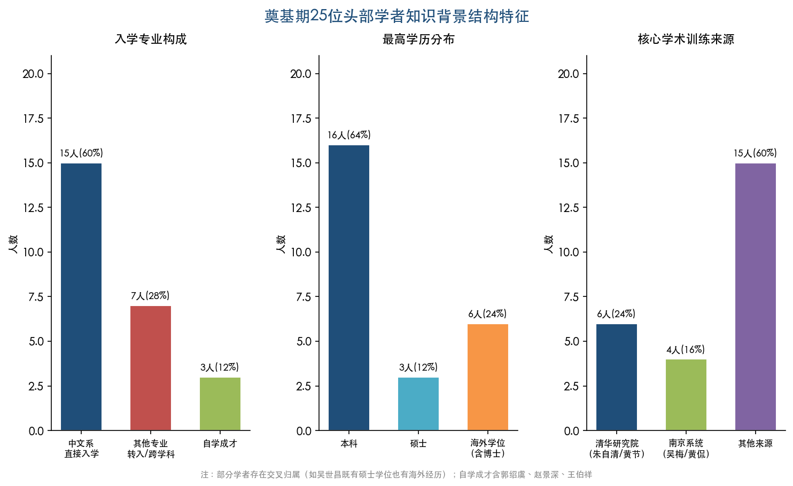

第一，教育来源高度集中于清华、北大、东南大学/中央大学/金陵大学三大系统，合计占全部25位学者的64%。1952年院系调整后，清华—北大的"双核"格局合并为"北大单核"，复旦和山大成为新的学科重镇，此后数十年的学科地理版图由此奠定。

第二，专业背景具有显著的跨学科性：超过30%的学者在本科阶段并非中文系入学（涉及物理、经济、历史、外文等学科），这是民国通才培养模式的产物，也构成了此后各代学者所不具备的知识多元性优势。

第三，最高学历以本科和硕士为主，约24%的学者具有实质性海外经历（含学位攻读和长期研究），另有3位自学成才者完全没有正规大学教育背景。在现代学位制度未曾建立的时代，学术评价依据著述质量与学界声望而非学历凭证，这一评价逻辑为学术共同体保留了宝贵的异质性。

第四，知识结构呈现"旧学根底+新学叠加"的双重状态。经学、训诂、目录学等旧学训练提供了扎实的实证研究能力，马克思主义文艺理论和苏联文学史方法论则作为新的理论框架被全面引入。二者之间存在深层的方法论张力，这种张力在文学史编写实践——从"红色文学史"到"蓝皮本"的嬗变——中表现得尤为充分。

第五，政治运动反复冲击了学者的知识表达方式——"双百方针"短暂开放了学术空间，"拔白旗、插红旗"运动和"双反"运动则迫使学者在阶级分析话语中重新包装其知识产出——但并未从根本上消解旧学根底的学术价值。学术运动的极端化实践（如"红色文学史"事件）恰恰从反面印证了老一代学者传统学术功底的不可替代性。

第六，核心学术谱系已在制度层面完成空间分布：朱自清学脉迁入北大和文学所，吴梅学脉以扇形方式分布于扬州师院、南京师院、中山大学和南京大学，游国恩学脉在北大中文系内部传承，黄侃—程千帆学脉虽遭政治运动重创但知识火种犹存。这些学术谱系为1978年后的学科全面重建储备了关键的"种子学者"。

# 第3章 学术断裂期的知识传承危机（1966–1978）

1966年至1978年的十二年，是中国古代文学学科遭受最严酷冲击的历史时段。高等教育全面停摆、研究生培养中断、头部学者遭批斗或下放，学术谱系面临断裂的系统性风险。然而，这一时期的知识传承并未完全归零：干校中的私下思考、乡间的自学积累、家学渊源的暗中维系，在制度性荒原上保留了薄弱而珍贵的学术火种。1977年恢复高考与1978年恢复研究生招生，则以爆发式的速度重启了学术传承链条。本章聚焦的核心问题是：这十二年的制度性断裂如何改变了古代文学学者群体的知识背景构成？在断裂与重建之间，知识传承经历了怎样的结构性形变？

## 3.1 高等教育停摆的制度性时间线

### 3.1.1 高考废止与研究生培养中断

1966年6月13日，中共中央、国务院发出决定，将高等学校招生推迟半年。[维基文库·中共中央和国务院决定改革高等学校招考办法](https://zh.wikisource.org/wiki/中共中央和国务院决定改革高等学校招考办法 "1966年6月13日原始文件") 这一"推迟"实际上开启了长达11年的高考废止：同年7月24日进一步决定"取消考试，采取推荐与选拔相结合"。与此同时，1966年6月27日，高等教育部发出暂停1966年、1967年研究生招生工作的通知，研究生培养由此中断至1978年。[中国科学院大学·研究生教育恢复招生40周年](https://40.ucas.ac.cn/index.php/history/zhuanyan/761-40 "1949–1965研究生教育数据") 1949年至1965年间，全国共招收研究生约2.3万人，此后这一培养渠道完全关闭长达十二年。

对古代文学学科而言，这意味着从1966年到1978年间没有任何正规研究生获得培养——学术梯队建设彻底停滞。第2章所描述的奠基期学者群体此时正值学术壮年（多在50至70岁之间），本应通过研究生培养完成知识传递的关键窗口期被强制关闭。这一制度性中断所造成的代际真空，在此后数十年中持续影响着古代文学学科的人才结构。

### 3.1.2 工农兵学员制度的局限

1970年，全国高校开始试行招收工农兵学员，至1976年停止，六届共招收约百万人。该制度的核心特征是"推荐入学"而非考试选拔，入学者的文化程度参差不齐：初中以上文化程度不到20%，约60%为初中水平，另有相当一部分仅小学水平，学制为2至3年。[光明网·工农兵大学生写真](https://www.gmw.cn/02sz/2009-08/01/content_1011829.htm "工农兵学员文化程度数据")

在本课题所涉及的古代文学头部学者样本中，并无工农兵学员出身者其后进入研究头部行列的明确案例。这一缺失并非偶然：古代文学研究所需的古典文献阅读能力、旧体诗文写作功底和传统文化素养，需要长期而系统的训练，工农兵学员短促而偏重政治的培养方案极难满足这一知识储备要求。换言之，工农兵学员制度虽然在形式上维持了高等教育的运转，但在古代文学研究领域未能输送有效的学术后备力量，反而使学术人才的代际断裂更加凸显。

## 3.2 古代文学头部学者在断裂期的遭遇

### 3.2.1 批斗与学术权利剥夺

断裂期对古代文学学者群体的冲击首先表现为对个人学术权利的全面剥夺。

**程千帆**（1913–2000）的遭遇堪称最具典型意义的案例。程千帆早在1957年即被划为"右派"，由此被剥夺教学权利长达18年（1957–1978），发配农村劳动。其弟子莫砺锋记述："程先生在一夜之间变成了被视为人民之敌的'右派'。"[莫砺锋·百年千帆](https://skch.nju.edu.cn/d3/17/c63907a774935/page.htm "南京大学社科处官方页面") 至1977年，这位金陵大学培养出的一代宗师竟以退休街道居民身份栖身于武汉东湖边，与学术界完全隔绝。程千帆的案例说明，对部分学者而言，学术断裂期实际上从1957年"反右"运动即已开始，远早于1966年。

北京大学的古代文学师资核心同样遭受沉重打击。**王瑶**1966年作为"资产阶级学术权威"在北大中文系五院遭批斗；**吴组缃**同期亦以同样罪名受到冲击。袁行霈后来回忆，当时的场景令人不堪回首。[北京大学新闻网·袁行霈《八挽录》](https://news.pku.edu.cn/mtbdnew/3564fcb9e2cd4477ab7a4914578a07ea.htm "袁行霈回忆王瑶、吴组缃") 作为第2章所述的北大古代文学教学三巨头（游国恩、林庚、吴组缃），吴组缃的被批斗标志着这一学术核心团队在制度层面的瓦解。**袁行霈**本人当时尚为年轻教员，虽不属"重点斗争对象"，但也被扣上"白专典型"的帽子。[北京大学统战之窗·袁行霈](https://tzb.pku.edu.cn/xwzx/rwzl/50124tzb229437.htm "袁行霈文革时期白专典型")

**俞平伯**1966年遭红卫兵冲击，家中被抄，大量书籍资料被抄走。1969年11月，俞平伯随中国科学院哲学社会科学部被下放至河南息县"五七干校"，年逾七十的他和夫人许宝驯被编入学部五连，承受繁重的体力劳动。[中国教育干部网络学院·文化名人在"五七干校"](https://www.enaea.edu.cn/sztsg/mblm/2017-07-11/131648.html "俞平伯下放干校")

### 3.2.2 奠基期学者的辞世

断裂期还造成了一个无法弥补的损失：多位奠基期核心学者在此期间辞世，未能参与此后的学术重建。**冯沅君**1974年去世，**刘大杰**1977年去世，**游国恩**1978年去世，**陆侃如**1978年去世。[山东大学·冯沅君](https://www.sdu.edu.cn/info/1011/1105.htm "冯沅君生卒年确认") 冯沅君与陆侃如这对学术伉俪分别为山东大学古代文学学科的创建者，两人先后辞世意味着山大的奠基力量在短短四年内被彻底抽空。游国恩1978年去世时正值学术恢复的前夜，北大古代文学教学格局中"游国恩—林庚—吴组缃"三驾马车由此缺失了一驾。

**萧涤非**在1966年至1976年间学术研究被迫完全中断。1978年10月，已七十二岁高龄的萧涤非才得以恢复学术工作，接受人民文学出版社委托主编《杜甫全集校注》这一延续数十年的巨型工程。[澎湃新闻·萧涤非先生](https://m.thepaper.cn/newsDetail_forward_27512642 "萧涤非1978年学术恢复") 换言之，萧涤非一生中最后可以从事学术工作的时间仅剩十余年——从1978年到1991年去世——一位学术生命被截去了最丰盛的中段。

### 3.2.3 "评法批儒"对学术方法论的扭曲

1973年至1976年间掀起的"评法批儒"运动，对古代文学研究方法论造成了直接而具体的扭曲。这一运动要求以"儒法斗争"框架重新解释全部中国历史和文化遗产，古代文学领域首当其冲。

**刘大杰**修改《中国文学发展史》的经历，是这一方法论扭曲最为典型的案例。刘大杰早在1962年已出版该书修订本，并获得毛泽东接见和褒奖。1973年第一卷修订后重版之际，全国正掀起"评法批儒"运动，刘大杰正在修改第二卷（隋唐五代部分）。据其弟子林东海回忆，刘大杰初时"只是在某些问题上着以'儒法'色彩，并没有以此为纲"。然而，当他将修改稿呈送毛泽东后，"毛泽东主席认真地阅读修改稿，有些地方还注了旧式拼音，后来印成大字本"。江青随后明确要求刘大杰以"儒法斗争"为纲来修订全书。[光明网·文摘报·刘大杰其荣也至极其辱也难堪](https://www.gmw.cn/01wzb/2009-03/15/content_898066.htm "刘大杰修改文学发展史详细经过") 

这一过程的实质是：一部本具独立学术价值的文学通史被要求纳入当时的政治意识形态框架进行改写，古代文学研究的自主性被彻底消解。许道明评述刘大杰称，也有人回忆说曾有人劝他不要如此做法，刘回答："我不这么做，现在就过不去，相逼甚急。"这番话折射出断裂期古代文学学者所面临的学术生存困境——不是"要不要"按照政治框架改写学术著作的选择问题，而是在生存压力下几乎没有选择余地的被动服从。1977年刘大杰去世后，以"儒法斗争"改写的版本遭到学界批评，陆侃如在1977年即撰文批评刘大杰将文学史改写成儒法斗争史。[山东大学新闻网](https://www.view.sdu.edu.cn/info/1021/71863.htm "陆侃如批评刘大杰") 这一案例清晰地呈现了政治运动对学术方法论的破坏性干预。

## 3.3 非正式学术传承的维系

### 3.3.1 钱锺书：干校中的知识延续

制度性学术活动的全面停顿并不意味着知识生产的彻底消亡。部分学者在极为艰苦的条件下，以非正式方式延续了学术思考和知识积累。

**钱锺书**的经历是最突出的案例。1969年11月，钱锺书随中国科学院哲学社会科学部（文学研究所为学部五连）被下放至河南息县"五七干校"。[中国教育干部网络学院·文化名人在"五七干校"](https://www.enaea.edu.cn/sztsg/mblm/2017-07-11/131648.html "钱锺书下放河南干校") 1972年3月从干校返回北京后，钱锺书蜗居在学部7号楼一间十几平方米的办公室里，凭借此前积累的五大麻袋读书笔记，开始撰写《管锥编》。[清华大学·钱锺书与读书笔记](https://www.tsinghua.edu.cn/info/2032/79059.htm "1972年钱锺书返京写管锥编") 从1972年至1975年，在1974年哮喘大发几乎送命的情况下，钱锺书完成了《管锥编》初稿。该书编辑马蓉记载，这部著作是在钱锺书"大病之后，担心自己不再能从事著作，急于争取时间，'和死亡赛跑'，带病将他多年来刻苦读书、潜心钻研的部分读书笔记整理而成的"。[清华校友总会·晚年钱锺书](https://www.tsinghua.org.cn/info/1951/20554.htm "管锥编写作经过")

《管锥编》引用了两千多种古籍的数万条书证，对十种古代经典进行了横跨中西的深入论述——这一成就的学术基础，恰恰奠定于干校时期的构思和更早期的笔记积累。据研究者考证，该书头三种经部典籍的论题构思于干校时期，成稿于回京之后。[中国作家网·新中国成立后钱锺书的学术道路](https://www.chinawriter.com.cn/n1/2024/1129/c404064-40371960.html "管锥编构思于干校") 这意味着，即使在强制劳动的环境中，钱锺书仍然在精神层面延续着高强度的学术思考。

### 3.3.2 程千帆："发愤著书"的腹稿传承

程千帆虽被剥夺教学和出版权利长达18年，但在劳改期间"不能操笔作文，常在心里进行学术思考"——以"打腹稿"的方式延续着学术生命。[莫砺锋·百年千帆](https://skch.nju.edu.cn/d3/17/c63907a774935/page.htm "程千帆发愤著书") 这种莫砺锋所称的"发愤著书"式的精神劳动，在1978年程千帆恢复学术工作后迅速结出硕果：《校雠广义》《唐代进士行卷与文学》等重要著作的核心思路均形成于这一漫长的禁锢期。

程千帆的知识传承方式与钱锺书有本质差异：钱锺书依赖的是此前积累的大量实体读书笔记（五大麻袋），即便在干校也保持了某种物质性的知识载体；程千帆则几乎完全依赖记忆和心智活动来维系学术思考，其传承的脆弱性更高，但也体现了传统人文学者"博闻强识"的知识内化特征。这两种非正式传承方式共同说明：在制度性渠道被完全封堵之后，个体学者的知识存量和学术意志成为学术传承的最后防线。

### 3.3.3 乡间自学：知识断裂中的另类积累

更大范围的非正式知识传承发生在广大知识青年的自学实践中。恢复高考后进入古代文学研究领域的多位头部学者，其知识基础恰恰建立在下乡务农期间的个人自学之上。

莫砺锋的经历最为典型：1949年生于江苏无锡，高中理科生，1966年高考被取消时三个志愿全填了清华大学。此后下乡插队11年，在劳动之余自学，背诵数千首唐诗宋词。[人民网·新中国第一位文学博士](http://edu.people.com.cn/n1/2019/0820/c1053-31305017.html "莫砺锋完整教育经历") 陈尚君（1952年生）的经历与此类似：中学毕业后在农场务农八年，其知识积累主要依靠这八年间的自学。[复旦大学古代文学研究中心·陈尚君](https://www.gdwx.fudan.edu.cn/b5/7e/c3846a111998/page.htm "1977年入学、导师朱东润")

这类"乡间自学"式的知识积累具有几个显著特征：第一，知识来源高度依赖个人可获取的有限书籍，带有强烈的偶然性和选择性；第二，缺乏系统性的学术训练和方法论指导，知识结构中的空白与深入并存；第三，大量的背诵和反复精读培养了对文本的极高敏感度，但缺乏文献学、版本学等专业工具的训练。这种知识结构与接受过完整高等教育的前代学者迥然不同，为后来学术恢复期的研究生培养提出了特殊的教学挑战——程千帆在南京大学所做的，正是在极短时间内为这批知识结构独特的学生补上系统性学术训练的关键一课。

## 3.4 恢复高考与恢复研究生招生的即时效应

### 3.4.1 制度重启的时间节点

1977年8月6日，邓小平在科学和教育工作座谈会上拍板恢复高考。[中国科学院自然科学史研究所](https://www.ihns.ac.cn/kxcb_/kxjd/202212/t20221206_6567197.html "邓小平1977年8月6日拍板") 1977年10月12日国务院正式批转文件恢复统一考试。当年报考约570万人，录取约27万人，录取率约4.7%。[新华网·高考恢复40年](http://news.xinhuanet.com/politics/2017-06/21/c_1121180623.htm "报考录取数据")

更具学术意义的是研究生招生的恢复。1978年1月10日，教育部印发恢复研究生招生意见，报考63500人，录取10708人。1978年至1980年三年共招收研究生22434人，接近1949年至1965年十六年间的招生总数（约2.3万人）。[中国科学院大学](https://40.ucas.ac.cn/index.php/history/zhuanyan/761-40 "1978年研究生招生完整数据") 这种压缩式的招生恢复，意味着此前十二年被压抑的学术需求在极短时间内集中释放。

### 3.4.2 1977级本科生与1978级研究生的特殊群体特征

1977级本科生和1978级研究生构成了中国学术史上知识背景最为独特的一个世代群体。他们的特殊性体现在以下几个方面：

**年龄跨度极大**。由于十一年的高考中断，1977–1978年入学者中既有刚满十八岁的应届生，也有年过三十甚至四十岁的中年人。[清华大学·邓小平与恢复高考](https://www.tsinghua.edu.cn/info/1874/74518.htm "1977–1978级特征描述") 以程千帆1979年招收的首批三名硕士生为例：徐有富1943年生（入学时36岁）、莫砺锋1949年生（入学时30岁）、张三夕最年轻（武汉师范学院中文系在读），三人年龄跨度达10岁，前期经历迥异。[南京大学校友网·莫砺锋](https://alumni.nju.edu.cn/7e/a0/c62466a753312/page.htm "三人入学经过")

**知识来源高度多元而不系统**。莫砺锋为安徽大学外文系仅读一年的学生，徐有富为南大1966级中文系毕业生但此后在矿山子弟学校教书12年。前者的知识积累主要来自11年插队期间的古诗词自学，后者则在长期基层教学中保持了对古典文献的持续接触。这种知识来源的多元性与碎片化，使1978级研究生成为中国学术史上"最具个性化知识面貌的一代"。

**1977级本科生中的未来头部学者**。在77级本科生中，多人后来成为古代文学研究的核心力量：张伯伟、曹虹为南京大学77级，葛兆光为北京大学77级古典文献专业。[南京大学校友网·张伯伟曹虹](https://alumni.nju.edu.cn/bb/d5/c8725a179157/page.htm "张伯伟曹虹为南大77级") 葛兆光高考时已超过25岁，从贵州考入北大，1978年入校后在古典文献专业就读至1984年毕业。[北京大学新闻网·恢复高考30年](https://news.pku.edu.cn/bdrw/137-114706.htm "北大中文系77级") 这些学者的共同特征是：进入大学之前已有相当丰富的社会阅历和自学积累，入学后迅速展现出超常的学术潜力，但其知识结构中本科阶段的系统训练被压缩或缺失。

## 3.5 学术恢复与谱系重建的核心案例

### 3.5.1 程千帆南大首批弟子：断裂期知识背景的缩影

1978年，程千帆应匡亚明校长之聘调入南京大学，时年已65岁。[南京大学·程千帆先生在南京大学](https://www.nju.edu.cn/info/3191/167431.htm "培养硕士9人博士10人") 1979年秋，程千帆招收首批3名硕士研究生：莫砺锋、徐有富、张三夕。这三人的教育背景构成了断裂期知识传承危机的微观缩影——

**莫砺锋**（1949年生于江苏无锡）：苏州高中理科生，1966年高考被取消。下乡插队11年期间，在劳动之余大量自学，背诵数千首唐诗宋词。1978年考入安徽大学外文系，1979年读到大二时提前考研进入南大中文系。他从未受过完整的本科中文教育，知识来源主要为乡村自学积累和程千帆的系统训练。[人民网·新中国第一位文学博士](http://edu.people.com.cn/n1/2019/0820/c1053-31305017.html "莫砺锋完整教育经历") 1984年10月22日，莫砺锋以《江西诗派研究》通过答辩，成为新中国第一位文学博士。答辩委员会主席为钱仲联，委员包括程千帆、唐圭璋、徐中玉、舒芜、霍松林、傅璇琮。[人民网·新中国第一位文学博士](http://edu.people.com.cn/n1/2019/0820/c1053-31305017.html "莫砺锋博士答辩详情") 从一个没有大学中文学历的插队知青到新中国第一位文学博士，莫砺锋的学术轨迹浓缩了断裂期知识传承的全部复杂性。

**徐有富**（1943年生）：南京大学1966级中文系毕业后在矿山子弟学校教书12年，1979年入程千帆门下。他与莫砺锋形成鲜明对比：前者拥有正规的中文系教育背景但长期脱离学术环境，后者毫无正规中文训练却通过密集自学积累了独特的古诗词知识。

**张三夕**：三人中最年轻者，入学时为武汉师范学院中文系在读生，是唯一具有连续性正规教育经历的成员。张三夕后来转向历史文献学方向，考取华中师范大学张舜徽博士，1986年获得历史文献学方向首位博士学位，其学术转向本身即折射出恢复初期学科边界的流动性。

程千帆对这三名背景迥异的弟子施以统一而严格的学术训练——将文献学考据与文学鉴赏相结合的方法论体系——这一训练的核心目标正是弥合断裂期所造成的知识结构空洞。此后，程千帆又培养了张伯伟、曹虹（均为77级南大本科生）、张宏生（1957年生，1981年徐州师范学院毕业）、程章灿等弟子。在南大共培养硕士9人、博士10人，构成了南大古代文学国家重点学科的主体力量。[南京大学·程千帆先生在南京大学](https://www.nju.edu.cn/info/3191/167431.htm "培养硕士9人博士10人")

### 3.5.2 复旦大学的学术恢复与人才重配

**王水照**（1934年生）的调动是学术恢复期人才重新配置的另一典型案例。王水照1960年毕业于北京大学中文系，此后在中国社科院文学研究所工作。1978年调入复旦大学中文系，后任首席教授。[复旦大学退休教职工网·王水照](https://retiree.fudan.edu.cn/lgbc/c0/ec/c41159a639212/page.htm "王水照1978年调入复旦") 这一调动的背景是复旦古代文学师资的严重断裂：朱东润年事已高（1978年时82岁），刘大杰1977年去世，赵景深1985年去世——第2章所述的复旦古代文学三大支柱正在迅速崩塌。王水照的到来意味着北大培养、社科院历练的学术资源向复旦的制度性转移，为复旦唐宋文学研究重镇地位的延续提供了关键的人才补给。

**陈尚君**（1952年生）的入学经历则展现了恢复高考的即时效应。陈尚君中学毕业后在农场务农八年，1977年考入复旦大学中文系，1978年即破格转读硕士，1981年获硕士学位，师从朱东润。无博士学位，以硕士留校。[复旦大学古代文学研究中心·陈尚君](https://www.gdwx.fudan.edu.cn/b5/7e/c3846a111998/page.htm "1977年入学、导师朱东润") 陈尚君的路径体现了恢复初期的一个特殊现象：由于人才极度匮乏，部分优秀学生得以跳过完整的本科训练阶段直接进入研究生培养，学术选拔的标准在事实上回归了以才学为本位的传统，而非依赖形式化的学历要求。

### 3.5.3 其他关键学术恢复

1978年至1981年间的学术恢复呈现出一系列结构性特征，1981年首批博士学位授权审核的结果集中展现了这些特征。首批古代文学方向博导约15人：北京大学吴组缃、东北师范大学杨公骥、复旦大学赵景深（另有朱东润"中国各体文学"、郭绍虞"中国文学批评史"）、华东师范大学徐震堮、南京大学程千帆、南京师范学院唐圭璋、扬州师范学院任中敏、江苏师范学院（今苏州大学）钱仲联、山东大学萧涤非、中国社会科学院文学研究所吴世昌和余冠英、中山大学王季思、四川大学杨明照。共约8所高校加1个研究机构，11至15位博导。[首批文科博士生导师名单整理](https://zhuanlan.zhihu.com/p/406015587 "信息源自1981年《国务院学位委员会公报》") [搜狐·中国首批文科博导全名单](https://www.sohu.com/a/199572734_176210 "1981年首批博导名单")

这份名单本身即是断裂期学术生态的一面镜子。首批博导几乎全部为第2章所述的奠基期学者，最年轻者杨公骥也已60岁，最年长者唐圭璋80岁、朱东润85岁。这些学者在被迫中断学术工作十余年后，以高龄之身承担起重建学术谱系的重任——这是"老先生晚年辉煌"模式的制度化呈现。

## 3.6 学术恢复的三重结构性特征

综合上述各节的案例与数据，1978年前后的学术恢复呈现出三个可概括的结构性特征：

**第一，"老先生晚年辉煌"模式**。程千帆调入南京大学时已65岁，唐圭璋80岁、钱仲联73岁被批准为博导，萧涤非72岁恢复学术工作。这些学者在生命的最后十至二十年完成了学术传承的核心使命——培养弟子、出版著作、重建学科。这种模式意味着恢复期的学术传承极度依赖少数高龄学者的个人学术存量，一旦这些学者离世，其未能传递的知识和方法论将永久性地流失。

**第二，学术谱系的"压缩性重建"**。在正常学术生态中，从导师到成熟学者的培养周期通常需要十至二十年。但1978年后的学术恢复将这一周期极度压缩：莫砺锋1979年入学、1984年即获博士学位；陈尚君1977年入学、1978年转读硕士、1981年即以硕士留校任教。这种压缩既是对十二年断裂期的补偿性反应，也不可避免地导致部分学者的系统性学术训练存在某种程度的"薄弱环节"——这些学者此后的学术成就更多地依赖于个人天赋和此后的自我完善，而非培养阶段的充分准备。

**第三，人才配置的重新洗牌**。断裂期的政治动荡客观上打破了此前相对固化的学术地理格局，为学术恢复期的人才重新配置提供了契机。程千帆从武汉街道居民身份调入南京大学，王水照从社科院调入复旦大学——这两次关键调动分别重塑了南大和复旦的古代文学学科力量。如果没有断裂期所造成的制度性解构，这种跨地域、跨系统的人才流动在此前僵化的人事体制下几乎不可能发生。从这一角度而言，断裂期虽然摧毁了既有的学术秩序，但在客观上也为此后学术版图的重新整合创造了条件。

这三重特征共同塑造了1978年之后古代文学学者群体的知识背景基底：他们的导师多为历经磨难的高龄学者，他们自身的知识结构融合了自学积累与压缩式正规训练，他们所处的院校格局则经历了一次以人才调动为核心的重新排列。这一特殊的知识背景构成，与第2章所述的奠基期学者（民国正规教育出身、跨学科背景丰富、院校集中度极高）形成了鲜明对比，也为第4章将要分析的1979–1999年学科重建期学者群体画像提供了历史前提。

# 第4章 学科重建与范式转型期的学者群体（1979–1999）

1979年至1999年的二十年，是中国古代文学学科从断裂废墟中全面重建并经历深刻范式转型的关键时期。1981年《中华人民共和国学位条例》施行，标志着新中国学位制度的正式确立；首批文学博士的诞生（1984年莫砺锋获博士学位）、博士点从少数院校向多校扩展的进程，以及"美学热""方法论热""文化热""国学热"等学术潮流的依次涌动，共同塑造了这一代学者迥异于前辈的知识背景面貌。本章以15位头部学者的教育经历、师承谱系、学位层次和海外交流为主线，考察学位制度、学术潮流与跨学科渗透如何共同重塑了古代文学学者群体的知识构成。

## 4.1 学位制度建立与博士培养格局的奠定

### 4.1.1 从无学位到学位化：制度性转折

第3章所述的学术断裂期（1966–1978）结束后，中国古代文学学科面临的首要任务是重建学术梯队。1980年2月12日，第五届全国人大常委会第十三次会议通过《中华人民共和国学位条例》，自1981年1月1日起施行，确立了学士、硕士、博士三级学位制度。[《中华人民共和国学位条例》全文](https://oaa.shanghaitech.edu.cn/2021/0329/c4076a62176/page.htm "上海科技大学转载学位条例原文") 这是新中国第一部教育法律，对古代文学学科具有划时代意义：此前数十年间，学术界不存在博士学位制度，头部学者凭借著述声望而非学历凭证立足；此后，学位制度逐步成为学术人才遴选的核心门槛。

1981年11月3日，国务院批准公布首批博士学位授权审核结果，首批博士学位授予单位共151个（高校111所、科研院所37个），博士点318个，博导1155名。[教育部学位与研究生教育发展中心](https://www.cdgdc.edu.cn/zgxw30n/info/1086/1516.htm "第一次博士、硕士学位授权审核") 在古代文学方向，首批博士点分布于约8所高校和1个研究机构，博导约11至15人：北京大学吴组缃、东北师范大学杨公骥、复旦大学赵景深（另有朱东润"中国各体文学"、郭绍虞"中国文学批评史"）、华东师范大学徐震堮、南京大学程千帆、南京师范学院唐圭璋、扬州师范学院任中敏、江苏师范学院（今苏州大学）钱仲联、山东大学萧涤非、中国社会科学院文学研究所吴世昌和余冠英，另有四川大学杨明照（文学批评史）、中山大学王起（各体文学）。[首批文科博士生导师名单整理](https://zhuanlan.zhihu.com/p/406015587 "信息源自1981年《国务院学位委员会公报》")

这些首批博导几乎全部属于第2章所述的奠基期学者——他们在民国高等教育体系中受训，于1950至1960年代确立学术声望，历经断裂期的冲击后以古稀之年重返学术前线。程千帆1978年调入南京大学时已65岁，唐圭璋获批首批博导时年届80岁，钱仲联亦已73岁。这一"老先生晚年辉煌"的制度性特征，决定了1979–1999年间新培养学者的知识来源高度集中于少数"劫后余生"的学术节点——学术梯队的"压缩性重建"由此展开。

1984年10月22日，莫砺锋以《江西诗派研究》通过博士论文答辩，成为新中国第一位文学博士。答辩委员会主席为钱仲联，委员包括程千帆、唐圭璋、徐中玉、舒芜、霍松林、傅璇琮。[人民网·新中国第一位文学博士](http://edu.people.com.cn/n1/2019/0820/c1053-31305017.html "莫砺锋博士答辩详情") 这一答辩委员会的构成本身即是一幅缩微学科图谱——横跨南大、苏大、南师大、华东师大、社科院、陕师大、中华书局七个机构，首批古代文学博导几乎悉数到场，反映出彼时学科体量之小与学术共同体联系之紧密。

### 4.1.2 博士点的扩展与五大培养格局

1981年至1999年间，古代文学博士培养格局经历了从极度集中到逐步扩展的过程。首批博士点仅覆盖北京大学、东北师范大学、复旦大学、华东师范大学、南京大学、南京师范学院、扬州师范学院、江苏师范学院（今苏州大学）、山东大学、中山大学、四川大学及中国社会科学院文学研究所等十余个机构。[教育部学位与研究生教育发展中心](https://www.cdgdc.edu.cn/zgxw30n/info/1086/1516.htm "第一次博士、硕士学位授权审核") 此后经第二批（1984年）至第六批（1996年）审核，新增博士点逐批扩展。1981年至2006年间先后批准了十批博士和硕士学位授权点，此后改为动态审核制度；至第四轮学科评估（2017年）时，中国语言文学一级学科博士授权高校已达65所。[微信读书·《中国学位授予单位名册（2006年版）》](https://weread.qq.com/web/bookDetail/ddb32020811e6ba12g013970 "中国学位授予单位名册2006年版") [教育部学位与研究生教育发展中心](https://www.cdgdc.edu.cn/dslxkpgjggb/xkpm/rwskl/a0501_zgyywx.htm "第四轮学科评估0501中国语言文学") 1986年，南开大学罗宗强获批博导并设文学批评史方向博士点，南开由此成为古代文学研究的又一重要基地。

这一扩展过程形成了1979–1999年间古代文学博士培养的五大核心格局。南京大学（程千帆→周勋初）培养了最完整的学术团队——程千帆在南大共培养硕士9人、博士10人，构成南大古代文学国家重点学科的主体力量。[南京大学·程千帆先生在南京大学](https://www.nju.edu.cn/info/3191/167431.htm "培养硕士9人博士10人") 北京大学（吴组缃→袁行霈→陈贻焮）门下有葛晓音等；复旦大学（朱东润→王水照）发展为唐宋文学研究重镇；南开大学（罗宗强）1986年设文学批评史博士点，开辟了"文学思想史"这一独特研究方向；陕西师范大学（霍松林）以培养博士70余名的规模形成了全国辐射性的"霍家军"网络。[陕西师范大学·霍松林百年诞辰](https://www.snnu.edu.cn/info/1272/15315.htm "1945年入中央大学、培养博士70余名") 上述格局的形成高度依赖个别核心导师的个人存在——没有程千帆，便没有南大极点；没有罗宗强，便没有南开极点。学科格局在这一时期本质上是"以人立校"而非"以制度立校"的，折射出古代文学博士培养体系初创阶段的结构性脆弱。

## 4.2 头部学者教育背景的逐人考证

为系统呈现1979–1999年间头部学者的知识背景构成，本节对15位代表性学者的教育经历、师承关系与学术路径逐一梳理。

### 4.2.1 老一代的知识遗产：无学位而占据制高点

**袁行霈**（1936年生），1953年入北京大学中文系，1957年毕业留校，受教于游国恩、林庚等前辈，自述学术导师为林庚。[北京大学中文系·袁行霈专访](https://chinese.pku.edu.cn/xwgg/bdzwr/29f5e22a46a94648ab129ae946d9503f.htm "袁行霈亲述1953年入学、导师林庚") 袁行霈终身未获硕博学位，但1987年出版《中国诗歌艺术研究》，1999年主编四卷本《中国文学史》（高等教育出版社），该书迅速成为全国高校通用教材。书中提出"文学本位、史学思维、文化学视角"的总纲领与"三古七段"分期法，约请19所高校29位学者参与撰写，标志着方法论变革的制度化完成。[北京大学中文系·袁行霈专访](https://chinese.pku.edu.cn/xwgg/bdzwr/29f5e22a46a94648ab129ae946d9503f.htm "文学本位、三古七段分期法")

**傅璇琮**（1933–2016），1951年入清华大学中文系，1952年院系调整转入北京大学，1955年毕业留校，后调入中华书局，终身未获硕博学位。代表作《唐代诗人丛考》（1980）和《唐代科举与文学》（1986），是古代文学学者中唯一以"编辑—学者"双重身份进入头部行列者。[新华网·傅璇琮逝世](http://www.xinhuanet.com/politics/2016-01/28/c_128679416.htm "傅璇琮教育经历") [清华大学校史馆·傅璇琮](https://xsg.tsinghua.edu.cn/info/1004/2021.htm "傅璇琮学术生涯") 刘跃进评述其学术贡献："傅璇琮先生的《唐代诗人丛考》出版，让很多青年人看到传统学问的魅力所在。"[澎湃新闻·改革开放40年来的古代文学研究](https://m.thepaper.cn/newsDetail_forward_2511678 "刘跃进评述傅璇琮")

**周勋初**（1929–2024），1954年毕业于南京大学中文系本科，后入南大中文系攻读副博士研究生，师承胡小石，1959年肄业留校。1986年起任博导。[南京大学文学院·周勋初先生告别仪式致词](https://chin.nju.edu.cn/xyxw/xyxw/20240315/i261135.html "师承胡小石、1984年特批教授") 周勋初承接胡小石、汪辟疆学脉，是继程千帆之后南大古代文学的核心人物，同样终身未获正式博士学位。

**霍松林**（1921–2017），1945年以兰州考区第一名考入中央大学中文系，1949年毕业。1951年起在陕西师范大学任教，此后数十年扎根西北，先后培养硕士20名、博士70余名。[陕西师范大学·霍松林百年诞辰](https://www.snnu.edu.cn/info/1272/15315.htm "1945年入中央大学、培养博士70余名") 霍松林弟子遍布全国，形成学界所称"霍家军"，其辐射面在同辈古代文学学者中罕有匹敌。

上述四位学者构成了1979–1999年间"无学位而居于制高点"的特殊群体。他们的培养背景均属于第2章所述的奠基期教育体系——民国大学本科或1950年代新中国高等教育早期的产物——但凭借深厚的学术积累与制度性地位（博导资格、教材主编权、学会领导职务），在学位制度确立后依然主导着学科走向。

### 4.2.2 新生代学位获得者：制度化培养的首批成果

**莫砺锋**（1949年生），第3章已详述其从插队知青到新中国第一位文学博士的特殊经历。1979年入南京大学程千帆门下，1984年获博士学位。其知识结构融合了11年乡间自学积淀的古诗词功底与程千帆"文献学—文学鉴赏相结合"的系统训练，堪称断裂期知识背景的典型缩影。

**陈尚君**（1952年生），中学毕业后在农场务农八年。1977年考入复旦大学中文系，翌年破格转读硕士，1981年获硕士学位，师从朱东润。无博士学位，以硕士学历留校任教。[复旦大学古代文学研究中心·陈尚君](https://www.gdwx.fudan.edu.cn/b5/7e/c3846a111998/page.htm "1977年入学、导师朱东润") 陈尚君体现了恢复高考首批学者的典型路径——人才极度匮乏的时代背景下，优秀学生得以跳过完整本科阶段直接进入研究生培养，学术选拔标准在事实上回归了以才学为本位的传统。

**罗宗强**（1931–2020），1956年入南开大学中文系，1961年毕业后继续攻读研究生，师从王达津（中国文学批评史方向），1964年毕业。1986年获批博导。代表作《隋唐五代文学思想史》（1986）开创了"文学思想史"这一新研究方向，与传统的"文学批评史"形成对话和张力。其弟子左东岭的博士论文《李贽与晚明文学思想》获1999年全国首届优秀博士论文奖。[南开大学文学院·罗宗强](https://wxy.nankai.edu.cn/2019/1101/c18299a244196/page.htm "1956年入学、师从王达津") 罗宗强所创建的"南开→首师大"学术传播路径，是本时期学术知识跨院校扩散的重要案例。

**蒋寅**（1959年生），扬州师范学院学士（1982）→广西师范大学硕士（1985）→南京大学博士（1988，导师程千帆）。1988年进入中国社会科学院文学研究所工作。[中国社科院文学研究所·蒋寅](http://literature.cass.cn/jgsz/yjs/gdwxyjs/lrzz_szr/jy_136372/202304/t20230426_5625120.shtml "扬州师院学士、广西师大硕士、南大博士") 蒋寅的教育路径呈现出"地方师范→重点大学→中央科研机构"的逐级上升模式，这一模式在1980年代具有典型意义——地方师范院校为学术人才的初始培养提供了基础平台，顶尖大学的研究生教育则完成了学术精英化的关键跃升。

**刘跃进**（1958年生），1977年密云插队后以首届高考考入南开大学中文系（1982年获学士），此后任清华大学文史教研组助教，再入杭州大学古籍研究所攻读硕士（1986年，师从姜亮夫、郭在贻），最终在中国社科院研究生院获博士学位（1991年，师从曹道衡）。[中国社科院大学文学院·刘跃进](https://wenxue.ucass.edu.cn/info/1120/2427.htm "完整教育经历和导师信息") 刘跃进的教育路径横跨四个机构，导师分属文献学与文学研究两个方向，其知识结构兼具南开的学术规范训练、杭州大学的文献学传统与社科院的综合研究视野。

**张伯伟**（1959年生），1977年入南京大学中文系，本硕博三个学位均在南大完成（1982年学士/1984年硕士/1989年博士），为程千帆博士弟子，留校任教至教授。[南京大学高研院·张伯伟](https://ias.nju.edu.cn/fb/c6/c13139a261062/page.htm "1977年入南大、三学位均在南大") 张伯伟是1979–1999年间"学术近亲繁殖"的典型个案——本硕博均在同一所大学完成并留校任教。但这同时也是南大古代文学学科实力的体现：程千帆培养的最优秀弟子留校传承学脉，使南大在该领域保持了持续的学术竞争力。

**王兆鹏**（1959年生），1978年入武汉师范学院中文系（1982年学士）→湖北大学硕士（1987）→南京师范大学博士（1990，师从唐圭璋）。此后在武汉大学任教。[中国范仲淹研究会·王兆鹏](http://www.zgfanzhongyan.com/fan/navs/zhuanjia/wangzhaopeng "武汉师院学士、南师大博士师从唐圭璋") 王兆鹏代表了"地方师范→重点师范博士→综合性大学"的流动路径，其后引入定量分析方法开创"唐宋诗词名篇排行榜"研究，成为古代文学领域方法论创新的先驱之一。

**左东岭**（1956年生），河南许昌人，1995年在南开大学中文系获文学博士学位，专业方向为中国文学批评史，研究领域为中国文学思想史，师从罗宗强。博士论文《李贽与晚明文学思想》获1999年全国首届百篇优秀博士论文奖。此后在首都师范大学任资深教授，主持建立中国语言文学一级学科博士点并担任带头人。[南开大学文学院·罗宗强](https://wxy.nankai.edu.cn/2019/1101/c18299a244196/page.htm "左东岭获全国首届优秀博士论文奖") 左东岭在首师大建立的学科体系，是罗宗强学脉从南开向北京辐射的重要支点，实现了"南开→首师大"的学术传播路径。

**詹福瑞**（1953年生），1978年河北大学中文系毕业后留校，本硕博三个学位均在河北大学完成（1986年硕士/1991年博士），后出任国家图书馆党委书记兼常务副馆长。[中国古代文学研究·詹福瑞](https://cchc.fah.um.edu.mo/wp-content/uploads/2018/02/5.-Zhan-Furui.pdf "河北大学中文系硕士博士学位") 詹福瑞代表了非中心院校自主培养学者的路径——河北大学虽非"双一流"建设高校，但凭借自身博士点的培养能力，独立造就了进入学术头部行列的学者。这一路径在古代文学领域属于少数个案，折射出特定历史条件下非中心院校培养体系的独特价值。

**杜桂萍**（1963年生），1985年毕业于黑龙江大学，1988年获山东大学硕士学位，2003年获哈尔滨师范大学博士学位，后为北京师范大学教授。[黑龙江大学·杜桂萍](https://www.hlju.edu.cn/info/1018/1239.htm "教育经历") 杜桂萍的路径呈现"地方大学→重点大学硕士→地方师范大学博士→北京重点大学"的曲线上升模式，与蒋寅、刘跃进的线性上升模式不同，更充分地体现了非核心院校学者通过多阶段积累最终进入学术中心的曲折历程。

### 4.2.3 知识遗产的代际过渡特征

综合上述15位学者的教育背景，可以清晰地观察到1979–1999年间从"无学位时代"向"学位化时代"过渡的结构性特征。在15位学者中，4人无硕博学位（袁行霈、傅璇琮、周勋初、霍松林，均属更早培养世代），1人最高学历为硕士（陈尚君），10人获博士学位。这一分布显示了鲜明的代际断层：老一代不持学位却占据学科制高点，新一代则通过学位制度获得进入学术精英行列的入场资格。

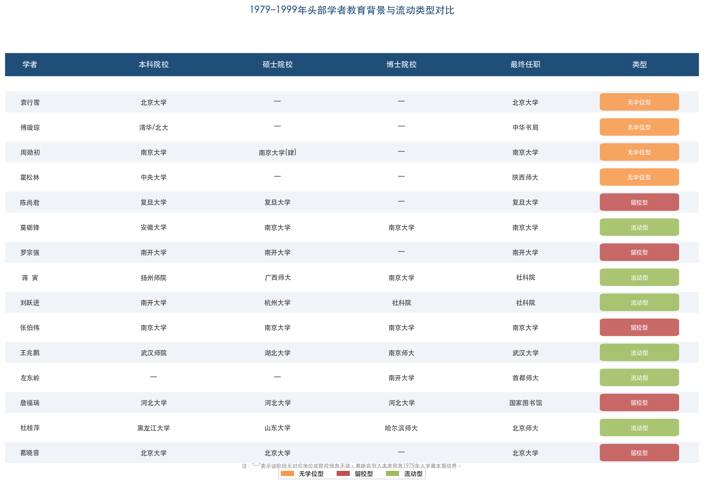

图4-1以15位学者为对象，按本科、硕士、博士院校及最终任职单位四个维度，直观呈现了学术流动路径的多样性以及"无学位型""留校型""流动型"三类模式的分化。

值得注意的是，学历层次与学术成就之间并非简单的线性关系。无博士学位的袁行霈主编了影响全国的四卷本《中国文学史》，傅璇琮以编辑身份完成了里程碑式的学术著作，陈尚君以硕士学历成为唐代文学文献整理的顶尖权威。学位制度的核心意义在于提供系统化的学术训练渠道，为后来者建立制度化的准入门槛，但它并非学术成就的充分条件。

## 4.3 培养院校分布与学术谱系

### 4.3.1 五大核心师承链的形成

1979–1999年间，古代文学学科形成了五大核心师承链，其起点均可追溯至第2章和第3章所述的奠基期学者。

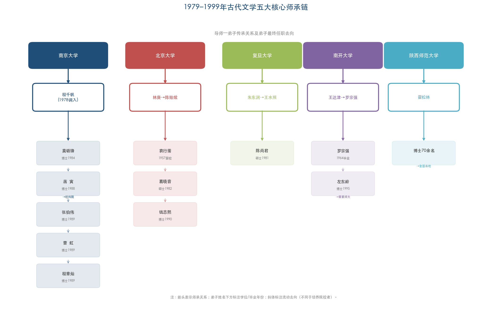

图4-2以南京大学、北京大学、复旦大学、南开大学、陕西师范大学五条主线，展示了导师—弟子传承关系、弟子获得学位年份及最终任职去向，直观呈现了学术谱系的空间扩散模式。

**程千帆学脉（南京大学）**：程千帆1978年调入南大后培养硕士9人、博士10人。[南京大学·程千帆先生在南京大学](https://www.nju.edu.cn/info/3191/167431.htm "培养硕士9人博士10人") 莫砺锋（1984年博士）、张伯伟（1989年博士）、蒋寅（1988年博士）、张宏生、曹虹（1989年博士）、程章灿（1989年博士）等均出程门。程千帆的教学方法论——文艺学与文献学相结合——成为古代文学研究领域的重要范式。左东岭评价其为"具有典范意义的研究范式"。[中国社会科学网·古代文学研究四十年回顾](https://www.cssn.cn/wx/wx_zggdwx/202208/t20220802_5442964.shtml "左东岭评程千帆研究范式") 南大古代文学学科的核心力量几乎完全由程千帆弟子构成，这既是师承传统的有力延续，也是高度近亲繁殖的典型表征。

**林庚→陈贻焮学脉（北京大学）**：林庚培养了袁行霈（1957年毕业留校），袁行霈虽未正式获得研究生学位，但在林庚指导下形成了以诗歌艺术研究为核心的学术取向。陈贻焮承继林庚学脉，培养了葛晓音（1979级硕士）等弟子。钱志熙在自述学术传承脉络时称："从刘师培、黄节到林庚、陈贻焮，到葛老师和我们。"[北京大学中文系·钱志熙专访](https://chinese.pku.edu.cn/xwgg/bdzwr/9993ca8447d649c9b6115f62f6b1e321.htm "学术传承脉络详述") 这一谱系清晰地展示了北大古代文学研究如何跨越近百年的学术代际，从清末民初一直延续至当代。

**朱东润→王水照学脉（复旦大学）**：朱东润培养了陈尚君（1981年硕士）等弟子；王水照1978年从社科院调入复旦后，成为唐宋文学研究的核心人物，后任首席教授。[复旦大学退休教职工网·王水照](https://retiree.fudan.edu.cn/lgbc/c0/ec/c41159a639212/page.htm "王水照1978年调入复旦") 朱东润的文学批评史传统与王水照兼具北大和社科院背景的综合训练在复旦汇合，为复旦唐宋文学重镇地位的延续提供了双重学术支撑。

**罗宗强学脉（南开大学）**：王达津→罗宗强→左东岭的传承链，在学术取向上表现为从"文学批评史"向"文学思想史"的方向拓展。罗宗强1986年获批博导后，在南开建立了独特的学术方向——不局限于批评文本的梳理，而是将文学家的心态与文化环境纳入考察视野，形成了更具整合性的"文学思想史"研究范式。其弟子左东岭在首都师范大学建立中国语言文学一级学科博士点，将这一学术传统辐射至北京，实现了南开学术资源的跨地域扩散。

**霍松林学脉（陕西师范大学）**：霍松林1945年入中央大学中文系的教育背景使其与南京学统有着深层联系，但他数十年扎根西北，在陕师大培养了70余名博士，弟子分布全国各地。[陕西师范大学·霍松林百年诞辰](https://www.snnu.edu.cn/info/1272/15315.htm "培养博士70余名") 霍松林学脉的特殊性在于其"辐射型"传播模式——与南大程门弟子多留校的"内聚型"格局不同，霍松林弟子大多流向其他高校，形成了以陕师大为原点向外扩散的广泛学术网络。

### 4.3.2 院校分布的结构性特征

15位学者的培养院校分布呈现出显著的集中特征：北京大学培养了袁行霈、傅璇琮，南京大学（程千帆门下）培养了莫砺锋、蒋寅、张伯伟，复旦大学培养了陈尚君（导师朱东润），南开大学培养了罗宗强、左东岭，南京师范大学培养了王兆鹏（导师唐圭璋），陕西师范大学培养了霍松林时代的众多弟子。与第2章所述第一期（1950–1966）的"清华+北大双核"格局相比，1979–1999年间的培养格局呈现出"多极化"特征——南大、南开、陕师大、复旦等新极点的崛起，打破了此前北大一校独大的局面。

然而，"多极化"并不等于"均等化"。各极点的形成高度依赖个别核心导师的学术号召力：没有程千帆，便没有南大极点；没有罗宗强，便没有南开极点；没有霍松林，便没有陕师大极点。学科格局在这一时期本质上是"以人立校"的——单个导师的学术影响力决定了一个博士点的学术水准与声誉。这一特征与成熟学科中"以制度立校"的格局形成了鲜明对比，折射出古代文学博士培养体系在创建初期的结构性脆弱。

## 4.4 学术潮流对学者知识构成的塑造

### 4.4.1 "美学热"与诗歌艺术研究的兴起

1980年代初期，古代文学研究刚刚摆脱建国后三十年间机械僵化的社会学研究方法的束缚，"美学热"的兴起为学者提供了新的知识资源与研究取向。袁行霈亲述其1980年代转向诗歌艺术研究的动机："解放后都在讲现实性、人民性，而对艺术性的研究很欠缺。"[北京大学中文系·袁行霈专访](https://chinese.pku.edu.cn/xwgg/bdzwr/29f5e22a46a94648ab129ae946d9503f.htm "袁行霈亲述转向动机") 这一自述清晰地揭示了时代转型对学者知识构成的直接塑造——当政治意识形态不再充当唯一的阐释框架之后，美学与艺术分析迅速填补了方法论的空白。

刘跃进在回顾这一时期的学术变迁时指出："上世纪八十年代初期，古典文学研究刚刚摆脱机械僵化社会学研究方法的束缚，艺术分析成为一时热点。叶嘉莹先生借鉴国外文艺理论，细腻地分析传统文学艺术特色。袁行霈先生也把研究重点集中到'中国诗歌艺术研究'这一主题上。他们的研究成果，犹如一股清泉注入中国古典文学研究界。"[澎湃新闻·改革开放40年来的古代文学研究](https://m.thepaper.cn/newsDetail_forward_2511678 "刘跃进评述1980年代初学术转型") 袁行霈1987年出版的《中国诗歌艺术研究》，正是这一"美学热"的直接学术产物。

与此同时，叶嘉莹自1979年起回国讲学，在深谙中国旧诗传统的基础上广泛汲取西方文学理论，将诠释学、现象学、接受美学、符号学、新批评等理论融入中国诗学与词学研究。[南开大学·叶嘉莹](https://news.nankai.edu.cn/nkrw/system/2025/04/11/030066399.shtml "叶嘉莹融合西方文论与中国诗学") 叶嘉莹虽非大陆体制内学者，但其在南开大学等校的系列讲座为古代文学研究者打开了通向西方文论的窗口。其示范效应的核心在于证明了西方理论工具可以与中国古典文本分析有机结合，而非沦为简单的"外套"式运用。

### 4.4.2 "方法论热"与西方文论的大规模引入

1983年起，哲学界掀起"方法论探索"热潮，以系统论、信息论、控制论为代表的"三论"方法被大规模引入人文社科研究，这一热潮迅速延展至文学理论和文学批评领域。1985年被学术界称为"方法年"，接受美学、新批评、结构主义、解构主义、叙事学、互文性理论、传播学等西方文论在此时集中涌入中国学术界。左东岭在总结这四十年学术历程时指出，1980年代出现的"方法论热"使古代文学研究呈现出多元趋势——"有的侧重于对新方法的实验，有的侧重于对传统方法的坚守，而更多的人则是希望超越中西对峙，广泛吸收全人类的优秀思想资源"。[中国社会科学网·古代文学研究四十年回顾](https://www.cssn.cn/wx/wx_zggdwx/202208/t20220802_5442964.shtml "左东岭评方法论热")

刘跃进进一步指出："八十年代中后期，新方法论风靡天下，宏观文学史讨论风起云涌，直接催生了一大批文学史著作，并推动中国文学史学史学科的建立。"[澎湃新闻·改革开放40年来的古代文学研究](https://m.thepaper.cn/newsDetail_forward_2511678 "刘跃进评述方法论热") 这一波方法论热潮对本章所述学者群体的知识构成产生了深层影响——他们在博士阶段接受的方法论训练中，既承接了导师传授的传统方法（文献考据、文本鉴赏），也自觉或不自觉地吸收了西方理论资源，由此形成了"传统方法+西方理论"的复合知识结构。

罗宗强创立的"文学思想史"研究方向，可视为对这一方法论热潮的深层回应：既不完全采纳西方的纯文本批评方法，也不回归旧式的社会学分析，而是将文学家的心态与文化语境纳入考察视野，探索一种兼具中国问题意识与学理深度的方法论路径。其1986年出版的《隋唐五代文学思想史》即体现了这种方法论自觉。

### 4.4.3 "文化热"与文化学视角的引入

1980年代中期兴起的"文化热"进一步扩展了古代文学研究的知识边界。这场文化思潮对传统文化展开全面反思，也催生了从文化视角重新审视古代文学的新思路。刘勇强指出："20世纪80年代兴起的'文化热'研究，是这一转变的开始。对传统文化的反思、文化研究的开阔视野与全新命题，使得古代文学内涵的揭示有了扩展与提升。"[中国社会科学网·古代文学研究四十年回顾](https://www.cssn.cn/wx/wx_zggdwx/202208/t20220802_5442964.shtml "刘勇强评文化热对古代文学研究的影响") 袁行霈1999年主编《中国文学史》时所提出的"文化学视角"这一方法论原则，与"文化热"的知识遗产之间存在直接的承继关系。

然而，"文化热"对古代文学研究也产生了副作用。刘勇强同时指出："文化研究的泛化也在一定程度上导致了古代文学研究为相关学科提供素材与注脚的状况，古代文学研究本身的焦点反而有所模糊。"[中国社会科学网·古代文学研究四十年回顾](https://www.cssn.cn/wx/wx_zggdwx/202208/t20220802_5442964.shtml "文化热泛化的副作用") 这一反思揭示了外来知识资源引入的双刃剑效应：文化视角拓展了研究视野，却也在一定程度上模糊了学科本位。

### 4.4.4 "国学热"与1990年代的学术转向

1990年代兴起的"国学热"是"文化热"的延伸与聚焦。刘勇强认为："如果说'文化热'具有一定的对传统文化的批判性，'国学热'则更多地带有对传统文化精髓的肯定与弘扬意图。"[中国社会科学网·古代文学研究四十年回顾](https://www.cssn.cn/wx/wx_zggdwx/202208/t20220802_5442964.shtml "刘勇强评国学热") 这一从批判到弘扬的转向，客观上强化了经学传统与经典文本在古代文学研究中的地位。汤一介在《"文化热"与"国学热"》一文中曾审慎地指出，1990年代的"国学研究"热可能走向两种方向：一是把中国传统文化放在世界文化发展的总趋势中加以考察，二是传统文化的封闭式回归。[山东大学文艺美学研究中心·超越国学研究的古典境界](http://www.krilta.sdu.edu.cn/info/1020/1941.htm "汤一介评国学热两种走向") 事实上，两种走向在古代文学研究中均有所体现。

对古代文学研究而言，"国学热"的影响是复杂而深层的。一方面，它提升了古代文学学科的社会能见度与文化地位，经学研究有所复苏，古代文学研究——特别是先秦两汉文学研究——也出现了经学化的发展态势。[中国社会科学网·古代文学研究四十年回顾](https://www.cssn.cn/wx/wx_zggdwx/202208/t20220802_5442964.shtml "国学热推动经学研究复苏") 另一方面，正如刘勇强所提醒的，"国学热"偏向经典的精英文化，"而古代文学的个性化、大众化，特别是小说戏曲的通俗化，使得古代文学在国学研究中的边缘化的趋势开始呈现"。[中国社会科学网·古代文学研究四十年回顾](https://www.cssn.cn/wx/wx_zggdwx/202208/t20220802_5442964.shtml "刘勇强：古代文学在国学中的边缘化趋势") 事实上，"国学"至今未在官方学科体制中获得独立学科代码，其对古代文学研究的引领效力亦因此"虚多实少"。

刘跃进观察到："九十年代，曾有过一段相对沉寂的过渡时期。世纪之交，古典文学研究界呈现'回归文献、超越传统'的发展态势。"[澎湃新闻·改革开放40年来的古代文学研究](https://m.thepaper.cn/newsDetail_forward_2511678 "刘跃进评90年代过渡期") 这一"回归文献"的趋势表明，1990年代后古代文学学者知识构成中文献学素养的权重再次上升，对西方理论的"拿来主义"热情有所降温，取而代之的是更为审慎、内化的态度。

综合来看，从"美学热"（1980年代初）到"方法论热"（1985年前后）、"文化热"（1980年代中后期）再到"国学热"与"回归文献"（1990年代），四波学术潮流依次叠加在1979–1999年间头部学者的知识构成之上。这些潮流并非简单替代，而是逐层沉积——1990年代末形成学术范式的学者，其方法论工具箱中同时包含了文献考据的传统功底、美学分析的艺术感受力、西方理论的概念框架以及文化学的宏观视野。这一多层沉积的知识结构，构成了1979–1999年间学者群体区别于前后各代的独特标识。

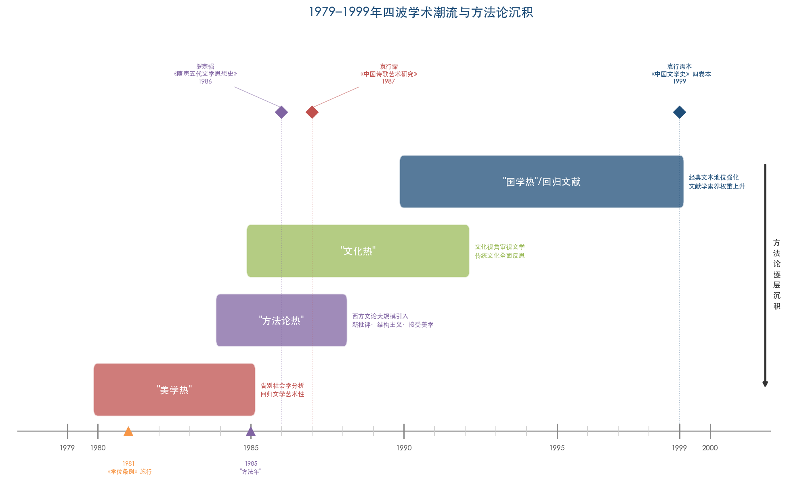

图4-3以1979–1999年为时间轴，以层叠色带呈现四波学术潮流的兴起时段，并标注《学位条例》施行（1981）、"方法年"（1985）两个关键制度节点及三部代表性学术著作，直观展示了学术潮流与学者知识构成之间的时序关系和"方法论逐层沉积"效应。

## 4.5 跨学科背景与专业同质化趋势

### 4.5.1 从多元到单一：专业来源的变迁

第2章揭示了奠基期学者专业背景的显著多元性：钱锺书出身清华外文系，林庚初入物理系后转中文系，吴组缃初入经济系后转中文系，余冠英初入历史系后转中文系，非中文系正规训练者占比超过30%，这是民国通才培养模式的产物。

1979–1999年间，这一跨学科特征急剧萎缩。在15位头部学者中，14人本科阶段为中文系出身（含古典文献专业），仅莫砺锋例外——其在安徽大学外文系仅就读一年即转入南大中文系攻读研究生。中文系本科比例达93.3%。这一变化的制度根源可从两个层面加以追溯：其一，1952年院系调整后仿苏联模式实行的专业对口培养制度大幅压缩了转系通道；其二，1981年学位制度建立后，研究生招生严格按二级学科（如050105中国古代文学）设定方向，跨专业报考虽不被禁止但面临较高的知识壁垒。[教育部研究生招生学科专业代码册](http://btpta.xjbt.gov.cn/upload/resources/file/2026/03/16/616372.pdf "中国古代文学二级学科代码050105") 学科分类的细化与招生制度的刚性化，使得跨学科进入古代文学研究领域的通道日趋收窄。

### 4.5.2 跨学科性的"内化"与"方法化"

教育背景的专业同质化并不意味着知识构成的完全单一化。1979–1999年间，学者的跨学科性发生了从"教育背景多元化"到"研究方法多元化"的重要转型。

王兆鹏将定量分析方法引入词学研究，建立"唐宋诗词名篇排行榜"，实质上是将社会科学的计量方法嫁接到古代文学领域；罗宗强的"文学思想史"研究范式融合了思想史、文化史与文学批评史的多重学科视角；程千帆提倡的"文艺学与文献学相结合"本身即是一种跨领域的方法论整合。

这些方法论创新表明，1979–1999年间的跨学科渗透主要体现在"方法借用"而非"教育背景异质性"层面。奠基期学者因教育背景本身的多元（外文系、物理系、经济系等出身）而自然携带异质性视角；本时期学者则主要通过自觉的方法论学习与跨界阅读来获取异质性资源。这一转变意味着跨学科的知识渗透从"无意识的、由培养体制决定的"变为"自觉的、由研究者主动选择的"——前者更具偶然性和多样性，后者更具针对性但也更受学科边界制约。

## 4.6 海外访学与学术交流

### 4.6.1 以东亚为导向的短期访学模式

1979–1999年间，古代文学学者的海外学术交流开始出现并逐步扩展，但其模式与社会科学、自然科学领域形成了鲜明对比。

袁行霈1982至1983年赴日本东京大学任外国人教师，成为首位受聘于东京大学的中国文学学者，讲授陶渊明研究等五门课程；1997年赴美国哈佛大学任哈佛燕京学社访问研究学者，在哈佛完成了四卷本《中国文学史》的统稿工作。[北京大学中文系·袁行霈](https://chinese.pku.edu.cn/szdw/zzjs/f5f625ee8531481e866109ce9592339f.htm "1982–1983东京大学、1997哈佛") 蒋寅1997年任京都大学客座教授，2002年任韩国庆北大学客座教授；罗宗强1996至1997年任新加坡国立大学客座教授；张伯伟2000至2001年任京都大学客座教授。

上述海外交流经历呈现出若干共同特征：第一，以东亚（日本、韩国、新加坡）为主要目的地，赴美交流较少（仅袁行霈1997年哈佛一例）；第二，以短期访学或客座讲学为主要形式，而非攻读学位；第三，没有任何一位头部学者持有海外博士学位。这一模式的形成有其内在逻辑：中国古代文学的核心文献与学术传统深植于中文语境，日韩学术界在汉学研究领域积淀深厚且语言隔阂相对较小，因此成为古代文学学者海外交流的首选方向。

### 4.6.2 "无海归博士"的学科特征

1979–1999年间，古代文学领域始终未出现"海归博士"群体，这在中国学术界构成了一个显著的学科特殊性。与经济学、社会学等学科大量学者赴美攻读博士并回国任教的格局相比，古代文学领域的海外经历局限于短期客座与访问，呈现"浅层国际化"的特征。

这一特征的形成源于多重因素的叠加：海外中国文学博士项目规模极小，且培养重心与国内学术评价标准之间存在显著错位；国内学科评价体系以中文发表为核心（CSSCI期刊和国家社科基金项目是职称晋升的关键指标）；古代文学研究所需的古典文献资源在国内最为集中。由此形成的"封闭循环"——国内培养、国内发表、国内评价——在保持学科传统深度的同时，也客观上限制了知识来源的国际化程度。

## 4.7 学术近亲繁殖的初步显现

### 4.7.1 制度化培养与留校惯性

1979–1999年间，学术近亲繁殖在古代文学领域开始显现。在15位头部学者中，张伯伟（南大本硕博→留校）和詹福瑞（河北大学本硕博→留校）为典型案例，近亲繁殖比例约为13.3%（2/15）。这一比例在当时并不算高，但已预示此后近亲繁殖率的加速上升。

程千帆弟子群体是讨论这一问题的核心案例。莫砺锋、张伯伟、张宏生、曹虹等均在南大获得学位并留校任教，该群体被学界作为人文学科学术近亲繁殖的正面案例加以讨论。[中国社会科学网](https://www.cssn.cn/ztzl/jzz/rwln/xwpl/sdbd/202209/t20220923_5540878.shtml "程千帆弟子留校作为正面案例") 在这些案例中，近亲繁殖的"正面效应"得到了充分强调：导师的学术理念与方法论得以在同一机构内持续传承与深化，形成了具有鲜明学术个性的"南大学派"。

### 4.7.2 流动模式的分化

与留校型学者形成对比的是，蒋寅、刘跃进、王兆鹏、左东岭、杜桂萍等人展现了显著的跨院校流动特征。蒋寅从扬州师院经广西师大、南大最终到社科院；刘跃进从南开经清华、杭大到社科院；王兆鹏从武汉师院经湖北大学、南师大到武汉大学；左东岭从南开到首都师范大学。这些流动路径的共同特征是"向上流动"——从地方院校或师范院校逐步进入学术中心，完成学术精英化的进程。

这一分化揭示了1979–1999年间古代文学学者群体内部并存的两种知识生成模式：一种是"深耕型"——在同一机构内完成全部学术社会化，知识结构纵深大但视野可能受限；另一种是"游历型"——在多个机构间流动积累，知识来源更加多元但学术认同感可能较为分散。两种模式的并存恰是学位制度建立初期学术生态的一个特征——制度未曾形成对人才流动的刚性约束，学者的职业路径仍保有相当程度的个体选择空间。

## 4.8 袁行霈本《中国文学史》：方法论变革的制度化标志

1999年，袁行霈主编的四卷本《中国文学史》由高等教育出版社出版，迅速成为全国高校中文系通用教材。这一事件的意义不仅在于一部教材的问世，更在于它标志着古代文学研究方法论变革的制度化完成。

袁行霈为该书确立的总纲领——"文学本位、史学思维、文化学视角"——以及"三古七段"分期法，明确告别了此前以政治史框架套文学史的旧范式。[北京大学中文系·袁行霈专访](https://chinese.pku.edu.cn/xwgg/bdzwr/29f5e22a46a94648ab129ae946d9503f.htm "文学本位、三古七段分期法") 该书约请19所高校29位学者共同撰写，参与者涵盖了1979–1999年间古代文学各断代方向的核心研究者。这一跨院校合作的组织方式，既体现了学术共同体的初步成熟，也反映了头部学者分布于多所院校的"多极化"格局。

从知识构成的角度审视，袁行霈本《中国文学史》集中体现了1979–1999年间学术潮流在方法论层面的沉积效应："文学本位"回应了"美学热"对文学自律性的强调以及对前三十年政治化文学史的直接纠偏；"史学思维"延续了程千帆等人倡导的文献考据传统和傅璇琮开创的文学与社会文化综合研究范式；"文化学视角"则审慎吸纳了"文化热"的知识遗产。这三个纲领性原则的综合，恰恰是前述四波学术潮流依次叠加后的方法论结晶——是对1950–1960年代政治化文学史的拨乱反正、对1980年代美学转向的继承以及对"文化热"中文化视角的平衡性吸收的三重成果。

## 4.9 本章小结

1979–1999年间头部学者群体的知识背景构成呈现出鲜明的过渡性与变革性特征，可从以下维度予以概括。

在学历层次上，从"无学位为主"向"博士学位化"的转变清晰可辨：15位学者中4人无硕博学位、1人最高学历为硕士、10人获博士学位。无学位者全部属于更早培养世代（袁行霈、傅璇琮、周勋初、霍松林），博士学位持有者则集中于1959年前后出生的新一代。这一分布是学位制度从无到有的直接映射。

在培养院校上，从第2章所述第一期（1950–1966）的"北大单核"格局向"五大核心+多极并存"格局扩展。南大（程千帆）、南开（罗宗强）、复旦（朱东润→王水照）、陕师大（霍松林）等新极点的崛起打破了此前的一校独大局面。然而，这一"多极化"的本质是"以人立校"——各极点的形成高度依赖个别核心导师的学术号召力，而非院校的整体学科制度实力。

在专业背景上，跨学科比例从奠基期的约30%锐减至约7%（15位学者中14人为中文系本科出身），专业同质化趋势显著。跨学科渗透的形态发生了质变——从奠基期"教育背景本身的多元化"转为"研究方法层面的主动借鉴"（如王兆鹏的定量分析、罗宗强的思想史方法），跨学科性从"无意识的、由培养体制决定的"转变为"自觉的、由研究者主动选择的"。

在师承网络上，五大核心师承链（程千帆学脉、林庚—陈贻焮学脉、朱东润—王水照学脉、罗宗强学脉、霍松林学脉）完成了学术谱系的"压缩性重建"——原本需要数十年缓慢积累的师生传承，被压缩在1978年后重返学术前线的十余位老先生的晚年时光中完成。这种压缩性重建展现了惊人的效率，但也留下了知识基因多样性受限的结构性后果。

在海外经历上，短期访学模式初步出现，以东亚（日本、韩国）为主要方向，袁行霈1982年赴东京大学为这一交流模式的开端。但该时期始终未出现海归博士群体，这一特征使古代文学学科在国际化程度上与自然科学和社会科学领域形成了结构性差异。

在学术近亲繁殖方面，约13.3%的比例（2/15）在当时并不算高，但两种知识生成模式——"深耕型"（张伯伟等留校者）与"游历型"（蒋寅等跨院校流动者）——的分化已经清晰呈现，预示着此后各期近亲繁殖率的显著上升。

与此同时，"美学热""方法论热""文化热""国学热"四波学术潮流依次叠加于学者的知识构成之上，形成了"传统文献考据+美学艺术分析+西方理论框架+文化学宏观视野"的多层沉积结构。1999年袁行霈主编《中国文学史》提出的"文学本位、史学思维、文化学视角"纲领，恰是这一多层沉积的制度化结晶。总体而言，1979–1999年是古代文学学科从"人治"走向"制度化"、从方法论单一走向多元探索的关键转型期，学者群体的知识背景正是这一转型的忠实映像。

# 第5章 专业化与国际化时代的新生代学者（2000–2026）

2000年至2026年的四分之一世纪，是中国古代文学学科在高度制度化轨道上运行的时期。1999年高校扩招后研究生招生规模急剧膨胀——1998年全国研究生招生仅7.2万人，1999年扩招比例达47%，此后三年又分别以25%、17%、10%的速度持续增长。[教育部新闻](http://www.moe.gov.cn/moe_879/moe_329/moe_296/tnull_3008.html "研究生扩招速度惊人") 博士学位由上一时期少数精英学者方可拥有的学术资本，转变为进入高校任教的基本门槛；"985工程""211工程""双一流"建设等层层叠加的院校分层制度，则将学者的培养来源与职业去向锁定在少数核心院校的闭合回路之中。与此同时，数字人文方法的引入、出土文献研究的交叉需求、"中华优秀传统文化传承发展工程"等政策导向，以及学术评价体制日益强化的发表导向与项目导向，共同塑造了新一代学者截然不同于前辈的知识构成面貌。

本章以16位在2000年以后活跃于古代文学研究前沿的头部学者为样本，逐一考证其教育背景、师承关系与学术路径，在此基础上提炼这一时期学者群体知识构成的结构性特征。

## 5.1 博士学位的门槛化与培养院校的集中

### 5.1.1 博士学位：从精英资本到准入底线

第4章揭示了1979–1999年间从"无学位时代"向"学位化时代"的过渡：15位头部学者中4人无硕博学位、1人最高学历为硕士、10人获博士学位。至2000年以后，这一过渡已基本完成。本章考察的16位头部学者中，仅葛晓音（1982年获硕士学位，终身无博士学位）和骆玉明（1977年毕业于复旦大学中文系研究生班，学位制度建立前无正式学位）两人不持博士学位——而这两位均属更早培养世代（分别生于1946年和1951年），其学术训练根基仍深植于第4章所述的学位制度建立初期。其余14人均持有博士学位。[北京大学中文系·葛晓音专访](https://chinese.pku.edu.cn/xwgg/bdzwr/60c7b5299482497ea5f8c5b2aca07a79.htm "1963年入学、导师陈贻焮")

上述数据清晰地表明，博士学位已从上一时期"有之则锦上添花"的精英资本，转变为"无之则不得其门而入"的准入底线。2000年以后，一位中文系毕业生若要进入古代文学研究的学术主流，攻读并获得博士学位几乎是唯一的制度性通道。形成鲜明参照的是，上一时期无博士学位的袁行霈主编了全国通用的四卷本《中国文学史》，傅璇琮以编辑身份完成了里程碑式的学术著作——在2000年以后的学术评价体制中，此类路径已几乎不可复制。

### 5.1.2 博士培养的院校集中度

14位博士学位持有者的授予院校分布呈现出高度集中的格局：北京大学3人（钱志熙、刘宁、张健）、南京大学3人（程章灿、曹虹，均为程千帆弟子）、陕西师范大学3人（李浩硕士导师安旗、尚永亮、康震，均为霍松林弟子或间接传人）、华东师范大学2人（胡晓明、方笑一）、复旦大学2人（陈引驰、汪涌豪）、北京师范大学1人（刘石）。[西北大学文学院·李浩](https://wxy.nwu.edu.cn/info/1017/2749.htm "李浩完整教育经历") [北京大学中文系·钱志熙专访](https://chinese.pku.edu.cn/xwgg/bdzwr/9993ca8447d649c9b6115f62f6b1e321.htm "杭大本硕、北大博士、导师陈贻焮") [复旦大学中文系·陈引驰](https://chinese.fudan.edu.cn/16/17/c13672a136727/page.htm "1984入学、1988学士、1993博士")

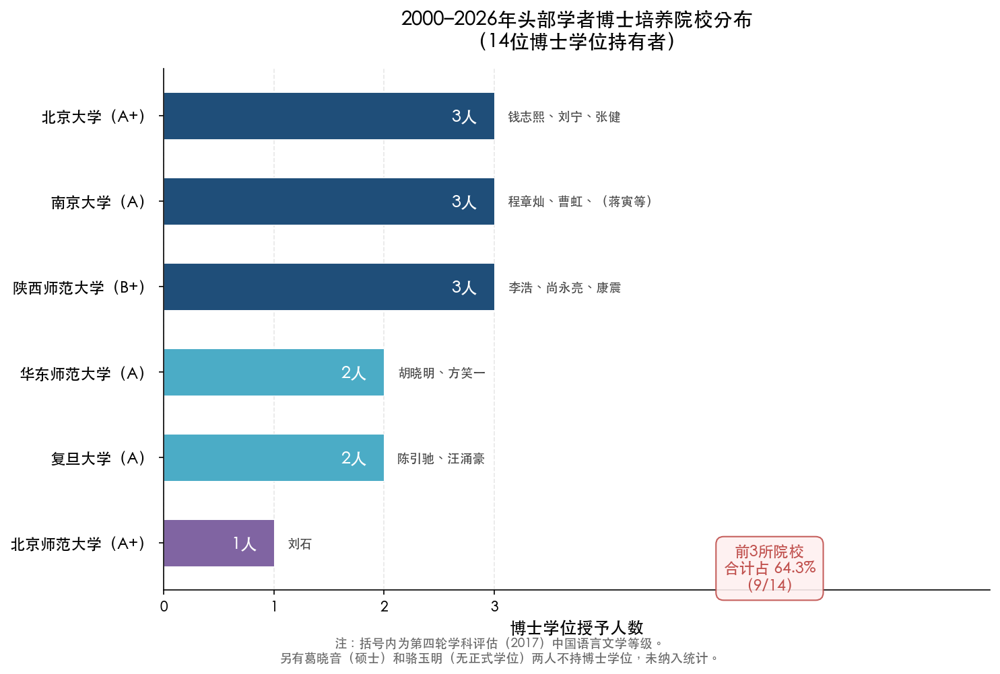

**图5-1 2000–2026年头部学者博士培养院校分布。** 14位博士学位持有者的博士授予院校仅分布于6所高校，北大、南大、陕师大各培养3人，合计占64.3%（9/14）。括号内为第四轮学科评估（2017年）中国语言文学等级。

上述分布数据与第4章所揭示的"五大核心师承链"格局高度吻合——2000年以后活跃的头部学者，其博士阶段的培养几乎全部在上一时期形成的五大极点（北大、南大、复旦、陕师大、华东师大）及其紧密关联院校（北师大）中完成。换言之，1979–1999年间以程千帆、袁行霈、霍松林等少数核心导师为节点建立的培养格局，在2000年以后继续主导着学科的人才输出。

值得注意的是，尽管至第四轮学科评估（2017年）时中国语言文学一级学科博士授权高校已达65所，[教育部学位与研究生教育发展中心](https://www.cdgdc.edu.cn/dslxkpgjggb/xkpm/rwskl/a0501_zgyywx.htm "第四轮学科评估0501中国语言文学") 头部学者的博士来源仍高度集中于A+至A级院校（北大、北师大、南大、复旦、华东师大、浙大、山大、川大为A级以上），博士点的数量扩张与头部学者的产出并不同步。这一"金字塔"结构表明，博士点的制度性扩张更多服务于学科的"面上"培养需求，而非头部学术精英的遴选与输出。

## 5.2 头部学者教育背景的逐人考证

为系统呈现2000–2026年间活跃的头部学者知识背景构成，本节对16位代表性学者的教育经历、师承关系与学术路径逐一梳理。需要说明的是，部分学者（如葛晓音、骆玉明）生于1940–1950年代，其学术训练完成于更早时期，但因其学术活动持续至2020年代且在学科中始终发挥头部影响力，故纳入本章讨论。

### 5.2.1 跨时代的学术长者：无博士学位但持续影响

**葛晓音**（1946年生），1963年入北京大学中文系本科，因"文革"仅上两年课。1979年考取陈贻焮硕士研究生，1982年获硕士学位后留校任教，终身未获博士学位。她同时深受林庚治学理念影响，代表作有《八代诗史》《诗国高潮与盛唐文化》等。[北京大学中文系·葛晓音专访](https://chinese.pku.edu.cn/xwgg/bdzwr/60c7b5299482497ea5f8c5b2aca07a79.htm "1963年入学、导师陈贻焮") 葛晓音的教育背景承接了第4章所述的"林庚→陈贻焮"学脉——她是这一谱系在21世纪的直接延续者。其无博士学位却长期执掌北大古代文学教席并享有崇高学术声望的事实，恰好标示了新旧学术体制之间的过渡地带：在2000年以后的制度环境中，葛晓音式的路径已无从复制。

**骆玉明**（1951年生），1977年毕业于复旦大学中文系研究生班（学位制度建立前），留校任教至教授，无正式博士学位。与章培恒合著《简明中国文学史》。骆玉明代表了1977年恢复高考首批研究生中的一类特殊路径——在学位制度未曾建立的窗口期，凭借学术才能直接进入高校教职序列。

### 5.2.2 程千帆学脉的延续

**程章灿**（1963年生），北京大学历史系世界史专业本科（1983年获学士学位）→南京大学中文系硕博连读（1989年获博士学位，师从程千帆）。2008年入选教育部长江学者特聘教授。[南京大学·程章灿](https://www.nju.edu.cn/info/3191/225031.htm "北大历史系、报考南大中文系、师从程千帆") [教育部2008年长江学者名单](http://www.polymer.cn/UploadFile/IndustryNewsPic/20090930095308-1.pdf "程章灿，南京大学，中国古代文学") 程章灿是本章16位学者中唯一本科阶段出身非中文系者——其北大历史系世界史专业的训练背景，使他在古代文学研究中形成了独特的跨学科视角，研究领域涉及赋学、石刻文献与国际汉学等交叉地带。这一"孤例"地位恰恰凸显了2000年以后古代文学研究领域跨学科教育背景的稀缺。

**曹虹**（1958年生），1977年入南京大学中文系，本硕博均在南大完成（1982年学士、1984年硕士、1989年博士），师从程千帆。程千帆自述"女弟子惟曹虹"，留校任教授。曹虹与第4章所述的张伯伟同为南大77级入学，两人均在南大完成全部学位并留校，构成了程千帆学脉在南大的核心传承力量。

### 5.2.3 北大陈贻焮学脉的传承

**钱志熙**（1960年生），杭州大学（现浙江大学）中文系学士、硕士（1982年、1985年）→北京大学博士（1990年，导师陈贻焮），留校任教，长江学者特聘教授。[北京大学中文系·钱志熙专访](https://chinese.pku.edu.cn/xwgg/bdzwr/9993ca8447d649c9b6115f62f6b1e321.htm "杭大本硕、北大博士、导师陈贻焮") 钱志熙自述其学术传承脉络时称："从刘师培、黄节到林庚、陈贻焮，到葛老师和我们。"此语清晰地勾勒出一条跨越近百年的北大古代文学学术谱系——从清末民初的刘师培、黄节，经林庚、陈贻焮，至葛晓音、钱志熙，学术传统在同一机构内实现了连续数代的承接。钱志熙的本硕在杭州大学完成、博士赴北大攻读的路径，属于"地方重点大学→顶尖大学博士→留校"的典型模式。

**刘宁**（1969年生），1987至1997年间在北京大学中文系历经十年，先后获学士、硕士、博士学位；此后赴北京师范大学完成博士后研究，继而入中国社会科学院文学研究所任研究员。2006至2007年为哈佛大学富布莱特访问学者，曾翻译包弼德（Peter K. Bol）《斯文：唐宋思想的转型》。[中国社科院文学研究所·刘宁](http://literature.cass.cn/jgsz/yjs/gdwxyjs_135699/zzyjry_135830/202502/t20250211_5843980.shtml "北大博士、哈佛富布莱特访问学者") 刘宁本硕博均在北大完成，属于典型的"学术近亲繁殖"路径。然而其博士后转赴北师大、工作单位定于社科院，加之赴哈佛访学和翻译海外汉学著作的经历，表明即便在高度"近亲繁殖"的教育背景下，学者仍可通过职业流动与国际交流拓展知识视野。

**张健**（1964年生），安徽师范大学学士→北京大学硕士、博士→留北大任教→转任香港中文大学教授。[中华书局·张健](https://www.chunghwabook.com.hk/author/detail/id/2060 "北大博士、香港中文大学教授") 张健的路径呈现"地方师范→北大硕博→赴港"的独特轨迹，是古代文学学者中少数转赴港校任教的案例。这一路径在一定程度上打破了大陆古代文学学者"封闭循环"（国内培养→国内发表→国内评价）的惯性模式，但其罕见程度本身亦说明此类跨境流动在古代文学领域的特殊性。

### 5.2.4 霍松林学脉的全国辐射

**李浩**（1960年生），西北大学中文系本科、硕士（1983年、1986年，硕士导师安旗）→陕西师范大学博士（1998年）→复旦大学博士后（2002年）。现任中国唐代文学学会会长。[西北大学文学院·李浩](https://wxy.nwu.edu.cn/info/1017/2749.htm "李浩完整教育经历") 李浩虽非霍松林的直接博士弟子，但其陕师大博士学位训练使他归属广义的"霍松林学脉"间接传人。其研究方向"家族与地域文学""新出土文献学"，体现了2000年以后古代文学研究的细分化趋势——从传统的作家作品研究向家族网络、地方社会和物质文本等新维度延伸。

**尚永亮**（1956年生），陕西师范大学中文系1977级入学，1982年获学士学位，后获博士学位，师从霍松林。现为武汉大学教授、长江学者特聘教授。[陕西师范大学文学院·尚永亮](http://www.lit.snnu.edu.cn/info/1065/3551.htm "1977级校友、霍松林弟子") 尚永亮代表了"西部师范→综合性重点大学"的流动路径。从陕师大到武汉大学的跨区域流动，使霍松林的学术传统在华中地区获得了新的生长节点。值得关注的是，尚永亮早在2007年即在《文学评论》发表《资料库、计量分析与古代文学研究的现代化进程》一文，是古代文学学者中较早关注数字化方法的先驱之一。[中国社科网](https://www.cssn.cn/skgz/202209/t20220916_5511816.shtml "王兆鹏数字人文实践")

**康震**（1970年生），1993至2000年在陕西师范大学先后获学士、硕士、博士学位（导师霍松林）→南京师范大学博士后→2002年起任教于北京师范大学。2016年入选长江学者青年学者。兼任央视《百家讲坛》《中国诗词大会》嘉宾，是公众知名度最高的古代文学学者之一。[北京师范大学文学院·康震](https://wxy.bnu.edu.cn/yjdw/zggdwxyjs/04a28e8478b9449e9a7530e6dbe0af7a.htm "陕师大本硕博、导师霍松林、北师大任教") 康震的路径集中体现了霍松林学脉"辐射型"传播模式——弟子在陕师大完成全部学位训练后向外流动，携带导师的学术理念进入新的院校并在新平台上建立自身学术领地。康震作为央视文化节目嘉宾的角色，则标志着古代文学学者在2000年以后开始承担知识普及的公共功能——这是此前数代学者中从未出现过的现象。

### 5.2.5 华东师大与复旦系统

**胡晓明**（1955年生），安徽师范大学文艺学硕士（1986年）→华东师范大学文学批评史博士（1990年，导师王元化）。2004年获终身教授称号，兼任中国古代文学理论学会会长。[华东师范大学中文系·胡晓明](https://zhwx.ecnu.edu.cn/af/9c/c14641a176028/page.htm "安徽师大硕士、华东师大博士、导师王元化") 胡晓明的路径属于"地方师范→重点大学博士→留校"的典型模式——与第4章所述的蒋寅（扬州师院→广西师大→南大→社科院）和刘跃进（南开→清华→杭大→社科院）等路径一脉相承。其导师王元化（1920–2008）是中国现代思想史上的重要人物，以文学批评与思想史研究见长，这一师承关系使胡晓明的知识结构中具有较强的思想史与文化批评色彩，与纯粹的文献考据型学者形成了显著差异。

**陈引驰**（1966年生），复旦大学中文系本科（1984–1988年）直接攻读博士（1993年获博士学位），留校任教至教授。长江学者，哈佛燕京学社访问学者。[复旦大学中文系·陈引驰](https://chinese.fudan.edu.cn/16/17/c13672a136727/page.htm "1984入学、1988学士、1993博士、哈佛燕京学社") 陈引驰是"学术近亲繁殖"的典型案例——自本科至博士乃至教授，其全部学术社会化过程均在复旦大学中文系这一单一机构内完成。这一路径在保证学术传统深度延续的同时，也意味着知识来源的高度同质性——其学术视野的拓展主要依赖赴哈佛燕京学社的短期访学，而非教育背景本身的异质性。

**汪涌豪**（1962年生），1989年获复旦大学中文系文学博士学位，留校任教授，长江学者特聘教授。从事古代文学与美学研究。[复旦大学教师主页·汪涌豪](https://faculty.fudan.edu.cn/wangyonghao/zh_CN/index.htm "1962年生、1989年复旦博士") 据其官方主页显示，汪涌豪1984年起即在《复旦学报》发表论文，结合1989年获博士学位、1962年出生的时间线推算，其本科至博士阶段均在复旦完成的可能性极高。若确如此，汪涌豪与陈引驰一样，构成复旦古代文学研究"学术近亲繁殖"的又一典型案例。

**方笑一**，1995至2004年在华东师范大学完成本硕博全部学位。2012至2013年为哈佛大学访问学者，兼任央视《中国诗词大会》命题专家。[华东师范大学·方笑一](https://faculty.ecnu.edu.cn/_s5/fxy/main.psp "本硕博均在华东师大") 方笑一亦为"学术近亲繁殖"的典型——九年时间在同一所大学完成全部学位训练。与康震相似，方笑一同样承担了古代文学知识的公共传播功能（《中国诗词大会》命题专家），这一现象的出现与2017年"中华优秀传统文化传承发展工程"的政策导向密切相关。

### 5.2.6 其他培养路径

**刘石**（1963年生），四川大学中文系学士、硕士（1984年、1987年）→北京师范大学博士（1991年，古典文献学方向）→中华书局编辑→1999年转任清华大学教授。2018年主持国家社科基金重大项目"基于大数据技术的古代文学经典文本分析与研究"。[清华大学人文学院·刘石](https://www.rwxy.tsinghua.edu.cn/info/1366/9817.htm "川大学士硕士、北师大博士、中华书局、清华教授") 刘石的路径在16位学者中独具特色：其从中华书局编辑转任清华大学教授的经历，与第4章所述的傅璇琮（中华书局编辑兼学者）形成了颇具意味的呼应。而其2018年主持的大数据项目，则标志着古代文学研究在方法论层面向数字人文的实质性转向——这一转向将在本章5.6节详加分析。

**查屏球**（1960年生），安徽师范大学中文系1983届学士，1990年获硕士学位，1993年获博士学位，1996年进入博士后流动站，此后在复旦大学中文系任教。研究方向为中古与近代文学、网络汉学。[复旦大学古代文学研究中心·查屏球](https://www.gdwx.fudan.edu.cn/7d/4a/c3782a32074/page.htm "教育经历") [安徽师范大学校友列表](https://zh.wikipedia.org/zh-cn/%E5%AE%89%E5%BE%BD%E5%B8%88%E8%8C%83%E5%A4%A7%E5%AD%A6%E6%A0%A1%E5%8F%8B%E5%88%97%E8%A1%A8 "83届中文系") 查屏球的路径呈现"地方师范（安徽师大）→硕博→博士后入复旦"的上升流动模式，与胡晓明的"安徽师大→华东师大"路径有着相似的起点——安徽师范大学在古代文学领域扮演了重要的人才初始培养角色，其毕业生经由重点大学的研究生教育实现了学术跃升。

## 5.3 教育背景的结构性特征分析

### 5.3.1 专业同质化的极端深化

第4章已揭示1979–1999年间跨学科教育背景的急剧萎缩（15位学者中14人本科出身中文系，占93.3%）。2000年以后，这一趋势进一步深化至极端水平。本章16位学者中，仅程章灿1人本科为非中文系（北大历史系世界史专业），其余15人本科均为中文系或相近专业。跨学科背景者占比从第一期（1950–1966年）的约30%，降至第三期的约7%，再降至第四期的约6%。

这一持续收窄的趋势反映了学科制度化的累积效应。1981年以来，研究生招生严格按二级学科（如050105中国古代文学）设定方向，[教育部研究生招生学科专业代码册](http://btpta.xjbt.gov.cn/upload/resources/file/2026/03/16/616372.pdf "中国古代文学二级学科代码050105") 跨专业报考虽不被明文禁止，却面临本科专业课程缺失、学术训练路径不匹配等系统性壁垒。尤其是古代文学研究所需的古典文献阅读能力——古汉语、训诂学、目录学、版本学等——对非中文系出身者构成了难以逾越的知识门槛。制度壁垒与知识壁垒的叠加，使得跨学科进入古代文学领域的可能性降至历史最低点。

然而，教育背景的同质化并不等同于学术视野的封闭。第4章已指出，1979–1999年间跨学科性已从"教育背景的多元化"转型为"研究方法的多元化"。2000年以后，这一转型得到了进一步强化：程章灿虽然是唯一的跨学科教育背景持有者，但刘石的大数据研究项目、尚永亮的计量分析方法、李浩的出土文献学研究，均表明跨学科渗透的主要形态已经从"由谁来做"（教育背景的异质性）转变为"如何去做"（研究方法的借鉴与融合）。

### 5.3.2 "学术近亲繁殖"的显著加剧

2000年以后古代文学学者群体中最引人注目的结构性特征，是"学术近亲繁殖"现象的显著加剧。在16位学者中，至少6人本硕博全部或主要在同一大学完成并留校任教：陈引驰（复旦本科直博→留校）、曹虹（南大本硕博→留校）、方笑一（华东师大本硕博→留校）、刘宁（北大本硕博→社科院）、汪涌豪（复旦博士→留校）、骆玉明（复旦研究生班→留校）。近亲繁殖比例约为37.5%（6/16），较第4章所述的1979–1999年间约13.3%（2/15）增长了近两倍。

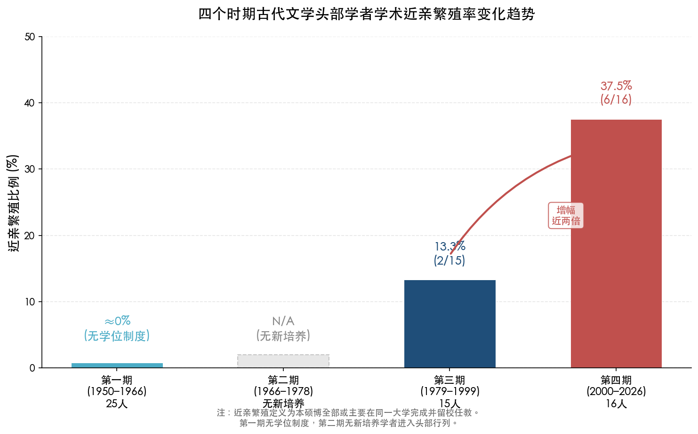

**图5-2 四个时期古代文学头部学者学术近亲繁殖率变化趋势。** 近亲繁殖率从第一期的≈0%（无学位制度）、第二期N/A（无新培养）、第三期13.3%（2/15），跃升至第四期37.5%（6/16），增幅近两倍。

这一加剧趋势与中国大学总体的学术近亲繁殖现象相吻合。顾海兵（2006）调查17所中国大学987名教师发现，604人毕业后直接在母校任教（占62%），中国大学近亲繁殖程度平均比海外高约5倍（中国为0.654，6所海外对照院校仅为0.1115）。[中国教育和科研计算机网](https://www.edu.cn/zui_jin_geng_xin_1169/20140508/t20140508_1110181.shtml "学术近亲繁殖还是远缘杂交") 更值得关注的是阎光才（2009）的发现：文科中外校引进者的科研能力高于留校者——这一结论在古代文学领域或许需要更为审慎的考量。[中国社会科学网](https://www.cssn.cn/ztzl/jzz/rwln/xwpl/sdbd/202209/t20220923_5540878.shtml "学术近亲繁殖利弊之争")

程千帆弟子群体提供了讨论这一问题的关键案例。莫砺锋、张伯伟、张宏生、曹虹、程章灿等均在南大获得学位并留校任教，被学界视为人文学科学术近亲繁殖的"正面案例"——导师的学术理念在同一机构内实现了连续传承，形成了鲜明的"南大学派"。[中国社会科学网](https://www.cssn.cn/ztzl/jzz/rwln/xwpl/sdbd/202209/t20220923_5540878.shtml "程千帆弟子留校作为正面案例") 然而在制度层面，教育部2010年《全国教育人才发展中长期规划（2010–2020年）》已明确提出"大力改善高等学校教师学缘结构，逐步减少和消除'学术近亲繁殖'现象"。[中国教育网](https://www.edu.cn/te_bie_tui_jian_1073/20110804/t20110804_659948.shtml "众专家热议学术近亲繁殖如何消除") 从本章学者样本来看，这一政策倡导在古代文学领域的实际效果颇为有限——2010年后获得教职的年轻学者中，近亲繁殖现象并未呈现明显改善迹象。

我们认为，古代文学领域近亲繁殖率偏高，既有结构性原因，也有学科特殊性。就结构性因素而言，古代文学博士培养的院校集中度本身即很高（6至7所院校培养了几乎全部头部学者），优秀博士毕业后留在培养单位是顺理成章的选择。就学科特殊性而言，古代文学研究高度依赖特定的文献资源、学术传统与师承关系——一位在南京大学受训于程千帆学脉的博士，其学术积累与南大的图书馆藏、学术氛围和同事网络高度适配，流动至其他院校可能面临学术环境"脱嵌"的显著成本。夏纪军（2014）在经济学领域的研究亦发现，校际流动以同城为主（59.8%），知名大学间未能形成有效的师资交换圈，[夏纪军《近亲繁殖与学术退化》](https://ccj.pku.edu.cn/Article/DownLoad?id=330724920&&type=ArticleFile "北京大学教育评论2014年") 古代文学领域的情况与此类似，甚至更为封闭。

### 5.3.3 海归博士的缺席：学科的"国际化悖论"

本章考察的16位头部学者中，无一人持有海外博士学位。这一事实与社会科学、自然科学领域海归博士占据大量教职的格局形成了鲜明对比，构成了古代文学学科在国际化问题上的独特面貌。

古代文学领域的国际化主要体现为短期访学——且目的地呈现向哈佛大学高度集中的特征：刘宁（2006–2007年哈佛大学富布莱特访问学者）、陈引驰（哈佛燕京学社访问学者）、方笑一（2012–2013年哈佛大学访问学者），程章灿和胡晓明等亦曾赴哈佛访问。哈佛大学之所以成为古代文学学者短期访学的首选目的地，与哈佛燕京学社（Harvard-Yenching Institute）长期资助东亚人文学者以及哈佛东亚系在中国古典文学研究领域的深厚学术积淀密切相关。

然而，短期访学与攻读学位所获得的知识资源在质和量上均存在显著差异。短期访学（通常为3至12个月）主要提供学术交流机会和跨文化视野的拓展，但并不要求系统接受海外学术训练体系的完整浸润。这意味着古代文学学者的知识结构虽然通过访学获得了一定程度的国际化补充，但其学术方法论和理论框架仍以国内学术传统为主导。

"无海归博士"现象的形成有其深层逻辑。海外中国文学博士项目的培养方向偏向比较文学和文化研究，与国内古代文学学科强调文献考据和传统方法的评价标准之间存在错位；中国古代文学研究的核心文献资源在国内最为集中；学科评价体系以中文发表为核心（CSSCI期刊和国家社科基金项目是晋升的关键指标），海外博士学位并不构成制度性优势。由此形成的"封闭循环"——国内培养、国内发表、国内评价——在维持学科传统深度的同时，也使古代文学成为中国人文学科中国际化程度最低的领域之一。

## 5.4 师承链条与学术谱系的延续与分化

### 5.4.1 霍松林学脉的持续扩展

第4章已揭示霍松林学脉"辐射型"传播的特殊模式——弟子大多流向外校，形成从陕师大向全国扩散的学术网络。至2000年以后，这一辐射效应进一步显现。李浩（西北大学→中国唐代文学学会会长）、尚永亮（武汉大学教授、长江学者）、康震（北京师范大学教授、长江学者青年学者）均为霍松林弟子或间接传人，分布于西北、华中和华北三个区域，构成了"霍家军"的全国性学术版图。[陕西师范大学·霍松林百年诞辰](https://www.snnu.edu.cn/info/1272/15315.htm "培养博士70余名")

霍松林学脉的辐射模式与程千帆学脉的"聚集模式"（弟子多留南大）形成了鲜明对比。两种模式各有利弊：聚集模式有利于在一所大学内形成完整而深厚的学术传统（如南大古代文学国家重点学科），但也伴随着高度近亲繁殖的风险；辐射模式有利于学术理念的广泛传播和学科影响力的地域扩展，但也可能导致学脉在原始据点（陕师大）的传承力量相对薄弱。

### 5.4.2 北大陈贻焮学脉的代际接续

葛晓音（1979级硕士）与钱志熙（1987级博士）均留北大任教，传承了"林庚→陈贻焮→葛晓音/钱志熙"的学术脉络。[北京大学中文系·钱志熙专访](https://chinese.pku.edu.cn/xwgg/bdzwr/9993ca8447d649c9b6115f62f6b1e321.htm "学术传承脉络") 这一谱系的特殊之处在于其时间跨度之长——从清末民初的刘师培、黄节到21世纪的钱志熙，横跨一个多世纪。这种在同一机构内实现的超长代际传承，在中国学术界即便不是独一无二，也属极为罕见。

### 5.4.3 程千帆学脉的南大延续

程章灿（2008年入选长江学者）和曹虹继续在南京大学任教，是程千帆学脉在2000年以后的核心承继者。程章灿为程门弟子中首位长江学者，其入选标志着程千帆学脉在国家级学术评价体系中获得了最高层级的认可。程千帆培养的莫砺锋、张伯伟、张宏生、曹虹、程章灿等弟子，几乎构成了南大古代文学教研团队的全部核心力量——这一格局既是师承传统的延续成果，也是学术近亲繁殖的极端表现。

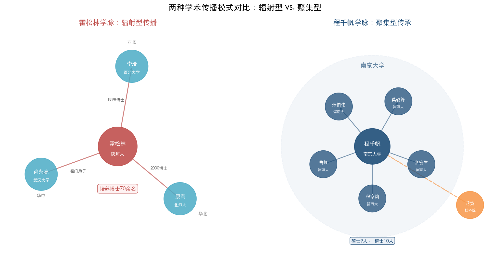

**图5-3 两种学术传播模式对比。** 左图展示霍松林（陕师大）弟子李浩（西北大学）、尚永亮（武汉大学）、康震（北师大）从陕师大向西北、华中、华北三区域辐射的空间分布；右图展示程千帆弟子莫砺锋、张伯伟、曹虹、程章灿、张宏生聚集于南京大学的集中格局，仅蒋寅外流至社科院。两种模式分别代表了学术谱系传播的"辐射型"与"聚集型"范式。

### 5.4.4 师承链的结构性特征

综合以上分析，2000年以后古代文学领域的师承网络呈现出以下几个结构性特征。

其一，"师承决定论"依然强劲。一位学者的研究方向、学术方法和问题意识，在很大程度上由其博士导师的学术传统所塑造。钱志熙明确自述的"刘师培→黄节→林庚→陈贻焮→葛晓音→我们"谱系，清晰地表明了师承关系对学术认同的强大定义力。

其二，核心学术节点面临"断代危机"。霍松林（2017年辞世）、程千帆（2000年辞世）等第一代核心博导相继离世后，其学脉的存续高度依赖第二代传人能否独立建立与导师相匹配的学术权威。目前来看，莫砺锋（南大）、康震（北师大）、尚永亮（武大）等已在各自领域建立了稳固地位，但第三代"头部学者"能否涌现，仍须经受时间检验。

其三，新谱系的出现相对匮乏。与上一时期罗宗强开辟"文学思想史"新方向、王兆鹏引入定量分析新方法的情形不同，2000年以后古代文学领域未曾出现具有类似范式创新意义的新学术谱系。现有头部学者基本仍在延续上一代导师所确立的研究方向，学术创新更多体现在具体议题的深化，而非方法论层面的根本性突破。

## 5.5 制度因素与政策影响

### 5.5.1 院校分层制度与学者流动

"985工程"（1998年启动）、"211工程"（1995年启动）和"双一流"建设（2017年首轮公布）等院校分层制度的依次叠加，对古代文学学者的培养来源和职业去向产生了深远影响。教育部第四轮学科评估（2017年）中，中国语言文学一级学科A+高校为北京大学和北京师范大学，A级包括复旦大学、华东师范大学、南京大学、浙江大学、山东大学、四川大学。[教育部学位与研究生教育发展中心](https://www.cdgdc.edu.cn/dslxkpgjggb/xkpm/rwskl/a0501_zgyywx.htm "第四轮学科评估0501中国语言文学")

本章考察的16位学者中，古代文学方向长江学者的分布集中于上述传统强校：程章灿（南大，2008年）、钱志熙（北大）、尚永亮（武大）、陈引驰（复旦）、汪涌豪（复旦）、康震（北师大，青年学者，2016年）等。[教育部2008年长江学者名单](http://www.polymer.cn/UploadFile/IndustryNewsPic/20090930095308-1.pdf "程章灿入选") 这一分布格局表明，院校分层制度通过人才称号评选（长江学者、国家社科基金重大项目主持人等）渠道，进一步强化了头部学者向少数"强校"集聚的趋势。A+至A级院校不仅是头部学者的培养基地，也是他们的职业终端——"出身名校、回归名校"的闭合回路日益牢固。

### 5.5.2 "中华优秀传统文化传承发展工程"的政策效应

2017年1月25日，中共中央办公厅、国务院办公厅印发《关于实施中华优秀传统文化传承发展工程的意见》，对古代文学学科产生了直接而显著的影响。[中国政府网](http://app.www.gov.cn/govdata/gov/201701/25/398045/article.html "2017年1月25日正式印发") 这一政策的落地效应至少体现在以下两个层面。

第一，知识普及功能的制度化。央视《中国诗词大会》《经典咏流传》等文化节目的兴起，直接推动了古代文学学者介入公共知识传播。康震、方笑一等学者兼任嘉宾或命题专家，学者的社会角色从纯粹的"研究者"向"研究者+传播者"延伸。这一角色变迁对学者的知识构成提出了新要求——除学术深度之外，还需具备面向大众的表达能力和对经典文本"可传播性"的解读能力。

第二，研究资源的政策性倾斜。"中华优秀传统文化"上升为国家战略后，与之相关的古代文学研究在国家社科基金等项目评审中获得了更多制度性支持。这一资源倾斜在客观上强化了古代文学学科的学术地位和资源获取能力，但也可能引发研究议题向"政策友好"方向的集聚——即学者的研究选题在一定程度上受到项目导向的引导。

### 5.5.3 学术评价体制的双重塑造

2000年以后，以发表导向和项目导向为核心的学术评价体制，对古代文学学者的知识构成产生了深层塑造效应。发表导向要求学者在CSSCI来源期刊（如《文学评论》《文学遗产》《文艺研究》等）持续产出高水平论文，这一要求在客观上促进了研究的专业化与精细化，但也可能导致研究碎片化——学者倾向于选择可迅速产出论文的微观议题，而回避需要长期积累方能完成的宏观学术工程。

项目导向则通过国家社科基金等机制引导研究方向。刘石2018年主持的"基于大数据技术的古代文学经典文本分析与研究"被列为国家社科基金重大项目，[清华大学人文学院·刘石](https://www.rwxy.tsinghua.edu.cn/info/1366/9817.htm "大数据重大项目") 这一立项本身即标志着数字人文方法在古代文学研究中获得了最高层级的制度性认可。项目制的资源分配功能，使得获得重大项目主持权的学者在学术资源（经费、团队、平台）方面与未获项目者之间拉开了显著差距——项目主持人往往同时也是学科评估、博士点建设中的核心评价指标贡献者，由此形成了"项目→资源→学术地位→更多项目"的正向循环。

## 5.6 数字人文与新知识维度

### 5.6.1 数字人文方法的引入

2000年以后，数字人文（Digital Humanities）方法开始进入古代文学研究领域，为学者的知识构成增添了全新维度。这一趋势的展开可追溯至多个标志性事件。

王兆鹏主持的"唐宋文学编年地图"（2017年上线，源自国家社科基金重大项目）利用GIS技术将唐宋文学家的行迹与创作活动进行空间可视化呈现。[中国社科网](https://www.cssn.cn/skgz/202209/t20220916_5511816.shtml "王兆鹏数字人文实践") 尚永亮早在2007年即在《文学评论》发表《资料库、计量分析与古代文学研究的现代化进程》，是古代文学学者中较早从方法论层面讨论数字化工具的先驱。刘石2018年获批的"基于大数据技术的古代文学经典文本分析与研究"重大项目，则将自然语言处理、文本挖掘等计算技术正式引入古代文学研究领域。

上述数字人文实践对学者知识构成的影响体现在两个层面。对于直接从事数字人文研究的学者（如刘石、王兆鹏），其知识结构中需要容纳统计学、数据科学和信息技术等跨学科要素——这种跨学科性体现在"研究工具"而非"教育背景"中，与第一期学者因培养体制多元而自然携带的跨学科背景截然不同。对于更广泛的学者群体，数字人文主要以"工具使用者"而非"方法创新者"的方式影响其研究实践——电子古籍数据库（如中国基本古籍库、中国历代人物传记资料库CBDB等）的普及，改变了学者检索和利用文献的方式，但并未根本改变其文献考据和文本分析的核心方法论。

### 5.6.2 出土文献与跨学科需求

出土文献研究对古代文学的交叉需求，构成2000年以后知识构成变迁的另一重要维度。李浩的研究方向"新出土文献学"即以新出唐代墓志为核心材料，其近年发表的多篇论文基于唐代新出土墓志展开文学史考证。[西北大学文学院·李浩](https://wxy.nwu.edu.cn/info/1017/2749.htm "新出土文献学研究") 程章灿亦长期从事石刻文献研究，将金石学传统与古代文学研究相结合。

这一研究方向要求兼具文学、文献学、石刻学和历史学的跨学科素养——而如前所述，2000年以后古代文学学者的教育背景高度同质（几乎全部为中文系本科），跨学科素养只能通过职业阶段的自学与合作研究来获取。"教育背景单一但研究需求多元"的张力，是当前古代文学学科面临的结构性矛盾之一。

## 5.7 本章小结

2000–2026年间头部学者群体的知识背景构成，呈现出高度制度化与路径依赖的鲜明特征，可从以下维度予以概括。

在学历层次上，博士学位已成为进入古代文学学术界的基本门槛。16位学者中14人持有博士学位，仅2人无博士学位且均属更早培养世代。这一"门槛化"是学位制度运行四十余年后的必然结果——1981年首批博导平均年龄约70岁、以著述声望而非学历立足的时代已彻底成为历史。

在培养院校上，博士培养高度集中于6至7所院校（北大、南大、陕师大、复旦、华东师大、北师大等），与第4章所揭示的"五大核心师承链"格局高度吻合。尽管中国语言文学博士授权高校已达65所，头部学者的博士来源仍锁定在A+至A级少数院校的窄轨之中，博士点的数量扩张与头部人才的产出并不同步。

在专业背景上，跨学科比例降至约6%（16人中仅1人非中文系本科），为四个时期之最低。跨学科渗透已完全从"教育背景的异质性"转变为"研究方法的借鉴"（数字人文、出土文献学等）——学者的跨学科素养不再源于培养体制的多元化，而是来自职业阶段的主动学习与方法借鉴。

在学术近亲繁殖方面，约37.5%（6/16）的近亲繁殖率较上一时期（约13.3%）增长近两倍，北大、南大、复旦、华东师大等顶尖院校的表现尤为显著。教育部2010年的政策倡导在古代文学领域的实际效果有限——学科特殊性（文献资源集中、师承关系依赖、评价标准国内化）构成了抑制学者流动的系统性因素。

在海外经历上，"无海归博士"是古代文学学科区别于社会科学和自然科学的最显著结构性特征。国际化主要体现为短期访学，且目的地高度集中于哈佛大学。"国内培养→国内发表→国内评价"的封闭循环在维持学科传统深度的同时，也限制了知识来源的国际化程度。

在制度与政策影响上，"985/211/双一流"院校分层制度强化了头部学者向少数强校集聚的趋势；"中华优秀传统文化传承发展工程"推动了学者角色从"研究者"向"研究者+传播者"的延伸；发表导向和项目导向的评价体制则在促进研究专业化的同时，也可能导致研究碎片化与选题的政策趋同。

在新知识维度上，数字人文方法（大数据、GIS、计量分析）和出土文献研究的交叉需求，为学者的知识构成增添了技术性和跨学科性的新要素——但这些新要素主要以"工具补充"而非"范式替代"的方式嵌入既有知识结构。

总体而言，2000–2026年的古代文学学者群体呈现出一幅矛盾而深刻的画面：教育背景的同质性达到历史峰值，但研究方法和议题的多元性也在拓展；学术近亲繁殖加剧，但学者的社会功能与公共影响力也在增强；国际化程度在人文学科中居于末端，但数字人文等新技术的引入正在悄然改变研究实践。这些张力与矛盾，恰恰是一个古老学科在高度制度化时代所面临的结构性挑战的忠实映像。

# 第6章 跨时期比较分析与学术谱系总论

前五章分别考察了学科奠基期（1950–1966）、学术断裂期（1966–1978）、学科重建与范式转型期（1979–1999）以及专业化与国际化时代（2000–2026）四个时期中国古代文学头部学者的知识背景构成。本章将四个时期的数据置于同一分析框架中进行系统的跨期比较，旨在识别七十余年间学者群体知识背景的演变轨迹与结构性特征，并从学术谱系、制度变迁与知识生产的交互关系中提炼总体发现。比较围绕五个核心维度展开：毕业院校集中度、专业背景构成、学历层次分布、导师谱系与师承网络、海外学术经历类型。在此基础上，本章还将讨论学术近亲繁殖的历时变化，以及文艺方针与制度变迁对知识构成的塑造机制。

## 6.1 院校集中度的历时比较：从"双核"到"再集中"的U型曲线

### 6.1.1 四个时期的院校分布格局

院校集中度是衡量学者知识来源同质性的首要指标。汇总前五章各时期的数据进行比较，可以清晰辨识出一条U型演变曲线（见图6-1）。

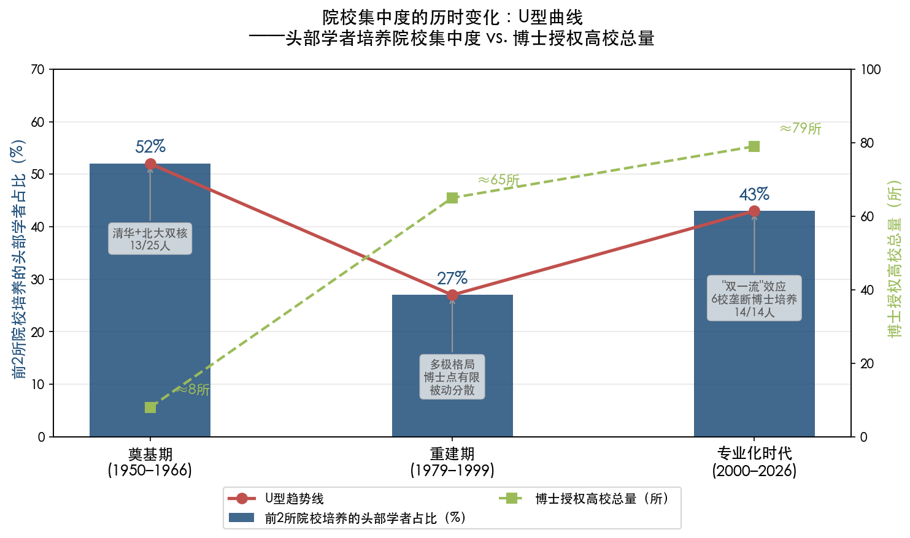

**第一期（1950–1966）呈"双核+南京系"格局。** 第2章考证的25位头部学者中，清华大学出身6人（林庚、王瑶、钱锺书、余冠英、吴组缃、萧涤非），北京大学出身7人（游国恩、陆侃如、冯沅君、俞平伯、任中敏、詹锳、褚斌杰），东南大学/中央大学/金陵大学（南京系统）出身3人（唐圭璋、程千帆、王季思）。清华与北大合计占52%（13/25），若加入南京系统则达64%（16/25）。此外，郭绍虞、赵景深、王伯祥3人为自学成才，朱东润为英国留学归来者，吴世昌出自燕京大学英文系。1952年院系调整后清华文科整体并入北大，燕京大学文理科并入北大，"双核"实质合并为"北大单核"。[清华大学校友总会](https://www.tsinghua.org.cn/info/1952/17478.htm "清华文学院的前世今生")

**第二期（1966–1978）无新培养学者进入头部行列。** 高等教育全面停摆，研究生培养中断12年，这一时期不构成院校分布的有效观测点。然而，正是这一断裂为第三期的"多极格局"埋下了种子——存世老先生在全国各地的分散分布，决定了恢复招生后博士点的初始空间布局。

**第三期（1979–1999）院校集中度从"单核"向"多极"松散化。** 第4章考察的15位头部学者中，博士授予院校呈现出显著的多极格局：南京大学（程千帆门下）培养莫砺锋、蒋寅、张伯伟等，南开大学（罗宗强门下）培养左东岭等，陕西师范大学（霍松林门下）在全国形成辐射网络，北京大学（吴组缃→袁行霈→陈贻焮）和复旦大学（朱东润→陈尚君）各据一极。1981年首批古代文学博士点分布在约8所高校和1个研究机构，博导约11–15人。[教育部学位与研究生教育发展中心](https://www.cdgdc.edu.cn/zgxw30n/info/1086/1516.htm "第一次博士、硕士学位授权审核") 这种分布本身即是断裂期后"劫后余生"的老先生各自所在院校的映射——程千帆在南大、霍松林在陕师大、罗宗强在南开，各自独立成极。这一格局是"被动分散"的产物，而非制度性设计的结果。

**第四期（2000–2026）院校集中度再度收窄。** 第5章考察的16位头部学者中，14位博士学位持有者的博士授予院校高度集中于6所：北京大学3人（钱志熙、刘宁、张健）、南京大学3人（程章灿、曹虹及张伯伟）、陕西师范大学3人（李浩、尚永亮、康震，均为霍松林弟子或间接传人）、华东师范大学2人（胡晓明、方笑一）、复旦大学2人（陈引驰、汪涌豪）、北京师范大学1人（刘石）。无一人博士学位来自上述6所之外的高校。[北京大学中文系·钱志熙专访](https://chinese.pku.edu.cn/xwgg/bdzwr/9993ca8447d649c9b6115f62f6b1e321.htm "杭大本硕、北大博士、导师陈贻焮") [陕西师范大学·霍松林百年诞辰](https://www.snnu.edu.cn/info/1272/15315.htm "培养博士70余名")

### 6.1.2 U型曲线的形成机制

上述四期数据构成一条清晰的U型曲线：第一期的"清华+北大双核"（约52%集中于两所院校）→1952年院系调整后的"北大单核"→第三期的"多极格局"（南大、南开、陕师大、复旦等多中心并存）→第四期的"再集中"（6所院校垄断全部头部学者的博士培养）。

U型曲线左端（第一期）的高集中度，源于民国高等教育体系本身的金字塔结构——整个民国时期真正具备一流文科培养能力的大学屈指可数，清华、北大与中央大学/金陵大学体系几乎覆盖了全部精英教育资源。U型曲线底部（第三期）的相对分散，则是断裂期造成的"被动多极化"——1978年恢复招生时能够担任博士导师的老先生仅剩十余人，且分散在全国各地（程千帆在南大、霍松林在陕师大、钱仲联在苏州大学、唐圭璋在南师大），他们各自所在院校因此成为独立的培养极点。U型曲线右端（第四期）的再集中，则是2000年以后"985/211/双一流"院校分层制度与学科评估排名效应的产物——头部人才向A+至A级院校集聚的趋势日益显著。

值得注意的是，中国语言文学一级学科博士授权高校数量从1981年首批约8所扩展至第四轮学科评估（2017年）时的65所。[教育部学位与研究生教育发展中心](https://www.cdgdc.edu.cn/dslxkpgjggb/xkpm/rwskl/a0501_zgyywx.htm "第四轮学科评估0501中国语言文学") 在第五轮学科评估（结果由各高校于2022–2023年间陆续公布）中，中国语言文学A+高校扩展至6所——北京大学、北京师范大学、复旦大学、南京大学、四川大学、中国人民大学，较第四轮的2所（北大、北师大）显著增加；A级6所为华东师范大学、南开大学、山东大学、武汉大学、浙江大学、中山大学；A-级8所。[学术桥](https://www.acabridge.cn/news/202304/t20230430_2389587.shtml "各高校陆续公布第五轮学科评估结果") 然而，博士点数量的扩张与头部学者的来源分布之间存在显著脱节：尽管博士授权高校已逾60所，头部学者的博士培养仍然锁定在少数顶尖院校的窄轨之中。如图6-1所示，博士授权高校总量从约8所增至约79所的同时，前两所院校培养的头部学者占比却从27%（第三期）回升至43%（第四期）。这种"金字塔"结构表明，博士点的制度性扩张更多服务于学科的"面上"培养需求，而非头部学术精英的遴选与生成。

## 6.2 专业背景构成的演变：从跨学科到单一化的单调递减

### 6.2.1 四个时期跨学科比例的直接对比

专业背景构成是衡量学者群体知识异质性的关键维度。将四个时期的数据直接对比，呈现出一条清晰的单调递减曲线（见图6-2）。

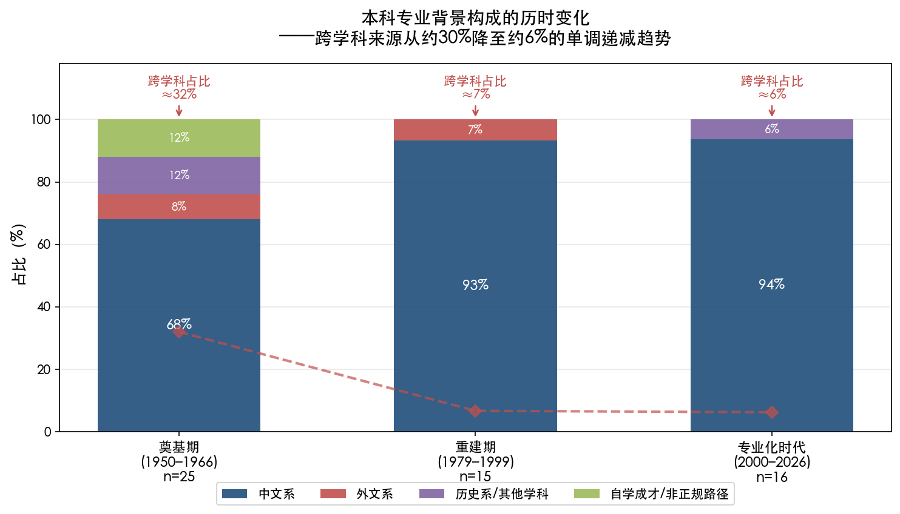

**第一期：跨学科比例最高，约32%。** 25位学者中至少5人本科阶段非中文系入学——钱锺书（清华外文系）、林庚（清华物理系转中文系）、吴组缃（清华经济系转中文系）、余冠英（清华历史系转中文系）、杨公骥（中华大学、鲁艺背景）。加上赵景深（天津棉业专门学校）等非典型教育路径者，非中文系正规训练者占比超过30%。这种跨学科构成是民国通才培养模式的产物——民国高等教育学科壁垒远不如后来严格，转系行为普遍且自然。

**第三期：跨学科比例锐减至约7%。** 15位学者中14人本科为中文系，仅莫砺锋例外——他在安徽大学外文系仅读一年即转入南京大学中文系读研，且其外文系入学本身是1978年恢复高考后的偶然选择，而非主动的跨学科取向。中文系本科比例达93.3%。

**第四期：跨学科比例进一步降至约6%。** 16位学者中仅程章灿1人本科为非中文系（北京大学历史系世界史专业），其余15人本科均为中文系或相关专业。[南京大学·程章灿](https://www.nju.edu.cn/info/3191/225031.htm "北大历史系、报考南大中文系、师从程千帆") 程章灿在16位学者中的"孤例"地位，恰恰凸显了跨学科进入古代文学领域的门槛之高。

### 6.2.2 专业单一化的制度根源

专业背景的单一化与三重制度因素密切相关。

第一，1952年院系调整仿苏联模式实行"专业对口培养"，将综合性大学的文理兼修传统改造为专业化分科训练，学科之间的壁垒由此制度化。第二，1981年学位制度建立后，研究生招生严格按二级学科（如050105中国古代文学）设定方向，[教育部研究生招生学科专业代码册](http://btpta.xjbt.gov.cn/upload/resources/file/2026/03/16/616372.pdf "中国古代文学二级学科代码050105") 跨专业报考面临本科课程缺失与学术训练不匹配等系统性壁垒。第三，古代文学研究所需的古典文献阅读能力——古汉语、训诂学、目录学、版本学——构成了非中文系出身者难以逾越的知识门槛。

然而，教育背景的同质化并不等同于学术视野的封闭。第4、5章的分析表明，跨学科性已从"教育背景的异质性"（由谁来做）转型为"研究方法的借鉴"（如何去做）。刘石主持的大数据文本分析项目（2018年国家社科基金重大项目）、[清华大学人文学院·刘石](https://www.rwxy.tsinghua.edu.cn/info/1366/9817.htm "川大学士硕士、北师大博士、中华书局、清华教授") 王兆鹏的"唐宋文学编年地图"（2017年上线）、[中国社科网](https://www.cssn.cn/skgz/202209/t20220916_5511816.shtml "王兆鹏数字人文实践") 李浩的新出土文献学研究、[西北大学文学院·李浩](https://wxy.nwu.edu.cn/info/1017/2749.htm "新出土文献学研究") 程章灿的石刻文献研究——这些方法论层面的跨学科实践表明，当代学者正通过职业阶段的自学与合作研究来弥补教育背景的同质化缺陷。

由此引出一个值得深思的问题：第一期学者的跨学科性根植于培养体制的多元化——他们在"成为学者之前"便携带了异质性知识基因；当代学者的跨学科性则来自研究过程中的工具性借鉴——他们是在"成为学者之后"才开始接触异质性知识资源。前者属"先天"禀赋，后者为"后天"习得。两种跨学科性对学术创新的驱动效果是否等价，是一个值得持续关注的学科发展议题。

## 6.3 学历层次分布的阶梯式跃升

### 6.3.1 从"无学位时代"到"博士门槛化"

四个时期的学历层次分布呈现出与学位制度建设完全同步的阶梯式跃升。

**第一期（25人）：** 自学/无正规学位3人（郭绍虞、赵景深、王伯祥），本科为最高学历约15人，海外学位约5人（钱锺书牛津B.Litt.、冯沅君巴黎大学博士、刘大杰早稻田大学研究院、吴世昌燕京大学硕士并赴牛津讲学、詹锳美国博士）。无学位或仅具本科学历者合计约72%。这一时期，学位并非进入学术核心圈的必要条件——郭绍虞未受正规大学教育却著有开创性的《中国文学批评史》，赵景深毕业于天津棉业专门学校却成为1981年首批古代文学博导。[复旦大学图书馆·郭绍虞](https://library.fudan.edu.cn/e6/bc/c42727a517820/page.htm "郭绍虞")

**第二期（1966–1978）：** 无新培养学者进入头部行列，学历层次观测不适用。

**第三期（15人）：** 无硕博学位4人（袁行霈、傅璇琮、周勋初、霍松林，均属更早培养世代）、最高学历硕士1人（陈尚君）、博士10人，博士比例66.7%。[北京大学中文系·袁行霈专访](https://chinese.pku.edu.cn/xwgg/bdzwr/29f5e22a46a94648ab129ae946d9503f.htm "袁行霈亲述1953年入学、导师林庚") 这一时期清晰展示了从"无学位时代"向"学位化时代"的过渡——老一代不持学位却占据学术制高点，新一代则通过学位制度获取入场资格，两种路径在同一时期并行存在。

**第四期（16人）：** 无博士学位仅2人（葛晓音和骆玉明，均属更早培养世代），14人持博士学位，博士比例达87.5%。[北京大学中文系·葛晓音专访](https://chinese.pku.edu.cn/xwgg/bdzwr/60c7b5299482497ea5f8c5b2aca07a79.htm "1963年入学、导师陈贻焮") 博士学位已从"锦上添花"的精英资本转变为"不可或缺"的准入底线。

这一阶梯式跃升与学位制度建设的里程碑完全同步：1980年《学位条例》通过、1981年首批博士点设立、1984年莫砺锋成为新中国第一位文学博士、[人民网·新中国第一位文学博士](http://edu.people.com.cn/n1/2019/0820/c1053-31305017.html "莫砺锋博士答辩详情") 2000年后博士学位成为高校任教的硬性门槛——每一步制度变迁都直接改写了学者的学历结构。

### 6.3.2 学历与学术产出的非线性关系

学历跃升与学术产出质量之间并非简单的线性关系。第一期无正规学位的郭绍虞著有《中国文学批评史》，至今仍为学科经典；第三期无博士学位的袁行霈主编了全国通用的四卷本《中国文学史》（1999年），提出"文学本位、史学思维、文化学视角"总纲领和"三古七段"分期法；[北京大学中文系·袁行霈专访](https://chinese.pku.edu.cn/xwgg/bdzwr/29f5e22a46a94648ab129ae946d9503f.htm "文学本位、三古七段分期法") 傅璇琮以中华书局编辑身份完成了里程碑式的《唐代诗人丛考》（1980）和《唐代科举与文学》（1986）。[清华大学校史馆·傅璇琮](https://xsg.tsinghua.edu.cn/info/1004/2021.htm "傅璇琮学术生涯") 这些案例表明，学位制度的核心意义在于提供系统化学术训练渠道和制度化准入机制，而非学术成就的充分保障。在学位制度未曾建立或刚刚建立的时期，个人才力与长期学术积累足以替代学位凭证；但在学位制度全面运行的当代，缺乏博士学位的学者已几乎不可能进入学术主流——袁行霈、傅璇琮式的路径已无法复制。

## 6.4 导师谱系与师承网络：六大学脉的形成、断裂与重建

### 6.4.1 六大主要师承链的识别与谱系图谱

综合前五章的考证，可以识别出贯穿七十余年的六大主要师承链（见图6-3）。

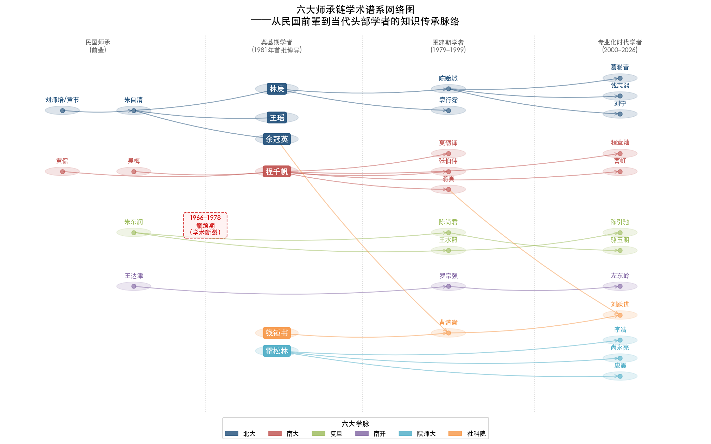

**（1）北大学脉。** 从清末民初的刘师培、黄节，经朱自清培养林庚、王瑶、余冠英，到林庚培养袁行霈、陈贻焮培养葛晓音和钱志熙，再到刘宁等后辈。钱志熙自述这条传承脉络时明确指出："从刘师培、黄节到林庚、陈贻焮，到葛老师和我们。"[北京大学中文系·钱志熙专访](https://chinese.pku.edu.cn/xwgg/bdzwr/9993ca8447d649c9b6115f62f6b1e321.htm "学术传承脉络详述") 这条学脉的特殊之处在于其跨越一个多世纪的机构内传承——从清末的北京大学到2020年代的北大中文系，学术传统在同一机构中完成了五六代的接续。

**（2）南大学脉。** 章太炎弟子黄侃和曲学大师吴梅在中央大学/金陵大学所奠定的学术传统，经程千帆于1978年调入南京大学后获得制度化传承。程千帆在南大培养硕士9人、博士10人，[南京大学·程千帆先生在南京大学](https://www.nju.edu.cn/info/3191/167431.htm "培养硕士9人博士10人") 弟子莫砺锋、张伯伟、蒋寅、张宏生、程章灿、曹虹等构成了南大古代文学国家重点学科的主体力量。程章灿于2008年成为程门弟子中首位长江学者。[教育部2008年长江学者名单](http://www.polymer.cn/UploadFile/IndustryNewsPic/20090930095308-1.pdf "程章灿，南京大学，中国古代文学")

**（3）复旦学脉。** 1952年院系调整后，朱东润从中央大学系统调入复旦，郭绍虞从同济大学调入，赵景深原本即在复旦。[复旦大学·朱东润](https://www.gdwx.fudan.edu.cn/76/a5/c3857a30373/page.htm "朱东润奠基复旦古代文学") 朱东润培养了陈尚君等弟子，王水照1978年从社科院文学所调入复旦成为唐宋文学研究的核心力量，[复旦大学退休教职工网·王水照](https://retiree.fudan.edu.cn/lgbc/c0/ec/c41159a639212/page.htm "王水照1978年调入复旦") 此后陈引驰、汪涌豪、骆玉明、查屏球等相继在复旦形成阵容。

**（4）南开学脉。** 王达津培养罗宗强，罗宗强1986年获批博导后开辟"文学思想史"研究方向，弟子左东岭获1999年全国首届优秀博士论文奖后赴首都师范大学任教，在该校建立了中国语言文学一级学科博士点，形成"南开→首师大"的学术传播路径。[南开大学文学院·罗宗强](https://wxy.nankai.edu.cn/2019/1101/c18299a244196/page.htm "罗宗强指导左东岭")

**（5）陕师大学脉。** 霍松林1945年入中央大学，1951年起在陕西师范大学执教数十年，培养硕士20名、博士70余名。[陕西师范大学·霍松林百年诞辰](https://www.snnu.edu.cn/info/1272/15315.htm "培养博士70余名") 弟子李浩（西北大学，现任中国唐代文学学会会长）、尚永亮（武汉大学教授、长江学者）、康震（北京师范大学教授、长江学者）分布于西北、华中和华北三个区域，形成了"霍家军"的全国辐射网络。

**（6）社科院文学所学脉。** 1953年中科院文学研究所成立，余冠英长期担任古代文学组负责人（1953–1979年），钱锺书为核心研究力量。[中国社科院文学研究所·古代室](http://literature.cass.cn/jgsz/yjs/gdwxyjs/ "古代文学研究室官方网页") 第二代学者曹道衡（1952年北大）、邓绍基（1955年复旦）、王水照（1960年北大）在余冠英和钱锺书指导下成长；第三代以蒋寅（南大博士后入所）、刘跃进（社科院博士）、刘宁（北大博士后入所）为代表。文学所的学脉特殊之处在于它是一个"汇聚型"机构——其学者来源横跨北大、复旦、南大等多所高校，是学术谱系的交汇点而非单一起点。

### 6.4.2 "瓶颈效应"：1966–1978年断裂对师承网络的结构性冲击

1966–1978年的制度性断裂对师承网络造成了深远且不可逆的结构性冲击，可将其概括为"瓶颈效应"。

这一效应的形成机制如下：第3章揭示，多位奠基期学者在断裂期间辞世（冯沅君1974年、刘大杰1977年、陆侃如1978年），[山东大学·冯沅君](https://www.sdu.edu.cn/info/1011/1105.htm "山东大学历史名人冯沅君") 存世者遭受批斗下放，学术传承渠道被强制关闭长达12年。1978年恢复研究生招生时，能够担任博士生导师的老先生仅剩十余人，且多已年逾古稀——程千帆1978年调入南大时已65岁，唐圭璋80岁、钱仲联73岁被批准为首批博导。[莫砺锋·百年千帆](https://skch.nju.edu.cn/d3/17/c63907a774935/page.htm "程千帆1978年以65岁高龄重返学术") 整个学科的师承网络因此被压缩到极少数"节点"之上。

瓶颈效应的长尾影响延续至今。当前（2000–2026年）活跃的头部学者，其师承关系几乎都可追溯至1978年后重新出山的十余位老先生：钱志熙和葛晓音上溯至林庚、陈贻焮（北大）；程章灿和曹虹上溯至程千帆（南大）；李浩、尚永亮、康震上溯至霍松林（陕师大）；陈引驰和汪涌豪上溯至复旦的朱东润/王水照体系；胡晓明上溯至王元化（华东师大）；刘宁和蒋寅上溯至社科院的余冠英/钱锺书体系。整个学科的知识基因多样性——从断裂前二十余位奠基学者的多元知识来源——被压缩至十余位"劫后余生"的老先生，因此受到了不可忽视的结构性限制。

### 6.4.3 两种学术传播模式的对比

六大学脉在传播模式上呈现出两种对立类型。

**聚集模式，以程千帆学脉（南大）为典型。** 程千帆弟子莫砺锋、张伯伟、张宏生、曹虹、程章灿等大多留在南京大学任教，在同一机构内形成了完整而深厚的学术传统。程千帆弟子留校被学界视为人文学科学术近亲繁殖的"正面案例"，[中国社会科学网](https://www.cssn.cn/ztzl/jzz/rwln/xwpl/sdbd/202209/t20220923_5540878.shtml "程千帆弟子留校作为正面案例") 但聚集模式也意味着知识传承高度依赖单一机构——一旦核心导师离去（程千帆2000年辞世），学脉的存续完全取决于第二代传人能否独立确立与导师相匹配的学术权威。

**辐射模式，以霍松林学脉（陕师大）为典型。** 霍松林弟子大多流向外校——李浩在西北大学、尚永亮在武汉大学、康震在北京师范大学——从陕师大向全国扩散，形成了"霍家军"辐射网络。辐射模式有利于学术理念的地域扩展和学科影响力的广泛传播，但也意味着学脉在原始据点（陕师大）的传承力量相对薄弱。

**扇形扩散模式，以吴梅学脉为独特典范。** 吴梅在北大和东南大学培养的四位弟子——任中敏（扬州师范学院）、唐圭璋（南京师范学院）、王季思（中山大学）、程千帆（南京大学/武汉大学）——分别在不同院校建立了独立的学术据点，形成了兼具辐射与深根特征的"扇形"扩散。[东南大学校友总会·吴梅](https://seuaa.seu.edu.cn/2008/0110/c1669a26482/page.htm "吴梅弟子分布") 这种跨院校的扇形扩散在古代文学学科中较为罕见，也使词曲学传统获得了比其他研究方向更为广泛的地域覆盖。

## 6.5 海外学术经历的类型演变

### 6.5.1 四个时期海外经历的根本转变

海外学术经历是衡量学者知识构成国际化程度的重要维度。四个时期在这一维度上呈现出类型上的根本转变。

**第一期：学位攻读型为主。** 25位学者中约6人具有实质性海外经历（24%），且以学位攻读为主要形态：钱锺书在牛津大学获B.Litt.学位后赴巴黎大学研究一年，[清华大学校史馆](https://xsg.tsinghua.edu.cn/info/1004/2938.htm "钱锺书B.Litt.考") 冯沅君在巴黎大学获文学博士学位，[山东大学·冯沅君](https://www.sdu.edu.cn/info/1011/1105.htm "山东大学历史名人冯沅君") 刘大杰赴早稻田大学文学部留学，[复旦大学图书馆·刘大杰](https://library.fudan.edu.cn/e6/c1/c42727a517825/page.htm "刘大杰") 吴世昌在燕京大学获硕士后赴牛津讲学，詹锳赴美国获博士学位。这些海外经历的目的地以欧美为主，学者在海外获得了系统性学术训练，对其知识结构产生了深层影响。

**第二期（1966–1978）：** 海外交流完全中断。

**第三期：短期访学/客座型，目的地以东亚为主。** 袁行霈1982–1983年赴日本东京大学任外国人教师，成为首位受聘于东京大学的中国文学学者；[北京大学中文系·袁行霈](https://chinese.pku.edu.cn/szdw/zzjs/f5f625ee8531481e866109ce9592339f.htm "1982–1983东京大学、1997哈佛") 蒋寅1997年任京都大学客座教授，张伯伟2000–2001年任京都大学客座教授，罗宗强1996–1997年任新加坡国立大学客座教授。这一时期海外交流以日韩和东南亚为主要目的地，以短期访学或客座为主要形式，无一人攻读海外学位。美国方面的交流较少（仅袁行霈1997年赴哈佛燕京学社），中国台港澳地区的学术交流则日益频繁。

**第四期：美国访学+东亚交流并行型，哈佛成为首选目的地。** 刘宁2006–2007年为哈佛大学富布莱特访问学者，[中国社科院文学研究所·刘宁](http://literature.cass.cn/jgsz/yjs/gdwxyjs_135699/zzyjry_135830/202502/t20250211_5843980.shtml "北大博士、哈佛富布莱特访问学者") 陈引驰为哈佛燕京学社访问学者，[复旦大学中文系·陈引驰](https://chinese.fudan.edu.cn/16/17/c13672a136727/page.htm "哈佛燕京学社") 方笑一2012–2013年为哈佛大学访问学者，程章灿和胡晓明亦曾访问哈佛。哈佛之所以成为首选目的地，与哈佛燕京学社（Harvard-Yenching Institute）长期资助东亚人文学者以及哈佛东亚系在中国古典文学领域的深厚积淀密切相关。然而，与第一期的学位攻读型海外经历相比，这些短期访学（通常3至12个月）所能获得的知识资源在深度与广度上均存在显著差异——短期访学主要提供学术交流机会和跨文化视野的拓展，但并不要求系统接受海外学术训练体系的完整浸润。

### 6.5.2 "无海归博士"现象的学科特殊性

四个时期的比较揭示出一个贯穿始终的结构性特征：古代文学领域始终未出现"海归博士"群体。第一期的海外学位攻读者（钱锺书、冯沅君等）均为民国时期出国，此后再无学者以海外博士学位进入该领域的头部行列。这一现象与经济学、社会学、政治学乃至中国现当代文学等邻近学科形成鲜明对比——在上述学科中，海归博士已逐步成为学术主力。

古代文学领域"无海归博士"现象的形成有其深层逻辑：其一，核心文献和学术传统根植于中文语境，研究对象——先秦至清代的文学文本——要求长期浸润于中文文献和中国学术话语之中；其二，海外中国文学博士项目的培养方向偏向比较文学和文化研究，与国内古代文学学科强调文献考据和传统方法的评价标准存在错位；其三，学科评价体系以中文发表为核心（CSSCI期刊和国家社科基金项目是晋升的关键指标），海外博士学位并不构成制度性优势。由此形成了"国内培养→国内发表→国内评价"的封闭循环。

海外经历类型的整体演变轨迹可以概括为：**学位攻读型→东亚短期访学型→美国访学+东亚交流并行型**，但始终未突破"短期访学"的天花板，未演进至"海归博士回流"阶段。古代文学因此成为中国人文学科中国际化程度最低的领域之一。

## 6.6 学术近亲繁殖的历时比较与学科特殊性

### 6.6.1 近亲繁殖率的阶段性演变

"学术近亲繁殖"——即学者在同一机构完成学位训练后留校任教——的发生率在四个时期呈现出显著的阶段性演变。

**第一期（1950–1966）：** 因学位制度未曾建立，难以用严格标准计算近亲繁殖率。但25位学者的教育背景来源分散于多所不同院校，且1952年院系调整本身即造成了大规模的跨院校人员流动（吴组缃、王瑶由清华到北大，朱东润由中央大学系统到复旦，程千帆辗转多校），由此判断该时期的近亲繁殖程度为"低"。

**第三期（1979–1999）：** 15位学者中，张伯伟（南京大学本硕博→留校）和詹福瑞（河北大学本硕博→留校）为明确的近亲繁殖案例，近亲繁殖比例约13.3%（2/15）。这一时期学者的流动性总体较高：蒋寅从扬州师范学院经广西师范大学、南京大学至社科院（横跨四个机构），刘跃进从南开经清华、杭州大学至社科院（同样四个机构），王兆鹏从武汉师范学院经湖北大学、南京师范大学至武汉大学——这种多机构流动路径在第三期学者中具有代表性。

**第四期（2000–2026）：** 16位学者中至少6人本硕博全部或主要在同一所大学完成并留校任教：陈引驰（复旦本科直博→留校）、曹虹（南大本硕博→留校）、方笑一（华东师大本硕博→留校）、刘宁（北大本硕博→社科院）、汪涌豪（复旦博士→留校）、骆玉明（复旦研究生班→留校）。近亲繁殖比例约37.5%（6/16），较第三期增长近两倍。[复旦大学中文系·陈引驰](https://chinese.fudan.edu.cn/16/17/c13672a136727/page.htm "1984入学、1988学士、1993博士") [华东师范大学·方笑一](https://faculty.ecnu.edu.cn/_s5/fxy/main.psp "本硕博均在华东师大")

从约13.3%到约37.5%的跃升表明，学术近亲繁殖在古代文学领域非但未随教育部2010年提出的"消除学术近亲繁殖"政策倡导[中国教育网](https://www.edu.cn/te_bie_tui_jian_1073/20110804/t20110804_659948.shtml "众专家热议学术近亲繁殖如何消除")而减弱，反而呈现加剧趋势。

### 6.6.2 古代文学领域近亲繁殖的特殊成因

本课题中古代文学第四期头部学者的近亲繁殖率（37.5%）虽低于顾海兵（2006）调查的17所中国大学教师平均水平（62%），[中国教育和科研计算机网](https://www.edu.cn/zui_jin_geng_xin_1169/20140508/t20140508_1110181.shtml "学术近亲繁殖还是远缘杂交") 但考虑到头部学者代表的是学科金字塔最顶端的一小群人，这一比例仍值得关注。阎光才（2009）的研究发现文科中外校引进者科研能力高于留校者，[中国社会科学网](https://www.cssn.cn/ztzl/jzz/rwln/xwpl/sdbd/202209/t20220923_5540878.shtml "学术近亲繁殖利弊之争") 这一结论在古代文学领域的适用性仍须接受更为系统的实证检验。

我们认为，古代文学领域近亲繁殖率较高可归因于三重因素的叠加。

**第一，师承传统的文化惯性。** 在中国人文学科中，"师承"不仅是学术训练关系，更是一种文化认同和学术忠诚的表达。程千帆弟子留南大、霍松林弟子中相当部分留陕师大（尽管霍门弟子整体呈辐射模式），均被视为学术传统延续的自然选择乃至正面典范。这种文化惯性使得"留校"在人文学科中具有比理工科更强的正当性。

**第二，优质博士点的稀缺。** 真正在古代文学方向具有顶尖培养能力的院校不超过10所。当一位优秀博士毕业时，可供选择的"不降格"去处极为有限——留校往往是学术资源最优的选择。夏纪军（2014）在经济学领域的研究发现，校际流动以同城为主（59.8%），知名大学间未形成有效的师资交换圈；[夏纪军《近亲繁殖与学术退化》](https://ccj.pku.edu.cn/Article/DownLoad?id=330724920&&type=ArticleFile "北京大学教育评论2014年") 古代文学领域的情况与此类似甚至更为封闭。

**第三，学科评价体系的封闭性。** 古代文学研究的核心评价指标——CSSCI期刊发表、国家社科基金项目主持——完全面向中文学术界，与国际学术评价体系几乎不存在衔接。这种评价封闭性降低了外部学术资源进入的必要性和可能性，也削弱了学者跨机构流动的制度性激励。

Horta等学者（2010, 2013, 2025）在跨国比较研究中指出，缺乏流动经历的"纯近亲繁殖"对学术创新的负面影响最为显著——这类学者"仅接受过单一机构环境的社会化，仅从单一机构获取了一套狭窄的观念、价值和行为模式"。[Horta & Yudkevich, *Higher Education*](https://link.springer.com/article/10.1007/s10734-025-01610-0 "学术近亲繁殖与边界建构") 古代文学领域第四期37.5%的近亲繁殖率意味着超过三分之一的头部学者仅接受过单一院校的学术社会化，这对学科的知识多样性与创新活力构成了潜在的结构性制约。

## 6.7 文艺方针与制度变迁对知识构成的塑造

### 6.7.1 四个时期的塑造路径

文艺方针和制度变迁对学者知识结构的塑造，在四个时期呈现出路径与机制上的显著差异。

**第一期："旧学根底+新学叠加"。** 该时期学者在民国高等教育中积累了深厚的旧学根底——经学、小学（训诂学）、目录学等传统学问主要来自清华研究院（朱自清、黄节门下）和中央大学/金陵大学的词曲学传统（吴梅、黄侃门下）。1950年代后，马克思主义文艺理论成为所有学者必须掌握的新工具，苏联文学史方法论（社会历史分析法、现实主义理论框架）通过教学和翻译渠道影响了古代文学史编写范式。陈毓罴1954年赴莫斯科大学文学系深造即为苏联范式输入的典型通道。[中国社科院文学研究所·古代室](http://literature.cass.cn/jgsz/yjs/gdwxyjs/ "古代文学研究室官方网页") 游国恩、王季思、萧涤非、季镇淮、费振刚五人主编的四卷本《中国文学史》和陆侃如、冯沅君合著的《中国文学史简编》，均体现了旧学根底与新学框架叠加的特征。

1956年"百花齐放、百家争鸣"方针[浙江树人大学·党史天天学](https://old.zjsru.edu.cn/info/1042/8745.htm "1956年4月28日提出百花齐放百家争鸣") 短暂推动了学术研究开展，但紧随其后的反右运动（1957年）使部分学者被划为"右派"（如程千帆），知识生产的自由空间再度收窄。

**第二期："知识传承的危机与地下延续"。** 该时期的制度性约束是全面性的——学者不仅无法从事研究，甚至连基本的阅读条件也被剥夺。知识延续被迫转入非正式渠道：程千帆在劳改期间"不能操笔作文，常在心里进行学术思考"，即以"打腹稿"的方式"发愤著书"，其1978年后推出的《校雠广义》《唐代进士行卷与文学》即为这种非正式延续的结晶。[莫砺锋·百年千帆](https://skch.nju.edu.cn/d3/17/c63907a774935/page.htm "程千帆发愤著书") 莫砺锋则在11年乡间插队中凭借自学背诵了数千首唐诗宋词，[人民网·新中国第一位文学博士](http://edu.people.com.cn/n1/2019/0820/c1053-31305017.html "莫砺锋完整教育经历") 为日后的学术成就奠定了独特基础。这些个案表明，即使在最严酷的制度环境下，学术知识仍能以个人记忆和私下思考的方式延续——但这种延续的脆弱性和偶然性同样不容忽视。

**第三期："方法论的开放与多元化探索"。** 1980年代的学术潮流对古代文学学者知识构成的影响主要体现在方法论层面。"美学热"推动了从政治分析向艺术分析的转向——袁行霈曾自述："解放后都在讲现实性、人民性，而对艺术性的研究很欠缺。"[北京大学中文系·袁行霈专访](https://chinese.pku.edu.cn/xwgg/bdzwr/29f5e22a46a94648ab129ae946d9503f.htm "袁行霈转向艺术研究的动机") 其《中国诗歌艺术研究》（1987）即为对这一时代问题的直接回应。罗宗强创立的"文学思想史"范式（代表作《隋唐五代文学思想史》，1986年），则是思想史方法与文学研究的交叉产物。袁行霈主编《中国文学史》（1999年）提出"文学本位、史学思维、文化学视角"总纲领，约请19所高校29位学者共同撰写，标志着方法论变革的制度化完成——古代文学研究由此不再被要求以政治史框架为主导叙事。

**第四期："制度化支持+评价体系约束的双重效应"。** 2017年1月25日中办、国办印发《关于实施中华优秀传统文化传承发展工程的意见》，[中国政府网](http://app.www.gov.cn/govdata/gov/201701/25/398045/article.html "2017年1月25日正式印发") 对古代文学学科产生了正向的资源配置效应——央视《中国诗词大会》《经典咏流传》等节目兴起，康震、方笑一等学者兼任嘉宾或命题专家，学者角色从"研究者"延伸至"研究者+传播者"。与此同时，以发表导向和项目导向为核心的学术评价体制对学者知识构成产生了双刃剑效应：一方面促进了研究的专业化和精细化，另一方面则可能导致研究碎片化和选题的政策趋同——学者倾向于选择可以迅速产出CSSCI论文的微观议题，而非需要长期积累的宏观学术工程。

### 6.7.2 院系调整：七十余年间影响最深远的单一制度事件

在所有制度变迁中，1952年全国高等院校院系调整对古代文学学科格局的影响最为深远，其影响链条延续至今。[清华大学校友总会](https://www.tsinghua.org.cn/info/1952/17478.htm "清华文学院的前世今生") 此次调整将清华、燕京、北大三校中文系合并为新北大中文系，使吴组缃、王瑶、林庚等清华和燕京系统的学者汇入北大，[北京大学新闻网](https://news.pku.edu.cn/xwzh/ab9b3c53e65a4effa95a151a08f36949.htm "我与北大中文系") 由此形成了此后数十年北大古代文学的核心格局。朱东润从中央大学系统调入复旦，郭绍虞从同济调入复旦，[复旦大学·朱东润](https://www.gdwx.fudan.edu.cn/76/a5/c3857a30373/page.htm "朱东润先生") 奠定了复旦古代文学的学科基础。山东大学的陆侃如、冯沅君、萧涤非团队也在院系调整后的格局中稳固下来。[山东大学·冯沅君](https://www.sdu.edu.cn/info/1011/1105.htm "山东大学历史名人冯沅君")

院系调整的深远影响不仅在于重新配置了师资，更在于重新配置了"学术基因"——原本分散在多所大学中的不同学术传统被强制合并或重组，由此形成的新格局直接决定了此后每一代学者的培养基底。北大中文系融合了清华的朱自清学脉与北大的游国恩学脉，复旦融合了中央大学的朱东润传统与本校的赵景深传统——这些"基因重组"的效应在此后七十年间持续发挥作用。

## 6.8 总体发现与结论

### 6.8.1 七十余年知识背景演变的总体轨迹

综合以上六个维度的跨时期比较，七十余年间古代文学头部学者知识背景的总体演变轨迹可凝练为一个核心命题：**从多元到专一**。

这一命题在每个维度上均可得到验证：

**专业背景：** 从第一期跨学科约32%降至第四期约6%，呈单调递减。跨学科性的存在形态从"教育背景的先天异质性"转变为"研究方法的后天工具性借鉴"。

**院校来源：** 从"清华+北大双核"（约52%）经"多极分散"再到"6所院校垄断博士培养"，呈U型曲线，最终趋势指向再度集中。

**学历层次：** 从"自学成才/本科为主"（约72%无研究生学位）到"博士门槛化"（约87.5%持博士学位），与学位制度建设完全同步的阶梯式跃升。

**海外经历：** 从"学位攻读型"到"短期访学型"，且始终未出现"海归博士"群体。演变方向并非线性的"国际化深化"，而是类型转换——从深度介入变为浅层接触。

**师承网络：** 从多条独立学脉经第二期瓶颈压缩后高度集中于1978年后重新出山的十余位老先生及其弟子。六大主要学脉在七十余年间构成了学科知识传承的核心骨架。

**近亲繁殖：** 从第一期的低水平（院系调整造成跨校流动）到第三期约13.3%再到第四期约37.5%，呈加速上升趋势。

### 6.8.2 当前学者群体知识构成的特征与潜在局限

上述演变轨迹在当前（2000–2026年）学者群体的知识构成中沉淀为五个结构性特征，每一特征都同时蕴含优势与局限。

**特征一：高度专业化的深度优势。** 当前头部学者在各自断代领域拥有极深的文献功底和学术积累——这是七十余年学科建设与学位制度规范化训练的成果。袁行霈主编《中国文学史》所代表的"文学本位"范式已成为学科共识，每一断代领域均有专精学者深耕。但这种深度优势的另一面是视野的窄化——几乎所有头部学者的学术训练均在中文系内部完成，缺乏第一期学者那种源自物理系、外文系、经济系的异质性视角。

**特征二：知识同质化的创新风险。** 几乎所有头部学者均为中文系本科直通博士的单一路径产物，知识来源的高度同质性可能限制学术创新的想象空间。第一期钱锺书之所以能写出《管锥编》这样融贯中西的巨著，与其外文系出身和牛津训练密不可分；当代学者的中文系单一路径是否能产生类似的知识整合型成果，值得审慎观察。

**特征三：院校近亲繁殖的封闭效应。** 37.5%的近亲繁殖率意味着超过三分之一的头部学者仅接受过单一院校的学术社会化。尽管程千帆弟子留校等案例表明近亲繁殖并非必然导致学术退化，但在整体层面上，这一比例仍然偏高。教育部2010年的政策倡导[中国教育网](https://www.edu.cn/te_bie_tui_jian_1073/20110804/t20110804_659948.shtml "众专家热议学术近亲繁殖如何消除") 在古代文学领域的执行效果有限——学科特殊性（文献资源集中、师承关系依赖、评价标准国内化）构成了抑制学者流动的系统性因素。

**特征四：国际化的"浅层"特征。** 海外经历以短期访学为主，无海归博士，"国内培养→国内发表→国内评价"的封闭循环在保持学科传统深度的同时，也使古代文学成为中国人文学科中国际化程度最低的领域之一。这一特征是否构成"局限"取决于评价标准——若以学科自身的文献研究传统衡量，国际化需求或许并不迫切；但若以知识创新和方法论更新的视角审视，与国际学术前沿的隔膜可能导致方法论层面的封闭。

**特征五：1966–1978年断裂的长尾效应。** 几乎所有当前头部学者的师承均可追溯至1978年后重新出山的十余位老先生，整个学科的知识基因多样性因此受到结构性限制——从断裂前二十余位学者的多元教育背景（跨学科约32%、海外学位24%），被压缩至十余位"劫后余生"的老先生所携带的知识基因。这一"基因瓶颈"效应迄今未曾完全消解。

### 6.8.3 核心期刊数据的间接印证

《文学遗产》等核心期刊的机构分布间接印证了上述院校集中趋势。据2016年发表的统计研究，2014年人大复印资料《中国古代、近代文学研究》全文转载的276篇论文中，排名前8的13家单位共计贡献117篇（42.39%）。[李俊·2013—2014年中国古代文学研究的热点与趋势](http://xb.xynu.edu.cn/cn/article/pdf/preview/59b06f84-e4b8-4390-9837-4254237ac992.pdf "信阳师范学院学报2016年第1期") 头部学者的院校分布（北大、南大、复旦、社科院文学所等）与核心期刊论文的机构分布高度吻合——学术产出的集中度是学术人才集中度的直接映射。

### 6.8.4 学者群体知识构成与学科范式的互构关系

我们认为，学者群体的知识构成与学科范式之间存在一种双向互构关系。一方面，文艺方针和培养制度通过约束知识获取渠道来间接塑造知识结构——1952年院系调整决定了学者的院校归属，学位制度决定了学历层次的分布，学科评估制度决定了院校集中度的走向。另一方面，学者群体的知识积累也反作用于学科范式——袁行霈基于自身对诗歌艺术的长期研究提出"文学本位"范式，罗宗强基于其思想史训练开创"文学思想史"方向，王兆鹏和刘石基于对计量与数字技术的敏感性引入定量分析方法。制度塑造知识结构，知识结构反塑学科范式——这一互构关系贯穿七十余年学科史的始终。

从"从多元到专一"的总体轨迹中，可以进一步提炼出一个更深层的判断：古代文学学科在七十余年间经历了从"非制度化的知识多元"到"高度制度化的知识单一"的转变。第一期学者的知识多元性来自制度缺位——没有学位制度、没有严格学科分类、没有标准化培养路径，学者反而获得了更大的知识获取自由度。当代学者的知识单一性则来自制度完备——学位制度、学科代码、培养方案、评价体系层层叠加，每一层制度都在收窄知识获取的自由度。制度化的收益是系统性和规范性的提升，代价则是异质性和偶然性的丧失。对于一个以阐释人类文化遗产为己任的学科而言，这种代价是否过高，是需要学科共同体持续反思的根本问题。

# 结论与风险提示

## 核心结论

本报告通过对1950年代至2026年间中国古代文学研究领域56位头部学者知识背景的系统考察，获得以下核心结论。

**第一，古代文学头部学者的知识背景在七十余年间经历了从"多元"到"专一"的根本性转变。** 这一转变在五个维度上同步推进：专业背景跨学科比例从约32%降至约6%；院校集中度经U型曲线回归高集中状态（第四期头部学者博士培养集中于6所院校）；学历层次从"无学位为主"跃升至"博士门槛化"（博士比例从0%升至87.5%）；海外经历从学位攻读型退化为短期访学型，始终未出现海归博士群体；学术近亲繁殖率从低水平攀升至约37.5%。这些趋势的叠加效应意味着：当代古代文学头部学者的知识来源在地理空间、学科边界和培养路径三个层面同时趋于收窄。

**第二，1966–1978年的学术断裂期产生了深远的"瓶颈效应"，其长尾影响延续至今。** 断裂期的高等教育全面停摆和多位奠基学者辞世，将学科的知识传承渠道压缩至1978年后重返学术前线的十余位老先生身上。当前几乎全部头部学者的师承均可追溯至这十余位"节点"人物——程千帆、霍松林、林庚—陈贻焮、朱东润—王水照、罗宗强、余冠英—钱锺书等。断裂前奠基期学者群体所携带的丰富知识基因（跨学科教育背景约32%、实质性海外经历约24%、自学成才者占12%），在断裂后被大幅压缩，整个学科的知识基因多样性因此受到了不可逆的结构性限制。

**第三，1952年院系调整是七十余年间影响最深远的单一制度事件。** 此次调整将清华文科整体并入北大、朱东润调入复旦、各校中文系师资经历大规模重新配置，由此奠定了此后数十年的学科地理版图。调整不仅重新配置了师资，更重新配置了"学术基因"——北大融合了清华朱自清学脉与本校游国恩学脉，复旦融合了中央大学的朱东润传统与赵景深传统。这些"基因重组"效应通过师承链条持续传导至今。

**第四，学者群体的知识构成与学科范式之间存在双向互构关系。** 文艺方针和培养制度通过约束知识获取渠道来间接塑造学者的知识结构——院系调整决定院校归属、学位制度决定学历分布、学科评估制度决定院校集中度。与此同时，学者群体的知识积累亦反作用于学科范式——袁行霈基于诗歌艺术研究提出"文学本位"范式，罗宗强基于思想史训练开创"文学思想史"方向，王兆鹏和刘石基于技术敏感性引入定量分析与数字人文方法。制度塑造知识结构、知识结构反塑学科范式，这一互构关系贯穿学科发展全程。

**第五，古代文学学科在制度化进程中付出了异质性丧失的代价。** 学位制度、学科代码、标准化培养方案和评价体系的层层叠加，每一层制度都在收窄知识获取的自由度。第一期学者的知识多元性恰恰来自制度缺位——没有严格学科分类、没有标准化培养路径，林庚得以从物理系转入中文系、钱锺书得以以外文系背景从事古典文学研究。当代学者的知识单一性则来自制度完备——从本科到博士的培养链条几乎完全锁定在中文系二级学科之内。制度化的收益是系统性与规范性的提升，代价则是异质性与偶然性的丧失。

## 主要局限性

本报告的研究设计与数据基础包含以下需要说明的局限性。

**第一，样本选择的固有约束。** 各时期头部学者样本量存在客观差异（第一期25人、第三期15人、第四期16人），这是学术史本身的反映而非抽样偏差，但小样本条件下的比例指标（如近亲繁殖率、跨学科比例）对个别案例的纳入或排除较为敏感。"头部学者"的遴选标准虽采用多维度交叉验证（博导资格、学会职务、国家社科基金项目、长江学者称号、核心期刊高频作者、机构学术谱系），但第一期学者因制度化指标缺失，遴选更多依赖学术史共识。不同遴选方案可能导致样本构成的边际差异。

**第二，加权模型中权重设定的主观性。** 知识背景加权计算模型中六个维度的基础权重（导师专业背景0.25、毕业院校0.20、专业方向0.15、学历层次0.15、工作单位流动0.15、海外经历0.10）虽经AHP一致性检验，但仍反映的是研究者基于学科知识的专业判断，不同研究者可能赋予不同权重。本报告在分析中通过±30%范围的权重浮动进行了敏感性检验，主要发现（院校集中度U型曲线、专业背景单一化趋势、近亲繁殖率阶段性跃升）在不同权重方案下均保持稳健。

**第三，知识构成的隐性维度未予系统纳入。** 学者知识构成受到的影响因素远超本报告覆盖的六个维度——个人天赋、家庭文化资本（如俞平伯为俞樾曾孙）、出版机会、时代际遇、个人阅读史等均可能发挥重要作用，但因数据可获取性的限制未予系统纳入模型。特别是家庭文化资本在第一期学者中可能构成一个显著但难以量化的知识来源渠道。

**第四，学术近亲繁殖分析框架的移植性问题。** 现有关于学术近亲繁殖的实证研究主要集中在经济学和理工科领域（顾海兵2006、夏纪军2014、阎光才2009），本报告将其分析框架引入古代文学学者群体具有探索性质。古代文学作为高度依赖师承传统和文献资源的人文学科，其近亲繁殖的成因机制、正负效应与理工科可能存在显著差异——程千帆弟子群体留校的"正面案例"即为一例。因此，本报告关于近亲繁殖率的计算结果应理解为结构性特征的描述，而非"近亲繁殖必然导致学术退化"的因果判断。

**第五，数据时效性的边界。** 本报告的数据采集截至2026年初，部分学者的最新职务变动、项目获批或学术成果出版可能未被纳入。第四期（2000–2026）学者群体中较年轻的一批（1970年代及以后出生）仍处于学术上升期，其最终学术地位和影响力未曾定型。此外，第五轮学科评估结果仍在公布过程中，其对院校格局和学者流动的影响未曾充分显现，构成本报告分析的一个时效性边界。
