# 执行摘要

全球政治格局的深刻重组正在重新定义文明间关系的基本逻辑。2024—2025年间，金砖机制完成历史性扩容至十一国，覆盖全球约46%的人口和35%以上的GDP（PPP口径）[斯汀森中心](https://www.stimson.org/2025/2025-brics-summit-takeaways-and-projections/ "2025 BRICS Summit: Takeaways and Projections, Stimson Center, 2025年8月")；"全球文明倡议"等新型话语框架相继提出；全球南方国家在知识生产、制度建设和发展合作中的能动性显著增强。在此背景下，本报告系统论证了一个核心命题：**全球南方合作通过认识论解放、政治伦理重构、多元现代化实践与历史纵深的恢复四重机制，构成推动文明交流互鉴的关键结构性动力。**

本报告从四个跨学科理论维度展开深入分析，形成"解构—重构—实践—纵深"的递进链条与反馈循环：

**东方学批判（第2章）** 揭示了西方知识体系通过"东方主义"话语装置系统性否定非西方文明之知识主体地位的运作机制。萨义德的三重定义、斯皮瓦克的"底层能否说话"追问、桑托斯的"认识灭绝"概念共同表明，不解构知识霸权，文明间的"交流"便只能是强势文明对弱势文明的单向知识输出。全球学术出版中英语占比约98%、非洲学术期刊仅约7.4%被Web of Science收录等量化数据[Information Matters](https://informationmatters.org/2023/03/underrepresentation-of-research-journals-from-africa-in-web-of-science-and-scopus/ "Asubiaro, 2023")，直观呈现了这一认识论不平等的制度化面貌。CODESRIA-CLACSO-IDEAs南南学术研究所、全球南方智库联盟等机制则标志着从"被表述"到"自我表述"的认识论转向正在制度层面展开。

**后殖民主义（第3章）** 追溯了殖民遗产对文明秩序的深层结构性影响。法农揭示的殖民主义对主体性的存在论摧毁、基哈诺提出的"权力殖民性"在政治独立后的持续运作、巴巴的"模仿"与"第三空间"理论对被殖民者能动性空间的发掘，共同论证了去殖民性实践作为文明交流互鉴政治伦理前提的必要性。从万隆精神到当代南南团结——特别是新开发银行累计批准约397.1亿美元项目[NDB投资者报告](https://www.ndb.int/wp-content/uploads/2026/03/New-Development-Bank_Investor-Presentation_Feb-2026.pdf "NDB Investor Presentation, February 2026")、萨赫勒国家联盟的系统性去殖民性实践——南南合作正在将去殖民性理想转化为可操作的制度安排。

**非西方现代化（第4章）** 论证了多元现代化路径作为文明交流互鉴实践基础的不可替代性。艾森施塔特"多元现代性"理论的核心命题——"现代性与西方化并不等同"[艾森施塔特原文](https://voidnetwork.gr/wp-content/uploads/2016/10/Multiple-Modernities-by-S.N.Eisenstadt.pdf "Eisenstadt, 'Multiple Modernities', Daedalus 129(1), 2000, pp.1-24")——经由泰勒的哲学辩护与依附理论的结构性否定获得三维支撑。甘地的文明批判、查特吉"我们的现代性"论述、中国式现代化五大特征、非盟"2063议程"等实践案例，展示了全球南方国家在现代化进程中实现"文明自觉"的多元路径。菌草技术推广至全球107个国家、杂交水稻在马达加斯加约90,000公顷土地上种植等微观技术合作案例，呈现了不同于"发展援助"范式的新型文明互鉴形态。

**全球史（第5章）** 提供了文明交流互鉴的历史纵深。阿布-卢格霍德对13世纪八大贸易圈世界体系的重建、弗兰克对五千年连续世界体系的论证、印度洋斯瓦希里城邦文明与东南亚"梵化"的区域实证、廷巴克图的学术黄金时代等历史案例共同证明：全球南方社会之间的文明互动在"西方崛起"之前便已构成世界历史的重要动力。当代南南合作可被理解为这些历史性交流网络在殖民中断之后的再激活与制度化延续。

**理论综合（第6章）** 将四维度从"加法"推进至"乘法"的理论跃迁，提炼出"三层逻辑—四维驱动—双重张力"的整合性分析框架。报告系统辨析了"文明交流互鉴"与"文明冲突论"、"文明对话"在理论预设、主体构成和实践逻辑上的根本差异，并正面回应了南方内部文明多样性、经济不对称、"混杂性"与"文明主体性"的辩证、代表性政治追问四组核心张力。

本报告的核心结论是：全球南方合作之所以能够成为推动文明交流互鉴的关键动力，根本原因在于全球南方自身的历史经验——从前现代的南方文明互动网络到殖民经历的共享创伤，从去殖民运动的共同记忆到多元现代化的差异化实践——为文明间的相互构成提供了最为丰富的资源与最为迫切的需求。"文明交流互鉴"以文明的流动性、可变性和相互构成性为理论出发点，在认识论预设上实现了对"文明冲突"与"文明对话"的双重超越。然而，这一进程面临南方内部经济不对称、地缘政治博弈工具化风险、知识生产去中心化的内在悖论等结构性制约，对此须保持清醒的批判性认知。

# 第1章 导论——全球南方合作与文明交流互鉴的问题域界定

全球政治格局正在经历深刻重组。2024—2025年间，金砖机制完成历史性扩容，成员国从五国扩展至十一国；二十国集团连续三届由全球南方国家（印度、巴西、南非）担任轮值主席；"全球文明倡议"等新型话语框架相继提出。在此背景下，一个根本性的学术命题亟待回应：全球南方合作这一以政治经济协调为主要驱动力的国际进程，究竟在何种意义上、通过何种机制推动了不同文明之间的交流与互鉴？本章旨在界定该命题的核心概念，厘清其与既有理论话语的区别，并阐明全文四个理论维度——东方学批判、后殖民主义、非西方现代化、全球史——的选取逻辑与内在关联。

## 1.1 "全球南方"：从地理隐喻到分析范畴

### 概念的思想源流与演变

"全球南方"（Global South）作为分析范畴，其知识考古揭示了远比通常认知更为深厚的理论根基。"Global South"一词最早由美国社会活动家卡尔·奥格斯比（Carl Oglesby）于1969年在《Commonweal》杂志上使用，而其思想源头可进一步追溯至安东尼奥·葛兰西1926年《南方问题》（*La questione meridionale*）中对意大利南北不平等关系的结构性分析[卡内基国际和平基金会](https://carnegieendowment.org/research/2024/05/global-south-colonialism-imperialism "Carnegie: A Closer Look at the Global South, 2024")。从葛兰西对一国之内"南方问题"的批判，到奥格斯比将"South"置于全球尺度的地缘政治语境，再到冷战结束后该概念在国际关系学界的重新激活，"全球南方"经历了从阶级分析工具到全球政治经济批判范畴的深刻转化。

中国社科院徐秀军将"全球南方"的发展划分为三个阶段：民族解放运动阶段（反殖民斗争驱动的集体身份建构）、经济发展优先阶段（以增长和减贫为核心的务实合作）、政治再崛起阶段（2022年乌克兰危机后尤为明显的地缘政治意识觉醒）。在他看来，当前"全球南方"概念呈现三个显著特征：**模糊性**——成员边界和内涵均缺乏共识性定义；**可塑性**——不同行为体基于各自战略目的对其进行策略性建构；**竞争性**——多元力量围绕其话语权展开角逐。[中国社科院世经政所](http://www.iwep.org.cn/xscg/xscg_sp/202405/t20240507_5749696.shtml "徐秀军：'全球南方'的概念内涵与理论价值，《国际论坛》2024年第2期")这一概念的模糊性和可塑性本身反映了全球南方作为政治实践而非静态分类的根本属性。

### 超越"第三世界"：作为"组织原则"的全球南方

"全球南方"作为分析范畴超越冷战时期"第三世界"概念，关键在于认识论立场的根本转换。卡内基国际和平基金会2024年的系统考察指出，"全球南方"并非一个成员构成明确的国家群体，而是一种"组织原则"（organizing principle），表达的是对世界政治中持久等级制度的拒绝[卡内基国际和平基金会](https://carnegieendowment.org/research/2024/05/global-south-colonialism-imperialism "Carnegie: A Closer Look at the Global South, 2024")。与"第三世界"概念诞生于冷战三极格局不同，"全球南方"自觉拒绝以某个外部坐标系来定义自身——它不是第一世界和第二世界之后的"剩余项"，而是一种积极的、以反等级为内核的政治主体性宣示。

这一区分具有重要的理论含义。如果"全球南方"本质上是一种反等级的组织原则，那么它与"文明交流互鉴"所内含的平等性诉求之间便存在深层的选择性亲和（elective affinity）。文明等级论——即认为不同文明存在高低优劣之分的知识传统——恰恰构成"全球南方"作为分析范畴所拒绝的那种"持久等级制度"在文化领域的映射。换言之，全球南方合作在政治经济层面对等级制的系统挑战，为文明层面的平等互鉴提供了不可或缺的结构性前提。

### 金砖扩容：全球南方合作的制度化里程碑

南南合作的制度化历程呈现清晰的累进逻辑：万隆会议（1955年）奠定十项原则、不结盟运动（1961年）建立政治协调机制、七十七国集团（1964年）形成联合国框架内的集体谈判平台、《建立新国际经济秩序宣言》（1974年）发出系统性变革诉求、勃兰特报告（1980年）将南北关系纳入全球发展议程[卡内基国际和平基金会](https://carnegieendowment.org/research/2024/05/global-south-colonialism-imperialism "Carnegie: A Closer Look at the Global South, 2024")。进入21世纪，金砖机制的创立和扩容标志着南南合作迈入全新阶段。

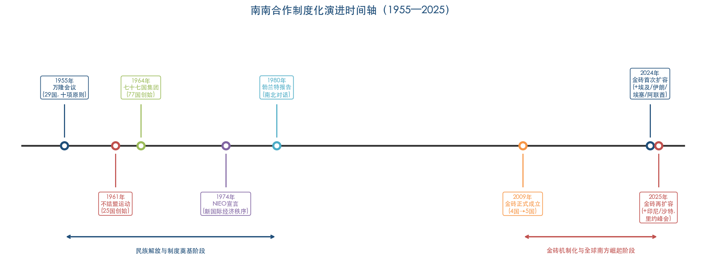

上图系统呈现了从万隆会议到金砖扩容的七十年制度化演进轨迹，清晰勾勒出南南合作从松散联合到机制化深化的两大历史阶段。

2024年1月，埃及、埃塞俄比亚、伊朗、阿联酋正式加入金砖；2025年1月印度尼西亚成为第十个成员国；沙特阿拉伯在经历一段延迟后于2025年7月正式完成加入程序，成为第十一个正式成员国[BRICS门户网站](https://infobrics.org/en/post/59939 "BRICS Countries List Expands, InfoBRICS, 2025")[印度金砖2026官方网站](https://www.brics2026.gov.in/about-us/ "BRICS India 2026: About Us")。扩容后的金砖覆盖全球约46%的人口和35%以上的GDP（PPP口径）[斯汀森中心](https://www.stimson.org/2025/2025-brics-summit-takeaways-and-projections/ "2025 BRICS Summit: Takeaways and Projections, Stimson Center, 2025年8月")。2024年10月喀山峰会通过的宣言明确承诺在"政治安全、经济金融、文化和人文交流"三大支柱下加强合作[金砖喀山宣言原文](http://static.kremlin.ru/media/events/files/en/RosOySvLzGaJtmx2wYFv0lN4NSPZploG.pdf "XVI BRICS Summit Kazan Declaration, 23 October 2024, para.3")。2025年7月里约峰会进一步通过126项承诺并发布金砖首份AI治理宣言[斯汀森中心](https://www.stimson.org/2025/2025-brics-summit-takeaways-and-projections/ "2025 BRICS Summit: Takeaways and Projections, Stimson Center, 2025年8月")。

金砖的扩容与制度深化不仅是政治经济事件，更构成文明交流互鉴的制度化载体。十一国成员横跨儒家文明圈（中国）、印度教—多元宗教文明圈（印度）、东正教文明圈（俄罗斯）、伊斯兰文明圈（伊朗、沙特阿拉伯、阿联酋、埃及、印度尼西亚、埃塞俄比亚）、拉丁美洲天主教文明圈（巴西）和撒哈拉以南非洲文明圈（南非、埃塞俄比亚），其文明多样性之广泛在当代国际组织中堪称独树一帜。这一文明构成本身即意味着金砖框架内的每一次政策协调和制度建设，都不可避免地涉及跨文明的理解、协商与相互学习。

## 1.2 "文明交流互鉴"：政策话语与分析范畴的双重属性

### 概念的提出与核心命题

"文明交流互鉴"作为系统性概念框架，由习近平于2014年3月27日在巴黎联合国教科文组织总部发表演讲时首次完整阐述。该演讲提出三个核心命题——文明是**多彩**的（多样性为人类文明的基本特征）、文明是**平等**的（没有十全十美的文明，也没有一无是处的文明）、文明是**包容**的（人类文明因包容才有交流互鉴的动力），并将文明交流互鉴定位为"推动人类文明进步和世界和平发展的重要动力"[中国外交部](https://www.fmprc.gov.cn/web/wjb_673085/zzjg_673183/gjs_673893/gjzz_673897/lhgjkw_674067/zyjh_674077/201403/t20140328_7660361.shtml "习近平在联合国教科文组织总部的演讲全文，2014年3月28日")。

2023年3月15日，习近平在中国共产党与世界政党高层对话会上正式提出"全球文明倡议"（GCI），凝练为四项核心主张：尊重文明多样性、弘扬全人类共同价值、重视文明传承创新、加强国际人文交流合作。作为继全球发展倡议（GDI，2021年）和全球安全倡议（GSI，2022年）之后的第三项全球性倡议，GCI标志着"文明交流互鉴"从双边外交话语上升为具有全球治理抱负的制度化议程[IDCPC官方页面](https://www.idcpc.org.cn/ztwy/hytl/gdheng/results/ "IDCPC: GCI, 2023年3月")。

### 从政策话语到学术分析范畴的转化

"文明交流互鉴"在提出后经历了从政策话语到学术分析范畴的渐进转化。国内学界对该概念的学术关注呈现两个显著的上升节点：2019年（系统阐述五周年之际）以及2023年（习近平文化思想和全球文明倡议提出之后），相关成果在后一节点尤呈爆发式增长[冉嘉怡研究综述](https://www.sinoss.net/upload/resources/file/2025/12/26/46629.pdf "冉嘉怡：习近平关于文明交流互鉴重要论述研究综述，北京联合大学, 2025")。

国内学术界的理论化工作主要围绕四个维度展开：**形成背景研究**——从时代背景、理论基础和现实依据三个层面考察其生成逻辑；**基本内容研究**——从时代内涵、基本理念和重要原则三个层面阐释其理论结构；**实践路径研究**——聚焦"一带一路"等具体载体的文明交流效应；**重要意义研究**——强调其对西方文明观的理论超越[冉嘉怡研究综述](https://www.sinoss.net/upload/resources/file/2025/12/26/46629.pdf "冉嘉怡：习近平关于文明交流互鉴重要论述研究综述，北京联合大学, 2025")。其中，郭国祥和涂业婷的分析具有代表性意义：他们论证文明交流互鉴在交往理念、交往主体、交往立场、交往方式四个方面克服了资本统摄下文明交往逻辑的根本局限，推动了人类文明交往范式从"零和博弈向共生共荣、从主客二分向主体间性、从特殊利益向共同利益、从文明霸凌向和平共处"的历史性转换[冉嘉怡研究综述](https://www.sinoss.net/upload/resources/file/2025/12/26/46629.pdf "冉嘉怡引用郭国祥、涂业婷：文明交流互鉴：人类文明交往新范式的当代建构，《马克思主义与现实》2024年第2期")。

然而，该领域的综述性文献同时揭示了现有研究的三个突出不足：其一，理论基础的学理支撑过度依赖马克思主义基本原理的单一维度，与后殖民主义、全球史等跨学科资源的对话尚不充分；其二，对策研究的针对性和可操作性有待加强；其三，国际话语体系建设相对滞后，尚未形成能在英语学术界产生广泛共鸣的理论表述[冉嘉怡研究综述](https://www.sinoss.net/upload/resources/file/2025/12/26/46629.pdf "冉嘉怡：习近平关于文明交流互鉴重要论述研究综述，北京联合大学, 2025")。本报告正是在此学术缺口的基础上，尝试以非西方现代化、后殖民主义、东方学、全球史四个跨学科理论维度为工具，拓展"文明交流互鉴"的学理纵深。

### 与"文明冲突论"和"文明对话"的概念辨析

将"文明交流互鉴"置于更广阔的文明间关系理论谱系中，需与两个关键概念进行系统辨析。

**第一，与亨廷顿"文明冲突论"的根本对立。** 亨廷顿1993年在《外交事务》发表《文明的冲突？》，其核心论点为冷战后全球政治的首要冲突源泉将是"文明"而非意识形态或经济利益。这一论断遭到三类经典学术批评：萨义德从认识论角度批判其"他者化"逻辑——它本质上延续了东方主义的文明等级想象；阿马蒂亚·森从方法论角度批判其"单一身份归约"——将个体的多重社会身份还原为唯一的文明归属；乔姆斯基从伦理角度批判其"自我实现预言"的危险性——冲突论本身可能诱发冲突[Deepshikha Shahi学术论文](https://www.e-ir.info/pdf/68513 "The Clash of Civilizations Thesis: A Critical Appraisal, E-International Relations, 2017")。"文明交流互鉴"在逻辑起点上即拒绝了亨廷顿的预设：文明的基本特征不是冲突性而是多彩性，不是等级性而是平等性，不是封闭性而是包容性。

**第二，与联合国框架下"文明对话"的微妙差异。** 联合国文明联盟（UNAOC）于2005年由时任联合国秘书长安南发起，由西班牙和土耳其联合倡议设立，自我定位为"文明间对话、理解与合作的主要平台"[UNAOC官网](https://www.unaoc.org/who-we-are/ "UNAOC: Who We Are")。此前，伊朗总统哈塔米于1998年在联合国大会提出"文明对话"倡议，推动2001年被确定为联合国"文明对话年"。"文明对话"与"文明交流互鉴"之间存在三层根本差异：在**理论预设**上，前者植根于西方自由主义多元文化主义，后者强调文明之间的实质平等；在**主体构成**上，前者主要在西方主导的制度框架内运作，后者以全球南方国家为主要推动力量；在**实践逻辑**上，前者采取以"理解与宽容"为核心的防御性姿态——本质上是"冲突预防"式的危机管理，后者采取以"相互学习和共同发展"为指向的建设性姿态——本质上是共同进步式的能动创造。

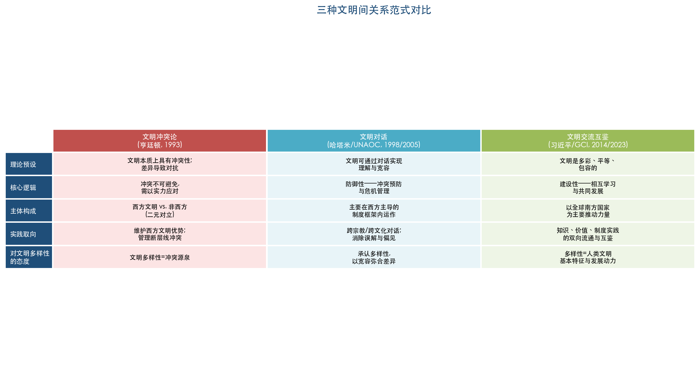

上表从理论预设、核心逻辑、主体构成、实践取向和对文明多样性的态度五个维度，系统呈现了三种范式之间的根本分野。我们认为，"文明冲突论—文明对话—文明交流互鉴"这一概念辨析对于理解全球南方合作推动文明交流互鉴的独特性至关重要，将作为全文贯穿的分析张力。

## 1.3 四个理论维度的选取逻辑与内在关联

本报告选取东方学批判、后殖民主义、非西方现代化和全球史作为分析全球南方合作推动文明交流互鉴的四个理论维度。这一选择并非任意的拼盘式组合，而是基于"解构—重构—实践—纵深"的递进逻辑链条，四个维度依次回应三个递进层次的根本问题。

### 递进逻辑："为什么需要"→"凭什么可能"→"有何根基"

**东方学批判**（第2章）构成认识论解放的第一步。萨义德在《东方学》（1978年）中揭示，西方知识体系通过系统化的话语实践建构了"东方—西方"二元对立的认知框架，这一框架不仅是学术传统和思维方式，更是"西方对东方进行支配、重构和施加权威的方式"[萨义德《东方学》原著](https://sites.evergreen.edu/politicalshakespeares/wp-content/uploads/sites/33/2014/12/Said_full.pdf "Said, Orientalism, 1978, Introduction, pp.2-3")。桑托斯（Santos）进一步提出"认识灭绝"（epistemicide）概念——西方认知标准"摧毁了主要存在于殖民社会中的极其丰富多样的认知方式"[桑托斯《认知帝国的终结》](https://assets-us-01.kc-usercontent.com/f7ca9afb-82c2-002a-a423-84e111d5b498/69a25700-f227-4b2e-80ef-b82bdd63e206/978-1-4780-0015-0_601.pdf "Santos, The End of the Cognitive Empire, Duke UP, 2018, Introduction")。如果这种知识霸权结构不被解构，文明之间的"交流互鉴"便只能在不平等的认识论地基上进行——被表述者永远无法成为对话的平等主体。因此，东方学批判回答的是**"为什么需要"**文明交流互鉴这一根本问题。

**后殖民主义**（第3章）在认识论解构的基础上追问其结构性根源，并开辟政治伦理空间。基哈诺（Quijano）的"权力殖民性"概念揭示，殖民遗产不仅是历史事件，更是一种"比建立它的殖民主义母体更持久、更稳定"的全球权力模式[基哈诺原文](https://www.decolonialtranslation.com/english/quijano-coloniality-of-power.pdf "Quijano, Nepantla: Views from South 1.3, Duke UP, 2000, pp.533-553")。巴巴（Bhabha）的"第三空间"和"混杂性"概念则为文明相遇提供了超越"对立—融合"简单二分的理论想象。后殖民主义视域下的万隆精神及其当代传承，为文明间关系提供了替代性的伦理基础——不是冲突，也不仅是对话，而是基于共同历史记忆和反霸权立场的团结（solidarity）。

**非西方现代化**（第4章）将讨论从批判转向建构，论证文明交流互鉴的实践基础。艾森施塔特（Eisenstadt）在"多元现代性"理论中提出核心命题："现代性与西方化并不等同；西方的现代性模式不是唯一'真正的'现代性"[艾森施塔特原文](https://voidnetwork.gr/wp-content/uploads/2016/10/Multiple-Modernities-by-S.N.Eisenstadt.pdf "Eisenstadt, 'Multiple Modernities', Daedalus 129(1), 2000, pp.1-24")。中国式现代化、印度式现代化、非洲联盟"2063议程"所代表的非洲现代化路径，均在保持文明主体性的同时借鉴外部经验。这些多元路径本身即构成文明交流互鉴最深厚的实践基础。非西方现代化回答的是**"凭什么可能"**——正是因为存在多元的、非西方化的现代性路径，不同文明之间的相互学习才具有实质性内容，而非仅停留于抽象宣示。

**全球史**（第5章）提供历史纵深，论证文明交流互鉴并非新生事物。阿布-卢格霍德（Abu-Lughod）在《欧洲霸权之前》（1989年）中论证，13世纪末从布鲁日到杭州，欧亚大陆已通过城市"群岛"体系形成有效联系；弗兰克（Frank）在《白银资本》（1998年）中论证，一个以中国为中心的世界体系延续了至少5000年[World History Connected书评](https://worldhistoryconnected.press.uillinois.edu/3.1/br_chowdhury.html "Chowdhury评Frank, ReOrient, 2005")。全球史视角回答的是**"有何根基"**——当代全球南方合作中的文明交流，可以被理解为前殖民时代被西方中心论所遮蔽的南方内部文明互动网络在新历史条件下的再激活。

### 四维度之间的反馈循环

上述四个维度并非简单的线性递进，而是构成相互支撑的反馈循环。全球史揭示的前殖民时代南方互动网络本身即否定东方学的"东方被动论"（回应第2章），为去殖民性提供历史正当性（回应第3章），并为多元现代化提供"前现代化"阶段的文明基础（回应第4章）。同样，后殖民理论中的"混杂性"概念与非西方现代化理论中的"文明主体性"诉求之间存在内在张力——前者强调文化边界的流动性和身份的持续建构，后者强调文明传统的自主延续——这种张力本身即为文明交流互鉴在理论层面需要正面回应的核心问题。

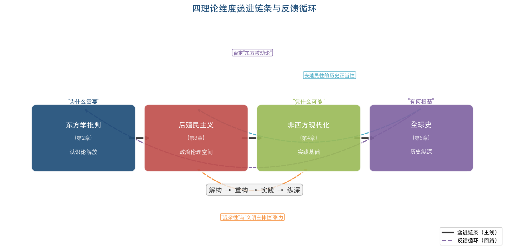

上图直观展示了"解构—重构—实践—纵深"四个维度之间的递进主线与三条反馈回路，帮助读者把握本报告理论框架的整体架构。

## 1.4 核心概念的操作性定义

为确保全文分析的术语一致性，此处明确本报告核心概念的操作性定义。

**"全球南方"**：采用地缘政治意义上的定义，指涉在当代国际体系中处于结构性弱势地位、共享反对全球等级秩序之政治取向的国家群体。本报告承认其内部的巨大多样性——经济发展水平、政治体制、文明传统均存在显著差异——并将这种多样性本身视为分析资源而非需要克服的障碍。

**"文明交流互鉴"**：兼具政策话语概念和学术分析范畴的双重属性。作为政策话语，它是中国参与全球治理的重要理念表达；作为学术分析范畴，它指涉不同文明体之间基于平等原则进行知识、价值和制度实践双向流通的历史进程与当代实践。本报告侧重后一属性，同时不回避前一属性所蕴含的规范性张力。

**"南南合作"**：广义界定为涵盖经济技术合作、知识生产合作、文化交流机制和制度性对话平台在内的全球南方国家间多维度协作进程。

**"去殖民性"（decoloniality）与"去殖民化"（decolonization）**：前者指涉一种持续的认识论与存在论解放进程，后者指涉政治独立的历史事件。马尔多纳多-托雷斯（Maldonado-Torres）明确区分了"殖民主义/去殖民化"（本体性概念，指涉特定历史事件）与"殖民性/去殖民性"（逻辑、形而上学、权力矩阵，在形式独立后仍持续存在）[马尔多纳多-托雷斯原文](https://caribbeanstudiesassociation.org/docs/Maldonado-Torres_Outline_Ten_Theses-10.23.16.pdf "Maldonado-Torres, 'Ten Theses on Coloniality and Decoloniality', 2016")。本报告对两者的区分贯穿各章分析。

**"现代性"与"现代化"**：前者指文明状态与价值取向——关涉一个社会如何理解自身与传统、理性、自由、进步等观念的关系；后者指实现这种状态的历史进程——关涉具体的制度变革、技术采纳和社会转型路径。多元现代性理论的核心洞见正在于将两者解耦：承认现代性作为价值取向可能具有某种普遍性，但拒绝将某一特定的现代化路径（西方路径）等同于通往现代性的唯一合法道路。

## 1.5 本章小结

本章界定了全球南方合作与文明交流互鉴研究的问题域。"全球南方"作为一种反等级的组织原则，与"文明交流互鉴"所内含的平等性诉求形成深层选择性亲和；金砖机制在2024—2025年间的两轮扩容使其成员国扩展至十一国，为跨文明制度化合作提供了前所未有的平台。"文明交流互鉴"概念兼具政策话语与学术分析范畴的双重属性，与"文明冲突论"在逻辑起点上根本对立，与"文明对话"在理论预设、主体构成和实践逻辑上存在微妙但重要的差异。本报告选取的四个理论维度——东方学批判、后殖民主义、非西方现代化、全球史——构成"解构—重构—实践—纵深"的递进链条，并通过反馈循环形成相互支撑的理论系统。以下各章将依次展开这四个维度的深入分析，并在第6章进行理论综合，揭示四维度整合后的增量洞见。

# 第2章 东方学批判与知识霸权的解构——文明交流互鉴的认识论前提

文明交流互鉴的实现，首先面临一个根本性的认识论障碍：在长达数百年的殖民现代性进程中，西方知识体系建构了一套关于"东方"与"西方"、"文明"与"野蛮"、"先进"与"落后"的二元等级话语，不同文明之间的平等对话在认识论层面即已被预先排除。本章以萨义德东方学批判为起点，经由斯皮瓦克的底层研究与桑托斯的认知正义理论，论证解构知识霸权构成全球南方推动文明交流互鉴的逻辑前提；进而考察全球南方知识生产的结构性不对称及其当代抵抗实践——从"被表述"到"自我表述"的认识论转向——如何为文明间真正平等的交流创造条件。

## 2.1 东方主义作为认识论装置：萨义德的三重定义

爱德华·萨义德（Edward Said）1978年出版的《东方学》（*Orientalism*）是后殖民知识批判的奠基之作。萨义德对"东方主义"给出了三个相互关联的定义：其一，作为一种学术传统——任何以教学、写作或研究方式与东方打交道的人，无论是人类学家、社会学家、历史学家还是语文学家，均属于东方学家；其二，作为一种"基于'东方'与'西方'之间的本体论和认识论区分的思维方式"——东方与西方被视为具有本质差异的两个实体；其三，作为"西方对东方进行支配、重构和施加权威的方式"——一种与殖民权力深度纠缠的话语实践。[萨义德《东方学》原著](https://sites.evergreen.edu/politicalshakespeares/wp-content/uploads/sites/33/2014/12/Said_full.pdf "Said, Orientalism, 1978, Introduction, pp.2-3")

上述三重定义的理论力量在于，它们揭示了东方主义并非简单的学术偏见或政治意识形态，而是一个系统化的知识-权力装置。萨义德借鉴福柯（Michel Foucault）的话语理论，将东方主义界定为使欧洲文化得以"管理甚至生产东方"的话语系统。此处"生产"具有双重含义：知识意义上的生产——通过学术著述、旅行文学和行政报告制造关于东方的"知识"；政治意义上的生产——通过这些知识使殖民统治获得认识论上的合法性。[萨义德《东方学》原著](https://sites.evergreen.edu/politicalshakespeares/wp-content/uploads/sites/33/2014/12/Said_full.pdf "Said, Orientalism, 1978, Introduction, pp.2-3")

萨义德进一步揭示了东方主义的"外在性"（exteriority）机制：东方学者"使东方说话，为西方描述东方"，但"从不关注东方本身"。他引用马克思在《路易·波拿巴的雾月十八日》中的著名论断——"他们不能代表自己，他们必须被代表"——作为全书题词，由此揭示被表述者在知识生产中丧失主体性的根本困境。[萨义德《东方学》原著](https://sites.evergreen.edu/politicalshakespeares/wp-content/uploads/sites/33/2014/12/Said_full.pdf "Said, Orientalism, 1978, Introduction, pp.20-21") 这一"外在性"机制构成了东方主义最具持久性和隐蔽性的特征：东方并非作为自主的认识主体参与知识生产，而是作为西方知识的"客体"和"材料"被纳入西方自我认同的建构之中。图2-1直观呈现了这一知识-权力装置的循环运作逻辑。

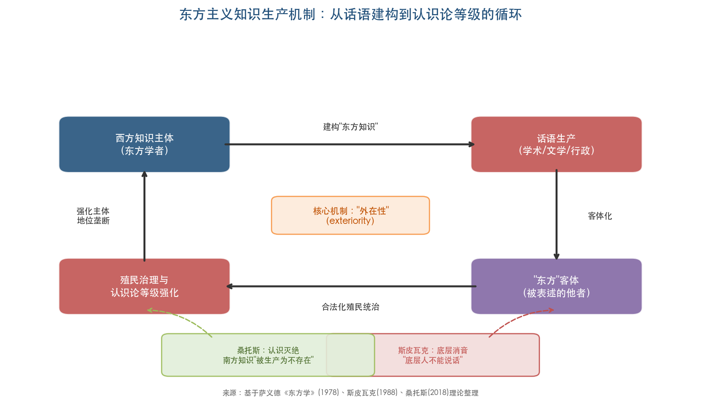

就当代文明交流互鉴而言，萨义德的分析揭示了一个关键的认识论前提：只要东方（及更广泛意义上的全球南方）在知识生产中仅仅是"被表述"的对象，任何所谓的"文明对话"都不可能是真正平等的。对话的前提是主体性的相互承认，而东方主义恰恰在认识论层面否定了非西方文明的知识主体地位。

## 2.2 文化霸权与知识等级：东方主义的持久性根源

东方主义何以具有如此强大的持久性？萨义德运用葛兰西（Antonio Gramsci）的"文化霸权"（cultural hegemony）概念对此作出了深刻解释。他指出，欧洲文化中的主要成分"恰恰就是使该文化在欧洲内外都成为霸权性文化的东西：欧洲认同相对于所有非欧洲人民和文化而言是优越的这一观念"。[萨义德《东方学》原著](https://sites.evergreen.edu/politicalshakespeares/wp-content/uploads/sites/33/2014/12/Said_full.pdf "Said, Orientalism, 1978, Introduction") 换言之，东方主义的力量不仅来源于殖民国家的政治强制，更深刻地嵌入了西方文化的自我理解之中——它既是知识生产的框架，也是文化身份认同的基础。

这一分析为理解当代知识秩序提供了重要的方法论启示。文化霸权的运作方式使得东方主义式的认识论等级无需持续的政治强制便能自我维系：它已经内化为学术规范、评价标准和知识传播体制的"自然"组成部分。全球学术出版体系便是这种内化机制的集中体现。当前，全球学术出版中英语占比约98%，而全球仅约18%人口使用英语。[The Conversation](https://theconversation.com/english-dominates-scientific-research-heres-how-we-can-fix-it-and-why-it-matters-226198 "Giménez Toledo, 2024") 非洲2,229种活跃学术期刊中仅7.4%（166种）被Web of Science收录、7.8%（174种）被Scopus收录，而南非一国即占两个数据库中非洲期刊的62%–73%。[Information Matters](https://informationmatters.org/2023/03/underrepresentation-of-research-journals-from-africa-in-web-of-science-and-scopus/ "Asubiaro, 2023") 图2-2以量化数据直观呈现了这一知识生产领域的结构性不对称格局。

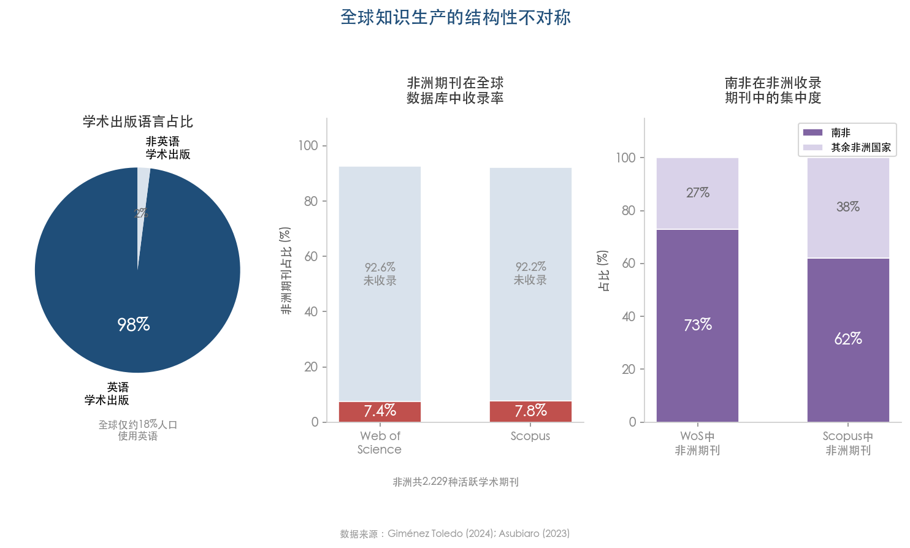

2025年发表于《气候变化》（*Climatic Change*）期刊的一项研究进一步揭示，全球南方研究者在气候科学这一关乎全球命运的领域中面临系统性的代表性不足：有限的科研经费、英语主导学术世界中的语言障碍、编辑和同行评审过程中的偏见，共同构成了一个"代表性不足的循环"（cycle of underrepresentation），使全球南方研究被系统性地排斥在全球知识评估之外。[Rucavado Rojas & Postigo学术论文](https://phys.org/news/2025-04-reveals-significant-underrepresentation-global-south.html "Climatic Change, 2025, DOI: 10.1007/s10584-025-03857-z")

这种知识生产的结构性不对称并非简单的资源分配问题，而是葛兰西意义上的文化霸权在学术领域的制度化表现。当学术"卓越"的标准由全球北方的机构垄断性地界定，当知识的"合法性"须经英语和西方学术期刊认可方能确立，东方主义的认识论等级便以一种去政治化的面貌在当代学术体制中延续不辍。

## 2.3 底层能否说话：斯皮瓦克与知识主体性的追问

如果说萨义德揭示了东方主义作为知识-权力装置的运作机制，那么加亚特里·斯皮瓦克（Gayatri Chakravorty Spivak）则将批判推进到一个更为根本性的层面：被殖民者能否在既有的话语结构中作为知识主体"说话"？

斯皮瓦克在其经典论文"Can the Subaltern Speak?"（1988）中，首先区分了"表述"（representation）的两重含义——"代为发声"（*vertreten*，政治代表意义上的"再现"）与"再现"（*darstellen*，符号学意义上的"描绘"）。她论证底层人（subaltern）的声音之缺席，并非简单的信息传递障碍，而是源于支配性权力关系对其能动性的系统性消解。[Saari学术论文](https://www2.hu-berlin.de/transcience/vol7_no1_36_46.pdf "Transcience, Vol.7 No.1, 2016, pp.36-46, Humboldt University") 斯皮瓦克以殖民印度"萨蒂"（sati，寡妇殉葬）传统的辩论为核心案例，揭示印度女性的声音如何在两种对立话语之间彻底消失：英国殖民者"白人从棕色男人手中拯救棕色女人"的解放叙事，与本土父权制度下"女性自愿为男性牺牲"的传统叙事。殉葬寡妇既非殖民者所宣称的"需要被拯救的受害者"，亦非本土精英所建构的"自由选择的英雄主体"，其真实主体位置在这两种表述的竞争中被系统性地抹去。

斯皮瓦克由此得出了其震撼性的结论："底层人不能说话"（the subaltern cannot speak）。这一论断并非否认底层人具有言说的物理能力或主观意愿，而是指出：在既有的认识论-制度框架内，底层人的言说无法作为"知识"被听取和认可。正如斯皮瓦克所言，"如果在殖民生产的语境中，底层人没有历史且不能说话，那么作为女性的底层人则被更深地置于阴影之中"。

斯皮瓦克的分析对文明交流互鉴的理论建构具有深刻的警示意义。仅仅在制度层面为全球南方"提供话语平台"远远不够——如果知识生产的基本规则、评价标准和话语框架仍然由全球北方主导，那么南方的"发声"不过是在北方设定的认识论框架中进行"被许可的表述"，而非真正自主的知识生产。文明交流互鉴要求的不仅是对话渠道的开放，更是知识生产规则本身的根本变革。

## 2.4 认识灭绝与认知正义：桑托斯的南方认识论

葡萄牙社会学家博文图拉·德·索萨·桑托斯（Boaventura de Sousa Santos）在《认知帝国的终结》（*The End of the Cognitive Empire*, Duke University Press, 2018）中，将后殖民知识批判从话语分析层面推进到认识论的系统性重建。桑托斯提出了一个核心命题："没有全球认知正义就没有全球社会正义"。[桑托斯《认知帝国的终结》](https://assets-us-01.kc-usercontent.com/f7ca9afb-82c2-002a-a423-84e111d5b498/69a25700-f227-4b2e-80ef-b82bdd63e206/978-1-4780-0015-0_601.pdf "Santos, The End of the Cognitive Empire, Duke UP, 2018, Introduction") 这一论断将知识问题与社会正义问题直接关联，赋予认识论批判以明确的政治伦理指向。

桑托斯的理论贡献集中体现在两个原创性概念上。第一个是"缺席社会学"（sociology of absences）。桑托斯指出，许多南方知识和实践并非"自然地"不存在或落后，而是"被主导认知方式积极地生产为不存在的"。西方现代认识论通过界定什么算作"科学"、什么算作"迷信"，什么是"知识"、什么是"信仰"，系统性地将不符合其标准的认知方式排斥在"有效知识"的范畴之外。桑托斯将此过程概括为"认识灭绝"（epistemicide）——西方有效知识的标准"摧毁了主要存在于殖民社会中的极其丰富多样的认知方式"。[桑托斯《认知帝国的终结》](https://assets-us-01.kc-usercontent.com/f7ca9afb-82c2-002a-a423-84e111d5b498/69a25700-f227-4b2e-80ef-b82bdd63e206/978-1-4780-0015-0_601.pdf "Santos, The End of the Cognitive Empire, Duke UP, 2018, Introduction")

"认识灭绝"的概念力量在于，它将知识领域的不平等与殖民暴力的其他形式——种族灭绝、文化灭绝、语言灭绝——置于同一分析框架之中。桑托斯由此提出了对文明交流互鉴至关重要的洞见：文明间的不平等关系不仅体现在政治和经济领域，更根本地体现在认识论领域——某些文明的知识方式被系统性地"灭绝"或降格，致使文明间的"交流"实质上沦为单向的知识输出。

桑托斯理论的第二个核心贡献是"认识论南方"（Epistemologies of the South）框架的提出。此处的"南方"并非地理概念，而是一个认识论隐喻，指涉所有在殖民现代性中被压制、边缘化和摧毁的知识传统。"认识论南方"的提出意味着一个根本性的认识论立场转换：全球南方不仅是政治经济意义上的被剥削者，更是认识论意义上的被剥夺者；南方解放运动不仅需要政治独立和经济发展，更需要认识论层面的自我重建——恢复和激活被"认识灭绝"所压制的知识传统。

## 2.5 认识论脱钩与多元宇宙性：米尼奥洛的去殖民方案

阿根廷裔美国学者沃尔特·米尼奥洛（Walter Mignolo）在其"脱钩"（delinking）理论中，进一步将去殖民认识论从批判性分析推向建构性方案。米尼奥洛在《脱钩：现代性的修辞、殖民性的逻辑与去殖民性的语法》（2007）中明确提出："脱钩意味着改变对话的条件（*terms*），而不仅仅是对话的内容（*content*）。"[米尼奥洛原文](https://docs.ufpr.br/~clarissa/pdfs/DeLinking_Mignolo2007.pdf "Mignolo, 'Delinking', Cultural Studies, 21(2-3), 2007, pp.449-514") 这一区分至关重要：改变内容意味着在既有的西方认识论框架内引入非西方的观点和材料；改变条件则意味着对知识生产的基本规则——什么算作知识、谁有权生产知识、知识的合法性如何界定——进行根本性挑战。

米尼奥洛的"认识论脱钩"（epistemic delinking）概念建立在基哈诺（Aníbal Quijano）"权力殖民性"（coloniality of power）理论的基础之上，但将其从政治经济领域延伸至认识论领域。基哈诺的核心洞见在于，殖民性（coloniality）不同于殖民主义（colonialism）：后者指涉特定的政治统治历史事件，前者则指涉一种"比建立它的殖民主义母体更持久、更稳定"的权力逻辑。[基哈诺原文](https://www.decolonialtranslation.com/english/quijano-coloniality-of-power.pdf "Quijano, Nepantla: Views from South 1.3, Duke UP, 2000, pp.533-553") 米尼奥洛据此论证，即便形式上的政治去殖民化已经完成，知识领域的殖民性依然持续运作——全球南方的知识生产者仍然被迫在西方设定的认识论框架内工作，用西方的语言、概念和方法论来理解自身的经验。

为克服这种持续的认识论殖民性，米尼奥洛提出了"多元宇宙性"（pluriversality）作为"普遍性"（universality）的替代方案。他写道，脱钩"应被理解为一种去殖民的认识论转向，引向他者-普遍性（other-universality），即多元宇宙性作为一个普遍的计划"——一个"许多世界得以共存的世界"。[米尼奥洛原文](https://docs.ufpr.br/~clarissa/pdfs/DeLinking_Mignolo2007.pdf "Mignolo, 'Delinking', Cultural Studies, 21(2-3), 2007, pp.449-514") 这一主张的要旨在于：真正的去殖民化并非以另一种"普遍性"取代西方的"普遍性"，而是从根本上放弃任何单一文明对普遍性的垄断主张，承认多种知识传统的共存合法性。

然而，米尼奥洛的框架并非没有理论风险。Zembylas（2025）在一项重要批评中指出，"认识论脱钩"的主张存在被威权政权挪用为"认识论民族本质主义"（epistemic ethno-essentialism）的危险——即以"抵抗西方认识论霸权"为名，为排斥性的文化民族主义提供学术合法性。[Zembylas学术论文](https://www.tandfonline.com/doi/full/10.1080/14767724.2025.2459110 "Globalisation, Societies and Education, 2025") 这一批评警示，在从东方主义批判走向知识生产的去殖民化实践时，须警惕从一种封闭性滑向另一种封闭性。文明交流互鉴所追求的认识论解放，应当是走向知识传统的多元共存与相互学习，而非以"本土知识"的名义建构新的认识论壁垒。

## 2.6 从"被表述"到"自我表述"：全球南方知识网络的兴起

上述理论批判并非停留在书斋之中。过去二十年间，全球南方在知识生产领域展开了一系列制度性实践，推动从"被表述"到"自我表述"的认识论转向。图2-3呈现了这一进程中理论批判与制度实践相互交织、递进发展的关键节点。这些实践在三个层面展开：南南学术合作网络的建设、去殖民化知识运动的传播、以及南方知识平台的制度化。

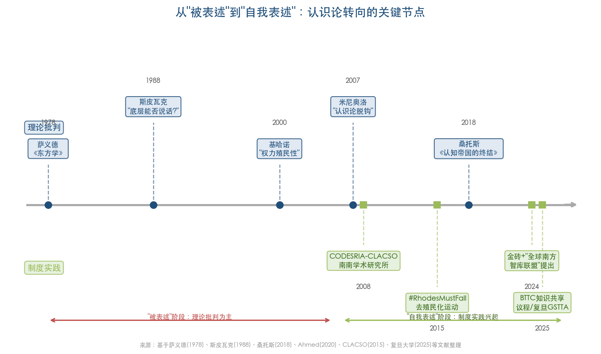

在南南学术合作层面，非洲社会科学研究发展委员会（CODESRIA）、拉丁美洲社会科学理事会（CLACSO）与国际发展经济学协会（IDEAs）自2008年起联合举办"南南学术研究所"（South-South Institute），构建了全球南方内部独立于西方学术机构的知识生产和交流平台。[CLACSO南南研究所概念文件](https://www.clacso.org/wp-content/uploads/2020/04/51_con_en.pdf "CLACSO, 2015, Eighth South-South Institute Concept Note") CLACSO的南南项目明确以"在南方之间——非洲、亚洲、拉丁美洲和中东——架设交流桥梁"为宗旨，致力于从"批判性和比较性视角"深化南南学术合作，并推动建立"南南大学"（South-South University）作为全球南方学术培训和交流的常设平台。[CLACSO南南项目](https://www.clacso.org/south-south/ "CLACSO South-South Program") 这些机制的意义不仅在于促进了南方学者之间的学术交流，更在于建构了一个不以西方学术标准为唯一参照系的知识评价和传播体系。

在去殖民化知识运动层面，2015年开普敦大学 #RhodesMustFall 运动提供了一个典范性案例。这场运动从移除塞西尔·罗兹（Cecil Rhodes）雕像的具体诉求出发，迅速发展为涵盖三大目标的广泛去殖民化教育运动：移除殖民偶像、改革欧洲中心主义课程、解决少数族裔在学术机构中的代表性不足。[Ahmed学术论文](https://www.cambridge.org/core/journals/african-studies-review/article/rhodesmustfall-how-a-decolonial-student-movement-in-the-global-south-inspired-epistemic-disobedience-at-the-university-of-oxford/D57EF638347B43E9B2041BF46E0E1154 "African Studies Review, Vol.63(2), 2020, pp.281-303") 尤为值得关注的是，#RhodesMustFall 运动随后从全球南方（南非）传播至全球北方（牛津大学），这种从南向北的知识流动本身即构成了对东方主义式"知识单向输出"模式的实质性挑战。Ahmed（2020）将这一过程概括为"认识论不服从"（epistemic disobedience）从全球南方向全球北方的传导，体现了南方知识运动改变全球知识权力格局的现实潜力。

在南方知识平台制度化层面，中国学术界近年来积极参与全球南方知识网络的建设。2025年12月，复旦大学"全球南方智库联盟"（Global South Think Tanks Alliance, GSTTA）秘书处正式挂牌，该联盟最初由2024年10月在俄罗斯喀山举行的"金砖+"领导人对话中提出。[复旦大学官网](https://www.fudan.edu.cn/en/2025/1208/c344a147654/page.htm "December 2025") 北京大学南南合作与发展学院自成立以来已为多个发展中国家培养了中高层管理者和政策研究人才，并定期举办全球南方发展会议——2026年7月的全球南方发展会议即为这一制度化进程的最新节点。[北京大学ISSCAD](https://www.isscad.pku.edu.cn/news/index.htm "ISSCAD Call for Papers: Global South Development Conference 2026") CLACSO亦专门设立了"拉美-加勒比与中国研究和交流项目"（Programa de Estudios e Intercambio entre América Latina, el Caribe y China），将中国纳入南南知识合作的制度框架之中。[CLACSO南南项目](https://www.clacso.org/south-south/ "CLACSO South-South Program")

2025年金砖智库理事会（BTTC）进一步将知识合作提升至战略层面，提出"通过知识与创新共享推动进步"议程，建议在金砖国家建立学习中心并加强研究机构间伙伴关系，构建促进全球南方知识生产能力的"动态生态系统"。[BRICS Think Tanks Council](https://bricsthinktankscouncil.org/knowledge-base/2025-bttc-recommendations/ "BTTC Recommendations to XVII BRICS Summit, 2025年7月") 上述制度性实践标志着全球南方的知识去殖民化已从理论倡导走向机制建设，从学术批判走向知识生产的替代性制度安排。

## 2.7 认识论解放的限度与辩证：走向文明交流互鉴的知识条件

综合上述分析，东方学批判及其后续发展所揭示的知识霸权解构进程，构成了全球南方推动文明交流互鉴的逻辑前提。这一论断可从三个层面加以理解。

第一，认识论层面。萨义德揭示了东方主义如何在"知识"的名义下否定非西方文明的认识主体地位，斯皮瓦克追问了底层声音在既有话语结构中被消音的深层机制，桑托斯则将"认识灭绝"概念化为与种族灭绝同等严重的殖民暴力形式。三位理论家的工作共同表明：不解构知识霸权，文明间的"交流"便只能是强势文明对弱势文明的单向知识输出，"互鉴"便只能是弱势文明对强势文明的单向学习与模仿。

第二，制度层面。全球学术出版的语言垄断、期刊收录的地理偏见、科研资助的结构性不平等，使得知识霸权不仅是一种抽象的认识论状态，更是一套具体的制度安排。CODESRIA-CLACSO-IDEAs南南学术研究所、全球南方智库联盟、#RhodesMustFall 运动等实践，正是在制度层面挑战上述安排的具体努力。

第三，理论建构层面。米尼奥洛的"多元宇宙性"概念为文明交流互鉴提供了一个重要的认识论框架——不是以一种"普遍性"取代另一种"普遍性"，而是承认多种知识传统的共存合法性。这与文明交流互鉴所追求的"文明平等"理念在认识论层面高度契合。

然而，认识论解放本身也面临内在的张力。Zembylas的批评提醒，"认识论脱钩"可能滑向"认识论民族本质主义"；斯皮瓦克关于"底层不能说话"的论断本身也引发了持续争议——如果底层确实不能在既有框架内说话，那么任何替代性知识生产是否终究不过是另一种精英代言？这些理论张力不应被简单回避，而应被纳入文明交流互鉴的理论建构之中。我们认为，解决这一张力的关键在于：文明交流互鉴并非在知识领域建构新的封闭性——无论是西方中心主义的封闭性还是反西方的封闭性——而是建构一种开放的、多元的知识生产生态，使不同文明的知识传统能够在平等的制度条件下相互学习、相互激发、相互批评。

本章的分析为后续章节奠定了认识论基础。如果说东方学批判揭示了文明交流互鉴"为什么需要"认识论解放，那么后殖民主义理论（第3章）将进一步追问这种认识论不平等的结构性根源——殖民遗产如何在政治、经济和文化的多重层面持续制约文明间的平等关系，以及全球南方合作如何通过"去殖民性"实践为文明交流互鉴开辟政治伦理空间。

# 第3章 后殖民主义视域下的文明秩序重构——从殖民遗产到南南团结

## 本章论证目标

第2章以萨义德的东方学批判为切入点，揭示了西方知识体系对非西方文明的"认识论锁定"及其构成文明间平等交流的根本性障碍。然而，认识论批判本身尚未回答一个更为根本的问题：这种知识等级制度背后的权力结构缘何在殖民体系终结之后依然持续运作？全球南方合作又如何在政治伦理层面开辟打破文明等级的实践空间？

本章正是在这一理论接力点上展开分析。通过运用后殖民主义理论——尤其是法农的去殖民化思想、基哈诺的"权力殖民性"概念以及巴巴的"混杂性"与"第三空间"理论——本章旨在完成三重论证任务：其一，剖析殖民遗产对当代文明间关系的深层结构性影响，揭示"殖民性"在政治独立之后的延续机制；其二，论证全球南方合作如何通过"去殖民性"实践重构文明秩序的伦理基础；其三，追溯从万隆精神到当代南南团结的历史脉络，阐明这一脉络如何为文明交流互鉴提供替代性的政治伦理框架。

## 3.1 殖民遗产的深层结构：从殖民主义到"殖民性"的持续存在

### 3.1.1 法农论殖民世界的二元裂隙

任何关于文明交流互鉴的严肃讨论，都必须首先直面一个根本性的历史前提：当代文明间关系的基本格局是在殖民主义体系中被塑造的，而殖民主义不仅是一种政治统治形式，更是对被殖民者主体性的全面否定。弗朗茨·法农（Frantz Fanon）在《全世界受苦的人》（1961）中以极具穿透力的笔触揭示了这一点："去殖民化始终是一个暴力现象……是用一个'种'的人取代另一个'种'的人"，殖民世界是"被分成两个隔间的世界"，在这个世界中，"你富是因为你白，你白是因为你富"——经济剥夺与种族压迫构成了不可分割的同构关系。[法农《全世界受苦的人》原著](http://abahlali.org/wp-content/uploads/2011/04/Frantz-Fanon-The-Wretched-of-the-Earth-1965.pdf "Fanon, The Wretched of the Earth, 1963/1961, pp.35-39")

法农的分析远超政治经济学维度。在更早的《黑皮肤，白面具》（1952）中，他从存在主义现象学角度深入剖析了殖民主义如何侵蚀被殖民者的主体性，论证殖民主义是一种"总体性工程"——它不仅控制土地与劳动力，更系统性地摧毁被殖民者的自我认知与文明自信。据斯坦福哲学百科的权威阐释，法农最终提出了"新人道主义"的愿景——"我们必须重新开始，发展一种新的思维方式，努力创造一个新人"——这一呼唤构成了后殖民文明重建的思想起点。[斯坦福哲学百科"法农"条目](https://plato.stanford.edu/entries/frantz-fanon/ "Drabinski, 'Frantz Fanon', SEP, 2019")

法农的思想遗产对于理解全球南方文明交流互鉴的必要性具有双重启示。其一，殖民体系所造成的文明间不平等不仅是物质层面的，更是存在论层面的——被殖民者被剥夺了作为文明主体的基本资格，因此，文明交流互鉴的前提条件之一便是恢复这种被剥夺的主体性。其二，法农关于"新人道主义"的呼唤表明，去殖民化不应简单回归前殖民状态，而应通过跨文明的对话与互鉴创造新的人类共同体。这一洞见为全球南方合作推动文明交流互鉴提供了深刻的伦理根基。

### 3.1.2 基哈诺与"权力殖民性"：超越政治独立的持久等级

如果说法农揭示了殖民主义的存在论创伤，那么秘鲁社会学家阿尼瓦尔·基哈诺（Aníbal Quijano）则解答了殖民主义的遗产为何在政治独立之后依然坚固。基哈诺在其开创性论文"Coloniality of Power"（2000）中提出了"权力殖民性"（coloniality of power）这一核心概念：当代全球权力模式的根本轴心之一是围绕"种族"观念对世界人口进行社会分类，而这种分类"有殖民起源和殖民特性，但比建立它的殖民主义母体更持久、更稳定"。[基哈诺原文](https://www.decolonialtranslation.com/english/quijano-coloniality-of-power.pdf "Quijano, Nepantla: Views from South 1.3, Duke UP, 2000, pp.533-553")

基哈诺进一步揭示了支撑这一权力格局的两大"奠基神话"：其一，将人类文明史想象为以欧洲为终点的线性轨迹；其二，将欧洲与非欧洲之间的差异视为"自然的"而非权力历史的后果。这两个神话在认识论层面支撑着第2章所分析的东方学话语，在政治层面则维系着殖民时代确立的文明等级秩序。基哈诺的核心理论贡献在于揭示：形式上的政治独立并不自动瓦解"殖民性"，因为后者已经内化为全球知识生产、劳动分工和主体性建构的深层逻辑。

纳尔逊·马尔多纳多-托雷斯（Nelson Maldonado-Torres）在2016年的"十大去殖民性命题"中对这一概念进行了更为系统的理论化处理。他明确区分了两组概念："殖民主义/去殖民化"是本体性概念，指涉特定的历史事件（殖民征服与民族解放）；而"殖民性/去殖民性"则是逻辑、形而上学与权力矩阵的概念，在形式独立之后仍持续存在。马尔多纳多-托雷斯进而提出"形而上学灾变"（metaphysical catastrophe）概念——现代性/殖民性将世界人口划分为"人类区"与"非人类区"，前者享有主体性与能动性，后者则被系统性地排除在文明交流的平等对话之外。[马尔多纳多-托雷斯原文](https://caribbeanstudiesassociation.org/docs/Maldonado-Torres_Outline_Ten_Theses-10.23.16.pdf "Maldonado-Torres, 'Ten Theses on Coloniality and Decoloniality', 2016")

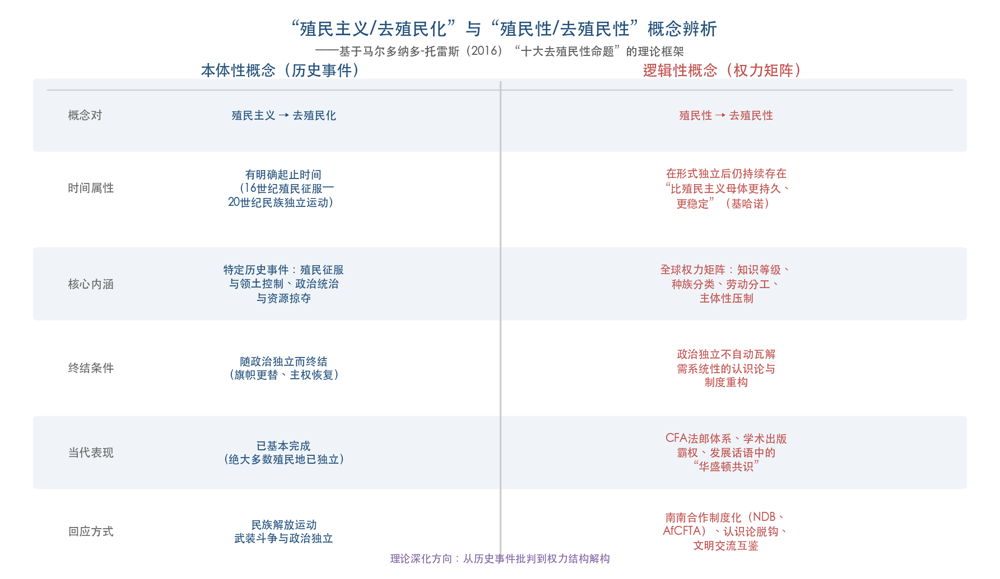

图3-1基于马尔多纳多-托雷斯的理论框架，从概念对、时间属性、核心内涵、终结条件、当代表现和回应方式六个维度，系统对比了"殖民主义/去殖民化"（本体性概念）与"殖民性/去殖民性"（逻辑性概念）两组概念的关键差异。这一辨析揭示了全球南方合作推动文明交流互鉴所面对的真正障碍，并非某些国家的"发展滞后"或"文明落后"——这恰恰是殖民性话语的产物——而是一整套将等级制度自然化的全球权力矩阵。相应地，南南合作的文明意义也不仅限于经济技术合作，而在于通过替代性的制度安排与知识实践，动摇这一权力矩阵的合法性基础。

### 3.1.3 恩克鲁玛的新殖民主义预警

殖民性的持续存在具有一个重要的制度化形态，即加纳首任总统夸梅·恩克鲁玛（Kwame Nkrumah）早在1965年便深刻洞察到的"新殖民主义"。恩克鲁玛在《新殖民主义：帝国主义的最后阶段》中指出："新殖民主义是帝国主义最后也许也是最危险的阶段"，其本质在于受支配的国家"在理论上独立……但经济体系和政治政策受到外部指挥"。[恩克鲁玛原著](https://www.marxists.org/subject/africa/nkrumah/neo-colonialism/introduction.htm "Nkrumah, Neo-Colonialism, 1965, Introduction")

恩克鲁玛的预警在半个多世纪后仍具有显著的解释力。西非法郎（CFA franc）体系长期将14个前法属非洲国家的货币主权捆绑于法国财政部，构成新殖民主义经济控制机制的典型案例。马里、布基纳法索和尼日尔三国于2023年9月成立"萨赫勒国家联盟"（Alliance of Sahel States, AES），并于2025年1月正式退出西非国家经济共同体（ECOWAS），其核心动因正是对新殖民主义结构的制度性抗拒。AES于2025年12月成立了联盟投资与发展银行（BCID-AES），初始资本5,000亿西非法郎（约8.95亿美元），明确以实现"金融主权"为目标。[维基百科"萨赫勒国家联盟"条目](https://en.wikipedia.org/wiki/Alliance_of_Sahel_States "Alliance of Sahel States, Wikipedia")三国还同步驱逐了法国和美国驻军、退出法语国家国际组织（OIF）、降低法语的官方地位、将殖民时代街道更名，这些行动共同构成了一场系统性的去殖民性实践。

值得注意的是，法农本人曾在《全世界受苦的人》中发出深刻的预警——"民族意识的陷阱"：独立后的民族精英有可能仅仅取代殖民者的位置，而不改变殖民性的权力结构本身。AES三国均由军事政变上台的军政府统治，其对内治理的民主合法性、人权纪录以及对俄罗斯瓦格纳集团的军事依赖，均构成不容回避的批评维度。然而，这些内在矛盾并不否定其去殖民性实践本身的结构性意义——它表明，当代全球南方国家仍在持续回应法农和恩克鲁玛所揭示的根本性问题。

## 3.2 模仿、混杂与第三空间：被殖民者的文明能动性

### 3.2.1 巴巴的"模仿"理论：殖民话语的内在颠覆

如果说法农和基哈诺主要从压迫结构的角度分析殖民遗产，那么霍米·巴巴（Homi K. Bhabha）则从殖民话语的内在矛盾中发掘了被殖民者的能动性空间。巴巴在《文化的定位》（1994）中发展的"模仿"（mimicry）概念，揭示了殖民权力体系中一个根本性悖论。

巴巴将殖民模仿界定为"对一个改良的、可辨识的他者的渴望，是一种几乎相同但又不尽相同（almost the same, but not quite）的差异主体"。模仿的话语"围绕一种矛盾性而建构；为了有效运作，模仿必须持续地生产其滑移、其过剩、其差异"。模仿因此构成了"一种双重表达的符号"——它既是"改造、规训和控制的复杂策略"，又是"不恰当性的符号……对'标准化'知识和规训权力构成内在威胁"。[巴巴"Of Mimicry and Man"原文](https://warwick.ac.uk/fac/arts/english/currentstudents/postgraduate/masters/modules/theoryfromthemargins/syllabus/bhabha_of_mimicry_and_man.pdf "Bhabha, 'Of Mimicry and Man: The Ambivalence of Colonial Discourse', October, Vol.28, Spring 1984, pp.125-133")

巴巴以麦考利勋爵（Lord Macaulay）1835年的"教育备忘录"为经典案例：殖民教育体系旨在培养"一个在血统和肤色上是印度人，但在品味、观点、道德和智识上是英国人的阶层"——即培养"模仿者"。然而，殖民模仿的内在矛盾在于：模仿必须足够成功以服务于殖民管治，却又不能完全成功以至于消除殖民者与被殖民者的区分。巴巴精辟地捕捉了这一张力："被英国化，断然不等于成为英国人"（to be Anglicized, is emphatically not to be English）。正是在这个"几乎相同但又不尽相同"的裂隙中，模仿从殖民权力的工具转化为对殖民权威的潜在颠覆——"模仿的威胁在于它的双重视野，它在揭示殖民话语的矛盾性的同时，也破坏了殖民话语的权威性"。

模仿理论对于理解全球南方文明交流互鉴具有重要的分析价值。后殖民时代许多发展中国家的现代化进程，在一定程度上呈现出对西方制度与话语的"模仿"特征——从治理体制到学术范式，从法律框架到发展指标。然而，恰恰是这种模仿过程中不可避免的"滑移"和"差异"，为非西方社会创造了重新诠释和本土化的空间。我们认为，全球南方合作推动的文明交流互鉴，在某种意义上正是将这种被动的"殖民模仿的失败"转化为主动的"文明创新的起点"。

### 3.2.2 "第三空间"与混杂性：超越二元对立的文明交涉

巴巴理论的另一核心贡献是"第三空间"（Third Space）概念。他在《文化的定位》中指出，第三空间是殖民者与被殖民者文化相遇的间隙性（interstitial）空间，在这一空间中，文化意义通过协商而非简单的对立或融合而产生。由此衍生的"混杂性"（hybridity）概念并非指两种文化的简单混合，而是"文化交涉中产生新身份认同形式的创新行为"。[Bhandari学术评述](https://www.nepjol.info/index.php/paj/article/download/45049/33840/132694 "Prithvi Academic Journal, Vol.5, 2022, pp.171-181")

"第三空间"为理解全球南方文明交流互鉴提供了一个富有理论张力的分析框架。在传统的"文明冲突"或"文明对话"范式中，文明被预设为边界清晰、内部均质的实体，它们之间的关系要么是对抗性的（亨廷顿），要么是调和性的（哈塔米的"文明对话"倡议）。而巴巴的"第三空间"概念则暗示了另一种可能：文明间的交流并非在两个固化实体之间进行的"信息交换"，而是在接触地带（contact zones）持续生成新的文化形态的动态过程。全球南方国家因其深刻的殖民经验，恰恰是这种"第三空间"最活跃的生产者——它们的文化实践本身即是多元文明传统在历史碰撞中不断交涉与重构的产物。

然而，巴巴的理论也面临重要的学术批评。一方面，"混杂性"概念存在忽视物质不平等的局限——在权力极度不对称的条件下，文化交涉能否真正产生平等的"协商"，而非单向的"同化"？另一方面，"混杂性"的普遍化可能模糊文明主体性的界限：如果一切文化都是混杂的，那么全球南方国家主张的"文明自主性"是否因此失去了理论基础？

对于后一个问题，Moshirzadeh（2020）提出了一条颇具建设性的理论调和路径：将文明理解为"社会建构"或"竞技场"而非固化实体，则文明主体性本身就是在交流互鉴中持续建构和重构的——接受混杂性并不需要以放弃主体性为代价。[Moshirzadeh学术论文](https://www.allazimuth.com/2020/06/08/the-idea-of-dialogue-of-civilizations-and-core-periphery-dialogue-in-international-relations/ "All Azimuth, 2020")正如第4章将进一步论证的，中国式现代化、印度现代化等实践本身就是在对外部文明资源的选择性吸收与本土重构中形成独特路径的——这恰恰体现了"混杂性"与"主体性"之间并非不可调和，而是辩证统一的关系。

## 3.3 从万隆到当代：南南团结的文明伦理基础

### 3.3.1 万隆精神：打破文明等级的历史原点

后殖民主义理论对殖民遗产的批判性分析，在实践层面最早得到集中回应的历史事件，当属1955年的万隆会议（亚非会议）。来自亚洲和非洲的29个国家在没有任何殖民大国参与的情况下自主召开国际会议，本身即构成了对殖民秩序的深刻挑战。会议通过的十项原则（"达萨西拉"），其中第三条明确"承认一切种族的平等和一切国家不论大小的平等"，从政治宣言层面直接否定了殖民时代的文明等级制度。[万隆精神网](https://bandungspirit.org/spip.php?article99 "Bandung Spirit: Dasa Sila Bandung, 1955")

万隆会议的文明意义在于，它为后殖民世界的国际交往确立了一套替代性的伦理原则：文明间关系不应建立在权力等级之上，而应建立在主权平等与相互尊重之上。万隆精神迅速催生了一系列制度化成果——不结盟运动（1961年）、七十七国集团（1964年）、新国际经济秩序宣言（1974年）——这些制度化进程共同构成了南南合作的历史根基。[卡内基国际和平基金会](https://carnegieendowment.org/research/2024/05/global-south-colonialism-imperialism "Carnegie: A Closer Look at the Global South, 2024")

从后殖民理论的视角审视，万隆精神的核心贡献在于将法农所呼唤的"新人道主义"从哲学理想转化为国际政治实践：通过建立去等级化的国际对话平台，被殖民民族不再是被动的"被表述者"（回应第2章斯皮瓦克的分析），而成为国际秩序重建的积极参与者和共同塑造者。

### 3.3.2 万隆精神的当代困境与再激活

万隆精神在此后数十年中经历了深刻的起伏。三洲研究所2025年4月发布的研究报告对此进行了系统分析，识别出五大结构性障碍：债务危机摧毁了南方国家的发展自主空间；殖民遗留的国际分工切断了南方内部的贸易联系；南方精英与全球金融资本的深度纠缠侵蚀了团结的阶级基础；冷战两极格局压缩了不结盟空间；新自由主义全球化削弱了国家作为发展行为体的能力。[三洲研究所报告](https://thetricontinental.org/wp-content/uploads/2025/04/20250324_D87_EN_Web.pdf "Tricontinental Institute, 'The Bandung Spirit', Dossier no.87, April 2025")

然而，同一报告也指出，2007—2008年全球金融危机之后，全球南方出现了一种"新情绪"（new mood），而金砖机制和"一带一路"等当代合作框架为南南合作提供了万隆时代所不具备的"客观条件"——特别是经济体量的实质性增长和替代性制度平台的建立。截至2025年初，扩容后的金砖十国集团（含印度尼西亚）已覆盖全球约46%的人口和35.6%的GDP（PPP口径）。[斯汀森中心](https://www.stimson.org/2025/2025-brics-summit-takeaways-and-projections/ "2025 BRICS Summit: Takeaways and Projections, Stimson Center, 2025年8月")

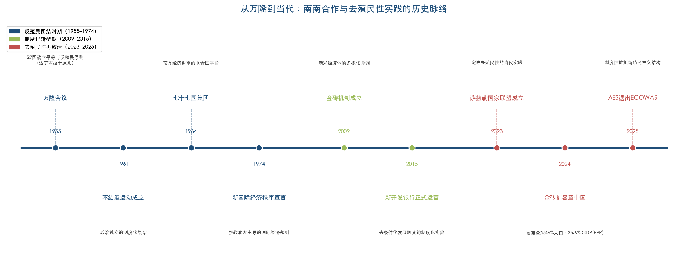

图3-2以时间轴形式呈现了从1955年万隆会议到2025年AES退出ECOWAS的九大关键节点，按"反殖民团结时期（1955—1974）""制度化转型期（2009—2015）""去殖民性再激活（2023—2025）"三个历史阶段进行色彩编码。这一时间线清晰展示了南南合作从政治宣言走向制度建设、再到当代去殖民性实践激进化的演进轨迹。

我们认为，当代南南合作对万隆精神的"再激活"并非简单的历史重复，而是在新的物质条件和制度基础上对去殖民性目标的升级追求。万隆时代的南南团结主要依靠政治宣言和道义感召，缺乏有效的经济制度支撑；当代全球南方合作则通过新开发银行（NDB）、亚投行、金砖应急储备安排等制度化金融架构，将政治团结转化为可操作的经济合作机制。

### 3.3.3 新开发银行：去殖民性原则的制度化实验

新开发银行（NDB）的创设与运营，构成了去殖民性原则在国际金融制度领域最具代表性的制度化实验。截至2025年6月底，NDB董事会已累计批准约397.1亿美元的123个项目。[NDB投资者报告](https://www.ndb.int/wp-content/uploads/2026/03/New-Development-Bank_Investor-Presentation_Feb-2026.pdf "NDB Investor Presentation, February 2026")其制度设计体现了三项去殖民性原则：第一，等额投票权——五个创始国各持20%投票权，避免了布雷顿森林体系中出资国主导的权力不对称；第二，无政治条件贷款——与世界银行和国际货币基金组织附加的结构性调整条件不同，NDB的贷款不捆绑政治改革要求；第三，本币贷款选项——通过提供成员国本币计价的贷款，降低发展中国家对美元的依赖。

Chin（2024）指出，NDB的愿景"不是要创建另一个机构，而是要改变范式"——将发展融资从附带条件的北南援助模式，转向平等互利的南南合作模式。[Chin学术论文](https://link.springer.com/journal/11558 "Gregory T. Chin, 'Introduction–The evolution of New Development Bank', Global Policy, 15(2), 2024, pp.368-382")然而，NDB的实践也暴露了南南合作制度化过程中的深层张力：总部设在上海，微妙地再现了中心—边缘动态；成员扩容（如阿联酋作为非借款成员加入）引入了出资国与借款国之间的等级差异；在地缘政治紧张（如中印争端）背景下，共识决策机制面临僵局风险。[Friederich学术论文](https://scarab.bates.edu/cgi/viewcontent.cgi?article=1009&context=bjps "Friederich, 'Institutionalizing (?) the South: The New Development Bank', Bates College Journal of Political Studies, Vol.2(1), 2025")

这些张力揭示了后殖民主义理论中的一个核心悖论：在试图制度化南南团结的过程中，去殖民性理想可能面临被重新嵌入既有权力结构的风险。正如Friederich（2025）所概括的，NDB的发展轨迹"既彰显了全球发展金融替代方案的前景，也凸显了一个持久的风险——在制度化团结的过程中，它可能复制自己旨在变革的那个体系的某些特征"。

## 3.4 去殖民性实践的当代展开：文明交流互鉴的政治伦理空间

### 3.4.1 Mawdsley的三重评估框架

如何系统评估当代南南合作的去殖民性成效？Mawdsley（2024）提供了一个颇具分析力的三重框架。在本体论层面，南南合作使全球南方伙伴获得了"可见性"和行动主体地位——不再仅仅是北方发展援助的被动接受者，而是平等的合作伙伴。在物质层面，南南合作打破了北方对发展领域的垄断性主导——金砖框架下的新开发银行、中国主导的亚投行，以及日益增长的南方国家间直接投资与技术转移，共同构成了一个去中心化的发展融资网络。在理念层面，南南合作投射了替代性的"发展"话语——从"华盛顿共识"的市场化一元叙事，走向尊重各国自主选择发展道路的多元话语体系。[Mawdsley学术论文](https://link.springer.com/chapter/10.1007/978-3-031-30308-1_11 "Palgrave Macmillan, 2024, pp.205-214")

然而，Mawdsley也坦率地指出了去殖民性实践的根本局限："资本主义、金融、科学技术的伟大结构并未被拒绝，而是成为竞争焦点"，现代性的底层本体论并未受到南方伙伴的严肃挑战。换言之，当代南南合作更多地是在现有全球秩序框架内争取更公平的权力分配，而非根本性地重构这一秩序的文明预设。这一判断与第4章将讨论的"多元现代性"命题形成重要对话——全球南方国家的现代化实践是否以及在多大程度上构成了对西方现代性范式的实质性替代？

### 3.4.2 萨赫勒国家联盟：激进去殖民性的当代案例

萨赫勒国家联盟（AES）的实践提供了当代最为激进的去殖民性案例。马里、布基纳法索和尼日尔三国在2023—2025年间采取了一系列系统性行动，直指殖民遗产的多个维度。军事维度上，三国驱逐了法国和美国驻军，终结了前宗主国的军事存在。经济维度上，2025年12月成立联盟投资与发展银行（BCID-AES），启动初始资本5,000亿西非法郎，寻求突破CFA法郎体系对货币主权的束缚。文化维度上，2025年2月制定"共同文化政策"，2026年1月在巴马科召开传统宗教峰会以保护和传承本土知识体系。语言维度上，尼日尔降低法语地位、马里暂停教授法国大革命历史。制度维度上，2025年3月退出法语国家国际组织，2025年9月宣布退出国际刑事法院（称其为"新殖民主义帝国主义工具"）。[维基百科"萨赫勒国家联盟"条目](https://en.wikipedia.org/wiki/Alliance_of_Sahel_States "Alliance of Sahel States, Wikipedia")

AES还启动了涵盖共同生物识别护照（2025年1月）、联合5,000人军事力量（2025年12月）、AES电视台（2025年12月）、首届联盟运动会（2025年6月）以及种子主权联盟（APSA-Sahel）在内的多项一体化措施。这些行动在法农和恩克鲁玛的理论框架中可以被理解为对"殖民性"的系统性拆解——不仅在政治层面争取独立，更在经济、文化、知识生产和身份认同等多重维度推进去殖民性。

从文明交流互鉴的角度审视，AES的实践提出了一个值得深思的问题：去殖民性是否必然意味着文明封闭？实际情况恰恰相反。AES在切断与前宗主国依附关系的同时，积极寻求多元化的国际合作伙伴——与俄罗斯签署核能合作协议、与土耳其发展安全合作、与伊朗签署联合合作协议。这表明，去殖民性并非"文明退缩"，而是通过打破垄断性的殖民依附结构，为更多元的文明交流开辟空间。2025年9月布基纳法索取消所有非洲旅行者签证费的举措，更是以具体的制度安排促进非洲大陆内部的文明交流与人员流动。

### 3.4.3 非洲大陆自贸区：规则制定中的去殖民性

非洲大陆自由贸易区（AfCFTA）的推进构成了去殖民性实践的又一重要维度。截至2025年12月，已有49个国家完成AfCFTA的签署和批准手续，索马里于2025年10月成为第50个批准国。[美国国际贸易管理局](https://www.trade.gov/market-intelligence/ghana-african-continental-free-trade-area-afcfta-december-2025-update "AfCFTA December 2025 Update, U.S. ITA")AfCFTA的去殖民性意义集中体现在规则制定层面的自主性：它是非洲国家在非盟框架内自主设计的贸易架构，旨在突破殖民遗留的国际分工——即非洲作为原材料出口方被嵌入以前宗主国为中心的贸易网络。通过促进非洲内部贸易（当前仅占非洲总贸易额的约15%），AfCFTA致力于重建被殖民体系切断的南方内部经济联系。

非盟"2063议程"将这一努力置于更宏大的文明叙事之中：其第五愿景提出建设"拥有强大文化认同、共同遗产、价值观和伦理的非洲"，强调"学习非洲各国多样、独特和共享的经验与最佳实践，作为塑造非洲转型方法的基础"。[非盟2063议程](https://au.int/sites/default/files/documents/36204-doc-agenda2063_popular_version_en.pdf "African Union, Agenda 2063, Popular Version, 2015")这一表述本身便体现了"文明交流互鉴"的非洲版本——不是模仿外部模式，而是通过非洲内部的相互学习锻造独特的发展路径。

## 3.5 后殖民理论的张力与本章小结

本章的分析表明，后殖民主义理论为理解全球南方合作推动文明交流互鉴提供了不可替代的政治伦理维度。法农揭示了殖民主义对文明主体性的存在论摧毁，从而论证了恢复主体性作为文明交流前提的必要性；基哈诺和马尔多纳多-托雷斯揭示了"殖民性"在政治独立后的持续存在，说明了形式上的国际平等何以不足以保障实质性的文明对话；巴巴的"模仿"与"第三空间"概念则揭示了被殖民者在殖民话语内部的能动性空间，为理解全球南方的文明创造力提供了理论工具；恩克鲁玛的新殖民主义分析则将理论批判指向了持续存在的制度性控制结构。

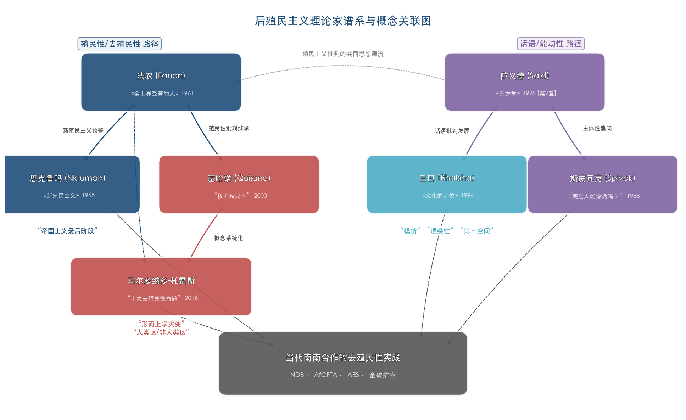

图3-3以概念关系图呈现了后殖民主义理论的两条主要脉络——"殖民性/去殖民性路径"（法农→恩克鲁玛、基哈诺→马尔多纳多-托雷斯）与"话语/能动性路径"（萨义德→巴巴、斯皮瓦克）——的理论传承、核心概念及其在当代南南合作去殖民性实践中的交汇。两条路径分别提供了结构性批判与能动性分析两种互补的理论视角。

从万隆会议到当代金砖框架和萨赫勒国家联盟，南南团结的历史脉络为文明间关系提供了一套替代性的伦理基础——基于平等而非等级、基于互鉴而非同化、基于自主而非依附。新开发银行和非洲大陆自贸区等制度化实践，标志着这一伦理基础正在转化为可操作的制度安排。

然而，后殖民理论本身也面临一个需要正面回应的内在张力：其批判力量主要在于"解构"——解构殖民话语、解构权力等级、解构文明本质主义——而在"建构"维度上相对薄弱。如何在解构殖民遗产的同时积极建构文明交流的替代性方案？这一问题将由第4章从"非西方现代化的多元路径"角度予以回应：全球南方国家在现代化进程中的文明自觉与路径创新，为后殖民批判的"建构缺口"提供了最坚实的实践基础。

# 第4章 非西方现代化的多元路径——文明交流互鉴的实践基础

## 本章论证目标

第3章从后殖民主义的理论视域出发，剖析了殖民遗产对当代文明间关系的深层结构性影响，论证了"去殖民性"实践如何为全球南方合作打开政治伦理空间。然而，后殖民主义的批判锋芒主要指向"解构"——解构殖民话语、解构权力殖民性、解构文明等级制度。Mawdsley（2024）指出，南南合作的根本局限在于"资本主义、金融、科学技术的伟大结构并未被拒绝，而是成为竞争焦点"，现代性的底层本体论并未受到南方伙伴的严肃挑战。[Mawdsley学术论文](https://link.springer.com/chapter/10.1007/978-3-031-30308-1_11 "Palgrave Macmillan, 2024, pp.205-214") 这一判断引出了本章的核心问题：如果全球南方并不拒绝现代性本身，那么它以何种方式回应现代性？其现代化实践如何在接受现代性的同时超越"现代化=西方化"的线性叙事？多元现代化路径又如何构成文明交流互鉴最深厚的实践基础与动力来源？

本章以艾森施塔特"多元现代性"理论为出发点，系统论证三个递进命题：其一，现代性的文化方案内含根本矛盾，这些矛盾为不同文明对现代性的差异化诠释提供了结构性空间；其二，全球南方国家在现代化进程中通过"文明自觉"——借鉴外部经验的同时保持文明主体性——走出了多元化的实践道路；其三，非西方现代化经验的跨文明流通构成了不同于"发展援助"范式的文明互鉴新形态，是文明交流互鉴从理论命题走向历史现实的关键路径。

## 4.1 "多元现代性"的理论基础：现代性与西方化的解耦

### 4.1.1 艾森施塔特：现代性的多元文化方案

以色列社会学家S.N.艾森施塔特（Shmuel N. Eisenstadt）2000年在《代达罗斯》（Daedalus）期刊发表的"Multiple Modernities"一文，标志着现代化理论的一次范式转换。该文开宗明义地提出核心论点："现代性与西方化并不等同；西方的现代性模式不是唯一'真正的'现代性。"[艾森施塔特原文](https://voidnetwork.gr/wp-content/uploads/2016/10/Multiple-Modernities-by-S.N.Eisenstadt.pdf "Eisenstadt, 'Multiple Modernities', Daedalus 129(1), 2000, pp.1-24") 这一命题从根本上瓦解了二战后主导发展理论的"收敛假说"——即全世界终将沿着同一条道路收敛于以西方为模板的唯一现代性。

艾森施塔特的理论突破在于对现代性"文化方案"（cultural program）的精细解剖。他论证指出，现代性文化方案自发端之初便内含"内在对抗和矛盾"——普遍主义与多元主义之间的张力、自由与控制之间的张力、创新与传统之间的张力。正是这些结构性矛盾，为不同社会对现代性进行差异化诠释提供了空间。非西方社会在回应现代性挑战时，并非简单复制西方模式，而是通过"持续的选择、重新诠释和重新表述"产生了"新的文化和政治方案"。日本明治维新后的工业化进程、印度独立后的民主与世俗国家实验、东亚"发展型国家"模式的兴起，均属这种"创造性重新诠释"的具体历史表现。

多元现代性理论对理解全球南方文明交流互鉴具有关键意义：它提供了一个超越"传统vs.现代"二元对立的分析框架。在此框架下，全球南方国家的现代化不再被视为对西方模式的"迟到模仿"或"不完全复制"，而是基于不同文明传统对现代性进行创造性诠释的自主实践。这种自主实践的多元性本身，便构成了文明交流互鉴最为丰富的资源——不同的现代化经验因其差异而相互参照，因其共同面对现代性挑战而相互启发。

### 4.1.2 泰勒的"两种现代性理论"：文化特殊性的哲学辩护

加拿大哲学家查尔斯·泰勒（Charles Taylor）从哲学层面为"多元现代性"论题提供了更为精密的理论辩护。泰勒在"Two Theories of Modernity"（Public Culture, 1999）中区分了两种根本不同的现代性理论："非文化理论"（acultural theory）将现代性视为一种文化中立的普遍过程——即任何社会在理性化、世俗化、工业化进程中都将趋同于某种共同形态；"文化理论"（cultural theory）则将西方现代性理解为一种特殊的文化形态，是在特定历史条件下从基督教拉丁世界中生长出来的独特成就。[泰勒原文参考](https://www.scribd.com/document/514497275/Two-Theories-of-Modernity-Charles-Taylor-Rinku-Lamba "Taylor, 'Two Theories of Modernity', Public Culture 11(1), 1999")

泰勒明确支持文化理论，认为"承认替代性现代性的可能性"是理解当代世界的关键。其论证路径具有重要的认识论意义：如果现代性仅仅是一种文化中立的功能性转变（如城市化、官僚化、市场经济化），那么所有社会确实终将趋同；但如果现代性不可剥离地嵌入特定的文化想象和道德秩序之中，那么不同文明传统势必产生不同的现代性形态。泰勒的论证与第2章分析的东方学批判形成呼应——"非文化理论"实质上预设了西方现代性经验的普遍代表性，在"现代化"的名义下实现了东方学式的认识论殖民。

### 4.1.3 罗斯托线性模型的结构性否定

泰勒和艾森施塔特从哲学-社会学层面挑战了"单一现代性"假说，而在发展经济学领域，罗斯托（W.W. Rostow）的线性发展阶段论早已从另一方向遭到结构性否定。罗斯托在《经济成长的阶段》（1960）中提出"传统社会→起飞前提→起飞→走向成熟→大众消费"的五阶段模型，曾被视为后发国家"赶超"西方的路线图。然而，依附理论与世界体系理论从全球结构层面揭示：不发达不是前现代的"自然状态"，而是资本主义世界体系的结构性产物。[大英百科全书](https://www.britannica.com/money/development-theory/Dependency-and-world-systems-theories "Britannica, 'Development theory: Dependency and world systems theories'") 普雷维什（Raúl Prebisch）的"中心-外围"模型与沃勒斯坦（Immanuel Wallerstein）的世界体系理论共同表明，"现代化=西方化"的线性路径在全球南方不可能简单重现——全球南方的"不发达"恰恰是中心国家"发达"的结构性另一面。

这一批判具有双重意义。在理论层面，它从政治经济学角度补充了艾森施塔特和泰勒从文化-哲学角度展开的论证，共同构成对"单一现代性"假说的三维批判。在实践层面，它表明全球南方国家的现代化必须是一种"自觉的创造"而非"被动的模仿"——既然世界体系的结构性约束使"重走西方之路"不可能，那么探索替代性现代化路径便不仅是文明自觉的选择，更是结构性必然。

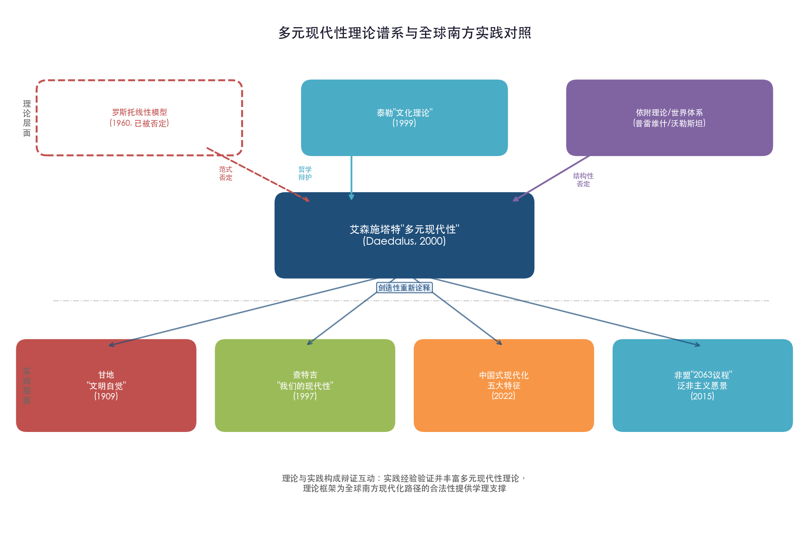

上图清晰呈现了多元现代性理论谱系的三重建构路径——泰勒的哲学辩护、艾森施塔特的社会学奠基、依附理论与世界体系理论的结构性否定——与全球南方四个代表性实践案例（甘地"文明自觉"、查特吉"我们的现代性"、中国式现代化、非盟"2063议程"）之间的对应关系。理论与实践之间并非单向的演绎关系，而是构成辩证互动：实践经验验证并丰富多元现代性理论，理论框架则为全球南方现代化路径的合法性提供学理支撑。

## 4.2 文明自觉与现代化路径选择：三个案例的深层分析

### 4.2.1 甘地与印度：拒绝西方文明的现代性批判

在非西方世界对现代性的自觉回应中，甘地（M.K. Gandhi）的思想占据着独特而激进的位置。1909年，甘地在《印度自治》（Hind Swaraj）中以对话体裁完成了对西方现代文明的系统性批判。他在第十三章"何为真正的文明？"中给出了直指文明本质的定义："文明是那种向人指明义务之路的行为方式（Civilization is that mode of conduct which points out to man the path of duty）。履行义务与遵守道德是可以互换的概念。遵守道德就是掌控自己的心灵和激情。如此，我们方能认识自己。"[甘地《印度自治》原著](https://www.gandhiashramsevagram.org/hind-swaraj/chapter-13-true-civilization.php "Gandhi, Hind Swaraj, Chapter 13: What is True Civilization?, 1909")

甘地的文明定义将"义务"（duty）而非"进步"置于核心位置，与西方启蒙运动以来将现代化理解为物质进步和自由扩展的主流叙事形成根本对立。甘地在同一章中进一步阐述："我们的祖先明智地劝阻我们追求奢侈和享乐。我们千百年来使用同样的犁具。我们保留了我们以前拥有的同样的茅舍，我们的本土教育也与从前一样。"这并非简单的复古主义主张，而是从印度文明传统中提炼出的一种对现代性的根本质疑：如果"现代文明"以身体福祉和物质积累为最终目标，那么它恰恰背离了文明本应承担的道德引导功能。甘地的结论极为决绝："印度文明的趋势在于提升道德存在，西方文明的趋势在于传播不道德。后者是无神论的，前者基于对上帝的信仰。"

甘地的思想并非仅具历史意义。印度现代化路径在甘地式"文明自觉"与尼赫鲁式"发展主义"之间的持续张力，本身便是"多元现代性"的活证据。[艾森施塔特原文](https://voidnetwork.gr/wp-content/uploads/2016/10/Multiple-Modernities-by-S.N.Eisenstadt.pdf "Eisenstadt引用Kaviraj关于印度现代性的论述，Daedalus 129(1), 2000") 尼赫鲁主导的独立后印度选择了大型工业化、计划经济与科技发展路线，甘地的乡村自治和手工业理想被边缘化。然而，甘地的文明批判始终作为一种道德参照和思想资源，持续影响着印度社会关于"何为真正的发展"的辩论——从20世纪70年代的Chipko运动到21世纪的反核电抗议，甘地主义在印度现代化实践中的持续回响表明，非西方文明传统不仅是被现代化"克服"的对象，更是对现代化进行反思和修正的活力源泉。

### 4.2.2 查特吉：后殖民现代性的困境与突破

如果说甘地代表着对西方现代性的正面拒绝，那么印度政治理论家帕萨·查特吉（Partha Chatterjee）则从后殖民视角揭示了全球南方在面对现代性时更为普遍的存在论困境。查特吉在"Our Modernity"（1997）这篇为南非SEPHIS/CODESRIA项目撰写的演讲文稿中写道：

> "因为我们的现代化历史与殖民主义的历史纠缠在一起，我们从来无法真正相信存在一个不受种族或国籍差异影响的自由话语的普遍领域……我们将永远是普遍现代性的消费者，而永远不会被认真对待为它的生产者。"[查特吉原文](https://ccs.ukzn.ac.za/files/partha1.pdf "Chatterjee, 'Our Modernity', SEPHIS/CODESRIA, 1997, pp.9, 14, 19-20")

查特吉精准地捕捉了后殖民社会的双重困境：一方面，殖民主义的历史经验使非西方社会对"普遍性"话语天然保持警觉——因为"普遍性"在历史上总是以"西方性"为实质内容；另一方面，非西方社会在全球知识等级体系中被结构性地定位为"消费者"而非"生产者"——即便它们创造了具有独创性的现代化实践，这些实践也难以被承认为具有普遍意义的"现代性"贡献。查特吉由此提出了一个颠覆性主张："要塑造我们的现代性形式，我们有时需要有勇气拒绝他人已确立的现代性。"

查特吉的思想与本研究的核心论题存在深层共振。其关于"我们的现代性"的论述，实质上是在呼唤一种"文明自觉"——后殖民社会须在承认现代性之多元可能的前提下，自觉塑造属于自己的现代性形态。这一呼唤既回应了第3章所分析的巴巴"混杂性"理论中被殖民者的文明能动性问题，又为下文即将展开的具体现代化实践分析提供了思想坐标：中国式现代化、非洲"2063议程"等，在本质上均是对查特吉所呼唤的"塑造我们的现代性形式"之回应。

查特吉这篇文稿的发表语境本身亦具有象征意义——它在SEPHIS（全球南方历史学促进计划）与CODESRIA（非洲社会科学研究发展委员会）的合作框架下完成。一位印度学者在南非学术平台上讨论"我们的现代性"，这一知识流通过程本身便超越了"北方生产、南方消费"的传统知识等级，构成学术层面的文明交流互鉴实践。

### 4.2.3 中国式现代化：五大特征的文明论意涵

在当代全球南方的多元现代化实践中，"中国式现代化"因其规模之大与理论自觉之强而占据特殊位置。2022年10月，中共二十大报告将"中国式现代化"界定为五大特征：人口规模巨大的现代化、全体人民共同富裕的现代化、物质文明和精神文明相协调的现代化、人与自然和谐共生的现代化、走和平发展道路的现代化，并明确宣称"中国式现代化为人类实现现代化提供了新的选择"。[中共二十大报告](https://www.idcpc.org.cn/english2023/tjzl/cpcjj/20thPartyCongrssReport/ "Full text of the report to the 20th CPC Congress, October 2022")

从多元现代性理论的视角审视，这五大特征至少在三个层面回应了艾森施塔特所论述的"创造性重新诠释"。其一，"人口规模巨大的现代化"直接否定了小国样本的可复制性假设，表明现代化路径须回应本国具体的文明-社会条件。其二，"物质文明和精神文明相协调"回应了甘地式的文明批判——对纯物质主义现代性的不满并非仅存在于反现代主义思潮中，而可以内化为现代化方案自身的组成部分。其三，"走和平发展道路"明确与西方殖民扩张式的现代化历史经验相区隔，在规范层面宣示了一种不以对外掠夺为前提的现代化路径。

卡内基国际和平基金会2024年11月的研究报告提供了一个外部观察视角。该报告在分析2024年中非合作论坛（FOCAC）时指出："中国的现代化方法不折不扣地是呼吁'非西方化'的工业化。"[卡内基研究院](https://carnegieendowment.org/research/2024/11/what-focac-2024-reveals-about-the-future-of-china-africa-relations "Carnegie, 'FOCAC 2024', November 2024") 习近平在2024年FOCAC北京峰会主旨演讲中30次提及"现代化"——这种高频使用本身表明，"现代化"在中国对非话语中已不仅是经济发展目标，更是文明叙事的核心载体。一项针对16个非洲国家年轻人的调查显示，中国的认可率达到82%（高于美国的79%和欧盟的76%），60%的非洲受访者认为"西方式民主不适合非洲"。这一数据在一定程度上表明，非西方现代化路径的存在本身对全球南方国家产生了示范效应与参照作用。

当然，中国式现代化话语在学术上亦面临审视。查特吉关于"永远是普遍现代性的消费者"的警告同样适用于对中国话语的反思：当"中国式现代化"被提升为"人类实现现代化的新选择"时，它是否也在以自身的特殊经验宣称一种新的普遍性？我们认为，这一张力恰恰是文明交流互鉴需要正视而非回避的问题——多元现代性论题的核心不在于用一种"非西方普遍性"替代"西方普遍性"，而在于通过不同现代化经验之间的平等对话，持续探索"普遍性"本身的多元构成。

### 4.2.4 非盟"2063议程"：泛非主义的现代化愿景

非洲大陆的现代化叙事提供了又一种重要的文明自觉形态。非盟"2063议程"（2015）以泛非主义和"非洲复兴"为思想根基，其第五愿景明确提出"拥有强大文化认同、共同遗产、价值观和伦理的非洲"。[非盟2063议程](https://au.int/sites/default/files/documents/36204-doc-agenda2063_popular_version_en.pdf "African Union, Agenda 2063, Popular Version, 2015") 该愿景的独特之处在于将文化认同置于现代化方案的核心——现代化不被理解为对外来模式的复制，而被定位为非洲文明传统的自我更新。议程特别强调"学习非洲各国多样、独特和共享的经验与最佳实践，作为塑造非洲转型方法的基础"，这一表述本身便是文明交流互鉴在非洲大陆内部的制度化体现。

"2063议程"的文明论意涵在于：它试图回应恩克鲁玛和法农关于"新殖民主义"与"民族意识陷阱"的双重预警——通过建构一种既扎根于非洲文明传统又面向未来现代化需求的大陆整体愿景，超越单一民族国家框架下容易陷入的精英俘获与外部依附。"2063议程"在落实层面固然面临严峻的制度能力和资金约束，但作为一种"文明自觉"的现代化叙事，它为全球南方的多元现代性实践增添了不可忽视的非洲维度。

## 4.3 非西方现代化经验的跨文明流通：一种新型文明互鉴

### 4.3.1 从"发展援助"到"发展合作"：范式转换的文明意义

多元现代化路径的存在，为文明交流互鉴提供了最直接的实践基础。然而，非西方现代化经验的跨文明流通方式同样具有深刻的文明论意涵。传统的"发展援助"（development aid）范式建立在"先进-落后"的文明等级预设之上：援助方被假定为掌握了"正确"现代化方案的先进国家，受援方则被假定为尚未达到"现代化"标准的落后国家。正如第2章所分析的东方学话语中"知道者"与"被知道者"的不平等关系，发展援助的知识结构中同样隐含着"教导者"与"被教导者"的等级秩序。

全球南方合作框架提出了一种替代范式——"发展合作"（development cooperation）或"南南合作"。这种合作的根本特征在于参与各方共享"非西方现代化"的共同经验基础：它们在不同程度上经历了殖民统治、政治独立后的发展困境、在全球体系中的边缘化位置，以及在西方主导的现代化叙事中被定位为"迟到者"或"追赶者"的处境。这种共同经验基础使南南之间的现代化经验交流天然具有"互鉴"而非"教导"的特质。

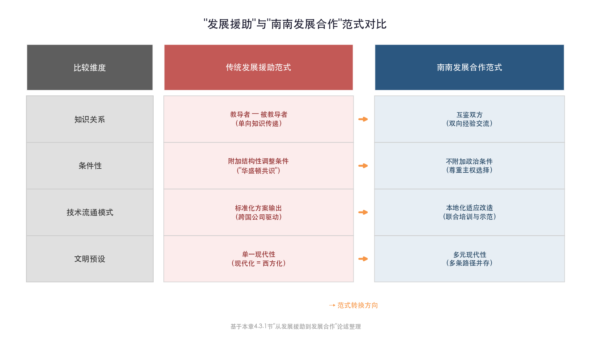

上图从知识关系、条件性、技术流通模式、文明预设四个维度系统呈现了两种范式的根本差异。传统发展援助以"教导者-被教导者"的单向知识传递和"华盛顿共识"式结构性调整条件为特征，预设"现代化=西方化"的单一路径；南南发展合作则强调互鉴双方的双向经验交流、不附加政治条件的主权尊重、本地化适应改造以及多元现代性的理论预设。

2024年中非合作论坛（FOCAC）北京峰会的成果为这种范式转换提供了具体例证。53个非洲代表团出席此次峰会，中国承诺507亿美元的合作资金。[卡内基研究院](https://carnegieendowment.org/research/2024/11/what-focac-2024-reveals-about-the-future-of-china-africa-relations "Carnegie, 'FOCAC 2024', November 2024") FOCAC的话语框架有意识地避免了"援助者-受援者"的等级叙事，转而采用"合作""伙伴关系""共同发展"等对等性表述。这一话语转换不仅具有外交修辞意义，更反映了一种根本性的文明论转向——从"西方教导非西方如何实现现代化"转向"不同文明在共同探索现代化的过程中相互学习"。

### 4.3.2 技术转移中的文明互鉴：菌草技术与杂交水稻的案例

非西方现代化经验的跨文明流通不仅体现在宏观的制度框架和话语层面，更在微观的技术转移实践中展现出文明互鉴的具体面相。菌草（Juncao）技术和杂交水稻技术在全球南方的传播，是两个极具分析价值的案例。

菌草技术由福建农林大学林占熺教授于1986年发明，系中国拥有完全自主知识产权的原创技术。自1992年走向世界以来，菌草技术已推广至全球107个国家，被译为18种语言，在17个国家建立了示范基地。[中国国新办](http://english.scio.gov.cn/in-depth/2025-05/19/content_117882083.html "China-Africa cooperation charts course for continental agricultural modernization, 新华社, 2025年5月") 在卢旺达，菌草技术已使4,000多个家庭转向蘑菇种植，创造了超过30,000个就业岗位。在毛里塔尼亚撒哈拉沙漠边缘的伊迪尼村，菌草种植不仅提供了畜牧饲料，还在防沙治沙中发挥重要作用，被当地人称为"幸福草"。菌草技术的国际通用名称直接采用汉语拼音"Juncao"——这一语言事实本身便是非西方知识生产获得国际认可的象征性标志，回应了第2章所分析的全球学术语言不平等问题。

杂交水稻在非洲的推广呈现出类似的文明交流模式。自2007年中国向马达加斯加派遣农业专家以来，已成功培育出5个适应当地条件的杂交水稻品种，实现平均亩产7.5吨/公顷——为当地传统品种的2至3倍。截至2025年，杂交水稻累计在马达加斯加约90,000公顷土地上种植，马达加斯加已成为非洲最大的杂交水稻种植国。[中国国新办](http://english.scio.gov.cn/in-depth/2025-05/19/content_117882083.html "China-Africa cooperation charts course for continental agricultural modernization, 新华社, 2025年5月") 杂交水稻甚至被印上了马达加斯加面额20,000阿里亚里的纸币。[FOCAC官网](http://www.focac.org/eng/zfzs_1/202504/t20250406_11589093.htm "How Chinese agricultural technology becomes 'code for good harvest' in Africa, 新华社, 2025年4月") 在尼日利亚，中国研发的水稻品种产量较当地品种提高约25%；在乌干达，中国引进的小米品种使单位面积产量提高了两倍。截至2023年底，中国在非洲建立了24个农业技术示范中心，推广了300多项先进农业技术，使当地作物产量平均提高30%至60%，惠及超过100万小农户。

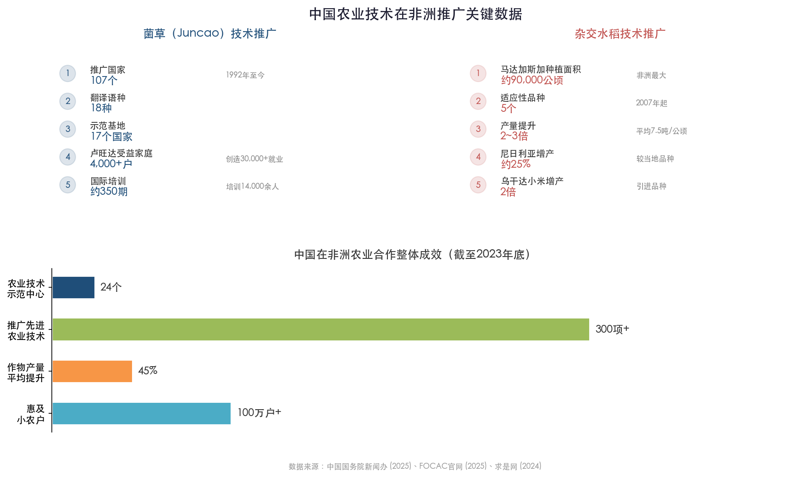

上图以信息图形式汇总了菌草技术与杂交水稻在非洲推广的核心数据指标，并以柱状图呈现中国在非洲农业合作的整体成效。数据表明，这一技术合作已在覆盖面、产量提升和受益人口三个维度形成了规模化效应。

这些技术转移案例的文明论意涵在于：它们代表了一种不同于西方"发展援助"范式的知识和技术流通模式。在传统的"绿色革命"框架下，西方农业技术对发展中国家的输出往往以跨国种业公司的商业利益为驱动，以购买专利种子和化学投入品为条件，在提高产量的同时加深了南方国家对北方技术体系的依附。相比之下，菌草技术和杂交水稻的推广更强调适应本地条件的改造（如在马达加斯加培育抗虫品种）和本地人才的培养——截至2025年，中国菌草技术国际培训班已举办约350期，培训14,000余人。[求是网](https://www.qstheory.cn/qshyjx/2024-08/26/c_1130195385.htm "习近平主席关心的'中国草', 2024年8月") 这种模式更接近查特吉所呼唤的"塑造我们的现代性形式"——技术接收方并非被动接受标准化方案，而是在共同适应和改造的过程中发展出适合自身条件的实践。

对这些案例亦应保持分析性审视。技术转移中的权力不对称并未因"南南合作"的修辞框架而自动消除。Shoba与Mlambo（2024）的研究揭示，中国与南非之间的经济不对称（"中国经济约为南非经济的29倍"）在文明交流中创造了结构性的权力差距。[Shoba & Mlambo学术论文](https://www.tandfonline.com/doi/full/10.1080/23311886.2024.2321699 "Cogent Social Sciences, Vol.10(1), 2024") 南非对华出口集中于原材料而进口制成品的贸易结构，与第3章分析的基哈诺"权力殖民性"中全球劳动分工的不平等格局存在结构性相似。从文明交流互鉴的规范性要求出发，南南技术合作需要在实践中不断反思和矫正经济不对称可能造成的新等级关系。

### 4.3.3 金砖扩容与新开发银行：制度化的多元现代化平台

多元现代化经验的跨文明流通需要制度性平台的支撑。金砖合作机制的持续扩容和新开发银行（NDB）的运行，为全球南方的多元现代化实践提供了日益成熟的制度框架。

截至2025年初，金砖已扩大至十国——巴西、俄罗斯、印度、中国、南非五个创始成员之外，2024年1月埃及、埃塞俄比亚、伊朗、阿联酋正式加入，2025年1月印度尼西亚成为第十个成员国。扩容后的金砖覆盖全球约45%的人口、超过35%的GDP（PPP口径）以及约30%的全球石油产量。[卡内基研究院](https://carnegieendowment.org/research/2025/03/brics-expansion-and-the-future-of-world-order-perspectives-from-member-states-partners-and-aspirants "Carnegie, 'BRICS Expansion', March 2025") 卡内基国际和平基金会的分析特别指出，印尼的加入被视为"1955年万隆精神的回响"——这一表述将当代金砖制度化实践与第3章分析的万隆精神历史脉络直接关联。

金砖扩容的文明论意涵在于：扩容后的成员构成跨越了伊斯兰文明（伊朗、埃及、阿联酋）、东正教文明（俄罗斯）、印度文明（印度）、儒家文明（中国）、非洲文明（南非、埃塞俄比亚、埃及）、拉美文明（巴西）和东南亚多元文明（印尼）等多个文明传统。若以亨廷顿的"文明冲突论"框架审视，这些文明单元理应处于对抗和竞争之中；然而它们却选择在一个共同的制度框架中围绕发展合作展开对话——这一事实本身便构成对"文明冲突"预设的经验性反驳。金砖内部的文明多样性表明，推动这些国家走到一起的不是文明认同的趋同，而是共同的结构性位置——它们都在不同程度上经历着非西方的现代化探索，都在全球治理体系中寻求更大的话语权，都对"现代化=西方化"的线性叙事持有不同程度的批评立场。

新开发银行（NDB）进一步将这种制度化合作具体化为发展融资实践。NDB初始认缴资本500亿美元，其核心特征在于为全球南方提供不附加政治条件的替代性发展融资——这与世界银行和国际货币基金组织长期以来以"结构性调整"为条件的贷款模式形成鲜明对比。后者的"条件性"（conditionality）在理论层面暗含"北方知道什么对南方最好"的认识论等级预设——与第2章分析的东方学话语中"知道者-被知道者"关系存在结构性同构。NDB"无政治条件"的融资原则在实践中固然面临治理透明度和项目质量方面的质疑，但在规范层面标志着一种不同于"华盛顿共识"的发展融资理念。

2025年7月金砖里约峰会通过126项承诺并发布金砖首份人工智能治理宣言，[斯汀森中心](https://www.stimson.org/2025/2025-brics-summit-takeaways-and-projections/ "2025 BRICS Summit: Takeaways and Projections, Stimson Center, 2025年8月") 这一议程扩展表明金砖合作正从传统的经济-金融领域向前沿技术治理领域拓展，为全球南方在新兴议题上的集体发声提供了制度渠道。我们认为，金砖机制的意义不仅在于为成员国提供物质利益，更在于其作为多文明对话平台的功能——在这一平台上，印度的数字化治理经验、中国的基础设施建设模式、巴西的社会政策创新、南非的种族和解实践，均可在"南南合作"的框架下进行平等的交流和互鉴。

## 4.4 本章小结

本章以"多元现代性"理论为出发点，系统论证了非西方现代化的多元路径如何构成文明交流互鉴的实践基础。在理论层面，艾森施塔特对现代性"文化方案"内在矛盾的揭示、泰勒对"文化理论"的哲学辩护、依附理论和世界体系理论对罗斯托线性模型的结构性否定，共同构成"多元现代性"论题的三维理论根基。在实践层面，甘地对"真正文明"的重新定义、查特吉关于"塑造我们的现代性形式"的呼唤、中国式现代化的五大特征、非盟"2063议程"的泛非主义愿景，展示了全球南方国家在现代化进程中如何实现"文明自觉"。在互鉴层面，从菌草技术和杂交水稻的跨国推广到金砖合作机制的制度化建设，非西方现代化经验的跨文明流通正在形成一种不同于"发展援助"范式的新型文明互鉴形态。

衔接第3章的后殖民批判与第5章即将展开的全球史分析，本章揭示了一个关键洞见：后殖民主义的"解构"与非西方现代化的"建构"并非对立关系，而是构成辩证互动——正是对殖民性权力结构的批判性认知，为全球南方自觉塑造替代性现代化路径提供了思想动力；而多元现代化实践的经验积累，又反过来赋予后殖民批判以超越纯粹"解构"的建设性内涵。全球南方合作推动的文明交流互鉴，正是在这种"批判-建构"的辩证运动中，从理论命题转化为历史实践。

# 第5章 全球史视野下的文明交流——超越中心-边缘叙事

全球南方之间的文明互动并非当代新生事物，而是具有数千年深厚历史根基的长期进程。本章将文明交流互鉴置于全球史（global history）方法论的审视之下，通过"关联史"（connected histories）、"纠缠史"（histoire croisée）和"整合分析"（integration analysis）三重方法论工具，系统揭示西方中心主义历史书写如何遮蔽了南方社会之间早已存在的稠密文明互动网络。在此基础上，当代全球南方合作机制——从金砖到"一带一路"——可被理解为这些历史性交流网络在新历史条件下的再激活与制度化。

本章的论证承接前述各章的理论积累：第二章的东方学批判揭示了西方知识体系对"东方被动论"的系统建构，第三章的后殖民分析追溯了殖民遗产对文明间等级关系的结构性塑造，第四章的多元现代性分析论证了南方社会的现代化能动性。全球史视野将这三重分析延展至更为纵深的历史时段，从经验层面证明南方之间的文明交流在"西方崛起"之前就已构成世界历史的重要动力。

## 5.1 全球史方法论：超越比较与并置的关系性框架

### 5.1.1 全球史的定义与核心关切

全球史作为一个学术领域，其核心关切在于克服现代社会科学的两个"先天缺陷"：方法论民族主义（以民族国家为天然分析单位）和欧洲中心主义（以欧洲经验抽象为普遍发展模型）。康拉德（Sebastian Conrad）在其权威综论中提出了一个涵括性的定义："全球史可以被描述为一种将现象、事件和进程置于全球语境中加以分析的历史研究形式"（a form of historical analysis in which phenomena, events, and processes are placed in global contexts）。[康拉德《全球史是什么？》](https://modernarrative.files.wordpress.com/2020/03/sebastian-conrad-what-is-global-history.pdf "Conrad, What is Global History?, Princeton UP, 2016, p.5") 在此基础上，康拉德区分了全球史的三种实践范式：其一，作为"一切的历史"的全球史，追求行星尺度的全景覆盖；其二，作为"联系之历史"的全球史，聚焦跨边界的流动与交换；其三，作为"整合分析"的全球史，关注系统性全球整合如何塑造地方社会。康拉德明确指出，第三种取向最具分析潜力，因为它不仅追踪联系本身，更追问联系背后的结构性条件——全球层面的权力格局、经济体系和制度框架如何使特定的交流成为可能或不可能。

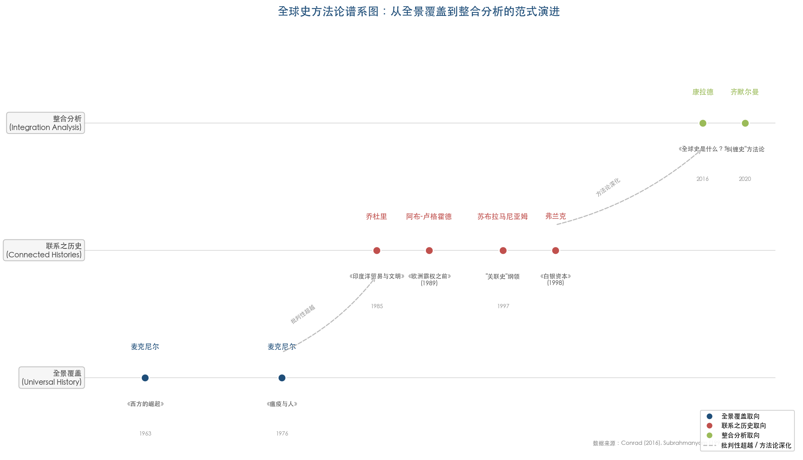

上图呈现了全球史方法论从全景覆盖到联系之历史、再到整合分析的范式演进脉络。以麦克尼尔1963年《西方的崛起》为起点的全景覆盖取向，经由乔杜里、阿布-卢格霍德、苏布拉马尼亚姆、弗兰克等学者对跨文明联系的实证研究，最终演进为康拉德和齐默尔曼所代表的整合分析与纠缠史方法论——每一次范式推进都构成对前一取向的批判性超越与方法论深化。

这一方法论自觉对于文明交流互鉴的分析具有直接的理论意义。以全球史视角审视文明交流互鉴，关注的焦点不仅是两种文明之间是否存在接触，而是这种接触发生在何种结构性条件下、由何种权力关系所中介、产生了怎样的相互塑造效应。这恰恰是"文明交流互鉴"区别于简单"文化接触"或"文明对话"的方法论内核。

### 5.1.2 关联史：苏布拉马尼亚姆的范式贡献

康拉德提供了全球史方法论的系统梳理，苏布拉马尼亚姆（Sanjay Subrahmanyam）1997年发表于《现代亚洲研究》的"关联史"纲领性文章则开辟了一条对本章论证至关重要的分析路径。苏布拉马尼亚姆的核心论点在于：早期现代欧亚大陆上的各社会参与了一种在全球层面上"有机发生的"（organically generated）"初生现代性"（nascent modernity），这一进程并非由欧洲单独设计或发动。[Not Even Past书评](https://notevenpast.org/explorations-in-connected-history-from-the-tagus-to-the-ganges-by-sanjay-subrahmanyam-2004/ "Breen评Subrahmanyam, 2014") 他以十六世纪欧亚大陆千禧年末世论（millenarianism）的共时流通为核心案例，证明从伊比利亚半岛到莫卧儿帝国，从萨法维波斯到东南亚，各文明社会几乎同步经历了末世期待与弥赛亚政治的浪潮——这并非平行进化的巧合，而是跨文明思想流通和相互影响的结果。

"关联史"概念的根本贡献在于对"比较方法"的批判性超越。传统比较史将不同文明或社会视为相互独立的"样本"加以对照，其预设是"自主性虚构"（fiction of autonomy）——即每个分析单元在本质上是自足的。苏布拉马尼亚姆指出，这种预设在经验上并不成立：从早期现代开始（甚至更早），欧亚和非洲社会之间的思想、物质和制度流通已经达到足以使"比较"框架失效的密度。将中国与欧洲、印度与奥斯曼视为彼此隔绝的"文明单元"进行比较，本身即构成一种认识论暴力。

这一方法论批判与前几章的论证形成深层呼应。第二章分析的萨义德东方学批判揭示了"东方/西方"二元对立的知识建构性质；苏布拉马尼亚姆的关联史则从历史学方法论角度证明，这种二元对立在经验层面同样难以成立——"东方"与"西方"从来不是封闭运行的文明实体，而始终处于相互联系和相互塑造之中。

### 5.1.3 纠缠史：交叉与相互构成

齐默尔曼（Bénédicte Zimmermann, 2020）系统阐述了"纠缠史"（histoire croisée）方法论的独特价值。这一方法论诞生于比较方法的盲点——比较研究中被比较对象之间的互动往往遭到系统性忽视。纠缠史在三个层面展开分析：经验层面关注对象之间的实际交叉与互动，认识论层面反思研究者自身立场的"纠缠"，方法论层面则审视分析工具本身可能携带的预设与偏见。[齐默尔曼原文](https://journals.open.tudelft.nl/footprint/article/download/4513/4665/14643 "Zimmermann, 'Histoire Croisée', Footprint 26, 14(1), 2020, pp.7-14") 纠缠史承担的是比较研究和转移研究"不可及的探究路线"——它要求研究者关注的不仅是A如何影响B或B如何影响A，而是A与B在相互作用中如何共同经历了变化，使得双方在互动之后都无法保持"原样"。

对文明交流互鉴的分析而言，纠缠史方法论提供了一个关键的理论支撑：真正的文明交流不是一方向另一方的单向"传播"或"扩散"，而是双方在交流过程中的相互构成和共同变化。这一洞见直接回应了第三章讨论的后殖民"混杂性"概念，并将其从文化批评的抽象层面推进到可操作的历史研究方法论。

## 5.2 "欧洲霸权之前"：前现代南方文明互动网络的历史实证

### 5.2.1 阿布-卢格霍德与13世纪世界体系

全球史学者对西方中心主义叙事最具颠覆性的挑战，来自对"欧洲霸权之前"世界体系的实证重建。阿布-卢格霍德（Janet Abu-Lughod）在其里程碑式著作《欧洲霸权之前：公元1250-1350年的世界体系》（Oxford UP, 1989）中系统论证了一个关键命题：在欧洲所谓"地理大发现"之前两个多世纪，从布鲁日到杭州，欧亚大陆已通过八个相互重叠的贸易圈（eight circuits）构成一个有效运作的世界体系。这八大贸易圈涵盖西北欧贸易圈（以布鲁日-根特为中心）、地中海贸易圈（以威尼斯-热那亚为枢纽）、中东贸易圈（连接红海与波斯湾）、阿拉伯海-印度西海岸贸易圈、印度-东南亚贸易圈、中国南海贸易圈等，形成了一个横跨三大洲的"城市群岛"体系。[BYU Comparative Civilizations Review](https://scholarsarchive.byu.edu/cgi/viewcontent.cgi?article=1296&context=ccr "Von der Muhl评Abu-Lughod, 1993, pp.124-131")

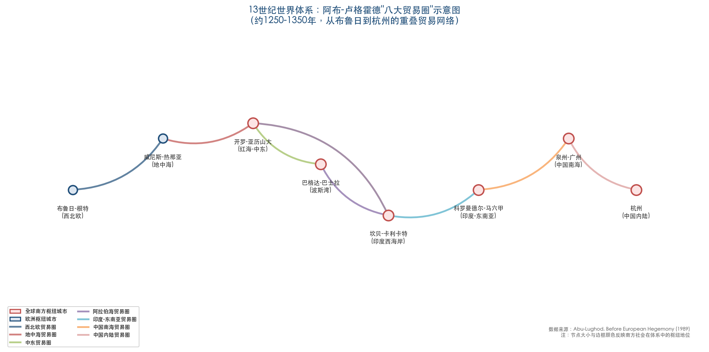

上图以节点-弧线形式直观呈现了约1250—1350年间从布鲁日到杭州的八个重叠贸易圈。红色节点标注的全球南方枢纽城市——开罗-亚历山大、巴格达-巴士拉、坎贝-卡利卡特、科罗曼德尔-马六甲、泉州-广州、杭州——在数量和连接密度上均显著超过蓝色标注的欧洲枢纽城市，直观揭示了南方社会在前现代世界体系中的核心枢纽地位。

阿布-卢格霍德的核心发现具有深刻的理论启示。她指出，亚洲、阿拉伯与西方资本主义形式之间存在"巨大的相似性和平行性"，凡存在差异之处，反映的恰恰是"西方落后于东方"而非相反。由此她提出一个颠覆性论断："西方的崛起"之前是"东方的衰落"，后者比前者更需要解释——欧洲之所以在15世纪之后逐渐取得主导地位，并非因为其内在的文明"优越性"，而是因为此前主导世界体系的东方力量由于蒙古帝国解体、黑死病等系统性危机而暂时衰退，为欧洲提供了一个历史"窗口期"。

这一论证对文明交流互鉴的理论框架具有根本意义。它证明全球南方社会之间的文明交流——特别是阿拉伯-波斯-印度-东南亚-东亚之间的贸易、宗教传播和知识流通——构成了前现代世界体系的主干，而非西方中心主义叙事中的"边缘"或"补充"。当代全球南方合作因而可被理解为这一历史性互动网络在殖民中断之后的再激活。

### 5.2.2 弗兰克与"白银资本"：五千年的连续世界体系

弗兰克（Andre Gunder Frank）在《白银资本》（UC Press, 1998）中将时间尺度进一步拉长，论证一个单一的非洲-欧亚世界体系延续了至少五千年，而在公元1400—1800年间，这一体系主要由中国和亚洲其他经济体主导。弗兰克的核心命题是：欧洲之所以"特殊"，恰恰在于其"特殊的边缘性"——欧洲长期处于世界体系的半边缘位置，通过美洲白银获得了接入亚洲主导贸易网络的"入场券"。他进而指出，欧洲经济霸权始于1750年（而非传统叙事中的1500年），且这一霸权从历史长时段来看注定是短暂的——"西方的'崛起'在1750年发生，恰恰是因为那时东方帝国同时衰落"。[World History Connected书评](https://worldhistoryconnected.press.uillinois.edu/3.1/br_chowdhury.html "Chowdhury评Frank, ReOrient, 2005")

弗兰克的论证在史学界引发了激烈争议——特别是其对欧洲内部制度创新（如产权制度、科学革命）的相对忽视受到诸多批评。然而，其根本贡献在于打破了"欧洲奇迹"的神话叙事，为理解当代全球南方的再崛起提供了历史纵深。倘若亚洲和非洲在世界体系中的边缘化是一个晚近的、偶然的历史事件而非文明本质的反映，那么当代全球南方合作推动的文明交流互鉴便不是对"自然秩序"的颠覆，而是对历史常态的回归。

### 5.2.3 印度洋：南方文明互动的核心空间

在阿布-卢格霍德和弗兰克的宏观体系论证之下，具体的区域研究进一步揭示了全球南方内部文明交流的丰富面貌。印度洋长期以来是这种交流最为活跃的空间。乔杜里（K.N. Chaudhuri）在《印度洋的贸易与文明》（Cambridge UP, 1985）中以布罗代尔式长时段分析方法，展示了印度洋如何作为一个自成体系的文明互动空间运作——它并非欧洲人"发现"的空白水域，而是在葡萄牙人到来之前已拥有数千年贸易、宗教传播和知识交流历史的"内部之海"。

斯瓦希里海岸城邦文明生动地体现了这种南方内部的文明交流互鉴。自公元8世纪起，东非海岸发展出约40个穆斯林城邦，融合了阿拉伯、波斯和班图文化元素。至十二世纪，基尔瓦（Kilwa）、蒙巴萨（Mombasa）、马林迪（Malindi）等城市已成为印度洋贸易网络的关键枢纽，将东非的黄金、象牙与南亚的棉纺织品和东南亚的香料联系在一起。斯瓦希里语本身——一种班图语系语言吸收了大量阿拉伯语和波斯语词汇——堪称文明交流互鉴在语言层面的活化石。这一案例有力地证明，全球南方社会之间的深度文明融合远早于欧洲殖民扩张，且其混合性（hybridity）并非殖民遭遇的产物，而是南方社会自主交流的结果。

### 5.2.4 东南亚"梵化"：选择性吸纳与文明主体性

东南亚的"梵化"（Indianization/Sanskritization）过程是全球南方内部文明交流互鉴的另一典范案例。赛代斯（George Coedès）在其经典著作《东南亚的印度化国家》中记录了从公元前3世纪至15世纪印度文明对东南亚的深层影响——印度教-佛教信仰、梵文书写系统、政治制度和宇宙观在柬埔寨（吴哥文明）、占婆（中越南）、爪哇（满者伯夷）、缅甸（蒲甘）等地区广泛传播。[赛代斯《东南亚的印度化国家》](https://cdn.angkordatabase.asia/libs/docs/The-Indianized-States-of-Southeast-Asia-by-George-Coedes-z-lib.org.pdf "Coedès, The Indianized States of Southeast Asia, 1968")

然而，"梵化"这一概念本身经历了从单向"影响论"向双向"交流互鉴论"的范式转换。早期学者将东南亚视为印度文化的被动接受者，但后续研究——特别是剑桥大学关于东南亚"印度化"的学术反思——强调东南亚社会对印度文化元素的选择性吸纳和创造性转化。[剑桥学术期刊](https://www.cambridge.org/core/journals/journal-of-southeast-asian-studies/article/indianization-of-southeast-asia-reflections-on-the-historical-sources/E70DF10D33A2F7C60CDD38D6313CFC1D "JSEAS: 'Indianization' of Southeast Asia") 吴哥窟将印度教宇宙观与高棉本土水利工程技术结合，创造出独特的"水城文明"；爪哇的印度教-佛教寺庙群（如婆罗浮屠和普兰巴南）融入了本地祖先崇拜元素；占婆文明则在吸收印度教元素的同时保持了自身独特的母系社会结构。这种"选择性吸纳"模式——既非被动接受，亦非完全拒绝，而是基于本土需要的创造性重组——为理解当代全球南方文明交流互鉴提供了重要的历史先例。

更为关键的是，这一进程并非单向的"印度→东南亚"传播。东南亚的香料、航海技术和海洋知识反向流入南亚；佛教从印度传入东南亚后经过本土化改造，形成的上座部佛教传统又反过来影响了斯里兰卡和缅甸的宗教实践。中国-东南亚之间的朝贡贸易体系则构成了另一层文明互动网络，使东南亚成为印度洋世界与东亚世界之间的关键枢纽。这种多向度、多层次的交流格局恰恰是纠缠史方法论所揭示的"相互构成"，远非传统的"中心-边缘"扩散模型所能涵括。

### 5.2.5 廷巴克图：非洲-阿拉伯知识网络

印度洋和东南亚的案例揭示了亚洲内部的文明交流深度，而廷巴克图的学术黄金时代则证明非洲-阿拉伯文明互动同样构成前现代全球知识网络的重要组成部分。13至16世纪，廷巴克图——马里帝国和后来的桑海帝国的文化中心——发展为伊斯兰世界最重要的学术中心之一，拥有桑科雷大学等机构和约两万五千名学生。现存的数十万份手稿涵盖天文学、医学、法学、数学和神学等广泛领域，学者艾哈迈德·巴巴（Ahmad Baba）的个人图书馆即藏有1,600卷。利奥·阿非利加努斯曾记载："书籍从巴巴里运来此地，售价比其他任何商品都要昂贵"——这一记载证明跨撒哈拉的知识贸易网络的繁荣程度甚至超过了黄金和奴隶贸易。[Singleton学术论文](https://scholarworks.lib.csusb.edu/cgi/viewcontent.cgi?article=1021&context=library-publications "Libraries & Culture 39(1), 2004, pp.1-12") [美国国会图书馆展览](https://www.loc.gov/exhibits/mali/mali-exhibit.html "LOC, Ancient Manuscripts from Timbuktu")

廷巴克图案例的理论意义在于：它直接挑战了第二章讨论的东方主义知识生产框架中关于非洲"无文字""无历史"的殖民偏见。黑格尔曾将非洲描述为"历史意识的门槛之外"的"幼年大陆"，而廷巴克图手稿证明，在黑格尔发表这一论断的同一时期，非洲学者已在用阿拉伯语和本地语言进行数百年的学术积累。这些手稿记录的不仅是伊斯兰经学，还包括对本地草药医学、法律习惯和天文观测的系统整理——体现了一种将外来（阿拉伯-伊斯兰）知识传统与本土知识体系相融合的"交流互鉴"实践。

## 5.3 西方中心主义史学的系统遮蔽

### 5.3.1 "大分流"叙事与南方互动的不可见性

上述历史案例之所以长期处于主流历史叙事的边缘乃至盲区，根源在于西方中心主义历史书写的系统性遮蔽机制。康拉德指出，现代历史学科的两个"先天缺陷"——方法论民族主义和欧洲中心主义——使得跨边界的交流关系在知识生产的制度层面被预先排除。在大多数国家的历史学科建制中，"历史"长期等同于"本国史"；即使在设有区域研究的大学，不同地区的历史也被分置于不同的系科，致使它们之间的平行关系和纠缠关系无法进入研究视野。[康拉德《全球史是什么？》](https://modernarrative.files.wordpress.com/2020/03/sebastian-conrad-what-is-global-history.pdf "Conrad, What is Global History?, Princeton UP, 2016, pp.3-5")

"大分流"（Great Divergence）叙事是这种遮蔽机制的集中体现。无论是韦伯的"新教伦理"、诺斯的"制度经济学"还是兰德斯的"文化决定论"版本，"大分流"叙事共享一个基本预设：15至18世纪欧洲与亚洲之间的发展路径分岔需要从欧洲"内部"因素——产权制度、科学革命、宗教改革等——来解释。这种"内在主义"（internalism）解释模式不仅忽视了阿布-卢格霍德和弗兰克所揭示的体系性联系，更将欧洲的崛起从其全球语境中剥离出来，使殖民掠夺、奴隶贸易和对美洲白银的攫取等关键因素退出分析框架。

麦克尼尔（William McNeill）1963年出版的《西方的崛起》是战后最有影响力的世界史著作之一，其标题本身即预设了世界历史是一部以"西方崛起"为终点的单线进化叙事。在这种叙事框架中，非西方社会的历史价值仅在于为"西方崛起"提供背景或对照——它们是沉默的"比较对象"，而非能动的"交流主体"。全球南方社会之间的文明互动——无论多么丰富——都因不属于这条主线而被逐出"重要历史"的范畴。

### 5.3.2 "文明"概念的封闭性陷阱

西方中心主义史学的另一遮蔽机制在于"文明"概念本身的使用方式。从汤因比将世界划分为二十一个各自具有内在逻辑的独立文明体，到亨廷顿将当代世界政治图景化为八大文明板块的冲突竞技场，"文明"在主流国际关系和历史分析中被预设为边界清晰、内部同质、彼此封闭的实体。这种"文明单子论"（civilizational monadism）使得文明"之间"的互动只能被理解为"冲突"（亨廷顿）或"对话"（联合国框架），而难以被把握为相互构成性的"交流互鉴"。

全球史方法论对这一困境的回应是：用"联系"（connections）和"纠缠"（entanglements）替代"文明"作为基本分析单位。康拉德所倡导的全球史不是文明之间关系的历史，而是使"文明"边界本身得以形成和变动的互动过程的历史。在这个意义上，全球史方法论与第四章讨论的"多元现代性"理论形成互补：多元现代性论证了不同社会对现代性的多种诠释，全球史则进一步揭示，这些"不同社会"本身即在长期互动中相互构成——它们之间的差异不是先验的文明本质，而是历史性的关系建构。

## 5.4 当代再激活：历史文明交流网络的制度化

前现代南方文明交流网络与当代全球南方合作机制之间既存在历史共振，也存在结构性差异。下图从空间覆盖、核心驱动力、制度化程度、文明交流内容和交流方向五个维度，对丝绸之路、印度洋贸易网络、跨撒哈拉知识网络三个前现代网络与"一带一路"、金砖机制两个当代机制进行系统对照。

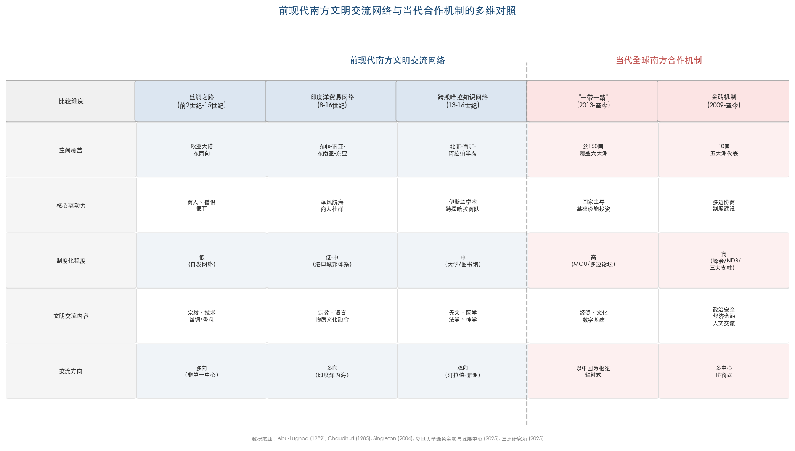

上图揭示了一个重要的结构性转变：前现代文明交流主要由商人、僧侣和学者自发驱动，制度化程度较低但交流方向呈多向特征；当代合作机制则以国家主导和多边协商为核心驱动力，制度化程度显著提升，但在交流方向上面临从多中心到枢纽辐射的张力。这一对照为以下各节的分析提供了结构性参照。

### 5.4.1 "一带一路"的历史叙事策略

当代全球南方合作机制自觉地援引前现代文明交流的历史记忆，最典型的案例是中国的"一带一路"倡议（BRI）。温特（Tim Winter, 2019）在《地缘文化权力》一书中分析了BRI如何将历史丝绸之路叙事转化为当代地缘政治工具，提出"地缘文化权力"（geocultural power）这一分析概念。习近平在2016年访问伊朗期间发表的文章回溯了两千年中伊交流史，将BRI定位为"共同复兴丝绸之路精神"。温特指出，BRI的历史叙事策略在于"重写历史，挖掘过去，并为权宜之计重新加工它"。[温特著作](https://dokumen.pub/geocultural-power-chinas-quest-to-revive-the-silk-roads-for-the-twenty-first-century-9780226658490.html "Winter, Geocultural Power, U Chicago Press, 2019")

温特的批判性分析揭示了一个重要的理论张力：历史文明交流网络的当代再激活既具有规范性潜力（提供替代西方中心主义的叙事框架），也存在被工具化的风险（服务于特定国家的地缘政治利益）。然而，这种张力并非"一带一路"所独有——任何历史叙事都不可避免地嵌入当代权力关系之中。分析的关键在于区分两个层面的问题：第一，丝绸之路所代表的前现代欧亚文明交流网络是否具有历史实在性？答案毫无疑问是肯定的。第二，对这一历史实在性的当代政治利用是否中性？答案同样明显是否定的。但后一层面的问题并不否定前一层面的历史事实——正如殖民时代欧洲对"文艺复兴"叙事的政治利用并不否定古希腊-罗马文化与中世纪阿拉伯-伊斯兰文化之间确实存在过深度交流。

截至2025年5月，约150个国家与中国签署了"一带一路"合作谅解备忘录，覆盖非洲53国、中亚6国、东亚3国、欧洲29国、拉丁美洲与加勒比22国、中东9国、太平洋12国、南亚6国和东南亚10国。[复旦大学绿色金融与发展中心](https://greenfdc.org/countries-of-the-belt-and-road-initiative-bri/ "Nedopil, Countries of the BRI, FISF Fudan University, 2025") 意大利于2023年12月退出、巴拿马于2025年2月退出，但BRI的总体覆盖范围仍在持续扩大——2025年5月哥伦比亚签署了最新的合作备忘录。这一跨越全球南方绝大多数国家的制度网络，在空间覆盖上确实与阿布-卢格霍德所描述的13世纪世界体系存在结构性呼应——尽管两者在性质、规模和驱动力上存在根本差异。

### 5.4.2 金砖机制：万隆精神的当代制度化

"一带一路"代表了以基础设施和贸易为纽带的网络化再连接，金砖机制则代表了南方合作的多边制度化路径。从全球史视角审视，金砖的扩容——从2009年的四国（BRIC）到2024年1月的十国（BRICS+）——可被理解为1955年万隆会议所开启的南方多边主义在新历史条件下的深化。正如三洲研究所2025年报告所指出的，当代金砖机制为南南合作提供了万隆时代所不具备的"客观条件"——特别是中国和印度经济体量的急剧增长，使得南方力量第一次在物质基础上具备了支撑替代性国际制度的能力。[三洲研究所报告](https://thetricontinental.org/wp-content/uploads/2025/04/20250324_D87_EN_Web.pdf "Tricontinental Institute, 'The Bandung Spirit', Dossier no.87, April 2025")

从文明交流互鉴的角度看，金砖"三大支柱"框架中的"文化人文交流"支柱尤为值得关注。2024年喀山宣言明确纳入了文明多样性和人文交流议程；2026年被指定为"中非人文交流年"。[Global Summitry Project](https://globalsummitryproject.com/global-summits/the-brics-kazan-declaration-summarized/ "2024年喀山宣言摘要") [中国国新办](http://english.scio.gov.cn/m/in-depth/2026-01/13/content_118276396.html "2026年1月") 这些制度安排标志着全球南方合作正从经济金融领域向文明交流的制度化方向拓展——即从"利益共同体"向"命运共同体"和"文明共同体"的渐进演化。

全球史视角有助于辨识这一进程的历史连续性：丝绸之路上的宗教传播与技术交流，印度洋上的贸易与文化融合，以及当代金砖框架下的大学联盟、电影节和考古合作，全球南方之间的文明交流始终伴随着物质联系的建立而展开。差异在于制度化程度和自觉性：前现代的文明交流主要是自发的、分散的，由商人、僧侣、学者和移民驱动；当代的文明交流则越来越具有自觉的制度设计和理论反思——正如中国提出的"全球文明倡议"（GCI）所体现的那样。

### 5.4.3 考古合作与知识生产：新型文明交流形态

全球史视野下一个值得关注的当代发展是全球南方之间的考古与学术合作正在挑战西方主导的知识生产范式。2025年12月，复旦大学"全球南方智库联盟"秘书处挂牌成立；同期出版的中国-肯尼亚旧石器联合考古项目成果《从河南到东非》，被评价为标志着"全球人类起源研究范式从'西方中心'模式向多源多点方法转变"。[复旦大学官网](https://www.fudan.edu.cn/en/2025/1208/c344a147654/page.htm "December 2025") 这一案例将全球史的理论关切与当代实践直接关联：对人类起源和文明发展的研究本身即构成一种"全球史"实践，而研究范式从西方中心向多元中心的转变，则体现了第二章讨论的"从被表述到自我表述"的知识生产转向在考古学领域的具体展开。

## 5.5 全球史视野下的理论反思与批判性平衡

### 5.5.1 历史连续性命题的限度

在以全球史方法论论证南方文明交流的历史深度时，必须警惕一种简单化的"历史连续性"论述。前现代的丝绸之路贸易网络与当代"一带一路"倡议之间、13世纪印度洋贸易体系与当代金砖合作之间，存在的是结构性类比而非直接的制度继承。温特的批判在此是必要的提醒：过度强调历史连续性可能遮蔽当代权力关系的特殊性，将地缘政治利益包装为文明天命。

然而，同样需要拒绝另一个极端：将前现代南方文明交流与当代实践之间的联系完全否定为"发明的传统"。全球史研究已充分证明，前现代南方社会之间确实存在着稠密的贸易、宗教、知识和人口流动网络，这些网络被殖民主义强制中断之后，其历史记忆和文化遗产并未完全消失。当代南方合作在一定程度上确实是对这些被中断联系的重新激活——尽管激活的方式、目的和语境已经根本改变。

### 5.5.2 全球史的"去中心化"困境

全球史方法论本身亦面临内在张力。康拉德坦承全球史的一个核心悖论：这一以"去中心化"为使命的学科，其主要从业者和制度基础仍然集中在西方学术体系之中。[康拉德《全球史是什么？》](https://modernarrative.files.wordpress.com/2020/03/sebastian-conrad-what-is-global-history.pdf "Conrad, What is Global History?, Princeton UP, 2016, Introduction") 全球史的概念工具——"联系""网络""流通""整合"——本身带有特定的认识论预设，可能无法充分把握那些拒绝被纳入全球化叙事的地方性经验。正如第二章讨论的桑托斯"认识论南方"框架所警示的，一种新的"全球性"话语如果仍然以西方学术机构为中心生产，便有可能以新的方式重复它本应批判的知识霸权。

对文明交流互鉴的分析而言，这一反思具有直接的实践意义。全球南方的文明交流若要真正实现"互鉴"而非新的单向传播，知识生产本身的去中心化——包括研究议程的设定、分析框架的选择、成果传播的语言——都必须被纳入考量。本章讨论的全球南方智库联盟、南南考古合作等实践，正是在这一方向上的探索性努力。

### 5.5.3 本章论证与全文理论链条的衔接

全球史视野为全文的整体理论框架提供了关键的第四维度。第二章论证了东方学知识霸权对南方"被表述"状态的建构——全球史则从经验层面证明，这种建构遮蔽了南方社会在知识生产和文明创造上的自主历史。第三章分析了殖民遗产对文明等级体系的结构性巩固——全球史则揭示，这一等级体系在历史长时段中是例外而非常态。第四章论证了多元现代化路径的理论可能性——全球史则提供了"前现代多元性"的历史证据，证明文明的多样性和多向交流在现代化之前即已构成人类历史的基本特征。

四个维度的整合所产生的增量洞见是：全球南方推动的文明交流互鉴既非对西方霸权的简单反叛，亦非对"传统"的保守回归，而是在全球史的深层结构中有据可查的历史性进程的当代自觉延续和制度化升华。其正当性不仅来自规范性论证（平等、正义），更来自历史实在性的支撑——全球南方社会之间的文明交流在数千年的历史中积累了丰富的经验、模式和遗产，当代实践可以从中汲取资源，同时保持对历史中权力不对称的批判性警觉。

# 第6章 理论综合——全球南方合作推动文明交流互鉴的内在机理

前述各章分别从四个理论维度审视了全球南方合作与文明交流互鉴的关系：第二章以萨义德东方学批判揭示西方知识霸权对文明间平等对话的认识论锁定；第三章以后殖民主义理论追溯殖民遗产的持久结构性影响，并开辟去殖民性的政治伦理空间；第四章以多元现代性理论论证非西方社会现代化实践构成文明交流互鉴的实践基础；第五章以全球史方法论重建前现代南方文明互动网络的历史纵深。然而，若仅将这四个维度视为彼此并列的分析切片，便会遗失一个根本性问题：它们经过整合之后，能否生成超越各自单独论证的增量洞见？本章的核心任务正在于回应这一追问——构建一个四维度相互构成的整合性理论框架，阐明全球南方合作推动文明交流互鉴的内在逻辑机理；在此基础上，系统辨析"文明交流互鉴"与西方主导的"文明对话"范式在理论预设、主体构成和实践逻辑上的根本差异；并正面回应这一命题所面临的理论困境与实践张力。

## 6.1 四维度整合：从"加法"到"乘法"的理论跃迁

### 6.1.1 超越线性递进：相互构成的理论系统

本文第一章已初步提出四个理论维度的分析链条：东方学批判（认识论解放）→后殖民主义（政治伦理空间）→非西方现代化（实践基础）→全球史（历史纵深），分别回答"为什么需要""凭什么可能""有何根基"三个递进问题。经过前述各章的深入分析，我们认为这种线性递进的表述虽在叙述上便于展开，却低估了四个维度之间更为深层的"相互构成"关系。

所谓"相互构成"，意指四个理论维度并非单向递进，而是形成多重反馈循环——每一维度的论证都因其他维度的存在而获得更强的解释力。具体而言，全球史揭示的前殖民时代南方互动网络本身即否定了东方学"东方被动论"的核心预设：正如第五章所论证的，阿布-卢格霍德对13世纪世界体系的重建和苏布拉马尼亚姆对早期现代"关联史"的开拓，从经验层面证明"东方"从来不是被动的、封闭的文明实体。这一历史实证反过来为去殖民性实践提供了正当性基础——第三章讨论的从万隆精神到当代南南团结的伦理框架，并非凭空创造一种新的文明交往模式，而是恢复和再激活数千年历史中已然存在的南方文明互动传统。多元现代化的经验（第四章）则为这种历史性互动注入了当代动力——不同文明对现代性的差异化诠释使跨文明交流具备了可交换的"经验资源"：艾森施塔特所论证的非西方社会对现代性的"创造性重新诠释"，恰恰构成了当代文明交流互鉴最丰富的素材。[Moshirzadeh学术论文](https://www.allazimuth.com/2020/06/08/the-idea-of-dialogue-of-civilizations-and-core-periphery-dialogue-in-international-relations/ "All Azimuth, 2020")

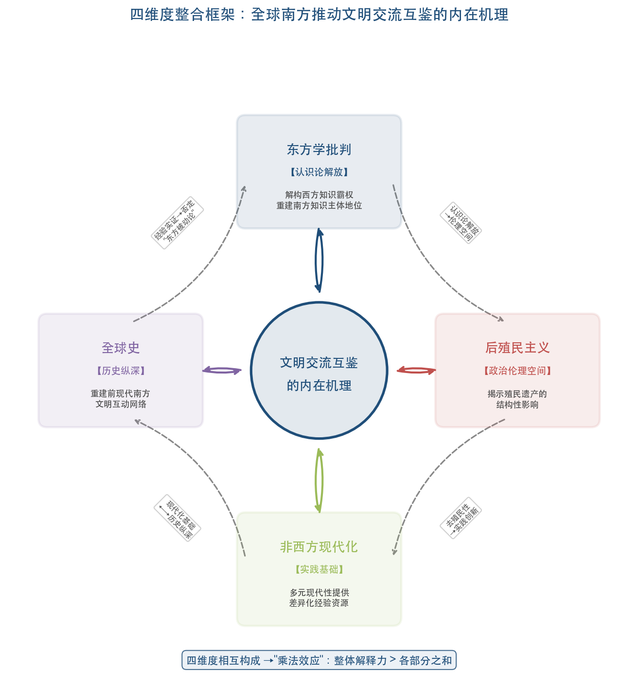

图6-1呈现了四维度整合框架的结构关系。如图所示，东方学批判、后殖民主义、非西方现代化与全球史四个维度围绕"文明交流互鉴的内在机理"这一核心形成双向关联，维度之间的虚线箭头标示出反馈循环路径——例如"经验实证→否定'东方被动论'"与"认识论解放→伦理空间"等关联机制。这种反馈循环使四维度的整合不是加法而是乘法，整体所产生的理论解释力远超各部分之和。

以一个具体的分析案例加以说明：当代中非知识合作——如第五章提及的中肯旧石器联合考古项目，该项目出版了《从河南到东非》，被认为标志着"全球人类起源研究范式从'西方中心'模式向多源多点方法转变"[复旦大学官网](https://www.fudan.edu.cn/en/2025/1208/c344a147654/page.htm "December 2025")——若仅从单一维度分析，所得洞见有限：从东方学批判看，它挑战了西方对人类起源知识的垄断性表述；从后殖民主义看，它体现了知识生产中的去殖民性实践；从非西方现代化看，它展示了中国考古学的技术能力与方法论自主性；从全球史看，它重建了东亚与东非之间的深远历史联系。然而，将四个维度整合审视，这一案例便呈现出更深层的意义——它同时是一次认识论解放（打破西方知识垄断）、一种政治伦理实践（南南平等合作的科学范式）、一项现代化能力的跨文明流通（考古技术的共享）和一个历史纵深的恢复（重建前现代东亚-非洲联系）。四个维度的叠加揭示了一种超越任何单一理论框架所能捕捉的文明交流互鉴"全息图景"。

### 6.1.2 整合框架的三层逻辑

在确立四维度相互构成的理论立场之后，全球南方合作推动文明交流互鉴的内在机理可提炼为三层递进逻辑：

**第一层：认识论前提的确立。** 东方学批判与全球史方法论共同完成了文明交流互鉴的认识论奠基。萨义德揭示的"东方主义"话语使非西方文明丧失知识主体地位，而全球史则从经验层面证伪了"东方被动论"的历史叙事。两者的结合不仅解构了西方知识霸权的合法性，更积极地重建了全球南方作为文明互动能动主体的历史地位。第二章论证的桑托斯"认知正义"概念与第五章康拉德主张的"整合分析"方法论在此汇合——知识生产的去等级化既是认识论的内在要求（桑托斯），也是方法论的逻辑必然（康拉德）。

**第二层：政治伦理空间的开辟。** 后殖民主义与非西方现代化理论共同回答"凭什么可能"的问题。法农与基哈诺揭示的殖民遗产及"权力殖民性"的持续存在，表明文明交流互鉴面临深层的结构性障碍；但查特吉对"政治社会"的论证和艾森施塔特对"多元现代性"的论证共同表明，被殖民社会从未完全被纳入殖民秩序的同质化逻辑——它们始终在"规则的边界"上进行着创造性的诠释与改写。这一创造性空间既体现于政治伦理层面（去殖民性提供了拒绝文明等级的正当性），也体现于实践层面（多元现代化提供了可交流的差异化经验）。

**第三层：实践动力的生成。** 多元现代化经验的跨文明流通构成文明交流互鉴从理论命题走向历史现实的关键路径。全球南方国家在现代化进程中各自形成的差异化经验——如第四章分析的甘地式文明批判、东亚发展型国家模式、卢旺达的本土治理创新——并非封闭的个案，而是经由南南合作机制进行跨国流通和相互学习。这种经验流通既不同于西方"发展援助"范式中的单向知识转移，也不同于冷战时期的意识形态输出，而是具有真正互鉴性质的双向学习。全球史所揭示的前现代南方互动网络则为这种当代实践提供了历史先例——当代南南合作是历史上南方文明互动传统在新条件下的再激活与制度化延续。

## 6.2 "文明交流互鉴"与"文明对话"的范式辨析

### 6.2.1 哈塔米"文明对话"与自由主义预设

1998年9月21日，伊朗总统哈塔米在联合国大会第53届会议上发表演讲，正式提出将2001年定为"文明间对话年"的倡议，联大于同年11月4日以第53/22号决议一致通过这一提案。[联合国新闻稿](https://press.un.org/en/1998/19980921.ga9446.html "UN Press Release GA/9446, 21 September 1998") 在亨廷顿1993年提出"文明冲突论"后持续发酵的国际辩论语境中，这一倡议具有重要的规范性意义：它首次在全球最高政治平台上将"文明对话"确立为对抗"文明冲突"的正面议程。

然而，正如Moshirzadeh在其重要论文中所揭示的，"文明对话"范式在其西方制度化实践中逐渐被纳入自由主义多元文化主义的理论框架。联合国文明联盟（UNAOC）于2005年由安南发起、西班牙和土耳其联合倡议成立，定位为"文明间对话、理解与合作的主要平台"，[UNAOC官网](https://www.unaoc.org/who-we-are/ "UNAOC: Who We Are") 但其运作逻辑在很大程度上以"宽容"（tolerance）为核心价值，预设了文明单元的固定性与边界清晰性。Hutchings（2016）对此提出尖锐批评："如果塑造对话模式和结果的东西在对话之外，那么对话本身的价值就值得质疑。"[Moshirzadeh学术论文](https://www.allazimuth.com/2020/06/08/the-idea-of-dialogue-of-civilizations-and-core-periphery-dialogue-in-international-relations/ "All Azimuth, 2020, 引用Hutchings 2016") 这一批评所揭示的，正是西方"文明对话"框架的内在悖论：对话的制度设计、议程设定和评价标准仍然由西方主导，全球南方在其中所充当的是"被邀请参与对话的对象"，而非平等的对话主体。

Bilgin在同一理论脉络中进一步指出，文明对话倡议存在三重局限：其一，它"搁置"了文明概念本身，从而保留了亨廷顿式的"文明是宗教统一的自生实体"这一本质主义预设；其二，对话倡议虽有助于开辟沟通空间，却未能采取真正的"对话性"（dialogical）方法——即在对话过程中重新定义参与各方的自我理解；其三，其安全概念被狭隘地界定为"文明间不发生战争"，忽略了非国家行为体所经历的更广泛的不安全形态。[Bilgin学术论文](https://academic.oup.com/isr/article-abstract/18/1/78/2358556 "International Studies Review, Vol.18(1), 2016")

### 6.2.2 "文明交流互鉴"的理论创新：从防御性对话到建设性互鉴

"文明交流互鉴"这一概念于2014年3月27日由习近平在巴黎联合国教科文组织总部的演讲中首次系统阐述，提出"文明是多彩的""文明是平等的""文明是包容的"三个核心命题，将文明交流互鉴定位为"推动人类文明进步和世界和平发展的重要动力"。[中国外交部](https://www.fmprc.gov.cn/web/wjb_673085/zzjg_673183/gjs_673893/gjzz_673897/lhgjkw_674067/zyjh_674077/201403/t20140328_7660361.shtml "习近平在联合国教科文组织总部的演讲全文，2014年3月28日") 2023年3月15日，这一话语框架被进一步制度化为"全球文明倡议"（GCI）：习近平在中国共产党与世界政党高层对话会上提出尊重文明多样性、弘扬全人类共同价值、重视文明传承创新、加强国际人文交流合作四项核心主张，使之成为继全球发展倡议（2021）、全球安全倡议（2022）之后中国第三项全球性倡议。[IDCPC官方页面](https://www.idcpc.org.cn/ztwy/hytl/gdheng/results/ "IDCPC: GCI, 2023年3月")

从学术分析的角度审视，"文明交流互鉴"与西方主导的"文明对话"之间存在三层根本性差异：

**理论预设层面：文明实质平等 vs. 自由主义多元文化主义。** "文明对话"的自由主义预设将文明视为需要被"宽容"的差异性存在，其潜台词是存在一个能够裁判和包容这些差异的"元框架"——而这个元框架在实践中往往由西方自由主义价值体系充当。"文明交流互鉴"则以文明的实质平等为出发点，不承认任何单一文明具有裁判其他文明的资格。Feng Yanli（2026）从文化哲学角度论证，GCI"在文化哲学层面突破了'文明等级论'的束缚"，将GCI与儒家"天人合一"和非洲Ubuntu哲学并列，阐释了多元文明的不可通约性与独特价值。[China-CEE Institute](https://china-cee.eu/2026/01/21/the-global-significance-of-the-global-civilization-initiative/ "China-CEE, January 2026")

**主体构成层面：全球南方为主体 vs. 西方制度框架。** UNAOC等"文明对话"机制由西方国家主导建立和运营，全球南方国家在其中处于被动参与的位置。"文明交流互鉴"的实践主体则以全球南方为核心——从金砖机制的"人文交流支柱"到中非合作论坛的文化合作框架，文明交流互鉴的制度化实践植根于南南合作的既有平台。金砖采用政治安全、经济金融、文化人文交流"三大支柱"框架，其中人文交流支柱的制度化安排包括金砖网络大学（BRICS-NU，2015年成立，汇集五国高等教育机构开展联合项目和学生流动）、金砖电影节（自2016年起每年举办，2024年12月在巴西福塔莱萨举办第九届）以及金砖运动会等机制。[BRICS Network University](https://brics-nu.org/ "BRICS-NU Official Website") [TV BRICS](https://tvbrics.com/en/news/brazil-hosts-brics-film-festival-to-promote-cultural-cooperation-of-the-global-south/ "Brazil hosts BRICS Film Festival, December 2024") 2026年被定为"中非人文交流年"，进一步将文明交流互鉴的制度化推向新阶段。[中国国新办](http://english.scio.gov.cn/m/in-depth/2026-01/13/content_118276396.html "2026年1月")

**实践逻辑层面："共同发展"式能动创造 vs. "理解与宽容"的防御性逻辑。** "文明对话"的实践逻辑本质上是防御性的——其首要目标在于预防文明冲突、促进相互"理解与宽容"，是对亨廷顿"文明冲突论"的反应性回应。"文明交流互鉴"的实践逻辑则具有建设性——"互鉴"意味着双向的、平等的相互学习，目标不仅是避免冲突，更在于通过相互学习实现"共同发展"和文明创新。Peters（2024）评估认为，GCI"代表了中国外交战略的重大发展，反映了其推动基于中国价值观和现代化的替代性世界秩序愿景的意愿"。[Peters学术论文](https://journals.sagepub.com/doi/10.1163/25902539-06020001 "Beijing International Review of Education, Vol.6(2), 2024")

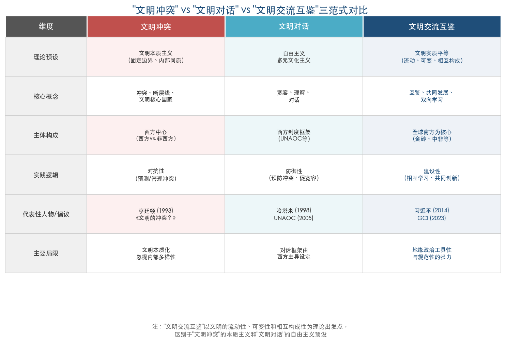

图6-2从理论预设、核心概念、主体构成、实践逻辑、代表性人物/倡议和主要局限六个维度，系统对比了亨廷顿"文明冲突"、哈塔米/UNAOC"文明对话"与"文明交流互鉴"/GCI三种范式，清晰呈现了"文明交流互鉴"在文明实质平等、全球南方主体性和建设性实践逻辑方面的理论独特性。

### 6.2.3 Petito的"多文明-多复合世界秩序"

Petito（2016）在《国际研究评论》上发表的重要论文，为上述范式辨析提供了更具理论深度的参照框架。Petito将多极化理解为当代国际社会超越其西方中心主义母体的"划时代转型进程"的一部分，其分析核心在于：多极世界中的文明政治应当如何处理文化差异可能被消极政治化的风险。他提出，由多元文化构成的区域整合进程是"防止文化差异在全球层面被消极政治化的解毒剂"，可以催生一种新的"跨文化万民法"（cross-cultural jus gentium）。这些要素共同构成了他所命名的"多文明-多复合世界秩序"（multicivilizational-multiplex world order），该概念借鉴了阿查里亚（Amitav Acharya）"多复合世界"的理论资源。[Petito学术论文](https://academic.oup.com/isr/article-abstract/18/1/78/2358556 "International Studies Review, Vol.18(1), 2016, pp.78-91")

Petito的论证与本文四维度框架形成重要对话。一方面，他与本文一样拒绝亨廷顿的"文明冲突"本质主义，主张文明之间的关系应当是对话性而非对抗性的。另一方面，Petito将文明对话与区域主义联系起来的思路，为理解全球南方合作推动文明交流互鉴提供了一个重要的中介机制——金砖、上合组织、非盟等区域和跨区域合作平台，正是Petito所构想的"多元文化构成的区域整合进程"的当代体现。然而，Petito的分析也隐含着本文必须正面回应的一重张力：他将文明对话的主体主要理解为区域性文明实体，这在一定程度上仍然保留了文明的整体性预设，与Moshirzadeh关于"文明内部多样性"的警示之间存在未解的矛盾。

## 6.3 全球文明倡议（GCI）的理论定位：规范性贡献与地缘政治张力

### 6.3.1 GCI的理论-实践双重属性

全球文明倡议的学术评价呈现高度分化的特征，这种分化本身揭示了全球南方推动文明交流互鉴所面临的根本性理论困境——任何文明交流倡议都无法完全脱离提出者的地缘政治利益。

从肯定性评价看，Peters（2024）将GCI置于中国三项全球性倡议（GDI、GSI、GCI）的序列中加以理解，认为GCI代表了"推动基于中国价值观和现代化的替代性世界秩序愿景"的重大外交发展。[Peters学术论文](https://journals.sagepub.com/doi/10.1163/25902539-06020001 "Beijing International Review of Education, Vol.6(2), 2024") Feng Yanli（2026）则从文化哲学角度给出更为积极的评价，论证GCI的理论意义在于"突破文明等级论的束缚"，为儒家、Ubuntu等非西方文明哲学在国际秩序建构中发挥作用开辟了规范性空间。[China-CEE Institute](https://china-cee.eu/2026/01/21/the-global-significance-of-the-global-civilization-initiative/ "China-CEE, January 2026")

从批评性评价看，CHOICE（2025）将GCI定性为"个体化的全球权力工具"（individual tool for global power），指出其通过结构化政党交流、外国官员培训和大规模峰会三种机制运作，实质上服务于中国的国际影响力扩展。[CHOICE分析](https://chinaobservers.eu/xi-jinpings-global-civilization-initiative-an-individual-tool-for-global-power/ "CHOICE, October 2025") 这一批评呼应了Mawdsley（2024）对南南合作的更广泛判断——"资本主义、金融、科学技术的伟大结构并未被拒绝，而是成为竞争焦点"，南南合作在根本层面并未挑战现代性的底层本体论。

我们认为，GCI的理论定位需要在上述两种极端评价之间寻找更具分析力的中间立场。关键在于区分两个层面：**作为地缘政治工具的GCI**与**作为规范性贡献的GCI**。前者涉及中国外交的战略利益考量，后者涉及文明交流互鉴作为国际规范的理论价值。这两个层面之间存在张力但并非相互否定——正如Mawdsley（2024）所论证的，南南合作尽管"未能挑战现代性的底层本体论"，但在"本体论、物质和理念三个层面仍产生了实质性影响"。类推之，GCI即使包含地缘政治工具性，也不必然否定其在文明间平等关系建构方面的规范性贡献。Bettiza等学者（2023）从更宏观的视角指出，"文明主义"（civilizationism）作为一种意识形态在当代兴起，本质上是对自由国际秩序全球化的"反霸权意识形态反应"，其在实践中的表现——无论是中国的GCI还是俄罗斯的文明国家叙事——都需要在这一结构性语境中加以理解，而非简单地归结为某一国的策略性操作。

### 6.3.2 "文明交流互鉴"从政策话语到学术范畴的转化

从更深层的理论角度审视，"文明交流互鉴"的学术价值不应完全等同于GCI的政策实践。"文明交流互鉴"作为一个分析范畴，其核心创新在于将文明间关系从"冲突-对话"的二元光谱中解放出来，引入"互鉴"这一具有独特理论意涵的维度。"互鉴"不同于"对话"之处在于：对话可以是各说各话的平行独白，而互鉴预设了对方文明经验的可学习性与自身文明的可变化性——它同时承认差异（否则无需"互鉴"）和共通性（否则"互鉴"不可能）。

这一概念框架与前述四个理论维度形成深层呼应。从东方学批判的角度看，"互鉴"要求每个文明同时是认识主体和学习者，从根本上消解了东方主义的"外在性"机制——萨义德所揭示的"东方学者为西方描述东方，但从不关注东方本身"的知识生产模式，在"互鉴"框架下失去了合法性。从后殖民主义的角度看，"互鉴"暗含去殖民性的政治伦理——它拒绝任何单一文明充当"教师"的角色，要求的是巴巴所论的"第三空间"中的相互构成。从多元现代性理论的角度看，"互鉴"的前提恰恰是现代化路径的多元性——如果只有一条通往现代性的道路，则文明间无需"互鉴"，只需"学习先进"。从全球史的角度看，"互鉴"的深层合法性来自于历史上文明交流从来就是相互塑造的——齐默尔曼"纠缠史"方法论所强调的，正是交流各方在互动中共同经历变化、没有任何一方在互动后仍保持"原样"这一核心洞见。

## 6.4 理论困境与实践张力的正面回应

全球南方推动文明交流互鉴并非一帆风顺的理论命题，它面临着多重内在张力。本节将逐一审视四组核心困境，并在四维度整合框架的基础上提出理论回应路径。

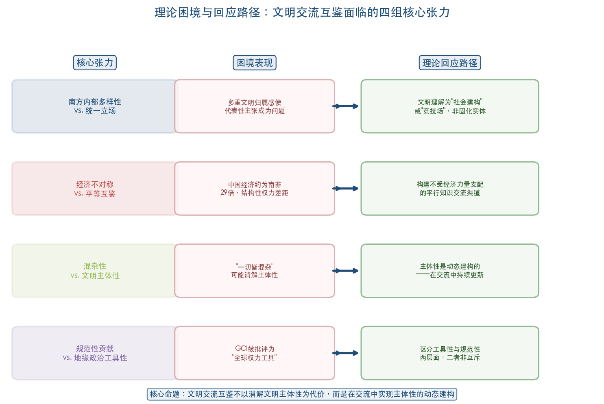

图6-3以三列布局（核心张力—困境表现—理论回应路径）系统展示了文明交流互鉴面临的四组核心张力及其调和路径，为以下各小节的展开分析提供了整体性图示。

### 6.4.1 南方内部文明多样性与"统一立场"的张力

全球南方推动文明交流互鉴面临的首要理论困境，来自南方内部的深刻文明多样性。Moshirzadeh指出，"同时的双重文明归属感"使"任何声称代表某一文明的主张都成为问题"。[Moshirzadeh学术论文](https://www.allazimuth.com/2020/06/08/the-idea-of-dialogue-of-civilizations-and-core-periphery-dialogue-in-international-relations/ "All Azimuth, 2020") 这一判断在当代政治中有充分的经验支撑：印度莫迪政府时期印度教民族主义的崛起，与印度在金砖框架内推动"多极世界"之间存在深刻的内在矛盾——印度教民族主义在本质上是一种文明本质主义，与文明交流互鉴所预设的文明开放性和可变性构成理论上的紧张关系。

对此困境，Moshirzadeh本人提出了一种具有启发性的理论调和路径：将文明理解为"社会建构"或"竞技场"而非固化实体。在这一理解下，文明主体性本身就是在交流互鉴中持续建构和重构的——不必以放弃主体性为代价来接受混杂性。[Moshirzadeh学术论文](https://www.allazimuth.com/2020/06/08/the-idea-of-dialogue-of-civilizations-and-core-periphery-dialogue-in-international-relations/ "All Azimuth, 2020, 引用Tajik 2000") 这一论点与第四章查特吉对"政治社会"的分析形成理论呼应——查特吉所揭示的后殖民社会中的"混杂性"，并非主体性的丧失，而是主体性在殖民遗产与本土传统之间的创造性重构。由此可以确立一个重要的理论命题：文明交流互鉴不以消解文明主体性为代价，恰恰相反，文明主体性在交流互鉴的过程中得以动态建构与持续更新。

### 6.4.2 经济不对称与平等互鉴的结构性矛盾

全球南方推动文明交流互鉴面临的第二重困境，是南方内部经济不对称对"平等互鉴"理想的结构性制约。Shoba与Mlambo（2024）的研究揭示了这一矛盾的具体维度：中国经济规模约为南非经济的29倍，南非对华出口集中于原材料而进口制成品，这种经济不对称在文明交流中制造了结构性的权力差距。[Shoba & Mlambo学术论文](https://www.tandfonline.com/doi/full/10.1080/23311886.2024.2321699 "Cogent Social Sciences, Vol.10(1), 2024") 文明交流互鉴如果脱离经济关系的考量，便有沦为修辞装饰的风险——形式上的"文化交流"可能掩盖实质上的"经济依附"。

面对这一困境，需要在两个层面加以回应。**其一**，承认经济不对称的客观存在，不将文明交流互鉴浪漫化为脱离物质基础的纯粹文化活动。第三章运用的后殖民主义分析框架——特别是基哈诺的"权力殖民性"概念——提醒我们，任何文明间关系都嵌入在更广泛的权力结构之中。**其二**，指出经济不对称虽然构成制约，但并不必然否定文明交流互鉴的可能性。2025年12月复旦大学"全球南方智库联盟"秘书处的挂牌，[复旦大学官网](https://www.fudan.edu.cn/en/2025/1208/c344a147654/page.htm "December 2025") 以及金砖网络大学在能源、信息技术、水资源和气候变化等主题领域开展的联合研究项目，[BRICS Network University](https://brics-nu.org/ "BRICS-NU Official Website") 都表明南方知识合作正在构建不完全受经济力量差异支配的平行交流渠道。关键在于，文明交流互鉴的制度化需要自觉地建立对冲经济不对称的机制——例如在合作框架中确保小国和弱势文明的平等发言权。

### 6.4.3 "混杂性"与"文明主体性"的辩证

本文四个理论维度之间最深层的张力，存在于后殖民主义的"混杂性"概念与非西方现代化的"文明主体性"要求之间。第三章详细分析的巴巴"第三空间"和"混杂性"理论主张，文化身份在殖民者与被殖民者的相互作用中不断生成为"既非一方也非另一方"的新形态，这一立场在极端推论下可能导致"一切皆混杂、主体性是幻象"的结论。而第四章的非西方现代化分析则强调文明自觉——不同文明对现代性的差异化诠释预设了某种可辨识的"文明主体性"的存在。

我们认为，这一张力并非不可调和，而是需要辩证地加以把握。混杂性所否定的并非主体性本身，而是本质化的、固定不变的主体性。正如第五章"纠缠史"方法论所揭示的：文明交流的双方在互动中共同经历变化，但这种变化并不意味着文明边界的完全消解——它意味着文明主体性本身是流动的、关系性的，在与他者的交流中持续地自我重新定义。秦亚青提出的"关系理论"为这一辩证理解提供了深层的哲学资源：Guzzini（2024）在对秦亚青理论的系统回应中揭示，中国"关系性"本体论的核心特征为"内在性"——阴阳并非相互建构而是"已经在彼此之内"——这意味着主体性与关系性不是对立的两极，而是同一过程的两个面向。[Guzzini论文](https://repository.graduateinstitute.ch/record/319982/files/GGC_OA_poae010.pdf "Guzzini, Relationalism(s) Unpacked, CJIP, Vol.17(2), 2024, pp.187-205") 文明主体性在交流互鉴中不是被消解，而是被丰富和重构——正如习得外语不会使母语能力丧失，一种文明也不会因吸收外来经验而丧失自身特质。

### 6.4.4 "谁来交流"与"为谁交流"的政治追问

文明交流互鉴在实践中不可回避的一个根本性政治追问是：文明的交流由谁主导、代表谁的利益？Moshirzadeh的警示——"同时的双重文明归属感使任何声称代表某一文明的主张都成为问题"——指向了一个深层的代表性危机。在国际政治实践中，所谓的"文明对话"或"文明交流"往往由国家政府主导，而政府并不必然代表其治下所有文化群体的立场与诉求。

这一问题在全球南方内部尤为突出。金砖扩容后覆盖全球约46%人口和35.6%的GDP（PPP口径），[斯汀森中心](https://www.stimson.org/2025/2025-brics-summit-takeaways-and-projections/ "2025 BRICS Summit: Takeaways and Projections, Stimson Center, 2025年8月") 但金砖框架中的文明交流主要在国家层面展开——政党对话、政府间文化协定、官方教育交流——民间社会和草根层面的文明互动在制度化安排中相对边缘化。2024年《国际组织》期刊对中国IR理论的系统评述揭示了一个相关的理论洞见：阎学通"道义现实主义"、秦亚青"关系理论"、赵汀阳"天下主义"、任晓"共生理论"四个当代中国IR理论范式共享的"全球集体多元主义"愿景虽然具有理论创新性，但"倾向于将帝国治理框架化为道德和有效的"，引发"关于规范性含义的担忧，特别是它们对等级结构的默认接受或甚至背书"。[International Organization论文](https://www.cambridge.org/core/journals/international-organization/article/reconceptualizing-international-order-contemporary-chinese-theories-and-their-contributions-to-global-ir/3EA614FBF13A5DDAB159F00354451865 "International Organization, Vol.78(3), 2024") 这一批评表明，文明交流互鉴的理论建构必须内含对国内少数群体权利和个体多样性的保障机制，以避免"全球集体多元主义"在国际层面认可文明多样性的同时于国内层面压制个体多样性。

然而，上述追问不应成为否定文明交流互鉴可能性的理由，而应成为完善其制度设计的动力。2025年第七届"去殖民化国际关系会议"（DIR Conference）的发展轨迹提供了一个有益的参照：该会议从2018年弗莱彻学院学生自发发起的三个小组发展为两天24位演讲者、超150名注册者的国际学术平台，主题为"Reorienting Theoretical Apertures and Embodying Decentered Practice"，覆盖教育学、种族资本主义、定居殖民主义、国际法等多主题。[弗莱彻论坛报道](https://www.fletcherforum.org/the-rostrum/3/3/2026/dir-2025 "Fletcher Forum, 2026年3月") 这种从学生到学者、从边缘到主流的学术去殖民化实践，展示了文明交流互鉴可以在超越国家中心主义的多元层面展开。

## 6.5 非西方国际关系理论与文明交流互鉴的学术建构

### 6.5.1 中国IR理论的"全球集体多元主义"

四个当代中国国际关系理论范式的比较研究为文明交流互鉴的理论建构提供了重要的学术资源。2024年《国际组织》（International Organization, Vol.78, No.3）的系统评述指出，阎学通的"道义现实主义"、秦亚青的"关系理论"、赵汀阳的"天下主义"和任晓的"共生理论"尽管在具体理论路径上存在显著差异，却共享三个核心理念：关系性路径（relational approach）、全球集体多元主义（global collective pluralism）和国家道德（state morality）。该论文评价称，它们"代表了中国IR学术对更广泛的全球IR文献的重要贡献"。[International Organization论文](https://www.cambridge.org/core/journals/international-organization/article/reconceptualizing-international-order-contemporary-chinese-theories-and-their-contributions-to-global-ir/3EA614FBF13A5DDAB159F00354451865 "International Organization, Vol.78(3), 2024")

其中，"全球集体多元主义"概念尤为值得关注。它被提出作为替代自由国际秩序"全球个体多元主义"（global individual pluralism）的组织原则——前者以文明共同体为基本单元构想国际秩序，后者以个体权利为基本单元。在Reus-Smit的分析框架中，全球集体多元主义是"唯一没有历史先例的模式"，这既体现了其理论创新性，也意味着其面临缺乏经验验证的挑战。值得注意的是，该论文同时指出中国理论与批判IR学派（马克思主义、女权主义、后殖民主义）在关系本体论上存在共同基础，"为对话和批判提供了丰富的潜力"——这一判断本身便例证了文明交流互鉴在学术理论建构层面的可能性与价值。

### 6.5.2 关系性本体论的跨文明对话

Guzzini（2024）对秦亚青关系理论的系统回应，构成文明交流互鉴在学术理论层面的一个示范性案例。Guzzini揭示了中国"关系性"本体论与西方关系主义之间的根本差异：西方关系主义（如温特的"相互建构"）预设了独立实体之间的关系，而中国的"关系性"则更为激进——阴阳不是在相互作用中建构彼此，而是"已经在彼此之内"。这种"内在性"（internality）意味着对主体-客体二分法的根本超越。[Guzzini论文](https://repository.graduateinstitute.ch/record/319982/files/GGC_OA_poae010.pdf "Guzzini, Relationalism(s) Unpacked, CJIP, Vol.17(2), 2024, pp.187-205")

Guzzini进而建议，秦的理论可与Honneth的承认理论进行更深入的对话，其"开放外交过程"与赫尔辛基进程中的信任建设机制具有"惊人的相似性"。这一跨文明学术对话的实践本身，高度浓缩地体现了文明交流互鉴的核心机制：中国哲学传统中的"关系性"概念，经由当代IR理论的学术化，与西方批判社会理论中的"承认"概念发生对话，双方在对话中发现了既有的差异（内在性 vs. 相互建构）和共鸣（对个体主义本体论的超越），从而各自获得了新的理论洞见。这一过程恰恰是"互鉴"——而非简单的"对话"或单向的"学习"——的典型形态。

### 6.5.3 理论建构的开放性问题

将非西方IR理论纳入文明交流互鉴的分析框架，也面临一个需要诚实对待的开放性问题：这些理论在多大程度上是"非西方"的？2024年《国际组织》论文指出的一个关键张力在于，中国IR理论"倾向于将帝国治理框架化为道德和有效的"，而这些帝国经验——无论是"天下"秩序还是朝贡体系——在历史上包含了明确的等级结构。如果文明交流互鉴的理论资源本身携带等级化的预设，那么以之支撑的"平等互鉴"主张便面临自我矛盾的风险。

回应这一问题的关键在于坚持理论建构的"去殖民性"——不仅对西方理论进行去殖民化审查，也对非西方理论进行反思性审视，警惕任何理论——无论其文明来源——可能携带的等级化预设。任晓"共生理论"中的"异质共生"概念在此具有特殊价值：它强调不同行为体可以在保持差异性的同时实现共存与互利，而不需要预设任何一方的领导地位或道德优越性。这种"异质共生"视角与后殖民理论中"差异中共存"的主张存在深层理论共鸣，为文明交流互鉴的理论建构提供了一种避免"换一个中心"陷阱的可能路径。

## 6.6 本章结论：全球南方合作推动文明交流互鉴的内在机理

综合上述分析，全球南方合作推动文明交流互鉴的内在机理可概括为"三层逻辑-四维驱动-双重张力"的整合框架。

**三层逻辑**构成纵向递进链条：认识论前提的确立（东方学批判与全球史方法论共同解构西方知识霸权，重建南方文明的知识主体地位）→政治伦理空间的开辟（后殖民主义与多元现代性共同论证去殖民性实践的正当性和可行性）→实践动力的生成（多元现代化经验的跨文明流通与历史性互动网络的当代再激活）。

**四维驱动**构成横向反馈网络：四个理论维度不是线性递进而是相互构成——全球史的经验实证否定东方学的认识论预设，为去殖民性实践提供历史正当性，并为多元现代化提供"前现代化"阶段的文明基础。这种反馈循环使理论整合产生乘法效应，整体解释力远超各部分之和。

**双重张力**构成内在约束与动力：文明交流互鉴面临"混杂性 vs. 文明主体性"的理论张力和"经济不对称 vs. 平等互鉴"的实践张力。对前者的回应在于，将文明主体性理解为在交流互鉴中持续建构和更新的动态过程，而非固化不变的本质属性。对后者的回应在于，承认经济不对称的制约性，同时通过知识合作和制度创新建立不完全受经济力量支配的平行交流渠道。

"文明交流互鉴"区别于"文明冲突"和"文明对话"的根本之处，不仅在于其价值取向（平等 vs. 等级，互鉴 vs. 宽容），更在于其理论预设——它以文明的流动性、可变性和相互构成性为出发点，拒绝将文明视为固化的、自足的实体。全球南方合作之所以能够成为推动文明交流互鉴的核心动力，正是因为全球南方自身的历史经验——从前现代的南方文明互动网络到殖民经历的共享创伤，从去殖民运动的共同记忆到多元现代化的差异化实践——为文明间的相互构成提供了最为丰富的资源和最为迫切的需求。

# 第7章 结论与前瞻——面向2026-2027的理论议程与实践展望

前述六章分别从导论框架、东方学批判、后殖民主义、非西方现代化、全球史和理论综合六个维度，系统论证了全球南方合作推动文明交流互鉴的内在机理。本章在上述分析基础上完成三项收束性任务：其一，提炼本研究在国际关系理论创新中的核心贡献；其二，基于2025—2026年间的关键学术与制度动态阐明其理论启示；其三，面向2026年下半年至2027年提出具有学术前瞻价值的理论议程与实践判断。

## 7.1 本研究的理论贡献：三重突破

### 7.1.1 打破"西方/非西方"二元认识论框架

罗伯特·考克斯（Robert W. Cox）1981年发表于《千禧年》（*Millennium*）的经典论文提出了批判国际关系理论的基本命题："理论总是为某些人、为某些目的服务的"（theory is always for someone and for some purpose）。[Cox原文](https://doi.org/10.1177/03058298810100020501 "Cox, 'Social Forces, States and World Orders', Millennium, Vol.10(2), 1981, p.128") 这一命题为审视本研究的理论贡献提供了认识论起点。

本研究的第一重贡献在于对"西方/非西方"二元认识论框架的系统性超越。第二章对萨义德东方学批判的分析揭示了"东方/西方"二分法作为知识-权力装置的运作机制；第五章的全球史分析则从经验层面证伪了这一二分法——阿布-卢格霍德对13世纪世界体系的重建与苏布拉马尼亚姆对早期现代"关联史"的开拓，共同证明"东方"与"西方"从未构成封闭运行的文明实体。两个维度合力导出的结论是：文明交流互鉴的理论建构不应以"用非西方理论取代西方理论"为目标——此种替代实质上仍停留在二元框架之内——而应追求一种承认文明间相互构成性的多元本体论。

2024年《国际组织》（*International Organization*, Vol.78, No.3）对四个当代中国国际关系理论范式的系统评述印证了这一判断。该论文指出，阎学通"道义现实主义"、秦亚青"关系理论"、赵汀阳"天下主义"与任晓"共生理论"共同倡导"全球集体多元主义"（global collective pluralism），将其作为替代自由国际秩序"全球个体多元主义"的组织原则，"代表了中国IR学术对更广泛的全球IR文献的重要贡献"。然而论文同时揭示了一个关键理论发现：在Reus-Smit的分析框架中，全球集体多元主义是"唯一没有历史先例的模式"；与此同时，中国理论与批判性国际关系学派（马克思主义、女权主义、后殖民主义）在关系本体论上存在"为对话和批判提供丰富潜力"的共同基础。[International Organization论文](https://www.cambridge.org/core/journals/international-organization/article/reconceptualizing-international-order-contemporary-chinese-theories-and-their-contributions-to-global-ir/3EA614FBF13A5DDAB159F00354451865 "International Organization, Vol.78(3), 2024") 由此可见，"非西方"理论的学术价值不在于提供一种文明自恋式的替代叙事，而在于通过跨文明学术对话拓展人类对国际秩序的理论想象空间。

### 7.1.2 为"全球IR"提供制度化实践验证

本研究的第二重贡献在于将阿查亚（Amitav Acharya）"全球IR"（Global IR）议程从纯粹的理论倡导推进至制度化实践验证的层面。阿查亚2025年4月出版的《昔日与未来的世界秩序》（*The Once and Future World Order*）跨越五千年全球历史，论证"西方从未垄断过秩序"，"西方主导地位的终结为我们提供了建设更好世界的机会"。[Hachette出版社](https://www.hachettebookgroup.com/titles/amitav-acharya/the-once-and-future-world-order/9781541604148/ "Basic Books, April 2025, 464pp") 学术书评进而指出，该书的核心贡献在于"超越文化例外主义叙事"，证明"世界秩序的核心理想、规范原则和制度实践是由多元文明通过持续的跨文化扩散和共享的社会历史遗产共同创造的"。[E-International Relations书评](https://www.e-ir.info/2025/08/23/book-review-the-once-and-future-world-order/ "Bo Yuan Chang, E-International Relations, 2025年8月")

阿查亚提供的是宏观历史叙事的理论基础，本研究所考察的金砖扩容进程、中非联合考古合作、ISA全球南方核心小组学术会议等当代案例，则为这一理论基础提供了制度化实践的经验验证。金砖机制在2024—2025年间完成历史性扩容，截至2025年初，11个成员国覆盖全球约46%的人口和35.6%的GDP（PPP口径）。[斯汀森中心](https://www.stimson.org/2025/2025-brics-summit-takeaways-and-projections/ "2025 BRICS Summit: Takeaways and Projections, Stimson Center, 2025年8月") 该机制的文明多样性横跨儒家、印度教—多元宗教、东正教、伊斯兰、拉丁美洲天主教、撒哈拉以南非洲等文明圈，在当代国际组织中具有独特的跨文明交流制度化价值。这一制度化实践表明，全球IR不仅是一种学术倡导，更已获得了可观察的机制形态。

### 7.1.3 回应"理论为谁"的政治问题

回到考克斯的命题，本研究的第三重贡献在于正面回应"理论为谁服务"这一根本性政治追问。第三章对基哈诺"权力殖民性"概念的分析揭示了当代全球知识生产中的结构性不对称：全球学术出版中英语占比约98%，非洲2,229种活跃学术期刊中仅约7.4%被Web of Science收录。[Information Matters](https://informationmatters.org/2023/03/underrepresentation-of-research-journals-from-africa-in-web-of-science-and-scopus/ "Asubiaro, 2023") 这种结构性不对称意味着，倘若国际关系理论的议程设定权继续为全球北方学术机构所垄断，关于文明交流互鉴的理论建构将不可避免地受制于"殖民性"知识框架——借用桑托斯的概念，这构成一种"认知不正义"（cognitive injustice）。

本研究通过四个维度的整合分析——东方学批判揭示知识霸权、后殖民主义追溯其结构根源、非西方现代化论证突破路径、全球史提供历史纵深——试图为全球南方提供一套立足于自身经验而非西方镜像的理论工具。这并非拒绝西方理论的学术价值，而是追求一种知识生产的多中心格局，使"理论"不再仅仅"为某些人服务"，而是在跨文明对话中服务于全人类共同体的知识积累。

## 7.2 2025—2026年学术与制度动态的理论启示

### 7.2.1 关系本体论的跨文明对话：理论层面的文明互鉴

Guzzini（2024）在《中国国际政治杂志》（*Chinese Journal of International Politics*）上对秦亚青关系理论的系统回应，构成文明交流互鉴在学术理论层面的一个示范性案例。Guzzini揭示了中国"关系性"本体论的核心特征为"内在性"（internality）——阴阳并非相互建构，而是"已经在彼此之内"——这与西方关系主义（如温特的"相互建构"）存在根本差异。Guzzini进而建议，秦亚青的理论可与霍耐特（Honneth）的承认理论展开更深层对话，其"开放外交过程"与赫尔辛基进程中的信任建设机制具有"惊人的相似性"。[Guzzini论文](https://repository.graduateinstitute.ch/record/319982/files/GGC_OA_poae010.pdf "Guzzini, Relationalism(s) Unpacked, CJIP, Vol.17(2), 2024, pp.187-205")

这一学术事件的理论意义远超特定学术对话的范畴。它表明，文明交流互鉴的"高阶形态"不仅发生在政策话语或制度实践层面，更发生在理论建构的元层面——不同文明传统中生长出的理论范畴（中国哲学中的"关系性"与西方批判社会理论中的"承认"）在学术交流中发现差异与共鸣，各自获得新的理论洞见。这一过程恰恰体现了"互鉴"——而非简单的"对话"或单向的"学习"——在知识生产领域的典型形态。

### 7.2.2 "全球集体多元主义"的理论挑战

2024年《国际组织》论文揭示的另一关键发现在于，四个中国IR范式共同倡导的"全球集体多元主义"在Reus-Smit的分析框架中属于"唯一没有历史先例的模式"。[International Organization论文](https://www.cambridge.org/core/journals/international-organization/article/reconceptualizing-international-order-contemporary-chinese-theories-and-their-contributions-to-global-ir/3EA614FBF13A5DDAB159F00354451865 "International Organization, Vol.78(3), 2024") 这一判断蕴含双重意涵：一方面，它确认了中国国际关系理论对全球学术的创新贡献——提出了一种此前不存在的国际秩序组织原则；另一方面，它也揭示了这一理论面临的最严峻挑战——如何在以文明共同体为基本单元构想国际秩序的同时，保障国内少数群体权利与个体多样性？

该论文同时警告，中国理论"倾向于将帝国治理框架化为道德和有效的"，引发"关于规范性含义的担忧，特别是它们对等级结构的默认接受或甚至背书"。我们认为，回应这一挑战的关键在于第六章所提出的"双重去殖民性"立场——不仅对西方理论进行去殖民性审视，也对非西方理论中可能携带的等级化预设保持反思性警惕。任晓的"异质共生"概念在此具有特殊价值：它强调不同行为体在保持差异性的同时实现共存与互利，不预设任何一方的领导地位。这种"异质共生"视角与后殖民理论中"差异中共存"的主张存在深层理论共鸣，为超越"换一个中心"的理论陷阱提供了可能路径。

### 7.2.3 去殖民化学术运动的制度化进展

2025年第七届"去殖民化国际关系会议"（DIR Conference）的发展轨迹本身便构成一个值得分析的学术制度化事件。该会议从2018年弗莱彻学院（Fletcher School）学生自发发起的三个小组，发展为设置两天议程、容纳24位演讲者、吸引逾150名注册者的国际学术平台，年度主题定为"Reorienting Theoretical Apertures and Embodying Decentered Practice"，议题覆盖教育学、种族资本主义、定居殖民主义、国际法等多个交叉领域。[弗莱彻论坛报道](https://www.fletcherforum.org/the-rostrum/3/3/2026/dir-2025 "Fletcher Forum, 2026年3月") 从三个小组到逾150名注册者的增长幅度表明，"去殖民化"已从学术边缘向主流国际关系学科渗透，形成了具有自我再生产能力的学术网络。

这一动态与ISA全球南方核心小组（GSCIS）2026年1月在波多黎各圣胡安召开的会议形成呼应。该会议以"世界的全球南方：重新领土化的抗争与抵抗"（Global South of the World: Struggles and Resistances of Re-territorialization）为主题，征稿通知特别"邀请西班牙语提案"——这一细节折射出全球南方学术共同体对知识生产语言多元性的自觉关注，构成对英语学术霸权的微观抵抗。[ISA GSCIS征稿](https://www.isanet.org/Conferences/GSCIS-SanJuan-2026/Call "ISA-GSCIS San Juan 2026") 会议选址波多黎各——这一兼具拉丁美洲文化认同与美国政治从属关系的特殊空间——本身即构成对"重新领土化"主题的隐喻性阐释。

## 7.3 面向2026—2027年的理论议程

### 7.3.1 南方本土理论的体系化

在已有理论资源的基础上，2026—2027年的首要理论议程在于推动全球南方本土理论的体系化建构。当前，非西方国际关系理论呈现"多源发散"的格局——中国的关系理论、天下主义、共生理论，印度学派的文明型国家论，非洲Ubuntu哲学中蕴含的共同体本体论，拉丁美洲的"去殖民性"（decoloniality）知识运动——各自植根于特定文明传统，但尚未形成跨文明的系统性对话框架。

非洲Ubuntu哲学对这一议程具有独特的理论价值。Ubuntu的核心命题"我存在，因为我们存在"（I am because we are）代表了一种从根本上区别于西方个体主义本体论的世界观。研究者指出，Ubuntu可以通过两条路径为全球IR项目做出贡献：其一，在方法论层面作为一种"对话范式"（dialogical paradigm），回应全球南方知识生产中方法论本土化的需求；其二，在规范层面为国际关系中的"关系性"伦理提供非东亚的文明资源。[E-International Relations](https://www.e-ir.info/2021/05/03/on-african-sources-of-knowledge-studies-into-the-instrumentality-of-ubuntu-for-ir/ "On African Sources of Knowledge: Studies into the Instrumentality of Ubuntu for IR, E-International Relations, 2021") 将Ubuntu的共同体本体论与秦亚青的关系理论、任晓的异质共生概念置于跨文明对话之中，有望揭示不同文明传统中"关系性"思维的共同基础与差异性表达，从而推动南方理论从"各自为政"走向"互鉴融合"。

北京大学南南合作与发展学院（ISSCAD）定于2026年7月3—4日在北京举办"全球南方发展会议2026"，恰逢该学院成立十周年，征稿范围涵盖发展研究的全部领域，尤其鼓励基于低收入和中低收入国家的研究。[北京大学ISSCAD](https://www.isscad.pku.edu.cn/news/35f41bbf93014b2aa4de673b0a4c1e2d.htm "CALL FOR PAPERS: Global South Development Conference 2026") 这一学术平台为南方本土理论的交叉对话提供了具体的制度化空间。

### 7.3.2 跨文明比较方法论的创新

第五章对全球史方法论——关联史、纠缠史、整合分析——的系统阐述已表明，传统比较方法将不同文明视为相互独立的"样本"加以对照，内含"自主性虚构"的认识论陷阱。面向2026—2027年的第二个理论议程，在于发展一种替代性的跨文明比较方法论——从苏布拉马尼亚姆的"关联史"和齐默尔曼的"纠缠史"中汲取方法论资源，建构一种承认比较对象之间相互构成性的分析框架。

这一方法论议程的实践意涵在于：当研究者比较不同全球南方国家的现代化经验时——如第四章所分析的中国道路与卢旺达"自家解决方案"——不应将它们视为封闭的平行案例，而应关注其间的"纠缠"——南南合作中的知识流通、政策学习与制度借鉴如何使这些经验相互塑造。这种方法论自觉对于防止文明交流互鉴研究滑入"文明并置"式的拼盘展示、而非揭示文明间真正的相互构成关系，具有关键的规范性意义。

### 7.3.3 "文明交流互鉴"的理论化推进

本研究在第一章中已指出，"文明交流互鉴"兼具政策话语与学术分析范畴的双重属性。面向2026—2027年的第三个理论议程，在于推进这一概念从政策话语向严格学术分析范畴的转化。这一转化至少需要在三个层面展开。

**概念层面**，需要将"互鉴"（mutual learning）与既有学术概念——如巴巴的"混杂性"、苏布拉马尼亚姆的"关联"、齐默尔曼的"纠缠"——进行精确的概念对标与辨析。"互鉴"所内含的"相互学习与启发"维度使其与"混杂性"中的"文化混合"存在重要差异：前者强调有意识的主体间交流，后者更多指涉非意图性的文化融合过程。这一概念辨析构成理论化工作的基础。

**机制层面**，需要识别和分析文明交流互鉴的具体传导机制——知识流通（学术出版、联合研究、留学生流动）、制度对话（金砖机制内的政党对话、政府间文化协定）、民间交往（文化节、旅游、宗教交流）——并考察这些机制在何种条件下构成真正的"互鉴"，而非单向的"传播"或"同化"。

**评价层面**，需要建立一套可操作的分析标准，以评估特定交流活动是否达到了"互鉴"的标准——即参与各方是否在交流中各自获得了新的理解与实践启发，而非仅仅完成了信息传递或形式化的"对话"仪式。

## 7.4 2026—2027年实践展望：金砖轮替与文明交流互鉴的制度化前景

### 7.4.1 印度金砖主席任期（2026年）：人文交流支柱的走向

印度于2026年1月1日接任金砖轮值主席国，年度主题设定为"Building for Resilience, Innovation, Cooperation and Sustainability"，第18届金砖峰会定于2026年9月12—13日在新德里举行。[印度金砖2026官方网站](https://www.brics2026.gov.in/ "BRICS India 2026 Official Website") 印度外长贾伊尚卡尔（Jaishankar）在2026年1月13日的启动仪式上明确将金砖定位为"非西方"（non-Western）而非"反西方"（anti-Western），并阐明"人文交流"（people-to-people exchanges）将作为金砖三大支柱之一得到持续推进，涵盖青年、文化、教育、体育、旅游和学术互动等领域。[印度外交部](https://www.mea.gov.in/Speeches-Statements.htm?dtl/40586 "EAM Jaishankar, BRICS India 2026 Launch, January 13, 2026")

贾伊尚卡尔对金砖"非西方"定位的阐明，在理论层面与本研究的核心论证形成直接呼应。"非西方"而非"反西方"的定位意味着：金砖框架下的文明交流互鉴追求的不是对西方文明的否定或对抗，而是对文明多元性的制度化承认——恰如第六章所论证的，文明交流互鉴的实践逻辑是"共同发展"式的能动创造，而非"冲突预防"式的危机管理。

值得关注的是，截至2026年4月，印度金砖主席任期下"人文交流"支柱的具体活动安排尚未完全公布。已有迹象表明，莫迪政府将延续其G20轮值主席任期中的做法——在首届金砖协调人会议上即以"文化晚会"形式于国家工艺博物馆接待各国代表。这种将文化展示嵌入政治外交活动的实践，虽在形式上仍属浅层交流，但其制度化趋势值得持续学术追踪。

### 7.4.2 印中博弈与文明交流实践的张力

印中两国在金砖框架内的竞争性博弈构成2026—2027年文明交流实践的重要变量。ORCASIA分析指出，两国分歧集中在三大维度：成员扩张方面，中国倾向快速扩容，印度则坚持"共识制、标准驱动"的准入机制；新开发银行治理方面，印度抵制NDB与"一带一路"的关联；去美元化议题方面，中国CIPS系统截至2025年1月已覆盖185国1,467个间接参与者，而印度明确反对创建金砖货币。该分析进一步指出，"新德里如何使用议程设定权不仅将塑造本届轮值周期，还将决定中国2027年主席任期的条件"。[ORCASIA分析](https://orcasia.org/article/1634/india-china-and-the-contested-architecture-of-brics "India, China and the Contested Architecture of BRICS, ORCASIA, 2026")

这一地缘政治博弈对文明交流互鉴构成双重影响。一方面，印中竞争可能将"人文交流"支柱工具化，使其服务于各自的地缘政治议程，偏离文明互鉴的初衷。另一方面，两国在金砖框架内争夺议程设定权的过程本身，亦可被理解为一种竞争性的文明间互动——两种不同的文明秩序想象（中国的"天下"秩序观与印度的"文明型国家"自我理解）在制度化平台上的碰撞、谈判与相互调适。2027年中国接任金砖主席国之后，这一竞争性文明互动将进入新的阶段。

### 7.4.3 美国单边主义与全球南方自主空间的结构性制约

外部环境对全球南方文明交流自主空间的制约同样不容忽视。2025年11月美国《国家安全战略》明确化"门罗主义翻版"（Trump corollary of the Monroe Doctrine），削弱以武力禁止为基石的国际法规范，对金砖成员国构成"法律和政治双重困境"。[The Diplomat分析](https://thediplomat.com/2026/01/indias-2026-brics-presidency-multilateralism-multipolarity-and-the-venezuelan-test/ "Lucas Carlos Lima, The Diplomat, 2026年1月16日") 这一外部压力的理论意涵在于：全球南方文明交流互鉴并非在真空中展开的理论实验，而是在霸权体系施加的结构性约束下进行的实践探索。

我们认为，这种结构性约束从两个方向影响着文明交流互鉴的前景。在消极维度上，美国单边主义的强化可能压缩全球南方国家在文化和知识领域的自主合作空间，尤其体现在学术交流、人员往来和信息传播等领域。在积极维度上，外部压力也可能成为全球南方内部凝聚力的催化剂——正如第三章所分析的万隆精神之形成，殖民压迫的共同经历恰恰构成了南南团结的伦理基础。

## 7.5 本命题的学术价值与理论前景

### 7.5.1 命题的不可替代性

全球南方合作推动文明交流互鉴这一命题在当代国际关系理论中具有不可替代的学术价值，这至少体现在三个层面。

第一，它提供了一种超越"文明冲突"与"文明对话"二元选择的第三条理论路径。亨廷顿的"文明冲突论"将文明间关系本质化为对抗，"文明对话"则以自由多元主义为预设、以冲突预防为目标——两者均未能走出"文明是固化的、自足的实体"这一共同认识论预设。"文明交流互鉴"以文明的流动性、可变性和相互构成性为理论出发点，在认识论预设上实现了对前两者的双重超越。

第二，它弥合了国际关系理论中"规范性"与"经验性"长期脱节的状况。以往关于文明间关系的学术讨论往往停留在规范倡导的层面（如"我们应当对话"），缺乏对实际交流机制的经验分析。本研究通过整合理论分析与制度实践考察——从金砖扩容到中非联合考古，从学术出版不对称到去殖民化知识运动——在规范论证与经验研究之间建立了具体的分析连接。

第三，它回应了全球IR运动"超越西方中心但不走向自我中心"的核心关切。这一关切在2024年《国际组织》论文对中国IR理论的评述中得到了尖锐表达——"对等级结构的默认接受或甚至背书"之警告表明，非西方理论如果不进行自我反思，便可能重蹈其所批判的西方中心主义覆辙。文明交流互鉴的理论框架通过内含"双重去殖民性"——既批判西方知识霸权，也审视非西方理论中的等级化预设——为这一关切提供了一种可能的理论解答。

### 7.5.2 开放性理论议程

面向2026—2027年及更远的未来，本命题至少在以下三个方向具有持续的理论生长空间。

**共生理论与去殖民性的深层整合**。任晓的"异质共生"概念与后殖民理论中"差异中共存"的主张在深层逻辑上存在共鸣，但两者分别生长于中国古典哲学传统和拉丁美洲-加勒比海批判思想传统，其概念术语、论证路径和隐含预设均有显著差异。系统梳理两者的汇合点与分歧点，有望催生一种既不等于"中国理论"也不等于"后殖民理论"的理论新综合。

**南方知识基础设施的制度化建设**。2026年全球南方学术共同体的若干关键日程——ISA全球南方核心小组1月圣胡安会议、北京大学ISSCAD 7月全球南方发展会议——构成了南方知识基础设施制度化的具体节点。[ISA GSCIS征稿](https://www.isanet.org/Conferences/GSCIS-SanJuan-2026/Call "ISA-GSCIS San Juan 2026") [北京大学ISSCAD](https://www.isscad.pku.edu.cn/news/35f41bbf93014b2aa4de673b0a4c1e2d.htm "CALL FOR PAPERS: Global South Development Conference 2026") 追踪这些制度化进程中知识生产的语言多元性、方法论创新和理论产出，将是检验"认知正义"能否从理论倡导转化为学术实践的关键经验指标。

**数字时代的文明交流互鉴新形态**。2025年里约金砖峰会发布金砖首份AI治理宣言，[斯汀森中心](https://www.stimson.org/2025/2025-brics-summit-takeaways-and-projections/ "2025 BRICS Summit: Takeaways and Projections, Stimson Center, 2025年8月") 标志着全球南方开始在前沿技术治理领域发出集体声音。人工智能、大语言模型和数字平台如何影响跨文明知识传播的路径与权力结构——是强化既有的知识等级，还是为南方知识生产创造新的空间——构成一个亟需深入探究的理论议题。

## 7.6 总结

本研究以全球南方合作推动文明交流互鉴为核心命题，通过东方学批判、后殖民主义、非西方现代化与全球史四个维度的递进分析与整合综合，论证了以下核心判断：全球南方合作之所以能够成为推动文明交流互鉴的关键动力，根本原因在于全球南方自身的历史经验——从前现代的南方文明互动网络到殖民经历的共享创伤，从去殖民运动的共同记忆到多元现代化的差异化实践——为文明间的相互构成提供了最为丰富的资源与最为迫切的需求。

"文明交流互鉴"区别于"文明冲突"和"文明对话"的根本之处，不仅在于其价值取向——平等而非等级、互鉴而非宽容——更在于其理论预设：它以文明的流动性、可变性和相互构成性为出发点，拒绝将文明视为固化的、自足的实体。全球南方合作为这一理论预设提供了最具说服力的历史经验与最具活力的制度载体。

面向2026—2027年，全球南方文明交流互鉴的理论深化与制度实践将沿印度金砖主席任期、印中竞争性互动、南方本土理论体系化、去殖民化学术运动制度化等多重轨道展开。我们有理由判断，这一命题将在国际关系理论的"全球转向"中持续占据核心位置——因为它所回应的根本问题——如何在承认文明差异的前提下实现平等的相互理解与学习——不仅是学术理论的追问，更是当代世界政治最为迫切的实践需求。

# 结论与风险提示

## 核心结论

本报告通过东方学批判、后殖民主义、非西方现代化与全球史四个跨学科理论维度的递进分析与整合综合，得出以下三项核心结论。

**第一，全球南方合作推动文明交流互鉴的内在机理可概括为"认识论解放—政治伦理重构—实践基础锻造—历史纵深恢复"的四重驱动结构。** 四个理论维度并非简单的线性递进，而是构成相互支撑的反馈循环：全球史揭示的前殖民时代南方互动网络从经验层面否定了东方学的"东方被动论"；后殖民理论揭示的"权力殖民性"持续存在解释了认识论不平等的结构性根源；多元现代化的差异化实践为跨文明交流提供了可交换的经验资源；认识论解放则为上述所有进程清除了前提性障碍。这种反馈循环使四维度的整合产生乘法效应——整体所揭示的文明交流互鉴"全息图景"远超任何单一维度的解释力。

**第二，"文明交流互鉴"在理论预设上实现了对"文明冲突"与"文明对话"的双重超越。** 三种范式的根本差异不仅在于价值取向（等级 vs. 宽容 vs. 平等互鉴），更在于对"文明"本体论的不同理解。"文明冲突论"和"文明对话"共享一个认识论前提——文明是边界清晰、内部同质、彼此独立的封闭实体；"文明交流互鉴"则以文明的流动性、可变性和相互构成性为出发点，将文明间关系理解为在接触地带持续生成新文化形态的动态过程。全球南方合作之所以构成推动文明交流互鉴的关键动力，正是因为其自身的历史经验——前现代的南方文明互动网络、殖民经历的共享创伤、去殖民运动的共同记忆、多元现代化的差异化实践——为文明间的相互构成提供了最为丰富的资源与最为迫切的需求。

**第三，全球南方推动文明交流互鉴的进程正在从理论命题走向制度化实践，但面临深层的结构性张力。** 金砖机制扩容至十一国并建立"政治安全、经济金融、文化人文交流"三大支柱框架、新开发银行累计批准约397.1亿美元项目、非洲大陆自贸区已有50个国家完成批准、CODESRIA-CLACSO-IDEAs南南学术研究所等知识合作平台的制度化——这些实践标志着文明交流互鉴正从政策话语转化为可观察的制度安排。然而，南方内部经济不对称（如中国经济规模约为南非的29倍）、地缘政治博弈（如印中在金砖框架内的竞争性互动）、知识生产去中心化的内在悖论（全球史这一以"去中心化"为使命的学科其制度基础仍集中于西方）、以及"谁来交流、为谁交流"的代表性政治追问，构成这一进程的持久约束条件。

## 局限性分析

本报告的分析存在以下主要局限性，在评估上述结论时须予以充分考量。

**第一，理论维度选取的局限。** 本报告选取东方学批判、后殖民主义、非西方现代化与全球史四个理论维度，形成了"解构—重构—实践—纵深"的分析链条。然而，这一选取不可避免地排除了其他具有分析潜力的理论视角。例如，马克思主义政治经济学对全球资本积累体系的分析、女权主义国际关系理论对文明内部性别权力结构的批判、生态主义对"现代化"范式本身的根本质疑，均可能为本命题提供不同的理论洞见。四维度框架虽具有内在逻辑自洽性，但不应被视为分析全球南方合作与文明交流互鉴关系的唯一合法理论路径。

**第二，实证材料的来源限制与代表性问题。** 本报告在论证过程中大量援引英语和中文学术文献及政策文件，对法语、西班牙语、阿拉伯语等语言环境中的学术成果覆盖不足。考虑到全球南方知识生产的语言多元性——如CLACSO等机构以西班牙语和葡萄牙语为主要工作语言、法语区非洲国家的去殖民性实践有大量法语文献记录——这一语言偏向可能在一定程度上限制了分析的全面性。此外，本报告对全球南方实践案例的选取（如金砖机制、中非合作、萨赫勒国家联盟）侧重于制度化较高、国际关注度较强的案例，对南方内部草根层面的文明互动关注相对有限。

**第三，"文明交流互鉴"概念的双重属性带来的分析张力。** 本报告已在第一章和第六章明确指出，"文明交流互鉴"兼具政策话语与学术分析范畴的双重属性。这一双重属性在分析中产生了内在张力：作为政策话语，它不可避免地嵌入中国外交的战略利益考量之中；作为学术范畴，它需要保持批判性距离和分析中立性。本报告在两者之间力求平衡，但这种平衡本身是动态的、不完美的——尤其是在评估"全球文明倡议"等由特定国家推动的制度实践时，规范性分析与利益分析之间的张力难以完全消除。

**第四，历史类比的限度。** 第五章对前现代南方文明交流网络的重建，以及将当代南南合作理解为这些网络之"再激活"的论证，包含了结构性类比的方法论风险。前现代的丝绸之路商人网络与当代国家主导的"一带一路"倡议之间、13世纪印度洋贸易体系与当代金砖合作之间，存在的是可辨识的结构性呼应而非直接的制度继承。过度强调历史连续性可能遮蔽当代权力关系的特殊性，将地缘政治利益包装为文明天命。本报告已对此加以提示，但历史叙事与当代分析之间的界限在实际论证中仍需读者审慎辨别。

**第五，前瞻性判断的不确定性。** 第七章提出的2026—2027年理论议程与实践展望——包括印度金砖主席任期的走向、印中竞争性互动的演变、南方本土理论体系化的进展——均属基于现有趋势的审慎推断，受制于国际政治的高度不确定性。美国单边主义的政策走向、全球经济格局的变动、全球南方内部分歧的演化等外生变量，均可能显著改变文明交流互鉴的制度化进程与理论发展方向。

## 风险提示

基于上述分析，以下三项风险值得学术界和政策界持续关注。

**其一，文明交流互鉴的工具化风险。** 文明交流互鉴作为规范性框架的理论价值，可能因特定国家将其工具化为地缘政治竞争手段而遭到侵蚀。当"文明交流"沦为大国影响力投射的修辞包装时，其所承诺的"平等互鉴"便有沦为空洞口号的危险。CHOICE（2025）对全球文明倡议的批评性分析已揭示了这一风险的具体表现形态。应对之策在于坚持"双重去殖民性"——既批判西方知识霸权，也对非西方行为体的工具化操作保持批判性警觉。

**其二，南方内部新等级的再生产风险。** 全球南方内部的经济不对称和权力差距可能在南南合作过程中再生产新的等级关系。新开发银行的制度化实践已呈现这一风险的端倪——总部设在上海再现中心—边缘动态，出资国与借款国之间出现等级分化[Friederich学术论文](https://scarab.bates.edu/cgi/viewcontent.cgi?article=1009&context=bjps "Friederich, 'Institutionalizing (?) the South: The New Development Bank', Bates College Journal of Political Studies, Vol.2(1), 2025")。中非经贸关系中南非对华出口集中于原材料的结构，亦与基哈诺所揭示的全球劳动分工殖民性存在结构性相似。文明交流互鉴的制度化需要自觉建立对冲经济不对称的机制，确保小国和弱势文明群体的平等参与权。

**其三，"认识论脱钩"滑向认识论封闭的风险。** 米尼奥洛的"认识论脱钩"和"多元宇宙性"主张为去殖民化知识运动提供了理论指引，但Zembylas（2025）已警告其存在被挪用为"认识论民族本质主义"的危险[Zembylas学术论文](https://www.tandfonline.com/doi/full/10.1080/14767724.2025.2459110 "Globalisation, Societies and Education, 2025")。在从东方主义批判走向知识生产的去殖民化实践时，须警惕从一种封闭性滑向另一种封闭性。文明交流互鉴所追求的认识论解放，应当是走向知识传统的多元共存与相互学习，而非以"本土知识"的名义建构新的认识论壁垒。
