# 执行摘要

博物馆教育正经历一场由科技创新与教育理念变革协同驱动的深层范式转型。本报告围绕中外博物馆教育的现状特征、分类结构差异与未来发展趋势三大问题，以行政级别、所有制性质和学科门类构建三维分类框架，对中国及美国、英国、法国、德国、日本五国的博物馆教育展开系统比较研究，并重点展望中国博物馆教育2026—2030年的战略路径。

**中国博物馆教育已形成全球独特的规模与制度优势。** 截至2024年底，中国备案博物馆达7,046家，年接待观众14.9亿人次，免费开放率91.46%，全年举办教育活动51万余场。从《博物馆条例》将教育法定置于首位，到教育部与国家文物局联合确立馆校合作"分龄设计"原则，再到九部门联合推进博物馆改革发展，中国形成了全球制度化程度最高的馆校合作政策体系之一。浙江省"十四五"期间建成1,000家乡村博物馆，"现代科技馆体系"中流动科技馆累计巡展5,909站、科普大篷车26年间服务近4亿人次，构成了将教育公平从"免费入场"推进至"送教上门"的制度创新。

**五国博物馆教育路径各异，但在功能层面走向趋同。** 美国以行业自律和社会力量为主导，约35,000家活跃博物馆中私立非营利机构占据主体；英国依托"臂距原则"下的公共拨款维系国家博物馆免费开放；法国以"文化调解"专业化为独特贡献；德国以联邦制下的"博物馆教育学"学术传统为特色；日本以《博物馆法》明确的"社会教育"定位和学芸员制度保障专业性。尽管制度分殊，各国博物馆教育在教育功能核心化、数字化教育加速渗透和教育公平持续关注三个维度上呈现显著趋同。

**三维分类框架揭示了贯穿中外的结构性不均衡。** 在行政级别维度上，国家级大馆与基层小馆之间的教育资源鸿沟是中外共同面临的普遍挑战，中国以行政统筹与流动资源相结合的策略应对，西方国家更多依赖社区自发和巡展网络。在所有制维度上，中国一级博物馆中国有占比达99.39%，教育核心资源高度集中于国有体系，非国有博物馆教育功能的系统性弱势亟待制度性回应。在学科门类维度上，STEAM教育理念正推动传统学科边界的模糊化和跨学科融合。

**科技与教育理念双轮驱动下，四大变革方向已经明确。** AI使博物馆教育从"标准化供给"走向"个性化服务"，VR/AR技术使之从"在场体验"走向"泛在可及"，大数据推动教育效果评估从"经验驱动"转向"数据驱动"，STEAM教育、终身学习和社会包容理念确保技术变革服务于教育公平的终极目标。全球沉浸式机构从2019年零起步到2024年底超过350家的爆发式增长，标志着博物馆教育的空间重构已进入加速期。

**面向2030年，中国博物馆教育需在四个方向实现关键突破。** 一是弥合区域与层级间的教育资源鸿沟，构建"大馆带小馆"的教育帮扶网络和国家级数字教育资源共享平台；二是激活非国有博物馆教育潜能，将达标定级的非国有博物馆纳入公共财政补助体系；三是补齐教育专业化短板，建立博物馆教育方向的高等教育培养体系和职业资质认证制度；四是在技术赋能与教育内核之间保持审慎平衡，防止数字化转型中"炫技"倾向对文化叙事深度的消解。在"十五五"规划的政策窗口期，将分类治理理念、数字技术红利与国际经验借鉴有机整合，中国博物馆教育有望实现从"规模领先"到"质量引领"的关键跨越。

# 第1章 博物馆教育的概念界定与分类体系

## 1.1 "博物馆教育"的内涵与外延

### 1.1.1 国际博物馆协会（ICOM）定义中教育功能的演进

博物馆教育并非一个自始稳定的概念，其内涵随着国际博物馆界对博物馆社会功能的认知变迁而不断扩展。作为全球博物馆行业最具权威性的国际组织，国际博物馆协会（International Council of Museums, ICOM）对"博物馆"的定义直接框定了教育功能在博物馆事业中的制度性定位。

ICOM 2007年版定义将教育列为博物馆三大目的之一，原文表述为："A museum is a non-profit, permanent institution in the service of society and its development, open to the public, which acquires, conserves, researches, communicates and exhibits the tangible and intangible heritage of humanity and its environment **for the purposes of education, study and enjoyment**." 在该定义中，教育（education）与研究（study）、欣赏（enjoyment）并列，共同构成博物馆一切活动的目的性条款。[ICOM博物馆定义演变事实页](https://www.icom-ce.org/wp-content/uploads/2021/01/20-02-13-fact-sheet-museum-definition_ENG.pdf "ICOM荷兰委员会2020年编制")

2019年京都大会上，一个高度社会化导向的替代定义被提上议程，将博物馆描述为"democratising, inclusive and polyphonic spaces for critical dialogue about the pasts and the futures"，强调社会正义（social justice）、全球平等（global equality）与行星福祉（planetary wellbeing）。该激进表述因争议过大而被搁置，但由此引发的讨论深刻影响了此后的定义修订走向。[ICOM博物馆定义演变事实页](https://www.icom-ce.org/wp-content/uploads/2021/01/20-02-13-fact-sheet-museum-definition_ENG.pdf "含2019年京都版定义全文")

2022年8月24日，ICOM布拉格特别大会以92.41%的赞成率（487票赞成、23票反对、17票弃权）通过新版博物馆定义。新定义全文为："A museum is a not-for-profit, permanent institution in the service of society that researches, collects, conserves, interprets and exhibits tangible and intangible heritage. Open to the public, accessible and inclusive, museums foster diversity and sustainability. They operate and communicate ethically, professionally and with the participation of communities, **offering varied experiences for education, enjoyment, reflection and knowledge sharing**."[ICOM官方网站](https://icom.museum/en/resources/standards-guidelines/museum-definition/ "2022年新定义全文")

与2007版相比，2022年定义的教育功能表述发生了三重转变。其一，从"目的条款"（for the purposes of education）转变为"体验条款"（offering varied experiences for education），教育不再被界定为博物馆运营的终极目的之一，而是博物馆向公众提供的多元体验的组成部分。其二，新增"反思"（reflection）和"知识共享"（knowledge sharing）两个维度，将教育从单向传递拓展为互动式知识建构。其三，删除了"study"一词，将教育嵌入更广义的公众参与框架。这一演变表明，全球博物馆界对教育功能的理解正从机构主导的知识传授，转向以观众为中心的体验式学习与社会赋权。

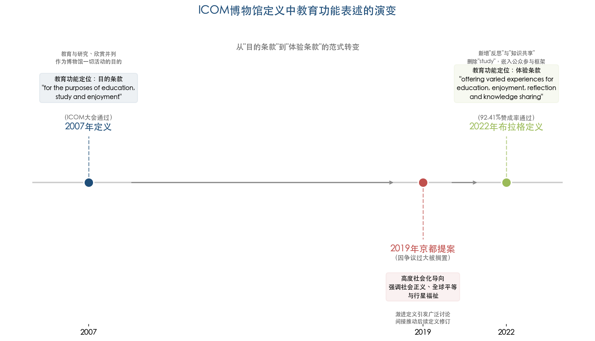

上图以时间轴形式呈现了ICOM 2007年定义、2019年京都提案与2022年布拉格定义三个关键节点中教育功能表述的范式转变历程。

### 1.1.2 中国《博物馆条例》对教育功能的法定定位

中国《博物馆条例》（国务院令第659号，2015年3月20日起施行）第二条规定："本条例所称博物馆，是指以教育、研究和欣赏为目的，收藏、保护并向公众展示人类活动和自然环境的见证物，经登记管理机关依法登记的非营利组织。"值得注意的是，该条文将"教育"置于"研究"和"欣赏"之前，这是中国博物馆行业第一个全国性法规文件中将教育功能提至首位的法定表述，彰显了国家层面对博物馆教育职能的高度重视。[北京市文物局转载《博物馆条例》全文](https://wwj.beijing.gov.cn/bjww/362760/362767/556574/556580/bwgzhgl/556812/index.html "国务院令第659号")

《博物馆条例》不仅在定义层面确立了教育优先原则，还以多个条款构建了较为完整的博物馆教育制度框架。第三十二条专门规定面向未成年人的教育功能，要求博物馆"根据不同年龄段的未成年人接受能力进行讲解"，学校寒暑假期间应"增设适合学生特点的陈列展览项目"。第三十四条要求博物馆"运用现代信息技术，开展形式多样、生动活泼的社会教育和服务活动"，为数字化教育手段的引入提供了法律依据。第三十五条则从行政协调机制层面要求国务院教育行政部门会同国家文物主管部门"制定利用博物馆资源开展教育教学、社会实践活动的政策措施"，地方教育行政部门应鼓励学校组织学生到博物馆开展学习实践活动。[北京市文物局转载《博物馆条例》全文](https://wwj.beijing.gov.cn/bjww/362760/362767/556574/556580/bwgzhgl/556812/index.html "第三十二条、三十四条、三十五条")

将中国《博物馆条例》与ICOM 2022年定义对比，两者均将教育视为博物馆的核心功能，但路径取向存在明显差异。ICOM 2022年定义将教育嵌入"多元体验"框架，强调包容性、可达性与社区参与，体现的是一种价值导向型表述；中国《博物馆条例》则更具行政实操性，以具体条款规定了教育对象（未成年人）、教育手段（现代信息技术）和协调机制（教育行政部门与文物部门联动），体现的是一种制度建设型表述。两种路径折射出国际学术话语与中国制度实践之间的互补关系。

### 1.1.3 美英博物馆行业组织的教育功能定位

除ICOM的全球性框架外，美国和英国的博物馆行业组织亦在各自的标准体系中赋予教育功能以核心地位，其表述路径各具特色。

美国博物馆联盟（American Alliance of Museums, AAM）在其核心标准（Core Standards for Museums）中，将"教育与诠释"（Education and Interpretation）列为七大核心标准之一，明确要求"博物馆应确立其公共服务角色，并将教育置于该角色的核心"（The museum asserts its public service role and places education at the center of that role）。[AAM核心标准官方页面](https://www.aam-us.org/programs/ethics-standards-and-professional-practices/core-standards-for-museums/ "AAM Core Standards全文")

AAM 1992年发布的里程碑文件《卓越与公平：教育与博物馆的公共维度》（*Excellence and Equity*）进一步将博物馆重新定义为"公共服务与教育的机构"，明确"教育"在此语境下涵盖"探索、研究、观察、批判性思考、沉思和对话"（exploration, study, observation, critical thinking, contemplation, and dialogue）。该报告第一条原则即为"确立博物馆将教育——最广义意义上的教育——置于其公共服务角色的核心"，并强调教育不仅是某个部门的职能，而是贯穿博物馆全机构的事业（museum-wide endeavor）。[AAM《卓越与公平》报告](http://ww2.aam-us.org/docs/default-source/resource-library/excellence-and-equity.pdf "AAM 1992年报告")

需要指出的是，AAM并未如ICOM那样发布一个单一的、具有准法律效力的"博物馆定义"，而是通过认证标准（accreditation criteria）来界定博物馆的资质边界。1975年，AAM修订认证标准时取消了对藏品的强制要求，使无实物收藏的科学中心（science center）也可获得认证，这一变革极大地拓展了"博物馆"的外延，也间接扩展了博物馆教育的实践边界。[美国科技中心协会回顾](https://www.astc.org/dimension/looking-back-to-look-ahead/ "ASTC对AAM 1975年定义修订的记述")

英国博物馆协会（Museums Association, MA）1998年采用的定义将"探索和学习"（explore and learn）置于首位："Museums are for people to explore and learn from collections for understanding and inspiration." 该定义以人为出发点，将博物馆定位为学习与探索的场所，而非以藏品保管为中心的传统机构。[Mapping Museums项目](https://mapping-museums.bbk.ac.uk/2017/10/30/defining-museums/ "伦敦大学伯贝克学院")

2020年，英国博物馆协会发布《博物馆学习与参与宣言》（A Manifesto for Museum Learning and Engagement），提出博物馆最重要的功能在于充当"文化民主的中心"（centres for cultural democracy），并以社会正义、社区参与和文化权利三大支柱为基石。这一宣言标志着英国博物馆教育理念从传统的"知识传授"范式转向"文化赋权"范式。[英国博物馆协会宣言](https://www.museumsassociation.org/campaigns/learning-and-engagement/manifesto/ "2020年发布")

### 1.1.4 从"博物馆教育"到"博物馆学习"：概念的学理演化

在学术脉络中，"博物馆教育"（museum education）这一概念本身经历了深刻的范式转型。George Hein在其关于博物馆教育的学术综述中指出，"教育"一词在博物馆语境中长期存在争议——该词容易暗示一种"义务性的、正式的、以事实灌输为主的信息传递"（obligatory, formal, fact-laden information transfer），因此许多博物馆从业者更倾向使用"诠释"（interpretation）一词来描述面向观众的知识沟通活动。[George Hein博物馆教育综述](https://george-hein.com/downloads/MuseumEdBlackwellHein.pdf "Blackwell Companion to Museum Studies")

Falk和Dierking（2000年）提出的博物馆学习情境模型（Contextual Model of Learning）构成了这一范式转型的理论基石。该模型将博物馆中的学习理解为三重情境交互作用的结果：个人情境（prior knowledge, interests, motivations）、社会文化情境（social interaction）和物理情境（museum environment）。建构主义（constructivism）理论进一步指出，博物馆中的学习实质上是观众主动进行的"意义建构"（meaning-making），这些意义不仅受博物馆展品和展示方式的中介，也深受观众文化背景、个人经历和参观条件的影响。情境模型的提出标志着学界从"博物馆教育"（institution-centered，以机构为中心的教学活动）向"博物馆学习"（visitor-centered，以观众为中心的意义建构）的范式转变。[George Hein博物馆教育综述](https://george-hein.com/downloads/MuseumEdBlackwellHein.pdf "对Falk & Dierking模型的讨论")

Ansbacher（2002年）则进一步质疑"学习"一词对描述博物馆体验仍过于限制性，主张博物馆体验的成果应更广泛地包含享受（enjoyment）和满足感（satisfaction）。Dewey早在1938年即提出"经验即教育"（experience is educative）的命题，这一观点在博物馆教育领域获得广泛关注，推动了从"内容导向的学习结果"向"有意义的体验"的理论转向。[George Hein博物馆教育综述](https://george-hein.com/downloads/MuseumEdBlackwellHein.pdf "对Ansbacher和Dewey观点的讨论")

综合以上学术讨论，博物馆教育概念呈现出清晰的三层次分化：

| 概念层次 | 英文术语 | 核心取向 | 代表理论 |
|---|---|---|---|
| 博物馆教育 | Museum Education | 机构主导的教学安排 | 传统教育学框架 |
| 博物馆学习 | Museum Learning | 观众自主的意义建构 | Falk & Dierking 情境模型；建构主义 |
| 博物馆体验 | Museum Experience | 包含情感与反思的综合经历 | Dewey 经验教育理论；Ansbacher 体验论 |

本报告采用"博物馆教育"作为统摄性概念，涵盖博物馆面向公众开展的一切有意识的知识传播、学习促进和体验设计活动，既包括机构组织的正式教学项目（如馆校合作课程、研学活动），也包括通过展览设计、数字技术和社区参与所实现的非正式学习与自主体验。

## 1.2 全球与中国博物馆的总体规模

在进入分类体系的讨论之前，有必要对全球及中国博物馆的总体规模进行基准勾勒，以明确本报告讨论对象的数量级与发展态势。

根据UNESCO 2021年发布的《全球博物馆应对COVID-19报告》（Museums around the World in the Face of COVID-19），全球博物馆总数约为104,000家。[UNESCO官方报道](https://www.unesco.org/en/articles/supporting-museums-unesco-report-points-options-future "UNESCO 2021年报告新闻稿，确认104,000家数据") 这一数字自1975年的约22,000家增长近4倍，反映了半个世纪以来全球博物馆事业的跨越式发展。在国别分布上，美国以约33,082家博物馆位居世界第一。[吉尼斯世界纪录引用UNESCO数据](https://www.guinnessworldrecords.com/world-records/781355-most-museums-country-per-capita "UNESCO 2021年报告")

截至2024年底，中国备案博物馆达到7,046家，较上年增加213家，实现每20万人拥有一家博物馆的里程碑。中国博物馆免费开放率达91.46%，2024年全年举办陈列展览4万余个、教育活动51万余场，接待观众14.9亿人次。从2012年的3,866家到2024年的7,046家，中国博物馆总数在十二年间几乎翻倍，目前总量位居世界第二，仅次于美国。[南方都市报报道国家文物局2025年国际博物馆日发布数据](https://www.163.com/dy/article/JVSA9JP505129QAF.html "2025年5月18日")；[中国博物馆协会第五批评估答记者问](https://www.chinamuseum.org.cn/cma/detail.html?id=12&contentId=13677 "含增长数据") 上述数据表明，中国已建成世界上规模最大的博物馆教育网络之一，其教育活动的覆盖面和参与规模均居全球前列。

## 1.3 博物馆分类的三维框架

为使后续各章的分析具有统一的比较坐标，本报告构建一个三维分类框架，分别从行政级别、所有制性质和学科门类三个维度对博物馆进行系统分类。该框架主要以中国博物馆管理实践为蓝本，同时兼顾国际通行的分类逻辑，以便在中外比较分析中灵活适配。[中国博物馆协会官方专访](https://www.chinamuseum.org.cn/cma/detail.html?id=12&contentId=13677 "含分类数据")

### 1.3.1 维度一：行政级别

行政级别维度反映博物馆在公共行政体系中的层级归属，直接影响其资源配置、管理权限和辐射范围。在中国语境下，这一维度可划分为以下四个层级：

- **国家级**：直属中央部委或由中央直接管理的博物馆，如故宫博物院、中国国家博物馆、中国科技馆等。这类博物馆通常享有最高等级的财政保障和政策支持，在教育资源配置上具有显著优势。
- **省级**：由省、自治区、直辖市级行政单位管理的博物馆，如各省博物馆（院）、省级科技馆等，承担区域性教育枢纽功能。
- **市级**：由地级市、州、盟管理的博物馆，是城市公共文化服务体系的重要组成部分。
- **县区级/社区级**：由县、区、旗及以下行政单位管理或由社区、村镇设立的博物馆，包括各类乡村博物馆、社区博物馆、村史馆等，是博物馆教育下沉基层的关键节点。

327家国家一级博物馆的隶属数据清晰印证了这一层级结构的实际分布：中央属22家、省（市、区）属79家、地（市、州、盟）属172家、县（区、旗）属42家、其他12家。其中，地级及以下一级博物馆共226家，占总数的69.11%，反映出近年来基层博物馆质量水平的显著提升。[中国博物馆协会官方专访](https://www.chinamuseum.org.cn/cma/detail.html?id=12&contentId=13677 "第五批定级评估答记者问")

在国际比较中，行政级别维度同样具有分析价值：各国通常区分国家博物馆（national museums）、区域/州立博物馆（regional/state museums）和地方/社区博物馆（local/community museums），尽管具体层级划分因各国行政体制差异而有所不同。

### 1.3.2 维度二：所有制性质

所有制维度界定博物馆的资产归属与治理结构，深刻影响其运营模式、经费来源及教育使命的优先序。

中国《博物馆条例》第二条确立了法定的二分体系："博物馆包括国有博物馆和非国有博物馆。利用或者主要利用国有资产设立的博物馆为国有博物馆；利用或者主要利用非国有资产设立的博物馆为非国有博物馆。"[北京市文物局转载《博物馆条例》全文](https://wwj.beijing.gov.cn/bjww/362760/362767/556574/556580/bwgzhgl/556812/index.html "第二条") 在中国实践中，国有博物馆还可进一步细分为文物系统国有博物馆（隶属各级文物行政部门）和行业国有博物馆（隶属教育、科技、军事、自然资源等其他系统）。327家国家一级博物馆的管理属性数据显示：文物系统国有261家（79.82%）、行业国有64家（19.57%）、非国有仅2家（0.61%）。这一高度集中的结构分布表明，中国博物馆教育的主体资源仍牢固掌握在国有体系之中。[中国博物馆协会官方专访](https://www.chinamuseum.org.cn/cma/detail.html?id=12&contentId=13677 "第五批定级评估答记者问")

在国际视野中，所有制形态更为多元化，本报告将其归纳为三类：

- **公立/国有（Public/Government）**：由各级政府设立并以财政拨款为主要运营经费，如大英博物馆、卢浮宫、史密森学会下属博物馆群等。
- **私立/民营（Private）**：由私人基金会、企业或个人设立和运营，如美国盖蒂博物馆、古根海姆博物馆，以及中国的建川博物馆等。
- **混合制/基金会制（Mixed/Foundation）**：采用独立基金会治理结构，虽可能接受政府拨款但在运营管理上保持独立，如美国大都会艺术博物馆、荷兰国立博物馆等。

### 1.3.3 维度三：学科门类

学科门类维度按博物馆的藏品内容和知识领域进行分类，直接决定其教育方法论的选择、受众特征及与学校教育的衔接方式。

中国在第五批全国博物馆定级评估中采用的题材分类包括六大类：综合地志类、历史文化类、革命纪念类、自然科技类、考古遗址类和其他专题类。327家国家一级博物馆的题材分布为：综合地志类131家（40.1%）、历史文化类88家（26.9%）、革命纪念类58家（17.7%）、自然科技类26家（8.0%）、考古遗址类10家（3.1%）、其他专题类14家（4.3%）。综合地志类占比最高，反映出中国博物馆体系以地方综合性博物馆为基础主体的结构特征。[中国博物馆协会官方专访](https://www.chinamuseum.org.cn/cma/detail.html?id=12&contentId=13677 "第五批定级评估答记者问")

在国际通行分类中，本报告归纳为以下六大门类：

- **综合类（General/Encyclopedic）**：涵盖多学科领域的综合性博物馆，如大英博物馆、中国国家博物馆。
- **历史类（History）**：以历史事件、人物或地方史为主题，包括中国语境下的革命纪念类和考古遗址类。
- **艺术类（Art）**：以视觉艺术和工艺美术为核心收藏，如卢浮宫、中国美术馆。
- **科技类（Science & Technology）**：以自然科学原理演示和技术应用为主题，如伦敦科学博物馆、中国科技馆。
- **自然类（Natural History）**：以自然标本和生态环境为核心，如美国自然历史博物馆、北京自然博物馆。
- **专题类（Specialized/Thematic）**：聚焦特定主题，如行业博物馆、名人纪念馆、民俗博物馆等。

### 1.3.4 三维框架的整合与后续复用

上述三个维度构成一个三维坐标系，任何一家博物馆均可在其中找到自身的定位。例如，故宫博物院可定位为"国家级—国有—综合类"，建川博物馆可定位为"市级—非国有—历史类（专题类）"，一座村史馆可定位为"县区级/社区级—国有—历史类"。

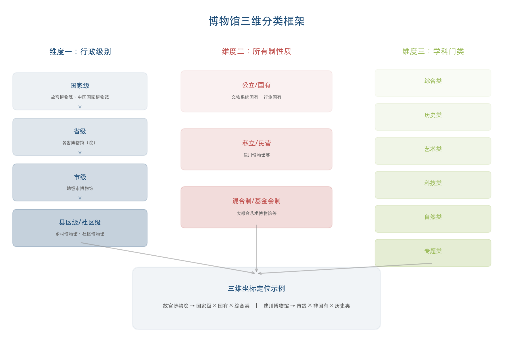

上图以三列并列布局直观呈现行政级别、所有制性质和学科门类三个分类维度及其具体层级，并以故宫博物院和建川博物馆为例展示三维坐标定位方法。

| 分类维度 | 中国语境下的层级 | 国际比较中的对应概念 |
|---|---|---|
| 行政级别 | 国家级、省级、市级、县区级/社区级 | 国家博物馆、区域/州立博物馆、地方/社区博物馆 |
| 所有制 | 国有（文物系统/行业系统）、非国有 | 公立/政府、私立/基金会、混合制 |
| 学科门类 | 综合地志类、历史文化类、革命纪念类、自然科技类、考古遗址类、其他专题类 | 综合类、历史类、艺术类、科技类、自然类、专题类 |

后续章节将以该框架为统一分析坐标：第2章分析中国博物馆教育现状时，将按行政级别和所有制维度展开差异分析；第3章考察国外主要国家时，将在各国叙述中嵌入所有制和学科门类视角；第4章横向比较时，将以三个维度为主线提炼中外博物馆教育的结构性差异。

## 1.4 中国博物馆定级评估制度与教育指标

中国建立了一套独具特色的博物馆定级评估制度，为博物馆的质量分层提供了行政化的衡量标准，其中教育功能是核心评估维度之一。

国家文物局2019年12月修订的《博物馆定级评估办法》和《博物馆定级评估标准》规定，博物馆经定级评估从高到低依次划分为国家一级博物馆、国家二级博物馆、国家三级博物馆三个等级。新版评估标准设有3个一级评估指标——综合管理与基础设施、藏品管理与科学研究、影响力与社会服务——其下分设13个二级指标、78个三级指标及15个加分项。[新浪新闻转载澎湃新闻报道](https://news.sina.cn/2020-01-22/detail-iihnzhha4195803.d.html "2020年新版评估标准解读")

相较旧版标准，2019年版的核心变化在于：不再以藏品数量作为衡量博物馆质量高低的核心标准，取消了一二三级博物馆占全国博物馆数量比例的限定（旧版分别为3%、6%、9%），大幅完善了青少年教育、志愿者服务、社区活动等"软件"指标要求，并增设了博物馆资源进校园、馆际交流合作等加分项。这些调整体现了评估体系从偏重硬件规模向兼顾教育效能与社会服务的方向转型。《博物馆条例》第三十八条为定级评估制度提供了上位法依据，规定博物馆行业组织可以根据博物馆的"教育、服务及藏品保护、研究和展示水平"对博物馆进行评估。[北京市文物局转载《博物馆条例》全文](https://wwj.beijing.gov.cn/bjww/362760/362767/556574/556580/bwgzhgl/556812/index.html "第三十八条")

截至第五批全国博物馆定级评估完成（2024年），国家一级博物馆总数达到327家，约占全国7,046家备案博物馆的4.78%。这327家一级博物馆的结构分布，为理解中国博物馆教育的质量层级提供了具象化的参照系。[中国博物馆协会官方专访](https://www.chinamuseum.org.cn/cma/detail.html?id=12&contentId=13677 "第五批定级评估答记者问")

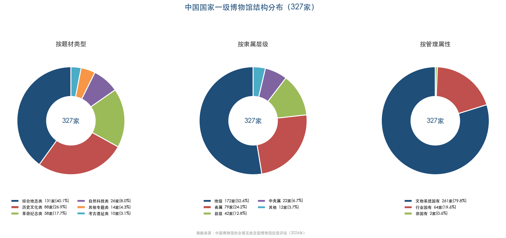

上图以三个并列环形图分别呈现327家国家一级博物馆按题材类型（综合地志类131家/40.1%居首）、按隶属层级（地级172家/52.6%居首）和按管理属性（文物系统国有261家/79.8%居首）的三重结构分布，数据来源为中国博物馆协会第五批全国博物馆定级评估（2024年）。

## 1.5 核心术语表

本报告涉及的核心术语统一给出中英文对照和简明定义，以确保后续章节在统一的语义基础上展开论述：

| 中文术语 | 英文术语 | 简明定义 |
|---|---|---|
| 博物馆教育 | Museum Education | 博物馆面向公众开展的知识传播、学习促进和体验设计活动的统称 |
| 博物馆学习 | Museum Learning | 以观众为中心的、在博物馆情境中自主发生的意义建构过程 |
| 博物馆体验 | Museum Experience | 观众在博物馆中获得的包含认知、情感、社交等维度的综合经历 |
| STEAM教育 | STEAM Education | 融合科学（Science）、技术（Technology）、工程（Engineering）、艺术（Arts）和数学（Mathematics）的跨学科教育理念 |
| 数字孪生 | Digital Twin | 对物理实体或空间的高精度数字化复制品，支持远程交互与模拟 |
| 沉浸式展览 | Immersive Exhibition | 运用VR/AR、投影映射等技术营造多感官参与的展览体验形式 |
| 馆校合作 | Museum-School Partnership | 博物馆与学校建立的系统化教育协作关系 |
| 研学旅行 | Study Tour / Educational Travel | 以博物馆等场所为目的地、将参观体验与课程学习相结合的实践教育活动 |
| 社会教育 | Social Education | 中国博物馆语境下对面向社会公众的非正规教育活动的统称 |
| 诠释 | Interpretation | 博物馆通过展览、讲解等方式向观众传达藏品意义与文化内涵的过程 |

## 1.6 本章小结

本章完成了三项基础性工作。第一，通过系统梳理ICOM定义演变、中国《博物馆条例》法定表述以及美英博物馆行业标准，界定了"博物馆教育"在制度与学理两个层面的内涵与外延，并追溯了从"博物馆教育"到"博物馆学习"再到"博物馆体验"的概念演化脉络。第二，构建了行政级别、所有制性质和学科门类三维分类框架，为后续各章的比较分析提供统一的坐标系。第三，介绍了中国博物馆定级评估制度及其教育指标体系，以327家国家一级博物馆的结构数据勾勒了中国博物馆的总体规模与质量分层格局。上述概念工具和分类框架将在第2章至第6章中被反复调用，以确保全文的分析在统一的语义基础和比较维度上展开。

# 第2章 中国博物馆教育现状

## 2.1 整体格局：规模扩张与教育功能跃升

### 2.1.1 博物馆总量与增长态势

中国博物馆事业在过去十余年间经历了规模的跨越式增长。截至2024年底，全国备案博物馆总数达7,046家，较上年增加213家，实现了每20万人拥有一座博物馆的里程碑目标，总量位居世界第二，仅次于美国。[新华网报道国家文物局数据](http://www.news.cn/20250518/98cc603c54e840939014b336637fc9ad/c.html "2025年5月18日国际博物馆日发布") 回溯增长轨迹，2012年全国博物馆总数为3,866家，至2023年增至6,833家，十二年间净增2,967家，年均新增约247家。[中国博物馆协会第五批评估答记者问](https://www.chinamuseum.org.cn/cma/detail.html?id=12&contentId=13677 "含2012–2023年增长数据") 这一增长既得益于政府主导的公共文化设施建设投入，也受益于社会力量办馆热情的持续升温。

在教育活动方面，2024年全国博物馆举办陈列展览4.3万个、教育活动51.1万场，接待观众14.9亿人次。[新华社快报](http://www.news.cn/20250518/78406a001bb74524b08c231955295e6d/c.html "2024年全国博物馆接待观众14.9亿人次") 与上年数据相比，2023年全国博物馆举办教育活动约38万场、接待观众12.9亿人次，2024年教育活动场次同比增长约34%，观众人次同比增长约15.5%。教育活动的增速显著高于观众人次的增速，表明中国博物馆正从"被动接待"转向"主动教育"，教育供给的密度与丰富度持续提升。

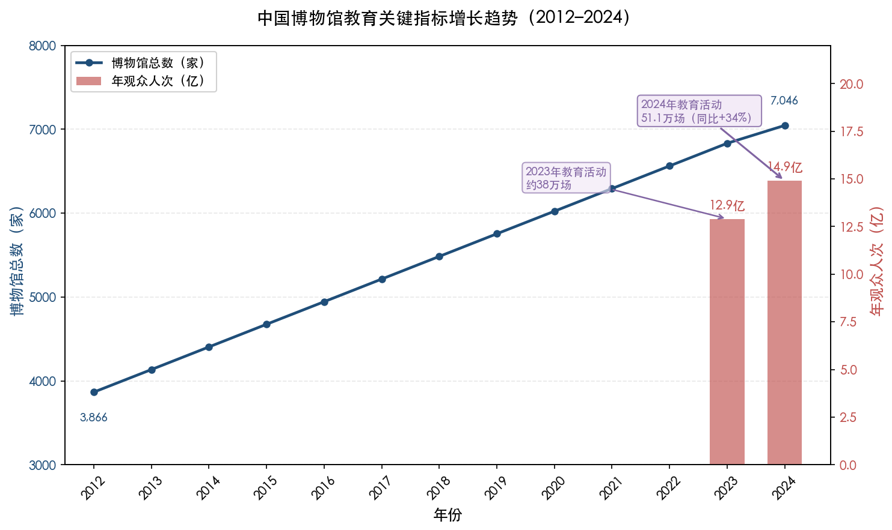

图2-1呈现了2012至2024年间中国博物馆总数与年观众人次的增长轨迹。博物馆总量从3,866家增至7,046家，年均增幅约5%；年观众人次在2024年达到14.9亿，教育活动场次突破51万场（同比增长34%），折射出博物馆教育供给能力的系统性跃升。

### 2.1.2 免费开放政策的推进效果

中国博物馆免费开放政策始于2008年，由中宣部、财政部、文化部、国家文物局联合发文推动。截至2024年底，全国博物馆免费开放率达91.46%。[新华网报道国家文物局数据](http://www.news.cn/20250518/98cc603c54e840939014b336637fc9ad/c.html "2025年5月18日发布，免费开放率91.46%") 这一政策从根本上消除了公众走进博物馆的经济门槛，使博物馆教育功能的社会覆盖面得以大幅扩展。

免费开放政策的教育效应集中体现在两个层面。**其一，观众基数急剧扩大。** 2008年政策实施前，全国博物馆年接待观众约3亿人次；至2024年这一数字跃升至14.9亿人次，十六年间增长近4倍。**其二，观众结构发生深刻变化。** 以中国国家博物馆2024年度数据为例，0–18周岁观众占比20.15%，19–35周岁观众占比42.29%，36–59周岁观众占比30.48%，60周岁以上观众占比7.08%，35岁以下的年轻观众合计占比超过60%。[中国国家博物馆数据报告（2024年度）](https://www.chnmuseum.cn/shxg/zlxz/pdfdown/202503/t20250320_271313.shtml "2025年3月发布") 年轻群体已成为博物馆受众的主体，为博物馆教育从传统的"知识普及"向"终身学习"转型奠定了坚实的受众基础。

### 2.1.3 区域分布的不均衡性

中国博物馆的空间分布呈现显著的"东南密、西北疏"格局，大致沿"胡焕庸线"两侧非均衡分布。[中国博物馆空间分布特征的多尺度分析](https://html.rhhz.net/RWDL/html/20170611.htm "《人文地理》期刊") 博物馆资源高度集中于东部经济发达地区和文化遗产富集省份，北京、上海、江苏、浙江、广东、山东、四川等省份的博物馆密度远超西部省区。中国博物馆协会在第五批定级评估中亦明确指出，"我国不同地域、不同省份之间，在博物馆高质量发展的进程中，发展不均衡、不充分的现象依然相对突出，许多西部省份对于高质量博物馆资源的需求仍然迫切"。[中国博物馆协会第五批评估答记者问](https://www.chinamuseum.org.cn/cma/detail.html?id=12&contentId=13677 "区位分布分析")

这种区域不均衡直接影响博物馆教育资源的公平可及性。东部城市的青少年可在步行范围内接触高品质博物馆教育资源，而中西部农村地区的学生往往需要跨越数百公里才能抵达最近的综合性博物馆。为弥合这一差距，以流动科技馆、科普大篷车为代表的流动科普资源体系成为关键补充手段，相关分析详见本章第2.2.4节。

## 2.2 按行政级别分析：从国家殿堂到乡村展馆

依据第1章建立的行政级别分类维度，中国博物馆教育的层级差异极为显著。327家国家一级博物馆的隶属数据显示：中央属22家、省属79家、地级172家、县级42家、其他12家。[中国博物馆协会第五批评估答记者问](https://www.chinamuseum.org.cn/cma/detail.html?id=12&contentId=13677 "隶属关系数据") 不同层级的博物馆在教育资源配置、活动形态和受众覆盖上呈现出层次分明的梯度格局。

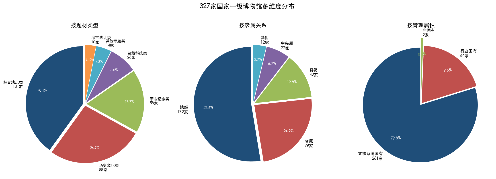

图2-2从题材类型、隶属关系和管理属性三个维度展示了327家国家一级博物馆的结构分布。综合地志类（131家，40.1%）和历史文化类（88家，26.9%）合计占据近七成份额；地级博物馆（172家，52.6%）是一级博物馆的主体力量；文物系统国有博物馆（261家，79.8%）占据绝对主导地位，非国有博物馆仅2家（0.6%）入选。

### 2.2.1 国家级博物馆：教育标杆与引领示范

国家级博物馆是中国博物馆教育体系的"头部方阵"，在教育资源投入、专业人才配置和品牌辐射力方面处于金字塔顶端。以下以三家代表性机构为例，阐述其教育实践的核心特征。

**故宫博物院**是中国最具标志性的国家级博物馆之一。2024年度，故宫博物院共接待观众1,762万人次，社会教育活动参与人次达46,239人次。[故宫博物院2024年度部门决算](https://www.dpm.org.cn/Uploads/file/2025/08/15/1755240543JYgduFMfI218985.pdf "2024年度绩效数据") 故宫建立了以"故宫知识课堂"为核心的教育品牌体系，每年寒暑假期间推出系统性研学课程。2025年暑假"故宫知识课堂"设置线下课程8场和8期线上微课堂短视频，实现线上线下双渠道覆盖。[故宫博物院官网](https://www.dpm.org.cn/activity/education/371014.html "2025暑假故宫知识课堂") 此外，故宫设有专门的教育中心，面向全社会开放，提供针对各年龄段公众的文化课程与教育活动。[故宫博物院教育页面](https://www.dpm.org.cn/Events.html "故宫教育中心介绍") 截至2024年度，故宫志愿者团队累计为社会公众提供现场服务近18万小时，服务观众超过100万人次。[新华网报道](http://www.news.cn/20250420/1302a347820d45528dd5b7fc5456e722/c.html "故宫志愿者服务数据")

故宫博物院的教育实践还体现出鲜明的跨区域辐射能力。"圆你故宫梦"夏令营项目自2024年起获公益慈善机构捐助支持，推动香港与内地青少年共同深入学习中华优秀传统文化。[故宫博物院官网](https://www.dpm.org.cn/classify_detail/370964.html "圆你故宫梦夏令营") 2025年7月，故宫启动青少网站英文版与繁体版建设，并与香港青年文化从业者合作开展"文化+科技训练营"，标志着其教育辐射范围从内地拓展至港澳乃至国际青年群体。[故宫博物院官网](https://www.dpm.org.cn/activity/education/370867.html "2025年故宫–香港青年文化从业者训练营")

**中国国家博物馆**2024年全年开放317天，累计接待观众695.7万人次，日均接待近2.2万人次，同比增长3%。在教育服务方面，全年完成公益讲解7,336场次、公务讲解1,047场次、收费讲解1,541场次，开展教育活动170场次，承接北京市教委委托的"七个一"活动1,326批次，累计服务观众约44万人次。[中国国家博物馆数据报告（2024年度）](https://www.chnmuseum.cn/shxg/zlxz/pdfdown/202503/t20250320_271313.shtml "2025年3月发布") 国博的教育活动呈现高度体系化特征：以"古代中国·通史"与"古代中国·通识"系列课程为核心，全年实施夏/冬令营6期48场次、周末研学营50场次，并举办"国博公共考古体验营"6期，其中"古代中国"通识系列活动获评"首届全国文化遗产研学十佳案例"。[中国国家博物馆数据报告（2024年度）](https://www.chnmuseum.cn/shxg/zlxz/pdfdown/202503/t20250320_271313.shtml "社教传播部分")

国博同时承担着全国博物馆行业的教育人才培养功能。2024年，国博累计培训9,701人次，其中结合"文博行业人才培养工程"目标举办行业类培训6项，累计培训7,791人次。[中国国家博物馆数据报告（2024年度）](https://www.chnmuseum.cn/shxg/zlxz/pdfdown/202503/t20250320_271313.shtml "科研活动部分") 在数字教育领域，国博虚拟数智人"艾雯雯"入选中国互联网协会评选的数字人场景应用典型案例，"中华文明云展"荣获2024年度"中华文物新媒体传播精品推介"，展现了国家级博物馆在数字化教育前沿的积极探索。[中国国家博物馆数据报告（2024年度）](https://www.chnmuseum.cn/shxg/zlxz/pdfdown/202503/t20250320_271313.shtml "社教传播部分")

**中国科技馆**作为国家级科技类博物馆的旗舰机构，其教育实践代表了中国科普教育的最高水平。2024年，全国31个省（区、市）和新疆生产建设兵团的数百家科技馆接待观众首次突破1亿人次，较2023年增长16.3%。[新华网报道](https://www.news.cn/tech/20250114/dede1622278f4afebff267d51f42554a/c.html "2025年1月14日") 中国科技馆推出天和核心舱1:1实物验证件展示、沉浸式戏剧、科学大家访谈节目等创新教育形式，并通过"现代科技馆体系联合行动"统筹全国科技馆资源。2024年联合行动以"礼赞共和国，创造新生活"为主题，新增行业赛事交流和科学教师培训两大版块，推动科技馆教育从展品展示向能力建设延伸。[中国科技馆官网](https://www.cdstm.cn/frontier/qt/202410/t20241031_1081502.html "2024年联合行动回顾")

### 2.2.2 省级博物馆：区域教育枢纽

省级博物馆在中国博物馆教育体系中承担着区域枢纽功能，既是本省域内博物馆教育资源的整合平台，也是连接国家级资源向基层下沉的关键中继站。以江苏省为例，截至2024年底，全省362家博物馆中320家实行免费开放，年接待观众近1.4亿人次。[南京晨报](http://njcb.xhby.net/pc/con/202505/08/content_1445564.html "2025年5月8日")

南京博物院是省级博物馆教育实践的典型代表。2024年暑期，南京博物院推出"博物奇探"等多个研学课程，以历史为主题、以时间为线索，探究不同时代背景下人们的生活方式，运用"环环相扣的探究任务"引导学生自主发现与思考。[求是网](http://theory.people.com.cn/n1/2025/0122/c40531-40406673.html "更好发挥博物馆的教育功能") 这种以探究式学习为导向的课程设计，契合了第1章所论述的从"博物馆教育"向"博物馆学习"转型的理念，体现出省级博物馆在教育范式更新方面的积极探索。

省级博物馆还承担着区域内博物馆教育标准制定与示范推广的职责。各省博物馆协会或文物局通常依托省级博物馆组织馆际教育交流、课程研发和人才培训，在"馆校合作"政策落地过程中发挥关键的统筹协调作用。

### 2.2.3 市级博物馆：城市文化名片与馆校合作前沿

市级博物馆数量庞大，是中国博物馆教育体系中覆盖面最广的层级。327家国家一级博物馆中，隶属地级行政单位的有172家，占比52.60%，构成一级博物馆的主体。[中国博物馆协会第五批评估答记者问](https://www.chinamuseum.org.cn/cma/detail.html?id=12&contentId=13677 "隶属关系数据")

市级博物馆在教育功能上的突出特点是与地方教育系统的紧密衔接。"博物馆之城"建设是近年来的重要政策导向——北京、西安、南京、成都、广州、长沙、洛阳、郑州、大同等20余个城市已将建设"博物馆之城"列入发展规划。[学术文献综述](https://search.lib.umich.edu/articles?query=author%253A%25E6%25AF%259B%25E8%258B%25A5%25E5%25AF%2592 "博物馆之城研究") 以北京为例，2024年北京在"博物馆之城"建设中持续加强顶层设计，推动博物馆体系立体化、打造研学教育品牌、加大馆校合作力度。[北京市文化和旅游发展研究皮书](https://www.pishu.com.cn/skwx_ps/initDatabaseDetail?contentId=16097504&siteId=14&contentType=literature "2024年北京博物馆之城建设现状分析") 北京市教委通过"七个一"活动等制度化安排，将博物馆参观学习纳入中小学社会实践课程体系，仅中国国家博物馆一家2024年即承接"七个一"活动1,326批次。[中国国家博物馆数据报告（2024年度）](https://www.chnmuseum.cn/shxg/zlxz/pdfdown/202503/t20250320_271313.shtml "社教传播部分")

南京市的实践同样具有代表性。截至2024年底，南京市拥有博物馆81座，其中国有博物馆61座、非国有博物馆20座，全年博物馆接待游客超4,800万人次。江宁织造博物馆等机构充分发挥教育功能，创造了文旅消费新热点，体现出市级博物馆在"教育+文旅"融合方面的探索活力。[南京市人大](https://rd.nanjing.gov.cn/llyjh_66711/llyj/202508/t20250827_5636855.html "深化协同融合推动文商体旅产业高质量发展")

### 2.2.4 县区级与社区级博物馆：教育下沉的"最后一公里"

县区级博物馆和乡村博物馆是中国博物馆教育体系的基层末梢。在327家国家一级博物馆中，县级仅有42家（占12.84%），反映出基层博物馆在质量评级体系中仍处于相对弱势地位。[中国博物馆协会第五批评估答记者问](https://www.chinamuseum.org.cn/cma/detail.html?id=12&contentId=13677 "隶属关系数据") 然而近年来基层博物馆在数量和质量两方面均取得显著进步——第五批评估中地级及以下一级博物馆共226家，占总数的69.11%，国家文物局将此评价为"基层博物馆质量水平的显著提升"。[中国博物馆协会第五批评估答记者问](https://www.chinamuseum.org.cn/cma/detail.html?id=12&contentId=13677 "基层博物馆发展评价")

**乡村博物馆**是近年来中国博物馆事业最具创新性的增量。国家文物局选取浙江、吉林、山东三省开展乡村博物馆建设试点，将乡村博物馆纳入行业指导范畴。其中，浙江省2021年9月提出在"十四五"期间建设1,000家乡村博物馆，截至2024年3月已累计建成692家。[人民日报](https://paper.people.com.cn/rmrb/html/2024-03/24/nw.D110000renmrb_20240324_1-07.htm "浙江乡村博物馆留住乡土记忆") 这些乡村博物馆形态多样，涵盖民俗文化类（如岕里婚庆博物馆）、农业生产类（如水稻博物馆）、非遗传承类（如善琏湖笔非遗活态传承馆）、工业遗产类（如千岛湖啤酒博物馆）等，展示面积从数十平方米到数百平方米不等，藏品多源于村民自愿捐赠。

乡村博物馆的教育功能具有鲜明的"在地化"特征。浙江省文物局局长朱海闵指出："乡村博物馆不追求'高大上'，要足够'接地气'；不一味求新、求洋、求大，应崇尚因地制宜、各具特色。"[人民日报](https://paper.people.com.cn/rmrb/html/2024-03/24/nw.D110000renmrb_20240324_1-07.htm "浙江省文物局局长访谈") 国家文物局博物馆与社会文物司司长刘洋将乡村博物馆定位为"我国博物馆高质量发展体系的重要后备力量"，并提出在人才培育、展品租借、文旅融合和长效运营等方面加大帮扶力度。[人民日报](https://paper.people.com.cn/rmrb/html/2024-03/24/nw.D110000renmrb_20240324_1-07.htm "国家文物局司长访谈")

**流动科普资源**是弥合基层教育缺口的另一重要手段。自2012年起，中国建设了以实体科技馆为依托、流动科技馆和科普大篷车为延伸、数字科技馆为补充的"现代科技馆体系"。2024年，流动科技馆累计巡展746站、服务公众2,848.6万人次；科普大篷车累计行驶里程268万公里、开展活动3.6万场。[新华网报道](https://www.news.cn/tech/20250114/dede1622278f4afebff267d51f42554a/c.html "2025年1月14日") 截至统计期末，流动科技馆累计巡展5,909站，覆盖全国29个省份1,888个县级行政区，平均每县服务3次。[中国科技馆官网](https://cstm.cdstm.cn/zx/mtgz/art/2024/art_11d3bb72a3b44820b0dc0859cdcf5279.html "现代科技馆体系服务10亿人次") 科普大篷车项目自2000年启动以来，26年间累计服务公众近4亿人次，被誉为"科普轻骑兵"。[科技日报](https://www.stdaily.com/web/gdxw/2026-03/11/content_483936.html "科普大篷车再出发") 这一流动教育体系有效缓解了中西部和农村地区科普教育资源匮乏的困境，是中国博物馆教育体系中独具特色的制度创新。

## 2.3 按所有制分析：国有主体与非国有探索

### 2.3.1 国有博物馆的教育资源优势

中国博物馆体系以国有博物馆为绝对主体。在7,046家备案博物馆中，非国有博物馆约2,175家，占比超三成。[光明日报](https://news.gmw.cn/2024-04/18/content_37269918.htm "为社会力量兴办博物馆提供更多帮扶") 据此推算，国有博物馆约4,871家，占比近七成。而在327家国家一级博物馆中，国有博物馆的主导地位更加突出：文物系统国有博物馆261家（79.82%）、行业国有博物馆64家（19.57%）、非国有博物馆仅2家（0.61%）。[中国博物馆协会第五批评估答记者问](https://www.chinamuseum.org.cn/cma/detail.html?id=12&contentId=13677 "管理属性数据")

国有博物馆在教育功能上的优势主要体现在三个方面。**其一，财政保障的稳定性。** 国有博物馆纳入各级财政预算，免费开放运营经费由中央和地方财政分担，确保了教育活动投入的可持续性。**其二，藏品资源的丰富性。** 国有博物馆拥有中国绝大多数珍贵文物资源，2024年全国博物馆藏品总数达6,741.3万件（套）。[中国日报网](https://cn.chinadaily.com.cn/a/202505/19/WS682a820ca310205377033ac4.html "2024年博物馆藏品数据") 丰厚的藏品资源为教育活动的内容深度和学术品质提供了坚实支撑。**其三，专业人才的配置。** 国有博物馆通常设有专门的社会教育部门，配备讲解员、教育专员和研学导师等专业岗位，能够提供系统化、分层化的教育服务。

国有博物馆中的"行业博物馆"值得特别关注。隶属于教育、科技、军事、自然资源等系统的行业国有博物馆共64家入选一级博物馆，在各自专业领域的教育中发挥着不可替代的作用。以科技类博物馆为例，2024年度全国科普统计数据显示，全国共有科技馆和科学技术类博物馆1,890个，较2023年增加111个。[新华网](https://www.news.cn/20260129/710038ccd8a943da86ef77893e6168bc/c.html "2024年度全国科普统计数据") 全国科协系统管理科普场馆1,150个、流动科技馆763个、科普大篷车1,350辆，全年服务公众合计1.5亿人次。[中国科协2024年度统计简报](https://www.cast.org.cn/sj/ZGKXNDSYFZTJGB/art/2025/art_c2006befd97c4cab994c70b6aa21123c.html "中国科协2024年度统计简报")

### 2.3.2 非国有博物馆的教育特色与困境

非国有博物馆约2,175家，占全国博物馆总量的三成以上，整体呈现"小而专"的特色，与国有博物馆的"大而全"形成互补。建川博物馆、观复博物馆、大唐西市博物馆等是非国有博物馆中的知名代表。[光明日报](https://news.gmw.cn/2024-04/18/content_37269918.htm "非国有博物馆概况")

非国有博物馆在教育方面具有一定的差异化优势。**在选题上**，非国有博物馆往往聚焦国有博物馆较少覆盖的专题领域——如传统手工艺、地方特色产业、现当代文化等——为公众提供了更多元的知识窗口。**在运营机制上**，非国有博物馆不受编制和财政拨款的刚性约束，在教育产品设计和市场化运营方面拥有更大的灵活空间。

然而，非国有博物馆在教育功能的发挥上面临多重结构性困境。**资金难题**是最突出的瓶颈——多数非国有博物馆缺乏稳定的财政拨款来源，运营经费依赖创办者个人投入、门票收入和社会捐赠，教育活动往往被视为"成本项"而非"投资项"，导致教育投入长期不足。建川博物馆创始人樊建川曾多次公开表示民营博物馆办馆之不易。[21经济网](https://www.21jingji.com/article/20240327/herald/169532fce2f67dda6391e4e2c669fd91.html "一家民营金融博物馆的告别") 近年来，多家民营美术馆和博物馆因资金压力相继退出或宣告关闭，折射出非国有博物馆可持续运营面临的系统性风险。[艺术中国](http://art.china.cn/txt/2025-09/09/content_43221847.htm "民营美术馆生存现状") **专业人才匮乏**是另一显著短板——非国有博物馆的薪资水平和职业发展空间通常难以吸引高水平的博物馆教育专业人才。**藏品管理的规范化不足**也制约着教育活动的学术品质。327家国家一级博物馆中仅有2家为非国有博物馆（占0.61%），这一比例从侧面反映了非国有博物馆在综合能力建设上与国有博物馆之间的显著差距。[中国博物馆协会第五批评估答记者问](https://www.chinamuseum.org.cn/cma/detail.html?id=12&contentId=13677 "非国有博物馆占比")

中国博物馆协会在评估中明确指出，"行业博物馆和非国有博物馆是我国博物馆事业高质量发展的重要增长点"，需在政策支持和行业扶持方面给予更多关注。[中国博物馆协会第五批评估答记者问](https://www.chinamuseum.org.cn/cma/detail.html?id=12&contentId=13677 "高质量发展增长点")

## 2.4 按学科门类分析：教育方法论的分化

### 2.4.1 综合地志类与历史文化类：叙事性教育的主阵地

在327家国家一级博物馆中，综合地志类131家、历史文化类88家，两者合计219家，占比66.97%。[中国博物馆协会第五批评估答记者问](https://www.chinamuseum.org.cn/cma/detail.html?id=12&contentId=13677 "题材类型数据") 这两类博物馆构成中国博物馆教育的最大板块，其教育方法以叙事性为主导——通过文物与文献的展陈、历史脉络的梳理和导览讲解的串联，实现历史知识与地方文化的系统传播。

综合地志类博物馆通常为各省、市博物馆（院），教育内容围绕本区域的历史演变和文化特色展开，典型教育形态包括：基本陈列的体系化讲解、专题展览的配套教育项目、面向青少年的研学课程以及与学校历史课程衔接的馆校合作。历史文化类博物馆则往往聚焦特定历史时期、文化主题或名人史迹，教育内容更具纵深感和专题性。

### 2.4.2 革命纪念类：思政教育的重要载体

革命纪念类博物馆58家入选一级博物馆，在中国博物馆教育体系中承担着独特的思想政治教育功能。[中国博物馆协会第五批评估答记者问](https://www.chinamuseum.org.cn/cma/detail.html?id=12&contentId=13677 "题材类型数据") 2024年，国家文物局明确提出"革命纪念场馆和革命文物发挥思政教育功能"的工作要求。[国新办发布会](http://www.scio.gov.cn/live/2024/34884/index.html "国家文物局推动高质量发展发布会") 中国国家博物馆推出的"人格的力量——中国共产党人的家国情怀图片展"于2024年先后巡展至苏州、杭州、武汉、上海、重庆、乌鲁木齐等城市的革命纪念馆和博物馆，展示了革命纪念类教育资源在全国范围内流动共享的趋势。[中国国家博物馆数据报告（2024年度）](https://www.chnmuseum.cn/shxg/zlxz/pdfdown/202503/t20250320_271313.shtml "巡回展览部分")

### 2.4.3 自然科技类：互动式与探究式教育的先锋

自然科技类博物馆26家入选一级博物馆，数量占比虽较小（7.95%），但其教育方法论在整个博物馆教育体系中具有前沿示范意义。[中国博物馆协会第五批评估答记者问](https://www.chinamuseum.org.cn/cma/detail.html?id=12&contentId=13677 "题材类型数据") 科技类博物馆的教育实践天然强调动手操作（hands-on）、互动体验和科学探究，与STEAM教育理念高度契合。

2024年全国科技馆接待观众首次突破1亿人次，标志着科技类博物馆已成为中国科普教育不可替代的主阵地。[新华网报道](https://www.news.cn/tech/20250114/dede1622278f4afebff267d51f42554a/c.html "2025年1月14日") 中国科技馆馆长郭哲提出："今天的科技馆已不仅是一座物理意义上的场馆，而正以'科普+'的多元形式融入公众日常生活，赋能经济社会的多领域。"[新华网报道](https://www.news.cn/tech/20250114/dede1622278f4afebff267d51f42554a/c.html "中国科技馆馆长访谈")

中国科协的"现代科技馆体系"还为探索教育公平提供了独特的制度方案。面向偏远地区乡村学校开展的"流动科学课"活动网络传播量超3.5亿次。以新疆巴音郭楞蒙古自治州为例，覆盖该州的81个乡村科普馆因地制宜开展科普特色产业和时代新风教育，成为农牧民身边的"科技孵化器"。[新华网报道](https://www.news.cn/tech/20250114/dede1622278f4afebff267d51f42554a/c.html "2025年1月14日")

## 2.5 教育活动形式与政策框架

### 2.5.1 主要教育活动形式

中国博物馆教育活动已形成多层次、多形态的供给体系，主要涵盖以下类别：

**讲解导览**是最基础也最成熟的教育服务形式。以中国国家博物馆为例，2024年全年完成公益讲解7,336场次。讲解服务已从传统的通识性导览发展为分众化供给——推出精品讲解、定制精品讲解等多个层次，并举办"专家讲解周"系列活动，全年共推出12期116场次专家讲解。[中国国家博物馆数据报告（2024年度）](https://www.chnmuseum.cn/shxg/zlxz/pdfdown/202503/t20250320_271313.shtml "社教传播部分")

**研学旅行与夏冬令营**是近年来增长最快的教育形式。《人民论坛》指出，研学旅游已"从早期拓展性的课外活动，演进为深化素质教育、促进文旅消费的创新载体"，不仅是"行走的课堂"，更是教育与文旅融合的典型模式。[人民论坛](http://paper.people.com.cn/rmlt/pc/content/202512/17/content_30130630.html "我国研学游的现状、趋势与优化路径") 2024年，全国已有200余家考古类研学基地投入运营。[文化中国](http://cul.china.com.cn/2025-01/10/content_43008820.htm "考古研学高质量发展")

**流动展览与送展下乡**突破了馆舍的物理边界。国博2024年推出11个国内巡回展览，在北京、上海、江苏、浙江、湖北、重庆、四川、新疆等省份展出。[中国国家博物馆数据报告（2024年度）](https://www.chnmuseum.cn/shxg/zlxz/pdfdown/202503/t20250320_271313.shtml "巡回展览部分") 流动科技馆2024年巡展746站，深入覆盖全国基层地区。[新华网报道](https://www.news.cn/tech/20250114/dede1622278f4afebff267d51f42554a/c.html "流动科技馆数据")

**志愿服务与公众参与**构成博物馆教育的社会化支撑体系。全国科普专兼职人员已达215.63万人，实名注册科技志愿者近456万人。[新华网报道](https://www.news.cn/tech/20250114/dede1622278f4afebff267d51f42554a/c.html "科普人员数据") 故宫博物院目前在册志愿者198人，累计服务近18万小时。[新华网报道](http://www.news.cn/20250420/1302a347820d45528dd5b7fc5456e722/c.html "故宫志愿者数据")

**数字教育与线上课程**在新冠疫情期间加速发展，疫情后持续作为线下教育的重要补充。故宫知识课堂采用"线下+线上微课堂"的双轨模式；国博的"中华文明云展"和虚拟数智人"艾雯雯"代表了数字教育的前沿探索方向。

### 2.5.2 馆校合作的政策框架

中国博物馆教育发展的一个显著特征是强劲的政策驱动力。多层级、多部门协同的政策体系为博物馆教育功能的充分发挥提供了制度保障。

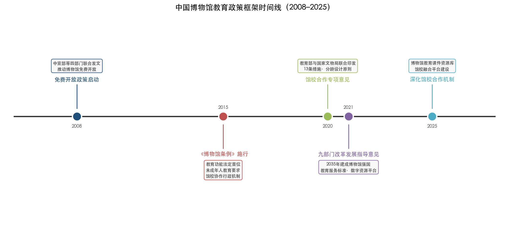

图2-3梳理了2008至2025年间中国博物馆教育领域的五个关键政策节点，展示了从免费开放破冰、法定地位确立、馆校合作专项推进到体系化改革发展的政策演进脉络。

**顶层设计层面**，2015年施行的《博物馆条例》确立了教育功能的法定首位原则（第二条）、面向未成年人的教育要求（第三十二条）和馆校协作的行政机制（第三十五条）。[北京市文物局转载《博物馆条例》全文](https://wwj.beijing.gov.cn/bjww/362760/362767/556574/556580/bwgzhgl/556812/index.html "国务院令第659号")

**专项政策层面**，2020年10月，教育部和国家文物局联合印发《关于利用博物馆资源开展中小学教育教学的意见》（文物博发〔2020〕30号），提出推动博物馆教育资源开发应用、拓展博物馆教育方式途径、建立馆校合作长效机制、加强博物馆教育组织保障四大工作板块共13条具体措施。[教育部官网](http://www.moe.gov.cn/srcsite/A06/s7053/202010/t20201020_495781.html "文物博发〔2020〕30号") 该意见首次系统性地提出了博物馆研学活动的"分龄设计"原则：小学阶段体现趣味性和故事性、初中阶段体现实践性和体验性、高中阶段体现探索性和研究性。[教育部官网](http://www.moe.gov.cn/srcsite/A06/s7053/202010/t20201020_495781.html "分龄设计要求")

**改革发展层面**，2021年5月，中央宣传部等九部门联合印发《关于推进博物馆改革发展的指导意见》，提出到2025年形成布局合理、结构优化、特色鲜明、体制完善、功能完备的博物馆事业发展格局，到2035年基本建成世界博物馆强国。该意见明确要求"制定博物馆教育服务标准，丰富博物馆教育课程体系，为大中小学生利用博物馆学习提供有力支撑"，并提出"共建教育项目库，推动各类博物馆数字资源接入国家数字教育资源平台"。[国务院新闻办公室](http://www.scio.gov.cn/xwfb/gwyxwbgsxwfbh/wqfbh_2284/2021n_2711/2021n11y03rsw/wjxgzc_4238/202208/t20220808_315114.html "九部门指导意见") 该意见还特别强调鼓励社会力量参与展览、教育和文创开发，推动博物馆公共服务市场化改革。[国家发展改革委](https://www.ndrc.gov.cn/fzggw/jgsj/shs/sjdt/202105/t20210525_1280807.html "九部门指导意见解读")

**持续深化层面**，2025年，国家文物局在年度工作要点中将"深化博物馆馆校合作机制"列为重点任务，并结合习近平总书记关于"博物馆是大学校"重要指示发表10周年，通过打造教育示范项目进一步丰富博物馆教育活动内容。[中国博物馆协会](https://www.chinamuseum.org.cn/cma/detail.html?id=13&contentId=14060 "国家文物局2025年工作要点") 国家文物局还推动建设博物馆教育课件资源库，搭建馆校融合平台，推动博物馆资源与课堂教学的深度结合。[国新办发布会](http://www.scio.gov.cn/xwfb/bwxwfb/gbwfbh/wwj/202505/t20250528_897704.html "2025年国际博物馆日新闻发布会")

## 2.6 优势与瓶颈

综合上述分析，中国博物馆教育呈现出以下突出优势：

**规模效应与政策驱动力。** 中国博物馆的绝对数量（7,046家）和观众基数（14.9亿人次/年）在全球名列前茅，91.46%的免费开放率大幅降低了教育准入门槛。从《博物馆条例》的法定要求到教育部与国家文物局的馆校合作专项意见，再到九部门改革发展指导意见，多层级政策体系构成了博物馆教育发展的强劲制度引擎。

**头部机构的示范引领。** 故宫博物院、中国国家博物馆、中国科技馆等国家级博物馆在教育品牌建设、课程体系化、数字技术应用和人才培养方面积累了成熟经验，为全行业提供了可复制、可推广的实践范式。

**基层教育网络的独特创新。** 乡村博物馆建设试点和"现代科技馆体系"（实体馆+流动馆+大篷车+数字馆）是中国博物馆教育的独特实践，为解决城乡教育资源不均衡提供了可操作的方案路径。

与此同时，若干结构性瓶颈制约着中国博物馆教育的进一步发展：

**区域和层级间的资源落差。** 东部与西部、国家级与县区级之间的教育资源配置差距依然显著，西部省份对高质量博物馆资源的需求仍然迫切。

**非国有博物馆的教育功能薄弱。** 占博物馆总量三成以上的非国有博物馆在资金、人才和规范化方面面临系统性困难，其教育功能的发挥远低于其数量占比应有的水平。

**教育专业人才短缺。** 中国博协社教专委会2025年年会将人工智能对博物馆社会教育的冲击、"博物馆热"背景下的研学"冷思考"以及情绪价值与实用价值需求交织下的博物馆社会教育未来列为核心议题。[中国国家博物馆](https://www.chnmuseum.cn/yj/kydt/202506/t20250623_271958.shtml "中国博协社教专委会2025年年会") 这些议题折射出业界对教育专业化程度的深层关切——在博物馆教育从"数量扩张"向"质量提升"转型的进程中，兼具学科素养、教育学知识和博物馆实践经验的复合型人才匮乏，已成为制约升级的关键瓶颈。

**教育评价体系有待完善。** 当前博物馆教育活动的评价仍主要依赖活动场次和参与人次等数量指标，对教育效果的实质性评估——如学习成果、认知变化和态度影响——尚缺乏系统性的方法论和制度化的跟踪反馈机制。

# 第3章 国外主要国家博物馆教育现状

第2章系统梳理了中国博物馆教育的总体格局，本章将考察视野拓展至国际层面。选取美国、英国、法国、德国、日本五个在博物馆教育制度建设和实践创新方面具有典型代表性的国家，分别剖析其博物馆教育体系的制度背景、核心机构实践及教育功能特色。五国的选取兼顾了不同政治体制（联邦制与单一制）、不同文化传统（英美自由主义、欧陆公共服务、东亚社会教育）和不同发展路径，以期为理解博物馆教育的制度多样性提供充分的比较基础。

各国叙述遵循平行结构——"制度背景与政策框架→代表机构与教育实践→分类视角下的分层差异"——以便与第2章中国部分形成结构性对照，为第4章横向比较奠定实证基础。在分析过程中，第1章建立的三维分类框架（行政级别、所有制、学科门类）将被显式引用，以呈现各国博物馆教育功能在不同分类维度上的差异化特征。

## 3.1 美国：多元主义传统下的博物馆教育体系

### 3.1.1 制度背景与政策框架

美国是全球博物馆数量最多的国家。据美国博物馆与图书馆服务研究院（Institute of Museum and Library Services, IMLS）估算，全美现有约35,000家活跃博物馆，远超此前广泛引用的33,000家数据。[IMLS官方新闻](https://www.imls.gov/news/government-doubles-official-estimate-there-are-35000-active-museums-us "Government Doubles Official Estimate")这一庞大体量的背后，是一套以联邦分权、社会捐赠和非营利组织为核心的独特制度架构。

美国联邦政府对博物馆的直接管理极为有限。IMLS是联邦层面支持博物馆和图书馆事业的主要机构，2024财年拨付各类资助约2.7亿美元，覆盖全国博物馆、图书馆及相关机构。[Education Week报道](https://www.edweek.org/policy-politics/how-schools-will-feel-the-federal-funding-cuts-to-libraries-and-museums/2025/08 "IMLS 2024财年拨款数据")然而，IMLS预算仅占联邦总预算的0.0046%，其功能定位更接近"催化剂"而非行政主管部门。[AAM倡议页面](https://www.aam-us.org/2025/03/17/ask-your-museums-supporters-to-save-imls/ "IMLS预算占比")美国博物馆的运营资金主要来自州和地方政府拨款、私人捐赠、基金会资助、门票收入和商业运营的多元组合。这种去中心化的资金结构赋予了博物馆极大的自主性，但也导致教育投入在不同机构之间呈现显著分化。

在行业自律层面，美国博物馆联盟（American Alliance of Museums, AAM）发挥着核心引导作用。AAM核心标准将"教育与诠释"列为七大标准之一，明确要求"博物馆应将教育置于其公共服务角色的核心"。[AAM核心标准官方页面](https://www.aam-us.org/programs/ethics-standards-and-professional-practices/core-standards-for-museums/ "AAM Core Standards")AAM的认证制度（accreditation）虽不具法律强制力，但通过同行评审和行业声誉机制，对博物馆教育功能的规范化发挥着重要的软性约束作用。

需要关注的是，2025年以来，美国联邦政府对IMLS的精简举措引发了博物馆界的广泛忧虑。行政令要求对IMLS进行人员和运营缩减，围绕联邦博物馆支持体系未来走向的争论随之升温。[Hyperallergic报道](https://hyperallergic.com/trump-moves-to-dismantle-institute-of-museum-and-library-services/ "IMLS面临精简")这一事件折射出美国博物馆教育资金结构的内在脆弱性——当联邦层面的"杠杆资金"受到威胁时，依赖公共资助的中小型博物馆教育项目首当其冲。

### 3.1.2 代表性机构的教育实践

**史密森学会（Smithsonian Institution）**是美国乃至全球最具标志性的博物馆教育机构。作为联邦政府设立的研究与教育综合体，史密森学会下辖21家博物馆和国家动物园，全部免费向公众开放。2024年，史密森旗下博物馆和动物园录得总访问量1,680万人次，其中国家自然历史博物馆以390万人次居首，国家美国历史博物馆以210万人次紧随其后。[史密森学会访客统计](https://www.si.edu/newsdesk/about/stats "2024年数据")在数字化方面，史密森学会2024年网站独立访客达1.5亿人次，拥有超过30款移动应用和超过1,700万件数字化藏品，构建了线上线下联动的全覆盖教育网络。[史密森学会事实页](https://www.si.edu/newsdesk/factsheets/facts-about-smithsonian-institution-short "数字化数据")

史密森学会的教育体系具有鲜明的全国辐射特征，其教育使命不局限于华盛顿的博物馆群，而是延伸至全美各地。据2024年《教育影响力报告》，史密森学会与亚马逊和NFL合作分发了100万份免费图书和数字教育资源；启动了"民主对话"（Democracy in Dialogue）公民教育虚拟交流项目；深化了与美国男孩女孩俱乐部（Boys & Girls Clubs of America）和全国4-H理事会（National 4-H Council）的合作，开发动手学习体验；"Together We Thrive"教育资助项目累计拨款1,220万美元，支持变革性教育项目。[Smithsonian Magazine报道](https://www.smithsonianmag.com/blogs/smithsonian-education/2025/04/02/2024-education-impact-report-released/ "2024教育影响力报告")同年，史密森全国教育峰会（Smithsonian National Education Summit）吸引了来自50个州和87个国家的5,400余名教育者、图书馆员和政策制定者参会，聚焦包容性叙事、青年公民行动和全球-本土联结等议题。[Smithsonian Magazine报道](https://www.smithsonianmag.com/blogs/smithsonian-education/2025/04/02/2024-education-impact-report-released/ "教育峰会数据")

**大都会艺术博物馆（The Metropolitan Museum of Art）**是美国私立博物馆教育实践的典型代表。作为非营利私立机构，大都会博物馆拥有超过150万件藏品，建立了面向K-12年级的完整学校参观体系，包括由专业教育人员和志愿者引导的馆内参观、虚拟导览，以及面向教师的专业发展工作坊。该馆尤为注重教育公平，为纽约市Title I学校（联邦资助的低收入学校）和District 75特殊教育学校提供免费迷你驻地项目（mini residencies），将博物馆教育资源向弱势群体倾斜。[大都会博物馆教育者页面](https://www.metmuseum.org/learn/educators "学校合作项目")此外，"Teens Take The Met!"项目面向13岁以上青少年免费开放，鼓励年轻群体自主探索博物馆资源，培养其文化参与意识。[大都会博物馆青少年项目](https://engage.metmuseum.org/events/education/celebrations/festivals/fy25/teens-take-the-met-2025 "青少年活动")

### 3.1.3 分类视角下的教育特征

从第1章建立的分类框架审视美国博物馆教育，可以识别出以下结构性特征。

**在行政级别维度**，美国的"国家级"博物馆主要指联邦直属机构，以史密森学会为代表。这些机构享有联邦拨款保障和完全免费开放政策，教育资源配置处于最高水平。但联邦直属博物馆的数量极为有限，美国绝大多数博物馆属于州立、市立或社区层面的机构。社区博物馆在美国博物馆版图中占据不可忽视的地位——史密森学会旗下的安那科斯蒂亚社区博物馆（Anacostia Community Museum）便是社区博物馆的先驱，2024年接待访客14,076人次。[史密森学会访客统计](https://www.si.edu/newsdesk/about/stats "2024年数据")该馆体量虽小，但其教育实践深度嵌入当地社区文化生活，代表了一种自下而上的教育路径。

**在所有制维度**，美国博物馆以私立非营利机构为主体。大都会博物馆、纽约现代艺术博物馆（MoMA）、芝加哥艺术学院博物馆等旗舰机构均为私立非营利法人，其教育经费主要来自捐赠基金收益、个人与企业捐赠以及门票收入。这一所有制结构意味着教育项目的规模和持续性在很大程度上取决于机构的筹资能力——头部机构凭借品牌效应和捐赠网络可以维持庞大的教育团队和多元化项目，而中小型私立博物馆的教育投入则波动较大。联邦直属的史密森学会构成重要例外，其全额联邦拨款和免费开放政策使教育服务具有最广泛的公共可及性。

**在学科门类维度**，美国科学中心（science center）的崛起是一个值得关注的现象。AAM在1975年取消认证标准中对藏品的强制要求后，无实物收藏的互动式科学中心也被纳入博物馆范畴，这极大拓展了博物馆教育的方法论边界。[美国科技中心协会回顾](https://www.astc.org/dimension/looking-back-to-look-ahead/ "ASTC对AAM 1975年定义修订的记述")科学中心的教育实践以"动手学习"（hands-on learning）为核心特征，强调STEM/STEAM教育理念，与传统艺术博物馆和历史博物馆的"观赏性教育"形成鲜明对比，丰富了美国博物馆教育的方法论图谱。

## 3.2 英国：免费开放政策与文化民主的教育实践

### 3.2.1 制度背景与政策框架

英国博物馆教育体系的核心制度特征是国家博物馆免费开放政策。自2001年起，英国文化、媒体和体育部（Department for Culture, Media and Sport, DCMS）资助的15家国家级博物馆和美术馆——包括大英博物馆、维多利亚与阿尔伯特博物馆、泰特美术馆、国家美术馆、自然历史博物馆等——对所有人免费开放常设展览。[Centre for Public Impact分析](https://centreforpublicimpact.org/public-impact-fundamentals/universal-free-admission-to-the-uks-national-museums/ "英国免费开放政策分析")DCMS以"臂距原则"（arm's length principle）向这些博物馆提供直接拨款。以大英博物馆为例，2024/25财年获得经常性拨款4,450万英镑和资本拨款2,970万英镑。[大英博物馆2024/25年度报告](https://www.britishmuseum.org/sites/default/files/2025-07/Annual_Report_and_Accounts_2024-25.pdf "Grant-in-Aid数据")

免费开放政策对教育功能产生了深远影响。它从根本上消除了经济门槛对博物馆教育可及性的制约，使学校参观和家庭学习成为普惠性的公共文化服务。然而，政策的长期可持续性正面临挑战。2026年初，DCMS开始探讨对海外游客收取入场费的可能性，引发了博物馆界关于免费开放原则存废的激烈讨论。[Museums Association报道](https://www.museumsassociation.org/museums-journal/news/2026/03/serious-reservations-about-proposal-to-scrap-free-entry-for-overseas-visitors/ "海外游客收费提议")2024/25年度，DCMS资助博物馆的海外游客达1,940万人次，[Museums and Heritage报道](https://museumsandheritage.com/advisor/posts/dcms-to-explore-overseas-visitor-fee-at-national-museums/ "海外访客数据")如何在财务可持续性与教育公平之间取得平衡，已成为英国博物馆教育面临的核心政策议题。

在教育理念层面，英国博物馆协会（Museums Association, MA）2020年发布的《博物馆学习与参与宣言》标志着理念的重要转向。宣言提出博物馆应成为"文化民主的中心"（centres for cultural democracy），以社会正义、社区参与和文化权利为三大支柱。[英国博物馆协会宣言](https://www.museumsassociation.org/campaigns/learning-and-engagement/manifesto/ "2020年发布")这一转向将博物馆教育从传统的"知识传授"推向"文化赋权"，深刻影响了英国博物馆教育实践的方向。

### 3.2.2 代表性机构的教育实践

**大英博物馆（British Museum）**是英国乃至全球博物馆教育的标杆机构。创建于1753年，其创立法案即明确藏品应"为公众的一般使用和利益而保存和维护"。[大英博物馆2024/25年度报告](https://www.britishmuseum.org/sites/default/files/2025-07/Annual_Report_and_Accounts_2024-25.pdf "1753年法案引用")2024/25财年（截至2025年3月31日），大英博物馆接待访客650万人次，创下2015/16年以来的最高纪录，连续两年成为英国最受欢迎的旅游景点。[大英博物馆2024/25年度报告](https://www.britishmuseum.org/sites/default/files/2025-07/Annual_Report_and_Accounts_2024-25.pdf "访客数据")；[BBC报道](https://www.bbc.com/news/articles/c39v2ddn4p4o "2024年英国最受欢迎景点")

大英博物馆的教育体系涵盖多个核心板块：

- **学校教育项目**：2024/25年度，44万名学生通过预约参观项目到伦敦本馆学习。"虚拟参观"（Virtual Visits）使全英6,000名学生得以通过线上直播参与博物馆学习，由专业人员引导，近期已扩展至同时连接多所学校的课程聚焦式直播。平板导览（Tablet Tours）为Key Stage 2和3的学校团体提供数字化探索工具。[大英博物馆2024/25年度报告](https://www.britishmuseum.org/sites/default/files/2025-07/Annual_Report_and_Accounts_2024-25.pdf "学习项目数据")

- **全国巡展与合作网络**：2024/25年度，大英博物馆向英国141个场馆出借2,000件藏品，约800万人在伦敦以外的合作展馆中接触到大英博物馆的藏品。"British Museum Unseen"系列在全英各地分享馆藏中鲜为人知的故事，将教育辐射范围从伦敦扩展至全国。[大英博物馆2024/25年度报告](https://www.britishmuseum.org/sites/default/files/2025-07/Annual_Report_and_Accounts_2024-25.pdf "全国巡展数据")

- **国际培训项目（ITP）**：2024年的国际培训项目迎来了来自13个国家的20名学员，涵盖巴西、中国、哥伦比亚、埃及、加纳、印度、伊拉克、肯尼亚等国的博物馆专业人员。ITP网络目前已覆盖61个国家的373名校友，并获私人捐赠者资助续期五年至2030年。[大英博物馆2024/25年度报告](https://www.britishmuseum.org/sites/default/files/2025-07/Annual_Report_and_Accounts_2024-25.pdf "ITP项目数据")

- **志愿者服务**：截至2025年3月，大英博物馆拥有约500名志愿者。前台志愿者通过"Hands on"桌台为公众提供实物触摸体验——部分展品的年代超过10,000年。2024/25年度，志愿者导览和Hands on桌台共接待超过23万名访客。LGBTQ+导览每月举行三次，年内逾1,000人参加。[大英博物馆2024/25年度报告](https://www.britishmuseum.org/sites/default/files/2025-07/Annual_Report_and_Accounts_2024-25.pdf "志愿者数据")

- **数字化与文献计划**：大英博物馆正在实施一项为期五年、耗资1,000万英镑的"文献与数字化计划"（Documentation and Digitisation Programme），目标是到2029年成为全球首批将全部藏品数字编目的同类规模博物馆之一。截至报告期末，已有近500万件藏品可在线检索。[大英博物馆2024/25年度报告](https://www.britishmuseum.org/sites/default/files/2025-07/Annual_Report_and_Accounts_2024-25.pdf "数字化计划")

**维多利亚与阿尔伯特博物馆（V&A）**在设计教育领域占据独特地位。V&A学校项目为从幼儿教育到中学阶段的师生提供免费资源和工作坊，涵盖初等教育、中等教育及特殊教育需要（SEND）群体。[V&A学校项目](https://www.vam.ac.uk/info/schools "学校项目概览")"V&A Innovate"全国学校设计挑战赛要求学生团队开发以地球为中心的解决方案，应对真实世界的设计问题，将博物馆教育与创新创业教育紧密结合。[V&A Innovate项目](https://www.vam.ac.uk/blog/museum-life/va-innovate-national-schools-challenge-2024-2025-shortlist-announced "2024-25年度")

### 3.2.3 分类视角下的教育特征

英国博物馆教育体系在分类维度上呈现出高度分层的格局。

**在行政级别维度**，DCMS直接资助的15家国家博物馆构成英国博物馆教育的"第一梯队"，拥有充足的政府拨款和专业教育团队。但英国博物馆整体并非仅依赖中央政府——英格兰艺术委员会（Arts Council England, ACE）通过国家投资组合向区域博物馆和社区博物馆提供运营资助，形成了"国家级→区域级→社区级"的资金梯度。ACE近年的年度博物馆调查显示，英国博物馆整体访客量至今仍未恢复至新冠疫情前水平，区域和社区博物馆面临的压力尤为突出。[Museums Association报道](https://www.museumsassociation.org/museums-journal/news/2025/05/visitor-numbers-below-pre-pandemic-levels-shows-new-report/ "五年趋势报告")

**在所有制维度**，英国博物馆的治理结构以独立信托法人（independent trust/charity）为主流形态。即便是DCMS资助的国家博物馆，在法律上也是由理事会（Board of Trustees）独立管理的慈善机构，政府通过拨款协议而非行政指令来引导其方向。大英博物馆即受1963年《大英博物馆法》和1992年《博物馆与美术馆法》共同治理，其理事会对藏品和运营决策拥有最终权力。[大英博物馆2024/25年度报告](https://www.britishmuseum.org/sites/default/files/2025-07/Annual_Report_and_Accounts_2024-25.pdf "治理结构")这种"公共资助+独立治理"的混合模式，在保障教育公共性的同时维护了运营的专业自主性。

**在包容性教育方面**，英国博物馆在全球处于领先地位。大英博物馆2024/25年度的平等、多样性与包容性（EDI）项目参与者超过4,000人，举办了43场无障碍活动，包括聋人BSL手语导览、音频描述导览、放松式开放和无障碍工作坊。博物馆还首次为付费展览设计了感官体验路径（sensory trail），专门为神经多样性群体——特别是南亚残障社区——量身定制。[大英博物馆2024/25年度报告](https://www.britishmuseum.org/sites/default/files/2025-07/Annual_Report_and_Accounts_2024-25.pdf "EDI数据")这些实践体现了英国博物馆协会"文化民主"宣言的落地效果。

## 3.3 法国：文化民主化传统与"文化调解"的制度化

### 3.3.1 制度背景与政策框架

法国博物馆教育制度植根于大革命以来的文化民主化传统。1793年，卢浮宫作为"国家艺术中央博物馆"向公众开放，其创立本身即承载着"将精英的知识和文化价值重新分配给所有人"的启蒙理想。[ICOM CECA法国博物馆教育史](https://ceca.mini.icom.museum/wp-content/uploads/sites/5/2025/10/HMMF_en_parpage.pdf "Savare 2025")此后两个多世纪间，法国博物馆教育经历了从"知识传授"（instruction）到"社会文化活动"（action socioculturelle）再到"文化调解"（médiation culturelle）的三重范式转型。

法国博物馆的制度框架以"法国博物馆"标签（label "Musée de France"）为核心。由文化部授予的这一标签覆盖约1,200家博物馆，获标签者享有政府财政支持，同时承担对公众开放和实施教育功能的法定义务。[PMC学术文献](https://pmc.ncbi.nlm.nih.gov/articles/PMC7576371/ "The future of French museums in 2030")标签体系下的博物馆涵盖国立博物馆（由文化部或其他部委直接管理）、地方公立博物馆（由市镇或大区管理）以及少量获得标签的私立博物馆，形成了以国家认证为纽带、公立为主体的博物馆体系。

法国博物馆教育的独特制度贡献在于"文化调解"（médiation culturelle）概念的专业化与制度化。这一概念兴起于20世纪80年代，不同于英美传统中的"museum education"或"interpretation"，它强调博物馆-公众-藏品三者之间的关系建构，将教育者定位为"调解人"（médiateur/médiatrice）而非"教师"或"讲解员"。法国高等教育系统设有专门的文化调解培训课程，从高中毕业后需接受五年制高等教育方可获得专业资质。[ICOM CECA法国博物馆教育史](https://ceca.mini.icom.museum/wp-content/uploads/sites/5/2025/10/HMMF_en_parpage.pdf "调解专业化")

此外，法国以政策手段推动了馆校合作的制度化。19世纪朱尔·费里教育法（1881-1882年）确立了义务教育原则和"实物教学法"（leçon de choses），要求教师"使用实物开展教学，让学生触摸，将他们置于具体现实之中"。[ICOM CECA法国博物馆教育史](https://ceca.mini.icom.museum/wp-content/uploads/sites/5/2025/10/HMMF_en_parpage.pdf "费里教育法")这一传统延续至今，法国的"艺术与文化教育"（éducation artistique et culturelle, EAC）政策将博物馆参观纳入中小学教育的制度框架，成为连接学校与博物馆的重要纽带。

### 3.3.2 代表性机构的教育实践

**卢浮宫（Musée du Louvre）**是法国乃至全球最具影响力的博物馆。2024年，卢浮宫接待访客870万人次，稳居全球参观量最高博物馆的地位；2025年进一步突破900万人次。[卢浮宫2024年新闻稿](https://presse.louvre.fr/wp-content/uploads/2025/01/47a464a7a90352b142ae15cd6be89c07.pdf "2024年数据")；[Hypebeast报道](https://hypebeast.com/2026/3/louvre-leads-2025-museum-visitor-rankings-as-asia-surges "2025年数据")

卢浮宫的教育体系具有几个显著特征。其一，观众结构高度国际化——2024年77%的访客来自法国以外，法国访客仅占23%（巴黎大区居民13%、外省居民10%）。[卢浮宫2024年新闻稿](https://presse.louvre.fr/wp-content/uploads/2025/01/47a464a7a90352b142ae15cd6be89c07.pdf "观众构成")这意味着卢浮宫的教育功能需要在跨文化传播和本土公众服务之间寻求平衡。其二，卢浮宫在免费开放方面采取了有针对性的分类策略——2024年28%的访客享受免费入场，其中法国访客免费比例高达65%，26岁以下的年轻人占访客总数的41%。[卢浮宫2024年新闻稿](https://presse.louvre.fr/wp-content/uploads/2025/01/47a464a7a90352b142ae15cd6be89c07.pdf "免费政策数据")这一"分类免费"策略确保了教育功能对本国年轻公众的优先覆盖。

卢浮宫馆长劳伦斯·德·卡尔斯（Laurence des Cars）曾表示："卢浮宫每年接待近900万访客，我们的目标是让每位访客与馆藏和这座非凡建筑的每一次邂逅都有意义、令人愉悦——无论他们以何种方式与艺术和创造力互动。"[卢浮宫2024年新闻稿](https://presse.louvre.fr/wp-content/uploads/2025/01/47a464a7a90352b142ae15cd6be89c07.pdf "馆长表述")

卢浮宫学院（École du Louvre）是法国博物馆教育的另一重要制度支撑。该学院创建于1882年，是一所由文化部管理的高等教育机构，提供艺术史、考古学、博物馆学等方面的专业学位教育，同时为卢浮宫及法国博物馆体系培养策展人和教育专业人才。[卢浮宫学院官网](https://www.ecoledulouvre.fr/en/student-training/international/studying-ecole-du-louvre "学院介绍")

**蓬皮杜中心（Centre Pompidou）**在法国博物馆教育史上扮演着"理念孵化器"的独特角色。1977年建成开放的蓬皮杜中心打破了传统博物馆的精英形象，将图书馆、音乐研究中心和当代艺术展览空间集于一体，其面向全年龄段的工作坊、公共活动和创意教育项目，开创了法国博物馆教育的"全民参与"新范式。ICOM CECA的法国博物馆教育史研究将蓬皮杜中心评价为"面向所有受众的理念孵化器"。[ICOM CECA法国博物馆教育史](https://ceca.mini.icom.museum/wp-content/uploads/sites/5/2025/10/HMMF_en_parpage.pdf "蓬皮杜中心评价")

### 3.3.3 分类视角下的教育特征

**在行政级别维度**，法国博物馆教育呈现出鲜明的"巴黎-外省"二元结构。巴黎集中了卢浮宫、奥赛博物馆、蓬皮杜中心等世界顶级机构，教育资源高度集聚；外省博物馆虽然在创新实践中常有先驱之举，但在经费和专业人才方面与巴黎机构存在显著落差。ICOM CECA法国博物馆教育史研究指出，许多创新性教育实践"往往由个人而非机构推动，有时随着这些人的离去而消失，随后在他处重生"，[ICOM CECA法国博物馆教育史](https://ceca.mini.icom.museum/wp-content/uploads/sites/5/2025/10/HMMF_en_parpage.pdf "创新实践的脆弱性")揭示了法国博物馆教育创新依赖个体推动的制度性脆弱。

**在所有制维度**，法国博物馆以公立为绝对主体。"法国博物馆"标签体系以公共服务为核心价值取向，获标签的博物馆被视为非营利性组织，依赖公共资金和捐赠运营。[PMC学术文献](https://pmc.ncbi.nlm.nih.gov/articles/PMC7576371/ "法国博物馆的非营利性定位")这一制度特征确保了教育功能的公共性，但也使博物馆在财政紧缩时期面临教育投入缩减的风险。法国博物馆教育史研究即坦言："文化是我们面临破产或疫情时第一个被削减的必需品。"[ICOM CECA法国博物馆教育史](https://ceca.mini.icom.museum/wp-content/uploads/sites/5/2025/10/HMMF_en_parpage.pdf "文化预算的脆弱性")

**在教育方法论层面**，法国博物馆教育的一个显著特征是"调解者"（médiateur）与"策展人"（conservateur）之间的结构性张力。ICOM CECA研究揭示了"两种职业、两种教育背景、两条职业路径、一个无可置疑的等级关系"——调解者往往在展览设计完成后才介入教育工作，很少从最初阶段就参与展览构想。[ICOM CECA法国博物馆教育史](https://ceca.mini.icom.museum/wp-content/uploads/sites/5/2025/10/HMMF_en_parpage.pdf "策展-调解张力")这种"先策展后教育"的工作流程制约了教育功能与策展实践的深度整合。近年来，团队协作式工作方式在部分机构中逐步推广，这一状况正在渐进改善。

## 3.4 德国：联邦制下的博物馆教育与"博物馆教育学"传统

### 3.4.1 制度背景与政策框架

德国拥有欧洲最庞大的博物馆体系。据德国博物馆研究所（Institut für Museumsforschung）统计，全德共有约7,000家博物馆和展览场馆。[NEMO德国博物馆经济影响研究](https://www.ne-mo.org/news-events/article/germanys-first-nationwide-study-on-the-economic-footprint-of-museums/ "2023年数据")；[deutschland.de](https://www.deutschland.de/en/topic/knowledge/germanys-museums-facts-and-figures "7,245家博物馆和展览场馆")2023年，德国博物馆对国内生产总值的贡献达94亿欧元，其中公共补贴约56亿欧元，这一数据表明博物馆是一项"稳健的公共投资"。[NEMO德国博物馆经济影响研究](https://www.ne-mo.org/news-events/article/germanys-first-nationwide-study-on-the-economic-footprint-of-museums/ "经济贡献数据")2024年，德国博物馆和展览场馆的访客量较上年增长1.3%，延续了新冠疫情后的回升趋势。[德国博物馆联合会新闻稿](https://www.museumsbund.de/wp-content/uploads/2025/12/251216-besuchszahlen-museen.pdf "2024年访客增长")

德国博物馆教育体系的制度特征深受联邦制政治结构的影响。文化政策和教育政策在德国属于州的专属事权（Kulturhoheit der Länder），联邦政府不设统一的"文化部"或"博物馆局"，各州自主制定博物馆政策和教育标准。这种分权结构使德国博物馆教育在全国范围内呈现高度多元化——各州的博物馆教育标准、资助机制和馆校合作模式均可能存在显著差异。

在行业组织层面，德国博物馆联合会（Deutscher Museumsbund, DMB）是主要的行业协调机构，拥有超过4,300名会员和支持者。[DMB英文主页](https://www.museumsbund.de/english-version/ "会员数据")在博物馆教育的专业化方面，德国博物馆教育协会（Bundesverband Museumspädagogik, BVMP）专门负责推动"博物馆教育学"（Museumspädagogik）的质量标准、专业培训和学术交流，出版专业杂志《Standbein Spielbein》。[BVMP官网](https://www.museumspaedagogik.org/english "协会介绍")德国的博物馆教育学是一个具有学术深度和制度支撑的专业领域，多所大学设有博物馆学或博物馆艺术教育硕士学位项目。[DAAD学位项目列表](https://www.daad.de/en/studying-in-germany/universities/all-degree-programmes/detail/leipzig-university-of-applied-sciences-museum-art-education-education-and-teaching-in-museums-w55351/ "莱比锡应用科技大学")

莱布尼茨博物馆教育卓越中心（Leibniz Centre of Excellence for Museum Education）作为学术研究机构，致力于"共同检验和推进观众研究与实证教育研究"，是全球博物馆教育研究领域的重要力量。2025年11月，该中心在柏林举办了第四届国际博物馆教育学术会议。[莱布尼茨中心官网](https://leibniz-bim.de/en/home-en "中心介绍")；[柏林自然博物馆会议信息](https://www.museumfuernaturkunde.berlin/en/participate/events/4th-international-conference-center-excellence-museum-education "2025年会议")

### 3.4.2 代表性机构的教育实践

**柏林博物馆岛（Museumsinsel Berlin）**是德国博物馆教育的标志性集群。作为UNESCO世界文化遗产，博物馆岛汇集了老博物馆（Altes Museum）、新博物馆（Neues Museum）、旧国家美术馆（Alte Nationalgalerie）、佩加蒙博物馆（Pergamonmuseum）和博德博物馆（Bode-Museum）五大国家博物馆，由普鲁士文化遗产基金会（Stiftung Preußischer Kulturbesitz）统一管理。博物馆岛的教育项目具有跨学科和跨文明的视角，涵盖从古埃及到古典希腊、从伊斯兰艺术到19世纪欧洲绘画的广阔领域，为观众提供系统性的人类文化遗产学习平台。

**德国博物馆（Deutsches Museum）**位于慕尼黑，是全球规模最大的科学技术博物馆之一，2018年接待约144万人次。[deutschland.de](https://www.deutschland.de/en/topic/knowledge/germanys-museums-facts-and-figures "参观数据")该馆以互动式、体验式教育著称，教育实践强调"做中学"（learning by doing），设有大量动手实验装置和演示项目，是STEM教育在博物馆场景中应用的欧洲先驱。

**纪念场所（Gedenkstätte）**构成德国博物馆教育的特殊类别。与中国的革命纪念类博物馆具有一定可比性，德国的纪念场所——如柏林"恐怖地形图"（Topography of Terror）、达豪集中营纪念馆和萨克森豪森集中营纪念馆等——承担着面向国家历史暗面的公民教育功能。2018年，柏林"恐怖地形图"接待138万人次。[deutschland.de](https://www.deutschland.de/en/topic/knowledge/germanys-museums-facts-and-figures "参观数据")这些场所通常免费开放，承担特殊的教育使命：通过对压迫和暴力历史的直面反思，促进民主意识和人权教育。

### 3.4.3 分类视角下的教育特征

**在行政级别维度**，德国的联邦制结构催生了层次丰富的博物馆体系。联邦直接管理的博物馆数量有限，主要通过普鲁士文化遗产基金会等全国性机构运作；各州拥有各自的州立博物馆体系；市镇层面的地方史博物馆则构成德国博物馆的最大板块。按题材分类，地方和区域历史类博物馆占比43.5%，文化历史类占15.1%，自然科学和技术类占12.6%，艺术类占10.7%。[deutschland.de](https://www.deutschland.de/en/topic/knowledge/germanys-museums-facts-and-figures "题材分布")地方史博物馆的高占比反映了德国联邦制下"地方认同"教育的深厚传统。

**在所有制维度**，德国博物馆的管理主体呈现多元格局，涵盖联邦政府、州政府、市镇政府、基金会、教会和私人等多种形态。NEMO研究评价："无论大小、无论城乡，博物馆都是不可替代的文化机构，它们在课堂之外提供教育，促进社会价值，并作为对话的可信赖空间来加强民主。"[NEMO德国博物馆经济影响研究](https://www.ne-mo.org/news-events/article/germanys-first-nationwide-study-on-the-economic-footprint-of-museums/ "博物馆社会功能评价")

**在教育方法论层面**，德国的"博物馆教育学"（Museumspädagogik）传统赋予博物馆教育以深厚的学术化和专业化底蕴。与英美的"museum education"和法国的"médiation culturelle"相比，德国的博物馆教育学更强调教育理论与实践的系统性结合，通过学位教育培养专业博物馆教育工作者。ICOM-CECA 2024年欧洲报告亦将德国列为博物馆教育学术研究的重要阵地。[ICOM-CECA 2024年欧洲报告](https://ceca.mini.icom.museum/wp-content/uploads/sites/5/2025/01/ENG-ICOM-CECA-ALL-OF-Europe-report-2024-Wencke-Maderbacher-new_compressed.pdf "欧洲博物馆教育现状")

## 3.5 日本：社会教育法制框架下的博物馆教育

### 3.5.1 制度背景与政策框架

日本博物馆教育的制度特征在于其明确的社会教育法律定位。1951年颁布的《博物馆法》（博物館法, Hakubutsukan Hō）是日本博物馆事业的基本法律，其立法目的是"通过规范博物馆的设立和运营必要事项，提升博物馆作为社会教育机构的功能"。[日本法律翻译](https://www.japaneselawtranslation.go.jp/en/laws/view/4309/en "博物馆法英文全文")这一表述将教育功能——以"社会教育"（社会教育, shakai kyōiku）的形式——明确界定为博物馆的首要使命。1949年颁布的《社会教育法》则进一步将博物馆定义为"为社会教育做出贡献的组织和设施"。[日本文化厅](https://www.bunka.go.jp/seisaku/bijutsukan_hakubutsukan/shinko/pamphlet/pdf/r1409436_02.pdf "博物馆与社会教育法关系")

日本博物馆在法律上分为三个层次：登录博物馆（registered museums）、博物馆相当施设（museum-equivalent facilities）和博物馆类似施设（museum-like facilities）。截至2018年10月，日本共有5,738家博物馆设施，其中登录博物馆914家、博物馆相当施设372家、博物馆类似施设4,452家。[维基百科日本博物馆列表](https://en.wikipedia.org/wiki/List_of_museums_in_Japan "2018年社会教育调查数据")登录博物馆享有国家补贴和税收优惠，但须满足包括配备专业学芸员（curator，日语为学芸員, gakugeiin）在内的一系列条件。学芸员制度是日本博物馆教育专业化的核心支撑——据2005年社会教育调查，全日本博物馆中共有6,225名学芸员，其中登录博物馆2,898名、博物馆相当施设929名、博物馆类似施设2,397名。[日本文化厅](https://www.bunka.go.jp/seisaku/bijutsukan_hakubutsukan/shinko/pamphlet/pdf/r1409436_02.pdf "学芸员数据")

2022年，日本对《博物馆法》进行了重要修订，将法律目的与《文化艺术基本法》（2001年）的精神相衔接，并新增了博物馆"创建和公开馆藏资料数字档案"的义务。[ResearchGate学术文献](https://www.researchgate.net/publication/389595180 "2022年修法分析")这一修订反映了日本博物馆教育在数字化转型方面的法律回应。日本学术会议（Science Council of Japan）在其关于博物馆制度未来方向的建议中进一步呼吁，应扩大博物馆的社会教育功能以适应终身学习社会的需要。[日本学术会议建议](https://www.scj.go.jp/ja/info/kohyo/pdf/kohyo-25-k230926-5en.pdf "博物馆制度改革建议")

与此同时，日本近年来正在推进国立博物馆的"自收自支"改革。文部科学省（MEXT）要求国立博物馆和美术馆以门票等自筹收入覆盖100%的展览成本，这与《博物馆法》"公立博物馆不得收取入场费"的原则之间形成张力。[Japan Press报道](https://www.japan-press.co.jp/s/news/?id=16224 "国立博物馆收入压力")2024年起，部分国立博物馆引入了本国居民和外国游客的差别定价制度，[朝日新闻报道](https://www.asahi.com/ajw/articles/16402531 "双轨定价制度")这一制度安排折射出博物馆教育公共性与财务可持续性之间的深层矛盾。

### 3.5.2 代表性机构的教育实践

**东京国立博物馆（Tokyo National Museum）**是日本历史最悠久、规模最大的博物馆，创建于1872年，收藏超过12万件文物和艺术品。作为国立文化财机构（National Institutes for Cultural Heritage, NICH）的核心成员，东京国立博物馆在文化遗产保护和教育方面发挥着国家级引领作用。NICH旗下共包含东京、京都、奈良和九州四家国立博物馆以及国立文化财研究所等科研机构，它们"在收藏、保存、管理和展示文化财产的同时，开展研究并提供教育项目"。[NICH概要](https://www.nich.go.jp/wp-content/uploads/2025/10/gaiyo2025-e.pdf "NICH机构介绍")

**国立科学博物馆（National Museum of Nature and Science）**在日本科学教育领域占据核心地位。该馆"致力于实施和推广为科学教育提供重要领导力的解决方案"，与学校和社区组织紧密合作，开发面向各年龄段的科学教育项目。[国立科学博物馆官网](https://www.kahaku.go.jp/english/kahaku/about/jigyou/tennji.html "教育项目介绍")

**国立民族学博物馆（National Museum of Ethnology, Minpaku）**位于大阪，是日本社会教育体系中独具特色的机构。Minpaku不仅开展面向国内公众的民族学教育，还承担国际博物馆合作和人才培训的使命。其"Museum Co-operation"计划自1994年起持续运营，为发展中国家的博物馆专业人员提供博物馆学培训，至今已形成广泛的国际专业网络。[Minpaku培训通讯](https://www.minpaku.ac.jp/assets/pages/research/exchange/training/museology/nl2025.pdf "2025年培训项目")

**企业博物馆（Corporate Museums）**是日本博物馆生态中的特殊类别。世界经济论坛2025年报道指出，日本超过70%的博物馆由公共机构运营，其余由教育机构、基金会或私营实体运营。[世界经济论坛报道](https://www.weforum.org/stories/2025/12/the-role-of-corporate-art-museums-in-fostering-cultural-connection-in-japan/ "日本企业博物馆")丰田汽车博物馆、资生堂美术馆、三得利美术馆等企业博物馆在工业文化教育和艺术普及方面发挥着独特作用，体现了日本企业社会责任文化与博物馆教育功能的深度融合。

### 3.5.3 分类视角下的教育特征

**在行政级别维度**，日本的国立博物馆数量极为有限（仅4家国立综合博物馆），但在教育质量和学术研究方面居于金字塔尖端。国立博物馆由独立行政法人管理，具有较高的运营自主权。地方公立博物馆构成日本博物馆体系的主体，受地方政府管辖，在社区教育中承担核心角色。

**在所有制维度**，日本博物馆呈现公立主导、私立补充的格局。公立博物馆（包括国立、都道府县立和市町村立）占比超过70%，教育经费主要来自公共财政。私立博物馆中，企业博物馆是日本独有的重要类型——它们往往免费或低价开放，教育项目聚焦于企业所在行业的历史、技术和文化，成为日本产业教育体系的有机组成部分。

**在教育方法论层面**，日本博物馆教育深受"社会教育"传统的影响，强调博物馆作为终身学习场所的功能定位。学芸员制度保障了教育活动的专业性，但同时也因学芸员数量不足和待遇偏低而面临人才困境。2022年《博物馆法》修订中增加的数字档案义务，反映了日本正在积极回应数字化时代对博物馆教育提出的新要求。然而，如何在"自收自支"的财务压力下维持教育功能的公共性和普惠性，仍是日本博物馆教育面临的核心挑战。

## 3.6 五国比较视角下的结构性特征

综合上述五国的考察，可以提炼出若干横切性的结构特征。图3-1以表格形式汇总了五国博物馆教育制度的关键维度差异，为后续分析提供总览性参照。

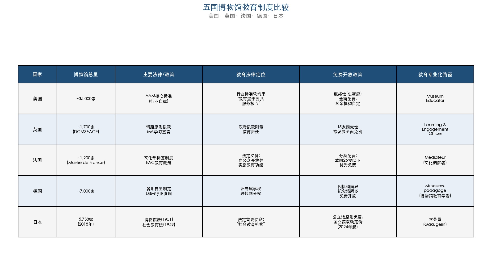

**图3-1** 从博物馆总量、法律政策依据、教育法律定位、免费开放政策和教育专业化路径五个维度，呈现了美国、英国、法国、德国、日本博物馆教育制度的核心差异。

第一，**政策框架与教育定位呈现显著分化**。法国和日本以法律形式将教育功能嵌入博物馆制度设计——法国的"Musée de France"标签制度和文化调解专业化、日本的《博物馆法》社会教育定位均属于此类。英国通过行政拨款附带教育责任，美国则依赖行业标准的软约束，德国的联邦分权结构使博物馆教育政策呈现州际多元化。这些差异深刻影响了各国博物馆教育的资源配置逻辑和社会覆盖面。图3-3以时间线形式呈现了五国博物馆教育制度的关键演进节点。

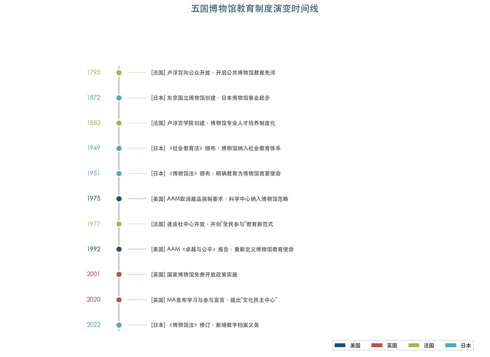

**图3-3** 标注了1793年至2022年间五国博物馆教育制度的11个关键里程碑事件，直观展现了各国博物馆教育法制化和专业化的历史进程。

第二，**免费开放政策的分化格局值得关注**。英国国家博物馆实行全面免费开放，史密森学会同样全面免费，法国采取"分类免费"策略（对本国年轻人和教育群体优先免费），德国和日本的免费政策则因机构而异。免费开放与博物馆教育的公平可及性之间存在直接关联——中国91.46%的博物馆免费开放率在全球范围内处于领先水平，与英国和美国头部机构的政策取向形成呼应。

第三，**教育专业化路径的分化反映了深层文化传统差异**。法国的"文化调解者"（médiateur）、德国的"博物馆教育学者"（Museumspädagoge）、日本的"学芸员"（学芸員）和美国的"博物馆教育者"（museum educator）代表了四种迥异的专业化路径，背后是各国教育学传统和劳动力市场制度的根本性差异。

第四，**国家级大馆与基层小馆之间的教育资源鸿沟是一个普遍性结构问题**。无论是美国史密森学会与社区博物馆之间、英国DCMS资助馆与地方小馆之间、法国巴黎大馆与外省小馆之间，还是德国联邦级机构与市镇博物馆之间，教育资源在不同层级博物馆之间的不均衡分布均构成共同挑战。图3-2以代表性博物馆的年度访客量数据，直观呈现了这一规模量级差异。

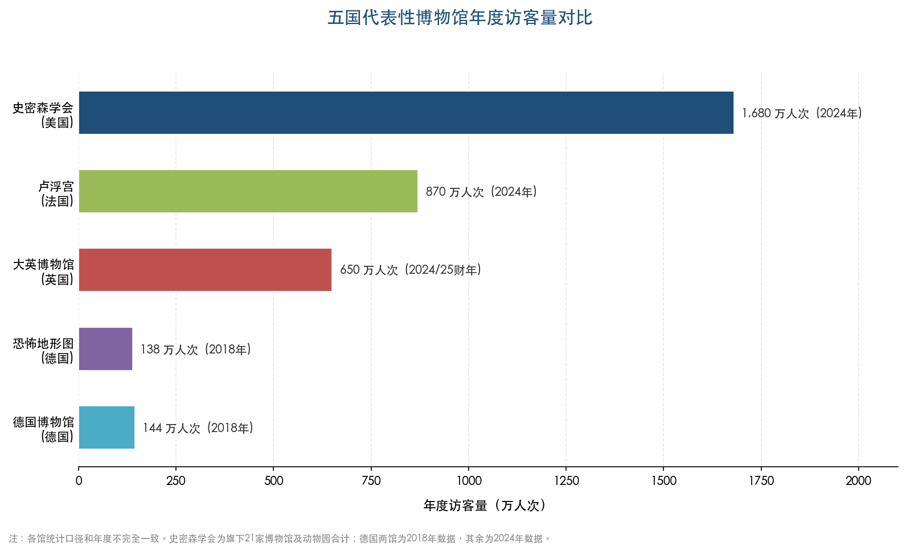

**图3-2** 显示，史密森学会（2024年1,680万人次）的年度访客量是德国博物馆（2018年144万人次）的十余倍，国家级旗舰机构与中型专题博物馆之间的规模差距由此可见一斑。各国应对这一鸿沟的策略各有特色——英国的全国巡展和虚拟参观、美国史密森学会的全国教育辐射计划、法国的"法国博物馆"标签体系——均是试图弥合资源差距的制度安排。

这些结构性特征将在第4章中与中国博物馆教育现状进行系统性对比分析。

# 第4章 中外博物馆教育的分类比较与差异分析

前两章分别对中国和美国、英国、法国、德国、日本五国的博物馆教育现状进行了系统梳理，为横向比较奠定了实证基础。本章以第1章建立的三维分类框架——行政级别、所有制、学科门类——为分析坐标，对中外博物馆教育展开结构性横向比较，提炼共性趋势与深层差异，为第5章的变革图谱分析和第6章的路径设计提供论据支撑。全章聚焦跨国维度上的制度比较与逻辑分析，不再重复各国案例的具体描述。

## 4.1 行政级别维度：国家级与基层博物馆的教育功能分层

### 4.1.1 国家级博物馆：制度安排的分殊与教育使命的趋同

中外国家级博物馆在制度安排上存在显著差异，但在教育使命的核心定位上呈现高度趋同，这一"形异质同"的格局构成本节分析的基本判断。

从制度架构看，中国的国家级博物馆直属中央部委，纳入国家财政预算体系，接受行政主管部门的直接管理，运营资金以财政拨款为主体。故宫博物院2024年度接待观众1,762万人次；中国国家博物馆全年开放317天、接待观众695.7万人次；中国科技馆引领的全国科技馆体系年接待观众首次突破1亿人次。[故宫博物院2024年度部门决算](https://www.dpm.org.cn/Uploads/file/2025/08/15/1755240543JYgduFMfI218985.pdf "2024年度绩效数据")；[中国国家博物馆数据报告（2024年度）](https://www.chnmuseum.cn/shxg/zlxz/pdfdown/202503/t20250320_271313.shtml "2025年3月发布")；[新华网报道](https://www.news.cn/tech/20250114/dede1622278f4afebff267d51f42554a/c.html "2025年1月14日") 上述机构在教育活动的规划与实施上具有鲜明的行政推动特征——国博2024年承接北京市教委"七个一"活动1,326批次即为典型例证。[中国国家博物馆数据报告（2024年度）](https://www.chnmuseum.cn/shxg/zlxz/pdfdown/202503/t20250320_271313.shtml "社教传播部分")

美国的史密森学会虽同为联邦政府设立的机构，但治理模式截然不同。史密森学会以独立理事会架构运营，联邦拨款与私人捐赠并重，2024年旗下博物馆和动物园总访问量达1,680万人次，网站独立访客达1.5亿人次。[史密森学会访客统计](https://www.si.edu/newsdesk/about/stats "2024年数据")；[史密森学会事实页](https://www.si.edu/newsdesk/factsheets/facts-about-smithsonian-institution-short "数字化数据") 其教育辐射方式更多依赖社会合作而非行政指令——2024年与亚马逊和NFL合作分发100万份免费图书和数字教育资源，与男孩女孩俱乐部及全国4-H理事会合作开发动手学习体验。[Smithsonian Magazine报道](https://www.smithsonianmag.com/blogs/smithsonian-education/2025/04/02/2024-education-impact-report-released/ "2024教育影响力报告")

英国大英博物馆2024/25财年接待访客650万人次，获DCMS经常性拨款4,450万英镑和资本拨款2,970万英镑，在法律上属于由理事会独立管理的慈善机构，政府通过拨款协议而非行政指令引导其方向。[大英博物馆2024/25年度报告](https://www.britishmuseum.org/sites/default/files/2025-07/Annual_Report_and_Accounts_2024-25.pdf "Grant-in-Aid数据") 法国卢浮宫2024年接待访客870万人次，其公立博物馆标识（"Musée de France"标签）制度将教育义务以法定方式嵌入认证体系。[卢浮宫2024年新闻稿](https://presse.louvre.fr/wp-content/uploads/2025/01/47a464a7a90352b142ae15cd6be89c07.pdf "2024年数据")

尽管制度安排各异，各国国家级博物馆在教育使命上呈现三个共性特征。

**其一，全国辐射功能。** 中国国博的全国巡回展览覆盖北京、上海、江苏、浙江、湖北、重庆、四川、新疆等省份；史密森学会2024年教育峰会吸引来自50个州和87个国家的5,400余名教育者参会；大英博物馆向英国141个场馆出借2,000件藏品，约800万人在伦敦以外接触到其藏品。[中国国家博物馆数据报告（2024年度）](https://www.chnmuseum.cn/shxg/zlxz/pdfdown/202503/t20250320_271313.shtml "巡回展览部分")；[Smithsonian Magazine报道](https://www.smithsonianmag.com/blogs/smithsonian-education/2025/04/02/2024-education-impact-report-released/ "教育峰会数据")；[大英博物馆2024/25年度报告](https://www.britishmuseum.org/sites/default/files/2025-07/Annual_Report_and_Accounts_2024-25.pdf "全国巡展数据")

**其二，行业人才培养的枢纽角色。** 中国国博2024年累计培训全国博物馆专业人员9,701人次；大英博物馆国际培训项目（ITP）已覆盖61个国家的373名校友；日本国立民族学博物馆的"Museum Co-operation"计划自1994年起持续为发展中国家培养博物馆专业人员。[中国国家博物馆数据报告（2024年度）](https://www.chnmuseum.cn/shxg/zlxz/pdfdown/202503/t20250320_271313.shtml "科研活动部分")；[大英博物馆2024/25年度报告](https://www.britishmuseum.org/sites/default/files/2025-07/Annual_Report_and_Accounts_2024-25.pdf "ITP项目数据")；[Minpaku培训通讯](https://www.minpaku.ac.jp/assets/pages/research/exchange/training/museology/nl2025.pdf "2025年培训项目")

**其三，数字化教育的先行探索。** 各国国家级博物馆均在数字教育领域处于本国前沿——史密森学会拥有超过30款移动应用和逾1,700万件数字化藏品；大英博物馆正实施五年期、耗资1,000万英镑的文献与数字化计划；中国国博的虚拟数智人"艾雯雯"和"中华文明云展"代表了中国数字博物馆教育的最新进展。

### 4.1.2 基层与社区博物馆：教育下沉的差异化路径

国家级博物馆之间的比较呈现出制度差异下的功能趋同，而基层博物馆的跨国比较则揭示了更为深层的路径分化。

中国基层博物馆教育的核心特征是**政策驱动的系统性下沉**。以浙江省为例，该省2021年提出"十四五"期间建设1,000家乡村博物馆的目标，截至2024年3月已累计建成692家，覆盖民俗文化、农业生产、非遗传承、工业遗产等多种类型。[人民日报](https://paper.people.com.cn/rmrb/html/2024-03/24/nw.D110000renmrb_20240324_1-07.htm "浙江乡村博物馆留住乡土记忆") 更具中国制度特色的是"现代科技馆体系"构建的流动教育网络：截至统计期末，流动科技馆累计巡展5,909站，覆盖全国29个省份1,888个县级行政区；科普大篷车运行26年间累计服务近4亿人次。[中国科技馆官网](https://cstm.cdstm.cn/zx/mtgz/art/2024/art_11d3bb72a3b44820b0dc0859cdcf5279.html "现代科技馆体系服务10亿人次")；[科技日报](https://www.stdaily.com/web/gdxw/2026-03/11/content_483936.html "科普大篷车再出发") 这种以行政力量和财政转移支付为支撑、以标准化流动资源为载体的教育下沉模式，在全球范围内具有独特性。

西方国家基层博物馆教育的路径则呈现**社区自发与机构分散**的特征。美国的社区博物馆以自下而上的方式嵌入当地文化生活——史密森学会旗下的安那科斯蒂亚社区博物馆2024年接待访客14,076人次，体量虽小却深度服务于特定社区群体。[史密森学会访客统计](https://www.si.edu/newsdesk/about/stats "2024年数据") 英国的区域和社区博物馆依赖英格兰艺术委员会的资助，但整体访客量迄今未恢复至新冠疫情前水平。[Museums Association报道](https://www.museumsassociation.org/museums-journal/news/2025/05/visitor-numbers-below-pre-pandemic-levels-shows-new-report/ "五年趋势报告") 德国约7,000家博物馆中，地方和区域历史类博物馆占比43.5%，构成德国博物馆体系的最大板块；这些市镇博物馆在"地方认同"教育中发挥着重要作用，但多数规模有限、资源匮乏。[deutschland.de](https://www.deutschland.de/en/topic/knowledge/germanys-museums-facts-and-figures "题材分布")

两种路径的根本差异在于驱动逻辑的不同。中国的基层博物馆教育下沉依赖**自上而下的政策规划与资源配置**，优势在于覆盖面广、推进速度快、标准化程度高，但面临长效运营和在地化活力的挑战。国家文物局博物馆与社会文物司司长刘洋指出，乡村博物馆需在人才培育、展品租借、文旅融合和长效运营等方面加大帮扶力度。[人民日报](https://paper.people.com.cn/rmrb/html/2024-03/24/nw.D110000renmrb_20240324_1-07.htm "国家文物局司长访谈") 西方国家的基层博物馆教育则更依赖**社区自主性和社会力量参与**，优势在于与社区文化的深度嵌合和内容的多元性，但面临资金不稳定和覆盖面有限的困境。ICOM CECA法国博物馆教育史研究揭示，法国许多创新性教育实践"往往由个人而非机构推动，有时随着这些人的离去而消失，随后在他处重生"，这一判断深刻揭示了社区驱动模式的制度脆弱性。[ICOM CECA法国博物馆教育史](https://ceca.mini.icom.museum/wp-content/uploads/sites/5/2025/10/HMMF_en_parpage.pdf "创新实践的脆弱性")

### 4.1.3 层级鸿沟：普遍性问题与差异化应对

无论中外，国家级大馆与基层小馆之间的教育资源鸿沟均构成结构性挑战。中国327家国家一级博物馆中，中央属22家与县级42家之间在教育投入、专业人才和数字化水平上存在显著落差。中国博物馆协会在第五批定级评估中明确指出，"不同地域、不同省份之间发展不均衡、不充分的现象依然相对突出"。[中国博物馆协会第五批评估答记者问](https://www.chinamuseum.org.cn/cma/detail.html?id=12&contentId=13677 "区位分布分析") 英国DCMS资助的15家国家博物馆与地方小馆之间、法国巴黎大馆与外省博物馆之间、美国史密森学会与社区博物馆之间，均存在类似的资源梯度差异。

各国应对这一普遍性问题的策略路径呈现鲜明分化。中国采取**行政统筹与流动资源相结合**的策略——通过定级评估制度引导基层博物馆质量提升，通过流动科技馆和科普大篷车弥合物理距离。英国侧重**全国巡展与数字化远程教育**——大英博物馆的"虚拟参观"项目使全英6,000名学生通过线上直播参与博物馆学习。[大英博物馆2024/25年度报告](https://www.britishmuseum.org/sites/default/files/2025-07/Annual_Report_and_Accounts_2024-25.pdf "学习项目数据") 美国依赖**联邦杠杆资金与社会捐赠**——IMLS 2024财年拨付约2.7亿美元，虽仅占联邦预算的0.0046%，却对中小型博物馆的教育项目起到关键催化作用。[Education Week报道](https://www.edweek.org/policy-politics/how-schools-will-feel-the-federal-funding-cuts-to-libraries-and-museums/2025/08 "IMLS 2024财年拨款数据")；[AAM倡议页面](https://www.aam-us.org/2025/03/17/ask-your-museums-supporters-to-save-imls/ "IMLS预算占比") 法国则通过**"Musée de France"标签制度**将约1,200家博物馆纳入国家认证体系，以标签附带的财政支持和教育义务维护基层博物馆的教育公共性。[PMC学术文献](https://pmc.ncbi.nlm.nih.gov/articles/PMC7576371/ "法国博物馆标签制度")

## 4.2 所有制维度：公立主导与多元格局的教育逻辑

### 4.2.1 所有制结构的根本性差异

中外博物馆在所有制结构上的差异是本报告分析框架中最具对比意义的维度之一。

中国博物馆体系以国有为绝对主体。截至2024年底，7,046家备案博物馆中非国有博物馆约2,175家，占比约三成。[光明日报](https://news.gmw.cn/2024-04/18/content_37269918.htm "为社会力量兴办博物馆提供更多帮扶") 然而在质量层面，集中度更为显著——327家国家一级博物馆中，文物系统国有261家（79.82%）、行业国有64家（19.57%）、非国有仅2家（0.61%）。[中国博物馆协会第五批评估答记者问](https://www.chinamuseum.org.cn/cma/detail.html?id=12&contentId=13677 "管理属性数据") 这一结构意味着中国博物馆教育的核心资源——包括一流藏品、专业人才和稳定经费——高度集中于国有体系之中。

美国的博物馆所有制结构与中国形成鲜明对照。约35,000家活跃博物馆中，私立非营利机构构成主体。[IMLS官方新闻](https://www.imls.gov/news/government-doubles-official-estimate-there-are-35000-active-museums-us "Government Doubles Official Estimate") 大都会艺术博物馆、纽约现代艺术博物馆、芝加哥艺术学院博物馆等旗舰机构均为私立非营利法人，教育经费来自捐赠基金收益、个人和企业捐赠以及门票收入的多元组合，联邦直属的史密森学会构成少数例外。英国的国家博物馆虽享受DCMS直接拨款，但在法律上属于独立信托法人（independent trust/charity），由理事会自主管理。[大英博物馆2024/25年度报告](https://www.britishmuseum.org/sites/default/files/2025-07/Annual_Report_and_Accounts_2024-25.pdf "治理结构") 法国以公立博物馆为绝对主体，"Musée de France"标签体系以公共服务为核心价值取向。德国的管理主体涵盖联邦政府、州政府、市镇政府、基金会、教会和私人等多种形态。日本超过70%的博物馆由公共机构运营，企业博物馆是其独有的重要补充类型。[世界经济论坛报道](https://www.weforum.org/stories/2025/12/the-role-of-corporate-art-museums-in-fostering-cultural-connection-in-japan/ "日本企业博物馆")

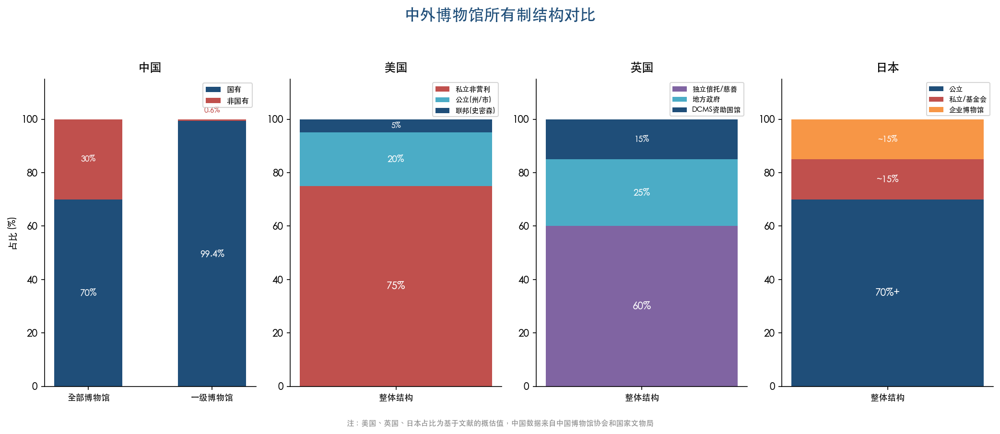

上图直观呈现了中国、美国、英国、日本四国博物馆所有制结构的差异。尤其值得关注的是中国"全部博物馆"与"一级博物馆"之间国有占比从70%跃升至99.4%的陡峭梯度——这一数据深刻揭示了中国博物馆教育资源的结构性集中程度。

### 4.2.2 所有制差异对教育投入与运营模式的影响

所有制结构的差异深刻影响着博物馆教育的投入模式与可持续性逻辑。

**公立/国有主导模式（中国、法国、日本）** 的核心优势在于教育投入的稳定性和公共服务的普惠性。中国91.46%的博物馆免费开放率在全球居于前列；法国卢浮宫2024年28%的访客享受免费入场，其中法国访客免费比例高达65%，26岁以下年轻人占访客总数的41%。[卢浮宫2024年新闻稿](https://presse.louvre.fr/wp-content/uploads/2025/01/47a464a7a90352b142ae15cd6be89c07.pdf "免费政策数据") 然而，这一模式的内在风险在于教育功能对财政预算的高度依赖。法国博物馆教育史研究坦言，"文化是我们面临破产或疫情时第一个被削减的必需品"。[ICOM CECA法国博物馆教育史](https://ceca.mini.icom.museum/wp-content/uploads/sites/5/2025/10/HMMF_en_parpage.pdf "文化预算的脆弱性") 日本近年来推行的国立博物馆"自收自支"改革亦折射出公共财政保障与教育公共性之间的紧张关系。[Japan Press报道](https://www.japan-press.co.jp/s/news/?id=16224 "国立博物馆收入压力")

**多元筹资模式（美国、英国）** 的优势在于教育项目的灵活性和创新活力。私立博物馆可根据捐赠者意愿和社会需求灵活调整教育方向——大都会博物馆为纽约市低收入学校提供免费迷你驻地项目，体现了私立机构以教育公平为导向的自主选择。[大都会博物馆教育者页面](https://www.metmuseum.org/learn/educators "学校合作项目") 但这一模式的脆弱性在于教育投入与筹资能力高度挂钩。2025年以来，美国联邦政府对IMLS的精简举措已引发博物馆界对中小型机构教育项目可持续性的广泛忧虑。[Hyperallergic报道](https://hyperallergic.com/trump-moves-to-dismantle-institute-of-museum-and-library-services/ "IMLS面临精简") 英国DCMS也在2026年初开始探讨对海外游客收取入场费的可能性，引发关于免费开放原则存废的激烈争论。[Museums Association报道](https://www.museumsassociation.org/museums-journal/news/2026/03/serious-reservations-about-proposal-to-scrap-free-entry-for-overseas-visitors/ "海外游客收费提议")

### 4.2.3 中国非国有博物馆教育的困境：结构性比较视角

将中国非国有博物馆的教育困境置于国际比较框架中考察，可以识别出若干深层的制度差异。

中国非国有博物馆面临的资金困难具有独特的制度背景。在美国，私立博物馆的运营依赖完善的慈善捐赠税收减免制度和成熟的基金会资助生态，公民和企业的博物馆捐赠可获得显著的税收优惠。相比之下，中国的税收优惠体系对非国有博物馆的支持力度相对有限，缺乏与美国类似的大规模捐赠激励机制。近年来，多家民营美术馆和博物馆因资金压力退出或关闭，折射出非国有博物馆可持续运营面临的系统性风险。[艺术中国](http://art.china.cn/txt/2025-09/09/content_43221847.htm "民营美术馆生存现状")

在教育功能的规范化方面，中国非国有博物馆与国有博物馆之间的差距远大于西方国家内部的公私立差异。美国和英国的行业认证体系（AAM认证、MA标准）对公私立博物馆一视同仁，私立博物馆参与认证的积极性较高，教育功能被视为获得行业认可的必要条件。中国的定级评估体系在制度设计上同样覆盖非国有博物馆，但实际参评和入选的非国有博物馆比例极低（一级博物馆中仅占0.61%），这既反映了非国有博物馆在综合能力上的差距，也提示评估标准与非国有博物馆的差异化特征之间可能存在匹配错位。中国博物馆协会已明确指出，"行业博物馆和非国有博物馆是我国博物馆事业高质量发展的重要增长点"。[中国博物馆协会第五批评估答记者问](https://www.chinamuseum.org.cn/cma/detail.html?id=12&contentId=13677 "高质量发展增长点")

## 4.3 学科门类维度：教育方法论的分化与融合

### 4.3.1 科技类博物馆：互动式教育的跨国共识与实施差异

科技类博物馆在教育方法论上的跨国共识最为显著——无论中外，"动手学习"（hands-on learning）和互动体验均被视为科技博物馆教育的核心特征，这一共识超越了制度差异和所有制边界。

中国科技馆体系2024年全国接待观众首次突破1亿人次。中国科技馆馆长郭哲提出"科普+"的多元形式理念，强调科技馆已从物理场馆延伸至公众日常生活。[新华网报道](https://www.news.cn/tech/20250114/dede1622278f4afebff267d51f42554a/c.html "2025年1月14日") 美国的科学中心自1975年AAM取消藏品强制要求后蓬勃发展，以"做中学"为教育核心，与STEM/STEAM教育理念深度融合。[美国科技中心协会回顾](https://www.astc.org/dimension/looking-back-to-look-ahead/ "ASTC对AAM 1975年定义修订的记述") 德国慕尼黑的德国博物馆以互动式、体验式教育著称，是STEM教育在博物馆场景中应用的欧洲先驱。

然而，中外科技类博物馆在实施路径上仍存在结构性差异。中国的"现代科技馆体系"强调以行政力量构建从实体馆到流动馆再到数字馆的全覆盖网络，以标准化方式快速推广科普教育——2024年流动科技馆巡展746站、科普大篷车开展活动3.6万场。[新华网报道](https://www.news.cn/tech/20250114/dede1622278f4afebff267d51f42554a/c.html "流动科技馆数据") 美国科学中心的发展更多依赖社区和市场力量的自发驱动，各机构在内容设计和教育方法上自主性更强，创新路径更为多元化，但覆盖的均衡性不及中国的行政推广模式。

### 4.3.2 历史文化类与艺术类博物馆：叙事性教育的传统分殊

历史文化类和艺术类博物馆的教育方法以叙事性和诠释性为主导，但中外之间在叙事取向上存在值得深入关注的差异。

中国的综合地志类和历史文化类博物馆在327家一级博物馆中合计219家（占比66.97%），构成中国博物馆教育的最大板块。[中国博物馆协会第五批评估答记者问](https://www.chinamuseum.org.cn/cma/detail.html?id=12&contentId=13677 "题材类型数据") 其中，革命纪念类博物馆58家入选一级博物馆，承担独特的思想政治教育功能。2024年国家文物局明确提出"革命纪念场馆和革命文物发挥思政教育功能"的工作要求。[国新办发布会](http://www.scio.gov.cn/live/2024/34884/index.html "国家文物局发布会") 这种将博物馆教育与国家意识形态建设紧密结合的取向，在全球博物馆教育实践中独具特色。

与之形成对照的是，德国的纪念场所（Gedenkstätte）虽同样承担面向国家历史的公民教育功能，但其教育取向侧重于通过直面暴力和压迫历史来促进民主意识和人权教育——柏林"恐怖地形图"2018年即接待138万人次。[deutschland.de](https://www.deutschland.de/en/topic/knowledge/germanys-museums-facts-and-figures "参观数据") 英国博物馆教育在2020年《博物馆学习与参与宣言》之后进一步转向"文化民主"和社会正义导向。[英国博物馆协会宣言](https://www.museumsassociation.org/campaigns/learning-and-engagement/manifesto/ "2020年发布") 法国蓬皮杜中心开创的"全民参与"范式则强调打破博物馆的精英形象，面向全年龄段提供创意教育。[ICOM CECA法国博物馆教育史](https://ceca.mini.icom.museum/wp-content/uploads/sites/5/2025/10/HMMF_en_parpage.pdf "蓬皮杜中心评价")

历史类博物馆教育的跨国比较提示，博物馆教育从来不是价值中立的活动——不同国家对历史叙事的选择和诠释框架深受本国政治文化传统和社会共识的影响。中国博物馆教育在国家叙事的连贯性和动员力方面具有显著优势，西方博物馆则在批判性思维培养和多元叙事呈现方面积累了丰富经验。这一差异的背后是不同文明传统对"博物馆应当培养什么样的公民"这一根本问题的不同回答。

### 4.3.3 学科门类边界的模糊化：跨国共性趋势

一个值得关注的跨国共性趋势是学科门类边界的日益模糊化。STEAM教育理念的兴起推动科学与艺术、技术与人文的深度融合，这在中外博物馆教育中均有鲜明体现。

英国V&A博物馆的"V&A Innovate"全国学校设计挑战赛要求学生团队开发以地球为中心的设计解决方案，将艺术博物馆教育与科学创新紧密结合。[V&A Innovate项目](https://www.vam.ac.uk/blog/museum-life/va-innovate-national-schools-challenge-2024-2025-shortlist-announced "2024-25年度") 中国的研学旅行同样呈现跨门类整合趋势。《人民论坛》指出，研学旅游已"从早期拓展性的课外活动，演进为深化素质教育、促进文旅消费的创新载体"。[人民论坛](http://paper.people.com.cn/rmlt/pc/content/202512/17/content_30130630.html "我国研学游的现状、趋势与优化路径") 这一趋势反映了博物馆教育从单一学科的知识传授向跨学科素养培育的范式转型，也为不同门类博物馆之间的教育合作开辟了新的制度空间。

## 4.4 教育专业化路径的国际比较

### 4.4.1 四种专业化模式

前两章的分析揭示了中外博物馆教育专业化路径的深层分化。这些差异可归纳为四种代表性模式：

**法国"文化调解者"（médiateur culturel）模式。** 法国建立了从高等教育到职业实践的完整专业化链条——文化调解专业需接受五年制高等教育方可获得资质。[ICOM CECA法国博物馆教育史](https://ceca.mini.icom.museum/wp-content/uploads/sites/5/2025/10/HMMF_en_parpage.pdf "调解专业化") 调解者的核心角色是在博物馆、公众和藏品三者之间建构关系，而非简单地传递知识。然而，这一模式亦存在结构性张力——调解者与策展人之间存在"两种职业、两种教育背景、两条职业路径、一个无可置疑的等级关系"，调解者往往在展览设计完成后才介入教育工作。[ICOM CECA法国博物馆教育史](https://ceca.mini.icom.museum/wp-content/uploads/sites/5/2025/10/HMMF_en_parpage.pdf "策展-调解张力")

**德国"博物馆教育学者"（Museumspädagoge）模式。** 德国的博物馆教育学（Museumspädagogik）具有深厚的学术化和制度化底蕴。多所大学设有博物馆学或博物馆艺术教育硕士学位项目，[DAAD学位项目列表](https://www.daad.de/en/studying-in-germany/universities/all-degree-programmes/detail/leipzig-university-of-applied-sciences-museum-art-education-education-and-teaching-in-museums-w55351/ "莱比锡应用科技大学") 博物馆教育协会（BVMP）负责推动质量标准和专业培训，莱布尼茨博物馆教育卓越中心开展系统性的实证教育研究。[莱布尼茨中心官网](https://leibniz-bim.de/en/home-en "中心介绍") 这一模式的突出特征在于教育理论与博物馆实践的系统性结合。

**日本"学芸员"（学芸員）模式。** 日本的学芸员制度以法律形式保障博物馆教育的专业性——《博物馆法》规定登录博物馆须配备学芸员。[日本法律翻译](https://www.japaneselawtranslation.go.jp/en/laws/view/4309/en "博物馆法英文全文") 学芸员兼具策展与教育双重功能，与法国将策展与调解截然分离的模式形成鲜明对照。但学芸员数量不足和待遇偏低是长期困扰日本博物馆教育的人才瓶颈。

**美国"博物馆教育者"（museum educator）模式。** 美国的博物馆教育专业化更依赖市场化的人才培养机制和行业认证体系。AAM认证制度以"教育与诠释"为七大核心标准之一，[AAM核心标准官方页面](https://www.aam-us.org/programs/ethics-standards-and-professional-practices/core-standards-for-museums/ "AAM Core Standards") 但不设类似法国或日本的法定资质门槛。大学层面的博物馆学硕士项目（Museum Studies）为专业人才提供学术训练，但博物馆教育者的职业路径和薪酬体系在不同机构之间差异较大。

### 4.4.2 中国博物馆教育专业化的定位

将中国博物馆教育专业化现状置于上述四种模式的坐标中，可以识别出其独特定位与提升空间。

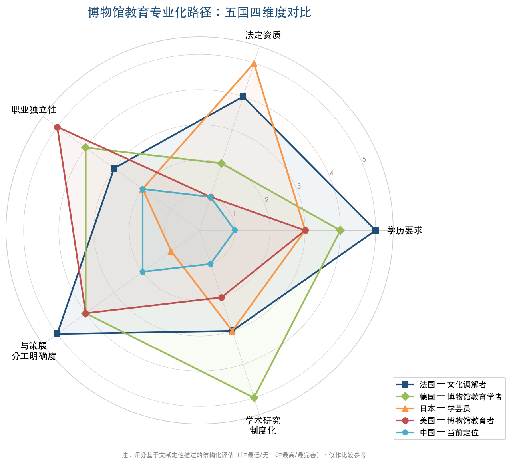

上图以雷达图形式呈现了法国、德国、日本、美国和中国在法定资质、学历要求、学术研究制度化、与策展分工明确度、职业独立性五个维度上的差异。中国当前在各维度上的得分均处于相对起步阶段，反映了从实践经验积累向制度化知识体系转型的现实特征。

中国博物馆教育专业人员的主体是社教部门的讲解员、教育专员和研学导师。与法国、德国和日本相比，中国尚未建立独立的、以法律或学位制度为支撑的博物馆教育专业资质体系。中国博协社教专委会2025年年会将人工智能对博物馆社会教育的冲击、"博物馆热"背景下的研学"冷思考"以及情绪价值与实用价值需求交织下的博物馆社会教育未来列为核心议题，折射出业界对教育专业化程度的深切关注。[中国国家博物馆](https://www.chnmuseum.cn/yj/kydt/202506/t20250623_271958.shtml "中国博协社教专委会2025年年会")

国博2024年累计培训9,701人次、结合"文博行业人才培养工程"举办行业类培训7,791人次的实践，表明中国正在通过头部机构的培训辐射来弥补制度性专业化路径的不足。[中国国家博物馆数据报告（2024年度）](https://www.chnmuseum.cn/shxg/zlxz/pdfdown/202503/t20250320_271313.shtml "科研活动部分") 然而，与德国莱布尼茨博物馆教育卓越中心的学术研究驱动模式、法国五年制高等教育培养体系相比，中国的博物馆教育专业化仍处于从"实践经验积累"向"制度化知识体系"转型的关键阶段。

## 4.5 免费开放与教育公平：制度安排的比较

免费开放政策是保障博物馆教育公平可及性的制度基石。中外在这一领域形成了颇具比较意义的政策光谱。

中国以91.46%的博物馆免费开放率居于全球前列。免费开放政策自2008年实施以来，从根本上消除了公众走进博物馆的经济门槛，推动年观众量从约3亿人次跃升至14.9亿人次（2024年）。[新华网报道国家文物局数据](http://www.news.cn/20250518/98cc603c54e840939014b336637fc9ad/c.html "2025年5月18日发布") 英国DCMS资助的15家国家博物馆自2001年起实行全面免费开放。[Centre for Public Impact分析](https://centreforpublicimpact.org/public-impact-fundamentals/universal-free-admission-to-the-uks-national-museums/ "英国免费开放政策分析") 美国史密森学会旗下21家博物馆全部免费开放。法国采取"分类免费"策略——对本国年轻人和教育群体优先免费，2024年法国访客免费比例达65%。[卢浮宫2024年新闻稿](https://presse.louvre.fr/wp-content/uploads/2025/01/47a464a7a90352b142ae15cd6be89c07.pdf "免费政策数据") 日本《博物馆法》规定公立博物馆不得收取入场费，但近年来"自收自支"改革正在对这一原则产生冲击，部分国立博物馆已引入本国居民和外国游客的差别定价制度。[朝日新闻报道](https://www.asahi.com/ajw/articles/16402531 "双轨定价制度")

将免费开放与教育公平关联分析，三个层面的问题值得深入审视。

**第一，经济门槛的消除并不等同于教育公平的实现。** 中国虽然博物馆免费开放率极高，但东西部地区、城乡之间的物理可及性差距依然显著，免费开放对缺少博物馆的偏远地区意义有限。

**第二，免费开放政策的财务可持续性正在全球范围内受到挑战。** 英国讨论对海外游客收费、日本推行差别定价、美国IMLS面临精简——这些信号表明，以公共财政全额支撑免费开放模式的可持续性在部分国家已开始动摇。

**第三，中国的流动教育体系为解决"免费但不可及"的困境提供了独特方案。** 流动科技馆覆盖全国29个省份1,888个县级行政区、科普大篷车26年累计服务近4亿人次的实践，在全球范围内构成了一种将教育公平从"免费入场"推进至"送教上门"的制度创新。

## 4.6 馆校合作的制度化程度比较

博物馆与学校教育系统的衔接是博物馆教育社会功能得以充分发挥的关键环节。中外在馆校合作的制度化程度上存在显著的结构性差异。

中国的馆校合作具有强劲的政策驱动力和制度化保障。2020年教育部与国家文物局联合印发的《关于利用博物馆资源开展中小学教育教学的意见》，首次系统性地提出了博物馆研学活动的"分龄设计"原则——小学阶段体现趣味性和故事性、初中阶段体现实践性和体验性、高中阶段体现探索性和研究性。[教育部官网](http://www.moe.gov.cn/srcsite/A06/s7053/202010/t20201020_495781.html "文物博发〔2020〕30号") 2021年九部门联合印发的《关于推进博物馆改革发展的指导意见》进一步提出"制定博物馆教育服务标准，丰富博物馆教育课程体系"的要求。[国务院新闻办公室](http://www.scio.gov.cn/xwfb/gwyxwbgsxwfbh/wqfbh_2284/2021n_2711/2021n11y03rsw/wjxgzc_4238/202208/t20220808_315114.html "九部门指导意见") 2025年，国家文物局将"深化博物馆馆校合作机制"列为年度重点任务。[中国博物馆协会](https://www.chinamuseum.org.cn/cma/detail.html?id=13&contentId=14060 "国家文物局2025年工作要点")

法国的馆校合作同样拥有法律层面的制度支撑。19世纪朱尔·费里教育法确立的"实物教学法"原则延续至今，法国"艺术与文化教育"（EAC）政策将博物馆参观纳入中小学教育制度框架。[ICOM CECA法国博物馆教育史](https://ceca.mini.icom.museum/wp-content/uploads/sites/5/2025/10/HMMF_en_parpage.pdf "费里教育法") 日本《博物馆法》将博物馆明确定位为"社会教育机构"，其立法目的即为"提升博物馆作为社会教育机构的功能"。[日本法律翻译](https://www.japaneselawtranslation.go.jp/en/laws/view/4309/en "博物馆法英文全文")

美国和英国的馆校合作则更多依赖博物馆的自主行动和行业标准的引导。AAM核心标准要求"将教育置于公共服务角色的核心"，[AAM核心标准官方页面](https://www.aam-us.org/programs/ethics-standards-and-professional-practices/core-standards-for-museums/ "AAM Core Standards") 但具体的馆校合作形式和深度由各机构自行决定。大英博物馆2024/25年度接待44万名预约参观学生、大都会博物馆为Title I学校提供免费项目，均属机构自主行为而非政策统一安排。

综合而言，中国馆校合作的制度化优势在于覆盖面广、执行力强、标准统一；法国和日本以法律框架保障了馆校合作的长期持续性；美国和英国的模式虽然制度约束力较弱，但在项目设计的灵活性和教育公平的精准触达方面（如大都会博物馆针对低收入学校的专项服务）展现了独到优势。这些差异本质上反映了不同国家在政府角色、教育治理模式和社会动员机制上的深层制度分殊。

## 4.7 共性趋势与结构性差异的综合提炼

综合上述多维度比较，中外博物馆教育呈现出三个共性趋势和三个结构性差异，构成本章分析的核心结论。

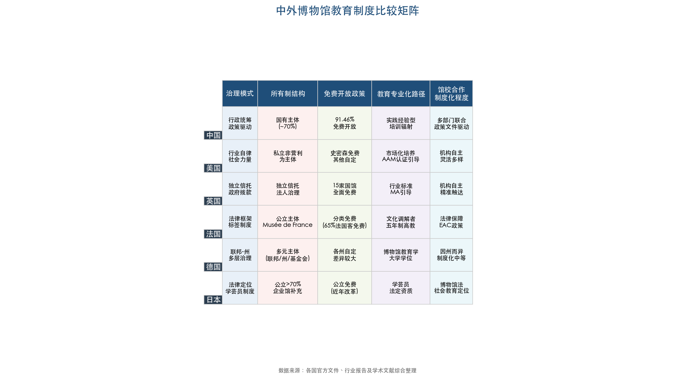

上图以矩阵形式综合呈现了中国、美国、英国、法国、德国、日本六国在治理模式、所有制结构、免费开放政策、教育专业化路径、馆校合作制度化程度五个维度上的结构性差异，为以下综合分析提供了一目了然的比较框架。

**三个共性趋势：**

**其一，教育功能从"附属职能"向"核心使命"的跃升。** 无论是ICOM 2022年将教育嵌入"多元体验"框架、中国《博物馆条例》将教育置于首位、AAM将教育列为七大核心标准之一，还是日本《博物馆法》以社会教育为立法目的，各国均在制度层面确认了教育功能在博物馆事业中的核心地位。这一趋势具有全球性和不可逆性。

**其二，数字化教育的加速渗透。** 各国国家级博物馆均在数字教育领域投入大量资源——从史密森学会的1.5亿人次网站独立访客，到大英博物馆耗资1,000万英镑的五年期数字化计划，到中国国博的虚拟数智人和云展平台，再到日本2022年《博物馆法》修订新增的数字档案义务。数字化正在深刻重塑博物馆教育的触达方式、参与模式和评估手段。

**其三，教育公平与包容性的持续关注。** 中国的免费开放政策和流动教育体系、英国大英博物馆的EDI项目（2024/25年度超过4,000人参与、43场无障碍活动）、[大英博物馆2024/25年度报告](https://www.britishmuseum.org/sites/default/files/2025-07/Annual_Report_and_Accounts_2024-25.pdf "EDI数据") 美国大都会博物馆面向低收入学校的专项服务、法国对年轻人和教育群体的分类免费——各国均以各自的制度路径回应教育公平诉求。

**三个结构性差异：**

**其一，治理逻辑的分殊。** 中国博物馆教育以行政统筹和政策驱动为核心逻辑，强调自上而下的系统性规划和资源配置；美英以行业自律和社会力量为主导，强调机构自主和市场机制；法国和德国介于两者之间，以法律框架和专业化制度为纽带；日本以法律定位和专业资质（学芸员制度）为保障。

**其二，教育专业化路径的分化。** 法国的文化调解者、德国的博物馆教育学者、日本的学芸员和美国的博物馆教育者代表了四种迥异的专业化路径。中国的博物馆教育专业化正处于从实践经验积累向制度化知识体系转型的关键阶段。借鉴但不照搬任何单一国际模式，探索适合自身制度环境的专业化路径，将是未来发展的核心议题。

**其三，叙事取向的差异。** 中国博物馆教育在历史文化领域强调国家叙事的连贯性和思想政治教育功能，西方国家则更侧重批判性思维、多元叙事和"文化民主"取向。这一差异根植于不同的政治文化传统，既不能简单以优劣评判，也不应忽视其对博物馆教育实际效果和社会影响的深层塑造作用。

上述比较分析将在第5章科技与教育理念变革的全球图谱中得到进一步延伸，并在第6章中被引用作为中国博物馆教育未来路径设计的实证依据。

# 第5章 科技与教育理念双轮驱动下的博物馆教育变革

前四章的分析揭示了中外博物馆教育在制度安排、分类结构和实践模式上的多重差异与共性趋势。本章将视角从现状描述转向变革动力，系统考察科技发展与教育理念革新这两大引擎如何共同驱动博物馆教育的范式转型。科技维度聚焦人工智能、虚拟/增强现实、数字化基础设施与大数据四大技术集群在博物馆教育场景中的应用现状与前沿探索；教育理念维度聚焦STEAM教育、终身学习、社会包容与公众参与式策展等理念对博物馆教育功能定位的深层重塑。在此基础上，本章进一步解析技术与理念的交汇点，揭示两者协同驱动下博物馆教育正在经历的结构性变革。

## 5.1 人工智能：从辅助工具到教育伙伴

### 5.1.1 AI导览与个性化推荐

人工智能技术在博物馆教育中的应用正经历从"信息检索工具"到"个性化教育伙伴"的角色跃迁。传统语音导览提供千人一面的标准化讲解，而AI驱动的智能导览系统能够根据观众的个人偏好、参观历史和实时行为提供定制化的内容与路线推荐，从根本上改变了博物馆知识传播的单向性。

在中国，国家级博物馆率先将AI技术嵌入教育服务体系。中国国家博物馆的虚拟数智人"艾雯雯"能够根据游客提问实时调取数据库，为来自世界各地的游客讲解中华文明，实现了从"标签式解说"到"对话式交互"的转变。[光明日报](https://news.gmw.cn/2026-03/29/content_38676778.htm "人工智能重塑博物馆观展体验，2026年3月29日") 上海博物馆于2025年5月全面升级智慧导览服务，推出基于馆藏知识库的"AI尚博导览助手"，该系统结合结构化知识图谱与语义理解能力，具备多语种语音和文字交互功能，为260余件精品文物提供语音、视频、漫画、动画及互动游戏等多元讲解形式。[人民画报](http://www.rmhb.com.cn/yxsj/zttp/202603/t20260318_800433176.html "数字赋能 智慧新生，2026年3月") 故宫博物院的"数字故宫"平台以超百万级别的高清文物影像构建文物图像数据库，不仅服务于馆内管理和学术研究，也成为观众在参观后的"数字回顾入口"——观众可随时调阅展览中浏览过的藏品，查看其高清图像、细节说明和多版本解说词，实现了"延时回溯"的观展体验。[光明日报](https://news.gmw.cn/2026-03/29/content_38676778.htm "数字故宫案例")

在国际层面，AI个性化导览同样处于快速迭代之中。卢浮宫的"智能导览系统"能够根据观众所在定位、过往参观行为甚至社交媒体上的互动，提供参观路线建议——首次到访的观众可能被推荐地标展品与打卡热门点，而偏爱油画类展品的回头客则会获得针对性的游览路径。[光明日报](https://news.gmw.cn/2026-03/29/content_38676778.htm "卢浮宫智能导览") 学术界也在积极探索大语言模型（LLM）在博物馆教育中的应用。瑞士弗里堡大学2024年发表的研究将LLM引入意大利阿斯科利市立美术馆的三维全景虚拟导览，实现了基于用户兴趣的个性化讲解路径生成。[Vasic等](https://www.unifr.ch/inf/digits/en/assets/public/files/research/papers/Vasic_etal_2024_LLM_Museum_Guide_accepted_version.pdf "LLM-Aided Museum Guide, 2024")

### 5.1.2 智能策展与藏品管理

AI在博物馆教育中的影响不止于前台导览，更延伸至策展与藏品管理的后台环节。通过计算机视觉和文物图像特征提取技术，AI可以辅助专家对海量藏品进行标注、识别和分类，使研究人员和公众能够在数百万件数字化藏品中实现精准检索。史密森学会拥有超过1,700万件数字化藏品，如此庞大规模的藏品管理已无法完全依赖人工，AI驱动的自动标注和语义检索技术正成为不可或缺的基础设施。[史密森学会事实页](https://www.si.edu/newsdesk/factsheets/facts-about-smithsonian-institution-short "数字化数据")

在策展领域，AI正从"辅助工具"演进为"创意伙伴"。2024年，中国国内首个人工智能VR情景虚拟数字绘画展"盛作重生——《韩熙载夜宴图》AI沉浸式体验展"将AI图像生成技术与VR沉浸式展示相结合，为古典名画赋予全新的数字生命。[中国陈列展览设计网](https://www.chinaclzl.com/jtzx_1/1247.html "人工智能+模式下艺术策展新视角") 三星堆博物馆的考古修复团队结合AI算法对文物碎片进行拼对，利用多媒体技术演绎数字化修复过程，以动画还原拼合步骤和最终修复全貌，并将AI技术与3D打印相结合用于文物修复和展陈，标志着考古实践从"经验主导"迈向"数据驱动"的范式转换。[光明日报](https://news.gmw.cn/2026-03/29/content_38676778.htm "三星堆AI修复")

### 5.1.3 分类视角下的AI应用梯度

从第1章建立的三维分类框架审视，AI技术在博物馆教育中的应用呈现出显著的分层特征。在行政级别维度上，国家级博物馆（如中国国博、故宫、史密森学会）凭借雄厚的资金和技术储备率先部署AI系统，而基层和社区博物馆则面临技术门槛和人才瓶颈的双重约束。在所有制维度上，国有/公立博物馆在AI基础设施建设上获得了更多的政策和财政支持，而民营/私立博物馆则在AI导览的商业化应用方面展现出更灵活的探索路径——例如上海博物馆与百视通合作打造数字孪生博物馆，融合AIGC、超高清等技术。[上海市文化和旅游局](https://whlyj.sh.gov.cn/wlyw/20250826/e3f5937267784e25822934255ed98e74.html "2025年上海市文博领域人工智能应用场景对接交流会") 在学科门类维度上，科技类博物馆因其固有的技术亲和性，在AI应用上往往走在前列；历史类和艺术类博物馆则更注重AI与文化叙事的深度融合，力求避免技术展示喧宾夺主。

下图将本章所讨论的各项博物馆教育技术置于"技术成熟度—教育影响深度"的二维坐标中，直观呈现各技术当前所处的应用阶段与影响层级。

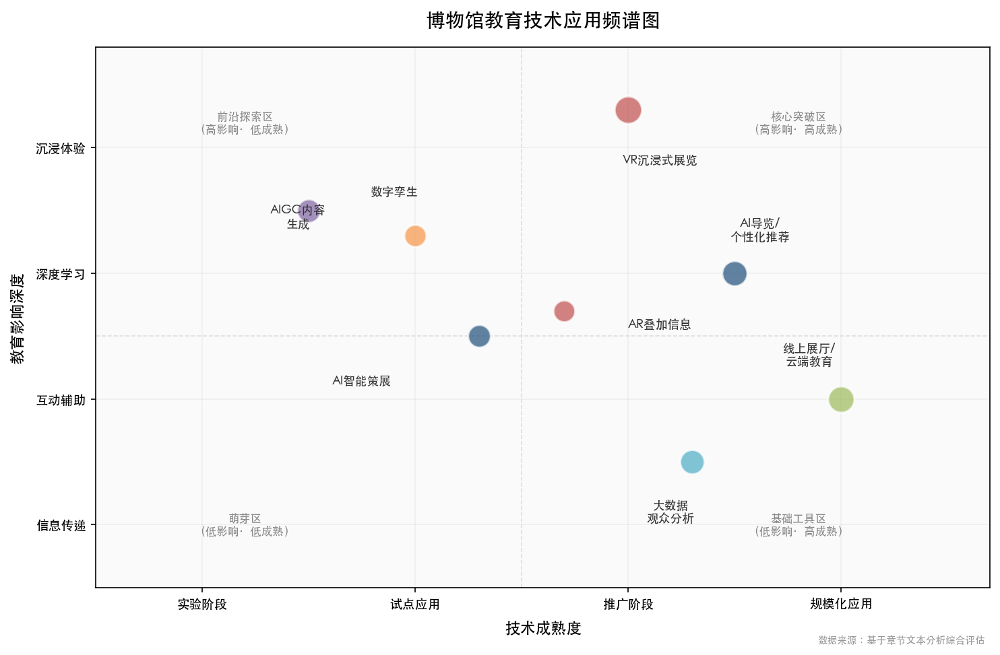

图5-1显示，AI导览与线上展厅已进入规模化应用阶段，构成博物馆数字化教育的基础工具层；VR沉浸式展览和大数据观众分析处于推广阶段，正向核心突破区演进；而AIGC内容生成和数字孪生技术仍处于实验或试点阶段，代表着未来发展的前沿方向。

## 5.2 虚拟与增强现实：沉浸式教育的新疆域

### 5.2.1 VR沉浸式展览的全球扩张

虚拟现实技术正在重新定义博物馆教育的空间边界。据《艺术新闻》（The Art Newspaper）追踪，从2019年首家沉浸式机构出现到2024年2月首次审计时，全球已有超过100家"沉浸式机构"（immersive institution）；到2024年底，这一数字已跃升至超过350家。其中，基于自由行走式VR头显技术的"第二波"沉浸式机构在短短一年多内即达到约50家，增速超越了前一波的LED大屏投影式展览。[The Art Newspaper](https://www.theartnewspaper.com/2025/01/29/the-second-wave-of-immersive-institutions-has-arrived "2025年1月29日报道")

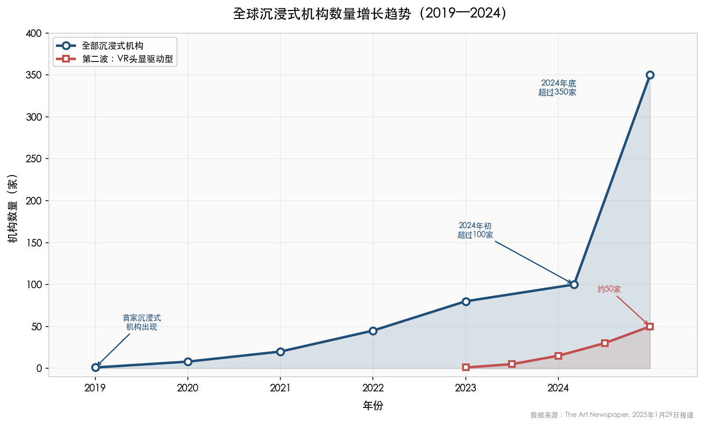

图5-2清晰呈现了这一爆发式增长态势。2019年至2024年间，全球沉浸式机构总量从零起步增长至超过350家，尤其在2024年呈现陡峭上升曲线；第二波VR头显驱动型机构虽然起步较晚，但增速同样迅猛。

这一快速扩张的背后是VR硬件的代际突破。HTC Vive Arts执行总监Celina Yeh指出："随着头显变得更轻、更舒适、更不受线缆束缚，自由行走式探索的可能性大幅拓展。此外，头显识别空间位置和访客身体运动的技术为交互性开辟了全新的可能。"[The Art Newspaper](https://www.theartnewspaper.com/2025/01/29/the-second-wave-of-immersive-institutions-has-arrived "Celina Yeh访谈") 法国Excurio公司制作的《胡夫地平线》（Horizon of Khufu）是这一新媒介的标杆案例——观众戴上VR头显后进入大金字塔内部，穿越埃及神话场景直至亡者之地。该项目自2022年10月在巴黎首映以来已吸引超过200万访客，覆盖巴黎、纽约、上海、深圳、横滨等全球20座城市。[The Art Newspaper](https://www.theartnewspaper.com/2025/01/29/the-second-wave-of-immersive-institutions-has-arrived "Excurio CEO Fabien Barati访谈")

国家级大馆同样积极拥抱VR技术。美国大都会艺术博物馆2025年11月推出两项VR体验——"丹铎解码"（Dendur Decoded）和"大洋洲：时空新地平线"（Oceania: A New Horizon of Space and Time），将馆藏标志性作品通过高分辨率三维扫描转化为沉浸式虚拟空间，观众可通过个人VR头显或博物馆网站免费体验。该项目基于与沉浸式文化平台Atopia的合作开发，采用"无代码编辑器"技术，使各种规模的博物馆都能自行设计和发布沉浸式展览，有效降低了VR教育的技术门槛。[大都会艺术博物馆新闻稿](https://www.metmuseum.org/press-releases/vr-atopia-2025 "2025年11月10日发布")

### 5.2.2 中国博物馆的VR/AR实践

中国博物馆在VR/AR领域的探索同样值得关注，尤其在将沉浸式技术与本土文化遗产叙事相结合方面形成了独特路径。

2024年12月，中央广播电视总台数字文化艺术博物馆（央博）联合中国科技馆推出"何以文明"和"奇遇三星堆"两项VR沉浸探索展。观众穿戴VR头显装备后，可以身临其境走进5处古老文明遗址，近距离欣赏多件虚拟珍贵文物——从良渚水乡泽国的风姿、陶寺观象台的天文智慧，到三星堆青铜纵目面具和一号神树的恢弘气象。该项目被定位为"传统文博行业与人工智能和展示技术结合的创新应用"。[央视网](https://yangbo.cctv.com/2024/12/03/ARTInB5l94ugxWJclR8jDVAj241203.shtml "何以文明VR沉浸探索展宣介会")

上海博物馆则在VR/AR教育方面构建了更为系统化的实践体系。其东馆数字馆首展"山水江南"融合中国古典绘画研究成果与数字技术，采用25K投影融合系统、AIGC水墨解析模型和多深度相机人体跟踪技术，构建了一个无物理边界的数字山水世界。展览中通过历史资料还原的16位江南文人山水画大师形象（如董其昌、沈周、文徵明等）以数字人物形式与观众互动，自2024年6月开放以来已吸引超过30万观众。[人民画报](http://www.rmhb.com.cn/yxsj/zttp/202603/t20260318_800433176.html "山水江南数字展") 与此同时，上海博物馆与Excurio合作引进"消失的法老：胡夫金字塔沉浸式探索体验展"，通过45分钟的VR沉浸式旅程使观众深入金字塔内部，成为全球巡展在中国的重要落地实践。[人民画报](http://www.rmhb.com.cn/yxsj/zttp/202603/t20260318_800433176.html "胡夫金字塔VR展")

在AR应用方面，上海博物馆东馆中国古代青铜馆已为观众配备AR眼镜，使其在实物展品前获取叠加的数字信息和历史场景还原。AR导航小程序可实时推送避峰路线，并结合展厅大屏动态展示客流密度，同时实现了服务优化和教育增强的双重功能。[人民画报](http://www.rmhb.com.cn/yxsj/zttp/202603/t20260318_800433176.html "AR眼镜与导航") 湖南省博物馆的"马王堆汉代文化沉浸式展览"则运用高清文物扫描、三维投影、裸眼3D和生成算法艺术等技术手段，使观众穿行其间仿佛置身汉代生活场景——头顶丝帛纹样光影流转，脚下投影随行走变化，交互内容因停留时间动态切换。[光明日报](https://news.gmw.cn/2026-03/29/content_38676778.htm "马王堆沉浸式展览")

### 5.2.3 沉浸式教育的价值与局限

VR/AR技术为博物馆教育带来的核心价值体现在三个维度的突破。**其一，空间重构。** 观众不再受限于展柜前的被动观望，而是能够"走进"历史场景、"站在"考古现场、"触摸"虚拟文物，实现从二维到三维、从观看到体验的范式跃迁。**其二，时间穿越。** VR技术可以将已消失的历史场景和文化空间数字化重现，使观众获得传统展陈方式无法提供的时空体验——如大都会博物馆"丹铎解码"项目通过360度影像还原丹铎神庙在尼罗河畔的原始面貌，以及UNESCO拯救努比亚纪念碑运动中神庙被拆解运往纽约的全过程。**其三，民主化。** 沉浸式技术使不在场的全球观众获得了此前只有实地参观者才能享有的教育资源——大都会博物馆的VR体验在网页端和VR头显端均可免费使用；英国CoStar国家实验室获得英国艺术与人文研究理事会（AHRC）1亿英镑投资，用以推动文化VR内容的研发与传播。[The Art Newspaper](https://www.theartnewspaper.com/2025/01/29/the-second-wave-of-immersive-institutions-has-arrived "CoStar National Lab")

然而，沉浸式技术也面临不容忽视的挑战。一方面，部分数字化项目在设计中过于注重技术展示的视觉效果，忽略了文化叙事的逻辑性、情感表达的深度以及观众的多样化需求，导致内容同质化现象日趋突出。[人民论坛](https://paper.people.com.cn/rmlt/pc/content/202504/03/content_30068269.html "博物馆数字化发展的现状与提升") 另一方面，VR/AR设备的成本和维护对中小型博物馆构成显著负担，可能进一步加剧第4章所揭示的国家级大馆与基层小馆之间的教育资源鸿沟。大都会博物馆与Atopia合作开发的"无代码编辑器"正试图从技术供给侧降低这一门槛，但其能否真正惠及资源匮乏的基层博物馆，仍有待实践检验。

## 5.3 数字化基础设施：线上展厅、数字孪生与云端教育

### 5.3.1 线上展厅与虚拟博物馆

新冠疫情以来，博物馆的数字化基础设施建设获得了前所未有的加速。线上展厅从最初的"应急替代方案"逐步发展为博物馆教育服务的标配功能，其定位也从"实体展览的数字化搬运"演进为具有独立教育价值的数字产品。

中国博物馆在线上展厅建设方面走在全球前列。中国国家博物馆的"中华文明云展"和虚拟数智人"艾雯雯"代表了中国数字博物馆教育的最新进展。[中国国家博物馆数据报告（2024年度）](https://www.chnmuseum.cn/shxg/zlxz/pdfdown/202503/t20250320_271313.shtml "数字化部分") 敦煌研究院的"数字敦煌"项目通过高精度数字化采集技术将敦煌壁画和洞窟进行全方位数字化存档与在线展示，其在文化遗产数字化保护方面的探索价值已获国际学界广泛认可。[人民论坛](https://paper.people.com.cn/rmlt/pc/content/202504/03/content_30068269.html "数字敦煌")

在国际层面，史密森学会2024年网站独立访客达1.5亿人次，拥有超过30款移动应用和超过1,700万件数字化藏品。[史密森学会事实页](https://www.si.edu/newsdesk/factsheets/facts-about-smithsonian-institution-short "数字化规模") 大英博物馆正实施五年期、耗资1,000万英镑的文献与数字化计划，其"虚拟参观"项目使全英6,000名学生通过线上直播参与博物馆学习，有效突破了物理空间对教育覆盖面的限制。[大英博物馆2024/25年度报告](https://www.britishmuseum.org/sites/default/files/2025-07/Annual_Report_and_Accounts_2024-25.pdf "虚拟参观数据")

### 5.3.2 数字孪生技术的前沿探索

数字孪生（Digital Twin）技术——即在虚拟空间中构建物理实体的精确数字副本——正从工业领域向博物馆领域渗透，为文化遗产的保护、研究和教育开辟全新可能。2025年发表于《自然》旗下《Scientific Reports》的研究表明，数字孪生技术在博物馆陶瓷展厅的在线构建中得到充分利用，使展品能够以近乎原始的形态在虚拟空间中呈现，为无法亲临现场的观众提供高度逼真的替代体验。[Nature Scientific Reports](https://www.nature.com/articles/s41598-025-30860-2 "数字孪生技术活化展品")

上海博物馆与百视通于2025年签约合作打造"数字孪生博物馆"，融合AIGC和超高清技术，依托文博数据集构建博物馆的完整数字副本。[上海市文化和旅游局](https://whlyj.sh.gov.cn/wlyw/20250826/e3f5937267784e25822934255ed98e74.html "数字孪生博物馆签约") 这一实践标志着从"单件藏品数字化"向"整馆数字化"的跨越——不仅文物本身被数字化，展厅空间、观众动线乃至环境参数都将在数字空间中获得精确映射。

国务院办公厅印发的《"十四五"文物保护和科技创新规划》明确提出"加强文物数字化保护，以世界文化遗产、全国重点文物保护单位、馆藏一级文物等为重点，推进相关文物信息高清数据采集和展示利用"。[人民论坛](https://paper.people.com.cn/rmlt/pc/content/202504/03/content_30068269.html "十四五规划引用") 在这一政策框架下，三星堆博物馆的"寻觅三星堆——祭祀坑考古发掘现场"项目利用实景VR技术构建了考古发掘现场的数字孪生，使观众能够沉浸式体验考古发掘的全过程。

### 5.3.3 云端教育与远程触达

云端教育模式极大地拓展了博物馆教育的受众边界。对于中国这样地域辽阔、博物馆资源分布极不均衡的大国，云端教育的战略意义尤为突出。第4章的分析已指出，中国通过流动科技馆（累计巡展5,909站）和科普大篷车（26年间累计服务近4亿人次）实现了教育资源的物理下沉。云端教育则提供了另一条互补路径——以数字技术消弭地理距离，使偏远地区的学校和社区获得与大城市居民相当的博物馆教育资源。

教育部与国家文物局联合发布的《关于利用博物馆资源开展中小学教育教学的意见》明确指出："进一步健全馆校合作机制，促进博物馆资源融入教育体系，提升中小学生利用博物馆纪念馆学习效果。"[人民论坛](https://paper.people.com.cn/rmlt/pc/content/202504/03/content_30068269.html "馆校合作政策") 在这一政策导向下，线上展览和数字教育资源成为馆校合作的重要载体。史密森学会2024年全国教育峰会即以线上线下结合方式吸引了来自50个州和87个国家的5,400余名教育者参会。[Smithsonian Magazine报道](https://www.smithsonianmag.com/blogs/smithsonian-education/2025/04/02/2024-education-impact-report-released/ "2024教育影响力报告")

## 5.4 大数据：观众理解与教育效果评估

### 5.4.1 观众行为分析的数据化转型

大数据技术正在将博物馆对观众的理解从"经验直觉"推向"数据驱动"的新阶段。通过整合预约信息、入馆闸机数据、展厅传感器、移动应用交互记录和社交媒体数据，博物馆得以构建多维度的观众画像，精准刻画观众的参观动线、停留时长、内容偏好和社交行为模式。

上海博物馆东馆建设的"客流统计分析平台"是中国博物馆大数据应用的前沿案例。该平台融合基于深度学习的人像识别算法、云计算技术和大数据分析能力，实现对全馆各区域的动态客流监控与精准分流管理。上海博物馆信息中心主任龚玉武指出："通过AI视觉识别与大数据分析，我们不仅实现了人流的实时监测与预警，更重要的是，它帮助我们真正理解观众——他们在哪里停留、对什么内容感兴趣、参观动线如何形成。这些数据沉淀为博物馆的'数字资产'，使我们的服务从'经验驱动'转向'数据驱动'。"[人民画报](http://www.rmhb.com.cn/yxsj/zttp/202603/t20260318_800433176.html "客流统计分析平台")

在美国，AAM自2025年起系统发布《博物馆观众年度调查》（Annual Survey of Museum-Goers）系列数据报告，以全国抽样方式追踪美国博物馆观众的人口统计特征、参观动机、疫后恢复趋势和社交体验偏好。[AAM](https://www.aam-us.org/2025/09/12/demographics-of-us-museum-goers-a-2025-annual-survey-of-museum-goers-data-story/ "2025年度调查") COVES（Community of Visitor Experience Surveyors）则汇聚了多家博物馆（包括艺术馆、儿童馆、科技馆）在2023年7月至2024年6月间的观众调查数据，为行业提供了跨机构、跨类型的比较基准。[COVES](https://understandingvisitors.org/images/downloads/Reports/coves_aggregate_report_fy24.pdf "COVES FY24年度报告")

### 5.4.2 教育效果评估的科学化

大数据技术的另一重要应用方向是推动博物馆教育效果评估从定性描述走向定量分析。传统的教育效果评估主要依赖事后问卷和专家评估，存在样本偏差和滞后性等固有局限。大数据技术使实时、连续、非侵入式的教育效果追踪成为可能——通过追踪观众在互动展项上的操作序列、在讲解内容前的停留时长以及多次参观之间的行为变化，博物馆可以更精准地评估展览设计和教育活动对知识获取、态度改变和行为影响的实际效果。

上海博物馆东馆的智慧博物馆"3M"体系——涵盖基于全生命周期的藏品智慧保护（AIM）、基于场馆运营可视化的智慧管理（BIM）和基于观众体验度的智慧服务（CIM）——为教育效果的系统化评估提供了技术基础。[人民画报](http://www.rmhb.com.cn/yxsj/zttp/202603/t20260318_800433176.html "3M体系") 这一体系将文物环境信息、设备运行状态、观众客流动态和社交媒体互动等多维度数据持续汇聚至后台系统，实现了"人—物—环境"三位一体的数据化管理。

## 5.5 教育理念的范式转型

如果说科技构成博物馆教育变革的"硬引擎"，那么教育理念的革新则是其"软引擎"。近年来，STEAM教育、终身学习、社会包容与公众参与式策展等理念正深刻重塑博物馆教育的功能定位和实践方式。

### 5.5.1 STEAM教育与博物馆的天然耦合

STEAM教育——即科学（Science）、技术（Technology）、工程（Engineering）、艺术（Arts）与数学（Mathematics）的跨学科整合教育——与博物馆教育存在天然的耦合关系。博物馆尤其是科技类和自然类博物馆，凭借其丰富的实物藏品、互动展项和跨学科内容，天然地构成STEAM教育的理想场所。

在美国，STEAM教育已深度嵌入博物馆教育体系。史密森学会旗下的史密森科学教育中心（Smithsonian Science Education Center）将STEAM理念贯穿于其K-12教育课程开发中。[Smithsonian Science Education Center](https://ssec.si.edu/stemvisions-blog/picking-steam "Picking up STEAM") 洛杉矶自然历史博物馆（NHMLAC）的"STEAM Pathways"项目覆盖了研究、非正式教育、创意设计、财务和运营等多个职能领域，展示了STEAM理念如何从教育活动延伸至机构整体运营。[NHMLAC](https://nhm.org/steam-pathways-nhmlac "STEAM Pathways") 美国科学中心协会（ASTC）则系统性地推动STEM公共项目在全美科学中心和科技馆的普及。[ASTC](https://www.astc.org/stem-public-programs/ "STEM Public Programs")

在中国，STEAM教育在博物馆领域的实践正呈现加速态势。2024年5月启动的"与丝路同行·择粹课堂"项目，由应用材料公司与陕西妇女儿童发展基金会共同发起，聚焦敦煌文化与STEAM教育的融合，鼓励青少年以科学思维与多元视角理解传统文化遗产。[应用材料公司新闻稿](https://www.appliedmaterials.com/cn/zh_cn/news-and-media/press-releases/250518-steam-cn.html "丝路大美育项目") 在学术层面，基于STEAM教育理念的博物馆研学课程开发成为研究热点——有学者提出涵盖"文化基因解码——跨学科融合——沉浸式体验"三个维度的STEAM研学课程设计框架，以西安丰富的博物馆资源为实践基地。[Research on Teaching and Education Development](https://artdesignp.com/journal/RTED/1/12/10.61369/RTED.2025120032 "基于STEAM教育理念的小学博物馆研学课程开发")

### 5.5.2 终身学习理念与博物馆的社会责任拓展

终身学习理念的兴起要求博物馆将教育服务对象从青少年学生扩展至全年龄段公众。在全球老龄化的背景下，博物馆作为"非正式学习场所"在促进老年群体的认知激活、社交参与和文化赋权方面具有独特优势。UNESCO终身学习研究所指出，终身学习在重新培养老年人技能、增强其自主性、促进健康积极老龄化和提升生活质量方面发挥着至关重要的作用。[UNESCO UIL](https://www.uil.unesco.org/en/thematic-studies-benefits-lifelong-learning-older-adults "终身学习与老年人")

ICOM 2022年通过的新定义中纳入的"反思"和"知识共享"维度，为博物馆的终身学习功能提供了学理支撑。正如第1章所述，从Falk和Dierking（2000年）的情境学习模型到Ansbacher（2002年）对体验成果的广义界定，学术界已为博物馆教育从"课堂教学的延伸"转向"终身学习的平台"提供了充分的理论准备。在实践层面，AAM 2025年度观众调查中的受访者明确表达了"希望成为终身学习者"的期望，将学习价值视为博物馆体验的核心组成部分。[AAM](https://www.aam-us.org/2025/02/07/hope-for-the-future-and-museums-community-and-family-a-2024-annual-survey-of-museum-goers-data-story/ "2024年度调查数据报告")

### 5.5.3 社会包容与无障碍教育

社会包容理念要求博物馆教育覆盖残障人士、少数族裔、低收入群体等传统上被排斥在文化参与之外的人群。ICOM 2022年新定义中增设的"包容性、可达性、多样性和可持续性"新价值取向，为博物馆的包容性教育实践提供了全球性的规范框架。

在技术赋能层面，VR和AR技术为包容性教育开辟了新路径。虚拟导览使行动不便的观众获得接近实地参观的体验；定制化的数字教育平台使偏远地区的学生接触到优质文化资源；针对听障人士的字幕和手语翻译功能可通过AI自动生成——大都会博物馆的VR体验即在全部内容中配备了隐藏字幕（closed caption）。[大都会艺术博物馆新闻稿](https://www.metmuseum.org/press-releases/vr-atopia-2025 "无障碍设计") 史密森学会的"Access Smithsonian"项目为残障人士提供系统化的无障碍参观服务，并发布了《史密森无障碍展览设计指南》（Smithsonian Guidelines for Accessible Exhibition Design），为行业提供了可操作的参考标准。[Smithsonian](https://www.thc.texas.gov/public/upload/publications/Smithsonian%20Guidelines%20for%20accessible%20design.pdf "无障碍展览设计指南")

英国博物馆协会2020年发布的《博物馆学习与参与宣言》提出博物馆是"文化民主的中心"，标志着博物馆教育理念从"知识传授"转向"文化赋权"。[英国博物馆协会](https://www.museumsassociation.org/campaigns/learning-and-engagement/manifesto/ "2020年宣言") 这一理念的核心在于：教育的目标不仅是让观众"知道更多"，更是使其具备参与文化生产和社区建设的能力与信心。对于基层/社区博物馆的教育功能定位而言，这一理念具有特殊意义——第4章的分析已揭示，社区博物馆在教育下沉方面能够发挥独特的"文化赋权"作用。

### 5.5.4 公众参与式策展

公众参与式策展（participatory curation）理念主张将观众从被动的知识接收者转变为展览内容的共同创造者。Nina Simon在其开创性著作《参与式博物馆》（The Participatory Museum）中系统阐述了这一理念，提出博物馆可以通过提供"社区参与和对话的场所"、帮助参与者"发展支持其个人和社区目标的技能"来实现教育功能的深化。[The Participatory Museum](https://participatorymuseum.org/chapter8/ "Chapter 8: Co-Creating with Visitors")

在实践层面，参与式策展正从"边缘实验"走向"主流方法"。美国探索馆（Exploratorium）和IMLS联合推动的"共同创造公众参与科学"（Co-Created Public Engagement with Science, CC-PES）项目要求公众和社区参与者与科学家、非正式教育者共同参与主题确定、内容开发和效果评估的全过程。[NISENET](https://www.nisenet.org/catalog/co-created-public-engagement-science-cc-pes-project-reports-2024 "CC-PES 2024报告") 荷兰莫瑞泰斯皇家美术馆（Mauritshuis）2024年的《掠夺——十个故事》（Loot–Ten Stories）展览则将VR技术与参与式策展相结合——VR头显在保持真实艺术品位置不变的同时改变周围的虚拟世界，观众在沉浸式场景中参与对殖民掠夺文物归属问题的多角度思考，展示了技术赋能如何深化参与式策展的教育价值。[The Art Newspaper](https://www.theartnewspaper.com/2025/01/29/the-second-wave-of-immersive-institutions-has-arrived "Moyosa Media/Mauritshuis案例")

## 5.6 技术与理念的交汇：协同驱动的变革图景

前述四大技术集群与四大教育理念并非各自独立运作，而是在实践中形成了多层次的协同关系。下图以矩阵形式呈现这一交汇全景，揭示技术与理念的结合点及其代表性应用案例。

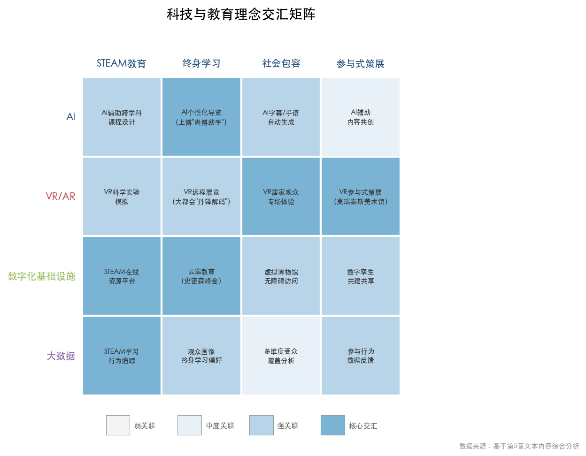

图5-3显示，AI与终身学习、VR/AR与社会包容、大数据与STEAM教育等组合构成核心交汇领域，以下逐一分析其中最具代表性的协同模式。

### 5.6.1 AI赋能的个性化终身学习

当人工智能技术与终身学习理念相交汇，博物馆教育获得了一种全新的可能——为不同年龄、不同知识背景、不同兴趣偏好的观众提供真正"因人而异"的学习体验。AI驱动的个性化推荐系统可以根据观众的年龄特征、参观历史和实时交互行为，动态调整讲解内容的深度、语调和呈现方式：对于首次到访的青少年，系统可能以游戏化的叙事方式引导探索；对于多次到访的学术研究者，则推送最新的研究成果和学术争论。

上海博物馆的实践提供了这一交汇的具体案例。其"AI尚博导览助手"融合参观轨迹、预约信息和访问时长等数据构建观众"画像"，实现差异化内容推送，推动博物馆从"标准化服务"向"个性化体验"转型。[人民画报](http://www.rmhb.com.cn/yxsj/zttp/202603/t20260318_800433176.html "个性化推送") 英国CoStar国家实验室负责人James Bennett将这一趋势描述为提供"越来越个性化和实时响应式的访客体验"。[The Art Newspaper](https://www.theartnewspaper.com/2025/01/29/the-second-wave-of-immersive-institutions-has-arrived "Bennett访谈")

### 5.6.2 VR推动的包容性教育体验

VR技术与社会包容理念的交汇为博物馆教育的"公平可及"提供了技术路径。大都会博物馆的VR项目明确面向"因各种原因无法亲临现场的居家观众"（homebound audiences），通过博物馆提供的VR头显设备开展专场体验活动。[大都会艺术博物馆新闻稿](https://www.metmuseum.org/press-releases/vr-atopia-2025 "居家观众专场") 这意味着身体残障、地理偏远或经济困难的群体有望获得与实地参观者基本等同的教育体验。Atopia平台的"无代码编辑器"进一步降低了技术门槛——各种规模的博物馆均可自行设计和发布沉浸式展览，无需高昂的定制开发成本。

在中国语境下，VR教育的包容性价值与第4章所揭示的城乡教育资源鸿沟直接相关。中国基层博物馆教育的核心挑战之一在于如何将优质教育资源下沉至县级以下行政区域。在流动科技馆和科普大篷车等物理载体之外，VR技术提供了一种"轻量化"的远程教育方案——理论上，仅需一台VR头显和网络连接，乡村学校的学生即可"走进"故宫、国家博物馆或上海博物馆的沉浸式展览。

### 5.6.3 大数据驱动的STEAM教育优化

大数据技术与STEAM教育理念的结合为博物馆教育效果的持续优化提供了闭环反馈机制。通过追踪学生在STEAM项目中的交互行为数据——如在科技展项上的操作路径、在跨学科内容之间的切换频率以及动手实验中的试错序列——博物馆得以精准识别哪些教育设计有效促进了跨学科理解，哪些环节亟需优化。这种"数据驱动"的教育设计迭代模式，使博物馆的STEAM教育从"经验设计"走向"循证设计"。

复旦大学文物与博物馆学系教授柴秋霞指出："AI重新定义了博物馆的观展关系，从被动观察到智能交互。智慧化技术正在重塑博物馆的功能与价值，让观众从'走马观花'转变为深度参与。"[上海市人民政府网站](https://www.shanghai.gov.cn/nw4411/20250519/7846c40ee980442baa6c5dc078126886.html "复旦教授评论") 这一判断揭示了技术与理念协同作用的深层逻辑：技术为理念落地提供工具和基础设施，而理念为技术应用指明方向和价值目标。缺少理念引导的技术应用可能沦为"炫技"——正如部分数字化展览"过于注重视觉效果而忽略文化叙事"的批评所揭示的问题；而缺少技术支撑的理念革新则难以突破传统模式的路径依赖。

## 5.7 本章小结

科技与教育理念作为博物馆教育变革的"双引擎"，正协同推动一场深层范式转型：博物馆教育正从"单向传授"走向"多向互动"，从"标准化供给"走向"个性化服务"，从"在场体验"走向"泛在可及"，从"经验驱动"走向"数据驱动"。AI使每位观众都拥有了专属的"数字文博专家"，VR使文化遗产突破了时空的藩篱，大数据使教育效果的评估和优化具备了科学基础，而STEAM教育、终身学习和社会包容等理念则确保了这些技术变革服务于教育公平与社会价值的终极目标。

然而，这场变革也面临结构性挑战。技术的不均衡分布可能加剧而非弥合国家级大馆与基层小馆之间、公立博物馆与民营博物馆之间、发达地区与欠发达地区之间的教育鸿沟。跨学科人才的匮乏——既懂技术又懂文化叙事的复合型专业人员——构成制约博物馆数字化转型的关键瓶颈。上述问题将在第6章对中国博物馆教育未来发展路径的系统分析中获得更深入的探讨。

# 第6章 中国博物馆教育的未来趋势与发展路径

前五章的分析依次建立了博物馆教育的概念与分类框架（第1章）、中国博物馆教育的现状全景（第2章）、五国博物馆教育的制度与实践图谱（第3章）、中外博物馆教育的结构性比较（第4章），以及科技与教育理念双轮驱动的变革动力机制（第5章）。本章作为全文的核心章节，综合运用上述实证基础与分析工具，系统展望中国博物馆教育在2026—2030年间的发展趋势与战略路径。

展望围绕五大议题维度依次展开：政策与制度环境的迭代升级、数字技术的规模化落地与挑战、教育模式创新与课程体系重构、体制机制改革与社会力量参与，以及分类视角下不同层级和所有制博物馆的差异化发展路径（见图6-1）。各维度分析均以前五章的实证发现为依据，力求使趋势判断建立在数据与事实之上而非臆测之中。

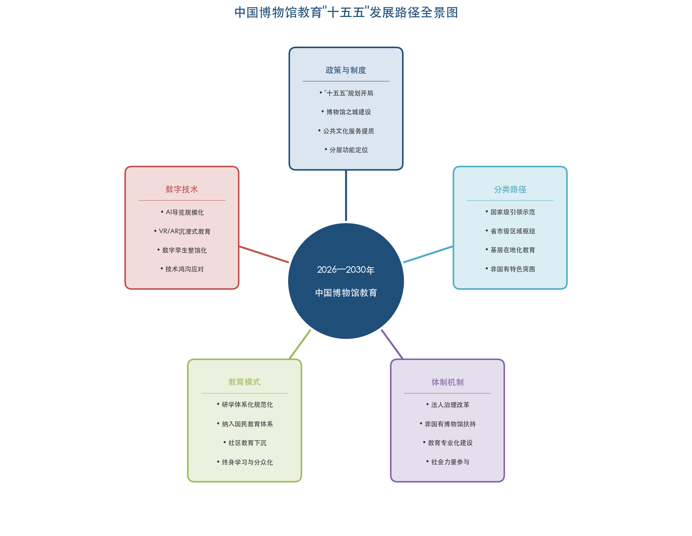

图6-1以中心辐射结构呈现了本章五大议题维度——政策与制度、数字技术、教育模式、体制机制、分类路径——及各维度下的核心趋势要素，为全章分析提供整体框架参照。

## 6.1 政策与制度环境：从"十四五"收官到"十五五"开局

### 6.1.1 "十四五"收官的制度遗产

"十四五"时期（2021—2025年）是中国博物馆教育制度体系从框架搭建走向精细落地的关键阶段，留下了三项核心制度遗产。

**其一，馆校合作的制度化框架基本确立。** 2020年，教育部与国家文物局联合印发《关于利用博物馆资源开展中小学教育教学的意见》，首次系统提出博物馆研学活动的"分龄设计"原则——小学阶段体现趣味性和故事性、初中阶段体现实践性和体验性、高中阶段体现探索性和研究性。[教育部官网](http://www.moe.gov.cn/srcsite/A06/s7053/202010/t20201020_495781.html "文物博发〔2020〕30号") 2021年，九部门联合印发的《关于推进博物馆改革发展的指导意见》进一步要求"制定博物馆教育服务标准，丰富博物馆教育课程体系"。[国务院新闻办公室](http://www.scio.gov.cn/xwfb/gwyxwbgsxwfbh/wqfbh_2284/2021n_2711/2021n11y03rsw/wjxgzc_4238/202208/t20220808_315114.html "九部门指导意见") 这一制度框架在实践层面已取得显著成效：仅中国国家博物馆一家，2024年即承接北京市教委"七个一"活动1,326批次，累计服务观众约44万人次。[中国国家博物馆数据报告（2024年度）](https://www.chnmuseum.cn/shxg/zlxz/pdfdown/202503/t20250320_271313.shtml "社教传播部分")

**其二，定级评估体系完成第五轮迭代。** 截至2024年第五批定级评估完成，国家一级博物馆达327家，其中地级及以下一级博物馆共226家（占69.11%）。中国博物馆协会评价认为，这一结构标志着"基层博物馆质量水平的显著提升"。[中国博物馆协会第五批评估答记者问](https://www.chinamuseum.org.cn/cma/detail.html?id=12&contentId=13677 "基层博物馆发展评价") 评估标准中青少年教育、志愿者服务等"软件"指标权重的提升，有效引导了各级博物馆对教育功能的重视。

**其三，乡村博物馆建设形成示范效应。** 浙江省在"十四五"期间率先完成建设1,000家乡村博物馆的目标，实现市、县全覆盖，涵盖民俗风情、科普教育、非遗传承等多种类型。[新华网浙江频道](http://www.zj.xinhua.org/20250908/c23f0314abb3453884babf45f1974c4e/c.html "浙江建成1000家乡村博物馆") 这一实践为基层博物馆教育功能的下沉提供了可复制的制度模板。

### 6.1.2 "十五五"规划的战略指引

2026年是"十五五"规划（2026—2030年）的开局之年。从已公布的规划信号研判，博物馆教育的政策环境将在三个方向上实现迭代升级。

**第一，文化遗产数字化保护被提升为国家战略优先事项。** "十五五"规划路线图明确提出：加速部署人工智能、数字建模与数据分析技术用于文物状态监测和保护效能提升；构建文物管理统一数字体系，为每件文物赋予唯一数字标识；拓展智慧博物馆网络，运用数字技术打造沉浸式观展体验并深化历史语境阐释。[TV BRICS](https://tvbrics.com/cn/news/chinese-new-five-year-plan-drives-digital-transformation-of-cultural-heritage-protection/ "十五五规划文保路线图，2026年3月") 2026年《政府工作报告》亦提出"深化拓展'人工智能+'"，将智能技术规模化应用推向各行各业。[澎湃新闻](https://m.thepaper.cn/newsDetail_forward_32712738 "2026年政府工作报告AI+表述") 对于博物馆教育而言，这意味着从"试点探索"到"系统推广"的政策窗口正在打开——第5章所分析的AI导览、数字孪生、VR/AR沉浸式教育等技术，有望在"十五五"期间从头部博物馆向省级和市级机构加速扩散。

**第二，"博物馆之城"建设进入制度化阶段。** 北京率先印发实施《北京博物馆之城建设发展规划》，提出到2030年全市博物馆总数超过360座、每10万人拥有1.6座博物馆的目标，并明确"两轴四区多点"的空间布局和培育5家"世界一流博物馆"的建设方向。[新京报](https://m.bjnews.com.cn/detail/167678810014049.html "北京博物馆之城规划") 2025年，北京新增备案博物馆15家、挂牌开放类博物馆29家。[北京市人民政府网站](https://www.beijing.gov.cn/ywdt/gzdt/202502/t20250227_4020868.html "2025年北京文物工作回顾") 我们预计，在北京示范效应带动下，西安、南京、成都、广州、长沙、洛阳、郑州、大同等20余个已将"博物馆之城"列入规划的城市，将在"十五五"期间逐步形成各具特色的馆校合作和社区教育制度安排。

**第三，公共文化服务提质增效成为政策主线。** 2026年《政府工作报告》明确提出"实施公共文化服务提质增效行动，做好公共图书馆、博物馆、文化馆、科技馆等惠民开放"。[人民日报](http://jl.people.com.cn/n2/2026/0401/c349771-41540021.html "以博物馆高质量发展优化公共文化供给") 《人民日报》专题文章进一步提出博物馆分层功能定位思路：国家级博物馆聚焦文明传承、省级博物馆强化区域文化引领、市县级博物馆侧重在地文化展示、乡村博物馆突出乡愁记忆与基层服务。[人民日报](http://jl.people.com.cn/n2/2026/0401/c349771-41540021.html "分层功能定位") 这一分层定位思路与第1章建立的行政级别分类框架高度吻合，表明政策层面正在将分类治理理念转化为可操作的发展指引。

图6-2以时间轴形式呈现了2015年至2030年中国博物馆教育政策的演进脉络，清晰标示出从"十四五"收官到"十五五"展望的制度迭代轨迹。

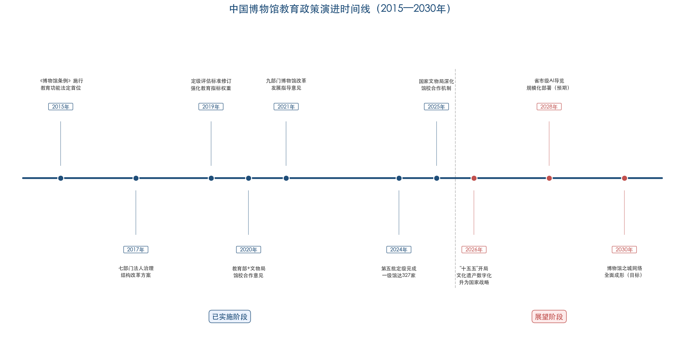

### 6.1.3 国家文物局2025年工作要点的前瞻信号

国家文物局2025年工作要点已将"深化博物馆馆校合作机制"列为年度重点任务。[中国博物馆协会](https://www.chinamuseum.org.cn/cma/detail.html?id=13&contentId=14060 "国家文物局2025年工作要点") 中国博物馆协会2026年学术研讨会征稿通知将主题设定为"新时代博物馆的文化使命与创新服务"，聚焦博物馆在多元文明传承与社会服务中的角色转型。[中国博物馆协会](https://www.chinamuseum.org.cn/cma/detail.html?id=11&contentId=14440 "2026年学术研讨会征稿通知") 中国社会科学网发布的"2025年度博物馆学研究前沿热点词"中，"人工智能赋能博物馆""博物馆之城""博物馆社区参与""分众化服务"等均赫然在列。[中国社会科学网](https://www.cssn.cn/skgz/bwyc/202511/t20251125_5952225.shtml "2025年博物馆学前沿热点词") 上述信号共同表明，中国博物馆教育的政策议程正在从"规模扩张"转向"质量提升与精细化治理"的新阶段。

## 6.2 数字技术的规模化落地：AI、VR/AR与数字孪生

### 6.2.1 AI赋能博物馆教育的三层应用架构

第5章已系统分析了AI技术在博物馆教育中从"辅助工具"到"教育伙伴"的角色跃迁。展望"十五五"期间，我们判断AI在中国博物馆教育中的应用将沿三个层次梯度推进。

**第一层：智能导览与个性化推荐的规模化普及。** 上海博物馆的"AI尚博导览助手"和中国国家博物馆的虚拟数智人"艾雯雯"已验证了AI导览在大型博物馆的可行性与受众接受度。[人民画报](http://www.rmhb.com.cn/yxsj/zttp/202603/t20260318_800433176.html "AI尚博导览助手")；[光明日报](https://news.gmw.cn/2026-03/29/content_38676778.htm "艾雯雯") 随着大语言模型（LLM）技术成本的持续下降和开源生态的日趋成熟，省级和部分市级博物馆有望在2026—2028年间部署基于馆藏知识库的AI导览系统。中国科技馆发布的"2025年度科技博物馆十大热词"中，"AI"位居首位，被描述为"利用人工智能技术给自己进行了全方位的数字化重塑，更好地感知、交互与进化"。[中国科技馆](https://www.cdstm.cn/frontier/qt/202601/t20260131_1084349.html "2025年科技博物馆十大热词")

**第二层：智能策展与藏品管理的纵深应用。** 第5章指出，三星堆博物馆已将AI算法用于文物碎片拼对与修复，上海博物馆与百视通签约打造"数字孪生博物馆"。[光明日报](https://news.gmw.cn/2026-03/29/content_38676778.htm "三星堆AI修复")；[上海市文化和旅游局](https://whlyj.sh.gov.cn/wlyw/20250826/e3f5937267784e25822934255ed98e74.html "数字孪生博物馆") 未来3—5年，AI辅助策展将从文物修复的后台环节扩展至展览叙事设计——基于知识图谱的AI系统可根据特定主题自动推荐藏品组合、生成展线叙事逻辑，乃至辅助生成展览文案初稿。这一能力将显著降低基层博物馆策展的专业门槛。

**第三层：数据驱动的教育效果评估闭环。** 第5章分析了上海博物馆东馆"3M"体系在观众行为分析方面的前沿实践。[人民画报](http://www.rmhb.com.cn/yxsj/zttp/202603/t20260318_800433176.html "3M体系") 在此基础上，我们预计"十五五"期间将出现首批基于大数据的博物馆教育效果评估标准，实现从"参观人次"等粗放指标向"知识获取""认知变化""行为影响"等精细指标的转型。这一方向呼应了第4章所揭示的中外差异——美国AAM已系统发布年度观众调查数据报告，[AAM](https://www.aam-us.org/2025/09/12/demographics-of-us-museum-goers-a-2025-annual-survey-of-museum-goers-data-story/ "2025年度调查") 中国在此领域具有快速追赶的基础与动力。

### 6.2.2 VR/AR沉浸式教育的本土化路径

第5章展示了全球沉浸式机构从2019年零起步到2024年超过350家的爆发式增长态势。[The Art Newspaper](https://www.theartnewspaper.com/2025/01/29/the-second-wave-of-immersive-institutions-has-arrived "2025年1月29日报道") 中国博物馆在这一赛道上已形成独特的本土化路径——将沉浸式技术与中华文化遗产叙事深度结合。

央博联合中国科技馆推出的"何以文明"和"奇遇三星堆"VR沉浸探索展、上海博物馆东馆数字馆"山水江南"展、湖南省博物馆的"马王堆汉代文化沉浸式展览"，均代表了这一路径的前沿实践。[央视网](https://yangbo.cctv.com/2024/12/03/ARTInB5l94ugxWJclR8jDVAj241203.shtml "何以文明VR展")；[人民画报](http://www.rmhb.com.cn/yxsj/zttp/202603/t20260318_800433176.html "山水江南数字展")；[光明日报](https://news.gmw.cn/2026-03/29/content_38676778.htm "马王堆沉浸式展览") 未来发展的核心挑战在于如何实现VR/AR教育从国家级大馆向省市级乃至基层博物馆的梯度扩散。大都会艺术博物馆与Atopia合作开发的"无代码编辑器"提供了一种有益思路——通过降低技术门槛使各种规模的博物馆均能自行设计沉浸式展览。[大都会艺术博物馆新闻稿](https://www.metmuseum.org/press-releases/vr-atopia-2025 "无代码编辑器") 我们认为，中国可借鉴"现代科技馆体系"的成功经验，以国家级平台统一开发VR教育内容，再通过数字分发机制向基层博物馆输送——类似于流动科技馆的"数字版"。

### 6.2.3 数字孪生与智慧博物馆的系统化建设

智慧博物馆建设已纳入国家相关规划体系。《人民日报海外版》专题文章将智慧博物馆的核心架构概括为三层："可信的数据与知识构成其'记忆库'，清晰的规则与安全机制是其'免疫系统'，协同治理与运营则好比'神经网络'"。[人民日报海外版](http://paper.people.com.cn/rmrbhwb/pc/content/202601/16/content_30133070.html "当博物馆装上'智慧大脑'") 在实践层面，敦煌研究院的"数字敦煌"平台资源已覆盖78个国家和地区，截至2025年11月累计访问量突破2,300万人次；故宫博物院入库高清数字影像超过15万件，并借助知识图谱提升检索效率，其数字孪生智慧管理平台可实时监测环境、能耗与设施运行状态。[人民日报海外版](http://paper.people.com.cn/rmrbhwb/pc/content/202601/16/content_30133070.html "敦煌与故宫数字化案例")

展望"十五五"期间，数字孪生技术将从"单件藏品数字化"向"整馆数字化"跨越。上海博物馆与百视通2025年签约的"数字孪生博物馆"项目，融合AIGC和超高清技术，覆盖范围将不仅限于文物本身，还延伸至展厅空间、观众动线乃至环境参数的精确数字映射。[上海市文化和旅游局](https://whlyj.sh.gov.cn/wlyw/20250826/e3f5937267784e25822934255ed98e74.html "数字孪生博物馆") 这一趋势将为博物馆教育带来两个深远变化：其一，使"永不落幕的博物馆"从概念走向现实——观众可在任何时间、任何地点进入博物馆的完整数字副本进行学习与探索；其二，为教育效果的持续评估提供数据基础——通过追踪数字空间中的观众行为，博物馆得以持续优化教育设计。

### 6.2.4 技术落地的结构性挑战

数字技术的规模化落地面临三重结构性挑战，需在"十五五"期间予以系统应对。

**其一，技术鸿沟的扩大风险。** 第4章的比较分析已揭示，中国博物馆体系中国家级大馆与基层小馆之间、东部地区与中西部地区之间存在显著的教育资源梯度差异。AI、VR/AR和数字孪生技术的高前期投入可能进一步加剧这一鸿沟——国家一级博物馆率先拥抱前沿技术，而县级和乡村博物馆由于资金和人才瓶颈难以跟进。应对策略包括：通过国家级平台统一开发并共享数字教育资源，降低基层博物馆的技术使用门槛；将智慧博物馆建设纳入公共文化服务均等化的政策框架，给予中西部基层博物馆倾斜性支持。

**其二，内容同质化与"炫技"倾向。** 《人民论坛》指出，部分数字化项目"过于注重技术展示的视觉效果，忽略了文化叙事的逻辑性、情感表达的深度以及观众的多样化需求，导致内容同质化现象日趋突出"。[人民论坛](https://paper.people.com.cn/rmlt/pc/content/202504/03/content_30068269.html "博物馆数字化发展的现状与提升") 技术应当服务于教育目标而非替代教育内容。"数据策展人"这一新兴角色的培育——即能够连接文化、数据与叙事的复合型专业人员——将成为保障技术落地质量的关键。[人民日报海外版](http://paper.people.com.cn/rmrbhwb/pc/content/202601/16/content_30133070.html "数据策展人")

**其三，跨学科人才的结构性匮乏。** 第5章在分析中指出，"既懂技术又懂文化叙事的复合型专业人员"的匮乏构成制约博物馆数字化转型的关键瓶颈。中国博协社教专委会2025年年会将"人工智能对博物馆社会教育的冲击"列为核心议题，反映出业界对人才准备不足的深切焦虑。[中国国家博物馆](https://www.chnmuseum.cn/yj/kydt/202506/t20250623_271958.shtml "中国博协社教专委会2025年年会") 这一挑战的根本解决需要从高等教育供给侧发力——第4章比较分析中德国莱布尼茨博物馆教育卓越中心、法国五年制文化调解专业等国际经验，为中国博物馆教育学科建设提供了重要参照。

## 6.3 教育模式创新：从研学旅行到博物馆课程体系

### 6.3.1 研学旅行的体系化与规范化

研学旅行已从"拓展性课外活动"演进为"深化素质教育、促进文旅消费的创新载体"。[人民论坛](http://paper.people.com.cn/rmlt/pc/content/202512/17/content_30130630.html "我国研学游的现状、趋势与优化路径") 博物馆作为研学旅行最重要的目的地类型之一，其研学课程设计正从单一的参观式体验向体系化的课程产品转型。

南京博物院2024年暑期推出的"博物奇探"研学课程以历史为主题、时间为线索，运用"环环相扣的探究任务"引导学生自主发现与思考。[求是网](http://theory.people.com.cn/n1/2025/0122/c40531-40406673.html "更好发挥博物馆的教育功能") 中国国家博物馆的"古代中国·通史"与"古代中国·通识"系列课程全年实施夏/冬令营6期48场次、周末研学营50场次，"古代中国"通识系列活动获评"首届全国文化遗产研学十佳案例"。[中国国家博物馆数据报告（2024年度）](https://www.chnmuseum.cn/shxg/zlxz/pdfdown/202503/t20250320_271313.shtml "社教传播部分") 故宫博物院的"故宫知识课堂"则实现了线上线下双渠道覆盖。[故宫博物院官网](https://www.dpm.org.cn/activity/education/371014.html "2025暑假故宫知识课堂")

展望未来，研学旅行的发展需在两个方向上实现突破。**一是标准化与质量控制。** 中国博协社教专委会2025年年会将"'博物馆热'背景下的研学'冷思考'"列为核心议题，反映出业界对研学产品质量参差不齐、商业逐利导致教育内核空心化等问题的深切关注。[中国国家博物馆](https://www.chnmuseum.cn/yj/kydt/202506/t20250623_271958.shtml "研学冷思考议题") 制定全国性的博物馆研学课程质量标准，建立研学导师资质认证体系，是保障研学教育品质的制度性路径。**二是STEAM教育理念的深度融合。** 第5章分析了STEAM教育与博物馆教育的天然耦合关系。"与丝路同行·择粹课堂"项目聚焦敦煌文化与STEAM教育的融合即为典型代表。[应用材料公司新闻稿](https://www.appliedmaterials.com/cn/zh_cn/news-and-media/press-releases/250518-steam-cn.html "丝路大美育项目") 已有学者提出涵盖"文化基因解码—跨学科融合—沉浸式体验"三维度的STEAM研学课程设计框架。[Research on Teaching and Education Development](https://artdesignp.com/journal/RTED/1/12/10.61369/RTED.2025120032 "基于STEAM教育理念的博物馆研学课程") 将STEAM方法论系统性地引入博物馆研学课程设计，是提升中国博物馆教育国际竞争力的重要方向。

### 6.3.2 博物馆教育纳入国民教育体系的深化路径

博物馆教育与学校教育的深度融合，是中国博物馆教育未来发展的战略方向。第4章的比较分析表明，中国馆校合作的制度化优势在于覆盖面广、执行力强、标准统一，但在教育内容的深度嵌入和课程化程度方面仍有较大提升空间。法国以"艺术与文化教育"（EAC）政策将博物馆参观纳入中小学制度框架的做法，以及日本《博物馆法》将博物馆定位为"社会教育机构"的法律安排，为中国提供了值得借鉴的经验路径。

我们预计，"十五五"期间博物馆教育纳入国民教育体系将在三个层面实现深化。**第一，课程标准层面。** 在教育部与国家文物局2020年意见的基础上，有望出台更具操作性的博物馆教育课程指南，明确不同学段的博物馆学习目标、核心素养指标和评估方法。**第二，教师培训层面。** 博物馆教育有望成为中小学教师继续教育的重要组成部分。史密森学会2024年教育峰会吸引来自50个州和87个国家的5,400余名教育者参会的实践表明，博物馆作为"教师的教师"的角色正在全球范围内得到强化。[Smithsonian Magazine报道](https://www.smithsonianmag.com/blogs/smithsonian-education/2025/04/02/2024-education-impact-report-released/ "教育峰会数据") 中国国家博物馆2024年累计培训全国博物馆专业人员9,701人次的实践，为这一方向奠定了基础。[中国国家博物馆数据报告（2024年度）](https://www.chnmuseum.cn/shxg/zlxz/pdfdown/202503/t20250320_271313.shtml "科研活动部分") **第三，数字资源共享层面。** 博物馆数字教育资源可通过国家教育资源公共服务平台与学校教育系统打通，使偏远地区的师生也能便捷获取高质量的博物馆学习内容。

### 6.3.3 社区博物馆教育的下沉与在地化

第2章分析了中国乡村博物馆和社区博物馆教育功能的"最后一公里"特征。浙江省已建成1,000家乡村博物馆的实践，以及"现代科技馆体系"中流动科技馆累计巡展5,909站、科普大篷车26年累计服务近4亿人次的实践，共同构成了中国基层博物馆教育下沉的独特路径。[新华网浙江频道](http://www.zj.xinhua.org/20250908/c23f0314abb3453884babf45f1974c4e/c.html "浙江1000家")；[中国科技馆官网](https://cstm.cdstm.cn/zx/mtgz/art/2024/art_11d3bb72a3b44820b0dc0859cdcf5279.html "现代科技馆体系")

展望"十五五"期间，社区博物馆教育的发展方向包括三条路径。其一，将浙江乡村博物馆的试点经验向更多省份推广，推动吉林、山东等试点省份以及中西部地区的乡村博物馆建设提速——吉林省2022年已启动"点亮文博之光"中小型博物馆提质升级行动计划。[人民日报](http://jl.people.com.cn/n2/2026/0401/c349771-41540021.html "吉林省案例") 其二，通过"东部带西部、大馆带小馆、总馆带分馆"的协作机制推进中小博物馆提质升级——故宫博物院已在浙江省博物馆之江馆区、江西省博物馆、新疆维吾尔自治区博物馆设立"故宫厅"，安徽博物院在多县设立分院并建立全省展览资源共享机制。[人民日报](http://jl.people.com.cn/n2/2026/0401/c349771-41540021.html "大馆带小馆") 其三，利用VR技术和数字分发机制为乡村和社区博物馆提供"轻量化"的远程教育资源——正如第5章所分析的，仅需一台VR头显和网络连接，乡村学校的学生理论上即可"走进"故宫或国家博物馆的沉浸式展览。

### 6.3.4 终身学习与分众化服务

第5章阐述了终身学习理念对博物馆教育功能的深刻重塑。ICOM 2022年新定义中纳入的"反思"和"知识共享"维度，为博物馆教育从"青少年课外课堂"向"全年龄段终身学习平台"的转型提供了学理支撑。中国社会科学网发布的2025年度博物馆学前沿热点词中，"分众化服务"位列其中。[中国社会科学网](https://www.cssn.cn/skgz/bwyc/202511/t20251125_5952225.shtml "分众化服务热点词")

在中国人口老龄化加速的背景下，博物馆作为"非正式学习场所"在促进老年群体认知激活、社交参与和文化赋权方面的独特价值值得更多关注。中国博协社教专委会将"情绪价值与实用价值需求交织下的博物馆社会教育未来"列为核心议题，[中国国家博物馆](https://www.chnmuseum.cn/yj/kydt/202506/t20250623_271958.shtml "社教专委会议题") 反映出博物馆教育服务对象从单一的青少年群体向多元受众群体拓展的趋势。中国国家博物馆2024年观众结构数据显示，35岁以下年轻观众占比超过60%，60岁以上观众占比仅为7.08%。[中国国家博物馆数据报告（2024年度）](https://www.chnmuseum.cn/shxg/zlxz/pdfdown/202503/t20250320_271313.shtml "年龄结构数据") 如何为老年群体和特殊需求群体设计适配的教育产品，是中国博物馆教育在未来3—5年需要系统回应的重要课题。

## 6.4 体制机制改革：法人治理、社会力量与专业化建设

### 6.4.1 公立博物馆法人治理改革的推进

公立博物馆法人治理结构改革是提升博物馆教育治理效能的制度性路径。2017年，中宣部、文化部等七部门联合印发《关于深入推进公共文化机构法人治理结构改革的实施方案》，明确要求完善吸引社会力量参与公共文化机构法人治理结构建设的相关政策，鼓励有关方面代表、专业人士、各界群众按章程规定进入理事会。[文化和旅游部](https://www.mct.gov.cn/whzx/whyw/201709/t20170911_826744.htm "七部门实施方案") 国家文物局亦将法人治理结构建设纳入博物馆绩效考评体系。

目前，苏州博物馆等机构已建立以理事会制度为核心的法人治理结构，社会理事超过理事总数的50%，来源涵盖文博界、金融界、法律界和企业界。[中国博物馆协会](https://www.chinamuseum.org.cn/detail.html?id=13&contentId=5537 "苏州博物馆理事会") 展望"十五五"期间，法人治理改革的深化将在两个方面影响博物馆教育：其一，通过引入社会专业力量参与决策，提升教育项目设计的专业性和社会回应性；其二，通过完善绩效考评机制，将教育功能的实际成效——而非仅仅是参观人次——纳入博物馆考核体系。

### 6.4.2 非国有博物馆教育功能的规范化与扶持

第2章和第4章的分析均揭示了中国非国有博物馆在教育功能发挥上面临的多重结构性困境。截至2024年底，全国非国有博物馆已达2,345家，占备案博物馆总量的33.3%，其中获评国家一、二、三级的非国有博物馆有178家。[福建省文物局转载国家文物局报道](http://wwj.wlt.fujian.gov.cn/xwzx/wbyw/202603/t20260313_7109677.htm "吕建中代表2026年两会建议") 然而，非国有博物馆在财政保障上与国有博物馆仍存在明显差距。2026年全国两会期间，全国人大代表、大唐西市集团董事局主席吕建中提出建议，将国家一、二、三级非国有博物馆纳入中央财政免费开放运营补助范围，与国有博物馆实行同标准、同待遇，并实施动态考核管理。[福建省文物局转载国家文物局报道](http://wwj.wlt.fujian.gov.cn/xwzx/wbyw/202603/t20260313_7109677.htm "非国有博物馆补助建议")

这一建议的政策方向与国际经验高度一致。第4章的比较分析表明，美国和英国的行业认证体系对公私立博物馆一视同仁，AAM认证和MA标准均将教育功能视为获得行业认可的必要条件。我们认为，"十五五"期间非国有博物馆教育功能的规范化与扶持将沿以下路径推进：将达标定级的非国有博物馆纳入公共财政补助体系，以考核机制倒逼教育质量提升；完善税收优惠和社会捐赠激励制度，缩小与美国等发达国家在捐赠生态方面的差距；将非国有博物馆纳入馆校合作和研学旅行的制度网络，充分发挥其"类别多样、机制灵活"的差异化优势。

### 6.4.3 博物馆教育专业化建设

第4章的五国比较揭示了法国"文化调解者"、德国"博物馆教育学者"、日本"学芸员"和美国"博物馆教育者"四种迥异的专业化路径，并指出中国的博物馆教育专业化"正处于从实践经验积累向制度化知识体系转型的关键阶段"。

"十五五"期间，博物馆教育专业化建设的核心任务涵盖三个方面。**第一，高等教育供给侧改革。** 在现有文物与博物馆学（简称"文博学"）学科基础上，增设博物馆教育方向的专业硕士培养项目，借鉴德国莱布尼茨博物馆教育卓越中心的经验，构建教育理论与博物馆实践系统性结合的培养模式。[莱布尼茨中心官网](https://leibniz-bim.de/en/home-en "中心介绍") **第二，职业资质体系的探索。** 研究建立博物馆教育专员的职业资质认证制度，参考日本学芸员制度以法律形式保障专业性的经验，但应注意规避其"数量不足与待遇偏低"的制度缺陷。[日本法律翻译](https://www.japaneselawtranslation.go.jp/en/laws/view/4309/en "博物馆法英文全文") **第三，在职培训体系的系统化。** 以中国国家博物馆2024年培训9,701人次的实践为基础，构建覆盖全国、分层分类的博物馆教育人才培训网络，将AI技术应用、STEAM课程设计、无障碍服务等新兴能力纳入培训内容体系。

## 6.5 分类视角下的差异化发展路径

第1章建立的三维分类框架（行政级别、所有制、学科门类）贯穿全文分析。本节基于前五章的实证发现，为不同类型博物馆的教育发展描绘差异化路径（见图6-3）。

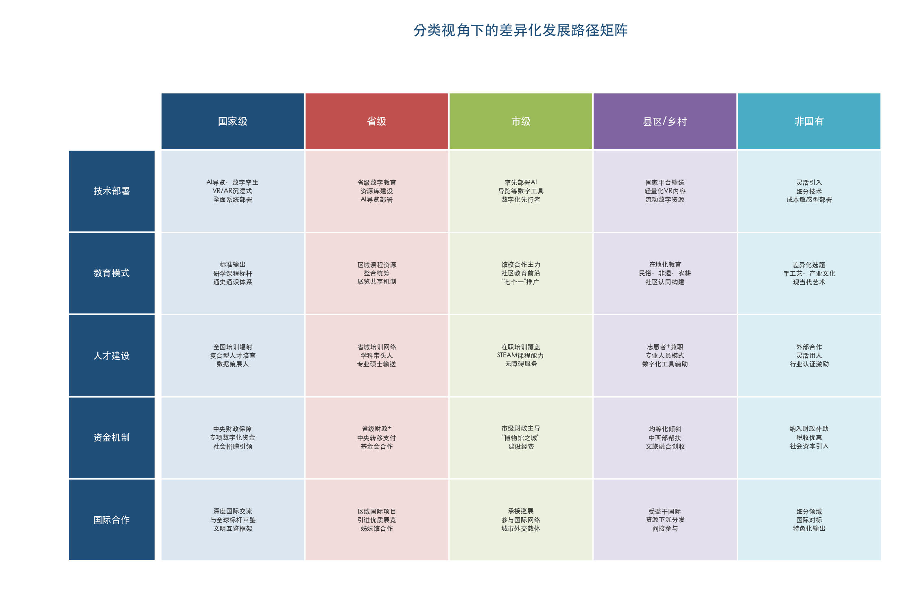

图6-3以矩阵形式交叉呈现五类博物馆（国家级、省级、市级、县区/乡村、非国有）在技术部署、教育模式、人才建设、资金机制、国际合作五大维度上的差异化核心策略，为分类治理提供系统化的策略参照。

### 6.5.1 国家级博物馆：引领示范与标准输出

国家级博物馆在未来3—5年的核心定位是"引领示范与标准输出"。**技术引领方面**，应率先完成AI导览、数字孪生、VR/AR沉浸式展览等前沿技术的系统部署，并将积累的技术方案和内容资产向全行业开放共享。故宫博物院186万余件藏品信息的公开和超过15万件高清数字影像的入库，[人民日报海外版](http://paper.people.com.cn/rmrbhwb/pc/content/202601/16/content_30133070.html "故宫数据") 为行业树立了数字开放的标杆。**标准输出方面**，应参与制定博物馆教育课程标准、研学质量规范和教育效果评估指标体系，发挥行业"定规矩"的引领作用。**人才培养方面**，应强化面向全国博物馆专业人员的培训辐射功能。中国国家博物馆2024年完成7,791人次行业类培训的实践，应在"十五五"期间进一步规模化。**国际交流方面**，应深化与史密森学会、大英博物馆、卢浮宫等全球标杆机构的教育合作，在文明互鉴框架下提升中国博物馆教育的国际影响力。

### 6.5.2 省市级博物馆：区域枢纽与馆校合作主力

省级博物馆承担区域教育枢纽功能，市级博物馆则是馆校合作和社区教育的前沿阵地。"十五五"期间的发展重点涵盖两个层面。**省级层面**，应强化对本省域内博物馆教育资源的整合统筹，建立省级博物馆教育课程资源库，推动省内展览资源共享机制的制度化——安徽博物院在多县设立分院的做法提供了可推广的范式。[人民日报](http://jl.people.com.cn/n2/2026/0401/c349771-41540021.html "安徽分院模式") **市级层面**，应深度融入"博物馆之城"建设，将博物馆教育嵌入城市公共教育服务体系。北京"七个一"活动将博物馆参观学习纳入中小学社会实践课程的制度安排，可作为经验向更多城市推广。同时，市级博物馆应率先实现AI导览等数字教育工具的部署，在省级以下博物馆中扮演"数字化先行者"角色。

### 6.5.3 县区级与乡村博物馆：在地化教育与教育公平

基层博物馆的核心使命是实现教育资源的"最后一公里"下沉。"十五五"期间的发展路径应聚焦三个方向。**在地化教育的内容创新方面**，浙江省文物局局长朱海闵指出，乡村博物馆"不追求'高大上'，要足够'接地气'"。[人民日报](https://paper.people.com.cn/rmrb/html/2024-03/24/nw.D110000renmrb_20240324_1-07.htm "浙江省文物局局长访谈") 基层博物馆应深入挖掘在地文化资源，以民俗文化、农耕记忆、非遗传承等内容构建具有社区认同感的教育产品。**数字技术的"轻量化"引入方面**，通过国家级平台输送的数字教育资源和VR内容，基层博物馆可在有限的硬件投入下获取远超自身规模的教育内容供给。**长效运营机制的建立方面**，国家文物局博物馆与社会文物司司长刘洋已指出，乡村博物馆需在"人才培育、展品租借、文旅融合和长效运营"等方面加大帮扶力度。[人民日报](https://paper.people.com.cn/rmrb/html/2024-03/24/nw.D110000renmrb_20240324_1-07.htm "刘洋司长访谈") 探索"志愿者+兼职专业人员+数字化工具"相结合的基层博物馆教育运营模式，是确保乡村博物馆教育功能可持续发挥的关键。

### 6.5.4 非国有博物馆：特色化突围与制度融入

非国有博物馆在教育功能上的差异化优势在于选题多元和机制灵活。"十五五"期间，其教育发展路径应着重于三个方面。**特色化教育产品的打造方面**，应聚焦国有博物馆较少覆盖的专题领域——如传统手工艺、地方产业文化、现当代艺术等——开发差异化教育课程，避免与国有博物馆的同质竞争。**制度网络的融入方面**，应积极参与定级评估，争取纳入中央财政补助范围和馆校合作制度体系。海南省已出台政策，对获评国家一级博物馆的非国有博物馆给予1,500万元一次性补贴、国家二级给予1,000万元、国家三级给予800万元。[福建省文物局转载国家文物局报道](http://wwj.wlt.fujian.gov.cn/xwzx/wbyw/202603/t20260313_7109677.htm "海南省补贴政策") 这一做法若能在更大范围内推广，将显著改善非国有博物馆的教育投入能力。**社会资本与公益基金的引入方面**，2026年北京市政协委员建言应"鼓励公益性基金会的发展"，为博物馆注入新的发展动能。[人民政协网](https://www.rmzxw.com.cn/c/2026-01-26/3858327.shtml "北京政协委员建言") 完善博物馆领域的社会捐赠税收优惠制度，激励企业和个人对非国有博物馆教育项目的捐赠，是缩小中美博物馆教育筹资生态差距的重要制度安排。

### 6.5.5 按学科门类的差异化策略

**科技类博物馆**应持续深化"科普+"战略，将AI、VR/AR等前沿技术不仅作为展示内容，更作为教育工具全面嵌入教育活动。中国科技馆馆长郭哲提出的"科普+"多元形式理念——即科技馆"从物理场馆延伸至公众日常生活"的定位，[新华网报道](https://www.news.cn/tech/20250114/dede1622278f4afebff267d51f42554a/c.html "郭哲讲话") 应成为全国科技类博物馆的共同发展方向。"现代科技馆体系联合行动"中新增的行业赛事交流和科学教师培训版块，标志着科技类博物馆教育从展品展示向能力建设的战略延伸。

**历史文化类和综合地志类博物馆**作为中国博物馆教育的最大板块（327家一级博物馆中合计219家），应在保持叙事性教育核心优势的基础上，积极引入STEAM教育理念和数字化手段。敦煌研究院引入AI病害识别技术为壁画"看病"、三星堆博物馆以AI辅助文物修复的实践，[人民日报](http://jl.people.com.cn/n2/2026/0401/c349771-41540021.html "敦煌AI保护") 展示了科技赋能历史文化教育的创新路径。

**艺术类博物馆**应注重保持审美教育与文化赋权的平衡，避免技术展示喧宾夺主。上海博物馆东馆数字馆"山水江南"展将AI水墨解析模型与中国古典绘画研究深度融合——以25K投影融合系统构建无物理边界的数字山水世界，使16位江南文人山水画大师以数字人物形式与观众互动——提供了科技与艺术融合的典范。[人民画报](http://www.rmhb.com.cn/yxsj/zttp/202603/t20260318_800433176.html "山水江南") 这一实践的核心启示在于：技术的角色是"让艺术说话"而非"替代艺术说话"。

## 6.6 面向2030年的发展建议

基于上述五大维度的趋势分析，我们提出以下具有政策参考价值的发展建议。

**建议一：制定《博物馆教育发展行动计划（2026—2030年）》。** 由国家文物局会同教育部编制，明确"十五五"期间博物馆教育的总体目标、分层任务和保障措施。将博物馆教育课程纳入中小学课程标准的配套资源体系，建立全国统一的博物馆研学课程质量标准和研学导师资质认证制度。

**建议二：实施"智慧博物馆教育基础设施工程"。** 以中央财政专项资金支持，分三年推动省级以上博物馆完成AI导览系统部署、数字教育资源库建设和观众数据分析平台搭建。同步建设"国家博物馆数字教育资源共享平台"，将国家级博物馆的优质数字教育内容以公共服务方式向基层博物馆和学校开放。

**建议三：将达标定级的非国有博物馆纳入中央财政免费开放补助体系。** 参照海南省的先行做法，对获评国家一、二、三级的非国有博物馆给予分级定额运营补助，与国有博物馆实行同标准、同待遇，并实施动态考核管理。同时完善社会捐赠税收优惠制度，激励社会资本投入博物馆教育。

**建议四：启动"博物馆教育人才振兴计划"。** 在高校文博学科中增设博物馆教育方向，建立"学历教育+在职培训+行业认证"三位一体的人才培养体系。重点培育"数据策展人"等兼具文化素养和数字技能的复合型专业人才，并将博物馆教育专业人员的职称评审纳入文博系列，打通职业发展通道。

**建议五：构建"大馆带小馆"的博物馆教育帮扶网络。** 以国家一级博物馆为核心节点，通过"故宫厅"模式、展览资源共享机制、数字内容分发和人才对口帮扶等方式，系统化支持中西部和基层博物馆的教育能力建设，推动博物馆教育公共服务的均等化。

# 第7章 结论与展望

## 7.1 核心发现的凝练

本报告围绕三大研究问题展开系统考察：中国与主要发达国家博物馆教育的现状与特征呈现怎样的面貌？不同分类维度下博物馆教育功能存在怎样的结构性差异？科技发展与教育理念革新将如何塑造博物馆教育的未来？综合前六章的实证分析，核心发现可凝练为以下四个方面。

### 7.1.1 中外博物馆教育均已完成从"附属职能"到"核心使命"的范式跃迁

ICOM 2022年布拉格大会以92.41%赞成率通过将教育嵌入"多元体验"框架的新定义，[ICOM官方网站](https://icom.museum/en/resources/standards-guidelines/museum-definition/ "2022年新定义全文") 中国《博物馆条例》将"教育"法定置于"研究"和"欣赏"之前，[北京市文物局转载《博物馆条例》全文](https://wwj.beijing.gov.cn/bjww/362760/362767/556574/556580/bwgzhgl/556812/index.html "国务院令第659号") AAM将"教育与诠释"列为博物馆七大核心标准之一，[AAM核心标准官方页面](https://www.aam-us.org/programs/ethics-standards-and-professional-practices/core-standards-for-museums/ "AAM Core Standards全文") 日本《博物馆法》以"提升社会教育机构功能"为立法目的[日本法律翻译](https://www.japaneselawtranslation.go.jp/en/laws/view/4309/en "博物馆法英文全文")——博物馆教育的核心地位已在全球主要国家的法律制度和行业规范中获得确认，这一趋势具有全球性与不可逆性。在学理层面，Falk和Dierking（2000年）提出的博物馆学习情境模型以及Ansbacher（2002年）对"体验成果"的广义界定，推动了"博物馆教育→博物馆学习→博物馆体验"三层次概念分化，为这一范式跃迁奠定了理论基础。[George Hein博物馆教育综述](https://george-hein.com/downloads/MuseumEdBlackwellHein.pdf "Blackwell Companion to Museum Studies")

### 7.1.2 中国博物馆教育以规模体量和政策驱动力形成全球独特优势

截至2024年底，中国备案博物馆达7,046家，年接待观众14.9亿人次，免费开放率91.46%，全年举办教育活动51万余场。[新华网报道国家文物局2025年国际博物馆日发布数据](http://www.news.cn/20250518/98cc603c54e840939014b336637fc9ad/c.html "2025年5月18日") 从2012年的3,866家到2024年的7,046家，十二年间近乎翻倍的增长充分体现了国家战略对博物馆事业的强力推动。在教育政策层面，2020年教育部与国家文物局联合印发的馆校合作专项意见首次确立"分龄设计"原则，[教育部官网](http://www.moe.gov.cn/srcsite/A06/s7053/202010/t20201020_495781.html "文物博发〔2020〕30号") 2021年九部门联合意见进一步提出制定博物馆教育服务标准，[国务院新闻办公室](http://www.scio.gov.cn/xwfb/gwyxwbgsxwfbh/wqfbh_2284/2021n_2711/2021n11y03rsw/wjxgzc_4238/202208/t20220808_315114.html "九部门指导意见") 由此形成了全球范围内制度化程度最高的馆校合作政策体系之一。

中国的独特贡献还体现在基层教育网络的制度创新方面。浙江省在"十四五"期间完成建设1,000家乡村博物馆的目标，实现市、县全覆盖；[新华网浙江频道](http://www.zj.xinhua.org/20250908/c23f0314abb3453884babf45f1974c4e/c.html "浙江建成1000家乡村博物馆") "现代科技馆体系"中流动科技馆累计巡展5,909站、覆盖全国29个省份1,888个县级行政区，科普大篷车26年累计服务近4亿人次。[中国科技馆官网](https://cstm.cdstm.cn/zx/mtgz/art/2024/art_11d3bb72a3b44820b0dc0859cdcf5279.html "现代科技馆体系服务10亿人次")；[科技日报](https://www.stdaily.com/web/gdxw/2026-03/11/content_483936.html "科普大篷车再出发") 这种将行政统筹与流动资源相结合、将教育公平从"免费入场"推进至"送教上门"的实践模式，在全球博物馆教育领域尚属首创。

### 7.1.3 各国教育路径差异根植于制度传统，但正在走向功能趋同

第3章和第4章的五国比较揭示了博物馆教育路径分化的深层逻辑。美国以行业自律和社会力量为主导——约35,000家活跃博物馆中私立非营利机构占据主体，[IMLS官方新闻](https://www.imls.gov/news/government-doubles-official-estimate-there-are-35000-active-museums-us "Government Doubles Official Estimate") 教育项目的设计与资金来源高度市场化。英国依托"臂距原则"下的公共拨款维系免费开放——DCMS资助的15家国家博物馆2024/25年度接待海外游客达1,940万人次。[Museums and Heritage报道](https://museumsandheritage.com/advisor/posts/dcms-to-explore-overseas-visitor-fee-at-national-museums/ "海外访客数据") 法国以"文化调解"（médiation culturelle）的专业化与制度化为独特贡献，卢浮宫2024年接待访客870万人次，其中法国访客免费比例达65%。[卢浮宫2024年新闻稿](https://presse.louvre.fr/wp-content/uploads/2025/01/47a464a7a90352b142ae15cd6be89c07.pdf "免费政策数据") 德国以联邦制下的"博物馆教育学"（Museumspädagogik）学术化传统和约7,000家博物馆的庞大体系为特色。[NEMO德国博物馆经济影响研究](https://www.ne-mo.org/news-events/article/germanys-first-nationwide-study-on-the-economic-footprint-of-museums/ "2023年数据") 日本以《博物馆法》明确的"社会教育"法律定位和学芸员制度保障教育专业性。[日本法律翻译](https://www.japaneselawtranslation.go.jp/en/laws/view/4309/en "博物馆法英文全文")

尽管路径各异，各国博物馆教育正在功能层面走向三重趋同：教育功能在博物馆使命体系中的核心化、数字化教育的加速渗透、以及对教育公平与社会包容的持续关注。这种"制度分殊、功能趋同"的格局表明，博物馆教育的现代化转型是具有普遍性的全球进程，但具体实现路径必然植根于各国的制度土壤与文化传统。

### 7.1.4 三维分类框架揭示了博物馆教育的结构性不均衡

第1章建立的行政级别、所有制与学科门类三维分类框架，在后续各章的应用中揭示了贯穿中外博物馆教育的结构性不均衡。

**行政级别维度。** 中国327家国家一级博物馆中，中央属22家与县级42家之间存在显著的教育资源落差；美国史密森学会旗舰馆与安那科斯蒂亚社区博物馆（2024年接待14,076人次）之间、[史密森学会访客统计](https://www.si.edu/newsdesk/about/stats "2024年数据") 英国DCMS资助的15家国家博物馆与地方小馆之间，教育资源的层级梯度同样普遍存在。中国博物馆协会在第五批定级评估中明确指出"不同地域、不同省份之间发展不均衡、不充分的现象依然相对突出"。[中国博物馆协会第五批评估答记者问](https://www.chinamuseum.org.cn/cma/detail.html?id=12&contentId=13677 "区位分布分析")

**所有制维度。** 中国博物馆教育的核心资源高度集中于国有体系——一级博物馆中国有占比99.39%，非国有仅0.61%（2家）。[中国博物馆协会第五批评估答记者问](https://www.chinamuseum.org.cn/cma/detail.html?id=12&contentId=13677 "管理属性数据") 这一集中度远高于美国（以私立非营利为主体）、英国（以独立信托法人为主流）和日本（企业博物馆为重要补充）等国家，构成中国博物馆教育结构优化面临的核心议题。

**学科门类维度。** 中国一级博物馆以综合地志类和历史文化类为绝对主体（合计占比66.97%），科技类和艺术类在教育方法论上走在前沿——全国科技馆体系2024年接待观众首次突破1亿人次，[新华网报道](https://www.news.cn/tech/20250114/dede1622278f4afebff267d51f42554a/c.html "2025年1月14日") 但其数量占比仍然有限。跨学科融合（如STEAM教育）正在模糊传统的门类边界，推动博物馆教育从单一学科的知识传授向跨学科素养培育方向转型。

## 7.2 中国博物馆教育在全球版图中的定位与比较优势

综合全文分析，中国博物馆教育在全球版图中呈现出"规模领先、制度强力、技术并跑、专业化待补"的总体特征。

**规模领先**是最为显著的比较优势。7,046家备案博物馆位居世界第二，14.9亿人次年观众量与91.46%的免费开放率在主要国家中处于前列。美国虽以约35,000家博物馆总数居全球之首，但其免费开放政策并非普惠性——联邦直属的史密森学会全面免费，多数私立博物馆仍收取门票。英国国家博物馆实行全面免费，但2026年初已启动对海外游客收费可能性的论证。[Museums Association报道](https://www.museumsassociation.org/museums-journal/news/2026/03/serious-reservations-about-proposal-to-scrap-free-entry-for-overseas-visitors/ "海外游客收费提议") 中国以公共财政全面支撑的免费开放体系，在公共文化服务的普惠性方面展现了突出的制度优势。

**制度强力**体现为从《博物馆条例》到教育部-国家文物局联合专项意见、九部门指导意见、年度工作要点的完整政策链条，以及以定级评估制度引导质量提升、以"博物馆之城"建设推动城市层面系统布局的制度工具。这种自上而下的政策驱动模式在覆盖面、执行速度和标准统一性方面具有明显优势，但正如第4章比较分析所揭示的，该模式在激发基层和非国有博物馆内生活力方面仍有提升空间。

**技术并跑**表现为国家级博物馆的数字化实践已与国际一流水平比肩。上海博物馆的"AI尚博导览助手"与25K投影融合系统的数字馆"山水江南"展、[人民画报](http://www.rmhb.com.cn/yxsj/zttp/202603/t20260318_800433176.html "AI尚博导览助手与山水江南展") 中国国家博物馆的虚拟数智人"艾雯雯"、[光明日报](https://news.gmw.cn/2026-03/29/content_38676778.htm "艾雯雯") 敦煌研究院"数字敦煌"平台覆盖78个国家和地区、访问量突破2,300万人次的实践，[人民日报海外版](http://paper.people.com.cn/rmrbhwb/pc/content/202601/16/content_30133070.html "数字敦煌") 均达到全球博物馆数字教育的前沿水平。然而，技术应用在头部大馆与基层小馆之间的梯度鸿沟同样不容忽视。

**专业化待补**是中国与法国、德国、日本等国差距最大的领域。法国以五年制高等教育培养文化调解者，[ICOM CECA法国博物馆教育史](https://ceca.mini.icom.museum/wp-content/uploads/sites/5/2025/10/HMMF_en_parpage.pdf "调解专业化") 德国以莱布尼茨博物馆教育卓越中心开展系统性实证研究，[莱布尼茨中心官网](https://leibniz-bim.de/en/home-en "中心介绍") 日本以《博物馆法》规定学芸员的法定资质——中国博物馆教育领域尚未建立类似的制度化专业培养路径。中国博协社教专委会2025年年会将"人工智能对博物馆社会教育的冲击"和"博物馆热"背景下的研学"冷思考"列为核心议题，[中国国家博物馆](https://www.chnmuseum.cn/yj/kydt/202506/t20250623_271958.shtml "中国博协社教专委会2025年年会") 这一议程设置本身即反映出业界对专业化短板的深切关注。

## 7.3 仍需突破的关键瓶颈

基于全文分析，我们认为中国博物馆教育在迈向高质量发展的进程中，需要系统突破以下四个关键瓶颈。

**瓶颈一：区域与层级间的教育资源鸿沟。** 博物馆资源沿"胡焕庸线"两侧非均衡分布的格局尚未根本改变，[中国博物馆空间分布特征的多尺度分析](https://html.rhhz.net/RWDL/html/20170611.htm "《人文地理》期刊") 东部城市与中西部农村的博物馆教育可及性差距依然显著。AI、VR/AR和数字孪生等前沿技术的高前期投入，在缺乏有效扩散机制的情况下可能进一步加剧而非弥合这一鸿沟。流动科技馆和科普大篷车在物理层面提供了有效缓解，但数字化远程教育的规模化触达仍需更系统的基础设施建设。

**瓶颈二：非国有博物馆教育功能的系统性弱势。** 约2,345家非国有博物馆占备案总量的33.3%，但在一级博物馆中占比仅0.61%。[福建省文物局转载国家文物局报道](http://wwj.wlt.fujian.gov.cn/xwzx/wbyw/202603/t20260313_7109677.htm "吕建中代表2026年两会建议") 资金不稳定、专业人才匮乏和评估标准适配性不足等结构性困境，制约着非国有博物馆教育功能的有效发挥。近年来多家民营美术馆和博物馆因资金压力退出或关闭的现象，[艺术中国](http://art.china.cn/txt/2025-09/09/content_43221847.htm "民营美术馆生存现状") 表明非国有博物馆的可持续运营机制亟待制度性回应。

**瓶颈三：博物馆教育专业化程度不足。** 中国尚未建立独立的博物馆教育专业资质体系——与法国文化调解者的五年制高等教育培养、德国博物馆教育学硕士学位项目以及日本学芸员法定资质制度相比，中国博物馆教育人才的培养更多依赖在职经验积累与头部机构的培训辐射。第5章揭示的"既懂技术又懂文化叙事的复合型专业人员"的结构性匮乏，进一步加剧了这一瓶颈。随着数字化转型深入推进，"数据策展人"等新兴角色的培育将成为技术落地质量的关键保障。[人民日报海外版](http://paper.people.com.cn/rmrbhwb/pc/content/202601/16/content_30133070.html "数据策展人")

**瓶颈四：数字化转型中"炫技"与"教育内核"的张力。** 有研究指出，部分数字化项目"过于注重技术展示的视觉效果，忽略了文化叙事的逻辑性、情感表达的深度以及观众的多样化需求，导致内容同质化现象日趋突出"。[人民论坛](https://paper.people.com.cn/rmlt/pc/content/202504/03/content_30068269.html "博物馆数字化发展的现状与提升") 技术应当服务于教育目标而非替代教育内容。上海博物馆东馆数字馆"山水江南"展将AI水墨解析模型与中国古典绘画研究深度融合的实践表明，成功的数字化教育项目应以"让文化说话"而非"替代文化说话"为根本导向。

## 7.4 面向2030年的演化方向

在前六章实证分析的基础上，我们对博物馆教育在2026—2030年及更远期的可能演化方向做出以下判断。

### 7.4.1 全球博物馆教育的三大共性演化趋势

**趋势一：从"标准化供给"到"个性化服务"的范式转型。** AI驱动的个性化推荐与智能导览正在将博物馆教育从"千人一面"的标准化讲解推向"因人而异"的定制化体验。上海博物馆的"AI尚博导览助手"融合参观轨迹、预约信息和访问时长构建观众"画像"，实现差异化内容推送，[人民画报](http://www.rmhb.com.cn/yxsj/zttp/202603/t20260318_800433176.html "个性化推送") 代表了这一趋势的技术前沿。我们预计，到2030年主要国家的省级以上博物馆将普遍具备基于AI的个性化教育服务能力。

**趋势二：从"在场体验"到"泛在可及"的空间重构。** VR/AR技术与数字孪生正在重新定义博物馆教育的空间边界。全球沉浸式机构从2019年的零起步到2024年底超过350家的爆发式增长，[The Art Newspaper](https://www.theartnewspaper.com/2025/01/29/the-second-wave-of-immersive-institutions-has-arrived "2025年1月29日报道") 大都会艺术博物馆与Atopia合作开发的"无代码编辑器"使各种规模的博物馆均可自行设计沉浸式展览，[大都会艺术博物馆新闻稿](https://www.metmuseum.org/press-releases/vr-atopia-2025 "无代码编辑器") 大英博物馆正实施五年期、耗资1,000万英镑的文献与数字化计划，目标到2029年成为全球首批将全部藏品数字编目的同类规模博物馆[大英博物馆2024/25年度报告](https://www.britishmuseum.org/sites/default/files/2025-07/Annual_Report_and_Accounts_2024-25.pdf "数字化计划")——这些实践共同指向一个"永不落幕的博物馆"愿景：物理空间与数字空间融合互补，教育服务不再受限于开馆时间与地理距离。

**趋势三：从"知识传授"到"社会赋权"的目标升维。** 英国博物馆协会2020年《博物馆学习与参与宣言》提出博物馆是"文化民主的中心"，[英国博物馆协会宣言](https://www.museumsassociation.org/campaigns/learning-and-engagement/manifesto/ "2020年发布") ICOM 2022年新定义纳入"包容性、可达性、多样性和可持续性"等价值取向，ICOM CECA 2026年年会将在印尼雅加达围绕"弥合社会分裂"（bridging social fragmentation）和实施包容性、共情式教育策略展开讨论。[ICOM CECA年会信息](https://ceca.mini.icom.museum/conferences/next-conferences/ "2026年雅加达会议") 这些信号表明，博物馆教育的目标正从传统的知识传播拓展至社会凝聚、文化赋权和公民素养培育。博物馆作为"安全的对话空间"和"终身学习平台"的功能定位，将在未来十年持续强化。

### 7.4.2 中国博物馆教育的差异化演化路径

在全球共性趋势之上，中国博物馆教育将沿"十五五"规划所指引的差异化路径演进。

**文化遗产数字化保护将实现从试点到系统推广的跨越。** "十五五"规划明确提出加速部署人工智能、数字建模与数据分析技术用于文物保护，为每件文物赋予唯一数字标识，拓展智慧博物馆网络。[TV BRICS](https://tvbrics.com/cn/news/chinese-new-five-year-plan-drives-digital-transformation-of-cultural-heritage-protection/ "十五五规划文保路线图，2026年3月") 2026年《政府工作报告》进一步提出"深化拓展'人工智能+'"。[澎湃新闻](https://m.thepaper.cn/newsDetail_forward_32712738 "2026年政府工作报告AI+表述") 我们判断，第5章所分析的AI导览、数字孪生、VR/AR沉浸式教育等技术，将在"十五五"期间从国家级博物馆向省级和市级机构加速扩散。

**分层分类治理理念将从政策话语转化为运营实践。** 已有政策研究明确提出分层功能定位——国家级博物馆聚焦文明传承、省级博物馆强化区域文化引领、市县级博物馆侧重在地文化展示、乡村博物馆突出乡愁记忆与基层服务。[人民日报](http://jl.people.com.cn/n2/2026/0401/c349771-41540021.html "分层功能定位") 这一分层思路与本报告第1章建立的三维分类框架高度吻合。以"大馆带小馆"的协作机制推动教育资源梯度下沉——故宫博物院在浙江、江西、新疆设立"故宫厅"，安徽博物院在多县设立分院[人民日报](http://jl.people.com.cn/n2/2026/0401/c349771-41540021.html "大馆带小馆")——将成为"十五五"期间的重要制度创新方向。

**非国有博物馆有望获得更实质性的制度支持。** 2026年全国两会期间，全国人大代表吕建中建议将达标定级的非国有博物馆纳入中央财政免费开放运营补助范围，实行与国有博物馆同标准、同待遇的支持政策。[福建省文物局转载国家文物局报道](http://wwj.wlt.fujian.gov.cn/xwzx/wbyw/202603/t20260313_7109677.htm "非国有博物馆补助建议") 海南省已率先出台补贴政策，对获评国家一级博物馆的非国有博物馆给予1,500万元一次性补贴。[福建省文物局转载国家文物局报道](http://wwj.wlt.fujian.gov.cn/xwzx/wbyw/202603/t20260313_7109677.htm "海南省补贴政策") 这些政策信号表明，缩小公私立博物馆教育功能差距的制度环境正在逐步改善。

### 7.4.3 值得关注的远期议题

展望2030年以后的更长期视野，以下三个议题值得持续关注。

**生成式AI对博物馆教育工作者角色的深层重塑。** 大语言模型在个性化讲解、内容生成和策展辅助方面的能力正在快速提升。当AI能够为每位观众提供"专属导览员"时，博物馆教育工作者的核心价值将从知识传递转向价值引导、批判性思维培养和情感连接的建构。这一角色转型对专业人才培养体系提出了根本性的新要求。

**博物馆教育效果评估的科学化。** 从"参观人次"等粗放指标向"知识获取""认知变化""行为影响"等精细化指标的转型，是博物馆教育走向循证实践的关键一步。AAM已系统发布年度观众调查数据报告，[AAM](https://www.aam-us.org/2025/09/12/demographics-of-us-museum-goers-a-2025-annual-survey-of-museum-goers-data-story/ "2025年度调查") 上海博物馆东馆的"3M"体系在数据化管理方面做出了前沿探索。[人民画报](http://www.rmhb.com.cn/yxsj/zttp/202603/t20260318_800433176.html "3M体系") 建立全国统一的博物馆教育效果评估标准，是中国博物馆教育从"经验驱动"走向"数据驱动"的制度前提。

**博物馆在全球文明对话中的教育角色。** 在文化遗产归属、殖民遗产反思等议题日益受到国际关注的背景下，博物馆教育如何在文明互鉴的框架下促进跨文化理解而非加剧文化对立，将成为全球博物馆界共同面对的挑战。大英博物馆国际培训项目（ITP）已覆盖61个国家的373名校友，[大英博物馆2024/25年度报告](https://www.britishmuseum.org/sites/default/files/2025-07/Annual_Report_and_Accounts_2024-25.pdf "ITP项目数据") 故宫博物院的"圆你故宫梦"港澳青少年项目和"文化+科技训练营"亦代表了这一方向的积极探索。[故宫博物院官网](https://www.dpm.org.cn/classify_detail/370964.html "圆你故宫梦夏令营") 中国博物馆教育在国际文化交流中的话语权和议程设置能力，有望在未来十年持续提升。

## 7.5 总结

综合全文研究，中外博物馆教育的现状与未来趋势可凝练为一个核心判断：博物馆教育正在经历一场由科技创新与教育理念变革协同驱动的深层范式转型——从机构主导的知识传授走向以观众为中心的意义建构，从标准化的在场体验走向个性化的泛在服务，从单一学科的信息传递走向跨学科的素养培育，从文化精英的知识垄断走向全民参与的文化赋权。

中国博物馆教育以规模体量、政策驱动力和基层创新为比较优势，在全球博物馆教育版图中占据重要位置。面向2030年，补齐教育专业化短板、弥合区域与层级间的资源鸿沟、激活非国有博物馆教育潜能、在技术赋能与教育内核之间保持审慎平衡，构成中国博物馆教育高质量发展的核心课题。在"十五五"规划的政策窗口期，将分类治理理念、数字技术红利与国际经验借鉴有机整合，中国博物馆教育有望在未来五年实现从"规模领先"到"质量引领"的关键跨越。

# 结论与风险提示

## 核心结论

本报告通过对中国及美国、英国、法国、德国、日本五国博物馆教育的系统比较研究，得出以下核心结论。

**第一，博物馆教育在全球范围内已完成从"附属职能"到"核心使命"的不可逆跃迁。** ICOM 2022年新定义将教育嵌入"多元体验"框架，中国《博物馆条例》法定教育优先，AAM将教育列为七大核心标准之一，日本《博物馆法》以社会教育为立法目的——制度确认的全球性与趋同性，使教育功能在博物馆事业中的核心地位已无可逆转。在学理层面，从Falk和Dierking的情境学习模型到ICOM 2022年定义中"知识共享"维度的纳入，博物馆教育的概念内涵已从机构主导的单向传授拓展为以观众为中心的多维意义建构。

**第二，中国博物馆教育以"规模领先、制度强力、技术并跑、专业化待补"为总体特征，在全球版图中占据重要且独特的位置。** 7,046家备案博物馆、14.9亿人次年观众量和91.46%的免费开放率构成了无可比拟的规模基础；从《博物馆条例》到馆校合作专项意见再到九部门指导意见的政策链条，形成了全球制度化程度最高的博物馆教育治理体系之一；浙江1,000家乡村博物馆和"现代科技馆体系"中流动科技馆覆盖1,888个县级行政区的实践，开创了将教育公平从"免费入场"推进至"送教上门"的独特路径。与此同时，在博物馆教育专业化制度建设方面与法国、德国、日本等国存在的差距、非国有博物馆教育功能的系统性弱势以及区域和层级间的资源鸿沟，构成中国博物馆教育从"规模领先"迈向"质量引领"必须跨越的关键瓶颈。

**第三，科技与教育理念的协同驱动正在重塑博物馆教育的基本范式。** AI个性化导览、VR/AR沉浸式体验、数字孪生和大数据观众分析四大技术集群，与STEAM教育、终身学习、社会包容和公众参与式策展四大理念的交汇，共同驱动博物馆教育向个性化、泛在化、循证化和赋权化方向演进。中国在AI导览（如上海博物馆"AI尚博导览助手"）、数字孪生（如"数字敦煌"平台覆盖78个国家和地区）和VR沉浸式展览（如"何以文明"和"山水江南"）等领域的实践已达到全球前沿水平。

**第四，三维分类框架揭示的结构性不均衡是中外博物馆教育面临的共同挑战，但应对策略因制度传统而呈现路径分化。** 中国以行政统筹和政策驱动实现教育资源的系统性下沉，优势在于覆盖面广和推进速度快；西方国家以社区自发和社会力量参与为基础，优势在于与社区文化的深度嵌合和教育内容的多元性。两种路径各有优劣，不存在可简单移植的"最优解"。中国在保持行政统筹效率的同时，适度借鉴西方在激发基层内生活力和培育社会参与方面的经验，探索适合自身制度环境的平衡路径，将是未来发展的核心课题。

## 研究局限性

本报告在研究方法、数据来源和分析覆盖范围等方面存在以下局限性，读者在引用本报告结论时应予以充分考量。

**第一，国别选取的有限性。** 本报告在国际比较中选取了美国、英国、法国、德国、日本五国，未能覆盖拉丁美洲、非洲、中东及东南亚等地区的博物馆教育实践。这些地区在社区博物馆建设、文化遗产教育和后殖民语境下的博物馆教育路径方面具有独特经验，其缺席可能导致本报告的国际比较视野存在"发达国家偏倚"。

**第二，数据口径的跨国可比性受限。** 各国博物馆统计的口径差异显著——美国IMLS估算的约35,000家"活跃博物馆"与中国7,046家"备案博物馆"采用不同的统计标准，德国约7,000家博物馆的统计涵盖了展览场馆（Ausstellungshäuser），日本的统计区分"登录博物馆""博物馆相当施设"和"博物馆类似施设"三个层次。这些口径差异使跨国数量比较需审慎解读，不宜直接等量齐观。

**第三，教育效果评估数据的匮乏。** 当前全球博物馆教育领域普遍缺乏系统性的教育效果评估数据。本报告引用的各国博物馆教育数据以投入侧指标（参观人次、活动场次、资金投入）为主，对产出侧指标（知识获取、态度变化、行为影响）的分析受制于源数据的不足。这是博物馆教育研究领域的共性短板，也是未来研究需要重点突破的方向。

**第四，时效性约束。** 博物馆教育领域正处于快速变革期，AI技术的迭代速度尤为突出。本报告数据截至2026年初，部分技术应用和政策进展在报告完成后可能已发生显著变化。特别是"十五五"规划的具体细则在本报告撰写时尚未全面公布，第6章中关于2026—2030年的趋势判断更多基于已公布的政策信号和现有趋势的合理推演，而非确定性预测。

**第五，非国有博物馆和基层博物馆的微观数据不足。** 本报告对中国博物馆教育的分析较多依赖国家级头部机构的公开年报和官方统计数据，对数量庞大的市县级博物馆和非国有博物馆的教育实践缺乏足够的微观案例支撑。非国有博物馆的教育活动数据公开度较低，制约了对这一群体教育功能的深度分析。
