# 执行摘要

1937-1949年横跨抗日战争与解放战争两大历史时段，是中国从半殖民地半封建社会走向新中国的根本性转折期。本报告对中国历史学界围绕这一时段的研究成果进行系统梳理与横向比较分析，从研究领域、研究视角、研究方法、理论运用与研究结论五个维度展开，在此基础上预测未来最具研究潜力的选题方向。

**学术版图的基本特征。** 自改革开放以来，1937-1949年研究经历了从革命史框架期（1949-1978）到改革开放与视野拓展期（1978-1991）、"一会一刊"创建与学科独立期（1991-2015）、国家战略推动与全面深化期（2015年至今）的四阶段演进。据李金铮统计，仅1979至2016年间，以"抗日战争"为主题词的期刊文章即达44888篇，博硕论文达4156篇。该领域已形成以《抗日战争研究》（2026年起由季刊改为双月刊）为核心期刊、中国抗日战争史学会为学术组织、中国社科院近代史研究所抗日战争史研究室（2023年入选"登峰战略"重点学科）为研究机构、国家社科基金抗日战争研究专项工程（至今立项30余项，出版100余种资料集）为制度支撑的完整学科建制。

**领域分布呈现层次化格局。** 军事史和政治史（含党史）构成传统双核心，外交史和经济史为重要支撑，社会史和文化史为新兴增长极。近十年来，日常生活史、环境生态史、医疗卫生史、科技史、情感心灵史等新兴交叉领域密集涌现。与此同时，抗日战争与解放战争两个子时段之间存在巨大的研究体量落差，沦陷区社会文化史长期处于薄弱状态——这两项结构性失衡是制约学术认知完整性的关键瓶颈。

**研究视角完成从一元向多元的范式转换。** 革命史范式经自我更新后并未退场，现代化范式拓展了评价标准，社会史转向打开了基层社会与普通民众的研究空间，新文化史引入概念、话语、记忆等分析维度，李金铮倡导的"新革命史"在承认革命重要性的前提下融合社会史与文化史方法，全球史/跨国史视角则将中国抗战纳入世界反法西斯战争的整体框架。当前学界已基本形成"多元并存，相互争鸣，彼此宽容"的共识。

**研究方法呈现累积性拓展。** 传统史料考证始终是评判研究质量的首要标尺；口述史方法在暴行史和抗战记忆研究中成长为不可替代的工具（仅南京师范大学一项即访谈老兵1442位、素材时长3293小时）；计量方法在战争损失统计等领域发挥了关键推动作用；数字人文以"抗日战争与近代中日关系文献数据平台"（截至2024年底总文献达7400万余页）为基础设施，但深度分析应用严重滞后。国家-社会关系理论、社会动员理论、集体记忆理论等社会科学分析框架被广泛引入，但总体上呈现"工具化"特征，基于中国经验的理论原创仍显不足。

**三个最具研究潜力的选题方向。** 基于"现有空白/不足—可用资源/条件—预期学术贡献"的论证逻辑，本报告预测以下三个方向最具研究潜力：（1）**沦陷区社会文化史的系统建构**——臧运祜明确指出社会史与文化史"一直是沦陷区研究最薄弱的两个领域"，沦陷区1亿多民众的生活状况"在研究上都有很大的开拓空间"，史料条件和方法基础已趋成熟；（2）**贯通1937-1949年的过渡转型研究**——学界已广泛倡导贯通性研究取向，但缺乏成规模的实践成果，这一方向有望破解"国共力量消长"的深层机制并弥合学科建制的结构性裂缝；（3）**数字人文方法驱动的研究创新**——7400万余页数字化文献构成的基础设施已基本就绪，关键在于实现从"文献数字化"到"数据驱动的知识发现"的方法论跃迁。三个方向分别从领域、时间和方法维度切入，彼此存在相互赋能的协同关系。

# 第1章 导论——研究背景、综述范围与方法论说明

## 1.1 1937-1949年：中国近代史转折的关键枢纽

1937-1949年横跨抗日战争（1937-1945）与解放战争（1945-1949）两大历史时段，是中国从半殖民地半封建社会走向新中国的根本性转折期。在这十二年间，中华民族经历了全面抗战、战后重建与国共决战三个相互衔接的历史进程，其最终结局——中华人民共和国的成立——从根本上重塑了中国的国家形态与国际地位。荣维木在系统回顾这一时段学术研究时指出，"抗日战争历史在中国近代历史中占据着重要地位，因而它也是中国近代史研究中的一个重要对象"，抗战的结果"促成了中国近代历史因中华人民共和国的建立而告结束"[荣维木《近十年来抗日战争研究述评》](http://jxyyj.ruc.edu.cn/CN/abstract/abstract13825.shtml "《教学与研究》2005年第8期，第64-70页")。正因如此，对1937-1949年历史研究成果进行系统梳理与横向比较，既是理解中国近代史学科演进脉络的必要路径，也是把握当前学术前沿与预判未来研究方向的基础工程。

从学术史角度审视，这一时段的研究具有三重特殊性。**其一，研究对象的政治敏感性。** 抗日战争涉及国共两党的合作与分工、正面战场与敌后战场的评价问题，解放战争则直接关联政权更迭的历史解释，这些议题在不同历史时期承受着不同程度的意识形态约束与学术导向调整。**其二，研究体量的显著不均衡。** 抗战史研究经过数十年发展已形成相对独立的学科建制，拥有专门期刊、学术组织与国家级研究工程；而解放战争研究长期附着于中共党史或军事史框架之内，在学科自主性和成果体量上均与抗战史研究存在明显差距。**其三，史料基础的持续拓展。** 从中国第二历史档案馆的民国档案数字化，到日方档案的翻译公布与英美解密文件的系统利用，再到"抗日战争与近代中日关系文献数据平台"的上线运行，史料条件的根本性改善持续重塑着这一时段研究的学术版图。

## 1.2 学术发展的四个阶段

对1937-1949年研究成果的学术史回顾，需要首先把握其发展脉络的阶段性特征。综合高士华、吴敏超等学者的系统综述，该领域学术发展可划分为四个阶段（参见图1-1）。

**第一阶段（1949-1978）：革命史框架期。** 新中国成立后的前三十年，1937-1949年研究被置于中共党史或中国革命史的叙事框架之内。高士华指出，"从1949年到今天，以改革开放为界，抗日战争研究可以分为前后两个阶段。在第一阶段，抗日战争研究被置于中共党史或革命史框架内，研究的问题比较单一"[高士华《抗日战争研究在改革开放中不断发展》](http://jds.cass.cn/xscg/xslw/201811/t20181126_5253004.shtml "《人民日报》2018年11月26日第22版")。这一时期以阶级分析和革命叙事为主导范式，对国民政府抗战角色的评价、正面战场的军事贡献、战时社会经济状况等议题的探讨空间有限，研究选题和学术判断受制于当时的政治环境。

**第二阶段（1978-1991）：改革开放与视野拓展期。** 党的十一届三中全会确立实事求是的思想路线后，学术研究逐步恢复正轨。高士华评价这一转变时指出，改革开放后"抗日战争研究思考问题和判断是非的标准，逐渐由此前的以阶级意识为重转向以民族大义为重"，由此带来了对正面战场、战时国共关系、战时外交和经济等方面"相当大的突破"[高士华《抗日战争研究在改革开放中不断发展》](http://jds.cass.cn/xscg/xslw/201811/t20181126_5253004.shtml "《人民日报》2018年11月26日第22版")。在解放战争研究领域，同一时期经中央军委批准，陆续组建解放战争各野战军战史编辑室，整理和重编了20世纪60年代撰写的各野战军战史，《第二野战军战史》《第三野战军战史》《第四野战军战史》等军事史著作相继问世[茅海建、刘统《50年来的中国近代军事史研究》](https://www.haijiaoshi.com/archives/3589 "《近代史研究》2000年")，标志着解放战争军事史研究的系统化推进。

**第三阶段（1991-2015）："一会一刊"创建与学科独立期。** 1991年1月23日，中国抗日战争史学会正式成立，系由从事抗日战争史、中日关系史研究的专家学者及有关单位自愿结成的全国性学术社团，业务主管单位为中国社会科学院[中国抗日战争史学会简介](http://hrczh.cass.cn/bygl/kygl/xspt/xspt_jdsyjs/fds_dgxh/202502/t20250218_5847966.shtml "中国历史研究院官网")。同年9月，《抗日战争研究》正式创刊，季刊，由中国社会科学院主管、近代史研究所与中国抗日战争史学会主办，是全国唯一专门刊发抗日战争史研究成果的学术期刊，属AMI核心期刊、CSSCI来源期刊及全国中文核心期刊[《抗日战争研究》编辑部简介](http://jds.cass.cn/bsgk/zzjg/krzzyjbjb/ "近代史研究所官网")。高士华评价"一会一刊"的创建意义时认为，此后"抗日战争研究原有的分散无序状态得到有效改变，开始大踏步前进"，抗日战争研究"从党史、中国革命史和民国史研究中独立出来，成为一个相对独立的研究领域"[高士华《抗日战争研究在改革开放中不断发展》](http://jds.cass.cn/xscg/xslw/201811/t20181126_5253004.shtml "《人民日报》2018年11月26日第22版")。在这一阶段，研究视角日趋多元化，社会史、文化史、区域史等新取向渐次兴起，对战时中国社会各层面的考察逐步超越了政治史与军事史的单一框架。

**第四阶段（2015年至今）：国家战略推动与全面深化期。** 2015年7月30日，中共中央政治局就中国人民抗日战争的回顾和思考进行第二十五次集体学习，习近平强调"同中国人民抗日战争的历史地位和历史意义相比，同这场战争对中华民族和世界的影响相比，我们的抗战研究还远远不足，要继续进行深入系统的研究"[新华网](http://www.xinhuanet.com/politics/2015-12/10/c_128518232.htm "2015年重要论述")。这一论断为抗战研究的全面深化提供了最高层级的政策推动力。此后，国家社科基金设立抗日战争研究专项工程（2016年起），至今立项30余项，已正式出版100余种资料集[吴敏超《近十年中国抗战史研究的蓬勃发展》](http://hprc.cssn.cn/gsyj/zhutiyj/kz80/202506/t20250619_5880073.html "《中国社会科学报》2025年6月19日")。2016年1月21日，中国抗日战争研究协同创新中心在南京大学正式揭牌成立，由南京大学、北京大学、南开大学、武汉大学牵头，协同中国社会科学院近代史研究所、中央档案馆、中国第二历史档案馆等机构共建[南京大学官网](https://www.nju.edu.cn/info/3191/178381.htm "2016年1月21日")。2019年5月，近代史研究所设立抗日战争史研究室，2023年该学科入选中国社会科学院学科建设"登峰战略"重点学科[近代史研究所抗日战争史研究室简介](http://jds.cssn.cn/bsgk/zzjg/krzzsyjs/ "近代史研究所官网")。2025年纪念抗战胜利80周年之际，多场国际学术研讨会在成都、武汉等地举行；《抗日战争研究》执行主编高国荣宣布该刊将于2026年由季刊改为双月刊[南京大学官网](https://www.nju.edu.cn/info/1056/417891.htm "《社科院专刊》总第762期")，这一调整本身即是该领域研究成果持续扩张的制度性回应。

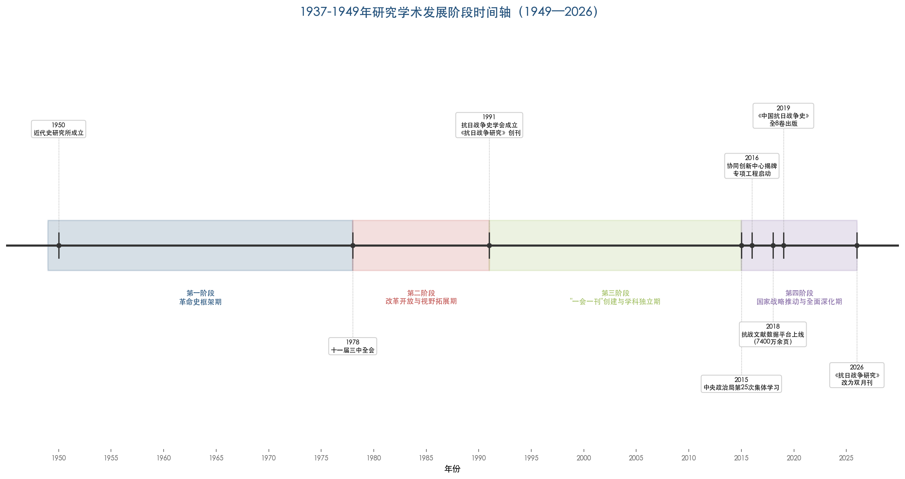

图1-1以时间轴形式呈现了1949年至2026年间学术发展的四个阶段及各阶段标志性事件。从中可以清晰观察到，每一阶段的开启均以特定的制度性变革或政策推动为标志，而2015年以来学术基础设施建设的加速推进——包括协同创新中心揭牌、抗战文献数据平台上线（总文献量达7400万余页）、《中国抗日战争史》全8卷出版、《抗日战争研究》改为双月刊等——构成了该领域学科成熟化的集中表征。

## 1.3 学术基础设施：核心期刊、研究机构与档案资源

对任何学术领域的综述而言，厘清其赖以运作的基础设施——核心期刊、研究机构与档案资源——是建立分析框架的前提。图1-2以网络关系图的形式呈现了该领域核心学术期刊与主要研究机构之间的主办、挂靠、牵头、协同等多层次关联关系，为理解下文的具体论述提供直观的结构性参照。

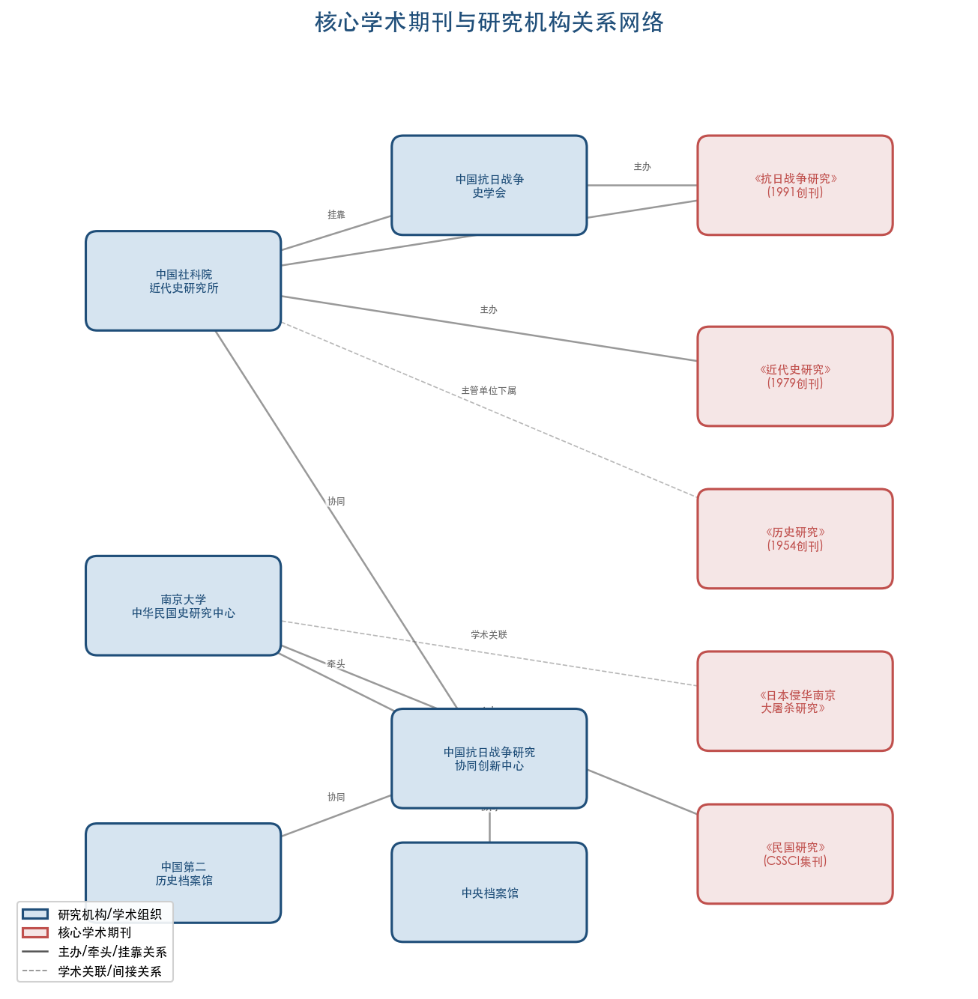

### 1.3.1 核心学术期刊

1937-1949年研究成果的发表与传播依托于一批层次分明的学术期刊体系。处于这一体系核心位置的期刊包括：

《抗日战争研究》创刊于1991年9月，是全国唯一专门刊发抗日战争史研究成果的学术期刊（ISSN 1002-9575，CN 11-2890/K）。该刊历任主编依次为张海鹏（1991-2004）、步平（2005-2012）、高士华（2013-2021）、杜继东（2022-2024）、夏春涛（2024至今），主编的更替折射出抗战研究学术共同体的代际传承[《抗日战争研究》编辑部简介](http://jds.cass.cn/bsgk/zzjg/krzzyjbjb/ "近代史研究所官网")。2013年起，该编辑部启动"抗日战争史青年学者研讨会"，至今已成功举办12届，"成为抗日战争史研究领域的品牌会议"[《抗日战争研究》编辑部简介](http://jds.cass.cn/bsgk/zzjg/krzzyjbjb/ "近代史研究所官网")，为青年学者的学术成长搭建了重要平台。

《近代史研究》创刊于1979年，由中国社会科学院主管、近代史研究所主办，初为季刊，1984年改为双月刊，是中国近代史研究领域最具权威性的综合性学术期刊之一[近代史研究编辑部简介](http://jds.cass.cn/bsgk/zzjg/jdsyjbjb/ "近代史研究所官网")，1937-1949年研究中大量具有范式意义的论文首发于此。《历史研究》创刊于1954年，为中国历史研究院院刊，双月刊，居全国历史类期刊首位[中国历史研究院官网](http://hrczh.cass.cn/sxkw/ "历史评论与期刊简介")。此外，《日本侵华南京大屠杀研究》作为专门刊发抗战史研究成果的另一专业期刊，与《抗日战争研究》"分别在抗战史研究的两个学术重镇——北京和南京"形成南北呼应之势[吴敏超《近十年中国抗战史研究的蓬勃发展》](http://hprc.cssn.cn/gsyj/zhutiyj/kz80/202506/t20250619_5880073.html "《中国社会科学报》2025年6月19日")。解放战争研究的成果则主要分布于《中共党史研究》《党史研究与教学》《军事历史研究》等党史类和军事类期刊以及上述综合性近代史期刊之中，尚无专门的学术期刊承载。

### 1.3.2 主要研究机构与学术组织

中国社会科学院近代史研究所是该领域最核心的国家级研究机构，成立于1950年5月1日，前身为1938年延安马列学院历史研究室，首任所长范文澜。该所现设12个研究室，其中抗日战争史研究室（2019年设立，首任主任高士华，现任主任吴敏超）是这一时段研究的专设机构建制；此外，该所还下辖《近代史研究》《抗日战争研究》等4个编辑部，挂靠中国史学会、中国抗日战争史学会等5个全国性一级学会[近代史研究所简介](http://jds.cass.cn/bsgk/bsjj/ "中国社会科学院近代史研究所官网")。

在高校系统中，南京大学中华民国史研究中心占据重要地位。该中心民国史研究起步于1974年，1983年设立中华民国史研究室，1993年6月18日正式成立研究中心，2000年9月获评教育部首批人文科学重点研究基地。张宪文主编的《中华民国史纲》于1985年出版，为当时唯一系统研究民国史的学术著作。中心主要刊物《民国研究》为CSSCI来源集刊，代表性成果包括72卷《南京大屠杀史料集》（2005-2010）、18卷《中华民国专题史》（2015）、25卷本《日本侵华图志》（2015）等[南京大学中华民国史研究中心简介](http://www.mgzx.org.cn/zhongxinjianjie.html "中心官网")。2016年成立的中国抗日战争研究协同创新中心以南京大学为依托，汇聚了北京大学、南开大学、武汉大学以及中国社科院近代史研究所、中央档案馆、中国第二历史档案馆等多方力量[南京大学官网](https://www.nju.edu.cn/info/3191/178381.htm "2016年1月21日")。中国社科院中日历史研究中心则定期举办抗日战争史学术研讨会和抗战与中日关系史研究工作坊，为学界提供常态化的学术交流平台[吴敏超《近十年中国抗战史研究的蓬勃发展》](http://hprc.cssn.cn/gsyj/zhutiyj/kz80/202506/t20250619_5880073.html "《中国社会科学报》2025年6月19日")。

在学术交流与两岸合作方面，中国抗日战争史学会自2017年起与台湾中华民族抗日战争纪念协会连续主办六届"中华民族抗日战争史与抗战精神传承"研讨会，并于2023年推出《两岸共研抗战史论文集》[吴敏超《近十年中国抗战史研究的蓬勃发展》](http://hprc.cssn.cn/gsyj/zhutiyj/kz80/202506/t20250619_5880073.html "《中国社会科学报》2025年6月19日")，标志着抗战史研究的两岸学术对话进入制度化轨道。

### 1.3.3 档案资源与数据平台

史料基础的拓展是推动1937-1949年研究持续深化的根本性动力之一。在档案典藏层面，中国第二历史档案馆是集中保管中华民国时期（1912-1949）历届中央政府及直属机构档案的中央级国家档案馆，馆藏总量达1354个全宗、240万卷、约4500万件[中国第二历史档案馆简介](http://www.tibetology.ac.cn/2021-09/25/content_41699610.htm "中国藏学研究中心转引")。改革开放40年来，该馆累计接待到馆查档利用者近60万人次、海外学者1万余人次，编辑出版各类档案史料140余种，并创办馆刊《民国档案》（中文核心期刊）。2013至2017年，该馆完成"馆藏档案数字化5年工程"，实现馆藏档案36%的数字化率[马振犊《改革开放四十年民国档案气象新》](https://da.xzdw.gov.cn/dayw/xxyd/201904/t20190425_151143.html "二史馆馆长撰文，2019年4月")。2015年，其馆藏《南京大屠杀档案》入选联合国教科文组织《世界记忆名录》[马振犊《改革开放四十年民国档案气象新》](https://da.xzdw.gov.cn/dayw/xxyd/201904/t20190425_151143.html "二史馆馆长撰文，2019年4月")。

在数字化平台建设方面，2018年9月2日正式上线的"抗日战争与近代中日关系文献数据平台"是迄今最重要的基础设施。该平台由中国社会科学院近代史研究所、国家图书馆、国家档案局牵头开发，为国家社科基金抗日战争研究专项工程的阶段成果。截至2024年底，平台总文献量达7400万余页，为"目前亚洲最大的中国抗日战争史数据库"[全国哲学社会科学工作办公室](http://www.nopss.gov.cn/n1/2018/0903/c219468-30269215.html "2018年9月3日") [吴敏超《近十年中国抗战史研究的蓬勃发展》](http://hprc.cssn.cn/gsyj/zhutiyj/kz80/202506/t20250619_5880073.html "《中国社会科学报》2025年6月19日")。与此同时，国家档案局组织全国县级以上档案馆推出规模宏大的《抗日战争档案汇编》，计划出版1000册，截至2023年底已出版550余册[吴敏超《近十年中国抗战史研究的蓬勃发展》](http://hprc.cssn.cn/gsyj/zhutiyj/kz80/202506/t20250619_5880073.html "《中国社会科学报》2025年6月19日")。在综合性研究成果方面，步平、王建朗主编的《中国抗日战争史》（全8卷）于2019年出版，"是迄今中国抗日战争史研究领域最大规模、最具权威性的综合性研究专著"[吴敏超《近十年中国抗战史研究的蓬勃发展》](http://hprc.cssn.cn/gsyj/zhutiyj/kz80/202506/t20250619_5880073.html "《中国社会科学报》2025年6月19日")，既是数十年研究成果的集大成之作，也为此后的深化研究提供了系统性的知识基准。

## 1.4 本报告的综述范围与边界

本报告的综述对象为中国历史学界对1937-1949年（抗日战争以及战后至新中国成立前夕）这一历史时段的研究成果。在时间范围上，重点回顾1980年代以来的学术成果，聚焦2010至2026年4月的最新进展。这一时段选择基于两方面考量：改革开放后学术研究方才进入常态化轨道，而聚焦近十余年则有助于充分覆盖当前学术前沿。

在学科边界上，本报告以大陆历史学界的研究成果为主体，兼及港台与海外华人学者的相关成果。涉及海外学术成果时，重点关注其对大陆学界的影响和对话关系，而非对海外研究的全面综述。在文献类型上，涵盖专著、学术论文（含期刊论文与学位论文）、档案资料集及学术会议论文等主要形态。

在抗日战争（1937-1945）与解放战争（1945-1949）两个子时段的篇幅分配上，本报告如实反映二者研究体量的显著不均衡格局。抗战史研究拥有专门的学术期刊（《抗日战争研究》）、专门的学术组织（中国抗日战争史学会）和国家级研究专项工程，其学科建制化程度远高于解放战争研究；后者长期在中共党史、军事史、民国史等框架内展开，尚无独立的学科认同。这一不均衡格局本身即是值得分析的学术史现象，下文各章节将对其成因做进一步探讨。

## 1.5 方法论框架：横向对比分析的五个维度

本报告的核心方法论为"横向对比分析"。所谓横向对比，是指在同一分析框架下，将不同研究成果、不同学术流派、不同研究子领域置于可比较的坐标体系中，从研究领域、研究视角、研究方法、理论运用与研究结论五个维度展开系统比较，以揭示各维度内部的差异、张力与互动关系。

**研究领域维度**旨在回答"学界在研究什么"的问题。通过梳理军事史、政治史（含党史）、外交史、经济史、社会史、文化思想史、区域史等子领域的成果分布，识别热门领域与冷门领域，分析领域分布的变迁轨迹，尤其关注近十年来环境史、医疗卫生史、性别史、日常生活史、数字人文等新兴交叉领域的崛起态势。

**研究视角维度**旨在回答"学界如何看待研究对象"的问题。从"革命史叙事"到"现代化叙事"，再到"社会史转向""新文化史转向""新革命史"，以及"跨国史/全球史"视角的兴起，不同视角代表着对同一历史时段的不同切入方式和解释框架。横向比较的目标不在于评判何种视角"更正确"，而在于揭示各视角各自的认知贡献与解释限度。

**研究方法维度**旨在回答"学界如何获取和分析证据"的问题。传统史料考证与实证方法仍然构成研究基底，但口述史方法、计量史学、社会科学跨学科方法以及数字人文工具（GIS、文本挖掘、数据库分析等）的引入，正在拓展研究者处理证据的方式与能力边界。

**理论运用维度**旨在回答"学界以什么理论工具指导分析"的问题。国家—社会关系理论、动员理论、制度变迁理论、集体记忆理论、后殖民理论等社会科学理论在该时段研究中的应用日益增多，但其适用性与解释效力因议题而异，需要逐一具体评估。

**研究结论维度**旨在回答"学界得出了哪些共识与分歧"的问题。在抗战正面战场与敌后战场评价、国民政府战时体制功过、中共根据地社会变革的性质、战后国共力量消长原因等关键议题上，不同研究之间存在重要的学术对话与论争，这些对话与论争构成了学术推进的基本动力。

上述五个维度并非彼此隔绝，而是紧密关联、相互作用：研究视角的转换往往伴随新研究领域的开拓，新方法的引入则可能促使既有结论的修正，理论工具的运用深刻影响着问题意识的形成。本报告在下文各章中将分别聚焦各维度展开深入分析，同时注重揭示维度之间的交互影响关系。

## 1.6 已有权威综述的学术地图

对一项学术领域进行系统综述，梳理前人的综述性工作既是学术规范的要求，也是确立本报告定位的必要步骤。1937-1949年研究领域已积累了一批重要的学术史回顾文章，为本报告提供了不可替代的知识基础与分析线索。

荣维木《近十年来抗日战争研究述评》（《教学与研究》2005年第8期）对1995-2005年间国内抗日战争研究进行了全面评述，涵盖日本侵华政策与罪行、战时中国政治、正面战场与敌后战场、战时社会经济、战时外交及战争遗留问题等方面[荣维木《近十年来抗日战争研究述评》](http://jxyyj.ruc.edu.cn/CN/abstract/abstract13825.shtml "《教学与研究》2005年第8期，第64-70页")。高士华《抗日战争研究在改革开放中不断发展》（《人民日报》2018年11月26日第22版）从改革开放40年的纵深角度，系统回顾了抗战研究从革命史框架到独立学科的演变过程[高士华《抗日战争研究在改革开放中不断发展》](http://jds.cass.cn/xscg/xslw/201811/t20181126_5253004.shtml "2018年11月26日")。吴敏超《近十年中国抗战史研究的蓬勃发展》（《中国社会科学报》2025年6月19日）是截至目前最具时效性的权威综述，全面涵盖2015-2025年间的资料整理与数据库建设、研究领域拓展深化及学术交流平台建设等方面[吴敏超《近十年中国抗战史研究的蓬勃发展》](http://hprc.cssn.cn/gsyj/zhutiyj/kz80/202506/t20250619_5880073.html "《中国社会科学报》2025年6月19日")。吴敏超另有《中国共产党抗战史研究的趋势、特点与相关思考》（2026年1月30日发表），是关于中共抗战史研究的最新专题综述[近代史研究所网站](http://jds.cass.cn/xscg/xslw/202601/t20260130_5971445.shtml "2026年1月30日")。此外，《近代史研究》每年年末或隔年刊发中国近代史研究年度热点综述，定期涵盖抗日战争研究动态，如王建朗《2017年中国近代史研究综述》等[近代史研究所网站](http://jds.cass.cn/xscg/xslw/201812/t20181225_5249601.shtml "2018年12月25日")。

值得注意的是，上述综述文章几乎全部聚焦于抗日战争时段。解放战争（1945-1949）研究的独立性学术史回顾相对薄弱，相关成果散见于中共党史研究年度述评、中国近代史研究综述及各野战军战史研究等专题文献之中，尚缺乏一篇与荣维木或吴敏超的抗战史综述相对应、对解放战争研究做全面学术史梳理的综述性文章。这一文献格局本身即反映出两个子时段研究在学科建制化程度上的显著差异。

## 1.7 本报告的结构安排

本报告在导论之后设置五个主体章节与一个总结性章节，形成从全景式描述到聚焦式比较、再到前瞻性预判的递进结构。

第2章"研究领域的分布格局与演变趋势"系统梳理1937-1949年研究在军事史、政治史、外交史、经济史、社会史等各主要子领域的分布状况，横向比较各领域的研究体量与发展成熟度，追踪近年来新兴交叉领域的崛起。第3章"研究视角的范式转换与多元化"聚焦分析从革命史叙事到现代化叙事、社会史转向、新革命史等范式转换的轨迹，呈现不同范式在同一时段的并存、竞争与交互影响关系。第4章"研究方法与理论框架的横向比较"系统比较传统实证方法、口述史、计量史学、数字人文等方法的运用状况，评析不同理论框架的适用性与解释效力。第5章"代表性论著及其学术贡献的比较评析"遴选具有里程碑意义的代表性论著进行分类评介与横向比较，分析重要学术争论与分歧焦点。第6章"未来研究潜力选题预测"基于前述各章的分析，提出若干具有研究潜力和研究空间的选题方向，从"现有空白/不足—可用资源/条件—预期学术贡献"三个层面展开论证。第7章"结论——总体评价与学科展望"总结该领域的主要成就与结构性不足，提出学科建设的前瞻性思考。

# 第2章 研究领域的分布格局与演变趋势

## 2.1 子领域分布的总体格局

1937-1949年研究经过数十年积累，已形成涵盖军事史、政治史（含党史）、外交史、经济史、社会史、文化思想史、区域史等多个子领域的庞大学术版图。各子领域之间的研究体量、成果密度与发展成熟度并不均衡，整体呈现以军事史和政治史为双核心、外交史和经济史为重要支撑、社会史和文化史为新兴增长极的层次化格局。

从成果总量来看，这一时段的研究规模极为可观。据李金铮以"抗日战争"这一较为宏观的主题词对中国知网所做的统计，仅1979至2016年38年间，期刊文章即达44888篇，平均每年1181篇；1993至2016年23年间，博硕论文达4156篇，平均每年181篇[李金铮《拓展视野：抗日战争史研究从何处突破？》](http://mg.lsxy.ruc.edu.cn/bykw/b0ee505a15a9442bb55e43b1c996e325.htm "《抗日战争研究》2016年第2期")。上述数据并未包含以更具体的子主题词可检索到的大批成果，实际总量远超此数。在这些成果中，军事史和政治史长期占据主导地位，外交史和经济史紧随其后，社会史和文化史虽在近二十年迅速增长，但总量上仍与前两个领域存在明显差距。

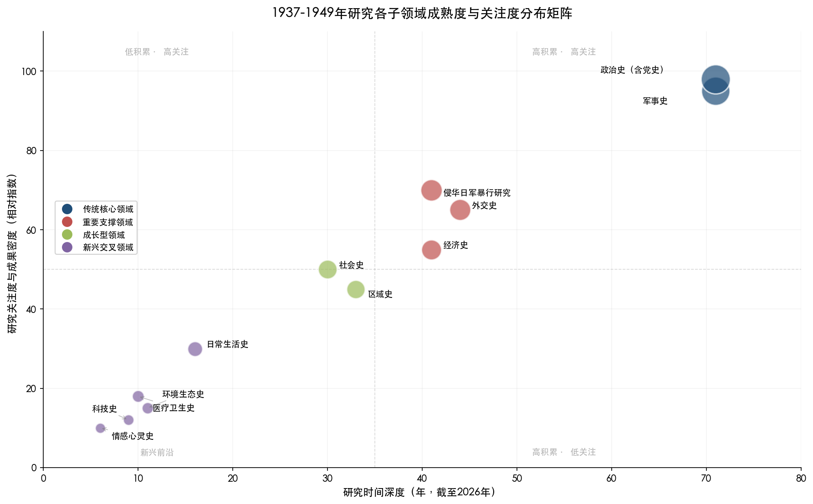

上图将军事史、政治史、外交史、经济史、社会史、区域史、日常生活史、环境生态史、医疗卫生史、科技史、情感心灵史等主要子领域置于"研究时间深度—关注度与成果密度"的二维矩阵中。传统核心领域（军事史、政治史）位于高积累、高关注象限，研究时间深度约70年；重要支撑领域（外交史、经济史、侵华日军暴行研究）居于中等积累、较高关注区间；成长型领域（社会史、区域史）时间深度约30—35年，关注度处于中等水平；新兴交叉领域（日常生活史、环境生态史、医疗卫生史、科技史、情感心灵史）则集中于低积累、低关注象限，研究时间深度多在10—20年之间，正处于快速成长阶段。

荣维木在对1995至2005年抗战研究的系统述评中，将研究领域划分为日本侵华政策与侵华罪行、抗日战争时期的中国政治、正面战场和敌后战场、战时社会经济、战时中国外交以及战争遗留问题六大板块[荣维木《近十年来抗日战争研究述评》](http://jds.cssn.cn/webpic/web/jdsww/UploadFiles/ztsjk/2010/11/201011191532440470.pdf "《教学与研究》2005年第8期，第64-70页")。这一分类框架虽提出于二十年前，至今仍基本反映了抗战史研究的主体结构。在此基础上，吴敏超2025年的综述将近十年研究领域的发展概括为中共抗战、正面战场、侵华日军暴行三大传统核心板块的深化拓展，以及大后方研究的丰富多元化[吴敏超《近十年中国抗战史研究的蓬勃发展》](http://hprc.cssn.cn/gsyj/zhutiyj/kz80/202506/t20250619_5880073.html "《中国社会科学报》2025年6月19日")。

## 2.2 传统核心领域：军事史与政治史

### 2.2.1 军事史：最具厚度的传统支柱

军事史是1937-1949年研究中积累最为深厚的子领域，其主导地位源于研究对象本身的特性——抗日战争和解放战争均以军事对抗为基本形态，军事史研究天然构成这一时段学术版图的主轴。

在抗战军事史领域，正面战场与敌后战场的研究长期构成两大主线。正面战场方面，郭汝瑰、黄玉章编著的《中国抗日战争正面战场作战记》（江苏人民出版社，2002年）是迄今最为系统的一部专著，不仅对正面战场军事战略进行整体论述，还逐一分析各战役的利弊得失[荣维木《近十年来抗日战争研究述评》](http://jds.cssn.cn/webpic/web/jdsww/UploadFiles/ztsjk/2010/11/201011191532440470.pdf "《教学与研究》2005年第8期，第64-70页")。近十年来，正面战场研究出现了值得关注的重要转向：学者开始从军队战斗力生成的角度重新审视正面战场的成败，"从关注战事本身到关注战争的主体——军队"，研究对象扩展至国民党军队的组织架构、指挥系统、军队编制、武器装备、军需后勤、军政关系等方面[吴敏超《近十年中国抗战史研究的蓬勃发展》](http://hprc.cssn.cn/gsyj/zhutiyj/kz80/202506/t20250619_5880073.html "《中国社会科学报》2025年6月19日")。这一转向标志着正面战场研究从战役叙事层面向军事制度史和军事社会学层面的深化。

敌后战场方面，学界围绕若干基本问题展开了持续数十年的讨论，涉及敌后战场的形成时间、敌后战场与正面战场的关系、敌后战场的战略地位等。荣维木在其述评中指出，关于敌后战场形成的时间，存在"抗战一开始即分为两个战场"与"敌后战场形成于1938年以后乃至1939年春"两种不同观点；关于两个战场的地位，则存在"正面战场始终是主要战线"与"战略相持阶段后敌后战场上升为主战场"的分歧[荣维木《近十年来抗日战争研究述评》](http://jds.cssn.cn/webpic/web/jdsww/UploadFiles/ztsjk/2010/11/201011191532440470.pdf "《教学与研究》2005年第8期，第64-70页")。上述争论至今仍是抗战军事史研究的核心议题。

在中共敌后抗战研究方面，2025年出版的"中国共产党领导的敌后抗战"系列丛书堪称里程碑式成果。这套丛书自2016年作为国家社会科学基金抗日战争研究专项工程立项，历时近十年完成，至2025年出版23种28册，涵盖《中国共产党敌后抗战指导史》《八路军抗战史》《新四军抗战史》以及各根据地史，"对于推动中国共产党领导的敌后抗战史的整体研究具有重要意义"[吴敏超《中国共产党抗战史研究的趋势、特点与相关思考》](http://jds.cass.cn/xscg/xslw/202601/t20260130_5971445.shtml "《抗日战争研究》2025年第4期")。

解放战争军事史领域，改革开放后由中央军委批准整理重编的《第二野战军战史》《第三野战军战史》《第四野战军战史》等各野战军战史陆续问世，标志着解放战争军事史研究的系统化推进。然而，与抗战军事史研究相比，解放战争军事史的整体体量明显偏小，研究的制度化程度亦远为不足——既无专门期刊，也无独立的学术组织和国家级研究专项工程。

### 2.2.2 政治史与党史：最受关注的核心领域

政治史（含党史）是1937-1949年研究中关注度最高、学术争论最为集中的子领域，核心议题包括国共两党的战时政治走向、抗日民族统一战线的建立与维护、根据地政权建设、国民政府战时体制、战后国共力量消长及政权更迭等。

中共抗战史是近十年来发展最为迅猛的研究方向。吴敏超指出，"如果说抗日战争史研究是近代史研究中的显学，那么，中国共产党抗战史研究可谓抗日战争史研究中的显学"[吴敏超《中国共产党抗战史研究的趋势、特点与相关思考》](http://jds.cass.cn/xscg/xslw/202601/t20260130_5971445.shtml "《抗日战争研究》2025年第4期")。在传统领域的深化方面，学者围绕持久战战略的形成、敌后游击战的开展、根据地的创建与发展、抗日民族统一战线的维护等基本问题持续推进。尤为值得注意的是，持久战研究已"超越了单纯的军事框架"，转向考察"游击战、根据地、正规军互为作用，形成党政军民一体化的全面抗战局面"的综合分析[吴敏超《中国共产党抗战史研究的趋势、特点与相关思考》](http://jds.cass.cn/xscg/xslw/202601/t20260130_5971445.shtml "《抗日战争研究》2025年第4期")。

在根据地研究方面，陕甘宁和华北根据地一直是研究重点，近年来政治史、经济史和社会史的研究"更加丰富、多元、深入"。与此同时，"学界对华中、华南地区的敌后战场和根据地建设予以前所未有的重视"，大量中青年学者探讨中国共产党"发展华中"的复杂战略进程，推动新四军研究与华中根据地研究取得新突破[吴敏超《中国共产党抗战史研究的趋势、特点与相关思考》](http://jds.cass.cn/xscg/xslw/202601/t20260130_5971445.shtml "《抗日战争研究》2025年第4期")。华南地区统一战线与独立自主武装斗争的关系、敌后抗战局面的形成等议题亦涌现出丰硕成果。

在解放战争政治史领域，近年研究呈现出令人瞩目的新进展。《中共党史研究》2025年第5期刊载的年度综述指出，"近年来较少受到学界关注的解放战争史研究，研究成果数量和质量都有显著提升"[辛逸、岳伟、满永《二〇二四年中共党史研究的若干学术进展》](https://taiyuan.gov.cn/c/www/dsby/30285196.jhtml "《中共党史研究》2025年第5期")。中共如何在新区立足成为热点话题——黄道炫借由蔡迈轮日记呈现中共初到新区遭遇的艰难处境及政策调适过程；南下干部动员、新区建设等议题亦得到深入研究。这些新进展表明，解放战争研究正从单一的军事叙事向更为丰富的政治社会史方向拓展。

## 2.3 重要支撑领域：外交史与经济史

### 2.3.1 外交史：从双边关系到全球视野

战时外交史是1937-1949年研究中发展较为成熟的子领域。荣维木指出，"战争期间中国的外交活动不仅十分频繁，而且作用十分重要。因此，战时外交是抗日战争史研究中的重要内容之一"[荣维木《近十年来抗日战争研究述评》](http://jds.cssn.cn/webpic/web/jdsww/UploadFiles/ztsjk/2010/11/201011191532440470.pdf "《教学与研究》2005年第8期，第64-70页")。研究热点涵盖中苏关系（《中苏互不侵犯条约》《苏日中立条约》《中苏友好同盟条约》等）、中英美关系（新约运动、废除不平等条约等）以及中国抗战与世界反法西斯战争的关系等方面。

近年来，外交史研究呈现出从传统双边关系叙事向全球史视角转换的显著趋势。2025年出版的《新编第二次世界大战史》中、英文版即体现了这一取向，该书"在全面还原第二次世界大战历史面貌的基础上，深入阐释了东方主战场在世界反法西斯战争中的决定性作用"[《2025年历史学研究发展报告》](https://sscp.cssn.cn/byjh/202601/t20260121_5970292.shtml "中国社会科学杂志社，2026年1月21日")。胡德坤认为，中国开辟了世界上最早、持续时间最长的反法西斯东方主战场；张生认为，"承认、维护中国在第二次世界大战中的重要地位，弘扬中国人民抗日战争的价值，是坚持正确二战史观的基本点"[《2025年历史学研究发展报告》](https://sscp.cssn.cn/byjh/202601/t20260121_5970292.shtml "中国社会科学杂志社，2026年1月21日")。美国学者安德鲁·N. 布坎南亦主张，"应该把1931—1949年发生在中国的战争重新纳入'全球二战'叙事"[《2025年历史学研究发展报告》](https://sscp.cssn.cn/byjh/202601/t20260121_5970292.shtml "中国社会科学杂志社，2026年1月21日")。

中共抗战的国际面向日益受到关注。吴敏超指出，"西方国家如何看待中国共产党抗战和国共关系，中国共产党如何观察发生在其他国家的反法西斯侵略斗争"，已成为中共抗战史研究的有机组成部分。皖南事变善后处理中的国际因素、港九大队为盟国提供情报、中国共产党对阿比西尼亚抵抗意大利侵略的认识等方面的研究，"都大大开阔了中国共产党抗战史研究的视野和思路"[吴敏超《中国共产党抗战史研究的趋势、特点与相关思考》](http://jds.cass.cn/xscg/xslw/202601/t20260130_5971445.shtml "《抗日战争研究》2025年第4期")。

### 2.3.2 经济史：从宏观政策到基层实践

经济史是1937-1949年研究中稳步发展的子领域。荣维木指出，"抗日战争时期的中国经济，是在极为特殊的条件下运行的，它与中国抗战的进程及胜负结局有着密切的联系"[荣维木《近十年来抗日战争研究述评》](http://jds.cssn.cn/webpic/web/jdsww/UploadFiles/ztsjk/2010/11/201011191532440470.pdf "《教学与研究》2005年第8期，第64-70页")。该领域的研究经历了从单一关注抗日根据地经济到兼顾战时国统区、沦陷区经济的视野拓展。国统区经济研究方面，学界已从以往以半殖民地半封建社会理论框架为指导的路径，转向从"战时状态下中国经济与反侵略密切相关的大背景下考察问题"，对国民政府的战时经济政策给予更为客观的评价[荣维木《近十年来抗日战争研究述评》](http://jds.cssn.cn/webpic/web/jdsww/UploadFiles/ztsjk/2010/11/201011191532440470.pdf "《教学与研究》2005年第8期，第64-70页")。

近年来，经济史研究成为中共抗战史中的一个热点方向。吴敏超指出，根据地经济史研究"注重农业、盐业、金融、财政等方面的精深研究，观察相关政策在抗战时期不同阶段的变化及具体发展，探讨民间传统、经济运行规律发挥的特定作用，展现了革命与传统、主观努力与客观规律之间的张力与调适"[吴敏超《中国共产党抗战史研究的趋势、特点与相关思考》](http://jds.cass.cn/xscg/xslw/202601/t20260130_5971445.shtml "《抗日战争研究》2025年第4期")。2024年度，华北根据地贸易统制制度、北海银行管理体制、东江根据地税收体系、陕甘宁边区财经政策转型等专题均涌现出高水平成果[辛逸、岳伟、满永《二〇二四年中共党史研究的若干学术进展》](https://taiyuan.gov.cn/c/www/dsby/30285196.jhtml "《中共党史研究》2025年第5期")。

抗战大后方研究在经济史领域表现出持续的活力。"中国抗战大后方研究论坛"已举办八届，议题涉及大后方的金融、工业、教育和文艺等诸多面向。战时西部地区经济开发始终是该领域的研究热点，抗日战争时期国民政府对西北、西南地区的经济战略部署及其实绩持续受到学者关注[荣维木《近十年来抗日战争研究述评》](http://jds.cssn.cn/webpic/web/jdsww/UploadFiles/ztsjk/2010/11/201011191532440470.pdf "《教学与研究》2005年第8期，第64-70页")。

## 2.4 "抗日战争"与"解放战争"研究的结构性失衡

1937-1949年研究中最显著的结构性特征之一，是抗日战争（1937-1945）与解放战争（1946-1949）两个子时段之间研究关注度的巨大差异。这种失衡不仅表现在成果体量上，更深层次地反映了学科建制、制度供给与学术共同体构成方面的根本性差距。

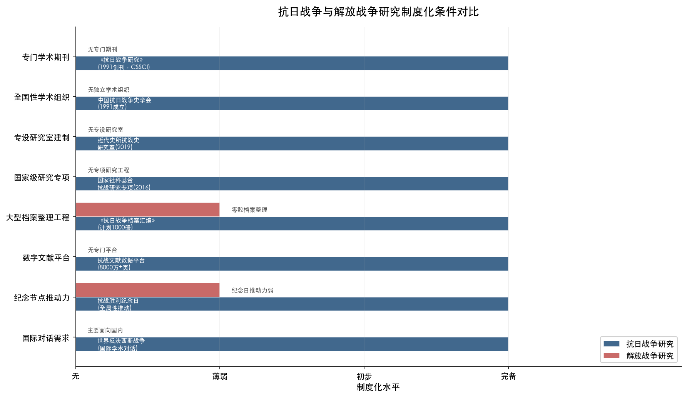

上图从专门学术期刊、全国性学术组织、专设研究室建制、国家级研究专项、大型档案整理工程、数字文献平台、纪念节点推动力、国际对话需求等八个维度，对比了抗日战争研究与解放战争研究的制度化水平。抗日战争研究在全部维度上均达到"初步"乃至"完备"水平，而解放战争研究在多数维度上处于"无"或"薄弱"状态，结构性失衡一目了然。

在学科建制层面，抗战史研究拥有完整的制度化架构：《抗日战争研究》作为全国唯一专门刊发抗日战争史研究成果的学术期刊自1991年创刊以来持续运行（2026年起由季刊改为双月刊），中国抗日战争史学会自1991年成立以来持续发挥全国性学术组织功能，中国社科院近代史研究所于2019年设立专门的抗日战争史研究室，国家社科基金自2016年起设立抗日战争研究专项工程[吴敏超《近十年中国抗战史研究的蓬勃发展》](http://hprc.cssn.cn/gsyj/zhutiyj/kz80/202506/t20250619_5880073.html "《中国社会科学报》2025年6月19日")。相比之下，解放战争研究至今没有专门学术期刊、没有独立学术组织、没有专设研究室建制，也没有国家级专项研究工程。相关成果主要分布于《中共党史研究》《党史研究与教学》《军事历史研究》等党史和军事类期刊，以及《近代史研究》《历史研究》等综合性近代史期刊之中。

这种结构性失衡的形成有多重原因。

其一，学术路径依赖。抗战史研究因抗日民族统一战线这一主题具有的广泛包容性——超越党派界限，涵盖国共两党、各民族、各阶层、国内外力量——而获得了更大的学术空间和更多元的研究视角。解放战争则直接涉及国共政权更迭这一高度政治化的主题，学术讨论空间相对受限。

其二，史料条件差异。抗战史研究受益于"抗日战争与近代中日关系文献数据平台"（截至2024年底总文献达7400万余页）、《抗日战争档案汇编》（计划出版1000册，截至2023年底已出版550余册）等大规模史料整理工程的支撑，史料基础持续夯实[吴敏超《近十年中国抗战史研究的蓬勃发展》](http://hprc.cssn.cn/gsyj/zhutiyj/kz80/202506/t20250619_5880073.html "《中国社会科学报》2025年6月19日")。解放战争相关档案的系统整理和开放则相对滞后。

其三，纪念节点的推动效应。每逢抗战胜利5周年、10周年等重大纪念年份，国家层面和学术界均会举办大规模纪念活动和学术研讨会，形成研究的脉冲式推动。2015年抗战胜利70周年和2025年抗战胜利80周年均产生了显著的学术推动效应。解放战争虽有重要纪念日（如渡江战役胜利纪念日），但缺乏类似抗战胜利纪念日那样的全局性推动力。

其四，国际对话需求。抗战作为世界反法西斯战争的重要组成部分，天然具有国际对话的维度——回应日本右翼历史修正主义、争取中国抗战在国际学术界的应有地位、参与二战史的全球叙事重构——这些外部需求持续为抗战研究注入动力。解放战争研究则主要面向国内学术语境。

值得关注的是，这一失衡格局正在缓慢改善。2024年度的学术综述已观察到"近年来较少受到学界关注的解放战争史研究，研究成果数量和质量都有显著提升"[辛逸、岳伟、满永《二〇二四年中共党史研究的若干学术进展》](https://taiyuan.gov.cn/c/www/dsby/30285196.jhtml "《中共党史研究》2025年第5期")。贯通性研究取向的兴起——如吴敏超所强调的应将抗战时期"放在中国共产党的整体历史中探讨，尤其要关注此前的苏区时期和后来的解放战争时期，作贯通性考察"[吴敏超《中国共产党抗战史研究的趋势、特点与相关思考》](http://jds.cass.cn/xscg/xslw/202601/t20260130_5971445.shtml "《抗日战争研究》2025年第4期")——也在客观上推动着解放战争研究的深入。2024年北京大学历史学系等机构召开的"从革命到建政：跨越1949"学术研讨会，即"共同提出对中国革命史和建设史进行整体性、连续性研究，极力倡导贯通研究历史的思维方法和能力"[辛逸、岳伟、满永《二〇二四年中共党史研究的若干学术进展》](https://taiyuan.gov.cn/c/www/dsby/30285196.jhtml "《中共党史研究》2025年第5期")。

## 2.5 区域研究的差异化格局

区域史是1937-1949年研究中具有独特价值的子领域。抗战时期中国被分割为国统区、沦陷区与中共抗日根据地三大板块，区域研究天然与政治格局相互交织，形成了以根据地史、沦陷区史和大后方史为三大主体的区域研究格局。

根据地研究方面，陕甘宁和华北根据地长期居于研究重心。吴敏超指出，这两大板块"已有较深积累，也有一定的模式可循"[吴敏超《中国共产党抗战史研究的趋势、特点与相关思考》](http://jds.cass.cn/xscg/xslw/202601/t20260130_5971445.shtml "《抗日战争研究》2025年第4期")。与此同时，华中和华南根据地研究在近十年获得前所未有的重视：一方面，大量中青年学者投入新四军和华中抗日根据地研究，探讨中共"发展华中"的复杂战略进程；另一方面，华南地区统一战线与独立自主武装斗争的关系、敌后抗战局面的形成等课题亦产生了丰硕成果。吴敏超同时提醒注意，"小块根据地、存在时间较短的根据地和游击根据地，中国共产党在国统区、沦陷区的工作，在新疆等边疆地区的影响，都值得深入研究"[吴敏超《中国共产党抗战史研究的趋势、特点与相关思考》](http://jds.cass.cn/xscg/xslw/202601/t20260130_5971445.shtml "《抗日战争研究》2025年第4期")。

沦陷区研究长期处于相对薄弱的状态。臧运祜在其对中国大陆学界沦陷区研究的系统回顾中指出，这一领域虽在21世纪以来有所深化，但整体上仍显不足。步平、王建朗主编《中国抗日战争史》第7卷"伪政权与沦陷区"对1931-1945年抗战时期中国关内外各地伪政权的建立与崩溃进行了纵向论述[臧运祜《中国大陆学界的沦陷区研究浅议》](http://jds.cass.cn/xscg/xslw/202602/t20260203_5972035.shtml "近代史研究所网站，2026年2月3日")。在沦陷区研究中，伪满洲国和汪伪政权研究相对充分，而华北沦陷区、华中沦陷区的社会经济研究仍显薄弱。近年来，以日常生活史视角切入沦陷区研究的成果开始增多，揭示了沦陷区民众在非妥协即牺牲的两难选择面前"外表顺服但内心充满仇恨"的复杂心态。

大后方研究在近十年日趋繁荣。吴敏超指出，"有关抗战大后方的研究更加丰富多元，涉及国共合作，中共中央南方局，重庆大轰炸，大后方的金融、工业、教育和文艺等"[吴敏超《近十年中国抗战史研究的蓬勃发展》](http://hprc.cssn.cn/gsyj/zhutiyj/kz80/202506/t20250619_5880073.html "《中国社会科学报》2025年6月19日")。"中国抗战大后方研究论坛"已连续举办八届，成为该领域的重要学术平台。

## 2.6 新兴交叉领域的崛起

近十年来，1937-1949年研究的学术版图上最具活力的变化之一，是一批新兴交叉领域的崛起，包括日常生活史、环境生态史、医疗卫生史、科技史、文化记忆史、情感心灵史等。这些领域的出现既是中国史学界整体向社会史、新文化史转向的组成部分，也是抗战史研究自身寻求突破的内在需要。

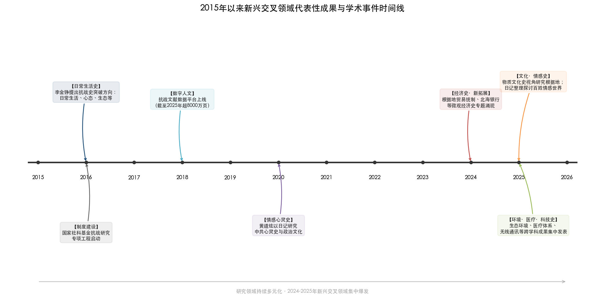

上图以2015—2026年为时间轴，标注了日常生活史、数字人文、情感心灵史、经济史新拓展、环境·医疗·科技史、文化·情感史等新兴交叉领域的代表性成果和关键学术事件。2016年李金铮系统提出抗战史突破方向与国家社科基金抗战研究专项工程启动，构成这一轮领域拓展的制度起点和学术先声；2024—2025年则呈现出新兴交叉领域集中爆发的态势。

### 2.6.1 日常生活史：让"人"回归战争叙事

日常生活史是近年来1937-1949年研究中最具创新活力的新兴领域。其兴起直接回应了传统抗战史研究"论题大多从民族国家、政党、军队的视角出发，关注抗战时期的政治、外交、经济、军事等方面"而忽略普通民众生存状态这一缺陷。方德万（Hans van de Ven）提出的"战时日常性"（Wartime everydayness）概念，为这一领域提供了重要的理论资源，提醒研究者注意战争"对中国社会、政治、经济和文化的日常影响"。

在具体研究层面，大后方民众的日常生活成为重要切入点。有学者利用多位民国时期著名教授的日记与书信，还原了大学教授战时日常生活的艰辛与困窘，分析"战时知识分子生活贫困化对其日后政治抉择所产生的影响"。战时国统区公务员特别是高级公务员的生活状况，亦被纳入考察范围。这些研究揭示了抗战后期"国统区严重的经济危机造成道德风气与民心向背的大转变"——一方面是"政治风气败坏，贪污中饱私囊的普遍"，另一方面是"民众尤其是知识分子对国民党政权的向心力逐渐被强烈的不满所代替"，由此揭示了"国民党的失败实际上在抗战后期即已种下"的历史逻辑。

中共根据地日常生活研究方面，关于华北八路军士兵日常生活的系列研究涵盖了"衣装、卫生、家庭观念、日常斗争等多个方面"。军鞋动员与保障研究体现了独特的问题意识——作为日用品的军鞋"使身处后方的妇女与前方火线上的战士凝聚成一股坚强的革命力量"。陕甘宁边区女工生活的研究则"展现了这一特殊群体在物质待遇、生理优待、文化娱乐等方面呈现的崭新面貌"，反映了抗战时期"中共社会治理与改造的底层进路"。

李金铮早在1996年即发表《抗日根据地社会史研究的构想》，提出应系统研究根据地的社会构成、社会生活、社会关系、社会意识和社会问题[李金铮《拓展视野：抗日战争史研究从何处突破？》](http://mg.lsxy.ruc.edu.cn/bykw/b0ee505a15a9442bb55e43b1c996e325.htm "《抗日战争研究》2016年第2期")。2016年的长文中，他进一步系统列举了抗战史研究可从想象与形象、话语与概念、心态史、生态史、日常生活、身体史、历史记忆、象征物、阅读史等多个维度展开的新课题，认为"这些面相并非可有可无，如果不对它们进行考察，所谓抗战史的中心角色也就失去了赖以生长的舞台"[李金铮《拓展视野：抗日战争史研究从何处突破？》](http://mg.lsxy.ruc.edu.cn/bykw/b0ee505a15a9442bb55e43b1c996e325.htm "《抗日战争研究》2016年第2期")。这一学术呼吁对此后十年日常生活史在抗战研究中的拓展产生了显著影响。

### 2.6.2 环境生态史、医疗卫生史与科技史

环境生态史是近年来引入1937-1949年研究的新兴领域。吴敏超指出，战时中共"充分重视对自然环境的认识、利用和改造，继续发展山地游击战，改造平原地形，灵活运用夜战、青纱帐战、水上游击战等多种形式"，而"生态环境史的研究并不是孤立的，而是被纳入对中国共产党政策灵活、发动人民、坚持抗战的综合分析中"[吴敏超《中国共产党抗战史研究的趋势、特点与相关思考》](http://jds.cass.cn/xscg/xslw/202601/t20260130_5971445.shtml "《抗日战争研究》2025年第4期")。李金铮亦提出了生态史视角下的重要问题："自然生态环境与政权、策略等是一种怎样的互动关系？以抗日根据地为例，中共持久战、游击战术和根据地的形成与自然生态环境是何关系？"[李金铮《拓展视野：抗日战争史研究从何处突破？》](http://mg.lsxy.ruc.edu.cn/bykw/b0ee505a15a9442bb55e43b1c996e325.htm "《抗日战争研究》2016年第2期")

医疗卫生史和科技史的研究"更多地体现了跨学科的特点"。医疗卫生史方面，研究内容涵盖中共领导的医疗卫生队伍人才培养、较为完备的医疗体系的初步建立、以群众路线为基本方针的卫生运动、传染病防治体系的形成等，"展现了根据地政权与基层社会的良性互动"。科技史方面，有关中共领导的军队中无线通讯系统等成果"令人耳目一新"，这些研究"强调的不仅仅是物质和技术，也有人，即各种专业技术人员及传授培训对象，还有技术的应用实践与创造发明，以及相关的配套制度等"[吴敏超《中国共产党抗战史研究的趋势、特点与相关思考》](http://jds.cass.cn/xscg/xslw/202601/t20260130_5971445.shtml "《抗日战争研究》2025年第4期")。

### 2.6.3 文化史与情感心灵史

文化史领域在传统的教育、宣传舆论、文艺活动研究之外，涌现出大量以"节日、话语、仪式、记忆等为视角"透视中共政治文化特征的成果[吴敏超《中国共产党抗战史研究的趋势、特点与相关思考》](http://jds.cass.cn/xscg/xslw/202601/t20260130_5971445.shtml "《抗日战争研究》2025年第4期")。2025年10月召开的"近代以来中国历史学知识体系暨三大体系建设青年学者论坛"上，梁馨蕾提出了从物质文化史视角研究抗战根据地的新路径[近代史研究所网站](http://jds.cass.cn/newzxdt/202510/t20251031_5922512.shtml "2025年10月31日")。这些研究在一定程度上受到新文化史理论的启发，同时注重结合中国传统文化与社会风俗加以分析。

情感心灵史是更具前沿性的新兴方向。吴敏超指出，这一领域"基于对日记、书信、回忆录等私人史料的大量运用，反映了对战争与革命环境下人物命运、情感的关切"。黄道炫运用大量日记研究"政治文化视野下的中国共产党心灵史"，关注中共的"行动机制和政治文化"[吴敏超《中国共产党抗战史研究的趋势、特点与相关思考》](http://jds.cass.cn/xscg/xslw/202601/t20260130_5971445.shtml "《抗日战争研究》2025年第4期")。吴敏超本人亦通过对《李亦怀日记》的整理与研究，"深入探讨了抗日战争时期普通百姓的生活状态和情感世界"[南京大学官网](https://www.nju.edu.cn/info/1056/427061.htm "纪念抗战胜利80周年学术活动")。

### 2.6.4 侵华日军暴行研究：系统化与国际化

侵华日军暴行研究是一个兼具学术深化内在要求与回应日本右翼歪曲侵略历史外部使命的特殊子领域。吴敏超指出，这一领域"包括南京大屠杀、'慰安妇'、细菌战研究等，呈现出更多利用海内外档案资料、成果日渐系统化的特点"[吴敏超《近十年中国抗战史研究的蓬勃发展》](http://hprc.cssn.cn/gsyj/zhutiyj/kz80/202506/t20250619_5880073.html "《中国社会科学报》2025年6月19日")。南京大学中华民国史研究中心编纂的72卷《南京大屠杀史料集》（2005-2010年）、25卷本《日本侵华图志》（2015年）等大型资料集的出版[南京大学中华民国史研究中心简介](http://www.mgzx.org.cn/zhongxinjianjie.html "中心官网")，以及《国家记忆：海外稀见抗战影像集》（6卷）、《美国国家档案馆馆藏中国抗战历史影像全集》（30卷）等影像资料的问世，极大地丰富了这一领域的史料基础。

## 2.7 数字人文：正在兴起的方法论转型

数字人文方法严格说来属于研究方法而非研究领域，但其在1937-1949年研究中的应用已开始重塑整个学术生态，在讨论领域分布格局时有必要专门论及。

"抗日战争与近代中日关系文献数据平台"是这一领域最重要的基础设施。该平台截至2025年底，"公开高清文献总量已达8000多万页，是目前亚洲最大的公益共享的中国抗日战争史数据库。平台仍在不断增加新史料、新文献，极大便利了抗战史乃至中国近代史研究"[《2025年历史学研究发展报告》](https://sscp.cssn.cn/byjh/202601/t20260121_5970292.shtml "中国社会科学杂志社，2026年1月21日")。2025年度的历史学研究发展报告指出，人工智能技术取得突破性进展，为历史研究"带来新契机，也带来新的严峻挑战"[《2025年历史学研究发展报告》](https://sscp.cssn.cn/byjh/202601/t20260121_5970292.shtml "中国社会科学杂志社，2026年1月21日")。吴敏超亦提出，"随着人工智能技术发展和大语言模型的建立，资料整理、识别、翻译和分类等工作将更加便捷，提示历史学者应与时俱进，创新史料积累方法和研究手段"[吴敏超《中国共产党抗战史研究的趋势、特点与相关思考》](http://jds.cass.cn/xscg/xslw/202601/t20260130_5971445.shtml "《抗日战争研究》2025年第4期")。

## 2.8 领域分布的演变趋势与深层逻辑

综合以上各节分析，可以提炼出1937-1949年研究领域分布格局的几个核心趋势。

**第一，从"一枝独秀"走向"多元并进"。** 1980年代以前，这一时段的研究基本被政治史和军事史所垄断；1990年代以后，外交史、经济史、社会史逐步兴起；2010年代以来，日常生活史、环境生态史、医疗卫生史、科技史、情感心灵史等新兴领域密集涌现。这一轨迹表明，研究领域的多元化并非匀速展开，而是在近十年出现了加速态势。

**第二，从"就战争论战争"走向"在战争中观社会"。** 李金铮敏锐地指出，学界对抗战史研究曾有一种反思，"认为其经常是一种泛化的对抗战时期历史的研究，而非真正聚焦军事的战争史研究"；而从另一角度看，"对于战场以外的历史则关注较少"。近年来研究领域的拓展，正是从以军事对抗为中心的战争史框架走向以社会变迁为关怀的综合史框架的过程。吴敏超对中共抗战史研究特点的总结——"整体性和系统性加强，超越就战役论战役、就政治事件论政治事件、就经济行为论经济行为等封闭取向"[吴敏超《中国共产党抗战史研究的趋势、特点与相关思考》](http://jds.cass.cn/xscg/xslw/202601/t20260130_5971445.shtml "《抗日战争研究》2025年第4期")——即是对这一趋势的高度概括。

**第三，从"自上而下"走向"上下贯通"。** 传统研究以国家、政党、领袖为叙事主体，近年研究则日益重视基层社会、普通民众和日常生活。吴敏超指出，这一趋势体现为"研究者从对中央和各根据地文件政策的梳理、相关人物文集选集的分析和报刊杂志的报道入手，进而在省、市、县档案馆收集材料，真正熟悉事件发生地的各方力量和风俗民情"[吴敏超《中国共产党抗战史研究的趋势、特点与相关思考》](http://jds.cass.cn/xscg/xslw/202601/t20260130_5971445.shtml "《抗日战争研究》2025年第4期")。值得肯定的是，"深入下去后的许多微观实证研究并没有陷入碎片化，而是努力关照党史中的重要问题和整个历史脉络"。

**第四，传统核心领域并未因新领域的崛起而衰退。** 李金铮特别强调，"传统视野下抗战时期的政治、经济、军事、外交研究"仍"绝对处于抗战史舞台的中心角色"，"即便在传统视野下，许多问题仍没有深入挖掘，更未还原历史真相"[李金铮《拓展视野：抗日战争史研究从何处突破？》](http://mg.lsxy.ruc.edu.cn/bykw/b0ee505a15a9442bb55e43b1c996e325.htm "《抗日战争研究》2016年第2期")。新旧领域之间并非替代关系，而是互补共生关系。正如李金铮所言，新兴领域对传统核心领域的价值在于：如果不对日常生活、心态、象征物等面相进行考察，"所谓抗战史的中心角色也就失去了赖以生长的舞台，悬于半空之中"。

上述趋势的深层逻辑，在于中国史学界对"什么是完整的战争史"这一根本问题的认知演进。从仅关注战场上的军事对抗，到将战争理解为涉及政治、经济、社会、文化、生态、日常生活、个体情感等全方位的历史过程，1937-1949年研究的领域分布格局正在经历一次从"战争的历史"到"战争时期的全面历史"的范式性拓展。

# 第3章 研究视角的范式转换与多元化

## 3.1 范式转换的基本轨迹

1937-1949年研究所经历的视角变迁，深刻嵌套于中国近代史学科整体的范式转换进程之中。自1980年代以来，这一时段的研究先后经历了从"革命史叙事"到"现代化叙事"、从"社会史转向"到"新文化史转向"、再到"新革命史"的多次视角更替与叠加。这些范式转换并非简单的线性替代，而是呈现出多元并存、相互竞争与交互影响的复杂态势。左玉河明确指出，"历史学界不存在单一的范式，存在着多样的范式"，社会科学领域的范式"不是互相排斥替代的，而是可以并存相容的"[左玉河《中国近代史研究的范式之争与超越之路》](https://www.haijiaoshi.com/archives/5799 "《史学月刊》2014年第6期")。

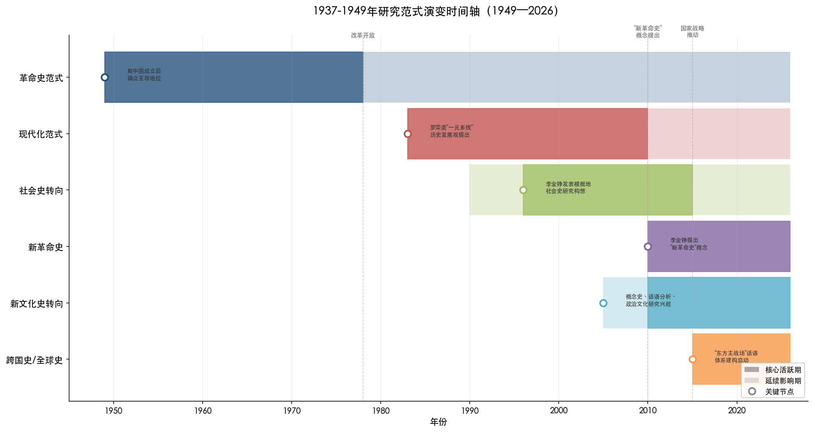

上图以甘特图形式直观呈现了革命史范式、现代化范式、社会史转向、新文化史转向、新革命史、跨国史/全球史六种研究范式自1949年至2026年的核心活跃期与延续影响期。各范式在时间维度上前后交叠、并行不悖，清晰地反映出1937-1949年研究视角从一元主导走向多元共存的基本演变轨迹。

理解这一范式演变轨迹，是把握1937-1949年研究学术史脉络的关键。不同研究视角的兴替，不仅改变了学者们所能"看到"的历史面相及其解释路径，更从根本上重塑了该时段研究的问题意识、分析框架与叙事方式。以下各节依次梳理主要范式的演变逻辑、核心主张及其在1937-1949年研究中的具体呈现，并在此基础上横向比较不同视角之间的张力与互补关系。

## 3.2 革命史范式：从"唯一范式"到自我更新

### 3.2.1 革命史范式的理论内核与解释框架

革命史范式是新中国成立后长期占据主导地位的近代史研究框架，其理论基础为马克思主义关于社会基本矛盾的学说。在这一框架下，"帝国主义与中华民族的矛盾，封建主义与人民大众的矛盾"被确认为中国近代社会的两大基本矛盾，"争取民族独立以反对帝国主义，争取社会进步以反对封建主义"构成近代社会发展的主要趋势[左玉河《中国近代史研究的范式之争与超越之路》](https://www.haijiaoshi.com/archives/5799 "《史学月刊》2014年第6期")。在此范式指导下，中国近代史被组织为以"两个过程、三次高潮、八大事件"为基本线索的叙事结构，范文澜、胡绳、刘大年等前辈学者的著作构成了这一范式的经典文本。

具体到1937-1949年研究，革命史范式将这十二年定位为新民主主义革命走向全面胜利的决定性时段：抗日战争被阐释为以中国共产党为中流砥柱的全民族反侵略斗争，解放战争则被叙述为新民主主义革命的最终胜利。高士华指出，在改革开放前的第一阶段，"抗日战争研究被置于中共党史或革命史框架内，研究的问题比较单一"[高士华《抗日战争研究在改革开放中不断发展》](http://jds.cass.cn/xscg/xslw/201811/t20181126_5253004.shtml "《人民日报》2018年11月26日第22版")。这一时期的研究以阶级分析为核心方法、以中共领导的敌后抗战为叙事重心，对国民政府的抗战角色及正面战场的军事贡献等议题缺乏充分的学术讨论空间。

### 3.2.2 革命史范式的局限与自我反思

值得注意的是，革命史范式的支持者并不回避自身的局限。有学者坦承，用这一范式撰写中国近代史，"可能对社会经济的发展、社会的变迁注意不足"，存在"研究对象的片面化，研究方法的单一化，研究思维的绝对化，研究理论的教条化"等缺陷[左玉河《中国近代史研究的范式之争与超越之路》](https://www.haijiaoshi.com/archives/5799 "《史学月刊》2014年第6期")。步平亦提醒，以革命史范式阐述近代革命斗争的历史，"需要注意社会经济的发展和社会的变迁，要避免使我们的研究对象过于片面，研究方法过于单一，要防范研究思维绝对化和研究理论教条化的倾向"[步平《改革开放以来的中国近代史研究》](https://www.haijiaoshi.com/archives/5799 "转引自左玉河文，原载《光明日报》2009年1月13日")。

在1937-1949年研究中，革命史范式的局限表现尤为突出：抗战时期的社会生活、文化变迁、经济运行、普通民众的日常经验等面相长期被置于叙事边缘；国民政府的战时体制与施政得失缺乏客观评价的空间；沦陷区民众的复杂处境更鲜少进入学术视野。这些被遮蔽的历史面相，恰恰为此后范式转换提供了突破口与学术增长点。

## 3.3 现代化范式的兴起与范式之争

### 3.3.1 现代化范式的理论主张

改革开放后，中国社会由革命动员转向现代化建设，"时代精神"的深刻变迁为新史学视角的萌生提供了社会土壤。1980年代初期，从现代化角度重新评价历史事件和历史人物的研究趋向即已出现，后逐渐形成系统化的理论主张。罗荣渠提出的"一元多线历史发展观"构成这一范式的核心理论建构：以生产力的发展作为社会变革的根本动力，以从传统农业社会向现代工业社会的大转变作为世界历史进程的中心内容，强调"必须重新建立一个包括革命在内而不是排斥革命的新的综合分析框架"[左玉河《中国近代史研究的范式之争与超越之路》](https://www.haijiaoshi.com/archives/5799 "《史学月刊》2014年第6期")。

在这一新框架下，1937-1949年研究的视野得到显著拓展。抗日战争不再仅被视为反帝反封建革命斗争的组成部分，战时国统区的经济开发、工业内迁、教育西迁、社会动员机制等面相获得了正面审视的可能。荣维木注意到，学界已从以往以半殖民地半封建社会理论框架为指导的路径，转向从"战时状态下中国经济与反侵略密切相关的大背景下考察问题"，对国民政府的战时经济政策给予更为客观的评价[荣维木《近十年来抗日战争研究述评》](http://jxyyj.ruc.edu.cn/CN/abstract/abstract13825.shtml "《教学与研究》2005年第8期，第64-70页")。解放战争研究亦从单一的政权更迭叙事，向更为丰富的社会经济转型分析方向延伸。

### 3.3.2 两种范式的争鸣与走向

自20世纪90年代中期起，"革命史范式"与"现代化范式"之间的论辩反复展开。这场持续二十余年的学术争论涉及中国近代社会性质、历史发展主线、重大事件评价标准等根本性问题。徐秀丽将其评价为"近年来近代史学界少有的旗帜鲜明、针对性强、并具有建设性意义的学术争论之一"[徐秀丽《中国近代史研究中的"革命史范式"与"现代化范式"》](http://jds.cssn.cn/newzxdt/202101/t20210128_5305735.shtml "《中国社会科学院院报》2006年5月30日")。

围绕两种范式的关系，学界形成了三种代表性意见：取代说（以现代化范式替代革命史范式）、包容说（用一种范式包纳另一种）和并存说（倡导多元范式共存）。张海鹏主张"在'革命史范式'主导下，兼采'现代化范式'的视角"[左玉河《中国近代史研究的范式之争与超越之路》](https://www.haijiaoshi.com/archives/5799 "《史学月刊》2014年第6期")。现代化范式的倡导者则明确表示"不可能取代其他史学范式而定于一尊"。经过长期讨论，多数学者逐步倾向于"多元并存"的立场。徐秀丽明确提出："多元并存，相互争鸣，彼此宽容，是学术发展的必由之路"[徐秀丽《中国近代史研究中的"革命史范式"与"现代化范式"》](http://jds.cssn.cn/newzxdt/202101/t20210128_5305735.shtml "《中国社会科学院院报》2006年5月30日")。

这场范式之争对1937-1949年研究产生了深远影响，使得该时段研究从革命叙事的单一框架中解放出来，获得了多元审视的合法性。改革开放后"判断是非的标准，逐渐由以阶级意识为重转向以民族大义为重"[高士华《抗日战争研究在改革开放中不断发展》](http://jds.cass.cn/xscg/xslw/201811/t20181126_5253004.shtml "《人民日报》2018年11月26日第22版")这一根本性转变，正是范式竞争在具体研究领域的投射。正面战场的军事贡献、战时国共关系的复杂面相、国民政府的外交努力等议题，均因评价标准的转换而获得了充分展开的学术空间。

## 3.4 社会史转向：从精英到民众的视角下移

### 3.4.1 社会史的复兴与方法论意涵

在革命史范式与现代化范式的争论方兴未艾之际，一股源自中国社会史研究复兴的学术力量正在深刻改变1937-1949年研究的面貌。改革开放后中国社会史研究迅速复兴，一批学者主张将社会史理解为一种具有"总体史"特性的新范式，而非历史学的简单分支。赵世瑜明确指出："社会史根本不是历史学的一个分支，而是一种运用新方法、从新角度加以解释的新面孔史学"[左玉河《中国近代史研究的范式之争与超越之路》](https://www.haijiaoshi.com/archives/5799 "《史学月刊》2014年第6期，转引赵世瑜观点")。马敏进一步将以"新社会史"为标志的"总体史"视为"目前我们所能预见到新史学的根本范式"[左玉河《中国近代史研究的范式之争与超越之路》](https://www.haijiaoshi.com/archives/5799 "《史学月刊》2014年第6期")。

社会史转向对1937-1949年研究最为核心的贡献，在于实现了研究视角从"自上而下"向"自下而上"的根本转换。传统政治史和军事史叙事以国家、政党、领袖为叙事主体，社会史则将视线移向基层社会、普通民众和日常生活。李金铮早在1996年即在《抗日战争研究》上发表《抗日根据地社会史研究的构想》，提出应当系统研究根据地的社会构成、社会生活、社会关系、社会意识和社会问题[李金铮《拓展视野：抗日战争史研究从何处突破？》](http://mg.lsxy.ruc.edu.cn/bykw/b0ee505a15a9442bb55e43b1c996e325.htm "《抗日战争研究》2016年第2期，原文载《民国史研究》第1辑")。这一学术呼吁可视为社会史视角在抗战史研究中的早期"宣言"。

### 3.4.2 "自下而上"视角在1937-1949年研究中的实践

社会史转向在1937-1949年研究中结出了丰硕成果。在中共根据地研究方面，学者们从关注中央决策和政策文件转向深入基层社会的实际运作。吴敏超指出，近年来这一趋势体现为"研究者从对中央和各根据地文件政策的梳理、相关人物文集选集的分析和报刊杂志的报道入手，进而在省、市、县档案馆收集材料，真正熟悉事件发生地的各方力量和风俗民情"[吴敏超《中国共产党抗战史研究的趋势、特点与相关思考》](http://jds.cass.cn/xscg/xslw/202601/t20260130_5971445.shtml "《抗日战争研究》2025年第4期")。尤为值得关注的是，这种向下深入并未导致碎片化，研究者"深入下去后的许多微观实证研究并没有陷入碎片化，而是努力关照党史中的重要问题和整个历史脉络"[吴敏超《中国共产党抗战史研究的趋势、特点与相关思考》](http://jds.cass.cn/xscg/xslw/202601/t20260130_5971445.shtml "《抗日战争研究》2025年第4期")。

李金铮在2016年的长文中进一步系统列举了抗战史研究可以从想象与形象、话语与概念、心态史、生态史、日常生活、身体史、历史记忆、象征物、阅读史等多个维度展开的新课题，并指出"这些面相并非可有可无，如果不对它们进行考察，所谓抗战史的中心角色也就失去了赖以生长的舞台，悬于半空之中"[李金铮《拓展视野：抗日战争史研究从何处突破？》](http://mg.lsxy.ruc.edu.cn/bykw/b0ee505a15a9442bb55e43b1c996e325.htm "《抗日战争研究》2016年第2期")。这一论述揭示了"自上而下"与"自下而上"两种视角之间的深层互补关系：宏观的政治军事叙事需要微观的社会生活研究为其提供赖以生长的"舞台"，而微观的社会史研究亦需要宏观的历史脉络为其提供意义框架。

在解放战争研究中，"自下而上"视角的拓展同样引人注目。2024年的学术综述观察到，黄道炫借由蔡迈轮日记呈现中共初到新区遭遇的艰难处境及政策调适过程，从微观个体的生活经验透视宏大历史变革的底层逻辑[辛逸、岳伟、满永《二〇二四年中共党史研究的若干学术进展》](https://taiyuan.gov.cn/c/www/dsby/30285196.jhtml "《中共党史研究》2025年第5期")。南下干部动员、新区社会秩序重建等议题亦从基层社会的角度获得了新的理解维度。

## 3.5 新文化史转向：概念、话语与政治文化

### 3.5.1 新文化史方法的引入

20世纪70年代以来，西方学界出现的"语言学转向"和"文化转向"，催生了以"新文化史"为旗帜的史学新潮流。这一潮流消解宏大叙事、颠覆精英文化、重视文本与话语分析，自2000年代起逐步渗透到中国近代史研究之中。在1937-1949年研究领域，新文化史方法的引入为传统议题注入了全新的分析维度。

李金铮在论述抗战史研究的视野拓展时指出，新社会史、新文化史、新政治史是国际史学界非常有影响的流派，"其理论方法及研究成果，在传统视野的政治、经济、军事、外交史领域不太被关注，其实很值得中国史研究包括抗日战争史研究借鉴"[李金铮《拓展视野：抗日战争史研究从何处突破？》](http://jds.cssn.cn/newzxdt/202101/t20210128_5299664.shtml "近代史研究所网站转载")。他进一步概括了这几种新史学流派的共性：其一，突破领袖、精英视角，"将普通民众作为重要的研究对象之一，强调普通民众的主体性"；其二，开拓新的研究视点，"如话语、符号、象征、形象、想象、认同、身份、记忆、心态、时间、空间、仪式、生态、日常生活"等；其三，使用新的研究方法，"如表达与现实、政府与社会、道德与理性以及博弈论、认知冲突论、个人主体性等"[李金铮《拓展视野：抗日战争史研究从何处突破？》](http://jds.cssn.cn/newzxdt/202101/t20210128_5299664.shtml "近代史研究所网站转载")。

### 3.5.2 新文化史在1937-1949年研究中的实践

新文化史方法在1937-1949年研究中已产生了多方面的实践成果。在中共抗战史领域，吴敏超指出，文化史研究在传统的教育、宣传舆论、文艺活动研究之外，涌现出大量以"节日、话语、仪式、记忆等为视角"透视中共政治文化特征的成果[吴敏超《中国共产党抗战史研究的趋势、特点与相关思考》](http://jds.cass.cn/xscg/xslw/202601/t20260130_5971445.shtml "《抗日战争研究》2025年第4期")。2025年10月召开的"近代以来中国历史学知识体系暨三大体系建设青年学者论坛"上，梁馨蕾提出了从物质文化史视角研究抗战根据地的新路径[近代史研究所网站](http://jds.cass.cn/newzxdt/202510/t20251031_5922512.shtml "2025年10月31日")。

情感心灵史是新文化史方法在这一领域的前沿延伸。吴敏超指出，这一方向"基于对日记、书信、回忆录等私人史料的大量运用，反映了对战争与革命环境下人物命运、情感的关切"。黄道炫是这一方向的代表性学者，他运用大量日记研究"政治文化视野下的中国共产党心灵史"，旨在"探寻这一政治文化的源头和形成过程"，关切中共的"行动机制和政治文化"[吴敏超《中国共产党抗战史研究的趋势、特点与相关思考》](http://jds.cass.cn/xscg/xslw/202601/t20260130_5971445.shtml "《抗日战争研究》2025年第4期")。他认为，"技术性的了解和分析可以呈现历史的一些面相，却不一定能逼近"革命的内在精神世界[黄道炫《政治文化视野下的心灵史》](http://jds.cssn.cn/newzxdt/202101/t20210128_5297226.shtml "近代史研究所网站")。这种对革命内在精神世界的追问，正体现了新文化史方法从关注外部结构转向关注内在意义的根本取向。

李里峰则从"新政治史"角度推进了1937-1949年研究。他著有《革命政党与乡村社会——抗战时期中国共产党的组织形态研究》（江苏人民出版社，2011年），将政治学的组织理论、社会动员理论与历史学的实证方法相结合，考察抗战时期中共在乡村社会中的组织形态与运作机制[李里峰个人简介](https://public.nju.edu.cn/szdw/qzjs/azy/20210629/i203552.html "南京大学政府管理学院官网")。他提出的"新政治史"主张，"将关注焦点从全国政治转向州和地方政治、从政治制度转向政治行为、从政治家转向普通民众"[李里峰《"新政治史"与中国近代史研究》](https://public.nju.edu.cn/DFS//file/2025/03/16/20250316091023692mj14bc.pdf "南京大学政府管理学院发布")，实际上是新文化史与新社会史在政治史领域的具体投射。

概念史是新文化史方法的另一重要分支，近年来在1937-1949年研究中日益活跃。从"话语与概念"维度切入，学者们开始追问：抗战时期的国统区、中共抗日根据地中，中华、民族、国家、民众、自由、民主、革命、解放等核心概念是如何演变的？概念的演变与当时的政治社会关系如何互动？对国共两党所辖区域的民族认同和政治认同产生了哪些影响？这些问题的提出，标志着1937-1949年研究正在从"发生了什么"的事实层面，深入到"如何被理解和表述"的意义层面。

## 3.6 新革命史：对传统革命史范式的扬弃与超越

### 3.6.1 "新革命史"概念的提出

在社会史转向和新文化史转向持续推进的同时，学界出现了一种试图在新的理论和方法基础上重新激活革命史研究的努力——这就是李金铮所倡导的"新革命史"。2010年，李金铮在《中共党史研究》上发表《向"新革命史"转型：中共革命史研究方法的反思与突破》，正式提出这一概念。他针对传统革命史研究中的问题，主张"改变传统的党史观念，运用新的理论和方法进行研究，譬如国家与社会的理论和方法、革命史与大乡村史的连接等"[李金铮《拓展视野：抗日战争史研究从何处突破？》](http://jds.cssn.cn/newzxdt/202101/t20210128_5299664.shtml "近代史研究所网站转载")。

"新革命史"的核心理念在于：不否定革命的历史重要性，但要改变传统革命史范式以阶级斗争为唯一分析框架、以精英决策为唯一叙事主体的做法，转而运用社会史、文化史的理论和方法来重新理解革命过程中的社会变迁、基层互动和民众经验。在2016年发表的《再议"新革命史"的理意与方法》中，李金铮进一步阐明："新革命史"作为一种新的理念和方法，"已被不少中国革命史和党史学者所运用"。他指出，应将中共革命"不能仅仅理解为在中国发生的一场革命，还要将其作为世界民族革命的一员"[李翔《以全球史观深化中共抗战史研究》](https://www.dswxyjy.org.cn/n1/2026/0318/c427167-40684254.html "《中共党史研究》2025年第5期，转引李金铮观点")。

### 3.6.2 新革命史在1937-1949年研究中的展开

新革命史范式在抗战和解放战争研究中已产生实质性影响。2023年山东大学举办了"新革命史与中共抗战"学术工作坊，李金铮在主题发言中强调"不同根据地在不同时期的政策制定与调适，既是基于'常识常情常理'的人性基本面考量，亦是"新革命史"视角的重要关切[山东大学历史学院](https://www.history.sdu.edu.cn/info/1032/5650.htm "新革命史与中共抗战学术工作坊")。这种将革命政策与"常识常情常理"联系起来分析的方法，既不同于传统革命史范式对阶级斗争的单一强调，也不同于现代化范式对革命的轻描淡写，而是在承认革命重要性的前提下引入了"人性基本面"的考量维度。

吴敏超对中共抗战史研究特点的概括，也与新革命史的理念高度契合。她指出，根据地经济史研究"注重农业、盐业、金融、财政等方面的精深研究，观察相关政策在抗战时期不同阶段的变化及具体发展，探讨民间传统、经济运行规律发挥的特定作用，展现了革命与传统、主观努力与客观规律之间的张力与调适"[吴敏超《中国共产党抗战史研究的趋势、特点与相关思考》](http://jds.cass.cn/xscg/xslw/202601/t20260130_5971445.shtml "《抗日战争研究》2025年第4期")。"革命与传统""主观努力与客观规律"之间的"张力与调适"——这一表述精准地捕捉了新革命史的核心问题意识：革命不是在真空中展开的，而是与乡土社会的传统、民间经济的规律持续博弈和互动的过程。

与"新革命史"的理念相近但路径不同的，还有夏明方提出的"新革命史范式"。他站在后现代主义的反思立场上，主张将革命史范式与后现代主义结合起来，形成一种包含通变史观、全球史观、生态史观和多元史观的新范式框架[左玉河《中国近代史研究的范式之争与超越之路》](https://www.haijiaoshi.com/archives/5799 "《史学月刊》2014年第6期")。尽管夏明方的理论构想颇为宏大，但在实际研究中，这种融合了后现代元素的"新革命史范式"并未形成充分的实践成果，其理论构想的可操作性并未经过充分检验。

## 3.7 跨国史与全球史视角：将抗战纳入世界历史

### 3.7.1 从"国史"到"世界史"的视野扩展

跨国史和全球史是近年来影响1937-1949年研究的又一重要视角转换。这一转向的核心在于将中国的抗日战争从民族史的内部视野中解放出来，置于世界反法西斯战争和全球历史进程的整体框架中加以理解。高士华在《抗日战争研究》的卷首语中提出"大抗战史"研究的理念，强调"中国抗战不仅是'国史'的抗战，还是东亚乃至世界历史下的抗战"，呼吁从"更广阔的历史背景来探讨抗日战争"[李金铮《拓展视野：抗日战争史研究从何处突破？》](http://jds.cssn.cn/newzxdt/202101/t20210128_5299664.shtml "近代史研究所网站转载")。

李翔在2025年发表的专文中系统论证了以全球史观深化中共抗战史研究的必要性。他指出，长期以来中共抗战史研究"主要侧重中方史料与中国视角，与外国史料进行交叉验证的研究相对较少"，面对战局变动、军事交流、技术转移、国际思潮、生态环境、疾病医护等诸多具有全球意义的议题，"只有具备全球史观，才能深刻地论述与解读"。他认为，全球史观在中共抗战史研究领域已有三方面体现："一是史料来源越来越国际化与多元化；二是在研究具体史事时，能够与国外相关史事相联系；三是充分借鉴国际学界特别是史学研究的新趋势，积极拓展研究领域"[李翔《以全球史观深化中共抗战史研究》](https://www.dswxyjy.org.cn/n1/2026/0318/c427167-40684254.html "《中共党史研究》2025年第5期")。

### 3.7.2 东方主战场话语体系的建构

全球史视角在1937-1949年研究中最显著的体现，是"东方主战场"话语体系的学术建构。2025年出版的《新编第二次世界大战史》中、英文版，"在全面还原第二次世界大战历史面貌的基础上，深入阐释了东方主战场在世界反法西斯战争中的决定性作用"[《2025年历史学研究发展报告》](https://sscp.cssn.cn/byjh/202601/t20260121_5970292.shtml "中国社会科学杂志社，2026年1月21日")。胡德坤认为中国开辟了世界上最早、持续时间最长的反法西斯东方主战场；张生强调"承认、维护中国在第二次世界大战中的重要地位，弘扬中国人民抗日战争的价值，是坚持正确二战史观的基本点"[《2025年历史学研究发展报告》](https://sscp.cssn.cn/byjh/202601/t20260121_5970292.shtml "中国社会科学杂志社，2026年1月21日")。美国学者安德鲁·N.布坎南也认为"应该把1931—1949年发生在中国的战争重新纳入'全球二战'叙事"[《2025年历史学研究发展报告》](https://sscp.cssn.cn/byjh/202601/t20260121_5970292.shtml "中国社会科学杂志社，2026年1月21日")。郝平则从构建研究体系的高度指出，"关于第二次世界大战中国的东方主战场地位，一直是西方史学界无视或者刻意回避的重要学术问题"[郝平《构建东方主战场视域下的抗战史研究体系》](http://jds.cass.cn/xscg/xslw/202601/t20260130_5971440.shtml "近代史研究所网站，2026年1月30日")。

中共抗战的国际面向也在全球史视角下获得了新的展开。吴敏超指出，"西方国家如何看待中国共产党抗战和国共关系，中国共产党如何观察发生在其他国家的反法西斯侵略斗争"已成为中共抗战史研究的有机组成部分[吴敏超《中国共产党抗战史研究的趋势、特点与相关思考》](http://jds.cass.cn/xscg/xslw/202601/t20260130_5971445.shtml "《抗日战争研究》2025年第4期")。皖南事变善后处理中的国际因素、港九大队为盟国提供情报、中国共产党对阿比西尼亚抵抗意大利侵略的认识等研究成果，"都大大开阔了中国共产党抗战史研究的视野和思路"[吴敏超《中国共产党抗战史研究的趋势、特点与相关思考》](http://jds.cass.cn/xscg/xslw/202601/t20260130_5971445.shtml "《抗日战争研究》2025年第4期")。

### 3.7.3 跨国史视角的深层意义与挑战

跨国史和全球史视角对1937-1949年研究的意义，远不止于扩大史料来源或增加国际比较的维度。李翔敏锐地指出，采用全球史观"不意味着必须处处联系世界史"，"有时，只需具备世界史的意识和知识，添上寥寥数语作为点睛之笔，就能提升中共抗战史研究的眼界和格局"。他举例说明：考察持久战战略方针时注意其与德国军事理论的渊源；探究皖南事变善后问题时兼顾苏联、共产国际、美国和日本等国际因素；分析新民主主义、联合政府等理论的生成演变时注意毛泽东对苏、美、英政治思想的创造性转化——"如此可使读者既见树木又见森林"[李翔《以全球史观深化中共抗战史研究》](https://www.dswxyjy.org.cn/n1/2026/0318/c427167-40684254.html "《中共党史研究》2025年第5期")。

然而，这一视角在实践层面仍面临不小的挑战。李翔坦承，"尽管学界普遍认同应以宽广的世界视角，将中共抗战史置于人类社会和世界文明发展史的背景下进行理解，但在实际操作中，将全球史观与中共抗战史研究广泛结合起来颇具挑战性"，"现有的中共抗战史研究依旧多是单向度的、国内史的叙述"[李翔《以全球史观深化中共抗战史研究》](https://www.dswxyjy.org.cn/n1/2026/0318/c427167-40684254.html "《中共党史研究》2025年第5期")。这一局限既源于中国学者外语能力和海外档案利用条件的客观制约，也与中国近代史学界长期形成的"国别史"研究惯性有关。李金铮也承认，"从这一视角进行研究，所要求的知识结构较高，研究难度是很大的"[李翔《以全球史观深化中共抗战史研究》](https://www.dswxyjy.org.cn/n1/2026/0318/c427167-40684254.html "《中共党史研究》2025年第5期，转引李金铮观点")。

## 3.8 "自上而下"与"自下而上"的消长与贯通

综合以上各节的分析，我们可以清晰地把握1937-1949年研究中"自上而下"与"自下而上"两种取向的消长关系。这一消长并非简单的此消彼长，而是经历了从"自上而下"的单一主导、到"自下而上"的强势崛起、再到"上下贯通"的整合趋势三个阶段。

在第一阶段（1978年以前），研究基本由"自上而下"视角所支配。国家、政党、领袖构成叙事的绝对主体，基层社会和普通民众在很大程度上被视为政策的被动接受者和执行者。在第二阶段（1990年代至2010年代），社会史转向和新文化史转向带来了"自下而上"视角的强势崛起。大量研究将目光投向基层社会、日常生活、普通民众的生存经验和情感世界。这一时期的代表性成果包括李金铮对根据地社会史的倡导、黄道炫对中共心灵史的探索、吴敏超对普通百姓日记的整理与研究等。

在第三阶段（2015年至今），学界越来越意识到"自上而下"与"自下而上"并非对立的取向，而是需要有机贯通的互补视角。吴敏超关于中共抗战史研究趋势的总结——"整体性和系统性加强，超越就战役论战役、就政治事件论政治事件、就经济行为论经济行为等封闭取向"[吴敏超《中国共产党抗战史研究的趋势、特点与相关思考》](http://jds.cass.cn/xscg/xslw/202601/t20260130_5971445.shtml "《抗日战争研究》2025年第4期")——即是对这一整合趋势的精确概括。贯通性研究的兴起，要求研究者将抗战时期"放在中国共产党的整体历史中探讨，尤其要关注此前的苏区时期和后来的解放战争时期，作贯通性考察"[吴敏超《中国共产党抗战史研究的趋势、特点与相关思考》](http://jds.cass.cn/xscg/xslw/202601/t20260130_5971445.shtml "《抗日战争研究》2025年第4期")，这实际上要求同时兼顾宏观的历史脉络（"自上而下"的结构性分析）和微观的社会实践（"自下而上"的经验性考察）。

## 3.9 多元范式并存下的格局评析

### 3.9.1 当前视角分布的基本特征

经过四十余年的演变，1937-1949年研究已从单一范式主导走向多元范式并存。革命史视角经过自我更新并未退场，以唯物史观为指导的研究仍然构成学科的基础性框架；现代化视角扩大了研究的问题域和评价标准，使得战时社会的经济发展、制度建设等面相获得正面审视；社会史视角打开了基层社会和普通民众的研究空间，极大地丰富了"战争时期的全面历史"；新文化史视角引入了概念、话语、仪式、记忆、情感等分析维度，推动研究从"事实"层面深入到"意义"层面；新革命史则在承认革命重要性的前提下，引入社会史和文化史的方法来重新理解革命过程；全球史视角将中国抗战纳入世界历史的整体框架，为构建"东方主战场"话语体系提供了学理支撑。

### 3.9.2 范式竞争中的深层张力

在多元并存的表象之下，不同范式之间仍存在难以彻底解决的张力。

其一，宏大叙事与微观实证之间的张力。社会史和新文化史转向带来了大量精细的微观研究，但也引发了"碎片化"的批评。李金铮对此作了有力回应——"历史本来就是由碎片构成的，无碎片何来整体？"并强调"只要具备整体史意识，只要将之置于宏大的历史背景之中，只要遵循以小见大的方法，就可丰富和提高整体史的认识，再小的题目也不能说是碎片"[李金铮《拓展视野：抗日战争史研究从何处突破？》](http://jds.cssn.cn/newzxdt/202101/t20210128_5299664.shtml "近代史研究所网站转载")。李怀印则从另一个方向提出了"无目的论的宏大叙事"的构想，主张在"抛弃现有叙事特有的目的论"的前提下"重建一个能够说明过去几个世纪中国的经验及当代发展之间历史与逻辑联系的主叙事"[李怀印《重构近代中国——中国历史写作中的想象与真实》](https://www.haijiaoshi.com/archives/5799 "转引自左玉河文，中华书局2013年版")。

其二，本土视角与国际理论之间的张力。李金铮在论述新理论方法的引入时特别指出："对于国外的先进理论方法及成果，最终目的不在于了解、学习和汲取，而是之后的摆脱、超越和创新，反过来，再影响国际史学的前途"[李金铮《拓展视野：抗日战争史研究从何处突破？》](http://jds.cssn.cn/newzxdt/202101/t20210128_5299664.shtml "近代史研究所网站转载")。如何在借鉴西方新社会史、新文化史、新政治史方法的同时建立中国学者自己的话语体系，避免简单地以西方理论硬套中国史料，依然是当前研究面临的重要方法论挑战。

其三，学术自主性与意识形态导向之间的张力。1937-1949年研究因其涉及国共两党的合作与分工、政权更迭等高度敏感的议题，始终在学术研究和政治导向之间寻求平衡。不同范式之争的背后，往往也暗含着对中国近代史基本叙事的政治定位分歧。这一张力虽然随着学术环境的改善而有所缓解，但并未根本消除。

### 3.9.3 范式多元化的积极意义

尽管存在上述张力，范式多元化对1937-1949年研究的积极意义是显而易见的。正如李金铮所言，"几乎历史上产生的所有史学理论方法以及相关学科的理论方法，都有其解释力，它们之间应该是'各美其美，美美与共'，而不是互斥和替代的关系"[李金铮《拓展视野：抗日战争史研究从何处突破？》](http://jds.cssn.cn/newzxdt/202101/t20210128_5299664.shtml "近代史研究所网站转载")。

范式多元化带来的最重要成果，是极大地扩展了1937-1949年研究的"可见域"——从仅关注政治军事对抗，到能够看到战争中的社会、经济、文化、日常生活、个体情感和全球联动等多重面相。这一扩展使学界对"什么是完整的战争史"这一根本问题有了更为深刻的认知。如果说传统研究呈现的是"战争的历史"，那么当前多元范式并存下呈现的则是"战争时期的全面历史"——一个涵盖政治博弈、军事对抗、社会变迁、经济运行、文化再造、生态互动、情感世界和全球关联等多维面相的整体性图景。

# 第4章 研究方法与理论框架的横向比较

## 4.1 方法论演变的总体脉络

1937-1949年研究的方法论演进与中国近代史学科的整体方法论变迁密切相关，但因研究对象兼具战争史、革命史和社会转型史的复合特性而呈现自身的独特面相。从改革开放至今，该时段研究所运用的方法经历了从单一的文献考证与阶级分析，到多元方法并存、跨学科理论广泛引入、数字技术深度赋能的深刻转变。值得强调的是，这一转变并非线性替代，而是呈现出传统方法持续夯实、新兴方法逐层叠加的累积性格局。

该时段研究的方法论版图可从三个层面加以把握。其一，以史料考证和实证分析为核心的传统史学方法，始终构成研究的基本功底与底层支撑，无论范式如何更替，精密的史料考证功夫仍是评判研究质量的首要标尺。其二，口述史方法与计量史学方法作为拓展性工具，分别在社会史、暴行史以及战争损失评估等领域发挥了不可替代的补充作用。其三，社会科学跨学科方法和数字人文技术的引入，代表着近年来方法论创新的前沿方向。与此同时，国家-社会关系理论、社会动员理论、集体记忆理论、制度变迁理论等多种社会科学分析框架被不同程度地引入1937-1949年研究，丰富了该领域的分析工具箱。以下各节将逐一评析上述主要方法与理论框架的应用状况、效力差异及内在局限，并在此基础上展开横向比较。

## 4.2 传统史料考证与实证方法：根基与局限

### 4.2.1 实证方法的核心地位

史料考证与实证分析是中国历史学研究的根本方法，在1937-1949年研究中居于基础性和不可动摇的地位。无论研究范式如何更替、理论视角如何转换，对原始档案、文献、报刊、日记、函电等一手史料的搜集、辨析、考证和运用，始终构成该领域一切有价值研究的立足之本。

高士华在总结改革开放以来抗战研究的发展时指出，改革开放后"判断是非的标准，逐渐由以阶级意识为重转向以民族大义为重"[高士华《抗日战争研究在改革开放中不断发展》](http://jds.cass.cn/xscg/xslw/201811/t20181126_5253004.shtml "《人民日报》2018年11月26日第22版")。这一认识转变的实现，在方法论上恰恰依赖于学者们对更广泛、更多元史料的系统发掘与实证分析。正是通过大量新史料的发现和利用——国民政府军事档案、国民党军政要人回忆录和函电、战时各类统计报表等——学者们才得以超越此前的单一叙事框架，对正面战场和敌后战场做出更为客观、均衡的评价。

荣维木在综述中将抗战研究按主题分为日本侵华政策与罪行、战时中国政治、正面战场和敌后战场、战时社会经济、战时外交以及战争遗留问题六大板块[荣维木《近十年来抗日战争研究述评》](http://jxyyj.ruc.edu.cn/CN/abstract/abstract13825.shtml "《教学与研究》2005年第8期，第64-70页")，每一板块的学术推进均以扎实的史料考证为前提。近年来，中共抗战史研究者"从对中央和各根据地文件政策的梳理、相关人物文集选集的分析和报刊杂志的报道入手，进而在省、市、县档案馆收集材料，真正熟悉事件发生地的各方力量和风俗民情"[吴敏超《中国共产党抗战史研究的趋势、特点与相关思考》](http://jds.cass.cn/xscg/xslw/202601/t20260130_5971445.shtml "《抗日战争研究》2025年第4期")。这种从中央到地方、从文件到社情的实证路径的纵深推进，使根据地研究的史实基础日益坚实。

### 4.2.2 实证方法的内在局限

实证方法的重要性毋庸置疑，但其固有局限亦不容回避。传统实证史学擅长回答"发生了什么"的事实性问题，而在回答"为什么发生"的因果性问题和"如何被理解与感知"的意义性问题时，则需理论框架和跨学科方法加以辅助。李金铮在讨论抗战史研究的视野拓展时敏锐地指出，新社会史、新文化史、新政治史是国际史学界极具影响力的流派，"其理论方法及研究成果，在传统视野的政治、经济、军事、外交史领域不太被关注，其实很值得中国史研究包括抗日战争史研究借鉴"[李金铮《拓展视野：抗日战争史研究从何处突破？》](http://mg.lsxy.ruc.edu.cn/bykw/b0ee505a15a9442bb55e43b1c996e325.htm "《抗日战争研究》2016年第2期")。这一呼吁的方法论意涵在于：仅凭传统文献考证已不足以充分解释战争时期社会运作的复杂机制，有必要引入社会科学的概念工具和分析框架以提升研究的解释力。

此外，传统实证方法对史料类型的依赖也构成一种方法论约束。当研究对象从精英决策转向基层社会、从制度文本转向日常生活时，官方档案和正式文献的解释力往往捉襟见肘，口述资料、私人日记、民间文献等非传统史料的价值便凸显出来。这一史料类型的拓展本身即催生了新的方法论需求——口述史方法的引入便是其中最具代表性的例证。

## 4.3 口述史方法：从边缘走向主流

### 4.3.1 口述史在1937-1949年研究中的兴起

口述史方法在1937-1949年研究中的兴起，与该时段研究的社会史转向和"自下而上"视角的确立密切相关。当研究者将关注焦点从国家政策和精英决策转向基层民众的战时经历时，亲历者的口述证言便成为不可替代的史料来源。在抗日战争研究中，口述史方法主要应用于三大领域：日军暴行受害者证言的采集与整理、抗战老兵战斗经历与生活记忆的抢救性记录、根据地和沦陷区普通民众日常生活的还原。

2025年恰逢中国人民抗日战争暨世界反法西斯战争胜利80周年，抗战口述史成为该年度的重大学术主题。尽管面对"绝大部分抗战老兵已离世、在世者均已年事甚高的急迫局面"，学界和社会各界仍涌现出大量抗战记忆抢救成果[廖昕朔《2025年中国口述历史观察报告》](http://www.rmzxw.com.cn/c/2026-01-04/3843652.shtml "人民政协报，2026年1月4日")。在内容采集与基础研究层面，侵华日军第七三一部队罪证陈列馆远赴日本、美国、俄罗斯等国，调查80余位原侵华日军731部队队员，共采集423小时的证言影音，形成了日军细菌战罪行的闭合式证据链[廖昕朔《2025年中国口述历史观察报告》](http://www.rmzxw.com.cn/c/2026-01-04/3843652.shtml "人民政协报，2026年1月4日")。南京师范大学与南京民间抗日战争博物馆等历时十年推进的国家社科基金重大项目"抗日老战士口述史资料抢救整理"圆满结项，共访谈老兵1442位，素材时长达3293小时[廖昕朔《2025年中国口述历史观察报告》](http://www.rmzxw.com.cn/c/2026-01-04/3843652.shtml "人民政协报，2026年1月4日")。侵华日军南京大屠杀遇难同胞纪念馆与南京大学历史学院合作完成的《被改变的人生：南京大屠杀幸存者口述生活史》已被译为日文出版，成为第一部在日本公开发行的南京大屠杀幸存者口述史[廖昕朔《2025年中国口述历史观察报告》](http://www.rmzxw.com.cn/c/2026-01-04/3843652.shtml "人民政协报，2026年1月4日")。

此前，关爱抗战老兵公益基金的口述访谈项目已在全国30个省市地区对1600余位抗战老兵进行口述访谈，采集约40万分钟的视频素材，完成约600万字的文字整理[中国传媒大学口述历史研究中心](https://oral.cuc.edu.cn/2021/1022/c3769a187781/pagem.htm "第七届中国口述历史国际周")。如此规模的口述史料积累，为从普通士兵和民众视角理解抗战提供了无可替代的一手素材。

### 4.3.2 口述史方法的学术贡献与方法论挑战

口述史方法对1937-1949年研究的学术贡献集中体现在三个层面。第一，弥补文献档案的结构性空白——在妇女史、社会史、暴行史等传统档案覆盖不足的领域，口述证言为研究提供了关键的一手史料来源。第二，为研究者提供"自下而上"的独特观察视角，使宏观的政治军事叙事得以获得微观个体经验的支撑与校验。第三，将战争的"人"的面向——恐惧、坚忍、苦难、信念——纳入学术叙事之中，赋予战争史以人文温度和生命厚度。

然而，口述史方法在该领域的运用同样面临不容回避的方法论挑战。袁成毅在讨论抗战计量化问题时即指出，在一些细菌战受害地区的口述调查中，"由于缺乏细致的考订，据此做出的死亡总数的估计就往往难以令人信服"[袁成毅《抗日战争研究中的若干"计量化"问题》](http://jds.cssn.cn/xscg/xslw/201605/t20160506_5252776.shtml "近代史研究所网站")。他具体举例指出，云南保山县因日军细菌战死亡6万人的说法、山西五寨县城鼠疫死亡1500人的数据，在人口密度和历史情境的交叉验证下均存在明显疑问[袁成毅《抗日战争研究中的若干"计量化"问题》](http://jds.cssn.cn/xscg/xslw/201605/t20160506_5252776.shtml "近代史研究所网站")。这一批评提示研究者，口述资料必须与文献档案、实地调查等多元证据进行交叉验证，绝不能将其作为孤证使用。

此外，随着抗战亲历者群体的不断凋零，口述史料的抢救性采集日益紧迫。2025年的口述历史观察报告已经正面回应了这一严峻局面。从方法论角度审视，这不仅是一个史料抢救问题，更涉及口述史在记忆准确性、访谈规范性、资料整理与保存标准等方面的方法论规范建设。人工智能技术在口述史领域的应用亦已开始探索——云南艺术学院团队运用AI数字修复技术对老兵口述视频进行修复，中国传媒大学师生研发的"银发记忆工程"项目则通过适老化交互模式将老年人口语化、碎片化的叙事转化为个人生命史档案[廖昕朔《2025年中国口述历史观察报告》](http://www.rmzxw.com.cn/c/2026-01-04/3843652.shtml "人民政协报，2026年1月4日")——但技术赋能的边界与伦理规范仍在探索之中。

## 4.4 计量史学与统计分析：定性与定量的互补

### 4.4.1 计量方法的运用领域

计量史学是20世纪50年代以来在社会科学影响下发展起来的研究方法。在1937-1949年研究中，计量方法的运用虽不如经济史领域那样系统和成熟，但在若干核心议题上发挥了实质性的推动作用。袁成毅将抗日战争研究中计量化的核心领域归纳为三类：其一，国民党正面战场与中共敌后战场抗敌的不同战绩和贡献；其二，中国抗战对世界反法西斯战争胜利所作出的贡献；其三，日本侵华战争给中华民族造成的损失以及对中国现代化进程的延误[袁成毅《抗日战争研究中的若干"计量化"问题》](http://jds.cssn.cn/xscg/xslw/201605/t20160506_5252776.shtml "近代史研究所网站")。

在两个战场战绩的计量化研究中，计量方法的引入实质性地推动了学术认知的演进。早期抗战史研究在革命史框架下仅计算中共武装力量的抗日战绩，但自20世纪80年代起，学者们通过计量分析对国民党正面战场做出了正面评价。王振德通过统计指出，国民党军队在22次会战中承担了主要作战任务，主要战斗达1117次，抗击了侵华日军50%以上的兵力[袁成毅《抗日战争研究中的若干"计量化"问题》](http://jds.cssn.cn/xscg/xslw/201605/t20160506_5252776.shtml "近代史研究所网站，引王振德《中国抗日战场与第二次世界大战》，《世界历史》1984年第5期")。张廷贵则通过比较两个战场的歼敌总数，指出日军在侵华八年中死伤官兵133万余人，中共军队歼灭日军52万多人（占40%），国民党军队歼灭日军80万（占60%），但按军队人数比例计算，中共军队的歼敌效率远高于国民党军队[袁成毅《抗日战争研究中的若干"计量化"问题》](http://jds.cssn.cn/xscg/xslw/201605/t20160506_5252776.shtml "近代史研究所网站")。袁成毅对这一学术演变给予高度评价："关于两个战场的战绩问题，从最早的只计中共领导的武装力量的抗日战绩，到兼计敌后和正面两个战场的战绩，进而将正面和敌后两个战场的战绩合成一个中国抗战的整体，这不能不说是一个巨大的进步"[袁成毅《抗日战争研究中的若干"计量化"问题》](http://jds.cssn.cn/xscg/xslw/201605/t20160506_5252776.shtml "近代史研究所网站")。

在战时人口伤亡的计量研究中，各家估算差异极为悬殊。国民政府战后统计的中国军民伤亡总数为1278万人，而此后中国学者的估算经历了从2000万到3500万、再到5000万的扩展区间。袁成毅以战后国民政府统计为基础并增补其他数据来源，得出中国战时最低限度的伤亡人数为2228万余人；米红利用人口学方法估算出抗战时期中国大陆人口非正常死亡人数超过3000万；卞修跃以各省战后调查为基础，采用地理相连、战情相类的参照估算法，得出中国战时人口损失最低限度为4500万人[袁成毅《抗日战争研究中的若干"计量化"问题》](http://jds.cssn.cn/xscg/xslw/201605/t20160506_5252776.shtml "近代史研究所网站")。这一巨大差异本身即折射出计量方法在战争损失统计领域面临的深层困难。

### 4.4.2 计量方法的问题与反思

计量方法在抗战研究中取得了显著成效，但也暴露出若干值得警惕的问题。袁成毅从四个维度进行了系统反思。

第一，史料选择的主观性。抗日战争时期各交战方出于宣传和鼓舞士气的需要，"总是尽可能地夸大自己的战绩"，若将战争期间国共双方战报中所列战绩简单相加，"会得出非常惊人的日军伤亡数，与日军的实际伤亡会存在很大的距离"[袁成毅《抗日战争研究中的若干"计量化"问题》](http://jds.cssn.cn/xscg/xslw/201605/t20160506_5252776.shtml "近代史研究所网站")。

第二，概念界定的模糊性。"敌"与"伪"、"伤"与"亡"等概念经常被笼统并提而缺乏严格界定，导致计量结果的科学性受损。在南京大屠杀遇难人数的研究中，"南京城区与南京周边"的地理范围界定、"平民"概念的边界等问题，同样直接影响着计量结论的准确性[袁成毅《抗日战争研究中的若干"计量化"问题》](http://jds.cssn.cn/xscg/xslw/201605/t20160506_5252776.shtml "近代史研究所网站")。

第三，定性与定量的辩证关系。袁成毅特别提醒："没有计量的分析作为基础，有时候定性的判断就缺乏依据；但是也只有通过定性的分析，计量化的研究才会被赋予意义"[袁成毅《抗日战争研究中的若干"计量化"问题》](http://jds.cssn.cn/xscg/xslw/201605/t20160506_5252776.shtml "近代史研究所网站")。计量方法不能代替一切分析维度，更不应沦为"数字教条"。

第四，情绪化的干扰。中国各类抗日战争损失数"似有不断扩大的趋势"，科学性不强的计量"只会产生副面的影响"。孙宅巍针对南京大屠杀的计量研究明确提出，应避免陷入"永远不变的数字，更加精确的数字和更多的数字"三个误区，强调"只要承认日本侵略者对中国人进行了疯狂的屠杀这个历史事实，就可以对南京的中国死者数量这样的敏感问题进行讨论"[袁成毅《抗日战争研究中的若干"计量化"问题》](http://jds.cssn.cn/xscg/xslw/201605/t20160506_5252776.shtml "近代史研究所网站，引孙宅巍观点")。

总体而言，计量方法在1937-1949年研究中的应用仍局限于特定领域，远不及西方经济史和社会史研究中计量方法的系统化程度。与口述史方法的蓬勃发展相比，计量史学在该领域尚有可观的拓展空间，尤其是在战时经济运行的定量分析、根据地社会变革的统计考察等方面。

## 4.5 社会科学跨学科方法与理论框架的引入

### 4.5.1 国家-社会关系理论的运用

国家-社会关系理论是近年来1937-1949年研究中运用最为广泛的社会科学分析框架之一。该理论源于西方政治社会学，聚焦国家权力向基层社会渗透的过程与机制，以及社会力量对国家建构的回应与塑造。在1937-1949年研究中，这一框架被广泛运用于中共根据地政权建设、战时社会动员、基层治理等议题的分析。

李金铮在提出"新革命史"概念时明确主张"运用新的理论和方法进行研究，譬如国家与社会的理论和方法、革命史与大乡村史的连接等"[李金铮《拓展视野：抗日战争史研究从何处突破？》](http://jds.cssn.cn/newzxdt/202101/t20210128_5299664.shtml "近代史研究所网站转载")。李里峰的《革命政党与乡村社会——抗战时期中国共产党的组织形态研究》（江苏人民出版社，2011年）是这一理论框架运用的代表性成果，该书将政治学的组织理论、社会动员理论与历史学的实证方法相结合，考察抗战时期中共在乡村社会中的组织形态与运作机制[李里峰个人简介](https://public.nju.edu.cn/szdw/qzjs/azy/20210629/i203552.html "南京大学政府管理学院官网")。

在实际研究中，国家-社会关系理论为理解中共如何在战时从一个政治组织转变为深入乡村社会毛细血管的治理体系提供了有力的分析工具。吴敏超观察到，近年来中共抗战史研究呈现"整体性和系统性加强"的趋势，研究者"超越就战役论战役、就政治事件论政治事件、就经济行为论经济行为等封闭取向"[吴敏超《中国共产党抗战史研究的趋势、特点与相关思考》](http://jds.cass.cn/xscg/xslw/202601/t20260130_5971445.shtml "《抗日战争研究》2025年第4期")。这种整体性研究取向在方法论上正得益于国家-社会关系等跨学科理论框架的引入——研究者由此得以将政策制定、基层执行与社会回应视为一个互动整体加以系统分析。

### 4.5.2 社会动员理论与战争社会学

社会动员理论是另一个在1937-1949年研究中得到广泛运用的跨学科框架。战争时期的社会动员——兵员动员、经济动员、思想动员——构成1937-1949年历史的核心面向之一。传统军事史和政治史研究往往将动员视为自上而下的政策执行过程，而引入社会动员理论之后，研究者开始系统关注动员过程中国家与社会之间的博弈、协商和相互适应。

2024年的学术综述观察到，解放战争研究中"南下干部动员""新区社会秩序重建"等议题的深入展开[辛逸、岳伟、满永《二〇二四年中共党史研究的若干学术进展》](https://taiyuan.gov.cn/c/www/dsby/30285196.jhtml "《中共党史研究》2025年第5期")，即是动员理论与具体历史情境结合的产物。黄道炫借由蔡迈轮日记呈现中共初到新区遭遇的艰难处境及政策调适过程[辛逸、岳伟、满永《二〇二四年中共党史研究的若干学术进展》](https://taiyuan.gov.cn/c/www/dsby/30285196.jhtml "《中共党史研究》2025年第5期")，其分析路径实质上融合了社会动员理论与日常生活史方法：一方面关注中共作为政治组织如何在新区建立权威、推展社会动员，另一方面通过个体日记的微观视角揭示这一过程的复杂性与曲折性。

吴敏超对根据地经济史研究特点的概括，同样体现了社会科学理论视角的深度介入。她指出，根据地经济史研究"注重农业、盐业、金融、财政等方面的精深研究，观察相关政策在抗战时期不同阶段的变化及具体发展，探讨民间传统、经济运行规律发挥的特定作用，展现了革命与传统、主观努力与客观规律之间的张力与调适"[吴敏超《中国共产党抗战史研究的趋势、特点与相关思考》](http://jds.cass.cn/xscg/xslw/202601/t20260130_5971445.shtml "《抗日战争研究》2025年第4期")。"革命与传统""主观努力与客观规律"之间的"张力与调适"——这一分析框架本身即是社会科学理论思维方式在历史研究中的投射。

### 4.5.3 集体记忆理论与历史记忆研究

集体记忆理论是近年来在1937-1949年研究中快速兴起的理论框架。法国社会学家莫里斯·哈布瓦赫提出的"集体记忆"概念，强调记忆并非纯粹的个人心理活动，而是在社会框架中被建构和维系的过程。这一理念被引入抗战研究后，催生了一个方兴未艾的新领域——抗战记忆史。

从国家社科基金项目的立项趋势来看，2015-2024年间涉及抗战记忆研究的课题数量显著增加。学者们运用集体记忆理论考察抗战纪念活动、纪念空间、历史教科书叙事、影视文学作品中的抗战再现等议题，深入分析集体记忆的建构机制及其与国家认同、民族认同的关系。在中共抗战史研究中，吴敏超注意到大量以"节日、话语、仪式、记忆等为视角"透视中共政治文化特征的成果不断涌现[吴敏超《中国共产党抗战史研究的趋势、特点与相关思考》](http://jds.cass.cn/xscg/xslw/202601/t20260130_5971445.shtml "《抗日战争研究》2025年第4期")。

南京大屠杀研究是集体记忆理论应用最为集中的子领域。侵华日军南京大屠杀遇难同胞纪念馆与南京大学合作的幸存者口述生活史项目，运用媒介记忆理论、创伤记忆理论和框架理论，考察各国媒体有关南京大屠杀的报道，分析不同国家集体记忆的差异及其背后的政治文化因素。这些研究已超越传统的"事实考证"层面，深入到"记忆如何被建构、传播和争夺"的理论纵深。

李金铮在讨论抗战史的新课题时亦涉及历史记忆维度：国共两党"如何将中华民族历史、民族英雄史等经过加工运用于抗日战争的宣传和动员之中"？"新的民族集体记忆对抗战产生了什么影响"？[李金铮《拓展视野：抗日战争史研究从何处突破？》](http://mg.lsxy.ruc.edu.cn/bykw/b0ee505a15a9442bb55e43b1c996e325.htm "《抗日战争研究》2016年第2期")这些问题的提出，表明集体记忆理论正在与战时社会动员、政治文化等议题发生交叉融合，形成新的学术增长点。

### 4.5.4 情感心灵史与其他新兴理论方法

除上述三种主要理论框架外，近年来还有若干跨学科理论方法被引入1937-1949年研究，其中情感心灵史方法尤为引人注目。

情感心灵史方法是新文化史理论的前沿延伸。吴敏超指出，这一研究方向"基于对日记、书信、回忆录等私人史料的大量运用，反映了对战争与革命环境下人物命运、情感的关切"[吴敏超《中国共产党抗战史研究的趋势、特点与相关思考》](http://jds.cass.cn/xscg/xslw/202601/t20260130_5971445.shtml "《抗日战争研究》2025年第4期")。黄道炫是这一方向的代表性学者，他运用大量日记研究"政治文化视野下的中国共产党心灵史"，旨在"探寻这一政治文化的源头和形成过程"，并明确指出"技术性的了解和分析可以呈现历史的一些面相，却不一定能逼近"革命的内在精神世界[黄道炫《政治文化视野下的心灵史》](http://jds.cssn.cn/newzxdt/202101/t20210128_5297226.shtml "近代史研究所网站")。这种对历史行动者内在精神世界的追问，在方法论上超越了传统的制度分析和利益分析，开辟了理解革命过程的新维度。

日本侵华罪证研究领域亦在引入新的理论视角。环境史视角关注侵华战争对中国生态环境造成的系统性破坏[中国共产党新闻网](https://www.12371.cn/2025/09/01/ARTI1756715971145826.shtml "2025年9月1日")，科学技术史视角则分析战时日本科技如何被军国主义绑架而背离医学伦理。这些跨学科视角虽尚属起步阶段，但已为传统暴行史研究提供了全新的分析维度。

### 4.5.5 跨学科理论运用的总体评价

横向比较上述各种社会科学理论在1937-1949年研究中的应用状况，可以识别出三个显著特征。

第一，理论运用的"工具化"倾向较为突出。多数研究者引入社会科学理论时，主要将其作为分析框架或解释工具来使用，而较少参与理论本身的修正与创新。李金铮对此有清醒认识，他强调："对于国外的先进理论方法及成果，最终目的不在于了解、学习和汲取，而是之后的摆脱、超越和创新，反过来，再影响国际史学的前途"[李金铮《拓展视野：抗日战争史研究从何处突破？》](http://jds.cssn.cn/newzxdt/202101/t20210128_5299664.shtml "近代史研究所网站转载")。如何基于中国历史经验来修正、丰富和发展社会科学理论，而非简单地以现成理论硬套中国史料，仍是一个迫切需要突破的重要方法论课题。

第二，不同理论框架在回答不同类型问题时表现出显著的效力差异。国家-社会关系理论和社会动员理论在分析根据地政权建设、战时社会动员等制度性和结构性问题时解释力较强；集体记忆理论在分析战后纪念、历史叙事建构等文化性和意义性问题时效力突出；情感心灵史方法则在探究个体行动者的内在动机和精神世界时具有独特优势。研究者需要根据具体问题选择最适切的理论工具，避免"一把钥匙开所有锁"的方法论简单化倾向。

第三，跨学科理论的引入整体上呈现从政治学、社会学理论向文化研究、人类学理论扩展的趋势，这与第3章所论述的研究视角从政治史向社会史、文化史转向的大势是一致的。

## 4.6 数字人文方法：技术赋能与方法革新

### 4.6.1 抗战文献数据平台：大数据基础设施建设

数字人文方法在1937-1949年研究中的应用起步较晚，但发展势头强劲。其中最具标志性的成就当属"抗日战争与近代中日关系文献数据平台"（以下简称"抗战文献平台"）的建设与运行。该平台是国家社科基金抗日战争研究专项工程的重要组成部分，由中国社会科学院近代史研究所主持建设，国家图书馆、国家档案局协同参与，坚持"公益开放、免费服务"的运营理念[罗敏、姜涛《数字人文与跨越国界的史料共享》](http://www.nopss.gov.cn/n1/2019/0620/c373410-31170697.html "全国哲学社会科学工作办公室，2019年6月20日")。

截至2024年底，抗战文献平台总文献数达7400万余页，成为"亚洲最大的中国抗日战争史数据库"[吴敏超《近十年中国抗战史研究的蓬勃发展》](http://hprc.cssn.cn/gsyj/zhutiyj/kz80/202506/t20250619_5880073.html "《中国社会科学报》2025年6月19日")。平台收录1949年以前各类数字化近代文献，涵盖档案、图书、期刊、报纸、照片、音视频等多种载体形式，面向海内外用户永久公益开放[罗敏、姜涛《数字人文与跨越国界的史料共享》](http://www.nopss.gov.cn/n1/2019/0620/c373410-31170697.html "全国哲学社会科学工作办公室，2019年6月20日")。

抗战文献平台对研究方法的革新意义体现在两个层面。在基础层面，它极大降低了史料获取的时间和经济成本。罗敏和姜涛指出，平台建成之前，海外学者研究中国抗战史"可能需要耗费精力申请高额资助才能远涉重洋到中国查阅资料"，而平台的开放共享使这一障碍基本消除[罗敏、姜涛《数字人文与跨越国界的史料共享》](http://www.nopss.gov.cn/n1/2019/0620/c373410-31170697.html "全国哲学社会科学工作办公室，2019年6月20日")。在进阶层面，平台为数据驱动的研究方法提供了基础设施支撑——当海量文献以数字化形式集中呈现时，文本挖掘、关键词频率分析、主题聚类等数字人文方法便具备了实际操作的条件。

### 4.6.2 GIS、文本挖掘与数据可视化

在数字人文的具体方法工具层面，地理信息系统（GIS）、文本挖掘和数据可视化在1937-1949年研究中均已初步应用。有学者系统梳理了数字化存储、数据库建设、文本挖掘、关联数据、文本可视化、GIS与虚拟现实等数字人文技术开发抗战档案资源的策略与路径[《数字人文视域下抗战档案资源的开发策略与路径研究》](https://www.dhcn.cn/information_technology/archives_and_museums/8543.html "数字人文网")。GIS技术在历史学中的应用，主要体现为对战争中的空间因素——军事行动路线、根据地空间分布、人口迁移轨迹、战略物资运输网络等——进行可视化分析和空间建模。近年来，已有研究者基于多层网络与GIS方法对西北解放战争主要战役的历史文献进行知识发现[《数字人文视域下基于多层网络+GIS的历史文献知识发现研究》](http://dianda.cqvip.com/Qikan/Article/Detail?id=7202563066&from=Qikan_Search_Index "重庆维普期刊数据库")，展示了数字人文方法在解放战争军事史研究中的应用潜力。

汪海涛对《抗日战争研究》创刊30年所刊论文的主题分析，则是数字人文方法在学术史研究中的一个具体运用案例。他使用定量分析方法对该刊30年发表的论文进行主题统计和趋势分析，揭示了研究热点的演变轨迹和学术共同体的结构特征[汪海涛《〈抗日战争研究〉30年论文主题探密》](http://jds.cass.cn/xscg/ybwz/202302/t20230209_5587050.shtml "近代史研究所网站")。

### 4.6.3 数字人文的发展瓶颈与前景

尽管前景广阔，数字人文方法在1937-1949年研究中的应用仍处于早期阶段，面临若干结构性瓶颈。罗敏和姜涛坦承，相较于北美数字人文已形成的成熟产业链，"国内人文学科的数据库建设仍有不少差距"，突出表现在"规模性数据的标引与运算上需要重点突破"——数据的结构化处理是数字人文产品走向精尖的必经之路，但前期投入巨大，投入与产出之间存在明显延迟[罗敏、姜涛《数字人文与跨越国界的史料共享》](http://www.nopss.gov.cn/n1/2019/0620/c373410-31170697.html "全国哲学社会科学工作办公室，2019年6月20日")。此外，"学术顾问团队与技术团队的深度合作模式需要切实加强"，唯有在深度合作情境下，"数据库才能兼顾学术前沿价值与技术革新能力，做到学术资源与技术呈现的无缝接轨"[罗敏、姜涛《数字人文与跨越国界的史料共享》](http://www.nopss.gov.cn/n1/2019/0620/c373410-31170697.html "全国哲学社会科学工作办公室，2019年6月20日")。

我们认为，数字人文方法对1937-1949年研究的真正革新性价值，不在于简单地将纸质文献转化为数字文献——这仅提高了效率——而在于借助计算方法发现人力阅读无法识别的模式和关联。战时报刊话语的主题演变轨迹、区域间政策传播的网络结构、人员流动的时空分布规律等问题，均有望通过计算方法获得突破。实现这一目标，既需要历史学者与信息技术专家的深度合作，更需要在方法论层面厘清数字方法与传统史学方法之间互补而非替代的关系。

## 4.7 史料基础的拓展：方法革新的物质前提

研究方法的革新不能脱离史料基础的拓展而独立发生。近十年来，1937-1949年研究的史料基础经历了前所未有的大规模扩展，这一扩展构成了方法论变革的物质前提。下图以时间轴形式呈现了1980年代以来史料基础拓展的关键节点与标志性事件。

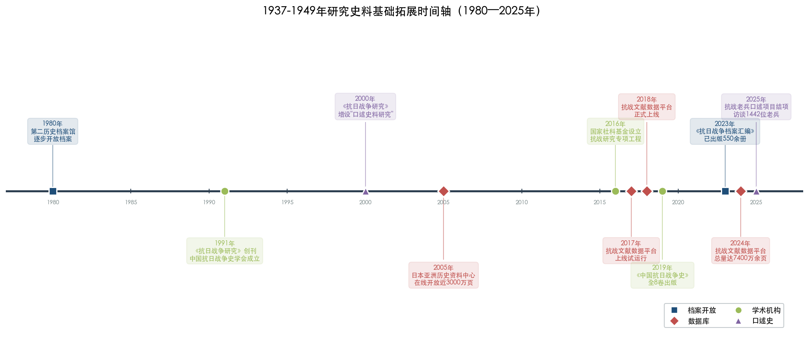

### 4.7.1 档案开放与系统整理

在国内档案整理方面，国家档案局组织推出的《抗日战争档案汇编》计划出版1000册，截至2023年底已出版550余册[吴敏超《近十年中国抗战史研究的蓬勃发展》](http://hprc.cssn.cn/gsyj/zhutiyj/kz80/202506/t20250619_5880073.html "《中国社会科学报》2025年6月19日")。中国第二历史档案馆（以下简称"二史馆"）作为主要收藏民国档案的国家级档案馆，在抗战史料的整理出版方面发挥了基础性作用。二史馆整理出版的抗战史料包括《抗战军粮档案选编》（20册）、《抗战兵役档案选编》等专题档案集[吴敏超《近十年中国抗战史研究的蓬勃发展》](https://www.cssn.cn/lsx/lsx_ttxw/202506/t20250619_5880020.shtml "中国社会科学网，2025年6月19日")。二史馆自1984年宣布向台湾学者开放以来，已形成服务海峡两岸学者的制度化安排，40年来共编辑出版各类档案史料140余种，其馆刊《民国档案》被连续评为中文核心期刊[国家档案局官网](https://www.saac.gov.cn/daj/yaow/201608/254eaee9f46b4376823a81da55fc85ef.shtml "2016年8月")。

2016年国家社科基金设立抗日战争研究专项工程以来，一批大型系列史料整理项目相继推进。2025年出版的"中国共产党领导的敌后抗战"系列丛书历时近十年编纂，出版23种28册[吴敏超《中国共产党抗战史研究的趋势、特点与相关思考》](http://jds.cass.cn/xscg/xslw/202601/t20260130_5971445.shtml "《抗日战争研究》2025年第4期")。与此同时，省、市、县各级档案馆的抗战和民国档案也在逐步向研究者开放。吴敏超注意到，研究者从中央和各根据地文件出发，"进而在省、市、县档案馆收集材料，真正熟悉事件发生地的各方力量和风俗民情"[吴敏超《中国共产党抗战史研究的趋势、特点与相关思考》](http://jds.cass.cn/xscg/xslw/202601/t20260130_5971445.shtml "《抗日战争研究》2025年第4期")。这种从中央到地方逐级深入的史料搜集路径，使实证研究得以突破此前依赖中央级档案和公开出版物的局限，真正深入到区域和基层的历史肌理之中。

### 4.7.2 多国档案的交叉利用

外国档案的系统利用是近年来1937-1949年研究的又一重要方法论进展。李翔在论述全球史观与中共抗战史研究时指出，全球史观在该领域的体现之一是"史料来源越来越国际化与多元化"[李翔《以全球史观深化中共抗战史研究》](https://www.dswxyjy.org.cn/n1/2026/0318/c427167-40684254.html "《中共党史研究》2025年第5期")。日方档案、美英等国解密档案、苏联/俄罗斯档案的利用，为抗战研究提供了中方档案所不具备的对照视角和交叉验证手段。

《光明日报》2018年的专题报道指出，国际抗日档案和各种资料"不仅补充了中国方面的抗日资料，也弥补了'在中国发现历史'范式的不足，体现了历史唯物主义对历史研究全面性、客观性的要求"[《国际档案中的中国抗战史》](https://epaper.gmw.cn/gmrb/html/2018-09/20/nw.D110000gmrb_20180920_3-15.htm "《光明日报》2018年9月20日")。然而，李翔亦坦承，长期以来中共抗战史研究"主要侧重中方史料与中国视角，与外国史料进行交叉验证的研究相对较少"[李翔《以全球史观深化中共抗战史研究》](https://www.dswxyjy.org.cn/n1/2026/0318/c427167-40684254.html "《中共党史研究》2025年第5期")。外语能力和海外档案利用条件的客观制约，仍是限制多国档案交叉利用的主要因素。

### 4.7.3 民间文献与私人史料的发掘

除官方档案外，民间文献和私人史料的大规模发掘是近年来史料基础拓展的又一重要方面。日记、家书、契约文书、民间账簿、地方族谱等非官方文献的发掘和利用，为社会史和日常生活史研究提供了不可替代的史料支撑。

黄道炫运用大量日记研究中共心灵史，借由蔡迈轮日记呈现中共初到新区遭遇的艰难处境[辛逸、岳伟、满永《二〇二四年中共党史研究的若干学术进展》](https://taiyuan.gov.cn/c/www/dsby/30285196.jhtml "《中共党史研究》2025年第5期")；张建军的《被改变的人生：南京大屠杀幸存者口述生活史》运用生活史方法重建大屠杀幸存者的战后生命历程[中国历史研究院](http://hrczh.cass.cn/sxqy/zl/202502/t20250228_5851529.shtml "2025年2月28日")。这些研究的共同特征在于以私人史料为核心素材，运用微观分析方法，从个体经验出发透视宏观历史变革。

吴敏超将这一趋势概括为情感心灵史方向的兴起，认为它"基于对日记、书信、回忆录等私人史料的大量运用，反映了对战争与革命环境下人物命运、情感的关切"[吴敏超《中国共产党抗战史研究的趋势、特点与相关思考》](http://jds.cass.cn/xscg/xslw/202601/t20260130_5971445.shtml "《抗日战争研究》2025年第4期")。私人史料的系统性发掘与利用，在方法论上打破了传统研究对官方文献的单一依赖，使研究者得以触及战争时期个体生命的内在面向。

综合来看，档案开放、史料类型多元化、研究方法创新与研究问题拓展之间存在着层层递进、循环互促的逻辑关系。下图展示了这一从史料基础到方法革新的逻辑递进结构。

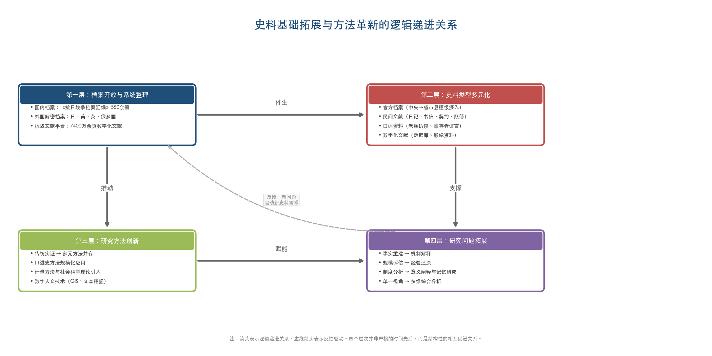

## 4.8 不同方法与理论的横向比较

综合以上各节的分析，可从多个维度对1937-1949年研究中的主要方法与理论框架进行系统的横向比较。下表从核心功能定位、适用问题类型、代表性应用领域、发展成熟度和主要局限性五个维度，对五类主要方法进行了对比。

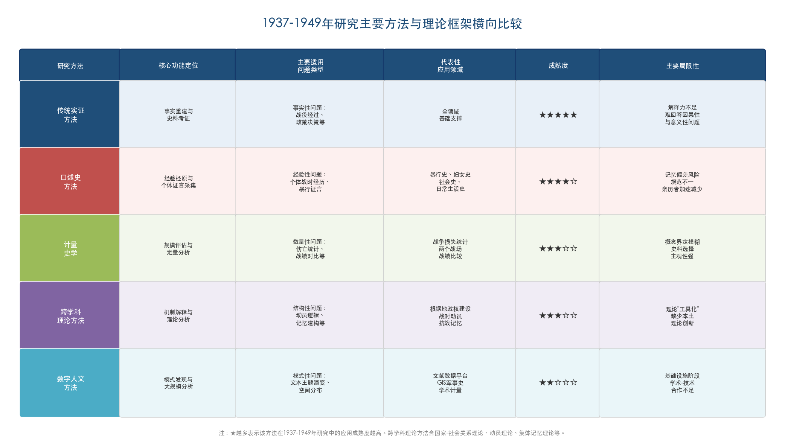

**从问题适配性看**，不同方法和理论在回答不同类型的历史问题时表现出显著的效力差异。传统实证方法在"事实重建"类问题上具有不可替代的优势——厘清一场战役的经过、考证一份档案的真伪、追溯一项政策的决策过程，仍然依赖扎实的史料考证功夫。计量方法在"规模评估"类问题上效力显著——战争损失、兵力对比、经济指标等涉及数量级判断的议题，必须借助统计分析才能获得可信结论。口述史方法在"经验还原"类问题上具有独特价值——普通士兵和民众的战时经历、暴行受害者的身心创伤、基层社会的日常运作，往往唯有通过亲历者的口述方能获取。社会科学理论在"机制解释"类问题上提供了有力的分析工具——战时社会动员的运作逻辑、国家权力向基层渗透的过程、集体记忆的建构机制等，均需理论框架来组织和解释经验材料。数字人文方法则在"模式发现"类问题上展现出巨大潜力——大规模文本的主题演变、人物和机构关系网络的结构特征、地理空间中的历史过程等，有望借助计算方法实现突破。

**从发展成熟度看**，各种方法在该领域的应用程度参差不齐。传统实证方法最为成熟，已形成完整的操作规范和评价标准。口述史方法发展迅速但规范化程度不一，尤其在口述资料与文献资料的交叉验证方面缺乏统一的方法论标准。计量方法在特定领域（如战争损失统计）有较多积累，但在更广泛的社会经济史领域的应用仍不充分。社会科学理论的引入总体上呈"工具化"特征，即主要作为分析框架来运用，较少参与理论本身的修正与建构。数字人文方法尚处于基础设施建设和初步探索阶段，距离产出实质性的学术创新成果还有相当距离。

**从互补关系看**，最有价值的研究成果往往是多种方法综合运用的产物。吴敏超所概括的近年来中共抗战史研究的整体性趋势——"超越就战役论战役、就政治事件论政治事件、就经济行为论经济行为等封闭取向"[吴敏超《中国共产党抗战史研究的趋势、特点与相关思考》](http://jds.cass.cn/xscg/xslw/202601/t20260130_5971445.shtml "《抗日战争研究》2025年第4期")——在方法论上正是要求研究者突破单一方法的局限，实现实证分析与理论解释、定性判断与定量分析、文献考证与口述资料、宏观视野与微观考察的有机结合。李金铮的"新革命史"主张在方法论上的核心诉求，也正是这种多元方法的综合运用：既不否定传统实证方法的基础地位，又积极引入社会科学理论和新史学方法来拓展研究的解释力与分析深度。

**从学科建设角度看**，当前方法论发展中最值得关注的挑战有二。其一，如何在引入西方社会科学理论的同时保持中国历史研究的主体性。李金铮反复强调的从"了解、学习和汲取"到"摆脱、超越和创新"的方法论路径[李金铮《拓展视野：抗日战争史研究从何处突破？》](http://jds.cssn.cn/newzxdt/202101/t20210128_5299664.shtml "近代史研究所网站转载")，揭示了一个根本性的学术追求：基于中国历史经验来丰富和发展社会科学理论，而非简单地将现成理论框架套用于中国历史。其二，如何在数字技术快速发展的背景下，推动数字人文方法从基础设施建设阶段迈入实质性学术创新阶段，真正产出传统方法无法企及的研究成果。

# 第5章 代表性论著及其学术贡献的比较评析

## 5.1 论著遴选标准与分类框架

1937-1949年研究经过四十余年的持续积累，已产出数量极为可观的学术成果。据李金铮以"抗日战争"为主题词对中国知网所做的统计，仅1979至2016年38年间，期刊文章即达44888篇，博硕论文达4156篇[李金铮《拓展视野：抗日战争史研究从何处突破？》](http://mg.lsxy.ruc.edu.cn/bykw/b0ee505a15a9442bb55e43b1c996e325.htm "《抗日战争研究》2016年第2期")。在如此浩瀚的文献体系中，遴选"代表性论著"进行比较评析，须确立明确的选取标准与分类逻辑。

本章遵循三条遴选原则。其一，**学术原创性**——以开拓新领域、提出新范式、运用新方法、呈现新史料而在学术史上具有里程碑意义或产生重要学术影响的成果为优先。其二，**时段兼顾**——在以抗战史研究为主体的同时，适当覆盖解放战争时段的代表性成果，如实反映两个子时段研究体量的不均衡格局。其三，**代际平衡**——兼顾经典奠基之作与近年突破性成果，既呈现老一代学者的学术积累，也充分展示中青年学者的创新贡献。

在分类框架上，本章按照研究主题将代表性论著分为五组加以评介和横向比较：（1）综合性通史著作与系列丛书；（2）军事史领域的代表性成果；（3）日军暴行与南京大屠杀研究；（4）社会史、新革命史与基层研究；（5）解放战争时段的代表性论著。每一组内部既进行成果评介，也展开横向比较分析，最后两节分别对核心学术争论与跨组别共性进行专题讨论。下表从六个维度对本章评介的十部（系列）代表性论著进行横向比较，为下文分组评析提供总览。

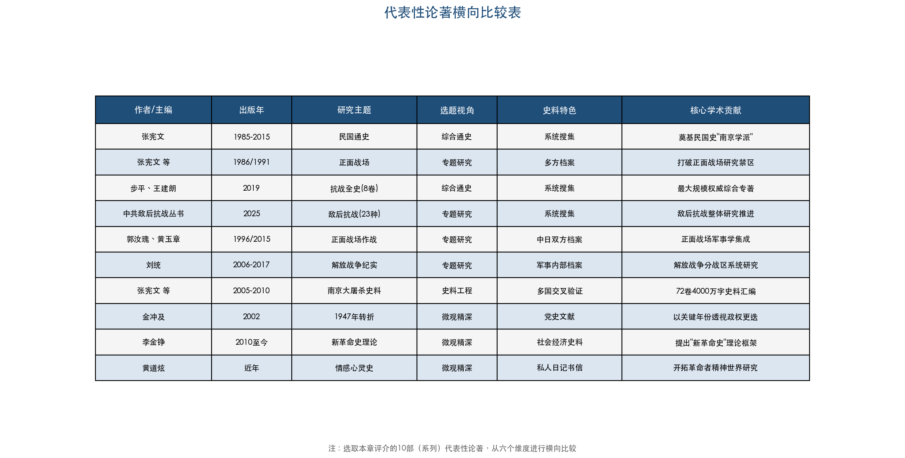

上表从作者/主编、出版年、研究主题、选题视角、史料特色及核心学术贡献六个维度，将本章评介的十部（系列）代表性论著并列呈现。由此可以直观地看到：在选题视角上，综合通史、专题研究、微观精深和史料工程四种类型并存互补；在史料特色上，系统搜集、军事内部档案、多国交叉验证和私人日记书信等多种策略各擅胜场；在核心学术贡献上，各论著分别在不同维度上推进了1937-1949年研究的知识积累。

## 5.2 综合性通史著作与系列丛书：从奠基到集成

### 5.2.1 张宪文团队的系统性建构

在1937-1949年研究的学术版图中，南京大学张宪文团队的系列著作构成了最具系统性与持续性的学术建构。张宪文1934年生于山东泰安，从事教学及科研逾55年，现任南京大学荣誉资深教授、博士生导师、中华民国史研究中心名誉主任[张宪文简介](https://www.js-skl.org.cn/social_sciences/8211.html "江苏省哲学社会科学界联合会")。其领衔的研究团队承担并完成了国家"六五""七五""九五"社科规划重点项目、教育部重大攻关项目、国际合作项目等10余项[南京大学历史学院](https://history.nju.edu.cn/7f/cf/c29372a491471/page.htm "感念师恩·张宪文教授")，形成了学界所称的民国史研究"南京学派"学术传统。

这一学术传统的核心成果可从三个层面加以把握。

**第一层面：民国通史的系统建构。** 张宪文主编的《中华民国史纲》1985年出版，为当时唯一系统研究民国史的学术著作[南京大学中华民国史研究中心简介](http://www.mgzx.org.cn/zhongxinjianjie.html "中心官网")。此后，经两岸四地70名学者五年协力撰写的《中华民国专题史》（18卷，逾800万字）于2015年正式出版，论述了1912年至1949年间政治、政党、军事、经济、社会、教育、文化、城乡发展以及海外华侨、中外关系等各方面的历史[南京大学官网](https://www.nju.edu.cn/info/3191/172991.htm "《中华民国专题史》出版发行")。这套著作在体例上采取专题性结构而非编年体通史，"突出历史重点，不面面俱到"，这一体例选择本身即反映了民国史研究从宏观通史向纵深专题发展的学术趋势。

**第二层面：抗战正面战场研究的开拓。** 1986年，张宪文领衔承担国家"七五"规划重点项目——"抗战研究"项目，出版了《抗日战争的正面战场》。张宪文回忆这一学术突破的背景时指出："全国各地抗日战争史的研究进入深入发展的阶段，许多地区转入对正面战场历史的研究。那之前我们的教科书、我们的教学从来没有涉及过正面战场"[张宪文《抗战史研究的检视与评述》](https://m.krzzjn.com/show-1232-34698.html "抗日战争纪念网")。这部著作成为中国大陆第一部系统研究抗战正面战场的学术专著[南京大学历史学院](https://history.nju.edu.cn/3b/04/c28497a801540/page.htm "91岁的他说")，打破了大陆学界对正面战场研究的长期空白。此后，张宪文主编的《中国抗日战争史（1931-1945）》于1991年出版，写作指导思想是"全面反映国共两党合作抗日的历史事实，写两个战场，正面战场和敌后战场"[南京大学社科名家](https://www.nju.edu.cn/info/3191/206951.htm "张宪文：寻访历史的真相")。该著作在当时意识形态环境下坚持两个战场并写的学术立场，体现了改革开放后抗战研究"判断是非的标准，逐渐由以阶级意识为重转向以民族大义为重"[高士华《抗日战争研究在改革开放中不断发展》](http://jds.cass.cn/xscg/xslw/201811/t20181126_5253004.shtml "《人民日报》2018年11月26日第22版")的根本性转变。

**第三层面：大型史料工程。** 张宪文团队先后主编了72卷《南京大屠杀史料集》（2005-2010）、100卷《抗日战争专题研究》、25卷本《日本侵华图志》（2015）等大型学术出版物[南京大学历史学院](https://history.nju.edu.cn/7f/cf/c29372a491471/page.htm "感念师恩·张宪文教授")。这些系列成果不仅在学术内容上具有重要价值，更在方法论上确立了"名家+团队"的协同研究模式[张宪文教授与民国史研究的"南京学派"](http://jds.cssn.cn/mkszyysxyj/201803/t20180306_5255880.shtml "近代史研究所网站，2018年3月")。张宪文在南京大学创建中华民国史研究中心的核心理念是利用南京"天时地利"——南京为国民政府时期首都，中国第二历史档案馆和南京图书馆保存有大量民国档案和文献[南京大学历史学院](https://history.nju.edu.cn/7f/cf/c29372a491471/page.htm "感念师恩·张宪文教授")。这种将研究机构建设与区域档案资源优势相结合的学术策略，在中国近代史研究中具有示范意义。

### 5.2.2 步平、王建朗主编《中国抗日战争史》（全八卷）

步平、王建朗主编的《中国抗日战争史》（全八卷）于2019年出版，被吴敏超评价为"迄今中国抗日战争史研究领域最大规模、最具权威性的综合性研究专著"[吴敏超《近十年中国抗战史研究的蓬勃发展》](http://hprc.cssn.cn/gsyj/zhutiyj/kz80/202506/t20250619_5880073.html "《中国社会科学报》2025年6月19日")。北京大学历史系教授徐勇亦给予高度评价，认为这套八卷本是"目前大陆学术界有关抗日战争方面资料最全，各方面专题研究最深，最有代表性的成果"[人民网](http://media.people.com.cn/n1/2020/0903/c14677-31847294.html "2020年9月3日")。

全书分为8个专题卷：局部抗战、战时军事、战时政治、战时经济与社会、战时外交、战时文化教育、伪政权与沦陷区、战后处置与战争遗留问题[近代史研究所](http://jds.cssn.cn/xscg/xszz/201911/t20191115_5248998.shtml "新书简介")。这一结构设计有两个值得关注的特点。其一，将"伪政权与沦陷区"单列一卷（第七卷，由臧运祜、王希亮执笔），标志着沦陷区研究在抗战通史框架中获得了独立地位。其二，设专卷讨论"战后处置与战争遗留问题"，将研究时段延伸至战争结束之后，体现了"大抗战史"的学术视野。

将八卷本《中国抗日战争史》与张宪文1991年主编的《中国抗日战争史（1931-1945）》进行横向比较，可以清晰地观察到近三十年间抗战通史研究在四个方面的演进：在研究领域上，后者增设沦陷区、文化教育、战后处置等专题，覆盖面显著扩展；在研究视角上，从以军事政治史为主线发展为政治、军事、经济、社会、文化、外交并重的多维度叙事；在史料基础上，八卷本充分利用了改革开放以来持续拓展的中外档案资源，史料丰富程度远超前作；在评价标准上，对国共两党在抗战中的角色做出了更为客观、均衡的学术评价。

下图以视角维度、史料维度和核心主题三个指标，直观呈现了三部综合性通史从军事科学院三卷本（1991-1994）到张宪文版（2001）再到步平、王建朗八卷本（2019）的范式递进轨迹。

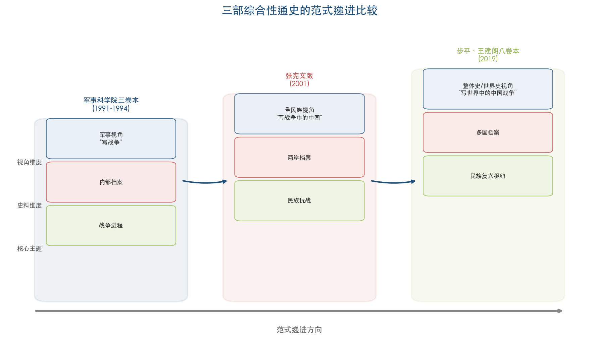

### 5.2.3 "中国共产党领导的敌后抗战"系列丛书

2025年出版的"中国共产党领导的敌后抗战"系列丛书是近年来抗战史领域规模最大的系列出版物之一。这套丛书自2016年作为国家社会科学基金抗日战争研究专项工程立项，历时近十年完成，出版23种28册，涵盖《中国共产党敌后抗战指导史》《八路军抗战史》《新四军抗战史》以及各根据地史[吴敏超《中国共产党抗战史研究的趋势、特点与相关思考》](http://jds.cass.cn/xscg/xslw/202601/t20260130_5971445.shtml "《抗日战争研究》2025年第4期")。吴敏超指出，这套丛书"对于推动中国共产党领导的敌后抗战史的整体研究具有重要意义"[吴敏超《中国共产党抗战史研究的趋势、特点与相关思考》](http://jds.cass.cn/xscg/xslw/202601/t20260130_5971445.shtml "《抗日战争研究》2025年第4期")。

将这套丛书与八卷本《中国抗日战争史》进行横向比较，两者在研究主题上形成互补而非重叠关系。八卷本是全景式的综合通史，涵盖抗战各方面；敌后抗战丛书则是中共抗战史的纵深展开，以各根据地为单元进行分区域、分专题的精细研究。二者的差异折射出抗战史研究从综合通史向纵深专题分化的学术发展趋势。

## 5.3 军事史领域的代表性成果

### 5.3.1 郭汝瑰、黄玉章《中国抗日战争正面战场作战记》

郭汝瑰、黄玉章主编的《中国抗日战争正面战场作战记》（江苏人民出版社，初版1996年，修订版2015年）是正面战场军事史研究的集大成之作，全书约125万余字，被评价为"迄今为止论述中国抗日战争正面战场军事作战最系统全面的学术专著"[《中国抗日战争正面战场作战记》简介](https://book.douban.com/subject/1227902/ "豆瓣")。

这部著作在选题视角、史料运用和论证方法三个层面均具鲜明特色。在选题视角上，该书以正面战场22次重大会战为主线，既有各战役全过程记述，又有敌我双方战略指导、兵力部署、战术运用的分析比较[光明网](https://news.gmw.cn/2020-09/05/content_34157769.htm "2020年9月5日")。在史料运用上，该书融合了中日双方军事档案和战报，这一特点在同类著作中颇为突出。在论证方法上，该书运用历史学和近代军事学理论相结合的方法[光明网](https://news.gmw.cn/2020-09/05/content_34157769.htm "2020年9月5日")，在传统战役叙事基础上增加了军事学分析维度，对各战役利弊得失做出了较为客观的评价。荣维木在综述中评价该著作"不仅对正面战场军事战略进行整体论述，还逐一分析各战役的利弊得失"[荣维木《近十年来抗日战争研究述评》](http://jds.cssn.cn/webpic/web/jdsww/UploadFiles/ztsjk/2010/11/201011191532440470.pdf "《教学与研究》2005年第8期，第64-70页")。

尤为值得指出的是，主编郭汝瑰本人在抗战时期先后参加淞沪会战和南京保卫战，曾代理第15集团军第18军第14师第42旅旅长[豆瓣](https://book.douban.com/subject/26414636/ "修订版简介")。一位亲历正面战场重大战役的将领主编正面战场作战史，使著作在史料理解和战役判断上具备了亲历者的独特视角，这是纯粹学院派研究者难以企及的优势，也赋予了该书特殊的学术史价值。

### 5.3.2 正面战场研究的范式演进

将郭汝瑰、黄玉章的著作与张宪文1986年的《抗日战争的正面战场》进行横向比较，可以观察到正面战场研究在1980年代至2010年代间经历的范式演进。张宪文著作在学术史上的价值首先在于"开拓"——在大陆学界几乎没有正面战场研究的背景下，以两个战场并写的学术立场打破了研究禁区。郭汝瑰、黄玉章著作的学术功能则侧重"集成"——以更为全面的史料和更为系统的战役分析，将正面战场研究推进到综合性军事学术著作的层次。

近十年来，正面战场研究出现了一个值得关注的二次转向。吴敏超指出，学者开始从军队战斗力生成的角度重新审视正面战场的成败，"从关注战事本身到关注战争的主体——军队"，研究对象扩展至国民党军队的组织架构、指挥系统、军队编制、武器装备、军需后勤、军政关系等方面[吴敏超《近十年中国抗战史研究的蓬勃发展》](http://hprc.cssn.cn/gsyj/zhutiyj/kz80/202506/t20250619_5880073.html "《中国社会科学报》2025年6月19日")。这一转向标志着正面战场研究从传统的"战役史"叙事向"军事制度史"和"军事社会学"方向深化——从记述"打了什么仗"转向追问"为什么打成这样"。

### 5.3.3 解放战争军事史：刘统的系列纪实

在解放战争军事史领域，已故上海交通大学教授刘统（1951-2022）的系列著作构成了最具代表性的学术成果。刘统曾任中国人民解放军军事科学院研究员（大校军衔），其"解放战争"系列丛书包括《决战：东北解放战争1945-1948》《决战：华东解放战争1945-1949》《决战：中原西南解放战争1945-1951》《决战：华北解放战争1945-1949》《决战：西北解放战争1945-1949》等6种[中国作家网](https://www.chinawriter.com.cn/n1/2017/0808/c404030-29456131.html "2017年8月8日")；另著有《中国的1948年——两种命运的决战》《战上海》等专著[上海交通大学人文学院](https://shss.sjtu.edu.cn/Web/Show/9411 "刘统教授追悼")。

刘统的解放战争系列在研究方法上有两个显著特点。其一，**深度依赖军事档案**——作为长期在军事科学院工作的研究员，刘统有条件系统利用解放军内部档案和战史资料，这些史料是普通学院研究者难以获取的。其二，**以分战区为叙事单元**——将各大野战军的战史与所在战区的政治、社会背景相结合，实现军事叙事与社会背景的有机融合。

将刘统的解放战争系列与抗战军事史代表性著作进行横向比较，二者在研究条件和学术生态上存在显著差异。抗战军事史（尤其是正面战场研究）在经历长期空白后迎来了从禁区解封到大规模展开的爆发式增长，并获得国家级研究专项工程的制度性支撑；解放战争军事史则主要依靠个别学者的个人努力和军事系统内部的学术资源支持，缺乏类似的制度化推动力。这一差异既是两个子时段研究体量失衡的原因之一，也是理解1937-1949年研究学术版图不可忽视的观察维度。

## 5.4 日军暴行与南京大屠杀研究

### 5.4.1 从史料搜集到综合史学：南京大屠杀研究的学术升级

南京大屠杀研究是1937-1949年研究中发展最为迅速、国际影响力最强的子领域之一，也是产出代表性论著最为密集的领域。

孙宅巍在其对南京大屠杀研究学术史的系统回顾中，将自20世纪60年代初至21世纪初叶的研究历程概括为"奠基、铸就、转型、集成"四个阶段[孙宅巍《南京大屠杀研究的学术演进与未来展望》](http://jds.cass.cn/xscg/xslw/202602/t20260213_5973632.shtml "近代史研究所网站，2026年2月13日")。这一概括精准地揭示了南京大屠杀研究从"史实追求"到"理论升华"的演进轨迹。

在史料基础建设层面，72卷约4000万字的《南京大屠杀史料集》（张宪文团队主编，2005-2010年分批出版）是迄今规模最大、最为翔实的一次性史料汇编工程。该史料集历时十年完成，内容涵盖加害方日本、受害方中国和第三方美、英、德、法、俄、意、西等国的珍贵历史文献[人民网](http://dangshi.people.com.cn/n/2014/0915/c85037-25663543.html "2014年9月15日")。张宪文团队为搜集这些史料遍访海内外档案机构，张宪文坦承："72卷史料集在搜集、整理、翻译和出版过程中付出的代价，只有自己知道"[近代史研究所](http://jds.cssn.cn/newzxdt/202101/t20210128_5299356.shtml "张宪文访谈")。社会各界以"铁证如山"评价这套史料集，认为它是"当今中华民国史研究领域最具标志性的成果"[南京大学历史学院](https://history.nju.edu.cn/07/40/c28497a460608/page.htm "揭开南京大屠杀最原始真相")。

在综合研究层面，张宪文团队在72卷史料集基础上编纂完成《南京大屠杀全史》。学界评价该书"不仅具有十分重要的学术价值，也是继《南京大屠杀史料集》以后，国内学界抗日战争领域研究的又一重大成果"[南京大学社科处](https://skch.nju.edu.cn/ee/64/c21885a781924/page.htm "《南京大屠杀全史》在京首发")。从方法论角度看，《南京大屠杀史料集》与《南京大屠杀全史》之间构成了从"史料搜集整理"到"综合史学研究"的递进关系——前者为后者提供了充分的实证基础，后者则将分散的史料整合为系统的学术叙事。这种"先立料、后立论"的研究路径，体现了中国史学实证传统在重大历史事件研究中的方法论价值。

### 5.4.2 南京大屠杀研究中的计量化争论

南京大屠杀研究中一个核心学术议题是遇难人数的计量化问题。袁成毅对此进行了深入的方法论反思，指出"南京城区与南京周边"的地理范围界定以及"平民"概念的边界等方面的模糊性，影响着计量结论的准确性[袁成毅《抗日战争研究中的若干"计量化"问题》](http://jds.cssn.cn/xscg/xslw/201605/t20160506_5252776.shtml "近代史研究所网站")。孙宅巍则将毕生精力投入南京大屠杀遇难人数的研究，通过埋尸记录等实证路径推进量化考证，其代表性著作《南京大屠杀》（1997年，北京出版社）被评价为20世纪90年代中国学者关于南京大屠杀研究的代表性成果[新华日报](https://www.xhby.net/content/s6576e4fee4b0645adfc82eaf.html "2023年12月12日")。孙宅巍在计量问题上提出了重要的方法论告诫：应避免陷入"永远不变的数字，更加精确的数字和更多的数字"三个误区[袁成毅《抗日战争研究中的若干"计量化"问题》](http://jds.cssn.cn/xscg/xslw/201605/t20160506_5252776.shtml "近代史研究所网站，引孙宅巍观点")。这一告诫揭示了历史研究中"精确性追求"与"整体理解"之间的辩证关系——过度纠缠于数字精确性，有可能偏离对暴行本质的深层理解。

### 5.4.3 口述史方法的深度应用

南京大屠杀研究也是口述史方法在1937-1949年研究中应用最为系统的子领域之一。侵华日军南京大屠杀遇难同胞纪念馆与南京大学历史学院合作完成的《被改变的人生：南京大屠杀幸存者口述生活史》已被译为日文出版，成为第一本在日本出版的南京大屠杀幸存者口述史[廖昕朔《2025年中国口述历史观察报告》](http://www.rmzxw.com.cn/c/2026-01-04/3843652.shtml "人民政协报，2026年1月4日")。这一成果在方法论上的特色在于，不仅记录幸存者对暴行本身的回忆，更运用"生活史"方法追踪暴行对幸存者战后整个生命历程的持续影响——从"事件史"向"生命史"的延伸，体现了口述史方法从史料搜集工具向独立研究范式转化的趋势。

将南京大屠杀研究的代表性成果与抗战其他领域进行横向比较，一个显著特征值得关注：南京大屠杀研究在综合运用多种研究方法方面走在前列。在同一研究领域内，大规模史料工程（72卷史料集）、综合性学术专著（《南京大屠杀全史》）、计量化研究（遇难人数考证）、口述史记录（幸存者口述生活史）以及集体记忆研究（纪念空间与历史叙事建构）得以同步推进，形成了方法多元、层次分明的研究体系。这种多方法并进的格局在该时段其他子领域中较为少见，体现了南京大屠杀研究作为国际关注焦点和国家重点支持领域所获得的资源集聚效应。

## 5.5 社会史、新革命史与基层研究

### 5.5.1 李金铮与"新革命史"的理论建构

在1937-1949年研究的理论创新层面，南开大学李金铮教授提出的"新革命史"概念构成了近年来最具影响力的理论贡献之一。2010年，李金铮在《中共党史研究》发表《向"新革命史"转型：中共革命史研究方法的反思与突破》，正式提出这一概念。其核心理念在于改变传统革命史范式以阶级斗争为唯一分析框架、以精英决策为唯一叙事主体的做法，主张运用"国家与社会的理论和方法、革命史与大乡村史的连接等"[李金铮《拓展视野：抗日战争史研究从何处突破？》](http://jds.cssn.cn/newzxdt/202101/t20210128_5299664.shtml "近代史研究所网站转载")来重新理解革命过程中的社会变迁、基层互动与民众经验。

"新革命史"的方法论核心可归纳为五个方面：运用国家与社会互动关系的视角，强调基层社会和普通民众的主体性，革命史与大乡村史相结合，从全球史视野考察中共革命史，以及注重革命政策与具体实践的互动关系[《何谓"新革命史"》](https://public.nju.edu.cn/DFS//file/2025/03/16/202503160945397539q1nis.pdf "南京大学政府管理学院")。2023年山东大学举办的"新革命史与中共抗战"学术工作坊上，李金铮在主题发言中进一步强调，"不同根据地在不同时期的政策制定与调适，既是基于'常识常情常理'的人性基本面考量"[山东大学历史学院](https://www.history.sdu.edu.cn/info/1032/5650.htm "新革命史与中共抗战学术工作坊")。将革命政策置于"常识常情常理"的人性基本面来分析，既不否认革命的历史重要性，也不回避革命过程中的复杂性与曲折性，在传统革命史范式与现代化范式之间开辟了第三条路径。

在学术实践层面，李金铮长期致力于中共根据地经济史和社会史研究，探讨革命与传统、革命与乡村之间的复杂互动关系。2026年3月，他在《光明日报》撰文《理解中共革命史的生态环境维度》，进一步将"新革命史"的视野拓展至革命与自然环境的互动关系，提出中共革命与自然环境已"结成一个生存共同体"，"中国共产党通过认识自然、利用自然和改造自然，推动根据地的形成和发展，促进革命目标的实现"[南开大学历史学院](https://history.nankai.edu.cn/2026/0331/c16078a591814/page.htm "2026年3月31日")。这一拓展表明，"新革命史"理论框架仍在持续演化之中。

### 5.5.2 李里峰与"新政治史"

与"新革命史"理念相近但路径有别的是南京大学李里峰的"新政治史"研究。李里峰著有《革命政党与乡村社会——抗战时期中国共产党的组织形态研究》（江苏人民出版社，2011年），将政治学的组织理论、社会动员理论与历史学的实证方法相结合，考察抗战时期中共在乡村社会中的组织形态与运作机制[李里峰个人简介](https://public.nju.edu.cn/szdw/qzjs/azy/20210629/i203552.html "南京大学政府管理学院官网")。他提出的"新政治史"主张，"将关注焦点从全国政治转向州和地方政治、从政治制度转向政治行为、从政治家转向普通民众"[李里峰《"新政治史"与中国近代史研究》](https://public.nju.edu.cn/DFS//file/2025/03/16/20250316091023692mj14bc.pdf "南京大学政府管理学院")。

横向比较李金铮的"新革命史"与李里峰的"新政治史"，二者在核心关切上高度一致——均强调从精英到民众的视角下移、从制度文本到社会实践的分析深入、从单一学科到跨学科的方法拓展。差异在于路径取向：李金铮从社会史和经济史出发，侧重"革命与乡村"的互动关系，理论资源主要来自社会史传统；李里峰从政治学出发，侧重"政党组织与基层社会"的运作逻辑，理论资源主要来自政治社会学。两者在具体研究对象——抗战时期中共根据地——上高度重叠，却提供了理解同一历史现象的不同分析视角。这种"殊途同归"的学术格局表明，根据地研究已成为多种新理论、新方法的交汇试验场。

### 5.5.3 黄道炫与情感心灵史

中国社会科学院近代史研究所黄道炫的研究代表了"自下而上"视角在1937-1949年研究中的前沿延伸方向。他运用大量日记等私人史料研究"政治文化视野下的中国共产党心灵史"，旨在"探寻这一政治文化的源头和形成过程"，关切中共的"行动机制和政治文化"[吴敏超《中国共产党抗战史研究的趋势、特点与相关思考》](http://jds.cass.cn/xscg/xslw/202601/t20260130_5971445.shtml "《抗日战争研究》2025年第4期")。在他看来，"技术性的了解和分析可以呈现历史的一些面相，却不一定能逼近"革命的内在精神世界[黄道炫《政治文化视野下的心灵史》](http://jds.cssn.cn/newzxdt/202101/t20210128_5297226.shtml "近代史研究所网站")。

黄道炫研究的方法论意涵在于揭示了传统实证方法和制度分析的盲区。制度史和政策史可以告诉我们中共"做了什么"和"怎么做的"，却无法充分解释革命者"为什么这么做"——即行动背后的信念结构、情感驱动和精神世界。这一研究方向的兴起，标志着1937-1949年研究正在从"事实层面"深入到"意义层面"，从"制度运作"深入到"心灵世界"。吴敏超将这一趋势概括为情感心灵史方向的兴起，认为它"基于对日记、书信、回忆录等私人史料的大量运用，反映了对战争与革命环境下人物命运、情感的关切"[吴敏超《中国共产党抗战史研究的趋势、特点与相关思考》](http://jds.cass.cn/xscg/xslw/202601/t20260130_5971445.shtml "《抗日战争研究》2025年第4期")。

将黄道炫的研究与李金铮的"新革命史"、李里峰的"新政治史"进行横向比较，三者构成了理解中共根据地和革命历史的三种互补路径："新革命史"关注革命与乡村社会的结构性互动，"新政治史"分析政党组织的运作机制，情感心灵史则追问革命者个体的精神世界。三者合力推动中共抗战史研究从"外部描述"向"内部理解"深化，从"做了什么"向"为何如此"追问。

## 5.6 解放战争时段的代表性论著

### 5.6.1 金冲及《转折年代——中国的1947年》

金冲及（1930-2025）是中共中央文献研究室原常务副主任，长期从事中国近现代史和中共党史研究。2002年出版的《转折年代——中国的1947年》是解放战争研究领域最具代表性的学术专著之一。金冲及曾在多个场合讲述其"1947年情结"："1947年，不仅是我个人的转折之年，也是整个中国的转折之年"[社科网](https://www.sinoss.net/c/2021-08-25/565115.shtml "金冲及：笔耕不辍 一生为史")。

该著作在学术方法上有三个显著特点。其一，**以"年度"为分析单元的叙事策略**。全书聚焦1947年这一关键年份，通过对该年中国大地上政治、军事、社会、经济各方面变化的深入考察，揭示国共力量消长的根本性转折。评论者指出，"全书虽主要写一年的变局，给人们的启示，却是抗战胜利后4年历史的发展理路，甚至是从1927年大革命失败以来的历史理路"[近代史研究所](http://jds.cssn.cn/xscg/ybwz/201605/t20160506_5253898.shtml "评《转折年代》")。其二，**平实叙事与寓论于史的写作风格**。评论者以"平实叙事寓论于史"概括该书特色[近代史研究所](http://jds.cssn.cn/xscg/ybwz/201605/t20160506_5253898.shtml "评《转折年代》")，即不以宏大理论统摄叙事，而让事实本身呈现历史的走向与逻辑。其三，**政治敏锐性与学术严谨性的结合**。金冲及长期从事中共中央文献的编辑和研究，对党史文献的掌握与理解具有学院派研究者难以比拟的深度。

### 5.6.2 刘统的解放战争纪实系列

如前所述（5.3.3节），刘统的解放战争系列著作以分战区结构全面覆盖了解放战争各主要战场。值得进一步讨论的是，他的《中国的1948年——两种命运的决战》与金冲及的《转折年代——中国的1947年》形成了颇有学术意义的横向对照。两部著作均以"关键年份"为切入点，但选取的年份不同——1947年是"由守转攻"的战略转折年份，1948年则是三大战役全面展开的军事决战年份。两位学者从不同年份切入同一历史进程，视角差异折射出对"历史转折的决定性时刻"的不同理解：金冲及更看重政治力量对比的根本性转变，刘统更强调军事力量消长的决定性作用。

将金冲及和刘统的著作与抗战军事史的代表性成果进行横向比较，一个结构性差异十分明显：抗战军事史已形成从"通史"（八卷本《中国抗日战争史》）到"正面战场专史"（郭汝瑰、黄玉章）再到"各根据地分史"（敌后抗战丛书23种28册）的多层次研究体系，而解放战争军事史的系统性成果主要依赖少数学者的个人努力，缺乏类似的层次化研究格局。这一差异再次印证了两个子时段在学科建制化程度上的显著落差。

### 5.6.3 解放战争研究的新进展

解放战争研究在近年来呈现出令人瞩目的新发展态势。《中共党史研究》2025年第5期刊载的年度综述指出，"近年来较少受到学界关注的解放战争史研究，研究成果数量和质量都有显著提升"[辛逸、岳伟、满永《二〇二四年中共党史研究的若干学术进展》](https://taiyuan.gov.cn/c/www/dsby/30285196.jhtml "《中共党史研究》2025年第5期")。中共如何在新区立足成为热点话题——黄道炫借由蔡迈轮日记呈现中共初到新区遭遇的艰难处境及政策调适过程；南下干部动员、新区建设等议题亦得到深入研究。尤其值得关注的是，2024年北京大学历史学系等机构召开的"从革命到建政：跨越1949"学术研讨会，"共同提出对中国革命史和建设史进行整体性、连续性研究，极力倡导贯通研究历史的思维方法和能力"[辛逸、岳伟、满永《二〇二四年中共党史研究的若干学术进展》](https://taiyuan.gov.cn/c/www/dsby/30285196.jhtml "《中共党史研究》2025年第5期")。这一贯通性研究取向的兴起，有望从根本上改变解放战争研究长期附属于其他学科框架的被动局面。

## 5.7 重要学术争论与分歧焦点

本节集中讨论1937-1949年研究中四个持续时间最长、影响面最广的核心学术争论。下图以谱系流程图的形式呈现了各争论从早期论点到中期转向再到当前主流或前沿方向的演变轨迹。

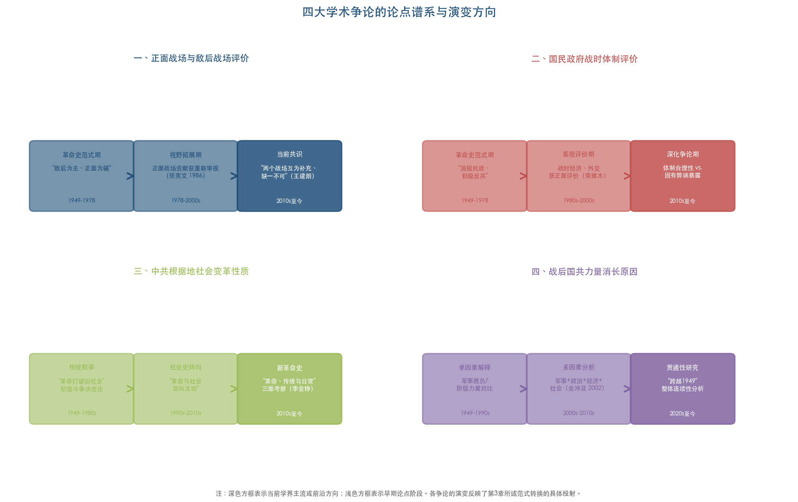

### 5.7.1 正面战场与敌后战场的评价问题

正面战场与敌后战场的评价是1937-1949年研究中持续时间最长、涉及面最广的学术争论之一。围绕这一问题，学界的讨论经历了从"单一主体论"到"两个战场互为补充论"的深刻演变。

荣维木在综述中系统梳理了围绕两个战场关系展开的三个核心争论焦点：第一，敌后战场形成的时间——存在"抗战一开始即分为两个战场"与"敌后战场形成于1938年以后乃至1939年春"两种不同观点；第二，两个战场的主次关系——存在"正面战场始终是主要战线"与"战略相持阶段后敌后战场上升为主战场"的分歧；第三，两个战场的战绩评估[荣维木《近十年来抗日战争研究述评》](http://jds.cssn.cn/webpic/web/jdsww/UploadFiles/ztsjk/2010/11/201011191532440470.pdf "《教学与研究》2005年第8期，第64-70页")。

在战绩的计量化评估方面，袁成毅高度评价了这一领域的学术进步："关于两个战场的战绩问题，从最早的只计中共领导的武装力量的抗日战绩，到兼计敌后和正面两个战场的战绩，进而将正面和敌后两个战场的战绩合成一个中国抗战的整体，这不能不说是一个巨大的进步"[袁成毅《抗日战争研究中的若干"计量化"问题》](http://jds.cssn.cn/xscg/xslw/201605/t20160506_5252776.shtml "近代史研究所网站")。中国社科院近代史研究所原副所长王建朗亦明确指出，"正面战场和敌后战场两者缺一不可"[中国社科院](http://www.cass.cn/xueshuchengguo/wenzhexuebulishixuebu/201507/t20150707_2068463.shtml "2015年7月7日")。

从学术史角度审视，这一争论的演变过程本身即是第3章所论述的范式转换在具体议题上的投射。在革命史范式主导时期，"敌后战场为主、正面战场为辅"几乎是不容置疑的定论；改革开放后评价标准"逐渐由以阶级意识为重转向以民族大义为重"[高士华《抗日战争研究在改革开放中不断发展》](http://jds.cass.cn/xscg/xslw/201811/t20181126_5253004.shtml "《人民日报》2018年11月26日第22版")，正面战场的贡献得到重新审视和肯定。当前学界的主流共识已转向承认两个战场的互补性与不可替代性——"抗日战争的胜利，是正面战场和敌后战场配合斗争的结果"，"正是有了两个战场的互相配合，共同御敌，构成中国抗战的统一体，才保证了抗日民族统一战线始终得以维系"[人民网](http://cpc.people.com.cn/n/2015/0929/c69120-27648081.html "2015年9月29日")。

### 5.7.2 国民政府战时体制的评价

对国民政府战时体制的评价构成另一焦点争论，其演变轨迹同样深受范式转换的影响。在革命史范式主导时期，国民政府被定位为"消极抗战、积极反共"的政治力量，战时施政几乎得不到正面评价。改革开放后，学界开始从"战时状态下中国经济与反侵略密切相关的大背景下考察问题"，对国民政府的战时经济政策、外交努力、社会动员等方面给予更为客观的评价[荣维木《近十年来抗日战争研究述评》](http://jds.cssn.cn/webpic/web/jdsww/UploadFiles/ztsjk/2010/11/201011191532440470.pdf "《教学与研究》2005年第8期，第64-70页")。

在外交史领域，李育民对抗日战争时期国民政府对外关系研究进行了系统梳理，指出学界已在战时外交体制的"基本特征"、该体制维系运作的"重要因素"及其主要局限等方面取得重要进展[李育民《抗日战争时期国民政府对外关系研究简述》](http://jds.cass.cn/xscg/xslw/202602/t20260203_5972036.shtml "近代史研究所网站，2026年2月3日")。在经济史领域，荣维木指出学界已"注意从战时状态下中国经济与反侵略密切相关的大背景下考察问题，对国民政府的战时经济政策给予比较客观的评价"，"有人提出，国民政府在抗战初期的经济对策是有效的"[荣维木《近十年来抗日战争研究述评》](http://jds.cssn.cn/webpic/web/jdsww/UploadFiles/ztsjk/2010/11/201011191532440470.pdf "《教学与研究》2005年第8期，第64-70页")。

然而，围绕国民政府战时体制的评价分歧并未完全弥合。争论的核心在于：国民政府战时体制在多大程度上是出于抗战需要的合理选择，在多大程度上是其固有政治弱点（如派系政治、腐败、军政关系紊乱等）的集中暴露？抗战后期尤其是1944年豫湘桂战役惨败之后，正面战场表现急剧恶化与国民政府体制弊端之间的关系当如何理解？这些问题至今仍是学界讨论的热点。

### 5.7.3 中共根据地社会变革的性质

中共根据地社会变革的性质是1937-1949年研究中理论争论最为深入的议题之一。传统革命史范式将根据地社会变革定性为新民主主义革命的有机组成部分，强调阶级斗争和土地改革的决定性作用。伴随社会史转向和"新革命史"的兴起，学界对这一问题的认识趋于多层化和复杂化。

吴敏超指出，根据地经济史研究已从简单的政策梳理转向"注重农业、盐业、金融、财政等方面的精深研究，观察相关政策在抗战时期不同阶段的变化及具体发展，探讨民间传统、经济运行规律发挥的特定作用，展现了革命与传统、主观努力与客观规律之间的张力与调适"[吴敏超《中国共产党抗战史研究的趋势、特点与相关思考》](http://jds.cass.cn/xscg/xslw/202601/t20260130_5971445.shtml "《抗日战争研究》2025年第4期")。"革命与传统"之间的"张力与调适"——这一表述精准捕捉了当前学界在根据地社会变革认知上的核心关切：革命并非在真空中展开的抽象过程，而是与乡土社会的传统结构、民间经济运行规律持续博弈的具体历史进程。

从学术推进脉络来看，这一议题上的争论经历了三个阶段：第一阶段是传统革命史叙事下的"革命打破旧社会"模式；第二阶段是社会史转向后出现的"革命与社会双向互动"分析；第三阶段是"新革命史"框架下的"革命、传统与日常生活"三维考察。三个阶段之间并非简单的替代关系，而是在保留前一阶段合理内核的基础上不断拓展分析维度。

### 5.7.4 战后国共力量消长的原因

战后国共力量消长及政权更迭的原因，是解放战争研究中最核心的理论问题。金冲及在《转折年代——中国的1947年》中通过对1947年这一关键年份的深入考察，揭示了国民党"由强转弱、由攻转守"的根本性转折[近代史研究所](http://jds.cssn.cn/xscg/ybwz/201605/t20160506_5253898.shtml "评《转折年代》")。该书的学术贡献在于，并非从单一因素出发解释这一历史巨变，而是从军事、政治、经济、社会多个层面呈现力量对比逆转的复杂机制。评论者指出，金冲及在书中特别强调了毛泽东1947年12月的判断——"这是一个历史的转折点。这是蒋介石的二十年反革命统治由发展到消灭的转折点。这是一百多年来帝国主义在中国的统治由发展到消灭的转折点"——以此作为理解1947年历史意义的枢纽[评《转折年代——中国的1947年》](http://word.baidu.com/view/4874bdd9ae51f01dc281e53a580216fc700a5343.html "百度文库")。

刘统的《中国的1948年——两种命运的决战》则从军事史角度切入同一问题，将1948年定位为"两种命运的决战"年份，在三大战役的军事叙事中深入分析国共双方在战略决策、兵力运用、后勤补给、士气民心等方面的对比。

近年来，解放战争研究中出现的"贯通性"研究取向为理解国共力量消长提供了新的分析框架。2024年"从革命到建政：跨越1949"学术研讨会所倡导的"对中国革命史和建设史进行整体性、连续性研究"[辛逸、岳伟、满永《二〇二四年中共党史研究的若干学术进展》](https://taiyuan.gov.cn/c/www/dsby/30285196.jhtml "《中共党史研究》2025年第5期")，实质上要求将国共力量消长置于更长时段的历史脉络中加以理解——从抗战时期国共两党在各自区域内的治理实践、社会基础建构和政治能力积累出发，追溯战后力量对比逆转的深层根源。这一取向突破了将解放战争孤立对待的传统做法，有望产出更具解释力的学术成果。

## 5.8 跨组别横向比较：代表性论著的特色与共性

### 5.8.1 选题视角的比较

综合审视上述各组代表性论著的选题视角，可以识别出两条清晰的发展脉络。

**第一条：从"宏观综合"到"微观专精"的分化。** 张宪文团队的民国通史系列和步平、王建朗的八卷本抗战史代表了宏观综合路径——以全景式框架涵盖整个时段或整场战争的各个面向。郭汝瑰、黄玉章的正面战场作战记、臧运祜的沦陷区研究则代表了中观专题路径——聚焦特定子领域进行系统而深入的考察。黄道炫的心灵史研究、口述史项目中的个体生命叙事则代表了微观精深路径——从个体经验出发透视宏大历史变革。

**第二条：从"事件导向"到"结构-意义导向"的深化。** 早期代表性论著多以重建"发生了什么"的事实为核心任务，如郭汝瑰、黄玉章的战役史著作、张宪文的正面战场研究。近年来的代表性成果则越来越关注"为什么如此"的结构性问题和"如何被理解"的意义性问题，如李金铮的"新革命史"追问革命与乡村社会的互动机制，黄道炫的心灵史追问革命者的精神世界。

### 5.8.2 史料运用的比较

不同论著在史料运用上的差异在很大程度上决定了其学术品质和创新程度。综合比较可归纳出三种主要的史料策略。

**第一种："大规模系统化搜集"策略。** 以张宪文团队72卷《南京大屠杀史料集》和"中国共产党领导的敌后抗战"丛书为典型，学术价值首先在于史料本身的系统性与完备性，在此基础上的研究具有显著的"集成"特征。

**第二种："深挖特定类型史料"策略。** 以刘统利用军事系统内部档案、黄道炫利用私人日记为典型，学术价值在于获取了其他研究者难以接触的一手材料，由此打开新的研究空间。

**第三种："多国档案交叉验证"策略。** 以李翔倡导的全球史观研究和《南京大屠杀史料集》涵盖中、日、美、英等多国文献为典型。李翔指出全球史观在中共抗战史研究中的体现之一是"史料来源越来越国际化与多元化"[李翔《以全球史观深化中共抗战史研究》](https://www.dswxyjy.org.cn/n1/2026/0318/c427167-40684254.html "《中共党史研究》2025年第5期")。这类成果的学术价值在于通过多方史料对照，实现单一来源史料无法提供的立体理解和交叉验证。

### 5.8.3 论证方法与核心论点的比较

在论证方法上，本章评介的代表性论著大致可分为三种类型。**传统实证型**以郭汝瑰、黄玉章的作战记和金冲及的《转折年代》为代表，以扎实的史料考证为基本功底，运用历史叙事和因果分析的传统史学方法，论证建立在"让事实说话"的实证基础之上。**跨学科理论型**以李里峰的《革命政党与乡村社会》为代表，引入政治学、社会学理论框架分析历史现象，论证兼具经验实证和理论解释两个层面。**方法创新型**以口述史项目（如南京大屠杀幸存者口述生活史）和数字人文应用（如汪海涛对《抗日战争研究》30年论文主题的定量分析）为代表，在研究方法本身上实现了创新突破。

在核心论点上，各论著之间既存在显著差异，也在更深层次上形成了学术对话。张宪文团队的系列成果以"还原历史真相"为核心追求，强调以丰富可靠的史料呈现历史的本来面目；李金铮的"新革命史"以"理解革命的复杂性"为核心关切，强调革命与社会、传统与变革之间的互动张力；黄道炫的心灵史研究以"逼近历史的内在精神世界"为核心目标，追问行动者的信念结构和情感动因；步平、王建朗的八卷本抗战史以"建构中国抗战的完整叙事"为核心使命，为学界和社会提供关于抗战历史的权威参照。这些不同的学术追求并非相互排斥，而是从不同面向共同推进着1937-1949年研究的整体深化。

### 5.8.4 学术推进脉络的评估

从学术推进的脉络来看，本章评介的代表性论著之间构成了一条清晰的学术积累链，可从三个维度加以把握。

**纵向维度：** 从张宪文1985年的《中华民国史纲》到2015年的18卷《中华民国专题史》，从1986年的《抗日战争的正面战场》到2019年的八卷本《中国抗日战争史》，每一代综合性著作都在前一代基础上实现了研究覆盖面的扩展、分析深度的提升和评价框架的改进。

**横向维度：** 不同子领域的代表性成果之间形成了互为参照、相互激发的学术对话关系。正面战场研究的深入促使学界重新审视正面战场与敌后战场的整体关系；南京大屠杀研究的国际影响力推动了抗战研究的全球史视角转换；根据地社会史研究的兴起为"新革命史"的理论建构提供了经验基础。

**方法论维度：** 从传统实证方法的夯实，到口述史、计量方法的引入，再到社会科学理论的运用和数字人文工具的初步探索，代表性论著的方法论图谱持续扩展。值得强调的是，这种方法论扩展并非替代性的，而是累积性的——传统实证方法始终是一切研究的底层支撑，新方法的引入是在实证基础上的维度拓展，而非对实证精神的否定。

# 第6章 未来研究潜力选题预测

## 6.1 选题预测的分析框架与逻辑基础

前述各章的横向对比分析，系统揭示了1937-1949年研究在领域分布、视角范式、方法工具、理论运用和学术论争等维度上的总体特征与结构性不足。在此基础上，本章遵循"现有空白与不足→可用资源与条件→预期学术贡献"的三层论证逻辑，从当前学术版图中识别出最具研究潜力与研究空间的选题方向。

选题预测需同时满足三个筛选条件。其一，**问题的学术重要性**——选题所指向的研究空白或薄弱环节，应是影响该领域整体认知完整性的关键缺环，而非枝节性的细部补遗。其二，**研究的可行性**——选题应具备可操作的史料条件和方法路径，而非仅凭理论想象；近年来大规模史料整理工程和新技术工具的成熟，为部分此前无法展开的研究创造了现实条件。其三，**学术贡献的预期**——选题有望在推进学术认知、丰富研究范式或促进国际学术对话等方面产生实质性的增量贡献。

综合前述各章的分析，当前1937-1949年研究存在三类结构性不足：一是领域分布上沦陷区研究与抗战—解放战争两个子时段之间的显著失衡；二是方法论上数字人文手段的基础设施已基本建成但深度分析应用严重滞后；三是视角上"贯通性"研究取向虽已获学界倡导但尚缺乏成规模的实践成果。围绕这三类结构性不足，本章提出以下三个具体选题方向，其论证逻辑对比见图1。

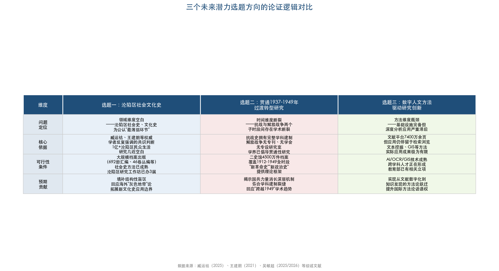

上图从问题定位、核心依据、可行性条件和预期贡献四个层面，横向对比了三个选题方向在领域维度（沦陷区社会文化史）、时间维度（贯通1937-1949年过渡转型研究）和方法维度（数字人文方法驱动研究创新）上的论证结构与各自定位。以下各节将逐一展开论证。

## 6.2 选题一：沦陷区社会文化史的系统建构

### 6.2.1 选题依据：公认的"最薄弱环节"

沦陷区研究是1937-1949年学术版图中公认的薄弱地带，而沦陷区社会史和文化史又是沦陷区研究内部最为薄弱的两个领域。这一判断并非本报告的独立推断，而是多位权威学者反复强调的共识性认识。

臧运祜在对中国大陆学界沦陷区研究的系统回顾中明确指出："相较于以上两个重要方面以及日伪在沦陷区的经济掠夺问题，社会史与文化史一直是沦陷区研究最薄弱的两个领域。就社会史而言，沦陷区的上层与底层社会状况，1亿多城市与乡村民众的生活状况及战时大量的流民与难民，这些问题在研究上都有很大的开拓空间"[臧运祜《中国大陆学界的沦陷区研究浅议》](http://jds.cass.cn/xscg/xslw/202602/t20260203_5972035.shtml "《抗日战争研究》2025年第4期")。王建朗在其对抗日战争研究三十年的回顾与前瞻中同样指出："在以往的研究中，相对于中共根据地和大后方，沦陷区的研究比较薄弱，且不平衡"，未来"沦陷区的研究也将得到加强，既关注沦陷区民众的反抗，也关注沦陷区日常生活的实态"[王建朗《回顾与前瞻：抗日战争研究三十年》](http://jds.cssn.cn/newzxdt/202111/t20211125_5376948.shtml "《抗日战争研究》2021年第3期")。

第2章的分析表明，1937-1949年研究的子领域分布呈现以军事史和政治史为双核心的格局。社会史虽在近年迅速崛起，但其研究对象主要集中于中共根据地和大后方区域，沦陷区社会史的研究积累远不及根据地社会史，沦陷区文化史更长期处于零星状态。值得注意的是，王建朗对沦陷区研究复杂性的分析揭示了这一领域薄弱的深层原因："在沦陷区，存在着日、伪、国、共等多种力量，诉求各不相同"，"统治者与被统治者之间，战争目标大相径庭。即便是实施统治的日、伪之间，战争目的也难称一致。因此，沦陷区研究更具复杂性"[王建朗《回顾与前瞻：抗日战争研究三十年》](http://jds.cssn.cn/newzxdt/202111/t20211125_5376948.shtml "《抗日战争研究》2021年第3期")。正是这种多元力量交错的复杂性，使得沦陷区社会文化史研究既具有极高的学术价值，也对研究者的分析能力提出了更高的要求。

### 6.2.2 可行性：史料条件与方法基础的日趋成熟

这一选题的可行性在近年获得了前所未有的提升，主要体现在史料基础、方法论工具和学术平台三个方面。

**第一，史料基础的大规模扩展。** 臧运祜在其2025年的综述中列举了大量新出版的沦陷区相关档案资料，包括中央档案馆、中国第二历史档案馆与吉林省社会科学院合编的《日本帝国主义侵华档案资料选编》20卷、《中央档案馆藏日本侵华战犯笔供选编》120册、国家档案局组织的《抗日战争档案汇编》已出版692册中涉及沦陷区的部分，以及徐勇、臧运祜总编《日本侵华决策史料丛编》46卷等[臧运祜《中国大陆学界的沦陷区研究浅议》](http://jds.cass.cn/xscg/xslw/202602/t20260203_5972035.shtml "《抗日战争研究》2025年第4期")。"抗日战争与近代中日关系文献数据平台"截至2024年底已公布文献超过7400万页[吴敏超《近十年中国抗战史研究的蓬勃发展》](http://hprc.cssn.cn/gsyj/zhutiyj/kz80/202506/t20250619_5880073.html "《中国社会科学报》2025年6月19日")，其中大量报刊、调查报告等文献涉及沦陷区社会生活信息。此外，日本方面的满铁调查资料已整理出版350册，涵盖经济调查、农业调查、贸易调查等内容[王建朗《回顾与前瞻：抗日战争研究三十年》](http://jds.cssn.cn/newzxdt/202111/t20211125_5376948.shtml "《抗日战争研究》2021年第3期")，其中大量涉及沦陷区基层社会状况的调查数据，是社会史研究的珍贵素材。

**第二，方法论工具的成熟。** 第3章和第4章的分析表明，社会史方法、日常生活史方法、新文化史方法在1937-1949年研究的根据地和大后方领域已形成较为成熟的操作范式。方德万（Hans van de Ven）提出的"战时日常性"概念、李金铮倡导的"新革命史"中"常识常情常理"的分析取向，虽然最初针对根据地研究提出，但其方法论精神完全可以移植到沦陷区研究之中。吴敏超指出的情感心灵史方向——"基于对日记、书信、回忆录等私人史料的大量运用，反映了对战争与革命环境下人物命运、情感的关切"[吴敏超《中国共产党抗战史研究的趋势、特点与相关思考》](http://jds.cass.cn/xscg/xslw/202601/t20260130_5971445.shtml "《抗日战争研究》2025年第4期")——对于理解沦陷区民众在日伪统治下的精神状态和情感世界尤具方法论启示。

**第三，学术平台的制度化支撑。** 臧运祜指出，2019年、2021年、2023年已分别召开了第一、二、三届沦陷区研究工作坊，"已有相当的中青年学者就此进行过很好的探讨，这预示着沦陷区研究将会在该问题上有较大的推进与突破"[臧运祜《中国大陆学界的沦陷区研究浅议》](http://jds.cass.cn/xscg/xslw/202602/t20260203_5972035.shtml "《抗日战争研究》2025年第4期")。南京大学中国抗日战争研究协同创新中心组织的《抗日战争专题研究》丛书第4辑"沦陷区和伪政权"已出版多部中青年学者的个人专著，涉及天津、河南、东北、滇西等不同沦陷区的日伪统治研究[臧运祜《中国大陆学界的沦陷区研究浅议》](http://jds.cass.cn/xscg/xslw/202602/t20260203_5972035.shtml "《抗日战争研究》2025年第4期")。这一既有的平台和人才积累，为沦陷区社会文化史研究的系统推进提供了坚实的学术组织保障。

### 6.2.3 预期学术贡献

沦陷区社会文化史的系统建构有望在以下三个层面产生重要的学术贡献。

**其一，填补1937-1949年研究的结构性盲区。** 当前对该时段的学术认知建立在"根据地+大后方+正面战场"的三元框架之上，覆盖战时中国最富庶、人口超过1亿的沦陷区的社会史和文化史几近空白。臧运祜直言，沦陷区1亿多城市与乡村民众的生活状况"在研究上都有很大的开拓空间"[臧运祜《中国大陆学界的沦陷区研究浅议》](http://jds.cass.cn/xscg/xslw/202602/t20260203_5972035.shtml "《抗日战争研究》2025年第4期")。系统的社会文化史研究将使学界对战时中国社会的全貌获得更为完整的认知。

**其二，为理论对话提供中国经验。** 臧运祜在展望沦陷区研究方向时特别提出了与西方学界的理论对话问题：海外学界提出的所谓"灰色地带"论、"隐性抵抗"说、日本学界的"合作者"等概念框架，"也是我们不容忽视、需要应对的学术问题"；"在沦陷区研究上，话语体系的建构问题尤为突出和重要，需要唤起更多的研究者加以关注"[臧运祜《中国大陆学界的沦陷区研究浅议》](http://jds.cass.cn/xscg/xslw/202602/t20260203_5972035.shtml "《抗日战争研究》2025年第4期")。深入的沦陷区社会文化史实证研究，将为回应和超越这些西方理论框架提供坚实的经验基础。

**其三，拓展新文化史在战争史研究中的应用边界。** 臧运祜明确指出："鉴于20世纪末以来'新文化史'对于中国近现代史及抗日战争史的影响，战时中国沦陷区的文化现象也是一个值得被关注的研究领域"[臧运祜《中国大陆学界的沦陷区研究浅议》](http://jds.cass.cn/xscg/xslw/202602/t20260203_5972035.shtml "《抗日战争研究》2025年第4期")。沦陷区新闻、出版、广播、电影、戏剧、学术等事业的分门别类和综合性研究，"至今也并不多见"——这一领域的系统开拓将为新文化史方法在战争史研究中的应用提供全新的实验场域。

综合而言，具体可推进的研究选题包括：沦陷区不同阶层民众的日常生活实态与生存策略、日伪通过"协和会""新民会""大民会"等组织实施的社会控制与民众回应、沦陷区文化生产与文化消费的实态、沦陷区与根据地/大后方之间的人员流动与信息传播网络、沦陷区民众抗争的形态谱系及其社会基础等。臧运祜特别呼吁将台湾地区纳入沦陷区研究视野——作为"近代中国的第一个沦陷区"，日本在台湾长达50年的殖民统治"无疑为其在侵华战争期间通过扶植傀儡政权实施间接的殖民统治，创造了先例和经验"[臧运祜《中国大陆学界的沦陷区研究浅议》](http://jds.cass.cn/xscg/xslw/202602/t20260203_5972035.shtml "《抗日战争研究》2025年第4期")，二者的比较研究对于构建中国抗战史自主知识体系具有独特的学术价值。

## 6.3 选题二：贯通1937-1949年的过渡转型研究

### 6.3.1 选题依据：两个子时段之间的学术断裂

第1章和第2章的分析揭示了1937-1949年研究中最突出的结构性特征之一：抗日战争（1937-1945）与解放战争（1945-1949）两个子时段之间存在巨大的研究关注度差异与学术断裂。抗战史研究拥有完整的学科建制——专门期刊（《抗日战争研究》，2026年起由季刊改为双月刊）、专门学术组织（中国抗日战争史学会）、专设研究室（近代史研究所抗日战争史研究室，2023年入选"登峰战略"重点学科）以及国家级研究专项工程（2016年起至今立项30余项）[吴敏超《近十年中国抗战史研究的蓬勃发展》](http://hprc.cssn.cn/gsyj/zhutiyj/kz80/202506/t20250619_5880073.html "《中国社会科学报》2025年6月19日")。相比之下，解放战争研究至今既无专门期刊，也无独立学术组织和专设研究室建制，更无国家级专项研究工程，其成果主要散布于《中共党史研究》《军事历史研究》等党史和军事类期刊之中。

然而，近年来学界已开始自觉意识到这一断裂的学术代价，并积极倡导贯通性研究取向。吴敏超明确提出，应将抗战时期"放在中国共产党的整体历史中探讨，尤其要关注此前的苏区时期和后来的解放战争时期，作贯通性考察"[吴敏超《中国共产党抗战史研究的趋势、特点与相关思考》](http://jds.cass.cn/xscg/xslw/202601/t20260130_5971445.shtml "《抗日战争研究》2025年第4期")。2024年北京大学历史学系等机构召开的"从革命到建政：跨越1949"学术研讨会，"共同提出对中国革命史和建设史进行整体性、连续性研究，极力倡导贯通研究历史的思维方法和能力"[辛逸、岳伟、满永《二〇二四年中共党史研究的若干学术进展》](https://taiyuan.gov.cn/c/www/dsby/30285196.jhtml "《中共党史研究》2025年第5期")。同年度学术综述还指出，"近年来较少受到学界关注的解放战争史研究，研究成果数量和质量都有显著提升"[辛逸、岳伟、满永《二〇二四年中共党史研究的若干学术进展》](https://taiyuan.gov.cn/c/www/dsby/30285196.jhtml "《中共党史研究》2025年第5期")——解放战争研究的升温本身即为贯通性研究提供了必要的学术基础。

### 6.3.2 可行性：贯通性研究的史料条件与理论路径

贯通1937-1949年的过渡转型研究，其可行性建立在以下三方面基础之上。

**第一，1945-1949年"过渡时期"的独特价值正被重新发现。** 从1945年日本投降到1949年新中国成立的四年间，中国社会经历了从全面抗战到战后重建再到全面内战的多重转型。战后接收与重建、国共力量消长、社会秩序瓦解与重建、中共从局部执政到全国执政的跨越——这些历史进程既是抗战时期积累的各种矛盾的集中爆发，也是新中国成立后国家建设的直接前史。黄道炫借由蔡迈轮日记呈现中共初到新区遭遇的艰难处境及政策调适过程[辛逸、岳伟、满永《二〇二四年中共党史研究的若干学术进展》](https://taiyuan.gov.cn/c/www/dsby/30285196.jhtml "《中共党史研究》2025年第5期")，展示了个体经验如何折射宏大历史转型的研究路径。南下干部动员、新区社会秩序重建等议题的深入展开，表明这一过渡时期正在获得越来越丰富的学术关注。

**第二，跨时段的史料整合条件日趋成熟。** 抗战文献数据平台收录的大量文献涵盖1949年以前的各类近代文献，为研究者提供了跨越抗战—解放战争两个子时段的基础史料。二史馆馆藏240万卷、约4500万件民国档案覆盖了1912-1949年的全时段[中国第二历史档案馆简介](http://www.tibetology.ac.cn/2021-09/25/content_41699610.htm "中国藏学研究中心转引")。省、市、县各级档案馆的档案开放也在持续推进。更重要的是，根据地经济史研究已经展示了跨时段分析的方法论可能——吴敏超指出，研究者"观察相关政策在抗战时期不同阶段的变化及具体发展"[吴敏超《中国共产党抗战史研究的趋势、特点与相关思考》](http://jds.cass.cn/xscg/xslw/202601/t20260130_5971445.shtml "《抗日战争研究》2025年第4期")，这种关注政策在不同阶段变迁的分析路径，自然可以延伸至抗战—解放战争的跨时段考察。

**第三，"新革命史"和"新政治史"提供了理论支撑。** 李金铮倡导的"新革命史"主张关注"革命与传统、主观努力与客观规律之间的张力与调适"[吴敏超《中国共产党抗战史研究的趋势、特点与相关思考》](http://jds.cass.cn/xscg/xslw/202601/t20260130_5971445.shtml "《抗日战争研究》2025年第4期")，李里峰的"新政治史"关注"从全国政治转向州和地方政治、从政治制度转向政治行为"[李里峰《"新政治史"与中国近代史研究》](https://public.nju.edu.cn/DFS//file/2025/03/16/20250316091023692mj14bc.pdf "南京大学政府管理学院")——这些理论框架天然适用于分析抗战至解放战争之间基层社会和政治形态的连续性与断裂性。

### 6.3.3 预期学术贡献

贯通1937-1949年的过渡转型研究有望在以下三个层面产生重要的学术贡献。

**其一，破解"国共力量消长"的深层机制。** 战后国共力量消长的原因是解放战争研究中最核心的理论问题。金冲及的《转折年代——中国的1947年》从1947年这一关键年份切入，揭示了国民党"由强转弱、由攻转守"的转折。然而，贯通性的过渡转型研究有望将分析的时间起点前推至抗战中后期，追溯国共两党在各自区域内治理实践、社会基础建构和政治能力积累的长期差异——正如第2章引述的研究成果所示，抗战后期"国统区严重的经济危机造成道德风气与民心向背的大转变"，"民众尤其是知识分子对国民党政权的向心力逐渐被强烈的不满所代替"，揭示出"国民党的失败实际上在抗战后期即已种下"的历史逻辑。贯通性研究将为这一判断提供更为系统的实证支撑。

**其二，弥合学科建制的结构性裂缝。** 当前抗战史与解放战争史分属不同的学科框架和学术共同体，前者归于抗战史学科体系，后者附属于中共党史或军事史框架。这种学科建制上的分隔，导致两个子时段之间的历史连续性被人为割裂。贯通性研究将促使研究者超越学科壁垒，从整体性视角审视1937-1949年这十二年间中国社会变革的完整脉络。

**其三，回应"跨越1949"的学术新趋势。** 2024年"从革命到建政：跨越1949"学术研讨会的召开表明，学界已经意识到以1949年为绝对分界线的研究惯例正在制约对更长时段历史连续性的认知[辛逸、岳伟、满永《二〇二四年中共党史研究的若干学术进展》](https://taiyuan.gov.cn/c/www/dsby/30285196.jhtml "《中共党史研究》2025年第5期")。贯通1937-1949年的研究正好构成"跨越1949"这一宏观学术取向在特定时段的具体实践，有望为理解新中国成立的历史前提和社会基础提供新的分析路径。

具体可推进的研究选题包括：抗战时期中共根据地治理经验向解放区新区的移植与调适、战后国统区社会经济崩溃对政权合法性的侵蚀过程、1945-1949年基层社会秩序的瓦解与重建、从抗战到内战的军事力量转型与战争形态变迁、战时和战后知识分子群体的政治选择与社会流动等。

## 6.4 选题三：数字人文方法驱动的1937-1949年研究创新

### 6.4.1 选题依据：基础设施完备与深度应用匮乏的结构性错位

第4章的分析揭示了一个引人注目的结构性错位：1937-1949年研究领域的数字人文基础设施建设已取得重大突破，但基于这些基础设施的深度分析应用却严重滞后。

在基础设施层面，"抗日战争与近代中日关系文献数据平台"截至2024年底总文献数达7400万余页，是"亚洲最大的中国抗日战争史数据库"[吴敏超《近十年中国抗战史研究的蓬勃发展》](http://hprc.cssn.cn/gsyj/zhutiyj/kz80/202506/t20250619_5880073.html "《中国社会科学报》2025年6月19日")。该平台收录1949年以前各类数字化近代文献，包含档案、图书、期刊、报纸、照片、音视频等多种形式，向海内外用户永久公益开放[罗敏、姜涛《数字人文与跨越国界的史料共享》](http://www.nopss.gov.cn/n1/2019/0620/c373410-31170697.html "全国哲学社会科学工作办公室，2019年6月20日")。此外，"中国历史文献总库·近代报纸数据库"等专业数据库也在持续扩展。国家档案局组织的《抗日战争档案汇编》截至2023年底已出版550余册，二史馆已完成馆藏档案36%的数字化[马振犊《改革开放四十年民国档案气象新》](https://da.xzdw.gov.cn/dayw/xxyd/201904/t20190425_151143.html "二史馆馆长撰文，2019年4月")。

然而在深度应用层面，罗敏和姜涛坦承，相较于北美数字人文已形成的成熟产业链，"国内人文学科的数据库建设仍有不少差距"，突出表现在"规模性数据的标引与运算上需要重点突破"[罗敏、姜涛《数字人文与跨越国界的史料共享》](http://www.nopss.gov.cn/n1/2019/0620/c373410-31170697.html "全国哲学社会科学工作办公室，2019年6月20日")。目前，抗战文献数据平台的主要功能仍停留在文献检索和浏览层面，本质上是将传统图书馆的功能数字化，而非真正实现数据驱动的研究创新。文本挖掘、关键词频率分析、主题聚类、社会网络分析、地理信息系统（GIS）等数字人文方法虽然在理论上具有广阔的应用前景，但在1937-1949年研究中的实际应用成果仍极为有限。

### 6.4.2 可行性：技术成熟与学科融合的窗口期

数字人文方法在1937-1949年研究中的深度应用正迎来一个关键的窗口期，这一判断基于以下四方面分析。

**第一，海量数字化文献为数据驱动的研究提供了前提条件。** 7400万余页的数字化文献量级，已远超任何个体研究者通过传统阅读方式所能处理的极限。这意味着，唯有借助计算方法，才有可能发现这些海量文献中隐藏的模式、趋势和关联。例如，战时报刊话语的主题演变分析——通过对数千种战时报刊进行主题建模（topic modeling），可以追踪"抗战""民主""建国"等核心概念在不同区域（国统区、根据地、沦陷区）和不同时段的使用频率变化，从而在宏观层面揭示战时中国政治话语的空间分异和时序演变。这类研究在传统方法下几乎不可能实现，而在数字化条件下已具备技术可行性。

**第二，GIS技术为军事史和社会史研究提供了空间分析工具。** 已有研究者基于多层网络与GIS方法对西北解放战争主要战役的历史文献进行知识发现，展示了数字人文方法在军事史研究中的应用潜力。在更广泛的意义上，GIS技术可用于分析战时人口迁移的时空轨迹、根据地空间扩展的地理因素、战略物资运输网络的空间结构、各区域之间的信息和人员流动模式等，有望为传统军事史和社会史研究增加全新的空间认知维度。

**第三，人工智能技术在口述史和档案处理中展现出广阔的应用前景。** 2025年的口述历史观察报告已记录了AI技术在口述史领域的初步探索——云南艺术学院团队运用AI数字修复技术对老兵口述视频进行修复，中国传媒大学师生研发的"银发记忆工程"通过适老化交互模式将老年人叙事转化为个人生命史档案[廖昕朔《2025年中国口述历史观察报告》](http://www.rmzxw.com.cn/c/2026-01-04/3843652.shtml "人民政协报，2026年1月4日")。随着大语言模型和光学字符识别（OCR）技术的日益成熟，大规模档案文献的自动转录、结构化标注和智能检索也将成为现实，从根本上改变研究者处理一手史料的效率和方式。

**第四，跨学科合作的人才条件正在形成。** 罗敏和姜涛指出，"学术顾问团队与技术团队的深度合作模式需要切实加强"，唯有在深度合作情境下，"数据库才能兼顾学术前沿价值与技术革新能力，做到学术资源与技术呈现的无缝接轨"[罗敏、姜涛《数字人文与跨越国界的史料共享》](http://www.nopss.gov.cn/n1/2019/0620/c373410-31170697.html "全国哲学社会科学工作办公室，2019年6月20日")。2025年度教育部人文社会科学研究基金项目中已出现"影像修辞与数字人文：新马地区华人抗战电影的文化记忆建构研究（1937-1949）"等明确以数字人文方法研究抗战议题的立项，表明具备跨学科素养的研究人才正在形成。

### 6.4.3 预期学术贡献

数字人文方法驱动的1937-1949年研究创新有望在以下三个层面产生学术贡献。

**其一，实现从"文献数字化"到"数据驱动的知识发现"的方法论跃迁。** 当前抗战文献数据平台的核心价值仍在于降低史料获取的成本（"从前需要耗费精力申请高额资助才能远涉重洋到中国查阅资料"的局面基本消除），但迄今并未真正实现计算方法对传统方法的增量贡献。运用文本挖掘、社会网络分析、时空分析等方法对海量文献进行系统分析，有望发现人力阅读无法识别的宏观模式——例如战时政策传播的网络结构、区域间人员流动的时空分布规律、政治话语的跨区域扩散轨迹等。

**其二，为抗战史研究的定量化提供规范路径。** 第4章引述袁成毅对抗战研究"计量化"问题的深入反思，指出当前计量研究在概念界定、数据来源、方法规范等方面存在诸多问题[袁成毅《抗日战争研究中的若干"计量化"问题》](http://jds.cssn.cn/xscg/xslw/201605/t20160506_5252776.shtml "近代史研究所网站")。数字人文方法有望在以下方面推动计量研究的规范化和精细化：通过大规模文献的系统分析替代选择性引用，减少史料选择的主观性；通过标准化的数据处理流程提高计量结果的可复现性；通过多源数据的交叉验证增强计量结论的可靠性。

**其三，促进1937-1949年研究的国际学术对话。** 数字人文是当前国际史学界的前沿方法领域。中国学者若能基于抗战文献数据平台这一独特的基础设施优势，率先产出以数字人文方法驱动的高水平研究成果，将显著提升中国抗战史研究在国际学术界的方法论话语权。李翔指出，以全球史观深化中共抗战史研究需要"充分借鉴国际学界特别是史学研究的新趋势，积极拓展研究领域"[李翔《以全球史观深化中共抗战史研究》](https://www.dswxyjy.org.cn/n1/2026/0318/c427167-40684254.html "《中共党史研究》2025年第5期")——数字人文正是国际史学研究最具代表性的"新趋势"之一。

具体可推进的研究选题包括：基于文本挖掘的战时报刊话语演变研究（涵盖国统区、根据地和沦陷区报刊的比较分析）、基于GIS的抗战时期人口迁移与社会网络重构研究、基于社会网络分析的战时学术共同体结构研究（以《抗日战争研究》等核心期刊的作者合作网络和引文网络为对象）、基于大规模数据分析的战时经济运行定量研究（利用满铁调查资料等结构化数据源）等。

## 6.5 三个选题方向的交互关系与协同效应

上述三个选题方向并非彼此孤立，而是存在显著的交互关系和协同效应，其关系结构如图2所示。

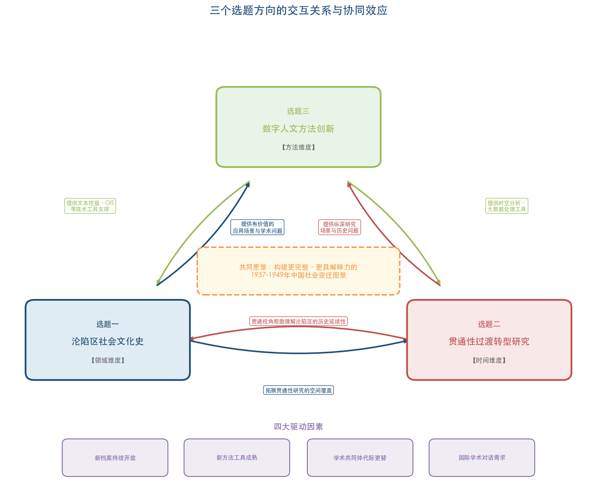

如图所示，三个选题方向分别从领域、时间和方法三个维度切入，围绕"构建更完整、更具解释力的1937-1949年中国社会变迁图景"这一共同学术愿景形成互补与协同。

从问题域的互补关系看，沦陷区社会文化史研究填补的是"研究领域"维度的空白，贯通性过渡转型研究弥合的是"时间维度"上的断裂，数字人文方法创新解决的是"方法论"层面的瓶颈。三者合力指向一个共同的学术愿景——构建更为完整、更具解释力的1937-1949年中国社会变迁图景。

从方法论的相互赋能看，数字人文方法可以为沦陷区社会文化史和贯通性研究提供技术工具支撑。例如，借助抗战文献数据平台中大量的沦陷区报刊进行文本挖掘，有助于从宏观层面揭示沦陷区文化生产的整体特征；利用GIS技术分析1945-1949年间人口流动和社会秩序重建的空间过程，有助于将贯通性研究建立在更为坚实的数据基础之上。反过来，沦陷区社会文化史和贯通性研究也将为数字人文方法提供有价值的应用场景和学术问题——数字方法的生命力最终取决于它能否回答传统方法无法充分回答的历史问题。

从学科建设的长远意义看，这三个选题方向分别指向1937-1949年研究的三个核心发展需求：拓展研究覆盖面（沦陷区社会文化史）、增强研究的整体性和连续性（贯通性过渡转型研究）、提升研究的方法论水平和国际竞争力（数字人文方法创新）。三者共同构成推动该领域在未来数年内实现实质性突破的关键路径。

## 6.6 驱动因素分析

推动上述三个选题方向成为未来研究潜力方向的驱动因素，可从以下四个层面加以分析。

**新档案的持续开放**构成最基本的物质驱动力。国家档案局组织的《抗日战争档案汇编》计划出版1000册，截至2023年底已出版550余册[吴敏超《近十年中国抗战史研究的蓬勃发展》](http://hprc.cssn.cn/gsyj/zhutiyj/kz80/202506/t20250619_5880073.html "《中国社会科学报》2025年6月19日")，尚有近一半仍在出版进程中。抗战文献数据平台的文献量仍在持续增长，省、市、县各级档案馆的档案开放也在逐步推进。这些持续释放的史料资源，将为沦陷区研究、贯通性研究和数字人文研究提供日益丰富的素材。

**新方法工具的成熟**是关键的技术驱动力。大语言模型、OCR识别、GIS技术、社会网络分析软件等工具的成熟与普及，使数字人文方法从少数技术精英的专属领域走向更广泛的历史学研究者群体。与此同时，社会史方法、日常生活史方法、新文化史方法、情感心灵史方法在根据地和大后方研究中已形成的成熟操作范式，也为这些方法向沦陷区和贯通性研究的移植提供了可资借鉴的经验。

**学术共同体的代际更替**是重要的组织驱动力。《抗日战争研究》编辑部自2013年起举办的"抗日战争史青年学者研讨会"至今已成功举办12届，"成为抗日战争史研究领域的品牌会议"[《抗日战争研究》编辑部简介](http://jds.cass.cn/bsgk/zzjg/krzzyjbjb/ "近代史研究所官网")。沦陷区研究工作坊已举办三届。一批受过跨学科训练、具备数字素养的中青年学者正在成长为研究主力。2025年10月近代史研究所召开的"近代以来中国历史学知识体系暨三大体系建设青年学者论坛"上，已有学者从物质文化史视角提出抗战根据地研究的新路径[近代史研究所网站](http://jds.cass.cn/newzxdt/202510/t20251031_5922512.shtml "2025年10月31日")。这些新生力量的问题意识和方法训练，与上述三个选题方向高度契合。

**国际学术对话的现实需求**是持续的外部驱动力。2025年出版的《新编第二次世界大战史》中英文版"在全面还原第二次世界大战历史面貌的基础上，深入阐释了东方主战场在世界反法西斯战争中的决定性作用"[《2025年历史学研究发展报告》](https://sscp.cssn.cn/byjh/202601/t20260121_5970292.shtml "中国社会科学杂志社，2026年1月21日")。臧运祜指出构建中国抗战史自主知识体系需要回应海外学界的"灰色地带"论等理论挑战[臧运祜《中国大陆学界的沦陷区研究浅议》](http://jds.cass.cn/xscg/xslw/202602/t20260203_5972035.shtml "《抗日战争研究》2025年第4期")。李翔也强调全球史观在中共抗战史研究中的应用"颇具挑战性"但"不可或缺"[李翔《以全球史观深化中共抗战史研究》](https://www.dswxyjy.org.cn/n1/2026/0318/c427167-40684254.html "《中共党史研究》2025年第5期")。上述三个选题方向——尤其是沦陷区社会文化史和数字人文方法创新——均具有显著的国际对话潜力。

# 第7章 结论——总体评价与学科展望

## 7.1 四十余年学术演进的总体特征

1937-1949年研究经过四十余年的持续积累，已从改革开放初期的单一叙事框架成长为一个拥有完整学科建制、多元理论范式、丰富方法工具和庞大学术共同体的成熟研究领域。据李金铮以"抗日战争"为主题词对中国知网所做的统计，仅1979至2016年38年间，期刊文章即达44888篇，平均每年1181篇；博硕论文达4156篇，平均每年181篇[李金铮《拓展视野：抗日战争史研究从何处突破？》](http://mg.lsxy.ruc.edu.cn/bykw/b0ee505a15a9442bb55e43b1c996e325.htm "《抗日战争研究》2016年第2期")。这一海量成果的持续产出，本身即构成对该领域学术繁荣程度的最直观证明。

综合前述各章的横向对比分析，1937-1949年研究在研究领域、研究视角、研究方法、理论运用和研究结论五个维度上呈现出如下总体演变规律。

**在研究领域维度上**，演变轨迹表现为从军事政治史的单一核心向多领域分化扩展。军事史和政治史（含党史）长期占据学术版图的主导地位，但自2000年代以来，社会史、文化史、经济史、区域史、日常生活史、环境生态史、医疗卫生史等子领域相继崛起，形成以军事史和政治史为双核心、外交史和经济史为重要支撑、社会史和文化史为新兴增长极的层次化格局。中共抗战史研究已成为该领域的"显学中之显学"[吴敏超《中国共产党抗战史研究的趋势、特点与相关思考》](http://jds.cass.cn/xscg/xslw/202601/t20260130_5971445.shtml "《抗日战争研究》2025年第4期")，正面战场研究完成了从"禁区"到"热区"的根本性转变，大后方研究日益丰富多元。与此同时，抗日战争（1937-1945）与解放战争（1945-1949）之间的研究体量不均衡，构成该领域最显著的结构性特征。

**在研究视角维度上**，演变轨迹表现为从单一范式主导向多元范式并存的深刻转换。革命史范式经过自我更新并未退场，现代化范式拓展了问题域与评价标准，社会史转向打开了基层社会与普通民众的研究空间，新文化史引入了概念、话语、仪式、记忆等分析维度，"新革命史"在承认革命重要性的前提下融合社会史与文化史方法，全球史/跨国史视角则将中国抗战纳入世界反法西斯战争的整体框架。正如李金铮所言，这些理论方法之间"应该是'各美其美，美美与共'，而不是互斥和替代的关系"[李金铮《拓展视野：抗日战争史研究从何处突破？》](http://jds.cssn.cn/newzxdt/202101/t20210128_5299664.shtml "近代史研究所网站转载")。范式多元化带来的最重要成果，在于极大地扩展了研究的"可见域"——从仅关注政治军事对抗，到能够捕捉战争中的社会、经济、文化、日常生活、个体情感和全球联动等多重面相。

**在研究方法维度上**，演变轨迹表现为传统方法持续夯实与新方法叠加拓展的累积性格局。传统史料考证和实证分析始终构成一切研究的基础性支撑；口述史方法在暴行史、社会史和抗战记忆研究中迅速成长为不可替代的工具——仅南京师范大学"抗日老战士口述史资料抢救整理"一项即访谈老兵1442位、积累素材时长3293小时[廖昕朔《2025年中国口述历史观察报告》](http://www.rmzxw.com.cn/c/2026-01-04/3843652.shtml "人民政协报，2026年1月4日")；计量史学在战争损失统计、两个战场战绩评估等特定领域发挥了关键推动作用；数字人文方法则以"抗日战争与近代中日关系文献数据平台"（截至2024年底总文献达7400万余页）为基础设施[吴敏超《近十年中国抗战史研究的蓬勃发展》](http://hprc.cssn.cn/gsyj/zhutiyj/kz80/202506/t20250619_5880073.html "《中国社会科学报》2025年6月19日")，正处于从基础设施建设向深度分析应用跃迁的关键节点。

**在理论运用维度上**，演变轨迹表现为从缺乏理论自觉到多种社会科学理论的工具化引入、再到初步探索基于中国经验修正理论的渐进深化过程。国家-社会关系理论、社会动员理论被运用于根据地政权建设和基层治理研究，集体记忆理论在南京大屠杀研究和抗战纪念研究中得到系统运用，情感心灵史方法则为理解革命者的精神世界开辟了独特路径。总体而言，理论运用呈现较强的"工具化"倾向——多数研究者引入社会科学理论时，主要将其作为分析框架加以借用，而较少参与理论本身的修正与创新。

**在研究结论维度上**，演变轨迹表现为从意识形态预设下的确定性判断向基于实证分析的开放性讨论的转变。围绕正面战场与敌后战场评价、国民政府战时体制的功过、中共根据地社会变革的性质、战后国共力量消长的原因等核心争论焦点，学界已从早期非此即彼的单一定论走向更为复杂、多层的分析认知。袁成毅对两个战场战绩研究的概括堪为典范——"从最早的只计中共领导的武装力量的抗日战绩，到兼计敌后和正面两个战场的战绩，进而将正面和敌后两个战场的战绩合成一个中国抗战的整体，这不能不说是一个巨大的进步"[袁成毅《抗日战争研究中的若干"计量化"问题》](http://jds.cssn.cn/xscg/xslw/201605/t20160506_5252776.shtml "近代史研究所网站")。评价标准"逐渐由以阶级意识为重转向以民族大义为重"[高士华《抗日战争研究在改革开放中不断发展》](http://jds.cass.cn/xscg/xslw/201811/t20181126_5253004.shtml "《人民日报》2018年11月26日第22版")这一根本性转变，为学术结论的客观化和多元化奠定了制度性前提。

## 7.2 主要成就的系统评估

### 7.2.1 学科建制的完备化

1937-1949年研究在四十余年间实现了从学科依附到相对独立的历史性跨越，构建起一套完整的学科基础设施体系。《抗日战争研究》自1991年创刊以来，历经张海鹏、步平、高士华、杜继东、夏春涛五任主编的薪火相传，2026年将由季刊改为双月刊[《抗日战争研究》编辑部简介](http://jds.cass.cn/bsgk/zzjg/krzzyjbjb/ "近代史研究所官网")；中国抗日战争史学会自1991年成立以来持续发挥学术组织与学术交流的核心功能[中国抗日战争史学会简介](http://hrczh.cass.cn/bygl/kygl/xspt/xspt_jdsyjs/fds_dgxh/202502/t20250218_5847966.shtml "中国历史研究院官网")；中国社科院近代史研究所于2019年设立专门的抗日战争史研究室，2023年该学科入选"登峰战略"重点学科[近代史研究所抗日战争史研究室简介](http://jds.cssn.cn/bsgk/zzjg/krzzsyjs/ "近代史研究所官网")；2016年揭牌的中国抗日战争研究协同创新中心汇聚了南京大学、北京大学、南开大学、武汉大学以及中央档案馆、中国第二历史档案馆等多方力量[南京大学官网](https://www.nju.edu.cn/info/3191/178381.htm "2016年1月21日")；国家社科基金抗日战争研究专项工程自2016年设立以来，已立项30余项、出版100余种资料集[吴敏超《近十年中国抗战史研究的蓬勃发展》](http://hprc.cssn.cn/gsyj/zhutiyj/kz80/202506/t20250619_5880073.html "《中国社会科学报》2025年6月19日")。这一体系化的学科建制在中国近代史学科内部堪称独特，为该领域研究的持续深化提供了坚实的制度保障。

### 7.2.2 史料基础的历史性拓展

史料基础的大规模扩展构成四十余年学术发展中最具根本性意义的成就。在国内档案整理方面，国家档案局组织的《抗日战争档案汇编》截至2023年底已出版550余册（计划出版1000册），步平、王建朗主编的八卷本《中国抗日战争史》和"中国共产党领导的敌后抗战"系列丛书（23种28册）等大型研究与资料出版项目相继完成[吴敏超《近十年中国抗战史研究的蓬勃发展》](http://hprc.cssn.cn/gsyj/zhutiyj/kz80/202506/t20250619_5880073.html "《中国社会科学报》2025年6月19日") [吴敏超《中国共产党抗战史研究的趋势、特点与相关思考》](http://jds.cass.cn/xscg/xslw/202601/t20260130_5971445.shtml "《抗日战争研究》2025年第4期")。在数字化平台方面，"抗日战争与近代中日关系文献数据平台"已发展为亚洲最大的抗战史数据库，中国第二历史档案馆完成了馆藏档案36%的数字化[马振犊《改革开放四十年民国档案气象新》](https://da.xzdw.gov.cn/dayw/xxyd/201904/t20190425_151143.html "二史馆馆长撰文，2019年4月")。在口述史料积累方面，南京师范大学"抗日老战士口述史资料抢救整理"项目访谈老兵1442位，关爱抗战老兵公益基金在全国30个省市地区对1600余位抗战老兵进行了口述访谈[廖昕朔《2025年中国口述历史观察报告》](http://www.rmzxw.com.cn/c/2026-01-04/3843652.shtml "人民政协报，2026年1月4日") [中国传媒大学口述历史研究中心](https://oral.cuc.edu.cn/2021/1022/c3769a187781/pagem.htm "第七届中国口述历史国际周")。在史料利用的国际化方面，张宪文团队72卷《南京大屠杀史料集》遍及中、日、美、英、德、法、俄、意、西等国文献[人民网](http://dangshi.people.com.cn/n/2014/0915/c85037-25663543.html "2014年9月15日")，多国档案的交叉利用已成为研究方法论进步的重要标志。上述史料基础设施的系统建设，使该领域从早期受制于史料匮乏的状态，进入了一个"有史料可用、有平台可依"的全新阶段。

### 7.2.3 理论范式的多元发展与学术对话的成熟

综合第3章和第5章的分析可以清晰地看到，1937-1949年研究已发展出一个由多种理论范式和学术流派构成的成熟对话格局。革命史范式、现代化范式、社会史转向、新文化史转向、"新革命史"和全球史视角六种主要范式在同一学术场域中并存、竞争与互动。这一多元格局的形成经历了从"范式之争"到"多元并存"的思想转变——徐秀丽明确提出"多元并存，相互争鸣，彼此宽容，是学术发展的必由之路"[徐秀丽《中国近代史研究中的"革命史范式"与"现代化范式"》](http://jds.cssn.cn/newzxdt/202101/t20210128_5305735.shtml "《中国社会科学院院报》2006年5月30日")。

代表性学者群体的形成是学术成熟的另一重要标志。张宪文团队以"南京学派"的系统性学术建构开拓了正面战场研究和南京大屠杀研究的新境域；李金铮以"新革命史"的理论贡献推动了中共革命史研究方法的范式革新；黄道炫以情感心灵史方法开辟了理解革命内在精神世界的独特路径；李里峰以"新政治史"主张实现了政治学理论与抗战史实证研究的有机融合；臧运祜以对沦陷区研究的长期深耕推动了这一薄弱领域的学术建构；金冲及和刘统的解放战争系列著作则为该子时段的军事政治史研究奠定了基本框架。不同学者、不同流派之间既有分歧又有对话，既有竞争又有互补，构成了学术持续推进的内在动力。

### 7.2.4 国际影响力的显著提升

"全球视野下的中国抗战与世界反法西斯战争"入选2025年度中国十大学术热点，评选专家指出该年度的中国抗战研究"呈现出更为宏阔的全球视野"，"表明学术理论界走出传统的日本军国主义侵略与中国人民反侵略单一框架，主动融入并积极塑造全球反法西斯战争史叙事"[《光明日报》2025年度中国十大学术热点](https://news.ruc.edu.cn/2013443284089921537.html "人民大学新闻网转载，《光明日报》2026年1月20日")。2025年出版的《新编第二次世界大战史》中、英文版"在全面还原第二次世界大战历史面貌的基础上，深入阐释了东方主战场在世界反法西斯战争中的决定性作用"[《2025年历史学研究发展报告》](https://sscp.cssn.cn/byjh/202601/t20260121_5970292.shtml "中国社会科学杂志社，2026年1月21日")。美国学者安德鲁·N.布坎南亦认为"应该把1931—1949年发生在中国的战争重新纳入'全球二战'叙事"[《2025年历史学研究发展报告》](https://sscp.cssn.cn/byjh/202601/t20260121_5970292.shtml "中国社会科学杂志社，2026年1月21日")。南京大屠杀幸存者口述史被译为日文在日本出版[廖昕朔《2025年中国口述历史观察报告》](http://www.rmzxw.com.cn/c/2026-01-04/3843652.shtml "人民政协报，2026年1月4日")、抗战文献数据平台向海内外永久公益开放[罗敏、姜涛《数字人文与跨越国界的史料共享》](http://www.nopss.gov.cn/n1/2019/0620/c373410-31170697.html "全国哲学社会科学工作办公室，2019年6月20日")、两岸共研抗战史研讨会连续举办六届[吴敏超《近十年中国抗战史研究的蓬勃发展》](http://hprc.cssn.cn/gsyj/zhutiyj/kz80/202506/t20250619_5880073.html "《中国社会科学报》2025年6月19日")——这些实践表明，中国抗战史研究的国际影响力正经历从"被动回应"向"主动塑造"的阶段性跃升。

## 7.3 结构性不足的诊断

在充分肯定上述成就的同时，必须清醒地认识到，1937-1949年研究依然存在若干不容忽视的结构性不足。这些不足并非枝节性缺憾，而是制约该领域在深度、广度和国际影响力方面进一步提升的关键瓶颈。

### 7.3.1 领域分布的结构性失衡

领域分布失衡是贯穿本报告的一条核心发现。其一，抗日战争与解放战争两个子时段之间存在巨大的研究体量落差。抗战史研究拥有专门期刊、学术组织、研究室和国家级专项工程的完整学科建制，而解放战争研究至今缺乏上述全部制度配置。2024年度学术综述虽然观察到"近年来较少受到学界关注的解放战争史研究，研究成果数量和质量都有显著提升"[辛逸、岳伟、满永《二〇二四年中共党史研究的若干学术进展》](https://taiyuan.gov.cn/c/www/dsby/30285196.jhtml "《中共党史研究》2025年第5期")，但这一改善仍属初步，距离弥合两个子时段之间的结构性差距尚有相当距离。

其二，在抗战史研究内部，不同区域之间的研究深度同样严重不均。根据地研究和大后方研究积累深厚，沦陷区研究则长期处于薄弱状态。臧运祜直言，沦陷区社会史与文化史"一直是沦陷区研究最薄弱的两个领域"，沦陷区1亿多城市与乡村民众的生活状况"在研究上都有很大的开拓空间"[臧运祜《中国大陆学界的沦陷区研究浅议》](http://jds.cass.cn/xscg/xslw/202602/t20260203_5972035.shtml "《抗日战争研究》2025年第4期")。当前对1937-1945年时段的学术认知，本质上建立在"根据地+大后方+正面战场"的三元框架之上，覆盖战时中国人口最为稠密、经济最为发达的沦陷区的社会文化研究几近空白，严重制约了学界对战时中国社会全貌的完整把握。

### 7.3.2 贯通性视野的匮乏

1937-1949年研究的一个深层局限在于，抗战史与解放战争史分属不同的学科框架和学术共同体——前者归于抗战史学科体系，后者附属于中共党史或军事史框架——由此导致两个子时段之间的历史连续性被人为割裂。吴敏超明确呼吁将抗战时期"放在中国共产党的整体历史中探讨，尤其要关注此前的苏区时期和后来的解放战争时期，作贯通性考察"[吴敏超《中国共产党抗战史研究的趋势、特点与相关思考》](http://jds.cass.cn/xscg/xslw/202601/t20260130_5971445.shtml "《抗日战争研究》2025年第4期")。2024年"从革命到建政：跨越1949"学术研讨会更是"极力倡导贯通研究历史的思维方法和能力"[辛逸、岳伟、满永《二〇二四年中共党史研究的若干学术进展》](https://taiyuan.gov.cn/c/www/dsby/30285196.jhtml "《中共党史研究》2025年第5期")。然而，贯通性研究取向虽已获学界广泛倡导，却缺乏成规模的实践成果——方法论方向上的共识已然形成，但具体操作层面的落实仍严重不足。

### 7.3.3 数字人文应用的滞后

在方法论层面，数字人文基础设施建设与深度分析应用之间存在显著的结构性错位。7400万余页的数字化文献固然提供了海量的数据基础，但当前平台的主要功能仍停留在文献检索和浏览层面——本质上是将传统图书馆的功能予以数字化，距离真正实现数据驱动的研究创新仍有很大差距。罗敏和姜涛坦承，相较于北美数字人文已形成的成熟产业链，"国内人文学科的数据库建设仍有不少差距"，突出表现在"规模性数据的标引与运算上需要重点突破"[罗敏、姜涛《数字人文与跨越国界的史料共享》](http://www.nopss.gov.cn/n1/2019/0620/c373410-31170697.html "全国哲学社会科学工作办公室，2019年6月20日")。文本挖掘、社会网络分析、GIS时空分析等数字人文方法在该领域的实际产出极为有限，距离生成实质性学术成果仍有很大差距。

### 7.3.4 理论原创性的不足

跨学科理论在1937-1949年研究中的引入虽已取得显著进展，但总体上呈现"工具化"特征——研究者主要将社会科学理论作为现成的分析框架加以移用，较少基于中国历史经验参与理论本身的修正和创新。李金铮对此有清醒的认识，他反复强调："对于国外的先进理论方法及成果，最终目的不在于了解、学习和汲取，而是之后的摆脱、超越和创新，反过来，再影响国际史学的前途"[李金铮《拓展视野：抗日战争史研究从何处突破？》](http://jds.cssn.cn/newzxdt/202101/t20210128_5299664.shtml "近代史研究所网站转载")。如何基于1937-1949年中国社会的独特历史经验——如抗战时期根据地治理的国家-社会互动模式、战时社会动员的中国路径、跨越抗战与解放战争的过渡转型逻辑——来丰富、修正乃至重构社会科学理论，仍是一个迫切需要系统突破的根本性学术课题。

### 7.3.5 国际学术话语权的差距

尽管国际影响力持续提升，中国学者在抗战史国际叙事中的话语权与中国抗战的历史贡献之间仍存在显著落差。郝平指出，"关于第二次世界大战中国的东方主战场地位，一直是西方史学界无视或者刻意回避的重要学术问题"[郝平《构建东方主战场视域下的抗战史研究体系》](http://jds.cass.cn/xscg/xslw/202601/t20260130_5971440.shtml "近代史研究所网站，2026年1月30日")。李翔坦承，"现有的中共抗战史研究依旧多是单向度的、国内史的叙述"[李翔《以全球史观深化中共抗战史研究》](https://www.dswxyjy.org.cn/n1/2026/0318/c427167-40684254.html "《中共党史研究》2025年第5期")。臧运祜亦提醒，在沦陷区研究中，海外学界提出的"灰色地带"论等概念框架"也是我们不容忽视、需要应对的学术问题"，"话语体系的建构问题尤为突出和重要"[臧运祜《中国大陆学界的沦陷区研究浅议》](http://jds.cass.cn/xscg/xslw/202602/t20260203_5972035.shtml "《抗日战争研究》2025年第4期")。外语能力和海外档案利用条件的客观制约、中国近代史学界长期形成的"国别史"研究惯性，以及中外学术体系之间的结构性壁垒，共同制约着中国学者在国际学术对话中的参与深度与话语效力。

## 7.4 学科建设的前瞻性思考

基于上述对成就与不足的系统评估，以下从学科建设角度提出若干前瞻性思考，旨在探讨如何推动1937-1949年研究在深度、广度和国际影响力方面实现进一步提升。

### 7.4.1 以整体性视野弥合学科建制的断裂

1937-1949年研究在学科建设上面临的首要挑战，在于如何克服抗战史与解放战争史之间的制度壁垒和学术隔阂。当前两个子时段分属不同学科框架的格局，人为割裂了这十二年间中国社会变革的内在连续性。

弥合这一断裂需要在两个层面同时推进。在学术理念层面，贯通性研究取向的自觉确立至关重要。吴敏超的呼吁——"放在中国共产党的整体历史中探讨"、"作贯通性考察"[吴敏超《中国共产党抗战史研究的趋势、特点与相关思考》](http://jds.cass.cn/xscg/xslw/202601/t20260130_5971445.shtml "《抗日战争研究》2025年第4期")——以及"从革命到建政：跨越1949"研讨会所倡导的整体性与连续性研究[辛逸、岳伟、满永《二〇二四年中共党史研究的若干学术进展》](https://taiyuan.gov.cn/c/www/dsby/30285196.jhtml "《中共党史研究》2025年第5期")，代表了学界在理念层面已经形成的共识方向。在研究实践层面，选择能够天然贯穿两个子时段的研究议题——如中共根据地治理经验向解放区新区的移植与调适、战后国统区社会经济崩溃与政权合法性的关系、1945-1949年基层社会秩序的瓦解与重建等——是落实贯通性理念的最具操作性的路径。

### 7.4.2 以系统性工程补齐领域盲区

沦陷区社会文化史研究的系统推进，是补齐1937-1949年研究领域盲区的最紧迫任务。臧运祜、王建朗等权威学者已反复强调这一领域的学术价值与开拓空间[臧运祜《中国大陆学界的沦陷区研究浅议》](http://jds.cass.cn/xscg/xslw/202602/t20260203_5972035.shtml "《抗日战争研究》2025年第4期") [王建朗《回顾与前瞻：抗日战争研究三十年》](http://jds.cssn.cn/newzxdt/202111/t20211125_5376948.shtml "《抗日战争研究》2021年第3期")。已召开的三届沦陷区研究工作坊、南京大学中国抗日战争研究协同创新中心组织的沦陷区专题丛书，以及350册满铁调查资料的整理出版[王建朗《回顾与前瞻：抗日战争研究三十年》](http://jds.cssn.cn/newzxdt/202111/t20211125_5376948.shtml "《抗日战争研究》2021年第3期")，已为该领域的系统推进奠定了平台与史料基础。关键在于将分散的学术努力转化为制度化的系统工程——通过专项课题设置、专题学术平台建设以及中青年研究人才的定向培养，推动沦陷区社会文化史从零星探索走向系统建构。

### 7.4.3 以方法论突破激活数字人文潜力

数字人文方法在1937-1949年研究中的深度应用，是该领域方法论创新的最大增长点。7400万余页数字化文献构成的基础设施已基本就绪，关键在于如何实现从"文献数字化"到"数据驱动的知识发现"的方法论跃迁。这一跃迁的核心障碍并非技术层面，而在于"学术顾问团队与技术团队的深度合作模式需要切实加强"[罗敏、姜涛《数字人文与跨越国界的史料共享》](http://www.nopss.gov.cn/n1/2019/0620/c373410-31170697.html "全国哲学社会科学工作办公室，2019年6月20日")——历史学者需要理解数字方法的能力边界，技术团队需要把握学术问题的内在逻辑，二者的深度协作是产出实质性成果的前提。

在具体应用层面，文本挖掘方法可用于战时报刊话语的主题演变分析，GIS技术可用于战时人口迁移和根据地空间扩展的地理可视化，社会网络分析可用于战时学术共同体结构和政策传播网络的研究。这些应用方向的学术价值在于，它们有望揭示人力阅读无法识别的宏观模式和隐含关联——这正是数字人文方法相对于传统方法的真正增量贡献所在。

### 7.4.4 以自主话语体系建构提升国际影响力

提升1937-1949年研究国际影响力的核心，不在于简单地增加英文发表数量或参加更多国际会议，而在于构建一套具有理论原创性和解释说服力的中国抗战史自主知识体系。这一体系的建构涉及三个相互关联的层面。

第一层面是实证层面的"硬实力"建设——以严谨的多国档案交叉利用、扎实的定量分析和系统的史料出版为基础，确保中国学者的研究成果在史实准确性和证据充分性上经得起国际学术检验。张宪文团队72卷《南京大屠杀史料集》涵盖多国文献的做法，以及抗战文献数据平台向海内外永久公益开放的战略选择，均属这一层面的成功实践。

第二层面是理论层面的"原创性"建设——基于1937-1949年中国社会的独特历史经验，提出能够与西方理论框架进行有效对话甚至形成超越的原创概念和分析工具。"新革命史"概念的提出是朝此方向迈出的有意义的一步，但类似的理论原创工作在该领域仍然稀缺。臧运祜所指出的沦陷区研究中"话语体系的建构问题"[臧运祜《中国大陆学界的沦陷区研究浅议》](http://jds.cass.cn/xscg/xslw/202602/t20260203_5972035.shtml "《抗日战争研究》2025年第4期")——如何超越西方学界的"灰色地带"论和"合作者"概念框架，建构中国学者自主的分析话语——即是这一层面的典型课题。

第三层面是传播层面的"可达性"建设——通过优质的多语种出版、国际学术数据库的深度参与，以及中外学者的常态化合作研究，使中国学者的研究成果有效进入国际学术对话的核心议程。2025年《新编第二次世界大战史》中英文同步出版[《2025年历史学研究发展报告》](https://sscp.cssn.cn/byjh/202601/t20260121_5970292.shtml "中国社会科学杂志社，2026年1月21日")，以及中国抗日战争史学会与台湾中华民族抗日战争纪念协会连续主办六届研讨会、2023年推出《两岸共研抗战史论文集》[吴敏超《近十年中国抗战史研究的蓬勃发展》](http://hprc.cssn.cn/gsyj/zhutiyj/kz80/202506/t20250619_5880073.html "《中国社会科学报》2025年6月19日")的做法，均是传播层面的积极探索。

### 7.4.5 以代际传承保障学术可持续发展

学术共同体的代际传承是1937-1949年研究可持续发展的人才根基。《抗日战争研究》编辑部自2013年起举办的"抗日战争史青年学者研讨会"至今已成功举办12届，"成为抗日战争史研究领域的品牌会议"[《抗日战争研究》编辑部简介](http://jds.cass.cn/bsgk/zzjg/krzzyjbjb/ "近代史研究所官网")，为青年学者的学术成长搭建了重要平台。2025年10月召开的"近代以来中国历史学知识体系暨三大体系建设青年学者论坛"上，已有中青年学者从物质文化史等新视角提出抗战研究的创新路径[近代史研究所网站](http://jds.cass.cn/newzxdt/202510/t20251031_5922512.shtml "2025年10月31日")。沦陷区研究工作坊已连续举办三届，培育了一批聚焦沦陷区问题的中青年研究力量[臧运祜《中国大陆学界的沦陷区研究浅议》](http://jds.cass.cn/xscg/xslw/202602/t20260203_5972035.shtml "《抗日战争研究》2025年第4期")。

新一代学者的知识结构和方法训练与前辈群体存在显著差异：他们中的不少人受过跨学科训练，具备社会科学理论素养和数字人文技能，外语能力与海外学术交流经验亦较前辈群体有明显提升。这一代际特征恰与前述三个优先发展方向——沦陷区社会文化史、贯通性研究和数字人文方法创新——的方法论需求高度契合。如何为这些具有新型知识结构的青年学者提供充分的制度支持与学术发展空间，使其方法论优势转化为实质性的学术创新成果，是学科建设中不可忽视的组织保障问题。

## 7.5 总结

1937-1949年研究的四十余年历程，见证了一个研究领域从意识形态约束下的单一叙事走向学术自主性日益增强的多元探索。在这一进程中，学科建制的完备化、史料基础的历史性拓展、理论范式的多元发展和国际影响力的显著提升构成了四项主要成就，而领域分布的结构性失衡、贯通性视野的匮乏、数字人文应用的滞后、理论原创性的不足和国际话语权的差距则构成了五项结构性不足。

我们认为，在当前学术发展阶段，推动这一领域实现新突破的关键路径在于：以沦陷区社会文化史的系统建构补齐领域盲区、以贯通1937-1949年的过渡转型研究弥合时间断裂、以数字人文方法的深度应用实现方法论跃迁。这三个方向分别指向研究覆盖面的拓展、研究整体性的增强和研究方法水平的提升，它们之间存在相互赋能的协同关系，共同构成了推动该领域在未来数年内实现实质性进步的战略路径。

习近平在2015年强调"我们的抗战研究还远远不足，要继续进行深入系统的研究"[新华网](http://www.xinhuanet.com/politics/2015-12/10/c_128518232.htm "2015年重要论述")。十年之后回望，中国学界在抗战研究领域取得的进步有目共睹——从国家社科基金专项工程的大规模投入、抗战文献数据平台的建成运行，到八卷本《中国抗日战争史》的出版和"东方主战场"话语体系的学术建构，都是对这一号召的积极响应。但"还远远不足"的判断在更深层次上依然成立：沦陷区1亿多民众的历史缺乏全面书写，1945-1949年过渡转型的深层逻辑缺乏系统揭示，海量数字化文献中蕴含的知识宝藏缺少计算方法加以充分开掘，中国抗战史的自主知识体系需要更多具有理论原创性的学术成果加以充实。1937-1949年研究的学术史表明，每一次重大进步都是在新史料的发现、新方法的引入和新视角的开拓三者共同作用下实现的。在史料条件持续改善、方法工具日趋成熟、学术视野不断开阔的当下，这一领域正处于酝酿新一轮突破的关键时期。

# 结论与风险提示

## 核心结论

本报告通过对中国历史学界1937-1949年研究成果的系统梳理与横向比较分析，得出以下核心结论。

**第一，该领域已完成从单一叙事向多元学术生态的历史性转型。** 改革开放四十余年来，1937-1949年研究从革命史框架下"研究的问题比较单一"的起点出发，发展为拥有完整学科建制、多元理论范式和丰富方法工具的成熟研究领域。评价标准"逐渐由以阶级意识为重转向以民族大义为重"[高士华《抗日战争研究在改革开放中不断发展》](http://jds.cass.cn/xscg/xslw/201811/t20181126_5253004.shtml "《人民日报》2018年11月26日第22版")这一根本性转变，为学术研究的客观化与多元化奠定了制度性前提。学科建制的完备化（专门期刊、学术组织、研究室、专项工程）、史料基础的历史性拓展（7400万余页数字化文献、550余册《抗日战争档案汇编》、1442位老兵口述访谈）、理论范式的多元发展（革命史、现代化、社会史、新文化史、新革命史、全球史六种范式并存）以及国际影响力的显著提升（"东方主战场"话语体系的学术建构、抗战文献平台的国际公益开放），构成四项标志性成就。

**第二，领域分布的结构性失衡是制约该领域认知完整性的最突出瓶颈。** 抗日战争与解放战争两个子时段之间的制度化程度落差，以及沦陷区社会文化史的长期薄弱，导致学界对1937-1949年中国社会全貌的认知存在系统性盲区。解放战争研究"近年来较少受到学界关注"的格局虽已出现改善迹象，但距离弥合结构性差距仍有相当距离。沦陷区1亿多民众的社会生活与文化状况，至今仍是学术版图中最大的空白地带。

**第三，方法论进步的核心特征是累积性叠加而非替代性更新。** 传统史料考证与实证分析始终构成一切研究的底层支撑，口述史、计量史学、社会科学跨学科方法与数字人文技术依次叠加，拓展了研究者处理证据的方式和能力边界。这一累积性格局意味着，该领域的进一步发展不取决于某一种新方法对旧方法的取代，而取决于多种方法之间能否实现更为深入的有机整合。

**第四，三个最具研究潜力的选题方向已具备条件进入系统推进阶段。** 沦陷区社会文化史的系统建构、贯通1937-1949年的过渡转型研究、数字人文方法驱动的研究创新，分别从领域、时间和方法三个维度指向该领域的关键缺环。三者之间存在相互赋能的协同关系：数字人文方法可为沦陷区研究和贯通性研究提供技术工具支撑，沦陷区研究和贯通性研究则为数字人文方法提供有价值的应用场景。在新档案持续开放、新方法工具日益成熟、学术共同体代际更替加速推进的当下，这三个方向正处于从学术共识转化为成规模实践成果的关键窗口期。

## 局限性分析

本报告作为一份基于公开文献的综述性研究，存在以下主要局限。

**其一，文献覆盖的非穷尽性。** 1937-1949年研究的文献体量极为庞大（仅以"抗日战争"为主题词，1979至2016年间的期刊文章即达44888篇），本报告对代表性论著的遴选和评介不可能穷尽全部重要成果。在军事史、经济史等成果积累深厚的子领域，受篇幅和信息获取条件的限制，部分有学术价值的论著可能未被充分覆盖。

**其二，信息的时效性约束。** 本报告截稿时间为2026年4月，所引用的最新文献集中于2025年至2026年初发表的综述性和前瞻性文章。该领域的学术动态更新迅速——国家社科基金抗日战争研究专项工程仍在持续推出新成果，《抗日战争档案汇编》近一半仍在出版进程中——本报告的部分判断可能需要随着新成果的发表而修正。

**其三，对解放战争研究覆盖的相对不足。** 本报告如实反映了抗日战争与解放战争两个子时段研究体量的显著不均衡。由于解放战争研究缺乏独立的学术综述性文献（如荣维木和吴敏超对抗战研究的系统综述），本报告对解放战争研究的梳理在系统性和完整性上弱于抗战史部分。这一不足本身也印证了解放战争研究在学科建制化程度上的落后现状。

**其四，对海外学术成果的评介有限。** 本报告以中国大陆历史学界的研究成果为主体，对海外（含港台）学术成果主要关注其对大陆学界的影响和对话关系，而非全面评述。费正清、裴宜理、方德万等海外学者的重要著作在相关语境中有所涉及，但并非本报告的系统评介对象。这意味着本报告呈现的学术图景主要反映大陆学界的视角和关切，对海外学界在同一领域的独立研究脉络覆盖不足。

**其五，选题预测的固有不确定性。** 第6章提出的三个潜力选题方向，其论证建立在对当前学术格局、史料条件和方法工具发展趋势的分析基础上。学术研究的实际演进受到政策导向调整、重大档案发现、国际学术交流格局变化等多重不可预见因素的影响，预测结论具有固有的不确定性，应将其理解为基于当前信息的合理推断，而非确定性判断。
