# 执行摘要

随着半导体工艺节点从 7 nm 向 5 nm、3 nm、2 nm 乃至 Å 级制程持续微缩，互连金属薄膜的沉积技术已成为芯片性能提升与制程延续的关键瓶颈之一。本报告系统调研了物理气相沉积（PVD/溅射）、化学气相沉积（CVD）、原子层沉积（ALD）、电子束蒸发沉积（E-beam Evaporation）和分子束外延（MBE）五类沉积设备在 ≤7 nm 先进制程中的实际应用状况，明确各设备沉积何种金属薄膜以及其被选用的技术与经济逻辑。

**核心发现一：三类技术构成量产金属化的"技术三角"。** 在当今先进制程中，PVD、CVD 和 ALD 三类技术各司其职、深度互补，共同覆盖后段互连（BEOL）、中段互连（MOL）和前段器件（FEOL）金属栅极的全部沉积需求。PVD 以高纯度（5N 靶材）和高速率（>80 wph）服务于铜种子层（Cu, 3–5 nm）、TiN 金属硬掩膜以及 Ru 减法刻蚀工艺中的毯状薄膜沉积；CVD 凭借良好的保形填充能力主导钨（W）接触孔填充和 Co/Ru 衬垫层沉积，其中 Applied Materials 的 Volta CVD Cobalt 和 Volta Ruthenium CVD 系统已被所有领先逻辑芯片制造商采用；ALD 以自限制逐层生长机制实现原子级厚度控制（GPC 约 0.3–1.5 Å/cycle）与近 100% 保形覆盖，主导 TaN 扩散阻挡层（1–1.5 nm）、Mo 接触金属以及金属栅极功函数层等最关键超薄功能层的沉积。

**核心发现二：E-beam 蒸发与 MBE 不参与先进逻辑量产。** 电子束蒸发和分子束外延因台阶覆盖率极差（视线沉积，侧壁覆盖率趋近于零）、不适配 300 mm 晶圆产线以及产能不足（MBE 单次仅可加载 1–4 片 100–150 mm 晶圆）等硬性约束，在 ≤7 nm 先进逻辑芯片的互连金属薄膜量产中不具备技术可行性和经济可行性。二者在各自优势领域——化合物半导体金属化与光学镀膜（E-beam）、高端 III-V 外延与量子器件研发（MBE）——中仍保持不可替代的地位。

**核心发现三：材料变革驱动沉积技术的范式转换。** 铜互连在 ≤20 nm pitch 下因电子散射效应导致有效电阻率急剧攀升（比体值上升约 10×），推动产业界向钌（Ru）、钼（Mo）、钴（Co）等替代金属过渡。Ru 凭借极短的电子平均自由程（λ_eff = 6.7 nm）和无需阻挡层的集成优势，预计最早在 14A 节点进入量产互连层；Mo 已在 3D NAND 中实现量产（替代 W 字线），Lam Research 于 2025 年发布的 ALTUS Halo 是全球首款量产级 Mo ALD 设备，在多数应用场景中可实现比传统 W 方案低 50% 以上的电阻。

**核心发现四：多技术集成平台已成为先进金属化的产业标杆。** 先进节点的金属化工艺不再依赖单一沉积技术独立完成，而是以多技术集成方案实现全流程协同。Applied Materials 的 Endura Copper Barrier Seed IMS 系统将 ALD、PVD、CVD 等七种工艺技术集成在同一真空平台中，通孔电阻降低最高达 50%，已被全球领先代工/逻辑客户量产采用。ALD 与 CVD 的 super-cycle 融合正在成为替代金属沉积的标准工艺架构。

**趋势判断：** 2026 年全球 ALD 设备市场规模已达 79.1 亿美元，占晶圆厂设备总支出的约 35.5%，预计 2031 年将增长至 129.3 亿美元（CAGR 10.32%）。2 nm 节点每片晶圆所需的 ALD 沉积步骤数较 3 nm 增加 20% 以上。我们判断，ALD 在金属化流程中的价值占比将继续攀升，PVD 在铜种子层和 Ru 减法刻蚀中保持不可替代价值但整体份额将相对收缩，CVD-ALD 融合将成为 ≤2 nm 节点金属化工艺的技术范式。

# 第1章 先进制程金属薄膜概述——角色、材料与工艺挑战

后段互连（Back-End-of-Line, BEOL）金属薄膜是先进逻辑芯片中信号传输与功率分配的关键载体。随着工艺节点从 7 nm 向 5 nm、3 nm、2 nm 乃至更先进制程持续微缩，金属互连线宽已进入 10–25 nm 的极限尺度区间。在这一尺度下，电子散射效应导致铜（Cu, Copper）有效电阻率急剧攀升，RC 延迟恶化与电迁移失效风险同步加剧，正推动产业界从传统 Cu 互连向钌（Ru, Ruthenium）、钼（Mo, Molybdenum）、钴（Co, Cobalt）等替代金属进行历史性过渡。本章为后续各沉积技术章节建立统一的工艺语境，系统阐述先进制程金属薄膜的功能层分类、关键材料参数及产业界面临的核心挑战。

本报告所称"先进制程"统一界定为 ≤7 nm 节点（含 7 nm、5 nm、3 nm、2 nm 及更先进节点）。涉及具体工艺节点时标注各代工厂命名体系（如 TSMC N3/N2、Intel 18A/14A、Samsung SF3E/SF2 等），以避免不同厂商节点定义之间的混淆。

## 1.1 BEOL 互连堆叠结构与各功能层的角色

### 1.1.1 多层金属互连堆叠

现代先进逻辑芯片的 BEOL 互连堆叠是一套高度复杂的多层金属-介电体系统。以 Intel 4 工艺为例，其 BEOL 堆叠高达 16 层金属层级，从最底部的 M0/M1 局部互连（metal pitch ≤25 nm）到顶部全局布线（pitch 可达数百 nm），各层对薄膜厚度与形貌控制的要求差异显著 [imec 替代金属教程](https://arxiv.org/html/2406.09106v1 "Sankaran et al., Selecting Alternative Metals for Advanced Interconnects, 2024")。底部局部互连层承载最密集的晶体管间信号传输，线宽最窄、深宽比最大，对电阻率和保形性的要求最为苛刻；顶部全局布线层则主要传输时钟信号与电源，线宽较宽，对电阻率的要求相对宽松，但对电迁移可靠性及大电流承载能力提出了更高要求。

从系统性能的角度审视，互连堆叠中的功率分配网络已消耗器件总功耗的约三分之一，并贡献了芯片 RC 延迟的约 75% [Semiconductor Engineering](https://semiengineering.com/interconnects-approach-tipping-point/ "Interconnects Approach Tipping Point, 2025-02")。这一比例在更先进节点中仍在持续攀升，互连性能优化已成为芯片整体性能提升的关键瓶颈。

### 1.1.2 金属薄膜功能层分类

Cu 双大马士革（Dual Damascene）工艺中，每条互连线由多层功能薄膜协同构成，各层承担不可或缺的功能：

**（1）扩散阻挡层（Diffusion Barrier）**：以 TaN 为代表，典型厚度 1–2 nm。其核心功能是阻止 Cu 原子向周围介电层扩散——Cu 扩散将导致介电层击穿与器件失效。在先进节点中，阻挡层厚度已从过去的 5–10 nm 压缩至 1–1.5 nm，对沉积工艺的保形性与均匀性提出了近乎极限的要求。

**（2）粘附/衬垫层（Adhesion Liner）**：典型材料为 Co（约 1–2 nm）或 Ru-Co 双层结构。衬垫层在 TaN 阻挡层与 Cu 导体之间起粘附和润湿作用，确保后续 Cu 电镀的无缺陷填充。Samsung 在 3 nm 节点（SF3E）中优化了 Ru-Co 双层衬垫方案，TaN/Ru-Co/Cu 结构相比传统单一 Co 衬垫减少 87% 空洞并改善 14% 线电阻 [Semiconductor Engineering](https://semiengineering.com/interconnects-approach-tipping-point/ "Samsung Ru-Co liner, IITC 2024 引用, 2025")。

**（3）种子层（Seed Layer）**：Cu PVD 种子层在阻挡/衬垫层之上提供一层连续的 Cu 薄膜，作为后续电化学镀铜（ECD）的导电基底。种子层的均匀性与连续性直接决定电镀填充质量。

**（4）导体主体（Conductor Fill）**：Cu 通过电化学沉积（ECD）填入大马士革沟槽与通孔，随后经化学机械抛光（CMP）实现平坦化，构成信号与电流的主要传输载体。

**（5）盖帽层（Capping Layer）**：选择性沉积的 Co 或 SiN 盖帽层覆盖在 Cu 导体顶部，抑制 Cu 在介电层界面处的电迁移与扩散，延长互连使用寿命。

在 10 nm 线宽下，阻挡层与衬垫层的总厚度约 2–3 nm，已占据可用导体截面积的 30% 以上 [Semiconductor Engineering](https://semiengineering.com/extending-copper-interconnects-to-2nm/ "Extending Copper Interconnects To 2nm, 2022")。这意味着一条 10 nm 宽的互连线中，实际可供 Cu 导电的截面宽度仅有 4–5 nm，阻挡/衬垫层对有效导体面积的侵占已成为制约铜互连性能延伸的核心因素之一。图 1-1 以 24 nm pitch（12 nm 线宽）为例，对比展示了 Cu 大马士革方案与 Ru 减法刻蚀方案的互连沟槽截面差异：前者阻挡/衬垫/种子层合计占据约 62% 的截面积，有效导体宽度仅 5 nm；后者因无需上述辅助层，导体利用率可达 100%。

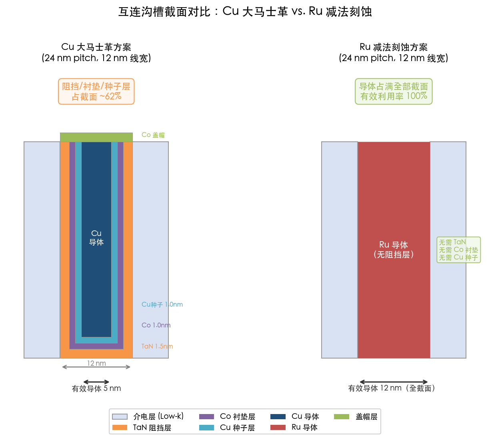

## 1.2 铜互连的物理极限与电阻率危机

### 1.2.1 尺寸效应与电子散射

Cu 的体电阻率为 1.68 μΩ·cm，体平均自由程（Mean Free Path, MFP）约 39–40 nm [Gall, J. Appl. Phys. 127, 050901](https://pubs.aip.org/aip/jap/article/127/5/050901/595089/The-search-for-the-most-conductive-metal-for "The search for the most conductive metal for narrow interconnect lines, 2020")。当互连线宽缩小至 10 nm 量级——远小于 Cu 的 MFP——电子在晶界与表面的散射效应急剧增强，导致 Cu 有效电阻率比体值上升约一个数量级（~10×）。这一"尺寸效应"（size effect）是窄线金属电阻率急剧攀升的根本物理机制。

定量而言，金属互连电阻率随线宽缩小的增长幅度与 ρ₀×λ 乘积（体电阻率与 MFP 的乘积）成正比。Cu 的 ρ₀×λ = 6.7×10⁻¹⁶ Ω·m²，在候选金属中并不占优。Ir 的 ρ₀×λ 为 3.7×10⁻¹⁶ Ω·m²、Ru 为 5.1×10⁻¹⁶（多晶）或 3.8×10⁻¹⁶ Ω·m²（单晶方向）、Rh 为 3.2×10⁻¹⁶ Ω·m²，均显著低于 Cu [Gall, J. Appl. Phys. 127, 050901](https://pubs.aip.org/aip/jap/article/127/5/050901/595089/The-search-for-the-most-conductive-metal-for "Table I, 2020")。ρ₀×λ 更低意味着在窄线极限下电阻率增幅更小，这些替代金属因此在超小线宽下展现出更优的导电性能。

从实验数据来看，外延 Ru(0001) 的有效自由程 λ_eff = 6.7 nm，外延 Mo(001) 的 λ_eff = 17 nm，外延 Co(0001) 的 λ_eff = 19 nm，而 Cu(001) 的 λ_eff = 39 nm [Gall, J. Appl. Phys. 127, 050901](https://pubs.aip.org/aip/jap/article/127/5/050901/595089/The-search-for-the-most-conductive-metal-for "Table II & Fig. 5, 2020")。Ru 极短的有效自由程使其在线宽 <~7 nm 时电阻率可低于 Cu，且随线宽进一步缩小，Ru 的电阻率优势持续扩大。图 1-2 直观呈现了四种候选金属在 5–50 nm 线宽区间内的有效电阻率变化趋势，可以清晰观察到 Cu 因阻挡层侵占和长 MFP 在窄线区间电阻率急剧攀升，而 Ru 和 Mo 则凭借短 MFP 与无阻挡层集成优势在亚 15 nm 线宽下展现出显著竞争力。

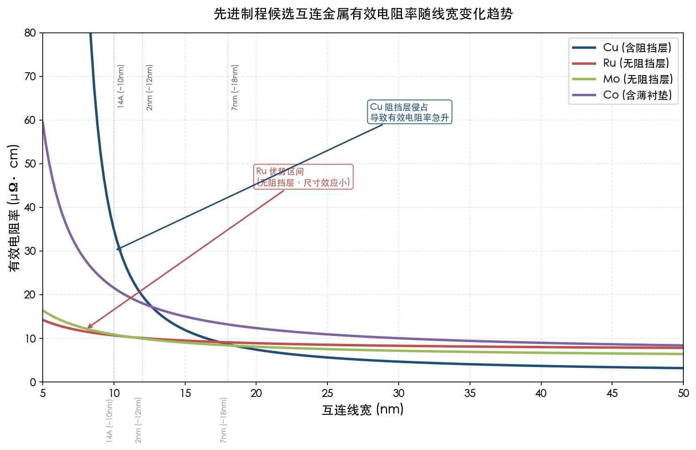

### 1.2.2 RC 延迟的恶性循环

互连线电阻率的上升直接加剧 RC 延迟。随着制程微缩，金属线截面积缩小导致电阻 R 增大，相邻导线间距缩小又推高耦合电容 C，二者的乘积 RC 构成信号传播延迟的核心指标。在 1 nm（10 Å）节点，预计 metal pitch 为 20 nm，互连将成为芯片性能的主导瓶颈，推动从 Cu 向替代金属的产业转折点加速到来 [Semiconductor Engineering](https://semiengineering.com/interconnects-approach-tipping-point/ "Interconnects Approach Tipping Point, 2025-02")。

与此同时，介电层从传统 SiO₂（k = 4.0）向低介电常数（low-k，k ≤ 3.3）乃至超低 k（ULK）材料演进，虽然有效降低了层间电容，但这些低 k 材料的热导率更低，加剧了互连层的温升。晶体管开关产生的热量经由金属互连堆叠向外散逸的路径受阻，焦耳热累积进一步恶化电迁移可靠性，形成"高电阻→高热耗→加速退化"的恶性循环。

## 1.3 替代金属材料的崛起

### 1.3.1 钌（Ru）——无阻挡层集成的领跑者

Ru 体电阻率为 7.1 μΩ·cm（约 Cu 的 4.2 倍），在宏观尺度下并无导电性优势。然而，Ru 的核心竞争力在于其极短的 MFP 与优异的化学稳定性。Ru 的内聚能约 6.7 eV/原子（Cu 仅 ~3.5 eV/原子），赋予其远超 Cu 的抗电迁移性能 [Semiconductor Engineering](https://semiengineering.com/interconnects-approach-tipping-point/ "Interconnects Approach Tipping Point, 2025")。更为关键的是，Ru 在介电材料中的扩散倾向极低，不需要 TaN 阻挡层与 Co 衬垫层，在 ≤20 nm pitch 下互连沟槽的全部截面积均可用于导电，总线电阻有望优于带阻挡层的 Cu 方案。

TSMC、Intel、IBM Research 及 Samsung 等主要芯片制造商均在积极推进 Ru 基互连集成方案 [Semiconductor Engineering](https://semiengineering.com/interconnects-approach-tipping-point/ "Interconnects Approach Tipping Point, 2025-02")。Intel 于 2024 年 12 月 IEDM 会议上展示了减法刻蚀（subtractive etch）Ru 互连与气隙（air gap）集成方案，在 ≤25 nm pitch 研发测试载具上实现最高 25% 的线间电容降低，并声明该技术"可望出现在 Intel Foundry 未来节点上" [Intel Newsroom](https://newsroom.intel.com/intel-foundry/intel-foundry-unveils-technology-advancements-iedm-2024 "Intel IEDM 2024 官方公告, 2024-12-07")。

IBM 与 Samsung 的合作同样引人注目。两家公司在 IEDM 2024 上联合展示了 18 nm pitch 全减法 Ru top-via 互连并集成气隙方案，其时间依赖性介电击穿（TDDB）和电迁移（EM）测试结果均优于同 pitch 下的 Cu 大马士革互连 [IBM Research](https://research.ibm.com/blog/beol-cu-interconnects-iedm "IBM-Samsung IEDM 2024, 2024")，有力验证了 Ru 减法刻蚀方案在亚 20 nm pitch 区间的可行性与可靠性优势。

在制造路径方面，imec 提出的半大马士革（semi-damascene）工艺流程为 Ru 互连提供了清晰的量产路线。imec Fellow Zsolt Tokei 指出，Cu 可延伸至约 20 nm pitch 为极限，18 nm pitch 及以下应当采用直接金属刻蚀方案。imec 测试数据表明，即使在 36 nm pitch 下，Ru 的互连性能已略优于 Cu [Semiconductor Engineering](https://semiengineering.com/interconnects-approach-tipping-point/ "imec Tokei 引述, 2025-02")。我们预计 Ru 最早可在 14 Å 节点进入量产互连层。

### 1.3.2 钼（Mo）——低成本无阻挡层方案

Mo 体电阻率约 5.3 μΩ·cm，λ_eff 约 11–17 nm。与 Ru 类似，Mo 在介电材料中几乎无本征扩散性，同样不需要阻挡层 [Semiconductor Engineering](https://semiengineering.com/interconnects-approach-tipping-point/ "Lam Research 引述, 2025")。Mo 的一项显著优势在于前驱体成本约为 Ru 的 1/10，使其在大规模量产中具备更优的经济性。

据 Lam Research 副总裁 Kaihan Ashtiani 披露，几乎所有主要芯片制造商都在 NAND、DRAM 和逻辑应用中处于 Mo 的不同验证阶段 [Semiconductor Engineering](https://semiengineering.com/interconnects-approach-tipping-point/ "Lam Research 引述, 2025")。Mo 已在高容量 3D NAND 中实现量产，主要替代 W 用于字线（word line）填充，因为 Mo 在纳米级尺度下电阻率低于 W 且无需高电阻率阻挡层。2025 年 IEDM 会议上报道的 Mo 集成高速 3D NAND 已在大规模量产中实现可扩展性与可靠性的双重突破 [IEDM 2025](https://iedm25.mapyourshow.com/8_0/sessions/session-details.cfm?ScheduleID=119 "18-2, Molybdenum-integrated High-Speed 3D NAND, 2025")。

在逻辑芯片领域，Mo 当前主要应用于中段互连（Middle-of-Line, MOL）的接触层（contact），替代传统 W 以降低接触电阻。Applied Materials 于 2025 年推出的选择性 Mo 金属化技术，相比选择性 W 在最小尺寸触点中实现额外 15% 的电阻降低，已被一家领先先进逻辑客户选用 [Applied Materials](https://www.appliedmaterials.com/us/en/newsroom/perspectives/cooptimized-process-metrology-accelerates-molybdenum-contact-development.html "Co-optimized Process and Metrology Accelerates Molybdenum Contact Development, 2026-01")。Lam Research 推出的 ALTUS Halo ALD 工具则实现了无阻挡层 Mo 的规模化沉积 [Counterpoint Research](https://counterpointresearch.com/en/insights/post-insight-research-notes-blogs-molybdenum-the-metal-enabling-next-big-leap-in-chip-manufacturing-for-the-ai-era "Molybdenum – The Metal Enabling Next Big Leap, 2025-05")。

在 BEOL 互连层面，Mo 的应用进展相对谨慎。Lam Research 的 Mo 混合金属化方案（hybrid metallization）通过在通孔底部无阻挡层预填充 Mo、上方仍采用 Cu 大马士革填充，在 M1–M3 互连中实现约 55% 的通孔/线电阻降低 [Lam Research](https://newsroom.lamresearch.com/breaking-the-copper-bottleneck-with-molybdenum-hybrid-metallization "Breaking the Copper Bottleneck With Molybdenum Hybrid Metallization, 2025")。这种渐进式方案允许在不彻底颠覆现有 Cu 大马士革产线的前提下逐步引入 Mo，降低了工艺转换的风险与成本。

### 1.3.3 钴（Co）——先行者的经验与角色演化

Intel 在 10 nm 工艺节点首次量产使用 Co 互连取代 Cu 用于最底部两层（M0/M1，half-pitch ≤20 nm），开创了非 Cu 金属互连的工业化先河。Co 的 MFP 约 10 nm，虽然线电阻比 Cu 高约 1.7 倍，但更短的 MFP 使其在窄线条件下电阻率增幅远低于 Cu，加之更高的电迁移抗性，在局部互连中被证实为可行方案 [Gall, J. Appl. Phys. 127, 050901](https://pubs.aip.org/aip/jap/article/127/5/050901/595089/The-search-for-the-most-conductive-metal-for "引用 Intel IITC 2018 数据, 2020")。

Co 互连的量产实践为产业界积累了宝贵的非 Cu 金属集成经验。然而，Co 的体电阻率约 6.2 μΩ·cm，其 ρ₀×λ 乘积（约 1.2×10⁻¹⁵ Ω·m²）仍然偏高，在更极端线宽下不具备相对于 Ru 或 Mo 的竞争优势。因此，在后续更先进节点中，Co 的角色正从互连导体层向衬垫层材料过渡——在 Cu 互连体系中提供粘附与电迁移阻挡功能，而非承担主导电流传输任务。

### 1.3.4 铑（Rh）——远期候选者

IBM 在 IEDM 2024 上展示了 Rh 大马士革工艺的首次演示，在 12 nm 线宽、>2:1 纵横比结构上实现合格良率 [IBM Research](https://research.ibm.com/blog/beol-cu-interconnects-iedm "IBM IEDM 2024: Cu evolution and beyond, 2024")。Rh 的 ρ₀×λ = 3.2×10⁻¹⁶ Ω·m²，在所有候选金属中最低，并兼具低表面散射与低氧化倾向的双重优势。尽管 Rh 目前仍处于研究早期阶段，尚未进入工程验证环节，但其卓越的物理特性使其成为 10A 及更先进节点互连金属的有力候选者。

## 1.4 产业界的技术路线选择

### 1.4.1 各代工厂的当前方案

**TSMC N2（2 nm）**：已于 2025 年第四季度进入量产，Cu 布线达到 24 nm pitch（12 nm 线宽），仍以 Cu 大马士革为主 [SemiWiki/TechInsights](https://semiwiki.com/semiconductor-services/techinsights/352972-iedm-2025-tsmc-2nm-process-disclosure-how-does-it-measure-up/ "IEDM 2025 TSMC 2nm 分析, 2025-02")。TSMC 正在最底部金属层引入 Ru 衬垫以改善 Cu 延伸性能，预计在更高性能版本中先对通孔引入 Mo，后续在 A16 节点及更先进节点逐步将替代金属用于关键互连层。在 2 nm 节点，TSMC 和 Intel 均在集成 Mo 与 Ru 用于下层互连，这一过渡与 GAA 纳米片晶体管架构的引入紧密耦合 [KIEPT](https://kiept.com/intel-18a-vs-tsmc-n2.html "Intel 18A vs TSMC N2 Material Science, 2026-02")。

**Intel 18A**：率先实施背面供电（PowerVia）技术，将电源分配网络移至晶圆背面，使正面互连层专注于信号传输。Intel 正将 Ru 和 Mo 集成至最底部互连层（M0–M1），Ru 的热稳定性优势使其能够承受背面加工步骤中的高温热循环 [KIEPT](https://kiept.com/intel-18a-vs-tsmc-n2.html "Intel 18A vs TSMC N2 Material Science, 2026-02")。Intel 此前已在 10 nm 节点量产 Co 互连，为替代金属的大规模工业化集成积累了成熟的工程基础。

**Samsung SF3E（3 nm）及 SF2（2 nm）**：Samsung 在 SF3E 中重点优化了 Ru-Co 双层衬垫方案，配合 TaN 阻挡层实现更优的 Cu 互连性能。SF2 于 2025 年开始量产，良率已提升至 60% 以上。Samsung 同样在评估 Ru 基减法刻蚀互连方案 [Semiconductor Engineering](https://semiengineering.com/interconnects-approach-tipping-point/ "Interconnects Approach Tipping Point, 2025-02")，其 SF2P 变体预计 2026 年将实施背面供电技术。

### 1.4.2 互连技术路线图

imec 路线图显示，2 nm 节点最小金属 pitch 约 23 nm，预计 2027/28 年 14A 节点降至 20 nm，2029 年 10A 节点降至 18 nm，2031 年 7A 节点降至 16 nm，2035 年 3A 节点将达约 12 nm pitch [imec 替代金属教程](https://arxiv.org/html/2406.09106v1 "Sankaran et al., Table 1 Interconnect Roadmap, 2024")。图 1-3 以柱状图形式呈现了这一路线图的量化演进趋势，并以颜色区分 Cu 大马士革阶段、过渡阶段与替代金属减法刻蚀阶段。

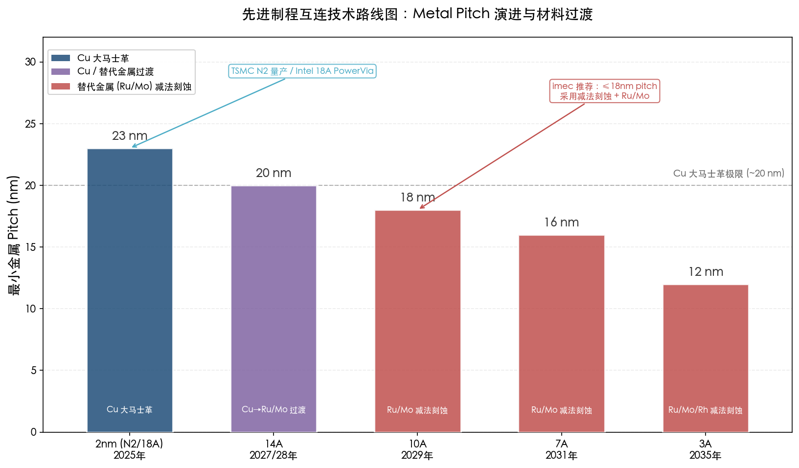

这份路线图勾勒出一条清晰的材料过渡轨迹：在约 20 nm pitch 处，Cu 大马士革工艺将逼近可延伸性的极限；18 nm pitch 及以下，直接金属刻蚀（减法工艺）配合 Ru 等无阻挡层金属将成为首选方案。这一从大马士革到减法刻蚀的工艺范式转换，不仅涉及金属材料本身的替换，更意味着沉积、刻蚀、介电填充等一整套工艺模块的系统性重构。

### 1.4.3 背面供电的架构变革

背面供电（Backside Power Delivery, BPD）是 2 nm 级别最具变革性的架构创新之一。Intel 18A 率先实施 PowerVia 方案，Samsung SF2P 预计 2026 年跟进，TSMC 计划在 A16 节点引入"Super Power Rail" [Semiconductor Engineering](https://semiengineering.com/extending-copper-interconnects-to-2nm/ "BPR/BPD 描述, 2022") 与 [SemiWiki/TechInsights](https://semiwiki.com/semiconductor-services/techinsights/352972-iedm-2025-tsmc-2nm-process-disclosure-how-does-it-measure-up/ "TSMC A16 backside power, 2025-02")。

BPD 将电源传输从正面互连中分离，使正面金属层专注于信号布线，可有效放松正面 metal pitch 要求。这一架构变革可能将 Ru 全面替代 Cu 的时间节点推迟约一个工艺代际，但同时也催生了新的金属薄膜沉积需求：背面电源网络本身需要低电阻率、高电迁移抗性的厚金属层，连接正面晶体管源漏极的纳米硅穿孔（nano-TSV）同样需要高质量的金属化工艺支撑。

## 1.5 薄膜需求矩阵

基于前述分析，本节将先进制程 BEOL 各功能层的金属薄膜需求汇总为结构化矩阵（表 1-1），为后续各沉积技术章节的评判提供统一基准：

**表 1-1 先进制程 BEOL 各功能层金属薄膜需求矩阵**

| 功能层 | 典型材料 | 典型厚度 | 关键性能要求 | 当前状态 |
|--------|----------|----------|-------------|---------|
| 互连导体层 | Cu（≥20 nm pitch）；Ru、Mo（≤18 nm pitch） | 10–50 nm | 低电阻率、大晶粒、无空洞填充 | Cu 量产中；Ru/Mo 为替代方案，预计 14A 节点量产 |
| 扩散阻挡层 | TaN | 1–1.5 nm | 完全保形覆盖、无针孔、高致密性 | 量产中，正从 PVD 向 ALD 过渡 |
| 粘附/衬垫层 | Co；Ru-Co 双层 | 1–2 nm | 润湿性、与 Cu 的粘附强度 | 量产中，Ru-Co 双层为新一代方案 |
| 种子层 | Cu（PVD 沉积） | 2–5 nm | 连续性、均匀性 | PVD 量产中 |
| 盖帽层 | Co（选择性沉积）；SiN | 1–3 nm | 选择性沉积能力、抗电迁移 | 量产中 |
| 接触层（MOL） | W（传统）；Mo（新一代） | 5–20 nm | 低接触电阻、无阻挡层填充 | Mo 替代 W 已进入先进逻辑量产验证 |

上述各功能层对沉积工艺的核心参数要求可概括为四项关键指标：保形性（台阶覆盖率）>95%、厚度均匀性 <5%、薄膜纯度杂质含量 <1 at.%、界面原子级平整。这些苛刻要求将直接决定物理气相沉积（PVD）、化学气相沉积（CVD）与原子层沉积（ALD）等不同沉积技术在各功能层中的适用性边界，这正是本报告后续章节将逐一深入分析的主题。

# 第2章 物理气相沉积（PVD / 溅射）——成熟主力的能力与边界

第1章已建立先进制程金属薄膜的功能层需求矩阵：从 TaN 扩散阻挡层、Co/Ru 衬垫层到 Cu 种子层，每一层均对厚度精度、台阶覆盖率和界面纯度提出严苛要求。物理气相沉积（Physical Vapor Deposition, PVD），尤其是磁控溅射及其离化等离子体增强变体，作为半导体后段制程（BEOL）金属化工艺的核心支柱技术，自铜互连时代开端以来已在量产环境中服务逾二十年。然而，随着互连特征尺寸持续微缩至 ≤10 nm 线宽，PVD 固有的"视线沉积"局限性日益凸显，其在先进节点中的角色正从"独立承担整层沉积"转向"与 ALD/CVD 深度协同"。本章将系统分析 PVD 在 ≤7 nm/5 nm/3 nm/2 nm 先进节点中的实际应用角色、技术瓶颈及正在发生的范式演变。

## 2.1 PVD 技术体系：从传统磁控溅射到离化金属等离子体

### 2.1.1 基本原理与工艺变体

PVD 的核心原理是在真空环境中以物理方式（惰性气体离子轰击）将固态靶材原子溅射出来，使其在基底表面凝聚成薄膜。与 CVD 和 ALD 依赖气态前驱体化学反应不同，PVD 过程不涉及化学前驱体分解，薄膜中碳（C）、氧（O）、氟（F）等化学杂质含量极低，金属纯度直接取决于靶材纯度——半导体用溅射靶材纯度通常达到 99.999%（5N）甚至更高 [JX Advanced Metals](https://www.jx-nmm.com/english/products/sputtering/semiconductor_st/ "半导体用溅射靶材产品页")。

在先进制程量产中，主要使用以下四种 PVD 变体：

- **传统直流/射频磁控溅射（DC/RF Magnetron Sputtering）**：利用磁场约束等离子体以提高电离效率和沉积速率，适用于平面或低深宽比结构上的薄膜沉积，是 PVD 技术族群的基础形态。
- **离化金属等离子体 PVD（Ionized Metal Plasma, IMP / iPVD）**：在溅射源与基底之间引入二次等离子体源（如感应耦合等离子体 ICP），将溅射出的金属原子进一步电离为金属离子，并通过基底偏压引导其近垂直入射，从而显著提高高深宽比（HAR）结构中底部和侧壁的台阶覆盖率 [Rossnagel, J. Vac. Sci. Technol. B 12, 449, 1994](https://pubs.aip.org/avs/jva/article/38/5/053402/246718/Role-of-high-aspect-ratio-thin-film-metal "Simon et al., 2020, 引用 Rossnagel & Hopwood 1994 iPVD 开创性工作")。
- **自离化等离子体（Self-Ionized Plasma, SIP）**：Applied Materials 开发的 SIP 技术通过优化磁控管设计和高功率放电，在靶材附近产生高密度等离子体，使溅射金属原子在飞行路径上自发电离，无需外部 ICP 辅助即可实现高离化率。SIP 已成为当前工业量产中应用最广泛的 iPVD 方案 [Applied Materials](https://www.appliedmaterials.com/us/en/product-library/endura-cubs-rf-xt-pvd.html "Endura CuBS RF XT PVD 产品页")。
- **长距溅射（Long-Throw Sputtering）与准直溅射（Collimated Sputtering）**：通过增大靶材-基底距离或加入准直器物理筛选溅射粒子的入射角度以提高方向性。在 iPVD 技术普及之前，此类方法曾是改善台阶覆盖率的主要手段。

### 2.1.2 量产设备平台

PVD 在先进制程中的量产主要依赖 Applied Materials 的 Endura 平台——半导体产业历史上最成功的金属化系统之一 [Applied Materials](https://www.appliedmaterials.com/us/en/product-library/endura-pvd.html "Endura PVD 产品页")。Endura 平台采用集群式（cluster）多腔室架构，可在同一真空系统内串联预清洗（preclean）、阻挡层沉积、种子层沉积等多个工艺步骤，避免晶圆在不同设备间转移时发生界面氧化或污染。典型的 Endura CuBS（Copper Barrier/Seed）系统配置包含 SIP EnCoRe II Ta(N) 阻挡层腔室和 EnCoRe II RFX Cu 种子层腔室，量产吞吐量可达每小时 80 片晶圆以上（>80 wph） [Applied Materials](https://www.appliedmaterials.com/us/en/product-library/endura-cubs-rf-xt-pvd.html "Endura CuBS RF XT 规格")。这种高度集成化的真空平台设计不仅保障了界面清洁度，也为后续 PVD 与 ALD、CVD 等技术的工艺共线融合奠定了硬件基础。

## 2.2 PVD 在先进制程中的核心应用场景

### 2.2.1 铜种子层沉积——PVD 的传统核心阵地

在铜双大马士革（Dual-Damascene）工艺中，电化学电镀（ECP）填充铜之前须沉积一层均匀、连续、无空洞的 Cu 种子层作为电镀导电起始层。PVD 溅射至今仍是该工序的工业标准方法，其选择逻辑清晰：PVD Cu 薄膜具有极高的金属纯度（靶材 5N 级），不含 CVD/ALD 前驱体引入的碳或氧杂质，电阻率接近块体值；同时 PVD 沉积速率高、单位成本低，天然契合量产节拍需求。

随着互连特征尺寸从 45 nm 持续缩小至 ≤10 nm 线宽（≤20 nm pitch），Cu 种子层厚度也相应减薄至约 3–5 nm，对 PVD 工艺的均匀性和覆盖率提出了更为苛刻的要求。iPVD/SIP 技术通过提高 Cu 离子通量比并利用射频偏压回溅（resputter）机制，在沟槽侧壁上实现更均匀的种子覆盖，同时消除沟槽顶部的 Cu 悬突（overhang），为后续电镀保留足够的开口宽度。Applied Materials 的 EnCoRe II RF XT Cu 腔室进一步采用创新磁控运动模式与通量控制策略，增强了窄沟槽中的保形覆盖能力 [Applied Materials](https://www.appliedmaterials.com/us/en/product-library/endura-cubs-rf-xt-pvd.html "EnCoRe II RF XT Cu 种子工艺描述")。

针对 14 nm 及以下节点极窄极深沟槽中 Cu 种子层覆盖与后续填充的难题，Applied Materials 于 2012 年推出 Endura Amber PVD 系统，首创"低温沉积 + 高温铜回流"两步法：先在低温下沉积 Cu 种子层，再利用热能驱动毛细作用使铜从沟槽顶部流入底部，实现由底向上的无空洞填充。该系统推出时已获逾 30 个腔室的装机量，并被主要逻辑和存储器制造商认定为量产标准设备 [Applied Materials / ACN Newswire](https://www.acnnewswire.com/press-release/english/9921/applied-materials-solves-critical-interconnect-challenge-with-breakthrough-flowable-copper-technology "Endura Amber PVD 发布公告, 2012-07-10")。

### 2.2.2 TaN/Ta 扩散阻挡层——PVD 与 ALD 的竞合前沿

TaN 扩散阻挡层是铜互连体系中防止 Cu 向介质层扩散的关键功能层。PVD 溅射 TaN 长期以来是阻挡层沉积的主流选择：PVD TaN 薄膜致密度高、无前驱体残留杂质、沉积速率快。在 Endura 平台上，SIP EnCoRe II Ta(N) 腔室可将 TaN 阻挡层厚度精确调整至与目标节点匹配的水平，同时通过优化底部和侧壁覆盖率来兼顾线电阻缩放与电迁移/应力迁移可靠性 [Applied Materials](https://www.appliedmaterials.com/us/en/product-library/endura-cubs-rf-xt-pvd.html "EnCoRe II Ta(N) 厚度调整能力描述")。

然而，PVD TaN 在高深宽比结构中的台阶覆盖率是其核心瓶颈。即使采用 iPVD/SIP 技术，当深宽比超过约 5:1 时，PVD 的侧壁覆盖率便显著下降。研究数据表明，在深宽比 10:1 的结构中，传统 PVD 的侧壁覆盖率可降至约 1%–5%，底部覆盖率也仅约 5%–20% [Sciopen/TST](https://www.sciopen.com/article/10.1109/TST.2014.6787368 "PVD barrier/seed 台阶覆盖率评估")。在 ≤3 nm 节点的最底层互连（M0/M1）中，沟槽深宽比可达 4:1–5:1 且特征尺寸仅约 10 nm，PVD 单独沉积的 TaN 阻挡层面临侧壁不连续或过薄的风险，可能引发铜扩散泄漏。

因此，从 7 nm 节点开始，业界逐步引入 ALD TaN 来替代或补充 PVD TaN 的角色。ALD 的自限制表面反应特性赋予其近 100% 的保形台阶覆盖率，即使在极高深宽比的沟槽中也能实现均匀覆盖。定量对比表明，在 3 nm TaN 阻挡层厚度下，ALD TaN 方案的通孔电阻比 PVD TaN 方案低约 28% [ResearchGate](https://www.researchgate.net/publication/287504712_ALD_and_PVD_Tantalum_Nitride_Barrier_Resistivity_and_Their_Significance_in_via_Resistance_Trends "ALD 与 PVD TaN 阻挡层电阻率比较")，这一优势源于 ALD TaN 在通孔底部覆盖更均匀，避免了 PVD 方式在底部偏薄导致的局部高电阻区。

值得强调的是，PVD 与 ALD 在阻挡层工艺中并非简单的替代关系，而是走向深度互补。Applied Materials 于 2021 年推出的 Endura Copper Barrier Seed IMS（集成材料解决方案）系统，将 7 种不同工艺技术——ALD、PVD、CVD、铜回流、表面处理、界面工程和计量——集成在同一真空系统中（图 2-1）。该方案以选择性 ALD 替代保形 ALD，消除通孔界面处的高电阻阻挡层，同时保留 PVD 在种子层沉积等工艺步骤中的优势。Applied Materials 报告称，该集成方案可将通孔接触界面电阻降低最高 50%，已被全球领先的代工/逻辑客户量产采用 [Applied Materials](https://ir.appliedmaterials.com/news-releases/news-release-details/applied-materials-breakthrough-chip-wiring-enables-logic-scaling/ "Endura Copper Barrier Seed IMS 发布公告, 2021-06-16")。

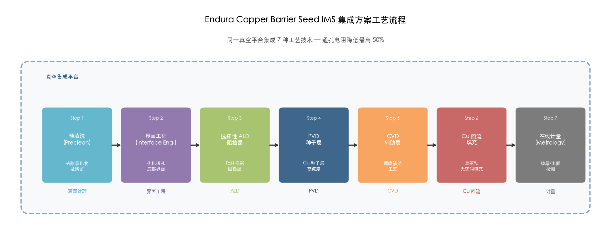

Endura IMS 系统的工艺架构鲜明地展示了先进制程中 PVD 正从"独立承担整层沉积"转向"与 ALD/CVD 协同集成"的技术趋势——PVD 不再孤立运作，而是作为多技术集成方案中不可或缺的高纯度、高速率环节。

### 2.2.3 TiN 金属硬掩膜——PVD 在光刻图形化中的独特价值

除互连金属化外，PVD 在先进制程中还承担着一项至关重要的功能：沉积氮化钛（TiN）金属硬掩膜（metal hard mask, MHM），用于铜/低介电常数（low-k）互连的图形化刻蚀。在先进节点的大马士革工艺中，超低 k 介质（k ≤ 2.5）材料机械强度低且对等离子体损伤敏感，传统光刻胶已无法独立承担图形转移功能。PVD TiN 硬掩膜作为刻蚀保护层，其高刻蚀选择比使图形化膜层厚度比传统光刻胶薄约 5 倍，同时提供优异的关键尺寸（CD）控制和刻蚀形貌均匀性 [Applied Materials](https://ir.appliedmaterials.com/news-releases/news-release-details/applied-materials-delivers-advanced-metal-hardmask-technology/ "Endura Metal Hardmask 技术公告, 2007")。

在 EUV 光刻时代，TiN 硬掩膜的工艺重要性进一步提升。研究表明，PVD TiN 薄膜的织构（texture）和残余应力对 EUV 图形化的线边缘粗糙度（LER）和 CD 均匀性具有显著影响 [Semantic Scholar](https://www.semanticscholar.org/paper/The-novel-TiN-film-prepared-by-high-performance-PVD-Liu-Wang/dbc31fdd0a63bdad5fff77a39acbf6f4d9798132 "PVD TiN 薄膜对 EUV 图形化的影响研究")。PVD 的核心优势在于可通过调节溅射功率、气压和基底温度精确控制薄膜应力状态，且沉积温度低（通常 ≤300°C），不会损伤下方的低 k 介质层。这些特性使 PVD TiN 硬掩膜在可预见的未来仍将是 EUV 光刻图形化工艺链中的必要环节。

### 2.2.4 PVD Ru 毯状薄膜——减法刻蚀互连的新兴前端工序

在 ≤20 nm pitch 的新一代互连方案中，钌（Ru）减法刻蚀工艺正成为替代铜大马士革的重要候选路线。其核心流程是先在平坦基底上沉积一层均匀的 Ru 毯状薄膜（blanket film），再通过光刻和干法刻蚀将其图形化为互连线条。PVD 溅射是沉积 Ru 毯状薄膜的主要方法之一，其优势在于：PVD Ru 薄膜纯度高、电阻率低，晶粒取向和微观结构可通过溅射功率、基底温度等参数精确调控。

imec 的半大马士革（semi-damascene）集成方案中大量使用 PVD Ru 薄膜作为起始金属层。2025 年 6 月，imec 在 IEEE IITC 会议上报告，采用该方案制备的 16 nm pitch Ru 互连线实现了平均电阻低至 656 Ω/μm 的记录值，其中 40% 的线条满足基于薄膜电阻率预测的电阻目标（对应 8 nm 线宽）；在 18–22 nm pitch 范围，全片良率达到 90% 以上 [imec](https://www.imec-int.com/en/press/imec-demonstrates-16nm-pitch-ru-lines-record-low-resistance-obtained-using-semi-damascene "imec 16 nm pitch Ru 半大马士革方案, 2025-06-03")。Nova 与 imec 合作的散射测量研究亦确认其 Ru 减法刻蚀实验中"大部分晶圆使用 PVD 钌" [Nova/imec](https://www.novami.com/wp-content/uploads/2023/04/1132519-ruthenium-direct-etch-scatterometry-nova-imec-spie2020.pdf "SPIE 2020 Ru 直接刻蚀散射测量")。

Intel 在 IEDM 2024 上展示的减法 Ru 互连方案同样依赖毯状 Ru 薄膜沉积作为起点，并将其定位为"实用、成本高效、兼容量产的减法 Ru 集成工艺"，声明"可望出现在 Intel Foundry 未来节点上" [Intel Newsroom](https://newsroom.intel.com/intel-foundry/intel-foundry-unveils-technology-advancements-iedm-2024 "Intel IEDM 2024 减法 Ru 互连公告, 2024-12-07")。PVD 在这一新兴场景中的适配性极高：毯状薄膜沉积不涉及高深宽比结构填充，PVD 的台阶覆盖率短板不构成限制；与此同时，PVD Ru 薄膜的高纯度和高沉积速率优势得以充分发挥，有助于降低互连线电阻率并保障量产产能。

## 2.3 PVD 的不可替代优势

尽管 ALD 和 CVD 在保形性和原子级厚度控制方面具有显著优势，PVD 在先进制程量产中仍保有若干难以替代的核心价值，这些价值构成其在特定应用场景中持续被选用的技术基础。

### 2.3.1 薄膜纯度

PVD 属于纯物理过程：金属原子直接从高纯度固态靶材（通常 ≥99.999%）溅射出来，在真空中飞行并沉积于基底表面，全程不涉及化学前驱体参与。由此，PVD 薄膜的金属纯度极高，碳、氧、氮等杂质含量可低于 1 at.%（原子百分比），远优于使用有机金属前驱体的 CVD 和 ALD 薄膜——后者典型碳杂质含量通常在数个 at.% 量级。在互连应用中，薄膜杂质直接影响电阻率：每 1 at.% 的碳杂质可使金属薄膜电阻率上升数个百分点乃至数十个百分点。这一纯度优势使 PVD 在 Cu 种子层、高纯度金属硬掩膜以及 Ru 毯状薄膜等应用中持续保持不可替代性。

### 2.3.2 沉积速率与产能

PVD 溅射的沉积速率通常在数十至数百 nm/min 量级（取决于材料和功率设置），远高于 ALD 典型的 0.1–0.2 nm/cycle（每周期约数秒至数十秒，有效速率约 1–10 nm/min）。在量产环境中，Endura CuBS 系统的吞吐量超过 80 wph [Applied Materials](https://www.appliedmaterials.com/us/en/product-library/endura-cubs-rf-xt-pvd.html "Endura CuBS RF XT 产能规格")。高沉积速率和高产能直接转化为更低的单位制造成本——对于每片晶圆需要重复沉积 10–16 层金属化膜的 BEOL 工艺而言，产能对成本的杠杆效应极为显著。

### 2.3.3 成本结构

PVD 的核心耗材为固态靶材，靶材利用率通常为 30%–50%（取决于磁控管设计），更换周期以数千片晶圆计。相比之下，CVD 和 ALD 的前驱体通常是高价有机金属化合物（如 TaN ALD 前驱体 PDMAT/TBTDET、Ru 前驱体等），消耗速度快且部分品种价格高昂。Applied Materials 在 2007 年推出 Endura 金属硬掩膜系统时即强调其耗材成本较竞品低 50% [Applied Materials](https://ir.appliedmaterials.com/news-releases/news-release-details/applied-materials-delivers-advanced-metal-hardmask-technology/ "Endura Metal Hardmask 成本优势, 2007")。在 Ru 互连的语境下，Ru 作为贵金属（2025 年市价约 400–500 美元/盎司），PVD Ru 靶材虽价格不低，但毯状薄膜沉积中靶材利用率可预测、工艺变量少，总拥有成本仍优于使用昂贵 Ru 有机前驱体的 CVD/ALD 方案。

### 2.3.4 界面清洁度与真空集成

Endura 平台的集群式真空架构允许在不破真空条件下完成从预清洗（去除通孔底部氧化物和聚合物残留）到阻挡层沉积再到种子层沉积的完整序列。这种真空集成能力保障了各层间界面的原子级清洁度——该特性对于控制通孔电阻和薄膜附着力至关重要。Applied Materials 的 Aktiv Preclean 技术可高效去除聚合物残留和 CuO 氧化层，同时不改变多孔低 k 介质的介电常数 [Applied Materials](https://www.appliedmaterials.com/us/en/product-library/endura-cubs-rf-xt-pvd.html "Aktiv Preclean 技术描述")。

## 2.4 PVD 的技术边界与挑战

### 2.4.1 高深宽比结构中的台阶覆盖率瓶颈

PVD 最根本的物理局限性在于其"视线沉积"（line-of-sight deposition）特性。即使 iPVD/SIP 技术可通过金属离子化和基底偏压增强方向性，溅射粒子仍受限于几何遮蔽效应：在高深宽比沟槽中，侧壁和底部接收到的沉积通量远低于场区（field area）。典型地，在深宽比 3:1 的结构中，iPVD 可实现约 10%–30% 的底部覆盖和约 5%–15% 的侧壁覆盖（以场区厚度为基准）；当深宽比增至 5:1 以上，侧壁覆盖率进一步降至数个百分点 [Sciopen/TST](https://www.sciopen.com/article/10.1109/TST.2014.6787368 "PVD 台阶覆盖率与深宽比关系评估")。图 2-2 直观呈现了传统 DC/RF PVD、iPVD/SIP 与 ALD 三种技术在不同深宽比下底部覆盖率和侧壁覆盖率的对比趋势。

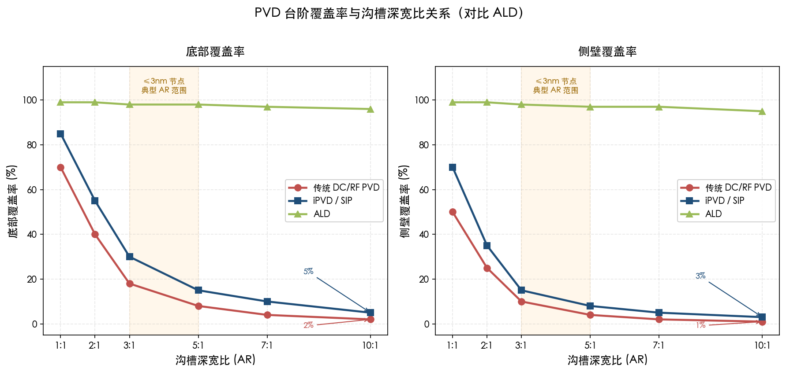

如图 2-2 所示，在 ≤3 nm 节点典型的深宽比区间（3:1–5:1）内，传统 PVD 的底部覆盖率已降至约 8%–18%，侧壁覆盖率仅约 5%–10%；即使是 iPVD/SIP 方案，底部覆盖率也仅约 15%–30%，侧壁覆盖率约 10%–15%。而 ALD 凭借自限制表面反应机制，在全深宽比范围内均保持约 99% 的保形覆盖。对于 ≤3 nm 节点的底层互连（M0/M1），沟槽深宽比约 3:1–5:1、关键尺寸仅约 10–12 nm，即使 1 nm 的阻挡层厚度不均匀也会导致局部 Cu 扩散泄漏或线电阻异常。这正是 ALD 在该工艺步骤上逐步取代 PVD 的根本技术驱动力。

### 2.4.2 超薄薄膜均匀性控制

先进节点对阻挡层和衬垫层的厚度要求已降至 1–2 nm 范围。在这一超薄膜区间，PVD 面临薄膜连续性（continuity）和厚度均匀性（uniformity）的双重挑战。PVD 薄膜在极薄厚度下倾向于岛状生长（Volmer-Weber 模式），可能导致薄膜不连续，进而产生阻挡层缺陷；而 ALD 的逐层饱和生长机制天然保证了亚纳米级别的厚度均匀性和薄膜完全覆盖。这一差异在 ≤2 nm 节点中尤为关键，因为阻挡层的任何不连续都可能直接导致器件可靠性失效。

### 2.4.3 材料选择与选择性沉积的局限

PVD 溅射适用于绝大多数元素金属和部分二元化合物（如 TaN、TiN），但对于某些复杂化合物或多元合金薄膜（如三元及以上组分的氮化物/氧化物），靶材制备困难且成分控制精度有限。更为重要的是，PVD 不具备选择性沉积的固有能力——薄膜会沉积在所有暴露表面上，无法实现"仅在特定材料表面生长"的区域选择性。在先进节点中，区域选择性沉积（area-selective deposition, ASD）日益成为降低通孔电阻和简化工艺步骤的关键手段，PVD 在这一领域存在根本性短板。

## 2.5 PVD 在先进节点中的角色演变：从独立主力到集成方案的关键组件

综合上述分析，PVD 在先进制程金属薄膜工艺中的角色正经历深刻转变。图 2-3 以矩阵形式呈现了 PVD 在四类核心功能层中从 7 nm 到 14A/10A 节点的角色演变轨迹。

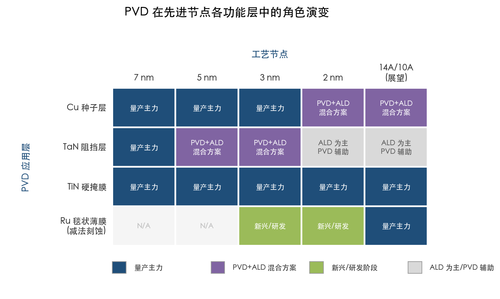

我们认为这一转变可概括为三个核心方向：

**第一，在铜大马士革工艺延续期间（≥20 nm pitch），PVD 仍是阻挡/种子层沉积的不可替代主力**，但越来越以"PVD + ALD 混合方案"的形式呈现。如图 2-3 所示，Cu 种子层在 7 nm 至 3 nm 节点仍由 PVD 独立承担，但在 2 nm 及以下节点已演变为 PVD+ALD 混合方案；TaN 阻挡层则从 5 nm 节点开始即进入混合模式，至 2 nm 节点已转变为 ALD 为主、PVD 辅助的格局。Applied Materials 的 Endura Copper Barrier Seed IMS 系统代表了这一趋势的产业化标杆：该系统在同一真空平台中集成 ALD（选择性阻挡层）、PVD（种子层和部分阻挡层）、CVD（辅助工艺）等 7 种技术，将通孔电阻降低最高 50%，已获全球领先代工客户量产采用 [Applied Materials](https://ir.appliedmaterials.com/news-releases/news-release-details/applied-materials-breakthrough-chip-wiring-enables-logic-scaling/ "Endura IMS, 2021")。

**第二，在 Ru/Mo 减法刻蚀互连方案中，PVD 获得了新的应用增长空间**。减法刻蚀工艺需要在平坦基底上沉积毯状金属薄膜并后续刻蚀图形化——这恰好绕开了 PVD 的台阶覆盖率短板，同时充分发挥其高纯度和高速率优势。如图 2-3 所示，PVD Ru 毯状薄膜在 3 nm 和 2 nm 节点处于新兴/研发阶段，而在 14A/10A 节点展望中有望成为量产主力。imec 的 16 nm pitch 半大马士革方案已大量使用 PVD Ru 作为核心金属层 [imec](https://www.imec-int.com/en/press/imec-demonstrates-16nm-pitch-ru-lines-record-low-resistance-obtained-using-semi-damascene "2025-06-03")。我们判断，若 Ru 减法工艺在 14A/10A 节点进入量产，PVD Ru 溅射将成为该方案中产能最高、成本最优的毯状薄膜沉积选项之一。

**第三，在金属硬掩膜等非互连导体应用中，PVD 的地位稳固且将长期延续**。如图 2-3 所示，PVD TiN 硬掩膜在从 7 nm 到 14A/10A 的全部节点中均保持"量产主力"地位，不受 ALD 替代趋势的影响。PVD TiN 硬掩膜具备高刻蚀选择比、低沉积温度和精确应力控制等不可替代优势，是 EUV 光刻图形化工艺链的必要环节。

总体而言，PVD 技术并非在先进制程中被边缘化，而是经历着角色的重新定义：在传统的保形沉积场景中，PVD 让渡部分份额给 ALD 并与之形成互补集成；在新兴的减法刻蚀场景中，PVD 凭借其在毯状薄膜沉积上的固有优势开辟了新的增长极；在金属硬掩膜等利基应用中，PVD 则持续巩固其不可替代的地位。这种从"单一工艺主角"向"集成方案关键组件"的转型，体现了先进节点对多技术协同（co-optimization）而非单一技术独占的工艺哲学。

# 第3章 化学气相沉积（CVD）——从钨填充到新型金属的核心平台

第2章分析了物理气相沉积（PVD）在先进制程中的能力与边界——PVD 凭借高纯度与高速率在铜种子层及金属硬掩膜等平面或低深宽比应用中保持不可替代性，但其在高深宽比结构中的台阶覆盖率瓶颈限制了保形沉积场景中的延展性。化学气相沉积（Chemical Vapor Deposition, CVD）恰好填补了这一关键空白：CVD 利用气态前驱体在基底表面发生化学反应生成固态薄膜，反应物可从所有方向扩散进入高深宽比特征结构的底部与侧壁，从而实现远优于 PVD 的保形覆盖能力。本章系统分析 CVD 及其工艺变体（热 CVD、等离子体增强 PECVD、金属有机 MOCVD 等）在先进制程金属薄膜沉积中的多重角色——从长期主导接触孔填充的钨（W）工艺，到支撑铜互连体系的 TiN 阻挡层，再到 CVD 钴（Co）和 CVD 钌（Ru）在 ≤3 nm 节点中作为衬垫层及新型互连金属的前沿应用，并探讨 CVD 平台向原子层沉积（ALD）方向延伸以实现钼（Mo）量产的技术融合趋势。

## 3.1 CVD 金属沉积的技术基础

### 3.1.1 基本原理与工艺变体

CVD 的核心机制在于：将一种或多种含目标金属元素的气态前驱体送入反应腔室，在适当的温度与压力条件下，前驱体分子在加热的晶圆表面发生热分解或化学还原反应，释出金属原子沉积为薄膜，副产物则以气态形式排出。与 PVD 的"视线沉积"不同，CVD 反应物以分子扩散方式到达基底所有暴露表面——包括高深宽比沟槽和通孔的底部与侧壁，因此天然具备优良的保形性（conformality）和台阶覆盖率（step coverage），在深宽比 10:1 甚至更高的结构中仍可实现 >90% 的台阶覆盖率 [Wevolver](https://www.wevolver.com/article/pvd-vs-cvd "PVD vs CVD: Mastering Advanced Thin Film Deposition Techniques")。

在先进制程金属薄膜量产中，主要采用以下 CVD 变体：

- **热 CVD（Thermal CVD）**：完全依赖基底温度驱动前驱体分解反应。典型的 W CVD 即采用热还原反应（WF₆ + H₂ → W + HF），沉积温度通常在 300–450°C 范围。热 CVD 工艺简单、薄膜纯度相对较高，是接触孔/通孔金属填充的工业标准。
- **等离子体增强 CVD（Plasma-Enhanced CVD, PECVD）**：引入等离子体辅助激活前驱体分子，降低反应所需的基底温度（通常可降至 200–350°C），有利于保护温度敏感的低 k 介电层和器件结构。PECVD 在 TiN 阻挡层和部分金属薄膜沉积中有广泛应用。
- **金属有机 CVD（Metal-Organic CVD, MOCVD）**：使用有机金属化合物作为前驱体，如四（二甲基氨基）钛（Tetrakis-Dimethyl-Amino-Titanium, TDMAT）用于 TiN 沉积、羰基钌（Ru₃(CO)₁₂）或二（乙基环戊二烯基）钌（Ru(EtCp)₂）用于 Ru 沉积。MOCVD 前驱体分子量大、蒸气压适中，便于精确流量控制，但有机配体可能引入碳杂质。
- **脉冲 CVD / 脉冲核化层（Pulsed CVD / Pulsed Nucleation Layer, PNL）**：介于传统 CVD 和 ALD 之间的技术，通过交替脉冲注入不同反应物（而非连续共流），实现更精细的成核控制和更薄的核化层。Lam Research 的专利 PNL 技术即属此类，用于 W 和 WN 的超薄核化层沉积。

### 3.1.2 CVD 在保形性—产能—成本维度上的定位

CVD 在先进制程金属沉积技术谱系中占据独特的中间位置。相对于 PVD，CVD 的核心优势在于保形性：在高深宽比结构中，CVD 可实现均匀的底部和侧壁覆盖，避免 PVD 因"视线遮蔽"效应导致的覆盖不足与金属挡帽（overhang）问题。相对于 ALD，CVD 的优势则体现在沉积速率和产能方面：典型金属 CVD 的沉积速率处于数十至数百 nm/min 量级，远高于 ALD 的 0.1–0.2 nm/cycle（有效速率约 1–10 nm/min）[ScienceDirect](https://www.sciencedirect.com/science/article/abs/pii/S2468519418301630 "Speeding up the unique assets of atomic layer deposition")。在量产环境中，CVD 的高沉积速率直接转化为更高的晶圆吞吐量和更低的单位加工成本。

然而，CVD 的保形性虽优于 PVD，在极端深宽比（>20:1）和超薄膜（<2 nm）场景中仍不及 ALD 自限制逐层生长机制所提供的近 100% 保形覆盖与原子级厚度控制。此外，CVD 前驱体中的碳、氟等配体元素可能残留在薄膜中，导致薄膜纯度低于 PVD 溅射膜。这种"保形性优于 PVD、产能优于 ALD、纯度介于两者之间"的技术特征，决定了 CVD 在先进制程中的特定应用定位：它最适合需要良好保形覆盖、中等至较大膜厚（数 nm 至数十 nm）、且对产能有严格要求的工艺步骤。

下图以矩阵形式汇总了 CVD 在先进制程中沉积的六种主要金属薄膜及其关键工艺参数，为本章后续各节的深入讨论提供全景索引。

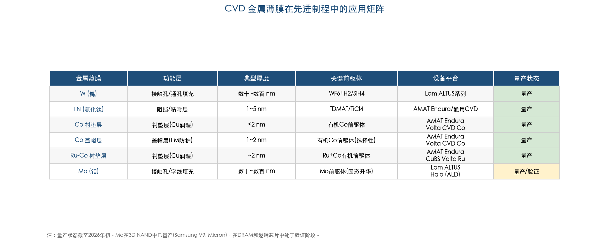

## 3.2 CVD 钨（W）——接触孔填充的二十年主力

### 3.2.1 CVD W 在逻辑与存储器件中的核心角色

钨（W）自 20 世纪 90 年代起即成为半导体接触孔和通孔填充的标准金属材料。在逻辑芯片的中段互连（Middle-of-Line, MOL）中，晶体管源极/漏极和栅极的接触孔（contact via）须以低电阻金属填满，以建立晶体管与后段互连布线之间的电气连接。W 体电阻率约 5.3 μΩ·cm，兼具良好的化学稳定性和填充特性，是接触孔填充的首选材料。在存储器领域，W 同样承担关键功能：在 DRAM 中形成字线（word line），在 3D NAND 中填充接触孔和通孔 [Semiconductor Engineering](https://semiengineering.com/interconnects-approach-tipping-point/ "Interconnects Approach Tipping Point, 2025")。

CVD 之所以成为 W 填充的工业标准技术，根源在于其保形填充能力。接触孔和通孔属于典型的高深宽比结构——在 7 nm 节点，接触通孔直径仅约 20 nm，深度可达 60–100 nm，深宽比在 3:1–5:1 以上。PVD 无法在此类结构中实现无空洞的完整填充，而 CVD W 利用气态前驱体的扩散特性，可从沟槽底部和侧壁同时沉积，实现由内向外的完整金属化。

### 3.2.2 CVD W 的化学反应与工艺流程

CVD W 的主要前驱体为六氟化钨（WF₆），还原剂通常为氢气（H₂）或硅烷（SiH₄）。核心反应方程式如下：

- **H₂ 还原**：WF₆ + 3H₂ → W + 6HF（主体填充阶段，沉积温度约 300–450°C）
- **SiH₄ 还原**：2WF₆ + 3SiH₄ → 2W + 3SiF₄ + 6H₂（核化阶段，反应速率更快，用于在阻挡层表面迅速形成初始 W 晶核）

量产工艺中，CVD W 填充通常采用两步法：第一步为薄核化层（nucleation layer）沉积——使用 SiH₄ 或 B₂H₆ 还原 WF₆，在 TiN 阻挡层表面形成约 2–5 nm 的超薄 W 晶种层，为后续体相沉积提供均匀成核位点；第二步为体相填充（bulk fill）——切换至 H₂ 还原 WF₆，以更高的沉积速率填满剩余通孔空间 [Lam Research](https://www.lamresearch.com/product/altus-product-family/ "ALTUS Product Family - CVD/ALD W 沉积")。

Lam Research 的 PNL（Pulsed Nucleation Layer）技术是核化层沉积的关键创新：PNL 采用 ALD 式的交替脉冲方式（WF₆ 脉冲与 B₂H₆ 脉冲交替），将核化层厚度从传统 CVD 核化的约 5 nm 降至 1–2 nm，同时实现更高的台阶覆盖率，为后续体相 CVD 填充留出更大的有效导电体积 [Lam Research](https://www.lamresearch.com/product/altus-product-family/ "PNL ALD 核化 + in-situ CVD 体相填充")。

### 3.2.3 CVD W 的量产设备平台

Lam Research 的 ALTUS 产品家族是全球 CVD W 沉积的工业标准设备平台，历经多代演进，每一代均针对更高深宽比和更低电阻率要求引入关键创新：

- **ALTUS Max ExtremeFill™**（2011 年）：面向 sub-2X nm 节点的极高深宽比通孔，首创独特的 CVD W 沉积方法，在传统 CVD 无法实现无空洞填充的结构中达成完整填充 [Lam Research](https://investor.lamresearch.com/2011-07-11-NOVELLUS-INTRODUCES-ALTUS-R-MAX-EXTREMEFILL-TM-TUNGSTEN-CVD "ALTUS Max ExtremeFill 发布公告, 2011")。
- **ALTUS Max ICEFill®**：在 ExtremeFill 基础上集成原子层刻蚀（ALE）回蚀步骤——在填充过程中周期性去除通孔口部的 W 过厚区域以防止过早封口导致空洞，从而进一步扩展极端深宽比结构的填充能力。
- **ALTUS Max E Series**（2016 年）：引入业界首创的低氟 W ALD 工艺，面向 3D NAND 和 DRAM 的先进金属化。低氟工艺解决了传统 WF₆ 基 CVD 中氟副产物（HF）对介电层和器件结构造成损伤的问题，对于 3D NAND 中超高深宽比（>60:1）字线填充尤为关键 [Lam Research](https://www.globenewswire.com/news-release/2016/08/09/941633/0/en/Lam-Research-Enables-Next-Generation-Memory-with-Industry-s-First-ALD-Process-for-Low-Fluorine-Tungsten-Fill.html "Lam Research ALD 低氟 W 填充, 2016")。

ALTUS 平台采用四工位模块（Quad Station Module, QSM）架构，支持在同一模块内依次完成核化和体相填充（多温度、多步骤的顺序沉积），兼顾工艺灵活性与产能效率 [Lam Research](https://www.lamresearch.com/product/altus-product-family/ "QSM 架构描述")。

在 Applied Materials 一侧，Endura Volta W CVD 系统提供了另一条重要技术路线。该系统的创新在于沉积一层钨-碳（W-C）复合薄膜，兼具衬垫层与核化层功能，可同时替代传统 TiN 阻挡层和 W 核化层。W-C 薄膜的电阻率比标准 TiN 衬垫层低 70% 以上，且其钨主体特性使其可直接作为体相 W 填充的成核基底。这种"一层替多层"方案将接触孔中可用于导电 W 的体积大幅扩大，使接触电阻降低最高达 90%（具体幅度取决于关键尺寸和工艺流程）[Applied Materials](https://www.appliedmaterials.com/us/en/product-library/endura-volta-cvd-w.html "Endura Volta W CVD 产品页")。

### 3.2.4 CVD W 面临的挑战与选择性 W 方案

尽管 CVD W 已服务半导体产业逾二十年，其在 ≤7 nm 节点面临的挑战愈发严峻。在 7 nm 节点的接触通孔中（直径约 20 nm），传统工艺中 TiN 衬垫-阻挡层加 W 核化层占据通孔体积的约 75%，留给导电 W 的空间仅约 25% [Applied Materials](https://investor.appliedmaterials.com/news-releases/news-release-details/applied-materials-solves-major-bottleneck-continued-2d-scaling/ "Selective W 技术公告, 2020")。通孔中 W 有效截面积的急剧缩小导致接触电阻飙升，成为制约器件性能与功耗的主要瓶颈。

Applied Materials 于 2020 年推出的 Endura Volta Selective Tungsten CVD 系统正面应对这一挑战。该系统采用选择性沉积技术——通过原子级表面处理使 W 原子仅在通孔底部金属表面选择性沉积，实现无阻挡层、无核化层、无接缝的自底向上填充（bottom-up fill），整个通孔被低电阻 W 完全填满，彻底消除了衬垫-阻挡层对导体体积的侵占 [Applied Materials](https://investor.appliedmaterials.com/news-releases/news-release-details/applied-materials-solves-major-bottleneck-continued-2d-scaling/ "Endura Volta Selective W CVD, 2020")。VLSIresearch 董事长 Dan Hutcheson 将传统阻挡层比作"半导体行业版的动脉斑块"，并评价选择性 W 为"行业期待已久的突破" [Applied Materials](https://investor.appliedmaterials.com/news-releases/news-release-details/applied-materials-solves-major-bottleneck-continued-2d-scaling/ "Dan Hutcheson 评论, 2020")。该系统已被全球多家领先客户采用，支持 5 nm、3 nm 及更先进节点的器件接触孔金属化。

下图直观对比了三代 W 接触孔填充工艺中导电体积占比的演进趋势，清晰呈现了从传统方案到选择性 W 方案的接触电阻改善路径。

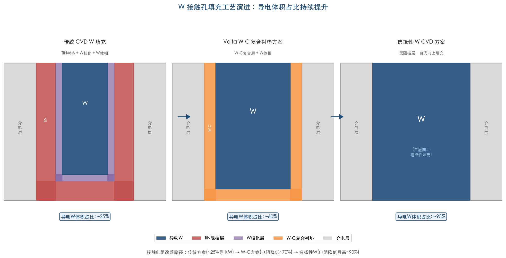

## 3.3 CVD TiN——接触孔阻挡层的保形选择

### 3.3.1 CVD TiN 在 W 接触孔工艺中的角色

在 W 接触孔填充工艺中，TiN 薄膜承担阻挡/粘附层的双重功能：一方面阻止 WF₆ 前驱体中的氟（F）向下扩散损伤底部硅化物和器件结构，另一方面为后续 W 核化提供良好的粘附表面。CVD TiN 使用金属有机前驱体 TDMAT（四（二甲基氨基）钛，Ti(N(CH₃)₂)₄）或无机前驱体 TiCl₄ 经热分解或与 NH₃ 反应生成 TiN 薄膜。

CVD TiN 相较于 PVD TiN 的核心优势在于保形覆盖能力。在高深宽比接触孔中，PVD TiN 受限于视线沉积，侧壁和底部覆盖率随深宽比增加而急剧下降；CVD TiN 则可实现接近 100% 的保形覆盖，确保阻挡层在通孔所有表面上的连续性与均匀性 [Harvard/Gordon Group](https://gordon.faculty.chemistry.harvard.edu/file_url/242 "Improved Conformality of CVD Titanium Nitride Films")。研究表明，在高深宽比接触孔中，W 薄膜在 CVD TiN 上的电阻率低于在 PVD TiN 上的电阻率，部分归因于 CVD TiN 更均匀的覆盖为 W 核化提供了更一致的基底条件 [Semantic Scholar](https://www.semanticscholar.org/paper/Impact-of-TiN-Barrier-Layer-on-Contact-Resistance-Schulze-Wolansky/627f0df1526bdd879a90954a3b7f07bec2b3325a "Impact of TiN Barrier Layer on Contact Resistance of W Filled Vias")。

Applied Materials 曾推出专用 Ti/TiN CVD 系统，将 CVD TiN 与 PVD Ti 粘附层集成在同一集群式平台上，在维持低加工成本的同时实现了高深宽比通孔中的可靠阻挡性能 [Applied Materials](https://ir.appliedmaterials.com/news-releases/news-release-details/applied-materials-announces-new-titin-cvd-system-enable-low-cost/ "Ti/TiN CVD System 公告")。

### 3.3.2 CVD TiN 的局限与演进

CVD TiN 的主要局限在于薄膜纯度：使用 MOCVD 前驱体（TDMAT）沉积的 TiN 薄膜中不可避免地含有碳（C）杂质（典型含量 5–15 at.%），碳杂质会提高 TiN 薄膜电阻率并可能削弱阻挡性能。工业实践中通常在 TDMAT CVD TiN 沉积后增加等离子体后处理步骤，或采用循环沉积-处理（cyclic deposition-treatment）工艺，通过 H₂/N₂ 等离子体轰击去除薄膜中的碳和有机残留物。采用无机前驱体 TiCl₄ 的 CVD TiN 可获得更低碳含量的薄膜，但氯（Cl）残留则成为另一需要控制的杂质源 [MDPI Coatings](https://www.mdpi.com/2079-6412/6/1/2 "TiCl₄ Barrier Process Engineering in Semiconductor Manufacturing")。

随着先进节点向选择性 W 填充方案演进（即前述 Endura Volta Selective W CVD），传统 TiN 阻挡层的角色正在被重新定义。在选择性 W 方案中，W-C 复合衬垫层或完全无阻挡层的自底向上填充取代了 TiN + W 核化层的多层堆叠，CVD TiN 的独立工艺步骤可能被集成或省略。然而，在传统 W 填充工艺仍被广泛使用的成熟节点和存储器制造中，CVD TiN 阻挡层依然是不可或缺的标准步骤。

## 3.4 CVD 钴（Co）——从衬垫层到选择性盖帽层的多重角色

### 3.4.1 CVD Co 衬垫层的引入背景

随着铜互连工艺向 ≤28 nm 节点延伸，互连线宽的持续缩小引发了两个紧迫问题：其一，传统 Ta 衬垫层与 Cu 之间润湿性不足，导致电镀 Cu 填充时在窄沟槽中易产生空洞（void）；其二，Cu 互连线的电迁移（electromigration, EM）可靠性随线宽缩小而恶化，成为器件寿命的关键制约因素。Co 的引入同时回应了上述两个挑战：Co 与 Cu 之间的化学亲和力和晶格匹配性优于 Ta，可显著改善 Cu 的润湿性与填充质量；Co 同时具有优异的电迁移抗性，能够增强 Cu 互连线的长期可靠性。

Applied Materials 于 2014 年推出 Endura Volta CVD Cobalt 系统，将 CVD Co 引入量产互连工艺，并将其定义为"15 年来互连技术最重大的材料变革" [Applied Materials](https://ir.appliedmaterials.com/news-releases/news-release-details/applied-materials-introduces-biggest-materials-change/ "Endura Volta CVD Cobalt 发布公告, 2014")。

### 3.4.2 CVD Co 的两大核心应用

**（1）保形 CVD Co 衬垫层（Conformal CVD Co Liner）**

CVD Co 衬垫层沉积在 TaN 阻挡层与 Cu 导体之间，厚度通常 <2 nm（<20 Å）。CVD 工艺的保形性确保 Co 衬垫在窄沟槽的底部和侧壁上均匀覆盖，为后续 Cu 电镀提供连续的润湿表面，增大 Cu 在窄互连线中的无空洞填充窗口。Endura Volta CVD Cobalt 系统将预清洗（preclean）、PVD TaN 阻挡层、CVD Co 衬垫层和 Cu 种子层集成在同一超高真空平台上，避免界面氧化，确保各层间的原子级清洁度 [Applied Materials](https://ir.appliedmaterials.com/news-releases/news-release-details/applied-materials-introduces-biggest-materials-change/ "CVD Co liner 集成方案, 2014")。

**（2）选择性 CVD Co 盖帽层（Selective CVD Co Cap）**

选择性 CVD Co 盖帽层是业界首个实现量产的选择性金属沉积工艺。在 Cu 化学机械抛光（CMP）之后，CVD Co 选择性地仅在暴露的 Cu 表面上沉积而不在介电层表面沉积，形成约 1–2 nm 的 Co 薄膜覆盖 Cu 线顶面。Co 盖帽层将 Cu 互连完全封装在 Co 与 TaN 之中，阻断 Cu 沿介电层界面的电迁移扩散路径，使器件电迁移可靠性改善超过 80 倍 [Applied Materials](https://ir.appliedmaterials.com/news-releases/news-release-details/applied-materials-introduces-biggest-materials-change/ "选择性 CVD Co cap 可靠性提升 >80×, 2014")。

### 3.4.3 CVD Co 在先进节点中的演进

Intel 在 10 nm 工艺（Intel 7）中率先将 Co 从衬垫/盖帽层角色扩展为最底层互连（M0/M1）的主导导体材料，以 CVD Co 填充取代 Cu 电镀，成为业界首次在量产中使用 Cu 以外的金属作为互连导体。Intel 公布的数据表明，Co 接触层使接触线电阻降低 60%，M0/M1 通孔电阻降低约 2 倍 [Semiconductor Digest](https://www.semiconductor-digest.com/intel-4-process-drops-cobalt-interconnect-goes-with-tried-and-tested-copper-with-cobalt-liner-cap/ "Intel Co 互连性能数据")。然而，在后续 Intel 4（7 nm 等效）节点中，Intel 放弃了 Co 互连方案，转回 Cu 互连搭配 Co 衬垫/盖帽层的传统架构 [Semiconductor Digest](https://www.semiconductor-digest.com/intel-4-process-drops-cobalt-interconnect-goes-with-tried-and-tested-copper-with-cobalt-liner-cap/ "Intel 4 放弃 Co 互连")。这一反复表明，Co 在衬垫层和盖帽层中的价值已获产业充分验证，但作为主导互连导体仍面临电阻率过高的挑战——Co 体电阻率约 6.2 μΩ·cm，且电子平均自由程（MFP）仅约 10 nm，在窄线条件下电阻率攀升尤为明显。

## 3.5 CVD 钌（Ru）——连接铜时代与后铜时代的桥梁

### 3.5.1 CVD Ru-Co 二元衬垫层：将铜互连延伸至 2 nm 节点

2024 年 7 月，Applied Materials 正式推出 Endura Copper Barrier Seed IMS with Volta Ruthenium CVD 系统，标志着 Ru 首次以高产量制造（HVM）形态进入铜互连工艺链。该系统在同一高真空环境中集成六种不同工艺技术，核心创新为业界首创的钌-钴（RuCo）二元金属衬垫层——RuCo 衬垫层将传统 Co 衬垫层的厚度减薄 33% 至约 2 nm（20 Å），同时提供比单一 Co 衬垫更优的 Cu 润湿性和回流填充特性，使互连线电阻降低最高 25% [Applied Materials](https://ir.appliedmaterials.com/news-releases/news-release-details/applied-materials-unveils-chip-wiring-innovations-more-energy/ "Endura CuBS Volta Ru CVD 发布公告, 2024-07-08")。

Applied Materials 强调这是"半导体行业首次在高产量制造中使用 Ru"。该系统自 3 nm 节点起向客户出货，并已被所有领先逻辑芯片制造商采用 [Applied Materials](https://ir.appliedmaterials.com/news-releases/news-release-details/applied-materials-unveils-chip-wiring-innovations-more-energy/ "被所有领先逻辑客户采用, 2024")。TSMC 执行副总裁暨联席营运长 Y.J. Mii 评价："降低互连电阻的新材料将在半导体产业中扮演重要角色" [Applied Materials](https://ir.appliedmaterials.com/news-releases/news-release-details/applied-materials-unveils-chip-wiring-innovations-more-energy/ "TSMC Y.J. Mii 评论, 2024")。Samsung 电子副总裁 Sunjung Kim 亦表示 Samsung 正在采用多种材料工程创新来延伸先进节点的互连缩放 [Applied Materials](https://ir.appliedmaterials.com/news-releases/news-release-details/applied-materials-unveils-chip-wiring-innovations-more-energy/ "Samsung Sunjung Kim 评论, 2024")。

CVD 被选用于 RuCo 衬垫层沉积的原因十分明确：衬垫层须在 TaN 阻挡层上实现保形覆盖，CVD 的气相反应机制能够在窄沟槽底部和侧壁上均匀沉积；RuCo 二元层可在一到两个 CVD 腔室中完成沉积，并通过中间等离子体处理降低薄膜粗糙度以优化后续电镀 [Semiconductor Engineering](https://semiengineering.com/interconnects-approach-tipping-point/ "Samsung Ru-Co CVD 腔室描述, IITC 2024 引用, 2025")。Samsung 在 3 nm 节点（SF3E）的实验数据显示，TaN/Ru-Co/Cu 方案相比传统 TaN/Co/Cu 方案，填充空洞减少 87%、线电阻改善 14% [Semiconductor Engineering](https://semiengineering.com/interconnects-approach-tipping-point/ "Samsung Ru-Co liner 性能数据, IITC 2024, 2025")。

### 3.5.2 CVD Ru 在减法刻蚀互连方案中的潜在角色

在 ≤18 nm pitch 的后铜时代互连方案中，Ru 作为主导互连金属通过减法刻蚀（subtractive etch）工艺形成互连线条。虽然 PVD 溅射是沉积毯状 Ru 薄膜的主要方法（详见第2章），CVD Ru 亦是 Ru 互连方案中的重要技术选项。CVD Ru 的优势体现在两个方面：对于需要填充通孔（via）的工艺步骤，CVD 的保形覆盖能力使其更适合实现无空洞的通孔填充；此外，CVD 可在特定基底上实现选择性沉积，这对于 imec 提出的半大马士革（semi-damascene）工艺中自对准通孔（self-aligned via）的制造具有重要价值 [Semiconductor Engineering](https://semiengineering.com/interconnects-approach-tipping-point/ "Ru 可通过 PVD/CVD/ALD/电化学沉积, 2025")。

已有研究展示了约 3 nm 厚的 CVD Ru 薄膜在 0.5–1 nm 金属氮化物阻挡层上的成功沉积，表明 CVD Ru 在超薄膜沉积方面具备工艺可行性 [AIP Publishing](https://pubs.aip.org/avs/jva/article/35/3/03E109/245609/Atomic-layer-deposited-ultrathin-metal-nitride "~3 nm CVD Ru on ultrathin metal nitride barriers")。我们判断，在 Ru 互连量产的初期阶段，毯状薄膜沉积可能以 PVD 为主（利用其高纯度和高速率），而 Ru 通孔填充和选择性 Ru 沉积则更可能采用 CVD 或 ALD 工艺，形成 PVD + CVD/ALD 的混合方案。

## 3.6 CVD 在钼（Mo）金属化中的角色——从钨的继任者到全面替代

### 3.6.1 Mo 替代 W 的产业驱动力

Mo 正迅速崛起为下一代金属化的核心材料，目标在于在 3D NAND、DRAM 和先进逻辑器件的多个关键层中替代 W。这一转变的技术驱动力十分明确：Mo 体电阻率约 5.3 μΩ·cm，与 W 相当，但 Mo 在纳米级薄膜中的电阻率显著低于 W，原因在于 Mo 的电子平均自由程（MFP）更短，窄线极限下受尺寸效应的影响更小。更为关键的是，Mo 在介电材料中几乎无固有扩散性，无需高电阻率的阻挡层和衬垫层，可直接沉积在介电层上而不引发扩散泄漏 [Semiconductor Engineering](https://semiengineering.com/interconnects-approach-tipping-point/ "Lam Ashtiani: moly 无需阻挡层, 2025")。Lam Research 副总裁 Kaihan Ashtiani 指出："在先进芯片制造所需的原子尺度下，Mo 正在成为替代 W 的最合适材料，创造了行业的重大拐点" [Semiconductor Engineering](https://semiengineering.com/interconnects-approach-tipping-point/ "Lam Ashtiani 评论, 2025")。

在成本维度上，Mo 前驱体价格约为 Ru 的 1/10，赋予其在大规模量产中的显著经济优势 [Semiconductor Engineering](https://semiengineering.com/interconnects-approach-tipping-point/ "Mo 前驱体成本约为 Ru 的 1/10, 2025")。

### 3.6.2 Lam Research ALTUS Halo：Mo ALD 的量产突破

2025 年 2 月，Lam Research 正式发布 ALTUS Halo——全球首款面向 Mo 原子层沉积的量产设备。Lam 高级副总裁 Sesha Varadarajan 将其定义为"20 多年来原子层沉积领域最重大的突破" [Lam Research](https://newsroom.lamresearch.com/2025-02-19-Lam-Research-Ushers-in-New-Era-of-Semiconductor-Metallization-with-ALTUS-R-Halo-for-Molybdenum-Atomic-Layer-Deposition "ALTUS Halo 发布公告, 2025-02-19")。ALTUS Halo 运用一系列专利创新实现了 Mo 的高精度、低电阻率、无空洞沉积，在多数应用场景中可提供比传统 W 金属化方案低 50% 以上的电阻 [Lam Research](https://newsroom.lamresearch.com/2025-02-19-Lam-Research-Ushers-in-New-Era-of-Semiconductor-Metallization-with-ALTUS-R-Halo-for-Molybdenum-Atomic-Layer-Deposition "电阻改善 >50%, 2025")。

严格来讲，ALTUS Halo 是一台 ALD 设备而非传统 CVD 设备。然而，将其纳入本章讨论具有重要的产业逻辑：ALTUS Halo 是 Lam Research ALTUS 产品家族的最新成员，该家族的技术基础正是 CVD 与 ALD 的融合平台——Lam Research 官方将 ALTUS 定位为"结合 CVD 和 ALD 技术的市场领先系统" [Lam Research](https://www.lamresearch.com/product/altus-product-family/ "CVD + ALD 技术融合定位")。ALTUS Halo 的 QSM（四工位模块）架构支持热 ALD 和等离子体 Mo ALD 两种模式，并可通过多温度顺序处理实现衬垫层与体相填充的一体化沉积——这种工艺灵活性与前几代 ALTUS 的 CVD W 平台一脉相承。从设备演进视角审视，ALTUS Halo 代表了 CVD 金属化平台向 ALD 方向的自然延伸，体现了两种沉积技术在先进金属化领域的深度融合趋势。

### 3.6.3 Mo 在存储器和逻辑芯片中的量产进展

在 3D NAND 领域，Mo 已进入量产阶段。Samsung 从 V5（第五代 V-NAND）起在部分工艺中引入 Mo，至 V9（第九代，286 层）量产技术中进一步扩大 Mo 应用范围，在字线中以 Mo 替代部分 W [SemiAnalysis](https://newsletter.semianalysis.com/p/interconnects-beyond-copper-1000 "Samsung V5 起使用 Mo, V9 扩大应用, IEDM 2024") [DigiTimes](https://www.digitimes.com/news/a20240709PD214/samsung-materials-3d-nand-memory-chips-market.html "Samsung V9 NAND 采用 Mo, 2024")。Micron 则明确表示，Mo 金属化的整合使 Micron 成为"首家将行业领先的 I/O 带宽和存储容量引入最新一代 NAND 产品的厂商"，并确认 Lam 的 ALTUS Halo 使其实现了 Mo 的量产 [Lam Research](https://newsroom.lamresearch.com/2025-02-19-Lam-Research-Ushers-in-New-Era-of-Semiconductor-Metallization-with-ALTUS-R-Halo-for-Molybdenum-Atomic-Layer-Deposition "Micron VP Mark Kiehlbauch 评论, 2025")。

在 DRAM 领域，Mo 正处于积极的开发验证阶段，目标是替代 W 字线以支持下一代高密度 DRAM 架构（如 4F² 存储单元）[Lam Research](https://newsroom.lamresearch.com/2025-02-19-Lam-Research-Ushers-in-New-Era-of-Semiconductor-Metallization-with-ALTUS-R-Halo-for-Molybdenum-Atomic-Layer-Deposition "ALTUS Halo 支持 4F2 DRAM, 2025")。

在先进逻辑领域，Mo 的应用亦在积极推进中。Lam Research 指出"几乎所有主要芯片制造商都在其 NAND、DRAM 和逻辑应用中处于 Mo 的不同验证阶段" [Semiconductor Engineering](https://semiengineering.com/interconnects-approach-tipping-point/ "Lam: 所有主要厂商验证 Mo, 2025")。TSMC 预计在其更高性能的 2 nm 版本中先对通孔引入 Mo，随后将 Mo 用于关键互连层 [SemiWiki/TechInsights](https://semiwiki.com/semiconductor-services/techinsights/352972-iedm-2025-tsmc-2nm-process-disclosure-how-does-it-measure-up/ "TSMC Mo 引入路径, 2025")。Applied Materials 的测试数据亦显示，其选择性 Mo ALD 方案在先进测试结构中可实现比选择性 W 低约 15% 的接触电阻 [Applied Materials](https://www.appliedmaterials.com/us/en/newsroom/perspectives/powering-the-next-era-of-contact-scaling-with-ald-molybdenum.html "选择性 Mo ALD vs 选择性 W, ~15% 电阻改善")。

## 3.7 CVD 的技术优势与局限性总结

### 3.7.1 CVD 的不可替代优势

**保形填充能力**。CVD 在先进制程中最核心的价值在于其对高深宽比结构的保形填充能力。从早期的 W 接触孔填充到当今的 Co/Ru 衬垫层和 Mo 字线填充，CVD 的气相反应扩散机制使其能够在 PVD 无法胜任的窄深结构中实现均匀沉积和无空洞填充。

**工艺灵活性**。CVD 可通过调节前驱体种类、反应气体、温度、压力和等离子体参数，沉积多种金属和金属化合物（W、TiN、Co、Ru、Mo 等），并在保形沉积、选择性沉积和自底向上填充等不同模式之间灵活切换。

**产能效率**。与 ALD 相比，CVD 的沉积速率高出一个数量级以上。在需要较厚薄膜沉积（如 W 体相填充、Co 衬垫层）的应用中，CVD 具有显著的产能和成本优势。

### 3.7.2 CVD 面临的技术挑战

**薄膜纯度**。CVD 使用有机金属或含卤素前驱体，薄膜中不可避免地含有来自前驱体配体的碳、氟、氯等杂质，这些杂质会提高薄膜电阻率并可能影响器件可靠性。等离子体后处理和前驱体化学优化可部分缓解该问题，但 CVD 薄膜纯度仍普遍低于 PVD 薄膜。

**超薄膜控制**。在阻挡层和衬垫层厚度向 ≤1 nm 极限趋近的背景下，CVD 的厚度控制精度不及 ALD。CVD 属于连续沉积过程，薄膜厚度主要通过沉积时间控制，在超薄膜区间的重复性和均匀性面临挑战；ALD 的自限制反应机制则提供了亚单层级别的固有厚度精度。

**前驱体成本与供应**。部分金属 CVD 前驱体（如 Ru 有机前驱体）价格高昂，高纯度前驱体的稳定供应是量产环节的重要考量。对于 Mo CVD/ALD，固态前驱体的升华和输送亦需专门的化学品处理系统 [Lam Research](https://www.lamresearch.com/product/altus-product-family/ "Mo 固态前驱体升华输送系统")。

## 3.8 CVD 在先进制程金属化中的角色演变

纵观 CVD 在先进制程金属薄膜中的应用全景，其角色正沿三条主线演变。

**第一，传统 CVD W 接触孔填充工艺正经历深度创新，以应对纳米级尺度下的电阻率危机**。从 Lam Research 的 PNL 核化 + CVD 体相填充，到 ExtremeFill/ICEFill 的极端深宽比填充方案，再到 Applied Materials 的选择性 W CVD 消除阻挡层方案，CVD W 工艺的每一代创新均旨在于日益缩小的通孔中保留尽可能多的导电体积。这些创新使 W 接触孔工艺得以延伸至 5 nm 和 3 nm 节点。

**第二，CVD 正成为新型互连金属（Co、Ru）进入量产的关键使能技术**。Applied Materials 的 Volta CVD Cobalt 系统和 Volta Ruthenium CVD 系统先后将 CVD Co 衬垫层/盖帽层和 CVD Ru-Co 二元衬垫层引入高产量制造，并已被所有领先逻辑芯片制造商采用。CVD 的保形覆盖能力使其成为在窄沟槽中沉积超薄衬垫层的优选技术之一，与 ALD 形成互补。

**第三，CVD 与 ALD 在先进金属化平台上深度融合，形成统一的沉积技术基座**。Lam Research 的 ALTUS 家族从最初的纯 CVD W 平台演进为 CVD + ALD 融合平台，最新的 ALTUS Halo 以 ALD 模式实现了 Mo 的量产沉积。Applied Materials 的 Endura IMS 平台同样在同一真空系统内集成 CVD、ALD、PVD 等多种技术。这种融合趋势表明，在先进节点的金属化工艺中，CVD 与 ALD 之间的边界正趋模糊——两者共享前驱体化学和反应腔室硬件，区别仅在于反应物输送模式（连续共流与交替脉冲）和沉积速率/精度的权衡。我们判断，CVD-ALD 融合将成为 2 nm 及更先进节点金属化工艺的技术范式。

下图以双轨时间线形式展示了 Lam Research ALTUS 家族和 Applied Materials Endura Volta 家族从 2011 年至 2025 年的关键产品节点，清晰呈现 CVD 与 ALD 从分立到深度融合的设备演进历程。

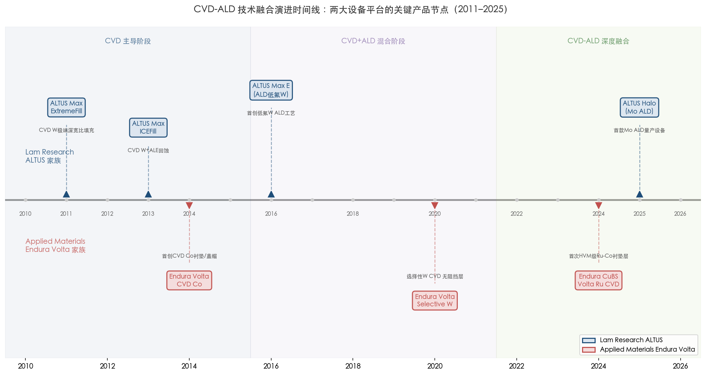

# 第4章 原子层沉积（ALD）——先进节点的精密控制利器

第3章系统梳理了化学气相沉积（CVD）在先进制程金属薄膜中的多重角色——从主导接触孔填充逾二十年的 CVD 钨（W），到支撑铜互连体系的 CVD TiN 阻挡层，再到 CVD 钴（Co）和 CVD 钌（Ru）在 ≤3 nm 节点中的新兴应用。CVD 凭借优于 PVD 的保形性与远高于 ALD 的沉积速率，在二者之间发挥着不可替代的平台作用。然而，当互连特征尺寸继续缩小至 10 nm 甚至更窄、深宽比持续攀升至 10:1 以上、关键功能层厚度逼近亚纳米量级时，即便是 CVD 也难以同时满足 100% 保形覆盖与原子级厚度控制的双重要求。原子层沉积（Atomic Layer Deposition, ALD）正是在这一极端需求下从实验室走向量产核心的技术——它以自限制逐层生长的独特机制，将薄膜沉积精度推进至单原子层水平，成为 ≤5 nm/3 nm/2 nm 先进节点中不可或缺的精密控制利器。

## 4.1 ALD 的技术原理与工艺变体

### 4.1.1 自限制表面反应：原子级精度的根基

ALD 的核心机制是将传统 CVD 中的连续化学反应拆分为两个（或多个）在时间上严格分离的半反应步骤，每个步骤均为自限制的表面饱和反应。一个典型的 ALD 循环包含四个阶段：①前驱体脉冲——将第一种反应物（金属前驱体）通入反应腔室，前驱体分子与基底表面活性位点发生化学吸附，形成一层化学键合的单分子层；②第一次吹扫——以惰性气体（N₂ 或 Ar）清除腔室中未反应的前驱体及副产物；③共反应物脉冲——通入第二种反应物（如 NH₃、H₂ 等离子体或 O₃），与已吸附的前驱体分子层发生反应，完成一层目标材料的生长并再生表面活性位点；④第二次吹扫——清除多余反应物与副产物。重复上述循环即可逐层累积至目标厚度 [ASM International](https://www.asm.com/our-technology-products/ald "ALD 技术概述")。

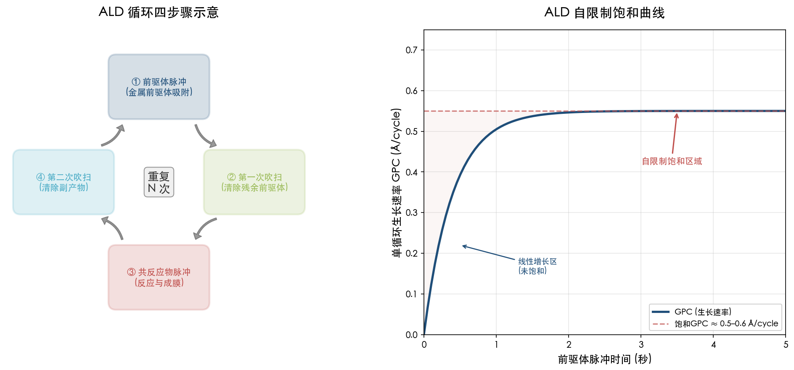

**图 4-1** 左侧以环形流程展示 ALD 单循环的四个步骤及其循环重复逻辑；右侧饱和曲线直观呈现单循环生长速率（GPC）随前驱体脉冲时间增加趋于饱和的自限制特性，典型饱和 GPC 约 0.5–0.6 Å/cycle。

自限制特性是 ALD 区别于所有其他沉积技术的根本属性。由于每个半反应步骤在表面活性位点完全饱和后自行停止，单个 ALD 循环的沉积厚度仅取决于表面化学，而非前驱体供给量或反应时间。这一机制带来两项关键能力：其一，薄膜厚度可通过循环次数精确控制至亚纳米级别，典型的单循环生长速率（Growth Per Cycle, GPC）处于 0.3–1.5 Å/cycle 范围内，具体数值取决于材料体系和沉积温度；其二，在任何三维拓扑结构表面——无论是深沟槽侧壁、通孔底部还是悬臂结构底面——只要前驱体分子能扩散到达，即可实现均匀的饱和吸附，从而赋予 ALD 近 100% 的保形台阶覆盖率 [ASM International](https://www.asm.com/our-technology-products/ald "ALD 自限制机制描述")。

### 4.1.2 热 ALD 与等离子体增强 ALD（PE-ALD）

在先进制程金属薄膜量产中，ALD 主要以两种工艺变体存在。

**热 ALD（Thermal ALD）** 完全依赖基底加热提供反应活化能，前驱体在加热的晶圆表面发生热分解或与共反应物发生热化学反应。热 ALD 的核心优势在于反应均匀性极佳——由于无方向性等离子体的参与，反应物仅需扩散至表面即可完成吸附，在超高深宽比结构（>50:1，如 3D NAND 字线）中也能实现均匀覆盖。然而，热 ALD 所需的沉积温度通常较高（250–450°C），且对某些金属前驱体（如需要高温才能完全分解的钽和钛前驱体），反应温度窗口较为有限。

**等离子体增强 ALD（Plasma-Enhanced ALD, PE-ALD）** 在共反应物步骤引入等离子体（如 H₂/N₂ 混合等离子体、NH₃ 等离子体），以高活性自由基和离子取代纯热驱动的共反应。PE-ALD 具备三方面核心优势：其一，沉积温度显著降低——典型 PE-ALD 金属氮化物工艺可在 200–300°C 甚至更低温度下完成，有利于保护温度敏感的低 k 介电层和器件结构；其二，薄膜致密度与纯度提升——等离子体活性物种可更彻底地去除前驱体配体中的碳、氧杂质，使薄膜密度趋近体材料值；其三，可沉积材料范围得到拓展——某些金属（如 Ru）的热 ALD 前驱体反应活性不足，需借助 O₂ 等离子体完成配体的氧化去除 [ScienceDirect](https://www.sciencedirect.com/science/article/abs/pii/S0022024820301470 "Comparison between thermal and plasma enhanced ALD")。然而，PE-ALD 因等离子体具有方向性，在极高深宽比结构底部的保形性可能略逊于纯热 ALD。实测数据表明，在深宽比 >30:1 的结构中，PE-ALD 的底部覆盖率可降至约 50%–70%，而热 ALD 仍可保持 >95% [e-ASCT](https://www.e-asct.org/journal/view.html?doi=10.5757/ASCT.2019.28.5.142 "PE-ALD 台阶覆盖率评估")。因此，实际量产中需根据具体功能层的深宽比与温度预算在热 ALD 和 PE-ALD 之间做出取舍。

### 4.1.3 ALD 在沉积速率—产能—成本维度上的定位

ALD 的自限制逐层生长机制赋予其无与伦比的厚度控制精度与保形性，但这一优势的代价是沉积速率远低于 PVD 和 CVD。以金属氮化物为例，ALD TaN 的典型 GPC 约 0.5–0.6 Å/cycle，每个循环包含前驱体脉冲、吹扫、共反应物脉冲、再次吹扫四个步骤，单循环耗时通常在数秒至十余秒之间。折算为有效沉积速率，ALD 金属薄膜约为 1–10 nm/min，远低于 CVD 的数十至数百 nm/min 和 PVD 的数百 nm/min [ScienceDirect](https://www.sciencedirect.com/science/article/abs/pii/S2468519418301630 "Speeding up the unique assets of atomic layer deposition")。

低沉积速率直接影响晶圆吞吐量与单位加工成本。为应对这一挑战，ALD 设备厂商采取了多种产能优化策略：ASM International 的 XP8 Synergis 平台可配置最多四个双腔模块（Dual Chamber Module, DCM），在单一设备占地面积内实现八个腔室同时运行，大幅提升每小时晶圆处理量（wph）；Tokyo Electron 的 NT333 半批次 ALD 系统一次可加载多片晶圆同步处理，在保持原子级精度的同时显著提高产能 [TEL](https://www.tel.com/product/nt333.html "NT333 半批次 ALD 系统")。尽管如此，ALD 的综合成本仍显著高于 PVD 与 CVD——前驱体价格（尤其是高纯有机金属前驱体如 PDMAT）及较长的工艺时间构成主要成本驱动因素。因此，在先进制程中，ALD 的应用被精准限定于"非 ALD 不可"的场景，即唯有 ALD 的原子级精度与近完美保形性才能满足工艺要求的超薄功能层沉积。

## 4.2 ALD 超薄阻挡层——TaN 与 TiN 的原子级控制

### 4.2.1 ALD TaN：从 PVD 补充方案到先进节点的主流选择

氮化钽（TaN）扩散阻挡层是铜互连体系中防止 Cu 原子扩散进入介电层的关键功能层。如第2章所述，PVD 溅射 TaN 长期占据阻挡层沉积的主导地位，但在高深宽比结构中面临侧壁覆盖率不足的瓶颈——深宽比超过约 5:1 时，PVD TaN 的侧壁覆盖率可降至仅 1%–5%。ALD TaN 凭借自限制生长机制，在相同结构中可实现近 100% 的保形覆盖。

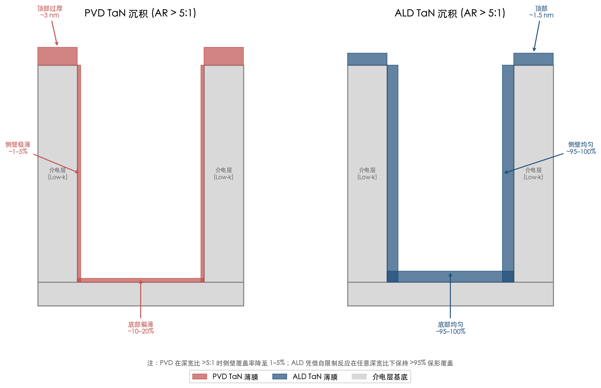

**图 4-2** 并排截面示意图对比 PVD TaN（左）与 ALD TaN（右）在深宽比 >5:1 沟槽结构中的覆盖差异。PVD 方案呈现顶部过厚（~3 nm）、侧壁极薄（1–5%）、底部偏薄（10–20%）的非保形分布；ALD 方案则在顶部、侧壁和底部均实现 95–100% 的近完美保形覆盖。

ALD TaN 的工业标准前驱体为五（二甲基氨基）钽（Pentakis-Dimethyl-Amino-Tantalum, PDMAT, Ta(NMe₂)₅），共反应物通常为 NH₃（热 ALD）或 H₂/N₂ 混合等离子体（PE-ALD）。PDMAT 的 ALD 窗口温度约 200–300°C，GPC 约 0.5–0.6 Å/cycle。在 sub-22 nm 节点中，器件制造商已广泛采用基于 PDMAT 的 ALD TaN 工艺用于铜互连阻挡层沉积 [Semiconductor Digest](https://sst.semiconductor-digest.com/2014/06/hvm-production-and-challenges-of-uhp-pdmat-for-ald-tan/ "HVM production and challenges of UHP PDMAT for ALD-TaN, 2014")。

ALD TaN 相较于 PVD TaN 的性能优势已在量产数据中得到充分验证。在 10 Å（1 nm）厚度下，PE-ALD TaN 可将通孔电阻降低约 50%（相比同厚度 PVD TaN），这一改善源于 ALD 在通孔底部实现了更均匀的覆盖，避免了 PVD 在底部偏薄导致的局部高电阻区 [Semiconductor Digest](https://sst.semiconductor-digest.com/2014/06/hvm-production-and-challenges-of-uhp-pdmat-for-ald-tan/ "10Å PEALD TaN vs PVD TaN 通孔电阻对比")。在 3 nm TaN 阻挡层厚度下，ALD TaN 方案的通孔电阻较 PVD TaN 方案低约 28% [ResearchGate](https://www.researchgate.net/publication/287504712_ALD_and_PVD_Tantalum_Nitride_Barrier_Resistivity_and_Their_Significance_in_via_Resistance_Trends "ALD 与 PVD TaN 阻挡层电阻率比较")。

PDMAT 前驱体的量产供应本身也构成一项重大工程挑战。PDMAT 对氧和水分极为敏感，微量氧杂质会形成钽氧胺化合物，这些杂质在薄膜中表现为电容性而非导电性的"Ta-O"缺陷，严重降低阻挡层性能。量产级超高纯 PDMAT 要求纯度达到 >99.99995%，氯含量 <10 ppm，这需要前驱体供应商开发专门的无氧纯化工艺 [Semiconductor Digest](https://sst.semiconductor-digest.com/2014/06/hvm-production-and-challenges-of-uhp-pdmat-for-ald-tan/ "UHP PDMAT 纯度要求")。

### 4.2.2 ALD TiN：从阻挡层到金属栅极的多功能薄膜

氮化钛（TiN）是先进制程中用途最为广泛的 ALD 金属氮化物薄膜之一，在后段互连（BEOL）和前段器件（FEOL）中均承担关键功能。在 BEOL 领域，ALD TiN 作为 CVD W 接触孔填充前的粘附/阻挡层，提供优于 PVD 的保形覆盖与界面质量。IBM 在 2016 年 ASMC 会议上发表了关于中段互连（MOL）ALD TiN 扩散阻挡层临界厚度的研究，验证了 ALD TiN 在极薄尺度下仍能有效阻止 Cu 扩散的能力 [IEEE ASMC 2016](https://doi.org/10.1109/ASMC.2016.7491156 "Investigation on Critical Thickness Dependence of ALD TiN Diffusion Barrier in MOL")。

在 FEOL 领域，ALD TiN 是高 k 金属栅极（High-k Metal Gate, HKMG）堆叠中功函数金属层的核心组成部分。在 GAA 纳米片晶体管架构中，栅极需要完全包裹多层纳米片沟道的上下左右所有表面，唯有 ALD 的自限制保形生长才能在纳米片之间仅数纳米的间隙中实现均匀的 TiN 功函数金属沉积。通过精确调节 ALD TiN 的厚度与成分（如掺入 Al 形成 TiAlN 以调节功函数），可分别优化 pMOS 和 nMOS 器件的阈值电压。ASM International 的 Eagle XP8 平台即专为先进金属 ALD（包括 TiN 和 W）设计，广泛应用于逻辑和存储器件的阻挡层及衬垫层沉积 [BALD Engineering](https://www.blog.baldengineering.com/2025/05/asm-international-strengthens-ald.html "ASM Eagle XP8 用于金属 ALD, 2025")。

## 4.3 ALD 衬垫层与替代金属沉积——Ru、Co 与 Mo 的新兴应用

### 4.3.1 ALD Ru 衬垫层与无阻挡层互连方案

钌（Ru）作为先进互连的替代金属和衬垫层材料，其 ALD 沉积工艺是近年来研究与产业化的焦点。ALD Ru 通常采用有机金属钌前驱体（如二（乙基环戊二烯基）钌 Ru(EtCp)₂ 或其他环戊二烯基衍生物），配合 O₂ 或 O₂ 等离子体作为共反应物。热 ALD Ru 的 GPC 约 0.4–0.5 Å/cycle，在 200–210°C 的 ALD 窗口内表现出良好的自限制行为，所获薄膜表面粗糙度 <1 nm [J. Vac. Sci. Technol. A](https://pubs.aip.org/avs/jva/article/38/1/012402/280049/Thermal-atomic-layer-deposition-of-ruthenium-metal "Thermal ALD of Ru, GPC = 0.42 Å/cycle, 2020")。

ALD Ru 在先进互连中的关键价值在于其兼任衬垫层与无阻挡层互连方案的潜力。在 ALD TaN 或 TiN 超薄界面层上沉积约 3 nm CVD Ru 薄膜，可形成有效的阻挡/衬垫复合结构，同时保持极低的线电阻 [AIP Publishing](https://pubs.aip.org/avs/jva/article/35/3/03E109/245609/Atomic-layer-deposited-ultrathin-metal-nitride "Ultrathin ALD metal nitride + CVD Ru for interconnects")。更进一步，Ru 的高内聚能（约 6.7 eV/原子）使其本身具备阻止 Cu 扩散的能力，有望实现"无阻挡层"直接接触方案——即在通孔底部去掉高电阻 TaN 阻挡层，直接以 ALD Ru 作为衬垫/种子层，从而显著降低通孔接触电阻。ALD Ru 在 TiN 界面上的沉积特性已得到验证，证实其作为 sub-10 nm 节点无阻挡层金属化方案的可行性 [ACS Applied Materials & Interfaces](https://pubs.acs.org/doi/10.1021/acsami.6b07181 "ALD of Ru with TiN Interface for Sub-10 nm Interconnect, 2016")。

### 4.3.2 ALD Co 衬垫层与选择性盖帽层

钴（Co）作为铜互连的衬垫层与盖帽层材料，同样受益于 ALD 的保形沉积能力。在铜大马士革工艺中，ALD Co 衬垫层的保形性优于 CVD Co，可在极窄沟槽侧壁实现更均匀的覆盖，促进后续 Cu 种子层的润湿与电镀填充质量。选择性 ALD Co 盖帽层则可在铜线顶部形成薄层 Co 覆盖，增强铜-介电层界面的粘附力并改善电迁移可靠性。Samsung 在其 3 nm 节点（SF3E）中采用的 Ru-Co 双层衬垫方案，即受益于 ALD 级别的精确厚度控制——TaN/Ru-Co/Cu 方案相比传统 Co 衬垫减少 87% 空洞并改善 14% 线电阻 [Semiconductor Engineering](https://semiengineering.com/interconnects-approach-tipping-point/ "Samsung Ru-Co liner, IITC 2024 引用, 2025")。

### 4.3.3 ALD Mo：接触金属的下一代方案

钼（Mo）正从 3D NAND 和 DRAM 的字线应用迈向先进逻辑芯片的接触孔金属化。Mo 体电阻率约 5.3 μΩ·cm，电子平均自由程约 11–17 nm，在纳米尺度线宽下受侧壁散射影响远小于 W（MFP ~15 nm），且无需粘附/阻挡层即可直接沉积，从而最大化导电金属的有效填充体积。

ALD Mo 的量产突破是设备厂商近年来最重要的技术里程碑之一。2025 年 2 月，Lam Research 发布了 ALTUS® Halo——全球首款面向量产的 Mo ALD 设备。ALTUS Halo 基于 Lam 专有的四工位模块架构，支持保形沉积和选择性自下而上填充两种模式，在大多数应用场景中可实现比传统 W 金属化方案降低超过 50% 的电阻。该系统已在韩国和新加坡的领先 3D NAND 制造商以及先进逻辑晶圆厂启动量产装机，DRAM 客户的验证工作也在持续推进。美光（Micron）公开表示，"Lam 的 ALTUS Halo 使美光得以将钼引入大规模量产，成为率先在最新一代 NAND 产品中实现业界领先 I/O 带宽和存储密度的厂商" [Lam Research](https://newsroom.lamresearch.com/2025-02-19-Lam-Research-Ushers-in-New-Era-of-Semiconductor-Metallization-with-ALTUS-R-Halo-for-Molybdenum-Atomic-Layer-Deposition "ALTUS Halo Mo ALD 发布公告, 2025-02-19")。

Applied Materials 则从逻辑芯片接触金属方向切入 ALD Mo 赛道。2026 年初，Applied Materials 发布 Centris™ Spectral™ Mo ALD 系统——建立在成熟 Centris 主机平台上的全新 ALD 工具系列。Spectral ALD 专为选择性自下而上单晶 Mo 生长设计，依托 Applied 在选择性材料工程领域逾二十年的技术积累，在先进测试结构中实现了比选择性 W 方案降低约 15% 的接触电阻。该系统已出货给多家客户用于先进逻辑量产 [Applied Materials](https://www.appliedmaterials.com/us/en/newsroom/perspectives/powering-the-next-era-of-contact-scaling-with-ald-molybdenum.html "Centris Spectral Mo ALD, 2026")。

ALD Mo 的产业化标志着金属互连沉积技术的一次范式转换：从传统的"CVD W + PVD TiN 阻挡层"体系，向"ALD Mo 无阻挡层直接沉积"体系过渡。由于 Mo 无需单独的粘附层或阻挡层，ALD Mo 工艺在简化制程步骤的同时实现了更低的接触电阻——这对于 GAA 纳米片晶体管中极为紧凑的接触孔几何形状尤为关键。

## 4.4 选择性 ALD 与集成材料解决方案——通孔电阻优化的新范式

### 4.4.1 区域选择性 ALD（Area-Selective ALD）

区域选择性 ALD 是近年来 ALD 技术发展中最具颠覆性的方向之一。其核心思想在于利用不同材料表面化学性质的差异，使 ALD 薄膜仅在目标表面（如介电层侧壁）生长，而在非目标表面（如通孔底部的金属）上抑制成核，从而实现"无底阻挡层"（Bottomless Barrier）结构。

在传统互连架构中，TaN 阻挡层被保形沉积于整个大马士革沟槽和通孔内部，包括通孔底部的金属-金属接触界面。然而，通孔底部的阻挡层在功能上并无必要——它仅隔开了上下两层铜导体，却在每一层金属互连之间引入一层高电阻的串联电阻。区域选择性 ALD TaN 可仅在介电层侧壁沉积阻挡层，而将通孔底部的铜直接暴露，从而消除这一不必要的串联电阻，实现显著的通孔电阻降低 [Atomic Limits](https://www.atomiclimits.com/2022/04/18/area-selective-ald-of-diffusion-barriers-for-via-optimization-there-is-plenty-of-room-at-the-bottom/ "Area-selective ALD of diffusion barriers for via optimization, 2022")。

实现区域选择性 ALD 的主要策略包括三类：使用自组装单分子膜（SAM）对非生长区域进行表面钝化；采用小分子抑制剂（Small Molecule Inhibitors, SMI）阻断前驱体吸附；以及利用材料固有的成核延迟差异。IBM 的 Lionti 等人报告了使用交联 SAM 在 SiN 或介孔 SiCOH 上选择性沉积 3.8 nm TaN 而在 Cu 或 W 上无可检测沉积的工艺 [Atomic Limits](https://www.atomiclimits.com/2022/04/18/area-selective-ald-of-diffusion-barriers-for-via-optimization-there-is-plenty-of-room-at-the-bottom/ "IBM Lionti et al. 选择性 TaN ALD")。Tokyo Electron（TEL）也已报告基于 SAM 的区域选择性 TaN ALD 工艺用于无底阻挡层应用 [Atomic Limits](https://www.atomiclimits.com/2022/04/18/area-selective-ald-of-diffusion-barriers-for-via-optimization-there-is-plenty-of-room-at-the-bottom/ "TEL AS-ALD TaN for bottomless barrier")。此外，IBM 于 2021 年获得了使用区域选择性 ALD 实现"无衬垫接触"半导体器件的相关专利 [Atomic Limits](https://www.atomiclimits.com/2022/04/18/area-selective-ald-of-diffusion-barriers-for-via-optimization-there-is-plenty-of-room-at-the-bottom/ "IBM 2021 patent US010903111B2")。

区域选择性 ALD 的一项重要工程优势在于其对选择性损失的容忍度较高：即使在非目标表面出现少量沉积，也不致导致器件失效——因为任何减少底部阻挡层厚度的效果均会改善互连电导率。当前先进节点阻挡层的目标厚度约 3 nm，恰好落在最新区域选择性 ALD 工艺所能实现的选择性窗口之内 [Atomic Limits](https://www.atomiclimits.com/2022/04/18/area-selective-ald-of-diffusion-barriers-for-via-optimization-there-is-plenty-of-room-at-the-bottom/ "目标厚度 ~3 nm 与选择性窗口")。

### 4.4.2 Applied Materials Endura Copper Barrier Seed IMS：七合一集成方案

将选择性 ALD 从实验室推向量产的标志性案例，是 Applied Materials 于 2021 年发布的 Endura® Copper Barrier Seed IMS™（集成材料解决方案）系统。该系统在单一高真空平台内集成了七种不同工艺技术——ALD、PVD、CVD、铜回流（Cu reflow）、表面处理、界面工程和计量——代表了先进互连金属化技术集成度的巅峰之作。

该方案的核心创新在于以选择性 ALD 替代传统的保形 ALD：在通孔底部消除高电阻 TaN 阻挡层，使上下两层铜互连之间形成直接的低电阻接触。Applied Materials 报告称，该集成方案可将通孔接触界面电阻降低最高 50%。考虑到一颗智能手机芯片包含数百亿个铜互连，而互连布线已消耗芯片总功耗的约三分之一，50% 的通孔电阻降低可转化为显著的芯片性能提升与功耗降低。该系统已被全球领先的代工/逻辑客户量产采用，支撑铜互连工艺从 7 nm 节点延伸至 3 nm 及更先进节点 [Applied Materials](https://ir.appliedmaterials.com/news-releases/news-release-details/applied-materials-breakthrough-chip-wiring-enables-logic-scaling/ "Endura Copper Barrier Seed IMS 发布公告, 2021-06-16")。

这一案例深刻揭示了 ALD 在先进制程中的技术定位演变：ALD 不再是一种孤立的沉积技术，而是作为多技术协同集成方案中的"精密手术刀"，在最关键的界面和功能层提供原子级精度。正如 Applied Materials 半导体产品事业群高级副总裁 Prabu Raja 所述："将多种工艺技术在真空中集成，使我们能够重新工程化材料和结构，使消费者获得更强大的设备和更长的电池续航。"

## 4.5 ALD 量产设备平台与产业竞争格局

ALD 设备市场的竞争格局围绕四大厂商展开，各家基于差异化的技术路线与产品定位争夺先进节点的关键工艺步骤。

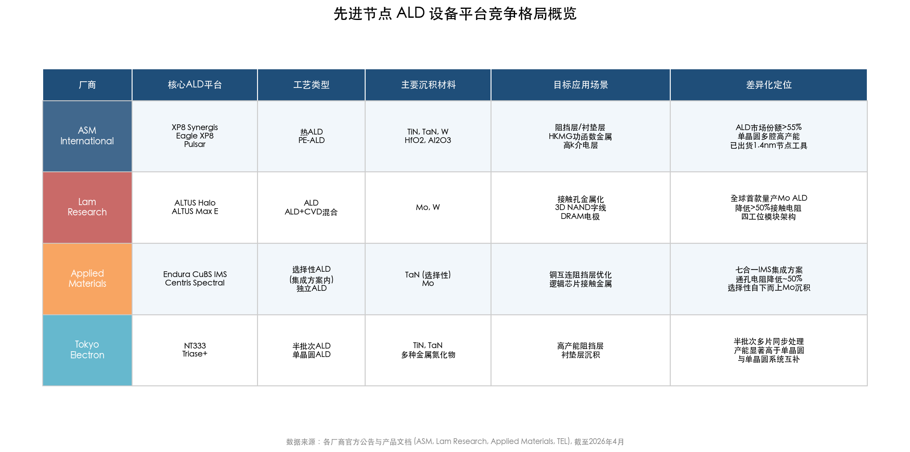

**图 4-3** 以表格形式汇总四大 ALD 设备厂商（ASM International、Lam Research、Applied Materials、Tokyo Electron）的核心平台、工艺类型、主要沉积材料、目标应用场景及差异化竞争定位。

### 4.5.1 ASM International：ALD 市场的领导者

ASM International 是全球 ALD 设备市场的主导厂商，在其参与竞争的细分领域中保持超过 55% 的市场份额。ALD 贡献了 ASM 设备收入的一半以上，该市场预计将以 10%–14% 的年复合增长率持续增长至 2027 年，届时单晶圆 ALD 设备市场规模将达 42 亿至 50 亿美元 [BALD Engineering](https://www.blog.baldengineering.com/2025/05/asm-international-strengthens-ald.html "ASM ALD 市场份额 >55%, 市场规模展望, 2025") [ASM International](https://www.asm.com/investors/investment-story "ASM ALD 市场份额 mid-50s %")。

ASM 的 ALD 产品线涵盖热 ALD 与 PE-ALD 两大类型：

- **XP8 Synergis**：高产能热 ALD 平台，可配置最多四个双腔模块（DCM），在极紧凑的占地面积内实现八腔室高吞吐量制造。
- **XP8 DCM PE-ALD / XP8 QCM PE-ALD**：300 mm 等离子体增强 ALD 系统，专为需要低温沉积与高薄膜质量的先进工艺场景设计。
- **Eagle XP8**：专为先进金属 ALD（如 TiN、W）设计的平台，广泛应用于逻辑和存储器件的阻挡层及衬垫层沉积。
- **Pulsar**：采用 ALD 沉积高 k 介电材料（如 HfO₂），服务于先进 CMOS 晶体管的高 k 金属栅极及其他应用。

GAA 纳米片晶体管架构向 2 nm 及更先进节点的推进，正在驱动 ALD 需求的加速增长。ASM 在 2025 年 Q1 财报中确认，每个技术节点所需的 ALD 沉积层数呈两位数增长，反映出更复杂的三维结构（如多层纳米片栅极堆叠、高深宽比通孔和高带宽存储器 HBM）对精密沉积需求的急剧增加。ASM 已开始为 1.4 nm 节点进行早期工具出货，显示出领先客户对下一代 ALD 能力的持续信赖 [BALD Engineering](https://www.blog.baldengineering.com/2025/05/asm-international-strengthens-ald.html "ASM Q1 2025, 1.4nm 节点早期出货")。

### 4.5.2 Lam Research：从 CVD W 王者到 ALD Mo 开拓者

Lam Research 凭借 ALTUS 产品家族在 CVD/ALD 钨沉积领域积累了超过二十年的领导地位。ALTUS 系列的演进轨迹体现了从纯 CVD 向 ALD-CVD 混合再到纯 ALD 的技术迁移路径：从 ALTUS Max 的 CVD W 体相填充，到 ALTUS Max E Series 引入的业界首创低氟 W ALD 工艺，再到 2025 年发布的 ALTUS Halo——全球首款量产级 Mo ALD 设备。ALTUS Halo 已在所有领先芯片制造商处进入验证和产能爬坡阶段，Lam 将其定位为"ALD 领域二十多年来最重大的技术突破" [Lam Research](https://newsroom.lamresearch.com/2025-02-19-Lam-Research-Ushers-in-New-Era-of-Semiconductor-Metallization-with-ALTUS-R-Halo-for-Molybdenum-Atomic-Layer-Deposition "ALTUS Halo 发布公告, 2025-02-19")。

### 4.5.3 Applied Materials：集成方案中的 ALD 精密引擎

Applied Materials 的 ALD 策略与 ASM 和 Lam Research 有所不同——Applied 倾向于将 ALD 作为其集成材料解决方案（IMS）中的关键组件，而非以独立 ALD 设备平台形式销售。在 Endura 平台上，ALD 腔室与 PVD、CVD、表面处理等腔室共存于同一真空系统中，实现多技术的无缝串联。

Applied 最新的 ALD 战略重心体现在两条产品线：一是 Endura 平台上集成的选择性 ALD 能力（如 Copper Barrier Seed IMS 中的选择性 ALD TaN），用于铜互连优化；二是 2026 年推出的 Centris Spectral Mo ALD 系统，标志着 Applied 首次在 Centris 主机平台上部署独立的 ALD 工具系列，正面进入 ALD Mo 接触金属市场，与 Lam 的 ALTUS Halo 形成直接竞争态势 [Applied Materials](https://www.appliedmaterials.com/us/en/newsroom/perspectives/powering-the-next-era-of-contact-scaling-with-ald-molybdenum.html "Centris Spectral Mo ALD, 2026")。

### 4.5.4 Tokyo Electron（TEL）：半批次 ALD 的高产能方案

Tokyo Electron 在 ALD 市场中的差异化定位源自其半批次（semi-batch）ALD 系统 NT333。与 ASM 和 Applied 的单晶圆 ALD 平台不同，NT333 一次可加载多片晶圆同步处理，在保持 ALD 原子级精度的同时显著提升每小时晶圆处理量，适用于对产能要求更高的工艺步骤。TEL 的 Triase+ 和 Episode 系列单晶圆沉积系统同样配备 ALD 工艺能力，与半批次系统形成互补的产品组合 [TEL](https://www.tel.com/product/nt333.html "NT333 半批次 ALD 系统")。

## 4.6 ALD 的局限性与技术互补关系

### 4.6.1 低沉积速率与高成本的本质约束

ALD 的自限制机制是一把双刃剑：它赋予原子级精度，也注定了低沉积速率的本质约束。对于厚度在数十纳米以上的金属薄膜（如 CVD W 接触孔填充的主体层或 PVD Cu 种子层），使用 ALD 将导致不可接受的工艺时间与成本。因此，ALD 在先进制程中的应用严格限定于超薄功能层（典型厚度 0.5–5 nm）的沉积场景——这些场景恰恰是 PVD 与 CVD 力不从心之处。

### 4.6.2 前驱体化学的复杂性与杂质控制挑战

ALD 金属薄膜的品质高度依赖前驱体化学。有机金属前驱体中的碳（C）、氧（O）等配体元素可能残留在薄膜中，降低薄膜电导率与致密度。PE-ALD 的等离子体辅助反应可在一定程度上改善杂质去除效率——PE-ALD TaN 的薄膜密度约 11.6 g/cm³，虽然仍低于 PVD TaN 的约 15.0 g/cm³，但已显著优于热 ALD TaN [Semiconductor Digest](https://sst.semiconductor-digest.com/2014/06/hvm-production-and-challenges-of-uhp-pdmat-for-ald-tan/ "PEALD TaN 密度 ~11.6 g/cm³ vs PVD TaN ~15.0 g/cm³")。此外，部分金属的 ALD 成核行为存在不均匀性——ALD Ru 的成核延迟（nucleation delay）从 10 个 ALD 循环到 500 个循环不等，取决于底层材料和表面处理条件，这对超薄 Ru 薄膜的连续性与电学性能构成挑战 [PMC](https://pmc.ncbi.nlm.nih.gov/articles/PMC10364078/ "Nucleation of Co and Ru Precursors on Silicon, 2023")。

### 4.6.3 ALD 与 PVD、CVD 的协同互补

从全局视角审视，ALD、PVD 与 CVD 在先进制程中形成精密的技术互补关系，而非简单的替代关系。一个典型的先进节点铜互连工艺流程包含以下沉积步骤的协同组合：

1. **ALD TaN**（~1–1.5 nm）提供保形扩散阻挡层；
2. **ALD 或 CVD Co/Ru**（~1–2 nm）作为衬垫/粘附层；
3. **PVD Cu**（~3–5 nm）沉积种子层；
4. **电化学电镀（ECP）Cu** 完成主体填充；
5. **选择性 ALD 或 CVD Co** 沉积盖帽层。

在上述流程中，ALD 负责最薄、最关键的保形功能层（阻挡层和衬垫层），PVD 提供高纯度种子层，CVD 在中间厚度范围提供良好的保形覆盖，ECP 完成高速率的主体填充。Applied Materials 的 Endura Copper Barrier Seed IMS 系统正是这一多技术协同理念的工业化实现——在同一真空系统内将 ALD、PVD、CVD 等七种工艺无缝串联，消除腔室间转移导致的界面氧化，达成原子级界面控制 [Applied Materials](https://ir.appliedmaterials.com/news-releases/news-release-details/applied-materials-breakthrough-chip-wiring-enables-logic-scaling/ "Endura CuBS IMS 七合一集成方案, 2021")。

随着制程向 2 nm 及更先进节点推进，ALD 在整个互连金属化流程中的占比将持续上升——从阻挡层和衬垫层扩展至替代金属（Mo、Ru）的主体沉积，从后段互连扩展至前段金属栅极和中段接触金属。ALD 与 CVD 的融合趋势也日益显著：Lam Research 的 ALTUS 系列已将 ALD 核化层与 CVD 体相填充集成于同一系统中，形成"ALD+CVD" super-cycle 混合沉积方案，在保持 ALD 成核精度的同时利用 CVD 速率完成后续填充。

# 第5章 电子束蒸发与分子束外延——先进制程量产中的边界角色

前四章系统梳理了物理气相沉积（PVD/溅射）、化学气相沉积（CVD）和原子层沉积（ALD）三大主流沉积技术在先进逻辑芯片金属薄膜制造中的核心地位。这三类技术各司其职又相互协同，构成了 ≤7 nm 节点量产线上金属化流程的技术基座。然而，五类沉积设备中尚有两类未被讨论——电子束蒸发沉积（Electron Beam Evaporation, E-beam Evaporation）和分子束外延（Molecular Beam Epitaxy, MBE）。本章将系统评估这两类技术在先进逻辑芯片量产中的实际使用状况，剖析其未被纳入量产金属化流程的根本原因，并客观阐述其在化合物半导体、量子器件、光电子器件以及前沿材料研究中的独特价值与不可替代性。

## 5.1 电子束蒸发沉积：技术原理与固有特征

### 5.1.1 工作原理

电子束蒸发沉积（E-beam Evaporation）属于物理气相沉积的一个子类，其核心机制是利用高能电子束轰击靶材，将电子动能转化为热能，使靶材达到蒸发温度并转变为气相。蒸发原子随后在高真空环境中沿直线飞行，沉积于上方基底表面形成薄膜。典型的电子束由钨丝热阴极产生，经加速电压（3–40 kV）加速后，通过磁场偏转（通常采用 270° 偏转以避免 X 射线直射晶圆）聚焦于坩埚中的靶材 [Wikipedia](https://en.wikipedia.org/wiki/Electron-beam_physical_vapor_deposition "EBPVD 原理概述")。

该技术的独特优势在于能量直接传递至靶材而非整个坩埚，因此可蒸发几乎所有金属及部分高熔点化合物，沉积速率可达 0.1–100 nm/min（在工业涂层领域甚至可达 100 μm/min），材料利用效率优于溅射 [Semicore](https://www.semicore.com/news/89-what-is-e-beam-evaporation "E-beam Evaporation 技术概述")。多坩埚旋转设计允许在同一真空腔内依次蒸发不同金属层，无需破真空即可完成多层金属堆叠，为化合物半导体的多层金属接触提供了工艺便利。

### 5.1.2 视线沉积与台阶覆盖率的本质局限

E-beam 蒸发在典型工作压力（<10⁻⁴ Torr，约 0.013 Pa）下本质上属于"视线沉积"（line-of-sight deposition）工艺：蒸发原子从靶材表面以余弦分布射出，沿直线路径到达基底，仅在能够"直视"蒸发源的表面上形成有效沉积 [Wikipedia](https://en.wikipedia.org/wiki/Electron-beam_physical_vapor_deposition "EBPVD 视线特性")。这一物理特征导致三方面固有局限：

- **台阶覆盖率极差**：在高深宽比沟槽或通孔结构中，侧壁和底部无法被蒸发原子有效到达。以 ≤5 nm 节点中典型的互连通孔（深宽比 5:1–10:1 以上）为参照，E-beam 蒸发在侧壁的覆盖率趋近于零，远低于离化金属等离子体溅射（iPVD，可达 10%–30%）、CVD（50%–90%）和 ALD（>95%）的水平。
- **无法服务大马士革工艺**：铜双大马士革工艺要求在高深宽比沟槽和通孔的底部及侧壁沉积连续、均匀的阻挡层与种子层，E-beam 蒸发的视线特性从根本上无法满足这一核心工艺需求。
- **适用范围局限于平面或浅结构**：然而，视线沉积特性在 lift-off 工艺中反而构成优势——蒸发金属不会在光刻胶侧壁形成连续覆盖，剥离后可获得边界清晰的金属图案。这正是 E-beam 蒸发在化合物半导体制造中被广泛采用的技术根源。

### 5.1.3 产能与晶圆尺寸适配性

先进逻辑芯片制造以 300 mm（12 英寸）晶圆为标准载体，高产量制造（HVM）线的典型吞吐量要求为每小时 30–60 片晶圆。E-beam 蒸发设备在化合物半导体领域的典型配置为批处理（batch）模式——例如 Ferrotec Temescal 的 UEFC-5700 系统单次可装载最多 42 片 150 mm（6 英寸）晶圆 [Ferrotec](https://www.ferrotec.com/pr/ferrotec-temescal-unveils-ultra-efficient-fast-cycle-electron-beam-metallization-system-for-compound-semiconductor-applications/ "UEFC-5700 系统, 42×150mm 批处理")——但这些系统针对 100–150 mm 晶圆尺寸优化。在 200 mm 及 300 mm 晶圆上的膜厚均匀性控制面临严峻挑战：E-beam 蒸发的蒸发云呈点源发散分布，要在 300 mm 晶圆全面积上实现 <5% 的厚度均匀性，需要配置复杂的均匀性遮罩（uniformity mask）和行星运动基底架，这将增加颗粒污染风险并降低有效沉积速率。

作为对比，磁控溅射（PVD）在 300 mm 平台上已具备成熟的单晶圆处理能力。以 Applied Materials 的 Endura 系统为例，该平台可在同一真空环境中集成多个溅射腔室实现高吞吐量连续生产。E-beam 蒸发在晶圆尺寸适配性和产能方面的结构性差距，构成其无法进入先进逻辑量产线的关键瓶颈之一。

## 5.2 分子束外延：技术原理与固有特征

### 5.2.1 工作原理

分子束外延（MBE）于 20 世纪 70 年代由贝尔实验室开发，是在超高真空（Ultra-High Vacuum, UHV）环境下通过定向分子束（或原子束）在加热基底上实现外延生长的精密技术。典型 MBE 系统由以下核心组件构成：①多个效应炉（effusion cell），每个炉内装填一种源材料并通过独立温控产生特定通量的分子束；②加热旋转基底架，使基底保持在最优生长温度（对 GaAs 系统通常为 600–700°C）并缓慢旋转以提高均匀性；③反射高能电子衍射（RHEED）系统，提供实时生长监控，可分辨单原子层级别的生长过程；④计算机控制的快门系统，实现对每个分子束的精确开关控制，从而将每层薄膜厚度精确至单原子层 [Cadence](https://resources.pcb.cadence.com/blog/2024-the-molecular-beam-epitaxy-mbe-process "MBE 工艺概述")。

MBE 的核心优势在于其无与伦比的界面控制能力。由于在 10⁻⁸–10⁻¹² Torr 的 UHV 环境中操作，背景气体杂质引入几乎可以忽略，所生长薄膜具有极高的晶体质量和化学纯度。典型 MBE 生长速率低于 3000 nm/h（约 0.5–1 μm/h） [Cadence](https://resources.pcb.cadence.com/blog/2024-the-molecular-beam-epitaxy-mbe-process "MBE 生长速率 <3000 nm/h")，这一极低速率恰恰是实现原子级界面陡峭度的必要条件——对于量子阱（quantum well）、超晶格（superlattice）等需要原子级突变异质结的纳米结构而言，MBE 提供的界面精度无可替代。

### 5.2.2 超高真空的工程代价

MBE 的 UHV 要求（基础真空优于 10⁻¹⁰ Torr）远高于其他沉积技术：PVD 溅射的工作压力约 10⁻³–10⁻² Torr，CVD 为 10⁻¹–10 Torr，ALD 为 0.1–10 Torr。维持 UHV 环境需要多级抽气系统（机械泵 + 涡轮分子泵 + 离子泵 + 钛升华泵）以及液氮冷却的低温板（cryopanel，运行温度约 77 K），系统烘烤除气周期通常为 24–48 小时。任何维护操作（如更换效应炉填料、修理快门）均需破真空并重新烘烤，导致系统可用率（uptime）远低于量产标准。

这一工程代价在实际产能数据中体现得尤为突出。Veeco 的 GEN200 系统作为市场上产能最高的多晶圆生产型 MBE 系统之一，单次可加载 4 片 4 英寸（100 mm）晶圆 [Veeco](https://www.veeco.com/products/gen200-mbe-system/ "GEN200, 4×4 英寸")；Riber 的 MBE 6000 系统支持最多 4 片 6 英寸（150 mm）晶圆 [Semiconductor Today](https://www.semiconductor-today.com/news_items/2025/dec/riber-291225.shtml "Riber MBE 6000, 4×6 英寸")。与先进逻辑制造所需的 300 mm 晶圆和每小时数十片的吞吐量相比，MBE 的产能差距达到 1–2 个数量级。

### 5.2.3 MBE 的定位：外延生长而非金属沉积

MBE 在半导体产业中的技术定位与 PVD、CVD、ALD 存在根本差异。后三者以沉积多晶或非晶薄膜为主（涵盖金属薄膜和介电薄膜），服务于互连金属化、阻挡层、栅极金属等多种功能层。MBE 的核心使命则是生长高质量单晶外延薄膜——其典型应用是 III-V 族化合物半导体（如 GaAs、InP、GaN、AlGaN）和 II-VI 族材料的异质结外延，用于制造激光器、LED、高电子迁移率晶体管（HEMT）、异质结双极晶体管（HBT）等器件的有源层。MBE 通常不被用于沉积互连金属薄膜（如 Cu、W、Co、Ru 等多晶金属层），原因在于这些应用无需外延单晶结构，而 PVD/CVD/ALD 在产能和成本方面具有压倒性优势。

## 5.3 二者未进入先进逻辑量产的根本原因分析

上文分别阐述了 E-beam 蒸发与 MBE 的技术原理和固有特征。为系统呈现二者与量产主流技术之间的差距，图 5-1 以六个关键维度对五类沉积技术进行了对比评分。

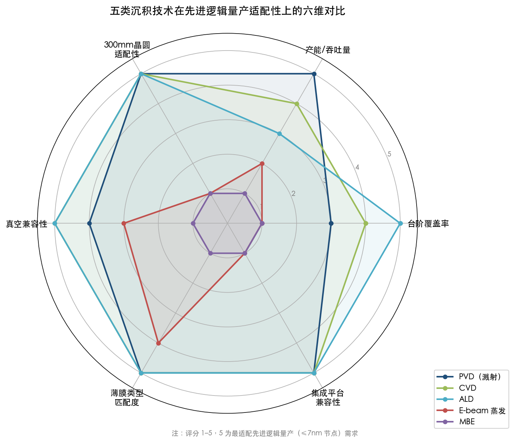

**图 5-1　五类沉积技术在先进逻辑量产适配性上的六维对比。** PVD（溅射）、CVD 和 ALD 在台阶覆盖率、产能/吞吐量、300 mm 晶圆适配性、集成平台兼容性、薄膜类型匹配度和真空兼容性六个维度上普遍获得 3–5 分（评分标准：5 为最适配 ≤7 nm 节点量产需求），形成大面积多边形；E-beam 蒸发和 MBE 仅在少数维度达到中等分值，整体轮廓显著收缩，直观揭示了二者与量产主流技术之间的系统性差距。

以下从四个核心维度逐一剖析 E-beam 蒸发与 MBE 未能进入先进逻辑量产的根本原因。

### 5.3.1 台阶覆盖率：三维互连架构的刚性门槛

先进逻辑芯片的后段互连（BEOL）结构呈高度三维化特征：≤5 nm 节点的双大马士革沟槽深宽比普遍达到 5:1–10:1，3D NAND 中的字线通孔深宽比更高达 50:1–100:1。在这些结构中沉积阻挡层（TaN，1–1.5 nm）、衬垫层（Co/Ru，1–2 nm）和种子层（Cu，3–5 nm），要求沉积技术具备充分的保形能力。

E-beam 蒸发的视线沉积特性使其在上述结构中完全失效：蒸发原子无法到达沟槽侧壁和底部，侧壁覆盖率接近零。即便是在台阶覆盖能力方面优于 E-beam 蒸发的传统溅射（PVD），也需要发展到 iPVD 变体才能满足种子层沉积的最低要求，且在 ≤3 nm 节点中正逐步被 ALD 取代。MBE 同属视线沉积技术，其台阶覆盖能力与 E-beam 蒸发处于同一量级，均无法满足先进互连架构的三维沉积需求。

### 5.3.2 产能与成本：高产量制造的硬约束

先进逻辑芯片制造的经济可行性依赖于极高的晶圆吞吐量。以 TSMC N3 量产线为参照，单一 300 mm 晶圆的 BEOL 互连工艺涵盖数百道工序步骤，每道工序对应的沉积设备需每小时处理 30 片以上晶圆方能匹配整体产能节拍。

E-beam 蒸发在化合物半导体领域虽可通过批处理达到可观的吞吐量（如 Temescal UEFC-5700 单批 42 片 150 mm 晶圆，真空抽至 5×10⁻⁷ Torr 仅需约 10 分钟 [Ferrotec](https://www.ferrotec.com/pr/ferrotec-temescal-unveils-ultra-efficient-fast-cycle-electron-beam-metallization-system-for-compound-semiconductor-applications/ "UEFC-5700 抽气时间")），但这一产能数据建立在 150 mm 晶圆和相对简单的平面金属化工艺基础上，向 300 mm 晶圆平台迁移在膜厚均匀性和工艺稳定性方面的工程难度与成本将大幅攀升。

MBE 的产能瓶颈更为突出：UHV 系统的抽气/烘烤周期、极低的生长速率（<1 μm/h）以及有限的晶圆装载量（每次 1–4 片 100–150 mm 晶圆），使其单小时有效晶圆产出仅为个位数。行业数据显示，MOCVD 系统的晶圆吞吐率通常比同类 MBE 系统高出 30%–50% [360 Research Reports](https://www.360researchreports.com/market-reports/molecular-beam-epitaxy-system-market-213403 "MOCVD vs MBE 产能对比")——这正是即便在化合物半导体量产中 MOCVD 也远比 MBE 普及的根本原因，而 MBE 在先进逻辑制造中的产能差距更属不可逾越。

### 5.3.3 薄膜类型的错配

先进逻辑芯片的互连金属化所需的是多晶或纳米晶金属薄膜（如多晶 Cu、多晶 W、纳米晶 Co/Ru/Mo）以及非晶或纳米晶金属氮化物（如 TaN、TiN）。这些薄膜既不需要、也不追求外延单晶结构——多晶金属薄膜通过后续退火可优化晶粒尺寸以降低电阻率，其性能指标围绕电阻率、填充无空洞性和界面粘附力展开，而非单晶取向。MBE 的核心价值——原子级精确的外延生长能力——在互连金属化场景中缺乏用武之地。E-beam 蒸发虽可沉积多晶金属薄膜，但其视线特性和产能局限使其在先进逻辑制程中同样不具备竞争力。

### 5.3.4 工艺集成的不兼容

现代先进制程的金属化工艺高度依赖多技术集成平台。以 Applied Materials 的 Endura 系统为例，该平台在同一真空环境中串联 PVD、ALD、CVD 和表面处理腔室，实现无暴露大气的全流程集成，大幅减少界面污染并提升工艺效率。E-beam 蒸发和 MBE 系统在设计理念上均以独立设备为主，缺乏与先进制程集成平台对接的标准化接口。MBE 系统的 UHV 要求更使其与常规制程设备的真空等级不匹配，难以纳入统一的集群工具（cluster tool）架构。这种工艺集成层面的结构性不兼容，进一步巩固了二者在先进逻辑量产中的边缘地位。

## 5.4 E-beam 蒸发的产业适用领域

尽管 E-beam 蒸发在先进逻辑芯片量产中不具备适用性，但它在多个半导体细分领域中仍发挥着不可替代的作用。

### 5.4.1 化合物半导体电极与互连金属化

E-beam 蒸发在化合物半导体（GaAs、GaN、InP 等）制造中的地位，相当于溅射在硅逻辑芯片中的地位——它是金属电极和互连层沉积的首选技术。化合物半导体器件（如功率放大器 PA、低噪声放大器 LNA、射频开关等）的金属化工艺以 lift-off 为主流图案化方法，而 E-beam 蒸发的视线沉积特性恰恰与 lift-off 工艺形成理想匹配：蒸发金属不会在光刻胶侧壁形成连续覆盖，剥离后金属图案边缘清晰，无需额外刻蚀步骤 [Compound Semiconductor](https://compoundsemiconductor.net/article/96507/The_Resurgence_Of_Electron_Beam_Evaporation "E-beam 在 lift-off 工艺中的优势, 2015")。

在 GaN HEMT 的欧姆接触制造中，E-beam 蒸发是沉积 Ti/Al/Ni/Au 或 Ti/Al/Pt/Au 多层金属堆叠的标准方法。高能电子束可高效蒸发高熔点金属（如 Ti、Pt），多坩埚旋转设计允许在同一真空循环内依次完成四层金属的沉积，随后通过快速热退火（RTA，800–850°C，N₂ 气氛）形成低电阻欧姆接触 [University of Florida](https://faculty.eng.ufl.edu/pearton/wp-content/uploads/sites/278/2020/07/xianan.pdf "GaN HEMT Ti/Al/Pt/Au E-beam 沉积")。

化合物半导体行业的另一重要趋势是从贵金属（Au、Pt）向铜（Cu）过渡以降低制造成本。Skyworks 在 2009 年 CS MANTECH 会议上报告了使用 E-beam 蒸发沉积铜互连的成功实践，E-beam 蒸发的铜在沉积速率和剥离良率方面均优于电镀铜 [Compound Semiconductor](https://compoundsemiconductor.net/article/96507/The_Resurgence_Of_Electron_Beam_Evaporation "Skyworks 铜互连 E-beam 蒸发, 2009 CS MANTECH")。

截至 2026 年，Ferrotec Temescal 和 AJA International 是全球领先的 E-beam 蒸发系统供应商。WIN Semiconductors（全球最大的化合物半导体代工厂之一）已多次采购 Temescal 系统用于产线扩建 [PRNewswire](https://www.prnewswire.com/news-releases/ferrotec-receives-multi-system-endorsement-of-temescal-electron-beam-evaporator-systems-from-win-semiconductors-corporation-300201796.html "WIN Semiconductors 采购 Temescal 系统")，充分印证了 E-beam 蒸发在化合物半导体量产中的核心地位。

### 5.4.2 光学薄膜与光电子器件

E-beam 蒸发在精密光学镀膜领域同样具有深厚的应用基础。高折射率/低折射率交替堆叠的多层介电膜（如 TiO₂/SiO₂ 增透膜、反射镜、滤光片）广泛采用 E-beam 蒸发制备，原因在于其兼具高沉积速率（适合制备厚达数十微米的多层堆叠）和优异的膜层纯度。在硅光子集成（silicon photonics）和光电探测器领域，E-beam 蒸发亦用于沉积特定金属电极（如 Ge 光电探测器上的 Ti/Au 接触层），满足对膜层洁净度和工艺灵活性的双重需求。

### 5.4.3 MEMS 器件

微机电系统（MEMS）器件中的金属化需求与先进逻辑芯片存在显著差异：MEMS 结构的特征尺寸通常处于微米量级，对台阶覆盖率的要求远低于纳米级互连。E-beam 蒸发凭借高沉积速率、多材料兼容性和 lift-off 工艺友好性，在压力传感器、加速度计、射频 MEMS 开关等器件的金属电极制备中获得广泛应用，是该领域成熟且经济的金属化解决方案。

## 5.5 MBE 的产业适用领域

### 5.5.1 III-V 族化合物半导体外延

MBE 的核心产业应用领域是 III-V 族化合物半导体器件的外延层生长。在以下器件类别中，MBE 提供的晶体质量和界面精度具有关键意义：

- **垂直腔面发射激光器（VCSEL）**：VCSEL 的分布式布拉格反射镜（DBR）由数十对 AlGaAs/GaAs 四分之一波长层交替堆叠构成，每层厚度约 60–80 nm，层间界面须在单原子层精度内陡峭过渡。MBE 的逐层生长控制能力使其成为高端 VCSEL 外延的首选方案。Veeco 的 GEN200 系统在 VCSEL 和泵浦激光器外延生产中拥有广泛装机量 [Veeco](https://www.veeco.com/products/gen200-mbe-system/ "GEN200 用于 VCSEL/HBT 生产")。
- **高电子迁移率晶体管（HEMT）**：AlGaN/GaN HEMT 和 InAlAs/InGaAs/InP HEMT 的二维电子气（2DEG）界面质量直接决定器件电子迁移率和噪声性能。MBE 生长的异质结在 2DEG 迁移率上通常优于 MOCVD 生长的同类结构。
- **异质结双极晶体管（HBT）**：InGaP/GaAs HBT 广泛应用于手机功率放大器，其基区-发射区异质结的掺杂分布和界面陡峭度需要 MBE 级别的精度控制。

在化合物半导体量产中，MOCVD 凭借更高的产能和更低的运营成本已成为主流外延技术，MBE 的量产应用集中于对界面质量要求最严苛的高端器件。全球 MBE 市场规模在 2026 年约为 4.85 亿美元 [LinkedIn/市场报告](https://www.linkedin.com/pulse/molecular-beam-epitaxy-mbe-market-industry-size-forecast-dhpfc/ "MBE 市场规模约 4.85 亿美元, 2026")，仅占半导体设备市场总额的极小份额，从侧面反映了 MBE 的小众但高价值定位。

### 5.5.2 量子计算与超导量子器件

MBE 在近年来快速崛起的量子计算领域展现出独特价值。超导量子比特（transmon qubit）的核心结构——约瑟夫森结（Josephson junction）——由超导体/隧穿氧化层/超导体（如 Al/AlOₓ/Al）三层结构构成，对铝薄膜的晶体质量、界面纯净度和氧化层均匀性要求极高。MBE 生长的外延铝薄膜在 Si、蓝宝石和 GaAs 基底上展现出优异的超导特性，已成为提升量子比特相干时间的关键材料工程手段 [J. Appl. Phys.](https://pubs.aip.org/aip/jap/article/136/7/074401/3308147/Nanometer-thick-molecular-beam-epitaxy-Al-films "MBE 外延 Al 薄膜用于超导量子比特, 2024")。

更为前沿的拓扑量子计算研究高度依赖 MBE 技术：半导体-超导体混合结构（如 InAs 量子阱上原位 MBE 生长 Al 超导层）是实现马约拉纳费米子的核心材料平台。这类结构要求半导体与超导体界面在原子尺度上无缺陷且具有良好的晶格匹配，唯有 MBE 的 UHV 原位生长能力方可实现 [PMC](https://pmc.ncbi.nlm.nih.gov/articles/PMC11766944/ "In-situ MBE Al/InAs 混合结构优化, 2025")。

### 5.5.3 拓扑绝缘体与新型量子材料

MBE 是拓扑绝缘体（如 Bi₂Se₃、Bi₂Te₃）、二维过渡金属硫族化合物（2D TMD，如 MoSe₂、WSe₂）等新型量子材料高质量薄膜制备的核心手段。这些材料体系的研究处于基础科学前沿，虽距工业化量产仍有显著距离，但 MBE 在其中的不可替代性已获得学术界的广泛认可 [AIP](https://pubs.aip.org/aip/jap/article/128/21/210902/1062454/Topological-materials-by-molecular-beam-epitaxy "MBE 生长拓扑材料综述, 2020")。

### 5.5.4 先进逻辑研发中的探索性角色

虽然 MBE 不参与先进逻辑芯片的量产金属化流程，但在前沿逻辑器件研发中偶尔扮演探索性角色。例如，III-V 族 CMOS 的单片集成（monolithic integration）是后摩尔时代（More-than-Moore）的重要研究方向，IBM、Intel 等机构的研究团队曾使用 MBE 在硅基底上外延生长 InGaAs、InAs 等高迁移率沟道材料用于 n 型 FinFET 研究 [IBM Research](https://research.ibm.com/publications/iii-v-compound-semiconductor-transistors-from-planar-to-nanowire-structures "IBM III-V CMOS 研究")。然而，这些工作停留在实验室阶段，且涉及的是沟道材料的外延生长而非互连金属薄膜的沉积，因此并不改变 MBE 在先进逻辑量产金属化中缺席的基本事实。

## 5.6 技术定位总结：E-beam 蒸发与 MBE 的边界角色

综合以上分析，电子束蒸发和分子束外延在先进逻辑芯片（≤7 nm 节点）的互连金属薄膜量产中不具备技术可行性和经济可行性。二者未被采用的原因可归纳为以下核心维度：

| 评估维度 | E-beam 蒸发 | MBE | 先进逻辑量产要求 |
|---------|------------|-----|---------------|
| 台阶覆盖率 | 极差（视线沉积，侧壁 ≈ 0%） | 极差（视线沉积） | ≥95%（ALD）或 ≥10%（iPVD 种子层） |
| 晶圆尺寸 | 主流 100–150 mm | 主流 100–150 mm | 300 mm |
| 单批吞吐量 | 42×150 mm（Temescal） | 4×100 mm（Veeco GEN200） | 30–60 片/h × 300 mm |
| 工作真空 | 10⁻⁵–10⁻⁷ Torr | 10⁻⁸–10⁻¹² Torr（UHV） | 10⁻³–10⁻¹ Torr（PVD/CVD/ALD） |
| 目标薄膜类型 | 多晶/非晶金属 | 单晶外延薄膜 | 多晶金属及金属氮化物 |
| 集成平台兼容性 | 独立系统，无标准接口 | 独立系统，UHV 不兼容 | 集群工具（如 Endura） |

图 5-2 以热力矩阵形式直观呈现了五类沉积技术在不同应用领域中的定位差异，清晰映射了 E-beam 蒸发与 MBE 的"边界角色"。

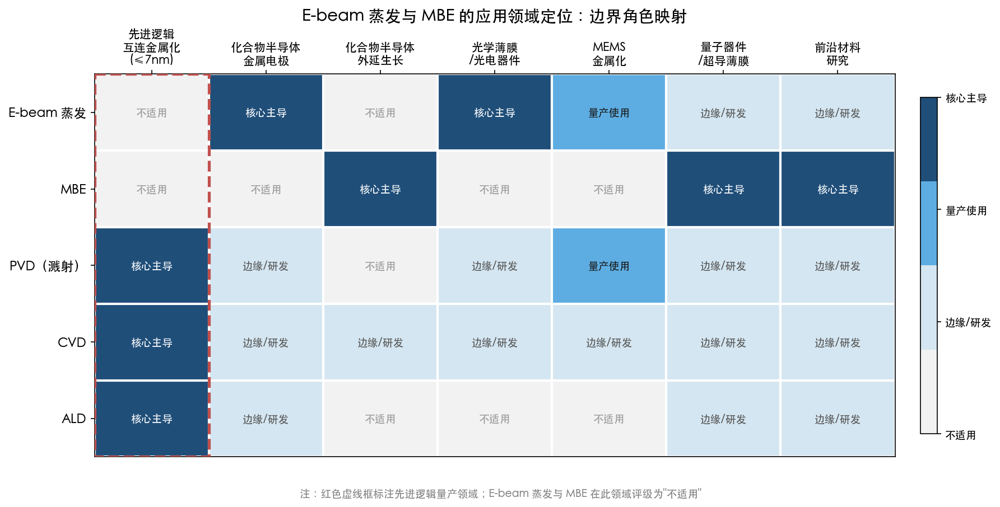

**图 5-2　E-beam 蒸发与 MBE 的应用领域定位热力矩阵。** 行为五类沉积技术，列为七个主要应用领域，以四级色阶（核心主导 / 量产使用 / 边缘研发 / 不适用）标注各技术的适用程度。红色虚线框标注的先进逻辑互连金属化列中，E-beam 蒸发与 MBE 均为"不适用"，而二者分别在化合物半导体金属电极、光学薄膜/光电器件（E-beam 蒸发）以及化合物半导体外延、量子器件/超导薄膜、前沿材料研究（MBE）等领域占据"核心主导"地位。

这两类技术各自在特定领域保持着不可替代的价值：E-beam 蒸发是化合物半导体金属化和光学镀膜的支柱性技术；MBE 是高端 III-V 外延、量子器件和新型量子材料研究的核心使能工具。我们认为，将这两类技术与 PVD（溅射）、CVD、ALD 并列讨论时，须明确区分"技术原理上可以沉积金属薄膜"与"在先进逻辑量产中实际被采用"之间的本质差异。前者是对沉积能力的泛化描述，后者则受到台阶覆盖率、产能、成本、晶圆尺寸、工艺集成等多维约束的严格筛选。在这一筛选框架下，PVD（溅射）、CVD 和 ALD 胜出并构成先进制程金属化的技术三角，而 E-beam 蒸发和 MBE 则在各自的优势领域中继续发挥无可替代的边界角色。

# 第6章 五类沉积技术对比总结与趋势展望

前五章分别从技术原理、量产应用和产业生态三个层面，系统解析了物理气相沉积（PVD/溅射）、化学气相沉积（CVD）、原子层沉积（ALD）、电子束蒸发（E-beam Evaporation）和分子束外延（MBE）五类沉积技术在先进制程金属薄膜制造中的角色与边界。本章在此基础上完成全篇闭环：首先按保形性、沉积速率、薄膜纯度、厚度控制精度、成本结构和材料兼容性六个关键性能维度对五类技术进行横向对比，建立完整的技术选型矩阵；随后聚焦 2 nm 及更先进节点，展望金属沉积工艺的演进方向——ALD 与 CVD 的 super-cycle 融合趋势、PVD 在特定功能层的持续价值、多技术集成平台的兴起，以及 Ru、Mo 等替代金属大规模量产对设备竞争格局的深层重塑。

## 6.1 五类沉积技术关键性能维度横向对比

### 6.1.1 保形性与台阶覆盖率

保形性（conformality）是判定一项沉积技术能否服务于先进制程三维互连架构的首要判据。五类技术在这一维度上的差异，根源于各自的物理沉积机制。

ALD 凭借自限制表面饱和反应，在深宽比超过 100:1 的结构中仍可保持 >95% 的台阶覆盖率 [COAT-X](https://coat-x.com/en/atomic-layer-deposition-process/ "ALD step coverage >95% at AR >100:1")。这一能力使 ALD 成为沉积 1–2 nm 超薄 TaN 阻挡层和 Co/Ru 衬垫层的唯一可行技术。在 ≤3 nm 节点的最底层互连中，通孔深宽比普遍达到 5:1–10:1，阻挡层任何位置的不连续均可引发铜扩散失效，因而对保形性的要求近乎绝对。

CVD 依赖气态前驱体向基底所有暴露表面的分子扩散，在深宽比 10:1 的结构中通常可实现 50%–90% 的台阶覆盖率 [Wevolver](https://www.wevolver.com/article/pvd-vs-cvd "PVD vs CVD: Mastering Advanced Thin Film Deposition Techniques")。该水平足以满足接触孔钨填充（深宽比 3:1–5:1）和部分衬垫层/阻挡层应用的需求，但在需要近完美保形覆盖的超薄功能层沉积中仍显不足。

PVD（溅射）本质上属于"视线沉积"技术。传统磁控溅射在高深宽比结构中的侧壁覆盖率可降至仅 1%–5% [Sciopen/TST](https://www.sciopen.com/article/10.1109/TST.2014.6787368 "PVD barrier/seed 台阶覆盖率评估")。离化金属等离子体（iPVD/SIP）技术通过将溅射原子电离并以基底偏压引导垂直入射，可在深宽比 5:1 结构中将底部覆盖率提升至 10%–30%，勉强满足铜种子层的最低要求；但随着特征尺寸进一步缩小，iPVD 的覆盖能力亦趋近极限。

E-beam 蒸发和 MBE 同属视线沉积范畴。由于蒸发原子从点源以余弦分布发散，两者在高深宽比沟槽中的侧壁覆盖率趋近于零 [Wikipedia](https://en.wikipedia.org/wiki/Electron-beam_physical_vapor_deposition "EBPVD 视线特性")。这一固有局限从根本上排除了二者在先进互连架构中的应用可能。

### 6.1.2 沉积速率与晶圆吞吐量

沉积速率直接决定量产线的晶圆吞吐量（wafers per hour, wph）和单位加工成本。五类技术在这一维度上呈现出与保形性近乎反转的排序格局。

PVD 的沉积速率在所有薄膜沉积技术中居于顶端，典型金属溅射速率可达数百 nm/min。以 Applied Materials 的 Endura CuBS RF XT 系统为例，其铜种子层沉积产能超过每小时 80 片 300 mm 晶圆（>80 wph）[Applied Materials](https://www.appliedmaterials.com/us/en/product-library/endura-cubs-rf-xt-pvd.html "Endura CuBS RF XT 规格")，为先进制程金属化工艺的产能标杆。

CVD 的沉积速率通常在数十至数百 nm/min 之间，介于 PVD 和 ALD 之间。Lam Research 的 ALTUS 系列 CVD W 系统通过多工位模块和 PNL 核化技术，在保持良好填充质量的同时实现了与量产节拍匹配的吞吐量 [Lam Research](https://www.lamresearch.com/product/altus-product-family/ "ALTUS Product Family")。

ALD 的有效沉积速率约为 1–10 nm/min，比 CVD 低一个数量级，比 PVD 低两个数量级 [ScienceDirect](https://www.sciencedirect.com/science/article/abs/pii/S2468519418301630 "Speeding up the unique assets of atomic layer deposition")。设备厂商通过多腔室并行处理（如 ASM XP8 Synergis 的八腔室配置）和半批次工艺（如 TEL NT333）来部分弥补速率劣势，但 ALD 在先进制程中的应用仍严格限定在超薄功能层（0.5–5 nm），以确保产能经济性。

E-beam 蒸发的沉积速率可达 0.1–100 nm/min，取决于材料特性和功率设定 [Semicore](https://www.semicore.com/news/89-what-is-e-beam-evaporation "E-beam Evaporation 技术概述")。然而，其在 300 mm 晶圆上的膜厚均匀性控制困难，且主流设备仅支持 100–150 mm 晶圆批处理，实际产能无法匹配先进逻辑制造的要求。

MBE 的生长速率低于 3000 nm/h（约 8–17 nm/min），且单次仅可加载 1–4 片 100–150 mm 晶圆 [Cadence](https://resources.pcb.cadence.com/blog/2024-the-molecular-beam-epitaxy-mbe-process "MBE 生长速率 <3000 nm/h")。与先进逻辑制造每小时 30–60 片 300 mm 晶圆的吞吐量要求相比，MBE 的产能差距达到 1–2 个数量级。

### 6.1.3 薄膜纯度与致密度

薄膜纯度——尤其是碳（C）、氧（O）、氟（F）等杂质的含量——直接影响金属薄膜的电阻率及阻挡层的扩散阻挡效能。五类技术在纯度维度上的表现与其各自的沉积机制密切相关。

PVD 和 MBE 在这一维度上占据优势。PVD 不涉及化学前驱体分解过程，薄膜纯度直接取决于靶材纯度；半导体用溅射靶材纯度通常达到 5N（99.999%）甚至更高 [JX Advanced Metals](https://www.jx-nmm.com/english/products/sputtering/semiconductor_st/ "半导体用溅射靶材纯度")。MBE 在超高真空（10⁻⁸–10⁻¹² Torr）环境中操作，背景杂质引入近乎为零，所生长薄膜的化学纯度可达到所有沉积技术中的最高水平。

CVD 使用含碳或含氟的前驱体（如 WF₆、TDMAT），薄膜中不可避免地残留少量配体元素。传统 CVD W 中的氟残留可对相邻介电层造成损伤，Lam Research 开发的低氟 W ALD 工艺正是针对这一问题 [Lam Research](https://www.globenewswire.com/news-release/2016/08/09/941633/0/en/Lam-Research-Enables-Next-Generation-Memory-with-Industry-s-First-ALD-Process-for-Low-Fluorine-Tungsten-Fill.html "低氟 W ALD, 2016")。

ALD 同样依赖有机金属前驱体（如 PDMAT 用于 TaN、Ru(EtCp)₂ 用于 Ru），碳和氧残留是固有挑战。PE-ALD 的等离子体辅助反应可更彻底地去除配体杂质、提高薄膜密度，但 PE-ALD TaN 的密度约 11.6 g/cm³，仍低于 PVD TaN 的约 15.0 g/cm³ [Semiconductor Digest](https://sst.semiconductor-digest.com/2014/06/hvm-production-and-challenges-of-uhp-pdmat-for-ald-tan/ "PEALD TaN vs PVD TaN 密度")。

E-beam 蒸发的薄膜纯度与 PVD 接近，取决于源材料纯度和工作真空度，但总体略逊于 PVD 溅射——E-beam 系统的工作真空通常低于 PVD，且坩埚材料可能引入微量污染。

### 6.1.4 厚度控制精度

ALD 在厚度控制精度上具有绝对优势。其自限制生长机制使单循环沉积厚度（growth per cycle, GPC）仅为 0.3–1.5 Å/cycle，薄膜总厚度可通过循环次数精确控制至亚埃级别。这一能力在沉积 1–1.5 nm TaN 阻挡层时尤为关键——偏差 0.5 nm 即意味着阻挡层厚度波动超过 30%，足以导致局部铜扩散泄漏 [ASM International](https://www.asm.com/our-technology-products/ald "ALD 自限制机制与厚度控制")。

CVD 和 PVD 的厚度控制均依赖时间-速率关系，典型精度在 ±5%–10% 范围内。对于数 nm 以上的中等至较厚薄膜，该精度尚可接受；但对于亚 2 nm 的超薄层，CVD/PVD 的厚度波动可能引发不可接受的器件性能散布。

MBE 的厚度控制精度接近 ALD 水平——RHEED 原位监控可分辨单原子层生长——但这一精度仅适用于外延薄膜，对先进制程所需的多晶金属沉积并无实际意义。E-beam 蒸发的厚度控制依赖石英晶体微天平（QCM）监控，精度约为 ±5%–10%，在批处理模式下因蒸发云空间分布不均匀而进一步劣化。

### 6.1.5 成本结构

成本结构涵盖设备资本支出（CapEx）、前驱体/靶材等消耗品成本以及工艺产能三个维度的综合考量。

PVD 的综合成本在五类技术中最低：设备技术成熟、靶材价格相对低廉、沉积速率最高且产能最大。这构成了 PVD 在铜种子层和金属硬掩膜等应用中长期保持主导地位的经济学基础。

CVD 的成本居于中等水平：前驱体（如 WF₆、TDMAT）价格高于 PVD 靶材，但沉积速率仍然较高。经过二十余年的工艺优化，CVD W 接触孔填充的每片晶圆成本已大幅降低。

ALD 的综合成本在三大量产技术中最高：高纯有机金属前驱体价格昂贵（如量产级 PDMAT 纯度需达 >99.99995%）、沉积速率低导致单位时间晶圆产出较少、设备腔室需要频繁维护。Samsung 披露，2025 年 ALD 工具已消耗其存储芯片晶圆厂资本支出的 22%，较三年前的 16% 显著上升 [Nine Scrolls/Mordor Intelligence](https://ninescrolls.com/news/ald-equipment-market-reaches-7-9-billion-as-deposition-steps-per-wafer-surge-20- "Samsung ALD 占存储厂 CapEx 22%, 2025")。

MBE 的设备和运营成本在所有沉积技术中最为高昂：超高真空系统的安装、维护和液氮冷却成本极高，加之极低的吞吐量，使其单位面积沉积成本远超其他技术。2026 年全球 MBE 设备市场规模仅约 4.85 亿美元 [LinkedIn/市场报告](https://www.linkedin.com/pulse/molecular-beam-epitaxy-mbe-market-industry-size-forecast-dhpfc/ "MBE 市场规模约 4.85 亿美元, 2026")，与同年 ALD 设备市场的 79.1 亿美元和半导体 CVD 设备市场的约 167 亿美元形成鲜明对比 [Mordor Intelligence](https://www.mordorintelligence.com/industry-reports/semiconductor-cvd-equipment-market "半导体 CVD 设备市场 2026 年 167 亿美元")。

E-beam 蒸发的设备成本低于 MBE 但高于 PVD，在高吞吐量应用中因产能劣势而缺乏经济竞争力。

### 6.1.6 可沉积金属种类与量产成熟度

PVD 的材料兼容性最为广泛——几乎所有固态金属均可作为溅射靶材，包括 Cu、Ta、TaN、TiN、Ru、Co 等。CVD 和 ALD 的材料范围受限于可用的气态前驱体化学，但近年来 Ru、Co、Mo 等新型金属前驱体的开发取得了重大突破。Lam Research 于 2025 年发布的 ALTUS Halo（ALD Mo）[Lam Research](https://newsroom.lamresearch.com/2025-02-19-Lam-Research-Ushers-in-New-Era-of-Semiconductor-Metallization-with-ALTUS-R-Halo-for-Molybdenum-Atomic-Layer-Deposition "ALTUS Halo Mo ALD, 2025") 和 Applied Materials 的 Centris Spectral（ALD Mo）[Applied Materials](https://www.appliedmaterials.com/us/en/newsroom/perspectives/powering-the-next-era-of-contact-scaling-with-ald-molybdenum.html "Centris Spectral Mo ALD, 2026") 即为标志性成果，标志着 ALD 在替代金属沉积领域的产业化进入新阶段。

E-beam 蒸发可蒸发几乎所有金属（包括高熔点的 Ti、Pt、Mo 等），在化合物半导体多层金属堆叠中保持独特优势。MBE 的源材料选择受效应炉（effusion cell）设计限制，主要覆盖 III-V 和 II-VI 族化合物半导体所需元素（Ga、As、In、Al 等），在过渡金属（Cu、W、Co、Ru）沉积中几乎没有工业应用。

下图以雷达图形式综合呈现了五类沉积技术在上述六个关键性能维度上的对比概貌，直观展示各技术的优势域与劣势域。

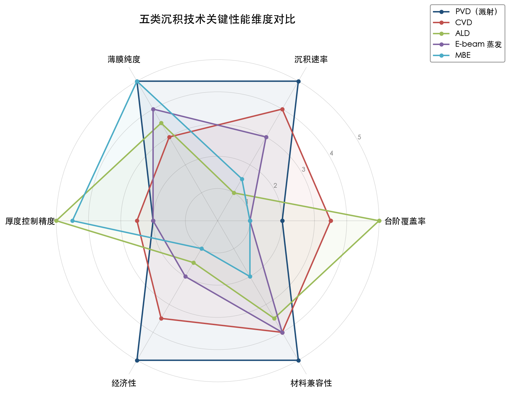

## 6.2 综合对比矩阵

基于上述六个维度的系统分析，下表汇总了五类沉积技术的横向对比：

| 性能维度 | PVD（溅射） | CVD | ALD | E-beam 蒸发 | MBE |
|---------|-----------|-----|-----|-----------|-----|
| 台阶覆盖率（AR 10:1） | 5%–30%（iPVD） | 50%–90% | >95% | ~0%（侧壁） | ~0%（侧壁） |
| 沉积速率 | 数百 nm/min | 数十–数百 nm/min | 1–10 nm/min | 0.1–100 nm/min | 8–17 nm/min |
| 300 mm 晶圆吞吐量 | >80 wph | 20–60 wph | 10–30 wph | 不适配 300 mm | 不适配 300 mm |
| 薄膜纯度 | 极高（5N 靶材） | 中等（前驱体残留） | 中等–高（PE-ALD 改善） | 高 | 极高（UHV） |
| 厚度控制精度 | ±5%–10% | ±5%–10% | 亚埃级（~0.3–1.5 Å/cycle） | ±5%–10% | 单原子层（仅限外延） |
| 综合成本（每片晶圆） | 低 | 中 | 高 | 中（但 300 mm 不经济） | 极高 |
| 先进逻辑量产角色 | 核心（种子层、硬掩膜） | 核心（W 填充、衬垫层） | 核心（阻挡层、超薄功能层） | 不参与 | 不参与 |

这一矩阵清晰地揭示了先进制程金属化的技术选型逻辑：PVD、CVD 和 ALD 各自占据不可替代的生态位。PVD 以高纯度和高速率服务于种子层和硬掩膜等对保形性要求相对宽松的功能层；CVD 以良好的保形性和可接受的产能覆盖接触孔填充和中等厚度衬垫层；ALD 以无与伦比的厚度控制和保形性主导超薄阻挡层和衬垫层。E-beam 蒸发和 MBE 由于台阶覆盖率、产能和晶圆尺寸的硬性约束，不参与先进逻辑量产的金属化流程，但在各自的优势领域——化合物半导体金属化、高端外延生长、量子器件研发——中保持着不可替代的地位。

下图以热力图形式将各金属功能层与各沉积技术的适用关系进行可视化映射，进一步明确了技术选型的对应逻辑。

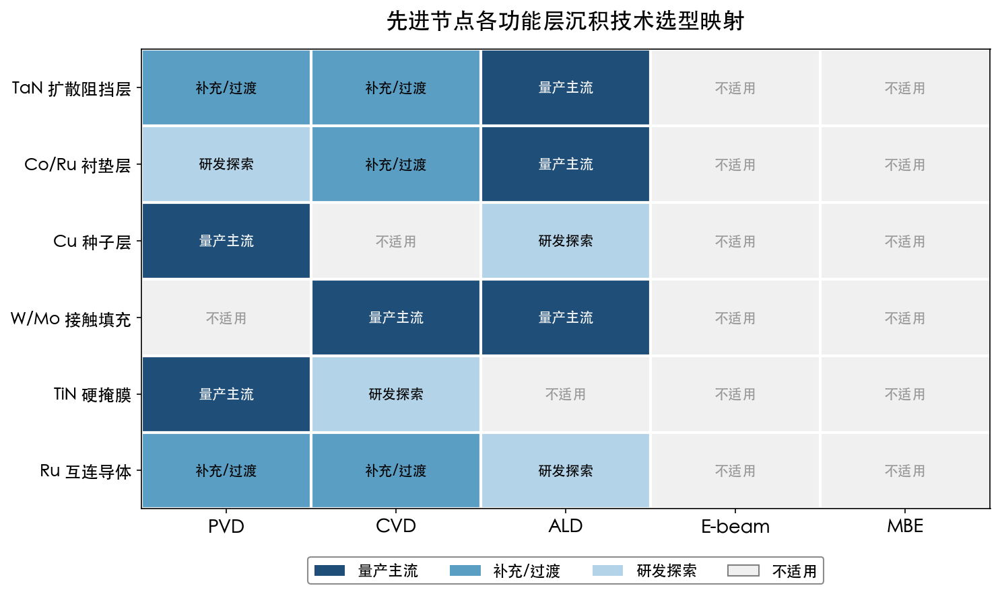

## 6.3 先进节点金属沉积工艺的演进方向

### 6.3.1 ALD 份额的系统性上升

随着工艺节点从 3 nm 向 2 nm 乃至 1.4 nm 推进，ALD 在整个金属化流程中的占比正经历系统性上升。行业数据显示，2 nm 节点每片晶圆所需的 ALD 沉积步骤数较 3 nm 增加了 20% 以上 [Nine Scrolls/Mordor Intelligence](https://ninescrolls.com/news/ald-equipment-market-reaches-7-9-billion-as-deposition-steps-per-wafer-surge-20- "2 nm 节点 ALD 步骤数增加 >20%")。驱动这一增长的核心因素包括三个方面：其一，GAA 纳米片晶体管架构要求在纳米片四周实现保形金属栅极沉积，唯有 ALD 能满足这一几何需求；其二，底层互连特征尺寸的进一步缩小使超薄 TaN 阻挡层和 Ru/Co 衬垫层的保形性要求更加苛刻；其三，ALD Mo 正在取代 CVD W 成为接触孔金属化的新标准方案。

全球 ALD 设备市场的增长轨迹定量地反映了这一趋势。据 Mordor Intelligence 数据，2026 年全球 ALD 设备市场规模达到 79.1 亿美元，预计到 2031 年将攀升至 129.3 亿美元，2026–2031 年年复合增长率（CAGR）为 10.32% [Nine Scrolls/Mordor Intelligence](https://ninescrolls.com/news/ald-equipment-market-reaches-7-9-billion-as-deposition-steps-per-wafer-surge-20- "ALD 设备市场 2026 年 79.1 亿美元")。ALD 目前占据晶圆厂设备（WFE）总支出的约 35.5%，已成为按价值计最大的单一设备品类 [Nine Scrolls/Mordor Intelligence](https://ninescrolls.com/news/ald-equipment-market-reaches-7-9-billion-as-deposition-steps-per-wafer-surge-20- "ALD 占 WFE 约 35.5%")。在竞争格局方面，ASM International 在其参与竞争的 ALD 细分市场中保持超过 55% 的份额，并已开始为 1.4 nm 节点客户出货早期工具 [BALD Engineering](https://www.blog.baldengineering.com/2025/05/asm-international-strengthens-ald.html "ASM ALD 份额 >55%, 1.4nm 早期出货, 2025")。

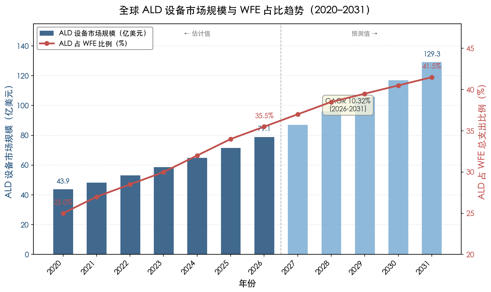

### 6.3.2 ALD 与 CVD 的融合：super-cycle 混合沉积方案

ALD 的低沉积速率与 CVD 的高产能之间的互补关系，正在催生一种新型工艺范式——"ALD+CVD super-cycle"混合沉积。其核心思路在于：先以 ALD 完成超薄核化层或保形衬垫层的精密沉积（利用 ALD 的自限制机制确保均匀成核和保形覆盖），随后在同一腔室或同一集群工具内无缝切换至 CVD 模式，以更高的沉积速率完成主体填充或增厚，全程无需破真空转移晶圆。

Lam Research 的 ALTUS 产品家族是这一融合趋势的典型代表。ALTUS 系列从最初的纯 CVD W 填充系统，逐步演进为集成 PNL（脉冲核化层，本质上是 ALD 式交替脉冲工艺）和 CVD 体相填充的混合平台——PNL 核化层厚度仅 1–2 nm，为后续 CVD W 填充提供高质量成核表面 [Lam Research](https://www.lamresearch.com/product/altus-product-family/ "PNL + CVD W 混合方案")。2025 年发布的 ALTUS Halo Mo ALD 设备进一步拓展了这一架构，支持保形 ALD 沉积和选择性自下而上填充两种模式，可根据具体工艺需求在同一平台上灵活切换 [Lam Research](https://newsroom.lamresearch.com/2025-02-19-Lam-Research-Ushers-in-New-Era-of-Semiconductor-Metallization-with-ALTUS-R-Halo-for-Molybdenum-Atomic-Layer-Deposition "ALTUS Halo 保形+选择性填充双模式, 2025")。

ALD-CVD 融合趋势的深层驱动力在于：对 5–20 nm 厚度范围的金属薄膜（如 Ru 互连导体层、Mo 接触金属填充），纯 ALD 的产能不经济，纯 CVD 的保形性和成核均匀性不足。super-cycle 方案在两者之间找到了最优平衡——以 ALD 的精度启动生长、以 CVD 的速度完成填充。我们认为，这一方案将成为 2 nm 节点及以下替代金属沉积的标准工艺架构。

### 6.3.3 PVD 在特定功能层的持续价值

尽管 ALD 在先进节点中的份额持续上升，PVD 并不会被简单替代。在以下场景中，PVD 的价值在可预见的未来仍然不可替代。

**铜种子层**：只要铜大马士革工艺在 ≥20 nm pitch 的中上层互连中继续使用，PVD Cu 种子层便仍是标准工序。iPVD/SIP 技术通过高离化率和回溅机制，在这些层级的沟槽中提供了足够的覆盖。Applied Materials 的 Endura CuBS RF XT 系统在全球先进逻辑和存储器晶圆厂中拥有庞大的装机量 [Applied Materials](https://www.appliedmaterials.com/us/en/product-library/endura-cubs-rf-xt-pvd.html "Endura CuBS RF XT")。

**TiN 金属硬掩膜**：在 EUV 光刻图形化流程中，PVD TiN 硬掩膜是沟槽和通孔图案刻蚀的关键保护层。PVD TiN 所具备的高刻蚀选择比、精确应力控制和低温沉积能力，使其在该应用中的地位无可替代。

**Ru 毯状薄膜（减法刻蚀互连）**：在 Ru 减法刻蚀工艺中，首先需要在平坦基底上沉积均匀的 Ru 毯状薄膜。PVD 溅射 Ru 具有高纯度和低电阻率的显著优势，是 Ru 毯状膜沉积的主要方法之一。imec 在 2025 年 IITC 上展示的 16 nm pitch 直接刻蚀 Ru 互连即采用了这一路线 [imec](https://www.imec-int.com/en/press/imec-demonstrates-16nm-pitch-ru-lines-record-low-resistance-obtained-using-semi-damascene "imec 16nm pitch Ru semi-damascene, IITC 2025")。

### 6.3.4 多技术集成平台：从串联到融合

先进节点金属化工艺的一个显著趋势，是从"单一设备执行单一工艺步骤"向"多技术集成平台在同一真空环境中完成全流程"演进。Applied Materials 的 Endura Copper Barrier Seed IMS 系统是这一趋势的标杆案例——在单一高真空平台内集成了七种工艺技术（ALD、PVD、CVD、铜回流、表面处理、界面工程和计量），实现了从通孔预清洗到铜种子层沉积的全流程无暴露大气操作 [Applied Materials](https://www.appliedmaterials.com/us/en/semiconductor/solutions-and-software/ims.html "IMS 集成材料解决方案")。该方案通过选择性 ALD 消除通孔底部的高电阻阻挡层，将通孔接触界面电阻降低最高达 50%，已被全球领先代工/逻辑客户量产采用 [Applied Materials](https://ir.appliedmaterials.com/news-releases/news-release-details/applied-materials-breakthrough-chip-wiring-enables-logic-scaling/ "Endura CuBS IMS, 2021")。

多技术集成平台的价值不仅在于产能优化，更在于界面工程。金属薄膜的性能高度依赖层间界面的原子级清洁度——从 TaN 阻挡层到 Co 衬垫层再到 Cu 种子层，任何一个界面在大气暴露后都会形成自然氧化层，劣化后续薄膜的粘附和电学性能。在同一真空系统内完成全部沉积步骤，可从根本上消除界面氧化问题。随着工艺复杂度的持续上升和功能层厚度的持续下降，我们预计多技术集成平台将成为 ≤2 nm 节点金属化工序的标准配置。

### 6.3.5 替代金属量产对设备选型的深层影响

从 Cu 向 Ru、Mo 等替代金属的过渡，正在从根本上重塑沉积设备的竞争格局。

**Ru 互连的设备需求**：Ru 减法刻蚀工艺路线需要先以 PVD 或 CVD 沉积 Ru 毯状薄膜，再进行直接金属刻蚀——这与传统大马士革先沉积阻挡/种子层、再电镀填充的流程截然不同。imec 在 2025 年 IITC 上展示的 16 nm pitch Ru 半大马士革集成方案，在 8 nm 线宽的本地互连中实现了 656 Ω/μm 的创纪录低电阻，18–22 nm pitch 范围内全晶圆良率超过 90% [imec](https://www.imec-int.com/en/press/imec-demonstrates-16nm-pitch-ru-lines-record-low-resistance-obtained-using-semi-damascene "16nm pitch Ru, 656 Ω/μm, IITC 2025")。更为引人注目的是，imec 同时展示了外延生长 25 nm Ru 薄膜的初步结果，其电阻率接近 Ru 体值（7.1 μΩ·cm），首次在薄膜尺度逼近体电阻率的理论极限 [imec](https://www.imec-int.com/en/press/imec-demonstrates-16nm-pitch-ru-lines-record-low-resistance-obtained-using-semi-damascene "外延 Ru 薄膜接近体电阻率, IITC 2025")。这一进展提示，Ru 互连的沉积工艺可能从 PVD/CVD 多晶膜进一步演进至外延生长方案，届时 ALD 或 CVD 的外延模式将成为新的技术前沿。

**Mo 接触金属的设备竞争**：ALD Mo 正在从 3D NAND/DRAM 向先进逻辑芯片的接触孔金属化拓展。Lam Research 的 ALTUS Halo 和 Applied Materials 的 Centris Spectral 构成了 ALD Mo 的两大量产平台，二者的直接竞争标志着 ALD 金属沉积进入了一个新的产业化阶段。Mo 不需要阻挡层或粘附层即可直接沉积，这意味着 ALD Mo 的引入将简化传统的"PVD TiN 阻挡层 + CVD W 填充"多步工艺，减少所需的设备腔室数和工艺步骤数，对 PVD TiN 和 CVD W 的装机需求产生替代效应。在先进逻辑量产中，Applied Materials 的数据表明其 Centris Spectral Mo ALD 相比选择性钨方案可降低约 15% 的接触电阻 [Applied Materials](https://www.appliedmaterials.com/us/en/newsroom/perspectives/powering-the-next-era-of-contact-scaling-with-ald-molybdenum.html "Centris Spectral Mo ALD, 接触电阻降 ~15%, 2026")。

### 6.3.6 面向 Å 级节点的前沿探索

展望 1.4 nm（14A）及更先进的 Å 级节点，金属薄膜沉积将面临更为极端的挑战。imec 路线图显示，2029 年 10A 节点的最小 metal pitch 将降至 18 nm，2031 年 7A 节点降至 16 nm，2035 年 3A 节点将达约 12 nm [imec](https://arxiv.org/html/2406.09106v1 "Sankaran et al., Table 1 Interconnect Roadmap, 2024")。在 12–16 nm pitch 下，互连线宽仅有 6–8 nm，阻挡层和衬垫层的可用厚度预算进一步压缩至亚纳米量级，对 ALD 的原子级精度提出了前所未有的要求。

在这一尺度区间，以下几个前沿方向尤为值得关注：

**区域选择性 ALD（Area-Selective ALD）**：通过利用不同材料表面化学性质的差异，实现阻挡层仅在介电层侧壁生长而在通孔底部金属上不沉积的"无底阻挡层"结构，从而消除通孔底部不必要的串联电阻。IBM、TEL 等研究团队已展示了基于自组装单分子膜（SAM）的选择性 TaN ALD 工艺 [Atomic Limits](https://www.atomiclimits.com/2022/04/18/area-selective-ald-of-diffusion-barriers-for-via-optimization-there-is-plenty-of-room-at-the-bottom/ "选择性 ALD TaN for bottomless barrier, 2022")。

**外延金属薄膜沉积**：imec 在 2025 年 IITC 上首次实验性地展示了外延 Ru 薄膜在薄膜尺度下逼近体电阻率的结果 [imec](https://www.imec-int.com/en/press/imec-demonstrates-16nm-pitch-ru-lines-record-low-resistance-obtained-using-semi-damascene "外延 Ru 接近体电阻率")。若外延金属互连在量产中得以实现，将代表从多晶金属向单晶金属的范式转变，对沉积技术提出全新要求——可能需要 ALD 或 CVD 的外延模式，甚至借鉴 MBE 的低温外延思路。

**新一代替代金属筛选**：imec 已在 300 mm 晶圆上首次验证了电阻率低于 Cu 和 Ru 的导体薄膜 [imec](https://www.imec-int.com/en/press/imec-first-demonstrate-conductor-films-300mm-wafers-lower-resistivity-cu-and-ru "imec 300mm 低电阻率导体薄膜")。铑（Rh）也在 IBM IEDM 2024 和 imec IITC 2025 上展现出在窄线极限下的优异表现——Rh 的 ρ₀×λ 值为 3.2×10⁻¹⁶ Ω·m²，是所有候选金属中最低的 [Gall, J. Appl. Phys. 127, 050901](https://pubs.aip.org/aip/jap/article/127/5/050901/595089/The-search-for-the-most-conductive-metal-for "Table I, ρ₀×λ 数据, 2020")。每引入一种新金属，都需要同步开发对应的 ALD/CVD 前驱体化学和工艺配方，这对沉积设备厂商和前驱体供应商构成了持续的研发挑战。

## 6.4 总结：技术三角的协同演进

通过全篇六章的系统分析，本报告得出以下核心结论。

在当今 ≤7 nm 的先进制程芯片工艺中，五类沉积技术中有三类——PVD（溅射）、CVD 和 ALD——构成了金属薄膜沉积的"技术三角"，在不同功能层和不同工艺步骤中各司其职、深度互补。三者并非简单的替代关系，而是随制程微缩共同演进的协同体系：

- **PVD** 负责高纯度、高速率的铜种子层、TiN 金属硬掩膜和部分 Ru 毯状薄膜沉积，在对保形性要求相对宽松但对纯度和产能要求严格的功能层中保持核心地位。
- **CVD** 主导接触孔钨填充和部分衬垫层/阻挡层沉积，以良好的保形性和可接受的产能在中间厚度范围发挥平台作用，并正通过 ALD-CVD super-cycle 混合方案向更精密的工艺场景延伸。
- **ALD** 凭借原子级厚度控制和近完美保形性，主导 TaN 扩散阻挡层、超薄 Co/Ru 衬垫层、Mo 接触金属以及金属栅极等最关键的超薄功能层沉积，是三者中份额增长最为迅速的技术。

**E-beam 蒸发**和**MBE** 则因台阶覆盖率、产能和晶圆尺寸的硬性约束而不参与先进逻辑量产的金属化流程。E-beam 蒸发在化合物半导体金属化和光学镀膜中保持不可替代的地位；MBE 在高端 III-V 外延、量子器件和新型量子材料研究中发挥着核心使能作用。

展望 2 nm 及更先进节点，我们判断以下趋势将持续深化：ALD 在金属化流程中的步骤数和价值占比将继续攀升；ALD 与 CVD 的 super-cycle 融合将成为替代金属沉积的标准架构；PVD 在铜种子层和 Ru 减法刻蚀中保持不可替代的价值，但整体份额将相对收缩；多技术集成平台将成为先进金属化工序的标准配置；而 Ru、Mo、Rh 等替代金属的规模化量产将持续驱动沉积设备和前驱体化学的创新迭代。金属薄膜沉积技术的演进，与互连材料的革新和器件架构的变革紧密耦合，共同构成半导体制造向 Å 级时代推进的核心技术引擎。

# 结论与风险提示

## 核心结论

本报告基于对五类沉积设备在 ≤7 nm 先进制程芯片工艺中金属薄膜生长应用的系统调研，得出以下核心结论。

**结论一：先进制程量产中实际使用三类沉积设备。** 在当今 ≤7 nm 先进逻辑芯片的互连金属薄膜制造中，物理气相沉积（PVD/溅射）、化学气相沉积（CVD）和原子层沉积（ALD）三类设备构成了量产金属化的"技术三角"。电子束蒸发沉积和分子束外延设备因台阶覆盖率、300 mm 晶圆适配性和产能等硬性约束，不参与先进逻辑芯片的金属薄膜量产。

**结论二：三类技术各有明确的功能层分工。** PVD 负责铜种子层（Cu, 3–5 nm）、TiN 金属硬掩膜以及 Ru 减法刻蚀工艺中的毯状薄膜沉积，其被选用的核心原因在于极高的薄膜纯度（5N 靶材，杂质 <1 at.%）、高沉积速率（>80 wph）以及不涉及化学前驱体的固有优势。CVD 主导钨（W）接触孔填充（WF₆ + H₂ → W + HF）、TiN 阻挡层以及钴（Co）和钌（Ru）衬垫层的保形沉积，其核心竞争力在于气态前驱体的扩散机制可在深宽比 >10:1 的结构中实现 50%–90% 的台阶覆盖率，远优于 PVD 的 1%–30%。ALD 主导 TaN 扩散阻挡层（1–1.5 nm）、Mo 接触金属、超薄 Co/Ru 衬垫层以及金属栅极功函数层的沉积，其不可替代性源于自限制逐层生长机制所提供的原子级厚度控制和近 100% 保形覆盖。

**结论三：材料变革与技术融合是核心演进方向。** 铜互连在亚 20 nm pitch 下的电阻率危机正推动产业界向 Ru、Mo 等替代金属过渡，这一材料变革同步驱动沉积技术的范式转换——从传统的"PVD TiN 阻挡层 + CVD W 填充"体系向"ALD Mo 无阻挡层直接沉积"体系演进，从铜大马士革工艺向 Ru 减法刻蚀工艺过渡。ALD 与 CVD 的 super-cycle 融合、多技术集成平台（如 Applied Materials Endura IMS 的七合一方案）以及区域选择性 ALD 等创新方向，共同构成了 ≤2 nm 节点金属化工艺的技术前沿。

**结论四：选择特定设备的逻辑遵循多维约束的系统权衡。** 每一类沉积技术在先进制程中的角色定位，并非源于单一性能指标的优劣，而是保形性、沉积速率、薄膜纯度、厚度控制精度、成本结构和材料兼容性六个维度综合权衡的结果。在超薄保形功能层（<2 nm）中，ALD 的精度不可替代；在高速率平面沉积（种子层、硬掩膜）中，PVD 的产能不可替代；在中等厚度保形填充（接触孔 W、衬垫层）中，CVD 的性价比不可替代。三者的协同互补关系将随制程演进持续深化，而非走向简单替代。

## 风险提示与局限性

**局限一：信源的产业侧偏向性。** 本报告的分析大量依赖设备厂商（Applied Materials、Lam Research、ASM International 等）的产品公告、技术白皮书和新闻稿，以及行业媒体（Semiconductor Engineering、SemiWiki 等）的报道。这些来源在呈现技术能力时可能存在积极偏向（positive bias），对工艺缺陷、良率损失和成本劣势的披露通常不够充分。代工厂（TSMC、Intel、Samsung）的内部工艺详情因涉及商业机密而无法获取，因此本报告对具体量产工艺流程的描述部分基于行业推断而非直接验证。

**局限二：定量数据的时间窗口约束。** 半导体制程技术迭代速度极快，本报告引用的量产数据和设备规格主要反映 2024–2026 年的产业状态。部分关键节点（如 TSMC N2 于 2025 年 Q4 量产、Intel 18A 的时间表、Ru 互连的量产导入节点）在本报告完成后可能发生调整。imec 路线图中 14A–3A 节点（2027–2035 年）的 pitch 和材料选型预测具有较高不确定性。

**局限三：替代金属的量产验证尚不充分。** Ru 和 Mo 作为互连导体的量产数据仍然有限。Ru 减法刻蚀互连目前仍处于研发至工程验证阶段（imec 16 nm pitch 半大马士革方案），尚未进入高产量制造；Mo 在逻辑芯片接触孔中的应用刚刚进入早期量产验证。本报告对这两种替代金属的性能预判部分基于实验室和研发数据的外推，实际量产中的良率、可靠性和成本经济性仍需进一步验证。

**局限四：成本经济性分析的深度有限。** 本报告对各沉积技术的成本比较主要停留在定性层面（低/中/高），未能提供每片晶圆（$/wafer）或每工艺步骤（$/step）的定量成本模型。前驱体价格、靶材利用率、设备折旧、维护成本和工艺良率等成本要素的精确数据属于设备厂商和代工厂的核心商业信息，本报告无法获取。

**局限五：分析范围聚焦于逻辑芯片互连。** 本报告的分析重心为先进逻辑芯片的后段互连（BEOL）和中段互连（MOL）金属薄膜沉积。存储器件（DRAM、3D NAND）的金属化需求在部分场景下有所涉及（如 CVD W 字线、ALD Mo 替代 W），但未对存储器件的完整金属化流程进行独立系统分析。此外，先进封装（如 HBM 微凸块、硅中介层 TSV 金属化）中的沉积设备选型亦超出本报告的讨论范围。
