# 执行摘要

二维过渡金属二硫属化物（TMDCs）被视为后摩尔时代亚纳米节点沟道材料的核心候选者，但金属-二维半导体界面的高接触电阻（$R_c$）长期制约其器件性能。过去十余年间，半金属接触、范德华转移接触、相变工程、掺杂金属化、边缘接触以及原子层键合（ALB）等多种方案将 n 型 MoS₂ 的 $R_c$ 从早期的 ~10 kΩ·μm 降至 42 Ω·μm（Sb(01̄12) 接触），逼近量子极限（~36 Ω·μm）。然而，各方案各自发展了独立的理论叙事，缺乏统一的物理解释框架。

本报告以 MoS₂ 为核心案例，系统梳理了七大类实验方案的物理机制，提取出五个共通的核心物理机制——费米去钉扎、肖特基势垒调控、隧穿势垒消除、界面缺陷最小化以及轨道杂化优化——并在此基础上构建了"去钉扎-低隧穿-强耦合"三支柱模型（DLC 模型）。该模型的核心命题为：**凡同时满足费米能级去钉扎（支柱一）、隧穿势垒最小化（支柱二）和界面轨道耦合优化（支柱三）的方案均实现了亚 100 Ω·μm 的超低接触电阻；仅优化一至两个支柱的方案改善幅度有限。** 界面缺陷最小化作为三支柱生效的元条件嵌入框架约束。

三支柱模型成功解释了为何 Sb(01̄12) 是目前最优方案（三支柱均为"优秀"，$R_c = 42$ Ω·μm）、Bi 接触受制于隧穿瓶颈（$R_c = 123$ Ω·μm）、转移 Au 接触虽去钉扎卓越（$S ≈ 0.96$）但整体 $R_c$ 仍受限，以及 Y 掺杂（平均 69 Ω·μm，晶圆级验证）和 ALB 接触（70 Ω·μm，400°C 稳定）如何通过"绕过异质界面"或"局部金属化"路径同时优化三个支柱。该框架还揭示了贯穿全局的 MIGS-隧穿权衡——范德华间隙在抑制金属诱导带隙态（MIGS）与增加隧穿势垒之间形成的核心矛盾——以及半金属通过"低态密度+适度杂化"策略巧妙绕过这一权衡的物理机理。

在产业化层面，学术最优值（42 Ω·μm）与 300 mm 产线基准（imec Ti 接触：数十 kΩ·μm）之间仍存在约三个数量级的鸿沟。Sb 半金属、Y 掺杂和 ALB 三种方案在接触电阻（均 <100 Ω·μm）、BEOL 热预算兼容性（均耐受 ≥250°C）和可扩展性方面构成走向量产的第一梯队。p 型接触领域正经历快速突破——TSMC 在 IEDM 2024 报道的合金化方案将 p 型 $R_c$ 降至约 98 Ω·μm，使 n/p 最佳 $R_c$ 差距从此前两个数量级缩小至约 2.3 倍。

基于三支柱框架，该领域未来发展方向集中于四个主线：（1）以三支柱判据为筛选标准，通过高通量计算和机器学习从新型电极材料（electrene、拓扑半金属、高熵合金等）中系统识别最优候选者；（2）攻克 p 型接触中三支柱冲突的尖锐化问题，拓扑低态密度材料和掺杂诱导金属化是最具前景的路径；（3）在量子极限附近，从界面势垒工程转向量子传输优化；（4）弥合学术突破与产线现实之间的鸿沟，推动 CVD 材料质量提升与 BEOL 兼容工艺的全面开发。

# 第1章 二维半导体接触物理的基本框架与核心挑战

金属与半导体之间的电接触是所有场效应晶体管的基本构件。在传统硅基器件中，经过数十年的工艺优化，接触电阻已被降至接近物理极限。然而，当沟道材料从三维体硅转向以二硫化钼（MoS₂）为代表的二维过渡金属二硫属化物（TMDCs）时，金属-半导体界面的物理图景发生了根本性变化。原子级的厚度、极弱的介电屏蔽以及独特的范德华（van der Waals, vdW）界面结构，共同导致接触电阻远超理论预期。本章旨在建立全文的物理语言基础，系统阐明金属-二维半导体界面的独特物理机制，定义接触电阻的分解框架 $R_c = R_{\text{SB}} + R_{\text{tunnel}} + R_{\text{spread}}$，并回答一个贯穿全文的核心问题：为什么二维半导体的接触电阻如此之高？

## 1.1 从三维到二维：界面物理的范式转换

传统三维半导体（如 Si、GaAs）的金属-半导体接触理论已发展了近一个世纪。从 Schottky（1938）的耗尽层模型到 Bardeen（1947）的表面态钉扎模型，再到 Heine（1965）的金属诱导带隙态（MIGS）理论和 Tersoff（1984）的电荷中性能级（CNL）模型，三维半导体的接触物理已形成相对完整的理论体系 [Tung (2014)](https://pubs.aip.org/aip/are/article/1/1/011304/592540/The-physics-and-chemistry-of-the-Schottky-barrier "Appl. Phys. Rev. 1, 011304")。

当沟道材料缩减至单原子层厚度时，三个根本性差异使上述理论框架面临深刻挑战。

**第一，原子级厚度消除了空间电荷区的纵向延伸。** 在三维半导体中，肖特基势垒下方的耗尽区通常延伸数十至数百纳米。在单层 MoS₂（厚度 ~0.65 nm）中，空间电荷区无法沿厚度方向展开，导致势垒调控机制与三维体系截然不同 [Allain et al., Nat. Mater. 2015](https://pubmed.ncbi.nlm.nih.gov/26585088/ "Electrical contacts to two-dimensional semiconductors")。这意味着传统的通过重掺杂使耗尽区变薄从而实现隧穿欧姆接触的策略，在二维体系中需要重新审视。

**第二，极弱的介电屏蔽导致准粒子带隙对环境高度敏感。** 单层 MoS₂ 的光学带隙约为 1.8–1.9 eV（直接带隙，K 点），而块体约为 1.2 eV（间接带隙）[Radisavljevic et al., Nat. Nanotechnol. 2011](https://pubmed.ncbi.nlm.nih.gov/21278752/ "Single-layer MoS₂ transistors")。更关键的是，准粒子带隙受到周围介电环境的强烈调制：在金属衬底上约为 2.0 eV，而在绝缘衬底上可高达 2.5–2.9 eV [Noori, Xuan & Quek, npj 2D Mater. Appl. 2022](https://www.nature.com/articles/s41699-022-00349-x "Origin of contact polarity at metal-2D TMDC interfaces")。这种高达 ~0.9 eV 的带隙变化直接影响肖特基势垒高度（SBH）的预测，使得简单的能带对齐分析失效。

**第三，范德华间隙引入了隧穿势垒与 MIGS 抑制的双重效应。** 二维材料表面无悬挂键，金属与二维半导体之间天然存在一个 3–4 Å 的范德华（vdW）间隙。Kang 等人（2014）通过系统的密度泛函理论（DFT）计算表明，这一 vdW 间隙使金属-MoS₂ 的接触电阻比金属-硅高出 1–3 个数量级 [Kang et al., Phys. Rev. X 2014](https://link.aps.org/doi/10.1103/PhysRevX.4.031005 "Computational Study of Metal Contacts to Monolayer TMDs")。然而，vdW 间隙同时阻断了 MIGS 向半导体的渗透，在抑制费米钉扎与增加隧穿势垒之间形成了一对核心矛盾。Liu、Stradins 与 Wei（2016）的 DFT 计算首次系统阐明了 vdW 接触这种"去钉扎但增加隧穿"的权衡关系 [Liu, Stradins & Wei, Sci. Adv. 2016](https://pmc.ncbi.nlm.nih.gov/articles/PMC4846439/ "Van der Waals metal-semiconductor junction")。

这三个区别使得二维半导体的接触问题不能简单地套用三维理论，而需要建立一套新的分析框架。

## 1.2 Schottky-Mott 模型及其在二维体系中的失效

经典 Schottky-Mott 模型预测金属-半导体界面的 n 型肖特基势垒高度（SBH）等于金属功函数（$\Phi_M$）与半导体电子亲和能（$\chi$）之差：

$$\Phi_{B,n} = \Phi_M - \chi$$

该模型假设界面不存在电荷交换和界面态，即费米钉扎因子 $S = d\Phi_B / d\Phi_M = 1$。在理想的 Schottky-Mott 极限下，选择功函数与半导体导带底匹配的金属即可实现零势垒的欧姆接触。

然而，二维半导体的实验结果与 Schottky-Mott 模型严重偏离。Das 等人（2013）测量了 Sc（$\Phi_M$ ≈ 3.5 eV）、Ti（4.33 eV）、Ni（5.0 eV）和 Au（5.1 eV）四种金属接触多层 MoS₂ 的 SBH，发现其仅在 0.03–0.2 eV 范围内变化，远小于模型预测的 0–1.6 eV 范围 [Das et al., Nano Lett. 2013](https://pubmed.ncbi.nlm.nih.gov/23240655/ "High performance multilayer MoS₂ transistors with scandium contacts, Nano Lett. 13, 100-105")。SBH 对金属功函数的显著不敏感性——即 $S$ 值远小于 1——直接标志着强烈的费米钉扎效应。

Kim 等人（2017）首次在单层 MoS₂ 上系统测量了费米钉扎因子，得到 $S = 0.11$；在单层 MoTe₂ 上甚至测得 $S = -0.07$，表明 SBH 对功函数的依赖甚至出现了反常 [Kim et al., ACS Nano 2017](https://pubs.acs.org/doi/10.1021/acsnano.6b07159 "Fermi Level Pinning at Electrical Metal Contacts of Monolayer MoS₂")。Kim（G.-S.）等人（2018）进一步测得多层 MoS₂ 上直接金属-半导体接触的 $S = 0.02$——接近完全钉扎的 Bardeen 极限 [Kim G.-S. et al., ACS Nano 2018](https://pubs.acs.org/doi/10.1021/acsnano.8b03331 "Schottky Barrier Height Engineering with Reduction of MIGS")。

值得注意的是，Schottky-Mott 模型在二维体系中的失效呈现出比三维体系更为复杂的面貌。Schultz、Shin 和 Koch 等人（2022）通过角分辨光电子能谱（ARPES）直接测量了单层 MoS₂ 在不同功函数衬底上的能级对齐，发现在低功函数衬底（$\Phi_{sub}$ < 4.5 eV）上出现强费米钉扎（$S \approx 0$），电子势垒钉扎在约 0.4 eV；而在高功函数衬底上，电子和空穴的 $S$ 值出现显著不对称——电子侧 $S \approx 0.69$，空穴侧 $S \approx 1.11$。该工作据此提出了"扩展 Schottky-Mott 规则"，揭示了二维半导体独特的介电环境依赖性和电子-空穴不对称的钉扎行为 [Schultz, Shin, Koch et al., ACS Nano 2022](https://pubs.acs.org/doi/10.1021/acsnano.1c04825 "The Schottky-Mott Rule Expanded for Two-Dimensional Semiconductors")。这一发现表明，即使在去钉扎条件下，二维半导体的 SBH 调控也不遵循简单的线性对应关系，其能带对齐行为本质上受限于二维体系特有的介电屏蔽缺失与多体效应。

## 1.3 费米钉扎的微观起源：三重机制的交织

费米钉扎是二维半导体接触电阻居高不下的核心物理根源之一。深入理解其微观起源，对于发展有效的去钉扎策略至关重要。当前研究揭示了三种主要机制的协同作用。

### 1.3.1 金属诱导带隙态（MIGS）

Tersoff（1984）提出的 MIGS 模型指出，金属中的电子波函数以指数衰减的形式渗透进入半导体带隙，形成连续的界面态，将费米能级钉扎在电荷中性能级（CNL）附近。该模型成功解释了三维半导体中费米钉扎的普遍性 [Tersoff, PRL 1984](https://link.aps.org/doi/10.1103/PhysRevLett.52.465 "Schottky Barrier Heights and Gap States")。

Sotthewes 等人（2019）利用导电原子力显微镜（C-AFM）构建纳米尺度金属-半导体结，首次在五种 TMDCs（MoS₂、MoSe₂、WS₂、WSe₂、MoTe₂）的无缺陷区域上系统测量了钉扎因子。其结果表明无缺陷区域的 $S$ 值分别为：MoS₂ 为 0.30 ± 0.03，MoSe₂ 为 0.19 ± 0.03，WS₂ 为 0.21 ± 0.03，WSe₂ 为 0.28 ± 0.03，MoTe₂ 为 0.11 ± 0.02 [Sotthewes et al., J. Phys. Chem. C 2019](https://pmc.ncbi.nlm.nih.gov/articles/PMC6410613/ "Universal Fermi-Level Pinning in Transition-Metal Dichalcogenides, J. Phys. Chem. C 123, 5411-5420")。这些数据证实即使在无明显缺陷的 TMDCs 表面上，MIGS 仍导致显著的费米钉扎，与传统三维半导体的行为一致。

更重要的是，Sotthewes 等人发现 TMDCs 的钉扎因子遵循 Mönch 经验关系 $S = 1/(1 + 0.1(\varepsilon_\infty - 1)^2)$，但数据点系统性地偏离三维半导体的趋势线，向较低 $S$ 值偏移。这一偏移源于二维材料中 MIGS 的净态密度（约 $N \approx 1 \times 10^{14}$ states/eV·cm²）低于三维半导体的理论计算值（$2.3 \times 10^{14}$ states/eV·cm²），但仍足以产生强烈钉扎 [Sotthewes et al., J. Phys. Chem. C 2019](https://pmc.ncbi.nlm.nih.gov/articles/PMC6410613/ "Universal FLP in TMDCs")。MoTe₂ 的 $S$ 值最低（0.11），归因于其较小的光学带隙使 MIGS 密度更高。五种 TMDCs 的 CNL 相对于导带底均位于约 0.03–0.11 eV 范围，解释了 TMDCs 普遍呈 n 型行为的内在倾向。

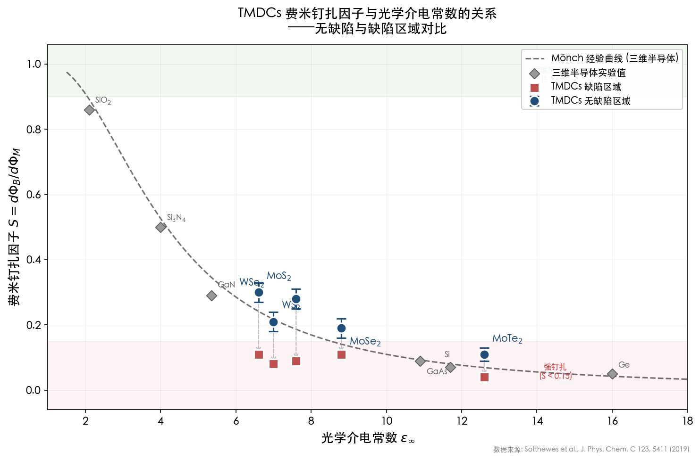

**图 1-1 TMDCs 费米钉扎因子 $S$ 与光学介电常数 $\varepsilon_\infty$ 的关系。** 蓝色圆点为五种 TMDCs 无缺陷区域的实验数据，红色方块为缺陷区域数据，灰色菱形为六种三维半导体的参考值。虚线为 Mönch 经验曲线。TMDCs 数据系统性地偏离三维半导体趋势线，表明二维体系的费米钉扎虽遵循类似的介电屏蔽规律，但具有独特的偏差特征；缺陷的存在进一步将 $S$ 值压低 30%–40%。数据来源：Sotthewes et al., J. Phys. Chem. C 123, 5411 (2019)。

### 1.3.2 界面缺陷态（DIGS）

MIGS 并非费米钉扎的唯一来源。缺陷对钉扎的增强效应已被多项实验明确证实。Bampoulis 等人（2017）的空间分辨 C-AFM 测量发现，MoS₂ 上金属类缺陷（过渡金属空位或替位杂质）位置的 $S \approx 0.1$，而无缺陷区域的 $S \approx 0.3$，钉扎强度增加了约 200% [Bampoulis et al., ACS Appl. Mater. Interfaces 2017](https://pubs.acs.org/doi/10.1021/acsami.7b02739 "Defect Dominated Charge Transport and Fermi Level Pinning")。

Sotthewes 等人（2019）将这一规律推广至全部五种 TMDCs，发现缺陷区域的 $S$ 值普遍较无缺陷区域下降 30%–40%：MoS₂ 从 0.30 降至 0.11，MoSe₂ 从 0.19 降至 0.11，WS₂ 从 0.21 降至 0.08，WSe₂ 从 0.28 降至 0.09，MoTe₂ 从 0.11 降至 0.04 [Sotthewes et al., J. Phys. Chem. C 2019](https://pmc.ncbi.nlm.nih.gov/articles/PMC6410613/ "Universal FLP in TMDCs")。缺陷态叠加在 MIGS 之上，形成额外的缺陷诱导带隙态（DIGS），使净界面态密度增加并进一步压低 $S$ 值。值得强调的是，起主导作用的缺陷类型为过渡金属空位或替位杂质，而非密度更高（$10^{12}$–$10^{13}$ cm⁻²）的硫族空位——后者对 SBH 和局域导电性的影响反而较小。

Noori 等人（2022）的 GW 计算从理论层面进一步揭示了缺陷的关键作用：在无缺陷的 MoS₂/Au 界面上，费米能级应位于价带附近（呈 p 型），而引入硫空位后则转变为 n 型 [Noori, Xuan & Quek, npj 2D Mater. Appl. 2022](https://www.nature.com/articles/s41699-022-00349-x "Origin of contact polarity at metal-2D TMDC interfaces")。这一结果解释了为何几乎所有实验中 MoS₂ 均表现为 n 型——大多数实验观察到的"强费米钉扎"在相当程度上源于缺陷态而非纯粹的 MIGS。

### 1.3.3 界面化学交互与偶极子

Gong 等人（2014）的 DFT 计算揭示了金属-MoS₂ 界面的第三种钉扎机制。当 Ti 或 Cr 等化学活泼金属沉积在 MoS₂ 表面时，强化学键的形成不仅在界面产生偶极子（修正有效功函数），还会弱化 S-Mo 共价键，在带隙中引入额外的缺陷态。这一"偶极子+带隙态"的双重效应构成了一种独特的部分费米钉扎机制，与经典 MIGS 模型所描述的连续态密度分布有本质区别 [Gong et al., Nano Lett. 2014](https://pubmed.ncbi.nlm.nih.gov/24660782/ "The unusual mechanism of partial Fermi level pinning at metal-MoS₂ interfaces")。

综合而言，二维半导体中费米钉扎的微观起源是 MIGS、缺陷诱导带隙态和界面化学交互三者的叠加效应。三种机制的相对权重取决于界面质量和接触制备方式：在理想洁净的 vdW 接触中，MIGS 是主要钉扎源；在传统蒸镀接触中，缺陷态和化学交互往往占据主导地位。这一多机制图景为后续章节讨论去钉扎策略奠定了物理基础。

## 1.4 范德华间隙：阻断与隧穿的双刃剑

二维材料表面无悬挂键，使得在理想条件下金属与 TMDCs 之间自然形成一个 3–4 Å 的 vdW 间隙。这一间隙对接触物理同时产生截然相反的两种效应，构成二维接触问题中最核心的物理矛盾。

**MIGS 抑制效应。** vdW 间隙作为电子波函数的衰减屏障，有效阻断了金属态向半导体带隙的渗透。Liu 等人（2018）的实验证实了这一点：通过机械转移法制备的原子级平整 Au-MoS₂ vdW 结中，费米钉扎因子从蒸镀接触的 $S \approx 0.09$–$0.3$ 大幅提升至 $S \approx 0.96$，趋近 Schottky-Mott 极限 [Liu et al., Nature 2018](https://www.nature.com/articles/s41586-018-0129-8 "Approaching the Schottky-Mott limit in vdW metal-semiconductor junctions, Nature 557, 696-700")。这一结果直接验证了 vdW 间隙在费米去钉扎中的关键作用。

**隧穿势垒效应。** 与此同时，vdW 间隙构成了一道额外的势垒，载流子须以量子隧穿方式穿越该间隙才能从金属注入半导体沟道。Kang 等人（2014）对 In、Ti、Au、Pd 四种金属与单层 MoS₂ 的顶部接触和边缘接触进行了系统的 DFT 评估，计算了各界面的隧穿势垒高度和传输概率，发现 vdW 隧穿势垒是限制载流子注入效率的关键因素。其中，边缘接触由于实现了共价键合而完全消除了 vdW 隧穿势垒，注入效率可显著优于顶部接触 [Kang et al., Phys. Rev. X 2014](https://link.aps.org/doi/10.1103/PhysRevX.4.031005 "Computational Study of Metal Contacts to Monolayer TMDs")。

这一"去钉扎-增隧穿"的内在矛盾是二维半导体接触物理中最核心的权衡关系。扩大 vdW 间隙虽可更有效地抑制 MIGS、降低 SBH，但同时增加了隧穿电阻。如何在这对矛盾中取得最优平衡，是后续各种低接触电阻方案所面临的共同挑战。正如 Liu、Stradins 与 Wei（2016）所论证的，理想的接触方案需要在 MIGS 抑制与隧穿势垒之间寻找精妙的折中 [Liu, Stradins & Wei, Sci. Adv. 2016](https://pmc.ncbi.nlm.nih.gov/articles/PMC4846439/ "Van der Waals metal-semiconductor junction")。

## 1.5 接触电阻的物理分解框架

基于上述物理机制分析，可以将金属-二维半导体界面的接触电阻系统地分解为三个主要组分：

$$R_c = R_{\text{SB}} + R_{\text{tunnel}} + R_{\text{spread}}$$

**肖特基势垒电阻 $R_{\text{SB}}$** 源于界面处的肖特基势垒。载流子须以热激发或热场发射方式越过（或隧穿过）势垒完成注入。$R_{\text{SB}}$ 由 SBH 和掺杂浓度共同决定，是费米钉扎效应的直接体现。在传统蒸镀金属接触单层 MoS₂ 的构型中，典型 SBH 为 0.03–0.6 eV，对应的 $R_{\text{SB}}$ 往往占据总接触电阻的主要份额。

**隧穿势垒电阻 $R_{\text{tunnel}}$** 源于 vdW 间隙构成的势垒。载流子以量子隧穿方式穿越该间隙，其电阻与势垒高度和宽度呈指数关系。在 vdW 接触中，即使 SBH 已降至零，$R_{\text{tunnel}}$ 仍可成为接触电阻的主要瓶颈。

**扩展电阻 $R_{\text{spread}}$** 源于电流从接触区域向沟道扩展时的集中效应。在二维体系中，由于沟道厚度仅为单原子层，电流路径受到严格的几何约束，$R_{\text{spread}}$ 的贡献在某些构型下不可忽略。

这一分解框架最早由 Allain 等人（2015）在其开创性综述中系统建立，并引入传输线模型（TLM）方法进行实验提取 [Allain et al., Nat. Mater. 2015](https://pubmed.ncbi.nlm.nih.gov/26585088/ "Electrical contacts to two-dimensional semiconductors")。不同的低接触电阻方案本质上是在不同的电阻分量上发力：半金属接触主要降低 $R_{\text{SB}}$ 和 $R_{\text{tunnel}}$，vdW 转移接触主要消除 $R_{\text{SB}}$ 中的费米钉扎贡献，边缘接触则完全消除 $R_{\text{tunnel}}$，掺杂工程通过改变势垒形状降低 $R_{\text{SB}}$。理解这一分解框架，是评判各类接触方案优劣的物理基础。

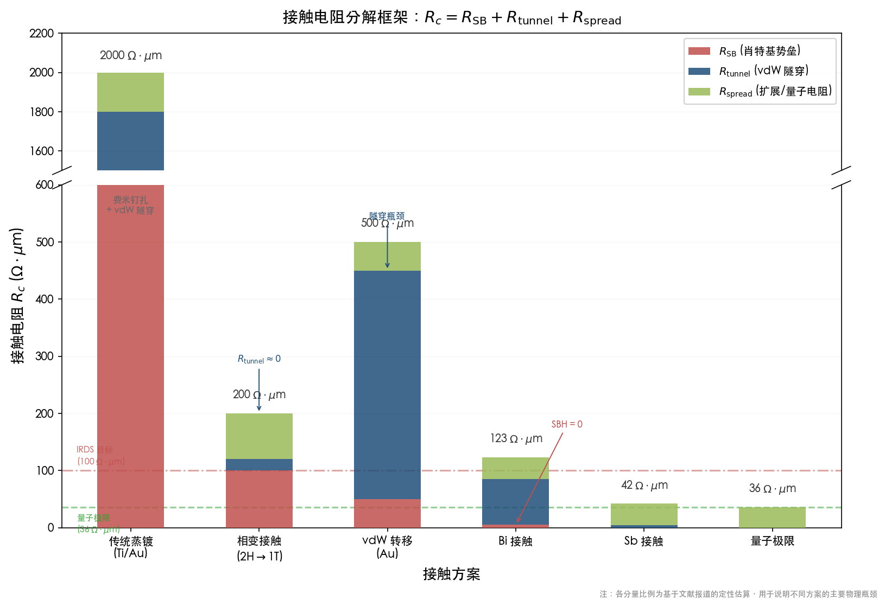

**图 1-2 六种代表性接触方案的接触电阻分解示意。** 堆叠柱状图定性展示了传统蒸镀（Ti/Au）、相变接触（2H→1T）、vdW 转移（Au）、Bi 接触、Sb 接触及量子极限情况下 $R_{\text{SB}}$（红色）、$R_{\text{tunnel}}$（蓝色）和 $R_{\text{spread}}$（绿色）三个分量的相对贡献。传统蒸镀接触受费米钉扎与 vdW 隧穿的双重制约，总电阻高达约 2000 Ω·μm；Bi 接触通过消除 SBH 将总电阻降至 123 Ω·μm，但隧穿分量仍为主要残余；Sb 接触同时压缩了 SBH 和隧穿分量，以 42 Ω·μm 逼近量子极限。红色与绿色虚线分别标示 IRDS 目标（100 Ω·μm）和量子极限（36 Ω·μm）。各分量比例为基于文献数据的定性估算。

## 1.6 实验现状：从千欧量级到量子极限

建立了上述理论框架之后，本节系统梳理接触电阻的实验进展。这一进展体现了二维半导体接触领域过去十余年的核心突破轨迹。

传统蒸镀金属接触单层 MoS₂ 的典型接触电阻为 0.2–10 kΩ·μm，远高于硅基器件已实现的水平。2021 年，Shen 等人采用半金属铋（Bi）作为电极，在单层 MoS₂ 上实现了 $R_c = 123$ Ω·μm，SBH 降至零，同时获得了 1,135 μA/μm 的开态电流密度 [Shen et al., Nature 2021](https://www.nature.com/articles/s41586-021-03472-9 "Ultralow contact resistance between semimetal and monolayer semiconductors, Nature 593, 211-217")。这一结果将接触电阻推入百欧量级，标志着二维半导体接触工程的重大里程碑。

2023 年，Li 等人采用锑（Sb）的 (01̄12) 晶面接触单层 MoS₂，将 $R_c$ 进一步推至 42 Ω·μm；短沟道器件实现了 1.23 mA/μm 的开态电流和大于 $10^8$ 的开关比，本征延迟仅为 74 fs [Li et al., Nature 2023](https://pubmed.ncbi.nlm.nih.gov/36631650/ "Approaching the quantum limit in 2D semiconductor contacts, Nature 613, 274-279")。这一数值已逼近接触电阻的理论下限——量子极限。

**量子极限** 源于 Landauer 量子电导理论。当界面势垒完全消除、每个导电模式的传输概率均为 1 时，接触电阻仍存在一个由量子力学决定的不可消除的最小值：

$$R_c^Q = \frac{\pi \hbar}{4 e^2 k_F}$$

在二维载流子浓度 $n_{2D} \approx 10^{13}$ cm⁻² 下，该极限约为 36 Ω·μm [Akinwande, Biswas & Jena, Nat. Electron. 2025](https://www.nature.com/articles/s41928-024-01335-5 "The quantum limits of contact resistance")。Sb 接触的 42 Ω·μm 距此极限仅约 17%，表明其界面势垒已接近完全消除。

值得指出的是，量子极限并非不可逾越——它随载流子浓度的增加而降低（$R_c^Q \propto 1/\sqrt{n_{2D}}$）。通过进一步提高载流子浓度或增加导电模式数，原则上可以继续降低 $R_c$。

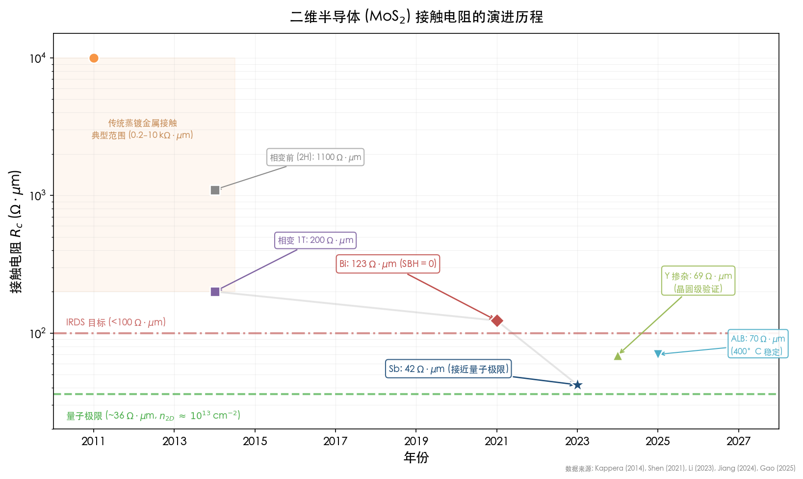

**图 1-3 MoS₂ 接触电阻的演进里程碑（2011–2026 年）。** 纵轴为对数坐标。从早期传统蒸镀金属接触的 ~10 kΩ·μm 到相变接触（Kappera 2014, 200 Ω·μm）、Bi 接触（Shen 2021, 123 Ω·μm, SBH = 0）、Sb 接触（Li 2023, 42 Ω·μm, 接近量子极限）、Y 掺杂（Jiang 2024, 69 Ω·μm, 晶圆级验证）和 ALB 接触（Gao 2025, 70 Ω·μm, 400°C 稳定），展示了接触电阻在十余年间下降逾两个数量级的进程。红色虚线为 IRDS 路线图目标（<100 Ω·μm），绿色虚线为量子极限（~36 Ω·μm, $n_{2D} \approx 10^{13}$ cm⁻²）。

## 1.7 技术路线图的需求：产业对接触电阻的硬性要求

二维半导体接触电阻的研究不仅是基础物理问题，更承载着半导体产业继续缩放的迫切需求。国际器件与系统路线图（IRDS）明确指出，将二维材料集成为亚 10 nm 节点的沟道材料，要求接触电阻率 $\rho_c$ 低于 $1 \times 10^{-9}$ Ω·cm²，对应于接触长度为数十纳米时 $R_c < 100$ Ω·μm [IRDS More Moore 路线图](https://irds.ieee.org/images/files/pdf/2022/2022IRDS_BC.pdf "IRDS 2022 Beyond CMOS 路线图")。在极端缩放场景下（接触长度 < 20 nm），这一要求进一步收紧至 $R_c < 50$ Ω·μm（$\rho_c < 10^{-9}$ Ω·cm²）。

Li 等人（2023）的 Sb-MoS₂ 器件以 $R_c = 42$ Ω·μm 达到了 IRDS 2028 年目标节点的接触电阻要求 [Li et al., Nature 2023](https://pubmed.ncbi.nlm.nih.gov/36631650/ "满足 IRDS 2028 目标")。Jiang 等人（2024）的 Y 掺杂方案在 2 英寸晶圆上实现了平均 $R_c = 69$ Ω·μm（最低 43 Ω·μm），是迄今唯一在晶圆级上验证亚 100 Ω·μm 接触电阻的方案 [Jiang et al., Nat. Electron. 2024](https://www.nature.com/articles/s41928-024-01176-2 "Yttrium-doping-induced metallization of MoS₂")。

然而，学术最佳值与产业实际集成之间仍存在巨大鸿沟。imec 在 300 mm 晶圆级先导线上的 Ti 侧接触 $R_c$ 高达数十至数百 kΩ·μm，与学术最佳值相差 2–3 个数量级 [imec 300 mm 集成研究](https://pmc.ncbi.nlm.nih.gov/articles/PMC12862033/ "Integration of WS₂ and MoS₂ FETs in 300 mm pilot line")。从单器件验证到大面积均匀制造的跨越，仍是该领域面临的核心工程挑战。

## 1.8 本章小结与后续章节的问题引出

本章建立了分析二维半导体接触问题的物理基础。金属-二维半导体界面区别于传统三维体系的三个根本特征——原子级厚度、极弱介电屏蔽和 vdW 间隙——共同导致了接触电阻远超预期的困境。费米钉扎的微观起源涉及 MIGS、缺陷态和界面化学交互三种机制的复杂交织；接触电阻可分解为 $R_{\text{SB}} + R_{\text{tunnel}} + R_{\text{spread}}$ 三个组分；而 vdW 间隙在 MIGS 抑制与隧穿势垒之间造成了核心权衡。

尽管 Sb 接触已将 $R_c$ 推至接近量子极限的 42 Ω·μm，但这一突破的物理机制尚未获得统一解释。半金属接触、纯金属 vdW 接触、相变接触、掺杂工程等多种方案各有其独特的理论叙事，它们之间的共通性与差异性有待系统梳理。一个自然的问题随之浮现：针对上述物理瓶颈，研究者发展出了哪些具体的实验策略？这些方法在多大程度上有效，又各自面临怎样的局限？

# 第2章 降低接触电阻的主流实验方案——方法论全景

第1章建立了金属-二维半导体界面的物理分析框架，揭示了费米钉扎、范德华隧穿势垒与界面缺陷态共同导致接触电阻远超理论预期的根源。面对这些物理瓶颈，过去十余年间（约2014—2026年），研究者发展出了多条路径来系统性降低二维半导体的接触电阻，将n型MoS₂的最佳$R_c$从千欧姆量级推进至接近量子极限（约36 Ω·μm）的水平。本章以MoS₂为核心案例，系统梳理七大类实验方案——半金属接触、纯金属范德华接触、相变工程接触、石墨烯与二维金属插层接触、掺杂工程接触、边缘接触以及新兴方案——对每种方案的实验构型、代表性成果、适用条件与局限性进行客观陈述。在此基础上，本章还专门讨论p型接触的进展与困境，为后续章节的机制归纳和统一框架构建提供完整的事实基础。

## 2.1 半金属接触：Bi与Sb的突破

半金属接触是近年来二维半导体接触领域最具影响力的突破方向。半金属材料（如Bi、Sb）在费米能级附近具有极低的电子态密度（DOS），这一特性使其能够在抑制金属诱导带隙态（MIGS）的同时维持足够的界面电子耦合，从而在费米去钉扎与载流子高效注入之间取得平衡。

### 2.1.1 铋（Bi）接触

2021年，Shen等人报道了半金属Bi电极在单层MoS₂上的里程碑式成果。在100 nm SiNₓ背栅介质上制备的传输线方法（TLM）器件中，该团队于室温、面载流子浓度$n_\text{2D} \approx 4 \times 10^{12}$ cm⁻²条件下测得$R_c = 123$ Ω·μm，SBH降至0 meV，开态电流密度达1135 μA/μm [Shen et al., Nature 2021](https://www.nature.com/articles/s41586-021-03472-9 "Ultralow contact resistance between semimetal and monolayer semiconductors, Nature 593, 211-217")。这一成果将当时n型MoS₂的最低$R_c$纪录推进了近一个数量级。

Bi接触的物理机制可从第一性原理计算中得到阐释。DFT计算表明，Bi在费米能级附近的极低DOS有效抑制了MIGS向MoS₂带隙内的渗透；与此同时，Bi与MoS₂的界面相互作用使费米能级自发移入导带，形成简并态接触。这种"低DOS抑制MIGS"与"费米能级导带对齐"的双重效应，构成了零SBH欧姆接触得以实现的物理基础 [Shen et al., Nature 2021](https://www.nature.com/articles/s41586-021-03472-9 "DFT analysis of Bi-MoS₂ interface")。

Bi接触对WS₂和WSe₂单层同样有效，表明半金属策略具有跨材料体系的普适性。然而，实验也揭示了一个重要约束：在含硫空位缺陷的MoS₂样品上，费米能级被缺陷态钉扎在带隙内，Bi接触从欧姆退化为肖特基特性，性能显著恶化 [Shen et al., Nature 2021](https://www.nature.com/articles/s41586-021-03472-9 "硫空位导致费米钉扎退化")。这表明高质量晶体是实现半金属欧姆接触的必要前提，晶体缺陷密度构成了该方案的隐性制约因素。

### 2.1.2 锑（Sb）接触

2023年，Li等人进一步将半金属接触的性能推至量子极限附近。采用Sb(01̄12)晶面接触单层MoS₂，通过Sb与MoS₂之间的强范德华相互作用和能带杂化，该团队实现了$R_c = 42$ Ω·μm——仅比$n_\text{2D} \approx 10^{13}$ cm⁻²条件下的量子极限（约36 Ω·μm）高约17% [Li et al., Nature 2023](https://www.nature.com/articles/s41586-022-05431-4 "Approaching the quantum limit in two-dimensional semiconductor contacts, Nature 613, 274-279")。在短沟道器件（$L_\text{ch} \approx 60$ nm）中，$V_\text{DS} = 1$ V条件下实现了开态电流1.23 mA/μm、开关比$> 10^8$、本征延迟74 fs，满足IRDS 2028年路线图对先进节点二维FET的性能要求。

Sb接触相对于Bi接触具有三项关键优势。第一，热稳定性显著提升：Sb接触在125°C氮气环境下保持24小时以上的稳定运行，而Bi接触在同等条件下即出现明显退化，这与Sb的高熔点（631°C）和Bi的低熔点（271°C）直接相关 [Li et al., Nature 2023](https://www.nature.com/articles/s41586-022-05431-4 "Sb thermal stability vs Bi degradation")。第二，隧穿比电阻更低：Su等人（2023）的理论分析表明Sb的隧穿比电阻低于Bi，由此解释了两者约3倍的$R_c$差异 [Su et al., J. Phys. D 2023](https://arxiv.org/abs/2212.03003 "Tunneling resistivity comparison between Sb and Bi")。第三，大面积器件阵列在$R_c$、阈值电压、亚阈值摆幅、开关比和跨导等指标上均展现出低变异性，器件均一性优异。

Sb接触的晶面依赖性是一项值得深入关注的发现：Sb(01̄12)展现负SBH（真欧姆接触），而Sb(0001)仍为正SBH的肖特基接触。Li等人将这一显著差异归因于不同晶面的电子态密度和界面范德华相互作用强度的差别——Sb(01̄12)面与MoS₂之间的杂化更强，形成一种"强范德华"中间态，既非共价键合，也非一般的弱范德华作用 [Li et al., Nature 2023](https://www.nature.com/articles/s41586-022-05431-4 "Crystal-face-dependent contact properties")。这种中间态耦合强度恰好在费米去钉扎和低隧穿势垒之间取得了近最优平衡。

在产业化验证方面，Chou等人（2021，IEDM）在TSMC平台上验证了Sb半金属接触在CVD生长单层MoS₂上的可行性，为半金属接触从实验室原理验证向产业化转移提供了初步证据 [Li et al., Nature 2023](https://www.nature.com/articles/s41586-022-05431-4 "引用Chou IEDM 2021")。

## 2.2 纯金属范德华接触：转移法与低能量沉积

与半金属策略不同，纯金属范德华（vdW）接触的核心思路在于保持金属与二维半导体之间的vdW间隙完整性，利用该间隙阻断MIGS的渗透以实现费米去钉扎。这一方向在界面物理的基本认知层面贡献了多项里程碑成果。

### 2.2.1 机械转移法

Liu等人（2018）首次报道了通过机械转移法制备的原子级平整金属薄膜-TMDCs范德华结。该方法将预先蒸镀在Si/SiO₂衬底上的金属薄膜通过干法转移至二维半导体表面，确保界面不受蒸镀过程中高能原子轰击的损伤。在多种TMDCs上，转移金属接触的费米钉扎因子$S$达到约0.96，接近Schottky-Mott极限（$S = 1$），而传统蒸镀金属接触的$S$仅为0.09–0.3 [Liu et al., Nature 2018](https://www.nature.com/articles/s41586-018-0129-8 "Approaching the Schottky-Mott limit in van der Waals metal-semiconductor junctions, Nature 557, 696-700")。

这一实验从实验上首次证明了vdW间隙确实能够有效阻断MIGS传播，是理解二维半导体接触物理的关键实验依据。需要指出的是，Liu等人的工作侧重于钉扎因子$S$的系统测量，而非TLM提取的$R_c$定量报道。$S \approx 0.96$意味着SBH可通过选择适当功函数的金属进行有效调控，但vdW间隙本身构成的隧穿势垒仍限制了最终可达的$R_c$。

Jung等人（2019）进一步发展了"转移通孔接触"方案，将Au电极通过PMMA辅助转移至hBN封装的MoS₂上，实现了高迁移率与低接触电阻并存的器件平台 [Jung et al., Nat. Electron. 2019](https://www.nature.com/articles/s41928-019-0245-y "Transferred via contacts as a platform for ideal two-dimensional transistors, Nat. Electron. 2, 187-194")。

### 2.2.2 低能量沉积法

Wang等人（2019）报道了一种更具实用潜力的vdW接触方案：采用10 nm In加100 nm Au盖层，通过标准实验室热蒸发（速率0.2 Å/s）在单层MoS₂上形成超洁净vdW界面。原子分辨STEM成像确认了In/Au与MoS₂之间无化学键合的原子级清洁界面——界面金属-硫间距为2.4 ± 0.3 Å，与典型vdW间距一致；XPS和EELS均证实界面未发生化学反应 [Wang et al., Nature 2019](https://www.nature.com/articles/s41586-019-1052-3 "Van der Waals contacts between three-dimensional metals and two-dimensional semiconductors, Nature 568, 70-74")。

TLM测量给出了单层CVD MoS₂上$R_c \approx 3.3 \pm 0.3$ kΩ·μm（$n_\text{2D} = 5.0 \times 10^{12}$ cm⁻²）和少层机械剥离MoS₂上$R_c \approx 800 \pm 200$ Ω·μm（$n_\text{2D} = 3.1 \times 10^{12}$ cm⁻²）。该团队还在CVD NbS₂上实现了$R_c = 220 \pm 50$ Ω·μm，在机械剥离WS₂上实现了$R_c = 2.4 \pm 0.5$ kΩ·μm [Wang et al., Nature 2019](https://www.nature.com/articles/s41586-019-1052-3 "TLM contact resistance values")。In的低功函数（约4.12 eV）与MoS₂的电子亲和能（约4.0–4.2 eV）较为匹配，其软金属性质使其在沉积过程中自然形成vdW接触而非化学键合。

Cui等人（2017）则采用了另一种vdW策略：在Co电极与单层MoS₂之间插入h-BN隧穿层，于低温下实现了$R_c \approx 3$–6 kΩ·μm的欧姆接触，证明h-BN隧穿层可改善界面质量并降低SBH [Cui et al., Nano Lett. 2017](https://pubs.acs.org/doi/10.1021/acs.nanolett.7b01536 "Low-Temperature Ohmic Contact to Monolayer MoS₂ by van der Waals Bonded Co/h-BN Electrodes, Nano Lett. 17, 4781-4786")。

### 2.2.3 局限性分析

纯金属vdW接触面临三个核心局限。其一，转移法与晶圆级制造不兼容，难以实现规模化生产。其二，vdW间隙（3–4 Å）虽然有效抑制MIGS，但同时引入了额外的隧穿势垒，限制了最终可达的$R_c$——这正是第1章讨论的"MIGS-隧穿权衡"的直接体现。其三，界面洁净度对工艺条件极为敏感：大气暴露导致的水分子和碳氢化合物吸附层厚度与二维半导体本身可比，一旦被金属电极覆盖便形成界面态，增强费米钉扎并抬高$R_c$。上述约束使vdW接触虽然在费米去钉扎维度上表现卓越，但在整体$R_c$表现上仍不及半金属接触。

## 2.3 相变工程接触：2H→1T'/1T相变

相变工程接触通过将二维半导体接触区域从半导体相局部转变为金属相，在同一材料内部构建金属-半导体同质结。由于接触区与沟道区属于同一材料的不同相，界面处不存在vdW间隙，载流子可通过共面传输直接注入沟道而无需隧穿。

Kappera等人（2014）首次报道了MoS₂的相变工程接触。通过n-丁基锂溶液处理，将MoS₂纳米片接触区域从半导体性2H相局部转变为金属性1T相，再于1T-MoS₂上沉积Au电极。该方案将$R_c$从直接Au–2H MoS₂接触的约1.1 kΩ·μm降至Au–1T–2H MoS₂的约200 Ω·μm，实现了约5倍的改善 [Kappera et al., Nat. Mater. 2014](https://www.nature.com/articles/nmat4080 "Phase-engineered low-resistance contacts for ultrathin MoS₂ transistors, Nat. Mater. 13, 1128-1134")。

Cho等人（2015）报道了另一种相变途径：利用激光辐照在2H-MoTe₂上局部图案化形成金属性1T'-MoTe₂区域，构建2H/1T'共面异质结。MoTe₂的2H–1T'能差仅约30 meV，使相变易于实现和维持。该方法在MoTe₂上实现了欧姆型同质结接触，消除了金属-半导体界面的肖特基势垒 [Cho et al., Science 2015](https://www.science.org/doi/10.1126/science.aab3175 "Phase patterning for ohmic homojunction contact in MoTe₂, Science 349, 625-628")。

相变接触的核心物理优势在于彻底绕过了vdW接触中的"MIGS-隧穿权衡"——既不存在MIGS问题（因为不涉及金属-半导体异质界面），也不存在vdW隧穿势垒（因为载流子在同一材料的不同相之间共面传输）。然而，该方案存在三个关键局限：第一，1T相在室温下热力学亚稳，存在向2H相回退的倾向，长期可靠性尚不确定；第二，化学法（如n-丁基锂）涉及湿法工艺，不利于大规模集成；第三，该方法仅适用于多晶型能差较小的TMDCs——MoTe₂的2H–1T'能差约30 meV使相变易于实现，而MoS₂的2H–1T能差约0.5–0.8 eV使1T相的稳定维持面临更大挑战。

## 2.4 石墨烯与二维金属插层接触

石墨烯和二维金属作为接触电极或缓冲层，利用其低维特性和独特的电子结构来优化金属-二维半导体界面质量。

Du等人（2015）报道了镍刻蚀石墨烯电极方案：采用双层石墨烯经Ni刻蚀处理后作为MoS₂接触电极，利用Ni与石墨烯锯齿形边缘的强耦合实现了$R_c \approx 460$ Ω·μm。石墨烯的半金属性质和低DOS有助于抑制MIGS向MoS₂带隙内的传播 [Du et al., ACS Nano 2014](https://pubs.acs.org/doi/10.1021/nn506567r "Low Resistance Metal Contacts to MoS₂ Devices with Nickel-Etched-Graphene Electrodes, ACS Nano 8, 11597-11602")。

Guimarães等人（2016）实现了石墨烯-TMDCs原子级薄的欧姆边缘接触，通过石墨烯与MoS₂及WS₂的横向异质结构建一维共面接触，展示了可扩展的全二维接触方案 [Guimarães et al., ACS Nano 2016](https://pubs.acs.org/doi/10.1021/acsnano.6b02879 "Atomically thin ohmic edge contacts between two-dimensional materials, ACS Nano 10, 6392-6399")。

在二维金属电极方面，Vu等人（2021）通过一步CVD法合成NbSe₂/Nb掺杂WSe₂金属/掺杂半导体范德华异质结构，利用NbSe₂作为二维金属电极并通过Nb原子扩散实现界面掺杂，构建了欧姆接触 [Vu et al., ACS Nano 2021](https://pubs.acs.org/doi/10.1021/acsnano.1c02038 "One-step synthesis of NbSe₂/Nb-doped-WSe₂ metal/doped-semiconductor vdW heterostructures, ACS Nano 15, 13031-13040")。Wang等人（2019）在CVD NbS₂上采用In/Au电极实现了$R_c = 220 \pm 50$ Ω·μm [Wang et al., Nature 2019](https://www.nature.com/articles/s41586-019-1052-3 "NbS₂ contact resistance")。

石墨烯和二维金属插层接触的物理优势在于利用低维材料的低DOS抑制MIGS，且可在原子级尺度精确控制界面结构。其局限性包括三个方面：石墨烯的零带隙使其功函数调节范围有限；石墨烯-MoS₂界面仍存在vdW间隙和相应的隧穿势垒；二维金属电极（NbS₂、NbSe₂等）的大面积可控生长在工艺上仍具挑战性。

## 2.5 掺杂工程接触

掺杂工程接触通过提高接触区域载流子浓度来变薄肖特基势垒、促进隧穿或直接实现欧姆接触。该策略在概念上与传统硅基技术中的离子注入欧姆接触类似，但在二维体系中的实现路径与物理机制存在本质差异——二维材料的原子级厚度排除了传统扩散掺杂的可能性，替代性方案包括表面电荷转移掺杂和替位掺杂诱导的金属化。

### 2.5.1 钇（Y）掺杂金属化

Jiang等人（2024）报道了Y掺杂诱导MoS₂金属化的欧姆接触技术，是掺杂工程接触中最具代表性的成果。该团队采用等离子体-沉积-退火（PDA）三步法，在MoS₂表面实现了埃级厚度的Y原子层掺杂，将半导体性2H-MoS₂转变为金属性Y-MoS₂（功函数约4.0 eV）。Y原子替代Mo位点后，由于Y的d电子数少于Mo，引发2H→1T相变并产生重掺杂金属态，作为金属电极与半导体沟道之间的缓冲层 [Jiang et al., Nat. Electron. 2024](https://www.nature.com/articles/s41928-024-01176-2 "Yttrium-doping-induced metallization of MoS₂ for ohmic contacts, Nat. Electron. 7, 545-556")。

在2英寸晶圆上制备的自对准10 nm沟道MoS₂ FET中，Y掺杂方案实现了平均$R_c = 69$ Ω·μm（最低43 Ω·μm）、总电阻235 Ω·μm、开态电流1.22 mA/μm（$V_\text{DS} = 0.7$ V）、弹道比79%、跨导3.2 mS/μm [Jiang et al., Nat. Electron. 2024](https://www.nature.com/articles/s41928-024-01176-2 "Wafer-scale performance metrics")。Y掺杂方案是迄今唯一在晶圆级（2英寸）上验证了亚100 Ω·μm $R_c$的技术路径。值得注意的是，与传统等离子体诱导的本征1T-MoS₂（仍表现为肖特基接触）不同，Y掺杂1T-MoS₂实现了真正的欧姆接触——关键区别在于Y掺杂不仅诱导了相变，还同时产生了重掺杂金属态，两种效应协同消除了界面势垒。

### 2.5.2 其他掺杂方案

McClellan等人（2021）采用AlOₓ远程掺杂单层MoS₂：通过原子层沉积（ALD）的AlOₓ将MoS₂沟道载流子浓度提升至简并水平，实现了高电流密度。该方法属于表面电荷转移掺杂，不引入替位缺陷，对晶格损伤较小 [McClellan et al., ACS Nano 2021](https://pubs.acs.org/doi/10.1021/acsnano.0c09078 "High current density in monolayer MoS₂ doped by AlOₓ, ACS Nano 15, 1587-1596")。

Fang等人（2013）报道了钾（K）表面掺杂对少层MoS₂的简并n型掺杂效果。通过真空沉积碱金属原子，该方案在接触区实现了极高载流子浓度，显著变薄了肖特基势垒宽度。然而碱金属在空气中极不稳定，严重限制了实用性 [Fang et al., Nano Lett. 2013](https://pubs.acs.org/doi/10.1021/nl400044m "Degenerate n-doping of few-layer transition metal dichalcogenides by potassium, Nano Lett. 13, 1991-1995")。

掺杂工程接触的共同优势在于：通过提高接触区域载流子浓度，既可变薄肖特基势垒以促进隧穿，又可在极端情况下直接将接触区金属化，从而消除异质界面。其中，Jiang等人的Y掺杂方案尤为突出——它同时实现了相变（2H→1T）和重掺杂金属化，且PDA工艺兼容晶圆级制造流程，在物理机制和工艺可行性上均具备显著优势。

## 2.6 边缘接触（1D接触）

边缘接触（又称1D接触）代表了一种从根本上不同的接触几何构型：载流子通过共价键直接从金属注入二维半导体的暴露边缘，而非穿过顶部的vdW间隙。Kang等人（2014）的DFT计算预测，边缘接触在载流子注入效率上可显著优于顶部接触，因为共价键注入完全消除了隧穿势垒 [Kang et al., Phys. Rev. X 2014](https://link.aps.org/doi/10.1103/PhysRevX.4.031005 "Computational Study of Metal Contacts to Monolayer Transition-Metal Dichalcogenide Semiconductors")。

Cheng等人（2019）报道了MoS₂晶体管的原位边缘接触方案，展示了一项具有重要技术意义的性质——"接触缩放免疫"：器件性能与接触长度（从20 nm至数百nm）无关 [Cheng et al., Nano Lett. 2019](https://pubs.acs.org/doi/10.1021/acs.nanolett.9b01355 "Immunity to contact scaling in MoS₂ transistors using in situ edge contacts, Nano Lett. 19, 5077-5085")。传统顶部接触在接触长度缩小至传输长度$L_T$以下时性能急剧恶化，而边缘接触完全避免了这一缩放瓶颈，使其在极端缩放的亚10 nm节点器件中具有独特的应用前景。

Jain等人（2019）实现了hBN封装单层MoS₂的1D边缘接触：通过反应离子刻蚀暴露hBN/MoS₂/hBN异质结构的边缘，再沉积金属电极。该方案实现了$R_c$约数kΩ·μm，同时保持了hBN封装带来的高载流子迁移率 [Jain et al., Nano Lett. 2019](https://pubs.acs.org/doi/10.1021/acs.nanolett.9b02166 "One-dimensional edge contacts to a monolayer semiconductor, Nano Lett. 19, 6914-6923")。

边缘接触的局限性同样不容忽视。有效接触面积仅为原子级宽度的边缘线，电流承载能力受限。边缘态的化学活性高，易受环境影响和氧化。制备工艺对刻蚀精度要求极高，且边缘原子的悬挂键可能引入缺陷态。尽管当前$R_c$绝对值仍高于半金属接触，但边缘接触的"缩放免疫"特性使其在先进节点的接触尺寸缩放中具备不可替代的结构优势。

## 2.7 新兴方案

除上述六大类主流方案外，多种新兴策略正处于积极探索阶段，部分已展现出突破性潜力。

### 2.7.1 拓扑半金属接触

拓扑狄拉克半金属（如Na₃Bi）和外尔半金属（如NbP）作为二维半导体电极的理论与初步实验研究已有报道。拓扑表面态的鲁棒性有望提供不受界面缺陷散射影响的载流子注入通道 [Phys. Rev. Appl. 2020](https://link.aps.org/doi/10.1103/PhysRevApplied.13.054030 "Electrical Contact between an Ultrathin Topological Dirac Semimetal and a 2D Material")。然而，拓扑半金属接触的系统性TLM数据仍然缺乏，该方向总体上尚处于概念验证阶段。

### 2.7.2 低功函数金属接触

Cao等人（2020）报道了Sn作为低功函数金属（$\Phi_M \approx 4.42$ eV）接触MoS₂的方案，在低温下实现欧姆接触。Sn与MoS₂之间的弱化学相互作用有助于维持vdW间隙完整性，其功函数与MoS₂电子亲和能较为匹配 [Cao et al., Appl. Phys. Lett. 2020](https://pubs.aip.org/aip/apl/article/116/2/022101/280121 "Low Schottky barrier contacts to 2H-MoS₂ by Sn electrodes")。Kim等人（2021）通过理论与实验揭示了In-MoS₂ vdW接触的欧姆接触起源，在少层MoS₂上测得$R_c$约600 Ω·μm [Kim et al., npj 2D Mater. Appl. 2021](https://www.nature.com/articles/s41699-020-00191-z "Origins of genuine Ohmic van der Waals contact between In and MoS₂")。

### 2.7.3 分子插层接触

Yue等人（2019）通过苄基紫精（benzyl viologen, BV）分子插层实现了MoS₂的欧姆接触。BV作为强n型掺杂剂在接触区域提供高载流子浓度，通过变薄肖特基势垒宽度大幅增强隧穿电流。分子插层接触的独特之处在于可在原子级精度上调控界面偶极子和载流子浓度，为界面工程提供了额外的自由度 [Yue et al., Adv. Funct. Mater. 2019](https://onlinelibrary.wiley.com/doi/10.1002/adfm.201807338 "Ohmic contact in 2D semiconductors via benzyl viologen interlayer")。

### 2.7.4 原子层键合（ALB）接触

Gao等人（2025）报道了原子层键合（Atomic Layer Bonding, ALB）接触方案。该方法采用超软等离子体选择性刻除MoS₂表层S原子，暴露Mo原子后与Au形成金属性界面键合。ALB接触实现了$R_c = 70$ Ω·μm，且在400°C下保持稳定——这使其成为迄今唯一同时满足亚100 Ω·μm $R_c$和后端工艺（BEOL）热预算要求的方案 [Gao et al., Science 2025](https://www.science.org/doi/10.1126/science.adz2405 "Atomic layer bonding contacts, Science 390")。ALB代表了一种全新的接触策略：通过"局部金属化"在界面处形成相干键合，既消除了vdW隧穿势垒，又通过金属性界面实现了费米去钉扎，在接触物理和工艺兼容性上开辟了新的可能性。

## 2.8 p型接触：进展与瓶颈

前述各方案主要针对n型MoS₂的接触优化。然而，实现二维半导体的互补逻辑（CMOS）电路需要同时具备高性能的n型和p型接触。p型接触的现状与n型之间存在巨大差距，构成该领域最为突出的未解决问题之一。

### 2.8.1 高功函数金属vdW接触

Wang等人（2022）首次通过工业兼容的电子束蒸发在TMDCs上实现了高性能p型vdW接触。采用Pt和Pd高功函数金属，通过优化沉积工艺（高速率2 Å/s多步沉积以减少辐射热损伤），在单层和少层WSe₂上制备了近理想的vdW界面。原子分辨STEM确认了无化学反应的洁净界面。p型WSe₂ FET实现了$R_c = 3.3$ kΩ·μm、迁移率约190 cm² V⁻¹ s⁻¹、饱和电流$> 10$ μA/μm、开关比$10^7$ [Wang et al., Nature 2022](https://www.nature.com/articles/s41586-022-05134-w "P-type electrical contacts for 2D transition-metal dichalcogenides, Nature 610, 61-66")。

该工作揭示了一个关键工艺要点：沉积速率对界面质量至关重要。低速率（0.1 Å/s）沉积导致辐射热损伤界面，而高速率多步沉积可形成洁净vdW界面。EELS分析确认了优化条件下Pt–WSe₂界面无化学键合，而未优化条件下Pd–WSe₂界面出现PdSe₂反应产物 [Wang et al., Nature 2022](https://www.nature.com/articles/s41586-022-05134-w "Deposition rate optimization for p-type contacts")。

### 2.8.2 表面电荷转移掺杂

Chuang等人（2014）采用亚化学计量的MoOₓ（$x < 3$）作为高功函数空穴注入层（功函数约6.6 eV），在MoS₂和WSe₂上实现了p型导通 [Chuang et al., Nano Lett. 2014](https://pubs.acs.org/doi/10.1021/nl4043505 "MoS₂ p-type transistors and diodes enabled by high work function MoOₓ contacts, Nano Lett. 14, 1337-1342")。Ghosh等人（2025）报道了通过一氧化氮（NO）掺杂实现高性能p型双层WSe₂ FET，在$V_\text{DS} = 1$ V条件下开态电流达约421 μA/μm，采用工业兼容的MOCVD生长WSe₂ [Ghosh et al., Nat. Commun. 2025](https://www.nature.com/articles/s41467-025-59684-4 "High-performance p-type bilayer WSe₂ FETs by nitric oxide doping, Nat. Commun. 16")。

### 2.8.3 p型接触的核心瓶颈

p型接触当前面临三重困境。第一，性能差距悬殊：截至2022年的学术最佳p型$R_c$（3.3 kΩ·μm）比最佳n型$R_c$（42 Ω·μm）高约两个数量级。第二，物理约束更为苛刻：大多数TMDCs的电离能（IE）超过5.5 eV，要求极高功函数的金属（如Pt、Pd）实现空穴注入；然而，高功函数金属通常硬度较大，在沉积过程中易与二维半导体形成化学键，破坏vdW间隙并增强MIGS，形成"高功函数→化学键合→MIGS增强→费米钉扎"的恶性循环 [Wang et al., Nature 2022](https://www.nature.com/articles/s41586-022-05134-w "p-type challenge: high work function metals tend to bond chemically")。第三，半金属方案不适用：Bi和Sb的功函数（4.34–4.55 eV）与MoS₂导带底匹配良好，但与TMDCs价带顶的能量差过大，无法实现有效的p型空穴注入。

Lee（2024）在Science展望文章中系统总结了这一困境，指出p型半导体上仍未实现真正的欧姆接触，呼吁开展系统性的理论筛选以发现与特定沟道半导体兼容的vdW硬金属 [Lee, Science 2024](https://www.science.org/doi/10.1126/science.adq4986 "Approaching the quantum limit of contact resistance in vdW layered semiconductors, Science 384, 1400-1401")。

## 2.9 方案横向比较与阶段性总结

综合以上七大类实验方案，可以勾勒出二维半导体接触电阻的演进图景。从2014年相变接触的200 Ω·μm，到2021年Bi接触的123 Ω·μm，再到2023年Sb(01̄12)接触的42 Ω·μm，n型MoS₂的$R_c$在十年间下降了近两个数量级，已逼近量子极限（约36 Ω·μm）。与此同时，Y掺杂（平均69 Ω·μm）和ALB接触（70 Ω·μm）也展示了通过完全不同的物理路径达到亚100 Ω·μm的可能性。图2-1以对数坐标横向对比了八种代表性方案的$R_c$数值，直观呈现了各方案之间的量级差异。

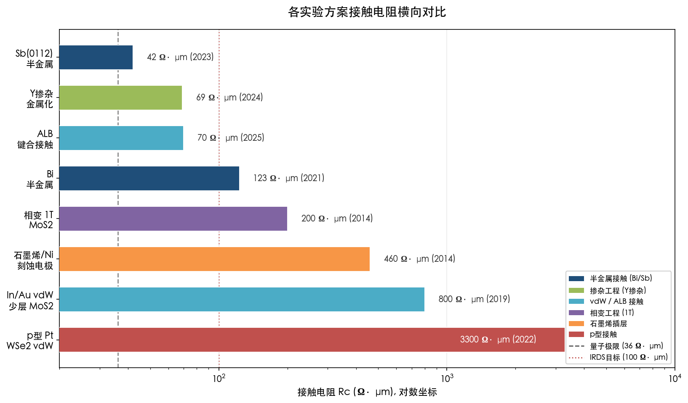

图2-2进一步展示了2014—2025年间n型二维半导体$R_c$最佳值的下降趋势。从早期的石墨烯插层和相变工程（数百Ω·μm量级），到半金属接触的突破性进展，再到最新的Y掺杂和ALB方案，$R_c$的持续降低反映了对界面物理认知的不断深化和工艺能力的系统性提升。

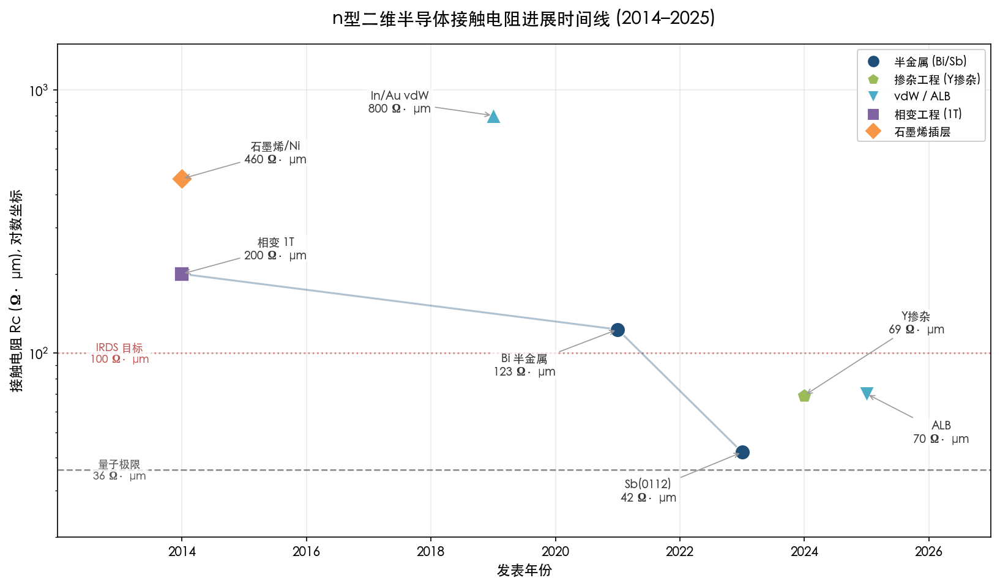

然而，各方案在适用条件上存在显著差异。半金属接触（Bi、Sb）依赖高质量单晶，对缺陷极为敏感。转移法vdW接触实现了最佳的费米去钉扎（$S \approx 0.96$），但受制于隧穿势垒和工艺可扩展性。相变接触消除了异质界面，但面临相稳定性问题。Y掺杂兼容晶圆级制造，但工艺窗口仍需进一步优化。ALB接触在热稳定性上独具优势（400°C稳定），但其工艺普适性和大面积均匀性尚未充分确立。边缘接触具有缩放免疫特性，但电流承载能力受限。

一个值得深思的现象是：这些看似截然不同的方案，其降低$R_c$的具体路径各异——半金属依靠低DOS抑制MIGS，vdW接触依靠间隙阻断波函数渗透，相变接触依靠消除异质界面，掺杂方案依靠变薄势垒或金属化接触区，边缘接触依靠消除vdW隧穿势垒。这些方案背后是否存在共通的物理机制？每种方案分别作用于$R_c$的哪个物理分量？这些问题将在第3章中系统回答。

# 第3章 共通物理机制的提取——从多样性中寻找统一性

第2章系统梳理了过去十余年间发展出的七大类降低二维半导体接触电阻的实验方案。这些方案在实验构型、工艺路径和理论解释上各具特色——半金属接触依赖低态密度抑制MIGS，范德华接触依赖间隙阻断波函数渗透，相变接触依赖消除异质界面，掺杂工程依赖变薄或消除势垒，边缘接触依赖共价键注入。然而，一个根本性问题随之浮现：这些独立发展的方案在物理本质上是否真正相互独立？它们各自作用于接触电阻$R_c = R_\text{SB} + R_\text{tunnel} + R_\text{spread}$的哪个分量？是否存在可辨识的共通机制？

本章对第2章各实验方案进行机制层面的横向比较与归纳，从中提取出降低接触电阻的五个核心物理机制：（i）费米钉扎的消除或弱化、（ii）肖特基势垒高度的调控、（iii）隧穿势垒的消除或减薄、（iv）界面无序度与缺陷态的最小化、以及（v）轨道杂化与能带耦合的优化。在此基础上，分析这些机制之间的相互关联与竞争关系，揭示各方案成功背后的共性物理逻辑，为第4章构建统一理论框架奠定基础。

## 3.1 机制一：费米去钉扎的三条路径

费米钉扎（Fermi level pinning, FLP）是制约二维半导体接触电阻的首要物理根源。如第1章所述，传统蒸镀金属接触单层MoS₂的钉扎因子$S$通常仅为0.02–0.3，意味着肖特基势垒高度（SBH）几乎不随金属功函数变化，严重偏离Schottky-Mott极限（$S = 1$）。对第2章各实验方案的分析表明，费米去钉扎的实现路径可归纳为三条，它们分别从不同物理层面削弱界面态密度对费米能级的束缚。

### 3.1.1 降低电极材料态密度——半金属路径

半金属（Bi、Sb）在费米能级附近具有远低于普通金属的电子态密度（DOS）。根据MIGS理论，金属电子波函数以指数衰减形式渗透进入半导体带隙，所形成的界面态密度与金属侧的DOS直接相关。Shen等人（2021）的DFT计算表明，Bi在费米能级附近的极低DOS从源头抑制了MIGS向MoS₂带隙内的渗透强度，使费米能级摆脱带隙态的束缚而自发移入MoS₂导带 [Shen et al., Nature 2021](https://www.nature.com/articles/s41586-021-03472-9 "Ultralow contact resistance, Nature 593, 211-217")。

Su等人（2023）通过系统的第一性原理DFT研究将上述物理图像进一步量化。该研究发现，半金属与TMDC的界面距离为3.0–3.3 Å，显著大于普通金属-TMDC界面的典型值（2.0–2.5 Å），仅产生"弱金属化"（weak metalization）效应。弱金属化生成的半金属诱导带隙态（SMIGS）并非泛滥地填充整个带隙，而是恰好从导带底向下延伸一个有限的能量窗口$\Delta M$——Bi/MoS₂的$\Delta M$为0.05 eV，Sb/MoS₂为0.08 eV。SMIGS以半金属原子的$p_z$轨道和Mo原子的$d_{z^2}$轨道杂化为主，在空间上沿界面法线方向延伸 [Su et al., J. Phys. D 2023](https://arxiv.org/abs/2212.03003 "Weak metalization mechanism, J. Phys. D 56, 234001")。这种"恰到好处"的弱金属化使SBH有效降低乃至归零，同时保持了二维半导体的本征电子结构不被破坏。

该路径的核心逻辑可从钉扎因子的经验公式加以理解。根据Mönch经验关系$S = 1/(1 + 0.1(\varepsilon_\infty - 1)^2)$，$S$由界面有效介电常数$\varepsilon_\infty$决定。Sotthewes等人（2019）对五种TMDCs的C-AFM测量估算出界面态密度约为$N \approx 1 \times 10^{14}$ states/eV·cm²，足以产生强钉扎 [Sotthewes et al., J. Phys. Chem. C 2019](https://pmc.ncbi.nlm.nih.gov/articles/PMC6410613/ "Universal FLP in TMDCs, J. Phys. Chem. C 123, 5411-5420")。半金属通过降低金属侧DOS，有效减少MIGS的源强度，等效于降低界面态密度$N$，从而提升$S$值。

### 3.1.2 空间阻断波函数渗透——范德华间隙与介质插层路径

第二条去钉扎路径并非改变金属侧的DOS，而是在金属与半导体之间引入空间阻隔层，利用MIGS的指数衰减特性削弱其穿透强度。Liu、Stradins与Wei（2016）的DFT计算系统论证了范德华接触中MIGS被有效抑制的物理机制：当金属与二维半导体之间维持3–4 Å的vdW间隙时，MIGS的衰减长度（约1–2 Å）使其在穿越间隙后强度大幅降低，费米能级不再受到钉扎 [Liu, Stradins & Wei, Sci. Adv. 2016](https://pmc.ncbi.nlm.nih.gov/articles/PMC4846439/ "Van der Waals metal-semiconductor junction")。Liu等人（2018）的转移金属实验直接验证了这一预测：在多种TMDCs上，转移法制备的vdW金属接触实现了$S \approx 0.96$，极为接近Schottky-Mott极限 [Liu et al., Nature 2018](https://www.nature.com/articles/s41586-018-0129-8 "S ≈ 0.96, Nature 557, 696-700")。

介质插层的效果同样显著。Kim（G.-S.）等人（2018）在多层MoS₂的金属接触中引入1 nm TiO₂薄膜，将$S$从直接金属-半导体接触的0.02提升至0.24——虽然距理想去钉扎仍有差距，但MIGS密度的下降已十分明显 [Kim G.-S. et al., ACS Nano 2018](https://pubs.acs.org/doi/10.1021/acsnano.8b03331 "SBH Engineering with MIGS Reduction")。

### 3.1.3 减少界面缺陷密度——材料质量路径

第三条路径聚焦于界面的结构完美性。缺陷态（DIGS）叠加在MIGS之上形成额外的带隙态密度，进一步压低$S$值。Noori等人（2022）的GW计算表明，在无缺陷的MoS₂/Au界面，费米能级位于带隙中部偏价带侧（p型）；一旦引入硫空位，缺陷态将费米能级钉扎至导带附近，使接触极性从p型翻转为n型 [Noori et al., npj 2D Mater. Appl. 2022](https://www.nature.com/articles/s41699-022-00349-x "Origin of contact polarity")。这一结论揭示了一个重要事实：大多数实验中观察到的MoS₂ n型行为和强钉扎，可能主要源于硫空位缺陷而非本征MIGS。

Bampoulis等人（2017）的空间分辨导电原子力显微镜（C-AFM）测量提供了更直观的证据：MoS₂上金属类缺陷位置的$S \approx 0.1$，而无缺陷区域的$S \approx 0.3$。Sotthewes等人（2019）将此规律推广至五种TMDCs，发现缺陷区域的$S$值较无缺陷区域普遍下降30%–40% [Bampoulis et al., ACS AMI 2017](https://pubs.acs.org/doi/10.1021/acsami.7b02739 "Defect dominated FLP") [Sotthewes et al., J. Phys. Chem. C 2019](https://pmc.ncbi.nlm.nih.gov/articles/PMC6410613/ "Universal FLP in TMDCs")。

上述三条路径并非互斥，最成功的低接触电阻方案往往同时利用了多条路径。Bi接触同时受益于低DOS（路径一）和高质量界面（路径三）；Sb(01̄12)在路径一的基础上还通过强vdW耦合进一步优化了界面电子结构；转移法Au接触则将路径二和路径三有机结合。**费米去钉扎主要作用于接触电阻的$R_\text{SB}$分量。**

## 3.2 机制二：肖特基势垒高度的调控

费米去钉扎为SBH调控创造了前提条件——只有当$S$足够大时，选择适当的金属功函数才能有效降低SBH。然而，即使在去钉扎条件下，SBH的具体数值仍取决于金属功函数与半导体能带边缘的对齐关系以及界面电荷转移效应。SBH调控策略可归纳为以下四种途径。

### 3.2.1 功函数匹配

最直接的策略是选择功函数与半导体导带底（n型）或价带顶（p型）对齐的电极材料。Su等人（2023）修正后的DFT计算给出Bi的功函数约为4.12 eV、Sb的功函数约为4.25 eV，二者均与MoS₂的电子亲和能（约4.0–4.2 eV）相当接近 [Su et al., J. Phys. D 2023](https://arxiv.org/abs/2212.03003 "Band alignment, J. Phys. D 56, 234001")。这种天然的能带对齐为n型欧姆接触提供了有利的起点。Liu、Stradins与Wei（2016）的DFT系统评估了各金属与MoS₂的能带对齐关系，明确指出低功函数金属（In、Sc）有利于n型接触，而高功函数金属（Pd、Pt）有利于p型接触 [Liu, Stradins & Wei, Sci. Adv. 2016](https://pmc.ncbi.nlm.nih.gov/articles/PMC4846439/ "Band alignment analysis")。

### 3.2.2 界面偶极子工程

界面处的电荷重分布形成偶极子势$\Delta V$，可在Schottky-Mott预测的基础上额外修正SBH。Su等人（2023）对12种半金属/TMDC接触的DFT计算表明，$\Delta V$的范围为$-0.29$至$+0.33$ eV，其具体数值取决于电子推回效应（electronic pushback effect）与电负性差异之间的竞争：当chalcogen原子电负性远大于半金属时（如S基TMDCs），电子密度向TMDC侧净位移，$\Delta V$取负值（化学吸附型）；当两者电负性接近时（如Te基TMDCs），电子推回效应占主导，$\Delta V$取正值（物理吸附型）[Su et al., J. Phys. D 2023](https://arxiv.org/abs/2212.03003 "Interface dipole analysis")。Gong等人（2014）的DFT研究则揭示了Ti/MoS₂界面中偶极子与弱化S-Mo键协同修正SBH的双重机制 [Gong et al., Nano Lett. 2014](https://pubmed.ncbi.nlm.nih.gov/24660782/ "Unusual FLP mechanism, Nano Lett. 14, 1714")。

### 3.2.3 掺杂诱导势垒变薄与消除

当接触区域的载流子浓度提升至简并水平时，肖特基势垒的空间宽度急剧缩小，载流子得以通过场致隧穿方式高效穿越势垒，等效地消除SBH对载流子注入的阻碍。在极端情况下，掺杂可直接诱导接触区金属化，从根本上消除金属-半导体异质界面。Jiang等人（2024）的Y掺杂方案即属后者：Y原子替代Mo位点后诱导2H→1T相变并产生重掺杂金属态，功函数降至约4.0 eV，费米能级自然位于导带内，SBH不复存在 [Jiang et al., Nat. Electron. 2024](https://www.nature.com/articles/s41928-024-01176-2 "Y-doping metallization, Nat. Electron. 7, 545-556")。

### 3.2.4 带隙态饱和

半金属接触展现出一种独特的"带隙态饱和"效应。Su等人（2023）在此基础上提出修正的Schottky-Mott关系：

$$\Phi_{B,n}^{(e)} = W_\text{metal} - E_\text{EA} - \Delta V + \Delta \varepsilon_F - \Delta M$$

其中$\Delta M$为SMIGS的能量窗口，$\Delta \varepsilon_F$为半金属形成接触后的费米能级偏移。$\Delta M$项的存在使SBH相较于经典Schottky-Mott预测进一步降低。当$\Delta M$足够大使得$\Phi_{B,n}^{(e)} \leq 0$时，接触转变为欧姆型——Bi/MoS₂的SBH = 0 meV以及Sb(01̄12)/MoS₂的负SBH正是这一机制的直接体现 [Su et al., J. Phys. D 2023](https://arxiv.org/abs/2212.03003 "Modified Schottky-Mott rule") [Shen et al., Nature 2021](https://www.nature.com/articles/s41586-021-03472-9 "SBH = 0") [Li et al., Nature 2023](https://www.nature.com/articles/s41586-022-05431-4 "Negative SBH")。

**SBH调控主要作用于接触电阻的$R_\text{SB}$分量。**值得注意的是，SBH调控与费米去钉扎紧密耦合——在强钉扎条件下（$S \ll 1$），无论采用何种SBH调控策略，SBH都被固定在窄范围内波动。因此，费米去钉扎是SBH调控的必要前提。

## 3.3 机制三：隧穿势垒的消除或减薄

二维半导体的无悬挂键表面在金属与半导体之间天然形成3–4 Å的范德华间隙，构成额外的隧穿势垒，贡献$R_\text{tunnel}$分量。Kang等人（2014）的DFT计算表明，这一vdW隧穿势垒使金属-MoS₂的接触电阻比金属-硅接触高出1–3个数量级 [Kang et al., Phys. Rev. X 2014](https://link.aps.org/doi/10.1103/PhysRevX.4.031005 "Computational Study of Metal Contacts to Monolayer TMDs")。这意味着，即使SBH被完全消除，隧穿势垒仍可能成为接触电阻的主要瓶颈。

Su等人（2023）利用Simmons隧穿二极管模型对隧穿比电阻$\rho_t$进行了定量估算，将vdW间隙近似为矩形势垒，隧穿概率由势垒高度$\Phi_t$和宽度$w_t$共同决定：

$$\rho_t \approx \frac{4\pi^2 \hbar w_t^2}{e^2} \cdot \frac{\exp\left(2\sqrt{2m/\hbar^2} \cdot w_t \Phi_t^{1/2}\right)}{\sqrt{2m/\hbar^2} \cdot w_t \Phi_t^{1/2} - 1}$$

以Bi/MoS₂为例，$\Phi_t = 2.80$ eV、$w_t = 1.26$ Å；Sb/MoS₂的$\Phi_t = 3.09$ eV、$w_t = 1.47$ Å。尽管Sb的势垒高度和宽度均略大于Bi，但12种半金属/TMDC接触的$\rho_t$均处于$10^{-9}$ Ω·cm²量级，其中Sb/TMDC的$\rho_t$普遍低于Bi/TMDC [Su et al., J. Phys. D 2023](https://arxiv.org/abs/2212.03003 "Tunneling-specific resistivity, J. Phys. D 56, 234001")。这一表面上的矛盾——更高的势垒反而对应更低的隧穿电阻——源于Sb与TMDCs之间更强的界面耦合使得隧穿透射系数更高：势垒的"等效高度"在考虑轨道杂化修正后显著降低。

各实验方案对隧穿势垒的处理策略可归纳为四类：

**策略一：完全消除隧穿势垒。** 边缘接触通过共价键直接将载流子从金属注入至二维半导体暴露边缘，完全绕过vdW间隙。Cheng等人（2019）展示的"接触缩放免疫"——接触电阻不随接触长度变化——正是隧穿势垒被消除的直接体现 [Cheng et al., Nano Lett. 2019](https://pubs.acs.org/doi/10.1021/acs.nanolett.9b01355 "Contact scaling immunity")。相变接触同样在同一材料的不同相之间实现无缝过渡（$R_\text{tunnel} \approx 0$），Kappera等人（2014）报道$R_c$从约1.1 kΩ·μm降至约0.2 kΩ·μm [Kappera et al., Nat. Mater. 2014](https://www.nature.com/articles/nmat4080 "Phase-engineered contacts, Nat. Mater. 13, 1128-1134")。

**策略二：增强界面耦合以减薄等效势垒。** Sb(01̄12)与MoS₂之间形成了一种"强范德华"中间态——界面距离约3.08 Å，介于典型vdW距离（3.8–4.0 Å）和共价键距离（2.0–2.5 Å）之间。这种中间态既非纯粹的物理吸附也非化学键合，而是通过强轨道杂化显著增强了界面的电子透射概率。Su等人（2023）的计算表明Sb的隧穿比电阻系统性低于Bi，这是Sb接触（$R_c = 42$ Ω·μm）优于Bi接触（$R_c = 123$ Ω·μm）的关键物理原因之一 [Su et al., J. Phys. D 2023](https://arxiv.org/abs/2212.03003 "Sb lower tunneling resistivity") [Li et al., Nature 2023](https://www.nature.com/articles/s41586-022-05431-4 "Strong vdW interactions")。

**策略三：简并掺杂变薄隧穿宽度。** 当接触区域通过掺杂实现简并态时，肖特基势垒的空间宽度急剧缩小，载流子可通过场致隧穿（field emission）高效穿越。McClellan等人（2021）的AlOₓ远程掺杂和Fang等人（2013）的K掺杂均属于此路径 [McClellan et al., ACS Nano 2021](https://pubs.acs.org/doi/10.1021/acsnano.0c09078 "AlOₓ doping") [Fang et al., Nano Lett. 2013](https://pubs.acs.org/doi/10.1021/nl400044m "K doping")。

**策略四：局部金属化消除界面过渡。** ALB接触（Gao等人，2025）通过超软等离子体刻除表层S原子，使暴露的Mo原子与Au形成金属性界面键合，本质上将vdW间隙替换为金属-金属共价键，在局部范围内消除了vdW隧穿势垒 [Gao et al., Science 2025](https://www.science.org/doi/10.1126/science.adz2405 "Atomic layer bonding contacts, Science 390")。

**隧穿势垒的消除或减薄主要作用于接触电阻的$R_\text{tunnel}$分量。**

## 3.4 机制四：界面无序度与缺陷态的最小化

前三个机制讨论的均为理想界面条件下的物理调控策略。然而，实际器件的接触性能在很大程度上受限于界面的微观结构质量。界面无序度和缺陷态的影响横跨$R_\text{SB}$和$R_\text{tunnel}$两个分量，构成一个贯穿多个物理维度的"背景机制"。

### 3.4.1 沉积过程诱导的界面损伤

传统热蒸发或电子束蒸发过程中，高动能金属原子撞击二维半导体表面，可在接触区域引入点缺陷（硫/硒空位）和晶格畸变。Kim等人（2017）通过STEM界面表征直接揭示了蒸镀金属-MoS₂界面的原子级损伤 [Kim et al., ACS Nano 2017](https://pubs.acs.org/doi/10.1021/acsnano.6b07159 "STEM界面表征")。这些沉积诱导缺陷直接增强费米钉扎（参见3.1.3节），即使选择了功函数匹配的金属，SBH仍可能被钉扎在非理想位置。

### 3.4.2 工艺优化的界面质量改善

多项突破性工作表明，工艺条件对界面质量具有决定性影响。Liu等人（2018）的机械转移法完全避免了蒸镀损伤，实现了原子级洁净的vdW界面 [Liu et al., Nature 2018](https://www.nature.com/articles/s41586-018-0129-8 "Approaching the Schottky-Mott limit")。Wang等人（2019）以0.2 Å/s的低速率热蒸发在MoS₂上沉积In/Au，STEM表征确认形成了无化学键合的超洁净vdW界面 [Wang et al., Nature 2019](https://www.nature.com/articles/s41586-019-1052-3 "vdW contacts, Nature 568, 70-74")。Wang等人（2022）在p型接触研究中进一步揭示了沉积速率的关键影响：高速率（2 Å/s）多步沉积可形成洁净vdW界面，而低速率（0.1 Å/s）沉积反而导致辐射热损伤——EELS分析确认后者在Pd-WSe₂界面产生了PdSe₂反应产物 [Wang et al., Nature 2022](https://www.nature.com/articles/s41586-022-05134-w "Deposition rate optimization, Nature 610, 61-66")。

### 3.4.3 缺陷对接触极性和性能的系统性影响

Shen等人（2021）的Bi接触实验明确揭示了对晶体质量的极端敏感性：在高质量机械剥离MoS₂上实现了零SBH的欧姆接触，但在含硫空位的样品上，费米能级被缺陷态重新钉扎于带隙内，Bi接触从欧姆退化为肖特基接触 [Shen et al., Nature 2021](https://www.nature.com/articles/s41586-021-03472-9 "Sample quality dependence")。

Noori等人（2022）的理论分析揭示了缺陷影响的不对称性：WSe₂的硒空位可被氧原子有效钝化，恢复p型接触行为；而MoS₂的硫空位难以钝化，持续导致n型钉扎 [Noori et al., npj 2D Mater. Appl. 2022](https://www.nature.com/articles/s41699-022-00349-x "Se vacancy passivation vs S vacancy")。这种缺陷化学的差异部分解释了为什么在多种TMDCs中，MoS₂的n型欧姆接触最先实现突破，而p型接触至今仍是难题。

**界面无序度与缺陷态的最小化同时作用于$R_\text{SB}$（通过增强费米钉扎和引入带隙态）和$R_\text{tunnel}$（通过界面散射增加等效隧穿势垒）两个分量。**这一机制的独特之处在于，它并非一种独立的优化"策略"，而是所有其他机制得以生效的前提条件——无论多么精妙的能带工程设计，若界面被缺陷态主导，均将难以发挥预期效果。

## 3.5 机制五：轨道杂化与能带耦合优化

轨道杂化决定了金属电子态与半导体电子态在界面处的量子力学耦合强度，同时影响SBH（通过杂化产生的带隙态修正势垒高度）和隧穿势垒（通过耦合增强改善载流子透射概率）。这一机制因此成为连接前四个机制的物理纽带。

### 3.5.1 Bi与MoS₂的"弱但有效"杂化

Shen等人（2021）通过SAED和PLDOS分析表明，Bi(0001)的6$p$轨道与MoS₂导带的Mo 4$d$轨道形成适度的杂化 [Shen et al., Nature 2021](https://www.nature.com/articles/s41586-021-03472-9 "SAED and PLDOS analysis")。这种杂化的强度恰好足以产生SMIGS使费米能级进入导带（实现带隙态饱和），但又不至于像Ti、Cr等活泼过渡金属那样产生泛滥的MIGS。Gong等人（2014）的DFT计算清楚地表明了过强耦合的不利后果：Ti和Cr与MoS₂形成强化学键合时，虽然隧穿距离缩短，却同时弱化了S-Mo键并在带隙中产生大量缺陷态，反而加剧了费米钉扎 [Gong et al., Nano Lett. 2014](https://pubmed.ncbi.nlm.nih.gov/24660782/ "Metal-S bonding creates gap states, Nano Lett. 14, 1714")。

### 3.5.2 Sb晶面依赖性的杂化差异

Sb接触的晶面依赖性为深入理解杂化机制提供了一个精妙的对比实验。Li等人（2023）发现，Sb(01̄12)与MoS₂之间的界面vdW相互作用和电荷转移均显著强于Sb(0001)。Sb(01̄12)面的原子排列使其与MoS₂晶格的空间匹配更优，产生更强的轨道杂化，最终实现负SBH（真欧姆接触）；而Sb(0001)面的杂化较弱，SBH仍为正值（肖特基接触）。尤为重要的是，Sb(01̄12)面对MoSe₂、WS₂、WSe₂均展现出类似的强杂化和低SBH特征，表明这种晶面依赖的耦合优化具有跨材料体系的普适性 [Li et al., Nature 2023](https://www.nature.com/articles/s41586-022-05431-4 "Crystal-face-dependent hybridization, Extended Data Fig. 2")。

### 3.5.3 石墨烯与二维金属的耦合特征

石墨烯作为半金属材料，其低DOS兼顾了MIGS抑制和适度界面耦合的双重需求。Liu、Stradins与Wei（2016）指出，石墨烯可作为金属-MoS₂界面的缓冲层，在减弱MIGS的同时保持一定的载流子注入效率 [Liu, Stradins & Wei, Sci. Adv. 2016](https://pmc.ncbi.nlm.nih.gov/articles/PMC4846439/ "Graphene as buffer layer")。二维金属H-NbS₂具有甚至高于Pt的功函数，理论上有望实现p型欧姆接触；然而其与TMDCs的界面仍存在vdW间隙和相应的隧穿势垒，仍需在杂化强度和隧穿代价之间寻求平衡 [Liu, Stradins & Wei, Sci. Adv. 2016](https://pmc.ncbi.nlm.nih.gov/articles/PMC4846439/ "H-NbS₂ for p-type contacts")。

**轨道杂化与能带耦合优化同时作用于$R_\text{SB}$（通过带隙态饱和降低SBH）和$R_\text{tunnel}$（通过增强界面电子透射概率降低等效隧穿势垒）。**

## 3.6 核心权衡关系与机制间的相互竞争

五个物理机制并非彼此独立地运作，而是在多个维度上相互耦合并形成权衡关系。深刻理解这些权衡对于设计最优接触方案至关重要。

### 3.6.1 MIGS-隧穿权衡：最核心的矛盾

这是二维半导体接触物理中最根本的矛盾对。一方面，vdW间隙可以有效抑制MIGS（降低$R_\text{SB}$），但同时引入额外的隧穿势垒（增加$R_\text{tunnel}$）；另一方面，强化学键合消除了隧穿势垒（降低$R_\text{tunnel}$），但金属波函数深度渗透至半导体带隙中产生大量MIGS，增强费米钉扎（增加$R_\text{SB}$）。Liu等人（2016）首次系统阐明了这一矛盾 [Liu, Stradins & Wei, Sci. Adv. 2016](https://pmc.ncbi.nlm.nih.gov/articles/PMC4846439/ "MIGS-tunneling trade-off")，Allain等人（2015）的$R_c$分解框架也在结构上暗含了这一权衡 [Allain et al., Nat. Mater. 2015](https://pubmed.ncbi.nlm.nih.gov/26585088/ "R_c decomposition")。

图3-1以MIGS强度和隧穿势垒为双轴构建二维概念空间，直观展示了各接触方案在这一权衡中的定位。半金属接触（Sb、Bi）和"绕过界面"的方案（Y掺杂、ALB）位于左下角的理想区域附近，而vdW转移接触和强键合接触则分别落在权衡带的两端。

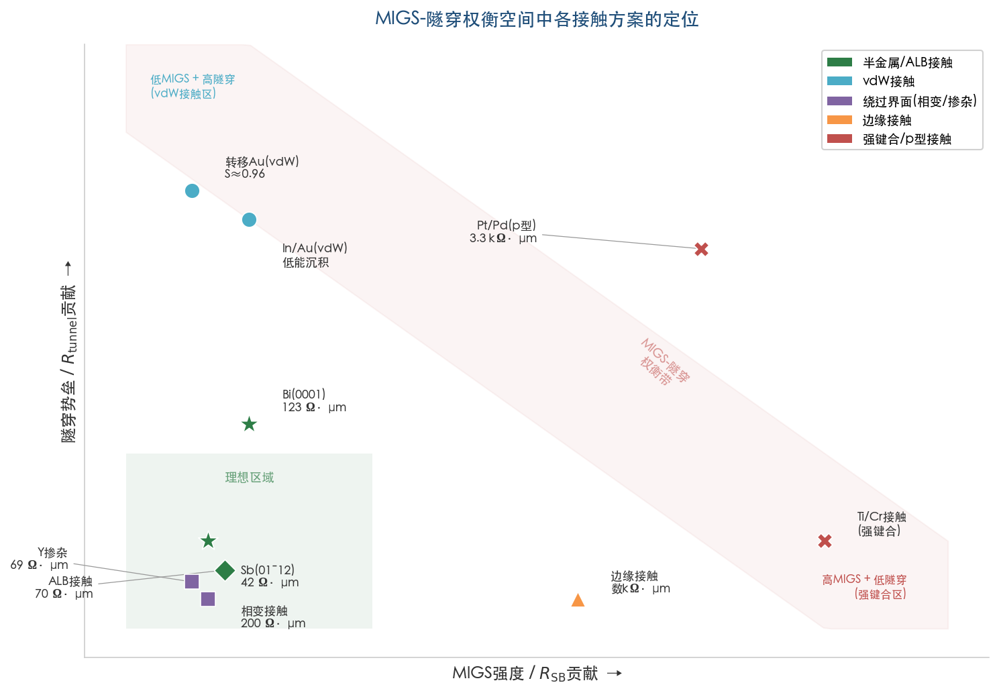

### 3.6.2 强耦合-钉扎增强权衡

在MIGS-隧穿矛盾的框架内，增强界面耦合（提升杂化强度）存在一个"过犹不及"的临界阈值。Ti、Cr等活泼金属与MoS₂形成强化学键，虽然显著缩短了界面间距、降低了隧穿势垒，但同时弱化了S-Mo键并产生大量带隙态 [Gong et al., Nano Lett. 2014](https://pubmed.ncbi.nlm.nih.gov/24660782/ "Metal-S bonding creates gap states")。Su等人（2023）的"弱金属化"概念精确地捕捉了这一阈值特征：半金属-TMDC界面距离维持在3.0–3.3 Å（对比传统金属的2.0–2.5 Å），SMIGS恰好延伸至导带底而不会泛滥至整个带隙 [Su et al., J. Phys. D 2023](https://arxiv.org/abs/2212.03003 "Weak metalization mechanism")。

### 3.6.3 半金属的"恰到好处"平衡

综合以上分析，半金属接触（尤其是Sb(01̄12)）之所以实现了迄今最低的接触电阻（$R_c = 42$ Ω·μm），关键在于其同时在MIGS-隧穿权衡的两端取得了近最优折中：低DOS从源头抑制MIGS（机制一），功函数与MoS₂导带底天然对齐（机制二），适度的轨道杂化既产生足够的SMIGS饱和带隙态（机制五）又不引入泛滥的MIGS，而"强vdW"中间态使隧穿比电阻低于一般vdW接触（机制三）。Su等人（2023）的DFT计算证实，Sb的隧穿比电阻系统性低于Bi，与实验中Sb接触$R_c$较Bi接触低约3倍的结果定量一致 [Su et al., J. Phys. D 2023](https://arxiv.org/abs/2212.03003 "Sb lower tunneling resistivity than Bi")。

### 3.6.4 绕过权衡的"另类路径"

相变接触和Y掺杂代表了一种根本不同的策略：通过消除金属-半导体异质界面本身来绕过MIGS-隧穿权衡。当接触区域被转变为与沟道相同材料的金属相（相变接触），或被掺杂至金属态（Y掺杂）时，载流子在同质界面或金属-金属界面传输，既不存在MIGS问题也不存在vdW隧穿势垒。然而，这一策略面临新的工程权衡：相变接触中的1T相在室温下热力学亚稳，长期可靠性存疑 [Kappera et al., Nat. Mater. 2014](https://www.nature.com/articles/nmat4080 "1T phase metastability")；Y掺杂则需要精确控制掺杂浓度和扩散深度，以避免对沟道区产生非预期影响 [Jiang et al., Nat. Electron. 2024](https://www.nature.com/articles/s41928-024-01176-2 "Y-doping process control")。

### 3.6.5 p型接触的困境：权衡的尖锐化

p型接触的本质困难在于上述权衡关系的系统性恶化。大多数TMDCs的电离能超过5.5 eV，要求极高功函数的金属（Pt约5.65 eV、Pd约5.12 eV）才能实现空穴注入。然而，高功函数金属通常具有较高的化学活性，在沉积过程中更容易与二维半导体形成化学键合，从而触发"高功函数→化学键合→MIGS增强→费米钉扎"的恶性循环 [Wang et al., Nature 2022](https://www.nature.com/articles/s41586-022-05134-w "p-type challenge, Nature 610, 61-66")。半金属策略在p型接触中难以奏效，因为Bi（约4.12 eV）和Sb（约4.25 eV）的功函数与TMDCs价带顶的能量差过大，无法实现有效的空穴注入。p型接触的MIGS-隧穿权衡因此比n型更为尖锐，是当前该领域最为突出的未解决问题。

## 3.7 方法-机制映射：综合评估矩阵

将五个核心机制作为评估维度，可以对第2章中各实验方案进行系统的多维度评估。图3-2和表3-1呈现了主要方案在各机制维度上的定位（"主要"表示该机制是方案的核心优势，"次要"表示有贡献但非主导，"不涉及"表示该机制未被利用，"不利"表示该机制对方案构成制约）。

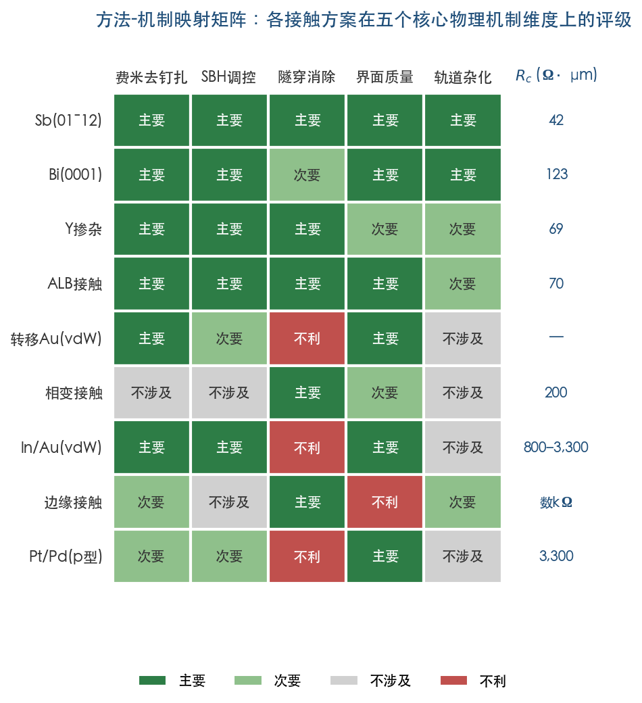

**表3-1 各接触方案在五个核心物理机制维度上的综合评估**

| 方案 | 去钉扎 | SBH调控 | 隧穿消除 | 界面质量 | 轨道杂化 | $R_c$（Ω·μm） |
|------|--------|---------|---------|---------|---------|------------|
| Sb(01̄12) | 主要 | 主要 | 主要 | 主要 | 主要 | 42 |
| Bi(0001) | 主要 | 主要 | 次要 | 主要 | 主要 | 123 |
| Y掺杂 | 主要 | 主要 | 主要 | 次要 | 次要 | 69 |
| ALB接触 | 主要 | 主要 | 主要 | 主要 | 次要 | 70 |
| 转移Au(vdW) | 主要 | 次要 | 不利 | 主要 | 不涉及 | — |
| 相变接触 | 不涉及 | 不涉及 | 主要 | 次要 | 不涉及 | 200 |
| In/Au(vdW) | 主要 | 主要 | 不利 | 主要 | 不涉及 | 800–3,300 |
| 边缘接触 | 次要 | 不涉及 | 主要 | 不利 | 次要 | 数kΩ |
| Pt/Pd(p型) | 次要 | 次要 | 不利 | 主要 | 不涉及 | 3,300 |

从该矩阵中可提取出以下关键洞察：

**第一，$R_c$最低的方案在最多机制维度上标记为"主要"。** Sb(01̄12)是唯一在全部五个机制维度上均为"主要"的方案，对应的$R_c = 42$ Ω·μm为迄今最接近量子极限的实验值。Bi在四个维度为"主要"但在隧穿维度仅为"次要"，$R_c = 123$ Ω·μm。两者之间约3倍的差异可定量归因于隧穿比电阻的差异 [Su et al., J. Phys. D 2023](https://arxiv.org/abs/2212.03003 "Tunneling resistivity comparison")。

**第二，仅优化单一或两个维度的方案，$R_c$改善幅度有限。** 转移法vdW接触在去钉扎维度上表现卓越（$S \approx 0.96$），但在隧穿维度上存在固有劣势，整体$R_c$未能达到半金属接触的水平。边缘接触在隧穿消除维度上实现了极端优化（共价键注入），但有效接触面积受限且边缘态化学活性高，$R_c$仍停留在数kΩ·μm级别。

**第三，"绕过界面"的方案通过消除异质界面或局部金属化，在三个或更多维度上同时获益。** Y掺杂方案虽然在界面质量和轨道杂化维度上仅为"次要"（掺杂过程本身引入晶格扰动），但通过消除金属-半导体界面使去钉扎、SBH调控和隧穿消除三个维度同时得到"主要"级别的优化，实现了$R_c = 69$ Ω·μm。

**第四，所有方案的性能均受限于界面质量这一"元维度"。** Bi接触在含缺陷样品上从欧姆退化为肖特基接触的事实 [Shen et al., Nature 2021](https://www.nature.com/articles/s41586-021-03472-9 "Sample quality dependence")充分表明，界面质量并非一个可选的优化维度，而是所有其他机制得以发挥作用的基础性前提。

## 3.8 共通物理机制的凝练

综合以上分析，我们认为降低二维半导体接触电阻的各类实验方案虽然在具体实现路径上各具特色，但在物理本质上共享一组有限且可辨识的核心机制。这些机制分别作用于接触电阻的不同物理分量（$R_\text{SB}$和$R_\text{tunnel}$），且相互之间存在深刻的耦合与竞争关系。图3-3对五个机制与接触电阻各分量之间的作用关系进行了系统梳理。

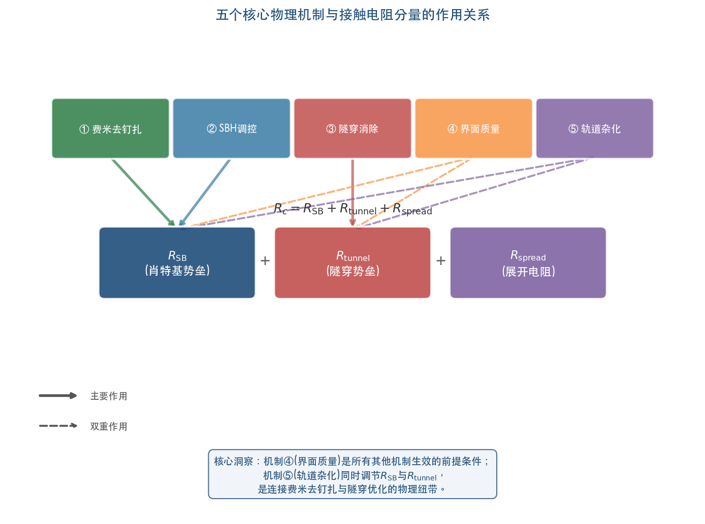

如图3-3所示，费米去钉扎（机制①）和SBH调控（机制②）共同作用于$R_\text{SB}$，前者为后者提供必要前提。隧穿势垒的消除或减薄（机制③）直接作用于$R_\text{tunnel}$。轨道杂化与能带耦合优化（机制⑤）同时影响$R_\text{SB}$和$R_\text{tunnel}$，是连接费米去钉扎与隧穿优化的物理纽带。界面质量（机制④）作为元条件，决定了上述所有机制的实际生效程度。

本章最关键的物理洞察在于MIGS-隧穿权衡的揭示：在异质界面（金属-半导体界面）条件下，$R_\text{SB}$和$R_\text{tunnel}$之间存在内在矛盾，任何单一维度的极端优化都可能导致另一维度的恶化。最成功的方案——以Sb(01̄12)为典范——之所以能逼近量子极限，正是因为它在MIGS-隧穿权衡中找到了近最优的折中点，同时在全部五个机制维度上均取得了"主要"级别的优化。

这些共通机制的辨识为构建统一理论框架奠定了坚实的物理基础。一个自然的追问是：上述五个机制能否被进一步抽象为更简洁的判据体系？不同方案在这一判据体系中的定位能否提供定量的预测能力？该理论框架对p型接触困境和新材料探索能给出怎样的指引？第4章将在本章机制提取的基础上，尝试回答这些问题。

# 第4章 迈向统一框架——"去钉扎-低隧穿-强耦合"三支柱模型

第3章从七大类实验方案中提取出五个核心物理机制，并揭示了它们之间的耦合与竞争关系——尤其是贯穿全局的MIGS-隧穿权衡。一个关键的追问随之浮现：这些机制能否被进一步抽象为更简洁的判据体系，从而为接触材料的设计提供系统性的预测指引？

本章在前述机制提取的基础上，构建一个能够统一解释大多数低接触电阻方案的理论框架——"去钉扎-低隧穿-强耦合"三支柱模型（Depinning–Low Tunneling–Strong Coupling, DLC模型）。该框架的核心命题是：理想的二维半导体欧姆接触需同时满足三个条件——费米能级去钉扎、隧穿势垒最小化、界面轨道耦合优化。凡在三个支柱上同时取得"优秀"评级的方案均实现了超低接触电阻（$R_c < 100$ Ω·μm）；仅优化一至两个支柱的方案改善幅度有限。据系统文献检索，尚未有已发表工作提出完整的"三支柱"统一判据框架，本报告的这一构建具有独创性贡献。在阐述框架的定量内涵之后，本章用该框架重新审视各实验方案的成功机理，讨论其预测能力与适用边界，并与传统三维半导体接触理论进行对比，明确二维体系的独特性。

## 4.1 三支柱模型的理论构建

### 4.1.1 从五机制到三支柱的凝练

第3章辨识出的五个核心机制可以按照其所作用的接触电阻分量进行层次化重组。费米去钉扎（机制一）与SBH调控（机制二）在物理上紧密耦合——去钉扎是SBH调控的必要前提，SBH调控是去钉扎的目标实现——二者共同决定肖特基势垒电阻$R_\text{SB}$。隧穿势垒的消除或减薄（机制三）直接作用于$R_\text{tunnel}$。轨道杂化与能带耦合优化（机制五）则同时影响$R_\text{SB}$和$R_\text{tunnel}$，是连接前两组机制的物理纽带。界面无序度最小化（机制四）并非独立的调控自由度，而是前述所有机制得以生效的前提条件。

据此，我们认为五个机制可以在更高的抽象层次上凝练为三个正交的判据维度：

- **支柱一：去钉扎（Depinning）**——费米能级摆脱界面态束缚的程度，综合了第3章的机制一与机制二。判据参数为钉扎因子$S$和有效SBH。
- **支柱二：低隧穿（Low Tunneling）**——载流子穿越界面势垒的高效性，对应第3章的机制三。判据参数为隧穿比电阻$\rho_t$或等效势垒宽度$w_t$。
- **支柱三：强耦合（Strong Coupling）**——金属电子态与半导体电子态在界面的量子力学耦合优化，对应第3章的机制五。判据参数为界面电荷转移量和SMIGS能量窗口$\Delta M$。

界面无序度最小化作为三支柱生效的"元条件"，嵌入框架的边界约束中，而非作为独立支柱。这一处理在学术理想条件下（高质量机械剥离单晶）完全成立；在CVD大面积材料的工程现实中，缺陷密度升高可能使其从辅助条件升格为核心约束，我们将在4.5节讨论这一适用边界。

图4-1以等边三角形结构呈现了三支柱模型的整体架构。三个顶点分别对应去钉扎、低隧穿和强耦合三个判据维度，中心绿色区域标注超低$R_c$的目标阈值，三条边上的双向箭头则标示各支柱之间的MIGS-隧穿权衡关系。底部注明界面缺陷最小化为三支柱生效的隐含元条件。

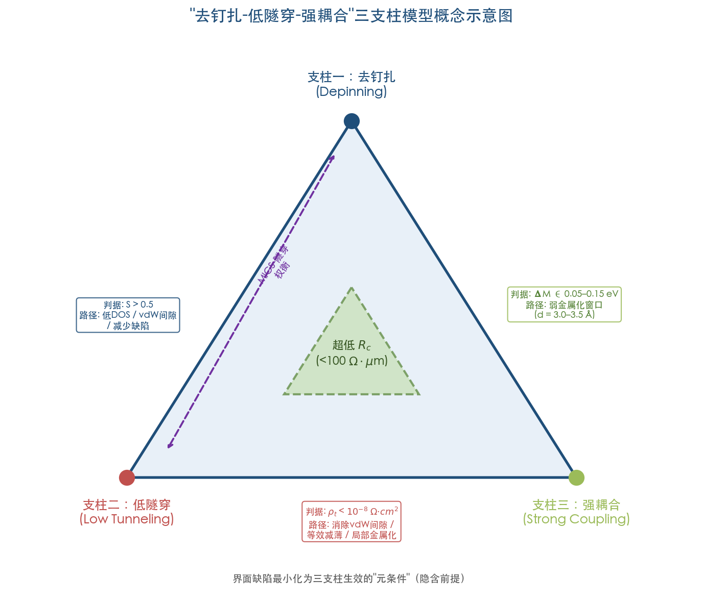

### 4.1.2 支柱一：去钉扎的定量刻画

费米钉扎因子$S = d\Phi_B / d\Phi_M$是刻画去钉扎程度的核心参数：$S = 1$对应Schottky-Mott极限（完全去钉扎），$S = 0$对应Bardeen极限（完全钉扎）。综合第1章和第3章的实验数据，本报告提出以下分级标准：$S > 0.9$为"近理想去钉扎"，$S > 0.5$为"有效去钉扎"，$S < 0.3$为"强钉扎"。

三支柱框架将第3章辨识出的三条去钉扎路径统一纳入$S$值的调控逻辑。根据Cowley-Sze模型，$S$与界面态密度$N$之间满足：

$$S = \frac{1}{1 + \frac{e^2 N \delta}{\varepsilon_0 \varepsilon_r}}$$

其中$\delta$为界面态的空间延伸深度，$\varepsilon_r$为界面介电常数。降低$N$有三条路径：（1）降低电极材料DOS，从源头减少MIGS生成强度（半金属路径）；（2）增大界面间距，利用MIGS的指数衰减特性减少渗透态密度（vdW间隙路径）；（3）降低缺陷密度，消除DIGS的额外贡献（材料质量路径）。三条路径均可映射为降低有效$N$值，进而提升$S$。

Sotthewes等人（2019）对五种TMDCs的导电原子力显微镜（C-AFM）系统测量为上述框架提供了关键的定量标定。在无缺陷区域，MoS₂的$S = 0.30$、MoSe₂的$S = 0.19$、WS₂的$S = 0.21$、WSe₂的$S = 0.28$、MoTe₂的$S = 0.11$，对应界面态密度$N \approx 1 \times 10^{14}$ states/eV·cm²；这些数据遵循Mönch经验关系$S = 1/(1 + 0.1(\varepsilon_\infty - 1)^2)$，但系统性地偏离三维半导体的趋势线——向更低$S$值方向偏移 [Sotthewes et al., J. Phys. Chem. C 2019](https://pmc.ncbi.nlm.nih.gov/articles/PMC6410613/ "Universal FLP in TMDCs, J. Phys. Chem. C 123, 5411-5420")。偏移的物理根源在于TMDCs的净界面态密度（$1 \times 10^{14}$ states/eV·cm²）低于三维半导体（如金刚石界面的理论值$2.3 \times 10^{14}$ states/eV·cm²）。值得注意的是，在缺陷区域，$S$值进一步下降30%–40%（如MoS₂从0.30降至0.11），含缺陷的TMDC数据点反而与三维半导体的Mönch曲线重合——这表明缺陷诱导的DIGS将二维体系的净界面态密度提升至三维水平 [Sotthewes et al., J. Phys. Chem. C 2019](https://pmc.ncbi.nlm.nih.gov/articles/PMC6410613/ "S values for pristine vs defected TMDCs")。

这一定量对比揭示了二维体系费米钉扎的独特性：本征MIGS产生的钉扎强度实际上弱于三维半导体（在同等$\varepsilon_\infty$下，$S_\text{2D,pristine} > S_\text{3D}$），但缺陷态的普遍存在将实际器件中的$S$值拉低至与三维体系相当甚至更严重的水平。因此，支柱一的优化需要在两个维度上同步推进：沿半金属/vdW路径降低MIGS，并沿材料质量路径降低DIGS。

去钉扎的实现并非终点，而是为SBH调控创造了必要前提。当$S$足够大时，选择功函数与半导体导带底（n型）或价带顶（p型）匹配的电极材料即可有效降低SBH。Su等人（2023）在此基础上提出了修正的Schottky-Mott关系，引入SMIGS能量窗口$\Delta M$和费米能级偏移$\Delta \varepsilon_F$对SBH的额外修正：

$$\Phi_{B,n}^{(e)} = W_\text{metal} - E_\text{EA} - \Delta V + \Delta \varepsilon_F - \Delta M$$

该公式将支柱一（去钉扎，$S$和$\Delta M$）与支柱三（强耦合，$\Delta V$和$\Delta \varepsilon_F$）定量地关联起来 [Su et al., J. Phys. D 2023](https://arxiv.org/abs/2212.03003 "Modified Schottky-Mott rule, J. Phys. D 56, 234001")。

### 4.1.3 支柱二：低隧穿的定量刻画

隧穿比电阻$\rho_t$是刻画载流子穿越界面势垒效率的核心判据。Su等人（2023）基于Simmons隧穿二极管模型给出了$\rho_t$的解析估算，将vdW间隙近似为矩形势垒：

$$\rho_t \propto w_t^2 \exp\left(\frac{2w_t\sqrt{2m\Phi_t}}{\hbar}\right)$$

其中$\Phi_t$为势垒高度，$w_t$为势垒宽度。对于Bi/MoS₂，$\Phi_t = 2.80$ eV、$w_t = 1.26$ Å；对于Sb/MoS₂，$\Phi_t = 3.09$ eV、$w_t = 1.47$ Å。12种半金属/TMDC接触的$\rho_t$均处于$10^{-9}$ Ω·cm²量级 [Su et al., J. Phys. D 2023](https://arxiv.org/abs/2212.03003 "Tunneling-specific resistivity")。另一方面，Kang等人（2014）的DFT计算从传输角度指出，vdW间隙使金属-MoS₂接触电阻比金属-硅接触高1–3个数量级 [Kang et al., Phys. Rev. X 2014](https://link.aps.org/doi/10.1103/PhysRevX.4.031005 "Computational Study of Metal Contacts to Monolayer TMDs")。这两项研究从不同视角共同确认了隧穿势垒作为二维接触的关键瓶颈。

在三支柱框架中，隧穿优化存在四种实现路径，按照对隧穿势垒的处理方式可分为：

**完全消除路径**：边缘接触通过共价键直接注入载流子，$R_\text{tunnel} \approx 0$；相变接触在同一材料的金属相与半导体相之间实现无缝过渡；Y掺杂通过将接触区金属化消除异质界面。这三种路径的共同特征是绕过vdW间隙本身。

**等效减薄路径**：Sb(01̄12)与MoS₂之间形成"强范德华"中间态——界面距离约3.08 Å，介于典型vdW距离（3.8–4.0 Å）和共价键距离（2.0–2.5 Å）之间。Su等人（2023）的计算表明Sb的$\rho_t$系统性低于Bi，这是Sb接触（$R_c = 42$ Ω·μm）优于Bi接触（$R_c = 123$ Ω·μm）的关键物理原因之一：尽管Sb的标称势垒高度和宽度均略大于Bi，但更强的轨道杂化使等效隧穿透射系数更高 [Su et al., J. Phys. D 2023](https://arxiv.org/abs/2212.03003 "Sb lower tunneling resistivity than Bi") [Li et al., Nature 2023](https://www.nature.com/articles/s41586-022-05431-4 "Strong vdW interactions")。

**局部金属化路径**：ALB接触（Gao等人，2025）通过超软等离子体精确刻除MoS₂表层S原子，使暴露的Mo原子与沉积的Au形成金属性界面键合。DFT差分电荷密度计算表明，ALB界面的电荷重分布远强于传统vdW Au/MoS₂界面，界面键合能显著提升，本质上将vdW间隙替换为金属-金属共价键，在局部范围内消除了隧穿势垒 [Gao et al., Science 2025](https://www.science.org/doi/10.1126/science.adz2405 "Atomic layer bonding contacts, Science 390, 813-818") [Zhao & Duan, J. Semicond. 2026](https://www.jos.ac.cn/en/article/doi/10.1088/1674-4926/26010050 "ALB vs vdW differential charge density comparison")。

**掺杂辅助路径**：简并掺杂使肖特基势垒的空间宽度急剧缩小，载流子通过场致隧穿高效穿越——严格地说，这更多作用于$R_\text{SB}$中的隧穿分量而非$R_\text{tunnel}$，但在实际效果上同样降低了总隧穿电阻。

### 4.1.4 支柱三：强耦合与"最优耦合强度"

支柱三的核心洞察在于：界面轨道耦合存在一个"最优窗口"——耦合过弱则载流子注入效率低下（隧穿电阻大），耦合过强则MIGS泛滥（费米钉扎加剧）。Su等人（2023）的"弱金属化"（weak metalization）概念为这一最优窗口提供了定量描述。

在"弱金属化"框架中，半金属与TMDC的界面距离维持在3.0–3.3 Å（传统金属-TMDC化学键合距离为2.0–2.5 Å），所产生的SMIGS并非泛滥地填充整个带隙，而是恰好从导带底向下延伸一个有限能量窗口$\Delta M$：Bi/MoS₂的$\Delta M = 0.05$ eV，Sb/MoS₂的$\Delta M = 0.08$ eV [Su et al., J. Phys. D 2023](https://arxiv.org/abs/2212.03003 "Weak metalization mechanism, J. Phys. D 56, 234001")。SMIGS以半金属原子$p_z$轨道与Mo原子$d_{z^2}$轨道的杂化为主，在空间上沿界面法线方向延伸。$\Delta M$足够大使得SBH降至零乃至负值，同时MIGS不扩展至整个带隙——这一"带隙态饱和而非泛滥"的物理图像，是半金属接触成功的关键所在。

与之形成鲜明对比的是Ti、Cr等活泼过渡金属的行为。Gong等人（2014）的DFT计算表明，Ti/MoS₂界面的强化学键合虽将界面距离缩短至约2.0 Å、显著降低了隧穿势垒，但同时弱化了S-Mo共价键并在整个带隙中产生大量缺陷态，反而加剧了费米钉扎 [Gong et al., Nano Lett. 2014](https://pubmed.ncbi.nlm.nih.gov/24660782/ "Unusual FLP mechanism, Nano Lett. 14, 1714")。这一"过犹不及"的现象表明，支柱三并非追求"耦合越强越好"，而是要求耦合强度处于一个精确的窗口之内。

Sb(01̄12)提供了最优耦合强度的典范案例。Li等人（2023）发现，Sb(01̄12)面的原子排列与MoS₂晶格的空间匹配更优，产生的轨道杂化显著强于Sb(0001)面；前者实现负SBH（真欧姆接触），后者SBH仍为正值。更重要的是，Sb(01̄12)对MoSe₂、WS₂、WSe₂均展现出类似的强杂化和低SBH特征，表明这种晶面依赖的耦合优化具有跨材料体系的普适性 [Li et al., Nature 2023](https://www.nature.com/articles/s41586-022-05431-4 "Crystal-face-dependent hybridization, Extended Data Fig. 2")。

在三支柱框架中，支柱三的判据参数包括界面电荷转移量和$\Delta M$值。最优耦合的判据可以表述为：电荷转移足以使费米能级进入导带（n型）或价带（p型），但SMIGS不扩展至整个带隙。定量地，$\Delta M$应介于0.05–0.15 eV之间，界面距离应处于3.0–3.5 Å的"弱金属化"窗口。超出该窗口的强耦合将触发MIGS泛滥，低于该窗口的弱耦合则无法实现有效的载流子注入。

### 4.1.5 三支柱之间的关系：MIGS-隧穿权衡而非不可能三角

三个支柱之间的核心关系并非简单的正交独立，而是通过MIGS-隧穿权衡发生深刻耦合。Liu等人（2016）首次系统阐明了这一矛盾：扩大vdW间隙可抑制MIGS（有利于支柱一），但同时增加隧穿势垒（不利于支柱二）；缩小界面距离可降低隧穿电阻（有利于支柱二），但增强MIGS渗透（不利于支柱一）[Liu, Stradins & Wei, Sci. Adv. 2016](https://pmc.ncbi.nlm.nih.gov/articles/PMC4846439/ "MIGS-tunneling trade-off")。

然而，MIGS-隧穿权衡并非不可调和的"不可能三角"。三支柱框架的关键洞察在于：支柱三（强耦合）恰恰提供了绕过或缓解这一权衡的物理路径。当电极材料的费米面DOS足够低时（半金属路径），即使界面距离适度缩短以增强耦合，MIGS的源强度仍然有限，不会产生泛滥式的带隙态；与此同时，增强的轨道杂化提高了载流子透射概率，等效降低了隧穿势垒。Sb(01̄12)正是这一策略的典范——在约3.08 Å的界面距离下，同时实现了有效去钉扎（支柱一）、低隧穿电阻（支柱二）和最优轨道耦合（支柱三）。

另一类绕过策略则从根本上消除异质界面。相变接触（2H→1T）、Y掺杂金属化以及ALB接触均通过不同的物理途径消除了金属与半导体之间的异质界面，使MIGS-隧穿矛盾的物理基础不复存在。在这些方案中，三支柱约束自动解除——载流子在同质界面或金属-金属界面传输，既不存在MIGS问题，也不存在vdW隧穿势垒。

因此，我们将三支柱模型的核心命题表述为：**凡同时优化三个支柱的方案均实现超低$R_c$（<100 Ω·μm）；仅优化一至两个支柱的方案$R_c$改善有限（通常仍在数百至数千Ω·μm）。**

## 4.2 用三支柱框架重新审视各实验方案

### 4.2.1 Sb(01̄12)接触：三支柱全优的唯一方案

Sb(01̄12)接触是迄今唯一在三个支柱上均取得"优秀"评级的方案，$R_c = 42$ Ω·μm，仅比量子极限（$\sim$36 Ω·μm）高约17% [Li et al., Nature 2023](https://www.nature.com/articles/s41586-022-05431-4 "Approaching the quantum limit, Nature 613, 274-279")。

- **支柱一**：Sb在费米能级附近的低DOS抑制MIGS从源头削弱钉扎，费米能级移入导带实现负SBH。
- **支柱二**：Sb(01̄12)面的"强vdW"中间态（界面距离~3.08 Å）使隧穿比电阻低于一般vdW接触。Su等人（2023）的计算表明Sb/MoS₂的$\rho_t$系统性低于Bi/MoS₂ [Su et al., J. Phys. D 2023](https://arxiv.org/abs/2212.03003 "Tunneling resistivity comparison")。
- **支柱三**：Sb(01̄12)面与MoS₂的空间匹配优异，产生强轨道杂化——$\Delta M = 0.08$ eV——恰好实现"带隙态饱和"使SBH降至负值，但不至于MIGS泛滥。

三支柱均为"优秀"的协同效应解释了Sb(01̄12)为何能逼近量子极限。值得强调的是，Sb(01̄12)面对MoSe₂、WS₂、WSe₂均展现出类似的三支柱全优特征，表明该框架的适用性超越单一材料体系 [Li et al., Nature 2023](https://www.nature.com/articles/s41586-022-05431-4 "Extended Data Fig. 2")。

### 4.2.2 Bi(0001)接触：隧穿瓶颈限制的"准全优"方案

Bi(0001)接触实现了$R_c = 123$ Ω·μm和SBH = 0 meV，是首个将接触电阻推入百Ω·μm量级的突破性工作 [Shen et al., Nature 2021](https://www.nature.com/articles/s41586-021-03472-9 "Ultralow contact resistance, Nature 593, 211-217")。

- **支柱一**：Bi的极低DOS强力抑制MIGS，SBH降至零——支柱一评级"优秀"。
- **支柱二**：Bi/MoS₂的隧穿比电阻虽处于$10^{-9}$ Ω·cm²量级，但系统性高于Sb/MoS₂——支柱二评级仅为"良好"。
- **支柱三**：Bi(0001)的$6p$轨道与Mo $4d$轨道形成"弱但有效"的杂化，$\Delta M = 0.05$ eV——支柱三评级"优秀"。

三支柱框架精确地定位了Bi接触$R_c$未能突破100 Ω·μm的物理根源：支柱二的不足。Bi与Sb之间约3倍的$R_c$差异可定量归因于隧穿比电阻的差异——Bi(0001)的界面耦合强度不如Sb(01̄12)，等效隧穿透射系数偏低，导致载流子在界面处的注入效率受限。

### 4.2.3 转移Au范德华接触：去钉扎优异但隧穿瓶颈突出

Liu等人（2018）的转移金属法在多种TMDCs上实现了$S \approx 0.96$，极为接近Schottky-Mott极限 [Liu et al., Nature 2018](https://www.nature.com/articles/s41586-018-0129-8 "S ≈ 0.96, Nature 557, 696-700")。

- **支柱一**：$S \approx 0.96$——目前所有方案中去钉扎程度最高，评级"卓越"。
- **支柱二**：vdW间隙（3–4 Å）构成完整的隧穿势垒——评级"不利"。
- **支柱三**：Au与MoS₂之间无显著轨道杂化——评级"不涉及"。

这一案例鲜明地印证了三支柱模型的核心命题：仅在支柱一上取得极端优化，而支柱二和支柱三均未得到有效利用的方案，其整体$R_c$改善幅度依然有限。转移法Au接触的学术价值在于提供了一个"去钉扎标杆实验"，证明在理想vdW界面上费米钉扎可以被几乎完全消除；但它同时也揭示了单一维度的极端优化不足以实现超低接触电阻这一根本性限制。

### 4.2.4 相变接触与Y掺杂："绕过框架"的另类路径

相变接触和Y掺杂代表了一类策略上根本不同的路径——通过消除金属-半导体异质界面本身来绕过MIGS-隧穿权衡。

Kappera等人（2014）通过n-丁基锂将MoS₂接触区从2H相变为金属性1T相，$R_c$从约1.1 kΩ·μm降至约0.2 kΩ·μm [Kappera et al., Nat. Mater. 2014](https://www.nature.com/articles/nmat4080 "Phase-engineered contacts, Nat. Mater. 13, 1128-1134")。Jiang等人（2024）的Y掺杂方案在2英寸晶圆上实现了平均$R_c = 69$ Ω·μm（最低43 Ω·μm），弹道比达79% [Jiang et al., Nat. Electron. 2024](https://www.nature.com/articles/s41928-024-01176-2 "Nat. Electron. 7, 545-556")。

在三支柱框架中，这两种方案的地位需要特殊处理。当异质界面被消除时，三支柱约束自动解除——支柱一至三对应的物理障碍（MIGS、vdW隧穿势垒、界面耦合不足）在物理上不再存在。这类方案可以理解为三支柱模型的"边界条件"：它们不是在三支柱空间中寻找最优点，而是通过消除约束空间本身来实现目标。

Y掺杂方案尤为值得关注。Y原子替代Mo位点后诱导2H→1T相变并产生重掺杂金属态，功函数降至约4.0 eV。在这一构型中：去钉扎被"极端化"——金属化后的接触区不存在带隙，费米钉扎的概念本身不再适用；隧穿势垒被消除——金属-金属界面取代了金属-半导体界面；而界面耦合则被最大化——原子级的掺杂渗透实现了无缝的电子态连接。由此可见，Y掺杂是三支柱的"极端版本"——通过将接触区彻底转变为金属态，同时将三个支柱的优化推向极限。

### 4.2.5 ALB接触：局部金属化实现去钉扎-强耦合协同

ALB接触（Gao等人，2025）代表了三支柱框架中一条崭新的路径。通过超软等离子体精确刻除MoS₂表层S原子，使暴露的Mo原子与Au电极形成金属性界面键合，实现了$R_c = 70$ Ω·μm和400°C热稳定性 [Gao et al., Science 2025](https://www.science.org/doi/10.1126/science.adz2405 "Atomic layer bonding contacts, Science 390, 813-818")。

- **支柱一**：ALB界面的金属性键合消除了费米钉扎——Mo-Au金属性界面不存在半导体带隙，钉扎问题从根本上消解。
- **支柱二**：vdW间隙被Mo-Au共价键替代，隧穿势垒被局部消除——DFT差分电荷密度计算显示ALB界面的电荷重分布远强于传统vdW Au/MoS₂界面 [Zhao & Duan, J. Semicond. 2026](https://www.jos.ac.cn/en/article/doi/10.1088/1674-4926/26010050 "ALB vs vdW differential charge density")。
- **支柱三**：Mo-Au界面的强轨道杂化实现了高效的载流子注入，但仅限于被刻蚀的原子层——支柱三在局部范围内实现了"强耦合"。

ALB接触的独特之处在于，它既非纯粹的"绕过框架"路径（因为大部分MoS₂结构仍保持2H相），也非完全的"框架内优化"（因为接触区的S原子被物理移除）。从三支柱视角审视，ALB可以理解为一种"局部消除异质界面"的混合策略——在原子级精度上实现了从vdW接触到共价键合接触的转变，兼具框架内优化和框架外绕过的双重特征。

### 4.2.6 边缘接触：隧穿极端优化但其他支柱受限

边缘接触通过共价键将载流子从金属直接注入二维半导体的暴露边缘，完全消除了vdW隧穿势垒（$R_\text{tunnel} \approx 0$）。Cheng等人（2019）展示的"接触缩放免疫"——接触电阻不随接触长度变化——直接体现了隧穿势垒的消除 [Cheng et al., Nano Lett. 2019](https://pubs.acs.org/doi/10.1021/acs.nanolett.9b01355 "Contact scaling immunity")。

- **支柱一**：边缘处的悬挂键和化学活性可能引入额外的界面态，去钉扎效果受限——评级"次要"。
- **支柱二**：共价键注入完全消除vdW隧穿势垒——评级"卓越"。
- **支柱三**：边缘态的化学活性虽然提供了强耦合通道，但同时带来不可控的界面化学——评级"次要"。

边缘接触的实际$R_c$仍停留在数kΩ·μm级别 [Jain et al., Nano Lett. 2019](https://pubs.acs.org/doi/10.1021/acs.nanolett.9b02166 "1D edge contacts to monolayer semiconductor")，有力地印证了三支柱模型的预测：仅在单一支柱（支柱二）上实现极端优化，而支柱一和支柱三未能得到有效利用，整体$R_c$改善幅度依然有限。此外，边缘接触的有效接触面积极小（仅有一维边缘线），进一步限制了其电流承载能力和实际性能。

### 4.2.7 三支柱评级总表

基于以上分析，表4-1给出各代表性方案在三支柱空间中的系统评级。

**表4-1 各接触方案的三支柱评级**

| 方案 | 支柱一（去钉扎） | 支柱二（低隧穿） | 支柱三（强耦合） | $R_c$（Ω·μm） |
|------|:---:|:---:|:---:|:---:|
| Sb(01̄12) | ✓✓ | ✓✓ | ✓✓ | 42 |
| Bi(0001) | ✓✓ | ✓ | ✓✓ | 123 |
| Y掺杂 | ✓✓ | ✓✓ | ✓✓ | 69 |
| ALB接触 | ✓✓ | ✓✓ | ✓ | 70 |
| 相变接触 | ✓✓* | ✓✓* | — | 200 |
| 转移Au(vdW) | ✓✓ | ✗ | ✗ | — |
| In/Au(vdW) | ✓✓ | ✗ | ✗ | 800–3,300 |
| 边缘接触 | △ | ✓✓ | △ | 数kΩ |
| Pt/Pd(p型) | △ | ✗ | ✗ | 3,300 |

注：✓✓ = 优秀，✓ = 良好，△ = 有限，✗ = 不利/未利用，— = 不涉及。标注*表示通过"消除异质界面"绕过该支柱约束。

该表格揭示了一条清晰的规律：$R_c$与三支柱评级之间存在强正相关性。所有$R_c < 100$ Ω·μm的方案（Sb、Y掺杂、ALB）至少在两个支柱上评级为"优秀"，且第三个支柱至少为"良好"；而$R_c > 1$ kΩ·μm的方案无一例外地在至少两个支柱上存在明显短板。这一规律为三支柱框架的核心命题提供了强有力的经验支撑。

图4-2以三轴雷达图的形式将表4-1中的评级信息可视化。各方案在去钉扎、低隧穿、强耦合三个维度上的覆盖面积与其实际$R_c$呈现高度一致的负相关：Sb(01̄12)和Y掺杂几乎填满整个三角区域（三支柱全优），Bi在低隧穿方向略有缩进，转移Au仅在去钉扎方向突出而其余两维接近原点，Pt/Pd（p型）则整体靠近中心。

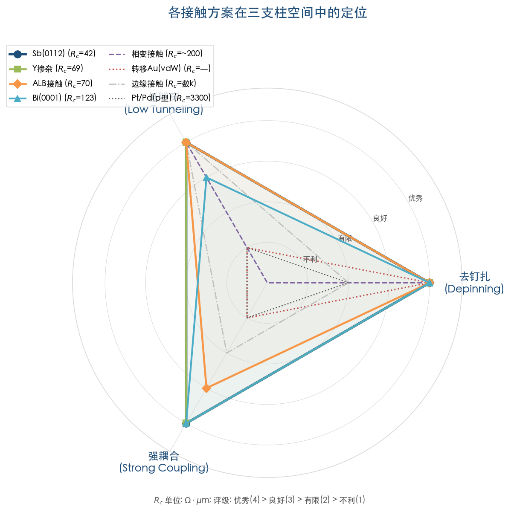

## 4.3 框架的预测能力

三支柱模型不仅能够解释已有实验结果，还具有对新材料和新方案的预测指引能力。

### 4.3.1 高通量计算筛选的验证

Is等人（2025）对1,297种二维半导体与三种二维金属（PdTe₂、NbS₂、ScS₂）的接触进行了高通量DFT筛选，发现界面静电势差、电荷转移量和偶极矩是决定接触类型的关键因子——这三个描述符可直接映射至三支柱框架的支柱一（费米能级对齐）和支柱三（界面耦合强度）。筛选结果表明，760种二维半导体可与PdTe₂形成n型欧姆接触，999种可与ScS₂形成p型欧姆接触 [Is et al., Nanoscale 2025](https://pubs.rsc.org/en/content/articlehtml/2025/nr/d4nr04523h "High throughput screening of Ohmic contacts")。这一大规模筛选的成功间接验证了三支柱框架的物理逻辑：优秀的接触确实需要在界面静电势调控（支柱一）和电荷转移耦合强度（支柱三）上同时达到阈值。

### 4.3.2 机器学习模型的物理可解释性

Shu等人（2025）利用机器学习结合DFT建立了接触电阻的物理模型，发现$R_c$主要由SBH和隧穿比电阻两个物理量决定——这直接对应三支柱框架的支柱一和支柱二。更有趣的是，该研究发现界面-OH氢键可增强耦合、降低隧穿势垒（支柱二和支柱三的协同效应），并据此预测了新型功能化方案实现接近量子极限的$R_c$ [Shu et al., JACS 2025](https://pubs.acs.org/doi/10.1021/jacs.5c14180 "Ultralow Rc Approaching Quantum Limit")。Li等人（2024）的主动学习方案（ARANet+FAVAL）仅需15%训练数据即可预测SBH和隧穿概率，其物理核心同样可映射为支柱一和支柱二的定量化 [Li et al., Adv. Mater. 2024](https://advanced.onlinelibrary.wiley.com/doi/10.1002/adma.202312887 "ML screening for 2D contacts")。

### 4.3.3 三支柱框架的材料筛选判据化

基于上述分析，三支柱框架可以具体化为以下可通过第一性原理计算评估的筛选判据：

1. **支柱一判据**：电极材料费米面DOS低于临界阈值（经验值：低于Al的1/5）；功函数与目标半导体导带底偏差$|\Delta\Phi| < 0.3$ eV（n型）或与价带顶偏差$|\Delta\Phi| < 0.3$ eV（p型）。
2. **支柱二判据**：隧穿比电阻$\rho_t < 10^{-8}$ Ω·cm²（半金属路径）或$\rho_t \approx 0$（消除界面路径）。
3. **支柱三判据**：界面电荷转移量适度（$\Delta M$在0.05–0.15 eV范围），界面距离处于3.0–3.5 Å的"弱金属化"窗口。

Lee（2024）在Science展望中明确呼吁系统理论筛选能够同时满足低接触电阻和工艺兼容性的vdW硬金属 [Lee, Science 2024](https://www.science.org/doi/10.1126/science.adq4986 "Approaching quantum limit of contact resistance")。三支柱框架为这一呼吁提供了可操作的理论指引——将候选材料投影至三支柱空间，即可快速评估其接触性能潜力。

## 4.4 与传统三维半导体接触理论的对比

三支柱模型并非凭空构建，而是植根于半个多世纪的金属-半导体接触理论传统。明确其与经典三维理论的继承与超越关系，有助于深入理解二维接触物理的独特性。

### 4.4.1 理论谱系的继承

图4-3以时间线形式梳理了从三维到二维半导体接触理论的演化脉络，清晰展示了本报告所构建框架的学术渊源与独创性定位。

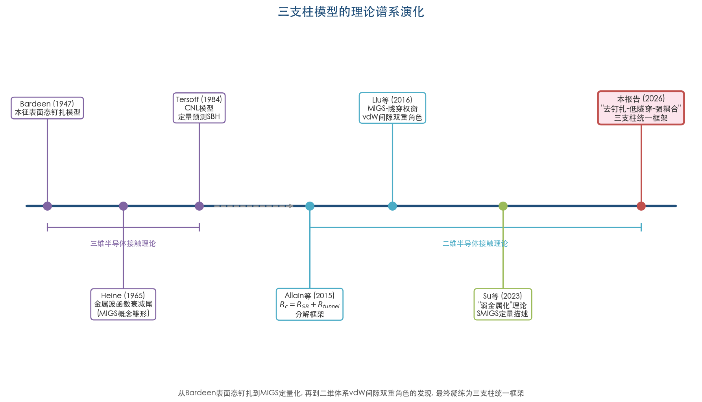

Bardeen（1947）提出本征表面态导致费米钉扎，开创了界面态钉扎模型的先河。Heine（1965）将其具体化为金属波函数的指数衰减尾——即MIGS概念的雏形。Tersoff（1984）在MIGS框架下提出电荷中性能级（CNL）模型，成功预测了多种三维半导体的SBH趋势 [Tersoff, PRL 1984](https://link.aps.org/doi/10.1103/PhysRevLett.52.465 "Schottky Barrier Heights and Gap States")。三支柱模型的支柱一直接继承了这一理论传统——MIGS仍然是二维体系中费米钉扎的重要来源，Tersoff的CNL概念对TMDCs近似成立但存在系统偏差。

Heine模型中金属波函数指数衰减的概念在二维体系中获得了新的物理对应：vdW间隙的作用可类比于Heine模型中的氧化层——二者都通过空间隔离抑制金属态向半导体的渗透 [Liu, Stradins & Wei, Sci. Adv. 2016](https://pmc.ncbi.nlm.nih.gov/articles/PMC4846439/ "vdW gap as oxide analog") [Heine, Phys. Rev. 1965](https://link.aps.org/doi/10.1103/PhysRev.138.A1689 "Theory of Surface States")。三支柱模型的支柱二正是将这一类比定量化——将vdW间隙视为可调控的"隧穿势垒"参数。

Allain等人（2015）在其里程碑式的综述中已提出$R_c = R_\text{SB} + R_\text{tunnel}$的分解框架，暗含了去钉扎（降低$R_\text{SB}$）和低隧穿（降低$R_\text{tunnel}$）两个优化方向 [Allain et al., Nat. Mater. 2015](https://pubmed.ncbi.nlm.nih.gov/26585088/ "Electrical contacts to 2D semiconductors")。三支柱模型在此基础上增加了第三个维度——界面耦合优化——并将三个维度组织为一个完整的判据体系。Su等人（2023）的"弱金属化"理论为支柱三提供了定量基础，使三支柱模型从定性描述迈向半定量预测 [Su et al., J. Phys. D 2023](https://arxiv.org/abs/2212.03003 "Weak metalization mechanism")。

### 4.4.2 二维体系的三个独特之处

三支柱模型虽然继承了三维理论的概念框架，但在以下三个方面体现了二维接触物理的本质独特性。

**第一，空间电荷区的缺失改变了势垒调控范式。** 在三维半导体中，肖特基势垒下方的耗尽区延伸数十至数百纳米，可以通过重掺杂使之变薄从而实现隧穿欧姆接触。在单层MoS₂中（厚度仅约0.65 nm），空间电荷区无法沿厚度方向展开，传统的"掺杂变薄耗尽区"策略不再适用——掺杂在二维体系中的作用机制更接近于"直接改变带结构"而非"调控势垒空间形状" [Allain et al., Nat. Mater. 2015](https://pubmed.ncbi.nlm.nih.gov/26585088/ "No depletion region in 2D")。

**第二，SBH对衬底介电环境的强依赖。** Schultz等人（2022）的ARPES测量揭示了二维半导体独有的介电环境效应：同一种MoS₂，在不同功函数衬底上的SBH行为截然不同——低功函数衬底上强钉扎（$S \approx 0$），高功函数衬底上近似Schottky-Mott，且电子和空穴的$S$值不对称（电子$S \approx 0.69$，空穴$S \approx 1.11$）[Schultz, Shin, Koch et al., ACS Nano 2022](https://pubs.acs.org/doi/10.1021/acsnano.1c04825 "Extended Schottky-Mott Rule")。这种介电环境依赖性在三维半导体中不显著，是二维体系独有的——源于极弱的介电屏蔽使准粒子带隙（进而SBH）对周围环境高度敏感。三支柱模型在应用时需要考虑这一环境效应对支柱一和支柱三的修正。

**第三，vdW间隙的双重角色。** 这是二维接触物理最根本的独特性——vdW间隙同时充当MIGS抑制者（有利于支柱一）和隧穿势垒设置者（不利于支柱二）。三维半导体不存在这种天然的空间隔离层（除非人为引入氧化物插层），因此MIGS-隧穿权衡在三维体系中不构成核心矛盾。三支柱模型引入第三维度（强耦合）的根本动机正是为了应对这一二维独有的矛盾——在三维接触理论中，界面耦合优化作为独立判据维度的重要性远不如在二维体系中突出。

## 4.5 框架的局限性与适用边界

### 4.5.1 p型接触：三支柱冲突的尖锐化

p型接触是三支柱框架面临的最严峻挑战。大多数TMDCs的电离能超过5.5 eV，实现空穴注入要求极高功函数的金属（如Pt约5.65 eV、Pd约5.12 eV）。然而，高功函数金属通常具有较高的化学活性，在沉积过程中更容易与二维半导体形成化学键合，触发"高功函数→化学键合→MIGS增强→费米钉扎"的恶性循环——这本质上是支柱一（去钉扎）与支柱三（强耦合）之间冲突在p型场景下的尖锐化 [Wang et al., Nature 2022](https://www.nature.com/articles/s41586-022-05134-w "p-type Rc = 3.3 kΩ·μm, Nature 610, 61-66")。

半金属策略在p型接触中难以直接奏效：Bi（功函数约4.12 eV）和Sb（约4.25 eV）与TMDCs价带顶（约5.5–6.0 eV）之间存在超过1 eV的偏差，远超支柱一判据的$|\Delta\Phi| < 0.3$ eV阈值。Liu等人（2016）的DFT预测二维金属H-NbS₂具有甚至高于Pt的功函数，理论上有望满足p型接触的三支柱要求——高功函数实现能带对齐（支柱一），二维金属的低DOS抑制MIGS（支柱一），vdW界面维持适度耦合（支柱三）[Liu, Stradins & Wei, Sci. Adv. 2016](https://pmc.ncbi.nlm.nih.gov/articles/PMC4846439/ "H-NbS₂ for p-type contacts")。不过，这一理论候选尚未在实验中得到系统验证。

TSMC在IEDM 2024报道的替位掺杂加合金化方案将双层WSe₂的p型$R_c$降至约98 Ω·μm（改善34倍），首次在产业机构验证了亚100 Ω·μm的p型接触 [TSMC](https://research.tsmc.com/page/low-dimensional-material/2.html "TSMC p-type Rc ~98 Ω·μm, IEDM 2024")。该方案本质上通过掺杂和合金化"绕过"了三支柱的p型冲突——类似于Y掺杂在n型接触中的角色。

### 4.5.2 多层TMDCs：MIGS回归三维模式

三支柱模型在推导时以单层或少数层TMDCs为主要适用对象。当层数增加时，TMDC从二维行为过渡至准三维行为——层间耦合使MIGS的渗透行为回归三维模式，vdW间隙对MIGS的抑制效应相应减弱。Kang等人（2014）的DFT计算已显示单层与多层接触行为之间存在显著差异 [Kang et al., Phys. Rev. X 2014](https://link.aps.org/doi/10.1103/PhysRevX.4.031005 "Monolayer vs few-layer contacts")。在多层构型中，支柱一的去钉扎阈值需要重新标定，支柱二中隧穿路径的空间维度增加，支柱三的界面耦合描述需要纳入层间传输通道。三支柱框架的核心物理逻辑在多层体系中仍然适用，但各支柱的定量阈值需要针对不同层数进行校准。

### 4.5.3 大面积CVD材料："第四支柱"的潜在需求

在高质量机械剥离单晶上，界面缺陷最小化可视为三支柱生效的隐含前提。然而，在CVD大面积材料的工程现实中，缺陷密度（硫空位密度可达$10^{12}$–$10^{13}$ cm⁻²）使这一前提面临严峻挑战。Noori等人（2022）的GW计算表明，在含缺陷的MoS₂样品中，缺陷态可能成为主导钉扎来源而非MIGS——换言之，即使电极材料的MIGS被完美抑制（支柱一满足），缺陷诱导的DIGS仍可导致强烈的费米钉扎 [Noori et al., npj 2D Mater. Appl. 2022](https://www.nature.com/articles/s41699-022-00349-x "Defects dominate contact polarity")。

Shen等人（2021）的Bi接触实验直接印证了这一担忧：在高质量剥离样品上实现零SBH的欧姆接触，但在含缺陷样品上退化为肖特基接触 [Shen et al., Nature 2021](https://www.nature.com/articles/s41586-021-03472-9 "Sample quality dependence")。这意味着，当研究视角从学术原型器件转向大面积晶圆级制造时，"界面缺陷最小化"可能需要从三支柱的隐含前提升格为独立的"第四支柱"。

我们判断，是否需要"第四支柱"取决于应用场景：在以理解基础物理和设计原理性接触方案为目标的学术研究中，三支柱模型已足够完备；在以实现晶圆级集成为目标的工程研究中，"去缺陷"或"缺陷钝化"应当被纳入独立的优化维度。

### 4.5.4 量子极限附近：从界面物理到量子传输

当接触电阻逼近量子极限$R_c^Q = \pi\hbar / (4e^2 k_F)$（在$n_{2D} \approx 10^{13}$ cm⁻²下约为36 Ω·μm）时，三支柱框架的适用边界开始显现。Sb(01̄12)接触的42 Ω·μm距量子极限仅约17%，意味着界面物理层面的优化空间已接近耗竭 [Akinwande, Biswas & Jena, Nat. Electron. 2025](https://www.nature.com/articles/s41928-024-01335-5 "The quantum limits of contact resistance")。

在量子极限附近，$R_c$的瓶颈从界面物理（SBH、隧穿势垒、轨道杂化）转向Landauer量子传输的基本约束——导电模式数$M$和每个模式的透射概率$T(E)$。三支柱框架的物理图像需要从"消除障碍"的经典范式转向"优化$T(E) \rightarrow 1$"的量子传输描述。进一步降低$R_c$的可能路径包括：更强的界面耦合以压缩隧穿势垒宽度、提高载流子浓度$n_{2D}$以增加模式数（$R_c^Q \propto 1/\sqrt{n_{2D}}$）、以及在k空间优化波函数重叠（模式匹配）。这些路径超出了三支柱模型的经典框架，需要非平衡格林函数（NEGF）等量子传输理论的支撑 [Akinwande, Biswas & Jena, Nat. Electron. 2025](https://www.nature.com/articles/s41928-024-01335-5 "Quantum limit transition")。

## 4.6 本章小结

本章构建了"去钉扎-低隧穿-强耦合"三支柱模型（DLC模型），将第3章辨识出的五个核心物理机制凝练为三个正交的判据维度，并以界面缺陷最小化作为隐含元条件。通过用该框架系统审视各实验方案，验证了其核心命题：凡在三个支柱上同时取得优秀评级的方案（Sb(01̄12)、Y掺杂、ALB接触）均实现了亚100 Ω·μm的超低接触电阻；仅优化一至两个支柱的方案，$R_c$改善幅度有限。三支柱框架还具有对新材料的预测指引能力——高通量计算筛选和机器学习模型中的物理描述符可自然映射为三支柱的筛选判据。

该框架的局限性同样值得正视：p型接触中三支柱冲突更为尖锐、多层TMDCs需要重新标定各支柱阈值、CVD大面积材料可能需要引入"第四支柱"、量子极限附近需要转向量子传输描述。这些局限性恰恰指明了下一步研究的前沿方向。第5章将讨论这些接触方案从实验室走向产业所面临的可扩展性与集成挑战。

# 第5章 从实验室到产业——可扩展性与集成挑战

前四章的讨论始终聚焦于物理机制与理论框架——在高质量机械剥离单晶上，半金属Sb(01̄12)接触已将接触电阻降至42 Ω·μm，距量子极限（约36 Ω·μm）仅一步之遥。然而，当视角从单器件原理验证转向晶圆级制造与芯片集成时，一系列严峻的工程瓶颈随之浮现：学术界最优接触电阻与300 mm产线实际值之间横亘着两到三个数量级的鸿沟；低熔点半金属与后端制程（BEOL）热预算之间的矛盾尚未完全化解；接触尺寸向亚10 nm节点缩放时的行为缺乏系统验证；p型接触的产业实现远滞后于n型方案。本章系统评估各低接触电阻方案从实验室走向产业所面临的可扩展性与集成挑战，并剖析标准化测量方法中的陷阱与文献数据可比性问题。

## 5.1 学术最优与产线现实：晶圆级均匀性的核心差距

### 5.1.1 imec 300 mm先导线的基准测试

二维半导体能否真正进入大规模集成电路制造，首先取决于能否在300 mm标准产线上实现可重复、高良率的器件制备。imec在其300 mm硅先导线上建立了迄今最完整的二维FET工艺流程，涵盖TMDC生长、转移、清洗、栅极堆叠沉积和接触优化等全部关键模块[imec 300 mm集成论文](https://pmc.ncbi.nlm.nih.gov/articles/PMC12862033/ "Integration and electrical evaluation of WS₂ and MoS₂ FETs in a 300 mm pilot line, 2026")。该流程验证了两种通道路径：其一为单层WS₂经MOCVD在300 mm Si/SiO₂晶圆上直接沉积（950°C）；其二为单层MoS₂在2英寸蓝宝石上模板外延生长（1000°C）后经集体芯片到晶圆（CoD2W）方法转移至300 mm晶圆。对于直接沉积WS₂的全局背栅器件，良率达到>99%（133/133器件满足$I_\text{max}/I_\text{min} > 10^5$判据）；CoD2W转移WS₂器件良率为95–99%，转移MoS₂器件良率为97–99%——上述数据表明大面积二维材料器件在制造可行性层面已跨越基本门槛。

然而，高良率背后隐藏着关键的性能缺口。imec基线流程采用Ti侧接触（大马士革工艺），其接触电阻处于数十至数百kΩ·μm量级，比学术界报道的最佳值（Sb: 42 Ω·μm，Bi: 123 Ω·μm）高出约2–3个数量级[imec 300 mm集成论文](https://pmc.ncbi.nlm.nih.gov/articles/PMC12862033/ "Ti side contacts: Rc in tens to hundreds of kΩ·μm range")。即使在10.1 μm长沟道器件中，四探针测量仍显示接触电阻是性能的主导限制因素。这一鸿沟的根源是多方面的：Ti金属导致强费米钉扎（$S \approx 0.11$），大马士革刻蚀过程中等离子体对暴露边缘的损伤引入额外缺陷态，而刻蚀与金属化之间不可避免的大气暴露进一步恶化界面质量。

### 5.1.2 产业机构的前沿探索

与imec产线基准形成对照的是，TSMC和若干学术团队在更小规模上展示了接近学术最优的接触性能。TSMC在IEDM 2022上首次展示了GAA（全环绕栅极）单层MoS₂纳米片nFET，在40 nm栅长下实现410 μA/μm漏电流（$V_D = 1$ V），近零DIBL，为二维材料堆叠片式GAA架构的可行性提供了原理性验证[SemiWiki IEDM 2023报道](https://semiwiki.com/semiconductor-services/techinsights/324910-iedm-2023-2d-materials-intel-and-tsmc/ "TSMC first GAA monolayer MoS₂ nanosheet nFET, IEDM 2022")。更具产业意义的是，TSMC在IEDM 2024上报道了通过替位掺杂和合金化实现双层WSe₂合金的简并p型掺杂，Pd/合金接触达到p型$R_c \approx 98$ Ω·μm（$R_\text{sh} = 4.5$ kΩ/sq），且接触电阻不随栅压变化——这是真正欧姆接触的特征标志[TSMC研究页面](https://research.tsmc.com/page/low-dimensional-material/2.html "Bilayer alloy contacts for high-performance p-type 2D semiconductor transistors, IEDM 2024")。

在n型接触方面，Jiang等人（2024）的钇掺杂MoS₂方案是目前唯一在晶圆级（2英寸）上验证亚100 Ω·μm接触电阻的方案。该方案在2英寸CVD三层MoS₂晶圆上制备自对准10 nm沟道FET，获得统计学显著的器件数据——平均$R_c = 69$ Ω·μm（最低43 Ω·μm），开态电流1.22 mA/μm，弹道比约80%[Jiang et al., Nat. Electron. 2024](https://www.nature.com/articles/s41928-024-01176-2 "Yttrium-doping-induced metallization of MoS₂, Nat. Electron. 7, 545-556")。工艺上，该方案采用等离子体-沉积-退火（PDA）三步法：9瓦氩软等离子体处理15秒产生硫空位活性位点，随后电子束蒸发沉积1 nm Y/5 nm Ti/7 nm Au叠层，最后在惰性气氛中250°C退火30分钟完成掺杂剂激活。250°C的退火温度远低于400°C的BEOL热预算上限，赋予该方案天然的后端集成兼容性。

### 5.1.3 CVD材料质量：制约晶圆级性能的核心瓶颈

学术界报道的最低接触电阻值（Sb: 42 Ω·μm, Bi: 123 Ω·μm）均在机械剥离的高质量单晶MoS₂上取得。Shen等人（2021）明确展示了含硫空位的MoS₂上Bi接触从欧姆退化为肖特基的现象[Shen et al., Nature 2021](https://www.nature.com/articles/s41586-021-03472-9 "Sample quality dependence: sulfur vacancies degrade Bi contact from ohmic to Schottky")——这一现象深刻揭示了第4章三支柱框架中"界面缺陷最小化"这一元条件在工程实践中的核心地位。

imec数据进一步印证了这一瓶颈。直接沉积在非晶SiO₂上的WS₂为多晶膜（晶粒仅数十纳米），室温场效应迁移率仅约3 cm²/V·s（四探针法）；经蓝宝石模板外延后转移的MoS₂迁移率可达20–54 cm²/V·s，但仍远低于剥离单晶通常达到的数百cm²/V·s[imec 300 mm集成论文](https://pmc.ncbi.nlm.nih.gov/articles/PMC12862033/ "WS₂ mobility ~3 cm²/V·s, MoS₂ mobility 20-54 cm²/V·s after transfer")。这一对比凸显了MOCVD生长温度与晶圆兼容性之间的核心矛盾——高温（≥950°C）可获得高质量薄膜，但BEOL集成要求热预算低于400–500°C。

TSMC在IEDM 2021上的工作提供了一个关键的中间数据点：Chou等人在CVD单层MoS₂上采用Sb半金属接触实现$R_c = 0.66$ kΩ·μm，SBH接近零，短沟道器件（$L_\text{CH} = 50$ nm）开态电流超过600 μA/μm[Chou et al., IEDM 2021](https://hanwang6.github.io/Lab_Website/iedm_2021.pdf "Antimony semimetal contact with enhanced thermal stability, IEDM 2021, 7.2.1-7.2.4")。0.66 kΩ·μm虽远优于imec的Ti接触（数十kΩ·μm），但仍比剥离单晶上的42 Ω·μm高约16倍——这一差距主要归因于CVD薄膜中更高的缺陷密度和晶界散射。

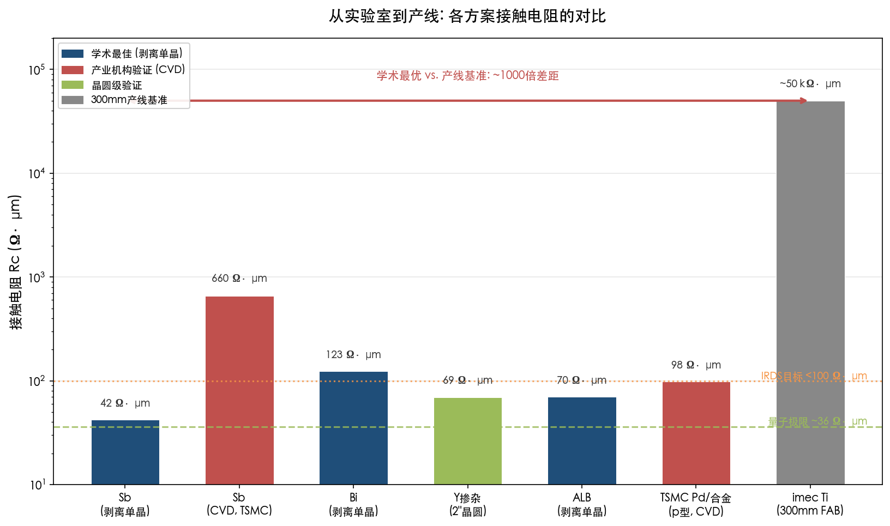

图5-1以对数标度直观呈现了从学术最佳值到300 mm产线基准之间约1000倍的接触电阻鸿沟。Sb剥离单晶上的42 Ω·μm与imec Ti产线的约50 kΩ·μm构成该鸿沟的两端，Y掺杂晶圆级验证（69 Ω·μm）和TSMC CVD验证（660 Ω·μm）则分布于中间地带。IRDS目标线（<100 Ω·μm）和量子极限线（约36 Ω·μm）标示了该领域的工程目标与物理极限。

## 5.2 BEOL工艺兼容性：热预算与金属选择的矛盾

### 5.2.1 热预算约束的刚性边界

当二维FET作为BEOL器件集成在硅基前端之上时，所有后续工艺步骤的温度必须严格控制在前端器件的容忍范围之内。当前BEOL工艺的热预算上限通常为400°C（部分先进节点要求更低），imec的300 mm流程将目标热预算设定为低于500°C（通道沉积步骤除外）[imec 300 mm集成论文](https://pmc.ncbi.nlm.nih.gov/articles/PMC12862033/ "Targeted thermal budget <500°C except for TMDC deposition")。这一刚性约束对接触金属的选择产生了深远影响——熔点低于400°C的金属在原则上即被排除于BEOL兼容方案之外。

### 5.2.2 各接触方案的热稳定性系统评估

**铋（Bi，熔点271°C）**：严重不兼容BEOL热预算。Li等人（2023）直接对比了Sb和Bi接触在125°C氮气环境下的稳定性，发现Bi接触出现明显退化，而Sb保持稳定[Li et al., Nature 2023](https://www.nature.com/articles/s41586-022-05431-4 "Sb thermally stable at 125°C for 24h+; Bi contacts degrade under same conditions")。TSMC IEDM 2021的热处理对比研究提供了更系统的数据：Bi接触器件在300°C退火后严重退化，400°C下完全失效[Chou et al., IEDM 2021](https://hanwang6.github.io/Lab_Website/iedm_2021.pdf "Bi-contacted device failed completely at 400°C")。271°C的极低熔点意味着任何高于该温度的后续工艺步骤都可能导致接触失效——这是Bi接触产业化的致命缺陷，尽管其在学术上展现出零SBH和123 Ω·μm的优异性能。

**铟（In，熔点157°C）**：工艺窗口更为狭窄。Wang等人（2019）的In/Au vdW接触虽展现了"蒸镀法也能形成vdW界面"的重要学术价值，但157°C的熔点使其几乎无法兼容任何标准半导体后续工艺[Wang et al., Nature 2019](https://www.nature.com/articles/s41586-019-1052-3 "Van der Waals contacts between 3D metals and 2D semiconductors")。

**锑（Sb，熔点631°C）**：热预算完全兼容。631°C的高熔点使Sb可承受标准BEOL工艺中的所有热步骤。TSMC IEDM 2021的系统测试表明，Sb接触MoS₂ FET在300°C退火后保留80%性能，400°C退火后仍保留64%性能[Chou et al., IEDM 2021](https://hanwang6.github.io/Lab_Website/iedm_2021.pdf "Sb-contacted MoS₂ FET retains 80% at 300°C, 64% at 400°C")。纯Sb互连线在400°C退火后电导率基本不变。这一热稳定性优势是Sb相较于Bi在产业应用中的决定性竞争力。

**原子层键合（ALB）接触**：Gao等人（2025）报道的ALB接触是目前唯一同时满足亚100 Ω·μm接触电阻（$R_c = 70$ Ω·μm）和400°C热稳定性的方案。ALB工艺温度低于200°C（超软Ar等离子体处理），且通过金属性相干键合界面（而非vdW弱相互作用）实现高界面内聚力，从根本上解决了vdW接触在热载荷下的界面滑移问题[Gao et al., Science 2025](https://www.science.org/doi/10.1126/science.adz2405 "Atomic layer bonding contacts: Rc=70 Ω·μm, stable to 400°C")。

**Y掺杂PDA方案**：PDA退火温度为250°C（30分钟，惰性气氛），严格满足<400°C的BEOL约束。结合其晶圆级验证的亚100 Ω·μm性能，Y掺杂方案在BEOL兼容性维度上位于第一梯队[Jiang et al., Nat. Electron. 2024](https://www.nature.com/articles/s41928-024-01176-2 "PDA annealing at 250°C, BEOL compatible")。

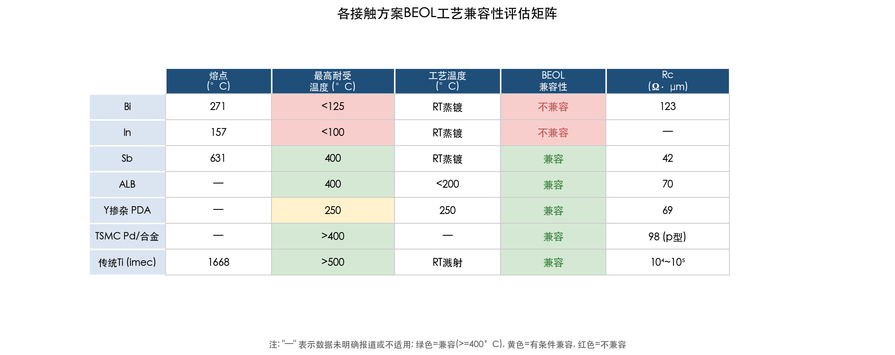

图5-2以矩阵形式系统对比了七种代表性接触方案的熔点、最高耐受温度、工艺温度及BEOL兼容性评级。颜色编码直观区分了兼容（绿色，≥400°C耐受）、有条件兼容（黄色）与不兼容（红色）三类方案。Sb、ALB和Y掺杂PDA三种方案同时满足亚100 Ω·μm接触电阻与BEOL热预算兼容性的双重要求，是当前最具产业化前景的候选技术。

### 5.2.3 CMOS兼容金属与低接触电阻金属的结构性矛盾

imec的基线流程采用Ti/TiN/W金属堆叠作为源漏接触（Ti为接触金属，TiN为氧化阻隔层，W为填充金属），均为标准CMOS工艺材料[imec 300 mm集成论文](https://pmc.ncbi.nlm.nih.gov/articles/PMC12862033/ "Ti/TiN/W metal stack for M0 contacts in 300 mm FAB flow")。然而，Ti导致严重的费米钉扎（$S \approx 0.11$），是产线接触电阻高达数十kΩ·μm的直接原因。实验室最佳方案（Bi、Sb）并非标准CMOS工艺材料——Bi和Sb在现有代工厂中缺乏成熟的沉积与刻蚀工艺模块。

这一矛盾还延伸至工艺架构层面。学术界几乎所有低$R_c$报道均使用电子束光刻加剥离（lift-off）工艺制备金属接触，而imec明确指出剥离工艺不适合300 mm量产——该工艺与高温ALD等先进沉积技术不兼容[imec 300 mm集成论文](https://pmc.ncbi.nlm.nih.gov/articles/PMC12862033/ "Lift-off processes unsuitable for 300 mm production")。产线采用的大马士革工艺（先刻槽再填充金属）与学术界的加法工艺（先光刻再蒸镀后剥离）在界面洁净度、金属选择和几何约束上存在根本差异。弥合这一工艺鸿沟——在大马士革架构中引入低钉扎金属或开发与产线兼容的新型接触沉积方法——是二维半导体器件从技术验证走向量产的关键工程课题。

## 5.3 接触尺寸缩放：传输长度与亚10 nm节点的挑战

### 5.3.1 传输长度的物理约束

对于传统顶部接触几何构型，电流并非均匀分布在整个接触区域，而是集中在接触边缘附近的传输长度$L_T$范围内。当接触长度$L_c$缩短至小于$L_T$时，接触电阻将急剧增大。Ber等人（2023）在CVD单层MoS₂/Ni接触上首次精确实测$L_T = 240 \pm 10$ nm（300 K），这一数值远超亚10 nm技术节点的接触长度要求（通常<20 nm）[Ber et al., Adv. Electron. Mater. 2023](https://poplab.stanford.edu/pdfs/BerGrady-ComponentsContactResistance-aem23.pdf "L_T = 240 nm at 300 K for Ni/CVD MoS₂ contacts")——意味着对于费米钉扎严重的传统金属接触，接触缩放将导致严重的性能退化。

半金属接触（Bi、Sb）的传输长度尚未在文献中被系统报道，这构成了从学术验证到产业缩放的关键知识缺口。理论上，半金属的低$\rho_c$（反映在极低的$R_c$值中）应带来较短的$L_T$（$L_T = \sqrt{\rho_c / R_\text{sk}}$），但亚10 nm接触长度的实验验证仍然缺失。TSMC在IEDM 2023上展示了Sb接触MoS₂ FET从30 nm缩放至12 nm接触长度的初步数据[TSMC IEDM 2023](https://iedm23.mapyourshow.com/mys_shared/iedm23/handouts/10-1_Mon_13513.pdf "Sb contact scaling to 12 nm")，但亚10 nm区间的系统性验证仍有待完成。

### 5.3.2 边缘接触的缩放免疫优势

与顶部接触形成鲜明对比的是，1D边缘接触展现出独特的"接触缩放免疫"特性。Cheng等人（2019）通过原位边缘接触证明，即使接触长度缩短至物理极限——单层MoS₂的厚度约0.65 nm——接触性能依然保持不变[Cheng et al., Nano Lett. 2019](https://pubs.acs.org/doi/10.1021/acs.nanolett.9b01355 "Immunity to contact scaling in MoS₂ transistors using in situ edge contacts")。这一特性源于载流子通过共价键直接从金属注入MoS₂边缘，完全绕过了顶部接触中传输长度的限制。

imec 300 mm流程中的侧接触配置实质上是边缘接触的产业化版本——M0大马士革刻蚀穿过HfO₂盖层、Al₂O₃夹层和TMDC通道后，Ti金属与TMDC边缘形成接触。然而，当前该侧接触的电阻远高于学术边缘接触水平（数十kΩ·μm对比数kΩ·μm），原因可能包括等离子体刻蚀对暴露边缘的损伤以及Ti的强费米钉扎效应[imec 300 mm集成论文](https://pmc.ncbi.nlm.nih.gov/articles/PMC12862033/ "Side contact configuration in 300 mm FAB")。将学术边缘接触的物理优势与产线工艺相融合——例如在大马士革架构中引入低钉扎金属或开发边缘保护性刻蚀工艺——是解决接触缩放问题的核心工程挑战。

## 5.4 热稳定性与长期可靠性

### 5.4.1 已验证的热稳定性数据

在所有低接触电阻方案中，热稳定性数据的系统性差异显著影响其产业化前景。基于已有实验数据，各方案的热稳定性可归纳为以下层级。

ALB接触展现出最优的热稳定性——400°C下保持$R_c = 70$ Ω·μm不变，金属性相干键合界面赋予其优于vdW接触的热力学稳定性[Gao et al., Science 2025](https://www.science.org/doi/10.1126/science.adz2405 "ALB contact: 400°C thermomechanical stability")。Sb接触次之，在125°C下24小时以上保持稳定，400°C退火后保留64%器件性能[Li et al., Nature 2023](https://www.nature.com/articles/s41586-022-05431-4 "Sb thermal stability") [Chou et al., IEDM 2021](https://hanwang6.github.io/Lab_Website/iedm_2021.pdf "Sb retains 64% at 400°C")。TSMC的Pd/合金p型接触同样展现出优于Bi和Sb半金属接触的热稳定性[TSMC研究页面](https://research.tsmc.com/page/low-dimensional-material/2.html "Pd/alloy contacts: superior thermal stability")。相比之下，Bi接触在300°C下严重退化、400°C下完全失效[Chou et al., IEDM 2021](https://hanwang6.github.io/Lab_Website/iedm_2021.pdf "Bi failed at 400°C")；1T相变接触由于1T相的热力学亚稳特性，面临长期可靠性隐患[Kappera et al., Nat. Mater. 2014](https://www.nature.com/articles/nmat4080 "1T phase thermodynamic metastability")。

### 5.4.2 长期可靠性的空白地带

值得警示的是，上述热稳定性数据均为短期退火测试（数十分钟至24小时），远未达到半导体行业标准可靠性认证的要求。所有低$R_c$接触方案均缺乏以下关键测试数据：1000小时以上高温工作寿命测试（HTOL）、热循环测试（数百至数千次−55°C至150°C循环）以及电迁移测试。这一空白意味着即使是热稳定性最优的ALB接触和Sb接触，距离通过产业可靠性认证仍有相当距离。

imec在300 mm平台上的初步可靠性评估揭示了更深层的隐忧。WS₂ FET存在显著的迟滞和偏温不稳定性（BTI），源于通道/介质界面的缺陷态；良率跟踪数据显示批次间变异性远大于晶圆内变异性，且变异源尚未明确——可能候选包括通道缺陷密度波动、界面钝化质量和介质体缺陷等[imec 300 mm集成论文](https://pmc.ncbi.nlm.nih.gov/articles/PMC12862033/ "Lot-to-lot variability larger than within-wafer variability; variability sources unknown")。这些发现表明，二维FET的可靠性问题并非仅限于接触本身，而是涉及通道-介质-接触全堆叠的系统性挑战。

## 5.5 p型接触的产业挑战与2D CMOS路径

### 5.5.1 n/p接触不对称性：互补逻辑的核心瓶颈

实现完整的二维CMOS互补逻辑需要同时优化n型和p型接触。截至2024年底，n型与p型最佳$R_c$之间仍存在显著差距。Wang等人（2022）通过高速率电子束蒸发Pt/Pd实现了当时最佳的p型$R_c = 3.3$ kΩ·μm（WSe₂），比最佳n型（Sb: 42 Ω·μm）高约80倍[Wang et al., Nature 2022](https://www.nature.com/articles/s41586-022-05134-w "P-type Rc = 3.3 kΩ·μm, Nature 610, 61-66")。p型接触固有困难的物理根源在于：大多数TMDCs的电离能IE > 5.5 eV，要求极高功函数金属（$\Phi_M > 5.5$ eV），而此类金属（Pt、Pd等）多为硬金属，蒸镀时易与TMDC形成化学键，触发"强耦合→MIGS增强→费米钉扎"的恶性循环——这正是第4章三支柱框架所预测的p型接触困境。

### 5.5.2 p型接触的快速突破期

p型接触领域正经历前所未有的快速突破。TSMC在IEDM 2024上报道的替位掺杂加合金化方案将双层WSe₂合金的p型$R_c$降至约98 Ω·μm，较Wang等人的3.3 kΩ·μm改善了约34倍——这是首次在产业机构中验证亚100 Ω·μm的p型接触电阻[TSMC研究页面](https://research.tsmc.com/page/low-dimensional-material/2.html "TSMC p-type Rc ~98 Ω·μm, IEDM 2024")。将此数据与Li等人（2023）的Sb n型$R_c = 42$ Ω·μm对比，n/p最佳$R_c$差距已缩小至约2.3倍，远好于此前两个数量级的巨大鸿沟。

其他p型路径也显示出积极进展。拓扑半金属NbP作为p型接触候选（兼具高功函数与低DOS，符合三支柱框架预测），在WS₂上实现了室温空穴电流5.8 μA/μm——亚2 nm WS₂器件的最高报道值——且其溅射室温沉积工艺天然兼容CMOS流程[Hoang et al., arXiv 2024](https://arxiv.org/abs/2409.18926 "NbP topological semimetal p-type contacts")。Ghosh等人（2025）通过NO掺杂双层WSe₂ FET实现开态电流约421 μA/μm，TLM提取$R_c = 1.3$ kΩ·μm[Ghosh et al., Nat. Commun. 2025](https://www.nature.com/articles/s41467-025-59684-4 "High-performance p-type WSe₂ by NO doping")。

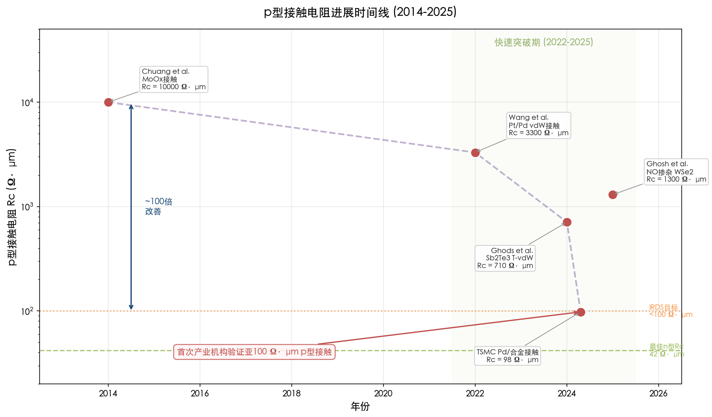

图5-3呈现了2014年至2025年p型接触电阻的演进轨迹。从Chuang等人（2014）MoOₓ接触的约10000 Ω·μm到TSMC（2024）Pd/合金接触的约98 Ω·μm，p型$R_c$在十年间实现了两个数量级的跨越，其中2022–2025年被标注为"快速突破期"。TSMC的98 Ω·μm首次突破IRDS目标线（<100 Ω·μm），标志着p型接触跨入产业可用区间。

### 5.5.3 产业时间线

imec预测二维材料将在2032年前后在BEOL中找到实际应用场景[PMC综述](https://pmc.ncbi.nlm.nih.gov/articles/PMC10873265/ "IMEC projects 2D materials genuinely applied in BEOL by 2032")。IEDM会议已设置专门的二维材料器件与集成分会（如IEDM 2025 Session 10: "Advances in 2D Material Devices and Integration"），反映了产业界对该方向的持续关注与投入[IEDM 2025会议日程](https://iedm25.mapyourshow.com/8_0/sessions/session-details.cfm?ScheduleID=2& "IEDM 2025 Session 10")。从当前的技术成熟度来看，n型接触方案（Sb半金属、Y掺杂、ALB）已具备进入早期工艺开发阶段的条件；p型接触虽然在2022–2025年间取得了从3.3 kΩ·μm到98 Ω·μm的跨越式进步，但可能仍需经历2–3年的快速迭代，方能在材料体系、工艺稳定性和可靠性方面达到与n型方案同等的成熟度。

## 5.6 标准化测量方法与数据可比性

### 5.6.1 传统TLM模型在二维体系中的局限

不同文献报道的接触电阻数值之间的可比性问题，是制约领域内技术路径客观评估的隐性障碍。Ber等人（2023）通过结合传输线模型（TLM）、接触末端电阻（CER）和四探针（4PP）三种测量方法，首次在单层CVD MoS₂上完成了接触电阻各分量的分离。研究发现，结电阻$R_\text{jun}$——由肖特基势垒向沟道的横向延伸决定、强烈依赖栅压——主导了总接触电阻（至少为固有接触电阻$R_\text{c-i}$的5倍），并展现出强烈的栅压和温度依赖性。传统TLM模型（仅包含$\rho_c$和$R_\text{sk}$两个参数）无法解释$R_c$对栅压的依赖性，必须引入$R_\text{jun}$修正项方可自洽[Ber et al., Adv. Electron. Mater. 2023](https://poplab.stanford.edu/pdfs/BerGrady-ComponentsContactResistance-aem23.pdf "Junction resistance R_jun dominates R_c-tot")。

$R_\text{jun}$框架为各接触工程方案提供了统一的测量学解释：氧化物掺杂通过增加接触附近载流子浓度降低隧穿距离（降低$R_\text{jun}$中的横向注入电阻）；半金属接触通过降低SBH减小注入势垒（降低$R_\text{jun}$中的势垒分量）；边缘接触则直接向沟道注入载流子（基本消除$R_\text{c-i}$）[Ber et al., Adv. Electron. Mater. 2023](https://poplab.stanford.edu/pdfs/BerGrady-ComponentsContactResistance-aem23.pdf "R_jun framework unifies contact engineering methods")。该框架与第4章三支柱模型在物理图像上高度互补——三支柱模型从材料设计维度预测最优接触方案，$R_\text{jun}$框架则从测量学维度解析接触电阻的物理来源。

此外，Ber等人还提取了CVD MoS₂/Ni接触的关键基准参数：$\rho_c = 2 \times 10^{-6}$ Ω·cm²，$R_\text{sk} = 3.5 \pm 0.5$ kΩ/□（300 K）——后者是首次在CVD单层MoS₂上报告的片电阻值。TCAD仿真进一步表明，实现完全去钉扎接触需要界面陷阱密度$D_\text{it} < 10^{11}$ cm⁻²，而完全钉扎出现在$D_\text{it} > 5 \times 10^{13}$ cm⁻²[Ber et al., Adv. Electron. Mater. 2023](https://poplab.stanford.edu/pdfs/BerGrady-ComponentsContactResistance-aem23.pdf "D_it threshold for pinning/unpinning")。这一定量判据为评估不同接触方案的去钉扎效果提供了明确的界面质量基准。

### 5.6.2 文献间数据可比性的四大影响因素

文献中接触电阻数据的直接比较需审慎对待，至少受以下四个因素的系统性影响。

**载流子浓度差异**。$R_c$强烈依赖栅压控制的二维载流子浓度$n_\text{2D}$——例如Sb的42 Ω·μm在$n_\text{2D} \approx 10^{13}$ cm⁻²下获得，而许多其他报道的$R_c$值未明确标注对应的$n_\text{2D}$。在不同栅压条件下提取的$R_c$值不可直接对比。

**测量温度差异**。Ber等人的数据显示，80 K下$R_\text{jun}$明显增大（热发射减弱），表明室温数据与低温数据之间存在系统性偏差。

**材料质量差异**。机械剥离单晶与CVD多晶在缺陷密度、晶粒尺寸、界面污染等方面存在本质差别，直接影响$R_c$的绝对值——TSMC在CVD MoS₂上Sb接触的0.66 kΩ·μm与剥离样品上的42 Ω·μm之间约16倍的差距即主要来源于此。

**提取方法差异**。两端法、TLM法、四探针法给出的$R_c$值可能存在系统性偏差。imec指出四探针迁移率系统性高于两端法约2倍，证实高接触电阻即使在长沟道器件中也造成不可忽略的迁移率低估[imec 300 mm集成论文](https://pmc.ncbi.nlm.nih.gov/articles/PMC12862033/ "4-point probe mobility systematically higher than 2-point, ~2× difference")。Jiang等人（2024）则采用了另一种策略——在弹道极限下从总电阻直接提取接触电阻（$R_\text{total} \approx 2R_c$），该方法在短沟道器件中比传统TLM更为可靠[Jiang et al., Nat. Electron. 2024](https://www.nature.com/articles/s41928-024-01176-2 "Ballistic extraction of Rc")。

建立行业公认的标准化测量和报告规范——明确要求标注载流子浓度、测量温度、材料来源、提取方法和器件结构参数——是该领域从学术探索走向工程评估的必要基础设施建设。

## 5.7 本章小结：从三支柱框架到产业路线图

将第4章的三支柱框架（去钉扎-低隧穿-强耦合）置于产业化视角下审视，可清晰识别出当前的工程瓶颈所在。在学术理想条件（高质量单晶、洁净界面）下，三支柱模型已足以指导超低$R_c$接触的实现；但在大面积CVD材料的工程现实中，材料缺陷密度的升高使"界面缺陷最小化"从三支柱框架的"元条件"升格为核心约束——imec产线上Ti接触的数十kΩ·μm电阻与学术Sb接触的42 Ω·μm之间的鸿沟，在很大程度上即源于这一约束未能满足。

各方案在产业化多维评估中呈现出明显的差异化格局。Sb半金属接触在物理性能（$R_c = 42$ Ω·μm）和热稳定性（631°C熔点，400°C退火后保留64%性能）上均居前列，但尚需建立大马士革兼容的工艺流程并验证亚10 nm缩放行为。ALB接触在热稳定性维度上独占鳌头（400°C稳定），且工艺温度低于200°C，但大面积均匀性和CVD材料上的系统性验证数据尚未见报道。Y掺杂方案是唯一在晶圆级（2英寸）上验证亚100 Ω·μm $R_c$的方案，PDA工艺温度仅250°C完全兼容BEOL，但该方案改变了通道材料本身的相结构，可能带来长期可靠性方面的独特挑战。p型接触方面，TSMC的合金化方案已将$R_c$降至约98 Ω·μm，使n/p不对称性从此前两个数量级缩小至约2.3倍，为二维CMOS的近期实现注入了信心。综合来看，当前最有可能率先跨越产业化门槛的方案应同时满足三个工程判据：亚100 Ω·μm的$R_c$、400°C以上的热稳定性和晶圆级均匀性验证——Sb、ALB和Y掺杂三种方案均在不同维度上接近或满足这些要求，构成了二维半导体接触技术走向量产的第一梯队。

# 第6章 未来方向与展望

前五章的论述沿"物理基础→实验方法→机制提取→统一框架→工程挑战"的递进逻辑，构建了二维半导体接触电阻的完整知识体系。第4章提出的"去钉扎-低隧穿-强耦合"三支柱模型已成功解释了从Bi半金属接触（$R_c = 123$ Ω·μm）到Sb(01̄12)接触（$R_c = 42$ Ω·μm）的各类低接触电阻方案，而第5章的工程审视揭示了学术最优值与300 mm产线之间仍存在两到三个数量级的鸿沟。基于这一理论与工程的双重图景，本章以三支柱框架为指引，系统展望该领域未来的突破方向：从新型电极材料的探索空间，到计算驱动的材料筛选范式变革，再到量子极限附近的新物理问题，以及n型与p型接触同时优化的完整CMOS方案，最终讨论三支柱框架向其他二维材料体系推广时所需的校准与修正。

## 6.1 新型电极材料：三支柱框架指引下的材料设计空间

三支柱框架为新型电极材料的定向搜索提供了明确的判据体系——理想候选材料应同时具备低费米面态密度（支柱一：去钉扎）、与目标半导体的功函数匹配并能形成适度界面耦合（支柱二：低隧穿+支柱三：强耦合）。图6-1将已验证的优秀电极与多类新型候选材料置于"费米面DOS–功函数"二维空间中，直观呈现了三支柱判据所界定的材料设计空间与搜索方向。在这一框架的指引下，三类新型材料体系正在受到日益增长的关注。

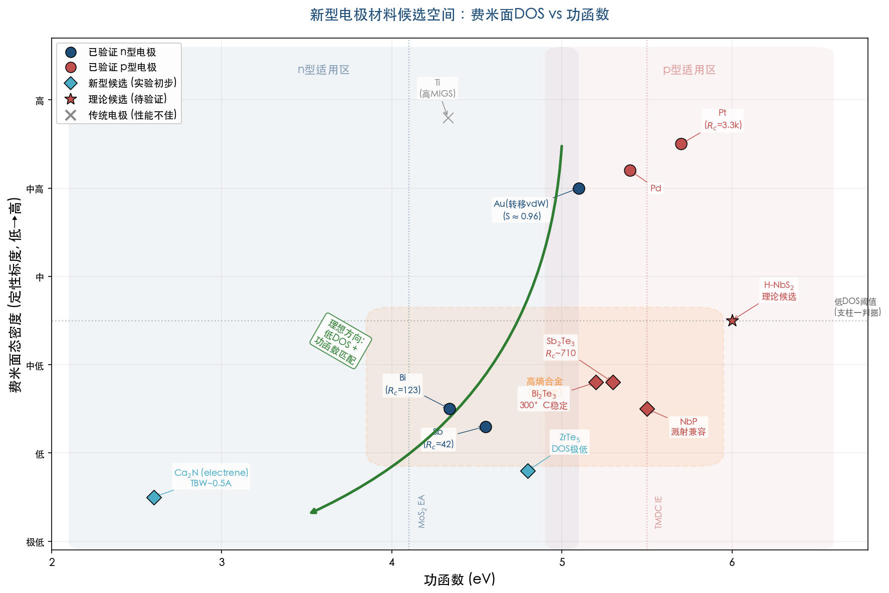

### 6.1.1 二维电子化合物（electrene）

二维电子化合物（electrene）代表了一类全新的接触材料范式。以Ca₂N为代表的层状电子化合物具有[Ca₂N]⁺e⁻结构，其中阴离子电子以二维电子气的形式驻留于层间，赋予该材料极高的表面电荷密度和极低的有效功函数。Wang等人（2023）通过DFT计算表明，Ca₂N/MoS₂异质结构形成供体-受体型界面，隧穿概率接近100%，可实现无势垒欧姆接触；Ca₂N的高电荷密度还可触发MoS₂接触区由2H→1T'相变，从根本上消除肖特基势垒[Wang et al., PCCP 2023](https://pubs.rsc.org/en/content/articlelanding/2023/cp/d3cp01412f "Ca₂N/MoS₂供体-受体异质结, PCCP 25, 15433")。该策略对WS₂、MoSe₂、WSe₂和MoTe₂均展现出相似的理论有效性。

Rafiee Diznab等人（2024）进一步对[M₂X]⁺e⁻全系列electrene（M = Ca, Sr, Ba; X = N, P, As）进行了系统筛选，评估其作为Au/Cu-MoS₂接触插层的性能。Ca₂N被确认为最优候选——其隧穿势垒宽度（TBW）仅约0.5 Å，远小于Sb接触的1.35 Å和Bi接触的1.66 Å[Rafiee Diznab et al., PCCP 2024](https://pubs.rsc.org/en/content/articlepdf/2024/cp/D3CP06112D "Electrene插层实现无势垒接触")。从三支柱框架审视，electrene插层在支柱一（高表面电荷密度驱动强电荷转移，抑制费米钉扎）和支柱二（极薄隧穿势垒）上均有望实现极端优化。

然而，electrene面临的核心工程挑战在于空气稳定性。Ca₂N中的阴离子电子对水和氧极为敏感，暴露于大气后迅速降解。Druffel等人（2016）虽已在实验中证明Ca₂N可被剥离为二维材料[Druffel et al., J. Am. Chem. Soc. 2016](https://pubmed.ncbi.nlm.nih.gov/27960319/ "Ca₂N二维电子化合物的实验证实")，但迄今尚无electrene作为二维半导体器件电极的完整器件验证。从理论预测到实验实现，electrene接触方案需要攻克惰性气氛集成、封装稳定性和界面质量控制三重工程挑战。

### 6.1.2 拓扑半金属与拓扑绝缘体电极

拓扑材料电极是三支柱框架的天然契合者。拓扑表面态兼具低费米面态密度和鲁棒的拓扑保护特性，使其在支柱一（去钉扎）维度上具有内禀优势——类似半金属通过低DOS抑制MIGS的机制，但额外受到拓扑保护，理论上对界面无序和缺陷更为鲁棒。

Ghods等人（2024）提出"拓扑范德华"（T-vdW）接触概念，采用拓扑绝缘体Sb₂Te₃作为WSe₂的接触电极。热结晶的层状Sb₂Te₃与WSe₂形成洁净vdW界面，在p型WSe₂ FET上实现SBH约24 meV、$R_c$约0.71 kΩ·μm；在单层MoS₂上，类似的T-vdW接触可实现$R_c$约200 ± 50 Ω·μm，并在200°C后金属化退火后保持稳定[Ghods et al., ACS Nano 2024](https://pubs.acs.org/doi/10.1021/acsnano.4c07585 "拓扑范德华接触, ACS Nano 18")。Chang等人（2024）进一步报道Bi₂Te₃/WSe₂ vdW接触在p型MOSFET中的应用，确认该类层状拓扑材料在300°C退火后仍保持vdW界面完整性，展现出优于Bi金属接触的热稳定性[Chang et al., Sci. Rep. 2024](https://www.nature.com/articles/s41598-024-79750-z "Bi₂Te₃/WSe₂热稳定vdW接触, Sci. Rep. 14, 28572")。

另一类拓扑半金属——外尔半金属NbP——则在p型接触方面展现出独特优势。Hoang等人（2024）使用溅射沉积NbP作为WS₂和WSe₂的p型接触，在亚2 nm WS₂上实现室温空穴电流5.8 μA/μm，为该厚度范围内的最高报道值。NbP兼具高功函数和低费米面DOS，恰好满足三支柱框架对p型电极的双重要求；其溅射室温沉积工艺天然兼容CMOS流程[Hoang et al., arXiv 2024](https://arxiv.org/abs/2409.18926 "NbP拓扑半金属p型接触")。此外，Dirac半金属ZrTe₅和Td-WTe₂在费米能级附近呈现近乎消失的DOS，理论上可实现更极端的MIGS抑制，但器件验证数据仍十分有限。

从三支柱框架的视角审视，拓扑材料的优势在于低DOS与拓扑保护表面态可能在单一材料体系中同时优化支柱一和支柱三——低DOS天然抑制MIGS（支柱一），而拓扑表面态的线性色散关系可能促进与TMDCs导带/价带的高效量子力学耦合（支柱三）。然而，当前拓扑材料接触的系统性TLM验证数据和亚10 nm缩放行为尚付阙如，从概念验证到性能基准确立仍有相当距离。

### 6.1.3 高熵金属电极：待开拓的设计空间

高熵合金（HEA）电极代表了一个尚未被系统探索的研究方向。二维高熵过渡金属硫化物已在电催化领域展现出独特的"鸡尾酒效应"——多组分协同带来单一组分无法实现的性能提升。将这一理念引入电极材料设计，高熵金属电极可能通过多元素混合调控费米面DOS分布和界面电荷转移特性，从而在三支柱框架的多个维度上提供新的调节自由度。例如，通过精确设计半金属元素（Bi、Sb）与高功函数金属（Pt、Pd）的高熵组合，有望在单一电极中同时实现n型和p型的可调接触特性。然而，高熵电极与二维半导体的界面物理尚无系统理论研究，界面原子排列的随机性可能引入额外的散射中心和局域态，其对接触电阻的影响尚难预判。我们认为，这一方向值得理论先行——通过高通量DFT或机器学习筛选确定最优组分配比，随后进行靶向实验验证。

## 6.2 计算驱动的材料筛选：从经验探索到理性设计

### 6.2.1 高通量DFT筛选的突破

传统的接触材料探索依赖于物理直觉和逐一试错，效率低下且容易遗漏有潜力的候选者。高通量第一性原理计算正在从根本上改变这一范式。Is等人（2025）完成了迄今最大规模的二维半导体-金属接触系统性筛选——对1,297种二维半导体与三种二维金属（PdTe₂、ScS₂、Ti₂N）的接触特性进行DFT计算，发现界面静电势差、电荷转移量和偶极矩是决定接触类型（欧姆或肖特基）的核心描述符。这些描述符可直接映射到三支柱框架的支柱一（去钉扎，通过静电势差和偶极矩判定）和支柱三（强耦合，通过电荷转移量衡量）。筛选结果表明，760种二维半导体可与PdTe₂形成n型欧姆接触，999种可与ScS₂形成p型欧姆接触[Is et al., Nanoscale 2025](https://pubs.rsc.org/en/content/articlehtml/2025/nr/d4nr04523h "大规模高通量筛选二维欧姆接触")。这一工作揭示，欧姆接触在二维半导体家族中远非罕见——关键在于系统性地识别合适的材料配对。

三支柱框架为高通量筛选提供了可操作的判据体系：（1）电极材料费米面DOS低于特定阈值（支柱一量化指标）；（2）电极功函数与目标半导体电子亲和能（n型）或电离能（p型）的偏差小于约0.3 eV（支柱一与支柱二的联合判据）；（3）界面电荷转移量处于"适度"窗口——既不因过弱而导致高隧穿电阻，也不因过强而引发MIGS泛滥（支柱三的核心约束）。Lee（2024）在Science展望文章中明确呼吁系统性的理论筛选，特别是对可形成vdW界面的"硬金属"（高熔点、BEOL兼容）进行穷举式搜索[Lee, Science 2024](https://www.science.org/doi/10.1126/science.adq4986 "接触电阻逼近量子极限的展望")。

### 6.2.2 机器学习加速的逆向设计

当候选材料空间扩展至数千种以上时，即使高通量DFT也面临计算成本瓶颈。机器学习方法正在成为DFT的有力补充与加速器。

Shu等人（2025）开发了ML与DFT联合策略，通过符号回归建立接触电阻的物理可解释模型，发现界面-OH氢键可增强金属-半导体耦合并降低隧穿势垒——这一发现在支柱二和支柱三的协同优化维度上提供了全新的化学调控手柄[Shu et al., JACS 2025](https://pubs.acs.org/doi/10.1021/jacs.5c14180 "ML辅助超低接触电阻设计")。Li等人（2024）提出了更高效的主动学习方案：自编码正则化对抗神经网络（ARANet）配合特征自适应变分主动学习（FAVAL），仅需15%的训练数据即可预测SBH和隧穿概率。ARANet对SBH的预测误差仅为2.88%，在小数据场景下展现出对接触特性的高精度预测能力[Li et al., Adv. Mater. 2024](https://advanced.onlinelibrary.wiley.com/doi/10.1002/adma.202312887 "ML筛选二维接触材料")。

我们认为，未来这一方向的理想工作流程将是"ML预筛选→DFT验证→实验靶向合成"的三级漏斗模型：ML模型在数万种候选材料中快速识别满足三支柱判据的前百种候选者；DFT对这些候选者进行精确的电子结构计算和界面特性评估；实验室仅需对DFT确认的前十种候选者进行器件制备和电学表征。这种计算驱动的理性设计范式有望将接触材料探索效率提升一到两个数量级。

### 6.2.3 计算筛选的局限与前瞻

计算筛选的精度受限于DFT本身的近似误差——标准DFT（GGA水平）对SBH的预测误差可达0.1–0.3 eV，而更精确的GW计算在界面体系中计算成本极高。此外，当前高通量筛选大多采用理想化的界面模型（无缺陷、零温），与实际器件中的缺陷态、有限温度效应和工艺引入的界面无序之间存在系统性偏差。正如第5章所揭示的，CVD MoS₂上Sb接触的$R_c$（0.66 kΩ·μm）比剥离单晶上的42 Ω·μm高约16倍，这一差距凸显了理论预测与实验现实之间的鸿沟。弥合这一差距需要在DFT计算中纳入缺陷构型采样和有限温度分子动力学，或通过实验数据反向修正ML模型的预测偏差。

## 6.3 量子极限附近的新物理

### 6.3.1 从界面工程到量子传输优化

Sb(01̄12)接触已将$R_c$推至42 Ω·μm，距量子极限$R_c^Q \approx 36$ Ω·μm（$n_\text{2D} \approx 10^{13}$ cm⁻²条件下）仅余约17%的空间[Li et al., Nature 2023](https://www.nature.com/articles/s41586-022-05431-4 "Sb接触: Rc=42 Ω·μm")。当接触电阻逼近这一由Landauer量子电导公式$R_c^Q = \pi\hbar/(4e^2 k_F)$设定的基本物理极限时，进一步降低$R_c$的瓶颈将从界面物理（肖特基势垒、隧穿势垒）转向量子传输本身——即每个导电模式的传输概率$T(E)$能否趋近于1[Akinwande, Biswas & Jena, Nat. Electron. 2025](https://www.nature.com/articles/s41928-024-01335-5 "接触电阻的量子极限")。

在这一区间，三支柱框架的物理内涵需要从"消除障碍"转向"优化传输"。支柱一（去钉扎）和支柱二（低隧穿）在Sb(01̄12)体系中已基本实现极端优化——SBH为负值、隧穿比电阻极低。进一步的$R_c$降低将主要依赖两条路径：其一，提高载流子浓度$n_\text{2D}$以增加导电模式数（$R_c^Q \propto 1/\sqrt{n_\text{2D}}$），但该路径受限于静电掺杂的量子电容效应和材料本征载流子浓度上限；其二，优化界面处的$k$空间波函数重叠（模式匹配），使金属电极的传导模式与二维半导体的传导模式实现高效耦合。后者涉及的物理已超越半经典势垒穿透图像，需要完整的非平衡格林函数（NEGF）量子传输框架加以描述。

### 6.3.2 弹道器件中的接触物理

当沟道长度缩短至弹道极限（$L_\text{CH} < \lambda_\text{MFP}$，对MoS₂约为数纳米），器件总电阻近似为$R_\text{total} \approx 2R_c$，接触电阻成为器件性能的唯一决定因素。Jiang等人（2024）在10 nm沟道长度的Y掺杂MoS₂ FET中实现约80%的弹道比[Jiang et al., Nat. Electron. 2024](https://www.nature.com/articles/s41928-024-01176-2 "10 nm沟道弹道比约80%")，表明当前最先进器件中载流子在沟道中的散射已大幅减少，但仍有约20%的性能损失来自非理想的界面传输。

在弹道极限下，传统TLM接触电阻提取方法失效，需要发展基于Landauer公式的直接提取方法——将器件总电阻与沟道的弹道电导进行比较，从中分离接触贡献。Li等人（2023）的Sb接触器件已部分进入这一区间（本征延迟74 fs对应极短有效沟道长度）[Li et al., Nature 2023](https://www.nature.com/articles/s41586-022-05431-4 "本征延迟74 fs")。完整的弹道接触理论模型——从界面原子结构到$T(E)$谱的端到端量子模拟——是理解和突破量子极限的理论基础，其常规化应用将依赖于NEGF方法在界面体系中的算法效率提升。

### 6.3.3 边缘接触的缩放免疫优势

在接触缩放的极端情形下（$L_c < 10$ nm），1D边缘接触展现出独特的物理优势。Cheng等人（2019）证明边缘接触的$R_c$不随接触长度缩短而增大——即使接触长度缩至单层MoS₂的厚度（约0.65 nm），接触性能依然不变[Cheng et al., Nano Lett. 2019](https://pubs.acs.org/doi/10.1021/acs.nanolett.9b01355 "MoS₂边缘接触的缩放免疫特性")。这种"接触缩放免疫"源于载流子通过共价键直接注入二维材料的边缘态，完全绕过了顶部接触中传输长度$L_T$对缩放的限制。

在量子极限附近，边缘接触代表了一条根本不同的路径：它并非通过优化顶部接触的三个支柱来逼近量子极限，而是通过改变载流子注入几何来规避传输长度对缩放的约束。在三支柱框架中，边缘接触属于"框架之外的另类路径"——与相变接触类似，它通过消除传统金属-半导体顶部界面来绕过MIGS-隧穿权衡。未来的挑战在于如何在保持边缘接触缩放优势的同时降低边缘态化学活性引发的缺陷散射，以及如何在产线大马士革架构中实现可控的边缘保护性刻蚀工艺。

## 6.4 n型与p型同时优化：通向完整2D CMOS的路径

### 6.4.1 p型接触的快速突破与当前进展

p型接触领域正经历从量变到质变的跨越。从Wang等人（2022）报道的Pt/Pd vdW接触在WSe₂上实现$R_c = 3.3$ kΩ·μm[Wang et al., Nature 2022](https://www.nature.com/articles/s41586-022-05134-w "p型接触Rc = 3.3 kΩ·μm")，到TSMC在IEDM 2024上报道的替位掺杂加合金化接触达到$R_c \approx 98$ Ω·μm[TSMC研究页面](https://research.tsmc.com/page/low-dimensional-material/2.html "TSMC p型Rc约98 Ω·μm, IEDM 2024")，p型接触电阻在不到三年内实现了约34倍的改善，堪称该领域最为陡峭的性能提升曲线之一。

多条技术路径共同推动了这一突破。在拓扑材料路径中，Sb₂Te₃ T-vdW接触在WSe₂上实现$R_c$约0.71 kΩ·μm（SBH约24 meV）[Ghods et al., ACS Nano 2024](https://pubs.acs.org/doi/10.1021/acsnano.4c07585 "T-vdW接触")；Bi₂Te₃/WSe₂ vdW接触则展现出300°C以上的热稳定性，为p型接触的BEOL兼容提供了新候选[Chang et al., Sci. Rep. 2024](https://www.nature.com/articles/s41598-024-79750-z "Bi₂Te₃/WSe₂热稳定接触")。在化学掺杂路径中，Ghosh等人（2025）通过NO分子掺杂双层WSe₂实现冠军器件开态电流约421 μA/μm，TLM提取$R_c = 1.3$ kΩ·μm，300个器件的统计中位开态电流超过100 μA/μm[Ghosh et al., Nat. Commun. 2025](https://www.nature.com/articles/s41467-025-59684-4 "NO掺杂高性能p型WSe₂")。在分子功能化路径中，Zhang等人（2025）利用TTT分子与TiS₂半金属协同的缺陷工程策略在WSe₂上实现约147 cm²/V·s的空穴迁移率和200°C的热稳定性，指向分子功能化与缺陷钝化的协同优化方向[Zhang et al., Nano Lett. 2025](https://pubs.acs.org/doi/10.1021/acs.nanolett.4c05970 "缺陷工程优化p型WSe₂")。

### 6.4.2 p型接触的三支柱困境与破局策略

从三支柱框架审视，p型接触面临的核心困境在于三个支柱之间的冲突更为尖锐。大多数TMDCs的电离能IE > 5.5 eV，要求电极功函数$\Phi_M > 5.5$ eV的极高功函数金属（如Pt: 5.7 eV、Pd: 5.4 eV）。然而此类金属多属硬金属，蒸镀时易与TMDC形成化学键，触发"强耦合→MIGS增强→费米钉扎"的恶性循环——在三支柱框架中表现为支柱三的过度强化（过强耦合）反向恶化支柱一（增强钉扎）。

我们认为，破局策略可沿以下四条路径推进：

**路径一：拓扑材料的低DOS+高功函数组合。** NbP和Sb₂Te₃已初步验证了这一思路——拓扑表面态的低DOS抑制MIGS，同时高功函数满足p型匹配需求。未来需在更多拓扑材料中系统筛选兼具$\Phi_M > 5.5$ eV和低费米面DOS的候选者。

**路径二：掺杂诱导金属化，绕过异质界面。** TSMC的替位掺杂+合金化方案和Jiang等人的Y掺杂方案本质上是将半导体接触区转变为金属态，消除金属-半导体异质界面，从而从根本上规避三支柱冲突。对p型接触而言，这意味着需要开发能在WSe₂或WS₂中引入简并空穴掺杂的工艺——NO掺杂和TSMC合金方案已走在这一路径的前列。

**路径三：二维金属电极。** Liu, Stradins和Wei（2016）在理论上指出，H-NbS₂的功函数甚至高于Pt，且作为二维金属可通过vdW界面抑制MIGS，理论上可实现p型欧姆接触[Liu, Stradins & Wei, Sci. Adv. 2016](https://pmc.ncbi.nlm.nih.gov/articles/PMC4846439/ "H-NbS₂用于p型接触的理论预测")。然而H-NbS₂的实验器件验证迄今仍未实现，高质量大面积H-NbS₂薄膜的制备是首要技术障碍。

**路径四：界面偶极子工程。** 在金属与TMDC之间插入功能分子或超薄氧化物层，通过界面偶极子调控有效SBH。Yue等人（2019）已证明苄基紫精分子可通过强掺杂和偶极子效应实现欧姆接触[Yue et al., Adv. Funct. Mater. 2019](https://onlinelibrary.wiley.com/doi/10.1002/adfm.201807338 "苄基紫精分子层实现欧姆接触")。Shu等人（2025）发现的-OH氢键增强耦合效应则为分子级界面工程提供了新的化学调控手柄[Shu et al., JACS 2025](https://pubs.acs.org/doi/10.1021/jacs.5c14180 "界面化学调控实现超低接触电阻")。

### 6.4.3 n/p不对称性的收敛趋势与2D CMOS时间线

n型最佳$R_c$（Sb: 42 Ω·μm）与p型最佳$R_c$（TSMC合金: 约98 Ω·μm）之间的差距已缩小至约2.3倍，较2022年之前两个数量级的巨大鸿沟有了根本性改善。图6-2直观呈现了这一收敛趋势——n型接触电阻从2013年的约10 kΩ·μm降至2023年的42 Ω·μm（约250倍改善），p型接触电阻亦经历了从数千Ω·μm级别到亚100 Ω·μm的快速跨越，两条曲线正加速向IRDS目标线和量子极限线收敛。

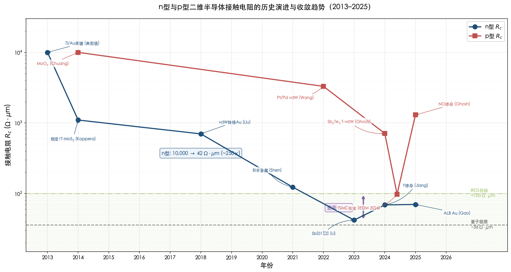

若p型接触继续保持2022–2025年的快速突破态势，预计在未来2–3年内有望将$R_c$降至与n型可比的水平，为完整的二维CMOS互补逻辑奠定接触基础。

imec预测二维材料将在2032年前后在BEOL中实现实际应用[PMC综述](https://pmc.ncbi.nlm.nih.gov/articles/PMC10873265/ "imec预测二维材料2032年进入BEOL应用")。IEDM会议自2022年起已设置专门的二维材料器件与集成分会，反映了产业界对该方向的持续投入。我们认为，n型接触方案（Sb半金属、Y掺杂、ALB）已具备进入早期工艺开发阶段的技术成熟度；p型接触虽已取得突破性进步，但仍需在材料体系多样性、CVD大面积验证和长期可靠性方面实现充分积累。n/p接触的同步成熟将是决定二维CMOS产业化时间线的关键里程碑。

## 6.5 原子级界面工程的新范式

### 6.5.1 原子层键合（ALB）的拓展

Gao等人（2025）报道的原子层键合（ALB）接触开辟了一条介于传统蒸镀接触和vdW转移接触之间的第三条道路。通过超软氩等离子体选择性剥除MoS₂表层硫原子后，暴露的Mo悬挂键与Au形成金属性相干界面键合，实现$R_c = 70$ Ω·μm和400°C的热稳定性[Gao et al., Science 2025](https://www.science.org/doi/10.1126/science.adz2405 "原子层键合接触, Science 390")。在三支柱框架中，ALB代表了"局部金属化实现强耦合-去钉扎协同"的新路径——通过在原子层尺度上精准控制界面化学态，既消除了vdW间隙的隧穿势垒（支柱二），又通过金属性界面键合实现强耦合（支柱三），同时因界面金属化而自动去钉扎（支柱一）。

ALB方案的未来拓展空间广阔。首先，将ALB工艺推广至其他TMDCs（WSe₂、WS₂、MoSe₂等）以验证其普适性。其次，探索Au以外的键合金属——Ag和Cu作为CMOS标准互连金属，若能与TMDC暴露面形成类似的金属性键合，将大幅提升ALB方案的产业兼容性。此外，ALB在CVD大面积薄膜上的均匀性和可重复性验证，是其从学术突破走向产业应用的必经之路。

### 6.5.2 分子功能化与缺陷钝化的协同

原子级界面工程的另一前沿方向是分子功能化与缺陷钝化的协同优化。第1章已指出，硫空位等缺陷态是MoS₂费米钉扎的主导来源之一[Noori et al., npj 2D Mater. Appl. 2022](https://www.nature.com/articles/s41699-022-00349-x "缺陷主导接触极性")；第5章则揭示CVD材料中更高的缺陷密度使"界面缺陷最小化"从三支柱框架的辅助条件升格为核心约束。Zhang等人（2025）的TTT分子+TiS₂策略在p型WSe₂上同时实现了缺陷钝化和接触优化[Zhang et al., Nano Lett. 2025](https://pubs.acs.org/doi/10.1021/acs.nanolett.4c05970 "缺陷工程优化p型WSe₂")，指向一个更宏大的研究方向：能否设计专用的界面功能分子，同时实现缺陷态钝化（恢复本征$S$值）和SBH调控（通过偶极矩或电荷转移）？

从三支柱框架的角度，这一方向的本质是在保持支柱一（去钉扎）优化的同时，通过分子层的精确设计同步优化支柱二（降低隧穿势垒宽度/高度）和支柱三（调控界面耦合强度）。electrene插层（6.1.1节）和分子功能化层本质上同属"原子级界面插层工程"的范畴——通过在金属和半导体之间引入单原子层或单分子层的功能介质，在亚纳米尺度上精确调控界面电子结构。

## 6.6 三支柱框架的跨材料推广

### 6.6.1 InSe：高迁移率体系中的权重重标定

InSe以其优异的电子迁移率（可达约10³ cm²/V·s）和相对较小的电子亲和能成为高性能n型器件的有力竞争者。Li等人（2024）已在InSe上实现欧姆接触的弹道晶体管[Li et al., Sci. China Inf. Sci. 2024](https://cdn.sciengine.com/doi/10.1007/s11432-023-3884-3 "InSe欧姆接触弹道晶体管")。在三支柱框架中，InSe较小的电子亲和能使支柱一和支柱二的优化相对容易（功函数匹配更简单、SBH天然较低），但其强层间耦合意味着MIGS可能回归三维模式——在多层InSe中，金属波函数的穿透深度更大，MIGS更难被vdW间隙有效阻断。因此，对InSe体系而言，支柱一中"降低MIGS穿透"这一路径的权重需要增大，而支柱二中"消除vdW隧穿"的紧迫性相对降低——更强的层间耦合本身有利于载流子传输。

### 6.6.2 Bi₂O₂Se：引入"有利钉扎"概念

Bi₂O₂Se是一种具有超高迁移率（低温下>10⁴ cm²/V·s）的新兴二维半导体，其接触物理展现出与TMDCs截然不同的特征——几乎所有金属均可与Bi₂O₂Se形成欧姆接触，即"普遍欧姆接触"现象。Wang等人（2019）的理论分析表明，Bi₂O₂Se的费米钉扎位置落在导带以上，导致所有具有合理功函数的金属均被钉扎在欧姆区间[Wang et al., J. Phys. Chem. C 2019](https://pubs.acs.org/doi/abs/10.1021/acs.jpcc.8b12278 "Bi₂O₂Se的普遍欧姆接触")。Zhao等人（2025）进一步在Bi₂O₂Se/TaNiTe₅异质结中实验验证了欧姆接触的形成[Zhao et al., Appl. Phys. Lett. 2025](https://pubs.aip.org/aip/apl/article/127/20/202104/3372800 "Bi₂O₂Se/TaNiTe₅欧姆接触验证")。

这一现象要求三支柱框架引入"有利钉扎"概念——当费米能级被钉扎在对载流子注入有利的位置（导带内部或价带内部）时，钉扎本身不再构成问题，反而成为自动实现欧姆接触的内禀优势。在这种情形下，支柱一（去钉扎）需要重新诠释为"确保钉扎位置有利"，而非一味追求$S \to 1$。这一修正丰富了三支柱框架的普适性。

### 6.6.3 黑磷：界面化学活性的首要瓶颈

黑磷（BP）是天然p型二维半导体，Perello等人（2017）通过Ni/BP退火实现了$R_c = 0.365$ kΩ·μm的低接触电阻[Perello et al., Nat. Commun. 2017](https://www.nature.com/articles/s41598-017-16845-w "黑磷金属性欧姆接触")。然而BP在空气中的不稳定性和极高的界面化学活性使三支柱框架中"界面缺陷最小化"这一元条件成为首要瓶颈——在BP体系中，界面质量控制的重要性远超对MIGS或隧穿势垒的调控。这一案例表明，在不同的二维材料体系中，三支柱框架虽然在核心逻辑上具有普适性，但各支柱的相对权重和阈值需要根据材料本征特性进行针对性校准。

### 6.6.4 框架普适性的边界

综合上述分析，三支柱框架的核心命题——"同时优化去钉扎、低隧穿和强耦合"——在金属-二维半导体接触领域具有广泛的普适性。图6-3以矩阵形式直观呈现了五种代表性二维半导体材料在三支柱和元条件四个维度上的核心特征与瓶颈分布，清晰展示了框架在跨材料推广时各支柱权重的差异化格局。

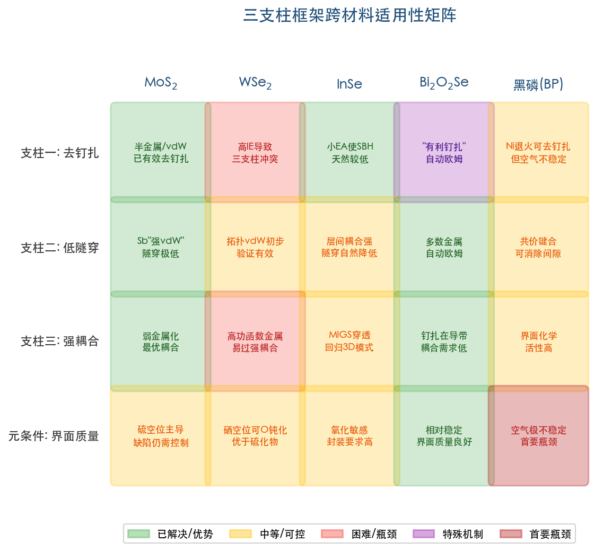

在跨材料推广时，以下校准不可或缺：（1）各支柱的阈值参数（$S$的判据、隧穿比电阻的可接受范围、电荷转移量的最优窗口）需针对不同材料的带隙、电子亲和能和介电环境重新标定；（2）支柱间的权重分配需考虑材料本征特性——强层间耦合体系（InSe）中MIGS穿透的权重更大，化学活性体系（BP）中界面质量的权重更大；（3）存在框架适用边界之外的例外——如Bi₂O₂Se的"有利钉扎"和相变接触的"消除异质界面"，需要框架的显式扩展以涵盖这些特殊情形。

## 6.7 总结性展望

回到本报告起始提出的核心问题——各种降低接触电阻的方法是否存在共通之处、能否构建统一理论、该领域未来发展方向何在——前述六章的系统分析给出了明确的回答。

第一，共通物理机制确实存在。尽管各方案在实验构型和材料选择上千差万别，其降低接触电阻的物理路径均可归纳为对同一组物理变量的不同组合优化：费米钉扎的消除、隧穿势垒的减薄和界面轨道耦合的调控。

第二，三支柱框架提供了接近大一统的理论视角。"去钉扎-低隧穿-强耦合"三个正交判据维度可以定量解释为什么Sb(01̄12)是目前最优方案（三支柱均为"优秀"）、为什么转移Au接触虽去钉扎优异但$R_c$仍受限（隧穿瓶颈）、为什么传统Ti接触性能极差（三支柱均不利）。该框架同时阐明了方案间的核心权衡关系——尤其是MIGS-隧穿权衡——以及半金属如何通过"低DOS+适度杂化"巧妙绕过这一权衡。

第三，基于三支柱框架，该领域的未来发展将沿以下主线推进：（1）新材料探索——以三支柱判据为筛选标准，通过高通量DFT和机器学习从数千种候选材料中系统识别最优电极，electrene、拓扑材料和高熵合金是值得优先探索的方向；（2）p型突破——攻克三支柱在高电离能体系中的内在冲突，拓扑低DOS材料和掺杂诱导金属化是最具前景的路径；（3）量子极限逼近——当$R_c$趋近$R_c^Q$后，研究重心从界面势垒工程转向量子传输优化，边缘接触的缩放免疫特性可能在极端缩放节点上展现出不可替代的价值；（4）产业化落地——Sb、ALB和Y掺杂三种方案已构成走向量产的第一梯队，弥合学术值与产线值之间的鸿沟依赖于CVD材料质量提升和BEOL兼容工艺的全面开发。

二维半导体接触领域在过去十二年间经历了从$R_c > 10$ kΩ·μm到42 Ω·μm的跨越——接触电阻降低了约250倍，并已逼近量子物理设定的基本极限。三支柱框架为理解这一进程提供了统一的理论透镜，也为下一阶段的研究指明了清晰的方向。当这一框架所预测的理想材料被逐一实验实现，当n型和p型接触的同步优化完成，当学术突破与产业工艺实现全面衔接，二维半导体将真正成为后摩尔时代微电子技术的核心支柱。

# 结论与风险提示

## 核心结论

本报告围绕二维半导体接触电阻的降低机制进行了系统性的文献分析与理论构建，得出以下核心结论。

**结论一：各类低接触电阻方案具有深层的物理共通性。** 半金属接触（Bi、Sb）、范德华转移接触、相变工程接触、掺杂金属化接触（Y 掺杂）、边缘接触以及原子层键合（ALB）接触看似基于截然不同的实验构型和材料选择，但其降低接触电阻的物理路径均可归纳为对同一组物理变量的不同组合优化。本报告从这些方案中提取出五个共通的核心物理机制：费米钉扎的消除或弱化、肖特基势垒高度的调控、隧穿势垒的消除或减薄、界面无序度与缺陷态的最小化、以及轨道杂化与能带耦合的优化。这些机制分别作用于接触电阻分解框架 $R_c = R_\text{SB} + R_\text{tunnel} + R_\text{spread}$ 的不同分量，且相互之间存在深刻的耦合与竞争关系。

**结论二：三支柱模型提供了接近"大一统"的理论视角。** 在五个共通机制的基础上，本报告构建了"去钉扎-低隧穿-强耦合"（DLC）三支柱模型，将降低接触电阻的物理逻辑凝练为三个正交的判据维度。经验证，该模型的核心命题——凡同时满足三个支柱的方案均实现亚 100 Ω·μm 的超低接触电阻——对现有全部代表性实验结果成立。Sb(01̄12) 作为三支柱均为"优秀"的唯一方案，以 $R_c = 42$ Ω·μm 逼近量子极限（~36 Ω·μm） [Li et al., Nature 2023](https://www.nature.com/articles/s41586-022-05431-4 "Approaching the quantum limit, Nature 613, 274-279")。Y 掺杂（平均 69 Ω·μm）和 ALB 接触（70 Ω·μm）则分别通过"掺杂金属化消除异质界面"和"局部共价键合替代范德华间隙"的路径实现了三支柱的同步优化。

**结论三：MIGS-隧穿权衡是二维接触物理中最核心的矛盾。** 范德华间隙在抑制金属诱导带隙态（MIGS）与增加隧穿势垒之间形成的内在矛盾，贯穿了几乎所有接触方案的设计逻辑。三支柱模型的关键洞察在于揭示了绕过这一权衡的两类路径：第一类是半金属路径——通过低费米面态密度从源头抑制 MIGS，使得在适度缩短界面距离以增强耦合时 MIGS 不会泛滥；第二类是"消除界面"路径——通过相变、掺杂金属化或局部键合消除金属-半导体异质界面本身，使权衡关系的物理基础不复存在。

**结论四：产业化面临从物理到工程的范式转换。** 学术最优接触电阻（42 Ω·μm）与 300 mm 产线基准（imec Ti 接触：数十 kΩ·μm）之间约三个数量级的鸿沟，主要源于 CVD 材料缺陷密度升高、产线金属选择受限（标准 CMOS 金属如 Ti 导致强钉扎）以及大马士革工艺与学术剥离工艺的根本差异。Sb 半金属、Y 掺杂 PDA 和 ALB 三种方案在接触电阻（均 <100 Ω·μm）、BEOL 热预算兼容性和可扩展性方面构成走向量产的第一梯队。p 型接触在 2022–2025 年间经历了从 3.3 kΩ·μm 到约 98 Ω·μm 的快速突破，n/p 最佳 $R_c$ 差距已缩小至约 2.3 倍，为二维 CMOS 互补逻辑的近期实现注入了信心。

**结论五：三支柱框架为未来发展提供了可操作的研究指引。** 新型电极材料（electrene、拓扑半金属、高熵合金等）可通过三支柱判据进行系统筛选；p 型接触的破局应聚焦于低态密度高功函数材料和掺杂诱导金属化路径；量子极限附近的研究重心应从界面势垒工程转向量子传输优化。高通量 DFT 筛选与机器学习模型中的物理描述符（界面静电势差、电荷转移量、偶极矩等）可自然映射为三支柱的筛选判据，标志着接触材料探索正从经验试错向计算驱动的理性设计范式转型。

## 局限性分析

本报告的分析与结论存在以下主要局限性，需在解读时予以审慎考量。

**第一，三支柱模型为半定量框架而非严格的第一性原理理论。** 三支柱模型的核心判据（钉扎因子 $S$、隧穿比电阻 $\rho_t$、SMIGS 能量窗口 $\Delta M$）来源于不同研究团队的独立计算与实验，尚未在统一的理论体系内被自洽推导。各支柱之间的定量耦合关系（尤其是支柱三"最优耦合窗口"的精确边界）依赖于经验归纳而非解析推导。因此，该框架适合作为定性至半定量层面的设计指引，但不具备定量预测特定材料组合接触电阻绝对值的能力。

**第二，实验数据的可比性受测量方法和材料条件差异的系统性影响。** 不同文献报道的 $R_c$ 值在载流子浓度（$n_\text{2D}$）、测量温度、材料来源（机械剥离 vs. CVD）和提取方法（两端法、TLM、四探针法）上存在显著差异。本报告在横向比较时尽可能标注了关键实验条件，但部分文献未充分披露这些参数，使得跨方案的定量比较存在不可避免的系统性不确定性。

**第三，报告以 MoS₂ 为核心案例，三支柱框架向其他材料体系的推广需要针对性校准。** InSe、Bi₂O₂Se、黑磷等材料的带隙、电子亲和能、层间耦合强度和化学稳定性与 MoS₂ 存在本质差异，各支柱的阈值参数和权重分配需要重新标定。尤其是 Bi₂O₂Se 的"有利钉扎"现象要求对支柱一的内涵进行概念扩展，表明框架的严格普适性尚需更多材料体系的系统验证。

**第四，p 型接触的物理理解和实验数据仍显不足。** 尽管 p 型 $R_c$ 在近年取得了从 3.3 kΩ·μm 到约 98 Ω·μm 的跨越式进步，但相关机制研究的深度远不及 n 型接触。三支柱框架对 p 型接触的分析主要基于对称性推理（将支柱一中的导带底匹配替换为价带顶匹配），缺乏与 n 型同等详尽的第一性原理验证。

**第五，产业化相关的长期可靠性数据几乎完全缺失。** 本报告讨论的所有低 $R_c$ 方案均缺乏半导体行业标准的可靠性认证数据（如 1000 小时高温工作寿命测试、热循环测试、电迁移测试）。报告中引用的热稳定性数据均为短期退火测试（数十分钟至 24 小时），距离产业级可靠性评估尚有相当距离。因此，本报告对各方案产业化前景的评估应视为基于现有数据的初步判断而非确定性结论。
