# 执行摘要

中国城市污水处理率已达98.93%，处理能力达2.35亿立方米/日，但接近满分的处理率指标掩盖了深层的体制性效率困境。2023年末全国城市生活污水集中收集率仅为73.63%，意味着仍有约四分之一的生活污水未被有效收集。进厂COD浓度低于150 mg/L的情况非常普遍，远低于发达国家350 mg/L以上的水平，管网渗漏与雨污混接造成的外水稀释问题严重。上述困境的体制性根源在于中国大部分城市长期运行的"核拨制"管理模式——排水管网运维经费由财政全额拨付，排水管理单位以事业单位身份运营，经费与绩效脱钩，形成了激励错位、价费分裂、信息遮蔽与厂网分离四重制度性矛盾的叠加。

本报告从现状诊断、替代机制、雨污协同、全生命周期成本、监管体系和政策建议六个维度，系统论证了从核拨制向市场化运营转型的改革方案。核心判断如下：

**第一，厂网一体化特许经营是最具可行性的替代路径。** 综合英国完全私有化的失败教训、法国特许经营的百年实践、德国市政公用事业公司的高效运营和日本公营企业的流域协同治理经验，"所有权归公、经营权市场化"的厂网一体化特许经营模式是平衡效率与公共利益的最优制度安排。武汉、湘潭、长沙、广州等城市的先行探索已提供了有力的实证支撑——武汉2025年全市生活污水集中收集率提升至83.65%，较"十四五"期初提升25.18个百分点；湘潭通过按效付费改革每年节省运营资金5000多万元，原规划新建处理厂节省建设投资约3.5亿元。

**第二，"按效付费"机制是扭转逆向激励的关键突破口。** 传统"按量付费"模式下，混入外水约占付费水量的30%，形成"越漏水、越赚钱"的逆向激励。以污染物削减绩效为核心的按效付费机制，将运营商收入与进水BOD浓度、污染物削减量等指标挂钩，使降本增效成为内生动力。

**第三，"雨水财政、污水价格"的三层费用分担框架为雨污协同运作提供了制度基础。** 纯雨水系统费用由财政承担，纯污水系统运维费用由使用者通过价格承担，雨污共用设施费用按功能比例分摊。雨污协同运作可在管网排查修复、CSO调蓄池建设、应急联合调度等环节产生15%—40%的综合成本降幅。

**第四，全成本定价是改革的经济基础。** 当前全国36个大中城市居民污水处理费平均仅1.0元/m³，全成本水平预计在2.2—2.8元/m³，覆盖率仅36%—55%。将管网运维成本纳入污水处理费（贵州省已率先破冰），乃至探索将污水处理费从行政事业性收费转变为经营性价格（"费改价"），是实现市场化运营可持续资金来源的必经之路。

**第五，高质量的监管体系是改革成功的制度保障。** 英国Ofwat三十余年的监管失灵、泰晤士水务的濒临破产，以及2025年7月英国政府宣布废除Ofwat的制度重构，深刻警示：缺乏高质量监管的市场化改革可能比核拨制带来更严重的效率损失和公共利益侵蚀。中国应构建"管绩效、管价格、管资产、管透明、管安全"的监管制度闭环。

报告建议按照"一条主线、两个坚持、三个转变"的总体思路，分三个阶段推进改革：近期（2026—2028年）完成制度奠基与试点突破，中期（2028—2030年）全面铺开与深化提升，远期（2030—2035年）实现成熟运营与良性循环。改革最终目标是形成"全成本定价→稳定资金→管网修复→进水提质→处理降本→再投资"、"按效付费→内生激励→降本增效→正向循环"和"雨污协同→统一运维→联合调度→综合降本"三条相互叠加、相互强化的良性循环链条，推动市政污水收集处理体制从核拨制低效均衡走向市场化高效运营。

# 第1章 现状诊断——核拨制下市政污水收集处理体制的运作逻辑与效率困境

## 1.1 核拨制的基本运作机制

中国大部分城市的市政污水收集与处理体系长期运行于一种被业界概括为"核拨制"的管理模式之中。该模式的核心特征在于：排水管网的建设、维护和运营经费由地方财政按编制和预算核定后全额拨付，排水管理单位以事业单位身份承担运营职能，其收入来源、人员编制与经费标准均由财政体制框架决定，而非由运营绩效和市场竞争驱动。理解核拨制的运作逻辑，需要从资金流转、组织架构与价费体制三个维度展开分析。

**资金流转：** 核拨制下的市政污水处理形成了典型的"收支两条线"机制——排水单位（工商业和居民用户）按照物价部门核定的污水处理费标准缴费，由自来水公司在水费中代征，全额上交地方财政专户；财政部门再通过政府购买服务或直接拨款方式，将运营服务费拨付给污水处理厂和排水管网维护单位[中国城镇供水排水协会](https://old.cuwa.org.cn/shuiwuyuqing6/5858.html "《给水排水》2021年第1期")。这一机制设计的初衷在于保障公共服务的公益性和普遍性，但资金在"征收→上缴→拨付"的循环中经历了多环节行政审批，财政统筹的刚性约束使得拨付节奏与运营实际需求之间存在结构性错配，在实际运行中产生了显著的效率损耗。

**组织架构：** 大部分城镇排水设施维护运营单位是地方政府财政全额拨款的事业单位，其管理体制呈现四方面特征——管网维护经费来源为财政拨款且不与运营绩效挂钩；排水单位不承担经营风险和盈亏责任；人员编制按事业单位标准执行，缺乏市场化用人机制和薪酬激励；绩效考核以完成政府交办任务为导向，而非以污染物削减效能、管网完好率、收集率提升等运营指标为核心考量[中国城镇供水排水协会](https://old.cuwa.org.cn/shuiwuyuqing6/5858.html "《给水排水》2021年第1期")。

**价费体制：** 当前污水定价实行"部分成本核算"模式。根据国家发改委发改价格规〔2018〕943号文件，污水处理费仅覆盖污水处理和污泥处置设施运营成本，不包括管网收集和输送的建设运营成本[国家发改委](https://www.ndrc.gov.cn/xxgk/zcfb/ghxwj/201806/t20180629_960951.html "发改价格规〔2018〕943号")。这意味着管网这一关键环节的成本由财政"兜底"，形成了"处理归价格、管网归财政"的二元体制。全国36个大中城市居民污水处理费平均仅1.0元/m³、非居民平均1.52元/m³，仅基本满足国家收费标准下限（居民不低于0.95元/吨、非居民不低于1.40元/吨），成本倒挂现象严重[中国环境经济政策进展评估报告2024](http://zghjgl.ijournal.cn/html/zghjgl/2025/5/20250507.htm "中国环境管理期刊2025年发表")。调价周期长、审批程序复杂，进一步加剧了价费脱节，使得使用者付费与实际服务成本之间的缺口不断扩大。

## 1.2 效率困境的具体表现

核拨制在保障市政污水处理基本公共服务供给方面发挥了历史性作用，但随着行业从"量的扩张"进入"质的提升"阶段，其内在的制度缺陷日益凸显，集中表现为以下三个维度的效率困境。

### 1.2.1 "量的扩张"背后的"质的短板"

从总量指标审视，中国城市污水处理能力已达到较高水平。2024年，全国城市污水处理率达98.93%（同比增加0.24个百分点），污水处理能力2.35亿立方米/日（同比增长3.54%），城市污水排放量685.60亿立方米[联合资信《水务行业2025年回顾和2026年展望》](https://www.lhratings.com/file/g123fa3877d.pdf "2025年12月发布，引用《2024年城乡建设统计年鉴》")。然而，接近100%的处理率掩盖了一个根本性问题：大量生活污水在进入处理厂之前，已因管网漏损、雨污混接、地下水入渗等原因被严重稀释或直排，"处理率"所统计的水量中包含了大量并非真正生活污水的外来水。

收集率数据更能反映管网系统的实际效能。2023年末，全国城市生活污水集中收集率为73.63%，较上年增加3.57个百分点[住建部《2023年中国城市建设状况公报》](http://www.xjaepi.org.cn/upload/portal/20241031/f4c143311b2bbfd0a3fdea86628a6a60.pdf "2024年10月发布")。生态环境部在2025年1月发布的专家解读文章中亦确认，"2023年全国城市污水收集率刚刚达到73%"[生态环境部](https://www.mee.gov.cn/zcwj/zcjd/202501/t20250121_1101086.shtml "《美丽城市建设实施方案》专家解读，2025年1月发布")。这意味着仍有约四分之一的城市生活污水未被有效收集处理。尽管2023年数据已接近住建部等五部门2024年3月提出的"到2027年城市生活污水集中收集率达73%以上"的政策目标[中国水网](https://www.h2o-china.com/news/349492.html "住建部等五部门2024年3月文件解读")，但进一步提升的边际难度正在加大——剩余未收集区域多位于老旧城区和城乡结合部，管网改造的工程难度和单位成本远高于新建。

进厂污水浓度偏低是管网收集效率不足的直观体现。城市污水管网普遍存在雨污混接、渗漏、错口、变形等结构性缺陷，进厂COD浓度低于150 mg/L的情况非常普遍，而发达国家污水处理厂进水COD浓度一般在350 mg/L以上甚至达到800 mg/L。为此，"十四五"城镇污水处理及资源化利用发展规划明确要求，对进厂BOD浓度低于100 mg/L的污水处理厂实施"一厂一策"系统化整治[中国城镇供水排水协会](https://old.cuwa.org.cn/shuiwuyuqing6/5858.html "《给水排水》2021年第1期") [国家发改委](https://www.ndrc.gov.cn/xxgk/zcfb/ghwb/202106/P020210615582348125286.pdf "十四五规划")。低浓度进水不仅意味着管网系统存在大量外水入渗和雨污混流，还导致处理厂碳源不足、生化处理效率降低、药剂投加量增大，由此形成"管网漏、水厂亏"的恶性循环。

### 1.2.2 管网资产的巨大存量与"重厂轻网"的历史欠账

截至2024年末，全国城市排水管道总长度达99.36万公里，较2020年的80.27万公里增长约19%，5年间新增近19万公里[2024年城乡建设统计年鉴数据整理](http://gszls.com/sys-nd/398.html "引用住建部统计")。2023年末这一数据为95.25万公里（同比增长4.27%）[住建部《2023年中国城市建设状况公报》](http://www.xjaepi.org.cn/upload/portal/20241031/f4c143311b2bbfd0a3fdea86628a6a60.pdf "2024年10月发布")。管网规模的快速增长在提升收集能力的同时，也使得维护运营压力与日俱增。

排水管道设计寿命一般为30至50年，但北京、上海、广州等一线城市排查数据显示，老旧管网占比均超过30%。据国家发改委测算，未来5年管网建设改造总量预计达60万公里，总投资需求约4万亿元，其中修复类项目占比超过60%[中科非开挖排水管网分析](http://www.zkpipe.com/newsinfo.asp?thex=1805&Cla=31 "引用城乡建设统计年鉴及发改委数据")。4万亿元的投资缺口揭示了长期"重厂轻网"所累积的巨额历史欠账。

投资数据的结构性变化正在映射政策重心的转向。2024年，城市污水处理及再生利用固定资产投资为677.4亿元（同比下降10.65%），而同期排水管网投资高达2090.8亿元，管网投资与处理厂投资之比约为3.1:1[联合资信《水务行业2025年回顾和2026年展望》](https://www.lhratings.com/file/g123fa3877d.pdf "2024年数据")。这一比例的逆转表明，"补管网短板"政策正在逐步扭转过去"重厂轻网"的投资失衡格局（见图1-1）。然而，按照4万亿元的总需求测算，即使维持当前年均2000亿元左右的管网投资力度，也需约20年才能完成存量管网的全面更新，仅依靠财政核拨显然难以在合理周期内达成这一目标。

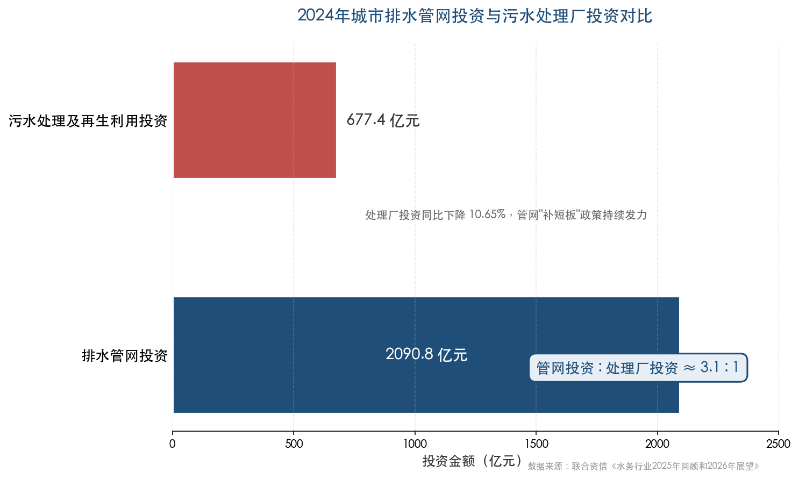

> **图1-1** 2024年排水管网固定资产投资为2090.8亿元，污水处理及再生利用投资为677.4亿元，管网投资与处理厂投资之比约3.1:1，反映"补管网短板"政策持续发力。数据来源：联合资信《水务行业2025年回顾和2026年展望》。

### 1.2.3 核拨制下缺乏降本增效的内生激励

核拨制的最深层弊端在于其制度设计从根本上缺乏对运营效率的内生驱动力。在这一体制下，排水管理事业单位的经费与运营绩效脱钩——无论管网漏损率高低、收集率升降、应急响应速度快慢，财政拨款的规模主要取决于编制人数和预算核定基数，而非实际运营成效。这种机制使得排水管理单位既无降本动力（节余资金回归财政，不形成单位可支配收入），也无增效激励（绩效改善不带来额外奖励），运营管理长期维持在"基本合规"而非"持续优化"的状态。

从财务依赖度看，即便是已经实现市场化运营的水务企业，政府补助仍构成其利润的重要支柱。2024年，水务企业其他收益（主要为政府补助）对利润总额的贡献度高达28.70%[联合资信《水务行业2025年回顾和2026年展望》](https://www.lhratings.com/file/g123fa3877d.pdf "2025年12月发布")。市场化水务企业尚且如此，尚处于事业单位体制下的排水管网运维机构对财政拨款的依赖程度可想而知。

核拨制还导致成本信息严重不透明。由于管网运维经费从财政预算中整体拨付，缺乏按管段、按流域、按服务区域的精细化成本核算，管理部门难以判断资金使用效率，亦无法为合理的污水处理费定价和调价提供可靠的成本依据。这种信息不对称进一步弱化了外部监管的有效性，形成了"拨款方不掌握成本细节、运营方无义务公开成本信息"的监管盲区。

## 1.3 政策环境：改革驱动力正在聚合

近年来，围绕市政污水收集处理体制的政策环境发生了深刻变化。从"十四五"规划的目标考核，到PPP新机制对传统融资模式的制度性冲击，再到地方先行探索的价费改革实践，多重政策驱动力正在汇聚，共同指向核拨制的转型改革（见图1-2）。

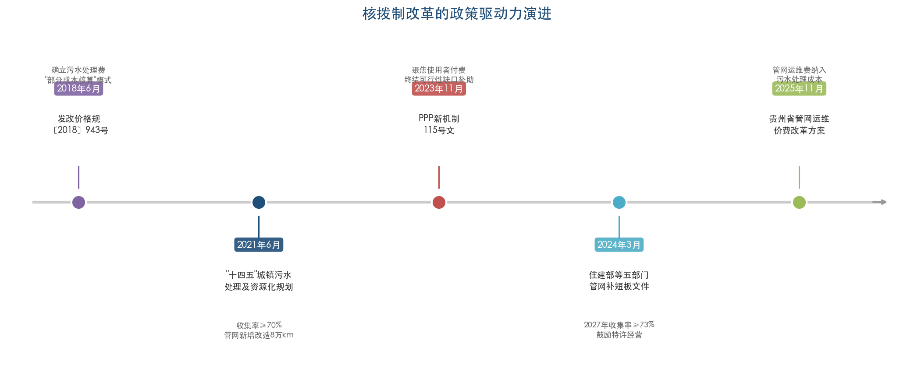

> **图1-2** 2018—2025年间推动核拨制改革的五项关键政策里程碑：从确立"部分成本核算"模式到地方率先将管网运维费纳入污水处理成本，政策环境对核拨制改革形成了递进式推动。

### 1.3.1 "十四五"规划收官与目标考核压力

"十四五"城镇污水处理及资源化利用发展规划明确了一系列约束性目标：到2025年城市生活污水集中收集率力争达到70%以上，县城污水处理率达95%以上，城市污泥无害化处置率达90%以上，新增和改造污水收集管网8万公里[国家发改委《"十四五"城镇污水处理及资源化利用发展规划》](https://www.ndrc.gov.cn/xxgk/zcfb/ghwb/202106/P020210615582348125286.pdf "2021年6月发布")。从2023年末全国城市生活污水集中收集率已达73.63%的实际进展看，这一核心目标已提前达成[住建部《2023年中国城市建设状况公报》](http://www.xjaepi.org.cn/upload/portal/20241031/f4c143311b2bbfd0a3fdea86628a6a60.pdf "2024年10月发布")。

然而，总量目标的达成并不意味着结构性问题的解决。住建部等五部门在2024年3月进一步提出了更为系统的要求：到2027年基本消除城市建成区生活污水直排口和设施空白区，城市生活污水集中收集率达73%以上；按照每5至10年完成一轮的频率，持续推进城市生活污水管网排查行动；鼓励社会资本通过特许经营方式参与[住建部](https://www.mohurd.gov.cn/gongkai/zc/wjk/art/2024/art_17339_777112.html "2024年3月发布")。这一政策文件在延续总量目标的同时，将改革重心明确指向管网系统的结构性补短板和运营体制的市场化转型，标志着政策导向从"增量建设"向"存量优化"的深刻转变。

### 1.3.2 PPP新机制对传统模式的制度性冲击

2023年11月3日，国务院办公厅印发《关于规范实施政府和社会资本合作新机制的指导意见》（国办函〔2023〕115号），对市政污水处理领域的投融资和运营模式产生了深远的制度性影响。新机制的核心变革体现在四个方面：聚焦使用者付费，明确不得通过可行性缺口补助等方式使用财政资金弥补运营成本；全部采取特许经营模式，不再新增政府付费类PPP项目；民营企业股权占比原则上不低于35%；特许经营期限原则上不超过40年[国务院办公厅](https://ggzy.dingxi.gov.cn/zcfg/003006/20231212/b3501f59-2634-42f9-8563-00d0b8da7804.html "国办函〔2023〕115号全文")。

PPP新机制的出台实质上宣告了旧有PPP模式下"政府付费+可行性缺口补助"路径的终结。对于市政污水处理而言，由于管网收集环节长期未纳入使用者付费的成本范围，新机制倒逼地方政府必须重新审视管网运维的资金来源问题——要么将管网成本纳入污水处理费以实现全成本覆盖，要么探索管网运维的独立市场化路径。无论选择哪条路径，均对核拨制的存续逻辑构成了直接的制度性冲击。

### 1.3.3 价费改革的地方先行探索

在中央政策框架调整的同时，部分地方已率先探索价费体制的突破。贵州省在《贵州省城市及县城生活污水治理攻坚行动方案（2025—2027年）》中明确提出，将污水管网运维费用纳入污水处理成本，建立"管网建设费用财政承担、运维费用价格补偿"机制[贵州省住建厅](http://sjt.guizhou.gov.cn/xwzx/tzgg/202511/t20251107_88922511.html "《贵州省城市及县城生活污水治理攻坚行动方案（2025—2027年）》")。这一探索的核心意义在于打破了管网运维成本完全由财政兜底的传统做法，将运维部分纳入使用者付费的价格体系，同时保留建设投资的财政责任。这种"建设归财政、运维归价格"的分类机制，为管网运维从核拨制向市场化运营转型提供了关键的价费基础，也为全国范围内的价费改革提供了可复制的地方样本。

## 1.4 核拨制效率困境的体制性根因

综合上述分析，核拨制导致效率不足的根因可归纳为四重相互交织的制度性矛盾：

**第一，激励错位。** 核拨制下排水管理单位的行为激励与公共服务效率目标根本不一致。财政全额拨款消除了经营风险，也消除了降本增效的内在动力。事业单位体制下的绩效考核以合规性为主、以任务完成率为辅，缺乏以收集率、管网完好率、进厂浓度等核心运营指标为导向的绩效挂钩付费机制。

**第二，价费分裂。** 污水处理费仅覆盖处理厂和污泥处置运营成本，管网收集和输送成本由财政另行承担，形成了同一公共服务链条上"两套核算、两种机制"并存的割裂格局。处理厂通过市场化运营可以实现成本优化，管网运维则因财政核拨的刚性约束而缺乏同等的效率驱动，二者之间的效率鸿沟随时间推移不断扩大。

**第三，信息遮蔽。** 财政核拨模式下缺乏精细化的成本核算和公开披露机制，管网维护的单位成本、管段效能、漏损率等关键信息难以透明化，使得监管部门、社会公众乃至上级财政均无法对资金使用效率做出准确判断，监管与定价失去了必要的信息基础。

**第四，厂网分离。** 核拨制与市场化运营的二元体制客观上加剧了"厂网分离"的管理碎片化。污水处理厂由市场化企业运营，以处理水量和出水达标为考核指标；管网由事业单位维护，以财政拨款支撑日常运行。两者分属不同管理主体和考核体系，在管网漏损导致进厂水量虚高、浓度偏低时，缺乏联动纠偏机制。处理厂甚至可能因低浓度进水降低了处理难度而"乐见其成"，进一步弱化了系统整体效率。

上述四重制度性矛盾的内在关系可通过图1-3直观呈现。

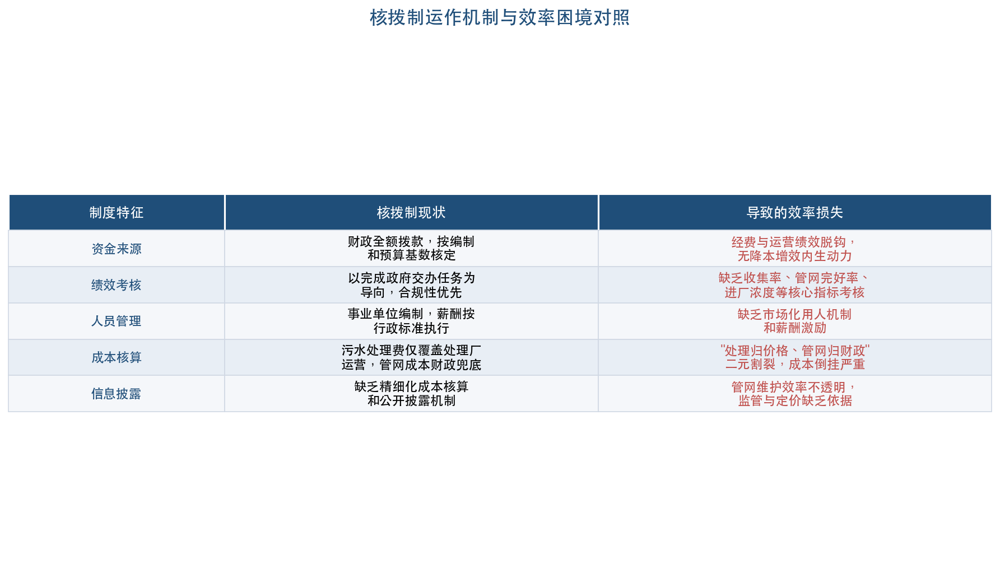

> **图1-3** 核拨制在资金来源、绩效考核、人员管理、成本核算、信息披露五个制度维度的现状特征及其各自导致的效率损失，呈现"制度特征→效率损失"的因果链条。

这四重制度性矛盾的叠加，使得核拨制在完成了中国城市污水处理从"无"到"有"的历史使命之后，正面临从"有"到"优"的转型瓶颈。随着管网存量资产进入大规模维护更新周期、地方财政压力持续增大、PPP新机制倒逼使用者付费回归，改革核拨制已不再是理论层面的政策探讨，而是一个必须直面的现实选择。

# 第2章 国内外替代机制与改革经验——从财政供养到市场化运营

## 2.1 国内市场化改革模式的光谱与演进

市政污水收集处理领域从核拨制向市场化运营转型并非单一路径，而是形成了一个由浅入深的改革模式光谱。自2002年原建设部发布《关于加快市政公用行业市场化进程的意见》以来，国内实践中逐步演化出四类替代机制：委托运营（O&M）、特许经营（Concession）、政府和社会资本合作（PPP）以及厂网一体化综合改革。各模式在资产归属、风险分配、付费机制和适用条件上存在显著差异，共同构成了市场化改革的制度选项集。

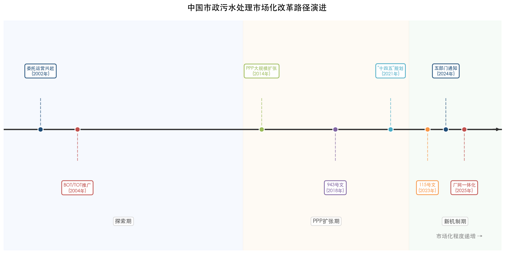

**图2-1** 展示了2002年至2025年中国市政污水处理市场化改革的政策演进脉络。改革历程大致可划分为三个阶段：2002—2013年的"探索期"（委托运营和BOT/TOT模式兴起）、2014—2022年的"PPP扩张期"（大规模政府和社会资本合作）以及2023年至今的"新机制期"（聚焦使用者付费与厂网一体化）。

**委托运营（O&M）**是市场化程度最低但实施门槛也最低的模式。政府保留设施资产所有权和投资责任，仅将日常运营管理委托给专业公司，按服务合同支付运营管理费。这一模式的优势在于政府对资产的完全掌控和较低的制度转换成本，但缺陷同样突出——运营商缺乏长期投资激励，运维行为容易陷入"短期主义"，难以实现管网建设、改造与运营的系统优化。

**特许经营（Concession）**是国际上污水处理领域最主流的市场化模式，也是2023年PPP新机制（国办函〔2023〕115号）明确的唯一合规操作路径。在特许经营模式下，政府通过竞争性程序授予社会资本一定期限（通常20—40年）的排他性运营权，特许经营者负责设施的投资、建设、运营和维护，通过向使用者收费获取回报。[国务院办公厅](https://ggzy.dingxi.gov.cn/zcfg/003006/20231212/b3501f59-2634-42f9-8563-00d0b8da7804.html "国办函〔2023〕115号全文")特许经营期满后，设施资产须完好无损地移交政府。这一模式的制度核心在于"所有权归公、经营权归私"，既保障了公共资产安全，又引入了市场化效率激励。

**政府和社会资本合作（PPP）**在2014—2022年间经历了大规模扩张，污水处理是其中体量最大的细分领域之一。然而，早期PPP项目普遍采用"政府付费"或"可行性缺口补助"模式，实质上仍然依赖财政资金，部分项目甚至异化为地方政府的隐性债务工具。2023年115号文对此进行了根本性纠偏：明确PPP新机制下不得通过可行性缺口补助等方式使用财政资金弥补运营成本，全部采用特许经营模式，聚焦使用者付费，民营企业股权占比原则上不低于35%。[国务院办公厅](https://ggzy.dingxi.gov.cn/zcfg/003006/20231212/b3501f59-2634-42f9-8563-00d0b8da7804.html "国办函〔2023〕115号全文")这一政策转向标志着污水处理领域的市场化路径从"政府兜底的伪市场化"向"使用者付费的真市场化"回归。

**厂网一体化综合改革**是近年来最具创新性和系统性的改革模式。其核心理念在于打破传统"厂网分离"的管理格局，将污水处理厂与排水管网交由同一市场主体统一规划、统一调度、统一运维、统一建设，实现从"各自为战"到"协同发力"的转变。这一模式直击核拨制的根本症结——厂网分治导致的权责碎片化和系统效能低下，已成为当前国内改革的主攻方向。

## 2.2 国内改革实践的典型案例

上述四类改革模式并非停留在理论层面，国内多个城市和省份已经开展了各具特色的先行探索。以下选取武汉、湖南、上海和贵州四个代表性案例，分析不同地区在厂网一体化、按效付费、事权整合和价费机制等维度的改革路径与实践成效。

### 2.2.1 武汉模式："调度—运维—建管"三步走的厂网一体化

武汉市是国内推进厂网一体化改革最具系统性的城市之一。2025年2月，武汉市人民政府办公厅印发《武汉市城市生活污水收集处理"厂网一体化"实施方案（2025—2027年）》，确立了"完善机制、建管一体，政府主导、市场运作，试点先行、有序实施"的改革原则。[武汉市人民政府](https://www.wuhan.gov.cn/zwgk/xxgk/zfwj/bgtwj/202503/t20250310_2549413.shtml "武汉市厂网一体化实施方案，2025年3月发布")

武汉的改革路径按照"调度—运维—建管"三步走的逻辑渐次推进。

**第一步"调度一体化"**已全面实现。中心城区8个污水系统由市水务局统筹指导，新城区17个污水系统由各区统筹调度，全市25个污水系统的调度一体化全面完成。市城投集团依托排水公司现有管理平台，叠加中心城区管网GIS数据，搭建了"厂网一体"调度系统，引入人工智能与大数据分析技术，实现了管网运行的实时监测和异常自动报警。[武汉市水务局](https://swj.wuhan.gov.cn/tzdt/jcss/202603/t20260326_2745222.html "武汉厂网一体改革成绩单，2026年3月发布")

**第二步"运维一体化"**正在稳步推进。中心城区由市水务局会同相关区政府选取专业单位，采取委托运营等模式开展运维；各新城区分别选取专业单位负责辖区内污水收集设施运维。截至2026年3月，黄家湖、豹澥、沌口、蔡甸、江夏、盘龙城6个污水系统已实现一体化运维。该环节最关键的制度创新是"按效付费"：市区水行政主管部门按季度开展绩效考核，推动污水处理厂和管网联动按效付费，考核指标从传统的"水量"转向"污染物收集效能和削减效能"。[武汉市水务局](https://swj.wuhan.gov.cn/tzdt/jcss/202603/t20260326_2745222.html "武汉厂网一体改革成绩单，2026年3月发布")

**第三步"建管一体化"**正有序推进，核心任务涵盖管网资产清查确权和投融资机制创新两大方面。武汉已出台《武汉市市政生活污水收集设施资产评估工作指引》，为管网资产确值和盘活奠定基础；同时积极争取中央预算内资金和超长期特别国债支持，理顺污水处理费价格机制，建立覆盖成本、保本微利的动态调整机制。[武汉市人民政府](https://www.wuhan.gov.cn/zwgk/xxgk/zfwj/bgtwj/202503/t20250310_2549413.shtml "武汉市厂网一体化实施方案，2025年3月发布")

上述改革的成效已初步显现。从试点片区看，黄陂后湖片区的盘龙污水处理厂2025年进水BOD浓度较2024年同期提升37.3%，处理水量同比增长23.03%；黄家湖片区2025年进水BOD浓度较2024年同期提升16.1%，处理水量同比增长7.96%。从全市整体看，2025年全市城市生活污水处理厂平均进水BOD浓度较"十四五"期初提升30.15%，城市生活污水集中收集率提升至83.65%，较"十四五"期初提升25.18个百分点。[武汉市水务局](https://swj.wuhan.gov.cn/tzdt/jcss/202603/t20260326_2745222.html "武汉厂网一体改革成绩单，2026年3月发布")

### 2.2.2 湖南模式：立法先行与"按效付费"的省级推广

湖南省在国内率先以地方立法形式推动厂网一体化和按效付费改革，走出了一条"立法引领、试点验证、全省推广"的路径。2024年，湖南省以"小快灵"立法方式出台《湖南省城镇污水管网建设运行管理若干规定》，从法规层面确立了厂网一体、专业化运行维护和按绩效付费管理制度。[中国建设报](https://zjj.yzcity.gov.cn/zjj/0202/202502/4ad1180411ad41238094149b7970e83b.shtml "湖南加快推动城镇污水处理质效提升侧记，2025年2月")

湖南改革的核心创新在于"按效付费"机制的设计。传统"按量付费"模式下，污水处理费与进厂水量直接挂钩，企业缺乏减少外水入渗的动力——混入越多的雨水和地下水，处理水量越大、收入越高，形成典型的逆向激励。据湖南省测算，全省"按量付费"的付费水量中混入外水约占30%。[中国建设报](https://zjj.yzcity.gov.cn/zjj/0202/202502/4ad1180411ad41238094149b7970e83b.shtml "湖南加快推动城镇污水处理质效提升侧记，2025年2月")按效付费机制将污水处理厂进水污染物浓度、污染物削减量和污泥无害化处理率等作为核心考核指标，构建以污染物削减绩效为导向的付费体系，从根本上扭转了"稀释即达标"的逆向激励。

湘潭市是湖南省率先全面实施按效付费的城市，为省级推广提供了关键实证支撑。城区4座污水处理厂在原特许经营协议基础上全部补充签订了按效付费协议，通过实施"撇清水、挤外水、收污水"项目，每年可节省运营资金5000多万元；原规划的6万吨/日铁牛埠污水处理厂因进水量合理化而无需建设，节省建设投资约3.5亿元、节约用地约120亩。[中国建设报](https://zjj.yzcity.gov.cn/zjj/0202/202502/4ad1180411ad41238094149b7970e83b.shtml "湖南加快推动城镇污水处理质效提升侧记，2025年2月")

长沙市则以"委托运营+绩效合同管理"模式推进排水一体化改革。《长沙市城区排水一体化改革实施方案》将城区市政排水设施交由长沙水业集团实行"厂站网一体化"集约化、专业化运营管理，签订30年委托运营协议，预计全市污水处理厂每年可节约资金约1.4亿元。[中国建设报](https://zjj.yzcity.gov.cn/zjj/0202/202502/4ad1180411ad41238094149b7970e83b.shtml "湖南加快推动城镇污水处理质效提升侧记，2025年2月")在全省层面，湖南已启动19个污水处理"厂网一体""按效付费"试点示范项目，争取超长期特别国债和中央预算内资金共138亿元，总投资达328亿元，改革的规模效应正加速形成。

### 2.2.3 上海探索：事权集中与"费改价"试点前哨

上海的排水体制改革走的是一条"事权集中+存量整合"的路径，其经验与困境对全国改革具有重要的前瞻性参考价值。2025年，上海城投水务在年内接手中心城区11个区的管网运维事权，实现了运维层面的厂网一体化。然而改革的深层矛盾随即暴露：管网资产权属仍归区政府，形成"事权在企、财权在政"的错位格局；运维经费依赖数十个行政预算主体，在地方财力紧平衡的背景下，企业运营的可持续性面临严峻挑战。[中国水网](https://www.h2o-china.com/news/361310.html "《水务青绿书》第2期，2025年10月发布")

正是基于上海的实践困境，2025年10月召开的第二期"水务百年会客厅"聚焦污水价费问题，形成了《水务青绿书》（第2期），提出了一项具有方向性意义的建议——"费改价"。该方案的核心思路是将污水处理费从行政事业性收费转变为经营性价格，将管网运营成本纳入污水处理费，进而将整体污水处理费纳入经营性总体水价。[中国水网](https://www.h2o-china.com/news/361310.html "《水务青绿书》第2期，2025年10月发布")这一建议的制度逻辑在于：只有将管网运维从财政补贴的"无名份"状态纳入价格体系，才能为厂网一体化运营提供稳定、可预期的资金来源，使"使用者付费"机制从理念落地为现实。

行业专家在该会议上形成了几项核心共识：管网建设等强公共属性环节的投资责任仍应由政府承担，但管网运营成本应纳入污水处理费由受益者支付；水务服务的资金来源无论采取何种组合（税收、收费、价格、补贴），都不存在"免费的午餐"；建议上海率先试行费改价，为全国改革提供制度示范。[中国水网](https://www.h2o-china.com/news/361310.html "《水务青绿书》第2期，2025年10月发布")

### 2.2.4 贵州先行：管网运维费用纳入污水处理成本的地方破冰

贵州省在价费机制改革方面迈出了具有标志性意义的一步。2025年11月，贵州省住建厅发布《贵州省城市及县城生活污水治理攻坚行动方案（2025—2027年）》，明确建立"管网建设费用财政承担、运维费用价格补偿"的机制，将污水管网运维费用正式纳入污水处理成本。[贵州省住建厅](http://sjt.guizhou.gov.cn/xwzx/tzgg/202511/t20251107_88922511.html "贵州省生活污水治理攻坚行动方案，2025年11月")

这一制度安排在全国层面具有先行探索意义。长期以来，管网运维成本处于价格体系的"盲区"——由于排水管网维护由财政全额拨款的事业单位承担，管网运维成本从未被纳入污水处理费的成本核算范围。贵州方案的出台，意味着"处理归价格、管网归财政"的二元体制出现了实质性松动，为后续全国性的价费体制改革提供了地方实践样本。

## 2.3 国际经验：四种典型模式的比较与启示

国际上主要经济体在污水收集处理领域形成了差异显著的管理体制，大致可归纳为英国的完全私有化模式、法国的特许经营模式、德国的市政公用事业公司模式和日本的地方公营企业模式。这四种模式在资产归属、运营主体、付费机制和监管安排上各有侧重，其成功经验与失败教训均为中国的改革路径选择提供了重要参照。

### 2.3.1 英国模式：完全私有化的成就与代价

英国是全球唯一对水务行业实施完全私有化的主要经济体。1989年，撒切尔政府将英格兰和威尔士的十个水务管理局整体出售给私人资本，形成了区域性垄断的私营水务公司格局。私有化的初衷是解决公共部门长期投资不足的问题——在国有时期，水务基础设施投资长期被医院、学校等更具政治可见度的领域挤压。[东方财富证券](http://pdf.dfcfw.com/pdf/H3_AP202002171375175840_1.pdf "英国水务：全面实现私有化的利与弊，2020年2月")

私有化初期确实带来了显著的投资增长和服务改善：年均投资从私有化前的15.5亿英镑跃升至30亿英镑，近乎翻倍；河流水质和饮用水水质明显改善；海滩水质获得大幅提升。[东方财富证券](http://pdf.dfcfw.com/pdf/H3_AP202002171375175840_1.pdf "英国水务：全面实现私有化的利与弊，2020年2月")然而三十余年后回顾，这一"实验"的深层代价正在充分暴露。

最具代表性的案例是泰晤士水务——英国最大的水务公司，服务覆盖1600万人口。2024—2025年间，泰晤士水务陷入破产边缘，债务高达150多亿英镑，母公司Kemble Water多次面临利息支付违约。[中国水网](https://www.h2o-china.com/news/362484_2.html "从《肮脏生意》看英国水务私有化的历史账，2026年")问题的根源在于：私有化后，包括跨国主权基金和养老基金在内的股东通过高杠杆融资持续榨取利润——据统计，英国水务行业私有化以来累计向股东分配了约850亿英镑的红利和利息，而本应用于管网更新的资金被大幅挤压，英国每天因管网漏水流失的自来水高达30亿公升。[中国水网](https://www.h2o-china.com/news/362484_2.html "从《肮脏生意》看英国水务私有化的历史账，2026年")

监管失灵是英国模式暴露深层缺陷的关键制度因素。水务监管机构Ofwat长期侧重于控制水价和保证公司财务稳健，对环境污染、管网漏损等核心运营指标的惩罚力度严重不足，导致企业缺乏改善基础设施的动力。2025年7月，英国政府宣布将废除Ofwat，代之以一个整合四个不同监管机构职能的新单一监管机构——这是1989年水务私有化以来最大规模的监管体制重构。[光明网（中新社）](https://m.gmw.cn/2025-07/22/content_1304089428.htm "英国开启水务领域改革应对监管失灵，2025年7月")英国环境大臣里德直言水务行业"千疮百孔"，承诺到2030年将污水污染减半。

英国模式对中国的警示意义清晰而深刻：完全私有化在自然垄断领域存在根本性的制度缺陷——当资产所有权和经营权完全转移给私人资本，且监管能力不足以制衡资本的逐利行为时，公共利益将不可避免地受到侵蚀。这一教训为中国的改革划定了底线：污水处理的市场化改革应当走"经营权市场化"而非"资产私有化"的路径。

### 2.3.2 法国模式：特许经营的百年实践

法国水务管理体制的核心特征可概括为"所有权归公、经营权开放"。在法国，自来水输配、污水和雨水的收集处理责任隶属于各级城镇或多个城镇的联合管理机构。全法国约36000个城镇，共设立了约15000个自来水输配行政管理机构和约17000个污水收集处理管理机构，形成了高度分散化的管理格局。[同济大学环境科学与工程学院](https://files.h2o-china.com/paper/200909/891621254216051.pdf "法国水务管理模式概述，《水工业市场》2009年")

地方政府可选择将水务管理任务委托给专业私营企业管理（委托管理），也可自行管理（自主管理）。委托管理主要采用两种合同形式：一是**租赁制（Affermage）**，由地方政府自行筹资建设水厂和管网，仅将基础设施管理权托付给私营公司，企业以向用户收取的水费为酬金，并将一部分收入交还市府以补偿基础设施的投资建设费和技术折旧费；二是**特许权（Concession）**，由私营公司负责建造并管理水厂及管网，向用户收取水费作为收入，合同期满时须将设施完好无损地归还地方政府。[同济大学环境科学与工程学院](https://files.h2o-china.com/paper/200909/891621254216051.pdf "法国水务管理模式概述，《水工业市场》2009年")

法国模式的制度精髓体现在三个层面。其一，**资产所有权始终归政府**——无论采用哪种合同形式，水管、水库和处理厂的所有权均不发生转移，这是法国模式区别于英国完全私有化的根本制度防线。其二，**竞争性准入与动态退出机制**使政府保持了对运营商的有效制约：合同期通常为8—15年（租赁制）或20—30年（特许权），期满后须重新竞争，运营不善的企业面临被替换的风险。其三，**规模经济与专业化运营**催生了威立雅（Veolia）和苏伊士（Suez，现已被威立雅收购）等全球水务巨头，这些企业积累了跨越百年的运营管理经验和技术能力。[东方财富证券](http://pdf.dfcfw.com/pdf/H3_AP201907261341463350_1.pdf "威立雅：从水务巨头到全球资源管理引领者，2019年7月")

法国模式之所以未像英国那样陷入系统性危机，关键在于其制度设计中嵌入了三重保障：政府保留资产所有权防止资本掏空基础设施、有限合同期保持竞争压力、地方政府始终承担最终责任。但法国模式也并非完美——私营水务巨头凭借信息优势和规模优势可能形成实质性垄断。巴黎市于2010年将供水系统从威立雅和苏伊士手中收回由市政公司直营，成为全球水务"再公有化"浪潮的标志性事件，折射出特许经营模式下信息不对称和垄断溢价等深层矛盾。[荷兰跨国研究院（TNI）](https://www.tni.org/files/download/heretostay-chn.pdf "水务重新公有化已成全球性趋势")

### 2.3.3 德国模式：市政公用事业公司的高效公共运营

德国水务管理采取地方政府主导的公共运营模式，但与中国的核拨制存在本质差异——德国的模式是"公有制+企业化运作"，而非"公有制+事业单位管理"。这一区分至关重要，它表明公有制框架本身并不必然导致效率低下，关键在于是否建立了企业化的治理结构。

德国水务管理的核心载体是市政公用事业公司（Stadtwerke），这是一种由地方政府出资设立、以企业化方式独立运营的公共实体。Stadtwerke通常整合供水、排水、能源、公共交通等多种市政公用事业于一体，通过业务之间的交叉补贴和规模经济降低综合运营成本。[气候合作项目](https://climatecooperation.cn/wp-content/uploads/2020/10/%E5%8F%AF%E6%8C%81%E7%BB%AD%E7%BB%8F%E6%B5%8E%E7%BB%93%E6%9E%84%E8%BD%AC%E5%9E%8B%E5%92%8C%E5%9F%8E%E5%B8%82%E8%83%BD%E6%BA%90%E8%BD%AC%E5%9E%8B.pdf "可持续经济结构转型和城市能源转型")以北莱茵-西伐利亚邦的Emschergenossenschaft和Lippeverband为例，这两家污水处理公司密切合作，形成了全德国最大的污水处理联合体，综合承担水系统管理、饮用水供应、污水及废水处理、自然保护、洪水治理和运河管理等多项职能。[欧洲公共服务工会联合会（EPSU）](https://www.epsu.org/sites/default/files/article/files/Progressive_public_water_management_in_Europe_simplified_Chinese_-2.pdf "欧洲进步的公共用水管理")

德国模式对中国的启示在于：公有制框架下同样可以实现高效运营，其关键制度要素包括独立的法人治理结构、企业化的财务核算、以绩效为导向的管理机制以及将排水与其他市政服务整合运营以获取规模经济。德国经验有力地证明了"市场化"不等于"私有化"——公有企业通过合理的制度设计完全可以具备市场化效率，这对中国以国有水务企业为主体推进厂网一体化改革具有直接的借鉴意义。

### 2.3.4 日本模式：公营企业与流域协同治理

日本的下水道管理体制是"地方公营企业"模式的典型代表。截至2018年度末，日本全国地方公营企业运营的项目共计8308项，其中下水道项目高达3628项，是数量最多的公营企业类别。[日本地方自治制度](https://www.clair.or.jp/j/forum/pub/docs/jichi2020-Cn.pdf "日本的地方自治，2020年")地方公营企业在法律性质上属于政府机构，但在财务上实行独立核算、自负盈亏，运营上遵循企业化管理原则——这是其与中国事业单位体制的根本区别所在。

东京的排水体系管理提供了流域协同治理与渐进式公私合作的经典范例。东京都下水道局作为公营企业，承担排水系统的规划、投资、建设与运行职责，同时与东京下水道服务公司（TGS）密切协作。TGS由东京都政府与多家民营企业共同出资设立，旨在发挥民企在运营效率方面的优势。过去数十年间，东京都下水道局公务员数量削减约一半，TGS人员比例持续上升，实现了从单一公共运营向公私协作的渐进转型。[中国水网](https://www.h2o-china.com/news/354374.html "日本排水体系系统性治理：东京案例的剖析与经验，2024年")

日本在流域下水道制度方面的创新尤为值得借鉴。通过建设服务于两个及以上市镇的共用干管和终端污水厂，日本实现了跨行政边界的流域协同治理。以东京为例，原本负责中心城区下水道的东京都下水道局，通过流域下水道制度，逐步将郊区30多个城镇纳入其体系。东京都下水道局负责主干管及终端处理厂的建设与运行，各市镇负责市政管网的建设与运行，各市镇按量支付污水处理费（目前单价约1.76元人民币/m³）。[中国水网](https://www.h2o-china.com/news/354374.html "日本排水体系系统性治理：东京案例的剖析与经验，2024年")

日本在费用分担方面秉持一项清晰的原则：**污水处理费用由受益者（使用者）负担，雨水处理费用由财政全额承担。**东京家庭平均月污水费约150元人民币，实行阶梯收费制度。[中国水网](https://www.h2o-china.com/news/354374.html "日本排水体系系统性治理：东京案例的剖析与经验，2024年")这一"雨污分担"原则对中国的改革设计具有直接参考价值——它清晰界定了市场化付费与公共财政补贴的边界，既避免了将所有排水成本笼统推给使用者造成的社会承受力风险，也避免了全部由财政兜底导致的效率损失。

日本当前面临的新挑战同样值得关注：人口减少导致污水处理费收入持续下降、排水管老化需要大量再建资金、暴雨频发加重内涝治理压力。东京的应对策略包括将管网设计寿命从50年延长至80年以均衡单年度建设支出、积极推进降本增效减碳（如利用污水热为周边区域提供冷暖空调服务）。东京排水系统2020年碳排放量较2000年已削减21%，预计2030年削减50%。[中国水网](https://www.h2o-china.com/news/354374.html "日本排水体系系统性治理：东京案例的剖析与经验，2024年")

## 2.4 国际比较的制度图谱与中国路径选择

综合比较四种国际模式，可以提炼出以下制度图谱（表2-1）：

| 维度 | 英国（完全私有化） | 法国（特许经营） | 德国（市政公司） | 日本（公营企业） |
|------|-------------------|----------------|-----------------|----------------|
| 资产所有权 | 私有 | 政府 | 政府 | 政府 |
| 运营主体 | 私营公司 | 私营公司 | 市政公用事业公司 | 公营企业+公私合作 |
| 付费机制 | 使用者付费 | 使用者付费+政府补贴 | 使用者付费+交叉补贴 | 使用者付费（污水）+财政（雨水） |
| 监管强度 | 独立监管（已证明不足） | 合同监管+司法监督 | 地方政府直接监管 | 政府内部监管 |
| 竞争机制 | 上市公司间接竞争 | 合同期满竞争准入 | 基准比较竞争 | 有限竞争 |
| 核心风险 | 资本掏空、投资不足 | 信息不对称、实质垄断 | 效率激励不足 | 财政依赖、人口减少 |

上述比较可通过多维度雷达图更为直观地呈现各模式在制度设计上的差异与互补关系。

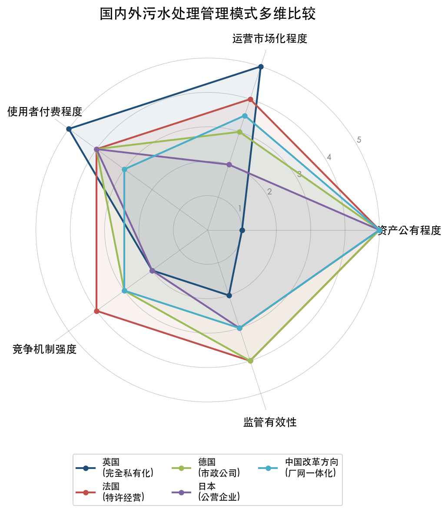

**图2-2** 以资产公有程度、运营市场化程度、使用者付费程度、竞争机制强度和监管有效性五个维度，对比英国、法国、德国、日本和中国改革方向（厂网一体化）五种模式的制度特征。可以看出，中国的改革方向在保持较高资产公有程度的同时，力求在运营市场化和使用者付费维度上实现突破，其制度取向更接近法国和日本的经验。

在充分吸收国际经验与教训的基础上，中国市政污水处理的市场化改革路径应遵循以下原则：

**第一，坚持"所有权归公"的制度底线。**英国的教训表明，将自然垄断性基础设施的资产所有权转移给私人资本是高风险的制度选择。中国的改革应借鉴法国和日本的经验，明确管网等排水基础设施的资产所有权始终归政府所有，市场化的对象是经营权而非所有权。

**第二，以特许经营为主导的市场准入模式。**2023年PPP新机制已明确这一方向。法国百年特许经营的实践证明，有限合同期（而非永久私有化）是平衡效率与公共利益的最优制度安排——它既赋予运营商足够的投资回报周期，又通过期满竞争保持市场活力。

**第三，构建"厂网一体化"的运营框架。**无论法国、德国还是日本，将管网纳入污水处理全系统进行统一运营管理均为共识。中国当前大量城市的"厂网分离"格局是核拨制的历史产物，厂网一体化改革是提升系统效能的关键一步。

**第四，建立"雨水财政、污水价格"的费用分担机制。**日本的"雨污分担"原则具有清晰的制度逻辑：雨水排放具有显著的公共品属性，应由财政承担；污水排放具有明确的受益者，应由使用者通过价格机制支付。这一原则为中国理顺排水领域价费关系提供了直接参照。

## 2.5 从财政供养到市场化运营转型的关键制度条件

国内外经验表明，从核拨制向市场化运营的转型并非简单的主体更替，而是涉及价费机制、产权制度、绩效考核和组织结构等多个制度维度的系统性变革。以下分析四项关键制度条件及其改革路径。

### 2.5.1 价费机制改革：打通"使用者付费"的最后一公里

市场化运营的根本前提是建立可持续的收入来源。当前中国污水处理费仅覆盖处理厂和污泥处置的运营成本，不覆盖管网收集输送的建设和运营成本。这一"部分成本核算"的定价模式是核拨制的制度遗产——由于管网运维由财政全额供养的事业单位承担，定价时自然无需将管网成本纳入收费基数。

要实现市场化运营，价费机制须完成三个层次的递进改革：第一层次是将管网运维成本纳入污水处理费的成本核算范围，贵州省已率先迈出这一步；第二层次是建立覆盖全成本、保本微利的动态调价机制，武汉市方案已明确这一方向；第三层次是从更长远的视角探索"费改价"——将污水处理费从行政事业性收费转变为经营性价格，纳入总体水价体系，赋予运营企业更大的定价自主权和成本回收确定性。三个层次环环相扣，构成了价费机制市场化的完整路径。

### 2.5.2 资产确权与盘活：为市场化运营奠定产权基础

厂网一体化改革面临的首要障碍之一是管网资产的权属不清。城市排水管网通常分散在不同层级政府和多个部门名下——市政道路配套管网归住建部门，新开发区域管网由开发商移交后分属不同政府部门管辖，老旧管网甚至缺乏完整的资产登记。权属的模糊直接制约了管网资产进入特许经营合同、基础设施REITs等市场化交易和融资安排。武汉已出台《武汉市市政生活污水收集设施资产评估工作指引》，启动管网资产的全面清查、确权和登记入账工作，为厂网一体化市场化运营奠定了必要的产权基础。[武汉市人民政府](https://www.wuhan.gov.cn/zwgk/xxgk/zfwj/bgtwj/202503/t20250310_2549413.shtml "武汉市厂网一体化实施方案，2025年3月发布")

### 2.5.3 绩效考核转型：从"按量"到"按效"

传统核拨制和早期市场化项目普遍采用"按量付费"——以污水处理厂的进水量为付费基数。这一机制的根本缺陷已在前文分析：它不仅无法激励管网修复和外水控制，反而形成了"越漏水、越赚钱"的逆向激励。

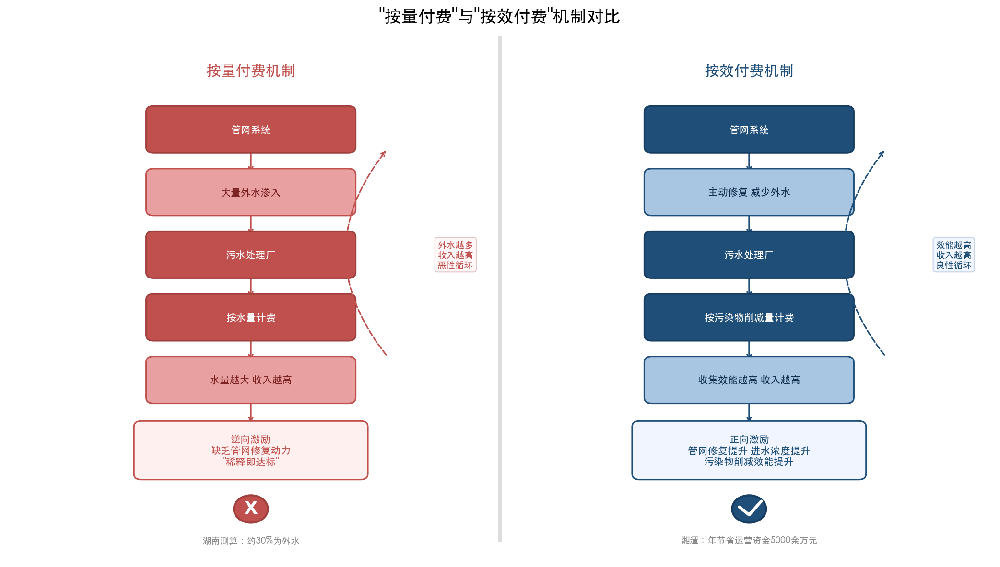

**图2-3** 直观对比了两种付费机制的运作逻辑与激励方向。在按量付费模式下，外水渗入增加处理水量并抬高运营商收入，形成"恶性循环"；而按效付费模式下，运营商主动修复管网、提升进水浓度和污染物削减效能才能获得更高回报，形成"良性循环"。

湖南省的改革经验为这一机制转型提供了有力实证。以污染物削减绩效为核心的"按效付费"机制，将运营商的收入与进水BOD/COD浓度、污染物削减量、管网漏损率改善等真正反映系统效能的指标挂钩，从而使降本增效成为运营商的内生动力。湘潭市的实践表明，按效付费实施后每年可节省运营资金5000多万元，原规划新建处理厂亦因进水量合理化而无需建设，综合节约效益显著。

### 2.5.4 人员安置与组织转型：改革的"最后一公里"

从核拨制向市场化运营转型，不可回避的现实挑战是事业单位人员的安置问题。当前大部分城镇排水设施维护运营单位是财政全额拨款的事业单位，人员编制按事业单位标准执行。市场化改革意味着这些机构须从"政府附属机构"转变为"市场化运营主体"，人员身份从"事业编制"转为"企业合同"，这一转变涉及广泛的利益调整，处置不当可能成为改革阻力。

武汉和长沙的实践提供了两种可行路径。武汉采取"委托运营+绩效合同管理"模式，由市城投集团下属排水公司组建专业的市政管网运维分公司，实现企业化运作；长沙则将城区市政排水设施整体委托给长沙水业集团运营管理。两种模式的共同特点在于——通过国有水务企业作为承接主体，实现人员从事业编制向国企编制的平稳过渡，既完成了管理体制的市场化转型，又最大限度降低了人员安置的社会风险。这一"体制内转化"的策略，体现了中国改革渐进性的务实考量。

## 2.6 风险防控：市场化改革的制度护栏

市场化改革在释放效率的同时，必须同步构建三类风险的防控机制。

**第一，服务质量下降风险。**市场化运营商以利润为导向，在监管不严的情况下可能通过压缩维护支出、降低服务标准来增厚利润。英国泰晤士水务的案例表明，这一风险绝非理论假设。应对之策是建立严格的绩效考核与按效付费机制，将服务质量指标（管网完好率、漏损率、进水浓度、应急响应时间等）与付费额度直接挂钩，并在合同中赋予政府在运营商严重违约时单方面终止特许经营的权利。

**第二，垄断定价风险。**污水处理是自然垄断性行业，特许经营权的排他性可能赋予运营商事实上的定价话语权。应对之策是完善成本监审制度和信息公开机制，建立独立的第三方成本核查体系，确保价格调整以经审计的合理成本为基础。法国的经验显示，即使在成熟的特许经营体系中，信息不对称仍然是最大的监管挑战——巴黎市收回供水经营权的案例正是对这一风险的回应。

**第三，公共资产流失风险。**在特许经营期内，运营商可能通过关联交易、不当折旧等方式侵蚀公共资产价值。应对之策是在特许经营合同中明确资产维护标准和移交条件，建立定期的资产盘点和评估机制，确保特许经营期满时资产完好无损地移交。武汉出台的《市政生活污水收集设施资产评估工作指引》为此类制度安排提供了可借鉴的实践基础。[武汉市人民政府](https://www.wuhan.gov.cn/zwgk/xxgk/zfwj/bgtwj/202503/t20250310_2549413.shtml "武汉市厂网一体化实施方案，2025年3月发布")

# 第3章 污水与雨水系统的协作机制——雨污协同、排涝联动与海绵城市融合

## 3.1 两套系统的技术关联与管理接口

### 3.1.1 排水体制的三种形态：合流制、分流制与混合制

城市排水系统按雨水与污水的收集方式，在技术上分为合流制与分流制两种基本体制。合流制将城市生活污水、工业废水和雨水径流汇集于同一管渠，输送至污水处理厂统一处理；分流制则设置两套独立管网，污水管收集生活污水和工业废水送至污水处理厂，雨水管收集雨水径流就近排入水体。在实际城市建设中，受历史沿革与分期开发影响，绝大多数城市呈现合流制与分流制并存的"混合制"格局——老城区以合流制为主，新建城区以分流制为主。

截至2020年，全国城市分流制排水管道长度为701586.3公里，占城市排水管道总长度的87.4%。[《环境工程技术学报》](https://www.hjgcjsxb.org.cn/article/doi/10.12153/j.issn.1674-991X.20230657?viewType=HTML "城镇分流制排水系统初期雨水污染特征与控制对策，2024年发表")从总量比例看，分流制已占据主导地位。然而，这一宏观比例掩盖了一个关键事实：在人口密集、经济活跃、排水需求最为集中的老城区核心区域，合流制管网仍大量存在。以湖南省为例，全省雨污合流制管网达8400公里，在排污管网中占比高达38.6%，直接导致城市污水处理厂进水COD浓度普遍达不到设计标准。[湘潭市人民政府](http://www.xiangtan.gov.cn/109/181/content_1421362.html "第二轮中央生态环境保护督察反馈问题整改公示")重庆市的排查数据亦显示，合流制管网约占5.6%，雨污错接、混接点达4.3万余个。[重庆市城市排水设施及管网建设"十四五"规划](http://zfcxjw.cq.gov.cn/ztzl_166/jkcsjcssjs/zcfg/202202/P020220209664176992966.pdf "重庆市住建委发布")

排水体制的选择并非简单的"分流优于合流"。从国际经验看，合流制在增设截流设施后同样可以有效运行，关键在于截流倍数的合理设定与溢流污染的有效控制。《室外排水设计标准》（GB 50014—2021）推荐合流制区域的截流倍数为2至5。问题的实质不在于体制选型本身，而在于中国大量城市既未实现真正意义上的彻底分流，也未在合流制区域建立有效的截流与溢流污染控制设施，形成了"名为分流、实为混流"或"合流不截流"的双重困境。

### 3.1.2 雨污混接：两套系统的"病理性"交叉

雨污混接是中国城市排水系统最为突出的结构性缺陷之一，也是污水系统与雨水系统产生负面耦合效应的核心问题。所谓混接，是指在分流制排水区域内，污水管与雨水管之间存在错接、误接或非法接驳——生活污水接入雨水管导致旱天排污，雨水接入污水管则导致雨天溢流。

混接的后果具有双向性。一方面，污水混入雨水管道后，旱天通过雨水排放口直排水体，成为城市河湖黑臭水体的直接成因。上海市长宁区在2024—2026年间专项启动了雨污混接普查与整治工作方案。[上海市长宁区政府](https://zwgk.shcn.gov.cn/xxgk/qtzcwj-hglzcwj/2024/166/73465/fd597379b03846d4a8ed875df31a39cb.pdf "长宁区雨污混接普查和整治工作方案，2024年发布")另一方面，雨水和地下水通过破损管道接口渗入污水管，稀释进厂污水浓度，降低处理效率，增大处理规模需求。如第1章所述，中国城市污水处理厂进厂COD浓度低于150 mg/L的情况非常普遍，远低于发达国家350 mg/L以上的水平。湖南省测算全省"按量付费"的付费水量中混入外水约占30%。[中国建设报](https://zjj.yzcity.gov.cn/zjj/0202/202502/4ad1180411ad41238094149b7970e83b.shtml "湖南加快推动城镇污水处理质效提升侧记，2025年2月")

混接问题本质上是污水系统与雨水系统在物理层面的"病理性"交叉，揭示了一个深层次的管理问题：在传统核拨制下，雨水管网和污水管网分属不同管理主体或同一主体的不同部门，日常运维缺乏协调，管网普查和缺陷修复缺乏系统性推进机制。解决混接问题，客观上要求将两套管网纳入统一管理平台，实施系统性的排查、诊断和修复——这正是雨污协同管理的逻辑起点。

### 3.1.3 合流制溢流污染：雨天的共性挑战

在合流制区域，暴雨期间混合污水水量超过截流管和污水处理厂的接纳能力时，多余的混合污水通过溢流口排入水体，形成合流制溢流污染（Combined Sewer Overflow, CSO）。CSO是全球城市排水领域面临的共性挑战，也是雨水管理与污水管理必须协同应对的核心议题。

CSO污染的典型特征是脉冲式、高浓度、高冲击负荷。一场暴雨过后，即使水质优良的河道也可能因CSO排放而迅速恶化乃至黑臭。国际上普遍采用"减排—截流—调蓄—处理"的技术路径控制CSO污染：在源头通过海绵设施减少地表径流量；在过程中通过提高截流倍数增大截流能力；在末端通过建设CSO调蓄池暂存溢流污水，待雨后送至污水处理厂处理。嘉兴市在2015—2017年国家海绵城市试点期间，在城南公园、文华园以及城东再生水厂新建了合流制溢流污染调蓄池。[嘉兴市城区城镇内涝防治规划](https://zjjcmspublic.oss-cn-hangzhou-zwynet-d01-a.internet.cloud.zj.gov.cn/jcms_files/jcms1/web3197/site/attach/0/3a140ea5beee480a88d6f130b2e72a8d.pdf "嘉兴市规划，浙江省政府网")

CSO治理的制度意涵在于：它天然要求雨水管理与污水管理的一体化协调。调蓄池的选址与容积设计须基于排水分区的雨水径流模拟和污水管网的截流能力分析；调蓄池的运行调度须与污水处理厂的产能余量实时联动；调蓄池的建设投资和运维成本须在雨水管理预算和污水处理预算之间合理分担。上述需求决定了CSO治理无法在"雨污分治"的管理体制下高效推进。

## 3.2 雨污协同运作的体制机制安排

### 3.2.1 从"分治"到"协同"：管理体制变革的逻辑

中国大多数城市在行政管理层面，雨水排放（排涝）与污水收集处理分属不同管理架构。雨水排放和防涝通常由城市水务局（或住建局）的排水管理部门负责，与防汛指挥体系衔接；污水收集处理则由生态环境部门实施监管、水务或住建部门进行行业管理、市场化企业负责运营。在核拨制下，雨水管网的维护经费与污水管网的维护经费分别核拨，各自独立运行。

这种"分治"体制在管网设施完好、雨污分流彻底的理想条件下尚可正常运转。然而，在中国城市排水系统普遍存在混接、渗漏、老化等结构性缺陷的现实条件下，"分治"导致了三方面突出的效率损失。

**第一，排查修复的重复与遗漏并存。**雨水管网和污水管网的排查、检测各自独立开展，同一道路下方的管道需两次开挖、两次检测，增加了施工成本和交通影响；与此同时，混接点的修复需同时涉及两套管网，但由于分属不同管理主体，协调困难与责任推诿时有发生。

**第二，应急调度缺乏联动。**暴雨期间，雨水泵站和污水泵站的调度各自为政。雨水泵站以尽快排除积水为目标，可能将大量混合水抽排至河道；污水处理厂为保护工艺设备，可能关闭进水闸门拒绝超量来水。两者之间缺乏基于水量水质实时监测的联合调度机制，既加重了河道水体污染，又浪费了污水处理厂在非暴雨时段的闲置产能。

**第三，投资决策缺乏系统优化。**在"分治"体制下，雨水管网的扩建改造和污水管网的扩建改造分别论证、分别立项、分别投资。但许多工程（如截流管建设、调蓄池建设、管网修复）同时服务于雨水排放和污水收集双重目标，重复投资与投资不足的问题均较突出。

从"分治"到"协同"的管理体制变革，核心在于建立雨水管理和污水管理的统一管理平台、统一数据底座和统一调度机制。广州市的实践提供了一个标杆性案例。

### 3.2.2 广州模式："厂网河"一体化与智慧排水的全覆盖管控

广州市在国内率先构建了"排水设施全覆盖管理、城市内涝全周期管控、设施运行全时效监控、联合调度有模型辅助"的智慧排水管控体系，成为住房城乡建设部首批新城建排水智能化专项试点城市。[住建部信息中心](https://www.mohurdic.org.cn/szzj/szcy/art/2025/art_8081502513fd494ab0cfe64df3c4d0eb.html "广州：智慧排水赋能高效应对城市积涝事件，2025年8月")

广州模式的制度核心在于打破雨水与污水管理的条块分割，具体体现在四个维度。

**在组织架构上**，广州将中心城区13个污水系统划分为44个片区，实行片长负责制，监管2万多个排水单元，形成了"源头到末端"的全链条管理体系。[广州市人民政府](https://www.gz.gov.cn/zt/fxbxaqdx/aqxd/content/post_10024295.html "广州打造防内涝半小时布防抢险圈")通过开展排水特许经营，成立专业排水公司承担巡检运维，雨水管网与污水管网的日常运维由同一家专业公司负责，从体制上消除了"分治"带来的协调成本。

**在数据底座上**，广州建成了排水设施"一张图"，覆盖全市11个区的195414个排水户、39734个排水单元、1240座闸泵站、64座污水处理厂及98281个排水口。市政管渠41118公里与城中村管渠3778公里全部纳入信息化管理。同时制定统一的物联数据标准，建成8类4244个物联实时监测点和60万路视频接入，实现雨水与污水设施运行状态的全时效监控。[住建部信息中心](https://www.mohurdic.org.cn/szzj/szcy/art/2025/art_8081502513fd494ab0cfe64df3c4d0eb.html "广州智慧排水建设成效")

**在应急调度上**，广州构建了"厂网河一体化调度模型"，基于管网水力模型提供各泵站优化调度方案，典型泵站的暴雨抵御能力从20年一遇提高到30年一遇。内涝预报预警模型基于气象预报与管网模型模拟易涝风险点的未来积水情况，实现"早布防、快处置"。截至2024年底，该智慧排水系统已支撑579次应急响应、632次水尺告警、594宗积水事件的生成及处置，成功抵御台风"摩羯""苏拉""海葵"等极端天气，未发生重大灾情和人员伤亡。[住建部信息中心](https://www.mohurdic.org.cn/szzj/szcy/art/2025/art_8081502513fd494ab0cfe64df3c4d0eb.html "广州智慧排水社会效益")

**在物联采购模式上**，广州创新性地采用"采购服务、按效付费"方式购置物联监测设备，有效解决了传统模式下"一锤子买卖"和固定资产管理的弊端，促进服务提供商持续创新产品、提高性价比与服务保障能力。这一模式与第2章所讨论的"按效付费"改革理念一脉相承。

广州模式对全国的启示在于：雨污协同管理并非简单的"机构合并"，而是需要数据融合、模型驱动、专业运维三大支柱的系统性建设。特许经营制度是将雨水管网和污水管网纳入统一专业运维的制度保障，智慧化平台是实现雨污联合调度的技术基础，按效付费则是驱动运维企业持续优化的激励机制。

### 3.2.3 投资分担与费用分担："雨水财政、污水价格"的原则框架

雨污协同运作的制度设计中，最核心且最具争议性的问题在于：雨水排放管理与污水收集处理的成本，应当由谁承担、如何分担？

如第2章所述，日本在这一问题上确立了清晰的原则：**污水处理费用由使用者（受益者）负担，雨水处理费用由财政全额承担。**[中国水网](https://www.h2o-china.com/news/354374.html "日本排水体系系统性治理：东京案例的剖析与经验，2024年")其制度逻辑在于：污水排放具有明确的排污者和受益者，适用"污染者付费"原则；雨水排放属于城市防洪排涝的公共安全需求，具有显著的公共品属性，排放者难以界定、受益者为全体市民，适用公共财政负担原则。

这一"雨水财政、污水价格"的分担原则，对中国排水体制改革具有直接的参照价值。当前中国的困境在于：管网体系中雨水管与污水管的功能往往相互交织——合流制区域雨污共用同一管道，分流制区域又存在大量混接，导致两套管网在物理上难以完全分割。这种现状使得日本式的清晰二分法难以在中国直接套用，但并不影响其原则性框架的参照意义。

我们认为，中国可以借鉴日本原则，建立"分类分担、渐进推进"的费用分担机制，具体分为三个层次：

**第一层——纯雨水系统的建设和运维费用由财政承担。**在分流制区域，雨水管网、雨水泵站、排涝河道等纯雨水排放设施的建设投资和日常运维费用，应纳入地方财政的公共基础设施预算，不计入污水处理费。

**第二层——纯污水系统的运维费用由使用者通过污水处理费承担。**如第1章和第2章所述，贵州省已迈出将管网运维成本纳入污水处理费的先行步伐，建立"管网建设费用财政承担、运维费用价格补偿"机制。[贵州省住建厅](http://sjt.guizhou.gov.cn/xwzx/tzgg/202511/t20251107_88922511.html "贵州省生活污水治理攻坚行动方案，2025年11月")

**第三层——雨污共用设施（合流管、截流管、调蓄池等）的费用按功能比例分摊。**合流制区域的截流管和调蓄池同时服务于防涝和污染控制双重目标，其建设和运维费用应根据功能定位在财政和污水处理费之间合理分摊。具体比例可参考旱天和雨天的水量占比、或防涝功能和水质保护功能的权重来确定。

这一分层分类的框架，既坚持了公共财政对防涝安全的托底责任，又推动了污水处理向全成本覆盖的方向演进，避免了将所有排水成本笼统推给使用者或财政的极端做法。

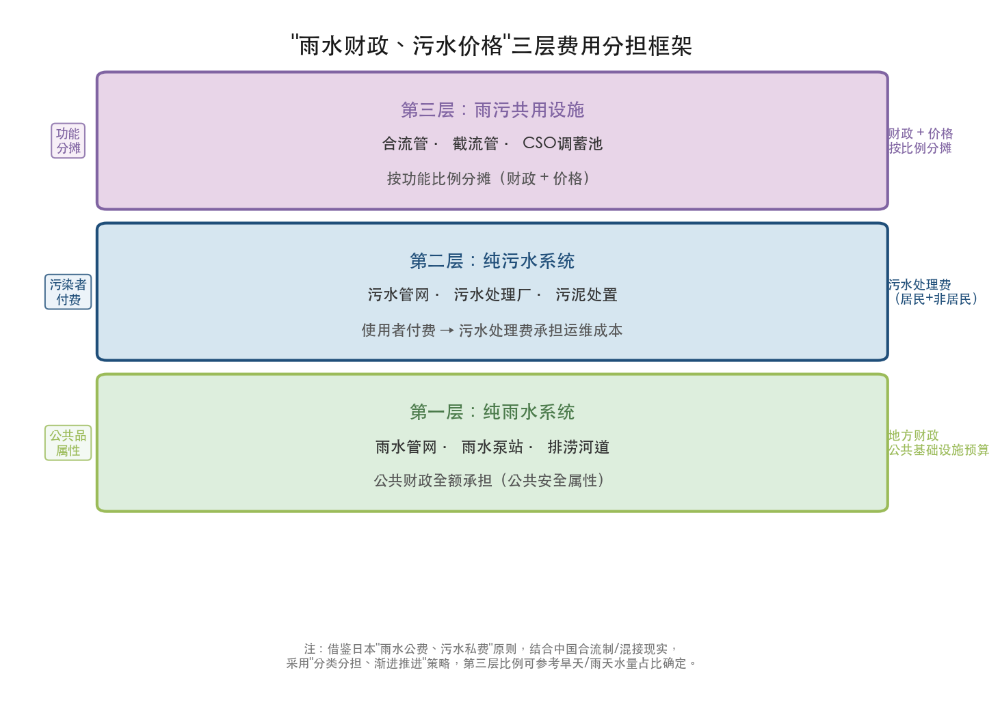

上图系统展示了"雨水财政、污水价格"三层费用分担框架的制度逻辑与资金来源对应关系。第一层以公共品属性为依据，由地方财政承担纯雨水系统费用；第二层遵循污染者付费原则，由使用者通过污水处理费承担纯污水系统运维成本；第三层则针对合流管、截流管、CSO调蓄池等雨污共用设施，按功能比例在财政与价格之间分摊。

## 3.3 排涝联动：暴雨应急中的雨污协调

### 3.3.1 城市内涝治理的紧迫形势

城市内涝是中国城市面临的重大公共安全挑战。"十四五"以来，住建部持续推进排水防涝工程体系建设。截至2025年5月，全国已累计消除城市易涝积水点4800个。[住建部副部长秦海翔国新办发布会发言](https://zrzy.guizhou.gov.cn/wzgb/zwgk/zfxxgk/fdzdgknr/qtfdxx/xwfbh/202507/t20250731_88359672.html "国新办城市更新发布会，2025年5月")在资金保障方面，2023年增发国债中安排1400亿元专项支持城市排水防涝设施建设，2024年以来超长期特别国债已安排超过2900亿元支持城市地下管网建设改造。[国家发改委赵成峰国新办发布会发言](https://zrzy.guizhou.gov.cn/wzgb/zwgk/zfxxgk/fdzdgknr/qtfdxx/xwfbh/202507/t20250731_88359672.html "国新办城市更新发布会，2025年5月")

然而，随着气候变化导致极端降雨事件频发、城市化导致不透水下垫面比例持续增大，城市排水系统面临的压力持续加剧。排涝联动——即雨水泵站、排水管网、河道闸门、污水处理厂之间的实时协调调度——已成为提升城市防涝韧性的关键环节。

### 3.3.2 暴雨应急中的"雨污冲突"与联动路径

暴雨期间，雨水排放系统与污水处理系统之间存在天然的"冲突"：雨水系统需最大限度地加速排水以减轻地面积涝，污水系统则需控制进水水量以保护生物处理工艺。在合流制或混接严重的区域，这一冲突尤为尖锐——大量雨水混入污水管网后涌入污水处理厂，导致水量激增、浓度骤降，不仅威胁生化处理系统的稳定运行，还可能造成未经充分处理的混合污水溢流排放。

解决这一冲突的核心途径是建立暴雨条件下雨水系统与污水系统的联合调度机制。上海市杨浦区2025年版防汛防台专项应急预案明确规定：水务部门根据水情、工情加强水闸与泵站实时调度，全力控制内河水位，防汛排水泵站转入暴雨模式运行；当内河水位因暴雨暴涨时，须对排入该河的排水泵站实施统一调度。[上海市杨浦区政府](https://www.shyp.gov.cn/zhengwu/yjj-yjyahyjyl1/2025/219/8e5e7e01404ac70ec4d595241581e209.html "杨浦区防汛防台专项应急预案，2025版")

具体而言，排涝联动机制应涵盖以下三个阶段：

**雨前——预警与预调度。**基于气象预报和管网模型预测降雨对排水系统的冲击，提前降低河道和调蓄设施水位，为暴雨来临腾出蓄水空间；污水处理厂提前开启排水设施降低厂区水位，动态调整格栅运行间隔。广州智慧排水系统已实现54场降雨的内涝风险预报，累计推送内涝预报数据1.2亿条，为抢险队伍提前布防提供了科学支撑。[住建部信息中心](https://www.mohurdic.org.cn/szzj/szcy/art/2025/art_8081502513fd494ab0cfe64df3c4d0eb.html "广州智慧排水模型辅助")

**雨中——联合调度与动态分配。**根据实时监测的管网水位、泵站流量、河道水位等数据，在雨水泵站排水与污水处理厂进水之间进行动态平衡——管网满载时优先保障排涝安全，通过临时启用截流管、调蓄池等设施收集初期高浓度雨水，避免直排水体；在污水处理厂能力允许时，适度接纳雨水混合污水以减轻排涝压力。

**雨后——排空与复盘。**暴雨过后，将调蓄池和截流管中的存水逐步送入污水处理厂处理，恢复正常运行状态；同时对本场次的积水事件、溢流量、水体污染情况进行复盘分析，识别薄弱环节并纳入后续工程整治计划。广州市"一雨一报"机制截至2024年底已生成34次市级复盘报告，累计管理历史涝点1088个，产生1789条内涝点工程整治进展信息。[住建部信息中心](https://www.mohurdic.org.cn/szzj/szcy/art/2025/art_8081502513fd494ab0cfe64df3c4d0eb.html "广州智慧排水内涝周期管控")

### 3.3.3 从应急联动到常态协同：构建"平战结合"的管理体系

排涝联动不应仅限于暴雨应急时段的临时协调，而应延伸为日常管理中的常态化协同机制。广州智慧排水系统所倡导的"平战结合"理念具有推广价值——"平时"做好排水设施的运行维护和缺陷整治，通过日常巡检和物联监测排除隐患、充分发挥设施功效；"战时"遵循防涝应急预案，启动联合调度、快速处置。

"平战结合"的制度基础是统一的管理平台与统一的运维主体。若雨水管网和污水管网分属不同运维单位，即便建立了应急联动预案，暴雨来临时的实时协调仍面临信息传递延迟、指挥层级冗余、责任界定模糊等障碍。广州将雨水和污水管网统一由专业排水公司运维、统一接入智慧排水平台的做法，为"平战结合"提供了组织保障与技术支撑。

对于尚未实现统一运维的城市，可采取过渡性安排：在排水管理部门层面建立雨污协同调度中心，整合雨水和污水管网的监测数据，制定联合调度预案，明确各运维单位在应急状态下的指令服从关系与责任分工。这一安排虽在效率上不及统一运维模式，但可在现有体制框架内实现基本协同功能，为后续的体制整合积累经验。

## 3.4 海绵城市建设：源头减排的系统效益

### 3.4.1 海绵城市的理念与制度推进

海绵城市是指城市像海绵一样，在适应环境变化和应对自然灾害方面具有良好弹性，下雨时吸水、蓄水、渗水、净水，需要时将蓄存的水释放并加以利用。其核心技术路径为"源头减排、过程控制、系统治理"——通过在建筑小区、道路广场、绿地公园等城市开发建设项目中嵌入透水铺装、下凹式绿地、生物滞留设施、雨水花园等低影响开发（Low Impact Development, LID）设施，从源头削减雨水径流量，降低管网排水压力。

中国自2015年启动海绵城市建设试点以来，已形成从试点到示范再到系统化全域推进的制度路径。"十四五"期间，中央财政安排约600亿元补助资金，支持60个城市系统化全域推进海绵城市建设，带动总投资1600亿元。[财政部经济建设司司长郭方明国新办发布会发言](https://zrzy.guizhou.gov.cn/wzgb/zwgk/zfxxgk/fdzdgknr/qtfdxx/xwfbh/202507/t20250731_88359672.html "国新办城市更新发布会，2025年5月")多个城市已取得显著成效：深圳市光明区建成区海绵达标比例达62.1%，科学城达95.69%，提前完成"十四五"目标；[深圳市光明区水务局](http://www.szgm.gov.cn/gmhbsw/gkmlpt/content/12/12077/post_12077324.html "光明区水务局2024年工作总结")福建龙岩市主城区海绵城市建设达标面积超40%，内涝积水区段消除比例达100%；[福建省住建厅](https://zjt.fujian.gov.cn/xxgk/gzdt/bmdt/202512/t20251216_7047014.htm "龙岩山城蝶变展新颜，2025年12月")北京市海绵城市建成区达标面积超500平方公里，达标面积比例超过39%。[北京市水务局](https://swj.beijing.gov.cn/swdt/swb/202412/P020241223385472470241.pdf "北京海绵城市建成区达标率超36%，2024年12月")

### 3.4.2 海绵城市对雨污协同的系统效益

海绵城市建设对雨污系统协同运作产生三重系统效益。

**第一，削减雨水径流峰值，降低排涝系统压力。**LID设施通过渗透、滞留、蓄存等功能，显著削减暴雨期间的地表径流峰值和径流总量，延缓径流汇聚时间。雨水管网和排涝泵站因此可以在较低的设计标准下满足同等防涝安全要求，从而减少排涝基础设施的新建扩建投资。广州智慧排水的模型分析表明，通过LID改造，典型排水片区的管网排水能力可提升一个设计等级。

**第二，减少雨水对污水系统的冲击。**在分流制区域，海绵设施的源头减排效果直接减少了进入雨水管的径流量，间接降低了因管网渗漏和混接而进入污水管的外水量，有助于提升污水处理厂进厂浓度、降低处理能耗。在合流制区域，源头减排直接减少了进入合流管的总水量，降低了CSO溢流的频次和体量。

**第三，净化初期雨水，削减面源污染。**分流制排水系统中的初期雨水污染已成为城镇水体污染的主要成因之一，城市下垫面和管道沉积物中的污染物是初期雨水污染的主要来源。[《环境工程技术学报》](https://www.hjgcjsxb.org.cn/article/doi/10.12153/j.issn.1674-991X.20230657?viewType=HTML "城镇分流制排水系统初期雨水污染特征与控制对策，2024年")生物滞留设施、雨水花园、人工湿地等海绵设施具有天然的水质净化功能，可在源头对初期雨水中的SS、COD、重金属等污染物进行有效截留和降解，减少进入水体的面源污染负荷，改善城市水环境质量。

### 3.4.3 海绵城市融入排水体制改革的实施路径

将海绵城市建设纳入排水体制改革的整体框架，需要解决三个制度衔接问题。

**投资机制的衔接。**海绵城市建设涉及的LID设施分散于城市各类开发建设项目中，投资主体多元（房地产开发商、市政工程建设单位、公园管理部门等），运维责任亦相应分散。这与排水管网"统一规划、统一建设、统一运维"的管理要求存在张力。解决思路是：在排水专项规划中统筹海绵城市的源头减排要求，将LID设施纳入排水系统整体效能评估；在新建项目中通过规划条件和竣工验收将海绵设施建设落实为强制性要求；在运维环节探索将分散的LID设施纳入区域排水设施统一运维合同。

**绩效评估的衔接。**海绵城市建设的绩效评估通常以年径流总量控制率、可透水地面面积比例等指标为核心，与排水系统的绩效评估（管网完好率、进厂浓度、污染物削减量等）属于不同指标体系。在推进雨污协同与"按效付费"改革时，应建立将源头减排效果纳入排水系统整体绩效评估的方法论——例如，将排水分区的年径流总量控制率达标情况纳入排水特许经营绩效考核的加分项，激励运维企业主动配合海绵设施的建设与维护。

**资金来源的衔接。**海绵城市建设资金来源包括中央财政补助、地方财政配套、专项债券、社会资本等多元渠道。"十四五"期间中央财政600亿元补助带动总投资1600亿元的杠杆效应表明，公共资金的引导对撬动社会投资至关重要。在排水体制改革框架下，海绵设施因其削减管网排水压力、降低污水处理成本的系统效益，可视为排水系统的"源头减负投资"。未来可探索将海绵城市建设的部分效益（如因减少管网扩建而节省的投资、因降低CSO溢流而减少的水体治理成本）加以量化，并反馈至海绵设施的运维补贴，形成"减排—降本—反哺"的良性循环。

## 3.5 构建雨污协同的制度框架：降低综合成本、实现良性循环

### 3.5.1 "一个平台、两条主线、三层分担"的总体框架

综合前述分析，我们提出雨污协同运作的总体制度框架——"一个平台、两条主线、三层分担"。

**一个平台**——建立统一的排水管理与调度平台。将雨水管网和污水管网的资产数据、运行监测、维护记录、应急调度统一纳入同一信息化管理平台。技术层面可参考广州智慧排水的"三全一有"体系，组织层面可通过将雨水和污水管网统一委托同一市场化运维主体，或至少在管理部门层面建立雨污协同调度中心来实现。

**两条主线**——日常协同运维与暴雨应急联动。日常协同侧重管网排查修复的统一部署（避免重复开挖）、混接点整治的系统推进、管网健康度的统一评估，以及排水分区效能的综合监测。暴雨应急联动侧重"雨前预调度—雨中联合调度—雨后复盘整治"的三段式管理流程，核心是建立雨水泵站、截流管、调蓄池、污水处理厂之间基于实时数据的联合调度决策机制。

**三层分担**——如3.2.3节所述，纯雨水系统费用由财政承担，纯污水系统运维费用由使用者通过价格承担，雨污共用设施费用按功能比例分摊。这一分担框架为雨污协同运作提供了清晰的资金来源，避免了因费用归属不清导致的投资不足或责任推诿。

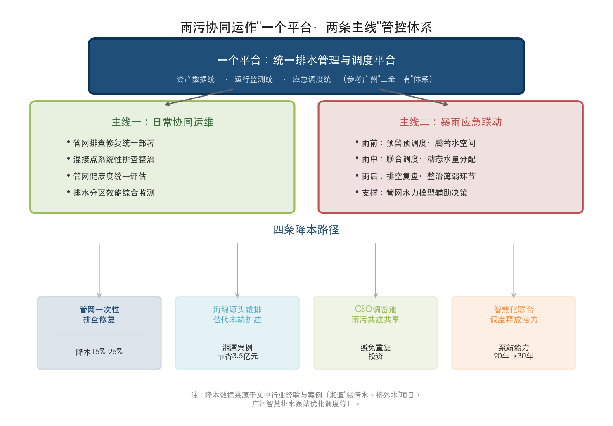

上图完整呈现了雨污协同运作的制度框架：顶层为统一排水管理与调度平台，中层分列日常协同运维和暴雨应急联动两条主线，底层展示四条降本路径及其量化效果，包括管网一次性修复降本15%—25%、湘潭案例节省建设投资约3.5亿元、CSO调蓄池共建共享避免重复投资，以及智慧化联合调度将泵站能力从20年一遇提升至30年一遇。

### 3.5.2 降低综合成本的四条路径

雨污协同运作的核心目标之一，是通过系统优化降低城市排水的综合成本。具体而言，降本路径有四条：

**路径一：管网排查修复的一次性完成。**在统一运维体制下，同一道路下方的雨水管和污水管可在一次施工中完成检测、诊断和修复，避免重复开挖带来的施工成本与社会影响成本。据行业经验，统一施工可将管网修复的综合成本降低15%—25%。

**路径二：海绵设施源头减排替代管网末端扩建。**通过在排水分区内系统布局LID设施，削减径流峰值和总量，可推迟乃至取消部分雨水管网和排涝泵站的扩建需求。湘潭市通过"撇清水、挤外水、收污水"项目，使原规划的6万吨/日铁牛埠污水处理厂无需建设，节省建设投资约3.5亿元。[中国建设报](https://zjj.yzcity.gov.cn/zjj/0202/202502/4ad1180411ad41238094149b7970e83b.shtml "湖南加快推动城镇污水处理质效提升侧记，2025年2月")

**路径三：CSO调蓄池的"雨污共建共享"。**合流制区域的CSO调蓄池既服务于雨季溢流污染控制（水环境功能），又服务于蓄滞暴雨径流削峰（排涝功能）。在统一的雨污管理框架下，调蓄池的选址与容积设计可同时优化两种功能，避免分别建设雨水调蓄设施和污水调蓄设施造成的重复投资。

**路径四：智慧化联合调度释放存量设施潜力。**广州的实践表明，通过管网水力模型的优化调度，可在不增加硬件投资的条件下显著提升排水系统的有效排水能力。典型泵站从抵御20年一遇提升到30年一遇降雨的效果，若通过传统硬件扩建方式实现，所需投资将远超智慧化系统的建设成本。

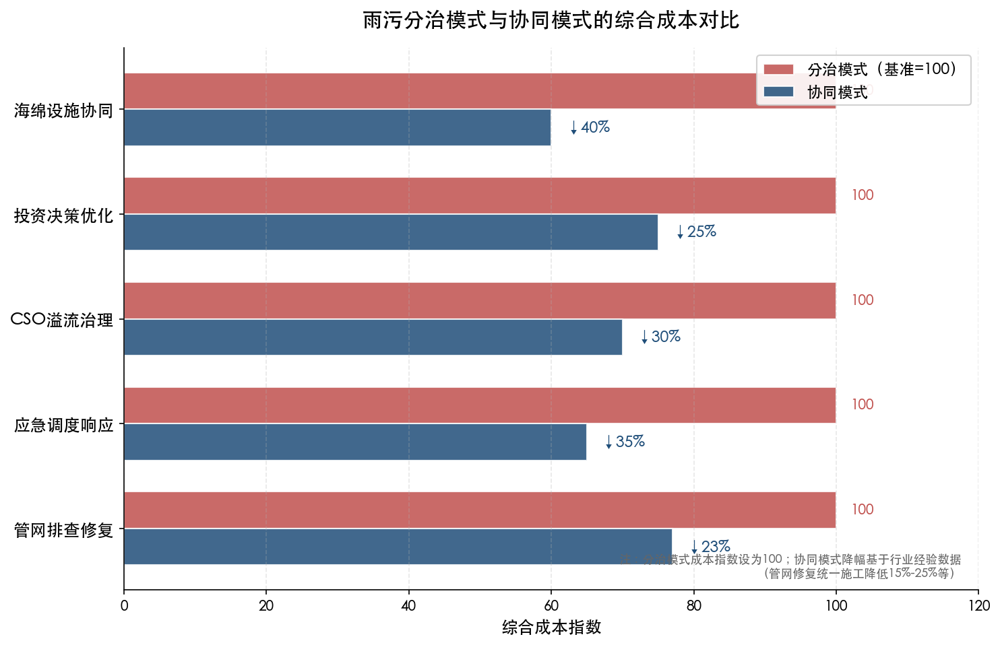

上图以分治模式成本指数100为基准，对比了协同模式在五个关键环节的综合成本降幅：管网排查修复降低23%，应急调度响应降低35%，CSO溢流治理降低30%，投资决策优化降低25%，海绵设施协同降低40%。数据直观表明，雨污协同运作在各环节均可产生显著的降本效益。

### 3.5.3 实现良性循环的制度闭环

降低综合成本并非最终目标，关键是将节省的成本转化为持续改善排水系统质量的再投资，形成"降本—再投资—提质—再降本"的良性循环。实现这一循环需要三个制度条件。

**第一，透明的成本核算。**唯有建立雨水和污水系统的精细化成本核算体系，才能准确量化协同运作带来的成本节约，为再投资决策提供依据。这一要求与第4章将讨论的全生命周期成本管理框架直接衔接。

**第二，灵活的资金循环机制。**在现行财政体制下，因协同运维节省的财政拨款往往自动回归财政一般预算，无法定向用于排水系统的再投资。改革方向是建立排水系统专项基金或在特许经营合同中设置"成本节约分享"条款——当运维企业通过协同优化实现成本节约时，节约额的一定比例可用于管网更新改造或海绵设施建设，其余部分作为运维企业的效率奖励。这一机制将为核拨制下长期缺失的降本激励提供制度出口。

**第三，绩效驱动的持续改进。**将雨污协同运作的成效（如混接点消除率、CSO溢流频次下降幅度、内涝积水点消除率、进厂浓度提升率等）纳入排水特许经营或委托运营的绩效考核体系，建立与第5章将讨论的监管评价框架相衔接的动态反馈机制。

# 第4章 全生命周期成本管理——建设、运营、维护、改造与应急成本的系统优化

## 4.1 全生命周期成本分析框架的构建

市政污水收集处理系统属于典型的长寿命资产密集型公共基础设施，其成本发生贯穿规划设计、投资建设、日常运营、管网维护与检测、设施改造更新以及应急处置等各环节，时间跨度可达30至50年甚至更长。然而，在传统核拨制下，上述成本被分散于不同预算科目和不同管理主体之中，缺乏系统性的全生命周期视角，由此形成"建设时省、运营时贵、维护时缺、改造时难"的恶性循环。构建全生命周期成本（Whole Life Cycle Cost, WLCC）分析框架，是实现成本透明化、定价合理化和管理精细化的基础前提。

### 4.1.1 全生命周期成本的六大构成环节

市政污水收集处理系统的全生命周期成本可分解为规划设计、投资建设、日常运营、管网维护与检测、设施改造更新、应急处置六大环节。基于行业数据与文献推算，在以10万吨/日规模城市为参考的50年生命周期中，管网维护与检测（约18%）和设施改造更新（约24%）两项合计占比达42%，构成全生命周期内的最大成本来源（详见图4-1）。

**第一，规划设计成本。** 涵盖排水专项规划编制、工程可行性研究、环境影响评价、初步设计与施工图设计等前期费用。规划设计成本在总投资中占比虽小（通常不超过5%），但其质量直接决定后续各环节的成本效率——选址不当、工艺选择过度或不足、管径设计偏差等规划失误将在项目全生命周期内持续产生成本溢出。

**第二，投资建设成本。** 这是最为显性、单次金额最大的成本环节，涵盖污水处理厂建设（土建工程、设备购置安装、自动化控制系统等）和排水管网建设（管材购置、沟槽开挖、管道铺设、检查井施工、路面恢复等）。行业实践表明，城镇污水处理厂每吨水处理能力的建设投资一般在1500—2000元之间[《污水处理厂成本构成分析》](https://chem.jgvogel.cn/c1301655.shtml "行业成本分析")。管网建设的单位造价差异更大，受城市地质条件、管径、埋深、交通导改等因素影响显著。据国家发改委2025年10月发布会信息，"十五五"期间排水管网单位公里建设改造成本预计达714万元，较历史时期大幅提升[国家发改委2025年10月发布会](https://www.dxguanxian.org/index.php/news/showNews/nid/6048.shtml "十五五地下管网建设预计70万公里、投资5万亿元")。

**第三，日常运营成本。** 以污水处理厂为核心，主要包括电费、药剂费、人工费、污泥处理处置费、设备检修费和管理费等。中国人民大学环境学院基于全国227个污水处理厂样本的实证研究显示，2013年样本平均运营成本为1.38元/吨，其中建设成本（折旧）0.37元/吨、污水运行成本0.81元/吨、污泥处理成本0.20元/吨；执行一级A排放标准的污水处理厂平均运营成本为1.50元/吨，显著高于执行一级B标准的1.31元/吨[《中国环境科学》](https://www.sciengine.com/doi/pdf/E27B22526A014F1E9A8E6B30BBB5A77B "基于污水处理厂运营成本的污水处理费制度分析，2015年")。截至2024年，全国城市污水处理厂每吨污水平均耗电量约0.292度，日处理量达2.4亿吨，年用电量超过250亿度[九澧咨询](https://www.hnjlzx.net/h-nd-193.html "污水处理厂常见十大问题解析")。从成本结构看，电费占运营总费用的40%—50%，其中曝气环节能耗占污水厂能源预算的约40%；人工成本占运营成本的20%—30%；药剂费在进水浓度偏低、需额外投加碳源的情况下，已在部分污水厂超过电费成为第一大运营成本项[九澧咨询](https://www.hnjlzx.net/h-nd-193.html "污水处理厂常见十大问题解析")。

**第四，管网维护与检测成本。** 这是核拨制下长期被低估且成本核算最为模糊的环节。管网维护涵盖日常清淤疏通、管道检测（CCTV检测、管道声纳、液位监测等）和缺陷修复（非开挖修复或开挖更换）三大类工作。当前CCTV检测的市场报价约为2000元/百米[行业市场数据](https://www.cnblogs.com/deepagents/p/19568138 "2026年非开挖管道施工企业评估")。非开挖修复技术如紫外光固化内衬修复、短管内衬法等的单位造价因管径和修复长度不同而差异较大，但普遍低于开挖更换的综合成本。长期以来，管网维护经费在财政预算中往往仅以"排水设施维护费"笼统列支，缺乏按管段、按病害类型的精细化核算。我国排水管网运维管理普遍采取被动响应模式——即"管网发生故障之后再进行应急抢修和维修"。美国环保局（EPA）研究亦证实，不定期维护将使管网恶化速度快于预期，且与定期维护相比产生更高的更换和应急响应成本[中国城镇供水排水协会](https://www.cuwa.org.cn/category/hangyeredian/6108.html "排水管网运维管理问题分析与对策研究，《中国给水排水》2022年第2期")。

**第五，设施改造更新成本。** 排水管道设计寿命30—50年，污水处理厂主要设备寿命15—25年，全生命周期内必然面临一至两轮大规模改造更新。据国家发改委测算，"十五五"期间全国地下管网建设改造总量预计超70万公里，新增投资需求突破5万亿元，其中改造类项目占比超过60%[国家发改委2025年10月发布会](https://www.dxguanxian.org/index.php/news/showNews/nid/6048.shtml "十五五地下管网建设规划")。污水处理厂的改造更新则主要集中在提标改造（如从一级B提升至一级A标准）和工艺升级两方面，提标改造往往需要新增深度处理单元，单位投资增量可达原建设投资的30%—50%。

**第六，应急处置成本。** 涵盖管网爆管、坍塌等突发事件的抢修费用，暴雨期间合流制溢流（CSO）的应急处置费用，以及污水处理厂因超负荷运行导致的设备损坏修复费用等。应急成本具有发生频率低但单次金额大的特征，且往往因事前预防投入不足而被放大。正如第3章所分析，暴雨期间雨水系统与污水系统的联动不畅可能导致大量未经处理的混合污水溢流排放，后续水体修复成本远高于事前调蓄设施投资。

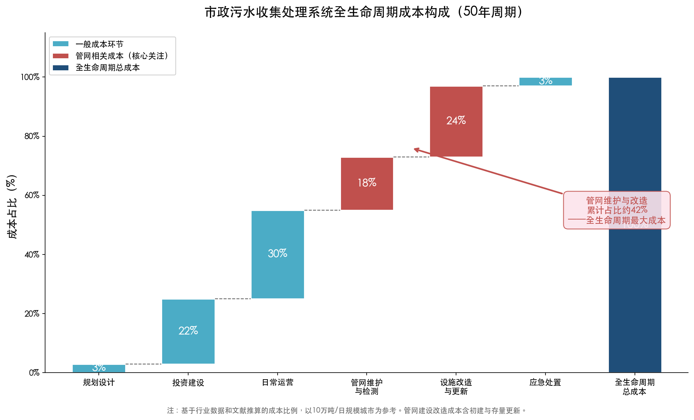

> 图4-1说明：以10万吨/日规模城市为参考，基于行业数据和文献推算的50年全生命周期各环节成本占比。管网维护与检测（18%）和设施改造与更新（24%）合计约42%，构成全生命周期最大成本来源。

### 4.1.2 "隐性成本"的识别与显性化

在上述六大直接成本之外，全生命周期成本分析还须识别若干在核拨制下长期被忽视的"隐性成本"，这些成本虽未在预算科目中显性列支，但实际消耗巨大且持续侵蚀系统整体效率。

**外水稀释导致的效率损失成本。** 如第1章所述，由于管网渗漏和雨污混接，大量外水（地下水、雨水）进入污水管网，稀释进厂污水浓度。据湖南省测算，全省"按量付费"的付费水量中混入外水约占30%[中国建设报](https://zjj.yzcity.gov.cn/zjj/0202/202502/4ad1180411ad41238094149b7970e83b.shtml "湖南加快推动城镇污水处理质效提升侧记，2025年2月")。按照全国日处理量2.4亿吨计算，若30%为外水，则每日约有7200万吨非污水消耗着宝贵的处理能力和运营资源。以吨水运行成本0.81元估算，仅外水处理每年即额外消耗约213亿元运营费用。这笔巨额成本在核拨制下被"按量付费"机制所掩盖，构成当前体制下规模最大的隐性效率损失。

**延迟维护导致的资产加速折旧成本。** 管网缺陷若不及时修复，将从轻微病害逐步演化为严重病害，最终导致管道坍塌或失效，修复代价成倍增长。及时的非开挖修复成本远低于全面更换成本，排水管网运维研究表明，从被动响应转向主动预防性维护，可显著延长管网使用寿命并降低全生命周期总成本[中国城镇供水排水协会](https://www.cuwa.org.cn/category/hangyeredian/6108.html "排水管网运维管理问题分析与对策研究，《中国给水排水》2022年第2期")。

**社会外部性成本。** 管网抢修导致的道路开挖、交通中断、居民出行不便等社会成本，以及污水溢流造成的水体污染治理成本等，虽非排水系统运营方直接承担，但属于全社会的福利损失。在全成本分析中，这些外部性成本应予以量化考量，以避免因内部化程度不足导致的投资决策偏差。

## 4.2 当前成本管理的主要痛点

### 4.2.1 成本核算碎片化："部分成本"定价模式的系统性缺陷

如第1章所分析，当前污水定价实行"部分成本核算"模式：根据国家发改委发改价格规〔2018〕943号文件，污水处理费仅覆盖污水处理和污泥处置设施运营成本，不包括管网收集和输送的建设运营成本[国家发改委](https://www.ndrc.gov.cn/xxgk/zcfb/ghxwj/201806/t20180629_960951.html "发改价格规〔2018〕943号")。这种定价模式的根本缺陷在于，它将同一公共服务链条上的成本人为割裂——处理厂成本通过价格机制回收，管网成本由财政核拨承担，改造更新成本依靠专项债券或中央转移支付，应急成本则在紧急预算中临时安排。

成本核算碎片化导致了三重后果。**其一，管网运维费用缺乏稳定保障。** 管网运维经费完全依赖财政拨款，在地方财力紧张时首先被压缩，形成"小修小补、头痛医头"的被动局面。据E20研究院调查，全国污水处理费账期平均达1年，支付缺口约2000亿元；2025年上半年缺口额仍呈上升趋势，不少水务企业仅收到包括电费、药剂费、人工费在内的"三保"费用，其他费用长期遭到拖欠[中国水网](https://www.h2o-china.com/news/361326.html "傅涛：如何啃下污水处理费改价硬骨头，2025年10月")。**其二，决策者无法基于全成本信息进行投资优化。** 当管网维护成本不纳入定价模型时，"重建设轻维护""重扩能轻修复"的决策偏差将持续存在——2024年管网投资2090.8亿元中修复类项目占比虽已超过60%，但这一比例的实现更多依赖上级政策推动而非全成本分析驱动的市场化决策。**其三，无法形成资金闭环。** 处理费收入流入财政后被统筹使用，管网运维部门的经费来源与其运维绩效之间缺乏直接关联，资金效率无法通过市场机制得到检验。

### 4.2.2 管网维护——长期被低估的成本洼地

在市政污水收集处理系统的全生命周期成本中，管网维护与改造是体量最大却最不受重视的成本领域，这一判断有充分的数据支撑。

**从存量规模看**，截至2024年末，全国城市排水管道总长度已达99.36万公里[2024年城乡建设统计年鉴数据整理](http://gszls.com/sys-nd/398.html "引用住建部统计")。如此庞大的管网资产即使按照最保守的单位维护成本估算，每年所需的维护检测费用也极为可观。然而在核拨制下，管网维护经费通常以"排水设施运行维护费"名义在事业单位预算中列支，总额有限且不与管网长度、管龄、病害程度等实际需求挂钩。

**从投资需求看**，"十五五"期间全国地下管网建设改造预计超70万公里、总投资突破5万亿元，其中改造类项目占比超60%——仅改造更新一项即需投入约3万亿元[国家发改委2025年10月发布会](https://www.dxguanxian.org/index.php/news/showNews/nid/6048.shtml "十五五地下管网规划")。对比2024年排水管网全年投资2090.8亿元[联合资信《水务行业2025年回顾和2026年展望》](https://www.lhratings.com/file/g123fa3877d.pdf "2024年数据")，即使维持当前投资强度，完成存量管网的全面更新也需近15年。上述数据对比揭示了管网维护改造面临的"资金黑洞"——它不仅是全生命周期成本中占比最高的单一环节，而且由于历史欠账巨大，需求规模仍在持续膨胀。

**从技术手段看**，管网检测与修复技术的进步正在改变传统的成本结构。截至2024年底，全国待修复排水管道长度超过30万公里[行业评估报告](https://www.cnblogs.com/deepagents/p/19568138 "2026年非开挖管道施工企业评估")。非开挖修复技术（如CIPP内衬修复、紫外光固化、管道短管内衬等）可在不开挖路面的条件下完成管道修复，综合成本通常低于传统开挖更换方式，且大幅减少社会影响成本。技术进步为管网维护成本优化提供了重要空间，但其前提是建立起基于全生命周期视角的资产管理体系，而非继续沿用核拨制下的被动抢修模式。

### 4.2.3 提标改造驱动的成本跃升

出水排放标准的持续提高是驱动污水处理全生命周期成本上升的重要因素。基于全国227个污水处理厂样本的实证分析表明，执行一级A标准的污水处理厂平均运营成本比执行一级B标准高约14.5%（1.50元/吨对1.31元/吨），比执行二级标准高约20%（1.50元/吨对1.25元/吨）[《中国环境科学》](https://www.sciengine.com/doi/pdf/E27B22526A014F1E9A8E6B30BBB5A77B "基于污水处理厂运营成本的污水处理费制度分析，2015年")。成本增量主要源于更复杂的深度处理工艺、更高的曝气能耗和更大的药剂投加量。

值得警惕的是，部分地区存在出水标准盲目拔高的现象。浙江、甘肃等多地已将排放标准提升至准Ⅳ类甚至准Ⅲ类，使达标污水接近集中式生活饮用水地表水源地二级保护区水质要求。国家发改委、住建部、生态环境部联合印发的《关于推进污水处理减污降碳协同增效的实施意见》明确提出"各地方应科学合理制定污水排放地方标准，不得盲目提高标准"[九澧咨询](https://www.hnjlzx.net/h-nd-193.html "污水处理厂常见十大问题解析")。过高的出水标准不仅导致运营成本和改造投资成倍增加，还引发过度曝气、过量加药等问题，推升碳排放，形成减污与降碳不协同的局面。

从全生命周期成本视角审视，提标改造的成本效益应当与管网修复的成本效益进行系统比较。在进厂污水浓度偏低的情况下，与其投入巨资将出水标准从一级B提升至一级A，不如优先投资管网修复以提升进厂浓度、减少外水入渗——后者不仅能提升污染物实际削减效能，还能降低处理厂的单位能耗和药耗，实现"管网修复→进水提质→处理降本"的正向循环。湘潭市的实践为此提供了有力例证：通过"撇清水、挤外水、收污水"项目，原规划的6万吨/日铁牛埠污水处理厂无需建设，节省建设投资约3.5亿元[中国建设报](https://zjj.yzcity.gov.cn/zjj/0202/202502/4ad1180411ad41238094149b7970e83b.shtml "湖南加快推动城镇污水处理质效提升侧记，2025年2月")。

## 4.3 全生命周期成本优化的关键路径

### 4.3.1 从"部分成本"到"全成本"定价：价费机制的核心跃迁

实现全生命周期成本管理的制度前提，是将"部分成本"定价模式升级为"全成本覆盖"定价模式。这一改革方向已在政策层面和地方实践中逐步形成共识，其核心要义可概括为"三纳入一联动"。

**纳入管网运维成本。** 这是最关键的第一步。贵州省已率先在《贵州省城市及县城生活污水治理攻坚行动方案（2025—2027年）》中明确建立"管网建设费用财政承担、运维费用价格补偿"机制[贵州省住建厅](http://sjt.guizhou.gov.cn/xwzx/tzgg/202511/t20251107_88922511.html "贵州省生活污水治理攻坚行动方案，2025年11月")。六盘水市在2026年3月发布的《城市及县城生活污水治理攻坚行动方案》中进一步落实了这一原则[六盘水市人民政府](https://www.gzlps.gov.cn/zwgk/bmxxgk/szfb/fdzdgknr_5751016/szfwj_5734496/lpsfbh_5734501/202603/t20260312_89654298.html "六盘水市生活污水治理攻坚行动方案")。将管网运维成本纳入污水处理费的成本核算范围，意味着管网运维从财政"暗补"走向价格"明补"，为其建立了稳定、可预期的资金来源。

**纳入污泥全链条处置成本。** 当前部分地区污泥处置费核定标准偏低或不透明，未涵盖污泥减量化、稳定化和最终处置的全链条费用。将污泥处置全成本纳入定价体系，有助于推动污泥处置从"低价低质"向"合规达标"转型。

**纳入设施折旧与更新准备金。** 在全生命周期视角下，污水处理厂和管网的折旧不应仅作为会计科目存在，而应形成实际的资金积累，用于设施到期后的更新替代。日本东京的做法值得借鉴——将管网设计寿命从50年延长至80年以均衡单年度建设支出，实质上是通过延长折旧年限降低当期成本压力[中国水网](https://www.h2o-china.com/news/354374.html "日本排水体系系统性治理：东京案例的剖析与经验，2024年")。

**建立成本与价格的动态联动机制。** 全成本定价并非一次性调价到位，而是构建与成本变动联动的动态调价机制。武汉市在厂网一体化改革方案中已明确"建立覆盖成本、保本微利的动态调整机制"[武汉市人民政府](https://www.wuhan.gov.cn/zwgk/xxgk/zfwj/bgtwj/202503/t20250310_2549413.shtml "武汉市厂网一体化实施方案，2025年3月发布")。动态调价机制的核心在于设定明确的调价触发条件（如成本变动幅度超过5%）和调价程序时限，避免因调价滞后导致的成本倒挂和企业资金垫付。

全成本定价对终端水价的影响需要审慎评估。以当前全国36个大中城市居民污水处理费平均1.0元/m³为基准，若将管网运维成本（初步估算约0.3—0.5元/m³）纳入，居民污水处理费将上升至1.3—1.5元/m³的区间。这一涨幅虽然在绝对值上有限，但须结合居民承受能力设计过渡方案。E20研究院提出的"受益者付费+弱者明补"模式提供了可行思路——通过精准补贴机制保障低收入群体的基本用水权益，替代当前效率较低的"全民暗补"模式[中国水网](https://www.h2o-china.com/news/361326.html "傅涛：如何啃下污水处理费改价硬骨头，2025年10月")。

### 4.3.2 从被动抢修到主动预防：管网资产管理模式的变革

管网维护成本的优化空间在所有成本环节中最为突出，而优化的关键在于实现从"被动抢修"向"主动预防性维护"的管理模式变革。如图4-2所示，主动预防模式的全生命周期总成本较被动抢修模式可降低约22%，非开挖修复的单次综合成本较传统开挖更换可降低约59%。

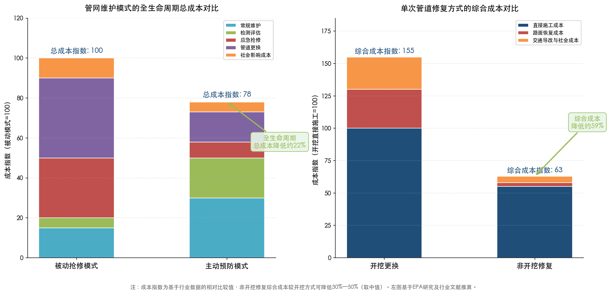

> 图4-2说明：左图对比被动抢修与主动预防两种模式的全生命周期总成本构成差异，主动预防模式总成本降低约22%；右图对比开挖更换与非开挖修复的单次综合成本，非开挖修复综合成本降低约59%。成本指数基于行业数据相对比值及EPA研究文献推算。

**建立管网资产状态评估与恶化预测模型。** 国际先进实践表明，通过对管网历史检测数据、管龄、管材、土壤条件、地下水位等多因素的综合建模，可预测管段的恶化趋势和故障概率。基于预测结果制定分级维护计划——高风险管段优先检测和修复，中风险管段提高巡检频率，低风险管段按常规周期维护——可在有限的维护预算内最大化资产保全效果[中国城镇供水排水协会](https://www.cuwa.org.cn/category/hangyeredian/6108.html "排水管网运维管理问题分析与对策研究，《中国给水排水》2022年第2期")。

**推广非开挖修复技术以降低单次维护成本。** 全国待修复排水管道长度超过30万公里，若全部采用开挖更换方式，不仅成本高昂（需拆除路面、开挖沟槽、回填压实、恢复路面），还将产生巨大的社会影响成本。非开挖修复技术（CIPP内衬、紫外光固化、螺旋缠绕等）可在施工周期更短、对道路和居民影响更小的条件下完成管道修复，综合成本较开挖方式可降低30%—50%。上海市水务局已发布紫外光原位固化、无机防腐喷涂等非开挖修复工程综合单价[上海市水务局](https://swj.sh.gov.cn/shsswjsgcaqzljdzx-dezjgl/ "上海排水管道修复定额，2025年发布")，为行业提供了成本基准参考。

**将管网维护纳入厂网一体化运营合同。** 在厂网一体化运营模式下，运营企业同时负责管网维护和处理厂运营，管网修复带来的进厂浓度提升将直接降低处理厂运营成本，由此形成"投入管网维护→减少外水入渗→提升进水浓度→降低处理能耗药耗"的内生激励。武汉市厂网一体化改革中的"按效付费"制度安排正是这一逻辑的制度实现——运营商的收入与进水BOD浓度、污染物削减量等绩效指标挂钩，使其具有主动投入管网维护的经济动力[武汉市水务局](https://swj.wuhan.gov.cn/tzdt/jcss/202603/t20260326_2745222.html "武汉厂网一体改革成绩单，2026年3月")。

### 4.3.3 运营成本的精细化管控

在处理厂运营环节，成本优化空间主要集中在能耗管控、药剂优化和人员效率提升三个方面。

**能耗精细化管控。** 电费占运营成本的40%—50%，是最大的可变成本项。智能精确曝气系统可根据进水水质和溶解氧浓度实时调节曝气量，有效避免过度曝气造成的能源浪费。深圳环水集团通过AI智能调度系统已实现显著的能耗降低。此外，污水源热泵技术可利用污水中的低品位热能为周边区域提供冷暖空调服务。东京排水系统2020年碳排放量较2000年已削减21%，预计2030年削减50%，其中污水热利用贡献显著[中国水网](https://www.h2o-china.com/news/354374.html "日本排水体系系统性治理：东京案例的剖析与经验，2024年")。

**药剂使用的精准化。** 药剂费在部分污水厂已超过电费成为第一大成本项，其主要原因是进水浓度偏低、需额外投加碳源。优化路径有二：一是从源头减少外水入渗（通过管网修复）以提升进水浓度，从根本上减少碳源投加需求；二是通过在线水质监测与AI投加算法实现药剂精准投加，避免经验化的过量投放。此外，利用餐厨垃圾等廉价碳源替代外购碳源，亦可显著降低药剂成本。

**人员配置的合理化。** 人工成本占运营成本的20%—30%，但部分污水厂在实现自动化升级后未相应调整人员编制，人力资源配置效率偏低。深圳环水集团通过AI智能调度结合"一人多岗+远程监控"模式，实现了人力成本降低35.6%[九澧咨询](https://www.hnjlzx.net/h-nd-193.html "污水处理厂常见十大问题解析")。在厂网一体化运营模式下，管网运维人员和处理厂运营人员可实现统一调配、弹性安排，进一步释放人力资源的规模效应。

### 4.3.4 应急成本的前置化管理

应急成本虽然在正常年份占比有限，但一旦发生重大事故（如管网大面积坍塌、暴雨导致的污水溢流等），修复和环境治理费用可能达到正常运维支出的数倍。降低应急成本的根本途径是将应急支出"前置化"——通过常态化的预防性投入，减少突发事件的发生概率和影响程度。

**管网健康监测系统的常态化运行。** 通过物联网传感器实时监测关键管段的水位、流量、气体浓度（检测有毒有害气体），可实现管网异常的早期预警。广州智慧排水系统已建成8类4244个物联实时监测点并接入60万路视频，累计支撑579次应急响应[住建部信息中心](https://www.mohurdic.org.cn/szzj/szcy/art/2025/art_8081502513fd494ab0cfe64df3c4d0eb.html "广州智慧排水建设成效")。常态化监测投入虽增加了年度运维成本，但大幅降低了因突发事件导致的应急支出和次生损失，在全生命周期视角下具有显著的成本效益优势。

**CSO调蓄设施的前置建设。** 如第3章所述，合流制区域的CSO调蓄池可在暴雨期间暂存溢流污水，待雨后送至处理厂处理，从根本上减少溢流污染事件。调蓄设施的建设投资虽然较高，但与暴雨后的水体污染治理成本相比，具有明显的全生命周期成本优势。

**应急准备金制度的建立。** 在特许经营或委托运营合同中设置应急准备金条款，要求运营企业从年度运营收入中按一定比例（如2%—3%）计提应急准备金，专项用于突发事件的应急响应和灾后修复。这一制度安排可将应急成本的不确定性转化为可预见的年度成本，有利于企业和财政的长期成本规划。

## 4.4 成本管理与价格衔接：为合理定价提供依据

### 4.4.1 全成本核算方法论

全生命周期成本管理的最终落脚点，是为污水处理收费标准的制定提供科学、透明的成本依据。构建全成本核算方法论，需要回答三个核心问题。

**核算范围应包含哪些成本？** 基于前文分析，我们认为合理的全成本核算范围应涵盖：污水处理厂运行成本（电费、药剂费、人工费、污泥处置费、设备维修费、管理费）、管网运维成本（清淤、检测、修复维护）、设施折旧（处理厂和管网的年度折旧摊销）以及合理利润。管网建设投资和大规模改造更新的资本性支出，鉴于其公共品属性和投资规模，仍应以财政投入和政府债券为主要资金来源，但应通过折旧机制在全生命周期内逐步向使用者传导。

**全成本的吨水水平是多少？** 综合现有研究数据进行初步测算：基于2013年全国227个样本1.38元/吨的平均运营成本（含处理厂折旧但不含管网折旧和运维）[《中国环境科学》](https://www.sciengine.com/doi/pdf/E27B22526A014F1E9A8E6B30BBB5A77B "基于污水处理厂运营成本的污水处理费制度分析，2015年")，考虑到近年提标改造和物价上涨因素，2024年全国平均运营成本预计已超过1.6元/吨；若再加上管网运维成本（初步估算0.3—0.5元/吨）、管网折旧分摊和合理利润，全成本水平预计在2.2—2.8元/吨区间。对照当前全国36个大中城市居民污水处理费平均1.0元/m³、非居民平均1.52元/m³的征收标准[中国环境经济政策进展评估报告2024](http://zghjgl.ijournal.cn/html/zghjgl/2025/5/20250507.htm "中国环境管理期刊2025年发表")，全成本覆盖率仅在36%—55%之间，缺口显著（详见图4-3）。

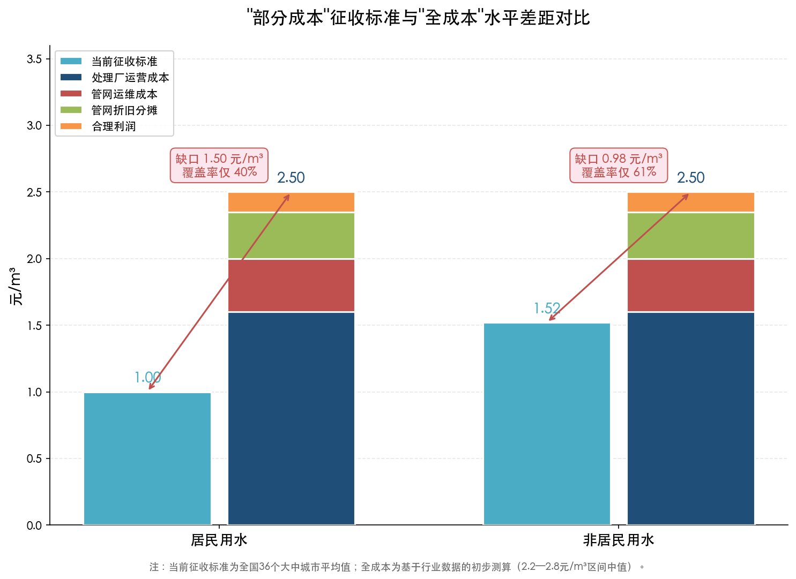

> 图4-3说明：对比当前居民（1.00元/m³）和非居民（1.52元/m³）污水处理费征收标准与全成本水平（约2.50元/m³）之间的差距。全成本按处理厂运营、管网运维、管网折旧分摊、合理利润进行堆叠拆解，当前居民用水覆盖率仅40%、非居民用水覆盖率仅61%。

**如何实现全成本向价格的渐进传导？** 鉴于居民承受能力的约束，全成本定价不宜一步到位，而应设计"三年过渡方案"：第一年先将管网运维成本纳入收费基数，居民污水处理费小幅上调至1.2—1.3元/m³；第二年在成本监审基础上启动综合调价，逐步覆盖折旧和合理利润；第三年建立定期调价机制，实现成本与价格的动态联动。对于低收入群体，应同步建立精准的消费后补贴机制，确保改革不增加弱势群体的生活负担。

### 4.4.2 成本监审与信息披露

全成本定价的公信力取决于成本信息的透明度。当前核拨制下成本信息严重不透明——管网维护的单位成本、管段效能、药剂消耗等关键数据均未建立公开披露机制。实现全成本定价，必须同步构建三项制度支撑。

**独立的第三方成本监审。** 由价格主管部门委托独立的第三方机构对污水处理全成本进行定期审计，审计范围覆盖处理厂运营成本和管网运维成本。2024年以来，成本预算绩效管理已在全国超半数省市开展试点[九澧咨询](https://www.hnjlzx.net/h-nd-193.html "污水处理厂常见十大问题解析")，为全成本监审积累了方法论基础。

**标准化的成本核算规范。** 制定统一的城镇污水处理全成本核算规范，明确各成本项目的归集方法、折旧标准、费用分摊原则等，避免因核算口径不一致导致的城市间可比性差和数据操纵空间。应特别规范政府无偿投入形成的固定资产的折旧处理方式，防止将其全额计入运营成本导致成本虚高。

**定期的信息公开。** 要求污水处理运营企业和管网运维单位定期（至少按年度）公开主要成本数据，包括但不限于吨水运行成本及其构成、管网检测修复的覆盖率和单位成本、管网漏损率变化等。信息公开既是外部监管的基础，也是社会公众理解和接受调价的前提条件。

## 4.5 雨污协同视角下的成本协同优化

全生命周期成本管理不应局限于污水系统内部，而应在第3章所论述的雨污协同框架下实现跨系统的成本协同优化。

**共建共享设施的成本分摊。** 如第3章所提出的"雨水财政、污水价格"三层分担框架，合流制区域的截流管和CSO调蓄池同时服务于防涝和污染控制双重目标，其建设和运维费用应在财政与污水处理费之间按功能比例分摊。全成本核算应明确雨污共用设施的成本分摊方法，既避免将应由财政承担的防涝成本转嫁给污水处理费用户，也避免应由用户承担的污染控制成本继续依赖财政拨款。

**统一运维带来的规模经济。** 如第3章所述，将雨水管网和污水管网统一委托同一市场化运维主体后，同一道路下方的雨水管和污水管可在一次施工中完成检测和修复，综合成本可降低15%—25%。这一规模经济效应应在全成本核算中得到充分体现——统一运维后的管网维护单位成本应低于分治模式下的成本之和，节约的成本可在运维企业和使用者之间合理分配。

**源头减排的成本替代效应。** 海绵城市设施通过削减雨水径流，减少进入排水系统的水量，相当于对排水管网和处理厂的"减负投资"。湘潭市通过源头治理使原规划新建处理厂无需建设、节省3.5亿元的案例，已充分证明了这一成本替代效应的现实意义。在全成本核算框架中，应将海绵设施的建设运维成本与其对排水系统的减负效益进行系统对比分析，为投资决策提供科学依据。

# 第5章 监管体系与绩效评价——构建市场化改革的制度保障

## 5.1 市场化转型对监管体系的新要求

市政污水收集处理体制从核拨制向市场化运营转型，本质上是政府角色的根本性重塑——从"既是运动员又是裁判员"的全能管理者，转变为"规则制定者、绩效监督者和公共利益守护者"的专业监管者。这一转型对监管体系提出了全新且系统性的要求。

在核拨制下，政府通过财政拨款和事业单位管理直接掌控排水设施的运营，监管需求相对简单，本质上是政府对下属机构的内部管理。一旦引入市场化主体，政府与运营方之间由上下级关系转变为合同关系，信息不对称问题随之凸显：运营企业掌握设施真实运行状态、成本构成、资产状况等核心信息，而政府作为监管方和服务购买方，必须建立一套独立的信息获取和核查机制，方能确保公共利益不被侵蚀。

市场化改革的监管难题可概括为"三管"：管得住质量——防止运营商通过压缩维护支出、降低服务标准攫取超额利润；管得住价格——防止自然垄断条件下的不合理定价侵害用户利益；管得住资产——防止公共基础设施在特许经营期内被掏空或贬值。英国水务私有化的教训已充分说明，缺乏有效监管的市场化改革非但不能提升效率，反而可能导致比核拨制更严重的制度失灵。2025年7月，英国政府宣布废除运行三十余年的水务监管机构Ofwat，代之以整合四个监管机构职能的新单一监管机构，英国环境大臣里德直言水务行业"千疮百孔"[光明网（中新社）](https://m.gmw.cn/2025-07/22/content_1304089428.htm "英国开启水务领域改革应对监管失灵，2025年7月")。此前的2025年5月，英国最大水务公司泰晤士水务因违反污水处理运营和分红支付规定被Ofwat处以创纪录的1.227亿英镑罚款[中国新闻网](https://www.chinanews.com.cn/gj/2025/05-29/10423800.shtml "英国最大水务公司被罚超1.2亿英镑，2025年5月")。中英两国的改革路径差异及其监管制度演进轨迹，如图5-1所示，从资产所有权、经营模式、监管架构到核心机制均存在根本性分野。

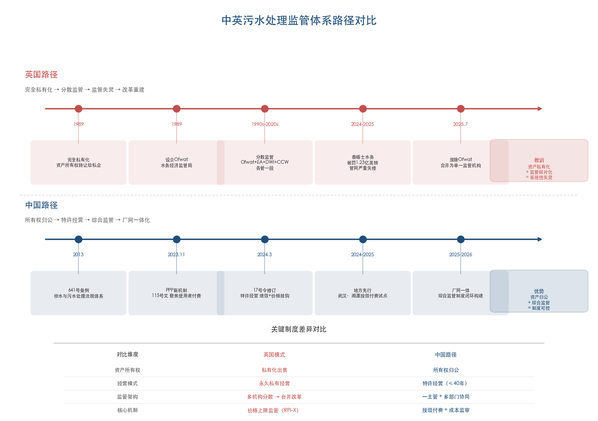

上述对比表明，监管体系的设计质量直接决定市场化改革的成败。中国的市政污水处理市场化改革正处于制度建设的关键窗口期。2024年3月修订发布的《基础设施和公用事业特许经营管理办法》（第17号令）为特许经营项目的监管提供了总体制度框架，明确要求实施机构"定期对特许经营项目建设运营情况进行监测分析，定期开展运营评价，并按相关规定开展相应的绩效评价，并建立根据绩效评价结果、按照特许经营协议约定对价格进行调整的机制"[国家发改委等六部门](https://www.moj.gov.cn/pub/sfbgw/flfggz/flfggzbmgz/202412/t20241224_511763.html "《基础设施和公用事业特许经营管理办法》2024年第17号令")。《城镇排水与污水处理条例》（国务院令第641号）也明确规定，城镇排水主管部门应当对排水与污水处理设施运行维护情况进行监督检查，建立监管档案。这些顶层制度为构建污水处理行业专业监管体系提供了法律依据，但从制度框架到落地实施，仍需在监管主体、绩效指标、信息公开、争议解决等各环节进行精细化设计。

## 5.2 监管职责体系：谁来监管、监管什么

### 5.2.1 中央与地方的监管职责分工

市政污水处理的监管涉及多个层级政府和多个职能部门，厘清职责分工是构建有效监管体系的首要前提。

在中央层面，监管格局主要沿三条线展开。其一，住房城乡建设部作为行业主管部门，负责排水与污水处理的行业指导、技术标准制定和全国性工作考核。住建部2011年印发的《城镇污水处理工作考核暂行办法》确立了日常监管、现场核查和重点抽查相结合的考核方式，考核指标涵盖城镇污水处理效能和主要污染物削减效率[住建部](https://www.chinacace.org/news/view?id=8460 "城镇污水处理工作考核暂行办法")。其二，国家发展改革委作为特许经营的牵头部门，负责特许经营模式的政策指导、方案审核和宏观协调。其三，生态环境部负责排放标准的制定和排污许可监管，对污水处理厂出水水质实施强制性环境监管。

在地方层面，《城镇排水与污水处理条例》明确，县级以上地方人民政府城镇排水主管部门负责本行政区域内城镇排水与污水处理的监督管理。实际执行中，市级水务（或住建）部门是最核心的监管主体，承担特许经营项目的日常监管、绩效考核、服务费审核支付等职责；区级排水主管部门在市级指导下负责辖区内排水设施的属地监管。

当前监管职责体系的主要症结在于"多头监管与监管真空并存"。住建、水务、生态环境、发改、财政、审计等多个部门各自承担部分监管职能，却缺乏统一的牵头协调机制。污水处理厂出水水质由生态环境部门监管，管网运维质量由排水主管部门监管，污水处理费征收使用由财政部门监管，价格调整由发改（价格）部门审批——各管一段、互不贯通，缺乏对"厂网一体化"运营全流程的系统性监管覆盖。在厂网一体化改革推进过程中，这种碎片化的监管格局亟待整合。

我们认为，应确立"一个主管部门统筹、多部门协同"的监管职责架构。具体而言，由市级水务（排水）主管部门作为特许经营项目的综合监管主体，统筹负责厂网一体化运营的绩效考核、服务费审核、资产监管等核心职能；生态环境部门继续负责排放标准和排污许可监管；发改（价格）部门负责成本监审和价格核定；财政部门负责污水处理费征收使用的财务监管；审计部门负责定期审计。各部门之间应建立信息共享和联合监管机制，消除监管盲区与监管重叠。

### 5.2.2 从"管人管事"到"管合同管绩效"的监管范式转换

核拨制下的监管本质是政府对下属事业单位的行政管理，以行政命令、编制管理、预算控制为主要手段。市场化改革后，政府与运营方的关系转变为合同关系，监管范式亦须从"管人管事"转向"管合同管绩效"。

这一转换的核心在于：政府不再直接介入运营细节，而是通过制定清晰的绩效标准、实施严格的绩效考核、建立绩效与付费的挂钩机制来引导运营商行为。监管关注点从"配备多少人员""支出多少经费"转向"公共服务质量是否达标""基础设施资产状况是否良好""环境效益是否实现"。

《基础设施和公用事业特许经营管理办法》（第17号令）第46条为这一转换提供了顶层制度支撑，明确要求"建立根据绩效评价结果、按照特许经营协议约定对价格进行调整的机制"，同时要求"将社会公众意见作为监测分析和运营评价的重要内容"[国家发改委等六部门](https://www.moj.gov.cn/pub/sfbgw/flfggz/flfggzbmgz/202412/t20241224_511763.html "《基础设施和公用事业特许经营管理办法》2024年第17号令")。第47条进一步要求特许经营者"将项目每季度建设运营情况、经审计的年度财务报表、有关会计数据、财务核算、资产管理情况和其他有关财务指标等信息，通过适当方式向社会公开"。绩效导向和信息透明由此成为特许经营监管的两大制度支柱。

## 5.3 绩效评价体系：从"按量付费"到"按效付费"的制度闭环

### 5.3.1 按效付费的制度逻辑

如第2章所分析，传统"按量付费"模式以进厂水量为付费基数，催生了"越漏水、越赚钱"的逆向激励。按效付费机制的核心逻辑在于将运营商的收入与其实际创造的环境效益挂钩，使降本增效和提质增效成为运营商的内生动力。

这一制度逻辑的实现须解决三个关键问题：考核什么（指标体系设计）、怎么考核（考核程序与方法）、考核结果怎么用（绩效与付费的挂钩机制）。

### 5.3.2 绩效考核指标体系设计

绩效考核指标体系是按效付费机制的基石。基于国内已有实践和学术研究，污水处理厂网一体化运营的绩效考核指标体系宜围绕"产出效能—实施效果—项目管理"三个维度构建，其整体框架如图5-2所示。

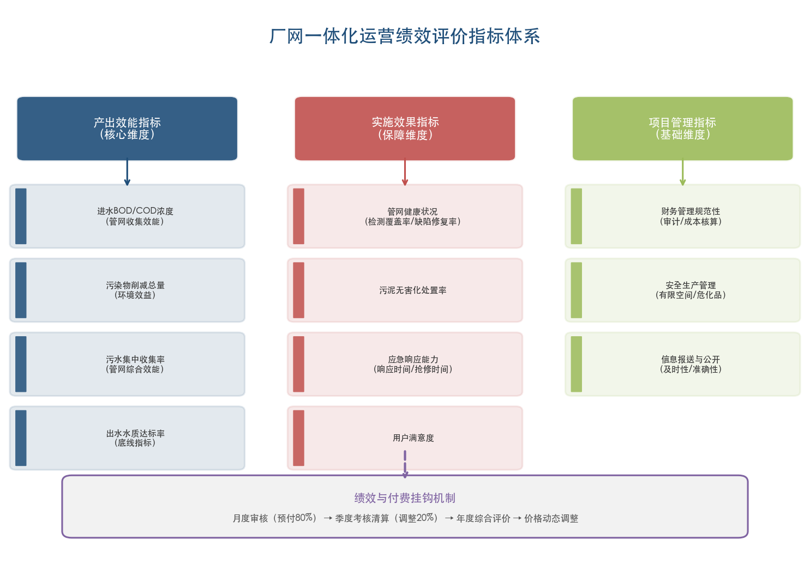

**第一维度：产出效能指标。** 该维度为考核体系的核心，直接衡量污水收集和处理的环境效能，关键指标包括：

（1）进水污染物浓度。以进厂BOD和COD浓度作为衡量管网收集效能的核心指标——进水浓度越高，说明管网漏损和外水入渗越少，收集效能越好。武汉市2024年出台的《武汉市市管城镇生活污水处理设施运行绩效考核办法（试行）》已将进水BOD浓度纳入考核体系[武汉市水务局](https://swj.wuhan.gov.cn/xxgk/new_zc/new_gfxwj/202404/t20240407_2385174.html "武汉市绩效考核办法，2024年4月发布")。

（2）污染物削减总量。以BOD、COD、氨氮、总磷等主要污染物的削减量（进水负荷减去出水负荷）衡量环境效益。与单纯考核出水浓度达标不同，污染物削减总量同时反映了收集量和处理效果两个维度的绩效。

（3）污水集中收集率。该指标反映服务范围内污水被有效收集的程度，是管网覆盖率、管网完好率和接户率的综合体现。武汉市厂网一体化改革已将城市生活污水集中收集率从"十四五"期初提升至2025年的83.65%，提升幅度达25.18个百分点[武汉市水务局](https://swj.wuhan.gov.cn/tzdt/jcss/202603/t20260326_2745222.html "武汉厂网一体改革成绩单，2026年3月发布")。

（4）出水水质达标率。污水处理厂出水须稳定达到排放标准，这是运营绩效的底线指标而非核心激励指标——不达标应予惩罚，达标是基本义务而非额外绩效。

**第二维度：实施效果指标。** 该维度衡量运营的社会效果和可持续性，主要包括：

（1）管网健康状况指标。涵盖管网检测覆盖率（每年完成CCTV检测的管道占比）、管道结构性缺陷修复率、管网漏损率变化等。这些指标直接反映运营商对管网资产的维护投入，是防止"只管厂、不管网"的关键考核维度。

（2）污泥无害化处置率。反映污泥是否得到规范处理处置，有效防止运营商以降低污泥处置标准为手段节约成本。

（3）应急响应能力。涵盖突发事件响应时间、抢修完成时间、应急物资储备情况等，综合衡量运营商的应急管理水平。

（4）用户满意度。通过定期用户满意度调查，获取社会公众对排水服务质量的直接评价。《基础设施和公用事业特许经营管理办法》（第17号令）明确要求"将社会公众意见作为监测分析和运营评价的重要内容"[国家发改委等六部门](https://www.moj.gov.cn/pub/sfbgw/flfggz/flfggzbmgz/202412/t20241224_511763.html "第17号令第46条")。

**第三维度：项目管理指标。** 该维度衡量运营商的内部管理水平，主要包括：

（1）财务管理规范性。是否按期提交经审计的财务报表，成本核算是否规范透明，政府补助使用是否合规。

（2）安全生产管理。有限空间作业安全、危化品管理、在线监控系统运行率等。

（3）信息报送与公开。数据报送的及时性和准确性、按规定向社会公开运营信息的完成情况。

武汉市的实践为绩效考核指标体系的落地提供了参考范本。其绩效考核采用百分制，按季度实施，考核结果每年度向社会公布，考核维度涵盖产出效能、实施效果和项目管理三个方面，从污水处理厂运营维护、成本效益、安全保障、社会影响、组织管理、财务管理和信息公开等方面实施全面评价[武汉市水务局](https://swj.wuhan.gov.cn/xxgk/new_zc/new_gfxwj/202404/t20240407_2385174.html "武汉市绩效考核办法，2024年4月发布")。

### 5.3.3 绩效与付费的挂钩机制

绩效考核的价值最终须通过与付费的有效挂钩来实现。若考核结果不影响运营商的实际收入，再精密的指标体系也将沦为形式。

武汉市已建立较为完善的绩效付费挂钩机制。根据其考核办法，污水处理服务费按月审核，依据季度绩效考核结果进行清算，清算前支付金额原则上不超过当月应付服务费总额的80%，剩余20%根据季度考核结果调整支付[武汉市水务局](https://swj.wuhan.gov.cn/xxgk/new_zc/new_gfxwj/202404/t20240407_2385174.html "武汉市绩效考核办法，2024年4月发布")。这一设计兼顾了运营商的现金流需求（先支付80%保障基本运营）和绩效激励效果（20%与考核结果挂钩），是一种务实可行的制度安排。

湖南省的探索则更为激进，将付费基数从"水量"转向"污染物削减量"。湘潭市城区4座污水处理厂全部在原特许经营协议基础上补充签订了按效付费协议，通过实施"撇清水、挤外水、收污水"项目，每年节省运营资金5000多万元；原规划6万吨/日的新建污水处理厂因收集效率提升而无需建设，节省建设投资约3.5亿元[中国建设报](https://zjj.yzcity.gov.cn/zjj/0202/202502/4ad1180411ad41238094149b7970e83b.shtml "湖南加快推动城镇污水处理质效提升侧记，2025年2月")。

我们认为，绩效付费挂钩机制的设计应遵循三项原则。其一，**底线约束与正向激励相结合**。对出水水质达标率、安全生产等底线指标设置"一票否决"条款——达标是付费前提，不达标直接扣减基本服务费；对进水浓度提升、污染物削减量增加、管网漏损率降低等正向绩效指标设置超额奖励，形成"达标保底、超标奖励"的激励结构。其二，**渐进式推进**。从传统按量付费一步跨越到全面按效付费存在较大过渡风险，宜采取"基本量费+绩效系数"的过渡方案——保留一定比例的基量付费作为运营商基本收入保障，在此基础上叠加绩效系数进行调整。其三，**动态校准**。绩效目标值不应一成不变，应根据管网修复进度和系统改善情况进行年度校准，形成持续改进的制度激励。

### 5.3.4 考核的组织实施

绩效考核的公信力取决于考核的独立性和专业性。根据《城镇排水与污水处理条例》和第17号令的规定，市级排水主管部门为考核主体，可委托专业第三方机构实施绩效考核。上海市水务局在2024—2025年度已就6家BOT企业开展污水输送、污水处理和污泥处置的成本分析、绩效评价及特许经营监管检查工作[上海市人民政府采购网](https://jpg.zfcg.sh.gov.cn/sh-gov-open-doc/1035IC/7f76a557-4f64-4d6a-a199-0c1e2622a3df.pdf "2024-2025年度预算绩效评价咨询服务合同")。

考核的组织实施应建立"日常监测—季度考核—年度评价"三级体系。日常监测依托在线监控系统实时获取进出水水质、水量、关键设备运行参数等数据；广州市智慧排水系统已建成8类4244个物联实时监测点和60万路视频接入，为日常监测提供了技术范本[住建部信息中心](https://www.mohurdic.org.cn/szzj/szcy/art/2025/art_8081502513fd494ab0cfe64df3c4d0eb.html "广州智慧排水建设成效")。季度考核由主管部门（或委托第三方）对照指标体系进行综合评分，作为服务费清算的直接依据。年度评价在汇总四个季度考核结果的基础上，增加资产状况评估、财务审计和用户满意度调查等内容，形成年度综合绩效报告并向社会公开。

## 5.4 成本监审与价格监管：防止垄断定价的制度防线

### 5.4.1 成本监审制度的建立

市场化运营条件下，运营商天然具有夸大成本、争取更高服务价格的动机。建立独立、规范的成本监审制度，是价格监管的基础前提。

成本监审的核心功能在于回答一个根本性问题：运营商报告的成本是否真实、合理、必要？广州市水务投资集团2024年污水处理特许经营服务费结算中，经成本监审核定的单位成本为2.09元/立方米[标普信评](https://www.spgchinaratings.cn/upload/20260403_qingdao_water.pdf "信用评级报告引用广州水投数据")。这一经过专业监审的成本数据，为服务费的合理支付提供了客观依据。

我们认为，污水处理领域的成本监审应在三个方面实现制度化：

第一，**监审周期制度化**。参照《城镇供水定价成本监审办法》（发改价格规〔2021〕1075号）的做法，建立污水处理成本的定期监审制度，监审周期原则上为3年。每个监审周期内，由价格主管部门委托独立第三方审计机构对运营商成本构成进行全面审计，核定准许成本和准许收益率。

第二，**监审范围全覆盖**。在厂网一体化运营模式下，成本监审范围不仅应覆盖污水处理厂的运营成本，还须涵盖管网运维成本（清淤、检测、修复）、泵站运行成本、污泥处置全链条成本等。如第4章所述，管网运维成本纳入污水处理费的趋势已然明确，成本监审必须同步扩展到管网运维领域，否则运营商可能借管网环节的成本虚增获取超额利润。

第三，**监审标准制度化**。制定统一的城镇污水处理全成本核算规范，明确各成本项目的归集方法、折旧标准和费用分摊原则。尤需规范的是：政府无偿投入形成的固定资产（如财政出资建设的管网）的折旧处理方式，避免运营商将其全额计入运营成本导致成本虚高；关联交易的审查标准，防止运营商通过向关联方购买高价服务或商品转移利润。

### 5.4.2 价格调整的程序保障

在自然垄断条件下，价格调整机制的设计既须保护消费者利益，也须保障运营商的合理回报，否则改革将难以持续。

《基础设施和公用事业特许经营管理办法》（第17号令）第23条明确规定，特许经营项目的价格或收费"应当依据相关法律、行政法规、国家价格政策规定和特许经营协议约定予以确定和调整"，第46条进一步建立了"绩效评价结果与价格调整挂钩"的制度框架[国家发改委等六部门](https://www.moj.gov.cn/pub/sfbgw/flfggz/flfggzbmgz/202412/t20241224_511763.html "第17号令")。

当前价格调整机制的最大症结是调价周期过长、程序复杂。如第1章所述，全国36个大中城市居民污水处理费长期维持在国家收费标准下限水平，调价严重滞后于成本上升。E20研究院统计数据显示，全国污水处理费账期平均达1年，支付缺口约2000亿元[中国水网](https://www.h2o-china.com/news/361326.html "傅涛：如何啃下污水处理费改价硬骨头，2025年10月")。

我们认为，应在特许经营协议中嵌入"触发式调价"条款——当经监审认定的合理成本变动幅度超过一定阈值（如5%—8%）时，自动启动价格调整程序，主管部门应在触发后90个工作日内完成价格核定。武汉市厂网一体化实施方案已明确"建立覆盖成本、保本微利的动态调整机制"[武汉市人民政府](https://www.wuhan.gov.cn/zwgk/xxgk/zfwj/bgtwj/202503/t20250310_2549413.shtml "武汉市厂网一体化实施方案，2025年3月发布")。这一方向与触发式调价机制的理念一致，关键在于将原则性表述落实为具体的调价触发条件、核定程序和时限约束。

与此同时，价格调整程序中应充分保障公众参与权。涉及居民污水处理费调整的，应当依法召开听证会，公开成本监审报告，听取社会各方面意见。唯有价格调整过程的透明化，方能赢得公众对"全成本覆盖"改革方向的理解和支持。

## 5.5 公共资产保全与反资本掏空机制

### 5.5.1 资产保全的制度设计

市政排水基础设施的资产保全是市场化改革必须守住的底线。如第2章所分析，英国水务私有化后，泰晤士水务等公司通过高杠杆融资向股东分配了约850亿英镑的红利和利息，而管网维护投资严重不足，英国每天因管网漏水流失自来水高达30亿公升[中国水网](https://www.h2o-china.com/news/362484_2.html "从《肮脏生意》看英国水务私有化的历史账，2026年")。

中国的改革路径是"所有权归公、经营权市场化"，从根本上有别于英国的完全私有化，这为资产保全提供了制度基础。然而即使在特许经营模式下，运营商仍可能通过以下途径侵蚀公共资产价值：延迟或减少管网维护投资导致资产加速折旧；通过关联交易转移利润、侵蚀运营资金；在特许经营期满前透支资产剩余价值。

《基础设施和公用事业特许经营管理办法》（第17号令）第35条明确规定："特许经营各方应当遵守国有资产管理制度，规范特许经营项目有关阶段和环节涉及的国有资产管理，防止国有资产流失。特许经营者应当按照技术规范，定期对特许经营项目设施进行检修和保养，保证设施运转正常及经营期限届满后资产按规定进行移交。"[国家发改委等六部门](https://www.moj.gov.cn/pub/sfbgw/flfggz/flfggzbmgz/202412/t20241224_511763.html "第17号令第35条")

将上述原则落地为可执行的资产保全制度，需在三个层面作出制度安排：

**资产台账与定期盘点。** 建立覆盖全部排水设施的电子化资产台账，记录每段管道、每座泵站、每个处理构筑物的位置、规格、材质、建成时间、维护记录和当前状态。武汉市已出台《武汉市市政生活污水收集设施资产评估工作指引》，启动管网资产的全面清查、确权和登记入账[武汉市人民政府](https://www.wuhan.gov.cn/zwgk/xxgk/zfwj/bgtwj/202503/t20250310_2549413.shtml "武汉市厂网一体化实施方案")。在此基础上，应建立年度资产盘点制度，由独立第三方机构对资产数量、质量和功能状况进行核查，确保账实相符。

**资产维护标准与考核。** 在特许经营协议中明确资产维护的最低标准——例如，每年管网CCTV检测覆盖率不低于管网总长度的一定比例（如10%），发现的三级及以上缺陷修复率不低于90%，设备完好率不低于95%等。将资产维护标准纳入绩效考核体系并与服务费支付直接挂钩，从经济激励层面杜绝运营商"省维护、增利润"的短视行为。

**移交条件与期末评估。** 特许经营协议应详细约定期满移交时的资产状态标准。在特许经营期最后3—5年，由主管部门委托独立第三方机构实施资产状态评估，与移交标准进行对照，对不达标部分要求运营商完成修复或支付修复准备金，确保资产以合格状态完好移交政府。

### 5.5.2 关联交易与利润转移的监管

在特许经营模式下，运营商（尤其是大型水务集团的子公司）可能通过向母公司或其他关联方采购高价原材料、委托高价技术服务等方式转移利润、虚增运营成本。这一风险并非理论假设——法国特许经营体系中，威立雅和苏伊士等水务巨头就曾因信息不对称和关联交易问题受到广泛质疑。

防范关联交易风险的制度措施包括：在特许经营协议中约定关联交易的事前报备和信息披露义务；成本监审中对关联交易价格与市场公允价格进行专门比对；对大额关联交易（如超过年度运营成本一定比例）实施主管部门事前审批。第17号令第47条要求特许经营者公开"经审计的年度财务报表、有关会计数据、财务核算、资产管理情况"，为关联交易的社会监督提供了信息基础[国家发改委等六部门](https://www.moj.gov.cn/pub/sfbgw/flfggz/flfggzbmgz/202412/t20241224_511763.html "第17号令第47条")。

## 5.6 信息公开与社会监督

### 5.6.1 信息公开的制度要求

信息公开是市场化监管体系的"阳光条款"。在核拨制下，排水设施运营信息分散于各事业单位内部，公众无从获取；市场化改革后，运营信息的公开透明不仅是监管的基础，也是赢得公众信任和支持——尤其在价格调整时——的关键前提。

第17号令第47条建立了"三方公开"的信息公开框架：政府应公开特许经营政策措施和实施机构信息；实施机构应公开特许经营方案、选择结果、协议主要内容、运营评价结果等；特许经营者应公开每季度运营情况、年度财务报表等[国家发改委等六部门](https://www.moj.gov.cn/pub/sfbgw/flfggz/flfggzbmgz/202412/t20241224_511763.html "第17号令第47条")。

基于这一框架，污水处理领域的信息公开应聚焦以下核心内容：

**运营绩效信息。** 包括各污水处理厂的进出水水质（月均值和日均值）、处理水量、主要污染物削减量、管网漏损率变化、管网检测和修复进展等。武汉市已明确绩效考核结果每年度向社会公布[武汉市水务局](https://swj.wuhan.gov.cn/xxgk/new_zc/new_gfxwj/202404/t20240407_2385174.html "武汉市绩效考核办法")。

**成本与财务信息。** 包括经审计的年度运营成本及其构成、单位处理成本、管网运维成本、政府补助金额和用途等。上述信息的公开是价格调整获得公众理解的前提——公众有权知晓"钱花在了哪里""成本因何上升"。

**资产与安全信息。** 包括排水管网的总长度和分布、管龄结构、检测修复计划和完成情况、安全事故发生及处理情况等。

### 5.6.2 社会监督机制的构建

信息公开是社会监督的前提，而有效的社会监督反过来构成政府监管的重要补充。第17号令第48条明确规定："社会公众有权对特许经营活动进行监督，向有关监管部门投诉，或者向实施机构和特许经营者提出意见建议。"[国家发改委等六部门](https://www.moj.gov.cn/pub/sfbgw/flfggz/flfggzbmgz/202412/t20241224_511763.html "第17号令第48条")

构建有效的社会监督机制可从三个层面推进。其一，建立便捷的投诉反馈渠道——通过12345政务服务热线、排水主管部门官网、移动端应用等多种渠道接收公众投诉和建议，并配套限期办理和反馈机制。其二，引入行业专家和社会组织的专业监督。上海市排水与污水处理条例已要求市、区水务部门每年对排水与污水处理设施运行维护单位进行考核或绩效综合评价，评价结果向社会公开[上海市人大](https://swj.sh.gov.cn/cmsres/80/8025135dcf314cd2b7b6c342242477ab/6a11629ae92e2c5073056a7f1b429367.pdf "《上海市排水与污水处理条例》")。其三，利用智慧排水平台实现"数据驱动的社会监督"——将关键运营数据（如各污水处理厂实时进出水水质）通过公共数据平台向社会开放，使环保组织、研究机构和公众能够基于数据进行独立评估。

## 5.7 应急管理与临时接管机制

### 5.7.1 应急预案与联动机制

市政污水处理事关公共卫生安全和环境安全，市场化改革不能弱化应急保障能力。第17号令第50条明确要求"实施机构和特许经营者应当制定突发事件应急预案，按规定报有关部门"[国家发改委等六部门](https://www.moj.gov.cn/pub/sfbgw/flfggz/flfggzbmgz/202412/t20241224_511763.html "第17号令第50条")。

在厂网一体化运营模式下，应急管理应整合污水系统和雨水系统的应急响应能力。如第3章所述，暴雨期间雨污系统的联动调度直接影响合流制溢流污染的控制效果。广州市智慧排水系统已建成的4244个物联实时监测点和60万路视频接入，支撑了579次应急响应[住建部信息中心](https://www.mohurdic.org.cn/szzj/szcy/art/2025/art_8081502513fd494ab0cfe64df3c4d0eb.html "广州智慧排水建设成效")。这一实践表明，智慧化的监测预警体系是提升应急响应能力的关键技术支撑。

应急预案应明确以下核心内容：应急响应分级标准（按事件严重程度分为一至四级）、各级响应的启动条件和处置程序、应急资源（人员、设备、物资）的调配方案、信息报告和社会通报机制，以及事后评估和总结改进要求。

### 5.7.2 临时接管制度

临时接管是市场化改革中保障公共服务连续性的"最后一道防线"。当特许经营者因严重违约、经营失败或不可抗力等原因无法继续提供公共服务时，政府必须具备快速接管的能力和预案。

第17号令第41条明确了特许经营协议提前终止的条件和程序，第43条规定"新的特许经营者选定之前，实施机构和原特许经营者应当制定预案，保障公共产品或公共服务的持续稳定提供"，第60条进一步赋予政府在特许经营者"严重危害公共利益"时终止协议的权力[国家发改委等六部门](https://www.moj.gov.cn/pub/sfbgw/flfggz/flfggzbmgz/202412/t20241224_511763.html "第17号令")。

临时接管制度的设计要点包括：在特许经营协议中约定明确的接管触发条件（如连续两个季度绩效考核不合格、发生重大安全或环境事故且整改不力、运营商进入破产程序等）；建立接管预案，明确接管团队的组建方案和工作流程；要求运营商承担技术资料和人员配合义务——特许经营者在接管过程中应继续维持运营直至接管完成；建立接管准备金制度，由运营商在年度运营收入中按比例计提，专项用于保障接管过渡期的运营资金需求。

## 5.8 监管能力建设：从制度到执行

### 5.8.1 专业监管队伍的培育

监管制度的落地执行取决于监管队伍的专业能力。从核拨制向市场化监管转型，对地方排水主管部门的能力结构提出了全新要求——从管理事业单位的行政管理能力，转向合同管理、绩效评估、成本审计、资产评估等专业化监管能力。

当前多数地方排水主管部门的人员配置和知识结构尚不能完全适应市场化监管的需要。破解这一瓶颈的可行路径有二：一是加大专业培训力度，将合同管理、绩效评估、财务审计等课程纳入排水管理人员的继续教育体系；二是善用"第三方辅助监管"，将绩效考核、成本监审、资产评估等技术性强的监管事务委托专业第三方机构实施，政府保留决策权和最终判定权。上海市水务局、武汉市水务局等均已在实践中采用委托第三方开展绩效评价的模式。

### 5.8.2 数字化监管平台的建设

数字化技术为监管能力的跨越式提升提供了关键支撑。通过建设统一的排水监管信息平台，实现厂网一体化运营全流程的实时监控和数据分析，可大幅提升监管的效率和精准度。

监管平台的核心功能应包括：实时数据采集（在线水质水量监测、关键设备运行参数、管网液位和流量等）；绩效自动计算（基于采集数据自动生成关键绩效指标）；异常预警（对偏离正常范围的运营数据自动报警）；台账管理（资产台账、巡检记录、维修记录等的电子化管理）；信息公开（面向社会公众的运营信息发布窗口）。广州智慧排水系统和武汉"厂网一体"调度系统的实践已证明数字化平台在提升监管效能方面具有显著价值。

### 5.8.3 跨区域基准比较与行业对标

在自然垄断条件下，同一区域内缺乏竞争者，运营绩效的评判难以通过市场竞争自然实现。跨区域基准比较（Benchmarking）是弥补竞争缺失的重要监管工具——通过将同一运营商在不同城市的绩效指标，或不同运营商在类似条件城市的绩效指标进行横向比较，识别效率差距，倒逼运营改善。

德国水务行业虽以市政公司为主体，但通过行业协会组织的基准比较活动，有效弥补了竞争机制的缺失[气候合作项目](https://climatecooperation.cn/wp-content/uploads/2020/10/%E5%8F%AF%E6%8C%81%E7%BB%AD%E7%BB%8F%E6%B5%8E%E7%BB%93%E6%9E%84%E8%BD%AC%E5%9E%8B%E5%92%8C%E5%9F%8E%E5%B8%82%E8%83%BD%E6%BA%90%E8%BD%AC%E5%9E%8B.pdf "可持续经济结构转型和城市能源转型")。中国城镇供水排水行业已有中国城镇供水排水协会等全国性行业组织，可借鉴德国经验建立全国性或区域性的排水运营绩效基准比较体系。具体做法是：建立统一的绩效数据报送平台，各城市运营商按标准化口径报送关键绩效指标；协会定期发布行业基准报告，公布各项指标的全国均值、最优值和分位数分布；监管部门在绩效考核中参考行业基准设定目标值，对明显偏离行业基准的运营商加强监管关注。

## 5.9 小结：监管体系的制度闭环

综合以上分析，市政污水处理市场化改革的监管体系应形成一个完整的制度闭环：以明确的监管职责分工为前提（谁来管），以系统的绩效评价体系为核心（管什么），以规范的成本监审和价格调整机制为支撑（管价格），以严格的资产保全制度为底线（管资产），以全面的信息公开和社会监督为保障（管透明），以完善的应急管理和临时接管机制为兜底（管安全），以持续的监管能力建设为基础（管长远）。这一制度闭环的各环节及其运行逻辑如图5-3所示。

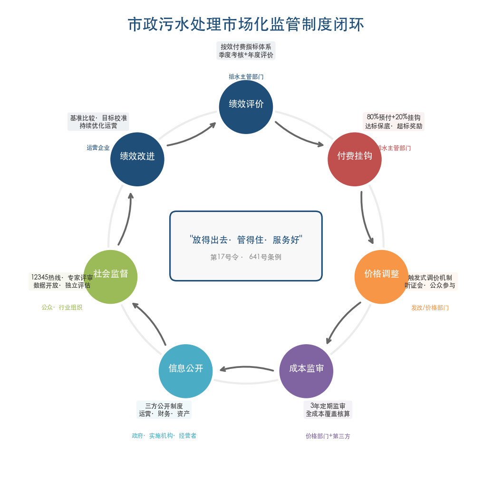

这一监管体系的设计理念可概括为"放得出去、管得住、服务好"——"放得出去"意味着政府敢于将运营权交给市场化主体，因为有制度保障公共利益不受损害；"管得住"意味着政府有能力通过绩效考核、成本监审和资产监管等制度工具约束运营商行为；"服务好"意味着市场化改革的最终目标是让居民享受到更高质量、更可持续的排水和污水处理公共服务。

正如第2章所总结的国际经验教训，英国完全私有化的失败根源在于监管未能跟上市场化的步伐，法国特许经营的相对成功在于"资产归公+有限合同期+竞争性准入"的制度组合有效制约了资本的逐利冲动。中国的改革路径——厂网一体化的特许经营，其制度保障的关键同样在于监管体系的质量。缺乏高质量的监管，市场化改革可能比核拨制带来更大的效率损失和更严重的公共利益侵蚀；具备高质量的监管，市场化改革则能释放出核拨制无法企及的效率潜能。

# 第6章 操作性政策建议与实施路径——分阶段推进市政污水处理体制改革

## 6.1 改革总体思路与目标体系

### 6.1.1 改革的逻辑起点与总体思路

前述五章的分析已构成完整的论证链条：核拨制在推动中国城市污水处理实现从"无"到"有"的历史跨越后，其激励错位、价费分裂、信息遮蔽与厂网分离四重制度性矛盾日趋凸显（第1章）；国内外实践表明，以"所有权归公、经营权市场化"为原则的厂网一体化特许经营模式是最具可行性的替代路径（第2章）；雨水排涝系统与污水收集处理系统的协同运作可通过"一个平台、两条主线、三层分担"的框架实现降本增效（第3章）；全生命周期成本分析揭示管网维护改造构成最大的成本洼地，全成本定价是改革的经济基础（第4章）；"管绩效、管价格、管资产、管透明、管安全"的监管制度闭环则是确保市场化改革不偏航的制度保障（第5章）。

基于上述分析，本章提出的改革总体思路可概括为**"一条主线、两个坚持、三个转变"**：

**一条主线**——以厂网一体化为核心，推进市政污水收集处理体制从核拨制向市场化运营的系统性转型。

**两个坚持**——一是坚持排水基础设施资产所有权归政府所有，坚守公共服务的普遍性与可负担性底线；二是坚持渐进式改革路径，充分考虑不同城市规模与财政能力的差异化安排，避免"一刀切"。

**三个转变**——管理体制从"事业单位核拨"向"企业化按效付费"转变；价费机制从"部分成本定价"向"全成本覆盖"转变；雨污管理从"分治分管"向"协同运作"转变。

### 6.1.2 改革目标体系

改革目标按照近期（2026—2028年）、中期（2028—2030年）和远期（2030—2035年）三个阶段梯次设定：

**近期目标（2026—2028年）——制度奠基。** 地级及以上城市全面启动管网资产清查确权；全国不低于50%的地级以上城市建立厂网一体化运营机制并推行按效付费；管网运维成本纳入污水处理费成本核算的省级制度安排基本完成；雨污管网数据统一纳入排水管理信息平台的城市比例达到60%以上。

**中期目标（2028—2030年）——全面铺开。** 地级及以上城市厂网一体化运营覆盖率达到80%以上；全国城市生活污水集中收集率达到80%以上；污水处理费全成本覆盖率（含管网运维）从当前的36%—55%提升至70%以上[中国环境经济政策进展评估报告2024](http://zghjgl.ijournal.cn/html/zghjgl/2025/5/20250507.htm "中国环境管理期刊2025年发表")；县级城市启动厂网一体化改革试点；智慧排水平台在地级以上城市实现全覆盖。

**远期目标（2030—2035年）——成熟运营。** 全国城市（含县级市）厂网一体化运营实现全覆盖；污水处理费达成全成本覆盖并建立动态调价机制；绩效评价与按效付费机制在所有特许经营项目中全面落地；雨污协同管理与海绵城市建设深度融合，排水系统综合效能显著提升。

## 6.2 分阶段实施路径

图6-1以时间轴形式总览了2026—2035年三个改革阶段在体制整合、价费改革、雨污协同和监管建设四条主线上的核心任务与关键里程碑，为后续各阶段的详细论述提供整体框架。

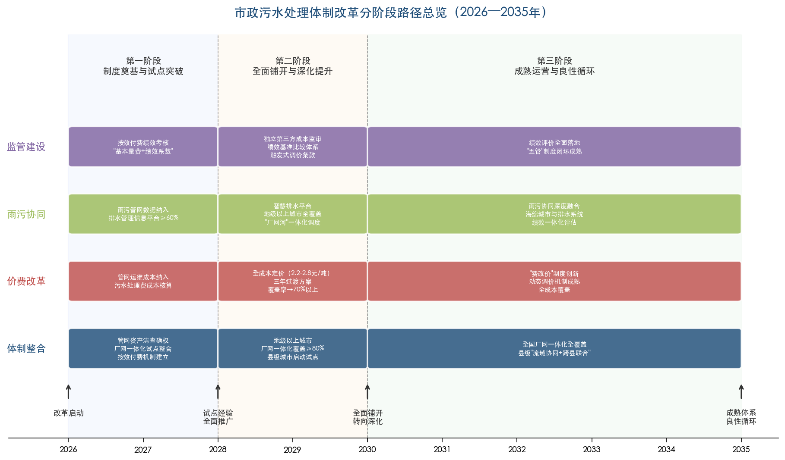

图6-1 市政污水处理体制改革分阶段路径总览（2026—2035年）

### 6.2.1 第一阶段（2026—2028年）：制度奠基与试点突破

第一阶段的核心任务是夯实改革的制度基础，在先行城市形成可复制、可推广的改革经验。

**任务一：管网资产清查确权。** 资产清查确权是厂网一体化改革的物质前提。如第2章所述，城市排水管网通常分散于不同层级政府和多个部门名下，权属模糊直接制约了管网纳入特许经营合同和市场化融资安排。武汉市已出台《武汉市市政生活污水收集设施资产评估工作指引》，荆州市在2025年8月发布的《荆州市中心城区生活污水收集处理"厂网一体化"工作实施方案（试行）》中明确要求在2025年9月30日前完成资产清查评估和厂网资产注入确权[荆州市人民政府](https://zwgk.jingzhou.gov.cn/42/109220253/t101220253094/615545.shtml "荆州市厂网一体化实施方案，2025年8月发布")。建议住建部制定全国统一的排水管网资产清查技术导则，明确清查范围（市政管网、小区管网、企事业单位自管管网）、评估方法（以重置成本法为主）和登记标准，要求所有地级以上城市在2028年底前完成管网资产清查、确权和登记入账。

**任务二：厂网一体化运营体制整合。** 在管网资产清查的基础上，通过委托运营、特许经营或国有企业整合等方式，将污水处理厂与排水管网交由同一市场主体统一运维管理。整合路径应依据城市具体情况灵活选择：

——对于已具备较强国有水务企业的城市（如武汉、长沙、广州等），可通过将管网运维事权从事业单位划转至国有水务企业，实现"体制内"厂网一体化。武汉由市城投集团依托排水公司组建专业市政管网运维分公司[武汉市人民政府](https://www.wuhan.gov.cn/zwgk/xxgk/zfwj/bgtwj/202503/t20250310_2549413.shtml "武汉市厂网一体化实施方案，2025年3月发布")，长沙将城区市政排水设施整体委托给长沙水业集团运营管理并签订30年委托运营协议[中国建设报](https://zjj.yzcity.gov.cn/zjj/0202/202502/4ad1180411ad41238094149b7970e83b.shtml "湖南加快推动城镇污水处理质效提升侧记，2025年2月")，荆州授权市城发集团作为中心城区厂网一体化实施主体[荆州市人民政府](https://zwgk.jingzhou.gov.cn/42/109220253/t101220253094/615545.shtml "荆州市厂网一体化实施方案，2025年8月发布")——三市均选择了国有企业承接的路径。

——对于民营水务企业已深度参与污水处理的城市，可通过在现有特许经营协议中补充管网运维条款、签订厂网一体化按效付费协议来实现整合。湘潭市城区4座污水处理厂即在原特许经营协议基础上全部补充签订了按效付费协议[中国建设报](https://zjj.yzcity.gov.cn/zjj/0202/202502/4ad1180411ad41238094149b7970e83b.shtml "湖南加快推动城镇污水处理质效提升侧记，2025年2月")。2023年PPP新机制（国办函〔2023〕115号）要求民营企业股权占比原则上不低于35%[国务院办公厅](https://ggzy.dingxi.gov.cn/zcfg/003006/20231212/b3501f59-2634-42f9-8563-00d0b8da7804.html "国办函〔2023〕115号全文")，新签特许经营合同应严格落实这一要求，确保市场竞争活力。

——对于管网规模较小、市场化运营条件尚不成熟的中小城市，可先行推进调度一体化（统一监测平台、统一调度指令），待条件成熟后再推进运维一体化。

**任务三：建立按效付费机制。** 按效付费是从根本上扭转"按量付费"逆向激励的关键举措。如第5章所述，绩效考核指标体系应围绕"产出效能—实施效果—项目管理"三个维度构建，以进水BOD浓度、污染物削减量和污水集中收集率为核心指标。在付费挂钩机制上，建议采用"基本量费+绩效系数"的过渡方案——保留80%的基量付费作为运营商基本收入保障，20%根据季度绩效考核结果清算调整。这一方案已在武汉市得到实践验证[武汉市水务局](https://swj.wuhan.gov.cn/xxgk/new_zc/new_gfxwj/202404/t20240407_2385174.html "武汉市绩效考核办法，2024年4月发布")。湖南省已明确要求到2026年底全省城市生活污水处理厂网一体化及按效付费机制基本建立[湖南省住建厅等六部门](http://www.hunan.gov.cn/szf/hnzb_18/c102939/202415/szfbmwj_98721_88_1urmmqrurrdbvpccutqhrmsteguugvmdqkupkguegktvspfmfnnccnmvnkhnueqhqrmcrunfgfshgfhtrersc/202408/t20240815_33432708.html "湖南省推进城镇生活污水处理质效提升意见，2024年8月发布")，为全国提供了省级层面推广的时间表参照。

**任务四：启动价费改革。** 价费改革是市场化运营的经济基础。第一阶段应聚焦于将管网运维成本纳入污水处理费的成本核算范围。贵州省已率先建立"管网建设费用财政承担、运维费用价格补偿"机制[贵州省住建厅](http://sjt.guizhou.gov.cn/xwzx/tzgg/202511/t20251107_88922511.html "贵州省生活污水治理攻坚行动方案，2025年11月")，宜昌、荆州、鄂州3市已被列为全国污水处理收费模式改革试点城市，其中宜昌市将污水管网建设运营费用纳入污水处理费征收及使用范围，赋予污水管网经营属性[湖北省住建厅](https://hbj.wuhan.gov.cn/fbjd_19/zc/hygq/202509/t20250922_2650809.html "湖北省新闻发布会，2025年9月")。建议国家发改委在总结试点经验的基础上，修订发改价格规〔2018〕943号文件，将管网运维成本正式纳入污水处理费的法定成本核算范围。

### 6.2.2 第二阶段（2028—2030年）：全面铺开与深化提升

第二阶段的核心任务是将第一阶段的试点经验转化为全国性制度安排，在更大范围内深化改革。

**任务一：全面推行厂网一体化运营。** 在第一阶段试点经验的基础上，将厂网一体化运营模式向全国地级以上城市全面推广。住建部应制定《城市污水收集处理厂网一体化运营指导意见》，明确厂网一体化运营的基本模式、合同要素、绩效标准和监管要求，为各地提供统一的制度框架。荆州市"厂网一体化"实施方案中提出的"统一一个实施主体→资产清查评估→厂网资产注入确权→完善厂网一体化机制→建立按效付费机制→探索收费模式改革"六步工作路径[荆州市人民政府](https://zwgk.jingzhou.gov.cn/42/109220253/t101220253094/615545.shtml "荆州市厂网一体化实施方案，2025年8月发布")，可作为全国推广的标准化操作流程参照。

**任务二：推进全成本定价。** 在管网运维成本纳入的基础上，进一步将污泥全链条处置成本、设施折旧与更新准备金纳入污水处理费的成本核算范围。如第4章所分析，全成本水平预计在2.2—2.8元/吨区间，而当前全国36个大中城市居民污水处理费平均仅1.0元/m³，全成本覆盖率仅36%—55%[中国环境经济政策进展评估报告2024](http://zghjgl.ijournal.cn/html/zghjgl/2025/5/20250507.htm "中国环境管理期刊2025年发表")。全成本定价应采取"三年过渡方案"分步推进：第一年小幅调价覆盖管网运维成本（居民污水处理费上调至1.2—1.3元/m³），第二年启动综合调价逐步覆盖折旧和合理利润，第三年建立定期调价机制实现成本与价格的动态联动。

调价须同步建立居民承受能力保障机制。E20研究院提出的"受益者付费+弱者明补"模式具有可行性——通过精准的消费后补贴机制保障低收入群体的基本用水权益，替代当前效率较低的"全民暗补"模式[中国水网](https://www.h2o-china.com/news/361326.html "傅涛：如何啃下污水处理费改价硬骨头，2025年10月")。具体操作上，可参照城乡居民最低生活保障制度的精准认定机制，对符合条件的低收入家庭按月定额补贴污水处理费增量部分，资金来源为地方财政一般公共预算。

**任务三：建设智慧排水与雨污协同平台。** 如第3章所述，广州市已建成覆盖全市11个区、195414个排水户、39734个排水单元的智慧排水系统，部署8类4244个物联实时监测点并接入60万路视频[住建部信息中心](https://www.mohurdic.org.cn/szzj/szcy/art/2025/art_8081502513fd494ab0cfe64df3c4d0eb.html "广州智慧排水建设成效")。第二阶段应将智慧排水平台建设作为新型城市基础设施的重点投入方向，要求所有地级以上城市在2030年前建成统一的排水管理信息平台，将雨水管网和污水管网的资产数据、运行监测、维护记录与应急调度统一纳入管理，实现"厂网河"一体化智慧调度。

**任务四：完善监管体系。** 确立"一个主管部门统筹、多部门协同"的监管职责架构，由市级水务（排水）主管部门作为特许经营项目的综合监管主体。如第5章所述，监管体系应形成"管绩效、管价格、管资产、管透明、管安全"的制度闭环。第二阶段应重点落实三项制度：一是建立3年一周期的独立第三方成本监审制度，为调价提供客观依据；二是推动全国性或区域性的排水运营绩效基准比较体系建设，借鉴德国Stadtwerke的行业对标机制弥补自然垄断条件下的竞争缺失；三是在特许经营协议中嵌入"触发式调价"条款，当经监审认定的合理成本变动幅度超过5%—8%时自动启动价格调整程序。

### 6.2.3 第三阶段（2030—2035年）：成熟运营与良性循环

第三阶段的核心目标是形成成熟的市场化运营体系，实现"降本—再投资—提质—再降本"的良性循环。

**任务一：探索"费改价"制度创新。** 在前两个阶段完成全成本覆盖的基础上，有条件的城市可探索将污水处理费从行政事业性收费转变为经营性价格，纳入总体水价体系。2025年10月召开的第二期"水务百年会客厅"已形成《水务青绿书》（第2期），提出将整体污水处理费纳入经营性总体水价的建议，并建议上海率先试行[中国水网](https://www.h2o-china.com/news/361310.html "《水务青绿书》第2期，2025年10月发布")。"费改价"的核心制度逻辑在于赋予运营企业更大的定价自主权和成本回收确定性，使污水处理服务真正成为可持续的市场化公共服务，而非依赖财政拨款与行政定价的半公益事业。

**任务二：推进县级城市改革。** 县级城市（含县城）是改革的"最后一公里"，亦是难度最大的区域。此类城市普遍面临管网规模较小、财政能力较弱、市场化运营条件不成熟等制约。对此，建议采取"流域协同+跨县联合"的模式——借鉴日本流域下水道制度的经验，由市级水务企业作为统一运营主体，将同一流域内的多个县城污水系统纳入统一运营管理，通过规模效应降低单个县城的运营成本。德国Stadtwerke模式中将供水、排水、能源等多种市政服务整合运营的经验亦可参照——县级城市可将供水和排水业务由同一市政公司统一运营，通过交叉补贴和规模经济降低综合成本。荆州市方案中提出的"以供补排"机制——将城区供水收益除按规定上缴外均统筹用于支持排水设施建设运营[荆州市人民政府](https://zwgk.jingzhou.gov.cn/42/109220253/t101220253094/615545.shtml "荆州市厂网一体化实施方案，2025年8月发布")，即为这一思路的地方实践。

**任务三：实现雨污协同运作的深度融合。** 在排水体制改革深入推进的基础上，将第3章提出的"雨水财政、污水价格"三层费用分担框架全面落地——纯雨水系统费用由财政承担，纯污水系统运维费用由使用者通过价格承担，雨污共用设施费用按功能比例分摊。在特许经营合同中统一覆盖雨水管网和污水管网的运维责任，实现同一运维企业负责同一排水分区内两套管网的日常巡检、排查修复和应急调度，彻底消除"分治"体制下的协调成本。同步将海绵城市建设纳入排水系统整体绩效评估——将排水分区的年径流总量控制率达标情况纳入特许经营绩效考核的加分项，激励运维企业主动配合海绵设施的建设与维护，形成"减排—降本—反哺"的良性循环。

## 6.3 重点配套政策建议

### 6.3.1 法规修订：为改革提供顶层法律保障

**修订《城镇排水与污水处理条例》（国务院令第641号）。** 现行条例制定于2013年，制度框架基本建立在核拨制的体制假设之上，未充分反映厂网一体化、按效付费、雨污协同等改革方向。建议修订时重点增补以下内容：明确厂网一体化运营的法律地位与基本要求；将管网运维成本纳入污水处理费成本核算范围的法定依据；确立"雨水财政、污水价格"的费用分担原则；强化特许经营项目的绩效考核与资产保全要求。

**完善特许经营配套规章。** 2024年3月修订的《基础设施和公用事业特许经营管理办法》（第17号令）已为特许经营项目提供了总体制度框架[国家发改委等六部门](https://www.moj.gov.cn/pub/sfbgw/flfggz/flfggzbmgz/202412/t20241224_511763.html "第17号令")。然而该办法属通用性制度，针对污水处理行业的特殊性（如厂网分离问题、进水浓度考核、管网资产估值等）仍需制定专项配套规章。建议住建部联合国家发改委制定《城镇污水收集处理特许经营实施细则》，对特许经营合同范本、绩效考核标准、资产移交条件等作出具体规定。

**推进地方立法先行。** 湖南省以"小快灵"立法方式出台《湖南省城镇污水管网建设运行管理若干规定》，从法规层面确立了厂网一体、专业化运行维护和按绩效付费管理制度[中国建设报](https://zjj.yzcity.gov.cn/zjj/0202/202502/4ad1180411ad41238094149b7970e83b.shtml "湖南加快推动城镇污水处理质效提升侧记，2025年2月")。在国家层面立法尚需时日的过渡期内，应鼓励有条件的省份参照湖南经验率先开展地方立法，为改革提供先行法治保障。

### 6.3.2 财税支持：平衡改革成本与财政压力

**加大中央转移支付和专项债券支持力度。** 管网建设改造的投资需求规模巨大——据国家发改委测算，"十五五"期间全国地下管网建设改造预计超70万公里，新增投资需求突破5万亿元[国家发改委2025年10月发布会](https://www.dxguanxian.org/index.php/news/showNews/nid/6048.shtml "十五五地下管网建设规划")。2024年以来，超长期特别国债已安排超过2900亿元支持城市地下管网建设改造[国家发改委国新办发布会发言](https://zrzy.guizhou.gov.cn/wzgb/zwgk/zfxxgk/fdzdgknr/qtfdxx/xwfbh/202507/t20250731_88359672.html "国新办城市更新发布会，2025年5月")，这一力度应在"十五五"期间持续乃至加大。同时，应将管网建设改造纳入地方政府专项债券的优先支持领域，允许以管网运营收益作为专项债偿还来源。

**建立管网资产盘活与融资机制。** 在管网资产清查确权完成后，可探索将管网资产纳入基础设施REITs试点范围，通过资产证券化盘活存量管网资产，为新建和改造项目提供增量资金。武汉市厂网一体化改革方案已明确要"理顺污水处理费价格机制，建立覆盖成本、保本微利的动态调整机制"[武汉市人民政府](https://www.wuhan.gov.cn/zwgk/xxgk/zfwj/bgtwj/202503/t20250310_2549413.shtml "武汉市厂网一体化实施方案，2025年3月发布")——稳定可预期的价格机制是管网资产金融化的前提条件。

**落实"以供补排"的交叉补贴机制。** 荆州市方案中提出的"将城区可用的供水收益统筹用于支持排水设施建设运营"的"以供补排"机制[荆州市人民政府](https://zwgk.jingzhou.gov.cn/42/109220253/t101220253094/615545.shtml "荆州市厂网一体化实施方案，2025年8月发布")，具有推广价值。供水和排水本质上是同一水循环系统的两个环节，通过统一运营实现供排水之间的交叉补贴，既符合水务行业的技术逻辑，也能降低排水系统对财政的纯依赖度。建议在厂网一体化改革中，鼓励具备条件的城市将供水和排水业务由同一国有水务企业统一运营，通过整合实现"以供补排"。

### 6.3.3 人员安置：改革的"最后一公里"

事业单位人员安置是核拨制向市场化运营转型中最敏感、最现实的操作难题。当前大部分城镇排水设施维护运营单位是财政全额拨款的事业单位，人员编制按事业单位标准执行。改革意味着这些机构须从"政府附属机构"转变为"市场化运营主体"，涉及广泛的利益调整。

人员安置应坚持"以人为本、平稳过渡、身份转换、待遇保障"的原则，以国有水务企业作为人员转换的承接主体，实现从事业编制向国企编制的平稳过渡。具体建议如下：

**第一，"老人老办法、新人新办法"。** 对于在编在岗人员，根据个人意愿提供两种选择：一是随业务划转至国有水务企业，保留原有薪酬待遇水平并享受企业绩效奖励（"不降薪+增激励"）；二是分流至其他政府机构或事业单位。新招聘人员则全部按照企业化用人机制管理，以市场化薪酬和绩效考核为基础。

**第二，设立过渡期保障。** 建议设定3—5年的过渡期，在此期间财政对划转人员的社保差额部分给予补贴，确保养老保险和医疗保险在人员转换过程中无缝衔接。

**第三，强化技能培训。** 市场化运营对人员专业能力提出了更高要求——从执行行政指令转向绩效考核管理，从被动维修转向主动预防性维护，从经验化操作转向数字化管理。应将合同管理、绩效评估、智慧排水系统操作、非开挖修复技术等课程纳入划转人员的必修培训体系。

武汉、长沙的实践已证明，通过国有水务企业作为承接主体的"体制内转化"策略，可以在完成管理体制市场化转型的同时最大限度降低人员安置的社会风险[中国建设报](https://zjj.yzcity.gov.cn/zjj/0202/202502/4ad1180411ad41238094149b7970e83b.shtml "湖南加快推动城镇污水处理质效提升侧记，2025年2月")。2025年全国两会《政府工作报告》明确提出"全面深化事业单位改革"[2025年政府工作报告](https://www.spp.gov.cn/spp/tt/202503/t20250312_690326.shtml "2025年政府工作报告全文")，排水领域的事业单位改革应纳入这一总体部署统筹推进。

### 6.3.4 风险防控：构建改革的制度护栏

市场化改革在释放效率的同时，必须同步构建风险防控机制。如第2章所分析，英国水务私有化的深层教训在于：私有化后累计向股东分配了约850亿英镑的红利和利息，而管网维护投资严重不足[中国水网](https://www.h2o-china.com/news/362484_2.html "从《肮脏生意》看英国水务私有化的历史账，2026年")。2025年7月英国政府宣布废除Ofwat并代之以新的单一监管机构，正是监管失灵的制度性后果[光明网（中新社）](https://m.gmw.cn/2025-07/22/content_1304089428.htm "英国开启水务领域改革应对监管失灵，2025年7月")。中国的改革路径虽以"所有权归公、经营权市场化"为原则，有别于英国的完全私有化，但仍需构建四道制度护栏：

**第一道护栏——资产保全红线。** 在特许经营协议中明确资产维护的最低标准（如每年管网CCTV检测覆盖率不低于管网总长度的10%，三级及以上缺陷修复率不低于90%），将资产维护标准纳入绩效考核并与服务费直接挂钩。特许经营期最后3—5年应启动资产状态评估，对不达标部分要求运营商完成修复或支付修复准备金。

**第二道护栏——关联交易防火墙。** 在特许经营协议中约定关联交易的事前报备和信息披露义务，成本监审中对关联交易价格与市场公允价格进行专门比对，对大额关联交易实施主管部门事前审批。

**第三道护栏——临时接管预案。** 在特许经营协议中约定明确的接管触发条件（如连续两个季度绩效考核不合格、发生重大安全或环境事故且整改不力、运营商进入破产程序等），建立接管预案，并要求运营商从年度运营收入中按2%—3%的比例计提接管准备金。

**第四道护栏——信息公开与社会监督。** 要求运营企业按季度公开运营情况，按年度公开经审计的财务报表，按规定公开绩效考核结果。《基础设施和公用事业特许经营管理办法》（第17号令）第47条已为信息公开提供了法律依据[国家发改委等六部门](https://www.moj.gov.cn/pub/sfbgw/flfggz/flfggzbmgz/202412/t20241224_511763.html "第17号令第47条")。

## 6.4 差异化改革安排：因城施策

中国城市在规模、财政能力、管网存量和市场化基础等方面差异悬殊，改革方案不宜"一刀切"。基于城市规模和改革基础，可将全国城市分为三类，分别设计差异化的改革路径和时间表。图6-2以矩阵形式总览了三类城市在五项关键改革任务上的目标时间节点与实施重点。

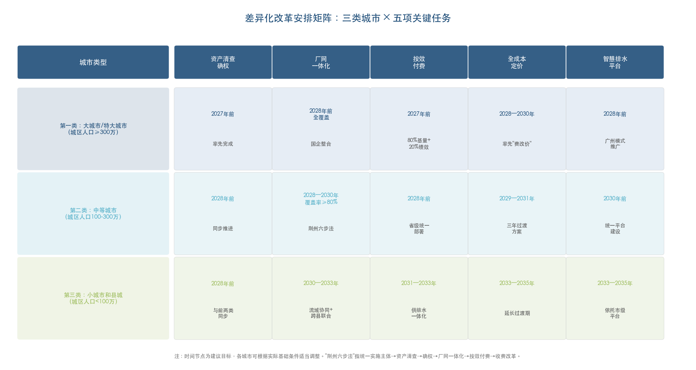

图6-2 差异化改革安排矩阵——三类城市×五项关键任务

### 6.4.1 第一类：大城市和特大城市（城区常住人口300万以上）

此类城市包括北京、上海、广州、武汉、成都、杭州等，具有管网规模大、财政实力强、国有水务企业能力突出的特征。改革重点在于三个"率先"：

——率先完成厂网一体化运营整合，2028年前实现全覆盖。武汉已建立"调度—运维—建管"三步走的改革路径并取得显著成效——2025年全市城市生活污水集中收集率提升至83.65%，较"十四五"期初提升25.18个百分点，全市污水处理厂平均进水BOD浓度较"十四五"期初提升30.15%[武汉市水务局](https://swj.wuhan.gov.cn/tzdt/jcss/202603/t20260326_2745222.html "武汉厂网一体改革成绩单，2026年3月发布")。

——率先推进全成本定价和"费改价"探索。上海作为全国水务行业的标杆城市，已在讨论将污水处理费从行政事业性收费转变为经营性价格的"费改价"方案[中国水网](https://www.h2o-china.com/news/361310.html "《水务青绿书》第2期，2025年10月发布")，应在全国率先试行。

——率先建成智慧排水与雨污协同平台。广州智慧排水系统已提供了技术范本，其他大城市应加快建设覆盖雨污双系统的统一管理平台。

### 6.4.2 第二类：中等城市（城区常住人口100万—300万）

此类城市是改革的"主战场"，数量最多、覆盖面最广。改革重点在于：

——2026—2028年完成管网资产清查确权和厂网运营整合，建立按效付费机制。可参照荆州市的标准化六步操作流程：统一实施主体→资产清查评估→厂网资产注入确权→完善厂网一体化机制→建立按效付费机制→探索收费模式改革[荆州市人民政府](https://zwgk.jingzhou.gov.cn/42/109220253/t101220253094/615545.shtml "荆州市厂网一体化实施方案，2025年8月发布")。

——2028—2030年推进管网运维成本纳入污水处理费并启动调价程序。中等城市居民承受能力普遍低于大城市，调价幅度与节奏应更为审慎，可分3—5年逐步到位，同步落实低收入群体的精准补贴机制。

——积极争取中央财政和超长期特别国债支持。湖南已争取超长期特别国债和中央预算内资金共138亿元，支持19个污水处理厂网一体化试点示范项目，总投资达328亿元[中国建设报](https://zjj.yzcity.gov.cn/zjj/0202/202502/4ad1180411ad41238094149b7970e83b.shtml "湖南加快推动城镇污水处理质效提升侧记，2025年2月")，中等城市应充分利用这一政策窗口。

### 6.4.3 第三类：小城市和县城

此类城市管网规模较小、财政基础薄弱、市场化人才匮乏，是改革的难点与"最后一公里"。改革策略应突出"借力"与"整合"两大方向：

——优先推进"流域协同+跨县联合"的运营整合。由市级国有水务企业统一运营同一流域内多个县城的污水系统，通过规模效应降低运营成本、弥补专业人才不足。

——优先推进供排水一体化。县城供水和排水系统规模均有限，由同一市政公司统一运营可实现"以供补排"的交叉补贴与人员共享。

——适当延长改革时间表。第三类城市的厂网一体化可延至2030—2033年完成，全成本定价可延至2033—2035年实现，但管网资产清查确权应与前两类城市同步推进（2028年前完成），以确保全国数据底座的统一性。

## 6.5 改革的协同效应与预期成效

### 6.5.1 经济效益：降本增效与投资优化

厂网一体化与按效付费改革的直接经济效益已在先行城市得到验证。湘潭市通过按效付费改革每年节省运营资金5000多万元，原规划6万吨/日铁牛埠污水处理厂因进水量合理化而无需建设，节省建设投资约3.5亿元[中国建设报](https://zjj.yzcity.gov.cn/zjj/0202/202502/4ad1180411ad41238094149b7970e83b.shtml "湖南加快推动城镇污水处理质效提升侧记，2025年2月")。如第4章所分析，按全国日处理量2.4亿吨计算，若通过管网修复将外水比例从30%降至15%，每年可减少约3600万吨/日的无效处理量，按吨水运行成本0.81元估算，年节省运营费用约107亿元。

雨污协同运作的降本效益同样可观。如第3章所估算，管网统一排查修复可降低综合成本15%—25%，CSO调蓄池的"雨污共建共享"可避免重复投资，智慧化联合调度可在不增加硬件投资的条件下将典型泵站的暴雨抵御能力从20年一遇提高到30年一遇。

### 6.5.2 环境效益：水质改善与污染物削减

武汉厂网一体化改革的环境效益数据具有说服力：2025年黄陂后湖片区盘龙污水处理厂进水BOD浓度较2024年同期提升37.3%，黄家湖片区提升16.1%，全市生活污水集中收集率从"十四五"期初的58.47%提升至2025年的83.65%[武汉市水务局](https://swj.wuhan.gov.cn/tzdt/jcss/202603/t20260326_2745222.html "武汉厂网一体改革成绩单，2026年3月发布")。进厂浓度的提升意味着管网外水减少、真实污水被更充分地收集处理，直接转化为水体污染物削减量的增加和城市水环境质量的改善。

### 6.5.3 社会效益：城市韧性与公众获得感

改革的社会效益体现在城市防涝韧性提升和排水服务质量改善两个维度。智慧排水和雨污协同联动机制的建立，将显著提升城市应对极端降雨事件的能力——广州智慧排水系统已支撑579次应急响应、594宗积水事件的生成及处置，成功抵御台风"摩羯""苏拉""海葵"等极端天气，未发生重大灾情和人员伤亡[住建部信息中心](https://www.mohurdic.org.cn/szzj/szcy/art/2025/art_8081502513fd494ab0cfe64df3c4d0eb.html "广州智慧排水社会效益")。排水服务质量的全面提升——管网漏损减少、污水溢流降低、积水点消除——将直接增强居民对城市公共服务的获得感。

### 6.5.4 制度效益：形成可持续的良性循环

改革的终极目标并非单次的效率提升，而是构建一个自我驱动、持续优化的制度闭环。如图6-3所示，改革将催生三条相互叠加、相互强化的良性循环链条：

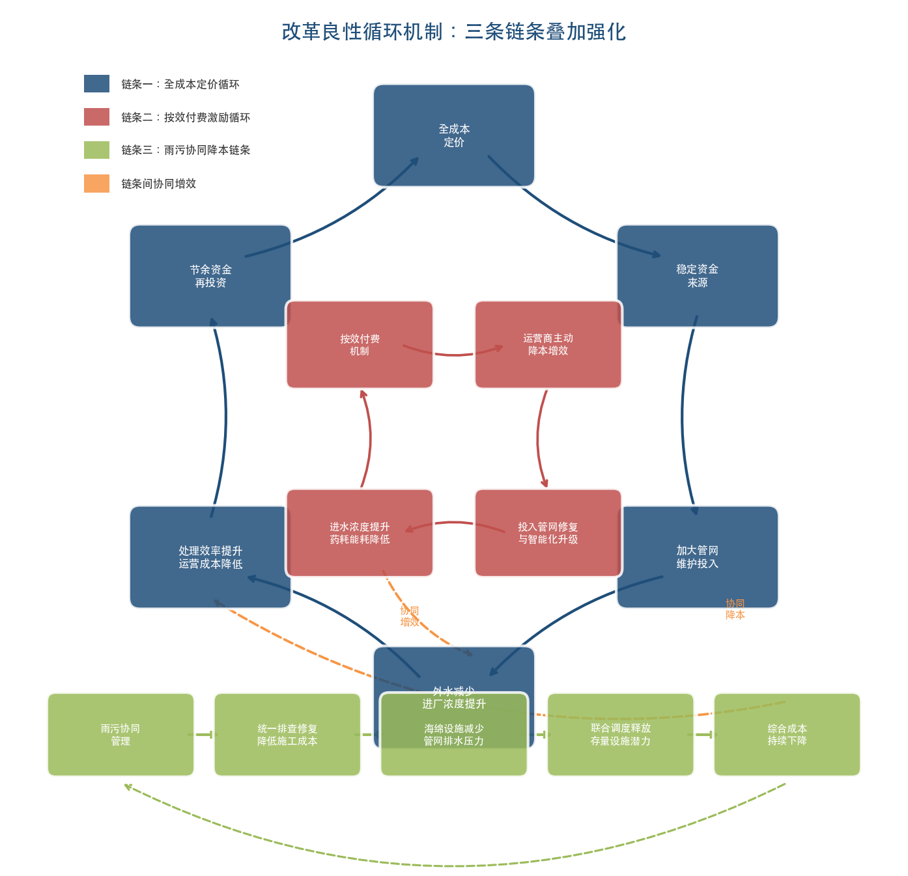

图6-3 改革良性循环机制——三条链条叠加强化

**链条一：全成本定价循环。** 全成本定价→稳定的资金来源→加大管网维护投入→外水减少、进厂浓度提升→处理效率提升、运营成本降低→节余资金用于管网更新和海绵设施建设→排水系统综合效能持续提升→成本进一步优化。

**链条二：按效付费激励循环。** 按效付费机制→运营商具有主动降本增效的激励→投入管网修复和智能化升级→进水浓度提升带动药耗和能耗降低→形成"投入—产出—再投入"的正向循环。

**链条三：雨污协同降本链条。** 雨污协同管理→统一排查修复降低施工成本→海绵设施减少管网排水压力→联合调度释放存量设施潜力→综合成本持续下降。

上述三条链条相互叠加、相互强化，共同构成市政污水收集处理体制改革从核拨制低效均衡走向市场化高效运营的制度路径。改革的成功取决于顶层设计的科学性、分阶段实施的务实性和配套制度的完备性——三者缺一不可。在武汉、湘潭、长沙、广州、荆州、贵州等城市和省份率先探路的基础上，这一改革路径的技术可行性和制度可操作性已得到初步验证。关键在于将分散的地方探索整合为全国性的制度推进，在"十五五"期间形成改革的整体合力。

# 结论与风险提示

## 核心结论

本报告基于对中国市政污水收集处理核拨制体制的系统诊断、国内外替代机制的比较分析、雨污协同运作的制度设计、全生命周期成本管理框架的构建以及监管体系的制度闭环设计，得出以下核心结论。

**结论一：核拨制已完成其历史使命，体制性改革势在必行。** 核拨制在推动中国城市污水处理实现从"无"到"有"的历史跨越中发挥了不可替代的作用，但其激励错位、价费分裂、信息遮蔽与厂网分离四重制度性矛盾在"从有到优"的阶段日益成为约束。全国城市生活污水集中收集率仅73.63%、进厂污水浓度普遍偏低、管网外水占比约30%、管网改造资金缺口达数万亿元——这些结构性问题无法在核拨制框架内得到有效解决。2023年PPP新机制（国办函〔2023〕115号）聚焦使用者付费、终结政府付费类PPP项目的制度转向，以及"十五五"期间地下管网建设改造预计超70万公里、投资突破5万亿元的巨大资金需求，共同构成了改革的迫切性与现实驱动力。

**结论二：厂网一体化特许经营是当前最优的改革路径。** 综合国际四种模式的经验教训——英国完全私有化因监管失灵导致资本掏空基础设施、法国特许经营以"资产归公+有限合同期"实现效率与公共利益的平衡、德国市政公司证明公有制框架下同样可以实现高效运营、日本公营企业以"雨污分担"原则和流域协同治理维持了系统可持续性——中国应坚持"所有权归公、经营权市场化"的原则底线，以厂网一体化特许经营为主攻方向。武汉"调度—运维—建管"三步走路径、湘潭按效付费实践、长沙30年委托运营协议、广州"厂网河"一体化智慧调度等先行经验，已充分验证了这一路径的技术可行性和制度可操作性。

**结论三：价费机制改革是市场化运营的经济基础和最大难点。** 当前"部分成本核算"定价模式下，居民污水处理费平均1.0元/m³仅覆盖全成本的36%—55%，管网运维长期处于价格体系的"盲区"。贵州率先将管网运维费用纳入污水处理成本、宜昌等三市开展收费模式改革试点，标志着"处理归价格、管网归财政"的二元体制出现实质性松动。价费改革须经历"纳入管网运维成本→全成本覆盖→费改价"三个递进层次，同步建立"受益者付费+弱者明补"的居民承受能力保障机制，以确保改革的社会可接受性。

**结论四：雨污协同运作是降低城市排水综合成本的关键路径。** 雨水排放管理与污水收集处理在管网设施、应急调度和投资决策上存在天然的交叉与耦合关系。"分治分管"体制导致排查修复重复与遗漏并存、应急调度缺乏联动、投资决策缺乏系统优化。"一个平台、两条主线、三层分担"的雨污协同框架，配合海绵城市源头减排的系统效益，可在管网排查修复（降本15%—25%）、应急调度（泵站能力从20年一遇提升至30年一遇）、CSO调蓄池共建共享等环节产生显著的降本效益。

**结论五：监管体系的质量直接决定市场化改革的成败。** 英国水务私有化三十余年后的制度重构——2025年7月废除Ofwat、泰晤士水务1.227亿英镑罚款——是监管滞后于市场化改革的深刻教训。中国应在改革启动之初即同步构建"管绩效、管价格、管资产、管透明、管安全"的监管制度闭环，以绩效评价和按效付费为核心机制，以成本监审和信息公开为制度支撑，以资产保全和临时接管为底线保障。

## 风险提示

**风险一：价费改革推进阻力。** 污水处理费调价涉及居民承受能力和社会稳定性，地方政府在经济下行期推进调价的政治意愿可能不足。若价费改革持续滞后，市场化运营将因缺乏可持续的收入来源而难以为继——当前全国污水处理费账期平均达1年、支付缺口约2000亿元的现状已发出警示。应对之策在于分步渐进推进、精准保障弱势群体，并以信息公开和成本透明化赢得公众理解。

**风险二：地方财政压力制约改革投入。** 管网建设改造的投资需求巨大（"十五五"期间预计超5万亿元），而地方财政普遍面临债务约束和收入增长放缓的双重压力。若中央转移支付和超长期特别国债支持力度不足，管网改造进度可能大幅落后于规划目标。应对之策在于拓宽融资渠道——专项债券、基础设施REITs、"以供补排"交叉补贴等多元机制应同步推进。

**风险三：市场化运营中的服务质量与资产保全风险。** 运营商以利润为导向，在监管力度不足时可能通过压缩维护支出、降低服务标准或关联交易转移利润等方式侵蚀公共利益。英国泰晤士水务案例表明这一风险绝非理论假设。应对之策在于建立严格的绩效考核与按效付费挂钩机制、独立的成本监审制度、关联交易防火墙以及特许经营期末的资产移交评估机制。

**风险四：区域差异导致的改革不均衡。** 大城市与中小城市、东部与中西部在管网存量、财政能力和市场化基础方面差异悬殊。若"一刀切"推进改革，可能导致中小城市和经济欠发达地区因条件不成熟而出现改革形式化或"水土不服"。应对之策在于坚持因城施策、分类推进，对中小城市采取"流域协同+跨县联合"模式，适当延长改革时间表。

**风险五：人员安置与组织转型的社会风险。** 事业单位人员从事业编制向企业编制的身份转换涉及广泛的利益调整。若安置方案不当，可能引发人员流失、士气低落乃至社会不稳定。应对之策在于坚持"老人老办法、新人新办法"，以国有水务企业为承接主体实现"体制内转化"，并设立3—5年的过渡期保障。

## 局限性分析

**第一，成本数据的时效性与代表性限制。** 本报告引用的全国227个污水处理厂运营成本样本数据来源于2013年调查，虽已根据行业趋势作出修正估算，但精确的最新全成本数据仍有赖于大规模、标准化的行业成本调查。管网运维成本（0.3—0.5元/m³）的估算系基于有限的行业数据推算，不同城市因地质条件、管龄结构、管材类型等差异，实际成本可能显著偏离。

**第二，先行城市经验的可推广性存在不确定性。** 武汉、湘潭、长沙、广州等先行城市在国有水务企业能力、财政实力和政策支持方面具有一定的"先发优势"，其改革经验向更广泛城市——特别是中西部中小城市和县城——推广时，可能面临组织能力不足、财政支撑乏力、市场化人才匮乏等现实约束。

**第三，居民承受能力评估需进一步细化。** 本报告对全成本定价的居民承受能力影响分析较为概要，未针对不同收入层次、不同城市规模和不同区域进行精细化测算。"三年过渡方案"的具体调价节奏和补贴标准需在各地开展实证调研后确定。

**第四，国际经验的适用性需审慎对待。** 英国、法国、德国、日本等国的水务管理体制植根于各自独特的政治制度、法律传统、社会文化和经济发展阶段，直接移植存在"制度环境不兼容"风险。本报告在借鉴国际经验时强调的是制度逻辑的参照价值而非具体做法的简单复制。

**第五，气候变化与极端天气事件的不确定性。** 极端降雨事件的频率和强度持续增加，对排水系统设计标准和应急能力提出了超越历史经验的新要求。本报告对排涝联动和CSO治理的分析主要基于当前设计标准和气象趋势，未充分考量超出现有设计标准的极端情景。
