# 执行摘要

单件小批量离散制造（High-Mix Low-Volume, HMLV）广泛存在于航空航天零部件、船舶制造、模具工装、医疗器械和能源装备等行业，仅上述五个领域的全球市场规模合计已超过1.3万亿美元。这一制造模式以产品品种极多、单品种批量极小、工艺路线高度多变为核心特征，生产过程深度依赖工人的感知判断、手眼协调、隐性知识和现场即兴决策能力。在大批量流水线制造已实现深度自动化的今天，HMLV制造中的技能密集型工序仍是自动化渗透率最低的"最后堡垒"。本报告围绕"实现自动化的难度有多大"这一核心问题，从技能工序识别、技术可行性、经济可行性与组织障碍、行业实践案例和趋势展望六个维度展开系统评估。

**核心判断一：自动化难度显著高于制造业平均水平，但内部分化明显。** 本报告识别出七类核心技能密集型工序——手工焊接、复杂手工装配、目视检测与无损检测、手工打磨与抛光、工装夹具调整与工艺参数调优、管路与线路布线、以及返修与异常处理——并从感知判断、手眼协调、隐性知识和即兴决策四个维度构建了"技能依赖—自动化难度"分析矩阵。McKinsey估计制造业整体自动化潜力约为64%，而HMLV技能密集型工序因"不可预测物理活动"和"应用专业知识"占比远超平均水平，在当前（2026年）技术条件下，以工时加权的综合可自动化比例约为25%—35%，预计到2030年可提升至35%—45%。

**核心判断二：技术障碍、经济障碍与组织障碍三重叠加。** 技术层面，同一工序类别内部的技术就绪度（TRL）可相差4—6个等级——结构化环境中的标准焊缝已达TRL 7—8，而非结构化环境中的复杂焊缝仅为TRL 4—5，返修与异常处理更低至TRL 1—2。经济层面，HMLV场景下自动化系统的总拥有成本因夹具多品种配置、编程时间的批量反比效应和利用率不足三大因素，较大批量场景高出30%—60%，投资回收期从行业基线的12—18个月延长至36—48个月。组织层面，隐性知识转移困境、中小企业数字化基础薄弱（中国超90%中小企业数字化投入不足营收的2%）、供应链碎片化和行业认证壁垒相互强化，形成自我锁定的阻碍循环。

**核心判断三：人机协作而非全面替代，是中短期内的理性路径。** 五个跨行业案例（精密金属制造Athena Manufacturing、林业设备Ponsse、管道预制MMC、韩国造船业、GE Aerospace增材制造）一致表明，HMLV制造自动化的成功遵循"从结构化工序切入、人机协作、编程效率优先、持续迭代"的范式。协作焊接可将关键组件焊接时间从8小时缩短至2小时，离线编程可将编程时间从10天压缩至1天，AI视觉焊接可将返修率从行业平均3%—5%降至0%。若将人机协作模式纳入考量，自动化参与率可从15%—25%的纯替代率提升至30%—45%。

**核心判断四：行动窗口正在收窄。** 美国2024—2033年约190万个制造业岗位可能因技能缺口无法填补，中国制造业重点领域人才缺口率达48%。2026—2032年是HMLV制造企业启动自动化转型的关键窗口期——在这一时期，企业仍拥有足够的经验工人为自动化提供工艺知识输入；一旦最后一批资深技能工人退休且隐性知识尚未被系统化提取，企业将面临"既无人手工做、又缺知识做自动化"的双重困境。优先行动方向依次为：锁定隐性知识、部署AI辅助视觉检测和工艺参数优化、渐进式引入协作焊接和力控打磨机器人。

# 第1章 单件小批量离散制造的问题域界定

制造业并非同质的整体。提及"工厂自动化"，最先浮现的画面通常是汽车总装线上密集排列的焊接机器人或半导体晶圆厂无尘室内的全自动传送系统——这些高度标准化、大批量生产的场景早已实现深度自动化。然而，在制造业的另一极，广泛存在着产品品种繁多、单品种批量极小、工艺路线高度多变的生产场景：航空航天发动机叶片的手工修磨、远洋船舶分段内复杂管路的现场布线、定制化人工关节的精密装配——这些工序至今高度依赖工人的个人技能与现场判断。本章旨在为这一类制造模式——单件小批量离散制造（High-Mix Low-Volume, HMLV）——划定清晰的问题边界，量化其产业规模与劳动力结构，为后续各章的技术与经济分析奠定基线。

## 1.1 离散制造与流程制造：两种制造范式的根本分野

界定单件小批量制造的问题域，需首先回归制造业最基础的分类框架。依据产出物的物理形态与加工过程的可逆性，制造业可划分为离散制造（Discrete Manufacturing）与流程制造（Process Manufacturing）两大范式。

离散制造以可计数的独立单元为产出——一台发动机、一个阀体、一副模具——产品由分立的零部件经机加工、焊接、装配等工序制成，成品在逻辑上可拆解还原为零部件，物料管理依赖物料清单（BOM）。流程制造则截然不同：石油炼化、食品加工、冶金等行业通过配方或连续工艺将原材料转化为不可逆的产品——原油裂解后无法还原为原油，钢水铸成铸坯后无法回到矿石状态——生产管理依赖配方而非BOM。[Lumafield](https://www.lumafield.com/article/what-is-high-mix-low-volume-hmlv-manufacturing "HMLV Manufacturing定义，2024年8月")

这一根本分野决定了两种范式在自动化路径上的深刻差异。流程制造的产品是连续流动、均质的，控制变量相对有限（温度、压力、流量、浓度），过程自动化与DCS（分布式控制系统）自20世纪中叶以来已高度成熟。离散制造的产品则是分立的、异构的，每一个工件的几何形状、材料特性和装配关系都可能不同，自动化难度随产品变异性的增大而陡增——这正是单件小批量场景面临自动化困境的根源所在。

## 1.2 单件小批量制造的界定：从大批量流水线的对立面说起

在离散制造内部，按产品品种数与单品种批量的组合，可进一步区分出不同的生产模式。Hayes 与 Wheelwright 提出的经典"产品-过程矩阵"（Product-Process Matrix）描绘了从单件生产（job shop）到连续流水线的谱系：低产量、高品种的一端对应弹性作业车间，高产量、低品种的一端对应刚性流水线。[TNO](https://publications.tno.nl/publication/34643957/wSPVOr5V/TNO-2025-R10304.pdf "TNO 2025, Performance Engineering of HMLV Production Systems")

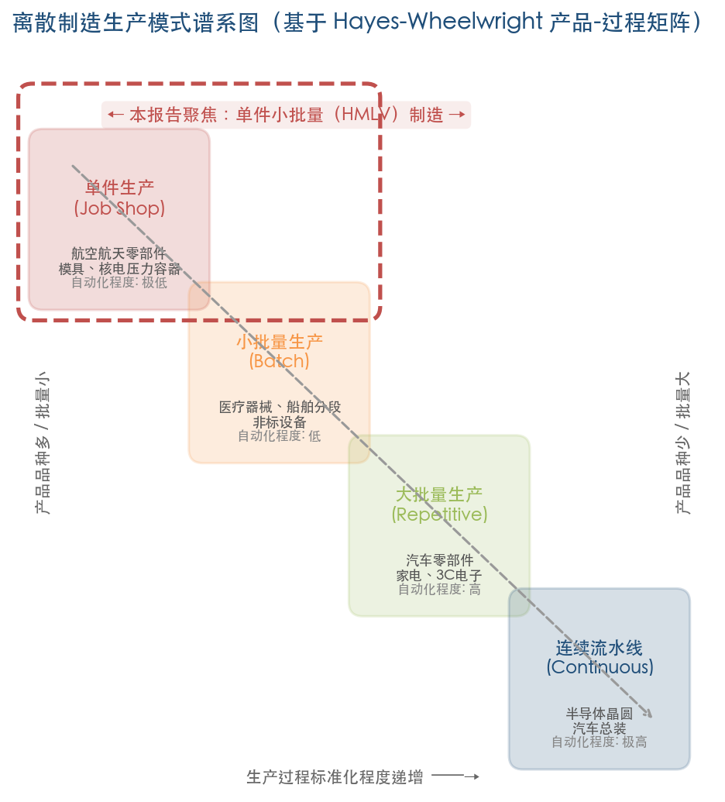

如上图所示，本报告聚焦的"单件小批量"制造位于该谱系的左端，在国际文献中通常以"高混合低产量"（High-Mix Low-Volume, HMLV）指称。HMLV制造的核心含义是：产品品种繁多、规格各异（High-Mix），而每种产品的产量从一件到数千件不等，常常低至单件（Low-Volume）。[Lumafield](https://www.lumafield.com/article/what-is-high-mix-low-volume-hmlv-manufacturing "HMLV Manufacturing定义，2024年8月")

Rodriguez（2021）在MIT硕士论文中为HMLV给出了具有操作性的学术定义："a situation in which there are a large number of potential end product assemblies (high-mix) but only a small number of each end product assembly is produced (low-volume)"。该研究以PSI Control Solutions公司的大型控制面板生产单元为案例：该单元共管理634种产品编码（end product codes），但在12个月的观察期内仅生产346件、涉及80种独特编码——绝大多数产品编码在全年度内根本未被生产，已生产的产品平均每种不到5件。在这种环境下，工艺路线多变、客户交期各异（从7天至60天以上）、工装频繁切换，生产过程高度依赖工人的经验判断。[MIT LGO Thesis](https://dspace.mit.edu/bitstream/handle/1721.1/139593/rodriguez-andrewrd-sm-meche-2021-thesis.pdf "Rodriguez, Applying Lean to HMLV MTO, MIT 2021")

与大批量流水线制造相比，单件小批量制造呈现出一组鲜明的对照特征：

- **产品变异度极高**：产品族内的型号规格可达数百乃至上千种，每种产量极小，难以形成稳定的生产节拍。
- **工艺路线多变**：不同产品可能经过完全不同的机床序列和加工工序，传统的固定产线布局难以适用，生产多采用弹性作业车间（job shop）或功能式布局。
- **频繁换产**：批量小意味着换型频率极高，工装夹具、刀具、焊接参数乃至检测标准都需要频繁切换，换型时间在总生产时间中占比极大。
- **高度依赖工人经验**：由于每个工件可能是"首次见到"的新品种或近乎独一无二的定制件，工人必须凭借经验判断最佳的加工策略、焊接路径、装配顺序和质量标准，而非按照固定的标准作业书机械执行。
- **传统精益工具难以适用**：价值流图（VSM）因产品变异度大而难以绘制，节拍时间（takt time）因批量不稳定而失去分析意义。

上述特征使HMLV制造面临四大核心挑战：其一，频繁换产带来的生产复杂度；其二，小批量多品种条件下的质量保证困难；其三，组件品种多但单品用量少导致的库存管理困难；其四，无法获得规模经济效应导致的高单件成本。[Lumafield](https://www.lumafield.com/article/what-is-high-mix-low-volume-hmlv-manufacturing "HMLV Manufacturing定义，2024年8月")

## 1.3 典型行业图谱：单件小批量制造的集中地带

单件小批量制造并非某一行业的独有现象，而是广泛分布于多个离散制造领域。以下从产品特性和生产模式出发，梳理HMLV制造的典型行业图谱。

### 1.3.1 航空航天零部件制造

航空航天是单件小批量制造的典型代表。发动机涡轮叶片、机体结构件、起落架组件等产品通常采用按订单工程化（Engineer-to-Order, ETO）模式，几何形状复杂、材料昂贵（钛合金、镍基高温合金、碳纤维复合材料）、工艺要求极为严苛且认证门槛极高。2025年全球航空航天零部件制造市场规模约1,002—1,022亿美元；仅美国航空航天与国防（A&D）行业2024年即产生总商业活动约9,950亿美元，直接就业91.4万人，其中航空器领域46.8万人。[AIA](https://www.aia-aerospace.org/news/american-aerospace-defense-industry-continues-economic-dominance/ "AIA 2025年Facts & Figures，基于2024年数据")

### 1.3.2 船舶制造

大型船舶的建造是单件生产的极端案例——每一艘远洋货轮或军舰几乎都是独一无二的产品。船体分段焊接、舱室管路布线、机电设备安装等工序高度依赖技能工人在狭窄空间中的现场作业。2025年全球造船市场规模约1,572亿美元。[Mordor Intelligence](https://www.mordorintelligence.com/industry-reports/ship-building-market "全球造船市场分析")

### 1.3.3 模具与工装制造

模具制造是离散制造中技能密集度最高的领域之一。型腔的精密电火花加工、复杂曲面的手工打磨与抛光、装配间隙的钳工调整——每一副模具几乎都是"一品一模"的定制品。2025年全球工装（tooling）市场规模约2,906—2,930亿美元，其中工业模具细分市场约590亿美元。[IMARC Group](https://www.imarcgroup.com/tooling-market "全球工装市场，2025年") [Market Data Forecast](https://www.marketdataforecast.com/market-reports/industrial-mold-market "全球工业模具市场，2025年")

### 1.3.4 医疗器械制造

定制植入物（如人工关节、脊柱融合器）、手术器械、假肢矫形器等医疗器械产品，往往需要根据患者个体解剖结构进行定制化生产，批量极小、精度要求极高，且受到严格的GMP合规监管。2025年全球医疗器械市场规模约6,789亿美元，预计到2035年将增至约12,094亿美元，年均复合增长率约6%。[Precedence Research](https://www.precedenceresearch.com/medical-devices-market "全球医疗器械市场，2025年")

### 1.3.5 能源装备制造

核电压力容器、大型燃气轮机转子、风电主轴等重型装备，单件重量可达数十吨至数百吨，生产周期动辄数月乃至数年，属典型的单件生产模式。2024年全球发电设备市场规模约993亿美元，预计到2034年将增至约1,633亿美元。[Market.us](https://market.us/report/global-power-generation-equipment-market/ "全球发电设备市场，2024年")

### 1.3.6 其他HMLV制造领域

除上述五大行业外，TNO在2025年报告中还列举了金属加工车间（定制化按订单金属件）、工具车间（定制模具和刀具）、增材制造（3D打印备件和个性化产品）以及个性化医疗（定制矫形器、假肢、耳塞）等作为HMLV制造的典型应用领域。[TNO](https://publications.tno.nl/publication/34643957/wSPVOr5V/TNO-2025-R10304.pdf "TNO 2025, Performance Engineering of HMLV Production Systems")

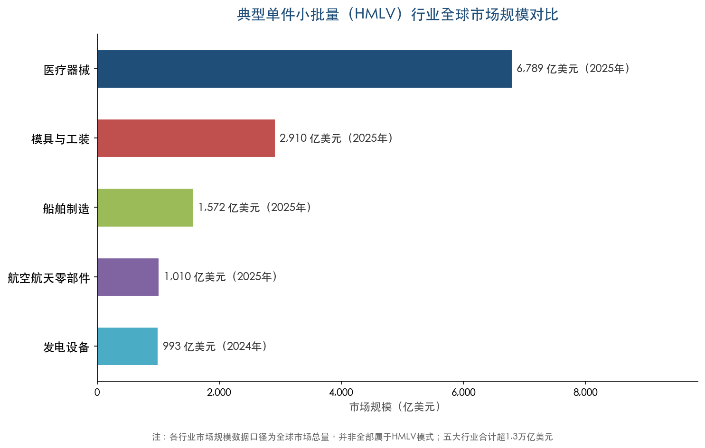

综合上述行业，仅航空航天零部件、船舶制造、模具工装、医疗器械和发电设备五个领域的全球市场规模合计已超过1.3万亿美元。需要指出的是，上述行业并非全部产品均属于单件小批量模式——例如医疗器械市场中亦包含大批量生产的一次性耗材，航空航天中也有批量化的标准紧固件——但其中技能密集的定制化产品占据了显著份额，构成了HMLV制造的产业主体。

## 1.4 产业规模的宏观坐标：单件小批量制造在全球制造业中的位置

将单件小批量制造置于全球制造业的宏观坐标系中加以审视，有助于理解其相对体量与战略地位。

### 1.4.1 全球制造业增加值

2024年，全球制造业增加值（Manufacturing Value Added, MVA）约16.82万亿美元（现价）。[Trading Economics/世界银行](https://tradingeconomics.com/world/manufacturing-value-added-us-dollar-wb-data.html "全球制造业增加值，2024年数据，来源世界银行") 据UNIDO 2025年第三季度报告，工业经济体占全球MVA的87.7%，发展中经济体仅占12.3%。[UNIDO](https://stat.unido.org/portal/storage/file/publications/qiip/World_Manufacturing_Production_2025_Q3.pdf "UNIDO世界制造业生产报告，2025年Q3")

中国制造业增加值自2010年超过美国后稳居世界首位，2022年占全世界制造业增加值比重约30.2%，2024年全部工业增加值完成40.5万亿元人民币，制造业总体规模连续15年保持全球第一。[新华社](http://www.news.cn/fortune/20240910/6a24560a504b41f8b5bff8114684d6c9/c.html "我国制造业增加值占全球比重约三成，2024年9月")

### 1.4.2 单件小批量制造在离散制造中的位置

现有公开文献中，尚无权威机构对全球离散制造中HMLV模式的产值或就业占比进行过系统量化。多数学术研究仅定性描述HMLV制造"在航空航天、船舶、模具等行业普遍存在"。MDPI 2023年发表的一篇系统性文献综述回顾了2000—2022年间152篇HMLV相关文献，发现71%的研究未指定具体行业（即针对一般性HMLV场景），半导体（12%）和电子制造（9%）是研究最多的两个细分行业。[MDPI/Applied Sciences](https://www.mdpi.com/2076-3417/13/3/1687 "A Review of the High-Mix Low-Volume Manufacturing Industry, 2023")

尽管缺乏精确的产值比例数据，从定性角度判断，HMLV制造在离散制造中的覆盖面远比直觉估计更广。单件小批量并非仅存在于航空航天、船舶等"高端制造"领域——大量中小型金属加工车间、机械零部件加工企业、非标设备制造商，其日常生产模式本质上均属HMLV范畴。TNO在2025年的报告中明确指出，随着客户对产品个性化需求的持续增长，制造业正在系统性地从大批量标准化生产向HMLV方向迁移，大规模定制（mass customization）趋势正在驱动HMLV制造的持续扩展。[TNO](https://publications.tno.nl/publication/34643957/wSPVOr5V/TNO-2025-R10304.pdf "TNO 2025, Performance Engineering of HMLV Production Systems")

## 1.5 劳动力结构与技能缺口：全球性的结构困境

单件小批量制造对技能工人的高度依赖，使其面临格外严峻的劳动力挑战。技能工人短缺并非劳动力市场的周期性波动，而是一种深层次的结构性危机——老龄化加速、技能传承断裂与产业需求升级三重因素的叠加效应。

### 1.5.1 美国：制造业技能缺口的量化图景

截至2025年12月，美国制造业就业人数约1,269万人（BLS季调数据）。[FRED/BLS](https://fred.stlouisfed.org/series/MANEMP "美国制造业就业总量，FRED数据")

Deloitte与Manufacturing Institute 2024年联合研究显示，2024—2033年美国制造业净新增岗位需求约380万个，其中约190万个（约50%）可能因技能缺口无法填补。Manufacturing Institute主席Carolyn Lee在2025年2月指出，美国制造业正面临"结构性劳动力赤字"（structural workforce deficit）——如不采取果断行动，到2033年将面临190万制造业工人短缺。值得注意的是，制造业员工平均年薪（含薪酬和福利）已超过102,000美元，但高薪仍不足以弥合缺口。[Deloitte/Manufacturing Institute](https://www.deloitte.com/us/en/insights/industry/manufacturing-industrial-products/supporting-us-manufacturing-growth-amid-workforce-challenges.html "Deloitte与Manufacturing Institute 2024年人才研究") [Manufacturing Institute](https://themanufacturinginstitute.org/the-state-of-the-manufacturing-workforce-in-2025-20621/ "Manufacturing Institute 2025年制造业劳动力状况演讲")

焊工群体的供需数据尤为典型。据BLS 2023年5月OES数据，美国焊工、切割工、钎焊工（SOC 51-4121）就业人数约421,730人，年均工资约52,640美元。美国焊接学会（AWS）数据则显示，2024—2025年美国焊接专业人员（含六类相关职业）总量约771,000人，但预计2024—2028年间需新增约330,000名焊接专业人员（年均约82,500人），需求主要源自行业增长和退休替代。[BLS](https://www.bls.gov/oes/2023/may/oes514121.htm "BLS OES焊工数据，2023年5月") [AWS](https://weldingworkforcedata.com/ "AWS焊接劳动力数据，2025年")

### 1.5.2 中国：规模庞大但结构性短缺严峻

中国作为全球最大的制造业国家，拥有规模最庞大的技能工人队伍。截至2024年，中国技能人才总量已超过2亿人，占就业人员总量的26%以上；其中高技能人才超过6,000万人，约占技能人才总量的30%。[国务院新闻办](http://www.scio.gov.cn/live/2025/35394/xgbd/202501/t20250114_881876.html "国务院新闻办，我国技能人才总量超过2亿人，2025年1月")

然而，庞大的存量并未缓解结构性短缺。据教育部、人社部、工信部联合发布的《制造业人才发展规划指南》预测，至2025年中国制造业十大重点领域人才需求缺口将近3,000万人，缺口率高达48%。截至2021年底，高技能人才缺口达2,000万人。[人民论坛](https://paper.people.com.cn/rmlt/pc/content/202411/18/content_30047208.html "高技能人才供给：难点、目标与路径，2024年11月")

更深层的结构性矛盾在于制造业劳动力的受教育水平分布。以2022年全国分行业就业人员受教育程度数据为例，制造业中拥有大学本科学历的劳动者仅占6.1%，多数一线工人的技能获取主要依赖"师带徒"式的经验传承而非系统化职业培训体系。[人民论坛](http://paper.people.com.cn/rmlt/pc/content/202411/18/content_30047206.html "为中国式现代化提供高技能人才支撑，2024年11月") 在单件小批量制造领域，现代制造业与战略性新兴产业超70%的新增一线从业人员来自职业院校和技工学校，但高技能人才在总量中的占比仍然偏低。

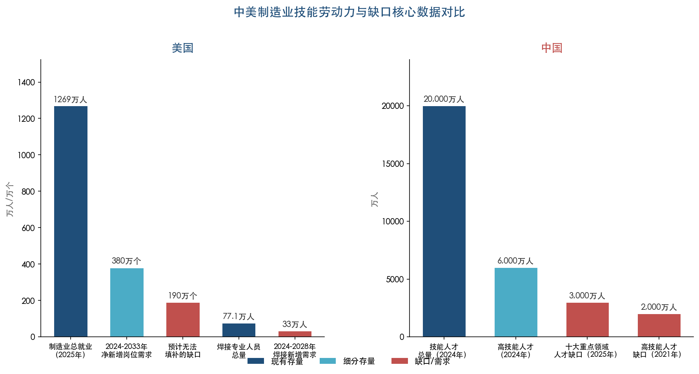

### 1.5.3 技能缺口的深层逻辑：高薪为何无法弥合鸿沟

制造业技能缺口的成因具有多维度特征。Deloitte与Manufacturing Institute的研究揭示了几个关键机制：先进制造业中约40%的当前技能要求将在未来五年内发生变化，制造商需同时发展数字技能和传统制造基础技能。然而，仅具备数字技能远远不够——在高度专业化的领域（如金属结构件制造、航空航天），操作焊接机器人的前提是工人具备扎实的焊接经验，编写数控程序的前提是理解切削力学和材料特性。换言之，自动化非但不消除对传统技能的需求，反而对复合型技能提出了更高要求。[Deloitte/Manufacturing Institute](https://www.deloitte.com/us/en/insights/industry/manufacturing-industrial-products/supporting-us-manufacturing-growth-amid-workforce-challenges.html "Deloitte与Manufacturing Institute 2024年人才研究")

## 1.6 单件小批量制造对工人经验的独特依赖

上述分析已从产业分类、典型行业、产业规模和劳动力结构四个维度勾勒了单件小批量制造的问题域轮廓。在此基础上，有必要从生产过程的微观层面进一步刻画这种制造模式对工人经验和现场判断的独特依赖——这正是后续章节分析自动化难度的核心切入点。

Rodriguez的研究发现，在HMLV按订单生产（Make-to-Order）环境中，生产工人是理解和改善流程的关键伙伴——凭借经验判断产品族的加工频率、识别物料短缺对交期的影响、在频繁换产中维持质量一致性。由于产品品种多且每种产量低，依赖节拍时间分析的传统精益方法难以直接适用，价值流图亦因产品变异过大而难以绘制。HMLV环境下的工人须同时掌握多个产品族的装配流程，并在高频换产条件下确保质量一致性。[MIT LGO Thesis](https://dspace.mit.edu/bitstream/handle/1721.1/139593/rodriguez-andrewrd-sm-meche-2021-thesis.pdf "Rodriguez, Applying Lean to HMLV MTO, MIT 2021")

这种依赖可从三个层面加以解析：

**感知与判断层面**。工人通过视觉、触觉、听觉等多模态感知评估工件状态——焊缝的颜色和声响指示熔池温度是否合适，手指触摸判断表面粗糙度是否达标，目测铸件表面识别微小的气孔和裂纹。这些感知判断在很大程度上属于隐性知识（Tacit Knowledge），难以用文字规则或传感器数值完全编码化。

**决策与即兴层面**。当实际加工条件偏离预期时（材料批次差异、环境温度变化、工装磨损），经验丰富的工人能够迅速调整工艺参数——降低焊接电流、改变走刀路径、增加预热时间——这种现场即兴决策（in-situ improvisation）是单件小批量制造中质量控制的关键机制。

**整合与协调层面**。在大型结构件的装配中（如船舶分段对接、航空器机身组装），工人须综合考虑尺寸累积误差、热变形补偿、应力释放序列等多重因素，协调多工位、多工种的作业顺序——这种系统级的整合能力，目前尚无任何自动化系统能够完全替代。

HMLV制造"生产系统中处处需要人做决策"的本质特征，构成了自动化改造面临的最根本挑战。后续各章将从技能工序识别（第2章）、技术可行性评估（第3章）、经济可行性与组织障碍（第4章）、行业实践案例（第5章）和趋势展望（第6章）等维度，对这一挑战的深度与可能的应对路径展开系统评估。

# 第2章 技能密集型工序的识别与分类

第一章将单件小批量离散制造（HMLV）的问题域锚定在航空航天、船舶、模具、医疗器械和能源装备等典型行业，并揭示了这一制造模式对工人个人技能的高度依赖。然而，"依赖技能"是一个笼统的表述——不同工序对技能的依赖在种类、深度和可编码化程度上存在本质差异。例如，一名焊工根据熔池颜色和电弧声响实时调整焊接参数所调用的技能，与一名钳工凭借指尖触感判断模具型腔抛光粗糙度所调用的技能，在认知机制和自动化难度上截然不同。若不对"技能依赖"加以分解，后续的自动化可行性讨论便缺乏精准的靶标。

本章的核心任务在于将"技能依赖"这一宽泛概念拆解为可分析的组成要素：首先，系统识别单件小批量制造中的技能密集型工序（Skill-Intensive Process）；其次，解析每类工序中工人技能的具体构成；最后，在此基础上构建"技能依赖—自动化难度"分析矩阵，为后续各章的技术评估和经济分析提供统一的分析框架。

## 2.1 技能密集型工序的定义与识别标准

在进入具体工序分类之前，有必要首先厘清"技能密集型工序"的判定标准。并非所有需要人力参与的工序都属于技能密集型——物料搬运虽然需要人力，但其核心要求是体力而非技能判断，属于自动化的"低悬果实"；简单的上下料操作同理。

本报告将技能密集型工序定义为：**高度依赖工人个人经验、感知判断、手眼协调和隐性知识的制造工序，其质量产出与工人技能水平之间存在显著的正相关关系**。这一定义包含以下四个关键维度：

**感知判断（Sensory Perception & Judgment）**。工人通过视觉、触觉、听觉等多模态感知评估工件状态，并基于感知信息做出质量判断。Rasmussen（1983）在其经典的"技能—规则—知识"（Skill-Rule-Knowledge, SRK）认知行为模型中指出，熟练工人在执行熟悉任务时表现为"技能层级行为"（skill-based behavior）——动作平滑、高度整合，几乎无需有意识的认知介入；而遇到异常情况时，则需切换至"规则层级"或"知识层级"行为，调用经验规则或进行分析推理。[Rasmussen](https://www.iwolm.com/wp-content/downloads/SkillsRulesAndKnowledge-Rasmussen.pdf "Rasmussen, Skills Rules and Knowledge, IEEE Trans. 1983") 在单件小批量制造中，产品变异度大、工况条件多变，工人频繁在这三个层级之间切换的能力本身即为一种核心技能。

**手眼协调与精细操控（Manual Dexterity & Fine Motor Control）**。美国劳工部O*NET职业信息数据库将"手臂—手部稳定性"（Arm-Hand Steadiness）、"手工灵巧性"（Manual Dexterity）和"手指灵巧性"（Finger Dexterity）列为焊工（SOC 51-4121）最重要的能力要求，其中74%的焊工报告"几乎持续地"使用双手控制、操纵工具或工件。[O*NET](https://www.onetonline.org/link/summary/51-4121.00 "O*NET焊工职业画像") 此类精细运动能力在当前机器人技术条件下仍难以完全复制，尤其在狭窄空间、不规则曲面或柔性材料的操作场景中差距尤为显著。

**隐性知识（Tacit Knowledge）**。Michael Polanyi于1966年提出的著名命题——"我们所知道的比我们能说出来的多"（We can know more than we can tell）——在制造业技能领域有着深刻体现。[Polanyi](https://en.wikipedia.org/wiki/Polanyi%27s_paradox "Polanyi悖论，1966") Nonaka与Takeuchi（1995）进一步将知识区分为显性知识（explicit knowledge）和隐性知识（tacit knowledge），指出隐性知识"深深植根于行动和特定情境中的个人承诺"，难以通过文档化手段转移。[Nonaka & Takeuchi](https://www.uky.edu/~gmswan3/575/nonaka.pdf "Nonaka, A Dynamic Theory of Organizational Knowledge Creation, 1994") 制造业中大量关键工艺参数——焊接电弧的"手感"、打磨时的"力感"、装配间隙的"配合感"——即属于典型的隐性知识：工人能够执行但无法完整地用语言或数值表述其判断依据。

**现场即兴决策（In-Situ Decision Making）**。当实际工况偏离预期——材料批次差异导致硬度波动、环境温度变化引起热变形、工装磨损造成定位偏差——技能工人能够迅速评估偏差幅度并即兴调整工艺策略。这种在不确定条件下快速做出近似最优决策的能力，是单件小批量制造中维持质量稳定性的关键保障，也是四个维度中最具综合性的一项。

基于上述四个维度，可以对单件小批量制造中的工序进行系统筛查，识别出在多个维度上均呈现高需求的技能密集型工序。

## 2.2 七类核心技能密集型工序

通过对航空航天、船舶、模具、医疗器械和能源装备等HMLV典型行业的工序分析，并参照Sanchez-Salas（2016）在拉夫堡大学博士论文中对高价值零部件制造过程变异性的系统研究，本报告识别出以下七类核心技能密集型工序。[Sanchez-Salas](https://core.ac.uk/download/pdf/288371036.pdf "Sanchez-Salas, A Framework to Support Automation in Manufacturing through the Study of Process Variability, Loughborough University, 2016")

### 2.2.1 手工焊接

手工焊接是单件小批量制造中技能密集度最高、最具代表性的工序之一。在航空航天结构件、船舶分段对接、压力容器和管道系统的制造中，手工TIG焊接（氩弧焊）、MMA焊接（手工电弧焊）和MIG焊接（熔化极气体保护焊）仍不可或缺。

手工焊接对工人技能的需求覆盖全部四个维度。在**感知判断**方面，焊工需通过熔池的颜色（从明亮的白色到淡蓝色的渐变指示温度是否合适）、电弧的声响（稳定的"嘶嘶"声与不稳定的"噼啪"声有本质区别）以及烟雾形态来实时评估焊接质量。O*NET数据显示，56%的焊工认为"精确和准确"在其工作中"极其重要"，33%认为"出错后果"为"极其严重"。[O*NET](https://www.onetonline.org/link/summary/51-4121.00 "O*NET焊工职业画像")

在**手眼协调**方面，焊工须在强烈弧光下（佩戴深色滤光面罩后仅能看到熔池附近极小的区域），以毫米级精度控制焊枪或焊条的角度、行进速度和送丝速率，同时保持手臂稳定——在仰焊（overhead position）和立焊（vertical position）姿态下尤为困难。ScienceDirect对手工焊接的综述指出，手工焊接"需要显著的技能和灵巧性"（requires significant skill and dexterity）。[ScienceDirect](https://www.sciencedirect.com/topics/engineering/manual-welding "Manual Welding综述")

在**隐性知识**方面，不同材料（碳钢、不锈钢、钛合金、镍基合金）、不同板厚、不同接头形式（对接、角接、T型）所需的焊接参数组合极为庞杂，经验丰富的焊工能凭"手感"在数秒内锁定合适的参数窗口，而这种能力往往需要数年实践积累方能习得。

在**现场即兴决策**方面，焊工在焊接过程中须持续监控并应对各种偏差：根部间隙变化、热变形导致的错边、风速变化影响气体保护效果等。O*NET数据显示，50%的焊工"每天都需要做决策"。[O*NET](https://www.onetonline.org/link/summary/51-4121.00 "O*NET焊工职业画像")

### 2.2.2 复杂手工装配

在航空航天、船舶、医疗器械和非标设备制造中，复杂手工装配是另一类高度依赖技能的工序。其核心挑战在于装配对象通常是几何形状复杂、公差要求严格且批量极小的定制化产品，装配过程涉及多零部件之间的空间关系判断、尺寸误差补偿和力的精确控制。

线缆束与管路布线（Wire Harness / Cable Routing）是复杂手工装配中最具代表性的子类。航空航天领域的线缆束通常包含数十乃至数百根不同类型的线缆（连接线、同轴电缆、多芯电缆等），需按照精确的几何和电气要求在三维空间中布线、分支、绑扎和终端处理。Epec Engineered Technologies指出，"与日益增长的自动化趋势相反，复杂线缆束仍然主要由人工制造，原因在于其涉及的工序种类繁多"——不可自动化的工序包括安装不同长度的端接导线、将线缆穿过护套和导管、在分支处用布带缠绕、对指定导线进行多重压接等。[Epec](https://blog.epectec.com/why-complex-wire-harnesses-cannot-be-fully-automated "Why Complex Wire Harnesses Cannot Be Fully Automated")

Scitech Patent Art的研究进一步确认："线缆束装配目前由技能工人完成，机器人自动化被认为是困难的"（Assembling wire harness is currently done by skilled workers as it is considered to be difficult for automation by robots）。[Scitech Patent Art](https://stg.patent-art.com/knowledge-center/challenges-in-automotive-wire-harness-assembly/ "Challenges in Automotive Wire Harness Assembly") 困难的根源在于柔性线缆的形变不可预测、分支结构的三维空间关系复杂，且每批次产品的布线方案可能完全不同——这正是单件小批量制造模式对自动化提出的最严峻挑战之一。

大型结构件的装配（如船舶分段对接、航空器机身组装）则要求工人综合考虑尺寸累积误差、热变形补偿、应力释放序列和多工位协调，此类整合性判断目前尚无成熟的自动化替代方案。

### 2.2.3 目视检测与无损检测

质量检测是单件小批量制造中另一高度依赖人的技能的环节。目视检测（Visual Testing, VT）是最古老也是应用最广泛的无损检测（NDT）方法。美国无损检测学会（ASNT）指出，目视检测"涉及对组件的直接观察以检测表面不连续性"，即使更复杂的NDT方法（超声检测、射线检测、磁粉检测等）通常也"需要先进行目视检测"。[ASNT](https://www.asnt.org/what-is-nondestructive-testing/methods/visual-testing "ASNT Visual Testing方法介绍")

目视检测的技能要求主要体现在**感知判断**维度：检测人员需在复杂的表面纹理中识别微小的裂纹、气孔、夹渣、咬边等缺陷，这些缺陷的尺寸可能仅为零点几毫米，且与正常表面特征（加工纹路、氧化色差等）高度相似。NASA的《无损评估方法与能力手册》详细列出了各种NDE技术的能力与限制，指出检测灵敏度和可靠性高度依赖检测人员的培训水平和实践经验。[NASA](https://ntrs.nasa.gov/api/citations/20200002023/downloads/20200002023.pdf "NASA NDE Methods and Capabilities Handbook, 2020")

在单件小批量制造中，检测任务的挑战更为突出：每个工件的几何形状、表面状态和潜在缺陷模式都可能不同，检测人员无法像大批量生产线上那样通过重复性观察建立稳定的"缺陷图谱"，而须针对每件产品重新建立判断基线。此外，航空航天等行业的认证体系（如NAS 410/EN 4179）对NDT人员的资质等级（Level I/II/III）有严格要求，高级别检测人员须经历数年培训并积累数千小时实践经验。

### 2.2.4 手工打磨与抛光

模具型腔的手工打磨与抛光是技能密集度极高的工序，广泛存在于模具制造、航空发动机叶片修整和医疗植入物表面处理环节。Sanchez-Salas在拉夫堡大学的博士研究中，以航空航天高价值零部件的打磨抛光和去毛刺工序为案例，深入分析了此类工序中的过程变异性与操作员技能运用。研究发现，打磨抛光过程中存在大量输入变异性（工件来料状态的差异）、策略变异性（不同操作员采用不同的工具序列和施力方式）和感知变异性（对"表面是否达标"的判断因人而异）。[Sanchez-Salas](https://core.ac.uk/download/pdf/288371036.pdf "Sanchez-Salas, Loughborough University, 2016")

O*NET将手工打磨与抛光工人（SOC 51-9022）的核心能力要求列为机械知识、生产与加工知识、质量控制分析、操作监控和设备维护，工作内容涵盖"打磨、砂磨和抛光工件""纠正缺陷""准备进一步精加工的表面"等。[O*NET](https://www.onetonline.org/link/summary/51-9022.00 "O*NET手工打磨抛光工人画像") 在模具制造中，A1级（镜面级）抛光要求表面粗糙度Ra达到0.01—0.025微米，这一精度水平要求操作员通过指尖触感和目视反射光泽来判断，任何力度过大或角度偏差都可能在镜面上留下不可修复的划痕。

Plasticstoday报道了激光抛光技术的进展，指出其初步试验可达到Ra 0.1—0.4微米的表面粗糙度，但该报道同时承认手工抛光在最终精度和复杂曲面适应性方面仍保持优势。[Plasticstoday](https://www.plasticstoday.com/injection-molding/hands-off-that-mold-precision-laser-polishers-replace-grinding-stones-and-manual-labor "Precision Laser Polishers Replace Manual Labor") 换言之，当前最先进的自动化抛光方案在精度上仍逊于熟练工匠手工操作的水平一个数量级以上。

### 2.2.5 工装夹具调整与工艺参数调优

在单件小批量制造中，频繁换产意味着工装夹具的设计、安装、校准和微调是一项日常性工作。与大批量生产中使用标准化、固定式夹具不同，HMLV环境中的夹具往往需要根据每个工件的几何特征进行定制或半定制。工人须凭借经验判断最佳的定位方案、夹紧力和支撑点位置，以避免工件变形和加工误差。

工艺参数的现场调优同样高度依赖经验。在数控机床加工中，尽管理论切削参数可通过CAM软件预先设定，但实际加工中材料硬度波动、刀具磨损状态、机床热变形等因素均要求操作员根据切削声音、切屑形态和表面纹理进行实时微调。这种"听声辨形"的能力在加工钛合金、镍基合金等难加工材料时尤为关键——参数偏差可能导致刀具崩刃或工件报废，而此类材料的单件价值往往高达数万乃至数十万元。

### 2.2.6 管路与线路布线

除前述线缆束装配外，船舶和能源装备制造中的管路布线（piping routing）构成另一类典型技能密集型工序。大型船舶的机舱内可能包含数千根管道（燃油管、冷却水管、液压管、蒸汽管等），需要在极为狭窄且障碍物密布的空间中进行现场测量、切割、弯曲、焊接和安装。由于大型结构件的制造误差累积，图纸上的管路走向往往与现场实际空间存在偏差，管道工人须凭借经验进行现场调整——这种"现场适配"（fit-up）能力是该工序中最核心的技能要素。

### 2.2.7 返修与异常处理

在上述所有工序中，产品出现质量问题时的返修（rework）和异常处理是技能要求最高的环节。返修工作缺乏标准化的操作规程——每一个缺陷的位置、形态、成因和对周围结构的影响都是独特的，工人须综合运用工艺知识、材料科学知识和丰富实践经验来制定返修方案并执行。在航空航天领域，返修方案通常需经MRB（Materials Review Board）审批，但具体的返修操作仍高度依赖技能工人的现场判断和手工执行能力。

## 2.3 技能构成的解析：从"波兰尼悖论"到操作员认知模型

上述七类工序共享一个核心特征：工人所运用的技能中，有相当比例属于难以形式化和编码化的隐性知识。为更深入地理解这种技能构成，有必要借助认知科学和知识管理领域的理论框架加以解析。

### 2.3.1 波兰尼悖论与制造业隐性知识

Michael Polanyi于1966年提出"我们所知道的比我们能说出来的多"（We can know more than we can tell），这一命题后来被David Autor（2014）在讨论自动化瓶颈时重新命名为"波兰尼悖论"（Polanyi's Paradox）。该悖论揭示了一个根本性事实：人类许多能力——识别面孔、骑自行车、判断焊缝质量——基于隐性知识，执行者能够胜任任务却无法用显性规则完整描述自己的知识和决策过程。[Wikipedia](https://en.wikipedia.org/wiki/Polanyi%27s_paradox "Polanyi's Paradox")

在制造业技能中，波兰尼悖论有极为具体的体现。Sanchez-Salas的研究观察到，在高价值零部件的打磨工序中，不同操作员使用的工具序列和施力策略存在显著差异——有些操作员的目标是将尺寸偏差控制在公差范围内，另一些操作员则追求零偏差——但均能生产出合格产品。更关键的是，当被问及"如何判断表面已经打磨到位"时，操作员往往给出模糊的回答，如"看起来对了"或"手感告诉我"，而无法将判断标准转化为可量化的参数。[Sanchez-Salas](https://core.ac.uk/download/pdf/288371036.pdf "Sanchez-Salas, Loughborough University, 2016")

这一现象的自动化含义深远：如果工人自身无法完整描述自己的决策规则，那么将这些规则编程到自动化系统中的难度必然更高。波兰尼悖论构成了技能密集型工序自动化的认知学根源性障碍。

### 2.3.2 Rasmussen SRK模型与制造业技能层次

Rasmussen（1983）的SRK模型为理解制造业工人的技能构成提供了结构化框架。该模型将人类行为区分为三个层次：

- **技能层级行为（Skill-Based Behavior）**：在熟悉的任务中，操作员的行为是自动化的、平滑的、高度整合的"模式化动作"，几乎无需有意识的认知介入。经验丰富的焊工在焊接熟悉材料的标准接头时，手部动作、送丝速率和行进速度的协调近乎本能。

- **规则层级行为（Rule-Based Behavior）**：在常见但非完全例行化的任务中，操作员基于储存的规则或经验程序来指导行为——"如果焊缝颜色偏黄，则降低电流""如果切屑变色，则减小进给量"。这些规则可能来自培训、同行传授或自身实践总结。

- **知识层级行为（Knowledge-Based Behavior）**：在陌生或异常情况下，操作员须基于对环境的分析和总体目标的理解，有意识地制定计划并在多方案中择优。当焊接一种从未接触过的新型合金时，焊工须综合运用材料科学知识、过往类似经验和现场试验来确定可行的工艺窗口。

[Rasmussen](https://www.iwolm.com/wp-content/downloads/SkillsRulesAndKnowledge-Rasmussen.pdf "Rasmussen, Skills Rules and Knowledge, IEEE Trans. 1983")

在大批量重复性生产中，操作员大部分时间处于技能层级行为状态，少量时间处于规则层级。而在单件小批量制造中，产品变异度极大、异常情况频发，操作员须频繁在三个层级之间切换——这种"层级切换能力"本身即是HMLV制造对工人的核心要求，也是自动化最难复制的能力维度。图2-1以堆叠柱状图形式直观对比了两种生产模式下的认知层级时间占比差异。

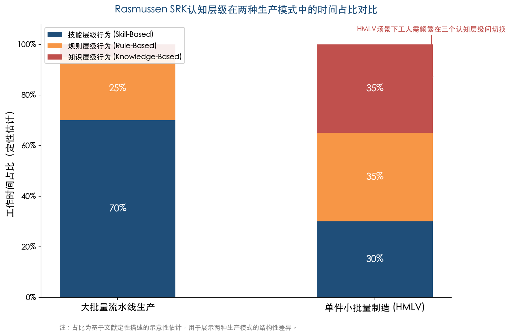

**图2-1 Rasmussen SRK认知层级在两种生产模式中的时间占比对比**。大批量流水线生产中工人约70%的时间处于技能层级行为，而HMLV制造中工人须将约35%的时间分配到知识层级行为，频繁进行认知层级切换。占比为基于文献定性描述的示意性估计。

### 2.3.3 知识转化困境：SECI模型视角

Nonaka与Takeuchi（1995）提出的SECI知识转化模型描述了四种知识转化模式：社会化（隐性→隐性）、外化（隐性→显性）、组合化（显性→显性）和内化（显性→隐性）。[Nonaka & Takeuchi](https://www.uky.edu/~gmswan3/575/nonaka.pdf "Nonaka, A Dynamic Theory of Organizational Knowledge Creation, 1994") 在制造业技能传承中，"社会化"对应的即为传统"师带徒"模式——师傅的隐性知识通过共同工作、观察和模仿转移给徒弟，不经过显性化的中间环节。

自动化本质上是一种"外化"过程——将人类操作员的隐性知识转化为机器可执行的显性程序。问题在于，制造业中大量关键技能恰恰是SECI模型中最难"外化"的类型：它们高度情境化（依赖特定的材料状态、工件几何和环境条件）、身体化（嵌入肌肉记忆和感觉经验中）、且具有模糊性（工人自身也难以精确表述判断标准）。因此，制造业技能的自动化不仅是一个工程技术问题，更是一个知识工程问题——其瓶颈不在于执行机构的物理能力，而在于知识的可表征性。

## 2.4 过程变异性：技能密集型工序自动化的核心障碍

Sanchez-Salas在其博士论文中提出了一个关键论断：**过程变异性是制造业自动化的核心挑战**。在制造过程中，人类操作员运用技能来适应变异性，以满足产品和过程的规格要求。变异性的来源是多元的：输入变异（工件来料尺寸、表面状态、材料性能的差异）、过程变异（工具磨损、机床热漂移、环境条件变化）和输出变异（产品质量指标的波动）。[Sanchez-Salas](https://core.ac.uk/download/pdf/288371036.pdf "Sanchez-Salas, Loughborough University, 2016")

Sanchez-Salas提出的评估框架使用五个属性（输入、输出、策略、时间、要求）和十二个参数（数量、变异范围、相互依赖性、多样性、替代方案数量、动作数量、模式化动作、并发性、时间限制、感觉域、认知需求、物理需求）来量化制造过程中的变异性，并据此建议适当的自动化水平。[Sanchez-Salas](https://core.ac.uk/download/pdf/288371036.pdf "Sanchez-Salas, Loughborough University, 2016")

在单件小批量制造中，上述过程变异性被系统性放大：

- **输入变异**被批量小、品种多所放大：每个工件可能来自不同上游供应商、不同生产批次，其尺寸偏差和材料性能的分布远不如大批量生产中稳定。
- **策略变异**被工艺路线多变所放大：不同产品可能需要截然不同的加工策略，操作员无法依赖单一的标准操作程序。
- **认知和感觉需求**被产品多样性所放大：操作员须针对每个新品种重新校准自己的感知判断基线。

上述分析意味着，单件小批量制造中技能密集型工序的自动化，不仅需要解决"做某一种产品的自动化"问题，更需要解决"适应无限品种变异的自动化"问题——后者在工程复杂度上属于量级更高的挑战。

## 2.5 "技能依赖—自动化难度"分析矩阵

基于前述工序识别和技能构成分析，本报告构建以下"技能依赖—自动化难度"分析矩阵，作为后续各章的统一分析框架。

矩阵的纵轴为**七类核心技能密集型工序**，横轴为**四个技能维度**的需求等级（高/中/低），最后综合得出该工序的**自动化难度等级**。图2-2以热力图形式呈现了该矩阵的全貌。

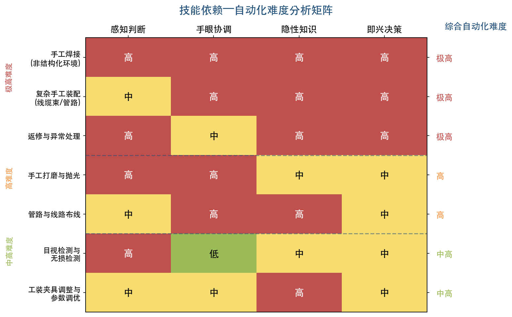

**图2-2 技能依赖—自动化难度分析矩阵**。七类核心技能密集型工序在感知判断、手眼协调、隐性知识、即兴决策四个维度上的需求等级以红（高）/黄（中）/绿（低）色标呈现，右侧标注综合自动化难度等级。虚线将工序分隔为三个难度层级组。

McKinsey全球研究院在2017年的《A Future That Works》报告中，将工作活动分为七大类，其中"可预测物理活动"的自动化潜力最高（81%），而"不可预测物理活动"和"应用专业知识"的自动化潜力仅为18%—26%。该报告估计制造业整体的自动化潜力约为64%，但这一估计涵盖了大量大批量重复性制造活动。[McKinsey](https://www.mckinsey.com/~/media/mckinsey/featured%20insights/digital%20disruption/harnessing%20automation%20for%20a%20future%20that%20works/mgi-a-future-that-works_executive-summary.pdf "McKinsey, A Future That Works, 2017") [NCCI](https://www.ncci.com/Articles/Pages/II_Insights_QEB_Impact-Automation-Employment-Q2-2017-Part1.aspx "NCCI对McKinsey自动化研究的解读，2017") 在单件小批量制造的技能密集型工序中，由于"不可预测物理活动"和"应用专业知识"的占比远高于平均水平，我们判断其实际自动化潜力显著低于64%。

根据四个维度的综合评估，我们将七类工序的自动化难度划分为三个等级：

**极高难度（当前技术条件下难以实现全面自动化）**：

| 工序类别 | 感知判断 | 手眼协调 | 隐性知识 | 即兴决策 | 综合自动化难度 |
|---------|---------|---------|---------|---------|-------------|
| 手工焊接（非结构化环境） | 高 | 高 | 高 | 高 | 极高 |
| 复杂手工装配（线缆束/管路） | 中 | 高 | 高 | 高 | 极高 |
| 返修与异常处理 | 高 | 中 | 高 | 高 | 极高 |

**高难度（局部自动化可行，但全流程自动化仍面临重大挑战）**：

| 工序类别 | 感知判断 | 手眼协调 | 隐性知识 | 即兴决策 | 综合自动化难度 |
|---------|---------|---------|---------|---------|-------------|
| 手工打磨与抛光 | 高 | 高 | 中 | 中 | 高 |
| 管路与线路布线 | 中 | 高 | 高 | 中 | 高 |

**中高难度（技术路线已可见，但在HMLV场景下的经济性和灵活性仍是瓶颈）**：

| 工序类别 | 感知判断 | 手眼协调 | 隐性知识 | 即兴决策 | 综合自动化难度 |
|---------|---------|---------|---------|---------|-------------|
| 目视检测与无损检测 | 高 | 低 | 中 | 中 | 中高 |
| 工装夹具调整与参数调优 | 中 | 中 | 高 | 中 | 中高 |

需要特别指出的是，上述矩阵反映的是**单件小批量制造场景下**的自动化难度。同样是焊接工序，在汽车白车身焊装线上（大批量、标准化、结构化环境），机器人焊接的自动化率已超过90%；而在船舶分段内部的管道焊接（单件、非标准化、狭窄空间），自动化率极低。差异不在于焊接本身的物理原理，而在于HMLV场景下叠加的品种变异性、空间非结构化和批量不经济性。

## 2.6 技能维度的可编码化程度：通向自动化的理论障碍谱系

在上述矩阵的基础上，本节进一步分析四个技能维度的可编码化程度（codifiability），即将该维度的技能转化为计算机或机器人可执行的显性程序的理论难度。图2-3对比了各维度的可编码化程度与代表性自动化技术的成熟度。

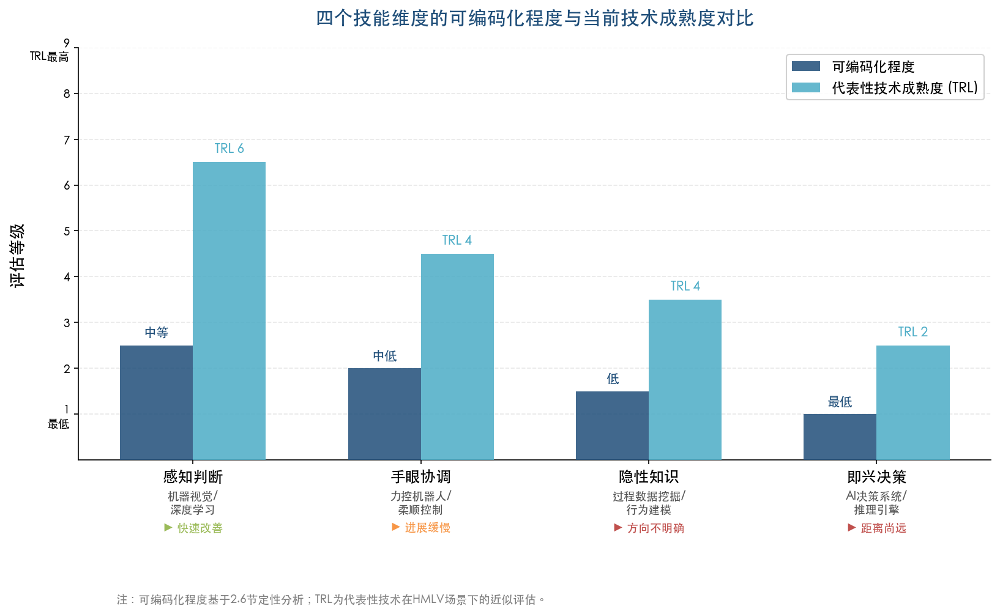

**图2-3 四个技能维度的可编码化程度与当前技术成熟度（TRL）对比**。感知判断领域技术进展最快（TRL 6），即兴决策领域距离实用化差距最大（TRL 2）。可编码化程度基于2.6节定性分析，TRL为代表性技术在HMLV场景下的近似评估。

**感知判断的可编码化程度：中等，且快速改善中**。机器视觉、力觉传感和声学传感技术近年取得显著进展，深度学习驱动的缺陷检测在特定场景下已达到甚至超过人类检测员的准确率。然而，在单件小批量场景中，训练样本稀缺（每种产品的缺陷样本可能仅有个位数）和产品外观多样性（不同产品的"正常"外观差异极大）构成了机器学习方法的根本性挑战。

**手眼协调的可编码化程度：中低，进展缓慢**。力控机器人（force-controlled robot）和柔顺控制技术已能在结构化环境中模拟部分手工操作，但在非结构化空间中对柔性物体（如线缆、密封胶条）和不规则曲面（如铸件内腔）的精细操控能力仍远逊于人手。人手具有22个自由度、丰富的触觉反馈和本能的力度调节机制，构成了极难复制的生物机械系统。

**隐性知识的可编码化程度：低，突破方向尚不明确**。隐性知识之所以"隐性"，恰恰在于它抵抗编码化。近年来部分研究尝试用过程数据挖掘和机器学习来"逆向工程"工人的隐性知识——例如通过追踪经验焊工的手部运动和焊接参数，训练神经网络模拟其行为模式。这些方法在特定窄任务上取得了一定进展，但距离捕获工人在多品种、多工况条件下的完整决策知识仍有巨大差距。

**即兴决策的可编码化程度：最低，距实用化尚远**。即兴决策是前三个维度的综合运用——感知异常（感知判断）、选择应对动作（手眼协调）、调用经验规则或进行推理分析（隐性知识）——其复杂度远超单一维度。当前AI系统在结构化、规则明确的决策问题上已表现出色，但在开放式、不确定性高且后果严重的现场制造决策中，距离替代经验丰富的技能工人仍有相当距离。

## 2.7 本章小结

本章完成了从"工序层面"到"技能维度层面"的双层分析。在工序层面，识别出单件小批量制造中七类核心技能密集型工序：手工焊接、复杂手工装配、目视检测与无损检测、手工打磨与抛光、工装夹具调整与工艺参数调优、管路与线路布线、以及返修与异常处理。在技能维度层面，解析出感知判断、手眼协调、隐性知识和现场即兴决策四个核心构成维度，并评估了各维度的可编码化程度。

"技能依赖—自动化难度"矩阵揭示了一个关键洞察：**单件小批量制造中最核心的技能要素，恰恰是当前自动化技术最难攻克的方向**。这并非偶然的巧合，而是存在深层逻辑联系——正是因为这些技能难以被编码和自动化，它们才在自动化浪潮席卷大批量制造之后，仍然顽固地保持着对人工的依赖。波兰尼悖论、SRK认知层级理论和SECI知识转化模型从不同角度印证了这一判断的理论基础。

后续各章将以本章构建的分析矩阵为主线，逐一评估各工序的技术可行性（第3章）、经济可行性（第4章），并通过行业案例验证分析框架的适用性（第5章），最终在趋势展望中明确"不可替代区"与"优先自动化区"的边界（第6章）。

# 第3章 自动化替代的技术可行性评估

第二章构建了"技能依赖—自动化难度"分析矩阵，将单件小批量制造中七类核心技能密集型工序按感知判断、手眼协调、隐性知识和即兴决策四个维度进行了系统定位。本章将视角从"人的技能"转向"机器的能力"，逐一审视当前可用自动化技术在替代上述技能方面的成熟度、适用性与瓶颈，回答一个核心问题：对于第二章识别的每类工序，现有技术究竟能走到哪一步？差距有多大？差距的性质是工程优化可以弥合的量变，还是需要范式突破的质变？

评估遵循一个基本原则：严格区分"技术上能否做到"与"经济上是否值得做"。本章仅聚焦技术可行性，经济分析留待第四章展开。与此同时，所有技术评估均锚定在单件小批量（HMLV）的特定场景下——同一项技术在大批量生产中可能已达到工业成熟，但在HMLV场景中因品种变异性、批量不经济性和环境非结构化等因素，往往呈现显著降低的技术就绪水平。

## 3.1 关键使能技术全景：从协作机器人到生成式AI

在深入各工序评估之前，有必要先勾勒当前与单件小批量制造自动化最相关的技术群落及其发展态势。

### 3.1.1 协作机器人（Cobot）

协作机器人是近十年工业机器人领域增长最快的细分品类。据国际机器人联合会（IFR）统计，2023年全球协作机器人安装量占工业机器人总安装量的10.5%（总量541,302台），2024年协作机器人安装量同比增长12%，延续双位数增长态势。[IFR](https://ifr.org/ifr-press-releases/news/how-robots-work-alongside-humans "IFR协作机器人立场文件，2024年12月") 同年全球工业机器人安装量达542,000台，连续四年超过50万台，在役机器人总量达466.4万台（同比+9%）。[IFR/The Robot Report](https://www.therobotreport.com/ifr-industrial-robot-deployments-have-doubled-in-10-years/ "IFR World Robotics 2025报告，2025年9月")

协作机器人之所以与HMLV制造高度相关，在于其设计哲学恰好回应了小批量场景的核心痛点。IFR指出，协作机器人"易于编程——有些可通过手动引导（lead-through teach）或平板界面编程"，"通常无需额外安全措施即可部署在现有生产区域"，且支持即插即用（Plug & Play）实现灵活适配。[IFR](https://ifr.org/ifr-press-releases/news/how-robots-work-alongside-humans "IFR协作机器人立场文件，2024年12月") 美国国家标准与技术研究院（NIST）在其制造创新博客中明确将HMLV制造商定义为协作机器人的"甜蜜点"（sweet spot），尤其适用于50至500人规模、产品族混合生产、期望在6个月内收回投资的制造企业。[NIST](https://www.nist.gov/blogs/manufacturing-innovation-blog/high-mixlow-volume-manufacturers-are-sweet-spot-collaborative "NIST制造创新博客，2020年7月/2024年9月更新")

然而，协作机器人相比传统工业机器人存在固有的性能折衷：为确保人机协作安全，其运行速度受限、有效载荷和工作范围均有约束。IFR坦言，协作机器人"目前不适用于需要高有效载荷和高速度的工艺"。[IFR](https://ifr.org/ifr-press-releases/news/how-robots-work-alongside-humans "IFR协作机器人立场文件，2024年12月") 这意味着在航空航天大型结构件焊接或船舶分段装配等需要大力矩、长行程的场景中，协作机器人的直接替代能力仍然有限。

### 3.1.2 力控与自适应控制技术

力控技术（Force Control）是实现"类人触觉"的关键使能技术，直接关联第二章定义的"手眼协调"技能维度。力矩传感器（Force/Torque Sensor）与柔顺控制算法使机器人能够感知并调节与工件接触时的力和力矩，从而执行打磨、抛光、装配、去毛刺等需要精细力度控制的任务。

力控技术在结构化环境中已相对成熟。FerRobotics的主动接触法兰（Active Contact Flange）已应用于航空航天领域的打磨、油漆剥离和超声检测辅助等场景。[FerRobotics](https://www.ferrobotics.com/en/know-how-2/industries-and-applications/aerospace/ "FerRobotics航空航天应用") AMD Machines等系统集成商已能为金属、复合材料和塑料零件提供力控机器人打磨抛光系统，在受控条件下可达到Ra 0.05μm的镜面级表面粗糙度。[AMD Machines](https://amdmachines.com/solutions/grinding-polishing/ "AMD Machines自动打磨抛光方案")

然而在HMLV场景中，力控技术面临的核心挑战在于：每个工件的几何形状、材料硬度和来料状态都可能不同，力控策略须针对每件产品重新适配。这一挑战本质上是第二章所述"过程变异性"对自动化需求的系统性放大效应。

### 3.1.3 机器视觉与三维感知

机器视觉是自动化系统获取"感知判断"能力的核心途径。深度学习驱动的视觉检测在特定场景下已取得突破性进展。2024年发表在《International Journal of Production Research》上的研究系统梳理了小样本学习（few-shot learning）在制造业缺陷检测中的应用，验证了在标记样本极少的条件下通过元学习（meta-learning）实现缺陷识别的可行性。[Few-Shot Learning](https://www.tandfonline.com/doi/full/10.1080/00207543.2024.2316279 "Few-shot learning for defect detection in manufacturing, IJPR 2024")

尤为值得关注的是大语言模型（LLM）与视觉模型融合带来的"零训练"检测范式。AWS于2024年展示了基于Amazon Nova Pro多模态大语言模型的零训练视觉缺陷检测方案：无需构建训练数据集、无需标注、无需训练专用模型，仅通过自然语言提示即可识别缺失组件、表面缺陷、错位、划痕和裂纹。该方案在MVTec AD基准的牙刷数据集上，经提示优化后准确率达93%，F1分数0.951，单张图像处理时间约3.3秒。[AWS](https://aws.amazon.com/blogs/industries/implement-zero-training-visual-defect-detection-in-manufacturing-with-amazon-nova-pro/ "AWS零训练视觉缺陷检测，2024年")

这一技术路径对HMLV制造具有特殊意义：传统深度学习方法要求每种产品积累大量缺陷样本进行训练，而在单件小批量场景中每种产品的缺陷样本可能仅有个位数甚至为零，零训练/少样本检测技术在理论上恰好解决了这一矛盾。但仍需审慎评估的是，当前基准测试的缺陷类型（如牙刷缺陷）与航空航天焊缝微裂纹或模具型腔亚微米级表面缺陷在复杂度和检测精度要求上存在数量级差距，实际工业场景下的可靠性仍需通过大规模验证加以确认。

### 3.1.4 离线编程（OLP）与数字孪生

离线编程（Offline Programming, OLP）是解决HMLV场景中"小批量编程成本"这一核心瓶颈的关键技术路径。传统机器人编程依赖在实际设备上进行示教（teach pendant programming），每编程一个新程序即意味着机器人停产——对于产品换型频率极高的HMLV生产，这一停产时间可能吞噬自动化带来的全部效率收益。

OLP通过在虚拟环境（数字孪生）中完成机器人程序的开发、测试和验证，将编程过程从生产线"解耦"出来。Visual Components的OLP解决方案在多家HMLV制造商中取得了显著成效：芬兰林业设备制造商Ponsse将机器人编程时间从10天缩短至1天（10倍提速）；北美重型设备附件制造商AMI Attachments的编程时间减少70%（从"至少两周"降至"约四天"）；南非拖车制造商AFRIT的手动编程工时减少80%，单日产出从8件提升至最多20件。[Visual Components](https://www.visualcomponents.com/blog/how-robot-offline-programming-drives-efficiency-in-high-mix-low-volume-production-lines/ "OLP在HMLV生产中的应用案例，2025年") 沃尔沃建筑设备（VOLVO CE）更进一步利用OLP实现了无夹具焊接（jigless welding），在单件流模式下完成了30种小批量产品的连续生产。[Visual Components](https://www.visualcomponents.com/blog/how-robot-offline-programming-drives-efficiency-in-high-mix-low-volume-production-lines/ "VOLVO CE无夹具焊接案例")

OLP的局限在于虚拟环境与物理现实之间始终存在偏差（"sim-to-real gap"）。在工件尺寸公差较大、夹具定位精度有限的HMLV场景中，离线生成的程序往往需要在线微调（touch-up），微调工作量可能从数分钟到数小时不等，取决于工件精度和传感器辅助程度。

### 3.1.5 AI驱动的工艺参数优化

人工智能在焊接参数优化领域的应用正从实验室走向产品化。Novarc Technologies的SWR（Spool Welding Robot）配备NovEye AI视觉系统，通过计算机视觉和机器学习实时监控焊接过程，在管道焊接中实现了"零操作员干预"的全自动焊接——不锈钢管道焊接生产率提升最高达12倍，碳钢提升3至5倍。NovEye Autonomy Gen 2系统通过持续数据采集和模型迭代优化，可交付通过射线检测标准的高质量焊缝。[Novarc](https://www.novarctech.com/products/spool-welding-robot/ "Novarc SWR产品页") [Novarc](https://www.novarctech.com/resources/blog/news/novarc-technologies-launches-an-industry-first-with-ai-machine-learning-computer-vision-in-arc-welding-to-fully-automate-the-pipe-welding-process/ "NovEye Autonomy Gen 2发布，2024年")

需要指出的是，Novarc的成功场景为管道预制（spool welding）——虽然管径和壁厚变化较多，但焊缝类型相对标准化（环形对接焊缝），且在开放的预制车间中操作，属于"中等变异性"场景。将同类AI系统迁移到船舶分段内部的复杂管路焊接或航空航天钛合金结构件焊接，所面临的环境复杂度和材料敏感度挑战高出数个量级。

### 3.1.6 增材制造（3D打印）作为替代工艺路线

增材制造提供了一种从根本上绕过部分技能密集型工序的可能性。GE航空（现GE Aerospace）的LEAP发动机燃油喷嘴是这一路径的标志性案例：通过金属增材制造（激光粉末床熔融），将原本由20个独立零件焊接和钎焊组装而成的喷嘴简化为单一整体件，重量减轻25%，耐久性提升5倍。截至2021年8月，GE位于阿拉巴马州奥本的增材制造工厂已交付超过100,000个3D打印燃油喷嘴尖端。[GE Aerospace](https://www.geaerospace.com/news/articles/manufacturing/manufacturing-milestone-30000-additive-fuel-nozzles "GE增材制造燃油喷嘴里程碑") [Made in Alabama](https://www.madeinalabama.com/2021/08/ge-aviations-auburn-plant-ships-100000th-3-d-printed-fuel-nozzle/ "GE奥本工厂交付第10万个3D打印喷嘴，2021年8月")

增材制造的HMLV适用性体现在两个层面：其一，零件整合（part consolidation）消除了焊接和装配等技能密集型工序的需求——20个零件的焊接装配变为零焊接、零装配；其二，增材制造天然适合小批量生产，无需模具和专用工装，从CAD到成品的流程高度数字化。然而，增材制造目前仅适用于特定材料（钛合金、镍基合金、不锈钢等）、特定尺寸范围（受打印腔体尺寸限制）和特定几何复杂度的零件，远未构成对传统制造工艺的全面替代。此外，增材制造后的零件通常仍需后处理（支撑去除、表面精加工、热处理），后处理工序本身亦可能属于技能密集型操作。

上述六大使能技术各自对应不同的工序覆盖范围和技术成熟度阶段。图3-1以矩阵形式呈现了使能技术与七类技能密集型工序之间的映射关系，帮助读者直观把握各技术路线的突破潜力与适用边界。

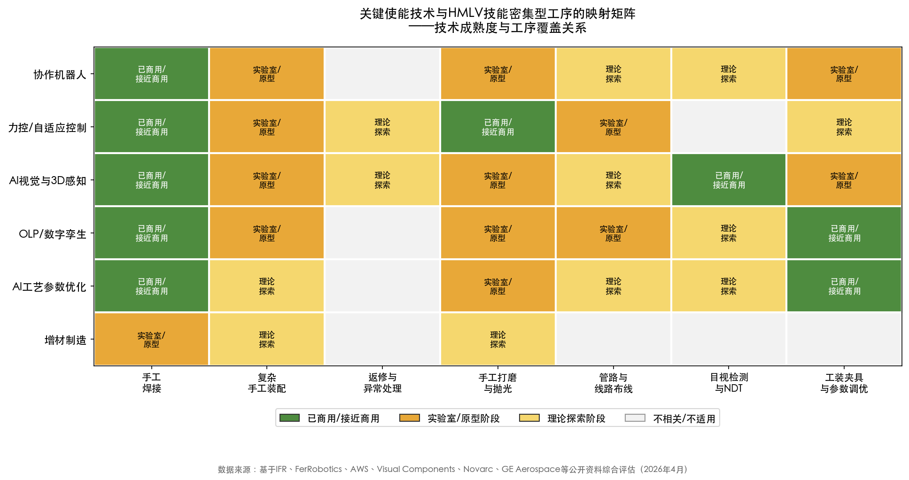

从图3-1可以观察到，协作机器人和AI视觉技术的工序覆盖面最广，但在大多数工序中仍处于实验室/原型阶段；OLP/数字孪生和AI工艺参数优化在焊接与工装调优领域已接近商用，呈现出最清晰的落地路径；增材制造的适用范围最窄，仅在特定条件下提供工艺替代可能性。

## 3.2 逐工序技术可行性评估

以下按照第二章"技能依赖—自动化难度"矩阵的难度等级从高到低的顺序，对七类工序逐一进行技术可行性评估。

### 3.2.1 手工焊接：部分场景突破，全域替代遥远

手工焊接在第二章中被评为"极高"自动化难度。技术可行性评估须区分不同的焊接场景。

**结构化环境中的标准焊缝**——自动化技术已相当成熟。焊缝跟踪与自适应焊接技术（seam tracking & adaptive welding）是关键使能技术：激光焊缝跟踪系统通过结构光投射和视觉处理，在焊接前检测实际焊缝位置、间隙宽度和截面面积，实时修正机器人路径；自适应焊接则根据检测到的焊缝条件自动调整焊接速度、送丝速率、电压和摆动幅度。AMD Machines指出，整合良好的焊缝跟踪与自适应焊接系统能将首次合格率推至95%以上。[AMD Machines](https://amdmachines.com/blog/seam-tracking-and-adaptive-welding-technology/ "焊缝跟踪与自适应焊接技术，2025年")

协作焊接机器人（cobot welder）正在降低HMLV焊接自动化的入门门槛。Hirebotics等供应商的协作焊接系统可将换型时间从传统方案的约1小时缩短至4分钟，编程时间从"数天"降至"数分钟"。[Hirebotics](https://blog.hirebotics.com/welding-automation-planning-guide-for-2026-complete-decision-framework "Hirebotics 2026年焊接自动化规划指南") 这一进展使HMLV车间中简单焊接任务（平焊、横焊位置的角焊缝和对接焊缝）的自动化在技术上已基本可行。

**非结构化环境中的复杂焊缝**——技术鸿沟仍然巨大。船舶分段内部的管道焊接须在极为狭窄的空间中完成仰焊、立焊等高难度姿态，焊缝位置因上游制造误差累积而不可预测，且每条焊缝可能面对不同的材料组合和接头形式。在此类场景中，机器人的物理可达性（空间约束）、焊缝识别（视野受限、反光干扰）和工艺自适应（材料—接头—姿态的组合爆炸）均构成严峻挑战。当前最先进的自适应焊接系统仍以"标准化焊缝类型+可预测的零件变异"为前提，面对HMLV场景中"无限品种变异"的焊接需求，技术就绪水平（TRL）仅处于4—5级（实验室验证至相关环境验证阶段）。

**技术就绪度总判断**：标准焊缝（结构化环境）TRL 7—8；复杂焊缝（非结构化环境）TRL 4—5。HMLV场景下手工焊接的全面自动化替代在2026年的时间窗口内不具备技术可行性。

### 3.2.2 复杂手工装配（线缆束/大型结构件）：技术前沿仍在攻关

复杂手工装配在第二章中被评为"极高"自动化难度，其中线缆束装配是公认的自动化最难领域之一。

2025年，德国Transformations-Hub Leitungssatz项目在ARENA2036研究园区举办了第二届Robotik Challenge，聚焦于汽车部分线缆束的自动化生产——这是汽车制造中自动化程度最低的环节之一。Agile Robots以2分25秒的节拍时间（比要求的3分钟快35秒）赢得"经济效率"奖，其方案使用两台Diana 7七轴协作机器人，配备2D相机系统、力矩传感器和磁性闭合机构，通过AI辅助图像处理算法定位压接端子的6D位姿，并采用"类人触觉"的力控搜索策略将Nano MQS压接端子以亚毫米精度插入壳体。[Agile Robots](https://www.agile-robots.com/en/news/detail/robotik-challenge-2025-the-solution-behind-the-award/ "Robotik Challenge 2025解决方案详解，2025年4月")

这一成果具有标志性意义，但其局限性同样值得审慎解读。其一，Robotik Challenge的任务为简化版部分线缆束（5根线缆、4个连接器），而实际航空航天线缆束可能包含数百根线缆和数十个分支节点，复杂度高出两个数量级以上。其二，即使在简化任务上，方案仍需两台高精度机器人协同、专用力矩传感器、AI视觉系统和定制化夹具的深度集成，系统复杂度和成本远高于单一人工工位。其三，该方案的校准过程依赖精确的桌面初始化和模板匹配，对产品变异的容忍度有限——而真实HMLV环境中的线缆束规格可能每批次都不同。

大型结构件装配（如航空器机身对接、船舶分段组装）的自动化则面临更为根本性的挑战：装配对象的尺寸达数米乃至数十米，累积误差可达厘米级，装配过程中的应力分布和热变形需要实时监控和补偿。目前仅在航空器自动化钻铆（automated drilling and riveting）等特定子工序上实现了较高自动化水平，整体装配流程仍高度依赖技能工人的现场判断与即兴调整。

**技术就绪度总判断**：简化线缆束装配TRL 5—6；全规格航空航天线缆束TRL 2—3；大型结构件整体装配TRL 3—4。

### 3.2.3 返修与异常处理：自动化的"最后堡垒"

返修与异常处理在第二章中同样被评为"极高"自动化难度，且在所有工序中具有独特的非结构化特征——每一个缺陷都是独一无二的，返修方案须在对缺陷的性质、位置、成因和结构影响进行综合评估后逐案制定。

从技术可行性角度看，返修自动化面临的困难可分解为三个层次。第一层为缺陷诊断自动化，需要将AI视觉检测的能力从"发现缺陷"推进到"理解缺陷成因并评估其结构影响"，这要求系统具备材料科学知识、失效模式分析能力和工程判断力，当前AI系统在该层面的能力极为有限。第二层为返修方案生成，需要根据缺陷诊断结果在工艺知识库和工程约束条件下自动生成可行的返修工艺方案，这本质上是一个开放式工艺规划问题，其搜索空间远大于标准制造工艺规划。第三层为返修操作执行，返修操作的空间约束、力度控制和质量要求通常比初始加工更为严苛（须避免对已加工表面造成二次损伤），对机器人灵巧操作能力提出了最高要求。

在航空航天领域，返修决策须经MRB（Materials Review Board）审批，涉及结构强度评估和适航性判断，属于典型的"知识层级行为"（Rasmussen SRK模型），当前没有任何AI系统被批准用于独立做出此类决策。

**技术就绪度总判断**：TRL 1—2。返修与异常处理是技能密集型工序自动化的"最后堡垒"，在可预见的未来（至少到2030年）仍将高度依赖人工。

### 3.2.4 手工打磨与抛光：力控机器人打开局部替代窗口

手工打磨与抛光在第二章中被评为"高"自动化难度。力控机器人技术的进步正在为部分打磨抛光任务打开自动化窗口。

在航空发动机涡轮叶片打磨抛光领域，加拿大AV&R Aerospace开发了专用机器人抛光系统，用于涡轮叶片表面精加工。[AV&R Aerospace](https://www.youtube.com/watch?v=cjlL2GyUBJw "AV&R机器人叶片抛光解决方案") 学术界亦展示了以机器人打磨抛光系统替代涡轮叶片人工翻修的技术方案。[ScienceDirect](https://www.sciencedirect.com/science/article/abs/pii/S0924013602001140 "Robotic grinding and polishing for turbine-vane overhaul") 中国机械工程学报的综述指出，低成本高灵巧性机器人在打磨抛光领域的应用日益广泛，研究重点集中在力柔顺控制（compliance control）方面。[中国机械工程](https://qikan.cmes.org/zgjxgc/EN/10.3969/j.issn.1004-132X.2021.18.011 "机器人磨削抛光力控制研究进展")

然而，第二章已指出，模具制造中A1级镜面抛光要求表面粗糙度Ra达到0.01—0.025微米，而据Plasticstoday报道，激光抛光技术目前仅能达到Ra 0.1—0.4微米——与镜面级要求尚存一个数量级的差距。[Plasticstoday](https://www.plasticstoday.com/injection-molding/hands-off-that-mold-precision-laser-polishers-replace-grinding-stones-and-manual-labor "激光抛光技术进展") AMD Machines力控机器人系统在受控条件下可达到Ra 0.05μm，但这一指标通常针对已知几何形状的标准零件。[AMD Machines](https://amdmachines.com/solutions/grinding-polishing/ "AMD Machines自动打磨抛光方案")

在HMLV场景中，打磨抛光自动化面临的特殊挑战源于两类变异性的叠加。Sanchez-Salas在其博士论文中将其概括为"输入变异性"（每个工件的铸造缺陷分布、加工残留纹路、热处理变形等各不相同）和"策略变异性"（不同操作员针对同一工件可能采用截然不同的工具序列和施力策略，最终都能达到合格标准）。[Sanchez-Salas](https://core.ac.uk/download/pdf/288371036.pdf "Sanchez-Salas, Loughborough University, 2016") 要让机器人复制这种"殊途同归"的适应性加工能力，需要的不仅是力控硬件，更是一套能够感知来料状态、选择加工策略并实时调整的智能决策系统——这正是AI驱动工艺优化的前沿方向，但在复杂曲面和镜面级精度要求下，距离实用化仍有相当距离。

**技术就绪度总判断**：粗磨/去毛刺（简单几何）TRL 7—8；精磨/抛光（复杂曲面、亚微米级）TRL 4—5。

### 3.2.5 管路与线路布线：受限空间中的柔性物体操控难题

管路与线路布线在第二章中被评为"高"自动化难度。其自动化的核心技术障碍在于受限空间中的机器人可达性与柔性/半刚性物体操控可预测性两个维度的叠加。

在管路布线（piping routing）中，管道是半刚性物体，其弯曲行为虽然可以建模，但现场安装时需要根据实际空间约束进行切割、弯曲和焊接。由于上游结构件的制造误差累积，图纸与现场空间的偏差可达数十毫米。数字孪生技术在理论上可以通过三维扫描将现场空间数字化，然后在虚拟环境中规划管路走向，但扫描精度（通常±1—2mm）与管路安装精度要求之间的匹配度仍是一个尚未充分解决的工程问题。

线缆布线（cable routing）中的柔性物体操控是更为根本性的技术挑战。线缆的形变具有高度非线性和不可预测性——重力、弯曲刚度、扭转记忆和相邻线缆的干涉效应共同决定其在空间中的形态。当前机器人在操控柔性物体方面的能力仍处于研究前沿阶段。Robotik Challenge 2025展示的线缆束装配方案虽然在简化任务上取得成功，但处理的是预切割、预剥皮的短线段，而非在三维空间中进行长距离布线和分支管理。

**技术就绪度总判断**：管路预制（车间内）TRL 5—6；现场管路安装（受限空间）TRL 3—4；复杂线缆束现场布线TRL 2—3。

### 3.2.6 目视检测与无损检测：AI赋能最为成熟的赛道

目视检测与无损检测在第二章中被评为"中高"自动化难度，是七类工序中自动化潜力最高的类别。这一判断与技术现状吻合：检测任务的核心在于"感知判断"，而非"手眼协调"或"即兴决策"，恰好落在当前AI视觉技术的能力象限内。

在大批量制造的质量检测中，AI视觉系统已广泛部署且表现优异，准确率超过99%的报道屡见不鲜。[Opsio](https://opsiocloud.com/blogs/deep-learning-for-defect-detection/ "深度学习缺陷检测综述") 但对于HMLV制造，核心挑战在于训练样本稀缺：每种产品的缺陷样本可能仅有个位数，传统深度学习方法所需的数千乃至上万个标记样本无从获取。

少样本学习（few-shot learning）和零样本检测（zero-shot detection）技术正在改变这一局面。如3.1.3节所述，AWS基于多模态大语言模型的零训练方案已在基准测试中展示出令人瞩目的性能。2025年CVPR（计算机视觉与模式识别）会议专门设置了"基础模型少样本目标检测挑战赛"（Foundation Few-Shot Object Detection Challenge），标志着少样本检测已跻身计算机视觉领域的前沿热点。[CVPR 2025](https://superb-ai.com/en/resources/blog/cvpr-few-shot-challenge "CVPR 2025少样本检测挑战赛")

对于无损检测（NDT），自动化的技术路径更为清晰但认证门槛更高。超声相控阵（PAUT）、X射线数字成像（DR）和涡流阵列（ECA）等数字化NDT技术为AI辅助判读提供了数据基础。IBM与AWS合作开发的Smart Edge for Welding方案将AI声学和视觉分析与焊缝质量检测相结合，实现了近实时的质量判断。[AWS/IBM](https://aws.amazon.com/blogs/industries/artificial-intelligence-in-industrial-welding-produces-near-real-time-insights-through-virtually-100-sample-sizes/ "AI工业焊接近实时检测")

然而，在航空航天等安全关键领域，NDT的AI辅助判读面临严格的认证障碍——NAS 410/EN 4179认证体系要求检测人员具有Level I/II/III资质，AI系统如何融入这一认证框架尚无明确定论。我们判断，AI在NDT领域的短期角色更可能是"辅助"而非"替代"——作为检测人员的"第二双眼睛"提高检出率，而非独立做出接受/拒收决策。

**技术就绪度总判断**：标准表面缺陷视觉检测（非安全关键）TRL 7—8；HMLV场景下的少样本/零样本检测TRL 5—6；安全关键领域的AI自主NDT判读TRL 3—4。

### 3.2.7 工装夹具调整与工艺参数调优：数字化赋能空间最大

工装夹具调整与工艺参数调优在第二章中被评为"中高"自动化难度。在七类工序中，该类工序的数字化和智能化赋能空间最为突出。

在工装夹具方面，柔性夹具（flexible fixturing）和模块化夹具系统构成主要技术方向。沃尔沃建筑设备利用OLP实现的"无夹具焊接"代表了一种激进思路：通过机器人自身的定位精度和视觉引导直接取消专用夹具。[Visual Components](https://www.visualcomponents.com/blog/how-robot-offline-programming-drives-efficiency-in-high-mix-low-volume-production-lines/ "VOLVO CE无夹具焊接案例") 但该方案目前仅适用于零件尺寸和重量在协作机器人能力范围内的场景。

在工艺参数调优方面，AI驱动的自适应控制正取得实质性进展。如前述Novarc NovEye系统所示，AI可以通过实时视觉反馈和历史数据学习来优化焊接参数。在数控加工领域，自适应进给率控制（adaptive feed rate control）和基于振动/力信号的刀具状态监测技术已有商业化产品。这些技术的共同特征在于：将操作员"听声辨形"的隐性知识部分转化为传感器数据驱动的显性规则。

在HMLV场景中，工艺参数调优自动化的核心挑战在于"迁移性"：AI系统在一种材料—刀具—机床组合上学习到的最优参数，能否泛化到另一种组合？当前大多数自适应加工系统的泛化能力有限，面对新材料或新几何特征时仍需人工设定初始参数范围和安全约束。

**技术就绪度总判断**：标准工况参数自适应TRL 6—7；新材料/新品种的跨域参数迁移TRL 3—4；柔性夹具系统TRL 5—6。

## 3.3 "最后一公里"问题：HMLV场景的结构性技术障碍

上述逐工序评估揭示了一个反复出现的模式：许多自动化技术在结构化、标准化、大批量场景中已达到较高成熟度（TRL 7—9），但在HMLV场景中普遍降低2—4个TRL等级。这一系统性的"TRL折扣"并非偶然，而是源于HMLV场景固有的三个结构性技术障碍。

### 3.3.1 非结构化环境适应

大批量生产线是高度结构化的环境——工件通过精密夹具固定在精确位置，照明条件恒定，温度湿度受控。HMLV制造的车间环境则截然不同：工件可能以不同姿态放置在通用工作台上，照明条件随时间和位置变化，相邻工位的电弧、粉尘和振动构成持续干扰。在船舶分段内部或大型设备内腔等极端环境中，机器人的物理可达性、传感器的稳定性和通信的可靠性均面临严峻考验。

环境非结构化意味着自动化系统不能依赖预设的位置坐标和固定的传感参数，而须具备"感知—理解—适应"的闭环能力。当前机器人技术的主流架构仍以"感知—规划—执行"的开环或弱闭环模式为主，对环境变化的自适应能力有限。

### 3.3.2 小批量编程/调试成本

即便有OLP技术的加持，HMLV场景中的编程调试成本仍是自动化落地的主要瓶颈之一。Chalmers大学的研究识别出柔性自动化在中小企业中面临的核心障碍包括"耗时的编程""缺乏灵活性"和"安全顾虑"。[Chalmers University](https://odr.chalmers.se/bitstreams/27cc9e8d-4408-4f40-9e74-28aa70123122/download "An Investigation into Barriers for Flexible Automation in SMEs") 虽然协作机器人已将简单路径的编程时间从"数天"缩短至"数分钟"，但对于复杂的多轴协调任务（如焊接复杂接头或装配柔性零件），编程复杂度依然居高不下。

小批量编程成本的根本矛盾在于：编程投入的沉没成本无法通过大批量生产来摊薄。假设一个焊接程序需要2小时编程和调试，若批量为1,000件则每件分摊7.2秒编程时间；若批量为1件，则全部2小时的编程时间均由这一件产品承担——自动化的单件成本可能远高于人工操作。OLP和参数化编程虽能降低绝对编程时间，但无法改变"编程时间与批量呈反比关系"这一结构性矛盾。

### 3.3.3 传感与感知在复杂工况下的可靠性

工业传感器在受控环境中的可靠性已相当高，但在HMLV制造的复杂工况下，传感器性能可能显著劣化。典型挑战包括焊接过程中强烈弧光对激光视觉传感器的干扰、金属粉尘和油雾对光学镜头的污染、高温环境对电子元件的热损伤，以及狭窄空间对传感器安装位置和视角的严格约束。

AMD Machines在讨论焊缝跟踪系统的集成时特别强调了传感器安装保护、通信延迟和校准维护的重要性——"防溅罩、气帘和机械快门是标准配置"，"激光传感器需要定期校准以维持精度，特别是在更换焊枪或碰撞后"。[AMD Machines](https://amdmachines.com/blog/seam-tracking-and-adaptive-welding-technology/ "焊缝跟踪与自适应焊接技术，2025年") 传感器的维护负担在HMLV场景中尤为突出：频繁的换产和多样化的工况加速了传感器的磨损与校准漂移。

## 3.4 人机协作：从"替代"到"增强"的务实路径

上述分析表明，在HMLV场景的多数技能密集型工序中，"全面自动化替代人工"在现阶段不具备技术可行性。然而这并不意味着自动化技术对这些工序毫无价值——恰恰相反，人机协作（Human-Robot Collaboration, HRC）提供了一条务实的中间路径。

MIT的研究表明，在特定任务中，人机协作团队的生产率比纯人工或纯机器人方案高出约85%。[NIST](https://www.nist.gov/blogs/manufacturing-innovation-blog/high-mixlow-volume-manufacturers-are-sweet-spot-collaborative "NIST引用MIT研究数据") 这一发现的核心启示在于：人与机器人的能力具有互补性——机器人擅长力量、精度和耐力，人擅长感知、判断和即兴适应。

在HMLV制造中，人机协作的典型模式包括：

- **"人决策+机器人执行"模式**：工人设定焊接路径和关键参数，协作机器人按指令执行焊接操作；工人保留最核心的判断和决策职能，机器人承担重复性体力劳动。这一模式在协作焊接领域已开始普及。

- **"机器人粗加工+人工精加工"模式**：力控机器人完成零件的粗磨和去毛刺，将表面粗糙度从Ra数十微米降至Ra 1—2微米，再由技能工人完成最后的精抛以达到镜面级要求。该模式可减少人工的体力消耗和时间投入约60%—80%，同时保留人工在最终精度控制上的不可替代性。

- **"AI辅助感知+人工最终判断"模式**：AI视觉系统对焊缝或零件表面进行初步扫描和缺陷标记，检测人员仅需复核AI标记的可疑区域，而非对整个工件进行全面目视检查。该模式可显著提高检测效率并降低漏检率，同时保留人类检测员在模糊判断和异常情况处理上的优势。

IFR明确指出，协作机器人将"补充而非替代传统工业机器人的投资"。[IFR](https://ifr.org/ifr-press-releases/news/how-robots-work-alongside-humans "IFR协作机器人立场文件，2024年12月") 我们认为，这一判断可以进一步推广：在HMLV技能密集型工序中，自动化技术的现实角色是"增强人的能力"而非"替代人"——至少在当前技术条件下如此。

## 3.5 技术可行性综合评估

综合以上分析，可以构建HMLV场景下七类技能密集型工序的技术就绪度全景图（表3-1）。

**表3-1 HMLV场景下七类技能密集型工序技术就绪度总览**

| 工序类别 | 自动化难度（第2章） | HMLV场景TRL范围 | 最成熟的技术路径 | 关键技术瓶颈 |
|---------|------------------|----------------|----------------|------------|
| 手工焊接 | 极高 | 4—8（因场景而异） | 协作焊接机器人+自适应焊接 | 非结构化环境、材料—接头组合爆炸 |
| 复杂手工装配 | 极高 | 2—6（因复杂度而异） | 力控协作机器人+AI视觉 | 柔性物体操控、规模化集成成本 |
| 返修与异常处理 | 极高 | 1—2 | 尚无可行技术路径 | 开放式决策、独特性、认证障碍 |
| 手工打磨与抛光 | 高 | 4—8（因精度而异） | 力控机器人+自适应路径规划 | 镜面级精度、来料变异适应 |
| 管路与线路布线 | 高 | 2—6（因环境而异） | 数字孪生+OLP+力控机器人 | 受限空间、柔性物体、现场偏差 |
| 目视检测与无损检测 | 中高 | 3—8（因安全等级而异） | AI视觉+零/少样本学习 | 安全关键认证、亚微米级缺陷 |
| 工装夹具调整与参数调优 | 中高 | 3—7（因任务而异） | 柔性夹具+AI自适应控制 | 跨材料/品种迁移性 |

图3-2以热力图形式直观呈现了上述七类工序在不同子场景下的TRL分布，色彩梯度清晰揭示了同一工序在不同条件下技术就绪度可达4—6级的巨大落差。

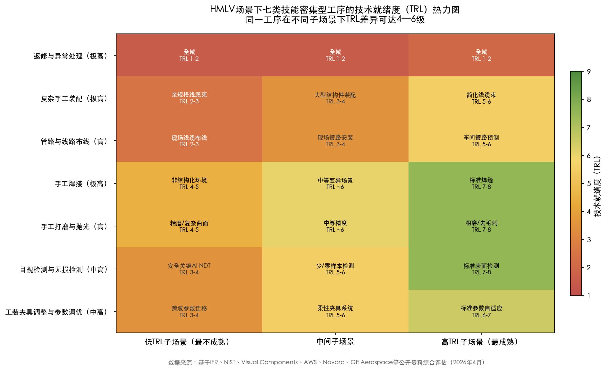

上述全景图揭示了以下关键洞察：

第一，**没有任何一类工序的TRL在HMLV场景下是均匀的**——同一工序在不同子场景中的技术就绪度可能相差4—6个等级。这意味着"某工序能否自动化"不是一个可以简单回答"能"或"不能"的问题，而取决于具体的产品类型、精度要求、环境条件和批量大小。

第二，**目视检测与参数调优是技术突破最有可能率先落地的领域**——它们的核心瓶颈（感知判断、隐性知识）恰好与当前AI技术（计算机视觉、机器学习）的能力曲线最为匹配，且"手眼协调"需求较低（检测无需机器人物理操控工件，参数调优通过数字接口即可实现）。

第三，**返修与异常处理是不可逾越的"技术鸿沟"**——其所需的综合能力（诊断、方案生成、精细操控、工程判断）覆盖了所有四个技能维度的最高要求，且每个任务实例都是独一无二的，不存在可供学习的大规模重复样本。

第四，**人机协作而非全面替代，是HMLV制造自动化在中短期内的技术理性选择**。协作机器人、AI视觉辅助和离线编程等技术的组合，可以在保留人类核心技能的同时，显著提升生产效率、质量一致性和劳动条件。

McKinsey在2017年估计制造业整体的自动化潜力约为64%，但该估计涵盖了大量大批量重复性活动。[McKinsey](https://www.mckinsey.com/~/media/mckinsey/featured%20insights/digital%20disruption/harnessing%20automation%20for%20a%20future%20that%20works/mgi-a-future-that-works_executive-summary.pdf "McKinsey, A Future That Works, 2017") 基于本章的逐工序分析，我们判断单件小批量制造中技能密集型工序的"全面自动化替代"潜力显著低于这一均值——在当前技术条件下（2026年），以工序工时加权计算的综合自动化替代率预计不超过15%—25%，其中大部分贡献来自视觉检测辅助和工艺参数优化等"数字增强"型技术，而非物理操作的直接替代。若将人机协作模式纳入考量——即不要求完全替代人工，而是通过自动化承担部分子任务来提升人工效率——则"自动化参与率"可提升至30%—45%，但人类技能工人仍是不可或缺的核心要素。

图3-3以条形图对比了制造业整体自动化潜力与HMLV技能密集型工序的自动化替代率和人机协作参与率，直观呈现了单件小批量制造与大批量制造在自动化潜力上的结构性差距。

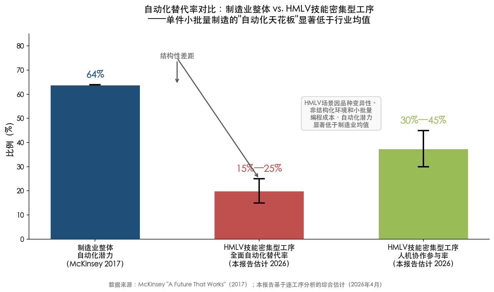

# 第4章 自动化替代的经济可行性与组织障碍

第三章从技术可行性维度回答了"能不能做到"的问题，揭示了单件小批量（HMLV）场景下七类技能密集型工序的技术就绪度全景图。然而，技术可行并不等同于值得投资。一套协作焊接机器人在技术上或许能够完成车间中60%的平焊和横焊任务，但若其投资回收期长达五年、编程调试成本吞噬了效率收益、操作人员培训需要半年方能独立上岗，则该系统在经济上可能不具备部署价值。本章将分析视角从"技术上能否做到"切换至"经济上是否值得做"，系统剖析HMLV制造自动化面临的经济逻辑困境与非经济组织障碍。

全章分析遵循三条主线：其一，解构HMLV场景下自动化投资的成本结构，揭示其与大批量制造自动化在经济逻辑上的根本差异；其二，建立人工成本与自动化成本的对比框架，识别不同工序在何种条件下可能达到经济均衡点；其三，剖析阻碍自动化落地的非经济障碍——组织惯性、隐性知识转移困境、中小企业数字化基础薄弱、供应链碎片化与行业认证门槛。

## 4.1 自动化投资的成本结构解析

### 4.1.1 从"机器人价格"到"系统总拥有成本"

自动化投资评估中最常见的误区，是将"自动化成本"等同于"机器人购买价格"。机器人本体（robot arm）通常仅占系统总部署成本的40%—50%，其余50%—60%来自控制器、末端执行器、传感器、集成工程、安全评估、安装调试与操作员培训等环节。[EVS Robot](https://www.evsint.com/how-much-does-a-cobot-cost-pricing-guide-2026/ "协作机器人成本定价指南，2026年4月") 以一台标价35,000美元的协作机器人本体为例，在完成末端工具、视觉系统、集成工程和安装调试之后，实际部署成本通常达到80,000美元，总成本膨胀系数约为2.3倍。

以2025—2026年行业数据为基础，可梳理出不同自动化方案的典型成本结构：

**协作机器人单元（通用型）**。2026年协作机器人本体价格区间为25,000—60,000美元（取决于负载能力和工作半径），其中轻载型（3—6 kg）本体价格低至15,000—35,000美元，重载型（12—30 kg）为35,000—75,000美元。完整部署的系统总成本（含控制器、末端工具、传感器、集成和培训）为40,000—150,000美元，集成工程占比10%—20%，是最容易被低估的成本项。[EVS Robot](https://www.evsint.com/how-much-does-a-cobot-cost-pricing-guide-2026/ "协作机器人成本定价指南，2026年4月") AMD Machines的项目经验给出了更为详细的成本分拆：本体25,000—65,000美元，末端工具5,000—25,000美元，安装与集成5,000—15,000美元，编程与调试8,000—20,000美元，安全评估与必要防护3,000—15,000美元；单个协作机器人工作单元的典型总部署成本为75,000—175,000美元。[AMD Machines](https://amdmachines.com/blog/cobot-payback-period/ "协作机器人投资回收期基准数据")

**机器人焊接工作单元**。焊接自动化的成本结构呈现显著的层次分化。CLOOS North America提供的2025年北美市场数据显示：预集成焊接单元（含机器人、焊接电源、变位机、安全围栏和控制系统）售价130,000—250,000美元；定制化机器人焊接系统250,000—600,000美元以上；复杂多机器人生产线600,000—120万美元以上。[CLOOS NA](https://www.cloosna.com/how-much-does-a-robotic-welding-cell-cost-in-2025/ "2025年机器人焊接单元成本") 对于HMLV车间而言，预集成焊接单元通常是最现实的入门选择。协作焊接系统的入门价格已降至约58,000—60,000美元（基础交钥匙方案），使小型加工车间亦可触及机器人焊接。[SwitchWeld](https://switchweld.com/the-ultimate-guide-to-cobot-welding-in-2025/ "2025年焊接协作机器人指南")

**系统集成：隐性的成本倍增器**。McKinsey在其制造业自动化研究中特别指出，虽然机器人本体和编程的成本持续下降，但系统集成服务的价格"保持稳定"——这意味着集成成本在总成本中的占比实际上呈上升趋势。[McKinsey](https://www.mckinsey.com/capabilities/operations/our-insights/automation-and-the-talent-challenge-in-american-manufacturing "自动化与美国制造业人才挑战，2024年7月") 在HMLV场景中，集成复杂度因产品多样性和工艺路线变异性而进一步放大：夹具需适配多品种工件，视觉系统需处理不同形状和表面特征，焊接参数需针对不同材料和接头类型进行适配。上述需求将定制化集成工作量推高至标准化场景的2—3倍。

### 4.1.2 持续运营成本：维护、培训与停机

初始部署成本之外，自动化系统的持续运营成本同样不容忽视。行业数据显示，协作机器人的年度维护成本约为2,000—8,000美元（含年度检查、校准验证、线缆检查和关节润滑），更换配件500—3,000美元，能耗300—2,500美元（150W轻载至1,500W重载），软件更新0—2,000美元，延保服务1,000—4,000美元；合计年度运营成本约为4,000—16,000美元，相当于初始投入的5%—10%。[EVS Robot](https://www.evsint.com/how-much-does-a-cobot-cost-pricing-guide-2026/ "协作机器人成本定价指南，2026年4月")

上述数据反映的是通用型应用场景。在HMLV场景中，若干特殊因素会系统性地推高运营成本。其一，**频繁换产带来的编程调试成本**——每一次产品切换都可能需要调整程序、更换末端工具或重新校准传感器，这些工时在小批量条件下被急剧放大。其二，**传感器在恶劣工况下的加速劣化**——第三章已指出，焊接飞溅、金属粉尘和高温对传感器的寿命和精度构成持续威胁，在多品种切换频繁的车间中传感器维护频率显著高于单品种大批量产线。其三，**操作人员的持续培训需求**——HMLV车间的产品和工艺不断变化，操作员需要持续学习新的编程技能与设备操作知识，培训成本具有长期累积效应。

### 4.1.3 HMLV场景的成本膨胀机制

综合以上分析，HMLV制造场景下自动化投资相对于大批量场景存在系统性的成本膨胀，其根源在于三个结构性因素。

**夹具与工装成本的乘数效应**。大批量生产中，一套专用夹具的成本可被数万乃至数十万件产品分摊；HMLV场景中，夹具要么需要频繁更换（多套专用夹具，每套5,000—40,000美元），要么需要采用模块化柔性夹具系统（初始投资更高但可适配多品种）。CLOOS的数据显示，焊接系统的夹具成本范围为5,000—40,000美元以上，对于多品种HMLV生产，这笔成本可能需要乘以产品族的数量。[CLOOS NA](https://www.cloosna.com/how-much-does-a-robotic-welding-cell-cost-in-2025/ "2025年机器人焊接单元成本")

**编程时间的批量反比效应**。第三章已详细论述这一机制：编程投入的沉没成本与批量呈反比关系。即使离线编程（OLP）将编程时间从"数天"压缩至"数小时"，在批量为1—5件的极小批次中，每件产品承担的编程成本仍可能高达数百乃至数千美元。Visual Components报告的HMLV案例表明，OLP将编程时间减少了70%—80%，但这一"减少"是相对于传统示教编程的基线——绝对编程时间仍以"小时"为单位计量。[Visual Components](https://www.visualcomponents.com/blog/how-robot-offline-programming-drives-efficiency-in-high-mix-low-volume-production-lines/ "OLP在HMLV生产中的应用案例，2025年")

**利用率不足的隐性成本**。大批量产线的机器人可7×24小时连续运行同一程序，设备利用率可达80%—90%。HMLV车间中，频繁的换产（包括程序切换、夹具更换、首件验证）导致机器人的实际焊接/加工时间（arc-on time）远低于大批量场景。AMD Machines明确指出，影响协作机器人投资回收期的"最大单一因素是利用率"——同一台机器人在双班运行下的年化收益几乎是单班的两倍，因为初始投入保持不变。[AMD Machines](https://amdmachines.com/blog/cobot-payback-period/ "协作机器人投资回收期基准数据") HMLV场景恰恰是利用率最难保障的生产模式。

## 4.2 人工成本与自动化成本的对比分析

### 4.2.1 制造业人工成本的结构与趋势

评估自动化的经济合理性，首先需要理解其所要替代的人工成本的完整结构。人工成本远不止工资薪金，其完整构成包括基本工资、加班费、社保与福利、招聘与培训成本、员工流动成本以及质量损失的隐性成本。

McKinsey的研究指出，美国制造业工资自2010年以来持续上涨，COVID-19疫情后涨速进一步加快；2023年美国制造业的平均员工流动率达到36.6%。[McKinsey](https://www.mckinsey.com/capabilities/operations/our-insights/automation-and-the-talent-challenge-in-american-manufacturing "自动化与美国制造业人才挑战，2024年7月") 高流动率意味着企业需不断承担新员工招聘和培训的循环成本。AMD Machines估算，码垛岗位的年流动率达40%—60%，每名离职员工的招聘和培训成本为4,000—8,000美元。[AMD Machines](https://amdmachines.com/blog/cobot-payback-period/ "协作机器人投资回收期基准数据")

在技能密集型工序中，人工成本还包含一个更为隐蔽但金额巨大的成分——**技能溢价与培训周期成本**。第一章引述的焊工数据显示，美国约42.2万名焊工（BLS 2023年5月数据），2024—2028年需新增约33万名焊接专业人员。[BLS](https://www.bls.gov/oes/2023/may/oes514121.htm "BLS OES焊工数据") [AWS](https://weldingworkforcedata.com/ "AWS焊接劳动力数据，2025年") 技能工人的稀缺推高了薪酬水平，同时延长了新工人从入职到独立上岗的周期。一名合格的航空航天焊工通常需要3—5年的培训和实践积累，其间企业承担的培训投入和低产出期的机会成本相当可观。

AMD Machines提供的基准数据显示，美国制造业操作员的全成本（含福利和管理费用）约为55,000—65,000美元/年/人。[AMD Machines](https://amdmachines.com/blog/cobot-payback-period/ "协作机器人投资回收期基准数据") 技能密集型岗位的全成本更高——经验丰富的焊工或数控机床操作员的年薪（含加班和福利）可达70,000—90,000美元，资深NDT Level III检测人员可超过100,000美元。

中国制造业的人工成本结构虽然绝对值较低，但增长趋势同样显著。第一章已指出，中国制造业十大重点领域至2025年人才缺口近3,000万人（缺口率48%），高技能人才缺口达2,000万人。[人民论坛](https://paper.people.com.cn/rmlt/pc/content/202411/18/content_30047208.html "高技能人才供给，2024年11月") 技能工人的供需失衡正在推动中国制造业劳动力成本的结构性上升。

### 4.2.2 投资回收期的场景化分析

将自动化系统的总拥有成本与其可替代的人工成本进行对比，投资回收期（payback period）是最直观的决策指标。

**大批量/标准化场景的基线回收期**。行业数据一致显示，在利用率充足的标准化应用中，协作机器人的投资回收期为12—18个月。AMD Machines基于跨汽车、医疗器械、消费品和通用制造的项目数据，给出了各类应用的典型回收期：CNC上下料14—22个月（总部署成本90,000—150,000美元，可替代0.75—1.5个FTE）；码垛包装10—18个月（总部署成本85,000—160,000美元）；质量检测18—24个月（总部署成本100,000—200,000美元）；装配与点胶16—24个月（总部署成本80,000—175,000美元）。[AMD Machines](https://amdmachines.com/blog/cobot-payback-period/ "协作机器人投资回收期基准数据") McKinsey的研究亦确认，从20世纪80年代至2020年代，典型的自动化投资回收期已从5—8年缩短至1—3年。[McKinsey](https://www.mckinsey.com/capabilities/operations/our-insights/automation-and-the-talent-challenge-in-american-manufacturing "自动化与美国制造业人才挑战，2024年7月")

**HMLV场景的回收期膨胀**。上述基线回收期建立在几个关键前提之上：稳定的单品种或少品种生产、双班或三班连续运行、以及较高的设备利用率。HMLV场景对这三个前提构成系统性挑战。

其一，**FTE替代效率降低**。在大批量场景中，一台协作机器人通常可替代0.5—1.5个FTE；在HMLV场景中，由于频繁的人机交互（程序切换、首件检验、异常处理需要操作员介入），机器人对人工的替代率更可能落在0.3—0.7个FTE的低端区间，年化劳动力节省从行业基线的27,500—97,500美元降至16,500—45,500美元。

其二，**利用率下降拉长回收期**。假设一台总部署成本为120,000美元的协作焊接系统，在双班、高利用率运行条件下可替代1.0个FTE（年化节省约60,000美元），回收期为24个月；同一系统在HMLV车间中因频繁换产导致利用率降低40%，有效FTE替代率降至0.5个FTE（年化节省约30,000美元），则回收期延长至48个月——从"两年回本"变为"四年回本"。对于资金紧张的中小制造企业而言，这一差距可能意味着跨越了投资决策门槛。

其三，**隐性成本的叠加效应**。前述的夹具多套配置成本（增加20,000—80,000美元）、额外编程调试工时（按每次换产2—4小时、全年换产100—200次计算，额外编程工时200—800小时/年）、以及传感器加速维护成本（年增量2,000—5,000美元），合计可使HMLV场景的有效总拥有成本比标准场景高出30%—60%。

图4-1直观呈现了这一回收期膨胀机制。四类典型协作机器人应用在大批量标准化场景与HMLV场景下的投资回收期差异显著：协作焊接从14—24个月延长至36—48个月，CNC上下料从14—22个月延长至28—48个月，利用率下降、FTE替代率降低和隐性成本叠加构成三大驱动因素。

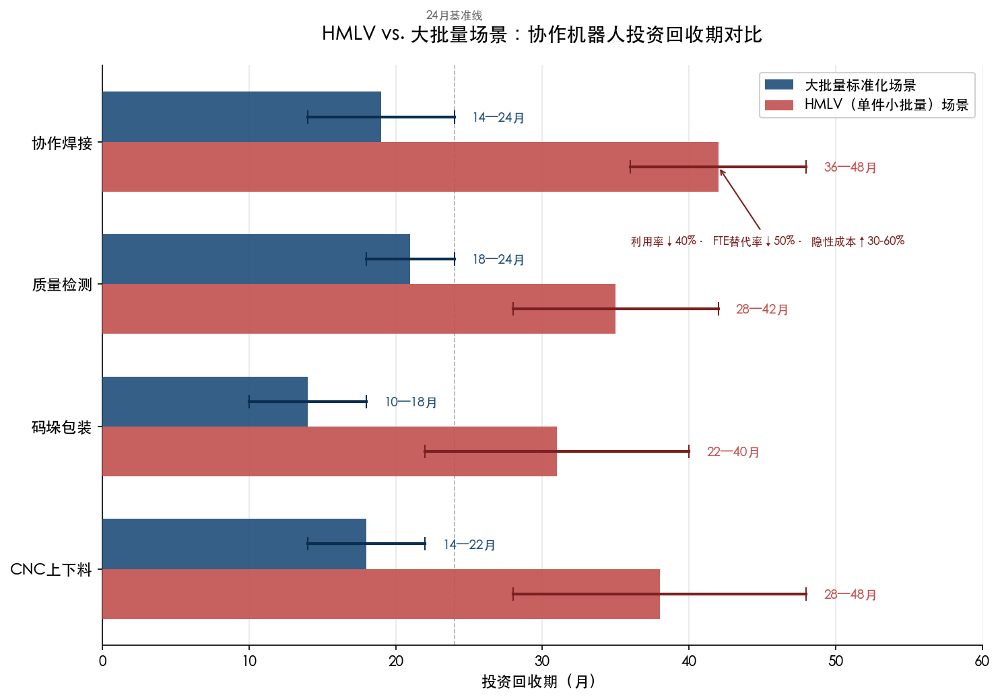

### 4.2.3 "交叉点"分析：何时自动化开始划算

综合成本结构和回收期分析，可以识别出自动化在HMLV场景中达到经济均衡的几项关键条件。

**最低批量门槛**。对于给定的编程调试成本和单件加工时间，存在一个"最低经济批量"（Minimum Economic Lot Size），低于此批量时自动化的单件成本将超过人工。以焊接为例，若OLP编程一个新产品需要4小时（按集成工程师100美元/小时计算，编程成本400美元），自动化焊接每件产品可节省15分钟的人工时间（按焊工全成本40美元/小时计算，节省10美元/件），则最低经济批量为400÷10＝40件。批量低于40件时，自动化的单件成本高于人工——而这恰恰是HMLV制造中大量产品的典型批量范围。

**劳动力成本阈值**。在劳动力成本较高的经济体（美国、西欧、日本），自动化的经济合理性更早成立。当制造业操作员的全成本超过55,000美元/年时，即便利用率较低的HMLV协作机器人也可能在3年内收回投资；而在劳动力成本较低的地区（东南亚、部分发展中国家），同等条件下的回收期可能延长至5年以上，经济可行性显著降低。

**多班次运行的杠杆效应**。AMD Machines强调，利用率是投资回收的"最大单一驱动因素"——同一台机器人在双班运行时年化收益接近单班的两倍，而初始投入保持不变。[AMD Machines](https://amdmachines.com/blog/cobot-payback-period/ "协作机器人投资回收期基准数据") HMLV制造企业若能通过产品族整合或柔性排产将机器人的有效利用率提升至60%以上，回收期可缩短至可接受范围。

**可重部署性的风险缓释价值**。与传统工业机器人相比，协作机器人的一个独特经济优势在于可重部署性——当一款产品的订单结束后，协作机器人可迁移至新产品或新工位。这一特性虽然难以在传统投资回收模型中量化，但其实质性地降低了"沉没资本"风险——这正是HMLV制造企业最为担忧的投资风险之一。EVS Robot指出，传统机器人的重部署成本较高（需重建工作单元），而协作机器人的重部署成本较低（移动并重新编程即可）。[EVS Robot](https://www.evsint.com/how-much-does-a-cobot-cost-pricing-guide-2026/ "协作机器人成本定价指南，2026年4月")

## 4.3 不同工序的经济可行性分级

结合第三章的技术就绪度评估和本章的经济分析框架，可对第二章识别的七类技能密集型工序进行经济可行性分级。分级标准综合考虑三个因素：当前自动化方案的总拥有成本、可替代的人工成本规模、以及HMLV场景下的利用率约束。

| 工序类别 | 技术就绪度（第3章） | 人工成本强度 | HMLV经济可行性 | 关键经济瓶颈 |
|---------|------------------|------------|--------------|------------|
| 目视检测与无损检测 | TRL 3—8 | 中高（检测员年薪6—10万美元） | **较高** | 视觉系统投资回收期短（18—24月），AI检测无需逐品种编程 |
| 工装夹具调整与参数调优 | TRL 3—7 | 中（操作员年薪5—7万美元） | **中等** | 柔性夹具初始投资高但可复用，AI参数优化边际成本低 |
| 手工焊接（标准焊缝） | TRL 7—8 | 高（焊工年薪6—9万美元，短缺严重） | **中等** | 协作焊接回收期14—24月（高利用率），但HMLV利用率难保证 |
| 手工打磨与抛光（粗加工） | TRL 7—8 | 中（操作员年薪5—6万美元） | **中等偏低** | 力控机器人部署成本高（10—20万美元），精磨仍需人工 |
| 手工焊接（复杂焊缝） | TRL 4—5 | 高 | **低** | 技术不成熟导致集成成本极高，风险难以量化 |
| 管路与线路布线 | TRL 2—6 | 高（管道工/电工年薪5—8万美元） | **低** | 技术方案尚不成熟，定制化集成成本极高 |
| 复杂手工装配 | TRL 2—6 | 高 | **低** | 每品种的专用夹具和编程成本在小批量下无法摊薄 |
| 返修与异常处理 | TRL 1—2 | 最高（资深技师年薪8—12万美元） | **极低** | 无可行技术方案，经济分析不适用 |

图4-2将上述分级以气泡图形式呈现，横轴为HMLV场景TRL平均值，纵轴为经济可行性等级，气泡大小反映人工成本强度。该图直观揭示了一个值得关注的"悖论"：**人工成本越高的工序，其自动化的经济吸引力理论上应该最大，但恰恰是这些工序（焊接复杂焊缝、管路布线、装配、返修）面临最大的技术障碍**——技术不成熟推高了集成风险和总拥有成本，使理论上的经济吸引力在实践中无法兑现。反之，人工成本强度中等的检测和参数优化工序，因技术相对成熟、无需逐品种重编程且AI边际成本趋近于零，反而率先达到经济可行性门槛。

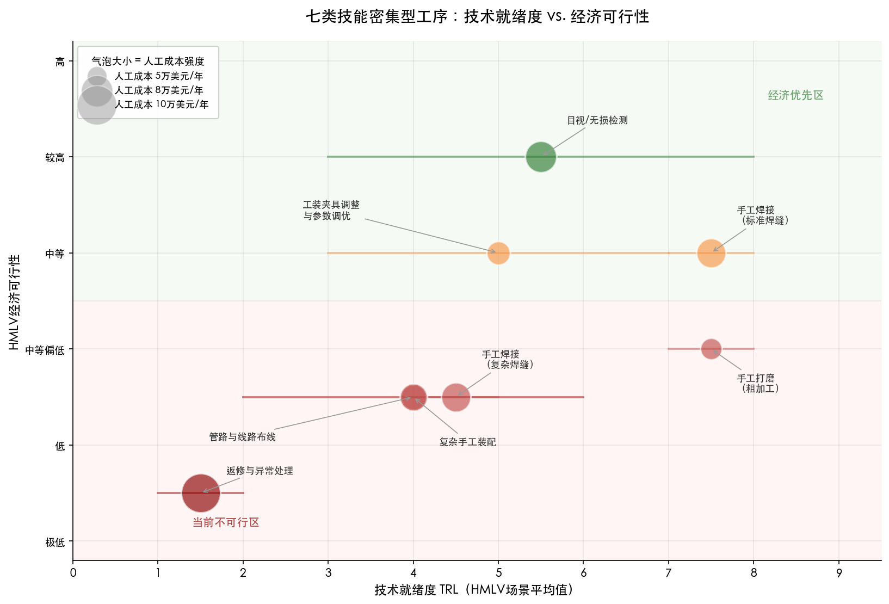

## 4.4 非经济障碍：组织、知识与制度的三重壁垒

经济分析仅能解释HMLV制造自动化困境的一部分。即使在经济可行性条件已经满足的场景中（如简单焊缝的协作机器人焊接、AI辅助视觉检测），实际的自动化采用率仍低于理论预期。造成这一差距的，是一系列深层的非经济障碍。

### 4.4.1 组织惯性与变革管理困境

Rockwell Automation的2024年《智能制造现状报告》调查了全球17个主要制造国的1,567名决策者，发现"技能型劳动力短缺"是制造企业维持竞争力的首要障碍。该报告同时揭示了一组矛盾：**83%的受访者认为所面临的挑战正在加速数字化转型**，但阻碍成功的前三大劳动力相关壁垒分别为"变革管理"、"员工新流程培训"和"帮助员工保持参与感和价值感"。[Rockwell Automation](https://www.rockwellautomation.com/content/plex/global/en/blog/key-takeaways-9th-annual-state-smart-manufacturing-report.html "2024年智能制造现状报告要点")

这一发现在HMLV制造的技能密集型工序中尤为尖锐。技能工人（焊工、钳工、NDT检测员）通常拥有数十年的专业积累，其职业身份认同与手工操作能力深度绑定。当自动化系统被引入时，这些工人面临双重焦虑：一方面担忧自身技能被贬值乃至被取代，另一方面对新技术（机器人编程、数字系统操作）感到陌生和不安。McKinsey的研究强调，即使自动化的初衷是解决劳动力短缺而非取代现有员工，企业也需要系统性的变革管理方案——包括"领导层示范"、"持续沟通以建立理解和信念"、"定制化培训与能力建设"以及"通过KPI和激励机制进行评估与强化"。[McKinsey](https://www.mckinsey.com/capabilities/operations/our-insights/automation-and-the-talent-challenge-in-american-manufacturing "自动化与美国制造业人才挑战，2024年7月")

在HMLV制造的中小企业中，变革管理的难度进一步加大。这些企业通常缺乏专职的技术变革团队，生产节奏紧迫（订单交期短、多品种并行），难以抽出足够的时间和人力进行系统化的培训和过渡。一线管理人员往往同时承担生产调度、质量管理和设备维护等多重角色，无暇学习新技术或推动流程变革。

### 4.4.2 隐性知识的转移困境

第二章深入分析了技能密集型工序中隐性知识的核心地位及其抵抗编码化的特性——Polanyi悖论（"我们所知道的比我们能说出来的多"）在制造业技能中有着深刻体现。这一认知障碍在自动化落地过程中转化为一个实际的组织难题：**隐性知识难以从经验工人的头脑中提取出来，转化为机器可执行的显性程序**。

Nonaka与Takeuchi的SECI模型揭示了知识转化的四种模式，其中"外化"（隐性→显性）是自动化所要求的核心转化路径。然而在实践中，这一外化过程面临三重困难。

其一，**工人可能不愿分享**。在部分制造文化中，技能是工人的核心竞争力和议价资本，将自身的"独门绝技"交给机器等于削弱了不可替代性。这种心理抵触在传统师徒制盛行的车间中尤为普遍。

其二，**工人无法完整描述**。即使工人愿意分享，Sanchez-Salas的研究已表明，当被问及"如何判断表面已经打磨到位"时，操作员往往给出"看起来对了"或"手感告诉我"这类模糊回答。[Sanchez-Salas](https://core.ac.uk/download/pdf/288371036.pdf "Sanchez-Salas, Loughborough University, 2016") 隐性知识的情境化、身体化和模糊性使完整的知识提取几乎不可能。

其三，**提取出的知识可能不完整或失真**。即使通过动作捕捉、过程数据记录等技术手段进行知识提取，所获取的数据也只是工人行为的表层投影，无法捕捉其背后的判断逻辑和决策推理。以此为基础训练的AI模型可能在常见工况下表现良好，但在遇到工人凭经验可以应对的异常工况时失效。

### 4.4.3 中小企业的数字化基础薄弱

HMLV制造的主力军是中小企业（SME），其数字化基础方面的薄弱构成了自动化落地的重大障碍。

36氪研究院联合联想发布的《中国中小企业数字化转型报告（2024）》调研显示，2023年中国中小企业在数字化转型上的资金投入占营业收入的比重主要集中在1%—2%和小于1%两个区间，分别占比50.4%和40.3%——即超过90%的中小企业数字化投入不足营收的2%。六成以上的中小企业处于数字化转型的早期阶段（单点尝试阶段占32.4%，局部建设阶段占30.2%），仅约21.6%进入全面数字底座建设阶段。[36氪研究院/联想](https://runwise.co/wp-content/uploads/2024/06/%E5%88%9B%E6%96%B0%E7%A0%94%E6%8A%A5%EF%BD%9C2024%E4%B8%AD%E5%9B%BD%E4%B8%AD%E5%B0%8F%E4%BC%81%E4%B8%9A%E6%95%B0%E5%AD%97%E5%8C%96%E8%BD%AC%E5%9E%8B%E6%8A%A5%E5%91%8A_36Kr.pdf "2024中国中小企业数字化转型报告")

数字化基础薄弱意味着：生产过程数据通常未被系统化采集和存储，工艺参数依赖纸质记录或人脑记忆，车间设备缺乏联网能力（OT/IT融合程度低），ERP或MES系统覆盖率极低。在这样的基础上部署自动化系统，相当于在缺少地基的地面上建造楼宇——并非不可能，但成本和风险都将急剧上升。

Chalmers大学的研究识别出中小制造企业在引入柔性自动化时面临的核心障碍，包括"耗时的编程"、"缺乏灵活性"和"安全顾虑"。[Chalmers University](https://odr.chalmers.se/bitstreams/27cc9e8d-4408-4f40-9e74-28aa70123122/download "柔性自动化在中小企业中的障碍调查") 国际机器人联合会（IFR）亦指出，劳动力短缺是推动中小企业自动化的最强驱动力，但"四分之三的欧盟企业面临招工困难"这一现实并未转化为相应规模的自动化投资。[IFR](https://ifr.org/ifr-press-releases/news/labor-shortage-how-to-automate-small-and-midsized-enterprises "劳动力短缺：如何实现中小企业自动化，2023年8月")

我们认为，中小企业自动化低采用率的核心矛盾在于：它们最需要自动化（因最受劳动力短缺之苦），却最缺乏推动自动化所需的资源——不仅是资金，更是技术评估能力、系统集成管理经验和内部变革推动力。这种"最需要但最难实施"的困境，是HMLV制造自动化渗透率持续偏低的结构性原因。

### 4.4.4 供应链碎片化与集成商生态

自动化系统的部署不仅是购买一台机器人，更是一个涉及机器人厂商、系统集成商、末端工具供应商、软件供应商和行业认证机构的多方协作过程。在HMLV制造领域，这一供应链呈现出明显的碎片化特征。

**集成商的规模效应缺失**。大批量制造的自动化集成（如汽车白车身焊装线）已形成成熟的集成商生态，大型系统集成商（ABB、KUKA Systems、Comau等）可通过标准化方案和规模复制压低单位成本。HMLV制造的自动化需求则高度分散且定制化——每个客户的产品不同、工艺不同、车间布局不同——集成商难以形成规模效应，每个项目都需要大量定制工程，导致集成服务价格居高不下。

**末端工具和夹具的定制化瓶颈**。第三章讨论的七类工序中，大多数需要特定的末端执行器和夹具。大批量生产中这些工具的设计和制造成本可被大量产品摊薄；HMLV生产中每个产品族可能需要不同的工具套件，工具的设计、制造、测试和验证成本直接计入少量产品的单件成本。

**知识不对称**。HMLV制造企业（尤其是中小企业）通常缺乏评估自动化方案的专业能力，而自动化供应商和集成商对HMLV车间的具体工艺需求和约束条件又缺乏深入理解。这种知识不对称导致项目范围定义不准确、预期管理失当、实施过程中频繁变更——最终推高成本并延长交付周期。CLOOS在其成本指南中特别提醒买家："比较两份报价时，如果一份节省了30,000美元，应当反问：如果生产线停机一小时值多少钱？"——许多客户的停机成本"超过每班次10,000美元"。[CLOOS NA](https://www.cloosna.com/how-much-does-a-robotic-welding-cell-cost-in-2025/ "2025年机器人焊接单元成本")

### 4.4.5 行业认证门槛

在航空航天、核能、医疗器械等安全关键领域，行业认证体系对自动化方案的落地构成特殊的制度壁垒。这些壁垒并非源于技术或经济因素，而是来自监管框架本身的保守性。

**焊接工艺认证（Welding Procedure Qualification）**。在航空航天和压力容器制造中，每一种焊接工艺（包括焊接方法、参数窗口、材料组合、接头类型和焊后热处理）均需通过严格的工艺评定（Procedure Qualification Record, PQR）和焊工资格认证。当从手工焊接转向机器人焊接时，焊接工艺需重新评定，操作人员的资质认证亦需变更。该认证过程耗时数月甚至数年，成本数万至数十万美元，且存在认证失败风险。对于HMLV制造中材料-接头组合数量庞大的场景，逐一认证的成本可能远超自动化本身的投资额。

**无损检测人员资质（NDT Personnel Certification）**。第三章已指出，NAS 410/EN 4179认证体系对NDT人员的资质等级有严格要求（Level I/II/III），AI系统如何融入这一认证框架尚无定论。即使AI视觉检测系统在技术上已达到或超过人类检测员的缺陷检出率，在安全关键领域监管机构仍要求经过认证的人员做出最终的接受/拒收判断——AI至多扮演"辅助工具"角色，无法替代持证人员的签字确认。

**医疗器械生产工艺变更控制**。在FDA和CE监管框架下，医疗器械的生产工艺变更（包括引入自动化设备）需进行变更影响评估、设计验证和确认（Design Verification and Validation, V&V），并可能触发产品注册文件的更新和监管机构审批。一次工艺变更的合规成本——包括文件准备、测试验证和审批等待——可达数万至数十万美元，持续数月至一年以上。对于HMLV医疗器械制造商（如定制化假体或植入物），频繁的产品切换意味着频繁的工艺变更需求，认证成本的累积可能使自动化的经济优势荡然无存。

**质量管理体系标准**。航空航天领域的AS9100标准要求对关键和特殊工艺（Special Process）实施严格的过程控制和人员资质管理。自动化设备的引入被视为"工艺变更"，需经过完整的变更管理流程，包括风险评估、验证试验、客户审批（在某些OEM供应链关系中）和持续监控。这一合规成本在HMLV场景中尤为沉重，因为产品品种繁多意味着需要对多种产品分别进行验证。

## 4.5 经济与组织障碍的交互效应

上述经济障碍与非经济障碍并非彼此独立，而是相互强化，形成了一个自我锁定的阻碍循环（见图4-3）。

**投资不足→经验匮乏→风险放大→投资更加谨慎**。中小企业因资金约束只能进行小规模自动化试点，试点的有限规模使其无法积累足够的实施经验和技术能力，导致对更大规模自动化投资的风险评估过于保守，进而进一步压缩投资意愿——形成典型的"投资贫穷陷阱"。

**技能工人流失→隐性知识丧失→自动化更难实施**。技能工人的退休和离职导致企业的工艺知识存量不断流失。值得注意的是，隐性知识的丧失不仅使人工生产更加困难，也使自动化更加困难——因为自动化实施过程需要依赖经验工人提供工艺知识输入（"机器人需要向老师傅学焊接"）。当最后的资深工人退休时，企业可能同时丧失人工生产和自动化转型两条路径的可能性。

**认证壁垒→锁定效应→技术迭代滞后**。一旦通过漫长且昂贵的认证流程确认了某一工艺方案（无论手工还是自动化），企业倾向于尽可能长期维持该方案不变，以规避重新认证的成本。这种"锁定效应"使得新技术即使在经济和技术上已优于现有方案，也难以进入已认证的生产流程。

**数字化基础缺失→数据孤岛→AI赋能受阻**。第三章讨论的AI驱动工艺参数优化和少样本视觉检测，均依赖于数据基础。中小企业的数据采集和管理能力不足，使得最具经济前景的AI赋能路径（边际成本低、无需逐品种编程）也难以实施。

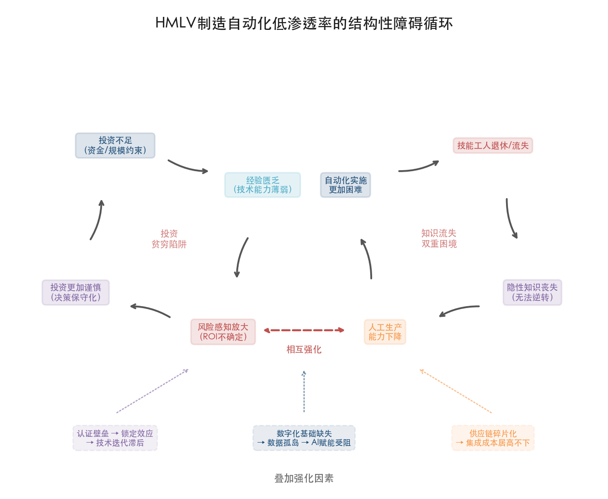

## 4.6 破局路径：从"全面替代"到"选择性增强"

上述分析描绘了HMLV制造自动化投资的严峻图景，但并非无路可走。基于经济和组织障碍的结构特征，可识别出几条务实的破局路径。

**优先投资"经济性优先区"**。本章4.3节的分级表明，目视检测辅助和工艺参数优化是经济可行性最高的自动化方向——技术成熟度适中、无需逐品种重编程、AI系统的边际成本趋近于零，且不直接替代高薪技能工人（从而降低了组织阻力）。HMLV制造企业的自动化投资宜优先瞄准这两个方向，以最低的成本和风险获取最确定的回报。

**采用"阶梯式"投入策略**。McKinsey建议企业避免将自动化视为"一次性大项目"，而应采用敏捷的、分步实施的方式——"从一个流程瓶颈或特定问题入手，快速部署并迭代优化"。[McKinsey](https://www.mckinsey.com/capabilities/operations/our-insights/automation-and-the-talent-challenge-in-american-manufacturing "自动化与美国制造业人才挑战，2024年7月") 对于HMLV中小企业而言，可先从一台协作机器人在一个工位上的试点开始，积累技术能力和组织经验，再逐步扩展至更多工位和更复杂的任务。Rockwell Automation的调查显示，95%的制造企业正在使用或评估智能制造技术（较2023年的84%大幅提升），其中协作机器人位列未来12个月三大投资重点之二。[Rockwell Automation](https://www.rockwellautomation.com/content/plex/global/en/blog/key-takeaways-9th-annual-state-smart-manufacturing-report.html "2024年智能制造现状报告要点")

**利用"机器人即服务"（RaaS）模式降低前期投入**。部分协作机器人厂商已开始提供租赁和按使用付费的商业模式，月付约1,500—3,000美元。[EVS Robot](https://www.evsint.com/how-much-does-a-cobot-cost-pricing-guide-2026/ "协作机器人成本定价指南，2026年4月") RaaS模式将资本支出（CapEx）转化为运营支出（OpEx），显著降低了中小企业的资金门槛和投资风险——若方案不可行，企业可在合约期满后退回设备，而非承受数年的沉没成本。

**构建"人机协作"的混合经济模型**。第三章已论证，在HMLV场景的多数技能密集型工序中，"人机协作"而非"全面替代"是技术理性的选择。从经济角度看，人机协作模式同样更为理性——它不要求完全替代高薪技能工人（降低了所需的FTE替代率门槛），不要求机器人独立应对所有品种变异（降低了编程和集成的复杂度），也不触发完整的工艺资质重新认证（因为持证操作员仍在回路中）。人机协作的经济逻辑并非"用机器的成本替代人的成本"，而是"用较低的增量投入撬动人的产出效率提升30%—50%"——这一价值创造模式在HMLV场景中更容易达到经济均衡。

## 4.7 本章小结

本章从经济可行性和组织障碍两个维度，系统分析了单件小批量制造中技能密集型工序自动化所面临的非技术挑战，揭示了以下关键洞察。

其一，**HMLV场景下自动化的总拥有成本显著高于大批量场景**。夹具多品种配置、编程时间的批量反比效应和利用率不足三大因素，可使有效总拥有成本比标准场景高出30%—60%，投资回收期从行业基线的12—18个月延长至36—48个月。

其二，**经济合理性呈现工序分化格局**。检测辅助和参数优化因技术适配性好、边际成本低而率先达到经济可行性门槛；标准焊缝的协作机器人在高利用率条件下具备中等经济可行性；而复杂焊缝、装配、布线和返修等工序在当前经济条件下不具备大规模投资的合理性。

其三，**非经济障碍与经济障碍相互强化**。组织惯性、隐性知识转移困境、中小企业数字化基础薄弱、供应链碎片化和行业认证门槛五重壁垒交织，形成了自我锁定的阻碍循环——任何单一障碍的消除都不足以突破整体困局。

其四，**破局的关键在于降低期望值并选择正确的切入点**。从"全面自动化替代"的愿景回退到"选择性人机协作增强"的务实目标，从经济可行性最高的工序（检测、参数优化）开始阶梯式推进，利用RaaS等新商业模式降低资金门槛——这一路径虽不够"革命性"，但恰恰是HMLV制造自动化在当前技术和经济条件下的理性选择。

# 第5章 行业实践案例与经验教训

前四章从理论维度构建了单件小批量（HMLV）制造中技能密集型工序自动化的完整分析框架：第一章界定问题域，第二章识别工序与技能构成，第三章评估技术可行性，第四章剖析经济逻辑与组织障碍。然而，理论框架与车间现实之间始终存在距离——自动化技术在HMLV场景中的实际表现，往往受到理论模型无法完全捕捉的工程细节、组织动力学和偶然因素的深刻影响。本章通过五个横跨不同行业与技术路线的代表性案例，将前四章的分析框架加以实证检验，展示单件小批量场景中自动化落地的真实路径、可量化成效与值得铭记的教训，并从中提炼可复制的成功模式与应当规避的典型陷阱。

五个案例按技术路线和行业覆盖度进行选取：案例一聚焦协作焊接机器人在航空航天与国防精密制造中的应用；案例二展示离线编程（OLP）如何在林业设备HMLV焊接中破解编程瓶颈；案例三分析AI驱动的管道预制焊接自动化；案例四审视韩国造船业焊接自动化的大规模实践及其结构性瓶颈；案例五则从增材制造的视角，展示从设计层面绕过技能密集型工序的替代路径。各案例均回溯至第二章的工序分类与第三、四章的技术经济评估框架，以确保分析的一致性与可追溯性。

## 5.1 案例一：Athena Manufacturing——协作焊接机器人在精密多品种车间的部署

### 5.1.1 企业背景与自动化动因

Athena Manufacturing是一家位于美国德克萨斯州奥斯汀的精密金属制造企业，拥有超过250名员工，专注于航空航天、半导体、油气和国防等行业的复杂金属组件制造。该企业以承接"多数车间不愿碰的高难度订单"著称——产品公差严格、工艺复杂、交付周期紧迫，属于典型的HMLV制造模式。[Hirebotics](https://www.hirebotics.com/case-studies/athena-mfg/ "Athena Manufacturing案例研究")

驱动Athena引入自动化的直接动因，与第四章4.2节分析的劳动力市场困境高度吻合：熟练焊工的招聘速度无法跟上订单增长。该公司焊接主管Kyle Naylor（AWS认证焊接检验员）指出："招聘有经验的焊工根本跟不上需求，而我们没有在质量或重复性上妥协的余裕。"[Hirebotics](https://www.hirebotics.com/case-studies/athena-mfg/ "Athena Manufacturing案例研究") 这一核心矛盾——需求上升但技能劳动力供给不足，以至于不得不拒绝本有能力承接的订单——正是第一章所述的美国制造业技能缺口（2024—2033年约190万个制造业岗位可能因技能短缺无法填补）在单个企业层面的微观映射。

传统焊接自动化方案被Athena排除在外，原因同样印证了第四章的分析：设置时间冗长、编程复杂度高、操作员培训周期长，对Athena快节奏的多品种生产环境而言缺乏灵活性。[Hirebotics](https://www.hirebotics.com/case-studies/athena-mfg/ "Athena Manufacturing案例研究")

### 5.1.2 技术方案与实施路径

Athena选择了Hirebotics的Beacon协作焊接机器人系统，部署规模为四台，分布于车间不同工位：

- 两台安装在大型Siegmund焊接平台上，配备可互换夹具，用于大型复杂组件焊接；
- 一台配置在较小工作台上，专用于批量稍大的生产任务；
- 一台安装在定制旋转平台上，提供旋转焊接通达性。

全部机器人均运行统一的Beacon OS平台，支持从任意位置进行编程、监控和远程支持。[Hirebotics](https://www.hirebotics.com/case-studies/athena-mfg/ "Athena Manufacturing案例研究")

该方案的设计逻辑直接回应了第三章3.2.1节所述的HMLV焊接自动化关键需求：快速换产能力（可互换夹具）、直观编程界面（无需专业机器人程序员）以及多工位灵活配置。

### 5.1.3 量化成效

Athena的实施成果可从效率、质量和劳动力模式三个维度予以量化。

**生产效率**。关键组件的焊接时间从8小时缩短至2小时，焊接速度提升4倍，整体产量提升70%。即使是拥有数百个焊点的大型零件，其设置和编程也可在一天内完成，而传统机器人方案通常需要数周。[Hirebotics](https://www.hirebotics.com/case-studies/athena-mfg/ "Athena Manufacturing案例研究")

**质量一致性**。Naylor评价："我们的零件有严格的公差要求。协作机器人每次都能达标。而且每个零件之间的一致性——这是我们在手工焊接或传统自动化中从未获得过的。"[Hirebotics](https://www.hirebotics.com/case-studies/athena-mfg/ "Athena Manufacturing案例研究") 这一反馈与第二章2.2.1节对手工焊接"策略变异性"的分析形成呼应：人工焊接的质量波动源于操作员之间的技能差异与同一操作员的状态波动，协作机器人在参数执行一致性上具有结构性优势。

**劳动力模式重塑**。Athena的实践表明，协作焊接机器人并非"替代焊工"，而是重新定义了技能需求的门槛。Naylor指出："我们不需要高度经验丰富的程序员。我们培训了新的操作员——甚至是没有焊接背景的人——来快速运行协作机器人。"[Hirebotics](https://www.hirebotics.com/case-studies/athena-mfg/ "Athena Manufacturing案例研究") 值得注意的是，协作机器人的引入并未缩减手工焊接团队规模，反而推动手工焊接团队同步扩张——协作机器人承担了标准化焊缝，手工焊工得以集中精力处理更复杂、更高附加值的任务。

### 5.1.4 案例解读与局限性

Athena案例的成功具有清晰的边界条件，需审慎对待其推广性。

第一，该企业的产品虽然公差严格，但自动化所覆盖的焊缝类型以平焊和横焊位置的标准化焊缝为主——正是第三章3.2.1节评估为TRL 7—8的"结构化环境中的标准焊缝"。对于仰焊、立焊等复杂姿态焊缝或狭窄空间内的焊接，协作机器人的物理可达性和工艺自适应能力仍然不足。

第二，Athena的企业规模（250人以上）和客户基础（航空航天、国防等高附加值行业）使其具备充足的资金实力与订单连续性来支撑四台协作机器人的投资，并维持较高的设备利用率。对于第四章4.4.3节所述的中小企业（50人以下），同等规模的投资可能面临更大的利用率风险与资金压力。

第三，"不需要焊接背景的操作员即可运行"这一表述需要审慎解读。协作机器人降低了对操作员焊接手艺的要求，但焊接工艺知识（材料选择、接头设计、焊后检测）仍是质量保障的必要前提。Athena的成功在一定程度上依赖于Naylor这样的AWS认证焊接检验员在系统层面进行工艺把关——换言之，技能需求并非被消除，而是从执行层向管理层发生了转移。

## 5.2 案例二：Ponsse——离线编程破解林业设备HMLV焊接瓶颈

### 5.2.1 企业背景与核心挑战

芬兰Ponsse公司成立于1970年，是全球林业机械制造领域的领先企业。其位于芬兰Vieremä的工厂占地40,000平方米，员工超过1,800人，业务覆盖40个国家。Ponsse生产的收割机、转运车等林业机械高度模块化，每台机器按照客户需求定制配置——批量为一台，年产量约1,000台，每年新增约一个机器人工位。[Visual Components](https://www.visualcomponents.com/case-studies/ponsse-drives-forest-machine-production-efficiency-with-visual-components-olp/ "Ponsse案例研究")

这一生产模式完全契合第一章对HMLV制造的定义：产品品种多、单品种批量小至一件、工艺路线因客户定制而多变。Ponsse面临的核心挑战在于焊接编程瓶颈——15年前引入机器人焊接后，在线示教编程（teach pendant programming）需要机器人停产两周以完成程序编写，这一停产成本在高节拍的定制化生产环境中难以接受。Ponsse机器人团队负责人Asko Haataja指出："随着产量增加，手动编程变得不可能。在办公室编程比在现场用示教器编程容易得多。"[Visual Components](https://www.visualcomponents.com/case-studies/ponsse-drives-forest-machine-production-efficiency-with-visual-components-olp/ "Ponsse案例研究")

### 5.2.2 技术方案：离线编程的系统化应用

Ponsse选择了Delfoi Robotics（现Visual Components OLP）的离线编程系统，合作始于2007年，至今已逾18年。该系统的核心能力在于在计算机虚拟环境中完成机器人焊接程序的开发、仿真和验证，无需中断生产线运行。

Ponsse目前拥有多个Yaskawa和ABB机器人工位，全部采用离线编程。OLP系统不仅用于新产品的程序创建，还用于现有程序的持续优化，体现了精益制造中持续改进的理念。具体而言，Ponsse的OLP应用涵盖以下三个层面：

**程序生成**：在CAD模型环境中完成复杂林业机械车架的焊接路径规划，涵盖多道曲线焊缝和车架结构内部的焊缝。

**可焊性验证**：在产品开发阶段即利用仿真软件评估焊缝设计的可行性、可达性和可焊性。生产开发经理Heikki Selkälä指出："所有新车架都用Visual Components OLP软件进行检查。甚至在订购钢板和开始生产之前，我们就已经确认焊接可行性。这样我们避免了大量错误，提高了产品质量。"[Visual Components](https://www.visualcomponents.com/case-studies/ponsse-drives-forest-machine-production-efficiency-with-visual-components-olp/ "Ponsse案例研究")

**新工位规划**：从机器人单元的概念设计到可直接使用的焊接程序，全流程在虚拟环境中完成。Haataja指出："在新机器到达工厂之前，我们就已经完成了所有程序。安装后，我们只需校准、微调并上传到机器人控制器。"[Visual Components](https://www.visualcomponents.com/case-studies/ponsse-drives-forest-machine-production-efficiency-with-visual-components-olp/ "Ponsse案例研究")

### 5.2.3 量化成效

**编程时间**。机器人焊接程序的编制时间从10天缩短至1天，降幅达90%。[Visual Components](https://www.visualcomponents.com/case-studies/ponsse-drives-forest-machine-production-efficiency-with-visual-components-olp/ "Ponsse案例研究") 这一数据直接验证了第三章3.1.4节对OLP技术在HMLV场景中价值的判断。

**自动化覆盖率**。Selkälä披露："如今，80%的设备由机器人焊接完成。"[Visual Components](https://www.visualcomponents.com/case-studies/ponsse-drives-forest-machine-production-efficiency-with-visual-components-olp/ "Ponsse案例研究") 在线示教编程模式下，操作员无法直接观察焊接件内部的"隐藏区域"，不得不依赖手工焊接；OLP的虚拟视角使操作员能够在CAD模型中观察内部结构，将原本需要手工焊接的区域转为机器人焊接，显著扩展了自动化覆盖范围。

**停产时间消除**。在采用OLP之前，机器人编程需在周末进行以避免影响周一开始的正常生产。OLP彻底解耦了编程与生产，消除了因编程导致的计划外停产。

### 5.2.4 案例解读

Ponsse案例对HMLV制造自动化具有多层启示意义。

第一，OLP是HMLV焊接自动化中编程成本瓶颈的最有效化解手段。第四章4.1.3节分析的"编程时间的批量反比效应"——编程投入无法通过大批量分摊——在Ponsse的实践中被OLP技术大幅缓解。10天缩短至1天意味着编程成本降低了一个数量级，使得即便批量为一的产品，自动化焊接的单件编程分摊成本也进入了经济可行区间。

第二，OLP的价值不仅在于"编程快"，更在于"设计可焊性前移"。Ponsse将OLP从生产工具扩展为设计验证工具，在产品开发阶段即确认焊缝的可达性和可焊性，从而避免了"设计完成后才发现机器人焊不到"的昂贵返工，体现了"为自动化而设计"（Design for Automation）的理念。

第三，长期合作关系是OLP成功的关键基础设施。Ponsse与Visual Components的合作跨越18年，期间OLP软件根据Ponsse的需求持续迭代。这种"共同演进"模式使技术方案能够深度适配企业的特定工艺需求，而非依赖通用化的交钥匙方案——这对于工艺know-how高度积累的HMLV制造企业尤为重要。

## 5.3 案例三：Metropolitan Mechanical Contractors——AI驱动的管道预制焊接自动化

### 5.3.1 企业背景

Metropolitan Mechanical Contractors（MMC）成立于1963年，是美国一家商业机械承包商，专注于HVAC系统、锅炉、管道和钣金制造的设计、建造与安装。其项目组合涵盖Mall of America、Target Center、Target Field和Xcel Energy Center等大型商业建筑。[Novarc](https://www.novarctech.com/resources/case-studies/metropolitan-mechanical-contractors/ "MMC案例研究")

管道预制（spool fabrication）是MMC业务的核心环节，同时也是一个典型的HMLV工序：不同项目的管道规格（管径、壁厚、材料）、接头形式和质量要求各异，且频繁切换。MMC管道车间主管Corey Hagerty指出："我们承接的项目差异很大。某些工程要求100%射线检测，有的只需10%。对我们来说最重要的是提高焊缝的质量和一致性。"[Novarc](https://www.novarctech.com/resources/case-studies/metropolitan-mechanical-contractors/ "MMC案例研究")

### 5.3.2 技术方案

MMC部署了Novarc Technologies的Spool Welding Robot（SWR），这是一款专为管道预制设计的焊接协作机器人，配备NovEye AI视觉系统。第三章3.1.5节已详细介绍了Novarc NovEye系统的技术原理——通过计算机视觉与机器学习实时监控焊接过程，实现焊接参数的自适应调整。

SWR的设计理念是"人机协作"而非"完全替代"：操作员负责管道的上料、定位和焊接程序的启动与监控，机器人执行焊接过程。Hagerty特别强调了这种协作模式对劳动力结构的积极影响："我们有一名在手工电弧焊领域很有经验的焊工，但他在线焊（wire welding）方面经验不多。他刚获得了线焊认证，我们就能让他操作SWR。让一个初级焊工在SWR上实现高质量焊接，过渡非常顺畅。"[Novarc](https://www.novarctech.com/resources/case-studies/metropolitan-mechanical-contractors/ "MMC案例研究")

### 5.3.3 量化成效

**生产效率**。在部署SWR之前，MMC通常安排3—4名焊工同时作业（视项目规模而定），日均产出60—80 FDI（Factored Diameter Inches，管道焊接行业通用的产量度量单位）。部署SWR后，日均产出达到200—250 FDI，单日最高记录为290 FDI，产量提升约3—4倍。[Novarc](https://www.novarctech.com/resources/case-studies/metropolitan-mechanical-contractors/ "MMC案例研究")

**质量表现**。北美管道预制行业的典型返修率为3%—5%。MMC在SWR上实现了0%的返修率。Hagerty指出："每次返修检测的成本通常在800—1,000美元，而使用Novarc后我们实现了0%的返修率。"[Novarc](https://www.novarctech.com/resources/case-studies/metropolitan-mechanical-contractors/ "MMC案例研究") 以年产6,000条焊缝的车间为例，若返修率从5%降至1%以下，每年可节省约30万美元的返修成本，这一经济效益可在相当程度上覆盖SWR系统的投资。

**技能门槛降低**。SWR使初级焊工也能执行高质量焊接，有效缓解了对高级焊工的依赖。这一效果与Athena案例中Beacon系统的人才杠杆效应一致，进一步验证了第四章4.6节提出的"人机协作混合经济模型"的可行性。

### 5.3.4 案例解读与边界条件

MMC案例的成功有其特定的工序特征支撑。管道预制虽然管径和壁厚变化较多（具备HMLV特征），但焊缝类型相对标准化——主要为环形对接焊缝，且在开放的预制车间中操作，第三章3.1.5节将此归类为"中等变异性"场景。

将同类系统迁移至更高变异性的场景——如船舶分段内部的复杂管路焊接或航空航天钛合金结构件焊接——所面临的环境复杂度和材料敏感度挑战将高出数个量级。Novarc的NovEye AI系统目前在标准化管道焊缝上表现优异，但其工艺知识库能否泛化至更广泛的材料-接头组合，仍需更多实践数据的支撑。

MMC案例的另一关键启示在于：AI视觉系统的价值不仅体现在替代人的判断，更在于建立持续运转的质量闭环。NovEye系统通过持续的数据采集和模型迭代，使焊接过程从"依赖操作员经验"转变为"数据驱动的自适应控制"——这正是第二章2.3节所述隐性知识外化路径中最具实际可操作性的一条。

## 5.4 案例四：韩国造船业——大规模焊接自动化的成就与结构性瓶颈

### 5.4.1 行业背景

韩国造船业长期处于全球领先地位，其焊接自动化水平代表了造船行业的技术前沿。造船焊接是第二章2.2.1节所述手工焊接最典型的应用场景之一——船体结构涉及大量平板对接、角焊缝和T型接头焊接，同时还包括舱内管路、分段对接等复杂焊接任务。

韩国造船业面临严峻的劳动力危机。韩国政府已扩大客工签证计划以填补焊工缺口——仅三星重工一家即雇佣了超过780名外国工人，并计划在翌年将该数字增至约1,200人。[The Maritime Executive](https://maritime-executive.com/article/dsme-uses-collaborative-robots-for-productivity-in-shipbuilding "DSME协作机器人在造船中的应用，2023年") 劳动力短缺与自动化投资之间的正反馈循环，使韩国造船业成为HMLV制造自动化最活跃的试验场之一。

### 5.4.2 自动化实践

韩国造船企业在焊接自动化方面的投入涵盖多个技术层次，形成了从结构化工序到非结构化工序的递进式探索格局。

**平面分段焊接的高自动化率**。在船体平面分段（flat panel）和大组立（grand assembly）等结构化程度较高的工序中，焊接机器人已实现大规模部署。大宇造船海洋（DSME，现Hanwha Ocean）早在1997年即在其OKPO船厂的大组立线上开发并成功应用焊接机器人系统，此后持续推进多机器人协同焊接。行业数据显示，大宇造船的自动化率已达到89%；三菱造船的焊接缺陷率降低了30%，扬子江船业的劳动力成本降低了22%。[EVS Robot](https://www.evsint.com/innovative-examples-of-welding-robots-in-shipbuilding/ "造船焊接机器人创新案例")

**复杂环境中的协作机器人试点**。DSME于2023年宣布将协作机器人部署到船厂的管道焊接作业中。在此之前，工人需自行搬运和定位焊接设备及组件——其中部分重达60磅以上。DSME的实践表明，协作机器人的引入可将工作现场准备时间缩减60%。[The Maritime Executive](https://maritime-executive.com/article/dsme-uses-collaborative-robots-for-productivity-in-shipbuilding "DSME协作机器人在造船中的应用，2023年")

**专用移动焊接机器人**。针对造船特有的空间约束，行业开发了多种专用方案：CAR-W系统可自动生成焊接程序以适应新设计，无需昂贵的重编程，其知识库存储了工艺参数，实现了从人工经验到数字系统的知识转移；Inrotech-MicroTwin专为狭窄空间设计，可在人工难以到达的区域执行焊接作业；PEMA Vision Robot Welding Portal则利用视觉扫描系统在受限空间中精确定位焊缝位置。[EVS Robot](https://www.evsint.com/innovative-examples-of-welding-robots-in-shipbuilding/ "造船焊接机器人创新案例")

**AI驱动的焊接质量检测**。DSME还开发了基于AI的焊接质量检测机器人，利用三维建模技术检查船舶和海工结构的焊接部位，实现自动化焊接质量评估。[KoreaBizwire](http://koreabizwire.com/daewoo-shipbuilding-develops-ai-based-welding-quality-tester/175279 "大宇造船开发AI焊接质量检测系统，2020年")

### 5.4.3 结构性瓶颈

尽管韩国造船业在平面焊接自动化方面取得了全球领先的成就，行业整体自动化率仍面临结构性天花板。行业数据显示，65%的船厂因工作流程不顺畅而存在时间浪费，不同钢材类型导致的加工误差消耗了32%的已节省时间。[EVS Robot](https://www.evsint.com/innovative-examples-of-welding-robots-in-shipbuilding/ "造船焊接机器人创新案例")

造船自动化的核心瓶颈与第三章3.3节分析的"最后一公里"问题高度一致，主要体现在以下三个层面：

第一，**非结构化环境的制约**。船舶分段内部、双层壳体之间、机舱管路密集区域等空间构成了焊接机器人最严峻的物理可达性挑战。Inrotech-MicroTwin等小型化方案虽在试图突破这一限制，但在极端狭窄空间中的通用作业能力仍然有限。

第二，**上下游工艺协同不足**。即使焊接环节实现了自动化，若上游钢板切割和成形精度不够（导致焊缝间隙和错边超标），自动化焊接系统的质量优势将被上游误差侵蚀。EVS Robot的分析指出，老式CAD系统与机器人编程的兼容性较差，往往需要额外的人工干预。[EVS Robot](https://www.evsint.com/innovative-examples-of-welding-robots-in-shipbuilding/ "造船焊接机器人创新案例")

第三，**单件/单段的固有非标准性**。船舶虽有系列船型的概念，但即使是"姊妹船"，每艘船的分段制造误差累积路径也不同，导致分段对接时的实际焊缝位置和间隙具有不可预测性。这正是第二章2.2.1节所述"现场即兴决策"技能的核心应用场景，也是自动化至今最难以替代的技能领域。

### 5.4.4 案例启示

韩国造船业案例提供了HMLV制造自动化"分层渐进"的典型范本：从结构化程度最高的工序（平面分段焊接）起步，逐步向半结构化工序（管道预制）延伸，最终攻关非结构化工序（舱内焊接）。89%的整体自动化率表明，在结构化工序上的大规模投资能够取得显著回报。然而，剩余的11%——恰恰集中在最依赖人工技能的非结构化环境中——其实现难度可能超过前89%的总和。这一现象呼应了第三章的核心发现：同一工序类别内部，从TRL 7—8到TRL 4—5的跨越往往不是线性的工程优化问题，而是需要范式突破的质变。

## 5.5 案例五：GE Aerospace——增材制造绕过技能密集型工序

### 5.5.1 背景与动机

GE Aerospace（原GE Aviation）的LEAP发动机燃油喷嘴是增材制造在航空航天领域最具标志性的商业化案例。第三章3.1.6节已从技术层面对此进行了介绍，本节则从"绕过技能密集型工序"的视角展开深入分析。

LEAP发动机由CFM International（GE与赛峰集团的合资企业）生产，其燃油喷嘴尖端（fuel nozzle tip）原设计由20个独立零部件通过焊接和钎焊组装而成。这一传统工艺路线涉及第二章识别的多个技能密集型工序：复杂手工焊接（多种材料与接头形式的精密焊接）、复杂手工装配（20个零部件的空间关系和装配序列管理）、目视检测（焊缝和钎焊接头的多重质量检查）以及工装夹具调整（多工位装配的夹具设计与校准）。

### 5.5.2 技术路线：零件整合消除工序

GE选择金属增材制造（激光粉末床熔融，Laser Powder Bed Fusion, LPBF）将20个零件整合为一个单体件。这一技术路线的颠覆性在于：它并非"自动化"技能密集型工序，而是从设计层面消灭了这些工序存在的前提。

**零焊接**：20个零件之间的焊接和钎焊需求被完全消除——从数十条手工焊缝到零焊缝。

**零装配**：多工位的手工装配流程被单步3D打印所取代——从复杂的空间装配逻辑到无装配需求。

**大幅简化检测**：从多道焊缝和多个装配接口的分别检测，简化为单一整体件的质量控制。

### 5.5.3 量化成效

GE Aerospace位于阿拉巴马州奥本的增材制造工厂截至2021年8月已交付超过100,000个3D打印燃油喷嘴尖端。[Made in Alabama](https://www.madeinalabama.com/2021/08/ge-aviations-auburn-plant-ships-100000th-3-d-printed-fuel-nozzle/ "GE奥本工厂交付第10万个3D打印喷嘴，2021年8月") 产品性能提升显著：重量减轻25%，耐久性提升5倍。[GE Aerospace](https://www.geaerospace.com/news/articles/manufacturing/manufacturing-milestone-30000-additive-fuel-nozzles "GE增材制造燃油喷嘴里程碑")

从"技能密集型工序消除"的视角审视，该案例的经济价值不仅体现在零件性能提升，更体现在制造过程中对高技能焊工和装配工的需求被结构性消除。第二章识别的七类技能密集型工序中，LEAP喷嘴的增材制造路线一举绕过了其中四类（手工焊接、复杂手工装配、部分目视检测、工装夹具调整），这在任何"自动化现有工序"的方案中均难以实现。

### 5.5.4 案例的适用边界与结构性局限

GE LEAP喷嘴案例的成功具有严格的前提条件，不应简单推广为HMLV制造的通用策略。

**材料限制**。金属增材制造目前仅适用于特定合金（钛合金、镍基合金、不锈钢、钴铬合金等），尚无法覆盖造船所用的大量碳钢和低合金钢结构件。

**尺寸约束**。LPBF工艺受限于打印腔体尺寸（目前最大约600—800mm），无法制造船舶分段、发电设备外壳等大型结构件。

**后处理需求**。3D打印完成后，零件通常仍需支撑去除、热处理、表面精加工和最终检测——这些后处理工序本身可能具有技能密集型特征，尤其是涉及复杂内部通道的支撑去除和精密表面抛光。

**认证成本**。航空航天级增材制造零件的适航认证周期和成本极高。LEAP喷嘴的认证投入以年计、成本以千万美元级计——只有累积订单量达到数以万计时，认证成本才能充分分摊。对于年产量仅为数十件的典型HMLV零部件，这一认证经济学可能无法成立。

**大批量悖论**。LEAP发动机的累积订单量超过12,000台，每台配备多个喷嘴——100,000个3D打印喷嘴的总产量实际上已进入"大批量"范畴。GE之所以能够承受增材制造的高额前期投入（设备、工艺开发、认证），正是因为有足够的批量加以分摊。对于真正的单件小批量产品（如定制化医疗植入物或非标能源设备零件），增材制造的工艺开发和认证成本分摊逻辑将面临更大挑战。

综上，增材制造作为"绕过技能密集型工序"的路径，在当前技术条件下更适合以下场景：（1）零件几何复杂度高、传统工艺需要大量焊接和装配；（2）材料属于增材制造可处理的合金体系；（3）零件尺寸在打印腔体范围内；（4）累积产量足以分摊认证和工艺开发成本。同时满足上述四个条件的HMLV零件虽然存在，但其在HMLV制造总量中的占比有限。

## 5.6 跨案例分析：成功模式与典型陷阱

五个案例横跨不同行业和技术路线，为提炼HMLV制造自动化的共性规律提供了充实的实证基础。图5-1以矩阵形式对五个案例的核心维度进行了对比总览。

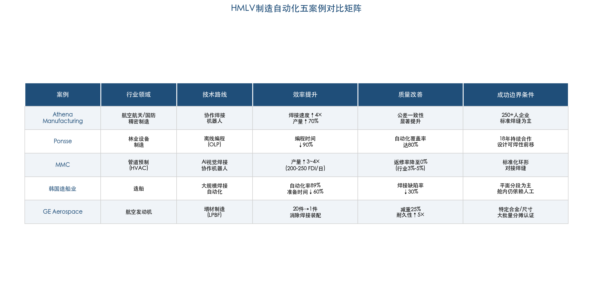

**图5-1 HMLV制造自动化五案例对比矩阵**。该矩阵从行业领域、技术路线、效率提升、质量改善和成功边界条件五个维度，对Athena Manufacturing、Ponsse、MMC、韩国造船业和GE Aerospace五个案例进行对比，帮助读者快速把握各案例的核心特征与适用范围。

### 5.6.1 成功案例的共性模式

综合五个案例，可提炼出HMLV制造自动化成功落地的四条共性模式：

**模式一：从结构化工序切入，而非试图一步到位**。所有成功案例的自动化范围均严格限定在结构化程度较高的工序子集中。Athena的协作焊接集中于平焊和横焊位置的标准焊缝；MMC的SWR针对标准化环形对接焊缝；韩国造船业从平面分段焊接起步。没有任何一个案例试图一次性覆盖全部焊接工况。第三章的TRL分级为这一切入策略提供了理论依据：TRL 7—8的工序是自动化的"低悬果实"，应当优先收获。

**模式二：人机协作而非完全替代**。五个案例中没有任何一个实现了"无人化"。Athena的手工焊接团队不仅未缩减反而扩张；Ponsse保留了20%的手工焊接份额；MMC的SWR需要操作员进行上料和监控；韩国造船业即使在89%自动化率下仍需大量技能工人处理非结构化任务；GE的增材制造零件仍需人工后处理。人机协作模式的经济合理性在于第四章4.6节的分析：它不要求机器人独立应对所有品种变异，无需完全替代高薪技能工人，也不触发完整的工艺资质重新认证——从而在技术可行性、经济性和组织可接受性之间取得平衡。

**模式三：编程效率是HMLV自动化的命脉**。Ponsse案例最清晰地展示了这一点：编程时间从10天缩短至1天的变革，是HMLV焊接自动化从"技术上可行但经济上不划算"跨越到"具备商业价值"的关键跳板。Athena的Beacon系统强调"数分钟内完成编程"、Hirebotics宣称换产时间从1小时缩短至4分钟——所有成功案例均在编程效率上实现了数量级提升。对于HMLV制造而言，编程效率的重要性甚至超过焊接速度本身：一台焊接速度提升50%但每次换产需编程8小时的机器人，在多品种环境中的实际产出可能不及一台焊接速度平平但换产仅需15分钟的系统。

**模式四：持续迭代而非"大爆炸"式部署**。Ponsse与Visual Components合作18年，从一个工位逐步扩展到全厂多品牌机器人的OLP覆盖；Athena从初始试点发展到四台协作机器人的矩阵部署；韩国造船业从1997年的大组立线起步，经历近30年的渐进式自动化升级。这一模式与第四章4.6节引述的McKinsey建议高度一致——从一个流程瓶颈入手，快速部署并迭代优化。

### 5.6.2 典型陷阱与教训

GrayMatter Robotics联合创始人、南加州大学先进制造中心创始主任Satyandra K. Gupta在The Robot Report上发表的分析文章，系统梳理了高混合制造场景中机器人技术从演示到部署过渡失败的11个原因，这些教训与本章案例形成深刻的互证关系。[The Robot Report](https://www.therobotreport.com/11-reasons-robots-struggle-to-scale-in-high-mix-manufacturing/ "机器人在高混合制造中扩展困难的11个原因，2026年2月")

**陷阱一：演示成功≠部署可行**。Gupta指出，多数技术演示在TRL 5—6水平进行，仅使用少量代表性零件验证功能可行性。但在实际部署中，有限的零件多样性使规划和控制算法未经充分测试，新几何形状可能迫使系统进行重大升级。Gupta强调："正确验证规划和控制能力需要使用几百种零件几何形状进行测试。这种规模的测试在演示阶段是不可能的。"[The Robot Report](https://www.therobotreport.com/11-reasons-robots-struggle-to-scale-in-high-mix-manufacturing/ "机器人在高混合制造中扩展困难的11个原因，2026年2月") 韩国造船业的经验印证了这一判断：平面分段焊接的自动化可达89%，但迁移到舱内复杂焊接时，同一技术框架面临的挑战呈非线性增长。

**陷阱二：忽视人机集成设计**。Gupta强调，许多演示项目忽略了人机协作中的人力利用率问题："如果人工在机器人工作时只是等待，那人力利用率极低，自动化成本无法得到合理化。"[The Robot Report](https://www.therobotreport.com/11-reasons-robots-struggle-to-scale-in-high-mix-manufacturing/ "机器人在高混合制造中扩展困难的11个原因，2026年2月") Athena和MMC的成功恰恰在于有效解决了这一问题：操作员在机器人焊接期间可进行零件准备、夹具切换或其他增值任务，而非被动等待。

**陷阱三：孤立优化单一工序，忽略上下游协同**。Gupta指出："即使被自动化的工序高速运行，如果下游工序是瓶颈，它也无法充分发挥效能。上游手工工序的质量波动则可能迫使自动化工序减速或降低质量。"[The Robot Report](https://www.therobotreport.com/11-reasons-robots-struggle-to-scale-in-high-mix-manufacturing/ "机器人在高混合制造中扩展困难的11个原因，2026年2月") 韩国造船业的数据为此提供了量化佐证——不同钢材类型导致的上游加工误差消耗了32%的自动化焊接已节省时间。Ponsse的做法则展示了正面范例：通过将OLP从生产工具扩展为设计验证工具，在设计阶段即优化上游零件的可焊性，实现了上下游协同优化。

**陷阱四：低估持续运维需求**。HMLV场景中部署的机器人系统是复杂的网络物理系统，运行于动态环境中。气管压力波动、清洁不到位导致视觉系统失灵、导轨摩擦增大引发电机过热、操作员错误导致工具装错——这些看似琐碎的问题均可能引发系统故障。Gupta指出："从严重故障中恢复需要大量的人类专业知识和显著的停机时间，这限制了系统可用性。"[The Robot Report](https://www.therobotreport.com/11-reasons-robots-struggle-to-scale-in-high-mix-manufacturing/ "机器人在高混合制造中扩展困难的11个原因，2026年2月") MMC案例中Novarc提供的远程监控与及时响应支持体系，为解决这一问题提供了有效的实践参考。

**陷阱五：仅靠劳动力替代难以证明ROI**。Gupta的分析结论与第四章4.2.2节的经济分析高度一致："当努力将演示系统成熟为生产系统时，成本因上述所有因素而迅速攀升。因此，仅凭劳动力节约很难证明ROI的合理性。"[The Robot Report](https://www.therobotreport.com/11-reasons-robots-struggle-to-scale-in-high-mix-manufacturing/ "机器人在高混合制造中扩展困难的11个原因，2026年2月") 成功案例的ROI论证通常并非仅依赖人工成本节约，还包括质量提升带来的返修成本降低（MMC的0%返修率）、产能扩张带来的营收增量（Athena能够承接此前不得不拒绝的订单）以及产品性能提升的溢价（GE LEAP喷嘴的减重和耐久性提升）。

图5-2对上述成功模式与典型陷阱进行了可视化总结，为HMLV制造企业的自动化决策提供结构化参考。

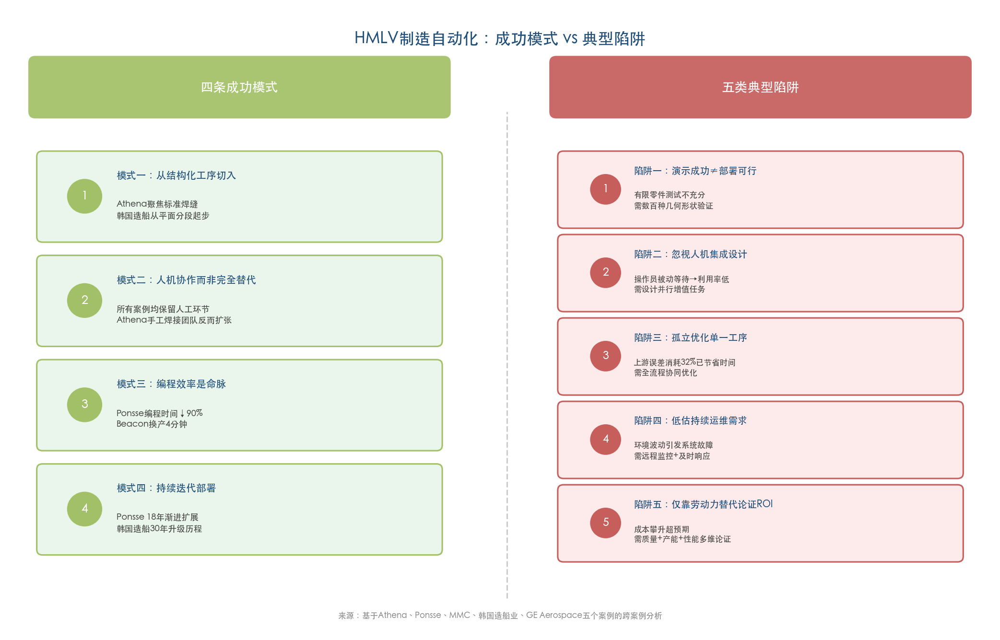

**图5-2 HMLV制造自动化：成功模式 vs 典型陷阱**。左栏列出四条经实证验证的成功模式，右栏对应五类典型陷阱，每条均配以案例佐证，形成一目了然的决策参考框架。

## 5.7 本章小结

五个案例横跨精密金属制造（Athena）、林业设备（Ponsse）、管道预制（MMC）、造船（韩国造船业）和航空发动机（GE Aerospace）五个行业，涵盖协作焊接、离线编程、AI视觉焊接、大规模焊接自动化和增材制造五条技术路线。跨案例分析揭示了以下核心洞察：

HMLV制造中自动化落地的成功案例，无一例外地遵循"有限范围、人机协作、编程效率优先、持续迭代"的基本范式。试图在技术成熟度不足的工序上强行推进全面自动化，大概率将陷入演示成功但部署失败的困境。

自动化的价值创造不应被狭隘地理解为"用机器替代人"，而应涵盖三个互补维度：效率维度（单位时间产出提升3—4倍）、质量维度（返修率从3%—5%降至<1%）以及能力维度（使初级操作员执行高级焊接任务、使企业承接此前无力完成的订单）。

增材制造提供了从根本上绕过技能密集型工序的替代路径，但其适用条件严格——材料、尺寸、认证经济学和累积产量四个维度须同时满足。对于大多数HMLV制造工序而言，"自动化现有工序"仍然是比"替代工艺路线"更现实的选择。

从失败教训来看，HMLV自动化最大的风险不在于技术本身，而在于系统设计和组织准备的不足——忽视人机集成、忽略上下游协同、低估持续运维投入以及将ROI论证仅建立在劳动力替代之上，均构成需要着力规避的典型陷阱。

# 第6章 趋势展望与战略建议

前五章分别从问题域界定、技能构成解析、技术可行性评估、经济与组织障碍分析以及行业实践案例五个维度，构建了单件小批量（HMLV）离散制造中技能密集型工序自动化难度的完整分析图景。本章将视角从"现状评估"转向"未来研判"：基于前五章确立的事实基础，研判2026—2030年HMLV制造自动化的技术演进方向与产业变革趋势，明确中短期内仍将高度依赖人工技能的"不可替代区"与可优先推进自动化的"优先自动化区"，并面向制造企业、技术供应商、政策制定者和职业教育机构四类利益相关方提出分层战略建议。

## 6.1 2026—2030年技术演进方向

### 6.1.1 AI与自主性：从规则驱动到认知驱动

国际机器人联合会（IFR）在2026年1月发布的"全球机器人五大趋势"报告中，将"AI与机器人自主性"列为首要趋势。IFR指出，分析式AI使机器人能够在智能工厂中自主预测故障或进行路径规划；生成式AI"标志着从基于规则的自动化向智能的、自我演化系统的转变"，使机器人能够自主学习新任务并通过仿真生成训练数据；而代理式AI（Agentic AI）融合两者，旨在使机器人"能够在复杂的真实世界环境中独立工作"。[IFR](https://ifr.org/ifr-press-releases/news/top-5-global-robotics-trends-2026 "IFR 2026年全球机器人五大趋势，2026年1月")

上述技术走向对HMLV制造具有深远意义。第三章已揭示，HMLV场景下自动化的核心障碍之一在于"品种变异性"——每个新产品都可能需要重新编程、调参和校准，传统基于规则的自动化系统无法应对这种近乎无限的品种变异。生成式AI和代理式AI在理论上提供了一条新路径：机器人不再依赖逐品种的显性编程，而是通过学习和推理自主适应新任务。

然而，我们认为这一愿景在2026—2030年时间窗口内对HMLV技能密集型工序的影响将是渐进而非颠覆性的，理由如下。其一，当前AI在机器人操控领域的进展集中于结构化场景中的标准化任务（如物流分拣、码垛、CNC上下料），而非第二章识别的非结构化环境中的复杂操作（如仰焊、狭窄空间管路焊接、柔性线缆布线）。其二，AI驱动的自主决策在安全关键领域（航空航天、核能、医疗器械）面临严格的认证壁垒——第四章已详述NAS 410/EN 4179等认证体系的保守性，AI系统在可预见的未来仍难以获得独立决策权。其三，HMLV场景中训练数据的稀缺性构成AI模型泛化能力的根本约束——每种产品的样本量可能仅为个位数，远低于深度学习所需的数据规模。

基于上述分析，我们判断AI在HMLV技能密集型工序中的短期（2026—2028年）实际落地将集中在三个方向：（1）AI辅助的视觉检测，利用零/少样本缺陷识别技术（第三章评估为TRL 5—6）；（2）AI驱动的工艺参数自适应优化，将操作员"听声辨形"的隐性知识部分转化为数据驱动的控制策略；（3）AI增强的离线编程，通过自然语言或CAD模型自动生成机器人程序草案以减少人工编程工作量。到中期（2028—2030年），AI自主性有望扩展到部分半结构化焊接任务的自适应执行和多品种场景下的柔性夹具自动适配。

### 6.1.2 机器人产业的持续扩张与协作化趋势

全球工业机器人产业正处于持续扩张的上升轨道。IFR数据显示，2024年全球工业机器人新增安装量达542,000台，连续四年超过50万台；在役机器人总量达466.4万台（同比+9%）；工业机器人安装的全球市场价值达到167亿美元的历史新高。[IFR](https://ifr.org/ifr-press-releases/news/top-5-global-robotics-trends-2026 "IFR 2026年全球机器人五大趋势，2026年1月") [IFR/The Robot Report](https://www.therobotreport.com/ifr-industrial-robot-deployments-have-doubled-in-10-years/ "IFR World Robotics 2025报告，2025年9月") 行业预测显示，2025—2027年全球工业机器人年安装量将保持增长态势，预计分别达到555,000台、575,000台和602,000台。[AIPRM/IFR](https://www.aiprm.com/robotics-statistics/ "全球机器人统计，引用IFR预测数据")

在机器人产业的整体扩张中，协作机器人（cobot）是增长最快的细分市场。MarketsandMarkets预测全球协作机器人市场规模将从2025年的14.2亿美元增长至2030年的33.8亿美元，CAGR为18.9%。[MarketsandMarkets](https://www.marketsandmarkets.com/Market-Reports/collaborative-robot-market-194541294.html "全球协作机器人市场预测，2025—2030年") ABI Research给出更为积极的预测：协作机器人收入将以27.5%的CAGR增长，从2024年的13亿美元增至2030年的超过70亿美元。[ABI Research](https://www.abiresearch.com/blog/global-robotics-market-outlook "全球机器人市场展望")

协作机器人的快速增长对HMLV制造具有直接的战略意义。第四章分析表明，协作机器人在HMLV场景中的部署成本（75,000—175,000美元/工位）和可重部署性使其成为小批量车间最现实的自动化入门选择。随着市场的规模化扩张，本体价格有望进一步下降——2026年轻载型本体价格已低至15,000—35,000美元——编程工具和生态系统亦日趋成熟，这将逐步降低第四章所述的"最低经济批量"门槛，为更多HMLV中小企业打开自动化窗口。

### 6.1.3 人形机器人：从实验室到工厂的漫长征途

人形机器人（humanoid robot）是2025—2026年机器人产业最受瞩目的新兴方向。IFR将"人形机器人证明可靠性与效率"列为2026年全球机器人五大趋势之三，指出人形机器人"正从原型阶段迈向真实世界部署"，但同时强调其需在节拍时间、能耗和维护成本等方面"匹配高工业标准"方能与传统自动化展开竞争。[IFR](https://ifr.org/ifr-press-releases/news/top-5-global-robotics-trends-2026 "IFR 2026年全球机器人五大趋势，2026年1月")

在产业化进程方面，Boston Dynamics于CES 2026上展示了电动版Atlas人形机器人的产品版本，年产能规划达30,000台，现代汽车集团计划从2028年起在其美国工厂部署Atlas用于零部件排序等任务。[Forbes](https://www.forbes.com/sites/johnkoetsier/2026/01/06/atlas-humanoid-robots-production-fully-committed-for-2026-factory-will-build-30000-per-year/ "Atlas人形机器人2026年量产，年产能30000台") [Reuters](https://www.reuters.com/business/autos-transportation/hyundai-motor-group-plans-deploy-humanoid-robots-us-factory-2028-2026-01-05/ "现代汽车计划2028年起在美国工厂部署人形机器人") 在基础模型层面，NVIDIA推出的Isaac GR00T N1——全球首个开源人形机器人基础模型——以及Cosmos世界基础模型，正在为人形机器人的仿真-现实（sim-to-real）迁移提供基础设施。[NVIDIA](https://nvidianews.nvidia.com/news/nvidia-isaac-gr00t-n1-open-humanoid-robot-foundation-model-simulation-frameworks "NVIDIA Isaac GR00T N1开源人形机器人基础模型") [1X](https://www.1x.tech/discover/nvidia-gtc-2026 "1X Technologies使用NVIDIA平台开发NEO机器人")

然而，对于HMLV技能密集型工序而言，人形机器人在2030年前的实际影响预计极为有限。首先，人形机器人的初始工业部署定位于高度结构化的汽车总装线任务（零部件搬运、排序等），而非第二章所述的非结构化环境精细操作。其次，人形机器人在灵巧操控（dexterous manipulation）方面虽有快速进步，但距离匹配人手的22个自由度和精细触觉反馈仍有显著差距——这正是第二章分析的"手眼协调"技能维度的核心挑战。再次，人形机器人初期量产阶段的单位成本预计远高于专用协作机器人，投资回收期更长，对HMLV中小企业缺乏经济吸引力。

我们判断，人形机器人对HMLV制造的潜在价值将在2030年以后逐步显现——当灵巧操控能力、自主导航能力和成本结构同步达到工业可用水平时，方有可能在现有协作机器人无法触及的非结构化空间中发挥作用。在2026—2030年时间窗口内，人形机器人对HMLV技能密集型工序的直接影响可忽略不计。

### 6.1.4 物理AI与仿真驱动的机器人技能习得

NVIDIA推动的"物理AI"（Physical AI）概念正在重塑机器人技能获取的路径。传统机器人编程依赖人类工程师逐步编写运动指令；协作机器人的示教编程虽降低了门槛，但仍需人工逐次示范；物理AI的愿景则是让机器人在高保真仿真环境中自主学习技能，再将习得的策略迁移到物理世界（sim-to-real transfer）。

这一技术路径与HMLV自动化的核心难题存在深层契合：如果机器人能够在仿真环境中快速学习新产品的操作策略而无需在物理设备上进行耗时的示教编程，则第四章分析的"编程时间的批量反比效应"将从根本上得到缓解。NVIDIA Cosmos世界基础模型旨在为机器人生成合成训练数据，Isaac Lab 3.0提供了标准化的机器人强化学习框架，二者共同构成物理AI从仿真走向现实的基础设施。[NVIDIA](https://investor.nvidia.com/news/press-release-details/2026/NVIDIA-and-Global-Robotics-Leaders-Take-Physical-AI-to-the-Real-World/default.aspx "NVIDIA与全球机器人领先企业将物理AI推向现实世界")

然而，sim-to-real gap（仿真与现实的差距）仍然是这一技术路径的核心瓶颈。在HMLV制造场景中，工件的材料批次差异、表面状态变化、夹具定位偏差等因素导致的"输入变异性"（第二章Sanchez-Salas框架术语），远超当前仿真环境所能精确建模的范围。我们预计，物理AI在2026—2030年间将在结构化程度较高的HMLV任务（如标准工件上下料、简单几何体打磨去毛刺）中取得实质性进展，但对于高度非结构化的技能密集型工序（如非标焊缝、复杂装配、返修），其实用化仍将受到仿真保真度和迁移鲁棒性的制约。

### 6.1.5 制造业数字化转型的加速趋势

PwC于2026年2月发布的制造业展望报告，基于对全球443名工业制造业高管的调查，揭示了一组关键趋势：制造商预计到2030年将先进技术采用率从当前的26%提升至68%，自动化和AI的使用将"增长超过一倍"，高度自动化流程的采用率将在2030年前"接近三倍"，覆盖范围从生产运营扩展至研发、设计和后台支持等全价值链环节。[PwC/Manufacturing Dive](https://www.manufacturingdive.com/news/automation-ai-to-more-than-double-by-2030-pwc-outlook-manufacturing/813358/ "PwC制造业展望，2026年2月")

值得关注的是，PwC报告同时揭示了"未来适配"企业与落后企业之间正在扩大的数字鸿沟——数据质量差、技能缺口和系统碎片化是造成差距的主要原因。PwC全球工业服务负责人Ryan Hawk指出："问题不再是企业是否会采用新技术，而是它们能多快地整合这些技术。随着自动化变得无处不在，竞争优势从'谁有工具'转向'谁能在整个企业中协调这些工具'。"[PwC/Manufacturing Dive](https://www.manufacturingdive.com/news/automation-ai-to-more-than-double-by-2030-pwc-outlook-manufacturing/813358/ "PwC制造业展望，2026年2月")

中国方面，工业和信息化部等八部门于2026年1月发布《"人工智能+制造"专项行动实施方案》，明确提出"支持消费电子、新型显示行业多品种小批量生产，大幅压缩换线时间，提升设备综合效率"，标志着政策层面对多品种小批量制造自动化的关注正从概念倡导走向专项行动。[工信部](https://tjdsj.tjcac.gov.cn/ZWGK0/ZCWJ137453/202601/t20260113_7222411.html "《人工智能+制造》专项行动实施方案，2026年1月")

上述数字化转型加速趋势对HMLV制造的启示在于：数字化基础设施（MES、工业物联网、数据采集系统）的普及将为第三章所述的AI赋能路径铺设前提条件。第四章指出，中国超过90%的中小企业数字化投入不足营收的2%，六成以上处于数字化转型早期。随着政策推动和行业竞争压力加大，这一比例有望在2026—2030年间显著改善，数字化基础的提升将间接释放HMLV制造自动化的潜力。

## 6.2 劳动力危机的加速效应

### 6.2.1 技能工人短缺：从结构性问题演变为存续性危机

前五章反复引述的劳动力数据共同指向一个严峻现实：技能工人短缺正从制造业的结构性问题演变为部分细分领域的存续性危机。

美国方面，Deloitte/Manufacturing Institute的研究显示，2024—2033年美国制造业净新增岗位需求约380万个，其中约190万个（约50%）可能因技能缺口无法填补；更早的Deloitte研究预测，到2030年美国制造业可能有210万个岗位空缺。[Deloitte/Manufacturing Institute](https://www.deloitte.com/us/en/insights/industry/manufacturing-industrial-products/supporting-us-manufacturing-growth-amid-workforce-challenges.html "2024年人才研究") [Manufacturing Institute](https://themanufacturinginstitute.org/2-1-million-manufacturing-jobs-could-go-unfilled-by-2030-11330/ "2030年210万制造业岗位可能空缺") 焊接领域的压力尤为突出：AWS预测2024—2028年需新增约33万名焊接专业人员；航空航天和国防领域报告称50%的制造企业面临人才留存挑战。[AWS](https://weldingworkforcedata.com/ "AWS焊接劳动力数据，2025年") [Advanced Manufacturing](https://www.advancedmanufacturing.org/industries/aerospace-defense/defense/breaking-free-of-manufacturing-s-talent-crisis/article_be95f0e8-15f8-43b3-a5c8-ea014c253411.html "制造业人才危机")

中国方面，制造业十大重点领域至2025年人才缺口近3,000万人（缺口率48%），高技能人才缺口达2,000万人。[人民论坛](https://paper.people.com.cn/rmlt/pc/content/202411/18/content_30047208.html "高技能人才供给，2024年11月")

技能工人短缺对HMLV制造自动化的影响呈现双向特征。一方面，劳动力短缺是推动企业采用自动化的最强驱动力——第五章Athena Manufacturing案例清晰展示了"招不到焊工"如何直接促成协作焊接机器人的部署。另一方面，第四章已揭示一个深层悖论：隐性知识的丧失不仅使人工生产更加困难，也使自动化更加困难——因为自动化实施过程本身需要依赖经验工人提供工艺知识输入。当最后一批资深技能工人退休时，企业可能同时丧失人工生产和自动化转型两条路径的可能性。

### 6.2.2 战略窗口期判断

综合劳动力供给的下降趋势和AI/机器人技术的上升趋势，我们认为HMLV制造企业正面临一个关键的战略窗口期——大约在2026—2032年之间。在这一窗口期内，企业仍拥有足够数量的经验工人来为自动化转型提供工艺知识输入——教机器人"怎么焊""怎么磨""怎么判断"；一旦这批工人大规模退休而隐性知识尚未被系统化提取和转化，自动化转型的难度和成本将急剧上升。

Deloitte/Manufacturing Institute的研究亦指出，先进制造业中40%的当前技能要求将在未来五年内发生变化。[Deloitte/Manufacturing Institute](https://www.deloitte.com/us/en/insights/industry/manufacturing-industrial-products/supporting-us-manufacturing-growth-amid-workforce-challenges.html "2024年人才研究") 这意味着即便在人工路径上，HMLV制造也面临大规模的技能重塑需求——将技能重塑与自动化转型同步推进，是比分别实施更高效的策略。

## 6.3 "不可替代区"与"优先自动化区"的边界判定

基于前五章的技术、经济和案例分析，以及本章对2026—2030年技术演进趋势的研判，可在第二章的"技能依赖—自动化难度"矩阵基础上进一步划定中短期内的"不可替代区"和"优先自动化区"。图6-1以七类核心技能密集型工序为纵轴，直观展示了2026年现状与2030年预期两个时间节点的自动化潜力区间及三区归属。

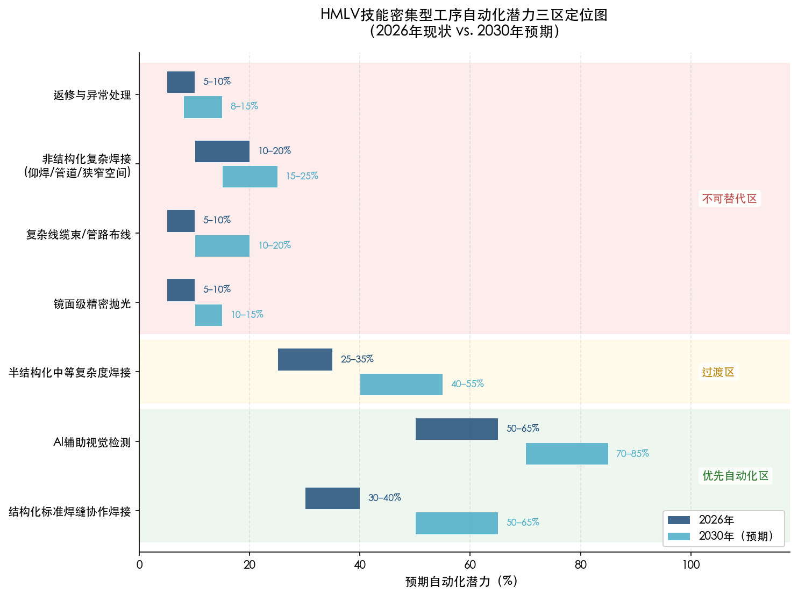

### 6.3.1 不可替代区：2030年前仍高度依赖人工技能的工序

**返修与异常处理**是技能密集型工序自动化的"最后堡垒"，第三章评估其TRL为1—2。2026—2030年间，AI在缺陷诊断方面可能取得辅助性进展（如AI标记可疑区域供人工评估），但返修方案的制定和执行仍将完全依赖人类专家的工程判断和手工操作能力。航空航天领域的MRB（Materials Review Board）审批机制在制度层面排除了AI独立决策的可能性。

**非结构化环境中的复杂焊接**——船舶分段内部、大型设备内腔等狭窄空间中的仰焊、立焊和管道焊接——在物理可达性、焊缝识别和工艺自适应三个维度上同时构成严峻挑战，第三章评估其TRL为4—5。虽然专用移动焊接机器人（如Inrotech-MicroTwin）正在突破空间约束，但在极端狭窄空间中的通用作业能力仍然有限。预计到2030年，此类场景的自动化率仍将低于20%。

**全规格复杂线缆束/管路现场布线**的TRL仅为2—3（第三章评估）。Robotik Challenge 2025的成果虽具有里程碑意义，但其处理的5根线缆简化任务与航空航天实际数百根线缆的全规格任务之间存在两个数量级以上的复杂度差距。柔性物体的形变不可预测性和三维空间关系的组合复杂度，使该工序在2030年前不具备规模化自动化的技术条件。

**镜面级精密抛光**方面，模具制造中A1级镜面抛光（Ra 0.01—0.025μm）对触觉感知和力度控制的极端要求，远超当前力控机器人的能力极限（最优报道值Ra 0.05μm，且限于标准几何体）。在复杂曲面和超精密表面处理领域，人工的不可替代性预计将持续至2030年以后。

### 6.3.2 优先自动化区：2026—2030年应优先推进的方向

**AI辅助视觉检测**是技术适配性最高、经济可行性最强的方向。第三章评估非安全关键场景下的标准表面缺陷检测已达TRL 7—8，少样本/零样本检测达TRL 5—6。AWS基于多模态大语言模型的零训练方案在基准测试中准确率达93%，F1分数0.951，无需逐品种训练专用模型，天然适应HMLV场景的多品种特征。[AWS](https://aws.amazon.com/blogs/industries/implement-zero-training-visual-defect-detection-in-manufacturing-with-amazon-nova-pro/ "AWS零训练视觉缺陷检测，2024年") 第四章评估其投资回收期为18—24个月。预计到2028年，AI辅助视觉检测将在非安全关键HMLV制造场景中实现广泛采用；安全关键领域则以"AI标记+人工终判"的人机协作模式逐步渗透。

**结构化环境中的标准焊缝协作焊接**（TRL 7—8）已在第五章Athena和MMC案例中得到商业验证——焊接时间缩短至原来的1/4，产量提升70%，返修率降至0%。随着协作焊接系统入门价格降至58,000—60,000美元（基础交钥匙方案），编程时间从"数天"压缩至"数分钟"，该方向在人力成本较高的经济体（北美、西欧、日本、韩国）中的经济均衡条件已基本满足。预计到2030年，HMLV车间中平焊和横焊位置标准焊缝的协作机器人焊接采用率将从当前的不足10%提升至30%—40%。

**AI驱动的工艺参数自适应优化**方面，第五章MMC案例展示了Novarc NovEye系统在管道焊接中的卓越表现（产量提升3—4倍，返修率降至0%）。AI参数优化的核心优势在于边际成本趋近于零——系统一旦部署，每个新品种的参数适配由AI自动完成，无需人工逐品种调优。第四章评估其经济可行性为"中等"，随着传感器成本下降和工艺数据积累，经济性将持续改善。

**离线编程（OLP）在HMLV焊接中的标准化应用**已经第五章Ponsse案例验证：OLP将编程时间从10天缩短至1天（90%降幅），并将机器人焊接覆盖率从低水平提升至80%。OLP是破解HMLV焊接自动化编程成本瓶颈的最有效技术手段。预计到2030年，OLP将成为拥有机器人焊接设备的HMLV制造企业的标准配置，渗透率从当前的约20%—30%提升至60%—70%。

**粗磨/去毛刺的力控机器人应用**（TRL 7—8）可将人工打磨的体力消耗和时间投入减少60%—80%，同时保留人工在最后精加工阶段的参与。"机器人粗加工+人工精加工"的混合模式在航空发动机叶片和模具制造中已有成功实践。

### 6.3.3 过渡区：需密切关注的技术突破方向

介于"不可替代区"和"优先自动化区"之间，存在一组工序和场景，其自动化可行性在2026—2030年间可能因特定技术突破而发生质变。这些方向值得企业密切关注，但不宜大规模押注：

- **半结构化环境中的中等复杂度焊接**（如船舶大组立焊接、大型设备外壳焊接）：自适应焊接技术+数字孪生+激光焊缝跟踪的组合方案正从TRL 5—6向TRL 7推进，韩国造船业大组立线89%自动化率为此提供了可行性参考。
- **数字孪生辅助的管路预制**：车间内的管道预制（非现场安装）因环境结构化程度较高，借助三维扫描+OLP+自适应焊接的技术组合，有望在2028年前后达到商业可行性。
- **少样本AI检测向安全关键领域的扩展**：AI检测系统能否获得航空航天等领域认证机构的认可，将决定其在高价值HMLV制造中的渗透天花板。

## 6.4 面向不同利益相关方的分层战略建议

### 6.4.1 制造企业：分步走、先数字化、再自动化

图6-2展示了HMLV制造企业在2026—2030年间可参照的分阶段实施路线图，其核心逻辑是：隐性知识锁定先行，经济性优先区切入在前，协作机器人扩展在后，过渡区技术保持跟踪。

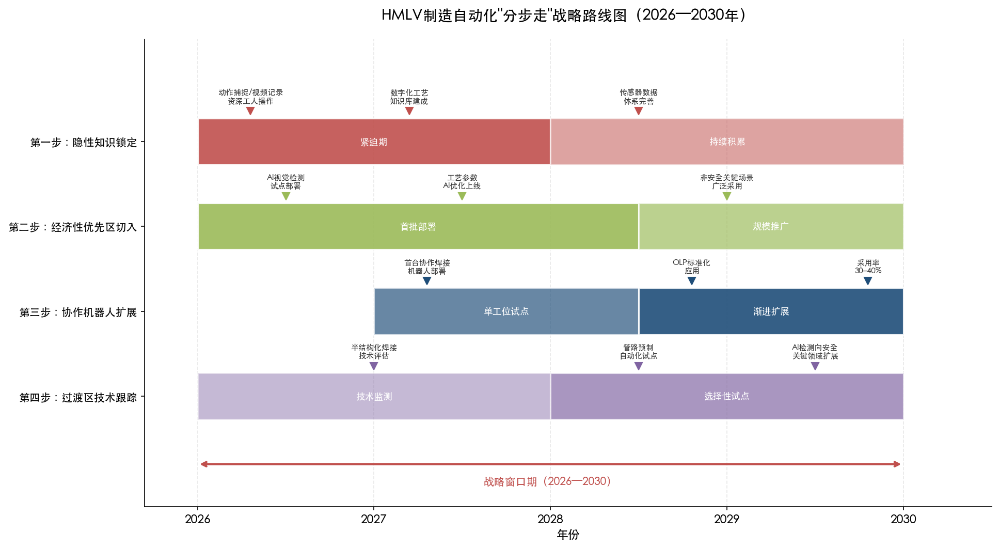

**第一步：锁定隐性知识（2026—2028年，紧迫度最高）**。第四章揭示的"技能工人退休→隐性知识丧失→自动化也变得更难"的恶性循环，使隐性知识的系统化提取成为HMLV制造企业最紧迫的战略任务——不是因为它能立即带来投资回报，而是因为一旦错过窗口期，这些知识将永久性地丧失。

具体措施包括：（1）利用动作捕捉、过程数据记录和视频记录系统，对资深技能工人（焊工、钳工、NDT检测员）的操作过程进行系统化知识采集；（2）建立以"工艺数据库"为核心的数字化工艺知识管理系统，将隐性知识（至少是其可外化的部分）从个人头脑迁移至组织级数字资产；（3）同步建立传感器数据采集体系（焊接电流/电压曲线、力矩数据、振动信号、热成像数据等），为后续AI模型训练积累数据基础。

**第二步：从"经济性优先区"切入自动化（2026—2028年）**。第四章的经济可行性分级表明，AI辅助视觉检测和工艺参数优化是经济可行性最高的方向——技术成熟度适中、无需逐品种重编程、AI系统边际成本趋近于零，且不直接替代高薪技能工人（从而降低组织阻力）。HMLV制造企业的首批自动化投资应优先瞄准这两个方向。

**第三步：部署协作焊接/打磨机器人，采用人机协作模式（2027—2030年）**。从最简单的标准焊缝和粗磨工序入手，一台机器人、一个工位地渐进扩展。第五章的案例一致表明，"从一个工位试点开始，积累经验后逐步扩展"是HMLV环境中风险最低的实施路径。McKinsey建议企业"从一个流程瓶颈入手，快速部署并迭代优化"。[McKinsey](https://www.mckinsey.com/capabilities/operations/our-insights/automation-and-the-talent-challenge-in-american-manufacturing "自动化与美国制造业人才挑战，2024年7月") 此外，"机器人即服务"（RaaS）模式提供了降低前期投入的替代方案——月付约1,500—3,000美元的租赁模式将资本支出转化为运营支出，显著降低中小企业的资金门槛。[EVS Robot](https://www.evsint.com/how-much-does-a-cobot-cost-pricing-guide-2026/ "协作机器人成本定价指南，2026年4月")

**关键原则：不追求全面替代，聚焦"人机协作增强"**。第五章跨案例分析的核心结论表明：所有成功案例都遵循"有限范围、人机协作、编程效率优先、持续迭代"的基本范式。试图在技术成熟度不足的工序上强行推进全面自动化，大概率将遭遇"演示成功但部署失败"的困境。制造企业应将期望值从"用机器替代人"调整为"用机器增强人的能力"——这是在当前技术和经济条件下的理性选择。

### 6.4.2 技术供应商：解决"最后一公里"比追求"通用性"更紧迫

**聚焦HMLV场景的核心痛点**。第三章分析的"最后一公里"问题——非结构化环境适应、小批量编程成本和传感器在复杂工况下的可靠性——是HMLV自动化技术商业化的主要瓶颈。技术供应商应将研发资源集中于这些痛点，而非追求"通用型"解决方案。

（1）**大幅降低编程时间和换产成本**是最关键的竞争差异化因素。第五章案例分析表明，编程效率的重要性甚至超过机器人本身的性能参数——一台编程效率极高但焊接速度平平的系统，在HMLV环境中的实际价值可能远超一台高速但每次换产需数小时编程的系统。AI增强的OLP、自然语言编程界面和基于CAD模型的自动路径生成，是当前最具商业价值的技术方向。

（2）**开发面向HMLV的"即插即用"方案**。NIST指出，50至500人规模的HMLV制造商是协作机器人的"甜蜜点"（sweet spot）。[NIST](https://www.nist.gov/blogs/manufacturing-innovation-blog/high-mixlow-volume-manufacturers-are-sweet-spot-collaborative "NIST制造创新博客，2020年7月/2024年9月更新") 然而当前多数协作机器人方案仍需专业的系统集成工程，这对缺乏内部自动化专家的HMLV中小企业构成显著障碍。技术供应商应开发预配置的、模块化的、无需深度定制集成的"交钥匙"解决方案——Hirebotics的Beacon系统和Novarc的SWR在这一方向上已展示了可行性。

（3）**构建工艺知识库和迁移学习能力**。在HMLV场景中，每种材料-接头-工况组合的优化参数都是有价值的工艺资产。技术供应商应在AI系统中构建累积式工艺知识库，使系统在处理新品种时能够调用过往经验——类似于第五章Novarc NovEye系统通过持续数据采集和模型迭代优化所实现的"知识积累"效应。

**商业模式创新同样至关重要**。RaaS模式的推广将帮助技术供应商触达此前因资金门槛而无法进入的HMLV中小企业市场。此外，技术供应商还应探索"按焊缝计费"或"按合格件计费"等成果导向的商业模式，将客户的风险从"设备投资"转化为"可变生产成本"。

### 6.4.3 政策制定者：构建生态而非押注单一技术

**产业政策应聚焦基础设施层面的使能条件，而非对特定技术路线的补贴**。HMLV制造自动化的瓶颈不在于某一种技术的研发突破，而在于一系列基础设施的缺失——工艺数据标准化、中小企业数字化基础、系统集成人才培养以及行业认证框架的适应性更新。

具体建议包括：

（1）**设立面向中小制造企业的"自动化诊断与试点支持"专项**。第四章揭示，HMLV中小企业面临"最需要自动化但最用不起"的困境。政策可通过补贴自动化方案的诊断评估费用（而非直接补贴设备购置），帮助企业建立准确的自动化投资决策能力；同时提供首台套试点的风险分担机制（如设备融资担保、贷款贴息），降低中小企业的试错成本。

（2）**推动行业认证框架的适应性更新**。第四章4.4.5节详述了焊接工艺认证、NDT人员资质和医疗器械工艺变更控制对自动化落地的制度壁垒。政策制定者应推动相关标准化机构开展"AI辅助检测""机器人焊接认证简化程序"等方向的标准修订工作，为AI系统在安全关键领域融入认证框架建立路径——既不降低安全标准，也不因制度惯性阻碍技术进步。

（3）**建设区域性"HMLV智能制造示范中心"**，集中展示和测试适用于小批量多品种场景的自动化方案，为中小企业提供"试用后购买"的低风险体验渠道。中国工信部在《"人工智能+制造"专项行动实施方案》中已明确提出支持多品种小批量生产的方向，地方政策可以此为抓手建立实体化的服务平台。[工信部](https://tjdsj.tjcac.gov.cn/ZWGK0/ZCWJ137453/202601/t20260113_7222411.html "《人工智能+制造》专项行动实施方案，2026年1月")

### 6.4.4 职业教育机构：培养"人机协作型"复合技能人才

HMLV制造自动化的未来并非"机器取代人"，而是"人+机器"的协作模式——这要求从根本上重新定义制造业技能人才的培养目标。

**从"纯手艺"到"手艺+数字"的复合技能培养**。第五章Athena案例揭示了一个值得深思的人才发展范式："不需要焊接背景的操作员即可运行协作焊接机器人"，但系统层面的工艺质量把关仍需AWS认证焊接检验员。这意味着未来焊接人才需要同时具备两种能力维度：传统焊接工艺知识（材料特性、接头设计、热处理效应）和数字化操作能力（机器人编程、视觉系统标定、数据分析）。前者确保工艺判断的正确性，后者确保自动化系统的有效运行。

**将机器人编程和AI工具操作纳入焊接、加工等传统工种培训大纲**。Deloitte/Manufacturing Institute的研究指出，先进制造业中40%的当前技能要求将在未来五年内发生变化，但"数字技能不够——高度专业化领域中操作焊接机器人仍需扎实的制造基础技能"。[Deloitte/Manufacturing Institute](https://www.deloitte.com/us/en/insights/industry/manufacturing-industrial-products/supporting-us-manufacturing-growth-amid-workforce-challenges.html "2024年人才研究") 职业教育的核心策略应是"在传统技能基础上叠加数字能力"，而非用数字技能替代手工技能。

**建立"师傅经验数字化"的教学方法**。将第四章讨论的隐性知识外化路径融入职业教育——利用动作捕捉、过程数据可视化和AR/VR模拟训练，将资深技师的操作策略和决策逻辑以可视化方式传递给学员，缩短从"新手"到"熟练工"的培养周期。IFR在2026年趋势报告中亦指出，"企业和政府正在推动技能提升和再培训计划，帮助工人适应不断变化的技能需求，在自动化驱动的经济中保持竞争力"。[IFR](https://ifr.org/ifr-press-releases/news/top-5-global-robotics-trends-2026 "IFR 2026年全球机器人五大趋势，2026年1月")

图6-3以矩阵形式汇总了上述四类利益相关方在短期（2026—2028年）和中期（2028—2030年）的核心行动要点，以供决策参考。

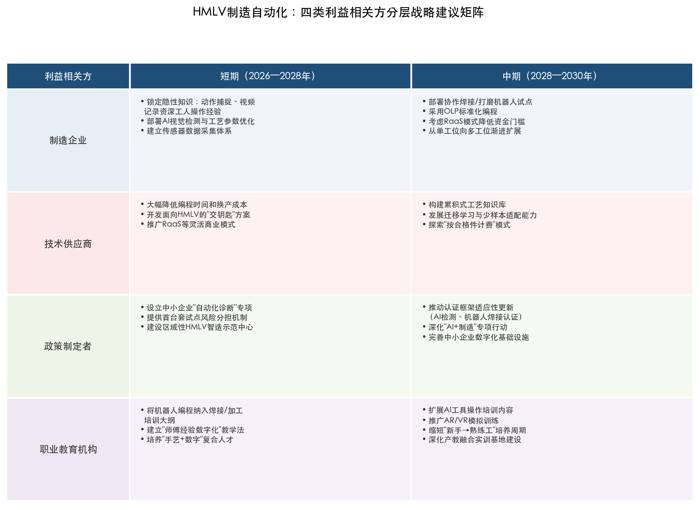

## 6.5 综合研判

回到本报告的核心问题——单件小批量离散制造中，基本靠人的技能才能完成的工序，实现自动化的难度究竟有多大？经过六章的系统分析，综合判断可凝练为以下四点。

**整体难度高于制造业平均水平，但并非铁板一块。** McKinsey估计制造业整体的自动化潜力约为64%，但HMLV技能密集型工序由于"不可预测物理活动"和"应用专业知识"的占比远高于平均水平，其实际可自动化比例显著低于该均值。基于第二章矩阵和第三章技术评估的综合判断：在当前（2026年）技术条件下，HMLV制造中七类核心技能密集型工序的可自动化程度约为25%—35%（以工时占比计），到2030年有望提升至35%—45%；剩余的55%—65%在中期内仍将高度依赖人工技能。

**难度的本质并非单一维度。** 自动化难度不是"技术够不够先进"的单一问题，而是技术可行性、经济可行性和组织/制度障碍三重因素的叠加。第三章揭示了技术维度的阶梯性分布（同一工序类别内TRL可相差4—6个等级）；第四章揭示了经济维度的结构性膨胀（HMLV场景的总拥有成本比大批量场景高30%—60%）；第四章还揭示了组织和制度维度的锁定效应（认证壁垒、隐性知识转移困境、中小企业数字化基础薄弱）。三重障碍的交互强化，构成HMLV制造自动化渗透率持续偏低的结构性根源。

**路径清晰，但需要耐心。** 第五章的跨案例分析提炼出一条经过实践验证的推进路径：从结构化工序切入，采用人机协作模式，以编程效率为优先改进目标，通过持续迭代逐步扩展覆盖范围。这条路径不够"革命性"，却是在技术成熟度参差、经济约束紧张和组织准备不足的现实条件下，唯一经过案例验证的可行路径。

**时间不等人。** 技能工人的大规模退休浪潮已经开始——美国2024—2033年190万个制造业岗位可能因技能缺口无法填补，中国制造业重点领域人才缺口率达48%。HMLV制造企业如果在2026—2032年的"窗口期"内不启动隐性知识的系统化提取和自动化的渐进式部署，将面临"既无人手工做、又缺知识做自动化"的双重困境。行动的紧迫性，可能比技术成熟度本身更值得决策者关注。

# 结论与风险提示

## 研究结论

本报告历经六章、横跨问题域界定、技能工序解析、技术评估、经济与组织分析、行业案例和趋势展望六个维度，对单件小批量离散制造中技能密集型工序实现自动化的难度进行了系统评估。核心结论可凝练为以下五点。

**第一，HMLV制造中技能密集型工序的自动化难度显著高于制造业平均水平，但并非不可逾越的整体性壁垒。** 七类核心技能密集型工序在"技能依赖—自动化难度"矩阵中呈现清晰的三级分布：返修与异常处理、非结构化环境复杂焊接和全规格线缆束布线构成"极高难度"层级（TRL 1—5），在2030年前仍将高度依赖人工技能；手工打磨抛光和管路布线构成"高难度"层级（TRL 4—8），局部自动化窗口已打开但全流程替代仍面临重大挑战；目视检测和工装夹具调整/参数调优构成"中高难度"层级（TRL 3—8），技术路线清晰且经济可行性条件正在成熟。以工时加权的综合可自动化比例在当前（2026年）约为25%—35%，预计2030年可提升至35%—45%。

**第二，自动化难度的本质是技术、经济和制度三重障碍的交互锁定，而非任何单一维度的缺陷。** 技术维度上，同一工序因场景差异TRL可相差4—6个等级，品种变异性、环境非结构化和批量不经济性构成系统性"TRL折扣"。经济维度上，HMLV场景的总拥有成本较大批量场景高出30%—60%，投资回收期延长至36—48个月，而人工成本最高的工序恰恰面临最大的技术瓶颈——形成"最需要自动化却最难自动化"的结构性悖论。制度维度上，航空航天焊接工艺认证、NDT人员资质体系和医疗器械工艺变更控制对自动化方案的落地构成刚性约束。三重障碍相互强化，形成"投资不足→经验匮乏→风险放大→投资更加谨慎"的自锁循环。

**第三，人机协作模式是HMLV制造自动化在中短期内唯一经过案例验证的可行路径。** 五个跨行业案例无一例外地证实：成功的自动化部署严格限定在结构化程度较高的工序子集中，采用人机协作而非完全替代的工作模式，以编程效率为优先改进目标，通过持续迭代逐步扩展覆盖范围。协作焊接机器人使关键组件焊接时间缩短75%，离线编程将编程时间压缩90%，AI视觉焊接系统将返修率降至0%——这些成效均建立在"人的判断+机器的执行"互补协作的基础之上。

**第四，隐性知识的系统化提取是当前最紧迫的战略任务。** 技能工人的大规模退休浪潮正在加速——美国焊接领域2024—2028年需新增约33万名专业人员，中国高技能人才缺口达2,000万人。隐性知识的丧失不仅使人工生产更加困难，也使自动化更加困难——因为自动化系统的建立本身需要经验工人提供工艺知识输入。2026—2032年是HMLV制造企业启动知识提取和自动化转型的关键窗口期。

**第五，自动化的价值创造不应被狭隘地理解为"用机器替代人"。** 成功案例的价值创造涵盖三个互补维度：效率维度（单位时间产出提升3—4倍）、质量维度（返修率从3%—5%降至不足1%）和能力维度（使初级操作员执行高级焊接任务、使企业承接此前无力完成的订单）。以"选择性人机协作增强"取代"全面自动化替代"的期望值调整，是在当前技术和经济条件下HMLV制造企业最理性的战略选择。

## 风险提示与研究局限性

本报告的分析框架和研究结论受以下局限性约束，读者在引用和决策时应予以审慎考量。

**一、HMLV制造产值占比缺乏权威量化数据。** 本报告综合梳理了航空航天零部件、船舶制造、模具工装、医疗器械和发电设备五大行业的市场规模数据，但上述行业并非全部产品均属于HMLV模式。现有公开文献中，尚无权威机构对全球离散制造中HMLV模式的产值或就业占比进行过系统量化。本报告提出的"合计超过1.3万亿美元"为五大行业的整体市场规模而非HMLV产值净值，实际HMLV占比需要更精细的行业拆解方能确定。

**二、可自动化比例的估算具有较大不确定性区间。** 本报告提出的"当前可自动化比例25%—35%、2030年35%—45%"为基于第二章矩阵、第三章TRL评估和第五章案例数据的综合判断，并非基于大规模统计调查的精确测算。不同行业、不同企业规模和不同地区的实际可自动化水平可能与上述区间存在显著偏差。

**三、案例代表性存在局限。** 五个行业案例均选取了自动化实施相对成功的企业，可能存在"幸存者偏差"——自动化尝试失败、投资未能收回或项目中途放弃的案例未被充分纳入分析。此外，案例以北美和北欧企业为主，对中国、日本和东南亚等制造大国的HMLV自动化实践覆盖不足。

**四、技术演进预测面临高度不确定性。** 本报告对2026—2030年技术趋势的研判建立在当前技术轨迹的外推基础之上。AI、机器人灵巧操控和物理AI等领域的突破性进展可能在短期内大幅改变部分工序的自动化可行性评估——例如，若大语言模型驱动的通用机器人操控能力在2028年前取得超预期突破，本报告对"不可替代区"的划定可能需要修订。反之，若关键技术方向（如sim-to-real迁移、少样本学习的工业化可靠性）进展低于预期，则"优先自动化区"的落地节奏也可能慢于预测。

**五、经济分析未充分纳入地区差异和汇率波动因素。** 本报告的成本数据以美元计价、以北美市场为主要基准。不同经济体的劳动力成本结构、设备采购价格、集成服务成本和政策补贴环境差异显著，直接影响自动化投资的经济均衡点。中国、东南亚等劳动力成本较低地区的回收期可能显著长于本报告给出的基线估计。
