# 执行摘要

爵士钢琴自1945年以来的八十余年间经历了至少五次根本性的范式转换，从比波普（Bebop）时代巴德·鲍威尔确立的"右手旋律线＋左手简约和弦"框架，到调式爵士（Modal Jazz）中比尔·埃文斯以无根音和弦与四度叠置和声开创的色彩性音响世界，再到自由爵士运动中塞西尔·泰勒以"八十八个调音鼓"彻底重新定义钢琴的乐器身份——每一次转折都深刻改写了爵士钢琴的和声语言、演奏技法与角色定位。

1968年前后兴起的融合运动（Jazz Fusion）将这一变革推向新的维度。赫比·汉考克以 *Head Hunters*（1973）成就了爵士乐史上第一张白金唱片，奇克·科瑞亚在拉丁融合与 MIDI 数字实验之间搭建折衷光谱，乔·扎维努尔以 Weather Report 开创了"声音设计师"的键盘新身份。与此同时，MIDI协议（1983）、Yamaha DX7 数字合成器和采样器构成的"技术三角"从根本上重塑了爵士键盘手的装备生态与创作流程。

进入21世纪，爵士钢琴在"后流派"（post-genre）时代呈现出前所未有的多元裂变。罗伯特·格拉斯珀将爵士和声逻辑嵌入嘻哈量化节奏网格，维杰·艾耶以具身认知理论和卡纳提克节奏体系驱动学术-实践一体化探索，蒂格兰·哈马斯扬将亚美尼亚民间音阶钢琴化为极端风格光谱，杰森·莫兰则将爵士钢琴推入卡塞尔文献展等当代艺术展示空间。技术前沿方面，从乔治·刘易斯1987年开发的 Voyager 人机交互系统到 IRCAM 的 Somax2 共创平台、MIT Media Lab 2024年的 AI "jam_bot"，人工智能与爵士即兴的对话已积累近四十年实践，但AI在"多尺度一致性"——即在长时间跨度上构建宏观叙事弧线——方面仍面临根本性局限。

全球化视野下，爵士钢琴已从以美国为单一中心的艺术形态演化为多极化的全球实践网络。ECM 唱片美学塑造了北欧钢琴学派的空间-沉默诗学，日本秋吉敏子与上原ひろみ代表了东亚爵士钢琴从先驱拓荒到当代高能量综合的代际传承，古巴丘乔·巴尔德斯将 montuno 从节奏伴奏提升为独立即兴叙事手段，南非阿卜杜拉·易卜拉欣以 *Mannenberg* 证明了爵士钢琴可以同时承载美学创新与社会政治功能。流媒体经济（2025年全球录制音乐收入317亿美元，流媒体占比84%以上）、数字化教育普惠（Open Studio Jazz 覆盖140国56,000名会员）和全球音乐节网络正在重塑爵士钢琴的产业生态与人才地理。

本报告的核心判断是：爵士钢琴的艺术生命力根植于即兴创作这一不可化约的核心——在特定时刻做出不可预测的音乐抉择。技术工具（从 Fender Rhodes 到 AI 共创系统）扩展了声音的物理载体和生成方式，全球化拓宽了文化资源和受众版图，但爵士钢琴作为一种社会性、文化性、身体性的人类创造活动，其本质并未改变。面对 AI 竞争、市场碎片化与注意力经济的多重挑战，那些能够将本土文化基因与爵士即兴体系进行深层综合的个体创作者，仍将是推动这门活态艺术持续演化的根本力量。

# 从 Bebop 到 Modal Jazz——现代爵士钢琴的和声革命（1945–1965）

## 引言：现代爵士钢琴的起点

1945年前后，第二次世界大战终结之际，爵士乐正经历一场深刻的内部革命。一群年轻的非裔美国音乐家在纽约哈莱姆区 Minton's Playhouse 的深夜即兴聚会（jam session）中锤炼出一种全新的即兴语言——比波普（Bebop）。这场革命不仅重塑了爵士乐的旋律、和声与节奏面貌，更从根本上改变了钢琴在爵士合奏中的角色定位。在此后的二十年间（1945–1965），爵士钢琴经历了从比波普高速和弦跑动到调式爵士（Modal Jazz）的关键转折，其和声语言发生了堪称革命性的根本变革。

图1以时间轴形式呈现了这一时期的关键里程碑，为全章论述提供时间脉络参照。

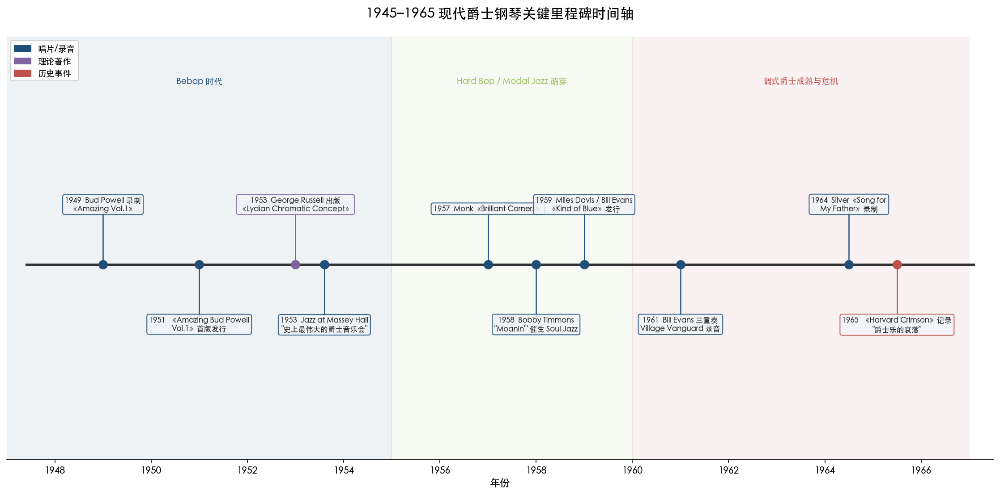

**图1：1945–1965 现代爵士钢琴关键里程碑时间轴。** 从1949年鲍威尔录制《*Amazing Vol.1*》到1965年爵士俱乐部大面积萎缩，三个色带分别对应 Bebop 时代、Hard Bop / Modal Jazz 萌芽期与调式爵士成熟与危机期。

这一时期的核心叙事可以沿三条线索展开：巴德·鲍威尔（Bud Powell）确立的比波普钢琴范式如何与 Stride/Swing 传统断裂；塞隆尼斯·蒙克（Thelonious Monk）的不协和美学如何拓展了钢琴的表现边界；比尔·埃文斯（Bill Evans）与乔治·拉塞尔（George Russell）的理论创新如何催生了调式即兴，并在迈尔斯·戴维斯（Miles Davis）的《*Kind of Blue*》中达到历史性的结晶。与此同时，硬波普（Hard Bop）运动中霍勒斯·西尔弗（Horace Silver）和鲍比·蒂蒙斯（Bobby Timmons）将蓝调与福音元素重新注入爵士钢琴，形成了另一条强劲的创作支流。至1965年前后，这些丰富的遗产面临双重压力——自由爵士（Free Jazz）从内部解构传统框架，摇滚乐从外部挤压市场空间——爵士钢琴由此驶入新的未知航道。

## 一、比波普范式的确立：巴德·鲍威尔与钢琴角色的革命

### 1.1 从 Stride 到 Bebop——左手的解放

在比波普之前的 Stride 与 Swing 时代，钢琴家的左手承担着低音-和弦交替跳跃的节奏骨架功能，右手则负责旋律与装饰。这种由詹姆斯·P·约翰逊（James P. Johnson）和法茨·沃勒（Fats Waller）确立的"跨步钢琴"（stride piano）传统，要求左手在键盘上大跨度地交替弹奏低音与和弦，使钢琴同时扮演贝斯手与和弦伴奏者的双重角色。

巴德·鲍威尔（Bud Powell，1924–1966）彻底改写了这一范式。他将钢琴的即兴逻辑从左手主导的"纵向-节奏型"转化为右手主导的"横向-旋律线"，确立了此后数十年现代爵士钢琴的基本演奏框架：右手演奏快速、连贯的单音旋律线（single-note lines），其速度和复杂性直追查理·帕克（Charlie Parker）的萨克斯风；左手则从繁重的 stride 跳跃中解放出来，简化为稀疏的和弦点缀——通常仅以根音与七度（或根音与三度）构成的"外壳和弦"（shell voicings）在节奏上进行简短的、常常带有切分的插入[Wikipedia: Bud Powell](https://en.wikipedia.org/wiki/Bud_Powell "引 Thomas Owens, Bebop: The Music and Its Players, Oxford, 1996, p.148")。赫比·汉考克（Herbie Hancock）在1966年《*DownBeat*》采访中称鲍威尔为"整座现代爵士钢琴大厦的基础"[Wikipedia: Bud Powell](https://en.wikipedia.org/wiki/Bud_Powell "引 Patrick Burnette/All About Jazz 及 DownBeat 1966")。

图2以三栏并列方式直观呈现了从 Stride/Swing 到 Bebop 再到 Modal Jazz 三种范式下钢琴双手功能分配的演变轨迹。

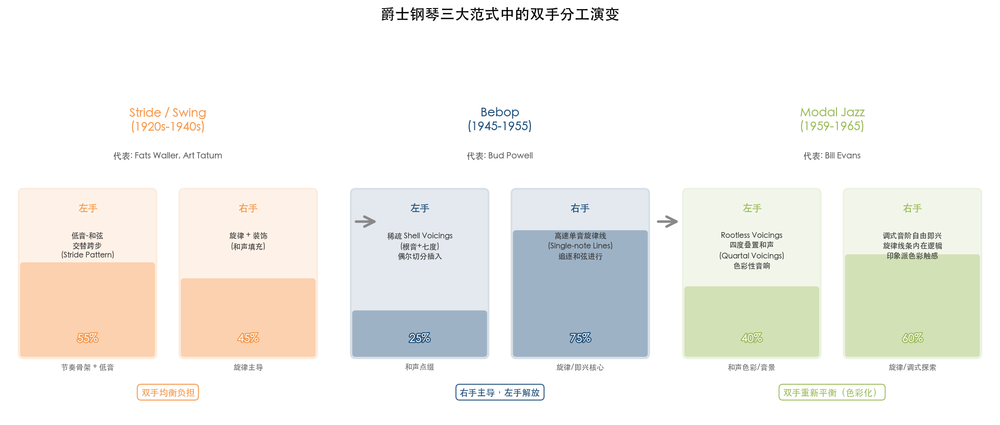

**图2：爵士钢琴三大范式中的双手分工演变。** Stride 时代双手负担大致均衡（左手55% / 右手45%）；Bebop 时代右手主导地位急剧上升（75%），左手简化为和声点缀（25%）；Modal Jazz 时期双手重新趋于平衡（左手40% / 右手60%），但左手功能从节奏骨架转变为色彩性音响构建。

### 1.2 技法创新与代表唱片

鲍威尔在和声层面的探索远不止于简化左手。他在即兴中大量运用双调性（bitonality）手法——在一个调性的和弦进行之上叠加另一个调性的旋律片段——以及极端延伸和弦（如升十五度），这些做法在1940年代末的爵士钢琴中堪称前沿实验[Wikipedia: Bud Powell](https://en.wikipedia.org/wiki/Bud_Powell "引 Thomas Owens, Bebop, Oxford, 1996, p.148")。其技法的实质在于，将比波普萨克斯风手的线性思维移植到钢琴键盘上，同时利用钢琴固有的和声能力在左手构造出微妙的调性张力场。

鲍威尔的代表唱片《*The Amazing Bud Powell, Vol. 1*》（Blue Note Records，录制于1949–1951年，1951年首版发行）收录了"Un Poco Loco"和"Parisian Thoroughfare"等后来成为爵士标准曲的经典曲目[AllMusic](https://www.allmusic.com/album/the-amazing-bud-powell-vol-1-mw0000589743 "AllMusic 唱片页")[Blue Note Records](https://www.bluenote.com/spotlight/the-amazing-bud-powell/ "Blue Note 官方介绍")。"Un Poco Loco"中鲍威尔与鼓手马克斯·罗奇（Max Roach）在拉丁节奏框架下展开的对话，展现了比波普钢琴在节奏维度上的拓展潜力。1953年5月15日在多伦多梅西音乐厅（Massey Hall）的现场录音——由查理·帕克、迪兹·吉莱斯皮（Dizzy Gillespie）、查尔斯·明格斯（Charles Mingus）与马克斯·罗奇组成的全明星阵容——产出了《*Jazz at Massey Hall*》（Debut Records），此次演出被誉为"史上最伟大的爵士音乐会"[Wikipedia: Bud Powell](https://en.wikipedia.org/wiki/Bud_Powell "Jazz at Massey Hall")。鲍威尔在其中的钢琴表现证明，他能够在最高水准的比波普合奏中与管乐器展开平等对话，而非仅仅充当伴奏角色。

## 二、不协和的建筑师：塞隆尼斯·蒙克的独特美学

### 2.1 打击性触键与空间留白

如果说鲍威尔代表了比波普钢琴的"速度与流畅"，塞隆尼斯·蒙克（Thelonious Monk，1917–1982）则体现了一个截然不同的维度——"棱角与空间"。蒙克的钢琴技法以不协和与打击性触键为核心标志：他大量使用全音阶片段和平行六度构造旋律，营造出一种有意"笨拙"却极具辨识度的声响；其演奏中充满标志性的空间留白——沉默并非演奏的间歇，而是音乐叙事的有机组成部分[Wikipedia: Thelonious Monk](https://en.wikipedia.org/wiki/Thelonious_Monk "引 Thomas Owens, Bebop, Oxford, 1996, pp.141-143")。

值得注意的是，蒙克罕见地在比波普语境中保留了左手 Stride 模式的痕迹，但他对 stride 的引用始终带有解构意味——节奏位移和意外的重音使得这些引用听起来更像是对传统的戏仿而非继承。这种"既在传统之内、又在传统之外"的双重立场，使蒙克成为爵士钢琴史上最难以归类的人物之一。

### 2.2 作曲家与文化符号

蒙克的贡献远不止于演奏技法层面。作为20世纪最重要的爵士作曲家之一，他创作的"'Round Midnight"是被录制次数最多的单一作者创作爵士标准曲；他本人则是继杜克·艾灵顿（Duke Ellington）之后被录制次数第二多的爵士作曲家[Wikipedia: Thelonious Monk](https://en.wikipedia.org/wiki/Thelonious_Monk "格莱美终身成就奖1993；普利策2006")。

蒙克的代表唱片《*Brilliant Corners*》（Riverside Records，1957年发行）是理解其美学的关键文本。标题曲的旋律线条与节奏结构复杂到参与录音的乐手们尝试了25次仍未能完成一次完整的演绎，最终发行版本系多次录音的剪辑拼接[Wikipedia: Brilliant Corners](https://en.wikipedia.org/wiki/Brilliant_Corners "发行日期、格莱美名人堂、国会图书馆")。这一事实本身便说明了蒙克作曲的激进程度——他的创作并非旨在展示演奏者的即兴能力，而是迫使演奏者进入一个充满不确定性的音乐空间。该专辑于1999年入选格莱美名人堂，2003年被纳入美国国会图书馆国家录音登记名册[Wikipedia: Brilliant Corners](https://en.wikipedia.org/wiki/Brilliant_Corners "格莱美名人堂与国会图书馆")。

蒙克在其职业生涯中获得了最高级别的艺术认可：1993年获格莱美终身成就奖，2006年获普利策特别奖[Wikipedia: Thelonious Monk](https://en.wikipedia.org/wiki/Thelonious_Monk "格莱美1993、普利策2006")。这些荣誉印证了一个事实——蒙克对和声语言、节奏构造与作曲形式的激进探索，在比波普的历史框架内开辟了一条通向更自由、更个人化的钢琴表达之路。

## 三、调式革命的理论基石：乔治·拉塞尔与利迪安色彩概念

### 3.1 从和弦进行到调式思维的范式转换

比波普的核心即兴逻辑建立在快速的和弦进行（chord changes）之上——即兴者须在高速行进的 ii-V-I 进行中精确勾勒每一个和弦的轮廓。这种"水平式"（horizontal）的和声运动赋予比波普令人炫目的速度感，却也逐渐令前沿音乐家感到窒息。迈尔斯·戴维斯在1950年代中期向乔治·拉塞尔提出了一个根本性的问题："我想学会所有的和弦变化。我该怎么做？"拉塞尔后来回忆道："他已经知道了这些变化。他需要的是一种新的方式来与和弦建立关系。"[Myles Boothroyd, "Modal Jazz and Miles Davis: George Russell's Influence," *Nota Bene: Canadian Undergraduate Journal of Musicology*, Vol. 3, No. 1, 2010](https://ojs.lib.uwo.ca/index.php/notabene/article/download/6559/5283/12331 "引 Eric Nisenson, The Making of Kind of Blue, 2000, p.62")

这一问题促使拉塞尔将他自1945年起构思的理论体系系统化。1953年，拉塞尔出版了《利迪安色彩调性组织概念》（*Lydian Chromatic Concept of Tonal Organization*），这是爵士乐史上第一部从爵士和声的内在规律出发推导出的系统性理论著作。德国爵士评论家约阿希姆-恩斯特·贝伦特（Joachim-Ernst Berendt）在经典著作《爵士乐之书》（*The Jazz Book*，1976年）中将该书描述为"第一部从爵士自身的内在规律推导出爵士和声理论的著作"，并称其为"迈尔斯·戴维斯和约翰·科尔特兰调式音乐的开路先锋"[Wikipedia: Lydian Chromatic Concept](https://en.wikipedia.org/wiki/Lydian_Chromatic_Concept_of_Tonal_Organization "引 Berendt, The Jazz Book, 1976, p.357")。

### 3.2 利迪安调式与"调性引力"

拉塞尔理论的核心洞见在于：大调音阶（Ionian mode）内部包含固有的"功能性和声运动"倾向——属音-主音关系不断驱动着音乐向主和弦解决；而利迪安调式（Lydian mode）由于升高的第四音度消除了这一内在的解决倾向，因此能够真正"体现"一个大和弦的声音，而非仅仅"解决"到该和弦。拉塞尔将这种音阶与和弦之间的内在统一关系称为"调性引力"（tonal gravity）[Wikipedia: Lydian Chromatic Concept](https://en.wikipedia.org/wiki/Lydian_Chromatic_Concept_of_Tonal_Organization "Russell 调性引力理论")。

从实践层面而言，拉塞尔的理论为即兴者打开了一扇根本性的大门：和弦不再仅仅是和声进行中的节点，而可以被视为独立的音响实体——即兴者可以"垂直地"（vertically）探索一个和弦所蕴含的全部调式可能性，而非被迫"水平地"追逐和弦变化。这一"垂直概念"正是调式爵士（Modal Jazz）的理论基石。图3以概念图形式对比了这两种范式的思维结构差异。

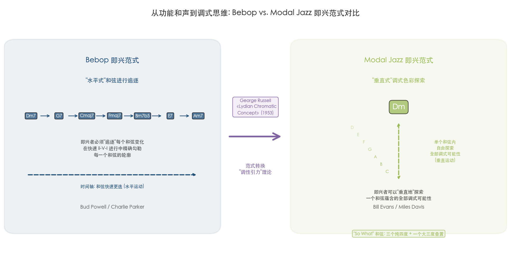

**图3：从功能和声到调式思维——Bebop vs. Modal Jazz 即兴范式对比。** 左侧展示 Bebop "水平式"和弦追逐范式中即兴者须在快速 ii-V-I 进行中精确勾勒每个和弦轮廓；右侧展示 Modal Jazz "垂直式"调式探索范式中即兴者可在单一和弦内纵向展开全部调式可能性。George Russell 1953年出版的《Lydian Chromatic Concept》构成两种范式之间的理论枢纽。

拉塞尔与戴维斯1958年的一次会面直接推动了《*Kind of Blue*》的诞生。拉塞尔回忆道："那天晚上，当迈尔斯看到他如何运用这个概念时，他说：'如果伯德（查理·帕克）还活着，这会要了他的命。'"[Myles Boothroyd, *Nota Bene*, 2010](https://ojs.lib.uwo.ca/index.php/notabene/article/download/6559/5283/12331 "引 Nisenson, The Making of Kind of Blue, p.72")

## 四、调式爵士的结晶：比尔·埃文斯与《*Kind of Blue*》

### 4.1 无根音和弦与四度叠置和声

如果拉塞尔提供了调式爵士的理论框架，比尔·埃文斯（Bill Evans，1929–1980）则是将这一理论转化为钢琴键盘上可听见的音响现实的关键人物。埃文斯创造了两种具有革命性意义的和声技法：无根音和弦排列（rootless voicings）和四度叠置和声（quartal voicings）[Wikipedia: Bill Evans](https://en.wikipedia.org/wiki/Bill_Evans "rootless voicings、quartal voicings、印象派影响")。

无根音和弦排列将传统和弦中的根音剔除，仅保留三度、七度及延伸音（九度、十一度、十三度），由此产生的和弦声响更为模糊、更加开放，明确的功能性指向随之减弱。这一技法的深远影响在于：它将"伴奏和弦"从功能性标记转化为色彩性音响，为即兴者创造了更大的旋律自由空间。四度叠置和声则以纯四度（而非传统三度）为构建单元，产生一种悬浮的、非调性的声响质感。两者共同构成了标志性的"So What 和弦"——由三个纯四度加一个大三度叠置而成——首次出现于《*Kind of Blue*》开篇曲目"So What"，后由马克·莱文（Mark Levine）在经典教材《*The Jazz Piano Book*》（1989）中正式命名[Wikipedia: Bill Evans](https://en.wikipedia.org/wiki/Bill_Evans "So What 和弦命名")。

埃文斯的和声语汇深受克劳德·德彪西（Claude Debussy）和莫里斯·拉威尔（Maurice Ravel）等法国印象派作曲家的影响，这种影响在他对色彩性和声、模糊调性中心以及声部线条流动性的追求中清晰可闻[Wikipedia: Bill Evans](https://en.wikipedia.org/wiki/Bill_Evans "印象派影响")。这一跨越古典与爵士边界的和声融合，使埃文斯的钢琴音响在当时的爵士语境中显得格外独特——既非比波普的棱角分明，也非 Cool Jazz 的刻意克制，而是一种具有室内乐质感的、精致而深沉的音色世界。

### 4.2 《*Kind of Blue*》：爵士史上最畅销的唱片

1959年8月17日，哥伦比亚唱片（Columbia Records）发行了迈尔斯·戴维斯的《*Kind of Blue*》，这张完全基于调式即兴的唱片永久改变了爵士乐的和声面貌。2019年，该专辑获得美国唱片业协会（RIAA）五白金认证——在美国出货超过500万张——使其成为有史以来最畅销的爵士唱片[Wikipedia: Kind of Blue](https://en.wikipedia.org/wiki/Kind_of_Blue "发行日期、RIAA认证")。

埃文斯在这张唱片中的角色超越了通常意义上的"乐队钢琴手"。他不仅为录音会提供了调式即兴的和声框架（据说几首曲目的和声蓝图由他与戴维斯共同构思），更在演奏中实践了调式爵士的核心原则：在静态的和声背景下，即兴者可以从整个调式音阶中自由选取音符，构建具有内在旋律逻辑的独奏线条，而无需被快速变化的和弦进行所束缚。正如戴维斯本人所述："当你以这种方式演奏、朝这个方向前进时，你可以永远走下去。你不必担心和弦变化……你可以用旋律线做更多的事情。"[Myles Boothroyd, *Nota Bene*, 2010](https://ojs.lib.uwo.ca/index.php/notabene/article/download/6559/5283/12331 "引 John Szwed, So What: The Life of Miles Davis, 2002, p.171")

### 4.3 三重奏革命：Village Vanguard 的遗产

离开戴维斯乐队后，埃文斯与贝斯手斯科特·拉法罗（Scott LaFaro）和鼓手保罗·莫蒂安（Paul Motian）组成的三重奏（1959–1961）被公认为现代爵士钢琴三重奏的里程碑。在传统爵士三重奏中，钢琴承担旋律与和声主导权，贝斯和鼓扮演节奏支撑角色。埃文斯三重奏打破了这一等级结构——拉法罗的贝斯不再局限于走步低音（walking bass），而是以旋律性的对位线条与钢琴展开平等的即兴对话；莫蒂安的鼓在保持时间感的同时，以色彩化的钹声和细腻的动态变化参与音乐的整体呼吸。

1961年6月25日，三重奏在纽约村前卫俱乐部（Village Vanguard）留下的历史性现场录音产生了两张传世之作——《*Sunday at the Village Vanguard*》和《*Waltz for Debby*》（均由 Riverside Records 发行）[Wikipedia: Bill Evans](https://en.wikipedia.org/wiki/Bill_Evans "LaFaro 三重奏、Village Vanguard")。这两张唱片记录了爵士钢琴三重奏从"伴奏-独奏"等级体制向"三方对话"民主体制转变的决定性时刻。悲剧的是，仅十天后拉法罗在车祸中去世，年仅25岁，使得这次录音成为这个传奇组合的最终遗产。

埃文斯在其整个职业生涯中获得了31次格莱美提名和7次获奖，并于1994年被追授格莱美终身成就奖[Wikipedia: Bill Evans](https://en.wikipedia.org/wiki/Bill_Evans "格莱美记录")。这些数字确认了他作为20世纪下半叶最具影响力的爵士钢琴家之一的地位。

## 五、硬波普的蓝调回归：霍勒斯·西尔弗与鲍比·蒂蒙斯

### 5.1 直接旋律与福音元素

与调式爵士的内省、探索性气质形成鲜明对照的是，同一时期的硬波普（Hard Bop）运动将爵士钢琴拉回了更具情感直接性的蓝调-福音根基。这一运动并非简单的复古，而是对比波普过度"学院化"倾向的一种回应——在保持和声复杂性的前提下，重新强调节奏的驱动力、旋律的可歌唱性以及与非裔美国教堂音乐传统的情感联结。

霍勒斯·西尔弗（Horace Silver，1928–2014）是硬波普钢琴的核心开创者之一，其风格被概括为"强调直接旋律而非复杂和声"[Wikipedia: Horace Silver](https://en.wikipedia.org/wiki/Horace_Silver "生卒年、风格定位")。西尔弗的钢琴演奏以强有力的左手驱动性节奏和右手具有歌唱性的蓝调乐句为特征，他的作曲则将福音音乐的呼应-回应（call-and-response）结构融入爵士小组编曲。代表专辑《*Song for My Father*》（Blue Note Records，1963–1964年录制）1965年登上《*Billboard*》200榜第95位——对一张爵士器乐专辑而言这是相当瞩目的商业成绩——1999年入选格莱美名人堂[Wikipedia: Horace Silver](https://en.wikipedia.org/wiki/Horace_Silver "Billboard、格莱美名人堂")。

### 5.2 Soul Jazz 的诞生

鲍比·蒂蒙斯（Bobby Timmons，1935–1974）进一步深化了福音-爵士的融合。他1958年为阿特·布莱基（Art Blakey）的爵士信使乐团（Jazz Messengers）创作的"Moanin'"（Blue Note Records）成为硬波普的标志性曲目之一：其开篇的钢琴引子（riff）直接移植了黑人教堂音乐中会众"呼应-回应"的节奏模式，将教堂中那种集体参与的身体性能量注入爵士乐的演出空间。蒂蒙斯随后创作的"This Here"和"Dat Dere"延续了同一路径，三首作品共同"帮助催生了灵魂爵士（soul jazz）风格"[Wikipedia: Bobby Timmons](https://en.wikipedia.org/wiki/Bobby_Timmons "引 The Encyclopedia of Jazz")[AllMusic](https://www.allmusic.com/artist/bobby-timmons-mn0000765435 "AllMusic 生卒年确认")。

硬波普钢琴的历史意义在于：它证明了和声创新并非爵士钢琴发展的唯一方向。通过将音乐的根系重新扎入非裔美国社区的文化土壤，西尔弗和蒂蒙斯为爵士钢琴保留了一条与听众直接情感沟通的通道——这条通道在此后的融合爵士（Jazz Fusion）和当代嘻哈-爵士跨界实践中将被反复激活。

## 六、1965年的十字路口：双重压力下的转折

### 6.1 内部解构——自由爵士的冲击

到1960年代初，自由爵士运动已从根本上挑战了比波普和调式爵士所依赖的和声-节奏框架。奥尼特·科尔曼（Ornette Coleman）1960年的《*Free Jazz*》和塞西尔·泰勒（Cecil Taylor）日益激进的"能量音乐"实践，将和弦进行、固定节拍甚至传统意义上的"音准"都置于质疑之下。对于坚守调性与曲式传统的爵士钢琴家而言，自由爵士构成了一种来自艺术内部的存在性挑战：如果和声框架本身被取消，以和声思维为核心竞争力的钢琴在爵士合奏中还能扮演什么角色？

### 6.2 外部挤压——摇滚乐与市场萎缩

与此同时，爵士乐正遭遇来自流行音乐市场的严峻压力。1964年"英国入侵"以披头士乐队为先锋席卷美国，摇滚乐迅速主导了年轻一代的音乐消费。爵士俱乐部的经营环境急剧恶化。《哈佛深红》（*Harvard Crimson*）1965年5月19日的一篇题为"爵士乐的衰落"的文章记录了当时的严峻状况："在纽约几乎没有一家像样的爵士俱乐部幸存下来。"[Harvard Crimson](https://www.thecrimson.com/article/1965/5/19/the-decline-of-jazz-pif-there/ "The Decline of Jazz, 1965")

这一双重压力对1945–1965年间建立起丰富遗产的爵士钢琴艺术构成了严峻考验。鲍威尔本人的命运某种程度上折射了这一时代的残酷：1965年5月，他在纽约市政厅（Town Hall）进行了最后一次公开演出，1966年7月去世，年仅41岁[Wikipedia: Bud Powell](https://en.wikipedia.org/wiki/Bud_Powell "最后演出与去世")。埃文斯后来表示自己"幸运地在这场深刻变革之前就获得了曝光"[Wikipedia: Bill Evans](https://en.wikipedia.org/wiki/Bill_Evans "引 Peter Pettinger, Bill Evans: How My Heart Sings, Yale, 2002, p.197")。

### 6.3 遗产与未来

然而，1945–1965年间的和声革命所奠定的基础远未被摧毁。鲍威尔确立的"右手旋律线+左手简约和弦"范式此后成为几乎所有现代爵士钢琴家的基本出发点；蒙克的不协和美学与节奏解构预示了自由爵士和前卫音乐的诸多可能性；埃文斯的调式和声语汇与三重奏民主对话模式深刻影响了此后每一代爵士钢琴家——从基思·贾瑞特（Keith Jarrett）到布拉德·梅尔道（Brad Mehldau）；拉塞尔的利迪安色彩概念至今仍被全球音乐院校教授，其"垂直"调式思维已成为当代爵士即兴的基本认知工具之一[Wikipedia: Lydian Chromatic Concept](https://en.wikipedia.org/wiki/Lydian_Chromatic_Concept_of_Tonal_Organization "当代音乐教育影响")。而硬波普的蓝调-福音传统则为爵士钢琴保留了与更广大听众进行情感沟通的可能性，这一遗产在融合运动和此后的跨流派实践中将被证明弥足珍贵。

面对自由爵士的解构冲击和摇滚乐的市场挤压，爵士钢琴家们将被迫做出选择：是拥抱更极端的实验、是寻求与流行音乐的融合、还是坚守传统并等待复兴？这些选择将在随后的二十年间催生出截然不同的艺术路径。

# 自由与解构——Free Jazz 与前卫钢琴的极限探索（1960–1980）

1960年代初，爵士乐正处于一个剧烈的裂变时刻。调式爵士（Modal Jazz）刚刚打开了和声解放的第一道闸门，一批更为激进的音乐家已迫不及待地冲向彻底推翻调性、节拍和曲式的疆域。在这场被冠以"自由爵士"（Free Jazz）之名的运动中，钢琴——这件在传统爵士乐中承担和声框架支撑功能的乐器——面临一个悖论式的命题：如果和声的参照系被取消，钢琴还能做什么？本章追踪1960年至1980年间自由爵士钢琴的极限探索，分析塞西尔·泰勒（Cecil Taylor）、萨恩·拉（Sun Ra）、保罗·布雷（Paul Bley）以及芝加哥前卫派集体即兴实验如何从根本上重新定义了钢琴在爵士乐中的角色，并考察这些实验为后续数十年爵士钢琴创新所留下的深远遗产。

下图以时间线形式呈现本章涉及的核心人物、代表唱片与关键事件节点，并以美学标签区分各自的创作路径，为后续各节的详细论述提供全景性参照。

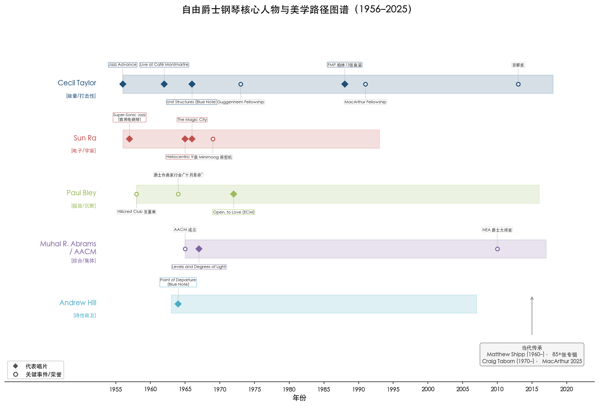

## 一、塞西尔·泰勒：八十八个调音鼓

### 从新英格兰音乐学院到"能量音乐"

塞西尔·泰勒（Cecil Taylor，1929–2018）是自由爵士钢琴无可争议的奠基人。他出生于纽约长岛一个中产阶级家庭，母亲阿尔梅达是他的第一位钢琴教师，五岁起教他弹琴，九岁前已引导他阅读叔本华。在新英格兰音乐学院（New England Conservatory）求学期间，泰勒深受巴托克（Bartók）和施托克豪森（Stockhausen）的影响，但真正塑造其音乐世界观的是学院围墙之外的黑人音乐传统。他后来在法国电视纪录片《伟大的排练》（*Les Grandes Répétitions*，1966）中这样区分两种教育："学院的，以及通常位于铁轨另一侧的区域。铁轨另一侧从来没有音乐学院——只有草和树。"[《纽约书评》纪念长文](https://www.nybooks.com/online/2018/05/16/the-world-of-cecil-taylor/ "Adam Shatz, 'The World of Cecil Taylor', 2018年5月")

1956年，泰勒在 Transition Records 发行首张专辑 *Jazz Advance*，已展现出超越后波普形式的倾向。评论家冈瑟·舒勒（Gunther Schuller）在评论中写道泰勒"让我们看到了他头脑的运作，但没有看到他的灵魂"——这一批评折射出白人评论界长期以来对黑人知识型音乐家的偏见：他们被指责忽视了据说最属于他们的"灵魂"。泰勒对此毫不退让，他坚信"我们社会中最可怕的事情是去感受"，并以全新的方式赋予感受以极端的表达形式[《纽约书评》纪念长文](https://www.nybooks.com/online/2018/05/16/the-world-of-cecil-taylor/ "Adam Shatz, 'The World of Cecil Taylor', 2018年5月")。

### 音簇技法与打击性美学

泰勒最引人瞩目的技法标志是音簇（tone clusters）——用手指、拳头甚至前臂制造出音符瀑布般的倾泻。英国乐评人瓦尔·威尔默（Val Wilmer）在1977年著作 *As Serious As Your Life* 中以"八十八个调音鼓"形容泰勒的风格，精准捕捉了他将钢琴彻底视为打击乐器的革命性美学[Wikipedia: Cecil Taylor](https://en.wikipedia.org/wiki/Cecil_Taylor "引 Val Wilmer 1977")。泰勒本人将这种强力触键追溯到非洲祖先的遗产："在白人音乐中，最受推崇的触键是轻柔的……我们在黑人音乐中将钢琴视为打击乐器：我们击打键盘，我们进入乐器内部。"[《纽约书评》纪念长文](https://www.nybooks.com/online/2018/05/16/the-world-of-cecil-taylor/ "Adam Shatz, 'The World of Cecil Taylor', 2018年5月")

AllMusic 评论家斯科特·亚诺（Scott Yanow）将泰勒描述为"高能量无调性"，称"没有任何同时代的爵士乐接近塞西尔·泰勒音乐的狂暴与强度"[Wikipedia: Cecil Taylor](https://en.wikipedia.org/wiki/Cecil_Taylor "AllMusic Scott Yanow 评价")。然而这种强度从未以牺牲精确为代价。钢琴家杰森·莫兰（Jason Moran）评价道："想到塞西尔，脑海中首先浮现的是力量——他的身体力量，像奥运运动员一样。"钢琴家克雷格·塔伯恩（Craig Taborn）则注意到泰勒在敲击音簇时会有意抬起某些手指，使一些音符短暂中断而另一些持续鸣响——"手指本能上不会那样做"[《纽约书评》纪念长文](https://www.nybooks.com/online/2018/05/16/the-world-of-cecil-taylor/ "Adam Shatz, 'The World of Cecil Taylor', 2018年5月")。

音簇并非泰勒的发明——亨利·考威尔（Henry Cowell）和施托克豪森等现代古典作曲家此前已使用过这一技法。泰勒将音簇引向了截然不同的目的：他借音簇创造动能的声浪，其中包含精密的结构模式。音乐学家埃克哈特·约斯特（Ekkehard Jost）将这种方法称为"能量音乐"（energy music），认为它构成了对传统摇摆感的一种替代方案——一种全新的产生音乐动力的方式。

### 里程碑录音：从 *Unit Structures* 到柏林独奏

泰勒的艺术成熟经历了漫长的沉默期与爆发期交替。1962年与鼓手桑尼·默里（Sunny Murray）和中音萨克斯手吉米·莱恩斯（Jimmy Lyons）在哥本哈根蒙马特咖啡馆录制的 *Live at the Café Montmartre*，被认为是他首次完全脱离标准曲式和和弦框架的突破性录音——泰勒不再演奏标准曲，默里也放弃了维持固定脉搏的功能。塔伯恩评价道："塞西尔的乐团是打破时间壁垒的那一个。"[《纽约书评》纪念长文](https://www.nybooks.com/online/2018/05/16/the-world-of-cecil-taylor/ "Adam Shatz, 'The World of Cecil Taylor', 2018年5月")

此后泰勒沉默了四年，直到1966年在 Blue Note Records 以背靠背的方式发行两张里程碑专辑：*Unit Structures*（1966年10月）和 *Conquistador!*。*Unit Structures* 标志着泰勒"结构单元"作曲理念的成熟——他在唱片内页写道："形式即可能性……演奏者前进至一个区域，一个未知的整体，通过自我分析（即兴）变得完整，对已知材料进行有意识的操纵。"在这一体系中，钢琴充当"催化剂，在所有音域向独奏者输送材料"[Wikipedia: Cecil Taylor](https://en.wikipedia.org/wiki/Cecil_Taylor "AllMusic Scott Yanow 评价")。泰勒在衬页中写下的另一句格言则揭示了其音乐的身体性本质："节奏是生命，是时间的空间，被舞蹈穿越。"

下图对泰勒的触键技法体系与"结构单元"作曲理念进行了可视化呈现，有助于理解其音乐中"精确的狂暴"背后的建构逻辑。

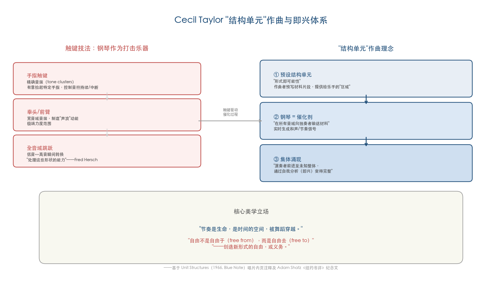

泰勒的职业生涯远非坦途。俱乐部老板抱怨观众因过于着迷于他的演奏而忘记买酒；一度甚至有人因不喜欢他的演奏而折断了他的手腕。他在欧洲获得了更广泛的认可——1988年在柏林近两个月的驻留期间，他与欧洲自由即兴音乐家的合作产生了13张唱片的 FMP 套装，其中包括他指挥17人乐团演奏的 *Alms/Tiergarten (Spree)*。泰勒最终获得了应有的荣誉：1973年获古根海姆奖学金（Guggenheim Fellowship），1991年获麦克阿瑟奖学金（MacArthur Fellowship），2013年获京都奖（Kyoto Prize，奖金50万美元）[MacArthur Foundation](https://www.macfound.org/fellows/class-of-1991/cecil-taylor "MacArthur 1991") [Wikipedia: Cecil Taylor](https://en.wikipedia.org/wiki/Cecil_Taylor "Guggenheim 1973, Kyoto Prize 2013")。

### 泰勒的遗产定位

亚当·沙茨（Adam Shatz）在《纽约书评》的长篇纪念文章中做出了精辟的论断："如果说科尔曼把波普的房屋夷为废墟，泰勒则展示了在废墟上可以建造什么。"泰勒关心的不是"从既有形式中获得自由"，而是"创造新形式的自由——或义务"。他曾说："自由的整个问题被误解了。如果一个人演奏足够长的时间——音阶、乐句、诸如此类——最终一种秩序会自行确立……这不是'自由'对'不自由'的问题，而是识别秩序的观念和表达的问题。"[《纽约书评》纪念长文](https://www.nybooks.com/online/2018/05/16/the-world-of-cecil-taylor/ "Adam Shatz, 'The World of Cecil Taylor', 2018年5月") 这一立场使泰勒与奥内特·科尔曼（Ornette Coleman）的"解放"叙事形成鲜明对照，也使他成为安东尼·布拉克斯顿（Anthony Braxton）、亨利·斯雷吉尔（Henry Threadgill）等 AACM 作曲家的直接先驱。

## 二、萨恩·拉：宇宙键盘与电子先驱

### 宇宙哲学与声音实验

如果说泰勒代表了自由爵士钢琴的建构主义路径，萨恩·拉（Sun Ra，1914–1993）则开辟了一条更为神秘、更具宇宙想象力的道路。他将卡巴拉（Kabbalah）、古埃及神秘主义、数秘学与黑人民族主义融合为一套独特的宇宙哲学体系，成为非裔未来主义（Afrofuturism）的开创性人物[Wikipedia: Sun Ra](https://en.wikipedia.org/wiki/Sun_Ra "宇宙哲学与纽约时期录音")。

在键盘乐器领域，萨恩·拉是爵士乐中最早广泛使用电子键盘的先驱。1956年录制、1957年以 *Super-Sonic Jazz* 为名在其自建厂牌 El Saturn Records 发行的专辑中，他演奏了 Wurlitzer 电钢琴，成为爵士史上首位在唱片中使用电钢琴的音乐家——这比迈尔斯·戴维斯（Miles Davis）在 *In a Silent Way*（1969）中引入电声早了十余年[Wikipedia: Sun Ra](https://en.wikipedia.org/wiki/Sun_Ra "电子键盘先驱") [Reverb](https://reverb.com/news/sun-ras-cosmic-keys "设备编年史")。

### Minimoog 原型机与声音疆域的扩展

1969年秋，萨恩·拉成为最早获得 Minimoog 合成器原型机的音乐家之一——由罗伯特·穆格（Robert Moog）本人借出。1969年11月2日录制的内容是已知最早使用 Minimoog 的商业录音之一[Bob Moog Foundation](https://moogfoundation.org/sun-ra-the-minimoog-by-historian-thom-holmes/ "Sun Ra 与 Minimoog 历史")。对萨恩·拉而言，电子乐器并非传统钢琴的替代品，而是通往"宇宙声音"的载体——与他声称自己来自土星的哲学叙事有机统一。

1960年代纽约时期是萨恩·拉最富创造力的录音阶段，关键专辑包括 *The Heliocentric Worlds of Sun Ra*（1965）和 *The Magic City*（1966）。在这些录音中，萨恩·拉的键盘演奏在传统钢琴即兴与电子音色探索之间自由切换，其旋钮即时操控的方式——在合成器上实时调整参数以塑造声音——开创了一种延续至21世纪的电子即兴传统。克雷格·塔伯恩后来坦承，自己在 *Junk Magic*（2004）中展现的电子即兴方法直接受到萨恩·拉实时旋钮操控传统的影响[DownBeat 专题](https://tedpanken.wordpress.com/2016/02/21/for-craig-taborns-birthday-a-downbeat-feature-from-2008/ "2008年 DownBeat Craig Taborn 专题")。

萨恩·拉在自由爵士运动中的角色与泰勒截然不同。泰勒追求的是高度组织化的新秩序；萨恩·拉追求的则是一种近乎仪式性的集体体验。两者共同打破了爵士钢琴必须服务于和声伴奏功能的旧范式，分别从"建构"和"解域"两个方向为后来的键盘实验者打开了空间。

## 三、保罗·布雷："减法美学"与沉默的力量

### 从科尔曼五重奏到 ECM 独奏

与泰勒的"加法"式能量倾泻和萨恩·拉的宇宙扩张形成对极的，是加拿大钢琴家保罗·布雷（Paul Bley，1932–2016）的"减法美学"——以极简音符选择和大量沉默取代密集即兴。

布雷在自由爵士运动的孕育期便占据了核心位置。1958年在洛杉矶 Hillcrest Club，他与奥内特·科尔曼、唐·切利（Don Cherry）组成五重奏，直接参与了自由爵士的早期实验[Wikipedia: Paul Bley](https://en.wikipedia.org/wiki/Paul_Bley "Hillcrest Club 五重奏")。与科尔曼开放、歌唱性的即兴方式不同，布雷逐渐走向了一条更为内省的道路。1960年代初与吉米·久弗瑞（Jimmy Giuffre）和史蒂夫·斯瓦洛（Steve Swallow）组成的三重奏，以近乎室内乐的质感展开自由即兴对话，被公认为自由爵士的经典演绎[Wikipedia: Paul Bley](https://en.wikipedia.org/wiki/Paul_Bley "Jazz Composers Guild 与 Giuffre 三重奏")。

1964年，布雷参与创建爵士作曲家行会（Jazz Composers Guild），与泰勒、萨恩·拉等人组织了"十月革命"系列音乐会——这一系列活动旨在建立音乐家自主管理演出和唱片发行的替代体系，虽然最终因内部分歧而解散，但其精神预示了后来 AACM 等组织的制度性实践。

### *Open, to Love*：极简主义的爵士诗学

布雷最具标志性的录音是1972年9月11日录制、在 ECM Records 发行的独奏专辑 *Open, to Love*[ECM Records](https://ecmrecords.com/product/open-to-love-paul-bley/ "ECM 官方页面") [Wikipedia: Open, to Love](https://en.wikipedia.org/wiki/Open,_to_Love "录制于1972年9月11日")。在这张唱片中，布雷演奏卡拉·布雷（Carla Bley）和安妮特·皮考克（Annette Peacock）的作品，以异常克制的笔触展开即兴——每一个音符都被赋予充分的呼吸空间，沉默不再是"非演奏"的间隙，而是积极的音乐元素，参与构建张力、释放期待、塑造情感弧线。

*Open, to Love* 代表了自由爵士钢琴的另一种极端可能性：不是通过增加密度和音量来突破边界，而是通过删减至极简来揭示声音的本质。这一路径直接影响了 ECM 厂牌后来培育的北欧钢琴美学——从基思·贾瑞特（Keith Jarrett）的欧洲四重奏到托德·古斯塔夫森（Tord Gustavsen）的"最小偏移的艺术"，均可追溯到布雷在此奠定的美学原点。

## 四、AACM 与芝加哥前卫派：集体即兴中的钢琴

### 穆哈尔·理查德·阿布拉姆斯与制度性创新

1965年5月，钢琴家穆哈尔·理查德·阿布拉姆斯（Muhal Richard Abrams，1930–2017）与钢琴家乔迪·克里斯蒂安（Jodie Christian）、鼓手史蒂夫·麦考尔（Steve McCall）和作曲家菲尔·科汉（Phil Cohran）在芝加哥联合创立了"创意音乐家促进协会"（Association for the Advancement of Creative Musicians，AACM），其章程致力于"培育、表演和录制严肃的原创音乐"[Wikipedia: AACM](https://en.wikipedia.org/wiki/Association_for_the_Advancement_of_Creative_Musicians "AACM 1965年成立") [NEA](https://www.arts.gov/stories/jazz-moments/muhal-richard-abrams-founding-aacm "NEA 官网确认")。1969年起，AACM 开办面向内城青少年的免费音乐教育项目，培养了包括安东尼·布拉克斯顿、亨利·斯雷吉尔在内的整整一代创新音乐家。

AACM 的出现代表了自由爵士运动从个人英雄主义向制度化集体实践的关键转型。与纽约以泰勒、科尔曼为中心的个体突破模式不同，芝加哥的实验依托于一个有组织的社群。阿布拉姆斯本人强调，AACM 的核心精神在于"鼓励并呈现每一个人的个人主义"——在集体框架中激发个体独创性[New Music USA](https://newmusicusa.org/nmbx/muhal-richard-abrams-think-all-focus-one/ "Abrams 2016年访谈")。

### 阿布拉姆斯的钢琴语言

阿布拉姆斯本人的钢琴风格难以归类——这恰恰是其本质所在。评论家约翰·利特韦勒（John Litweiler）在1984年著作 *The Freedom Principle* 中写道，阿布拉姆斯的乐句"湍流般的、断裂的、持续忙碌的，然而他的独奏听起来却是流动的、自由抒情的"[《纽约时报》](https://www.nytimes.com/2017/11/01/obituaries/muhal-richard-abrams-dead-idiosyncratic-pianist-and-composer.html "Howard Mandel, Abrams 讣告, 2017年11月")。《纽约时报》在讣告中总结道："作为钢琴家，阿布拉姆斯能够即兴地将对爵士历史风格的引用——包括拉格泰姆、大跨度钢琴（stride piano）、艾灵顿公爵的作品、摇摆乐和波普——与他自身的敏捷现代主义、深远的和声与不协和编织在一起。"[《纽约时报》](https://www.nytimes.com/2017/11/01/obituaries/muhal-richard-abrams-dead-idiosyncratic-pianist-and-composer.html "Howard Mandel, Abrams 讣告, 2017年11月")

1967年在 Delmark Records 发行的首张领衔专辑 *Levels and Degrees of Light* 是 AACM 精神的早期结晶——阿布拉姆斯在其中不仅演奏钢琴，还演奏了单簧管，体现了 AACM 成员标志性的多乐器实践[AllMusic](https://www.allmusic.com/album/levels-and-degrees-of-light-mw0000273179 "Levels and Degrees of Light")。1969年的 *Young at Heart / Wise in Time*（同为 Delmark 发行）则最鲜明地展现了阿布拉姆斯美学的双重性：一面是与打击乐手瑟曼·巴克（Thurman Barker）的高强度集体即兴，另一面则是"近乎拉赫玛尼诺夫式"的悠长钢琴独奏段落。阿布拉姆斯本人解释道，这种双重性源自对多重世界的同时尊重——"拉赫玛尼诺夫、肖邦、阿特·塔图姆、蒙克。坐下来以音乐的方式探索钢琴可以发出怎样的声音"[New Music USA](https://newmusicusa.org/nmbx/muhal-richard-abrams-think-all-focus-one/ "Abrams 2016年访谈")。

阿布拉姆斯亦是爵士钢琴家中较早探索电子音色的人物之一。在 *The Hearinga Suite*（1989年，Black Saint 发行）中，他的独奏作品"与三个我的对话"（Conversations with the Three of Me）使用了合成器与两种钢琴语气，三种"情绪"如同奏鸣曲般排列[New Music USA](https://newmusicusa.org/nmbx/muhal-richard-abrams-think-all-focus-one/ "Abrams 2016年访谈")。2010年获 NEA 爵士大师奖时，他在颁奖典礼上表演了一段无伴奏钢琴即兴，随后无缝衔接为一首由林肯中心爵士乐团演奏的乐谱作品——在最庄重的场合演示了即兴与作曲之间的流动边界。阿布拉姆斯于2017年去世，享年87岁。

### 安德鲁·希尔：泰勒垄断的"解毒剂"

在 AACM 芝加哥学派与纽约前卫派之间，钢琴家安德鲁·希尔（Andrew Hill，1931–2007）占据了一个独特的中间位置。希尔是 Blue Note 旗下最具前瞻性的钢琴家，其代表作 *Point of Departure*（1964年3月录制，1965年4月由 Blue Note 发行）以精妙的不对称结构和暗示性的和声运动，在自由与形式之间开辟了一条高度个人化的路径[AllMusic](https://www.allmusic.com/album/point-of-departure-mw0000243448 "Point of Departure")。

当代自由爵士钢琴家马修·希普（Matthew Shipp）在2020年发表的论文"黑人神秘学派钢琴家"中，将希尔定位为"消解了塞西尔·泰勒对自由爵士钢琴认知的垄断"的关键人物[Matthew Shipp 论文](https://newmusicusa.org/nmbx/black-mystery-school-pianists/ "Black Mystery School Pianists, 2020")。这一判断揭示出自由爵士钢琴从来不是一元的：希尔与泰勒代表了两种截然不同的前卫路径——泰勒通过极端能量和结构密度重建秩序，希尔则在"几乎但不完全自由"的暧昧地带中展开诗性探索。

## 五、自由爵士钢琴的遗产与当代回响

### 从泰勒到希普：谱系的延续

自由爵士钢琴的实验并未随1970年代融合浪潮的兴起而终结——它作为一条持续的创作暗流，通过一代代钢琴家的接力传承至今。钢琴家弗雷德·赫什（Fred Hersch）回忆，1970年代初首次听到泰勒的独奏作品时，他被泰勒"在极宽音程间跳跃、从低音到高音几乎瞬间转换并处理这些形状的能力"所震撼。而当赫什在泰勒去世后重新审视其作品时，他注意到"这些音乐组织得多么不可思议，多么有纪律"[《纽约书评》纪念长文](https://www.nybooks.com/online/2018/05/16/the-world-of-cecil-taylor/ "Adam Shatz, 'The World of Cecil Taylor', 2018年5月")。

马修·希普（Matthew Shipp，1960年生）是当代自由爵士钢琴最重要的实践者，录音超85张专辑。在2020年发表的"黑人神秘学派钢琴家"论文中，希普系统阐述了从蒙克经泰勒、希尔到萨恩·拉的"黑人神秘学派钢琴家"谱系——在他看来，这条谱系的核心并非技术传承，而是一种将钢琴作为"宇宙探索工具"的精神姿态[Matthew Shipp 论文](https://newmusicusa.org/nmbx/black-mystery-school-pianists/ "Black Mystery School Pianists, 2020")。希普的演奏将泰勒的密度与蒙克的角度感融为一种高度个人化的语汇，被沙茨称为"呈现一个独奏钢琴宇宙的宏大姿态"。

### 克雷格·塔伯恩：自由传统的21世纪转化

克雷格·塔伯恩（Craig Taborn，1970年生）代表了自由即兴传统在21世纪的延续与转化。2011年在 ECM 发行的独奏专辑 *Avenging Angel* 展现了一种"模块化"即兴方法——将演奏过程构想为可拆解、可重组的模块，在实时演奏中动态调整结构关系[Wikipedia: Craig Taborn](https://en.wikipedia.org/wiki/Craig_Taborn "生平与 MacArthur 2025")。2025年10月，塔伯恩获得麦克阿瑟奖学金，这一荣誉既是对其个人成就的认可，也象征着自由爵士钢琴传统在主流文化制度中获得了迟来的承认。

沙茨在《纽约书评》文章中列出的受泰勒影响的钢琴家名单，本身构成了一幅自由爵士钢琴传承的全景图：穆哈尔·理查德·阿布拉姆斯、唐·普伦（Don Pullen）、博拉·伯格曼（Borah Bergman）、玛丽莲·克里斯佩尔（Marilyn Crispell）、亚历山大·冯·施利彭巴赫（Alexander von Schlippenbach）、伊雷内·施魏泽（Irène Schweizer）、马修·希普、克雷格·塔伯恩、克里斯·戴维斯（Kris Davis）、杰森·莫兰和维杰·艾耶（Vijay Iyer）——这张名单跨越美国与欧洲，贯穿三至四个世代[《纽约书评》纪念长文](https://www.nybooks.com/online/2018/05/16/the-world-of-cecil-taylor/ "Adam Shatz, 'The World of Cecil Taylor', 2018年5月")。

## 六、"出走"与回归之间——自由与融合的辩证

1960至1980年间的自由爵士钢琴实验，在爵士乐的更大叙事中占据了一个悖论性的位置。一方面，它代表了爵士钢琴在艺术表达上最激进的"出走"——从调性出走、从节拍出走、从市场出走。泰勒长期只能以零工维生；萨恩·拉的唱片几乎全部在自建厂牌发行；AACM 不得不创造自己的演出场所。另一方面，这些实验的遗产却通过迂回的方式"回归"了爵士主流——泰勒的打击性美学影响了赫比·汉考克在 *Sextant*（1973）中的前卫实验；萨恩·拉对电子乐器的率先采用为融合运动的技术想象铺平了道路；AACM 的集体自治精神成为后来无数独立音乐团体的组织范本。

更深层地看，自由爵士钢琴提出了一个至今仍在回响的根本问题：音乐中的"自由"究竟意味着什么？泰勒的回答——"自由不是自由于（free from），而是自由去（free to）"——或许是20世纪爵士钢琴留给我们的最深刻的美学命题。当融合运动在1960年代末以"回归市场"的姿态兴起时，它面对的正是自由爵士已经重新定义了的可能性空间——一个钢琴不再仅仅是和声机器、而已被证明可以是打击乐器、可以是电子声音发生器、可以是建筑材料、可以是沉默之容器的崭新世界。

# 融合与扩展——Jazz Fusion、Funk 及跨流派合作中的钢琴变革（1968–2000）

1960年代末，爵士乐正经历一场深刻的存在危机。自由爵士的激进实验将大量听众推向门外，摇滚乐则以势不可挡的商业力量侵蚀着爵士乐的市场根基。正是在这一双重压力下，一批杰出的键盘手——其中多数来自迈尔斯·戴维斯（Miles Davis）堪称"人才孵化器"的乐队——着手探寻一条截然不同的道路：拥抱电声技术，与摇滚、放克（Funk）、拉丁音乐及世界音乐展开直接对话，从而催生了融合爵士（Jazz Fusion）这一全新范畴。这场自1968年前后延续至世纪之交的变革，不仅永久地改变了爵士键盘手的角色定位与声音调色板——从单一的声学钢琴演奏者扩展为多音色编曲者和电子音景设计师——而且深刻重塑了爵士乐与流行文化之间的关系。

本章追踪这一长达三十余年的融合进程：从戴维斯电声转向的催化时刻出发，经由赫比·汉考克（Herbie Hancock）、奇克·科瑞亚（Chick Corea）和乔·扎维努尔（Joe Zawinul）三位核心键盘大师的艺术轨迹，延伸至MIDI协议和数字合成器引发的技术革命，最终以布拉德·梅尔道（Brad Mehldau）和e.s.t.三重奏所代表的"第二波融合浪潮"作结，考察融合运动如何为21世纪爵士钢琴的多元裂变预埋了种子。

## 一、电声转向的催化时刻：迈尔斯·戴维斯与 Fender Rhodes 的登场

### *In a Silent Way* 与融合运动的起爆点

1969年2月18日，迈尔斯·戴维斯在纽约哥伦比亚广播公司（CBS）第30街录音室录制了 *In a Silent Way*，这张于同年7月30日由 Columbia Records 发行的专辑被广泛视为融合爵士运动的第一张标志性唱片。录制阵容本身即是一个预言：三位键盘手——赫比·汉考克、奇克·科瑞亚（均演奏 Fender Rhodes 电钢琴）和乔·扎维努尔（电钢琴及风琴）——以及吉他手约翰·麦克劳林（John McLaughlin）同时在场，标志着电声乐器在爵士乐核心创作中的全面介入。制作人特奥·马切罗（Teo Macero）对录音素材进行大胆的剪辑与循环拼贴，这种手法"在爵士标准看来近乎异端"，却开创了爵士录音室后期制作的先例[Wikipedia: *In a Silent Way*](https://en.wikipedia.org/wiki/In_a_Silent_Way "1969年专辑录制信息与乐手名单")。

紧随其后的 *Bitches Brew*（1970年3月发行）在 *In a Silent Way* 的电声基础上进一步推进，销量远超前者，将爵士融合推向更广阔的商业领域。摇滚乐评人莱斯特·邦斯（Lester Bangs）在 *Rolling Stone* 上称 *In a Silent Way* 为"一种超越性的新音乐，冲刷掉了类型边界"[Wikipedia: *In a Silent Way*](https://en.wikipedia.org/wiki/In_a_Silent_Way "引用 Lester Bangs 1969年评论")。这两张唱片的历史意义不仅在于其自身的音乐创新，更在于它们充当了"人才孵化器"——日后融合运动的三大核心键盘手汉考克、科瑞亚和扎维努尔，正是在戴维斯的乐队中第一次深度接触电声乐器，并由此开启了各自截然不同的融合之路。

### Fender Rhodes：融合运动的音色基石

如果说戴维斯提供了美学方向，那么 Fender Rhodes 电钢琴则提供了物质基础。这件由哈罗德·罗兹（Harold Rhodes）发明的乐器在1965年 CBS 收购 Fender 后开始全尺寸量产，1970年推出的73键 Stage Piano 轻便版本（约130磅）成为巡演键盘手的核心装备。Rhodes 的独特音色——温暖的泛音、随力度变化的"钟声感"（bell-like overtone）、通过颤音效果器（tremolo）产生的律动感——与传统声学钢琴形成鲜明的声学差异。至1976年，Rhodes 公司广告宣称 *Billboard* 排名前100张使用电钢琴的专辑中82%采用了 Rhodes[Wikipedia: Rhodes piano](https://en.wikipedia.org/wiki/Rhodes_piano "Rhodes历史与市场份额数据")。

汉考克于1968年在戴维斯录音棚首次接触 Rhodes，旋即成为忠实拥趸——他指出电声放大使键盘手在乐队中的声音远比声学钢琴清晰，从根本上改变了钢琴在合奏中的功能定位。自 *In a Silent Way* 起，Rhodes 成为戴维斯录音中最主要的键盘乐器[Wikipedia: Rhodes piano](https://en.wikipedia.org/wiki/Rhodes_piano "Hancock使用Rhodes的记录")。然而，Rhodes 的统治并非永恒：1980年代 Yamaha DX7 的"E PIANO 1"预设以数字方式模拟了 Rhodes 音色，促使部分乐手放弃实体 Rhodes 转用 DX7，标志着声学—电声—数字键盘之间代际更替的开端。

## 二、赫比·汉考克的多重身份：从放克革命到电子先驱

### *Head Hunters*：第一张白金爵士唱片的诞生

赫比·汉考克（Herbie Hancock，1940年生）的艺术轨迹堪称融合运动中最具范式意义的案例。1973年10月26日，汉考克在 Columbia Records 发行了第十二张录音室专辑 *Head Hunters*，这张专辑从根本上重新定义了爵士钢琴家的身份边界。

创作灵感源于一个深刻的自我反思时刻。汉考克在1996年重制版内页注释中回忆，是对斯莱·斯通（Sly Stone）音乐的冥想触发了转变："我开始对自己说，'你在做什么？'我知道我必须认真对待这个想法。"[Herbie Hancock 官网: *Head Hunters*](https://www.herbiehancock.com/music/discography/album/head-hunters/ "Hancock自述与发行信息")这一"想法"的结果是彻底的乐器革命：汉考克以 Hohner Clavinet D6 替代吉他手的角色——"我听说了 Clavinet，它的声音像吉他和大键琴的混合体。我想如果我用节奏吉他的方式演奏 Clavinet，就不需要吉他手了"；标志性曲目"Chameleon"的贝斯线由汉考克在 ARP Odyssey 合成器上亲手演奏而非使用传统贝斯；ARP Soloist 和 Minimoog 则提供了旋律线和音色纹理[Herbie Hancock 官网: *Head Hunters*](https://www.herbiehancock.com/music/discography/album/head-hunters/ "乐器编制详解")。

商业表现方面，*Head Hunters* 在 *Billboard* Pop 榜最高达第13位（停留47周）、R&B 榜第2位（46周）、Jazz 榜第1位，获 RIAA 白金认证，成为爵士乐史上第一张达到白金销量的唱片，后被美国国会图书馆列入国家录音登记册[Wikipedia: *Head Hunters*](https://en.wikipedia.org/wiki/Head_Hunters "榜单数据、RIAA认证与国会图书馆收录") [Herbie Hancock 官网: *Head Hunters*](https://www.herbiehancock.com/music/discography/album/head-hunters/ "RIAA白金认证确认")。就创作手法而言，*Head Hunters* 的核心创新在于将 Clavinet 确立为放克-融合的标志性音色，以合成器取代传统乐器声部，使键盘手从单一演奏者转化为一人乐队式的音色编曲者。

### V.S.O.P.：电声狂潮中的原声回归

汉考克的艺术远见在于他从未将融合视为单行道。1976年6月29日，他在纽约纽波特爵士音乐节（Newport Jazz Festival）以一场标题为"赫比·汉考克回顾"的特别音乐会组建了 V.S.O.P. 五重奏——汉考克（声学钢琴）、弗雷迪·哈伯德（Freddie Hubbard，小号）、韦恩·肖特（Wayne Shorter，萨克斯）、罗恩·卡特（Ron Carter，贝斯）和托尼·威廉姆斯（Tony Williams，鼓）。这实质上是戴维斯"第二伟大五重奏"的重组（以哈伯德替代处于退隐期的戴维斯）。原计划的"一次性特别演出"（Very Special Onetime Performance——V.S.O.P. 之名即由此而来）发展为持续多年的巡演和录音项目，1977年4月发行同名双张现场专辑[Wikipedia: *V.S.O.P.*](https://en.wikipedia.org/wiki/V.S.O.P._(album) "1977年专辑信息")。

V.S.O.P. 的深层意义在于它证明了融合探索与声学传统并非零和博弈——同一位音乐家可以在不同项目中同时推进两条路线，而这两条路线之间的张力恰恰构成了艺术丰富性的来源。这一"双轨模式"在日后的爵士键盘实践中反复出现，成为融合时代钢琴家的典型生涯策略。

### *Future Shock* 与嘻哈的历史性握手

1983年8月，汉考克发行的 *Future Shock*（Columbia Records）标志着他的第三次身份转换——从放克-融合先驱到电子音乐实验者。该专辑由 Bill Laswell 和 Michael Beinhorn（Material 乐队核心成员）联合制作，使用了当时最前沿的数字与模拟合成器阵列：Fairlight CMI（1979年问世的首款数字采样合成器）、Memorymoog、Rhodes Chroma（1982年推出，MIDI 发明前即可连接个人电脑的罕见复音模拟合成器）、Yamaha CE-20 和 GS-1、以及 alphaSyntauri（1980年问世的首款基于家用电脑的电子乐器）[Herbie Hancock 官网: *Future Shock*](https://www.herbiehancock.com/music/discography/album/future-shock/ "完整设备列表与技术说明")。

*Future Shock* 的革命性不仅在于技术，更在于文化桥梁的搭建。单曲"Rockit"融入 Grand Mixer D.ST 的唱盘搓碟（turntablism），将 DJ 文化和嘻哈节拍引入全球主流视野。这首器乐曲获1984年格莱美最佳 R&B 器乐演奏奖，其音乐录影带在首届 MTV 音乐录影带大奖上斩获五项大奖，汉考克也成为最早出现在 MTV 画面中的非裔美国音乐家之一。专辑销量超过150万张，获 RIAA 白金认证[Herbie Hancock 官网: *Future Shock*](https://www.herbiehancock.com/music/discography/album/future-shock/ "MTV奖项、销量及格莱美")。

从 *Head Hunters* 到 V.S.O.P. 再到 *Future Shock*，汉考克在十年间完成了三次风格跳跃——放克合成器编曲、后波普声学回归、嘻哈-电子实验——每一次都伴随着键盘技术的迭代与角色的重新定义。截至2025年，汉考克共获14座格莱美奖（34次提名），其中2008年凭 *River: The Joni Letters* 获年度专辑奖——这是44年来首位获此殊荣的爵士音乐家——2016年获格莱美终身成就奖[格莱美官网: Herbie Hancock](https://grammy.com/artists/herbie-hancock/9477 "完整获奖记录")。他的职业生涯本身即是融合运动核心命题的最佳注脚：爵士键盘手不再需要在"纯粹"与"跨界"之间做出非此即彼的选择。

## 三、奇克·科瑞亚的折衷主义光谱

### Return to Forever：从拉丁融合到摇滚驱动

奇克·科瑞亚（Chick Corea，1941–2021）的融合路径与汉考克呈现出互补的光谱。汉考克的核心冲动指向放克节奏与电子音色的探索，科瑞亚则始终在拉丁音乐、摇滚能量与古典室内乐之间寻求折衷。

1972年，科瑞亚创立 Return to Forever，初始阵容以 Fender Rhodes 搭配弗洛拉·普里姆（Flora Purim）人声与艾尔托·莫雷拉（Airto Moreira）巴西打击乐，在 ECM 录制了同名处女作。*Light as a Feather*（1973，Polydor）包含名曲"Spain"——这首以罗德里戈《阿兰胡埃斯协奏曲》引子开场的作品日后成为爵士标准曲，其拉丁-融合美学为电钢琴赋予了全然不同于汉考克放克路线的声音人格。然而自1973年起，随着鼓手莱尼·怀特（Lenny White）和吉他手比尔·康纳斯（Bill Connors，后由阿尔·迪·梅奥拉 Al Di Meola 替代）的加入，乐队急剧转向摇滚与放克导向。*Romantic Warrior*（1976，Columbia）获 RIAA 金唱片认证，*No Mystery*（1975）获格莱美最佳爵士器乐团体演奏奖[Wikipedia: Return to Forever](https://en.wikipedia.org/wiki/Return_to_Forever "唱片列表与RIAA认证") [格莱美官网: Chick Corea](https://grammy.com/artists/chick-corea/9341 "首次获奖记录")。

### Elektric Band 与 MIDI 时代的尖端实验

1986年，科瑞亚在 GRP Records 发行 *The Chick Corea Elektric Band*，将 MIDI 时代最尖端的数字键盘技术引入爵士-融合领域。设备清单本身即构成一份数字音乐技术的编年档案：Yamaha TX816/DX7 FM 合成器、Linn 9000 鼓机、Fairlight CMI 与 Synclavier 采样器[Wikipedia: Chick Corea Elektric Band](https://en.wikipedia.org/wiki/The_Chick_Corea_Elektric_Band_(album) "设备清单")。随后的十张 GRP 专辑（七张 Elektric Band、两张 Akoustic Band、一张独奏 *Expressions*）见证了科瑞亚在数字合成器编程与声学钢琴回归之间的持续摆动。Akoustic Band 同名专辑（1989年，John Patitucci 贝斯、Dave Weckl 鼓）获1990年格莱美最佳爵士器乐团体演奏奖，此后科瑞亚"其大部分录音以原声钢琴为主"[Wikipedia: Chick Corea](https://en.wikipedia.org/wiki/Chick_Corea "Elektric Band与Akoustic Band阶段")。

### 与加里·伯顿的古典化二重奏

科瑞亚最持久的合作关系之一，是与颤音琴演奏家加里·伯顿（Gary Burton）自1972年 ECM 专辑 *Crystal Silence* 起延续数十年的二重奏。这一原声钢琴与颤音琴的室内乐化对话开创了爵士二重奏的新范式——两件键盘族乐器以对位而非和声伴奏的方式展开即兴，音乐质感兼具爵士的自发性与当代古典的精密感。两人在1970–1980年代的合作获得多座格莱美奖（1980年 *Duet* 获奖、1982年 *In Concert, Zürich* 获奖），2009年 *The New Crystal Silence*（含与悉尼交响乐团的合作）再度获奖[Wikipedia: Chick Corea](https://en.wikipedia.org/wiki/Chick_Corea "Gary Burton合作历程与格莱美获奖列表")。

科瑞亚于2021年2月9日因罕见癌症在佛罗里达州坦帕家中辞世，享年79岁。截至2026年2月第68届格莱美（含遗作获奖），他共获得29座格莱美奖（79次提名），是格莱美历史上获奖最多的爵士音乐家[格莱美官网: Chick Corea](https://grammy.com/artists/chick-corea/9341 "截至第67届的记录") [Wikipedia: Chick Corea](https://en.wikipedia.org/wiki/Chick_Corea "第68届更新后29次获奖")。他的作品"Spain""500 Miles High""La Fiesta""Armando's Rhumba"和"Windows"已成为爵士标准曲。从 Return to Forever 的拉丁-摇滚融合到 Elektric Band 的 MIDI 编程，再到与伯顿的室内乐化二重奏，科瑞亚的折衷主义光谱充分展示了融合时代爵士键盘手所能抵达的风格广度。

## 四、乔·扎维努尔与 Weather Report：合成器音景与"世界融合"先驱

### 从维也纳到宇宙音景

乔·扎维努尔（Joe Zawinul，1932–2007）是融合运动中最独特的声音建筑师。这位出生于维也纳、经历过二战炮火的奥地利键盘手，1959年抵达美国后先后在迪娜·华盛顿（Dinah Washington）和坎农鲍尔·阿德利（Cannonball Adderley）乐队磨练技艺，随后参与了戴维斯 *In a Silent Way* 和 *Bitches Brew* 的录制——其中 *In a Silent Way* 的标题曲正是扎维努尔的原创作品[Wikipedia: *In a Silent Way*](https://en.wikipedia.org/wiki/In_a_Silent_Way "Zawinul作曲")。

1970年，扎维努尔与萨克斯手韦恩·肖特（Wayne Shorter）共同创立 Weather Report，这支活跃至1986年的乐队共发行14张录音室专辑（Columbia/ARC），成为融合爵士最具影响力的团体之一。扎维努尔的核心理念并非以合成器模仿已知乐器，而是创造前所未有的声音世界。他在1997年接受采访时宣称："今天被称为世界音乐的东西——是我开创的！"这种自信并非全无根据：Weather Report 确实早在"世界音乐"这一术语进入通行使用之前约十年，便已系统性地将非洲、拉丁和中东节奏结构融入合成器编曲[Innerviews: Joe Zawinul](https://www.innerviews.org/inner/zawinul-1 "Zawinul 1997年访谈")。

扎维努尔同时提出了一个深具洞察力的乐器哲学命题："一架钢琴绝不比一台合成器更好，但如果合成器被像钢琴一样弹奏，它就变成了一件很糟糕的乐器。你不能像拉小提琴那样吹小号……问题在于演奏者，而非乐器。"[Innerviews: Joe Zawinul](https://www.innerviews.org/inner/zawinul-1 "Zawinul论乐器与演奏者的关系")这一观点为融合时代合成器在爵士乐中的合法性提供了最有力的辩护。

### *Heavy Weather*：融合爵士的商业巅峰

Weather Report 的第七张专辑 *Heavy Weather*（1977年3月，Columbia 发行）代表了融合爵士商业成功的顶点。阵容包括杰科·帕斯托里厄斯（Jaco Pastorius，无品贝斯）、韦恩·肖特（萨克斯）、亚历克斯·阿库纳（Alex Acuña，鼓）和马诺洛·巴德雷纳（Manolo Badrena，打击乐）。扎维努尔在该专辑中构建了一个多层合成器音景：ARP 2600 用于除"Rumba Mamá"外的全部曲目，Oberheim 复音合成器、Rhodes 电钢琴和 Yamaha 三角钢琴交织出密度极高的声部编织[Wikipedia: *Heavy Weather*](https://en.wikipedia.org/wiki/Heavy_Weather_(album) "完整乐手与乐器列表")。

至1991年，*Heavy Weather* 在美国售出超100万张，是 Weather Report 最成功的商业唱片，也是 Columbia 爵士目录中最畅销的专辑之一。开场曲"Birdland"（扎维努尔作曲）成为一首罕见的器乐流行热曲——对一首没有人声的纯器乐作品而言，获得独立于专辑的商业成功和爵士标准曲地位极为罕见。*DownBeat* 给予五星评价，读者票选其为年度爵士专辑；2011年2月，*Heavy Weather* 入选格莱美名人堂[Wikipedia: *Heavy Weather*](https://en.wikipedia.org/wiki/Heavy_Weather_(album) "销量、DownBeat评价与格莱美名人堂")。

扎维努尔的合成器编曲哲学对爵士键盘美学产生了深远的结构性影响。他并非把合成器当作独奏乐器（如同许多摇滚键盘手的做法），而是将其视为管弦乐队般的编曲工具——通过叠加不同合成器声部、使用声码器（vocoder）和预录声音样本，构建出一个自成一体的声音宇宙。在这一体系中，"键盘手"的概念被扩展为"声音设计师"和"音景建筑师"，而这正是融合运动留给后来者的核心遗产之一。

## 五、技术三角：MIDI协议、Yamaha DX7 与爵士键盘的数字化转型

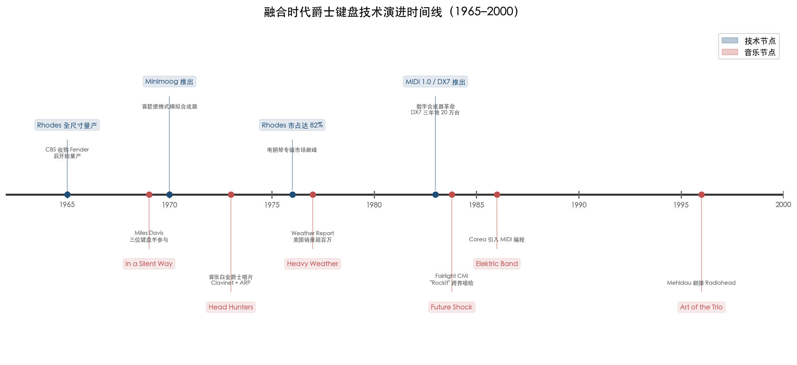

**图 3-1　融合时代爵士键盘技术演进时间线（1965–2000）。** 蓝色节点标注关键技术里程碑（Rhodes量产、Minimoog推出、MIDI/DX7问世），红色节点对应同期代表性音乐事件，直观呈现技术迭代与音乐创新的共振关系。

### MIDI 1.0：互联互通的标准化革命

如果说汉考克、科瑞亚和扎维努尔是融合运动的艺术引擎，那么1983年前后发生的技术革命则提供了不可或缺的基础设施。MIDI（Musical Instrument Digital Interface，乐器数字接口）的概念最早由 Sequential Circuits 创始人戴夫·史密斯（Dave Smith）于1981年美国音频工程学会（AES）大会提出，随后由 Sequential Circuits、罗兰（Roland）、Yamaha、Korg、Kawai 五家企业联合开发。1983年1月 NAMM 展会上，Sequential 的 Prophet-600 与 Roland 的 Jupiter-6 首次成功实现 MIDI 互联；MIDI 1.0 正式规范于1983年8月发布[MIDI 协会官方历史](https://midi.org/the-history-of-midi "MIDI协会官方历史") [Wikipedia: MIDI](https://en.wikipedia.org/wiki/MIDI "发展史")。

MIDI 规范的16个通道使键盘手能够从单一控制器同时操控多台合成器和音源模块，从根本上改变了爵士键盘手的现场表演和录音流程。在 MIDI 之前，每台合成器是一座孤岛；MIDI 之后，键盘手拥有了一个可以无限扩展的统一音色调色板。罗兰的池上辉明（Ikutaro Kakehashi）与史密斯因这一贡献于2013年共同获得格莱美技术奖[Wikipedia: MIDI](https://en.wikipedia.org/wiki/MIDI "格莱美技术奖")。

### Yamaha DX7：数字合成器的商业爆发

MIDI 的诞生几乎与另一项技术革命同步发生。Yamaha DX7 于1983年推出，是首款取得商业成功的数字合成器，基于约翰·乔宁（John Chowning）在斯坦福大学开发的 FM 合成技术（Yamaha 于1973年获得许可，1975年取得独家授权）。这台售价仅1,995美元、具备16复音61键力度感应键盘和 MIDI 接口的合成器彻底改变了键盘乐器市场的格局：Yamaha 原计划销售2万台以上，但一年内订单超过15万台，三年内售出超过20万台——而此前 Moog 在11年间仅售出约1.2万台 Minimoog[Wikipedia: Yamaha DX7](https://en.wikipedia.org/wiki/Yamaha_DX7 "销量数据与FM合成技术来源")。

DX7 的影响力在其"E PIANO 1"预设音色上表现得尤为极端。1986年，这一模拟 Rhodes 电钢琴音色的预设出现在美国 *Billboard* Hot 100 冠军单曲的40%、R&B 冠军单曲的60%中[Wikipedia: Yamaha DX7](https://en.wikipedia.org/wiki/Yamaha_DX7 "E PIANO 1预设影响")。对爵士键盘手而言，DX7 既是解放也是挑战：它提供了前所未有的数字音色选择，但其"几乎无法穿透"的菜单式编程界面使大多数用户仅使用预设音色，在某种程度上标准化了一代键盘手的音色选择，消弭了 Rhodes 时代个体化调音的微妙差异。Fender Rhodes——至1976年还占据电钢琴专辑市场82%份额——在1980年代被 DX7 的数字模拟音色逐步取代[Wikipedia: Rhodes piano](https://en.wikipedia.org/wiki/Rhodes_piano "Rhodes市场份额与DX7竞争")。

### 技术三角对爵士键盘创作流程的结构性重塑

MIDI + 数字合成器 + 采样器构成的"技术三角"在1983年前后彻底重塑了爵士键盘手的角色定位。汉考克的 *Future Shock*（1983年）堪称这一技术转型的典型案例——Fairlight CMI 采样合成器、Rhodes Chroma、Oberheim DMX 鼓机和序列器、以及多款 Yamaha 数字合成器，使汉考克从"钢琴演奏者"转变为"多音色编曲者和电子音景设计师"[Herbie Hancock 官网: *Future Shock*](https://www.herbiehancock.com/music/discography/album/future-shock/ "完整合成器列表")。科瑞亚的 Elektric Band（1986年起）则将 MIDI 编程的合成器阵列推向爵士-融合的高度复杂编排。

然而，技术革新并非单向的解放叙事。数字化在扩大音色调色板的同时，也引发了关于"即兴之真实性"的持续争论：当序列器和预编程段落介入演出，即兴演奏的边界究竟在哪里？这一问题在20世纪末尚属潜流，但在21世纪 AI 技术兴起后将以更尖锐的形式重新浮现。

## 六、融合第二波浪潮：跨越世纪的桥梁

### 布拉德·梅尔道与曲目疆界的重新定义

如果第一波融合浪潮（约1968–1985）的核心特征是拥抱电声技术和放克/摇滚节奏，那么第二波浪潮（约1990年代中期至2000年代初）则以更隐微的方式展开——不一定通过电声乐器，而是通过曲目选择和美学姿态来模糊爵士乐与当代摇滚/电子音乐之间的边界。

布拉德·梅尔道（Brad Mehldau，1970年生）是这一浪潮最具代表性的声音。1996至2001年间，梅尔道在 Warner Bros. 厂牌下与贝斯手拉里·格瑞纳迪尔（Larry Grenadier）和鼓手豪尔赫·罗西（Jorge Rossy）发行了五卷 *The Art of the Trio* 系列专辑，其制作人马特·皮尔森（Matt Pierson）"有预见性地意识到这是一个会长期合作的乐队"[Brad Mehldau 官网: *The Art of the Trio*](https://www.bradmehldaumusic.com/the-art-of-the-trio "系列介绍与Matt Pierson引言")。

梅尔道的核心创新在于将 Radiohead（"Exit Music (For a Film)"首次收录于1998年发行的 *Art of the Trio Vol. 3: Songs*，后续专辑中又收入"Paranoid Android""Everything in Its Right Place""Knives Out"）、Massive Attack（"Teardrop"）、Soundgarden（"Black Hole Sun"）、尼克·德雷克（Nick Drake）的"River Man"等当代另类摇滚/电子音乐曲目纳入爵士钢琴三重奏的即兴体系[Wikipedia: Brad Mehldau](https://en.wikipedia.org/wiki/Brad_Mehldau "唱片列表") [Wikipedia: *Songs: The Art of the Trio Volume Three*](https://en.wikipedia.org/wiki/Songs:_The_Art_of_the_Trio_Volume_Three "曲目单确认")。这一做法看似简单——不过是以爵士即兴的方式演奏摇滚曲目——但其深层意义在于它挑战了爵士乐长期以来关于"什么构成值得即兴的素材"的隐性等级制度。音乐理论学者勒内·鲁什（René Rusch）在 *Music Theory Online*（2013年）的学术分析中，就梅尔道翻弹 Radiohead"Paranoid Android"一案探讨了"爵士即兴在互文本转化中的角色"这一理论问题[*Music Theory Online*](https://mtosmt.org/issues/mto.13.19.4/mto.13.19.4.rusch.html "Rusch学术论文")。

2002年，梅尔道发行 *Largo*（Nonesuch），加入电子效果与预制钢琴，标志着他从纯粹的声学三重奏美学向更广阔的声音实验领域扩展。2020年，*Finding Gabriel* 获格莱美最佳爵士器乐专辑[Wikipedia: Brad Mehldau](https://en.wikipedia.org/wiki/Brad_Mehldau "格莱美记录")。梅尔道的意义在于他证明了一种"内化的融合"：不必以电声乐器的外在标志宣示跨界，而可以通过内在的音乐思维——对旋律素材的选择、对和声色彩的处理、对结构的重新想象——实现爵士与其他音乐世界的深层对话。

### e.s.t.：后摇滚美学与欧洲爵士的前沿

如果梅尔道代表了美国爵士钢琴三重奏的跨界路径，那么瑞典钢琴家埃斯比约恩·斯文松（Esbjörn Svensson，1964–2008）创立的 e.s.t.（Esbjörn Svensson Trio）则从欧洲语境出发，走出了一条更为激进的融合之路。这支由斯文松与贝斯手丹·贝格隆德（Dan Berglund）和鼓手马格努斯·奥斯特伦（Magnus Öström）组成的三重奏（活跃于1993–2008年，ACT Music），将电子效果器处理、后摇滚美学和录音室声音雕塑引入原声爵士三重奏框架。

斯文松在2006年接受 *JazzTimes* 采访时清晰地表达了乐队的美学立场。当被问及是否更接近 Radiohead 而非比尔·埃文斯时，他回答："为什么要比较？为什么不能同时是比尔·埃文斯和 Radiohead？——他们都代表非常好的音乐。"乐队"追随音乐的引领"，拒绝被"爵士规则"所局限，现场演出不使用固定曲目单以保持最大的自发性。在录音方法上，e.s.t. 体现出对声音精细雕琢的高度重视——"录音通常持续连续两周，然后再花一个月听粗混"[*JazzTimes*: Taking Five with E.S.T.](https://jazztimes.com/features/interviews/the-esbjorn-svensson-trio-taking-five-with-e-s-t/ "Svensson 2006年访谈全文")。贝斯手贝格隆德列举的个人最爱唱片包括 Black Sabbath 和 Radiohead 的 *OK Computer*，进一步印证了这支三重奏的跨流派基因。

代表专辑 *Strange Place for Snow*（2002）和 *Viaticum*（2005）将电子效果——延迟、循环、音色失真——无缝嵌入原声钢琴三重奏的有机即兴中，创造出一种既具有爵士对话性又拥有后摇滚声场宽度的独特美学。ACT Music 评价 e.s.t. 为"现代音乐史上最重要、最具影响力的爵士组合之一"[ACT Music: e.s.t.](https://www.actmusic.com/en/artists-a-z/esbjoern-svensson-trio-e.s.t./ "ACT官方评价")。

2008年6月14日，斯文松在斯德哥尔摩 Ingarö 岛附近的一次潜水事故中不幸去世，年仅44岁[*DownBeat*](https://downbeat.com/news/detail/pianist-esbjoern-svensson-dies-in-diving-accident "DownBeat讣告")。乐队遗作 *Leucocyte*（2008）于其去世后发行。斯文松的早逝是爵士钢琴界的重大损失，但 e.s.t. 留下的遗产——原声乐器与电子处理的有机融合、爵士即兴与后摇滚音景美学的汇流——深刻影响了21世纪欧洲爵士钢琴的发展方向，从挪威钢琴家托德·古斯塔夫森（Tord Gustavsen）到芬兰钢琴家伊洛·兰塔拉（Iiro Rantala），均可在不同程度上追溯至 e.s.t. 所开辟的道路。

## 七、从融合到裂变：通向新世纪的桥梁

回顾1968年至2000年这三十余年的融合进程，汉考克、科瑞亚与扎维努尔三位核心键盘大师各自开拓了迥异而互补的艺术路径。图 3-2 以五维雷达图直观呈现三者在放克驱动、拉丁/世界音乐、合成器实验、声学回归和跨界合作等维度上的风格差异。

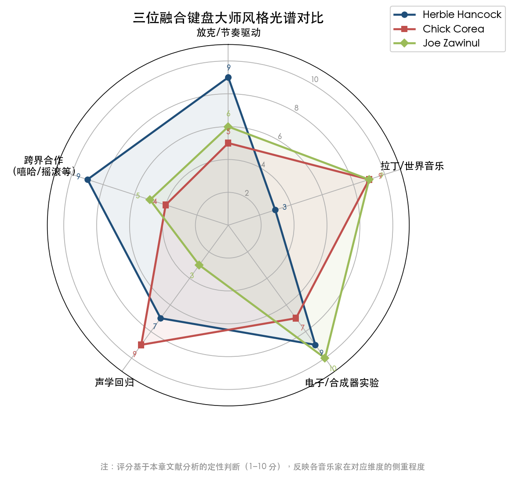

**图 3-2　三位融合键盘大师风格光谱对比。** 五维评分基于本章文献的定性分析（1–10分）：汉考克在放克驱动和跨界合作维度最为突出，科瑞亚在拉丁/世界音乐和声学回归方面领先，扎维努尔则在电子/合成器实验维度达到满分。

在此基础上，融合运动对爵士钢琴的变革可以从四个维度加以总结。

第一，**乐器角色的根本性扩展**。键盘手从"声学钢琴独奏者"扩展为跨越电钢琴、Clavinet、模拟合成器、数字合成器、采样器的"多音色编曲者"。汉考克在 *Head Hunters* 中一人承担所有合成器声部的做法，预示了日后 DAW 时代"一人乐队"式创作的范式。

第二，**声音调色板的不可逆膨胀**。从 Rhodes 的温暖泛音到 ARP 2600 的电子脉冲，从 DX7 的 FM 合成到 Fairlight CMI 的数字采样，融合时代的每一次技术迭代都永久地增加了爵士键盘手可用的声音资源。扎维努尔所倡导的"声音设计师"理念——每种音色应当服务于叙事功能而非仅仅炫技——至今仍是爵士键盘美学的核心原则之一。

第三，**曲目与风格的疆界消解**。从科瑞亚的拉丁-摇滚融合到梅尔道翻弹 Radiohead，从 e.s.t. 的后摇滚音景到汉考克与嘻哈的握手，融合运动系统性地拆除了爵士乐与其他音乐类型之间的壁垒。到2000年前后，"什么是爵士乐"这个问题已不再有确定的答案——而这正是融合运动最深远的遗产。

第四，**"双轨模式"的确立**。汉考克的 V.S.O.P. 回归、科瑞亚从 Elektric Band 到 Akoustic Band 的切换、梅尔道从声学三重奏到 *Largo* 电子实验的跨越——这些实践共同确立了一种新的职业范式：融合时代的爵士键盘手不必固守单一路线，而可以在电声实验与声学传统之间自由穿梭，两条路线相互激发、互为养分。

当世纪之交来临时，融合运动所释放的能量已远远超出了"爵士+摇滚"的最初定义。它培育了一种根本性的开放态度——对新音色、新技术、新曲目来源和新文化对话的开放——而这种态度将在21世纪的当代爵士钢琴实践中以更加多元和不可预测的方式继续展开。

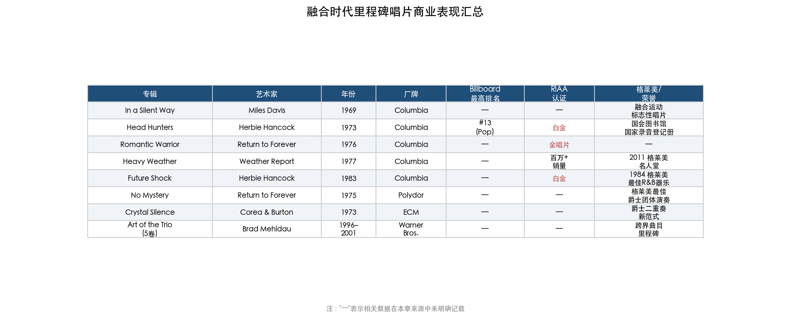

**图 3-3　融合时代里程碑唱片商业表现汇总。** 表中汇集本章涉及的8张核心唱片的发行信息、*Billboard* 排名、RIAA认证级别及所获重要荣誉，"—"表示相关数据在现有来源中未见明确记载。

# 第4章 当代爵士钢琴的多元创作语汇（2000–2026）

第三章所描述的融合浪潮在世纪末留下了一片宽广的河口三角洲：布拉德·梅尔道（Brad Mehldau）将 Radiohead 纳入爵士即兴曲目库，e.s.t. 以后摇滚美学改写了原声三重奏的可能性边界。进入21世纪，爵士钢琴家面对的已不再是"要不要融合"的问题，而是"如何在后流派（post-genre）时代建立个人创作语汇"这一根本性挑战。本章聚焦2000年以来最具代表性的当代爵士钢琴实践，考察四条相互交织的创新路径：罗伯特·格拉斯珀（Robert Glasper）对嘻哈与爵士和声逻辑的深层嫁接，维杰·艾耶（Vijay Iyer）以具身认知理论和南亚节奏体系驱动的学术-实践一体化探索，蒂格兰·哈马斯扬（Tigran Hamasyan）将亚美尼亚民间音阶钢琴化的跨文化实验，以及杰森·莫兰（Jason Moran）将爵士钢琴推入多媒体装置艺术领域的激进跨界。在此基础上，本章还将勾勒一幅新生代群像——从印尼巴厘岛的乔伊·亚历山大（Joey Alexander）到古巴裔的法比安·阿尔马赞（Fabian Almazan），一批出生于1980年代中后期至2000年代初的年轻钢琴家正以更加多元的文化身份和技术手段重新定义爵士钢琴的边界。

## 4.1 "后流派"时代的到来：从跨界融合到流派边界消解

在考察具体钢琴家的实践之前，有必要理解21世纪爵士钢琴创作语境所发生的结构性变化。宾夕法尼亚大学音乐学教授古斯利·P·拉姆齐（Guthrie P. Ramsey, Jr.）在美国艺术与科学院季刊《代达罗斯》（*Dædalus*）2013年秋季刊发表的学术论文中提出了一个关键概念——"后流派时刻"（post-genre moment）。拉姆齐以格拉斯珀的《*Black Radio*》为分析对象，指出其"玩弄了围绕声音语言建立的社会契约，使各领域的疆界感觉无缝而自然"，并在论文结论中判断"我们可能正在见证一个'后流派'时刻"[美国艺术与科学院](https://www.amacad.org/publication/daedalus/power-suggestion-pleasure-groove-robert-glaspers-black-radio "Dædalus, Fall 2013 学术论文")。

这一学术判断在行业层面获得了制度性印证。美国唱片学院于2023年6月宣布，自第66届格莱美（2024年）起新增"最佳另类爵士专辑"（Best Alternative Jazz Album）类别，首届获奖者为梅谢尔·恩德格奥切洛（Meshell Ndegeocello）[Recording Academy](https://www.recordingacademy.com/press-releases/new-categories-announced-66th-annual-grammy-awards-2024-grammys "新增类别公告")。到2026年第68届格莱美，这一类别已成为跨界爵士作品的主要竞技场——格拉斯珀的《*Keys to the City Volume One*》与梅尔道的《*Ride into the Sun*》同台竞逐[KNKX](https://www.knkx.org/jazz/2025-12-17/2026-grammy-nominees-in-jazz-announced "2026格莱美爵士类提名完整名单")。流派边界的消解并非某一位钢琴家的个人选择，而是一个时代的结构性特征：当 R&B、嘻哈、电子和爵士共享同一个流媒体播放列表时，创作者的身份认同已从"我属于哪个流派"转向"我的个人声音是什么"。

下图呈现了2000–2026年间当代爵士钢琴领域的关键事件，涵盖重要唱片发行、奖项荣誉与机构变革三大类别，从中可以直观把握这一时期创新实践的密度与节奏。

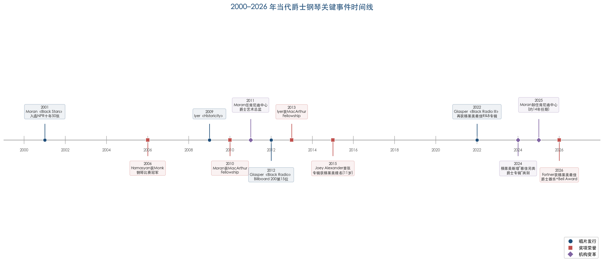

## 4.2 罗伯特·格拉斯珀：嘻哈节奏框架中的爵士和声思维

罗伯特·格拉斯珀（1978年生，休斯顿）是"后流派"转向最具标志性的推动者。2012年2月28日，他在 Blue Note Records 发行《*Black Radio*》，这张专辑以嘻哈节奏框架为骨架、以爵士和声复杂性为肌理，邀请了埃丽卡·巴杜（Erykah Badu）、亚辛·贝（Yasiin Bey）等横跨 R&B、嘻哈与新灵魂乐的艺术家参与演唱。专辑最高登 Billboard 200 第15位、Jazz Albums 第1名、R&B/Hip-Hop Albums 第4名[Blue Note Records](https://www.bluenote.com/robert-glasper-black-radio-10th-anniversary-deluxe-edition/ "Blue Note 官方页面")，2013年获格莱美最佳 R&B 专辑奖——一张由爵士钢琴家主导的专辑在 R&B 类别中获得行业最高认证，这一事实本身即构成了对传统流派分类体系的有力挑战[GRAMMY.com](https://grammy.com/artists/robert-glasper/11540 "5次获奖、15次提名")。

格拉斯珀的创新并非简单的"爵士＋嘻哈"混搭。Blue Note Records 在《*Black Radio*》十周年豪华版文案中将其定性为"为创意音乐铺设了新范式，超越了根深蒂固的类型边界"[Blue Note Records](https://www.bluenote.com/robert-glasper-black-radio-10th-anniversary-deluxe-edition/ "Blue Note 官方页面")。具体而言，格拉斯珀保留了爵士和声中对扩展和弦（九度、十一度、十三度叠置）和替代和弦的运用，但将这些复杂和声嵌入嘻哈制作中量化精确的节奏网格（quantized beat grid）之中，由此创造出一种"和声是爵士的，律动是嘻哈的"双重听觉体验。拉姆齐在其学术分析中准确捕捉了这一特质：格拉斯珀并非在两种音乐之间切换，而是"使各领域的疆界感觉无缝而自然"[美国艺术与科学院](https://www.amacad.org/publication/daedalus/power-suggestion-pleasure-groove-robert-glaspers-black-radio "Dædalus, Fall 2013")。

格拉斯珀的影响力远超个人唱片范畴。2015年，他参与了肯德里克·拉马尔（Kendrick Lamar）划时代嘻哈专辑《*To Pimp a Butterfly*》的键盘录制，将爵士和声语汇直接注入21世纪最具影响力的嘻哈作品之一。2018年，他先后组建 R+R=Now 与 Dinner Party 两个超级组合，前者集结多位跨界先锋乐手，后者与特拉斯·马丁（Terrace Martin）等人合作探索灵魂乐与爵士的交汇地带[Wikipedia: Robert Glasper](https://en.wikipedia.org/wiki/Robert_Glasper "跨界项目详情")。2022年，《*Black Radio III*》（Loma Vista 发行）再度获格莱美最佳 R&B 专辑，使格拉斯珀成为唯一在同一系列中两次获得该奖项的艺术家。截至2025年，他累计获得5座格莱美、15次提名[GRAMMY.com](https://grammy.com/artists/robert-glasper/11540 "5次获奖、15次提名")。

我们认为，格拉斯珀最深远的贡献在于他证明了爵士钢琴家无需固守传统曲式和演出形态，即可保持和声思维的核心竞争力。在他之后，"爵士钢琴家"这一身份不再意味着必须在爵士俱乐部演奏标准曲，而可以在嘻哈录音室、电子音乐节乃至流媒体播放列表中以爵士和声逻辑展开创作。

## 4.3 维杰·艾耶：具身认知、卡纳提克节奏与学术-实践一体化

如果说格拉斯珀代表了爵士钢琴与流行文化产业的深度对话，那么维杰·艾耶（1971年生，印度泰米尔裔美国人）则代表了另一条截然不同的路径——以严肃学术研究驱动音乐创作实践。艾耶拥有耶鲁大学数学与物理学士学位（1992年）和加州大学伯克利分校跨学科博士学位（1998年），其博士论文提出了一种"基于身体的音乐认知观"（body-based view of music cognition），以具身认知理论分析非洲离散音乐的微观节奏结构[Wikipedia: Vijay Iyer](https://en.wikipedia.org/wiki/Vijay_Iyer "学术背景")。2014年起，艾耶任哈佛大学音乐系终身教授；2013年获麦克阿瑟天才奖（MacArthur Fellowship），标志着学术界对其"研创一体"模式的最高认可[MacArthur Foundation](https://www.macfound.org/fellows/class-of-2013/vijay-iyer "2013 MacArthur Fellow")。

艾耶的音乐创作与学术研究紧密交织。在节奏维度上，他深入研习南印度卡纳提克音乐（Carnatic music）的节奏体系。据《JazzTimes》2005年深度专访，艾耶"沉浸于卡纳提克音乐的节奏精微之处"，但并不试图模仿卡纳提克的声音表象，而是"吸收并将其转化为自己的目的"。与艾耶长期合作的萨克斯手史蒂夫·科尔曼（Steve Coleman）对此评价道："南印度卡纳提克音乐中不使用钢琴。所以如果维杰想把这些信息应用到一个标准的爵士四重奏编制中，他就必须做出大量创造性的调整。"[JazzTimes](https://jazztimes.com/features/profiles/vijay-iyer-othering/ "Nate Chinen 深度专访，2005")

这种"创造性调整"在艾耶的即兴演奏中体现为独特的节奏分层手法：左手在7/4或5/4等非对称拍号上铺设缓慢的和弦脉冲，右手则在此之上叠加带有卡纳提克节奏基因的不规则重音模式，创造出既具身体律动感又兼高度节奏复杂性的织体。在技术工具层面，同一篇专访透露艾耶使用 Apple 笔记本电脑运行 Ableton Live 软件进行实时电子音效处理，配合 MicroKorg 合成器与钢琴即兴[JazzTimes](https://jazztimes.com/features/profiles/vijay-iyer-othering/ "Gearbox 部分")。其早期多媒体作品"Ghost Time"即是钢琴与笔记本电子声景即兴互动的典范。

艾耶在《DownBeat》评论家投票中四度当选年度爵士艺术家（2012、2015、2016、2018年），2012年更史无前例地包揽五项冠军[Wikipedia: Vijay Iyer](https://en.wikipedia.org/wiki/Vijay_Iyer "DownBeat 记录")。其代表唱片从早期在 ACT 厂牌发行的《*Historicity*》（2009）到 ECM 时期的《*Break Stuff*》（2015）和近作《*Compassion*》（2024），始终展现出一种以节奏实验为核心驱动力、以文化身份反思为叙事底色的创作逻辑。

艾耶的实践揭示了当代爵士钢琴一个重要的发展方向：钢琴家不仅是演奏者和即兴者，更可以是研究者和理论家。其学术产出与音乐实践互相滋养，形成了一种在爵士史上前所未有的"研创一体"模式。

## 4.4 蒂格兰·哈马斯扬：非西方音阶的钢琴化与极端风格光谱

蒂格兰·哈马斯扬（1987年生，亚美尼亚久姆里）代表了当代爵士钢琴中文化地理维度上最为激进的跨界实验之一。2006年，年仅19岁的哈马斯扬赢得塞隆尼斯·蒙克国际爵士钢琴比赛冠军（Thelonious Monk International Jazz Piano Competition），这是爵士界最具权威的青年竞赛[Wikipedia: Tigran Hamasyan](https://en.wikipedia.org/wiki/Tigran_Hamasyan "唱片目录与获奖")。然而，他此后的创作轨迹并未沿着传统美国爵士钢琴的道路前行，而是朝着将亚美尼亚民间音乐深层结构与前卫摇滚、金属和电子音乐融合的方向大步迈进。

哈马斯扬创作中最具辨识度的元素是对亚美尼亚传统调式与民间音阶的钢琴化处理。亚美尼亚民间音乐包含大量在西方十二音律框架中难以精确记谱的微分音程和非对称音阶。哈马斯扬将这些音阶结构转化为钢琴上可执行的和声与旋律语汇，同时在节奏维度上引入前卫摇滚和金属音乐中常见的复合拍号与极端力度变化。其唱片目录跨越极宽的音乐光谱：从 Verve 厂牌的《*A Fable*》（2011）到独立发行的原声独奏，再到2026年2月6日在 Naïve Records 发行的最新专辑《*Manifeste*》——这张14首曲目的专辑被评论界描述为融合了"爵士技巧、前卫摇滚气势、全球节奏和微妙整合的流行敏感度"[The Big Takeover](https://bigtakeover.com/recordings/tigran-hamasyan-manifeste-naive "Manifeste 评论")，一位乐评人甚至在其中听到了"既暗示 Weather Report 又暗示哥萨克舞蹈"的史诗段落[Bebop Spoken Here](https://lance-bebopspokenhere.blogspot.com/2026/03/album-review-tigran-hamasyan-manifeste.html "Manifeste 评论")。

哈马斯扬的意义在于，他拓展了"爵士钢琴"这一概念的文化源头——证明爵士的即兴精神和和声复杂性可以与非西方音乐传统产生深层结构性对话，而非仅仅停留在异域情调的表面引用。

## 4.5 杰森·莫兰：装置音乐、多媒体与爵士钢琴的"去乐器化"

杰森·莫兰（1975年生，休斯顿）将爵士钢琴的创新推向一个完全不同的维度：从纯粹的音乐创作扩展到多媒体装置艺术。2010年，莫兰获得麦克阿瑟天才奖[MacArthur Foundation](https://www.macfound.org/fellows/class-of-2010/jason-moran "2010 MacArthur Fellow")，此后在约14年间（2011–2025年7月）担任肯尼迪中心爵士艺术总监[NPR](https://www.npr.org/2025/07/09/nx-s1-5461448/jason-moran-kennedy-center "NPR 2025年7月报道")，成为美国最重要的爵士音乐机构领导人之一。

莫兰最具开创性的实践是一系列将爵士钢琴表演嵌入视觉艺术和戏剧框架的多媒体项目。2007年的《*IN MY MIND: Monk at Town Hall*》以塞隆尼斯·蒙克1959年 Town Hall 音乐会为蓝本，将现场钢琴即兴与影像投射、口述历史录音结合为沉浸式演出。2011年的《*Fats Waller Dance Party*》将钢琴表演转化为互动舞会装置。最引人注目的是2012年首演于第13届卡塞尔文献展（documenta 13）的《*Reanimation*》——莫兰与视觉艺术家琼·乔纳斯（Joan Jonas）合作，在当代艺术最权威的展览平台上呈现了一件爵士钢琴即兴与影像装置融合的作品[Wikipedia: Jason Moran](https://en.wikipedia.org/wiki/Jason_Moran_(musician) "多媒体项目")。在卡塞尔文献展这一通常与爵士乐毫无关联的当代艺术语境中，爵士钢琴即兴被重新定位为一种"时间性装置艺术"（time-based installation art），标志着爵士钢琴的展示空间从俱乐部和音乐厅拓展至美术馆和双年展。

在纯音乐创作层面，莫兰同样获得高度评价。他的三重奏 The Bandwagon 的代表录音《*Black Stars*》（2001年，与萨克斯手 Sam Rivers 合作）入选 NPR"十年50张最重要唱片"；《*Ten*》（2010）获《DownBeat》年度三冠。2016年，莫兰创立独立厂牌 Yes Records，实现了对爵士钢琴从创作、演出到发行全链条的自主掌控[Wikipedia: Jason Moran](https://en.wikipedia.org/wiki/Jason_Moran_(musician) "唱片目录")。

我们认为，莫兰的贡献在于对"爵士钢琴家能做什么"这一问题的根本性拓展。在莫兰之前，爵士钢琴家的主要输出形态是唱片和现场演奏；在莫兰之后，爵士钢琴家还可以是策展人、装置艺术家和文化机构领导者，钢琴即兴本身则可以成为跨媒介叙事的核心元素。

## 4.6 新生代群像：从神童到全球公民

上述四位钢琴家分别代表了当代爵士钢琴的四条主要创新路径。与此同时，一批更年轻的演奏者正以各自独特的文化身份和音乐语言丰富这一图景。

### 乔伊·亚历山大：少年天才与爵士全球化

乔伊·亚历山大（Joey Alexander，2003年生，印尼巴厘岛）是21世纪爵士钢琴领域最引人注目的"神童"现象。2015年，年仅11岁的亚历山大以首张专辑《*My Favorite Things*》（Motéma）获得两项格莱美提名，成为首位获格莱美提名的印尼音乐人[Wikipedia: Joey Alexander](https://en.wikipedia.org/wiki/Joey_Alexander "出生日期与格莱美")[GRAMMY.com](https://grammy.com/artists/joey-alexander/18863 "提名详情")。亚历山大的出现不仅是天才少年的个案，更折射出爵士钢琴全球化的深层趋势——一个出生于远离美国爵士传统核心的东南亚岛屿上的孩子，能够通过互联网和唱片接触到经典爵士语汇，并在十余岁时达到国际竞争水平，这在20世纪中叶几乎不可想象。

### 阿尔弗雷多·罗德里格斯：古巴节奏的爵士转化

阿尔弗雷多·罗德里格斯（Alfredo Rodríguez，约1986–1987年生，古巴哈瓦那）的故事呈现了另一种文化路径。2006年，他在蒙特勒爵士音乐节上被传奇制作人昆西·琼斯（Quincy Jones）赏识，随后赴美发展，琼斯担任了其所有专辑的制作人[Alfredo Rodriguez 官网](http://www.alfredomusic.com/band-1 "传记与唱片")。罗德里格斯的创作将古巴 timba 节奏的复杂律动、古典钢琴训练的技术精度与爵士即兴的自由度融为一体，代表了拉丁美洲爵士钢琴传统在当代的延续与更新——与第六章所讨论的丘乔·巴尔德斯（Chucho Valdés）和贡萨洛·鲁巴尔卡巴（Gonzalo Rubalcaba）构成古巴爵士钢琴的代际谱系。

### 法比安·阿尔马赞：生态伦理与声学-电子混合语汇

法比安·阿尔马赞（Fabian Almazan，古巴裔）在曼哈顿音乐学院师从肯尼·巴伦（Kenny Barron）和杰森·莫兰，2007年起担任特伦斯·布兰查德（Terence Blanchard）乐队钢琴手，2014年获《DownBeat》评论家投票"第一新星钢琴家"。他最独特的贡献在音乐之外：创办独立厂牌 Biophilia Records，灵感源自生物学家 E.O. 威尔逊的"亲生命假说"（biophilia hypothesis），以无塑料纸质折纸包装 Biopholio™ 取代传统 CD 盒，将环境伦理融入音乐产业实践[Biophilia Records](https://biophiliarecords.com/artist/?id=1000000274807127 "传记")[Artists & Climate Change](https://artistsandclimatechange.com/2020/05/04/an-interview-with-musician-fabian-almazan/ "Biophilia Records 环保理念专访")。在音乐创作上，阿尔马赞致力于声学钢琴的电子化操纵——在现场和录音室中对原声钢琴施加实时电子效果处理，创造出介于纯原声与完全电子之间的混合音色空间。

### 马修·惠特克：超越障碍与风琴传统复兴

马修·惠特克（Matthew Whitaker，2001年4月3日生，新泽西州哈肯萨克）自出生起即失明，3岁起在祖父赠予的小型 Yamaha 键盘上开始音乐探索。其演奏生涯涵盖卡内基音乐厅、肯尼迪中心、林肯中心等美国最重要的演出场地[Wikipedia: Matthew Whitaker](https://en.wikipedia.org/wiki/Matthew_Whitaker_(pianist) "生平")。惠特克的独特之处在于他同时在爵士钢琴和哈蒙德风琴两条轨道上发展：2024年发行的《*On Their Shoulders: An Organ Tribute*》致敬了其风琴偶像，获2025年 NAACP 形象奖杰出爵士专辑提名[Matthew Whitaker 官网](https://www.matthewwhitaker.net/ "个人官网")。在当代爵士钢琴家普遍向电子化和跨界方向发展的趋势中，惠特克对爵士风琴传统的回归与致敬构成了一种有意义的逆向运动。

### 苏利文·福特纳：2020年代中期的焦点人物

苏利文·福特纳（Sullivan Fortner，1986年生）在2025–2026年间成为爵士钢琴界最受瞩目的名字。2025年3月，他发行了在纽约 Village Vanguard 现场录制的《*Southern Nights*》，该专辑在第68届格莱美（2026年2月颁发）中获得最佳爵士器乐专辑奖，击败了已故奇克·科瑞亚（Chick Corea）遗作《*Trilogy 3 — Live*》[KNKX](https://www.knkx.org/jazz/2025-12-17/2026-grammy-nominees-in-jazz-announced "2026格莱美爵士类提名")[格莱美官网](https://grammy.com/artists/sullivan-fortner/248271 "Sullivan Fortner 格莱美页面")。与此同时，福特纳获得吉尔莫基金会（The Gilmore）首届拉里·J·贝尔爵士艺术家奖（Larry J. Bell Jazz Artist Award），附带30万美元奖金——据吉尔莫基金会称，这是"有史以来专门授予爵士钢琴家的最大单笔奖金"[The Gilmore](https://www.thegilmore.org/blog/2026-larry-j-bell-jazz-artist-award-recipient-sullivan-fortner/ "首届获奖者公告")[DownBeat](https://downbeat.com/news/detail/sullivan-fortner-wins-inaugural-gilmore-larry-j.-bell-jazz-artist-award "获奖报道")[Bay State Banner](https://baystatebanner.com/2026/02/26/grammy-winner-sullivan-fortner-on-the-move/ "Fortner 专访")。福特纳的崛起表明，即使在后流派时代，扎根于传统爵士三重奏形态的演奏与创作依然能够获得行业最高层次的认可。

## 4.7 多元创作语汇的共同特征与历史意义

综合上述分析，2000年以来的当代爵士钢琴创作语汇呈现出若干值得关注的共同特征。下表从核心创新维度、代表唱片和关键里程碑三个角度，对本章重点考察的四位钢琴家进行了对比。

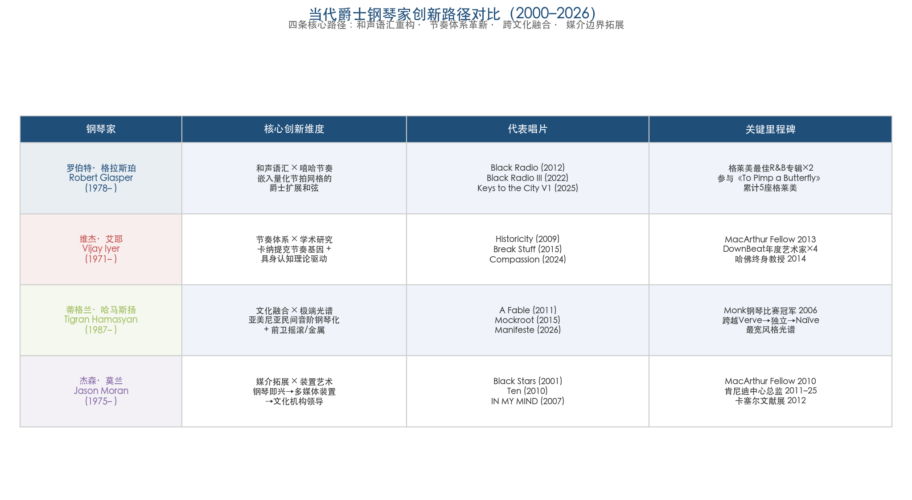

**第一，个人语汇取代流派忠诚。** 从格拉斯珀的嘻哈-爵士融合到哈马斯扬的亚美尼亚-金属-爵士实验，每位重要的当代爵士钢琴家都在构建高度个人化的声音身份。他们不再以"我是硬波普钢琴家"或"我是融合钢琴家"来定义自身，而是通过独特的和声语汇、节奏思维和跨媒介实践建立不可复制的个人品牌。

**第二，文化身份成为创作资源。** 艾耶的泰米尔裔背景与卡纳提克音乐研究、哈马斯扬的亚美尼亚民间音乐根基、罗德里格斯的古巴 timba 传统、亚历山大的印尼出身——当代爵士钢琴家越来越多地将自身的文化遗产作为创作的核心资源，而非需要被抹去的"异质性"。这与第二章所述的 AACM 精神一脉相承，但其文化光谱已从非裔美国内部扩展至全球范围。

**第三，学术-实践边界趋于模糊。** 艾耶的博士论文-演奏双轨、莫兰在肯尼迪中心的机构领导角色、阿尔马赞将生态伦理注入厂牌运营——当代爵士钢琴家的职业身份已超越"演奏者"的单一维度，学术研究、文化策展、独立出版和社会倡导均可成为爵士钢琴实践的有机组成部分。

**第四，机构认证追认了创作现实。** 格莱美新增"最佳另类爵士专辑"类别、吉尔莫基金会设立爵士钢琴专项大奖——这些制度性变化并非驱动创新的原因，而是对已经发生的多元化现实的追认。当代爵士钢琴的创新始终由个体实践推动，制度框架则在滞后数年后做出调整。

下图以更细致的人物-事件对应关系，呈现了本章所涉核心钢琴家在2000–2026年间的关键节点与风格定位。

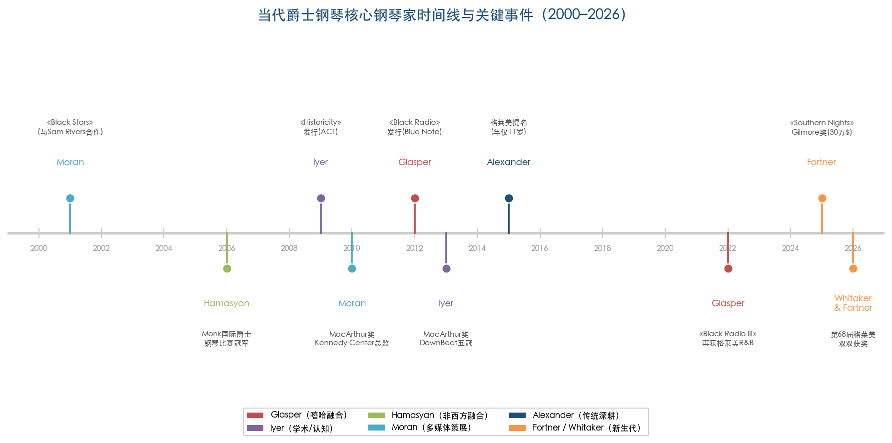

从历史纵深来看，本章所考察的2000–2026年间的当代爵士钢琴实践，可以被理解为前四章所述历史脉络的逻辑延伸与集大成：波普钢琴的和声复杂性（第一章）、自由爵士的解构精神（第二章）、融合运动对电声和跨流派合作的拥抱（第三章），这三重遗产在当代钢琴家手中被重新组合、再语境化，并与全球化背景下多元文化身份的自觉表达相融合，最终形成了21世纪前四分之一世纪中爵士钢琴创作语汇空前丰富的局面。

# 第5章 技术革新——电子技术、数字工具与 AI 对爵士钢琴创作的重塑

前一章勾勒了2000年以来当代爵士钢琴在"后流派"语境下多元创作语汇的爆发。然而，这些语汇的生成并非仅源于风格趣味的迭代——电子乐器、数字工具和人工智能构成了一条隐性却强大的技术基础设施线。从1950年代 Wurlitzer 电钢琴首次将金属簧片的振动转化为电信号放大输出，到2024年 MIT Media Lab 的 AI 系统在舞台上与人类键盘手实时共创，技术对爵士钢琴的介入贯穿了整个现代爵士史。本章系统考察这一技术链条如何重塑爵士钢琴的音色、创作方式和即兴实践，并试图回答一个核心问题：技术介入在多大程度上改变了爵士钢琴的艺术本质？

## 5.1 电声化起步：Wurlitzer 与 Fender Rhodes 的音色革命（1954–1970s）

爵士钢琴的技术转型始于电钢琴对原声三角钢琴的补充与挑战。1954年，Wurlitzer 公司推出首款电钢琴 EP-100，采用锤击金属簧片经静电拾音器放大的电声原理；此后各型号持续生产至1983年，累计产量约12万台[Wurlitzer 电钢琴百科](https://en.wikipedia.org/wiki/Wurlitzer_electronic_piano "完整型号谱系与产量数据")。Wurlitzer 在爵士领域的先驱使用者是 Sun Ra——他可能是最早在爵士录音中使用 Wurlitzer 的乐手（1956年单曲，后收入专辑 *Angels and Demons at Play*）。乔·扎维努尔（Joe Zawinul）则在坎农鲍尔·阿德利（Cannonball Adderley）五重奏1966年的热门曲目"Mercy, Mercy, Mercy"中使用了140B型号，该曲成为首批以电钢琴为核心音色的爵士流行金曲之一[Wurlitzer 电钢琴百科](https://en.wikipedia.org/wiki/Wurlitzer_electronic_piano "Sun Ra 与 Zawinul 的 Wurlitzer 使用记录")。

Fender Rhodes 电钢琴的出现将电声键盘推向了爵士舞台的中心。全尺寸73键型号于1965年在 CBS 收购 Fender 后首次发售，1970年推出更轻便的 Mark I Stage Piano（约59公斤）。与 Wurlitzer 的金属簧片-静电拾音原理不同，Rhodes 采用锤击金属齿条（tine）经电磁拾音器放大，产生更为柔和、接近正弦波的温暖音色。1976年 Rhodes 公司广告宣称，在 *Billboard* 前100张含电钢琴的专辑中，82%使用了 Rhodes[Rhodes 钢琴百科](https://en.wikipedia.org/wiki/Rhodes_piano "完整历史与技术规格")。

Rhodes 在爵士融合中的标志性地位与赫比·汉考克（Herbie Hancock）的推广密不可分。汉考克于1968年在迈尔斯·戴维斯（Miles Davis）的录音棚中首次接触 Rhodes，此后该乐器成为 Davis 录音中最突出的键盘音色——从 *In a Silent Way*（1969）到 *Bitches Brew*（1970），Rhodes 的晶莹音色与戴维斯的小号在电声空间中形成了全新的对话关系。汉考克1973年发行的 *Head Hunters*（Columbia Records）将 Fender Rhodes 与 ARP Odyssey、ARP 2600 等合成器并用，成为首张销量突破百万的爵士专辑[Rhodes 钢琴百科](https://en.wikipedia.org/wiki/Rhodes_piano "引 Kevin Fellezs, Birds of Fire (2011) 及 Bob Gluck, You'll Know When You Get There (2012)")。奇克·科瑞亚（Chick Corea）与扎维努尔同样在1970年代大量使用 Rhodes，将其打造为融合爵士的"第二架钢琴"。

电钢琴对爵士钢琴的意义远不止于音色层面的变化。从物理特性角度看，Rhodes 的触感、延音和力度响应与三角钢琴截然不同，迫使演奏者调整指触和分句习惯；从舞台生态角度看，电钢琴可以直接通过音箱放大并接入效果器链路（如 wah-wah 踏板、合唱效果等），使钢琴家首次拥有了与电吉他手和贝斯手对等的音量和音色塑形能力。这一变化深刻地改变了爵士钢琴家在乐队中的角色定位——从受制于三角钢琴声学极限的"安静伴奏者"转变为可以主动塑造声场的电声力量。

## 5.2 模拟合成器的介入：Minimoog、Sun Ra 与声音宇宙的扩展（1969–1970s）

如果说电钢琴为爵士钢琴提供了一种"替代性钢琴音色"，模拟合成器则彻底打破了"钢琴声音"的概念边界。1970年初，R.A. Moog 公司推出 Minimoog Model D——首款真正便携的合成器（单音，三振荡器，44键）。Sun Ra 在1969年秋造访 Moog 位于纽约州 Trumansburg 的工厂时获赠了一台 Minimoog 原型机（Model B），比商业版 Model D（1970年3月面世）提前数月。1969年11月2日，Sun Ra 在费城录制了"The Code of Interdependence"和"Space Probe"，这是已知最早使用 Minimoog 的商业录音之一[Bob Moog 基金会](https://moogfoundation.org/sun-ra-the-minimoog-by-historian-thom-holmes/ "Thom Holmes 撰写的 Sun Ra 与 Minimoog 历史，含详细年表")。

Sun Ra 的合成器实践具有双重先驱意义。其一，他将合成器定位为即兴工具而非预编程设备，通过实时旋钮操控在演出中探索未知音色——这一理念至今仍是爵士电子即兴的核心哲学。其二，合成器在他的"宇宙哲学"中扮演着通往外太空声音的载体角色，这种将技术与精神愿景结合的态度为后来的电子爵士实验者树立了重要的思想先例。

然而，Minimoog 在11年间仅售出约1.2万台，市场穿透率相当有限。真正的大众化转折须等到数字时代的到来。

## 5.3 数字革命：Yamaha DX7、FM 合成与爵士键盘的民主化（1983–1990s）

1983年发布的 Yamaha DX7 标志着数字合成器时代的全面开启。这台基于约翰·乔宁（John Chowning）在斯坦福大学开发的频率调制（FM）合成技术（Yamaha 于1975年获得独家授权）的合成器，采用6个正弦波算子、32种算法，拥有16复音、61键触后力度感应键盘，定价仅1,995美元。DX7 三年内售出超20万台——与 Minimoog 11年间约1.2万台的销量形成数量级对比[Yamaha DX7 百科](https://en.wikipedia.org/wiki/Yamaha_DX7 "引 The Economist 2020, Vail 2014")。

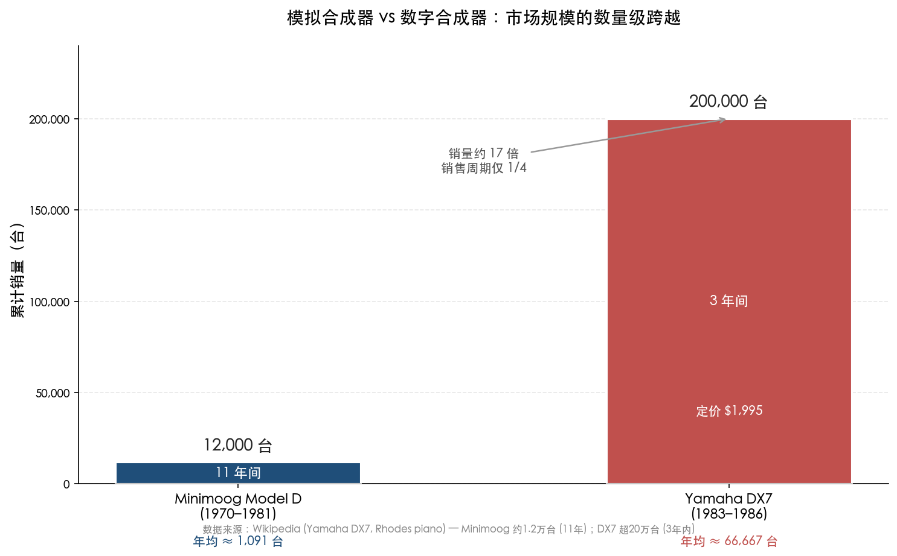

上图直观呈现了从 Minimoog 到 DX7 的市场格局颠覆：DX7 以不到1/4的销售周期实现了约17倍于 Minimoog 的累计销量，其仅1,995美元的定价打破了专业合成器的价格门槛。

DX7 对爵士键盘生态的冲击体现在两个层面。首先，其标志性的"E PIANO 1"预置音色精确模拟了 Rhodes 钢琴的温暖质感，到1986年被用于 *Billboard* Hot 100 榜首单曲的40%、R&B 榜首的60%[Yamaha DX7 百科](https://en.wikipedia.org/wiki/Yamaha_DX7 "引 The Economist 2020, Vail 2014")。这一预置促使部分演奏者从笨重的实体 Rhodes（Mark I Stage Piano 重约59公斤）转向仅需一台 DX7 即可覆盖电钢琴、弦乐垫和铃声等多种音色的轻量化方案。汉考克和科瑞亚等爵士融合先驱均对 DX7 进行了探索性采用。其次，DX7 的低价位和 MIDI 接口（1983年 MIDI 1.0 标准同年发布）使爵士键盘手首次能够将多台数字设备串联为统一的键盘工作站，这一配置模式延续至今。

## 5.4 预置钢琴在爵士语境中的当代转化

在电子技术扩展键盘音色调色板的同时，一条平行的创新路径从钢琴本体内部出发，通过物理手段改造原声钢琴的声音。预置钢琴（prepared piano）技法的系统化始于约翰·凯奇（John Cage）——他于1940年为舞者 Syvilla Fort 的作品 *Bacchanale* 创作了首部预置钢琴作品，受亨利·考埃尔（Henry Cowell）弦内钢琴技术启发，在三角钢琴的琴弦之间放置螺栓、螺丝、橡皮等物体，使"单个钢琴家手中掌握了等同于整个打击乐团"的能力[预置钢琴百科](https://en.wikipedia.org/wiki/Prepared_piano "引 Cage & Charles (1981) For The Birds")。凯奇的代表作《奏鸣曲与间奏曲》（*Sonatas and Interludes*，1946–1948）共有45个音被预置，主要使用螺丝和各类螺栓及橡胶、塑料等材料，产生三大类音色：保留原始频率和钢琴特质的音、类似鼓的去调音版本，以及完全丧失基频的金属嘎嘎声[*Sonatas and Interludes* 百科](https://en.wikipedia.org/wiki/Sonatas_and_Interludes "引 Perry (2005), Pritchett (1993)")。

将预置钢琴技法系统引入爵士即兴的关键先驱是法国钢琴家贝努瓦·德尔贝克（Benoît Delbecq，1966年生）。Delbecq 偏好使用从世界各地收集的不同树种木条插入琴弦之间，"因为硬木和软木对声音的影响不同"。NPR/Fresh Air 乐评人凯文·怀特海德（Kevin Whitehead）评价其技法"将钢琴非洲化"（Africanizes the piano），将西非音乐家偏爱的复杂嗡鸣和嘎嘎音色与欧洲古典音乐的纯净器乐音色相融合。Delbecq 的独奏专辑 *The Weight of Light*（2021，Pyroclastic Records）是其预置钢琴艺术的集中展示[NPR Fresh Air 评论](https://www.tpr.org/2021-03-22/benoit-delbecqs-weight-of-light-shows-how-mysterious-prepared-piano-can-sound "Kevin Whitehead 评 Delbecq")。

克里斯·戴维斯（Kris Davis）是 Delbecq 预置钢琴传统的核心继承者与发展者。她于2005年夏赴法国向 Delbecq 学习预置钢琴概念，此前还研究了奥地利作曲家托马斯·拉赫尔（Thomas Larcher）通过在琴弦上粘贴 gaffer tape（黑布基胶带）和橡胶楔改变泛音的技法。Davis 尤其擅长使用 gaffer tape：当粘贴在琴弦上时，产生被抑制的、一维的打击音色，将钢琴从旋律乐器转化为兼具打击乐和音色装置特性的混合体。她在接受 *Jazziz* 杂志泰德·潘肯（Ted Panken）专访时表示："我从来不预先计划我的预置……我知道它们听起来像什么，但我想要被惊喜和创造。无论我在钢琴内部开始的东西我是否喜欢，我都会完全投入并从中找到音乐。"[Jazziz 专访](https://krisdavis.net/reviews/jazziz-to-the-outer-reaches-kris-davis-looks-to-discover-the-pianos-full-potential-ted-pankin/ "Ted Panken, Jazziz 2018")贝斯手斯蒂芬·克拉普（Stephan Crump）对 Davis 的预置技术给出了精确的配器学类比："通过对琴弦泛音的操控，她本质上创造了乐器的不同声部，几乎就像一个管弦乐队拥有木管组、弦乐组和打击乐组。"[Jazziz 专访](https://krisdavis.net/reviews/jazziz-to-the-outer-reaches-kris-davis-looks-to-discover-the-pianos-full-potential-ted-pankin/ "Stephan Crump 评论 Kris Davis")

Davis 的代表性预置钢琴录音包括独奏专辑 *Aeriol Piano*（2009）以及被多家媒体评为年度最佳爵士专辑的 *Diatom Ribbons*（2019，Pyroclastic Records）。*DownBeat* 评论指出该专辑标题曲使用预置钢琴与特丽·林恩·卡灵顿（Terri Lyne Carrington）的鼓声构建了"由细微错位产生的钻刺节奏"[*DownBeat* 评论](https://downbeat.com/reviews/detail/diatom-ribbons1 "DownBeat 评 Diatom Ribbons")。2023年，Davis 在 Village Vanguard 现场录音专辑 *Diatom Ribbons Live at the Village Vanguard* 中延续了 gaffer tape 预置手法，赋予音符更强的打击性质感[Kris Davis 官网](https://krisdavis.net/reviews/kris-davis-diatom-ribbons-live-at-the-village-vanguard/ "Diatom Ribbons Live 评论")。

## 5.5 Craig Taborn：跨越声学与电子的即兴边界

克雷格·塔伯恩（Craig Taborn）的实践代表了声学钢琴探索与电子即兴融合的另一种路径。在原声钢琴领域，Taborn 的创新并非传统意义上的"预置"——在琴弦中放置异物——而是对钢琴声音维度（泛音、共振、衰减）的极致探索。他的 ECM 独奏首张专辑 *Avenging Angel*（ECM 2207，2011年，录制于2010年7月瑞士卢加诺）以完全即兴方式录制13首作品。《纽约时报》乐评人内特·奇宁（Nate Chinen）评价该专辑展现了 Taborn"与纯粹声音的迷恋——专辑中充满了音符悬挂在空气中的瞬间，你能听到逐渐汇聚的泛音、琴弦的振动"[ECM Records 官方](https://ecmrecords.com/product/avenging-angel-craig-taborn/ "ECM 官方页面，含 NYT, Guardian 等评论")。

2021年的第二张独奏专辑 *Shadow Plays*（ECM，录制于2020年初）进一步展示了即时作曲的艺术。NPR Fresh Air 的怀特海德描述 Taborn"将钢琴用作打击乐器……他会持续敲击单个音符长达数分钟，直到钢琴发出像单弦班卓琴一样的叮当声"，并强调 Taborn"既在当下即兴，又站在外面审视全局——他同时是即兴者和编辑者"[NPR Fresh Air 评论](https://www.npr.org/2021/12/08/1062376126/pianist-craig-taborn-practices-the-art-of-instant-composing-on-shadow-plays "NPR 2021年12月评 Shadow Plays")。

在电子领域，Taborn 的2004年专辑 *Junk Magic*（Thirsty Ear）全面展示了键盘、合成器与自制电子设备（"junk" electronics）的融合。据2008年 *DownBeat* 专题报道，Taborn 的演出装备包括 Fender Rhodes、虚拟 Hammond 风琴、Creamware Pro-12 ASB 合成器（模拟 Sequential Circuits Prophet-5）、Line 6 延迟效果器，以及由朋友 Ryan Olcott 改装电路的 Yamaha PSS-470 键盘。Taborn 明确表示其电子即兴方法受 Sun Ra 实时旋钮操控合成器的传统影响，而非依赖预编程[*DownBeat* 专题](https://tedpanken.wordpress.com/2016/02/21/for-craig-taborns-birthday-a-downbeat-feature-from-2008/ "2008年 DownBeat Craig Taborn 专题，Ted Panken 撰写")。他与 Davis 在双钢琴专辑 *Octopus*（2018，Pyroclastic）中亦运用了预置手法，形成了当代爵士钢琴中最为激进的声学探索对话。

从 Sun Ra 到 Taborn，一条清晰的精神谱系贯穿了爵士电子即兴的七十年：技术不是外部工具，而是即兴表达不可分割的一部分；演奏者通过实时操控塑造声音，而非将创作过程交给预设程序。

## 5.6 实时处理软件：从学术实验室到爵士舞台

### 5.6.1 Max/MSP 的诞生与爵士应用

如果说电钢琴和合成器是键盘手音色调色板的物理扩展，实时数字处理软件则将爵士即兴的"可操控维度"从音符和音色扩展到声音的时间结构、空间分布和算法生成。Max 软件的核心范式由米勒·普凯特（Miller Puckette）于1980年代中期在法国音乐与声学研究所（IRCAM）开发，命名以纪念计算机音乐先驱 Max Mathews。Puckette 在其2002年发表于 *Computer Music Journal*（第26卷第4期，第31–43页）的回顾文章中描述，Max 在 IRCAM"1985–1990年间一小群研究人员和音乐家之间的激烈、兴奋的互动和发酵"中成形[Miller Puckette, *CMJ* 2002](https://msp.ucsd.edu/Publications/dartmouth-reprint.dir/ "Puckette, CMJ 2002, 26/4, pp. 31-43")。首次舞台使用是1987年4月菲利普·马努里（Philippe Manoury）的 *Jupiter* 首演，其补丁"本质上是第一个 Max 补丁"。大卫·齐卡雷利（David Zicarelli）此后创办 Cycling '74 公司将 Max 商业化；约1996年，通用个人电脑性能终于足以支撑音频信号处理，Zicarelli 在 Puckette 的 Pure Data 新型 tilde 对象基础上开发了 MSP（Max Signal Processing），使 Max/MSP 具备实时音频合成与处理能力。2017年，数字音乐制作领域巨头 Ableton 收购了 Cycling '74[Miller Puckette, *CMJ* 2002](https://msp.ucsd.edu/Publications/dartmouth-reprint.dir/ "Max 商业化历程")。

Max/MSP 为爵士钢琴家提供了一个开放式的声音处理平台，使演奏者能够编写自定义的实时音频处理流程——从延迟与循环到频谱变换和空间化。维杰·艾耶（Vijay Iyer）参与了 IRCAM 的 ImproTech 工作坊系列，2012年 ImproTech Paris/New York 活动中与史蒂夫·莱曼（Steve Lehman）等人运用现场电子音乐进行即兴演出[IRCAM ImproTech](https://repmus.ircam.fr/improtechpny/improtechschedule2 "ImproTech Paris/NY 2012 日程")。Iyer 与声音艺术家山田怜子（Reiko Yamada）在哈佛大学 Radcliffe 研究所合作的互动声音装置"Reflective"（2016年）使用 Max/MSP 编程，将钢琴即兴录音通过运动传感器实时变形——观众的步伐方向决定了钢琴声音的扭曲方式[Harvard Gazette 报道](https://news.harvard.edu/gazette/story/2016/01/striving-for-imperfection/ "Radcliffe 研究所 Reflective 装置")。这一案例体现了爵士钢琴即兴与数字交互艺术融合的前沿探索。

### 5.6.2 Ableton Live 与挪威新爵士概念

Ableton Live（2001年首版）在爵士领域的代表性实践来自挪威钢琴家布格·韦瑟尔托夫特（Bugge Wesseltoft）。韦瑟尔托夫特的系列专辑 *New Conception of Jazz*（首张1996年由 Jazzland Recordings 发行，获挪威格莱美奖）开创性地将电子音乐制作工具融入爵士即兴语境。2015年，他在 Ableton Loop 峰会上与德国电子音乐家亨里克·施瓦兹（Henrik Schwarz）进行了关于即兴与协作的现场演示，展示了爵士钢琴家如何利用 DAW 环境构建实时循环层和电子纹理[Ableton 官方博客](https://www.ableton.com/en/blog/henrik-schwarz-and-bugge-wesseltoft/ "Ableton Loop 2015 演示")。韦瑟尔托夫特的实践表明，DAW 不仅是录音工具，更可以成为爵士即兴的"第二乐器"——键盘手在演奏实时钢琴声部的同时，通过 DAW 对声音进行叠加、循环和处理，创造出单人在传统器乐框架中无法实现的多层声音织体。

## 5.7 软件合成器时代：从硬件堆叠到笔记本电脑轻量化

进入21世纪，软件合成器的成熟从根本上改变了爵士键盘手的装备生态。两款标志性产品代表了不同的技术路径：Spectrasonics 的 Keyscape（2016年发布）历时十年采样制作，涵盖 Fender Rhodes（多个年份型号）、Wurlitzer、Hohner Clavinet 等经典键盘的精细多层采样，可深度集成于 Omnisphere 合成引擎进行声音变形[Spectrasonics 官方产品页](https://www.spectrasonics.net/products/keyscape/overview.php "Keyscape 产品概览")。Modartt 的 Pianoteq（2006年首发）则采用纯物理建模而非采样技术，能够模拟钢琴的物理行为——琴锤硬度、琴弦共振、踏板行为——安装文件仅数十 MB，与动辄数十 GB 的采样库形成鲜明对比。

软件合成器时代的核心影响在于三点：其一，爵士键盘手的音色调色板从有限的硬件选择扩展到近乎无限的软件选项——一台笔记本电脑可以同时加载 1960年代 Rhodes Mark I、1970年代 Wurlitzer 200A 和各种实验性合成音色。其二，现场演出装备从笨重的 Hammond B3/Rhodes/DX7 等硬件"堆叠"转向笔记本电脑加 MIDI 控制器的轻量化配置，极大降低了巡演的物流成本和舞台空间需求。其三，这一转变引发了关于"数字复制"能否替代原始硬件"灵魂"的持续美学争论——原始 Rhodes 电钢琴的电磁拾音器在不同力度下产生的非线性谐波响应，以及老化元件带来的独特"温暖感"，在数字采样中是否能被完整保留，至今仍是爵士键盘手社群中的活跃议题。

## 5.8 人工智能与人机协同即兴：从 Voyager 到 Somax2

人工智能介入爵士即兴的历史远比公众认知的更久远。从规则系统到深度学习，五大代表性系统标志着人机共创理念的不同发展阶段。

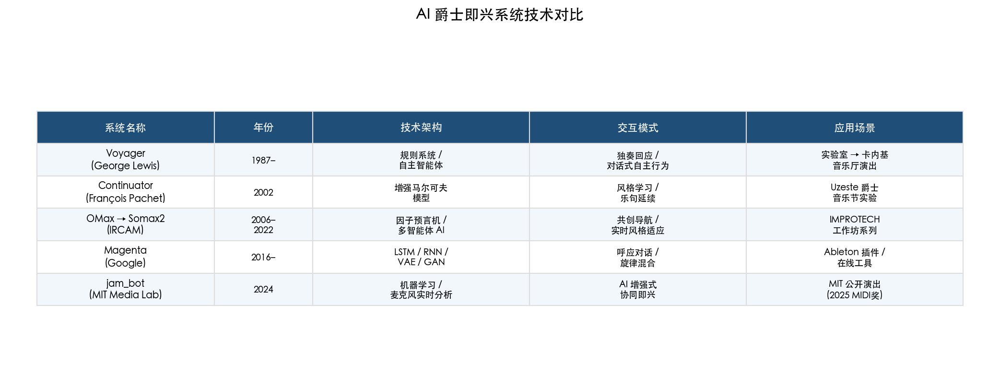

上表对比了从 Voyager（1987）到 MIT jam_bot（2024）五大 AI 爵士即兴系统的技术架构、交互模式与应用场景演进。以下依时间顺序逐一考察。

### 5.8.1 George Lewis 的 Voyager：AI 即兴的开山之作（1987–）

人工智能介入爵士即兴的历史远比公众认知的更长。作曲家、长号手乔治·刘易斯（George Lewis，1952年生，芝加哥）于1985–1987年间开发了 Voyager 系统——一个计算机驱动的交互式"虚拟即兴乐团"，能够实时分析即兴演奏者的表演并生成复杂的音乐回应，同时维持其内部过程产生的独立行为。Lewis 在发表于 *Leonardo Music Journal*（2000年第10卷，第33–39页）的论文中阐述了 Voyager 的核心理念：关于音乐的本质和功能的观念嵌入在基于软件的音乐系统结构之中，与这些系统的互动"倾向于揭示产生它们的思想和文化共同体的特征"[George Lewis, *Leonardo Music Journal* 2000](https://direct.mit.edu/lmj/article/doi/10.1162/096112100570585/63300/Too-Many-Notes-Computers-Complexity-and-Culture-in "Lewis, LMJ 2000, 10:33-39")。

Voyager 最初在 Yamaha CX 5 计算机上开发，内置合成器使 Lewis 无需外接设备。系统从最初的16声部扩展至1990年代末的64声部；2004年，Lewis 将 Voyager 移植至 Yamaha Disklavier 自动演奏钢琴平台，在卡内基音乐厅完成了首次以自动钢琴形式与管弦乐团互动的演出[ACM Communications 报道](https://dl.acm.org/doi/fullHtml/10.1145/3583082 "Esther Shein, '… And the Computer Plays Along', CACM 66(4):15-17, 2023")。2022年英国演出中，Lewis 团队为 Voyager 增建了机器学习前端，引入手势识别功能以更精确地理解音乐家的演奏意图。Lewis 坦言 Voyager 偶尔"会做出你意想不到的事情，有时会与它正在伴奏的音乐产生冲突"，但他认为这恰恰是自主智能体的本质——"你可以试图影响它的决定，但基本上……你无法告诉它该做什么"[ACM Communications 报道](https://dl.acm.org/doi/fullHtml/10.1145/3583082 "Lewis 论 Voyager 的自主性")。

值得注意的是，Lewis 将 Voyager 明确定位为体现非裔美国人即兴美学的计算机音乐实践，这一立场超越了技术本身——它提出了一个根本性问题：AI 即兴系统是否不可避免地携带着创造者的文化基因？

### 5.8.2 François Pachet 的 Continuator：风格学习与延续（2002–2003）

弗朗索瓦·帕谢（François Pachet）在索尼计算机科学实验室巴黎分部开发的 Continuator 系统代表了 AI 爵士即兴研究的另一条路径。该论文获2002年国际计算机音乐大会（ICMC）Swets & Zeitlinger 杰出论文奖，正式发表于 *Journal of New Music Research*（2002年第31卷第1期）。Continuator 基于增强型马尔可夫模型实时学习演奏者的音乐风格：音乐家的音符流按约250毫秒的时间阈值自动分割为乐句，每个乐句异步发送至乐句分析器以构建循环模式数据库，继而基于可变阶马尔可夫链生成输入乐句的风格一致延续[Pachet, *JNMR* 2002](https://www.francoispachet.fr/wp-content/uploads/2021/01/pachet-03d.pdf "Pachet, 2002/2003, JNMR, 31(1). 获2002 ICMC 杰出论文奖")。

Continuator 在法国 Uzeste 爵士音乐节上与钢琴家贝尔纳·吕巴（Bernard Lubat）、乔治·库塔格（György Kurtag）、艾伦·席尔瓦（Alan Silva）等音乐家进行了多种协作模式实验——包括单人自洽模式、多人共享数据库模式、主从模式等。受邀参加听力测试的评论家"在大多数（如果不是全部）情况下"无法分辨系统输出与人类输入[Pachet, *JNMR* 2002](https://www.francoispachet.fr/wp-content/uploads/2021/01/pachet-03d.pdf "听力测试结果")。

Pachet 后续开发的 Flow Machines 项目进一步扩展了 AI 音乐创作的边界。2016年，Flow Machines 辅助创作的 *Daddy's Car*（Beatles 风格）被认为是世界上第一首 AI 流行歌曲；2018年发行首张完全 AI 辅助制作的流行专辑 *Hello World*，涵盖15首风格各异的曲目。Pachet 在职业生涯中共参与35项 AI 音乐相关专利，2017年6月加入 Spotify 的 Creator Technology Research Lab[Music Business Research 报道](https://musicbusinessresearch.wordpress.com/2024/04/08/ai-in-the-music-industry-part-10-francois-pachet-the-continuator-flow-machines-and-daddys-car/ "Music Business Research 2024年4月")。

### 5.8.3 IRCAM 的 OMax/Somax2：共创哲学的系统化

IRCAM 的交互即兴研究代表了人机共创理念的最系统化实践。OMax 系统（2006年，由热拉尔·阿萨亚格 Gérard Assayag 等人开发）能实时学习音乐家的风格特征并进行交互式演奏。Assayag 在欧洲科学媒体中心2022年的访谈中解释了系统原理："我们的电脑程序通过聆听音乐创建一种正在演奏内容的地图学地图，基于这张地图决定如何继续。最初它只是以自由方式重组已有元素，那是 OMax。然后我们创建了新程序 Somax，它通过被演奏者持续引导来导航地图……这产生了巨大的差异，让人感觉计算机真的在注意聆听。"[ESMH 访谈](https://sciencemediahub.eu/2022/08/31/a-scientists-opinion-interview-with-gerard-assayag-on-ai-in-music/ "Assayag 2022年访谈")爵士钢琴家 Lubat 对此交互着迷，称"有时机器演奏的东西是他一千年也不会演奏的"。

OMax 的后继系统 Somax2 是欧洲研究理事会（ERC）资助的 REACH 项目（Raising Cocreativity in Cyber-Human Musicianship）的核心成果，相关论文发表于 *Computer Music Journal*（2022年冬季号，第46卷第4期，第7–25页）。Somax2 是一个基于 AI 的多智能体系统，能在持续聆听和适应音乐家的同时生成风格一致的音乐流。该系统已被 Lubat、若埃尔·莱昂德尔（Joëlle Léandre）、西尔万·吕克（Sylvain Luc）等世界级音乐家在 IMPROTECH 工作坊系列等专业舞台上积极使用[Assayag 等, *CMJ* 2022](https://direct.mit.edu/comj/article/46/4/7/119103/Cocreative-Interaction-Somax2-and-the-REACH-Project "CMJ 2022, 46(4):7-25")。

### 5.8.4 Google Magenta 与深度学习工具链

Google 于2016年推出的 Magenta 项目标志着深度学习技术全面进入音乐生成领域。Magenta 基于 TensorFlow 框架开发了一系列工具，包括 Performance RNN（2017年10月，浏览器端实时钢琴键盘）、A.I. Duet（2017年2月，用户弹奏旋律后神经网络即时响应，由 Google Creative Lab 的 Yotam Mann 开发）、MusicVAE（2018年5月，旋律混合器）和 GANSynth（2019年2月，生成对抗网络音频合成）[Music Business Research 报道](https://musicbusinessresearch.wordpress.com/2024/04/22/ai-in-the-music-industry-part-12-googles-magenta-studio-and-the-wavenet/ "Google Magenta 详细时间线")。

其中，A.I. Duet 与爵士即兴的关联最为直接：它使用神经网络学习数百首旋律的训练数据，当用户在虚拟钢琴键盘上弹奏后，AI 生成"回应"式的旋律延续——这一交互模式直接呼应了爵士即兴中的"呼应"（call-and-response）传统[Google A.I. Experiments 官方页面](https://experiments.withgoogle.com/ai/ai-duet/view/ "A.I. Duet 官方页面")。2019年发布的 Magenta Studio 作为开源 AI 工具箱，包含 Generate、Continue、Interpolate、Groove、Drumify 五个应用，可直接作为 Ableton Live 插件使用——这一集成意味着爵士键盘手能够在既有的 DAW 工作流中无缝引入 AI 辅助生成能力。

### 5.8.5 MIT Media Lab "共生精湛技艺"与最新前沿

MIT Media Lab 的"共生精湛技艺"（Symbiotic Virtuosity）项目代表了人机协同即兴的最新前沿。该项目与键盘手乔丹·鲁德斯（Jordan Rudess，前卫金属乐队 Dream Theater 成员）合作开发了 AI"jam_bot"系统。2024年9月，jam_bot 在 MIT Media Lab 完成了首次公开演出"Jordan and the jam_bot"，其核心理念为"AI 增强而非替代人类即兴"——系统在演出中以麦克风实时分析演奏者的即兴内容，生成回应素材，而演奏者可以选择与 AI 回应互动或引导其走向新的方向[MIT Media Lab 项目概览](https://www.media.mit.edu/projects/symbiotic-virtuosity/overview/ "项目概览")。该项目于2025年获 MIDI 创新奖，标志着人机共创理念开始获得主流音乐技术行业的认可。

## 5.9 AI 爵士创作的伦理与美学：一场未完成的对话

从 Lewis 的 Voyager 到 IRCAM 的 Somax2，人机协同即兴已积累了近四十年的实践经验。然而，围绕 AI 在爵士即兴中角色的根本性美学与伦理争论至今远未平息。

IRCAM REACH 项目的核心哲学立场是人机共生优于 AI 独立创作。Assayag 明确表示："我们的哲学立场是，我们认为人与机器之间的共生关系比一个独自创作音乐的 AI 更有意义，因为共创性正存在于此。"[ESMH 访谈](https://sciencemediahub.eu/2022/08/31/a-scientists-opinion-interview-with-gerard-assayag-on-ai-in-music/ "Assayag 共创哲学")这一立场具有深刻的现实基础——Assayag 坦承 AI 目前面临的核心技术局限在于"多尺度一致性"（multi-scale coherence）："即便最好的 AI 也尚未能在长时间跨度上创造出伟大的形式。"在一段30秒的即兴中，AI 可以产生令人信服的乐句延续；但在一场60分钟的演出中，组织宏观叙事弧线、管理张力的积累与释放、在恰当时刻引入出人意料的转折——这些"大尺度"的音乐智慧仍是人类即兴者不可替代之处[ESMH 访谈](https://sciencemediahub.eu/2022/08/31/a-scientists-opinion-interview-with-gerard-assayag-on-ai-in-music/ "AI 多尺度一致性局限")。

Lewis 的视角则更深入文化层面。他在 *Leonardo Music Journal* 论文中提出，Voyager 体现的是非裔美国人即兴美学——强调对话性、自主性和社群性，而这些维度并非简单的技术问题。一台 AI 系统可以学习和弦进行和节奏模式，但它是否能够理解爵士即兴中"摇摆感"（swing feel）所承载的身体性记忆？是否能参与即兴对话中隐含的社会性协商——谁领奏、谁退让、何时共同攀升至高潮[George Lewis, *LMJ* 2000](https://direct.mit.edu/lmj/article/doi/10.1162/096112100570585/63300/Too-Many-Notes-Computers-Complexity-and-Culture-in "Lewis 论 Voyager 中的文化嵌入")？这些问题的答案将决定 AI 在爵士即兴中究竟是"共创伙伴"还是仅仅充当"高级伴奏工具"。

2024年 HAL/ARTSIT 论文探讨了生成式 AI 在音乐即兴共创中的交互模式，2025年 NIME（新乐器与音乐表达接口）论文提出将微调扩散模型集成到 Ableton 实时工作流[HAL 论文](https://hal.science/hal-04760154v1/file/ARTSIT2024_Being_the_Artificial_Player_CAMERA_READY.pdf "ARTSIT 2024")[NIME 2025 论文](https://nime.org/proceedings/2025/nime2025_54.pdf "NIME 2025")。这些前沿研究的共同关切在于：AI 应作为增强工具（augmentation tool）而非替代演奏者。我们认为，这一共识反映了一种务实的智慧——爵士即兴的本质不仅是声音的组织，更是一种社会性的、文化性的、身体性的人类活动，而当前 AI 技术只触及了其中最容易被计算化的声音维度。

## 5.10 未来技术前沿：MPE 键盘、MIDI 2.0 与空间音频

### 5.10.1 MIDI 2.0 与 MPE：触觉表达的技术标准化

MIDI 协议自1983年诞生以来一直是电子音乐的基础通信标准。MIDI 制造商协会（MMA）于2018年1月28日在 NAMM 展会正式批准 MPE（MIDI Polyphonic Expression，MIDI 复音表达）v1.0 规范，通过为每个音符分配独立 MIDI 通道实现逐音符表情控制，代表产品包括 ROLI Seaboard 和 LinnStrument[MMA 官方新闻稿](https://midi.org/wp-content/uploads/easyblog_articles/361/MPE-2018-NAMM-Show-Release.pdf "MPE v1.0 正式发布")。

MIDI 2.0 标准于2020年1月17日正式发布，核心升级包括：32位分辨率控制器信息（相较 MIDI 1.0 的7位，精度提升约6万倍）、256个 MIDI 通道（16组×16通道）、JSON 格式属性交换[MIDI 2.0 百科](https://en.wikipedia.org/wiki/MIDI_2.0 "2020年1月发布")。从理论上看，MIDI 2.0 和 MPE 的结合为爵士键盘手提供了前所未有的表达精度——弯音、压力、滑音等参数的逐音符独立控制意味着数字键盘在表现力维度上有可能逼近甚至超越原声钢琴。然而，截至目前尚未发现主流爵士钢琴家系统性地采用 MPE 键盘进行录音或演出，该技术在爵士领域的采用仍处于非常早期的实验阶段。

### 5.10.2 Dolby Atmos 与沉浸式爵士录音

Dolby Atmos 空间音频技术为爵士录音开辟了全新的声场设计可能性。Apple Music 已推出含约106首曲目的"Jazz in Spatial Audio"播放列表，Blue Note Records 将部分经典目录以 Dolby Atmos 格式重新发行。在专门录制方面，加拿大钢琴家伊拉里奥·杜兰（Hilario Durán）及其拉丁爵士大乐团的专辑 *From the Heart* 以 Dolby Atmos TrueHD 无损格式数字发行[Immersive Audio Album 报道](https://immersiveaudioalbum.com/now-available-in-dolby-atmos-hilario-duran-and-his-latin-jazz-big-bands-from-the-heart/ "Durán Dolby Atmos 发行")；吉米·哈斯利普（Jimmy Haslip）制作的爵士融合专辑 *Flying Spirits*（Blue Canoe, 2020）是另一代表案例[All About Jazz 报道](https://www.allaboutjazz.com/dolby-atmos-now-hear-this-jimmy-haslip "Dolby Atmos 爵士录音专题")。

空间音频对爵士钢琴的潜在意义在于"去中心化"：传统立体声录音中，钢琴通常占据固定的声像位置（通常是左-中偏左）；而在 Dolby Atmos 环境中，钢琴的不同频段可以被放置在三维空间的不同位置——低音区环绕听者，高音区从头顶洒落，踏板共鸣在房间中弥散。这种可能性意味着录音工程师和钢琴家可以共同创造一种超越传统音乐厅声学的全新聆听体验。然而，Dolby Atmos 在爵士领域整体仍处于早期探索阶段，大规模采纳面临制作成本、消费端硬件普及率和混音工程师技能门槛等多重障碍。

## 5.11 技术介入爵士钢琴的五阶段演化模型

综合本章考察的技术链条，我们可以提炼出技术介入爵士钢琴创作的五阶段演化模型：

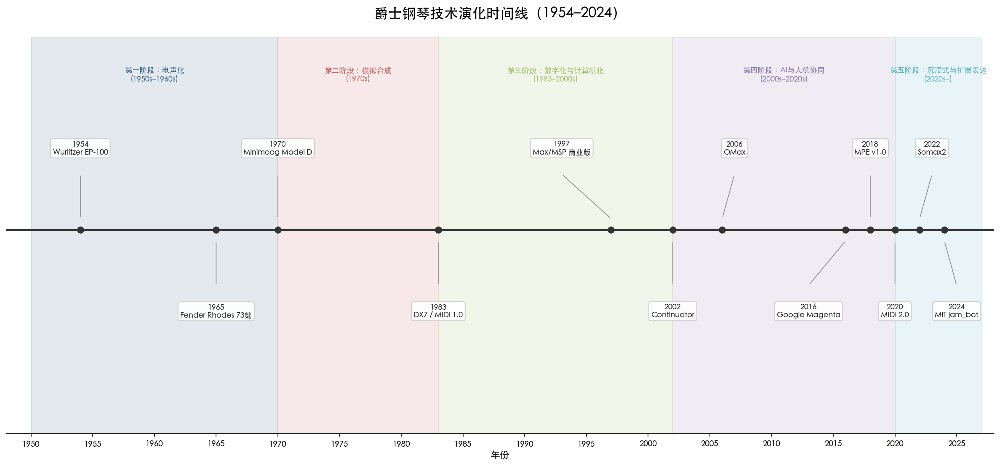

上图以水平时间轴呈现从 Wurlitzer EP-100（1954）到 MIT jam_bot（2024）的12个关键技术节点，五种色彩带分别对应以下五个演化阶段。

**第一阶段：电声化（1950s–1960s）**。Wurlitzer（1954）和 Fender Rhodes（1965）将钢琴音色从纯声学扩展至电声领域，使钢琴家获得音量控制和效果器接入的能力，改变了爵士钢琴在乐队中的角色定位。

**第二阶段：模拟合成（1970s）**。Minimoog（1970）和 ARP 合成器打破了"钢琴声音"的概念边界，Sun Ra 和赫比·汉考克等先驱将合成器定位为即兴工具，开启了爵士键盘手的多乐器身份。

**第三阶段：数字化与计算机化（1980s–2000s）**。DX7（1983）和 MIDI 标准实现了键盘设备的数字互联；Max/MSP（约1997年商业化）和 Ableton Live（2001）将实时数字信号处理引入即兴演出，使声音操控从硬件旋钮扩展到软件算法。

**第四阶段：AI 与人机协同（2000s–2020s）**。从 Voyager（1987–）和 Continuator（2002）到 OMax/Somax2（2006–2022）和 Google Magenta（2016），AI 系统从模式匹配进化到风格学习和共创交互，人机协同即兴从实验室走向专业演出舞台。

**第五阶段：沉浸式音频与扩展表达（2020s–）**。MPE 键盘、MIDI 2.0 和 Dolby Atmos 从触觉输入端和音频输出端同时扩展了爵士钢琴的表达维度，尽管在爵士领域的实际采纳仍处于萌芽期。

这一模型揭示了一个关键规律：每一阶段的技术变革都伴随着一场关于"真实性"（authenticity）的美学争论——电钢琴是否"算"钢琴？合成器是否属于爵士乐？AI 生成的乐句是否构成即兴？然而历史反复表明，最具创造力的爵士钢琴家——从 Sun Ra 到 Herbie Hancock，从 Craig Taborn 到 Kris Davis——始终将技术视为扩展而非替代人类表达的手段。技术改变了声音的物理载体和生成方式，但爵士钢琴的艺术核心——在特定时刻做出不可预测的音乐抉择——仍然牢牢植根于人类的创造性意识之中。

# 第6章 全球化视野与未来图景——多样性趋势、地域身份与爵士钢琴的持续演化

前五章的论述以美国为叙事重心，追踪了爵士钢琴从 Bebop 和声革命经由自由爵士解构、融合运动扩展、当代多元语汇、技术工具重塑的纵深演进。然而，任何仅以美国为中心的叙事都不足以呈现爵士钢琴在21世纪的全部面貌。自1960年代以来，爵士乐作为一种世界性的即兴音乐语言，已在欧洲、东亚、拉丁美洲、中东与非洲等文化土壤中生发出风格迥异的本土化变异。这些地域性实践并非对美国范式的简单模仿，而是在各自文化传统与爵士即兴体系之间构建了深刻的创造性对话。本章承担双重使命：其一，系统考察爵士钢琴跨越国界后的本土化创造；其二，综合前文积累的历史与技术分析，研判爵士钢琴在创作语言、技术载体、文化生态与产业模式等维度的未来走向。

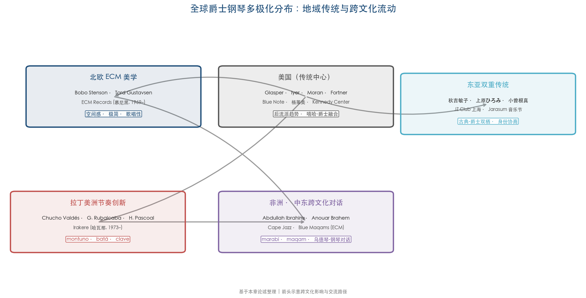

图6-1呈现了当代爵士钢琴的全球多极化格局。五大区域——北欧 ECM 美学、美国传统中心、东亚双重传统、拉丁美洲节奏创新、非洲与中东跨文化对话——各自发展出独特的风格标识与代表人物，同时通过跨文化流动形成复杂的相互影响网络。以下各节将逐一深入考察这些地域性实践的内在机制。

## 6.1 欧洲 ECM 美学与北欧钢琴学派

### 6.1.1 ECM：一种制作哲学即一种美学

曼弗雷德·艾歇尔（Manfred Eicher，1943年生）于1969年在慕尼黑创立 ECM Records，截至目前已发行超1800张唱片 [Wikipedia: Manfred Eicher](https://en.wikipedia.org/wiki/Manfred_Eicher "ECM创始人生平")。与美国主流爵士厂牌强调律动感与现场氛围不同，ECM 的录音美学以"诗意空间"和极致的声学透明度著称。艾歇尔在 *JazzTimes* 访谈中将 ECM 比作"没有边框的画布"，其美学起点源自保罗·布莱（Paul Bley）与唐·切里（Don Cherry）所代表的"更具空间感、更开放"的即兴路径 [JazzTimes](https://jazztimes.com/features/interviews/ecm-records-manfred-eicher-the-free-matrix/ "Eicher 论 ECM 美学")。ECM 的录音工程实践——偏好自然混响充沛的欧洲教堂或音乐厅、极少使用压缩、追求每个音符的"呼吸空间"——不仅是技术选择，更构成了一套完整的美学纲领，深刻塑造了在该厂牌旗下录音的欧洲钢琴家的音色想象与触键哲学。艾歇尔于2002年获格莱美"年度古典制作人"奖，标志着这一制作美学获得了跨流派的权威认可。

### 6.1.2 基思·贾瑞特的欧洲四重奏：跨大西洋融合的范本

基思·贾瑞特（Keith Jarrett）作为美国钢琴家，却以其欧洲四重奏（Jarrett/扬·加尔巴雷克 Jan Garbarek/帕勒·丹尼尔松 Palle Danielsson/约恩·克里斯滕森 Jon Christensen）为 ECM 北欧钢琴美学奠定了跨大西洋融合的范本。1974年录制的首张唱片 *Belonging*（ECM 1050）开创了美国爵士即兴能量与北欧民谣气质融合的室内乐式对话 [Wikipedia: Belonging](https://en.wikipedia.org/wiki/Belonging_(Keith_Jarrett_album) "1974年专辑详情")。*My Song*（1978）成为 ECM 最畅销的爵士唱片之一，其中贾瑞特的钢琴织体以歌唱性旋律线为核心，和声上大量运用挂留音与开放式排列，与加尔巴雷克萨克斯的北欧民歌气质形成互文。这一合作确立了一个重要的美学范式：爵士即兴无需依赖美国都市蓝调的情感底色，完全可以在北欧风景画般的声学空间中寻获同等的深度与张力。

### 6.1.3 北欧钢琴家群像：从斯滕森到古斯塔夫森

如果说贾瑞特是 ECM 北欧美学的"外来催化剂"，那么真正从斯堪的纳维亚土壤中生长出来的钢琴家群体则将这一美学推向了自觉的地域身份表达。

瑞典钢琴家博博·斯滕森（Bobo Stenson，1944年8月4日生于韦斯特罗斯）自1990年代起成为 ECM 最重要的北欧钢琴代言人。他的三部曲——*Reflections*、*War Orphans*、*Serenity*——融合了爵士即兴、瑞典与东欧民间旋律、古巴歌曲以及20世纪古典语汇（巴托克、利盖蒂的影响尤为显著）。斯滕森的演奏以极致的触键控制和音色层次感著称，每个和弦的内部声部运动都经过精心雕琢，使钢琴在即兴中呈现出室内乐般的织体密度 [AllMusic: Bobo Stenson](https://www.allmusic.com/artist/bobo-stenson-mn0000064783 "AllMusic 传记")。

挪威钢琴家托德·古斯塔夫森（Tord Gustavsen）则代表了北欧爵士钢琴的另一极——极简主义的深度挖掘。他2003年的 ECM 首张专辑 *Changing Places* 被《Stereophile》评为"自 *Kind of Blue* 以来最不炫技的伟大爵士唱片" [ECM Records](https://ecmrecords.com/product/changing-places-tord-gustavsen-trio/ "评论与美学描述")。古斯塔夫森以挪威赞美诗和民歌为旋律骨架，通过他所称的"最小偏移的艺术"——在极度克制的音符选择中寻找微妙的和声位移与节奏游走——创造了一个近乎冥想性的声音世界。这种美学选择本身即构成一种文化立场：它拒绝将即兴能力等同于速度与密度，转而在北欧新教传统中寻找"沉默比喧嚣更有力量"的精神资源。

北欧钢琴学派的整体贡献在于证明了爵士钢琴可以在完全不同的文化情感底色上重建即兴的美学合法性。当美国爵士钢琴的创新路径主要沿着节奏复杂化（维杰·艾耶 Vijay Iyer）、跨流派引用（罗伯特·格拉斯珀 Robert Glasper）或技术极限探索（克雷格·塔伯恩 Craig Taborn）的方向推进时，北欧钢琴家以空间、沉默与歌唱性开辟了另一条同样具有创造力的道路。

## 6.2 东亚爵士钢琴：身份协商与双重传统

### 6.2.1 日本：最深厚的亚洲爵士根基

日本是亚洲爵士乐接受史最悠久的国家，早在战后即形成了完整的爵士唱片消费市场和演出生态。在钢琴领域，秋吉敏子（Toshiko Akiyoshi，1929年生）是首位在国际爵士界获广泛认可的日本钢琴家与大乐团编曲家。她获14次格莱美提名，是首位获 *DownBeat* 读者票选"最佳编曲家"和"最佳作曲家"的女性，2007年获 NEA Jazz Master 荣誉 [Wikipedia: Toshiko Akiyoshi](https://en.wikipedia.org/wiki/Toshiko_Akiyoshi "生平与14次格莱美提名")。秋吉敏子的核心创新在于系统性地将日本传统乐器——小鼓（kotsuzumi）、津轻三味线（Tsugaru-shamisen）等——融入大乐团爵士编曲，使东亚音色元素不再是猎奇式的异域点缀，而成为和声与节奏结构的有机组成部分。

上原ひろみ（Hiromi，1979年生）代表了日本爵士钢琴的当代面貌。她的演奏以高度身体性著称，将 stride、后波普、前卫摇滚和古典语汇以极高的能量密度融为一体。首张专辑 *Another Mind*（2003年）在日本出货超10万张，获日本唱片协会金唱片认证；2011年获格莱美"最佳当代爵士专辑"；2021年在东京奥运会开幕式上演出，将爵士钢琴带到了全球最大的文化展示平台 [Wikipedia: Hiromi Uehara](https://en.wikipedia.org/wiki/Hiromi_Uehara "生平与格莱美")。上原的演奏风格本身即是一种跨文化综合的产物：她对身体性的强调——演奏时的大幅度肢体运动、与钢琴的对抗性关系——既继承了塞西尔·泰勒（Cecil Taylor）"钢琴作为打击乐器"的传统，又带有日本武道艺术中"身体与器具合一"的文化底色。

小曽根真（Makoto Ozone，1961年生）则体现了古典-爵士"双栖"的独特路径。他在伯克利音乐学院以最优等毕业后，与加里·伯顿（Gary Burton）合作录制 ECM 唱片，建立了跨大西洋的音乐联结。代表作 *Road to Chopin*（2010年）以肖邦作品为素材进行爵士即兴转化——这一做法本身隐含着对"东亚古典钢琴教育"与"美国爵士即兴传统"双重身份的创造性调和。2018年小曽根真获日本紫绶褒章，自2010年起任国立音乐大学爵士客座教授，标志着爵士钢琴在日本高等教育体系中获得了制度性确立 [Wikipedia: Makoto Ozone](https://en.wikipedia.org/wiki/Makoto_Ozone "生平与荣誉")。

### 6.2.2 韩国：年轻听众与新兴场景

韩国爵士钢琴场景的独特之处在于其受众结构的异质性。由于韩国的威权时代抑制了文化多样性，爵士乐实际上是在1980年代末民主化时期才被系统性地引入韩国社会。这意味着韩国听众并未经历"爵士是摇滚之前的过时音乐"这一美国式历史叙事，年轻人对爵士乐反而持有强烈的新鲜感。2004年创办的加平加羅林（Jarasum）国际爵士音乐节集中体现了这一现象：该音乐节每年10月在首尔以东的加平郡河中岛举办，三天内吸引20万至25万观众，其中2015年88%的观众年龄在40岁以下——而同年美国纽波特爵士音乐节82%的观众在45岁以上。美国萨克斯手乔舒亚·雷德曼（Joshua Redman）在演出后感叹："登上加羅林音乐节的舞台，仿佛闯入了一个平行宇宙，在那里爵士突然变得年轻、时髦、性感而酷。" [NPR](https://www.npr.org/sections/ablogsupreme/2016/01/12/462781123/how-a-korean-jazz-festival-found-a-huge-young-audience "NPR 2016年深度报道")

这一年轻化听众群体为韩国本土爵士钢琴的发展提供了独特土壤。首尔 Once In A Blue Moon 等爵士酒吧维系着活跃的现场演出生态，而韩国爵士音乐家（包括歌手罗允宣 Youn Sun Nah 等）在法国等欧洲国家亦获得高度认可，形成了独特的亚-欧爵士流通路径。

### 6.2.3 中国：制度化进程中的爵士钢琴

中国的爵士钢琴发展尚处于早期制度化阶段。上海 JZ Club 于2004年创立，全年365天持续演出，并延伸出 JZ School（师资来自伯克利等院校）和 JZ Shanghai Music Festival（自2004年起每年10月举办） [JZ Club 官网](https://www.jzclub.cn/en/aboutus "2004年创立")。上海音乐学院已开设爵士钢琴方向硕士招生，标志着中国高等教育体系正式纳入爵士钢琴学位培养。中国爵士钢琴的发展路径呈现出"自上而下的制度引入"与"自下而上的亚文化生长"并行的特征：一方面，专业音乐院校通过引进西方师资和课程体系构建爵士教育框架；另一方面，俱乐部场景和音乐节生态为本土原创提供了实验空间。如何在五声音阶传统与爵士和声体系之间找到不落窠臼的融合路径，是中国爵士钢琴家面临的核心创作挑战。

## 6.3 拉丁美洲与加勒比：节奏骨架上的即兴叙事

### 6.3.1 古巴：从 montuno 到当代爵士的连续体

拉丁美洲对爵士钢琴的贡献首先体现在节奏维度。古巴钢琴家丘乔·巴尔德斯（Chucho Valdés，1941年生于哈瓦那）是现代非洲-古巴爵士钢琴（Afro-Cuban jazz piano）的奠基人物。1973年他创建 Irakere 乐队，将 batá 鼓乐（约鲁巴宗教仪式节奏）与 bebop 即兴和摇滚电声融合为前所未有的声音组合。巴尔德斯的核心创新在于将 montuno——以 son clave 为骨架的循环即兴段落——从传统拉丁音乐的伴奏层级提升为独立的即兴叙事手段。在他的演奏中，montuno 不再仅仅是节奏的"地基"，而成为与 bebop 即兴旋律线同等重要的表达载体，二者在多节奏层叠（polyrhythmic layering）中构成复杂的对话。巴尔德斯累计获7座格莱美和6座拉丁格莱美，2025年获 NEA Jazz Master 荣誉 [NEA](https://www.arts.gov/honors/jazz/chucho-valdes "2025年 NEA 官方传记")。

贡萨洛·鲁巴尔卡巴（Gonzalo Rubalcaba，1963年生于哈瓦那）代表古巴爵士钢琴的第二代。他在巴尔德斯的节奏创新基础上进一步引入李斯特式古典钢琴技巧与当代和声语言，在节奏复杂性之上叠加了更为精密的和声结构。鲁巴尔卡巴与查理·哈登（Charlie Haden）合作的 *Nocturne*（2001年）和 *Land of the Sun*（2004年）被视为拉丁爵士钢琴室内乐化的代表作。截至2026年，他共获4座格莱美（含2026年第68届最佳拉丁爵士专辑）和12次提名，另有3座拉丁格莱美 [Grammy.com](https://grammy.com/artists/gonzalo-rubalcaba/15254 "4座格莱美、12次提名")。

### 6.3.2 巴西：帕斯科阿尔的实验精神

巴西的爵士钢琴传统以独特的方式将即兴与本土节奏素材相结合。埃尔梅托·帕斯科阿尔（Hermeto Pascoal，1936–2025）是巴西实验爵士的核心人物，1971年参与迈尔斯·戴维斯（Miles Davis）*Live-Evil* 录制 [Wikipedia: Hermeto Pascoal](https://en.wikipedia.org/wiki/Hermeto_Pascoal "生平与 Miles Davis 合作")。帕斯科阿尔的创作将巴西东北部民间音乐的节奏骨架——forró、baião——与自由即兴和非常规音源结合。他在1996–97年创作的 *Calendário do Som* 收录366首作品（每天一首），展现了非凡的创作产能与实验意志。2019年他获拉丁格莱美奖。帕斯科阿尔对爵士钢琴的影响不仅体现在具体技法层面，更在于其"万物皆可为乐器"的哲学——将日常声音、动物叫声、人声纳入即兴素材库——为后续拉丁美洲钢琴家打开了创作想象力的边界。

## 6.4 非洲与中东：乌德琴、教堂赞美诗与爵士和声的对话

### 6.4.1 阿卜杜拉·易卜拉欣：开普爵士与反种族隔离

阿卜杜拉·易卜拉欣（Abdullah Ibrahim，1934年生于开普敦）是南非爵士钢琴最具标志性的人物。他的音乐融合了 marabi（南非本土的键盘音乐传统）、mbaqanga（祖鲁节奏风格）、非洲卫理公会教堂福音以及塞隆尼斯·蒙克（Thelonious Monk）和杜克·艾灵顿（Duke Ellington）的美国爵士影响。1974年录制的 *Mannenberg*——一次即兴完成——成为南非"非官方国歌"和反种族隔离运动的主题曲，催生了"开普爵士"（Cape jazz）这一子类型。1994年他在曼德拉总统就职典礼上演出，2019年获 NEA Jazz Master 荣誉 [Wikipedia: Abdullah Ibrahim](https://en.wikipedia.org/wiki/Abdullah_Ibrahim "完整生平") [NEA](https://www.arts.gov/honors/jazz/abdullah-ibrahim "2019年 NEA 传记")。

易卜拉欣的钢琴语汇呈现出一种独特的综合：左手常以 marabi 循环音型为基础（简单的三和弦循环进行），右手则在此之上进行带有蒙克式棱角的即兴。*Mannenberg* 的持久影响力证明了一个重要命题：爵士钢琴能够同时承载美学创新与社会政治功能，而这种双重承载本身构成了全球化语境下地域身份表达的核心机制。

### 6.4.2 阿努阿尔·布拉赫姆：乌德琴-钢琴对话中的阿拉伯调式

突尼斯乌德琴大师阿努阿尔·布拉赫姆（Anouar Brahem，1957年10月20日生于突尼斯市半月区 Halfaouine）自1991年起与 ECM 合作，迄今录制约十二张专辑 [Anouar Brahem 官网](https://anouarbrahem.com/en/full-biography "完整传记")。布拉赫姆虽非钢琴家，但他的 ECM 录音项目系统性地创造了乌德琴与爵士钢琴深度对话的范式。在 *Khomsa*（1995年）中，他与法国手风琴家理查德·加利亚诺（Richard Galliano）和钢琴家弗朗索瓦·库图里耶（François Couturier）合作；在 *Thimar*（1998年）中与约翰·苏曼（John Surman）和戴夫·霍兰德（Dave Holland）合作；2017年录制的 *Blue Maqams* 则将乌德琴与英国钢琴家扎恩戈·贝茨（Django Bates）、贝斯手霍兰德和鼓手杰克·迪约内特（Jack DeJohnette）汇聚一堂。

*Blue Maqams* 的标题本身即是一种美学宣言——"Maqam"指阿拉伯调式体系，"Blue"指爵士即兴中的蓝色音调（blue notes）。*DownBeat* 乐评人鲍比·里德（Bobby Reed）指出这张专辑"展示了传统阿拉伯音乐与更为现代的爵士元素的融合"；*All About Jazz* 的约翰·凯尔曼（John Kelman）更将其评为"不仅是年度最佳 ECM 发行之一，更是一张终将被视为该厂牌近五十年历史上最优秀录音之一的经典" [ECM Records](https://ecmrecords.com/product/blue-maqams-anouar-brahem-dave-holland-jack-dejohnette-django-bates/ "Blue Maqams 评论集")。在这些录音中，钢琴家面对的核心挑战在于：如何在阿拉伯调式的微分音程世界（四分之一音等）与十二平均律钢琴的物理限制之间找到创造性的解决方案。贝茨的回应方式是以极度克制的和声介入和对乌德琴旋律线的"呼应式"回应来维持文化对等，而非以西方和声逻辑去"殖民"阿拉伯调式。

布拉赫姆的合作模式提示了一种超越"融合"（fusion）概念的跨文化即兴路径：不是将不同音乐传统混合为一种新风格，而是让它们在保持各自完整性的前提下进行"面对面的对话"。这一路径对全球爵士钢琴的未来走向具有重要的方法论启示。

## 6.5 未来图景：爵士钢琴的持续演化

### 6.5.1 "后流派"时代的制度性确认

美国唱片学院于2023年6月宣布自第66届格莱美（2024年）起新增"最佳另类爵士专辑"（Best Alternative Jazz Album）类别，首届获奖者为梅谢尔·恩德格奥切洛（Meshell Ndegeocello） [Recording Academy](https://www.recordingacademy.com/press-releases/new-categories-announced-66th-annual-grammy-awards-2024-grammys "新增类别公告")。2026年第68届格莱美中，罗伯特·格拉斯珀（Robert Glasper）的 *Keys to the City Volume One* 与布拉德·梅尔道（Brad Mehldau）的 *Ride into the Sun* 在该类别中竞逐，而苏利文·福特纳（Sullivan Fortner）的 *Southern Nights* 则获最佳爵士器乐专辑——三位风格迥异的钢琴家同届获提名或获奖，本身即是"后流派"格局的缩影 [KNKX](https://www.knkx.org/jazz/2025-12-17/2026-grammy-nominees-in-jazz-announced "2026格莱美爵士类提名完整名单")。

宾夕法尼亚大学音乐学教授格思里·拉姆齐（Guthrie P. Ramsey, Jr.）在2013年《Dædalus》（美国艺术与科学院季刊）学术论文中分析格拉斯珀的 *Black Radio*，指出格拉斯珀"玩弄了围绕声音语言建立的社会契约，使各领域的疆界感觉无缝而自然"，论文结论判断"我们可能正在见证一个'后类型'（post-genre）时刻" [美国艺术与科学院](https://www.amacad.org/publication/daedalus/power-suggestion-pleasure-groove-robert-glaspers-black-radio "Dædalus, Fall 2013 学术论文")。这一"后流派"趋势正在从学术观察转变为制度现实：当爵士乐最高行业认证体系本身都在为流派边界的消解创建新的分类框架时，爵士钢琴家面临的创作空间将进一步扩大——他们无需在"纯爵士"与"跨界"之间做非此即彼的抉择。

### 6.5.2 流媒体时代的市场重塑

RIAA 2024年终报告显示，美国录制音乐总收入达177亿美元，流媒体占比84% [RIAA 2024年终报告](https://www.riaa.com/wp-content/uploads/2025/03/RIAA-2024Year-End-Revenue-Report.pdf "RIAA 官方")。IFPI《全球音乐报告2026》进一步显示，2025年全球录制音乐收入达317亿美元（同比+6.4%），付费订阅用户达8.37亿 [IFPI](https://www.ifpi.org/global-music-report-2026-global-recorded-music-revenues-grow-6-4-as-record-companies-drive-innovation/ "全球音乐报告2026")。尽管爵士乐在流媒体总流量中占比不足2%，但其听众群体表现出与流行音乐截然不同的消费特征：实体销售（黑胶唱片、CD）在爵士类目中的占比在所有流派中居于最高水平，反映出爵士乐迷对实体收藏与完整聆听体验的持续偏好。

直接面向粉丝（D2F）的收入渠道为缺乏主流厂牌支持的爵士钢琴家提供了新的经济基础。Bandcamp Friday 自2020年3月启动以来累计向艺术家和厂牌支付1.54亿美元，Bandcamp 整体已向艺术家支付超16.4亿美元 [Music Business Worldwide](https://www.musicbusinessworldwide.com/bandcamp-fridays-hit-154m-in-payouts-since-2020-with-19m-paid-in-2025-alone/ "2025年12月报道")。独立爵士厂牌如法比安·阿尔马赞（Fabian Almazan）创办的 Biophilia Records 和杰森·莫兰（Jason Moran）的 Yes Records 均在探索绕过传统发行体系、直接触达听众的新模式。这种产业结构的去中心化，客观上有利于那些扎根地域文化、风格不符主流市场期待的爵士钢琴家获得可持续的创作空间。

### 6.5.3 音乐节作为全球爵士钢琴的"连接节点"

音乐节生态在全球爵士钢琴的传播与交流中扮演着不可替代的角色。2025年新奥尔良爵士音乐节8天总出席约46万人次，日均从2022年的约67,800人次降至57,500人次 [NOLA.com](https://www.nola.com/entertainment_life/festivals/attendance-dipped-for-2025-new-orleans-jazz-festival/article_875827df-a0bc-4642-af5a-415b1c0bc6ec.html "出席下降报道")。底特律爵士音乐节2025年吸引超30万现场观众，同时全球直播覆盖43国约150万在线观众 [底特律爵士音乐节](https://www.detroitjazzfest.org/news/detroit-jazz-festival-expands-global-audience/ "全球受众扩展")。韩国加羅林音乐节每年吸引超20万年轻观众 [Wikipedia: Jarasum International Jazz Festival](https://en.wikipedia.org/wiki/Jarasum_International_Jazz_Festival "基本信息")。

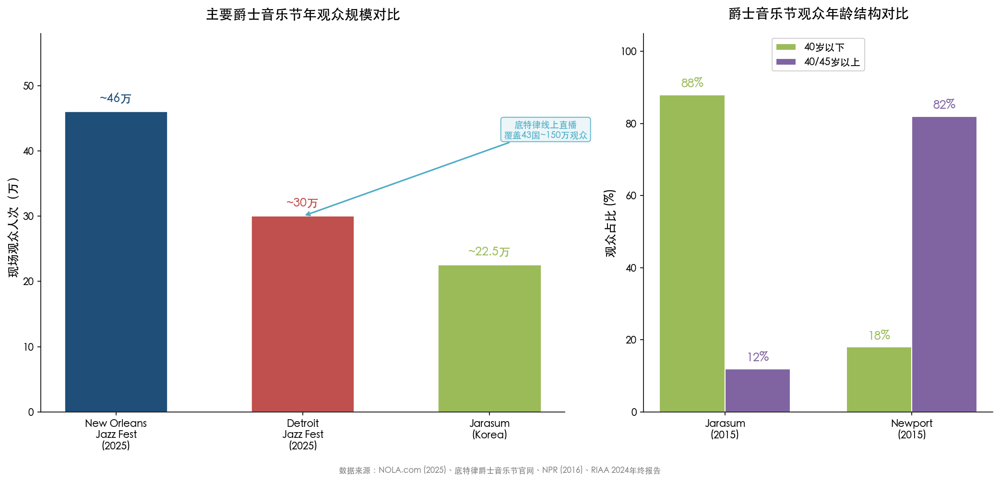

图6-2直观对比了三大爵士音乐节的观众规模与年龄结构。左侧数据显示，虽然个别音乐节存在出席波动，但全球爵士音乐节网络作为整体仍在维持可观的受众规模。右侧的年龄结构对比则揭示了深层的代际分化：2015年加羅林音乐节88%的观众在40岁以下，而同年纽波特爵士音乐节82%的观众在45岁以上，二者形成鲜明反差。线上直播技术的成熟使"长尾受众"的覆盖成为可能，底特律音乐节150万在线观众的数据即为明证。对于活跃于不同地域的爵士钢琴家而言，音乐节既是展示平台，也是跨文化交流的物理节点——巴尔德斯在蒙特勒的演出、上原ひろみ在北海爵士音乐节的登台、布拉赫姆在巴黎爱乐大厅的演出，都在构建着一个去中心化的全球爵士钢琴版图。

### 6.5.4 教育的数字化普惠

爵士钢琴教育正在经历从传统师徒制向数字化普惠模式的深刻转型。钢琴家彼得·马丁（Peter Martin）创办的 Open Studio Jazz 拥有超56,000名会员，覆盖140个国家，提供2,500余节课程，2023年活跃会员增长60% [WBGO](https://www.wbgo.org/show/wbgo-journal/2024-02-15/peter-martins-open-studio-is-creating-an-inviting-online-jazz-community "2024年报道")。伯克利全球爵士学院（Berklee Global Jazz Institute, BGJI）由巴拿马钢琴家丹尼洛·佩雷斯（Danilo Pérez）创立，2025年2月出版《Berklee Real Book》收录300余首曲目 [Berklee BGJI](https://college.berklee.edu/focused/global-jazz "官方介绍")。

数字化教育的全球可及性正在改变爵士钢琴家的培养地理：雅加达的学生可以在线学习比尔·埃文斯的无根音和声排列（rootless voicings），开罗的学生可以通过视频课程接触巴尔德斯的 montuno 技法。这种知识的民主化一方面加速了全球爵士钢琴技术水准的整体提升——乔伊·亚历山大（Joey Alexander）从巴厘岛崛起即为一例；另一方面也引发了"同质化"的隐忧，即全球各地的年轻钢琴家可能趋向同一套美国标准教学体系所定义的"正确"风格，而忽视了本土音乐传统所能提供的独特创造性资源。

### 6.5.5 AI 人机协同：增强而非替代

如第5章所述，AI 技术正在进入爵士即兴的实验前沿。MIT Media Lab 的"共生精湛技艺"（Symbiotic Virtuosity）项目与键盘手乔丹·鲁德斯（Jordan Rudess）合作开发了 AI "jam_bot"系统，2024年9月完成首次公开演出，核心理念为"AI 增强而非替代人类即兴"，该项目获2025年 MIDI 创新奖 [MIT Media Lab](https://www.media.mit.edu/projects/symbiotic-virtuosity/overview/ "项目概览")。2024年 HAL/ARTSIT 论文探讨了生成式 AI 在音乐即兴共创中的交互模式，2025年 NIME 论文提出将微调扩散模型集成到 Ableton 实时工作流 [HAL 论文](https://hal.science/hal-04760154v1/file/ARTSIT2024_Being_the_Artificial_Player_CAMERA_READY.pdf "2024") [NIME 2025](https://nime.org/proceedings/2025/nime2025_54.pdf "2025")。

从本章全球化视角出发，AI 对爵士钢琴未来的影响可能呈现地域分化特征：在技术基础设施完善的北美和北欧，人机协同即兴有望率先成为常态化的创作工具；而在拉丁美洲、非洲和中东等地区，本土音乐传统的口传心授方式与 AI 系统之间的接口问题——例如 AI 如何学习 clave 节奏的"摆动感"或 maqam 调式的微分音程——将成为技术与文化交汇的关键议题。IRCAM REACH 项目研究人员热拉尔·阿萨亚格（Gérard Assayag）明确指出，"人与机器之间的共生关系比一个独自创作音乐的 AI 更有意义"，同时坦承 AI 目前的核心局限在于"多尺度一致性"——即便最优秀的 AI 也尚无法在长时间跨度上生成具有宏观叙事形式的音乐 [ESMH 访谈](https://sciencemediahub.eu/2022/08/31/a-scientists-opinion-interview-with-gerard-assayag-on-ai-in-music/ "Assayag 共创哲学与 AI 局限")。这一局限恰恰凸显了人类爵士钢琴家不可替代的核心能力：在实时即兴中构建跨越多个时间尺度——从单个乐句到整首曲目的宏观叙事弧线——的有意义音乐结构。

### 6.5.6 综合展望：多极化的持续演化

综合以上分析，我们认为爵士钢琴的未来将呈现"多极化"而非"单一线性"的演化图景。

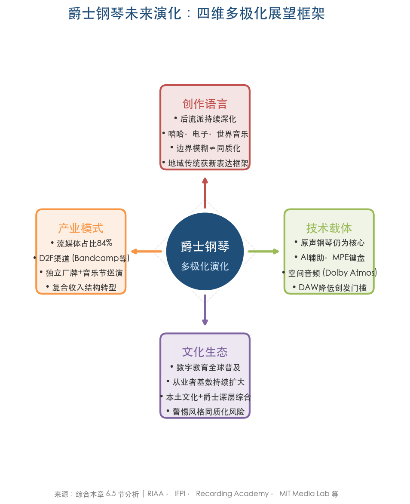

图6-3从四个维度概括了这一多极化前景。具体而言：

在**创作语言**维度，"后流派"趋势将继续深化，爵士钢琴与嘻哈、电子音乐、世界音乐的边界将进一步模糊。然而，这种模糊并不意味着同质化——恰恰相反，它为地域性传统（古巴 montuno、阿拉伯 maqam、北欧赞美诗、日本五声音阶）提供了新的表达框架。

在**技术载体**维度，原声钢琴将继续作为爵士即兴的核心媒介存在，同时与 AI 辅助工具、MPE 键盘、空间音频等新技术形成互补而非替代关系。软件合成器和数字音频工作站（DAW）将进一步降低创作与发行的门槛，使更多地域、更多背景的钢琴家进入全球爵士话语体系。

在**文化生态**维度，数字化教育的全球普及将持续扩大爵士钢琴的从业者基数，但真正具有持久艺术价值的创新仍将来自那些能够将本土文化基因与爵士即兴体系进行深层综合的个体——正如秋吉敏子之于日本传统乐器、巴尔德斯之于 batá 鼓乐、易卜拉欣之于 marabi 循环所做的那样。

在**产业模式**维度，流媒体与 D2F 渠道的共存将重塑爵士钢琴家的经济模型——从依赖大厂牌签约转向以独立厂牌、Bandcamp 直销、Patreon 订阅和全球音乐节巡演构成的复合收入结构。

爵士钢琴自1945年以来的八十余年历史证明，这一艺术形式的生命力恰恰在于其持续的自我革新能力。从鲍威尔的 bebop 独奏线到泰勒的音簇打击，从汉考克的 Clavinet 放克到格拉斯珀的嘻哈和声思维，从贾瑞特的欧洲四重奏到布拉赫姆的乌德琴-钢琴对话——每一次看似激进的突破最终都成为这门活态艺术持续演化的有机环节。在全球化与数字化交汇的当下，爵士钢琴正站在一个前所未有的交叉路口：它面临的挑战（AI 竞争、市场碎片化、注意力经济）与它拥有的机遇（全球受众、技术工具、跨文化对话）同样巨大。我们有理由相信，只要即兴创作——这一爵士钢琴不可化约的核心——继续作为人类在实时对话中创造意义的独特方式存在，爵士钢琴就将在下一个八十年里继续其不可预见却永远充满生命力的演化。

# 结论与风险提示

## 核心结论

本报告通过对爵士钢琴自1945年至2026年八十余年发展历程的系统考察，得出以下核心结论。

**第一，爵士钢琴的演化并非线性递进，而是多条创新路径的并行展开与交叉影响。** 比波普的和声复杂化（鲍威尔、蒙克）、调式爵士的和声解放（埃文斯、拉塞尔）、自由爵士的形式解构（泰勒、萨恩·拉）、融合运动的跨流派扩展（汉考克、科瑞亚、扎维努尔）并非简单的"取代"关系——硬波普在调式爵士繁盛时期保持着蓝调-福音的强劲支流，保罗·布雷的"减法美学"与泰勒的"加法"能量同时构成自由爵士的两极。每一代新的突破都是对多重遗产的选择性继承与重组，而非对前代的单纯否定。

**第二，技术革新始终是爵士钢琴演化的重要催化剂，但技术本身从未取代人类即兴创造的核心地位。** 从 Fender Rhodes 电钢琴改变爵士钢琴家在乐队中的声学角色，到 MIDI 协议和 Yamaha DX7 实现键盘设备的数字互联与音色民主化，再到 Max/MSP 和 Ableton Live 将实时数字处理引入即兴演出——每一轮技术介入都扩展了爵士钢琴的声音可能性并引发"真实性"争论，但历史反复证明，最具创造力的爵士钢琴家（Sun Ra、赫比·汉考克、克雷格·塔伯恩、克里斯·戴维斯）始终将技术视为扩展而非替代人类表达的手段。人工智能在爵士即兴中的应用已积累近四十年实践（从 Voyager 到 Somax2），但其在"多尺度一致性"——长时间跨度上构建有意义的宏观叙事形式——方面的根本性局限，凸显了人类即兴者在组织宏观音乐叙事方面不可替代的核心能力。

**第三，"后流派"时代的到来是爵士钢琴融合运动的逻辑延伸，而非突发断裂。** 从科瑞亚在1970年代将拉丁音乐与摇滚能量引入爵士融合，到梅尔道在1990年代以声学三重奏即兴改编 Radiohead，再到格拉斯珀在2010年代将爵士和声逻辑嵌入嘻哈制作——流派边界的逐步消解经历了数十年的渐进过程。2023年格莱美新增"最佳另类爵士专辑"类别和2025年吉尔莫基金会设立爵士钢琴专项大奖，标志着这一趋势已从艺术实践层面上升为制度性确认。个人创作语汇取代流派忠诚，正在成为当代爵士钢琴家自我定位的核心逻辑。

**第四，全球化使爵士钢琴从以美国为单一中心的艺术形态演化为多极化的世界性即兴语言。** ECM 美学塑造的北欧钢琴学派、日本从秋吉敏子到上原ひろみ的代际传承、古巴从巴尔德斯到鲁巴尔卡巴的 Afro-Cuban 节奏创新、南非易卜拉欣的开普爵士、突尼斯布拉赫姆的乌德琴-钢琴跨文化对话——这些地域性实践并非对美国范式的模仿，而是各自文化传统与爵士即兴体系之间深刻的创造性对话。数字化教育与流媒体经济进一步加速了爵士钢琴的全球传播，乔伊·亚历山大从巴厘岛崛起即为这一趋势的典型案例。

**第五，爵士钢琴的持久生命力根植于即兴创作这一不可化约的核心。** 无论技术工具如何迭代、文化语境如何变迁、产业模式如何重构，在特定时刻做出不可预测的音乐抉择——这一爵士钢琴的本质属性——始终是其区别于其他键盘音乐实践的根本标志。从鲍威尔在 Minton's Playhouse 的深夜即兴到福特纳在 Village Vanguard 的现场录音，爵士钢琴作为一种社会性、文化性、身体性的人类创造活动，其内核在八十余年间保持了惊人的连续性。

## 研究局限性与风险提示

**第一，来源语种与文化视角的局限。** 本报告所依据的文献以英语来源为绝对主体，辅以少量中文及日语资料。这意味着对非英语圈爵士钢琴实践的考察——尤其是法国、德国、巴西、古巴和日本等国以本国语言发表的学术研究、乐评和访谈——未能得到充分覆盖。例如，法国爵士钢琴学派（从马歇尔·索拉尔 Martial Solal 到巴蒂斯特·特洛蒂尼翁 Baptiste Trotignon）和德国自由即兴传统（亚历山大·冯·施利彭巴赫 Alexander von Schlippenbach 等）在本报告中的论述深度受到了来源可及性的制约。

**第二，音乐分析深度的局限。** 本报告以历史叙事和文化分析为主要方法论框架，对爵士钢琴和声语言、节奏结构和即兴技法的考察主要停留在描述性层面，未涉及系统的谱例分析或计量音乐学方法。例如，埃文斯的无根音和弦排列、哈马斯扬的亚美尼亚音阶钢琴化、艾耶的卡纳提克节奏分层等核心技法创新，若辅以详细的谱例解析和声学频谱分析，将能提供更为精确的学术论证。

**第三，量化数据的系统性不足。** 爵士乐作为一个商业规模相对有限的音乐类型，其市场数据（唱片销量、流媒体播放量、音乐会票房）的公开透明度远不及流行音乐。本报告引用的商业数据多为零散的个案（如 *Head Hunters* 的白金认证、*Kind of Blue* 的五白金认证），未能构建覆盖整个研究时段的系统性市场分析框架。

**第四，当代实践的时效性风险。** 本报告涉及的最新事件截至2026年初（第68届格莱美、吉尔莫基金会首届爵士钢琴奖），而爵士钢琴作为一门活态艺术，其创新实践时刻在发生。报告中关于AI人机协同即兴、MPE键盘和空间音频在爵士领域应用前景的判断，基于截至研究截止日期的有限案例，可能随技术与艺术实践的快速迭代而需要修正。

**第五，受众与接受史维度的缺失。** 本报告主要从创作者和作品的角度展开分析，对爵士钢琴听众的接受过程、审美偏好变迁和社群文化特征的考察相对薄弱。韩国加羅林音乐节年轻化受众结构的案例虽有涉及，但未能将受众研究上升为系统性的分析维度。爵士钢琴创新与听众接受之间的互动机制——为何某些突破（如 *Head Hunters*）获得了市场成功而另一些（如泰勒的自由爵士实验）长期被边缘化——是一个值得专项研究的重要课题。
