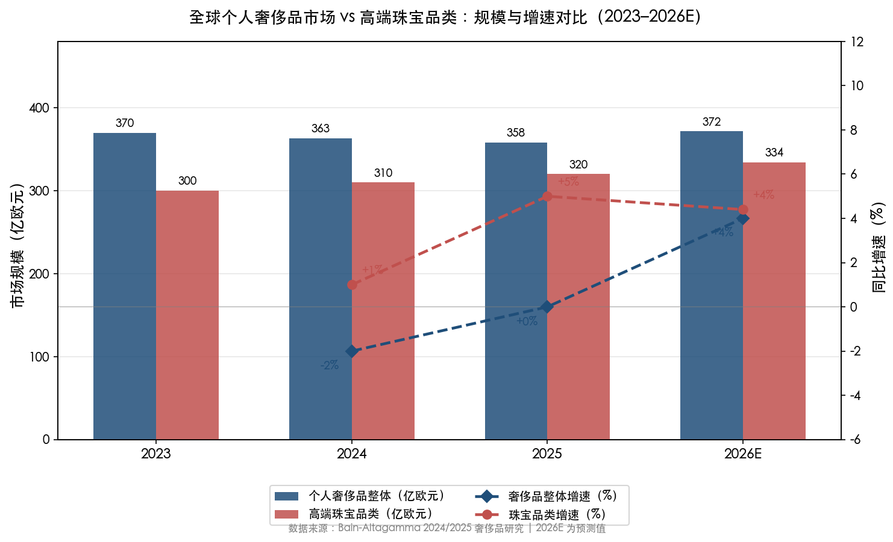
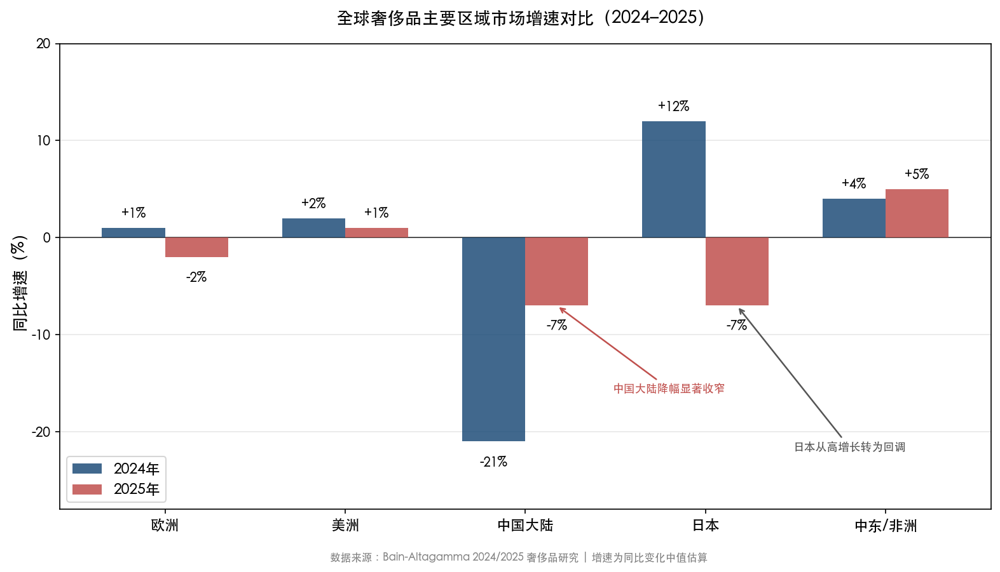
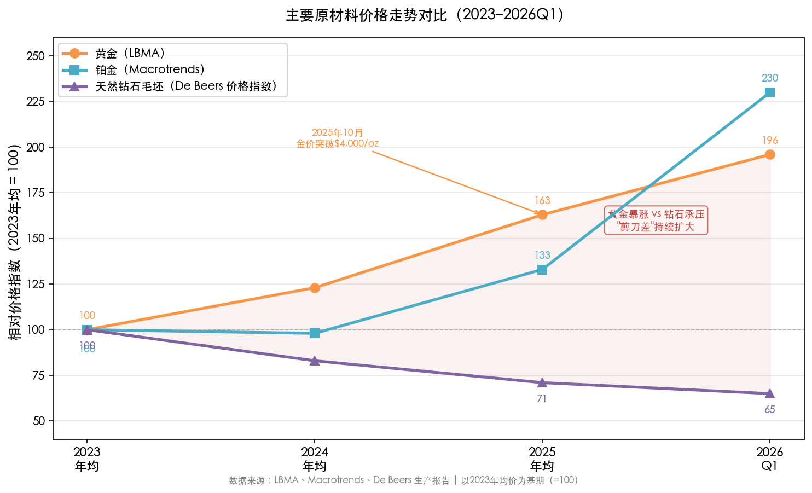
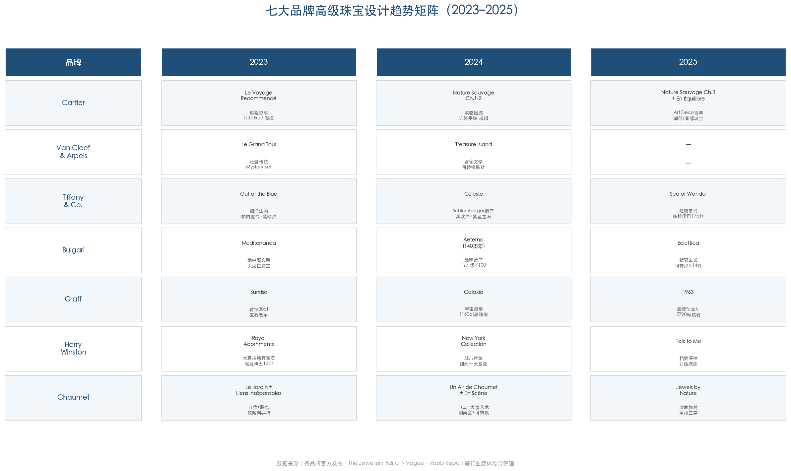
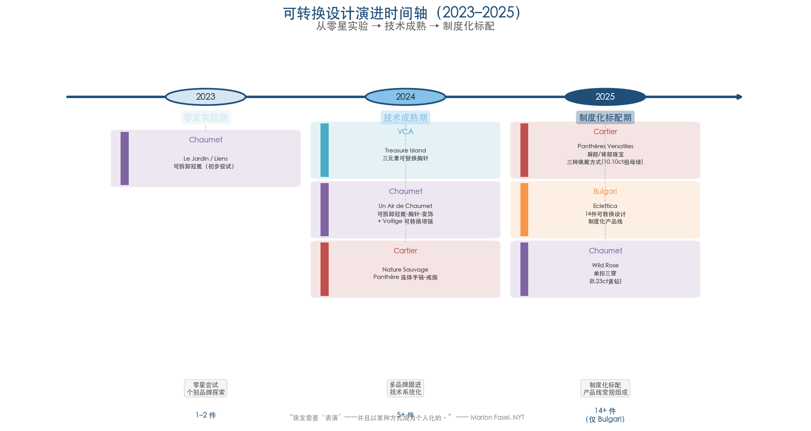
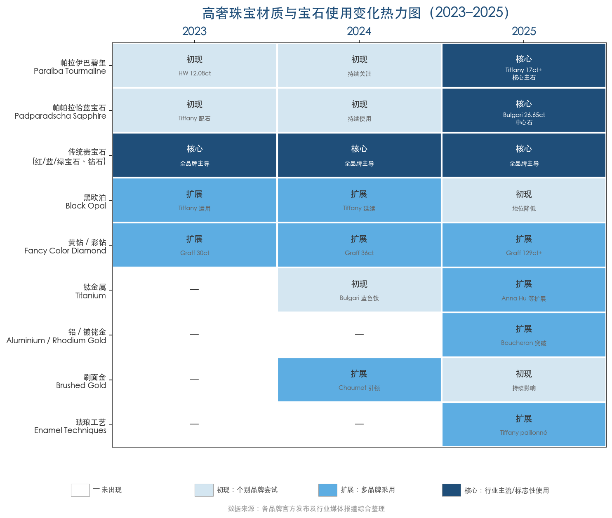
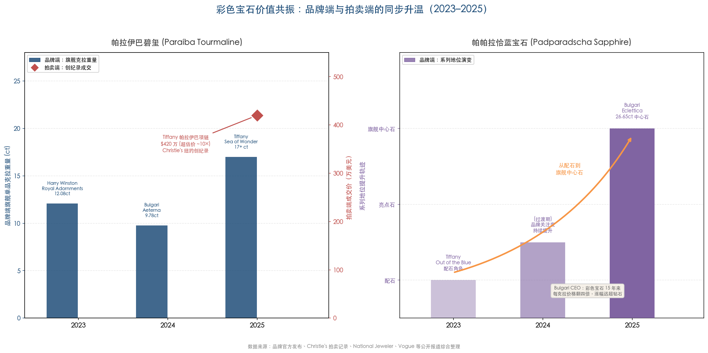
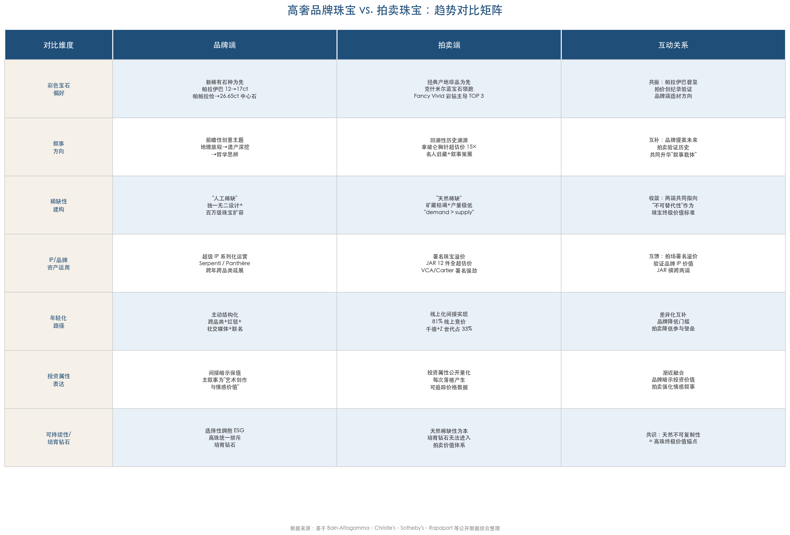
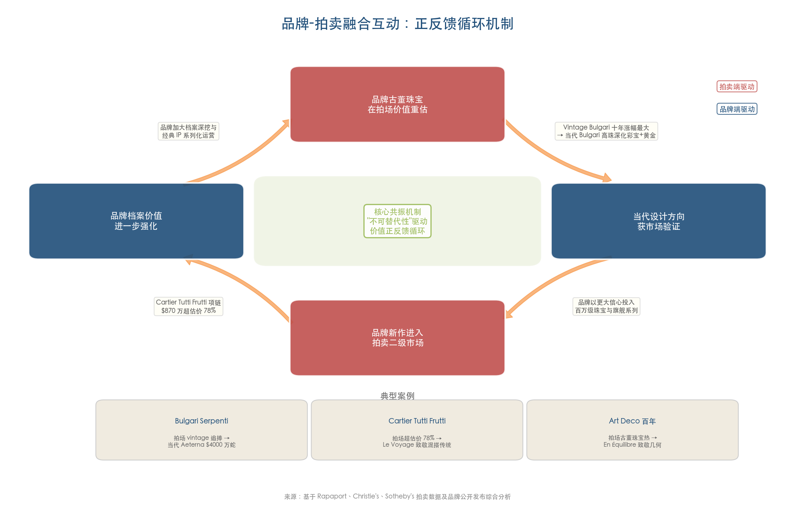

# 执行摘要

2023–2025 年，全球高级珠宝行业在奢侈品市场整体收缩的逆风中展现出超越周期的结构性韧性，成为唯一持续实现正增长的核心奢侈品类别（2025 年增速 4%–6%，规模约 320 亿欧元）。本报告以七大高奢品牌（Cartier、Van Cleef & Arpels、Tiffany & Co.、Bulgari、Graff、Harry Winston、Chaumet）的高级珠宝系列和全球主要拍卖行（Christie's、Sotheby's、Bonhams、Phillips）的珠宝拍卖数据为核心样本，系统梳理近三年珠宝设计流行趋势的变化轨迹，提炼其共通点与特色亮点，并对 2026–2027 年的前瞻方向做出审慎判断。

**核心发现一：彩色宝石正系统性取代钻石成为高级珠宝的价值锚点。** 帕拉伊巴碧玺在品牌端旗舰主石克拉重量三年间增长逾 40%（从 12.08 克拉到超 17 克拉），帕帕拉恰蓝宝石从配石升级为 26.65 克拉的系列核心。拍卖端同步共振——帕拉伊巴碧玺以估价 10 倍的 420 万美元创下世界纪录，104.61 克拉克什米尔蓝宝石项链以 1,610 万美元刷新项链纪录。彩色宝石过去 15 年每克拉价格翻四倍，天然钻石价格则自 2021 年以来下跌高达 40%，此消彼长构成了设计语言转变的经济基础。

**核心发现二：设计叙事从具象地理旅程走向哲学思辨，可转换设计从零星实验发展为行业标配。** 2023 年品牌以地中海、壮游、海洋等具象文化旅程为统一框架，2024 年转向品牌遗产与周年纪念深挖，2025 年进入侘寂哲学、平衡美学等抽象思辨阶段。可转换设计在三年间完成了制度化——Cartier 首创肩部/背部珠宝，Bulgari 在 160 余件系列中纳入 14 件可转换作品，Boucheron 2026 年将单件珠宝拆分维度推至 13 件。百万级珠宝数量显著扩容（Bulgari *Aeterna* 约 100 件、*Eclettica* 50 件定价超百万欧元），高级珠宝从"品牌形象工程"转变为核心利润引擎。

**核心发现三：品牌端与拍卖端的边界加速模糊，"不可替代性"成为统一价值标准。** 品牌古董珠宝在拍场的价值重估直接影响当代设计方向（vintage Bulgari 过去十年价格涨幅最大），Art Deco 百年纪念在两端同步激活美学回归，品牌署名溢价在拍卖端系统性攀升（JAR 12 件全超最高估价，Belperron 22/24 件超估价）。两个世界的价值循环正从偶发的信号传递演变为持续运转的正反馈机制。

**核心发现四：亚太与中东成为品牌端和拍卖端同步加码的新增长极。** Christie's 2023 年亚太区藏家支出同比增长 62%，Sotheby's 2025 年阿布扎比首拍即实现 100% 成交率，阿联酋奢侈珠宝市场预计 2030 年以 10.36% CAGR 增长。藏家结构呈现年轻化、女性化趋势——Christie's 千禧一代与 Z 世代竞拍者占比 2025 年达 33%，女性买家消费金额增长 20%。

**前瞻判断：** 2026–2027 年珠宝设计将沿六条主线演进——珠宝品类持续跑赢奢侈品大盘、档案复兴与 Art Deco 几何美学构成双轨设计主线、帕拉伊巴碧玺和帕帕拉恰蓝宝石确立"新经典"地位、可转换设计从功能创新进化为结构美学、东方美学元素进入全球高珠舞台、监管合规与供应链透明化重塑行业竞争壁垒。整个高级珠宝行业正在经历从"产品消费"向"资产+艺术+身份"三重价值融合的范式转变。

# 第1章 全球珠宝市场与设计风向总览（2023–2026）

珠宝——人类文明中最古老的奢侈品类别——在 2023 至 2026 年间经历了一场深层重塑。全球个人奢侈品市场遭遇十五年来首次收缩之际，珠宝逆势成为唯一持续正增长的核心品类，展现出超越周期的结构性韧性。与此同时，金价突破历史极值、培育钻石冲击传统价值体系、消费人群代际迁移加速——多重结构性变量共同重构了行业的竞争格局与设计语言。本章从市场宏观格局、区域增长引擎、消费人群演变、原材料价格波动以及设计风向三大叙事五个维度，勾勒这一关键时期全球珠宝行业的全景图。

## 1.1 奢侈品行业的"寒流"与珠宝品类的逆势韧性

### 1.1.1 全球个人奢侈品市场：十五年来首次收缩

2024 年标志着全球个人奢侈品市场的转折之年。Bain & Company 与意大利奢侈品行业协会 Altagamma 联合发布的第 23 版年度研究报告显示，2024 年全球个人奢侈品市场规模约 3630 亿欧元，按当前汇率同比下降 2%，为 2008–2009 年金融危机以来（不含新冠疫情期间）的首次收缩。[Bain-Altagamma 2024 奢侈品研究](https://www.bain.com/insights/luxury-in-transition-securing-future-growth/ "第23版年度奢侈品研究") 进入 2025 年，市场未能实现有效反弹，规模进一步降至约 3580 亿欧元，按固定汇率基本持平。[Bain-Altagamma 2025 奢侈品研究](https://www.bain.com/insights/finding-a-new-longevity-for-luxury/ "第24版年度奢侈品研究") Bain 预测 2026 年个人奢侈品将按固定汇率恢复 3%–5% 的增长；长期至 2035 年，市场规模有望达到 5250 亿至 6400 亿欧元，年化增速 4%–6%。

这一行业"寒流"源于多重宏观因素叠加：地缘政治紧张局势持续升级、主要经济体通胀虽有回落但消费信心恢复迟缓、中国大陆奢侈品消费自 2024 年起大幅收缩，以及年轻世代消费者对"价值感知"的重新定义。

### 1.1.2 珠宝：唯一持续正增长的核心奢侈品类

在奢侈品行业整体承压的背景下，珠宝品类的表现尤为突出。珠宝是 2023 年以来唯一持续实现正增长的核心奢侈品类别：2024 年增长 0%–2%，市场规模约 310 亿欧元；2025 年增长进一步加速至 4%–6%，达到约 320 亿欧元。增长动力主要来自聚焦客户经营和体验激活的领先品牌。[Bain-Altagamma 2025 奢侈品研究](https://www.bain.com/insights/finding-a-new-longevity-for-luxury/ "品类分析部分")

**图 1-1** 展示了 2023–2026E 年个人奢侈品整体与高端珠宝品类的规模及增速对比。珠宝品类增速在 2024–2025 年持续领先于奢侈品整体，印证了珠宝在行业下行周期中的逆势韧性。

从更宽泛的市场口径来看，Grand View Research 估算 2024 年全球奢侈珠宝市场（含品牌与非品牌高端珠宝）约 491 亿美元，至 2030 年预计达 821 亿美元，对应 CAGR 约 8.7%。[Grand View Research](https://www.grandviewresearch.com/industry-analysis/luxury-jewelry-market "奢侈珠宝市场报告") 该增速显著高于个人奢侈品整体，反映出珠宝品类在投资属性、情感价值和"不可替代性"上的独特优势。

头部珠宝集团的财务表现印证了上述趋势。历峰集团（Richemont）FY25（截至 2025 年 3 月）旗下珠宝品牌（Cartier、Van Cleef & Arpels 等）销售额达 153.3 亿欧元，同比增长 8%，贡献集团总收入的 71.6%。[历峰集团 FY25 年报](https://www.richemont.com/news-media/press-releases-news/richemont-posts-robust-performance-for-the-year-ended-31-march-2025/ "法定公告") LVMH 手表与珠宝部门 2025 财年收入约 104.9 亿欧元，有机口径增长 3%；旗下 Tiffany & Co. Blue Book 系列和 Bulgari *Polychroma* 均录得"创纪录"高级珠宝销售业绩。[LVMH 致股东信](https://www.lvmh.com/static/letter-to-shareholders-january-2026/watches-and-jewelry.html "2025全年业务回顾")

然而，行业整体盈利能力正面临压力。受黄金成本飙升影响，历峰集团毛利率同比下降 120 个基点至 66.9%。更广泛地看，奢侈品行业平均 EBIT 利润率 2025 年降至 15%–16%，较 2022 年峰值 21% 显著回落，行业总利润池较 2023 年缩减约 20%。[Bain-Altagamma 2025 奢侈品研究](https://www.bain.com/insights/finding-a-new-longevity-for-luxury/ "盈利能力部分")

### 1.1.3 品牌两极分化加剧

市场收缩并非均匀分布。2025 年仅 40%–45% 的品牌实现收入正增长，而 2022 年行业高峰期这一比例高达 95%。结构性分化更为显著：专精品牌（specialist brands）中 70% 以上实现增长，表现远优于综合型品牌集团。[Bain-Altagamma 2025 奢侈品研究](https://www.bain.com/insights/finding-a-new-longevity-for-luxury/ "品牌表现与展望") 这一分化表明，在市场下行周期中，拥有清晰品牌定位、卓越工艺传统和稳固客户关系的专精品牌具备更强的抗周期能力——而这恰是高端珠宝品牌的核心竞争优势所在。

## 1.2 区域格局：分化中的新增长极

### 1.2.1 传统核心市场的分化

2025 年全球奢侈品消费呈现显著的区域分化格局。欧洲市场规模约 1080 亿欧元，微降 1%–3%，旅游消费的恢复未能完全抵消本地需求疲软。美洲市场约 1010 亿欧元，变化幅度 0%–2%，美国市场受益于高净值人群的资产效应而保持相对稳定。[Bain-Altagamma 2025 奢侈品研究](https://www.bain.com/insights/finding-a-new-longevity-for-luxury/ "区域分析部分")

**图 1-2** 对比了五大区域在 2024 年与 2025 年的奢侈品市场增速，中国大陆降幅从 2024 年的 -21% 显著收窄至 2025 年的 -7%，日本则从 +12% 的高增长急转为 -7% 的回调，中东/非洲维持正增长态势。

中国大陆市场在 2024 年经历 20%–22% 的剧烈下滑后，2025 年降幅收窄至 6%–8%，但复苏节奏仍慢于预期。日本市场在 2023–2024 年受日元贬值驱动的"价格洼地效应"推动强劲增长后，2025 年减速至 -6%–8%，回归常态化轨道。

### 1.2.2 中东与印度：新兴增长极

中东/非洲地区 2025 年实现 4%–6% 的增长，迪拜和阿布扎比作为区域奢侈品消费枢纽持续稳健，沙特阿拉伯则被业界视为下一个高潜力市场。[Bain-Altagamma 2025 奢侈品研究](https://www.bain.com/insights/finding-a-new-longevity-for-luxury/ "区域分析部分") 拍卖行的区域布局同样印证了这一趋势——Sotheby's 2025 年首次在阿布扎比举办珠宝拍卖即实现 100% 成交率，折射出该区域高净值客户对高端珠宝的旺盛需求。

印度作为全球最大的黄金消费国之一，其珠宝市场近年来保持快速扩张。Grand View Research 估算 2025 年印度珠宝市场规模约 941 亿美元，预计至 2033 年达 1538 亿美元，对应 CAGR 约 6.5%。[Grand View Research](https://www.grandviewresearch.com/industry-analysis/india-jewelry-market-report "印度珠宝市场报告") 印度经济时报则报道该行业从 2024 年的约 830 亿美元预计增长至 2029 年的 1280 亿美元（CAGR 约 9%）。[Economic Times](https://retail.economictimes.indiatimes.com/news/apparel-fashion/jewellery/indias-gems-and-jewellery-sector-projected-to-reach-128-billion-by-2029/120475671 "印度宝石珠宝行业预测") 不同研究口径的估值虽存在差异，但印度珠宝市场作为全球增长引擎的地位已毋庸置疑：庞大的中产阶级群体、根深蒂固的黄金文化传统、快速增长的可支配收入，以及组织化零售渗透率的持续提升（目前组织化部分约占 30%），共同构成了长期增长的结构性支撑。

### 1.2.3 高净值人群的全球扩展

区域增长格局与高净值人群（HNWI）的地理分布高度关联。Knight Frank 2025 年财富报告显示，2024 年全球净资产超 1000 万美元的 HNWI 增长 4.4%，总数逾 230 万人，其中北美以 5.2% 增速领先。[Knight Frank 财富报告 2025 解读](https://luxurymarketinghouse.com/journal/key-insights-from-the-knight-frank-wealth-report-2025-global-wealth-trends-luxury-market-shifts/ "2025年3月") Capgemini 2025 年世界财富报告进一步指出，全球 HNWI 财富总额达 90.5 万亿美元（同比+4.2%），超高净值人群（UHNWI，净资产超 3000 万美元）约 23.4 万人。[Capgemini 财富报告 2025](https://www.capgemini.com/insights/research-library/world-wealth-report/ "2025年6月")

高净值人群的持续扩张为高端珠宝市场奠定了坚实的需求基础，而其地域分布的变化——尤其是中东、东南亚和印度新兴财富的快速积累——正在深刻重塑品牌的区域战略布局。

## 1.3 消费人群：代际迁移与客户结构的深层变革

全球奢侈品消费客群正经历深刻的结构性转变。Bain 数据显示，全球奢侈品消费者基数从 2022 年约 4 亿人萎缩至 2025 年约 3.3 亿人，缩减近 17%。[Bain-Altagamma 2025 奢侈品研究](https://www.bain.com/insights/finding-a-new-longevity-for-luxury/ "客户基础动态") 这一缩减并非市场萎缩的信号，而是消费集中度急剧上升的体现。

顶级客户（年消费超 2 万欧元、约占总客户基数 2%）的市场份额从 2019 年的 30% 攀升至 2025 年的 46% 以上，意味着不到 7 万名超级消费者贡献了近半数的全球奢侈品消费。对高端珠宝品牌而言，这一趋势的影响深远：百万级珠宝的销售规模显著扩容，品牌对"VIC（Very Important Client）"服务体系的投资持续加码，高级珠宝系列从"品牌形象工程"真正转变为核心利润引擎。

从代际维度审视，千禧一代（约 1981–1996 年出生）当前约占奢侈品总支出的 46%，已成为主力消费力量。与婴儿潮一代和 X 世代不同，千禧一代消费者更注重自我表达、情感价值和可持续理念，这直接重塑了珠宝设计的审美取向——从传统的"地位象征"向"个性宣言"和"情感资产"转型。

## 1.4 原材料价格：黄金极值与钻石分化

### 1.4.1 黄金：1979 年以来最强年度涨幅

2025 年黄金市场经历了历史性的价格飙升。LBMA 数据显示，金价在 2025 年录得自 1979 年以来最强年度涨幅（+62.9%），全年创下 45 次以上历史新高，于 10 月 8 日首次突破 4000 美元/盎司。[LBMA 报告](https://www.lbma.org.uk/articles/lbma-precious-metals-market-report-q4-and-full-year-2025 "Q4及全年报告") 驱动因素包括地缘政治紧张加剧、美元走弱、降息预期升温以及全球央行持续大规模购金。[世界黄金协会](https://www.gold.org/goldhub/gold-focus/2025/10/gold-hits-us4000oz-trend-or-turning-point "2025年10月")

**图 1-3** 以 2023 年均价为基期（=100），对比黄金、铂金和天然钻石毛坯三类核心原材料的相对价格走势。黄金指数至 2026 年 Q1 攀升至 196，天然钻石毛坯则降至 65，"黄金暴涨 vs. 钻石承压"的剪刀差持续扩大。

金价飙升对珠宝行业产生了双重效应。一方面，黄金珠宝的投资属性得到强化，Bain 研究员 Levato 指出消费者对"珠宝作为投资资产"的兴趣正在增长；另一方面，生产成本被显著推高，利润空间遭受压缩，独立珠宝商的经营压力尤为突出。

铂金价格在 2023–2024 年相对平稳（年均分别约 965 美元/盎司和 950 美元/盎司），2025 年随贵金属普涨行情升至年均约 1286 美元/盎司，2026 年初进一步攀升至约 2216 美元/盎司。[Macrotrends](https://www.macrotrends.net/2540/platinum-prices-historical-chart-data "铂金历史价格数据") 铂金虽在高端珠宝中的使用量不及黄金，但其价格走势反映出贵金属整体的通胀对冲功能正被市场重新定价。

### 1.4.2 天然钻石：价格持续承压

与黄金的强势形成鲜明对比，天然钻石市场在 2023–2025 年间持续承压。De Beers 公布的毛坯钻石价格指数显示，2024 年 Q1 价格较 2023 年均值骤降约 17%，此后跌势趋缓但未能反转。2025 年上半年 De Beers 合并平均实现价格为 155 美元/克拉，同比下降 5%（2024 年同期 164 美元/克拉），平均毛坯价格指数更下降 14%。[De Beers 2025 Q2 生产报告](https://www.debeersgroup.com/news-insights/latest-group-news/2025/production-report-for-the-second-quarter-of-2025 "H1 2025数据") 全年来看，De Beers 2025 年收入 35 亿美元，亏损扩大至 5.11 亿美元；毛坯产量较 2024 年下降 12% 至 2170 万克拉，系主动减产以应对需求疲软。[Mining Weekly](https://www.miningweekly.com/article/de-beers-loss-widens-to-511m-amid-ongoing-diamond-market-challenges-2026-02-20 "De Beers 2025年报")

在成品钻石层面，RapNet 钻石指数（RAPI）显示 2025 年全年 1 克拉 D–H/SI 类钻石价格暴跌 24.1%。2026 年 1 月 De Beers 再度削减毛坯价格，Rapaport 指出"钻石需求因培育钻石替代、中国市场疲软及结婚率下降等社会变化而出现永久性下降"。[Rapaport](https://rapaport.com/press-releases/decline-in-diamond-prices-eases/ "2026年2月价格分析")

McKinsey 在一项 2024 年发表的分析中指出，钻石行业正处于"历史性拐点"——培育钻石的崛起、消费者偏好向彩色宝石的迁移，以及年轻世代对"钻石即永恒"叙事的淡化，正在从根本上改变市场结构。[McKinsey](https://www.mckinsey.com/industries/metals-and-mining/our-insights/the-diamond-industry-is-at-an-inflection-point "钻石行业拐点")

### 1.4.3 培育钻石：颠覆性力量的扩张与边界

培育钻石（Lab-Grown Diamond, LGD）在这一时期延续了快速扩张态势。Euromonitor 数据显示，2024 年全球培育钻石珠宝市场接近 90 亿美元，在美国订婚戒指市场的渗透率已超过 45%，售价较同等品质天然钻石低约 73%–80%。[Euromonitor via ResearchAndMarkets](https://finance.yahoo.com/news/lab-grown-diamonds-market-report-142700472.html "培育钻石市场报告")

然而，培育钻石的影响呈现出明确的"层级分界"：在婚戒和中端市场，培育钻石已成为不可忽视的竞争力量；在高级珠宝和拍卖领域，截至目前七大头部品牌（Cartier、Van Cleef & Arpels、Tiffany & Co.、Bulgari、Graff、Harry Winston）均未在高级珠宝中采用培育钻石。培育钻石的"民主化"叙事与高级珠宝的"极致稀缺"定位之间，存在根本性的价值张力。

## 1.5 设计风向的三大叙事

在上述市场与原材料背景下，2023–2025 年珠宝设计呈现三条清晰的"大叙事"主线。

### 1.5.1 后疫情情绪消费回潮：珠宝作为自我表达与情感资产

后疫情时代，消费者对珠宝的认知正经历根本性转变。珠宝不再仅仅是身份地位的标识，而日益成为自我表达的载体和情感驱动的资产。这一转变体现在多个维度：品牌高级珠宝系列的叙事从传统的"尊贵感"转向更具情感温度的文化旅程与哲学思辨；消费者对"自购珠宝"（self-purchase）的接受度大幅提升，尤其在女性消费者群体中；珠宝的投资属性在金价飙升背景下进一步强化——同时满足了审美、情感和资产保值的多重需求。

这种"情绪消费"趋势还推动了可转换设计（transformable/convertible jewelry）的制度化。消费者期望一件高级珠宝能在多种场景中呈现不同的佩戴体验，从而最大化情感与功能价值。这一诉求直接催生了 Cartier 首创的肩部/背部珠宝、Chaumet Wild Rose 单扣三穿设计等创新形态。

### 1.5.2 ESG 加速渗透：可持续性从营销话语到战略核心

可持续性和 ESG（环境、社会与治理）议题在 2023–2025 年间从行业的"选修课"升级为"必修课"。McKinsey 研究指出，约三分之一的高端珠宝购买可能受到 ESG 因素影响。[McKinsey](https://www.mckinsey.com/industries/metals-and-mining/our-insights/the-diamond-industry-is-at-an-inflection-point "ESG与消费者行为") 具体表现包括：负责任采购（responsible sourcing）从供应链后端走向品牌前端叙事；数字产品护照（Digital Product Passport, DPP）技术的开发加速，为产品全生命周期的溯源与认证提供基础设施；AI 鉴定工具在二手奢侈品平台中的应用增强了消费者信任。

二手奢侈品市场的持续扩张是 ESG 渗透的另一重要标志。2025 年二手奢侈品市场估计达 500 亿欧元（同比+4%–6%），其中硬奢（手表和珠宝）约占 83%。[Bain-Altagamma 2025 奢侈品研究](https://www.bain.com/insights/finding-a-new-longevity-for-luxury/ "二手奢侈品部分") 循环经济模式不仅回应了可持续消费诉求，也为品牌珠宝的"保值属性"提供了二级市场的实证验证。

### 1.5.3 彩色宝石复兴与工艺至上转向

三年间最引人注目的设计趋势，是彩色宝石对无色钻石传统霸主地位的挑战，以及"工艺至上"（savoir-faire supremacy）理念的强势回归。

在品牌端，帕拉伊巴碧玺（Paraíba tourmaline）从 2023 年 Harry Winston 的 12.08 克拉到 2025 年 Tiffany 的超 17 克拉持续走红；帕帕拉恰蓝宝石（padparadscha sapphire）从 2023 年 Tiffany 的配石角色升级为 2025 年 Bulgari *Eclettica* 系列的 26.65 克拉中心石。在拍卖端，2023 年 Estrela de Fura（55.22 克拉莫桑比克红宝石）以 3480 万美元创下红宝石及彩色宝石世界纪录；2025 年一条 104.61 克拉克什米尔蓝宝石项链以 1610 万美元创下项链世界纪录。正如 Bulgari CEO 所指出的，彩色宝石在过去 15 年每克拉价格翻了四倍，正取代钻石成为高级珠宝的价值锚点。

"工艺至上"转向则体现为高级珠宝系列的市场表现显著优于常规产品线。Bain 数据显示，高级珠宝品类在 2023–2025 年间持续跑赢市场。品牌纷纷加大高级珠宝系列的规模与野心：Bulgari CEO 明确表示"不怕推出更多百万级珠宝"，其 2024 年 *Aeterna* 系列约 100 件定价超百万欧元、2025 年 *Eclettica* 系列含 50 件百万级作品；Van Cleef & Arpels 2024 年 *Treasure Island* 超 70 件，为品牌史上最大规模高级珠宝系列。工艺的复杂度——隐秘式镶嵌、可转换结构、珐琅复兴、钛金属与非传统材料的引入——已成为品牌竞争的核心壁垒。

## 1.6 小结

2023–2026 年的全球珠宝市场呈现出一幅复杂而富有张力的图景。行业整体面临收缩压力，珠宝品类却凭借投资属性、情感价值和工艺稀缺性逆势增长；区域格局加速分化，中东和印度跃升为新增长极；金价飙升强化了珠宝的资产属性，却同步压缩了利润空间；天然钻石在培育钻石冲击下价格持续走低，而彩色宝石正经历历史性复兴；消费客群向超高净值人群高度集中，推动百万级珠宝规模显著扩容。这些结构性力量共同塑造了"后疫情情绪消费回潮—ESG 加速渗透—彩色宝石复兴与工艺至上"的三大设计叙事，为后续章节对高奢品牌珠宝设计趋势和拍卖市场动向的深入解析奠定了宏观背景。

# 第2章 高奢品牌珠宝设计趋势——美学主题、材质、工艺与代表系列（2023–2025）

珠宝品类在 2023–2025 年的整体奢侈品市场中持续"逆势领跑"：2025 年增速达 4%–6%，为唯一实现显著正增长的核心奢侈品类别。[Bain-Altagamma 2025 奢侈品研究](https://www.bain.com/insights/finding-a-new-longevity-for-luxury/ "品类分析部分") 推动这一增长的核心引擎之一，正是头部品牌在高级珠宝（Haute Joaillerie / High Jewelry）领域的持续创新与战略升级。本章聚焦 Cartier（卡地亚）、Van Cleef & Arpels（梵克雅宝）、Tiffany & Co.（蒂芙尼）、Bulgari（宝格丽）、Graff（格拉夫）、Harry Winston（海瑞温斯顿）、Chaumet（尚美巴黎）七大品牌，辅以 Boucheron（宝诗龙）、Chopard（萧邦）等参照，从美学主题迁移、材质选择变化、工艺创新、代表系列与关键单品四个维度，逐年解读 2023–2025 年高奢品牌珠宝的设计演变轨迹。

## 2.1 2023 年：地理与文化叙事旅程

后疫情时代高级珠宝全面回归实体发布的第二年，七大品牌呈现出高度趋同的美学主题——以"地理与文化叙事旅程"为创作核心，将特定地域的文明、自然和人文意象转化为珠宝语言。这一集体选择既反映了全球旅行恢复后消费者对异域文化体验的渴望，也体现了品牌在重启大型实体发布时对"具象叙事"降低理解门槛的策略考量。

### 2.1.1 Bulgari *Mediterranea*：地中海文明的宝石诗篇

Bulgari 以地中海文明为灵感主线发布 *Mediterranea* 高级珠宝系列，作品横跨古罗马、希腊、埃及、拜占庭等多元文化源流。系列中尤为瞩目的作品包括一条镶嵌 15.13 克拉蓝宝石的项链，以及一枚以 68.88 克拉祖母绿为主石的六角形坠饰——后者耗时 1,650 小时完成镶嵌，充分展现了品牌在大克拉彩色宝石运用与建筑性结构设计上的标志性实力。[The Jewellery Editor](https://www.thejewelleryeditor.com/jewellery/article/bulgaris-dazzling-mediterranea-high-jewellery-launch/ "Bulgari Mediterranea 评论")

### 2.1.2 Cartier *Le Voyage Recommencé*：Tutti Frutti 传统的当代诠释

Cartier 在佛罗伦萨发布 *Le Voyage Recommencé*（重启旅程）高级珠宝系列，约 78–90 件作品。该系列的设计语言强调"珍贵与半宝石混搭"——将传统意义上的贵重宝石与非传统材质并置，延续了品牌自 1920 年代以来的 Tutti Frutti（水果锦囊）传统，即以雕刻祖母绿、红宝石、蓝宝石的印度穆卧儿风格组合打破西方珠宝的材质等级观念。[Vogue](https://www.vogue.com/article/cartier-high-jewelry-florence-italy "Cartier Le Voyage 报道")

### 2.1.3 Tiffany & Co. *Out of the Blue*：新创意掌舵人的海洋宣言

*Out of the Blue* 是新任首席艺术官 Nathalie Verdeille 加入 Tiffany 后发布的首个 Blue Book 高级珠宝系列，以海洋生物为灵感意象。系列大量运用帕帕拉恰蓝宝石（padparadscha sapphire）与黑欧泊（black opal）等非传统主石，前者以其介于粉色与橙色之间的独特色调，后者以其深邃的游彩效果，共同传递出一种既神秘又浪漫的海洋叙事。[Tiffany & Co. 官方新闻稿](https://press.tiffany.com/tiffany-co-unveils-blue-book-2023-out-of-the-blue-a-world-of-aquatic-inspired-high-jewelry-that-celebrates-jean-schlumbergers-legacy/ "Tiffany Blue Book 2023")

### 2.1.4 Van Cleef & Arpels *Le Grand Tour*：壮游传统与 Mystery Set 技术

Van Cleef & Arpels 以 18 世纪欧洲贵族"壮游"（Grand Tour）传统为叙事框架发布 *Le Grand Tour* 系列，将意大利、法国、英国等壮游经典目的地的建筑与自然意象转化为珠宝设计。品牌标志性的 Mystery Set（隐秘式镶嵌）技术在该系列中得到充分展现，宝石之间无可见金属爪托，呈现出如织锦般的连续色面。

### 2.1.5 Harry Winston *Royal Adornments*：大克拉稀有宝石的殿堂

Harry Winston 延续"钻石之王"基因，发布 *Royal Adornments* 系列，以超大克拉稀有宝石为核心竞争力。系列亮点包括一颗 30.27 克拉蓝宝石和一颗 12.08 克拉帕拉伊巴碧玺（Paraíba tourmaline）——后者以其独特的霓虹蓝绿色调和极端稀缺性（巴西原产地矿藏接近枯竭）成为 2023 年跨品牌关注的焦点宝石，也是帕拉伊巴碧玺在高珠领域"地位跃升"的起点。[Luxury London](https://luxurylondon.co.uk/style/watches-and-jewellery/jewellery/high-jewellery-collections-2023/ "2023 年度高珠系列综述")

### 2.1.6 Graff *Sunrise*：黄钻的极致表达

Graff 发布 *Sunrise* 系列，以一颗约 30 克拉 Fancy Intense Yellow 钻石为核心，延续品牌以单颗超级宝石为设计叙事中心的创作传统。黄钻的温暖色调与"日出"主题形成直觉性呼应，设计语言偏向纯粹的宝石展示而非复杂叙事。

### 2.1.7 Chaumet 双系列发布：花园与羁绊

Chaumet 在 2023 年发布了 *Le Jardin de Chaumet*（尚美花园）和 *Liens Inséparables*（不可分割的纽带）两个系列。前者延续品牌与自然的深厚渊源，后者则以"联结"为情感主题。双系列并行发布的策略体现了 Chaumet 在 LVMH 集团内加速高珠频次、扩大客群覆盖的战略意图。

### 2023 年度小结

综观 2023 年七大品牌高珠创作，三个共性特征值得关注。其一，具象的地理与文化旅程构成统一的叙事框架（地中海、壮游、海洋、日出），有效降低了抽象美学的理解门槛，使高珠系列更易于媒体传播和客户沟通。其二，帕拉伊巴碧玺和帕帕拉恰蓝宝石等"新稀有石种"开始进入主流视野，对传统"红蓝绿三大贵宝"的主导格局发起挑战。其三，可佩戴性与叙事性的平衡成为设计的潜在主线——珠宝不再仅是静态的收藏品，而是需要承载故事并适应多元佩戴场景的动态表达媒介。

## 2.2 2024 年：品牌遗产深挖与周年纪念大年

2024 年高级珠宝的美学主题发生显著迁移——从 2023 年的地理旅程转向品牌自身的历史档案和文化遗产。多个品牌恰逢周年庆典（Bulgari 140 周年尤为突出），将档案研究、历史致敬与当代再创作深度融合，品牌遗产从被动的历史仓库转化为主动的创作资源库。

### 2.2.1 Bulgari *Aeterna*：140 周年的里程碑之作

Bulgari 140 周年之际发布 *Aeterna*（永恒）高级珠宝系列，约 100 件作品定价均超 100 万欧元，标志着品牌向百万级珠宝市场全面倾斜。系列旗舰 Serpenti Aeterna 项链定价达 4,000 万欧元，镶嵌 140 克拉钻石——数字精准呼应品牌创立年份。Bulgari CEO Jean-Christophe Babin 公开表示"不怕推出更多百万级珠宝"，将高珠定位为品牌金字塔尖的价值锚点。[The Jewellery Editor](https://www.thejewelleryeditor.com/jewellery/article/millionaire-jewels-bulgari-aeterna-celebrate-140-years-of-the-roman-jeweller/ "Bulgari Aeterna 评论")

值得注意的是，*Aeterna* 不仅是一个珠宝系列，更是一次跨品类整合行动——涵盖腕表、手袋、香水等品类共计超 500 件单品，标志着高珠从独立品类向"品牌超级事件"转变的趋势正式确立。

### 2.2.2 Cartier *Nature Sauvage* 第一、二篇章：动物图腾的当代复兴

Cartier 于维也纳发布 *Nature Sauvage*（野性自然）高级珠宝系列第一、二篇章，共 87 件作品，以动物图腾为核心设计语言。系列将品牌标志性的 Panthère（猎豹）形象从平面装饰推向立体雕塑化表达，并推出 Panthère 连体手链-戒指——一种将手链与戒指通过链节一体连接的新型佩戴形式，预示了 2025 年更激进的"身体珠宝"探索。关键宝石包括一颗 22 克拉锡兰古董蓝宝石，其"古董"属性意味着这颗宝石在镶嵌之前已历经数十年乃至更长时间的流转，本身即承载丰厚的历史叙事。[Robb Report](https://robbreport.com/style/jewelry/cartier-high-jewelry-vienna-1235643766/ "Cartier Nature Sauvage 维也纳首发")

Cartier 通过 *Nature Sauvage* 的"多篇章逐年发布"策略（2024 年第一、二篇章，2025 年第三篇章），将单一高珠系列运营为持续数年的长线叙事 IP，这一模式已成为行业竞相效仿的范本。

### 2.2.3 Tiffany & Co. *Céleste*：三阶段四篇章的叙事工程

Tiffany 发布 *Céleste*（天穹）Blue Book 系列，以三阶段四篇章的复杂结构呈现超过 200 件作品，为品牌近年最大规模的高级珠宝投入。系列复兴了品牌经典的 Owl on a Rock 造型——原作由传奇设计师 Jean Schlumberger 于 1960 年代创作——并以当代宝石组合重新演绎。黑欧泊与紫色蓝宝石的大量使用延续了 2023 年 *Out of the Blue* 开启的"非传统主石"路线，进一步巩固 Tiffany 在色彩选择上的差异化定位。连续三年以 Schlumberger 遗产为蓝本的策略，映射出 LVMH 收购后品牌对历史档案资产进行系统性挖掘与变现的战略意图。

### 2.2.4 Van Cleef & Arpels *Treasure Island*：品牌史上最大规模高珠

Van Cleef & Arpels 发布 *Treasure Island*（金银岛）系列，超过 70 件作品，为品牌有史以来规模最大的高级珠宝系列。系列灵感源自 Robert Louis Stevenson 的经典冒险小说，核心作品包括一枚镶嵌 55.34 克拉蓝宝石的坠饰项链，以及一组可替换三种主题元素的胸针——佩戴者可根据场合更换胸针中央的装饰模块，使同一件珠宝呈现截然不同的视觉效果。这一设计标志着"可转换结构"（transformable design）从偶发的工艺炫技向系统化的产品策略演进。[Katerina Perez](https://katerinaperez.com/articles/van-cleef-arpels-treasure-island-biggest-high-jewellery-collection-yet "VCA Treasure Island 详评")

### 2.2.5 Harry Winston *New York Collection*：从自然旅程到城市建筑

Harry Winston 发布 *New York Collection*，首次将叙事框架从自然主题转向城市建筑，以纽约十个标志性意象为子系列架构——Central Park（中央公园）、Manhattan Adornment（曼哈顿装饰）、718 Marble Marquetry（718 号大理石镶嵌，致敬品牌第五大道旗舰店）、Brownstone（褐石建筑，致敬创始人上西区出生地）、Cathedral（大教堂，致敬圣帕特里克大教堂）、HW Graffiti（街头涂鸦）、City Lights（城市灯火）、Eagle（鹰）等。

核心作品展现了叙事意象与宝石选择的精密对应：Cathedral 项链以五颗梨形祖母绿镶嵌总重逾 65 克拉，建筑感的垂直线条呼应哥特式拱顶；Manhattan Adornment 项链组合 10.04 克拉蓝宝石、7.56 克拉海蓝宝石、5.39 克拉粉色蓝宝石和 21.66 克拉钻石，以多色宝石的并置再现曼哈顿天际线的光影层次；718 Marble Marquetry 项链以 48.53 克拉蓝宝石和 35.57 克拉钻石再现旗舰店大理石地板的几何图案。HW Graffiti 胸针中帕拉伊巴碧玺与粉色蓝宝石的组合，延续了品牌对这一稀有宝石的持续关注。[Roskin Gem News Report](https://roskingemnewsreport.com/harry-winstons-new-york-collection-high-jewelry-inspired-by-the-city-that-never-sleeps/ "Harry Winston New York 系列详评") [Vogue Singapore](https://vogue.sg/harry-winston-new-york-high-jewellery/ "Harry Winston 致敬纽约")

### 2.2.6 Graff *Galaxia*：宇宙叙事与超级钻石

Graff 发布 *Galaxia*（银河）系列，以宇宙和星空为灵感，总计镶嵌超过 1,160 克拉钻石与彩色宝石。亮点作品包括一枚 36.22 克拉白色椭圆形钻石戒指（总重 150.31 克拉）、一对 21 克拉 Fancy Yellow 雷地恩切割钻石耳环、一枚 36 克拉 Fancy Intense Yellow 枕形钻石戒指，以及一条以三颗罕见的 4 克拉菱形哥伦比亚祖母绿为核心的项链。Graff 设计总监 Anne-Eva Geffroy 阐述了创作理念："设计灵感来自每颗钻石和宝石的独特品质与细微差别，以及我们与女性特质相关联的美德——力量、创造力和勇气。"[Haute Living](https://hauteliving.com/2024/04/introducing-graff-galaxia-a-luxe-celebration-of-otherworldly-high-jewelry/748043/ "Graff Galaxia 系列介绍")

### 2.2.7 Chaumet 双系列：*Un Air de Chaumet* 与 *En Scène*

Chaumet 在 2024 年延续了双系列发布节奏。年初巴黎高定周期间发布的 *Un Air de Chaumet*（尚美之息）是一个精炼的胶囊系列，以飞翔的鸟类为灵感，致敬品牌守护者约瑟芬皇后最钟爱的动物意象。系列分为四个套组：*Plumes d'Or*（金羽）以刷面玫瑰金、白金和粒面镶嵌钻石呈现舒展的羽翼，核心作品为一顶可拆卸为胸针与发饰的冠冕，中心嵌有 2.3 克拉梨形切割钻石；*Ballet*（芭蕾）以抛光白金与钻石再现燕群翱翔的空中舞蹈；*Parade*（巡游）将燕子与天堂鸟的形态混合，创造出不对称胸针和耳饰；*Envol*（振翅）以白金与钻石的弯曲卷须再现鸟翼掠过时在空气中留下的痕迹。每一件作品均具备可转换功能，系列中大量使用的刷面金（brushed gold）引起《纽约时报》关注，该报专文指出刷面金已成为 2024 年高珠的材质潮流之一。[Katerina Perez](https://katerinaperez.com/articles/un-air-de-chaumet-high-jewellery-collection-review "Un Air de Chaumet 详评") [New York Times](https://www.nytimes.com/2024/03/05/fashion/jewelry-brushed-gold-chaumet.html "刷面金材质趋势")

年中，Chaumet 发布更大规模的 *En Scène*（登场）高级珠宝系列，共 60 件作品，以表演艺术——音乐、舞蹈和魔术——为统一主题，分为"Setting the Tempo"（定节拍）、"Leading the Dance"（领舞）和"As If by Magic"（如魔术般）三幕结构。核心作品包括：Partition 套装以三颗来自同一矿的 fil couteau 祖母绿切割哥伦比亚祖母绿为核心，配合一颗 10.73 克拉祖母绿戒指；Ballet 套装以 8.03、5.79 和 5.77 克拉三颗枕形蓝宝石构建"天鹅湖"般的流动旋律；Voltige 可转换项链以 10.18 克拉椭圆形钻石为主石，项链可在三条与一条之间自由转换；Harmony 套装以三颗 D 色内无瑕钻石呈"fff（极强音）"结构排列。Chaumet CEO Charles Leung 指出，系列中螺旋、卷须和涡旋的设计语言"正在成为根植于品牌档案珍品的 Chaumet 标志"，并特别提及"我们也在重新连接更加 Art Deco 的风格，这在品牌档案中高度存在"。[Katerina Perez](https://katerinaperez.com/articles/chaumet-en-scene-high-jewellery-collection-review "Chaumet En Scène 详评") [Harper's Bazaar Singapore](https://www.harpersbazaar.com.sg/jewels-watches/jewellery/high-jewellery-collections-2024 "2024 年度最佳高珠系列")

Chaumet 全年两次高珠发布（1 月胶囊+年中大系列）的节奏，体现了品牌在 LVMH 集团内加速高珠频次、在不同客群和场景间建立触点的战略意图。

### 2024 年度小结

2024 年的高珠设计呈现四个结构性趋势。其一，品牌遗产深挖与周年纪念成为主叙事驱动力——Bulgari 140 周年、Tiffany 对 Schlumberger 遗产的系统化开发、Cartier 动物图腾的当代复兴，共同验证了档案作为创作资源库的巨大潜力。其二，百万级珠宝数量显著增加：Bulgari *Aeterna* 约 100 件超百万欧元，高珠的价格天花板被系统性抬升。其三，高珠系列规模普遍扩大（VCA 超 70 件、Tiffany 超 200 件），从"精品小系列"向"品牌超级事件"的范式转变愈加清晰。其四，材质实验加速——刷面金（Chaumet *Un Air de Chaumet*）、钛金属（Bulgari *Aeterna*）等非传统表面处理和金属开始进入高珠词汇表，预示了 2025 年更大胆的材质突破。

## 2.3 2025 年：哲学思辨、可转换设计标配化与工艺至上

2025 年标志着高级珠宝美学主题的又一次深层迁移。地理旅程和品牌遗产作为叙事基底仍在延续，但更深层的结构性变化体现在三个维度：叙事从具象的文化致敬走向抽象的哲学思辨，可转换设计从个别品牌的工艺炫技升级为行业普遍标配，材质实验的边界进一步向非贵金属和失传工艺延伸。

### 2.3.1 Cartier *Nature Sauvage* 第三篇章与 *En Équilibre*：从动物图腾到身体珠宝

Cartier 发布 *Nature Sauvage* 第三篇章，在延续动物图腾的同时实现了一个重要的品类突破——推出品牌首创的肩部/背部珠宝 Panthères Versatiles。该作品以 10.10 克拉祖母绿为核心，支持三种截然不同的佩戴方式（项链、肩部装饰、背部装饰），从根本上重新定义了珠宝与身体的空间关系。同年，Cartier 另发布 *En Équilibre*（平衡）系列，明确致敬 Art Deco 百年——1925 年巴黎国际装饰艺术博览会的百年纪念。Statera 项链以黑白对比的几何构图重现 1925 年经典美学，标志着 Art Deco 风格在当代高珠中的系统性回归。珠宝评论家 Vivienne Becker 在 Tatler 撰文分析称，高珠设计正在经历"具象幻想被纯粹的线条、形式与色彩构图所取代"的美学转向。[Katerina Perez](https://katerinaperez.com/articles/cartier-high-jewellery-nature-sauvage-chapter-iii "Cartier Nature Sauvage 第三篇章") [Tatler](https://www.tatler.com/article/celebrating-100-years-of-art-deco-jewellery "Tatler Art Deco 专题")

### 2.3.2 Tiffany & Co. *Sea of Wonder*：珐琅工艺复兴与帕拉伊巴碧玺的极致运用

Tiffany 发布 *Sea of Wonder*（奇幻之海）Blue Book 系列，约 50 件作品。系列最重要的工艺突破在于复兴了 19 世纪的 paillonné 珐琅工艺——一种在半透明珐琅层下嵌入微型金箔片以产生光泽变化的古老技法，在工业化珠宝时代几近失传。旗舰作品 Wave 项链镶嵌一颗超过 17 克拉的帕拉伊巴碧玺，刷新了该宝石在品牌高珠中的克拉重量纪录。从 2023 年 Harry Winston 的 12.08 克拉到 2025 年 Tiffany 的 17 克拉以上，帕拉伊巴碧玺在三年内完成了从"新兴稀有石种"到与传统贵宝石并驾齐驱的核心主石的地位跃升。[Tiffany & Co. 官方新闻稿](https://press.tiffany.com/tiffany-co-unveils-blue-book-2025-sea-of-wonder-a-dreamlike-high-jewelry-collection-inspired-by-the-oceans-boundless-beauty/ "Tiffany Blue Book 2025")

### 2.3.3 Bulgari *Eclettica*：可转换设计的制度化

Bulgari 发布 *Eclettica*（折衷主义）系列，超过 160 件作品中包含 50 件百万级珠宝和 14 件可转换设计作品。旗舰作品以一颗 26.65 克拉帕帕拉恰蓝宝石为核心——这一重量标志着帕帕拉恰蓝宝石从 2023 年 Tiffany 中的配石地位正式升级为品牌核心系列的中心石。14 件可转换设计作品的数量已非个别实验，而是将可转换结构作为产品线的标准组成部分进行制度化运营。[ELLE](https://www.elle.com/fashion/jewelry/a70835486/bulgari-eclettica-high-jewelry-photos-2026/ "Bulgari Eclettica 报道")

### 2.3.4 Chaumet *Jewels by Nature*：濒危物种的珠宝诗学

Chaumet 发布 *Jewels by Nature*（自然之珠宝）系列，54 件作品以"生命世界"为叙事主轴，致敬品牌 245 年与自然的深厚渊源。系列旗舰 Wild Rose 项链以一颗 8.23 克拉 Fancy Vivid Yellow 钻石为核心，支持三种佩戴方式。其设计灵感明确指向濒危植物物种，将环境保护议题以诗意而非说教的方式融入高珠创作——这一策略既回应了 ESG 消费趋势的深化，也体现了高珠设计从纯粹的美学叙事向社会议题表达拓展的新方向。

### 2.3.5 Graff *1963*：钻石密度的极致纪录

Graff 发布 *1963* 系列（以品牌创立年份命名），旗舰项链镶嵌 7,790 颗钻石，总重超过 129 克拉，展现了品牌在钻石采购和密集镶嵌方面无与伦比的产业链能力。

### 2.3.6 Harry Winston *Talk to Me*：延续档案深挖

Harry Winston 发布 *Talk to Me* 高级珠宝系列，延续 2024 年 *New York Collection* 开启的档案深挖路线。该系列以"对话"为概念框架，探索珠宝作为情感表达和人际沟通媒介的可能性。

### 2.3.7 补充品牌：Boucheron 与 Chopard 的差异化路径

2025 年最具概念突破性的设计语言来自传统七大品牌之外。Boucheron 发布 *Carte Blanche: Impermanence*（白卡：无常）系列，以日本侘寂（wabi-sabi）哲学为灵感，30 件作品兼具珠宝与雕塑双重身份——既可佩戴，亦可作为独立艺术品陈列。材质选择突破传统框架，使用镀铑金和铝等非贵金属材料，将高珠的价值判断从"材料珍贵性"转向"艺术观念性"，标志着高珠从"装饰性奢侈"向"哲学思辨与艺术表达"的范式拓展。[The Jewellery Editor](https://www.thejewelleryeditor.com/jewellery/article/high-jewelry-trends-paris-2025/ "2025 年巴黎高珠趋势综述")

Chopard 则以 *Red Carpet: Caroline's Universe* 系列在戛纳电影节发布 78 件高珠，延续品牌与电影产业深度绑定的差异化策略，通过红毯曝光实现高珠影响力的跨圈层渗透。[Robb Report](https://robbreport.com/style/jewelry/gallery/chopard-red-carpet-high-jewelry-collection-photos-1236747907/ "Chopard 2025 Red Carpet")

## 2.4 设计语言的三年迁移轨迹

综合 2023–2025 年三年数据，高奢品牌珠宝设计语言呈现出四条清晰的迁移路径。图 2-1 以品牌×年度矩阵形式呈现七大品牌的代表系列、美学主题关键词和标志性宝石/工艺，直观揭示品牌间的趋同与分化。

**图 2-1 七大品牌高级珠宝设计趋势矩阵（2023–2025）**

### 2.4.1 美学主题：从具象旅程到哲学思辨

三年间的主题迁移呈现出明确的阶梯式深化。2023 年锚定于具象的地理文化旅程（地中海、壮游、海洋、日出），2024 年转向品牌自身的历史遗产和文化档案（140 周年、Schlumberger 遗产、动物图腾高潮），2025 年则进一步深化为哲学性和艺术性的抽象表达（Boucheron 侘寂哲学、Cartier 平衡美学、Chaumet 生命世界）。这一迁移轨迹反映了高珠核心客群——尤其是年消费超 2 万欧元、占市场份额 46% 以上的顶级客户——对珠宝的需求从"视觉震撼"向"精神共鸣"的持续升级。[Bain-Altagamma 2025 奢侈品研究](https://www.bain.com/insights/finding-a-new-longevity-for-luxury/ "客户基础动态")

### 2.4.2 经典 IP 的系列化运营

三年间，品牌经典 IP 的运营策略从"偶尔致敬"走向"系统化、多篇章、跨品类"的深度开发。Bulgari Serpenti 从 *Mediterranea* 蓝宝石蛇到 *Aeterna* 4,000 万欧元钻石蛇再到 *Eclettica* 的持续演绎；Cartier Panthère 从平面到连体手链-戒指再到肩部珠宝的维度升级；Tiffany Bird on a Rock 到 Owl on a Rock 的图腾延展——均体现了品牌将经典 IP 视为可持续增值的"文化资本"。

### 2.4.3 廓形革命：从传统套装到可转换单品

传统高级珠宝以完整套装（parure：项链+耳环+手链+戒指+胸针）为标准形制。2023–2025 年间，这一范式被"可转换设计"（transformable design）系统性颠覆，其演进路径如图 2-2 所示。

**图 2-2 可转换设计演进时间轴（2023–2025）：从零星实验到制度化标配**

2023 年尚属零星尝试阶段，仅个别品牌推出 1–2 件可转换作品。2024 年进入技术成熟期：VCA *Treasure Island* 的三元素可替换胸针、Chaumet *Un Air de Chaumet* 的可拆卸冠冕-胸针-发饰系统和 *En Scène* 的 Voltige 可转换项链、Cartier Panthère 连体手链-戒指，标志着多品牌同步跟进、技术系统化。2025 年正式进入制度化标配期：Cartier 首创肩部/背部珠宝 Panthères Versatiles（三种佩戴方式）、Bulgari *Eclettica* 14 件可转换作品将此策略制度化为产品线常规组成部分、Chaumet Wild Rose 实现单扣三穿。正如 Marion Fasel 在《纽约时报》撰文所言："珠宝需要'表演'——并且以某种方式成为个人化的。"[New York Times](https://www.nytimes.com/2026/01/25/fashion/fine-jewelry-transformability.html "NYT 可转换珠宝趋势")

可转换设计的兴起既回应了当代消费者对"多场景一件"的实用主义需求，也呼应了高珠从"展示性资产"向"可日常佩戴的情感表达"的功能转型。

## 2.5 材质选择变化：彩色宝石复兴与新型材料突破

图 2-3 以热力图形式呈现 2023–2025 年九类主要宝石、材质与工艺在七大品牌中的使用频次和核心地位变化，直观揭示材质格局的结构性演变。

**图 2-3 高奢珠宝材质与宝石使用变化热力图（2023–2025）**

### 2.5.1 帕拉伊巴碧玺与帕帕拉恰蓝宝石的崛起

三年间最显著的材质变化是两种"新稀有石种"的地位跃升（参见图 2-3 中帕拉伊巴碧玺与帕帕拉恰蓝宝石从"初现"到"核心"的演进）。帕拉伊巴碧玺从 Harry Winston 2023 年的 12.08 克拉到 Tiffany 2025 年超 17 克拉 Wave 项链，克拉重量与在系列中的核心地位同步提升。帕帕拉恰蓝宝石从 Tiffany 2023 年 *Out of the Blue* 中的配石角色升级为 Bulgari 2025 年 *Eclettica* 中 26.65 克拉的绝对中心石。Bulgari CEO Babin 提供了一个关键的价格参照：彩色宝石在过去 15 年中每克拉价格翻了四倍，涨幅远超钻石。[Vogue](https://www.vogue.com/article/age-of-asset-the-state-of-jewelry-in-2026 "Babin 彩色宝石价格评论") 这一数据从根本上解释了彩色宝石取代钻石成为高珠价值锚点的经济逻辑。

### 2.5.2 非贵金属材料的突破性使用

传统高珠几乎排他性地使用黄金、铂金和白金作为金属载体。2024–2025 年间，这一惯例被多个品牌同步打破（参见图 2-3 中钛金属、铝/镀铑金的新增条目）。钛金属应用显著扩大：Bulgari 2024 年 *Aeterna* 中的 Fuochi D'Artificio（烟花）作品使用蓝色钛金属底座，Anna Hu 2025 年的 Butterfly 系列采用手绘钛翅膀。Boucheron 2025 年 *Impermanence* 更为激进地使用镀铑金和铝——铝作为工业材料出现在高珠中堪称史无前例。[The Jewellery Editor](https://www.thejewelleryeditor.com/jewellery/article/high-jewelry-trends-paris-2025/ "2025 年巴黎高珠趋势")

钛金属的优势在于重量轻（密度约为黄金的四分之一）且可通过阳极氧化呈现丰富色彩，使大体量珠宝保持舒适的可佩戴性；铝的引入则完全超越了材质价值逻辑，将高珠的价值判断从"材料珍贵性"转向"艺术创造力"——这一转变与 Boucheron 侘寂哲学的叙事内核高度一致。

### 2.5.3 黄金价格飙升的设计端响应

2025 年黄金经历 1979 年以来最强年度涨幅（+62.9%），10 月首破 4,000 美元/盎司，全年刷新历史新高逾 45 次。[LBMA 报告](https://www.lbma.org.uk/articles/lbma-precious-metals-market-report-q4-and-full-year-2025 "Q4 及全年报告") [世界黄金协会](https://www.gold.org/goldhub/gold-focus/2025/10/gold-hits-us4000oz-trend-or-turning-point "2025年10月") 金价飙升对设计端产生了双重影响：一方面，黄金成本上升直接压缩利润空间（历峰集团 FY25 毛利率因黄金成本下降 120 个基点至 66.9%）[历峰集团 FY25 年报](https://www.richemont.com/news-media/press-releases-news/richemont-posts-robust-performance-for-the-year-ended-31-march-2025/ "法定公告")；另一方面，金价上涨反向强化了黄金珠宝的投资属性，使消费者更愿意为金含量高的作品支付溢价。钛金属和铂金（2025 年价格仅为黄金的约一半）作为替代材料的战略机遇由此增大。

## 2.6 工艺创新：传统技法的当代重生

材质革新之外，工艺层面同样经历了深刻变革。2023–2025 年间，多项濒临失传的传统技法被重新发掘，并与当代工程技术融合，形成了"古法新用"的行业趋势。

### 2.6.1 隐秘式镶嵌的新形态

Van Cleef & Arpels 的 Mystery Set（隐秘式镶嵌）技术在 2023–2025 年间被扩展至全新的造型领域。传统 Mystery Set 主要应用于花卉和动物形态，而 *Le Grand Tour* 和 *Treasure Island* 系列将其扩展至海浪蓝宝石、棕榈树祖母绿等前所未有的自然形态。每一块宝石需在底部切割精确的凹槽以嵌入不可见的金属轨道，宝石之间无可见爪托，呈现如织锦般的连续色面——技术难度与工时成本较传统形态成倍增长。

### 2.6.2 珐琅工艺复兴

Tiffany 2025 年 *Sea of Wonder* 中对 paillonné 珐琅工艺的复兴是本年度最引人注目的工艺事件。这一 19 世纪技法在工业化珠宝时代几近失传，其核心操作是在半透明珐琅层下嵌入手工切割的微型金箔片，每一层珐琅均需多次烧制，金箔在釉面下产生随光线变化的微妙闪烁效果。该工艺的回归印证了高珠设计在"机械精确性"与"手工温度"之间重新倾向后者的行业趋势——在数字化制造日益普及的时代，不可复制的手工痕迹本身成为稀缺性的新来源。

### 2.6.3 可转换结构的工程化

可转换设计的制度化（详见 2.4.3 节）背后是工程层面的系统性突破。Chaumet Wild Rose 的"单扣三穿"机构、VCA *Treasure Island* 的三种可替换主题元素模块化系统、Cartier Panthères Versatiles 的肩部/背部适配结构，均需要珠宝工程师在极小的空间内实现可靠的机械连接、平衡重量分布，同时保证多种佩戴形态下的视觉完整性与佩戴舒适度。这些技术挑战使可转换高珠的研发周期和制作成本显著高于传统固定形态珠宝，也意味着可转换设计的制度化将进一步推高高珠的价格门槛。

## 2.7 产品策略的结构性变化

### 2.7.1 百万级珠宝的系统性扩容

Bulgari 的策略最为明确：*Aeterna* 约 100 件超百万欧元、*Eclettica* 50 件百万级。CEO Babin 公开表态"不怕推出更多百万级珠宝"，实质上宣告了高珠的商业定位从"品牌形象的光环产品"向"可规模化的利润中心"的范式转变。这一策略转变的宏观背景是客群结构的深度极化：全球奢侈品消费客群从 2022 年约 4 亿人萎缩至 2025 年约 3.3 亿人，但顶级客户（年消费超 2 万欧元，约占总客户 2%）的市场份额从 2019 年 30% 提升至 2025 年 46% 以上。[Bain-Altagamma 2025 奢侈品研究](https://www.bain.com/insights/finding-a-new-longevity-for-luxury/ "客户基础动态") 品牌将资源集中于金字塔尖的超高净值客户，百万级珠宝扩容正是这一战略的产品端体现。

### 2.7.2 跨品类延伸与集团内联名

高珠正从独立的珠宝品类向跨品类"超级事件"演变。Bulgari *Aeterna* 涵盖珠宝、腕表、手袋、香水等品类超 500 件单品，将一个高珠系列打造为品牌全线动员的商业事件与媒体焦点。2025 年 Gucci×Pomellato 的集团内跨品牌高珠联名则代表了另一种路径——利用 Kering 集团内部资源，借助时尚品牌的流量势能实现珠宝品牌的话语权扩张，也为集团内品牌协同提供了新的商业范式。

### 2.7.3 经典 IP 再演绎的系列化运营

Cartier *Nature Sauvage* 的多篇章逐年发布策略堪称行业范本：2024 年发布第一、二篇章，2025 年发布第三篇章，每一篇章既有独立叙事又与前作形成连续性，将单一高珠系列运营为持续数年的"连续剧"。Tiffany 连续三年以 Schlumberger 遗产为蓝本（2023 年 *Out of the Blue*→2024 年 *Céleste*→2025 年 *Sea of Wonder*）同样体现了系列化运营思维。这一策略的商业逻辑在于：高珠客户的决策周期长、复购率相对低，但品牌通过持续的叙事连贯性维持客户关注度，降低每年重新建立认知的营销成本。

### 2.7.4 高珠发布日历的分散化

传统上，高珠发布集中于每年 7 月的巴黎高定周期间。2023–2025 年间，这一惯例被逐步打破：Bulgari *Eclettica* 2025 年选择在 3 月的米兰提前发布，VCA 2025 年刻意跳过传统高珠季，Cartier *En Équilibre* 在 2026 年 1 月巴黎高定周期间发布。Bulgari CEO Babin 阐述了背后的商业逻辑：品牌间客户重叠率达 60%–80%，在同一时间窗口密集发布意味着头部客户的注意力被严重稀释，提前或错开发布能够获得更高的独占注意力和转化率。这一趋势预计将在 2026 年及之后进一步加速，高珠发布日历的碎片化将成为行业新常态。

## 2.8 七大品牌设计 DNA 的分化与共振

综合三年高珠创作，七大品牌的设计 DNA 呈现出"共振中的分化"格局——共振体现在彩色宝石崛起、可转换设计标配化、叙事深度升级等行业共性趋势上，分化则根植于各品牌不可替代的历史基因与美学立场。

**Cartier** 以动物图腾和建筑性几何为双轴，在所有品牌中最积极地推动佩戴形式创新（从连体手链-戒指到肩部/背部珠宝），Art Deco 遗产构成其无可替代的美学根基。

**Van Cleef & Arpels** 以 Mystery Set 技术和诗意叙事为核心，坚持"可佩戴的梦幻"定位。在七大品牌中系列规模感最强（*Treasure Island* 超 70 件），但始终保持最一致的温柔调性与童话美学。

**Tiffany & Co.** 在 LVMH 体系下系统性挖掘 Schlumberger 遗产，以非传统宝石（黑欧泊、帕拉伊巴碧玺）和失传工艺复兴（paillonné 珐琅）建立鲜明的差异化定位。

**Bulgari** 以罗马建筑感的色彩对比和大克拉彩色宝石为视觉标志，在商业策略上最为激进——百万级珠宝扩容、跨品类延伸、发布日历创新三管齐下。Serpenti 已成为高珠领域最成功的超级 IP 之一。

**Graff** 坚守"最极致钻石"的品牌定位，以单颗超级宝石的克拉重量和净度品质为核心竞争力。设计语言相对内敛，让宝石本身成为全部叙事——这一"去设计化"的策略恰恰构成了最具辨识度的品牌特征。

**Harry Winston** 从"钻石之王"向多元叙事稳步转型。*New York Collection* 首次引入城市建筑主题，但核心仍是对超大克拉稀有宝石的严格筛选和 Winston Cluster（温斯顿花束）经典镶嵌风格的持续演绎。

**Chaumet** 以自然主义和冠冕传统为底色，在叙事深度上持续加码——从飞鸟自由到表演艺术再到濒危物种，叙事议题的社会关怀维度逐年加深。可转换设计和 Art Deco 回归是近年最显著的工艺特征，双系列发布节奏（年初胶囊+年中大系列）则体现了品牌提升高珠发布密度的战略意图。

# 第3章 高定竞拍珠宝市场趋势——拍场风向、天价拍品与收藏偏好（2023–2025）

如果说品牌高级珠宝代表着当代创意总监对美学疆域的主动拓展，那么拍卖市场则是一面映射全球顶级藏家真实偏好的镜子——价格由供需与情感的共振决定，每一次落槌都是市场投票的结果。2023 至 2025 年间，全球珠宝拍卖经历了从"破纪录狂潮"到结构性调整再到强势复苏的完整周期，其间浮现的趋势信号——彩色钻石持续称王、彩色宝石价值重估、品牌署名溢价飙升、亚太中东买家崛起——为理解珠宝设计与收藏的深层逻辑提供了不可替代的视角。

## 3.1 拍卖行业绩总览：V 形复苏与结构性分化

### 3.1.1 两大拍卖行的三年轨迹

Christie's（佳士得）与 Sotheby's（苏富比）是全球珠宝拍卖的双寡头，两家机构的业绩走势勾勒出整个市场的宏观脉络。

Christie's 全球总销售额在三年间画出一条 V 形曲线：2023 年约 62 亿美元（其中亚太区藏家支出同比增 62%），2024 年受宏观经济逆风影响降至约 57 亿美元（同比-6%），2025 年强势回升至约 62 亿美元（同比+6%），其中拍卖销售额 47 亿美元（同比+8%）。[Christie's 2025年报](https://press.christies.com/62b-projected-global-sales-in-2025/ "Christie's 2025年度业绩公告") 珠宝品类的复苏尤为显著：2025 年 Christie's 奢侈品板块（Luxury cluster，涵盖珠宝、手表、手袋及名车）全年销售额达 7.95 亿美元，同比增长 17%，成交率高达 88%，81% 的竞价通过线上完成。[Christie's 2025年报](https://press.christies.com/62b-projected-global-sales-in-2025/ "奢侈品板块数据") 奢侈品已成为 Christie's 新客户的首要入口——38% 的新买家通过奢侈品板块进入。

Sotheby's 总销售额同样经历了下行后的回升：2023 年约 79 亿美元（接近 2022 年 80 亿美元的历史纪录），2024 年降至约 60 亿美元，2025 年反弹至约 70 亿美元（同比+17%）。[Sotheby's 2025年度数据](https://en.thevalue.com/articles/sothebys-auction-house-global-sales-seven-billion-us-dollars-2025 "Sotheby's 2025销售数据") 在珠宝品类上，Sotheby's 2025 年拍卖成交额为 3.177 亿美元（同比+18%），成交率 94%。若加上私洽交易，Sotheby's 珠宝部门全年总销售额超过 4.5 亿美元，超过 3,042 位来自 79 个国家的竞拍者参与其中。[Sotheby's 官方社交媒体](https://www.instagram.com/p/DVQ4FpZDj8c/ "Sotheby's 2025珠宝总结") [Rapaport](https://rapaport.com/magazine-article/bringing-the-hammer-down-on-a-strong-auction-year/ "Rapaport 2025拍卖年度总结")

### 3.1.2 第二梯队拍卖行：Bonhams 的稳健与 Phillips 的聚焦

Bonhams（邦瀚斯）作为全球第三大拍卖行，在珠宝领域展现出差异化竞争优势。Bonhams 全球总销售额从 2023 年 11.4 亿美元（创 230 年公司历史纪录）回落至 2025 年 9.7 亿美元，但珠宝部门保持了持续增长的势头。[Bonhams 2023年报](https://www.bonhams.com/press_release/37635/ "2023年度业绩公告") [Bonhams 2025年报](https://www.bonhams.com/press_release/40885/ "2025年度业绩公告") 2023 年，Bonhams 珠宝部门创下历史最高纪录——全年拍卖总额 7,570 万美元，举办 87 场拍卖（含 58 场线上），售出 13,900 件拍品，全球注册竞拍者同比增长 18%。[Bonhams 珠宝部门 2023年报](https://www.bonhams.com/press_release/37775/ "Bonhams珠宝2023纪录") 至 2025 年，Bonhams 进一步扩大规模至 97 场拍卖（含 70 场线上），售出超过 15,000 件拍品，连续 15 年保持英国珠宝拍卖市场领导者地位。[National Jeweler](https://nationaljeweler.com/articles/14652-these-were-bonhams-top-10-jewelry-lots-in-2025 "Bonhams 2025十大珠宝拍品")

Phillips（富艺斯）虽然体量较小，但在珠宝拍卖领域增长迅猛，2023 年珠宝拍卖同比增长 40%，展现出年轻化、精品化的定位策略。[Rapaport](https://rapaport.com/magazine-article/bringing-the-hammer-down-on-a-strong-auction-year/ "Phillips珠宝增长")

### 3.1.3 市场结构性特征

综合四大拍卖行的表现，2023–2025 年珠宝拍卖市场呈现三个结构性特征：第一，珠宝品类的增速持续跑赢拍卖行整体业绩——即便在 2024 年行业普遍收缩期间，珠宝仍保持相对韧性；第二，成交率维持在极高水平（Christie's 88%、Sotheby's 94%），反映出拍卖行"精品化"策略的成效；第三，线上化渗透已从疫情应急手段转变为核心竞争力，Christie's 81% 的竞价通过线上完成，Bonhams 70 场线上拍卖占总场次的 72%。

## 3.2 年度标志性拍品：从破纪录到价值重估

拍卖市场的灵魂在于标志性拍品——它们不仅代表个体珠宝的价值巅峰，更是整个市场情绪与偏好趋势的风向标。

### 3.2.1 2023 年：彩钻的巅峰之年

2023 年珠宝拍卖以一系列破纪录成交开局，彩色钻石和顶级彩色宝石交替刷新价格上限。

年度最高价拍品为 The Bleu Royal，一颗 17.61 克拉 Fancy Vivid Blue 内部无瑕（IF）钻石，在 Christie's 日内瓦以 4,400 万美元成交，彰显了顶级蓝钻作为"终极投资级珠宝"的地位。[Christie's](https://press.christies.com/bleu-royal/ "Bleu Royal新闻稿") 紧随其后的是两件具有里程碑意义的拍品：Estrela de Fura，一颗 55.22 克拉莫桑比克红宝石，以 3,480 万美元创下红宝石及所有彩色宝石的世界拍卖纪录；The Eternal Pink，一颗 10.57 克拉 Fancy Vivid Purplish Pink 钻石，同样以 3,480 万美元成交。[Sotheby's](https://www.sothebys.com/en/articles/2023-in-review-jewelry "Sotheby's 2023珠宝回顾")

年度 TOP 5 中还包括 The Infinite Blue（11.28 克拉 Fancy Vivid Blue，2,530 万美元）和 Bulgari Laguna Blu（11.16 克拉 Fancy Vivid Blue，2,500 万美元）。仅从前五名拍品来看，Fancy Vivid Blue 钻石占据三席，Fancy Vivid Pink 一席，加上彩色宝石世界纪录的诞生，2023 年堪称"色彩至上"的标志性年份。

值得关注的是，2023 年还见证了多场具有历史文化叙事价值的专场拍卖取得卓越表现。Sotheby's"Vienna 1900"哈布斯堡王朝珠宝专场实现 100% 成交率，82% 的拍品超最高估价成交，证明了"历史叙事+显赫出处"组合在拍场上的溢价能力。[Sotheby's](https://www.sothebys.com/en/articles/2023-in-review-jewelry "Vienna 1900专场") 在第二梯队拍卖行中，Bonhams 同年的两场单一藏家白手套专场同样引人注目：纽约"The Perfect Jewellery Box"以 650 万美元 100% 成交，"Barbara Walters: American Icon"以 174 万美元 100% 成交。[Bonhams 珠宝部门 2023年报](https://www.bonhams.com/press_release/37775/ "Bonhams 2023白手套专场")

### 3.2.2 2024 年：Christie's 主导与古董珠宝崛起

2024 年全球拍卖市场整体收缩，但 Christie's 在珠宝领域进一步巩固了领先优势，年度 TOP 10 珠宝拍品中独占 9 席。[Rapaport](https://rapaport.com/news/a-very-merry-christies-the-most-valuable-auction-jewels-of-2024/ "Rapaport 2024年度十大珠宝拍品")

年度最高价为 Eden Rose 粉钻，一颗 10.20 克拉 Fancy Intense Pink 钻石，以 1,330 万美元成交。值得注意的是，相较于 2023 年动辄 3,000 万–4,000 万美元的顶级成交，2024 年天价拍品的绝对价格有所回落，反映出市场在整体调整中的审慎态度。

然而，2024 年的真正亮点在于古董珠宝和品牌署名珠宝的价值重估。Aga Khan 祖母绿胸针——一枚镶嵌 37 克拉哥伦比亚祖母绿的 Cartier 1960 年定制作品——以 880 万美元创下祖母绿拍卖世界纪录，将"品牌署名+显赫出处+顶级宝石"三重属性推至价值巅峰。一条 Cartier Tutti Frutti 项链以 870 万美元成交，远超 490 万美元的估价上限，印证了 Art Deco 时期品牌经典风格的强劲需求。Van Cleef & Arpels Maharaja 项链更是展示了可转换设计在拍卖市场的独特魅力——这条可拆卸为七条项链等 15 件独立珠宝的杰作以 620 万美元成交。[Rapaport](https://rapaport.com/news/a-very-merry-christies-the-most-valuable-auction-jewels-of-2024/ "Rapaport 2024年度十大")

### 3.2.3 2025 年：全面复苏与多元化纪录

2025 年珠宝拍卖市场强势复苏，多个品类同步刷新纪录，呈现出前所未有的多元化格局。

年度最高价拍品 The Mellon Blue，一颗 9.51 克拉 Fancy Vivid Blue VVS1 钻石，在 Christie's 日内瓦以 2,560 万美元成交。[Rapaport](https://rapaport.com/news/a-glittering-year-at-christies-the-top-auction-jewels-of-2025/ "Rapaport 2025年度十大珠宝拍品") Mediterranean Blue（10.03 克拉 Fancy Vivid Blue）则在 Sotheby's 日内瓦以 2,150 万美元紧随其后。Fancy Vivid Blue 钻石连续三年占据年度最高价拍品榜首，其作为"终极硬通货"的地位在拍场得到反复验证。

2025 年最具话题性的纪录诞生在彩色宝石领域。一条镶嵌 16 颗克什米尔蓝宝石、总重 104.61 克拉的项链在 Christie's 香港以 1,610 万美元创下世界纪录。[Christie's](https://press.christies.com/christies-magnificent-jewels-achieves-877-million-100-sold-highest-total-ever-for-a-various-owner-jewelry-auction-at-christies-in-the-americas "Christie's 2025纽约拍后报告") 克什米尔蓝宝石矿藏自 20 世纪 30 年代起实际枯竭，这一不可逆的稀缺性使其成为藏家追逐的终极标的。在 Bonhams，一枚 6.92 克拉克什米尔蓝宝石戒指以 100 万美元成交（超估价三倍），一枚 4.32 克拉克什米尔蓝宝石及钻石戒指以 55.93 万美元成交（估价上限仅 15 万美元），进一步印证了克什米尔蓝宝石跨价格段的普遍溢价。[National Jeweler](https://nationaljeweler.com/articles/14652-these-were-bonhams-top-10-jewelry-lots-in-2025 "Bonhams 2025十大")

帕拉伊巴碧玺在 2025 年迎来了拍卖市场的"正名时刻"。一条镶嵌 13.54 克拉巴西产帕拉伊巴碧玺的 Tiffany & Co. 项链在 Christie's 纽约以 420 万美元成交，是估价（30 万–60 万美元）的约 10 倍，同时创下帕拉伊巴碧玺拍卖世界纪录（总价和单位克拉价格双破纪录）。[National Jeweler](https://nationaljeweler.com/articles/14527-13-54-carat-paraiba-tourmaline-sets-records-at-christie-s "帕拉伊巴碧玺创纪录") Christie's 预计帕拉伊巴碧玺 2026 年将继续跑赢大盘。[Observer](https://observer.com/2026/03/art-luxury-auctions-2025-christies-jewelry-ferrari-hermes-watches-wine/ "Observer 帕拉伊巴碧玺趋势")

品牌署名珠宝的表现同样瞩目。Marie-Thérèse Pink（10.38 克拉 Fancy Purple-Pink，由 JAR 镶嵌）以 1,400 万美元创下 JAR 珠宝拍卖世界纪录。[Rapaport](https://rapaport.com/news/a-glittering-year-at-christies-the-top-auction-jewels-of-2025/ "Marie-Thérèse Pink") 在 Sotheby's，12 件 JAR 作品全部超最高估价成交，24 件 Belperron 作品中 22 件超估价。[Rapaport](https://rapaport.com/magazine-article/bringing-the-hammer-down-on-a-strong-auction-year/ "JAR与Belperron表现")

历史性拍品在 2025 年同样大放异彩。拿破仑钻石胸针——一枚镶嵌 13.04 克拉椭圆钻石、曾装饰拿破仑标志性双角帽的饰物——在 Sotheby's 日内瓦以 440 万美元成交，超估价 15 倍。Fabergé Winter Egg（1913 年帝国彩蛋，镶嵌超过 4,000 颗钻石）在 Christie's 伦敦以 3,020 万美元创下 Fabergé 世界纪录。[National Jeweler](https://nationaljeweler.com/articles/14496-faberge-s-the-winter-egg-achieves-record-30m "Fabergé冬之蛋报道") 在 Bonhams，1930 年代 Cartier 绿松石及钻石冠冕（曾属 Nancy Astor 子爵夫人）以 120 万美元成交，超估价三倍以上，为 Bonhams 年度最高珠宝拍品。[National Jeweler](https://nationaljeweler.com/articles/14652-these-were-bonhams-top-10-jewelry-lots-in-2025 "Bonhams Astor冠冕")

Christie's 2025 年 6 月纽约 Magnificent Jewels 拍卖以 8,770 万美元总成交额和 100% 成交率创下美洲珠宝拍卖纪录，为该年度画上了一个辉煌的句号。[Christie's](https://press.christies.com/christies-magnificent-jewels-achieves-877-million-100-sold-highest-total-ever-for-a-various-owner-jewelry-auction-at-christies-in-the-americas "Christie's美洲纪录")

## 3.3 收藏偏好的结构性变化

### 3.3.1 Fancy Vivid 彩钻：拍场"硬通货"的连续验证

Fancy Vivid Blue 和 Fancy Vivid Pink 钻石连续三年占据年度 TOP 3，其拍卖表现展现出跨周期的稳定性。2023 年 The Bleu Royal 以 4,400 万美元登顶，The Eternal Pink 以 3,480 万美元并列第二；2024 年 Eden Rose 粉钻以 1,330 万美元居首；2025 年 The Mellon Blue 以 2,560 万美元再度问鼎。这一价格轨迹——2024 年回落后 2025 年回升——与拍卖市场整体走势一致，但顶级彩钻的价格底线明显高于其他品类。

这一现象背后的逻辑在于极端稀缺性：开采级别达到 Fancy Vivid 色调的蓝色和粉色钻石极为罕见，全球年产量可以忽略不计，而超高净值客户群体（UHNWI）的持续扩大为需求端提供了坚实支撑。

### 3.3.2 克什米尔蓝宝石：不可再生资源的价值爆发

克什米尔蓝宝石在 2025 年跃升为顶级拍卖标的，这一趋势具有深刻的供给端逻辑。克什米尔矿区（位于今印控克什米尔地区）自 1930 年代起实质性枯竭，市场流通的克什米尔蓝宝石几乎全部来自存量转手。当 2025 年那条 104.61 克拉、16 颗克什米尔蓝宝石的项链以 1,610 万美元创下世界纪录时，它传递的信息超越了单次成交本身：对于不可再生的宝石资源，收藏性需求正在以指数级放大稀缺性溢价。

### 3.3.3 帕拉伊巴碧玺：从"新贵"到拍场正名

帕拉伊巴碧玺在拍卖市场的表现是近三年最具戏剧性的价值重估案例之一。2025 年 Tiffany 帕拉伊巴碧玺项链以估价 10 倍的 420 万美元创下世界纪录，这一结果并非偶然——它是品牌高级珠宝对帕拉伊巴碧玺持续采用（从 2023 年 Harry Winston 12.08 克拉到 2025 年 Tiffany 超 17 克拉）和拍卖市场价值发现的双向共振。巴西原产地矿藏接近枯竭进一步强化了其稀缺性叙事。Bonhams 的数据从侧面印证了这一趋势：2025 年一颗 181.61 克拉帕拉伊巴型碧玺"Kat Florence Lumina"在香港以约 48.7 万美元成交，一枚 4 克拉巴西产帕拉伊巴碧玺 Tiffany 戒指以 48.31 万美元成交，双双跻身 Bonhams 年度 TOP 10。[National Jeweler](https://nationaljeweler.com/articles/14652-these-were-bonhams-top-10-jewelry-lots-in-2025 "Bonhams帕拉伊巴碧玺")

### 3.3.4 品牌署名珠宝与古董珠宝：叙事溢价的结构性升温

过去三年，拍卖市场最深刻的结构性变化之一在于"品牌署名珠宝"（signed jewelry）溢价的系统性抬升。这一趋势在 2025 年达到高潮：Sotheby's 12 件 JAR 作品全超最高估价，24 件 Belperron 中 22 件超估价；经销商 Saidian 评价"Van Cleef clearly the strongest heritage brand"，经销商 Greg Kwiat 指出 VCA、Cartier、Belperron 持续表现强劲。[Rapaport](https://rapaport.com/magazine-article/bringing-the-hammer-down-on-a-strong-auction-year/ "署名珠宝趋势与评论")

Vintage Bulgari 的表现尤为引人注目。Saidian 指出"vintage Bulgari 过去十年价格涨幅最大"，2025 年 Elizabeth Taylor 1961 年 Bulgari 戒指超估价成交。[Rapaport](https://rapaport.com/magazine-article/bringing-the-hammer-down-on-a-strong-auction-year/ "vintage Bulgari与Taylor戒指") 这一价值重估与品牌端当代高级珠宝对大胆色彩和黄金的设计选择形成了有趣的共振——1960 至 1980 年代黄金与彩色宝石品牌古董珠宝的需求旺盛，恰好印证了当代高珠对相同美学元素的回归。[Observer](https://observer.com/2026/03/art-luxury-auctions-2025-christies-jewelry-ferrari-hermes-watches-wine/ "怀旧驱动vintage珠宝")

古董珠宝整体升温的另一个重要驱动力是 Art Deco 百年纪念。2025 年恰逢 1925 年巴黎装饰艺术博览会百周年，直接推动了 Art Deco 风格珠宝在拍场的热度。Phillips 专家 Repellin 对此有明确评论，Bonhams 2025 年年度最高价拍品——Cartier 1930 年代 Art Deco 绿松石及钻石冠冕——正是这一趋势的鲜明体现。[National Jeweler](https://nationaljeweler.com/articles/14652-these-were-bonhams-top-10-jewelry-lots-in-2025 "Bonhams Art Deco冠冕")

### 3.3.5 历史叙事与名人旧藏：情感溢价的极致演绎

历史性拍品和名人旧藏在 2023–2025 年间表现出惊人的溢价能力，反映出超高净值藏家对"不可替代的历史参与感"的强烈追求。Kwiat 珠宝商 Greg Kwiat 的评论精准概括了这一心理："Collectors and history-lovers are willing to pay extraordinary prices to own a true piece of history"。[Rapaport](https://rapaport.com/magazine-article/bringing-the-hammer-down-on-a-strong-auction-year/ "Greg Kwiat评论")

拿破仑钻石胸针超估价 15 倍以 440 万美元成交、Fabergé Winter Egg 以 3,020 万美元创品牌纪录、Sotheby's"Vienna 1900"专场 100% 成交且 82% 超最高估价——这些案例共同指向一个结论：当一件珠宝承载的不仅是材质和工艺价值，还有一段可追溯的历史叙事时，市场愿意为"故事本身"支付远超宝石内在价值的溢价。

## 3.4 藏家结构演变：年轻化、全球化与女性力量

### 3.4.1 亚太与中东买家的崛起

亚太和中东地区在 2023–2025 年间成为珠宝拍卖市场增长最快的需求来源。Christie's 2023 年亚太区藏家支出同比增长 62%，这一数据标志着亚洲藏家在全球拍卖格局中的话语权实质性提升。[Christie's 2023年报](https://press.christies.com/christies-projected-global-sales-total-62-ps5-eur58-hk487-billion-in-2023/ "Christie's亚太数据")

中东市场的标志性事件发生在 2025 年。Sotheby's 首次在阿布扎比举办珠宝拍卖，取得了令人瞩目的成绩：100% 成交率，23% 买家来自阿联酋本地，28% 为全新客户，约 30% 竞拍者低于 40 岁。Desert Rose 橙粉钻（31.68 克拉）以 880 万美元在阿布扎比成交，创下该颜色类别纪录。[Sotheby's 2025年度数据](https://en.thevalue.com/articles/sothebys-auction-house-global-sales-seven-billion-us-dollars-2025 "Sotheby's阿布扎比首拍") 这一结果表明，海湾地区不仅是品牌高级珠宝的重要消费市场，也正在快速成为全球拍卖格局中的新增长极。Max Fawcett 观察到"strong growth among female collectors and rising participation across Asia and the Middle East"。[Observer](https://observer.com/2026/03/art-luxury-auctions-2025-christies-jewelry-ferrari-hermes-watches-wine/ "中东与亚洲趋势")

### 3.4.2 年轻化与性别多元化

藏家群体的代际更替在三年间显著加速。Christie's 千禧一代与 Z 世代竞拍者占比从 2024 年的 30% 提升至 2025 年的 33%，女性买家人数增长 10%，消费金额增长 20%。[Christie's 2025年报](https://press.christies.com/62b-projected-global-sales-in-2025/ "Christie's年轻化数据") Sotheby's 的数据同样支持这一趋势：2025 年 29% 的竞拍者低于 40 岁。[Rapaport](https://rapaport.com/magazine-article/bringing-the-hammer-down-on-a-strong-auction-year/ "Sotheby's年轻藏家")

Max Fawcett 进一步观察到代际偏好的差异："established collectors pursue vintage masterpieces, while younger collectors gravitate toward wearable collections from the late 1960s and 1970s"。[Observer](https://observer.com/2026/03/art-luxury-auctions-2025-christies-jewelry-ferrari-hermes-watches-wine/ "年轻化与代际差异") 这一代际偏好分化对拍卖行的征集策略和估价模型都将产生深远影响——1960 至 1970 年代可佩戴珠宝的市场热度预计将持续攀升。

## 3.5 拍卖行策略演变：精品化、线上化与叙事策展

### 3.5.1 线上化的制度性嵌入

线上竞拍从疫情应急措施发展为拍卖行的核心基础设施。2025 年，Christie's 81% 的竞价通过线上渠道完成，线上销售额达 3.65 亿美元（同比+7%）。Bonhams 同年 97 场拍卖中 70 场为纯线上拍卖，占比达 72%。[Christie's 2025年报](https://press.christies.com/62b-projected-global-sales-in-2025/ "线上化数据") 线上化的深层影响在于降低了参与门槛，使更多中间价位竞拍者和新兴市场买家得以进入拍场，与藏家年轻化和全球化趋势形成正反馈循环。

### 3.5.2 现场拍卖的精品化策略

在线上分流中低价位拍品的同时，现场拍卖向"精品化"方向进一步演化。Christie's 的策略尤为典型：将现场拍卖精简至约 100 件顶级精品，以追求"白手套"（100% 成交率）的极致表现。2025 年 6 月纽约 Magnificent Jewels 以 8,770 万美元总成交、100% 成交率创下美洲纪录，正是这一策略的成功范例。[Rapaport](https://rapaport.com/magazine-article/bringing-the-hammer-down-on-a-strong-auction-year/ "精品化策略")

### 3.5.3 叙事性策展与单一藏家专场

拍卖行越来越多地将"策展叙事"能力作为核心竞争优势。单一藏家专场（single-owner collection）已成为驱动高溢价和高成交率的主力引擎。这一模式的核心逻辑在于：单一藏家的收藏往往具有内在的审美一致性和可追溯的出处叙事，能够为每一件拍品赋予超越其材质价值的"故事溢价"。

2023 年 Sotheby's"Vienna 1900"哈布斯堡王朝珠宝专场（100% 成交率，82% 超最高估价）、Bonhams"The Perfect Jewellery Box"（100% 成交率）、"Barbara Walters: American Icon"（100% 成交率）均是典范。[Sotheby's](https://www.sothebys.com/en/articles/2023-in-review-jewelry "Vienna 1900专场") [Bonhams 珠宝部门 2023年报](https://www.bonhams.com/press_release/37775/ "Bonhams白手套专场") 2024 年 Aga Khan 收藏和 Mughal 收藏（1,480 万美元）进一步验证了这一模式。2025 年"A Legacy of Elegance"专场以 3,000 万美元白手套成交，将单一藏家策展推向了新高度。

### 3.5.4 珍珠品类的跨区域复兴

在宝石品类的消长变化中，珍珠作为一个相对低调但稳步增长的品类值得关注。珍珠品类 2023–2025 年间呈现出跨区域需求增长的态势，尤其在亚太和中东市场。[Rapaport](https://rapaport.com/magazine-article/bringing-the-hammer-down-on-a-strong-auction-year/ "珍珠品类趋势") 这一复兴与品牌端对珍珠的重新演绎（如 Chanel、Mikimoto 的高级珠宝系列）以及年轻藏家对"含蓄奢华"的偏好形成呼应。

## 3.6 本章小结

2023–2025 年的珠宝拍卖市场，在经历 2024 年的短暂调整后，于 2025 年以更强劲的姿态回归增长轨道。Sotheby's 珠宝部门负责人 Quig Bruning 以"demand outstripping supply"概括 2025 年的市场状态。[Rapaport](https://rapaport.com/magazine-article/bringing-the-hammer-down-on-a-strong-auction-year/ "Quig Bruning评论") 这句话凝练了拍卖市场的核心逻辑：当自然资源的有限性（克什米尔蓝宝石矿枯竭、巴西帕拉伊巴矿接近枯竭、顶级彩钻年产量极低）遇上超高净值人群的持续扩大，价格发现的方向只有一个。

从更深层的视角来看，这三年间拍卖市场的演变折射出珠宝收藏逻辑的结构性转变：从"购买一颗宝石"转向"购买一段不可替代的历史与叙事"。无论是 Fancy Vivid Blue 钻石的跨周期硬通货属性、品牌署名珠宝的系统性溢价抬升，还是历史性拍品动辄超估价十余倍的成交，都指向同一个方向——在一个万物可复制的时代，"不可替代性"成为珠宝价值最坚实的锚点。

# 第4章 共通趋势与差异性分析——高奢品牌珠宝 vs. 拍卖珠宝

前两章分别从品牌创作端和拍卖收藏端，呈现了 2023–2025 年高级珠宝领域的核心演变轨迹。第2章揭示了品牌高珠如何以系列化叙事、可转换设计和彩色宝石崛起为三大引擎推动设计语言的系统性迭代；第3章则展示了拍卖市场如何以彩钻连年称王、品牌署名溢价飙升和藏家结构年轻化为主线，完成从"破纪录狂潮"到结构性复苏的完整周期。两条线索看似各自独立，实则共享同一批超高净值客户、同一套稀缺资源体系和同一个不断演变的审美语境。本章将这两条线索交叉比较，从五大共通趋势、四项结构性差异和多条融合互动通道三个层面展开分析，提炼品牌创作与拍卖收藏之间的审美共振与价值逻辑分野，并探讨两个领域如何相互影响、彼此重塑。

## 4.1 共通趋势：品牌创作与拍卖收藏的审美共振

### 4.1.1 彩色宝石的同步升温

过去三年中最显著的跨领域共识，是彩色宝石对传统白钻主导地位的系统性挑战。这一趋势在品牌新作和拍卖成交两端同步显现，构成了 2023–2025 年高级珠宝领域最重要的材质叙事转向。

在品牌端，帕拉伊巴碧玺的地位经历了从"新兴稀有石种"到"旗舰主石"的跃迁：Harry Winston 2023 年 *Royal Adornments* 以 12.08 克拉帕拉伊巴碧玺作为系列核心亮点，Bulgari 2024 年 *Aeterna* 运用 9.78 克拉帕拉伊巴碧玺，Tiffany 2025 年 *Sea of Wonder* 旗舰 Wave 项链更将帕拉伊巴碧玺的克拉重量推至超 17 克拉——三年间旗舰石重增长逾 40%。帕帕拉恰蓝宝石同步完成了从配石到中心石的地位跃升——从 Tiffany 2023 年 *Out of the Blue* 中的辅助角色，攀升至 Bulgari 2025 年 *Eclettica* 中 26.65 克拉的绝对主角。Bulgari CEO Babin 提供了一个关键的价格参照：彩色宝石在过去 15 年中每克拉价格翻了四倍，涨幅远超钻石。[Vogue](https://www.vogue.com/article/age-of-asset-the-state-of-jewelry-in-2026 "Babin 彩色宝石价格评论")

在拍卖端，彩色宝石的价值重估更为戏剧性。2025 年一条镶嵌 13.54 克拉巴西产帕拉伊巴碧玺的 Tiffany 项链在 Christie's 纽约以 420 万美元成交，约为估价上限（60 万美元）的 7 倍，同时创下帕拉伊巴碧玺拍卖世界纪录（总价和单位克拉价格双破纪录）。[National Jeweler](https://nationaljeweler.com/articles/14527-13-54-carat-paraiba-tourmaline-sets-records-at-christie-s "帕拉伊巴碧玺创纪录") Christie's 预计帕拉伊巴碧玺 2026 年将继续跑赢大盘。[Observer](https://observer.com/2026/03/art-luxury-auctions-2025-christies-jewelry-ferrari-hermes-watches-wine/ "帕拉伊巴碧玺趋势预测") 克什米尔蓝宝石同样表现突出——一条镶嵌 16 颗克什米尔蓝宝石、总重 104.61 克拉的项链以 1,610 万美元创下世界纪录，印证了不可再生彩色宝石资源的终极价值。[Rapaport](https://rapaport.com/magazine-article/bringing-the-hammer-down-on-a-strong-auction-year/ "克什米尔蓝宝石领跑")

上图直观呈现了帕拉伊巴碧玺和帕帕拉恰蓝宝石在品牌端（旗舰克拉重量逐年攀升）与拍卖端（创纪录成交价）的同步升温轨迹，两端的价值共振效应清晰可见。

两端的彩色宝石热潮虽然同向共振，但在侧重点上存在微妙差异。品牌端更倾向于推广"新稀有石种"——帕拉伊巴碧玺、帕帕拉恰蓝宝石、黑欧泊——以构建差异化的美学叙事；拍卖端则同时聚焦"新稀有石种"和"经典产地历史珍品"（克什米尔蓝宝石、缅甸鸽血红宝石），后者的价值锚点在于不可逆的资源枯竭。彩色钻石（Fancy Vivid Blue/Pink）在拍卖端连续三年占据成交价 TOP 3，品牌端对彩钻的运用则更为节制——这一不对称反映了品牌端追求色彩叙事多元性与拍卖端锚定终极稀缺性之间的价值逻辑分野。

### 4.1.2 叙事性的平行强化

品牌端与拍卖端在 2023–2025 年间不约而同地将"叙事"确立为珠宝价值的核心载体，但两端的叙事方向构成了一组对称的镜像关系——前者面向未来，后者指向历史。

品牌端采用的是**前瞻性创意叙事**。Bulgari 以地中海文明（2023 *Mediterranea*）、品牌 140 年历史（2024 *Aeterna*）、折衷主义哲学（2025 *Eclettica*）构建了逐年递进的三部曲；Van Cleef & Arpels 从壮游传统（2023 *Le Grand Tour*）到金银岛冒险（2024 *Treasure Island*）铺展文学想象的版图；Cartier *Nature Sauvage* 以多篇章逐年发布策略（2024 年第一、二篇章→2025 年第三篇章），将单一高珠系列运营为持续数年的连续叙事。在这一模式中，品牌创意总监扮演"叙事建筑师"角色，珠宝成为承载预设主题的美学载体。

拍卖端采用的是**回溯性历史叙事**。拿破仑钻石胸针——一枚镶嵌 13.04 克拉椭圆钻石、曾装饰拿破仑标志性双角帽的饰物——超估价 15 倍以 440 万美元成交；Marie-Thérèse Pink（10.38 克拉 Fancy Purple-Pink，JAR 镶嵌）以 1,400 万美元创下 JAR 珠宝拍卖世界纪录；Sotheby's"Vienna 1900"哈布斯堡王朝珠宝专场实现 100% 成交率、82% 拍品超最高估价。经销商 Greg Kwiat 精准概括了这一心理驱动力："Collectors and history-lovers are willing to pay extraordinary prices to own a true piece of history"。[Rapaport](https://rapaport.com/magazine-article/bringing-the-hammer-down-on-a-strong-auction-year/ "Greg Kwiat 评论与叙事策展")

拍卖行自身亦将"叙事策展"能力作为核心竞争优势加以锻造。单一藏家专场——如 Sotheby's"Vienna 1900"、Bonhams"Barbara Walters: American Icon"（100% 成交率）、Christie's 2025 年"A Legacy of Elegance"（3,000 万美元白手套成交）——通过为每一件拍品赋予一致的审美脉络和可追溯的出处叙事，制造超越材质本身的"故事溢价"。

两端叙事的共通本质在于：无论是品牌创意总监的前瞻性构思，还是拍卖行对历史出处的回溯性发掘，核心逻辑都是为珠宝赋予超越物质属性的意义层——在一个万物可复制的时代，"故事"已成为不可替代性最有效的载体。

### 4.1.3 稀缺性溢价的并行建构

品牌端与拍卖端通过截然不同的机制，共同指向一个终极价值命题：**不可替代性**。两端的稀缺性建构路径虽有本质差异，但在价格发现方向上高度趋同。

品牌端通过"人工稀缺"策略建构稀缺性。Bulgari CEO Babin 明确表示"不怕推出更多百万级珠宝"——*Aeterna* 约 100 件定价超百万欧元、*Eclettica* 含 50 件百万级作品——这一策略的本质是将高珠定位为"独一无二的艺术品"而非可批量复制的商品。每一件高珠在材质组合、设计构思和工艺执行上的唯一性，构成了品牌端稀缺性的核心支撑。这一策略植根于客群结构的深刻变化：全球奢侈品消费客群从 2022 年约 4 亿人萎缩至 2025 年约 3.3 亿人，但顶级客户（年消费超 2 万欧元，约占总客户 2%）的市场份额从 2019 年的 30% 提升至 2025 年的 46% 以上，品牌具有充分的经济激励将资源集中于金字塔尖。[Bain-Altagamma 2025 奢侈品研究](https://www.bain.com/insights/finding-a-new-longevity-for-luxury/ "客户基础动态") [The Jewellery Editor](https://www.thejewelleryeditor.com/jewellery/article/millionaire-jewels-bulgari-aeterna-celebrate-140-years-of-the-roman-jeweller/ "Bulgari 百万级珠宝策略")

拍卖端则依托"天然稀缺"——自然资源的不可逆枯竭和历史的唯一性构成了价值的根基。克什米尔蓝宝石矿自 1930 年代枯竭，巴西帕拉伊巴碧玺原产矿接近枯竭，达到 Fancy Vivid 色调的蓝色和粉色钻石全球年产量几乎可以忽略不计。Sotheby's 珠宝部门负责人 Quig Bruning 以"demand outstripping supply"概括 2025 年市场状态，这一供需失衡的根源正是天然稀缺的不可逆性。[Rapaport](https://rapaport.com/magazine-article/bringing-the-hammer-down-on-a-strong-auction-year/ "Quig Bruning 评论")

两端的稀缺性逻辑指向同一类客户——超高净值人群。2024 年全球净资产超 1,000 万美元的 HNWI 增长 4.4% 至逾 230 万人，UHNWI 财富总额达 90.5 万亿美元（同比+4.2%）。[Knight Frank 财富报告 2025 解读](https://luxurymarketinghouse.com/journal/key-insights-from-the-knight-frank-wealth-report-2025-global-wealth-trends-luxury-market-shifts/ "2025年3月") 当这一不断扩大的财富群体同时追逐品牌端的"人工唯一"和拍卖端的"天然唯一"时，两端的价格发现方向趋于一致：持续上行。

### 4.1.4 亚太与中东市场影响力的同步提升

亚太和中东地区在品牌端与拍卖端的同步崛起，构成 2023–2025 年最显著的地缘结构变化之一。这一趋势同时重塑了珠宝的供给侧布局和需求侧偏好。

拍卖端率先呈现突破性增长。Christie's 2023 年亚太区藏家支出同比增长 62%，增幅为所有区域之最。[Christie's 2023年报](https://press.christies.com/christies-projected-global-sales-total-62-ps5-eur58-hk487-billion-in-2023/ "Christie's 亚太数据") Sotheby's 2025 年首次在阿布扎比举办珠宝拍卖，成绩令人瞩目：100% 成交率，23% 买家来自阿联酋本地，28% 为全新客户，约 30% 竞拍者低于 40 岁，其中 Desert Rose 橙粉钻（31.68 克拉）以 880 万美元创下该颜色分级的拍卖纪录。[Sotheby's 2025年度数据](https://en.thevalue.com/articles/sothebys-auction-house-global-sales-seven-billion-us-dollars-2025 "Sotheby's 阿布扎比首拍") Christie's 2025 年香港 Magnificent Jewels 拍出 104.61 克拉克什米尔蓝宝石项链世界纪录，进一步验证了亚太市场作为顶级拍品主要承接地的战略地位。

品牌端同步扩张，与拍卖端形成互补态势。阿联酋奢侈珠宝市场 2025 年估值达 12.4 亿美元，预计 2030 年以 10.36% CAGR 增长至近 21 亿美元规模。[PR Newswire](https://www.prnewswire.com/news-releases/uae-luxury-jewelry-market-valued-at-usd-1-24-billion-in-2025--set-to-grow-at-10-36-cagr-through-2030--driven-by-rising-demand-for-premium-designs--top-companies-cartier-tiffany--co-bulgari-van-cleef--arpels-damas--other-302581813.html "阿联酋奢侈珠宝市场报告") 中国大陆奢侈品市场在 2024 年深度调整（-17%–19%）后，2025 年跌幅显著收窄至 -3%–5%，历峰集团 2025 年 Q4 大中华区销售恢复超预期。Max Fawcett 观察到"strong growth among female collectors and rising participation across Asia and the Middle East"，指出女性藏家和新兴市场参与度的提升正在改变行业格局。[Observer](https://observer.com/2026/03/art-luxury-auctions-2025-christies-jewelry-ferrari-hermes-watches-wine/ "中东与亚洲趋势")

品牌端与拍卖端在亚太中东的同步扩张并非巧合，而是建立在共享客户池的基础之上。品牌高珠的红毯发布会和 VIP 私享会为拍卖行积累了潜在卖家——今日的品牌高珠买家即是明日的拍卖市场供给端；而拍卖行在新兴市场的路演和首拍则为品牌培育了高级珠宝的认知基础和鉴赏能力。两端在同一地区的协同深耕，加速了新兴富裕阶层向成熟珠宝藏家的转化。

### 4.1.5 Art Deco 百年纪念的跨领域共振

1925 年巴黎国际装饰艺术博览会百周年纪念，在 2025 年同时激活了品牌端与拍卖端的 Art Deco 美学回归，形成了跨越一级市场与二级市场的风格共振。

品牌端以当代创作回应历史遗产。Cartier 2025 年 *En Équilibre*（"平衡"）系列明确致敬 Art Deco 百年，其中 Statera 项链以黑白对比的几何构图重现 1925 年经典美学语言。珠宝评论家 Vivienne Becker 在 Tatler 撰文分析，高珠设计正在经历"figurative fantasies are being replaced by compositions of pure line, form and colour"的深层转向。[Tatler](https://www.tatler.com/article/celebrating-100-years-of-art-deco-jewellery "Tatler Art Deco 专题") Chaumet CEO Charles Leung 亦明确提及品牌正在"重新连接更加 Art Deco 的风格"。Van Cleef & Arpels 于 2025 年 9 月至 2026 年 1 月在东京举办"Timeless Art Deco"展览，2026 年 3 月在 TEFAF 展出 Heritage 系列档案珍品，将品牌 Art Deco 时期的历史积淀转化为当代叙事资源。[Town & Country](https://www.townandcountrymag.com/style/jewelry-and-watches/a66029061/art-deco-cartier-diamonds-2025/ "Cartier Art Deco 百年")

拍卖端以真金白银印证了这一审美回归的市场价值。Phillips 专家 Repellin 明确指出百年纪念效应对 Art Deco 珠宝拍卖热度的直接推动。Bonhams 2025 年年度最高价珠宝拍品——一枚 1930 年代 Cartier Art Deco 绿松石及钻石冠冕（曾属 Nancy Astor 子爵夫人）——以 120 万美元成交，超估价三倍以上；Cartier Tutti Frutti 项链以 870 万美元远超 490 万美元估价上限。[National Jeweler](https://nationaljeweler.com/articles/14652-these-were-bonhams-top-10-jewelry-lots-in-2025 "Bonhams Art Deco 冠冕")

Art Deco 共振的深层意义在于：品牌端与拍卖端共享了同一个美学"词典"。品牌创意总监从 Art Deco 档案中提取几何构图和纯粹线条感注入当代高珠创作，拍卖市场则以强劲的成交数据验证了藏家对 Art Deco 原作的持续热情。两端的共振使 Art Deco 超越了百年纪念的应景话题范畴，有望成为 2025–2027 年持续发酵的核心设计语言。

### 4.1.6 胸针回归与可转换设计的跨领域同步

胸针——这一在 20 世纪后半叶逐渐边缘化的珠宝品类——在品牌端与拍卖端实现了并行回归，折射出当代珠宝消费从"静态展示"向"动态佩戴"的深层转向。

品牌端重新赋予胸针以当代生命力。Tiffany 2024 年 *Céleste* 复兴了 Schlumberger 经典的 Owl on a Rock 胸针造型；Van Cleef & Arpels *Treasure Island* 推出海盗人物胸针系列，兼具叙事性与佩戴性；Boucheron 2025 年 *Carte Blanche: Impermanence* 的 30 件作品中包含大量胸针，且被赋予珠宝与雕塑的双重身份定位。

拍卖端以强劲成交印证了胸针的价值回归。拿破仑钻石胸针超估价 15 倍成交，一枚 Van Cleef & Arpels Mystery-Set 红宝石胸针以 156 万美元创下品牌胸针拍卖纪录，Bonhams 的 Nancy Astor Cartier Art Deco 冠冕（具备胸针形态可转换功能）同样位列年度最高价。

可转换设计在两端的同步制度化更加值得关注，这一趋势已从个别创新演变为行业标配。品牌端，2025 年几乎所有头部品牌均推出可转换作品——Cartier 首创肩部/背部珠宝 Panthères Versatiles（三种佩戴方式）、Bulgari *Eclettica* 包含 14 件可转换作品、Chaumet Wild Rose 实现单扣三穿。拍卖端，Van Cleef & Arpels Maharaja 项链（可拆卸为七条项链等 15 件独立珠宝）以 620 万美元成交，成为 2024 年最具话题性的拍品之一。Marion Fasel 在《纽约时报》中精准概括了这一趋势的内在逻辑："Jewelry needs to perform — and be personal in some way"。[New York Times](https://www.nytimes.com/2026/01/25/fashion/fine-jewelry-transformability.html "NYT 可转换珠宝趋势")

品牌端的可转换创新与拍卖端的市场验证之间形成了正向反馈循环：当藏家愿意为可转换设计支付显著溢价时，品牌创意总监获得了进一步深化这一方向的信心和资源支持。可转换设计之所以在两端同步升温，底层逻辑在于当代超高净值客户对珠宝的需求已从"展示性资产"向"功能性情感表达"转变——他们期待珠宝能适应多元场景、体现个人态度，而非仅仅作为静态的财富象征。

## 4.2 结构性差异：品牌端与拍卖端的价值逻辑分野

在上述共通趋势之外，品牌端与拍卖端在价值建构的底层逻辑上存在深刻的结构性差异。这些差异并非偶然的策略分歧，而是根植于两个市场截然不同的功能定位——品牌端以创造和销售为核心，拍卖端以价格发现和资产流转为核心。下图以矩阵形式概览两端在七大维度上的共通点、差异与互动关系。

### 4.2.1 IP 系列化运营 vs. 署名溢价

品牌端与拍卖端在"品牌价值如何变现"这一核心命题上，展现出截然不同的运作机制。

品牌端拥有 Serpenti（Bulgari）、Panthère（Cartier）、Alhambra（Van Cleef & Arpels）等超级 IP，这些 IP 经过系统化、多篇章、跨品类的深度开发，已成为独立的商业生态。Bulgari Serpenti 从 2023 年 *Mediterranea* 的蓝宝石蛇到 2024 年 *Aeterna* 定价 4,000 万欧元的钻石蛇再到 2025 年 *Eclettica* 的持续演绎，构建了一个可识别、可延展、可跨品类运营（珠宝、腕表、手袋、香水）的完整商业体系。Cartier Panthère 从平面装饰到连体手链-戒指到肩部珠宝，实现了从二维到三维的维度升级。Tiffany Bird on a Rock 到 Owl on a Rock 的图腾延展，连续三年以 Schlumberger 遗产为蓝本，同样构成了品牌 IP 系列化运营的典范。

拍卖端不存在类似的"系列化 IP"概念，取而代之的是**署名溢价**（signed jewelry premium）这一独特的价值机制。经销商 Saidian 评价"Van Cleef clearly the strongest heritage brand"，Kwiat 指出 VCA、Cartier、Belperron 持续表现强劲。[Rapaport](https://rapaport.com/magazine-article/bringing-the-hammer-down-on-a-strong-auction-year/ "署名珠宝趋势与评论") 2025 年 Sotheby's 12 件 JAR 作品全部超最高估价成交，24 件 Belperron 中 22 件超估价——品牌署名在拍卖语境中扮演的角色是"品质与稀缺性的信任背书"，而非"可延展的商业 IP"。

这一差异的深层逻辑在于两端面对的是同一批客户的不同需求：品牌端需要 IP 来降低消费者的认知成本和决策门槛——看到 Serpenti 即联想 Bulgari 的色彩美学和罗马基因；拍卖端的买家作为资深藏家，不需要 IP 的认知简化功能，而是以署名作为工艺品质和出处可信度的验证凭据。两种机制服务于同一个目的（建立信任、创造溢价），但实现路径截然不同。

### 4.2.2 去品牌化的"工艺至上"维度

拍卖端存在一个品牌端几乎不具备的独特价值维度：**无署名精品的"纯工艺/纯宝石"价值认定**。

Eden Rose 粉钻（10.20 克拉 Fancy Intense Pink）以 1,330 万美元登顶 2024 年拍卖榜首，其镶嵌不带任何品牌署名——价值完全由宝石本身的稀缺性和品质决定。The Bleu Royal（17.61 克拉 Fancy Vivid Blue IF，4,400 万美元）、The Eternal Pink（10.57 克拉 Fancy Vivid Purplish Pink，3,480 万美元）同属此类。这些拍品的价值判断标准纯粹而直接：克拉数、色调、净度、产地、权威鉴定机构证书——宝石本身即是全部叙事。

品牌端则几乎不存在"去品牌化"的价值空间——每一件高级珠宝都深度嵌入品牌叙事、系列主题和设计语言之中。Bulgari *Eclettica* 中的 26.65 克拉帕帕拉恰蓝宝石固然因宝石本身的稀缺性而价值非凡，但其价值叙事始终离不开 Bulgari 的折衷主义设计哲学和罗马品牌光环。

这一差异揭示了珠宝价值的两条平行路径：品牌端将珠宝价值定义为"设计+工艺+品牌+宝石"的综合体，拍卖端则保留了一条纯粹的"宝石至上"赛道——当一颗宝石足够稀有、足够完美时，它不需要任何品牌背书即可创造天价。两条路径并非互斥，而是在不同的价值维度上各自发挥作用，共同丰富了高级珠宝的价值评判体系。

### 4.2.3 投资属性的显性与隐性表达

拍卖端的投资属性是**公开、可量化、可交易**的——这是由拍卖市场的价格发现功能所天然决定的。每一次落槌都是市场对珠宝价值的公开定价，拍卖成交记录构成了一个可追溯、可比较的价格数据库。Fancy Vivid Blue 钻石连续三年占据年度最高价榜首——从 2023 年 The Bleu Royal 的 4,400 万美元到 2024 年价格带回调再到 2025 年 The Mellon Blue 的 2,560 万美元——这种跨周期的价格稳定性本身即构成投资属性的有力证明。

品牌端对投资属性的表达则更为**间接和审慎**。Bulgari CEO Babin 指出"客户因产品价值持续上涨而更安心购买，强化了珠宝的投资属性"。[Vogue](https://www.vogue.com/article/age-of-asset-the-state-of-jewelry-in-2026 "Babin 投资属性评论") Bernstein 分析师 Luca Solca 认为珠宝在入门级（低于 1 万欧元）和顶级高珠两端均具优势，投资属性正在结构性强化。然而，品牌的主叙事仍以"艺术创作""情感表达""文化遗产"为核心锚点——品牌不会公开讨论某件高珠的"预期升值率"，而是通过"独一无二的设计""不可复制的工艺""持续涨价策略"间接建构保值预期。

这一差异的根源在于两端的功能定位：拍卖是一个以价格发现为核心功能的市场，投资属性是其天然基因；品牌端的核心功能是创造和销售，过度强调投资属性可能稀释品牌精心营造的艺术定位。但两端正在趋近——Bain 高级合伙人 Federica Levato 指出"消费者对珠宝作为投资资产的兴趣正在增长"，品牌端对投资属性的表达正日趋显性化，尤其在黄金价格于 2025 年飙升 62.9% 的背景下，珠宝的资产属性获得了前所未有的市场认知度。

### 4.2.4 年轻化路径的主动与被动

品牌端与拍卖端都在经历藏家与消费者的代际更替，但两端的应对路径存在本质性区别——前者是战略主动出击，后者是技术平台带来的自然渗透。

品牌端采取**主动结构化年轻化**策略，通过多维度手段降低高珠的感知门槛。跨品类延伸（Bulgari *Aeterna* 涵盖手袋、香水等逾 500 件单品）、红毯绑定（Chopard 戛纳电影节 *Red Carpet* 系列）、社交媒体营销（Tiffany 通过 Instagram 预告 Blue Book 2026）、集团内跨品牌联名（Gucci×Pomellato 2025 年高珠联名）——这些举措构成了一套系统化的年轻客户触达体系。

拍卖端的年轻化则更多是**线上化带来的间接效应**。Christie's 2025 年 81% 的竞价通过线上完成，线上销售额达 3.65 亿美元（同比+7%）；Bonhams 70 场线上拍卖占总场次的 72%。[Christie's 2025年报](https://press.christies.com/62b-projected-global-sales-in-2025/ "线上化数据") 线上化降低了拍卖参与门槛，使年轻竞拍者无需亲临日内瓦或纽约拍卖厅即可参与竞拍。结果显著：Christie's 千禧世代与 Z 世代合计占 2025 年竞拍者的 33%（同比+3 个百分点），女性买家人数增长 10%、消费金额增长 20%；Sotheby's 29% 竞拍者低于 40 岁。

Max Fawcett 进一步观察到新老藏家之间的偏好分化："established collectors pursue vintage masterpieces, while younger collectors gravitate toward wearable collections from the late 1960s and 1970s"。[Observer](https://observer.com/2026/03/art-luxury-auctions-2025-christies-jewelry-ferrari-hermes-watches-wine/ "年轻化与代际差异") 这一偏好差异与品牌端的设计方向形成了有趣的呼应——当代品牌高珠对可佩戴性的持续强调（可转换设计、肩部珠宝等创新品类）恰好对接了年轻藏家在拍卖市场中偏好 1960–1970 年代可佩戴风格的审美取向，暗示品牌端的当代创作可能在未来十年内成为拍卖市场的热门标的。

## 4.3 融合与互动：两个世界如何相互重塑

共通趋势和结构性差异并非静态的并列关系，品牌端与拍卖端之间存在多条活跃的互动通道。2023–2025 年间，这些通道的流量和影响力显著增强，使两个原本相对独立的市场日益趋向融合。

### 4.3.1 品牌古董珠宝的价值重估：拍卖信号如何反哺品牌叙事

2023–2025 年间最引人注目的融合现象之一，是拍卖市场对品牌古董珠宝的系统性价值重估，直接影响了品牌端的当代创作方向和档案运营策略。

经销商 Saidian 指出"vintage Bulgari 过去十年价格涨幅最大"，2025 年 Elizabeth Taylor 1961 年所佩 Bulgari 戒指超估价成交。[Rapaport](https://rapaport.com/magazine-article/bringing-the-hammer-down-on-a-strong-auction-year/ "vintage Bulgari 与 Taylor 戒指") 1960 至 1980 年代 Bulgari 的设计特征——大胆的彩色宝石组合、厚重的黄金运用、建筑性几何结构——恰好与当代 Bulgari 高珠（*Mediterranea*、*Aeterna*、*Eclettica*）的美学选择高度吻合。这并非巧合：拍卖市场对 vintage Bulgari 的追捧，实质上为品牌当代创作提供了"经市场验证的审美方向"，品牌得以更有信心地深化那些已被资深藏家认可的设计语言。

Cartier Tutti Frutti 系列在拍场的持续热度同样印证了这一反哺机制。2024 年一条 Cartier Tutti Frutti 项链以 870 万美元成交，远超 490 万美元的估价上限。[Rapaport](https://rapaport.com/news/a-very-merry-christies-the-most-valuable-auction-jewels-of-2024/ "Cartier Tutti Frutti 拍卖") 品牌端的呼应几乎同步发生——Cartier 2023 年 *Le Voyage Recommencé* 系列正是对 Tutti Frutti 传统的当代致敬，"珍贵与半宝石混搭"的设计语言直接回溯了 1920 年代以来的品牌档案基因。拍卖端的天价成交，为品牌端的档案回溯提供了最有说服力的商业论据。

上图呈现了品牌古董珠宝在拍场价值重估→当代设计方向获市场验证→品牌新作进入拍卖二级市场→品牌档案价值进一步强化的正反馈循环机制，以 Bulgari Serpenti、Cartier Tutti Frutti 和 Art Deco 百年为典型案例。

### 4.3.2 Art Deco 百年纪念的双向共振

Art Deco 复兴是 2023–2025 年间品牌端与拍卖端最典型的双向互动案例——拍卖端的价格信号与品牌端的创作方向相互强化，形成闭环。

拍卖端受 1925 年巴黎国际装饰艺术博览会百年纪念的直接推动，Art Deco 时期珠宝的竞拍热度显著升温。Phillips 专家 Repellin 明确评论了这一效应，Bonhams 2025 年年度最高价拍品——Cartier 1930 年代 Art Deco 绿松石及钻石冠冕以 120 万美元成交（超估价三倍以上）——即为这一热潮的典型体现。

品牌端的创作回应几乎同步展开。Cartier 2025 年 *En Équilibre* 系列直接致敬 Art Deco 百年——Statera 项链以黑白对比的几何构图重现 1925 年经典美学。Van Cleef & Arpels 于 2025 年 9 月至 2026 年 1 月在东京举办"Timeless Art Deco"展览，2026 年 3 月在 TEFAF 展出 Heritage 系列档案珍品，将品牌 Art Deco 时期遗产系统性地呈现于当代语境。[The Jewellery Editor](https://www.thejewelleryeditor.com/jewellery/article/paris-high-jewelry-presentations-january-2026/ "2026 年巴黎高珠报道") 珠宝评论家 Vivienne Becker 的判断——"具象幻想正被纯粹的线条、形式与色彩构图所取代"——精准贯穿了品牌创作与拍卖市场两端的美学走向。[Tatler](https://www.tatler.com/article/celebrating-100-years-of-art-deco-jewellery "Tatler Art Deco 专题") [Town & Country](https://www.townandcountrymag.com/style/jewelry-and-watches/a66029061/art-deco-cartier-diamonds-2025/ "Cartier Art Deco 百年")

### 4.3.3 胸针与可转换设计的双向验证

胸针和可转换设计在品牌端与拍卖端的同步回归，构成了两个世界相互影响的又一典型案例，且这一互动具有清晰的因果传导路径。

品牌端率先将胸针从边缘品类重新纳入高珠主流。Tiffany 复兴了经典的 Owl on a Rock 造型，Van Cleef & Arpels 在 *Treasure Island* 中推出海盗人物胸针和三元素可替换胸针。拍卖端几乎同步以市场表现予以验证：拿破仑钻石胸针超估价 15 倍以 440 万美元成交，一枚 Van Cleef & Arpels Mystery-Set 红宝石胸针以 156 万美元创下品牌胸针拍卖纪录。

可转换设计的双向验证逻辑更为显著。品牌端已将可转换设计制度化——2025 年几乎所有头部品牌均推出可转换作品：Cartier 首创肩部/背部珠宝（三种佩戴方式），Bulgari *Eclettica* 包含 14 件可转换作品，Chaumet Wild Rose 实现单扣三穿。拍卖端同样以溢价回应：Van Cleef & Arpels Maharaja 项链——可拆卸为七条项链等 15 件独立珠宝——以 620 万美元成交。Marion Fasel 在《纽约时报》的评论精准概括了这一趋势的深层动因："Jewelry needs to perform — and be personal in some way"。[New York Times](https://www.nytimes.com/2026/01/25/fashion/fine-jewelry-transformability.html "NYT 可转换珠宝趋势")

可转换设计在两端的同步升温，底层逻辑在于当代超高净值客户对珠宝角色认知的根本转变——从"静态展示性资产"向"动态功能性情感表达"的迁移。他们期待珠宝能适应多元场景、体现个人态度，而非仅仅作为静态的财富象征。这一需求变化对品牌端的产品设计和拍卖端的估价模型都产生了实质性影响。

### 4.3.4 JAR：横跨品牌与拍卖两个世界的特殊存在

在品牌端与拍卖端的二元格局中，Joel Arthur Rosenthal（JAR）占据着一个独特的"第三位置"——他既非商业化运营的品牌，也非仅存在于拍卖二级市场的历史遗存，而是一位活跃创作中的独立珠宝艺术家，其作品的价值发现几乎完全依赖拍卖市场完成。

JAR 自 1977 年起在巴黎旺多姆广场 7 号经营工作室，年产量仅约 70–80 件，近 50 年历史总产出估计不超过 4,000 件。[Sotheby's](https://www.sothebys.com/en/articles/the-allure-of-jar-a-collectors-guide-to-the-worlds-most-elusive-jeweler "JAR 藏家指南") 与 Cartier、Bulgari 等品牌的全球门店网络和系统化营销体系形成鲜明对比，JAR 没有网站、没有广告、没有公开电话号码，入门需要现有客户引荐并获得 Rosenthal 本人批准。Sotheby's 高级珠宝全球主管 Catharine Becket 评价称，Rosenthal 的某些珠宝"fantastical"到如同"visions from a fever dream"。

正因为一手市场近乎封闭，拍卖市场成为 JAR 作品价值的主要发现与定价场所。2025 年 Marie-Thérèse Pink（10.38 克拉 Fancy Purple-Pink 钻石，JAR 镶嵌）以 1,400 万美元在 Christie's 成交，创下 JAR 珠宝拍卖世界纪录。[Rapaport](https://rapaport.com/news/a-glittering-year-at-christies-the-top-auction-jewels-of-2025/ "Marie-Thérèse Pink") 同年 Sotheby's 上拍的 12 件 JAR 全部超最高估价成交。值得注意的是，Rosenthal 在获得这颗粉钻后将其搁置超过 20 年，直到构思出他认为最完美的镶嵌方案——这种极端的创作耐心在商业化品牌体系中几乎不可想象。[Sewelo](https://sewelomag.com/jar-jewelry-collectors-guide/ "JAR 珠宝收藏指南")

JAR 的特殊地位揭示了品牌端与拍卖端之间一个更深层的连接逻辑：当创作独立性达到极致、产量稀缺到极端时，"品牌"与"拍卖标的"之间的界限会完全模糊。JAR 的藏家同时也是品牌的客户，一手市场和二级市场之间形成了一个几乎无缝的价值循环。在某种意义上，JAR 代表了高级珠宝的理想状态——创作不受商业压力驱动，价值完全由作品本身的艺术性和稀缺性决定——但这一模式无法规模化复制，只能存在于一位天才创作者的个人实践中。

Diane von Furstenberg 将 Rosenthal 称为"the Fabergé of our time"，Christie's 亦以"our time's Fabergé"定位其作品。[Christie's](https://www.christies.com/en/artists/jar "Christie's JAR 页面") 这一类比意味深长：正如 Fabergé 彩蛋的价值已远远超越其材质成本——2025 年 Winter Egg 以 3,020 万美元创下 Fabergé 世界纪录——JAR 珠宝的价值同样已脱离传统的宝石-贵金属定价体系，进入艺术品估值的范畴。JAR 的存在为品牌端与拍卖端的二元分析框架提供了一个重要的校准参照：在高级珠宝价值光谱的最顶端，创作的独立性和纯粹性可以同时成为品牌资产和拍卖溢价的终极来源。

## 4.4 从共振到前瞻：交叉分析的核心启示

综合以上分析，品牌端与拍卖端在 2023–2025 年间的共振与差异可以凝练为三个核心洞察，这些洞察不仅总结过去三年的演变轨迹，也为第5章的趋势前瞻提供了分析框架。

**第一，"不可替代性"已成为两个世界的统一价值标准。** 无论是品牌端通过独一无二的设计和系列化 IP 构建的"人工稀缺"，还是拍卖端依托自然资源枯竭和历史唯一性呈现的"天然稀缺"，两端都在向同一个方向收敛：珠宝的终极价值不在于材料的贵重程度（否则培育钻石应在高珠领域占有一席之地），而在于其不可被复制的独特性——无论这种独特性来自创意构思、自然禀赋，还是历史出处。这一共识也解释了为何七大品牌高珠至今统一排斥培育钻石：在以"不可替代性"为终极价值锚点的体系中，可工业化量产的培育钻石在逻辑上无法兼容。

**第二，叙事已取代材质成为价值的首要载体。** 品牌端从地理旅程到哲学思辨的主题迁移、拍卖端从单纯的宝石竞拍到叙事性策展的策略转型，都指向同一个结论：在超高净值消费者眼中，一件珠宝"讲述了什么故事"比"镶嵌了什么宝石"更能决定其价值上限——尽管两者往往不可分割。拿破仑胸针超估价 15 倍以 440 万美元成交，决定溢价幅度的并非那颗 13.04 克拉钻石的品质超出预期，而是买家在竞购一段不可复制的历史参与感。

**第三，品牌端与拍卖端的边界正在加速模糊。** 品牌古董珠宝在拍场的价值重估直接影响当代设计方向，拍卖行的叙事策展能力日益接近品牌的系列化运营，JAR 作为"艺术家-珠宝商"模糊了一手市场与二级市场的界限。我们认为，2026–2027 年间这种融合将进一步深化——品牌将更积极地借鉴拍卖市场的审美信号（尤其是对 Art Deco 风格和 vintage 设计语言的市场验证），拍卖行则将更系统性地运用品牌叙事来提升拍品的情感溢价和成交表现。两端的价值循环正从偶发的信号传递，演变为持续运转的正反馈机制。

# 第5章 未来展望——2026–2027 珠宝设计趋势前瞻

前四章的分析揭示了 2023–2025 年高级珠宝领域的核心演变轨迹：品牌端以系列化叙事、彩色宝石崛起和可转换设计为三大引擎推动设计语言迭代，拍卖端以彩钻连年称王、署名溢价飙升和亚太中东崛起为主线完成结构性复苏，两端在"叙事赋值""稀缺性溢价"和"Art Deco 回归"等维度形成深度共振。本章基于这些已论证的趋势轨迹，对 2026 下半年至 2027 年的珠宝设计美学、材质技术前沿、市场驱动力和品牌战略方向做出前瞻性判断。所有推演均标明依据来源，以审慎措辞区分已发生事实与前瞻判断。

## 5.1 市场宏观前景：珠宝品类的结构性优势延续

### 5.1.1 全球奢侈品市场的温和复苏

Bain-Altagamma 2025 年研究预测，全球个人奢侈品市场将在 2026 年回归 3%–5% 的增长。[Bain-Altagamma 2025 奢侈品研究](https://www.bain.com/about/media-center/press-releases/20252/global-luxury-stays-resilient-despite-economic-headwinds-and-shifting-consumer-trends-that-reshape-marketbain--company-and-altagamma/ "2025年11月发布") 在这一温和复苏的大背景下，珠宝品类已连续两年展现出超越大盘的韧性——2024 年增长 0%–2%（约 310 亿欧元），2025 年加速至 4%–6%（约 320 亿欧元），是唯一实现显著正增长的核心奢侈品类别。[Bain-Altagamma 2025 奢侈品研究](https://www.bain.com/insights/finding-a-new-longevity-for-luxury/ "品类分析部分") Ortelli & Co. 创始人 Mario Ortelli 判断"品牌珠宝将持续成为个人奢侈品中增长最快的品类"。[WWD](https://wwd.com/accessories-news/jewelry/fine-jewelry-outlook-2026-creative-culture-gold-prices-1238434303/ "2026年1月7日")

珠宝品类跑赢大盘的结构性原因在于三点。其一，消费者基数虽从 2022 年约 4 亿人萎缩至 2025 年约 3.3 亿人，但顶级客户（年消费超 2 万欧元，约占总客户 2%）的市场份额从 2019 年 30% 提升至 2025 年 46% 以上——珠宝品类天然契合这一客群结构向金字塔尖集中的趋势。[Bain-Altagamma 2025 奢侈品研究](https://www.bain.com/insights/finding-a-new-longevity-for-luxury/ "客户基础动态") 其二，珠宝兼具情感表达和资产保值双重属性，在不确定性加剧的宏观环境中具有独特的抗周期能力。其三，品牌珠宝的单价提升空间远大于其他奢侈品类别——从入门级（低于 1 万欧元）到百万级高珠，价格带覆盖极为宽广。Bernstein 分析师 Luca Solca 认为珠宝在入门级和顶级高珠两端均有优势。[Vogue](https://www.vogue.com/article/age-of-asset-the-state-of-jewelry-in-2026 "Solca分析")

长期来看，Bain 预测个人奢侈品至 2035 年将达 5,250 亿–6,400 亿欧元（年化 4%–6%），Grand View Research 估算全球奢侈珠宝市场至 2030 年将达 821 亿美元（CAGR 约 8.7%）。[Bain-Altagamma 2025 奢侈品研究](https://www.bain.com/insights/finding-a-new-longevity-for-luxury/ "长期展望") [Grand View Research](https://www.grandviewresearch.com/industry-analysis/luxury-jewelry-market "奢侈珠宝市场报告") 我们认为，珠宝品类在 2026–2027 年有望继续以高于大盘 2–3 个百分点的速度增长。

### 5.1.2 区域格局：中国回暖与中东扩张

区域层面，两个关键市场的变化将深刻影响 2026–2027 年的珠宝设计与品牌策略。

中国大陆奢侈品市场在经历 2024 年的深度调整（-17%–19%）后，2025 年跌幅已显著收窄至 -3%–5%，历峰集团 2025 年 Q4 大中华区销售恢复超预期。Bain 预计中国大陆 2026 年将回归温和增长，结束连续两年的下滑。[Reuters](https://www.reuters.com/world/china/china-luxury-market-forecast-rebound-2026-bain-says-2026-01-29/ "Reuters 2026年1月报道") 中国市场的回暖预计将为高珠设计注入新的东方美学元素需求——Kering Ventures 2025 年 12 月投资中国花丝工艺品牌 Borland 即是资本层面的先行信号。[Bloomberg](https://www.bloomberg.com/news/articles/2025-12-05/kering-bets-on-china-s-gold-jewelry-boom-as-laopu-s-sales-soar "Kering投资Borland")

中东市场保持最高增速（2025 年+4%–6%），阿联酋奢侈珠宝市场 2025 年估值达 12.4 亿美元，预计 2030 年以 10.36% CAGR 增长。[PR Newswire](https://www.prnewswire.com/news-releases/uae-luxury-jewelry-market-valued-at-usd-1-24-billion-in-2025--set-to-grow-at-10-36-cagr-through-2030--driven-by-rising-demand-for-premium-designs--top-companies-cartier-tiffany--co-bulgari-van-cleef--arpels-damas--other-302581813.html "阿联酋奢侈珠宝市场报告") Sotheby's 2026 年已安排吉达、利雅得、科威特、阿曼、开罗等中东路演，品牌端与拍卖端对中东市场的同步加码，预计将持续推动中东成为高级珠宝的重要增量市场。[Sotheby's 官方](https://www.sothebys.com/en/departments/jewelry "2026年中东路演日程")

### 5.1.3 珠宝投资属性的结构性强化

一个正在改变珠宝行业价值定义的趋势是：珠宝正从"消费品"向"资产类别"转变。Bain 高级合伙人 Federica Levato 指出消费者对珠宝作为投资资产的兴趣正在增长；Bulgari 主席 Jean-Christophe Babin 指出"客户因产品价值持续上涨而更安心购买，强化了珠宝的投资属性"。[Vogue](https://www.vogue.com/article/age-of-asset-the-state-of-jewelry-in-2026 "《Age of Asset: The State of Jewelry in 2026》，2026年2月12日")

这一趋势的底层驱动力清晰可见：黄金价格自 2020 年初以来上涨约 224%，2025 年 10 月首破 4,000 美元/盎司；彩色宝石 15 年来每克拉价格翻四倍，涨幅远超钻石。当珠宝的材质成本持续上行时，"佩戴即是资产持有"的认知自然强化。拍卖市场的公开价格发现——帕拉伊巴碧玺超估价 7 倍成交、克什米尔蓝宝石连创纪录——进一步为珠宝的资产属性提供了可量化的市场参照。我们认为，2026–2027 年珠宝的投资属性叙事将从行业内部讨论扩展为消费者认知共识，深刻影响品牌定价策略和产品结构设计。

### 5.1.4 美国关税新变量

2025 年美国对珠宝进口加征关税——对欧盟加征 15%、对巴西和中国高达 50%——为行业带来新的不确定性。大集团认为 15% 的关税水平"可管理"，但独立品牌承压更大。Messika CEO 仍视美国为"第一优先市场"（占其收入 15%，目标五年翻倍），2026 年计划在美国开设 6 家新店。[Vogue](https://www.vogue.com/article/age-of-asset-the-state-of-jewelry-in-2026 "美国关税影响分析") 我们判断，关税对头部品牌的影响有限——这些品牌具备价格传导能力，且核心客群对价格敏感度低——但可能加速行业整合，压缩中小品牌的利润空间。

## 5.2 设计美学前瞻：三条主线并行演进

### 5.2.1 档案复兴的制度化——从灵感来源到战略资产

前四章已充分揭示了品牌档案在 2023–2025 年间从"被动历史仓库"到"主动创作素材库"的转变。2026 年的实际动向表明，这一趋势正进入"制度化"阶段：品牌档案不再是灵感的偶尔来源，而是被系统地部署为营销、创意和文化影响力的核心战略资产。

Boucheron 2026 年 *Histoire de Style: Nom: Boucheron Prénom: Frédéric*（"名：Boucheron，姓：Frédéric"）以创始人 Frédéric Boucheron 的经典设计为蓝本推出四件高珠，核心作品 The Untamed 问号项链可拆分为 13 件独立珠宝，延续了品牌自 19 世纪末发明问号项链以来的标志性技艺。值得注意的是，V&A 博物馆已收购 Boucheron 2021 年 *Holographique* 系列的一枚胸针——品牌档案的输出端已从商业销售延伸至博物馆永久收藏。[Forbes](https://www.forbes.com/sites/katematthams/2026/02/22/at-boucheron-claire-choisne-puts-liberty-at-the-heart-of-high-jewelry/ "Boucheron 2026高珠报道")

Chaumet 2026 年 *Envol*（飞翔）系列以翅膀图腾为灵感，其可转换冠冕的设计源头可追溯至 1910 年为 Gertrude Vanderbilt Whitney 定制的珐琅翅膀冠冕。Dior 2026 年 *Belle Dior* 系列以高定时装语言为核心词汇，Fred 则以品牌 90 周年为契机推出 17 件 Force 10 高珠。[Harper's Bazaar Singapore](https://www.harpersbazaar.com.sg/jewels-watches/jewellery/best-high-jewellery-collections-2026 "2026年度最佳高珠系列") Tiffany 预告 Blue Book 2026 主题延续 Schlumberger 遗产路线——这已是品牌连续第四年以 Schlumberger 档案为蓝本。[Tiffany & Co. Instagram](https://www.instagram.com/p/DUfkM1rj7Az/ "Blue Book 2026预告")

Vogue 将这一趋势概括为"brands have flipped the script, and archives are now active assets, deployed across marketing, creativity, and cultural relevance"。Bernstein 分析师 Solca 从投资回报角度解读这一转变："investing in archives is an effective way to monetize the past by feeding present-day creativity"。[Vogue](https://www.vogue.com/article/age-of-asset-the-state-of-jewelry-in-2026 "档案战略分析") 我们认为，2026–2027 年档案复兴将进一步深化，其表现形式将从"经典元素再演绎"升级为"品牌与博物馆联合策展""档案数字化""消费者可互动的品牌历史体验"等更丰富的维度。

### 5.2.2 Art Deco 百年效应的持续发酵

1925 年巴黎国际装饰艺术博览会百周年纪念在 2025 年同时激活了品牌端与拍卖端的 Art Deco 回归（详见第四章 4.1.5 节）。进入 2026 年，这一效应并未消退，反而持续深化。

Van Cleef & Arpels 于 2025 年 9 月至 2026 年 1 月在东京举办"Timeless Art Deco"展览，2026 年 3 月在 TEFAF 展出近 40 件 Heritage 系列档案珍品。[Van Cleef & Arpels 官方](https://www.vancleefarpels.com/fi/en/the-maison/newsroom/van-cleef-arpels-presents-pieces-from-its-heritage-collection-at-tefaf-2026.html "VCA TEFAF 2026展品") Cartier *En Équilibre* 第三篇章于 2026 年 1 月巴黎高定周发布，延续建筑性几何构图——Euphonía 项链以祖母绿切割红宝石与钻石构成垂直排列，Parcae 项链以三颗梨形马达加斯加蓝宝石悬挂于钻石线条之中。[The Jewellery Editor](https://www.thejewelleryeditor.com/jewellery/article/paris-high-jewelry-presentations-january-2026/ "2026年1月巴黎高珠报道")

在拍卖端，Art Deco 珠宝的持续热度在 2025 年已被充分验证——Bonhams 年度最高价拍品为 1930 年代 Cartier Art Deco 绿松石及钻石冠冕（120 万美元，超估价三倍以上），Cartier Tutti Frutti 项链以 870 万美元远超 490 万美元估价。Phillips 专家 Repellin 指出百年纪念效应对 Art Deco 珠宝热度的直接推动。时尚媒体层面，Who What Wear 将 Art Deco 图案列为 2026 年应投资的珠宝趋势，取代此前流行的自然主题装饰。[Who What Wear](https://www.whowhatwear.com/fashion/jewelry/outdated-jewelry-trends-2026 "2026珠宝趋势")

珠宝评论家 Vivienne Becker 对这一转向的本质做出了精辟总结："figurative fantasies are being replaced by compositions of pure line, form and colour"。[Tatler](https://www.tatler.com/article/celebrating-100-years-of-art-deco-jewellery "Tatler Art Deco专题") 我们判断，Art Deco 几何美学——纯粹线条、抽象形式与色彩对比——将作为 2026–2027 年的持续设计语言存在，但其表达方式将从"致敬百年纪念"转向更自主的当代诠释，与品牌各自的设计 DNA 深度融合。

### 5.2.3 从可佩戴到可转换：功能性设计的美学升华

可转换设计在 2023–2025 年间从品牌的少数创新实验发展为行业标配。Cartier 2025 年首创肩部/背部珠宝 Panthères Versatiles（10.10 克拉祖母绿，三种佩戴方式），Bulgari *Eclettica* 160 余件中 14 件为可转换设计，Chaumet Wild Rose 单扣三穿，VCA *Treasure Island* 胸针提供三种可替换主题元素。Marion Fasel 在《纽约时报》指出："Jewelry needs to perform — and be personal in some way"。[New York Times](https://www.nytimes.com/2026/01/25/fashion/fine-jewelry-transformability.html "NYT可转换珠宝趋势")

进入 2026 年，可转换设计的复杂度进一步升级。Boucheron *Histoire de Style* 核心作品 The Untamed 问号项链可拆分为 13 件独立珠宝——这一拆分维度已从"二到三种佩戴方式"跃升为"一件珠宝即一个微型收藏"。Chaumet *Envol* 的可转换冠冕延续了冠冕与项链之间的形态切换传统。[Forbes](https://www.forbes.com/sites/katematthams/2026/02/22/at-boucheron-claire-choisne-puts-liberty-at-the-heart-of-high-jewelry/ "Boucheron The Untamed")

从消费者端观察，可转换设计的流行恰好对接了两个深层需求：超高净值客户追求"一件珠宝的多场景适配"（从红毯到日常，从宴会到商务），以及年轻消费者对"个性化表达"的偏好。拍卖市场同步验证了这一价值——Van Cleef & Arpels Maharaja 项链（可拆卸为七条项链等 15 件珠宝）以 620 万美元成交。我们预计 2026–2027 年可转换设计将从"功能创新"进化为"结构美学"——工程复杂度本身将成为一种审美表达。

## 5.3 材质与色彩前沿：稀缺性重估与替代材料崛起

### 5.3.1 帕拉伊巴碧玺与帕帕拉恰蓝宝石：从新兴到主流

帕拉伊巴碧玺在 2023–2025 年间完成了从"新兴稀有石种"到"核心主石"的跃迁（Harry Winston 12.08 克拉→Bulgari 9.78 克拉→Tiffany 超 17 克拉），Christie's 明确预计 2026 年帕拉伊巴碧玺将继续跑赢大盘。[Observer](https://observer.com/2026/03/art-luxury-auctions-2025-christies-jewelry-ferrari-hermes-watches-wine/ "帕拉伊巴碧玺预测") 帕帕拉恰蓝宝石同步升级——从 Tiffany 2023 年 *Out of the Blue* 中的配石到 Bulgari 2025 年 *Eclettica* 中 26.65 克拉的中心石。

稀缺性是这两类宝石持续走强的根本驱动力。巴西帕拉伊巴碧玺原产矿已接近枯竭，虽然莫桑比克和尼日利亚产出的含铜电气石也被纳入"帕拉伊巴型"范畴，但其品质和色彩饱和度与巴西原产仍有显著差距。2025 年拍卖市场的价格信号极为明确——一条镶嵌 13.54 克拉巴西产帕拉伊巴碧玺的 Tiffany 项链以 420 万美元成交，超估价约 10 倍。[National Jeweler](https://nationaljeweler.com/articles/14527-13-54-carat-paraiba-tourmaline-sets-records-at-christie-s "帕拉伊巴碧玺创纪录") 我们预计 2026–2027 年将有更多品牌将帕拉伊巴碧玺和帕帕拉恰蓝宝石提升至系列旗舰主石地位。

### 5.3.2 彩色宝石全面取代钻石的价值锚点转换

Bulgari CEO Babin 提供了一个关键的价格参照：彩色宝石在过去 15 年中每克拉价格翻了四倍，涨幅远超钻石。[Vogue](https://www.vogue.com/article/age-of-asset-the-state-of-jewelry-in-2026 "Babin彩色宝石价格评论") 天然钻石价格自 2021 年以来下跌高达 40%，McKinsey 指出钻石行业正处于"历史性拐点"。[WWD](https://wwd.com/accessories-news/jewelry/fine-jewelry-outlook-2026-creative-culture-gold-prices-1238434303/ "天然钻石价格") 这一此消彼长的态势正在重新定义高级珠宝的价值锚点。

Graff 2026 年 1 月巴黎展示的旗舰作品——一条以 31 克拉无加热祖母绿切割蓝宝石为核心的项链套装——确认了头部品牌对顶级彩色宝石的持续追逐。[The Jewellery Editor](https://www.thejewelleryeditor.com/jewellery/article/paris-high-jewelry-presentations-january-2026/ "Graff 31克拉蓝宝石") 拍卖端同步印证：克什米尔蓝宝石以 104.61 克拉、16 颗套链 1,610 万美元创世界纪录，Fancy Vivid Blue 钻石连续三年占据年度最高价榜首但单颗价格已从 2023 年的 4,400 万美元回落。

Net-a-Porter 将黑缟玛瑙列为 2026 年度首选色彩趋势，Cartier *En Équilibre* 已率先运用黑缟玛瑙构建黑白几何对比。[Net-a-Porter](https://www.net-a-porter.com/en-gb/porter/article-d30482c86a1f1633/jewelry-watches/fine-jewelry/jewelry-trends-2026 "2026珠宝趋势") 凸圆形切割宝石也呈回归趋势。我们认为，2026–2027 年将是高珠价值锚点从"钻石为王"向"彩色宝石为王"完成关键转换的窗口期——这一转换的速度取决于天然钻石价格能否企稳，以及新矿源彩色宝石的供给节奏。

### 5.3.3 黄金价格重塑设计逻辑与替代材料机遇

截至 2026 年 2 月金价达 5,019 美元/盎司（较 2020 年初上涨约 224%），J.P. Morgan 预测 2026 年 Q4 均值 5,055 美元/盎司、2027 年底可能升至 5,400 美元/盎司，Goldman Sachs 2026 年 1 月上调年底目标至 5,400 美元/盎司。白银同步暴涨至约 83 美元/盎司（较 2020 年初+361%）。[Vogue](https://www.vogue.com/article/age-of-asset-the-state-of-jewelry-in-2026 "金价与白银数据") [WWD](https://wwd.com/accessories-news/jewelry/fine-jewelry-outlook-2026-creative-culture-gold-prices-1238434303/ "J.P. Morgan预测") [Bloomberg](https://www.bloomberg.com/news/articles/2026-01-22/goldman-sachs-raises-year-end-gold-forecast-to-5-400-an-ounce "Goldman Sachs金价目标")

金价的持续飙升对珠宝设计产生了深远影响。设计端已出现显著响应：Webster 全线转向铂金婚戒（铂金价格约为黄金的一半）；Vartanian 表示"25 年来首次熔化库存黄金"而非按高价重新采购。[Vogue](https://www.vogue.com/article/age-of-asset-the-state-of-jewelry-in-2026 "设计端响应") 在高级珠宝层面，钛金属的应用已在 2024–2025 年间显著扩大——Bulgari 2024 年 *Aeterna* 中 Fuochi D'Artificio 系列使用蓝色钛底座，Anna Hu 2025–2026 年运用手绘钛翅膀和纳米电镀钛创作兰花系列，Boucheron 2025 年 *Carte Blanche: Impermanence* 使用镀铑金和铝。[The Jewellery Editor](https://www.thejewelleryeditor.com/jewellery/article/high-jewelry-trends-paris-2025/ "2025年巴黎高珠趋势")

在中端市场，British Vogue 2026 年珠宝趋势报告指出银饰和混合金属的需求显著上升。Ysso 创始人 Alexia Karides 表示银饰订单全面增长，Lucy Delius 预计高级珠宝师将更多采用半宝石和珍珠以"以更可控的成本提供最大视觉冲击"。[British Vogue](https://www.vogue.co.uk/article/2026-jewellery-trends "2026珠宝趋势") 我们认为，2026–2027 年铂金、钛金属和铝等替代材料在高珠中的运用将从"实验性尝试"转为"系统性选项"，而金价飙升本身也将成为推动珠宝投资属性叙事的助力——持有黄金珠宝的保值属性因金价上行而更加显性化。

### 5.3.4 培育钻石排斥效应的明确化

De Beers 2025 年关闭旗下培育钻石品牌 Lightbox，明确声明天然钻石与培育钻石为"独立品类"。Anglo American 三年累计对 De Beers 减值约 80 亿美元并计划 2026 年完成出售；Rio Tinto 最后一座钻石矿 Diavik 于 2026 年初关闭。[WWD](https://wwd.com/accessories-news/jewelry/fine-jewelry-outlook-2026-creative-culture-gold-prices-1238434303/ "De Beers Lightbox关闭与天然钻石价格") [Reuters](https://www.reuters.com/business/anglo-american-hit-by-de-beers-writedown-posts-37-billion-loss-2026-02-20/ "De Beers减值与Diavik关闭")

截至 2026 年初，Cartier、Van Cleef & Arpels、Tiffany、Bulgari、Graff、Harry Winston 等七大品牌无一在高级珠宝中采用培育钻石，Christie's 和 Sotheby's 亦不接受培育钻石进入精品珠宝拍卖。品牌端与拍卖端对培育钻石的共同排斥，从反面确认了"天然稀缺性"作为整个高级珠宝生态系统价值基石的不可动摇地位。

我们的推演是：2026–2027 年七大品牌高珠仍将排斥培育钻石，但天然钻石价格的持续低迷（自 2021 年以来下跌高达 40%）可能进一步缩小其与彩色宝石在高珠中的主导地位差距。培育钻石在美国订婚戒指市场的渗透率已超 45%（2024 年数据），[Euromonitor via ResearchAndMarkets](https://finance.yahoo.com/news/lab-grown-diamonds-market-report-142700472.html "培育钻石市场报告") 但这一"平价化革命"恰恰强化了天然钻石和彩色宝石在高珠语境中的稀缺性叙事——培育钻石越普及，天然宝石的"不可复制"属性越珍贵。

## 5.4 消费端驱动力：代际更替与渠道变革

### 5.4.1 Z 世代与千禧一代的消费范式转变

千禧一代约占奢侈品总支出 46%，与 Z 世代合计在 Christie's 2025 年竞拍者中占比 33%（+3%），新竞拍者中 46% 为千禧一代或更年轻。[Bain-Altagamma 2025 奢侈品研究](https://www.bain.com/insights/finding-a-new-longevity-for-luxury/ "客户基础动态") [Christie's 2025年报](https://press.christies.com/62b-projected-global-sales-in-2025/ "年轻化数据") 消费行为的范式正从"炫耀性消费"转向"体验性放纵"和"身份驱动购买"——购买频次降低但更倾向"小型放纵"和定制化设计。[Bain-Altagamma 2025 奢侈品研究](https://www.bain.com/about/media-center/press-releases/20252/global-luxury-stays-resilient-despite-economic-headwinds-and-shifting-consumer-trends-that-reshape-marketbain--company-and-altagamma/ "消费行为转变")

在拍卖端，Max Fawcett 观察到代际偏好的显著分化："established collectors pursue vintage masterpieces, while younger collectors gravitate toward wearable collections from the late 1960s and 1970s"。[Observer](https://observer.com/2026/03/art-luxury-auctions-2025-christies-jewelry-ferrari-hermes-watches-wine/ "年轻化与代际差异") 年轻藏家对 1960–1970 年代可佩戴风格的偏好，恰好与品牌端当代高珠对可转换设计和功能性佩戴的强调形成审美呼应。

在时尚珠宝层面，2026 年的消费趋势呈现出"单件声明"取代"层叠堆戴"的转向。British Vogue 引述多位业内人士观点指出，消费者正从"更多"转向"更好"——Lucy Delius 表示"客户正将资金投入具有更强材质永恒性的产品：他们希望投入的东西在财务和情感价值上都能持续增长"。[British Vogue](https://www.vogue.co.uk/article/2026-jewellery-trends "投资性消费趋势") 这一趋势的高珠投射是：超高净值客户对单件旗舰珠宝的需求强度将超过对"系列收藏"的兴趣。

### 5.4.2 二手与古董珠宝的主流化

全球奢侈品转售市场 2026 年估值约 416 亿美元，预计 2030 年达 601 亿美元（CAGR 9.6%），金价飙升直接推动珠宝转售热潮。[CNBC](https://www.cnbc.com/video/2026/03/22/luxury-jewelry-resale-rises-as-gold-hits-record-highs-soft-goods-fall.html "珠宝转售因金价上涨增长，2026年3月") 二手奢侈品市场 2025 年已达约 500 亿欧元（+4%–6%），硬奢（手表和珠宝）约占 83%。[Bain-Altagamma 2025 奢侈品研究](https://www.bain.com/insights/finding-a-new-longevity-for-luxury/ "二手奢侈品部分")

古董珠宝的价值重估在拍卖端已得到充分验证——经销商 Saidian 指出"vintage Bulgari 过去十年价格涨幅最大"，1960–1980 年代黄金与彩色宝石品牌古董珠宝需求旺盛。AI 鉴定工具和数字产品护照正在增强在线平台的信任度。Forbes 报道 2026 年伦敦 Collect 展会三大趋势中，胸针的回归与珍珠的现代化再演绎均与古董珠宝美学的复兴密切相关——Pinterest 上"胸针美学"搜索量增长 110%，"极简配饰"增长 105%。[Forbes](https://www.forbes.com/sites/poojashah/2026/02/28/3-jewelry-trends-turning-heads-at-londons-collect-2026/ "2026 Collect展会趋势")

我们认为，2026–2027 年二手珠宝市场的增长将从"金价驱动的投机性交易"向"美学驱动的收藏性消费"转型，品牌古董珠宝（signed vintage jewelry）的溢价将持续扩大。

## 5.5 品牌动态前瞻与竞争格局演变

### 5.5.1 2026 年品牌高珠动态全景

2026 年各主要品牌的高珠布局已初步显现轮廓，竞争格局呈现三个显著变化。

**发布节奏的全年化**。传统高珠发布集中于 7 月巴黎高定周的模式正在瓦解。Bulgari *Eclettica* 2026 年 3 月即在米兰提前发布（超 160 件），CEO Babin 解释品牌间客户重叠达 60%–80%，采取"更少展品+更高转化"策略。[ELLE](https://www.elle.com/fashion/jewelry/a70835486/bulgari-eclettica-high-jewelry-photos-2026/ "Bulgari Eclettica") Cartier *En Équilibre* 第三篇章 2026 年 1 月巴黎高定周发布。Van Cleef & Arpels 刻意跳过 2025 年高珠季后于 2026 年 3 月在 TEFAF 以 Heritage 系列回归。Chopard 的年度 Red Carpet 系列预计于 2026 年 5 月戛纳电影节期间发布。[Vogue](https://www.vogue.com/article/age-of-asset-the-state-of-jewelry-in-2026 "品牌策略与高珠日历")

**创意领导层的战略重组**。Chanel 从 Cartier 挖角 Marie-Laure Cérède 出任珠宝设计工作室总监，取代长期执掌 Chanel 高珠的 Patrice Léguéreau。Cérède 首个高珠系列预计 2026 下半年或 2027 年亮相——考虑到她在 Cartier 期间主导了 Trinity 百年系列等标志性作品，其加入预计将为 Chanel 高珠带来更具建筑感和材质多元性的设计语言。[LinkedIn/Miss Tweed](https://www.linkedin.com/posts/astrid-wendlandt-36a6414_exclusive-chanel-poaches-cartier-jewelry-activity-7397348529788067840-GcdL "Chanel挖角Cérède报道")

**De Beers 的品牌重塑**。De Beers 2026 年 1 月在巴黎开设最大旗舰店并更名为 De Beers London，由前 Kering 高管 Nodale 出任 CEO，战略从"矿业公司的零售窗口"转向"设计、图标和叙事"驱动的品牌化路径。[New York Times](https://www.nytimes.com/2026/01/25/fashion/jewelry-de-beers-london.html "De Beers London专访") 这一转型对行业的启示在于：即便是钻石供应链的上游企业，也必须通过"品牌叙事+设计语言"来重新定义价值——纯粹的"石头贸易"模式已无法满足当代消费者对意义和审美的需求。

### 5.5.2 东方美学的全球化与独立设计师崛起

中国高端珠宝品牌 Laopu Gold 2025 年营收同比增长 221% 至 273 亿元人民币（约 39.5 亿美元），这一爆发式增长表明东方珠宝工艺在本土市场已获得强劲的消费认同。[Bloomberg](https://www.bloomberg.com/news/articles/2025-12-05/kering-bets-on-china-s-gold-jewelry-boom-as-laopu-s-sales-soar "Laopu营收") Kering Ventures 投资中国花丝工艺品牌 Borland，则标志着国际奢侈品集团开始将东方传统工艺纳入其创意矩阵。Ortelli 指出，如果中国品牌能构建"引用传统工艺的叙事"，"不仅与中国消费者相关，也能吸引国际客户"。[WWD](https://wwd.com/accessories-news/jewelry/fine-jewelry-outlook-2026-creative-culture-gold-prices-1238434303/ "Ortelli关于中国品牌评论")

在独立设计师层面，亚洲创作者的国际话语权持续提升。Anna Hu 2026 年 1 月巴黎展示钛金属纳米电镀兰花系列（Imperial Palace Garden 戒指、Orchid Minuet 系列），被 The Jewellery Editor 评价为"在单件作品内构建出完整的视觉世界"。[The Jewellery Editor](https://www.thejewelleryeditor.com/jewellery/article/paris-high-jewelry-presentations-january-2026/ "Anna Hu巴黎评论") 我们认为，2026–2027 年将见证更多东方美学元素——花丝、珐琅、传统纹样——以当代设计语言进入全球高珠舞台，而非仅限于区域市场的审美表达。

## 5.6 拍卖市场前瞻：2026 年重要日历与价值重估预期

### 5.6.1 2026 年核心拍卖日历

2026 年珠宝拍卖日历已呈现高密度分布格局。5 月日内瓦"超级拍卖周"将是年度最关键节点——Christie's Magnificent Jewels（5 月 13 日）、Phillips The Geneva Jewels VI（5 月 11 日）、Sotheby's 预展巡回经停日内瓦（5 月 8–11 日，主拍 6 月 16 日纽约）。[Christie's 官方](https://www.christies.com/auction/magnificent-jewels-24400-gnv "2026日内瓦拍卖") [Phillips](https://phillips.com/auction/CH060226 "2026日内瓦拍卖") [Sotheby's 官方](https://www.sothebys.com/en/departments/jewelry "2026年珠宝拍卖日程") Sotheby's 2026 年其他重要场次包括香港高珠（4 月 23 日）和纽约高珠（6 月 16 日）。Christie's 纽约 Magnificent Jewels（6 月 11 日）展览路演将覆盖洛杉矶、日内瓦和香港。

值得关注的单一拍品包括：De Beers 与 Sotheby's 合作推出的 28.88 克拉 Jwaneng 矿钻石（3 月 19 日展示），Phillips 亮点含 Van Cleef & Arpels Zip 项链（估价 26 万–47 万瑞士法郎）。

### 5.6.2 热门品类的价值走势判断

基于 2023–2025 年拍卖数据的外推，我们对 2026–2027 年主要拍卖品类做出以下判断：

**彩色钻石**将维持顶级标的地位，Fancy Vivid Blue/Pink 连续三年占据年度 TOP 3 的格局预计延续，但单颗最高价格可能因供给节奏而波动。**克什米尔蓝宝石**在 2025 年创下项链世界纪录后，预计将持续作为拍卖市场最受追捧的彩色宝石品类。**帕拉伊巴碧玺**已被 Christie's 明确预判为 2026 年跑赢大盘的品类，其在品牌端和拍卖端的同步走红将推动价格发现进入新区间。

**品牌署名珠宝**的溢价预计持续扩大——2025 年 Sotheby's 12 件 JAR 全超最高估价，24 件 Belperron 中 22 件超估价，经销商 Saidian 指出"Van Cleef clearly the strongest heritage brand"。[Rapaport](https://rapaport.com/magazine-article/bringing-the-hammer-down-on-a-strong-auction-year/ "署名珠宝趋势") **Art Deco 古董珠宝**受百年纪念效应驱动，预计 2026–2027 年热度不减。**历史性/名人旧藏珠宝**的叙事溢价已在拿破仑胸针（超估价 15 倍）和 Fabergé Winter Egg（3,020 万美元创纪录）中得到极端验证，这一趋势有望延续。

Sotheby's 2026 年在中东的多城路演日程表明，买家地理重心的南移东移将持续，亚洲和中东竞拍者的参与比例预计进一步提升。

## 5.7 监管前沿：可持续性与数字产品护照

### 5.7.1 欧盟数字产品护照（DPP）的基础设施年

2026 年是欧盟数字产品护照（DPP）的"基础设施年"。CEN/CENELEC 8 项统一标准预计 2026 年 3 月发布，EU 中央 DPP 注册系统预计 2026 年 7 月上线。[PassportCraft](https://passportcraft.com/insights/dpp-timeline-2026-2030-every-deadline "DPP Timeline 2026-2030") [ESG Today](https://www.esgtoday.com/digital-product-passports-are-coming-and-2026-is-when-the-real-work-begins/ "数字产品护照进展") 珠宝尚未被列入 ESPR（可持续产品生态设计法规）首批产品类别，但"配饰"可能被纳入纺织品/服装委托法案（预计 2027 年 Q2 通过，合规窗口约 18 个月）。

2026 年 1 月起欧盟已对 0.5 克拉以上抛光钻石实施更严格原产地尽职调查。[JCK](https://www.jckonline.com/editorial-article/eu-diamond-importers-diligence/ "EU钻石原产地尽职调查新规") 这些监管举措的叠加效应将在 2026–2027 年间逐步显现：一方面推动供应链透明度提升（有利于头部品牌强化信任），另一方面增加合规成本（对中小品牌和独立设计师构成压力）。

我们判断，DPP 对高珠行业的实质影响将在 2027–2028 年才会全面显现，但头部品牌已开始在 2026 年进行系统准备。对消费者而言，数字产品护照将使珠宝的溯源信息、工艺记录和所有权历史变得透明可验证——这恰好强化了"品牌故事"和"出处叙事"在珠宝价值中的权重。

## 5.8 本章总结：2026–2027 珠宝设计的六大趋势判断

基于前四章的趋势分析和本章的前瞻推演，我们对 2026–2027 年珠宝设计与市场方向提出以下六大趋势判断：

**趋势一：珠宝品类将持续跑赢奢侈品大盘**。珠宝兼具情感价值与资产属性的双重特性，在客群结构向金字塔尖集中、消费范式向"投资性消费"转变的大背景下，预计以高于大盘 2–3 个百分点的速度增长。推演依据：Bain 品类数据显示珠宝 2023–2025 年为唯一持续正增长品类，Ortelli 等多位分析师明确看多。

**趋势二：档案复兴与 Art Deco 几何美学将构成 2026–2027 年的双轨设计主线**。品牌档案已从灵感来源升级为战略资产，Art Deco 百年纪念效应持续发酵。两条主线将交织演进——品牌在挖掘自身历史档案的同时，以 Art Deco 的纯粹线条和几何构图为当代高珠注入新的形式语言。推演依据：Boucheron、Chaumet、Tiffany、Fred 等品牌 2026 年均以档案复兴为核心叙事；Cartier *En Équilibre*、VCA "Timeless Art Deco" 展览持续推动 Art Deco 美学。

**趋势三：帕拉伊巴碧玺和帕帕拉恰蓝宝石将确立其在高珠中的"新经典"地位**。这两类宝石在 2023–2025 年间完成了从"新兴稀有石种"到"核心主石"的跃迁，拍卖市场的价格信号和品牌端的设计选择同步确认了这一趋势。推演依据：Christie's 明确预测帕拉伊巴碧玺 2026 年继续跑赢大盘，巴西原产地矿藏接近枯竭强化稀缺性逻辑。

**趋势四：可转换设计将从功能创新进化为结构美学**。2023–2025 年可转换设计已从少数品牌实验发展为行业标配，2026 年的拆分维度（如 Boucheron 一件拆 13 件）标志着工程复杂度本身正在成为一种审美表达。推演依据：Marion Fasel "Jewelry needs to perform" 的判断在消费者端得到验证，拍卖端可转换设计拍品的溢价持续扩大。

**趋势五：东方美学元素将以独立设计师和投资并购为双通道进入全球高珠舞台**。Kering 投资 Borland、Laopu Gold 爆发式增长、Anna Hu 巴黎受认可——这些信号表明东方传统工艺的国际化正从"文化展示"走向"商业落地"。推演依据：Ortelli 关于中国品牌"引用传统工艺叙事"的国际化判断，以及中国市场 2026 年预期回暖带来的消费推力。

**趋势六：监管合规与供应链透明化将重塑行业竞争壁垒**。欧盟 DPP 基础设施 2026 年上线、钻石原产地尽职调查加严、美国关税加征——这些监管变量的叠加效应将在 2026–2027 年间逐步显现，有利于拥有完善供应链管理体系的头部品牌，压缩中小品牌的生存空间。推演依据：ESPR 法规演进时间表和欧盟钻石进口新规已生效。

这六大趋势的共同底层逻辑是：高级珠宝行业正在经历从"产品消费"向"资产+艺术+身份"三重价值融合的范式转变。在这一转变中，拥有深厚历史档案、掌握稀缺宝石资源、具备设计叙事能力和供应链透明度的品牌，将在 2026–2027 年的竞争中占据最有利位置。

# 结论与局限性

## 研究结论

本报告对 2023–2025 年全球高级珠宝设计流行趋势进行了系统性梳理，覆盖七大高奢品牌的高级珠宝系列和四大拍卖行的珠宝拍卖数据，从宏观市场背景、品牌设计演变、拍卖市场动向、品牌与拍卖的交叉比较以及前瞻研判五个维度展开分析。基于上述研究，我们提出以下核心结论。

**第一，彩色宝石对钻石主导地位的挑战已从趋势演变为结构性事实。** 帕拉伊巴碧玺、帕帕拉恰蓝宝石和克什米尔蓝宝石在品牌端旗舰主石克拉重量和拍卖端成交价格两个维度上均完成了三年连续攀升。这一转变的底层驱动力包括：天然钻石价格因培育钻石冲击和消费偏好变化而持续承压（自 2021 年以来下跌高达 40%），彩色宝石在过去 15 年每克拉价格翻四倍，以及核心产地资源（巴西帕拉伊巴矿、克什米尔蓝宝石矿）的不可逆枯竭所带来的终极稀缺性溢价。这一转变不仅重塑了高级珠宝的材质优先级，也深刻影响了品牌的宝石采购战略和拍卖行的征集方向。

**第二，高级珠宝的设计叙事经历了从具象到抽象的系统性深化，可转换设计完成了从工艺炫技到产品策略制度化的跃迁。** 三年间，品牌高珠的叙事主题从具象的地理与文化旅程（2023 年）向品牌遗产深挖（2024 年）再向哲学思辨与艺术表达（2025 年）逐层递进，反映了超高净值客户从"视觉震撼"向"精神共鸣"的需求升级。可转换设计从 2023 年的零星实验发展为 2025 年的行业标配，拆分维度从"二到三种佩戴方式"跃升至 2026 年 Boucheron 的"一件拆分为 13 件"，工程复杂度本身正在成为一种新的美学表达。

**第三，品牌端与拍卖端在"不可替代性"这一终极价值命题上实现了深度共振。** 品牌端通过独一无二的设计、系列化 IP 和百万级珠宝扩容构建"人工稀缺"，拍卖端依托天然资源枯竭、历史唯一性和名人出处构建"天然稀缺"，两端的价格发现方向持续趋同：上行。品牌古董珠宝在拍场的价值重估反哺品牌当代创作方向，拍卖行的叙事策展能力日益接近品牌的系列化运营，两端的边界正在加速模糊。这一正反馈循环——尤其在 Art Deco 百年纪念、可转换设计和彩色宝石三个维度上——构成了 2023–2025 年高级珠宝生态系统演变最重要的结构性特征。

**第四，珠宝行业正在经历从"产品消费"向"资产+艺术+身份"三重价值融合的范式转变。** 黄金价格自 2020 年初上涨约 224%，彩色宝石连年增值，拍卖市场公开定价为珠宝的资产属性提供了可量化参照。与此同时，品牌以日益深刻的文化叙事和愈加复杂的工艺创新为珠宝注入超越材质的艺术价值，年轻世代消费者将珠宝视为个性宣言和身份表达的媒介。这三重价值的融合——可保值的资产、可鉴赏的艺术、可佩戴的身份——正在重新定义高级珠宝的市场定位和消费逻辑。

**第五，亚太与中东作为新增长极的地位在品牌端与拍卖端同步确立。** 藏家结构的年轻化、女性化和地域多元化趋势深刻影响着品牌的设计美学（更强调可佩戴性和情感表达）、拍卖行的征集策略（增加中东路演和亚太专场）以及行业的长期增长格局。

## 研究局限性

**第一，样本覆盖范围的局限。** 本报告以七大传统高奢品牌和四大全球拍卖行为核心样本，对独立珠宝设计师（除 JAR 和 Anna Hu 外）、区域性品牌（尤其是中东、印度和中国本土品牌）以及区域性拍卖行的覆盖有限。这些未被充分覆盖的市场参与者可能呈现与头部品牌不同的设计趋势和消费偏好。

**第二，价格数据的不完整性。** 品牌高级珠宝的一手零售价格为非公开信息，本报告引用的价格数据主要来源于公开报道中披露的标志性单品定价（如 Bulgari Serpenti Aeterna 4,000 万欧元）和拍卖成交价格。品牌端的系统性定价策略和利润率数据无法获取，这限制了对品牌商业回报进行精确量化分析的能力。

**第三，消费者行为数据的间接性。** 本报告关于消费者偏好和购买动机的分析主要依据 Bain-Altagamma、Knight Frank、Capgemini 等机构的宏观研究报告以及拍卖行披露的藏家画像数据，而非对终端消费者的直接调研。消费者对特定设计趋势（如可转换设计、Art Deco 美学）的接受程度和购买意愿，可能与行业供给端展现的趋势方向存在偏差。

**第四，前瞻判断的固有不确定性。** 第 5 章的趋势前瞻基于已发生事实的外推和已公开信息的推演，但珠宝设计趋势受地缘政治、宏观经济、原材料价格波动、消费者情绪变化等多重外生变量影响。2025 年美国对欧盟珠宝加征 15% 关税、金价突破 5,000 美元/盎司、中国市场复苏节奏等变量的实际走向，均可能显著改变前瞻判断的成立条件。

**第五，数据时效性约束。** 本报告数据截至 2026 年第一季度。珠宝行业的趋势演变速度在近年显著加快（如发布日历碎片化、品牌创意领导层频繁变动），部分结论的有效性可能随时间推移而变化。
