# 执行摘要

全球游戏产业在 2025 年重回高增长轨道，总收入达 1,970 亿美元（同比 +7.5%），玩家总量突破 35.8 亿[Newzoo Year in Review](https://newzoo.com/resources/blog/year-in-review-2025-to-date "Newzoo 2025年11月年度回顾")。在这一宏观背景下，不同类型游戏的用户群体在人口统计、行为特征、心理动机、付费模式和留存曲线五个维度上呈现出高度差异化的画像特征。本报告基于 Newzoo、ESA、GameAnalytics、AppMagic、BCG 等一线行业数据源，围绕竞技对抗、角色扮演/策略、休闲/泛玩法三大品类集群，系统构建了覆盖全球与中国市场的用户画像全景。

**核心发现一：付费深度与时间承诺呈显著正相关，构成品类的商业基因。** MMORPG 以日均 95—222 分钟的时间投入对应 ARPPU 75 分位达 79.60 美元的付费深度，策略/SLG 品类 2025 年收入飙升至 135 亿美元（+25.6%）且增长主要由 ARPU 扩张（而非新用户）驱动；超休闲品类日均仅数分钟，LTV 远低于 1 美元。品类选择本身即决定了产品的变现天花板。

**核心发现二：品类边界正在被产品创新系统性地重塑。** Whiteout Survival 以"特洛伊木马"获客模型将 SLG 品类的用户性别比推至 50/50，打破了"中年男性专属"的传统认知，累计收入突破 40 亿美元；王者荣耀以 2.6 亿 MAU 和接近 50% 的女性用户占比，将移动端 MOBA 从"硬核竞技场"重塑为"全民社交工具"；混合休闲以 42 亿美元年收入（+20%）和 28% 的广告 CTR（全品类最高）成为超休闲向中度付费品类升级的核心通道。品类的性别结构、年龄分布和行为模式并非天然固定，而是产品设计与获客策略共同塑造的结果。

**核心发现三：存量竞争时代，"深度留存"已全面取代"广度获客"。** 全球移动游戏时间同比增长 8%，但安装量同比下降 0.2%。行业经典基准"40/20/10"（D1/D7/D30）已不再适用，当代现实基准应修订为"35/15/5"。头部产品与品类均值之间的巨大差距——崩坏：星穹铁道 D30 留存 18%，约为 RPG 品类基准 1.7% 的 10 倍——证明内容品质与运营节奏是留存竞争的决定性因素。

**核心发现四：代际更迭正在重塑品类版图。** Gen Alpha 以 94% 的游戏参与率确立了游戏作为"第一娱乐媒介"的地位，50% 最偏好沙盒/创造类游戏（Minecraft/Roblox）；Gen Z 以 5,920 万人构成美国最大单一世代玩家群体，但游戏消费同比下降近 25%，消费重心从买断制向 F2P 和订阅模式迁移；49% 的婴儿潮一代仍保持每周游戏习惯，银发群体的规模与黏性使其成为不容忽视的市场。

**核心发现五：中国市场是全球规律的"例外测试场"。** 中国 Top 100 移动游戏中 MOBA+射击合占 37.74%（全球由策略/RPG 主导），微信小游戏以 MAU 超 5 亿、年收入 535 亿元（+34.39%）构建了全球独一无二的增量引擎，中国自研游戏出海 Top 100 中策略品类占比 49.96%（国内该品类并非头部），形成鲜明的"结构倒挂"。这些差异由中国独特的平台生态、用户习惯和市场结构系统性塑造，开发者在制定区域化策略时须充分考量。

本报告最终将画像洞察沿"立项选型→产品设计→获客增长→生命周期运营"全链条转化为可执行的开发者行动框架，并对 2026 下半年品类融合与 AI 浪潮下的画像演变方向做出前瞻性判断。

# 第1章 全球游戏市场与玩家生态总览

## 1.1 市场规模：1970 亿美元的全球坐标系

2025 年是全球游戏产业重回高增长轨道的一年。Newzoo 年度回顾数据显示，2025 年全球游戏市场总收入达到 1970 亿美元，同比增长 +7.5%，显著超出年中预期的 1888 亿美元（+3.4%）[Newzoo Year in Review](https://newzoo.com/resources/blog/year-in-review-2025-to-date "Newzoo 2025年11月年度回顾")。这一增速标志着后疫情调整期的正式终结，同时创下 2020 年以来最强劲的年度增幅。

从平台维度拆解，移动端以 1080 亿美元（+7.7%）继续稳居收入第一大平台，占全球市场约 55%；主机端贡献 450 亿美元（+4.2%）；PC 端则以 430 亿美元（+10.4%）录得三大平台中最亮眼的增速。Newzoo 预计 PC 收入在 2025—2028 年间将保持 6.6% 的复合增长率，到 2028 年有望超越主机成为第二大平台[Newzoo PC & Console Report 2026](https://newzoo.com/resources/blog/post-pandemic-growth-returns-for-pc-and-console-driven-by-premium-spending-and-changing-price-dynamics "Newzoo 2026年报告")。

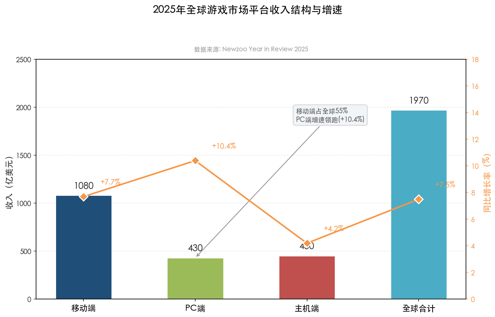

**图 1-1　2025 年全球游戏市场平台收入结构与增速。** 移动端以 1080 亿美元占据全球市场 55% 份额，PC 端虽体量最小但以 +10.4% 的增速领跑三大平台。数据来源：Newzoo Year in Review 2025。

云游戏作为新兴平台仍处于早期阶段。BCG 估算 2025 年全球云游戏收入约 14 亿美元，预计到 2030 年将增长至 183 亿美元，用户数突破 5000 万[BCG 2026 Gaming Report](https://www.bcg.com/publications/2025/video-gaming-report-2026-next-era-of-growth "BCG 2025年底发布")。尽管云游戏当前收入体量仅占整体市场不足 1%，但其在降低硬件门槛、吸纳非核心玩家方面具备显著的长期增长潜力。

## 1.2 区域格局：亚太主导，新兴市场加速

全球游戏收入的区域分布呈现清晰的三级梯队格局。2025 年，亚太地区以 876 亿美元居首（占全球 46%），北美以 527 亿美元居次（28%），欧洲以 331 亿美元位列第三（18%）。值得关注的是，拉美（+6.4%）和中东非洲（+7.5%）虽绝对体量较小，但增速位列各区域之首，构成未来增量市场的重要来源[Newzoo Global Games Market Report 2025](https://newzoo.com/resources/blog/global-games-market-to-hit-189-billion-in-2025 "Newzoo 2025年6月报告")。

中美双雄格局进一步固化。Newzoo 数据口径下，2025 年中国市场约 498 亿美元，美国市场约 496 亿美元，两国合计占据全球游戏支出约半壁江山[Newzoo Global Games Market Report 2025](https://newzoo.com/resources/blog/global-games-market-to-hit-189-billion-in-2025 "Newzoo 2025年6月报告")。

中国市场的本土口径数据更为细致。中国游戏工委《2025 年中国游戏产业报告》显示，2025 年中国国内游戏市场实际销售收入 3507.89 亿元人民币，同比增长 7.68%；用户规模达 6.83 亿，同比增长 1.35%，两项指标均创历史新高[新华网](http://www.news.cn/20251219/71b9f7db89c84eee968cddeeeb86baf1/c.html "新华网2025年12月19日报道，引用《2025年中国游戏产业报告》")。自研游戏表现尤为突出：国内收入 2910.95 亿元（+11.64%），海外收入 204.55 亿美元（+10.23%），出海能力的持续增强表明中国游戏产业已从"内需驱动"转向"内外双轮驱动"的增长模式[新华网](http://www.news.cn/20251219/71b9f7db89c84eee968cddeeeb86baf1/c.html "新华网2025年12月19日")。

## 1.3 玩家总量与代际结构：35.8 亿玩家的分层图景

### 1.3.1 全球玩家总量与设备分布

2025 年全球玩家总量达到 35.8 亿（+4.4%）。从设备渗透率来看，移动端覆盖约 30 亿玩家（占 83%），PC 端 9.36 亿（26%），主机端 6.45 亿（18%）。由于大量玩家跨平台游戏，各平台数字之和远超 100%[Newzoo Global Games Market Report 2025](https://newzoo.com/resources/blog/global-games-market-to-hit-189-billion-in-2025 "Newzoo 2025年6月报告")。

ESA 联合 21 个国家、24,216 名玩家开展的全球调查进一步勾勒出设备偏好结构：移动设备是全球首选游戏平台（55% 玩家首选），PC/笔记本和主机/掌机各约占 21%[GamesIndustry.biz](https://www.gamesindustry.biz/esa-48-of-video-game-players-are-women "GamesIndustry.biz 2025年10月报道ESA报告")。移动端作为游戏"基础设施"的地位已不可动摇——大量轻度用户通过手机完成首次游戏接触，而 PC 和主机则承载着单位时间投入更高的核心玩家群体。

全球玩家性别比正趋于均衡。上述 ESA 全球调查显示，男性玩家占 51%，女性玩家占 48%[GamesIndustry.biz](https://www.gamesindustry.biz/esa-48-of-video-game-players-are-women "GamesIndustry.biz 2025年10月报道ESA报告")。美国市场的 ESA 2025 年报数据则更为具体：约 2.051 亿美国人每周至少游戏 1 小时，其中女性占 47%、男性占 52%，平均年龄 36 岁[ESA 官方新闻稿](https://www.theesa.com/annual-esa-study-reveals-video-games-universal-appeal-across-generations/ "ESA 2025年6月3日发布")。性别近乎对等的格局意味着，"游戏=男性爱好"的刻板认知已与现实严重脱节。

### 1.3.2 代际参与率与结构迁移

不同世代对游戏的参与程度存在显著梯度差异，但总体趋势是游戏正从"年轻人专属"走向"全民娱乐"。

Newzoo 2023 年全球玩家研究（覆盖 36 个市场、74,000+ 消费者）提供了各世代的"游戏互动率"（Game Enthusiast Rate）：Gen Alpha（2010 年后出生）高达 94%，Gen Z（1995—2009）为 90%，千禧一代（1981—1994）为 82%，X 世代（1965—1980）为 64%，婴儿潮一代（1946—1964）仍有 43%[Newzoo全球玩家研究2023](https://investgame.net/wp-content/uploads/2024/03/2023_Newzoo_How_different_generations_engage_with_video_games_today.pdf "Newzoo Global Gamer Study 2023, 74,295 respondents across 36 markets")。

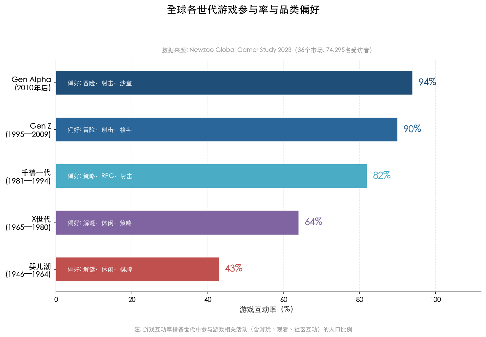

**图 1-2　全球各世代游戏参与率与品类偏好。** 从 Gen Alpha 的 94% 到婴儿潮的 43%，游戏互动率随世代递减但整体水平仍远高于市场预期，年轻世代偏好冒险/射击类，年长世代偏好解谜/休闲类。数据来源：Newzoo Global Gamer Study 2023（36 个市场，74,295 名受访者）。

美国市场的 ESA 2025 年调查将这一梯度进一步量化：2.051 亿美国定期玩家中，Gen Alpha（5—12 岁）约 2740 万人、83% 每周游戏；Gen Z（13—28 岁）约 5920 万人、78% 每周游戏；千禧一代（29—44 岁）约 4790 万人、68% 每周游戏；X 世代（45—60 岁）约 3540 万人、52% 每周游戏；婴儿潮（61—79 岁）约 3150 万人、49% 每周游戏；沉默一代（80 岁以上）约 370 万人、36% 每周游戏[ESA Essential Facts 2025](https://www.theesa.com/wp-content/uploads/2025/06/2025-Essential-Facts-Booklet-05-30-25-RGB.pdf "ESA 2025年6月发布, YouGov 5000人调查")。Gen Z 以 5920 万人构成美国玩家最大的单一世代群体，约占总量的 29%；千禧一代以 4790 万人紧随其后（23%），两者合计超过半数。

以下三个代际迁移信号值得重点关注：

**第一，Gen Alpha 正在确立游戏作为"第一娱乐媒介"的地位。** Newzoo 数据显示，Gen Alpha 是首个在游戏上投入时间超过社交媒体的世代——每周游戏 5.2 小时 vs 社交媒体 5.1 小时[Newzoo全球玩家研究2024](https://investgame.net/wp-content/uploads/2024/07/Newzoo_How-consumers-engaged-with-games-in-2024_Global-Gamer-Study-2024.pdf "Global Gamer Study 2024")。同时，他们也是主机游戏最活跃的世代（69% 在主机上游戏），超过 Gen Z（65%）和千禧一代（60%）[KidScreen/ESA](https://kidscreen.com/2025/06/09/gen-alpha-kids-are-the-most-active-console-gamers-esa-report-finds/ "2025年6月")。

**第二，千禧一代与 Gen Alpha 在平台偏好上出现代际共振。** BCG 全球调查（约 3000 名玩家）发现，千禧一代与 Gen Alpha 在 PlayStation 和 Switch 的偏好上呈现趋同，而 Gen Z 更倾向于 PC 平台[BCG 2026 Gaming Report](https://www.bcg.com/publications/2025/video-gaming-report-2026-next-era-of-growth "BCG 2025年底发布")。这一现象的成因在于千禧一代父母与 Gen Alpha 子女在家庭场景中形成的共同游戏行为模式。

**第三，银发玩家群体的黏性超出预期。** 在美国，49% 的婴儿潮一代（61—79 岁）每周游戏，36% 的沉默一代（80 岁以上）同样保持每周游戏习惯[ESA Essential Facts 2025](https://www.theesa.com/wp-content/uploads/2025/06/2025-Essential-Facts-Booklet-05-30-25-RGB.pdf "ESA 2025年6月")。全球范围内，BCG 调查显示 40% 的婴儿潮玩家和 50% 的 X 世代玩家在过去六个月增加了游戏时间[BCG 2026 Gaming Report](https://www.bcg.com/publications/2025/video-gaming-report-2026-next-era-of-growth "BCG 2025年底发布")。老年玩家虽以休闲/解谜品类为主，但其规模和黏性使其成为不容忽视的用户群体。

### 1.3.3 多平台重叠与跨代参与模式

Newzoo 2023 年数据揭示了显著的跨平台分化：约 50% 的 Gen Alpha、Gen Z 和千禧一代在两个以上平台游戏，而 X 世代仅 37%、婴儿潮仅 28% 为多平台玩家[Newzoo全球玩家研究2023](https://investgame.net/wp-content/uploads/2024/03/2023_Newzoo_How_different_generations_engage_with_video_games_today.pdf "Newzoo GGS 2023")。年轻世代不仅涉猎的品类更广（Gen Alpha 平均涉猎 6.0 个品类，婴儿潮仅 2.8 个），其游戏参与维度也更加多元：43% 的 Gen Alpha 同时进行"游戏+观看+社区互动"三维参与，而婴儿潮仅有 2% 呈现同等多维参与特征[Newzoo全球玩家研究2023](https://investgame.net/wp-content/uploads/2024/03/2023_Newzoo_How_different_generations_engage_with_video_games_today.pdf "Newzoo GGS 2023")。

这一结构性差异对游戏开发者具有直接的产品策略含义：面向年轻用户的产品不能仅关注核心玩法本身——内容创作工具、直播生态整合、社区运营体系是获取和留存 Gen Z/Alpha 玩家的关键延伸战场。

## 1.4 品类格局：策略登顶，混合休闲崛起

### 1.4.1 全球移动端品类收入排序

2025 年上半年全球移动端各品类的收入排序揭示了显著的结构性变化。策略类以 106 亿美元居收入首位（占移动 IAP 总收入的 24%，同比增长 +26%），RPG 以 93 亿美元退居第二（同比下降 -11%），益智类以 69 亿美元位列第三（+16%）[PocketGamer.biz](https://www.pocketgamer.biz/strategy-games-surge-as-rpg-revenue-tumbles-h1-2025s-top-genres-revealed/ "PocketGamer.biz 2025年7月，引用AppMagic数据")。策略品类的强劲增长主要得益于 Whiteout Survival 等头部产品的 ARPU 扩张，以及"类休闲素材获客+深度内容后置"的特洛伊木马获客模型。

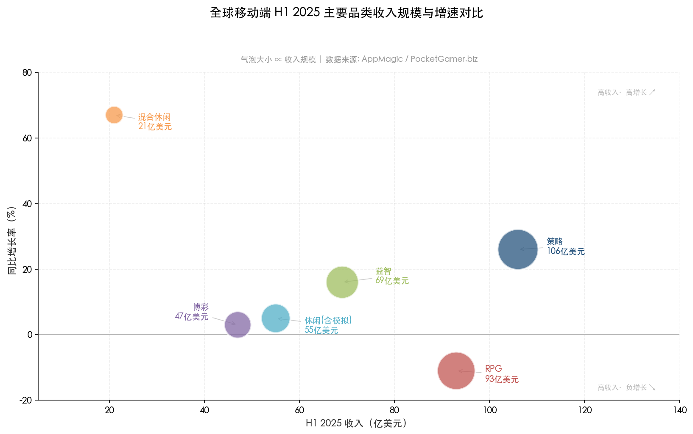

**图 1-3　全球移动端 H1 2025 主要品类收入规模与增速对比。** 策略品类占据右上方高收入高增长象限，RPG 位于右下方高收入负增长象限，混合休闲以 +67% 的最高增速成为最具爆发力的新兴赛道。气泡大小正比于收入规模。数据来源：AppMagic / PocketGamer.biz。

### 1.4.2 中国市场品类结构

中国移动游戏的品类结构与全球格局存在显著差异。中国 Top 100 移动游戏收入中，MOBA 以 19.45% 居首，射击品类以 18.29% 紧随其后，RPG 占 15.1%，三者合计贡献 52.84%[GameLook](http://www.gamelook.com.cn/2025/12/584413/ "GameLook转载《2025年中国游戏产业报告》")。竞技品类（MOBA+射击）在中国的统治地位与全球"策略第一、RPG 第二"的格局形成鲜明对比，这与腾讯旗下《王者荣耀》和《和平精英》两大国民级产品的超高渗透率密切相关。

从平台维度看，2025 年中国移动游戏收入 2570.76 亿元（+7.92%），客户端游戏收入 781.6 亿元（+14.97%），主机游戏 83.62 亿元（+86.33%）[GameLook](http://www.gamelook.com.cn/2025/12/584413/ "GameLook转载GPC报告")。主机游戏虽然基数极小，但 86.33% 的增速释放出强烈的生态培育信号，表明中国主机市场正处于快速起量阶段。细分赛道方面，电竞收入达 1700.51 亿元（+18.96%），休闲移动游戏 342.65 亿元（+9.56%），二次元移动游戏 282.81 亿元（-3.64%）[GameLook](http://www.gamelook.com.cn/2025/12/584413/ "GameLook转载GPC报告")。二次元品类的收入微降值得关注，这或与市场供给过剩导致的用户分流有关。

## 1.5 年度关键趋势信号

### 1.5.1 混合休闲品类爆发

混合休闲（Hybrid Casual）是 2025 年全球移动游戏领域最引人注目的增长赛道。该品类融合了超休闲游戏的低门槛获客能力与中核游戏的内购深度，2025 年 3 月单月全球 App Store 净收入已达 1.748 亿美元，Q1 Top 10 IAP 净收入同比增长 67%[InvestGame](https://investgame.net/wp-content/uploads/2025/04/Hybdrid-casual-Games-in-Q1-2025.pdf "InvestGame 2025年Q1混合休闲报告")。混合休闲品类的崛起，本质上是对传统超休闲"高下载、低留存、纯广告变现"模式的系统性升级——通过引入中度养成机制和内购付费点，显著提升了用户生命周期价值（LTV）。

### 1.5.2 小游戏/超休闲生态的中国独特路径

中国小程序游戏在 2025 年构建了全球独一无二的增长生态。微信小游戏 MAU 超过 5 亿，近 70 款产品实现 DAU 超百万[腾讯企业概览](https://static.www.tencent.com/uploads/2025/05/14/ae7b09adea59dfa92095e1f7e3c2fb87.pdf "腾讯官方 Corporate Overview 2025年5月")。收入层面，中国小程序游戏 2025 年收入达 535.35 亿元（+34.39%），是全行业增速最快的细分赛道之一[GameLook](http://www.gamelook.com.cn/2025/12/584413/ "GameLook转载GPC报告")。

小游戏生态的核心差异化在于用户来源结构：大量此前从未下载过手游 App 的用户通过微信社交裂变机制首次进入游戏世界。这意味着小游戏并非在存量市场中分食蛋糕，而是在真正意义上拓展了游戏人口的边界。对游戏开发者而言，这是一个具备低门槛获客、低开发成本优势但竞争日趋白热化的增量战场。

### 1.5.3 AI 辅助内容生产的初步渗透

AI 技术正在从研发工具链向游戏产业的各个环节加速渗透。BCG 调查显示，约 52% 的游戏开发公司已在工作流中实施生成式 AI[BCG 2026 Gaming Report](https://www.bcg.com/publications/2025/video-gaming-report-2026-next-era-of-growth "BCG 2025年底发布")。在 Steam 平台，约 20% 的新上线游戏已披露使用了 AI 辅助开发[GDC 官方报告](https://gdconf.com/article/gdc-2025-state-of-the-game-industry-devs-weigh-in-on-layoffs-ai-and-more/ "GDC 2025年3月发布")。

玩家端的接受度整体温和：仅 10% 的玩家对 AI 生成美术持明确负面态度[BCG 2026 Gaming Report](https://www.bcg.com/publications/2025/video-gaming-report-2026-next-era-of-growth "BCG 2025年底发布")。然而，GDC 2026 调查显示 52% 的开发者认为生成式 AI 对行业产生了负面影响——开发者端的担忧与玩家端的温和态度之间存在明显的认知落差。总体而言，AI 当前在游戏行业的价值主要体现在降低内容生产成本和提升迭代效率两个维度，尚未进入直接变革用户体验的阶段。

### 1.5.4 UGC 生态的规模化与平台化

用户生成内容（UGC）正从边缘创作实验走向产业级规模化运营。2025 年，Roblox 和 Fortnite 两大平台的创作者分成支出预计将超过 15 亿美元；其中 Roblox 拥有 160 万名变现创作者，40% 的玩家 UGC 消费呈增长态势[BCG 2026 Gaming Report](https://www.bcg.com/publications/2025/video-gaming-report-2026-next-era-of-growth "BCG 2025年底发布")。UGC 生态对用户画像的核心影响在于，它正在模糊"玩家"与"创作者"之间的角色边界——对 Gen Alpha 和 Gen Z 而言，在 Roblox 中"玩游戏"与"做游戏"之间已不存在清晰的分界线，游戏参与本身正在从单向消费转向双向创造。

## 1.6 本章小结

2025—2026 年的全球游戏市场呈现以下核心特征，共同构成后续各品类用户画像分析的宏观坐标系：

- **规模重回高增长。** 全球市场总收入 1970 亿美元（+7.5%），中国市场实际销售收入 3507.89 亿元（+7.68%），行业正式走出后疫情调整期。
- **移动仍是基石，PC 是最快增量。** 移动端以 1080 亿美元占据全球 55% 份额，但 PC 端以 +10.4% 的增速成为增长最快的传统平台，预计 2028 年将超越主机。
- **35.8 亿玩家，全民化趋势不可逆。** Gen Alpha/Gen Z 参与率超 90%，49% 的婴儿潮一代和 36% 的沉默一代仍保持每周游戏习惯，全球玩家性别比接近 1:1。
- **品类结构正在重塑。** 策略品类登顶全球移动收入榜首，RPG 面临收缩压力，混合休闲异军突起；中国市场则以 MOBA+射击的竞技品类为绝对主导。
- **三大确定性增量赛道已成共识。** 混合休闲、小游戏平台、UGC 生态是当前最具确定性的增量方向，AI 则处于工具链渗透阶段，尚待体验端的突破性应用。

上述宏观坐标将在本报告后续章节中为各品类用户画像的深度解读提供基准参照。

# 第2章 用户画像方法论与分析框架

游戏用户画像的价值不仅在于描述"玩家是谁"，更在于系统性地回答"玩家为何而来、因何而留、如何付费"。在全球 35.8 亿玩家、1,970 亿美元市场规模的背景下，粗放的人群标签已无法满足精细化运营需求。本章构建贯穿全报告的五维分析框架——人口统计、行为特征、心理动机、付费分层、留存生命周期——统一后续品类拆解所依赖的维度定义、分层标准和交叉分析逻辑，为游戏开发者提供一套可操作的用户认知工具集。

## 2.1 人口统计维度：定义与分层标准

人口统计是用户画像最基础的坐标轴，决定了"谁在玩"这一首要问题的回答口径。本报告在年龄、性别、地域和经济分层四个维度上采用以下统一标准。

### 2.1.1 年龄段与代际划分

本报告采用 Newzoo 2024 年全球玩家研究（覆盖 36 个市场、73,000+ 消费者）所使用的标准代际定义[Newzoo全球玩家研究2024](https://investgame.net/wp-content/uploads/2024/07/Newzoo_How-consumers-engaged-with-games-in-2024_Global-Gamer-Study-2024.pdf "Global Gamer Study 2024, 36市场73000+消费者")：

| 代际名称 | 出生年份 | 2025 年年龄区间 |
|----------|----------|----------------|
| Gen Alpha | 2010 年后 | ≤15 岁 |
| Gen Z | 1995—2009 | 16—30 岁 |
| 千禧一代（Millennials） | 1981—1994 | 31—44 岁 |
| Gen X | 1965—1980 | 45—60 岁 |
| 婴儿潮一代（Baby Boomers） | 1945—1964 | 61—80 岁 |

该划分在全球游戏行业研究中已成为事实标准，ESA、BCG、Circana 等机构的同期研究均沿用类似分代方式。

各代际的游戏参与呈现清晰梯度。Gen Alpha 和 Gen Z 的游戏参与率超过 90%，其中 Gen Alpha 玩家每周在游戏上投入 5.2 小时，首次超过社交媒体使用时长[Newzoo全球玩家研究2024](https://investgame.net/wp-content/uploads/2024/07/Newzoo_How-consumers-engaged-with-games-in-2024_Global-Gamer-Study-2024.pdf "Gen Alpha周均游戏5.2小时")。美国市场的数据进一步验证了这一趋势：约 2.051 亿美国人经常玩游戏，玩家平均年龄 36 岁；Gen Alpha（5—12 岁）群体中 83% 每周玩游戏，49% 的婴儿潮一代同样保持每周游戏习惯[ESA 官方新闻稿](https://www.theesa.com/annual-esa-study-reveals-video-games-universal-appeal-across-generations/ "ESA 2025年6月3日发布")。游戏已从年轻人的专属娱乐方式演变为跨代际的大众文化活动。

### 2.1.2 性别维度

ESA 2025 年全球调查（21 国、24,216 名玩家）显示，全球玩家性别比为男性 51%、女性 48%[GamesIndustry.biz](https://www.gamesindustry.biz/esa-48-of-video-game-players-are-women "GamesIndustry.biz 2025年10月报道ESA报告")。这一接近均分的整体比例掩盖了品类层面的显著分化——从超休闲品类约 60% 女性占比，到《英雄联盟》仅约 12% 女性的巨大跨度，将在第 3—5 章各品类画像中详细展开。

值得关注的结构性变化在于年轻世代中性别品类偏好差异正在收窄。Newzoo 数据表明，冒险类在 Gen Z 男性（46%）和女性（43%）中均排名第一，格斗和射击类在 Gen Z 女性中亦进入 Top 5（分别为 31% 和 30%）[Newzoo全球玩家研究2024](https://investgame.net/wp-content/uploads/2024/07/Newzoo_How-consumers-engaged-with-games-in-2024_Global-Gamer-Study-2024.pdf "Gen Z按性别品类偏好")。传统的"性别=品类偏好"映射关系正在被年轻一代打破，这一趋势对品类立项和用户获取策略的定向逻辑具有深远影响。

### 2.1.3 地域层级

全球层面，本报告依据 Newzoo 通行的区域划分体系：亚太地区 2025 年贡献 876 亿美元（占全球 46%）、北美 527 亿美元（28%）、欧洲 331 亿美元（18%），拉美（+6.4%）及中东非（+7.5%）为增速最快的新兴市场[Newzoo Global Games Market Report 2025](https://newzoo.com/resources/blog/global-games-market-to-hit-189-billion-in-2025 "Newzoo 2025年6月报告")。不同区域的玩家行为模式差异显著（详见 2.4.4 节区域留存差异），地域维度因此成为理解用户画像不可或缺的参照系。

涉及中国市场的分析中，本报告参考中国游戏产业报告（GPC/CNG）的标准城市层级划分（一线/新一线/二线/三线/四线及以下），以匹配中国游戏厂商惯常使用的市场分层逻辑。

### 2.1.4 收入与职业分档

收入维度在全球范围内缺乏统一标准，各国购买力平价差异使得绝对收入水平的跨市场比较意义有限。本报告在涉及付费能力分析时，优先以"月均游戏消费金额"而非绝对收入水平作为分层依据，这一策略与 2.2.2 节付费行为分层的逻辑保持一致，确保分析框架在全球范围内的可比性。

## 2.2 行为特征维度：从时间投入到付费深度

行为特征维度回答的是"玩家如何玩"——包括时间投入模式、付费行为分层、设备偏好和社交互动方式。这些可观测的行为数据构成用户画像中最直接可量化的部分。

### 2.2.1 游戏时长分档与玩家投入度分类

行业内对"轻度/中度/重度"玩家的定义长期缺乏基于时间阈值的统一标准。Quantic Foundry 对超过 35 万名玩家的调查显示，玩家自我分类为休闲玩家（Casual）仅占 10%、核心玩家（Core）68%、硬核玩家（Hardcore）21%。该分类更多基于自我认同和游戏投入强度——涵盖时间、技能追求和社区参与等综合判断——而非单一的小时数阈值[Quantic Foundry](https://quanticfoundry.com/2018/08/01/casual-hardcore/ "What Men and Women Consider Hardcore Gaming Are Not The Same, 350,000+ gamers")。

Nick Yee 的进一步分析揭示了硬核与休闲玩家之间更深层的动机差异：硬核玩家与休闲玩家的核心分野集中在竞争（Competition）、挑战（Challenge）和刺激感（Excitement）三项动机上——硬核玩家追求快节奏、高技能门槛的对抗体验，休闲玩家则偏好平静、非对抗性、易于上手的游戏环境。值得注意的是，完成感（Completion）和幻想（Fantasy）两项动机在各类型玩家中差异最小，构成跨投入度层级的共通需求基础[Quantic Foundry](https://quanticfoundry.com/2018/08/01/casual-hardcore/ "Completion和Fantasy在各类型中最稳定")。

从行为数据看，2024 年全球移动游戏日均游戏时长中位数约 22 分钟，日均 4 次会话，单次会话中位时长 5—6 分钟[GameAnalytics 2025移动游戏基准报告](https://investgame.net/wp-content/uploads/2025/02/2025-GameAnalytics-Mobile-Gaming-Benchmarks.pdf "2024年全球移动游戏时长与会话数据")。品类间差距悬殊：MMORPG 日均时长中位数高达 95 分钟（PC 端《魔兽世界》用户日均约 3.7 小时），而超休闲品类单次会话常不足 3 分钟，两端差距超过 30 倍。

跨平台时间分配模式同样揭示了重要的行为差异。Newzoo 数据显示，PC/主机玩家平均每周游戏 5.4—5.7 小时、覆盖 2.6—2.7 天，折合每日时长约 2.1 小时；移动玩家平均每周游戏 5.4 小时、覆盖 3.4 天，每日时长约 1.6 小时[Newzoo全球玩家研究2024](https://investgame.net/wp-content/uploads/2024/07/Newzoo_How-consumers-engaged-with-games-in-2024_Global-Gamer-Study-2024.pdf "各平台游戏时长数据")。PC/主机端呈现"低频长会话"特征，移动端则表现为"高频短会话"，但两者的周总时长趋近——这一发现挑战了"移动游戏=轻度游戏"的简单等式。

### 2.2.2 付费行为分层

付费分层是用户画像中与商业决策关联最为直接的维度。本报告综合 Newzoo 及行业通行标准，建立以下双轨分类体系。

**标准一：月均消费金额（Newzoo 口径）。** 低支出者月均不超过 5 美元、中等支出者 5—25 美元/月、高支出者超过 25 美元/月。各平台高支出者占比差异显著：主机玩家中 22% 为高支出者，PC 端 15%，移动端仅 8%[Newzoo全球玩家研究2024](https://investgame.net/wp-content/uploads/2024/07/Newzoo_How-consumers-engaged-with-games-in-2024_Global-Gamer-Study-2024.pdf "按平台的支出分层数据")。这一分层结构反映了不同平台生态在游戏定价、内购设计和用户消费习惯上的系统性差异。

**标准二：F2P 领域的鱼类分层法。** 行业通行的非正式分层以海洋生物命名——免费用户（Non-payer，占全部玩家 95—98%）、小鱼（Minnow，低频小额消费）、海豚（Dolphin，月均约 5—50 美元的中等消费）、鲸鱼（Whale，累计消费超 100 美元的高价值用户）。deltaDNA 基于 100 万名鲸鱼用户（自 2015 年起累计消费超 100 美元）的行为数据分析提供了关于这一群体的细颗粒度洞察：鲸鱼的典型单笔交易额为 20 美元，54% 从未单笔消费超过 50 美元；消费 100—200 美元区间的鲸鱼平均完成 11 笔应用内购买，消费超 1,000 美元的"超级鲸鱼"平均完成 55 笔交易；鲸鱼约占付费用户的 5%，占全部玩家不到 0.1%[deltaDNA鲸鱼用户分析](https://www.pocketgamer.biz/sponsored-deltadna-on-whales/ "54% of whales don't spend more than $50 per transaction, 2016")。

Minnow/Dolphin/Whale 的具体金额阈值在行业内并无统一标准，不同平台和分析工具的定义各有差异。本报告后续品类分析中，在无法获得标准化阈值时，将侧重使用 ARPDAU（日活跃用户平均收入）和 ARPPU（付费用户平均收入）等标准化指标进行跨品类横向比较，以确保分析结论的可比性。

### 2.2.3 设备偏好

设备偏好直接塑造用户的行为模式和付费特征。ESA 2025 年全球调查显示，移动端为全球首选游戏设备（55% 玩家的主要平台），PC/笔记本和主机/掌机各约 21%[GamesIndustry.biz](https://www.gamesindustry.biz/esa-48-of-video-game-players-are-women "GamesIndustry.biz 2025年10月")。从覆盖规模看，2025 年全球 35.8 亿玩家中，移动端覆盖 30 亿（83%），PC 端 9.36 亿（26%），主机端 6.45 亿（18%）；因多平台重叠，各平台覆盖率之和远超 100%[Newzoo Global Games Market Report 2025](https://newzoo.com/resources/blog/global-games-market-to-hit-189-billion-in-2025 "Newzoo 2025年6月报告")。

设备选择与代际、地域和品类偏好高度交织。BCG 2026 年全球调查（约 3,000 名玩家）发现，千禧一代与 Gen Alpha 共享平台偏好（以 PlayStation 和 Switch 为主），而 Gen Z 更倾向 PC[BCG 2026 Gaming Report](https://www.bcg.com/publications/2025/video-gaming-report-2026-next-era-of-growth "BCG 2025年底发布")。Gen Alpha 是当前主机最活跃的世代——69% 的使用率超过 Gen Z（65%）和千禧一代（60%）[KidScreen/ESA](https://kidscreen.com/2025/06/09/gen-alpha-kids-are-the-most-active-console-gamers-esa-report-finds/ "ESA 2025年6月")。这一代际-平台关联性意味着，设备维度不应被孤立分析，而需与年龄和品类维度联合审视。

### 2.2.4 社交行为类型

游戏中的社交行为依据互动深度可分为四个递进层级：

- **被动社交**：观看直播、浏览排行榜，无直接人际互动；
- **轻度社交**：聊天、点赞、好友列表维护，不构成游戏进程的核心依赖；
- **协作社交**：组队、公会活动、协同任务，社交互动本身成为游戏体验的核心组成部分；
- **竞争社交**：排位对战、PvP、联盟战争，以对抗为核心互动形式。

社交在游戏生态中的权重持续提升。2025 年调查数据显示，78% 的美国玩家认为"游戏能让人结交新朋友"[Statista](https://www.statista.com/statistics/1340350/us-video-gaming-community-social-connections/ "2025年2月调查")。Gen Z 玩家中 34% 将社交视为游戏的首要目的，高于其他世代的平均水平 26%[Deconstructor of Fun](https://www.deconstructoroffun.com/blog/2025/04/07/the-future-of-gaming-engaging-gen-z "2025年4月")。社交维度在年轻群体画像中的核心地位日益凸显，这也解释了为何 Roblox、Fortnite 等社交平台型产品在 Gen Z 和 Gen Alpha 中拥有极高渗透率。

## 2.3 心理动机框架：三大模型与对比选用

理解"玩家为何而玩"是用户画像的深层内核。人口统计和行为数据描述的是可观测的表象，而动机框架试图回答的是行为背后的驱动力。学术界和工业界在过去三十年间发展出多个互补的动机分析框架，本报告在后续品类分析中将综合使用以下三大模型，各有侧重、互为补充。

### 2.3.1 Bartle 玩家类型模型（1996）

Richard Bartle 于 1996 年在"Hearts, Clubs, Diamonds, Spades"论文中提出了影响深远的四类型玩家分类法。该模型基于两个正交维度轴——行动（Acting）vs. 交互（Interacting），以及世界导向（World-oriented）vs. 玩家导向（Player-oriented）——将玩家分为四个象限：

- **成就者（Achievers/♦）**：追求积分、升级和游戏内目标的达成；
- **探索者（Explorers/♠）**：致力于发现游戏世界的内在机制和边界；
- **社交者（Socialisers/♥）**：以人际交流和建立关系为核心乐趣；
- **杀手（Killers/♣）**：通过对其他玩家施加影响（正面或负面）获得快感。

该模型源自约 30 名英国商业 MUD 资深玩家的讨论归纳，Bartle 本人在论文尾注中声明"I am not a trained psychologist, do not expect a conventionally rigorous approach"，属于经验观察而非统计实证方法[Bartle原始论文](https://markfloryan.github.io/gamedesign/readings/Bartle_1996.pdf "Hearts, Clubs, Diamonds, Spades, 1996")。

Bartle 模型的历史贡献在于开创了玩家类型化思考的先河，论文累计被引超 4,800 次，至今仍是游戏设计讨论中的通用语言。然而其局限性同样显著：Nick Yee（2006/2007）通过对约 7,000 名 MMO 玩家的因子分析指出，"组件"（component）框架比"类别"（category）框架具有更强的解释力；Bartle 的"探索者"类型在因子分析中未作为独立因子出现，且"探索世界"与"分析游戏机制"两种行为之间不具备统计相关性[Bartle分类法维基百科](https://en.wikipedia.org/wiki/Bartle_taxonomy_of_player_types "Nick Yee对Bartle模型的批评")。更根本的局限在于，Bartle 模型的原始设计对象为文本 MUD 环境，其四类型互斥假设过强，直接套用至现代移动游戏、单人叙事或沙盒创造等多元化场景时适用性受限。

### 2.3.2 Quantic Foundry 玩家动机模型

由 Nick Yee 联合创立的 Quantic Foundry 在 Bartle 和 Yee 早期研究基础上，发展出目前行业内数据基础最为扎实的玩家动机模型。该模型基于超过 125 万名全球玩家的在线动机测评（样本覆盖北美 33%、西欧 14%、东亚 10% 等地区；性别构成为男性 74%/女性 22%/非二元 3%，年龄中位数 23 岁），通过标准心理计量方法（因子分析）识别出 **12 项动机指标**，两两配对为 **6 大维度**[Quantic Foundry 模型参考文档](https://quanticfoundry.com/wp-content/uploads/2019/04/Gamer-Motivation-Model-Reference.pdf "Gamer Motivation Model Reference, 1.25M+ gamers")：

| 维度 | 动机对 | 核心诉求 |
|------|--------|----------|
| **Action**（动作） | Destruction 破坏 + Excitement 刺激 | 即时反馈、感官冲击 |
| **Social**（社交） | Competition 竞争 + Community 社群 | 对抗或合作中的人际连接 |
| **Mastery**（精通） | Challenge 挑战 + Strategy 策略 | 技能提升与深层思考 |
| **Achievement**（成就） | Completion 完成 + Power 力量 | 收集、积累与成长 |
| **Immersion**（沉浸） | Fantasy 幻想 + Story 故事 | 代入感与叙事体验 |
| **Creativity**（创造） | Discovery 发现 + Design 设计 | 探索与自我表达 |

通过多维尺度分析，12 项动机在更高层级聚合为 **3 个集群**：Action-Social（即时性与肾上腺素）、Mastery-Achievement（冷静的长线博弈）、Immersion-Creativity（最广义的"玩"与探索）。该三集群结构在全球所有主要区域数据中保持一致[Quantic Foundry 动机集群分析](https://quanticfoundry.com/2015/12/21/map-of-gaming-motivations/ "Gaming Motivations Group Into 3 High-Level Clusters, 140,000+ gamers")。

该模型的信效度指标通过了学术检验：内部一致性信度 Cronbach's α ≥ 0.75，重测信度 r = 0.73，并与大五人格特质量表存在中等程度的理论相关性[Quantic Foundry 模型参考文档](https://quanticfoundry.com/wp-content/uploads/2019/04/Gamer-Motivation-Model-Reference.pdf "信效度指标")。

相较于 Bartle 的四类型互斥分类，Quantic Foundry 模型的核心优势在于：12 项动机为连续谱而非互斥类别，每位玩家可在各维度上呈现不同强度的组合，从而更精确地匹配具体游戏产品的受众画像。其局限在于样本可能偏向英语区核心玩家群体（自愿参与、社交媒体传播招募），休闲玩家和非英语区用户的代表性相对不足。

### 2.3.3 自我决定理论（SDT）在游戏中的应用

Ryan、Rigby 与 Przybylski（2006）在 *Motivation and Emotion* 期刊发表的开创性研究，将自我决定理论（Self-Determination Theory）正式引入游戏动机领域。四项实验和一项大规模调查（N=730 名 MMO 玩家）证明，游戏内感知到的三项基本心理需求满足——**自主性**（autonomy，对行为选择的控制感）、**胜任感**（competence，掌控挑战的能力感）和**关系性**（relatedness，与他人的连接感）——能独立预测游戏乐趣、偏好和未来游戏意愿[Ryan等SDT游戏研究论文](https://selfdeterminationtheory.org/SDT/documents/2006_RyanRigbyPrzybylski_MandE.pdf "Motivation and Emotion, 2006")。

该研究开发了 PENS（Player Experience of Need Satisfaction）量表，为量化评估游戏体验中的需求满足程度提供了标准化工具。关键发现在于，SDT 变量在控制了 Yee 的三因素动机分类（成就/社交/沉浸）后仍贡献独立方差，表明 SDT 框架捕捉到了更底层的心理机制[Ryan等SDT游戏研究论文](https://selfdeterminationtheory.org/SDT/documents/2006_RyanRigbyPrzybylski_MandE.pdf "SDT vs Yee模型增量效度, Study 4, N=730")。

正如该研究所总结的，Bartle 和 Yee 的分类"largely reflect the structure and content of current games, rather than the fundamental or underlying motives"。SDT 框架的核心优势在于解释跨玩家、跨品类的基本心理需求满足机制——即"为什么好玩"这一根本问题——植根于主流心理学的深厚理论基础，具有广泛的跨文化适用性。其局限在于抽象度较高，三项需求难以直接映射为某一品类的具体功能设计，更适合作为底层理论框架而非实操分类工具。

### 2.3.4 三大框架的对比与选用建议

三大动机框架在理论深度和实操粒度上各有侧重，并非相互替代关系，而是从不同抽象层级切入同一问题的互补工具。图 2-1 以可视化方式呈现了三者在方法基础、分类粒度和最佳使用场景上的递进关系。

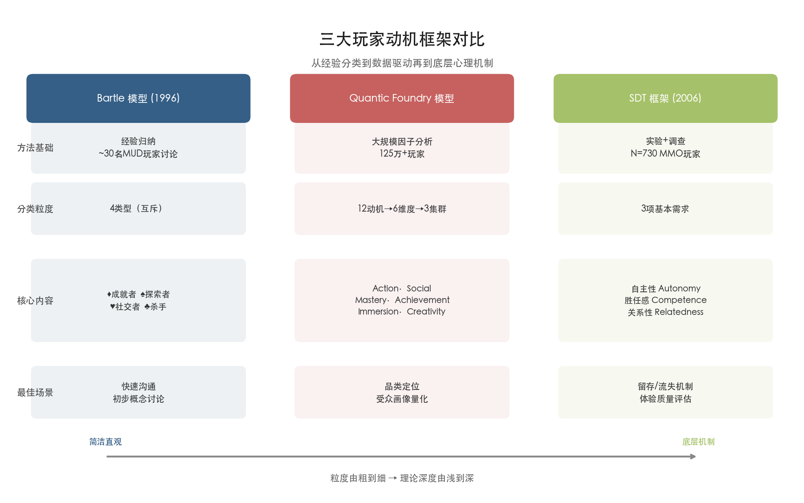

| 维度 | Bartle 模型 | Quantic Foundry 模型 | SDT 框架 |
|------|-------------|---------------------|----------|
| **方法基础** | 经验归纳（~30 名 MUD 玩家） | 大规模因子分析（125 万+玩家） | 实验+调查（多项研究，N 从数十到 730） |
| **分类逻辑** | 四类型互斥 | 12 动机连续谱 | 三项基本需求 |
| **粒度** | 粗（4 类型） | 精（12 动机×6 维度×3 集群） | 底层（3 项需求） |
| **优势** | 简洁直观、业界通用语言 | 数据驱动、可量化、可对接品类画像 | 理论深度强、解释"为什么好玩"的根本机制 |
| **局限** | 样本小、互斥假设过强、仅适用多人在线 | 样本偏向英语核心玩家 | 抽象度高、难直接指导具体设计 |
| **最佳使用场景** | 快速沟通、初步概念讨论 | 品类定位、受众画像量化、产品设计排序 | 留存/流失机制设计、游戏体验质量评估 |

本报告在后续品类拆解中的使用策略为：以 Quantic Foundry 的 6 维度/3 集群作为品类动机定位的主框架（例如竞技品类对应 Action-Social 集群，SLG 对应 Mastery-Achievement，沙盒对应 Immersion-Creativity），以 SDT 的三项需求作为解释留存和付费行为的底层逻辑框架，以 Bartle 类型作为快速沟通和概念对齐的辅助工具。

### 2.3.5 补充框架：HEXAD 游戏化用户类型

除上述三大核心框架外，Marczewski（2015）提出的 HEXAD 游戏化用户类型框架在游戏化设计领域具有独特参考价值。该框架以 SDT 为理论基础，将用户分为六种类型：**慈善者（Philanthropist）**受目的感驱动，乐于助人和分享知识；**社交者（Socialiser）**受关系性驱动，追求人际互动和社群归属；**自由灵魂（Free Spirit）**受自主性驱动，偏好探索和自我表达；**成就者（Achiever）**受胜任感驱动，追求任务完成和技能精进；**玩家（Player）**受外在奖励驱动，为积分、排行榜和奖品而行动；**捣乱者（Disruptor）**受变革触发驱动，倾向于测试和突破系统边界[HEXAD量表论文](https://dl.acm.org/doi/10.1145/2967934.2968082 "Tondello et al., The Gamification User Types Hexad Scale, ACM CHI PLAY 2016")。

Tondello 等人（2016）为该框架开发了经过验证的 24 题量表（N=133），确认了量表的内部一致性信度和重测信度，并发现各用户类型与大五人格特质存在理论预期方向上的显著相关性。研究同时验证了用户类型与具体游戏设计元素偏好之间的正向关联——社交者偏好公会/团队和社交网络，成就者偏好挑战和等级进阶[HEXAD量表论文](https://dl.acm.org/doi/10.1145/2967934.2968082 "24题量表验证结果")。

HEXAD 框架的独特之处在于明确区分了内在动机驱动（慈善者、社交者、自由灵魂、成就者）和外在奖励驱动（玩家），并引入了"捣乱者"这一在传统游戏类型学中较少被正式纳入的用户类型。该框架主要应用于游戏化系统设计而非纯游戏产品，但其对内外在动机的区分和对设计元素的映射思路，对游戏产品的激励系统设计具有直接参考价值。

## 2.4 留存与流失分析框架

留存率是衡量游戏产品健康度的核心指标，也是连接用户行为与商业价值的关键桥梁。一款游戏的长期收入潜力从根本上取决于其留住玩家的能力——在用户获取成本持续攀升的当下，留存优化的边际价值愈加突出。

### 2.4.1 关键留存节点定义与行业基准

本报告依据行业通行标准定义以下关键留存节点：**D1 留存**（安装次日回归率，验证首次体验质量）、**D7 留存**（安装后第 7 日回归率，验证核心循环吸引力）、**D30 留存**（安装后第 30 日回归率，验证中长线留存能力）。

GameAnalytics 2026 年度基准报告（数据覆盖 2025 年全年）显示，全球移动游戏留存持续承压：D1 留存中位数降至约 22%，D7 中位数不足 4%，D30 中位数仅约 0.7%。表现最优的顶部 10% 游戏 D1 约 40%、D7 约 12%、D30 约 4%[GameAnalytics 2026留存基准](https://investgame.net/wp-content/uploads/2026/01/2026-01-20-Mobile_retention_benchmarks_2026.pdf "Mobile retention benchmarks 2026, 数据期2025年")。

上述数据意味着行业曾广泛使用的经典基准 **40/20/10**（D1/D7/D30）已不再反映当前市场实际水平。GameAnalytics 建议将当代现实基准修订为 **35/15/5**——即 D1 达到 35%、D7 达到 15%、D30 达到 5% 即可视为优秀表现[GameAnalytics 2026留存基准](https://investgame.net/wp-content/uploads/2026/01/2026-01-20-Mobile_retention_benchmarks_2026.pdf "经典40/20/10规则的当代修订建议")。

平台差异方面，iOS 用户留存系统性高于 Android：iOS 顶部 25% 游戏 D1 留存 31—33%，Android 为 25—27%[GameAnalytics 2025移动游戏基准报告](https://investgame.net/wp-content/uploads/2025/02/2025-GameAnalytics-Mobile-Gaming-Benchmarks.pdf "iOS vs Android D1留存对比")。

### 2.4.2 分品类留存基准

品类特性对留存曲线形态的塑造作用远大于多数产品层面的优化措施。基于 GameAnalytics Q1 2024 数据（北美，Top 25% 游戏），各品类留存表现呈现显著分化（见图 2-2）：

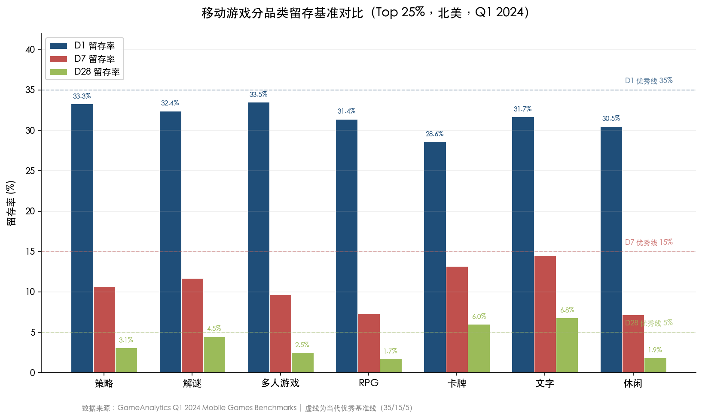

| 品类 | D1 留存 | D7 留存 | D28 留存 | 特征 |
|------|---------|---------|----------|------|
| 策略 | 33.3% | 10.7% | 3.1% | D1 高但长线衰减快 |
| 解谜 | 32.4% | 11.7% | 4.5% | 各环节均衡稳健 |
| 多人游戏 | 33.5% | 9.7% | 2.5% | D1 最高但长线面临社交依赖风险 |
| RPG | 31.4% | 7.3% | 1.7% | D7→D28 衰减最陡，反映内容消耗瓶颈 |
| 卡牌 | 28.6% | 13.2% | 6.0% | D1 偏低但长线留存突出 |
| 文字 | 31.7% | 14.5% | 6.8% | D28 全品类最高，长线优势最为明显 |
| 休闲 | 30.5% | 7.2% | 1.9% | 低门槛获客+低长线留存的典型模式 |

数据来源：[GameAnalytics Q1 2024基准报告](https://investgame.net/wp-content/uploads/2024/06/gameanalytics-q1-2024-mobile-games-benchmarks.pdf "Q1 2024, Top 25%, North America")

值得注意的是，头部产品可大幅超越品类基准。《崩坏：星穹铁道》D1 留存高达 48%、D30 留存 18%；《暗黑不朽》D1 留存 32%、D30 留存 12%——均远超 RPG 品类中位水平。品类基准适用于立项阶段的可行性评估和行业横向对标，但优秀产品的留存表现最终由其独特的内容质量、系统设计和运营节奏所决定。

### 2.4.3 玩家生命周期阶段模型

F2P 行业通用的玩家生命周期模型将玩家按活跃度划分为六个阶段，每个阶段对应差异化的运营策略和干预手段[Teak玩家生命周期分析](https://teak.io/blog/understanding-the-player-lifecycle "Understanding the Player Lifecycle")：

1. **新玩家（New Player）**：刚安装，学习基础操作，最高流失风险窗口。
2. **核心玩家（Core Player）**：几乎每天回归，在成熟产品中通常占 DAU 的 80—90%，是价值创造的主体。
3. **风险玩家（Risk Player）**：仍活跃但频次下降（如从每周 5—6 天降至 2—3 天），行为模式偏离核心玩家特征。
4. **流失玩家（Lapsed Player）**：超过 1 周未启动游戏，可通过推送和回归奖励进行"重激活"。
5. **休眠玩家（Dormant Player）**：超过 1 个月未启动，已基本脱离产品认知，需要类似于新用户获取的"重获取"策略。
6. **复活玩家（Resurrected Player）**：从流失/休眠状态回归，行为模式往往介于新玩家与核心玩家之间。

该生命周期模型的实操价值在于为不同阶段的玩家匹配精准的干预手段。留存运营的通用框架可归纳为四个阶段：D0—D1 聚焦新手引导体验优化，降低首日流失；D1—D7 验证核心循环的吸引力和上手感；D7—D30 引入 meta 系统、社交进阶和中期目标；D30+ 通过 LiveOps 驱动持续内容更新、赛季循环和社区运营，维持长线活跃。

### 2.4.4 区域留存差异

留存表现在全球各地区间存在系统性差异。GameAnalytics 2025 年数据显示，中东地区在各时间节点均领先（2024 年中位数 D1 为 22.64%、D7 为 4.91%、D28 为 1.49%），欧洲和大洋洲 D1 超过 21%，而非洲和亚洲留存率最低但会话频次最高（非洲日均 5.45 次、中东日均 4.71 次）[GameAnalytics 2025移动游戏基准报告](https://investgame.net/wp-content/uploads/2025/02/2025-GameAnalytics-Mobile-Gaming-Benchmarks.pdf "分地区留存与会话频次数据")。

这种"低留存但高频次"的特征揭示了部分新兴市场用户以高频短会话为主导的游戏行为模式，产品设计在面向这些市场时需针对性地优化会话完整性和单次体验的即时满足感，而非简单复制成熟市场的长会话留存策略。

## 2.5 交叉分析逻辑：维度间的关联与分析策略

单一维度的画像难以揭示用户行为的深层规律。"18—24 岁男性"或"鲸鱼用户"这类单维标签虽便于沟通，但对产品决策的指导价值有限。本报告的核心方法论立场是：只有在多维度交叉点上，才能识别出具有真正决策价值的精细用户群体。图 2-3 呈现了五大维度之间六组高价值交叉组合及其对应的分析场景。

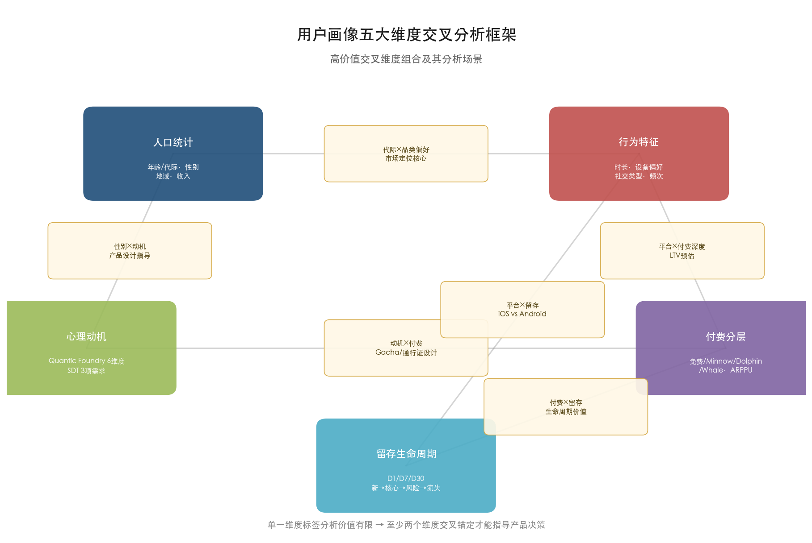

后续品类分析将重点关注以下交叉维度组合。

### 2.5.1 代际 × 品类偏好

代际与品类偏好的交叉是市场定位和用户获取中最具直接商业价值的分析维度。Newzoo 2024 年数据清晰地展示了代际间的品类分化格局：Gen Alpha 和 Gen Z 最偏好冒险类（54%/45%）、格斗和射击类；千禧一代偏好冒险（44%）其次是解谜（37%）；Gen X 和婴儿潮一代则最偏好解谜类（46%/50%）[Newzoo全球玩家研究2024](https://investgame.net/wp-content/uploads/2024/07/Newzoo_How-consumers-engaged-with-games-in-2024_Global-Gamer-Study-2024.pdf "各代际Top 5品类偏好")。

Gen Alpha 的独特品类偏好尤其值得关注：50% 最偏好沙盒/创造类游戏（以 Minecraft 和 Roblox 为代表），是首个游戏时间超过社交媒体的世代[Morning Consult](https://pro.morningconsult.com/analysis/gen-alpha-gaming-preferences-devices-genres-research "2025年")。Gen Z 则表现出对单一产品的低忠诚度——36% 因侵入性广告弃游，但对奖励广告接受度较高——预计 2026 年将成为游戏消费支出最大的世代[Deconstructor of Fun](https://www.deconstructoroffun.com/blog/2025/04/07/the-future-of-gaming-engaging-gen-z "2025年4月")。这两个世代的偏好组合，正在深刻重塑品类竞争格局和变现模式设计。

### 2.5.2 动机 × 付费行为

Quantic Foundry 的动机画像可直接关联至付费设计策略，建立从"为什么玩"到"为什么付费"的因果链条。高 Completion（完成）动机的玩家更可能为收集型内购付费——这解释了 Gacha 机制在高沉浸品类中的有效性；高 Competition（竞争）动机对应赛季通行证和排位皮肤消费；高 Design（设计）动机则预示装扮和定制类商品的变现潜力。

在 F2P 经济中，付费集中度极为惊人：全球移动游戏仅 1.83% 的玩家进行应用内购买，而美国 iOS 前 0.02% 付费玩家贡献了全球游戏收入的 20%[Icon Era](https://icon-era.com/blog/in-game-purchase-spending-habits-statistics-2025.343/ "2025年10月, 引用Unity 2024报告")。这一极端的帕累托分布意味着，精准识别高动机-高付费交叉用户群体是 F2P 产品商业化的核心挑战。

### 2.5.3 性别 × 游戏动机

Quantic Foundry 的长期研究揭示了动机维度上的系统性性别差异：男性玩家在 Competition（竞争）和 Destruction（破坏）上平均得分更高，女性玩家在 Fantasy（幻想）、Completion（完成）和 Design（设计）上得分更高[Quantic Foundry](https://quanticfoundry.com/2016/12/15/primary-motivations/ "250,000+ Gamers Primary Motivations")。

更为深层的发现在于，男性和女性对"硬核"的理解本身存在结构性差异。男性硬核玩家的核心驱动力集中在竞争/挑战/刺激三项动机上，呈现"专精化"路径；而女性硬核玩家在所有动机维度上均高于平均水平，呈现"广度化"路径——对女性而言，"认真地玩游戏"更接近于"耐心地创造和完成一件完整的作品"[Quantic Foundry](https://quanticfoundry.com/2018/08/01/casual-hardcore/ "What Men and Women Consider Hardcore Gaming, 350,000+ gamers")。这一洞察具有直接的产品设计启示：面向女性市场扩张时，仅降低难度是不够的，更需要提供丰富的内容广度和充分的自我表达空间。

### 2.5.4 平台 × 留存

iOS 与 Android 的 D1 留存差异（31—33% vs. 25—27%）不仅反映用户质量的系统性差异，也暗示不同平台生态下获客-留存的均衡点各不相同。结合 Newzoo 付费数据（主机高支出者 22% > PC 15% > 移动 8%），平台-留存-付费的三维交叉分析对用户获取策略至关重要——同样的留存率在不同平台上对应截然不同的用户终身价值（LTV）预期，进而影响买量出价和 ROI 模型的构建。

### 2.5.5 品类 × 付费深度

品类属性对付费深度的塑造作用极为显著，从根本上决定了产品的变现天花板。2025 年全球移动 IAP 市场中，MMORPG 的 ARPDAU 中位数达 0.69 美元（P75 为 1.61 美元）、ARPPU 中位数 39.07 美元（P75 为 79.60 美元），居全品类之首；策略品类 App Store 的 ARPPU 为 Google Play 的 4—8 倍，99 美元档高价内购包的出现频率远超其他品类；超休闲品类 LTV 则通常远低于 1 美元[Google Play MMORPG Report](https://play.google.com/console/about/static/pdf/google-play-mmorpg-genre-report.pdf "2022年3月") [GameDev Reports/AppMagic](https://gamedevreports.substack.com/p/appmagic-mobile-games-monetization "Mobile Games Monetization Report 2025")。

从超休闲（纯广告驱动、LTV < 1 美元）到 MMORPG（深度内购驱动、ARPPU 近 80 美元），付费谱系的跨度超过两个数量级。品类选择本身即决定了产品的变现天花板和用户经济结构，是立项阶段最具杠杆效应的战略决策之一。

## 2.6 本章小结：分析框架在后续章节中的应用

本章建立的五维分析框架——人口统计、行为特征、心理动机、付费分层、留存生命周期——将以统一口径贯穿后续各章。第 3—5 章的品类拆解将采用一致的子结构顺序（人口统计→行为特征→心理动机→付费模式→留存/流失特征→中国市场补充），确保读者可在不同品类之间进行横向对照阅读。第 6 章的跨品类比较将直接引用品类章节中的标准化指标，构建矩阵式对比视图。第 7 章的开发者指南将依据本章的动机框架和付费分层逻辑，将画像洞察转化为可执行的产品决策。

核心方法论立场可概括为：**数据驱动的多维度交叉分析**。我们认为，单一维度的用户标签（如"18—24 岁男性"或"鲸鱼用户"）的分析价值有限，只有在代际×品类、动机×付费、性别×设备等交叉维度的组合中，才能识别出对产品决策具有真正指导意义的精细用户群体。后续品类章节中的每一个画像结论，都将在至少两个维度的交叉点上进行锚定和验证。

# 第3章 竞技对抗类游戏用户画像（MOBA · FPS/TPS · 体育/竞速）

竞技对抗类游戏以实时对抗、技能成长和排位竞争为核心体验，长期占据全球游戏市场用户规模与收入的头部位置。在中国市场，MOBA 与射击两大品类合计贡献了 Top 100 移动游戏收入的 37.74%（MOBA 19.45%、射击 18.29%），领先优势显著[GameLook](http://www.gamelook.com.cn/2025/12/584413/ "GameLook转载《2025年中国游戏产业报告》")。本章从人口统计、行为特征、心理动机、付费模式及留存机制五个维度，系统刻画 MOBA、FPS/TPS 和体育/竞速三大品类的用户群体画像，并提炼竞技类游戏的共性规律与中国市场的差异化特征。

下图汇总了 MOBA 与 FPS/TPS 品类六款头部产品的月活跃用户规模及性别结构，为后续各品类用户画像的展开提供全景参照。

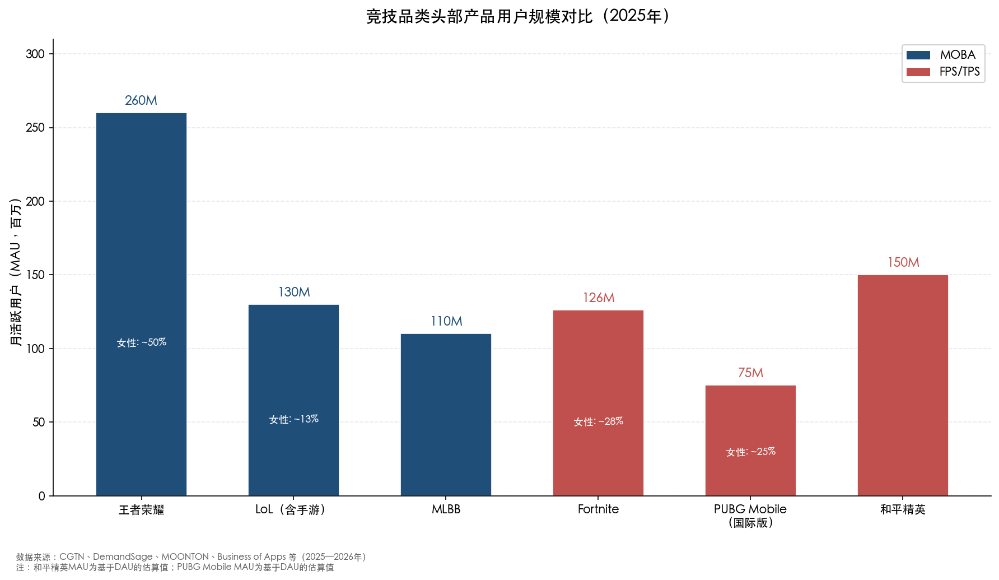

图 3-1 显示，王者荣耀以 2.6 亿 MAU 居于绝对领先地位，且女性玩家占比接近 50%，与英雄联盟（女性仅 13%）形成鲜明对比；FPS/TPS 阵营中，和平精英与 Fortnite 的 MAU 均过亿，但性别结构仍以男性为主。

## 3.1 MOBA 用户画像

### 3.1.1 人口统计特征

MOBA（多人在线战术竞技）是全球用户规模最大的竞技品类之一。头部产品之间的用户结构分化极为显著，移动端与 PC 端呈现出两条截然不同的人群路径。

**王者荣耀**是全球用户基数最大的单款游戏。2025 年 10 月，该产品 DAU 突破 1.39 亿，全球 MAU 超过 2.6 亿，刷新单款游戏活跃用户纪录[CGTN](https://news.cgtn.com/news/2025-10-27/Honor-of-Kings-sets-new-record-with-139-million-daily-active-users-1HO6FItdj6o/p.html "2025年10月腾讯官宣")。核心用户中 18-30 岁占 62%，45 岁以上用户已达 15%，呈现典型的全龄化渗透格局。更具标志性意义的是，王者荣耀女性玩家比例接近 50%[PocketGamer.biz](https://www.pocketgamer.biz/honor-of-kings-surpasses-260m-global-maus/ "2025年10月")，远超全球 MOBA 品类平均水平——移动端低操作门槛、15-20 分钟短局时以及微信社交链导入三重因素共同塑造了这一"泛大众化"用户生态。

**英雄联盟（含手游）** 2025 年全球 MAU 约 1.2-1.35 亿，用户结构与王者荣耀形成鲜明反差：64% 的玩家集中在 18-24 岁，男性占比高达 87%[DemandSage](https://www.demandsage.com/league-of-legends-players-count/ "2026年更新，引用Priori Data/ActivePlayer等")。这一高度集中的年轻男性画像折射出 PC 端 MOBA 更高的操作门槛与硬核竞技定位。

**Mobile Legends: Bang Bang（MLBB）** 以东南亚为核心据点，全球累计安装超 15 亿次，MAU 达 1.1 亿[MOONTON官方新闻稿](https://www.eqs-news.com/news/corporate/mobile-legends-bang-bang-charts-global-ambitions-with-five-region-esports-overhaul-m8-world-championship-breaks-ground-in-turkiye-and-thailand/0cee11f7-2de2-427c-836f-ce3bf4cb7ae3_en "2026年1月")。该产品在印尼、菲律宾等国的渗透率极高，已成为东南亚"国民级"手游，其用户画像与区域年轻化人口结构高度耦合。

**Dota 2** 代表了 MOBA 品类最硬核的一端。Steam 日均在线用户维持在 40-65 万之间，2025 年 8 月均值超过 53 万，为 2019 年以来的最高水平[SteamDB](https://steamdb.info/app/570/charts/ "Steam实时数据")。Dota 2 玩家以 25-35 岁的资深 PC 用户为主，学习曲线陡峭，用户基盘稳定但增量空间有限。

### 3.1.2 行为特征

MOBA 品类的核心行为特征体现为高频次对局与显著的时间承诺。单局时长因产品定位而分化明显：王者荣耀单局 15-20 分钟，适配移动端碎片化场景；英雄联盟单局 25-35 分钟，属 PC 中等时长；Dota 2 单局 35-50 分钟，对玩家时间预算的要求最高。

MOBA 玩家的社交绑定程度在所有品类中处于前列。78% 的美国玩家认为"游戏能让人结交新朋友"[Statista](https://www.statista.com/statistics/1340350/us-video-gaming-community-social-connections/ "2025年2月调查")，这一比例在竞技品类中尤为突出。MOBA 的五人组队机制天然催生固定社交关系网络，协作配合与默契所带来的共同体验构成了品类独有的社交黏性。

### 3.1.3 心理动机

MOBA 品类的核心驱动力在 Quantic Foundry 框架中对应 **Mastery（技能精通）** 与 **Social Identity（社交认同）** 两大维度。排位系统提供清晰的进阶阶梯——以英雄联盟为例，Silver 与 Gold 段位合计约占 39.5% 的排位玩家，形成庞大的"中间层"。排位晋升带来的成就感与段位社交展示功能相互强化，构成竞技品类最核心的留存引擎。

从商业价值角度审视，MOBA 18-35 岁年龄组贡献了全球品类市场收入的 61.4%[Dataintelo](https://dataintelo.com/report/global-multiplayer-online-battle-arena-moba-games-market "2025年MOBA市场报告")，品类熟悉度与消费能力的叠加效应使该群体成为变现的关键支柱。

### 3.1.4 付费模式

MOBA 品类已全面拥抱 F2P + 皮肤/通行证的变现体系。英雄角色通常可通过游戏时长免费解锁，付费内容以皮肤、特效和赛季通行证为主。该模式的核心设计逻辑在于"付费不影响竞技公平性"——通过外观差异化满足玩家的自我表达与社交展示需求，同时维护排位竞争的公平感知。这一原则已成为竞技品类商业设计的行业共识。

## 3.2 FPS/TPS 用户画像

### 3.2.1 人口统计特征

FPS/TPS（第一/第三人称射击）品类涵盖从战术射击到战术竞技（大逃杀）的广泛子类型，用户基数庞大且产品间分化显著。

**Valorant** 是近年增长最为突出的战术射击产品。2025 年 MAU 在 1400 万至 2400 万之间波动，Gen Z 玩家占比高达 70%，亚太地区拥有最大的排位玩家群体（约 320 万）[Rec0deD:88](https://rec0ded88.com/statistics/valorant/ "2026年2月Valorant统计")。其用户画像以年轻、追求高技术表现的 PC 玩家为核心，已成为 Z 世代在竞技品类中的代表性产品。

**CS2（反恐精英2）** 在 Steam 平台保持顶级流量地位，2025 年 7 月峰值并发达 140 万[Statista](https://www.statista.com/statistics/808630/csgo-number-players-steam/ "2025年7月")，全年维持百万级月均活跃。相较 Valorant，CS2 用户年龄跨度更大，包含大量 CS 系列的长期忠实玩家，东欧及独联体地区贡献了显著的用户份额。

**Fortnite** 走出了射击+社交+UGC 融合的独特路线。注册用户达 6.5 亿，MAU 约 1.26 亿；超过 60% 的玩家年龄在 18-24 岁，男性占比 72.4%[Business of Apps](https://www.businessofapps.com/data/fortnite-statistics/ "2026年更新")。通过持续的品牌联动、虚拟演唱会和创意模式，Fortnite 将射击用户群向泛娱乐方向延展，模糊了传统品类边界。

**PUBG Mobile 与和平精英**构成移动端战术竞技的两大支柱。PUBG Mobile 国际版 DAU 约 2500 万，印度男性玩家占比超 75%[Business of Apps](https://www.businessofapps.com/data/pubg-mobile-statistics/ "2026年更新")；和平精英作为中国版本，常态 DAU 约 5000 万，2025 年除夕 DAU 突破 8000 万、2026 年春节超 9000 万[搜狐/游戏矩阵](https://www.sohu.com/a/854553536_267123 "2025年春节") [新浪财经](https://t.cj.sina.cn/articles/view/1601238397/5f70f57d00101tnlo "2026年春节")，节日峰值效应极为显著。

**Call of Duty 系列**正经历结构性调整。2025 年 DAU 从年初 3600 万下降至年末 1800 万，同比跌幅达 50%[GamesIndustry.biz](https://www.gamesindustry.biz/activision-to-change-release-strategy-for-call-of-duty-franchise-as-new-data-suggests-player-count-has-halved-in-12-months "2025年12月")。年货制买断模式与 F2P 趋势之间的矛盾正在加速显现：CoD Black Ops 7 Steam 前 26 天销量仅 40.1 万份，较前作同期锐减 83%[GamesIndustry.biz](https://www.gamesindustry.biz/activision-to-change-release-strategy-for-call-of-duty-franchise-as-new-data-suggests-player-count-has-halved-in-12-months "2025年12月")。

**Apex Legends** 同样面临用户收缩压力。2024 年 Steam 玩家峰值并发从 62.4 万降至约 12.2 万（-70%），2025 年下半年有所企稳，8 月均值约 10.2 万[SteamCharts](https://steamcharts.com/app/1172470 "2025年Steam数据")。跨平台全口径 MAU 估算约 6500-8000 万[Pley.gg](https://pley.gg/apex-legends/apex-legends-player-count/ "2026年分析")，但 EA 已将其列为 FY26 直播服务收入约 5 个百分点的逆风因素。

### 3.2.2 行为特征

FPS/TPS 品类的行为特征因子类型而显著分化。战术竞技（大逃杀）单局 20-25 分钟，节奏紧凑且胜率极低（百人局理论胜率仅 1%），"一把梭哈"的高风险刺激感构成核心体验；战术射击（Valorant、CS2）单局 30-40 分钟，强调团队战术配合与信息博弈，对玩家的沟通协作要求更高。

赛季制重置是 FPS 品类延长产品生命周期的关键机制。以 Valorant 为例，其 MAU 在 VCT（Valorant Champions Tour）赛季峰值达到 2410 万，秋季回落至约 1700 万，波动幅度达 42%[Rec0deD:88](https://rec0ded88.com/statistics/valorant/ "月度波动数据")。段位重置、新地图与新角色投放以及电竞赛事热度的叠加效应，共同驱动了周期性的用户回流。

### 3.2.3 心理动机

FPS/TPS 品类在 Quantic Foundry 动机模型中对应 **Action-Social** 集群，核心驱动力为 **Excitement（刺激感）** 与 **Competition（竞争欲）**。战术竞技中的不确定性（缩圈机制、装备随机分布）和高风险对抗提供了持续的肾上腺素刺激；战术射击中的精确瞄准与团队战术执行则满足了 Mastery（技能精通）的深层需求。

值得关注的是，FPS 品类的社交动机呈现双面性：一方面，组队开黑是核心社交场景，团队协作带来强烈的归属感；另一方面，竞技环境中的"Toxicity（毒性社交）"亦是品类长期痛点，对女性和新手玩家的留存意愿产生显著负面影响。

### 3.2.4 付费模式

FPS/TPS 品类正经历从买断制向 F2P+皮肤/通行证模式的全面转型，头部产品的收入数据已充分印证这一趋势。

**Valorant** 2024 年收入达 8-12 亿美元，亚太地区贡献了约 38% 的皮肤收入[Rec0deD:88](https://rec0ded88.com/statistics/valorant/ "引用Tencent财报/1v9.gg")。**Fortnite** 2023 年收入约 35 亿美元，玩家年均消费约 102 美元[Business of Apps](https://www.businessofapps.com/data/fortnite-statistics/ "引用Epic/Sacra")，Battle Pass 与限时联名皮肤构成了持续的付费驱动力。**PUBG Mobile** 2024 年全球收入约 11 亿美元，其中和平精英贡献超过 50%[Business of Apps](https://www.businessofapps.com/data/pubg-mobile-statistics/ "引用AppMagic/Sensor Tower")。

买断制在射击品类面临日益加大的压力。CoD Black Ops 7 的销售数据表明，当 F2P 产品能提供同等品质的竞技体验时，$70 的买断门槛将显著抑制新用户进入。我们判断，FPS 品类的买断制份额将进一步收缩，F2P 将成为品类绝对主流的商业模式。

## 3.3 体育/竞速类游戏用户画像

### 3.3.1 人口统计特征

体育与竞速品类的用户画像与传统体育迷群体高度重叠，呈现鲜明的 IP 驱动与地域分化特征。

**EA Sports FC（原 FIFA）系列**是体育品类的绝对霸主。EA Sports FC 25 自 2024 年 9 月发售至 2025 年 7 月，仅 PlayStation 平台便售出约 1920 万份[KitGuru](https://www.kitguru.net/tech-news/mustafa-mahmoud/ea-sports-fc-25-has-sold-almost-20-million-copies-on-playstation-alone/ "2025年7月，引用Alinea Analytics数据")，并连续七个月蝉联欧洲 PC 与主机销售榜第一[Rec0deD:88](https://rec0ded88.com/statistics/ea-sports-fc-25/ "2026年2月统计")。EA FY25 全年净收入 74.63 亿美元，其中 Ultimate Team 模式年收入超过 16 亿美元[EA官方财报](https://www.ea.com/news/electronic-arts-reports-q4-fy25-results "FY25 Q4财报")，充分印证了"开包"机制在体育品类中的强变现能力。然而 FC 25 的用户留存出现显著下滑——超过 59% 的 FC 24 PlayStation 玩家在 2025 年 6 月前未升级至 FC 25，Steam 平均并发从 2025 年初的 5 万+降至 2026 年初的约 1 万，跌幅达 80%，直接导致 EA 在 2025 年 1 月将 FY25 净预订指引下调 5-6.5 亿美元。

体育游戏玩家与真实体育受众的交叉度极高。Newzoo 消费者洞察数据显示，竞速玩家中 59% 为男性（全体玩家平均为 51%），25% 处于 10-20 岁年龄段（全体玩家为 19%）[Newzoo](https://newzoo.com/resources/blog/racing-player-consumer-insights-demographics-gaming-preferences-behavior-brand-attitudes-and-more "Newzoo Consumer Insights竞速玩家画像")。体育/竞速玩家更倾向于将"体育"和"电子产品"列为个人爱好，对 Adidas（83% 正面态度 vs 全体 72%）、Mercedes（72% vs 60%）等品牌的好感度也显著高于平均水平，这为品牌合作提供了差异化的用户触达基础。

**竞速品类**方面，Gran Turismo 7 发售数年后仍维持超过 200 万的 MAU[GTPlanet/Research and Markets](https://www.researchandmarkets.com/reports/6041730/racing-games-market-global-industry-size "竞速游戏市场报告，2025年引用GTPlanet数据")，Forza Horizon 5 累计玩家超过 3500 万。约四分之一的全球玩家将竞速列为最喜爱的品类之一，该品类在主机平台的受欢迎程度尤为突出[Newzoo](https://newzoo.com/resources/blog/racing-player-consumer-insights-demographics-gaming-preferences-behavior-brand-attitudes-and-more "Newzoo Consumer Insights")。

### 3.3.2 行为特征

体育类游戏的行为周期与真实体育赛季高度同步。足球游戏的用户活跃高峰与欧洲五大联赛赛程、欧冠淘汰赛及世界杯周期重合；篮球类游戏（如 NBA 2K 系列）则随 NBA 赛季起伏波动。这种"赛事驱动型"行为模式赋予体育游戏用户时间分布以强烈的季节性特征。

Ultimate Team 模式是体育品类最核心的行为锚点。玩家通过日常任务、周赛和赛季挑战持续经营自己的球队，收集球员卡牌与升级阵容形成了类 Gacha 的循环体验。EA 在 FC 25 生命周期内通过游戏性大更新成功召回超过 200 万名 Ultimate Team 流失玩家，此后人均消费实现双位数环比增长[Rec0deD:88](https://rec0ded88.com/statistics/ea-sports-fc-25/ "EA CEO在财报电话会议中确认")，有力印证了"玩法品质提升→用户回流→消费提升"的因果链条。

竞速品类内部则分为模拟向（Gran Turismo、Forza Motorsport）和休闲向（Mario Kart、极品飞车）两条路线。模拟向玩家追求拟真驾驶体验，往往配备方向盘等专业外设，单次会话时间较长；休闲向玩家以短局对战和社交娱乐为主，行为模式与休闲品类更为接近。

### 3.3.3 心理动机与付费模式

体育游戏的核心动机具有双重属性：**IP 情感认同**与**竞技胜负欲**。玩家对真实体育明星、俱乐部和赛事的情感依附直接转化为游戏内消费意愿——Ultimate Team 的核心付费驱动力在于"获取偏爱的球星卡牌"和"组建梦之队"，其心理机制与 Gacha 的收集驱动异曲同工。

体育品类的年度迭代模式（年货制）使付费模型兼具买断与内购双重收入来源。EA 体育系列约 75% 的收入来自购后消费（Live Services），Ultimate Team 单一模式年收入超过 16 亿美元。然而年货制本身正面临挑战：FC 25 Metacritic 用户评分仅 3.0/10，Steam 好评率 52%[Rec0deD:88](https://rec0ded88.com/statistics/ea-sports-fc-25/ "Metacritic与Steam评分数据")，"每年改进不足但定价不变"的用户不满正在侵蚀系列的长期忠诚度。

竞速品类中，36% 的玩家属于高收入群体（高于全体玩家中该比例），这使竞速游戏在品牌合作与高端外设市场具备独特的商业价值[Newzoo](https://newzoo.com/resources/blog/racing-player-consumer-insights-demographics-gaming-preferences-behavior-brand-attitudes-and-more "Newzoo Consumer Insights竞速玩家画像")。

## 3.4 竞技品类共性规律

### 3.4.1 强社交绑定

竞技类游戏的社交属性在所有品类中最为突出。无论是 MOBA 的五人组队、FPS 的二/三/五人小队，还是体育游戏的线上联赛，实时语音协作与共同胜负体验构建了"战友"般的社交纽带。78% 的美国玩家认为游戏有助于结交新朋友[Statista](https://www.statista.com/statistics/1340350/us-video-gaming-community-social-connections/ "2025年2月调查")，这一社交效应在竞技品类中被显著放大。社交绑定既是留存的核心驱动力——"朋友在玩我也玩"的从众效应降低了流失概率——同时也是流失的连锁风险源，核心社交圈成员的离开往往触发群体性流失。

### 3.4.2 技能成长驱动留存

排位系统是竞技品类区别于其他类型游戏的标志性留存机制。从青铜到王者、从铁到辐射的段位阶梯为玩家提供了长期目标牵引；段位重置带来的"重新证明自己"的动力则构成赛季周期的核心留存逻辑。英雄联盟中 Silver+Gold 合占约 39.5% 玩家的分布特征表明，大多数玩家处于"够得着但尚未达到"理想段位的状态，这种"可望可及"的距离感恰恰是排位系统最有效的留存设计——它既提供了持续的进步感知，又避免了目标过远导致的放弃。

### 3.4.3 赛季制生命周期管理

赛季制是竞技品类延长产品生命周期的核心运营策略。新赛季通常伴随段位重置、英雄/武器平衡调整、新内容投放与电竞赛事启动，由此形成"回流→活跃→自然衰减→再次回流"的周期性用户波动。Valorant MAU 在 VCT 赛季峰值 2410 万与秋季回落 1700 万之间的 42% 波动幅度，清晰呈现了这一周期模式[Rec0deD:88](https://rec0ded88.com/statistics/valorant/ "月度波动数据")。对于成熟竞技产品而言，运营的核心命题并非持续线性增长，而在于管理好每个赛季的"回流峰值"与"自然衰减"，确保周期底部不跌破健康基线。

### 3.4.4 电竞生态对用户黏性的放大效应

电竞赛事是竞技品类独有的"内容放大器"。Worlds 2025（英雄联盟全球总决赛）峰值观看达 670 万，YouTube 端创下 LoL 电竞历史新高的 376.9 万[Esports Charts](https://escharts.com/news/t1-makes-history-winning-worlds-2025-event-reached-over-67m-peak-viewers "2025年11月")。更关键的是电竞对游戏活跃的直接拉动效应：英雄联盟 MAU 在 Worlds 月份暴增 201.7%，从 10 月的 1580 万飙升至 11 月的 4760 万[DemandSage](https://www.demandsage.com/league-of-legends-players-count/ "月度MAU波动")。

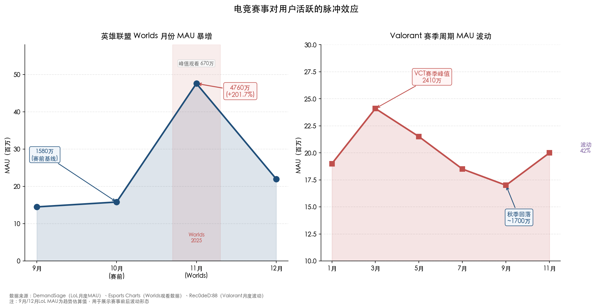

图 3-2 左侧面板展示了英雄联盟在 Worlds 2025 期间 MAU 的脉冲式暴增（+201.7%），右侧面板则呈现 Valorant 全年 MAU 随 VCT 赛季节奏呈现的周期性波动（幅度 42%），两组数据共同印证了电竞赛事对游戏活跃度的系统性放大作用。

移动电竞同样展现出强劲势能。MLBB M7 世锦赛峰值并发达 568 万，刷新移动电竞历史纪录[MOONTON官方新闻稿](https://www.eqs-news.com/news/corporate/mobile-legends-bang-bang-charts-global-ambitions-with-five-region-esports-overhaul-m8-world-championship-breaks-ground-in-turkiye-and-thailand/0cee11f7-2de2-427c-836f-ce3bf4cb7ae3_en "2026年1月")。电竞赛事不仅直接拉动观赛期间的游戏活跃与消费，更通过制造"共同话题"和"明星效应"维持品类在公众注意力中的持续存在。

### 3.4.5 F2P 主导的商业模式转型

竞技品类正全面转向 F2P + 外观变现模式。Valorant、Fortnite、Apex Legends、PUBG Mobile 等品类头部产品均采用免费游玩、通过皮肤/通行证/外观道具变现的商业模式。

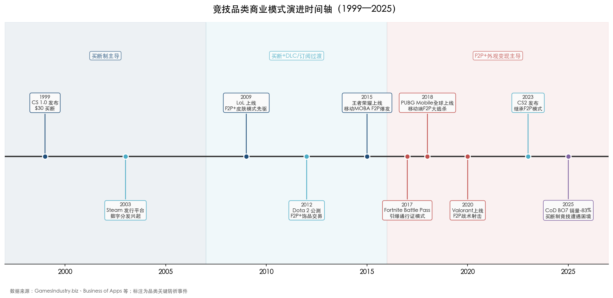

图 3-3 以时间轴形式梳理了竞技品类从买断制（CS 1.0）→买断+DLC/订阅过渡（LoL/Dota 2 引入 F2P）→F2P+外观变现主导（Fortnite Battle Pass 引爆）的三阶段演进历程。CoD Black Ops 7 Steam 前 26 天仅 40.1 万份的销量（较前作锐减 83%）[GamesIndustry.biz](https://www.gamesindustry.biz/activision-to-change-release-strategy-for-call-of-duty-franchise-as-new-data-suggests-player-count-has-halved-in-12-months "2025年12月")成为买断制在竞技品类中遭遇困境的标志性事件。我们判断，除体育类年货（EA FC、NBA 2K）仍维持买断+内购的混合模式外，竞技品类的未来将全面属于 F2P。

## 3.5 中国市场特写

中国市场在竞技品类上呈现出全球范围内独一无二的格局特征。

**超高品类集中度：** MOBA 与射击合占中国 Top 100 移动游戏收入的 37.74%，这一集中度远高于全球平均水平（全球移动端收入排序中策略类居首、RPG 居次、益智类第三）[GameLook](http://www.gamelook.com.cn/2025/12/584413/ "GameLook转载《2025年中国游戏产业报告》")，反映了中国移动游戏用户对实时竞技体验的强烈偏好。

**"泛大众化"的 MOBA 生态：** 王者荣耀 2.6 亿 MAU、1.39 亿 DAU、女性接近 50% 的用户结构在全球 MOBA 品类中绝无仅有。对比英雄联盟男性 87% 的占比，移动端 MOBA 在中国实现了从"核心男性用户"到"全民社交工具"的质变。低操作门槛（单指触控）、短局时（15-20 分钟）与微信社交链导入三大因素共同塑造了这一独特生态。

**射击品类的"长青组合"：** 腾讯在中国射击品类构建了覆盖多子类型的产品矩阵——和平精英常态 DAU 约 5000 万（2026 年春节超 9000 万），三角洲行动国服 DAU 突破 5000 万[品玩/腾讯财报](https://www.pingwest.com/a/312254 "2025年腾讯财报日")。各产品分别瞄准战术竞技、战术射击和团队竞技等细分需求，形成品类内用户分流而非外部竞争的协同格局。

**电竞生态的双向反哺：** 中国电竞收入 2025 年达 1700.51 亿元（+18.96%）[GameLook](http://www.gamelook.com.cn/2025/12/584413/ "GameLook转载GPC报告")。王者荣耀 KPL、和平精英 PEL 等移动电竞联赛既是品牌营销渠道，更是维持用户关注度与情感黏性的核心内容支撑。中国移动电竞在赛事规模、职业化程度和商业化水平上均处于全球领先位置。

## 3.6 本章小结

竞技对抗类游戏的用户画像可凝练为以下核心特征：**年轻男性为基本盘**（FPS 品类尤为突出），但**移动端产品正在系统性地打破性别与年龄壁垒**（王者荣耀女性 50%、45 岁以上 15%）；**技能成长与社交绑定**构成最核心的留存双引擎；**赛季制+电竞赛事**形成了品类独特的"内容脉搏"，驱动周期性用户回流；**F2P+外观变现**已成为不可逆转的商业模式主流。

对于游戏开发者与运营方而言，竞技品类的立项核心在于：设计能够同时满足 Mastery（可量化的技能进步）与 Social（有意义的社交互动）两大需求的核心循环，并通过赛季制运营将单款产品的生命周期从"一次性消费品"延展为"持续服务平台"。

# 第4章 角色扮演与策略类游戏用户画像（RPG/ARPG/MMORPG · 策略/SLG · 卡牌/二次元）

角色扮演、策略和卡牌/二次元品类构成了全球游戏市场中"重度内容消费"的核心地带。这三大品类的用户以深度角色养成、长线策略决策和叙事沉浸为核心体验诉求，贡献了全球移动 IAP 收入中最高的 ARPDAU 和 ARPPU 数值。2025 年以来，这一领域正在经历显著的结构性分化：全球移动策略品类收入飙升 25.6% 至 135 亿美元，登顶移动品类收入榜首；RPG 品类却同比下滑 15.4% 至 116 亿美元，亚洲市场承压尤甚[GameDev Reports/AppMagic](https://gamedevreports.substack.com/p/appmagic-mobile-games-monetization "Mobile Games Monetization Report 2025")。中国二次元移动游戏 2025 年收入为 282.81 亿元（同比-3.64%），降幅虽有所收窄，但市场尚未走出存量竞争格局[游戏工委](https://www.cgigc.com.cn/details.html?id=08de2653-1866-4758-8ca4-de5de7a297b2&tp=report "2025H1报告")。本章从人口统计、行为特征、心理动机、付费模式及留存特征五个维度，系统刻画上述品类的用户群体画像，并提炼"重度玩家"群体的共性规律与分化趋势。

## 4.1 RPG/ARPG 用户画像

### 4.1.1 人口统计特征

RPG/ARPG 品类用户以 18-30 岁中青年玩家为核心基盘，男性占比略高但女性渗透率正在持续提升。头部产品的用户画像呈现出鲜明的差异化定位。

**原神**作为当前全球开放世界 RPG 的标杆产品，2025 年移动端 MAU 约 1520 万（同比+63.4%），预计全年收入约 8 亿美元。用户中男性占 55%、女性占 45%，70% 处于 18-30 岁年龄区间[Business of Apps](https://www.businessofapps.com/data/genshin-impact-statistics/ "2026年1月，引用AppMagic/Sensor Tower")。地理分布呈典型的亚太核心+全球扩散格局：中国用户占 41%、日本 23.5%、美国 10.9%。区域付费能力的差异尤其值得关注——日本用户 RPD（Revenue Per Download）高达 91.84 美元，约为美国用户（31.1 美元）的三倍，折射出日本市场对 Gacha 内容型 RPG 的极高付费意愿。

**崩坏：星穹铁道**（以下简称"崩铁"）是米哈游继原神之后的第二款全球化爆款，移动端累计收入超 15 亿美元，MAU 约 1154 万，ARPDAU 达 0.77 美元，显著高于一般中核 RPG 0.30-0.50 美元的行业水平[Udonis](https://www.blog.udonis.co/mobile-marketing/mobile-games/honkai-star-rail-player-count "2025年2月，引用AppMagic")。崩铁用户男性占比约 70%，核心年龄段集中在 18-28 岁，在二次元核心用户群中渗透率极高。

**暗黑不朽（Diablo Immortal）**则代表了 RPG 品类的另一条路径——"付费深度型"设计。其 ARPDAU 高达 1.37 美元，在移动 RPG 品类中处于极高水平[Udonis](https://www.blog.udonis.co/mobile-marketing/mobile-games/diablo-immortal-player-count "2025年4月")。暗黑不朽瞄准的是 30-40 岁、具有 PC ARPG 经历和较强消费能力的核心男性玩家群体，与原神、崩铁面向的年轻二次元用户形成显著差异化。

### 4.1.2 行为特征

RPG/ARPG 品类的时间投入处于移动游戏最重的梯队。行业基准数据显示，RPG/Gacha 类游戏用户日均游戏时间约 93-96 分钟[Newzoo Global Gamer Study 2024](https://gamedevreports.substack.com/p/newzoo-how-people-engage-with-games "73,000人36市场调查")，远超全品类中位数（22 分钟），仅次于 MMORPG。

品类的核心行为循环围绕"每日任务—资源积累—角色养成—内容解锁"展开。玩家通过持续的时间投入推进角色等级、装备强化和技能树拓展，形成典型的"肝度驱动"行为模式。开放世界 RPG（如原神）额外叠加了地图探索行为——隐藏任务、世界事件和收集要素为日常循环增添了变化感，但也进一步抬高了时间投入门槛。

设备偏好方面，RPG 品类呈现明确的跨平台趋势。原神和崩铁均支持 PC/移动/主机多端互通。2024 年 PC 端微交易收入已达约 244 亿美元，占 PC 游戏总收入的 58%，买断制占比则持续下降至 28%[Icon Era](https://icon-era.com/blog/in-game-purchase-spending-habits-statistics-2025.343/ "2025年10月，引用Newzoo数据")。跨平台设计使 RPG 玩家能够在通勤场景用手机完成日常任务、在家以 PC/主机体验核心内容，实现碎片时间的高效利用。

### 4.1.3 心理动机

RPG 品类在 Quantic Foundry 动机模型中主要对应 **Immersion-Creativity** 集群，核心驱动力集中在 **Fantasy（幻想代入）**、**Story（叙事沉浸）** 和 **Completion（收集完成）** 三大维度。

幻想代入是 RPG 品类区别于竞技类游戏的根本动机差异。玩家通过创建或操控角色进入虚构世界，在叙事推进中获得"第二人生"体验。原神凭借精美的开放世界与多元角色阵容满足了这一需求，崩铁则以回合制战斗搭配银河铁道叙事构建了独特的沉浸感。

收集完成动机在 RPG 品类中具备直接的商业转化路径——角色收集、装备套装和成就系统不仅驱动留存，更直接催生付费需求。"差一个角色就集齐了"的心理是 Gacha 收入的核心引擎。Quantic Foundry 数据显示，女性在 Fantasy 和 Design（设计定制）维度上的得分显著高于男性，这在一定程度上解释了原神 45% 女性用户占比背后的动机基础。

### 4.1.4 付费模式

RPG 品类的付费模型正经历深刻分化，不同产品路径对应截然不同的用户付费行为。

**Gacha 驱动型**仍是亚洲 RPG 的主流模式。崩铁的月收入波动清晰展示了 Gacha 机制的"脉冲式"特征：卡池期月收入达 7000-9000 万美元，非卡池期骤降至 1900-2700 万美元，波动幅度达 3-4 倍[Udonis](https://www.blog.udonis.co/mobile-marketing/mobile-games/honkai-star-rail-player-count "2025年2月，引用AppMagic")。米哈游已在旗下产品中尝试以低价礼包扩大付费转化漏斗：崩铁中单个 $4.99 限时礼包可贡献月收入的 3% 和购买次数的 13%，绝区零中 $2.99 礼包贡献 3% 收入和 16% 购买次数[GameDev Reports/AppMagic](https://gamedevreports.substack.com/p/appmagic-mobile-games-monetization "AppMagic 2025年报告")。

**付费深度型**以暗黑不朽为代表。1.37 美元的 ARPDAU 意味着该产品的单用户日均变现能力远超同品类，核心驱动力来自多层级装备强化体系和竞争性排行系统所激发的持续消费需求。

**品类整体付费指标方面**，美国 Top 10 移动 RPG 的首购均价为 iOS 端 17.9 美元、Google Play 端 8.3 美元。iOS 端 ARPPU 同比上升 27%，但 Google Play 端 D90 ARPPU 下跌 42%，表明"高价低频"正取代"低价高频"成为 iOS RPG 的主流付费模式[GameDev Reports/AppMagic](https://gamedevreports.substack.com/p/appmagic-mobile-games-monetization "AppMagic 2025年报告")。

全球移动 RPG 品类面临的结构性挑战同样不容忽视。H1 2025 品类收入 93 亿美元（同比-11%），行业分析师指出"过多机制、过多肝度、过高营销成本"三重压力正在压缩品类利润空间[PocketGamer.biz](https://www.pocketgamer.biz/strategy-games-surge-as-rpg-revenue-tumbles-h1-2025s-top-genres-revealed/ "2025年7月，引用AppMagic") [Deconstructor of Fun](https://www.deconstructoroffun.com/blog/2025/6/5/the-state-of-mobile-gaming-2025 "2025年6月")。RPG 品类在中国 iOS 市场的收入同比下滑 25%，为所有品类中降幅最大[GameDev Reports/AppMagic](https://gamedevreports.substack.com/p/appmagic-mobile-games-monetization "AppMagic 2025年报告")。

### 4.1.5 留存特征

RPG 品类的留存曲线呈现"高 D1、快衰减"的特征。行业基准数据（北美 Top 25%）显示，RPG D1 留存 31.4%、D7 留存 7.3%、D28 留存仅 1.7%[GameAnalytics Q1 2024基准报告](https://investgame.net/wp-content/uploads/2024/06/gameanalytics-q1-2024-mobile-games-benchmarks.pdf "Q1 2024, Top 25%, North America")，长线留存在所有主流品类中处于最低梯队。

头部产品的表现能够显著超越品类基准。崩铁 D1 留存 48%、D30 留存 18%；暗黑不朽 D1 留存 32%、D30 留存 12%[Udonis](https://www.blog.udonis.co/mobile-marketing/mobile-games/honkai-star-rail-player-count "崩铁留存数据") [Udonis](https://www.blog.udonis.co/mobile-marketing/mobile-games/diablo-immortal-player-count "暗黑不朽留存数据")。头部与品类均值之间的巨大落差表明，RPG 品类的留存竞争本质上是内容品质和更新节奏的竞争——唯有持续投入高质量内容的产品才能跑赢衰减曲线。

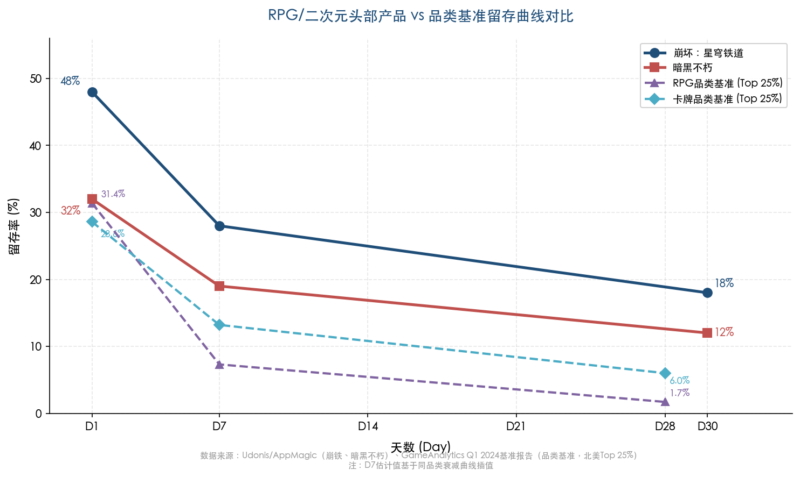

上图直观呈现了崩铁、暗黑不朽两款头部产品相较于 RPG 和卡牌品类基准的留存优势。崩铁 D30 留存（18%）约为 RPG 品类基准 D28（1.7%）的 10 倍，印证了头部内容品质对长线留存的决定性影响。

RPG 品类的流失主因通常与"肝度疲劳"和"内容真空期"直接相关。当日常循环趋于重复、版本间内容更新间隔过长时，玩家的"沉没成本感"会从留存助力转变为"解脱感"——"终于可以不用每天上线了"是 RPG 玩家的典型流失心态。

## 4.2 MMORPG 用户画像

### 4.2.1 人口统计特征

MMORPG 玩家群体在所有游戏品类中呈现最为成熟的年龄结构与最高的用户黏性。

**魔兽世界（WoW）**作为全球 MMORPG 的标杆，2025 年 7 月活跃玩家约 900 万，平均年龄 31.29 岁，约 50% 的订阅用户连续付费超过 500 天[MMO-Champion](https://www.mmo-champion.com/threads/2665362-WoW-has-9-million-players-in-July-2025-and-that-was-without-China "2025年")。用户日均游戏时间约 3.7 小时（222 分钟），在所有游戏产品中属于最高水平，体现了 MMORPG "生活方式"级别的时间投入。

**最终幻想XIV（FFXIV）**的活跃角色数在 82-88 万之间（基于 Lucky Bancho 非官方普查数据），累计注册超 2700 万[PC Gamer](https://www.pcgamer.com/games/final-fantasy/final-fantasy-14s-latest-unofficial-census-is-a-surprising-uptick-and-shows-im-not-the-only-one-getting-sucked-back-into-the-mmo-again/ "2025年")。FFXIV 以"叙事驱动"为核心差异化卖点，主线剧情品质被广泛认为达到单机 RPG 水准，由此吸引了大量对传统 MMO 刷本机制不感兴趣的叙事向玩家。

MMORPG 品类的性别结构偏向男性主导，但女性比例高于 FPS 等硬核竞技品类。品类参与率在 Google Play 基准中仅为 3%，属于小众品类；然而一旦进入，用户展现出极高的投入度与付费意愿[Google Play MMORPG Report](https://play.google.com/console/about/static/pdf/google-play-mmorpg-genre-report.pdf "2022年3月")。

### 4.2.2 行为特征

MMORPG 是所有游戏品类中时间投入最重的类型。Google Play 基准数据显示，MMORPG 日均游戏时间中位数为 95 分钟，居移动端所有品类之首[Google Play MMORPG Report](https://play.google.com/console/about/static/pdf/google-play-mmorpg-genre-report.pdf "2022年3月")；PC 端 MMORPG（如 WoW）日均时间更达 222 分钟。

品类最显著的行为特征是**极高的品类内排他性**。87% 的 MMORPG 玩家仅同时参与一款同品类游戏[Google Play MMORPG Report](https://play.google.com/console/about/static/pdf/google-play-mmorpg-genre-report.pdf "2022年3月")，该比例在所有品类中最高，折射出 MMORPG 对玩家时间和社交资本的极度占有。一个 MMORPG 玩家的公会关系、装备进度和角色成长通常绑定在单一产品上，切换成本极为高昂。

**公会（Guild/工会）是 MMORPG 社交生态的核心枢纽**。54% 的 WoW 玩家在游戏中建立了现实友谊。公会提供了固定的社交归属感、团队副本的组织框架和长期目标的共同追求。然而公会也是流失的最大风险因子——当核心成员离开时，连锁流失效应往往导致整个社交网络迅速崩塌。

### 4.2.3 心理动机

MMORPG 品类覆盖了 Quantic Foundry 模型中最广泛的动机维度。在 SDT（自我决定理论）框架下，MMORPG 是少数能同时深度满足自主性（开放世界自由探索）、胜任感（副本挑战与装备进阶）和关系性（公会社交与团队协作）三大基本心理需求的品类。这种"三需求全覆盖"特征，解释了 MMORPG 用户虽然基数有限但黏性极高的独特现象。

不同子群体对 MMORPG 的核心吸引力存在明显分化：硬核玩家追求 Mastery（高难副本通关与 DPS 排名），社交型玩家看重 Social（公会活动与社交互动），叙事型玩家则被 Story（主线剧情与世界观探索）所驱动。FFXIV 的成功在于以叙事品质作为差异化锚点，将传统 MMO 较难服务的叙事向玩家纳入了核心用户群。

### 4.2.4 付费模式

MMORPG 品类拥有全移动游戏领域最高的付费深度。Google Play 基准数据显示，MMORPG 的 ARPDAU 中位数为 0.69 美元、75 分位达 1.61 美元；ARPPU 中位数 39.07 美元、75 分位高达 79.60 美元[Google Play MMORPG Report](https://play.google.com/console/about/static/pdf/google-play-mmorpg-genre-report.pdf "2022年3月")。尽管品类参与率仅 3%，但付费转化接近所有品类的 75 分位水平——进入即高概率付费，且付费深度居所有品类之首。

PC 端 MMORPG 的商业模式以订阅制为基础。WoW 采用月费订阅（约 $15/月）+资料片买断+内购商城的三层结构，50% 用户订阅超 500 天意味着单用户 LTV 可达数百美元量级。FFXIV 同样采用月费+资料片模式，但内购商城的收入比重低于 WoW。

### 4.2.5 留存特征

MMORPG 的留存曲线呈现"入口窄而留存深"的特征。品类获客壁垒极高——复杂的系统、陡峭的学习曲线和沉重的时间要求在早期即筛除了大量用户。但通过新手期筛选的玩家，留存率远超其他品类：WoW 50% 用户订阅超 500 天，印证了社交网络与角色投入一旦建立，沉没成本效应将产生极强的留存锁定力。

运营超过 6 年的"遗产游戏"贡献了全球移动 IAP 收入的 50%[Gamigion/Moloco](https://www.gamigion.com/2025-state-of-mobile-gaming-iap-trends-of-leading-apps/ "2025年7月")，MMORPG 是这一趋势的典型代表。WoW 已运营超过 20 年、FFXIV 重生后亦逾 11 年，证明"时间投入→社交绑定→沉没成本→长期留存"的正向循环一旦建立，产品生命周期可达十年以上。

MMORPG 的核心流失风险在于社交网络的瓦解。公会解散、核心好友流失或服务器人口萎缩带来的"社交荒漠化"，是促使长期玩家最终离开的首要因素。资料片更新周期过长导致的"内容真空"构成第二大流失诱因——WoW 历史上每次资料片末期均出现显著的订阅量下滑。

## 4.3 策略/SLG 用户画像

### 4.3.1 人口统计特征

策略/SLG 品类在 2025 年成为全球移动游戏收入的绝对领跑者。全年移动策略 IAP 收入从 108 亿美元攀升至 135 亿美元（+25.6%），App Store 端增速更达 27.9%[GameDev Reports/AppMagic](https://gamedevreports.substack.com/p/appmagic-mobile-games-monetization "AppMagic 2025年报告")。H1 2025 毛收入 106 亿美元，位列所有品类第一[PocketGamer.biz](https://www.pocketgamer.biz/strategy-games-surge-as-rpg-revenue-tumbles-h1-2025s-top-genres-revealed/ "2025年7月，引用AppMagic")。

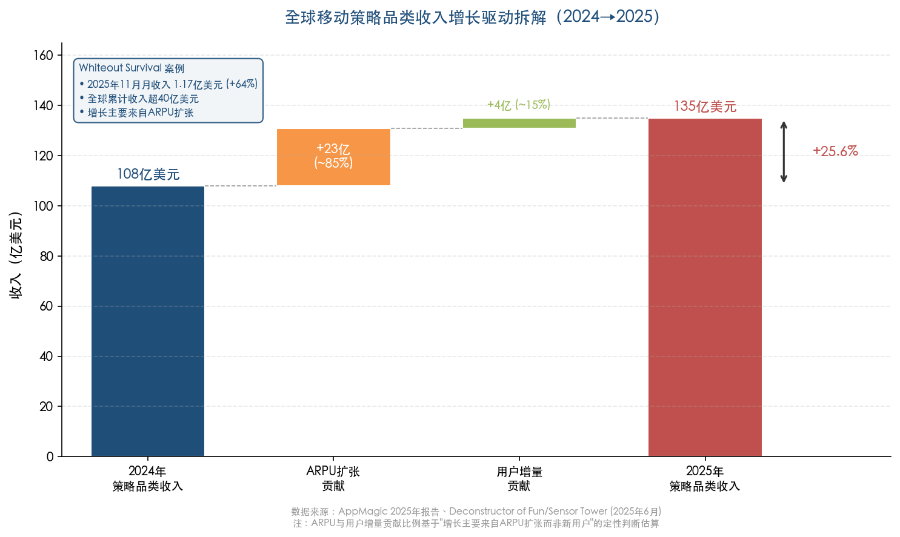

如上图所示，策略品类 27 亿美元的增量中，ARPU 扩张贡献约 85%（+23 亿美元），用户增量贡献约 15%（+4 亿美元），表明品类增长的核心引擎是单用户价值的深度挖掘而非用户规模扩张。

SLG 品类的用户画像正在经历颠覆性变化。传统认知中 SLG 是"35 岁以上男性主导"的品类，但新一代 SLG 产品正在打破这一刻板印象。**Whiteout Survival** 2025 年 11 月月收入达 1.169 亿美元（同比+64.3%），全球累计收入超 40 亿美元，用户性别比接近 50/50，成功突破了传统 SLG 的男性主导格局[ASOTools/Appark](https://asotools.io/blog/whiteout-survival-revenue-statistics-2025-analysis "2025年12月") [Deconstructor of Fun](https://www.deconstructoroffun.com/blog/2025/6/5/the-state-of-mobile-gaming-2025 "Sensor Tower数据")。这一变化的核心驱动力是 SLG 品类的"特洛伊木马"获客模型——通过类休闲的广告素材和低门槛的前期体验吸引泛用户群体（包括大量女性用户），在建立初步沉浸后逐步引入深度策略内容。

品类收入增长主要来自 **ARPU 扩张而非新用户增长**，头部产品的"鲸鱼效应"尤为显著——头部两款游戏可占据子品类 80% 以上的收入[Deconstructor of Fun](https://www.deconstructoroffun.com/blog/2025/6/5/the-state-of-mobile-gaming-2025 "2025年6月")。

### 4.3.2 行为特征

SLG 品类的行为模式以"长周期、多频次、短单次"为典型特征。与 MMORPG 的长时段沉浸不同，SLG 玩家通常采取碎片化的多次登录模式——每隔数小时登录一次，完成资源收割、建造队列调整和部队派遣等操作，单次时长可能仅 5-15 分钟，但日登录频次可达 5-10 次。

**联盟（Alliance）驱动的社交互动**是 SLG 品类的另一核心行为特征。大多数 SLG 产品以服务器/联盟为基础单位组织社交关系，联盟战、跨服对抗和资源争夺构成中后期的核心内容。联盟内的层级体系（盟主、副盟主、成员）和协作需求（援助、集结）创造了类"组织管理"的社交体验。这与 MMORPG 的公会机制有相似之处，但 SLG 联盟竞争更直接地与领土、资源和排名等可量化目标挂钩。

亚洲发行商在 SLG 品类中占据主导地位，其产品通常在最初数次游戏会话中伪装为更简单的品类类型（如模拟建造或休闲策略），待用户建立初步投入后才逐步暴露完整的策略深度[GameDev Reports/AppMagic](https://gamedevreports.substack.com/p/appmagic-mobile-games-monetization "AppMagic 2025年报告")。这一设计策略有效拓宽了品类的潜在用户基盘。

### 4.3.3 心理动机

SLG 品类在 Quantic Foundry 动机模型中主要对应 **Mastery-Achievement** 集群，核心驱动力集中于 **Strategy（战略规划）** 和 **Power（权力/支配）** 两大维度。

SLG 玩家的深层动机可概括为"建设与征服"的二元驱动。建设维度对应"从无到有"的城市/基地发展快感，征服维度对应"击败竞争对手、攀升排名"的权力满足感。联盟系统将个人竞争升格为集体竞争，使"社交认同"成为附加动机——在联盟中担任领导角色、为联盟胜利做出关键贡献所带来的"社交地位感"，是 SLG 品类独有的留存锚点。

传统 4X SLG（如文明、万国觉醒）的玩家动机偏向 Mastery 端，强调对复杂系统的理解与长线规划能力；新一代"混合 SLG"（如 Whiteout Survival、Last War）则通过简化策略深度、强化视觉反馈和社交互动，将 Achievement（成就感）和 Social（社交归属）的权重大幅提升，从而吸引了传统 SLG 品类之外的用户群体。

### 4.3.4 付费模式

SLG 品类拥有全移动游戏领域最高的长线付费水平。AppMagic 数据显示，到玩家生命周期第 90 天，策略品类付费用户的累计消费约为博彩品类付费用户的两倍[GameDev Reports/AppMagic](https://gamedevreports.substack.com/p/appmagic-mobile-games-monetization "AppMagic 2025年报告")。策略品类 App Store ARPPU 历史上即为 Google Play 的 4-5 倍，2025 年这一差距进一步扩大至最高 8 倍。

SLG 品类的定价策略与其他品类存在显著差异。$99 档高价包在 SLG 头部游戏的营收排行中出现频率远高于其他品类，大多数 SLG 收入来自硬通货（钻石/宝石等）捆绑包[GameDev Reports/AppMagic](https://gamedevreports.substack.com/p/appmagic-mobile-games-monetization "AppMagic 2025年报告")。SLG 付费设计的本质是一套"时间换金钱"的加速器体系：免费玩家可以通过数周等待达到与付费玩家相同的建筑等级或兵力规模，但付费用户能够即时缩短这一过程。联盟竞争进一步放大了加速需求——当对手联盟快速扩张时，"不付费就落后"的紧迫感成为 SLG 鲸鱼用户持续消费的核心推动力。

全球仅 1.83% 的移动玩家进行 IAP 购买，但美国 iOS 端前 0.02% 的付费玩家贡献了全球游戏收入的 20%[Icon Era](https://icon-era.com/blog/in-game-purchase-spending-habits-statistics-2025.343/ "2025年10月，引用Unity 2024报告")。SLG 品类的鲸鱼浓度在这一极端分布中贡献了显著份额。

### 4.3.5 留存特征

SLG 品类的留存基准数据（北美 Top 25%）为 D1 33.3%、D7 10.7%、D28 3.1%[GameAnalytics Q1 2024基准报告](https://investgame.net/wp-content/uploads/2024/06/gameanalytics-q1-2024-mobile-games-benchmarks.pdf "Q1 2024, Top 25%, North America")。D1 留存在主流品类中表现较高，但 D7 至 D28 的衰减斜率陡峭，反映出 SLG 在新手到中度玩家转化环节的高流失率。

SLG 品类的留存机制高度依赖"联盟绑定"和"建设沉没成本"两大支柱。一旦玩家加入活跃联盟并投入数周经营基地，切换成本极高。联盟排名竞争和定期的跨服对抗活动为长期玩家提供了持续目标。然而，SLG 留存曲线也面临独特风险："战力碾压"造成的新老玩家之间不可逾越的差距，以及联盟政治冲突引发的群体性流失，均为 SLG 运营中的关键挑战。

### 4.3.6 中国 SLG 出海

中国 SLG 在海外市场占据压倒性地位。2025 年海外 Top 100 自研移动游戏中，策略类占比 49.96%，连续五年稳居中国游戏出海品类第一[每日经济新闻](https://biz.eastmoney.com/a/202512193597163732.html "2025年12月19日")。中国自研游戏海外收入达 204.55 亿美元（+10.23%），其中 SLG 贡献了最大份额。

这一格局形成了颇具特色的"结构倒挂"现象：中国国内市场 MOBA+射击合占 37.74%，SLG 并非头部品类；但在海外市场，中国 SLG 产品凭借成熟的数值体系设计能力、深度的 LiveOps 运营经验和精准的买量投放策略，牢牢占据了全球 SLG 品类的制高点。Whiteout Survival（点点互动/世纪华通旗下）40 亿美元累计收入，即为中国 SLG 出海能力的标杆案例。

## 4.4 卡牌/二次元用户画像

### 4.4.1 人口统计特征

卡牌/二次元品类的用户以 15-30 岁年轻群体为核心，文化认同和社区归属构成品类独特的用户黏性基底。

中国二次元移动游戏 2025 年收入为 282.81 亿元（同比-3.64%），降幅较前期有所收窄[游戏工委](https://www.cgigc.com.cn/details.html?id=08de2653-1866-4758-8ca4-de5de7a297b2&tp=report "2025H1报告")。收入下降的主因在于头部产品流水放缓与新品同质化加剧，市场已步入存量竞争阶段。

**性别分布方面**，二次元品类存在显著的产品差异。原神男女比 60:40，崩铁约 70:30，均为男性偏多的典型二次元用户结构。但**恋与深空**的成功标志着女性向二次元游戏实现了商业化突破：截至 2025 年 3 月，恋与深空累计收入超 4.46 亿美元，其中 36% 来自海外；2025 全年预估约 8.26 亿美元，核心用户为 18-35 岁女性[Niko Partners](https://nikopartners.com/how-love-and-deepspace-wins-women-gamers/ "2025年3月8日")。

亚洲女性玩家在游戏市场中的付费能力正引发更多关注。Niko Partners 研究显示，亚洲女性玩家占比 34-38%，印度付费女性月均消费比男性高 8.5%[Niko Partners](https://nikopartners.com/how-love-and-deepspace-wins-women-gamers/ "2025年3月8日")。这一数据挑战了"男性玩家消费更高"的传统假设，也在底层逻辑上支撑了恋与深空等女性向产品的强劲付费表现。

### 4.4.2 行为特征

卡牌/二次元品类的行为模式呈现"日常碎片化+事件集中化"的双重结构。日常行为以完成每日任务、消耗体力和推进关卡为主，单次时长约 15-30 分钟；但在角色卡池开放、版本更新或限时活动期间，玩家的投入时间会急剧攀升。

**社区行为**是二次元品类区别于其他重度品类的独特标签。粉丝运营、同人创作和角色 fandom（角色信仰）构成了产品之外的"外延生态"。二次元玩家在 B 站、微博、Pixiv 等平台的同人创作活跃度，直接影响产品的社区热度和获客效果。角色 fandom 的本质是情感投射——玩家对虚拟角色产生类人际关系的情感依附，这种情感绑定是二次元品类留存和付费的核心引擎。

恋与深空在这方面走得更远：产品围绕"恋爱模拟+动作 RPG"构建了深度的角色情感互动体系，AI 剧组模式等 UGC 功能进一步激发了用户的创作表达欲望。

### 4.4.3 心理动机

卡牌/二次元品类的核心动机在 Quantic Foundry 模型中集中于 **Immersion** 维度的 **Fantasy（幻想代入）** 与 **Story（叙事沉浸）**，并叠加 **Achievement** 维度的 **Completion（收集完成）**。

收集动机在卡牌/二次元品类中被 Gacha 机制高度货币化。"差一个角色就集齐某系列""限时UP卡池错过即无"的稀缺性设计，将收集冲动直接转化为付费行为。日本市场对这一机制的接受度尤为突出：20-29 岁群体月均 Gacha 消费约 30 美元，19% 承认因游戏消费而无法负担基本开支[Icon Era](https://icon-era.com/blog/in-game-purchase-spending-habits-statistics-2025.343/ "2025年10月，引用SMBC调查")。

角色 fandom 的动机根源可追溯至 SDT 框架中的"关系性"需求——虚拟角色提供了一种低风险、高可控的"准社交关系"。对于社交回避倾向较高的年轻用户群体而言，角色互动在一定程度上满足了现实社交中难以获得的情感需求。

### 4.4.4 付费模式

Gacha 机制是卡牌/二次元品类的核心商业引擎，塑造了极为鲜明的"脉冲式"付费节奏。崩铁卡池期收入与非卡池期波动达 3-4 倍，恋与深空亦呈现类似的"卡池驱动"收入波形。

全球移动游戏前 5% 付费用户贡献了 48% 的 IAP 收入[Gamigion/Moloco](https://www.gamigion.com/2025-state-of-mobile-gaming-iap-trends-of-leading-apps/ "2025年7月")，二次元品类的鲸鱼用户集中度可能更高——核心收藏向玩家对限定角色的"不惜代价"追求，使其消费远超一般付费用户。

然而 Gacha 模式正面临监管和市场的双重压力。Niko Partners 预测 2026 年亚洲开发商将逐步远离角色 Gacha 模式，原因包括细分市场饱和、监管趋严和玩家疲劳[Niko Partners](https://nikopartners.com/niko-partners-2026-predictions/ "2026年1月预测")。米哈游在崩铁和绝区零中试行的低价入口礼包策略（$0.99-$4.99），实质上是在 Gacha 大额消费之外开辟"轻度付费"转化通道，以应对核心 Gacha 用户增量放缓的挑战。

### 4.4.5 留存特征

卡牌品类的留存基准数据（北美 Top 25%）为 D1 28.6%、D7 13.2%、D28 6.0%[GameAnalytics Q1 2024基准报告](https://investgame.net/wp-content/uploads/2024/06/gameanalytics-q1-2024-mobile-games-benchmarks.pdf "Q1 2024, Top 25%, North America")。卡牌品类的 D28 留存（6.0%）在所有品类中仅次于文字类（6.8%）和棋牌类，D7→D28 衰减斜率为所有品类中最平缓——这表明卡牌/二次元品类一旦完成初期筛选（D7），后续长线留存在所有品类中属于最优梯队。

二次元品类的留存引擎是"角色情感绑定+内容更新节奏"的双轮驱动。角色培养投入和情感依附构成的沉没成本使玩家难以轻易放弃；版本更新带来的新角色、新剧情和限时活动则提供了周期性的回流动力。

流失风险主要来自两个方向：一是"同质化疲劳"——当市场上大量同类型 Gacha 产品争夺同一批用户时，"审美疲劳"与"消费疲劳"往往同步发生；二是"内容空窗期"——版本间隔过长将直接导致日活下滑和付费萎缩。

## 4.5 品类共性：重度内容消费型玩家的画像规律

RPG/ARPG、MMORPG、策略/SLG 和卡牌/二次元四大品类虽在玩法设计和用户结构上各有差异，但在付费深度维度上共同构成了移动游戏市场的最高梯队。下图以热力图形式直观对比了四大品类的关键付费指标：

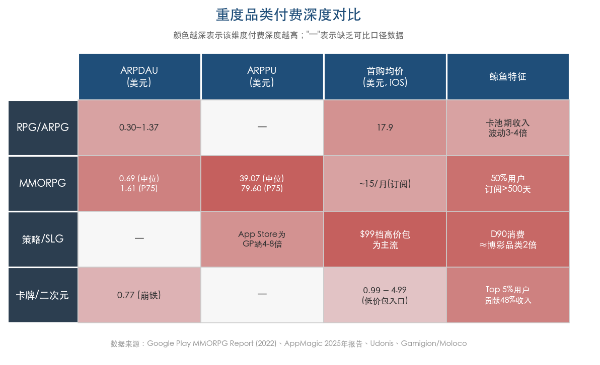

如图所示，MMORPG 在 ARPPU 维度领先（中位数 39.07 美元），策略/SLG 在长线消费深度上最为突出（D90 消费约为博彩品类两倍），RPG 品类 ARPDAU 跨度最大（0.30-1.37 美元），卡牌/二次元则以低价包入口（$0.99-$4.99）+鲸鱼高集中度（Top 5% 贡献 48% 收入）为特征。

### 4.5.1 "养成感"是跨品类的留存锚点

无论是 RPG 的角色成长、MMORPG 的装备积累、SLG 的基地建设，还是卡牌/二次元的角色收集，"投入时间→获得回报→看到成长"的正反馈循环是所有重度品类共有的核心留存机制。养成系统设计的本质在于构建"有意义的沉没成本"——使玩家感到离开意味着"浪费已经投入的一切"。

### 4.5.2 时间预算竞争是品类间最尖锐的矛盾

重度品类之间的竞争本质上是时间预算的零和博弈。MMORPG 日均 95+ 分钟、RPG 日均 93-96 分钟的时间需求，意味着一个玩家几乎不可能同时深度参与两个重度品类。87% 的 MMORPG 玩家仅参与一款同品类游戏即为这一判断的有力佐证[Google Play MMORPG Report](https://play.google.com/console/about/static/pdf/google-play-mmorpg-genre-report.pdf "2022年3月")。全球移动游戏时间同比+8%，但安装量-0.2%[Deconstructor of Fun](https://www.deconstructoroffun.com/blog/2025/6/5/the-state-of-mobile-gaming-2025 "2025年6月")——玩家正在减少尝试新游戏而增加对既有游戏的投入。这一趋势意味着重度品类新品"争夺用户时间"的难度在持续提升。

### 4.5.3 Gen Z 消费缩减对重度品类的潜在影响

Circana 2025 年数据显示，美国 18-24 岁群体游戏消费同比下降近 25%[GamesIndustry.biz](https://www.gamesindustry.biz/video-games-spending-by-young-americans-is-dropping-sharply-report-suggests "2025年7月，引用Circana数据")。更广泛地看，2025 年 1-4 月美国 18-24 岁群体线上线下消费整体下降 13%，其中游戏消费下降速度快于技术类消费整体，驱动因素包括就业市场压力、学贷负担和信用卡债务攀升。

对于以 18-30 岁用户为核心的 RPG/二次元品类而言，Gen Z 消费缩减可能产生三方面影响：其一，Gacha 大额消费意愿下降，推动开发者探索更低价位的付费入口；其二，免费内容体验的完整度要求提高，"不花钱就卡关"的设计将加速用户流失；其三，品类间的时间竞争加剧——当支出预算收紧时，用户更倾向于将有限消费集中在最忠诚的单一产品上。

### 4.5.4 "遗产游戏"效应与新品准入壁垒

运营超过 6 年的"遗产游戏"贡献了全球移动 IAP 收入的 50%[Gamigion/Moloco](https://www.gamigion.com/2025-state-of-mobile-gaming-iap-trends-of-leading-apps/ "2025年7月")。重度品类中这一效应尤为显著：原神上线超 4 年仍是开放世界 RPG 的标杆产品，WoW 运营超 20 年，Whiteout Survival 的增长主要来自 ARPU 扩张而非新用户拓展。

对于新进入者而言，重度品类的壁垒不仅在于研发投入规模，更在于存量用户的"品类锁定"——其时间、金钱和社交关系均已沉没在现有产品中。突围路径有限：要么在产品品质上实现"降维打击"（如米哈游以工业化品质重新定义移动 RPG），要么在品类定义上实现"边界重构"（如 SLG 的特洛伊木马模型拓宽用户基盘），否则极难在存量格局中获取有意义的市场份额。

## 4.6 中国市场特写

中国市场在重度品类上呈现与全球不同的结构特征。

**RPG 品类在中国的特殊地位：** RPG 占中国 Top 100 移动游戏收入的 15.1%，位列第三[GameLook](http://www.gamelook.com.cn/2025/12/584413/ "GameLook转载《2025年中国游戏产业报告》")。中国是原神和崩铁最大的单一市场（原神用户中国占 41%），二次元品类收入虽整体下滑，但 282.81 亿元的绝对规模仍居全球前列。

**中国 MMORPG 端转手生态：** 中国 MMORPG 移动端渗透率远高于全球。《逆水寒》端手游在 2024 年初官宣活跃用户总数突破 1 亿[亿欧网](https://www.iyiou.com/briefing/197001211534805 "逆水寒官宣活跃玩家总数破亿")，AI 剧组模式等创新功能吸引了数百万玩家创作千万条 UGC 作品[网易2025Q4财报](http://news.17173.com/content/02132026/101604599.shtml "2025年Q4财报")。《梦幻西游》电脑版 2025 年 8 月同时在线人数达 293 万，刷新历史纪录；手游月活跃用户创两年来新高[网易Q3财报](https://www.iyiou.com/news/202511201115030 "网易2025Q3财报")。这些端转手产品凭借 IP 积淀、社交沉淀和持续的内容更新，维持了强劲的长线表现。

**SLG 出海与国内品类分布的"结构倒挂"：** 如前文所述，SLG 占中国出海 Top 100 游戏收入的 49.96%，但在国内市场并非头部品类。这一结构反映了中国开发者在数值策划、LiveOps 运营和全球化买量方面的核心竞争力，同时也说明中国国内用户的品类偏好更倾向于实时竞技和社交化体验。

## 4.7 本章小结

角色扮演、策略和卡牌/二次元品类的用户画像可凝练为以下核心规律。**用户年龄集中在 18-35 岁**，MMORPG 呈现更成熟的年龄结构（平均 31 岁）。**时间投入是所有品类中最重的**（日均 90+ 分钟），导致品类间排他性极强。**"养成感"是跨品类的核心留存锚点**，但具体表现形式各异：RPG 靠角色成长、MMORPG 靠社交绑定、SLG 靠建设+联盟竞争、二次元靠角色情感依附。**付费深度在所有游戏品类中处于最高梯队**——MMORPG 的 ARPPU 中位数 39.07 美元领跑，SLG 的 D90 累计消费最高，二次元的 Gacha 机制创造了最强的脉冲式付费。**品类正在经历结构性分化**：策略/SLG 逆势增长 25.6%，RPG 收缩 15.4%，二次元进入存量竞争。对于游戏开发者而言，重度品类的核心设计命题在于：如何在"深度养成"与"肝度控制"之间找到平衡，在"鲸鱼变现"与"大众留存"之间构建可持续的双层付费体系。

# 第5章 休闲与泛玩法类游戏用户画像（休闲/超休闲 · 模拟经营 · 沙盒/开放世界 · 生存/恐怖）

休闲与泛玩法类游戏构成了全球游戏用户的最大基盘。与第三章所分析的竞技对抗类及第四章所覆盖的角色扮演/策略类"核心玩家"不同，本章所聚焦的品类以低门槛体验、创造自由度或情绪刺激为核心吸引力，触达了大量"非传统玩家"——包括不自认为"游戏玩家"的中老年女性、通过社交裂变首次接触游戏的微信用户、以及在 Roblox 和 Minecraft 中成长的 Gen Alpha 一代。Activision Blizzard Media 的调查揭示了一个深刻的"身份悖论"：72% 的女性玩家不认同"gamer"标签，77% 的移动端主力玩家同样拒绝该标签，但她们平均拥有 12 年游戏经历、每周投入 11 小时[Microsoft Advertising](https://about.ads.microsoft.com/en/blog/post/august-2025/engaging-the-spectrum-of-todays-players "Activision Blizzard Media Gaming Study 2023, 刊于Microsoft Advertising 2025年8月")。这一悖论正是理解泛休闲品类用户画像的核心起点。

从市场规模来看，2025 年上半年全球休闲游戏 IAP 净收入约 120 亿美元（同比+0.8%），下载量同比增长 5.8%，其中益智（Puzzle）和博彩休闲（Casino）两大子品类贡献约 72% 的收入[AppMagic](https://appmagic.rocks/research/casual-report-h1-2025 "Casual Games Report H1 2025")。混合休闲（Hybrid Casual）全年 IAP 收入约 42 亿美元（同比+20%），成为品类内增速最快的赛道[AppMagic](https://appmagic.rocks/research/casual-report-h1-2025 "同上")。与此同时，沙盒/UGC 平台以 Roblox 为代表实现了用户规模的爆发式增长——Q3 2025 DAU 达 1.515 亿（同比+70%）[Roblox Q3 2025 Shareholder Letter](https://s27.q4cdn.com/984876518/files/doc_financials/2025/q3/Q3-2025-Shareholder-Letter.pdf "Roblox官方Q3 2025股东信")。本章依次拆解休闲/超休闲、模拟经营、沙盒/开放世界、生存/恐怖四大品类的用户画像，最后提炼品类共性与中国市场差异。

## 5.1 休闲/超休闲用户画像

### 5.1.1 人口统计特征

休闲/超休闲品类拥有所有游戏类型中最广泛的人口覆盖面。核心用户偏向 25-55 岁成年人群，女性占比约 60%、男性约 40%[adjoe](https://adjoe.io/blog/women-playing-mobile-games/ "Women Playing Mobile Games 2024 MGI Report")。这一性别结构与整体游戏市场近 1:1 的比例存在显著差异，折射出休闲品类对女性群体的独特渗透力。进一步来看，女性玩家在 Puzzle、Casual、Board、Card 等 6 个品类的参与度均高于男性，单次游戏时长平均比男性长 25%，43% 的女性玩家每周游戏超 5 次（男性为 38%）[adjoe](https://adjoe.io/blog/women-playing-mobile-games/ "同上")。

从年龄维度看，休闲品类展现出鲜明的"年龄上移"特征。Attest 对美英两国玩家的调查显示，益智/策略类游戏在 55-64 岁人群中的偏好率高达 64%，远超 18-24 岁人群的 32%；45-54 岁和 55-64 岁人群通过移动设备游戏的比例分别达到 77% 和 79%，均高于年轻群体[Attest](https://www.askattest.com/blog/research/game-on-what-gamers-are-playing-paying-and-prioritising "Gaming Consumer Insights 2026")。休闲游戏在事实上充当了中老年用户进入游戏世界的首要入口。

**Candy Crush Saga** 是休闲品类的标杆性产品。2024 年全年收入约 10 亿美元，连续三年维持在 10 亿美元以上；MAU 约 1.8 亿，累计收入超 100 亿美元[Business of Apps](https://www.businessofapps.com/data/candy-crush-statistics/ "2026年1月更新")。其用户画像中女性占比约 70%，核心受众为 25-45 岁女性群体，50% 的玩家年龄在 20-40 岁之间，平均玩家年龄 30 岁[The Guardian](https://www.theguardian.com/technology/2014/may/11/candy-crush-saga-games "The Guardian 2014年报道King数据")。2025 年上半年，Candy Crush 收入约 6.02 亿美元（同比+11%），4 月单月收入 1.0825 亿美元为历史第二高，这款运营 12 年的产品仍在持续创造新峰值[AppMagic](https://appmagic.rocks/research/casual-report-h1-2025 "同上")。

**Royal Match**（Dream Games）代表了 Match-3 品类的新一代王者。2024 年全年收入 14.61 亿美元（同比+56%），生命周期累计收入突破 60 亿美元，MAU 约 3300 万[Business of Apps](https://www.businessofapps.com/data/royal-match-statistics/ "2025年1月更新")。两款头部产品合占 Match-3 品类超一半收入和几乎全部增量——若剔除 Royal Match 和 Candy Crush，其余产品 H1 2025 仅从 13.28 亿美元微增至 13.43 亿美元（+1%），品类集中度之高可见一斑[AppMagic](https://appmagic.rocks/research/casual-report-h1-2025 "同上")。

### 5.1.2 行为特征

超休闲游戏的核心行为特征可概括为"极短会话、极高频次、极快流失"。单次游戏循环通常仅 30-60 秒，完美适配碎片化使用场景——通勤候车、午餐排队、工间休息均为典型触发情境。然而，极低的用户黏性构成了品类的根本矛盾：D1 留存均值低于 25%，D7 留存低于 8%[Gamesforum Intelligence](https://investgame.net/wp-content/uploads/2025/07/Gamesforum-Intelligence-Hypercasual-Gaming-Report.pdf "2025年7月")。用户将每一款超休闲游戏视为"消耗品"——新鲜感消退后迅速转向下一款，形成典型的"蝗虫式"消费模式。

设备偏好方面，休闲/超休闲几乎完全依托移动端。86% 的玩家每周在移动设备上游戏[Microsoft Advertising](https://about.ads.microsoft.com/en/blog/post/august-2025/engaging-the-spectrum-of-todays-players "Activision Blizzard Media 2024年调查")，这一比例在中老年女性群体中更高。与 RPG 和竞技品类的跨平台趋势不同，休闲用户几乎没有向 PC/主机端溢出的需求。

Candy Crush 玩家则展现出与超休闲截然不同的时间投入模式：日均游戏时长约 38 分钟，远超超休闲品类的数分钟级别，体现了传统休闲品类"轻度但持久"的黏性特征。57% 的 Candy Crush 玩家将其列为自己最喜爱的游戏之一，品牌忠诚度极高[Microsoft Advertising](https://about.ads.microsoft.com/en/blog/post/august-2025/engaging-the-spectrum-of-todays-players "Activision Blizzard Media via Alter Agents, 2025年4月Halo and Brand Impact Study")。

### 5.1.3 心理动机

休闲/超休闲品类在 Quantic Foundry 动机模型中主要对应 **Action-Social** 集群的低强度区间，核心驱动力为 **Completion（完成感）** 和 **Design（设计/定制）** 两大维度。

益智休闲玩家的核心心理机制是"可预测的成就反馈"——每消除一组方块、每合并一次道具，大脑获得清晰的"完成"信号。这种微小但持续的正反馈循环构成了品类成瘾性的心理基础，也是中老年用户偏爱休闲品类的深层原因：相比竞技类游戏的高压力与高不确定性，休闲品类提供的是安全、可控的愉悦体验。

超休闲品类用户的动机则更为原始——"打发时间"是最主要的游戏理由。Attest 调查显示，55-64 岁群体中 42% 表示不购买游戏（对比 18-24 岁仅 6%），该群体几乎只接触免费游戏[Attest](https://www.askattest.com/blog/research/game-on-what-gamers-are-playing-paying-and-prioritising "同上")。对于这一群体，游戏并非"爱好"而是"习惯"——一种嵌入日常生活节奏的消遣工具。

### 5.1.4 付费模式

休闲/超休闲品类的变现模式正经历从"纯广告"到"混合变现"的结构性转型，这一趋势是过去两年品类格局变化的核心线索。

**超休闲**几乎完全依赖广告收入。以 Voodoo 旗下 Helix Jump 为例，该产品累计下载超 5 亿次，但 IAP 收入仅 280 万美元，收入绝大部分来自广告[Gamesforum Intelligence](https://investgame.net/wp-content/uploads/2025/07/Gamesforum-Intelligence-Hypercasual-Gaming-Report.pdf "同上")。单用户 LTV 极低（通常远低于 1 美元），CPI 方面 Android 约 1.50 美元、iOS 约 2.50 美元，利润空间极为狭窄。2025 年 H1，Top 100 超休闲游戏录得 24 亿次下载和 3.45 亿美元 IAP 收入，全年 IAP 预计达 6.9 亿美元（同比+71%），创下超休闲品类 IAP 收入历史新高[Gamesforum Intelligence](https://investgame.net/wp-content/uploads/2025/07/Gamesforum-Intelligence-Hypercasual-Gaming-Report.pdf "同上")——这一增长本身即是混合化转型的直接产物。

**混合休闲**代表品类演化的核心方向。2025 年全年 IAP 收入约 42 亿美元（同比+20%），共 828 款产品实现收入[AppMagic](https://appmagic.rocks/research/casual-report-h1-2025 "同上")。混合休闲的商业逻辑在于将超休闲的低 CPI 获客能力与传统休闲的深度变现相结合：通过叠加轻度 meta 进阶层（每日任务、皮肤、轻度 IAP）将用户留存从数天延长至 60-90 天，再以分层变现策略实现 LTV 的数量级提升。

标杆案例体现了混合变现的精细化运营策略：

- **Pizza Ready**（Supercent）：约 63% 女性玩家，2025 年累计下载超 2 亿次。收入约 70% 来自广告、30% 来自 IAP，激励视频广告被融入"送披萨"游戏环节以降低用户抵触感[Gamesforum Intelligence](https://investgame.net/wp-content/uploads/2025/07/Gamesforum-Intelligence-Hypercasual-Gaming-Report.pdf "同上")。
- **Mob Control**（Voodoo）：突破 2 亿美元年化流水，D7 留存约 15%，采用"奖励视频+定向 IAP+策略性插屏广告"组合，实现 4 个月 160% ROAS[Gamesforum Intelligence](https://investgame.net/wp-content/uploads/2025/07/Gamesforum-Intelligence-Hypercasual-Gaming-Report.pdf "同上")。
- **Color Block Jam**（Rollic）：D7 留存约 20%、D30 约 10%，采用三阶段变现漏斗——第一阶段无广告"蜜月期"→第二阶段轻度横幅+IAP 引导→第三阶段面向未付费深度用户的全量插屏[Gamesforum Intelligence](https://investgame.net/wp-content/uploads/2025/07/Gamesforum-Intelligence-Hypercasual-Gaming-Report.pdf "同上")。

混合休闲益智子品类在 2025 年呈现爆发式增长：Block Puzzle 收入同比增长 12 倍、Screw Puzzle 增长 2.8 倍、Sort Puzzle 增长 2.2 倍[AppMagic](https://appmagic.rocks/research/casual-report-h1-2025 "同上")，品类创新的速度与深度仍在加速。

### 5.1.5 留存特征

休闲品类的留存曲线呈现显著的两极分化格局：超休闲端 D1 < 25%、D7 < 8%，用户生命周期以"天"计算；传统休闲头部产品如 Candy Crush（运营 12 年、MAU 1.8 亿）和 Royal Match（MAU 3300 万），则已形成以 LiveOps 为核心的长线留存模式。

混合休闲的留存表现介于两者之间，D7 留存通常处于 10-20% 区间（Color Block Jam 约 20%、Mob Control 约 15%）。当 D7 留存达到 5-10% 时，开发者即着手添加 meta 功能将产品升级为混合休闲——这一"留存阈值"已成为行业共识的品类分界线[Gamesforum Intelligence](https://investgame.net/wp-content/uploads/2025/07/Gamesforum-Intelligence-Hypercasual-Gaming-Report.pdf "同上")。

尤为值得关注的是混合休闲付费用户的深度变化：App Store 端 32% 的付费用户在第 90 天累计消费超过 100 美元（2024 年该比例仅为 22%），ARPPU 第 90 天同比增长 71%[GameDev Reports/AppMagic](https://gamedevreports.substack.com/p/appmagic-mobile-games-monetization "Mobile Games Monetization Report 2025")。这意味着混合休闲正在培育出一批"轻度鲸鱼"用户——她们从超休闲的"免费消耗品"用户成长为具有持续付费意愿的中度玩家，为品类商业模式的进一步升级奠定了用户基础。

## 5.2 模拟经营用户画像

### 5.2.1 人口统计特征

模拟经营品类与休闲品类共享"女性主导"的用户结构，但在年龄分布和用户黏性上呈现截然不同的特征。品类整体女性占比约 60-70%，核心用户集中于 25-45 岁女性群体，装饰、建造和角色养成系统构成主要吸引力[adjoe](https://adjoe.io/blog/women-playing-mobile-games/ "同上")。

模拟经营（Simulation）品类 H1 2025 全球收入超 11 亿美元（同比+5%），其中农场经营（Farming）贡献约 5.6 亿美元（+3%），时间管理（Time Management）约 8500 万美元（-2.6%），生活模拟（Life Sim）约 8000 万美元（+30%）[AppMagic](https://appmagic.rocks/research/casual-report-h1-2025 "同上")。

头部产品的"长寿"特征是模拟经营品类最突出的结构性特点。**Township**（Playrix）H1 2025 收入 2.37 亿美元，独占 Farming 品类 42% 的收入份额，2025 年 1 月单月收入达 4360 万美元（历史最高），累计收入超 10 亿美元[AppMagic](https://appmagic.rocks/research/casual-report-h1-2025 "同上")。**Hay Day**（Supercell）已发行逾 12 年，2025 年 4 月月收入 1260 万美元，为 2017 年以来最高[AppMagic](https://appmagic.rocks/research/casual-report-h1-2025 "同上")。Farming 品类 Top 10 中有 8 款产品发行于 2012-2020 年，堪称移动游戏中存活最持久的品类之一。

然而，新进入者面临极高壁垒：2025 年 H1 共 55 款新 Farming 游戏上线，仅 1 款达到月收入 10 万美元基准线，成功率仅为 1.8%[AppMagic](https://appmagic.rocks/research/casual-report-h1-2025 "同上")。

### 5.2.2 行为特征

模拟经营品类用户表现出典型的"低频高黏"行为模式。不同于竞技类或 RPG 类长时间连续在线的特征，模拟经营玩家的日常循环以"签到—收获—装饰—退出"为核心，单次会话较短但回归频率稳定。装饰和建造系统充当核心社交留存锚点——玩家通过个性化空间布置表达自我、向好友展示成果，形成类似"数字家居"的情感依附。

这种行为模式催生了对 LiveOps 的极强依赖。Township 通过密集的限时活动实现活动期间收入最高提升 51%，其中不乏跨品类玩法借鉴——在农场经营中嵌入 Match-3 关卡式事件（如 Air Show、Ernie's Cup），这一策略已成为延长游戏寿命的关键手段[AppMagic](https://appmagic.rocks/research/casual-report-h1-2025 "同上")。

### 5.2.3 心理动机

模拟经营品类在动机框架中主要对应 **Immersion-Creativity** 集群中的 **Design（设计定制）** 和 **Fantasy（幻想代入）** 维度。Quantic Foundry 数据显示，女性在 Design 和 Fantasy 维度上的得分显著高于男性，这与模拟经营品类 60-70% 女性占比的人口统计特征形成了动机-行为的完整闭环。

模拟经营玩家的深层动机可概括为"秩序感与创造感的双重满足"。建造一个有序、美观、高效的虚拟农场或城镇，满足了玩家在现实中可能难以实现的"理想空间控制"需求。这也解释了模拟经营品类用户年龄偏成熟的动机基础——25-45 岁的职业女性群体对"可控的创造性放松"有着尤为强烈的心理诉求。

### 5.2.4 付费模式

模拟经营品类以 IAP 为主要变现渠道，付费锚点围绕"加速进度"和"解锁装饰"两大轴心展开。与超休闲的广告驱动模式不同，模拟经营用户已形成稳定的小额付费习惯。

**Merge（合并玩法）** 子品类是模拟经营领域增长最快的赛道。Merge-2 品类 H1 2025 收入同比增长 94%，下载量增长 32%，每下载收入（RPD）从 2024 H1 的 3.2 美元升至 4.7 美元，付费深度显著提升[AppMagic](https://appmagic.rocks/research/casual-report-h1-2025 "同上")。Merge 品类整体 H1 2025 总收入约 8.5 亿美元（同比+62%），头部产品 Gossip Harbor 和 Travel Town 通过精细化 LiveOps 展开正面竞争。Merge Mansion 在市场份额落后后将月活动频次从 5 次增至 15 次以上，月收入从 800 万美元提升至 1250 万美元（2024 年 2 月至 12 月）[AppMagic](https://appmagic.rocks/research/casual-report-h1-2025 "同上")。

Merge 品类的进入壁垒同样极高：2025 年 H1 共 91 款新品上线，无一达到月收入 10 万美元基准线[AppMagic](https://appmagic.rocks/research/casual-report-h1-2025 "同上")。品类已形成头部固化、LiveOps 驱动的竞争格局，新进入者面临"进入品类前三，或无法生存"的残酷筛选。

### 5.2.5 留存特征

模拟经营品类的留存特征可概括为"慢启动、长生命"。与超休闲的"速生速死"形成鲜明对照，模拟经营头部产品的生命周期以"年"乃至"十年"计算。Township（2012 年发行）和 Hay Day（2012 年发行）至今仍在创造收入新高，充分证明品类具备极强的长线运营潜力。

这种超长寿命源自品类独特的"沉没成本+社交展示"双锁定机制：玩家在数年间积累的农场或城镇建设成果具有极高的情感价值，配合好友系统的社交展示功能，形成了自我强化的留存循环。Casino 机制（如骰子事件、收集元素）正加速向模拟经营品类渗透——2025 年初以来 Casual Casino 机制在 LiveOps 中的使用率增长 16.5%[AppMagic](https://appmagic.rocks/research/casual-report-h1-2025 "同上")，进一步丰富了长线留存的触点设计。

## 5.3 沙盒/开放世界用户画像

### 5.3.1 人口统计特征

沙盒/开放世界品类用户画像的核心特征是"跨年龄段覆盖"与"年龄结构下沉"，这构成了其与所有其他品类最显著的差异点。

**Minecraft** 2025 年 MAU 约 2.12 亿，峰值 2.225 亿，累计销量超 3.5 亿份[DemandSage](https://www.demandsage.com/minecraft-statistics/ "2026年更新")。用户性别比为 54% 男性、32% 女性（14% 未报告/其他），较多数品类更为均衡。年龄分布呈现独特的"双峰"结构：15-21 岁占 43%（最大群体），15 岁以下占 20.59%、22-30 岁占 21%、30-65 岁占 15%，平均年龄 24 岁[DemandSage](https://www.demandsage.com/minecraft-statistics/ "同上")。儿童群体渗透率极高：6-8 岁儿童中 53%、9-12 岁中 68% 为活跃 Minecraft 玩家，80% 的儿童玩家以多人模式为主[DemandSage](https://www.demandsage.com/minecraft-statistics/ "同上")。

**Roblox** 的用户规模增长更为惊人。Q3 2025 DAU 达 1.515 亿（同比+70%），参与时长 396 亿小时（同比+91%），月度付费用户（MUP）3580 万（同比+88%），Bookings 约 68 亿美元（同比+55%）[Roblox Q3 2025 Shareholder Letter](https://s27.q4cdn.com/984876518/files/doc_financials/2025/q3/Q3-2025-Shareholder-Letter.pdf "Roblox官方Q3 2025")。人口统计方面，13 岁以下占 35%、13-17 岁占 38%、18 岁以上占 27%。值得关注的趋势是成年用户的快速增长：18 岁以上群体 DAU 增速超 50%，为年轻群体增速的 2 倍；13 岁以上用户 DAU 增速达 89%，远快于 13 岁以下的 44%[Naavik](https://naavik.co/deep-dives/the-state-of-ugc-games-2026/ "State of UGC Games 2026")。Roblox 正从"儿童平台"向全年龄段平台转型，18-34 岁在美国的日活渗透率仍低于 10%，意味着巨大的上行空间[Naavik](https://naavik.co/deep-dives/the-state-of-ugc-games-2026/ "同上")。

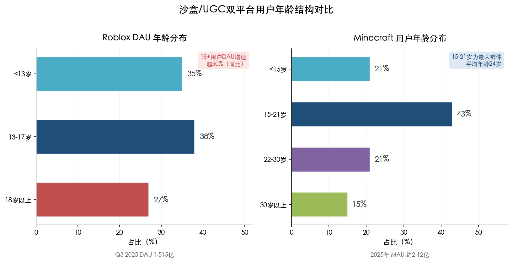

上图直观呈现了 Roblox 与 Minecraft 两大沙盒平台的用户年龄分布差异：Roblox 73% 的用户年龄在 18 岁以下，用户结构显著偏低龄；Minecraft 则以 15-21 岁为最大群体，年龄分布更为均衡，平均年龄 24 岁。两者均表现出成年用户快速增长的趋势，但起点和路径各异。

从代际视角看，沙盒/开放世界是 Gen Alpha 的"原生品类"。Morning Consult 调查显示，50% 的 Gen Alpha 最偏好 Sandbox/Creative 类型（Minecraft/Roblox），这一世代也是首个游戏时间（周均 5.2 小时）超过社交媒体时间（5.1 小时）的世代[Morning Consult](https://pro.morningconsult.com/analysis/gen-alpha-gaming-preferences-devices-genres-research "2025年")。

### 5.3.2 行为特征

沙盒品类用户的行为模式以"创造-探索-社交"三大支柱为核心，与休闲品类的"消耗式"体验和竞技品类的"对抗式"体验形成本质区别。

Roblox 用户的参与深度持续攀升：2025 年人均每月参与约 24 个不同体验（同比+15%），反映出推荐算法改善和内容多元化的双重驱动[Naavik](https://naavik.co/deep-dives/the-state-of-ugc-games-2026/ "同上")。80% 的用户通过手机访问，但仅 24% 为纯手机用户，多数用户在多个平台间切换[Naavik](https://naavik.co/deep-dives/the-state-of-ugc-games-2026/ "同上")。

沙盒品类最独特的行为特征在于"UGC 自生长"——用户既是消费者也是内容创作者。Roblox 拥有 160 万名变现创作者，2025 年开发者分成 15 亿美元（同比+70%），Top 1000 创作者年均收入 130 万美元[Naavik](https://naavik.co/deep-dives/the-state-of-ugc-games-2026/ "同上")。Minecraft 的 Mod 生态同样繁荣：CurseForge（Overwolf）Mod 下载量达 330 亿次（同比+38%），Overwolf 向开发者分成 3 亿美元（同比+25%）[Naavik](https://naavik.co/deep-dives/the-state-of-ugc-games-2026/ "同上")。

病毒式传播构成沙盒品类的独特增长引擎。2025 年 Roblox 平台上 Grow A Garden 和 Steal A Brainrot 分别达到 2130 万和 2540 万峰值同时在线，均超过此前游戏史上的 CCU 纪录（Fortnite 的 1530 万）。"Admin Abuse War"事件更推动全平台 CCU 达到 4740 万[Roblox Q3 2025 Shareholder Letter](https://s27.q4cdn.com/984876518/files/doc_financials/2025/q3/Q3-2025-Shareholder-Letter.pdf "同上")。传播渠道以 YouTube 和 TikTok 内容创作者为主，而非平台内发现机制——沙盒品类的用户增长在很大程度上由外部内容生态驱动。

### 5.3.3 心理动机

沙盒品类在 Quantic Foundry 动机模型中主要对应 **Immersion-Creativity** 集群的核心区域，**Design（设计定制）**、**Discovery（探索发现）** 和 **Fantasy（幻想代入）** 三大维度均处高位。

不同年龄段用户的动机分层特征明显。儿童和青少年用户（<18 岁）以社交驱动为主——Roblox 2025 年最成功的体验（Grow A Garden、Steal A Brainrot）均属"非暴力、社交驱动"的收集/探索类玩法[Naavik](https://naavik.co/deep-dives/the-state-of-ugc-games-2026/ "同上")，核心体验是"与朋友一起做有趣的事"而非竞技或叙事。成年用户（18+）则更偏向创造驱动——Minecraft 的高阶 Mod 开发、红石电路设计等玩法吸引的是具有工程思维的创造型玩家。

Gen Alpha 对沙盒品类的偏好具有深远的代际含义。作为首个"数字原住民"世代，他们在沙盒环境中建立的社交关系和创造习惯，将深刻塑造未来十年的游戏消费趋势。Gen Z 中 34% 主要为社交目的游戏（其他世代 26%），Gen Alpha 这一比例预计更高[Deconstructor of Fun](https://www.deconstructoroffun.com/blog/2025/04/07/the-future-of-gaming-engaging-gen-z "2025年4月")。

### 5.3.4 付费模式

沙盒品类的变现模式以"虚拟经济/UGC 变现"为核心，与休闲品类的广告驱动模式和 RPG 的 Gacha 驱动模式形成鲜明对比。

Roblox 已占全球游戏内容支出的 3.4%（剔除中国后为 4.5%），并单独贡献了 2025 年全球（剔除中国）游戏消费净增长的三分之二[Naavik](https://naavik.co/deep-dives/the-state-of-ugc-games-2026/ "同上")。其商业模式的核心是 Robux 虚拟货币生态：玩家购买 Robux 在各种 UGC 体验中消费，平台抽取分成后将剩余部分回馈创作者。成年用户平均变现能力比年轻用户高 40%[Roblox Q3 2025 Shareholder Letter](https://s27.q4cdn.com/984876518/files/doc_financials/2025/q3/Q3-2025-Shareholder-Letter.pdf "同上")，这是 Roblox 积极拓展成人用户群体的核心商业动因。

Roblox、Fortnite 与 Overwolf 三大 UGC 生态系统 2025 年开发者分成总额约 22 亿美元（同比+47%）[Naavik](https://naavik.co/deep-dives/the-state-of-ugc-games-2026/ "同上")。UGC 变现模式的独特优势在于"内容供给无限"——平台无需自行承担全部内容制作成本，创作者生态形成了自维持的内容供给循环。

### 5.3.5 留存特征

沙盒品类的留存逻辑与所有其他品类截然不同：它不依赖开发者主导的 LiveOps 内容更新，而是依靠 UGC 内容的持续涌现实现"自生长式留存"。

Roblox 2024 Q4 至 2025 Q4 人均游戏时长增长 8.7%，Q3 2025 参与时长达 396 亿小时（同比+91%）[Roblox Q3 2025 Shareholder Letter](https://s27.q4cdn.com/984876518/files/doc_financials/2025/q3/Q3-2025-Shareholder-Letter.pdf "同上")。Minecraft 自 2011 年正式发行至今已运营逾 14 年，MAU 仍维持在 2 亿以上——这是任何其他品类都难以比拟的超长生命周期。

沙盒品类的留存风险来自"平台依赖"：当用户的社交关系和创作成果深度绑定于单一平台时，迁移成本极高。这种特性既构成留存优势，也蕴含潜在的平台垄断风险。

## 5.4 生存/恐怖用户画像

### 5.4.1 人口统计特征

生存恐怖品类从小众走向主流的趋势已不可逆转。Steam 平台上生存恐怖品类份额从 2015 年的 2% 增长至 2024 年的 5% 以上（约 19,000 款游戏、近 1,000 款年新增）[Try Evidence](https://tryevidence.com/blog/survival-horror-trends-player-psychology-report/ "2025年报告")。经典恐怖游戏市场规模预计 2033 年达到 75 亿美元（CAGR 约 12%），更广义的"沉浸式恐怖"品类（含 VR/AR）2024 年约 87 亿美元，预计 2030 年超过 170 亿美元（CAGR 约 12.3%）[Try Evidence](https://tryevidence.com/blog/survival-horror-trends-player-psychology-report/ "同上")。

恐怖品类的用户年龄分布呈现显著的年轻化特征。Attest 调查显示，24 岁以下人群中 22% 定期玩恐怖游戏，而整体人群中该比例仅为 12%[Attest](https://www.askattest.com/blog/research/game-on-what-gamers-are-playing-paying-and-prioritising "Gaming Consumer Insights 2026")。ESA 对美国玩家的品类偏好调查中，35 岁以下人群对恐怖/冒险品类的偏好显著高于 55 岁以上群体（后者 60% 偏好益智、31% 偏好技巧/机会类游戏）[ESA](https://www.theesa.com/annual-esa-study-reveals-video-games-universal-appeal-across-generations/ "2025年6月")。生存恐怖品类以 PC/主机为主要平台，Steam 是核心发行渠道。

### 5.4.2 行为特征

恐怖品类玩家的参与深度高于平均水平：愿意重复通关寻找隐藏结局、完成 New Game+ 挑战、探索极限难度模式。Resident Evil 4 Remake 和 Resident Evil Village 等作品的平均游戏时长远超主线通关所需时间，体现了"榨干内容"的深度体验行为[Try Evidence](https://tryevidence.com/blog/survival-horror-trends-player-psychology-report/ "同上")。

合作恐怖/生存品类的社交黏性是留存的核心机制——"共同面对恐惧"构成了极为强大的社交纽带。**Phasmophobia** 累计销量突破 2500 万份，其 4 人合作调查机制创造了"共享恐惧体验"的品类典范[Rely on Horror](https://www.relyonhorror.com/latest-news/phasmophobia-sales-reach-25-million-copies/ "2025年7月")。合作恐怖品类 H1 2025 在 Steam 产生超 40 亿美元收入，品类内用户高度重叠——R.E.P.O 超半数玩家同时玩过 Lethal Company 或 Phasmophobia[Alinea Analytics](https://alineaanalytics.substack.com/p/games-with-co-op-generated-over-4 "2025年")。

直播与内容创作对恐怖品类具有巨大的放大效应。Lethal Company 首周后销售爆发 507 倍，完全由 YouTube/Twitch 内容创作者的"反应视频"驱动[Alinea Analytics](https://alineaanalytics.substack.com/p/games-with-co-op-generated-over-4 "同上")。恐怖游戏"一起经历恐惧"的本质使其成为天然的直播友好型内容——观众通过观看主播的惊吓反应获得替代性刺激，进而转化为购买行为。

### 5.4.3 心理动机

恐怖品类用户的核心驱动力是"可控不确定性"（controlled uncertainty）——在安全环境中体验高强度情绪的"良性受虐"（benign masochism）[Try Evidence](https://tryevidence.com/blog/survival-horror-trends-player-psychology-report/ "同上")。玩家追求的并非纯粹恐惧，而是"未知但可控"临界点所带来的最大愉悦感，这一机制符合心理学中的"倒U曲线"模型。COVID-19 期间的相关研究亦表明，恐怖游戏爱好者展现出更高的压力韧性和更好的危机应对能力——恐怖游戏可被视为"安全环境中的混乱预演"[Try Evidence](https://tryevidence.com/blog/survival-horror-trends-player-psychology-report/ "同上")。

品类用户存在明显的"恐惧阈值"分层：高"病态好奇心"（morbid curiosity）用户偏好无 HUD 模式、永久死亡机制和极端资源稀缺；中等阈值用户则偏好可预测的安全区域和温和紧张感[Try Evidence](https://tryevidence.com/blog/survival-horror-trends-player-psychology-report/ "同上")。这种差异源于生物学因素（多巴胺调节机制）和个体唤醒阈值的异质性，也决定了恐怖品类内部的进一步细分：从 Jump Scare 驱动的轻度恐怖，到氛围驱动的心理恐怖，再到极端生存模拟的硬核恐怖。

### 5.4.4 付费模式

生存恐怖品类以 PC/主机端买断制为主要变现模式，中等价位（20-40 美元）的定价策略覆盖品类主流产品。Phasmophobia（Early Access 定价约 14 美元）和 Lethal Company（约 10 美元）等合作恐怖游戏以低价高销量策略取得了显著的商业成功——Phasmophobia 以 14 美元单价实现 2500 万份销量，生命周期收入约 3.5 亿美元。

恐怖品类的付费行为与 F2P 品类存在根本差异：用户以一次性购买获取完整体验，DLC 和赛季内容作为辅助收入来源。经典重制作品（Resident Evil 2/4、Dead Space、Silent Hill 2）借助怀旧效应与品牌认知度，以 AA-AAA 级定价（40-70 美元）获得了较全新 IP 更为安全的投资回报[Try Evidence](https://tryevidence.com/blog/survival-horror-trends-player-psychology-report/ "同上")。

### 5.4.5 留存特征

恐怖品类的留存模式与 LiveOps 驱动的休闲/模拟经营品类截然不同。单款产品的用户留存周期以"一次完整体验"为单位（通常数周至数月），用户在通关后转向品类内其他产品。品类级忠诚度替代了产品级忠诚度——合作恐怖品类内用户的高度重叠（R.E.P.O → Lethal Company → Phasmophobia）充分印证了这一规律。

恐怖品类正通过"混合化"策略扩大可触达市场。Sons of the Forest（生存+恐怖）、Dying Light（恐怖+开放世界动作）、Chernobylite（恐怖+制作+基地建设）等混合类型有效降低了传统恐怖的体验门槛[Try Evidence](https://tryevidence.com/blog/survival-horror-trends-player-psychology-report/ "同上")。这一策略将品类受众从硬核恐怖爱好者扩展至更广泛的动作/冒险游戏群体，是品类市场份额从 2% 增长至 5% 以上的核心驱动力。

## 5.5 品类共性：低门槛获客与长线留存的矛盾

本章所覆盖的四大品类虽然在用户画像上差异显著，但共享一个核心张力——**低门槛获客与长线留存之间的结构性矛盾**。

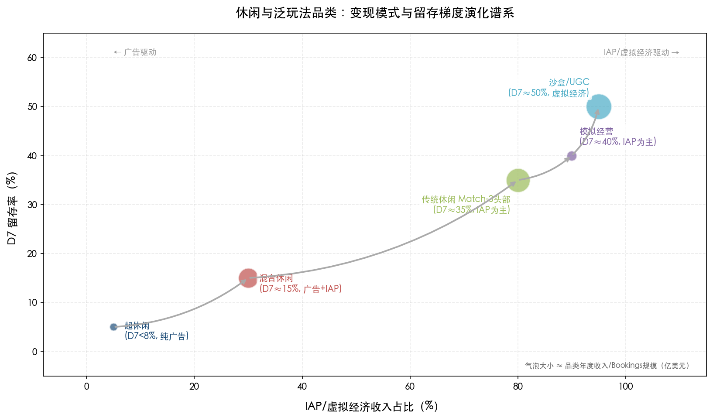

上图以 IAP/虚拟经济收入占比为横轴、D7 留存率为纵轴，系统展示了五大品类节点从"纯广告驱动"到"虚拟经济驱动"的变现模式与留存梯度演化路径。气泡面积反映品类年度收入规模，直观呈现了品类演化的方向与商业天花板的差异。

**留存梯度**清晰呈现了品类演化路径：超休闲 D7 < 8% → 混合休闲 D7 10-20% → 模拟经营 10 年以上 LiveOps → 沙盒 UGC 自生长[Gamesforum Intelligence](https://investgame.net/wp-content/uploads/2025/07/Gamesforum-Intelligence-Hypercasual-Gaming-Report.pdf "同上")。沿此路径从左至右，用户获取成本递增、单用户价值递增、开发者的内容投入从"核心玩法"向"生态运营"转移。

**广告与内购混合变现**已成为泛休闲品类的标准模式谱系：超休闲几乎 100% 广告 → 混合休闲约 70% 广告+30% IAP → 传统休闲/模拟经营以 IAP 为主 → 沙盒平台以虚拟经济/UGC 变现为主。核心平衡原则包括：延迟广告介入时间（如 Color Block Jam 到第 15 关后才显示广告）、将奖励视频融入游戏流程（如 Pizza Ready 的送餐环节）、按用户分层调整变现强度[Gamesforum Intelligence](https://investgame.net/wp-content/uploads/2025/07/Gamesforum-Intelligence-Hypercasual-Gaming-Report.pdf "同上")。

**LiveOps 已成为所有成熟休闲/模拟品类的生存基线**。Match-3、Merge、Farming 头部产品无一例外依赖密集的限时活动、赛季制内容和跨品类玩法借鉴来维持收入增长。Casino 元素（如骰子事件、收集机制）向其他休闲品类的渗透趋势值得开发者密切关注——2025 年初以来 Casual Casino 机制在 LiveOps 中的使用率增长 16.5%[AppMagic](https://appmagic.rocks/research/casual-report-h1-2025 "同上")。

沙盒和生存恐怖品类则揭示了另一条路径：通过 UGC 生态（Roblox/Minecraft）或内容创作者驱动的病毒式传播（Phasmophobia/Lethal Company），将获客成本外部化——平台和开发者无需承担全部营销费用，用户自发成为传播节点。这一模式对具有强社交属性或强直播属性的品类具有重要的借鉴价值。

## 5.6 中国市场补充

微信小游戏已成为中国休闲游戏的核心增量引擎，其用户生态在全球范围内缺乏直接对标。微信小游戏 MAU 超 5 亿，核心用户跨月粘性达 95%，重度用户 MAU 超 3 亿[触乐](https://www.chuapp.com/article/291136.html "2026年1月")。2025 年近 70 款游戏达成百万以上 DAU，超 300 款游戏单季度流水超千万元[腾讯新闻](https://news.qq.com/rain/a/20260115A088KO00 "2026年1月")。2024 年中国小程序游戏收入 535.35 亿元（同比+34.39%），预计 2025 年总收入将超过 600 亿元[GameLook](http://www.gamelook.com.cn/2025/12/584413/ "GameLook转载GPC报告")。

微信小游戏用户生态的最大独特性在于"非传统手游用户"的高比例——许多小游戏用户此前并非手游下载用户，而是通过微信社交裂变（分享、朋友圈、群聊邀请）自然转化而来[触乐](https://www.chuapp.com/article/291136.html "同上")。仅消除和解谜单一赛道，年活跃用户规模便超过 3 亿，月活跃 10 天以上的高时长高留存用户同比增长 27%[触乐](https://www.chuapp.com/article/291136.html "同上")。这种"从社交工具到游戏入口"的用户转化路径，本质上将微信的 13 亿用户基盘转化为潜在的休闲游戏用户池，极大拓展了中国休闲游戏市场的天花板。

从整体数据来看，中国休闲移动游戏 2025 年实际销售收入 342.65 亿元（同比+9.56%），增速高于整体游戏市场的 7.68%[GameLook](http://www.gamelook.com.cn/2025/12/584413/ "同上")。小游戏生态的崛起意味着中国休闲市场正走一条与全球迥异的增长路径：全球市场的增长主要由混合休闲和 UGC 平台驱动，中国市场则由微信小游戏这一独有渠道贡献了最大增量。对于开发者而言，这一差异意味着中国市场的休闲品类竞争策略须围绕微信生态的社交裂变机制进行专门设计，而非简单复制全球市场的混合休闲成功模式。

# 第6章 跨品类用户行为比较与交叉洞察

前三章分别从竞技对抗、角色扮演/策略、休闲/泛玩法三大品类集群中刻画了各自的用户画像。然而，游戏市场并非由彼此隔绝的品类岛屿构成——玩家在品类之间流动，消费行为沿品类梯度迁移，代际偏好持续塑造品类兴衰。这些跨品类的结构性规律，才是理解用户全貌的关键拼图。

本章从付费深度、留存曲线、用户时长、性别与年龄分布、品类重叠与流动、代际差异以及中国与全球市场比较七个维度展开系统性横向对比，提炼品类共性规律与结构性差异，为第 7 章的开发者行动指南奠定分析基础。

## 6.1 付费深度：从广告驱动到重度内购的完整谱系

### 6.1.1 品类付费层级全景

不同游戏品类的付费深度差异构成了一条从"零付费广告消耗"到"重度鲸鱼消费"的完整光谱。2025 年全球移动 IAP 总收入约 571 亿美元（同比+3.4%），品类之间的收入分配高度不均：策略品类以 135 亿美元（+25.6%）登顶第一，RPG 116 亿美元（-15.4%）居第二，益智 88 亿美元（+14.7%）第三，混合休闲 7.33 亿美元（+88%）增速最快[GameDev Reports/AppMagic](https://gamedevreports.substack.com/p/appmagic-mobile-games-monetization "Mobile Games Monetization Report 2025")。

将各品类的 ARPDAU 与 ARPPU 置于同一坐标系，付费深度的品类梯度清晰可辨：

- **MMORPG** 占据付费深度的最高端。ARPDAU 中位 0.69 美元、75 分位 1.61 美元；ARPPU 中位 39.07 美元、75 分位高达 79.60 美元[Google Play MMORPG Report](https://play.google.com/console/about/static/pdf/google-play-mmorpg-genre-report.pdf "2022年3月")。尽管品类参与率仅 3%，每一位进入的用户都展现出极高的付费意愿与消费深度。
- **策略/SLG** 紧随其后，呈现出全移动游戏领域最高的长线付费水平。到玩家生命周期的第 90 天，策略品类付费用户的累计消费约为博彩品类的两倍；$99 档高价包在 SLG 头部产品的营收排行中出现频率远高于其他品类，App Store 端 ARPPU 为 Google Play 的 4–8 倍[GameDev Reports/AppMagic](https://gamedevreports.substack.com/p/appmagic-mobile-games-monetization "同上")。
- **RPG/Gacha** 处于中高付费区间。美国 Top 10 移动 RPG 首购均价 iOS 端 17.9 美元、Google Play 端 8.3 美元；崩坏：星穹铁道 ARPDAU 达 0.77 美元，暗黑不朽更高至 1.37 美元[GameDev Reports/AppMagic](https://gamedevreports.substack.com/p/appmagic-mobile-games-monetization "同上")。
- **益智/休闲** 位于中等付费区间，定价集中在 6–15 美元的小额包体。
- **混合休闲** 正在快速向上突破：App Store 端 32% 的付费用户在第 90 天累计消费超 100 美元（2024 年仅 22%），ARPPU 第 90 天同比增长 71%[GameDev Reports/AppMagic](https://gamedevreports.substack.com/p/appmagic-mobile-games-monetization "同上")。
- **超休闲** 处于付费谱系的最低端，LTV 远低于 1 美元，几乎完全依赖广告变现。

下图以气泡矩阵形式呈现各品类在"日均用户时长—ARPDAU—年收入规模"三维空间中的位置分布，直观展示付费深度与时间承诺之间的正相关性，以及用户基盘对品类总收入的决定性影响。

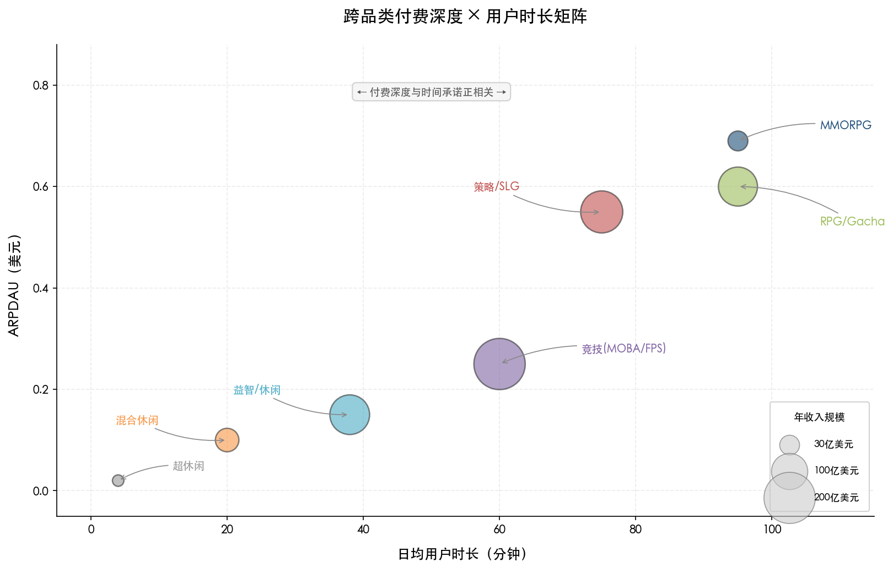

### 6.1.2 付费谱系的结构性启示

上述付费梯度揭示了一条核心规律：**付费深度与用户时间承诺呈正相关**。MMORPG 日均 95 分钟的时间投入对应着 79.60 美元的 75 分位 ARPPU，超休闲数分钟的会话对应低于 1 美元的 LTV。玩家在单款产品上投入的时间越多，沉没成本越高，为加速进度或增强体验而付费的意愿亦随之攀升。SLG 品类的"时间换金钱"加速器模型与 MMORPG 的订阅制，均为这一规律的直接体现。

策略品类付费增长的结构性含义尤为值得关注。2025 年策略品类 IAP 从 108 亿美元飙升至 135 亿美元（+25.6%），但这一增长主要来自 ARPU 扩张而非新用户涌入[Deconstructor of Fun](https://www.deconstructoroffun.com/blog/2025/6/5/the-state-of-mobile-gaming-2025 "2025年6月")——头部 SLG 正在从现有用户身上提取更多价值，"鲸鱼效应"进一步加剧。全球仅 1.83% 的移动玩家进行 IAP 购买，但美国 iOS 端前 0.02% 的付费玩家贡献了全球游戏收入的 20%[Icon Era](https://icon-era.com/blog/in-game-purchase-spending-habits-statistics-2025.343/ "2025年10月，引用Unity 2024报告")。这意味着策略和 MMORPG 等重度品类的商业模式，本质上建立在极少数高价值付费用户的持续消费之上。

## 6.2 留存曲线：从速生速死到十年长青

### 6.2.1 全品类留存基准对比

留存率是衡量产品健康度最直接的指标。将各品类的 D1/D7/D28 留存数据并置比较，品类间的留存能力分层清晰可辨。

全品类移动游戏中位 D1 留存为 22%、D7 约 3.4–3.9%、D28 低于 3%[Mistplay/AppsFlyer](https://business.mistplay.com/resources/mobile-gaming-trends-2025-report "2025 Loyalty Index")。在此基准线之上，各品类呈现显著分化：

- **棋牌/Board 类** D30 留存最高：Android 端 5.1%、iOS 端 8.1%。
- **Match-3/益智类** D30 约 6.6%，高于全品类均值 4.1%。
- **SLG 品类**（北美 Top 25%）D1 33.3%、D7 10.7%、D28 3.1%，D1 高但 D7→D28 衰减陡峭。
- **RPG 品类**（北美 Top 25%）D1 31.4%、D7 7.3%、D28 仅 1.7%，长线留存在主流品类中垫底。
- **超休闲** D1 低于 25%、D7 低于 8%，用户生命周期以"天"计算。

### 6.2.2 头部产品的留存天花板

品类基准仅划定了底线。头部产品的留存远超品类均值，且产品间差距往往大于品类间差距。

崩坏：星穹铁道 D1 留存 48%、D30 留存 18%；暗黑不朽 D1 32%、D30 12%——两者均远超 RPG 品类 D28 均值 1.7% 的基准。WoW 约 50% 的订阅用户连续付费超过 500 天；Candy Crush 运营 12 年后 MAU 仍维持在 1.8 亿。混合休闲新星 Color Block Jam 实现了 D7 约 20%、D30 约 10%，远超超休闲品类基准。

这一对比指向一条核心洞察：**品类的留存"天花板"由头部产品定义，而非由品类均值决定**。RPG 品类均值 D28 仅 1.7%，但崩坏：星穹铁道 D30 达 18%，证明品类内仍存在巨大的优化空间。对开发者而言，选对品类固然重要，但在品类内做到极致的产品品质与运营节奏，才是留存的决定性因素。

### 6.2.3 留存驱动机制的品类分化

不同品类的留存驱动力存在本质差异，可归纳为五种典型范式：

- **竞技品类**：排位重置、赛季内容更新与电竞赛事构成周期性回流引擎。Valorant MAU 在 VCT 赛季峰值达 2410 万、秋季回落至约 1700 万，波动幅度 42%；英雄联盟 Worlds 赛事月 MAU 暴增 201.7%。
- **RPG/SLG**：内容更新节奏、沉没成本积累与 Gacha 脉冲共同驱动留存。崩坏：星穹铁道卡池期月收入 7000–9000 万美元，非卡池期骤降至 1900–2700 万美元，波动达 3–4 倍。
- **休闲/模拟**：LiveOps 活动密度、微社交展示与习惯养成三者叠加。Township 通过限时活动实现活动期间收入提升 51%，Casino 机制渗透率增长 16.5%。
- **沙盒/UGC**：UGC 内容自生长与社交关系网络互为支撑。Roblox 2025 年参与时长达 396 亿小时（同比+91%），其留存并不依赖开发者主导的 LiveOps 推送。
- **通用留存引擎**：用户回归最常见原因依次为参与奖励（64%）、游戏内活动（50%）、频繁更新（34%）——LiveOps 驱动的"签到+事件循环"已成为跨品类通用的留存基础设施[Mistplay/AppsFlyer](https://business.mistplay.com/resources/mobile-gaming-trends-2025-report "同上")。

## 6.3 用户时长：碎片与沉浸的品类光谱

### 6.3.1 日均时长对比

全品类移动游戏中位日均时长为 22 分钟、单次会话 5–6 分钟、日均约 4 次会话[Newzoo Global Gamer Study 2024](https://gamedevreports.substack.com/p/newzoo-how-people-engage-with-games "73,000人36市场调查")。以此为基准，各品类的时长谱系从碎片到沉浸排列如下：

| 品类 | 日均时长（约） | 核心特征 |
|------|---------------|----------|
| 超休闲 | 3-5 分钟 | 极短单次循环，碎片填充 |
| 休闲益智（Candy Crush 级） | 38 分钟 | 多次短会话，习惯性嵌入 |
| MOBA（王者荣耀） | 45-60 分钟 | 2-3 局，社交驱动 |
| FPS/TPS | 60-90 分钟 | 赛季活跃期波动大 |
| RPG/Gacha | 93-96 分钟 | 日常任务+养成循环 |
| MMORPG（移动端中位） | 95 分钟 | 品类最高 |
| MMORPG（WoW/PC） | 222 分钟 | "生活方式"级时间承诺 |

### 6.3.2 平台视角下的时长悖论

一个容易被忽视的洞察在于 PC/主机与移动端的"总周时长趋近"现象。PC/主机玩家日均 2.1 小时但仅 2.6 天/周；移动玩家日均 1.6 小时但 3.4 天/周[Newzoo Global Gamer Study 2024](https://gamedevreports.substack.com/p/newzoo-how-people-engage-with-games "73,000人36市场调查")。换算后两者的周总时长分别约 5.5 小时和 5.4 小时——几乎持平。

这意味着移动端并非"轻度"平台，它只是将同等的时间投入切分为更多、更短的会话。对开发者而言，移动端产品设计的核心命题不在于减少时间要求，而在于确保每个碎片会话中玩家都能获得有意义的进展反馈。

### 6.3.3 时长与付费的交叉关系

将时长数据与前文的付费深度数据叠加，一条清晰的模式浮现：**日均时长越长的品类，ARPDAU 与 ARPPU 越高**。MMORPG 日均 95–222 分钟对应品类最高的 ARPDAU 0.69–1.61 美元；超休闲数分钟对应 LTV 不足 1 美元。唯一的"异常值"是益智休闲品类——中等时长（约 38 分钟）却贡献了 88 亿美元的年收入。核心原因在于该品类的用户基盘远大于重度品类，即付费深度决定了品类的单用户价值，而用户基盘大小决定了品类的总收入规模。

全球移动游戏时间同比增长 8%，但安装量同比下降 0.2%[Deconstructor of Fun](https://www.deconstructoroffun.com/blog/2025/6/5/the-state-of-mobile-gaming-2025 "2025年6月")。这一"时间增长、安装萎缩"的剪刀差，进一步印证了存量竞争时代"深度留存"较"广度获客"更具战略价值的趋势判断。

## 6.4 性别比例：从"男性主导"到"全民游戏"的品类光谱

### 6.4.1 品类性别结构对比

全球玩家性别比已接近均等（男性 51%、女性 48%）[GamesIndustry.biz](https://www.gamesindustry.biz/esa-48-of-video-game-players-are-women "GamesIndustry.biz 2025年10月报道ESA报告")，但品类层面的性别结构依然呈现显著分化：

**女性主导品类（女性 >55%）：**
- 超休闲/休闲：女性约 60%；Candy Crush 女性约 70%
- 模拟经营：女性约 60–70%，核心用户为 25–45 岁女性
- 恋与深空：核心用户为 18–35 岁女性，截至 2025 年 3 月累计收入超 4.46 亿美元

**接近均等品类（男女各 40–55%）：**
- 王者荣耀：女性约 50%——移动端 MOBA 泛大众化的标志性案例
- Whiteout Survival：男女约 50/50——打破了传统 SLG"中年男性专属"的刻板印象
- Minecraft：男性 54%、女性 32%

**男性主导品类（男性 >65%）：**
- 英雄联盟：男性 87%
- Fortnite：男性 72.4%
- 崩坏：星穹铁道：男性约 70%
- PUBG Mobile：印度市场男性 75%+

下图将 12 款代表性产品/品类按女性占比从高到低排列，叠加全球平均线（女性 48%），清晰呈现品类性别结构的完整谱系。

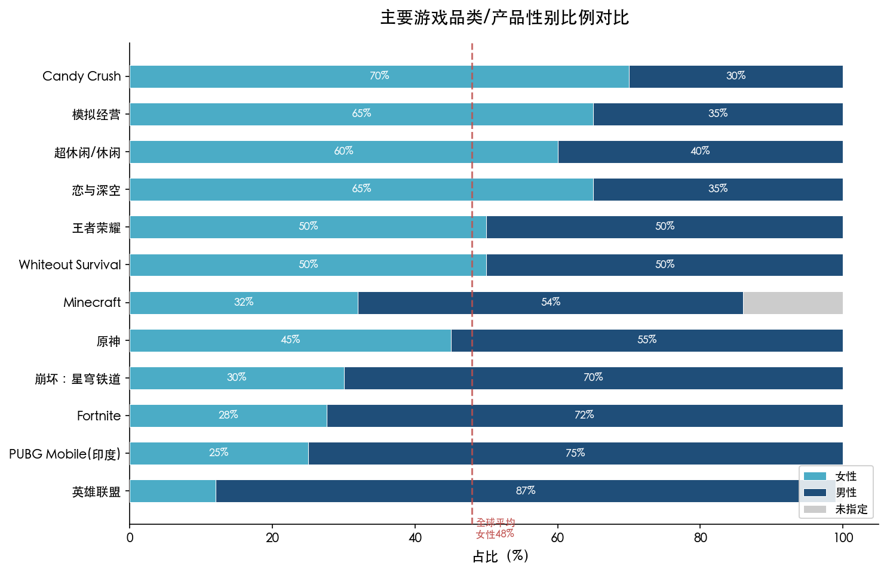

### 6.4.2 "泛大众化"的品类机制

王者荣耀与英雄联盟同属 MOBA 品类，然而前者女性约 50%，后者男性 87%——同一品类在不同平台和设计策略下产生了截然相反的性别结构。我们认为，造成这一分化的三大机制如下：

1. **操作门槛降低**：王者荣耀单指触控操作相较 LoL 键鼠模式大幅降低了入门壁垒，使更多非核心玩家得以进入。
2. **局时压缩**：15–20 分钟的单局时长相较 LoL 的 25–35 分钟，更易适配生活场景丰富的泛用户群体。
3. **社交链导入**：微信社交关系的直接嵌入，将游戏从"核心爱好"重新定义为"社交工具"。

Whiteout Survival 在 SLG 品类实现性别均等的路径与之类似：通过类休闲的广告素材和低门槛的前期体验吸引泛用户群体（包括大量女性用户），在建立初步沉浸后逐步引入深度策略内容——这一"特洛伊木马"获客模型证明，品类的性别结构并非天然固定，而是可以通过产品设计加以重塑。

### 6.4.3 女性玩家的付费潜力

亚洲女性玩家的付费能力正在挑战传统假设。Niko Partners 研究显示，印度付费女性月均消费比男性高 8.5%[Niko Partners](https://nikopartners.com/how-love-and-deepspace-wins-women-gamers/ "2025年3月8日")。adjoe 的移动游戏研究进一步发现，女性玩家在 Puzzle、Casual、Board、Card 等品类的参与度均高于男性，单次时长平均比男性长 25%，43% 的女性玩家每周游戏超 5 次（男性为 38%）[adjoe](https://adjoe.io/blog/women-playing-mobile-games/ "Women Playing Mobile Games 2024 MGI Report")。

恋与深空的商业表现进一步验证了这一趋势：2025 全年预估收入约 8.26 亿美元，其中 36% 来自海外市场[Niko Partners](https://nikopartners.com/how-love-and-deepspace-wins-women-gamers/ "2025年3月8日")。Niko Partners 预测亚洲+MENA 地区女性玩家占比将在 2026 年首次超过 40%[Niko Partners](https://nikopartners.com/niko-partners-2026-predictions/ "2026年预测")。在这一背景下，忽视女性用户群体的品类已不再是"硬核"的标签，而是对收入天花板的自我设限。

## 6.5 年龄分布：品类与世代的映射关系

### 6.5.1 品类年龄画像对比

将各品类的核心年龄段置于同一时间轴，品类与世代之间的映射关系清晰浮现：

**偏低龄（核心 <18 岁）：**
- Roblox：73% 用户 <18 岁（13 岁以下占 35%、13–17 岁占 38%）
- Minecraft：15 岁以下占 20.59%，核心 15–21 岁占 43%

**偏年轻（核心 18–24 岁）：**
- Valorant：Gen Z 占比 70%
- 英雄联盟：18–24 岁占 64%
- Fortnite：超过 60% 为 18–24 岁

**偏中青年（核心 18–30 岁）：**
- 原神：18–30 岁占 70%
- 崩坏：星穹铁道：核心 18–28 岁
- 王者荣耀：18–30 岁占 62%，但 45 岁以上已达 15%

**偏成熟（核心 25 岁以上）：**
- 魔兽世界：平均年龄 31.29 岁
- MMORPG 品类整体：超半数用户集中于 25–44 岁
- 休闲/益智：核心 25–55 岁，55–64 岁人群偏好率高达 64%

### 6.5.2 代际品类偏好的结构性规律

下图以热力图矩阵形式呈现五个世代与七大品类之间的偏好映射关系，色深越高表示偏好越强。

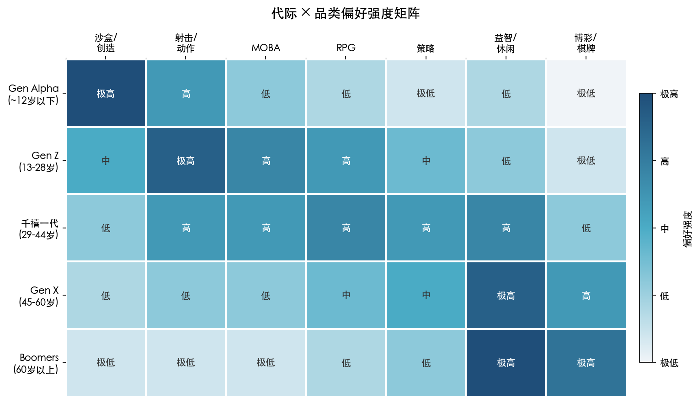

Newzoo 全球玩家研究与 ESA/Statista 的美国数据交叉印证了一组清晰的代际品类映射：Gen Alpha/Gen Z 最偏好 Adventure/Shooter/Fighting；千禧一代偏好 Puzzle+Action；Gen X/Boomers 偏好 Puzzle/Skill[Newzoo Global Gamer Study 2024](https://www.voronoiapp.com/other/Most-Popular-Gaming-Genres-By-Generation--1922 "2024年7月") [Statista/ESA](https://www.statista.com/statistics/246766/favorite-video-game-genres-in-the-us/ "2025年")。

Gen Alpha 代表了最值得关注的趋势拐点。Morning Consult 调查显示，50% 的 Gen Alpha 最偏好 Sandbox/Creative（Minecraft/Roblox），且这一代人的周均游戏时间（5.2 小时）首次超过社交媒体时间（5.1 小时）[Morning Consult](https://pro.morningconsult.com/analysis/gen-alpha-gaming-preferences-devices-genres-research "2025年")。更出人意料的是，Gen Alpha 是主机最活跃世代（69%），超过 Gen Z（65%）和千禧一代（60%）[KidScreen/ESA](https://kidscreen.com/2025/06/09/gen-alpha-kids-are-the-most-active-console-gamers-esa-report-finds/ "2025年6月")——这一数据直接挑战了"年轻世代=移动优先"的简单假设。

### 6.5.3 Z 世代的消费悖论

Z 世代正经历一场耐人寻味的消费行为转型。Circana 数据显示，2025 年 1–4 月，18–24 岁美国人群的游戏消费同比下降近 25%，而较年长世代的降幅不到 5%[PC Gamer](https://www.pcgamer.com/gaming-industry/new-study-shows-that-gen-z-is-spending-way-less-money-on-videogames-than-older-gamers/ "2025年8月，引用Circana/WSJ")。18–24 岁人群在 2025 年 7 月前的 12 个月内仅贡献了 3% 的主机硬件购买，较前一年度的 10% 大幅回落[Circana/VGChartz](https://www.vgchartz.com/article/465671/circana-data-shows-fewer-young-adults-are-purchasing-video-game-consoles/ "2025年")。

然而 Z 世代并非在远离游戏。ESA 数据显示年轻群体的游戏时间仍高于年长世代[ESA 官方新闻稿](https://www.theesa.com/annual-esa-study-reveals-video-games-universal-appeal-across-generations/ "2025年6月")，63% 的美国玩家每年购买不超过两款游戏[Circana/PC Gamer](https://www.pcgamer.com/gaming-industry/new-study-shows-that-gen-z-is-spending-way-less-money-on-videogames-than-older-gamers/ "同上")。这一代人正将消费重心从"买断新游戏"迁移至"在免费/低价游戏中持续微消费"——F2P、Game Pass 式订阅和 Roblox/Minecraft 等长线平台成为首选。Peak、R.E.P.O、Lethal Company 等售价不到 10 美元的合作游戏在 2025 年的爆发，正是 Z 世代"高时间投入、低一次性消费"行为模式的集中体现。

Deconstructor of Fun 预测 Z 世代将在 2026 年成为游戏消费最大世代[Deconstructor of Fun](https://www.deconstructoroffun.com/blog/2025/04/07/the-future-of-gaming-engaging-gen-z "2025年4月")。我们判断，这一预测的实现路径并非买断制消费的回暖，而是 F2P 和订阅模式对 Z 世代钱包份额的进一步渗透。Z 世代中 34% 主要为社交目的而游戏（其他世代为 26%），36% 因侵入性广告弃游但接受奖励广告——社交化变现与非侵入性广告，将是触达这一世代付费潜力的关键策略[Deconstructor of Fun](https://www.deconstructoroffun.com/blog/2025/04/07/the-future-of-gaming-engaging-gen-z "同上")。

## 6.6 多品类重叠与用户流动

### 6.6.1 付费用户的跨品类消费行为

Newzoo 的 payer overlap 数据揭示了跨品类消费的一组关键洞察：70.3% 的 Apex Legends 付费玩家同时在 Fortnite 付费，46% 同时为 GTA V 付费，42% 为 Minecraft 付费——射击类用户的跨品类消费意愿极高，且显著溢出至沙盒品类[Newzoo](https://newzoo.com/resources/blog/how-to-use-payer-overlap-data-to-track-player-spending "2023年10月")。然而同一批 Apex 付费玩家中仅 7% 在 Lost Ark 付费，而这部分重叠用户的消费概率是平均水平的 7.12 倍。这一反差揭示了跨品类消费"宽度"与"深度"之间的反向关系：射击→沙盒的重叠率高但单用户增量价值低；射击→MMORPG 的重叠率极低但每个重叠用户均为高价值付费者。

在移动端，品类排他性更为显著。56% 的移动游戏付费用户仅玩一款游戏，iOS 端 27% 的付费用户周玩超 5 款（Android 仅 6%）[Mistplay/AppsFlyer](https://business.mistplay.com/resources/mobile-gaming-trends-2025-report "同上")。MMORPG 的品类内排他性为所有品类之最——87% 的 MMORPG 玩家仅同时玩一款同品类游戏[Google Play MMORPG Report](https://play.google.com/console/about/static/pdf/google-play-mmorpg-genre-report.pdf "2022年3月")。对开发者的直接启示在于：在 MMORPG 和重度 SLG 品类，获取一个新用户几乎等于从竞品手中夺取一个用户，零和博弈特征最为鲜明。

### 6.6.2 品类间的用户迁移路径

跨品类的用户流动并非随机发生，而是遵循可识别的梯度路径。

**"休闲→重度"的升级漏斗：** 超休闲→混合休闲→传统休闲构成一条明确的品类内升级路径。混合休闲在其中扮演"培育器"角色——将超休闲用户通过 meta 进阶层引导为具有 IAP 付费习惯的中度玩家。SLG 品类的"特洛伊木马"模型则将这条漏斗进一步延伸至重度品类：以类休闲素材低 CPI 获客→休闲化前期体验培育沉浸→中后期暴露完整策略深度。Whiteout Survival 40 亿美元累计收入是这一模型的标杆案例。

**"竞技→泛娱乐"的外溢效应：** Fortnite 的成功路径清晰展示了射击品类如何通过品牌联动、虚拟演唱会和创意模式将核心竞技用户群向泛娱乐方向延展。70.3% 的 Apex 付费玩家在 Fortnite 付费、42% 在 Minecraft 付费，印证了竞技用户向社交/创造品类外溢的天然倾向。

**"内容创作→游戏消费"的反向导入：** 恐怖品类展示了一条独特的外部导入路径。Lethal Company 首周后销售爆发 507 倍，完全由 YouTube/Twitch 内容创作者驱动。合作恐怖品类内用户高度重叠（R.E.P.O 超半数玩家同时玩过 Lethal Company 或 Phasmophobia），形成了"品类级忠诚度"而非"产品级忠诚度"的独特流动模式。

### 6.6.3 品类忠诚度的量化规律

Mistplay/AppsFlyer 的忠诚度指数为品类间用户黏性差异提供了量化基准：Puzzle（85）> RPG（75）> Strategy（71）[Mistplay/AppsFlyer](https://business.mistplay.com/resources/mobile-gaming-trends-2025-report "同上")。49% 的移动玩家已玩最喜欢的游戏超过一年，39% 的忠实玩家推荐了 3 位以上朋友。

这一排序看似反直觉——为何"轻度"的 Puzzle 品类忠诚度反而最高？核心原因在于品类属性差异：Puzzle 品类的核心体验是"可预测的成就反馈"，用户追求的并非新鲜感而是习惯性满足，因此对单款产品的依附度极高。RPG 和 Strategy 的忠诚度虽低于 Puzzle，但付费深度远高——忠诚度与付费深度并不完全正相关，两者的组合才共同决定了品类的 LTV 天花板。

## 6.7 中国与全球的品类偏好差异

### 6.7.1 收入结构的"镜像倒挂"

中国与全球市场在品类收入结构上呈现一组引人注目的"镜像倒挂"现象。

中国 Top 100 移动游戏收入结构中，MOBA 占 19.45%、射击占 18.29%，两者合计 37.74%，遥遥领先于其他品类[GameLook](http://www.gamelook.com.cn/2025/12/584413/ "GameLook转载《2025年中国游戏产业报告》")。而全球移动 IAP 收入排序则是策略 135 亿美元居首、RPG 116 亿美元居次、益智 88 亿美元第三——竞技品类并非全球收入的最大贡献者。

更具结构意义的倒挂出现在出海领域：中国自研游戏海外 Top 100 中策略品类占比 49.96%，与国内 MOBA+射击占 37.74% 形成鲜明对比[每日经济新闻](https://biz.eastmoney.com/a/202512193597163732.html "2025年12月")。这一"国内竞技品类强、出海策略品类强"的格局，折射出中国开发者在 SLG 品类积累的数值体系设计能力和精准买量投放经验，在海外市场形成了显著竞争优势。

### 6.7.2 中国市场的独特品类现象

**MOBA 的"泛大众化"奇迹：** 王者荣耀以 2.6 亿 MAU、1.39 亿 DAU 和接近 50% 的女性占比，创造了全球 MOBA 品类中绝无仅有的用户结构。对比英雄联盟男性 87%、MAU 约 1.2–1.35 亿的数据，王者荣耀在用户规模上约为 LoL 的 2 倍，且性别结构近乎翻转。移动端 MOBA 在中国从"核心男性用户的竞技场"蜕变为"全民社交工具"，堪称全球游戏市场中品类定位重塑最为成功的案例。

**小游戏生态的独有路径：** 微信小游戏 MAU 超 5 亿，2024 年收入 535.35 亿元（同比+34.39%），近 70 款游戏达成百万 DAU[GameLook](http://www.gamelook.com.cn/2025/12/584413/ "GameLook转载GPC报告") [腾讯企业概览 PDF](https://static.www.tencent.com/uploads/2025/05/14/ae7b09adea59dfa92095e1f7e3c2fb87.pdf "腾讯官方 Corporate Overview 2025年5月")。小游戏生态将微信 13 亿用户基盘转化为潜在游戏用户池，通过社交裂变而非传统买量实现获客，在全球范围内无直接对标。这意味着中国休闲品类的增长路径与全球（以混合休闲+UGC 平台为驱动）存在本质差异。

**MMORPG 的移动端渗透率差异：** 中国 MMORPG 在移动端的渗透率远高于全球平均水平（全球移动 MMORPG 参与率仅 3%），这与中国移动端游戏的绝对主导地位以及端游 MMORPG 手游化浪潮密切相关。

### 6.7.3 "全球通用"规律与"中国特殊"规律的边界

跨品类比较揭示了中国市场与全球市场之间通用规律与独特差异的清晰边界。

**通用规律（全球适用）：** 付费深度与时间投入正相关、头部产品留存远超品类均值、LiveOps 是长线运营的必备基础设施、女性玩家在休闲品类中的主导地位——这些规律在中国与全球市场中均成立。

**中国特殊规律：** 竞技品类（MOBA+射击）在中国收入占比远超全球平均水平；移动端 MOBA 可实现性别均等化；小游戏生态提供了独有的低成本获客渠道；MMORPG 移动化渗透率显著高于全球——这些差异主要由中国的移动互联网基础设施（微信生态）、用户行为习惯（移动端绝对优先）和市场竞争格局（腾讯/网易双寡头结构）共同塑造。

## 6.8 跨品类交叉洞察总结

综合上述七个维度的横向对比，我们提炼出以下五条跨品类的结构性洞察：

**洞察一：付费深度×用户基盘构成品类的"商业矩阵"。** SLG/MMORPG 呈现高深度、低基盘特征，休闲/益智呈现低深度、高基盘特征，混合休闲正在向"中等深度×中等基盘"的黄金区间移动。对开发者而言，选择品类本质上是在这一矩阵中选定自身的战场定位。

**洞察二：品类边界正在加速模糊化。** Whiteout Survival 的性别 50/50 打破了 SLG 的男性主导格局，王者荣耀的女性 50% 打破了 MOBA 的硬核化标签，混合休闲将超休闲用户升级为 IAP 付费者——品类融合（Genre Hybridization）是 2025–2026 年最重要的市场结构性变化。传统的品类用户画像正在失去精确性，开发者需要以"用户行为集群"替代"品类标签"来理解目标受众。

**洞察三：留存竞争的本质是"内容品质+运营节奏"的竞争。** 品类基准仅划定了底线，头部产品与品类均值之间的巨大差距证明，在任何品类中都有通过卓越执行力跑赢衰减曲线的空间。全球移动游戏时间+8% 与安装量-0.2% 的剪刀差清晰表明：存量竞争时代，"深度留存"已全面取代"广度获客"成为增长的核心驱动力[Deconstructor of Fun](https://www.deconstructoroffun.com/blog/2025/6/5/the-state-of-mobile-gaming-2025 "2025年6月")。

**洞察四：代际更迭正在重塑品类版图。** Gen Alpha 以沙盒/创造为原生品类，Gen Z 偏好射击/冒险但消费向 F2P 迁移，千禧一代和更年长世代在益智/休闲品类提供稳定的付费基盘。品类兴衰在长周期上由代际偏好的迁移所驱动——今天在 Roblox 中成长的 Gen Alpha，将是十年后游戏消费的主力人群。

**洞察五：中国市场是全球规律的"例外测试场"。** 当全球移动市场的收入重心在策略和 RPG 品类时，中国市场由 MOBA 和射击主导；当全球休闲增长由混合休闲驱动时，中国由小游戏生态贡献最大增量；当全球 MOBA 呈现强烈的男性主导特征时，中国王者荣耀实现了性别均等。这些"例外"并非偶发现象，而是中国独特的平台生态（微信）、用户习惯（移动端绝对优先）和市场结构（头部产品超高集中度）所系统性塑造的结果。对出海开发者而言，理解这些结构性差异是制定区域化策略的前提。

# 第7章 面向游戏开发者的画像应用指南

前六章围绕竞技对抗、角色扮演/策略、休闲/泛玩法三大品类集群，系统描绘了用户人口统计、行为特征、心理动机与付费模式的完整画像，并在跨品类维度上提炼出付费深度谱系、留存曲线分化、性别与年龄分布差异、品类重叠流动以及中国与全球市场的结构性差异等关键规律。画像洞察的终极价值，在于转化为可执行的产品与运营决策。

本章沿"立项选型→产品设计→获客增长→生命周期运营"四个阶段，将画像数据与行业最佳实践相结合，为游戏开发者构建一套覆盖全链条的行动框架。最后一节展望 2026 下半年品类融合与 AI 浪潮下的画像演变方向，为中期产品规划提供前瞻性参考。

## 7.1 立项阶段：用画像数据选择战场

### 7.1.1 品类蓝海与红海的画像解读

立项的首要决策是品类选择，其本质是在"付费深度×用户基盘"的商业矩阵中确定战场定位（详见第 6 章洞察一）。2025 年全球移动 IAP 数据勾勒出清晰的品类竞争格局坐标：策略品类收入达 135 亿美元（+25.6%），但新品成功率极低——Farming 子品类新品成功率仅 1.8%，Merge 品类为 0%；混合休闲以 7.33 亿美元（+88%）的体量处于高增速新兴阶段；RPG 录得 116 亿美元（-15.4%），面临结构性收缩压力[Deconstructor of Fun](https://www.deconstructoroffun.com/blog/2025/6/5/the-state-of-mobile-gaming-2025 "2025年6月")。

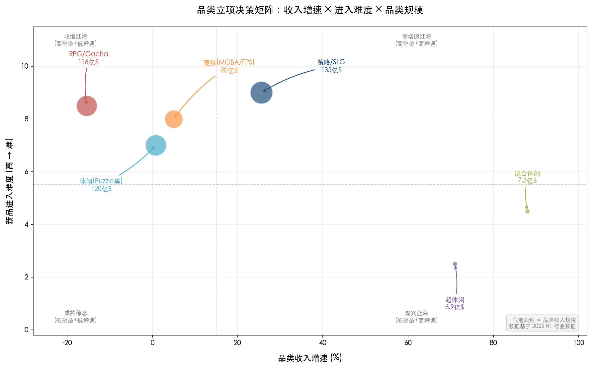

上图以品类收入增速为横轴、新品进入难度为纵轴、气泡面积映射品类收入规模，将六大品类定位于四象限矩阵中。将矩阵数据与画像特征交叉分析，可以得出更具操作性的立项判断：

**高壁垒红海品类（策略/SLG、MMORPG）。** 用户画像以 30-45 岁男性为主体，时间承诺高（日均 95 分钟以上），付费深度位居品类之首（SLG ARPPU 75 分位达 79.60 美元）。品类内排他性极强——87% 的 MMORPG 玩家仅同时投入一款同品类游戏[Google Play MMORPG Report](https://play.google.com/console/about/static/pdf/google-play-mmorpg-genre-report.pdf "2022年3月")。新品进入这一赛道几乎等同于从在位者手中零和夺取用户，对团队的数值体系能力、UA 预算储备和 LiveOps 运营深度均提出极高要求。

**收缩存量品类（RPG/Gacha）。** 核心用户集中在 18-30 岁年龄段，男性略多。H1 2025 品类收入同比下滑 11%，行业分析指出"过多机制、过多肝度、过高营销成本"三重压力正在压缩利润空间[PocketGamer.biz](https://www.pocketgamer.biz/strategy-games-surge-as-rpg-revenue-tumbles-h1-2025s-top-genres-revealed/ "2025年7月，引用AppMagic数据")。Niko Partners 预测 2026 年亚洲开发商将逐步远离角色 Gacha 模式，驱动因素包括细分市场饱和、监管趋势收紧和玩家疲劳[Niko Partners](https://nikopartners.com/niko-partners-2026-predictions/ "2026年1月预测")。除非团队在内容品质上具备米哈游级别的极致执行力——崩坏：星穹铁道 D30 留存达 18%，为品类基准 1.7% 的 10 倍以上——否则中小团队不宜贸然进入。

**新兴蓝海品类（混合休闲）。** 用户画像以 25-45 岁女性为主（约 60%），时间投入较低但付费潜力正在快速释放：App Store 端 32% 的付费用户在第 90 天累计消费超 100 美元（2024 年该比例仅为 22%），ARPPU 第 90 天同比增长 71%[GameDev Reports/AppMagic](https://gamedevreports.substack.com/p/appmagic-mobile-games-monetization "Mobile Games Monetization Report 2025")。混合休闲广告 CTR 达 28%，为全品类最高水平（平均仅 9%）[GameDev Reports/Adjust](https://gamedevreports.substack.com/p/adjust-mobile-games-insights-report "Adjust 2025报告, 5000+ apps")。对于具备轻度游戏研发能力和变现优化经验的中小团队而言，混合休闲是当前移动端性价比最高的入场赛道。

**中小团队的 PC/Steam 替代路径。** 移动端增长放缓至 2-4%，下载量同比下降约 8%，CPI 持续攀升[Deconstructor of Fun](https://www.deconstructoroffun.com/blog/2025/12/31/12-gaming-predictions-for-2026 "2026年1月预测")。与此形成对照的是，Steam 平台 Top 20 以外游戏的时间占比从 33% 上升至 42%，中小独立游戏的可见性显著改善[Deconstructor of Fun](https://www.deconstructoroffun.com/blog/2025/12/31/12-gaming-predictions-for-2026 "同上")。PC 端 2025 年收入增速达 +10.4%，Newzoo 预计 2025-2028 年 CAGR 为 6.6%，到 2028 年将超越主机成为第二大平台[Newzoo PC & Console Report 2026](https://newzoo.com/resources/blog/post-pandemic-growth-returns-for-pc-and-console-driven-by-premium-spending-and-changing-price-dynamics "Newzoo 2026年报告")。对预算有限的团队而言，PC/Steam 正在成为"2012-2022 移动淘金热"结束后最具吸引力的替代战场。

### 7.1.2 Greenlight 框架中的画像维度

Deconstructor of Fun 提出的 F2P 立项 Greenlight 框架涵盖八大评估维度，其中"目标用户画像"和"用户吸引力"直接依赖画像分析。该框架尤其强调"应花同样精力去摧毁成功叙事"，即系统性地寻找否定立项假设的证据[Deconstructor of Fun](https://www.deconstructoroffun.com/blog/2019/4/2/from-the-trenches-deconstructing-project-greenlight-and-early-stage-creative-processes "Greenlight框架, 2019年4月")。

我们建议开发者在立项阶段将画像验证嵌入以下三个关键决策节点：

**节点一：目标用户画像定义。** 基于第 3-5 章的品类画像基线，明确产品的核心用户群特征。以 MOBA 品类为例：若立项移动端 MOBA，参照王者荣耀画像（18-30 岁占 62%、女性约 50%、单局 15-20 分钟），可锚定"泛大众化竞技"定位；若选择 PC MOBA 路线，参照英雄联盟画像（18-24 岁占 64%、男性 87%），则需接受用户基盘显著缩窄的现实。画像定义的精确度直接决定后续获客和变现策略的有效性。

**节点二：画像与变现模型的匹配度验证。** 第 6 章揭示的"付费深度与时间承诺正相关"规律，为变现模型选择提供了数据锚点。日均时长 95 分钟以上的 MMORPG 品类可支撑订阅+高价 IAP 模型（ARPPU 75 分位 79.60 美元）；日均仅数分钟的超休闲品类则只能依赖广告驱动（LTV 远低于 1 美元）。混合休闲是当前唯一能在中等时长区间（D7 留存 10-20%）下同时实现广告和 IAP 双轮变现的品类，这一特性正是其商业模型创新的核心所在。

**节点三：市场容量与竞争烈度交叉验证。** 结合画像的品类排他性数据（MMORPG 87% 单品类排他 vs. 射击品类 70.3% 跨品类付费重叠）和品类忠诚度指数（Puzzle 85 > RPG 75 > Strategy 71）[Mistplay/AppsFlyer](https://business.mistplay.com/resources/mobile-gaming-trends-2025-report "2025 Loyalty Index")，可评估新品在目标品类中将面对的竞争强度。高排他性品类（SLG、MMORPG）中，获取每一个用户都意味着与在位者的直接争夺；低排他性品类（射击、休闲）中，增量空间更大但用户黏性相对较低。立项决策需在"竞争强度"与"用户留存潜力"之间寻求平衡。

## 7.2 产品设计阶段：以动机模型驱动玩法优先级

### 7.2.1 Quantic Foundry 动机模型的产品化应用

第 2 章系统介绍的 Quantic Foundry 12 动机→6 维度→3 集群模型，可直接指导产品设计阶段的玩法优先级排序[Quantic Foundry](https://quanticfoundry.com/2016/12/15/primary-motivations/ "250,000+ Gamers Primary Motivations")。下表将品类集群、动机集群与核心设计优先级及变现映射一一对应：

| 品类集群 | 对应动机集群 | 核心设计优先级 | 变现映射 |
|----------|------------|--------------|---------|
| 竞技品类（MOBA/FPS） | Action-Social | 排位系统、赛季内容、电竞赛事 | 皮肤/通行证（付费不影响公平性） |
| 策略/SLG | Mastery-Achievement | 数值深度、联盟竞争、进阶体系 | 时间加速器、高价资源包（$99 档） |
| 沙盒/UGC | Immersion-Creativity | 创造工具、用户内容生态、社交展示 | UGC 平台分成、虚拟商品 |
| 休闲/益智 | Completion（低强度 Action-Social） | 可预测成就反馈、关卡进阶、微社交排行 | 广告+低价 IAP 混合 |
| RPG/二次元 | Immersion-Creativity | 角色收集、叙事沉浸、幻想代入 | Gacha 卡池、限时礼包 |

性别差异的动机数据对产品设计具有直接指导意义：男性玩家首要动机为 Competition（竞争）和 Destruction（破坏），女性玩家首要动机为 Completion（完成）和 Fantasy（幻想）[Quantic Foundry](https://quanticfoundry.com/2016/12/15/primary-motivations/ "同上")。这一差异解释了两个典型案例：原神 45% 的女性用户占比远高于 FPS 品类，根源在于幻想代入与角色收集动机天然吸引女性玩家；王者荣耀以移动端降低操作门槛的方式，将 MOBA 从男性核心品类（英雄联盟男性 87%）改造为泛大众品类（女性约 50%），本质上是通过削弱 Destruction 门槛、强化 Social 和 Completion 维度来拓宽目标画像。

### 7.2.2 SDT 三需求与留存设计

自我决定理论（SDT）的三大基本心理需求——自主性（Autonomy）、胜任感（Competence）和关系性（Relatedness）——在预测玩家留存与付费意愿方面的解释力优于类别型分类框架（详见第 2 章）。将 SDT 三需求映射到不同品类的核心体验特征，可提炼出品类化的留存设计优先级。

**自主性**在开放世界 RPG 和沙盒品类中权重最高。原神的自由探索设计和 Minecraft/Roblox 的创造自由度，本质上均为满足自主性需求的核心产品策略。当产品过度限制玩家选择空间（如强制每日任务链、线性推图节奏）时，自主性需求遭到压制，"肝度疲劳"随之而来——这正是第 4 章所揭示的 RPG 品类流失主因之一。

**胜任感**是竞技品类和策略品类的核心留存引擎。排位系统、段位展示、联盟排名等机制的设计本质，均在于通过外化进步信号来持续满足胜任感需求。一项针对 33 万名 F2P 休闲游戏玩家的大规模随机对照实验（RCT）表明，通过动态难度调节（DDA）适度降低游戏难度后，玩家日均参与度提升约 20%，D1 留存提升 2.7 个百分点，D7 和 D14 留存亦分别提升 2.46 和 1.99 个百分点。更关键的发现在于，尽管单局内用户购买道具的概率因难度下降而降低，但留存提升带来的累计游戏时长增长使总体变现不降反升[Ascarza, Netzer & Runge, 2025](https://www.sciencedirect.com/science/article/abs/pii/S0167811625000060 "Personalized game design for improved user retention and monetization, International Journal of Research in Marketing, 2025")。该发现对休闲和益智品类的难度曲线设计具有直接参考价值：适度降低难度带来的留存收益可以抵消甚至反超即时付费损失。

**关系性**在不同品类中通过差异化的社交机制实现。结合第 3-5 章的品类分析与行业运营实践，社交系统设计应因品类画像而异[AppSamurai](https://appsamurai.com/blog/the-liveops-playbook-what-actually-works-in-mobile-games-today/ "LiveOps Playbook, 2026年2月")：

- **MMORPG**：公会体系是留存的核心枢纽。78% 的美国玩家认为"游戏能让人结交新朋友"，这一比例在 MMORPG 群体中尤为突出。公会活跃度下降是 MMORPG 流失的最强预警信号之一。
- **SLG**：联盟竞争机制可直接产生付费需求。联盟排名与资源争夺将社交竞争转化为变现动力，联盟排名持续下滑可作为流失预警指标。
- **竞技品类**：排位系统构建竞争性社交关系。段位匹配确保"势均力敌"的竞争体验，而连败则是竞技品类最典型的流失触发器。
- **休闲品类**：微型排行榜（50-100 人好友圈）的留存效果优于全球排行榜。Candy Crush 的好友排行榜成功将"打发时间"转化为轻度社交竞争，57% 的玩家将其列为最喜爱游戏。

### 7.2.3 付费体系设计的品类化指南

第 6 章揭示的付费谱系数据（详见 6.1 节）为付费体系设计提供了品类化的数据锚点。不同品类的用户画像特征决定了付费架构的设计方向。

**Gacha/抽卡品类**的付费设计正面临结构性转型压力。崩坏：星穹铁道的月收入在卡池期（7000-9000 万美元）与非卡池期（1900-2700 万美元）之间波动幅度达 3-4 倍，脉冲式收入模式对运营节奏提出极高要求。米哈游已率先探索以低价礼包扩大付费漏斗的策略：崩坏：星穹铁道中 $4.99 限时礼包贡献月收入 3% 和购买次数 13%，绝区零中 $2.99 礼包贡献 3% 收入和 16% 购买次数[GameDev Reports/AppMagic](https://gamedevreports.substack.com/p/appmagic-mobile-games-monetization "AppMagic 2025年报告")。这一策略的画像逻辑清晰：降低首次付费门槛可触达更多月均消费低于 30 元的"小R"用户，将部分免费用户转化为付费用户，从而平滑脉冲式收入波动。

**SLG 品类**在付费设计上走向"价格上探"路径。策略品类 IAP ARPMAU 从 $2.6 增长至 $5.34（+105%），$99 档高价包在 SLG 头部产品营收排行中的出现频率远高于其他品类[GameDev Reports/Adjust](https://gamedevreports.substack.com/p/adjust-mobile-games-insights-report "Adjust 2025报告, 5000+ apps")。值得注意的是，App Store 端策略品类 ARPPU 为 Google Play 的 4-8 倍，这指向一个明确的运营策略：iOS 端应重点配置面向高价值付费用户的深度变现路径，Android 端则需差异化定价以适配更广泛的付费分布。

**混合休闲品类**需要精细平衡广告与 IAP 的双轮驱动。Pizza Ready 案例（63% 女性玩家，约 70% 广告收入+30% IAP）展示了将激励视频广告融入核心玩法环节（"送披萨"流程）以降低用户抵触感的有效路径。Color Block Jam 的三阶段变现漏斗——无广告蜜月期→轻度横幅+IAP 引导→深度用户全量插屏——则为混合休闲的变现节奏提供了可复制的参考模板。两个案例的共同启示在于：变现强度应与用户生命周期阶段匹配，而非从第一天起全量铺开。

## 7.3 获客与增长阶段：画像驱动的精准获客

### 7.3.1 CPI 品类基准与获客效率

获客成本的品类差异，本质上反映了目标用户画像的获取难度与商业价值。2025 年综合多口径 CPI 基准数据如下[Business of Apps](https://www.businessofapps.com/ads/cpi/research/cost-per-install/ "2025年，引用AppsFlyer/Adjust/Sensor Tower")：

| 品类 | iOS CPI（美元） | Android CPI（美元） | 对应画像特征 |
|------|---------------|-------------------|------------|
| 超休闲 | ~0.40 | ~0.25 | 泛用户群、低黏性 |
| 混合休闲 | ~0.95 | ~0.60 | 中度用户、女性偏多 |
| 休闲 | ~2.50 | ~1.50 | 25-55 岁成年人 |
| 中核/策略 | ~5.50 | ~4.00 | 30-45 岁男性、高付费意愿 |
| 硬核 RPG | ~6.00 | ~4.50 | 18-30 岁核心玩家 |

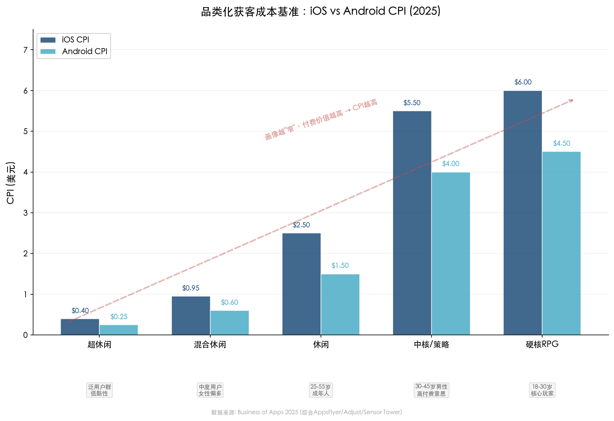

上图直观呈现了从超休闲到硬核 RPG 的 CPI 梯度。CPI 梯度与画像特征之间的对应关系十分清晰：用户画像越"窄"（年龄/性别/兴趣标签更集中）、付费价值越高，获客成本越高。北美市场 CPI 在所有区域中居首，反映了该市场最强的用户付费能力和最激烈的广告位竞争。

全行业付费/有机流量比已升至 2.18，即每获取 1 个有机用户需同时获取 2.18 个付费用户[GameDev Reports/Adjust](https://gamedevreports.substack.com/p/adjust-mobile-games-insights-report "Adjust 2025报告")。这一比值的持续攀升，已使获客效率优化从"可选项"变为"生存必选项"。

### 7.3.2 画像引导的获客策略差异化

不同品类的获客策略应依据目标用户画像特征做出差异化设计：

**"特洛伊木马"模型（SLG 品类）。** 第 5 章和第 6 章分析了 Whiteout Survival 的标杆案例：以类休闲广告素材和低门槛前期体验实现低 CPI 宽漏斗获客（性别比 50/50，打破传统 SLG 男性主导格局），后置深度策略内容完成用户筛选和分层变现，累计收入突破 40 亿美元。该模型的核心画像逻辑在于：传统 SLG 画像（30-45 岁男性）并非品类的"天然"边界，而是被过去的获客素材和产品设计所人为塑造。通过降低前期体验门槛，品类的潜在用户池可大幅扩展。需注意的是，该模型的可复制性有限——需要极高的 UA 预算和精细化 LiveOps 能力作为支撑。

**高 CTR 素材策略（混合休闲品类）。** 混合休闲广告 CTR 达 28%（全品类最高，平均仅 9%），其高效能得益于"失败演示"型素材——通过展示"看似简单但反复失败"的游戏画面，激发用户的"我能做到"心理冲动。策略品类下载量同比增长 83%、RPG 增长 32%，均在一定程度上受益于混合休闲式的泛化获客素材策略向其他品类的横向扩散[GameDev Reports/Adjust](https://gamedevreports.substack.com/p/adjust-mobile-games-insights-report "同上")。

**内容驱动的有机获客（PC/主机品类）。** 第 5 章分析的合作恐怖品类提供了一个截然不同的获客范式：Lethal Company 首周后销售爆发 507 倍，完全由 YouTube/Twitch 内容创作者驱动。这一路径对应的画像特征是 Z 世代年轻玩家群体——高社交分享倾向、偏好"低价高时长"产品。在 PC 端，内容创作者生态已可作为付费投放的替代性核心获客引擎。

**中国市场的独特获客渠道。** 微信小游戏 MAU 超 5 亿，2025 年收入达 535.35 亿元（+34.39%），核心获客机制为社交裂变而非传统买量[GameLook](http://www.gamelook.com.cn/2025/12/584413/ "GameLook转载GPC报告") [腾讯企业概览 PDF](https://static.www.tencent.com/uploads/2025/05/14/ae7b09adea59dfa92095e1f7e3c2fb87.pdf "腾讯官方 Corporate Overview 2025年5月")。该渠道触达的用户画像与传统应用商店存在显著差异——大量"不自认为玩家"的中老年用户和首次接触游戏的社交链导入用户构成了小游戏的独特增量池。对于面向中国休闲市场的开发者而言，小游戏生态是一条全球范围内无直接对标的低成本获客路径。

## 7.4 运营与生命周期管理：品类化的留存干预体系

### 7.4.1 四阶段留存干预框架

第 6 章揭示了"存量竞争时代，深度留存全面取代广度获客"的结构性趋势（全球移动游戏时间+8% vs. 安装量-0.2%）。基于行业基准数据和品类画像特征，我们将留存干预体系拆解为四个阶段。

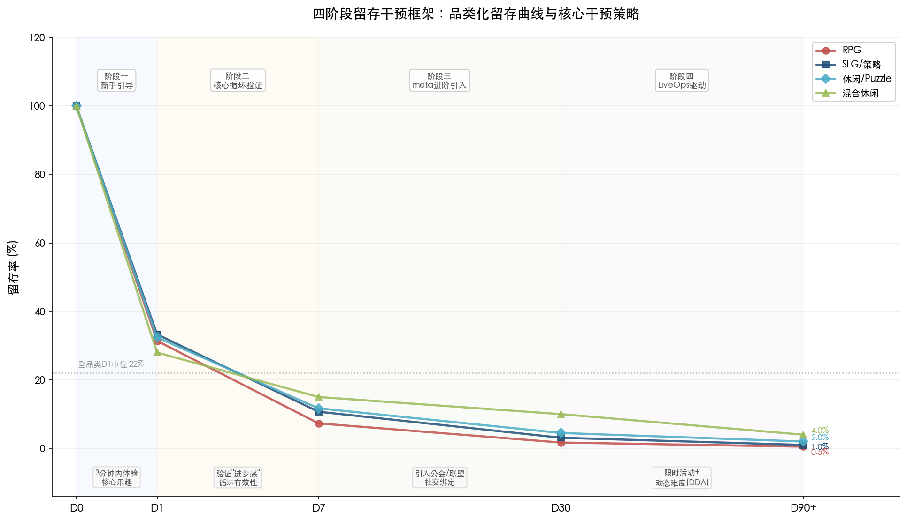

上图以 D0→D1→D7→D30→D90+ 为时间轴，绘制了 RPG、SLG/策略、休闲/Puzzle、混合休闲四个品类的留存衰减曲线（基于北美 Top 25% 基准），并叠加四个干预阶段的核心策略标注。

**第一阶段（D0-D1）：新手引导优化。** 全品类移动游戏中位 D1 留存仅 22%[Mistplay/AppsFlyer](https://business.mistplay.com/resources/mobile-gaming-trends-2025-report "2025 Loyalty Index")，近八成用户在首日即流失。新手引导的核心目标是在最短时间内让用户体验到品类的核心乐趣：竞技品类应在前 3 分钟内完成一次对局体验，RPG 应在 5 分钟内展示角色养成的进步反馈，休闲品类应在 30 秒内完成首个"完成感"循环。首次体验的质量直接决定 D1 留存上限。

**第二阶段（D1-D7）：核心循环钩子验证。** D7 留存应达到 5-15% 区间（因品类而异）。在这一阶段，产品需验证核心玩法循环能否持续产生"进步感"。RPG 品类的行业基准为 D7 7.3%（北美 Top 25%），SLG 为 D7 10.7%[GameAnalytics Q1 2024基准报告](https://investgame.net/wp-content/uploads/2024/06/gameanalytics-q1-2024-mobile-games-benchmarks.pdf "Q1 2024, Top 25%, North America")。若产品 D7 留存低于品类基准下限，应优先排查核心循环的"进步感"是否足够清晰——这往往是最具性价比的优化切入点。

**第三阶段（D7-D30）：meta 进阶引入。** 这一阶段是从"体验核心玩法"向"投入长线养成"转化的关键窗口。SLG 和 MMORPG 应在此阶段引导用户加入联盟/公会以建立社交绑定；RPG 应开始暴露深度养成线和 Gacha 系统；混合休闲应叠加轻度 meta 层（每日任务、皮肤收集、轻度 IAP 引导）。meta 层的引入时机至关重要：过早暴露会增加认知负荷加速流失，过晚则错失用户投入度的关键窗口。

**第四阶段（D30+）：LiveOps 驱动的持续更新。** 长线留存几乎完全依赖 LiveOps 运营能力。AppSamurai 总结的七大 LiveOps 支柱为系统性运营提供了参考框架[AppSamurai](https://appsamurai.com/blog/the-liveops-playbook-what-actually-works-in-mobile-games-today/ "LiveOps Playbook, 2026年2月")：①**事件喂养核心循环**——每 3-5 天上线一个限时活动以维持新鲜感；②**链式优惠**——以 $0.99 入口价包构建付费转化漏斗，逐级递增至高价包体；③**微型排行榜**——50-100 人好友圈排行比全球排行更有效地激发竞争性社交；④**AI 动态难度调整**——实时根据玩家表现调整挑战等级以维持"心流"体验；⑤**72 小时周末黄金活动窗口**——集中投放高价值活动以匹配用户空闲时间峰值；⑥**奖励捆绑模糊 IAP/IAA 边界**——以混合变现策略覆盖不同付费意愿层级的用户；⑦**DTC 网店绕过平台抽成**——在苹果/谷歌 30% 佣金压力下，为高价值用户提供替代付费渠道。

其中，动态难度调节（DDA）的留存效果已获得学术级因果证据支撑。前述 33 万名玩家 RCT 实验的结果显示，DDA 处理组用户在首日多完成 0.746 个新关卡，D1 留存率提升 2.7 个百分点（从基线 29.5% 升至 32.2%），D7 和 D14 留存亦分别提升 2.46 和 1.99 个百分点。更为关键的是，尽管单局内购买道具的概率因难度下降而降低，但留存提升带来的累计游戏时长增长使总体变现不降反升——处理组用户的 30 天累计付费金额显著高于对照组[Ascarza, Netzer & Runge, 2025](https://www.sciencedirect.com/science/article/abs/pii/S0167811625000060 "International Journal of Research in Marketing, 2025")。这一发现的产品化含义明确：对面临高流失风险的玩家，适度降低难度并非"放水"，而是一种具有可量化回报的留存与变现复合策略。

### 7.4.2 流失预警的品类化指标体系

不同品类的流失信号具有显著差异，通用的"X 天未登录"定义无法满足精细化运营需求。基于第 3-6 章的品类画像分析，下表梳理了品类化的核心流失预警指标：

| 品类 | 核心流失预警信号 | 行为逻辑 |
|------|----------------|---------|
| MMORPG | 公会活跃度下降、社交互动频率骤降 | 关系性需求断裂，社交绑定失效 |
| SLG | 联盟排名持续下滑、资源采集频率降低 | 竞争性社交受挫，沉没成本感弱化 |
| 竞技品类（MOBA/FPS） | 连败场次超过阈值、排位活跃度下降 | 胜任感持续受挫，负面情绪累积 |
| RPG/Gacha | 日常任务完成率下滑、版本间登录间隔延长 | "肝度疲劳"与"内容真空期"叠加 |
| 休闲品类 | 会话间隔显著延长、关卡通过率异常下降 | 习惯性行为断裂，挑战/技能失衡 |

对竞技品类而言，前述 DDA 实验提供了一个可参考的预警阈值设计思路：实验将"过去 7 天游戏局数低于 20 局"定义为高流失风险用户，并据此触发难度调节干预[Ascarza, Netzer & Runge, 2025](https://www.sciencedirect.com/science/article/abs/pii/S0167811625000060 "同上")。各品类可参照类似逻辑，基于自身用户行为数据建立"活跃度衰减阈值→自动干预触发"的预警机制。关键原则在于：干预手段须与品类的核心流失原因相匹配——竞技品类应优先调整匹配机制以避免连败；RPG 应优先推送限时回归活动和补偿资源；休闲品类应优先触发难度调节。

### 7.4.3 用户回归与长线价值

Mistplay/AppsFlyer 的忠诚度研究揭示了跨品类通用的用户回归驱动因素：最常见的回归原因依次为参与奖励（64%）、游戏内活动（50%）和频繁更新（34%）[Mistplay/AppsFlyer](https://business.mistplay.com/resources/mobile-gaming-trends-2025-report "2025 Loyalty Index")。这一数据表明，LiveOps 驱动的"签到+事件循环"已成为跨品类通用的留存基础设施，而非特定品类的独有策略。

49% 的移动玩家已持续玩最喜欢的游戏超过一年，39% 的忠实玩家推荐了 3 位以上朋友[Mistplay/AppsFlyer](https://business.mistplay.com/resources/mobile-gaming-trends-2025-report "同上")。长线留存的终极目标不仅是延长单用户生命周期，更在于通过口碑裂变降低获客成本——在付费/有机流量比升至 2.18 的行业环境下，每一个口碑推荐用户的获客成本为零，这使得留存优化的投资回报率远高于边际获客投入。

## 7.5 2026 下半年展望：品类融合与 AI 浪潮下的画像演变

### 7.5.1 品类融合正在重塑传统画像边界

第 6 章洞察二指出，品类融合（Genre Hybridization）是 2025-2026 年最重要的市场结构性变化之一。两个标志性案例已证明传统品类画像的边界正在被产品创新所突破：

- **Whiteout Survival**：用户性别比 50/50，打破了 SLG"中年男性专属"的品类刻板印象。
- **王者荣耀**：女性用户约 50%，打破了 MOBA"硬核男性"的品类标签。

Niko Partners 预测，亚洲+MENA 地区女性玩家占比将在 2026 年首次超过 40%[Niko Partners](https://nikopartners.com/niko-partners-2026-predictions/ "2026年预测")。这一趋势的产品化含义在于：开发者定义目标用户画像时，不应被品类历史数据所锚定。品类的性别结构、年龄分布和行为模式并非天然固定，而是产品设计、获客策略和社交机制共同塑造的结果。

三大值得重点关注的新兴赛道正在加速品类融合进程：

**混合休闲。** 2025 年 IAP 约 42 亿美元（+20%），正在将超休闲用户培育为具有持续付费习惯的中度玩家[AppMagic](https://appmagic.rocks/research/casual-report-h1-2025 "同上")。Block Puzzle 收入同比增长 12 倍、Screw Puzzle 增长 2.8 倍，品类内创新仍在加速迭代。

**小游戏平台。** 中国独有路径——微信小游戏 MAU 超 5 亿，年收入突破 535 亿元，近 70 款产品 DAU 超百万[GameLook](http://www.gamelook.com.cn/2025/12/584413/ "GameLook转载GPC报告")。小游戏生态将"社交裂变获客+极轻度体验+快速变现迭代"融合为独特的品类创新飞轮，其模式在全球范围内尚无直接对标。

**UGC 生态。** Roblox Q3 2025 DAU 达 1.515 亿（同比+70%），2025 年参与时长达 396 亿小时（+91%），创作者分成预计超 22 亿美元[Roblox Q3 2025 Shareholder Letter](https://s27.q4cdn.com/984876518/files/doc_financials/2025/q3/Q3-2025-Shareholder-Letter.pdf "Roblox官方Q3 2025股东信") [BCG 2026 Gaming Report](https://www.bcg.com/publications/2025/video-gaming-report-2026-next-era-of-growth "BCG 2025年底发布")。Niko Partners 预测首个亿美元级 Roblox 工作室收购案将在 2026 年出现[Niko Partners](https://nikopartners.com/niko-partners-2026-predictions/ "2026年预测")。UGC 平台的画像战略意义在于：73% 的 Roblox 用户年龄低于 18 岁——今天在 Roblox 中成长的 Gen Alpha，将是十年后游戏消费的主力人群。

### 7.5.2 AI 对用户行为与开发流程的双重影响

AI 正在同时改变游戏的生产方式和用户的消费预期，其影响需从开发侧和用户侧两个维度分别审视。

**开发侧。** Google Cloud 2025 年调查显示，90% 的游戏开发者已在工作流中使用 AI，主要应用场景为测试平衡（47%）、本地化（45%）和代码生成（44%）[Google Cloud](https://www.googlecloudpresscorner.com/2025-08-18-90-of-Games-Developers-Already-Using-AI-in-Workflows,-According-to-New-Google-Cloud-Research "2025年8月")。52% 的开发者公司已实施生成式 AI[GDC 官方报告](https://gdconf.com/article/gdc-2025-state-of-the-game-industry-devs-weigh-in-on-layoffs-ai-and-more/ "GDC 2025年3月发布")。AI 工具降低了内容生产的边际成本，使中小团队在内容更新频率上有望缩小与大型工作室的差距——这对依赖内容更新节奏驱动留存的 RPG 和 LiveOps 型品类尤为关键。

**用户侧。** 89% 的开发者观察到玩家期望正因 AI 而发生变化：37% 的玩家期望更动态的游戏世界，34% 期望更智能的 NPC[Google Cloud](https://www.googlecloudpresscorner.com/2025-08-18-90-of-Games-Developers-Already-Using-AI-in-Workflows,-According-to-New-Google-Cloud-Research "同上")。玩家对 AI 生成内容的接受度超出预期——仅 10% 对 AI 美术持明确负面态度[BCG 2026 Gaming Report](https://www.bcg.com/publications/2025/video-gaming-report-2026-next-era-of-growth "BCG 2025年底发布")。

**务实判断。** 52% 的开发者认为生成式 AI 对行业存在负面影响[GDC 官方报告](https://gdconf.com/article/gdc-2025-state-of-the-game-industry-devs-weigh-in-on-layoffs-ai-and-more/ "GDC 2025年3月")；McKinsey 研究显示 80% 的企业尚未从 AI 投入中见到显著底线影响[Deconstructor of Fun](https://www.deconstructoroffun.com/blog/2025/12/31/12-gaming-predictions-for-2026 "2026年预测")。Deconstructor of Fun 直言预测"AI 泡沫即将破裂"。我们认为，AI 在游戏领域的真正价值不在于替代创意工作者，而在于三个已可量化回报的"窄应用"场景：①**动态难度调节**——已有学术级因果证据支撑留存和变现的同步提升（详见 7.4.1 节）；②**个性化 LiveOps 推送**——基于画像特征实现精准的推送时机和内容匹配；③**本地化提效**——将本地化周期从数月压缩至数周，加速全球化节奏。开发者应避免为 AI 而 AI，聚焦于这些已被验证的应用场景，逐步积累数据资产和工具链能力。

### 7.5.3 2026 下半年宏观市场展望

Circana 预测 2026 年美国游戏消费将增长 +3% 至 628 亿美元，有望超越 2021 年 617 亿美元的历史峰值，GTA VI 和 Switch 2 为核心驱动因素[Circana](https://www.circana.com/post/circana-forecasts-a-transformative-year-for-video-games-in-2026 "2026年2月")。值得关注的是消费结构的潜在位移：38% 的消费者表示若成本上涨将减少首发全价购买，27% 表示将增加 F2P 游戏时间[Circana](https://www.circana.com/post/circana-forecasts-a-transformative-year-for-video-games-in-2026 "同上")。

结合第 6 章对 Z 世代消费行为的分析——18-24 岁美国人群游戏消费同比下降近 25%、仅贡献 3% 的主机硬件购买——我们判断，2026 下半年的结构性趋势将是"F2P 和订阅模式对钱包份额的进一步渗透，买断制在年轻世代中持续失势"。对开发者的直接建议是：即便面向 PC/主机市场，也应在产品设计中预埋 F2P 或混合变现元素，以适配年轻世代"高时间投入、低一次性消费意愿"的行为模式。这一代际性消费偏好的迁移不可逆转，产品架构需提前做出相应调整。

# 结论与风险提示

## 核心结论

本报告基于五维分析框架（人口统计、行为特征、心理动机、付费分层、留存生命周期），对竞技对抗、角色扮演/策略、休闲/泛玩法三大品类集群的用户画像进行了系统性刻画与跨品类横向比较。综合七章的分析与数据，我们凝练以下六项核心结论。

**第一，品类选择是立项阶段杠杆效应最大的战略决策。** 从超休闲（LTV 远低于 1 美元、纯广告变现）到 MMORPG（ARPPU 75 分位 79.60 美元、订阅+深度内购），付费谱系跨越两个数量级。品类选择本身即划定了产品的变现天花板、用户获取成本区间和核心竞争态势。2025 年策略品类以 135 亿美元（+25.6%）登顶全球移动 IAP 榜首，RPG 品类以 116 亿美元（-15.4%）面临收缩压力，混合休闲以 42 亿美元（+20%）处于高增速新兴阶段——不同品类所处的生命周期位置差异显著，开发者须结合自身团队能力与资源禀赋审慎选择战场。

**第二，品类融合正在系统性地重塑用户画像的传统边界。** Whiteout Survival 将 SLG 品类性别比推至 50/50，王者荣耀将 MOBA 女性用户推至约 50%，混合休闲将超休闲用户培育为具有持续付费习惯的中度玩家——这些案例证明，品类的人口统计特征并非天然固定，而是可以通过产品设计、获客策略和社交机制加以重塑。开发者在定义目标用户画像时，不应被品类历史数据所锚定。

**第三，留存竞争的本质是内容品质与运营节奏的竞争。** 品类基准仅划定了底线——RPG 品类 D28 基准仅 1.7%，但崩坏：星穹铁道 D30 达 18%；超休闲 D7 基准低于 8%，但 Color Block Jam D7 约 20%。头部产品与品类均值之间的巨大差距表明，在任何品类中都存在通过卓越执行力跑赢衰减曲线的空间。LiveOps、动态难度调节和精细化社交设计，已成为跨品类通用的留存基础设施。

**第四，代际偏好的迁移是驱动品类兴衰的长周期底层力量。** Gen Alpha 以沙盒/创造为原生品类，Gen Z 在竞技/冒险品类中消费但付费模式向 F2P 迁移，千禧一代及更年长世代在益智/休闲品类提供稳定的付费基盘。当前在 Roblox 和 Minecraft 中成长的 Gen Alpha，将是十年后游戏消费的主力人群。品类的长线布局须基于代际偏好的前瞻性研判，而非当前用户结构的简单外推。

**第五，中国市场在品类结构、获客渠道和用户行为上与全球市场存在系统性差异。** 中国以 MOBA+射击主导收入结构（Top 100 占比 37.74%），微信小游戏提供了全球独一无二的社交裂变获客渠道（MAU 超 5 亿），SLG 品类呈现"国内非头部、出海占半壁"的结构倒挂。出海开发者在制定区域策略时，须充分理解这些差异背后的平台生态逻辑，避免机械复制国内或海外的成功模式。

**第六，Quantic Foundry 动机模型与 SDT 框架可直接指导产品设计与留存优化。** Action-Social 集群对应竞技品类核心体验，Mastery-Achievement 集群对应策略/SLG 深度博弈，Immersion-Creativity 集群对应 RPG/沙盒的叙事与创造需求。SDT 三需求（自主性、胜任感、关系性）在控制了行为分类变量后仍能独立预测游戏乐趣与留存意愿，为品类化的留存设计提供了坚实的理论锚点。

## 风险提示与局限性

本报告的分析基于截至 2026 年第一季度可获取的公开行业数据和研究报告，存在以下主要局限性，读者在引用和应用结论时须予以充分考量。

**数据时效性与口径差异。** 各数据源的统计口径、覆盖范围和发布时间不尽一致。Newzoo、AppMagic、Sensor Tower 等机构对全球市场规模的估算方法各有差异，不同口径下的绝对数值可能存在偏差。部分品类基准数据（如 Google Play MMORPG 报告）发布于 2022 年，其反映的市场状况可能与 2025—2026 年存在偏离。本报告在引用数据时已尽可能标注数据来源时间和口径，但跨数据源的精确横向比较仍需谨慎。

**样本代表性偏差。** Quantic Foundry 动机模型基于 125 万名以上玩家的数据，但样本偏向英语区核心玩家群体（北美 33%、西欧 14%），休闲玩家和非英语区用户的代表性相对不足。ESA 全球调查覆盖 21 国 24,216 名玩家，但对东南亚、拉美等新兴市场的覆盖深度有限。画像结论在向特定区域市场应用时，须结合当地用户行为数据进行校准。

**品类分类的模糊边界。** 游戏品类融合趋势（如混合休闲、混合 SLG、射击+社交+UGC）正在加速模糊传统品类边界。本报告沿用行业通行的品类划分体系，但部分产品（如 Fortnite、Whiteout Survival）实际上横跨多个品类定义。随着品类融合的深化，基于传统品类标签的画像分析框架将面临适用性下降的风险。

**因果推断的局限。** 本报告大量使用相关性分析（如付费深度与时间承诺的正相关关系），但多数跨品类比较基于观察性数据，难以建立严格的因果关系。报告中引用的少数因果证据（如 33 万名玩家的动态难度调节 RCT 实验）属于特定品类和特定干预的局限性验证，其结论向其他品类的外推须保持审慎。

**中国市场数据的特殊性。** 中国游戏工委/CNG 的官方数据口径（实际销售收入 3,507.89 亿元人民币）与国际机构的美元口径估算（约 498 亿美元）之间存在汇率换算和统计口径差异。微信小游戏的收入和用户数据主要来自腾讯官方和行业媒体的二手报道，缺乏独立第三方的全面校验。

**预测的不确定性。** 报告中引用的 2026—2028 年市场预测（如 PC 端 2028 年超越主机、Roblox 亿美元工作室收购案、亚洲女性玩家占比超 40% 等）均基于当前市场趋势的外推，受宏观经济波动、监管政策变化、技术突破和黑天鹅事件等因素影响，实际走势可能与预测存在显著偏离。

**AI 影响的早期阶段评估。** 报告对 AI 在游戏行业中的影响分析主要基于开发者调查和早期应用案例。AI 技术仍处于快速迭代阶段，其对用户行为、内容生产和商业模式的长期影响尚未充分显现，当前评估可能低估或高估其实际影响程度。
