# 执行摘要

本报告对中国现行刑罚体系中死刑、死刑缓期执行（死缓）及终身监禁的适用规模、比例结构与减刑运行实态进行了系统性量化分析，并在此基础上评估中国废除死刑的可能路径与时间预期。

**法律框架的独特性。** 中国的死刑制度并非简单的"执行或不执行"二元结构，而是形成了"死刑立即执行→死缓附终身监禁→死缓附限制减刑→普通死缓→无期徒刑"的五级量刑梯度。其中，死缓并非独立刑种，而是死刑的一种执行方式；终身监禁和限制减刑则是死缓的两种特殊附加条件。这一多层级、可转化的制度架构在全球范围内几乎独一无二。

**执行数量的大幅下降。** 中国将死刑执行统计列为国家秘密，外部研究只能依赖间接估算。以对话基金会（Dui Hua Foundation）为代表的保守估算显示，年执行人数从1990年代的约15,000人下降至2018年的约2,000人，降幅超过85%。这一下降的核心驱动力是2007年最高人民法院收回死刑核准权，辅以两次立法削减（2011年和2015年分别废除13个和9个死刑罪名，累计削减32%，从68个降至46个）和死缓判决比例的系统性上升。即便在最保守估算下，中国年度死刑执行数量仍超过全球其余所有国家之和。

**死缓的核心转化功能。** 死缓考验期满后，"几乎全部"被转为无期徒刑，因故意犯罪被执行死刑的比例可能低于1%。死缓在实践中发挥着死刑"分流器"的功能——通过将大量本可被判处死刑立即执行的案件导向长期监禁，成为中国"少杀、慎杀"政策的核心执行工具。2011年《刑法修正案（八）》引入限制减刑制度后，死缓犯的法定最低实际服刑年限从约17年（普通死缓）延长至约27年（限制减刑死缓），显著增强了刑罚梯度的区分度。终身监禁制度自2015年引入以来，仅适用于约20例贪污受贿案件，尚未成为替代死刑的常规路径。

**减刑体系的规范化转型。** 2011年之前，中国年均减刑率高达41.33%，死缓犯实际平均服刑仅17—18年，无期徒刑犯约15—16年，刑罚"名实分离"严重。修正案八及后续司法解释系统性提高了最低服刑年限，2014年中央政法委出台"三个一律"公开机制，2021年全面排查1,100万件减刑假释案件。检察机关纠正不当案件数量从2023年的2.6万人次下降至2025年的6,369人次，降幅达75.5%，表明该领域正从"运动式整治"向"制度化规范"过渡。

**国际坐标中的孤立地位。** 全球已有113个国家在法律上废除所有犯罪的死刑。中国在执行规模、死刑罪名数量和数据透明度三个维度上均处于全球保留国的最严厉端。2024年联合国大会第十次暂停执行死刑决议获得130票赞成（首超三分之二），中国十次投反对票、四轮普遍定期审议中拒绝全部死刑相关建议。与此同时，越南2025年6月一次性将死刑罪名从18个削减至10个，废除了受贿罪和毒品运输罪的死刑，对中国构成直接示范压力。

**废除时间预测。** 综合驱动因素（学术共识、民意弹性、冤案冲击、执行下降惯性、邻国改革压力）与阻碍因素（政治意愿缺位、制度化陷阱、毒品犯罪特殊阻力、维稳逻辑、数据保密），我们判断中国实现事实暂停最可能发生在2045—2060年间，法律废除最可能发生在2055—2070年间。中国更可能走一条"静默限制"而非"宣示性改革"的路径：持续通过最高法院程序控制压缩执行空间，使更多罪名成为"僵尸条款"，在政治时机成熟时一次性删除大批名存实亡的死刑规定。这一预期须附带关键保留——若出现重大政治意愿转变或国际催化事件（如美国联邦层面废除死刑），时间窗口可能显著提前。

# 第1章 中国死刑刑罚体系：法律框架与制度辨析

## 1.1 死刑适用的总则性规定与限制

中国现行《刑法》第48条确立了死刑适用的基本原则与制度框架。该条规定："死刑只适用于罪行极其严重的犯罪分子"，同时确立了死缓制度——"对于应当判处死刑的犯罪分子，如果不是必须立即执行的，可以判处死刑同时宣告缓期二年执行"。此外，该条明确要求死刑除由最高人民法院判决的以外，"都应当报请最高人民法院核准"，从而在实体标准和程序保障两个维度上界定了死刑的适用条件。[《刑法》原文（山丹县政府网转载）](https://www.shandan.gov.cn/zfxxgk/xzzfxgk/chz_7381/xzswgk06/ggflfw_7392/fzxcjy_7394/202404/t20240403_1213247_wap.html "《中华人民共和国刑法》第48条原文")

在适用对象上，《刑法》第49条设定了三类绝对排除死刑适用的主体：犯罪时不满18周岁的人、审判时怀孕的妇女，以及审判时已满75周岁的人。第三类限制系2011年《刑法修正案（八）》新增，但附有例外条款——"以特别残忍手段致人死亡的除外"。[《刑法》原文](https://www.shandan.gov.cn/zfxxgk/xzzfxgk/chz_7381/xzswgk06/ggflfw_7392/fzxcjy_7394/202404/t20240403_1213247_wap.html "第49条") [《刑法修正案（八）》原文（最高人民检察院）](https://www.spp.gov.cn/spp/fl/201802/t20180205_364518.shtml "第三条")

上述总则性规定构成了中国死刑适用的法律边界。"罪行极其严重"作为死刑适用的唯一实质标准，在司法实践中须由法官综合犯罪的客观危害程度、主观恶性与人身危险性加以判断。"不是必须立即执行"这一立法表述则为死缓制度提供了规范依据，使中国的死刑制度形成了"死刑立即执行"与"死刑缓期执行"并存的二元结构——这一结构在世界范围内具有独特性，也构成本章后续分析的制度基础。

## 1.2 量刑梯度：从死刑立即执行到有期徒刑的完整谱系

中国刑法中与死刑相关的刑罚并非单一档次，而是形成了一套层级分明的梯度体系。按严厉程度从高到低排列，依次为：**死刑立即执行 > 死缓附终身监禁（仅限贪污受贿罪）> 死缓附限制减刑 > 普通死缓 > 无期徒刑 > 有期徒刑**。图1-1直观呈现了这一梯度结构及各层级对应的法律性质与最低实际服刑年限。

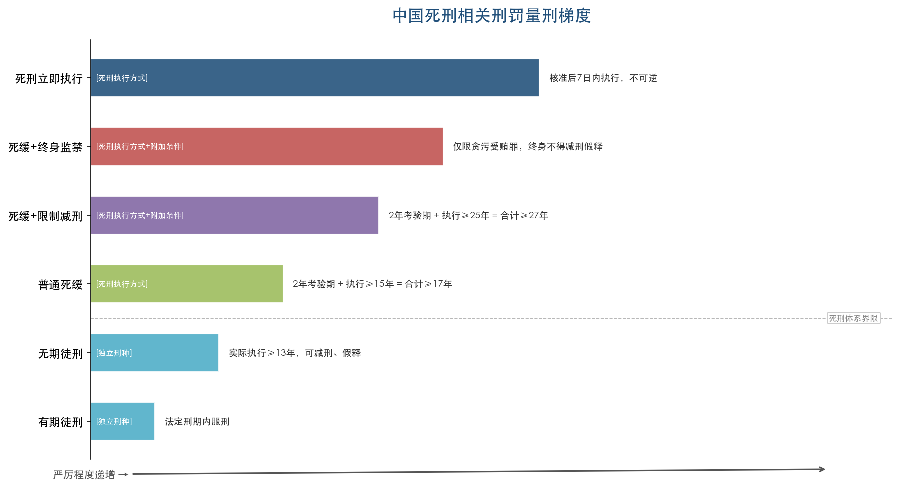

在概念辨析层面，首先须厘清的是：死缓并非独立的刑种，而是死刑的一种执行方式。《刑法》第48条的文本表述为"判处死刑同时宣告缓期二年执行"，即死缓在本质上仍属于死刑判决的范畴。同理，终身监禁和限制减刑也非独立刑种，而是死缓适用的两种特殊情形。最高人民检察院理论研究刊文明确指出，终身监禁"性质上属于死缓范畴，是死缓适用的一种特殊情形，不属于无期徒刑范畴"。[最高人民检察院理论研究](https://www.spp.gov.cn/llyj/201701/t20170111_178202.shtml "2017年1月11日")

清华大学法学院张明楷教授在《现代法学》2017年第3期发表的论文中进一步阐释：终身监禁只是"不得减刑、假释"的同位语，既非独立刑种也非无期徒刑的执行方法。[张明楷论文（中国法学网转载）](http://iolaw.cssn.cn/fxyjdt/201706/t20170621_4651115.shtml "《现代法学》2017年第3期") 这一学理定性具有重要的方法论意义：理解中国死刑体系不能将死缓、限制减刑、终身监禁视为与死刑并列的独立处罚措施，而应将其理解为死刑执行体系内部的分层机制。如图1-1所示，虚线以上的四种刑罚形态均属于死刑范畴，虚线以下的无期徒刑和有期徒刑则为独立刑种。

## 1.3 死缓制度：考验期与法定转化路径

死缓制度是中国刑罚体系中最具特色的制度设计。被判处死缓的犯罪分子须经历两年考验期，期满后的法定结果取决于其在考验期间的表现。《刑法》第50条规定了三种基本转化路径：其一，考验期内没有故意犯罪的，减为无期徒刑；其二，考验期内有重大立功表现的，减为25年有期徒刑；其三，考验期内故意犯罪且查证属实的，由最高人民法院核准后执行死刑。2015年《刑法修正案（九）》补充规定，对故意犯罪未被执行死刑的，死缓执行期间重新计算。[《刑法》原文](https://www.shandan.gov.cn/zfxxgk/xzzfxgk/chz_7381/xzswgk06/ggflfw_7392/fzxcjy_7394/202404/t20240403_1213247_wap.html "第50条")

结合限制减刑与终身监禁两种附加条件，死缓考验期满后的走向可进一步细分为五条完整路径，图1-2以流程图形式展示了各路径的分支条件与最终结果。

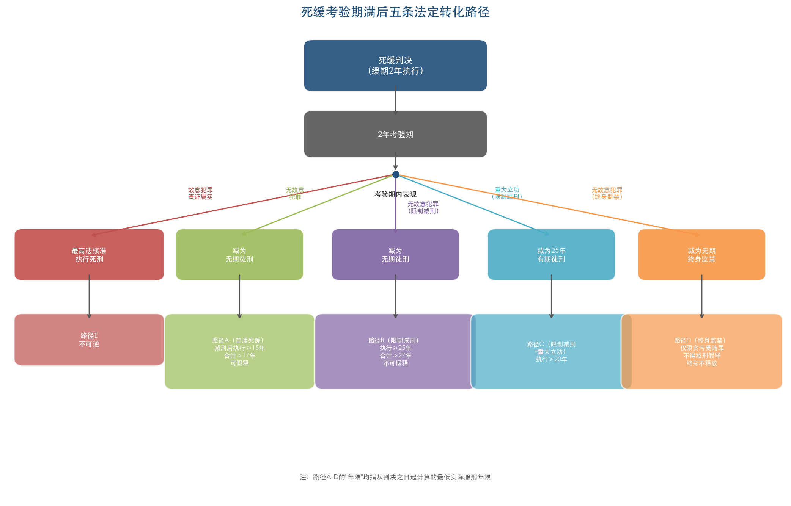

五条路径的具体内容如下：

- **路径A（普通死缓标准路径）**：死缓→考验期满无故意犯罪→减为无期徒刑→经减刑后实际执行不少于15年（《刑法修正案（八）》修订后标准），另加2年考验期→可假释→释放。从判决到最早释放合计不少于17年。
- **路径B（限制减刑死缓标准路径）**：死缓→考验期满→减为无期徒刑→实际执行不少于25年→释放。从判决到最早释放合计不少于27年。
- **路径C（限制减刑死缓重大立功路径）**：死缓→考验期内有重大立功→减为25年有期徒刑→实际执行不少于20年→释放。
- **路径D（终身监禁路径）**：死缓→考验期满→减为无期徒刑→终身监禁，不得减刑、假释。仅适用于贪污受贿犯罪。
- **路径E（执行死刑路径）**：死缓→考验期内故意犯罪且查证属实→最高人民法院核准→执行死刑。

上述路径体系揭示出死缓制度的核心特征：它在"死"与"生"之间构建了一套可量化的梯度。普通死缓犯罪分子从判决到最早可能释放的时间最短约为17年，限制减刑死缓约为27年，终身监禁则意味着永远不得释放。死缓制度因此并非简单的"缓刑"，而是一种附条件的刑罚转化机制，其最终走向取决于犯罪分子在考验期间的行为表现及法院在判决时附加的特殊条件。

## 1.4 "死缓限制减刑"：2011年修正案（八）的制度创新

2011年《刑法修正案（八）》第四条增设了"死缓限制减刑"制度，这是中国死刑体系近年来最具结构性意义的改革举措之一。该条款规定，对累犯以及因故意杀人、强奸、抢劫、绑架、放火、爆炸、投放危险物质或有组织暴力性犯罪被判处死缓的犯罪分子，人民法院可以在作出裁判的同时决定对其限制减刑。[《刑法修正案（八）》全文（最高人民检察院）](https://www.spp.gov.cn/spp/fl/201802/t20180205_364518.shtml "第四条、第十五条")

限制减刑的法律效果集中体现为实际服刑年限的大幅延长：被限制减刑的死缓犯减为无期徒刑后，实际执行刑期不少于25年；减为有期徒刑的，实际执行刑期不少于20年。与之对照，普通死缓减为无期徒刑后实际执行不少于15年。换言之，限制减刑使最低实际服刑年限从约17年延长至约27年，增幅接近60%。这一制度在量刑梯度上填补了"普通死缓偏轻、死刑立即执行偏重"之间的空白地带。

为配合该制度的司法适用，最高人民法院于2011年4月25日发布《关于死刑缓期执行限制减刑案件审理程序若干问题的规定》（法释〔2011〕8号），自2011年5月1日起施行。该司法解释对限制减刑的审理程序作出了系统规定：一审法院可在裁判中同时决定限制减刑；被告人对限制减刑判决不服可提出上诉；高级人民法院复核认为限制减刑不当的应当改判撤销限制减刑，但认为应当限制减刑而原判未限制的，不得直接改判加重，须按审判监督程序处理；最高人民法院复核死刑案件认为可以改判死缓并限制减刑的，应当裁定不予核准并发回重审。[最高人民法院公报](http://gongbao.court.gov.cn/Details/751a6e005748587527cbf1e5a4a14d.html "法释〔2011〕8号")

上述程序设计体现了"限制减刑只能由原审或发回重审确定，上级法院不得加重"的审慎原则。从制度功能分析，限制减刑的实际效果兼具两重性质：一方面，它通过延长严重暴力犯罪死缓犯的服刑年限，回应了社会对"判死缓等于判几年"的质疑；另一方面，它为原本可能被判处死刑立即执行的被告人提供了一条替代通道——法官在"判处死刑立即执行"与"判处普通死缓"之间获得了第三个选项，从而在保留惩罚力度的同时减少了死刑的实际执行。

## 1.5 终身监禁：2015年修正案（九）的特殊制度安排

2015年《刑法修正案（九）》在第383条增设了终身监禁条款，这是中国刑罚史上首次以立法形式引入"终身监禁，不得减刑、假释"的刑罚执行方式。其适用条件极为严格：仅限于贪污罪和受贿罪，且须同时满足三项要件——数额特别巨大、使国家和人民利益遭受特别重大损失、被判处死缓。在上述条件全部具备的情况下，法院可以在判处死缓的同时决定，在死缓期满减为无期徒刑后，对犯罪分子终身监禁，不得减刑、假释。[《刑法》第383条原文（于都县政府网）](http://www.yudu.gov.cn/ydxxxgk/c100257mgfu/202105/eac8302bd6e14d849de91a2c55872a87.shtml "第383条第4款") [最高人民检察院转载新华社报道](https://www.spp.gov.cn/spp/zdgz/201508/t20150830_103810.shtml "2015年8月30日")

终身监禁制度的适用范围仅限于贪污贿赂犯罪，这一立法选择决定了其在整个死刑体系中的定位——一项针对特定罪名的"精准替代"工具，而非一般性的刑罚制度。其立法逻辑在于解决贪污贿赂犯罪量刑中的特殊困境：对于数额特别巨大的贪腐案件，"判处死刑立即执行过重，判处一般死缓又偏轻"。终身监禁填补了这一量刑空白，使法官在面对巨额贪腐案件时，能够在不执行死刑的前提下实现"终身剥夺自由"的惩罚效果。

自2015年制度实施以来，终身监禁的实际适用极为罕见。截至2026年4月，公开可查的适用案例仅有4例，均集中在2016至2017年间判决：原云南省委书记白恩培（受贿约2.47亿元），2016年10月由河南省安阳市中级人民法院一审判处死缓并决定终身监禁，成为该制度的首例适用；[最高检转载检察日报](https://www.spp.gov.cn/zdgz/201610/t20161010_168954.shtml "2016年10月白恩培案") 国家能源局煤炭司原副司长魏鹏远（受贿约2.11亿元）；黑龙江省龙煤矿业控股集团原董事长于铁义（受贿约3.06亿元）；天津市政协原副主席武长顺（涉案超5亿元）。四人涉案金额均超过2亿元，适用逻辑一致。[赵秉志教授学术讲座](https://law.uibe.edu.cn/xwzx/xyxw/84757.htm "沈冯法学名家讲坛") 最高人民法院、最高人民检察院2016年联合发布的司法解释进一步明确，终身监禁"一经作出不得减刑假释"。[人民日报海外版](http://paper.people.com.cn/rmrbhwb/html/2016-04/19/content_1671666.htm "2016年4月19日")

从制度实践的角度审视，终身监禁在当前阶段尚未成为替代死刑立即执行的常规路径。4例适用案件全部集中在反腐高压时期的特大贪腐案件中，且2017年以后再未出现新增案例。更为关键的是，其适用范围严格限制于贪污贿赂犯罪，无法直接延伸至故意杀人、毒品犯罪等死刑适用的高频罪名，这在客观上限制了终身监禁作为死刑替代机制的制度辐射力。

## 1.6 死刑核准权收归最高人民法院：程序改革的结构性影响

2006年10月31日，第十届全国人民代表大会常务委员会第二十四次会议表决通过了《关于修改〈中华人民共和国人民法院组织法〉的决定》，将第十三条修改为："死刑除依法由最高人民法院判决的以外，应当报请最高人民法院核准。"该决定自2007年1月1日起施行。[全国人大常委会决定（中国人大网）](http://www.npc.gov.cn/WZWSREL25wYy9jMi9jMTgzL2MxOTgvMjAxOTA1L3QyMDE5MDUyMl8yNjIyMi5odG1s "2006年10月31日第十届全国人大常委会第二十四次会议通过")

这一修法具有深刻的历史背景。1979年《刑法》和《刑事诉讼法》均明确规定死刑由最高人民法院核准，但自1983年"严打"时期起，全国人大常委会先后授权各省、自治区、直辖市高级人民法院核准部分死刑案件。这一授权持续逾20年，导致各地死刑适用标准参差不齐。1996年修改《刑事诉讼法》和1997年修改《刑法》时，立法已重新确认"死刑由最高人民法院核准"的原则，但《人民法院组织法》中的相关条款迟至2006年方才完成修改。时任中国政法大学校长徐显明评价此举凸显了"不废除死刑但慎用死刑和逐步减少死刑"的改革方向。[新华社报道（好律师网转载）](https://www.haolvshi.com.cn/flfgk/119577.html "2006年11月1日新华社发")

死刑核准权收回带来的最直接制度效应，是在死刑案件的司法程序中增加了一道独立的实质性审查关口。图1-3完整展示了现行死刑案件的司法程序链条及死缓案件的分流路径。

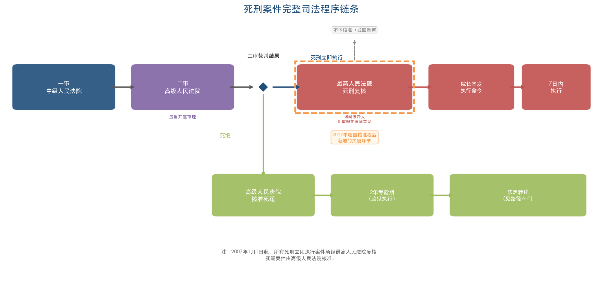

根据现行《刑事诉讼法》，死刑案件的完整司法程序链条为：**一审（中级人民法院管辖）→ 二审（高级人民法院，应当开庭审理）→ 最高人民法院死刑复核（应讯问被告人、听取辩护律师意见）→ 院长签发执行命令 → 七日内交付执行**。死缓案件则由高级人民法院核准，随后进入两年考验期。如图1-3所示，最高人民法院在复核中不予核准的案件将发回重审，形成对死刑适用的实质性过滤机制。[《刑事诉讼法》全文（司法部）](https://www.moj.gov.cn/pub/sfbgw/flfggz/flfggzflty/fltysfxzxgflfg/201812/t20181225_151323.html "2018年修正版")

这一程序改革产生了深远的结构性影响。最高人民法院通过死刑复核程序，事实上获得了统一全国死刑适用标准的权力。不予核准死刑的案件被发回重审或改判死缓，使得"死缓替代死刑立即执行"成为可操作的制度通道。本报告第2章的数据将显示，2007年收回核准权当年，死刑执行数量出现了急剧下降，表明这一程序改革在事实上发挥了实质性控制死刑适用的功能。

## 1.7 制度辨析：五个核心概念的比较

综合上述分析，有必要对中国死刑体系中五个最易混淆的核心概念进行系统比较，以厘清其法律性质、适用条件与实际效果的差异。

**死刑立即执行**是中国刑罚体系中最严厉的刑罚，适用于"罪行极其严重"且"必须立即执行"的犯罪分子。判决经最高人民法院核准后，由院长签发执行命令，七日内交付执行，具有不可逆性。

**普通死缓**适用于"罪行极其严重"但"不是必须立即执行"的犯罪分子。两年考验期满后，在没有故意犯罪的前提下减为无期徒刑，经后续减刑程序后实际最低服刑年限约17年（含2年考验期）。这是死缓制度的基本形态。

**死缓附限制减刑**是在普通死缓基础上的加重措施，适用于累犯及故意杀人等严重暴力犯罪。考验期满减为无期徒刑后，实际执行不少于25年，总计最低服刑年限约27年，较普通死缓延长约10年。

**死缓附终身监禁**是死缓的最严厉形态，仅适用于贪污贿赂犯罪中数额特别巨大、后果特别严重的案件。考验期满减为无期徒刑后终身监禁，不得减刑、假释——被告人将在监狱中度过余生。

**无期徒刑**则是独立于死刑体系的刑种。虽然死缓考验期满后通常减为无期徒刑，但无期徒刑本身也可作为独立的量刑结果直接适用。普通无期徒刑犯实际执行不少于13年即可通过减刑释放，其严厉程度显著低于任何形式的死缓。

上述五者之间的关系可以概括为：死缓是死刑的执行方式，限制减刑和终身监禁是死缓的附加适用条件，三者均处于死刑范畴之内；无期徒刑则是独立的刑种，虽然在转化链条上与死缓衔接，但在法律性质上不属于死刑。

从制度设计的整体逻辑审视，中国通过死缓制度、限制减刑制度和终身监禁制度，在"死"与"生"之间构建了一套精密的过渡机制。这套机制使得中国的死刑制度不同于多数保留死刑国家的二元结构（执行或不执行），而是呈现出多层级、可转化的显著特征。这一制度架构既为司法机关提供了灵活的量刑空间，也为死刑的逐步限制适用提供了制度化的缓冲地带——后续章节的数据分析将表明，死缓在实践中越来越多地替代了死刑立即执行，成为中国"少杀、慎杀"政策的核心执行工具。

# 第2章 死刑执行数量的量化估算——数据黑箱下的多源交叉分析

## 2.1 数据保密制度：量化分析的前提约束

对中国死刑执行数量的任何量化研究，都必须首先面对一个根本性制度约束：中国将死刑执行统计数据列为国家秘密。对话基金会（Dui Hua Foundation）在2023年向联合国人权理事会第四轮普遍定期审议（UPR）提交的文件中明确指出，"年度执行人数仍是一个被严密保守的秘密"。[对话基金会UPR提交文件](https://uprdoc.ohchr.org/uprweb/downloadfile.aspx?filename=12095&file=EnglishTranslation "Dui Hua Foundation, UPR Fourth Cycle Submission, 2023") 中国政府在2018年第三轮UPR审议中回应国际社会要求公布死刑统计的建议时，仅表示"死刑和死缓统计数据与五年以上有期徒刑和无期徒刑合并计算"，实质上拒绝单独披露死刑执行数据。[中国第三轮UPR回应文件](https://www.cmab.gov.hk/doc/en/documents/policy_responsibilities/the_rights_of_the_individuals/human/upr_3rd/addendum_report_working_group_upr_3rd_e.pdf "A/HRC/40/6/Add.1")

这一保密制度在三个层面构成了量化分析的障碍。其一，中国政府从未公布过年度死刑执行人数的官方数字，国内外研究者只能依赖间接估算方法。其二，曾作为重要辅助信息来源的中国裁判文书网，在2021年7月大规模删除了死刑复核裁定等文书，司法透明度出现显著退化。[路透社](https://www.reuters.com/world/china/china-vows-judicial-disclosure-after-outcry-over-plan-curb-access-rulings-2024-01-22/ "2024年1月") 其三，即便是最系统的外部追踪亦远不能覆盖实际规模——国际特赦组织2014-2016年间通过公开报道记录到至少931名被执行人，但其中仅85人（9.1%）的案件出现在裁判文书网上。[国际特赦组织](https://www.amnesty.org/en/latest/news/2017/04/china-must-come-clean-about-capital-punishment/ "2017年4月")

数据保密的合法性本身亦存在争议。北京大学宪法学教授张千帆2011年公开质疑将死刑执行数据列为"国家秘密"的法律依据；同期一项调查显示，64%的受访者认为政府应当公布执行人数。[对话基金会](https://duihua.org/as-execution-reports-decline-law-expert-challenges-secret-status/ "2011年10月") 鉴于上述制度约束，本章所有量化分析不可避免地带有估算性质，各来源之间的偏差亦在所难免。明确这一前提，是对后续数据进行审慎解读的必要条件。

## 2.2 多源估算体系：方法论差异与数据口径

在官方数据缺位的背景下，国际研究界主要依赖四个信息来源对中国年度死刑执行数量进行估算。各来源在方法论、数据口径和估算结果上存在显著差异，厘清这些差异是进行交叉验证的前提。

### 2.2.1 对话基金会（Dui Hua Foundation）

对话基金会是目前国际社会引用最为广泛的中国死刑数据估算来源。《经济学人》将其十年追踪数据称为关于中国死刑统计的"最佳可得数字"。[对话基金会](https://duihua.org/who-we-are/ "The Economist引用") 其估算方法依赖三条相互补充的路径：与中国政法系统人员的私下沟通所获取的内部信息；通过系统性监测中国媒体公开报道而汇集的执行记录；以及对已知局部数据的全国性统计推算。

对话基金会长期维护的"死刑执行日志"（Death Penalty Log）是其公开追踪体系的核心工具。截至2018年底，该日志记录了3,221起通过公开渠道确认的执行案例，其中涉及1,087起故意杀人案件。[对话基金会](https://duihua.org/dui-hua-digest-january-2019/ "Dui Hua Digest, January 2019") 对话基金会反复强调，这些公开追踪数字仅为"绝对最低数"（absolute minimum），远低于实际执行总数。一个典型例证是：2009年第四季度至2010年9月间，该基金会通过公开报道追踪到700起执行，而同期估算的实际执行数约为5,000人——公开追踪数仅占估算总数的14%。[对话基金会](https://duihua.org/dialogue-issue-41-after-one-year-dui-hua-uncovers-700-executions-in-china/ "2010年11月")

基于上述方法，对话基金会构建了一条覆盖近三十年的估算时间序列：1990年代年均约15,000人；2002年约12,000人；2005年约8,000人；2006年约7,000人；2007年约5,000-6,500人（最高法院收回死刑核准权当年急剧下降）；2008-2010年近5,000人；2011年约4,000人；2012年约3,000人；2013-2015年约2,400人（下降停滞）；2016-2018年约2,000人。[对话基金会UPR提交文件（2013年）](https://upr-info.org/sites/default/files/documents/2013-10/duihuafoundation.pdf "含2005-2007数据") [对话基金会](https://duihua.org/can-recognizing-poverty-reduce-executions-in-china/ "含2007-2015年估算") [NPR报道](https://www.npr.org/2013/08/18/213144477/executions-in-china-declining "2013年8月, 引用Dui Hua 2002年和2012年数据") [BBC报道](https://www.bbc.com/pidgin/articles/cdjlyn7pgpgo "引用Dui Hua数据")

需要注意的是，对话基金会自2018年起不再公开发布年度总估算数字，目前最新的公开年度估算停留在2018年"约2,000人"。2023年，该基金会公开追踪记录到153起执行（故意杀人94起、抢劫13起、毒品犯罪29起），2022年记录到120起执行，但这些数字仅为公开渠道可追踪的"绝对最低数"，与实际执行总数之间存在数量级差距。[对话基金会](https://duihua.org/curious-timing-spc-death-penalty-reviews-posted-after-universal-periodic-review-part-i/ "2024年7月")

### 2.2.2 国际特赦组织（Amnesty International）

国际特赦组织是全球死刑数据领域最具权威性的记录机构之一。1990年代，该组织曾直接发布中国年度死刑执行的具体估算数字。1996年，国际特赦组织记录到中国超过6,100个死刑判决和4,367例确认执行，同时指出实际数字可能远高于此。[国际特赦组织](https://www.amnesty.org/fr/wp-content/uploads/2021/06/asa170391997en.pdf "1997年报告")

自2009年起，国际特赦组织不再公布中国的具体执行数字，改用"数千人"（thousands）的定性表述。其2024年度全球死刑报告记录全球（不含中国）执行1,518人，并指出"这不包括据信在中国被执行的数千人"。[国际特赦组织2024年度报告](https://www.amnesty.org/en/documents/act50/8976/2025/en/ "2025年4月发布") 该组织放弃具体数字估算的原因在于，中国的信息封锁使任何外部精确估算都面临过大的不确定性，而对话基金会等机构的估算已被视为更接近实际的替代来源。

国际特赦组织在个案追踪层面的贡献仍具有独特价值。其2014-2016年间通过公开报道记录到至少931名被执行人，但其中仅9.1%（85/931）的案件出现在裁判文书网上。这一极低的司法公开覆盖率表明，即使是最系统的外部追踪，所能捕捉到的也不过是实际执行总量的冰山一角。

### 2.2.3 中国反死刑组织（CADP）

"中国反死刑"（China Against the Death Penalty, CADP）由滕彪博士于2010年创立，是中国境内唯一专注于死刑问题的非政府组织。该组织成员包括多名在中国执业的律师、法官和检察官，其估算建立在一线司法从业者的直接经验基础之上。CADP在2021年发表的分析报告中指出，2007年之前的二十余年间中国每年至少执行12,000人，2007年最高法院收回死刑核准权后每年仍至少执行8,000人。[世界反死刑联盟转载CADP报告](https://worldcoalition.org/china-death-penalty-2022/ "2022年2月15日") 该估算同时指出，考虑到中国的人口基数，其死刑执行数量"可能约占全球总数的90%"。

CADP的估算显著高于对话基金会的同期数字。以2011年为例，对话基金会估算约4,000人，而CADP的估算框架意味着该年数字不低于8,000人，两者之间存在约一倍的偏差。这一分歧的根源在于方法论取向的差异：对话基金会侧重于可验证的信息源和统计推断，倾向于给出保守估算；CADP则基于一线司法人员的执业经验，纳入了更多对司法实践中未公开执行案例的判断。

### 2.2.4 康奈尔大学死刑数据库（Cornell Death Penalty Worldwide）

康奈尔大学法学院运营的"全球死刑数据库"（Death Penalty Worldwide）在其中国专项页面中引用对话基金会的估算数据，指出2007年收回核准权后"估算的执行人数减少了一半"。[康奈尔大学死刑数据库](https://dpw.lawschool.cornell.edu/the-worlds-top-executioner-capital-punishment-in-china/ "Cornell DPW") 该数据库以对话基金会2011年估算的"约4,000人"作为执行数据的主要参照。[康奈尔大学死刑数据库](https://dpw.lawschool.cornell.edu/database?country=Chine "Country page: China") 康奈尔数据库本身不进行独立估算，其价值在于作为学术界广泛引用的权威汇总平台，从侧面印证了对话基金会数据在国际研究界的主流地位。

### 2.2.5 估算差异的综合评估

综合上述四个来源，中国死刑执行数量的估算呈现出三级分层格局。**保守区间**以对话基金会为代表，勾勒出从1990年代年均约15,000人逐步下降至2018年约2,000人的持续下行曲线。**中间区间**由国际特赦组织"数千人"的定性描述所覆盖，与对话基金会的近年数据大致吻合。**高端区间**来自CADP，其主张2007年后每年仍至少执行8,000人，约为对话基金会同期估算的2-4倍。

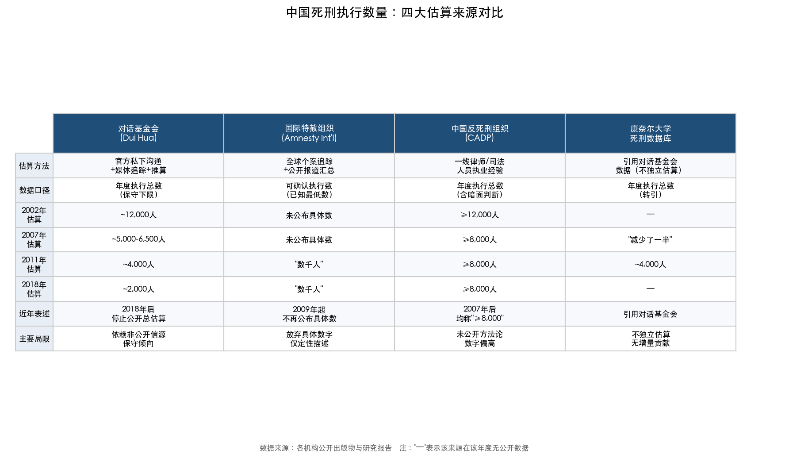

**图2-1　四大估算来源的方法论、数据口径与代表性数字对比。** 各来源在估算方法和数据口径上的差异，直接导致了代表性年度数字的显著分化。对话基金会侧重可验证数据源，给出保守下限；CADP基于一线执业经验，数字偏高；国际特赦组织自2009年起放弃具体估算；康奈尔数据库转引对话基金会数据，未作独立估算。

我们认为，对话基金会的估算可能代表了一个合理的下限，而CADP的估算可能偏高。两方面因素支持这一判断：其一，对话基金会的估算方法更具可追溯性和可验证性，其创始人康原（John Kamm）拥有数十年与中国官方沟通的经验，信息源涵盖中国政法系统内部人员；其二，CADP未提供具体的方法论说明，且"至少8,000人/年"这一数字与近年来各方观察到的执行数量下降趋势之间存在张力。尽管如此，两个来源在关键判断上具有一致性：中国年度死刑执行数量远超全球其他国家之和，且在21世纪前二十年经历了大幅下降。

## 2.3 执行数量的时间序列：从高峰到收缩

基于对话基金会等来源的估算数据，可以构建一条从1990年代至2018年的中国死刑执行数量时间序列。这一序列呈现出明确的下降趋势，但下降并非匀速发生，而是受特定制度变革驱动、呈阶梯式收缩。

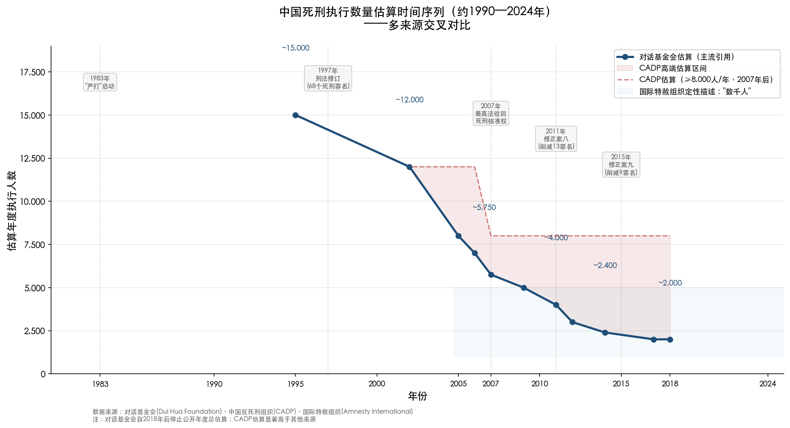

**图2-2　中国死刑执行数量估算时间序列。** 以对话基金会估算为主线（实线），叠加CADP高端估算区间（红色虚线与填充）和国际特赦组织"数千人"定性描述区间（蓝色填充），并在时间轴上标注1983年"严打"启动、1997年刑法修订、2007年收回核准权、2011年《刑法修正案（八）》、2015年《刑法修正案（九）》等关键制度节点。

### 2.3.1 1990年代至2006年：高执行期

1990年代至2006年间，中国处于死刑执行的历史高峰期。这一时期的高执行量受三个结构性因素共同驱动：其一，1983年启动并多次延续的"严打"运动强调"从重从快"惩处犯罪，直接推高了死刑判决和执行数量；其二，死刑核准权自1983年起部分下放至省级高级人民法院行使，降低了死刑判决的审核门槛；其三，1997年修订后的《刑法》仍保留68个死刑罪名，为广泛适用死刑提供了充足的法律空间。

对话基金会估算，1990年代中国年均执行约15,000人。[NPR报道](https://www.npr.org/2013/08/18/213144477/executions-in-china-declining "2013年8月, 引用Dui Hua数据") 进入21世纪后执行数量开始缓慢下降：2002年约12,000人，2005年约8,000人，2006年约7,000人。国际特赦组织1996年记录到4,367例确认执行，同时指出这仅为有据可查的最低数字。[国际特赦组织](https://www.amnesty.org/fr/wp-content/uploads/2021/06/asa170391997en.pdf "1997年报告") 综合各来源，这一时期中国年均死刑执行数量约占全球总量的60%-80%。[新加坡国立大学东亚研究所](https://research.nus.edu.sg/eai/wp-content/uploads/2017/11/BB412.pdf "China's Death Penalty: Reforms On Capital Punishment")

### 2.3.2 2007年：收回核准权的分水岭效应

2007年1月1日，最高人民法院正式收回死刑核准权，统一行使死刑案件的最终审核权。这一制度变革构成了中国死刑执行数量变化轨迹中最清晰的分水岭。

对话基金会估算显示，2007年执行数从上一年的约7,000人急剧下降至约5,000-6,500人。[对话基金会](https://duihua.org/can-recognizing-poverty-reduce-executions-in-china/ "Can Recognizing Poverty Reduce Executions in China") 康奈尔大学死刑数据库将这一变化概括为"估算的执行人数减少了一半"。[康奈尔大学死刑数据库](https://dpw.lawschool.cornell.edu/the-worlds-top-executioner-capital-punishment-in-china/ "Cornell DPW") 学术研究进一步指出，"中国2007年死刑改革增加了对死缓判决的依赖，至2011年将即时执行人数减少了一半"。[学术文献](https://www.academia.edu/17252555/Two_Years_between_Life_and_Death_A_Critical_Analysis_of_the_Suspended_Death_Penalty_in_China "ResearchGate/Academia摘要")

收回核准权之所以产生如此显著的效果，源于三个相互关联的机制：第一，最高法院为全部死刑案件设立了统一的审核标准，终结了此前各省高院尺度不一的局面；第二，核准程序本身延长了死刑案件的审理周期，拓展了辩护律师的介入空间；第三，最高法院明确传递"少杀、慎杀"的司法政策信号，并通过不予核准的个案示范对下级法院的量刑倾向形成实质约束。

### 2.3.3 2008-2015年：持续下降与阶段性停滞

2008年至2015年间，死刑执行数量延续下降态势，但下降速度逐渐趋缓，并在2013年前后出现阶段性停滞。对话基金会的估算显示了这一递减序列：2008-2010年近5,000人/年，2011年约4,000人，2012年约3,000人，2013-2015年约2,400人。CBS新闻2012年引用对话基金会创始人康原的表述报道称，"中国每年执行约4,000人，为全球最多，但仅为最高法院收回核准权前的一半"。[CBS新闻](https://www.cbsnews.com/news/activists-china-executes-4000-a-year/ "2012年")

2013-2015年间的下降停滞值得特别关注。对话基金会数据显示，这一时期年执行数稳定在约2,400人，未能延续此前每年约20%-25%的降幅。[对话基金会](https://duihua.org/can-recognizing-poverty-reduce-executions-in-china/ "Can Recognizing Poverty Reduce Executions in China") 停滞的成因可能涉及多重因素：收回核准权的制度性冲击效应在经历初始释放后趋于衰减；毒品犯罪死刑的高比例维持了执行数量的刚性底部；以及2013年后政策环境中法治建设与社会管控强化并行的复杂取向。

### 2.3.4 2016年至今：低位运行与信息封锁加剧

2016年后，对话基金会的公开年度估算显示执行数量进一步下降至约2,000人/年（2016-2018年）。[BBC报道](https://www.bbc.com/pidgin/articles/cdjlyn7pgpgo "引用Dui Hua数据") 该基金会自2018年起不再公开发布年度总估算，使得近年数据出现断档。欧洲反死刑联盟（ECPM）2025年发布的中国死刑研究报告将2015-2024年间每年的执行数均标注为"1000+"，折射出国际监测机构在精确估算上面临的困境。[ECPM中国死刑报告](https://www.ecpm.org/app/uploads/2025/10/Brochure_Chine_2024_EN.pdf "2025年10月发布")

部分间接数据提供了有限的参照。据报道，2018-2019年间中国国家媒体报道了年均160-200起与毒品犯罪相关的执行。[人权倡导者](https://www.theadvocatesforhumanrights.org/News/cdr "Cornell Death Penalty Research引用") 鉴于毒品犯罪在已知执行案例中通常占约19%-25%的比例（对话基金会2023年追踪的153起执行中毒品犯罪29起，占19%），以此比例反推可粗略估算年执行总数在640-1,050人之间。但这一推算高度依赖比例假设的稳定性，不宜作为确定性结论。

综合各方信息，我们判断2019年至今中国年度死刑执行数量大致维持在1,000-2,000人的区间，继续位居全球之首，但已从1990年代的万人量级下降了一个数量级以上。从峰值的年均约15,000人到当前的1,000-2,000人，降幅超过85%，这一收缩的规模和速度在全球死刑制度演变史上极为罕见。

## 2.4 死刑复核的微观证据：不核准率与审查时间

宏观估算之外，对话基金会2024年对最高人民法院公开上传的一批死刑复核裁定所进行的逐案分析，提供了难得的微观层面定量数据。

2024年2月——恰在中国接受第四轮UPR审议一个月之后——最高人民法院在中国裁判文书网上传了86份死刑复核裁定，涉及93名被告人，裁定日期集中于2022-2023年。分析结果显示：核准77例，不予核准16例，不核准率约为17.2%。[对话基金会](https://duihua.org/curious-timing-spc-death-penalty-reviews-posted-after-universal-periodic-review-part-i/ "2024年7月") 这一比例远高于此前可比样本的水平——2013-2015年间公开样本的不核准率仅约2%。从2%到17.2%的跃升，若具有代表性，则意味着最高法院在死刑复核中的"把关"功能正在显著强化。

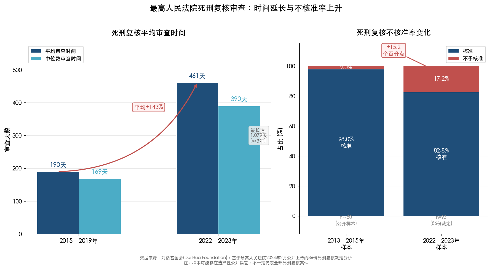

**图2-3　最高人民法院死刑复核审查时间与不核准率的变化。** 左侧面板显示平均审查时间从2015-2019年的190天（中位数169天）延长至2022-2023年的461天（中位数390天），增幅达143%；右侧面板显示不核准率从2013-2015年样本的2.0%上升至2022-2023年样本的17.2%，增加15.2个百分点。数据来源为对话基金会基于最高人民法院2024年2月公开的86份裁定的分析。

与不核准率的上升同步，死刑复核审查时间亦出现显著延长。2015-2019年间复核平均耗时190天（中位数169天）；到2022-2023年样本中，平均耗时增至461天（中位数390天），最长一例达到1,079天（近三年）。[对话基金会](https://duihua.org/curious-timing-spc-death-penalty-reviews-posted-after-universal-periodic-review-part-i/ "2024年7月") 审查时间的延长存在两种可能的解读：其一，最高法院对死刑案件的审查态度更加审慎严格；其二，制度运行中可能存在案件积压或程序效率方面的问题。两种解释并不相互排斥。

对上述微观数据的解读须保持审慎。这86份裁定的上传时机——紧随UPR审议之后——本身带有策略性信号释放的色彩。对话基金会指出，这批文书是2021年大规模删除后首次批量公开，上传动机可能与回应国际压力有关。[对话基金会](https://duihua.org/curious-timing-spc-death-penalty-reviews-posted-after-universal-periodic-review-part-i/ "2024年7月") 因此，17.2%的不核准率可能并不代表全部死刑复核案件的真实水平——这批文书存在被选择性公开以展示较高"人权保障"水平的可能性。尽管如此，即便考虑选择偏差，不核准率相较历史数据的大幅上升仍然传递出最高法院在死刑审核层面趋严的信号。

## 2.5 死缓替代死刑立即执行的结构性趋势

死缓判决与死刑立即执行判决之间的比例变化，是衡量中国死刑政策走向的另一关键维度。这一比例同样缺乏系统性官方数据，但现有学术文献和个案统计仍可勾勒出趋势轮廓。

较早的可得数据来自学者胡云腾1995年的研究：当时的死刑判决中约四分之一为死缓判决，其余四分之三为死刑立即执行。[胡云腾《死刑通论》](https://www.ecba.org/extdocserv/DP_Baseline.pdf "The Rights Practice, 2003, 引用胡云腾1995年数据") "权利实践"组织（The Rights Practice）2003年对湖北武汉一地法律援助案件的统计提供了另一参照：2000-2002年间武汉中级人民法院审理的436件死刑案件中，289件（66%）被判处死刑立即执行，53件（12%）为死缓判决，94件（22%）为无期徒刑。[The Rights Practice](https://www.ecba.org/extdocserv/DP_Baseline.pdf "The Death Penalty in China: a baseline document, 2003")

2007年最高法院收回核准权后，死缓判决比例出现显著上升。学术文献明确指出，"中国2007年死刑改革增加了对死缓判决的依赖，至2011年将即时执行人数减少了一半"。[学术文献](https://www.academia.edu/17252555/Two_Years_between_Life_and_Death_A_Critical_Analysis_of_the_Suspended_Death_Penalty_in_China "ResearchGate/Academia摘要") "权利实践"组织的后续研究亦确认，"死缓判决的增加使用减少了执行数量"。[The Rights Practice](https://www.rights-practice.org/death-sentences-in-china "Use of Death Penalty in China: Sentencing") 这意味着即使死刑案件总量（含死缓）并未大幅减少，通过提高死缓判决占比，实际被执行的人数仍可实现大幅下降。

CADP进一步指出，在部分证据存在疑点的案件中，法院采用了"疑案从缓"的做法——并非宣判无罪，而是判处死缓以留有余地。[世界反死刑联盟转载CADP报告](https://worldcoalition.org/china-death-penalty-2022/ "2022年2月15日") 这一带有中国司法特色的实践，客观上使死缓制度在减少错误执行方面发挥了安全阀的功能。

综合现有证据，可以合理推断：死缓判决在全部死刑判决中的占比已从1990年代的约25%大幅上升，2007年后可能已超过50%。这一比例的结构性逆转，是理解中国死刑执行数量大幅下降的关键变量之一——不仅死刑案件总量在减少，死刑案件内部亦在发生从"立即执行"向"缓期执行"的系统性偏移。两股力量叠加，共同驱动了执行数量从万人量级向千人量级的跨越式收缩。

## 2.6 辅助量化信息：司法工作报告中的间接数据

中国最高人民法院和最高人民检察院向全国人民代表大会提交的年度工作报告，虽不直接公布死刑执行数字，但偶尔提供涉及重大刑罚案件的间接数据，可作为辅助参照。

最高人民检察院2025年10月向全国人大常委会提交的刑罚执行监督专项报告指出，2014年以来年均办理"减刑、假释、暂予监外执行"案件60万余起。[最高检刑罚执行监督专项报告](http://www.npc.gov.cn/npc/c2/c30834/202510/t20251027_448927.html "2025年10月") 按中国在押服刑人员约170万人估算，年均60万起"减假暂"案件意味着约35%的服刑人员每年涉及某种形式的刑罚变更程序——这一较高比例为理解中国刑罚执行体系的动态调整特征提供了宏观参照。

然而，上述数据的局限性同样不容忽视。中国政府在UPR中明确表示，死刑和死缓统计数据"与五年以上有期徒刑和无期徒刑合并计算"，使外部观察者无法从官方报告中分离出死刑执行的单独数据。世界反死刑联盟在分析中国2024年第四轮UPR国家报告时指出，"死刑"一词在整份国家报告中"完全没有出现"。[世界反死刑联盟](https://worldcoalition.org/what-chinas-report-to-the-united-nations-tells-us-about-transparency-and-the-death-penalty/ "China's UPR 2024分析") 这一事实本身即构成对信息封锁程度的直接佐证。

## 2.7 数据缺口评估与偏差分析

综合全章分析，中国死刑执行数量的数据体系存在四个层面的结构性缺口。

**其一，官方数据完全缺位。** 中国政府从未发布过年度死刑执行数字，亦未正面回应国际社会关于公布数据的多次要求。这一缺位并非数据收集的技术困难，而是制度性的信息管控——中国的司法系统完全具备统计执行人数的能力，但选择将其列为国家秘密。

**其二，外部估算存在显著的方法论分歧。** 对话基金会（约2,000人/年，2018年）与CADP（至少8,000人/年，2007年后）之间存在约4倍的估算差异。这一分歧源于信息源差异、推算方法差异以及对"保守下限"与"实际总数"的不同理解。在缺乏官方数据校验的条件下，外部观察者无法确定哪一估算更接近真实值。

**其三，时间序列的后段出现断裂。** 对话基金会自2018年起停止公开年度总估算，2021年裁判文书网大规模删除文书后数据环境进一步恶化。2019年至今的执行数量实际上处于"估算真空"状态——国际社会所依赖的主要数据来源要么停止更新，要么只能给出"数千人"的定性描述。

**其四，个案追踪的覆盖率极低。** 对话基金会2023年公开追踪到153起执行，即使按最保守的总量估算（约1,000人）计，覆盖率亦仅约15%。大量执行发生在公众视野之外，边远省份和基层法院的案件尤为不可见。

尽管存在上述缺口，多源数据的交叉比对仍然支持一个核心判断：**中国死刑执行数量在2002-2018年间经历了约80%-85%的下降**（从约12,000人降至约2,000人）。这一下降的主要驱动力是2007年死刑核准权的收回，辅以死刑罪名的立法削减和死缓判决比例的系统性上升。在这一大幅收缩的背景下，死缓制度如何在实践中运行——包括转化率、减刑幅度和实际服刑年限——构成了理解中国死刑刑罚体系全貌的下一个关键议题。

# 第3章 死缓与减刑制度的运行实态——转化率、服刑年限与执行效果

## 3.1 死缓考验期满后的转化实态：从"几乎全部"到精确缺口

死缓制度在法律文本上为被判处死刑的犯罪分子预留了三条法定出路——减为无期徒刑、减为25年有期徒刑、或经最高人民法院核准执行死刑。然而，这三条路径在司法实践中的适用频率呈现出极端的不对称性。

剑桥大学《Asian Journal of Law and Society》刊发的学术研究明确指出，死缓两年考验期满后，"判决几乎总是被转化为不确定期限的监禁"（virtually always）[Cambridge学术论文](https://www.cambridge.org/core/journals/asian-journal-of-law-and-society/article/suspended-execution-beyond-chinas-borders/101E2A549C987D5FD02FDBE206D1709D "Asian Journal of Law and Society")。这一判断揭示了死缓在实际运行中的核心特征：它并非一种悬而未决的"缓刑观察"，而是一种高度确定的从死刑向自由刑的转化机制。被判处死缓的犯罪分子，在绝大多数情况下最终被转为无期徒刑或有期徒刑服刑，而非被执行死刑。

死缓考验期内因"故意犯罪"被报请最高人民法院核准执行死刑的案例极为罕见。尽管缺乏官方统计提供精确比例，学术界普遍认为这一比例可能低于1%。这一极低比例的形成源于两方面因素：其一，监管环境下罪犯实施故意犯罪的物理条件有限；其二，2015年《刑法修正案（九）》增设了"故意犯罪未执行死刑的，死缓期间重新计算"的弹性条款，即便考验期内出现故意犯罪行为，也不必然导致执行死刑[《刑法》原文](https://www.shandan.gov.cn/zfxxgk/xzzfxgk/chz_7381/xzswgk06/ggflfw_7392/fzxcjy_7394/202404/t20240403_1213247_wap.html "第50条")。

死缓转化路径的高度确定性产生了深远的制度效果。死缓事实上发挥着"准终身监禁"的功能——被判处死缓的犯罪分子虽名义上被判处死刑，但几乎确定将在监狱中度过漫长的服刑期。如第1章所分析，死缓并非独立刑种，而是死刑的一种执行方式；但在运行层面，死缓与死刑立即执行存在本质区别——前者的实际结果是长期监禁，后者的实际结果是剥夺生命。

值得注意的是，"死缓转无期的精确比例"至今仍是中国刑罚研究中的数据盲区。官方从未公布过死缓考验期满后各类转化结果的年度统计，学术界只能通过个案汇集和定性推断描述这一比例。这一数据缺口的存在，本身即为第2章所讨论的死刑数据保密制度的延伸后果。

## 3.2 减刑机制与实际服刑年限：法定底线与实然状态

### 3.2.1 修正案八之前：减刑率畸高与服刑年限偏短

2011年《刑法修正案（八）》实施之前，中国刑罚执行领域呈现出减刑率畸高、实际服刑年限偏短的突出特征。华东政法大学刘宪权教授引用司法部监狱管理局统计数据指出，该时期死缓犯实际平均服刑年限约为17—18年，无期徒刑犯实际平均服刑年限约为15—16年[刘宪权论文](https://law.kust.edu.cn/info/1125/1637.htm "《政法论坛》2012年第3期")。

整体减刑规模同样引人关注。2002—2004年间，全国在押服刑罪犯约150余万人，年均约62万人获得减刑，平均减刑率高达41.33%[刘宪权论文](https://law.kust.edu.cn/info/1125/1637.htm "《政法论坛》2012年第3期，引用司法部监狱管理局统计")。换言之，每年超过四成的在押罪犯获得减刑，减刑事实上成为"常态"而非"例外"，严重偏离了减刑制度作为"奖励性刑罚变更"的制度初衷。

高减刑率的直接后果是刑罚执行的"名实分离"。以无期徒刑为例，法律文本上的"终身剥夺自由"在实践中被压缩至平均15—16年的实际服刑期，与15年以上有期徒刑的执行效果趋同。死缓作为法律上比无期徒刑更为严厉的刑种，其实际服刑年限（17—18年）仅比无期徒刑多出约2年。这种刑罚执行层面的严重缩水削弱了刑罚体系的梯度分层效果，也构成了推动后续立法改革的核心动因之一。

### 3.2.2 修正案八之后：法定底线的系统性抬升

2011年《刑法修正案（八）》对减刑制度进行了结构性调整，核心变化在于系统性提高各类重刑犯的法定最低实际服刑年限。无期徒刑的最低实际执行刑期维持为不少于13年；死缓减为无期徒刑后的最低实际执行刑期由此前的不少于12年提高至不少于15年（另加2年考验期，合计不少于17年）[《刑法修正案（八）》全文（最高人民检察院）](https://www.spp.gov.cn/spp/fl/201802/t20180205_364518.shtml "第十五条")。

2017年1月1日施行的最高人民法院《关于办理减刑、假释案件具体应用法律的规定》（法释〔2016〕23号）进一步细化了减刑操作标准，明确规定：死缓减为无期徒刑后，需执行三年以上方可首次减刑；首次减刑一般减为25年有期徒刑[2017年最高法司法解释](http://www.sdcourt.gov.cn/ytzyfy/402518/402565/1442799/index.html "法释〔2016〕23号")。该规定在法定最低服刑年限之上增设了实际操作层面的约束，使死缓犯的实际服刑年限大概率超过法定最低17年的底线。

修正案八引入的"限制减刑"制度则将特定类型死缓犯的服刑年限推向更高水平。对累犯以及因故意杀人、强奸、抢劫、绑架、放火、爆炸、投放危险物质或有组织暴力性犯罪被判处死缓的犯罪分子，法院可同时决定限制减刑。限制减刑后的最低实际服刑年限为：减为无期徒刑的实际执行不少于25年（另加2年考验期，合计不少于27年）；减为有期徒刑的实际执行不少于20年（另加2年考验期，合计不少于22年）[《刑法修正案（八）》全文（最高人民检察院）](https://www.spp.gov.cn/spp/fl/201802/t20180205_364518.shtml "第四条、第十五条")。

2017年最高法司法解释进一步规定，限制减刑死缓犯减为有期徒刑后，每次减刑不超过六个月，两次减刑间隔不少于二年[2017年最高法司法解释](http://www.sdcourt.gov.cn/ytzyfy/402518/402565/1442799/index.html "法释〔2016〕23号第13-14条")。据此，限制减刑死缓犯即便获得法律允许的全部减刑，从判决到最终释放的时间跨度至少为27年，较普通死缓（约17年）延长约10年。

### 3.2.3 普通死缓、限制减刑死缓与终身监禁的服刑年限对比

综合法律规定与司法解释，三种类型死缓犯的实际服刑年限形成了清晰的阶梯分布：

- **普通死缓**：法定最低实际服刑约17年（含2年考验期）。修正案八前实际平均服刑17—18年，修正案八后预计提高至20年以上。
- **限制减刑死缓**：法定最低实际服刑约27年（含2年考验期）。因减刑频率和幅度均受严格限制，实际服刑年限可能更长。
- **终身监禁死缓**：终身监禁，不得减刑、假释，实际服刑至生命终结。

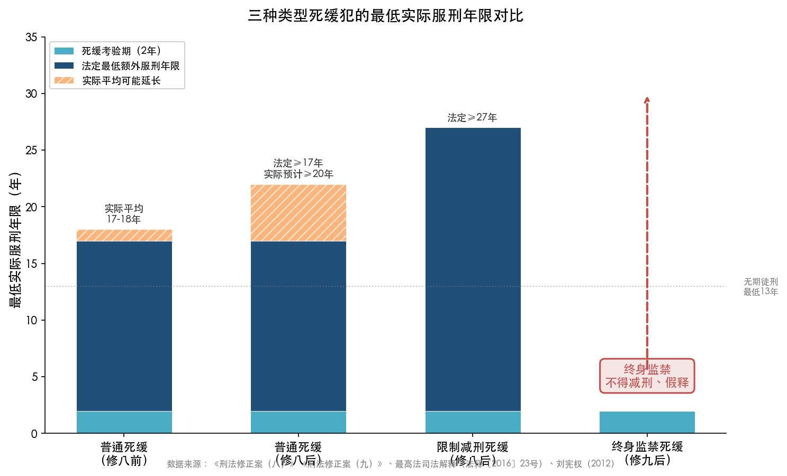

上图直观展示了修正案八前后刑罚梯度的显著变化。这一阶梯结构的形成，标志着中国刑罚体系在死刑立即执行与一般有期徒刑之间建立起更为精细的严厉程度分层。限制减刑死缓的引入弥合了普通死缓（实际服刑约17—20年）与死刑立即执行之间过于悬殊的刑罚落差；终身监禁则为最严重的经济犯罪提供了一种事实上永久剥夺自由的替代方案。

## 3.3 减刑规模与检察监督：从乱象到规范化

### 3.3.1 减刑、假释、暂予监外执行的整体规模

在中国刑罚执行体系中，减刑、假释和暂予监外执行（以下简称"减假暂"）构成了与判决同等重要的刑罚变更通道。最高人民检察院2025年10月向全国人大常委会所作的刑罚执行监督专项报告显示，2014年以来年均办理"减假暂"案件60万余起；2024年全年减刑28.4万人、假释1.4万人、暂予监外执行1.2万人，合计约31万人[最高检刑罚执行监督专项报告](http://www.npc.gov.cn/npc/c2/c30834/202510/t20251027_448927.html "2025年10月向全国人大常委会报告")。

以2024年数据为基准，减刑人数占"减假暂"总量的91.6%，假释仅占4.5%，暂予监外执行占3.9%。减刑在数量上占据绝对主导地位，假释适用率长期偏低是中国刑罚执行领域的一个显著结构性特征。最高人民检察院同时指出，2024年减刑28.4万人、假释1.4万人和暂予监外执行1.2万人的规模，较2021年分别上升5.1%、1.2倍和2.7倍[最高检刑罚执行监督专项报告](http://www.npc.gov.cn/npc/c2/c30834/202510/t20251027_448927.html "2025年10月")。

### 3.3.2 "减假暂"乱象整治：从全面排查到制度规范

长期以来，减刑、假释和暂予监外执行领域存在严重的司法腐败问题。部分罪犯通过行贿或利用关系网络获得不当减刑，形成"以钱赎刑""提前出狱"的乱象，严重损害刑罚执行的公正性与公信力。这一问题于2014年引起中央层面的高度关注。

2014年，中央政法委出台《关于严格规范减刑、假释、暂予监外执行切实防止司法腐败的意见》，确立"三个一律"公开机制：减刑、假释、暂予监外执行一律提前公示，裁定书一律上网公开，重大案件一律开庭审理；同时建立终身负责制——谁签字、谁负责，终身追究[最高检转载检察日报](https://www.spp.gov.cn/spp/tt/201402/t20140225_67877.shtml "2014年2月25日")。这一制度框架旨在通过透明化与责任追究遏制减刑领域的权力寻租。

2021年政法队伍教育整顿期间，检察机关对"减假暂"领域进行了规模空前的全面排查。最高人民检察院2022年工作报告披露，检察机关全面排查1990年以来的1,100万件"减假暂"案件，从中纠正3万件不当案件[最高检2022年工作报告](https://www.spp.gov.cn/spp/ttzgjgzbg/202203/t20220308_548056.shtml "2022年3月")。另据中国长安网报道，2021年全面排查1,524万件"减假暂"案件，纠正违规违法案件超过1万件[中国长安网](http://www.chinapeace.gov.cn/chinapeace/c100007/2021-10/28/content_12553282.shtml "2021年10月28日")。

### 3.3.3 纠正规模的时间序列：规范化趋势的量化证据

检察机关对"减假暂"不当案件的年度纠正数据呈现出显著的递减趋势，为评估制度规范化效果提供了直接的量化依据：

- 2023年：纠正2.6万人次[最高检2024年工作报告](https://www.spp.gov.cn/spp/2024zgjgzbg/202403/t20240308_647965.shtml "2024年3月")
- 2024年：纠正1.8万人次[最高检2025年工作报告](https://www.spp.gov.cn/spp/2025zgjgzbg/202503/t20250308_688244.shtml "2025年3月")
- 2025年：纠正6,369人次[最高检2026年工作报告](https://www.spp.gov.cn/spp/2026zgjgzbg/202603/t20260309_722665.shtml "2026年3月")

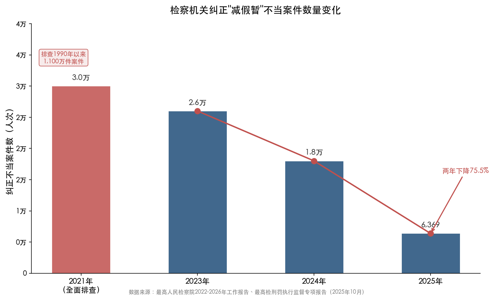

从2023年的2.6万人次到2025年的6,369人次，纠正数量在两年内下降75.5%。这一趋势可从两个维度解读：从积极面看，它反映了2014年以来一系列规范化措施——"三个一律"公开机制、终身负责制、全面排查——已产生显著的累积效果，不当减刑、假释和暂予监外执行的增量得到有效遏制；从审慎面看，纠正数量的下降也可能部分反映排查力度的自然衰减或纠正标准的调整。

我们认为，将这一递减趋势置于更宏观的制度背景下评估，可以得出较为明确的判断：2014年中央政法委文件、2016年最高法司法解释、2021年全面排查运动三者叠加，共同构成了对"减假暂"领域的系统性治理框架。纠正数量的持续下降，在相当程度上表明这一领域正从"运动式整治"向"制度化规范"过渡。

## 3.4 终身监禁制度的适用实态：从4例到约20例的扩展

### 3.4.1 制度初期的审慎适用（2016—2017年）

2015年《刑法修正案（九）》引入终身监禁制度后，首批适用案例出现在2016—2017年间，共计4例：

- **白恩培**（原全国人大环境与资源保护委员会副主任委员），受贿2.46亿余元，2016年10月被判处死缓并终身监禁[最高检转载检察日报](https://www.spp.gov.cn/zdgz/201610/t20161010_168954.shtml "2016年10月")。
- **魏鹏远**（原国家能源局煤炭司副司长），受贿2.11亿余元，2016年被判处死缓并终身监禁。
- **于铁义**（原黑龙江龙煤集团物资供应分公司副总经理），受贿3.06亿余元，2016年被判处死缓并终身监禁。
- **武长顺**（原天津市公安局局长、政协副主席），涉案超5亿元，2017年5月被判处死缓并终身监禁。

上述四起案例具有两个共同特征：一是涉案金额均超过2亿元；二是法院判决均采用"判处死刑立即执行过重，判处一般死缓又偏轻"的裁量逻辑[赵秉志教授学术讲座](https://law.uibe.edu.cn/xwzx/xyxw/84757.htm "沈冯法学名家讲坛")。最高人民法院、最高人民检察院2016年《关于办理贪污贿赂刑事案件适用法律若干问题的解释》对适用条件予以明确：终身监禁适用于"贪污、受贿数额特别巨大，犯罪情节特别严重、社会影响特别恶劣、给国家和人民利益造成特别重大损失"的情形[人民日报海外版](http://paper.people.com.cn/rmrbhwb/html/2016-04/19/content_1671666.htm "2016年4月19日")。

### 3.4.2 适用范围的持续扩展（2019—2025年）

在最初4例之后，终身监禁制度的适用频率并未止步不前，而是呈现出稳定扩展的态势。2019年12月，内蒙古自治区人大常委会原副主任邢云因受贿4.49亿余元被辽宁省大连市中级人民法院判处死缓并终身监禁[每日经济新闻](https://www.nbd.com.cn/articles/2019-12-04/1390931.html "2019年12月")。

2020年7月，陕西省委原书记赵正永因受贿超7亿元被天津市第一中级人民法院判处死缓并终身监禁[新浪新闻](https://news.sina.cn/zt_d/zhao0116 "2020年7月31日")。2021年10月，山西省吕梁市原副市长张中生因受贿10.4亿余元被山西省高级人民法院二审判处死缓并终身监禁[解放日报](https://www.jfdaily.com/wx/detail.do?id=679427 "2023年11月")。2023年11月，中信银行原行长孙德顺因受贿9.795亿余元被济南市中级人民法院判处死缓并终身监禁[解放日报](https://www.jfdaily.com/wx/detail.do?id=679427 "2023年11月")。

截至2025年底，据公开报道统计，被判处死缓并终身监禁的案例已达约20例[都市头条](https://www.zdushi.com/news/show_3841049.html "20只终身监禁的老虎名单")。2025年11月，最高人民法院和最高人民检察院联合发布六起金融领域典型职务犯罪案例，其中两起案件（涉案人分别姓刘和吴）被判处死缓并终身监禁。刘姓被告受贿超1.8亿元，吴姓被告受贿超2.75亿元并贪污超5.08亿元公款。最高人民法院在通报中指出，终身监禁判决"体现了司法机关从严惩处金融领域职务犯罪的坚定立场"[中国日报](https://www.chinadaily.com.cn/a/202511/28/WS69293fc1a310d6866eb2beb2.html "2025年11月28日") [最高检英文版](https://en.spp.gov.cn/2025-11/28/c_1144470.htm "2025年11月28日")。

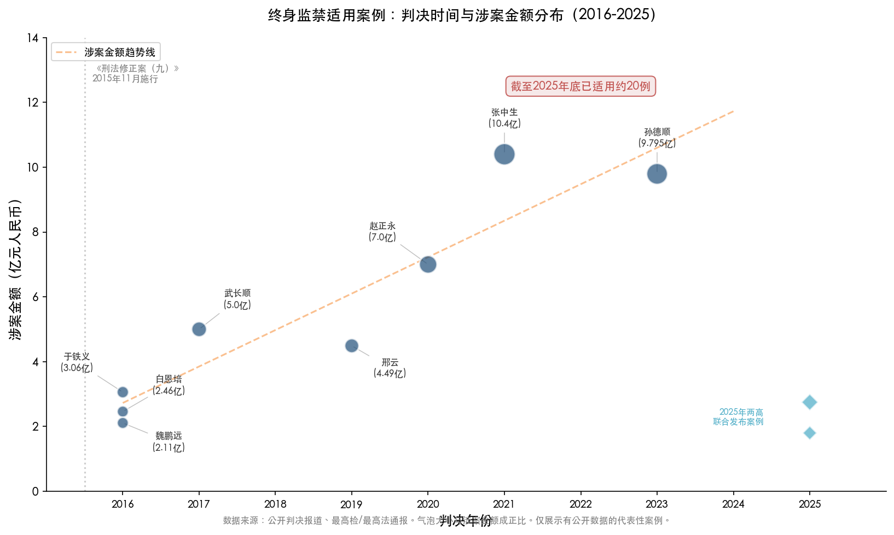

上图展示了2016年至2025年间8例有公开数据的代表性终身监禁案件的判决时间与涉案金额分布。涉案金额趋势线清晰表明，制度适用从初期的2—3亿元门槛逐步向7—10亿元的高金额案件扩展，反映出终身监禁正被定位为惩治最严重贪腐犯罪的专属刑罚手段。

### 3.4.3 终身监禁的制度功能评估

从已适用的约20例案件来看，终身监禁制度呈现出以下特征：

**第一，适用范围严格限于贪污贿赂犯罪。** 所有已知案例均为受贿罪或贪污罪，无一例被适用于暴力犯罪、毒品犯罪或其他类型犯罪。这与《刑法》第383条的立法设计一致——终身监禁仅作为贪污贿赂犯罪死缓的特殊附加条件存在。

**第二，适用门槛极高且持续提升。** 早期案例的涉案金额门槛约为2亿元，近年判处终身监禁的案件涉案金额则普遍超过4亿元，部分案件如张中生（10.4亿元）、孙德顺（9.795亿元）已达近10亿元量级。这一趋势表明，终身监禁在实践中被严格限定为"最严重贪腐案件"的专属刑罚手段。

**第三，发挥了有限但明确的死刑替代功能。** 所有终身监禁案件的判决均采用"判处死刑立即执行过重，判处一般死缓又偏轻"的裁量逻辑，表明终身监禁在制度功能上处于死刑立即执行与普通死缓之间的"中间地带"——对于罪行极为严重但尚未达到必须立即执行死刑程度的贪腐犯罪分子，终身监禁提供了一种既不剥夺生命、又永久剥夺自由的解决方案。

然而，终身监禁尚未成为替代死刑的"常规路径"。约20例的总量相对于十年的制度运行期而言，适用频率仍然偏低；且其适用范围严格限于贪污贿赂犯罪，无法覆盖故意杀人、毒品犯罪等死刑适用频率更高的罪名类别。若中国未来希望将终身监禁发展为更广泛的死刑替代手段，则需进行根本性的刑罚体系重构——将其适用范围从经济犯罪扩展至暴力犯罪领域。

值得关注的是，自2011年以来，最高人民法院已未核准过一例贪污受贿犯罪的死刑立即执行[刘仁文、陈妍茹论文](http://iolaw.cssn.cn/zzwx/201905/P020190522362849508742.pdf "《法学杂志》2017年第2期")。终身监禁制度的引入及其适用范围的持续扩展，与贪污贿赂犯罪死刑立即执行的事实停止，形成了一对互补的制度演变——后者的退出为前者提供了适用空间。

## 3.5 死缓制度的系统性功能：刑罚阶梯的枢纽

综合以上分析，死缓制度在中国刑罚体系中承担着远超其法律文本所表述的系统性功能。

从刑罚梯度角度看，死缓及其附加的限制减刑与终身监禁条件构成了死刑立即执行与无期徒刑之间的关键缓冲层。修正案八之前，普通死缓的实际服刑年限（17—18年）与无期徒刑（15—16年）之间的差距仅约2年，刑罚梯度严重扁平化。修正案八及后续司法解释通过引入限制减刑制度、提高法定最低服刑年限，修正案九引入终身监禁制度，将这一层级从单一的"普通死缓"细化为"普通死缓（约17—20年）—限制减刑死缓（约27年以上）—终身监禁死缓（终身）"三个子层级，显著增强了刑罚体系在"不执行死刑"与"不释放"之间的精细化配置能力。

从死刑控制角度看，死缓转化率的高度确定性使其事实上发挥着"死刑出口"的功能——大量本可被判处死刑立即执行的案件，通过死缓机制被导向长期监禁而非执行死刑。学术研究指出，"中国2007年死刑改革增加了对死缓判决的依赖，至2011年将即时执行人数减少了一半"[学术文献](https://www.academia.edu/17252555/Two_Years_between_Life_and_Death_A_Critical_Analysis_of_the_Suspended_Death_Penalty_in_China "ResearchGate/Academia摘要")。死缓在中国死刑数量持续下降的进程中扮演着不可替代的"分流器"角色。

从国际比较角度看，死缓制度在全球刑罚体系中几乎独一无二。剑桥大学的研究指出，尽管越南、老挝等少数国家也采用了类似的暂缓执行制度，但这些制度在规模、精细程度和系统性功能上均无法与中国的死缓制度相提并论[Cambridge学术论文](https://www.cambridge.org/core/journals/asian-journal-of-law-and-society/article/suspended-execution-beyond-chinas-borders/101E2A549C987D5FD02FDBE206D1709D "Asian Journal of Law and Society")。死缓制度是否可能成为"中国特色"的死刑废除过渡路径，将在本报告第6章进行深入讨论。

# 第4章 死刑罪名的立法演变——从68个到46个的削减轨迹

## 4.1 起点：1979年《刑法》的28个死刑罪名

1979年7月1日，第五届全国人民代表大会第二次会议通过新中国第一部系统性《刑法》，分则中设定28个死刑罪名。全国人大常委会法工委主任李适时在此后的《刑法修正案》说明中确认了这一基数。[中国人大网](http://www.npc.gov.cn/zgrdw//npc//cwhhy/12jcwh/2014-10/28/content_1883214.htm "2014年10月28日")

就罪名分布而言，1979年《刑法》的死刑配置呈现鲜明的政治性特征。中国社会科学院法学研究所樊文在专题研究中指出，28个死刑罪名中有14种基本涉及危害国家安全性质（当时列入"反革命罪"章），其余14种为普通刑事犯罪罪名，"绝大多数是严重危害公共安全、严重侵犯公民人身权利的重大暴力犯罪，属于非暴力犯罪的死刑罪名只有贪污罪1种"。[中国社科院樊文](http://www.cass.cn/xueshuchengguo/shehuizhengfaxuebu/201311/t20131126_881357.shtml "中国死刑制度的改革") 北京大学陈兴良教授的统计口径略有差异，按章节划分为反革命罪15个、危害公共安全罪8个、侵犯公民人身权利与民主权利罪3个、侵犯财产罪2个。[焦旭鹏论文](http://iolaw.cssn.cn/zxzp/202003/t20200326_5106203.shtml "《江西社会科学》2019年第12期") 两种口径的差异主要源于反革命罪章中部分罪名兼具危害公共安全性质，但核心结论一致：1979年《刑法》的死刑设置以政治犯罪为主体，普通犯罪的死刑罪名范围相当有限。

需要指出的是，反革命罪章的15个死刑罪名在和平时期基本属于"备而不用"的性质，普通刑事犯罪中实际较多适用死刑的罪名主要集中于故意杀人、放火、强奸、抢劫等严重暴力犯罪。这种"立法面宽、适用面窄"的格局，为此后死刑罪名的急剧扩张埋下了制度伏笔：既然反革命罪的死刑已被接受为合理配置，那么在社会治安恶化时将死刑扩展到其他犯罪领域，在政治逻辑上便不会遭遇太大阻力。

## 4.2 扩张期：从28个到68个的激增（1979—1997年）

1979年至1997年的十八年间，中国死刑罪名经历了一次急剧膨胀。通过25部单行刑法和补充规定，死刑罪名从28个扩张至约71—75个（不同学者的统计口径存在差异）。[焦旭鹏论文](http://iolaw.cssn.cn/zxzp/202003/t20200326_5106203.shtml "引用陈兴良数据") 图4-1完整呈现了从1979年至2026年的死刑罪名数量变迁轨迹。

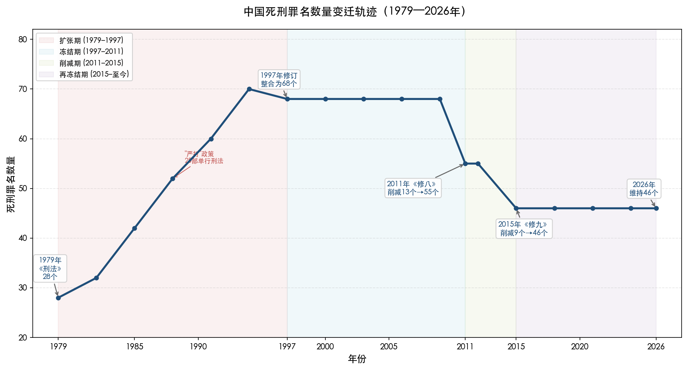

这一扩张由三股力量共同驱动。

**第一，"严打"政策的制度化需求。** 1983年，中共中央发出《关于严厉打击刑事犯罪活动的决定》，全国人大常委会随即通过《关于严惩严重危害社会治安的犯罪分子的决定》和《关于迅速审判严重危害社会治安的犯罪分子的程序的决定》。"严打"运动要求"从重从快"惩处犯罪，直接推动了死刑罪名的增设。1982年全国人大常委会通过的《关于严惩严重破坏经济的罪犯的决定》首次将死刑扩展到毒品犯罪领域——对"情节特别严重"的制造、贩卖、运输毒品罪规定了死刑。[中国社科院樊文](http://www.cass.cn/xueshuchengguo/shehuizhengfaxuebu/201311/t20131126_881357.shtml "毒品犯罪死刑起源")

**第二，经济犯罪的立法应对。** 伴随改革开放和市场经济体制的建立，走私、金融诈骗、增值税发票犯罪等新型经济犯罪大量涌现。立法者选择以死刑威慑作为应对策略，大量非暴力经济犯罪被纳入死刑适用范围。到1997年刑法修订前，非暴力犯罪在全部死刑罪名中的占比已升至近三分之二。[中国社科院樊文](http://www.cass.cn/xueshuchengguo/shehuizhengfaxuebu/201311/t20131126_881357.shtml "非暴力犯罪占比")

**第三，严峻的社会治安形势构成了扩张的现实背景。** 中国社会科学院的研究数据显示，与1982年相比，1984—1991年间故意杀人案件年均递增30%，强奸案件年递增近20%，伤害案件年递增35%，抢劫案件年递增80%，严重盗窃案件年递增近3倍。[中国社科院樊文](http://www.cass.cn/xueshuchengguo/shehuizhengfaxuebu/201311/t20131126_881357.shtml "1982-2010年犯罪趋势数据") 犯罪的急剧增长直接加大了以死刑遏制犯罪的政治和社会压力，成为扩大死刑罪名的重要推力。

1997年，第八届全国人民代表大会第五次会议对《刑法》进行全面修订，将分散于各单行刑法中的死刑罪名整合纳入统一法典，最终确定68个死刑罪名（较修订前净减7个）。时任全国人大常委会副委员长王汉斌在《关于〈中华人民共和国刑法（修订草案）〉的说明》中明确表态："这次修订，对现行法律规定的死刑，原则上不减少也不增加"，释放出冻结死刑罪名数量的信号。[中国社科院樊文](http://www.cass.cn/xueshuchengguo/shehuizhengfaxuebu/201311/t20131126_881357.shtml "王汉斌修法说明")

1997年《刑法》68个死刑罪名的章节分布为：危害国家安全罪7个（约占10%）、危害公共安全罪14个（约占20%）、破坏社会主义市场经济秩序罪16个（约占24%）、侵犯公民人身权利与民主权利罪6个、侵犯财产罪2个、妨害社会管理秩序罪8个、贪污贿赂罪2个、危害国防利益罪1个、军人违反职责罪12个。[中国法学网](http://iolaw.cssn.cn/zxzp/200907/t20090703_4602913.shtml "新刑法68种死刑罪名分布") 这一结构表明，经济犯罪（破坏市场经济秩序罪16个）已超过暴力犯罪成为死刑罪名最为密集的领域之一。

此后14年间（1997—2011年），尽管全国人大常委会先后通过了1个决定和7个刑法修正案，但"没有增加一个死刑罪名，也没有减少一个死刑罪名"。[中国社科院樊文](http://www.cass.cn/xueshuchengguo/shehuizhengfaxuebu/201311/t20131126_881357.shtml "冻结政策") 这一"冻结政策"折射出微妙的过渡状态：立法者已然意识到死刑罪名过多的问题，但尚未找到适当的政治时机启动削减。

## 4.3 第一次削减：《刑法修正案（八）》废除13个死刑罪名

2011年2月25日，第十一届全国人大常委会第十九次会议表决通过《中华人民共和国刑法修正案（八）》，一次性废除13个死刑罪名，将死刑罪名从68个降至55个，削减幅度达19.1%。这是自1979年《刑法》颁布32年以来，中国立法机关首次减少死刑罪名数量。[《刑法修正案（八）》全文](https://www.gffunds.com.cn/data/File/20111208152925_0_xfxzajd.pdf "2011年2月25日通过")

被废除的13个罪名均为经济性非暴力犯罪，具体包括：走私文物罪、走私贵重金属罪、走私珍贵动物及珍贵动物制品罪、走私普通货物物品罪、票据诈骗罪、金融凭证诈骗罪、信用证诈骗罪、虚开增值税专用发票及用于骗取出口退税抵扣税款发票罪、伪造出售伪造的增值税专用发票罪、盗窃罪、传授犯罪方法罪、盗掘古文化遗址古墓葬罪、盗掘古人类化石古脊椎动物化石罪。[中国社科院樊文](http://www.cass.cn/xueshuchengguo/shehuizhengfaxuebu/201311/t20131126_881357.shtml "取消死刑的13种罪名")

全国人大常委会法工委主任李适时在修法说明中阐释了选择这13个罪名的逻辑："根据中国现阶段经济社会发展实际，适当取消一些经济性非暴力犯罪的死刑，不会给社会稳定大局和治安形势带来负面影响"。[四川省人大常委会转载](https://www.scspc.gov.cn/html/lfgz_15/2010/0913/56074.html "2010年8月23日") 被削减罪名的共同特征是"近年来较少适用或基本未适用过"——这一表述意味着，立法者优先选择的是那些在司法实践中已沦为"僵尸条款"的罪名，而非实务中仍频繁适用死刑的罪名。

从学理层面审视，《修八》的削减逻辑隐含了一项重要的法律判断：经济性非暴力犯罪不属于"罪行极其严重"的犯罪范畴，因此不应配置死刑。樊文指出，这一修法理由"为以后进一步废除其他具备这种属性的犯罪的死刑，在较为具体明确的标准上做出了坚实铺垫"。[中国社科院樊文](http://www.cass.cn/xueshuchengguo/shehuizhengfaxuebu/201311/t20131126_881357.shtml "修法意义分析") 换言之，《修八》不仅是13个罪名的技术性调整，更确立了"非暴力犯罪不应适用死刑"这一具有方向性意义的改革原则。

## 4.4 第二次削减：《刑法修正案（九）》再废除9个死刑罪名

2015年8月29日，第十二届全国人大常委会第十六次会议通过《中华人民共和国刑法修正案（九）》，进一步废除9个死刑罪名，死刑罪名从55个降至46个。两次修正累计削减22个罪名，削减幅度达32%。[刘仁文、陈妍茹论文](http://iolaw.cssn.cn/zzwx/201905/P020190522362849508742.pdf "《法学杂志》2017年第2期")

《修九》废除的9个罪名为：走私武器弹药罪、走私核材料罪、走私假币罪、伪造货币罪、集资诈骗罪、组织卖淫罪、强迫卖淫罪、阻碍执行军事职务罪、战时造谣惑众罪。[刑法修正案（九）草案](https://kfxffy.hncourt.gov.cn/public/detail.php?id=425 "开封市祥符区人民法院网")

与《修八》相比，《修九》的削减呈现三个显著的新特征（图4-2对两次削减进行了系统比较）。

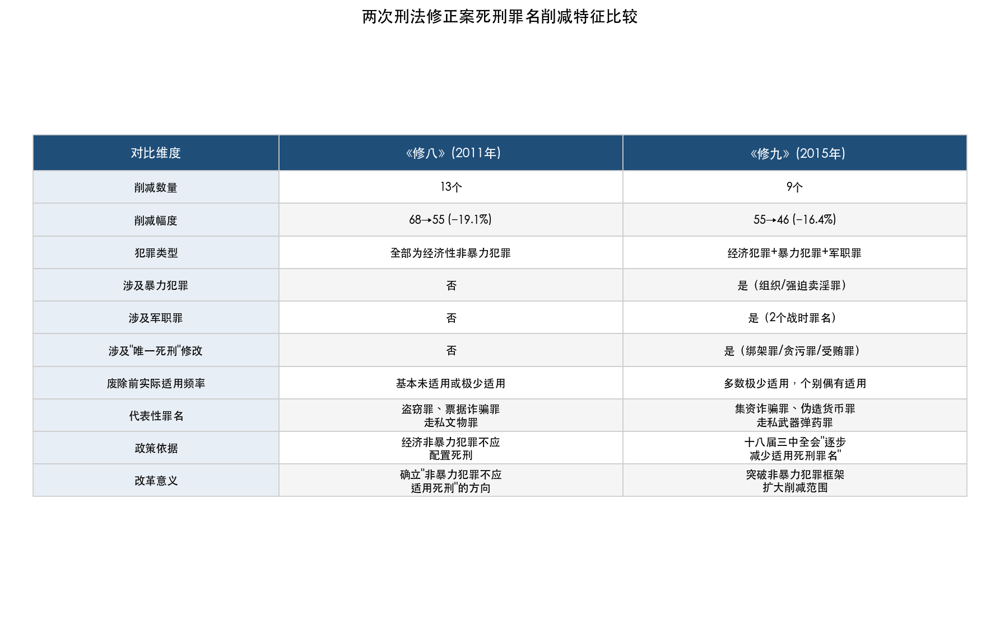

**第一，突破了"仅限经济性非暴力犯罪"的框架。** 组织卖淫罪和强迫卖淫罪具有一定的暴力属性，阻碍执行军事职务罪和战时造谣惑众罪则属于军职罪范畴。这表明立法者的削减视野已从经济犯罪扩展到更广泛的犯罪类型。**第二，涉及了"唯一死刑"（绝对死刑）的修改。** 1997年《刑法》原有7种绝对确定死刑，即在特定情节下法定刑唯一为死刑。《修九》将绑架罪、贪污罪、受贿罪的绝对死刑修改为相对确定死刑（增加无期徒刑等可选刑种），使法官获得了不判处死刑的裁量空间。修改后仍保留绝对死刑的罪名缩减为4种：劫持航空器罪（致人重伤、死亡或使航空器遭受严重破坏的）、拐卖妇女儿童罪（情节特别严重的）、暴动越狱罪（情节特别严重的）、聚众持械劫狱罪（情节特别严重的）。[刘仁文、陈妍茹论文](http://iolaw.cssn.cn/zzwx/201905/P020190522362849508742.pdf "《法学杂志》2017年第2期") [新浪新闻](https://news.sina.cn/2015-11-11/detail-ifxkrwks3736299.d.html?vt=4 "从刑法修正案(九)看死刑立法技术") **第三，首次触及军职罪领域。** 阻碍执行军事职务罪和战时造谣惑众罪的废除，打破了此前军事犯罪死刑罪名不可触碰的禁忌。

中共十八届三中全会（2013年11月）通过的《中共中央关于全面深化改革若干重大问题的决定》首次在中央层面正式文件中写入"逐步减少适用死刑罪名"，为《修九》的出台提供了直接的政策依据。[刘仁文、陈妍茹论文](http://iolaw.cssn.cn/zzwx/201905/P020190522362849508742.pdf "《法学杂志》2017年第2期") 李适时在向全国人大常委会作说明时指出，《修八》削减13个死刑罪名后"社会治安形势总体稳定可控，一些严重犯罪稳中有降"，"没有对社会治安形势形成负面影响"，为进一步削减提供了实证支撑。[中国人大网](http://www.npc.gov.cn/zgrdw//npc//cwhhy/12jcwh/2014-10/28/content_1883214.htm "2014年10月28日")

## 4.5 当前46个死刑罪名的结构分布

截至2026年4月，中国《刑法》保留46个死刑罪名，分布于刑法分则九个章节之中。图4-3以环形图直观呈现了各章节死刑罪名的占比结构。

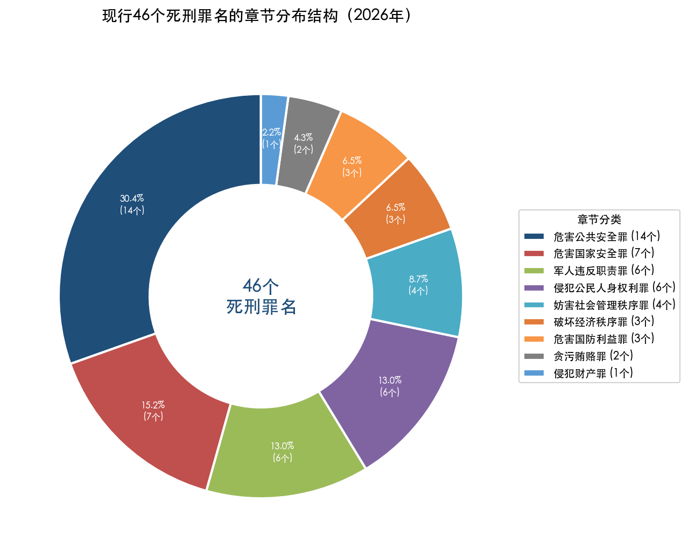

各章死刑罪名的具体分布如下表所示：

| 章节 | 死刑罪名数 | 占比 |
|------|-----------|------|
| 危害公共安全罪 | 14 | 30.4% |
| 危害国家安全罪 | 7 | 15.2% |
| 军人违反职责罪 | 6 | 13.0% |
| 侵犯公民人身权利罪 | 6 | 13.0% |
| 妨害社会管理秩序罪 | 4 | 8.7% |
| 危害国防利益罪 | 3 | 6.5% |
| 破坏社会主义市场经济秩序罪 | 3 | 6.5% |
| 贪污贿赂罪 | 2 | 4.3% |
| 侵犯财产罪 | 1 | 2.2% |

[Capital offences in China, Wikipedia](https://en.wikipedia.org/wiki/Capital_offences_in_China "2026年2月更新")

这一结构揭示了若干值得关注的特征。**危害公共安全罪以14个罪名独占近三分之一**，包括放火罪、决水罪、爆炸罪、投放危险物质罪、以危险方法危害公共安全罪、破坏交通工具罪、破坏交通设施罪、破坏电力设备罪、破坏易燃易爆设备罪、劫持航空器罪、非法制造买卖运输邮寄储存枪支弹药爆炸物罪、盗窃抢夺枪支弹药爆炸物罪、抢劫枪支弹药爆炸物罪、非法持有私藏枪支弹药罪等。尽管数量居首，但多数罪名在司法实践中极少适用死刑。

**经济犯罪死刑罪名已大幅缩减。** 经过两轮削减，破坏市场经济秩序罪中的死刑罪名从1997年的16个锐减至3个，削减幅度超过80%。这一变化最为直接地体现了"非暴力经济犯罪不应适用死刑"的改革理念在立法层面的落实。

**贪污贿赂罪的死刑处于"名存实亡"状态。** 贪污罪和受贿罪虽仍保留死刑，但最高人民法院自2011年以来已未核准过一例贪污受贿犯罪的死刑立即执行。2015年《修九》引入的终身监禁制度进一步使该类犯罪的死刑"虚化"——对数额特别巨大、情节特别严重的贪污受贿犯罪分子判处死缓后附加终身监禁，实现了事实上的"不执行死刑但终身剥夺自由"。中国社会科学院刘仁文教授据此认为，"从立法上取消贪污受贿罪的死刑也是完全可能的"。[刘仁文、陈妍茹论文](http://iolaw.cssn.cn/zzwx/201905/P020190522362849508742.pdf "《法学杂志》2017年第2期")

## 4.6 "僵尸罪名"与"高频适用"：46个罪名的实际适用分化

46个死刑罪名在司法实践中的适用频率高度分化，呈现出"少数罪名承担绝大多数死刑判决"的集中格局。

**第一梯队：死刑适用的核心罪名。** 实际较多适用死刑的罪名主要集中于故意杀人罪、抢劫罪、强奸罪、走私制造贩卖运输毒品罪、放火罪等少数罪名。其中，故意杀人罪是唯一将死刑作为法定刑首选（而非末位刑种）的罪名，也是死刑适用最为集中的领域。毒品犯罪的死刑适用比例则呈上升趋势——2011年1—5月，全国法院审结毒品犯罪案件的重刑率达26.86%，高出同期全部刑事案件重刑率12.06个百分点。[中国社科院樊文](http://www.cass.cn/xueshuchengguo/shehuizhengfaxuebu/201311/t20131126_881357.shtml "引用国务院新闻办数据") 对话基金会2023年公开追踪到的153起执行中，故意杀人94起、抢劫13起、毒品犯罪29起，三类罪名合计占已知执行案例的89%。[对话基金会](https://duihua.org/curious-timing-spc-death-penalty-reviews-posted-after-universal-periodic-review-part-i/ "2024年7月")

**第二梯队：偶有适用的罪名。** 绑架罪、拐卖妇女儿童罪、爆炸罪、投放危险物质罪等严重暴力犯罪，在极端恶劣案件中仍有个案适用死刑，但频率远低于第一梯队。

**第三梯队："僵尸罪名"。** 大量死刑罪名在司法实践中长期处于"备而不用"状态。危害国家安全罪全部7个罪名（背叛国家罪、分裂国家罪、武装叛乱暴乱罪、颠覆国家政权罪、间谍罪、为境外窃取刺探收买非法提供国家秘密情报罪、资助危害国家安全犯罪活动罪）以及军人违反职责罪中的多个战时罪名（战时违抗命令罪、隐瞒谎报军情罪、拒传假传军令罪、投降罪等），在和平时期几乎不存在适用的现实可能。此外，破坏电力设备罪、破坏易燃易爆设备罪、非法持有私藏枪支弹药罪等危害公共安全罪名，虽在法律上保留死刑，但在实践中极少以死刑量刑。这些"僵尸罪名"的存在，使中国在统计意义上维持了较高的死刑罪名数量，但对实际死刑适用几乎没有影响。

樊文指出，"实务中真正较多适用的罪名主要集中在故意杀人犯罪、强奸、抢劫等特别严重的几个罪名上"，因此废除13个经济性非暴力犯罪死刑罪名"实务中死刑的适用数量并不会因此而得到实际减少"。[中国社科院樊文](http://www.cass.cn/xueshuchengguo/shehuizhengfaxuebu/201311/t20131126_881357.shtml "死刑适用集中度分析") 这一判断揭示了中国死刑罪名削减的一个内在悖论：已经完成的削减主要属于"象征性削减"——废除的是基本不使用的罪名；而真正减少死刑执行数量的改革，取决于对故意杀人和毒品犯罪等高频适用罪名的司法控制力度。

## 4.7 十年停滞：2015年至今的立法沉寂

自2015年《刑法修正案（九）》施行以来，中国死刑罪名数量维持在46个不变已逾十年。此后通过的三部刑法修正案均未涉及死刑罪名的增减：2017年通过的《刑法修正案（十）》仅涉及国歌保护，2020年通过的《刑法修正案（十一）》涉及刑事责任年龄下调和高空抛物入刑等内容，2023年通过的《刑法修正案（十二）》聚焦民营企业保护和行贿犯罪。[NPC Observer](https://npcobserver.com/legislation/criminal-law-amendment-xii/ "Criminal Law Amendment XII, 2023")

这一立法沉寂并非因为削减空间已经穷尽。以赵秉志教授2005年提出的三阶段路线图为参照，其第一阶段目标——到2020年废止非暴力犯罪死刑——已明显未能实现。截至2026年4月，贪污罪、受贿罪（非暴力经济犯罪）以及走私制造贩卖运输毒品罪（按国际法标准不属于"最严重犯罪"）仍保留死刑。[刘仁文、陈妍茹论文](http://iolaw.cssn.cn/zzwx/201905/P020190522362849508742.pdf "《法学杂志》2017年第2期")

十年停滞的成因是多层面的。从政治环境看，2013年十八届三中全会"逐步减少适用死刑罪名"的表述，是中央层面最后一次直接涉及死刑改革的政策信号，此后再无新的明确表态。从立法议程看，近年来刑法修正的重心在于回应社会热点问题（如高空抛物、冒名顶替入学、催收非法债务等），死刑改革未被纳入优先序列。从国际互动看，中国在2024年第四轮联合国人权理事会普遍定期审议（UPR）中再次拒绝所有与死刑相关的建议，世界反死刑联盟注意到"死刑"一词在中国2024年UPR国家报告中"完全没有出现"。[世界反死刑联盟](https://worldcoalition.org/what-chinas-report-to-the-united-nations-tells-us-about-transparency-and-the-death-penalty/ "China's UPR 2024分析")

## 4.8 下一步削减的可能方向：学术界的改革路线图

尽管立法进程陷入停滞，学术界对进一步削减死刑罪名的讨论从未中断，并形成了若干具有影响力的改革路线图。

**赵秉志三阶段论。** 中国人民大学赵秉志教授提出的经典方案将死刑废除分为三个阶段：第一阶段到2020年废止非暴力犯罪死刑；第二阶段约2030—2040年废止非致命性暴力犯罪死刑（如强奸罪、抢劫罪中未致人死亡的情形）；第三阶段最晚2050年前全面废止死刑。[赵秉志讲座](http://www.law.ruc.edu.cn/article/?id=44220 "中国人民大学法学院") 尽管第一阶段目标已延期，该路线图的基本逻辑——按照犯罪暴力程度由低到高逐步削减——仍是学术界的主流共识。

**刘仁文非线性路径。** 中国社会科学院刘仁文教授认为，削减进程不必严格遵循线性顺序，两个阶段可以交叉推进。例如，在废除非暴力犯罪死刑的同时，也可以对非致命性暴力犯罪的死刑进行限缩。他特别强调，贪污受贿犯罪死刑的废除条件已经成熟，"从立法上取消贪污受贿罪的死刑也是完全可能的"。[刘仁文、陈妍茹论文](http://iolaw.cssn.cn/zzwx/201905/P020190522362849508742.pdf "《法学杂志》2017年第2期")

**樊文法益分层分析。** 中国社会科学院樊文从法益理论出发，主张依据法益的层次和排序来判定哪些罪名符合"罪行极其严重"标准。在其分析框架中，生命法益高于财产法益和制度法益，因此只有导致死亡的严重故意暴力犯罪才应保留死刑，其他犯罪的死刑均应予以废除。[中国社科院樊文](http://www.cass.cn/xueshuchengguo/shehuizhengfaxuebu/201311/t20131126_881357.shtml "法益分层分析")

**陈兴良分步废除论。** 北京大学陈兴良教授主张"先备而不用、后按暴力程度逐步废除"的渐进策略，即先使更多罪名在司法实践中事实上停止适用死刑，待充分"僵尸化"后再通过立法正式废除。

综合上述学术观点，下一步削减最可能聚焦的优先目标包括三类：第一，贪污罪和受贿罪——已事实上停止死刑立即执行逾十年，终身监禁制度提供了替代方案；第二，走私制造贩卖运输毒品罪——国际社会普遍认为不属于"最严重犯罪"，但因与鸦片战争的历史记忆和"禁毒人民战争"的政策定位紧密相关，面临极大的政治和社会阻力；第三，危害国家安全罪和军人违反职责罪中的"僵尸罪名"——长期未实际适用，废除阻力最小，但象征意义有限。

## 4.9 从罪名数量到适用控制：两条并行的改革轨迹

回顾从68个到46个的削减历程，中国死刑罪名的立法演变呈现一条清晰的四段式轨迹：**扩张（1979—1997年）→冻结（1997—2011年）→削减（2011—2015年）→再冻结（2015年至今）**。两次削减的对象以"备而少用"的非暴力犯罪为主，遵循"先易后难、先经济犯罪后暴力犯罪"的渐进逻辑。

然而，罪名数量的削减仅是死刑改革的一个维度。与之并行的另一条改革轨迹更具实质意义：通过司法控制减少死刑的实际适用。2007年最高人民法院收回死刑核准权后，判处死缓的人数首次超过死刑立即执行人数，2007—2011年判处死刑立即执行的人数较2006年平均下降55%。[中国社科院樊文](http://www.cass.cn/xueshuchengguo/shehuizhengfaxuebu/201311/t20131126_881357.shtml "2007年法制日报报道") 这种"司法先行"的路径——通过提高复核标准、扩大死缓适用比例、使更多罪名在实践中"僵尸化"——可能比立法削减罪名发挥了更大的实际作用。

两条轨迹的交汇点在于：立法削减为司法控制提供了正当性背书，而司法控制的成功经验又为进一步立法削减积累了实证基础。李适时在《修九》说明中引用的《修八》后"社会治安形势总体稳定"的评估，正是这种良性循环的典型体现。[中国人大网](http://www.npc.gov.cn/zgrdw//npc//cwhhy/12jcwh/2014-10/28/content_1883214.htm "2014年10月28日") 理解中国死刑改革的全貌，需要同时关注这两条相互强化的演变路径。

# 第5章 国际比较与全球废除死刑趋势中的中国定位

## 5.1 全球死刑废除的整体进程：从16国到113国

全球废除死刑的进程在过去半个世纪中呈显著加速态势。1977年，全世界仅有16个国家在法律上废除了所有犯罪的死刑；截至2024年底，这一数字已增至113个国家。加上9个仅在和平时期废除死刑的国家和29个事实上暂停执行的国家（即连续10年以上未执行且未反对联大暂停执行决议，或已批准《公民权利和政治权利国际公约第二任择议定书》），全球已有超过三分之二的国家在法律或实践中告别了死刑制度。[国际特赦组织死刑专题页](https://www.amnesty.org/en/what-we-do/death-penalty/ "2025年4月更新") [ECPM中国死刑报告](https://www.ecpm.org/app/uploads/2025/10/Brochure_Chine_2024_EN.pdf "2025年10月发布")

与废除国数量攀升相伴的是，实际执行死刑的国家数量持续萎缩。2024年，全球记录到至少1,518例死刑执行（不含中国），同比增长32%，但执行仅发生在15个国家，占联合国193个会员国的不到8%。执行高度集中于极少数国家：仅伊朗一国即占至少972例（64%），其次为沙特阿拉伯至少345例、伊拉克至少63例。[国际特赦组织《2024年死刑判决与执行》](https://www.amnesty.org/en/wp-content/uploads/2025/05/ACT5089762025ENGLISH.pdf "2025年4月发布") 全球死刑执行的"版图"正在迅速收窄，但少数保留国的执行烈度并未同步下降。这种"越少越集中"的格局，使中国作为全球最大执行国的孤立地位愈加凸显。

从时间维度审视，废除浪潮呈现明显的阶段性特征。20世纪80年代末至90年代，随着冷战结束与民主化第三波推进，拉丁美洲和中东欧出现集中废除；进入21世纪后，非洲和亚洲成为新的前沿地带。2024年全年，46个国家判处了至少2,087个新死刑判决，较2023年下降14%。[国际特赦组织《2024年死刑判决与执行》](https://www.amnesty.org/en/wp-content/uploads/2025/05/ACT5089762025ENGLISH.pdf "2025年4月发布") 尽管局部存在逆流（如伊朗执行数大幅攀升），全球趋势的方向已十分明确：废除死刑已从少数先行者的例外行为演变为国际社会的多数规范。

## 5.2 亚洲保留死刑国家的政策光谱

亚洲是全球死刑保留最为集中的区域，但各国的政策轨迹呈现高度分化。将中国置于亚洲保留国的坐标系中加以比较，有助于辨识中国改革的相对速度与独特路径。

**日本**是工业化民主国家中少数仍保留死刑者。2023年和2024年，日本连续两年未执行死刑，一度引发"事实暂停"的讨论。[《每日新闻》报道](https://mainichi.jp/english/articles/20241230/p2a/00m/0na/007000c "2024年12月30日") 然而，2025年6月27日，日本对连环杀手白石隆浩执行了绞刑，终结了这一短暂的暂停状态。[国际特赦组织](https://www.amnesty.org/en/latest/news/2025/06/japan-cruel-execution-a-stain-on-countrys-human-rights-record/ "2025年6月") 截至2025年6月底，日本仍有105名死囚等待执行。日本在联合国大会暂停执行死刑决议的十次投票中始终投反对票，公众支持率持续高企（政府调查显示超过80%支持保留），在政策立场上与中国最为接近。[ECPM日本死刑报告](https://www.ecpm.org/app/uploads/2025/10/Brochure_Japon_2024_EN.pdf "2025年")

**韩国**自1997年12月执行最后一批23名死囚后，事实暂停执行已超过27年，截至2024年底有57名死囚在押。韩国在联大暂停执行决议投票中的立场经历了显著转变：从最初投反对票，到2012年转为弃权，再到2020年转投赞成票。[ICOMDP联大投票记录](https://icomdp.org/map-unga/ "完整投票历史") 然而，韩国宪法法院2010年裁定死刑合宪，国会至今未推进废除立法。韩国的经验表明，事实暂停可以持续数十年而不必然导向法律废除——这一路径对评估中国未来走向具有重要参考价值。

**越南**在亚洲保留国中呈现出最为积极的改革势头。2025年6月25日，越南第十五届国会以压倒性多数通过刑法修正案，一次性将死刑适用罪名从18个削减至10个，废除了间谍罪、侵吞国家资产罪、受贿罪、非法运输毒品罪、生产销售伪劣药品罪等8项犯罪的死刑，改以终身监禁替代。新法于2025年7月1日起生效，此前已被判处上述罪名死刑的在押囚犯自动转为终身监禁。[OHCHR新闻发布](https://www.ohchr.org/en/press-releases/2025/06/viet-nam-parliament-votes-abolish-death-penalty-some-offences "2025年6月27日") [死刑信息中心报道](https://deathpenaltyinfo.org/vietnam-eliminates-death-penalty-for-eight-offenses "2025年7月1日") 越南公安部部长梁三光在立法说明中坦承"现行死刑结构存在问题，在某些情况下与不断变化的社会经济条件和犯罪预防的现实不符"。[路透社](https://www.reuters.com/world/asia-pacific/vietnam-remove-death-penalty-embezzlement-anti-state-crimes-2025-06-25/ "2025年6月25日") 尤为值得关注的是，越南此次削减的罪名类型与中国面临的改革议题高度重叠——受贿罪、毒品犯罪、非暴力经济犯罪恰恰是中国学术界呼吁优先废除的领域。越南的突破性立法对中国构成了直接的示范效应与比较压力。

**印度**虽保留死刑，但适用极为谨慎。印度最高法院确立的"最罕见中的最罕见"（rarest of the rare）标准将死刑严格限定于极端案件。2024年，印度未执行死刑但新判死刑139例，年底死囚总数为564人。[国际特赦组织《2024年死刑判决与执行》](https://www.amnesty.org/en/wp-content/uploads/2025/05/ACT5089762025ENGLISH.pdf "印度分项数据")

**新加坡**走了一条截然不同的道路。2024年，新加坡执行9人，全部适用强制性死刑，其中8人涉及毒品犯罪。新加坡坚定拒绝国际废除呼吁，坚持死刑对遏制毒品犯罪不可替代的立场。[国际特赦组织《2024年死刑判决与执行》](https://www.amnesty.org/en/wp-content/uploads/2025/05/ACT5089762025ENGLISH.pdf "新加坡分项数据")

**马来西亚**展示了区域内的另一种改革可能：2023年立法废除强制性死刑后，截至2024年已累计对1,016例死刑判决进行了减刑。[国际特赦组织《2024年死刑判决与执行》](https://www.amnesty.org/en/wp-content/uploads/2025/05/ACT5089762025ENGLISH.pdf "马来西亚数据")

**台湾地区**2024年9月经宪法法院裁定死刑合宪，但附加了严格限制条件：仅限谋杀等最严重犯罪，须全体法官一致同意，且禁止对严重精神障碍者适用。截至2024年底有42名死囚。[国际特赦组织《2024年死刑判决与执行》](https://www.amnesty.org/en/wp-content/uploads/2025/05/ACT5089762025ENGLISH.pdf "台湾裁定")

综合而言，亚洲保留国可大致归为三类：**积极收缩型**（越南、马来西亚、韩国——正在削减罪名或事实暂停并在联大投赞成票）；**审慎维持型**（印度、台湾——极少执行但法律上保留）；**坚定保留型**（中国、日本、新加坡——持续执行且在联大投反对票）。中国与日本、新加坡同处第三类，但中国的执行规模远超后两者，且死刑罪名数量（46个）也显著多于日本（19个）和新加坡。下图以多维度对比的形式直观呈现了上述分类及各司法管辖区的关键指标差异。

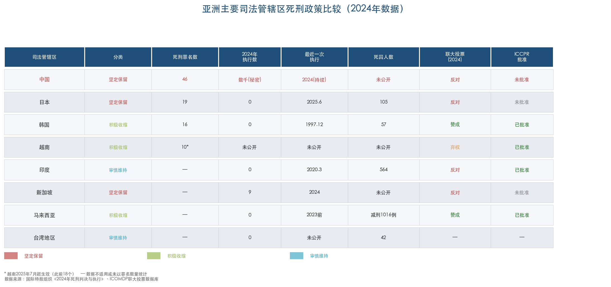

上表清晰显示，中国在死刑罪名数量、执行规模和数据透明度三个维度上均处于亚洲保留国的最严厉端。与同属"坚定保留型"的日本（19个罪名、2024年零执行）和新加坡（2024年执行9人）相比，中国的执行规模属于不同量级；与"积极收缩型"的越南（已削减至10个罪名）和韩国（事实暂停27年）相比，中国的改革步伐则明显滞后。

## 5.3 中国死刑民意：高支持率假象下的弹性空间

"人民群众拥护死刑"是中国官方在国际场合回应废除呼吁时最常援引的论据。然而，现有实证研究表明，这一论述建立在过于简化的调查问题和不完整的信息供给之上。当控制问题措辞并提供替代选项时，所谓"压倒性支持"将大幅松动。

目前最具方法论严谨性的中国死刑民意研究来自两项独立调查。

**第一项**是马克斯·普朗克外国与国际刑法研究所（马普所）与北京大学于2007—2008年合作开展的调查。该调查覆盖北京、湖北、广东三省市约4,500名受访者，采用分层多阶段PPS抽样设计和面对面访谈，回收率约70%。结果显示：在一般性问题（"你是否支持死刑？"）下，支持率为57.8%，反对率为14%，不确定者占28.2%。[马普所调查报告](https://csl.mpg.de/shared/data/pdf/forschung_aktuell_41.pdf "Oberwittler & Qi, 2009") 然而，当向受访者提供"终身监禁且不得假释"（LWOP）作为替代选项时，死刑支持率骤降至29%；进一步附加"赔偿受害者家庭"条件后，支持率再降至24%，有50%的受访者转而表示支持废除。[马普所调查报告](https://csl.mpg.de/shared/data/pdf/forschung_aktuell_41.pdf "Marshall Hypothesis test")

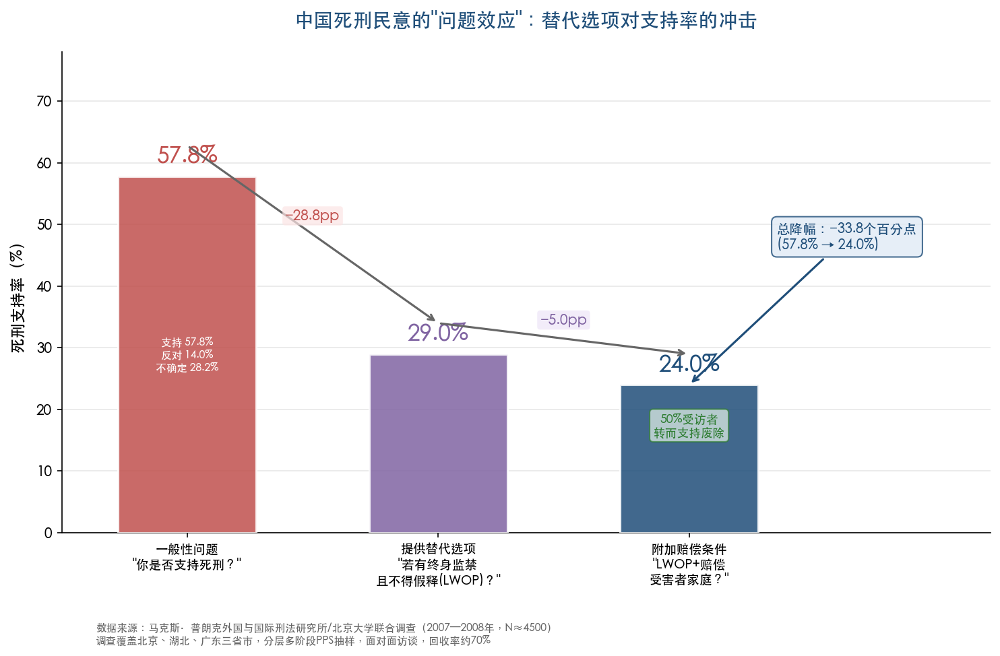

上图直观呈现了同一批受访者在三种不同问题条件下的死刑支持率变化：从一般性问题下的57.8%到提供LWOP替代方案后的29.0%，再到附加赔偿条件后的24.0%，总降幅达33.8个百分点。这一数据有力揭示了所谓"高支持率"的脆弱性。

该调查还揭示了支持死刑的核心心理机制——78.1%的受访者同意"杀人者应以命偿命"，报应观念构成最强有力的支撑因素。但值得注意的是，若能证明有无辜者因司法错误被执行，43.7%原本不反对死刑的受访者愿意转而反对。此外，70%的受访者认为死刑在中国被不公平适用——"富人和官员犯同样的罪更不可能被判死刑"，公平性感知本身可能成为撬动民意的杠杆。[马普所调查报告](https://csl.mpg.de/shared/data/pdf/forschung_aktuell_41.pdf "公平性感知与冤案效应")

**第二项**是Liu Jianhong于2021年发表于剑桥大学《中国季刊》（The China Quarterly）的研究——这是首项基于全国代表性样本报告中国死刑支持率的学术成果。该研究发现，68%的中国公民支持死刑，31%反对。[Liu, The China Quarterly](https://www.cambridge.org/core/journals/china-quarterly/article/public-support-for-the-death-penalty-in-china-less-from-the-populace-but-more-from-elites/49EFE637D066CCFB7C7ED709C1B58893 "2021年") 一个违反直觉的重要发现是：精英群体（法律专业人士、政府工作人员、高学历群体等）的死刑支持率反而高于普通公众——论文副标题"Less from the Populace but More from Elites"即点明了这一倒置现象。这一发现对"精英引领废除"的国际经验在中国的适用性提出了深刻挑战。在许多西方国家，法学界和知识阶层通常是推动废除死刑的先锋力量，而中国的精英阶层可能因制度嵌入性更强而表现出更高的惩罚性倾向。

对话基金会在评析上述研究时总结指出：中国民意在死刑问题上表现出"相当程度的冷漠和无知"——多数受访者对死刑替代方案、执行规模、冤案风险等基本事实知之甚少，支持率在提供具体信息和替代选项后大幅下降。[对话基金会](https://duihua.org/dialogue-issue-41-study-forces-rethinking-on-popular-support-for-death-penalty-in-china/ "2010年")

全球经验为理解民意与废除之间的关系提供了关键参照。马普所的报告专门引用了德国的案例：1949年联邦德国制宪时废除死刑，当时民意调查显示约55%的公众支持保留死刑；到2000年，支持率已降至23%。[马普所调查报告](https://csl.mpg.de/shared/data/pdf/forschung_aktuell_41.pdf "德国经验") 这一案例有力地说明：废除死刑几乎从未发生在民意已经翻转之后——恰恰是废除行为本身引导了民意的转变。正如牛津大学Roger Hood教授所断言："从来没有哪个国家是由草根民意推动废除死刑的——需要的是政治领导力和司法支持。"[Roger Hood论文](https://files.deathpenaltyinfo.org/legacy/RHoodOnChina.pdf "City University of Hong Kong Law Review, 2009")

基于以上分析，我们认为中国68%的一般性死刑支持率不应被视为改革的不可逾越障碍。在替代方案充分供给、冤案信息适度公开的条件下，中国公众的死刑态度可能表现出比预期更大的弹性。然而，Liu Jianhong关于精英群体更高支持率的发现值得高度关注——这意味着中国死刑改革不仅面临"说服大众"的挑战，还须克服制度精英自身的惩罚性偏好。

## 5.4 国际人权机制对中国的外部压力与中国的回应

### 5.4.1 联合国大会暂停执行死刑决议

联合国大会自2007年以来已通过十次暂停执行死刑决议。2024年12月17日通过的第十次决议获得130票赞成、32票反对、22票弃权——赞成票首次超过三分之二的联合国会员国。[ICOMDP联大投票记录](https://icomdp.org/map-unga/ "完整投票历史") [国际特赦组织](https://www.amnesty.org/en/latest/news/2024/12/global-un-member-states-move-closer-to-rejecting-death-penalty-as-lawful-punishment-under-international-law/ "2024年12月17日") 从2007年首次决议的104票赞成到2024年的130票赞成，近二十年间增加了26票，趋势方向明确。

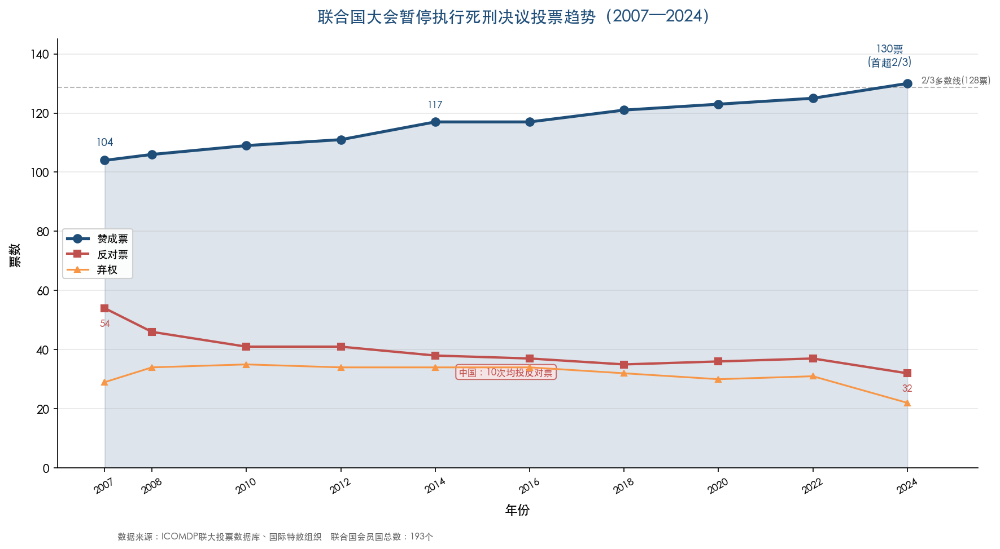

上图清晰展示了十次投票中赞成票的稳步攀升轨迹——从2007年的104票到2024年首次突破三分之二多数线（128票），达到130票；与之对应的是反对票从54票持续下降至32票，弃权票从29票降至22票。中国在全部十次投票中均投反对票，立场从未动摇。[ICOMDP联大投票记录](https://icomdp.org/map-unga/ "中国投票记录")

与中国同投反对票的主要为中东和非洲的保留国，以及日本、印度、新加坡等亚洲保留国和美国。值得关注的是亚洲国家投票立场的分化趋势：韩国从反对转为弃权（2012年），再转为赞成（2020年）；马来西亚2018年起转投赞成票；印度尼西亚2012年起转为弃权。而中国、日本、印度、新加坡、朝鲜始终保持反对立场；越南则始终弃权。[ICOMDP联大投票记录](https://icomdp.org/map-unga/ "各国投票历史") 亚洲内部的立场分化正在加速，坚定反对的阵营持续缩小。

### 5.4.2 普遍定期审议（UPR）中的死刑议题

联合国人权理事会的普遍定期审议（Universal Periodic Review, UPR）机制为各国就死刑问题对华施压提供了制度化渠道。中国已经历四轮UPR审议（2009年、2013年、2018年、2024年），死刑始终是审议焦点之一。

2024年1月23日完成的第四轮审议中，中国收到21条直接涉及死刑的建议，涵盖暂停执行（约占70%）、全面废除、限缩适用范围、加入《公民权利和政治权利国际公约第二任择议定书》（OP2）以及公开统计数据等多个方面。[ECPM中国死刑报告](https://www.ecpm.org/app/uploads/2025/10/Brochure_Chine_2024_EN.pdf "第四轮UPR建议清单") 中国对上述21条建议全部予以"注意"（noted），即拒绝接受。[FIDH声明](https://www.fidh.org/en/region/asia/china/china-government-manipulates-human-rights-review "2024年7月") 这延续了中国在前三轮UPR中从未接受过任何死刑相关建议的一贯立场。

中国在2018年第三轮UPR的回应中提出的官方表述为："保留死刑，严格审慎限制适用。"对于公布死刑统计数据的建议，中国代表团回应称"死刑和死缓统计数据与五年以上有期徒刑和无期徒刑合并计算"——这一技术性表述回避了核心问题，实际上确认了分项数据不予公开的政策立场。[中国第三轮UPR回应文件](https://www.cmab.gov.hk/doc/en/documents/policy_responsibilities/the_rights_of_the_individuals/human/upr_3rd/addendum_report_working_group_upr_3rd_e.pdf "A/HRC/40/6/Add.1")

世界反死刑联盟（WCADP）在分析中国2024年UPR国家报告时指出了一个耐人寻味的事实："死刑"一词在中国提交的国家报告全文中"完全没有出现"。[世界反死刑联盟](https://worldcoalition.org/what-chinas-report-to-the-united-nations-tells-us-about-transparency-and-the-death-penalty/ "2024年分析") 这种刻意的语言回避与中国在实质层面的持续改革（罪名削减、执行数量下降）形成鲜明对比，折射出中国在死刑议题上"做得比说得多"的策略选择。

### 5.4.3 国际公约的签而未批

中国于1998年签署《公民权利和政治权利国际公约》（ICCPR），但至今未予批准，签署至今已逾28年。ICCPR第6条虽未直接要求废除死刑，但明确规定死刑仅能适用于"最严重犯罪"。而旨在全面废除死刑的《第二任择议定书》（OP2），中国既未签署也未加入。截至2024年底，已有90个国家批准OP2。[ECPM中国死刑报告](https://www.ecpm.org/app/uploads/2025/10/Brochure_Chine_2024_EN.pdf "国际法律框架")

值得一提的是，2007年中国代表在联合国人权理事会曾作出一次罕见表态——表示"死刑适用范围将被缩小，最终目标是废除"。这是中国官方在国际场合最接近承认"废除"为最终政策目标的表述，但此后近二十年间再未重申。[Roger Hood论文引用联合国人权理事会新闻稿](https://files.deathpenaltyinfo.org/legacy/RHoodOnChina.pdf "Human Rights Council Press Release HRC/07/3, 2007年3月12日")

## 5.5 中国在全球死刑版图中的定位：最大执行国的孤立化

综合上述分析，中国在全球死刑版图中的定位可从以下五个维度加以概括。

**第一，执行规模的全球主导地位。** 即便按照最保守的估算——对话基金会2018年估算的年执行约2,000人——中国的年执行数也超过全球其余所有国家之和（2024年记录的1,518例，不含中国）。国际特赦组织和ECPM均指出，"即使在最低估算中，中国的死刑执行和判决数量也远超世界其他国家的总和"。[ECPM中国死刑报告](https://www.ecpm.org/app/uploads/2025/10/Brochure_Chine_2024_EN.pdf "Even in the lowest estimations") 这一规模差距使中国与全球废除趋势之间的距离不是渐进性的，而是结构性的。

**第二，死刑罪名数量的相对宽泛。** 中国现行46个死刑罪名中包含22个非暴力犯罪，与ICCPR第6条"最严重犯罪"标准以及联合国人权事务委员会将"最严重犯罪"限缩解释为"涉及蓄意杀人的犯罪"之间存在显著差距。作为对照，越南已于2025年将死刑罪名从18个削减至10个，日本仅有19个死刑罪名，印度在司法实践中将死刑限于"最罕见中的最罕见"案件。

**第三，数据透明度的严重缺失。** 在所有主要保留国中，中国是唯一将死刑执行统计列为国家秘密的大国。日本、印度、新加坡、越南虽然在不同程度上存在信息公开不足的问题，但均公布基本的执行和判决数字。中国的数据黑箱使得包括国内学术界在内的所有研究都不得不依赖间接估算，这本身已构成国际社会批评的焦点。

**第四，国际参与的系统性消极态度。** 中国在联大暂停执行决议中十次投反对票、在四轮UPR中拒绝全部死刑相关建议、ICCPR签而不批近三十年、OP2既未签署也未加入——上述行为构成了一种系统性的国际消极参与模式。然而，这种外交层面的强硬立场与国内层面的持续改革（2011年和2015年两次削减共22个罪名、执行数量从1990年代的年均约15,000人下降超过85%）并行不悖。这种"内改外硬"的策略逻辑在于：中国不愿接受国际压力的"指挥"，但在自身节奏下推进了实质性的限制措施。

**第五，邻国改革产生的新压力。** 越南2025年一次性削减8个死刑罪名、马来西亚2023年废除强制性死刑并减刑逾千例、韩国在联大转投赞成票——同区域国家的改革动作正在压缩中国的外交辩护空间。越南尤为重要：作为与中国在政治体制、法律传统和发展阶段上最具可比性的国家，其改革范围直接触及中国最敏感的领域（受贿罪、毒品犯罪），具有不可忽视的示范意义。

此外，Roger Hood教授在2009年的分析中特别提及香港和澳门的参照意义——这两个中国特别行政区在回归前即已废除死刑（香港1993年、澳门1976年），回归后"充分证明中国人能够在没有死刑的刑罚体制下安居乐业"，废除后从未出现要求恢复死刑的严肃呼声，且凶杀率持续下降。[Roger Hood论文](https://files.deathpenaltyinfo.org/legacy/RHoodOnChina.pdf "引用Johnson and Zimring, 2009")

## 5.6 小结：压力、弹性与时间窗口

全球废除死刑的潮流方向已不可逆转，但中国在这一潮流中处于高度特殊的位置。一方面，中国是全球执行规模最大、死刑罪名最多、数据最不透明的保留国，在联大投票和UPR审议中始终拒绝任何限制性承诺，在国际法框架内的参与度极低。另一方面，中国在国内层面的改革成就同样不可否认——执行数量的大幅下降、罪名的两次立法削减、死缓制度对死刑立即执行的替代功能，均表明中国正在走一条"静默限制"的独特路径。

民意数据进一步揭示了改革空间的存在。一般性调查中57.8%至68%的支持率，在提供替代方案后降至24%至29%；冤案信息的公开可使43.7%的非反对者转向反对。这说明中国的死刑民意并非铁板一块，而是一个可以被信息供给、制度设计和政策引导所重塑的弹性结构。

国际比较还提供了一个重要启示：废除死刑的窗口往往不是等来的，而是被政治决断所创造的。全球113个废除国中，多数并非在民意完全翻转后才采取行动。中国周边的越南刚刚以迅速的立法行动证明，即使在一党执政体制中、即使在毒品犯罪和腐败犯罪领域，死刑罪名的大幅削减也是可操作的。这无疑为评估中国自身的改革可能性提供了新的参照基准。

# 第6章 中国废除死刑的路径评估与时间预测

## 6.1 改革阶段定位：中国处于"限制使用"阶段的深水区

评估中国死刑改革的未来走向，首先需要在国际经验的参照系中锚定当前所处的阶段。国际学术界普遍采用的分析框架将死刑废除进程划分为三个递进阶段：**限制使用**（reduction in scope and practice）→**事实暂停**（de facto moratorium）→**法律废除**（de jure abolition）。基于前述各章的实证分析，我们认为中国当前处于"限制使用"阶段的深水区——改革成就显著但动力衰减，距离"事实暂停"仍存在结构性距离。

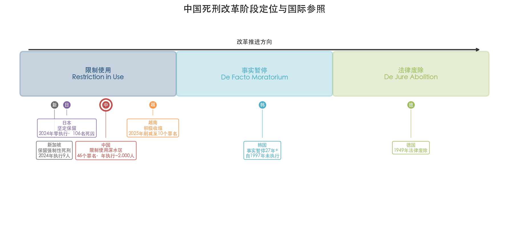

**图注：** 上图以"限制使用→事实暂停→法律废除"三阶段为框架，标注中国当前处于"限制使用深水区"的位置（46个罪名、年执行约2,000人），同时展示新加坡、日本、越南、韩国、德国等参照国的阶段定位，直观呈现中国在全球死刑废除进程中的坐标。

从"限制使用"阶段的内部特征审视，中国已完成三项关键动作。其一，立法层面的罪名削减：2011年《刑法修正案（八）》和2015年《刑法修正案（九）》累计削减22个死刑罪名（68个→46个），削减幅度达32%。[刘仁文、陈妍茹论文](http://iolaw.cssn.cn/zzwx/201905/P020190522362849508742.pdf "《法学杂志》2017年第2期") 其二，司法层面的执行数量大幅下降：对话基金会的估算显示，年执行人数从1990年代的约15,000人下降至2018年的约2,000人，降幅超过85%。[对话基金会UPR提交文件](https://uprdoc.ohchr.org/uprweb/downloadfile.aspx?filename=12095&file=EnglishTranslation "Dui Hua Foundation, 2023") 其三，制度层面的程序控制：2007年最高人民法院收回死刑核准权，2011年和2015年分别引入"死缓限制减刑"和"终身监禁"制度，构建了更为精细的量刑梯度体系。

然而，衡量"限制使用"阶段是否已接近尾声，还需关注三个关键指标所释放的停滞信号。

**其一，立法削减已停滞逾10年。** 自2015年《刑法修正案（九）》施行以来，死刑罪名数量维持46个未变。此后通过的《刑法修正案（十）》（2017年，涉及国歌侮辱罪入刑）、《修正案（十一）》（2020年，涉及刑事责任年龄下调）、《修正案（十二）》（2023年，涉及民企保护和行贿犯罪）以及《修正案（十三）》（涉及商业合规），均未触及死刑罪名的增减。[NPC Observer](https://npcobserver.com/legislation/criminal-law-amendment-xii/ "Criminal Law Amendment XII, 2023") 10年的立法空窗期已超过1997—2011年"冻结期"14年周期的一半，而此次空窗期发生在已有改革先例的背景下，停滞信号尤为显著。

**其二，执行数量的下降曲线趋于平坦。** 对话基金会的数据显示，2013—2015年间执行数量即已出现下降停滞（年均约2,400人），2016—2018年进一步降至约2,000人后，该机构不再公开发布年度总估算。[对话基金会](https://duihua.org/can-recognizing-poverty-reduce-executions-in-china/ "Can Recognizing Poverty Reduce Executions in China") 从2007年的急剧下降到2013年后的趋平，下降曲线呈现出典型的"L型"走势——快速下降阶段结束后进入低位横盘期。若年执行数在过去8—10年中维持在约2,000人的水平未有进一步显著下降，则意味着现行制度框架已接近其减量效能的极限。

**其三，政治信号出现断档。** 中国在国际场合对死刑改革最为积极的表态发生在2007年——中国代表在联合国人权理事会表示"死刑适用范围将被缩小，最终目标是废除"。[Roger Hood论文引用联合国人权理事会新闻稿](https://files.deathpenaltyinfo.org/legacy/RHoodOnChina.pdf "Human Rights Council Press Release HRC/07/3, 2007年3月12日") 2013年，中共十八届三中全会在中央文件中写入"逐步减少适用死刑罪名"。[刘仁文、陈妍茹论文](http://iolaw.cssn.cn/zzwx/201905/P020190522362849508742.pdf "《法学杂志》2017年第2期") 此后逾13年间，再无更高层级的改革信号出现。2024年第四轮UPR中，中国对所有死刑相关建议（编号22.10—22.11、22.82—22.98）统一回应："中国的基本政策是保留死刑，严格审慎限制适用。"[中国第四轮UPR回应文件](https://tibetnetwork.org/free22/wp-content/uploads/2024/08/China-4th-UPR-Addendum-July-2024.pdf "A/HRC/56/6/Add.1, 2024年5月") 这一措辞与2018年第三轮UPR的回应几乎一字不差，表明官方立场处于精确复制而非渐进调整的状态。

综合上述三项指标，中国在"限制使用→事实暂停"的阶段过渡上，面临的并非一个平稳的线性衔接，而是一个需要新的政治动力来突破的"平台期"。

## 6.2 驱动因素：推动改革继续深化的五股力量

尽管改革动力有所衰减，推动中国进一步限制乃至废除死刑的结构性力量并未消失。以下五个方面构成持续性的改革驱动。

### 6.2.1 学术精英共识的深化与扩展

自2002年湘潭学术研讨会以来，中国刑法学界主流已形成"废除死刑是不可逆转的方向"这一基本共识。牛津大学Roger Hood教授2009年即观察到，"中国学者已在废除死刑应当成为最终目标这一问题上达成了广泛共识"。[Roger Hood论文](https://files.deathpenaltyinfo.org/legacy/RHoodOnChina.pdf "City University of Hong Kong Law Review, 2009") 赵秉志教授（北京师范大学）提出三阶段路线图，刘仁文研究员（中国社会科学院）提出非线性削减路径，陈兴良教授（北京大学）提出"先备而不用、后按暴力程度逐步废除"的策略——学术界的讨论重心已从"是否废除"转向"如何废除"与"何时废除"。[赵秉志论文（爱思想转载）](https://www.aisixiang.com/data/8838.html "中国逐步废止死刑论纲") [刘仁文、陈妍茹论文](http://iolaw.cssn.cn/zzwx/201905/P020190522362849508742.pdf "《法学杂志》2017年第2期")

中国社会科学院法学研究所田禾研究员的判断为学术界的共识提供了一个精练的框架性总结："问题的关键不在于应否废除死刑，而在于能否和怎样废除死刑。"[田禾论文](http://iolaw.cssn.cn/zzwx/201905/P020190522387054431229.pdf "《法学研究》2005年第2期") 这一认识在学术界获得广泛认同，并逐步渗透至实务界——最高人民法院原副院长张军曾多次在内部场合倡导限制死刑适用。

### 6.2.2 民意的结构性弹性

前述第5章的分析已表明，中国死刑民意并非铁板一块。马普所/北大2007—2008年调查显示，一般性问题下57.8%的支持率在提供"终身监禁不得假释"替代选项后骤降至29%，附加"赔偿受害者"条件后进一步降至24%。[马普所调查报告](https://csl.mpg.de/shared/data/pdf/forschung_aktuell_41.pdf "Oberwittler & Qi, 2009") Liu Jianhong 2021年全国代表性样本调查报告了68%的一般性支持率，但未同步测试替代方案的影响。[Liu, The China Quarterly](https://www.cambridge.org/core/journals/china-quarterly/article/public-support-for-the-death-penalty-in-china-less-from-the-populace-but-more-from-elites/49EFE637D066CCFB7C7ED709C1B58893 "2021年") 综合两项研究，中国死刑民意的核心特征可概括为"高名义支持率、高条件弹性"——在信息充分供给和替代方案可得的条件下，至少三分之一至二分之一的表面支持者可被转化。

全球经验进一步表明，民意从来不是废除的前置条件。德国1949年废除死刑时，约55%的公众仍支持保留；到2000年，这一比例已降至23%——废除行为本身引导了民意的转变。[马普所调查报告](https://csl.mpg.de/shared/data/pdf/forschung_aktuell_41.pdf "德国经验对照") Roger Hood教授的论断至今有效："从来没有哪个国家是由草根民意推动废除死刑的——需要的是政治领导力和司法支持。"[Roger Hood论文](https://files.deathpenaltyinfo.org/legacy/RHoodOnChina.pdf "2009")

### 6.2.3 冤案平反对公众认知的冲击

聂树斌案（2016年最高人民法院再审宣告无罪）和呼格吉勒图案（2014年内蒙古高院再审宣告无罪）两起重大冤案的平反，对中国社会的死刑认知产生了深远影响。马普所调查发现，若能证明有无辜者因司法错误被执行，43.7%原本不反对死刑的受访者表示愿意转而反对。[马普所调查报告](https://csl.mpg.de/shared/data/pdf/forschung_aktuell_41.pdf "冤案效应") 冤案的公开报道在中国社交媒体上引发大规模讨论，客观上完成了一次关于死刑不可逆转风险的公众教育。

### 6.2.4 执行数量下降的惯性效应

尽管下降曲线已趋平，执行数量从峰值到现有水平超过85%的降幅本身构成一种改革惯性。对话基金会2024年分析的最高法院死刑复核数据显示，2022—2023年复核不核准率约17.2%，较2013—2015年的约2%大幅上升；复核审查时间也从2015—2019年的平均190天延长至2022—2023年的平均461天。[对话基金会](https://duihua.org/curious-timing-spc-death-penalty-reviews-posted-after-universal-periodic-review-part-i/ "2024年7月") 这些司法层面的变化表明，即便在缺乏新立法授权的情况下，最高法院仍在通过程序控制持续压缩死刑适用空间。

### 6.2.5 国际比较压力的加速形成

越南2025年6月一次性将死刑罪名从18个削减至10个，废除了受贿罪、毒品运输罪等8个罪名的死刑。[OHCHR新闻发布](https://www.ohchr.org/en/press-releases/2025/06/viet-nam-parliament-votes-abolish-death-penalty-some-offences "2025年6月27日") 越南作为与中国在政治体制、法律传统和发展阶段上最具可比性的国家，其改革范围直接触及中国面临的最敏感领域——受贿犯罪和毒品犯罪恰恰是中国学术界呼吁优先废除的类别。与此同时，马来西亚2023年废除强制性死刑后已累计减刑逾1,000例；韩国2020年起在联大暂停执行决议中转投赞成票。[ICOMDP联大投票记录](https://icomdp.org/map-unga/ "完整投票历史") 同区域国家的改革步伐正在压缩中国的外交辩护空间，使"各国国情不同"的立场日益难以自洽。

## 6.3 阻碍因素：改革停滞的结构性障碍

与驱动力量相对应，五个方面的结构性障碍制约着中国死刑改革向更深层推进。

### 6.3.1 政治意愿的系统性缺位

这是所有障碍中最具决定性的因素。联合国大会自2007年以来通过的十次暂停执行决议，中国全部投反对票；四轮UPR审议中拒绝所有死刑相关建议；1998年签署的《公民权利和政治权利国际公约》至今未批准，搁置长达28年。[ICOMDP联大投票记录](https://icomdp.org/map-unga/ "中国投票记录") 2024年第四轮UPR中，中国对死刑建议的回应措辞与2018年第三轮完全一致，未呈现任何立场松动的迹象。[中国第四轮UPR回应文件](https://tibetnetwork.org/free22/wp-content/uploads/2024/08/China-4th-UPR-Addendum-July-2024.pdf "A/HRC/56/6/Add.1") 世界反死刑联盟更指出，"死刑"一词在中国2024年UPR国家报告全文中"完全没有出现"。[世界反死刑联盟](https://worldcoalition.org/what-chinas-report-to-the-united-nations-tells-us-about-transparency-and-the-death-penalty/ "2024年分析")

### 6.3.2 "制度化陷阱"效应

加州大学伯克利分校Tobias Smith的博士论文提出了一个重要的理论观察：中国的死刑改革在减少执行数量的同时，使死刑体系变得更加制度化、专业化和精细化——死缓制度的完善、限制减刑的引入、终身监禁的设置、复核程序的强化——这些改革成就反而可能使死刑体系更加难以废除。[Tobias Smith博士论文](https://escholarship.org/uc/item/3hr4x69d "UC Berkeley, 2020") 这一"制度化陷阱"（institutionalization trap）的核心逻辑在于：当一个国家投入大量立法和司法资源来完善死刑适用的制度框架时，这些制度本身便成为维持死刑合法性的论据——"既已建立充分的制度保障来防止滥用，何须再行废除？"

这一分析在中国语境中具有高度解释力。中国构建的"死刑立即执行→死缓+终身监禁→死缓+限制减刑→普通死缓→无期徒刑"五级梯度体系，在全球范围内堪称最精细的死刑执行替代方案设计。这种精细化一方面确实减少了死刑的实际适用，另一方面也为"保留死刑、严格限制适用"的官方立场提供了制度性的自我证成。

### 6.3.3 毒品犯罪死刑的特殊阻力

在中国现行46个死刑罪名中，毒品犯罪的死刑适用具有特殊的政治和社会心理根基。鸦片战争的历史记忆使毒品问题在中国不仅是一个刑事政策议题，更是一个带有民族情感色彩的政治议题。司法实践中，毒品犯罪是死刑适用的主要类别之一——2011年1—5月全国法院审结毒品案件的重刑率达26.86%，高出全部刑事案件12.06个百分点。[中国社科院樊文](http://www.cass.cn/xueshuchengguo/shehuizhengfaxuebu/201311/t20131126_881357.shtml "引用国务院新闻办数据") 对话基金会2010年的追踪数据亦显示，毒品犯罪在公开可追踪的死刑执行中占显著比例，尤其集中在6月26日"国际禁毒日"前一周。[对话基金会](https://duihua.org/dialogue-issue-41-after-one-year-dui-hua-uncovers-700-executions-in-china/ "2010年11月")

废除毒品犯罪死刑面临的阻力远大于经济犯罪，主要体现在三个层面。其一，联合国人权事务委员会已明确"毒品犯罪"不属于ICCPR第6条所定义的"最严重犯罪"（应仅限于"涉及蓄意杀人的犯罪"），但中国一贯拒绝接受这一解释标准。其二，中国社会对毒品犯罪的道德谴责程度极高，废除毒品犯罪死刑在舆论层面的政治风险远大于废除经济犯罪死刑。其三，毒品犯罪的跨境性质涉及中国与东南亚国家的执法合作框架，死刑在该框架中被赋予了外交和安全维度。

### 6.3.4 "维稳"逻辑与社会治理惯性

中国政府将社会稳定视为治理的核心目标之一。在"维稳"逻辑下，死刑被赋予了超越刑罚功能的政治象征意义——它是国家展示打击犯罪决心的最高信号。尽管犯罪学研究普遍未能证实死刑相对于长期监禁具有更强的威慑效果，但这一认知尚未成为中国决策层的主流判断。在食品安全犯罪、拐卖妇女儿童、性侵未成年人等引发强烈社会公愤的领域，公众舆论频繁要求"严判死刑"，客观上增加了限制死刑的政治成本。

### 6.3.5 数据保密制度的双重效应

中国将死刑执行数据列为国家秘密，这一政策产生了双重效应。一方面，保密制度使国际社会难以准确评估中国的改革进展，客观上减弱了外部压力的精确施加；另一方面，保密制度也使中国无法公开展示其执行数量大幅下降的改革成就——一个将年执行数从约15,000人降至约2,000人的国家，本应获得国际社会的积极认可，但数据黑箱阻断了这种正向反馈的实现。2021年7月裁判文书网大规模删除死刑复核裁定等文书，进一步加剧了透明度退化。[路透社](https://www.reuters.com/world/china/china-vows-judicial-disclosure-after-outcry-over-plan-curb-access-rulings-2024-01-22/ "2024年1月") 北京大学宪法学教授张千帆2011年公开质疑将死刑执行数据列为"国家秘密"的法律依据，一项调查显示64%的受访者认为政府应当公布执行人数。[对话基金会](https://duihua.org/as-execution-reports-decline-law-expert-challenges-secret-status/ "2011年10月")

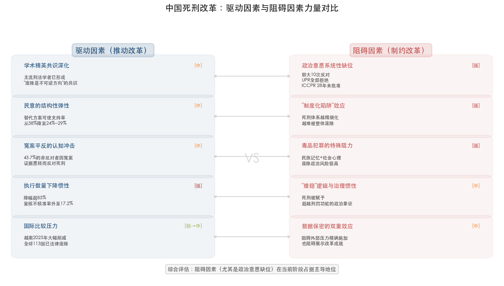

**图注：** 上图以矩阵形式对比展示推动改革的五项驱动因素与制约改革的五项阻碍因素，并标注各因素的相对强度。综合评估显示，阻碍因素（尤其是政治意愿缺位）在当前阶段占据主导地位。

## 6.4 死缓制度作为"中国特色"过渡路径的可能性

中国的死缓制度在全球范围内几乎没有完全对应的参照物。该制度在功能上已经充当了死刑废除的过渡机制——死缓考验期满后"几乎全部"转为无期徒刑的事实，使得死缓在实质上等同于不确定期限的监禁。[Cambridge学术论文](https://www.cambridge.org/core/journals/asian-journal-of-law-and-society/article/suspended-execution-beyond-chinas-borders/101E2A549C987D5FD02FDBE206D1709D "Asian Journal of Law and Society")

**"司法先行"路径。** 中国政法大学阮齐林教授提出了一条务实的改革路径："司法实践中不去适用死刑，慢慢的死刑也就取消了。"[国际经济法网转载](https://ielaw.uibe.edu.cn/lfjy/7949.htm "2010年") 其操作逻辑在于：通过持续扩大死缓判决与死刑立即执行判决的比例，使越来越多的应死刑案件转入死缓轨道；当死刑立即执行在司法实践中降至极低频率时，法律条文中的死刑规定即成为"僵尸条款"，最终可在政治风险极低的时机一次性删除。

这一路径与赵秉志教授提出的三阶段路线图具有内在一致性——赵秉志三阶段论的第一阶段目标（到2020年废止非暴力犯罪死刑）虽已明显未能实现，但其核心策略——"先将实践中适用频率已极低的罪名予以废除"——在2011年和2015年的两次立法削减中得到了验证。[赵秉志论文（爱思想转载）](https://www.aisixiang.com/data/8838.html "中国逐步废止死刑论纲")

**终身监禁扩展的有限性。** 2015年引入的终身监禁制度理论上可成为替代死刑的重要工具，但其适用范围严格限于贪污受贿犯罪，截至2025年底实际适用约20例，初期4例（白恩培案、魏鹏远案、于铁义案、武长顺案）涉案金额均超2亿元，此后逐步扩展至更高金额案件。[最高检转载检察日报](https://www.spp.gov.cn/zdgz/201610/t20161010_168954.shtml "2016年10月白恩培案") 若将终身监禁扩展至暴力犯罪领域，则需要对刑罚体系进行根本性重构。刘仁文研究员指出，贪污受贿犯罪的死刑在司法实践中已"名存实亡"——最高人民法院自2011年以来未核准过一例贪污受贿犯罪的死刑立即执行，终身监禁制度实际上已使该类犯罪的死刑"虚化"，"从立法上取消贪污受贿罪的死刑也是完全可能的"。[刘仁文、陈妍茹论文](http://iolaw.cssn.cn/zzwx/201905/P020190522362849508742.pdf "《法学杂志》2017年第2期")

**死缓路径的局限。** 死缓制度虽然在功能上替代了大量死刑立即执行，但其法律性质仍属于"死刑的执行方式"而非独立刑种。只要死缓制度仍然依附于死刑制度而存在，它就无法完全取代死刑——一个被判处死缓的被告人在法律上仍然是被判处了"死刑"，只是附加了"缓期二年执行"的条件。因此，死缓制度可以作为通向废除的过渡桥梁，但桥梁本身不能成为目的地。

## 6.5 情景分析：三种时间路径的评估

基于前述驱动因素与阻碍因素的分析，本节构建三种情景来评估中国死刑改革的时间路径。需要强调的是，每种情景均基于明确的前提假设，属于条件性研判而非确定性预测。死刑政策的本质是政治决策，其时间节点取决于多重变量的交互作用，任何单一时间预测都必须附带严格的条件限定。

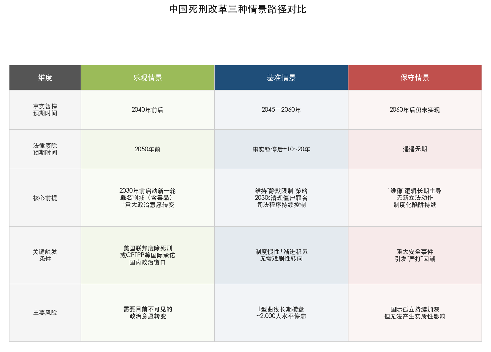

**图注：** 上表从事实暂停预期时间、法律废除预期时间、核心前提、关键触发条件和主要风险五个维度，系统对比乐观、基准、保守三种情景的差异与条件依赖。

### 情景一：乐观情景——2040年前后实现事实暂停，2050年前实现法律废除

**前提假设：** （1）中国在2030年前后启动新一轮死刑罪名立法削减，一次性或分批废除非暴力犯罪（含毒品犯罪和贪污受贿犯罪）的死刑；（2）最高人民法院持续提高死缓适用比例和复核不核准率，使死刑立即执行的年度数量降至三位数以内（<100人/年）；（3）国际环境中出现有利于改革的催化事件（如美国联邦层面废除死刑，或中国为加入CPTPP等国际协定而作出司法改革承诺）；（4）国内政治格局出现改革窗口。

**路径推演：** 在这一情景下，中国可能在2030年代中期将死刑罪名从46个削减至20个以内（仅保留严重暴力犯罪），通过"司法先行"路径使剩余罪名的死刑执行频率降至极低水平。到2040年前后，年执行数降至数十人甚至更低，实质上进入事实暂停状态。到2050年——即中华人民共和国成立100周年——以政治纪念日为契机宣布法律废除。

**可能性评估：** 这一情景与赵秉志教授三阶段论的第三阶段目标（最晚2050年全面废止）一致。[赵秉志论文（爱思想转载）](https://www.aisixiang.com/data/8838.html "中国逐步废止死刑论纲") 然而，鉴于第一阶段目标（2020年废止非暴力犯罪死刑）已未能实现、近10年无立法动作、政治信号持续断档，我们判断这一情景的实现概率偏低，它需要出现目前尚不可见的重大政治意愿转变。

### 情景二：基准情景——2045—2060年间实现事实暂停

**前提假设：** （1）中国维持"静默限制"策略，不正式宣布政策转向，但通过司法程序控制持续压缩死刑适用空间；（2）在2030年代前后启动一轮温和的罪名削减（削减10—15个长期未适用的"僵尸罪名"，保留约30个左右）；（3）死缓适用比例继续提高，死刑立即执行的年度数量缓慢下降至数百人水平；（4）国际压力持续但未产生突破性影响；（5）不出现重大逆转事件（如大规模社会安全事件导致"严打"回潮）。

**路径推演：** 在这一情景下，中国在2030年代完成对"僵尸罪名"的清理性削减，但不触及毒品犯罪和严重暴力犯罪的死刑。最高法院继续通过复核程序控制执行数量的缓慢下降。到2040年代中期至2050年代，年执行数降至极低水平（数十人至百人量级），进入事实意义上的暂停区间。但法律废除可能在事实暂停后再经历10—20年的过渡期——韩国事实暂停超过27年仍未法律废除、俄罗斯暂停近30年同样未完成法律废除的经验表明，事实暂停并不必然迅速导向法律废除。[Roger Hood论文](https://files.deathpenaltyinfo.org/legacy/RHoodOnChina.pdf "2009")

**可能性评估：** 我们认为这一情景最符合中国"做得比说得多"的历史改革模式。中国此前的改革（收回核准权、削减罪名、引入限制减刑和终身监禁）均遵循了"先在实践中静默推进、再在时机成熟时立法确认"的路径。这一情景不要求出现戏剧性的政治转向，而是依赖制度惯性和渐进积累。其主要风险在于"L型曲线"可能在约2,000人的水平长期横盘——若缺乏新的制度变革来打破当前均衡态，下降可能停滞数十年。

### 情景三：保守情景——2060年后仍未实现事实暂停

**前提假设：** （1）中国国内政治格局持续强调社会稳定和国家安全，"维稳"逻辑对死刑改革构成长期制约；（2）国际环境中不出现有利于改革的催化事件，中美关系持续紧张使中国更倾向于拒绝被视为西方施压的人权议程；（3）重大社会安全事件（如恐怖袭击、大规模暴力犯罪）引发舆论对死刑的强烈需求；（4）立法机关在可预见的将来不启动死刑罪名削减；（5）"制度化陷阱"效应持续——精细化的死缓和限制减刑制度被视为已充分替代废除的必要性。

**路径推演：** 在这一情景下，中国在2030—2040年代维持46个死刑罪名不变，年执行数在1,000—2,000人之间波动。最高法院的程序控制虽然在一定程度上限制了执行数量，但无法实现质的突破。中国继续在联大投反对票、在UPR中拒绝建议，国际压力因中国经济体量和政治影响力而无法产生实质性效果。到2060年，中国仍处于"限制使用"阶段——虽然执行数量较1990年代大幅下降，但远未达到事实暂停的标准。

**可能性评估：** 这一情景不能被排除。时延安教授（中国人民大学）的审慎判断——"全面废除死刑恐怕需要恰当的社会时机，整个社会缺少宽容心态，缺少对他人权利的尊重"——指向的正是深层文化和政治条件的制约。[国际经济法网转载](https://ielaw.uibe.edu.cn/lfjy/7949.htm "2010年") 但历史经验表明，长期维持"限制使用而不进一步推进"的状态存在内在不稳定性——全球废除国已达113个且仍在增加，中国作为全球最大执行国的国际孤立将持续加深。

## 6.6 前置条件与关键变量

综合三种情景，以下五个关键变量将决定中国死刑改革的时间路径。

**第一，政治意愿信号。** 这是最具决定性的变量。任何实质性进展——无论是立法削减还是事实暂停——都需要中共中央层面的政治决策。2013年十八届三中全会"逐步减少适用死刑罪名"的表述至今仍是最高层级的政策信号，是否以及何时出现更进一步的表态，将决定改革的启动时机。

**第二，下一次刑法修正案是否涉及死刑。** 《刑法修正案》是中国调整死刑罪名的唯一立法工具。若下一部涉及死刑罪名削减的修正案在2030年前出台，将显著加速改革进程；若到2035年仍无动作，则"冻结"态势将巩固为长期格局。

**第三，毒品犯罪死刑的走向。** 毒品犯罪是非暴力犯罪中最难废除死刑的类别。越南2025年已将非法运输毒品罪从死刑罪名中移除。[OHCHR新闻发布](https://www.ohchr.org/en/press-releases/2025/06/viet-nam-parliament-votes-abolish-death-penalty-some-offences "2025年6月27日") 中国是否跟进，将成为衡量改革深度的试金石。

**第四，终身监禁制度是否扩展适用。** 终身监禁目前仅限于贪污受贿犯罪。若立法将其扩展至毒品犯罪和其他严重犯罪领域，将为进一步削减死刑罪名提供替代方案的制度准备。

**第五，国际催化事件。** Roger Hood教授指出，美国是否废除死刑"可能对中国决定是否废除产生关键影响"。[Roger Hood论文](https://files.deathpenaltyinfo.org/legacy/RHoodOnChina.pdf "2009") 一旦美国在联邦层面废除死刑，中国将失去"连美国都保留死刑"这一最有力的外交修辞工具。此外，CPTPP等国际经贸协定是否包含人权条件，也可能成为推动改革的外部杠杆。

## 6.7 综合研判

基于前述六章的全部证据，本节对中国死刑改革的前景作出以下综合研判。

**中国不太可能在近期（2026—2035年）实现死刑的法律废除或事实暂停。** 所有可观测指标——立法停滞、政治信号断档、国际场合的一致拒绝——均指向改革动力的短期衰减。在这一时间窗口内，更可能出现的是最高法院在司法程序层面的持续微调（如进一步提高复核不核准率、延长审查周期），而非立法层面的突破性行动。

**中期（2035—2050年），改革重启的概率高于停滞延续的概率。** 这一判断基于三方面理由。其一，全球废除趋势的不可逆性将使中国的国际孤立度持续加深，外交成本终将触及决策层的容忍阈值。其二，代际更替将改变决策层的政策偏好——每一代新的领导层所接受的法学教育和国际视野都较前一代有所拓展。其三，中国国内的犯罪结构变化（暴力犯罪率下降、经济犯罪形态转型）将削弱维持死刑的实际必要性论据。

**中国最终实现完全的法律废除，可能需要等到2050年代至2060年代。** 即便在基准情景下实现事实暂停，从暂停到法律废除的过渡——如韩国和俄罗斯的经验所示——可能还需要10—20年的额外时间。Roger Hood的研究表明，1989年以来废除死刑的54个国家中，61%未经历长期事实暂停即直接法律废除，但这些案例多为中小国家或经历政治体制剧变的国家，对中国这样的大国参考性有限。[Roger Hood论文](https://files.deathpenaltyinfo.org/legacy/RHoodOnChina.pdf "2009")

**中国走向废除的路径更可能是"静默限制"而非"宣示性改革"。** 中国不太可能像越南那样以立法说明的方式公开承认死刑结构的问题性，也不太可能像韩国那样在联大投票中转变立场作为信号。更可能的路径是：持续通过最高法院的程序控制压缩执行空间→使更多罪名成为"僵尸罪名"→在政治时机成熟时一次性删除大批名存实亡的死刑条款→保留少数最严重暴力犯罪的死刑作为最后堡垒→最终在全球仅剩极少数保留国时完成法律废除。

**香港和澳门的经验为最终废除提供了可信的社会证据。** 两个特别行政区在回归前已废除死刑（香港1993年、澳门1976年），此后从未出现要求恢复死刑的严肃呼声，凶杀率持续下降。Roger Hood指出，港澳经验"充分证明中国人能够在没有死刑的刑罚体制下安居乐业"。[Roger Hood论文](https://files.deathpenaltyinfo.org/legacy/RHoodOnChina.pdf "引用Johnson and Zimring, 2009") 这一经验在大陆语境中虽面临人口规模和社会治理复杂度的挑战，但至少证伪了"中国文化必然需要死刑"的本质主义论断。

综上所述，中国废除死刑不是"是否"的问题，而是"何时"和"以何种方式"的问题。在可预见的未来，中国将继续走一条渐进式的限制路径，其速度取决于政治意愿、制度惯性和国际环境的交互作用。若必须给出一个时间预期，我们判断：中国实现事实暂停最可能发生在2045—2060年间，法律废除最可能发生在2055—2070年间。这一预期须附带一个关键保留——如果出现重大政治意愿转变或国际催化事件，时间窗口可能显著提前；反之，如果"制度化陷阱"持续生效、"维稳"逻辑长期主导，时间窗口也可能显著推后。

# 结论与风险提示

## 核心结论

本报告基于中国现行法律文本、国际组织估算数据、学术文献与司法公开信息的多源交叉分析，形成以下核心研究结论。

**第一，中国死刑执行数量已从20世纪90年代的年均约15,000人下降至2018年前后的约2,000人，降幅超过85%，但仍以数量级优势位居全球之首。** 这一下降主要由三股制度力量驱动：2007年最高人民法院收回死刑核准权（当年执行数即急剧下降）、2011年和2015年两次立法削减共22个死刑罪名（从68个降至46个，削减幅度32%）、以及死缓判决比例的系统性上升（从1990年代的约25%大幅攀升至目前的过半数水平）。2019年至今的年度执行数据因对话基金会停止公开年度总估算及裁判文书网大规模删除文书而处于"估算真空"，综合各方信息判断大致维持在1,000—2,000人区间。

**第二，死缓制度在实践中发挥着死刑的核心"分流器"功能。** 死缓考验期满后转为无期徒刑的比例接近100%，因故意犯罪被执行死刑的比例可能低于1%。死缓并非简单的"缓刑观察"，而是一种高度确定的从死刑向自由刑的转化机制。2011年《刑法修正案（八）》引入的限制减刑制度将特定类型死缓犯的法定最低服刑年限从约17年延长至约27年，2015年《修正案（九）》引入的终身监禁制度进一步实现了"不剥夺生命但终身剥夺自由"的刑罚效果。三种类型死缓犯（普通死缓约17—20年、限制减刑约27年以上、终身监禁至生命终结）构成了层级分明的服刑年限阶梯。

**第三，减刑体系已从此前的"普遍化、高比率"格局向规范化方向转变。** 2002—2004年间年均减刑率高达41.33%，死缓犯和无期徒刑犯的实际服刑年限严重缩水。2011年修正案八系统性提高法定最低服刑年限，2014年中央政法委出台"三个一律"公开机制和终身负责制，2021年全面排查1,100万件减刑假释案件。检察机关年度纠正不当案件数从2023年的2.6万人次下降至2025年的6,369人次，规范化效果逐步显现。

**第四，终身监禁制度自2015年引入以来适用约20例，适用范围严格限于贪污受贿犯罪，尚未成为替代死刑的常规路径。** 所有已知案例均为涉案金额超2亿元的重大贪腐案件，适用门槛持续提升。终身监禁在贪污受贿犯罪领域发挥了有限但明确的死刑替代功能——最高人民法院自2011年以来已未核准过一例贪污受贿犯罪的死刑立即执行。但因其适用范围不覆盖故意杀人、毒品犯罪等死刑高频罪名，制度辐射力受到客观限制。

**第五，46个现行死刑罪名的实际适用高度集中于少数罪名。** 故意杀人罪、毒品犯罪和抢劫罪三类罪名合计占已知执行案例的近90%。大量危害国家安全罪、军人违反职责罪中的战时罪名长期处于"僵尸"状态。已完成的两次罪名削减以"备而少用"的非暴力犯罪为主，属于"象征性削减"；真正减少死刑执行的改革取决于对高频适用罪名的司法控制力度。

**第六，中国实现事实暂停最可能发生在2045—2060年间，法律废除最可能发生在2055—2070年间。** 这一判断基于对驱动因素（学术共识、民意弹性、冤案冲击、执行下降惯性、邻国改革压力）与阻碍因素（政治意愿系统性缺位、制度化陷阱、毒品犯罪特殊阻力、维稳逻辑、数据保密制度）的综合评估。当前中国处于"限制使用"阶段的深水区——改革成就显著但动力衰减，立法削减已停滞逾10年，执行下降曲线呈"L型"趋平，政治信号断档逾13年。中国更可能走一条"静默限制"路径——通过司法程序控制持续压缩执行空间，使更多罪名僵尸化，在政治时机成熟时一次性立法删除——而非宣示性改革。

## 风险提示与局限性

**第一，核心数据的不可验证性。** 本报告所有关于死刑执行数量的量化分析均建立在外部机构的间接估算之上。对话基金会（约2,000人/年，2018年）与中国反死刑组织CADP（至少8,000人/年，2007年后）之间存在约4倍的估算差异，在缺乏官方数据校验的条件下无法确定哪一估算更接近真实值。对话基金会自2018年起停止公开年度总估算，2019年至今的执行数据实际处于估算真空状态。本报告倾向于采用对话基金会的保守估算作为分析基线，但须承认其本身可能低估实际数字。

**第二，死缓转化率、减刑率的精确数据缺失。** 死缓考验期满后的转化比例（转为无期徒刑、减为25年有期徒刑、执行死刑三者各占多少）从未获得官方统计公布，学术界只能基于"几乎全部"转为无期徒刑的定性判断进行推论。死缓犯和无期徒刑犯修正案八之后的实际平均服刑年限亦缺乏系统性实证数据。报告中引用的减刑率41.33%来自2002—2004年的历史数据，当前实际减刑率尚无可比口径的最新统计。

**第三，微观样本的代表性存疑。** 对话基金会2024年分析的86份最高法院死刑复核裁定（涉及93名被告人）是近年来最有价值的微观数据来源，但其上传时机（紧随UPR审议之后）和选择机制不透明，不能排除选择性公开的可能性。由此得出的17.2%不核准率是否代表全部复核案件的真实水平，尚无法确认。

**第四，民意研究的时间滞后。** 本报告依赖的两项核心民意研究——马普所/北大调查（2007—2008年）和Liu Jianhong全国调查（2021年发表但数据采集时间更早）——均存在时间滞后。中国社会在过去十余年间经历了深刻的结构性变化（城市化加速、社交媒体兴起、重大冤案曝光），当前的死刑民意可能已与上述调查时点存在显著差异。

**第五，时间预测的固有不确定性。** 死刑政策的本质是政治决策，其时间节点取决于政治意愿、制度惯性、国际环境等多重变量的非线性交互。本报告构建的三种情景（乐观、基准、保守）及其时间区间属于条件性研判，而非确定性预测。报告中"2045—2060年实现事实暂停、2055—2070年实现法律废除"的基准判断，须附带"如出现重大政治意愿转变或国际催化事件则可能显著提前，如制度化陷阱持续生效则可能显著推后"的双向保留。
