# 执行摘要

本报告以截至2026年3月26日的中国影史票房总榜前十影片为研究样本，从题材类型、制作团队、出品格局、档期策略与市场表现模式五个维度展开系统性横向比较，并在此基础上评估未来最有可能实现高票房突破的电影类型。

**核心发现一：动画/奇幻已取代真人电影成为票房天花板最高的赛道。** 前十中3部动画/奇幻影片合计贡献250.53亿元，占前十总票房600.12亿元的41.7%，单片均值83.5亿元，较真人电影的49.9亿元高出67%。2025年全年动画电影票房达254.9亿元、市场占比49.2%，标志着动画从"亲子赛道"向"全年龄段主赛道"的历史性跃迁。

**核心发现二：喜剧元素是冲击票房天花板的近乎必要条件。** 前十中70%含喜剧标签，但无一是"纯喜剧"——喜剧更多作为"情绪外壳"嫁接于动画、悬疑、运动、历史等强类型之上，形成"喜剧+"复合模式。2024年喜剧类型票房超200亿元，约占大盘近半。

**核心发现三：春节档确立了票房天花板首选窗口的绝对地位。** 前十中6部出自春节档，合计389.4亿元，占前十总票房的64.9%。春节档凭借预售爆发力、单日产出峰值和超70%的社交观影比例，构成票房规模化释放的最优档期窗口。

**核心发现四："导演中心制"与头部演员格局共同塑造产业权力结构。** 饺子、吴京、贾玲、陈思诚、韩寒等新一代创作者深度参与出品与投资，导演个人品牌已成为票房号召力的核心载体。沈腾与吴京两人合计覆盖前十中6部影片，所涉票房占前十总额的50.7%。光线传媒/彩条屋通过"中国神话宇宙"战略在动画赛道建立了显著先发壁垒。

**核心发现五：战争/军事/主旋律赛道正经历周期性调整。** 2017—2021年的《战狼2》和《长津湖》两座票房高峰尚无后继者企及，同质化叙事与观众情绪转向使该类型的市场天花板显著下移。

**最终评估：** 2026—2028年最有可能实现高票房突破的电影类型为"动画/奇幻+喜剧元素"复合型与"科幻IP续集"两条赛道。前者受益于动画电影全年龄段升级的结构性红利和光线、追光等头部机构的持续供给；后者以《流浪地球3》为旗舰项目，凭借IP积累、春节档释放和导演品牌构成高确定性的票房兑现路径。穿越类型周期的终极"高票房基因"组合为：品质验证的成熟IP × 春节档释放 × 强品牌导演 × 全年龄段共情 × 社交裂变能力。

# 第1章 中国影史票房总榜前十全景扫描

## 1.1 数据口径说明

中国电影票房统计目前并行两种口径：一是**综合票房**，即含电商服务费的总票房；二是**分账票房**，即扣除电商服务费后由片方与院线进行分账的票房。自2017年起，国家电影专资办正式将电商服务费纳入官方统计体系，电商服务费占票价比例通常在6%–8%之间[腾讯新闻](https://news.qq.com/rain/a/20200424A0ACBC00 "深度解析电影票房口径")。两种口径之下，同一影片的票房数字可能出现数亿元级别的差异，对排名顺序亦有影响。

为确保全文数据可比性，本报告统一采用**含服务费综合票房**口径，所有票房数字均截至2026年3月26日。

## 1.2 票房总榜前十一览

截至2026年3月26日，中国影史票房总榜（含服务费综合票房）前十影片如下：

| 排名 | 片名 | 累计票房（亿元） | 上映日期 | 档期 | 导演 | 核心主演 | 出品公司（核心） | 类型/题材 | 片长（分钟） | 豆瓣评分 |
|:---:|------|:---:|:---:|:---:|------|------|------|------|:---:|:---:|
| 1 | 哪吒之魔童闹海 | 154.46 | 2025.1.29 | 春节档 | 饺子 | 动画角色 | 可可豆动画、光线传媒（彩条屋） | 动画/奇幻/喜剧 | 144 | 8.4 |
| 2 | 长津湖 | 57.75 | 2021.9.30 | 国庆档 | 陈凯歌、徐克、林超贤 | 吴京、易烊千玺、段奕宏 | 博纳影业集团 | 战争/历史 | 176 | 7.4 |
| 3 | 战狼2 | 56.94 | 2017.7.27 | 暑期档 | 吴京 | 吴京 | 北京登峰国际、北京文化 | 动作/军事 | 123 | 7.1 |
| 4 | 你好，李焕英 | 54.13 | 2021.2.12 | 春节档 | 贾玲 | 贾玲、张小斐、沈腾 | 北京文化 | 喜剧/奇幻 | 128 | 7.7 |
| 5 | 哪吒之魔童降世 | 50.35 | 2019.7.26 | 暑期档 | 饺子 | 动画角色 | 可可豆动画、彩条屋影业 | 动画/奇幻/喜剧 | 110 | 8.4 |
| 6 | 流浪地球 | 46.88 | 2019.2.5 | 春节档 | 郭帆 | 吴京、屈楚萧 | 中国电影股份、北京文化 | 科幻/冒险 | 125 | 7.9 |
| 7 | 疯狂动物城2 | 45.72 | 2025.11.26 | — | 拜伦·霍华德等 | 动画角色 | 华特迪士尼动画工作室 | 动画/喜剧/冒险 | 108 | 8.3 |
| 8 | 满江红 | 45.44 | 2023.1.22 | 春节档 | 张艺谋 | 沈腾、易烊千玺、张译 | 欢喜传媒 | 历史/悬疑/喜剧 | 159 | 7.0 |
| 9 | 唐人街探案3 | 45.23 | 2021.2.12 | 春节档 | 陈思诚 | 王宝强、刘昊然 | 壹同传奇、万达影视 | 悬疑/喜剧/动作 | 136 | 5.3 |
| 10 | 飞驰人生3 | 43.22 | 2026.2.17 | 春节档 | 韩寒 | 沈腾、尹正、黄景瑜 | 亭东影业、猫眼文化、万达影视 | 喜剧/运动/剧情 | 126 | 7.2 |

**数据来源说明**：票房数据综合自[猫眼专业版](https://piaofang.maoyan.com/rankings/year "中国电影票房总榜")及相关媒体报道；前十排名参照[扬子晚报](https://www.yzwb.net/news/wy/202603/t20260317_332541.html "2026年3月17日报道完整前十排名")2026年3月17日报道；各片基本信息交叉核验自豆瓣电影及百度百科。《飞驰人生3》仍在映中（密钥延期至2026年4月18日），43.22亿元为截至2026年3月26日的累计数据，猫眼预测最终票房约43.78亿元[界面新闻](https://www.jiemian.com/article/14125073.html "2026年3月17日报道飞驰人生3进入前十")。

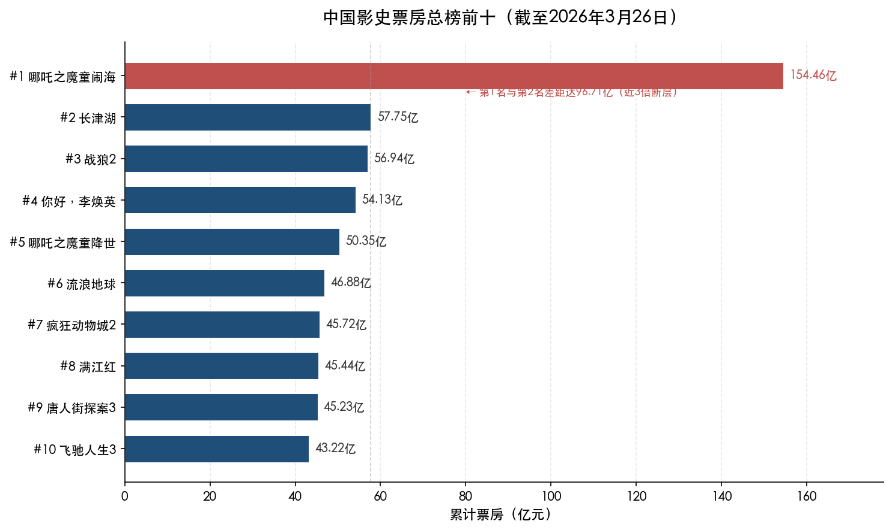

上图以横向柱状图直观呈现前十影片的累计票房分布。《哪吒之魔童闹海》以154.46亿元独占塔尖，与第2名《长津湖》（57.75亿元）之间形成高达96.71亿元的断层，差距接近3倍，这一极端分化构成了当前榜单最突出的结构特征。

## 1.3 逐片核心信息

### 第1名：哪吒之魔童闹海——154.46亿元

《哪吒之魔童闹海》由饺子编剧并执导，成都可可豆动画影视有限公司与光线传媒旗下彩条屋影业联合出品，2025年1月29日春节档上映。影片为2019年暑期档现象级爆款《哪吒之魔童降世》的正统续作，片长144分钟，类型涵盖动画、奇幻与喜剧，豆瓣评分8.4分[豆瓣电影](https://m.douban.com/movie/subject/34780991/ "哪吒之魔童闹海豆瓣页面")。

该片缔造了多项历史纪录：它是亚洲首部票房突破百亿元人民币的电影，亦是全球动画电影票房冠军[IT之家](https://www.ithome.com/0/909/523.htm "2025年12月31日报道确认154.46亿累计票房")。上映仅5天即突破40亿元，第8天（2月6日）以约57.82亿元超越此前稳居榜首近四年的《长津湖》（57.75亿元），此后历经4次密钥延期、上映153天，最终以154.46亿元定格[百度百科](https://baike.baidu.com/item/%E4%B8%AD%E5%9B%BD%E7%94%B5%E5%BD%B1%E7%A5%A8%E6%88%BF/4101787 "超越长津湖时间节点")。以近3倍于第二名的差距断层领先，彻底改写了中国影史票房格局。

### 第2名：长津湖——57.75亿元

《长津湖》由陈凯歌、徐克、林超贤三位导演联合执导，博纳影业集团主控出品，2021年9月30日国庆档上映。主演阵容汇集吴京、易烊千玺、段奕宏等实力演员，影片以抗美援朝长津湖战役为历史背景，类型定位战争/历史，片长176分钟（前十中最长），豆瓣评分7.4分[豆瓣电影](https://m.douban.com/movie/subject/25845392/ "长津湖豆瓣页面")。该片凭借57.75亿元票房曾长期稳居中国影史榜首[新浪](https://www.sina.cn/news/detail/5216366958741530.html "确认57.75亿票房")，直至2025年春节档被《哪吒之魔童闹海》超越。作为中国影史制作成本最高的电影之一（制作费用约13亿元），《长津湖》代表了国产主旋律大片工业化制作的顶峰。

### 第3名：战狼2——56.94亿元

《战狼2》由吴京自编自导自演，核心出品方为北京登峰国际文化传播有限公司与北京文化，2017年7月27日暑期档上映。影片类型为动作/军事，片长123分钟，豆瓣评分7.1分[豆瓣电影](https://m.douban.com/movie/subject/26363254/ "战狼2豆瓣页面")。该片以56.94亿元累计票房成为中国首部突破50亿元大关的电影，亦是首部票房超越同期好莱坞大片、登顶年度全球票房榜的华语片[百度百科](https://baike.baidu.com/item/%E6%88%98%E7%8B%BC%E2%85%A1/20794668 "票房56.94亿")。2017年暑期档的"战狼现象"标志着国产军事动作商业大片的市场潜力首次被充分验证。

### 第4名：你好，李焕英——54.13亿元

《你好，李焕英》由贾玲执导并主演，张小斐、沈腾等联合出演，第一出品方为北京文化，2021年2月12日春节档上映。影片类型为喜剧/奇幻，片长128分钟，豆瓣评分7.7分[新华网](http://www.news.cn/ent/20250123/cbce834679964eed957d088f84f91c92/c.html "新华网引用豆瓣7.7分")。该片以母女亲情穿越为核心叙事，凭借极强的口碑发酵效应，排片占比从首日的20.1%一路攀升至40.8%，最终以54.13亿元收官[新华网](http://www.news.cn/politics/2022-01/01/c_1128225513.htm "确认票房突破54亿")。贾玲也凭此片成为全球票房最高的女性导演，这一纪录至今未被打破。

### 第5名：哪吒之魔童降世——50.35亿元

《哪吒之魔童降世》由饺子编剧并执导，出品方为成都可可豆动画与霍尔果斯彩条屋影业，2019年7月26日暑期档上映。影片类型为动画/奇幻/喜剧，片长110分钟，豆瓣评分8.4分[豆瓣电影](https://m.douban.com/movie/subject/26794435/ "哪吒之魔童降世豆瓣页面")。该片以"我命由我不由天"的核心表达突破圈层壁垒，累计票房50.35亿元[新华网](http://www.news.cn/fortune/20250323/7e3fbadce296451b8f3cd0c20053ebe9/c.html "确认50.35亿票房")，是国产动画电影史上具有里程碑意义的作品——它首次证明国产动画能够触及50亿级别的票房天花板，直接推动了此后数年国产动画的产业化进程与资本信心重建。

### 第6名：流浪地球——46.88亿元

《流浪地球》由郭帆执导，吴京、屈楚萧领衔主演，中国电影股份有限公司与北京文化联合出品，2019年2月5日春节档上映。影片类型为科幻/冒险，片长125分钟，豆瓣评分7.9分[豆瓣电影](https://m.douban.com/movie/subject/26266893/ "流浪地球豆瓣页面")。该片以46.88亿元票房收官[维基百科](https://zh.wikipedia.org/zh-cn/%E6%B5%81%E6%B5%AA%E5%9C%B0%E7%90%83_(%E7%94%B5%E5%BD%B1) "确认46.88亿票房")，被普遍视为中国硬科幻电影的开山之作，标志着国产电影工业在重工业视效领域完成了从0到1的关键突破。

### 第7名：疯狂动物城2——45.72亿元

《疯狂动物城2》由拜伦·霍华德等执导，华特迪士尼动画工作室出品，2025年11月26日在中国内地上映。影片类型为动画/喜剧/冒险，片长108分钟（前十中最短），豆瓣评分8.3分[豆瓣电影](https://m.douban.com/movie/subject/26817136/ "疯狂动物城2豆瓣页面")。该片以45.72亿元成为中国影史进口片票房冠军，亦是首部在中国内地观影人次突破1亿的进口电影[猫眼专业版](https://piaofang.maoyan.com/movie/1142033 "疯狂动物城2票房详情页")。作为前十中唯一一部进口片，《疯狂动物城2》的入榜折射出优质动画IP在中国市场的强劲号召力。

### 第8名：满江红——45.44亿元

《满江红》由张艺谋执导，沈腾、易烊千玺、张译领衔主演，欢喜传媒出品，2023年1月22日春节档上映。影片以南宋秦桧幕府为背景展开层层递进的悬疑叙事，同时融入大量喜剧桥段，类型标注为历史/悬疑/喜剧，片长159分钟，豆瓣评分7.0分[豆瓣电影](https://m.douban.com/movie/subject/35766491/ "满江红豆瓣页面")。该片最终以45.44亿元收官[百度百科](https://baike.baidu.com/item/%E6%BB%A1%E6%B1%9F%E7%BA%A2/60344617 "确认45.44亿票房")，是张艺谋执导生涯中票房最高的作品，也是其商业化转型的标志性成果。

### 第9名：唐人街探案3——45.23亿元

《唐人街探案3》由陈思诚执导，王宝强、刘昊然主演，壹同传奇与万达影视联合出品，2021年2月12日春节档上映。影片类型为悬疑/喜剧/动作，片长136分钟，豆瓣评分5.3分[豆瓣电影](https://movie.douban.com/subject/27619748/ "唐人街探案3豆瓣页面")。该片以45.23亿元票房位列前十[新浪财经](https://finance.sina.cn/2025-01-29/detail-inehrwyy3885838.d.html "确认45.23亿票房")，然而5.3分的豆瓣评分使其成为榜单中口碑最低的作品。高票房与低口碑之间的鲜明反差，使《唐探3》成为研究IP势能与档期红利如何支撑票房高位的典型案例——该片凭借前两部积累的强大IP认知度以及春节档首日预售优势，实现了与口碑走向脱钩的票房表现。

### 第10名：飞驰人生3——43.22亿元（仍在映中）

《飞驰人生3》由韩寒执导，沈腾、尹正、黄景瑜领衔主演，亭东影业、猫眼文化、万达影视等联合出品，2026年2月17日春节档上映。影片类型为喜剧/运动/剧情，片长126分钟，豆瓣评分7.2分[豆瓣电影](https://m.douban.com/movie/subject/37311135/ "飞驰人生3豆瓣页面")。2026年3月17日，该片总票房（含预售）突破42.50亿元，正式超越《复仇者联盟4：终局之战》（42.50亿元），跻身中国影史票房榜前十[界面新闻](https://www.jiemian.com/article/14125073.html "2026年3月17日报道")。截至3月26日累计约43.22亿元，放映密钥已延期至4月18日[证券时报](https://www.stcn.com/article/detail/3660891.html "确认出品公司及票房数据")。该片的入榜同时刷新了一项个人纪录——沈腾凭借此片成为中国影史首位主演票房超400亿元的演员。

## 1.4 榜单结构特征速览

从上述十部影片的核心信息中，可以提炼出若干显著的结构性特征，为后续章节的深入比较奠定分析基础。

**国产片占据绝对主导地位。** 前十中9部为国产片，仅《疯狂动物城2》为进口片。这一比例与2025年全年国产片票房占比79.67%的整体格局高度一致[国家电影局](https://www.chinafilm.gov.cn/xwzx/gzdt/202601/t20260105_944809.html "2025年全国电影票房518.32亿元官方公告")。

**票房断层极为显著。** 第1名《哪吒之魔童闹海》154.46亿元与第2名《长津湖》57.75亿元之间存在96.71亿元的巨大鸿沟，差距接近3倍。第2至第10名的票房区间为43.22亿至57.75亿元，彼此差异相对紧凑。

**时间跨度集中于2017—2026年。** 全部十部影片均上映于最近九年之内，折射出中国电影市场在这一时期的爆发式增长。其中2021年和2025年各有3部作品入榜，是产出最为密集的年份。

**片长分布差异较大。** 从最短的108分钟（疯狂动物城2）到最长的176分钟（长津湖），均值约133.5分钟。战争/历史题材倾向于更长篇幅以承载宏大叙事，动画和喜剧类型则相对紧凑。

**豆瓣评分区间跨度宽广。** 最高8.4分（两部哪吒），最低5.3分（唐探3），均值约7.2分。高票房与高评分并非简单正相关——唐探3以5.3分仍收获45.23亿元票房，而两部8.4分的哪吒则分别位列第1和第5，评分相同但票房差异逾百亿。

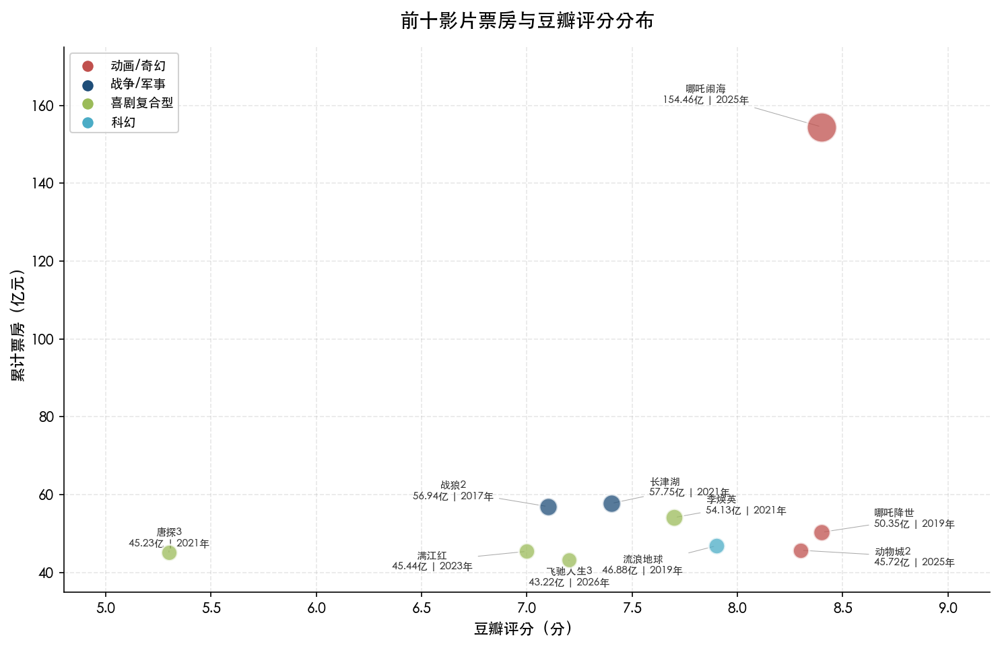

上图以气泡散点图呈现前十影片的票房与豆瓣评分分布关系。动画/奇幻类影片（红色）在评分和票房两个维度均占据优势位置，尤其是《哪吒之魔童闹海》以8.4分+154.46亿元独占图表右上区域；而喜剧复合型影片（绿色）在评分维度上分布较为分散（5.3分至7.7分），显示出该类型票房表现对口碑的依赖度相对较低。

## 1.5 近年榜单变动纪实

中国影史票房总榜并非静止的排行，尤其是2025年至2026年初，榜单经历了自其形成以来最剧烈的一轮重塑。

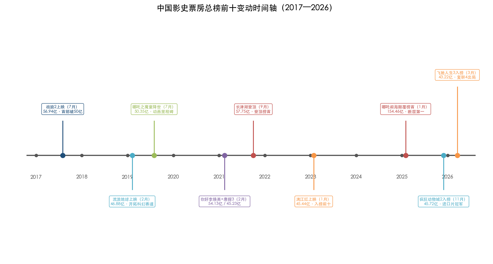

上图以时间轴形式梳理了2017年至2026年间榜单前十的关键变动节点，清晰展现了从《战狼2》首破50亿到《飞驰人生3》挤掉《复联4》的完整演进脉络。

**2025年春节档：哪吒闹海颠覆榜首。** 2025年春节档成为中国电影史上最具标志性的档期之一。《哪吒之魔童闹海》上映仅8天（2月6日），即以约57.82亿元超越此前已稳坐榜首近四年的《长津湖》（57.75亿元），完成代际更替[百度百科](https://baike.baidu.com/item/%E4%B8%AD%E5%9B%BD%E7%94%B5%E5%BD%B1%E7%A5%A8%E6%88%BF/4101787 "超越长津湖时间节点")。此后该片历经4次密钥延期，上映长达153天，最终以154.46亿元定格[IT之家](https://www.ithome.com/0/909/523.htm "2025年12月31日报道确认154.46亿")。这一数字使其跻身全球影史票房前十，中国电影首次在全球票房最高纪录的竞逐中占据一席[新华网](http://www.news.cn/fortune/20250217/2bba23812d964d59be7b776be04cf7f5/c.html "哪吒之魔童闹海进入全球票房榜前十")。

**2025年末：疯狂动物城2挤入前十。** 2025年11月26日上映的《疯狂动物城2》在贺岁档持续发力，凭借45.72亿元票房进入前十，成为中国影史进口片票房冠军及首部内地观影人次破亿的进口电影，将原第十名挤出[界面新闻](https://m.jiemian.com/article/13821077.html "2025年12月29日报道疯狂动物城2入榜")。

**2026年3月：飞驰人生3入榜，复联4出局。** 2026年春节档上映的《飞驰人生3》持续走高，于3月17日以42.50亿元超越《复仇者联盟4：终局之战》（42.50亿元），正式跻身中国影史票房榜前十，同时将《复联4》挤出榜单[扬子晚报](https://www.yzwb.net/news/wy/202603/t20260317_332541.html "2026年3月17日报道排名变动")。

**个人纪录随之刷新。** 这一轮榜单洗牌还伴随着里程碑式的个人纪录更新：饺子凭借两部哪吒累计票房超200亿元，成为中国影史首位200亿票房导演[新华网](http://www.news.cn/fortune/20250323/7e3fbadce296451b8f3cd0c20053ebe9/c.html "饺子导演票房破200亿")；沈腾凭借《飞驰人生3》将主演累计票房推升至约408.66亿元，成为中国影史首位主演票房超400亿元的演员[证券时报](https://www.stcn.com/article/detail/3660891.html "确认沈腾超400亿主演票房")。

## 1.6 小结

以上十部影片构成了截至2026年3月的中国影史票房最高梯队。它们涵盖动画、战争、军事、喜剧、科幻、悬疑、历史等多种题材，上映档期横跨春节档、暑期档、国庆档及非传统档期，制作团队从个人英雄式的导演中心制到三导联袂的超级制作不一而足。154.46亿元的绝对峰值与43.22亿元的入榜门槛之间的3.6倍落差，本身即揭示了中国电影市场极端的头部集中效应。

本章所建立的信息全表将作为后续各章横向比较的统一数据底座——第2章将聚焦题材类型与叙事模式的比较分析，第3章深入剖析制作团队与出品方的格局演变，第4章拆解档期策略与市场表现模式，第5章在上述分析基础上评估未来最有可能冲击票房高位的电影类型与路径。

# 第2章 题材类型与叙事模式横向比较

## 2.1 题材分类框架与分组依据

横向比较的前提是建立统一的分类标准。前十影片大多具有复合类型标签——《满江红》兼具历史、悬疑与喜剧三重属性，《哪吒之魔童闹海》同时归属动画、奇幻与喜剧。为避免重复计算，本章以影片的**首要类型标签**（即最核心的内容属性）为分组依据，同时标注其"渗透型"次要类型。

依据首要类型标签，前十影片可归为以下四大题材集群：

| 题材集群 | 代表影片 | 部数 | 合计票房（亿元） | 占前十总票房比重 |
|:---:|------|:---:|:---:|:---:|
| 动画/奇幻 | 哪吒之魔童闹海、哪吒之魔童降世、疯狂动物城2 | 3 | 250.53 | 41.7% |
| 喜剧复合型 | 你好李焕英、满江红、唐人街探案3、飞驰人生3 | 4 | 188.02 | 31.3% |
| 军事/战争/主旋律 | 长津湖、战狼2 | 2 | 114.69 | 19.1% |
| 科幻 | 流浪地球 | 1 | 46.88 | 7.8% |

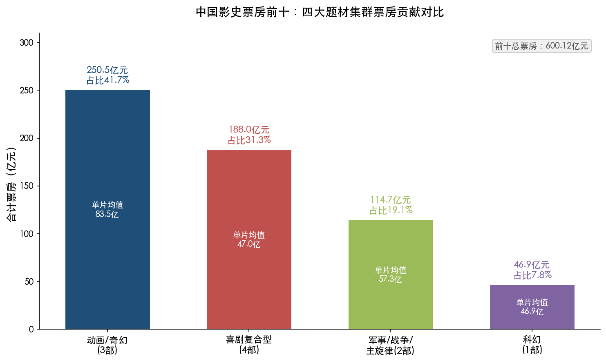

前十影片累计总票房为600.12亿元[猫眼专业版](https://piaofang.maoyan.com/rankings/year "中国电影票房总榜")。动画/奇幻集群以3部影片贡献41.7%的票房份额，单片均值高达83.5亿元，远超真人电影的49.9亿元均值。喜剧复合型以4部作品构成最大的数量群落，单片均值47.0亿元相对动画集群偏低。军事/战争集群仅有2部，却凭借《长津湖》和《战狼2》两部"现象级"巨制拿下近五分之一的份额。科幻赛道目前仅有《流浪地球》一部代表作入围，但其作为品类开拓者的战略意义远超数字本身。

## 2.2 喜剧元素：贯穿前十的"最大公约数"

从次要类型标签的视角审视，一个更具穿透力的特征清晰浮现：前十影片中7部含有喜剧元素。具体而言，《哪吒之魔童闹海》《哪吒之魔童降世》《疯狂动物城2》属于"动画+喜剧"，《你好，李焕英》《飞驰人生3》属于"真人喜剧"，《满江红》属于"历史悬疑+喜剧"，《唐人街探案3》属于"悬疑+喜剧+动作"。仅《长津湖》《战狼2》《流浪地球》三部不含喜剧标签——而这三部恰好全部属于军事/战争或科幻类型，其"全民性"依靠的是国家叙事动员或品类稀缺冲击，而非情绪愉悦。

这一结构与整个中国电影市场的类型偏好高度吻合。灯塔研究院发布的《2024年中国电影市场年度盘点报告》显示，2024年喜剧单一类型票房占全年总票房的36%，全年32部喜剧电影贡献票房产值超200亿元，占大盘票房接近一半[同花顺/灯塔研究院](https://m.10jqka.com.cn/20250103/c665138014.shtml "2024年中国电影市场年度盘点报告")。灯塔数据分析师陈晋指出："轻松、解压、刺激成为了2024年电影观众的主要观影诉求，春节档、五一档等热门档期喜剧片家庭结伴观影比例突出。"[新华网](http://www.news.cn/20250106/309a49fe11184d4eaa3e467090c493cd/c.html "2025年1月6日报道引用灯塔数据")

喜剧之所以成为前十的"最大公约数"，根本原因在于它降低了观影门槛、拓宽了受众基数。喜剧元素使战争片不显沉重——《满江红》借沈腾的喜感调和了古装悬疑的压迫氛围；使动画片不限于儿童——两部哪吒中太乙真人和敖丙的互动提供持续笑点；使运动片不止于竞技——《飞驰人生3》的赛车叙事经沈腾式幽默重新包装为合家欢。在中国电影市场，能冲击票房天花板的影片几乎必须具备"全民性"，而喜剧元素恰恰是实现全民性的最低成本路径。

## 2.3 动画电影：从"亲子赛道"到"全年龄段"的范式跃迁

### 2.3.1 票房结构的历史性转折

动画电影在前十中的表现堪称"结构性升级"的缩影。国家电影局官网数据显示，动画电影的市场占比经历了三个清晰阶段：2011—2018年约10%，2019—2024年约14%，2025年则跃升至接近50%——全年动画电影票房达254.9亿元，市场占比49.2%，创历史最高[国家电影局](https://www.chinafilm.gov.cn/xwzx/gzdt/202601/t20260112_945840.html "2026年1月12日统计动画电影历年票房占比变迁")。其中国产动画电影（含合拍片）总票房达192.8亿元，在全部动画电影票房中占比75.7%，同样为2011年以来最高水平[新华网](http://www.xinhuanet.com/ent/20260113/c612408ff19248dfb1120c068ddc4e7c/c.html "2026年1月13日详析2025年动画电影市场格局")。

灯塔研究院发布的《2025中国电影市场年度盘点报告》将2025年定义为"动画电影大年"——动画类型片全年票房突破250亿元，历史性地贡献了大盘半数票房，《哪吒之魔童闹海》与《疯狂动物城2》两部动画片观影人次均破亿[扬子晚报/灯塔研究院](https://www.yzwb.net/news/wy/202601/t20260101_306812.html "2025中国电影市场年度盘点报告")。

### 2.3.2 观众画像的"破圈"实证

动画电影能够进入票房最高梯队，关键在于成功突破"亲子电影"的传统定位。灯塔数据显示，《哪吒之魔童闹海》的观众中30—39岁群体占比超42%，40岁以上占21.2%，两项指标均显著高于大盘均值；女性观众占比约61%[第一财经](https://www.yicai.com/news/102473528.html "2025年2月14日引用灯塔和猫眼数据分析哪吒2观众画像")。更值得关注的是，该片50%的观众为新观众或被"召回"的老观众，拉新能力为近十年影片之最[扬子晚报/灯塔研究院](https://www.yzwb.net/news/wy/202601/t20260101_306812.html "灯塔2025年度盘点报告")。

这一趋势表明，国产动画已完成从"亲子赛道"到"全年龄段"的升级。成年观众——尤其是30—40岁的中坚消费群体——不再将动画视为"带孩子看的电影"，而是将其纳入文化消费的主流选择。

### 2.3.3 传统文化重构的叙事内核

前十中的两部哪吒电影共享一个核心叙事策略：**对传统神话的现代性重构**。《哪吒之魔童降世》以"我命由我不由天"为主题，将封建父权叙事中的悲剧英雄改写为反抗命运的现代青年[豆瓣电影](https://m.douban.com/movie/subject/26794435/ "哪吒之魔童降世豆瓣页面")。《哪吒之魔童闹海》则进一步深化，将传统神话中"剔骨还父"的情节改写为代际创伤的疗愈过程，赋予哪吒与李靖父子关系以现代家庭伦理的思考维度[光明网](https://theory.gmw.cn/2025-05/09/content_38015531.htm "从哪吒登顶看传统文化现代表达")。中国电影艺术研究中心学者指出，哪吒的形象"实际上是中国30年来独生子女成长中的一个内心画像"，影片中的父子关系"不再是垂直的，而是横向的，反映了现代社会中父权关系的变化"[中国电影资料馆](https://edu.cfa.org.cn/yjsjy/xwdt/202503/e8578846dbfb4923b303b4fdec022081.shtml "哪吒之魔童闹海学术沙龙综述")。

《疯狂动物城2》虽为进口片，但其"社会寓言"式叙事——以动物城的阶层矛盾折射现实议题——同样具备全年龄段的情感穿透力，豆瓣8.3分、猫眼9.7分的双高口碑印证了这一点[豆瓣电影](https://m.douban.com/movie/subject/26817136/ "疯狂动物城2豆瓣页面")。

## 2.4 军事/战争/主旋律：从巅峰到审美疲劳

### 2.4.1 双峰时刻

前十中的军事/战争集群由《战狼2》（56.94亿元）和《长津湖》（57.75亿元）构成，分别代表了该类型在不同阶段的票房巅峰。

《战狼2》于2017年暑期档上映，以"犯我中华者虽远必诛"的强国叙事切中了彼时中国经济高速增长期的民族自信心理。吴京自编自导自演，将个人英雄主义与国家叙事融为一体，开创了军事动作片的商业化先河[豆瓣电影](https://m.douban.com/movie/subject/26363254/ "战狼2豆瓣页面")。《长津湖》于2021年国庆档上映，以抗美援朝长津湖战役为背景，汇集陈凯歌、徐克、林超贤三位导演和吴京、易烊千玺等头部阵容，制作成本约13亿元，为中国影史最贵电影[证券时报](https://news.stcn.com/sd/202110/t20211007_3738347.html "长津湖出品方及投资")。两部影片合计114.69亿元的票房体量，证明了军事/战争题材在特定历史窗口期的巨大爆发力。

### 2.4.2 审美疲劳的渐显

然而，2023年之后，同类型影片的票房表现呈明显下行趋势。2023年国庆档《志愿军：雄兵出击》票房8.63亿元，2024年国庆档《志愿军：存亡之战》12.06亿元，均未能复制《长津湖》的社会效应。2025年春节档《蛟龙行动》投资近10亿元却票房不足4亿元，成为该类型滑坡的标志性事件[三联生活周刊](https://www.lifeweek.com.cn/h5/article/detail.do?artId=241315 "2025年1月30日系统分析军事战争片兴衰历程")。

同质化叙事是核心症结。从《战狼2》到《长津湖》再到后续的志愿军系列、蛟龙行动，叙事模式高度趋同——宏大的战争场面、英雄的牺牲与胜利、国家意志的彰显。当观众对这一套路产生免疫后，缺乏叙事创新的同类作品便难以再度激发共鸣。三联生活周刊的分析指出，观众情绪已从对宏大叙事的热忱"转向更贴近个体生存的议题"[三联生活周刊](https://www.lifeweek.com.cn/h5/article/detail.do?artId=241315 "军事战争片兴衰")。灯塔研究院亦观察到"2025年真人电影票房过度集中于历史战争题材，喜剧、动作、悬疑等传统优势类型供给不足"的结构性失衡[腾讯新闻](https://news.qq.com/rain/a/20260102A04W1A00 "2026年1月2日报道灯塔年度盘点报告")。

## 2.5 喜剧复合型：稳健的票房底座

### 2.5.1 类型特征：喜剧从来不是"纯喜剧"

前十中4部喜剧复合型影片无一是纯粹的喜剧片。《你好，李焕英》是喜剧+奇幻（母女穿越），《满江红》是历史悬疑+喜剧，《唐人街探案3》是悬疑+喜剧+动作，《飞驰人生3》是喜剧+运动+剧情。这一规律揭示了中国票房头部喜剧的本质——**以喜剧为情绪外壳，以另一种核心叙事类型为骨架**。

纯喜剧片在中国市场的票房天花板通常在20亿元左右（如《夏洛特烦恼》14.4亿元、《西虹市首富》25.5亿元），而复合型喜剧则能突破40亿元甚至50亿元。究其原因，复合类型扩大了叙事容量：悬疑提供智性张力，运动提供视觉刺激，奇幻提供想象空间，历史提供文化厚度，而喜剧元素确保全程的情绪舒适度。

### 2.5.2 亲情叙事的高共鸣

在喜剧复合型群体中，亲情是最具穿透力的叙事内核。《你好，李焕英》以母女穿越为核心，贾玲将自身的真实丧母经历注入影片，使观众在笑声中与"来不及说出的爱"产生强烈共情，最终以54.13亿元收官[新华网](http://www.news.cn/politics/2022-01/01/c_1128225513.htm "确认票房突破54亿")。两部哪吒电影以父子关系和友情为情感线，同样激发了深层共鸣。中国传媒大学教授范敏指出："能引起当代人的广泛共鸣，才是好故事。"[新华网](http://www.news.cn/fortune/20250206/8e21f8db6aa34760bc74517ea2384d97/c.html "引用中国传媒大学教授范敏论述")

这一规律提示，"高票房基因"中的情感维度不可或缺——技术可以升级、题材可以迭代，但亲情、友情等普世情感始终是打动最广谱观众群体的底层密码。

## 2.6 科幻：品类开拓者的战略价值

前十中仅有《流浪地球》（46.88亿元）一部科幻片入围，但其意义不应以数量衡量。该片于2019年春节档上映，在中国电影工业尚无硬科幻先例的条件下，以46.88亿元票房完成了中国科幻电影从0到1的突破[维基百科](https://zh.wikipedia.org/zh-cn/%E6%B5%81%E6%B5%AA%E5%9C%B0%E7%90%83_(%E7%94%B5%E5%BD%B1) "确认46.88亿票房")。

科幻赛道在前十中占比仅7.8%，反映的并非市场需求不足，而是有效供给稀缺。中国硬科幻电影的制作门槛极高——《流浪地球》预算3.29亿元，其中大量投入于从零建设的视觉特效流程[人民日报](https://www.peopleapp.com/rmharticle/30024594949 "流浪地球预算3.29亿")。正因如此，当有效供给出现时，被压抑的需求往往以超预期的方式释放。《流浪地球》在2019年春节档的排片从最初的11%逆袭升至38%，正是"供给创造需求"效应的典型案例。

## 2.7 叙事模式比较：IP续集 vs. 原创首部

### 2.7.1 续集与原创的分布

前十影片中，5部为直接续集——《哪吒之魔童闹海》（哪吒系列第2部）、《疯狂动物城2》、《唐人街探案3》（唐探系列第3部）、《飞驰人生3》（飞驰人生系列第3部）以及作为系列延伸的《哪吒之魔童降世》——4部为原创或首部作品——《长津湖》《战狼2》《你好，李焕英》《流浪地球》。《满江红》基于岳飞历史IP但非续集，属于独立作品[新华网](http://www.news.cn/20250208/eb74b1a9332e401ea3d1c1b460d72e8e/c.html "2025年2月8日报道IP续作在春节档的统治力")。

### 2.7.2 续集的结构性优势

IP续集在市场启动阶段具有显著优势。前作已完成品牌认知建设和观众情感积累，续集在预售阶段即可兑现这一存量势能。以《唐人街探案3》为例，该片首日破10亿元（创当时影史首日纪录），背后是唐探系列两部前作积累的IP忠诚度叠加2021年春节档78.22亿元的超级档期红利[豆瓣电影](https://movie.douban.com/subject/27619748/ "唐人街探案3豆瓣页面")。2025年后新入榜的3部影片中有2部为IP续集（哪吒闹海、飞驰人生3），进一步验证了IP续作在春节档的统治力。

### 2.7.3 续集的成败分野

续集并非票房保险。成功续集与失败续集之间的分野，在于能否在延续品牌的同时实现叙事升级。

成功案例的标杆是《哪吒之魔童闹海》——以前作50.35亿元为基础，票房翻三倍至154.46亿元。该片在保留核心人物（哪吒、敖丙）与情感纽带（友情、父子关系）的基础上，全面升级了视觉特效和世界观架构，被灯塔分析师评价为"保留核心人物与情感纽带是成功IP续作的关键"[三联生活周刊](https://www.lifeweek.com.cn/h5/article/detail.do?artId=241315 "2025年1月30日分析IP续集成败规律")。

失败案例则如2025年春节档的《蛟龙行动》——虽然借用了军事动作IP的类型框架，但因更换主创团队、叙事同质化以及主旋律审美疲劳，投资近10亿元却票房不足4亿元[三联生活周刊](https://www.lifeweek.com.cn/h5/article/detail.do?artId=241315 "IP续集成败规律")。

### 2.7.4 原创首部的爆发力

前十中4部原创作品均具备一个共同特征：**品类首创**。《战狼2》开创了军事动作片的商业化先河；《你好，李焕英》以亲情穿越打动全年龄段，贾玲也因此成为全球票房最高的女性导演；《长津湖》以13亿元超级制作刷新了中国影史投资纪录；《流浪地球》开拓了中国硬科幻赛道。四部影片的共性是在各自类型领域实现了"从0到1"的突破，以品类稀缺性制造了强烈的市场冲击力[新华网](http://www.news.cn/fortune/20250206/8e21f8db6aa34760bc74517ea2384d97/c.html "2025年2月6日新华社分析口碑与票房关系")。

由此可以得出一个重要判断：在中国电影市场，IP续集和原创首部各有其通往高票房的路径——续集依靠品牌势能的叠加放大，原创依靠品类稀缺性的首发冲击。两条路径殊途同归的前提是**内容品质过硬**。

## 2.8 内容调性比较：主旋律、合家欢与情绪共鸣

### 2.8.1 "全民化"的核心特征

回溯前十影片的内容调性，能够冲击票房天花板的作品普遍具备"全民化"特征。灯塔和猫眼数据表明，具备破圈能力的题材需满足四个条件：①家庭观影友好（2026年春节档多人观影达25.1%创新高）；②喜剧或轻松情绪元素；③代际共鸣；④强社交属性[新华网](http://www.news.cn/20250208/eb74b1a9332e401ea3d1c1b460d72e8e/c.html "2025年2月8日引用灯塔和猫眼数据")。

2025年春节档的数据印证了社交属性对票房的乘数效应：映前30天B站相关播放量5.08亿次（同比+54%），初一至初六微博阅读量超328亿（同比+16.3%）[新华网](http://www.news.cn/20250208/eb74b1a9332e401ea3d1c1b460d72e8e/c.html "社媒数据")。灯塔报告亦显示，社交媒体已形成"映前种草→观影→映后二创→带动新一轮观影"的正向循环[CBNData](https://www.cbndata.com/information/294479 "灯塔营销洞察报告")。

### 2.8.2 主旋律与市场化的张力

前十中的主旋律影片（《战狼2》《长津湖》）代表了一种特殊的内容调性——国家叙事与商业电影的深度结合。这类影片在特定社会情绪窗口期具有极强的动员能力（如建军90周年之于《战狼2》、抗美援朝71周年之于《长津湖》），但其票房表现高度依赖外部情绪环境。一旦社会情绪焦点转移或同类型供给过剩，动员效应便迅速衰减。

相较之下，以情感共鸣为核心调性的影片（如两部哪吒、《你好，李焕英》）对外部情绪环境的依赖度较低，更依靠内容本身的情感穿透力。灯塔研究院的调研显示，《哪吒之魔童闹海》42%的观众将"制作精良"列为核心亮点，44%形成二次观影[腾讯新闻](https://news.qq.com/rain/a/20260102A04W1A00 "引用灯塔调研数据")。成功动画电影的共性在于"现实生活共鸣"——即便是架空的神话世界，其情感内核（反抗偏见、珍视亲情、追求自我）仍深深扎根于当代中国人的生活经验之中[新华网](http://www.xinhuanet.com/ent/20260113/c612408ff19248dfb1120c068ddc4e7c/c.html "论述情绪价值对票房的驱动")。

### 2.8.3 题材偏好的结构性迁移

将前十影片按上映年份排列，可以观察到一条清晰的题材偏好迁移轨迹：

- **2017—2021年**：入榜影片以军事/战争和真人喜剧为主（战狼2、长津湖、你好李焕英、唐探3），动画仅有《哪吒之魔童降世》一部。
- **2023年**：新入榜的《满江红》为历史悬疑+喜剧，主旋律色彩已被喜剧调性取代。
- **2025—2026年**：新入榜3部影片中2部为动画（哪吒闹海、疯狂动物城2），1部为喜剧+运动（飞驰人生3），全部含喜剧元素，军事/战争题材未有新作入围。

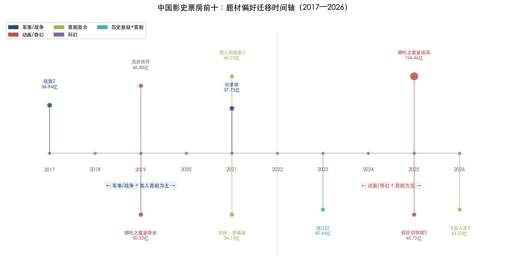

这一迁移趋势与灯塔研究院的观察高度一致：观众对动画类型的喜爱度较2024年9月提升了10个百分点[腾讯新闻](https://news.qq.com/rain/a/20260102A04W1A00 "灯塔调研数据")。2026年春节档的数据进一步验证了这一趋势——《飞驰人生3》以超29亿元领跑（喜剧+赛车），独占档期总票房57.52亿元的50.8%，再度印证"IP续集+喜剧"组合的市场统治力[新华网](http://www.news.cn/ci/20260227/5f6ee4e571984366ae05fb119e6db5f4/c.html "2026年2月27日引用灯塔和猫眼数据分析")。

## 2.9 真人与动画的结构性分野

从"真人 vs. 动画"的维度切入，前十呈现出一个值得深思的结构格局：

| 维度 | 动画（3部） | 真人（7部） |
|:---:|:---:|:---:|
| 合计票房 | 250.53亿 | 349.59亿 |
| 单片均值 | 83.5亿 | 49.9亿 |
| 豆瓣均分 | 8.37 | 6.81 |
| 含喜剧元素比例 | 100% | 57% |
| 续集占比 | 100% | 29% |

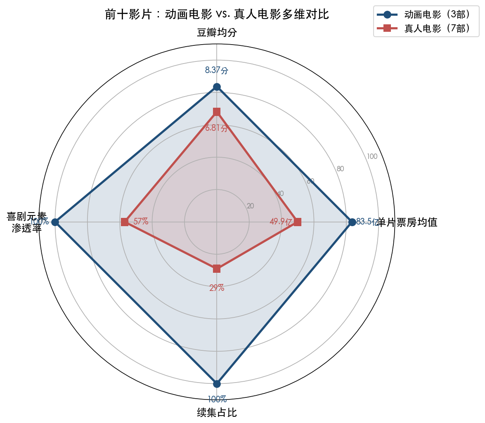

动画电影在单片均值上领先真人电影67%，在口碑上领先1.56分。三部动画全部含喜剧元素、全部为续集（或系列作品），且全部实现了"全年龄段"覆盖。这组数据揭示了动画赛道的结构性优势：动画天然具备IP化和系列化的基因——角色不依赖真人演员的档期和形象变化；具备更低的文化折扣——动物城的动物角色、哪吒的神话世界均能跨越文化壁垒；在视觉奇观呈现上拥有真人电影难以企及的自由度。

2025年国产动画电影票房占全部动画电影票房的75.7%，过去5年该占比平均62.1%，2016—2020年为41.5%，2011—2015年为35.7%[新华网](http://www.xinhuanet.com/ent/20260113/c612408ff19248dfb1120c068ddc4e7c/c.html "国产动画电影市场份额变迁")。这条持续上行的曲线表明，国产动画不仅在抢占进口动画的市场份额，更在向真人电影的传统领地扩张。

## 2.10 小结：题材与票房量级的关联性

综合以上分析，前十影片在题材类型与叙事模式上呈现五条核心规律：

**第一，动画/奇幻是当前中国电影市场票房天花板最高的题材赛道。** 3部动画合计250.53亿元、占前十总票房41.7%，单片均值83.5亿元远超真人电影。2025年动画电影市场占比跃升至49.2%，标志着该赛道已从"利基市场"升级为"主赛道"。

**第二，喜剧元素是冲击票房天花板的近乎必要条件。** 前十中70%含喜剧标签，2024年喜剧单一类型票房占大盘36%。喜剧降低观影门槛、拓宽受众基数、增强社交传播属性，是实现"全民化"的最低成本路径。

**第三，IP续集与原创首部各有通往高票房的路径，但两者的成功前提均为内容品质。** 续集靠品牌势能叠加，原创靠品类首创冲击。成功续集的核心在于"保留核心人物与情感纽带"的同时实现叙事和技术升级；成功原创的核心在于开辟前所未有的品类赛道。

**第四，军事/战争/主旋律题材正经历周期性调整。** 2017—2021年的两部巅峰之作尚无后继者能企及同等高度。同质化叙事与观众情绪转向使该类型的票房天花板显著下移，短期内难以再有新作进入前十。

**第五，亲情、成长、自我认同等普世情感是票房穿透力的底层密码。** 无论题材是动画还是真人、调性是喜剧还是史诗，能够激发跨越年龄、性别、地域的广谱共鸣，是所有前十影片的终极共性。

# 第3章 制作团队与出品方格局比较

## 3.1 导演：谁在制造票房冠军

中国影史票房前十影片共涉及8位导演（《长津湖》为陈凯歌、徐克、林超贤联合执导），其中饺子凭借《哪吒之魔童降世》（50.35亿元）与《哪吒之魔童闹海》（154.46亿元）两部作品入榜，是唯一在前十中拥有两部作品的导演。2025年2月15日，饺子以累计票房超越陈思诚登顶中国导演票房榜，成为仅凭两部作品即问鼎的首位导演，截至2026年3月其累计票房已逾204亿元。[新浪财经](https://finance.sina.cn/2025-02-15/detail-inekpnsk6505419.d.html "猫眼专业版数据确认饺子登顶")

截至2025年2月，中国导演票房榜前三位分别为饺子（204亿元以上）、陈思诚（155.08亿元，12部作品）、徐克（152.43亿元，71部作品）。[新浪财经](https://finance.sina.com.cn/wm/2025-02-12/doc-inekfwyy9139156.shtml "2025年2月12日导演票房榜排名") 饺子仅凭2部作品位居榜首，单片平均票房逾102亿元，呈现极端的"单片爆发力"集中度——陈思诚需12部、徐克需71部方可达到相近量级，效率差距极为悬殊。

从代际构成审视，前十影片的导演几乎全部于2017年后崛起。吴京（《战狼2》）、贾玲（《你好，李焕英》）、郭帆（《流浪地球》）、饺子（两部哪吒）、韩寒（《飞驰人生3》）、陈思诚（《唐人街探案3》）均在2017年之后才跻身票房头部梯队，仅张艺谋（《满江红》）以及联合执导《长津湖》的陈凯歌、徐克属于传统名导。韩寒凭《飞驰人生3》（43.22亿元）于2026年跻身百亿票房导演行列。[网易](https://www.163.com/dy/article/KNAVI6OE05564X8X.html "2026年3月6日报道") 这一显著的代际更替表明，中国电影市场的票房天花板正由新一代创作者所定义。

更值得关注的是，前十影片呈现显著的"导演中心制"特征。饺子作为可可豆动画和自在境界的实际控制人，全面掌控哪吒系列的创作方向与出品权益；吴京在拍摄《战狼2》时以个人房产抵押融资，兼任导演与主演双重角色；贾玲从跨界喜剧演员转型为导演，深度参与《你好，李焕英》的出品决策；陈思诚自《唐人街探案3》起将第一出品方从万达系转移至旗下的壹同传奇；韩寒则通过亭东影业主导飞驰人生系列的开发权。[新浪财经](https://finance.sina.cn/2017-08-01/detail-ifyinvyk2923350.d.html "战狼2投资局") [21财经](https://www.21jingji.com/article/20250208/herald/e363b9f0ec6f90b85c3027ec0c5f4588.html "唐探系列出品方演变") 导演已不再仅是创作执行者，而是创作与资本深度绑定的核心决策者——这一特征在前十影片中具有高度普遍性。

## 3.2 头部演员：沈腾与吴京的"双子星"格局

前十影片的演员阵容高度集中于少数头部面孔。截至2026年2月24日，中国影史男演员主演票房排行榜前六位依次为：沈腾（约409亿元，25部主演作品）、吴京（约356亿元，38部）、刘昊然（约258亿元）、黄渤（约255亿元）、张译（约231亿元）、王宝强（约229亿元）。[搜狐文娱](https://www.sohu.com/a/990527952_120078003 "数据截至2026年2月24日22时") [界面新闻](https://m.jiemian.com/article/14067679.html "沈腾408.66亿主演票房")

沈腾在前十中主演3部影片（《你好，李焕英》《满江红》《飞驰人生3》），合计贡献票房约142.79亿元。凭借《飞驰人生3》的持续走高，沈腾主演票房突破400亿元大关，成为中国影史首位主演电影票房累计破400亿元的演员。[证券时报](https://www.stcn.com/article/detail/3660891.html "沈腾408.66亿主演票房") [川观新闻](https://cbgc.scol.com.cn/news/7317874 "灯塔专业版数据确认") 从效率维度观察，沈腾仅用25部主演作品便达成这一里程碑，单片平均票房约16亿元，远超吴京的单片均值约9.4亿元——这一差异主要源于沈腾高度聚焦喜剧类型所带来的稳定票房基础。

吴京在前十中以导演兼主演或主演身份出现于3部影片（《战狼2》《长津湖》《流浪地球》），三部合计票房达161.57亿元，横跨军事、战争、科幻三种类型，是前十中覆盖题材最广的演员。截至2026年2月，吴京主演累计票房约356亿元，稳居第二。[搜狐文娱](https://www.sohu.com/a/990050133_120078003 "吴京355.94亿元") 与沈腾不同，吴京的票房号召力建立在"硬汉"银幕形象之上，其作品类型跨度更大但也面临动作戏体能消耗带来的续航压力。

易烊千玺在前十中出现2次（《长津湖》《满江红》），截至2025年6月其出演电影票房累计突破200亿元，成为"00后"首位达成此成就的演员。[新浪财经](https://finance.sina.com.cn/wm/2025-06-27/doc-infcphxi2548975.shtml "易烊千玺票房破200亿") 此外，王宝强与刘昊然作为唐探系列的核心搭档亦在前十中留下印记。整体而言，前十影片的演员格局高度依赖沈腾与吴京两大"票房引擎"——两人合计覆盖前十中6部影片（各3部），所涉票房合计304.36亿元，占前十总票房600.12亿元的50.7%。

## 3.3 出品公司：分散竞争下的头部集中

前十影片的出品方版图呈现"头部分散、无绝对霸主"的格局。按出品参与频次统计，各主要公司的参与情况如下表所示：

| 出品公司 | 参与前十影片数（部） | 所涉影片 | 所涉影片累计票房（亿元） |
|---------|-------------------|---------|----------------------|
| 北京文化 | 3 | 战狼2、你好李焕英、流浪地球 | 157.95 |
| 光线传媒/彩条屋 | 2 | 哪吒之魔童降世、哪吒之魔童闹海 | 204.81 |
| 万达影视 | 2 | 唐人街探案3、飞驰人生3 | 88.45 |
| 中影 | ≥3 | 流浪地球、长津湖、唐人街探案3 | ≥149.86 |
| 登峰国际 | 2 | 战狼2、长津湖 | 114.69 |
| 博纳影业 | 1 | 长津湖 | 57.75 |
| 欢喜传媒 | 1 | 满江红 | 45.44 |
| 亭东影业 | 1 | 飞驰人生3 | 43.22 |
| 华特迪士尼 | 1 | 疯狂动物城2 | 45.72 |

没有任何一家公司主控出品超过2部影片，产业力量分布相当均衡。值得注意的是，参与频次最高的公司并非票房贡献最大的公司——北京文化和中影各参与3部以上，但光线传媒/彩条屋仅凭2部动画即录得最高的所涉累计票房（204.81亿元），揭示了"参与频次高≠票房贡献大"的结构性差异。

### 3.3.1 北京文化：高风险押注模式的兴与衰

北京文化（北京京西文化旅游股份有限公司）是前十中出现频率最高的民营出品公司，其核心策略为"保底发行+爆款押注"——以保底8亿元参与《战狼2》发行、保底15亿元参与《你好，李焕英》发行、并作为出品方之一参与《流浪地球》制作。[第一财经](https://www.yicai.com/news/5325257.html "报道北京文化保底战狼2") [21经济网](http://www.21jingji.com/article/20210302/herald/6784d6cc796990efde9b8e71e641761c.html "报道北京文化爆款模式") 这一模式使北京文化在2017—2021年间频繁押中现象级爆款，但其高风险特性亦导致收益极不稳定：以《你好，李焕英》为例，尽管票房高达54.13亿元，北京文化仅作为保底方参与，实际分成空间有限。更为严峻的是，2020年后北京文化卷入财务造假丑闻——法院判决披露多项虚增行为，公司经营陷入严重困境。[新浪财经](https://finance.sina.com.cn/stock/relnews/cn/2025-03-08/doc-inenwxxp5065102.shtml "北京文化财务造假") [知乎专栏](https://zhuanlan.zhihu.com/p/351501497 "分析北京文化保底发行模式") 北京文化的案例深刻说明，"保底发行"这一中国电影市场特有的制度安排，既可以成为爆款制造机，也可能因单一项目失败或公司治理缺陷而引发系统性风险。

### 3.3.2 光线传媒与彩条屋：动画赛道的战略壁垒

光线传媒（含旗下彩条屋影业）参与前十中2部动画影片——《哪吒之魔童降世》与《哪吒之魔童闹海》，合计票房逾204亿元，是所有出品方中所涉票房最高的单一机构。光线2015年成立彩条屋影业，自2016年起向可可豆动画注资6000万元，并逐步构建了涵盖20余家动画工作室的协同网络。[21财经](https://www.21jingji.com/article/20250218/herald/35479f1fb43ba0a087cb44b94aeb5e81.html "饺子与王长田合作历程") 以《哪吒之魔童闹海》为例，该片5家出品公司中，饺子控制可可豆动画和自在境界两家，其余三家归属光线传媒体系，形成"公司平台+导演核心"的典型合作架构。[新浪财经](https://finance.sina.cn/2025-02-15/detail-inekpnsk6505419.d.html "哪吒2五家出品公司架构")

光线传媒创始人王长田规划以三五十部动画电影构建"中国神话宇宙"，每部制作周期约四五年，整体规划跨度至少20年。[华尔街见闻](https://wallstreetcn.com/articles/3740457 "光线传媒中国神话宇宙战略") 在两部哪吒先后取得50亿元和154亿元的市场验证后，光线在动画赛道已形成显著先发优势——其投资的可可豆动画在2025年登上全球独角兽榜，彩条屋体系下还储备着《姜子牙2》《大鱼海棠2》《涿鹿》《妲己》《二郎神》等大量"神话系"项目。光线传媒在2025年年报中披露，《哪吒之魔童闹海》为公司贡献营收约9.50亿—10.10亿元。[光线传媒公告转引自新浪财经](https://finance.sina.com.cn/jjxw/2025-02-05/doc-ineimuvy1929161.shtml "哪吒闹海营收区间")

### 3.3.3 博纳影业：主旋律大片的荣光与困局

博纳影业主控出品的《长津湖》是前十中制作成本最高的影片，投入约13亿元（约2亿美元），汇集陈凯歌、徐克、林超贤三大导演联合执导。[证券时报](https://news.stcn.com/sd/202110/t20211007_3738347.html "长津湖出品方及投资") 博纳在2020—2022年间凭借"中国骄傲三部曲"（《长津湖》《长津湖之水门桥》《中国机长》等）一度成为主旋律商业大片的代名词。然而，博纳2022—2024年连续三年亏损累计逾26亿元，经营压力持续加大。[南方+](https://www.nfnews.com/content/ryepX9gOog.html "博纳影业亏损超26亿") 2025年春节档，博纳投资近10亿元的《蛟龙行动》票房不足4亿元，主旋律战争题材的同质化困境充分暴露。博纳正尝试向短剧及衍生品领域转型，但成效尚待市场检验。

### 3.3.4 万达影视：投资与排片的协同优势

万达影视参与前十中2部影片（《唐人街探案3》《飞驰人生3》），其核心优势在于"投资+排片"一体化——万达院线作为全国最大院线之一，万达影视参与出品的项目天然享有排片层面的协同便利。[36氪](https://m.36kr.com/p/1099028366149641 "唐探3出品方详情") 唐探系列的出品方结构经历了显著演变：前两部的第一出品方为万达系公司，自《唐人街探案3》起第一出品方变更为陈思诚旗下的壹同传奇，万达退居第二出品方——这一变迁是"导演中心制"趋势在出品层面的具体映射。[21财经](https://www.21jingji.com/article/20250208/herald/e363b9f0ec6f90b85c3027ec0c5f4588.html "唐探系列出品方演变")

### 3.3.5 中影集团：国有渠道龙头的枢纽角色

中国电影股份有限公司（中影）以出品方或发行方身份参与前十中至少3部影片（《流浪地球》《长津湖》《唐人街探案3》）。[证券时报](https://news.stcn.com/sd/202110/t20211007_3738347.html "确认中影参与长津湖出品") 中影的核心角色并非内容主创，而在于发行与渠道——作为中国电影市场最大的国有发行机构，中影在进口片引进和国产片全国发行方面拥有不可替代的基础设施优势。在《流浪地球》项目中，中影同时担任出品方与发行方的双重角色，为影片提供了从投资到发行的全链条支撑。

### 3.3.6 其他出品方

欢喜传媒主控出品《满江红》（45.44亿元），其商业模式核心在于与头部导演签订长期独家合作协议。2018年，欢喜传媒与张艺谋达成合作，向其配发1.5亿股新股（市值约3亿港元）并支付1亿元运营费用，换取对张艺谋执导三部网络系列影视剧的独家投资权（可替换为对电影的优先投资权，且投资不低于60%）。[腾讯新闻](https://news.qq.com/rain/a/20230202A02AY200 "欢喜传媒与张艺谋合作架构") 这种"绑定导演"的策略使欢喜传媒得以分享张艺谋的品牌溢价。

亭东影业由韩寒创立，参与出品《飞驰人生3》（约43.22亿元），该系列已成为亭东影业最具票房号召力的核心IP。华特迪士尼动画工作室出品的《疯狂动物城2》（45.72亿元）是前十中唯一的进口片，亦为中国影史进口片票房冠军。

## 3.4 制作成本与投资回报：有限公开数据下的轮廓

中国电影行业的制作成本通常不作公开披露，但结合上市公司公告、片方声明及权威媒体报道等已公开信息，可勾勒出前十影片的投资体量梯度：

| 影片 | 制作成本（公开估算） | 票房（亿元） | 投资回报概况 |
|------|---------------------|------------|------------|
| 长津湖 | 约13亿元 | 57.75 | 制片方分账约占票房40%，估算回收约23亿元 |
| 唐人街探案3 | 片方辟谣"13亿"传闻，实际成本未公开 | 45.23 | — |
| 飞驰人生3 | 约5—6.5亿元 | 43.22（仍在映） | — |
| 哪吒之魔童闹海 | 约4—6亿元 | 154.46 | 光线传媒确认单片贡献营收约9.50—10.10亿元 |
| 流浪地球 | 约3.29亿元 | 46.88 | — |
| 战狼2 | 约2亿元 | 56.94 | — |
| 哪吒之魔童降世 | 约6000万元 | 50.35 | 投资回报率约83倍 |
| 满江红 | 未公开（业内评估制作成本较低） | 45.44 | — |
| 你好，李焕英 | 未公开 | 54.13 | — |
| 疯狂动物城2 | 迪士尼未公开 | 45.72 | — |

数据来源：[证券时报](https://news.stcn.com/sd/202110/t20211007_3738347.html "长津湖投资超13亿") [人民日报](https://www.peopleapp.com/rmharticle/30024594949 "流浪地球预算3.29亿") [新京报](https://m.bjnews.com.cn/detail/161241255115203.html "唐探3辟谣13亿成本") [观察者网](https://www.guancha.cn/politics/2019_10_19_521968.shtml "哪吒降世投资成本6000万")

上表揭示了三个重要的结构性特征：

**其一，动画电影的投资回报率极为突出。** 《哪吒之魔童降世》以约6000万元制作成本撬动50.35亿元票房，投资回报率约83倍。[观察者网](https://www.guancha.cn/politics/2019_10_19_521968.shtml "披露投资成本6000万") 即便续集《哪吒之魔童闹海》的制作成本上升至约4—6亿元区间，面对154.46亿元的票房体量，回报依然极为丰厚。动画电影不依赖明星片酬、拍摄周期相对可控、后期制作可持续迭代优化的特性，使其天然具备更优的风险收益结构。

**其二，重工业大片成本高企，回报不确定性显著。** 《长津湖》以约13亿元的制作成本成为中国影史最贵电影，最终票房57.75亿元——按制片方分账约40%（含服务费后实际比例更低）估算，投资方总回收约20余亿元，利润空间受制作成本严重挤压。博纳影业的《蛟龙行动》以近10亿元成本仅收获不足4亿元票房，直接导致巨额亏损，充分暴露了高投入军事大片的风险敞口。

**其三，制作成本信息普遍存在不对称问题。** 《唐人街探案3》的成本传闻一度高达13亿元，片方于2021年2月4日正式发布辟谣声明，称"'总成本13亿'为虚高成本的不实言论"。[新京报](https://m.bjnews.com.cn/detail/161241255115203.html "唐探3辟谣13亿成本") 然而片方亦未公布实际制作成本，业界估算在6—8亿元区间。制作成本信息的不透明在中国电影产业中属普遍现象，这增加了外部投资者判断项目风险收益比的难度，也制约了行业估值体系的成熟化进程。

## 3.5 产业格局的结构性特征

综合导演、演员、出品方与制作成本四个维度的分析，前十影片背后的产业格局呈现五个结构性特征：

**"导演中心制"已成主导模式。** 前十影片中，导演几乎全部深度参与出品与投资环节，而非仅承担创作执行角色。饺子控制两家出品公司、吴京以个人资产抵押融资投入制作、陈思诚将出品权从万达收归自有公司、韩寒通过亭东影业掌控系列开发——这些案例共同指向一个趋势：在头部商业电影领域，导演的个人品牌与创作自主权已成为票房号召力的核心载体。光线传媒与饺子之间"公司平台+导演核心"的合作架构，有望成为未来头部影片出品的主流模式。[新浪财经](https://finance.sina.cn/2025-02-15/detail-inekpnsk6505419.d.html "哪吒2五家出品公司架构")

**头部演员的"票房溢价"与风险集中并存。** 沈腾与吴京两人合计覆盖前十中6部影片，所涉票房占前十总额的50.7%。然而，这种高度集中也意味着市场对少数演员的票房号召力形成路径依赖。沈腾的票房效率（单片均值约16亿元）远超行业平均水平，但其核心票房贡献高度集中于喜剧类型——一旦喜剧市场趋于饱和或观众审美发生转向，高度依赖特定演员的投资策略将面临系统性挑战。

**出品方格局"分散而非垄断"。** 前十中没有任何一家公司主控出品超过2部影片，整体呈现"百花齐放"而非寡头垄断的竞争格局。与好莱坞六大厂主导全球票房的模式不同，中国电影市场的票房冠军更多由"项目制"驱动——每一部爆款往往是特定导演、特定公司、特定档期的独特组合，而非产业巨头的系统性产出。这一格局在降低行业集中度风险的同时，也意味着单一出品方难以建立可持续的票房复制能力。

**动画赛道的资本壁垒正在形成。** 光线传媒通过长期投资与"中国神话宇宙"战略，在动画电影领域建立了从人才孵化（可可豆等20余家工作室）、IP储备（神话体系）到发行能力的全链条壁垒。前十影片中，动画类目3部合计250.53亿元，占前十总票房的41.7%，而光线一家即参与了其中204.81亿元。该赛道的先发优势——长制作周期（每部约4—5年）、高技术门槛、需要长期资本持续投入——使后来者难以在短期内实现复制。追光动画是另一个值得关注的竞争者，其古典文学新编系列正在形成差异化定位。

**传统重资产模式面临转型压力。** 博纳影业与北京文化的困境具有标本意义：博纳2022—2024年连续三年亏损累计逾26亿元，其主旋律大片的高成本模式在观众审美疲劳面前难以为继；北京文化的"保底发行"虽曾连续押中多部爆款，但财务造假丑闻与经营困境暴露了这一模式的内在脆弱性。相比之下，光线传媒"轻资产+长周期+深绑导演"的模式展现出更强的可持续性与抗风险能力，其经验对行业具有重要参考价值。

# 第4章 档期策略与市场表现模式比较

档期选择与市场运营策略构成高票房影片的"隐形引擎"。一部影片即使题材优秀、制作精良，若未能匹配恰当的档期窗口与发行节奏，也难以充分释放票房潜力。本章从上映档期分布、票房走势曲线特征、口碑与票房的动态关系、观众结构与社交传播四个维度，对中国影史票房前十影片的市场表现模式展开系统比较，揭示高票房影片在市场端的共性规则与差异化路径。

## 4.1 档期分布：春节档的绝对统治力

前十影片在档期选择上呈现高度集中态势：6部出自春节档（《哪吒之魔童闹海》《你好，李焕英》《流浪地球》《满江红》《唐人街探案3》《飞驰人生3》），2部出自暑期档（《战狼2》《哪吒之魔童降世》），1部出自国庆档（《长津湖》），1部为非传统档期上映（《疯狂动物城2》，2025年11月26日）。春节档以6部影片合计389.4亿元、占前十总票房600.12亿元的64.9%，确立了票房天花板首选窗口的绝对地位。[猫眼专业版](https://piaofang.maoyan.com/rankings/year "中国电影票房总榜")

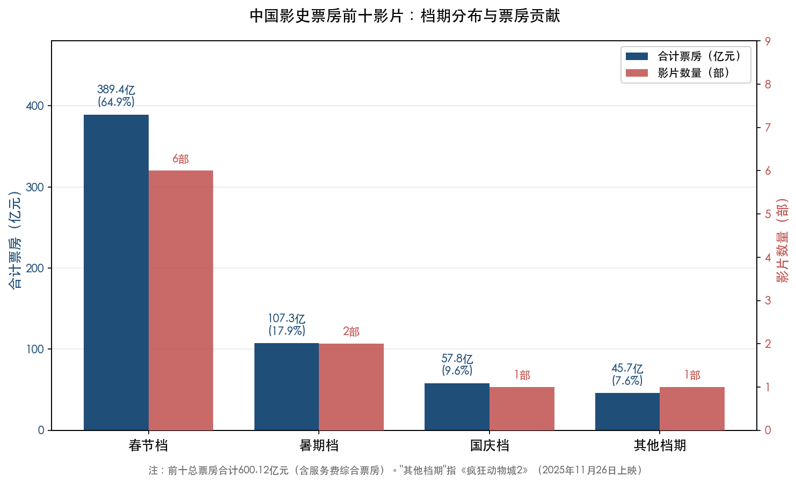

上图直观呈现了前十影片的档期分布格局：春节档无论在影片数量还是合计票房维度均遥遥领先，暑期档以2部影片贡献107.3亿元（17.9%）位居其次，国庆档和其他档期各有1部入围。

春节档之所以能批量产出超级爆款，源于三重结构性优势。**其一，预售爆发力极强。** 2025年春节档预售首日12时43分即破7060万元、14时27分破1亿元，均刷新中国影史最快预售纪录。[新华网](http://www.news.cn/ci/20250209/611b945716e944608f9bc393783b404a/c.html "预售纪录与首日数据") **其二，单日票房产出极高。** 2025年大年初一单日票房达18.07亿元、观影人次3522万，双双刷新影史单日纪录。[新京报](https://m.bjnews.com.cn/detail/1738724218168030.html "2025春节档数据") **其三，社交观影比例高。** 2026年春节档双人观影占比48.5%，三人及以上多人观影占比22.2%，合计超70%的观众以"结伴"形式走进影院，春节档天然承载着"全家一起看电影"的消费场景。[灯塔研究院](https://finance.sina.com.cn/jjxw/2026-02-24/doc-inhnxtak2913117.shtml "2026春节档社交观影数据")

从近两年春节档大盘对比可见头部影片对档期总量的决定性影响。2025年春节档总票房95.10亿元、观影1.87亿人次、场次346.8万场、平均票价50.8元，票房与人次均刷新中国影史春节档纪录。[新京报](https://m.bjnews.com.cn/detail/1738724218168030.html "引用国家电影局数据") 2026年春节档票房则回落至57.52亿元、人次1.20亿、平均票价47.8元（创2021年以来春节档新低），场次则超435万场创历史新高。[灯塔研究院](https://finance.sina.com.cn/jjxw/2026-02-24/doc-inhnxtak2913117.shtml "2026春节档洞察报告") 两年间的巨大落差表明：春节档并非具有刚性天花板的"铁盘"，其体量高度依赖头部影片的质量与数量。2025年有《哪吒之魔童闹海》这一超级爆款独力撑起史无前例的大盘，2026年则因缺乏同等体量的头部作品而显著回落。

暑期档虽在前十中仅占两席，却凭借长达约3个月的放映窗口具备独特优势。2025年暑期档票房119.66亿元、观影3.21亿人次，总观影人次超过同年春节档，但单日票房峰值远低于春节档首日。[证券时报](https://stcn.com/article/detail/3316606.html "引用国家电影局数据") 暑期档的核心价值在于为口碑佳片提供充裕的放映时间窗口，使其有足够空间通过口碑发酵实现票房持续爬升——2017年《战狼2》和2019年《哪吒之魔童降世》均为这一路径的经典范例。

国庆档在前十中仅有《长津湖》一席，但其7天集中消费的假期特征类似"缩小版春节档"。2021年国庆档总票房约43.85亿元，仅《长津湖》一部即贡献约31.54亿元（占比约73%），呈现极端的单片主导效应。[新华网](http://www.news.cn/politics/2021-10/08/c_1127935445.htm "国庆档表现")

## 4.2 票房走势曲线：四种典型模式

对前十影片的日票房走势进行归类分析，可提炼出四种典型的票房曲线模式。

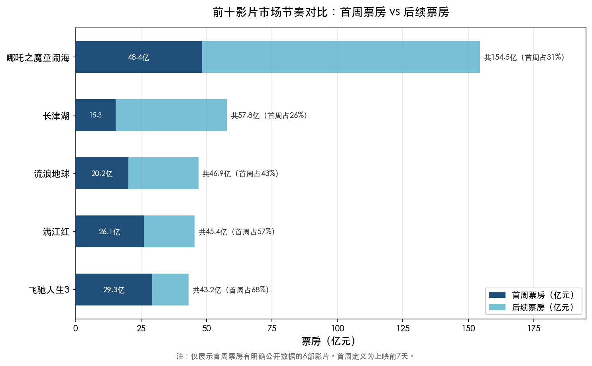

上图以堆叠柱状图呈现了首周票房与后续票房的构成对比。《哪吒之魔童闹海》首周48.4亿元仅占总票房的31%，后续贡献逾百亿，呈现极强长尾效应；《长津湖》首周占比26%同样显示出显著的后程发力；而《飞驰人生3》首周占比68%，则属典型的前重后轻模式。

### 4.2.1 现象级爆发型：《哪吒之魔童闹海》

《哪吒之魔童闹海》创造了中国电影史上最为陡峭的票房增长曲线。2025年1月29日（大年初一）上映，首周7天票房48.39亿元，3天即破18亿、7天突破50亿（均为影史最快速度），上映仅8天（2月6日）便以约57.82亿元超越此前影史冠军《长津湖》（57.75亿元）登顶。[新华网](http://www.news.cn/ci/20250209/611b945716e944608f9bc393783b404a/c.html "首周数据") 总观影人次突破3亿，为中国影史首部达成此里程碑的影片。[凤凰网](https://i.ifeng.com/c/8hRyEDZCWM2 "确认3亿人次") 此后经4次密钥延期，总上映153天，终票定格于154.46亿元。[财联社](https://www.cls.cn/detail/2071126 "密钥延期4次上映153天")

这一"现象级爆发型"曲线的核心驱动力在于四重因素叠加：春节档超级预售势能、开画即爆的顶级口碑、社交媒体裂变式传播，以及中低频观众的大规模"召回"。灯塔分析师陈晋指出，该片"30-39岁、中低频观众占比突出"，大量曾是市场主力但已远离影院的人群被口碑"召回"重返影院，构成口碑驱动票房超预期的核心机制。[新华网](http://www.news.cn/fortune/20250206/8e21f8db6aa34760bc74517ea2384d97/c.html "引用灯塔分析师观点")

### 4.2.2 口碑长尾型：《战狼2》《流浪地球》

《战狼2》于2017年7月27日暑期档上映，首日并无春节档式的预售爆发优势，但凭借口碑与社会情绪的持续共振走出了教科书级的"口碑长尾"曲线。上映4小时破亿，83小时破10亿，13天以34亿元登顶当时影史冠军宝座。此后票房曲线虽逐步回落，衰减速度却极为缓慢，两次密钥延期使其上映约3个月，累计56.94亿元、观影约1.59亿人次。[凤凰文化](http://culture.ifeng.com/a/20171027/52816475_0.shtml "收官数据")

《流浪地球》的逆袭路径更为戏剧化。2019年2月5日（大年初一）上映时，首日排片仅11.4%、票房1.87亿元，在春节档8部新片中位列第四。[新京报](https://m.bjnews.com.cn/detail/154970275014628.html "首日排片11.4%票房1.87亿") 凭借超高口碑，排片从11%一路攀升至38%，大年初四即反超登顶档期冠军，6天突破20亿元，首周票房20.2亿元创当时中国影史首周纪录。[新华网](http://www.xinhuanet.com/politics/2019-02/11/c_1124097168.htm "逆袭夺冠") 终票46.88亿元、观影约1.05亿人次。[人民日报](https://www.peopleapp.com/column/30042633805-500004949996 "观影人次排名")

口碑长尾型影片具有鲜明的共同特征：开画首日未必占据排片优势，但因口碑持续发酵，排片占比逐日攀升，日票房出现"逆跌"（即后一日票房高于前一日），在档期中后段达到峰值，并在档期结束后仍保持较长放映周期。

### 4.2.3 口碑逆袭型：《你好，李焕英》《满江红》

与口碑长尾型相近，"口碑逆袭型"的核心特征在于影片在档期内实现对同期竞品的显著"反超"，且逆袭幅度更为突出。

《你好，李焕英》堪称春节档口碑逆袭的教科书案例。2021年2月12日（大年初一）上映时，首日排片仅20.1%，远低于同日上映的《唐人街探案3》（31%以上），首日票房亦大幅落后。然而凭借豆瓣破8分的口碑势能，排片从20.1%跃升至40.8%，大年初四单日票房逆袭《唐人街探案3》，初五票房已为首日的两倍，初六单片票房占比达56.5%，终票54.13亿元、观影约1.21亿人次。[第一财经](https://m.yicai.com/news/100951651.html "排片逆袭路径") [人民日报](https://www.peopleapp.com/column/30042633805-500004949996 "观影人次1.21亿")

《满江红》在2023年春节档展现了相似逻辑。大年初一首日排片25.6%，略低于《流浪地球2》的27%，但自大年初三起日票房实现反超，此后排片攀升至31.6%领跑档期。[中国青年报](http://m.cyol.com/gb/articles/2023-01/28/content_777qXMceEY.html "排片与逆袭路径") [证券时报](https://www.stcn.com/article/detail/781268.html "大年初四排片31.6%") 春节档7天总票房约26.06亿元，最终累计45.44亿元、总观影约9178万人次。[东方财富](https://wap.eastmoney.com/a/202301292620337292.html "春节档7天票房") [灯塔专业版](https://finance.sina.cn/tech/2023-09-20/detail-imzniiwk3157042.d.html "满江红观影人次9178万")

口碑逆袭型在春节档的频繁出现，折射出该档期独特的消费结构：春节假期通常为7天以上，部分观众会观看多部影片，头部影片释放消费冲动后，观众倾向于选择口碑更优的"第二选择"——这为口碑出色但开画不占优的影片提供了充裕的逆袭空间。

### 4.2.4 IP预期驱动-前重后轻型：《唐人街探案3》《飞驰人生3》

《唐人街探案3》是"前重后轻"型的极端案例。2021年2月12日（大年初一）首日票房突破10亿元（创当时影史首日纪录），排片超31%，预售及开画数据一骑绝尘。然而豆瓣评分从6.8分一路下滑至5.3分，第4天票房较第3天锐减约3亿元，呈断崖式下滑。密钥延期2次至2021年5月12日，终票45.23亿元、观影约9503万人次。[游民星空](https://www.gamersky.com/news/202102/1362823.shtml "首日破10亿豆瓣跌至5.9") [新浪财经](https://finance.sina.com.cn/tech/digi/2025-02-05/doc-ineimkha2660857.shtml "观影人次9503万")

《唐人街探案3》高票房与低口碑的悖论背后存在三个结构性因素：一是系列IP势能的长期积累（前两部豆瓣分别8.0分和6.7分），二是超级档期红利的加持（2021年春节档总票房78.22亿元，创当时影史纪录），三是疫情延期一年所积累的极高期待值。但口碑崩塌最终导致其第4天起被《你好，李焕英》全面反超。[中国新闻网](https://www.chinanews.com/yl/2021/02-26/9419367.shtml "春节档78.22亿及唐探3被逆袭")

《飞驰人生3》的走势则更为稳健。2026年2月17日（大年初一）上映，首日票房约7.7亿元，上映2天累计突破7亿元，4天破17亿元，春节档7天累计约29.27亿元，独占档期总票房57.52亿元的50.8%。[新浪财经](https://finance.sina.com.cn/tob/2026-02-24/doc-inhnwmhw6186352.shtml "2026春节档数据") [凤凰网](https://finance.ifeng.com/c/8qpSMoXrGUd "首日7.7亿") 豆瓣7.2分处于中上水平，虽非顶级口碑，但在一超独大的2026年春节档中未遭遇有力竞争者，排片与票房均持续领跑。截至2026年3月26日累计约43.22亿元，密钥已延期至4月18日，仍在放映中。[界面新闻](https://www.jiemian.com/article/14125073.html "飞驰人生3进入前十")

## 4.3 口碑与票房的非线性关系

通过对前十影片的豆瓣评分与票房走势进行交叉分析，可以得出一个重要结论：**口碑更多决定"票房曲线形态"而非"最终票房绝对值"**。

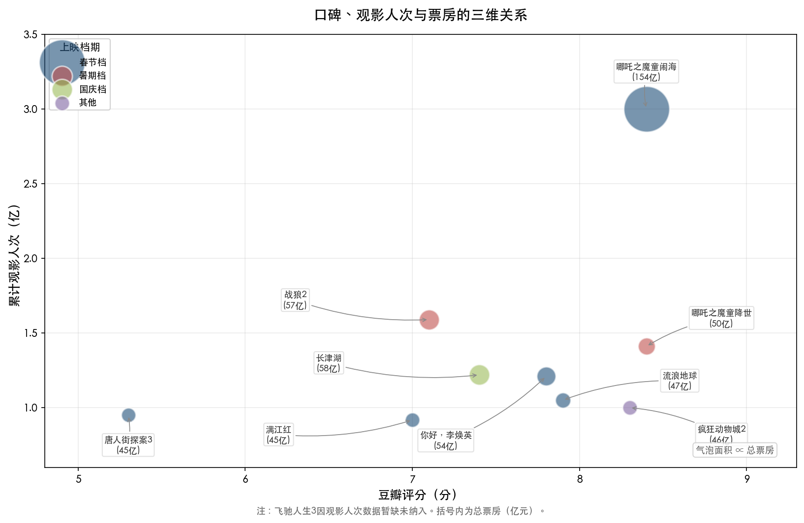

上图以气泡散点图呈现了豆瓣评分（横轴）、累计观影人次（纵轴）与总票房（气泡面积）的三维关系，并以颜色区分上映档期。整体趋势为"高口碑→高人次→高票房"，但《唐人街探案3》（5.3分/45亿元）的位置清晰显示：IP势能与档期红利可在一定程度上对冲口碑劣势。

高口碑影片（豆瓣≥7.5分）普遍呈上扬或长尾走势。《哪吒之魔童闹海》（8.4分）爆发后持续走高至154.46亿元；《流浪地球》（7.9分）从排片第四逆袭至档期冠军；《你好，李焕英》（约7.8分）从排片20%逆袭至40%以上；《战狼2》（7.1分，口碑虽不算顶尖但彼时社会情绪加持效应显著）连续走高3个月。这些影片的共同特征是后劲十足、衰减极为缓慢。

低口碑影片则依靠IP势能和档期红利获取极高首日票房，但随后快速衰减。《唐人街探案3》（5.3分）首日即斩获10亿元的影史纪录，但第4天起断崖下滑，最终票房45.23亿元——这一成绩在绝对值上仍属顶级，说明在超级档期加持下，即使口碑崩塌，IP势能和档期流量仍能托住一个相当可观的票房底线。然而与同档期口碑更优的《你好，李焕英》的走势对比，清晰展示了口碑对曲线形态的决定性影响。[第一财经](https://m.yicai.com/news/100951651.html "口碑与票房关系分析")

尤需强调的是，豆瓣评分与最终票房之间并非简单正相关。前十中评分最高的《哪吒之魔童闹海》和《哪吒之魔童降世》（均为8.4分）确实占据票房前列，但评分7.0分的《满江红》终票45.44亿元，评分5.3分的《唐人街探案3》亦达45.23亿元——两部影片评分相差1.7分，票房却仅相差2100万元。这一案例表明，在"超级档期+强IP"的组合下，口碑底线可以被显著抬高；与此同时，口碑优秀的影片在同一档期内拥有更大的逆袭空间和长尾潜力。

## 4.4 观影人次与票价结构

从观影人次维度审视，前十影片的人次分布呈现极端的头部集中特征：

| 影片 | 累计观影人次 | 来源 |
|------|------------|------|
| 哪吒之魔童闹海 | 约3亿+ | 中国影史首部破3亿 |
| 战狼2 | 约1.59亿 | 破亿人次里程碑 |
| 哪吒之魔童降世 | 约1.41亿 | 当年超流浪地球 |
| 长津湖 | 约1.22亿 | 国庆档18天破亿 |
| 你好，李焕英 | 约1.21亿 | 国产第四部破亿 |
| 疯狂动物城2 | 突破1亿 | 首部破亿进口片 |
| 流浪地球 | 约1.05亿 | |
| 唐人街探案3 | 约9503万 | 未破亿 |
| 满江红 | 约9178万 | 未破亿 |

[人民日报](https://www.peopleapp.com/column/30042633805-500004949996 "观影人次排名") [新浪财经](https://finance.sina.com.cn/tech/digi/2025-02-05/doc-ineimkha2660857.shtml "观影人次数据") [凤凰文化](http://culture.ifeng.com/a/20171027/52816475_0.shtml "战狼2人次") [灯塔专业版](https://finance.sina.cn/tech/2023-09-20/detail-imzniiwk3157042.d.html "满江红观影人次")

《哪吒之魔童闹海》的3亿+人次几乎是第二名《战狼2》（1.59亿）与第三名《哪吒之魔童降世》（1.41亿）之和，这一断层式领先再次印证该片"现象级"的市场地位。前十中7部影片观影人次超过1亿，仅《唐人街探案3》和《满江红》未能破亿——而这两部影片恰恰是口碑相对最弱的两部（豆瓣5.3分和7.0分），说明口碑对观影人次的拉动作用比对票房绝对值的影响更为直接。

票价方面，近年春节档平均票价呈先升后降态势。2025年春节档平均票价50.8元，2026年春节档则降至47.8元（创2021年以来新低）。[新京报](https://m.bjnews.com.cn/detail/1738724218168030.html "2025春节档50.8元") [灯塔研究院](https://finance.sina.com.cn/jjxw/2026-02-24/doc-inhnxtak2913117.shtml "2026春节档47.8元") 2026年元旦档平均票价更降至39.7元（近五年同期最低）。[新京报](https://www.bjnews.com.cn/detail/1772361299129433.html "元旦档票价") 票价下行与"2026电影经济促进年"政策引导、各地惠民补贴及平台优惠活动密切相关，对降低观影门槛、拉动下沉市场及促进低频观众回流具有积极意义。

## 4.5 密钥延期：头部影片的"长尾收割"

密钥延期已成为前十影片普遍采用的放映策略，其对最终票房的增量贡献不容忽视。

《哪吒之魔童闹海》密钥延期4次、总上映153天，为前十中上映周期最长的影片。春节档期间（约7天）票房逾48亿元，此后近5个月的长线放映额外贡献了超百亿票房——长尾收益远超首周收益，这一比例在全球电影市场中亦属罕见。[财联社](https://www.cls.cn/detail/2071126 "密钥延期4次上映153天") 《长津湖》密钥延期3次至2022年1月16日，总上映108天，国庆7天约31.54亿元，后续两个多月贡献逾26亿元。[界面新闻](https://www.jiemian.com/article/6955652.html "长津湖密钥延期") [澎湃新闻](https://m.thepaper.cn/newsDetail_forward_15565853 "长津湖票房复盘") 《战狼2》两次密钥延期，上映约3个月。[界面新闻](https://www.jiemian.com/article/1548129.html "战狼2票房走势")

密钥延期的本质是让口碑驱动型影片在档期红利消退后继续收割长尾票房。这一策略对口碑佳片的增量效应远大于口碑弱片——《唐人街探案3》虽也延期2次至2021年5月12日，但后期日票房衰减极快，延期所贡献的增量相对有限。密钥延期策略的有效性与影片口碑呈高度正相关。

## 4.6 社交媒体：从营销渠道到票房"放大器"

社交媒体在前十影片的市场表现中扮演了日益关键的角色，已从传统的映前营销渠道演变为贯穿影片全生命周期的票房"放大器"。

以《哪吒之魔童闹海》为例，上映15天内全平台文章量达7.46万篇、互动3.66亿次，微博热搜210余次、抖音热搜40次、快手热搜70次，全平台话题播放量390亿次。[凤凰网](https://h5.ifeng.com/c/vivoArticle/v002M87tKrOX04GHNO4q2DcgWGvqLtgBZaQaUIZKDQGMNEY__ "社交媒体热搜数据") 从更宏观的维度看，2025年春节档抖音电影相关内容总播放471亿次，用户自发影评77.8万条（同比增长逾6倍），用户创作内容播放160亿次，超240万人参与哪吒闹海抽卡活动。[新浪新闻](https://news.sina.cn/sx/2025-02-13/detail-inekhyni5229645.d.html "抖音新春欢乐观影计划数据")

灯塔报告显示，2021—2024年"想看"热度与票房大盘走势高度一致，抖音电影话题播放量自2023年起呈爆发式增长。社交媒体已形成"映前种草→观影→映后二创→带动新一轮观影"的正向循环闭环。[CBNData](https://www.cbndata.com/information/294479 "灯塔营销洞察报告") 这一循环机制对理解前十影片中多次出现的"口碑逆袭"现象至关重要——映后二创内容的广泛传播相当于为影片提供了持续的免费"口碑广告"，不断驱动原本无观影计划的中低频用户走进影院。

映前社交平台热度已成为票房预测的重要先行指标。2025年春节档映前30天B站播放量达5.08亿次（同比增长54%），大年初一至初六微博阅读量超328亿次（同比增长16.3%）。[新华网](http://www.news.cn/20250208/eb74b1a9332e401ea3d1c1b460d72e8e/c.html "引用灯塔和猫眼数据")

## 4.7 下沉市场与观众结构变迁

前十影片的市场表现还折射出中国电影观众结构的深刻变迁。

**下沉市场已成票房增量的核心引擎。** 2026年春节档三四线城市票房占比近53%，《飞驰人生3》等4部影片在下沉市场占比均超五成，下沉市场贡献度达近五年最高。[灯塔研究院](https://finance.sina.com.cn/jjxw/2026-02-24/doc-inhnxtak2913117.shtml "下沉市场占比53%") 2025年春节档三四线城市同样贡献了近六成票房。[新华网](http://www.news.cn/20250208/eb74b1a9332e401ea3d1c1b460d72e8e/c.html "下沉市场数据")

**35岁以上观众占比快速攀升。** 35岁以上购票用户占比已由五年前的25.5%提升至44%。[猫眼研究院](https://m.maoyan.com/information/19467968 "《2025中国电影市场数据洞察》") 以《哪吒之魔童闹海》为例，30-39岁观众占比超42%，40岁以上占21.2%，均高于大盘均值；女性观众占比约61%。[第一财经](https://www.yicai.com/news/102473528.html "引用灯塔和猫眼数据分析观众画像") 这意味着高票房影片的"中低频观众召回"效应主要发生在30岁以上群体——该群体观影频次虽低，但人口基数庞大，一旦被口碑激活即可贡献显著增量。

**年轻观众回流信号初现。** 2026年春节档25岁以下观众占比回升至27%（2025年同期为23.53%），这一积极变化表明在票价下降与内容品质提升的双重驱动下，年轻观众正在重返影院。[新京报](https://www.bjnews.com.cn/detail/1772361299129433.html "25岁以下占比回升")

## 4.8 前十影片市场表现模式综合比较

综合以上分析，前十影片的市场表现模式可归纳为以下对照框架：

| 市场模式 | 代表影片 | 核心驱动力 | 曲线特征 | 密钥延期效果 |
|---------|---------|-----------|---------|------------|
| 现象级爆发 | 哪吒闹海 | 超级口碑+春节档+社交裂变+观众召回 | 首周即爆，长尾贡献超百亿 | 极强（后期贡献远超首周） |
| 口碑长尾 | 战狼2、流浪地球 | 口碑持续发酵+社会情绪共振 | 首日不占优，逐日攀升，衰减极慢 | 强（暑期档尤为显著） |
| 口碑逆袭 | 李焕英、满江红 | 春节档消费周期+口碑-排片正反馈 | 首日落后，3—4天反超，后半程主导 | 中强 |
| IP预期驱动 | 唐探3、飞驰人生3 | IP势能+档期红利+预售爆发 | 首日/首周极高，后续快速衰减或稳健消耗 | 弱至中等 |
| 国庆档逆跌 | 长津湖 | 超级制作+主旋律情绪+国庆假期 | 档期内连续逆跌，档期后稳定长尾 | 强 |

前十影片的市场共性可凝练为三点。**第一，档期选择是票房天花板的前提条件**——春节档和暑期档合计贡献了前十中的8部，非黄金档期上映的影片几乎不可能冲击40亿元以上的票房量级（《疯狂动物城2》为罕见例外，得益于其作为全球顶级IP的口碑势能与"非春节档空窗期"的差异化优势）。**第二，口碑是决定票房曲线走势和长尾空间的核心变量**——高口碑影片通过排片正反馈、中低频观众召回和社交裂变持续拉高票房上限，低口碑影片则在首周红利消退后快速衰减。**第三，密钥延期与社交媒体传播构成票房的"放大回路"**——密钥延期为口碑佳片争取了更长的放映窗口，社交媒体则在窗口期内持续为影片输送新增观众，两者形成相互强化的正向循环。

# 第5章 未来高票房电影类型评估与展望

前四章已从题材分布、制作格局、档期规律与市场表现模式四个维度，系统勾勒出中国影史票房前十影片的全貌。本章在此事实基础上，聚焦三个核心问题：第一，从前十影片共性中能够提炼出怎样的"高票房基因"组合？第二，2026—2028年哪些类型赛道最有潜力冲击30亿元以上票房？第三，哪些结构性变量将重塑未来的票房格局？

## 5.1 "高票房基因"：从前十共性中提炼的核心公式

综合前四章的横向比较，冲击30亿元以上票房的"高票房基因"并非单一要素，而是五个维度的系统性叠加。

**第一，题材维度：动画/奇幻与喜剧构成双引擎。** 前十影片中，动画/奇幻集群以3部作品贡献250.53亿元票房，占前十总票房600.12亿元的41.7%，单片均值83.5亿元，远超真人电影的49.9亿元。与此同时，前十中7部（70%）含喜剧元素，喜剧已成为贯穿各高票房题材的"最大公约数"。2024年全年喜剧类型票房超200亿元，约占大盘近半。[新华网](http://www.news.cn/20250106/309a49fe11184d4eaa3e467090c493cd/c.html "2025年1月6日报道引用灯塔数据")

**第二，档期维度：春节档具有绝对统治力。** 前十中6部（60%）出自春节档。春节档凭借预售爆发力、单日产出极高及社交观影比例超70%的三重结构性优势，已成为冲击票房天花板的首选窗口。2025年春节档总票房95.10亿元创历史纪录，仅大年初一即贡献18.07亿元单日产出。[新京报](https://m.bjnews.com.cn/detail/1738724218168030.html "引用国家电影局数据")

**第三，IP属性维度：续集或品类首创缺一不可。** 前十中5部为直接续集（两部哪吒、疯狂动物城2、唐探3、飞驰人生3），4部为品类首创型原创（战狼2开创军事动作商业化先河、流浪地球开拓硬科幻赛道、你好李焕英以亲情穿越打动全年龄段、长津湖以超级制作刷新影史）。由此可见，成功路径存在两条：其一，成熟IP续集凭借预售优势和粉丝基础锁定首映日票房；其二，品类首创型原创以"前所未有"的新鲜感引爆社交传播。

**第四，团队维度：强导演品牌效应显著。** 前十影片呈现鲜明的"导演中心制"特征——饺子之于哪吒系列、吴京之于战狼2、贾玲之于李焕英、陈思诚之于唐探系列、韩寒之于飞驰人生系列，导演深度参与出品和投资决策，创作能力与资本运营高度绑定。导演个人品牌已成为观众购票决策的核心锚点之一。

**第五，情感维度：全民共情与合家欢属性不可或缺。** 2025年度票房前十中七部豆瓣评分高于7分、五部高于8分，口碑与票房呈现强相关性。[光明网](https://e.gmw.cn/2026-01/09/content_38527737.htm "在不确定性中寻找电影的方向") 高票房影片普遍满足"全民化"核心特征——家庭观影友好、含喜剧或轻松情绪元素、具备代际共鸣能力、拥有强社交属性。2025年春节档映前30天，B站电影相关播放量达5.08亿次（同比+54%），初一至初六微博阅读量超328亿（同比+16.3%），社交裂变能力已成为票房倍增的关键驱动力。[新华网](http://www.news.cn/20250208/eb74b1a9332e401ea3d1c1b460d72e8e/c.html "2025年2月8日引用灯塔和猫眼数据")

将上述五个维度叠加，高票房基因的"理想型"可概括为：**动画或喜剧（含喜剧元素）题材 × 春节档释放 × IP续集或品类首创 × 强导演品牌 × 全年龄段共情**。一部影片与这一组合的契合度越高，冲击30亿元乃至更高票房天花板的概率越大。

## 5.2 赛道前景研判：五大类型的景气度评估

基于"高票房基因"分析框架，本节对五大主要类型赛道在2026—2028年的景气度进行逐一研判。

### 5.2.1 动画赛道：最高景气度，结构性上升周期延续

动画赛道是当前中国电影市场景气度最高的类型赛道，且正处于明确的结构性上升周期。

**供给侧加速扩张。** 2025年国家电影局备案国产动画电影183部（同比2024年的127部增长44%），刷新2016年182部的历史纪录，其中传统文化题材占46%（85部），奇幻冒险题材37部居单一题材首位。[雷报/腾讯新闻](https://news.qq.com/rain/a/20260206A077KE00 "数读2025：183部动画电影备案大战") 备案量的爆发式增长，直接反映了《哪吒之魔童闹海》154.46亿元票房对整个产业链的强烈示范效应。

**需求侧完成范式跃迁。** 国家电影局数据显示，2025年全年动画电影票房达254.9亿元，市场占比49.2%，创历史最高。[国家电影局](https://www.chinafilm.gov.cn/xwzx/gzdt/202601/t20260112_945840.html "2026年1月12日统计动画电影历年票房占比变迁") 动画电影已从"亲子赛道"全面升级为"全年龄段"消费品类。灯塔和猫眼数据显示，《哪吒之魔童闹海》30—39岁观众占比超42%，40岁以上占21.2%，女性观众占比约61%，50%观众为新观众或被"召回"的低频观影者。[第一财经](https://www.yicai.com/news/102473528.html "2025年2月14日引用灯塔和猫眼数据分析")

**头部IP矩阵已初步形成。** 光线传媒2026—2030年规划中，《姜子牙2》拟定2026年国庆档、《大鱼海棠2》拟定暑期档，后续储备包括《涿鹿》《妲己》《二郎神》及《红楼梦》动画电影。追光动画则布局古典文学新编系列，储备项目包括《三国第一部：争洛阳》《水浒1：风雪山神庙》等。[雷报/腾讯新闻](https://news.qq.com/rain/a/20260206A077KE00 "数读2025动画电影备案") 哪吒系列方面，饺子已明确第三部需约5年打磨，豆瓣页面计划上映时间标注为2030年。[游民星空](https://www.gamersky.com/news/202502/1882901.shtml "饺子偷改哪吒3计划上映时间至2030年") 若品质延续前两部水准，《哪吒之魔童闹海3》有望再度冲击票房纪录。

**差异化新赛道涌现。** 以《浪浪山小妖怪》（近20亿元票房）为范本的"小妖怪"叙事——以平凡个体视角解构宏大神话——正成为值得关注的差异化路径，光线已备案《奔波儿灞和灞波儿奔》。与此同时，网文IP动画电影化亦在同步推进：华谊备案《我家大师兄脑子有坑》（B站动画系列超5亿播放），哔哩哔哩影业布局《百妖谱》电影版（系列动画超7亿播放）。[雷报/腾讯新闻](https://news.qq.com/rain/a/20260206A077KE00 "动画电影备案")

**风险提示：** 183部备案量并不意味着同等数量的上映产能。历史经验表明，备案到上映的转化率通常不足50%，而最终票房过亿的动画电影每年仅个位数。供给过剩可能导致同质化竞争加剧，"传统文化+动画"赛道尤需警惕神话题材的审美疲劳。

我们判断：动画赛道在2026—2028年仍是最具确定性的高票房赛道。光线"中国神话宇宙"的持续输出、追光动画的古典文学系列以及"小妖怪"叙事等差异化路径，将为市场提供多元化供给。但"下一个哪吒"难以通过简单复制题材而诞生——成功关键仍在于叙事创新与情感共鸣的深度挖掘。

### 5.2.2 科幻赛道：旗舰项目驱动，赛道纵深有限

科幻赛道在前十中仅有《流浪地球》（46.88亿元）一部代表作，但其作为品类开拓者的战略意义远超票房数字本身。

**旗舰项目——《流浪地球3》。** 中影集团董事长傅若清在2026年全国两会期间确认，《流浪地球3》预计2026年5月杀青，将分上下两部推出——上部定档2027年大年初一（2027年2月1日），下部计划于2027年暑期档或2028年春节档上映。[新浪财经](https://finance.sina.com.cn/roll/2026-03-09/doc-inhqkxfk6880946.shtml "流浪地球3官宣分上下部") 郭帆执导、中影集团出品的组合延续前作核心配置，叠加IP续集的预售优势与春节档红利，《流浪地球3》上部冲击30亿元具有极高概率。

**赛道整体纵深有限。** 与动画赛道183部备案的"百花齐放"形成鲜明对比，科幻赛道的可见项目梯队较为单薄。硬科幻电影对视效技术、科学顾问体系和制作预算的要求远高于动画和喜剧类型，单部制作成本通常在3亿—10亿元区间（《流浪地球》预算3.29亿元，续集制作规模预计更大），产能受限构成结构性约束。[人民日报](https://www.peopleapp.com/rmharticle/30024594949 "流浪地球预算3.29亿") 古风科幻等探索性项目如《末日灶王》《三星堆：未来往事》尚处于早期阶段。

我们判断：2026—2028年科幻赛道的票房表现将高度依赖《流浪地球3》这一旗舰项目。赛道整体纵深有待拓展，短期内难以形成如动画赛道般的规模化供给梯队。

### 5.2.3 喜剧赛道：稳健基底，但突破需依赖"喜剧+"复合创新

喜剧是中国电影市场的"常青树"类型。2024年全年喜剧票房超200亿元，约占大盘近半。[新华网](http://www.news.cn/20250106/309a49fe11184d4eaa3e467090c493cd/c.html "引用灯塔数据") 2026年春节档，《飞驰人生3》上映8天即突破30亿元，独占档期总票房57.52亿元的50.8%，再次印证喜剧元素在高票房中的核心支撑地位。[新浪娱乐](https://ent.sina.cn/2026-02-24/detail-inhnxhnk8797975.d.html "飞驰人生3票房突破30亿")

然而，纯喜剧的票房天花板正面临挑战。前十中没有一部是"纯喜剧"——每一部含喜剧元素的影片均嫁接了另一个强类型：《你好，李焕英》是"喜剧+亲情穿越"，《满江红》是"历史悬疑+喜剧"，《唐人街探案3》是"悬疑推理+喜剧"，《飞驰人生3》是"赛车运动+喜剧"，两部哪吒则是"动画奇幻+喜剧"。这一规律表明，喜剧更适合作为"情绪调味剂"而非独立赛道——**"喜剧+"复合模式才是通往30亿元的可行路径**。

我们判断：喜剧赛道在2026—2028年仍将是票房的稳定贡献者，但冲击30亿元以上需要与动画、科幻、悬疑、运动等强类型形成复合叠加。沈腾作为前十中主演3部影片、主演累计票房约409亿元的"票房第一人"，其参与的项目仍具备显著票房号召力。[证券时报](https://www.stcn.com/article/detail/3660891.html "沈腾408.66亿主演票房")

### 5.2.4 战争/军事/主旋律赛道：处于周期性低谷，亟待叙事革新

战争/军事/主旋律赛道在前十中贡献了2部作品（《长津湖》57.75亿元、《战狼2》56.94亿元），但该赛道自2023年后已"逐渐显露疲态"。2023年国庆档《志愿军：雄兵出击》票房8.63亿元，2024年国庆档《志愿军：存亡之战》12.06亿元，均未复制《长津湖》的全民动员效应。[三联生活周刊](https://www.lifeweek.com.cn/h5/article/detail.do?artId=241315 "2025年1月30日系统分析军事战争片兴衰历程") 2025年春节档，博纳影业投资近10亿元的《蛟龙行动》票房不足4亿元，主旋律战争题材的同质化困境充分暴露。[南方+](https://www.nfnews.com/content/ryepX9gOog.html "博纳影业转型困境")

灯塔研究院在年度盘点报告中指出，"2025年真人电影票房过度集中于历史战争题材，喜剧、动作、悬疑等传统优势类型供给不足"。[腾讯新闻](https://news.qq.com/rain/a/20260102A04W1A00 "2026年1月2日报道灯塔年度盘点报告") 同质化叙事所导致的审美疲劳，使观众情绪已从宏大叙事转向"更贴近个体生存的议题"。

我们判断：战争/军事/主旋律赛道在2026—2028年处于周期性低谷，短期内难以再现《长津湖》式的社会效应。但若有导演能在叙事模式上实现根本性革新（例如从宏大叙事转向个体视角、从正面战场转向特殊行动等），仍不排除诞生单片30亿元以上作品的可能。

### 5.2.5 悬疑犯罪赛道：头部导演加持下的有限突破空间

2026年春节档《惊蛰无声》（张艺谋执导）以8.68亿元位列档期第二，表明悬疑犯罪类型在头部导演加持下仍具备一定号召力。[国家电影局](https://www.chinafilm.gov.cn/xwzx/gzdt/202602/t20260225_954221.html "2026年春节档票房57.52亿元") 前十中，《唐人街探案3》以"悬疑+喜剧"复合模式取得45.23亿元，《满江红》以"历史悬疑+喜剧"取得45.44亿元，均验证了悬疑犯罪类型在与喜剧元素融合后冲击高票房的潜力。

但作为独立类型，悬疑犯罪难以单独冲击30亿元门槛。该类型受众群体相对窄众，叙事复杂度较高，家庭观影友好度不及动画和喜剧。我们判断：悬疑犯罪赛道在2026—2028年更多扮演"票房腰部力量"角色，10亿—20亿元区间是其合理预期上限，冲击30亿元则需要顶级导演、喜剧元素与强档期的多重叠加。

## 5.3 重点待映项目评估

基于高票房基因组合与赛道前景研判，本节对当前已知的重点待映项目进行系统评估。图5-1展示了2026—2030年各赛道重点项目的时间分布与确定性等级。

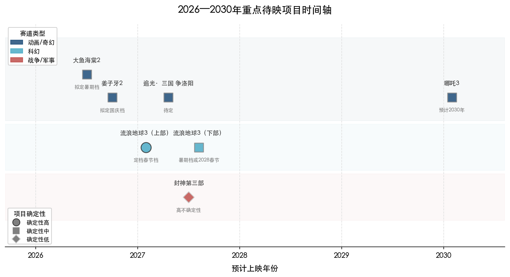

**《流浪地球3》（上部，2027年春节档）：冲击30亿元概率极高。** 该片集齐高票房基因的四个核心要素——科幻品类旗舰IP（前作46.88亿元验证赛道）、春节档释放、强导演品牌（郭帆）、中影集团出品的顶级制作保障。分上下两部的策略参照了长津湖系列（上下部合计超73亿元）的成功先例。傅若清在2026年全国两会期间明确表示"力争打造一部经得起时间检验的硬核科幻佳作"。[新浪财经](https://finance.sina.com.cn/roll/2026-03-09/doc-inhqkxfk6880946.shtml "流浪地球3分上下部") 主要风险在于：上下部拆分对叙事完整性的潜在影响，以及科幻题材在2027年春节档面临的竞争格局。

**光线"中国神话宇宙"系列（2026—2028年）：梯队中有望诞生10亿元以上作品，但复制哪吒量级难度极大。** 《姜子牙2》（拟定2026年国庆档）、《大鱼海棠2》（拟定暑期档）等项目具备IP基础，但须注意第一部《姜子牙》虽取得16亿元票房，口碑却明显分化（豆瓣6.9分），续集面临品质证伪的压力。[雷报/腾讯新闻](https://news.qq.com/rain/a/20260206A077KE00 "动画电影备案") 追光动画的古典文学系列同样值得关注，但其品牌认知度尚不及光线体系。

**《封神第三部》（预计2027年）：存在高度不确定性。** 乌尔善已确认完成剪辑，特效制作进行中，上映时间延期至2027年。但《封神第二部》豆瓣仅5.8分、票房约11.63亿元，远低于市场预期，系列IP势能受损严重。[证券时报](https://stcn.com/article/detail/1676677.html "封神第三部后期制作中") 第三部能否逆转口碑、重建观众信心，存在重大不确定性。

**《哪吒之魔童闹海3》（预计2030年）：远期最强预期标的。** 饺子坚持品质优先原则（"不会为赶时间降低质量"），前两部累计超204亿元的票房基础使该片成为2030年前后最具票房想象力的项目。但2030年的市场环境和竞争格局存在较大变数，远期预测的不确定性天然较高。[游民星空](https://www.gamersky.com/news/202502/1882901.shtml "哪吒3计划2030年")

## 5.4 影响未来票房格局的结构性变量

除类型赛道和具体项目外，多项结构性变量将对2026—2028年的票房格局产生深远影响。这些变量既包含抑制票房增长的负面因素，也包含促进票房增长的正面驱动力（参见图5-2）。

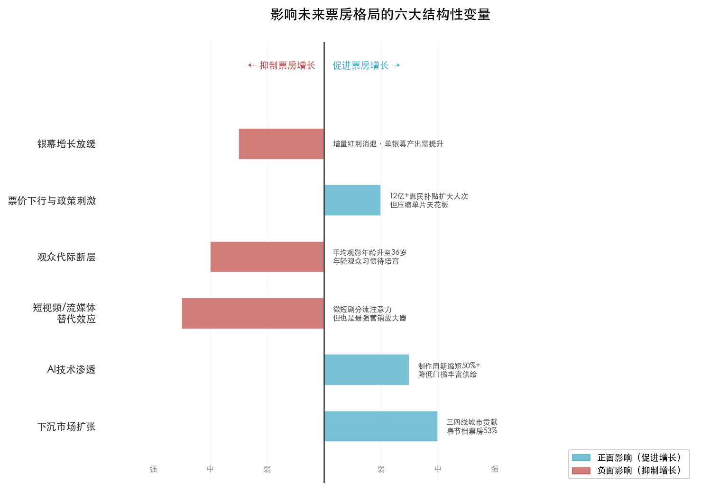

### 5.4.1 银幕增长放缓，市场趋近饱和

2025年城市院线净增银幕仅2219块（较高峰期近万块/年大幅下降），总数达93187块，已实现100%数字化。[国家电影局](https://www.chinafilm.gov.cn/xwzx/gzdt/202601/t20260105_944809.html "2025年全国电影票房518.32亿元") 银幕扩张红利基本释放完毕，未来票房增长将更多依赖"单银幕产出提升"而非"银幕数量增长"——这一转变意味着，内容质量对票房的边际贡献将进一步提高。

### 5.4.2 票价下行与政策刺激形成双向效应

2026年春节档平均票价47.8元，同比下降6%，创2021年以来新低；元旦档降至39.7元（近五年同期最低）。[新京报](https://www.bjnews.com.cn/detail/1772361299129433.html "2026年总票房突破100亿") 票价下行的背后是多重政策推动：2026年2月12日，由国家电影局、中央广播电视总台主办的"2026电影经济促进年"正式启动，全年预计投放不少于12亿元惠民观影补贴，中国工商银行、中国建设银行、中国银联、猫眼娱乐、大麦娱乐、抖音生活服务等机构联合参与。[国家电影局](https://www.chinafilm.gov.cn/xwzx/ywxx/202602/t20260211_949849.html "'2026电影经济促进年'正式启动") 票价下降有望通过扩大观影人次来部分对冲票房总量压力，但也在一定程度上压缩了单片票房天花板的理论空间。

### 5.4.3 观众代际断层与年轻群体回暖信号并存

中国电影评论学会会长饶曙光指出，中国电影观众平均观影年龄已升至36岁，"00后""05后"尚未养成影院观影习惯，"不是简单的观众迭代，而是断层"。[新浪财经/红星新闻](https://cj.sina.cn/articles/view/6105713761/16bedcc6102001s8eg "平均观影年龄升至36岁") 灯塔研究院数据进一步显示，2025年观影总人数达5.7亿为近十年最高，但人均观影频次降至2.17次——影史级爆款拉动了2020年以来最大规模的新用户入场，但这些新观众的留存率与观影频次仍有待持续培育。[灯塔研究院](https://finance.sina.cn/2026-01-01/detail-inhevamk2921169.d.html "2025中国电影市场年度盘点报告")

积极信号同样值得关注：2026年春节档25岁以下观众占比回升至27%，较2025年同期的23.53%有所改善。[新京报](https://www.bjnews.com.cn/detail/1772361299129433.html "25岁以下占比回升") 年轻观众的逐步回归对维持市场长期健康发展至关重要。

### 5.4.4 短视频与流媒体：替代效应与营销放大效应并存

饶曙光分析指出，微短剧"三秒吸引观众"而电影需要三分钟，电影1—3年的生产周期使其在情绪价值捕捉上天然滞后于短视频内容。[新浪财经/红星新闻](https://cj.sina.cn/articles/view/6105713761/16bedcc6102001s8eg "饶曙光分析") 2025年全年票房518.32亿元，距2019年641亿元的历史峰值仍有近20%差距，流媒体和短视频的分流效应持续存在。[国家电影局](https://www.chinafilm.gov.cn/xwzx/gzdt/202601/t20260105_944809.html "2025年全国电影票房518.32亿元")

短视频的挑战是结构性的，但其营销放大效应同样不容忽视。2025年春节档抖音电影相关内容总播放达471亿次，用户自发影评77.8万条（同比增6倍以上），用户创作内容播放160亿次。[新浪新闻](https://news.sina.cn/sx/2025-02-13/detail-inekhyni5229645.d.html "抖音新春欢乐观影计划数据") 社交媒体已形成"映前种草→观影→映后二创→带动新一轮观影"的正向循环。能够激发社交讨论和二次创作的影片——如《哪吒之魔童闹海》上映15天内微博热搜210余次、抖音热搜40次、全平台话题播放390亿次——反而能将短视频的流量有效转化为院线观影增量。[凤凰网](https://h5.ifeng.com/c/vivoArticle/v002M87tKrOX04GHNO4q2DcgWGvqLtgBZaQaUIZKDQGMNEY__ "社交媒体热搜数据")

### 5.4.5 AI技术加速重塑制作流程

电影行业虚拟制作渗透率从2023年的15%提升至2025年的45%，AI虚拟化制作平台可使制作周期缩短超50%。首部全流程AI制作动画电影《团圆令》将制作周期从传统的3—5年压缩至1年。2026年2月，"人工智能+电影虚拟拍摄融合创新实验室"在北京揭牌。[央视新闻/中新网](https://www.chinanews.com.cn/cul/2026/01-07/10547289.shtml "中国电影新变化") [IT之家](https://www.ithome.com/0/919/167.htm "AI+电影虚拟拍摄实验室揭牌")

AI技术对票房格局的影响呈现双重性：一方面，制作门槛的降低有望催生更多中等体量的动画和科幻作品，丰富市场供给层次；另一方面，技术平权也可能加剧同质化竞争，使头部内容的差异化优势更加依赖创意和叙事能力，而非技术壁垒。华鑫证券在2026年3月的行业研报中指出，内容资本将进一步向成熟IP集聚，AI虚拟制作产业化和"观影+兴趣社交+IP消费"突破单一票房依赖将成为三大发展趋势。[同花顺/华鑫证券](https://stock.10jqka.com.cn/20260310/c675180419.shtml "电影行业三大发展趋势")

### 5.4.6 下沉市场扩张与"电影+"模式创新

下沉市场已成为票房增量的核心来源。2026年春节档三四线城市票房占比近53%，《飞驰人生3》等4部影片在下沉市场占比均超五成。[灯塔研究院](https://finance.sina.com.cn/jjxw/2026-02-24/doc-inhnxtak2913117.shtml "下沉市场占比53%") "电影+文旅""电影+消费"模式加速形成——2026年春节档带动全产业链产值超900亿元。[央视新闻/中新网](https://www.chinanews.com.cn/cul/2026/01-07/10547289.shtml "电影+文旅消费模式")

另一值得关注的趋势是分众化精准运营的兴起：沪语电影《菜肉馄饨》以分线发行锁定长三角受众；《戏台》40岁以上观众占43.8%，推出银发特惠（60岁以上10元）。[光明网](https://e.gmw.cn/2026-01/09/content_38527737.htm "不确定性中寻找方向") 分众化精准投放与全年龄向两条路径正在并行发展，为不同体量的影片提供差异化的市场空间。

## 5.5 综合评估：未来高票房类型优先级矩阵

综合题材热度、IP成熟度、制作团队就绪度、档期匹配度和市场结构性支撑五个维度，我们对2026—2028年各类型赛道冲击30亿元以上票房的潜力形成如下综合评估（参见图5-3）：

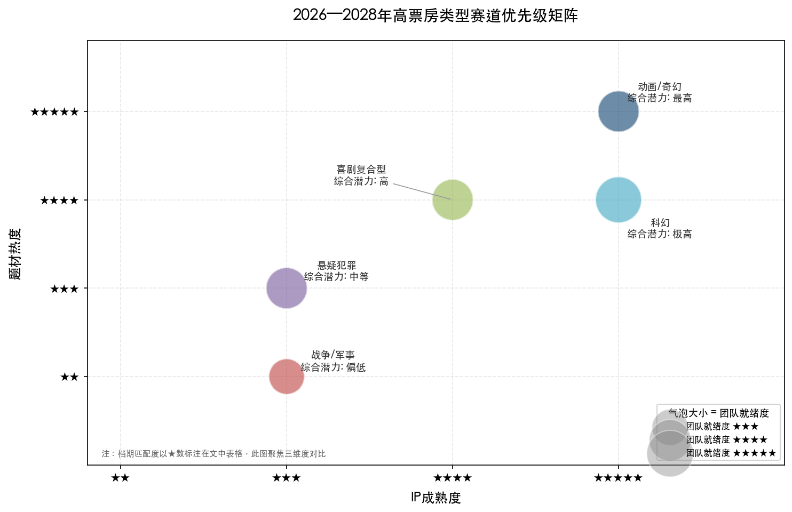

| 类型赛道 | 题材热度 | IP成熟度 | 团队就绪度 | 档期匹配 | 综合潜力 | 代表性待映项目 |
|:---:|:---:|:---:|:---:|:---:|:---:|------|
| 动画/奇幻 | ★★★★★ | ★★★★★ | ★★★★☆ | ★★★★★ | **最高** | 姜子牙2、大鱼海棠2、追光三国系列 |
| 科幻 | ★★★★☆ | ★★★★★ | ★★★★★ | ★★★★★ | **极高** | 流浪地球3（上下部） |
| 喜剧复合型 | ★★★★☆ | ★★★★☆ | ★★★★☆ | ★★★★★ | **高** | 未公布具体项目，沈腾系作品值得关注 |
| 悬疑犯罪 | ★★★☆☆ | ★★★☆☆ | ★★★★☆ | ★★★☆☆ | **中等** | 待公布 |
| 战争/军事 | ★★☆☆☆ | ★★★☆☆ | ★★★☆☆ | ★★★☆☆ | **偏低** | 封神第三部（高不确定性） |

**最终判断：** 2026—2028年最有可能实现高票房突破的电影类型是**"动画/奇幻+喜剧元素"复合型**与**"科幻IP续集"**两条赛道。前者以光线"中国神话宇宙"和追光古典文学系列为供给主力，受益于动画电影全年龄段升级的结构性红利；后者以《流浪地球3》为旗舰，凭借IP积累、春节档释放和导演品牌实现高确定性的票房兑现。

在此之外，**"喜剧+X"复合型**（喜剧嫁接运动、亲情、悬疑等强类型）仍将是票房的稳定贡献者，尤其在春节档具备天然优势。而战争/军事/主旋律赛道则需等待叙事模式的根本性革新，短期内冲击30亿元的概率偏低。

值得特别强调的是，中国电影市场的头部集中度正在持续加剧——2025年票房前十影片累计超340亿元，占全年总票房518.32亿元的约66%。[东方财富网引中国经营报](https://finance.eastmoney.com/a/202601023607506710.html "猫眼研究院数据") 这意味着，未来的高票房格局将更加依赖少数"超级爆款"的产出能力，而非类型赛道的整体景气度。一个赛道只要诞生一部《哪吒之魔童闹海》级别的作品，即足以重新定义该赛道的天花板。因此，与其追问"哪个类型最有可能出爆款"，更应追问"哪些创作者和IP最有可能在恰当的类型赛道上制造超级爆款"——而前四章的分析已给出清晰答案：拥有品质验证的成熟IP、坚持品质打磨的强品牌导演、善于制造全民共情和社交讨论的叙事能力，才是穿越类型周期的终极"高票房基因"。

# 结论与风险提示

## 核心结论

本报告对截至2026年3月26日的中国影史票房总榜前十影片进行了系统性横向比较。这十部影片累计总票房600.12亿元，涵盖动画、战争、军事、喜剧、科幻、悬疑、历史等多种题材，上映时间跨度为2017—2026年，集中映射了中国电影市场近十年来最核心的产业规律与结构性变迁。基于五个章节的事实分析，我们形成以下五项核心结论：

**结论一：中国电影市场的票房天花板正由动画/奇幻赛道重新定义。** 前十中3部动画/奇幻影片以250.53亿元（占比41.7%）、单片均值83.5亿元的表现远超真人电影。《哪吒之魔童闹海》以154.46亿元独占塔尖，与第2名之间形成近3倍的断层。2025年全年动画电影市场占比跃升至49.2%，国产动画占全部动画票房的75.7%，均创历史新高。动画电影已完成从"亲子赛道"到"全年龄段主赛道"的范式跃迁，30—39岁成年观众成为核心消费群体。这一结构性转变意味着，动画/奇幻赛道在未来三年内仍是最具确定性的高票房赛道。

**结论二："喜剧+"复合模式是中国电影市场冲击票房天花板的最具普适性路径。** 前十中70%含喜剧标签，但无一为纯喜剧。喜剧元素通过降低观影门槛、拓宽受众基数、增强社交传播属性，充当了各类型题材实现"全民化"的最低成本通道。纯喜剧票房天花板约20亿—25亿元，而"喜剧+动画""喜剧+运动""喜剧+悬疑""喜剧+亲情穿越"等复合模式均已突破40亿元。未来高票房影片的创作策略，应将喜剧元素视为贯穿各题材的"基础设施"而非独立赛道。

**结论三：春节档是票房规模化释放的决定性窗口，但档期本身并非刚性天花板。** 前十中6部出自春节档，合计贡献64.9%的票房份额。然而，2025年春节档总票房95.10亿元与2026年春节档57.52亿元之间近40%的落差表明，春节档的票房体量高度依赖头部影片的质量与数量——档期提供的是流量基础设施，内容品质才是决定天花板高度的核心变量。

**结论四：口碑是决定票房曲线形态和长尾空间的核心变量，但并非票房绝对值的唯一决定因素。** 高口碑影片（豆瓣≥7.5分）普遍走出上扬或长尾曲线，密钥延期后的长线收益可倍增于首周成绩。低口碑影片（如《唐人街探案3》豆瓣5.3分）虽仍可凭借IP势能与档期红利获取极高首日票房，但后续快速衰减。口碑更多决定"票房曲线形态"而非"票房绝对值"——在超级档期与强IP的双重托举下，口碑底线可被显著抬高，但口碑优秀的影片拥有更大的逆袭空间和长尾潜力。

**结论五：产业权力结构正加速向"导演中心制"和头部创作者集中。** 前十影片中，饺子、吴京、贾玲、陈思诚、韩寒等导演均深度参与出品和投资，创作能力与资本运营高度绑定。沈腾与吴京两人所涉票房占前十总额的50.7%。出品方格局呈"分散竞争、无绝对霸主"特征，但光线传媒通过"中国神话宇宙"在动画赛道建立了先发壁垒，"轻资产+长周期+深绑导演"模式展现出优于传统重资产模式的可持续性。

## 未来展望

2026—2028年，我们判断最有可能实现高票房突破（30亿元以上）的类型赛道按优先级排序为：

1. **动画/奇幻+喜剧元素复合型（最高优先级）。** 光线"中国神话宇宙"持续供给（《姜子牙2》《大鱼海棠2》等）、追光动画古典文学系列差异化竞争、"小妖怪"叙事等新路径涌现，叠加2025年国产动画电影备案183部的供给侧扩张，该赛道在题材热度、IP成熟度和结构性需求三个维度均处于最高景气度。
2. **科幻IP续集（极高优先级）。** 《流浪地球3》上部定档2027年春节档，集齐品类旗舰IP、春节档、强导演品牌、顶级制作保障四项核心要素，冲击30亿元具有极高概率。但赛道整体纵深有限，高度依赖旗舰项目表现。
3. **喜剧+X复合型（高优先级）。** 喜剧嫁接运动、亲情、悬疑等强类型的复合模式仍将是票房的稳定贡献者。沈腾作为主演累计票房约409亿元的"票房第一人"，其参与的项目具备显著号召力。
4. **战争/军事/主旋律（偏低优先级）。** 该赛道正处于周期性低谷，同质化叙事与审美疲劳使短期内难以再现《长津湖》式的全民动员效应。若有导演实现叙事模式的根本性革新，仍存在单片突破的可能，但系统性回暖需要时间。

## 风险提示

**其一，"哪吒效应"的不可复制性。** 《哪吒之魔童闹海》154.46亿元的票房属于多重极端条件叠加的结果——品质验证的IP续集、历史性春节档窗口、社交媒体裂变、大规模观众召回四者共振。以此为基准预测同赛道其他项目的票房潜力，可能导致系统性高估。

**其二，动画赛道供给过剩风险。** 2025年183部备案量创历史纪录，但备案到上映的转化率通常不足50%，票房过亿者每年仅个位数。"传统文化+动画"赛道尤需警惕神话题材的同质化与审美疲劳。

**其三，观众代际断层的长期隐忧。** 中国电影观众平均观影年龄已升至36岁，"00后""05后"尚未养成稳定的影院观影习惯。2026年春节档25岁以下观众占比虽回升至27%，但年轻群体的留存率与观影频次培育仍是中长期挑战。

**其四，短视频与流媒体的结构性分流持续存在。** 2025年全年票房518.32亿元，距2019年641亿元的历史峰值仍有近20%差距。微短剧对注意力的争夺以及流媒体对观影场景的替代，构成影院票房增长的持续阻力。

**其五，票价下行压缩单片天花板的理论空间。** 2026年"电影经济促进年"预计投放不少于12亿元惠民补贴，票价下降有望扩大观影人次，但也在一定程度上限制了单片票房绝对值的上限。

## 局限性说明

本报告存在以下主要局限性：

1. **数据时效性约束。** 全部票房数据截至2026年3月26日，《飞驰人生3》仍在映中，最终票房尚未定格。中国影史票房总榜为动态排名，后续新片入榜可能改变现有排名格局。
2. **制作成本信息不对称。** 中国电影行业制作成本普遍不公开披露，本报告所引用的成本数据来源于上市公司公告、片方声明及权威媒体报道，部分影片的投资回报分析因数据缺失而无法展开。
3. **样本局限性。** 以票房前十为分析样本，天然存在"幸存者偏差"——未能入榜的高投入、高品质影片的失败经验同样具有重要参考价值，但未纳入本报告的系统分析范围。
4. **预测的内在不确定性。** 对2026—2028年赛道前景的研判基于当前已知的项目储备、产业趋势和政策环境，未来的市场竞争格局、观众偏好变迁和宏观经济环境均可能显著偏离当前预期。
5. **进口片分析有限。** 前十中仅有《疯狂动物城2》一部进口片，本报告对进口片市场的分析深度有限，未充分覆盖好莱坞及其他海外影片对中国票房格局的潜在影响。
