# 执行摘要

2025年1月，中共中央、国务院印发《教育强国建设规划纲要（2024—2035年）》，首次将"中小学生每天综合体育活动时间不低于2小时"写入国家中长期教育规划，标志着学生体育活动时间保障标准从"每天1小时"向"每天2小时"的历史性跨越。本报告围绕三个核心问题展开系统研究：当前中小学生每天综合体育活动时间的真实水平、制约体育活动时间的多层因素，以及确保"每天2小时"全面高质量落地的政策路径。

**政策演进。** 从1990年《学校体育工作条例》确立"每天1小时"底线，到2007年中央7号文件量化课时、2012年国办发53号引入"一票否决"问责、2020年两办意见首提"校内外各1小时"，再到2025年《纲要》正式确立"每天2小时"，中国学生体育活动时间保障政策经历了时间标准递增、文件规格递升、政策工具递强、实施深度递进的四重递进。2025年11月，五部门联合印发"学生体质强健计划二十条"，设定了"2027年义务教育阶段全面高质量落实"的阶段目标。截至2026年2月，全国所有省份已部署推开"每天2小时"和"课间15分钟"改革。

**现状画像。** 多源实证数据表明，当前绝大多数中小学生的日均综合体育活动时间远未达到120分钟目标。中国教育科学研究院2024年12月调查显示，仅18.3%的中小学生每天锻炼时间达到2小时（教师观察口径）；2025年全国49,998名学生自报调查中约72.8%报告达标，但自报数据存在系统性高估效应。以"每天1小时"衡量，初三学生在校体育锻炼达标率仅42.7%，高一更低至30.6%。达标率呈现显著的结构性差异：学段维度呈U型曲线（小学高年级高、初中最低、高中反弹）；农村学校不达标率（30.50%）高于城市（25.14%）；民办学校达标率（18.1%）远低于公办（33.5%）；女生校外运动参与显著低于男生。全国学生体质健康达标优良率约为35.8%（2024年），距2030年60%的目标尚有约24个百分点差距。

**制约因素。** 制约体育活动时间的因素横跨五个层面并相互强化。2025年全国大样本Logistic回归显示，风险效应最大的因素依次为：对2小时标准缺乏认知（OR=3.97）、对体育活动价值认同度低（OR=2.55）、缺乏体育器材（OR=2.04）、体育课时不足（OR=1.42）、学业压力（OR=1.10）。学校层面，四年级44.3%、八年级60.8%学校体育周课时不达标，"阴阳课表"和课间过度管控压缩了活动时间供给；师资层面，义务教育阶段体育教师缺编12万—30万人；评价层面，体育在高考中不计入分值导致高中阶段活动时间断崖式下降；安全层面，过错责任原则下运动伤害事故同比增加50%以上，形成"不敢动"的制度性枷锁；社会层面，超七成学生未养成自主锻炼习惯，屏幕时间构成显著替代效应。

**国际比较。** 基于AHKGA Global Matrix 4.0评级体系的六国比较揭示：日本凭借制度化课外社团制度（Bukatsu）和无过错运动伤害保险（JSC制度）在总体身体活动指标上全球领先（B-级）；芬兰Schools on the Move通过制度化课间休息和活动课间干预覆盖90%以上学校，使女生达标率提升11个百分点；韩国"学校政策A级、总体达标D-级"的鲜明反差，揭示应试文化可致政策"空转"——这对共享东亚应试传统的中国构成最为直接的警示。中国在该评级中"有组织体育运动"获F级（全球最低档）、"学校"仅D级，提升空间显著。

**政策建议。** 本报告从时间保障、质量提升、条件保障、评价督导、家校社协同五个维度构建系统性政策框架，提出"短期—中期—长期"三步走实施路径。短期（2026—2027年）聚焦"时间达标"，以课表备案公开、运动伤害保险试点和中西部师资专项补充为优先抓手；中期（2027—2030年）聚焦"质量提升"，全面推行中考体育过程性评价、建立运动负荷数字化监测体系；长期（2030—2035年）聚焦"制度常态化"，使"每天2小时"从政策驱动转化为文化自觉。五大核心执行风险——城乡不均衡、应试惯性持续博弈、师资缺口补齐周期、安全事故责任困局、形式主义落实——需在实施过程中建立预警机制并持续跟踪。

# 第1章 政策演进与制度框架——从"每天一小时"到"每天两小时"

## 1.1 引言：一项跨越三十五年的制度承诺

2025年1月19日，中共中央、国务院印发《教育强国建设规划纲要（2024—2035年）》（以下简称《纲要》），其第二章第（四）条明确提出："落实健康第一教育理念，实施学生体质强健计划，中小学生每天综合体育活动时间不低于2小时，加强校园足球建设，有效控制近视率、肥胖率。"[教育部官网《纲要》全文](http://www.moe.gov.cn/jyb_xxgk/moe_1777/moe_1778/202501/t20250119_1176193.html "中共中央国务院印发《教育强国建设规划纲要（2024—2035年）》全文，2025年1月19日发布") 这一表述首次将"每天综合体育活动时间不低于2小时"写入国家中长期教育规划纲要，标志着中国中小学生体育活动时间保障标准完成了从"每天一小时"到"每天两小时"的历史性跨越。

值得注意的是，该条款位于《纲要》第二章"塑造立德树人新格局"之下，与学校美育浸润行动、劳动习惯养成计划、心理健康教育等并列，深刻体现了"五育并举"的顶层设计逻辑。[教育部官网《纲要》全文](http://www.moe.gov.cn/jyb_xxgk/moe_1777/moe_1778/202501/t20250119_1176193.html "《纲要》第二章第（四）条") 充分理解这一条款的政策意蕴与深远影响，需要回溯中国中小学生体育活动时间保障政策长达三十五年的演变历程，系统识别其关键节点与递进逻辑。

## 1.2 政策源流：从"每天一小时"的法规确立到四次高规格文件推动（1990—2020年）

### 1.2.1 起点：1990年《学校体育工作条例》奠基"每天一小时"

1990年3月12日，国家教育委员会发布《学校体育工作条例》（国家教育委员会令第8号），第十条规定"保证学生每天有一小时体育活动的时间（含体育课）"，第二十七条将"未保证学生每天一小时体育活动时间"列为处罚情形，首次以部委规章形式确立了"每天1小时"的底线标准。[教育部官网《学校体育工作条例》全文](http://www.moe.gov.cn/srcsite/A02/s5911/moe_621/201511/t20151119_220041.html "1990年3月12日发布") 首都体育学院刘海元教授的系统梳理表明，中国学生体育锻炼时间政策的起源可追溯至1951年政务院限制性规定，此后在1978—1990年间逐步以立法形式保障"每天1小时"，《学校体育工作条例》正是这一制度化进程的标志性成果。[刘海元等《关于落实"中小学生每天综合体育活动时间不低于2小时"工作的思考》](https://statics.scnu.edu.cn/pics/tyxk/2025/0325/1742892388387237.pdf "《体育学刊》2025年第32卷第2期")

### 1.2.2 第一次高规格推动：2007年中央7号文件的量化突破

2007年5月7日，中共中央、国务院印发《关于加强青少年体育增强青少年体质的意见》（中发〔2007〕7号），是改革开放以来中央就青少年体育工作发布的最高规格专项文件。文件首次对体育课时做出具体量化要求：小学1—2年级每周4课时，小学3—6年级和初中每周3课时，高中每周2课时；没有体育课的当天须组织1小时集体体育锻炼；每天上午安排25—30分钟大课间体育活动。[中央7号文件全文](https://fzghxkjs.swun.edu.cn/info/1061/1785.htm "2007年5月7日") 该文件出台的直接背景是2006年全国学生体质健康调研揭示的严峻形势——青少年体质多项核心指标持续下滑，中央层面对此高度关注，首次以量化课时的方式强化体育活动时间落实。

### 1.2.3 五年后的加强版：2012年国办发53号文件引入问责机制

2012年10月22日，国务院办公厅转发教育部等部门《关于进一步加强学校体育工作若干意见》（国办发〔2012〕53号），明确指出"学校体育仍是教育工作中的薄弱环节"。该文件建立了学校体育报告公示制度，并首次提出"学生体质健康水平持续三年下降的地区和学校实行一票否决"的行政问责机制，是2007年中央7号文件发布5年后因学生体质状况仍未根本好转而出台的加强版政策。[国办发〔2012〕53号全文](https://tiyubu.xpu.edu.cn/info/1016/1430.htm "西安工程大学转载") 从文件规格而言，由中央文件降格为国务院办公厅转发文件，但在执行工具上首次引入"一票否决"等刚性问责手段，折射出决策层对政策执行力不足的深切关注。[刘海元等（2025）](https://statics.scnu.edu.cn/pics/tyxk/2025/0325/1742892388387237.pdf "《体育学刊》2025年第2期")

### 1.2.4 范式转换：2020年两办意见首提"校内外各1小时"

2020年10月15日，中共中央办公厅、国务院办公厅印发《关于全面加强和改进新时代学校体育工作的意见》，第7条首次提出"着力保障学生每天校内、校外各1个小时体育活动时间"，并鼓励"基础教育阶段学校每天开设1节体育课"。[新华网全文](http://www.xinhuanet.com/politics/zywj/2020-10/15/c_1126616323.htm "2020年10月15日") 这一表述具有里程碑意义：它首次将体育活动时间保障的空间范畴从"校内"延伸至"校外"，将总量目标从≥60分钟倍增至≥120分钟，构成"每天2小时"要求的最早制度渊源。从政策逻辑审视，2020年两办意见标志着学生体育活动时间保障从"学校内部管理议题"上升为"家校社协同治理议题"的范式转换。

### 1.2.5 "双减"释放的时间红利

2021年7月，中共中央办公厅、国务院办公厅印发《关于进一步减轻义务教育阶段学生作业负担和校外培训负担的意见》（"双减"政策）。政策实施后，自愿参加学校课后服务的学生比例提升至90%以上，92.7%的学校在课后服务中开展了文艺体育类活动。[刘海元等（2025）](https://statics.scnu.edu.cn/pics/tyxk/2025/0325/1742892388387237.pdf "《体育学刊》2025年第2期") "双减"释放的课后时间为后续"2小时"体育活动政策的落地创造了关键性现实条件：学生不再被大量校外学科培训占满放学后时间，课后服务体系则为校内体育活动提供了新的制度化时间窗口。这一政策溢出效应，使得"每天2小时"从理念倡导走向可操作的制度安排成为可能。

## 1.3 政策定型："每天两小时"从高层阐释到国家纲要（2024—2025年）

### 1.3.1 2024年9月：教育部副部长的首次公开阐释

2024年9月26日，教育部副部长王嘉毅在国务院新闻办公室举行的"推动高质量发展"系列主题新闻发布会上表示："保障中小学生每天综合体育活动时间不低于2小时，每天保证一节体育课，另外课后再锻炼一个小时，保证每天两个小时。"[国新办发布会实录](http://www.scio.gov.cn/live/2024/34857/fbyd/202409/t20240927_867296.html "2024年9月26日国新办新闻发布会") 这是"每天综合体育活动时间不低于2小时"在《纲要》正式发布前的首次高层级公开阐释，表明该标准在中央层面已基本确定。全国教育大会召开后，该政策随即进入加速推进通道。

### 1.3.2 2025年1月：《教育强国建设规划纲要》正式确立

2025年1月19日发布的《纲要》将"中小学生每天综合体育活动时间不低于2小时"正式纳入国家中长期教育规划。就文件规格而言，《纲要》是改革开放以来中共中央和国务院联合印发的教育领域最高规格规划文件，其政策效力与约束力远高于此前历次专项意见和部委条例，标志着"每天2小时"从行政倡导上升为具有国家战略高度的刚性制度安排。[教育部官网《纲要》全文](http://www.moe.gov.cn/jyb_xxgk/moe_1777/moe_1778/202501/t20250119_1176193.html "2025年1月19日发布")

## 1.4 "每天2小时"的制度内涵：时间构成模型与口径辨析

### 1.4.1 "综合体育活动时间"的定义与四板块拆解

"每天综合体育活动时间不低于2小时"并非简单地将体育课时间翻倍，而是一项涵盖多个时段、多种活动类型的系统性制度安排。中国教育科学研究院体育美育教育研究所所长吴键提出"四个落实"方案，将120分钟拆解为四大板块：（1）每天1节体育与健康课（约40—45分钟）；（2）每天上午、下午各1次不少于30分钟的大课间（合计≥60分钟）；（3）课间休息时间延长至15—20分钟，为学生提供额外的身体活动机会；（4）课后延时服务中面向全体学生的体育锻炼。吴键同时强调，"非面向全体的课后延时体育训练、体育俱乐部（社团）、体育比赛等不得计入综合体育活动时间"，这一限定确保了政策惠及每一名学生而非仅服务于体育特长生。[中国教育报专访](http://www.jyb.cn/rmtzgjyb/202503/t20250311_2111315073.html "2025年3月11日")

四川省教育厅2025年1月印发的落实通知是最早明确"2小时"可拆解为"1节体育课+1个大课间及课间活动+1次课后服务体育锻炼"的省级文件之一。该通知还针对走读或不参加课后服务的学生做出弹性安排，允许结合校外体育活动、体育家庭作业等方式保证总时长达标。[新华网报道](http://www.news.cn/edu/20250210/38dbb6cf31794d5b9bfb9b1a03699967/c.html "2025年2月10日")

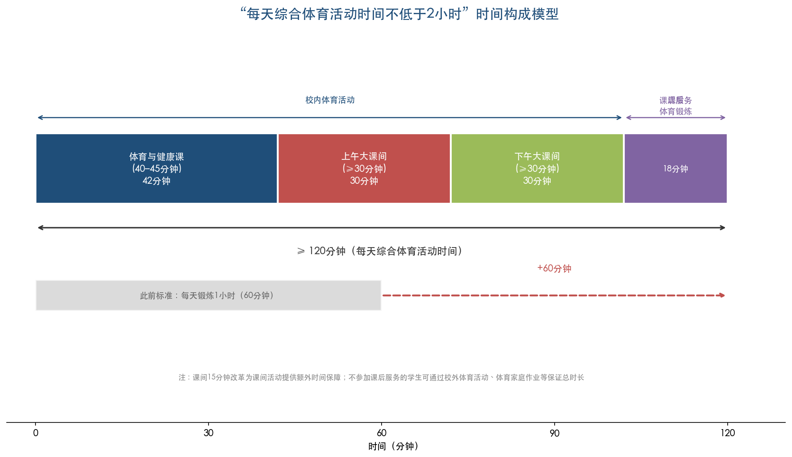

图1-1以水平堆叠条形图直观呈现了120分钟综合体育活动时间的四大构成板块及其时间分配，并与此前"每天锻炼1小时"标准进行对比，清晰展示了+60分钟的增量空间。

### 1.4.2 与此前"每天锻炼一小时"的本质区别

"每天综合体育活动时间不低于2小时"与此前政策表述中的"每天锻炼一小时"存在三项本质区别。**其一，时间标准倍增**——从≥60分钟跃升至≥120分钟，量化要求实现翻倍。**其二，口径拓展**——"综合体育活动时间"涵盖所有类型的身体活动（含低强度活动、课间活动等），而此前"锻炼一小时"通常指中高强度有组织锻炼，新口径更加贴近WHO"全天身体活动"的概念框架。**其三，空间延伸**——2020年两办意见首次提出"校内、校外各1小时"，《纲要》延续了校内外合计的总量口径，不再局限于校内时间，将家庭和社区纳入保障体系。[刘海元等（2025）](https://statics.scnu.edu.cn/pics/tyxk/2025/0325/1742892388387237.pdf "《体育学刊》2025年第2期")

## 1.5 配套政策体系：从"二十条"到"课间15分钟"

### 1.5.1 2025年11月："学生体质强健计划二十条"的系统部署

2025年11月7日（11月19日公开发布），教育部、国家发展改革委、财政部、人力资源社会保障部、国家体育总局等五部门联合印发《关于实施学生体质强健计划的意见》（教体艺〔2025〕1号），提出八大方面二十条举措，系统涵盖深化体育教学改革、健全训练竞赛与人才培养体系、壮大体育骨干力量、改进体育监测评价、加强师资队伍建设、强化条件保障、培育体育文化、推进社会协同等重点领域。[教育部官网全文](http://www.moe.gov.cn/srcsite/A17/moe_938/s3273/202511/t20251119_1420840.html "教体艺〔2025〕1号全文")

"二十条"设定了明确的两阶段目标：到2027年，以义务教育阶段为重点，中小学生每天综合体育活动时间不少于2小时的要求全面高质量落实；到2035年，现代化、高质量的学校体育体系基本形成。[人民日报报道](https://city.sina.cn/city/2025-11-21/detail-infycpuh0165072.d.html "2025年11月21日") 在具体操作层面，"二十条"鼓励有条件的中小学校上下午各安排1次不少于30分钟大课间体育活动，要求中小学每年举办春季、秋季两次校级综合性运动会或体育节，致力于形成"人人有项目、班班有活动、校校有特色、周周有比赛"的校园体育新样态。[首都之窗/北京日报报道](https://www.beijing.gov.cn/ywdt/zybwdt/202511/t20251120_4288851.html "2025年11月20日")

### 1.5.2 体育教师专项文件：夯实师资保障基础

2025年1月17日，教育部印发《关于加强新时代中小学体育教师队伍建设若干举措的通知》（教师〔2025〕1号），这是首个专门针对体育教师队伍建设的国家级专项文件。文件的核心内容包括：按不高于班师比小学5:1、初中6:1、高中8:1配备体育专任教师；在公费师范生、"优师计划"中适度扩大体育教育专业招生规模；面向取得教师资格的优秀退役运动员公开招聘等。[教育部教师〔2025〕1号](http://www.moe.gov.cn/srcsite/A10/s3735/202501/t20250124_1176809.html "2025年1月24日") 该文件的出台直接回应了"每天一节体育课"和"2小时"新标准下体育师资缺口可能进一步扩大的现实挑战。

### 1.5.3 "课间15分钟"改革：小切口撬动大变化

"课间15分钟"改革于2024年秋季在北京、福建等地率先试点，将传统的课间10分钟延长至15分钟。北京市的具体做法是从大课间（原40或35分钟）中腾挪5分钟分配到各课间，在不增加课时总量的前提下实现课间延长。2025年1月，江苏省以"2·15专项行动"率先将"2小时+15分钟课间"捆绑推行，此后广东、甘肃、湖南、海南、河北、浙江等省份相继跟进。[人民网江苏频道](http://js.people.com.cn/n2/2025/0122/c360307-41117347.html "江苏'2·15专项行动'") [科技日报](https://www.stdaily.com/web/gdxw/2025-02/19/content_298750.html "多地课间延长至15分钟") 这一"小切口"改革的意义在于：每个课间增加的5分钟看似有限，但全天累积后可为学生额外提供30—40分钟的自由活动时间，有效弥合"2小时"目标的时间缺口。

2026年2月27日，教育部发布《关于全面推进健康学校建设的指导意见》，在"加强学校体育工作"方面明确要求"全面实施学生体质强健计划，落实中小学生每天综合体育活动时间不低于2小时，推行'课间15分钟'"，正式将"课间15分钟"与"2小时"并列纳入全国督导跟踪体系。[教育部官网新闻发布会报道](http://www.moe.gov.cn/fbh/live/2026/77889/mtbd/202602/t20260228_1429557.html "2026年2月27日")

## 1.6 省级落实方案：因地制宜的部署推进

截至2026年4月，全国所有省份均已部署推开"每天2小时"和"课间15分钟"改革。各省级行政区在遵循中央统一框架的前提下，结合本地教育资源禀赋和区域发展差异，形成了各具特色的落实路径。以下梳理六个具有代表性的省级实践。

**四川（2025年1月）**：作为全国最早发文的省份之一，四川省明确"2小时"可拆解为"1节体育课+1个大课间及课间活动+1次课后服务体育锻炼"，并针对不参加课后服务的学生给出校外体育活动替代方案，体现了政策弹性与全覆盖要求的兼顾。[新华网报道](http://www.news.cn/edu/20250210/38dbb6cf31794d5b9bfb9b1a03699967/c.html "2025年2月10日")

**江苏（2025年1月）**：率先实施"2·15专项行动"，将"2小时"与"15分钟课间"捆绑推行。2025年春季学期义务教育阶段课间延长至15分钟，2026年秋季义务教育全覆盖每天1节体育课。实施一年后，全省已实现小学每天1节体育课全覆盖，中小学体育俱乐部建成率达99.3%，该行动纳入2026年省政府民生实事项目。[新华网江苏频道](http://js.news.cn/20250213/5d8e4c9ef5054c4d922f3aaf5320dafb/c.html "2025年2月13日") [澎湃新闻/中国教育报](https://m.thepaper.cn/newsDetail_forward_32813497 "2026年3月23日")

**广东（2025年2月）**：采取分区域梯度推进策略——珠三角地区2025年秋季全面实施每天1节体育课，粤东西北地区2025年秋季≥50%学校落实、2026年秋季全面实施。这一差异化节奏充分考虑了省内教育资源分布不均衡的客观现实。[新华网报道](http://www.news.cn/local/20250205/5d42fceaa91e42329bbb6102f5ebc7e6/c.html "2025年2月5日")

**北京（2025年2月）**：发布"体育八条"（京教体艺〔2025〕1号），在全国率先提出"至少1小时中等及以上强度体育锻炼"的强度要求，将政策关注点从"时间充足"进一步延伸至"强度达标"；同步推广全员跑步活动（小学200—1000米/次、初中≥1500米/次、高中≥2000米/次），并要求2027年底前各区对体育教师完成轮训。[北京市政府官网](https://www.beijing.gov.cn/zhengce/zhengcefagui/202502/t20250217_4011192.html "2025年2月17日")

**甘肃（2025年2月）**：倡导"跑出健康"打卡活动（小学生每周跑步≥4千米、中学生每周≥1万米），坚持"一地一策、一校一案"原则，在不增加课时总量的前提下推进每天1节体育课，以高原地区学校跑步文化为抓手推动政策扎根。[甘肃省教育厅官网](http://jyt.gansu.gov.cn/jyt/c020802/202502/174081169.shtml "2025年2月14日")

**重庆（2025年2月起）**：构建"体育课程+大课间+课后服务"三位一体时间模型，2025年12月召开全市推进会，2026年2月将推行2小时+课间15分钟列为年度重点任务，并入选全国首批12个体育改革试点省市，承担先行先试的示范功能。[新华网综合报道](http://www.news.cn/government/20250218/f259d33209234f8eb62a83cc3b362840/c.html "多地中小学新学期'动'起来") [重庆市政府网](https://www.cq.gov.cn/ywdt/jrcq/202603/t20260301_15477419.html "每天2小时综合体育活动全面铺开")

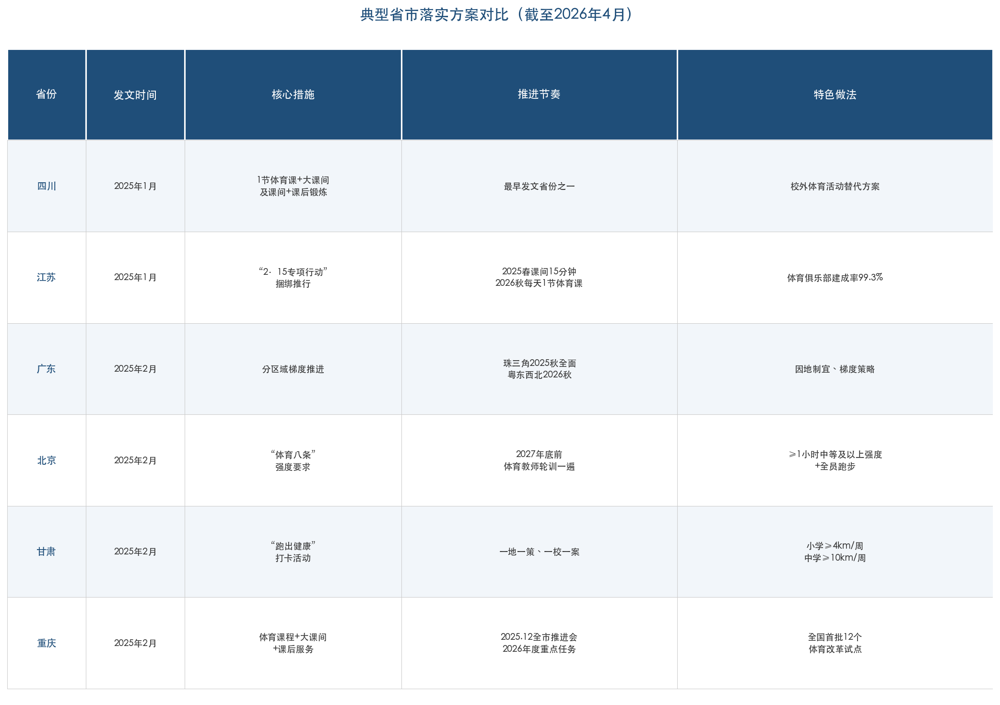

图1-2以表格形式对比了六个典型省市的发文时间、核心措施、推进节奏和特色做法，直观呈现各地在统一政策框架下的差异化部署策略。

## 1.7 政策演进的四重递进逻辑

回溯1990年至2026年的政策脉络，可以识别出清晰的四重递进逻辑。[刘海元等（2025）](https://statics.scnu.edu.cn/pics/tyxk/2025/0325/1742892388387237.pdf "《体育学刊》2025年第2期")

**第一，时间标准递增**：从1990年"每天1小时"→2020年"校内外各1小时"→2025年"综合体育活动不低于2小时"，量化标准从60分钟跃升至120分钟，实现翻倍增长。

**第二，文件规格递升**：从部委规章（1990年国家教育委员会令）→中央国务院联合文件（2007年中发7号）→两办意见（2020年）→国家中长期规划纲要（2025年），政策的权威性与约束力逐级提升，体现中央对学生体质健康问题的重视程度持续加码。

**第三，政策工具递强**：从原则倡导→行政问责（2012年"一票否决"）→专项行动（2025年江苏"2·15"）→"晒课表"透明监督（2026年教育部全国部署），执行监督手段日趋刚性化，政策"牙齿"不断强化。

**第四，实施深度递进**：从"开齐开足体育课"的底线要求→"每天一小时"的时间标准→"每天一节体育课+2小时+课间15分钟"的系统性制度安排，政策从单一的课时保障发展为覆盖全日制学校全时段的体育活动制度体系。

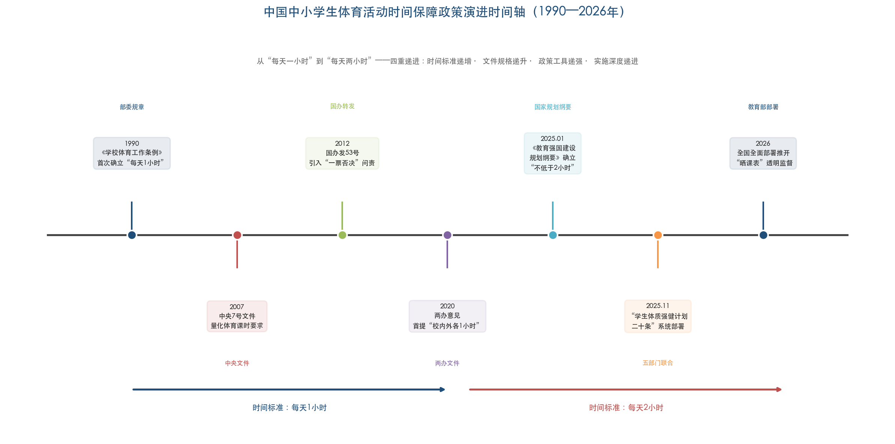

图1-3以时间轴形式呈现了1990年至2026年间七个关键政策节点，按文件规格分层标注，直观展示了从"每天1小时"到"每天2小时"的时间标准跃升及四重递进逻辑。

2026年2月25日，教育部召开"深入落实'健康第一'工作部署会"，明确2026年将"严防'阴阳课表'，严查挤占体育课、课间不准学生出教室等行为"，要求各校通过"晒课表"等方式强化社会监督。截至2026年2月，学生每天体育2小时、课间15分钟已在全国所有省份部署推开。[新华社](http://www.news.cn/20260225/e75c81bfd96b47a9bf4152c64f729af6/c.html "2026年2月25日")

## 1.8 小结：制度突破背后的深层变革

从1990年到2026年，中国中小学生体育活动时间保障政策经历了五个发展阶段：1951年政务院限制性规定→1978—1990年以立法保障每天1小时→2005—2011年明确为"校园时间"→2020年起提出校内外合计2小时→2025年《纲要》正式确立并进入全面实施阶段。[刘海元等（2025）](https://statics.scnu.edu.cn/pics/tyxk/2025/0325/1742892388387237.pdf "《体育学刊》2025年第2期") 然而，刘海元教授的研究深刻揭示了一个令人警醒的历史规律：经近40年4次高规格文件推动，学生体质健康始终是学校体育和教育领域的"顽症"，每一次设定的5年目标都未能完全实现。

"每天2小时"的确立不仅是时间标准的倍增，更代表着学校体育治理理念的根本转变：从"开齐开足体育课"的底线思维转向"保障充足身体活动"的健康思维；从学校单一主体责任转向家校社协同保障；从定性倡导转向可量化、可督导、可问责的制度刚性。2025年11月"二十条"的出台和2026年2月全国全面部署推开，标志着这一政策框架已从顶层设计阶段迈入全面落地实施阶段。能否打破"政策空转"的历史循环、真正实现学生体质健康的系统性改善，取决于后续各层级在执行端的制度刚性与创新能力——这正是后续各章需要深入考察的核心问题。

# 第2章 现状画像——中小学生每日体育活动时间的实证数据

## 2.1 全国总体水平：超八成学生未达120分钟目标

回答"当前中小学生每天综合体育活动时间究竟有多少"这一核心问题，需要厘清概念口径并依据多源全国性调查数据加以交叉验证。本章所称"综合体育活动时间"涵盖体育课、大课间体育活动、课间活动、课后延时服务中的体育活动以及校外体育活动的合计时长，与此前"每天锻炼一小时"口径中仅指中高强度有组织锻炼不同，亦与仅计体育与健康课程上课时长的"体育课时间"存在本质区别。

从最具全局代表性的调查结果看，中国教育科学研究院2024年12月面向全国体育教师开展的问卷调查显示，仅18.3%的中小学生每天锻炼时间能够达到2小时，超过八成学生未达到120分钟政策目标[潮新闻](https://tidenews.com.cn/news.html?id=3064081 "2025年3月报道，引用中国教育科学研究院调查数据")。该数据以教师日常观察为信息来源，勾勒出一幅鲜明的现实图景：以120分钟为标尺，全国中小学生日均综合体育活动时间的达标率尚不足两成。

2025年5—7月，成都体育学院Qin等学者实施了一项覆盖全国七大行政区、49,998名中小学生的大样本横断面调查，采用学生自报方式评估"每天2小时"达标情况。结果显示，约27.2%的学生未能达到每天2小时综合体育活动标准（以每周≥4天达标为定义），即约72.8%的学生报告自己达标[Qin et al., Frontiers in Public Health](https://pmc.ncbi.nlm.nih.gov/articles/PMC12913497/ "2026年2月发表，全国7大行政区49998名学生横断面调查")。该结果与前述中国教育科学研究院调查（仅18.3%达标）之间存在较大差距，主要原因在于测量方式差异：前者以教师客观观察为基础，后者依赖学生自报，而自报数据通常存在系统性高估效应。综合两项调查，真实的每天2小时达标率可能介于18%—73%之间；考虑到自报法的固有偏差，实际水平更可能处于该区间的中低端。

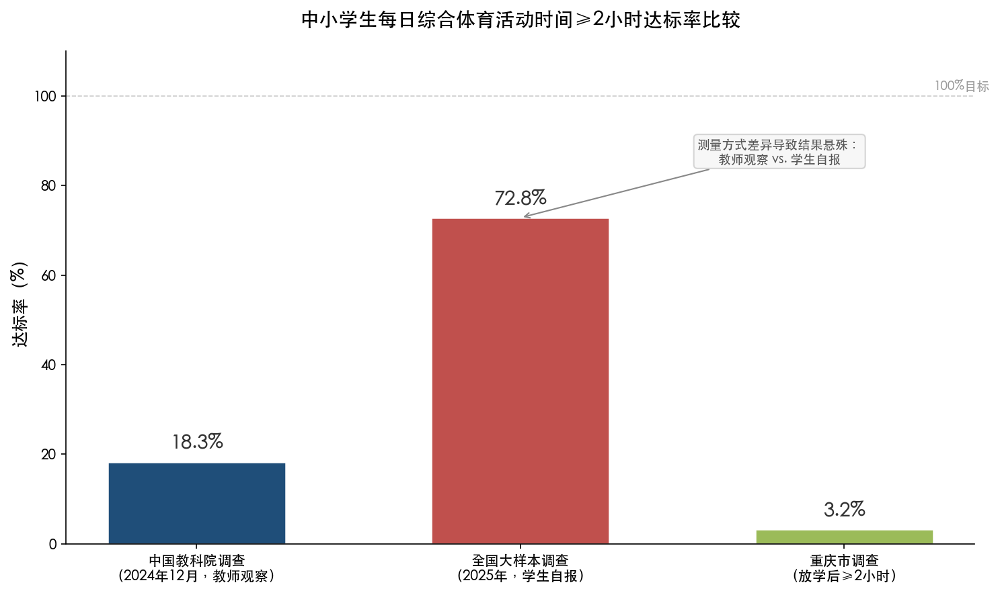

**图2-1** 展示了三项不同调查口径下的"每天2小时"达标率对比。教师观察口径（18.3%）、学生自报口径（72.8%）与放学后单项口径（3.2%）之间的悬殊差距，直观揭示了测量方式对达标率评估的重大影响。

以"每天1小时"这一较低标准衡量，情况虽优于"2小时"达标率，但同样不容乐观。教育部2022年新闻发布会公布的数据显示，全国95%的学校能保障学生在校每天1小时体育锻炼时间[教育部新闻发布会](http://www.moe.gov.cn/fbh/live/2022/54875/mtbd/202209/t20220927_665351.html "2022年9月教育部发布会")。中国教育科学研究院体育美育教育研究所所长吴键进一步指出，义务教育阶段全国82%以上的中小学校能够保证每天1小时体育锻炼[科技日报](https://www.stdaily.com/web/gdxw/2025-11/19/content_434594.html "2025年11月19日")。然而，上述数据的统计口径均为"学校"而非"学生"——一所学校制度层面"能保障"并不等于全部在校学生实际做到每天锻炼1小时。第八次全国学生体质与健康调研（2019年实施、2021年发布）以学生为统计单位的数据揭示了更为真实的图景：初三学生在校体育锻炼达到1小时的比率仅为42.7%，高一学生更低至30.6%[教育部第八次全国调研](https://news.eol.cn/meeting/202109/t20210903_2149889.shtml "2021年9月发布")。

地方调查数据进一步印证了上述判断。重庆市中小学生体育锻炼调查报告显示，放学后每天户外活动和体育锻炼时间主要集中在1小时以内（占64.1%），其中30分钟以内占40.8%，30—59分钟占23.4%；锻炼时间在2小时以上者仅占3.2%，而完全没有时间锻炼的学生占17.4%[刘海元等《体育学刊》2025年第2期](https://statics.scnu.edu.cn/pics/tyxk/2025/0325/1742892388387237.pdf "引用重庆市调查报告数据")。放学后近七成学生的体育锻炼时间不足1小时，校内时间加上如此有限的校外锻炼，距离120分钟目标缺口巨大。

综合上述多源数据，当前中国中小学生每日综合体育活动时间的总体面貌可概括为：绝大多数学生的日均综合体育活动时间远未达到120分钟目标；以校内锻炼1小时为衡量尺度，尚有超过半数学生不达标；校外体育活动时间更为匮乏。正如首都体育学院刘海元教授所总结："经近40年4次高规格文件推动，学生体质健康成了学校体育和教育的'顽症'"，核心原因正是"学生运动不足，体育锻炼时间不够"[刘海元等《体育学刊》2025年第2期](https://statics.scnu.edu.cn/pics/tyxk/2025/0325/1742892388387237.pdf "2025年《体育学刊》32卷2期")。

## 2.2 结构性差异：学段、城乡、性别与学校类型的分化图景

### 2.2.1 学段差异：U型曲线与中考"驱动效应"

不同学段学生的体育活动时间呈现显著的非线性特征。2025年全国49,998名学生调查显示，按学段分析体育活动"2小时不达标率"：3—5年级（小学高年级）不达标率最高，达30.04%；6—7年级有所下降；8—9年级降至最低（22.70%）；高中阶段则出现明显反弹（29.45%），整体呈现"小学高年级高、初中逐步下降、高中回升"的U型趋势[Qin et al., Frontiers in Public Health](https://pmc.ncbi.nlm.nih.gov/articles/PMC12913497/ "学段差异数据")。

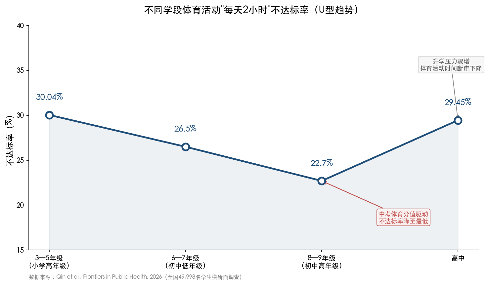

**图2-2** 清晰呈现了各学段体育活动不达标率的U型曲线。8—9年级不达标率降至最低，与中考体育分值逐步提高的制度驱动密切相关；进入高中后不达标率急剧回升，则反映出体育在高考中无分值安排、升学压力骤增对体育活动时间的挤压效应。

第八次全国调研数据同样印证了这一判断：初三学生在校体育锻炼达到1小时的比率为42.7%，而升入高中后急剧降至30.6%[教育部第八次全国调研](https://news.eol.cn/meeting/202109/t20210903_2149889.shtml "2021年9月发布")。中考体育在部分省市分值已提升至100分（如云南2020年、河南2025年），这一应试激励显著增加了初三学生的体育活动时间。然而，高中阶段因体育不纳入高考计分体系，加之升学压力骤增，体育活动时间出现断崖式下降。

小学高年级（3—5年级）不达标率反而高于初中低年级，可能与以下因素相关：小学高年级课业量渐增、家长开始关注"小升初"学业准备，而小学阶段缺乏中考体育那样的强制性评价驱动机制。

### 2.2.2 城乡与区域差异：农村与中部地区的双重短板

城乡维度上，2025年全国大样本调查显示，体育活动不达标率在农村学校最高（30.50%），城镇学校居中（28.47%），城市学校最低（25.14%）[Qin et al., Frontiers in Public Health](https://pmc.ncbi.nlm.nih.gov/articles/PMC12913497/ "城乡差异数据")。这一发现打破了"农村学生运动量更大"的直觉认知——农村学校在体育师资配备、器材供给和场地设施达标率等方面的客观短板，使得农村学生在有组织的体育活动时间上反而处于劣势。

区域差异同样显著。2018年国家义务教育质量监测数据显示，具有体育锻炼习惯（每周自主锻炼≥3次且每次超过30分钟）的四年级学生比例呈明显的东西梯度：东部32.4%、中部25.7%、西部26.1%；八年级东部20.7%、中部16.3%、西部18.4%[教育部2018年国家义务教育质量监测报告](http://www.moe.gov.cn/jyb_xwfb/gzdt_gzdt/s5987/201911/t20191120_409046.html "2019年11月教育部发布")。值得注意的是，中部地区在两个学段中均处于最低水平，表明经济发展水平并非唯一决定因素——体育文化氛围、教育管理传统等软性因素同样发挥着重要作用。

### 2.2.3 性别差异：女生校外自主活动的显著短板

性别维度的差异值得特别关注。北京市2023年调查显示，男生报告每天体育活动≥2小时的比例为36.0%，女生为30.5%（P=0.001），差距约5.5个百分点。深入分析表明，在校内身体活动方面男女差异并不显著，两性差距主要源于校外自主活动时段——男生更倾向于在放学后和周末参与球类等体育活动，而女生的校外体育参与率明显偏低[蔡珊等学术论文](https://pmc.ncbi.nlm.nih.gov/articles/PMC11167545/ "《北京大学学报（医学版）》2024年第56卷第3期")。这一发现与WHO全球数据高度一致——WHO《全球身体活动状况报告（2022）》显示，女生身体活动不足率在各国普遍高于男生。

### 2.2.4 学校类型差异：公办与民办的显著鸿沟

学校办学类型带来的差异尤为突出。北京市2023年数据显示，公办学校学生报告每天≥2小时体育活动的比例为33.5%，民办学校仅为18.1%，两者相差15.4个百分点；从在校身体活动达标率看，公办学校为65.9%，民办学校仅28.7%[蔡珊等学术论文](https://pmc.ncbi.nlm.nih.gov/articles/PMC11167545/ "北京市公办vs民办学校数据")。民办学校在体育课时安排、大课间组织、课间活动管理等方面的执行力度明显弱于公办学校，这一发现对后续政策执行监督具有重要警示意义。

寄宿制学校的情况同样值得关注。2025年全国大样本调查显示，寄宿生体育活动不达标率（30.03%）高于走读生（27.88%）[Qin et al., Frontiers in Public Health](https://pmc.ncbi.nlm.nih.gov/articles/PMC12913497/ "寄宿vs走读数据")。尽管寄宿生在校时间更长、理论上拥有更多运动机会，但寄宿制学校的作息管理往往更为刚性，晚自习等安排对课后体育活动空间形成明显挤压。

### 2.2.5 经济分层差异："双减"运动红利的不均衡分配

"双减"政策实施后，学生课余时间总量有所增加，本应在体育活动领域惠及所有群体。然而，《中国国民心理健康发展报告（2021—2022）》揭示出一个值得警惕的现象：在小学生群体中，家庭经济条件越好，感受到体育运动时间增加的占比越高[中科院心理所报告](http://psy.china.com.cn/2023-08/15/content_42469817.htm "中国网2023年8月刊载")。这意味着"双减"释放的课余时间红利在体育活动领域呈现经济分层效应——经济条件较好的家庭更有能力将孩子的空闲时间转化为有效体育参与（如报名体育培训课程、前往专业运动场馆等），而经济条件较差的家庭的孩子则可能将更多时间用于屏幕娱乐或无组织的室内活动。这一分层效应若不加以政策干预，有可能在体质健康维度加剧教育公平问题。

## 2.3 纵向趋势：近十年变化轨迹与政策效应

### 2.3.1 体育活动时间的缓慢改善

从纵向趋势审视，中小学生体育活动时间在近十年间呈缓慢改善态势，但改善幅度有限且存在口径争议。教育部2022年发布会提出"学生每天校内体育锻炼时间超过了一小时"[教育部新闻发布会](http://www.moe.gov.cn/jyb_xwfb/s5147/202207/t20220706_643716.html "2022年7月教育部发布")，这是近年来官方首次以肯定口径描述校内锻炼时间达标状况。然而，吴键所长2023年的判断则更为审慎——"全国能做到每天一小时体育锻炼的学校不到60%"[新华社](http://www.news.cn/2023-12/05/c_1130010661.htm "2023年12月5日")。两种口径之间的差异，可能源于"学校能保障"与"学生实际做到"之间的统计标准不同。

区域层面的纵向数据提供了更为具体的变化证据。青海省一项覆盖5,039名中小学生的研究显示，2019年至2023年间学生中等及以上强度身体活动时间显著增加：小学男生日均运动时间从2019年的34.2分钟增至2023年的57.2分钟[澎湃新闻](https://finance.sina.cn/2025-08-08/detail-infkfuvz9176275.d.html "2025年8月8日澎湃美数课报道")。57.2分钟虽较4年前增长约67%，但距120分钟目标仍有约63分钟缺口，差距率约52%。需要指出的是，该数据测量的是"中等及以上强度身体活动"，口径窄于"综合体育活动时间"（后者亦包含低强度活动），因此实际综合活动时间可能高于57.2分钟，但据此仍无法确认已接近120分钟目标。

### 2.3.2 "双减"政策的运动时间效应

2021年"双减"政策实施后，学生课后时间的重新配置对体育活动产生了结构性影响。自愿参加学校课后服务的学生比例提升至90%以上，其中92.7%的学校在课后服务中开展了文艺体育类活动[刘海元等《体育学刊》2025年第2期](https://statics.scnu.edu.cn/pics/tyxk/2025/0325/1742892388387237.pdf "引用双减政策效果数据")。《中国国民心理健康发展报告（2021—2022）》进一步显示，"双减"后超过半数小学和初中学生投入了更多时间到体育运动中[澎湃新闻](https://finance.sina.cn/2025-08-08/detail-infkfuvz9176275.d.html "引用中科院心理所报告")。

"双减"释放的课后时间为后续"2小时"体育活动政策的落地创造了现实条件。然而正如第2.2.5节所述，这一运动时间红利的分配并不均衡——城市地区和经济发达地区的学校、公办学校以及家庭经济条件较好的学生群体获益更为明显，政策设计需充分考虑这种分配差异。

## 2.4 体质健康指标：活动不足的健康代价

体育活动时间的不足直接映射在学生体质健康指标之上。近视率、肥胖率、体测优良率及心肺耐力等核心数据，从不同侧面刻画了活动不足所带来的健康代价。

### 2.4.1 体质健康达标优良率：先升后降的波动轨迹

全国学生体质健康达标优良率经历了先升后降的波动历程。2016年全国6—22岁学生体质健康达标优良率为26.5%[教育部](http://www.moe.gov.cn/jyb_xxgk/xxgk_jyta/jyta_twys/202204/t20220420_619704.html "教育部答复全国政协提案数据")，2019年第八次全国调研时为23.8%（6—22岁口径），其中13—22岁学生从2014年的14.8%上升至17.7%，初中生上升最为明显（提升5.1个百分点）[教育部第八次全国调研](https://news.eol.cn/meeting/202109/t20210903_2149889.shtml "2021年9月发布")。2020年该指标进一步攀升至33%（据各地报告汇总）[教育部新闻发布会](http://www.moe.gov.cn/jyb_xwfb/s5147/202207/t20220706_643716.html "2022年7月教育部发布")。2022年国家统计局发布的统计监测报告则显示，中小学生《国家学生体质健康标准》达到优良的比例为55.1%，较2021年提高1.3个百分点[国家统计局/央视网](https://news.cctv.com/2023/12/31/ARTICgEXurHIz3CxxCTFjQN3231231.shtml "2023年12月31日")。

然而，这一上升趋势并非不可逆转。2023年全国学生体质健康标准测试抽测结果显示，学生体质达标率为87.1%、优良率为35.3%、不及格率为12.9%，与2021年相比达标率下降2.9个百分点、优良率下降3.3个百分点[刘海元等《体育学刊》2025年第2期](https://statics.scnu.edu.cn/pics/tyxk/2025/0325/1742892388387237.pdf "2025年《体育学刊》32卷2期")。2024年国家学生体质健康抽测显示，大中小学生体质健康总体优良率较2016年提升9.3个百分点[教育部](http://www.moe.gov.cn/jyb_xwfb/s5147/202602/t20260227_1429358.html "2026年2月教育部'新春第一会'")。以2016年基线26.5%推算，2024年优良率约为35.8%，与2023年的35.3%基本持平，表明2023年的回落已基本止住，但大幅改善尚未出现。

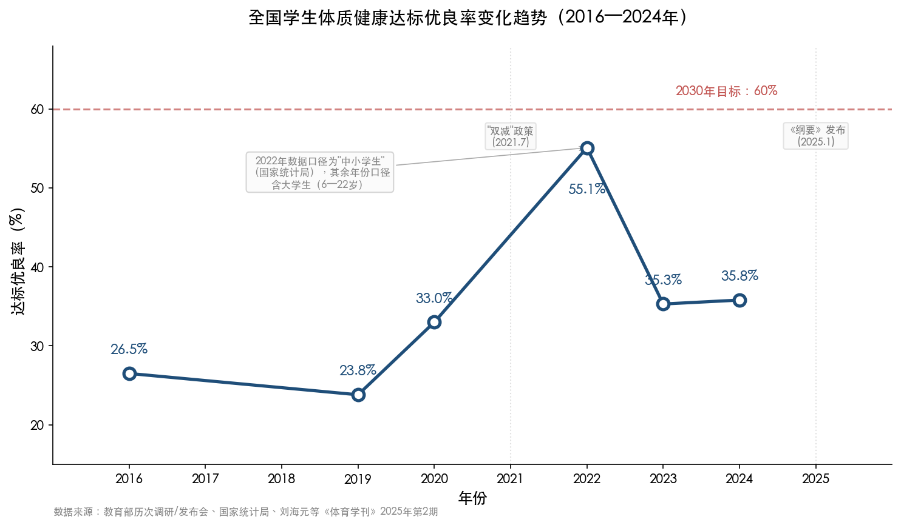

**图2-3** 呈现了2016—2024年间全国学生体质健康达标优良率的变化轨迹，并标注了"双减"政策（2021年7月）和《教育强国建设规划纲要》发布（2025年1月）两个关键政策节点。图中2030年60%的目标线清晰揭示了当前水平与政策目标之间仍存在约24个百分点的差距。需注意，2022年数据口径为"中小学生"（国家统计局），与其余年份含大学生的6—22岁口径存在差异，这也是该年数据点出现跳升的部分原因。

2025年12月发布的国家卫健委等13部门《儿童青少年"五健"促进行动计划（2026—2030年）》设定的目标是"中小学生国家学生体质健康标准达标优良率达到60%以上"[国家卫健委](https://www.ndcpa.gov.cn/jbkzzx/c100014/common/content/content_2008338699206955008.html "五健促进行动计划")。以当前约35.8%的水平衡量，距2030年目标尚需提升约24个百分点，任务十分艰巨。

体育活动时间与体质健康之间的正向关联在第八次全国调研中得到了直接验证：每天能保证1小时以上在校体育锻炼时间的学生，体质健康达标优良率为27.4%，显著高于锻炼时间不足学生的17.7%，两者相差近10个百分点[教育部第八次全国调研](https://news.eol.cn/meeting/202109/t20210903_2149889.shtml "2021年9月发布")。这一数据从实证层面论证了延长体育活动时间对提升学生体质的现实意义。

### 2.4.2 近视率：连续下降但仍居高位

视力健康方面，2021年至2024年全国学生总体近视率实现"四连降"，2024年降至50.3%，较2018年的53.6%下降3.3个百分点[央视网/教育部](https://news.cctv.com/2026/02/26/ARTIN2uFq8uO0HjXv2aBAjFB260226.shtml "2026年2月26日")。这一积极趋势与近年来户外活动时间增加、"双减"政策减轻课业负担等综合因素密切相关。然而，50.3%的总体近视率意味着每两名学生中仍有一人近视，形势依然严峻。

分学段审视（2023年国家卫健委数据），小学生近视率为35.6%，初中生跃升至71.1%，高中生更高达80.5%[福建省卫健委转引](https://wjw.fj.gov.cn/xxgk/gzdt/mtbd/202502/t20250211_6713266.htm "引用国家卫健委2023年数据")。从小学到高中近视率呈陡峭上升，与前文分析的"学段越高、体育活动时间越受挤压"的趋势高度吻合。2018年国家义务教育质量监测亦显示，四年级学生视力不良检出率为38.5%，八年级为68.8%[教育部2018年义务教育质量监测报告](http://www.moe.gov.cn/jyb_xwfb/gzdt_gzdt/s5987/201911/t20191120_409046.html "2019年11月发布")。大量循证研究已证实，户外体育活动是预防和延缓近视发生发展的有效手段，延长每日体育活动时间对近视防控具有直接的公共卫生价值。

### 2.4.3 超重肥胖率：学龄段持续攀升的健康威胁

超重肥胖问题是体育活动不足的另一显著健康后果。《中国居民营养与慢性病状况报告（2020年）》显示，6—17岁儿童青少年超重率为11.1%、肥胖率为7.9%，合计接近19%[国家卫健委《儿童青少年肥胖食养指南（2024年版）》](https://www.nhc.gov.cn/sps/c100088/202402/9ba512ba8e314a47a181db11d2fa188d/files/1743476134889_85723.pdf "2024年2月国家卫健委发布")。2018年国家义务教育质量监测进一步显示，四年级学生肥胖率为8.8%，八年级为9.7%，较2015年分别上升1.9和2.2个百分点[教育部2018年义务教育质量监测报告](http://www.moe.gov.cn/jyb_xwfb/gzdt_gzdt/s5987/201911/t20191120_409046.html "2019年11月发布")。

与此形成对照的是，"十四五"期间6岁以下儿童超重肥胖率已下降到9.7%[新华社](http://www.news.cn/20250911/9bf818c60aad459eb0e93cbbc9576f7f/c.html "2025年9月11日，国家卫健委主任雷海潮国新办发布会数据")，表明低龄儿童的健康干预已初见成效。然而6—17岁学龄段的超重肥胖率仍呈上升态势，与该年龄段体育活动时间普遍不足的现实形成互证，凸显出加大学龄段体育活动干预力度的紧迫性。

### 2.4.4 心肺耐力与心理健康：运动时间的多维健康效益

体育活动时间不足对学生的影响远不止于体重和视力，在心肺耐力和心理健康等维度同样有所体现。2024年全国学生体质健康抽测显示，学生肺活量等指标较以往有所增长，城乡差异逐步缩小[人民日报/教育部](http://society.people.com.cn/n1/2026/0226/c1008-40670153.html "2026年2月26日")。杭州市2018年至2022年的体测数据亦显示多项运动素质指标出现改善：立定跳远增加1.9厘米、引体向上增加1.2个、一分钟仰卧起坐增加1.8次[澎湃新闻](https://finance.sina.cn/2025-08-08/detail-infkfuvz9176275.d.html "杭州体测数据")。

体育活动对心理健康的保护作用尤为值得关注。《中国国民心理健康发展报告（2021—2022）》显示，运动时间更充足的学生抑郁风险检出率最低，仅为18.4%，而运动时间减少的学生抑郁风险检出率则高达38.9%[澎湃新闻](https://finance.sina.cn/2025-08-08/detail-infkfuvz9176275.d.html "引用中科院心理所报告")。两者相差超过20个百分点，有力地表明充足的体育活动时间在青少年心理健康维护中发挥着关键保护因素的作用。

## 2.5 国际参照：全球青少年身体活动不足的共性挑战

将中国中小学生体育活动时间置于全球坐标系中审视，有助于客观评估当前水平。WHO《全球身体活动状况报告（2022）》数据显示，全球81%的11—17岁青少年每天中高强度身体活动不足60分钟；中国青少年身体活动不足率为84.3%，高于全球均值约3个百分点[澎湃新闻](https://finance.sina.cn/2025-08-08/detail-infkfuvz9176275.d.html "引用WHO 2022年报告")。

需要强调的是，WHO标准为"每天至少60分钟中高强度有氧身体活动"，而中国"每天综合体育活动时间不低于2小时"的标准虽然时长更长（120分钟 vs. 60分钟），但涵盖所有强度类型的活动（含低强度），两者口径存在本质差异。一名学生即使满足了中国120分钟的综合标准，若其中大部分为低强度活动（如慢走、站立式课间活动等），仍可能未达到WHO 60分钟中高强度标准。因此，在评估和监测学生体育活动充足性时，不仅需要关注总时长，还需同步关注活动强度结构——这是中国现行监测体系有待加强的一个方面。

## 2.6 差距量化：从当前水平到120分钟目标的系统性缺口

综合本章各节实证数据，可从达标率、时长和群体分布三个维度对当前实际水平与120分钟政策目标之间的差距进行系统量化。

**达标率缺口**。全国仅约18.3%的学生每天锻炼时间能达到2小时（教师观察口径），即81.7%的学生存在时间缺口[潮新闻](https://tidenews.com.cn/news.html?id=3064081 "中国教育科学研究院调查")。即使采用学生自报数据（约72.8%达标），仍有超过四分之一的学生未达标[Qin et al., Frontiers in Public Health](https://pmc.ncbi.nlm.nih.gov/articles/PMC12913497/ "2026年2月发表")。

**时长缺口**。以青海省小学男生2023年日均中等强度以上运动57.2分钟为参照，距120分钟目标尚有约63分钟缺口；以重庆调查中64.1%学生放学后锻炼不足1小时为参照，结合校内约40—60分钟的体育活动时间，多数学生日均综合活动时间大致处于80—100分钟区间，距120分钟目标仍有20—40分钟的差距。

**群体差距分布**。差距在不同群体中的分布呈现显著的非均衡特征——高中学段（不达标率29.45%）、农村学校（30.50%）、民办学校（达标率仅18.1%）、女生（达标率低于男生约5.5个百分点）、寄宿生（不达标率30.03%）构成缺口最大的五类群体，应当成为政策精准发力的优先对象。

2025年全国大样本Logistic回归分析进一步揭示了影响"2小时不达标"的主要风险因素：对2小时标准缺乏认知的优势比（OR）最高，达3.97；其次为对体育活动价值认同度低（OR=2.55）、缺乏体育器材（OR=2.04）、缺乏智能设备获取途径（OR=2.01）、体育课时不足（OR=1.42）、学业压力（OR=1.10）[Qin et al., Frontiers in Public Health](https://pmc.ncbi.nlm.nih.gov/articles/PMC12913497/ "风险因素Logistic回归分析")。认知因素的OR值远高于其他变量，表明政策宣传普及和理念转变是提升达标率的首要抓手。

从2027年义务教育阶段全面高质量落实"2小时"的阶段目标倒推，自2026年4月起计，留给政策执行的时间窗口仅约一年。考虑到当前达标率的基线水平和各维度的结构性差异，这一目标的实现需要在时间保障、师资配备、场地设施和监测评价等多个维度同步发力，任何单一措施都不足以弥合如此系统性的缺口。

# 第3章 制约因素分析——影响中小学生体育活动时间的多层因素

## 3.1 引言：政策反复推动背后的"顽症"逻辑

第2章的实证数据揭示了一个令人警醒的事实：尽管95%的学校声称能保障学生每天1小时体育锻炼，全国仅18.3%的中小学生每天锻炼时间能够达到2小时，超过八成学生未达到120分钟政策目标。[潮新闻](https://tidenews.com.cn/news.html?id=3064081 "2025年3月，引用中国教育科学研究院调查数据") 更深层的追问在于：从1990年《学校体育工作条例》确立"每天一小时"标准至今逾三十五年，历经中央层面四次高规格文件推动（2007年中央7号文件、2012年国办发53号、2016年国办发27号、2020年两办意见），每一轮政策周期设定的五年阶段性目标均未能完全实现。首都体育学院刘海元教授将这一现象概括为——学生体质健康"成了学校体育和教育的'顽症'"。[刘海元等《体育学刊》2025年第2期](https://statics.scnu.edu.cn/pics/tyxk/2025/0325/1742892388387237.pdf "首都体育学院刘海元教授")

这一"顽症"的形成并非单一因素所致。2025年5—7月，一项覆盖全国七大行政区49,998名中小学生的大样本横断面调查，运用Logistic回归系统量化了影响"每天2小时不达标"的多重风险因素。各因素比值比（OR值）排序如下：对2小时标准缺乏认知（OR=3.97）> 对体育活动价值认同度低（OR=2.55）> 缺乏体育器材（OR=2.04）> 缺乏智能设备获取途径（OR=2.01）> 体育课时不足（OR=1.42）> 学业压力（OR=1.10）。[Qin et al., Frontiers in Public Health](https://pmc.ncbi.nlm.nih.gov/articles/PMC12913497/ "2026年2月发表，全国7大行政区49,998名学生横断面调查") 这一结果表明，制约体育活动时间的因素横跨认知观念、物质条件、制度安排与社会环境多个层面，且认知与观念层面的制约效应远超客观条件约束（见图3-1）。

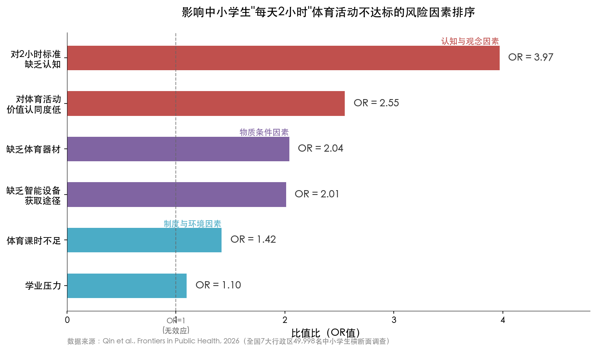

> **图3-1** 基于全国49,998名中小学生Logistic回归分析的风险因素OR值排序。认知与观念因素的风险效应（OR=2.55—3.97）远高于制度与环境因素（OR=1.10—1.42）。数据来源：Qin et al., Frontiers in Public Health, 2026。

本章依循"学校制度—师资设施—评价导向—家庭社会—学生个体"五个层面，逐一剖析影响中小学生体育活动时间的制约因素及其作用机制，并在末节构建多层因素交互分析框架，揭示各层面因素之间的相互强化关系。

## 3.2 学校制度层面：课时挤占、课间管控与形式主义执行

### 3.2.1 体育课时的结构性挤占

体育课时被主科挤占是影响学生体育活动时间最直接的制度性因素。2018年国家义务教育质量监测覆盖全国31个省份57万余名学生，其数据显示：四年级体育周课时数少于3节的学校占比高达44.3%，八年级该比例更升至60.8%；与之形成鲜明对照的是，语文周课时数多于6节的四年级学校占比72.0%，数学周课时数多于5节的八年级学校占比73.3%。[教育部国家义务教育质量监测报告](http://www.moe.gov.cn/jyb_xwfb/moe_1946/fj_2018/201807/P020180724685827455405.pdf "2018年7月教育部发布") 国家课程标准明确规定小学三至六年级和初中每周至少3课时体育，但近半数小学和逾六成初中的体育课时未达此标准，主科课时超标与体育课时欠缺构成典型的结构性失衡。

中国教育科学研究院体育美育教育研究所所长吴键进一步指出，"全国能做到每天一小时体育锻炼的学校不到60%"。[新华社](http://www.news.cn/2023-12/05/c_1130010661.htm "2023年12月5日，引用中国教育科学研究院统计数据") 这一数据与教育部2022年新闻发布会公布的"95%学校能保障1小时"之间存在显著差距，折射出"名义保障"与"实质达标"之间的落差——前者衡量的是制度安排层面的形式覆盖，后者则直指实际执行中的时间兑现。

### 3.2.2 "阴阳课表"与变形执行

比课时不足更隐蔽的制约来自"阴阳课表"现象——学校在公示课表中安排了充足的体育课时，但实际执行中体育课被语文、数学、英语等科目频繁占用。2026年2月，教育部明确将"严防'阴阳课表'，严查挤占体育课、课间不准学生出教室等行为"列为年度重点工作，要求各地通过"晒课表"等方式强化透明监督。[北京日报/新浪财经](https://finance.sina.com.cn/jjxw/2026-02-26/doc-inhpanwy4754849.shtml "2026年2月26日") 教育部将此列为专项部署对象本身，即反映出"阴阳课表"现象在此前相当普遍。

2026年全国两会期间，全国政协委员厉彦虎的调研揭示了更为精细化的变形执行方式：部分学校课间从10分钟延长至15分钟后，反而通过取消最后一个课间、两节课连堂、压缩午饭时间等方式"拆东墙补西墙"；另有学校课间虽名义延长，但不许学生上下楼、不许前往操场，仅允许在教室门口短暂"放风"；甚至出现"遇检查改15分钟、无检查恢复原样"的应付行为。[全国人大网/新华社](http://www.npc.gov.cn/c2/c30834/202603/t20260309_452709.html "2026年3月9日两会报道") 这些变形执行方式表明，制度供给层面的改革若缺乏刚性监督与有效问责，极易被基层应试压力所"消解"。

### 3.2.3 课间活动的过度管控

课间本应是学生进行自由身体活动的重要时段，但在安全管理和纪律管控的双重压力下，许多学校的课间已演变为"安静的课间10分钟"。新华社"新华视点"2023年调查发现，部分中小学生课间10分钟被严格约束，除喝水和上厕所外不得走出教室活动。2019年一项针对1,900余名家长的调查显示，75.2%的受访家长反映身边中小学"安静的课间10分钟"现象普遍，且在小学阶段尤为突出。[新华社"新华视点"](http://www.news.cn/2023-10/31/c_1129950543.htm "2023年10月31日调查报道")

基层教师对此给出的解释颇具代表性："一旦学生课间活动出现磕碰等意外，校方不仅需要向家长道歉，还可能涉及经济赔偿。为此学校干脆强调课间纪律，减少孩子外出活动。"[新华社"新华视点"](http://www.news.cn/2023-10/31/c_1129950543.htm "2023年10月31日") 这种以"安全"之名压缩学生身体活动空间的做法，使课间这一原本可累积可观活动时长的时段几近归零。以每天6个课间、每次15分钟计，课间活动潜在贡献可达90分钟，是"每天2小时"目标中不可或缺的组成部分。课间活动的系统性压缩，对该目标的实现构成直接而重大的障碍。

## 3.3 师资与设施层面：结构性短缺与空间约束

### 3.3.1 体育教师缺口：规模与结构的双重困境

体育教师数量不足是制约体育课时保障和活动质量提升的基础性瓶颈。2022年7月，教育部体育卫生与艺术教育司在全国政协提案办理协商会上披露，按照体育学科占总课程比例11%、体育教师每周课时15节计算，义务教育阶段体育教师缺编约12万人，乡村小学、初中和教学点缺编问题尤为突出。[央广网/央视新闻](http://news.cnr.cn/native/gd/20220725/t20220725_525931117.shtml "2022年7月25日") 另有学者估算，截至2021年中小学体育教师共缺45万余人，其中小学缺口22万余人、初中缺口15万余人。[尚力沛《首都体育学院学报》2025年第37卷第5期](http://sdtyxyxb.magtechjournal.com/CN/10.14036/j.cnki.cn11-4513.2025.05.001 "引用既有研究数据")

从存量增长看，截至2021年全国中小学体育教师人数为77.05万人，较2016年增加18.51万人，占专任教师总数的比例从2015年的5.4%提高至2020年的6.97%；义务教育阶段体育教师总量较2012年增长71.6%。[央广网/央视新闻](http://news.cnr.cn/native/gd/20220725/t20220725_525931117.shtml "2022年教育部数据") [新浪财经/教育部](https://cj.sina.cn/articles/view/1841812881/6dc7d59102001nq1s "2026年2月25日") 增幅虽然可观，但远未填补缺口——尤其在"每天一节体育课"和"每天2小时"新政策要求下，师资需求进一步扩大。2026年全国两会期间，代表委员明确指出"中小学体育师资存在一定缺口，现有教师分身乏术"。[全国人大网/新华社](http://www.npc.gov.cn/c2/c30834/202603/t20260309_452709.html "2026年3月两会报道")

《首都体育学院学报》2025年发表的一项前瞻性研究进一步揭示了该问题的动态趋势：基于"每天一节体育课"标准测算（小学每周4.5课时、初中每周3课时），2025年义务教育阶段体育教师需求量约为99.46万—114.28万人，而同期存量约为84万—90万人，缺口介于10万—30万人之间。然而，受学龄人口下降影响，小学体育教师缺口将从2025年的约24万人逐步缩小，预计至2029—2031年前后出现供需平衡乃至结构性过剩。[尚力沛《首都体育学院学报》2025年第37卷第5期](http://sdtyxyxb.magtechjournal.com/CN/10.14036/j.cnki.cn11-4513.2025.05.001 "2025年9月发表") 这意味着体育教师缺口是一个"短期紧迫、中期缓解"的窗口期问题，2025—2030年构成最关键的攻坚阶段。

师资短缺还存在显著的城乡结构性差异。许多农村学校不得不由其他学科教师兼任体育课，"超编缺岗"现象——学校总体教师编制已满但缺专职体育教师——在中西部地区较为普遍。即便在经济发达的江苏省，实践中同样面临师资缺口：南通市崇川区某初级中学38个班仅有9名体育教师，需通过选聘兼职教师和建立班级体育互助小组等方式勉强维持教学运转。[澎湃新闻/中国教育报](https://m.thepaper.cn/newsDetail_forward_32813497 "2026年3月23日")

### 3.3.2 场地设施：总体达标下的结构性短板

与师资状况不同，学校体育场地设施在统计层面已呈现较高达标率。2024年教育部统计公报数据显示：全国普通小学体育运动场（馆）面积达标率为94.50%，体育器械达标率为97.47%；初中场地达标率为95.84%，器械达标率为98.12%；普通高中场地达标率为94.92%，器械达标率为96.95%。[教育部2024年全国教育事业发展统计公报](http://www.moe.gov.cn/jyb_sjzl/sjzl_fztjgb/202506/t20250611_1193760.html "2025年6月发布")

然而，约5%学校场地面积不达标的绝对数量依然可观，且达标率数据掩盖了城区学校普遍面临的生均运动面积不足困境。2026年两会期间，代表委员反复指出"一些地方城区学校空间有限，生均运动面积不足"；此外，气候条件对南方省份的影响亦不容忽视——"部分南方省份学校高温多雨时缺乏室内场馆，一旦遭遇恶劣天气，'每天2小时'目标就很难达到"。[全国人大网/新华社](http://www.npc.gov.cn/c2/c30834/202603/t20260309_452709.html "2026年3月9日")

2025年全国大样本调查的Logistic回归结果进一步印证了设施对达标率的实质影响："缺乏体育器材"是影响"2小时不达标"的第三大风险因素（OR=2.04），仅次于认知不足和价值认同度低。[Qin et al., Frontiers in Public Health](https://pmc.ncbi.nlm.nih.gov/articles/PMC12913497/ "2026年2月发表") 从宏观视角看，截至2024年底全国人均体育场地面积已达3.0平方米，提前超过"十四五"规划的2.6平方米目标。[新华社](http://www.news.cn/20250318/93026d384cc543928fb7d776220f2bb3/c.html "2025年3月18日") 但代表委员同时指出，社区体育设施仍存在"青少年体育锻炼缺少合适条件"的适用性问题——总量达标却功能不匹配，现有设施多服务于中老年健身需求，适合中小学生开展球类运动、跑步等体育活动的专用场地仍然不足。

## 3.4 制度与评价层面：考试指挥棒的双刃效应与安全责任困局

### 3.4.1 升学评价体系中的体育权重：驱动与扭曲并存

体育在升学评价体系中的权重直接影响学校和家庭对体育活动时间的资源配置意愿。第八次全国学生体质与健康调研（2019年）的数据揭示了一个极具说服力的对比：初三学生在校体育锻炼1小时比率为42.7%，而升入高一后骤降至30.6%，降幅达12.1个百分点。[教育部第八次全国调研](https://news.eol.cn/meeting/202109/t20210903_2149889.shtml "2021年9月发布") 中考体育分值对初三学生产生了显著的"驱动效应"，但进入高中后，由于体育在高考中不计入分值，体育活动时间出现断崖式下降。

这一学段梯度特征在Qin等人的全国调查中得到进一步验证：3—5年级学生"每天2小时"不达标率为30.04%，初中8—9年级最低（22.70%，受中考驱动），高中阶段则反弹至29.45%，呈现"小学高年级高—初中逐步下降—高中反弹"的U型趋势。[Qin et al., Frontiers in Public Health](https://pmc.ncbi.nlm.nih.gov/articles/PMC12913497/ "学段差异数据")

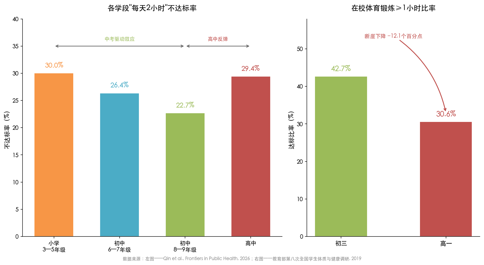

> **图3-2** 左图：各学段"每天2小时"不达标率呈"U型"分布，初中8—9年级最低；右图：初三与高一在校体育锻炼≥1小时比率对比，高一较初三下降12.1个百分点。数据来源：Qin et al.（2026）；教育部第八次全国学生体质与健康调研（2019年）。

近年来，中考体育分值在全国范围内呈逐步提升趋势：云南2020年率先将体育分值提至100分（满分700分），河南自2025年起从70分提至100分，北京从30分提至50分并计划2029年达70分，江西从2015年的10分逐步提至60分。[新华社](http://www.news.cn/20250628/a1a288b706b44e4abaaaddf52e4f5e51/c.html "2025年6月28日体育中考改革观察") 分值提高确实促进了初中阶段的体育活动参与——合肥市2025年中考体育45.57%的考生获得满分60分、平均分57.42分。但这种驱动也伴随"考什么练什么"的应试倾向，学生围绕考试项目进行单一化、重复化训练，偏离了增强体质、培养终身运动习惯的本质目标。[新华社](http://www.news.cn/20250628/a1a288b706b44e4abaaaddf52e4f5e51/c.html "2025年6月28日")

全国政协委员赵坤宇的调研则从体育特长培养角度揭示了升学压力的挤压效应：孩子们对冰球运动热情很高，但到高年级学业压力增大后很难兼顾训练，"很多有潜力的孩子不得不放弃，因为面临'升学断档'的焦虑"。[全国人大网/新华社](http://www.npc.gov.cn/c2/c30834/202603/t20260309_452709.html "2026年3月两会报道") 2024年中国基础教育年度报告对此现象作出总结性判断："人才培养重知识轻素质，重智育轻德育、体育、美育、劳动教育的现状尚未根本改变，分数至上等现象还较普遍。"[中国教育新闻网](http://www.jyb.cn/rmtzcg/xwy/wzxw/202503/t20250321_2111319980.html "2025年3月发布") 在应试教育的"指挥棒"下，体育被视为"可牺牲"的环节——只要不直接影响升学成绩，体育活动时间便成为被压缩的首选对象。

### 3.4.2 安全责任风险：制约体育活动的制度性枷锁

学校安全责任风险对体育活动产生了显著的抑制效应，并催生了"越不敢练→体质越差→越容易受伤→越不敢练"的恶性循环。《中国体育报》调查发现，"很多体育老师不敢放开手脚上课，主要原因是怕一旦出事担责任"；许多学校宁可减少乃至取消体育活动以规避安全事故风险。[国家体育总局/中国体育报](https://www.sport.gov.cn/n20001280/n20745751/n20767239/c21728424/content.html "2017年3月24日")

这一问题的制度根源在于中国现行校园运动伤害保险的归责原则。中国校方责任险自2008年起推行，适用过错责任原则——学校无过错时学生即使受伤也无法获得赔偿，这反过来激励学校为规避被认定有过错而倾向于削减具有一定风险性的体育活动。[教育部推行校方责任险通知](http://www.moe.gov.cn/s78/A17/s7059/201410/t20141021_178896.html "2008年") 作为对照，日本体育振兴中心（JSC）运营的"灾害共济给付制度"以每生每年920日元（约合人民币45元）的保费实现义务教育全覆盖、无过错责任的学校运动伤害赔付，从制度设计层面消除了学校因安全顾虑而限制体育活动的激励。[日本体育振兴中心官方说明](https://www.jpnsport.go.jp/anzen/Portals/0/anzen/kyufu_1/pdf/R5.1_seidonooshirase(english).pdf "JSC 2023")

在"每天2小时"政策推进过程中，安全风险正在进一步放大。中国教育科学研究院吴键所长披露，"与2023年相比，学生体育运动伤害事故增加了50%以上，校方责任险中体育运动伤害赔偿的比例接近60%"。[央广网/中国教育报](https://edu.cnr.cn/gc/20250317/t20250317_527103422.shtml "吴键专访") 运动伤害事故的上升趋势若不能通过保险制度改革和学校安全管理机制优化加以化解，将构成"每天2小时"政策全面落地的重大阻力。

## 3.5 家庭与社会层面：认知缺口与观念惯性

### 3.5.1 对政策标准的认知不足：最大的单一风险因素

2025年全国大样本调查揭示了一个出乎许多人意料的发现：制约"2小时不达标"的最大风险因素并非课时不足或学业压力，而是"对2小时标准缺乏认知"（OR=3.97）。[Qin et al., Frontiers in Public Health](https://pmc.ncbi.nlm.nih.gov/articles/PMC12913497/ "Logistic回归分析") 这意味着相当比例的学生和家长根本不了解国家已提出"每天综合体育活动时间不低于2小时"的明确要求。缺乏认知使政策要求无法转化为家庭和个体层面的行动——对标准缺乏知晓的群体自然不会有意识地追求达标。

紧随其后的第二大风险因素是"对体育活动价值认同度低"（OR=2.55），同样指向认知与观念层面。这两项与家庭和社会观念直接相关的因素，其风险效应远超体育课时不足（OR=1.42）和学业压力（OR=1.10）。[Qin et al., Frontiers in Public Health](https://pmc.ncbi.nlm.nih.gov/articles/PMC12913497/ "风险因素Logistic回归分析") 这一量化证据表明，提升全社会对体育活动重要性的认知、扩大新政策标准的知晓覆盖面，是打通政策落地"最后一公里"的关键所在。

### 3.5.2 "重智育轻体育"的观念惯性

认知不足的背后是根深蒂固的"重智育轻体育"社会观念。在"分数至上"的升学竞争环境下，家长普遍将学科成绩视为子女教育的核心目标，体育被归入"非关键"甚至"可有可无"的类别。2025年全国调查数据显示，学业压力对"2小时不达标"的直接统计效应（OR=1.10）并不算大，但其间接影响不容低估——学业压力通过影响家长的时间分配决策产生放大效应，家长倾向于将孩子的课余时间优先分配给学科学习和校外培训，体育锻炼则被排在末位。

"双减"政策带来的运动时间红利存在明显的经济分层差异。中科院心理所研究显示，在小学生群体中，家庭经济条件越好，感受到体育运动时间增加的占比越高。[中科院心理所报告](http://psy.china.com.cn/2023-08/15/content_42469817.htm "中国网2023年8月刊载") 这意味着经济条件较差的家庭更可能将"双减"释放的课余时间转向其他学业补充活动，而非体育锻炼，从而加剧体育活动参与的社会分层效应。

北京市2023年调查提供了更为细致的结构性证据：公办学校学生每天达到2小时体育活动的报告率为33.5%，民办学校仅为18.1%；在校身体活动达标率公办学校为65.9%，民办学校仅28.7%。[蔡珊等学术论文](https://pmc.ncbi.nlm.nih.gov/articles/PMC11167545/ "《北京大学学报（医学版）》2024年第56卷第3期") 民办学校达标率远低于公办学校，一方面反映了民办学校对升学率的更高追求导致体育时间被进一步压缩，另一方面也折射出政策在非公办教育体系中的执行刚性相对不足。

### 3.5.3 社区体育设施的适用性缺陷

校外体育活动的开展高度依赖社区体育设施的可及性与适用性。截至2024年底，全国人均体育场地面积达到3.0平方米，提前超过"十四五"规划2.6平方米的目标。[新华社](http://www.news.cn/20250318/93026d384cc543928fb7d776220f2bb3/c.html "2025年3月18日") 然而，社区体育设施存在明显的"适用性缺陷"——总量指标达标，但适合青少年使用的运动场地和器材严重不足。2026年两会期间，代表委员指出社区体育设施多以满足中老年健身需求为主（如健身步道、广场舞场地），真正适合中小学生开展球类运动、跑步、跳绳等体育活动的专用场地仍然匮乏，对学生放学后和周末的校外体育活动构成现实制约。

## 3.6 学生个体层面：电子设备替代与运动习惯缺失

### 3.6.1 屏幕时间的替代效应

电子设备使用时间对体育活动产生了显著的替代效应。共青团中央2024年11月发布的《第6次中国未成年人互联网使用情况调查报告》显示，中国未成年网民已达1.96亿，互联网普及率97.3%，九成以上未成年人通过手机接入互联网。[经济观察网](http://www.eeo.com.cn/2025/1024/761425.shtml "2025年10月24日") 第5次同类调查（覆盖2022年数据）显示，未成年网民工作日平均每天上网时长在2小时以上的比例为11.1%。[共青团中央/中国互联网络信息中心](https://qnzz.youth.cn/qckc/202312/P020231223672191910610.pdf "第5次全国未成年人互联网使用情况调查报告，2023年12月发布") 尽管这一比例在防沉迷政策干预下有所下降（2020年为11.5%，2021年降至8.7%），但假期期间屏幕时间出现显著反弹。

中国青年报社2025年8月对1,500名家长的调查显示，暑假期间26.1%的受访家长表示孩子日均使用手机超4小时。按学段分析，高中生暑假日均手机使用超4小时的比例高达55.2%，初中生为38.8%，小学高年级为22.2%，小学低年级为11.2%。[新华网/中国青年报](https://www.news.cn/local/20250821/a0c56a0945df4fe59030447a7af0bdb6/c.html "2025年8月21日") 学段越高、屏幕时间越长的梯度特征，与高学段学生体育活动时间不足加剧的趋势高度吻合。

屏幕时间替代效应的作用机制涉及多个维度：其一，直接占用学生原本可用于身体活动的闲暇时间；其二，久坐行为降低身体活动动机和运动兴趣；其三，社交媒体和短视频等即时满足型内容削弱了学生延迟满足与主动参与需要付出努力的体育活动的意愿。2025年全国调查中，"缺乏智能设备获取途径"这一反向指标的OR值达到2.01，从侧面说明在拥有电子设备的学生群体中，设备使用对体育活动的排挤效应是实质性的。[Qin et al., Frontiers in Public Health](https://pmc.ncbi.nlm.nih.gov/articles/PMC12913497/ "Logistic回归分析")

### 3.6.2 自主锻炼习惯的普遍缺失

学生对体育课本身并非缺乏兴趣。2018年国家义务教育质量监测显示，四年级学生喜欢体育课的比例高达92.9%，八年级为87.3%。[教育部国家义务教育质量监测报告](http://www.moe.gov.cn/jyb_xwfb/moe_1946/fj_2018/201807/P020180724685827455405.pdf "2018年7月发布") 然而，"喜欢体育课"并未有效转化为自主锻炼习惯：同一监测数据显示，具有体育锻炼习惯（每周自主锻炼≥3次且每次>30分钟）的四年级学生仅28.4%，八年级降至18.6%——超过七成的中小学生未养成规律性自主锻炼习惯。[教育部2018年义务教育质量监测报告](http://www.moe.gov.cn/jyb_xwfb/gzdt_gzdt/s5987/201911/t20191120_409046.html "2019年11月发布")

从四年级到八年级，喜欢体育课的比例下降5.6个百分点，而有锻炼习惯的比例下降9.8个百分点——后者的降幅近乎前者的两倍。这一差异表明，随学段升高，学业压力加大、电子设备使用增多、青春期行为模式变化等多重因素加速侵蚀学生的课外运动参与。北京市2023年调查进一步揭示了性别维度的差异：男生每天达到2小时体育活动的报告率为36.0%，女生为30.5%（P=0.001），差距主要来源于校外自主活动而非在校身体活动。[蔡珊等学术论文](https://pmc.ncbi.nlm.nih.gov/articles/PMC11167545/ "《北京大学学报（医学版）》2024年第56卷第3期") 这表明女生在课外自主运动方面面临更大的社会文化和个体动机障碍，相关干预措施需针对性别差异进行差异化设计。

## 3.7 多层因素的交互与叠加：一个系统性分析框架

综合上述五个层面的分析，影响中小学生体育活动时间的制约因素并非孤立运作，而是形成了复杂的交互叠加效应（见图3-3）。

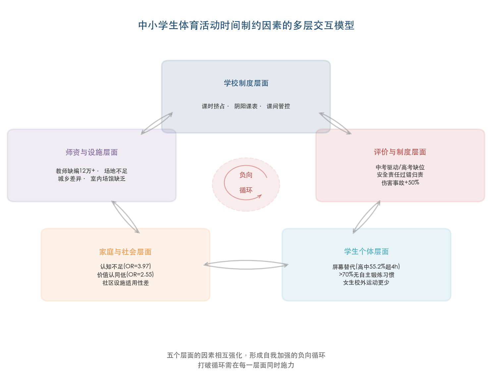

> **图3-3** 五个层面的制约因素及其相互强化的负向循环关系。各层面核心制约因素通过交互作用形成自我加强的系统性困局。

**层面一——学校制度**：体育课时被主科挤占（四年级44.3%学校不达标、八年级60.8%）、"阴阳课表"变形执行、课间活动过度管控，直接压缩了学生在校体育活动的制度化时间供给。

**层面二——师资设施**：体育教师缺编（义务教育阶段至少12万人，按新标准测算缺口可达数十万人）使"每天一节体育课"难以全面实现；约5%学校场地面积不达标、城区生均面积不足、南方学校缺乏室内场馆等设施瓶颈，进一步限制了活动开展的物理空间。

**层面三——评价导向**：体育在升学体系中权重偏低导致其"可牺牲"定位固化，高中阶段体育活动时间断崖式下降（初三42.7%→高一30.6%）；中考体育虽产生驱动效应，但也催生"考什么练什么"的应试异化。安全责任的过错归责原则形成制度性枷锁，运动伤害事故同比增加50%以上进一步加剧学校"不敢动"的倾向。

**层面四——家庭社会**：对政策标准缺乏认知（OR=3.97）和对体育价值认同度低（OR=2.55）是风险效应最大的两个因素；社区设施适用性不足制约校外活动；经济分层加剧体育参与不平等。

**层面五——学生个体**：屏幕时间替代效应显著（高中生暑期超4小时手机使用占55.2%）；超过七成学生未养成自主锻炼习惯；女生校外运动参与低于男生。

上述五个层面的因素相互强化，构成一个自我加强的负向循环：应试压力驱动学校挤占体育课时→安全顾虑抑制体育活动开展→家长观念惯性削减校外锻炼投入→电子设备填充本应用于运动的闲暇时间→体育活动不足导致体质下降、运动损伤风险上升→学校和家长的风险规避心态进一步强化。打破这一循环，需要在每一个层面同时施力，形成制度保障、条件支撑、观念转变与习惯养成的系统性协同，而非寄望于单一环节的突破。

# 第4章 国际比较与经验借鉴——全球视野下的青少年体育活动保障

## 4.1 引言：国际比较的必要性与分析框架

中国"中小学生每天综合体育活动时间不低于2小时"的政策目标并非孤立的国别探索，而是全球应对青少年身体活动不足这一重大公共卫生挑战的组成部分。WHO 2022年《全球身体活动状况报告》指出，全球81%的11—17岁青少年未能达到WHO推荐的每天60分钟中高强度有氧身体活动（MVPA）标准。[WHO全球报告](https://www.who.int/publications/i/item/9789240059153 "Global Status Report on Physical Activity 2022") 面对这一跨越国界与发展阶段的共同困境，不同国家和地区基于各自教育制度、文化传统和财政能力，形成了差异显著的学校体育保障路径。系统考察这些路径的成功经验与局限教训，对于中国制定更加精准有效的实施策略具有重要参照价值。

在进入具体国别分析之前，有必要首先厘清一项关键口径差异。中国"每天综合体育活动时间不低于2小时"与WHO"每天60分钟中高强度身体活动"在统计范畴上存在本质不同：中国的120分钟涵盖所有类型身体活动——包括体育课、大课间、课间走动、早操、课后延时服务中的体育锻炼等，其中相当比例属于低至中等强度活动；而WHO的60分钟标准特指中高强度有氧活动（MVPA）。因此，一名学生可能满足中国标准但未达WHO标准（活动时间充足但强度不够），反之亦然（高强度运动充分但总时长不足2小时）。理解这一口径差异，是进行有效国际比较的前提。

本章选取日本、芬兰、韩国、英国、美国和澳大利亚六个代表性国家，分别代表东亚社团驱动型（日本）、北欧课间激活型（芬兰）、东亚应试压制型（韩国）、专项资金投入型（英国）、分权碎片化型（美国）和社区环境支撑型（澳大利亚）等差异化路径，并以Active Healthy Kids全球联盟（AHKGA）Global Matrix 4.0评级体系作为统一的横向比较框架。

## 4.2 全球评估框架：Active Healthy Kids Global Alliance的评级图谱

### 4.2.1 Global Matrix 4.0的方法论与全球图景

目前国际上最具系统性的青少年身体活动比较评估体系，是Active Healthy Kids全球联盟（AHKGA）发布的Global Matrix（全球矩阵）。Global Matrix 4.0于2022年10月在阿布扎比发布，涵盖6大洲57个国家和地区，由682名专家参与，对10项通用指标进行统一评级（从A+到F），分别为：总体身体活动、有组织体育运动、主动玩耍、主动交通、久坐行为、体适能、家庭与同伴、学校、社区与环境、政府。[AHKGA Global Matrix 4.0](https://www.activehealthykids.org/4-0/ "2022年发布") [Aubert et al., JPAH 2022](https://journals.humankinetics.com/view/journals/jpah/19/11/article-p700.xml "Global Matrix 4.0学术论文")

在"总体身体活动"指标上，全球平均评级仅为D级（约27%—33%的儿童青少年达到WHO每天60分钟MVPA标准），为所有10项指标中最低。获评最高的国家包括丹麦、芬兰、日本和斯洛文尼亚（均为B-级），大多数国家集中在C至D区间。[Aubert et al., JPAH 2022](https://journals.humankinetics.com/view/journals/jpah/19/11/article-p700.xml "Table 4：各国评级比较") 这一全球性的低达标格局表明，青少年身体活动不足并非某一国家的特殊困境，而是跨越发展阶段和文化背景的普遍性挑战。

### 4.2.2 中国在Global Matrix 4.0中的定位

中国在Global Matrix 4.0中的各项评级呈现显著的结构性失衡：总体身体活动C级、有组织体育运动F级（全球仅3个国家获F级——属最低档次）、主动玩耍C-级、主动交通C级、久坐行为D+级、体适能INC（数据不足）、学校D级、政府D级；总体平均D级。[Aubert et al., JPAH 2022](https://journals.humankinetics.com/view/journals/jpah/19/11/article-p700.xml "中国各项指标评级")

这一评级图谱蕴含三个值得深入解读的关键信息。其一，中国"有组织体育运动"获F级，意味着不足20%的儿童青少年参与有组织体育运动，这与课外体育社团、竞赛体系覆盖面狭窄的现实高度吻合——第3章已分析的"非面向全体学生"的课外体育训练问题在此得到国际横截面的印证。其二，中国"学校"指标仅D级，远低于日本的B+级、韩国的A级、芬兰的B级和英格兰的B+级，表明中国学校体育政策的执行效果在国际比较中处于较低水平。其三，总体身体活动C级虽高于全球平均D级，但考虑到中国数据的样本和方法论局限，对此不宜过于乐观。

2024年美国发布的最新《美国儿童青少年身体活动报告卡》同样给出了总体身体活动D-级的评分，仅20%—28%的6—17岁美国儿童达到每天60分钟MVPA标准。[美国身体活动报告卡](https://paamovewithus.org/wp-content/uploads/2024/10/2024-US-Report-Card-Executive-Summary_FINAL.pdf "2024年10月发布") 这一数据进一步表明，即便是体育文化高度发达的国家也面临同样困境。

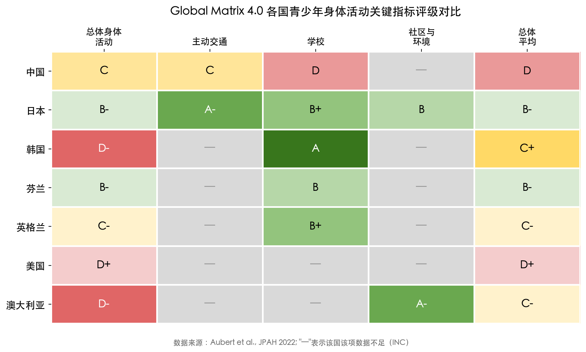

上图以热力图形式呈现了中国、日本、韩国、芬兰、英格兰、美国和澳大利亚在五项关键指标上的评级差异。日本在总体身体活动（B-）、主动交通（A-）和学校（B+）三项指标上均处于全球领先水平；韩国"学校"指标虽获A级评定，但总体身体活动仅为D-级，形成强烈反差；中国在"学校"和总体平均两项指标上均为D级，显示出较大的提升空间。

## 4.3 日本经验：制度化的全方位体育活动保障

### 4.3.1 学校体育课时与课程设置

日本在Global Matrix 4.0中总体平均评级为B-级，位居全球最高档次。这一优异表现的背后是一套成熟的制度化保障体系。日本体育课依据文部科学省《学习指导要领》规定，小学每节45分钟、中学每节50分钟，全年约90个必修学时（折合每周约3课时）。[笹川体育财团](https://www.ssf.or.jp/en/features/japans_data_plus_sports/e0019.html "SSF 2021") 这一课时量与中国2007年中央7号文件规定的"小学3—6年级和初中每周3课时"大致相当，但日本的制度安排存在显著的差异化特征：小学阶段由班级担任教师兼授体育课，初中以上由专职体育教师授课，这种设计确保了体育教学与班级管理的有机融合。此外，每所学校每年举办运动会（"体育祭"），学生分组竞赛、家长到场观看，使学校体育活动成为社区参与的文化事件，而非仅限于校园内部的教学环节。

### 4.3.2 课外体育社团制度（部活動/Bukatsu）

日本青少年体育活动保障的核心制度创新在于独特的课外体育社团活动制度——"部活動"（Bukatsu）。初高中学生放学后自愿加入学校运动部，通常免费参加，由学校教师担任顾问。运动部一般每周训练6—7天（含寒暑假），每次约2—3小时。[笹川体育财团](https://www.ssf.or.jp/en/features/japans_data_plus_sports/e0019.html "SSF: Bukatsu系统介绍") [Cave 2004](https://pure.manchester.ac.uk/ws/files/24340198/POST-PEER-REVIEW-NON-PUBLISHERS.PDF "曼彻斯特大学研究论文") Bukatsu制度的实质意义在于，它在不额外占用正式教学时间的前提下，通过放学后社团活动为学生提供每日约60—90分钟的身体活动时间，这是日本青少年身体活动达标率在全球排名靠前的关键因素。

值得关注的是，日本在Global Matrix 4.0中"主动交通"指标获得A-级（全球最高之一），与其法律规定的学校通勤距离直接相关——99%的小学生和92%的初中生就读公立学校，大多数学生步行或骑自行车上学。[Aubert et al., JPAH 2022](https://journals.humankinetics.com/view/journals/jpah/19/11/article-p700.xml "日本评级数据") 步行通勤本身构成每日稳定的身体活动来源，这一"隐性体育活动"是日本高达标率常被忽视但至关重要的结构性因素。

### 4.3.3 运动伤害保险制度：JSC"灾害共济给付制度"

日本在学校体育活动保障方面的另一项制度创新，是日本体育振兴中心（JSC）运营的"灾害共济给付制度"。该制度基于《独立行政法人日本体育振兴中心法》，覆盖全部义务教育学校，由政府、学校运营方和家长三方分担保费。义务教育阶段每名学生每年保费仅为920日元（约合人民币45元），保障范围涵盖体育课、课外活动、课间休息、上下学途中发生的伤病、残疾和死亡。[JSC官方说明](https://www.jpnsport.go.jp/anzen/Portals/0/anzen/kyufu_1/pdf/R5.1_seidonooshirase(english).pdf "JSC 2023年制度介绍")

该制度的核心特征为"不问学校过失即可获赔"（无过错责任原则），这一归责设计极大降低了学校因安全顾虑而限制体育活动的制度性激励。第3章已详细分析，中国学校面临"越不敢练→体质越差→越容易受伤→越不敢练"的恶性循环，其根源之一正是校方责任险适用过错责任原则——学校为规避被认定有过错而倾向减少体育活动。日本JSC制度与中国现行保险体系之间存在三项关键制度差距：（a）归责原则——无过错责任 vs. 过错责任；（b）覆盖面——全部义务教育学校强制覆盖 vs. 非强制、各地自行购买；（c）赔付水平——残疾最高约200万元人民币、死亡约150万元人民币 vs. 每人30—60万元（各地标准不一）。[JSC官方说明](https://www.jpnsport.go.jp/anzen/Portals/0/anzen/kyufu_1/pdf/R5.1_seidonooshirase(english).pdf "赔付标准详情")

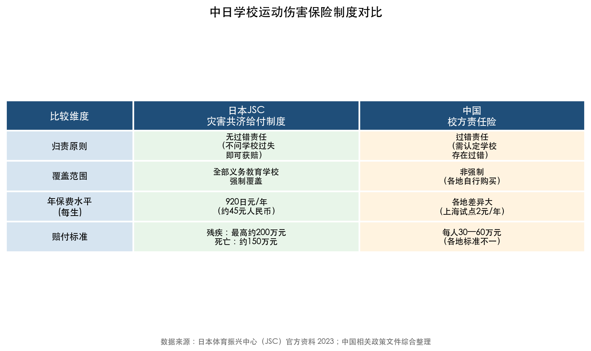

上图从归责原则、覆盖范围、年保费水平和赔付标准四个维度，直观呈现了日本JSC"灾害共济给付制度"与中国校方责任险之间的制度性差距。这一对比揭示，中国在运动伤害保险制度层面的短板，是制约学校充分开展体育活动的深层制度障碍。

### 4.3.4 Bukatsu制度面临的改革挑战

日本Bukatsu制度近年也面临显著挑战，其经验并非可以直接移植。教师监督负担过重是最突出的问题——体育教师往往被要求每周6—7天指导社团活动，休息时间严重不足，已成为日本教育界广泛讨论的"教师过劳"议题的核心组成部分。与此同时，少子化趋势导致部分农村学校学生人数不足以维持完整的运动部建制。2023年度起，日本体育厅将2023—2025年定为"改革推进期"，推动公立初中休息日的课外活动逐步向社区体育组织转移。[读卖新闻](https://japannews.yomiuri.co.jp/editorial/yomiuri-editorial/20250601-257971/ "2025年6月社论") 这一改革动向表明，即便是运行数十年的成功制度，也需要随人口结构和教师负担的变化进行动态调整——对中国构建课外体育活动体系而言，如何在教师承担指导责任与保障教师合理工作量之间取得平衡，是需要前瞻性考量的制度设计问题。

## 4.4 芬兰经验：Schools on the Move的系统性创新

### 4.4.1 项目概况与扩展历程

芬兰"Schools on the Move"（芬兰语 Liikkuva koulu）是一项国家级青少年身体活动促进项目，由芬兰教育文化部资助，LIKES体育活动与健康研究中心负责协调实施。该项目2010年以45所学校为试点启动，此后经历三个阶段的规模扩展：2010—2012年试点阶段（45校）→2012—2015年推广阶段→2016—2018年作为政府核心项目大规模推进。截至2018年12月，共有2,139所综合学校参与，覆盖全国约90%的综合学校；2016—2018年间，教育文化部为此拨款2,100万欧元。[Blom et al., BJSM 2018](https://pmc.ncbi.nlm.nih.gov/articles/PMC6029642/ "British Journal of Sports Medicine") [Blom 2022](https://i-parc.ie/wp-content/uploads/2023/01/SOTM_Dublin_19012022_AB.pdf "Antti Blom 2022年研究演示") 据项目官方网站最新统计，超过90%的芬兰综合学校已加入该项目。[Schools on the Move官网](https://schoolsonthemove.fi/about-us/ "项目简介")

### 4.4.2 核心策略：以激活日常代替增加课时

Schools on the Move的核心创新理念，在于它并非通过大规模增加体育课时来提升身体活动水平，而是通过赋予学校自主权，在课间和教学时间嵌入身体活动。具体策略涵盖四个维度：

**其一，制度化课间休息并鼓励身体活动。** 芬兰基础教育普遍实行每45分钟教学后15分钟课间休息的制度安排，学生通常在课间前往户外自由活动——跑步、攀爬、玩球、骑自行车，教师不做过度行为管控。[Blom et al., BJSM 2018](https://pmc.ncbi.nlm.nih.gov/articles/PMC6029642/ "课间制度描述") 这一制度化安排与中国2024年秋季起试点、2025年全面推行的"课间15分钟"改革高度契合，表明中国正在向芬兰经验靠拢。

**其二，在学科课堂嵌入"活动课间"（active breaks）。** 在数学、语文等非体育学科的课堂教学中穿插3—5分钟的身体活动环节，打破久坐模式，同时改善学生注意力和课堂参与度。

**其三，培训学生担任同伴活动引导员（peer activators）。** 由高年级学生带领低年级学生在课间开展结构化的身体活动游戏，既增强学生自主性和参与感，又降低对教师直接指导的依赖。

**其四，改善校园操场和活动空间。** 通过专项资金支持，使室外环境更利于开展多样化的身体活动。

### 4.4.3 实证评估：成效积极但进程渐进

Schools on the Move的实证评估结果呈现出积极但温和的效果特征。2016—2018年全国数据显示，男生达到WHO身体活动推荐量（每天60分钟MVPA）的比例从2010年的30%上升至2018年的35%（+5个百分点），女生从18%上升至29%（+11个百分点）；89%的学校教职人员认为项目对学习产生了积极影响。[Blom 2022](https://i-parc.ie/wp-content/uploads/2023/01/SOTM_Dublin_19012022_AB.pdf "2016—2018年评估数据") [Blom et al., BJSM 2018](https://pmc.ncbi.nlm.nih.gov/articles/PMC6029642/ "项目评估论文")

这一评估结果传递了两层重要信息。一方面，该项目确实有效——女生达标率提升11个百分点尤其值得关注，因为全球范围内女生身体活动不足问题普遍较男生更为严重。另一方面，即便覆盖90%以上学校、累计投入2,100万欧元专项资金，男生达标率也仅提升5个百分点——这提示，提升青少年身体活动水平是一个需要长期坚持的渐进过程，不应期待短期内出现跃升式变化。对于中国"每天2小时"政策的实施评估，芬兰经验提供了合理的预期参照：政策效果的显现需要以年为单位的持续推进，而非以学期为单位的速效考核。

### 4.4.4 "活动课间"干预的国际循证基础

芬兰Schools on the Move所推行的"活动课间"策略并非孤例，已获多项国际系统性综述的循证支持。2022年《Canadian Journal of Public Health》发表的综述发现，学校"活动课间"干预显著增加儿童体力活动水平、改善课堂行为和注意力表现。[活动课间综述](https://pmc.ncbi.nlm.nih.gov/articles/PMC9432283/ "2022 Canadian Journal of Public Health") 2025年《Frontiers in Public Health》综述进一步证实，活动课间可在不影响学业成绩的前提下有效提升学生身体活动水平和课堂行为表现。[活动课间与课堂行为综述](https://www.frontiersin.org/journals/public-health/articles/10.3389/fpubh.2025.1469998/full "2025 Frontiers in Public Health")

英国"Daily Mile"运动提供了另一个具有高循证质量的案例。该运动起源于2012年苏格兰，要求学生每天课间花约15分钟户外跑步或行走。BMC Medicine发表的准实验研究显示，参与者每天MVPA增加9.1分钟（95%CI 5.1—13.2）、久坐时间减少18.2分钟、20米折返跑成绩提高39.1米、皮褶厚度减少1.4毫米，效果在控制社会经济背景后仍然显著；截至研究发表时，约50%的苏格兰小学已实施该运动。[Chesham et al., BMC Medicine 2018](https://pmc.ncbi.nlm.nih.gov/articles/PMC5944120/ "准实验研究")

上述国际循证证据对中国的核心启示在于：在课间和教学间隙嵌入短时身体活动（每次10—15分钟），是一种低成本、易推广、不占用学科教学时间且具有充分循证支持的有效策略，可作为"每天2小时"时间构成中的重要补充模块。

## 4.5 韩国镜鉴：应试文化下的政策"空转"警示

### 4.5.1 政策文本完善与执行效果之间的反差

韩国在国际比较中呈现出最具警示意义的案例。在Global Matrix 4.0中，韩国"学校"指标获得A级评定（全球最高之一），表明韩国在学校体育政策的文本完善度和制度设计方面处于世界领先水平。然而，韩国"总体身体活动"指标仅为D-级——这一巨大反差清晰表明，即使学校体育政策文本完备周全，在东亚应试文化的强力压制下，政策的实际效果仍可能大打折扣。[Aubert et al., JPAH 2022](https://journals.humankinetics.com/view/journals/jpah/19/11/article-p700.xml "韩国评级数据")

韩国疾病管理厅2024年发布的最新数据进一步印证了上述判断：仅17.3%的韩国青少年达到每周5天以上每天至少1小时身体活动标准，其中男生25.1%，女生仅8.9%。[The Korea Herald](https://www.koreaherald.com/article/10454482 "2025年3月报道") WHO 2016年对146个国家的调查显示，韩国13—18岁青少年中94.2%被归类为身体活动不足，在全球范围内几乎排名最末。韩国女生8.9%的达标率尤其令人警醒——这意味着超过九成的韩国女性青少年未能达到基本的身体活动推荐量。

### 4.5.2 韩国的改革应对

面对严峻的青少年体质下降趋势——特别是COVID-19疫情后学生体质的显著恶化（2022年PAPS体质测试中16.6%的学生落入最低两个等级，较2019年的12.2%上升4.4个百分点），韩国教育部于2023年10月公布了2024—2028年中长期学生健康促进计划。核心举措包括：将小学1—2年级体育课时从每年80学时增至144学时（增幅达80%），同时将体育从"快乐生活"综合科目中独立设科；中学阶段体育社团活动时间增加30%。[韩国中央日报](https://koreajoongangdaily.joins.com/news/2023-10-30/national/socialAffairs/Education-Ministry-to-increase-physical-education-hours-in-public-schools/1901762 "2023年10月报道") 但需注意的是，该计划中144学时的增加方案最终推迟至2028年实施，改革的落地进度存在不确定性。

### 4.5.3 韩国案例对中国的核心警示

韩国"学校政策A级、实际达标D-级"的鲜明反差，对中国构成最为直接的警示。中韩两国共享东亚儒家文化圈的教育竞争传统——"唯分数论""考试至上"的社会氛围使体育活动在家长和学生心目中被视为"可牺牲"的时间。第3章已分析指出，中国从1990年至今三十五年间四次高规格文件推动的阶段性目标均未完全实现，核心原因正是应试教育体系的强力压制。韩国案例以国际比较的方式进一步证实：在应试文化未发生根本性转变的情况下，仅凭政策文本的完善和课时数量的增加，不足以从根本上解决青少年身体活动不足问题。

这一判断意味着，中国"每天2小时"政策要避免重蹈韩国式"空转"覆辙，必须将体育活动保障与考试评价制度改革同步推进。中考体育分值的逐步提升、过程性评价的引入、高中阶段体育权重的增加，都是不可或缺的制度配套。第5章将就此提出具体的政策建议。

## 4.6 英国经验：专项资金投入与持续性挑战

### 4.6.1 政策框架与专项资金投入

英国政府建议学校每周至少提供2小时体育课。2019年发布的《学校体育与活动行动计划》进一步设定了"每位学生每天获得60分钟体育活动（30分钟在校内+30分钟在校外）"的目标。[英国政府公告](https://www.gov.uk/government/news/children-to-have-greater-opportunity-to-access-60-minutes-of-physical-activity-every-day "School Sport and Activity Action Plan, 2019") 自2017—2018学年起，英国政府通过"PE and Sport Premium"机制向小学提供年度3.2亿英镑（约合人民币29亿元）的专项体育资金，这一投入规模在全球范围内堪称慷慨。[英国议会图书馆](https://commonslibrary.parliament.uk/research-briefings/sn06836/ "2025年4月更新")

### 4.6.2 执行现状：高投入下的效果衰减

尽管资金投入力度可观，英国的执行效果却呈现出令人警惕的下降趋势。Youth Sport Trust 2025年度报告显示，2024/25学年英格兰二级教育体育教学总时数为281,291小时，较2011/12学年的326,277小时减少近45,000小时（降幅约14%）；体育教师从26,005人降至24,288人（减少约7%）。[Youth Sport Trust 2025](https://www.youthsporttrust.org/media/qw5i5s4h/yst_pe_school_sport_report_2025_final.pdf "YST 2025, pp.19, 54-55")

Ofsted（英国教育标准局）2023年调研发现，多数小学每周能提供2小时体育课，约半数中学在Key Stage 3（11—14岁）和Key Stage 4（14—16岁）均达到2小时标准，但KS4阶段课时显著缩减；17%的青少年报告本学年有体育课被取消的经历。[Ofsted体育课报告](https://www.gov.uk/government/publications/subject-report-series-pe/levelling-the-playing-field-the-physical-education-subject-report "2023年发布") Sport England 2023/24学年调查显示，仅约48%的5—16岁儿童达到每天60分钟MVPA标准。[Youth Sport Trust 2025](https://www.youthsporttrust.org/media/qw5i5s4h/yst_pe_school_sport_report_2025_final.pdf "YST 2025, p.19")

英国案例的核心教训在于：即便有年度3.2亿英镑的专项资金投入，如果体育在学校优先序列中持续让位于学术科目的考试压力，体育教学时间和教师队伍仍可能出现缩减。资金投入是必要条件但非充分条件，制度性的时间保障和督导约束同样不可或缺——这一教训与第3章分析的中国体育课被挤占现象形成了跨国呼应。

## 4.7 美国经验：分权治理下的碎片化困境

### 4.7.1 联邦层面统一标准的缺失

美国没有联邦层面的统一体育课时强制标准，体育教育由各州自行规定，各州之间差异极大。SHAPE America（美国健康与体育教育协会）建议小学每周150分钟、中学每周225分钟体育课，但这仅为行业推荐标准而非法定强制要求。[SHAPE America](https://www.shapeamerica.org/MemberPortal/standards/guidelines/default.aspx "PE Time Guidelines") 仅新泽西、路易斯安那和佛罗里达等少数州要求小学达到每周150分钟；加州则要求小学每10个教学日不少于200分钟（约合每天20分钟）。[加州教育部](https://www.cde.ca.gov/ls/fa/peguideelement.asp "PE Guidelines for Elementary Schools") 研究表明，有明确课时立法的州平均比无此要求的州多出27分钟/周（小学）和60分钟/周（中学），立法的约束效应十分显著。

2015年美国《每一位学生成功法》（ESSA）首次将体育教育纳入"全面发展教育"范畴，为体育项目提供了联邦资金渠道（Title IV, Part A），但仍未设定具体课时要求，体育教育继续高度依赖州和学区层面的政策意愿。[SHAPE America](https://www.shapeamerica.org/MemberPortal/advocacy/essa.aspx "ESSA政策解读")

### 4.7.2 分权模式的教训与中国的制度优势

2024年美国儿童青少年身体活动报告卡给出了总体身体活动D-级的评分，仅20%—28%的6—17岁儿童达标每天60分钟MVPA标准。[美国身体活动报告卡](https://paamovewithus.org/wp-content/uploads/2024/10/2024-US-Report-Card-Executive-Summary_FINAL.pdf "Executive Summary, 2024年10月") 美国案例最直接的启示在于：缺乏全国层面统一、刚性的体育课时标准，依赖地方自主决定，极易导致体育教育的"碎片化"和"底线竞赛"——各州和学区在面临财政压力和学术考试压力时，体育往往最先被削减。

与之形成对照的是，中国2025年《教育强国建设规划纲要》以国家中长期规划的形式确立了"每天2小时"的统一标准，在制度层级上远高于美国的分权模式。这一顶层设计优势值得重视。但美国经验同时提示，全国性标准的设定需要配套中央层面的督导机制和经费保障，否则基层执行仍可能流于形式。广东省"珠三角先行、粤东西北跟进"的分区域推进策略，提供了在统一标准框架下因地制宜的务实路径参照。

## 4.8 澳大利亚经验：社区环境优势与州际差异并存

澳大利亚联邦政府2005年立法要求所有小学和初中每周至少提供2小时身体活动，但具体执行由各州负责，州际差异显著。其中维多利亚州的要求最为具体：小学4—6年级每周1.5小时体育课（PE）加1.5小时体育运动（Sport），合计3小时/周；中学7—10年级每周100分钟PE加100分钟Sport，合计约3.3小时/周。[维多利亚州教育部](https://www2.education.vic.gov.au/pal/physical-and-sport-education-delivery-requirements/policy "PE Delivery Requirements") 新南威尔士州则要求小学每周至少150分钟有计划的身体活动。

澳大利亚在Global Matrix 4.0中总体身体活动评级为D-级（与美国持平），但"社区与环境"指标获得A-级（全球最高之一），这与澳大利亚得天独厚的自然环境、广泛的社区体育设施和根深蒂固的户外运动文化传统直接相关。[Aubert et al., JPAH 2022](https://journals.humankinetics.com/view/journals/jpah/19/11/article-p700.xml "澳大利亚评级数据") 这一对比揭示了一个重要维度：学校体育保障只是青少年身体活动生态系统的一个组成部分，社区环境和校外活动空间同样发挥着关键作用。中国"学生体质强健计划二十条"第15条提出的"加强社区青少年活动场地设施建设""促进学校与社区共建共享"，正是对这一维度的制度性回应。

## 4.9 多国比较的系统性发现与中国启示

### 4.9.1 各国学校体育课时安排比较

综合以上六国分析，可以从多个维度提炼系统性比较发现。

在体育课时量方面，各国差异显著但呈现一定趋势。日本每周约3课时（约135—150分钟），与中国2007年确立的标准大致相当；芬兰基础教育每周约2—3课时；韩国正在推动低年级课时大幅增加（小学1—2年级从80学时/年增至144学时/年）；英国建议每周2小时；美国SHAPE America建议小学每周150分钟、中学225分钟但各州执行差异极大；澳大利亚维多利亚州要求每周3小时。中国在《纲要》和"二十条"框架下推行"每天一节体育课"（每周约200—225分钟），在国际比较中处于较高水平。

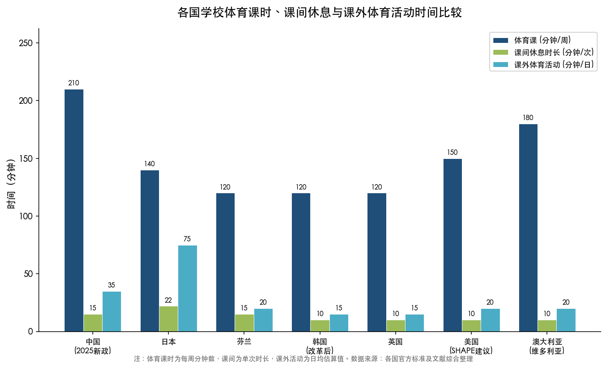

上图以分组柱状图直观呈现了七个国家（地区）在每周体育课时分钟数、单次课间休息时长和日均课外体育活动时间三个维度上的差异。中国在课时量维度（210分钟/周）处于国际领先水平，但日本在课外体育活动维度（75分钟/日，主要来自Bukatsu社团）的优势极为突出，这一对比印证了课外体育活动体系对于提升总体身体活动水平的关键作用。

### 4.9.2 课间与校内活动制度比较

在课间活动制度方面，芬兰的制度化课间休息最具代表性——每45分钟教学后15分钟户外活动，Schools on the Move项目进一步将课间由"放松时间"升级为"活动时间"。日本学校通常在上午设有20—25分钟课间休息（"中休み"），学生可到操场自由活动。英国和美国的课间时间普遍较短且缺乏系统性的活动引导机制。

中国"课间15分钟"改革在国际视野下正向芬兰模式看齐，但需要注意的是，芬兰课间制度的核心特征不仅在于时间长度（15分钟），更在于鼓励户外自由活动的文化氛围和宽容的安全管理理念——而中国当前面临的课间过度管控问题（第3章3.2.3节已详细分析）恰恰是芬兰模式中不存在的制度阻碍。从时间延长到行为激活，是中国课间改革需要跨越的关键一步。

### 4.9.3 条件保障与制度环境比较

在运动安全保障方面，日本JSC无过错责任保险制度在全球范围内最为完善，以每生每年45元人民币的极低保费实现了全覆盖，极大降低了学校限制体育活动的制度性激励。英国通过PE and Sport Premium提供了大规模专项资金，但未建立类似的运动伤害保险专项制度。中国上海2016年试点"学校体育运动伤害专项保障基金"（每生每年2元），2025年进一步升级，但全国层面尚未建立统一的无过错责任保险制度——这是制约"每天2小时"落地的重要制度短板。

在监测评估方面，各国呈现出差异化的制度安排。芬兰自2016年起对5年级和8年级学生实施全国性"Move!"体质评估，结果向学生和家庭公开并纳入学校发展参考；日本通过每年的"全国体力・运动能力调査"持续监测学生体质变化趋势；韩国建有全国性PAPS体质测试体系。中国已建立全国学生体质与健康调研制度（每五年一次大调研，年度监测覆盖面逐步扩大），但调研间隔仍较长、结果公示机制有待进一步加强。AHKGA Global Matrix体系为各国提供了统一的横向比较框架，中国可考虑更深度地参与这一国际评估体系，以获取更系统的国际参照坐标。

### 4.9.4 五条核心启示

基于以上国际比较分析，我们认为可以提炼出对中国"每天2小时"政策实施最具参考价值的五条国际经验。

**第一，制度化课间休息比单纯增加体育课时更具可操作性和边际效益。** 芬兰Schools on the Move和英国Daily Mile的实践均表明，在课间和教学间隙嵌入身体活动，是一种低成本、不占用学科教学时间且具有充分循证支持的有效策略。中国"课间15分钟"改革方向正确，但需要从"延长时间"进一步走向"激活活动"——确保学生真正走出教室进行身体活动，而非仅仅延长了在教室内安静等待的时间。

**第二，无过错责任的运动伤害保险制度是释放学校体育活动空间的关键制度前提。** 日本JSC制度以每生每年约45元人民币的极低成本实现了全覆盖、无过错的学校运动伤害赔付，从制度源头消除了"怕出事不敢动"的顾虑。中国当前校方责任险的过错责任原则是制约学校充分开展体育活动的深层制度障碍，建立类似日本JSC的全覆盖无过错保险制度应列为优先制度建设事项。

**第三，应试文化的压制效应可使政策文本完善的制度安排"空转"。** 韩国"学校政策A级、总体达标D-级"的鲜明反差表明，在东亚应试文化背景下，体育活动保障不能仅靠学校层面的课时安排，必须与考试评价制度改革联动推进。中国中考体育分值逐步提升、引入过程性评价的方向是必要的，但同时需警惕"考什么练什么"的应试化变形风险。

**第四，课外体育活动体系是提升达标率的关键分水岭。** 日本Bukatsu制度提供的课外社团活动（每日60—90分钟）是日本青少年达标率全球领先的核心因素。中国"有组织体育运动"指标在Global Matrix 4.0中获F级（全球最低档），凸显了课外体育活动体系建设的紧迫性。"学生体质强健计划二十条"提出的"人人有项目、班班有活动、校校有特色、周周有比赛"新样态，正是对标课外体育活动体系建设的方向性回应。

**第五，全国统一标准优于分权碎片化治理。** 美国因缺乏联邦层面统一课时标准而导致各州差异巨大、总体达标率低下的教训表明，中国以国家《纲要》形式确立"每天2小时"统一标准的制度设计具有合理性和优越性。但统一标准的落地需要中央层面的督导约束和经费保障作为支撑，广东省"珠三角先行、粤东西北跟进"的分区域推进策略，提供了在统一标准下因地制宜的务实操作路径。

# 第5章 政策建议与实施路径——确保"每天2小时"全面高质量落地

## 5.1 引言：从政策文本到行为改变的系统性工程

前四章的分析揭示了一个核心困境：中国中小学生体育活动时间保障政策经历了从"每天1小时"到"每天2小时"的历史跃升，然而超过八成学生仍未达到120分钟目标。制约因素横跨学校制度、师资设施、评价导向、家庭社会和学生个体五个层面，各层面因素相互强化，形成自我加强的负向循环。国际比较亦提供了深刻警示——韩国在AHKGA Global Matrix 4.0中"学校政策"获A级最高评定，但"总体身体活动"仅为D-级，这一反差表明，在东亚应试文化背景下，政策文本的完善并不必然转化为学生身体活动的实质增加。[Aubert et al., JPAH 2022](https://journals.humankinetics.com/view/journals/jpah/19/11/article-p700.xml "Global Matrix 4.0韩国评级")

2025年11月19日，教育部、国家发展改革委、财政部、人力资源社会保障部、国家体育总局等五部门联合印发《关于实施学生体质强健计划的意见》（教体艺〔2025〕1号），提出八大方面20条举措，设定了明确的阶段目标："到2027年，以义务教育阶段为重点，中小学生每天综合体育活动时间不少于2小时要求全面高质量落实；到2035年，现代化、高质量的学校体育体系基本形成。"[教育部等五部门"二十条"全文](https://education.news.cn/20251119/f48a34bcbad84d18be6421e1c82f6441/c.html "2025年11月19日") 截至2026年2月，学生每天体育2小时、课间15分钟已在全国所有省份部署推开。[新华社](http://www.news.cn/20260225/e75c81bfd96b47a9bf4152c64f729af6/c.html "2026年2月25日")

然而，从"全面部署"到"全面高质量落实"之间，仍横亘着师资缺口、安全责任、应试惯性、城乡差异、形式主义执行等多重结构性障碍。本章基于第3章识别的十大制约因素和第4章提炼的五条国际核心启示，从时间保障机制、质量提升机制、条件保障机制、评价与督导机制、家校社协同机制五个维度，构建系统性的政策建议与实施路径框架，并在末节评估面向2027年阶段目标的关键执行风险与预警机制。

## 5.2 时间保障机制：构建"四板块"刚性制度安排

### 5.2.1 义务教育阶段每天一节体育课的制度化

"每天一节体育课"是实现"每天2小时"的基础板块，约贡献40—45分钟的活动时间。2025年1月，教育部印发《关于加强新时代中小学体育教师队伍建设若干举措的通知》（教师〔2025〕1号），已将"每天一节体育课"作为师资配置的基准，要求按不高于班师比小学5:1、初中6:1、高中8:1配备体育专任教师。[教育部教师〔2025〕1号](http://www.moe.gov.cn/srcsite/A10/s3735/202501/t20250124_1176809.html "2025年1月24日")

各省在推进节奏上已形成差异化安排。江苏以"2·15专项行动"率先推进，至2026年3月已实现小学每天一节体育课全覆盖。[澎湃新闻/中国教育报](https://m.thepaper.cn/newsDetail_forward_32813497 "2026年3月23日") 广东采取分区域梯度策略：珠三角地区2025年秋季全面实施每天1节体育课，粤东西北地区2025年秋季≥50%学校落实、2026年秋季全面实施。[新华网](http://www.news.cn/local/20250205/5d42fceaa91e42329bbb6102f5ebc7e6/c.html "2025年2月5日") 广州市2025年秋季学期起义务教育阶段100%落实每天1节体育课。[央视新闻](https://news.cctv.com/2025/02/12/ARTIUQK3aIkBBeYhXeiONo4v250212.shtml "2025年2月")

落实的关键在于防止"每天一节体育课"沦为"阴阳课表"。2026年2月，教育部明确提出"严防'阴阳课表'，严查挤占体育课、课间不准学生出教室等行为"，要求各校通过"晒课表"等方式强化透明监督。[北京日报/新浪财经](https://finance.sina.com.cn/jjxw/2026-02-26/doc-inhpanwy4754849.shtml "2026年2月26日") 江苏经验在制度设计上尤为值得推广：所有义务教育学校作息安排全部备案公开，对挤占体育课时"零容忍"，将"2·15专项行动"纳入省政府民生实事项目并配套责任督学常态化督导。[澎湃新闻/中国教育报](https://m.thepaper.cn/newsDetail_forward_32813497 "2026年3月") 江西省同样全面推行"三表统一"（课程表、作息时间表、课后服务表）向社会公开，将体质健康状况纳入学校考核和校长履职评价核心指标，对体质健康水平下滑的学校实行"一票否决"。[国务院新闻办](http://www.scio.gov.cn/gxzt/dtzt/zt2026/qglhzt2026/gfgz/gn/202603/t20260310_959549.html "2026年3月")

### 5.2.2 大课间活动的规范化与实效化

大课间是"每天2小时"的第二大时间板块。"学生体质强健计划二十条"明确"鼓励有条件的中小学校上下午各安排1次不少于30分钟大课间体育活动"。[教育部等五部门"二十条"全文](https://education.news.cn/20251119/f48a34bcbad84d18be6421e1c82f6441/c.html "第1条") 若上下午各30分钟得以落实，大课间可贡献60分钟，加上体育课40—45分钟，仅校内正课时段即可达100—105分钟。

大课间的实效化需要从内容设计层面突破传统广播操或集体列队的单一模式。芬兰Schools on the Move项目的核心经验在于：赋予学校自主权"一校一策"设计课间活动方案，培训学生担任同伴活动引导员（peer activators），在不增加教师工作负担的前提下有效提升了学生身体活动水平。[Blom et al., BJSM 2018](https://pmc.ncbi.nlm.nih.gov/articles/PMC6029642/ "芬兰Schools on the Move项目评估") 北京"体育八条"推广全员跑步活动（小学200—1000米/次、初中≥1500米/次、高中≥2000米/次），将大课间内容从单一操类拓展为跑步、球类、跳绳等多元化项目，体现了活动内容从"齐步走"向"自主选"转变的方向。[北京"体育八条"全文](https://www.beijing.gov.cn/zhengce/zhengcefagui/202502/t20250217_4011192.html "2025年2月17日")

### 5.2.3 课间15分钟的刚性落实与行为激活

课间活动是"每天2小时"中常被忽视却潜力巨大的板块。以每天6个课间、每次15分钟计算，课间活动的潜在时间贡献可达90分钟——远超体育课或大课间单独的贡献量。然而，第3章已详细分析，2019年一项针对1,900余名家长的调查显示，75.2%的受访家长反映身边中小学存在"安静的课间10分钟"现象。[新华社"新华视点"](http://www.news.cn/2023-10/31/c_1129950543.htm "2023年10月31日")

"课间15分钟"改革自2024年秋季在北京、福建等地率先试点，至2026年3月已在全国所有省份部署推开。[教育部新闻发布会](http://www.moe.gov.cn/fbh/live/2026/77889/mtbd/202602/t20260228_1429557.html "2026年2月28日") 但延长课间时间只是第一步，确保学生真正走出教室进行身体活动才是关键。2026年全国两会期间，全国政协委员厉彦虎的调研发现，部分学校课间名义延长至15分钟后，出现取消最后一个课间、两节课连堂、压缩午饭时间等"拆东墙补西墙"的变形执行，甚至存在"遇检查改15分钟、无检查恢复原样"的现象。[全国人大网/新华社](http://www.npc.gov.cn/c2/c30834/202603/t20260309_452709.html "2026年3月9日")

我们认为，从"时间延长"到"行为激活"的跨越，需要三项配套措施：其一，明确禁止"课间不准出教室"的管理方式，将其列为教育督导核查的"负面清单"事项；其二，借鉴芬兰经验，在校园环境设计上鼓励课间户外活动——提供便捷的室外通道、增设课间游戏设施和微型运动空间；其三，建立课间活动质量的抽样监测机制，通过随机巡视、可穿戴设备监测等方式评估学生课间实际活动量。

需要审慎对待的是，2026年《体育学刊》发表的学术研究指出，10—15分钟的小课间本质上承担认知恢复和休息功能，若被安排结构性体育活动则属于"加码的底线外教育"——除去如厕、饮水、下节课准备和往返运动场地的时间，真正用于运动的时间所剩无几，将其作为落实2小时的构件"难免有凑数之嫌"。[刘世磊等《体育学刊》2026年第2期](https://statics.scnu.edu.cn/pics/tyxk/2026/0325/1774430138976806.pdf "温州大学刘世磊副教授") 因此，课间改革的重点应放在保障学生自由活动权利、消除过度管控方面，而非将课间变为另一种有组织的"体育课"。

### 5.2.4 课后服务中体育活动时段的规范设置

课后延时服务是补齐"最后30—40分钟"缺口的核心载体。"二十条"明确要求"把体育作为义务教育学校课后服务的必要内容"。[教育部等五部门"二十条"全文](https://education.news.cn/20251119/f48a34bcbad84d18be6421e1c82f6441/c.html "第1条") 2021年"双减"政策实施后，自愿参加学校课后服务的学生比例提升至90%以上，92.7%的学校开展了文艺体育类活动，为课后体育活动的普及创造了制度空间。[刘海元等《体育学刊》2025年第2期](https://statics.scnu.edu.cn/pics/tyxk/2025/0325/1742892388387237.pdf "2025年《体育学刊》32卷2期")

中国教育科学研究院吴键所长强调，纳入"每天2小时"计量的课后体育活动必须是"面向全体学生的体育锻炼"，"非面向全体的课后延时体育训练、体育俱乐部（社团）、体育比赛等不得计入综合体育活动时间"。[中国教育报专访](http://www.jyb.cn/rmtzgjyb/202503/t20250311_2111315073.html "2025年3月11日") 这一界定确保课后体育活动不沦为少数体育特长生的训练时段，而是覆盖全体在校学生的普惠性安排。

对于走读或不参加课后服务的学生群体，各地已探索出差异化的保障路径。四川省提出可结合校外体育活动、体育家庭作业等保证总时长。[新华网报道](http://www.news.cn/edu/20250210/38dbb6cf31794d5b9bfb9b1a03699967/c.html "2025年2月10日") 上海方案则更为精细化："全面落实学生每天综合体育活动2小时并基本在校内完成，包括每天70分钟左右的体育课、体育活动课、大课间，另外还有不少于40分钟的课后体育服务时间。"[上海市教委方案](https://edu.sh.gov.cn/mbjy_xwzx/20250619/b1008709a0264813b8bae634f70968b3.html "2025年6月")

### 5.2.5 高中阶段的特殊路径

高中阶段面临独特挑战：现行标准体育课时每周仅2节，升学压力达到峰值，体育在高考中不计入分值。第八次全国学生体质与健康调研数据显示，高一学生在校体育锻炼1小时比率仅为30.6%，较初三的42.7%断崖式下降12.1个百分点。[教育部第八次全国调研](https://news.eol.cn/meeting/202109/t20210903_2149889.shtml "2021年9月发布")

"学生体质强健计划二十条"以"义务教育阶段为重点"设定2027年目标，高中阶段的实施路径需因地制宜。多省已形成差异化安排：甘肃要求"高中阶段学校每周不少于2节体育课"[甘肃省教育厅](http://jyt.gansu.gov.cn/jyt/c020802/202502/174081169.shtml "2025年2月")；广州"推动高中（中职）每周3—5节体育课，有条件的学校试点每天1节体育课"[广州市教育局](https://jyj.gz.gov.cn/yw/tzgg/content/post_10112707.html "2025年2月")；上海提出"推动高中每周开设4节体育课"。[上海市教委方案](https://edu.sh.gov.cn/mbjy_xwzx/20250619/b1008709a0264813b8bae634f70968b3.html "2025年6月")

2026年《体育学刊》发表的研究提出了高中阶段的系统性优化模式：充分利用高中寄宿制管理条件，构建"体育课+体育大课间+早锻炼+晚锻炼+校园体育设施开放"的多要素组合，具体方案如"每周2—4节体育课+每天20—30分钟早锻炼+每天2个30分钟体育大课间+不低于40分钟课后体育锻炼（无体育课当天）"。广东东莞中学已实践"3+2"模式——每周3节体育课加每天2小时课外体育锻炼。[刘世磊等《体育学刊》2026年第2期](https://statics.scnu.edu.cn/pics/tyxk/2026/0325/1774430138976806.pdf "温州大学研究") 调研中一位年级长指出："高中阶段是学生时期压力最大的阶段，对于近乎封闭的学生，体育锻炼就是他们最好的缓解阀。"

我们认为，高中阶段"每天2小时"的实现不宜照搬义务教育阶段"每天一节体育课"的模式，而应以早晚锻炼和课后体育活动为主要增量来源，并借鉴日本Bukatsu制度的思路，发展覆盖全体学生的校园体育社团和俱乐部活动。[笹川体育财团](https://www.ssf.or.jp/en/features/japans_data_plus_sports/e0019.html "SSF 2021")

### 5.2.6 非上学日的时间保障：校园体育设施开放

"每天2小时"的"每天"涵盖上学日、周末、寒暑假和节假日，而现行落实模式主要针对上学日安排，非上学日的体育活动保障基本处于空白状态。[刘世磊等《体育学刊》2026年第2期](https://statics.scnu.edu.cn/pics/tyxk/2026/0325/1774430138976806.pdf "非上学日落实缺失问题")

校园体育设施面向学生开放是目前最可行的弥补路径。北京市2024年7月发文推进中小学体育设施在节假日及寒暑假向学生开放；杭州市逾九成中小学体育设施已对外开放；上海同济大学附属新江湾城实验学校实现周末、寒暑假体育运动"不打烊"。"二十条"第15条明确提出"推进学校体育场馆课后和寒暑假向学生免费开放"。[教育部等五部门"二十条"全文](https://education.news.cn/20251119/f48a34bcbad84d18be6421e1c82f6441/c.html "第15条")

校园设施开放的推进需要解决三个关键问题：一是安全管理责任的界定与分担机制，二是监管人力的补充（可通过组建家长志愿者护卫队、引入社会体育指导员团队等方式实现），三是开放时段与社区居民健身需求的错峰协调。

## 5.3 质量提升机制：从"凑够时间"到"有效活动"

### 5.3.1 体育教师队伍建设：多渠道补齐缺口

体育教师缺编是制约"每天2小时"落地的基础性瓶颈。据2022年教育部数据，按体育学科占总课程比例11%和体育教师每周课时15节计算，义务教育阶段体育教师缺编约12万人；若按"每天一节体育课"新标准测算，缺口扩大至10万—30万人。[央广网](http://news.cnr.cn/native/gd/20220725/t20220725_525931117.shtml "2022年数据") [尚力沛《首都体育学院学报》2025年第37卷第5期](http://sdtyxyxb.magtechjournal.com/CN/10.14036/j.cnki.cn11-4513.2025.05.001 "2025年9月发表")

2025年1月教育部印发的教师〔2025〕1号文件，是首个专门针对体育教师队伍建设的国家级专项文件，提出10条核心举措，包括：按班师比标准配备专任教师、在公费师范生和"优师计划"中扩大体育教育专业招生、面向优秀退役运动员公开招聘、设置中小学专职教练员岗位、鼓励跨校兼课走教、将大课间和体质监测等计入教师工作量。[教育部教师〔2025〕1号](http://www.moe.gov.cn/srcsite/A10/s3735/202501/t20250124_1176809.html "2025年1月24日")

全国人大代表姚明在2026年全国两会期间进一步提出通过"编制、购买服务、定向培养、区域支教、退役运动员进校园"五条通道系统性补充师资的建议。[北京日报](https://xinwen.bjd.com.cn/content/s69aac84ae4b0687a28922ada.html "姚明专访") 深圳的实践已为"退役运动员进校园"提供了可操作范本——两年来引进104名奥运冠军、世界冠军等优秀退役运动员进入中小学任教。[腾讯新闻/深圳报道](https://view.inews.qq.com/a/20251125A0263R00 "2025年11月25日")

值得关注的动态趋势是：受学龄人口下降影响，小学体育教师缺口将从2025年的约24万人逐步缩小，预计至2029—2031年前后出现供需平衡乃至结构性过剩。[尚力沛《首都体育学院学报》2025年第37卷第5期](http://sdtyxyxb.magtechjournal.com/CN/10.14036/j.cnki.cn11-4513.2025.05.001 "2025年发表") 这意味着体育教师缺口属于"短期紧迫、中期缓解"的窗口期问题，2025—2030年是最为关键的攻坚阶段。在此过渡期内，江苏南通的做法值得借鉴——通过选聘兼职教师、建立班级体育互助小组等灵活方式应对阶段性师资不足。[澎湃新闻/中国教育报](https://m.thepaper.cn/newsDetail_forward_32813497 "2026年3月")

### 5.3.2 体育教学内容与方法改革

"二十条"提出"一体化推进教学改革"，推动走班制、俱乐部制教学模式，旨在解决当前体育教学中普遍存在的"考什么练什么"应试倾向和内容单一化问题。[教育部等五部门"二十条"全文](https://education.news.cn/20251119/f48a34bcbad84d18be6421e1c82f6441/c.html "第2—3条")

首都体育学院刘海元教授提出的"一体化设计体育活动内容"理念为这一改革提供了重要的理论框架：体育课、大课间、课间活动、课后锻炼四个板块应形成有机整体而非割裂的拼凑——体育课侧重技术学习与方法掌握，大课间注重身体素质练习与运动技能巩固，课后活动强调兴趣化与社交化，各板块之间内容衔接互补、避免重复或脱节。[刘海元等《体育学刊》2025年第2期](https://statics.scnu.edu.cn/pics/tyxk/2025/0325/1742892388387237.pdf "首都体育学院")

在运动强度要求方面，北京"体育八条"在全国率先提出"至少1小时中等及以上强度体育锻炼"的定量标准。[北京"体育八条"全文](https://www.beijing.gov.cn/zhengce/zhengcefagui/202502/t20250217_4011192.html "2025年2月17日") 这一"量+质"并举的要求，有效避免了"凑够时间但不出汗"的低效锻炼模式，与WHO建议的每天60分钟中高强度身体活动标准形成内在呼应。

### 5.3.3 校园体育竞赛体系建设

"二十条"提出构建"人人有项目、班班有活动、校校有特色、周周有比赛"的竞赛新样态，要求中小学每年举办春季、秋季两次校级综合性运动会或体育节。[首都之窗/北京日报报道](https://www.beijing.gov.cn/ywdt/zybwdt/202511/t20251120_4288851.html "2025年11月20日") 北京"体育八条"进一步细化为"每学期以班级为单位开展联赛"——小学每班≥5场、初中≥4场，将竞赛从精英化的校队层面下沉至普通班级。[北京"体育八条"全文](https://www.beijing.gov.cn/zhengce/zhengcefagui/202502/t20250217_4011192.html "2025年2月17日")

从国际经验来看，日本Bukatsu制度的核心价值不仅在于提供了大量课外身体活动时间（每日60—90分钟），更在于通过社团竞赛体系培育了学生的运动兴趣和自主锻炼习惯。[笹川体育财团](https://www.ssf.or.jp/en/features/japans_data_plus_sports/e0019.html "SSF 2021") 中国在AHKGA Global Matrix 4.0中"有组织体育运动"指标获F级——全球仅3个国家获此最低评级，凸显了课外体育活动体系建设的紧迫性。[Aubert et al., JPAH 2022](https://journals.humankinetics.com/view/journals/jpah/19/11/article-p700.xml "Global Matrix 4.0") 江苏的实践表明，中小学体育俱乐部建成率已达99.3%，为从"有组织"到"高质量"的转化奠定了组织基础。[澎湃新闻/中国教育报](https://m.thepaper.cn/newsDetail_forward_32813497 "2026年3月")

## 5.4 条件保障机制：场地、资金与安全的制度闭环

### 5.4.1 学校体育场地达标与"微运动场"创新

2024年教育部统计公报显示，全国普通小学体育运动场（馆）面积达标率为94.50%、初中为95.84%、普通高中为94.92%，总体达标率较高，但约5%学校场地不达标的绝对数量依然可观，城区学校生均运动面积不足的结构性困境尤为突出。[教育部2024年全国教育事业发展统计公报](http://www.moe.gov.cn/jyb_sjzl/sjzl_fztjgb/202506/t20250611_1193760.html "2025年6月发布")

"二十条"第14条创新性地提出"鼓励创设小型化运动锻炼场景，打造校内'微运动场'"，直面城区学校空间不足的现实。[教育部等五部门"二十条"全文](https://education.news.cn/20251119/f48a34bcbad84d18be6421e1c82f6441/c.html "第14条") 江苏无锡市湖滨中学通过挖掘走廊和转角等"金边银角"空间设置微型运动设施，提供了低成本、可复制的实践范本。[澎湃新闻/中国教育报](https://m.thepaper.cn/newsDetail_forward_32813497 "2026年3月") 全国政协委员龙婉丽分享的上海静安区经验同样具有启发性——统筹区域场馆资源，在不增加财政投入的情况下解决学校场地问题。[腾讯新闻-懒熊体育](https://news.qq.com/rain/a/20260312A062XD00 "2026两会体育话题梳理")

"二十条"第15条进一步提出"加强社区青少年活动场地设施建设，新建公共体育场馆优先选址学校和社区周边，促进学校与社区共建共享"。[教育部等五部门"二十条"全文](https://education.news.cn/20251119/f48a34bcbad84d18be6421e1c82f6441/c.html "第15条") 截至2024年底，全国人均体育场地面积达3.0平方米，提前超过"十四五"规划的2.6平方米目标，但社区体育设施多服务于中老年健身需求，适合青少年的运动场地仍然不足。[新华社](http://www.news.cn/20250318/93026d384cc543928fb7d776220f2bb3/c.html "2025年3月18日") 上海提出"建设'15分钟运动圈'"，以步行可及性为标准规划青少年运动设施布局，方向值得全国借鉴。

对于南方省份高温多雨、室内场馆匮乏的问题，我们建议将室内体育场馆建设纳入义务教育学校标准化建设的刚性指标，并在中央财政转移支付中设立专项补贴，优先支持中西部和气候条件不利地区的场馆建设。

### 5.4.2 财政投入与专项补贴

国际经验表明，专项财政保障机制是确保体育政策持续落地的关键。英国通过"PE and Sport Premium"机制每年向小学提供3.2亿英镑（约合人民币29亿元）专项体育资金。[英国议会图书馆](https://commonslibrary.parliament.uk/research-briefings/sn06836/ "2025年4月更新") 中国作为14亿人口大国，同样需要建立与"每天2小时"政策目标相匹配的专项财政保障机制。

零点体育、大课间、课后体育服务、校园体育设施开放等活动均超出体育教师和教职工的常规工作范畴，需要额外的人力投入和激励安排。[刘世磊等《体育学刊》2026年第2期](https://statics.scnu.edu.cn/pics/tyxk/2026/0325/1774430138976806.pdf "温州大学研究") 我们建议参照英国专项补贴模式，设立"学生体质强健计划"专项财政资金，覆盖组织管理人员酬劳、人员培训、场地设施改善与维护等支出，并配套教职工弹性工作制度以化解因工作时间延长带来的抵触情绪。北京体育大学刘昕指出，需"对中西部及欠发达地区提供专项计划的政策和资源倾斜，否则易形成'马太效应'"。[新华社专家解读](http://www.news.cn/20251124/690af98e273f43c98a1bf7ac675aadec/c.html "2025年11月24日")

### 5.4.3 校园运动伤害保险制度：从过错责任到无过错覆盖

校园运动伤害保险制度的缺陷，是制约学校充分开展体育活动的最深层制度障碍之一。第3章已详细分析，中国现行校方责任险适用"过错责任原则"，学校为规避被认定有过错而倾向削减体育活动，形成"越不敢练→体质越差→越容易受伤→越不敢练"的恶性循环。[教育部推行校方责任险通知](http://www.moe.gov.cn/s78/A17/s7059/201410/t20141021_178896.html "2008年") 中国教育科学研究院吴键所长披露，"与2023年相比，学生体育运动伤害事故增加了50%以上，校方责任险中体育运动伤害赔偿的比例接近60%"。[央广网/中国教育报](https://edu.cnr.cn/gc/20250317/t20250317_527103422.shtml "吴键专访")

"二十条"第17条提出"加强学校体育活动安全管理和运动伤害风险防控，完善政府、学校、家庭多元投入的保险保障机制"，这是国家层面首次在学生体质强健专项政策中系统部署运动伤害保险制度。[教育部等五部门"二十条"全文](https://education.news.cn/20251119/f48a34bcbad84d18be6421e1c82f6441/c.html "第17条")

日本体育振兴中心（JSC）的"灾害共济给付制度"提供了制度层面的对标参照：以每生每年920日元（约合人民币45元）实现义务教育全覆盖、无过错责任的学校运动伤害赔付。中国现行制度与之存在三项关键差距：（a）归责原则——过错责任 vs. 无过错责任；（b）覆盖面——非强制 vs. 全覆盖；（c）赔付水平——每人30—60万元 vs. 残疾最高约200万人民币、死亡约150万人民币。[日本JSC官方说明](https://www.jpnsport.go.jp/anzen/Portals/0/anzen/kyufu_1/pdf/R5.1_seidonooshirase(english).pdf "JSC 2023")

上海的探索为全国提供了渐进式改革路径。上海2016年率先试点"学校体育运动伤害专项保障基金"（每生每年2元，免责保障），2025年6月进一步升级为所有学生配置运动意外伤害专项保险并扩大保障范围，建立运动风险评估和极端情况综合处理机制。[东方财富网](https://finance.eastmoney.com/a/202506123428969756.html "2025年6月")

图5-1以三列对比的形式展示了从中国现行制度到上海试点方案再到日本JSC制度的渐进式改革路径，直观呈现了归责原则、覆盖范围、保费来源、赔付水平等六个维度的制度差距与改革方向。

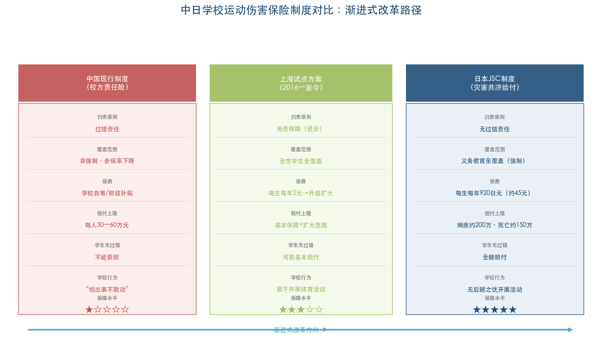

我们认为，应在总结上海经验的基础上，尽快建立全国统一的中小学运动伤害强制保险制度，核心设计要点包括：（1）采用无过错责任原则，消除学校因担责而限制体育活动的制度性激励；（2）由政府财政为主、学校和家长为辅分担保费，每生每年预计投入10—30元即可实现基本覆盖；（3）同步完善教师和学校的免责制度，细化责任边界，明确免责认定程序，为体育教师"放开手脚上课"提供法律保障。[刘世磊等《体育学刊》2026年第2期](https://statics.scnu.edu.cn/pics/tyxk/2026/0325/1774430138976806.pdf "安全保障制度建议")

## 5.5 评价与督导机制：让"指挥棒"真正指向体质健康

### 5.5.1 中考体育改革：从分值提升到过程性评价

中考体育分值在全国范围内呈逐步提升趋势：云南2020年率先提至100分（满分700分），河南自2025年起从70分提至100分，北京从30分提至50分并计划2029年达70分。[新华社](http://www.news.cn/20250628/a1a288b706b44e4abaaaddf52e4f5e51/c.html "2025年6月28日") 分值提高确实对初中阶段产生了显著的正向驱动效应——第八次全国学生体质与健康调研显示，初三学生在校体育锻炼1小时比率为42.7%，远高于无体育中考分值压力的高一学生（30.6%）。[教育部第八次全国调研](https://news.eol.cn/meeting/202109/t20210903_2149889.shtml "2021年9月发布")

然而，更具深远意义的改革方向在于从"终结性考试"转向"过程性评价"。"二十条"第8—9条明确提出"优化体育考试评价，丰富选考项目，改进测评办法，淡化测试选拔性，强化正向激励，利用数字技术手段加强过程性评价"。[教育部等五部门"二十条"全文](https://education.news.cn/20251119/f48a34bcbad84d18be6421e1c82f6441/c.html "第8—9条") 深圳2026年起增加过程性评价14分、东莞2028年起中考体育50%由平时成绩构成，均体现了这一改革趋势。[新华社](http://www.news.cn/20250628/a1a288b706b44e4abaaaddf52e4f5e51/c.html "2025年6月28日")

过程性评价的核心价值在于将评价重心从"考试时的一次性表现"前移至"日常锻炼的持续参与"，激励学生形成长期锻炼习惯，而非围绕考试项目进行短期突击训练。合肥市2025年中考体育45.57%考生获得满分的现象虽表面喜人，实则反映出"考什么练什么"的应试化倾向——满分率过高意味着考试难以有效区分学生体质差异，评价的导向功能和区分功能均被弱化。[新华社](http://www.news.cn/20250628/a1a288b706b44e4abaaaddf52e4f5e51/c.html "2025年6月28日")

在高中阶段，"二十条"提出"鼓励高校在强基计划等特殊类型招生测试中增设体育项目"。虽尚未形成实质性的高考体育分值安排，但这一政策信号释放了将体育纳入高等教育选拔环节的改革方向。

### 5.5.2 学生体质健康监测公示制度

"二十条"第9条要求"建立校际之间、校内年级之间结果互为监督、突出过程评价的学生体质健康监测体系"，落实结果公示反馈制度。[教育部等五部门"二十条"全文](https://education.news.cn/20251119/f48a34bcbad84d18be6421e1c82f6441/c.html "第9条")

江苏省在这一领域的制度积累最为深厚。该省连续18年开展大中小学生体质健康监测（年均抽测超10万人），每年发布《江苏省学生体质健康蓝皮书》，为每名中小学生出具含运动与营养建议的"体质健康成绩单"，建立22个部门参与的省级联席会议机制。[澎湃新闻/中国教育报](https://m.thepaper.cn/newsDetail_forward_32813497 "2026年3月") 吴键所长建议"将学生体质健康水平列入政府、教育部门、学校绩效考核指标，对学生体质健康连续下降的要问责"。[央广网/中国教育报](https://edu.cnr.cn/gc/20250317/t20250317_527103422.shtml "2025年3月17日")

从国际比较来看，芬兰自2016年起对5年级和8年级学生实施全国性"Move!"体质评估，结果向学生和家庭公开并纳入学校发展参考。中国虽已建立全国学生体质与健康调研制度（每五年一次大调研，年度监测覆盖面逐步扩大），但调研间隔较长，距离"年度全覆盖监测+结果公示+问责"的制度闭环仍有差距。江苏模式为全国提供了从"定期抽测"向"年度全覆盖监测"过渡的可行路径。

### 5.5.3 教育督导中的体育活动时间专项核查

2026年2月，教育部将"严防'阴阳课表'"列为年度重点工作，要求通过"晒课表"方式强化社会监督。[新华社](http://www.news.cn/20260225/e75c81bfd96b47a9bf4152c64f729af6/c.html "2026年2月25日") 同月，教育部印发《关于全面推进健康学校建设的指导意见》，明确健康学校建设三阶段目标，并将建设成效纳入教育督导内容。[教育部健康学校建设指导意见](http://www.moe.gov.cn/jyb_xwfb/gzdt_gzdt/s5987/202602/t20260227_1429383.html "2026年2月27日")

我们认为，有效的督导核查应包含三个层级。第一层级为课表公开与随机抽查相结合——学校作息安排全部备案公开是底线，但仅靠课表公开无法杜绝"遇检查改15分钟、无检查恢复原样"的问题，需配合不打招呼的随机巡查。第二层级为利用数字技术手段进行过程性监测——"二十条"提出利用数字技术加强过程性评价，可穿戴设备、智慧操场等技术手段可提供学生实际活动量的客观数据，突破依赖学校自报的信息不对称困境。第三层级为社会监督渠道的畅通——广州市要求学校公布上级行政部门监督电话及邮箱，接受家长和社会的直接投诉，形成自下而上的监督压力。三个层级相互配合，方能构建"自上而下的行政督导+自下而上的社会监督+技术驱动的客观监测"三位一体的核查体系。

## 5.6 家校社协同机制：打通校外体育"最后一公里"

### 5.6.1 家庭体育作业与亲子锻炼

2025年全国大样本调查的Logistic回归分析揭示，"对2小时标准缺乏认知"（OR=3.97）和"对体育活动价值认同度低"（OR=2.55）是风险效应最大的两个制约因素，其影响远超体育课时不足（OR=1.42）和学业压力（OR=1.10）。[Qin et al., Frontiers in Public Health](https://pmc.ncbi.nlm.nih.gov/articles/PMC12913497/ "Logistic回归分析") 这意味着，提升家长对体育活动价值的认知和对新政策标准的知晓覆盖面，是打通政策落地"最后一公里"的关键着力点。

"二十条"第19条提出"学校提供家庭体育锻炼指导服务，鼓励支持学生与家长形成共同体育爱好，开展家庭亲子体育锻炼"。[教育部等五部门"二十条"全文](https://education.news.cn/20251119/f48a34bcbad84d18be6421e1c82f6441/c.html "第19条") 江苏的实践体系在全国最为系统：推广家庭体育作业制度，苏州设立"家长夜校"（7类28门课程），南通开放校门让家长参加"亲子晨练"，全省家长学校累计服务家长超8.5亿人次。[澎湃新闻/中国教育报](https://m.thepaper.cn/newsDetail_forward_32813497 "2026年3月")

全国政协委员、乒乓球名宿刘国梁在2026年两会期间提出"家庭体育"理念——"一个孩子参与体育能带动全家"。[腾讯新闻-懒熊体育](https://news.qq.com/rain/a/20260312A062XD00 "2026两会") 这一理念的实践价值在于：将体育锻炼从"学校布置的任务"转化为"家庭共同的生活方式"，从根本上改变"重智育轻体育"的观念惯性。

但需正视的现实挑战是：中国教育科学研究院的调查显示，86%以上的家长不允许孩子放学后到户外活动。[刘世磊等《体育学刊》2026年第2期](https://statics.scnu.edu.cn/pics/tyxk/2026/0325/1774430138976806.pdf "吴键、袁胜敏调查数据") 家庭体育作业的质量和执行难以保证，这也是多位学者建议"2小时落实以校内为主"的重要原因。

### 5.6.2 社区青少年体育平台建设

"二十条"提出建设"教联体"（家校社协同育人共同体），整合学校、社区和社会资源服务学生健康成长。截至2025年底，全国50%以上的县已建立"教联体"，超额完成年度目标。[中国教育报](https://paper.jyb.cn/zgjyb/h5/html5/2026-01/04/content_144742_19188320.htm "2026年1月4日") 北京2025年12月出台19部门联合的"教联体"方案，明确"充分整合体育场馆、专业教练人才、品牌赛事活动等优质资源，并将其系统引入校园体育教学、课后服务与家庭体育活动"。[北京市教委等19部门方案](https://jw.beijing.gov.cn/xxgk/2024zcwj/2024qtwj/202601/t20260116_4436390.html "2026年1月")

全国人大代表姚明在2026年两会期间提出建设"息屏+"公共服务空间的建议——在社区设立吸引青少年放下手机、走出家门参与体育活动的公共空间。[腾讯新闻-懒熊体育](https://news.qq.com/rain/a/20260312A062XD00 "2026两会") 这一建议直接回应了第3章分析的屏幕时间对体育活动的替代效应——中国青年报社2025年8月对1,500名家长的调查显示，高中生暑假日均手机使用超4小时的比例高达55.2%。[新华网/中国青年报](https://www.news.cn/local/20250821/a0c56a0945df4fe59030447a7af0bdb6/c.html "2025年8月21日") "息屏+"空间的建设，有望在社区层面构建替代电子屏幕的青少年身体活动场景。

## 5.7 执行风险评估与预警机制

### 5.7.1 五大核心风险

面向2027年"全面高质量落实"的阶段目标，我们识别出五大核心执行风险：

**风险一：城乡与区域不均衡。** 2025年全国大样本调查显示，"2小时不达标率"农村学校最高（30.50%），城市学校最低（25.14%），差距达5.36个百分点。[Qin et al., Frontiers in Public Health](https://pmc.ncbi.nlm.nih.gov/articles/PMC12913497/ "城乡差异数据") 北京体育大学刘昕指出，"智能化设施、微场地等投入受地方经济限制，需对中西部及欠发达地区提供专项政策和资源倾斜"。[新华社专家解读](http://www.news.cn/20251124/690af98e273f43c98a1bf7ac675aadec/c.html "2025年11月24日") 广东"珠三角先行、粤东西北跟进"的分区域推进策略已为因地制宜提供了模板，但对于经济基础更薄弱的中西部省份，中央财政转移支付的力度将直接决定城乡差距是缩小还是扩大。

**风险二：应试惯性的持续博弈。** 从1990年至今三十五年间四次高规格文件推动的阶段性目标均未完全实现，核心原因在于应试教育体系的强力压制。[刘海元等《体育学刊》2025年第2期](https://statics.scnu.edu.cn/pics/tyxk/2025/0325/1742892388387237.pdf "2025年《体育学刊》") 韩国"学校政策A级、总体达标D-级"的国际镜鉴表明，在东亚应试文化未发生根本性转变的情况下，体育活动保障必须与考试评价制度改革同步推进。全国政协委员厉彦虎调研发现的"阴阳课表""拆东墙补西墙"等变形执行方式，正是应试惯性在基层的具体表现。[全国人大网/新华社](http://www.npc.gov.cn/c2/c30834/202603/t20260309_452709.html "2026年3月9日")

**风险三：师资缺口的补齐周期。** 义务教育阶段体育教师缺编约12万—30万人，教师〔2025〕1号文件设定的时间线为"2027年推动数量结构更合理、2035年形成完善机制"。在缺口补齐之前，每天一节体育课在部分学校只能依赖兼职教师和走教等过渡方案维持运转。[教育部教师〔2025〕1号](http://www.moe.gov.cn/srcsite/A10/s3735/202501/t20250124_1176809.html "2025年1月")

**风险四：安全事故责任的制度困局。** 运动伤害事故同比增加50%以上、校方责任险中体育运动伤害赔偿占比接近60%——"每天2小时"推进中安全风险正在显著放大。[央广网/中国教育报](https://edu.cnr.cn/gc/20250317/t20250317_527103422.shtml "吴键专访") 在全国性无过错责任保险制度建立之前，学校层面"怕出事不敢动"的制度性激励无法从根本上消除。

**风险五：形式主义落实。** 江苏省教育厅厅长江涌的警示切中要害："'2·15专项行动'不是简单的时间调整，而是对学校作息制度、课程安排、空间利用、评价体系的系统性重构。"[澎湃新闻/中国教育报](https://m.thepaper.cn/newsDetail_forward_32813497 "2026年3月") 如果各地仅在课表上做文章而不触动深层制度，"每天2小时"极可能走向"数字达标、实质空转"——表面上时间构成的数学公式成立，但学生实际运动量和运动强度远未达到预期效果。

### 5.7.2 "短期—中期—长期"三步走实施建议

基于上述风险评估，我们认为"每天2小时"的全面高质量落地需遵循"短期补齐基础短板、中期提升质量、长期实现制度化常态化"的三步走路径。[新华社专家解读](http://www.news.cn/20251124/690af98e273f43c98a1bf7ac675aadec/c.html "王兵提出三步走建议")

**短期（2026—2027年）：聚焦"时间达标"。** 核心任务是确保义务教育阶段所有学校的课表安排和作息制度满足"每天2小时"的时间框架——每天一节体育课+上下午各≥30分钟大课间+课间15分钟+课后体育服务。优先推进三项制度建设：（1）全国所有学校课表备案公开和"晒课表"制度全覆盖；（2）启动全国中小学运动伤害强制保险制度试点；（3）完成体育教师缺口最大的中西部农村学校的师资专项补充。

**中期（2027—2030年）：聚焦"质量提升"。** 在时间达标的基础上，将改革重心转向活动质量和运动强度。核心举措包括：（1）全面推行中考体育过程性评价，将日常锻炼参与度纳入评价权重；（2）建立学校体育活动质量监测体系，利用可穿戴设备和智慧操场技术手段采集学生实际运动负荷数据；（3）完善高中阶段体育活动保障——逐步推进高中每周3—5节体育课，探索体育纳入高中学业水平考试；（4）全面建立覆盖上学日与非上学日的校园体育设施开放制度。

**长期（2030—2035年）：聚焦"制度常态化"。** 形成现代化、高质量的学校体育体系，使"每天2小时"从"政策推动"转化为"文化自觉"。核心目标包括：（1）学生自主锻炼习惯养成率从当前不足30%提升至50%以上；（2）全覆盖的无过错责任运动伤害保险制度稳定运行；（3）体育在升学评价体系中的实质权重显著提升，高中阶段"体育断崖"问题得到有效缓解；（4）家校社协同的全日制青少年身体活动生态系统基本建成。

图5-2以时间轴形式呈现了上述三阶段的核心任务、关键制度建设节点和预期目标。

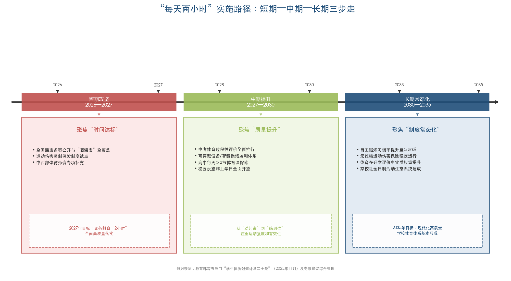

## 5.8 制约因素—政策对策的系统映射

第3章识别的十大制约因素，在第5章的政策建议框架中均有对应的解决路径。为增强报告的系统性和可追溯性，图5-3以双列对照形式构建了显式映射关系。

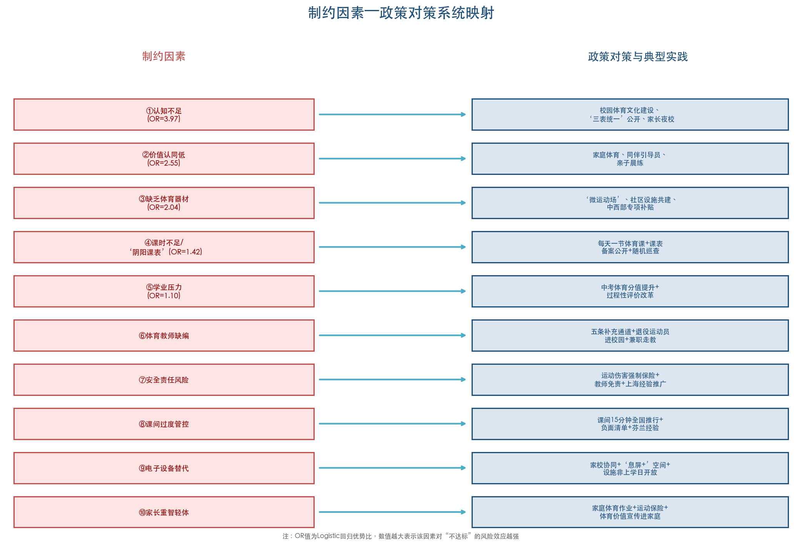

以下为各制约因素与政策对策的逐条映射：

**①认知不足（OR=3.97）→** "二十条"第18条培塑校园体育文化、江西"三表统一"向社会公开、江苏"家长夜校"体育知识普及，多渠道提升全社会对"每天2小时"新政策标准的知晓度。

**②价值认同低（OR=2.55）→** "二十条"第18—19条家校社协同、刘国梁"家庭体育"理念、芬兰Schools on the Move同伴活动引导员培训、南通"亲子晨练"等实践，从观念层面重塑体育活动的价值认知。

**③缺乏体育器材（OR=2.04）→** "二十条"第14—15条"微运动场"+社区设施共建共享、上海静安区区域场馆统筹、中央财政对中西部地区的专项补贴。

**④体育课时不足/"阴阳课表"（OR=1.42）→** 每天一节体育课制度化+课表备案公开+随机巡查、教育部"严防阴阳课表"专项部署。

**⑤学业压力（OR=1.10）→** 中考体育分值提升+过程性评价改革、"淡化测试选拔性、强化正向激励"的评价导向调整。

**⑥体育教师缺编→** 教师〔2025〕1号五条补充通道、退役运动员进校园（深圳104人实践）、兼职教师和走教过渡方案。

**⑦安全责任风险→** "二十条"第17条保险制度部署+全国运动伤害强制保险试点+教师免责制度+上海专项保障基金经验推广。

**⑧课间过度管控→** 课间15分钟全国推行+"不准出教室"列入督导负面清单+芬兰制度化课间经验借鉴。

**⑨电子设备替代效应→** "二十条"第19条家校协同+姚明"息屏+"公共服务空间建议+校园体育设施非上学日开放。

**⑩家长"重智育轻体育"观念→** 家庭体育作业制度+运动伤害保险消除安全顾虑+英国Daily Mile家长参与模式+体育价值宣传进家庭。

## 5.9 本章小结

"每天2小时"政策从中央文件走向全面高质量落地，本质上是一场涉及学校制度、师资配置、评价导向、安全保障、家庭观念的系统性变革。过去三十五年的历史经验反复证明，单一环节的改革——无论是增加课时、提高中考体育分值还是发布高规格文件——都无法独立破解学生体质健康这一"顽症"。

国际比较提供的五条核心启示——制度化课间、无过错保险、评价联动、课外活动体系、统一标准——与中国已出台的"学生体质强健计划二十条"和各省实践探索高度契合，形成了方向明确的改革路径。关键在于执行的深度和持续性：2026—2027年的"短期攻坚"必须以课表公开、运动保险试点和师资补充为优先抓手，为2027年阶段目标的达成争取窗口期；中期则需将重心从"时间达标"转向"质量提升"，确保学生不仅"动起来"而且"练到位"；长期目标是将"每天2小时"从政策驱动转化为文化自觉，使体育锻炼成为每一个中国青少年的生活方式。

# 结论与风险提示

## 核心结论

本报告基于政策文本分析、多源实证数据交叉验证、六国国际比较和系统性政策建议构建，就中小学生体育活动时间保障问题形成以下五项核心研究结论。

**第一，"每天2小时"的确立标志着中国学生体育活动保障制度从底线思维转向健康思维。** 从1990年"每天1小时"到2025年"每天2小时"，政策标准实现翻倍，空间范畴从校内延伸至校外，政策文件规格从部委规章跃升至国家中长期规划纲要。这一制度跃升的深层意义在于：学校体育从"开齐开足体育课"的最低要求，转变为涵盖体育课、大课间、课间活动和课后锻炼的全时段、系统性保障体系，教育理念从"不缺课"转向"保健康"。

**第二，当前超过八成学生未达到120分钟目标，且达标率在不同群体间呈现显著的结构性分化。** 中国教育科学研究院调查显示仅18.3%的学生每天锻炼达标2小时（教师观察口径）；综合多源数据，多数学生日均综合体育活动时间大致处于80—100分钟区间，距120分钟目标仍有20—40分钟缺口。高中学段（不达标率29.45%）、农村学校（30.50%）、民办学校（达标率仅18.1%）、女生、寄宿生构成缺口最大的五类群体。全国学生体质健康达标优良率约35.8%（2024年），距2030年60%目标仍有约24个百分点差距。

**第三，制约因素的核心不在客观条件约束，而在认知缺口与观念惯性。** 全国49,998名学生的Logistic回归分析表明，"对2小时标准缺乏认知"（OR=3.97）和"对体育活动价值认同度低"（OR=2.55）是风险效应最大的两个因素，远超体育课时不足（OR=1.42）和学业压力（OR=1.10）。这一发现意味着，政策宣传普及和社会观念转变是提升达标率的首要抓手，仅靠增加课时和改善设施无法从根本上解决问题。与此同时，体育教师缺编12万—30万人、校方责任险过错归责原则下的"不敢动"困局、应试教育对高中阶段体育时间的断崖式挤压，构成必须同步攻克的制度性障碍。

**第四，国际比较揭示"政策完善≠实效达成"的普遍规律，应试文化的压制效应是东亚国家的共性困境。** 韩国"学校政策A级、总体达标D-级"的案例以最直接的方式警示：在应试文化未发生根本性转变的情况下，政策文本的完善不足以保证实际效果。日本Bukatsu课外社团制度和JSC无过错运动伤害保险、芬兰制度化课间休息与活动课间干预，提供了可资借鉴的有效路径。中国在AHKGA Global Matrix 4.0中"有组织体育运动"获F级，凸显课外体育活动体系建设是当前最大的短板之一。

**第五，"每天2小时"的全面高质量落地是一场系统性变革，任何单一措施都无法独立突破"顽症"循环。** 过去三十五年四次高规格文件推动均未完全实现阶段性目标的历史教训表明，学校制度、师资设施、评价导向、安全保障、家庭观念五个层面的制约因素相互强化，形成自我加强的负向循环。打破这一循环需要在每一个层面同步施力：短期以课表公开、运动保险试点和师资补充为优先抓手争取2027年窗口期，中期以过程性评价和运动负荷数字化监测实现"质量提升"，长期则需将"每天2小时"从政策驱动转化为全社会的文化自觉。

## 研究局限性

本报告在数据来源、研究方法和分析范围等方面存在以下局限性，在解读研究结论时需予以充分考虑。

**第一，"每天2小时"达标率的精确估计面临测量方法的固有偏差。** 当前可获取的全国性数据主要依赖教师观察（18.3%达标）和学生自报（72.8%达标）两种口径，前者可能因教师仅观察校内时段而低估，后者因社会期望偏差而系统性高估。两项数据之间的巨大差距（54.5个百分点），反映出中国尚缺乏基于客观测量工具（如加速度计）的全国代表性身体活动数据。本报告综合判断"真实达标率处于区间中低端"，但无法给出精确点估计值。

**第二，部分关键数据存在时滞。** 全国学生体质与健康调研每五年实施一次，本报告引用的第八次调研数据来自2019年实施、2021年发布的结果，可能未充分反映2021年"双减"政策和2025年"每天2小时"政策出台后的最新变化。各省落实方案多在2025年初至2026年初密集出台，政策效果的实证评估尚需更长时间窗口。

**第三，国际比较受各国统计口径差异的制约。** 中国"每天综合体育活动时间不低于2小时"涵盖所有强度类型的身体活动，而WHO和AHKGA采用的"每天60分钟中高强度有氧身体活动"标准仅计中高强度活动，两者口径存在本质差异。本报告已在相关章节反复提示这一差异，但部分跨国比较结论仍需在口径校准的前提下审慎解读。

**第四，城乡和区域差异的微观机制分析尚不充分。** 本报告主要依据全国性调查和典型省市数据描绘结构性差异的宏观图景，但对于不同地区（特别是中西部农村）在师资、设施、管理等方面的具体制约机制，受限于可获取的一手调研数据，分析深度有待加强。

**第五，政策建议的可行性和成本效益评估有待后续研究深化。** 本报告提出的"三步走"实施路径和多项制度建议（如全国运动伤害强制保险、中西部专项财政补贴等），涉及财政投入规模、跨部门协调成本和地方执行能力等复杂变量。受限于公开数据的可及性，本报告未能对各项建议进行系统的成本效益分析。对于这些政策工具的经济可行性和实施优先序，需结合各地财政实力和教育资源禀赋进一步论证。
