# 执行摘要

人工智能正以结构性力量重塑全球软件行业的技术范式、商业模式、竞争格局和人才结构。本报告基于Gartner、IDC、Forrester、Deloitte、Bain & Company、Sequoia Capital等权威机构的一手数据与分析框架，结合企业财务数据、开发者调查和学术研究，对软件行业未来趋势及其被AI替代的可能性进行系统性评估。核心发现如下：

**宏观格局：AI驱动的超级增长周期与深层结构性张力并存。** Gartner预测2026年全球IT支出将达6.155万亿美元（同比+10.8%），其中AI支出2.527万亿美元（同比+44%）。四大超大规模云厂商2026年资本开支合计预计接近7,000亿美元，但自由现金流面临空前恶化——Amazon FCF预计转为负170亿美元，Alphabet FCF预计骤降近90%。2026年Q1全球VC投资中AI占比高达80%，仅OpenAI、Anthropic、xAI、Waymo四家即融资1,880亿美元。高投入与低回报之间的结构性张力——56%的CEO报告AI投资尚未兑现收入增长或成本降低——构成当前AI产业化进程中最核心的矛盾。

**开发流程：AI编码工具从辅助走向自主，但完全替代尚未到来。** 85%的全球开发者已定期使用AI编码工具，GitHub Copilot付费用户突破470万，Cursor年化收入突破20亿美元。Google和微软均报告超过30%的新代码由AI生成。AI编码代理在SWE-bench Verified基准上的自主解题能力从2024年初的约20%跃升至2026年2月的79.2%。然而，AI对软件开发生命周期各环节的渗透高度不均——编码环节渗透率85%，部署运维仅24%，76%的开发者不计划在部署与监控中使用AI。AI生成代码的安全风险同样不容忽视：45%的AI生成代码样本未通过安全测试，使用AI辅助的开发者安全发现数量增加10倍。

**细分领域：替代风险高度分层，"二元叙事"过度简化。** 2026年2月"SaaSpocalypse"期间全球SaaS板块约2,850亿美元市值蒸发，但市场的无差别抛售掩盖了各品类截然不同的风险图谱。高替代风险品类（法律科技、电子签名、初级客服）面临AI原生应用的直接流程替代；中高风险品类（CRM、项目管理、HR、内容创作）面临AI蚕食与定价模式重构的双重压力，但龙头企业凭借数据壁垒和生态粘性仍有转型窗口；低风险品类（基础软件、网络安全、云基础设施）非但不被替代，反而直接受益于AI浪潮。传统座席定价模式正加速萎缩——SaaS公司中采用座席定价的比例12个月内从21%降至15%，混合定价从27%飙升至41%。

**职业冲击：分层冲击显著，初级岗位首当其冲。** 美国软件工程师招聘量较疫情前下降49%，初级和中级岗位招聘率下降73%，但机器学习工程师招聘逆势增长59%。斯坦福大学研究发现，22至25岁早期职业工作者在AI高暴露度职业中经历了16%的相对就业下降。与此同时，BLS预测2024至2034年美国软件开发者就业仍将增长16%，AI工程师薪资溢价达12%。当前证据整体支持"AI增强为主、部分岗位自动化替代"的混合路径，但AI能力的提升速度——两年内SWE-bench得分接近翻四倍——意味着"自动化"侵入"增强"领地的进程可能快于多数预期。

**应对策略：AI转型的核心在于"人的转型"。** BCG研究揭示AI转型价值的"10-20-70"结构——70%来自员工重新赋能和组织变革。Salesforce（Agentforce ARR 8亿美元，+169%）和ServiceNow（订阅收入+21%）的实践证明，拥有深度领域壁垒的平台型企业可通过AI嵌入策略加深护城河。对从业者而言，"AI协同能力+领域专业知识+系统思维"的复合能力模型是最稳健的长期策略。中国市场面临信创国产替代与AI冲击的双重叠加，将二者合一实现代际跃升是最具战略价值的路径。

**未来展望：基准情景为"渐进增强、结构性调整持续"。** AGI时间线正经历行业共识的集体后撤（从2026–2028年推迟至2030年代），推理成本持续快速下降（中位年降幅约50倍）但Agentic模式推高总消耗（单任务token消耗为标准GenAI的5至30倍）。基于证据权重分析，我们判断2026下半年至2027年最可能的演化路径是：AI能力持续渐进提升，初级和标准化岗位替代压力继续加大，高价值岗位需求保持稳定甚至增长，行业总就业短期承压但中长期前景正向。这一混合路径的最大风险不在于AI技术本身，而在于投资周期的潜在断裂——Sequoia Capital"6,000亿美元之问"至今仍未获回答，若AI投资泡沫在回报兑现之前破裂，其冲击将远超技术替代的直接效应。

---

# 第1章 软件行业宏观格局与结构性变迁

## 1.1 全球IT与软件支出：AI驱动的超级增长周期

2025至2026年，全球信息技术支出进入由人工智能驱动的超级增长周期。多家权威机构的预测数据虽在统计口径上存在显著差异，但均指向同一结论：软件行业正经历近三十年来最剧烈的结构性扩张。

Gartner预测2026年全球IT支出将达6.155万亿美元（同比+10.8%），其中软件支出1.4336万亿美元（同比+14.7%），成为仅次于数据中心（+31.7%）的第二高增速板块；2025年全球IT支出已达5.555万亿美元（同比+10.3%），软件支出1.2495万亿美元（同比+11.5%）[Gartner新闻稿](https://www.gartner.com/en/newsroom/press-releases/2026-02-03-gartner-forecasts-worldwide-it-spending-to-grow-10-point-8-percent-in-2026-totaling-6-point-15-trillion-dollars "Gartner IT支出预测，2026年2月")。IDC数据显示2025年全球IT支出同比增长14%，达约4.25万亿美元（IDC口径，不含电信和商业服务），为1996年以来最快增速[Healthcare IT News转引IDC Black Book](https://www.healthcareitnews.com/news/2025-saw-fastest-growth-it-spend-mid-90s-says-idc "2025年12月")。Forrester的预测则相对保守，预计2026年全球技术支出增长7.8%至5.6万亿美元[Forrester新闻稿](https://www.forrester.com/press-newsroom/forrester-global-tech-forecast-2025-to-2030/ "Forrester全球技术市场预测，2026年2月")。

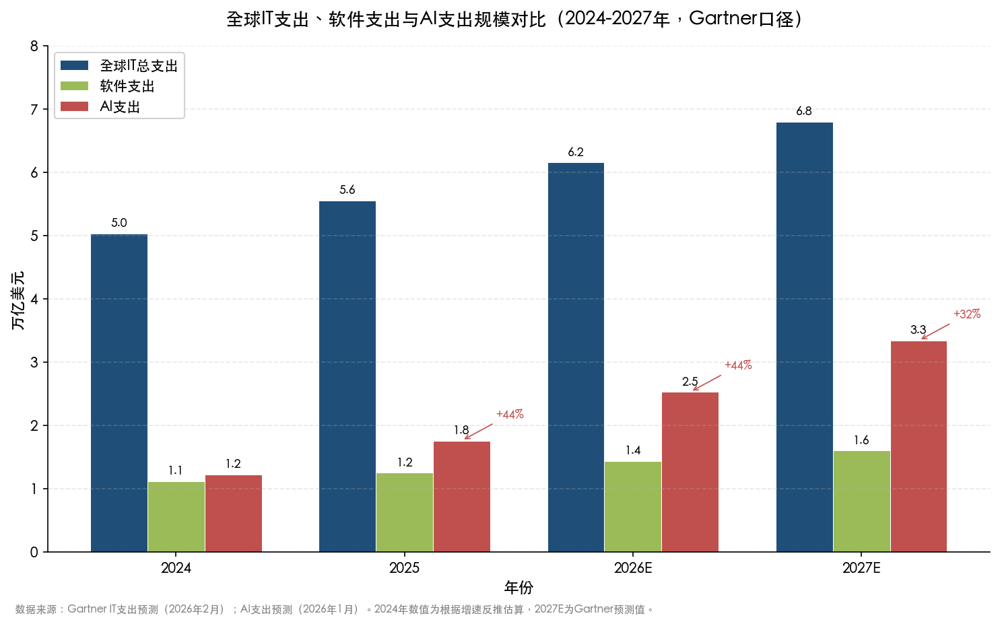

上图直观呈现了2024至2027年全球IT总支出、软件支出与AI支出的规模演变轨迹。AI支出增速（2026年同比+44%）远超IT整体增速（+10.8%），结构性分化特征显著。

三家机构的数据差异源于统计口径的根本分歧：Gartner采用最广泛的"IT支出"定义，涵盖数据中心系统、企业软件、设备、IT服务和通信服务五大板块；IDC口径排除了电信和商业服务；Forrester的"技术支出"定义介于两者之间。尽管口径不同，三家机构的共识清晰可辨——软件板块增速持续跑赢IT整体支出，而AI相关支出正成为拉动增长的核心引擎。

需要指出的是，Statista等市场研究机构对"全球软件市场规模"的统计通常仅覆盖企业软件终端用户支出，2026年预计约为3371亿美元[Statista市场预测](https://www.statista.com/outlook/tmo/software/worldwide "Statista Software Worldwide")，远低于Gartner口径中包含更广泛软件采购支出的1.4336万亿美元。引用"软件市场规模"数据时，必须识别底层统计口径的差异，避免产生误导性比较。

## 1.2 AI支出的爆发式增长与"幻灭低谷"并存

在整体IT支出加速增长的背景下，AI相关支出呈现远超行业平均水平的爆发态势。Gartner预测2026年全球AI支出将达2.527万亿美元（同比+44%），其中AI基础设施1.366万亿美元（占54%）、AI软件4525亿美元、AI服务5886亿美元；生成式AI模型支出增速高达80.8%[Gartner新闻稿](https://www.gartner.com/en/newsroom/press-releases/2026-1-15-gartner-says-worldwide-ai-spending-will-total-2-point-5-trillion-dollars-in-2026 "Gartner AI支出预测，2026年1月")。IDC从更长周期维度预测2025至2029年AI支出CAGR为31.9%，到2029年AI支出将超过全球IT支出的26%，达1.3万亿美元；IDC总裁Del Prete明确指出，AI Agent将改变工作本质，"使某些角色生产力大幅提升，另一些则变得过时"[IDC新闻稿](https://my.idc.com/getdoc.jsp?containerId=prUS53765225 "IDC AI支出预测，2025年8月")。

然而，高增长的支出数据与实际商业回报之间存在显著落差。Gartner将AI在2026年全程定位于Hype Cycle的"幻灭低谷期"（Trough of Disillusionment），这一判断与多项企业级调研形成互证：PwC《2026 CEO Survey》显示56%的CEO报告过去12个月AI投资既未增加收入也未降低成本；MIT报告发现约95%的生成式AI试点未实现快速收入加速。高投入与低回报之间的结构性张力，构成当前AI产业化进程中最核心的矛盾——资本市场的热情与企业落地的困难形成鲜明反差。

## 1.3 超大规模资本开支与自由现金流的危险分化

AI投资热潮的最直观体现是超大规模云厂商的资本开支规模。2026年，四大超大规模云厂商（Alphabet、Microsoft、Meta、Amazon）资本开支合计预计接近7000亿美元，较2025年增长超过60%[CNBC报道](https://www.cnbc.com/2026/02/06/google-microsoft-meta-amazon-ai-cash.html "CNBC, 2026年2月")。这一数字已超过许多中等经济体的年度GDP，折射出科技巨头对AI基础设施的战略押注力度。

与天量资本开支形成鲜明对比的是自由现金流（FCF）的急剧恶化。Morgan Stanley预测Amazon 2026年FCF将转为负170亿美元；Pivotal Research预计Alphabet FCF从733亿美元骤降至82亿美元（降幅近90%）；Barclays预计Meta FCF下降约90%且2027至2028年将转负[CNBC报道](https://www.cnbc.com/2026/02/06/google-microsoft-meta-amazon-ai-cash.html "CNBC, 2026年2月")。Evercore分析师将此称为"红旗时刻"——当科技巨头的FCF集体恶化至此程度时，资本市场对AI投资回报的耐心将面临严峻考验。

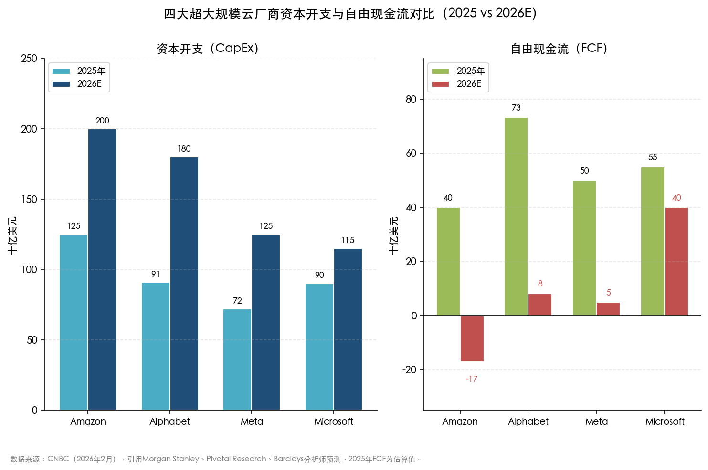

上图清晰展示了资本开支大幅扩张与自由现金流急剧恶化之间的"剪刀差"：Amazon FCF预计从正值转为负170亿美元，Alphabet FCF则面临近90%的降幅。

这一资本开支周期的可持续性取决于两个关键变量：其一，AI基础设施投资能否在未来2至3年内转化为可观的应用层收入；其二，推理成本的持续下降（Gartner预测到2030年LLM推理成本将较2025年降低90%以上）能否使AI应用的单位经济模型达到正向循环。若这两个条件未能满足，当前的投资热潮可能演变为类似2000年互联网泡沫时期的资本重置。

## 1.4 风险投资的极端集中：AI吸纳一切

资本市场对AI的追捧不仅体现在大型科技公司的资本开支中，也深刻重塑了风险投资的流向结构。2025年全球AI企业VC投资达2587亿美元，占全球VC总额的61%；超过1亿美元的大额交易占AI VC总额的73%，头部集中效应极为显著[OECD报告](https://www.oecd.org/content/dam/oecd/en/publications/reports/2026/02/venture-capital-investments-in-artificial-intelligence-through-2025_3bcb227f/a13752f5-en.pdf "OECD AI VC投资报告，2026年2月")。

2026年第一季度，这一趋势进一步加速。全球VC创纪录达3000亿美元，其中AI企业获得2420亿美元（占比80%）。资金的极度集中尤为引人关注——OpenAI（1220亿美元）、Anthropic（300亿美元）、xAI（200亿美元）、Waymo（160亿美元）四家合计融资1880亿美元，占AI VC总额的78%[Crunchbase报告](https://news.crunchbase.com/venture/record-breaking-funding-ai-global-q1-2026/ "Crunchbase Q1 2026全球VC报告")。

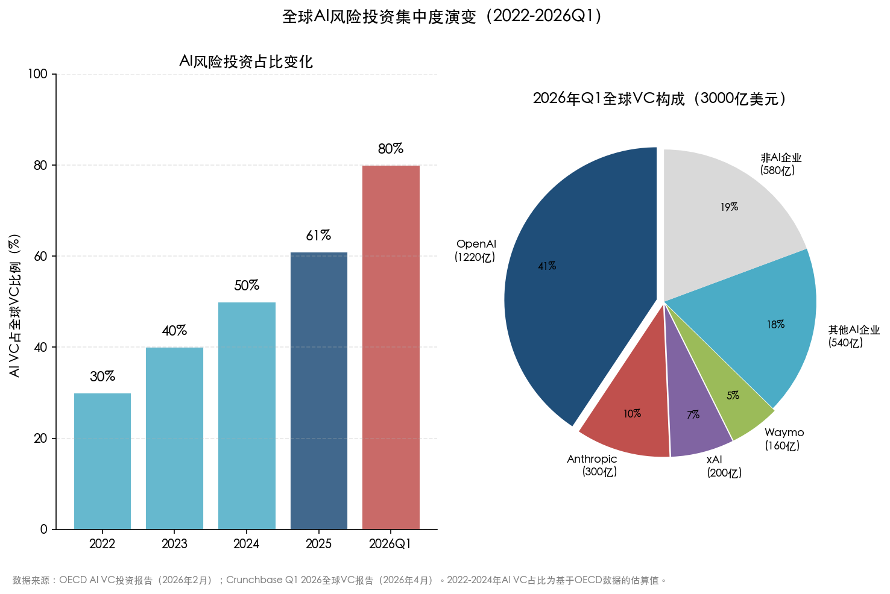

上图左侧柱状图展示AI风险投资占全球VC比例从2022年的30%攀升至2026年Q1的80%的趋势；右侧饼图揭示2026年Q1仅OpenAI、Anthropic、xAI和Waymo四家即占据全球VC总额的63%，"赢者通吃"格局已然成形。

这种极端集中的资本配置意味着三重结构性影响：绝大多数AI初创公司仍在争夺不到四分之一的剩余资金池；传统SaaS和非AI软件公司的融资环境遭受严重挤压；AI领域的竞争正演变为"资本军备竞赛"，资源禀赋差异可能在短期内固化市场格局。在中国市场，2025年软件技术领域融资总额达738.4亿元人民币，AI领域占比高达90.0%，其中过亿融资事件中AI占比88.7%，资本向AI的聚集程度甚至超过全球平均水平。

## 1.5 并购浪潮：围绕AI能力的战略整合

2025年软件行业的并购活动几乎全部围绕AI能力构建展开。年度重大交易包括：Google收购云安全公司Wiz（320亿美元）、Palo Alto收购CyberArk（250亿美元）、HPE收购Juniper（134亿美元）、IBM收购Confluent（110亿美元）和HashiCorp（64亿美元）、Salesforce收购Informatica（80亿美元）[CRN报道](https://www.crn.com/news/channel-news/2025/the-10-biggest-tech-m-a-deals-of-2025 "CRN 2025十大科技并购")。Deloitte指出，2025年美国软件公司AI相关收购支出已超过此前三年之和[Deloitte软件行业展望](https://www.deloitte.com/us/en/insights/industry/technology/technology-media-telecom-outlooks/software-industry-outlook.html "Deloitte 2026全球软件行业展望")。

这些并购透露出清晰的战略逻辑：大型平台企业正通过收购快速填补AI时代所需的关键能力短板。Google收购Wiz反映了AI基础设施安全需求的急迫性；IBM连续收购Confluent和HashiCorp指向企业级AI数据管道与基础设施自动化的整合方向；Salesforce收购Informatica意在强化其AI Agent所需的数据治理能力。整合方向已从传统的"扩品类、扩客群"转向"构建AI能力栈"——并购标的的核心价值不再是客户基数或收入流，而是能否为收购方的AI战略提供关键拼图。

## 1.6 中国软件行业：规模扩张中的结构性转型

中国软件行业在全球格局中占据重要地位，但面临与全球市场既有共性又有独特性的发展态势。2025年全年，中国软件和信息技术服务业业务收入达154,831亿元人民币（约2.12万亿美元），同比增长13.2%；利润总额18,848亿元（+7.3%）；工业软件产品收入3,330亿元（+9.7%）[IT之家转引工信部数据](https://www.ithome.com/0/917/905.htm "工信部2025年软件业运行情况")。进入2026年，前2个月收入达21,534亿元（同比+11.7%），增速较2025年全年有所放缓[央广网转引工信部数据](https://www.cnr.cn/newscenter/native/gd/20260331/t20260331_527568605.shtml "工信部2026年1-2月数据")。

从结构角度审视，利润增速（+7.3%）明显滞后于收入增速（+13.2%），反映出行业在规模扩张过程中面临成本上升与竞争加剧的双重压力。工业软件作为国产替代的重点领域，9.7%的增速低于行业整体水平，表明在基础软件和工业软件领域实现技术自主可控仍面临较大挑战。

中国软件行业正经历信创国产替代与AI浪潮的双重叠加效应。一方面，国资委79号文要求2027年底前中央企业完成信创替代，为国产软件提供了确定性的增量市场；另一方面，以DeepSeek为代表的国产大模型在训练成本上仅为OpenAI的约1/20，这种成本优势赋予中国AI软件企业差异化的竞争路径。"十五五"规划（2026至2030年）明确将"提升高端芯片、光电子器件、基础软件和工业软件等产业水平"列为核心目标[十五五规划纲要](https://www.spp.gov.cn/spp/tt/202603/t20260313_723954.shtml "十五五规划纲要，2026年3月")。政策驱动与市场驱动的双轨并行，将是中国软件行业未来五年的显著特征。

## 1.7 商业模式迁移：从"卖座席"到"卖结果"的艰难转型

AI浪潮对软件行业最深层的冲击不在于技术本身，而在于它正从底层重新定义软件的商业模式。传统SaaS的核心定价逻辑——按座席/用户数收费——建立在一个隐含假设之上：软件的价值与使用该软件的人数成正比。然而，当AI Agent能够直接替代部分人类用户完成任务时，这一假设的根基即被动摇。

Salesforce的定价演变是这一转型的典型缩影。Agentforce最初以每次对话2美元的价格推出，随后迅速演变为每个AI动作0.10美元的Flex Credits模式[Salesforce官方公告](https://www.salesforce.com/news/press-releases/2025/05/15/agentforce-flexible-pricing-news/ "Salesforce Agentforce弹性定价公告，2025年5月")。这一调整反映了一个根本性张力：若AI Agent能以远低于人类的成本完成客服对话，按座席收费的传统模式将面临不可避免的收入压缩。

然而，Bain & Company的系统研究揭示了一个重要现实：商业模式的迁移远比技术的采用更为缓慢。在30多家引入生成式AI功能的传统SaaS供应商中，约35%选择提价捆绑AI，约65%采用混合定价，没有一家完全转向纯使用量/结果计费模式[Bain研究](https://www.bain.com/insights/per-seat-software-pricing-isnt-dead-but-new-models-are-gaining-steam/ "Bain Per-Seat Pricing研究，2025年10月")。这一数据表明，行业正处于漫长的混合过渡期——旧模式尚未消亡，新模式尚未成熟。

Goldman Sachs的预测为这一转型提供了远期坐标：AI Agent驱动的应用软件市场规模至2030年预计增至7800亿美元（2024至2030年CAGR约13%）[Deloitte软件行业展望](https://www.deloitte.com/us/en/insights/industry/technology/technology-media-telecom-outlooks/software-industry-outlook.html "Deloitte 2026展望转引Goldman Sachs")。这一预测暗示，尽管座席计费模式面临压力，AI实际上可能扩大整体软件市场规模而非缩减它——前提是软件企业能够成功完成从"卖工具"到"卖结果"的定价体系转型。

## 1.8 机构判断的共识与分歧

综合Gartner、IDC、Forrester和Deloitte四家权威机构的判断，可提炼出以下共识与分歧：

**共识领域**：各机构均认同三个核心判断——（1）AI正驱动软件行业结构性变革，而非渐进式改良；（2）AI相关支出增速远超行业整体，且这一差距在未来3至5年将持续扩大；（3）传统软件定价模式面临不可逆的转型压力，混合定价和使用量计费将逐步替代纯座席计费。

**分歧领域**：机构间的分歧主要体现在三个维度。第一，增速预测的幅度差异：Gartner最为乐观（2026年IT支出+10.8%），IDC次之（强调"自1996年以来最快增速"），Forrester最保守（+7.8%）。第二，AI产业化节奏的判断分化：Gartner明确将2026年定位于"幻灭低谷期"，对AI短期商业化持审慎态度；IDC则更为乐观，将当前阶段定义为"科技超级周期"的开端，暗示AI的产业化转化将快于市场预期。第三，对传统软件企业的长期影响评估：Deloitte和Bain倾向于认为"颠覆是必然的，但过时是可选的"——具备深度领域知识和高切换成本的传统软件仍可通过AI增强策略维持增长；而Goldman Sachs关于AI Agent驱动7800亿美元应用软件市场的预测则隐含了更激进的假设——AI不仅改变现有软件的形态，还将创造出全新的应用品类和收入池[Gartner新闻稿](https://www.gartner.com/en/newsroom/press-releases/2026-1-15-gartner-says-worldwide-ai-spending-will-total-2-point-5-trillion-dollars-in-2026 "Gartner AI支出预测")[Deloitte软件行业展望](https://www.deloitte.com/us/en/insights/industry/technology/technology-media-telecom-outlooks/software-industry-outlook.html "Deloitte 2026展望转引Goldman Sachs")。

我们认为，当前证据更支持一个"中间路径"判断：AI将在未来5年内深刻重塑软件行业的竞争格局和价值分配，但这一过程的节奏将慢于最乐观的预期、快于最保守的估计。2026年的"幻灭低谷期"并不意味着AI对软件行业的影响减弱，恰恰相反，它标志着行业正从概念验证阶段进入艰难的规模化落地阶段——泡沫被挤出、真正价值开始沉淀的关键转折期。

# 第2章 AI重塑软件开发全流程——从辅助编码到自主工程

## 2.1 AI编码工具的爆发式渗透：从小众插件到开发者标配

2025年4月至2026年4月，AI编码工具经历了从"新鲜事物"到"开发者基础设施"的质变。截至2026年1月（微软FY26 Q2财报），GitHub Copilot付费订阅用户已突破470万，同比增长75% [微软FY26 Q2财报电话会议](https://www.microsoft.com/en-us/investor/events/fy-2026/earnings-fy-2026-q2 "2026年1月28日Satya Nadella原始发言")。与此同时，新锐竞争者Cursor的增长轨迹更为瞩目——这款AI原生代码编辑器的年化收入在2026年2月突破20亿美元，3个月内翻倍；从100万美元ARR增长至10亿美元ARR仅用24个月，创下SaaS历史最快增速纪录 [TechCrunch报道](https://techcrunch.com/2026/03/02/cursor-has-reportedly-surpassed-2b-in-annualized-revenue/ "2026年3月Bloomberg消息源")。

大规模开发者调查进一步印证了这一渗透深度。JetBrains《2025开发者生态报告》（覆盖24,534名受访者）显示，85%的开发者定期使用AI工具进行编码和开发，62%依赖至少一个AI编码助手 [JetBrains开发者生态2025](https://blog.jetbrains.com/research/2025/10/state-of-developer-ecosystem-2025/ "24,534名开发者调查")。Stack Overflow《2025开发者调查》给出了相近的数字——84%的受访者正在使用或计划使用AI工具，ChatGPT（82%）和GitHub Copilot（68%）分列开发者最常用AI工具的前两位 [Stack Overflow 2025调查](https://survey.stackoverflow.co/2025/ai "2025年开发者调查AI部分")。在效率维度上，JetBrains调查显示近90%的AI工具使用者每周至少节省1小时，约20%每周节省8小时以上 [JetBrains开发者生态2025](https://blog.jetbrains.com/research/2025/10/state-of-developer-ecosystem-2025/ "时间节省数据")。

然而，高渗透率并不等同于高信任度。Stack Overflow同一调查发现，46%的开发者不信任AI工具输出的准确性 [Stack Overflow 2025调查](https://survey.stackoverflow.co/2025/ai "信任度数据")。这种"广泛使用但审慎信任"的矛盾状态，折射出AI编码工具当前所处的发展阶段——它已成为不可或缺的生产力工具，但远未可靠到能完全替代人类判断。

### 中国市场：国产AI编码工具的快速崛起

中国AI编码工具市场在2025年进入加速增长通道。阿里云旗下通义灵码插件下载量截至2025年中已超过1500万，累计生成超30亿行代码，服务上万家企业，客户涵盖一汽集团、蔚来汽车、中华财险等 [阿里云官方信息](https://developer.aliyun.com/article/1662698 "通义灵码数据")。以蔚来汽车为例，超过1500名研发人员使用通义灵码，代码中AI生成占比超过30%，在通用代码逻辑开发和代码检查测试等环节开发效率提升超过20% [东方财富网引阿里云数据](https://caifuhao.eastmoney.com/news/20250924192428456128980 "蔚来汽车AI编码应用案例")。

字节跳动于2025年3月推出的AI编码工具Trae同样增长迅猛：上线不到一年即注册用户突破600万，覆盖近200个国家和地区，月活跃用户超过160万，全年生成近1000亿行代码 [极客公园报道](https://www.geekpark.net/news/358722 "Trae年度报告数据, 2025年12月")。从市场整体规模看，沙利文联合头豹发布的《2024年中国AI代码生成市场观测报告》显示，2023年中国AI代码生成市场规模约65亿元人民币，预计2028年将增长至330亿元人民币，年复合增长率达38% [沙利文报告](https://www.frostchina.com/content/insight/detail/66f2843fbd3cdfe88cf6fa2b "2024年中国AI代码生成市场报告")。该增速显著高于全球平均水平，反映出中国开发者对AI编码工具的旺盛需求，以及国产大模型（通义Qwen系列、DeepSeek等）在中文编码场景中的独特适配优势。

## 2.2 "AI生成代码占比"——一个正在快速攀升的关键指标

"企业代码库中有多大比例由AI生成"正在成为衡量AI渗透深度的标志性指标。2025年4月，Google CEO Sundar Pichai在Alphabet Q1 2025财报电话会议上披露，Google超过30%的新代码由AI生成 [Analytics India Magazine报道](https://analyticsindiamag.com/ai-news-updates/sundar-pichai-says-over-30-of-code-at-google-now-ai-generated/ "2025年4月25日基于Q1 2025财报电话会议")。同月，微软CEO Satya Nadella在Meta LlamaCon大会上表示，微软代码仓库中20%–30%的代码"由软件编写"，部分项目中AI代码占比可能接近100% [CNBC报道](https://www.cnbc.com/2025/04/29/satya-nadella-says-as-much-as-30percent-of-microsoft-code-is-written-by-ai.html "CNBC, 2025年4月29日")。

GitHub平台层面的数据更具代表性：46%的代码在AI辅助下完成，其中Java项目AI辅助代码占比高达61% [GitHub官方博客-Accenture研究](https://github.blog/news-insights/research/research-quantifying-github-copilots-impact-in-the-enterprise-with-accenture/ "GitHub与Accenture联合RCT研究")。不同编程语言之间的AI辅助深度差距值得关注——Java等成熟语言因代码模式标准化程度高，AI辅助效果远优于较新或小众的语言，这意味着AI对软件开发的渗透并非均质推进，而是沿着"成熟语言 → 新兴语言""标准化逻辑 → 定制化业务"的梯度展开。

上述数据来自全球最大的科技企业，它们拥有最先进的AI基础设施和最优秀的工程团队。对于中小型企业和传统行业IT部门而言，AI生成代码占比预计显著低于上述水平。在中国市场，蔚来汽车超过30%的AI代码生成占比在大型企业中属于领先水平，多数企业的采用深度仍处于早期探索阶段。

## 2.3 从"AI辅助补全"到"Agentic Coding"：自主编码能力的跃迁

AI编码工具正沿着一条清晰的演化路径前进：从单行代码补全，到函数级生成，再到多步骤自主编程（Agentic Coding）。2025–2026年间，这一演化取得了质的突破。

SWE-bench Verified排行榜为衡量AI编码代理的自主能力提供了关键基准。该榜单测试AI代理独立解决真实GitHub issue的能力——涵盖理解问题描述、定位相关代码、编写修复方案并通过测试的完整流程。截至2026年2月，顶级AI编码代理的得分大幅攀升：Sonar Foundation Agent达到79.2%、Claude 4.5 Opus达到76.80%、Gemini 3 Flash达到75.80% [SWE-bench官方排行榜](https://www.swebench.com/ "2026年2月更新的Verified排行榜") [SonarSource官方公告](https://www.sonarsource.com/company/press-releases/sonar-claims-top-spot-on-swe-bench-leaderboard/ "SWE-bench Verified 79.2%")。相较2024年初约20%的基线水平，不到两年间绝对得分提升近60个百分点（参见图2-1）。这意味着顶级AI代理已能自主解决约80%的真实软件问题——但需要指出的是，SWE-bench测试的issue在复杂度和规模上仍偏向中等难度的独立修复任务，与大型系统架构级变更之间存在显著差距。

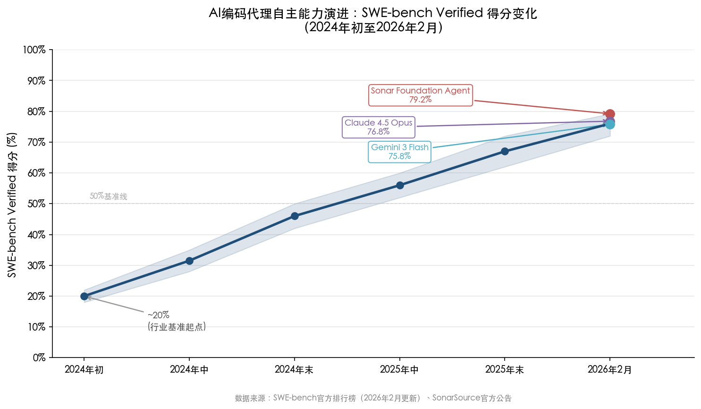

Cognition AI的Devin提供了Agentic Coding落地企业场景的代表性案例。上线18个月后，Devin已完成数十万个PR合并，覆盖Goldman Sachs、Santander等大型金融机构；在安全漏洞修复方面，其效率达人类工程师的20倍（平均1.5分钟 vs 30分钟） [Cognition AI官方博客](https://cognition.ai/blog/devin-annual-performance-review-2025 "Devin 2025年度绩效评估")。Devin的定价策略同样反映了Agentic Coding的商业化探索——从最初每月500美元的团队订阅价格，逐步演变为包含按计算单元（Agent Compute Unit，每单元2.25美元）的弹性计费模式，核心月度计划起价降至20美元 [TechCrunch报道](https://techcrunch.com/2025/04/03/devin-the-viral-coding-ai-agent-gets-a-new-pay-as-you-go-plan/ "2025年4月")。

Anthropic于2026年2月发布的《2026 Agentic Coding Trends Report》系统性地描绘了这一演化方向，识别出八大核心趋势：开发者角色从"亲手实现"转向"代理指挥与审查"；多个专业化AI代理在编排器协调下并行工作；代理从短时任务向持续数小时甚至数天的长周期工作扩展；代理学会在不确定时主动寻求人类反馈；以及非工程师开始使用Agentic工具构建简单应用和自动化流程 [Anthropic Agentic Coding趋势报告解读](https://tessl.io/blog/8-trends-shaping-software-engineering-in-2026-according-to-anthropics-agentic-coding-report/ "Tessl对Anthropic报告的解读, 2026年2月")。

GitHub与Accenture的联合随机对照试验（RCT）从企业级视角验证了AI编码工具的生产力效应。实验结果显示，使用Copilot的企业开发者PR（Pull Request）数量增长8.69%、PR合并率提升15%、构建成功率提升84% [GitHub官方博客-Accenture研究](https://github.blog/news-insights/research/research-quantifying-github-copilot-impact-in-the-enterprise-with-accenture/ "企业级RCT研究")。这是迄今为止规模最大的企业环境AI编码工具随机对照实验，其结论表明AI编码工具不仅提升了代码产出速度，也改善了代码的集成成功率——后者在工程实践中往往比前者更具价值。

## 2.4 AI对软件开发生命周期各环节的渗透：编码领先、运维滞后

AI对软件开发生命周期（SDLC）各环节的渗透程度呈现高度不均的分布格局。综合多项调查与研究数据，当前渗透梯度可概括为"编码 > 测试 > 文档 > 需求分析 > 架构设计 > 部署运维"（参见图2-2）。

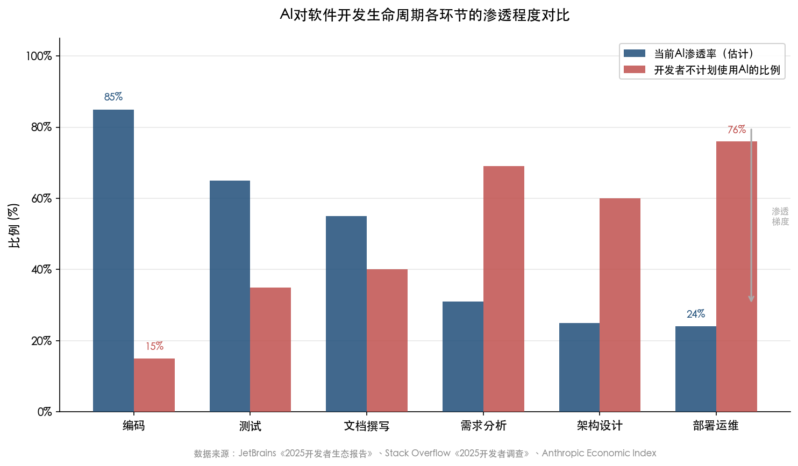

在编码和测试环节，AI的渗透已接近拐点。如前所述，85%的开发者在编码中使用AI工具，AI辅助代码在主要平台的占比已达30%–46%。在测试领域，AI驱动的单元测试自动生成、测试用例扩展和回归测试覆盖已成为多数AI编码工具的标准功能模块。

然而，Stack Overflow 2025调查揭示了一个关键事实：开发者对高责任（high-stakes）任务使用AI存在显著阻力。76%的受访者不计划在部署与监控环节使用AI，69%不计划在项目规划中使用AI [Stack Overflow 2025调查](https://survey.stackoverflow.co/2025/ai "各环节AI采用意愿数据")。"Vibe coding"——即以AI为主导、人类仅做粗略方向指引的编码方式——亦未进入专业开发主流，72%的受访者表示这不是其专业工作的组成部分 [Stack Overflow 2025调查](https://survey.stackoverflow.co/2025/ai "vibe coding采用率")。

Anthropic Economic Index对Claude Code使用行为的分析提供了互补视角：79%的对话属于"自动化"性质（即AI独立完成任务），前端/UI组件开发是用户最频繁委托AI构建的内容 [Anthropic](https://www.anthropic.com/news/impact-software-development "Anthropic Economic Index: AI's impact on software development, 2025年")。这一数据表明，AI在结构化程度高、业务逻辑清晰、输出可快速验证的环节（如前端组件、CRUD逻辑、标准测试）表现最优，而在需要深度领域知识、跨系统上下文理解和组织决策判断的环节（如架构设计、部署策略、项目规划）仍高度依赖人类专家。

我们判断，这种渗透梯度在未来12–18个月内不会发生根本性改变。即使AI代理在SWE-bench上的得分继续攀升，部署运维、安全审计和系统架构等领域的自动化进程仍将显著滞后于编码环节——因为这些领域的挑战不仅在于技术能力，更在于责任归属、合规要求和组织信任的建立。

## 2.5 AI编码工具的定价演化：从按座席到弹性消耗

AI编码工具的定价模式正经历快速迭代，折射出行业对"AI辅助开发的价值应如何量化"这一核心问题的持续探索。当前市场已形成三种代表性定价范式（参见图2-3）。

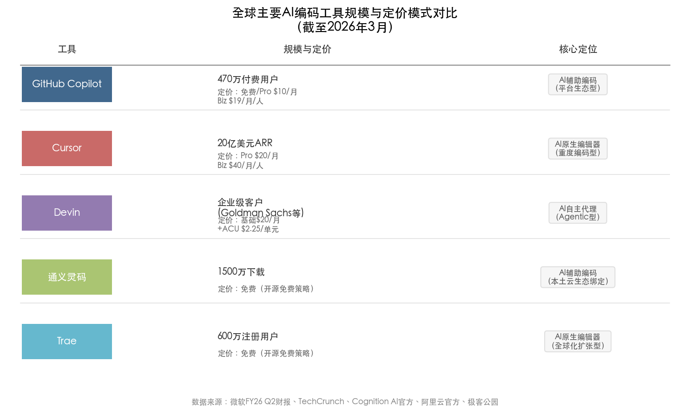

**阶梯式订阅模式。** GitHub Copilot维持了清晰的分层定价：免费版提供2000次代码补全和50次高级请求，Pro版每月10美元，Business版每月19美元/用户，Enterprise版每月39美元/用户 [GitHub Copilot定价页面](https://github.com/features/copilot/plans "GitHub Copilot官方定价")。这一模式延续了传统SaaS按座席计费的逻辑，但免费版的推出标志着AI编码工具正从增值功能向基础设施属性演变。

**消耗型信用额度模式。** Cursor在2025年中完成了一次关键的定价架构转型——从基于请求数量的定价切换为基于消耗金额的信用额度制。Pro版每月20美元（含20美元模型使用额度），Pro+版每月60美元（含70美元额度），Business版每用户每月40美元 [Cursor官方定价](https://cursor.com/pricing "Cursor定价页面") [Cursor定价博客](https://cursor.com/blog/june-2025-pricing "2025年6月定价调整说明")。这一转型将用户实际消耗的AI推理计算资源直接映射到定价之中——重度用户付费更多，轻度用户获得更优的性价比。

**激进补贴与按使用量付费模式。** Anthropic的Claude Code采取了大幅分层策略：Pro计划每月20美元、Max计划每月100美元或200美元，同时支持按token的API付费。Max计划用户的单月实际AI推理消耗可能高达5000美元，Anthropic以补贴差额换取市场份额 [Claude Code定价分析](https://www.ssdnodes.com/blog/claude-code-pricing-in-2026-every-plan-explained-pro-max-api-teams/ "Claude Code定价解析, 2026年")。Cognition AI的Devin则最彻底地拥抱了按使用量付费模式，以Agent Compute Unit（每单元2.25美元）为核心计费单位 [TechCrunch报道](https://techcrunch.com/2025/04/03/devin-the-viral-coding-ai-agent-gets-a-new-pay-as-you-go-plan/ "Devin弹性定价, 2025年4月")。

整体而言，AI编码工具市场2024年估值约49亿美元，预计至2032年达300亿美元（CAGR约27%） [SaaStr分析](https://www.saastr.com/cursor-hit-1b-arr-in-17-months-the-fastest-b2b-to-scale-ever-and-its-not-even-close/ "AI编码助手市场规模预测")。定价模式正沿着"固定座席 → 座席+用量混合 → 纯消耗量/按结果付费"的路径演进，Devin的ACU模式可能代表了Agentic Coding时代定价的未来方向。

## 2.6 硬币的另一面：AI生成代码的质量、安全与技术债务风险

AI编码工具在带来效率飞跃的同时，亦引入了不容忽视的质量和安全风险。多项严谨研究已为这些风险提供了系统性的量化证据。

**安全漏洞风险显著上升。** Veracode《2025 GenAI代码安全报告》测试了超过100个大语言模型，发现45%的AI生成代码样本未通过安全测试，其中Java语言的安全失败率最高，达72% [Veracode报告](https://www.veracode.com/blog/genai-code-security-report/ "2025年GenAI代码安全报告，测试100+模型")。Apiiro对财富50强企业代码库的研究揭示了更为警示性的模式：使用AI辅助的开发者代码提交量是非AI同行的3–4倍，但安全发现（security findings）数量增加10倍，特权提升路径暴增322% [Apiiro研究报告](https://apiiro.com/blog/4x-velocity-10x-vulnerabilities-ai-coding-assistants-are-shipping-more-risks/ "2025年9月发布，Fortune 50企业代码库分析")。换言之，AI编码工具正在以"4倍速度引入10倍漏洞"——速度提升的背后是安全债务的加速积累。

**代码可维护性趋势性下降。** GitClear对2020–2024年间2.11亿行变更代码的纵向分析提供了宏观层面的证据：代码重构/移动操作占比从2021年的25%骤降至2024年不足10%，而复制粘贴代码从8.3%上升至12.3%——2024年首次出现复制粘贴代码总量超过代码移动/重构量的逆转现象 [GitClear研究](https://www.gitclear.com/ai_assistant_code_quality_2025_research "211M行代码，5年纵向分析")。这一趋势强烈暗示，AI编码工具正在助推代码重复和技术债务的积累：开发者倾向于接受AI生成的新代码片段而非重构已有代码，导致代码库整体可维护性持续下降。

**企业层面的应对信号已经出现。** 微软在2026年初任命了专门的工程质量负责人，时间恰在Nadella宣布30%代码由AI生成不到一年之后 [Times of India报道](https://timesofindia.indiatimes.com/technology/tech-news/less-than-a-year-after-ceo-satya-nadella-said-30-of-microsofts-code-is-ai-written-company-appoints-an-engineering-quality-head/articleshow/128116076.cms "2026年初")。这一举措从侧面印证了大规模采用AI生成代码后，企业对代码质量治理的紧迫需求。

我们判断，AI生成代码的安全和质量风险不会随着模型能力的提升而自动消解，其深层原因有三：其一，AI倾向于生成"看起来正确但未经安全思考"的代码，这种风险在代码规模扩大时呈超线性增长；其二，开发者对AI输出的"自动化信任"倾向会随工具熟悉度增加而加剧，形成"能力提升 → 警惕下降"的负反馈环；其三，复制粘贴式代码膨胀将使技术债务在系统级别产生复合效应，导致后续维护成本远超AI编码初期节省的开发时间。因此，安全审查流程、代码质量门禁和技术债务治理的同步强化，将成为AI编码时代的必需投入。

## 2.7 阶段判断：行业正处于"辅助编码"到"自主工程"的过渡地带

综合以上证据，我们对AI重塑软件开发全流程的当前阶段做出如下研判：

**已确立的现实。** AI编码工具已成为全球开发者的标准配置，85%的开发者定期使用，头部科技企业20%–30%以上新代码由AI生成。AI在编码和测试环节的渗透已接近拐点，Agentic Coding代理在SWE-bench Verified基准上的自主解题能力从2024年初的约20%跃升至2026年2月的近80%。

**正在发生的过渡。** 行业正从"AI辅助人类编码"向"人类指挥AI编码"的模式转换。Anthropic《2026 Agentic Coding趋势报告》将这一转变概括为"开发者角色从实现者转变为编排者"——负责架构决策、质量审查和战略方向，将实现工作交由AI代理执行。多代理协作、长周期任务执行、跨角色能力扩展构成了这一阶段的三大技术特征。

**尚未到来的未来。** 完全自主的软件工程——即AI独立完成从需求理解到系统设计、开发、测试、部署的全流程——在当前技术条件下尚未实现。76%的开发者不计划在部署运维中使用AI，69%不计划在项目规划中使用AI，vibe coding未进入72%专业开发者的工作流程。这些数据表明，在高责任、高上下文依赖的SDLC环节，人类工程师的不可替代性在短期内依然稳固。

中国市场的发展走势基本同步于全球趋势，但呈现出独特的竞争格局。通义灵码、Trae、CodeGeeX、文心快码等国产工具凭借开源免费策略、中文业务逻辑的适配优势以及与本土云生态的深度绑定，正在快速缩小与GitHub Copilot、Cursor的功能差距。中国AI代码生成市场从2023年约65亿元人民币到2028年预计330亿元人民币（CAGR 38%）的增长轨迹 [沙利文报告](https://www.frostchina.com/content/insight/detail/66f2843fbd3cdfe88cf6fa2b "2024年中国AI代码生成市场报告")，表明这一赛道正处于高速扩张的早期阶段。

# 第3章 AI对软件细分领域的替代风险分层分析

## 3.1 "SaaSpocalypse"：叙事、证据与市场定价

2026年2月，Anthropic发布Claude Cowork后的48小时内，全球SaaS板块约2,850亿美元市值蒸发，这一事件被资本市场冠以"SaaSpocalypse"之名，标志着投资者对AI颠覆传统软件的恐慌情绪达到阶段性顶峰 [Forbes报道](https://www.forbes.com/sites/petercohan/2026/02/06/saaspocalypse-now-ai-is-disrupting-saas---but-not-all-software-is-doomed/ "Forbes, 2026年2月6日")。截至2026年3月底，主要软件指数较200日均线低近20%，偏离幅度为2000年互联网泡沫破裂以来之最；对冲基金在此轮抛售中通过做空软件股累计获利约240亿美元 [MarketMinute报道](http://markets.chroniclejournal.com/chroniclejournal/article/marketminute-2026-3-30-the-saaspocalypse-of-2026-how-generative-ai-broke-the-software-growth-engine "MarketMinute, 2026年3月30日")。

这场估值重定价具有深层的基本面支撑。B2B SaaS收入倍数在2025年已收缩至5.9倍，远低于2021年末15-20倍的峰值水平 [Finerva报告](https://finerva.com/report/b2b-saas-2026-valuation-multiples/ "Finerva B2B SaaS 2026估值倍数")。曾作为SaaS商业模式基石的座席计费模式正加速萎缩：SaaS公司中采用按座席定价的比例在12个月内从21%降至15%，而混合定价占比则从27%飙升至41% [Forbes报道](https://www.forbes.com/sites/petercohan/2026/02/06/saaspocalypse-now-ai-is-disrupting-saas---but-not-all-software-is-doomed/ "Forbes引用Pilot与Jason Lemkin数据")。资本市场的核心定价逻辑在于：当AI Agent能够直接完成原本需要人类员工通过SaaS工具执行的业务流程时，企业所需的软件"座席"数量将不可避免地减少，按人头收费的商业模式面临结构性收缩压力。

然而，SaaSpocalypse叙事存在显著的过度简化倾向。恐慌抛售在很大程度上呈现无差别特征——无论AI替代风险高低，几乎所有软件股均被波及。这一现象表明，市场可能过度定价了短期替代风险，同时忽略了不同软件品类面临的差异化冲击程度。本章将从替代机制、实际财务表现和结构性护城河三个维度，对主要软件细分领域进行系统性的风险分层分析。

## 3.2 分析框架：从功能替代到商业模式替代

理解AI对软件行业的冲击机制，需要区分三种层次递进的替代路径。

**功能替代**是最浅层的冲击形式，指AI系统取代软件产品中特定功能模块的能力。例如，AI自动生成营销文案可以替代内容管理系统中的部分编辑功能，但并不改变企业对整体营销平台的刚性需求。功能替代通常带来的是产品重新定价压力，而非产品消亡。

**流程替代**是中间层级的冲击，指AI Agent能够端到端地完成原本需要人类使用多个SaaS工具协同执行的完整业务流程。例如，一个AI Agent可以直接完成从客户咨询到工单创建、分类、路由和解答的全流程，从而绕过传统客服SaaS的工作流引擎。流程替代动摇的核心是SaaS工具的使用频率和座席数量。

**商业模式替代**则是最深层的结构性冲击，指AI从根本上改变软件产品的价值衡量方式——从"为工具付费"转向"为结果付费"。这对SaaS经济学构成最为本质的挑战，因为它重新定义了软件公司的收入计量单位。

Bain & Company在《Technology Report 2025》中基于上述逻辑，将SaaS工作流划分为四个战略象限——**核心堡垒**（Core Strongholds，AI增强SaaS）、**开放门户**（Open Doorways，支出压缩）、**金矿**（Gold Mines，AI超越SaaS）、**战场**（Battlefields，AI蚕食SaaS），核心结论为"颠覆是必然的，但过时是可选的"（disruption is inevitable, but obsolescence is optional）[Bain报告](https://www.bain.com/insights/will-agentic-ai-disrupt-saas-technology-report-2025/ "Bain Technology Report 2025, 2025年9月")。这一框架为系统评估各细分领域的AI替代风险提供了结构化视角。

从量化预测看，Gartner预测到2026年底将有40%的企业应用集成任务专用AI Agent，而这一比例在2025年尚不到5%；在最佳情景下，到2035年Agentic AI可驱动约30%的企业应用软件收入，规模超过4,500亿美元 [Gartner新闻稿](https://www.gartner.com/en/newsroom/press-releases/2025-08-26-gartner-predicts-40-percent-of-enterprise-apps-will-feature-task-specific-ai-agents-by-2026-up-from-less-than-5-percent-in-2025 "Gartner, 2025年8月26日")。这一预测意味着AI嵌入式增强和AI原生替代将在未来数年同步展开，不同细分领域的最终走向取决于各自的结构性特征。

## 3.3 高风险领域：AI原生应用的直接颠覆

### 3.3.1 法律科技与合同管理

法律科技是SaaSpocalypse中受冲击最为剧烈的细分领域。Thomson Reuters在Anthropic发布Claude Cowork当日股价单日下跌15.83%，跌幅居所有软件公司前列 [Taskade分析](https://www.taskade.com/blog/saaspocalypse-explained "各公司跌幅数据, 2026年3月")。法律文档审阅、合同条款分析、法规合规性检查等核心工作流高度依赖自然语言处理能力，而大型语言模型在这些任务上已展现出接近甚至超越初级律师的表现水平。Harvey AI等AI原生法律工具能够直接向法律团队提供合同审阅和法律研究服务，从根本上绕过传统法律科技软件的工作流引擎。

该领域面临的替代机制以**流程替代**为主：AI Agent可以端到端完成从合同起草、条款审查到风险标注的完整流程，而非仅仅辅助律师使用传统工具提升效率。Workday旗下的Contract Intelligence Agent已将合同执行时间缩短65% [Workday新闻稿](https://investor.workday.com/news-and-events/press-releases/news-details/2025/Workday-Illuminate-Expands-with-New-AI-Agents-for-HR-Finance-and-Industry-09-16-2025/default.aspx "Workday Rising 2025, 2025年9月16日")，预示着合同管理领域的AI自动化能力正在加速成熟。

### 3.3.2 HR与劳动力管理

HR/HCM（人力资本管理）软件是另一高风险品类。Workday股价在SaaSpocalypse期间承受巨大压力，Jefferies将其目标价从325美元大幅下调至150美元 [Taskade分析](https://www.taskade.com/blog/saaspocalypse-explained "Workday目标价下调, 2026年3月")。市场的核心担忧在于：招聘筛选、简历匹配、薪酬对标、合规报告等HR核心工作流与AI Agent的能力高度匹配，座席定价模式下的HR软件同时面临使用量萎缩和用户数减少的双重压力。

然而，Workday的实际财务表现与市场恐慌之间存在显著落差。Workday FY2026（截至2026年1月）全年总收入达95.52亿美元（同比+13.1%），其中订阅收入88.33亿美元（同比+14.5%）；Q4单季收入25.32亿美元（同比+14.5%），订阅收入23.60亿美元（同比+15.7%）[Workday FY26 Q4财报](https://newsroom.workday.com/2026-02-24-Workday-Announces-Fiscal-2026-Fourth-Quarter-and-Full-Year-Financial-Results "Workday官方新闻稿, 2026年2月24日")。该公司在FY2026全年交付了17亿次AI操作（AI actions），正积极将自身从传统HCM工具供应商重新定位为企业AI平台 [Workday投资者演示](https://investor.workday.com/files/doc_earnings/2026/q4/presentation/Q4-FY26-Investor-Presentation.pdf "Workday FY26 Q4投资者演示")。2025年9月，Workday以11亿美元收购AI公司Sana Labs，进一步强化其AI Agent能力矩阵 [Reworked报道](https://www.reworked.co/digital-workplace/workday-launches-build-platform-for-custom-ai-solutions/ "Workday Rising 2025")。

这一案例揭示了HR软件领域AI替代的内在复杂性：虽然AI能够自动化大量HR事务性工作流，但HCM系统作为企业核心人事、薪酬和合规数据的"记录系统"（System of Record），拥有极高的切换成本和合规粘性。Workday面临的风险并非被AI整体替代，而是需要以足够快的速度将AI嵌入自身平台，以防止AI原生HR工具蚕食增量市场。

### 3.3.3 电子签名与文档管理

DocuSign在SaaSpocalypse期间触及52周新低，成为"薄应用"脆弱性的典型写照 [Taskade分析](https://www.taskade.com/blog/saaspocalypse-explained "DocuSign跌至52周新低, 2026年3月")。电子签名属于典型的"薄应用"（thin app）——核心功能相对单一、技术壁垒有限，AI Agent可以将签名请求作为更大业务流程自动化中的一个原子步骤直接调用，而无需用户登录独立的电子签名平台。当合同生成、审阅、谈判和签署可以在一个AI Agent工作流中一体化完成时，独立电子签名工具的价值定位将被显著削弱。该领域的替代机制兼具功能替代与流程替代特征：电子签名功能本身被降维为AI工作流中的一个API调用节点，而非独立的产品形态。

## 3.4 中高风险领域：AI蚕食与定价模式重构

中高风险品类面临的并非AI原生应用的直接颠覆，而是AI Agent对现有工作流的渐进式蚕食以及由此引发的定价模式重构。这些领域的龙头企业通常拥有一定的数据资产和生态粘性，但增速放缓和估值压缩已成为普遍趋势。图3-1对比了五家代表性SaaS巨头的营收增速与估值折价幅度，揭示出"业绩韧性与估值折价并存"这一核心矛盾。

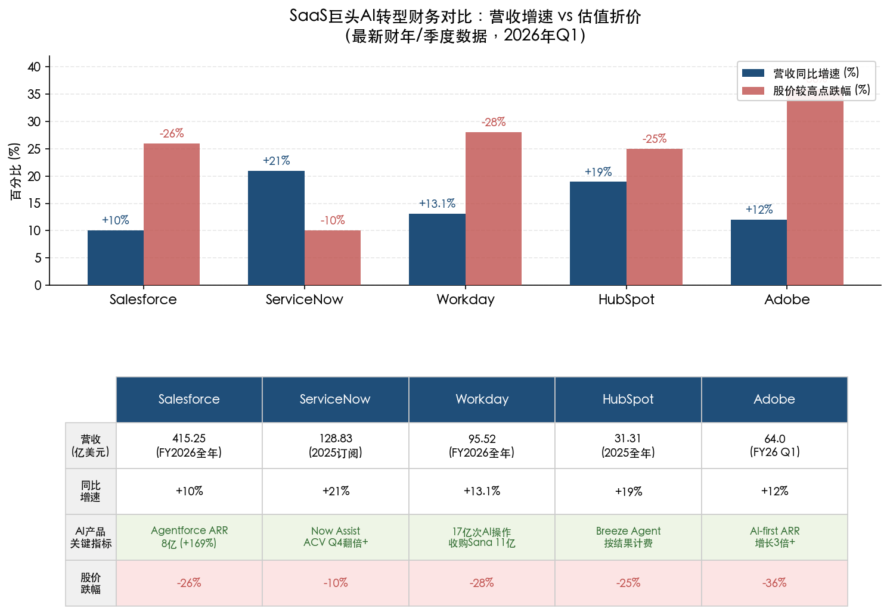

如图3-1所示，ServiceNow以+21%的订阅收入增速和仅-10%的股价跌幅领跑同业，而Adobe虽然维持+12%的收入增速，股价却较历史高点下跌达36%。这一分化格局表明，资本市场对不同SaaS企业的AI转型前景已形成高度差异化的定价。

### 3.4.1 CRM与销售自动化

CRM/销售自动化是AI替代叙事的核心战场。截至2026年3月，Salesforce年初至今股价下跌26%，HubSpot下跌25% [Taskade分析](https://www.taskade.com/blog/saaspocalypse-explained "CRM板块跌幅数据, 2026年3月")。市场恐惧的核心场景在于：AI Agent可以直接管理客户关系、自动发送跟进邮件、预测成交概率，甚至独立完成初级销售开发代表（SDR）的全部工作。Monday.com CEO的公开声明——已用AI Agent替代全部100名SDR——为此提供了标志性案例 [Taskade分析](https://www.taskade.com/blog/saaspocalypse-explained "Monday.com CEO公开声明, 2026年3月")。

然而，CRM领域的龙头企业正通过积极的AI嵌入策略进行自我重塑。Salesforce FY2026（截至2026年1月）全年收入达415.25亿美元（同比+10%），其中Agentforce ARR已达8亿美元（同比+169%）[Salesforce FY26 Q4财报](https://investor.salesforce.com/news/news-details/2026/Salesforce-Delivers-Record-Fourth-Quarter-Fiscal-2026-Results/default.aspx "Salesforce官方新闻稿, 2026年2月25日")。Salesforce的定价策略经历了快速迭代：从最初的每次对话2美元演变为每个AI动作0.10美元的Flex Credits模式 [Salesforce官方公告](https://www.salesforce.com/news/press-releases/2025/05/15/agentforce-flexible-pricing-news/ "Salesforce Agentforce弹性定价公告, 2025年5月")，标志着从座席定价向使用量定价的实质性转型。

HubSpot同样展现出强劲的财务韧性与快速的AI转型节奏。2025全年总收入31.31亿美元（同比+19%），Q4单季收入8.467亿美元（同比+20%），客户数增至288,706家（同比+16%）[HubSpot 2025全年财报](https://ir.hubspot.com/news-releases/news-release-details/hubspot-reports-strong-q4-and-full-year-2025-results "HubSpot官方新闻稿, 2026年2月11日")。更具标志性意义的是，HubSpot于2026年4月14日起将Breeze Customer Agent和Breeze Prospecting Agent转向结果导向定价——Customer Agent每次成功解决对话收费0.50美元（从此前每次对话1.00美元下调50%），Prospecting Agent每次推荐合格线索收费1美元 [CMSWire报道](https://www.cmswire.com/customer-experience/hubspot-shifts-breeze-ai-agents-to-pay-per-result-pricing/ "CMSWire, 2026年4月")。这一定价模式意味着客户仅在AI Agent"交付结果"时付费，代表了从"为工具付费"到"为结果付费"的商业模式转型的具体落地。

综合来看，CRM领域的判断是：AI正在深刻重塑这一品类的功能边界和商业模式，但拥有大规模客户数据资产、深度行业工作流定制能力和生态粘性的平台型CRM企业，更可能通过AI嵌入策略维持竞争地位。真正面临颠覆的是功能单一、缺乏数据壁垒的细分CRM及销售工具。

### 3.4.2 项目管理与协作办公

Atlassian成为SaaSpocalypse中最具标志性的案例之一。2026年初，Atlassian报告了历史上首次企业座席数量下降，股价在2月下跌约36%，随后于3月宣布裁员约1,600人（占员工总数10%）[CNBC报道](https://www.cnbc.com/2026/03/11/atlassian-slashes-10percent-of-workforce-to-self-fund-investments-in-ai.html "CNBC, 2026年3月11日")。座席数量的首次下降直接验证了市场最核心的恐惧：当AI Agent可以自动分配任务、跟踪进度并生成状态报告时，企业所需的项目管理软件"座席"确实在减少。

Monday.com的处境更为激进——其CEO公开宣布已用AI Agent替代全部100名SDR，同时撤回2027年18亿美元收入目标，股价在2月下跌约37% [Taskade分析](https://www.taskade.com/blog/saaspocalypse-explained "Monday.com相关数据, 2026年3月")。

项目管理类软件面临的替代机制兼具流程替代和商业模式替代的双重特征。在流程层面，AI Agent已能够直接完成任务分配、依赖关系管理和进度预警等核心功能；在商业模式层面，座席定价模式在AI驱动的团队精简趋势下面临结构性收缩。然而，大型企业中跨部门协同、合规审计追踪、复杂权限管理等场景仍然对专业协作工具构成刚性需求，完全替代的时间窗口尚未到来。

### 3.4.3 内容创作与设计工具

Adobe在创意工具领域正面对Midjourney、Runway、Canva AI等AI原生竞争者的持续挑战。Adobe FY2026 Q1（截至2026年2月）收入64亿美元（同比+12%），AI-first ARR同比增长超过三倍，公司正从传统座席定价向"生成式积分"（Generative Credits）定价体系转型 [Adobe Q1 FY2026新闻稿](https://news.adobe.com/news/2026/03/adobe-q1fy26-financial-results "Adobe官方, 2026年3月12日")。然而，其股价仍较历史高点下跌约36%，反映出市场对AI原生竞争者蚕食份额的持续忧虑。

内容创作领域的替代机制以**功能替代**为主：AI可以直接生成文案、图像和视频片段，取代创意软件中特定功能模块的人工操作。但Adobe的核心护城河在于其专业级创意工作流生态——Photoshop-Illustrator-Premiere Pro-After Effects的紧密联动、企业级数字资产管理能力以及创意行业标准的主导地位。Firefly订阅和积分包期末ARR环比增长75%的表现表明，Adobe正在通过将生成式AI深度嵌入专业工作流来构筑防御纵深，抵御AI原生竞争者在消费级和轻量级创意场景中的份额蚕食。

## 3.5 低风险领域：AI增强而非替代

### 3.5.1 基础软件：数据库、中间件与操作系统

基础软件处于技术栈的最底层，具有极高的切换成本、严苛的合规要求和深度的系统集成依赖，是AI替代风险最低的软件品类 [Bain报告](https://www.bain.com/insights/will-agentic-ai-disrupt-saas-technology-report-2025/ "Bain四象限框架中的Core Strongholds")。操作系统、关系型数据库、企业服务总线等基础设施软件的核心价值不在于用户界面层的功能丰富度——这恰恰是AI最容易替代的层面——而在于底层的可靠性、安全性和性能优化能力，这些特质需要数十年的工程积累和客户信任来构筑。

基础软件领域非但不被替代，反而直接受益于AI浪潮的技术需求。向量数据库市场在AI应用需求的驱动下高速增长，2025年市场规模约为26.5亿美元，预计2030年将达89.5-91.4亿美元（CAGR约27-28%）[MarketsandMarkets报告](https://www.marketsandmarkets.com/Market-Reports/vector-database-market-112683895.html "向量数据库市场预测, 2025-2030")。AI模型的训练和推理对高性能数据存储、实时数据流处理和异构计算调度提出了前所未有的需求，使得数据库和中间件供应商成为AI技术栈中不可或缺的基础设施提供者。

### 3.5.2 网络安全软件

网络安全是SaaSpocalypse中受冲击最小的软件品类之一。其底层逻辑具有独特的反直觉特征：AI技术的广泛应用带来的攻击面扩大——包括AI生成的高仿真钓鱼邮件、自动化漏洞扫描、深度伪造等新型威胁——反而增加了企业对安全软件的需求强度。此外，安全软件的采购决策受监管驱动的刚性约束——SOC 2、ISO 27001、GDPR、NIS2等合规框架要求企业持续投入安全工具，这一需求与AI技术周期无关。2025年最大的科技并购案之一——Google以320亿美元收购云安全公司Wiz——正是资本市场对网络安全领域AI受益逻辑的最有力注脚 [CRN报道](https://www.crn.com/news/channel-news/2025/the-10-biggest-tech-m-a-deals-of-2025 "CRN 2025十大科技并购")。

### 3.5.3 云基础设施与DevOps

云基础设施（IaaS/PaaS）和DevOps工具链是AI浪潮的直接受益者。AI模型的训练和推理需要大规模的计算、存储和网络资源，云基础设施的需求量因AI应用的爆发而显著增长。ServiceNow 2025全年订阅收入128.83亿美元（同比+21%），Now Assist净新ACV在Q4实现同比翻倍以上增长 [ServiceNow Q4 2025财报](https://newsroom.servicenow.com/press-releases/details/2026/ServiceNow-Reports-Fourth-Quarter-and-Full-Year-2025-Financial-Results-Board-of-Directors-Authorizes-Additional-5B-for-Share-Repurchase-Program/default.aspx "ServiceNow官方新闻稿, 2026年1月28日")。ServiceNow的强劲表现源于其深度嵌入企业IT运营和服务管理工作流的"记录系统"地位——AI增强功能（Now Assist）成为平台能力的自然延伸，而非来自外部的竞争威胁。这一模式为理解"AI增强型"软件企业的护城河逻辑提供了典型范例。

## 3.6 定价模式转型：座席计费的黄昏与结果导向的黎明

AI对SaaS行业最深层的冲击不在于替代某个具体产品，而在于从根本上改变软件价值的衡量方式。Bain & Company的研究发现，在30多家引入GenAI功能的传统SaaS供应商中，约35%选择提价捆绑AI，约65%采用混合定价模式，尚无一家完全转向纯使用量或结果计费模式 [Bain研究](https://www.bain.com/insights/per-seat-software-pricing-isnt-dead-but-new-models-are-gaining-steam/ "Bain Per-Seat Pricing研究, 2025年10月")。这表明定价转型正在实质性地推进，但演进速度远比市场预期的缓慢。图3-2展示了这一转型的三阶段演进路径。

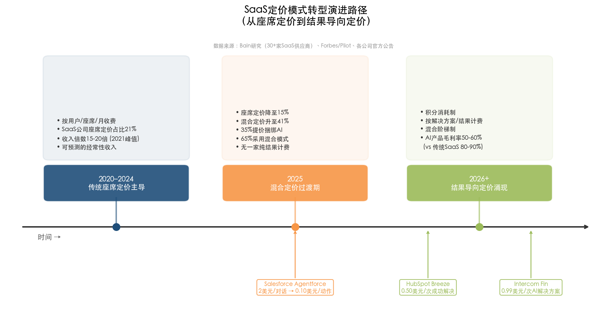

如图3-2所示，当前已涌现出三种具体的新定价范式：

**积分消耗制**——Salesforce的Flex Credits（每个AI动作0.10美元）和Adobe的生成式积分是典型代表。该模式本质上是将AI使用量货币化，定位于固定座席费和纯结果计费之间的过渡形态。

**按结果计费制**——HubSpot Breeze Customer Agent的每次成功解决对话0.50美元、Intercom Fin的每次AI解决方案0.99美元 [CMSWire报道](https://www.cmswire.com/customer-experience/hubspot-shifts-breeze-ai-agents-to-pay-per-result-pricing/ "CMSWire, 2026年4月") 代表了最为激进的商业模式转型方向：客户仅在AI实际交付结果时付费。

**混合阶梯制**——保留基础座席费以覆盖平台和数据存储成本，在此基础上叠加AI使用量或结果费用层。Bain的研究显示这是当前最为主流的过渡路径。

这一转型对SaaS公司的财务模型构成深层挑战。传统SaaS的毛利率通常在80-90%区间，而AI产品的毛利率因推理计算成本通常仅为50-60%，显著低于传统水平。这意味着即使AI功能带来收入增长，利润率可能反而承压。Salesforce的案例具有指标性意义：Agentforce ARR达8亿美元且增速高达169%，但公司整体收入增速仅为10%，说明AI新增收入尚未完全弥补传统座席收入增速放缓所带来的缺口。

## 3.7 中国视角：信创替代与AI冲击的双重叠加

中国软件行业面临一个全球市场所不具备的独特双重变量：一方面是政策驱动的信创国产替代浪潮，另一方面是全球性的AI技术冲击。两股力量的交汇塑造出与欧美市场显著不同的替代路径和竞争格局。

从信创替代的政策维度看，中国信创产业规模2023年约20,962亿元人民币，预计2027年达37,011亿元；国资委79号文明确要求2027年底前中央企业完成信创替代 [上海证券研报](https://pdf.dfcfw.com/pdf/H3_AP202502201643304336_1.pdf "上海证券2025年计算机行业投资策略")。这意味着在办公软件、数据库、操作系统、中间件等基础软件领域，国产替代的政策驱动力在短期内甚至超过了AI替代的技术驱动力。金蝶、用友等中国ERP/SaaS企业在信创政策的支撑下获得了一定的增长保障，但同时也面临AI原生竞争者的潜在冲击。

从AI冲击的技术维度看，中国AI Agent市场呈现爆发式增长态势——2023年市场规模554亿元，预计2028年达8,520亿元（CAGR 72.7%）[上海证券研报](https://pdf.dfcfw.com/pdf/H3_AP202502201643304336_1.pdf "AI Agent市场规模数据")。DeepSeek等国产大模型的崛起——其训练成本约为OpenAI的1/20——大幅降低了中国企业部署AI的门槛，有望加速AI对传统软件的替代进程。

中国市场的独特之处在于：信创政策在短期内为国产软件构筑了一道"政策护城河"，但这道护城河并不能抵御来自AI的技术冲击。当AI Agent能力与国产大模型深度结合后，中国软件行业面临的替代路径将从"外资软件被国产软件替代"的第一阶段，演变为"传统软件被AI原生应用替代"的第二阶段。后一轮替代的涉及范围和深度可能更为深远，因为它不受"国产vs外资"的边界约束，而是以效率和能力为唯一判准。

## 3.8 替代风险分层总览与关键判断

综合以上各细分领域的分析，图3-3以风险矩阵的形式呈现了软件各品类的AI替代风险等级与SaaSpocalypse期间资本市场冲击程度之间的映射关系。

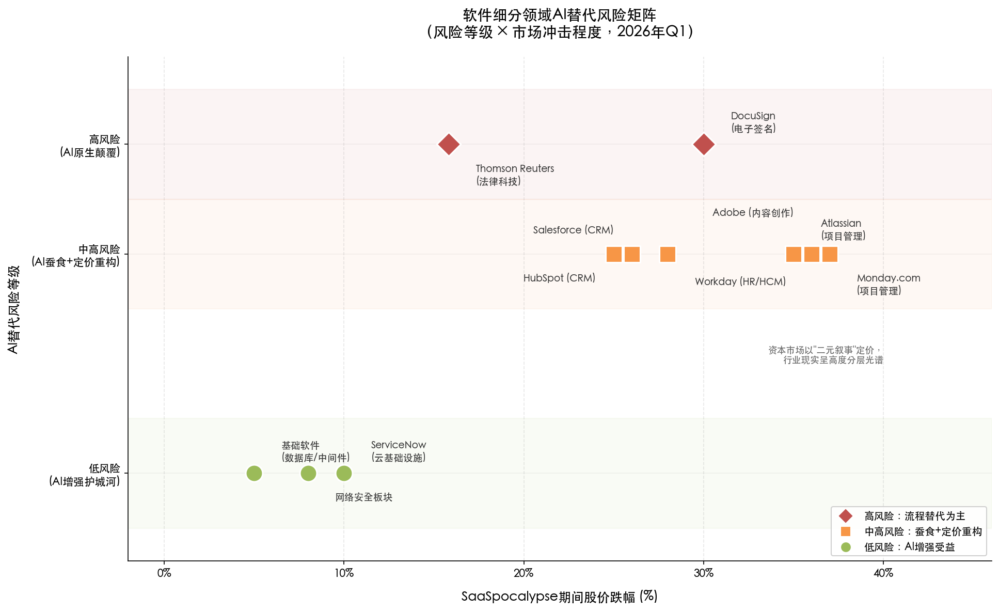

如图3-3所示，AI替代风险等级与股价跌幅之间虽然呈现一定的正相关性，但并非完全线性——部分中高风险品类（如Adobe，-36%）的跌幅甚至超过了高风险品类，反映出资本市场在恐慌抛售阶段对风险的差异化定价尚不充分。基于本章的系统性分析，我们对各品类形成如下分层判断：

**高替代风险**品类包括：法律科技（合同管理、法律研究）、电子签名与文档管理、初级客服及工单管理。这些领域的共同特征是核心工作流高度标准化、数据壁垒有限、AI Agent已具备端到端完成能力，替代机制以流程替代为主。

**中高替代风险**品类包括：CRM/销售自动化、项目管理/协作办公、HR/HCM（事务性模块）、内容创作与设计工具。这些领域面临AI蚕食与定价模式重构的双重压力，但龙头企业凭借数据资产、生态粘性和品牌信任尚有转型窗口。Salesforce、HubSpot、Workday、Adobe等企业的财务数据表明，积极嵌入AI的平台型企业在收入层面尚未出现崩塌，但估值已被大幅压缩。

**低替代风险**品类包括：基础软件（数据库、中间件、操作系统）、网络安全、云基础设施与DevOps。这些领域或处于技术栈底层具有极高切换成本，或需求因AI应用扩散而增加，或受合规监管驱动不受技术周期影响。

区分"AI增强"与"AI原生颠覆"两种结局的关键因素有三：一是**数据壁垒深度**——拥有客户专有业务数据的"记录系统"级软件更可能走向AI增强路径；二是**工作流复杂度**——跨部门、跨系统的复杂工作流不易被AI Agent单点替代；三是**监管合规粘性**——涉及财务审计、数据隐私、行业准入等合规要求的软件具有天然的替代阻力。

SaaSpocalypse所揭示的核心矛盾在于：资本市场以"二元叙事"（替代与否）为SaaS定价，而行业现实则呈现为一个高度分层、持续演进的风险光谱。当前证据表明，2026-2027年间最可能的情景并非传统SaaS的集体消亡，而是行业内部的剧烈分化——拥有深厚数据资产和行业Know-how的平台型企业将通过AI嵌入策略实现竞争力重塑，而功能单一、缺乏数据护城河的工具型软件则面临被AI原生应用直接替代的生存威胁。

# 第4章 软件从业者的职业冲击与角色重塑

## 4.1 招聘市场的寒流：从繁荣到冻结

2020至2022年间，全球科技行业经历了一场史无前例的招聘狂潮。疫情驱动的数字化浪潮使软件工程师成为最炙手可热的职业，薪资飙升、岗位激增、人才争夺白热化。然而，自2023年起这一繁荣急转直下。截至2025年7月，Indeed平台上美国软件工程师招聘量较疫情前基线（2020年2月）下降49%，已步入连续第三年的招聘冻结期；其中Android开发、Java开发、.NET开发等专项开发角色下降幅度超过60%，而机器学习工程师招聘量逆势上涨59% [Indeed Hiring Lab](https://www.hiringlab.org/2025/07/30/the-us-tech-hiring-freeze-continues/ "Indeed Hiring Lab, 2025年7月")。进入2026年初，新软件工程岗位发布量较2025年同期再降15%（LinkedIn数据），冻结态势并无解冻迹象 [Ravio薪酬报告](https://ravio.com/blog/software-engineer-salary-trends "Ravio 2026 Compensation Trends")。

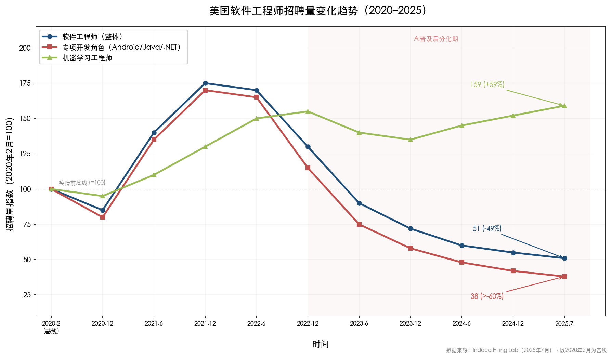

上图以2020年2月疫情前基线（=100）为起点，清晰呈现了三类岗位的剧烈分化：软件工程师整体招聘指数降至51（-49%），专项开发角色（Android/Java/.NET）降至38（>-60%），而机器学习工程师升至159（+59%）。传统开发岗位与AI岗位之间的"剪刀差"自2022年下半年起持续扩大，成为劳动力市场结构性转型的标志性图景。

裁员数据进一步印证了市场承压的深度。Crunchbase追踪显示，2025年约127,000名美国科技公司员工被裁；进入2026年，截至统计时点已有209起科技公司裁员事件影响约90,156人，日均裁员969人 [Crunchbase裁员追踪](https://news.crunchbase.com/startups/tech-layoffs/ "Crunchbase Tech Layoffs Tracker")。在这些裁员中，AI明确引起的裁员占比从2025年的5%上升至2026年的8%，虽然绝对比例尚不算高，但增速趋势值得密切关注 [TrueUp裁员追踪](https://www.trueup.io/layoffs "TrueUp Layoffs Tracker, 2026年数据")。

然而，"招聘冻结"与"在岗就业"之间呈现出显著的分裂格局。美国劳工统计局（BLS）数据显示，2024年计算机和数学类职业就业人数仅较上年微降2%，较2019年仍高出19% [Indeed Hiring Lab](https://www.hiringlab.org/2025/07/30/the-us-tech-hiring-freeze-continues/ "BLS Current Population Survey数据")。BLS《职业展望手册》（2025年8月更新）预测2024至2034年美国软件开发者就业将增长16%——从169.38万增至196.14万，增速"远快于所有职业平均水平"（后者仅3%），2024年软件开发者年薪中位数为133,080美元 [BLS职业展望手册](https://www.bls.gov/ooh/computer-and-information-technology/software-developers.htm "BLS OOH, 2025年8月更新")。Levels.fyi 2025年度薪酬报告进一步显示，美国软件工程师薪酬中位数达192,500美元（含基本工资、股票和奖金），头部科技公司高级工程师总薪酬普遍超过30万美元 [Levels.fyi](https://www.levels.fyi/t/software-engineer/locations/united-states "Levels.fyi 2025 End of Year Pay Report")。

综合来看，这种"在岗者稳定、求职者艰难"的二元格局表明，当前的就业压力主要源于企业系统性降低招聘速率，而非大规模裁撤在岗人员。对于已具备岗位与经验积累的资深工程师，短期影响尚属可控；但对于试图进入行业的新人而言，市场准入门槛已被大幅抬高。

## 4.2 初级工程师的"矿井金丝雀"困境

在招聘整体收缩的大背景下，初级和入门级工程师承受了最为集中的冲击——他们正在成为AI时代的"矿井金丝雀"（canaries in the coal mine），率先感知到结构性变化的寒意。

斯坦福大学数字经济实验室的研究提供了迄今最具说服力的大规模实证证据。该研究利用美国最大薪酬软件提供商的高频行政数据，发现自生成式AI广泛普及以来，22至25岁的早期职业工作者在AI暴露度最高的职业（如软件开发、客户服务）中经历了16%的相对就业下降，即便在控制了企业层面冲击之后这一结论依然成立。与之形成鲜明对比的是，从事相同职业的资深工作者就业保持稳定甚至继续增长 [斯坦福数字经济实验室](https://digitaleconomy.stanford.edu/publication/canaries-in-the-coal-mine-six-facts-about-the-recent-employment-effects-of-artificial-intelligence/ "Canaries in the Coal Mine, Chandar, Chen & Brynjolfsson, 2025年10月")。该研究还揭示了三个关键特征：其一，调整主要通过就业数量而非薪酬发生——初级工程师的薪资并未显著下降，下降的是可获得岗位的数量；其二，就业下降集中在AI更倾向于"自动化"而非"增强"人类劳动的职业中；其三，这些发现在排除科技公司和排除适合远程工作的职位后仍然稳健，排除了远程办公外包等混淆因素的干扰。

多项独立数据源印证了上述发现。Stack Overflow Blog引述的相关分析指出，入门级科技招聘同比下降25%，科技实习岗位较2023年下降30%；计算机工程专业毕业生失业率高达7.5%，已超过文科毕业生 [Stack Overflow Blog](https://stackoverflow.blog/2025/12/26/ai-vs-gen-z/ "AI vs Gen Z: The generational divide in tech employment, 2025年12月")。Ravio 2026年薪酬报告显示，初级和中级岗位（P1/P2）招聘率下降幅度更为惊人，达到73% [Ravio薪酬报告](https://ravio.com/blog/software-engineer-salary-trends "Ravio 2026 Compensation Trends")。

上述"分层冲击"背后的逻辑清晰可循：AI编码工具最先替代的是可被清晰定义、模式化程度高的任务——初始代码编写、简单bug修复、模板化前端组件开发、基础测试用例编写——而这些恰恰构成初级工程师的主要工作内容。当一名资深工程师借助GitHub Copilot或Cursor可以在数分钟内完成过去需要初级工程师数小时才能交付的代码时，团队对初级岗位的需求必然收缩。Anthropic Economic Index的数据佐证了这一判断：Claude Code上79%的对话属于"自动化"（即直接由AI完成任务）而非"增强"（协助人类完成任务），且前端/UI组件开发是用户最常委托AI构建的内容类型 [Anthropic](https://www.anthropic.com/news/impact-software-development "Anthropic Economic Index: AI's impact on software development, 2025年")。

更深层的隐患在于人才梯队的断裂风险。Gartner在2026年1月预测，到2030年30%的企业将因过度依赖AI而面临决策质量下降，初级员工受影响尤为显著——他们缺乏判断AI输出质量所需的经验积累，而AI自动化又减少了在岗实践学习的机会，由此削弱高级人才梯队的后备供给 [Gartner新闻稿](https://www.gartner.com/en/newsroom/press-releases/2026-1-27-chros-must-accelerate-learning-and-development-as-gartner-predicts-by-2030-30-percent-of-organizations-will-see-worse-decision-making-due-to-overreliance-on-ai "Gartner, 2026年1月27日")。如果当前阶段不投入资源培养初级工程师的AI协作能力和工程判断力，五年后高级工程师将从何而来——这是AI时代软件行业必须正视的结构性悖论。

## 4.3 "隐形失业"与效率范式重构

裁员和招聘冻结属于肉眼可见的冲击，而"隐形失业"（invisible unemployment）则构成更为隐蔽却影响深远的结构性变化。SaaStr在2026年初的分析中将其定义为科技行业的新常态：66%的CEO计划在2026年裁员或维持现有团队规模不变，企业并非大量解雇员工，而是通过冻结招聘、不替补离职人员、自然缩编等方式逐步压缩人力规模 [SaaStr](https://www.saastr.com/the-rise-of-invisible-unemployment-in-tech-2026-will-be-the-year-when-everything-really-changes/ "SaaStr, 2026年1月7日")。

更具变革意义的是效率指标的系统性重新定义。传统B2B软件公司以200,000美元ARR/员工作为健康运营基准，而CEO们现在普遍追求300,000至500,000美元ARR/员工的目标区间，AI领先公司甚至突破100万美元ARR/员工。这一效率跃升意味着，在同等收入规模下，企业所需人员可能减少50%至75% [SaaStr](https://www.saastr.com/the-rise-of-invisible-unemployment-in-tech-2026-will-be-the-year-when-everything-really-changes/ "ARR/员工效率指标分析")。Shopify CEO Tobi Lütke在2025年4月发布的标志性内部备忘录将这一理念推向前台：他要求所有团队在申请新增人员前必须证明"为什么AI无法完成这项工作"，将AI使用能力纳入绩效评估体系，公司已超过两年保持人员总数零增长 [CNBC报道](https://www.cnbc.com/2025/04/07/shopify-ceo-prove-ai-cant-do-jobs-before-asking-for-more-headcount.html "CNBC, 2025年4月7日")。

部分企业已迈出更为激进的步伐。Monday.com CEO公开宣布已用AI Agent替代全部100名SDR（销售发展代表），尽管此举随后引发股价暴跌37%并迫使公司撤回2027年18亿美元收入目标，但其风向标意义不容忽视——AI不仅在替代编码类角色，也正渗入销售、客服等软件公司的职能支撑岗位 [Taskade SaaSpocalypse分析](https://www.taskade.com/blog/saaspocalypse-explained "Monday.com CEO公开声明, 2026年3月")。Atlassian在2026年3月裁员约1,600人（占员工总数10%），其CEO在公开信中直言，AI已从根本上改变了公司所需的技能组合和岗位数量 [CNBC报道](https://www.cnbc.com/2026/03/11/atlassian-slashes-10percent-of-workforce-to-self-fund-investments-in-ai.html "CNBC, 2026年3月11日")。

"10x工程师"和"一人公司"叙事也在此背景下获得了新的现实基础。当AI工具使单个工程师能够独立完成过去需要整个小团队才能交付的工作量时，企业的最优团队规模势必面临调整。这并不意味着大型软件团队将就此消失，而是意味着每位团队成员需要覆盖更广的职责范围，软件团队的组织逻辑正从追求"深度分工"向追求"广度覆盖"迁移。

## 4.4 按角色分层的AI替代风险图谱

AI对不同软件工程角色的冲击并非均匀分布。基于现有证据，可以构建一个从高风险到低风险的分层图谱，以系统性地评估各类角色面临的替代压力与需求前景。

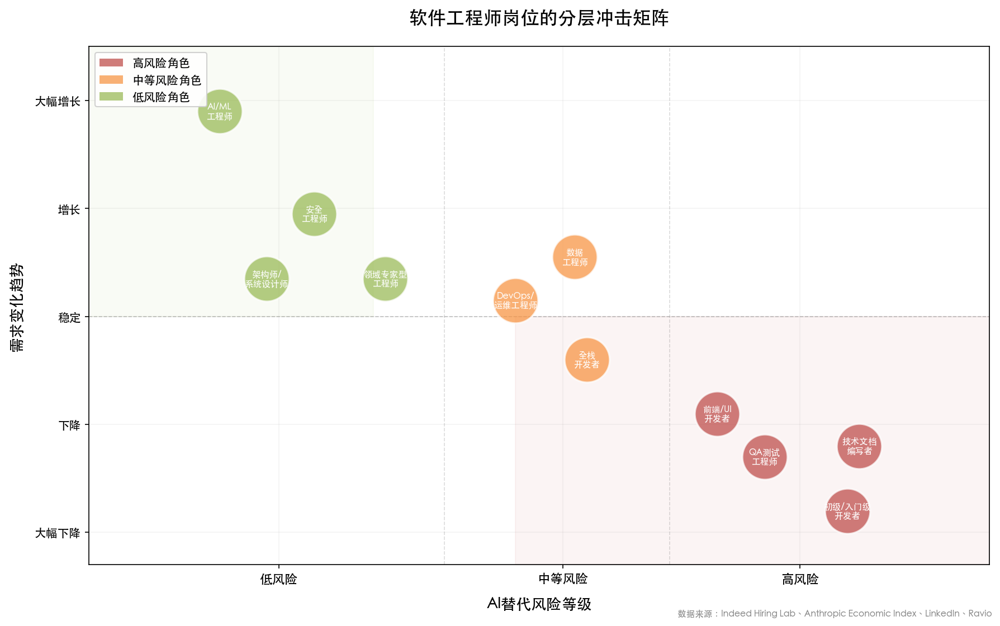

上图将11类软件工程角色按AI替代风险等级（横轴）与需求变化趋势（纵轴）进行矩阵定位，直观呈现了"高风险-需求萎缩"与"低风险-需求增长"两极分化的格局。

**高风险角色：初级/入门级开发者、QA测试工程师、前端/UI开发者、技术文档编写者。** 初级开发者面临的冲击已在4.2节详述。QA测试工程师同样处于高风险区间——AI在自动化测试用例生成、回归测试执行、缺陷检测等环节的能力正在快速成熟，传统手工测试岗位的缩编压力持续加大。前端/UI组件开发是Anthropic Economic Index中用户最常委托AI构建的内容类型，大量标准化的界面组件、响应式布局、交互动效已可由AI高效生成 [Anthropic](https://www.anthropic.com/news/impact-software-development "Anthropic Economic Index")。技术文档编写——需求文档、API文档、用户指南——则是大语言模型的天然强项。上述角色面临的共同特征是：任务边界清晰、输出格式标准化、对深层领域知识的依赖程度较低。

**中等风险角色：全栈开发者、DevOps/运维工程师、数据工程师。** 全栈开发者因覆盖前后端完整技术栈，需要跨系统整合能力，单纯AI替代难度较高；但其中偏前端的工作仍面临显著压力。DevOps/运维工程师在日常监控、告警处理、基础设施配置等重复性任务上面临AI自动化，但在复杂故障排查、灾难恢复和安全运维方面仍需深度人类判断。Stack Overflow 2025调查数据显示，76%的开发者不计划在部署与监控环节使用AI，反映出从业者对高责任任务AI化的显著抵触 [Stack Overflow 2025调查](https://survey.stackoverflow.co/2025/ai "各环节AI采用意愿数据")。数据工程师在数据清洗、管道构建等环节面临AI替代，但在数据治理架构设计和跨系统数据资产管理方面仍保有较高壁垒。

**低风险角色：架构师/系统设计师、AI/ML工程师、安全工程师、领域专家型工程师。** 这些角色的共同特征在于：深度领域知识、系统级抽象思维、跨团队协调能力以及对不确定性的判断力。架构师的核心价值在于权衡取舍（trade-off analysis），而这恰恰是当前AI最为薄弱的能力维度。安全工程师面对的是攻防博弈中的非确定性问题，需要持续的对抗性思维。领域专家型工程师（如金融系统工程师、医疗信息化工程师、工业控制系统工程师）的价值锚定于对特定行业逻辑的深度理解，这种知识的稀缺性和合规约束使其难以被通用AI工具替代。

需要强调的是，上述分层反映的是"缩编"概率而非"消亡"概率。即便在高风险类别中，更可能发生的情形是团队规模缩小和角色职能转变——例如，一个十人QA团队可能缩减为三人，但这三人将负责AI测试系统的设计、监督和边缘案例处理，而非被完全裁撤。

## 4.5 新兴角色的崛起与AI薪资溢价

在传统角色承压的同时，一批新兴岗位正以前所未有的速度涌现，形成劳动力市场的另一极。AI/ML工程师的招聘量与市场整体走势形成鲜明反差：Indeed平台上机器学习工程师招聘量较疫情前仍上涨59%，是所有工程类别中少数保持正增长的角色 [Indeed Hiring Lab](https://www.hiringlab.org/2025/07/30/the-us-tech-hiring-freeze-continues/ "ML工程师招聘量逆势增长")。LinkedIn数据进一步显示，AI专项岗位需求同比增长49%，AI/ML角色招聘量同比增长88%，位居所有工程类别增速之首 [LinkedIn Skills on the Rise](https://www.interviewquery.com/p/linkedin-ai-engineering-fastest-growing-skills-2026 "LinkedIn Skills on the Rise 2026报告")。

这种供需结构性失衡直接推高了AI工程师的薪资溢价。Ravio 2026年薪酬报告显示，IC层级AI工程师的薪资溢价达到12%；美国LLM工程师平均基本薪资约209,000美元 [Ravio薪酬报告](https://ravio.com/blog/software-engineer-salary-trends "AI Pay Premium数据")。相较于BLS统计的美国软件开发者年薪中位数133,080美元，AI工程师薪资高出约57%，溢价幅度显著。

新兴角色的类型也在快速分化与细化。除核心的AI/ML工程师外，多个细分方向正在成型：AI安全工程师（负责模型安全评估、对齐验证、红队测试）、AI产品经理（承担AI能力与业务需求之间的翻译与协调职能）、Prompt工程师（在大模型应用中优化交互策略与输出质量）、AI基础设施工程师（负责训练集群管理、推理优化、MLOps流水线建设）等。值得关注的是，Prompt工程师这一角色的长期可持续性存在不确定性——随着模型理解自然语言能力的持续提升，专门的Prompt优化需求可能逐步被模型本身吸收，这一角色或将从独立岗位回归为通用工程能力的一个维度。

## 4.6 中国软件从业者的双重叠加

中国软件从业者面临的局面具有独特的复杂性：AI技术冲击与宏观经济结构性调整两股力量叠加作用，使得准确区分各自的独立贡献十分困难。2025年11月，中国16至24岁（不含在校生）青年失业率为16.9%，主要源于宏观经济与结构性调整因素，而非AI直接驱动 [经济观察网](http://www.eeo.com.cn/2026/0126/782851.shtml "中欧国际工商学院韩践教授分析, 2026年1月26日")。

然而，AI带来的结构性分化信号同样清晰且剧烈。脉脉发布的《2026年1—2月中高端人才求职招聘洞察》报告显示，2026年1至2月中国新经济行业新发岗位量同比增长12.77%，其中AI相关岗位量同比暴涨12倍；AI岗位在新经济全部岗位中的占比从2025年同期的2.29%跃升至26.23%，几近占据新经济招聘市场的四分之一。AI岗位平均月薪达60,738元人民币，较新经济行业平均月薪高出约26%。AI人才呈现供不应求格局，岗位人才供需比仅为0.97，远低于新经济行业整体的1.79 [光明网/人民网](https://m.gmw.cn/2026-03/10/content_1304371058.htm "脉脉2026春招洞察报告, 2026年3月10日")。其中，高性能计算工程师以0.15的供需比成为最紧俏岗位，相当于约7个岗位争抢1名人才。

经济观察网援引的数据进一步描绘了这幅分化图景：中国算法工程师招聘需求同比增长80%，AI产品经理增长178% [经济观察网](http://www.eeo.com.cn/2026/0126/782851.shtml "AI相关岗位增长数据")。这与全球市场呈现出高度一致的结构性特征——传统软件开发岗位收缩与AI专项岗位爆发并行，分化程度甚至较美国市场更为剧烈。

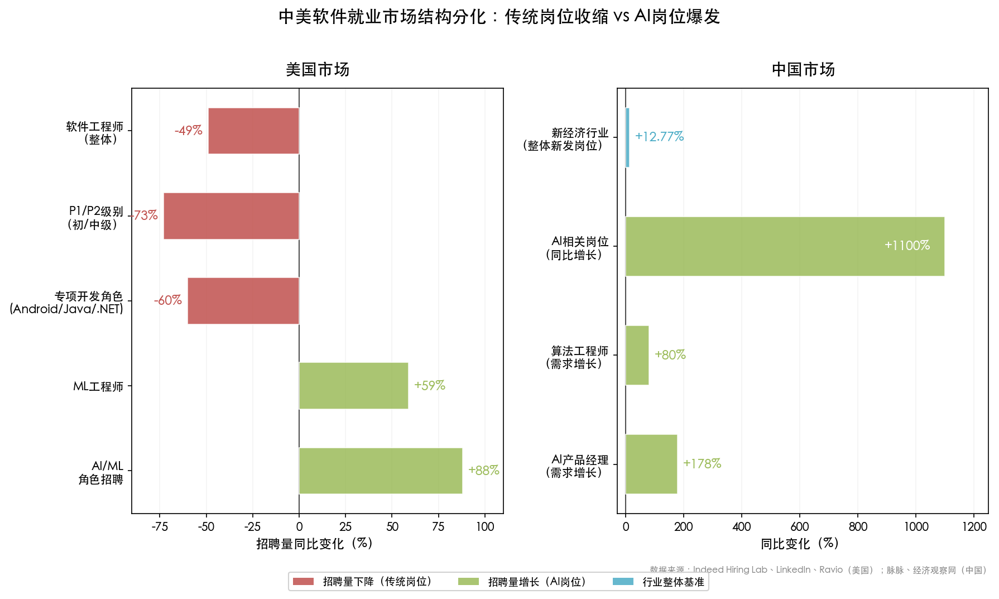

上图以双面板对比的形式，直观呈现了中美两国"传统岗位收缩、AI岗位爆发"的全球性结构分化特征。美国市场中软件工程师整体招聘下降49%、P1/P2初中级岗位下降73%，而ML工程师逆势增长59%、AI/ML角色增长88%；中国市场中新经济行业整体新发岗位增长12.77%，AI相关岗位同比增长达1100%，算法工程师增长80%，AI产品经理增长178%。两国市场的分化方向高度趋同，但中国AI岗位的爆发倍率显著更高。

中国市场的另一独特因素是信创国产替代带来的缓冲效应。国资委79号文要求2027年底前中央企业完成信创替代，这一政策性需求为国产软件企业及其从业者提供了一定的就业安全垫。但信创替代创造的更多是迁移、适配和运维类岗位，并未从根本上改变AI对核心研发岗位的替代压力。在DeepSeek等国产大模型以约OpenAI 1/20的训练成本实现可比性能的背景下，中国AI原生工具的快速普及可能加速——而非延缓——AI对传统软件岗位的冲击进程。

## 4.7 职业冲击的深层逻辑：自动化与增强的分野

综合以上分析，我们认为理解AI对软件从业者影响的关键框架在于区分"自动化"（automation）和"增强"（augmentation）两条路径。斯坦福数字经济实验室的研究明确指出，就业下降集中在AI更倾向于"自动化"而非"增强"人类劳动的职业中 [斯坦福数字经济实验室](https://digitaleconomy.stanford.edu/publication/canaries-in-the-coal-mine-six-facts-about-the-recent-employment-effects-of-artificial-intelligence/ "自动化vs增强的差异化影响")。这一发现与OECD企业案例研究的结论一致：AI落地后更常见的是岗位结构和工作内容的变化，而非大规模净裁撤 [经济观察网](http://www.eeo.com.cn/2026/0126/782851.shtml "OECD研究结论")。

这意味着，对于大多数软件从业者而言，最可能的演化方向并非"被AI取代"，而是"与AI协作的方式发生根本性改变"。资深工程师的角色将从"写代码的人"转向"审核AI代码、设计系统架构、做出技术决策的人"；初级工程师的入职门槛将从"能写基础代码"提升为"能有效驾驭AI工具并判断其输出质量"；技术领导者的核心能力将从"管理人类团队"扩展为"编排人机混合团队"。

当前证据整体支持"AI增强为主、部分岗位自动化替代"的混合路径。但须保持警惕的是，AI能力的提升速度正在持续加快——SWE-bench Verified排行榜上AI编码代理的得分从2024年初的约20%跃升至2026年2月的79.2%，仅用两年时间便接近翻了四倍。如果这一能力跃升速度延续，"自动化"侵入"增强"领地的进程可能快于多数预期，当前被归入中等风险的角色也可能在未来12至18个月内面临风险等级的重新评估。

# 第5章 应对策略——企业、从业者与生态系统的适应路径

前四章的分析勾勒出一幅高度动态的全景图：AI正以超出预期的速度重塑软件行业的开发方式、产品形态、竞争格局和人才结构。然而，诊断变化本身尚不足以指导利益相关者的行动决策。本章从企业、从业者和生态系统三个层面，系统梳理应对AI冲击的适应路径与实践范式。核心论点在于：在当前"AI增强为主、部分替代并存"的混合演进路径下，成功的应对策略并非抗拒AI，而是主动拥抱AI并重新定义自身在人机协同体系中的不可替代价值。

## 5.1 企业转型：从AI嵌入到商业模式重构

### 5.1.1 "AI增强"路径的成功范式

在AI浪潮冲击下，软件企业的首要生存策略是将AI能力深度嵌入现有产品与工作流，从"被AI替代"的被动方转为"借AI增强"的主动方。过去12个月的市场表现为这一策略提供了充分的实证支撑。

Salesforce堪称"AI增强"路径最具说服力的范例。其AI Agent产品Agentforce在FY2026财年实现ARR 8亿美元，同比增长169%；公司FY2026全年收入达415.25亿美元（同比+10%），并给出FY2027收入指引458至462亿美元（同比+10%至+11%） [Salesforce FY26 Q4财报](https://investor.salesforce.com/news/news-details/2026/Salesforce-Delivers-Record-Fourth-Quarter-Fiscal-2026-Results/default.aspx "Salesforce官方新闻稿, 2026年2月25日")。更关键的是，Agentforce已在多家企业客户中产生可量化的业务成效：出版巨头Wiley部署后案例解决率提升超过40%，投资回报率达213%；Fisher & Paykel将自助服务率从40%提升至70%；1-800Accountant在2025年报税周期间70%的聊天交互由Agentforce自主完成；OpenTable上线三周后73%的餐厅网页查询由AI Agent处理，较此前工具提升50%；Asymbl的目标客户触达规模扩大427%，年节省57.5万美元 [Salesforce客户案例集](https://www.salesforce.com/news/stories/agentforce-customer-success-stories/ "Agentforce in Action: Customer Success Stories, 2025年8月更新")。

ServiceNow展现了同等路径的有效性。2025年全年订阅收入达128.83亿美元（同比+21%），Now Assist净新年度合同价值在Q4同比翻倍以上 [ServiceNow Q4 2025财报](https://newsroom.servicenow.com/press-releases/details/2026/ServiceNow-Reports-Fourth-Quarter-and-Full-Year-2025-Financial-Results-Board-of-Directors-Authorizes-Additional-5B-for-Share-Repurchase-Program/default.aspx "ServiceNow官方新闻稿, 2026年1月28日")。ServiceNow自身作为"客户零号"部署Now Assist的经验颇具参考价值：从单一的IT事件摘要功能起步，18个月内扩展至50多个生产用例，覆盖IT、客服、HR、开发等多个职能领域。在量化成效方面，ITSM座席每次使用Now Assist节省4至6分钟，CSM座席节省12至16分钟；在员工门户搜索环节，Now Assist将每次成功搜索时间从约2.5分钟缩短至30秒，员工自助偏转率提升14% [ServiceNow Now on Now白皮书](https://www.servicenow.com/content/dam/servicenow-assets/public/en-us/doc-type/resource-center/white-paper/wp-now-on-now-our-now-assist-implementation.pdf "Now on Now: Our Now Assist Implementation Lessons Learned")。

上述两个案例揭示了"AI增强"策略成功的共同特征：企业拥有深度领域知识壁垒、高客户切换成本、丰富的专有数据资产以及成熟的企业级渠道。在这些条件下，AI并非竞争对手，而是放大器——它将现有护城河加深加宽，而非绕过护城河。

### 5.1.2 转型阵痛的警示案例

然而，并非所有转型都能顺利推进。Atlassian在2026年初成为"AI转型阵痛"的标志性案例：公司报告了历史上首次企业座席数量下降，2月股价下跌约36%，3月裁员约1,600人（占员工总数10%），CTO随之离职。CEO在公开信中直言：AI改变了公司需要的技能组合和岗位数量 [Atlassian官方博客](https://www.atlassian.com/blog/announcements/atlassian-team-update-march-2026 "CEO公开信, 2026年3月11日") [CNBC报道](https://www.cnbc.com/2026/03/11/atlassian-slashes-10percent-of-workforce-to-self-fund-investments-in-ai.html "CNBC, 2026年3月11日")。Atlassian的困境在于，项目管理和协作工具处于Bain所定义的"战场"象限——AI蚕食SaaS的前沿地带，产品功能可被AI Agent直接整合进工作流，座席价值面临根本性动摇。

Klarna的经历则提供了另一维度的警示。2024年Klarna用AI客服替代约700名人工客服后，服务质量出现下降，2025年5月不得不恢复人工招聘 [Fortune报道](https://fortune.com/2025/05/09/klarna-ai-humans-return-on-investment/ "Fortune, 2025年5月9日")。这一"过度替代后纠偏"的案例表明，在涉及复杂情感互动、判断力和灵活应变的场景中，AI完全替代人类的时机尚未成熟。IBM全球调查同样发现，仅25%的AI项目能够兑现ROI承诺，多数项目卡在从试点到规模化的"最后一公里"。

上述正反案例共同指向一个核心结论：AI转型的成败不仅取决于技术选择，更取决于企业对自身产品在AI时代核心价值的准确研判。

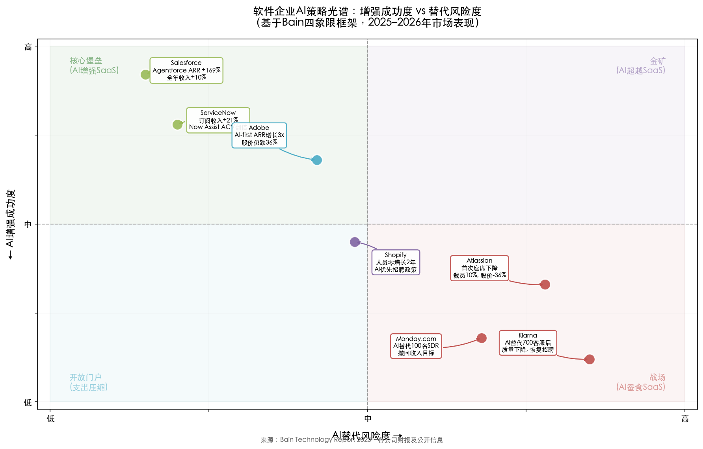

上图基于Bain四象限框架，将代表性软件企业按"AI增强成功度"和"AI替代风险度"两个维度进行定位。处于"核心堡垒"象限的Salesforce和ServiceNow凭借深度领域壁垒实现了AI增强的正向循环，而处于"战场"象限的Atlassian和Monday.com则因产品功能易被AI Agent替代而陷入结构性困境。

### 5.1.3 定价模式的结构性重塑

AI对软件商业模式最直接的冲击体现在定价体系的根本变革上。传统按座席计费模式正在快速萎缩：SaaS公司中采用按座席定价的比例在12个月内从21%降至15%，混合定价从27%飙升至41% [Forbes报道](https://www.forbes.com/sites/petercohan/2026/02/06/saaspocalypse-now-ai-is-disrupting-saas---but-not-all-software-is-doomed/ "Forbes引用Pilot与Jason Lemkin数据")。当AI Agent能够自主完成一名客服座席或SDR的大部分工作时，"按人头收费"的逻辑基础即被动摇——客户不会为一个AI Agent支付与人类员工等同的座席费用。

Bessemer Venture Partners（BVP）在2026年2月发布的《AI定价与货币化手册》中系统梳理了三种新兴AI商业模式：其一为Copilots模式，沿用按座席或消耗量定价，AI作为人类的辅助工具收费；其二为Agents模式，按工作流完成或结果交付定价——Intercom的AI客服Fin以每次AI解决方案0.99美元计费即为典型；其三为AI-enabled Services模式，按产出计费，本质上将软件转化为服务。BVP同时指出，AI产品毛利率通常仅50%至60%，远低于传统SaaS的80%至90%，这意味着转型企业需要在收入增长和利润率之间做出艰难取舍 [BVP Atlas](https://www.bvp.com/atlas/the-ai-pricing-and-monetization-playbook "Bessemer AI Pricing Playbook, 2026年2月10日")。

Salesforce的定价演进堪称这一转型的缩影。从最初Agentforce每次对话2美元的固定价格，到后来推出每个AI动作0.10美元的Flex Credits弹性定价体系，Salesforce正在探索一种兼顾可预测性与使用弹性的混合模式 [Salesforce官方公告](https://www.salesforce.com/news/press-releases/2025/05/15/agentforce-flexible-pricing-news/ "Salesforce Agentforce弹性定价公告, 2025年5月")。Adobe则从传统座席定价向"生成式积分"定价体系转型，FY2026 Q1收入64亿美元（同比+12%），AI-first ARR同比增长超过三倍，Firefly订阅和积分包期末ARR环比增长75%——尽管股价仍较历史高点下跌约36%，反映出市场对Midjourney等AI原生竞争者的持续担忧 [Adobe Q1 FY2026新闻稿](https://news.adobe.com/news/2026/03/adobe-q1fy26-financial-results "Adobe官方, 2026年3月12日")。

Bain & Company对30多家引入GenAI功能的传统SaaS供应商的研究发现，约35%选择提价捆绑AI，约65%采用混合定价，没有一家完全转向纯使用量或结果计费模式 [Bain研究](https://www.bain.com/insights/per-seat-software-pricing-isnt-dead-but-new-models-are-gaining-steam/ "Bain Per-Seat Pricing研究, 2025年10月")。这一发现表明定价转型是一个渐进过程，而非一夜之间的范式切换。

BVP提出的另一个关键预警值得高度关注：2026年将出现"续约悬崖"（Renewal Cliff）。2025年大多数企业在"不惜一切代价采用AI"的心态下签约试点项目，当2026年首次进入续约周期时，定价必须反映实际交付价值而非潜力承诺 [BVP Atlas](https://www.bvp.com/atlas/the-ai-pricing-and-monetization-playbook "Renewal Cliff预警")。鉴于PwC《2026 CEO Survey》显示56%的CEO报告过去12个月AI投资既未增加收入也未降低成本，续约悬崖可能在2026年下半年成为AI软件市场的重大风险因子。

## 5.2 从业者适应：构建AI时代的核心竞争力

### 5.2.1 技能栈的根本性重构

第四章详细描述了软件从业者面临的就业冲击。面对这一冲击，被动等待是最危险的策略。当前证据指向一条清晰的技能演进路径：从"编码能力至上"向"AI协同能力+领域专业知识+系统思维"的复合能力模型迁移。

这一判断的逻辑链条可从三个层面加以解析。第一，纯编码执行能力正在快速贬值。当AI编码工具已能自主解决SWE-bench Verified上79.2%的真实GitHub issue、Google超过30%的新代码由AI生成、GitHub平台上46%的代码在AI辅助下完成时，"会写代码"本身不再是稀缺能力，而是基础素养——如同"会打字"之于二十年前的办公室工作。第二，系统级思维、架构设计、需求理解等"元能力"的价值正在显著上升。Stack Overflow 2025调查显示76%的开发者不计划在部署与监控中使用AI，69%不计划在项目规划中使用AI [Stack Overflow 2025调查](https://survey.stackoverflow.co/2025/ai "各环节AI采用意愿数据")——这些高责任、高不确定性环节恰恰是人类判断力最不可替代之处。第三，AI协同能力正在成为新的核心技能维度。JetBrains 2025年调查显示85%的开发者已定期使用AI工具进行编码和开发 [JetBrains开发者生态2025](https://blog.jetbrains.com/research/2025/10/state-of-developer-ecosystem-2025/ "24,534名开发者调查")，不会使用AI工具的开发者将面临与不会使用IDE的开发者类似的竞争劣势。

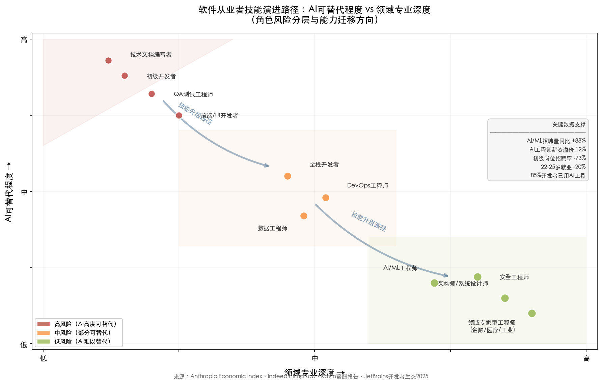

上图将11类软件角色按"AI可替代程度"和"领域专业深度"两个维度进行分层定位。初级开发者、QA测试工程师等处于高风险区，而架构师、AI/ML工程师和领域专家型工程师则因深厚的专业壁垒处于低风险区。箭头所示的技能迁移路径，即为当前从业者应对AI冲击的核心策略方向。

Shopify CEO Tobi Lütke在2025年4月发布的内部备忘录为这一趋势提供了企业视角的印证：所有团队在申请新增人员前必须证明"为什么AI无法完成这项工作"，AI使用能力被纳入绩效评估体系 [CNBC报道](https://www.cnbc.com/2025/04/07/shopify-ceo-prove-ai-cant-do-jobs-before-asking-for-more-headcount.html "CNBC, 2025年4月7日")。当AI熟练度成为绩效评估标准而非可选加分项时，技能转型的紧迫性不言而喻。

### 5.2.2 企业AI Upskilling的实践与成效

个人技能转型需要企业层面的系统性支撑。BCG在2026年2月发布的《AI转型即劳动力转型》报告中提出了一个关键发现：AI转型价值的"10-20-70"结构——约10%来自算法本身，20%来自技术实施，70%来自员工重新赋能和组织变革 [BCG报告](https://www.bcg.com/publications/2026/ai-transformation-is-a-workforce-transformation "BCG Build for the Future x AI 2025全球研究, 2026年2月4日")。这一比例意味着，企业在AI技术投入上的大部分潜在价值，取决于能否有效地对人进行重新赋能。

BCG将企业按AI成熟度分为"未来型"（约占5%）和"落后型"，二者在多个维度上呈现显著差异："未来型"企业三年总股东回报（TSR）为落后者的4倍，计划对超过50%的员工进行AI技能提升培训（落后者仅20%），并已在战略层面将AI融入业务流程而非仅作为技术实验。

General Assembly《2026年科技人才状况》报告的数据进一步印证了这一判断：83%的HR领导者认为企业成功现在更多依赖于"提升现有员工技能"而非"招聘新人才"；61%的组织已观察到入门级角色被自动化，另有32%认为此趋势即将发生 [General Assembly报告](https://generalassemb.ly/blog/state-of-tech-talent-2026/ "State of Tech Talent 2026, 2026年2月25日")。ServiceNow的实践经验表明，AI技能提升并不一定需要招聘新的机器学习工程师——通过对现有平台工程师和产品经理进行跨领域知识培训，企业即可成功实施GenAI用例 [ServiceNow Now on Now白皮书](https://www.servicenow.com/content/dam/servicenow-assets/public/en-us/doc-type/resource-center/white-paper/wp-now-on-now-our-now-assist-implementation.pdf "Now on Now实施经验")。

### 5.2.3 新兴角色的入场窗口

尽管传统软件工程招聘持续冻结，AI相关角色却呈现逆势爆发态势。Indeed平台数据显示机器学习工程师招聘量较疫情前仍上涨59%，AI/ML角色招聘量同比增长88% [Indeed Hiring Lab](https://www.hiringlab.org/2025/07/30/the-us-tech-hiring-freeze-continues/ "Indeed Hiring Lab, 2025年7月") [LinkedIn Skills on the Rise](https://www.interviewquery.com/p/linkedin-ai-engineering-fastest-growing-skills-2026 "LinkedIn Skills on the Rise 2026报告")。IC层级AI工程师的薪资溢价达12%，美国LLM工程师平均基本薪资约209,000美元，较软件开发者年薪中位数133,080美元高出约57% [Ravio薪酬报告](https://ravio.com/blog/software-engineer-salary-trends "AI Pay Premium数据")。

在中国市场，AI相关岗位的爆发态势更为显著。脉脉数据显示，2026年1至2月中国新经济行业AI相关岗位量同比增长12倍，在全部新经济岗位中的占比从2.29%跃升至26.23%；AI岗位平均月薪达60,738元人民币，较新经济行业平均水平高约26%。高性能计算工程师以0.15的供需比成为最紧俏岗位，相当于约7个岗位争抢1名人才 [光明网/人民网](https://m.gmw.cn/2026-03/10/content_1304371058.htm "脉脉2026春招洞察报告, 2026年3月10日")。

对从业者而言，当前正处于AI技能转型的关键窗口期。AI工程师、AI安全工程师、AI产品经理等新兴角色的需求仍在快速增长，但随着AI工具本身能力的持续提升（如Prompt工程可能被模型自身吸收），部分窗口期并非无限延长。最稳健的策略是将AI能力叠加在深度领域知识之上——金融系统+AI、医疗信息化+AI、工业控制+AI——这种复合能力形成的壁垒远高于纯AI技能本身。

### 5.2.4 初级从业者的破局之道

第四章揭示了初级工程师面临的"矿井金丝雀"困境：22至25岁软件开发者就业较峰值下降近20%，初级和中级岗位招聘率下降73%。Gartner预测到2030年30%的企业将因过度依赖AI而面临决策质量下降，其中尤其影响初级员工——他们缺乏判断AI输出质量所需的经验积累，AI自动化又减少了在岗学习机会 [Gartner新闻稿](https://www.gartner.com/en/newsroom/press-releases/2026-1-27-chros-must-accelerate-learning-and-development-as-gartner-predicts-by-2030-30-percent-of-organizations-will-see-worse-decision-making-due-to-overreliance-on-ai "Gartner, 2026年1月27日")。

面对这一结构性挑战，初级从业者需要采取差异化的入场策略。其一，主动拥抱AI并将其作为"杠杆"而非"威胁"——一名初级工程师如果能借助AI工具达到中级工程师的产出水平，其竞争力反而获得提升。其二，聚焦AI最弱的能力区间——需求理解、跨团队沟通、用户研究、复杂系统调试——而非在AI最强的区间（代码生成、模板化前端开发）与机器竞争。其三，选择AI渗透率较低的垂直领域积累领域知识——工业软件、医疗信息化、金融合规系统等领域的高门槛和高合规要求，为初级工程师提供了积累不可替代经验的缓冲空间。

## 5.3 开源生态与平台竞合：价值链的重新分配

### 5.3.1 开源AI的颠覆性演进

开源AI模型正沿"经典颠覆路径"对闭源AI巨头发起结构性挑战。加州大学伯克利分校《加州管理评论》的分析指出，开源模型（DeepSeek-R1、Qwen3、LLaMA 4等）在三个维度上构成系统性威胁：推理成本为闭源API的10%至30%，可基于企业专有数据微调形成差异化壁垒，并有效消除数据主权风险 [加州管理评论](https://cmr.berkeley.edu/2026/01/the-coming-disruption-how-open-source-ai-will-challenge-closed-model-giants/ "California Management Review Insights, 2026年1月9日")。DeepSeek等中国大模型的训练成本约为OpenAI同类模型的1/20，这种成本优势正在从学术圈向企业级应用快速扩散。

对软件企业而言，开源AI生态的崛起产生双重影响。一方面，它显著降低了AI嵌入成本——中小型软件企业无需依赖昂贵的闭源API即可将AI能力集成到产品中，有助于缩小大企业与中小企业之间的AI能力鸿沟。另一方面，它改变了价值链分配格局——当基础模型能力逐步"民主化"后，竞争壁垒从"谁拥有最好的模型"转向"谁拥有最好的数据"和"谁拥有最深的领域理解"。

值得关注的是，Meta作为开源AI最重要的推动者之一，已出现从完全开源向部分闭源转型的信号 [加州管理评论](https://cmr.berkeley.edu/2026/01/the-coming-disruption-how-open-source-ai-will-challenge-closed-model-giants/ "Meta开源策略变化")。这一转向表明，即便是最坚定的开源倡导者也在重新评估完全开放所带来的商业可持续性风险。对于依赖开源模型构建产品的软件企业而言，供应商锁定风险并未消失，只是从闭源API供应商转移到了开源模型维护者的战略决策上。

### 5.3.2 云厂商与AI平台商的竞合重构

四大超大规模云厂商（Alphabet、Microsoft、Meta、Amazon）2026年资本开支合计预计接近7,000亿美元（较2025年增长超过60%），但自由现金流面临空前压力——Morgan Stanley预测Amazon 2026年FCF为负170亿美元，Pivotal Research预计Alphabet FCF从733亿美元骤降至82亿美元 [CNBC报道](https://www.cnbc.com/2026/02/06/google-microsoft-meta-amazon-ai-cash.html "CNBC, 2026年2月")。这种"不惜代价抢占AI基础设施"的军备竞赛，正在深刻重塑云厂商与软件生态之间的关系。

对独立软件供应商（ISV）而言，云厂商的AI军备竞赛是一把双刃剑。短期来看，云厂商大量AI基础设施投入降低了AI推理和训练的单位成本，使ISV能以更低门槛集成AI能力。但中长期而言，云厂商自身的AI平台能力不断增强（如AWS Bedrock、Azure AI Services、Google Cloud Vertex AI），可能逐步向上层应用侵蚀，对缺乏领域壁垒的中间层软件形成"挤压效应"。

Goldman Sachs预测AI Agent驱动的应用软件市场规模至2030年将增至7,800亿美元（13% CAGR） [Deloitte软件行业展望](https://www.deloitte.com/us/en/insights/industry/technology/technology-media-telecom-outlooks/software-industry-outlook.html "Deloitte 2026展望转引Goldman Sachs")。这一增量市场的价值将如何在云厂商、AI模型提供商、应用层软件企业和系统集成商之间分配，是未来18个月生态竞争的核心命题。Gartner预测到2026年底将有40%的企业应用集成任务专用AI Agent（2025年不到5%） [Gartner新闻稿](https://www.gartner.com/en/newsroom/press-releases/2025-08-26-gartner-predicts-40-percent-of-enterprise-apps-will-feature-task-specific-ai-agents-by-2026-up-from-less-than-5-percent-in-2025 "Gartner, 2025年8月26日")，这一爆发式增长意味着生态位的快速重新划分已在紧锣密鼓地进行中。

## 5.4 监管框架的全球分化与合规应对

### 5.4.1 三大经济体的AI治理路径分化

全球AI监管格局正沿三条截然不同的路径演化，对软件行业产生深远而差异化的影响。

**欧盟**采取"预防性规制"路线。EU AI Act的核心执法节点为2026年8月2日，届时高风险AI系统的全部合规义务正式生效。违规处罚力度极为严厉——最高可达全球年营业额的7%或3,500万欧元 [欧盟委员会AI Act服务台](https://ai-act-service-desk.ec.europa.eu/en/ai-act/timeline/timeline-implementation-eu-ai-act "EU AI Act官方实施时间线")。CCIA研究中心的经济研究显示，欧盟数字法规整体已对美国企业造成每年高达976亿美元的成本和收入损失（保守估计389亿美元），其中直接合规成本每年达22亿美元 [CCIA研究中心](https://ccianet.org/news/2025/07/new-study-finds-eu-digital-regulations-cost-u-s-companies-up-to-97-6-billion-annually/ "CCIA Research Center, 2025年7月")。随着EU AI Act全面执行，这一数字可能进一步攀升。

**美国**则采取"促进创新、联邦统一、最小干预"路线。2026年3月，白宫发布《国家AI立法框架》，明确以促进发展为首要目标 [白宫官方声明](https://www.whitehouse.gov/releases/2026/03/president-donald-j-trump-unveils-national-ai-legislative-framework/ "白宫, 2026年3月20日")。美国的监管哲学与欧盟形成鲜明对比：欧盟侧重事前预防，美国侧重事后纠偏；欧盟统一立法，美国行业自律为主。对于跨大西洋运营的软件企业而言，这种监管差异意味着需要维护两套不同的合规体系，运营复杂性和成本随之增加。

**中国**正从"补丁式治理"向"体系化规制"转型。2025年10月，十四届全国人大常委会第十八次会议通过《网络安全法》修改决定，首次在基础性法律中写入AI治理专门条款，新修订的《网络安全法》已于2026年1月1日施行。2026年全国两会期间，"打造智能经济新形态"首次写入政府工作报告，司法部部长贺荣明确表示将加快研究推进人工智能领域立法。最高人民法院同步推进，正在起草《助推人工智能健康有序发展的指导意见》和《数据权益司法保护意见》 [人民政协网](http://www.rmzxw.com.cn/c/2026-04-02/3895401.shtml "人民政协报, 2026年4月2日")。截至2026年2月，国内备案生成式大模型已突破230个，立法节奏正在努力追赶产业发展速度。

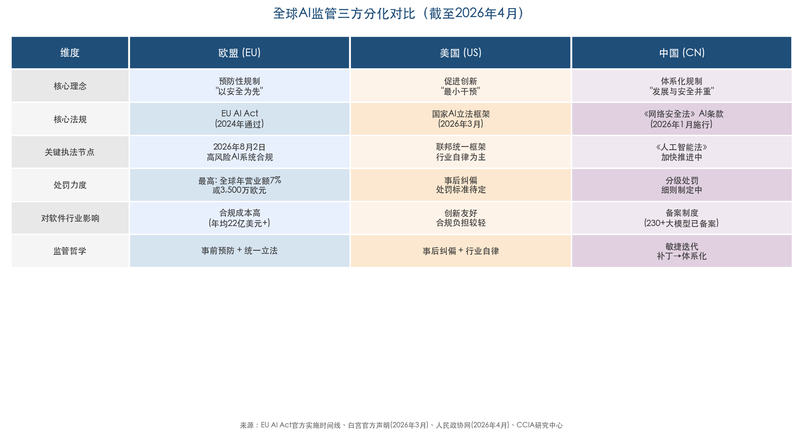

上表从核心理念、核心法规、关键执法节点、处罚力度、对软件行业影响和监管哲学六个维度，系统对比了三大经济体截至2026年4月的AI治理路径差异。欧盟的高合规门槛、美国的创新友好环境与中国的敏捷迭代模式，将在未来数年共同塑造全球软件行业的监管地形图。

### 5.4.2 企业合规策略的务实选择

面对全球监管分化的格局，软件企业需要采取分层合规策略。对于面向全球市场的企业，以EU AI Act作为"最高公分母"构建合规体系是最具效率的选择——满足欧盟标准后，在美国和中国市场的合规压力将自然降低。对于仅面向中国市场的企业，则需密切关注正在酝酿中的《人工智能法》立法进程，提前建立AI安全评估、算法备案和数据治理机制。

ServiceNow的AI治理实践提供了一个可借鉴的企业级框架：该公司建立了跨职能AI治理委员会，由首席数字信息官每两月主持，涵盖工程、安全、法律、隐私、数据治理等多个部门，制定了覆盖内部AI使用的全企业政策，并建立了标准操作流程（SOP）以确保AI开发、测试、部署和监控的可审计性 [ServiceNow Now on Now白皮书](https://www.servicenow.com/content/dam/servicenow-assets/public/en-us/doc-type/resource-center/white-paper/wp-now-on-now-our-now-assist-implementation.pdf "AI治理框架实践")。这种"治理先行"的方式不仅是合规需要，也是向企业客户证明AI产品可信赖性的关键举措——在企业级AI采购决策中，合规与安全保障正在成为仅次于功能和价格的第三大决策因素。

## 5.5 组织架构调整与"AI优先"运营范式

### 5.5.1 从"AI实验"到"AI原生"组织

企业对AI的拥抱不能停留在产品层面，还需深入组织架构和运营范式。Shopify CEO Tobi Lütke的"AI优先招聘政策"代表了最激进的组织转型信号——公司已超过两年保持人员不增长，所有新增人力需求必须首先证明AI无法胜任 [CNBC报道](https://www.cnbc.com/2025/04/07/shopify-ceo-prove-ai-cant-do-jobs-before-asking-for-more-headcount.html "CNBC, 2025年4月7日")。这种"AI优先"政策正在从科技公司向传统行业加速渗透。

效率指标的重新定义是这一转型的量化体现。传统B2B软件公司以200,000美元ARR/员工为健康标准，CEO们现在普遍追求300,000至500,000美元ARR/员工，AI领先公司甚至超过100万美元ARR/员工 [SaaStr](https://www.saastr.com/the-rise-of-invisible-unemployment-in-tech-2026-will-be-the-year-when-everything-really-changes/ "SaaStr, 2026年1月7日")。这意味着在同等收入规模下，企业所需人员可能减少50%至75%。

BCG的研究为组织转型提供了更精细的指引。"未来型"企业（约占5%）之所以能实现4倍于落后者的TSR，并非因为它们投入了更多的AI技术预算，而是因为它们在三个维度上做出了根本性调整：第一，将AI融入核心业务流程而非外围实验；第二，建立系统性的员工重新赋能计划而非零散的培训课程；第三，重新设计岗位职责和绩效评估体系以适应AI协同工作模式 [BCG报告](https://www.bcg.com/publications/2026/ai-transformation-is-a-workforce-transformation "BCG 2025全球研究")。70%的AI转型价值来自"人的转型"这一发现意味着，那些仅将AI当作技术项目管理的企业，最多只能捕获30%的潜在价值。

### 5.5.2 中国软件企业的双重叠加应对

中国软件企业面临AI转型与信创国产替代的双重叠加压力。中国信创产业规模2023年约20,962亿元人民币，预计2027年达37,011亿元；国资委79号文要求2027年底前中央企业完成信创替代 [上海证券研报](https://pdf.dfcfw.com/pdf/H3_AP202502201643304336_1.pdf "上海证券2025年计算机行业投资策略")。在这一背景下，中国软件企业需要同时完成两场转型：一是用AI重新定义产品和服务的价值主张，二是在国产替代的窗口期抢占市场份额。

中国AI Agent市场规模2023年为554亿元，预计2028年达8,520亿元（CAGR 72.7%），这一增速为中国软件企业的AI转型提供了巨大的市场机遇。DeepSeek等国产大模型的训练成本优势（约为OpenAI的1/20）也为中国软件企业的AI嵌入显著降低了技术门槛。然而，国内生成式大模型超过230个的"百模大战"格局同样表明，基础模型层的竞争已趋于白热化，应用层的差异化能力将成为决定胜负的关键因素。

我们认为，对中国软件企业而言，最具战略价值的应对策略是将信创替代与AI升级合二为一——在替换海外软件产品的同时，不是简单复刻旧有功能，而是以AI原生的方式重新设计产品，从而在替代过程中实现代际跃升。

## 5.6 本章核心判断

综合上述分析，我们提出以下应对策略层面的核心判断：

**对软件企业而言**，AI转型成败的分水岭不在技术投入的多少，而在于企业对自身在AI时代核心价值的准确定位。拥有深度领域知识、高切换成本和丰富专有数据资产的企业（如Salesforce、ServiceNow），通过AI增强策略能够有效加深护城河；而产品功能易被AI Agent直接替代、缺乏领域壁垒的企业（如部分协作工具和项目管理SaaS），即便积极转型也难以避免结构性收缩。定价模式转型是必经之路，但BVP"续约悬崖"的预警提醒我们，2026年下半年可能是AI软件市场的第一个真实考验期。

**对从业者而言**，"AI协同能力+领域专业知识+系统思维"的复合能力模型是最稳健的长期策略。AI工程师的薪资溢价和招聘增速证明了市场对这一方向的认可，但初级从业者不应简单追逐"AI工程师"头衔，而应在AI渗透率较低的垂直领域积累领域知识，同时将AI工具作为提升个人产出的杠杆。BCG"10-20-70"框架揭示了一个关键事实：70%的AI转型价值在于人——企业和从业者的AI技能投资是整个转型中回报最高的环节。

**对生态系统而言**，开源AI的崛起正在"民主化"基础模型能力，竞争壁垒从模型本身向数据和领域知识迁移。全球监管的三方分化增加了合规复杂性，但也为率先建立合规能力的企业创造了差异化竞争优势。中国软件企业面临信创替代与AI升级的双重叠加，将二者合一实现代际跃升，是当前条件下最具战略价值的路径选择。

# 第6章 未来展望——2026下半年至2027年的关键变量与情景推演

前五章基于已发生的事实与已公开的数据，勾勒了AI重塑软件行业的全景图。然而，对于行业决策者而言，已知的过去仅是决策的起点，真正关键的问题始终指向未来：哪些技术拐点、商业信号和政策变量将在未来6至18个月内决定软件行业的走向？本章从技术变量、投资周期、安全与监管三个维度系统识别关键不确定性因素，随后在乐观、基准和悲观三种情景下推演软件行业就业结构、商业模式和竞争格局的可能演化路径，最终给出基于当前证据权重的综合判断。

## 6.1 技术变量：AGI时间线的分歧与收敛

### 6.1.1 AGI预期的"集体后撤"

2024年至2025年上半年，硅谷弥漫着对通用人工智能（AGI）即将实现的乐观情绪。多位AI实验室负责人公开给出了激进的时间线：Anthropic CEO Dario Amodei在2024年10月发表的长文中提出AGI"可能最早在2026年到来" [Dario Amodei个人网站](https://darioamodei.com/essay/machines-of-loving-grace "Machines of Loving Grace, 2024年10月")；OpenAI CEO Sam Altman在2025年1月的博客中宣称"我们现在有信心知道如何构建AGI" [Ars Technica报道](https://arstechnica.com/information-technology/2025/01/sam-altman-says-we-are-now-confident-we-know-how-to-build-agi/ "2025年1月6日")。

然而，自2025年下半年起，这一共识开始出现显著松动。Sequoia Capital合伙人David Cahn在2025年12月的年度展望中明确将2026年定义为"延迟之年"（Year of Delays），并指出AGI时间线正经历集体后撤："长期以来，硅谷名人们预言AGI即将出现，'AGI在2027年'是谈话中的高频词汇。但自2025年年中以来，这一时间线被逐步推迟。Dwarkesh Patel近期对Richard Sutton、Andrej Karpathy和Ilya Sutskever的系列播客访谈构成了一条分水岭——新的共识是AGI窗口至少要到2030年代。" [Sequoia Capital](https://sequoiacap.com/article/ai-in-2026-the-tale-of-two-ais/ "AI in 2026: A Tale of Two AIs, David Cahn, 2025年12月3日")

在这一轮预期调整中，各方的时间线呈现出清晰的梯度分布。Anthropic的Amodei仍维持最激进的判断（2026–2027年），但这一预测日益成为孤立的少数派。OpenAI联合创始人Ilya Sutskever在2025年给出了5至20年的宽幅区间，Andrej Karpathy的中位预测约为10年 [Forbes报道](https://www.forbes.com/sites/robtoews/2025/12/22/10-ai-predictions-for-2026/ "10 AI Predictions For 2026, 2025年12月")。Google DeepMind CEO Demis Hassabis给出5至10年的中位预测，联合创始人Shane Legg的中位预测为2028年 [Fortune报道](https://fortune.com/2025/04/04/google-deeepmind-agi-ai-2030-risk-destroy-humanity/ "Fortune, 2025年4月4日")。

中国方面的判断同样偏向保守。百度CEO李彦宏在2024年5月VivaTech大会上明确表示："AGI距离我们还有10年以上。今天最强大的模型离那个水平还差得远。而我们要如何达到那个水平的智能？我们并不知道。" [CNBC报道](https://www.cnbc.com/2024/05/23/artificial-general-intelligence-more-than-10-years-away-baidu-ceo.html "CNBC, 2024年5月23日") 李彦宏同时表达了一种与硅谷显著不同的务实取向：中国更强调AI的应用落地而非追求前沿模型的能力极限——"AI的发展不是对AGI的单一追求，而是一座以应用为基础层层搭建的金字塔。"

下图直观呈现了从激进派到保守派的AGI时间线光谱分布，可以清晰看到行业共识正从2026–2028年的激进窗口向2030年代甚至更远方向迁移。

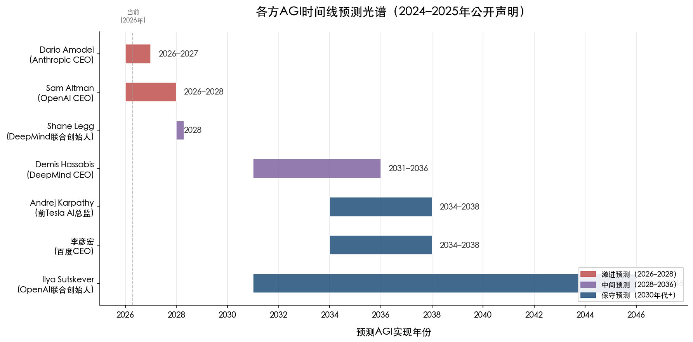

这种AGI预期的集体后撤并不意味着AI技术陷入停滞，而是反映了业界对前沿模型能力提升速率的重新校准。2024年下半年以来，大语言模型的性能提升曲线出现了可观测的放缓信号。Sequoia Capital的Cahn指出，当前数据中心建设的海量投资面临一个重大风险："超大规模企业今天投入的资本开支可能在部署时已经过时。" [Sequoia Capital](https://sequoiacap.com/article/ai-in-2026-the-tale-of-two-ais/ "数据中心延迟风险分析")

### 6.1.2 推理成本的矛盾走向

在AGI时间线向后推移的同时，推理成本正沿着两条看似矛盾的路径同步展开。

一方面，单位推理成本的下降速度极为惊人。Epoch AI的数据显示，大语言模型推理价格的中位年降幅约为50倍，2024年后加速至约200倍；以GPT-4级别能力衡量，推理成本三年内下降约1000倍 [Epoch AI数据分析](https://epoch.ai/data-insights/llm-inference-price-trends "LLM Inference Price Trends, 2025年3月")。Gartner进一步预测，到2030年对一个万亿参数LLM执行推理的成本将较2025年降低90%以上 [Gartner新闻稿](https://www.gartner.com/en/newsroom/press-releases/2026-03-25-gartner-predicts-that-by-2030-performing-inference-on-an-llm-with-1-trillion-parameters-will-cost-genai-providers-over-90-percent-less-than-in-2025 "Gartner, 2026年3月25日")。

另一方面，新兴的Agentic AI模式正在大幅推高总推理消耗。Gartner同一报告中警告，Agentic模型每个任务的token消耗量是标准GenAI的5至30倍，这意味着虽然单价在急剧下降，总体推理成本反而可能上升 [Gartner新闻稿](https://www.gartner.com/en/newsroom/press-releases/2026-03-25-gartner-predicts-that-by-2030-performing-inference-on-an-llm-with-1-trillion-parameters-will-cost-genai-providers-over-90-percent-less-than-in-2025 "Agentic模型token消耗分析")。这一矛盾趋势的实际含义在于：AI Agent在单个任务上的经济可行性正在快速提升，但企业大规模部署AI Agent时的总计算成本仍是一个需要审慎管理的变量。推理成本下降速度与AI应用复杂度上升速度之间的赛跑，将在2026下半年至2027年成为决定AI落地深度的关键经济参数。

### 6.1.3 Agentic AI：从实验室到生产环境的跨越

在技术变量按对软件行业短期影响力的排序中，Agentic AI（自主代理型人工智能）的成熟度是未来6至18个月内影响最大的单一变量。与早期大语言模型主要充当"文本生成器"不同，Agentic AI能够自主规划多步骤任务、调用外部工具、处理异常并持续迭代——其本质是从"回答问题"走向"完成工作"。

SWE-bench Verified排行榜的数据为Agentic AI能力的快速攀升提供了量化证据。截至2026年2月，顶级AI编码代理自主解决真实GitHub issue的能力已从2024年初的约20%攀升至79.2%（Sonar Foundation Agent），Claude 4.5 Opus达到76.80%，Gemini 3 Flash达到75.80% [SWE-bench官方排行榜](https://www.swebench.com/ "2026年2月更新的Verified排行榜")。这意味着在标准化的软件工程任务中，顶级AI代理已能自主解决近八成的真实工程问题，较两年前提升约四倍。

Goldman Sachs预测，AI Agent驱动的应用软件市场规模将从当前水平增长至2030年的7800亿美元（CAGR 13%） [Deloitte软件行业展望](https://www.deloitte.com/us/en/insights/industry/technology/technology-media-telecom-outlooks/software-industry-outlook.html "Deloitte 2026展望转引Goldman Sachs")。Gartner预测到2028年40%的企业应用将集成AI Agent能力。这一预测的含义不仅在于市场规模的扩张，更在于软件产品形态的根本转变——从"工具"到"助手"再到"代理"的连续演进，预计将在2026下半年至2027年进入加速期。

## 6.2 投资周期：万亿美元豪赌的可持续性

### 6.2.1 资本开支的"红旗时刻"

2026年AI投资规模之巨大，在科技史上前所未有。四大超大规模云厂商（Alphabet、Microsoft、Meta、Amazon）2026年资本开支合计预计接近7000亿美元，较2025年增长超过60% [CNBC报道](https://www.cnbc.com/2026/02/06/google-microsoft-meta-amazon-ai-cash.html "CNBC, 2026年2月")。然而，在资本疯狂涌入的同时，自由现金流急剧下降的信号正在密集出现：Morgan Stanley预测Amazon 2026年自由现金流为负170亿美元；Pivotal Research预计Alphabet自由现金流从733亿美元骤降至82亿美元（降幅近90%）；Barclays预计Meta自由现金流下降约90%且2027至2028年将转负。Evercore分析师将此定性为"红旗时刻" [Fortune报道](https://fortune.com/2026/02/17/ai-tech-red-flag-capex-hyperscalers-cash-flow-negative-evercore/ "Fortune, 2026年2月")。

下图展示了2024至2027年（含预测值）AI投资规模与回报之间持续扩大的结构性缺口，直观呈现了当前AI资本开支的可持续性挑战。

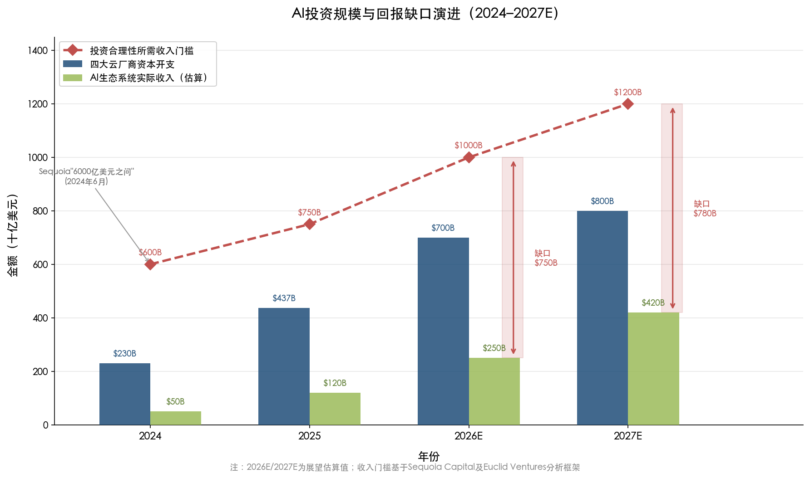

Sequoia Capital的Cahn在2024年6月首次提出的"6000亿美元之问"——即AI生态系统需要产生约6000亿美元的年收入才能证明当前基础设施投资的合理性——到2025年底依然未获充分回答 [Sequoia Capital](https://sequoiacap.com/article/ais-600b-question/ "AI's $600B Question, 2024年6月")。他在2025年12月的更新分析中进一步指出："AI的终端收入仍然有限（数百亿美元量级），与数据中心和能源投资的规模（未来五年数万亿美元量级）相比差距巨大。" [Sequoia Capital](https://sequoiacap.com/article/ai-in-2026-the-tale-of-two-ais/ "AI in 2026收入缺口分析") 第三方分析机构Euclid Ventures将Cahn的分析框架延伸至2026年，估算AI回报所需的年收入门槛已接近1万亿美元 [Euclid Ventures分析](https://insights.euclid.vc/p/deus-ex-capex "Deus Ex CapEx, 扩展Cahn框架至2025–2026")。

### 6.2.2 ROI困局：从CEO焦虑到试点瓶颈

与天文数字般的投入形成鲜明对比的，是令人清醒的回报现实。PwC《2026 CEO Survey》显示，56%的CEO报告过去12个月AI投资既未增加收入也未降低成本 [Forbes报道](https://www.forbes.com/sites/guneyyildiz/2026/01/28/56-of-ceos-see-zero-roi-from-ai-heres-what-the-12-who-profit-do-differently/ "Forbes引用PwC 2026 CEO Survey")。MIT的一项研究发现约95%的GenAI试点未能实现快速的收入增长加速 [Fortune报道](https://fortune.com/2025/08/18/mit-report-95-percent-generative-ai-pilots-at-companies-failing-cfo/ "Fortune, MIT报告")。

这一"巨额投入、微薄回报"的现状并不必然意味着AI是泡沫。Sequoia的Cahn在同一篇分析中强调，这也可能是"时间差"（timing gap）而非"价值差"（value gap），因为最优秀的AI初创公司正以史无前例的速度增长——2025年至少有两家AI编码公司从零到10亿美元ARR仅用了约两年。然而，投资与回报之间的时间差确已造成系统性压力。Cahn预测2026年将出现"$0到$10亿美元俱乐部"——一批AI公司从零到10亿美元收入的速度将创造商业史上的新纪录 [Sequoia Capital](https://sequoiacap.com/article/ai-in-2026-the-tale-of-two-ais/ "$0-$1B Club分析")。

关键问题在于：投资者和企业的耐心窗口究竟有多长？若2027年AI收入仍未显著缩小与基础设施投资之间的缺口，市场对AI赛道的信心可能出现急剧转向。

### 6.2.3 VC涌入与资本集中度风险

VC资金向AI领域的极度集中进一步放大了周期性风险。2026年Q1全球VC投资创纪录达3000亿美元，其中AI企业获得2420亿美元（占比80%），而仅OpenAI（1220亿美元）、Anthropic（300亿美元）、xAI（200亿美元）、Waymo（160亿美元）四家便合计融资1880亿美元 [Crunchbase报告](https://news.crunchbase.com/venture/record-breaking-funding-ai-global-q1-2026/ "Crunchbase Q1 2026全球VC报告")。2025年全年，AI企业VC投资达2587亿美元，占全球VC总额的61%，超过1亿美元的大额交易占AI VC总额的73% [OECD报告](https://www.oecd.org/content/dam/oecd/en/publications/reports/2026/02/venture-capital-investments-in-artificial-intelligence-through-2025_3bcb227f/a13752f5-en.pdf "OECD AI VC投资报告，2026年2月")。

如此高度的资本集中意味着：一旦AI赛道估值出现修正，其冲击不会局限于AI领域本身，而将波及整个科技生态的融资环境。这一系统性风险构成2026下半年至2027年最重要的宏观不确定性之一。

## 6.3 安全与监管：尾部风险的放大器

### 6.3.1 AI安全事故的"何时"而非"是否"

国际AI安全报告（2026年2月发布）将AI风险分为恶意使用、失调和系统性/结构性三大类别，并明确指出："风险管理措施很可能无法阻止某些AI相关事故的发生。"（"Risk management measures will likely fail to prevent some AI-related incidents."） [国际AI安全报告](https://internationalaisafetyreport.org/publication/international-ai-safety-report-2026 "2026年2月") 这一措辞的含义十分明确——问题不在于AI安全事故是否会发生，而在于何时发生以及规模多大。

Gartner更进一步预测，到2028年错误配置的AI将在一个G20国家导致国家关键基础设施停摆 [CIO.com报道](https://www.cio.com/article/4132385/ai-will-likely-shut-down-critical-infrastructure-on-its-own-no-attackers-required.html "CIO.com, 2026年2月14日")。值得注意的是，Gartner在此特别强调"无需攻击者"——并非外部恶意攻击导致停摆，而是AI系统自身的配置错误或行为失调即足以引发系统级故障。

对软件行业而言，重大AI安全事故一旦发生，将成为强有力的变局催化剂，可能引发三个连锁效应：其一，监管急剧收紧，政府可能在事故后迅速推出远超预期的限制性法规；其二，企业AI部署速度骤降，观望情绪在行业内蔓延；其三，对人类监督和"人在环中"（human-in-the-loop）模式的需求急剧回升，反而可能在一定程度上扭转AI替代人类的趋势。

### 6.3.2 监管收紧的全球协同趋势

2026年，AI监管的全球格局正从碎片化走向协同。欧盟《人工智能法案》已于2025年2月正式生效并进入分阶段实施期，美国虽尚未出台联邦层面的综合性AI立法，但多项行政命令和行业指引正在逐步收紧，中国则通过《生成式人工智能服务管理暂行办法》等规章持续完善监管框架。国际AI安全报告本身——由多国政府联合委托编写——便是监管协同趋势的标志性产物。

对于软件行业的未来演化而言，监管变量的影响主要通过两个渠道传导：第一，合规成本的上升将提高AI产品的开发门槛，有利于资源雄厚的大型企业，而不利于初创公司；第二，数据跨境流动限制可能加速全球软件市场的区域分化，推动形成"平行AI生态系统"——中国企业围绕国产大模型构建应用栈，西方企业围绕OpenAI/Anthropic/Google模型构建应用栈，两个体系之间的互操作性持续降低。

## 6.4 三种情景推演

基于上述技术、投资和监管维度的关键变量，我们构建三种可能情景。需要强调的是，这三种情景并非等概率发生；基于当前证据权重，基准情景的可信度最高。下图以矩阵形式对比了三种情景在五个关键维度上的差异，便于全局把握各情景的核心假设与推演逻辑。

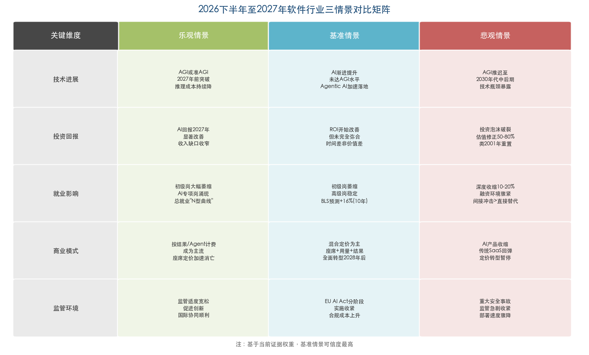

### 6.4.1 乐观情景：AI驱动的生产力跃升

**核心假设**：AGI或准AGI能力在2027年前实现重大突破；推理成本持续下降足以覆盖Agentic模式的高消耗；AI投资回报在2027年显著改善。

在这一情景下，软件开发者的人均产出提升3至5倍，AI Agent能够自主完成绝大多数标准化软件工程任务。软件行业的总产出急剧扩张——更多的软件以更快的速度被创造出来，应用场景从当前的数字领域扩展至物理世界的自动化、科学研究和医疗健康。就业方面，初级开发岗位大幅萎缩，但AI专项岗位（AI工程师、提示词工程师、AI安全专家、AI Agent编排师）以更高薪酬大量涌现。总体就业可能呈现"N型曲线"——先下降、再反弹，最终在更高水平上趋于稳定。商业模式上，按结果/按Agent计费成为主流，传统座席定价加速消亡。

**支撑证据**：SWE-bench从20%到79%的跃升速率表明技术能力仍处于陡峭上升期；Cursor两年内从零到20亿美元ARR证明市场接受度正在爆发性增长；Goldman Sachs对AI Agent应用市场2030年达7800亿美元的预测隐含了高增长路径。

**主要风险**：该情景高度依赖AGI时间线不继续后撤，而当前行业共识正在向相反方向移动。

### 6.4.2 基准情景：AI渐进增强，结构性调整持续

**核心假设**：AI能力持续提升但未达到AGI水平；技术进展以渐进而非跳跃方式展开；AI投资回报在2027年开始改善但未完全弥合投资与收入之间的缺口。

在基准情景下，软件行业呈现"短期阵痛、长期增长"的态势——这一判断与BLS预测2024至2034年美国软件开发者就业增长16%（从169.38万增至196.14万）的长期展望相一致 [BLS职业展望手册](https://www.bls.gov/ooh/computer-and-information-technology/software-developers.htm "BLS OOH, 2025年8月更新")。但16%的十年增速掩盖了内部的剧烈结构性调整：初级岗位持续萎缩，高级岗位保持稳定，AI专项岗位快速增长。总体就业在2027年前维持中性或略有下降，此后伴随AI应用扩散逐步恢复增长。

Gartner对2030年IT工作格局的预测为这一情景提供了量化框架：75%的IT工作由AI增强的人类完成，25%由AI单独完成，0%由人类独立完成 [Gartner新闻稿](https://www.gartner.com/en/newsroom/press-releases/2025-11-10-gartner-survey-finds-artificial-intelligence-will-touch-all-information-technology-work-by-2030 "Gartner, 2025年11月10日")。最后一项尤为关键——即便是"人类完成"的工作也不再是纯人工的；AI将无处不在地嵌入所有IT工作流程。

商业模式方面，混合定价（座席+使用量+结果导向的组合）成为主流。Bain研究显示，在30多家引入GenAI功能的传统SaaS供应商中，约65%采用混合定价，约35%选择提价捆绑AI，没有一家完全转向纯结果计费 [Bain研究](https://www.bain.com/insights/per-seat-software-pricing-isnt-dead-but-new-models-are-gaining-steam/ "Bain Per-Seat Pricing研究，2025年10月")。这种渐进式的定价模式演变预计将持续至2027年，全面转向结果计费的时间点可能在2028年之后。

**支撑证据**：Gartner"幻灭低谷期"的判断暗示短期预期下调但长期前景未变；PwC调查中56%的CEO未获AI回报表明部署仍处于早期阶段；Klarna"过度替代后纠偏"的教训表明完全替代路径在许多复杂场景中并不可行。

**主要风险**：初级人才梯队断裂的长期结构性隐患，以及"隐形失业"的社会影响可能被系统性低估。

### 6.4.3 悲观情景：AI投资泡沫破裂与行业重置

**核心假设**：AI投资泡沫在2027年前破裂，触发类似2001年互联网泡沫的行业重置；重大AI安全事故引发监管急剧收紧；AGI时间线大幅后撤至2030年代中后期。

芝加哥联储行长Austan Goolsbee在2026年3月《The Atlantic》长篇特稿中明确提出了这一类比的现实可能性：即便AI是一项真正具有变革性的技术——如同互联网——过度投资本身仍可能导致金融重置。他指出："在数据层面，AI尚未对人们的工作产生影响。"但同时警告，若投资泡沫破裂，其对就业的间接冲击可能远超AI技术本身的直接替代效应 [The Atlantic](https://www.theatlantic.com/magazine/2026/03/ai-economy-labor-market-transformation/685731/ "America Isn't Ready for What AI Will Do to Jobs, 2026年3月刊")。

在这一情景下，四大超大规模云厂商在自由现金流持续恶化的压力下被迫大幅削减资本开支，波及整个AI基础设施供应链。AI初创公司融资环境骤然收紧，估值修正幅度可能达50%至80%。VC向AI的极端集中（2026年Q1高达80%）意味着一旦修正发生，整个科技融资生态都将遭受冲击。软件行业就业经历一轮类似2001年后的深度收缩，幅度可能达10%至20%。

**支撑证据**：Sequoia"6000亿美元之问"至今仍未获回答且收入缺口仍在扩大；Morgan Stanley、Pivotal Research和Barclays对超大规模企业FCF的预测均指向2026至2028年的财务压力拐点；MIT研究显示95%的GenAI试点未实现收入加速。

**主要风险**：该情景可能低估了AI技术的实际价值创造能力和大型科技企业的财务韧性。即便2001年互联网泡沫破裂导致了行业洗牌，互联网技术本身的长期价值并未消减——泡沫后幸存的企业（Amazon、Google）反而成长为全球最有价值的公司。

## 6.5 证据权重分析与综合判断

### 6.5.1 "AI增强"与"AI替代"路径的证据对比

基于前五章积累的实证数据，我们对"AI增强人类开发者"与"AI大幅替代人类开发者"两条路径进行证据权重分析。

**支持"AI增强"路径的证据**：
- Gartner预测2030年75%的IT工作由AI增强的人类完成，0%由人类独立完成——所有工作都将被AI增强，但多数仍需人类参与；
- BLS预测2024至2034年美国软件开发者就业增长16%，增速"远快于所有职业平均水平"；
- Klarna在AI替代700名客服后不得不恢复人工招聘——完全替代策略在复杂场景中遭遇挫折；
- PwC调查显示56%的CEO未获AI投资回报——AI的实际替代能力远落后于预期；
- Stack Overflow调查中76%的开发者不计划在部署与监控中使用AI——高责任任务仍高度依赖人类判断。

**支持"AI替代"路径的证据**：
- SWE-bench得分从20%飙升至79%——AI自主完成标准化软件工程任务的能力已逼近实用门槛；
- Google超过30%的新代码由AI生成——大型科技企业已在大规模依赖AI进行代码生产；
- 初级岗位招聘率下降73%——AI替代效应已在入门级市场产生实质性冲击；
- Atlassian首次出现企业座席数量下降——传统SaaS按座席定价模式的用户基础正被AI侵蚀；
- Anthropic CEO预测AI可能推动失业率上升10至20%并"消灭半数入门级白领岗位"。

### 6.5.2 综合判断

基于上述证据的系统性权衡，当前证据整体更支持"AI增强为主、部分岗位替代为辅"的混合路径。这一判断的核心逻辑建立在三个层次之上。

第一，Dario Amodei提出的"边际智能回报递减"（diminishing marginal returns of intelligence）分析框架，为理解变革节奏提供了关键视角。即便AI智能远超人类，物理世界的速度限制、数据获取需求以及人类制度约束等"互补因素"意味着变革不会瞬间发生，而将在5至10年内逐步展开 [Dario Amodei个人网站](https://darioamodei.com/essay/machines-of-loving-grace "边际智能回报框架分析")。

第二，MIT诺贝尔经济学奖得主Daron Acemoglu对劳动力市场调整速率的分析，提供了宏观经济学维度的补充视角。他强调，AI必须接入企业专有数据、融入现有系统才能改造企业运营，而遗留硬件、供应商合同、古老编程语言等构成了多重技术与制度障碍，实际替代速度将"比CEO们预期的慢得多" [The Atlantic](https://www.theatlantic.com/magazine/2026/03/ai-economy-labor-market-transformation/685731/ "Acemoglu分析")。

第三，Sequoia Capital的"双面故事"框架揭示了一个重要的分化趋势：虽然AGI时间线在后撤、数据中心建设面临延迟，但AI应用层的增长丝毫没有放缓——最优秀的AI初创公司正以前所未有的效率创造收入（部分公司达到每员工超过100万美元收入）。这表明AI的价值创造并非取决于AGI是否实现，而是取决于当前技术水平下的应用创新能力 [Sequoia Capital](https://sequoiacap.com/article/ai-in-2026-the-tale-of-two-ais/ "应用层增长分析")。

综合以上三个层次，我们认为2026下半年至2027年软件行业最可能的演化路径是：AI能力持续渐进提升，初级和标准化岗位的替代压力继续加大，但高级工程、系统架构、产品设计和AI编排等高价值岗位的需求将保持稳定甚至增长。行业总就业短期内承压，但在AI应用扩散带来的新需求驱动下，中长期就业前景依然正向。这一混合路径的最大风险不在于AI技术本身，而在于投资周期的潜在断裂——若AI投资泡沫在回报兑现之前提前破裂，其对就业和行业格局的冲击将远超AI技术的直接替代效应。

# 结论与风险提示

## 核心结论

本报告对软件行业未来趋势及其被AI替代的可能性进行了系统性评估。基于六章分析所积累的多维度证据，我们形成以下五项核心结论。

**第一，AI正在从根本上重塑软件行业，但"重塑"的形态远比"替代"二字所能概括的更为复杂。** 当前证据不支持"AI将全面替代软件行业"的极端叙事，同样不支持"AI只是又一轮技术升级"的轻描淡写。更准确的判断是：AI正在引发软件行业自互联网时代以来最深刻的结构性分化——不同细分领域、不同职业角色、不同企业形态面临截然不同的冲击程度与演化路径。法律科技、电子签名等"薄应用"面临AI原生替代的直接威胁，基础软件、网络安全等领域则因AI浪潮而需求增强，CRM、HR、项目管理等中间地带的命运则高度取决于各企业自身的数据壁垒深度与AI嵌入速度。

**第二，软件从业者面临的就业冲击呈现高度分层特征，初级岗位首当其冲。** 美国软件工程师招聘量较疫情前下降49%，初中级岗位招聘率下降73%，斯坦福大学研究证实22至25岁早期职业工作者在AI高暴露度职业中经历了16%的相对就业下降。然而，BLS预测2024至2034年美国软件开发者总就业仍将增长16%，机器学习工程师招聘逆势增长59%，AI工程师薪资溢价达12%。这表明AI冲击的本质不是"消灭软件工程师"，而是重新定义软件工程师的能力门槛和角色边界——从"写代码的人"向"指挥AI写代码并判断其质量的人"迁移。这一转变对初级从业者的入行路径和人才梯队的长期储备构成严峻挑战。

**第三，传统SaaS商业模式正面临不可逆的转型压力，但转型节奏将慢于市场恐慌所隐含的预期。** 按座席定价的SaaS公司占比在12个月内从21%降至15%，混合定价从27%飙升至41%。Salesforce、HubSpot等龙头企业已率先推出按AI动作或按结果计费的新定价模式。然而，Bain & Company对30多家SaaS供应商的研究发现，没有一家完全转向纯结果计费，绝大多数仍处于混合过渡阶段。"SaaSpocalypse"所揭示的核心矛盾在于：资本市场以二元叙事为SaaS定价，而行业现实呈现为一个高度分层、持续演进的风险光谱。

**第四，AI投资规模与回报之间的结构性缺口构成软件行业未来18个月最重要的宏观风险。** 四大云厂商2026年资本开支合计接近7,000亿美元，但56%的CEO报告AI投资尚未产生可衡量的财务回报。Sequoia Capital"6,000亿美元之问"至今仍未获回答，且收入缺口仍在扩大。若AI投资泡沫在回报兑现之前提前破裂，其对就业和行业格局的间接冲击将远超AI技术替代的直接效应——这一风险目前被多数行业分析所低估。

**第五，中国软件行业面临信创国产替代与AI冲击的双重叠加，两股力量的交汇塑造出独特的演化路径。** 信创政策在短期内为国产软件构筑了"政策护城河"，但这道护城河无法抵御AI的技术冲击。中国AI Agent市场预计2028年达8,520亿元（CAGR 72.7%），DeepSeek等国产大模型的训练成本优势（约为OpenAI的1/20）正在加速AI对传统软件的替代。将信创替代与AI升级合二为一、在替换过程中实现代际跃升，是当前条件下最具战略价值的路径。

## 风险提示

本报告的分析和判断基于截至2026年4月的公开数据与权威机构研究，以下风险因素可能导致实际走势显著偏离本报告的基准判断：

**技术变量的高度不确定性。** AI能力的提升速度在过去两年中持续超出预期（SWE-bench得分两年内从约20%跃升至79.2%），若这一趋势延续或加速，"自动化"侵入"增强"领地的进程可能快于本报告所预期的渐进路径。反之，若AI能力提升遭遇瓶颈（如Sequoia Capital所警告的"延迟之年"），替代风险的兑现也可能显著推迟。AGI时间线当前存在从"2026–2027年"（Amodei）到"2030年代"（行业新共识）的巨大分歧，这一分歧本身即构成预测的核心不确定性来源。

**投资周期的潜在断裂风险。** 四大云厂商自由现金流的急剧恶化（Morgan Stanley预测Amazon 2026年FCF为负170亿美元，Barclays预计Meta FCF在2027–2028年转负）若引发资本市场对AI投资回报的信心崩塌，可能触发类似2001年互联网泡沫破裂后的行业重置。VC资金向AI的极端集中（2026年Q1占比80%）意味着修正一旦发生，冲击将波及整个科技生态。

**监管环境的快速演变。** EU AI Act于2026年8月2日全面生效，违规处罚最高可达全球年营业额的7%。中国正加速推进《人工智能法》立法。监管收紧可能显著抬高AI产品的开发和部署门槛，改变本报告对替代速度的判断。重大AI安全事故——Gartner预测到2028年错误配置的AI将在一个G20国家导致关键基础设施停摆——一旦发生，可能引发监管的急剧收紧和企业AI部署速度的骤降。

**数据与方法论局限。** 本报告引用的招聘数据（Indeed、LinkedIn）和薪酬数据（Levels.fyi、Ravio）主要覆盖英语市场和头部科技公司，对中小企业和非英语市场的代表性有限。AI对就业的影响评估主要依赖劳动力市场宏观数据和企业个案，尚缺乏覆盖全行业的大规模因果推断研究。各权威机构对IT支出和AI支出的统计口径差异显著（Gartner口径2026年软件支出1.4336万亿美元 vs Statista口径约3,371亿美元），引用不同来源数据时须注意底层定义的差异。

**行业内部分化被平均数掩盖的风险。** 本报告的许多宏观数据（如BLS预测软件开发者就业增长16%）是行业总量指标，掩盖了初级岗位萎缩与AI岗位爆发之间的剧烈结构性分化。对于特定细分领域和特定职业阶段的从业者而言，实际冲击可能远大于或远小于行业平均水平所暗示的程度。
