# 执行摘要

碳滑板是城市轨道交通列车受电弓系统顶部的核心集电元件，在列车运行中与架空接触网导线保持滑动接触，承担导电取流、减摩保护和弧光防护三重功能。浸金属碳滑板凭借优异的导电-力学-耐磨综合性能，已成为国内城轨地铁的绝对主流产品，典型更换周期约 1 年（对应行驶里程约 10 万公里）。

**年用量方面**，本报告基于"列车保有量 × 受电弓配置 × 年更换频次"的自上而下测算模型，结合各地地铁招标案例交叉验证，估算 2025 年全国城轨碳滑板年度总需求约 **59,000—64,000 条**，对应市场规模约 **0.9—1.0 亿元**（按国产浸金属碳滑板中位价约 1,500 元/条计算）。其中，存量运维替换需求占比约 94%，新车装机需求仅占约 6%，需求结构已完成从"新建配套驱动"向"存量维保驱动"的结构性转换。测算核心参数为：全国城轨配属列车 13,268 列中约 95%（约 12,600 列）采用受电弓取电制式，每列标准配置 2 台受电弓、每弓 2 条碳滑板，叠加 10%—20% 的异常磨耗修正系数和约 3,600 条新车装机需求。

**供应商竞争格局方面**，城轨碳滑板市场呈现"国产主导、分散竞争"特征。第一梯队为苏州东南佳新材料和北京万高众业科技（含 Schunk 代理份额），估计合计占据 40%—50% 的市场份额；第二梯队包括溢洋墨根集团、天津锦美碳材、大同新成新材、成都永贵东洋、上海天海等，估计合计份额 25%—35%；第三梯队为区域性代理商和外资品牌少量直供，估计合计份额 15%—25%。外资品牌（Schunk、Morgan、Mersen 等）在城轨运维采购中直接中标的案例极为罕见，国产碳滑板在城轨领域的渗透率已超过 90%。

**行业趋势方面**，2026—2027 年碳滑板年需求量预计保持约 4%—6% 的温和增长（约 6.1—7.0 万条），但供给端产能充裕引发的价格竞争将压制金额增速，市场规模大致维持在 0.9—1.1 亿元。材料技术层面，浸金属碳滑板仍将是两年内的绝对主流，碳纤维增强 C/C 复合材料滑板是最接近产业化的下一代产品，但受 CRCC 认证周期制约短期内难以规模替代。国产替代在城轨领域已基本完成，高铁碳滑板将成为下一核心战场。政策导向从大规模新建转向更新改造和精细化运营，碳滑板行业正进入以份额争夺为主要竞争形态的"精耕存量"新阶段。

# 第1章 碳滑板产品概述与技术基础

## 1.1 研究口径说明

本报告以中国城市轨道交通（以下简称"城轨"）系统为核心研究对象，聚焦地铁制式，兼顾轻轨制式。有轨电车、磁悬浮、市域快轨等其他制式因受电方式与碳滑板规格差异较大，不纳入核心测算范围。产品口径以碳基材料滑板为主，涵盖纯碳滑板、浸金属碳滑板和碳纤维增强复合材料滑板三大类别。铜基粉末冶金滑板因材料体系和竞争格局与碳基产品存在本质差异，仅在本章产品分类中作对照介绍，不纳入后续市场规模测算。凡涉及高铁（干线铁路）碳滑板数据，均予以明确标注，以避免与城轨场景混淆。

## 1.2 碳滑板的定义与功能定位

### 1.2.1 基本定义

受电弓碳滑板（又称碳滑条、碳条）是电气化轨道交通列车受电弓系统最顶部的集电元件，由导电碳材料与铝合金托架通过粘接工艺组合而成[西南交通大学学报论文](https://xnjdxb.swjtu.edu.cn/cn/article/doi/10.3969/j.issn.0258-2724.20250009 "高铁受电弓滑板用炭石墨材料研究进展, 2025年")。碳滑板在静止或滑动状态下与架空接触网导线保持直接接触，将电流从供电网引入车辆供电系统，是实现列车不间断受流的关键功能部件。

从功能角度看，碳滑板在弓网系统中同时承担三项核心任务[中科院上海硅酸盐所](https://www.sic.cas.cn/zt/kpwsx/kpwz/201407/t20140714_4156700.html "受电弓滑板材料发展小史")：

- **导电取流**：将接触网中的电能经由碳条传输至受电弓本体，再通过车顶母线送入车辆牵引系统；
- **减摩保护**：碳材料良好的自润滑特性可有效减少对铜质接触网导线的磨损，延长接触网使用寿命；
- **弧光防护**：在受电弓与接触网短暂分离时，碳滑板须承受电弧侵蚀而不丧失结构完整性。

### 1.2.2 在受电弓系统中的安装位置与工作原理

受电弓安装于列车车顶，由底架、下臂杆、上框架、弓头、升弓弹簧、传动气缸和支持绝缘子等部件构成。碳滑板位于弓头最上部，升弓弹簧和传动气缸控制受电弓的升降动作，弹簧盒与铰链机构赋予弓头弹性跟随能力，以适应接触网导线的高度变化与线路蛇行位移[CPEM全国电力设备管理网](https://www.cpem.org.cn/list100/40823.html "地铁车辆构造之受电弓")。

城轨列车普遍采用单臂受电弓，凭借结构简单、自重轻、动态跟随性好的优势，已成为地铁车辆的标准配置。弓头上碳滑板的典型安装方式为两条并排放置，通过螺栓紧固于铝合金托架上。每列地铁列车通常安装 2 台受电弓，正常运行时升后弓取流，前弓作为备用[CPEM全国电力设备管理网](https://www.cpem.org.cn/list100/40823.html "地铁受电弓结构") [天津锦美碳材](https://www.shimocailiao.cn/pages/shoudiangongtanhuaban.htm "受电弓典型配置")。

在城轨典型供电制式（DC 1500V）下，受电弓运行承载电流可达 2000A，静态承载电流为 540A；碳滑板与接触网之间的典型静态接触力在直流制式下约为 120N（标准要求 110±10N），最大运行速度设计值为 160 km/h[天津锦美碳材](https://www.shimocailiao.cn/pages/shoudiangongtanhuaban.htm "受电弓碳滑板产品参数")。

碳滑板还集成有 ADD（Automatic Dropping Device，自动降弓装置）功能：当碳滑板发生异常磨损或断裂导致铝合金托架暴露、接触网出现异常提升力等危险工况时，ADD 装置通过气路变化自动触发降弓动作，保护接触网和车辆设备安全[西南交通大学学报论文](https://xnjdxb.swjtu.edu.cn/cn/article/doi/10.3969/j.issn.0258-2724.20250009 "受电弓滑板性能要求五方面")。

## 1.3 碳滑板材料分类体系

### 1.3.1 材料发展演进

受电弓滑板材料经历了从金属到碳基材料的跨代演进：金属滑板（铜合金/铁基）→ 纯碳滑板 → 粉末冶金滑板 → 浸金属碳滑板 → 碳基复合材料滑板。浸金属碳滑板兼具纯碳材料良好的自润滑特性与金属材料优良的导电性能，是当前城轨和高铁领域的主流产品；碳基复合材料（C/C 复合材料）滑板目前处于研制与试用阶段，代表着下一代技术方向[西南交通大学学报论文](https://xnjdxb.swjtu.edu.cn/cn/article/doi/10.3969/j.issn.0258-2724.20250009 "高铁受电弓滑板用炭石墨材料研究进展, 2025年") [中科院上海硅酸盐所](https://www.sic.cas.cn/zt/kpwsx/kpwz/201407/t20140714_4156700.html "受电弓滑板材料发展小史")。

从学术分类角度，炭石墨类滑板材料按骨料类型可划分为三类[西南交通大学学报论文](https://xnjdxb.swjtu.edu.cn/cn/article/doi/10.3969/j.issn.0258-2724.20250009 "炭石墨材料分类, 表1")：

1. **传统炭石墨材料**——以石墨、焦炭等颗粒作为增强相；
2. **碳/碳（C/C）复合材料**——以碳纤维作为增强相；
3. **新型炭石墨材料**——采用纤维-颗粒混合增强体系，包括碳纳米管、石墨烯等纳米碳材料的引入。

### 1.3.2 纯碳滑板

纯碳滑板以天然石墨和电煅无烟煤为主要原料，经混捏、成型、焙烧、石墨化等工序制成，不进行金属浸渍处理。其典型理化指标为：体积密度 1.70–1.75 g/cm³，抗折强度 35–40 MPa，抗压强度 65–70 MPa，20°C 电阻率 20–35 μΩ·m，肖氏硬度 65–75 HS[天津锦美碳材](https://www.shimocailiao.cn/pages/shoudiangongtanhuaban.htm "纯碳碳条理化指标")。

纯碳滑板的核心优势在于自润滑性优良、对接触网导线磨损低，密度仅为浸金属碳滑板的约 70%，有利于降低弓头质量、改善动态跟随性能。然而，其电阻率约为浸金属碳滑板的 5–10 倍，在大电流工况下温升较高；力学强度亦相对偏低，限制了其在高速、大电流城轨线路中的适用范围。纯碳滑板目前主要应用于运行速度较低、受流电流较小的城轨线路及电力机车。

### 1.3.3 浸金属碳滑板

浸金属碳滑板在碳素体预制件烧结成型后，通过真空压力浸渍工艺将铜或铜合金液态金属注入碳体孔隙，形成碳-金属复合结构。该工艺显著提升了材料的导电性和力学强度，同时保留了碳材料的自润滑特性，是兼顾导电、耐磨与保护接触网等多维性能要求的最佳方案。

城轨用浸金属碳滑板典型理化指标为：体积密度 2.20–2.60 g/cm³，抗折强度 75–80 MPa，抗压强度 110–120 MPa，20°C 电阻率 4–7 μΩ·m，肖氏硬度 85–95 HS，冲击韧性 0.25–0.30 J/cm²[天津锦美碳材](https://www.shimocailiao.cn/pages/shoudiangongtanhuaban.htm "地铁碳滑板理化指标")。与纯碳滑板相比，浸金属碳滑板的电阻率降低约 80%，抗折强度提升近 1 倍，使其能够胜任城轨 DC 1500V 制式下大电流持续取流的苛刻工况。

浸金属碳滑板是当前国内城轨地铁的绝对主流产品，已在全国范围内实现规模化应用。

### 1.3.4 粉末冶金滑板

粉末冶金滑板以铜粉、铁粉为主要基体，加入石墨等润滑成分，通过粉末压制-烧结工艺成型。该类产品导电性优良，但对接触网导线磨损较大，且自重较高。铁路行业标准 TB/T 1842.1 对粉末冶金滑板作出了专门规定。由于粉末冶金滑板的材料体系以金属为主、碳为辅，与碳基滑板存在本质差异，本报告在后续市场规模测算中不纳入此类产品。

### 1.3.5 碳基复合材料滑板

碳基复合材料滑板（C/C 复合材料滑板）以碳纤维作为增强相、碳或树脂碳化物作为基体，通过化学气相沉积（CVI）或树脂浸渍碳化（PIC）等工艺制备。中南大学团队研发的铜网改性 C/C 复合材料受电弓滑板展现了优异的综合性能：密度 1.60–2.20 g/cm³，电阻率 5–30 μΩ·m，压缩强度 108–210 MPa，冲击强度 1.62–2.68 J/cm²，动态磨损率 4.5–5.95 mm/万公里[中南大学专利CN104529496A](https://patents.google.com/patent/CN104529496A/zh "铜网改性炭/炭复合材料受电弓滑板, 2015年")。该技术方案在保持低密度的同时实现了与浸金属碳滑板相当的导电性，冲击韧性则远超后者（约为浸金属碳滑板的 5–10 倍），是最接近产业化的新一代碳滑板技术路线。

铁路行业标准 TB/T 1842.2-2016《受电弓滑板 第2部分：碳基复合材料滑板》已对该类产品的技术要求、检验方法、检验规则等作出规定，为其产业化应用提供了标准支撑。

### 1.3.6 各类碳滑板性能对比

下表汇总城轨场景下三种主要碳基滑板材料的核心理化指标：

| 性能指标 | 纯碳滑板 | 浸金属碳滑板 | C/C复合材料滑板（铜网改性） |
|---------|---------|------------|------------------------|
| 体积密度（g/cm³） | 1.70–1.75 | 2.20–2.60 | 1.60–2.20 |
| 20°C电阻率（μΩ·m） | 20–35 | 4–7 | 5–30 |
| 抗折强度（MPa） | 35–40 | 75–80 | — |
| 抗压强度（MPa） | 65–70 | 110–120 | 108–210 |
| 冲击韧性（J/cm²） | — | 0.25–0.30 | 1.62–2.68 |
| 肖氏硬度（HS） | 65–75 | 85–95 | — |
| 动态磨损率（mm/万公里） | — | ≤0.9（典型值） | 4.5–5.95 |

注：纯碳及浸金属碳滑板指标引自[天津锦美碳材](https://www.shimocailiao.cn/pages/shoudiangongtanhuaban.htm "碳滑板产品参数")；C/C复合材料滑板指标引自[中南大学专利CN104529496A](https://patents.google.com/patent/CN104529496A/zh "铜网改性炭/炭复合材料受电弓滑板, 2015年")。

下图以雷达图形式直观呈现三类材料在导电性、抗压强度、轻量化、冲击韧性和耐磨性五个维度的归一化对比，有助于理解各类材料的性能优劣势分布。

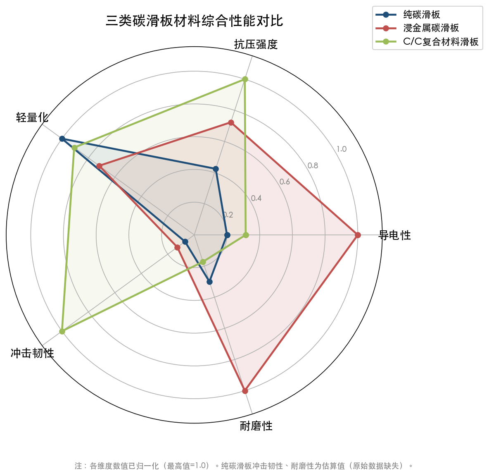

从上述对比中可以看出，浸金属碳滑板在导电性和力学强度方面全面优于纯碳滑板，同时保持了可接受的磨损率水平，这是其成为城轨主流产品的核心原因。C/C 复合材料滑板在力学性能（尤其是冲击韧性）和轻量化方面展现了代际优势，但其动态磨损率数据显示仍需工艺优化方能在耐磨维度与浸金属碳滑板形成竞争。

## 1.4 碳滑板综合性能要求

受电弓碳滑板的服役环境极为苛刻，需在高速滑动、大电流通过、机械振动、温度剧变、电弧侵蚀等多种载荷同时作用下保持稳定工作。综合来看，碳滑板的性能要求涵盖以下五个核心维度[西南交通大学学报论文](https://xnjdxb.swjtu.edu.cn/cn/article/doi/10.3969/j.issn.0258-2724.20250009 "受电弓滑板性能要求五方面")：

**一、电气性能（导电性）。** 碳滑板必须具备足够低的电阻率，以保证大电流通过时温升可控。城轨 DC 1500V 制式下单弓运行电流可达 2000A，要求碳条材料 20°C 电阻率一般不超过 7–10 μΩ·m（浸金属碳滑板）[天津锦美碳材](https://www.shimocailiao.cn/pages/shoudiangongtanhuaban.htm "受电弓碳滑板产品参数")。

**二、力学性能。** 碳滑板须承受弓网接触力（典型值 70±10N）的持续作用及运行中的冲击载荷，要求具有足够的抗折强度、抗压强度和冲击韧性。此外，碳滑板还需满足 ADD 自动降弓功能所要求的机械断裂特性——当碳条磨耗至剩余限度以下时，能在特定结构设计下触发降弓保护。

**三、耐磨性能。** 碳材料的自润滑特性是选择碳基滑板的重要原因。在城轨标准试验条件（120 km/h、400A、70±10N）下，浸金属碳滑板高度磨耗比典型值为 0.9 mm/万公里（标准要求 ≤15 mm/万公里），重量磨耗比典型值为 55 g/万公里（标准要求 ≤350 g/万公里）[天津锦美碳材](https://www.shimocailiao.cn/pages/shoudiangongtanhuaban.htm "地铁碳滑板磨耗性能指标")。碳滑板在自身磨耗的同时须对铜质接触网导线形成保护性磨损，即"牺牲滑板、保护导线"的设计理念。

**四、抗电弧侵蚀性能。** 列车运行中受电弓因线路条件变化（道岔、锚段关节等）可能短暂脱离接触网，在离线和重新接触瞬间产生电弧。碳滑板需在电弧高温侵蚀下保持结构完整性，不发生局部剥落或裂纹扩展。

**五、耐候性能。** 城轨碳滑板需适应 -40°C 至高温环境的温度变化范围，在低温下不脆裂、高温下不软化，保持稳定的力学与电气性能。IEC 62499 标准对碳滑板在高温和低温条件下的剪切强度均设有验收指标（剪切强度 ≥ 5 N/mm²）[IEC 62499:2008](https://cdn.standards.iteh.ai/samples/15768/499d8c5e2fb8489e9a763e0fa858092b/IEC-62499-2008.pdf "碳条剪切强度验收标准")。

## 1.5 碳滑板磨耗与更换判定标准

碳滑板作为受电弓系统中的典型易耗品，其更换判定主要依据碳条剩余厚度。通行的磨耗判定准则允许碳条磨损至原始厚度的约 35%——以南宁地铁 TSG18G 型受电弓为例，碳滑板标准厚度为 22 mm，当剩余厚度降至 6–7 mm 时即需更换[广西大学专利CN109269474A](https://patents.google.com/patent/CN109269474A/zh "受电弓滑板磨耗检测")。

深圳地铁均衡修规程进一步规定了更为细化的判定条件：碳滑板厚度最低处不得低于 5 mm；碳条表面凹槽曲率半径小于 106 mm 且在 50 mm 范围内凹陷超限时，即使平均厚度尚在容许范围内亦需立即更换，以防止集中磨损导致接触网导线嵌入碳条而引发弓网事故[机械工程学报论文](http://www.cjmenet.com.cn/CN/article/downloadArticleFile.do?attachType=PDF&id=26503 "城轨弓网系统异常磨损现状分析与防治技术研究")。

在更换周期方面，城轨碳滑板的正常磨耗更换周期约为 1 年，对应行驶里程约 10 万公里，磨耗率可控制在 1–2 mm/万公里[西南交通大学学报](https://xnjdxb.swjtu.edu.cn/article/doi/10.3969/j.issn.0258-2724.20220053 "弓网系统摩擦磨损性能研究进展，2024年")。然而实际磨耗率受线路条件、运行速度、气候环境、接触网状态等多因素影响，存在较大波动：正常工况下地铁碳滑板磨耗率约 0.4–5 mm/万公里，而异常磨损情况下可急剧升高至 12–35 mm/万公里。郑州地铁 3 号线即出现过正常磨耗 5 mm/万公里、异常磨耗高达 35 mm/万公里的案例[机械工程学报论文](http://www.cjmenet.com.cn/CN/article/downloadArticleFile.do?attachType=PDF&id=26503 "城轨弓网系统异常磨损现状分析与防治技术研究")。异常磨损的发生将显著缩短碳滑板使用寿命，增加非计划更换频次，对运维成本产生直接影响。

## 1.6 城轨碳滑板与高铁碳滑板的核心差异

碳滑板在城轨和高铁中承担相同的基本功能，但两者在技术规格与使用条件上存在显著差异。准确界定这些差异，对于明确本报告的研究边界具有重要意义。

| 对比维度 | 城轨（地铁） | 高铁（干线铁路） |
|---------|------------|----------------|
| 供电制式 | DC 750V / DC 1500V | AC 25kV |
| 运行速度 | ≤120 km/h（设计值 ≤160 km/h） | 250–350 km/h |
| 碳滑板长度 | 因弓型而异，典型 950–1050 mm | 约 750 mm |
| 更换周期 | 约 1 年 | 约 2 个月（2–3 万公里） |
| 运行电流 | 单弓 ≤2000A（DC） | AC 制式下电流较低 |
| 接触网类型 | 刚性悬挂/柔性悬挂 | 柔性悬挂 |

注：数据来源为[西南交通大学学报论文](https://xnjdxb.swjtu.edu.cn/article/doi/10.3969/j.issn.0258-2724.20220053 "弓网系统摩擦磨损性能研究进展")。

下图通过条形图与信息表格的组合形式，直观呈现城轨与高铁碳滑板在运行速度、更换周期、碳滑板长度等可量化维度的差异。

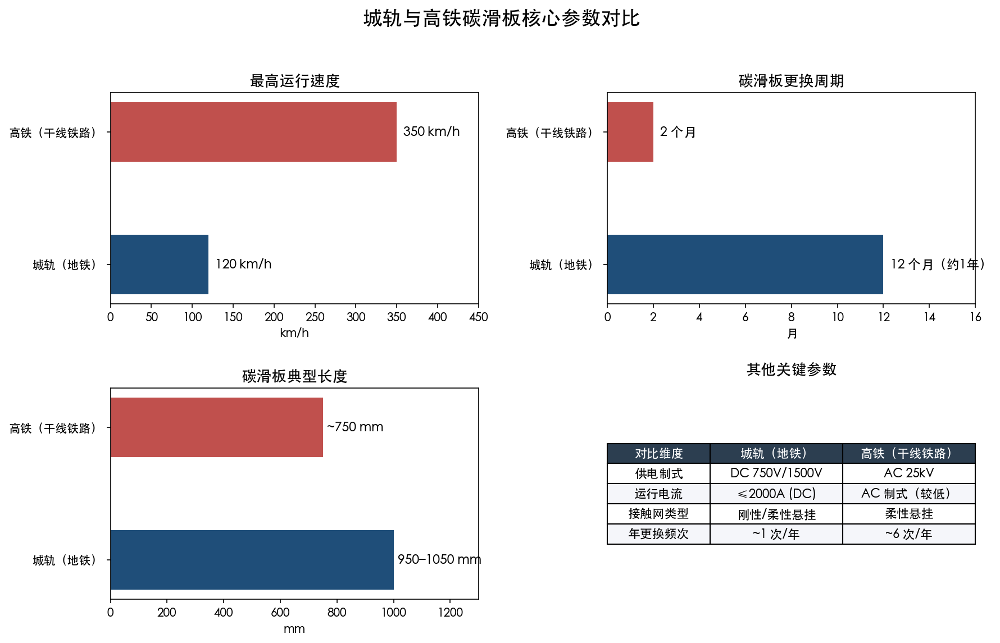

城轨碳滑板在直流大电流工况下工作，虽然运行速度较低、机械磨损速率较慢，但电流密度高带来的电气磨损和电弧侵蚀不可忽视。高铁碳滑板则面临高速滑动条件下更为剧烈的机械磨损，更换频次远高于城轨（约为城轨的 5–6 倍）。两者在材料配方、尺寸规格和供应商体系方面均存在一定差异，本报告后续章节的市场规模测算与竞争格局分析均以城轨场景为核心。

## 1.7 标准与认证体系

### 1.7.1 铁路行业标准

碳滑板产品的核心技术标准为中国铁路行业标准 TB/T 1842 系列，包含三个部分[全国标准信息公共服务平台](https://std.samr.gov.cn/hb/search/stdHBDetailed?id=8B1827F23FC2BB19E05397BE0A0AB44A "TB/T 1842.3 受电弓滑板第3部分：碳滑板")：

- **TB/T 1842.1**：粉末冶金滑板；
- **TB/T 1842.2-2016**：碳基复合材料滑板（浸金属碳滑板），规定了该类产品的技术要求、检验方法和检验规则；
- **TB/T 1842.3-2016**：碳滑板，是纯碳滑板和碳基滑板的通用检验验收标准。

其中 TB/T 1842.3-2016 是碳滑板产品检验检测的基础标准，检验项目覆盖碳条的体积密度、电阻率、抗折强度、抗压强度、冲击韧性、洛氏硬度六项核心理化指标，以及组装滑板层面的气密性能、剪切强度（室温/高温/低温）、挠曲和延伸、机械抗疲劳强度、温度特性、磨耗性能等全维度检验项目[国家铁路局](https://www.nra.gov.cn/jglz/sbjg/jyjcgf/202602/P020260224541855240915.pdf "GTJJL0004—2026 受电弓碳滑板检验检测细则")。

### 1.7.2 国家标准

GB/T 34572-2017《轨道交通 受流系统 受电弓碳滑板试验方法》修改采用国际标准 IEC 62499:2008，系统规定了碳滑板各项性能试验的具体操作方法，是 TB/T 1842 系列标准在试验方法层面的配套支撑文件。该标准规定碳条剪切强度验收标准 ≥ 5 N/mm²，泄漏率 ≤ 0.1 L/min[全国标准信息公共服务平台](https://std.samr.gov.cn/gb/search/gbDetailed?id=71F772D81E21D3A7E05397BE0A0AB82A "GB/T 34572-2017")。

### 1.7.3 国际标准

IEC 62499 是受电弓滑板领域的核心国际标准。IEC 62499 在 2021 年发布的新版本中将适用范围从"碳滑板"扩展至"所有类型接触条"，反映了全球范围内滑板材料多元化的技术趋势——除传统碳基材料外，陶瓷基（如 Ti₃SiC₂）等新型材料的研发正在拓宽滑板材料的技术边界[IEC Webstore](https://webstore.iec.ch/en/publication/65595 "IEC 62499:2021")。

### 1.7.4 最新检验规范

国家铁路局于 2026 年 2 月 24 日发布最新检验检测规范 GTJJL0004—2026《受电弓碳滑板》，由中车青岛四方车辆研究所有限公司归口、中铁检验认证中心有限公司起草[国家铁路局](https://www.nra.gov.cn/jglz/sbjg/jyjcgf/202602/t20260224_350781.shtml "GTJJL0004—2026 受电弓碳滑板")。该规范共设置 24 项检验项目，磨耗性能试验速度覆盖 120–350 km/h，体现了对城轨至高铁全速度等级碳滑板的统一质量管控思路。规范明确碳滑板磨耗性能试验参数为：滑板与接触线间正压力 70N±10N，试验电流单架受电弓 500A；对于机车受电弓碳滑板试验速度为 120 km/h 或 160 km/h，动车组碳滑板试验速度为 200–350 km/h[国家铁路局](https://www.nra.gov.cn/jglz/sbjg/jyjcgf/202602/P020260224541855240915.pdf "GTJJL0004—2026 全文")。

标准体系的持续更新表明，碳滑板产品质量管控正从依赖进口产品的"以用代检"模式向系统化的国产产品全流程认证模式转变，为国产碳滑板的市场推广提供了制度性保障。

## 1.8 本章小结

碳滑板是城轨列车受电弓系统中直接与接触网接触的关键集电元件，兼具导电取流、减摩保护和弧光防护三重功能。在材料体系上，浸金属碳滑板凭借优异的导电-力学-耐磨综合性能已成为城轨地铁的绝对主流产品，碳纤维增强复合材料滑板则代表着下一代技术方向。城轨碳滑板与高铁碳滑板在供电制式、运行速度、尺寸规格和更换周期等方面存在显著差异：城轨碳滑板的核心特征是直流大电流工况、较低运行速度和约 1 年的更换周期。以 TB/T 1842 系列为核心的行业标准体系和 GTJJL0004—2026 最新检验规范共同构成了碳滑板产品质量管控的制度框架。上述产品与技术基础将为后续章节的年用量测算、供应商竞争格局分析和行业趋势研判奠定必要的知识基础。

# 第2章 国内城市轨道交通运营规模与碳滑板年用量测算

## 2.1 城轨运营网络现状：里程与车辆保有量

### 2.1.1 运营里程与线网规模

截至 2025 年 12 月 31 日，中国大陆地区共有 58 个城市开通城市轨道交通运营线路 382 条，运营里程达 13,067.89 公里。其中，地铁运营里程 10,004.89 公里，占比 76.56%；其他制式（轻轨、市域快轨、有轨电车、磁浮、单轨、导轨式胶轮系统等）运营线路合计 3,063.00 公里，占比 23.44%。当年运营里程净增长 907.12 公里。[中国城市轨道交通协会](https://www.sina.cn/news/detail/5282589057224376.html "城市轨道交通2025年度统计和分析报告，2026年3月发布")

从交通运输部统计口径看，截至 2025 年底，全国 54 个城市开通运营城轨线路 343 条，运营里程 11,710.3 公里，车站 6,680 座。其中，43 个城市开通运营地铁、轻轨线路 282 条，运营里程 10,142.3 公里，地铁与轻轨占城轨总运营里程的 86.6%。2025 年全年新增运营线路 18 条、新增运营区段 32 段、新增运营里程 764.7 公里。[央广网](https://news.cnr.cn/native/gd/kx/20260120/t20260120_527500819.shtml "交通运输部2025年城轨运营数据，2026-01-20发布")

上述两组数据的差异源于统计口径不同：中国城市轨道交通协会（CAMET）统计覆盖范围较广，纳入部分市域快轨和新制式线路；交通运输部数据则以纳入月度运营统计的城市为口径。本章在碳滑板需求测算中，以 CAMET 数据作为车辆保有量基准（车辆配属数据仅 CAMET 发布），并以交通运输部数据交叉验证运营强度指标。

### 2.1.2 车辆保有量

截至 2025 年底，全国城轨交通累计配属车辆 13,268 列，较上年增加 954 列（+7.75%），车辆保有量接近 8 万辆。[中国城市轨道交通协会](https://www.sohu.com/a/1004862901_121123913 "城轨2025年度主要装备统计报告，2026-04-03发布")

回溯上一年度，截至 2024 年底全国城轨交通累计配属车辆 12,314 列，其中地铁配属列车 10,895 列（覆盖 41 个城市）。地铁列车保有量前五名城市分别为北京 1,282 列、上海 1,226 列、成都 781 列、广州 769 列、深圳 765 列，五市合计占全国地铁列车总量的 44.3%。[中国城市轨道交通协会](https://infosharingp2-oss.camet.org.cn/resources/manual/2025/04/01/660853988892741.pdf "城轨2024年度统计和分析报告")

按 2024 年地铁列车占城轨列车总量的比例（10,895/12,314 ≈ 88.5%）推算，2025 年底地铁列车约 11,740 列，其余为轻轨、单轨、市域快轨、有轨电车等制式车辆。车辆保有量是后文碳滑板装机存量测算的核心输入变量。

### 2.1.3 运营强度指标

2025 年全年，全国城轨实际开行列车 4,431 万列次，完成客运量 332.4 亿人次（同比 +3.1%），客运周转量 2,780.8 亿人次公里。[央广网](https://news.cnr.cn/native/gd/kx/20260120/t20260120_527500819.shtml "交通运输部2025年城轨运营数据") CAMET 统计的客运量为 333.83 亿人次（同比 +3.49%），两组数据基本一致。[中国城市轨道交通协会](https://www.sina.cn/news/detail/5282589057224376.html "城轨2025年度统计和分析报告")

2024 年全国城轨完成运营车公里 76.93 亿车公里，以当年 12,314 列车辆计算，每列列车年均运行约 10—11 万公里。[中国城市轨道交通协会](https://infosharingp2-oss.camet.org.cn/resources/manual/2025/04/01/660853988892741.pdf "城轨2024年度统计和分析报告") 这一运营强度指标与碳滑板约 10 万公里的更换里程阈值高度吻合，是后文测算碳滑板年更换频次的关键依据。

## 2.2 碳滑板年消耗量测算模型

### 2.2.1 测算框架

碳滑板作为城轨列车受电弓系统的核心易耗件，其年度消耗量可通过"自上而下"的方法进行测算。基本公式如下：

**年消耗量 ≈ 碳滑板装机列车数 × 每列受电弓数 × 每弓碳滑板条数 × 年更换次数 + 新线新车装机需求**

上述测算需依次确定以下关键参数：受电弓取电列车范围（剔除第三轨/集电靴取电制式车辆）、列车编组与受电弓配置、碳滑板更换周期及异常磨耗修正系数。

### 2.2.2 关键假设参数

下表汇总了本章测算所采用的各项假设参数及其依据来源：

| 参数项 | 取值 | 依据来源 |
|--------|------|----------|
| 2025年末城轨列车总保有量 | 13,268 列 | CAMET 2025年度主要装备统计报告 |
| 其中地铁列车 | ~11,740 列 | 按2024年地铁占比88.5%推算 |
| 受电弓取电制式占比 | ~95% | 国内绝大多数地铁线路采用架空接触网（刚性/柔性），仅北京1/2号线及八通线、广州1号线等少量早期线路采用第三轨 |
| 碳滑板相关列车数（存量） | ~12,600 列 | 13,268 × 95% ≈ 12,605 |
| 主流编组型式 | 6编组 | 一线城市部分大运量线路采用8编组 |
| 每列受电弓数量 | 2 台 | 6编组和8编组均以2台为主，部分线路4台 |
| 每台受电弓碳滑板条数 | 2 条 | 双条并排安装，行业通行配置 |
| 每列碳滑板装机量 | 4 条/列 | 2弓 × 2条/弓 |
| 城轨列车年均运行里程 | ~10万公里/列/年 | 2024年运营车公里76.93亿÷12,314列 |
| 碳滑板正常磨耗更换周期 | ~1年（~10万公里） | 磨耗率可控制在1—2 mm/万公里 |
| 异常磨耗提前更换比例 | +10%—20% | 行业经验估计 |

**受电弓配置说明：** 国内城轨地铁列车以 6 编组（B 型车）为主流，一线城市部分大运量线路采用 8 编组（A 型车）。无论 6 编组还是 8 编组列车，通常均配置 2 台受电弓（个别线路配 4 台，属少数情形）。每台受电弓弓头安装 2 条碳滑板（并排设置），因此每列标准地铁列车装配 2 弓 × 2 条/弓 = 4 条碳滑板。[天津地铁招标文件](http://www.tjgdjt.com/xinwen/img/site2/20200813/70f1a1d10cce209efea506.pdf "天津地铁6号线/8号线电动客车采购需求书") [天津锦美碳材](https://www.shimocailiao.cn/pages/shoudiangongtanhuaban.htm "受电弓典型配置")

**供电制式说明：** 国内绝大多数地铁线路采用架空接触网供电（DC 1500V 刚性/柔性悬挂），列车通过受电弓取流，碳滑板为必需耗材。仅北京地铁 1 号线、2 号线（含西直门—积水潭联络线）、八通线以及广州地铁 1 号线等少量早期建设线路采用 DC 750V 第三轨供电，列车通过集电靴取流，无需碳滑板。第三轨线路的运营里程占全国地铁总里程的比例已不足 5%，且近年来新建线路均未再采用该制式，因此在本章测算中将受电弓取电制式占比设定为 95%。

**碳滑板更换周期说明：** 城轨碳滑板正常磨耗更换周期约 1 年（约 10 万公里），磨耗率可控制在 1—2 mm/万公里。[西南交通大学学报](https://xnjdxb.swjtu.edu.cn/article/doi/10.3969/j.issn.0258-2724.20220053 "弓网系统摩擦磨损性能研究进展，2024年") 碳滑板更换核心标准为剩余厚度：允许磨损至原始厚度约 35%，例如南宁地铁 TSG18G 型标准厚度 22 mm，剩余 6—7 mm 时需更换。[广西大学专利CN109269474A](https://patents.google.com/patent/CN109269474A/zh "受电弓滑板磨耗检测") 深圳地铁均衡修规程则要求滑板厚度最低处不得低于 5 mm，凹槽曲率半径小于 106 mm 且 50 mm 范围内凹陷超限需更换。[机械工程学报](http://www.cjmenet.com.cn/CN/article/downloadArticleFile.do?attachType=PDF&id=26503 "城轨弓网系统异常磨损现状分析与防治技术研究")

实际运营中碳滑板磨耗率存在较大离散性。正常条件下地铁碳滑板磨耗约 0.4 mm/万公里，但在异常工况下（弓网参数匹配不当、电弧侵蚀、污染物介入等），磨耗率可急剧攀升至 12 mm/万公里甚至更高。郑州地铁 3 号线即出现过正常工况 5 mm/万公里、异常工况高达 35 mm/万公里的极端磨耗案例。[机械工程学报](http://www.cjmenet.com.cn/CN/article/downloadArticleFile.do?attachType=PDF&id=26503 "城轨弓网系统异常磨损现状分析与防治技术研究") 鉴于此，本章在基准测算中引入 +10%—20% 的异常损耗修正系数，以反映实际更换频次普遍高于理论计算值这一行业实际。

### 2.2.3 存量运维替换需求测算

基于上述参数，碳滑板年度运维替换需求测算如下：

- **碳滑板相关列车基数：** 全国城轨配属列车 13,268 列中，约 95% 采用受电弓取电制式，即约 12,600 列需要碳滑板。
- **基准年更换量：** 12,600 列 × 2 弓/列 × 2 条/弓 × 1 次/年 ≈ **50,400 条/年**
- **含异常磨耗修正后：** 50,400 ×（1 + 10%~20%）≈ **55,000—60,000 条/年**

### 2.2.4 新线新车装机需求

2025 年全国城轨交通新增配属列车 954 列。按同等受电弓取电比例及碳滑板配置推算，新车装机碳滑板需求约为：

- 954 列 × 95% × 4 条/列 ≈ **3,600 条/年**

新车装机需求约占碳滑板年度总需求的 6% 左右，运维替换需求占绝对主导地位（约 94%）。

### 2.2.5 年度总需求汇总

综合运维替换与新车装机两部分，2025 年度全国城轨碳滑板总需求量估算如下：

| 需求类别 | 测算公式 | 估算结果 |
|----------|----------|----------|
| 存量运维替换（基准） | 12,600列 × 4条/列 × 1次/年 | ~50,400 条 |
| 异常磨耗附加（+10%—20%） | 50,400 ×（10%—20%） | ~5,000—10,000 条 |
| 新车装机 | ~900列 × 4条/列 | ~3,600 条 |
| **年度总需求** | | **~59,000—64,000 条** |

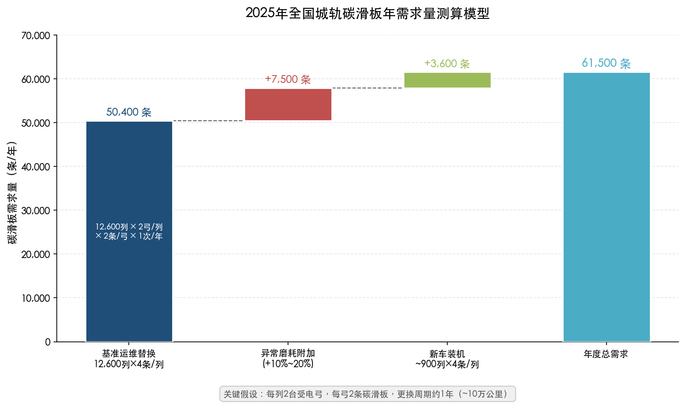

上图以瀑布图形式直观展示了碳滑板年需求量的测算逻辑链条：以 12,600 列受电弓取电列车为基数，按每列 4 条碳滑板、年更换 1 次计算得基准运维替换量 50,400 条，叠加异常磨耗附加约 7,500 条和新车装机约 3,600 条，得出年度总需求约 61,500 条（取区间中值）。

### 2.2.6 招标案例交叉验证

上述自上而下的测算结果可通过各地地铁公司的碳滑板招标采购记录进行交叉验证。

**石家庄地铁：** 2024—2025 年 3 号线碳滑板采购 1,437 根，用于 3 条线路 81 列列车的运维保障。[石家庄轨道交通集团](http://sjzmetro.cn/notcie/tender/7089.html "2024-2025年碳滑板采购招标公告") 按 81 列 × 4 条/列计算，基准年更换量为 324 条/年，而实际采购 1,437 根覆盖约 2 年周期，折合约 718 条/年，约为基准值的 2.2 倍。这一溢价反映了备件安全库存和异常磨耗导致的提前更换需求。

**天津轨道交通：** 2025 年碳滑板采购成交金额 137.165 万元，中标人为北京万高众业科技股份有限公司。天津配属约 318 列地铁列车，若按 4 条/列/年的基准更换量（1,272 条），则反推单价约 1,079 元/条，落在国产浸金属碳滑板的中低端价格区间。[天津轨道交通集团](http://www.tjgdjt.com/xinwen/content_58979.htm "2025年碳滑板采购成交结果公示")

**深圳地铁：** 2024 年 1050mm 碳滑板储备采购中标价 462.4 万元，中标人深圳市红商轨道交通有限公司。深圳配属约 765 列地铁列车，该笔采购覆盖部分线路的碳滑板储备需求。[深圳地铁智能招采平台](https://cg.shenzhenmc.com/fcgjggg/84076.jhtml "2024年1050mm碳滑板储备采购结果公告")

**成都地铁：** 2025 年线网电客车碳滑板采购项目最高限价 826 万元，第一中标候选人成都永贵东洋轨道交通装备有限公司报价 644.72 万元。成都配属 781 列地铁列车，反推综合单价约 1,827—2,065 元/条（因含多种规格产品），处于国产浸金属碳滑板的中高端区间。[四川省公共资源交易信息网](https://ggzyjy.sc.gov.cn/jyxx/002001/002001006/20250827/ddda3a99-2784-4a15-a255-c3d10dd9b5a0.html "成都地铁2025年碳滑板采购评标结果公示")

上述招标案例表明，各地碳滑板采购的实际用量和单价因规格型号、材质类型（纯碳 vs 浸金属碳）、品牌定位等因素存在显著差异，但整体均在自上而下测算模型的合理范围内，验证了模型估算结果的可靠性。

## 2.3 碳滑板市场规模估算

### 2.3.1 单价区间分析

碳滑板单价受材料类型、产品规格、品牌定位和采购批量等因素影响，呈现较大的价格离散度。根据各地招标中标数据反推及行业调研，当前主要品类的单价区间如下：

| 材料类型 | 单价区间（元/条） | 说明 |
|----------|-------------------|------|
| 纯碳滑板 | 600—1,200 | 自润滑性优良，电阻率较高，适用于低速轻载工况 |
| 浸金属碳滑板（国产） | 1,000—2,500 | 城轨主流产品，导电性与耐磨性综合最优 |
| 浸金属碳滑板（进口） | 3,000—5,000（估计） | Schunk、Morgan 等品牌，主要应用于高铁，城轨领域使用较少 |

天津轨道交通 2025 年采购反推的单价约 1,079 元/条，对应国产浸金属碳滑板的中低端区间；成都地铁 2025 年采购反推的综合单价约 1,827—2,065 元/条，处于国产浸金属碳滑板的中高端区间。两组数据的差异主要源于碳滑板规格差异（成都部分线路采用较大规格滑板）及供应商报价策略不同。

### 2.3.2 年度市场规模

以全国城轨碳滑板年消耗量约 59,000—64,000 条、国产浸金属碳滑板中位价约 1,500 元/条估算，全国城轨碳滑板年市场规模约 **0.9—1.0 亿元**。若考虑部分城市仍采购进口品牌产品（单价显著更高），市场规模上限约 **1.2—1.5 亿元**。

将碳滑板市场规模置于城轨运营总支出框架中加以观察：2025 年全国城轨完成建设投资 4,114.16 亿元，车辆购置投资 242.66 亿元。[中国城市轨道交通协会](https://www.sina.cn/news/detail/5282589057224376.html "城轨2025年度统计和分析报告") 碳滑板年市场规模约 1 亿元，仅占城轨年运营总成本（超过 2,500 亿元）的约万分之四。然而，碳滑板作为弓网系统唯一的高频更换耗材，其供应稳定性和产品质量直接关系到列车运行安全。这种"小市场、高关键度"的特征决定了碳滑板行业具有较高的技术壁垒和客户粘性，构成典型的利基市场形态。

## 2.4 需求结构分析：新建配套 vs 存量维保

### 2.4.1 运维替换占主导地位

从测算结果看，运维替换需求（约 55,000—60,000 条/年）占碳滑板年总需求的约 94%，新车装机需求（约 3,600 条/年）仅占约 6%。这一结构特征表明，碳滑板市场的核心驱动力是存量运营规模而非增量建设速度。

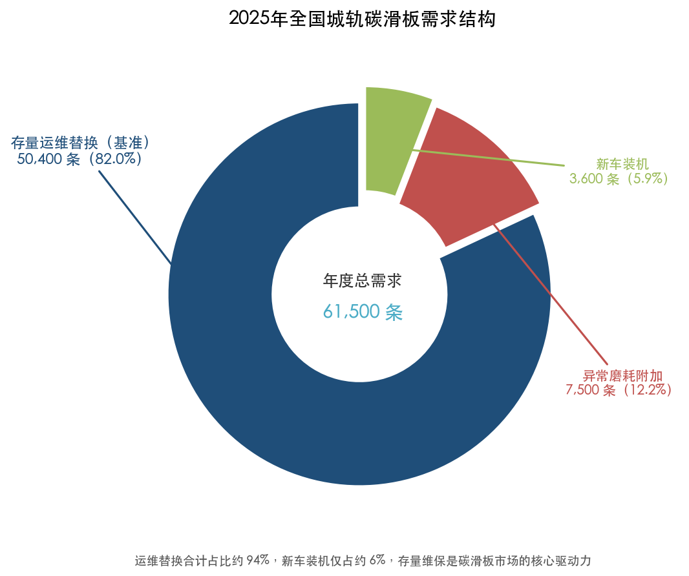

上图清晰呈现了碳滑板需求的三部分构成：存量运维替换（基准）占 82.0%、异常磨耗附加占 12.2%、新车装机仅占 5.9%。运维替换合计约占 94%，处于绝对主导地位。

即便城轨新线建设节奏放缓，只要运营里程和车辆保有量持续增长，碳滑板需求总量便将保持稳步增长态势。2025 年城轨车辆采购量较上年减少 34.41%（采购 2,482 辆 vs 上年 3,785 辆），但存量车辆的运维需求并不受新车采购波动影响，碳滑板消耗呈现显著的"刚性需求"特征。[中国城市轨道交通协会](https://www.sohu.com/a/1004862901_121123913 "城轨2025年度主要装备统计报告")

### 2.4.2 存量线路老龄化推动需求上行

截至 2024 年底，全国已有 10 个城市的 38 条线路运营超过 15 年、60 条线路运营超过 10 年。[中国城市轨道交通协会](https://infosharingp2-oss.camet.org.cn/resources/manual/2025/04/01/660853988892741.pdf "城轨2024年度统计和分析报告，既有线改造部分") 老龄化线路对碳滑板需求的加速效应主要体现在三个方面：

- **弓网参数退化：** 运营年限较长的线路接触网导线磨损渐增，弓网接触状态偏离设计工况，碳滑板异常磨耗概率相应上升；
- **运营频次提升：** 早期线路多位于城市核心区域，随客流增长不断加密发车间隔，列车年运行里程增加，碳滑板磨耗随之加速；
- **车辆更新周期交叠：** 部分运营 15 年以上线路的首批车辆已进入中修或厂修周期，维修过程中碳滑板同步更换形成集中性需求脉冲。

综合上述因素，我们判断存量老线的碳滑板单车年消耗量显著高于全国平均水平，老线运营规模的持续扩大将成为碳滑板需求增长的重要结构性驱动力。

## 2.5 中期增量空间展望（2026—2027年）

### 2.5.1 在建规模与新线增量

截至 2024 年底，全国 44 个城市在建城轨线路 5,833.04 公里（其中地铁 4,014.37 公里）。[中国城市轨道交通协会](https://infosharingp2-oss.camet.org.cn/resources/manual/2025/04/01/660853988892741.pdf "城轨2024年度统计和分析报告，建设情况部分") 2025 年全国 40 个城市在建线路总长 4,875.45 公里，全年完成建设投资 4,114.16 亿元（同比 -13.38%）。根据可统计的 34 个城市数据，2026 年计划完成投资总额约 2,727.31 亿元。[中国城市轨道交通协会](https://www.sina.cn/news/detail/5282589057224376.html "城轨2025年度统计和分析报告")

在建规模和投资额呈趋稳回落态势，反映出城轨行业正从高速扩张阶段转向高质量发展阶段。预计 2026 年城轨运营里程有望突破 13,500 公里，新增运营里程约 500—700 公里。按每公里配属约 1 列列车的行业经验，2026 年新增列车约 500—700 列，对应新车装机碳滑板约 2,000—2,800 条。

### 2.5.2 2026年碳滑板总需求预测

综合存量运维增长与新线新车增量，2026 年碳滑板年需求量预计约 **61,000—68,000 条**，市场规模约 **0.9—1.1 亿元**（按国产中位价估算）。增量主要来源于以下三个方面：

1. **存量网络自然增长：** 2025 年新增的约 950 列列车全年投入运营后，对应碳滑板运维替换增量约 3,800 条；
2. **老线维保频次提升：** 运营超过 10 年的线路数量持续增加，异常磨耗概率上升带动更换频次边际提高；
3. **客运量增长推高运营强度：** 2025 年城轨客运量同比增长 3.1%—3.5%，运行频次增加直接加速碳滑板磨耗。

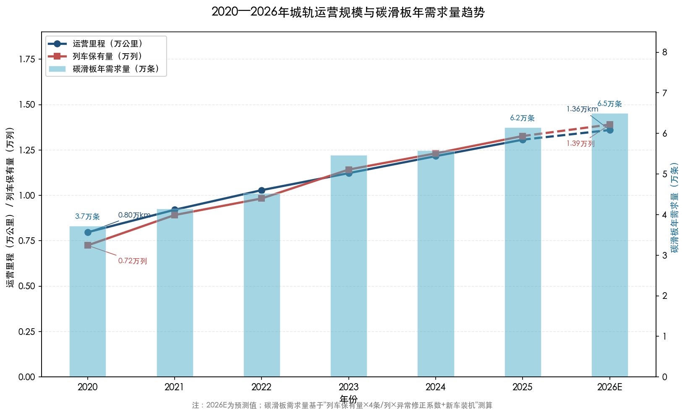

上图展示了 2020—2026 年城轨运营里程、列车保有量与碳滑板年需求量的同步增长轨迹。运营里程从 2020 年的 0.80 万公里增至 2025 年的 1.32 万公里（2026E 约 1.36 万公里），列车保有量从 0.72 万列增至 1.33 万列（2026E 约 1.39 万列），碳滑板年需求量从约 3.7 万条增至 6.2 万条（2026E 约 6.5 万条）。碳滑板需求增速与运营网络扩张高度同步，验证了"存量运营驱动"的需求逻辑。

碳滑板需求端的驱动力已完成从"新建配套"向"存量维保"的结构性转换。超过 1.3 万公里的存量运营网络所产生的持续维护更换需求，构成了碳滑板市场稳固的基本盘；新线建设速度的边际变化对总需求的影响趋于弱化。

### 2.5.3 碳滑板在弓网维保体系中的定位

碳滑板的年度市场规模虽仅约 1 亿元量级，但在城轨弓网系统维保支出中占据不可替代的核心地位。弓网系统的主要维保耗材包括碳滑板（受电弓侧）和接触网导线（供电侧），其中碳滑板的更换频次远高于接触网导线——后者设计寿命通常在 30 年以上。碳滑板几乎是弓网系统中唯一需要按年度周期性更换的易耗品，其质量直接决定弓网受流的可靠性和接触网的使用寿命。

这种"小体量、高粘性、强刚需"的市场特征，使碳滑板行业呈现出典型的利基市场格局：市场总量有限但进入壁垒较高，在位企业享有较强的客户锁定效应和持续的复购收入流。第 3 章将详细分析这一竞争格局的形成机制与主要参与者的市场地位。

# 第3章 主要供应商竞争格局与市场份额

## 3.1 全球与国内碳滑板供应商全景图

### 3.1.1 全球主要生产商

受电弓碳滑板行业在全球范围内呈现"欧洲传统强企主导、中国厂商快速崛起"的竞争格局。据 QYResearch 2026 年最新调研报告，全球轨道交通受电弓滑块前十大生产商依次为 Schunk Group（德国/奥地利）、Morgan Advanced Materials（英国）、Mersen（法国）、溢洋墨根集团（中国）、苏州东南佳新材料（中国）、Wabtec Corporation/PanTrac（美国）、北京万高众业科技（中国）、Toyo Tanso（日本）、红德电碳（中国）、金湾特碳（中国），前五大厂商合计占有全球市场约 67% 的份额。[QYResearch报告](https://www.renrendoc.com/paper/511365638.html "全球轨道交通受电弓滑块前10强生产商排名及市场份额, 2026年2月发布")

从全球市场规模看，QYResearch 预计 2032 年全球轨道交通受电弓滑块市场规模将达到 3.1 亿美元，未来数年年复合增长率（CAGR）约为 0.3%，属于典型的成熟稳定型耗材市场。[QYResearch报告](https://www.renrendoc.com/paper/511365638.html "全球轨道交通受电弓滑块市场规模预测") LP Information 2026 年报告则显示，2025 年全球轨道交通受电弓碳滑板产量约 200 万条，市场平均价格约 160 美元/条。[LP Information报告](https://www.lpinformation.com.cn/reports/1368081/rail-transit-pantograph-carbon-skateboard "全球受电弓碳滑板市场2026-2032")

全球竞争梯队在近年间发生了显著重组。QYResearch 2022 年报告将全球碳滑板厂商划分为三个梯队：第一梯队包括 Morgan、E-Carbon、Mersen 和中国中车，第二梯队包括 Schunk、SKC Carbon 等。[QYResearch报告目录](https://zhuanlan.zhihu.com/p/516976399 "2022-2028全球与中国受电弓碳滑板市场现状") 然而 2026 年的最新排名中，Schunk 已跃升至全球第一位，中国内资厂商占据前十名中的五席，反映出 2022—2025 年间中国碳滑板企业在全球市场地位的显著提升。

### 3.1.2 国内碳滑板供应商分类

国内城轨碳滑板市场的参与者可依据资本属性和业务模式划分为三类。

**第一类：外资品牌及其代理商。** 主要包括 Schunk Carbon Technology（奥地利/德国）、Morgan Advanced Materials（英国）、Mersen（法国）、E-Carbon/Gerken（比利时）和 Toyo Tanso（日本）。外资品牌在高铁碳滑板领域长期占据主导地位，但在城轨运维市场的直接参与程度相对有限。以 Schunk 为例，其碳条在奥地利制造、匈牙利组装，通过北京万高众业科技作为国内委托人进入中国市场，CRCC 认证型号覆盖 CRH380、CRH2、CRH5、CR400AF/BF 等主流动车组。[CRCC 2019年第47号认证公告](https://www.qts-railway.com.cn/rqts/r/cms/www/qts/img/railimage/download/crcc201947.pdf "CRCC铁路产品认证公告") Morgan 在上海设有高性能碳产品生产基地，提供自降弓滑板、防电弧滑板等产品。[Morgan官网](https://www.morganadvancedmaterials.com/en-gb/careers-at-morgan/life-at-our-sites/life-at-our-sites-shanghai/life-at-our-sites-shanghai-cn/ "Morgan上海基地") E-Carbon 集团则通过中国代理商（如深圳迅博威）进入国内城轨市场。[迅博威产品页](http://springride.m.sz36.cn/pd.jsp?pid=7 "E-Carbon受电弓碳滑板")

**第二类：内资自主品牌制造商。** 这是国内城轨碳滑板市场的核心供给力量，主要企业如下。

- **苏州东南佳新材料股份有限公司**（母公司位于苏州太仓，湖北仙桃设有特碳产业园）：国内首家拥有自主知识产权碳滑板的生产商。2015 年浸金属碳滑板装车和谐号，2020 年装车复兴号，产品已为全国 20 多个城市地铁配套。2023 年 9 月投资 20.7 亿元建设特碳产业园，一期于 2024 年 11 月投产，年产特碳材料 7000 吨；整体项目达产后预计年产特碳材料 15000 吨、年产值 26.6 亿元。公司已获认定为国家级专精特新"小巨人"企业。[湖北省经信厅](https://jxt.hubei.gov.cn/bmdt/qyfc/202405/t20240524_5215286.shtml "东南佳报道, 2024年5月") [仙桃日报](http://www.cnxiantao.com/2024zt/jssjddhsgz/xwbd/202411/t20241115_438041.shtml "特碳产业园一期投产, 2024年11月")

- **北京万高众业科技股份有限公司**（新三板 837600）：成立于 2010 年，主营国产化碳滑板研发生产和进口 Schunk 碳滑板代理，2013—2014 年率先通过机车碳滑板 CRCC 认证。2016 年营业收入 8735 万元（同比+52%），净利润 1567 万元（同比+43%），毛利率 48%；高铁碳滑板市场代理份额逾 50%，电力机车市场份额近 20%。永贵电器（300351.SZ）持有万高科技 19.4% 股份。[新三板智库万高科技研报](https://www.sohu.com/a/161735992_481756 "万高科技研报, 2017年") 万高科技的商业模式已由"进口代理为主"转向"国产化制造为主"，截至 2017 年自主产品业务占比已超过 50%，是国产替代的典型路径缩影。

- **天津锦美碳材科技发展有限公司**：始创于 1998 年，从事碳材和石墨材料研发生产，拥有受电弓纯碳滑板制备方法专利（CN100396510C），产品覆盖城轨纯碳滑板和浸金属碳滑板。[锦美集团官网](http://www.kimwan.cn/ "天津锦美碳材") [津云报道](http://www.app.tjyun.com/hd/system/2018/05/04/035465149.shtml "锦美碳材2018年报道")

- **大同新成新材料股份有限公司**：2017 年其 350 km/h 碳滑板通过全部 23 项指标测试，部分高铁碳滑板已具备替代进口的能力，据 2017 年行业数据年产石墨碳条 10—20 万条。[新成新材官网](http://kahon.com.cn/html/54204495-71290.html "350km/h测试公告")

- **成都阿泰克特种石墨、无锡智上新材料、辽宁红德电碳、金湾特碳**等：据 GIR 和 QYResearch 报告，上述企业均列入全球受电弓滑板主要生产商名单，在细分市场中具备一定竞争力。[GIR调研报告](https://www.globalinforesearch.com.cn/reports/2315526/current-collector-pantograph-strip "2025年全球受电弓用滑板研究报告") [QYResearch报告](https://www.renrendoc.com/paper/511365638.html "全球前10强排名")

**第三类：受电弓总成供应商（兼供碳滑板）。** 此类企业以受电弓整机为核心产品，碳滑板作为总成配套同步供应。

- **成都永贵东洋轨道交通装备有限公司**：2017 年由永贵电器与日本东洋电机合资设立，受电弓年产能 1500 套，累计装车超过 2700 台，覆盖成都地铁 5/6/8/19/27/30 号线及天津、重庆、济南等城市，并已进入印尼、泰国等海外市场。永贵电器 2024 年底增资至持股 66.6%，目前正研发时速 250 km/h 等级高速受电弓。[中国网四川频道](http://sc.china.com.cn/2026-03/10/content_43369598.html "永贵东洋报道, 2026年3月")

- **上海天海受电弓制造有限公司**：受电弓年产超过 1500 套，城轨受电弓市场占有率超 70%（年产值约 1.8 亿元）。作为受电弓总成供应商，上海天海同步提供碳滑板配件——2025 年大连地铁 1、2 号线碳滑板采购即由上海天海以直接采购方式中标，供应 320 个碳滑板。[新三板智库万高科技研报](https://www.sohu.com/a/161735992_481756 "万高科技研报引用行业数据, 2017年") [百度寻标宝](https://xunbiaobao.baidu.com/company?matchFieldsType=winner&id=MzI4MzYwMTIzMTEzMjA2 "上海天海碳滑板中标记录")

- **江苏洋溢墨根集团**（溢洋墨根）：年产受电弓碳滑板 12 万根、动车组碳滑板 4 万根（年产值约 10 亿元），在 QYResearch 全球前十排名中位列第四，产能规模居国内前列。[新三板智库万高科技研报](https://www.sohu.com/a/161735992_481756 "万高科技研报引用行业数据, 2017年") [QYResearch报告](https://www.renrendoc.com/paper/511365638.html "全球前10强排名")

此外，城轨碳滑板采购链条中还活跃着一批区域性代理商和贸易商，如深圳市红商轨道交通有限公司、北京聚洺科技有限公司等。这些企业通常不直接生产碳滑板，而是作为制造商与终端用户（地铁运营公司）之间的渠道中间商参与投标，在特定城市或线路上具有稳定的客户资源。

## 3.2 城轨碳滑板市场份额分析

### 3.2.1 份额分析方法论说明

城轨碳滑板市场的精确份额数据面临三重获取障碍：其一，主要供应商多为非上市中小企业，不公开披露分产品营收数据；其二，QYResearch、GIR 等咨询机构报告虽提供全球市场份额排名，但中国城轨细分市场的详细份额属付费内容，公开文献中未披露具体百分比；其三，城轨碳滑板采购以各地铁运营公司分散招标为主，缺乏统一的行业统计口径。因此，本节的份额分析主要基于三条路径展开：一是援引咨询机构的全球排名框架，二是系统梳理可公开获取的各城市地铁碳滑板中标记录，三是结合供应商产能及业务规模数据进行交叉推断。

### 3.2.2 从中标记录看城轨碳滑板供应格局

通过系统梳理 2024—2025 年各城市地铁碳滑板公开招标中标结果，可勾勒出国内城轨碳滑板的供应格局。下表汇总了主要城市的中标信息：

| 城市/线路 | 采购年度 | 中标方 | 中标金额/数量 | 来源 |
|-----------|---------|--------|-------------|------|
| 天津轨道交通 | 2025 年 | 北京万高众业科技 | 137.165 万元 | [天津轨道交通集团](http://www.tjgdjt.com/xinwen/content_58979.htm "2025年碳滑板采购成交结果") |
| 成都地铁（线网） | 2025 年 | 成都永贵东洋（第一候选人） | 报价 644.72 万元 | [四川省公共资源交易信息网](https://ggzyjy.sc.gov.cn/jyxx/002001/002001006/20250827/ddda3a99-2784-4a15-a255-c3d10dd9b5a0.html "成都地铁2025年碳滑板采购评标结果") |
| 深圳地铁 | 2024 年 | 深圳市红商轨道交通有限公司 | 462.4 万元（1050mm 规格） | [深圳地铁智能招采平台](https://cg.shenzhenmc.com/fcgjggg/84076.jhtml "2024年1050mm碳滑板储备采购结果") |
| 石家庄地铁 3 号线 | 2024—2025 年 | —（公开招标） | 1437 根 | [石家庄轨道交通集团](http://sjzmetro.cn/notcie/tender/7089.html "碳滑板采购招标公告") |
| 石家庄地铁 1 号线 | 2025—2026 年 | 北京聚洺科技（第一候选人） | — | [交通招标网](http://www.jtbidding.com/business/detail/?ggcode=I1301000075903968001001001 "中标候选人公示") |
| 杭州地铁 5 号线 | 2025—2027 年 | 苏州东南佳新材料 | 浸金属碳滑板 | [招标信息网](https://zj.zhiliaobiaoxun.com/article/83333768 "杭州地铁5号线碳滑板中标") |
| 杭州地铁 5 号线 | 2026 年 | 苏州东南佳新材料 | 碳滑条冬季保障采购 | [杭州市招标公告](https://www.zb800.com/s/16030005_b_330100_5.html "东南佳碳滑条中选公示") |
| 南昌轨道交通 | 2025 年 | 苏州东南佳（第一）、万高众业（第二） | — | [南昌轨道交通](https://www.ncmtr.com/topic_detail_12/1753.html "2025年碳滑板中标结果") |
| 大连地铁 1、2 号线 | 2025 年 | 上海天海受电弓制造 | 320 个（直接采购） | [百度寻标宝](https://xunbiaobao.baidu.com/company?matchFieldsType=winner&id=MzI4MzYwMTIzMTEzMjA2 "上海天海中标记录") |
| 上海地铁 8 号线 | 2024 年 | 苏州东南佳（单一来源） | 紧急抢修备件 | [上海招标网](https://shanghai.jianyu360.cn/jybx/20240619_24061880144880.html "车辆分公司碳滑板单一来源采购") |
| 洛阳轨道交通 | 2024—2025 年 | —（询比采购） | 带 ADD 气道碳滑板 | [洛阳轨道交通](https://www.lysubway.com.cn/purchasing_notice/detail/3118.html "碳滑板采购公告") |
| 郑州地铁 | 2024—2026 年 | —（比选采购） | 电客车碳滑板 | [郑州地铁](https://www.zzmetro.com/article/4685 "2026年碳滑板采购比选公告") |

上述中标记录按供应商维度汇总后，各主要中标方的中标频次分布如下图所示。

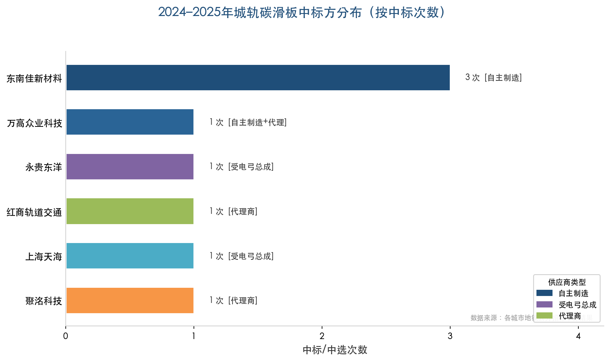

从中标记录中可归纳出以下四项关键结论：

**（1）苏州东南佳已成为城轨碳滑板市场的领先国产供应商。** 东南佳在杭州地铁（5 号线连续中标 2025—2027 年浸金属碳滑板供应合同）、南昌轨道交通（2025 年第一中标候选人）、上海地铁（8 号线单一来源采购）等多个城市取得碳滑板供应资格，覆盖面已达 20 多个城市。在可追踪的中标记录中，东南佳以 3 次中标/中选居首，体现出在城轨碳滑板领域的全国性布局优势。

**（2）北京万高众业科技在城轨与高铁双赛道均有布局。** 万高科技中标天津轨道交通 2025 年碳滑板全线路采购，并在南昌轨道交通 2025 年碳滑板招标中作为第二中标候选人紧随东南佳之后。万高科技兼具 Schunk 进口碳滑板代理和自主制造双重角色，"自主制造+进口代理"的双轨业务模式使其在不同价格区间和客户需求间灵活切换。

**（3）受电弓总成企业凭借系统集成优势切入碳滑板供应。** 成都永贵东洋以受电弓整机供应商身份中标成都地铁 2025 年碳滑板采购（第一候选人，报价 644.72 万元），上海天海以受电弓总成供应商身份直接向大连地铁供应 320 个碳滑板。此类企业的碳滑板供应通常与受电弓维保绑定，在已装车线路上具有较强的客户粘性。

**（4）城轨碳滑板市场以中小型专业化企业和代理商为主体，外资品牌直接参与有限。** 在上述中标记录中，未出现 Schunk、Morgan、Mersen 等外资品牌以自身名义直接中标城轨碳滑板运维采购的案例。外资品牌在国内城轨市场的存在感显著弱于高铁领域，表明城轨碳滑板市场的国产化程度已明显高于高铁。

### 3.2.3 市场份额定性判断

综合全球排名数据、中标记录和产能规模信息，我们对国内城轨碳滑板市场的份额格局作如下定性判断：

**第一梯队（估计合计份额 40%—50%）：** 苏州东南佳新材料、北京万高众业科技（含代理进口份额）。两家企业在城轨碳滑板领域的覆盖城市数量、中标频次和品牌知名度均领先于其他竞争者。东南佳以自主制造浸金属碳滑板为核心竞争力，万高科技则以"国产自研+Schunk 代理"双模式实现差异化覆盖。

**第二梯队（估计合计份额 25%—35%）：** 溢洋墨根集团（年产碳滑板 12 万根，产能规模居国内前列）、天津锦美碳材、大同新成新材、成都永贵东洋（受电弓总成+碳滑板捆绑供应）、上海天海受电弓（受电弓总成+碳滑板配套），以及红德电碳、金湾特碳等专业碳材料企业。

**第三梯队（估计合计份额 15%—25%）：** 区域性代理商和贸易商（深圳红商轨道、北京聚洺科技等），以及外资品牌在城轨领域的少量直接供应。

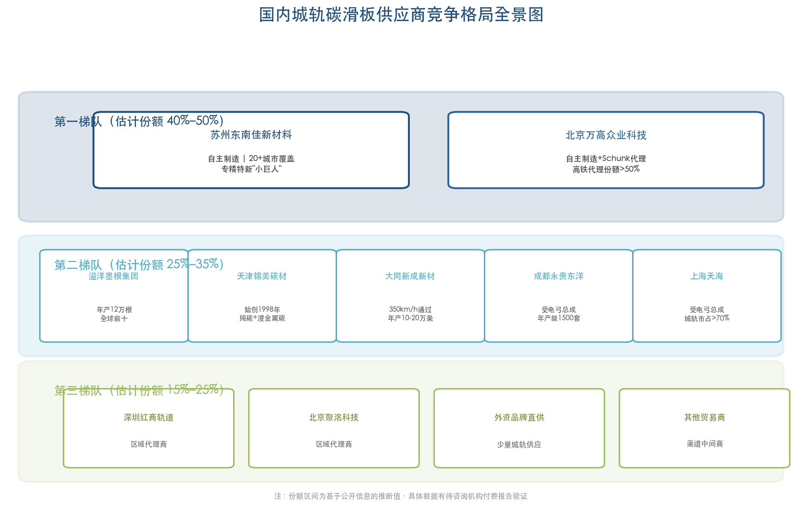

上述份额区间为基于公开信息的推断值。全球市场层面，QYResearch 报告列出了 2022—2025 年中国市场主要企业按销量和收入的占有率排名（报告第 2.4、2.5 节），但具体数值属付费内容，公开文献中未予披露，具体百分比数据有待付费数据的进一步验证。

## 3.3 行业进入壁垒分析

### 3.3.1 产品认证壁垒

CRCC（中铁检验认证中心）铁路产品认证是碳滑板行业最关键的刚性准入门槛。认证流程涵盖型式试验、工厂审查和现场装车运用考核三大环节，周期通常为 1.5—3 年。2026 年 2 月，国家铁路局发布最新检验检测规范 GTJJL0004—2026《受电弓碳滑板》，由中车四方车辆研究所归口、中铁检验认证中心起草，检验项目共计 24 项，磨耗性能试验速度覆盖 120—350 km/h，体现了对全速度等级碳滑板的统一质量管控要求。[国家铁路局](https://www.nra.gov.cn/jglz/sbjg/jyjcgf/202602/t20260224_350781.shtml "GTJJL0004—2026 受电弓碳滑板") [国家铁路局全文](https://www.nra.gov.cn/jglz/sbjg/jyjcgf/202602/P020260224541855240915.pdf "GTJJL0004—2026 全文")

就城轨碳滑板而言，CRCC 认证主要针对铁路（高铁/普速）产品，但城轨车辆制造商（如中车株机、中车长客、中车四方等）通常将 CRCC 认证或同等资质作为供应商准入的基本条件。即使部分城轨运维项目允许未获 CRCC 认证但通过车辆厂商认证的供应商参与投标，认证资质仍是衡量供应商技术实力的核心标志。

### 3.3.2 技术与工艺壁垒

碳滑板属于弓网系统的关键安全部件，其性能需在导电性、耐磨性、抗电弧侵蚀、机械强度、噪声振动表现与对接触线磨耗友好性之间取得多目标平衡。不同线路的速度等级、受流电流、气候条件和接触线材质对材料配方与烧结工艺的适配性提出了差异化要求。[QYResearch报告](https://www.renrendoc.com/paper/511365638.html "主要阻碍因素分析")

以浸金属碳滑板为例，其核心工艺环节包括碳素体预制件的配方设计、混捏成型、多段焙烧、石墨化处理，以及最关键的真空压力浸铜工艺。铜液浸渍的均匀性直接决定碳滑板的电阻率一致性和力学性能稳定性，而批次一致性控制是规模化生产的核心难点。此外，原材料（碳/石墨、金属浸渍材料、树脂等）的批次波动以及现场维护质量差异，均会对产品的故障率和全生命周期成本产生不确定性影响。

### 3.3.3 客户切换成本

碳滑板作为弓网系统的安全核心部件，导入新供应商通常需要经过线路试验、寿命评估与运营验证全流程，验证周期长、切换成本高。城轨运营公司在选定某一品牌碳滑板并积累稳定运行数据后，一般不会轻易更换供应商，因为更换涉及重新进行弓网匹配测试、调整维保规程以及承担潜在异常磨耗风险等多重成本。这种客户粘性使先进入者在存量线路上具有显著的"锁定效应"，新进入者往往只能通过新开通线路或新车装配环节寻求突破口。

### 3.3.4 资金与规模壁垒

碳滑板生产所需的专业化焙烧窑炉、石墨化设备和真空浸渍设备固定资产投入较大。以东南佳仙桃特碳产业园为例，仅一期工程投资即达数亿元规模。同时，城轨用浸金属碳滑板单价约 1000—2500 元/条，只有达到一定批量才能实现规模经济效益，这对中小型新进入者构成了显著的资金门槛。

## 3.4 进口碳滑板与国产碳滑板的对比

### 3.4.1 性能与价格对比

进口碳滑板（以 Schunk、Morgan 为代表）与国产碳滑板在性能、价格和服务三个维度上呈现系统性差异：

| 对比维度 | 进口碳滑板（Schunk/Morgan） | 国产碳滑板（东南佳/万高科技等） |
|---------|---------------------------|-------------------------------|
| 核心性能 | 批次一致性优良，高速工况下磨耗性能稳定 | 城轨工况（≤120 km/h）下性能已基本达标，批次一致性持续改善 |
| 单价区间 | 约 3000—5000 元/条（估计） | 约 1000—2500 元/条 |
| 供货周期 | 较长（进口清关+海运周期） | 较短（国内生产+物流） |
| 技术支持 | 依赖代理商转介 | 可提供直接现场技术支持 |
| 认证状态 | CRCC 认证覆盖高铁主力车型 | 部分企业已获 CRCC 认证或通过城轨车辆厂商认证 |

从价格角度看，国产碳滑板相较进口产品具有 40%—60% 的显著价格优势。天津轨道交通 2025 年碳滑板采购反推单价约 1079 元/条（中标人为万高科技）[天津轨道交通集团](http://www.tjgdjt.com/xinwen/content_58979.htm "2025年碳滑板采购成交结果")，成都地铁 2025 年采购反推综合单价约 1827—2065 元/条（中标候选人为永贵东洋）[四川省公共资源交易信息网](https://ggzyjy.sc.gov.cn/jyxx/002001/002001006/20250827/ddda3a99-2784-4a15-a255-c3d10dd9b5a0.html "成都地铁2025年碳滑板采购评标结果")。即使按国产中高端产品价格计算，仍显著低于进口产品的估计价格区间。

### 3.4.2 国产替代进程

国产碳滑板的替代进程呈现出"城轨先行、高铁跟进"的梯次推进特征。

**城轨领域：** 国产碳滑板在城轨市场的渗透率已达到较高水平。城轨碳滑板运行速度通常不超过 120 km/h，对碳滑板的性能要求低于高铁（250—350 km/h），国产浸金属碳滑板在这一速度等级下的磨耗性能和导电性能已能满足运营需求。从中标记录看，城轨碳滑板采购中外资品牌直接中标的案例极少，国产产品已占据绝对主导地位。

**高铁领域：** 国产替代进展相对滞后但正在加速。据招商银行研究院 2020 年报告，和谐号时期受电弓国产化率仅约 5%，碳滑板供应商主要为 Schunk 和法维莱/摩根，"是实现牵引系统完全国产化的最大障碍"。[招商银行研究院报告](https://pdf.dfcfw.com/pdf/H3_AP202004091377834474_1.pdf "动车组需求增量不减, 2020年4月") 中航证券 2021 年深度报告亦指出，截至报告发布时中国高铁九大关键技术中受电弓国产化率仅约 5%，是国产化率最低的核心部件之一。[中航证券深度报告](http://pdf.dfcfw.com/pdf/H3_AP202106161498240230_1.pdf "天宜上佳深度报告, 2021年6月") 此后，国产替代的标志性节点依次推进：2013—2014 年万高科技率先通过 CRCC 认证；2015 年东南佳碳滑板装车和谐号；2017 年大同新成新材 350 km/h 测试全项通过；2020 年东南佳碳滑板装车复兴号；2024 年东南佳特碳产业园一期投产；2026 年永贵东洋冲刺 250 km/h 高速受电弓研发。[湖北省经信厅](https://jxt.hubei.gov.cn/bmdt/qyfc/202405/t20240524_5215286.shtml "东南佳") [中国网四川频道](http://sc.china.com.cn/2026-03/10/content_43369598.html "永贵东洋") [新成新材官网](http://kahon.com.cn/html/54204495-71290.html "新成新材") [新三板智库](https://www.sohu.com/a/161735992_481756 "万高科技")

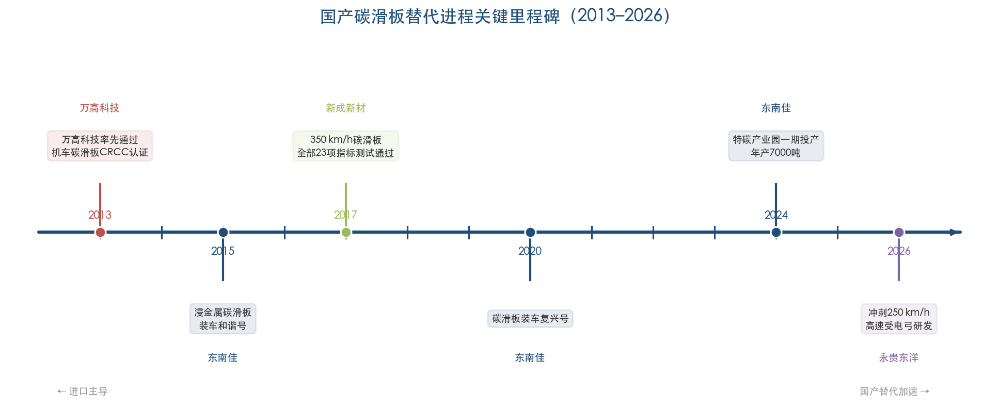

上述 5% 的数据为和谐号时期的历史水平。随着复兴号全面推行国产化以及上述标志性节点的持续推进，高铁碳滑板的国产化率在 2024—2026 年间预计已有实质性提升，但目前尚缺乏公开的精确渗透率数据。

### 3.4.3 城轨碳滑板国产化的驱动因素

城轨碳滑板国产化程度之所以显著高于高铁，主要源于以下四方面因素：

- **技术门槛差异：** 城轨碳滑板的运行速度等级（≤120 km/h）远低于高铁（250—350 km/h），对碳滑板高速磨耗性能和抗电弧侵蚀性能的要求相应降低，国产产品更易达标。

- **采购模式差异：** 高铁碳滑板由国铁集团统一招标、中车整车厂配套，认证壁垒高、供应链封闭；城轨碳滑板由各城市地铁运营公司自行分散采购，准入机制相对灵活，国产企业进入门槛更低。

- **价格敏感度差异：** 城轨运营公司面临的经营压力普遍大于国铁集团，对碳滑板采购成本更为敏感。国产产品 40%—60% 的价格优势在城轨采购决策中具有更高权重。

- **供货响应速度：** 城轨碳滑板属于高频更换耗材（年更换一次），对供货及时性要求较高。国产供应商在地理距离和响应速度上具有天然优势，在紧急抢修备件采购场景中尤为突出——上海地铁 8 号线 2024 年即以"紧急抢修备件、不涉及系统改变"为由对东南佳碳滑板实施单一来源采购。[上海招标网](https://shanghai.jianyu360.cn/jybx/20240619_24061880144880.html "车辆分公司碳滑板单一来源采购")

## 3.5 竞争格局演变趋势

城轨碳滑板市场的竞争格局在 2024—2026 年间呈现三个显著趋势：

**趋势一：国产品牌集中度提升，头部效应初步显现。** 东南佳和万高科技凭借技术积累、产能扩张和多城市覆盖，正逐步从分散的区域性中标记录中构建起全国性市场网络。东南佳特碳产业园一期于 2024 年 11 月投产，年产特碳材料 7000 吨，产能瓶颈得到缓解，有望进一步扩大在城轨市场的份额。[仙桃日报](http://www.cnxiantao.com/2024zt/jssjddhsgz/xwbd/202411/t20241115_438041.shtml "特碳产业园投产") 与此同时，永贵东洋凭借受电弓总成的系统集成优势，以"弓+滑板"捆绑模式在成都、天津等城市建立了较强的客户粘性。

**趋势二：受电弓整机企业与碳滑板专业厂商的竞争边界日趋模糊。** 受电弓总成供应商（永贵东洋、上海天海）既供应整机也供应碳滑板备件，与碳滑板专业制造商（东南佳、万高科技、锦美碳材等）形成直接竞争。两类企业各有优势：受电弓企业长于系统匹配保障和一站式服务，碳滑板专业厂商则在材料研发深度和价格灵活性方面占优。

**趋势三：外资品牌在城轨领域的存在感持续弱化。** 进口碳滑板在城轨运维采购中的占比预计将进一步下降，外资品牌在中国市场的核心阵地加速收缩至高铁动车组碳滑板领域。随着东南佳碳滑板成功装车复兴号、永贵东洋冲刺 250 km/h 高速受电弓研发，外资品牌在高铁领域的技术壁垒亦面临被逐步突破的压力。

# 第4章 行业趋势与展望（2026–2027）

前三章分别从产品技术基础、市场需求规模和供应商竞争格局三个维度完成了对国内城轨碳滑板行业的全景扫描。本章在此基础上，沿材料技术迭代、国产替代进程、政策环境演变和供需格局重塑四条主线，对 2026–2027 年碳滑板行业的发展方向进行前瞻性研判。

## 4.1 碳滑板材料技术的迭代方向

### 4.1.1 浸金属碳滑板的持续优化

浸金属碳滑板作为当前城轨和高铁领域的主流产品，在 2026–2027 年仍将占据市场的绝对主导地位。然而，其性能提升空间并未穷尽。西南交通大学 2025 年综述论文指出，当前受电弓碳滑板性能提升面临三大核心瓶颈：制备工艺中引入的孔隙与微裂纹缺陷、增强相与基体界面结合强度不足、增强相团聚与无序分布。[西南交大综述论文](https://xnjdxb.swjtu.edu.cn/cn/article/doi/10.3969/j.issn.0258-2724.20250009?viewType=HTML "高铁受电弓滑板用炭石墨材料研究进展, 2025") 围绕上述瓶颈，学术界和产业界正沿"多元杂化增强相设计""多尺度界面调控""低填料含量下高效导电/导热网络构建"三条路径推进性能优化。

在增强体材料选择上，碳纤维、碳纳米管和石墨烯是三类核心候选材料，三者的技术成熟度和产业化可行性存在显著差异。碳纤维分散性好、成本较低，已具备产业化应用基础，是 2026–2027 年产业化可行性最高的增强方向；碳纳米管导电导热性能极佳，但易团聚、成本偏高；石墨烯导电导热性能优良，但层间堆叠和高成本限制了规模化应用。后两类增强体在 2026–2027 年仍将主要停留在实验室研究阶段。[西南交大综述论文](https://xnjdxb.swjtu.edu.cn/cn/article/doi/10.3969/j.issn.0258-2724.20250009?viewType=HTML "碳纤维/碳纳米管/石墨烯对比, 表2")

### 4.1.2 碳纤维增强复合材料滑板——最接近产业化的新一代产品

在新一代碳滑板材料中，碳纤维增强碳/碳（C/C）复合材料滑板是距离产业化最近的技术路线。中南大学团队开发的预氧化碳纤维增强受电弓碳滑板（构建"铜网结构"），已形成系统的学术成果体系，相关成果发表于《铁道学报》2024 年第 46 卷第 6 期及 *Tribology International*（2024, 198: 109820）。[西南交大综述论文](https://xnjdxb.swjtu.edu.cn/cn/article/doi/10.3969/j.issn.0258-2724.20250009?viewType=HTML "引用文献[41]: 赵阳等, 铁道学报, 2024, 46(6): 56-64") 该技术路线通过铜网改性，在保持 C/C 复合材料低密度（1.60–2.20 g/cm³）的同时，实现了与浸金属碳滑板相当的导电性（电阻率 5–30 μΩ·m），并获得显著更高的力学性能——压缩强度 108–210 MPa，冲击强度 1.62–2.68 J/cm²，动态磨损率 4.5–5.95 mm/万公里。[中南大学专利CN104529496A](https://patents.google.com/patent/CN104529496A/zh "铜网改性炭/炭复合材料受电弓滑板, 2015年")

C/C 复合材料滑板相较于传统浸金属碳滑板的核心优势体现在两个方面：其一，密度更低（约为浸金属碳滑板的 65%–85%），有利于减轻受电弓弓头质量、改善高速动态跟随性能；其二，冲击韧性更高（约为浸金属碳滑板的 5–10 倍），在接触网硬点冲击和高速通过分相区时具有更强的抗崩裂能力。我们判断，C/C 复合材料碳滑板有望在 2026–2027 年间进入小批量试用阶段，但全面替代浸金属碳滑板尚需经历更长的装车验证周期和 CRCC 认证流程。

### 4.1.3 MAX 相陶瓷滑板——面向超高速场景的前瞻性储备

钛硅碳（Ti₃SiC₂）等 MAX 相陶瓷材料是面向 400 km/h 以上超高速场景的前瞻性技术储备。北京交通大学翟洪祥团队历经 14 年攻关，利用新型 MAC 相导电陶瓷的特殊晶体结构，研制出具有原创知识产权的多元碳化物复合材料（MCC）受电弓滑板，累计获得 14 项授权国家发明专利，并已建成年产 3 万条 MCC 滑板的生产线。该 MCC 滑板已在京广线、京沪线和湘桂线等高铁客运专线上完成 300 km/h 及以下速度等级、累计 60 万公里的装车载客安全运行考核，技术指标被纳入中国铁路总公司标准性技术文件（TJ/CL328-2014），并通过 CRCC 认证。[北京交通大学机电学院](https://mece.bjtu.edu.cn/cms/item/905.html "翟洪祥团队报道, 2017年")

北京交通大学还承担了"400 km/h 高速列车受电弓滑板材料应用特性研究"项目，并于 2023 年承接京港地铁十四号线碳滑板性能检测服务，表明 MAX 相陶瓷滑板的研究视野已延伸至城轨应用场景。[北京交通大学](http://faculty.bjtu.edu.cn/7562/ "李翠伟, 受电弓滑板材料研究") 对于超高速（400 km/h 以上）运行场景，现有纯碳和粉末冶金滑板均难以满足要求，新型复合材料滑板是技术演进的必然方向。[西南交大综述论文](https://xnjdxb.swjtu.edu.cn/cn/article/doi/10.3969/j.issn.0258-2724.20250009?viewType=HTML "引用文献[10]: 吴广宁等, 机车电传动, 2023(6): 1-10") 然而在城轨应用场景下（运行速度 ≤120 km/h），MAX 相陶瓷滑板的超高速性能优势难以充分体现，且制备成本显著高于浸金属碳滑板，因此 2026–2027 年内不太可能在城轨市场实现规模化应用。

### 4.1.4 技术迭代路径小结

综合以上分析，我们对城轨碳滑板材料技术的迭代路径作如下判断：

- **2026–2027 年（近期）：** 浸金属碳滑板继续占据城轨市场主导地位，重点在于工艺优化和批次一致性提升。碳纤维增强 C/C 复合材料滑板可能进入个别城轨线路的试装验证。
- **2028–2030 年（中期）：** C/C 复合材料滑板有望通过 CRCC 认证并开始商业化推广，首先在高速城际铁路和市域快轨中获得应用。
- **2030 年以后（远期）：** MAX 相陶瓷滑板随 400 km/h 以上超高速铁路的商业化运营进入批量应用阶段，但其在城轨领域的渗透仍取决于成本下降速度。

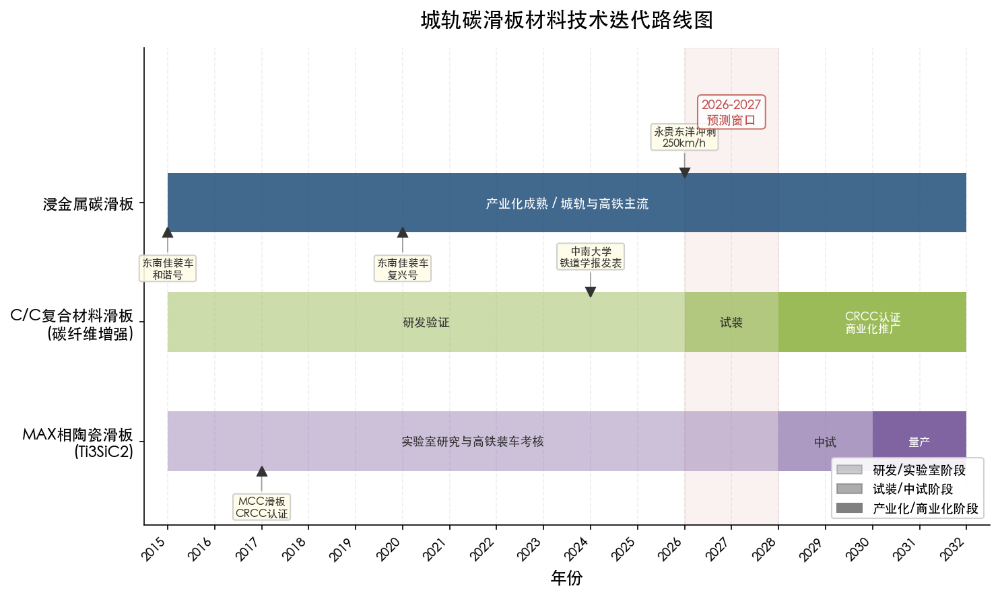

图 4-1 以时间轴形式呈现了浸金属碳滑板、C/C 复合材料滑板和 MAX 相陶瓷滑板三条技术路线从 2015 年至 2032 年的产业化推进阶段，灰色高亮区域标注了 2026–2027 年的预测窗口及关键里程碑节点。

## 4.2 国产替代进程的加速与深化

### 4.2.1 城轨碳滑板：国产化已达高位

第 3 章的竞争格局分析表明，城轨碳滑板市场的国产化程度已明显高于高铁领域。从 2024–2025 年各城市地铁碳滑板招标中标记录看，外资品牌以自身名义直接中标城轨运维采购的案例极为罕见——苏州东南佳、北京万高众业科技、成都永贵东洋、上海天海等国产及内资供应商已占据城轨碳滑板市场的绝对主导地位。我们判断，2026–2027 年国产碳滑板（含纯碳和浸金属碳）在城轨运维市场的份额已超过 90%，进口产品主要集中在少数早期引进的外资品牌受电弓配套替换件领域。

### 4.2.2 高铁碳滑板：国产替代加速推进

高铁碳滑板的国产替代进程相较城轨滞后，但正在加速追赶。和谐号时期受电弓国产化率仅约 5%，碳滑板供应商主要为 Schunk 和法维莱/摩根，被招商银行研究院报告认定为"实现牵引系统完全国产化的最大障碍"。[招商银行研究院报告](https://pdf.dfcfw.com/pdf/H3_AP202004091377834474_1.pdf "动车组需求增量不减, 复兴号开启国产新时代, 2020年4月") 此后国产替代进程持续突破关键节点：2013–2014 年万高科技率先通过 CRCC 认证；2015 年东南佳碳滑板装车和谐号；2017 年大同新成新材 350 km/h 测试全项通过；2020 年东南佳碳滑板装车复兴号；翟洪祥团队 MCC 滑板通过 CRCC 认证并完成 60 万公里装车运行考核。[湖北省经信厅](https://jxt.hubei.gov.cn/bmdt/qyfc/202405/t20240524_5215286.shtml "东南佳报道, 2024年5月") [北京交通大学机电学院](https://mece.bjtu.edu.cn/cms/item/905.html "翟洪祥团队MCC滑板产业化报道")

2026 年 3 月，永贵东洋正式披露正在冲刺时速 250 km/h 高速受电弓研发，并明确将下一步攻关时速 400 km/h 等级和智能化受电弓。[中国网](http://sc.china.com.cn/2026-03/10/content_43369598.html "永贵东洋报道, 2026年3月") 这一动向标志着国产受电弓（含碳滑板）正从城轨速度等级（≤120 km/h）向高铁速度等级（250–400 km/h）全面延伸，高铁碳滑板领域的国产替代正在进入加速阶段。

### 4.2.3 产能扩张加速供给端变革

国产碳滑板企业的产能扩张正在从根本上重塑行业供给格局。东南佳特碳产业园整体项目规划年产特碳材料 15000 吨、年产值 26.6 亿元，一期工程已于 2024 年 11 月投产（年产 7000 吨）。[仙桃日报](http://www.cnxiantao.com/2024zt/jssjddhsgz/xwbd/202411/t20241115_438041.shtml "特碳产业园一期投产, 2024年11月") 永贵东洋受电弓年产能达 1500 套，累计装车超过 2700 台，并已拓展至印尼、泰国等海外市场。[中国网](http://sc.china.com.cn/2026-03/10/content_43369598.html "永贵东洋报道, 2026年3月") 翟洪祥团队的 MCC 滑板已建成年产 3 万条的生产线。[北京交通大学机电学院](https://mece.bjtu.edu.cn/cms/item/905.html "翟洪祥团队报道")

上述产能扩张投资所覆盖的产品线不仅限于城轨碳滑板，还延伸至高铁碳滑板、电力机车碳滑板以及光伏、新能源等跨行业碳材料产品。但产能的集中释放将在 2026–2027 年对城轨碳滑板市场形成两方面影响：一是进一步压缩进口产品的市场空间；二是可能引发国产供应商之间的价格竞争加剧，推动碳滑板均价承压下行。

## 4.3 政策环境：从大建设到精细化运营

### 4.3.1 城轨建设审批趋严

城轨建设政策自 2018 年以来经历了持续收紧的过程。2018 年国务院办公厅 52 号文将申报建设地铁的城市一般公共财政预算收入门槛由 100 亿元提至 300 亿元，GDP 门槛由 1000 亿元提至 3000 亿元。[国家发改委](https://www.ndrc.gov.cn/xwdt/xwfb/201807/t20180713_954296.html "国办52号文解读, 2018年7月") 2026 年 1 月，国家发改委进一步印发《关于推进城际铁路健康可持续发展的意见》，要求新建城际铁路资本金比例不低于 50%、近期双向客流密度不低于 1500 万人次/年，运营 5 年未达预期 50% 客流的地区暂停新建项目。[云南网](http://m.yunnan.cn/system/2026/01/26/033842663.shtml "城际铁路健康可持续发展意见, 2026年1月")

"十五五"规划纲要进一步明确"坚持适度超前、不过度超前"的建设原则，强调"推进交通基础设施更新改造和养护管理"，城轨行业的战略重心从大规模新建向更新改造和运营管理转移的方向已十分清晰。[交通运输部](https://www.mot.gov.cn/xinwen/jiaotongyaowen/202603/t20260316_4201890.html "十五五规划纲要交通部署, 2026年3月")

这一政策转向对碳滑板行业的影响呈现"中性偏正"的特征。新线建设节奏放缓将减少新车装机碳滑板需求，但该部分仅占总需求的约 6%，影响幅度有限；而政策对"更新改造和养护管理"的强调反而为存量运营网络的维保支出提供了稳定的政策背书。

### 4.3.2 城轨投资回报分化与维保市场韧性

2026 年 2 月交通运输部数据显示，全国 54 城 345 条线路、11778.2 公里运营里程中，不同城市和线路之间的运营效益分化日益显著。部分有轨电车线路客流持续低迷（如文山月客运量仅 3–4 万人次），轨道交通投资回报压力在中小城市尤为突出。[21世纪经济报道](https://www.21jingji.com/article/20260323/herald/4a067dcb98fac7137c2bd3eb930d6c4a.html "五城领跑轨道交通第一梯队, 2026年3月")

然而，碳滑板作为安全关键耗材，其更换属于刚性支出——无论线路盈利状况如何，只要列车仍在运行，碳滑板的消耗和替换即不可避免。这一"运营即消耗"的特性赋予碳滑板市场显著的逆周期韧性：即便部分城市面临财政压力，也无法削减碳滑板等安全关键耗材的采购。从 2025 年数据看，全国城轨年运营总成本超过 2500 亿元，碳滑板年采购金额约 1 亿元（占比约万分之四），在维保预算中属于"不可省略的微量支出"，几乎不会成为成本压缩的对象。

### 4.3.3 标准体系升级驱动行业规范化

标准体系的持续升级构成 2026 年碳滑板行业的重要政策信号。2026 年 2 月，国家铁路局发布最新检验检测规范 GTJJL0004—2026《受电弓碳滑板》，由中车四方车辆研究所归口、中铁检验认证中心起草，检验项目共计 24 项，磨耗性能试验速度覆盖 120–350 km/h，体现了对全速度等级碳滑板的统一质量管控要求。[国家铁路局](https://www.nra.gov.cn/jglz/sbjg/jyjcgf/202602/P020260224541855240915.pdf "GTJJL0004—2026 全文, 2026年2月")

与此同时，国际标准层面，IEC 62499:2021 已将适用范围从碳滑板扩展到所有类型接触条，反映了全球滑板材料多元化的演进趋势。[IEC Webstore](https://webstore.iec.ch/en/publication/65595 "IEC 62499:2021") 新检验规范的发布将对碳滑板供应商产生双重影响：一方面，24 项检验指标和全速度等级覆盖提高了产品质量门槛，有利于技术实力领先的头部企业巩固市场地位；另一方面，统一规范的出台在一定程度上降低了不同城市地铁在碳滑板选型上的认知壁垒，有望促进跨区域竞争，逐步打破地方性的供应商"锁定效应"。

## 4.4 供需格局重塑与市场规模预测

### 4.4.1 需求端：稳中有增，驱动力结构性转换

2026–2027 年城轨碳滑板需求端呈现"总量稳增、结构转换"的特征。第 2 章测算显示，2025 年碳滑板年度总需求约 59000–64000 条。我们预计 2026 年需求量约 61000–68000 条，2027 年约 63000–70000 条，两年年均增速约 4%–6%。增量主要来源于以下三个方面：

**第一，存量网络自然增长。** 2025 年新增约 950 列列车全年投入运营后，对应碳滑板运维增量约 3800 条。2026 年预计新增运营里程 500–700 公里，对应新车装机碳滑板约 2000–2800 条。在建线路总长约 4875 公里，为 2027 年及以后的增量提供充足储备。[中国城市轨道交通协会](https://www.sina.cn/news/detail/5282589057224376.html "城轨2025年度统计和分析报告")

**第二，老线维保频次上升。** 截至 2024 年底，10 个城市的 38 条线路运营超过 15 年、60 条线路运营超过 10 年。[中国城市轨道交通协会](https://infosharingp2-oss.camet.org.cn/resources/manual/2025/04/01/660853988892741.pdf "城轨2024年度统计和分析报告") 老龄化线路的接触网导线磨损渐增，弓网参数退化导致碳滑板异常磨耗概率上升、更换频次增加。2026–2027 年间将有更多线路迈入"10 年运营"门槛，这一结构性驱动力将持续增强。

**第三，客运量增长推高运营强度。** 2025 年城轨客运量同比增长 3.1%–3.5%，列车运行频次随之增加，直接加速碳滑板磨耗。[央广网](https://news.cnr.cn/native/gd/kx/20260120/t20260120_527500819.shtml "交通运输部2025年城轨运营数据")

综上，碳滑板需求端的核心驱动力已完成从"新建配套"向"存量维保"的结构性转换。超过 1.3 万公里运营里程所产生的持续维护更换需求构成了市场的稳固基本盘，新线建设速度的边际变化对总需求的影响趋于弱化。

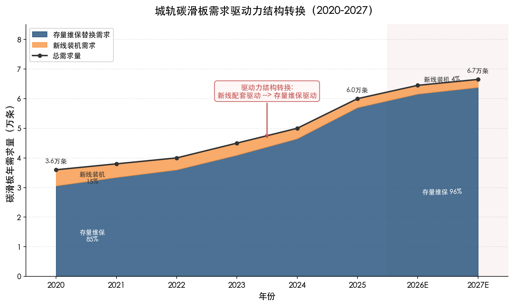

图 4-2 展示了 2020–2027 年碳滑板年需求量的驱动力结构变化。存量维保替换需求占比从 2020 年的 85% 攀升至 2027 年预测的 96%，而新线装机需求占比从 15% 降至 4%，总需求量从约 3.6 万条增至约 6.7 万条，"存量维保主导"的格局已基本确立。

### 4.4.2 供给端：产能释放与竞争加剧

供给端在 2026–2027 年面临的核心命题是产能集中释放后的市场消化问题。东南佳特碳产业园一期（年产 7000 吨）已于 2024 年末投产，整体项目达产后年产特碳材料 15000 吨、年产值 26.6 亿元。[仙桃日报](http://www.cnxiantao.com/2024zt/jssjddhsgz/xwbd/202411/t20241115_438041.shtml "特碳产业园投产, 2024年11月") 溢洋墨根集团年产受电弓碳滑板 12 万根、动车组碳滑板 4 万根。[新三板智库万高科技研报](https://www.sohu.com/a/161735992_481756 "万高科技研报引用行业数据, 2017年") 翟洪祥团队 MCC 滑板年产能达 3 万条。[北京交通大学机电学院](https://mece.bjtu.edu.cn/cms/item/905.html "翟洪祥团队报道")

从产能与需求的匹配关系看，仅溢洋墨根和翟洪祥团队两家的碳滑板年产能即超过 15 万条，远高于全国城轨年需求量的 6–7 万条。即便考虑到上述产能同时服务高铁、电力机车和出口市场，国内城轨碳滑板市场在供给端已处于产能充裕乃至过剩状态。

产能过剩的直接后果是价格竞争加剧。从已公开的招标数据看，天津轨道交通 2025 年碳滑板采购反推单价约 1079 元/条，已处于国产浸金属碳滑板的中低端区间。[天津轨道交通集团](http://www.tjgdjt.com/xinwen/content_58979.htm "2025年碳滑板采购成交结果") 我们判断，2026–2027 年碳滑板均价将面临一定的下行压力，尤其在招标竞争激烈的中低速城轨市场。

### 4.4.3 2026–2027 年市场规模预测

综合需求端和供给端分析，我们对 2026–2027 年城轨碳滑板市场作如下预测：

| 指标 | 2025 年（基准） | 2026 年（预测） | 2027 年（预测） |
|------|----------------|----------------|----------------|
| 城轨运营里程（万公里） | 1.31–1.32 | ~1.36 | ~1.40 |
| 列车保有量（万列） | ~1.33 | ~1.39 | ~1.44 |
| 碳滑板年需求量（万条） | 5.9–6.4 | 6.1–6.8 | 6.3–7.0 |
| 碳滑板均价（元/条） | ~1500 | ~1400–1500 | ~1300–1500 |
| 市场规模（亿元） | 0.9–1.0 | 0.9–1.0 | 0.8–1.1 |

碳滑板年需求量在 2026–2027 年将保持约 4%–6% 的温和增长，但受供给端产能充裕带来的价格下行压力影响，以金额计的市场规模增速将低于数量增速，大致维持在 0.9–1.1 亿元的区间内。

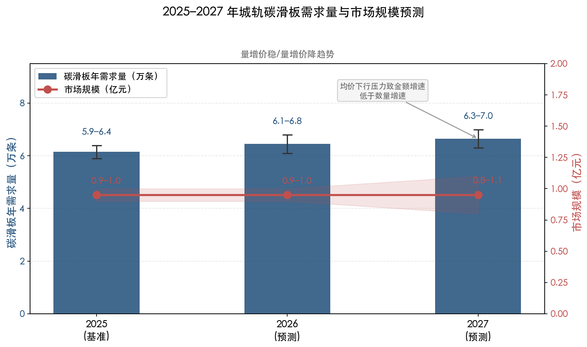

图 4-3 以柱状图展示碳滑板年需求量区间，以折线图叠加市场规模区间，直观呈现"量增价稳/量增价降"的趋势——需求量温和增长约 4%–6%，但均价下行压力使金额增速低于数量增速。

### 4.4.4 竞争格局演变趋势

2026–2027 年城轨碳滑板市场的竞争格局预计将沿以下三个方向演变：

**趋势一：头部国产企业份额进一步集中。** 东南佳凭借产能扩张和全国 20 多个城市的覆盖网络，有望进一步巩固其在城轨碳滑板市场的领先地位。万高科技依托"国产自研+Schunk 代理"双轨模式保持差异化竞争力。上述两家企业加上永贵东洋、上海天海等受电弓总成供应商的碳滑板配套份额，预计合计将占据城轨市场 50% 以上的份额。

**趋势二：受电弓总成企业与碳滑板专业厂商的竞合关系深化。** 受电弓总成供应商（永贵东洋、上海天海）以"弓+滑板"捆绑模式在已装车线路上建立了强客户粘性，而碳滑板专业制造商（东南佳、万高科技、锦美碳材等）在材料研发深度和跨线路覆盖方面更具优势。两类企业在运维后市场的竞争边界将继续模糊化。

**趋势三：外资品牌在城轨领域的市场存在趋近于零。** 进口碳滑板在城轨运维采购中的占比预计进一步下降，外资品牌在中国市场的核心阵地正加速收缩至高铁动车组碳滑板领域。随着东南佳碳滑板成功装车复兴号、永贵东洋冲刺 250 km/h 高速受电弓研发、翟洪祥团队 MCC 滑板具备量产能力，外资品牌在高铁领域所面临的国产替代压力亦将持续增大。

## 4.5 智能化运维对碳滑板行业的潜在影响

碳滑板作为高频更换耗材，其磨耗状态监测和更换决策正在向智能化方向演进。受电弓碳滑板磨损监测视觉传感器等智能检测装备已在城轨和高铁中推广应用，通过实时采集碳滑板厚度、表面损伤和磨耗速率数据，为精准化维保决策提供支撑。

智能化运维对碳滑板行业的影响是双向的。一方面，基于状态的预测性维修（CBM）替代传统的定期更换策略，可能减少部分"预防性提前更换"造成的浪费，在一定程度上抑制碳滑板消耗量；另一方面，智能监测系统能更敏感地捕捉异常磨耗的早期信号，在弓网参数退化初期即触发干预，可能增加碳滑板在异常工况下的更换频次。综合来看，智能化运维对碳滑板年消耗总量的净影响有限，但有望推动碳滑板产品向标准化、高一致性方向发展——智能监测系统对碳滑板磨耗行为的可预测性提出了更高要求，批次一致性不足的产品将更容易在智能运维体系中暴露质量短板。

## 4.6 本章核心判断

基于材料技术迭代、国产替代进程、政策环境和供需格局四条主线的分析，我们对 2026–2027 年城轨碳滑板行业的前景给出以下核心判断：

**第一，市场规模稳中微增，呈现"量增价稳"或"量增价降"格局。** 碳滑板年需求量受益于存量运营网络的持续扩张和老线维保频次上升，预计从 2025 年的约 6 万条增至 2027 年的约 6.5–7 万条。但供给端产能充裕引发的价格竞争将压制金额增速，以金额计的市场规模大致维持在 0.9–1.1 亿元。

**第二，国产替代在城轨领域已基本完成，高铁将成为下一核心战场。** 城轨碳滑板国产化率已超过 90%，未来两年内将趋近 100%。高铁碳滑板是国产替代的下一个核心战场——东南佳复兴号装车验证、永贵东洋 250 km/h 高速受电弓研发、翟洪祥团队 MCC 滑板的量产能力，构成了国产替代向高铁领域全面渗透的三大支撑。

**第三，材料技术迭代周期较长，浸金属碳滑板仍是两年内的绝对主流。** 碳纤维增强 C/C 复合材料滑板是最接近产业化的下一代产品，但 CRCC 认证周期（1.5–3 年）和装车验证要求决定了其在 2026–2027 年内难以实现规模化替代。MAX 相陶瓷滑板面向超高速场景，与城轨应用场景的适配度有限。

**第四，行业进入"精耕存量"新阶段。** 政策导向从大规模新建转向更新改造和精细化运营，碳滑板市场的增长逻辑从"新线配套驱动"彻底转向"存量维保驱动"。这一转变有利于在位供应商凭借客户粘性和认证壁垒巩固竞争优势，但也意味着市场总量增速趋缓，行业可能进入以份额争夺为主要竞争形态的新阶段。

# 结论与风险提示

## 核心结论

**结论一：城轨碳滑板是一个"小体量、高关键度、强刚需"的典型利基市场。** 2025 年全国城轨碳滑板年需求量约 59,000—64,000 条，市场规模约 0.9—1.0 亿元，仅占城轨年运营总成本的约万分之四。然而，碳滑板作为弓网系统中唯一需要按年度周期性更换的安全关键耗材，其供应稳定性和产品质量直接关系到列车运行安全，因此在维保预算中属于不可削减的刚性支出。这种"运营即消耗"的特性赋予碳滑板市场显著的逆周期韧性。

**结论二：需求结构已完成向"存量维保驱动"的根本性转换。** 存量运维替换需求占碳滑板年总需求的约 94%，新车装机需求仅占约 6%。超过 1.3 万公里的存量运营网络构成了稳固的需求基本盘，新线建设节奏的边际变化对总需求的影响趋于弱化。存量线路老龄化（截至 2024 年底已有 38 条线路运营超过 15 年、60 条线路运营超过 10 年）和客运量增长推高运营强度，将成为碳滑板需求温和增长的结构性驱动力。

**结论三：国产碳滑板在城轨领域的替代已基本完成。** 2024—2025 年各城市地铁碳滑板招标中标记录显示，外资品牌以自身名义直接中标城轨运维采购的案例极为罕见，国产碳滑板（含纯碳和浸金属碳）在城轨运维市场的份额已超过 90%。苏州东南佳新材料和北京万高众业科技构成第一梯队，溢洋墨根集团、天津锦美碳材、成都永贵东洋、上海天海等构成第二梯队。高铁碳滑板将是国产替代的下一核心战场。

**结论四：浸金属碳滑板仍是 2026—2027 年城轨市场的绝对主流产品。** 碳纤维增强 C/C 复合材料滑板在力学性能和轻量化方面展现了代际优势，是最接近产业化的下一代产品，但 CRCC 认证周期（1.5—3 年）和装车验证要求决定了其在短期内难以实现规模化替代。MAX 相陶瓷滑板面向超高速场景（400 km/h 以上），与城轨应用场景的适配度有限。

**结论五：行业进入"精耕存量"阶段，头部集中度有望提升但总量增速趋缓。** 2026—2027 年碳滑板年需求量预计保持约 4%—6% 的温和增长，但供给端产能充裕引发的价格下行压力将压制金额增速，市场规模大致维持在 0.9—1.1 亿元。头部国产企业凭借产能扩张、多城市覆盖和认证壁垒有望进一步提升市场份额，行业可能进入以份额争夺为主要竞争形态的新阶段。

## 风险提示

**一、测算模型的参数不确定性。** 本报告碳滑板年用量测算基于多项关键假设参数（受电弓取电制式占比 95%、每列 2 台受电弓、年更换 1 次、异常磨耗修正系数 +10%—20%），部分参数源于行业经验估计而非精确统计数据。实际消耗量因各城市线路条件、运营强度、气候环境和维保策略的差异，可能与测算结果存在偏差。

**二、市场份额数据的局限性。** 城轨碳滑板市场的精确份额数据面临主要供应商多为非上市企业不公开披露分产品营收、咨询机构报告具体份额数据属付费内容、城轨采购以各地铁运营公司分散招标为主缺乏统一统计口径等三重获取障碍。本报告的份额分析主要基于公开中标记录和产能规模数据的交叉推断，定性判断置信度高于定量精度。

**三、碳滑板价格区间的离散性。** 碳滑板单价受材料类型、产品规格、品牌定位和采购批量等因素影响，呈现较大的价格离散度（国产浸金属碳滑板约 1,000—2,500 元/条）。市场规模估算采用中位价约 1,500 元/条进行计算，实际市场规模可能因价格结构变化而偏离估算区间。

**四、新线建设政策收紧的影响。** 城轨建设审批持续趋严，"十五五"规划纲要强调"坚持适度超前、不过度超前"，若新线建设节奏进一步放缓，将减少新车装机碳滑板需求。但鉴于该部分仅占总需求的约 6%，对碳滑板总需求量的影响有限。

**五、技术替代风险。** C/C 复合材料滑板若在 2027—2028 年间通过 CRCC 认证并进入商业化推广阶段，可能对现有浸金属碳滑板供应商的技术壁垒和市场地位形成冲击。此外，第三轨供电制式在新型城轨线路中的潜在推广亦可能减少碳滑板的适用范围，但目前尚无明确的技术趋势信号。
