# 执行摘要

"神"字在《老子》五千言中仅出现8次，分布于第六、二十九、三十九、六十共4个章节，却在两千余年的注疏传统中催生了截然不同乃至相互抵牾的诠释范式。本研究以"谷神""神器""神得一以灵""其鬼不神"四组核心文本为贯穿线索，系统考察了从汉代河上公注到当代陈鼓应注译之间"神"义诠释的五次范式转换，揭示每次转换背后的思想史驱动力及其对文本意义空间的重塑效应。

研究发现，《老子》中"神"的四大义项——"谷神"义（宇宙论/道论）、"神妙/神圣"义（政治论）、"神明"义（本体论）、"鬼神"义（治道论）——横跨先秦"神"字从"外在灵异"到"变化妙道"再到"内在主体"的三阶段语义演变，其多层次的语义开放性为后世注家从不同维度切入提供了文本内部的合法空间。

五次范式转换的核心逻辑如下：（1）汉代河上公以"精气神"体系将"谷神"收缩为五脏藏神的养生术语，严遵以"道—德—神明—太和"构建哲学化层级，《想尔注》以"精结为神"开启宗教化路径；（2）魏晋王弼以"谷中央无者""无形无方"等本体论范畴系统剥离"神"的养生化与术数化附着，确立"以无释神"范式；（3）隋唐成玄英、李荣引入佛教般若学"遣之又遣"的思辨工具超越王弼一元框架，唐玄宗则以"虚而能应"将"神"纳入帝国治理的政治感应论；（4）宋元时期理学家以"性之妙"（苏辙）、"至妙之理"（朱熹）收编"神"义，内丹学者以"天谷泥丸—元神"体系将"神"编码为精确的修炼术语，李道纯以"虚灵不昧"实现两路径的深度融合；（5）清代考据学以"谷/浴/欲"通假说和"分读说"从文本根基上动摇既有义理建构，近现代学者以语言学、比较哲学、出土文献等方法重新审视"神"的原始语义。

本研究核心判断：每一次范式转换均由外部知识体系竞争（黄老学→玄学→重玄学→理学/内丹学→考据学/现代学术）所驱动，"神"义在不同时代的扩张与收缩构成了一种周期性张力——意义的过度扩张引发文本基础的反思性收缩，过度收缩又激发新的义理展开。从伽达默尔"效果历史"的视角来看，"谷神不死"六字在两千年间所生发的丰富意义——"五脏藏神""谷中央无者""虚容无滞""泥丸宫元神""性之妙""至妙之理""虚灵不昧"——既非原文"固有"之义，亦非纯粹的主观附会，而是文本与不同历史处境中的读者相遇时所共同生成的意义。这一诠释史本身，构成了中国思想史自我更新的一份活的记录。

# 第1章 《老子》原文中"神"的语义场与文本分布

## 引言：为何从"神"字切入《老子》诠释史

"神"是中国思想史上歧义性最为显著的核心概念之一。在《老子》五千余言中，"神"字仅出现8次，分布于4个章节，却在两千年注疏传统中引发了绵延不绝的诠释争议——汉代河上公将其纳入"养神"的身体修炼话语，魏晋王弼以"谷中央无者"重构其本体论内涵，宋元内丹家更将之融入"泥丸宫中之元神"的修道体系。同一个"神"字在历代注疏中承载了截然不同甚至相互抵牾的义理负荷。

在进入历代注本的诠释世界之前，首先需要回到《老子》文本本身：对"神"字的全部出处进行穷尽性统计，辨析其在不同章句中的语法功能与语义层次，并结合先秦"神"字的整体语义场，建立一套系统的义项分类体系。这一工作构成全书后续讨论的统一文本参照坐标。

## 一、"神"字在《老子》中的文本分布：穷尽性统计

以通行王弼本八十一章为基准，"神"字在《老子》全文中共出现8次，集中分布于第六、二十九、三十九、六十共4个章节。全文"鬼"字仅在第六十章出现2次，且《老子》中不存在"鬼神"这一复合词的用法。这一统计特征本身具有重要的思想史意义：它表明《老子》中"神"的使用已脱离先秦常见的"鬼神"并称模式，呈现出独立的哲学面向[翟奎凤《论中国的人文主义"神"学》](https://www.xinfajia.net/content/wview/11851.page "穷尽性统计") [道德经全文·ctext](https://ctext.org/dao-de-jing/zhs "中国哲学书电子化计划全文核查")。

各章具体分布如下：

**第六章**（1次）："谷神不死，是谓玄牝。玄牝之门，是谓天地根。绵绵若存，用之不勤。"

**第二十九章**（1次）："将欲取天下而为之，吾见其不得已。天下神器，不可为也，不可执也。为者败之，执者失之。"

**第三十九章**（2次）："昔之得一者：天得一以清，地得一以宁，神得一以灵，谷得一以盈，万物得一以生，侯王得一以为天下正。"

**第六十章**（4次）："治大国若烹小鲜。以道莅天下，其鬼不神。非其鬼不神，其神不伤人。非其神不伤人，圣人亦不伤人。夫两不相伤，故德交归焉。"

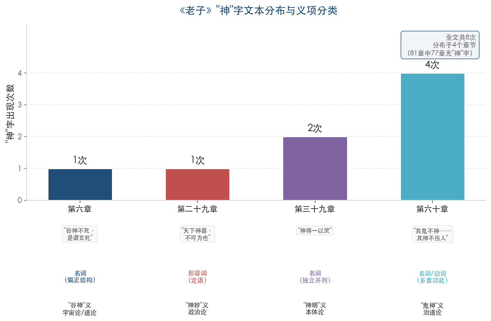

**图1** 以柱状图呈现"神"字在四个章节中的出现次数及其义项分类。第六十章以4次占据全部用例的一半，但均围绕"鬼神"主题展开；第三十九章2次出现在同一宇宙序列中；第六章和第二十九章各1次，语义功能截然不同。8次用例的集中度极高，《老子》其他77章均不涉及"神"字。这一极度集中的分布表明，"神"在《老子》思想中并非弥散性的核心概念，而是在特定论域中被精确调用的关键术语。

## 二、四大义项分类体系的建立

基于上述4个章节的文本分析，"神"在《老子》中的语义功能可归纳为四大义项体系。这一体系将作为全书后续各章分析的统一参照框架。

### 1. "谷神"义：宇宙论/道论层面的神妙变化力量

第六章"谷神不死"是《老子》中最受关注也最具争议的"神"字用例。从语法结构看，"谷神"为偏正结构（名词+名词），"谷"修饰限定"神"，整体充当主语，"不死"为谓语。其语义指向道体层面：紧接其后的"是谓玄牝"将"谷神"等同于"玄牝"（微妙的母体），进而"玄牝之门，是谓天地根"将其定位为天地万物的根源。由此可见，"谷神"兼具宇宙论与道论双重维度的涵义。

关于"谷神"的训释，历来存在三条主要路径，构成了后世两千年注疏争议的原初裂隙。

其一为"山谷/虚空"说。陈鼓应释之为"'谷'，形容虚空。'神'，形容不测的变化。'不死'，喻变化的不停竭"[陈鼓应《老子今注今译》](http://csbjs.99.com/wp-content/uploads/sites/2/2021/05/%E8%80%81%E5%AD%90%E4%BB%8A%E6%B3%A8%E4%BB%8A%E8%AF%91%E5%8F%82%E7%85%A7%E7%AE%80%E5%B8%9B%E6%9C%AC%E6%9C%80%E6%96%B0%E4%BF%AE%E8%AE%A2%E7%89%88%E9%99%88%E9%BC%93%E5%BA%94-%E5%95%86%E5%8A%A1.pdf "参照简帛本最新修订版")。此说将"谷"理解为山谷意象，取其虚空、卑下之义，与《老子》全文中"谷"的系统性使用相一致——第十五章"旷兮其若谷"、第二十八章"为天下谷"、第三十二章"犹川谷之于江海"、第四十一章"上德若谷"均取虚空、卑下、包容之义[郭齐勇、郑开等《〈老子〉〈庄子〉"道"论发微》](http://philosophychina.cssn.cn/xzwj/gqywj/201507/t20150715_2731554.shtml "以'谷神''玄牝'比喻'道'")。

其二为"养"说。河上公注曰"谷，養也。人能養神則不死，神謂五藏之神：肝藏魂，肺藏魄，心藏神，腎藏精，脾藏志"，将"谷"读为"浴"或"穀"（穀/谷通假），训为"养"，使"谷神不死"转化为"养神则不死"的养生命题[光明日报·《老子》版本说略](https://epaper.gmw.cn/zhdsb/html/2018-02/07/nw.D110000zhdsb_20180207_1-15.htm "中华读书报")。

其三为"谷神"连读为专名说，将"谷神"视为道的一个别名或专称，二字不分训。

三条路径的差异不仅是语言学层面的训诂分歧，更涉及根本性的哲学立场选择："谷神"究竟是道体的比喻性描述（虚空说）、养生修炼的命题陈述（养说），还是对一个独立宇宙性存在的命名（专名说）？这一分歧贯穿了此后两千年的全部注疏传统。

### 2. "神妙/神圣"义：政治论层面的形容词性用法

第二十九章"天下神器"中，"神"为形容词性定语，修饰"器"（器具/器物），构成偏正结构。"神器"意指具有神妙性质、不可人为操控的器物，全章论旨在于天下不可以人为意志强行把持——"为者败之，执者失之"。此处"神"的语义核心为"神妙""神圣"，即超越人力操控的属性，既不涉及人格神，也不涉及修炼义。

从语法功能看，此章"神"的形容词用法属先秦"神"字的常见功能之一。《左传》《国语》等文献中，"神"亦频繁作形容词修饰名词，表示"不可测度""超越常规"之义。《老子》在此的独特之处，在于将"神"义从单纯的"不可思议"引向政治哲学论域——天下作为一个整体具有不可被人为操控的内在秩序，这一秩序的"神妙"本质决定了有为之治必然失败。

### 3. "神明"义：宇宙序列/本体论层面的名词性用法

第三十九章"神得一以灵"中，"神"为独立名词，与天、地、谷、万物、侯王并列，构成一个完整的宇宙存在序列："天得一以清，地得一以宁，神得一以灵，谷得一以盈，万物得一以生，侯王得一以为天下正。"序列中各项皆以"得一"为条件获得各自的本质属性——天之清、地之宁、神之灵、谷之盈、万物之生、侯王之正。

"神"在此序列中的独立地位值得深思。它既非修饰其他事物的形容词，也非与"鬼"并称的宗教概念，而是被安置在天、地与谷之间——高于谷（具象自然物）而低于天地（宇宙基本框架），暗示着"神"在《老子》的宇宙论中占据特殊层级。"灵"作为"神"得"一"后获得的属性，指向灵妙、灵应之义。各版本在此序列的排列顺序上完全一致——帛书本作"神得一以霝"（"霝"为"灵"之古字），表明"天—地—神—谷—万物—侯王"的宇宙层级在先秦已经定型[三版本对照](https://www.biaodianfu.com/laozi.html "标点符·楚简版帛书版传世版完整对照")。

### 4. "鬼神"义：鬼神论/治道论层面的多重语法功能

第六十章"其鬼不神。非其鬼不神，其神不伤人。非其神不伤人，圣人亦不伤人。夫两不相伤，故德交归焉"是"神"字出现最密集的段落。4次用例中，"神"的语法功能呈现多重性：

第一个"不神"——"其鬼不神"中"神"用作动词或形容词性谓语，意为"（鬼）不显灵""不作祟"，表示鬼丧失了其超自然的侵扰能力。

第二个"不神"——"非其鬼不神"为对前句的递进否定，"神"的语法功能同上。

第三、四个"神"——"其神不伤人"中"神"回归名词功能，指代鬼神之"神"。

此章的论旨是治道论而非鬼神论本身。"治大国若烹小鲜"已明确全章以治国之道为主题，鬼神不伤人、圣人不伤人最终汇归于"德交归焉"的政治理想状态。值得注意的是，《老子》全文中"鬼"字仅在此章出现2次（"其鬼不神""非其鬼不神"），且均与"神"配对使用，但并未以"鬼神"复合词形式出现。"其鬼不神"的句法结构是"鬼"为主语、"神"为谓语，而非"鬼神"作为整体概念。这一语法特征表明，《老子》对"鬼"与"神"的处理保持着自觉的语义区分意识。

## 三、先秦"神"字的语义场：《老子》的语义资源背景

"神"字进入《老子》文本时，并非在语义真空中被使用，而是携带着先秦知识世界中已有的丰富语义资源。准确理解《老子》中"神"的独特面貌，需要首先勾勒同时代文献中"神"的既有含义谱系。

### 1. 字源层面："申""电""神"同源

从文字学角度看，"神"字的构造蕴含着远古中国人对超自然力量的原初想象。许慎《说文解字》释"神"曰"天神，引出萬物者也。从示、申"[ctext·说文解字](https://ctext.org/dictionary.pl?if=gb&char=%E7%A5%9E&remap=gb "说文解字原文")。"申"的甲骨文字形象闪电曲折之形，古人以雷电变化莫测、威力无穷为"神"的原初意象。"申""电""神"本为同源字：甲骨文中"申"象闪电曲折屈伸之形，后加"示"旁（与祭祀、鬼神相关的意符）分化出"神"字，加"雨"旁分化出"电"字[中央纪委网站·每日一字·神](http://m.ccdi.gov.cn/content/08/4f/20876.html "神字从示从申")。"神"字的原始义核由此指向自然界中不可预测、变化莫测的巨大力量，这一义核在此后数千年的语义演变中始终作为底层隐喻发挥着作用。

### 2. 第一阶段：外在灵异——人格神与鬼神信仰

商周至春秋时期，"神"主要指外在的人格化超自然存在。《左传》中"神"字约出现110次，绝大多数指向天神、地祇、人鬼等宗教性存在。庄公三十二年载"神，聪明正直而壹者也，依人而行"，将"神"界定为具有伦理品格（聪明正直）且依附于人的超自然力量[ctext·左传](https://ctext.org/text.pl?node=17715&if=gb&show=parallel&remap=gb "ctext电子全文")。此阶段的"神"具有鲜明的人格性和外在性："神"是在人之外、高于人的存在，人通过祭祀与之沟通，通过德行取悦于它。

### 3. 第二阶段：变化妙道——哲学化的革命性转折

进入战国时期，"神"的语义发生了根本性转向。《周易·系辞上》提出"阴阳不测之谓神"，又曰"神也者，妙万物而为言者也"。"神"由此从具体的人格存在被抽象为宇宙间变化莫测的妙用，成为高度哲学化的、具有本体性意义的变化妙道概念。杨艳香、翟奎凤指出，这一转变构成了"'神'的革命性翻转"[杨艳香、翟奎凤《早期"神化"思想的形成与发展》](http://www.rjwm.sdu.edu.cn/info/1016/2488.htm "《社会科学战线》2020年第4期")。"阴阳不测之谓神"这一定义深刻改变了"神"的语义重心：不再追问"神"是什么样的存在（what），而是以"不测"标示其运作方式（how）——凡超越阴阳对待之常规认知框架的变化，即称之为"神"。

### 4. 第三阶段：内在主体——精神维度的开显

与哲学化同步发生的另一重大转变，是"神"从外在实体向人自身精神维度的转化。《左传》昭公七年记子产论鬼魂，提出"用物精多，则魂魄强。是以有精爽，至于神明"。此处"神明"不再仅指外在神灵，而开始描述人自身精气充沛后所达到的精神境界[ctext·左传昭公七年](https://ctext.org/text.pl?node=19969&if=gb&show=parallel&remap=gb "ctext电子全文")。

《管子·内业》进一步将"神"内化为人自身的精神主体："凡物之精，此则为生。下生五穀，上為列星。流于天地之间，谓之鬼神；藏于胸中，谓之圣人。"在此框架中，"鬼神"与"圣人"共享同一个"精"的来源，区别仅在于流布位置——流于天地间者为鬼神，藏于人之胸中者成就圣人[ctext·管子内业](https://ctext.org/guanzi/nei-ye/zhs "中国哲学书电子化计划")。这一论述从根本上打破了"神在人外"的宗教格局，将"神"安置于人的内在精神世界。

### 5. 《庄子》中"神"的系统展开

《庄子》对"神"的使用尤为值得关注。它在多个面向上延续并深化了"神"的哲学化与内在化进程，与《老子》在思想渊源上具有密切关联。

《在宥》篇载广成子告黄帝曰："无视无听，抱神以静，形将自正。必静必清，无劳汝形，无摇汝精，乃可以长生。目无所见，耳无所闻，心无所知，汝神将守形，形乃长生。"[ctext·庄子在宥](https://ctext.org/wiki.pl?if=en&chapter=739655&remap=gb "庄子集释在宥篇") 此处"抱神以静""汝神将守形"中的"神"明确指向人自身的精神主体，且"神"与"形"构成主从关系——"神"主导"形"，"形"依赖"神"的守护而得以长生。

《刻意》篇构建了一套完整的"养神之道"理论："故其德全而神不亏""其神纯粹，其魂不罢""纯素之道，惟神是守，守而勿失，与神为一"。此篇将"神"视为人之存在的精髓，"纯粹而不杂，静一而不变，惔而无为，动而以天行"被明确称为"养神之道"[ctext·庄子刻意](https://ctext.org/zhuangzi/ingrained-ideas/zhs "庄子刻意篇全文")。尤其值得注意的是"与神为一"的表述——人的修养目标并非服从外在之"神"，而是使自身回归与"神"合一的状态。

《达生》篇则以"用志不分，乃凝于神"概括精神集中的极致状态[庄子·达生](https://zh.wikisource.org/zh-hans/%E8%8E%8A%E5%AD%90/%E5%9C%A8%E5%AE%A5 "维基文库")。陈鼓应指出，"精神"是庄子所首创的哲学概念，"精神四达并流""澡雪而精神""独与天地精神往来"等表述标志着"神"完成了从外在对象到内在主体的全面转化[陈鼓应《〈庄子〉内篇的心学》](http://philosophychina.cssn.cn/zxts/zgzx/xqzx/201507/t20150713_2725135.shtml "哲学中国网")。

### 6. 先秦"神"义三阶段演变的思想史意义

综合以上分析，先秦"神"字的语义场呈现清晰的三阶段演变轨迹：外在灵异（商周鬼神信仰）→变化妙道（《易传》"阴阳不测之谓神"）→内在主体（《管子·内业》"藏于胸中"、《庄子》"抱神以静"）。翟奎凤据此指出，《道德经》中"神"字8处、"鬼"字仅2处且无"鬼神"复合词，表明《老子》中的"神"已非人格化鬼神的残余，而体现了"人文理性精神的崛起"[翟奎凤《论中国的人文主义"神"学》](https://www.xinfajia.net/content/wview/11851.page "先秦'神'三阶段演变论")。

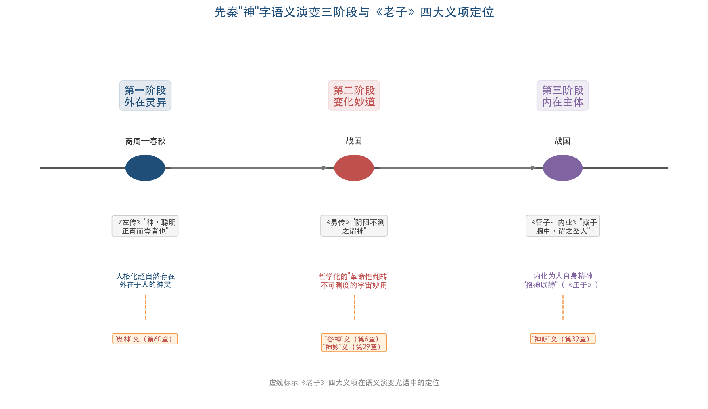

**图2** 以时间轴展示先秦"神"字从"外在灵异"到"变化妙道"再到"内在主体"的三阶段语义演变轨迹，并以虚线标示《老子》四大义项在此语义光谱中的对应定位。

我们认为，《老子》中"神"的四大义项恰好跨越了这一演变的不同层面："谷神"义（第六章）侧重"变化妙道"的宇宙论面向；"神妙/神圣"义（第二十九章）保留了"不可测度"的原始义核；"神明"义（第三十九章）在宇宙序列中赋予"神"以独立的存在论地位；"鬼神"义（第六十章）则与第一阶段的鬼神信仰保持着最直接的语义关联，但已将之纳入治道论框架加以驯化。换言之，《老子》对"神"字的使用并非取义于某一单一阶段，而是在多个语义层次上同时操作——正是这种多层次性，为后世注家从不同维度切入提供了文本内部的合法空间。

## 四、版本比较：出土文献视域中"神"字的文本情况

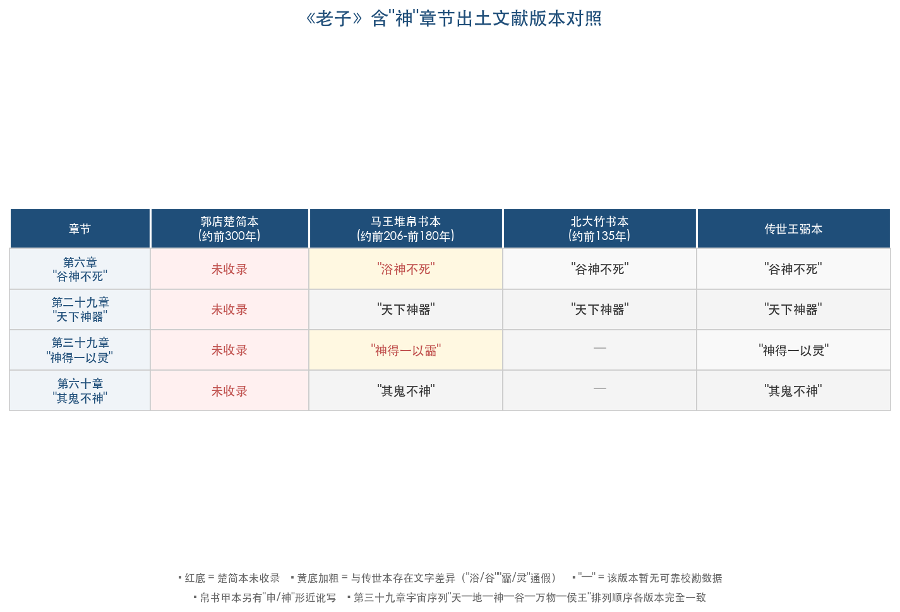

**图3** 以表格形式对照郭店楚简本、马王堆帛书本、北大竹书本、传世王弼本在四个含"神"章节中的文字异同，色彩标注通假差异与版本缺失情况。

### 1. 郭店楚简本的"缺席"

郭店楚简本《老子》（约前300年入葬）是目前已知最早的《老子》抄本，然而含"神"字的4个章节——第六、二十九、三十九、六十章——均不在楚简本的收录范围之内[郭店楚简《老子》（百度百科）](https://baike.baidu.com/item/%E9%83%AD%E5%BA%97%E6%A5%9A%E7%AE%80%E3%80%8A%E8%80%81%E5%AD%90%E3%80%8B/8905227 "抄录不晚于前300年")。这一"缺席"本身构成了一个重要的诠释学事实。楚简本仅收录了今本八十一章中约三分之一的篇幅，学界对其性质存在争议：刘笑敢认为楚简所收章节可能代表较早的编纂层次，含"神"章节属于较晚加入的"扩展层"[刘笑敢《老子古今》](https://epaper.gmw.cn/zhdsb/html/2017-09/06/nw.D110000zhdsb_20170906_1-15.htm "五种版本对勘方法")；亦有学者主张楚简本仅为一个选抄本，不能由其未收录推断相关章节尚不存在。无论采取何种立场，"神"字相关章句在楚简本中的全面缺失意味着：现有可校勘含"神"章节的最早可靠文本是马王堆帛书本。

### 2. 马王堆帛书本与传世本的异同

马王堆帛书本（约前206—前180年）是现存最早包含"神"字章节的《老子》文本。帛书本与传世本在"神"字上不存在重大语义差异，差别主要集中在文字层面：帛书本第六章作"浴神不死"（"浴"即"谷"之通假），第三十九章作"神得一以霝"（"霝"为"灵"之古字），帛书甲本中另有"申/神"形近讹写的情况[帛书老子释文](http://share1.chaoxing.com/share/mobile/mooc/tocard/81894820 "帛书甲本'浴神不死'")。

"浴/谷"之异文具有重要的诠释学意义。陆德明《经典释文》引注"河上本作浴，浴者，養也"，东汉边韶老子碑铭亦作"浴神"——帛书本的"浴"证实了至少在西汉前期，"浴"字文本曾广泛流通。河上公将"谷"训为"养"的做法，正以"浴/穀/养"的通假关系为文字学依据[光明日报·《老子》版本说略](https://epaper.gmw.cn/zhdsb/html/2018-02/07/nw.D110000zhdsb_20180207_1-15.htm "中华读书报")。北大藏西汉竹书《老子》（约前135年）第六章已作"谷神不死"，与传世王弼本一致，暗示"浴→谷"的文字定型发生在西汉前期至中期之间[北大竹书《老子》校勘](http://www.360doc.com/content/23/0613/23/56680917_1084642008.shtml "北大本校勘信息")。

### 3. 宇宙序列的跨版本稳定性

版本比较中尤为引人注目的是第三十九章"天—地—神—谷—万物—侯王"的排列顺序在帛书本与传世本中完全一致。这一跨版本的稳定性表明，将"神"安置在"天""地"之后、"谷""万物"之前的宇宙层级序列在先秦已经定型，并非后世传抄过程中的增衍或调整[三版本对照](https://www.biaodianfu.com/laozi.html "标点符·楚简版帛书版传世版完整对照")。这一定型的序列为后世注家将"神"理解为宇宙间独立的存在层级提供了坚实的文本基础。

## 五、小结：四大义项体系与后续分析的坐标原点

通过以上文本分析，本章建立了《老子》中"神"的四大义项分类体系：

- **"谷神"义**（第六章）：宇宙论/道论层面，名词性偏正结构，指向道体的神妙变化力量，语义核心为"虚空+不测"。
- **"神妙/神圣"义**（第二十九章）：政治论层面，形容词性定语修饰"器"，意为超越人力操控的神妙属性。
- **"神明"义**（第三十九章）：宇宙序列/本体论层面，独立名词，与天地等并列为宇宙基本存在，以"灵"为其得"一"后的属性呈现。
- **"鬼神"义**（第六十章）：鬼神论/治道论层面，兼具名词与动词/形容词多重功能，在治道论框架中讨论鬼神之德行效应。

四大义项之间存在内在的语义张力：第六章之"谷神"最接近道本身，第三十九章之"神"是独立于道的存在物（需"得一"才能获得灵性），第六十章之"神"则保留了传统鬼神信仰的影子。这些张力并非文本的缺陷，而恰恰构成了后世注家得以从不同方向展开诠释的文本基础——河上公侧重第六章的养生潜力，王弼侧重其本体论维度，内丹家将第三十九章的"灵"与修炼术语对接，而第六十章的鬼神话语则为道教宗教性诠释提供了锚点。

从先秦"神"字的整体语义场来看，《老子》的四大义项横跨了"外在灵异→变化妙道→内在主体"三阶段演变的多个层面，呈现出高度的语义开放性。正是这种开放性——既非完全哲学化的抽象概念，也非传统宗教中的人格神——构成了两千年诠释传统得以生生不息的源泉。后续各章将逐一考察历代注家如何在各自的思想语境中，对这四大义项进行选择性强调、创造性转化或系统性重构。

# 第2章 汉代注本中"神"的经学化与养生化诠释——以河上公注、严遵《指归》为中心

先秦《老子》文本中"神"的多重语义，在汉代经历了一次关键性的诠释转向。汉帝国确立之后，黄老学一度成为国家治术的核心思想资源，方术养生传统与经学化的注疏方法相互交织，共同塑造了汉代学者理解《老子》的前理解结构。在此背景下，"谷神""神器""神得一以灵""其鬼不神"等先秦文本中尚保留着多义弹性的表述，被不同注家系统地导向身体化、养生化与政治教化的确定方向。河上公《老子章句》、严遵《老子指归》与《老子想尔注》分别代表了汉代"神"诠释的三条基本路径——养生化、哲学化与宗教化。三者虽然取径各异，却共享"精气神"体系的知识基础，并共同完成了对先秦"神"义的第一次大规模范式改写。本章将依次考察上述三家注本及其共同的知识背景，揭示汉代"神"诠释从宇宙论隐喻到身体化实践的范式转换逻辑。

## 2.1 黄老学与汉代"精气神"知识背景

汉代注家之所以将"神"导向养生化与身体化方向，并非个别学者的偶然选择，而是根植于从战国晚期至西汉中期逐步成型的"精气神"宇宙论体系。这一体系为汉代诠释"谷神""神明""神灵"等概念提供了最基本的知识框架。

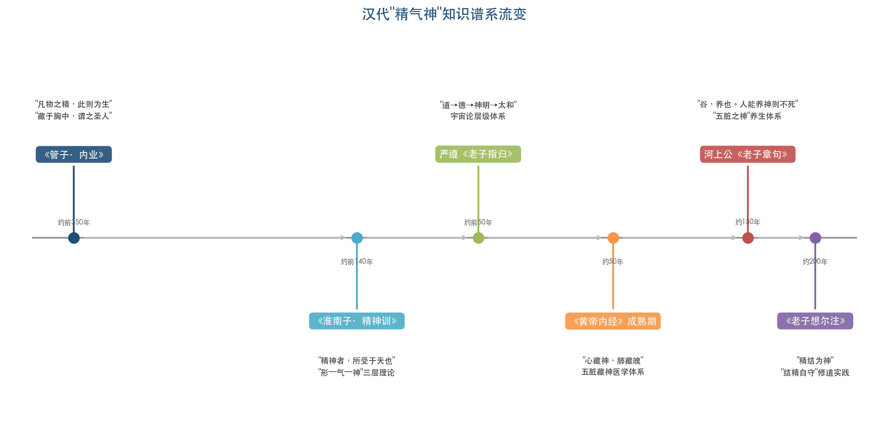

上图勾勒了从《管子·内业》到《老子想尔注》约五百年间"精气神"话语的核心文献与关键命题演变脉络，为理解本章所讨论的汉代各注家提供宏观的知识谱系坐标。

"精气神"话语的源头可上溯至《管子·内业》。该篇提出："凡物之精，此则为生。下生五谷，上为列星。流于天地之间，谓之鬼神；藏于胸中，谓之圣人"[《管子·内业》（ctext）](https://ctext.org/guanzi/nei-ye/zhs "中国哲学书电子化计划")。此处"精"同时充当宇宙生成的根源与人身修养的核心对象，鬼神不过是精气流布于天地间的表现形式，圣人则是精气凝聚于胸中的内在成就。更值得注意的是，《内业》篇还将"精"直接等同于"神"——"有神自在身，一往一来，莫之能思"[郑开引《管子·内业》](https://www.sohu.com/a/311444867_273853 "郑开论黄老政治哲学")。这一将"神"从外在人格神转化为内在精气状态的思路，构成了汉代河上公注"五脏藏神"的直接先声。

到西汉前期，《淮南子·精神训》在继承《管子》精气说的基础上，建构了更为系统的"形—气—神"三层身体理论。该篇开宗明义："夫精神者，所受于天也；而形体者，所禀于地也"[《淮南子·精神训》（ctext）](https://ctext.org/huainanzi/jing-shen-xun/zhs "中国哲学书电子化计划")，以"精神"对应天、"形体"对应地，确立了一个天地—精神—形体的宇宙论对应框架。在此基础上，全篇以"心者，形之主也；而神者，心之宝也。形劳而不休则蹶，精用而不已则竭"建构了一个从形体到心、从心到神的递进结构，"神"被定位为整个生命体系中最核心、最需要宝护的层次。《精神训》又以"夫静漠者，神明之宅也；虚无者，道之所居也"将"神明"安置于"静漠"之中，与"道"所居之"虚无"构成平行关系，使"神明"成为连接"道"与具体生命的中介范畴[谢海金、李良松《〈淮南子〉形气神的身体理论》](https://yizhe.dmu.edu.cn/article/doi/10.12014/j.issn.1002-0772.2022.18.13?viewType=HTML "《医学与哲学》2022年第18期")。

这一"形—气—神"的三层框架，构成了理解河上公注以"谷神"为"养神"、以五脏对应五神的直接知识背景。河上公注与《淮南子》共享同一黄老学传统：两者均以天地—精神—形体的对应关系为基础，均主张"神"居于身体层级的最高位，均将"虚静"视为养神的核心功夫。

## 2.2 河上公注第六章：从"谷神"到"五脏藏神"的养生化转型

《老子》第六章"谷神不死，是谓玄牝。玄牝之门，是谓天地根。绵绵若存，用之不勤"是全书"神"义最集中、争议最大的一章。河上公注此章题为"成象第六"，其诠释策略构成了汉代"神"义养生化的典型范式。

河上公注释的核心在于对"谷"字的训释。注曰："谷，養也。人能養神則不死。神謂五藏之神：肝藏魂，肺藏魄，心藏神，腎藏精，脾藏志。五藏盡傷，則五神去矣"[河上公注·成象第六](https://www.donglishuzhai.net/chapter/6868.html "東里書齋·中华书局点校本")。此处"谷"被训为"养"（穀/谷通假），"神"被直接对应为五脏之神——肝魂、肺魄、心神、肾精、脾志。先秦"谷神"文本中的宇宙论隐喻——无论是"山谷之虚空"说还是"谷神"连读为道体专名说——均被一举具象化为五脏藏神的养生体系。这一训释产生了两个关键效果：其一，将"神"从抽象的本体论概念转化为可以在具体身体部位中定位的生理性存在；其二，将"不死"从对道体永恒性的描述转化为养生修炼的实际目标——"人能养神则不死"。

河上公注的五脏藏神理论，与《黄帝内经·素问·宣明五气》篇"心藏神，肺藏魄，肝藏魂，脾藏意，肾藏志"的医学体系高度吻合。两者在五脏与五神的对应关系上几乎完全一致（仅"意/志"在脾肾间略有出入），表明河上公注与汉代医学知识体系之间存在直接的学术关联。此一对应亦为河上公注成书于东汉中后期的主流断代提供了间接支持——其五脏藏神体系的成熟程度，与《黄帝内经》体系化之后的医学知识水平相适应[光明网·道家道教研究的拓荒者——王明](https://news.gmw.cn/2021-02/08/content_34606438.htm "光明网2021年")。

河上公注进一步将"玄牝之门"解为鼻口——"玄，天也，於人為鼻；牝，地也，於人為口"——将"绵绵若存"释为呼吸吐纳功法的操作要领。至此，第六章原文的每一个关键意象都被纳入养生修炼的话语体系："谷神"是五脏之神，"玄牝"是鼻口，"天地根"是呼吸通道，"绵绵若存"是吐纳功法的身体实践。这一诠释链条的高度自洽，本身即是汉代黄老养生学系统性思维的集中体现。

值得注意的是，河上公注以"玄"对应天/鼻、"牝"对应地/口的解读框架，与《淮南子·精神训》"精神者，所受于天也；形体者，所禀于地也"的天地—精神—形体对应关系构成了同一知识传统内的呼应。两者共享"天/精神/鼻（上）"与"地/形体/口（下）"的对应逻辑，印证了河上公注植根于西汉黄老学的知识土壤。

## 2.3 河上公注的"治身治国"双重诠释框架

河上公注不仅将"神"养生化，还系统地建构了"治身治国"的双重诠释框架，使"神"同时承载个体修炼与政治教化的双重功能。这一特征贯穿于河上公对《老子》全书涉及"神"字的各章注释之中。

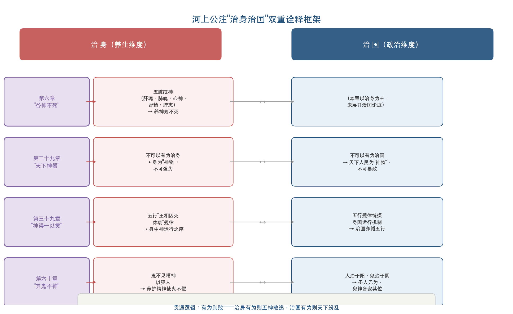

如上图所示，河上公注以第六、二十九、三十九、六十章四章为核心，在每一章的注释中同时展开"治身"与"治国"两个维度的解读，形成了一贯的双轨诠释模式。

第二十九章"天下神器，不可为也"，河上公注将"神器"释为"神物"，指代"天下之人"。注文末尾点明"不可以有爲治國與治身也"[河上公注·無爲第二十九](https://www.donglishuzhai.net/chapter/6891.html "東里書齋")。此处"神器"的"神"不再是本体论层面的"神妙不测"，而是指向天下人民（神物）的不可强制性。河上公以"有为"同时否定治国的暴政与治身的强行驱使，在一句注释中完成了政治论与养生论的双重表达。

第三十九章"神得一以灵"，河上公注引入五行术语加以诠解。注文以"王相囚死休廢"解释"神"之运行规律[河上公注·法本第三十九](https://www.donglishuzhai.net/chapter/6901.html "東里書齋")，将先秦"得一"的哲学命题转化为五行相生相克的术数话语。"神得一以灵"不再是宇宙序列中"神"因获得"一"（道）而具有灵性的哲学描述，而被纳入五行运行规律的框架中加以理解。这一诠释方式鲜明地体现了汉代以术数化方法处理哲学文本的经学特征。

第六十章"治大国若烹小鲜"章中"其鬼不神""其神不伤人"诸句，河上公注以阴阳秩序建构了鬼神各安其位的宇宙图景。注曰"人得治於陽，鬼得治於陰"[河上公注·居位第六十](https://www.donglishuzhai.net/chapter/6922.html "東里書齋")，将人与鬼分属阳与阴两个领域，圣人治国的效果不仅在人间政治层面实现秩序，还在鬼神层面达到"各安其位"的宇宙和谐。此处"鬼""神"被作为实体性存在保留，而非如后来王弼注那样被消解为自然运作的效验。河上公注对鬼神实体性的保留，与汉代社会普遍奉行的鬼神祭祀信仰相一致。

综合四章注释，河上公注的"治身治国"框架呈现出高度一致的诠释模式：每章的"神"义都被双重解读——在治身维度上指向精气神的修养，在治国维度上指向帝王的无为之治。两个维度以"有为则败"的逻辑贯通：治身若有为则五神散逸，治国若有为则天下纷乱。这一双重框架本身即是汉代黄老学"身国同治"理念的注疏学表达。

## 2.4 严遵《老子指归》："神明"的哲学化建构

与河上公注的养生化路径不同，西汉蜀郡严遵（字君平）的《老子指归》代表了汉代"神"诠释的另一条重要路径——以气化宇宙论为基础的哲学化建构。严遵在河上公的养生框架之外，引入"神明"作为连接"道"与个体生命的核心概念，构建了一个更具哲学纵深的理论体系。

严遵在《上德不德篇》指归中提出了汉代道家最具系统性的宇宙论层级表述："天地所由，物类所以：道为之元，德为之始，神明为宗，太和为祖"[严遵《老子指归》卷一·上德不德篇（ctext）](https://ctext.org/wiki.pl?if=gb&chapter=972118&remap=gb "中国哲学书电子化计划")。在这一"道—德—神明—太和"四层宇宙论架构中，"神明"位于"道"和"德"之下、"太和"之上，是宇宙生成过程中从本体向现象过渡的关键中介。这一定位将"神明"从河上公注中"五脏之神"的生理层面提升为宇宙论的结构性概念。

在《得一篇》中，严遵对"一"进行了精密的哲学界定："一者，道之子，神明之母，太和之宗，天地之祖"[严遵《老子指归》卷一·得一篇（ctext）](https://ctext.org/wiki.pl?if=gb&chapter=972118&remap=gb "中国哲学书电子化计划")。"一"被定位为"道之子"而"神明之母"——它从道那里获得存在，又生出神明。在这个层级关系中，"一"居于道与神明之间，"神得一以灵"的"得一"即意味着神明因获得"一"的贯注而具有灵性。严遵进一步描述"一"的本体特征："于神为无，于道为有，于神为大，于道为小"——"一"相对于"道"是"有"和"小"的（已从道中生出），相对于"神明"则是"无"和"大"的（尚未分化为具体的神明活动）。这一精细的层级辨析，是先秦"得一"哲学在汉代获得的最为严密的理论化表述。

严遵论"神明"与个体生命的关系时，提出了一个极具思想深度的命题："我之所以為我者，以有神也；神之所以留我者，道使然也"[李宜静《〈老子指归〉神明、太和观念对道论的丰富》](https://journal-s.scnu.edu.cn/cn/article/pdf/preview/8d5633e3-bfed-4661-aaac-203ecd3e7a5a.pdf "《华南师范大学学报》2024年第6期")。"神"既是个体存在的根据（"我之所以为我"），又不具有自主性——它之所以"留"在个体生命中，乃因"道"的作用使然。严遵由此建立了一条从"道"到个体生命的因果链条：道→一→神明→个体存在。与河上公注以"养神"为直接修炼目标不同，严遵将"神"置于一个更宏阔的宇宙论结构之中，个体的"养神"不过是顺应道—一—神明这一宇宙论秩序的自然结果。

在对"上德"之君的描述中，严遵将"神明"融入政治哲学论述："性命同于自然，情意体于神明，动作伦于太和，取舍合乎天心。神无所思，志无所虑，聪明玄妙，寂迫空虚"[严遵《老子指归》卷一·上德不德篇（ctext）](https://ctext.org/wiki.pl?if=gb&chapter=972118&remap=gb "中国哲学书电子化计划")。理想君主的品质在于"情意体于神明"——其内在情感和意志与"神明"同体。这一表述既不同于河上公注以"治身治国"双轨分别处理的方式，也有别于后来王弼以"自然无为"一元统摄的模式，而是以"神明"作为连接个体修养与政治实践的枢纽——唯有理解"神明"在宇宙论中的地位，方能把握理想政治的内在根据。

严遵对"神"的处理，总体上较河上公注更偏向哲学维度。河上公注的"五脏藏神"直接指向身体修炼的操作层面，严遵的"神明"则作为宇宙论的结构性概念，连接着"道"的本体与万物的生成。两者之间的差异，折射出汉代道家内部在"黄老养生"与"黄老哲学"两种学术旨趣之间的分化张力。

## 2.5 《老子想尔注》：从"养神"到"精结为神"的宗教化转向

汉代"神"诠释的第三条重要路径，由东汉末天师道经典《老子想尔注》（敦煌S.6825号残卷，旧题张道陵或张鲁所作）所代表。《想尔注》将"谷"读为"欲"，注"谷神不死"曰："谷者，欲也。精結爲神，欲令神不死，當結精自守"[陈霞《从道家到道教——论〈老子想尔注〉的阐释方法》](https://www.sohu.com/a/420914832_273853 "《文史哲》2020年第5期")。这一解读在"谷"字训释上独树一帜——既不同于河上公的"谷，养也"，也与后来王弼"谷中央无者"判然有别，三家在同一个"谷"字上的分歧，构成了《老子》诠释史上最具标志性的训释分裂之一。

《想尔注》最核心的命题是"精结为神"——"神"既非先天禀赋的五脏之神（河上公说），亦非宇宙论层级中的"神明"范畴（严遵说），而是通过"结精"修炼实践所成就的阶段性状态。这一命题将"神"从既有的本体论或生理学范畴转化为修道过程中的实践成就。在此基础上，《想尔注》构建了一个完整的天师道修道序列："奉道诫→积善→积精→成神→仙寿"。"神"由此被纳入道教戒律与伦理实践的框架：精的积累不仅依靠身体修炼（"结精自守"），还需要道德实践（"积善"）和遵奉道诫的伦理自律。

与河上公注的静态养神观相比，《想尔注》的"精结为神"具有两个显著特征：其一，动态性——"神"不是需要"养护"的既有存在，而是需要通过修炼"结成"的目标状态；其二，伦理性——"结精"不仅是身体技术，还内嵌于道教戒律的伦理框架之中。这两个特征标志着"神"的诠释从黄老养生话语向道教宗教实践话语的关键转向。

## 2.6 《淮南子》："形—气—神"体系与汉代"神"论的知识共同体

上文已论及《淮南子·精神训》在"精气神"体系中的枢纽地位。此处需进一步揭示，《精神训》对"神"的处理不仅为河上公注提供了知识背景，其自身亦构成汉代"神"论的一个独立而重要的理论环节。

《精神训》明确以"心"为"形之主"、"神"为"心之宝"——"心者，形之主也；而神者，心之宝也。形劳而不休则蹶，精用而不已则竭。是故圣人贵而尊之，不敢越也"[《淮南子·精神训》（ctext）](https://ctext.org/huainanzi/jing-shen-xun/zhs "中国哲学书电子化计划")。在"形—心—神"三层结构中，"神"居于最高位，圣人"贵而尊之"。在宇宙论起源叙事中，《精神训》开篇描述"有二神混生，经天营地"，将"神"提升为先于天地的宇宙创生力量；在修养论中则主张"精神内守形骸而不外越"，与河上公注"人能养神则不死"共享同一"养神"取向。

《精神训》对养形与养神的区分尤为精要："若吹呴呼吸，吐故内新，熊经鸟伸，凫浴猿躩，鸱视虎顾，是养形之人也，不以滑心"——导引吐纳不过是"养形"之术，而"真人"的核心在于"性合于道""体本抱神，以游于天地之樊"[《淮南子·精神训》（ctext）](https://ctext.org/huainanzi/jing-shen-xun/zhs "中国哲学书电子化计划")。这一对"养形"与"抱神"的严格区分，为后世注家在"养生"内部建立更精细的层次等级提供了理论先声。值得注意的是，河上公注以呼吸吐纳解"绵绵若存"，恰好处于《淮南子》所批评的"养形"层面，而《精神训》自身的理想则是超越形体修炼的"抱神"——两者之间的张力，折射出汉代黄老学内部"养形"与"养神"之辩的深层理论分歧。

## 2.7 河上公注的年代问题与思想史定位

河上公《老子章句》的成书年代是《老子》注疏史上最具争议的问题之一。学界主要存在先秦说、秦汉说与魏晋晚出说三种意见。刘知几即已怀疑"《老子》书无河上公注"，葛洪《抱朴子》则记载文帝就教河上公的传说。王明对此问题进行了系统考证，其研究成果至今仍被学界广泛援引[光明网·道家道教研究的拓荒者——王明](https://news.gmw.cn/2021-02/08/content_34606438.htm "光明网2021年")。当代学界主流倾向东汉中后期说，其理由主要有三：其一，注中五脏藏神体系的成熟程度与《黄帝内经》成熟期的医学知识水平相当；其二，"治身治国"双重诠释框架与东汉黄老学的思想特征吻合；其三，注文的经学化处理方式（章句分析、字词训释）符合东汉经学方法论的一般特征。

年代问题之所以重要，在于它直接影响对河上公注思想史地位的判断。若河上公注确成书于东汉中后期，则它与《太平经》《想尔注》等早期道教经典的思想关联就需要在"同时代知识共同体"的框架中加以理解，而非简单的线性"先后影响"关系。河上公注的五脏藏神体系、"治身治国"框架以及以阴阳五行术语解释"神"的运行规律，均可视为东汉黄老学—方术传统—早期道教之间知识交融的产物。

## 2.8 汉代"神"诠释范式转换的内在逻辑

综观河上公注、严遵《老子指归》、《想尔注》与《淮南子》，汉代"神"诠释相对于先秦文本发生了一次系统性的范式转换。下表直观呈现三家注本在"谷神不死"诠释上的核心分歧：

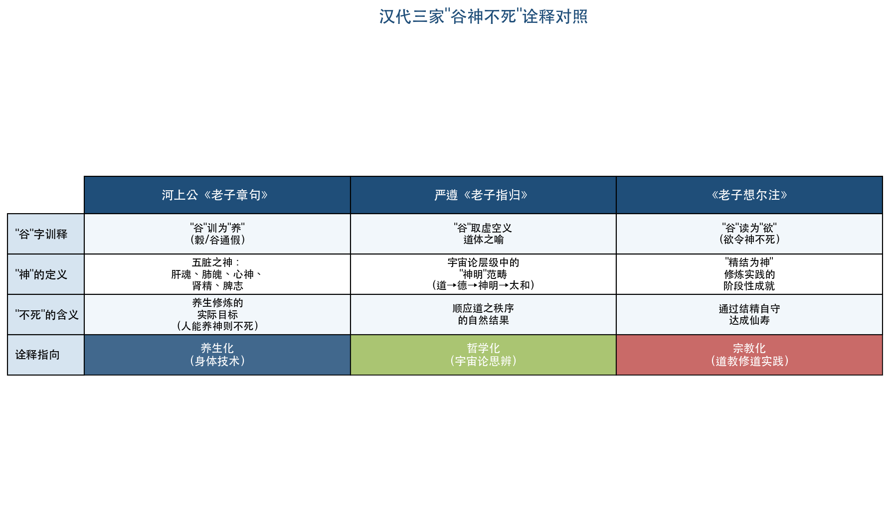

这一转换可以从三个层面加以概括。

其一，从抽象到具象。先秦"谷神"保留着多义弹性——它可以是山谷之虚空的隐喻（虚空说），可以是道体的专名（专名说），也可以是"养"的假借字（养说）。河上公注将其锚定为"五脏之神"，使"神"获得了精确的身体定位（肝魂、肺魄、心神、肾精、脾志）；严遵将"神明"定位于"道—德—神明—太和"的宇宙论层级之中；《想尔注》将"神"界定为"精结"的修炼成就。三者虽然具象化的方向各异，但均将先秦文本中的多义空间压缩为确定的概念框架。

其二，从道论到身体论。先秦《老子》第六章"谷神不死"在文本语境中首先是一个宇宙论/道论命题——描述"道"的虚空性与永恒性。河上公注将其转化为养生论命题——"人能养神则不死"。这一转化的关键中介正是"精气神"体系：一旦"精""气""神"被理解为可以在身体中修炼、积累、流通的实在性存在，"谷神不死"便从对道体属性的描述变成了养生修炼的允诺。

其三，从多义到系统。先秦"神"在"谷神""神器""神得一以灵""其鬼不神"四个语境中分别具有不同的语义功能。河上公注以"治身治国"的统一框架将四者整合为一个有内在逻辑的体系：第六章的"养神"是治身的核心，第二十九章的"神器不可为"是治国的原则，第三十九章的"神得一以灵"是以五行规律解释身国运行的机制，第六十章的"鬼神安位"是治世的最终效果。这一系统化处理，使原本分散在不同章句中的"神"义获得了统一的诠释框架。

然而，汉代的这次范式转换也带来了显著的诠释代价。最突出者是对先秦"神"义多元弹性的压缩。当"谷神"被固定为"五脏之神"时，其作为道体隐喻的哲学意蕴随之被遮蔽；当"神器"被释为"天下之人/神物"时，其"神妙不测"的形容词义被具象化所覆盖。这些被遮蔽的语义层面，将在魏晋王弼的玄学注疏中获得重新激活——王弼对河上公注的系统性"沉默否定"，很大程度上正是针对汉代养生化解读所造成的语义窄化而发。

从思想史的大视野来看，汉代"神"诠释的三条路径——河上公的养生化、严遵的哲学化、《想尔注》的宗教化——并非彼此孤立的个别现象，而是汉代思想世界内部不同知识群体（方术养生者、黄老哲学家、道教教团领袖）对同一文本传统的差异化回应。三者共享"精气神"体系的基础知识，却各自将"神"导向了截然不同的实践方向：河上公导向五脏养护的身体技术，严遵导向对宇宙论层级的哲学思辨，《想尔注》导向以戒律为框架的宗教修道。这三条路径各自的合理性与局限性，既是汉代特定思想史语境的产物，也为后世注家——尤其是魏晋王弼的玄学重构——提供了必须正面回应的诠释遗产。

# 第3章 魏晋玄学对"神"的去神秘化与本体论重构——以王弼注为中心

汉代注家将《老子》中"神"的多义空间系统性地压缩为养生术语（河上公"五脏藏神"）、宗教修炼概念（《想尔注》"精结为神"）与气化宇宙论范畴（严遵"神明为宗"）。三条路径方向各异，却共同完成了"神"的具象化——每一种解读都赋予"神"以确定的所指与明确的操作意义。然而，曹魏正始年间（240—249年），以王弼（226—249年）为代表的玄学注疏对"神"展开了一次根本性的重构。王弼以"崇本息末""以无为本"的方法论为工具，系统剥离了附着在"神"上的养生化、术数化、修炼化层累，将其重新安置于纯粹的本体论结构之中。这一转向不仅改变了"神"在《老子》诠释史上的义理地位，也为此后隋唐重玄学乃至宋代理学对"神"的处理奠定了哲学基准。

## 3.1 正始玄学的思想语境

理解王弼注对"神"的去养生化处理，须将其置于正始玄学的整体思想语境中加以审视。正始年间（240—249年），曹爽辅政，士人群体围绕名教与自然之关系这一核心论题展开激烈的学术论辩。何晏（约190—249年）与王弼是正始玄学的两位核心人物，二人以《老子》《周易》《论语》为文本基础，建构了一套以"无"为本体的哲学体系，并在方法论上确立了"得意忘象""崇本息末"的原则。

这一学术转向的深层背景，是汉代经学传统的衰竭。两汉经学以章句训诂为基本方法、以谶纬灾异为知识工具，在《老子》注疏中表现为河上公式的"治身治国"双重框架与五行术数化的解释路径。正始玄学以义理分析取代章句训诂，以本体论追问取代术数化推演，从根本上更换了理解《老子》的方法论工具。在此语境下，"神"——此前被汉代注家锚定于五脏、五行、精气等具象框架之中——获得了被重新释放回本体论层面的契机。

何晏在"神"概念上留下了重要的思想遗产。据《世说新语·文学》载，何晏以《周易·系辞》"唯神也，故不疾而速，不行而至"自况，将"神"定义为超越"深"（洞察力）与"幾"（洞察事功征兆之能力）的最高精神境界。何晏对"圣人"的理解以"无情"为核心——圣人凭借"神明"而超越凡人的情感世界。王弼对此进行了关键性修正，提出"聖人茂於人者神明也，同於人者五情也。神明茂，故能體沖和以通無"（《三国志·钟会传》裴松之注引《王弼传》）[何光顺《魏晉玄學聖人的「神明」與「應物」》](https://www.cl.ntpu.edu.tw/ntpu-20/j-3701.pdf "《臺北大學中文學報》第37期，2025年")。这一命题将"神明"从圣凡之间不可逾越的本质差异转化为程度之差——人人所具，但有"茂"与"不茂"之别。"神明"因此不再是超越性的神秘力量，而是人之本性中最精微的层面，其能否充分展现取决于是否能"体冲和以通无"。

王弼对何晏"圣人无情"说的修正，预示了他在《老子》注中处理"神"的基本方向：既不将"神"超越化（何晏路向），也不将"神"身体化（河上公路向），而是将"神"纳入"以无为本"的义理结构，使其成为"无"在特定语境中的显现方式。

## 3.2 王弼注第六章"谷神不死"：从"养神"到"谷中央无者"

《老子》第六章"谷神不死，是谓玄牝"是全书"神"义最核心、争议最大的章句。王弼对此章的注释，构成了他重构"神"义的最关键文本。

王弼注曰："谷神，谷中央無者也。無形無影，無逆無違，處卑不動，守靜不衰，物以之成而不見其形，此至物也"[王弼注·第六章（東里書齋中华书局点校本）](https://www.donglishuzhai.net/chapter/6954.html "王弼注老子第六章繁体原文及校勘记")。此注的关键在于"谷中央无者"五字：王弼将"谷神"直接等同于山谷中央的虚空，以"无"释"神"。在这一框架中，"谷神"既非五脏之神（河上公），亦非因积精而成就的修炼目标（《想尔注》），更非居于"道—德—神明—太和"宇宙论层级中的中间环节（严遵），而是道体"虚而不竭"的隐喻。

王弼注进一步以八个描述词界定"谷神"的本体论属性："无形无影"标示其超越一切感知形式；"无逆无违"表明其不与万物对抗而自然流通；"处卑不动，守静不衰"呼应《老子》全书"柔弱""不争"的核心精神；"物以之成而不见其形"则揭示"谷神"与万物的根本关系——万物因之而成，却不见其形体。这些描述的共同特征在于：每一项都指向"无"的属性，无一涉及身体修炼或养生操作。

与河上公注的对比至为鲜明。河上公注曰"谷，養也。人能養神則不死"，将"谷"训为"养"（穀/谷通假），"神"落实为五脏之神——"肝藏魂，肺藏魄，心藏神，腎藏精，脾藏志"。陆德明《经典释文》引王弼注"谷中央無者也"并注明"河上本作浴，浴者，養也"，表明二者在"谷"字的文本依据与训释方向上存在根本性分歧：河上公本作"浴"（通"穀"，训为"养"），王弼本作"谷"（取山谷之义）。文本差异直接导向养生化与本体论化两条截然不同的诠释路径。

王弼注此章的核心策略可概括为"以无释神"：凡河上公注以身体修炼术语填充之处，王弼一律以"无形""无影""不动""不衰"等本体论属性替代。这并非简单的训诂差异，而是两种根本不同的哲学立场的体现——在河上公那里，"谷神"是一个需要"养护"的实存对象，养护的目标是肉身"不死"；在王弼那里，"谷神"是道体之"虚"的隐喻，"不死"描述的是道体本身永不枯竭的特性，与人之养生修炼无关。

## 3.3 王弼注第二十九章"天下神器"："无形无方"的本体论定义

《老子》第二十九章"天下神器，不可为也"中的"神"具有形容词性修饰功能。王弼对此章的注释，将"神"从修饰性形容词提升为一个独立的本体论范畴。

王弼注曰："神，無形無方也。器，合成也。無形以合，故謂之神器也"，随后以"萬物以自然爲性"统摄全章义理[王弼注·第二十九章（東里書齋中华书局点校本）](https://www.donglishuzhai.net/chapter/6977.html "王弼注老子第二十九章繁体原文及校勘记")。此注有三个值得关注之处。

第一，王弼将"神"直接定义为"无形无方"——没有固定形体、没有固定方所。这一定义与第六章"谷中央无者"的"无形无影"构成语义呼应，二者共同指向"无"的本体论属性。"无形无方"并非对某种感官体验的描述，而是一个明确的哲学判断：凡有形有方者皆属"末"（具体现象），唯"无形无方"者方能为"本"。

第二，王弼以"无形以合"解释"器"何以称"神器"——天下万物各有其形，但将它们"合"为一体的那个力量本身是"无形"的，正因这种"无形"才赋予"天下"以不可人为操控的"神"性。这一解读将"神"从属性描述转化为结构性原理：天下之所以不可为、不可执，并非因为它如同某种神圣器物不可触碰，而是因为构成天下的根本原理是"无形无方"的——一切"有为"的操作都以"有形有方"为前提，因此注定无法把握"无形无方"之本体。

第三，王弼以"万物以自然为性"收束全章，将"神器"不可为的原因归结为万物的"自然"本性。"自然"在王弼的概念体系中并非现代意义的"大自然"，而是"自己如此"——万物各依其本性自行运化，任何外在强制都将破坏这一自生自化的内在秩序。

反观河上公注，则将"神器"释为"神物"（天下之人），注末点明"不可以有爲治國與治身也"。河上公注的特征在于：以"人"这一具体所指落实"神器"，并以"治国治身"双轨框架收束。王弼注完全不涉及"治身"维度，亦不将"神器"具象化为"人"，而是将整个论域安置于"无形—自然"的本体论层面。

## 3.4 王弼注第三十九章"神得一以灵"：消解"神"的独立地位

《老子》第三十九章"天得一以清，地得一以宁，神得一以灵"中的"神"是宇宙序列中与天、地、谷、万物、侯王并列的独立项。王弼对此章的处理策略与前两章显著不同——他并未对"神"进行单独训释，而是将其纳入"得一"的整体论述之中加以消解。

王弼注将"一"定义为"數之始而物之極"，视其为万物存在之"母"。关键在注末的论断："清不足貴，盈不足多，貴在其母，而母無貴形"[王弼注·第三十九章（數位經典）](https://www.chineseclassic.com/LauTzu/LaoTzu_wongbee/ch39.htm "王弼注老子第三十九章繁体原文")。一切具体属性——天之清、地之宁、神之灵、谷之盈、万物之生、侯王之正——都不过是"一"的功能呈现，不值得独立尊崇；真正值得重视的是赋予这些属性的"母"（即"一"），而"母"本身没有可供尊崇的形体（"无贵形"）。

这一注释策略的效果是双重的。一方面，王弼承认了"神"在宇宙序列中的存在——"神得一以灵"确认"神"是因"得一"而具有"灵"性的存在，在"天—地—神—谷—万物—侯王"的序列中占据特定位置。另一方面，王弼通过"崇本息末"的逻辑，将"神之灵"与"天之清""地之宁"等量齐观，使其仅成为"一"（道）的诸多功能呈现之一——"神"不具有任何超出其他存在者的特殊地位。

对比河上公注，差异极为显著。河上公以五行术语"王相囚死休廢"解释"神"之运行规律，将"神得一以灵"纳入五行相生相克的术数框架。王弼则以"崇本息末"的逻辑彻底取代了术数化解释路径：并非五行运行规律赋予"神"以"灵"，而是"一"（作为万物之母的道）的贯注使"神"获得"灵"的属性。"灵"并非术数运行的产物，而是本体论结构的自然呈现。

## 3.5 王弼注第六十章"其鬼不神"：将"神圣"消解为自然效验

《老子》第六十章"以道莅天下，其鬼不神。非其鬼不神，其神不伤人"是全书"神"字出现最密集的段落。王弼对此章的注释完成了他重构"神"义的最后一个关键环节——将"神"与"圣"一并消解为道治状态下的自然效验。

王弼注的核心命题为："神不害自然也，物守自然則神無所加，神無所加則不知神之為神也"，进而提出"使不知神聖之為神聖，道之極也"[王弼注·第六十章（數位經典）](https://www.chineseclassic.com/LauTzu/LaoTzu_wongbee/ch60.htm "王弼注老子第六十章繁体原文")。这段注释包含三层递进论证：

第一层：当万物各守其自然本性时，"神"无法对其施加任何影响——"神无所加"。这意味着"神"的作用力取决于万物是否偏离自然本性：偏离则"神"得以彰显（乃至侵害），不偏离则"神"无从着力。

第二层："神无所加"的结果是"不知神之为神"——人们甚至意识不到"神"的存在。这并非"神"已然消失，而是"神"与万物的自然秩序完全融为一体，以至于无法被辨识为一种独立力量。

第三层："使不知神圣之为神圣，道之极也"——道治的最高境界并非"神"与"圣"彰显其力量，恰恰相反，是"神"与"圣"完全不被感知。王弼将"神"与"圣"并列提出并一同消解——正如圣人之治的最高境界是"百姓皆谓我自然"（第十七章），"神"的最高状态亦是不被知觉。

河上公注此章则以"人得治於陽，鬼得治於陰"建构了鬼神作为实体的阴阳秩序——鬼与人分属阴阳两域，各安其位。在河上公那里，"鬼""神"仍是实体性存在，只是在圣人之治下各归其位而不相侵扰。王弼的处理则从根本上取消了鬼神的实体性——"其鬼不神"并非因为鬼被某种力量制约而不再"神"，而是因为万物各守自然，鬼神作为一种超自然力量本就失去了存在的理由。

## 3.6 《老子指略》与"崇本息末"方法论的总纲作用

王弼注四章"神"义文本的内在一致性，源于他在《老子指略》中确立的总纲性方法论。《老子指略》（今存楼宇烈辑佚本，约2570字）开篇即确立"无形无名者，万物之宗"的根本命题，全文以"崇本息末"统摄《老子》全书义理，最核心的表述为："老子之書，其幾乎可一言而蔽之。噫！崇本息末而已矣"[王弼·老子指略輯佚（東里書齋）](https://donglishuzhai.net/chapter/7030.html "老子指略輯佚繁体全文")。

值得注意的是，《老子指略》现存辑佚全文中"神"字未直接出现。这一"缺席"本身颇具意味：王弼在论述《老子》核心旨趣的方法论总纲中，并不将"神"视为一个需要专门讨论的概念。在"以无为本"的体系中，"神"——无论是"谷神"的"无形无影"、"神器"的"无形无方"，还是"神得一以灵"中"灵"对"一"的依附——都只是"无"在不同文本语境中的具体显现方式，不构成独立于"道""无""自然"之外的概念范畴。

《老子指略》的方法论为王弼注四章"神"义文本提供了统一的义理结构：道（无）→自然（万物之性）→"神"（道之虚无本性在特定语境中的显现）。四章注文共同呈现的模式是："神"并非独立于道的另一种存在，而是"无"在不同语境中的呈现——在道体论层面呈现为"谷中央无者"（第六章），在政治论层面呈现为"无形无方"的不可操控性（第二十九章），在宇宙论层面呈现为"一"之功能的"灵"（第三十九章），在治道论层面呈现为自然效验的不可知觉（第六十章）。

下表以四章核心文本为纵轴，系统呈现王弼注与河上公注在训释文本、义理指向与方法论工具上的结构性对立：

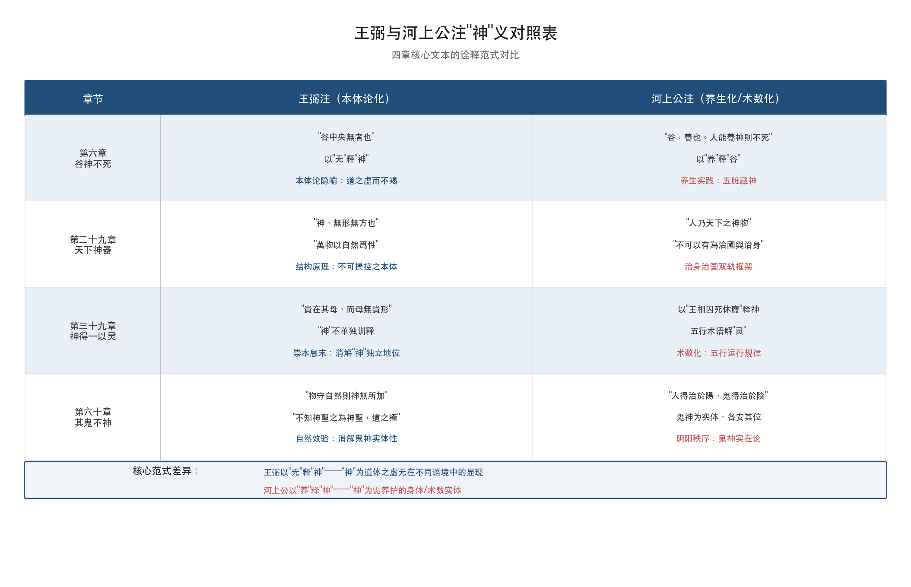

王弼注通篇未在任何一处明确批驳河上公的养生化解读，但其注释策略构成了系统性的"沉默否定"——在整个概念框架层面将养生语境排除在外。王弼不说"河上公之说非也"，而是通过建构一个完全不涉及身体修炼的义理体系，使养生化解读在其概念空间中根本无法立足。

## 3.7 嵇康"修性以保神"：玄学内部的养生化张力

王弼对"神"的去养生化处理并非魏晋士人的唯一选择。嵇康（224—263年）在《养生论》中提出了一套与王弼注方法论截然不同的"神"论，表明即便在竹林名士群体内部，"神"的诠释也存在哲学化与养生化之间的显著分歧。

嵇康在《养生论》中确立了"精神"的主宰地位："精神之于形骸，犹国之有君也"——以国君与国家的关系比喻精神与形体的关系。进而提出"形恃神以立，神须形以存"的形神互依命题[嵇康·养生论（古文岛全文）](https://m.guwendao.net/shiwenv_65860d489a03.aspx "嵇康《养生论》全文")，承认形体与精神之间的双向依赖——"神"虽居主导，却也离不开"形"的承载。在修养方法上，嵇康主张"修性以保神，安心以全身""呼吸吐纳，服食养身，使形神相亲"，将养生实践明确纳入"保神"的目标框架。

嵇康的"神"明确指向人的精神与心神——这恰恰是王弼注中系统回避的语义层面。王弼注的"谷神"为"谷中央无者"（道体隐喻），嵇康的"精神"为"国之君"（人身主宰）；王弼将"神"从一切身体语境中剥离，嵇康则以"形恃神以立，神须形以存"重新确认了"神"与身体的内在关联。这一分歧表明，正始玄学对"神"的本体论化处理虽然在义理层面开辟了全新方向，却并未在魏晋士人的日常思想世界中完全取代养生化的"神"论。

应当指出，嵇康的养生取向与河上公注并非简单的回归。河上公以"五脏藏神"将"神"具象化为特定的生理性存在，嵇康则以"精神之于形骸，犹国之有君"保持了"精神"的总体性——它不是五脏各有其神的碎片化格局，而是统一精神对形体的整体主宰。在这个意义上，嵇康的"保神"说既不同于河上公的身体化解读，也不同于王弼的本体论化解读，而是介于两者之间的"精神主宰"论——承认"神"的具体关切（养生），却拒绝将其碎片化为五脏之神。

## 3.8 郭象注：从"谷中央无者"到"神人即圣人"的存在论收归

郭象（约252—312年）注《庄子》对"神"的处理，构成了玄学内部另一条重要的诠释路径。郭象在方法论上与王弼共享"去神秘化"的基本取向，但在哲学结论上走向了截然不同的方向——从王弼的"贵无"论转向"崇有/独化"论。

郭象注《庄子·逍遥游》"藐姑射之山，有神人居焉"曰："此皆寄言耳。夫神人即今所謂聖人也"[郭象注·逍遥游（ctext）](https://ctext.org/wiki.pl?if=gb&chapter=862023&remap=gb "庄子集释·逍遥游郭象注")，将庄子笔下具有神话色彩的"神人"——不食五谷、乘云气、御飞龙、肌肤若冰雪——彻底世俗化，等同于现实中的圣人。这一诠释策略与王弼"使不知神圣之为神圣，道之极也"在方法论上高度一致：两者都将"神"从超越性存在转化为内在的精神境界或自然效验。

郭象注《齐物论》"至人神矣"曰"無心而無不順"，并在注释"大泽焚而不能热"一段时提出一个重要的哲学命题："夫神全形具而體與物冥者，雖涉至變而未始非我，故蕩然無蠆介於胸中也"[郭象注·齐物论（數位經典）](https://www.chineseclassic.com/content/444 "庄子集释·齐物论郭象注")。此处"神全形具"是关键表述——"神"被理解为人自身精神的"全"（完整），而非某种外在的超自然力量。"体与物冥"则表明"神"之"全"的结果是与万物冥合为一，从而在任何变化中都不失去自我。郭象的"神"因此指向"性分自足"——每一个存在者的"神"都是其本性之完整呈现，无需从外部获取任何东西。

然而，郭象的"神"与王弼的"神"之间存在根本差异。王弼的"神"最终指向"无"——"谷中央无者""无形无方"——"神"是道体之"虚无"在特定语境中的显现，终极根据在于"以无为本"的本体论结构。郭象的"神"则指向"性分自足"——"神人即圣人"意味着"神"并非指向某个超越的"无"，而是指向每一个存在者自身本性的自足完整，终极根据在于"独化"论——万物各自独立生成与存在，不依赖于任何外在的"道"或"无"。

这一分歧直接反映了"贵无"论与"崇有/独化"论在玄学内部的根本对立。在王弼那里，"谷神"之所以"不死"，是因为"无"本身永不枯竭；在郭象那里，"至人"之所以"神"，是因为其"性分"本来就是自足完整的，无需依赖外在的"一"或"无"。两种路径共同完成了对"神"的去神秘化——剥离了人格化鬼神信仰与养生修炼术语——但将"神"安置于截然不同的哲学结构之中：王弼的本体论（"以无为本"）与郭象的存在论（"性分自足"）。

## 3.9 钟会注：正始年间的养生化暗流

钟会（225—264年）的《老子注》虽仅存佚文，但其残存文本展现出与王弼截然不同的面貌，表明即便在正始年间的士人群体中，对"神"的养生化处理并未消歇。

钟会注"载营魄抱一"以"经护"释"营"（源自"营气"这一医学概念），"魄"释为"形气"；注"圣人为腹不为目"曰"真氣內實，故曰為腹"，带有明显的道教内丹术先导色彩；更提出"有無相資，俱不可廢"，直接挑战王弼"崇本息末"的贵无论立场[钟会《老子注》辑佚（新浪）](https://www.sina.cn/news/detail/5250782773642574.html "钟会《老子注》黄老思想解析")。钟会以"营气"释"营魄"，以"真气内实"释"为腹"，将"形气""真气"等黄老养生术语引入《老子》注释，使汉代河上公注的养生化传统在玄学语境中获得了延续的通道。

钟会注的存在揭示了一个重要事实：王弼注对"神"的去养生化处理，虽然在义理深度与哲学原创性上占据了魏晋玄学的核心位置，但并非该时代唯一的声音。在同一个正始年间，"有无相资"的折中立场与"真气内实"的养生关切依然拥有自己的思想阵地。王弼注之所以在后世诠释史上获得了远超钟会注的影响力，部分原因在于钟会《老子注》的散佚——存世者仅为残篇佚文，而王弼注则以完整形态传世，成为后世注疏者无法绕过的基准文本。

## 3.10 玄学语境下"神"义重构的整体评估

综合王弼、嵇康、郭象、钟会四家对"神"的处理，魏晋玄学对"神"义的重构可从三个层面加以概括。

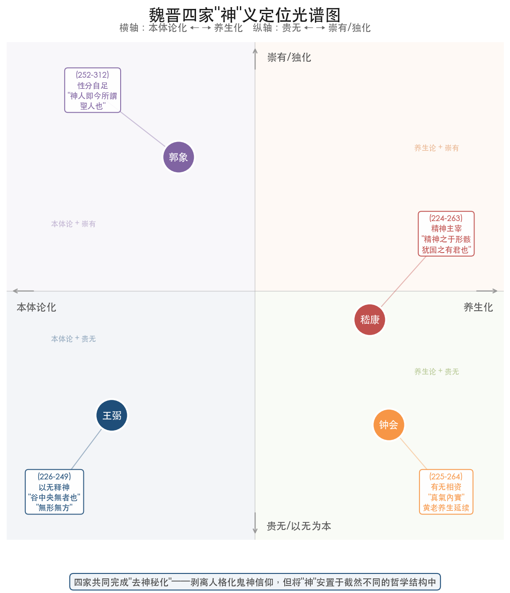

其一，王弼注的核心贡献在于建立了"以无释神"的范式。通过将"谷神"释为"谷中央无者"、"神器"之"神"释为"无形无方"、"神得一以灵"中的"灵"归结为"一"的功能呈现、第六十章的"神"消解为自然效验的不可知觉，王弼在四个不同的文本语境中始终以"无"作为"神"的终极解释项。这一范式的力量在于其一致性：它不像河上公注那样以"治身治国"双轨在不同章节之间来回切换，也不像严遵那样在"道—德—神明—太和"的宇宙论层级中赋予"神明"以独立的结构性地位——王弼注中的"神"始终只是"无"的语境化显现，不构成独立的概念层级。

其二，玄学内部对"神"的处理并不统一。嵇康以"精神之于形骸，犹国之有君也"保持了"神"与身体的内在关联；郭象以"神人即圣人"将"神"收归为"性分自足"的存在论命题；钟会以"真气内实"延续了黄老养生传统。即便在王弼的直接知识圈内，"神"的去养生化也远非毫无争议的共识。这一内部张力本身表明：汉代以"精气神"为基础的身体化"神"论，其知识惯性之强，即便在玄学方法论的冲击下也未被彻底消解。

其三，王弼注对"神"的去养生化处理在后世产生了深远影响，但其影响主要体现在哲学注疏传统中。隋唐时期，成玄英以重玄学方法注疏《老子》，其对"谷神"的处理虽然超越了王弼"以无为本"的一元框架，但在拒绝养生化解读这一点上继承了王弼的基本取向。李荣在第六章注中明确称王弼之说为"譬喻之义"，属于"指事之说"而非究竟——批评归批评，但其批评方向是嫌王弼做得"不够"（仍停留于"譬喻"），而非嫌他做得"过了"（不应去养生化）。与此同时，在道教修炼传统中，"养神""精结为神"等话语体系始终保持着旺盛的生命力，王弼注的去养生化在道教实践层面并未产生真正的替代效果。哲学注疏与宗教实践之间的这种张力，将在隋唐时期获得更为复杂的展开。

# 第4章 隋唐时期佛道交涉背景下"神"的多元展开——以成玄英疏、李荣注、唐玄宗御注为中心

魏晋玄学以王弼"以无释神"的范式，将"神"从汉代注疏的养生化、术数化语境中解放出来，安置于"崇本息末"的本体论结构之中。然而，王弼注在哲学层面的彻底性——将"谷神"等同于"谷中央无者"、将"神圣"消解为不可知觉的自然效验——也遗留了一个根本性的理论张力：如果"神"不过是"无"在特定语境中的显现，那么道教修道实践中对"神"的操持、养护、导引还有何意义？

这一张力在隋唐时期获得了前所未有的复杂展开。初唐道教重玄学者成玄英、李荣一方面继承了王弼哲学化的基本方向，另一方面引入佛教般若学"遣之又遣"的思辨工具，试图在超越王弼"以无为本"一元框架的同时，为道教修道实践中的"神"保留理论空间。唐玄宗以帝王之尊亲注《道德真经》，则将"神"纳入帝国治理话语，赋予其"虚而能应"的政治感应论内涵。三家注在"神"义上的深刻分化，折射出隋唐时期道教义理在佛道论争、重玄思辨与帝国政治三重压力下的多元重构格局。

## 4.1 隋唐思想语境：佛道论争、重玄学兴起与帝国道教

隋唐时期《老子》注疏的思想语境，与汉魏六朝存在根本性差异。三个历史条件的交汇，深刻改变了注家理解和诠释"神"的方式。

其一，佛教在中国的深入传播与佛道论争的白热化。自东汉以降，佛教般若学的"空""假""中"三谛思辨、唯识学的心识理论以及佛性论的众生本具觉性主张，为中国思想界提供了全新的概念工具和论辩范式。初唐时期，佛道之间的论争尤为激烈。法琳（572—640年）《辩正论》卷六"气为道本篇"直接否定道体的独立存在——气之外"别无有道"，亦别无"道神天尊"，并质疑"道法自然"的逻辑——"纵使有道，不能自生"[法琳《辩正论》分析（华东师范大学学报）](https://xbzs.ecnu.edu.cn/CN/article/downloadArticleFile.do?attachType=PDF&id=10360 "初唐佛道'道法自然'论争及其影响")。法琳的批判直指道教"神明"概念的本体论根基：如果道不过是气的别名，那么道教所尊崇的"谷神""神明"便失去了独立于气化运动之外的存在根据。杜光庭《道德真经广圣义》总论部分记述了佛教方面对道教"三界二十八天"和"天尊"概念体系的全面质疑，指出佛教论者认为道教"公卿大夫及元士曹局，并用周官秦汉之制，而攺头换尾以伪为真"[杜光庭《道德真经广圣义》卷一（ctext）](https://ctext.org/wiki.pl?if=gb&chapter=232069&remap=gb "杜光庭述佛道论争")。这种来自外部的理论挑战，迫使道教注家以更精密的哲学论证加以回应，而不能仅仅依赖汉代以来"精气神"体系的经验性描述。

其二，道教重玄学的兴起。重玄学以"重玄"释《老子》第一章"玄之又玄"，形成了一套独特的哲学方法论——"遣之又遣"。这一方法源出于魏晋玄学对"有""无"关系的反思，而在佛教般若学中观"遮诠"方法（尤其是龙树"四句"否定法）的刺激下获得了更为系统的表达。从梁代孟智周、臧矜到隋代刘进喜，再到初唐成玄英、李荣，重玄学形成了一条清晰的思想谱系。其核心主张在于：既不执著于"有"（河上公式的养生化），也不执著于"无"（可能滞于王弼式的"以无为本"），而是"有无双遣""百非四句，都无所滞"。这一方法论的引入，从根本上改变了注家处理"神"概念的哲学工具箱。

其三，唐代帝国对道教的政治利用与制度化。唐王朝以老子为远祖（追尊老子为"太上玄元皇帝"），开元年间唐玄宗亲自注疏《道德真经》，并诏令天下诸州龙兴观、开元观立石台刻经。杜光庭在《广圣义》中记述唐玄宗下诏升《道德经》"居九经之首，在《周易》之上"，以《道德》《周易》《庄子》为"三玄之学"[杜光庭《道德真经广圣义》卷一（ctext）](https://ctext.org/wiki.pl?if=gb&chapter=232069&remap=gb "唐玄宗诏令道德经升格")。在此制度背景下，唐玄宗御注中的"神"义诠释不可避免地带有帝国治理的政治向度——"谷神"之"虚而能应"被赋予了圣君感应万民的象征意义，"其鬼不神"被纳入国家祭祀制度的话语框架。

在上述三重语境的交汇下，隋唐注家对"神"的处理呈现出前所未有的多元格局：重玄学者以哲学思辨超越汉魏诸家，道教义学家保留鬼神的宗教实在性，帝王注家将"神"编织入政治治理话语。以下依次分析成玄英、李荣、唐玄宗三家对"神"的具体诠释。

## 4.2 成玄英疏第六章"谷神不死"：从"以无释神"到"虚容无滞"

成玄英（约601—约690年），字子实，陕州人，为初唐重玄学最重要的代表人物。其《老子道德经开题序诀义疏》以疏解唐初通行本《老子》为主体，是重玄学方法论在《老子》注疏领域最系统的运用。

成玄英疏第六章"谷神不死"，采取了一种颇具特色的诠释策略——先引前人旧说，再以重玄学立场加以重释。成玄英先引河上公训"谷"为"养"，随即以重玄学框架进行全面重新诠释："蒼生流浪生死皆由著欲……導養精神，如彼空谷，虛容無滯，則不復生死也"[成玄英《老子义疏》研究](https://www.daoist.org/BookSearch(test)/list009/0529.pdf "引用成玄英第六章疏文")。这段疏文包含三个关键的义理转化。

其一，"导养精神"取代了河上公"养神"的身体化操作。河上公注将"养神"落实为五脏藏神——"肝藏魂，肺藏魄，心藏神，腎藏精，脾藏志"——的具体养护，"养神"的对象是特定的生理性存在，其操作方式是呼吸吐纳。成玄英的"导养精神"则不再指向五脏的具体养护，而是以"虚容无滞"为核心——精神之养在于去除执著与滞碍，使精神如空谷般虚通无碍。"养"的方式从身体操作转化为心性工夫，从五脏之神的生理养护转化为精神之"虚容"的境界追求。

其二，"不复生死"取代了河上公"不死"的长生追求。河上公注"人能养神则不死"中的"不死"直接指向肉体长生——只要养护五脏之神不使流失，即可实现形体不死。成玄英将"不死"转化为"不复生死"——不再堕入生死轮回。这一转化带有鲜明的佛教解脱论色彩："生死"不是单纯的肉体死亡，而是众生在执著（"著欲"）中反复轮转的存在状态；"不复生死"并非不死，而是超越生死对立的解脱境界。

其三，"如彼空谷"保留了王弼以"虚空"释"谷"的基本方向，但赋予其修道论的实践意义。王弼以"谷中央无者"释"谷神"，将"虚空"作为道体的本体论隐喻；成玄英以"如彼空谷，虚容无滞"释"谷神"，则将"虚空"从本体论描述转化为修道实践的指向——修道者应当使自己的精神达到如空谷般虚通无碍的状态。

成玄英这一诠释策略的深层逻辑，根植于其重玄学核心方法论——"遣之又遣"。成玄英疏第三十七章明确表述："前以無遣有，此以有遣無，有無雙離，一中道也……此則遣之又遣、玄之又玄"[郑灿山《初唐道士成玄英的重玄思想与道佛融通》](https://buddhism.lib.ntu.edu.tw/FULLTEXT/JR-HFU/nx105228.html "华梵大学第七次儒佛会通学术研讨会论文集，2003年")。这一方法对"神"的处理意味着：河上公式的"养神"执著于"有"（身体化的五脏之神是确定的实有），王弼式的"以无为本"则可能滞于"无"（将"神"完全消解为"无"的显现），重玄学则要求"有无双离"——既遣除"养神"之执有，也遣除"以无为本"之可能滞无，以达到"百非四句，都无所滯，乃曰重玄"的境界。

## 4.3 成玄英的"神明"宇宙论：道体与元气之间的枢纽

成玄英对"神"的处理并不局限于第六章的"谷神"。在其疏解体系中，"神明"被赋予了一个具有结构性意义的宇宙论位置——位于道体与元气之间，承担连接本体与现象的枢纽功能。

成玄英疏第一章提出"虛極而神生，本無氣也，神運而氣化"，由此建构了"道→神→元气→形"的宇宙论层级。在这一层级中，"神"（神明）处于道与元气之间：道体至虚至极，由虚极而生神；神运转化动，由神运而化生元气；元气凝聚成形，万物由此生成。成玄英进一步明确"授天地人物之靈者，神明也"——天地万物之所以具有"灵"性，根源在于"神明"的贯注[郑灿山《初唐道士成玄英的重玄思想与道佛融通》](https://buddhism.lib.ntu.edu.tw/FULLTEXT/JR-HFU/nx105228.html "成玄英一章疏文")。

这一宇宙论框架与前代注家的"神"论形成了鲜明对照。河上公注虽然也涉及精气神理论，但其"神"主要落实为五脏之神——具体的、生理性的存在，位于人体内部而非宇宙论层级之中。严遵《老子指归》构建了"道—德—神明—太和"的理论体系，其中"神明"作为连接道与个体生命的核心概念，与成玄英"道→神→元气→形"的框架在结构功能上颇为近似。王弼注则从不将"神"安置于任何宇宙论层级——在"以无为本"的体系中，"神"只是"无"在特定语境中的语境化显现，不构成独立的概念层级。成玄英的创新之处在于：他重新赋予"神明"以独立的宇宙论结构性地位，而这一"神明"已非汉代的五脏之神或精气之神，而是经过重玄学改造后的、以"虚极"为本质属性的本体论—宇宙论枢纽。

成玄英更由此推衍出修道次第的理论："道全則神王，神王則氣靈，氣靈則形超"——道行圆满则神明主导，神明主导则元气灵动，元气灵动则形体超越。这一修道序列以"神"为关键环节：道之圆满必须通过"神王"方能传导至气与形的层面。这意味着在成玄英的体系中，"神"不再仅仅是需要"养护"的对象（如河上公），也不仅仅是需要"遣除"的概念执著（如纯粹的重玄遣荡），而是修道实践中需要"安王"的核心环节——修道者的根本任务，乃是使"神明"在道的贯注下获得主导地位。

## 4.4 成玄英与佛教"佛性"论争的间接对话："道性"的提出

成玄英的"神"论还有一个不容忽视的面向——与佛教"佛性"论争之间的间接对话关系。成玄英在《老子义疏》中提出"道性"概念："所謂無極大道，是眾生之正性也"。郑灿山2003年的研究指出，这一概念"多少受到'佛性'的刺激"[郑灿山《初唐道士成玄英的重玄思想与道佛融通》](https://buddhism.lib.ntu.edu.tw/FULLTEXT/JR-HFU/nx105228.html "郑灿山论'道性'与'佛性'")。佛教"佛性"论主张一切众生本具觉性，修行目标在于彰显本有之佛性而非从外部获得。成玄英的"道性"论将类似逻辑引入道教：无极大道乃众生之"正性"——并非需要从外部寻求的超越者，而是众生本自具有的根本性质。

在这一框架下，成玄英的"神明"概念获得了新的理论深度。"神明"作为"授天地人物之灵"的本源，实际上承担了类似佛教"佛性"的功能——它既是宇宙论层级中的枢纽性力量，也是每一个生命体内在固有的"灵性"根据。修道并非从外部获取"神明"（如河上公式的服食养气），而是回归本有之"道性"，使内在的"神明"恢复其主导地位。

成玄英通过引入佛教思辨工具和概念模式来重构道教"神"论，这一做法既回应了法琳等佛教论者对道教"神明"概念的质疑（表明道教同样拥有精密的哲学论证，而非仅依赖经验性的精气神描述），又维持了道教自身的理论特色（"道→神→元气→形"的宇宙论层级仍然以"道"而非"佛"为终极本体）。这种策略可概括为"以佛护道"——借用佛教的思辨方法来巩固和深化道教的核心义理。

## 4.5 李荣注第六章：对河上公与王弼的双重超越

李荣，初唐道士，约活动于高宗至武后时期。其《道德真经注》传世本由敦煌残卷（P.2639、S.477等）与《正统道藏》本合校而成。李荣在重玄学传统中占据独特地位——他不仅继承了成玄英"遣之又遣"的基本方法，更在具体诠释中展现出比成玄英更为彻底的"遣荡"倾向。

李荣注第六章"谷神不死"开篇即对前代注家展开明确批评："河上以為，養神乃是思存之法。輔嗣言：谷中之無，此則譬喻之義。雖真賢之高見，皆指事之說也"[李荣《道德真经注》（道藏本与敦煌本合校）](https://a.daorenjia.com/daozang15-660 "李荣注第六章全文")。这段批评蕴含三层义理。

其一，李荣将河上公"养神"定性为"思存之法"。"思存"是道教修炼中存思神灵的具体功法——通过冥想和内观来感召、存养体内诸神。李荣以此定性河上公注，意在指出河上公的"养神"不过是一种具体的修炼技术，而非对"谷神"义理的究竟理解。这一批评比王弼注的"沉默否定"更为直接——王弼从未提及河上公的养生化解读，李荣则明确点名批评。

其二，李荣将王弼的"谷中央无者"定性为"譬喻之义"。王弼以"虚空"释"谷神"，在李荣看来不过是一种比喻手法——以山谷的虚空来比喻道体的特性。比喻虽然有助于理解，但终究不是事物本身。李荣以"譬喻"一词评价王弼，等于说王弼做到了"指月"（指向月亮），但仍然停留在"指"（比喻手段）的层面，尚未直接触及"月"（谷神的究竟义理）本身。

其三，李荣以"皆指事之说"一语将河上公与王弼并列否定——无论是河上公的养生操作（"思存之法"）还是王弼的本体论隐喻（"譬喻之义"），都属于"指事"——指向具体事象的权宜之说，而非究竟之论。这种将两位最具影响力的前代注家并列否定的做法，标示出重玄学者在理论自信上的高度自觉。

在否定前人之后，李荣提出自己的"谷神"解读："空其形神，喪於物我""不死不生，此則谷神之道也"。"空其形神"意味着不仅要空去物质形体的执著，更要空去"神"本身的执著——"神"如果被执取为一个需要养护的实体，那么这种执取本身即是对"谷神之道"的背离。"丧于物我"进一步遣除主客对立——既无所执之"物"，也无能执之"我"。"不死不生"则是对河上公"养神则不死"和成玄英"不复生死"的再度推进——连"生死"这一对概念本身都被遣除，"谷神"既不可以"不死"来描述（那仍然在生死框架之内），更不可以"养神"来追求。

李荣的这一诠释将重玄学的"遣荡"推向了一个极端：在河上公那里，"谷神"是需要养护的五脏之神；在王弼那里，"谷神"是"谷中央无者"的道体隐喻；在成玄英那里，"谷神"是"虚容无滞"的精神境界；在李荣这里，"谷神"连"精神境界"的描述都已不足——任何将"谷神"对象化为某种可描述、可追求之物的做法，都落入了"指事之说"。

## 4.6 李荣注第三十九章与第六十章：元气论与鬼神实在论的保留

值得注意的是，李荣在第六章中展现的极致遣荡立场，在其他章节的注释中并未一以贯之。他对第三十九章和第六十章的诠释，展现出重玄哲学家与道教信仰者之间的内在张力。

李荣注第三十九章以"元气"释"一"——"一，元氣也，未分無二"，以"變化以精靈"概括"神得一以灵"。在这一解读中，"一"并非王弼所说的"数之始而物之极"（一个抽象的本体论范畴），而是"元气"——虽然"未分无二"表明这一"元气"是最原初的、尚未分化的状态，但它仍然保留了气化宇宙论的基本框架。"神"之所以具有"灵"（变化精灵），在于得到了元气/道的贯注[李荣《道德真经注》](https://a.daorenjia.com/daozang15-660 "李荣注第三十九、六十、五十章")。这一解读与成玄英"道→神→元气→形"的层级存在共通之处——都承认"神"的"灵"性来源于更高层级存在的贯注，但李荣以"元气"释"一"而非以纯粹的重玄遣荡来处理，显示出他对气化宇宙论传统的某种保留。

更引人注目的是李荣注第六十章对鬼神实体性的保留。李荣注曰"鬼不見其精靈以害人""非其鬼無精靈而不害人"——鬼乃具有"精灵"的实体性存在，只是在道治状态下不以其"精灵"害人，而非根本不存在。这与王弼第六十章注形成鲜明对比：王弼以"神不害自然也，物守自然则神无所加"从根本上取消了鬼神的实体性——"神"不过是自然效验的另一种表述，鬼神作为独立存在者在王弼的概念空间中无从容身。李荣虽然在第六章以极致的"空其形神"遣荡了"谷神"概念，却在第六十章保留了鬼神的宗教实在性——鬼神是真实存在的，拥有"精灵"，只是在理想政治状态下不加害于人。

李荣注第五十章更提出了一个独特的二元框架——"夫生我者神，殺我者心"。"神"在此被赋予积极的生命力量（"生我"），而"心"（后天思虑之心）则被视为生命的消解力量（"杀我"）。这一"神生心杀"的框架在后世内丹学的"元神"与"识神"对立中可以找到理论先声，但在李荣的重玄学语境中含义有所不同——"神"之"生"并非指向肉体长生，而是本然生命力的自然流露；"心"之"杀"亦非肉体死亡，而是后天思虑对本然生命力的遮蔽与消解。

李荣在不同章节中展现的这种张力——第六章的极致遣荡与第六十章的鬼神实在论——并非逻辑上的自相矛盾，而是反映了重玄学者同时作为道教信仰者与哲学思辨者的双重身份所内含的紧张。作为哲学思辨者，李荣在"谷神"这一核心命题上将遣荡推至极致；作为道教信仰者，他在"其鬼不神"的鬼神论议题上保留了道教宇宙观中鬼神的实在性。这种张力表明，即便是最具哲学自觉的重玄学者，也未能（或不愿）将其哲学方法彻底贯穿到道教信仰的所有层面。

## 4.7 唐玄宗御注第六章"谷神不死"："虚而能应"的感应论

唐玄宗（685—762年）于开元十一年（723年）亲注《道德真经》，其后又御制疏文。唐玄宗御注的诠释立场与成玄英、李荣的重玄学路向截然不同——他以帝王的政治关切和感应论的宇宙观来重构"神"义。

唐玄宗御注第六章将"谷神"定义为"虚而能应"的感应模式："谷者虛而能應者也。神者，妙而不測者也……谷之應聲，莫知所以。有感則應，其應如神"[唐玄宗《御注道德真经》第六章（识典古籍）](https://www.shidianguji.com/book/DZ0677/chapter/DZ0677_9 "唐玄宗御注第六章全文")。这一注释具有三个显著特征。

其一，唐玄宗以"虚而能应"取代了王弼的"谷中央无者"。二者虽然都以"虚"为"谷"的核心属性，但王弼注的重点在于"无"——"谷中央无者"强调的是虚空本身的本体论地位，属于一个静态的存在论判断。唐玄宗注的重点则在于"应"——"虚而能应"强调的是虚空的功能性，道并非沉寂的虚无，而是"有感则应，曾不休息"的活跃力量。"虚"是条件，"应"是效用；道之所以能感应万物，恰恰因为它是虚空的——正如山谷之所以能回应声音，乃因谷中空无一物。

其二，"谷之应声，莫知所以"将"神"的"不测"属性具象化为谷中回声的经验意象。回声是人人可以直观体验的自然现象——呼声入谷，应声回响，而回声的机制"莫知所以"。唐玄宗以这一日常经验来解释"神"之"妙而不测"，使"神"从本体论的抽象概念转化为经验世界中可以感知的感应模式。这一解读策略与唐玄宗的帝王身份直接相关——帝王需要的不是玄学家的本体论沉思，而是可以用于理解和实践圣君治道的政治隐喻：圣君"虚己"以"应"万民，如空谷之应声，不以主观意志强加于天下，却能自然感应万事。

其三，"有感则应，其应如神"暗含天人感应论的政治宇宙观。在汉代董仲舒以来的天人感应传统中，天子与天道之间存在感通关系——天子以德感天，天以祥瑞应之；天子失德，天以灾异警之。唐玄宗将"谷神"释为"有感则应"，实际上将这一政治感应论的逻辑植入了"谷神"概念：道（谷神）并非超越性的、与人间无涉的本体（如王弼注所暗示的），也非需要遣除一切执著才能体证的空境（如李荣所追求的），而是"有感则应"的活跃力量——它时刻在"应"，关键在于感应者是否能以"虚"来接受这种感应。

## 4.8 唐玄宗御注第三十九章与第六十章：帝王治道的义理收束

唐玄宗对"神"的帝王治道化处理，在第三十九章和第六十章的注释中得到了更充分的展开。

御注第三十九章将"一"定义为"道之和""冲气"，以"资妙用以致之"释"神得一以灵"——"神"之所以能具有"灵"性，在于它资取了"一"（道之和/冲气）的妙用。关键在注末的收束语："會歸只在於侯王守雌用道爾"——无论天得一以清、地得一以宁，还是神得一以灵、谷得一以盈，一切义理最终"会归"于侯王如何"守雌用道"这一政治实践[唐玄宗《御注道德真经》（识典古籍/ctext）](https://ctext.org/wiki.pl?if=gb&chapter=594734&remap=gb "唐玄宗御注第三十九、六十、七十二章")。在王弼注中，"侯王"与天、地、神、谷、万物一样不过是"得一"之物的并列项之一，"贵在其母，而母无贵形"——各项之间不存在价值层级。唐玄宗则明确将"侯王"从并列项中提升为义理的最终落脚点——"神得一以灵"的宇宙论命题最终服务于"侯王守雌用道"的政治实践。

御注第六十章确认了鬼神的实体性——"非謂鬼歇滅而無神"，明确否定了王弼式的鬼神消解路线。唐玄宗的鬼神观属于实体论：鬼是真实存在的超自然力量，拥有"神"（灵性），在道治状态下不以其"神"伤害人民。关键在于圣人（天子）的"无为清静"——当天子行无为之治时，鬼神各安其位而不为祟。唐玄宗进一步将鬼神祭祀与国家制度直接挂钩——"匮神乏祀"涉及国家祭祀制度的失范，暗示鬼神秩序需要通过制度化的祭祀加以维系。这一处理将"其鬼不神"从哲学命题转化为政治治理问题——鬼神是否扰乱人间，取决于天子是否行道、祭祀制度是否规范。

唐玄宗御注第七十二章更进一步建立了"心—神—身"三元关系："神所居者，心也""身所生者，神也"。"神"居于"心"中，而"身"之生成依赖于"神"——这一三元关系将"神"安置于人体（尤其是圣人/帝王之体）的核心位置。"心"是"神"的居所，"神"是"身"的生命来源。联系唐玄宗的帝王身份，这一命题构成了彻底帝王化的"养神"论——帝王养"心"以安"神"，"神"安则"身"健，"身"健则天下安。至此，"神"的宇宙论属性（"虚而能应"）和修身论属性（"神所居者心也"）在帝王一身之上实现了统一。

## 4.9 三家注"谷神"诠释的递进式光谱

综观成玄英、李荣、唐玄宗三家对第六章"谷神不死"的注释，可以辨识出一个从修道解脱论经重玄遣荡到帝国感应论的递进式光谱。

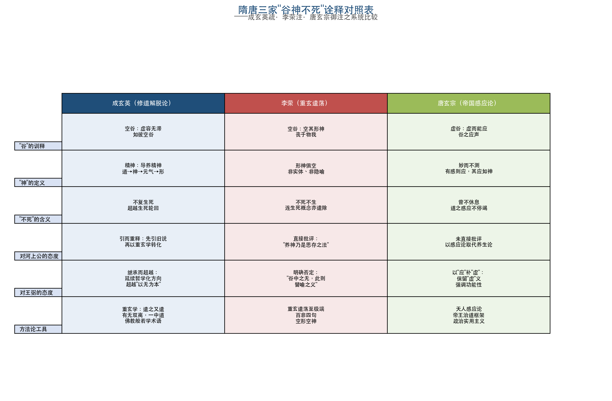

**图4-1：隋唐三家"谷神不死"诠释对照表。** 该表从"谷"的训释、"神"的定义、"不死"的含义、对河上公的态度、对王弼的态度、方法论工具六个维度，系统比较成玄英（修道解脱论）、李荣（重玄遣荡）、唐玄宗（帝国感应论）三家在"谷神不死"诠释上的差异，直观呈现隋唐"神"义的多元分化格局。

成玄英偏向修道解脱论。他以"导养精神，虚容无滞，不复生死"为核心，保留了"导养精神"的修道实践向度，但将其从河上公的身体养护转化为"虚容无滞"的心性工夫，目标也从肉体长生转化为"不复生死"的解脱。"谷神"在成玄英的体系中是修道者所追求的精神境界——虚通无碍如空谷。

李荣偏向重玄哲学的极致遣荡。他以"空其形神，丧于物我，不死不生"为核心，不仅遣除了"养神"的执著，更遣除了"虚容无滞"所可能隐含的对精神境界的执取。"谷神"在李荣的诠释中，连精神境界的描述都已不足——任何将其对象化的做法都属于"指事之说"。

唐玄宗偏向帝国治理的感应论。他以"虚而能应，有感则应"为核心，将"谷神"从修道境界转化为圣君治道的模式——圣君虚己以应万民，如空谷之应声。"谷神"在唐玄宗的诠释中是帝王治理天下的政治原理。

三者共同超越了河上公的养生训释和王弼的纯本体论框架：没有一家将"谷神"落实为五脏之神的养护，也没有一家简单复述王弼"谷中央无者"的本体论判断。然而三者的分化方向截然不同——成玄英走向道教内部的修道论深化，李荣走向哲学思辨的极致化，唐玄宗走向帝国政治的实用化。这种分化本身折射出隋唐道教面对的三重压力：修道实践需要在理论上获得比汉代养生化更精密的支持（成玄英的回应）；佛道论争需要道教展示比王弼玄学更高明的哲学思辨能力（李荣的回应）；帝国政治需要道教义理为天子治道提供直接的理论资源（唐玄宗的回应）。

## 4.10 成玄英对王弼的继承与超越：三个层面

成玄英的"神"论与王弼注之间的关系，不宜简单概括为"继承"或"批判"，而是一种在继承基础上的系统性超越。这一继承与超越关系可从三个层面加以把握。

其一，继承"以无释谷神"的哲学化方向。成玄英以"如彼空谷，虚容无滞"释"谷神"，在基本取向上延续了王弼以"虚空"释"谷"的路线。成玄英不将"谷"训为"养"（河上公），不将"谷神"等同于修炼对象（《想尔注》"精结为神"），在这一基本方向上与王弼一致——"谷神"首先是关于"虚"的哲学命题，而非关于"养生"的实践指南。

其二，超越"以无为本"的一元框架。成玄英明确批评"以无为本"可能导致的偏执："至道雖言無色，不遂絕無。若絕無者，遂同太虛，即成斷見"[郑灿山《初唐道士成玄英的重玄思想与道佛融通》](https://buddhism.lib.ntu.edu.tw/FULLTEXT/JR-HFU/nx105228.html "引用强昱《从魏晋玄学到初唐重玄学》")。在成玄英看来，王弼虽然正确地以"虚空"释"谷神"，但如果将"无"确立为唯一的本体论原则（"以无为本"），便可能滑入"绝无"（将一切存在都否定为无）的极端，等同于佛教所批评的"断见"（断灭空）。重玄学的"有无双遣"正是为了规避这一理论风险：道既非"有"（不可被对象化为某种实有），也非"无"（不可被否定为绝对的虚无），而是超越有无二元对立的"重玄"之境。

其三，新增佛教思辨工具。成玄英疏文中大量使用"四句""百非""遣中""药病俱遣"等佛教般若学术语。"四句"（肯定、否定、亦肯定亦否定、非肯定非否定）源自龙树《中论》的论辩方法，"百非"指对一切命题的否定，"药病俱遣"则属天台宗的修行概念——以"药"（对治法）治"病"（执著），治愈后"药"亦须遣除。这些佛教工具的引入，使成玄英处理"神"概念时拥有了比王弼更为精细的思辨层次——王弼以"无"否定"有"（以无释神），成玄英则进一步否定对"无"的执著（遣之又遣），形成多层次的递进否定结构。

李荣对王弼的态度则更为直接。他在第六章注中明确称王弼之说为"譬喻之义"，属于"指事之说"而非究竟之论[李荣《道德真经注》（道藏本与敦煌本合校）](https://a.daorenjia.com/daozang15-660 "李荣注第六章全文")。李荣对成玄英的批评虽不如对河上公和王弼那样直接点名，但从其"空其形神，丧于物我"的极致遣荡立场来看，成玄英"导养精神，虚容无滞"中保留的"导养"向度，在李荣看来可能仍属于某种程度的"执有"[李荣注与成玄英疏之比较](https://xiaoan.web.fc2.com/dongyahanxue/paper/DY-13/1.pdf "论李荣与成玄英解《老》之殊异")。

## 4.11 隋唐"神"义诠释的整体评估

综合成玄英、李荣、唐玄宗三家对"神"的处理，隋唐时期"神"义诠释的核心特征可从以下三个层面加以概括。

其一，重玄学方法论为重构"神"义提供了全新的哲学框架。"遣之又遣"的方法使"神"的诠释获得了前所未有的思辨深度：不仅遣除了汉代注疏对"神"的身体化执著（遣有），也防止了对王弼式"以无为本"的另一种执著（遣无），在理论上实现了对前代诠释的双重超越。成玄英以"虚容无滞"释"谷神"、李荣以"空其形神，丧于物我"释"谷神"，在哲学精密度上均超过了王弼"谷中央无者"的简洁判断。

其二，佛道交涉深刻影响了"神"的诠释方向。法琳《辩正论》对道教"神明"概念的质疑，迫使道教注家在更高的哲学层面回应"神"的本体论地位问题。成玄英通过引入"道性"概念和"道→神→元气→形"的层级结构来回应这一挑战；李荣通过将遣荡推至极致来证明道教哲学的深度不亚于佛教般若学。佛教"佛性"论、般若学"空"论、中观"四句"否定法等思辨工具被道教注家大量吸收，使"神"的内涵在保持道教本位的同时获得了佛学化的理论深度。

其三，唐玄宗御注标示着"神"义诠释的政治化转向。在成玄英和李荣的体系中，"神"主要是修道论和本体论的范畴；在唐玄宗的诠释中，"神"首先是治道论的范畴——"虚而能应"描述的是圣君治道的模式，"会归只在于侯王守雌用道尔"将一切宇宙论义理收束于帝王实践。唐玄宗御注在第六十章保留了鬼神的实体性并将其纳入国家祭祀制度（"匮神乏祀"），在第七十二章建立了"心—神—身"的帝王养神论，这些处理将"神"从哲学概念转化为政治制度与帝王修身的实践指南。

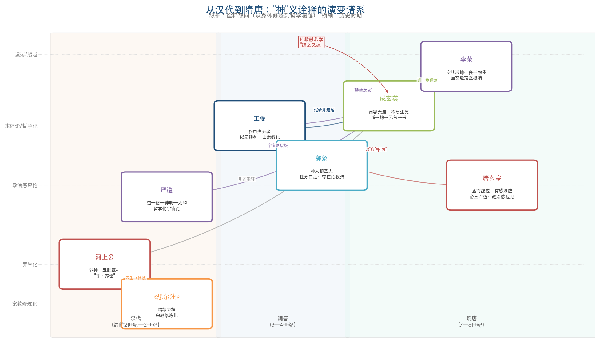

**图4-2：从汉代到隋唐"神"义诠释的演变谱系。** 该图以历史时期（汉代、魏晋、隋唐）为横轴、诠释取向（从身体修炼/宗教化到哲学超越/遣荡）为纵轴，标注河上公、《想尔注》、严遵、王弼、郭象、成玄英、李荣、唐玄宗八家的位置，并以箭头标示影响关系，展示"神"义诠释从养生化经本体论化到重玄辩证与政治感应论的多线分化路径。

回顾从汉代到隋唐的"神"义演变，可以辨识出一条清晰的演进路径：河上公将"神"收缩为五脏藏神的养生术语→王弼将"神"扩张为"无"的本体论显现→成玄英和李荣以重玄学方法将"神"进一步提升为超越有无二元对立的哲学范畴→唐玄宗将"神"重新锚定于帝国治理的实践维度。每一次转换都受到外部思想史语境的驱动——汉代黄老方术的制度化催生了养生化解读，魏晋玄学方法论的更新催生了本体论重构，佛道知识竞争催生了重玄学的思辨深化，帝国政治对道教的制度性利用催生了治道论的义理收束。这些诠释路径并非简单的线性替代，而是在隋唐时期形成了复杂的共存格局——重玄学者的哲学思辨、道教信仰者的鬼神实在论、帝王的政治感应论同时存在于这一时代的"神"义诠释之中，各自回应着不同的理论需求与实践关切。

# 第5章 宋元明清注本中"神"的理学化、内丹化与考据学转向

隋唐时期，成玄英、李荣以重玄学"遣之又遣"的方法超越了王弼"以无为本"的一元框架，唐玄宗则以帝国治理话语将"谷神"纳入"虚而能应"的政治感应论。三家注在"神"义上的多元分化，为宋元明清时期更为复杂的诠释格局埋下了伏笔。自北宋至清末近千年间，《老子》注疏中"神"的诠释沿三条既相互竞争又彼此渗透的路径展开：理学家以心性论和天理框架重新收编"神"义，道教内丹学将"神"编码为精确的修炼术语体系，清代考据学则试图以训诂、音韵和版本校勘剥离历代义理附会，还原"神"字本义。三条路径各自将"神"的意义边界改写到前所未有的程度，其间的张力与交互构成了《老子》诠释史上最为繁复的阶段。

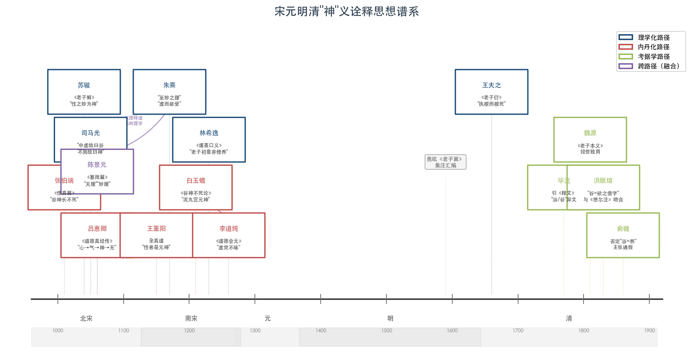

上图以时间轴展示北宋至清代"神"义诠释的三条主要路径及其代表注家：蓝色标注理学化路径（苏辙、司马光、朱熹等），红色标注内丹化路径（张伯端、白玉蟾、李道纯等），绿色标注考据学路径（毕沅、俞樾、洪颐煊等），紫色标注跨路径融合者（陈景元、李道纯等），各节点之间的连线揭示了学术传承与跨路径影响关系。

## 5.1 北宋思想语境：三教合流、理学兴起与道教内丹学的制度化

北宋以降，"神"义诠释分化的思想史背景可从三个层面加以把握。

其一，三教合流的文化格局已成为思想界的基本共识。唐末五代的战乱使儒释道三家在制度层面遭受重创，但也促使三教之间长期形成的论争格局逐步让位于融通与整合。宋初帝王对三教采取兼容态度，"以佛治心，以道治身，以儒治世"成为社会通行话语。在此背景下，北宋注家处理《老子》"神"义时，不再需要如成玄英、李荣那样以精密的重玄思辨回应佛教挑战，而是更多地在儒道互释的框架内展开诠释——苏辙以"性"释"神"，朱熹以"理"统摄"谷神"，均为这一文化格局的产物。

其二，理学的兴起根本改变了诠释《老子》的概念工具。自周敦颐《太极图说》融合儒道、二程建构天理论以来，"性""理""心""气"构成了一套全新的哲学话语体系。值得注意的是，北宋道教学者陈景元（1024—1094年）在二程之前已系统地以"理"释道——其《道德真经藏室纂微篇》（约成书于1072年）明确以"重玄为宗，自然为体，道德为用"为注经宗旨，并大量使用"天理""妙理""自然之理"等范畴。蒙文通指出"伊洛所论者，碧虚书殆已有之"，刘固盛进一步论证陈景元以理释道、以气论性的思想"成为了二程理学之天理论、人性论、道德论的重要理论来源"[刘固盛《陈景元老庄学思想对二程理学的影响》](https://daoism.ccnu.edu.cn/info/1150/1198.htm "《道家文化研究》第26辑，三联书店2012年")。陈景元提出"性分不越则天理自全"，将道家"无为"与儒家等级秩序融合为一体，使"天理"从道家概念转化为可以统摄儒道两家的超级范畴。理学家此后以"理""性"释《老子》"神"义，实际上是在陈景元开辟的道路上进一步推进。

其三，道教内丹学在北宋完成了理论体系化与制度化。张伯端（984—1082年）《悟真篇》奠定南宗丹法基础，王重阳（1112—1170年）创立全真道，将内丹修炼制度化为出家道士的核心功课。内丹学以"精—气—神"三层次和"炼精化气—炼气化神—炼神还虚—炼虚合道"四阶次构成完整的修炼体系，其中"元神"与"识神"的区分——"性者是元神，命者是元气"——赋予"神"以极为精确的技术含义。当内丹学者注解《老子》时，"谷神不死"便不再是关于道体的哲学命题，而是被转译为修炼第三阶段（炼神还虚）的标志性成就。

在上述三重语境的交汇下，宋元明清注家对"神"的处理呈现出前所未有的分化与融合：理学家试图将"神"纳入"性—理"框架，内丹家将"神"编码为修炼术语，清代考据学者则以语言学方法剥离一切义理建构。以下依次分析三条路径对"神"义的具体改写。

## 5.2 苏辙《老子解》：以"性"统摄"神"

苏辙（1039—1112年）《老子解》是北宋理学化解老的代表之作。苏辙早年因乌台诗案受累，流放筠州期间深研佛老，其《老子解》以儒学义理为骨架，对"神"的诠释呈现出鲜明的心性论色彩。

苏辙注第六章"谷神不死"，以"德"与"功"的二分框架重释"谷神"——"谷至虚而犹有形，谷神则虚而无形也……谓之谷神，言其德也；谓之玄牝，言其功也"[苏辙《老子解》卷上（ctext）](https://ctext.org/wiki.pl?if=gb&chapter=985736&remap=gb "苏辙注第六章、第十章原文")。"谷"有形而"谷神"无形——苏辙在王弼"谷中央无者"的基础上进一步区分了物质性的山谷与超越形质的"谷神"，后者作为道的"德"（内在属性），与作为道的"功"（外在作用）的"玄牝"构成体用关系。体/用、德/功的概念对偶直接来自儒学义理分析传统，是前代注家未曾援用的诠释范畴。

更为关键的是苏辙以"性"统摄"神"义的核心操作。苏辙注第十章"载营魄抱一"时明确提出"道无所不在，其于人为性，而性之妙为神"，又曰"圣人性定而神凝"。这一命题完成了三重概念转换：（1）道在人身中的存在形式是"性"；（2）性的精微妙用即是"神"；（3）圣人之所以"神凝"，根源在于"性定"。"神"由此从一个宇宙论概念（如成玄英的"道→神→元气→形"层级）转化为一个心性论概念——它既非需要养护的生理实体（河上公），亦非"无"的语境化显现（王弼），更非需要遣除的执著对象（李荣），而是人的本性中最精微的层面。"性之妙为神"这一命题将"神"从道体论下放到人性论，标志着理学家对"神"义的根本改写。

以此为参照，苏辙的处理与前代注家的差异更趋显豁：河上公以"五脏藏神"将"神"落实为身体器官中的生理性存在；王弼以"谷中央无者"将"神"安置于"无"的本体论结构中；成玄英以"虚容无滞"将"神"指向修道实践的精神境界；苏辙则以"性之妙"将"神"收入宋代心性论的话语体系——"性"是道在人身中的存在形式，"神"是"性"的精微活动，修养的目标是"性定"而非"养神"或"遣神"。

## 5.3 司马光与朱熹：从"不测"到"理"的光谱

苏辙的理学化路向并非孤例。北宋司马光（1019—1086年）与南宋朱熹（1130—1200年）分别代表了理学化光谱的两端——前者偏向概念拆解，后者则以"理"完成了对"谷神"的终极统摄。

司马光以"中虚故曰谷，不测故曰神"拆解"谷神"，将其分为两个独立概念——"虚"与"神妙不测"——即道之两种属性的并列描述[彭耜《道德真经集注》谷神章第六（识典古籍）](https://www.shidianguji.com/zh/book/DZ0707/chapter/1k85i5onpsi7n "司马光、朱熹注引")。这一拆分策略在方法论上与朱谦之后来主张的"分读说"不谋而合，但司马光的动机并非语言学考据，而是试图以儒学义理话语重新描述道的属性——"虚"对应谦退不争，"不测"对应天道运行的超越性。

朱熹的处理则更为彻底。其注曰："谷之虚也，声达焉则响应之，乃神化之自然也。是谓玄牝。玄，妙也。牝是有所受而能生物者也。至妙之理，有生生之意焉。程子所以取老氏之说也。"又曰："谷是虚而能受，神谓无所不应。"朱熹以"至妙之理"统摄"谷神"，使其成为天理自然运作的表现——"虚而能受"是理的接受性，"无所不应"是理的遍在性，"生生之意"是理的创生性。朱熹更明确指出"程子所以取老氏之说也"，坦然承认二程理学在"谷神"问题上对老子思想的借鉴。

朱熹的处理标志着理学家对"神"义的最大幅度改写：在河上公那里，"谷神"是需要养护的五脏之神；在王弼那里，"谷神"是虚而不竭的道体隐喻；在成玄英那里，"谷神"是超越有无双边的重玄境界；而在朱熹这里，"谷神"不过是"至妙之理"的另一种表述——天理流行、生生不息，即"谷神不死"的究竟义理。"理"作为宋代哲学的最高范畴，至此完成了对道家"神"概念的全面收编。

## 5.4 陈景元：从重玄余绪到理学先声

在理学化与内丹化两条路径之间，北宋道教学者陈景元（1024—1094年）的《道德真经藏室纂微篇》占据了独特的枢纽位置。陈景元字太初，号碧虚子，师承陈抟学派——先从高邮天庆观道士韩知止出家，后游天台山从鸿濛先生张无梦受"老庄微旨"，由此形成"陈抟→张无梦→陈景元"的学术谱系[陈景元·百度百科](https://baike.baidu.com/item/%E9%81%93%E5%BE%B7%E7%9C%9F%E7%BB%8F%E8%97%8F%E5%AE%A4%E7%BA%82%E5%BE%AE%E7%AF%87/4719914 "陈景元生平")。

陈景元在彭耜《道德真经集注》中被引述的第六章注文，首先转引河上公"谷者，训养也。神谓五藏之神……夫人能清静虚空以养其神，不为诸欲所染，使形完神全，故不死也"的章句，随即补充道"若触情耽滞，为诸境所乱，使形残神去，则何道之可存哉"[彭耜《道德真经集注》谷神章第六（识典古籍）](https://www.shidianguji.com/zh/book/DZ0707/chapter/1k85i5onpsi7n "陈景元注引")。这一注释策略颇值玩味：陈景元并未如李荣那样明确批评河上公的养生化解读，而是在转引河上公注文的基础上加以扩展——"清静虚空以养其神"保留了养神的基本框架，但"不为诸欲所染"则将养神的核心从呼吸吐纳的身体操作转向去欲存真的心性工夫。这一转向与其注《老》《庄》时大量使用"天理""妙理""自然之理"等范畴的总体立场一致。

陈景元对"神"义诠释史的深层贡献在于打通了重玄学与理学之间的理论通道。他在《纂微篇》中以"一者，元气也。元气为大道之子，神明之母，太和之宗，天地之祖"注解"道生一"，构建了"道→一（元气）→神明→万物"的宇宙论层级[刘固盛《陈景元老庄学思想对二程理学的影响》](https://daoism.ccnu.edu.cn/info/1150/1198.htm "《道家文化研究》第26辑，三联书店2012年")。在此层级中，"神明"位于元气之下、万物之上，其功能是赋予天地人物以"灵性"。这一定位与成玄英"道→神→元气→形"的宇宙论层级在结构功能上高度近似，但陈景元引入"理"来解释"神明"运作的内在机制——"不测之理，非有非无，难以定名"——使"神明"不仅是宇宙论层级中的枢纽概念，更成为"天理"在万物中的具体显现。二程后来提出"天理"概念并以此解释万物秩序时，陈景元的道家"天理"论已为其准备了理论资源。

## 5.5 内丹化路径的确立：清源子刘骥与人体三宫

与理学家将"神"纳入心性论框架不同，道教内丹学者走的是一条截然相反的路——将"谷神"全面改写为人体修炼的技术术语。在彭耜《道德真经集注》中，清源子刘骥的第六章注释代表了内丹化诠释的完成形态。

刘骥以《灵枢经》"天谷元神，守之自真"为核心典据，将"谷神"改写为内丹身体地理学——"言人身中上有天谷泥丸，藏神之府也；中有应谷绛宫，藏气之府也；下有灵谷关元，藏精之府也。天谷者，元宫也，乃元神之室，性之所存，是神之要也"[彭耜《道德真经集注》谷神章第六（识典古籍）](https://www.shidianguji.com/zh/book/DZ0707/chapter/1k85i5onpsi7n "刘骥注引'天谷元神，守之自真'")。刘骥进一步描述了完整的内丹修炼程序："圣人则天地之要，神守于元宫，气腾于牝府，神气交感，自然成真，真合自然，与道为一，而入于不死不生。"

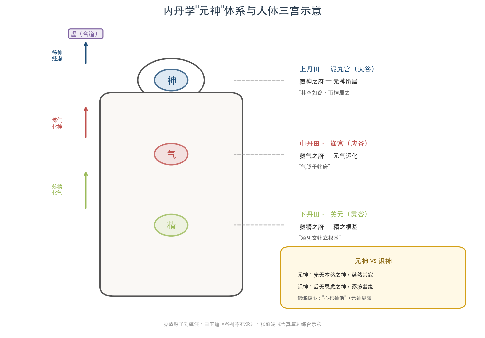

上图直观呈现了内丹学将"谷神"身体化的空间逻辑：上丹田泥丸宫（天谷）藏神、中丹田绛宫（应谷）藏气、下丹田关元（灵谷）藏精，左侧箭头标示"炼精化气→炼气化神→炼神还虚→炼虚合道"四阶次递进关系，右下角附"元神"与"识神"的区分说明。

刘骥的注释完成了"谷神"诠释的三重技术化改造。第一，引入"元神"这一专门术语取代前代注家模糊的"神"概念——"元神"是先天本然之神，具有明确的存在位置（泥丸宫/天谷）和功能定义（"性之所存"）。第二，建立人体三层修炼空间——上丹田泥丸宫（藏神）、中丹田绛宫（藏气）、下丹田关元（藏精）——使"精—气—神"三宝各有对应的身体部位。第三，描述完整的修炼操作——"神守于元宫，气腾于牝府，神气交感，自然成真"——使"谷神不死"从道体论命题转化为可操作的修炼步骤。

刘骥的注释与河上公"五脏藏神"存在重要的继承关系：二者都将"神"落实为身体中的实存，都以特定的身体部位来定位"神"的存在。然而差异同样显著：河上公的"五脏藏神"是被动的——五脏是"神"的容器，修炼者需要"养护"以防流失；刘骥的"元神"则是主动的——它居于泥丸宫/天谷之中，通过与元气的"交感"主导修炼全程。河上公注的身体化尚停留在养生保健层面，刘骥注的身体化则进入了精密的内丹工程层面。

## 5.6 白玉蟾《谷神不死论》：内丹化诠释的高峰

南宋白玉蟾（1194—约1229年），金丹南宗五祖之末，所著《谷神不死论》是内丹学者专论"谷神"的独立篇章，代表了内丹化诠释的理论高峰。

白玉蟾以泥丸宫中的"元神"定义"谷神"："头有九宫，上应九天，中间一宫，谓之泥丸，又曰黄庭，又曰昆仑，又名天谷……乃元神所住之宫，其空如谷，而神居之，故谓之谷神"[白玉蟾《谷神不死论》（道藏辑要）](http://www.ctcwri.org/CTCW-DZJY/CTDZJY16/NewDZJY16/DZJY1605013.pdf "白玉蟾论谷神")。此处对"谷神"的语法分析与前代所有注家截然不同：既非王弼式的偏正结构（"谷中央的无"），亦非河上公式的动宾结构（"养神"），更非司马光式的并列属性（"虚"+"不测"），而是空间+主体结构——"谷"是泥丸宫（空如山谷），"神"是居住其中的元神。这一语法分析本身即决定了"谷神"的全部义理方向：所指不再是道体的虚无属性，而是修炼者体内特定位置的特定实体。

白玉蟾对"谷神不死"的修炼核心操作界定为"神气交感"——元神（玄/天/阳）与元气（牝/地/阴）的交合。尤其值得关注的是，白玉蟾在这一内丹框架中引入了心性维度——"以念头动处为玄牝""但能凝然静定，念中无念，工夫纯粹，打成一片"[蕭聿廷《中国古代内丹玄牝学说初探》](https://tdr.lib.ntu.edu.tw/bitstream/123456789/5865/1/ntu-102-1.pdf "台湾大学硕士论文，2013年")。"念头动处"即修炼的关键节点——元神与识神的分判，在白玉蟾看来，就发生在"念头"的动静之间。"凝然静定，念中无念"的工夫论表述，既源自内丹修炼的实际经验，也带有明显的禅宗话语色彩——"念中无念"呼应禅宗"无念为宗"的核心命题。这一融合预示了后世中派丹法"三教合一"的诠释方向。

## 5.7 李道纯《道德会元》：内丹与理学的深度融合

白玉蟾在内丹化解读中引入心性维度的做法，在元代李道纯（约1219—约1296年）的《道德会元》中达到了系统化的高度。李道纯被视为丹法"中派"的开创者，其核心思想特征正在于以理学术语重新表述内丹修炼。

李道纯注第六章"谷神不死"，以理学核心术语"虚灵不昧"直接释之——"谷神不死（虚灵不昧也）……虚灵不昧，神变无方，阴阳不测，一阖一辟，往来不息"[李道纯《道德会元》卷上第六章（国学典籍网）](http://ab.newdu.com/book/ms210045.html "李道纯注：'虚灵不昧也'")。这一注释的独特之处在于同时运用两套话语体系："虚灵不昧"直接源自朱熹《大学章句》对"明德"的界定——朱熹注"明德"曰"虚灵不昧，以具众理而应万事者也"——属理学的核心术语；"阴阳不测""一阖一辟"则来自《周易·系辞》"阴阳不测之谓神""一阖一辟谓之变"，同时也是内丹学描述阴阳交媾的标准术语。

李道纯通过"虚灵不昧"这一关键术语，实现了内丹学与理学的深度融合——"谷神"既是理学意义上的"明德"（人的本然明觉之性），也是内丹学意义上的"元神"（先天本然之神）。修炼"谷神不死"，既是理学工夫论中"明明德"的过程（使虚灵不昧之明德不被物欲遮蔽），也是内丹学修炼中"炼神还虚"的过程（使元神复归先天本然状态）。两套工夫论在"虚灵不昧"这一概念节点上获得统一。

这种融合标志着中派丹法"三教合一"的诠释特色：《老子》"谷神不死"的道体论命题、朱熹"虚灵不昧"的理学心性论、禅宗"明心见性"的修证论，在李道纯笔下被整合为统一的理论——修炼的终极目标是使"虚灵不昧"的本然之性（道家谓之"谷神"，儒家谓之"明德"，佛家谓之"本来面目"）显露无遗。

## 5.8 内丹学"元神"与"识神"体系对"神"义的结构性重构

李道纯的融合并非孤立现象，而是建立在全真道创立以来内丹学对"神"概念系统重构的基础之上。这一重构的核心在于"元神"与"识神"的二分。

王重阳明确定义"性者是元神，命者是元气"，为"性命双修"奠定了理论基础。"元神"为先天本然之神——不假思虑、湛然常寂，对应人的本来性体；"识神"为后天思虑之神——分别计较、逐境攀缘，对应人的日常意识活动。修炼的核心目标之一即"摒除识神，元神显露"——所谓"心死神活"，"心"指识神（后天思虑之心），"神"指元神（先天本然之性）[戈国龙《道教内丹学论"道的演化"》（哲学中国网）](http://philosophychina.cssn.cn/fzxk/zjx/201509/t20150925_2728428.shtml "内丹学精气神理论")。

这一二分体系对《老子》"神"义的诠释产生了结构性影响。当内丹学者阅读"谷神不死"时，"神"被自动编码为"元神"——那个先天本然的、居于泥丸宫天谷之中的真性。"不死"则不再是河上公式的肉体长生，亦非王弼式的道体永恒，而是元神在修炼中的不坏不灭——只要修炼者能够"心死"（摒除识神的干扰），"神"便"活"了（元神自然显露、常存不灭）。

"炼精化气、炼气化神、炼神还虚、炼虚合道"四阶次进一步将"神"定位为修炼第三层级的核心对象。张伯端《悟真篇》明确以"谷神"为此阶段的标志——"要得谷神长不死，须凭玄牝立根基"[蕭聿廷硕士论文](https://tdr.lib.ntu.edu.tw/bitstream/123456789/5865/1/ntu-102-1.pdf "引张伯端《悟真篇》")。在张伯端的四阶次体系中，"炼精化气"是筑基，"炼气化神"是进阶，"炼神还虚"是高阶成就——修炼者在此阶段将"元神"从气的层面进一步提纯，达到与虚空合一的状态。"谷神不死"由此从道体论命题被彻底转化为内丹阶段性成就的描述——它标示的不再是道体的永恒属性，而是修炼者在特定阶段所达到的特定境界。

## 5.9 吕惠卿与焦竑：内丹化先声与集注汇编

在内丹化诠释的谱系中，北宋吕惠卿（1032—1111年）的《道德真经传》构成了一个重要的理论先声。吕惠卿提出"体合于心，心合于气，气合于神，神合于无"的五层递进结构释"谷神"——"有形之身可使虚而如谷，无形之心可使寂而如神，则有形与无形合而不死"[吕惠卿《道德真经传》第六章（识典古籍）](https://www.shidianguji.com/book/DZ0686/chapter/DZ0686_8 "吕惠卿注原文")。"体→心→气→神→无"五层递进在结构上已暗含后来内丹学"炼精化气→炼气化神→炼神还虚"的阶次逻辑——修炼从有形的身体出发，经由心、气、神的逐层提升，最终合于"无"。吕惠卿本人虽是北宋新党政治家而非道教修炼者，其五层递进说仍为后来内丹化诠释提供了理论框架。

明代焦竑（1540—1620年）《老子翼》采用集注方法，系统收录历代"谷神"诠释，客观上构成了"神"义诠释史的文献汇编。焦竑融合三教的学术立场使他在选编时兼收并蓄——河上公的养生化、王弼的本体论化、重玄学的遣荡化、理学的心性论化、内丹学的术语化各家注释均被并列呈现。这一编纂方式虽未提出独立的"谷神"诠释，却使读者得以在一个文本中首次纵览"谷神"诠释的千年演变。王夫之后来批评焦竑"引禅宗，互为缀合"，指其以佛教话语串联诸家之说，模糊了各家之间的根本差异。

## 5.10 林希逸与王夫之：理学家的方法论自觉与批判

在理学化路径内部，南宋林希逸（1193—约1271年）和明清之际王夫之（1619—1692年）分别代表了方法论自觉与批判性反思两种姿态。

林希逸《老子鬳斋口义》注第六章时提出一个颇具方法论自觉的判断："此章乃修养一项功夫之所自出，老子之初意却不专为修养也"[林希逸注（维基文库）](https://zh.wikisource.org/zh-hant/%E9%81%93%E5%BE%B7%E7%9C%9F%E7%B6%93%E5%8F%A3%E7%BE%A9 "林希逸注第六章")。林希逸此处区分了"老子初意"（原初文本意义）与后世修养家的借用（诠释史中的衍生意义），这一区分在方法论上预示了近现代诠释学对"原义"与"效果历史"的分判。林希逸承认"谷神"确实被修养家用作功法依据，但坚持认为这并非老子的"初意"——老子所论乃道体的虚无属性，而非修炼的具体操作。这一判断既拒绝了内丹化解读的"究竟"地位，又承认其在实践层面的合理性，体现了理学家以义理分析介入《老子》诠释时的审慎与精细。

王夫之的立场则更为激烈。其《老子衍》以"执根而根死，因根而根存"构成对养生化和内丹化的双重批判——凡试图"执取"谷神、将其对象化的做法都会导致"谷神"之死。"执根而根死"直指内丹学将"谷神"对象化为泥丸宫中的"元神"、以特定的修炼操作来"守护"之的做法——在王夫之看来，一旦将"谷神"确定为某个可以被执取的对象，执取行为本身便违背了"谷神"之"虚"的本质。"因根而根存"则指出正确的态度是"因"（顺应）而非"执"（把持）——顺应谷神之虚而不加以对象化，方是谷神"不死"的真义[王夫之《老子衍》（识典古籍/流芳阁）](https://lfglib.cn/text/daolib/211379.html "王夫之注第六章、自序")。

王夫之《老子衍》自序更点名批评苏辙、焦竑"引禅宗，互为缀合"，拒绝一切将"神"超验化、修炼化或佛教化的诠释方向。在王夫之看来，苏辙以"性之妙为神"将"谷神"纳入心性论框架，虽较内丹化更为雅正，但底层逻辑仍然是以某种确定的概念（"性"）来"定义"谷神——而谷神作为道体的隐喻，本身拒绝一切确定的定义。这一立场将理学家对"神"义的批判推至极端：不仅拒绝内丹化（将"神"对象化为修炼目标），也拒绝心性论化（将"神"概念化为"性之妙"），甚至隐含着对王弼"谷中央无者"的保留——任何以确定概念（无论是"无"还是"性"还是"元神"）来界定"谷神"的做法，都有"执根而根死"的风险。

## 5.11 清代考据学转向：从义理到文字的视角切换

清代考据学的兴起标志着"神"义诠释进入一个全新的范式。乾嘉学者以训诂、音韵和版本校勘为工具，试图剥离一千八百年来层累的义理建构，回到"神"字在先秦文本中的语言学本义。这一范式转换的核心动力是对宋明理学空谈义理的反拨——当"谷神"可以被解释为"明德"（朱熹）、"元神"（白玉蟾）、"性之妙"（苏辙）中的任何一种时，考据学者追问的是：在这些后起的义理建构出现之前，"谷神"这两个字本身究竟意味着什么？

毕沅（1730—1797年）引陆德明《经典释文》揭示了关键的版本异文——"谷，河上本作浴，云：浴，养也"，并指出东汉边韶老子碑铭亦作"浴神"，证实汉代所见文本中第六章首句为"浴神不死"而非"谷神不死"[朱谦之《老子道德经校释》第六章（ctext）](https://ctext.org/wiki.pl?if=gb&chapter=467344&remap=gb "毕沅、俞樾、洪颐煊、朱谦之校勘")。这一版本学发现具有重大的诠释学意义：如果原文为"浴神"而非"谷神"，那么王弼以"山谷之虚空"释"谷"、白玉蟾以"泥丸宫空如谷而神居之"释"谷"的全部义理建构，均建立在一个值得商榷的文本基础之上。

俞樾（1821—1907年）进一步否定"浴"有"养"义，主张"谷""浴"均为通假字。洪颐煊则提出更为激进的假借说——"谷""浴"皆"欲"之借字，"谷神不死"应读为"欲神不死"。这一训释与二世纪天师道经典《想尔注》的"欲令神不死"完全吻合——考据学的文字学推论竟与早期道教的宗教性解读不期而合，构成了诠释学上极为耐人寻味的环形结构。洪颐煊的假借说意味着："谷神不死"的原义可能既非"山谷中虚空的道体永恒不灭"（王弼路向），亦非"泥丸宫中的元神长存不死"（内丹路向），而是"欲使精神不死灭"这一朴素修炼愿望——如此，则两千年来从哲学到宗教到医学的全部诠释建构都可被还原为一个远比它们简单的原初表述。

朱谦之（1899—1972年）综合清代校勘成果，提出"分读说"——第三十九章"神得一以灵，谷得一以盈"中"神"与"谷"分属两个独立主语，第六章亦应分读为"谷"+"神"+"不死"。"分读说"意味着"谷神"并非偏正结构（"山谷般的神""谷中之神"）或联合结构（"虚"+"神妙"），而是两个并列的独立概念——"谷"（虚空/盈满）与"神"（灵妙/不测）各有所指。这一语法分析直接否定了所有将"谷神"作为整体概念来解释的传统路径。

## 5.12 魏源《老子本义》：经世致用与去养生化

在考据学大盛的清代学术环境中，魏源（1794—1857年）的《老子本义》代表了一种独特的诠释立场——既不沉溺于纯粹的训诂考据，也不追随理学家的心性论或内丹家的修炼术语，而是以"经世致用"的实用主义态度重新解读《老子》。

魏源对历代注本均有所不满，"依据王弼、吕惠卿、苏辙、吴澄、焦竑、李嘉漠、李贽、张尔歧、姚鼐等人的注本，集采众家之长，又不拘旧说，大胆抒发己意"[罗检秋《从魏源〈老子本义〉看清代学术的转变》](http://jds.cssn.cn/webpic/web/jdsww/UploadFiles/zyqk/2010/12/201012061443260009.pdf "《近代史研究》")。魏源多次明确否定将《老子》视作"养生修道"之术——如关于"虚其心、实其腹、弱其志、强其骨"一章，魏源认为这是老子"以太古之志，矫末世之弊"，"至后世养生家亦借四者为说，则外矣"。在魏源看来，《老子》并非修身养性的消闲之书，而是救治社会的思想学说。

魏源对"神"义诠释的贡献在于从"经世致用"角度彻底切断了"谷神"与养生修炼传统的关联。他将老子之"道"定义为"无而已"——"道无而已，真常者指其无之实。而元妙则赞其常之无也。老子见学术日歧，滞有溺迹，思以真常不弊之道救之"——把"道"（及其属性"谷神"）直接理解为矫正时弊的思想工具，而非修炼操作的理论依据。魏源扬老抑庄、区分"黄老之学"与"老庄之学"的做法，使"谷神不死"的诠释进入了政治哲学的维度——"无为"是"省刑薄赋"的治国方略，而非"枯坐拱手"的修炼姿态。

## 5.13 三条路径的意义光谱与相互关系

综观宋元明清注家对"谷神"中"神"字的处理，三条路径构成了一个从心性论经修炼术到语言学的意义光谱。

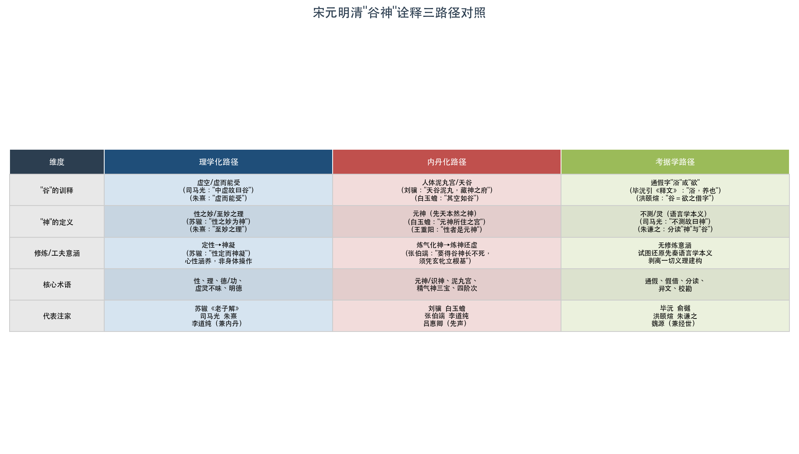

上表从"谷"的训释、"神"的定义、修炼/工夫意涵、核心术语、代表注家五个维度系统对照理学化、内丹化与考据学三条路径在同一文本上的分歧，直观呈现了三种诠释范式对"谷神不死"的不同改写方式。

理学化路径将"神"收入心性论——苏辙的"性之妙为神"、朱熹的"至妙之理"、李道纯的"虚灵不昧"，均以宋代哲学的核心范畴重新定义"神"的含义。在这一路径中，"神"的终极参照系是"性"或"理"——它是人的本然之性的精微活动，或天理在万物中的流行显现。修养工夫因此从"养神"（河上公）转化为"定性"（苏辙"性定而神凝"），从操持具体的身体修炼转化为涵养本源的心性功夫。

内丹化路径将"神"落实为修炼对象——刘骥的"天谷泥丸，藏神之府"、白玉蟾的"元神所住之宫，其空如谷，而神居之"、张伯端的"要得谷神长不死，须凭玄牝立根基"，均将哲学概念编码为精确的修炼术语。在这一路径中，"神"不再是抽象的哲学范畴，而是具有明确空间定位（泥丸宫/天谷）、功能定义（元神/先天本然之性）和操作步骤（炼气化神/炼神还虚）的技术术语。内丹学对"神"的术语化改造程度在历代注疏中最深——它不仅改变了"神"的含义，更改变了"神"的话语性质，使之从哲学语言转化为技术语言。

考据学路径则走向另一极端——毕沅、俞樾、洪颐煊试图通过文字学手段消解所有后起的义理建构。在他们看来，"谷神"这一概念的义理丰富性很可能建立在对原始文本的误读之上——如果原文为"浴神"甚至"欲神"，那么一千八百年来关于"山谷般的虚空""泥丸宫中的元神""至妙之理"的全部讨论，都不过是基于一个通假字的层累建构。考据学的去义理化尝试本身也构成一种诠释立场——它以语言学的"客观性"对抗义理建构的"主观性"，但这种"客观性"本身预设了一个前提：文本的原始语言学意义优先于其后续的义理展开。

三条路径并非截然分立。陈景元以"天理"释道，打通了重玄学与理学之间的理论通道；李道纯以"虚灵不昧"注"谷神不死"，实现了内丹学与理学的深度融合；洪颐煊的考据结论（"谷"="欲"）与《想尔注》的宗教性解读不期而合。这些交叉和吻合表明，三条路径虽然各自的方法论前提不同——理学家以义理分析为工具，内丹家以身体经验为依据，考据学家以文字音韵为准据——但它们所面对的同一个文本（"谷神不死"）的多义性，使得不同路径之间不可避免地产生交集与张力。

从伽达默尔"效果历史"的视角来看，每一代注释者都在自身"前理解"（Vorverständnis）的框架中接近文本：苏辙以宋代心性论看到了"性之妙"，白玉蟾以南宗丹法看到了"泥丸宫中的元神"，朱熹以天理哲学看到了"至妙之理"，毕沅以考据学看到了"浴/谷"通假。没有一种诠释能够完全穿透自身的前理解而抵达文本的"原义"——包括考据学的"去义理化"尝试本身也是一种带有特定前理解的诠释行为。宋元明清时期"神"义诠释的极度分化，正是这一诠释学处境的最充分展现。

# 第6章 近现代学术语境中"神"的重新审视与诠释史的理论反思

清代考据学以训诂、音韵和版本校勘为利器，试图剥离千余年义理建构的层累覆盖，还原"神"字的语言学本义。毕沅揭示"谷/浴"异文、俞樾否定"浴"训"养"、洪颐煊提出"谷=欲"假借说、朱谦之主张"谷""神"分读——这一系列文字学操作虽未形成统一结论，却以前所未有的实证精神动摇了此前所有义理诠释的文本根基。晚清以降，西学东渐带来的新方法论——现代语言学、比较哲学、文献考证学——进一步改写了《老子》"神"义研究的问题意识与操作程序。与此同时，二十世纪中叶以来郭店楚简（1993年出土）、马王堆帛书（1973年出土）、北大藏西汉竹书等出土文献的陆续面世，为"神"相关章句的文本校勘提供了前所未有的物质证据，亦迫使学者重新审视传世本诠释传统的可靠性边界。

本章在前五章历时分析的基础上，承担两重任务：其一，考察近现代学者以新方法重新处理"神"义的具体成果，涵盖高亨、严复、朱谦之、马叙伦、陈鼓应等代表性学者的训释路径，以及出土文献与英译实践对"神"义理解的拓展；其二，转向诠释史的理论反思——从两千年"神"义诠释的演变中提炼范式转换的内在动力、意义扩张与收缩的周期性张力，以及诠释行为本身的方法论启示。

## 6.1 近现代学者以新方法论重审"谷神"

### 6.1.1 高亨：以古训重构"谷神"本义

高亨（1900—1986年）《老子正诂》（1943年初版，1956年修订）以严谨的训诂学方法重新处理"谷神"问题，提出了与历代注家截然不同的训释——"谷读为毂"。高亨援引《尔雅·释言》"毂，生也"与《广雅·释诂》"毂，养也"，将"谷神"训释为"生养之神"，即道之别名："谷神者，道之别名也。谷读为毂，毂，生也。谷神者，生养之神"[daodejing.org第六章注释汇编](https://www.daodejing.org/6.html "引高亨、严复说")。这一训释的关键操作在于"谷读为毂"——以声训方法将"谷"（溪母屋部）通假为"毂"（见母屋部），二字声近韵同，在先秦文献中确有通假之例。

高亨的"谷=毂=生养"说在诠释史上占据独特位置。它既不同于河上公"谷=穀=养"的养生化路径——河上公的"养"指向五脏藏神的身体修炼，也不同于王弼"谷=山谷=虚空"的本体论路径，而是径直回到古训本身，将"谷神"理解为以"生养"功能为核心属性的道体。"生养之神"使"谷神不死"的含义从"虚空的道体永恒不灭"（王弼路向）或"人体中的元神长存不死"（内丹路向）转化为"具有生养万物功能的道永恒不灭"——道之所以"不死"，恰在于其"生养"功能的无穷无尽。

### 6.1.2 严复：以"三属性"分解"谷神不死"

严复（1854—1921年）《老子道德经评点》从一个截然不同的角度处理"谷神"。严复提出"谷神"乃联合结构——"以其虚，故曰谷；以其因应无穷，故称神；以其不屈愈出，故曰不死。三者皆道之德也"[daodejing.org第六章注释汇编](https://www.daodejing.org/6.html "引严复说")。此一训释将"谷""神""不死"分别对应道的三种属性——虚（谷）、因应无穷（神）、不屈愈出（不死）——使整句话成为对道之三重德行的联合描述，而非对某一特定实体的命名。

严复的处理应置于近代思想史的脉络中加以理解。作为翻译赫胥黎、斯宾塞等西方思想家的先驱，严复具有当时中国知识分子中极为罕见的西学训练。他以"因应无穷"释"神"，在概念上近于西方哲学中"潜能"（potentia）或"回应性"（responsiveness）的表述——道之"神妙"不是某种超自然的神秘力量，而是对外部刺激的无限回应能力。这一理解在方法论上预示了后来陈鼓应以现代哲学话语重释"谷神"的学术取向。

### 6.1.3 朱谦之："分读说"的语法革命

朱谦之（1899—1972年）《老子道德经校释》（1963年）对"谷神"问题的处理，代表了近现代学者以语言学方法介入《老子》诠释的标志性成果。朱谦之以第三十九章"神得一以灵，谷得一以盈"为核心证据，主张"谷""神"分读——在第三十九章中，"神"与"谷"明确分属两个独立主语，各有其"得一"之后的功能效果（"灵"与"盈"），由此推论第六章亦应分读为"谷"+"神"+"不死"，而非将"谷神"作为整体概念理解[朱谦之校释（ctext）](https://ctext.org/wiki.pl?if=gb&chapter=467344&remap=gb "朱谦之分读说")。

"分读说"若能成立，将从根本上颠覆历代注家的全部诠释。无论河上公的"养神"、王弼的"谷中央无者"、白玉蟾的"泥丸宫中的元神"，还是朱熹的"至妙之理"，均以"谷神"为一个完整的概念单位而展开解释。一旦"谷"与"神"被拆分为两个独立主语，既有诠释的语法基础便不复存在。然而，"分读说"同样面临质疑：第六章"谷神不死，是谓玄牝"的句式结构暗示"谷神"乃"玄牝"的同位指称——倘若"谷"和"神"是两个独立概念，则"是谓玄牝"的指称对象便悬而未决，这一语法难题至今仍无定论。

### 6.1.4 马叙伦：古文字学与系统通假

马叙伦（1885—1970年）《老子覈诂》（1924年排印本）以古文字学、音韵学和版本校勘相结合的方法系统考辨《老子》异文，是近代以科学方法重新处理《老子》文本的开山之作[马叙伦《老子校诂》（百度百科）](https://baike.baidu.com/item/%E8%80%81%E5%AD%90%E6%A0%A1%E8%AF%82/22835732 "1924年排印本")。马叙伦将"谷""浴""欲"的通假关系系统化，从古音学层面论证三字之间的音转关系，使清代毕沅、俞樾、洪颐煊各自独立的校勘发现获得了统一的音韵学基础。

马叙伦的工作标志着《老子》文本研究从传统校勘学向现代语言学的方法论转型。此前的注家（包括毕沅等考据学者）虽也注意到"谷/浴"异文，但多以零散的通假说处理；马叙伦则以系统的古音学方法将这些零散发现整合为连贯的学术论证，使"谷"字训释问题从传统经学的训诂争论上升为现代语言学的音韵分析课题。

### 6.1.5 陈鼓应：以现代哲学话语重释"谷神"

陈鼓应（1935— ）《老子今注今译》（1970年初版，2020年最新修订版）是当代流传最广的《老子》注本之一，其对"谷神不死"的处理代表了以现代哲学话语重释古代文本的典范操作。陈鼓应注曰："'谷'，形容虚空。'神'，形容不测的变化。'不死'，喻变化的不停竭"[陈鼓应注引（daodejing.org）](https://www.daodejing.org/6.html "陈鼓应注第六章")——明确拒绝养生化和内丹化解读，将"谷神"定位为道的两种属性（虚空与不测之变化）的联合表述。

陈鼓应的训释在方法论上延续了严复的三属性说，但概念工具更为现代化。"虚空"（emptiness）指向存在论层面的非实体性，"不测的变化"（unpredictable change）指向变化论层面的不可预测性——二者均可直接进入现代哲学讨论。陈鼓应的处理使"谷神不死"从一个需要层层训诂方能理解的古典哲学命题，转化为以现代哲学语言即可直接表述的关于"道"之属性的命题。在其注疏体系中，"神"从河上公的"五脏之神"、王弼的"谷中央无者"、白玉蟾的"元神"、朱熹的"至妙之理"的层累建构中剥离出来，回到一个清晰而节制的定义——"形容不测的变化"。这一定义承袭了《易传·系辞》"阴阳不测之谓神"的先秦哲学传统，却以现代汉语将其从古奥的哲学命题转化为直白的属性描述。陈鼓应在另一场合进一步阐释："'谷'也是虚空；'不死'，是变化不停歇。'玄牝'就是指无迹而微妙地萌生万物"[陈鼓应《老庄思想与艺术人生》（中国孔子网）](http://www.chinakongzi.org/dajiatan/201805/t20180515_176869.htm "陈鼓应2018年讲座")——以明晰的现代汉语将每一概念落实为可理解的表述。

## 6.2 出土文献对"神"相关章句的文本校勘意义

### 6.2.1 郭店楚简：含"神"章节的系统性缺失

1993年出土的郭店楚简本《老子》（竹简抄录年代不晚于约前300年入葬）不含任何"神"字章节——第六章"谷神不死"、第二十九章"天下神器"、第三十九章"神得一以灵"、第六十章"其鬼不神"均不在楚简本收录范围之内[郭店楚简《老子》（百度百科）](https://baike.baidu.com/item/%E9%83%AD%E5%BA%97%E6%A5%9A%E7%AE%80%E3%80%8A%E8%80%81%E5%AD%90%E3%80%8B/8905227 "抄录不晚于前300年")。这一系统性缺失本身构成了一个重大的诠释学事实。

刘笑敢据此提出文本分层假说——楚简所收录的章节代表《老子》较早的编纂层次，而含"神"章节可能属于较晚加入的"扩展层"[刘笑敢《老子古今》（光明日报介绍）](https://epaper.gmw.cn/zhdsb/html/2017-09/06/nw.D110000zhdsb_20170906_1-15.htm "五种版本对勘方法")。倘若这一假说成立，含"神"的四个章节并非《老子》最原初的核心层，而是在战国中期以后的思想环境变化中被纳入文本。这一推论的深层意义在于：它暗示"神"概念在《老子》中的出现本身，可能反映了战国中期以后"神"字从人格化鬼神向哲学化"变化妙道"转化的思想史进程——正是因为先秦"神"字的含义经历了杨艳香、翟奎凤所论证的"革命性翻转"[杨艳香、翟奎凤《早期"神化"思想的形成与发展》](http://www.rjwm.sdu.edu.cn/info/1016/2488.htm "《社会科学战线》2020年第4期")，"谷神""神器""神得一以灵"等哲学化用法才变得可能并被编入文本。

当然，楚简本的缺失亦可能有其他解释。楚简本可能是抄录者根据特定目的进行的节选，而非《老子》全文的忠实抄本；含"神"章节的缺失或许反映的是抄录者的选择偏好，而非原始文本的构成状况。但无论原因为何，这一缺失至少表明：在现存最早的《老子》文本中，"神"并非一个不可或缺的核心概念——这与后世注家（尤其是内丹学者）将"谷神"视为《老子》核心命题的做法形成了意味深长的对照。

### 6.2.2 帛书本与北大竹书：文字定型的过程

马王堆帛书本（约前206—前180年）第六章作"浴神不死"（"浴"即"谷"通假），证实了毕沅所引《经典释文》校勘的可靠性[帛书老子释文（超星学术资源）](http://share1.chaoxing.com/share/mobile/mooc/tocard/81894820 "帛书甲本'浴神不死'")。帛书本的出现使"谷/浴"异文从陆德明的转引记录变为出土实物佐证——西汉前期的文本确实以"浴"而非"谷"书写。帛书本第三十九章作"神得一以霝"（"霝"为"灵"之古字），进一步证实"神得一以灵"这一关键表述在西汉前期已经定型。

北大藏西汉竹书（约前135年）第六章则作"谷神不死"，与传世本用字完全一致[北大竹书《老子》校勘](http://www.360doc.com/content/23/0613/23/56680917_1084642008.shtml "北大本校勘信息")。帛书本"浴神"与北大竹书"谷神"之间的差异暗示，"浴→谷"的文字定型发生在西汉前期至中期之间（约前180年至前135年）。这一定型过程本身具有重要的诠释学意义：在文字尚未定型的阶段，"浴/谷/欲"之间的通假关系使"谷神"的含义处于开放状态——读者可以从"养神"（浴=养）或"欲神不死"（浴=欲）等不同方向理解同一组文字；一旦"谷"字被确定为标准写法，"山谷/虚空"的意象便获得了优先地位，为王弼"谷中央无者"的本体论解读奠定了文本基础。

值得注意的是，各版本在第三十九章"天—地—神—谷—万物—侯王"的排列顺序上完全一致，表明这一以"神"为宇宙序列之一环的框架在先秦已经定型。"神"在此序列中的位置——居天、地之后而在谷、万物、侯王之前——暗示它是介于天地（最高自然实体）与万物（具体存在者）之间的中间层级，这一定位为后世注家将"神"理解为连接本体与现象的枢纽概念（如成玄英"道→神→元气→形"层级）提供了文本依据。

## 6.3 英译中的"神"：跨文化诠释的棱镜

"谷神"的英文翻译构成了一面独特的跨文化诠释棱镜，折射出不同译者各自的哲学预设与文化立场。

D.C. Lau（刘殿爵）1963年经典译本对"神"使用了三种不同的英译——第六章"spirit"（小写，指精神性力量）、第三十九章"Gods"（大写，暗示多神论框架下的诸神）、第六十章"spirits"（小写复数，指灵魂或精灵）[Lau译本（Terebess）](https://terebess.hu/english/tao/lau.html "1963年译本")。翻译上的这种分化客观反映了"神"在不同语境中的语义功能差异：第六章的"神"更接近道之属性的隐喻（spirit），第三十九章的"神"具有拟人化的宇宙论存在者意味（Gods），第六十章的"神"则带有民间信仰中鬼神的色彩（spirits）。Lau以三种不同英译处理同一个中文字，在翻译实践中实际完成了本研究第一章所建立的四大义项分类——尽管他未必出于自觉。

Arthur Waley将"Valley Spirit"大写处理，暗示其为一个专有名称（proper name），并在注释中将其关联到原始生殖崇拜——"The Valley Spirit is deathless, / It is named the Mysterious Female"。大写处理使"谷神"从描述性的哲学概念转化为宇宙性存在者的专名，这一选择与Waley对《老子》的宗教人类学解读立场一致。

Ellen M. Chen（陈荣灼）1989年《The Tao Te Ching: A New Translation with Commentary》将第六章译为"The Valley Spirit (ku shen) is deathless, / It is called the Dark Mare (hsüan p'in)"，并在注释中指出"the valley spirit and the dark mare, identifying Tao with the feminine principle, probably point to some primitive religious belief. The valley is the seat"[Ellen M. Chen译本（Terebess）](https://terebess.hu/english/tao/e-m-chen.html "1989年译本")——将"谷神"与原始宗教中的女性原则和生殖崇拜相联系。Chen在第三十九章将"神"译为"Spirits"（复数大写），在第六十章则译为"spiritual (shen) power"——以"灵性的/精神的力量"取代具象化的"鬼神"，体现了将"神"理解为道之功能属性而非独立实体的诠释倾向。

Roger T. Ames与David L. Hall的《Dao De Jing: A Philosophical Translation》（2003年）以怀特海过程哲学（process philosophy）为理论框架翻译《老子》，刻意回避将"谷神"翻译为暗示超越性实体的表述。在过程哲学的视域中，"谷神"并非固定实体或永恒存在者，而是一个持续生成中的过程——"虚空"不是存在论意义上的"无"，而是创生性潜能的持续展开。这一翻译策略表明，当代西方哲学框架（尤其是反实体论的过程哲学）能够提供与中国传统注疏截然不同的"谷神"理解方式，同时也暴露了跨文化翻译中不可避免的诠释预设。

英文"spirit"一词本身承载着基督教神学传统的语义负荷——在西方语境中，"spirit"首先令人联想到"Holy Spirit"（圣灵）、"spirit vs. matter"（精神与物质）等二元对立框架。这一语义负荷为《老子》原文所无。当西方读者读到"valley spirit"时，可能不自觉地将"spirit"理解为某种非物质的、超越性的存在——而这恰恰是王弼、成玄英等注家试图消解的宗教性含义。英译中的这一张力深刻地提示："神"的跨文化理解始终受制于目标语言自身的概念传统与神学遗产。

## 6.4 当代学者对"神"的系统性重审

### 6.4.1 翟奎凤：人文主义"神"学的建构

翟奎凤（山东大学）《论中国的人文主义"神"学》系统梳理了先秦"神"字的三阶段演变——（1）外在灵异（商周至春秋的鬼神信仰）→（2）变化妙道（《易传·系辞》"阴阳不测之谓神""神也者，妙万物而为言者也"）→（3）内在主体（《庄子》"抱神以静""神全者，圣人之道也"）。翟奎凤指出，《道德经》全文"神"字共8处、"鬼"字仅2处且无"鬼神"复合词的用法，表明《老子》中的"神"已非人格化鬼神的残余，而体现了先秦"人文理性精神的崛起"[翟奎凤《论中国的人文主义"神"学》](https://www.xinfajia.net/content/wview/11851.page "先秦'神'三阶段演变论与理论构想")。

翟奎凤的学术雄心不仅在于描述"神"字的历史演变，更在于以此为基础建构一种"中国人文主义'神'学"的理论体系——与西方以上帝为中心的神学（theology）相对，中国的"神"学以人的精神自觉为核心，"神"并非外在于人的超越性存在者，而是人自身精神活动的最高表现形式。这一理论构想为本研究的诠释史分析提供了一个有力的概括框架：两千年来"神"义诠释的演变，本质上是"人文主义'神'学"在不同思想史语境中的具体展开——河上公以养生学展开之，王弼以玄学展开之，成玄英以重玄学展开之，内丹学者以修炼术语展开之，理学家以心性论展开之，近现代学者则以比较哲学和文献考证展开之。

### 6.4.2 刘笑敢：文本分层与"一"的多义性

刘笑敢对第三十九章"得一"体系的分析具有独特的方法论意义。刘笑敢认为"得一"的"一"与第四十二章"道生一"的"一"不能简单等同——前者可能是道的别名或代称（"一"即道本身），后者的"一"则是道生成万物过程中的第一个阶段（"一"从属于道）。这一区分直接影响对"神得一以灵"中"神"之地位的理解：若"一"即道本身，则"神"位于道之下的存在层级——"神"须得到道的贯注方具有"灵"的属性，因此"神"并非道本身，而是道之功能的承受者与显现者[冯国超引刘笑敢说（哲学中国网）](http://philosophy.cass.cn/kygz/xszm/zgzx/202412/t20241205_5816720.html "刘笑敢论'得一'之'一'")。

刘笑敢的分析还展示了《老子》文本形成层次论对"神"义研究的方法论启示。倘若《老子》并非一人一时之作，而是在较长时段中逐渐积累形成的文本，那么"神"字在不同章句中的含义差异可能反映的并非同一作者的多层思考，而是不同时期、不同编纂者的思想痕迹。第六章"谷神"的宇宙论/道体论意涵与第六十章"其鬼不神"的鬼神论/治道论意涵之间的巨大差异，可能正是文本层次分化的表征。

### 6.4.3 郑开：以"谷"的系统性用法重建语境

郑开（北京大学）将"谷神"置于《老子》全文中"谷"字的系统性使用中加以理解——第十五章"旷兮其若谷"、第二十八章"为天下谷"、第三十二章"犹川谷之于江海"、第四十一章"上德若谷"——均取虚空、卑下、包容之义，第六章"谷神"中的"谷"理应在此语义系统中获得定位[郭齐勇、郑开等《〈老子〉〈庄子〉"道"论发微》（哲学中国网）](http://philosophychina.cssn.cn/xzwj/gqywj/201507/t20150715_2731554.shtml "以'谷神''玄牝'比喻'道'")。

郑开的系统性分析方法提供了一条与考据学不同的文本内部论证路径：无须依赖外部的古音学或版本学证据，仅通过统计和分析"谷"字在《老子》全文中的分布与用法，便可推断其在第六章中的语义倾向——"虚空""卑下""包容"而非"养"或"欲"。

这一内证法（internal evidence）的有效性在于：即使"谷"字在文字学上确实与"浴""欲"存在通假关系，"谷"字在《老子》文本内部已形成了以"虚空/卑下"为核心的稳定语义场——读者在此语义场中遭遇"谷神"时，"虚空之神"或"卑下之神"的联想远比"养神"或"欲神"更为自然。郑开的分析因此为王弼"谷中央无者"的训释提供了来自文本内部的支撑——尽管王弼未必以现代语言学方法进行过文本内证分析，但他以"山谷之虚空"理解"谷"的直觉，与《老子》全文中"谷"字的系统性用法高度吻合。

### 6.4.4 池田知久：出土文献与文本物质性

池田知久（日本大东文化大学教授、东京大学名誉教授）以重视出土文献和文本物质性著称，其《老子》研究体系涵盖帛书本译注、郭店楚简研究和《老子全译注》（讲谈社，2017年）。池田知久2011年在北京大学的演讲中论证《老子》的根本思想为"道"与"物"的"外化"与"复归"——"道"外化为"万物"，"万物"复归于"道"——并提出一种类似黑格尔"异化"概念的"退步史观"[北京大学新闻网：池田知久北大演讲](https://news.pku.edu.cn/xwzh/129-198910.htm "2011年4月28日演讲")。

池田知久的研究方法对"神"义分析的启示在于对文本"物质性"（materiality）维度的强调。出土文献不仅提供异文校勘的依据，更以竹简、帛书等物质载体的形制（书写方式、分篇方式、字体特征）揭示文本传播的历史条件。帛书甲本"浴神不死"中的"浴"字，不仅是一个语言学层面的通假字，更是一个物质层面的书写痕迹——它记录了西汉前期某位抄写者所依据的文本传统、所使用的书写习惯以及所处的学术环境。对"神"义诠释史的研究，因此不应仅停留在义理分析的层面，亦须关注文本物质性所承载的历史信息。

## 6.5 两千年"神"义诠释的范式转换

回顾前五章的历时分析，"神"义诠释的演变可提炼为五次范式转换，每次转换均受到外部思想史语境的驱动。下表概括了各次转换的核心特征：

| 转换序次 | 时段 | 范式名称 | 代表学者 | "神"的核心定位 | 外部驱动力 |
|:---:|:---:|:---:|:---:|:---|:---|
| 第一次 | 约前2世纪—2世纪 | 养生化 | 河上公、《想尔注》 | 五脏之神 / 精结为神 | 黄老学与方术养生制度化 |
| 第二次 | 3世纪 | 本体论化 | 王弼 | 谷中央无者 / 无形无方 | 正始玄学对汉代经学的清算 |
| 第三次 | 6—8世纪 | 重玄辩证 | 成玄英、李荣、唐玄宗 | 虚容无滞 / 虚而能应 | 佛道知识竞争 |
| 第四次 | 11—14世纪 | 理学+内丹双轨 | 苏辙、朱熹、白玉蟾、李道纯 | 性之妙 / 元神 | 三教合一与内丹学制度化 |
| 第五次 | 18世纪至今 | 实证化 | 毕沅、高亨、陈鼓应 | 语言学本义 / 道之属性 | 乾嘉实证精神、西学东渐、出土文献 |

**第一次转换：先秦多义到汉代养生化（约前2世纪—2世纪）。** 先秦"神"字的语义场呈现开放的多义性——外在灵异（鬼神信仰）、变化妙道（《易传》"阴阳不测之谓神"）、内在主体（《管子·内业》"藏于胸中，谓之圣人"）三种含义并存。河上公注将这一多义性收缩为以"养神"为核心的养生话语体系，以"谷"训"养"，五脏藏神的身体化框架统摄"神"义。驱动这一转换的外部因素是黄老学与方术养生传统在汉初的制度化——当《老子》成为帝国治理的核心文本时，"神"的诠释便不可避免地向养生治国的实用方向倾斜。

**第二次转换：汉代养生化到魏晋本体论化（3世纪）。** 王弼以"谷中央无者""无形无方"等本体论范畴重新界定"神"义，系统性地将"神"从汉代注疏的身体化（五脏神）、术数化（五行术语）、修炼化（养神/结精成神）语境中剥离，安置于"以无为本"的本体论结构之中。驱动这一转换的外部因素是正始玄学对汉代经学的根本性清算——当"有无""本末""体用"取代"阴阳""五行""精气"成为哲学讨论的基本范畴时，"神"的诠释亦随之经历了从身体到本体的根本性移位。

**第三次转换：魏晋本体论到隋唐重玄辩证（6—8世纪）。** 成玄英、李荣以"遣之又遣"的重玄学方法超越王弼"以无为本"的一元框架，同时引入佛教思辨工具（"四句""百非""药病俱遣"）处理"神"义。唐玄宗则以帝国治理话语将"谷神"纳入"虚而能应"的政治感应论。驱动这一转换的外部因素是佛道之间的知识竞争——法琳《辩正论》否定道体独立存在的挑战，迫使道教学者以更精密的哲学工具重新论证"神明"概念的本体论基础。

**第四次转换：隋唐重玄到宋元双轨化（11—14世纪）。** 理学家以"性""理"等范畴重新收编"神"义（苏辙"性之妙为神"、朱熹"至妙之理"），内丹学者则将"神"编码为精确的修炼术语（"元神""识神""炼神还虚"），二者共同构成宋元时期"神"义诠释的双轨格局。驱动这一转换的外部因素是三教合一的文化格局和道教内丹学的制度化——当"以佛治心、以道治身、以儒治世"成为通行话语时，不同知识传统对"神"的竞争性定义便以前所未有的复杂方式交织叠合。

**第五次转换：宋元义理化到清代以降的实证化（18世纪至今）。** 考据学以训诂、音韵、版本校勘剥离历代义理附会；近现代学者以语言学、比较哲学、出土文献等方法重新处理"神"义。驱动这一转换的外部因素涵盖乾嘉实证精神对宋明义理之学的反拨、西学东渐带来的方法论更新，以及出土文献的持续发现。

在此，以"谷神不死"一句的历代训释为例，对照各时代代表性注家对"谷""神""不死"三个关键字的核心解读，可清晰呈现五次范式转换在同一文本上的具体投射：

| 注家 | 时代 | "谷"之训释 | "神"之训释 | "不死"之训释 |
|:---|:---:|:---|:---|:---|
| 河上公 | 东汉 | 养（穀/谷通假） | 五脏之神 | 养神则不死 |
| 《想尔注》 | 东汉末 | 欲 | 精结为神 | 结精自守则不死 |
| 王弼 | 魏 | 山谷（虚空） | 谷中央无者 | 守静不衰 |
| 成玄英 | 唐 | 虚空 | 精神（虚容无滞） | 不复生死 |
| 唐玄宗 | 唐 | 虚而能应 | 妙而不测 | 曾不休息 |
| 苏辙 | 北宋 | 至虚（犹有形） | 虚而无形 / 性之妙 | 道之德不灭 |
| 朱熹 | 南宋 | 虚而能受 | 至妙之理 | 理之生生不息 |
| 白玉蟾 | 南宋 | 天谷（泥丸宫） | 元神 | 元神长存 |
| 李道纯 | 元 | 虚灵 | 虚灵不昧 | 阴阳不测、往来不息 |
| 高亨 | 现代 | 毂（生养） | 生养之神（道之别名） | 生养不竭 |
| 严复 | 近代 | 虚 | 因应无穷 | 不屈愈出 |
| 陈鼓应 | 当代 | 形容虚空 | 形容不测的变化 | 变化的不停竭 |

## 6.6 意义的扩张与收缩：一种周期性张力

在五次范式转换之下，"神"义的演变呈现出一种更为深层的周期性节律——意义的扩张与收缩交替出现，构成诠释史运动的内在脉搏。

先秦"神"字的语义场处于原初的多义状态——外在灵异、变化妙道、内在主体三种含义并存，尚未被任何单一的诠释框架所统摄。汉代河上公注将"神"收缩为五脏藏神的养生术语，其体系虽精确地落实了"神"的身体定位，却牺牲了"神"在宇宙论和政治论维度上的开放性。王弼注将"神"从养生术语扩张为"无""道""自然"等本体论范畴的功能显现——"神"不再局限于人体五脏之中，而弥漫于天地万物的运行之间。隋唐重玄学进一步扩张了"神"义的哲学维度——成玄英以佛教思辨工具引入"遣之又遣"的辩证方法，使"神"义的讨论达到了前所未有的思辨精细度。

宋元时期"神"义在理学和内丹两条路径上同时发生极度扩张——理学家将"神"与"性""理""明德"等儒学核心范畴贯通，内丹学者将"神"与"元神""识神""泥丸宫""炼神还虚"等术语体系整合——"神"的意义边界扩展到了涵盖心性论、宇宙论、修炼论的宏大范围。清代考据学则以版本校勘和音韵分析为工具急剧收缩"神"的意义空间——"谷/浴/欲"通假说和"分读说"从文本基础上动摇了此前所有义理建构的合法性。近现代学术则在考据基础上重新扩展理解空间——陈鼓应以现代哲学话语、翟奎凤以人文主义"神"学、郑开以文本内证法，各自开辟了"神"义理解的新维度。

这一"扩张—收缩"的周期性交替揭示了诠释史的一条深层规律：意义的过度扩张必然引发对文本基础的反思（考据学对理学与内丹学的反拨），而过度收缩又必然激发新的义理展开（现代学术对考据学的超越）。两种力量之间的持续张力构成了诠释史持续运动的内在动力。

## 6.7 "前理解"与诠释的不可避免性：伽达默尔视角的反思

从伽达默尔（Hans-Georg Gadamer）"效果历史"（Wirkungsgeschichte）的视角审视两千年"神"义诠释的演变，可以获得一个更为根本的理论洞察：每一代注释者都在自身的"前理解"（Vorverständnis）中接近文本，其诠释成果既是对文本意义的揭示，亦是对自身历史处境的投射。

河上公以黄老养生学为前理解，在"谷神不死"中看到了"养神则不死"的身体修炼命题；王弼以正始玄学为前理解，在同一文本中看到了"虚而不竭"的道体本体论命题；成玄英以重玄学和佛教思辨为前理解，看到了"虚容无滞，不复生死"的解脱论命题；白玉蟾以南宗内丹学为前理解，看到了"泥丸宫中的元神"这一修炼对象；苏辙以北宋心性论为前理解，看到了"性之妙为神"的人性论命题；朱熹以理学为前理解，看到了"至妙之理"的天理流行命题；洪颐煊以乾嘉考据学为前理解，看到了"谷=欲"的通假关系；陈鼓应以现代哲学为前理解，看到了"虚空与不测之变化"的属性描述。

我们认为，这些"前理解"并非遮蔽文本"真义"的障碍，而恰恰是使理解得以发生的先决条件。不存在任何一种理解能够脱离具体的历史处境而抵达纯粹"客观"的文本意义——即便是考据学的"去义理化"尝试，本身亦预设了一个前提：文本的原始语言学意义优先于其后续的义理展开。这一优先性判断本身便是一种诠释立场。洪颐煊将"谷"读为"欲"，其考据结论与二世纪天师道经典《想尔注》"欲令神不死"不期而合——这一"考据—宗教"的意外吻合表明，即便最为"客观"的语言学分析也无法完全脱离义理诠释的引力场。

从效果历史的角度看，"谷神不死"这一文本在两千年的诠释历程中生成了远超其原初意图的意义——"五脏藏神""谷中央无者""虚容无滞""泥丸宫元神""性之妙""至妙之理""虚灵不昧"——这些诠释成果并非原文所"固有"的意义，而是文本在不同历史处境中与不同读者相遇时所"生发"的意义。否认这些后起意义的合法性（如极端考据学立场）与将某一种后起意义绝对化为"唯一正解"（如某些内丹学立场），在方法论上犯了同样的错误——前者试图将文本意义冻结在原初状态，后者试图以特定时代的诠释覆盖一切其他可能的理解。

## 6.8 诠释驱动力的多元分析

两千年"神"义诠释的范式转换并非随机发生，每次转换背后均存在可辨识的驱动力。以下从四个层面加以分析。

**知识体系的竞争与更替。** 当一种占主导地位的知识体系被另一种所取代时，"神"的诠释便随之改变。黄老养生学被玄学取代，"神"从五脏术语变为本体论范畴；玄学被重玄学和佛学挑战，"神"获得了辩证法的处理；理学和内丹学分别占据儒道两界的知识高地，"神"便在心性论和修炼论中双轨展开。每一次知识体系的更替都为"神"提供了新的概念工具和论证框架，而这些新工具本身又限定了"神"义展开的可能方向。

**政治权力的介入。** 唐玄宗御注《道德真经》将"谷神"纳入"虚而能应"的帝国治理话语，以"会归只在于侯王守雌用道尔"收束第三十九章全章义理——这是政治权力直接介入"神"义诠释的典型案例。河上公注的"治身治国"双重框架同样带有以《老子》服务于帝国治理的意图。政治权力对"神"义的改写方式不同于学术竞争——它并非通过更精密的论证取代旧说，而是通过权威裁定使某一种诠释获得制度性优先地位。

**修炼实践的经验积累。** 内丹学对"神"的术语化改造与修炼者的身体经验密切相关。白玉蟾以"念头动处为玄牝""凝然静定，念中无念"描述修炼中的关键体验——"念头"的动静之间即是元神与识神的分判节点。这些描述并非纯粹的概念推演，而是修炼者在长期实践中获得的身体性/心灵性经验。当这些经验反过来被用于解释"谷神不死"时，文本便获得了一层此前所无的实践性含义——"谷神不死"不再仅是一个关于道体的理论命题，而成为修炼者可在自身经验中加以验证的实践性描述。

**文献发现的冲击。** 马王堆帛书（1973年出土）和郭店楚简（1993年出土）以物质证据改变了"神"义研究的知识基础。帛书本"浴神不死"证实了清代考据学关于"谷/浴"异文的推断；楚简本含"神"章节的缺失则为文本分层假说提供了实物支撑。每一次重大文献发现都迫使学者重新审视既有结论，并以新的证据修正或强化此前的论点——这一过程在本质上与自然科学中"理论—证据"的互动循环同构。

## 6.9 "谷神"诠释的认识论启示

"谷神不死"这一文本在两千年间所经历的诠释演变，为人文学科的诠释学方法论提供了一个极具启发性的案例。

其一，多义性是经典文本的本质属性而非诠释的缺陷。"谷神"之所以能够在两千年间不断生发新义——从养神到道体，从虚空到元神，从性之妙到至妙之理——根源在于原文本身的语义开放性。"谷"字可训为养、可训为虚空、可训为毂（生养）、可训为欲；"神"字可指鬼神、可指神妙、可指精神、可指元神。这种多义性并非文本的"模糊"或"含混"，而是其作为经典的内在品质——正因为多义，不同时代的读者方能在同一文本中找到与自身处境相契合的意义资源。

其二，文本与注释之间存在一种共生关系。"谷神不死"的原文仅六个字，围绕这六个字却产生了数十万字的注疏——从河上公到王弼，从成玄英到白玉蟾，从朱熹到陈鼓应。这些注疏并非外在于文本的附属物，而是文本意义展开的有机组成部分。没有河上公注，后人不会知道"谷"可训为"养"；没有王弼注，后人不会想到"谷神"即"谷中央无者"；没有白玉蟾论，后人不会联想到"泥丸宫中的元神"。文本与注释的共生关系意味着：理解一个经典文本，不能仅阅读原文本身，更须了解它在诠释传统中的展开方式——而这正是本研究试图完成的工作。

其三，任何声称把握了文本"本义"的诠释都值得审慎对待。当高亨以"谷读为毂"还原"谷神"本义，当陈鼓应以现代哲学话语还原"谷神"本义，当考据学者以版本校勘还原"谷神"本义时，他们各自声称发现的"本义"彼此并不相同——这一事实本身便说明"本义"可能并不存在一个唯一确定的答案。在先秦文本形成的具体历史情境中，"谷神不死"的含义可能兼具多种面向——宇宙论的、修炼的、政治的、宗教的——而非某一种单一的"本义"。两千年诠释史的价值，不在于逐步逼近一个最终确定的"正解"，而在于不断揭示原文中尚未被充分展开的意义潜能。

"谷神不死"六字，跨越两千年的诠释历程，从养生到玄学，从重玄到内丹，从理学到考据，从古文字学到过程哲学——它所承载的不仅是老子关于"道"之属性的一个隐喻，更是中国思想史在不同时代、不同知识体系和不同文化交往中自我更新的活的记录。

# 结论与风险提示

## 核心结论

本研究系统考察了《老子》"神"字在两千余年注疏传统中的诠释演变，得出以下核心结论。

**第一，"神"在《老子》原文中具有四种可辨识的义项——"谷神"义（宇宙论/道论）、"神妙/神圣"义（政治论）、"神明"义（本体论）、"鬼神"义（治道论）——其语义的多层次开放性构成了后世诠释多元分化的文本内部根据。** 8次出现集中于4个章节的极度集中分布，以及"鬼神"复合词的缺席，表明《老子》对"神"的使用已自觉脱离先秦"鬼神"并称的宗教模式，呈现出独立的哲学面向。四大义项之间的内在语义张力——第六章"谷神"最接近道本身，第三十九章"神"是需"得一"才能获灵的独立存在，第六十章"神"保留了传统鬼神信仰的影子——并非文本的缺陷，而恰恰是不同诠释路径得以合法展开的先决条件。

**第二，"神"义诠释的两千年演变可提炼为五次范式转换，每次转换均由外部知识体系的竞争与更替所驱动。** 汉代"精气神"体系催生了河上公的养生化、严遵的哲学化与《想尔注》的宗教化三条路径；正始玄学的方法论革新催生了王弼"以无释神"的本体论重构；佛道知识竞争催生了隋唐重玄学的辩证深化与唐玄宗的政治感应论；三教合一的文化格局催生了宋元理学化与内丹化的双轨并进；乾嘉实证精神与出土文献的发现催生了考据学的去义理化以及近现代学术的多元重审。五次转换并非简单的线性替代，而是形成了层累叠加的诠释地层——每一层新的诠释都在回应、吸收或否定前代遗产的基础上展开。

**第三，"神"义的演变呈现出意义扩张与收缩的周期性张力。** 先秦"神"字的多义状态在汉代被收缩为养生术语，在魏晋被扩张为本体论范畴，在隋唐进一步扩张为重玄辩证与政治感应论的多元格局，在宋元达到理学与内丹双轨并行的最大幅度扩张，而在清代又经历了考据学的急剧收缩。这一"扩张—收缩"的交替往复揭示了诠释史的深层规律：意义的过度扩张必然引发对文本基础的实证反思，而过度收缩又必然激发新的义理展开。

**第四，王弼注与河上公注的对立构成了"神"义诠释史的基本结构性张力。** 河上公以"养"训"谷"、以五脏藏神落实"神"的身体定位，开创了养生化诠释的源头范式；王弼以"谷中央无者"释"谷神"、以"无形无方"释"神器"，建立了去养生化的本体论诠释典范。两千年来几乎所有后起注家——成玄英、李荣、唐玄宗、苏辙、白玉蟾、李道纯、朱熹、高亨、陈鼓应——均在对河上公与王弼二家的继承、批评或综合中确立自身的诠释立场。

**第五，从伽达默尔"效果历史"的视角来看，不存在一种能够穿透全部历史处境而抵达"谷神不死"之纯粹客观意义的诠释方法。** 每一代注释者的"前理解"——黄老养生学、正始玄学、重玄学、佛教般若学、宋明理学、内丹修炼经验、乾嘉考据学、现代比较哲学——既是使理解得以发生的先决条件，也是限定理解方向的历史性框架。"谷神不死"六字在两千年间所生发的丰富意义——从"五脏藏神"到"泥丸宫元神"，从"谷中央无者"到"至妙之理"——既非原文"固有"之义，亦非纯粹的主观附会，而是文本与不同历史处境中的读者相遇时所共同生成的意义。

## 局限性分析

**第一，文本覆盖范围的有限性。** 《老子》历代注本数以百计，本研究以河上公、王弼、严遵、成玄英、李荣、唐玄宗、苏辙、朱熹、白玉蟾、李道纯、陈鼓应等十余家代表性注本为核心考察对象，以彭耜《道德真经集注》所收注家（司马光、陈景元、刘骥、林希逸等）为补充。但大量注本——如杜光庭《道德真经广圣义》对"神"义的完整处理、明代憨山德清的佛教立场注本、日本与朝鲜半岛的域外注疏传统——未能纳入系统考察。上述注本中可能存在本研究未曾触及的重要诠释路径。

**第二，出土文献运用的局限。** 郭店楚简、马王堆帛书、北大竹书等出土文献在本研究中主要发挥了文本校勘和版本比较的功能——证实"谷/浴"异文、确认"天—地—神—谷"宇宙序列的跨版本稳定性、为文本分层假说提供依据。然而，出土文献的物质性维度（竹简形制、书法特征、墓葬语境等）对理解"神"字在不同传播环境中的接受方式可能具有更深层的启示，本研究对此未作充分探讨。

**第三，跨文化比较维度的缺失。** 本研究在英译案例分析中初步触及"神"的跨文化诠释问题（D.C. Lau、Arthur Waley、Ellen M. Chen、Ames & Hall等译本对"spirit""Gods""spirits"的不同选择），但这一讨论局限于翻译实践层面，未能深入展开比较哲学的理论分析——例如"神"与古希腊"pneuma"、印度"ātman"、基督教"spiritus"之间的概念比较，以及不同文化传统中"自然/超自然"边界划定方式的差异对"神"义理解的影响。

**第四，内丹修炼的实践性维度难以充分还原。** 内丹学注家（白玉蟾、李道纯等）对"谷神"的诠释深植于修炼者的身体性/心灵性经验之中——"念头动处为玄牝""凝然静定，念中无念"等表述承载着难以仅凭文本分析完全复原的实践性知识。本研究以文献学和思想史方法处理内丹化诠释，对其修炼实践维度的把握不可避免地存在隔膜。

**第五，诠释史断代的简化风险。** 本研究以"五次范式转换"概括两千年演变，这一框架有助于把握宏观脉络，但也可能遮蔽同一时代内部的多元性与过渡性。例如，魏晋时期嵇康的"保神"说与钟会注的养生化暗流表明，王弼的去养生化范式在同时代远非共识；宋元时期理学化与内丹化之间的渗透（如陈景元的枢纽地位、李道纯的融合策略）也难以被简单的"双轨"框架完全涵盖。分期断代始终是诠释史研究中不可避免的简化操作，读者宜在运用本研究结论时保持对此简化的自觉。
