# 执行摘要

中国房地产行业正经历自1998年住房制度改革以来最深刻的一轮结构性转型。2021年至2025年间，全国商品房销售面积从峰值17.94亿平方米缩减至8.81亿平方米（累计-50.9%），新开工面积从22.44亿平方米骤降至5.88亿平方米（累计-73.8%），超过40家头部房企实质性违约，行业"高杠杆、高周转"的旧增长模式已不可逆转地走向终结。本报告围绕"房地产行业可持续发展的动力何在"以及"未来十年国家如何在政策、资金、导向层面促进行业有序良性发展"两大核心问题，对行业现状、需求基本面、政策体系、资金架构、产业转型方向、国际经验镜鉴及未来十年路线图进行了系统研究。主要发现与判断如下：

**需求基本面并未崩塌，结构性支撑仍然坚实。** 城镇化率仍有约7—12个百分点的提升空间（对应1亿—1.7亿增量城镇人口），约2.5亿尚未完全市民化的农业转移人口蕴含可观的住房需求释放潜力。家庭小型化（户均人口从3.10人降至2.62人）持续放大住房户数需求，改善性购房群体（35—64岁）在"十五五"期间年均约6.6亿人。综合多家机构预测，"十五五"时期新建商品住宅年均销售面积预计为6—8亿平方米，虽较峰值大幅回落，但仍相当于日本、德国等发达经济体住宅市场年度交易总量的数倍。

**政策体系正从危机应对全面转向制度重构。** 从"房住不炒"到"止跌回稳"再到"加快构建房地产发展新模式"，政策范式经历了三个阶段、四次关键转折。"十五五"规划纲要明确了"保障+市场"双轨供应体系、"人-房-地-钱"要素联动机制、现房销售制度渐进推广和"好房子"品质标准四大制度框架。"因城施策控增量、去库存、优供给"九字方针构建了供给侧的政策闭环。住房政策与人口战略的融合——2026年政府工作报告首次明确"加强初婚初育家庭住房保障"——标志着住房制度已成为国家人口治理体系的有机组成部分。

**资金体系正经历历史性重构。** 融资模式从"开发贷+预售回款"的单一范式转向"经营性融资+资产证券化"的多元格局。"白名单"融资协调机制审批金额超7万亿元，覆盖约1,400万套住房建设交付；公募REITs市场总市值突破2,200亿元，商业不动产REITs试点于2025年12月正式启动，打开万亿级存量资产退出通道；保险资金、养老金等长期资本加速入场。住房公积金制度从"窄覆盖"向"广普惠"转型，灵活就业人员缴存试点已扩展至36个城市。

**产业模式从增量开发全面转向存量运营。** 城市更新每年完成投资额稳定在2.5万亿元以上，"十五五"市场总容量约20万亿元；城镇新建绿色建筑占比已达97.9%；物业管理行业年营收达1.75万亿元；住房租赁市场机构化运营加速推进。标杆企业的财务数据印证了转型方向的可行性：华润置地经常性业务核心净利润占比首次突破51.8%，龙湖运营服务毛利率超50%。代建模式快速崛起，全国超过100家房企涉足、百强中八成已布局。

**国际经验提供了清晰的制度镜鉴。** 日本泡沫破裂的深刻教训警示政策反应的速度和力度至关重要；德国租赁稳定制度和住房储蓄银行体系为中国"租购并举"和公积金改革提供了制度参照；新加坡"保障+市场"双轨体系与中国正在构建的配售型保障房制度高度趋同；美国REITs市场1.44万亿美元的规模揭示了中国存量资产证券化的巨大成长空间。

**未来十年的核心判断：** 2026—2030年为"筑底与稳态形成"阶段，新建商品住宅年均销售面积稳定在6—8亿平方米；2031—2035年进入"存量运营主导"的长期均衡，新建住宅年均销售面积进一步回落至5—6亿平方米，二手房交易量超过新房成为市场主体。到2036年前后，预计形成以"70%商品房+30%保障房"为骨架的双轨供应体系，头部房企完成从"开发商"到"城市综合运营服务商"的实质转型，公募REITs市场规模向万亿级迈进。行业增加值占GDP比重从6.2%缓步回落至5%左右，但房地产作为国民经济支柱产业的地位不会根本改变。

中国房地产行业的可持续发展，最终取决于能否在人口结构转型、城镇化高质量推进和居民住房品质提升三重力量的交汇中，找到市场与政府、效率与公平、增长与安全之间的动态平衡。这一平衡的实现，既需要制度改革的持续深化，也需要对转型过程中系统性风险保持高度警觉。

---

# 第1章 深度调整与阶段转换——中国房地产行业现状全景（2020-2026）

2020年至2026年，中国房地产行业经历了自1998年住房制度改革以来最深刻、最持久的一轮调整。这一调整并非传统意义上的短周期波动，而是一场兼具周期性回调与结构性转型双重特征的行业重塑。从2021年下半年恒大债务危机引爆行业信用风险，到2024年9月中央政治局会议首次提出"止跌回稳"，再到2026年初市场仍在寻底过程中反复震荡，整个行业沿着规模收缩、信用出清、制度重构三条主线同步推进。全国商品房销售面积在四年间缩减过半，新开工面积骤降逾七成，超过40家头部房企先后实质性违约——调整的烈度和广度在全球主要经济体的房地产周期中亦属罕见。准确把握这一轮调整的全貌，厘清其深度、广度与内在逻辑，是理解中国房地产可持续发展路径的必要起点。

## 1.1 市场规模：从峰值腰斩到寻底未竟

中国房地产市场在2021年触及历史峰值后急剧收缩，核心规模指标在四年间缩减过半。全国商品房销售面积从2021年峰值的17.94亿平方米持续下滑至2025年的8.81亿平方米，累计降幅达50.9%；销售额从18.19万亿元降至8.39万亿元，累计降幅达53.9%[国家统计局2025年数据](https://www.stats.gov.cn/sj/zxfb/202601/t20260119_1962324.html "2025年全国房地产市场基本情况")。市场在短短四年间失去了超过一半的体量，调整的速度和深度在全球主要经济体的房地产周期中亦属罕见。

投资端同样遭受重创。房地产开发投资完成额从2021年的14.76万亿元降至2025年的8.28万亿元，累计降幅43.9%；更具前瞻意义的新开工面积指标呈现断崖式下跌——从2020年的22.44亿平方米暴跌至2025年的5.88亿平方米，降幅高达73.8%[国家统计局2025年数据](https://www.stats.gov.cn/sj/zxfb/202601/t20260119_1962324.html "2025年全国房地产市场基本情况")。新开工面积的剧烈萎缩意味着未来两到三年内新增住房供应将大幅收缩，这一"供给缺口"将在中期改变部分城市的供需格局。

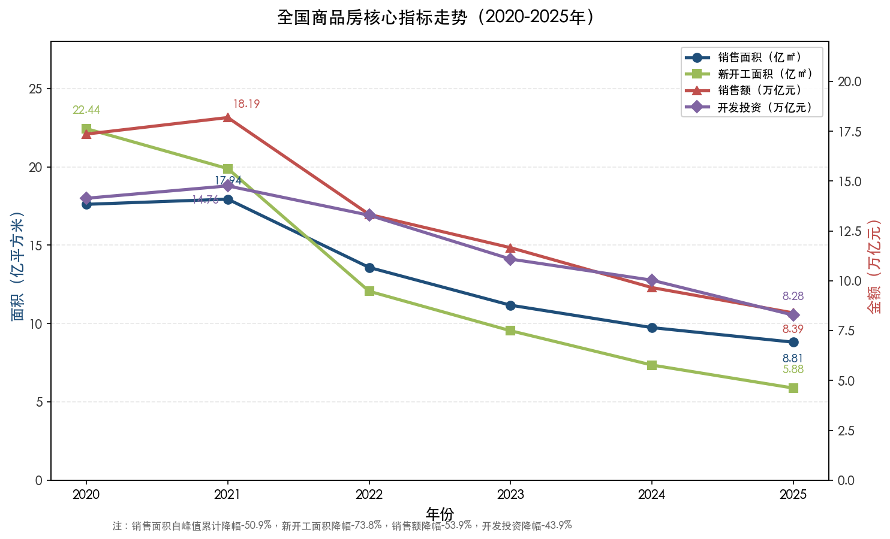

**图1-1　全国商品房核心指标走势（2020-2025年）。** 销售面积、新开工面积、销售额与开发投资四项指标自2021年峰值后持续下行，新开工面积累计降幅最深（-73.8%），预示未来数年新增供应将大幅收缩。

竣工面积的走势则受到保交楼政策的强力干预，呈现先升后降的独特形态。2023年，在保交楼专项工作推动下，全国住宅竣工面积达9.98亿平方米（同比+17.0%），是调整周期中唯一明显回升的年份；但随着保交楼存量任务逐步消化，2024年竣工面积骤降至7.37亿平方米（同比-27.7%），2025年进一步降至6.03亿平方米（同比-18.1%）[国家统计局2023年数据](https://www.stats.gov.cn/sj/zxfb/202401/t20240116_1946623.html "2023年全国房地产市场基本情况")。竣工节奏的先扬后抑，本质上反映了政策驱动的阶段性交付释放，而非市场内生需求的回暖。

进入2026年，市场尚未出现趋势性反转信号。2026年1-2月，新建商品房销售面积同比下降13.5%，销售额同比下降20.2%，降幅较2025年全年进一步扩大；个人按揭贷款同比骤降41.9%，反映购房者观望情绪依然浓厚。唯一的边际改善出现在投资端——开发投资同比下降11.1%，降幅较2025年全年（-17.2%）收窄6.1个百分点，显示资金面紧缩的最严峻阶段或已过去[国家统计局2026年1-2月数据](https://www.stats.gov.cn/sj/zxfb/202603/t20260316_1962785.html "2026年1-2月全国房地产市场基本情况")。

## 1.2 资金链断裂与信用风险出清

本轮行业调整最突出的特征在于大规模企业信用风险的集中爆发——这是此前历次房地产周期调整中从未出现过的现象。

2021年12月，中国恒大率先实质性违约，拉开了房企"爆雷潮"的序幕。2022年全年出险房企达44家，融创中国于2022年5月违约，碧桂园于2023年8月违约，行业信用体系遭到系统性冲击[人民网引证券日报](http://finance.people.com.cn/n1/2025/1112/c1004-40602019.html "化债1.2万亿元 房企再出发")。截至2025年10月末，21家出险房企已完成化债约1.2万亿元，但行业信用修复之路仍然漫长。

恒大的终局具有标志性意义。2024年1月29日，香港高等法院颁令中国恒大清盘，安迈顾问被委任为清盘人。根据清盘人进展报告，截至2025年7月31日，共收到187份债权证明表，提出的债权总额约3,500亿港元（约450亿美元），而实际变现资产仅约20亿港元，回收率极低。2025年8月25日，中国恒大正式从港交所退市，市值高峰时曾超过3,700亿港元[新华网](http://www.news.cn/finance/20250813/e398d7cda3ad4ecb8266422888cbe749/c.html "中国恒大：退市！")。中国证监会查明，2019年至2020年期间恒大地产通过提前确认收入虚增收入超5,600亿元、虚增利润超900亿元，对恒大地产罚款41.75亿元，对许家印处以顶格罚款4,700万元并采取终身证券市场禁入措施。此前，蓝光发展、新力控股、阳光城等十余家出险房企已相继退市，房地产企业风险正通过市场化、法治化方式加速出清。

开发企业到位资金的急剧收缩是信用危机的直接映射。资金来源总额从2021年峰值的20.11万亿元降至2025年的9.31万亿元，累计降幅53.7%；其中最能反映终端需求的个人按揭贷款从3.24万亿元骤降至1.29万亿元，降幅高达60.2%[国家统计局2025年数据](https://www.stats.gov.cn/sj/zxfb/202601/t20260119_1962324.html "2025年全国房地产市场基本情况")。资金链的全面收紧倒逼行业加速去杠杆，"高杠杆、高周转"的传统开发模式事实上已经终结。

## 1.3 保交楼：以行政力量托底民生底线

在行业信用风险持续蔓延的背景下，"保交楼"成为中央政府的核心政策抓手，其动员力度和执行效率在中国房地产调控史上前所未有。

保交楼已取得决定性进展。2024年全年交付338万套；截至2025年10月，全国750多万套曾面临交付困难的住房实现交付[新华网](http://www.news.cn/20241115/1c57dda092e343dfbed5f1a2a537de7a/c.html "住建部保交房通报") [财联社](https://www.cls.cn/detail/2166483 "住建部详解十四五保交付750万套")。这一成果有效防止了"烂尾楼"风险向社会层面蔓延，是维护购房者合法权益和社会稳定的关键举措。

与保交楼紧密配套的"白名单"融资协调机制同样发挥了重要作用。2024年1月，住建部与金融监管总局联合建立城市房地产融资协调机制，将符合条件的房地产项目纳入"白名单"予以融资支持。截至2025年10月，白名单项目贷款审批金额已超7万亿元，支持了约1,400万套住房的建设交付[住建部副部长董建国发布会](http://www.scio.gov.cn/live/2025/37532/index.html "白名单贷款审批超7万亿")。白名单机制本质上是以项目为单位重建行业信用，将"企业信用"与"项目信用"相分离，确保在企业层面出险的情况下项目层面仍能获得融资支持——这是本轮调整中最具创新性的制度安排之一。

## 1.4 库存压力与去化分化

库存水平是衡量行业调整深度和市场供需关系的关键指标。全国商品房待售面积（狭义口径，仅含已竣工可售面积）从2020年末的4.99亿平方米攀升至2025年末的7.66亿平方米，累计增长53.5%。不过库存增速已显著放缓——从2023年的同比+19.0%降至2025年的仅+1.6%。更为积极的信号是，2026年2月末待售面积中竣工3年以下部分已下降1.6%，去库存初现成效[国家统计局2026年1-2月数据](https://www.stats.gov.cn/sj/zxfb/202603/t20260316_1962785.html "2026年1-2月全国房地产市场基本情况")。

去化周期的城市分化极为显著。据易居研究院测算，2025年1月全国百城新建商品住宅去化周期为21.3个月，其中一线城市仅12.6个月，已率先回归12-18个月的合理区间；二线城市18.1个月，处于合理区间上沿；三四线城市则高达30.3个月，仍面临严峻的去库存压力[中房网/易居研究院](http://m.fangchan.com/news/320/2025-02-25/7299984636216939170.html "一线城市去化周期率先回归合理区间")。这一分化格局深刻反映了中国房地产市场"一国多市"的结构性特征——高能级城市与广大中小城市在需求基本面、人口吸引力和产业支撑等方面的差距正在持续拉大。

土地出让收入的变化从财政端揭示了行业收缩的深层影响。全国土地出让收入从2021年峰值的87,051亿元降至2025年的41,518亿元，降幅52.3%；2026年1-2月同比继续下降25.2%[财政部2021年财政收支情况](http://gks.mof.gov.cn/tongjishuju/202201/t20220128_3785692.htm "2021年财政收支情况") [中房网转引财政部数据](http://m.fangchan.com/news/218/2026-02-03/7424278058561245201.html "2025年土地出让收入")。土地出让收入四年间累计减收约4.6万亿元，对高度依赖土地财政的地方政府构成了严峻的财政挑战，也从侧面加速了地方财税体制改革的紧迫性。

## 1.5 价格走势：城市间深度分化

房价走势是市场信心最直观的温度计，也是判断"止跌回稳"能否实现的核心依据。2020-2026年间，70个大中城市房价指数呈现出复杂的分化格局。

2026年2月，70城中新建商品住宅价格同比上涨的城市仅有上海（+4.2%）和杭州（+2.7%）等少数高能级城市，而包头（-7.2%）、昆明（-6.6%）、深圳（-5.5%）、广州（-5.1%）等城市仍处于深度下跌通道。二手房市场更为疲弱——仅北京（环比+0.3%）和上海（环比+0.2%）维持环比上涨，其余68城环比均下跌或持平[国家统计局70城房价数据](https://www.stats.gov.cn/sj/zxfb/202603/t20260316_1962774.html "2026年2月份70城商品住宅销售价格变动情况")。

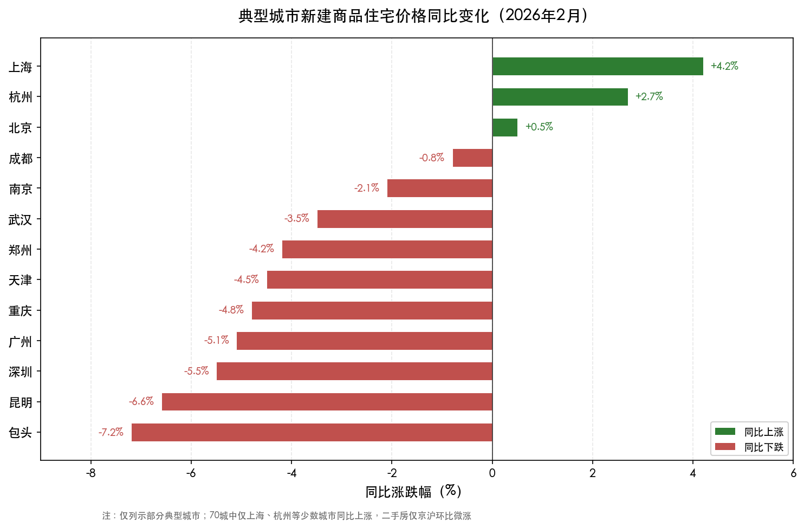

**图1-2　典型城市新建商品住宅价格同比变化（2026年2月）。** 仅上海、杭州、北京等少数城市维持同比上涨，绝大多数城市仍处于价格下行区间，"冰火两重天"的分化格局十分突出。

"止跌回稳"的政策目标在全国层面尚未实质性实现。一线城市新房价格在2024年底率先出现环比正增长，但2025年中期70城新房环比降幅再度扩大至-0.3%，政策脉冲效应衰减明显；至2025年12月，仅上海保持环比上涨0.2%[证券时报](https://www.stcn.com/article/detail/3599726.html "去年12月70城二手房价格均下跌")。价格调整的持续性和广泛性表明，市场预期的修复是一个漫长而反复的过程，远非几轮政策刺激即可扭转。

## 1.6 区域分化：恢复节奏的结构性差异

区域恢复节奏的差异折射出中国房地产市场内部结构的深层分化。2026年1-2月数据显示，中部地区销售面积降幅最小（同比-9.1%），显示出相对较强的市场韧性；西部地区（-17.8%）和东北地区（-18.6%）降幅最大，反映出人口外流与经济增速放缓的叠加压力。值得注意的是，东部地区销售额降幅（-22.5%）高于全国平均水平，这意味着尽管东部经济基础最为扎实，但高价城市面临的均价下行压力反而更大[国家统计局2026年1-2月数据](https://www.stats.gov.cn/sj/zxfb/202603/t20260316_1962785.html "2026年1-2月全国房地产市场基本情况")。

这种区域分化正在重塑行业的空间格局。核心城市与非核心城市之间的鸿沟持续加深：一线城市库存去化周期约12个月，局部区域已呈供给偏紧态势；而大量三四线城市库存高企、人口外流，面临长期需求萎缩的困境。这一"冰火两重天"的格局，构成了未来政策制定中"因城施策"原则的重要现实基础，也决定了行业复苏将呈现显著的梯度特征而非同步回暖。

## 1.7 行业竞争格局重塑：央国企主导与集中度提升

市场深度调整加速了行业竞争格局的根本性重塑，呈现两大趋势：头部集中度显著提升，以及央国企取代民企成为行业主力军。

从规模房企数量看，千亿房企从2021年的41家锐减至2025年的仅10家；百亿房企从2021年的158家降至2024年的86家[中指研究院百强报告（新浪财经转引）](https://finance.sina.com.cn/jjxw/2026-03-26/doc-inhsikau2773702.shtml "2025年百强房企市场份额38.8%")。大量中小型房企在流动性危机中被迫退出市场，行业经历了一轮残酷的"优胜劣汰"。

头部企业的市场份额持续攀升。据中指研究院数据，2025年1-10月，TOP10企业销售额占TOP100企业销售额的比例达49.4%，较2021年提升13个百分点；TOP20占比升至65.6%（+11.2个百分点），TOP50占比升至85.8%（+3.8个百分点）[中指研究院](https://zhuanlan.zhihu.com/p/1975190886947239506 "过去五年房企经营的3个关键变化")。集中度的加速提升表明，头部房企凭借产品力、城市深耕能力和财务稳健性构筑了显著的竞争壁垒。

所有制结构的变化同样深刻。TOP100销售额排行中，央国企数量从2021年的26家增加至2025年1-10月的51家，民企则从68家降至43家。2025年百强企业中央国企销售额占比提升至74.0%，较上年提升3.1个百分点[2026中国房地产百强企业研究报告](https://h5.ifeng.com/c/vivoArticle/v002tZcV1gjiOD74AtSwAfFwFt-_BHPoKb-_EKtLygmeBnx--Y__?isNews=1&showComments=0 "中指研究院2026百强研究报告")。在拿地环节，头部化趋势更为突出——2025年拿地金额TOP10占TOP100的50.5%，央国企为绝对主力。民营房企受限于债务压力与市场信心不足，存活者普遍转向代建、商业运营等轻资产模式。

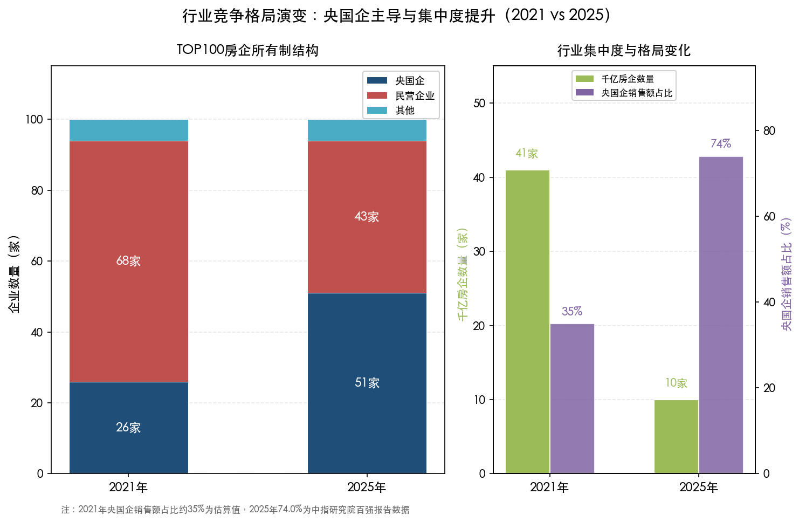

**图1-3　行业竞争格局演变（2021 vs 2025）。** 左图显示TOP100房企中央国企从26家增至51家，民企从68家降至43家；右图显示千亿房企从41家锐减至10家，央国企销售额占比从约35%跃升至74%，行业"国进民退"特征显著。

## 1.8 景气指数与周期判断：调整仍在深水区

国房景气指数是综合衡量行业运行状态的重要指标，其走势清晰勾勒出本轮调整的轨迹与深度。该指数从2020年12月的100.76逐步下滑至2025年12月的91.45，持续处于95以下的"较低景气水平"区间，且降幅未见明显收窄[国家统计局2025年数据](https://www.stats.gov.cn/sj/zxfb/202601/t20260119_1962324.html "2025年全国房地产市场基本情况")。这一走势表明，行业整体仍处于调整的"深水区"，距离进入实质性复苏阶段尚有相当距离。

综合上述各维度的分析，我们对本轮行业调整作出如下基本判断：

**第一，这是一场结构性转型，而非单纯的周期性回调。** 行业规模在四年间缩减过半，新开工面积降幅超过七成，调整幅度远超正常的库存周期波动。更关键的是，推动调整的深层因素——人口拐点、城镇化减速、居民杠杆率见顶、土地财政难以为继——均具有长期结构性特征，不会随短期政策刺激而逆转。

**第二，"止跌回稳"正在从一线城市向外扩散，但全面实现仍需时日。** 上海、杭州等少数高能级城市已率先企稳，投资端降幅亦在收窄，但全国层面的价格、销量、信心三大指标尚未形成共振向上的趋势。广大三四线城市的筑底过程预计更为漫长。

**第三，行业正从"规模扩张"模式转向"存量运营"模式。** 新开工面积的断崖式下跌、竣工面积的持续回落、开发企业到位资金的大幅缩减，均指向同一方向：以增量开发为核心的传统房地产发展模式已经走到尽头。未来的行业增长将更多依赖城市更新、存量资产运营、住房服务升级等新领域。

**第四，行业信用出清已取得阶段性成果，但长尾风险仍需警惕。** 保交楼的决定性进展、白名单机制的制度创新、出险房企的市场化法治化退出，共同推动行业信用体系的重建。然而，上市房企中约六成仍处于亏损状态，净负债率较2021年上升52.2个百分点，现金短债比降至0.91（不足1倍）[中指研究院](https://zhuanlan.zhihu.com/p/1975190886947239506 "过去五年房企经营的3个关键变化")，短期偿债压力依然严峻，行业风险出清的"最后一公里"仍需时间与政策持续支持。

这一轮深度调整，既是对过去二十余年行业高速粗放增长模式所积累风险的集中释放，也是中国房地产行业迈向可持续发展的必经阵痛。调整的代价是真实而沉重的，但调整过程中孕育的新模式、新制度、新格局，正在为行业的下一个发展阶段奠定基础。

# 第2章 可持续发展的底层驱动力——需求侧的结构性支撑

房地产行业的长期可持续发展，归根结底取决于需求侧是否存在坚实的结构性支撑。经历2020—2026年深度调整后，一个核心问题亟待回答：中国房地产市场的真实需求基本面究竟如何？本章从城镇化进程、人口结构变化与居民住房改善需求三个维度展开系统分析，揭示未来十年需求侧的结构性力量。总体判断是：虽然住房需求总量已越过历史峰值，但城镇化"质量提升"空间、家庭小型化带来的户数扩张、从"有房住"到"住好房"的品质升级需求以及区域分化下的结构性短缺，共同构成行业可持续发展的底层支撑，使中国住房市场在未来十年仍保有年均6—8亿平方米的可观规模。

## 2.1 城镇化的"下半场"：从速度驱动到质量驱动

### 2.1.1 城镇化率仍有7—12个百分点的提升空间

2025年末，中国常住人口城镇化率达到67.89%，城镇常住人口95,380万人，较上年末提高0.89个百分点[国家统计局2025年统计公报](https://www.stats.gov.cn/sj/zxfb/202602/t20260228_1962662.html "2025年国民经济和社会发展统计公报")。这一水平虽已超过全球平均城镇化率（约57%），但与发达经济体80%—85%的成熟水平仍有显著差距。中国社会科学院学部委员魏后凯预测，"十五五"期间城镇化率将继续保持年均约0.7个百分点的增长，2030年达到71.5%，2035年达到74.6%，2050年接近80%并总体完成城镇化任务[国家发改委网站](https://www.ndrc.gov.cn/wsdwhfz/202511/t20251126_1401939.html "新型城镇化的下半场怎么走")。

据此测算，2025—2036年间城镇化率仍有约7—12个百分点的提升空间，对应约1亿—1.7亿增量城镇人口。清华大学李稻葵等学者的研究进一步指出，城镇化率每提高1个百分点，可推动约1,300万农村人口进入城镇，带动居民消费增长1.2个百分点[国家发改委网站](https://www.ndrc.gov.cn/wsdwhfz/202511/t20251126_1401939.html "清华大学李稻葵发言引用")。城镇化进程因此仍是支撑住房需求最具确定性的宏观力量之一。

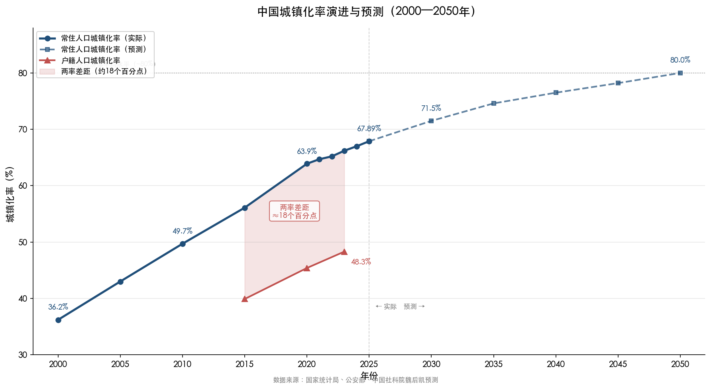

**图2-1　中国城镇化率演进与预测（2000—2050年）。** 蓝色实线为常住人口城镇化率实际值，蓝色虚线为基于魏后凯预测的趋势延伸；红色线标注户籍人口城镇化率。两率差距约18个百分点，对应约2.5亿尚未完全市民化的农业转移人口，蕴含可观的住房需求释放潜力。

### 2.1.2 "两率差距"揭示的市民化红利

常住人口城镇化率的提升并非全部图景。截至2023年底，户籍人口城镇化率仅为48.3%，与常住人口城镇化率之间存在约17.9个百分点的差距，对应约2.5亿尚未完全市民化的农业转移人口[公安部新闻发布会](http://society.people.com.cn/n1/2024/0827/c1008-40307159.html "2023年底全国户籍人口城镇化率48.3%")。国家统计局副局长盛来运2024年4月进一步指出，中国城镇化"尚未完成"，户籍人口城镇化率不到50%，仍有1.8亿外出农民工在城市中未实现完全市民化[证券时报](https://www.stcn.com/article/detail/3257221.html "以人为本，提高户籍人口城镇化率")。中国社科院研究亦确认，"十五五"期间两率差距仍将维持在约18个百分点[中国社科院研究](http://rdi.cass.cn/yjcg/202509/P020250904402970807053.pdf "中国新型城镇化的发展趋势与战略转型")。

这一巨大的"两率差距"蕴含着可观的住房需求释放潜力。国务院2024年8月印发《深入实施以人为本的新型城镇化战略五年行动计划》，全面落实城区常住人口300万以下城市取消落户限制，全面放宽300万—500万城市落户条件[国务院新型城镇化行动计划](https://www.mee.gov.cn/zcwj/gwywj/202408/t20240801_1083101.shtml "新型城镇化战略五年行动计划")。随着户籍制度改革深入推进和公共服务均等化水平提升，农业转移人口在城镇定居的意愿将逐步转化为有效住房需求，构成未来十年城镇住房市场的重要增量来源。

### 2.1.3 城市群集聚：空间维度的需求重构

城镇化进程在空间维度呈现高度集聚特征。中国19个城市群承载全国70%以上人口、贡献80%以上GDP；其中东部三大城市群（京津冀、长三角、粤港澳大湾区）以不足5%的国土面积集聚42%的常住人口和54%的经济总量[新华网](http://www.news.cn/20250830/ec09b6fb357a470c923e8c3d65902de1/c.html "十四五城市高质量发展成就与十五五展望")。

这种集聚趋势深刻重塑了住房需求的空间分布。2024年末全国287个城市中139个出现人口收缩（占48%），仅广东、浙江、新疆、福建、海南、安徽、陕西7个省区实现人口正增长[国家统计局2024年经济运行数据](https://www.stats.gov.cn/xxgk/sjfb/zxfb2020/202501/t20250117_1958332.html "2024年经济运行稳中有进")。人口持续向核心城市群和都市圈集中，意味着住房需求已从均匀分布的总量问题演变为高度分化的结构性问题：核心城市群面临持续的住房供给压力，而人口收缩型城市则承受需求萎缩与库存高企的双重挑战。

库存去化数据直观印证了上述分化格局。2025年1月，全国百城新建商品住宅去化周期为21.3个月，其中一线城市仅12.6个月、率先回归12—18个月的合理区间，二线城市18.1个月，三四线城市则高达30.3个月[中房网/易居研究院](http://m.fangchan.com/news/320/2025-02-25/7299984636216939170.html "一线城市去化周期率先回归合理区间")。这一分化格局预示着未来十年住房需求的主战场将集中在人口持续流入的核心城市群。

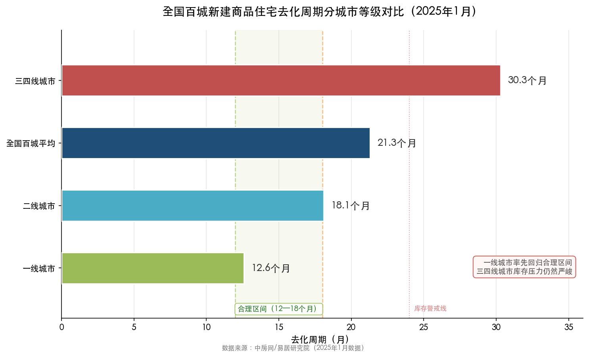

**图2-2　全国百城新建商品住宅去化周期分城市等级对比（2025年1月）。** 绿色虚线框标注12—18个月的合理区间，粉色虚线标注24个月库存警戒线。一线城市率先回归合理水平，三四线城市库存压力仍然严峻，区域分化格局清晰可辨。

## 2.2 人口结构变化：总量拐点下的结构性需求

### 2.2.1 人口负增长的长期约束

人口总量变化对住房需求的约束正在加速显现。中国人口于2022年首次出现负增长（减少85万人），此后连续三年持续下降：2023年减少208万人、2024年减少139万人、2025年减少339万人，负增长幅度呈加速态势[国家统计局2025年统计公报](https://www.stats.gov.cn/sj/zxfb/202602/t20260228_1962662.html "2025年统计公报")。联合国《世界人口展望2024》预测，2024—2054年间中国将减少约2.04亿人口，至2100年人口预计降至约6.33亿人[联合国人口展望2024](https://population.un.org/wpp/assets/Files/WPP2024_Summary-of-Results.pdf "World Population Prospects 2024")。

人口负增长无疑将对住房总量需求构成长期压制，但其影响并非即时性的。在当前及未来十年内，城镇化带来的人口空间再分配效应仍可部分对冲总量下降的影响。按每年城镇化率提升0.7—0.9个百分点估算，即便总人口持续减少，城镇常住人口在2030年前仍有望维持正增长。换言之，人口负增长设定了住房需求的长期"天花板"，但短中期内城镇化的空间红利尚有释放余地。

### 2.2.2 老龄化催生适老化住房需求

2025年末，中国60岁及以上人口达到32,338万人（占总人口23.0%），65岁及以上22,365万人（占15.9%），一年间60岁以上人口净增1,307万人，占比提升1个百分点[国家统计局2025年统计公报](https://www.stats.gov.cn/sj/zxfb/202602/t20260228_1962662.html "2025年统计公报")。老龄化的加速推进正从两个维度重塑住房需求格局：

**第一，适老化改造市场潜力巨大。** 全国2000年前建成的城镇住宅约17亿平方米，其中60%以上未进行节能及适老化改造[新华网](http://www.news.cn/20250830/ec09b6fb357a470c923e8c3d65902de1/c.html "十四五城市高质量发展成就")。"十四五"期间全国累计开工改造老旧小区逾20万个，惠及近4,000万户；2025年新开工改造2.7万个，惠及499万户[国家统计局2025年统计公报](https://www.stats.gov.cn/sj/zxfb/202602/t20260228_1962662.html "2025年统计公报")。随着老龄人口规模持续扩大，适老化改造和养老型住宅开发将成为住房市场的重要增长方向。

**第二，老龄化引发住房释放与置换效应。** 老年家庭住房向子女的代际转移、老年人从郊区大户型向城区适老型住宅搬迁等行为，将带来二手住房供给增加和改善性需求释放。这一趋势与住房市场从增量主导转向存量主导的大方向高度一致，将在中长期内为二手房市场注入持续的交易活力。

### 2.2.3 家庭小型化的需求放大效应

家庭结构的深刻变化构成另一股不容忽视的需求力量。第七次全国人口普查（2020年）数据显示，全国家庭户49,416万户，户均人口2.62人，较2010年六普的3.10人减少0.48人[国家统计局七普公报](https://www.stats.gov.cn/xxgk/sjfb/zxfb2020/202105/t20210511_1817197.html "第七次全国人口普查公报")。家庭小型化具有显著的住房需求放大效应——同等人口规模下，户均人口从3.10人降至2.62人意味着家庭户数增加约18%，而每一个独立家庭均对应独立的住房需求。

联合资信的研究预测，中国家庭户均人数将逐步趋近日韩水平，至2050年降至约2.00人[联合资信](https://www.fxbaogao.com/detail/5168673 "我国房地产市场未来需求展望")。若按此趋势推算，在总人口减少的背景下，家庭户数仍有可能继续增长，从而持续产生新增住房需求。独居趋势的加速尤为突出：七普数据显示全国每4个家庭中即有一个独居户，东三省、京津沪等地城镇家庭规模最小。独居人口和小家庭比例的攀升，直接推高了对中小户型住宅和租赁住房的需求，使得住房需求在"人口减少—户数增加"的对冲中维持韧性。

## 2.3 从"有房住"到"住好房"：品质升级需求

### 2.3.1 人均住房面积的提升空间

量的满足并不等同于质的达标。住建部部长倪虹2024年8月在国新办新闻发布会上披露，截至2023年底中国城镇人均住房建筑面积已超过40平方米[住建部新闻发布会](http://finance.people.com.cn/n1/2024/0823/c1004-40304956.html "2024年8月住建部部长倪虹介绍")，较七普时期城市家庭人均36.52平方米有了显著提升[中国新闻网](https://www.chinanews.com.cn/cj/2022/08-10/9824044.shtml "人均41.76平方米，引用七普数据")。

国际比较显示，中国城镇人均住房面积已略高于日本（约35平方米），但远低于美国（约67平方米）[中国新闻网](https://www.chinanews.com.cn/cj/2022/08-10/9824044.shtml "引用七普数据的国际对比")。与此同时，省际差异十分显著：广东城市家庭人均仅29.59平方米，是全国唯一低于30平方米的省份。考虑到居民收入水平持续增长及对居住品质的追求不断提升，人均住房面积在经济发达地区仍存在合理的上升空间，尤其是在粤港澳大湾区等人口密集、住房紧张的区域。

### 2.3.2 存量住房的品质短板

更大的需求来源在于存量住房的品质更新。中国城镇住房存量中相当比例建于改革开放初期至世纪之交，普遍存在户型设计落后、建筑节能不达标、缺乏电梯及适老化设施等问题。全国2000年前建成的城镇住宅约17亿平方米，其中60%以上未进行节能和适老化改造[新华网](http://www.news.cn/20250830/ec09b6fb357a470c923e8c3d65902de1/c.html "十四五城市高质量发展成就")。这些住房在物理属性和功能品质上已难以满足居民日益增长的居住改善需求，构成庞大的更新置换需求池。

住建部2024年数据显示，城镇住房套户比约为1.08[联合资信](https://www.fxbaogao.com/detail/5168673 "我国房地产市场未来需求展望")，总量看似已基本平衡。然而，若将大量存量住房品质不达标的因素纳入考量，有效供给仍然不足。这正是中央提出建设"好房子"的现实基础——住房市场的主要矛盾正从"有没有"向"好不好"转变，品质升级需求将成为未来十年住房消费的核心驱动力之一。

### 2.3.3 改善性需求成为新的主导力量

随着刚性需求逐步收缩，改善性需求正接棒成为住房市场的核心驱动力。"十五五"期间，改善性购房的主力群体（35—64岁）年均规模约6.6亿人，较"十四五"时期多增近3,000万人[连平"十五五"展望](https://finance.sina.cn/zl/2025-11-05/zl-infwincz4543288.d.html "连平：十五五中国房地产市场将怎么走")。2026年政府工作报告首次明确提出"加强初婚初育家庭住房保障，支持多子女家庭改善性住房需求"[2026年政府工作报告解读](https://www.toutiao.com/article/7613973753093014042/ "2026政府工作报告房地产定调")，标志着住房政策已将改善性需求与人口战略深度绑定。

改善性需求的特征与刚性需求存在本质差异：其对住房品质、社区环境和配套设施有更高要求，与"好房子"建设方向天然契合；其实现更多依赖二手房市场的活跃度——参考美国成屋与新屋销售比接近6∶1的经验，中国改善性需求和二手房交易在未来将占据更大的市场份额[连平"十五五"展望](https://finance.sina.cn/zl/2025-11-05/zl-infwincz4543288.d.html "连平：十五五中国房地产市场将怎么走")。这意味着住房市场的健康运转需要一个流动性充足的二手房市场作为基础设施支撑，而当前多数城市的二手房市场仍处于发育初期，制度性建设任重道远。

## 2.4 租赁市场的需求扩容

在购房需求之外，住房租赁需求构成另一重要的市场维度。全国35个重点城市租赁人口约6,000万人，但保障性租赁住房存量仅覆盖需求量的35%[新华网](http://www.news.cn/20250830/ec09b6fb357a470c923e8c3d65902de1/c.html "十四五城市高质量发展成就与十五五展望")。从更宏观的视角看，全国租赁人口规模约2.6亿人，占城镇常住人口约31%[房天下](http://sz.news.fang.com/open/54112785.html "2025年住房租赁市场全景")。

租赁需求的扩容由多重因素共同驱动：其一，新市民和青年人在高房价城市难以短期实现购房，租赁成为必要的过渡性居住选择；其二，家庭小型化与生活方式多元化使更多人群主动选择租赁作为长期居住安排；其三，户籍制度改革推进过程中，大量农业转移人口的首要住房需求即为租赁。租赁市场的健康发展，既是住房保障体系的重要组成部分，也是房地产行业从"开发销售"单一模式向"开发+持有运营"多元模式转型的需求侧基础。

## 2.5 需求总量的中长期均衡水平

综合以上分析，可对未来十年中国城镇住房需求总量进行框架性估算。中指研究院测算"十五五"时期（2026—2030年）城镇住房需求总量约49.8亿平方米，新建商品住宅年均销售面积预计7—8亿平方米[中指研究院](https://m.bjnews.com.cn/detail/1765588433169840.html "未来五年年均销售7-8亿平方米")。连平预测年均实际销售面积6—7亿平方米，年均销售额从"十四五"的12.4万亿元降至约7.7万亿元[连平"十五五"展望](https://finance.sina.cn/zl/2025-11-05/zl-infwincz4543288.d.html "连平：十五五中国房地产市场将怎么走")。

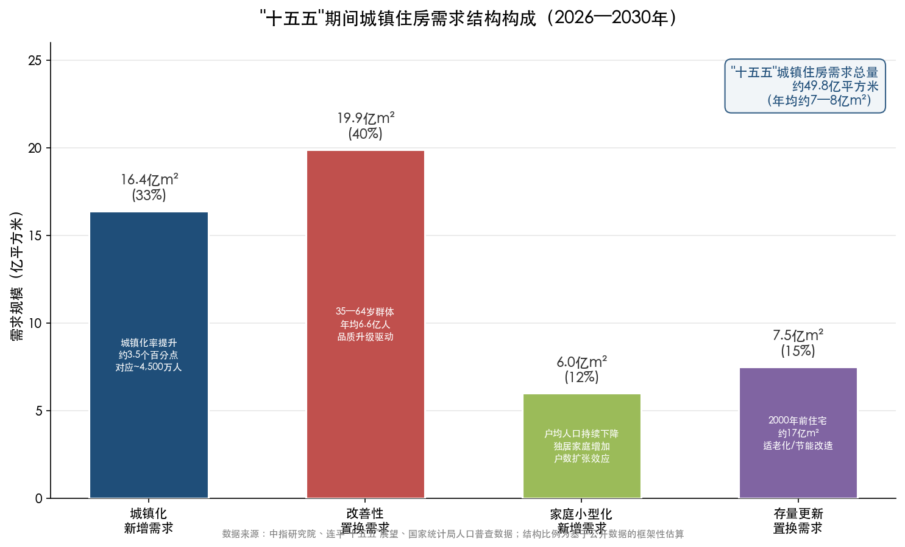

**图2-3　"十五五"期间城镇住房需求结构构成（2026—2030年）。** 改善性置换需求以40%的占比成为最大单一来源，城镇化新增需求占33%，存量更新置换需求和家庭小型化新增需求分别贡献15%和12%，四类需求共同构成"四轮驱动"格局。

上述需求总量虽较2021年峰值17.94亿平方米大幅回落，但年均6—8亿平方米的销售规模仍十分可观——相当于日本、德国等发达经济体住宅市场年度交易总量的数倍。需求结构的变化更具深远意义：城镇化带来的新增需求、改善性置换需求、租赁需求和存量更新需求将共同构成"四轮驱动"格局，替代过去以首次置业为主的单一驱动模式。

需求侧的结论是明确的：中国房地产市场的需求基本面并未崩塌，而是正在经历从"量的扩张"到"质的提升"、从"总量均匀分布"到"结构性分化"的深层转型。这一转型既为行业可持续发展提供了坚实的底层支撑，也要求供给侧在产品类型、区域布局和服务模式上做出根本性调整——唯有供需两端实现结构性匹配，行业才能在规模收缩中找到新的均衡点。

# 第3章 国家政策体系与制度重构——从"房住不炒"到"发展新模式"

中国房地产行业在经历2020年以来的深度调整后，国家政策体系正在发生根本性的范式转换。从2016年中央经济工作会议首次提出"房子是用来住的、不是用来炒的"定位，到2024年中央政治局会议首提"止跌回稳"，再到2026年"十五五"规划纲要明确"加快构建房地产发展新模式"，政策目标已从短期需求管理全面转向中长期制度建设。这一转变的核心逻辑在于：旧模式下"高负债、高杠杆、高周转"的开发驱动已不可持续，必须建立以人民为中心、以市场与保障双轨并行为骨架、以要素联动为传导机制的新型住房制度体系。本章系统梳理2016—2026年的政策演进脉络，解构"房地产发展新模式"的制度内涵，并深入分析保障性住房体系构建、土地与金融制度改革、现房销售转型以及地方治理工具创新等关键维度。

## 3.1 政策演进全景：从危机应对到制度重塑

### 3.1.1 三个阶段、四次转折

回顾2020年至2026年的政策演进，可以清晰识别出三个阶段和四次关键转折（图3-1）：

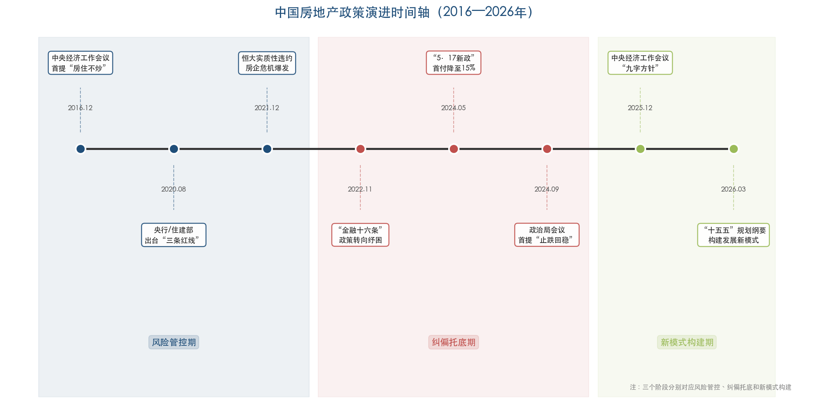

**第一阶段（2020—2022年）：风险管控期。** 2020年8月，央行、住建部联合出台房企融资"三条红线"政策（剔除预收款后的资产负债率不超70%、净负债率不超100%、现金短债比不低于1），同年12月银保监会发布房地产贷款集中度管理制度，从供给侧对房企杠杆实施硬约束。这构成第一次转折——行业由此告别无序扩张的信用环境。2021年下半年恒大危机全面爆发，政策重心被动转向风险处置与保交楼攻坚。

**第二阶段（2022—2024年）：纠偏托底期。** 2022年11月"金融十六条"标志着政策由全面收紧转向精准纾困，构成第二次转折。此后各项松绑政策密集出台：2024年5月"5·17新政"将首套首付比例降至历史最低的15%，取消全国层面房贷利率下限[人民日报](http://paper.people.com.cn/rmrbwap/html/2024-05/18/nw.D110000renmrb_20240518_6-02.htm "全国层面房贷利率政策下限取消")；全年5年期以上LPR累计下降60个基点至3.6%。2024年9月26日中央政治局会议首次提出"促进房地产市场止跌回稳"，构成第三次转折——这是最高决策层首次对房地产市场下行风险作出明确定性判断[新华网](https://www.zhjsw.cn/yw/1876878428125106177.html "2024年9月26日政治局会议")。

**第三阶段（2025年至今）：新模式构建期。** 2025年12月中央经济工作会议将政策定调从"止跌回稳"升级为"着力稳定房地产市场"，并提出"因城施策控增量、去库存、优供给"九字方针[中央经济工作会议全文](https://www.gwytb.gov.cn/topone/202512/t20251211_12739921.htm "2025年中央经济工作会议")，构成第四次转折——政策基调从被动托底转向主动塑造新发展格局。2026年3月发布的"十五五"规划纲要明确了房地产发展新模式的顶层设计框架，各项配套制度改革进入全面推进阶段。

### 3.1.2 2026年政策定调的新信号

2026年政府工作报告延续"着力稳定房地产市场"基调，并首次出现三个值得关注的新表述：其一，"鼓励收购存量商品房重点用于保障性住房等"[中国网](http://www.china.com.cn/lianghui/news/2026-03/05/content_118362687.shtml "2026年政府工作报告")，将去库存与保障体系建设有机衔接，标志着存量消化思路的制度化；其二，"加强初婚初育家庭住房保障，支持多子女家庭改善性住房需求"[2026年政府工作报告解读](https://www.toutiao.com/article/7613973753093014042/ "2026政府工作报告房地产定调")，首次在国务院层面将住房政策与人口战略紧密捆绑；其三，"深化住房公积金制度改革"，为公积金从"专项储蓄"向"综合住房金融"的功能转型打开了制度空间。三项新表述反映出政策取向已从单纯的市场稳定，进一步延伸至人口治理与民生保障的更宽维度。

## 3.2 "房地产发展新模式"的制度内涵

### 3.2.1 从旧模式到新模式：四个维度的根本转变

住建部部长倪虹于2024年8月将"房地产发展新模式"概括为四个方面的系统变革[住建部新闻发布会](https://finance.ifeng.com/c/8cHH3WtEzvR "倪虹2024年8月23日阐述新模式")：

**理念转变：** 从投资品属性回归居住属性，坚持"房住不炒"定位。这不仅是需求管理层面的目标，更是整个制度体系的价值锚定——土地供应、金融支持、税收设计等政策工具均须服务于居住功能的实现。

**体制转变：** 建立"人、房、地、钱"要素联动新机制，核心公式为"以人定房、以房定地、以房定钱"。住建部副部长董建国2025年10月进一步阐释了该机制的运行逻辑：以人口流入流出和住房供需状况确定住房建设量，以住房建设量确定土地供应量，以住房建设量和房价确定信贷投放量[国务院新闻办发布会](http://www.scio.gov.cn/live/2025/37532/index.html "2025年10月住建部十四五成就发布会")。这意味着住房供给不再由开发商拿地冲动驱动，而由真实居住需求倒推。

**制度转变：** 改革完善房地产开发、交易和使用三大基础制度。开发端推行项目公司独立法人制度，实现风险隔离；融资端建立"一项目一主办银行"制度，实现资金全流程封闭管理；销售端有力有序推进现房销售制度改革；使用端建立房屋体检、养老金和保险"三项制度"，补齐住房全生命周期管理的制度短板。

**供应体系转变：** 从以商品房为绝对主体，转向"市场+保障"双轨并行。商品房满足多样化改善性需求，保障性住房满足工薪群体基本居住需求，二者形成功能互补而非简单替代的关系。

### 3.2.2 "十五五"住房制度顶层目标

住建部明确"十五五"时期的住房制度建设总目标为："形成供应体系健全、要素配置合理、监管制度规范、行业经营稳健的房地产发展新格局"[国务院新闻办](http://www.scio.gov.cn/live/2025/37532/index.html "住建部十五五展望")。2026年3月发布的"十五五"规划纲要将这一目标具体化为四大部署：完善多层次住房保障体系、推动房地产市场平稳健康发展（包含项目公司制度、主办银行制度和现房销售制度三大制度创新）、建设"好房子"、推进城市更新[新华社十五五解读](https://www.news.cn/politics/20260306/cf59be898a944bff870ae8508eacf1b0/c.html "十五五实现更高水平住有所居")。四大部署之间构成递进关系：保障体系和市场制度解决"有房住"问题，"好房子"和城市更新解决"住好房"问题，共同指向"更高水平住有所居"的最终愿景。

## 3.3 "保障+市场"双轨供应体系的构建

### 3.3.1 多层次保障体系的制度框架

2023年8月国务院发布第14号文件《关于规划建设保障性住房的指导意见》，奠定了新一轮保障性住房制度的顶层框架[国务院14号文](https://yyzfbz.yueyang.gov.cn/60797/60812/content_2245682.html "国务院关于规划建设保障性住房的指导意见")。该文件首次明确在大城市规划建设配售型保障性住房，面向住房困难且收入不高的工薪群体，配售价格按"基本覆盖划拨土地成本和建安成本加适度合理利润"确定，并实施封闭管理（不得上市交易），从制度根源上切断保障房的投机链条。

由此，中国多层次住房保障体系正式形成"三位一体"格局（图3-2）[国务院新闻办](http://www.scio.gov.cn/live/2025/37532/index.html "住建部副部长董建国阐述保障体系")：

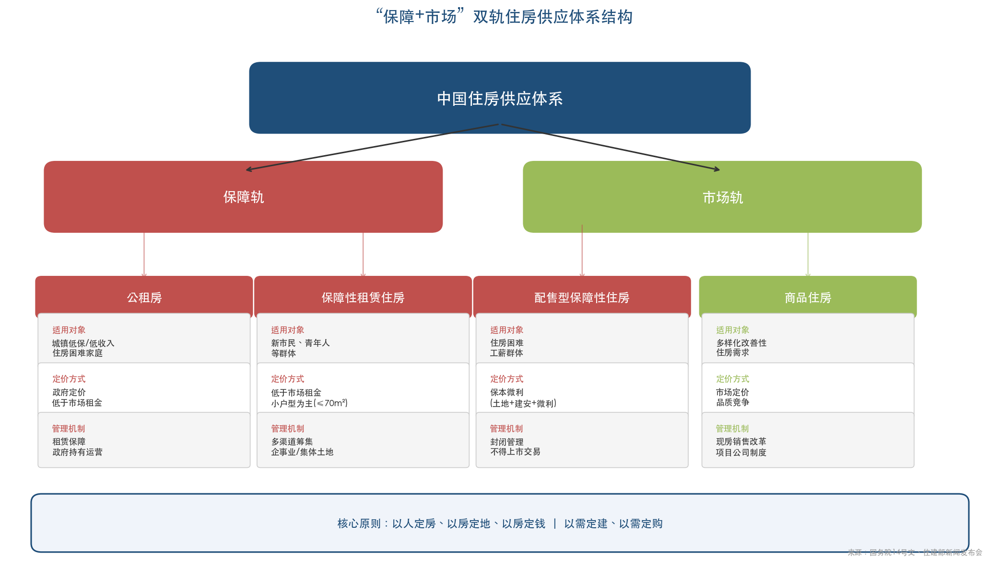

- **公租房：** 面向城镇低保和低收入住房困难家庭，以租赁保障为主，由政府持有运营；
- **保障性租赁住房：** 面向新市民、青年人等群体，户型以70平方米以下小户型为主，通过企事业单位自有用地、集体建设用地等多渠道筹集；
- **配售型保障性住房：** 面向有一定经济能力但买不起商品房的工薪群体，户型控制在90平方米以内，实行封闭管理。

各地已建立住房保障轮候库制度，坚持"以需定建、以需定购"原则，避免重蹈过去经济适用房"建了没人要"或"建在远郊无配套"的覆辙。

### 3.3.2 保障房建设的阶段性成果与挑战

"十四五"期间，全国累计建设筹集各类保障性住房和安置住房1,100多万套（间），惠及3,000多万群众；累计改造城镇老旧小区24万多个，惠及4,000多万户、约1.1亿人[国务院新闻办](http://www.scio.gov.cn/live/2025/37532/index.html "住建部十四五成就数据")。上述成绩表明，保障体系建设已从制度设计阶段迈入规模化实施阶段。

然而，配售型保障性住房在全国范围内的推进仍处于起步期。从各地公布的计划看，2024年广州筹建配售型保障性住房约1万套，首批项目萝岗和苑推出2,411套[广州日报](https://news.dayoo.com/guangzhou/202603/30/139995_54942208.htm "广州已筹建配售型保障房上万套")；深圳规划筹建1.5万套[深圳计划](http://mp.cnfol.com/48444/article/1735633831-141619480.html "深圳189个保障房项目")；北京、上海各约1万套。全国范围内尚缺乏配售型保障房累计筹建总量的统一数据，反映出这一制度创新从城市试点走向全面规模化仍需经历较长的制度磨合与能力建设周期。

### 3.3.3 城中村改造：保障与去库存的双重引擎

城中村改造已成为衔接保障体系建设与存量去库存的关键政策抓手。2024年10月住建部宣布新增100万套城中村和危旧房改造任务，同年11月政策覆盖范围从最初的35个超大特大城市扩展至近300个地级及以上城市[央广网](https://house.cnr.cn/kcb/20250113/t20250113_527039261.shtml "城中村改造全面重启")。这一扩围标志着城中村改造从"试点探索"进入"全面铺开"阶段。城中村改造兼具三重政策功能：一是改善城市人居环境和城市面貌，二是通过拆建和安置释放住房需求，三是为收储存量商品房提供安置房源用途，从而形成"改造—安置—去库存"的政策闭环。

## 3.4 土地制度改革：从"经营城市"到"优化供给"

### 3.4.1 土拍机制的市场化回归

2023年9月，自然资源部发函建议各地取消土地拍卖价格上限和远郊容积率1.0的限制[经济观察网/新浪财经](https://finance.sina.cn/2023-10-18/detail-imzrpcqp3184305.d.html "自然资源部建议取消地价上限")。此后，各城市纷纷恢复"价高者得"的招拍挂模式。改革效果呈现显著分化：核心地块竞价趋于激烈，高溢价率地块频出；远郊低密度地块供应增多，但去化压力加大，土地市场由此形成"冰火两重天"格局。这一改革的深层意义在于让土地价格回归市场定价，使资源配置效率提升，同时倒逼开发商从"囤地赚差价"的投资逻辑转向"做好产品赚利润"的运营逻辑。

### 3.4.2 专项债土地收储：财政工具的创新运用

针对土地市场供需失衡和地方财政压力并存的困局，2024年10月财政部提出支持地方政府专项债用于收购存量闲置土地。2025年地方政府专项债限额达4.4万亿元，较上年增加5,000亿元，增幅为近六年之最，增量资金重点投向房地产稳市场领域[中房网](http://m.fangchan.com/news/1/2026-01-26/7421370229953204615.html "2026年政策前瞻")。

截至2025年末，全国26个省（自治区、直辖市）已公示拟使用专项债收回或收购存量闲置土地，拟收储总金额超过7,500亿元，全年实际发行专项债用于土地收储超过3,000亿元[中指研究院](https://zhuanlan.zhihu.com/p/1995077966598804785 "2025年专项债收地超3000亿元")。截至2026年2月末，28个省市拟使用专项债收购闲置存量土地的公示总金额进一步攀升至超过7,700亿元，其中专项债实际发行超3,350亿元[中国经纬网](https://www.jwview.com/jingwei/html/m/03-06/661871.shtml "国家队密集回购闲置土地")。专项债收储政策的精准投向一举两得：一方面通过回收闲置土地优化供给结构，减少无效供应；另一方面为持有闲置土地的出险房企释放流动性，缓解债务偿付压力。

### 3.4.3 房地产税：审慎推进中的制度预期

房地产税改革是土地财政转型的关键一环，但推进节奏远较市场预期审慎。2021年10月，全国人大常委会授权国务院在部分地区开展房地产税改革试点，授权期限至2026年10月。然而，除上海、重庆两个既有试点城市外，至今未新增任何试点；本届全国人大立法规划亦未将房地产税列入[财新](https://topics.caixin.com/2025-11-14/102382848.html "本届人大未提房地产税")。

我们认为，房地产税改革暂缓的深层原因有三。其一，当前市场仍处于深度调整期，贸然开征将进一步压制需求与市场预期；其二，房地产信息联网和不动产统一登记虽已基本完成，但估值体系和征管机制尚未充分就绪；其三，地方财政对土地出让收入的依赖正在被动下降——土地出让收入从2021年峰值87,051亿元降至2025年的41,518亿元（降幅52.3%）[财政部](http://gks.mof.gov.cn/tongjishuju/202201/t20220128_3785692.htm "2021年财政收支情况") [中房网](http://m.fangchan.com/news/218/2026-02-03/7424278058561245201.html "2025年土地出让收入")，但替代性稳定税源尚未建立，仓促开征可能导致地方财政出现"断层"。授权到期（2026年10月）后的政策走向，预计将取决于房地产市场企稳程度和地方税源替代方案的成熟度。

## 3.5 金融制度改革：从风险处置到长效机制

在土地制度改革稳步推进的同时，金融制度改革构成支撑行业可持续发展的另一根支柱。本节从"白名单"融资协调机制、收储存量商品房、首付与利率政策三个维度，梳理金融制度改革的路径与成效（图3-3）。

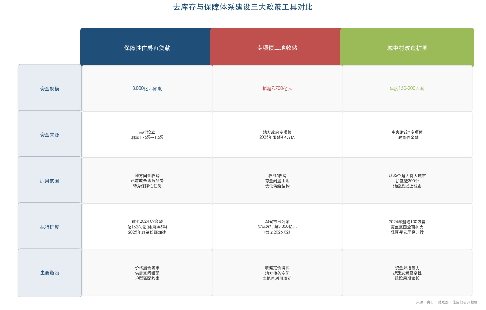

### 3.5.1 "白名单"融资协调机制

2024年1月，住建部与金融监管总局联合建立城市房地产融资协调机制（即"白名单"制度）。符合条件的房地产项目经地方政府审核后纳入名单，由商业银行对接提供融资支持。该制度的核心创新在于将融资决策从"以企业为单位"转为"以项目为单位"，有效隔离出险房企集团层面的信用风险与具体项目的运营风险，为保交楼目标的实现提供了关键的金融支撑。

截至2024年底，"白名单"项目贷款审批金额达5.03万亿元；截至2025年10月审批金额超过7万亿元，已支持近2,000万套住房建设交付[国务院新闻办](http://www.scio.gov.cn/live/2025/37532/index.html "白名单贷款审批超7万亿")。2026年1月政策进一步优化，将展期期限从最长2.5年延长至5年[央广网](https://house.cnr.cn/kcb/20260110/t20260110_527489121.shtml "白名单展期5年")，赋予项目更充裕的运营恢复时间，降低了短期集中偿付压力。

### 3.5.2 收储存量商品房：政策突破与执行挑战

收储存量商品房用作保障性住房，是连接去库存与保障体系建设的政策枢纽。2024年5月，央行设立3,000亿元保障性住房再贷款（利率1.75%），支持地方国企收购已建成未售商品房[新华网](http://www.news.cn/fortune/20240517/0161aaeec3ee4a0f9a317776c04d781a/c.html "央行设立3000亿元再贷款")；同年9月将央行资金支持比例从60%提高至100%，以期加速政策落地。

然而，政策初期推进速度远低于预期。截至2024年9月末，保障性住房再贷款已使用余额仅约162亿元，使用率约5%[证券时报](https://stcn.com/article/detail/1408145.html "截至9月末保障性住房再贷款余额162亿元")。执行受阻的症结集中于三个方面：一是价格撮合困难——此前要求按重置价收购，折算一般为市场价的五折左右，开发商普遍不愿大幅折价出让；二是供需空间错配——库存主要集中在三四线城市偏远地段，而保障房需求集中在一二线城市核心区域；三是户型匹配约束——保障房要求套型面积控制在70至90平方米以内，而大量库存为中大户型商品房。

2025年成为政策优化的关键年份。5月央行下调再贷款利率0.25个百分点至1.5%；7月印发《关于拓宽保障性住房再贷款使用范围的通知》，赋予地方政府在收购主体、定价方式和房源用途方面更大自主权[东方财富/证券日报](https://finance.eastmoney.com/a/202602123648293687.html "2025年四季度货币政策执行报告解读")。2026年政府工作报告进一步明确，收购用途可扩展至城中村改造安置房、人才房、青年公寓和职工宿舍等[证券时报](https://www.stcn.com/article/detail/1577188.html "存量房收储政策有重大突破")。上述"松绑"措施有望打通此前的价格卡点和用途限制，推动收储工作进入加速期。

### 3.5.3 首付与利率政策：史上最宽松周期

2024年至2025年间，住房金融政策经历了有史以来最大幅度的宽松。2024年5月"5·17新政"将首套房最低首付比例降至15%（此前为20%），二套降至25%（此前为30%），并取消全国层面房贷利率下限[人民日报](http://paper.people.com.cn/rmrbwap/html/2024-05/18/nw.D110000renmrb_20240518_6-02.htm "全国层面房贷利率政策下限取消")。2024年全年5年期以上LPR累计下降60个基点至3.6%。至2025年12月，新发放个人住房贷款加权平均利率已降至约3.1%，较2018年下半年高点累计下降约2.7个百分点[东方财富/证券日报](https://finance.eastmoney.com/a/202602123648293687.html "2025年四季度货币政策执行报告解读")。

与此同时，2024年一线城市全面松绑限购，打破了持续十余年的行政管控格局——广州9月30日率先全面取消限购，北京放松非京籍社保年限要求，上海将外环外购房社保年限从3年降至1年，深圳部分区域取消限购限制。全年全国出台各类调控政策超780条[央广网](https://house.cnr.cn/kcb/20250113/t20250113_527039261.shtml "一线城市大尺度松绑限购")，调控方向已从"限制性"全面转向"支持性"。首付比例、利率和限购三重政策同步宽松，构成了前所未有的购房成本下降窗口，但需求端响应仍显滞后，反映出居民预期修复所需时间远长于政策传导周期。

### 3.5.4 住房公积金制度改革

住房公积金制度正在经历从"封闭积累型"向"开放服务型"的深层转型。2025年以来各地出台公积金相关政策超过260条，改革方向呈现三大趋势[澎湃新闻](https://m.thepaper.cn/newsDetail_forward_32222649 "住房公积金制度改革方向")：

一是**扩大覆盖面**。灵活就业人员自愿缴存试点从13个城市扩展至36个，截至2024年末累计超过100万名灵活就业人员参与缴存，使公积金制度从"正规就业专属"逐步走向"全民普惠"。

二是**拓展使用场景**。公积金从"仅用于购房"向"住房全生命周期服务"延伸——2024年全国2,257万人提取2,721亿元用于租赁住房，同比分别增长22.28%和33.93%，租房提取已成为仅次于购房提取的第二大用途。此外，公积金还逐步覆盖加装电梯、老旧小区改造等住房更新场景。

三是**提升统筹层级**。推动都市圈内公积金资金余缺调剂，打破行政区划壁垒，提高资金使用效率。长三角、粤港澳大湾区等区域已率先开展公积金互认互贷探索。

## 3.6 现房销售制度：从预售到现售的渐进转型

现房销售制度改革是房地产交易制度变革的核心议题。截至2024年底，全国现房销售占比已达到约三分之一[中国新闻网](https://www.chinanews.com.cn/cj/2024/12-25/10342162.shtml "推进商品住房销售制度改革")。2025年12月全国住房城乡建设工作会议正式提出"推进现房销售制"，对仍实行预售的项目则强化预售资金监管，确保资金专款专用。

现房销售制度的推进遵循"渐进式"策略，而非"一刀切"路径：对于新出让土地的项目鼓励现房销售，对于存量已预售项目则通过强化资金监管保障交付。这一策略的审慎性体现了对行业资金链脆弱性的充分考量——若骤然全面取消预售制度，将立即切断数万亿元的预售回款资金来源，加剧本已紧张的行业流动性状况。

我们判断，到"十五五"末期（2030年前后），现房销售占比有望提升至50%以上，预售制度将逐步退出历史舞台。这一转型将倒逼行业从"卖期房拼速度"转向"做现房拼品质"的竞争范式，构成"好房子"理念得以落地的关键制度保障。

## 3.7 制度重构的系统效应与政策协同

### 3.7.1 "控增量、去库存、优供给"的政策闭环

2025年中央经济工作会议提出的"因城施策控增量、去库存、优供给"九字方针，构建了一个逻辑自洽的政策闭环：

**"控增量"** 旨在供给侧减压——通过优化新增土地供应节奏和规模，避免在市场尚未出清的阶段继续形成新库存积压。"以人定房、以房定地"的要素联动机制为总量控制提供了定量决策依据。

**"去库存"** 旨在存量端消化——通过专项债收储闲置土地（截至2026年2月末全国拟收储金额超7,700亿元）、收购存量商品房转为保障性住房、城中村改造扩围（年度计划扩至150万—200万套）等多渠道并举，系统性盘活存量资产。

**"优供给"** 旨在品质端升级——以"好房子"理念引导新建住宅提升产品力。2025年3月发布的《住宅项目规范》全面提高了层高（不低于3米）、电梯配置（4层及以上必须设置）、隔声（降低10分贝）等14项指标标准，从供给侧创造差异化的改善性需求，引导市场从"有没有"转向"好不好"。

三者之间形成递进逻辑：控增量为去库存创造时间窗口，去库存为优供给腾出市场空间，优供给反过来带动有效需求释放，最终实现市场的动态再平衡。

### 3.7.2 住房政策与人口战略的融合

2026年政府工作报告首次将住房保障与人口政策深度绑定，"加强初婚初育家庭住房保障，支持多子女家庭改善性住房需求"的表述具有里程碑意义。在全国人口连续四年负增长且降幅加速（2025年全国人口减少339万人）的大背景下，住房政策被赋予了促进生育友好型社会建设的新使命。这意味着未来的住房保障准入标准、公积金优惠政策、税费减免措施乃至户型设计规范等，都将更多向生育友好方向倾斜，住房制度由此成为国家人口治理体系的有机组成部分。

### 3.7.3 制度转型的风险与挑战

制度重构并非没有风险。我们认为，当前面临三大核心挑战：

**第一，地方财政转型的"青黄不接"。** 土地出让收入从2021年峰值87,051亿元降至2025年的41,518亿元（降幅52.3%）[财政部](http://gks.mof.gov.cn/tongjishuju/202201/t20220128_3785692.htm "2021年财政收支情况") [中房网](http://m.fangchan.com/news/218/2026-02-03/7424278058561245201.html "2025年土地出让收入")，四年间累计减收约4.6万亿元。地方政府在土地财政急剧收缩的同时，尚未建立起替代性稳定税源（房地产税改革暂缓），财政运行压力持续加大，部分中小城市已出现基层财政紧张态势。

**第二，保障房建设的"钱从哪里来"。** 配售型保障性住房按"保本微利"原则定价，地方财政需承担土地划拨和基础设施配套的沉没成本。在土地财政收缩、地方债务高企的双重约束下，保障房建设的可持续融资机制尚待完善。中央财政转移支付和政策性金融工具的支持力度需进一步加大，同时应探索引入社会资本参与保障房建设运营的市场化路径。

**第三，新旧模式转换的"过渡摩擦"。** 项目公司制度、主办银行制度、现房销售制度等改革措施的全面落地需要时间，行业适应新规则的过程中难免出现短期效率损失。此外，"白名单"机制虽有效隔离了项目风险与企业风险，但如何防止其在实际操作中异化为"隐性担保"，仍需在制度设计上予以审慎关注。

## 3.8 小结

从"房住不炒"到"发展新模式"，中国房地产政策体系正在经历一次深刻的范式转换。这一转换的本质是从"以土地为核心资产、以信贷为杠杆工具、以涨价预期为驱动力"的旧循环，转向"以居住需求为出发点、以制度规范为保障、以品质服务为竞争力"的新循环。"十五五"时期是这一转换的关键窗口期——"保障+市场"双轨体系、要素联动机制、现房销售制度、"好房子"标准等制度创新正在从顶层设计进入落地实施阶段。"因城施策控增量、去库存、优供给"九字方针构建了供给侧的政策闭环，而住房政策与人口战略的融合则拓展了制度改革的社会治理维度。政策层的改革决心和方向已经明确，剩下的挑战在于执行的深度、转型的节奏以及地方政府的创造性适配能力。

# 第4章 资金体系重塑与金融创新——支撑可持续发展的血脉

资金是房地产行业的血脉。过去二十年，中国房地产以"高杠杆、高周转、预售驱动"的融资模式实现了规模的急速扩张，但这一模式在2021年后伴随"三条红线"的严格执行和房企集中违约潮而走向终结。当行业从增量开发转向存量运营、从规模扩张转向高质量发展，与之匹配的资金体系亦须经历根本性变革。本章围绕三大核心议题展开分析：融资模式从旧范式向新范式的转型路径、以REITs为代表的金融工具创新如何开辟新的资金通道、住房公积金改革与金融风险防控机制如何保障行业资金链的长期稳定。

## 4.1 融资范式的根本转换：从"高杠杆驱动"到"低杠杆经营"

### 4.1.1 资金到位量的持续收缩与结构变化

房地产开发企业到位资金的总量变化，是观察行业融资格局最直观的指标。2021年，房企到位资金处于20.11万亿元的历史峰值；此后逐年下滑，2024年降至107,661亿元（同比-17.0%），2025年进一步萎缩至93,117亿元（同比-13.4%），四年间累计缩减超过一半（-53.7%）。值得关注的是，2025年降幅较2024年收窄3.6个百分点，资金面的失速态势开始出现边际改善信号。[国家统计局2024年房地产数据](https://www.stats.gov.cn/xxgk/sjfb/zxfb2020/202501/t20250117_1958328.html "2024年全国房地产市场基本情况")

从资金来源结构的变化中可以捕捉到更深层的信息。国内贷款占到位资金的比重从2021年的11.6%提升至2025年的15.1%，反映银行信贷在政策引导下对房企融资的相对稳定支撑；而以定金预收款和个人按揭贷款为代表的销售端回款则萎缩最为剧烈——个人按揭贷款从2021年峰值3.24万亿元骤降至2025年的1.29万亿元（累计-60.2%），折射出购房者信心的深度回落与市场交易的持续低迷。[国家统计局2025年数据](https://www.stats.gov.cn/sj/zxfb/202601/t20260119_1962324.html "2025年全国房地产市场基本情况")

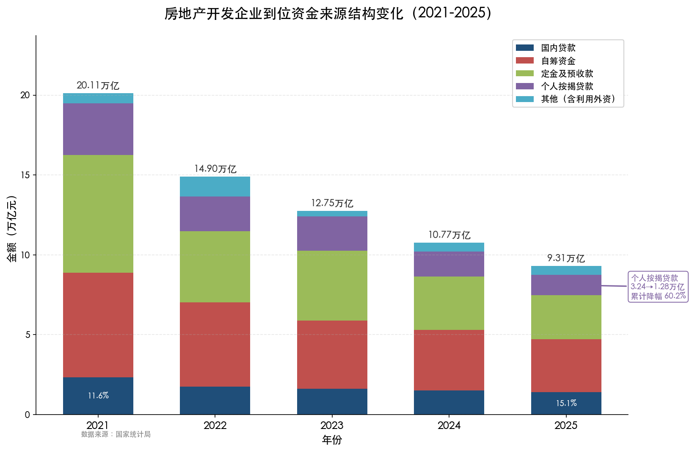

**图4-1：房地产开发企业到位资金来源结构变化（2021-2025）。** 堆叠柱状图直观呈现到位资金从20.11万亿元峰值降至9.31万亿元的收缩轨迹，以及国内贷款占比上升、个人按揭贷款大幅萎缩的结构性演变。数据来源：国家统计局。

### 4.1.2 "三条红线"的历史使命与渐进退出

2020年8月，央行和住建部联合出台"三条红线"融资管理规则——剔除预收款后的资产负债率不超过70%、净负债率不超过100%、现金短债比不低于1——构成了行业去杠杆的标志性制度约束。该政策旨在遏制房企无序举债扩张，引导行业降杠杆、控风险。五年实践表明，"三条红线"有效压缩了房企的财务杠杆空间，加速了高风险房企的风险暴露和出清进程，也倒逼了一批稳健型企业率先完成财务结构优化。

至2026年初，多家房企已不再被要求每月上报"三条红线"相关指标，标志着该政策的阶段性历史使命已基本完成。[财联社独家报道](https://finance.sina.com.cn/jjxw/2026-01-28/doc-inhiwaht8966147.shtml "多家房企不再上报三道红线") 行业融资模式由此正式从"高杠杆、高周转"转向"低杠杆、重经营"的精细化资产管理模式。

### 4.1.3 "主办银行制"与项目融资封闭管理

在新模式框架下，住建部提出推行"一项目一主办银行"的融资制度，要求将项目开发全流程资金纳入封闭流转管理。这一制度设计的核心逻辑在于：改变过去"集团融资、内部调拨"的资金运作方式，确保每笔融资与具体项目一一对应，防范资金挪用和跨项目风险传染。[国务院新闻办发布会](http://www.scio.gov.cn/live/2025/37532/index.html "2025年10月住建部十四五成就发布会")

该制度与"项目公司独立法人制度"相互配合，正在重塑行业的融资基础架构。项目公司作为独立法人进行融资和核算，主办银行对项目实施全周期资金监管，从拿地、开发、销售到交付的每个环节均实现资金闭环管控。对银行而言，项目制融资模式显著降低了信息不对称和关联交易风险；对购房者而言，资金封闭管理则是保交楼的核心制度保障。

## 4.2 "白名单"机制：化解存量风险的关键制度创新

### 4.2.1 机制的建立与快速扩容

2024年1月，住建部和金融监管总局联合建立城市房地产融资协调机制（即"白名单"机制），由城市政府牵头，住建部门、金融机构共同参与，对符合条件的房地产项目纳入支持名单，协调金融机构给予融资支持。该机制的核心创新在于将融资评估对象从"企业集团"下沉到"具体项目"，使得即使母公司出险，只要项目本身资产负债健康、工程进度正常，仍可获得融资支持。

"白名单"的推进速度远超预期：截至2024年底，贷款审批金额达5.03万亿元；截至2025年10月，审批金额已超7万亿元，累计支持约1,400万套住房的建设交付。[住建部新闻发布会](https://www.mohurdic.org.cn/xw/jsyw/art/2025/art_763362340.html "白名单审批超7万亿") 这一规模已覆盖在建项目的相当大比例，成为保交楼和维护购房者权益的核心资金保障工具。

### 4.2.2 展期政策与风险缓释

2026年1月，"白名单"贷款展期期限从最长2.5年延长至5年，为出险项目"以时间换空间"提供了更充裕的政策窗口。[央广网](https://house.cnr.cn/kcb/20260110/t20260110_527489121.shtml "白名单展期5年") 展期政策的延长反映了决策层对房地产市场恢复周期的务实判断——短期内销售回款难以支撑所有在建项目的正常推进，适当延长贷款周期有助于避免集中到期引发的流动性危机，也为银行资产质量的平稳过渡争取了缓冲空间。

## 4.3 REITs市场：打通"投融管退"的关键拼图

### 4.3.1 公募REITs的快速扩容

中国公募REITs市场自2021年首批产品上市以来，经历了从试点到常态化发行的跨越式发展。截至2025年底，已上市79只公募REITs产品，发行规模达2,032.54亿元，总市值2,184.63亿元；2025年全年新增发行20单约473.35亿元。截至2026年3月，总市值已攀升至2,262.64亿元，较上年同期增长21.62%。中国内地公募REITs产品数量已位居亚洲第一、全球第二。[21世纪经济报道](https://www.21jingji.com/article/20260123/herald/b986e4f52e1a27016b7e227eaf283b7d.html "2025年四季报数据") [上海市地方金融监管局](https://jrj.sh.gov.cn/SC212/20260113/34bfc89528104ab4bf73c0defe80f4b8.html "首单非定向扩募公募REITs上市")

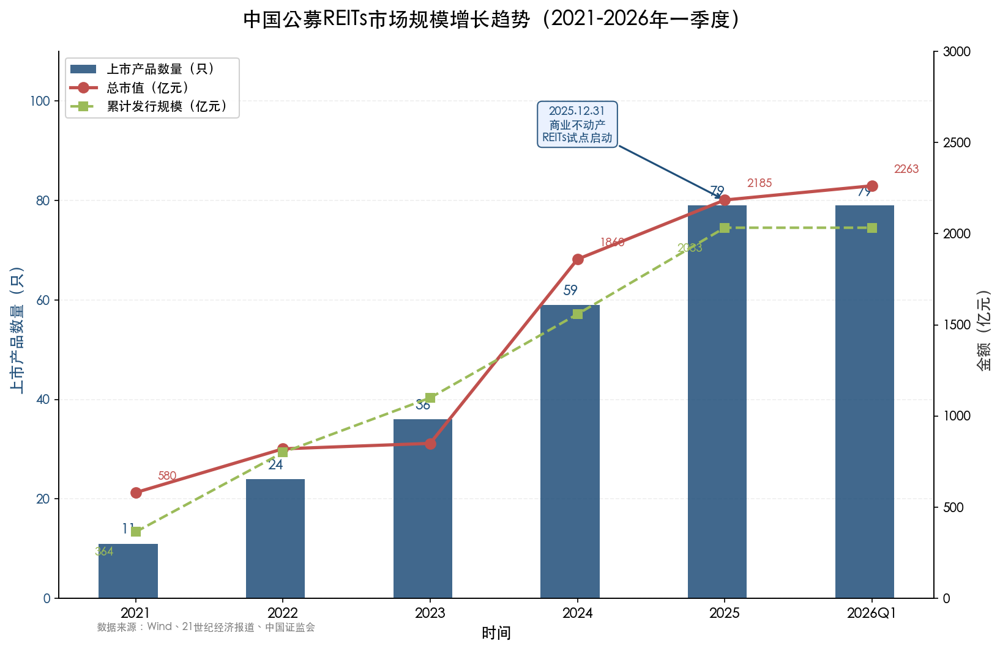

**图4-2：中国公募REITs市场规模增长趋势（2021-2026年一季度）。** 柱状图展示上市产品数量从11只增至79只的扩容历程，折线图同步呈现总市值与累计发行规模的增长轨迹，并标注2025年12月31日商业不动产REITs试点启动的关键政策节点。数据来源：Wind、21世纪经济报道、中国证监会。

### 4.3.2 商业不动产REITs试点：打开万亿级资产池

2025年12月31日，中国证监会正式启动商业不动产REITs试点，将商业综合体、零售物业、办公楼宇、酒店等传统商业地产纳入底层资产范围。[中国证监会官方公告](https://www.csrc.gov.cn/csrc/c100028/c7605669/content.shtml "商业不动产REITs试点公告") 这一政策突破被业界视为REITs市场发展的里程碑事件——中国万亿级存量商业不动产资产由此获得通过证券化实现高效流转的制度通道。首批3家商业不动产REITs已于2026年1月底申报，计划募资合计131.75亿元。

商业不动产REITs试点的战略意义体现在三个维度：其一，为持有大量优质商业资产的房企提供退出通道，有助于改善资产负债表、回收资金再投资；其二，为社会资本参与商业地产投资提供标准化、低门槛的渠道，推动不动产投资的大众化；其三，引导房企从"开发—销售"的一次性变现模式转向"持有—运营—证券化"的循环增值模式。

### 4.3.3 保障性租赁住房REITs：民生与金融的交汇

保障性租赁住房REITs是中国REITs市场中民生属性最强的品种。截至2025年中期，上市保租房REITs数量增至8只，发行总规模达130.93亿元，总市值接近200亿元。[新华财经](https://finance.sina.com.cn/money/bond/2025-12-18/doc-inhcfvmf2953294.shtml "2025年保租房REITs市场全扫描") 底层项目的运营表现整体稳健：2025年三季度各项目出租率普遍超过95%，平均年化分派率稳定在4%以上；华泰证券统计显示其平均单位月租金同比增长1.6%，优于百城住宅租赁指数同比均值（-3.5%）达5.1个百分点。

展望前景，保租房REITs已进入"首发+扩募"并行阶段。中信建投证券测算，2026年新增上市项目数量有望达到8至10只，新增发行规模预计突破150亿元，扩募规模有望超过50亿元，推动保租房REITs总市值突破500亿元。保租房REITs将保障性住房体系与资本市场紧密联结，是落实"住有所居"目标的关键金融工具。

### 4.3.4 中美REITs市场的差距与追赶空间

将中国REITs市场置于国际坐标系中审视，其发展空间更为清晰。截至2025年底，美国REITs总市值约1.439万亿美元（约195只产品纳入指数），持有超4.5万亿美元商业地产资产，过去50年全权益类REITs年均复合回报率达12.08%，与标普500基本持平。[Nareit](https://www.reit.com/sites/default/files/2026-01/MediaFactSheet_Dec-2025.pdf "Nareit Media Fact Sheet Dec 2025") 相较之下，中国REITs市场总市值约300亿美元，仅为美国的约2%。全球已有44个国家和地区建立REITs市场，总规模超2万亿美元。[财信证券深度报告](https://finance.sina.com.cn/roll/2025-06-17/doc-infaisms8963199.shtml "美国REITs梳理专题")

招商基金预计未来五年中国公募REITs总市值有望从2,000多亿元向5,000亿元迈进。考虑到中国商业地产存量资产体量庞大且商业不动产REITs试点刚刚开启，我们认为这一预测具备合理性。然而，REITs市场要真正成长为行业核心融资渠道之一，仍需在税制中性安排、专项立法完善、机构与个人投资者培育等方面做出系统性努力。

## 4.4 资产证券化全面提速：CMBS、ABS与Pre-REITs

公募REITs之外，更广泛的不动产资产证券化工具正在加速放量。中指研究院数据显示，2025年房地产相关企业发行的CMBS/CMBN、类REITs、持有型不动产ABS等产品合计118只，较2024年增加35只，发行金额共计1,413亿元，同比增长32.6%。[中指研究院（新浪财经转引）](https://finance.sina.com.cn/jjxw/2026-03-26/doc-inhsicuw2822196.shtml "2025年商业地产资产证券化数据")

分产品类型看，CMBS/CMBN发行规模977亿元（同比+52.2%），成为增长最快的单一品种；持有型不动产ABS发行规模98亿元（同比+185%），虽然绝对规模尚小，但呈爆发式增长态势；类REITs产品发行规模338亿元（同比-13.1%），部分需求已被公募REITs分流。

从底层资产类型分布看，办公物业发行规模459亿元（占比33%）、零售商业304亿元（占比22%）、综合体115亿元（占比8%）、产业园区154亿元（占比11%），办公和零售商业物业构成了资产证券化的两大基本盘。

Pre-REITs基金作为资产培育和长期资本前置布局的重要通道，正在成为"投融管退"链条中不可或缺的环节。Pre-REITs基金在资产培育期介入，通过专业运营提升资产质量和现金流稳定性，待资产成熟后经由公募REITs实现退出，形成完整的不动产投资闭环。

## 4.5 长期资本入场：保险资金与养老金的战略布局

### 4.5.1 险资加速布局商业不动产

低利率环境下，保险资金对商业不动产的投资热情显著升温。2025年，保险机构完成了多笔大规模不动产交易：中邮保险以108亿元收购上海博华广场，创下保险机构单笔不动产投资的最高纪录；大家保险以24.5亿元收购杭州滨江宝龙城。[证券时报](https://www.stcn.com/article/detail/3634759.html "险资不动产投资模式进阶")

险资大举进入商业不动产的底层逻辑清晰：北京办公楼资本化率约5.5%、零售资产约6.3%，显著高于10年期国债收益率（2025年末约1.6%-1.7%），为保险公司提升投资组合收益率提供了有力支撑。与此同时，商业不动产的长久期特征与保险资金的长期负债属性天然匹配，REITs与直投两种方式使险资能够灵活配置不同风险收益特征的不动产资产。

### 4.5.2 融资模式的系统性转型

综合上述分析，房地产行业融资模式的转型图景已趋于清晰：从"开发贷+预售回款"的单一模式，转向"经营性融资+资产证券化"的多元模式。这一转型包含四条核心路径：一是主办银行制取代传统信贷模式，实现项目层面的精准风控；二是公募REITs和持有型ABS打通存量资产退出通道，释放沉淀资本；三是Pre-REITs承担资产培育和价值提升的中间环节功能；四是保险资金、养老金等长期资本通过REITs及直投方式实现"长久期负债—长期资产"的久期匹配。[证券时报](https://www.stcn.com/article/detail/3634759.html "融资模式转型路径")

## 4.6 住房公积金制度改革：从"窄覆盖"到"广普惠"

### 4.6.1 公积金体系的运行全貌

住房公积金制度是中国特色的住房金融安排。2024年，全国住房公积金缴存额36,317.83亿元，实缴单位529万个、实缴人数17,628.75万人；发放个人住房贷款230.56万笔、13,043.07亿元；8,127.04万人提取27,654.84亿元。[住建部、财政部、央行联合发布年度报告](https://www.zzz.gov.cn/html/xwzx/dtyw/18973.html "2024年全国住房公积金年度报告")

然而，公积金制度亦面临突出的结构性矛盾。一方面，覆盖面有限——1.76亿实缴人数仅约占城镇就业人口的38%，大量灵活就业人员、新就业形态劳动者尚未被纳入体系；另一方面，资金使用效率偏低——截至目前累计缴存32.79万亿元、余额10.93万亿元，大量资金沉淀未能充分发挥住房保障功能。[盛松成《金融市场研究》](https://finance.sina.cn/zl/2026-04-03/zl-inhtfeqw0322022.d.html "盛松成2026年第3期")

### 4.6.2 灵活就业人员参缴试点与租房提取扩容

改革正在多个维度推进。灵活就业人员公积金缴存试点已从最初的13个城市扩大至36个，截至2024年末累计超100万名灵活就业人员参缴。租房提取已成为增长最快的使用场景——2024年，2,257.44万人提取2,720.57亿元用于租赁住房，同比分别增长22.28%和33.93%。[住建部年度报告](https://www.zzz.gov.cn/html/xwzx/dtyw/18973.html "灵活就业人员试点和租房提取数据")

2025年以来，各地出台公积金相关政策超260条，改革方向集中在三个层面：扩大覆盖面（灵活就业自愿缴存）、拓展使用场景（支持租赁、加装电梯、老旧小区改造等）、提升统筹层级（都市圈内资金余缺调剂）。[澎湃新闻](https://m.thepaper.cn/newsDetail_forward_32222649 "住房公积金制度改革方向") 这些改革的实质方向是推动公积金从"购房专项基金"向"住房综合保障基金"转型，使之更好地适应"租购并举"的住房制度改革大方向。

国际比较视角下，新加坡中央公积金（CPF）制度提供了有益参照。55岁以下雇员的CPF总缴费率达37%（雇主17%+雇员20%），远高于中国公积金5%-12%的缴存比例；CPF普通账户资金可广泛用于支付首付、月供乃至购买REITs等投资品，资金使用效率显著优于中国。[CPF贡献率表](https://www.cpf.gov.sg/content/dam/web/employer/employer-obligations/documents/CPF_contribution_rates_from_1_Jan_2024.pdf "CPF Contribution Rate Table 2024") 适度借鉴新加坡经验，拓展公积金用途、提升资金使用效率，是未来改革的重要方向。

## 4.7 金融风险防控：守住系统性安全底线

### 4.7.1 银行业房地产贷款质量承压

房地产行业深度调整对银行资产质量构成了显著压力。截至2025年6月末，六大国有银行的房地产对公贷款不良率处于高位——中国银行5.38%、工商银行5.37%、农业银行5.35%，但实质新增不良同比已呈现下降趋势。个人住房贷款不良率方面，六大行2025年中期处于0.73%-0.86%区间，至2025年底普遍升至0.9%-1.1%，仍为各类个人贷款中最低水平。[中房网](http://www.fangchan.com/news/4/2025-09-10/7371338939917210264.html "2025年半年报银行房贷不良数据")

### 4.7.2 央行压力测试与系统性风险评估

2025年12月发布的《中国金融稳定报告（2025）》提供了银行体系承压能力的全景评估。央行对3,235家银行机构开展的多维度压力测试显示：23家系统重要性银行整体对宏观经济冲击具有较强抵御能力；银行业整体对资产质量恶化具有一定抵御能力，但非系统重要性银行在整体不良资产率上升400%的极端情景下资本充足率面临较大压力；流动性风险和传染性风险测试结果均显示银行承压能力整体较强。[中金公司研报/同花顺](https://m.10jqka.com.cn/20251229/c673603232.shtml "2025金融稳定报告点评")

央行评级方面，3,529家受评银行中"红区"高风险银行312家（占8.8%），资产规模9.4万亿元（占2.1%）。高风险银行主要集中于城商行、农村金融机构和民营银行，全国性银行和外资法人银行中无高风险机构。北京、上海、浙江、江苏等9个省区市辖内无"红区"银行。

总体而言，当前银行体系风险仍处于可控范围，系统重要性银行具备较强的抗冲击能力。但两个潜在风险点值得警惕：一是部分中小银行因区域房地产市场深度调整而面临的资产质量恶化压力；二是若房价持续下行导致个人住房贷款不良率从当前低位加速攀升的尾部风险。

### 4.7.3 收储存量商品房：政策工具的效果与挑战

2024年5月，央行设立3,000亿元保障性住房再贷款（利率1.75%），支持地方国企收购已建成未售商品房用作保障性住房；9月将再贷款支持比例从60%提升至100%。然而截至2024年9月末，再贷款余额仅162亿元，实际投放进度远低于预期。[新华网](http://www.news.cn/fortune/20240517/0161aaeec3ee4a0f9a317776c04d781a/c.html "央行设立3000亿元再贷款")

收储推进缓慢的核心瓶颈在于价格撮合难度：地方国企出于财务安全考虑倾向于低价收购，而开发商在资产负债表压力下难以接受大幅折价，双方预期差距导致交易难以达成。这一矛盾短期内不易化解，但随着市场价格逐步探底企稳，以及中央财政通过专项债等方式给予更大力度的资金支持，收储政策的实际效果有望在2026-2027年逐步显现。

## 4.8 资金体系重塑的全景展望

综合本章分析，中国房地产行业的资金体系正经历一场历史性重构。这场重构的本质是将融资模式从"以信贷扩张驱动规模增长"转向"以资产质量支撑价值运营"。具体而言，可概括为五大趋势：

**第一，融资主体从"房企集团"下沉至"项目公司"。** 主办银行制和项目法人制成为风控基础设施，从源头防范资金挪用和关联交易风险。

**第二，融资渠道从银行信贷"独大"走向"信贷+债券+REITs+ABS"的多元化格局。** 2025年房地产资产证券化产品发行1,413亿元（同比+32.6%），公募REITs总市值突破2,200亿元，新型融资渠道正在快速成长。

**第三，资金期限结构从"短借长投"走向"长钱配长产"。** 保险资金、养老金等长期资本通过REITs和直投方式进入不动产领域，有助于修复行业长期存在的期限错配问题。

**第四，风险管理从"事后救助"转向"事前预防"。** "白名单"机制审批超7万亿元、覆盖1,400万套住房，以项目为单位的穿透式监管正在构建更为精密的风险防控网络。

**第五，住房公积金从"购房专项基金"向"住房综合保障基金"演进。** 覆盖面和使用场景持续扩展，资金使用效率有望逐步提升。

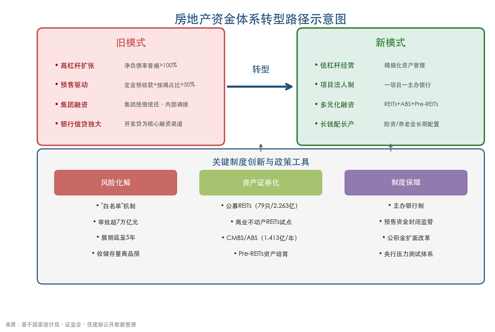

**图4-3：房地产资金体系转型路径示意图。** 上方展示从"旧模式"（高杠杆扩张、预售驱动、集团融资、银行信贷独大）向"新模式"（低杠杆经营、项目法人制、多元化融资、长钱配长产）的转型路径，下方归纳支撑转型的三类关键制度创新与政策工具。数据来源：基于国家统计局、证监会、住建部公开数据整理。

这一资金体系的转型既是行业发展新模式的内在要求，也是防范系统性金融风险的制度保障。未来十年，随着REITs市场规模从当前的2,000多亿元向5,000亿元乃至更高水平迈进、资产证券化工具的持续创新、以及长期资本配置不动产比例的稳步提升，中国房地产行业有望建立起与高质量发展阶段相匹配的、更加稳健和可持续的资金循环体系。

# 第5章 产业转型方向——存量时代的新增长极

新开工面积从2020年的22.44亿平方米骤降至2025年的5.88亿平方米，商品房销售规模缩减过半——中国房地产行业所面临的已不再是一次周期性回调，而是一场从增量开发向存量经营的深层结构转换。"存量时代"的核心命题在于：行业的根本矛盾已从"建多少房"转变为"如何使现有的662亿平方米城镇房屋更好地服务于居民品质生活需求"。在这一结构性变革中，城市更新、绿色建筑、住房租赁、物业服务、代建模式与智慧社区等新赛道正在成为行业增长的替代引擎。本章逐一剖析上述转型方向的发展阶段、政策驱动力与市场空间，并以龙湖、华润置地、万科等标杆企业的实践为例，揭示房地产企业从"开发商"向"运营服务商"蜕变的现实路径。

## 5.1 城市更新：万亿级赛道的制度化推进

### 5.1.1 从"大拆大建"到"有机更新"的范式转换

城市更新是存量时代规模最大的转型赛道。全国城镇现有房屋总量662亿平方米、市政管网超过360万公里，其中大量房屋与基础设施建于20世纪八九十年代，普遍面临功能老化、设施陈旧、节能标准不达标等问题。与过去"推倒重建"的粗放模式不同，新一轮城市更新以"留改拆"为基本原则，强调保留城市肌理、改善居住功能、提升公共空间品质，是一种有机、渐进、可持续的更新方式。

这一转型的制度化进程已取得实质性突破。北京、上海、武汉等多城先后出台城市更新条例，将更新行为纳入法治轨道；上海成立城市更新领导小组、广州设立城市更新局、深圳设立城市更新和土地整备局，形成了从中央到地方的多层级组织保障体系。[国家发改委](https://www.ndrc.gov.cn/wsdwhfz/202508/t20250818_1399868.html "城市更新对新型城镇化的拉动效应")

### 5.1.2 老旧小区改造：最大的民生更新工程

老旧小区改造是城市更新中覆盖面最广、受益群体最多的领域。2019至2024年，全国累计改造城镇老旧小区28万个，惠及4,800万户、超1.2亿人。2025年，全国新开工改造城镇老旧小区2.71万个、涉及499万户，完成投资1,332亿元。[新华网](http://www.news.cn/20260128/f59b3ef5c81f4aa3a88a2d19ede42bbd/c.html "住建部2025年老旧小区改造数据")

改造内容涵盖加装电梯、增设停车位、修缮外墙保温、更新水电管线等多个维度，直接改善了居民的居住环境。同时，改造投资有效拉动了建材、装修、物业服务等上下游产业链。对于施工行业而言，老旧小区改造为中小施工企业提供了持续稳定的项目来源，部分弥补了新建住宅开工量大幅萎缩造成的市场缺口。

### 5.1.3 城市更新的总体市场空间

近两年全国城市更新8项主要任务（涵盖老旧小区改造、城中村改造、既有建筑节能改造、地下管网更新等）每年完成投资额稳定在2.5万亿元以上。据业内测算，"十五五"期间城市更新市场总容量约20万亿元，其中老旧小区改造约8万亿元、城中村及危旧房改造约2.5万亿元、地下管网更新约4万亿元、历史文脉保护约2万亿元。[中国城市节能网](http://www.ceccweb.org.cn/listshow.php?cid=69&id=3353 "十五五城市更新市场总容量约20万亿")

政策支持力度持续加大。2024年中央财政首批支持15个城市实施城市更新示范项目，2025年新增20个城市入选，形成了覆盖不同规模与类型城市的示范梯队。[国家发改委](https://www.ndrc.gov.cn/wsdwhfz/202508/t20250818_1399868.html "城市更新对新型城镇化的拉动效应") 从地方立法到财政投入、从组织架构到试点推广，城市更新已从零散的试点探索转变为有顶层设计、有财政支撑、有法治保障的系统性工程。

## 5.2 绿色建筑与低碳转型：从政策驱动到标准引领

### 5.2.1 新建绿色建筑的全面覆盖

绿色建筑的发展速度在全球范围内堪称瞩目。2024年，城镇新建绿色建筑面积达16.9亿平方米，占当年城镇新建建筑面积的97.9%，绿色建筑基本级标准已成为新建建筑的"标配"。[新京报](https://m.bjnews.com.cn/detail/1757747445129284.html "2024年绿色建筑数据") 截至2023年底，全国城镇累计建成绿色建筑面积约118.5亿平方米，获得绿色建筑标识项目累计达2.7万余个。[住建部副部长王晖在2024国际绿色建筑大会讲话](https://hnjs.henan.gov.cn/2024/05-23/2997470.html "住建部绿色建筑数据") 结合2024年新增16.9亿平方米推算，截至2024年底全国累计绿色建筑面积已超过135亿平方米，约占城镇建筑总面积的五分之一。

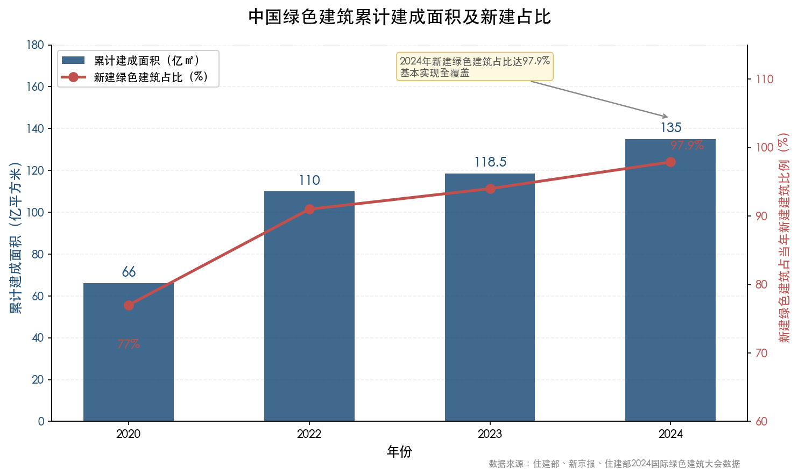

**图5-1 中国绿色建筑累计建成面积及新建占比。** 从2020年的66亿平方米、新建占比77%，到2024年的约135亿平方米、新建占比97.9%，绿色建筑在新建领域已基本实现全覆盖。

这一成就的背后是从法规到标准的全链条支撑。住建部已将绿色建筑基本要求纳入全文强制性国家标准，确保2025年所有竣工项目均达到绿色建筑基本级水平。值得关注的是，高星级绿色建筑（二星级及以上）占比仍有较大提升空间，既有建筑的绿色化改造更是一片有待开拓的广阔市场。

### 5.2.2 超低能耗建筑的规模化发展

在绿色建筑基本级全覆盖的基础上，超低能耗建筑与近零能耗建筑代表着更高层次的技术方向。国务院办公厅2024年3月转发的《加快推动建筑领域节能降碳工作方案》明确提出，到2027年超低能耗建筑实现规模化发展。住建部与国家发展改革委2022年联合印发的《城乡建设领域碳达峰实施方案》进一步明确了2030年前城乡建设领域碳排放达峰值、装配式建筑占比达40%的量化目标。[央视网](https://eco.cctv.com/2024/03/16/ARTI6abOFWfKvry3aM8Nn2IU240316.shtml "建筑领域节能降碳方案") [人民政协网](http://www.rmzxw.com.cn/c/2022-07-17/3161964.shtml "碳达峰实施方案")

"十四五"规划设定的超低能耗和近零能耗建筑建设目标为0.5亿平方米以上，标志着中国建筑业的节能降碳正从"增量达标"阶段向"存量提升"阶段迈进。在"双碳"目标的硬约束下，超低能耗建筑将从示范项目走向规模化推广，带动保温材料、高性能门窗、新风热回收系统、光伏建筑一体化（BIPV）等细分产业链的快速成长。

### 5.2.3 "好房子"标准：绿色与品质的融合

"十五五"规划提出建设"安全舒适绿色智慧"的"好房子"，将绿色建筑的技术要求与居住品质提升深度融合。2025年3月发布的《住宅项目规范》全面提高住宅建设标准——新建住宅层高不低于3米、4层及以上住宅设置电梯、隔声标准降低10分贝等14项指标实现提升。住建部2025年末发布的《关于提升住房品质的意见》进一步要求到2030年保障性住房率先建成"好房子"。[求是网](https://www.qstheory.cn/20260320/cea1c072f51642978bf4a5ccf34382d9/c.html "好房子建设系统工程")

"好房子"标准的全面实施将深刻改变房地产行业的竞争格局。在增量时代，开发商的核心竞争力在于拿地规模和周转速度；在存量时代的品质竞争中，设计能力、建造工艺、绿色技术的集成应用及全生命周期运维服务将成为决定性的差异化因素。这一转变为具备技术积累的企业提供了弯道超车的机会，也为建筑科技领域的创新企业打开了新的市场空间。

## 5.3 住房租赁市场：从政策培育到规模化运营

### 5.3.1 租赁人口基数与市场格局

全国租赁人口规模约2.6亿人，占城镇常住人口约31%。[房天下](http://sz.news.fang.com/open/54112785.html "2025年住房租赁市场全景") 这一庞大的租住群体构成了住房租赁市场最坚实的需求基础。随着"租购并举"制度框架逐步建立，住房租赁正从"过渡性选择"的传统定位转变为与购房并列的长期居住解决方案。

从供给端来看，机构化运营正在加速推进。截至2025年末，TOP30集中式长租公寓企业开业规模达142.5万间（较2024年末增长16.8万间），管理规模突破203.4万间。头部集中效应显著，TOP10企业开业规模和管理规模占比均超过54%，国资系企业市场份额持续扩大。[房天下](http://sz.news.fang.com/open/54112785.html "2025年住房租赁市场全景")

### 5.3.2 头部企业的运营实践

万科旗下"泊寓"以27.02万间运营规模位居行业第一，出租率高达95.4%，2025年实现年营收36.66亿元。[澎湃新闻](https://m.thepaper.cn/newsDetail_forward_32868291 "万科2025年报泊寓数据") 泊寓的运营数据传递出一个重要信号：住房租赁业务在达到一定规模后可以实现持续稳定的现金流回报，95.4%的出租率表明核心城市租赁需求依然旺盛，关键在于产品定位与运营效率的精准匹配。

长租公寓的商业模式正在从早期的"二房东"模式向资产管理模式升级。保障性租赁住房REITs的常态化发行为机构化运营提供了"投融建管退"的完整闭环——通过REITs实现资产出表和资本回收，降低了对企业自有资金的持续占用，为行业的可持续扩张奠定了金融基础。

### 5.3.3 租赁市场的发展空间与挑战

四大一线城市租房人口规模接近4,000万人，租住比例接近50%。然而从全国层面来看，机构化渗透率仍然偏低——TOP30企业的142.5万间开业规模相对于2.6亿租赁人口占比不足2%，与发达国家机构化运营占比20%~30%的水平差距显著，意味着住房租赁的机构化、专业化仍有巨大的增长空间。

挑战同样不容回避。2025年上半年，50城住宅平均租金累计下跌1.37%，租金水平整体承压。在房价下行周期中，租金回报率虽有相对提升，但绝对水平仍然偏低，制约了社会资本进入租赁市场的积极性。构建可持续的租赁住房投融资循环——从项目开发、持有运营到REITs退出——是推动租赁市场从"政策培育期"迈入"市场成熟期"的关键所在。

## 5.4 物业服务：从"后端配套"到"核心业态"

### 5.4.1 行业总体规模与增长态势

物业管理行业正经历从房地产开发"附属品"到独立产业的身份转变。2024年，全国物业管理行业整体营收规模达到1.75万亿元，同比增长3.4%。[克而瑞物管研究](https://news.qq.com/rain/a/20250616A07BJJ00 "2025中国物业服务企业综合实力研究成果") 物业500强企业营收总额达5,953.8亿元，百强企业营收总额达4,189.8亿元。尽管增速较前几年有所回落（2023年增速约7.5%），行业整体仍保持正增长，在房地产产业链中展现出显著的抗周期韧性。

收入结构方面，2024年百强企业基础物业服务收入均值为13.43亿元，占比约83.7%；增值服务收入占比约13.8%。社区增值服务（涵盖家政维修、社区团购、养老服务等）拓展空间较大，但目前仍受限于居民付费意愿和服务标准化程度。随着"好房子"和智慧社区理念的推广，物业服务的内涵正从传统的"保洁保安保绿保修"向社区生活服务平台方向进化。

### 5.4.2 物业服务的独立价值重估

物业服务板块的独立价值正在获得资本市场的重新评估。截至2024年11月，物业管理行业共有68家上市企业（62家港股、6家A股），板块总市值约2,638亿元。市值虽较高峰期大幅回落，但随着物业服务与母公司房地产开发业务的切割逐步清晰化，"去关联化"趋势使物业服务的独立商业逻辑更加透明——轻资产、现金流稳定、抗周期性强，并兼具社区入口的平台价值。

碧桂园服务2024年营业收入达440亿元，中海物业2025年主营物业管理服务营收117.3亿元（同比+9.1%）。头部物业企业通过规模化管理与专业化运营，正在构建起独立于房地产开发周期的可持续增长逻辑。

## 5.5 企业转型范式：从"开发商"到"运营服务商"

### 5.5.1 龙湖集团：运营服务收入的里程碑

龙湖集团2025年运营及服务业务收入达267.7亿元（创历史新高），占总营收27.5%，整体毛利率超过50%。其中商业投资租金收入112.1亿元（同比+4%，出租率97%），物业服务收入112.3亿元。[东方财富网](https://wap.eastmoney.com/a/202603273687223285.html "龙湖集团2025年业绩") 穆迪已将龙湖的评级方法论从住宅开发调整为REITs及其他商业地产，这一调整本身即是对其商业模式转型成效的权威认可。

龙湖的案例具有典型范本意义：当运营及服务业务的毛利率超过50%、收入占比逼近三成时，企业的盈利来源已从"卖房"实质性转向"经营资产与提供服务"。97%的商业出租率亦表明，优质商业地产在消费升级的大背景下仍具备强劲的现金创造能力。

### 5.5.2 华润置地：经常性业务利润占比过半

华润置地2025年年报数据更鲜明地标注了转型的里程碑：经常性业务（购物中心、物业管理等）核心净利润同比增长13.1%至116.5亿元，占总核心净利润的比例首次攀升至51.8%。这意味着华润置地率先完成了从"以开发为主"向"开发、运营、服务"多赛道驱动的实质性转型。[央广网](https://www.cnr.cn/rdjj/house/jdt/20260331/t20260331_527568516.shtml "华润置地2025年报")

华润置地旗下购物中心2025年实现零售额2,392亿元（同比+22.4%），年末在营98座。零售额增速远超社会消费品零售总额平均增速，表明优质商业不动产在消费场景中具有不可替代的引流与聚合作用。购物中心业务的持续高增长，源于华润置地对一二线城市核心商圈的战略性布局及精细化运营能力的长期积累。

### 5.5.3 万科：经营服务规模领先但开发主业承压

万科2025年经营服务业务全口径收入达580.1亿元，保持行业绝对领先——万物云营收373.6亿元（同比+2.5%），泊寓运营27.02万间，印力商业出租率94.5%，物流仓储营收42.8亿元（同比+8%）。[澎湃新闻](https://m.thepaper.cn/newsDetail_forward_32868291 "万科2025年报") 万科在经营服务领域的多元化布局最为全面，覆盖物业管理、长租公寓、商业运营、物流仓储四大赛道。

然而万科的案例也揭示了转型进程中的深层矛盾：开发主业的剧烈下行导致归母净亏损高达885.6亿元，经营服务业务虽保持稳健增长，但其利润体量尚不足以对冲开发侧的巨额减值损失。这一现实表明，对于体量庞大的综合性房企而言，转型远非简单的"做加法"——在培育新业务的同时，如何管理存量开发资产的有序收缩与风险出清，是一道必须同步解答的战略难题。

### 5.5.4 转型的共性逻辑与差异路径

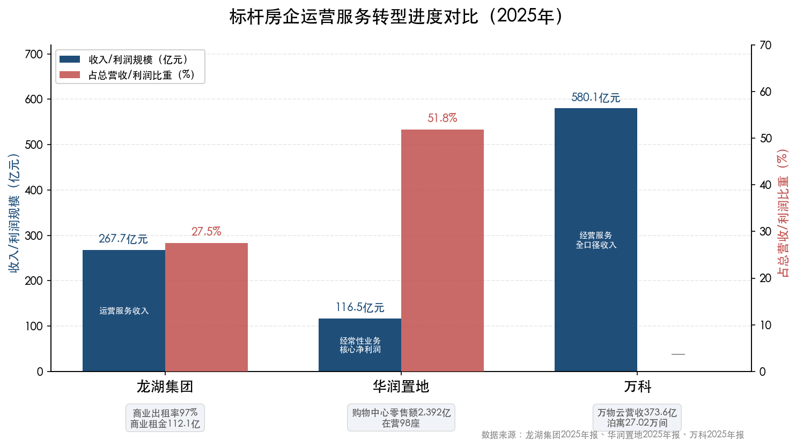

**图5-2 标杆房企运营服务转型进度对比（2025年）。** 龙湖运营服务收入占营收27.5%、华润置地经常性业务利润占比首破51.8%、万科经营服务全口径收入580.1亿元，三家企业分别代表了转型的不同路径与阶段。

综合龙湖、华润、万科三家企业的实践，可以提炼出存量时代企业转型的几条共性逻辑：

**其一，轻资产化与服务化是确定性方向。** 物业管理、商业运营、代建服务等业态的共同特征是低资本消耗、高现金流回报和较强的抗周期性，与过去"重资产、高杠杆"的开发模式形成鲜明对比。

**其二，转型成功的前提是"有优质存量资产可经营"。** 华润置地和龙湖之所以能率先实现经常性收入占比过半或接近三成，根本原因在于二者在过去的扩张周期中积累了大量位于核心城市、核心商圈的优质商业和住宅资产。这意味着转型并非所有企业都具备条件走通的路径——缺乏优质存量资产的中小房企可能需要寻找代建、物业管理等更加灵活的轻资产切入方式。

**其三，代建作为纯轻资产模式正在快速崛起。** 2025年，绿城管理新签代建面积3,535万平方米位列行业第一，合约销售985亿元居代建销售榜首；政府代建领域润地管理以1,349万平方米新拓面积居首。[新浪财经](https://finance.sina.com.cn/jjxw/2026-01-08/doc-inhfreqf5137124.shtml "2025年代建榜单") 全国已有超过100家房企涉足代建，销售百强中八成已布局代建业务。代建模式将开发能力从"资本密集型"转变为"管理输出型"，尤其适合政府保障房建设、城市更新和中小开发商委托代建等场景。

## 5.6 智慧社区与数字化转型：技术赋能的增长极

数字技术正在重新定义住宅产品与社区服务。截至2025年6月，全国新建住宅智能系统配置率已达42.3%（较2022年提升28个百分点），一线城市这一比例超过60%。2024年房地产信息化行业市场规模约2,387亿元。

智慧社区的内涵已从早期的"智能门禁+安防监控"拓展为涵盖智能家居系统、社区能源管理、智慧物业平台、健康监测与适老化改造等在内的综合解决方案。在"好房子"标准的推动下，智能化配置正从高端住宅的"加分项"转变为所有新建住宅的"基本配置"。

对于物业服务企业而言，数字化平台是提升运营效率与拓展增值服务的关键基础设施。通过物联网设备采集社区运行数据、运用算法优化设备巡检与能耗管理、搭建线上服务平台打通社区"最后一百米"——数字化能力正在成为物业企业的核心竞争壁垒。在人力成本持续上升的背景下，"科技替代人工"不仅是提升利润率的手段，更是物业行业实现规模化扩张的必要条件。

## 5.7 本章小结：多赛道共振的转型图景

存量时代并不意味着行业的衰落，而是增长逻辑的根本重塑。从城市更新每年2.5万亿元以上的投资体量，到绿色建筑累计超135亿平方米的建成规模，从物业管理1.75万亿元的年营收，到住房租赁市场2.6亿人的需求基数——上述赛道各自拥有可观的市场容量，且彼此之间具有显著的协同效应：城市更新催生物业升级需求，绿色建筑带动建筑科技产业链，"好房子"标准驱动智慧社区配置率提升，住房租赁市场的机构化为REITs提供优质底层资产。

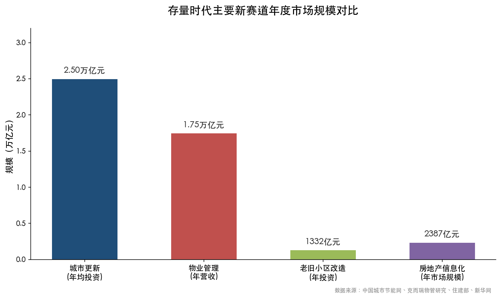

**图5-3 存量时代主要新赛道年度市场规模对比。** 城市更新与物业管理已率先进入万亿级赛道，老旧小区改造与房地产信息化亦具有千亿级年度市场规模。

龙湖运营服务毛利率超50%、华润置地经常性业务利润占比首破半数、万科经营服务收入突破580亿元——标杆企业的财务数据证明，存量时代的房地产企业完全有可能构建起不依赖土地增值和住房销售的新盈利模式。代建行业的爆发式增长则为更广泛的中小房企提供了轻资产转型的可行路径。

需要清醒认识的是，转型并非坦途。运营服务业务的利润积累需要时间沉淀，而开发主业的资产减值可能在短期内形成剧烈冲击。如何在"新旧动能切换"的窗口期审慎管理节奏、守住现金流底线，是每一家转型中的房企必须面对的核心挑战。

# 第6章 国际经验与比较镜鉴——成熟市场的长周期启示

房地产市场的运行规律具有跨国共性，但制度设计的差异使各经济体走出截然不同的发展路径。当中国房地产行业步入深度调整与转型重构的关键时期，系统审视全球主要发达经济体的住房制度演化与市场长周期波动，不仅能为当前的政策选择提供参照坐标，更有助于识别那些在不同社会条件下反复验证的普适性规律。本章选取日本、德国、新加坡和美国四个具有代表性的制度模型——分别对应泡沫教训型、租赁稳定型、公共主导型和市场主导型——进行深度比较分析，并在此基础上提炼对中国制度改革和产业转型最具参考价值的经验启示。四种模式涵盖了从资产泡沫的深刻教训到住房保障的成功实践，从租赁市场的制度化稳定到住房金融证券化的创新前沿，构成了一幅较为完整的全球住房制度图谱。

## 6.1 日本：泡沫破裂的长期代价与制度转型路径

### 6.1.1 泡沫的形成与破裂

日本房地产泡沫是二战后全球最剧烈的资产价格崩溃之一，其教训至今仍是各国房地产政策制定者的核心警示。泡沫的形成源于三大结构性驱动因素的叠加共振：其一，战后人口红利期与快速城镇化释放的巨量住房需求；其二，1985年广场协议后日元升值背景下的低利率环境与金融自由化政策；其三，以土地为核心抵押品的信贷扩张机制——银行以土地评估值为基准发放贷款，地价上涨推动信贷扩张，信贷扩张又进一步推高地价，形成自我强化的正反馈循环。在这三股力量的交互作用下，日本六大城市（东京、横滨、名古屋、京都、大阪、神户）住宅地价从1955年至1991年累计上涨超过200倍。[HAL Archives](https://shs.hal.science/halshs-00430984/document "Property markets in Tokyo and the management of the last Boom")

泡沫于1991年见顶后迅速逆转。六大城市住宅地价自1991年起连续13年下跌，至2004年前后触底，累计跌幅超过80%；商业用地跌幅更为惨烈。[ADBI Working Paper 558](https://www.adb.org/sites/default/files/publication/181404/adbi-wp558.pdf "Kobayashi 2016: The Housing Market and Housing Policies in Japan") 泡沫破裂后的1991年至1999年间，日本GDP年均增速仅约1%，远低于1980年代约4%的水平，经济陷入所谓"失去的十年"。[IMF Post-Bubble Blues](https://www.imf.org/external/pubs/nft/2000/bubble/ "IMF 2000") 资产价格暴跌导致银行体系巨额不良贷款、企业和居民资产负债表严重受损、信贷收缩与通货紧缩形成恶性循环——经济学界将这一过程概括为"资产负债表衰退"（Balance Sheet Recession），其影响之深远远超一般意义上的经济周期下行。

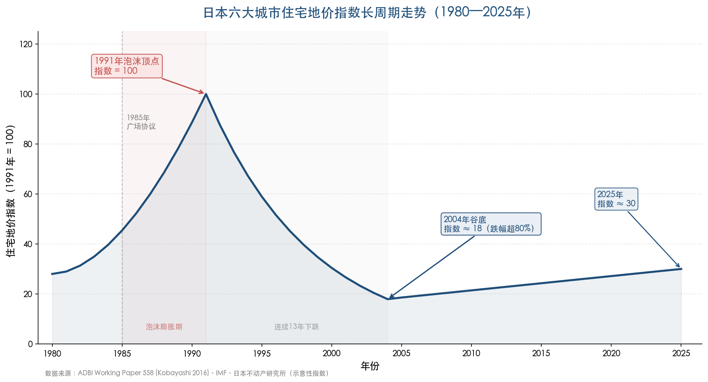

上图清晰呈现了日本六大城市住宅地价指数从泡沫膨胀到破裂再到缓慢恢复的完整长周期轨迹。以1991年泡沫顶点为基准（指数=100），2004年谷底指数仅约18，至2025年仍仅恢复至约30的水平——这意味着经过三十余年的调整，日本核心城市住宅地价仍不足泡沫峰值的三分之一，资产价格暴跌的长期代价可见一斑。

### 6.1.2 政策反应的延误与代价

日本泡沫后的政策应对为全球提供了关于"不作为成本"的深刻教训。日本央行在泡沫破裂初期未能果断实施货币宽松，而是在1991年至1995年间缓慢降息，直到2001年才正式启动量化宽松（QE），延误货币政策响应长达十年之久。与之形成鲜明对比的是，2008年金融危机后美联储在数月之内即启动大规模资产购买计划，以更快速度遏制了通缩预期蔓延，推动美国经济率先复苏。[IMF Post-Bubble Blues](https://www.imf.org/external/pubs/nft/2000/bubble/ "IMF 2000")

在财政政策层面，日本政府虽然在1990年代推出多轮财政刺激方案，但力度分散、持续性不足，且对银行体系不良资产的处置长期采取"拖延容忍"策略，未能及时推动金融机构出清不良贷款。这种渐进式的政策应对导致通缩预期不断自我强化、消费与投资信心持续低迷，最终形成了比泡沫本身更持久的经济伤害。日本的这一教训深刻表明：在资产价格大幅下跌引发系统性风险时，政策反应的速度与力度至关重要——犹豫不决的渐进式调整往往使经济付出远超必要的调整代价。

### 6.1.3 住房制度的深层转型

泡沫破裂倒逼日本住房金融制度发生根本性变革。作为泡沫时期住房信贷扩张的主要载体，政府住宅金融公库（GHLC）在长期直接放贷模式难以为继后，于2007年正式转型为住宅金融支援机构（JHF），从一级市场直贷机构转变为二级市场MBS运营平台，实现了住房金融从"政府直贷"到"市场化证券化"的制度跃迁。这一转型的核心逻辑在于：将住房信贷风险从政府资产负债表上剥离并分散至资本市场，同时通过标准化的证券化流程保持住房信贷的可得性。[ADBI Working Paper 558](https://www.adb.org/sites/default/files/publication/181404/adbi-wp558.pdf "Kobayashi 2016")

在不动产证券化领域，日本于2001年设立J-REIT市场，为存量不动产提供了制度化的退出通道。J-REIT迅速成长，至2019年市值达15万亿日元（约1,350亿美元），成为仅次于美国的全球第二大REIT市场。[J-REIT.jp](https://j-reit.jp/en/history/ "J-REIT History") J-REIT市场的发展不仅为机构投资者提供了流动性较好的不动产投资工具，也推动了日本商业地产从"持有增值"逻辑转向"运营收益"逻辑的专业化管理转型。

然而，住宅开发市场始终未能恢复泡沫前的规模。日本住宅开工量从长期每年100万套以上的水平降至2009年的79万套，此后虽有波动但整体维持在低位。[ADBI Working Paper 558](https://www.adb.org/sites/default/files/publication/181404/adbi-wp558.pdf "Kobayashi 2016") 这一变化既反映了人口结构的深层转变——日本人口于2008年见顶后持续下降，也表明住房市场从"增量扩张"向"存量管理"的转型在泡沫破裂后已成为不可逆的结构性趋势。

### 6.1.4 与中国的结构性相似与差异

中日两国在房地产市场的若干结构性特征上存在值得关注的相似性。中国劳动年龄人口自2012年开始下降，城镇住房套户比2023年已超过1.1，长期高速信贷扩张后面临去杠杆压力——这些特征与日本泡沫前后的演变轨迹存在一定程度的吻合。[IMF Post-Bubble Blues](https://www.imf.org/external/pubs/nft/2000/bubble/ "IMF 2000")

然而，两国之间也存在若干重要的结构性差异，这些差异可能使中国的调整路径区别于日本。首先，中国城镇化率（2025年67.89%）仍显著低于日本泡沫时期（约77%），这意味着城镇化进程尚有约7-12个百分点的提升空间，对应1亿至1.7亿增量城镇人口的潜在住房需求。其次，中国政府自2024年起已采取包括降息降准、放松限购限贷、设立保障性住房再贷款、推行"白名单"融资协调机制等一系列主动干预措施，政策响应速度和工具丰富度均远快于当年的日本。再次，中国住宅抵押贷款的首付比例长期维持在较高水平（当前首套最低15%），居民端杠杆率相对可控，与日本泡沫时期银行以高估土地价值为基准大量发放高杠杆贷款的情形有本质区别。

我们认为，中国能否避免日本式长期通缩陷阱，很大程度上取决于两个关键变量：一是政策端能否保持足够的持续性和力度，避免重蹈日本渐进式"挤牙膏"应对的覆辙；二是能否有效利用城镇化剩余空间和住房品质升级需求，为市场提供可持续的增量支撑。

## 6.2 德国：租赁稳定型制度的长效机制

### 6.2.1 低自有率背后的制度逻辑

德国在全球主要经济体中呈现出独特的住房市场特征：住房自有率约47.2%（2025年），在OECD国家中排名倒数第二，远低于OECD平均水平的71%。[Trading Economics](https://tradingeconomics.com/germany/home-ownership-rate "Germany Home Ownership Rate") 这一看似"反常"的数据背后，是三重制度设计的共同作用。

其一，较高的住房交易税费构成显著的交易摩擦。包括房产交易税（各州税率约3.5%-6.5%）、公证费、中介费等在内，综合交易成本可达购房价格的10%以上，大幅抬高了住房的持有转换成本，抑制了投机性购房和频繁交易行为。其二，自住住房贷款利息无法在个人所得税中抵扣，削弱了购房相对于租房的税收激励——这与美国允许房贷利息抵扣的制度安排形成鲜明反差。其三，覆盖面广泛的社会住房体系和完善的租赁市场法律保护，使租房成为具有经济合理性和社会认可度的长期居住选择，租赁并不被视为"过渡性"或"权宜之计"。

德意志联邦银行的研究提供了一个有力的反事实验证：模拟结果显示，若同时改革上述三项政策（降低交易税费、引入房贷利息抵扣、弱化租赁保护），德国住房自有率可从约45%升至58%，提升幅度达13个百分点。[德意志联邦银行](https://www.bundesbank.de/en/publications/research/research-brief/2020-30-homeownership-822176 "Bundesbank 2020") 这一模拟结果从反面深刻证明了制度设计对居住模式的决定性影响——住房自有率的高低在很大程度上并非居民偏好的自然结果，而是制度框架塑造的产物。

### 6.2.2 租金稳定的核心制度安排

德国租赁市场稳定性的基石是一套经过数十年演化的成熟法律框架。2015年实施的《租金刹车法》（Mietpreisbremse）规定，在住房市场紧张地区，新签租约的租金涨幅不得超过当地参考租金（Mietspiegel）的10%，该法律已延长适用至2029年。[DominArt Invest](https://dominartinvest.com/en/page/germany-rent-cap-2026-investor-guide "Germany Rent Cap 2026 Guide") 这一规定有效遏制了房东利用市场紧张状况过度提价的行为，使租金水平的变动锚定在客观的市场基准之上。

在合同保护方面，德国租户享有强力的法律保障：房东解约必须提供法定正当理由（如自住需求或重大改造），且须遵守与租期挂钩的提前通知期——租期5年以下为3个月，5-8年为6个月，8年以上长达9个月；租户则可以在任何时候以3个月通知期解约。这种不对称保护机制有效保障了租户的居住稳定性，使得德国租赁市场形成了高度稳定的长期租赁关系，平均租期远超英美等租赁市场高流动性国家。

参考租金制度（Mietspiegel）是德国住房制度的另一项独特创新。各城市定期发布基于实际市场交易数据的参考租金表，涵盖不同区位、户型、建筑年代的住房，作为租金调整的客观基准。这一制度的有效运行依赖于地方政府的数据采集能力和法律强制力，通过消除信息不对称减少了租金定价中的投机成分，是德国法治传统在住房领域的具体体现。参考租金表既是房东调租的法律上限依据，也是租户主张权利的事实基础，从根本上将租赁关系纳入了可预期、可监督的制度化轨道。

### 6.2.3 住房储蓄银行制度（Bausparkasse）

德国住房金融体系的另一独特支柱是住房储蓄银行制度（Bausparkasse），该制度自1920年代发展至今已逾百年，构成了德国住房金融稳定性的重要基础。目前德国共有18家住房储蓄银行，其中10家为私营机构覆盖全国市场，8家为公法机构在区域市场运营。据德国住房储蓄银行协会数据，约2,200万德国人持有住房储蓄合同，现行合同总数约2,300万份，合同总额超过9,300亿欧元——相当于德国每两个家庭中就有一个持有至少一份住房储蓄合同，渗透率之高令人瞩目。[德国住房储蓄银行协会](https://www.bausparkassen.de/wp-content/uploads/2025/03/Bausparen_in_Deutschland_English.pdf "The Bauspar System in Germany")

住房储蓄合同的核心机制是"先储蓄、后贷款"的封闭资金池模式。储户在储蓄阶段按约定向资金池缴存，通常需积累合同金额的40%-50%方可达到分配条件；达到条件后即可获得固定低息贷款，利率通常仅比储蓄利率高1-2个百分点，且在签约时即已锁定，完全不受资本市场利率波动影响。这一制度设计的本质优势在于双重风险控制：一方面，通过"储蓄期验证还款能力"替代传统信贷审查，以长期稳定缴存记录作为信用评估的核心依据；另一方面，封闭资金池模式使住房储蓄银行的资产端与负债端在期限和利率上高度匹配，从根本上规避了传统银行面临的期限错配风险。这两重机制共同作用的结果是，德国住房储蓄贷款的违约率长期维持在0.1%以下，远低于市场化住房贷款水平。[德国住房储蓄银行协会](https://www.bausparkassen.de/wp-content/uploads/2025/03/Bausparen_in_Deutschland_English.pdf "The Bauspar System in Germany")

自1948年以来，德国住房储蓄银行累计分配超过1万亿欧元的住房储蓄资金，帮助超过1,300万户家庭建设或购买住房（含900万户新建住房）。近年来，住房储蓄合同在住房节能改造融资中的作用日益突出，其小额、分散、长期稳定的资金特征与建筑节能改造项目的融资需求天然契合，进一步拓展了这一百年制度的当代价值。

### 6.2.4 德国模式的适用性与局限

德国租赁稳定模式的成功建立在深厚的法治传统、完善的社会保障体系和较低的人口增长率等特定社会条件之上。将其经验直接移植至中国面临若干结构性挑战：中国的租赁市场法律保护体系仍处于建设初期，《住房租赁条例》尚未出台；类似参考租金制度的信息基础设施缺乏系统性的数据采集和发布机制；长期租赁的社会文化认同在"有恒产者有恒心"的传统观念影响下也有待培育。

然而，德国经验中若干核心理念超越特定国情约束，具有普遍借鉴价值。其一，租赁市场的制度化稳定有助于降低住房的投机属性，使住房回归居住功能——这与中国"房住不炒"的政策取向高度契合。其二，住房储蓄制度通过"先存后贷"机制强化购房者的财务纪律，与中国当前推进的住房公积金制度改革方向具有内在一致性；中国公积金累计缴存32.79万亿元但余额高达10.93万亿元，使用效率偏低，可借鉴Bausparkasse经验优化资金运用机制。其三，交易税费的合理设计可以有效调节投资性需求与自住需求之间的平衡，为抑制投机提供市场化的制度工具。

## 6.3 新加坡：公共主导型住房体系的全球范本

### 6.3.1 HDB组屋体系的覆盖深度

新加坡是全球公共住房覆盖率最高的经济体，约80%的常住人口居住在由建屋发展局（Housing and Development Board, HDB）建造的公共组屋中。[新加坡政府](https://www.gov.sg/explainers/a-home-for-everyone-singapores-public-housing/ "A home for everyone") 这一比例在全球主要经济体中独一无二，不仅远超北欧福利国家的公共住房占比，也使新加坡成为少数实现"居者有其屋"政策目标的国家之一——其住房自有率高达约90%。

组屋体系的高效运作依赖于三项关键制度支柱的协同配合。第一支柱是土地制度：1966年《土地征用法》赋予政府以低于市场价强制征收土地的权力，为公共住房建设提供了充足且低成本的土地供应——目前新加坡约90%的土地归国家所有，这一比例为全球最高之列，从根本上消除了土地成本对公共住房建设的制约。第二支柱是资金制度：中央公积金（Central Provident Fund, CPF）构成住房保障的核心资金来源，55岁以下雇员的CPF总缴费率高达37%（雇主缴17%、雇员缴20%），属于全球最高的强制储蓄率之一，普通账户资金可用于支付首付和月供。[CPF缴费率表](https://www.cpf.gov.sg/content/dam/web/employer/employer-obligations/documents/CPF_contribution_rates_from_1_Jan_2024.pdf "CPF Contribution Rate Table 2024") 第三支柱是补贴制度：首次购房家庭最高可获23万新元（约17万美元）的政府补贴，约80%的首次购房家庭无需支付任何现金月供，购房负担主要由CPF账户资金承担。[新加坡政府](https://www.gov.sg/explainers/a-home-for-everyone-singapores-public-housing/ "A home for everyone") 土地、资金、补贴三大支柱形成完整闭环，使新加坡政府能够以远低于市场价向中低收入群体供应高质量公共住房。

### 6.3.2 组屋市场的运行机制与近期表现

HDB组屋的定价采用"市场折价+财政补贴"模式：新组屋（BTO, Build-To-Order）的售价通常低于可比区域市场价30%-50%，政府通过巨额财政补贴填补建设成本与销售价格之间的差额。这一模式确保了公共住房对中低收入群体的可负担性。组屋的转售市场在最低居住年限（MOP, Minimum Occupation Period，通常为5年）后开放，但政府通过限购资格审核、转售利得税等机制形成有效的反投机屏障，防止保障性资源被用于投机套利。

近年来新加坡组屋转售市场呈现降温态势。2025年全年HDB转售价格指数仅上涨2.9%，为2019年以来最慢增速，大幅低于2024年的9.7%。[CNA](https://www.channelnewsasia.com/singapore/hdb-resale-price-q4-growth-slows-2025-flash-estimate-5772851 "HDB resale price growth slows to 2.9% in 2025") 全年转售交易量约7,157套，同比下降10.9%，反映出政府调控措施对市场过热的有效抑制。值得关注的是，百万新元组屋交易仍保持活跃，2025年百万新元以上组屋平均成交价达114万新元，同比上升2.1%，反映出组屋市场内部亦出现结构性分化——地段优越的大户型组屋已具有准商品房属性，与普通组屋的价格差距持续拉大。这种分化现象提示，即便在公共住房主导的体系中，区位和品质差异仍然是价格分层的核心驱动力。

### 6.3.3 新加坡模式的可复制性分析

新加坡住房模式的成功高度依赖于其特殊的国家禀赋：城市国家的单一行政层级使住房政策从中央决策到基层执行的链条极短、效率极高；土地国有化程度近乎100%，消除了土地供应的市场化波动；CPF制度37%的强制储蓄率为全球最高水平之一，确保住房保障拥有充沛且可持续的资金来源。这些条件在大多数国家——特别是幅员辽阔、行政层级多元的大型经济体中——难以复制。

然而，新加坡模式的若干核心理念对中国当前的保障房体系建设具有直接启示。

第一，"保障"与"市场"双轨体系的清晰划分。新加坡通过HDB组屋覆盖约80%人口的住房需求，同时保留私人住宅市场满足高端和投资需求，二者各司其职、互不挤压。这一理念与中国正在构建的"保障+市场"供应格局高度一致——中国国务院14号文明确提出建设配售型保障性住房，以"基本覆盖划拨土地成本+建安成本+适度合理利润"定价并实施封闭管理，在制度设计上已与新加坡HDB模式趋同。

第二，CPF的高缴费率使住房保障拥有可持续且不依赖财政拨款的自循环资金来源，这对中国住房公积金制度改革具有重要参考意义。中国公积金缴存比例为5%-12%，远低于CPF水平；公积金累计缴存32.79万亿元但余额高达10.93万亿元，使用效率偏低，可借鉴新加坡经验拓展使用场景（覆盖租赁、老旧小区改造等）和扩大覆盖范围（将灵活就业人员纳入），但缴费率的大幅提升在当前经济环境下面临可行性约束。

第三，配售型保障房的封闭管理和退出机制可参考HDB组屋的MOP和转售利得回收制度。新加坡通过5年最低居住年限和转售利得部分回收机制，有效防止了保障资源向投机领域流失，确保公共住房资源在目标群体中的持续循环利用。

## 6.4 美国：市场主导型住房金融的创新与风险

### 6.4.1 "两房"与住房金融的证券化基石

美国住房金融体系的核心架构是以联邦国民抵押贷款协会（Fannie Mae）和联邦住宅贷款抵押公司（Freddie Mac）——合称"两房"（GSEs）——为枢纽的住房抵押贷款证券化体系。"两房"通过购买商业银行发放的符合标准的住房贷款，打包为机构住房抵押贷款支持证券（MBS）后在二级市场出售，实现了住房信贷从银行资产负债表到资本市场的大规模转移，构建起全球规模最大的住房金融二级市场。

截至2025年11月，美国单户住宅机构MBS存量规模达9.20万亿美元（其中Fannie Mae 3.51万亿、Freddie Mac 3.05万亿、Ginnie Mae 2.64万亿），住宅抵押贷款债务总规模约14.5万亿美元，机构MBS占比约65%。[Ginnie Mae全球市场分析报告](https://www.ginniemae.gov/data_and_reports/reporting/Documents/global_market_analysis_dec25.pdf "GMAR December 2025") Freddie Mac 2025年末抵押贷款组合规模达3.2万亿美元。[Freddie Mac 2025 Q4报告](https://www.freddiemac.com/investors/financials/pdf/2025er-4q25_release.pdf "Freddie Mac 2025 Earnings") 美联储在量化宽松期间大量购入机构MBS，截至2025年11月底仍持有约2.1万亿美元，占市场近23%，目前正按每月350亿美元上限推进缩表。[Ginnie Mae全球市场分析报告](https://www.ginniemae.gov/data_and_reports/reporting/Documents/global_market_analysis_dec25.pdf "GMAR December 2025, SOMA Holdings")

这一体系的制度优势在于：通过标准化的证券化流程将住房信贷风险从银行体系分散至多元化的资本市场投资者，为住房购买提供了规模庞大且成本相对低廉的长期资金。截至2025年11月，30年期常规固定利率抵押贷款利率为6.23%，FHA贷款利率5.99%，VA贷款利率5.76%。首次购房者在Ginnie Mae证券化贷款中的占比高达72.4%，充分体现了政府信用担保对首购群体的定向支持作用。

### 6.4.2 2008年次贷危机的深刻教训

2008年全球金融危机是美国住房金融体系制度缺陷的集中暴露，为全球房地产市场监管提供了四重深刻教训。[美联储](https://www.federalreserve.gov/econres/notes/feds-notes/the-evolution-of-the-federal-reserves-agency-mbs-holdings-20240920.html "Fed FEDS Notes 2024")

**第一，金融创新超越监管能力导致系统性风险积累。** 次级贷款的快速膨胀依赖于可调利率抵押贷款（ARM）等"诱导型"产品设计，以极低的初始利率吸引信用记录不佳、不具备长期还款能力的借款人进入市场。当利率重置期到来、月供骤增后，大量借款人陷入违约，触发连锁崩溃。

**第二，"发起-分销"模式引发严重的道德风险。** 贷款发起机构将贷款风险通过证券化流程完全转移给下游投资者，自身不承担信用损失，导致审贷标准系统性放松。风险传导链条的每一个环节——从经纪人到贷款机构到证券化中介——都倾向于做大规模而非管控质量。

**第三，信用评级机构的利益冲突使其风险把关功能形式化。** 评级机构在发行方付费模式下对次贷支持证券给予过高评级，未能如实反映底层资产的真实风险暴露，大量获得AAA评级的次贷支持证券在危机中遭遇大幅减值。

**第四，政府支持机构在市场竞争压力下被动卷入次贷领域。** Fannie Mae和Freddie Mac为维护市场份额逐步放宽购买标准，偏离了其政策性住房金融机构的本位定位，最终在2008年9月被联邦政府接管，至今仍处于政府托管状态。

危机的后果极其严重：美国房价从峰值平均下跌近30%，股市下跌约50%，住房抵押贷款拖欠率从2%飙升至超过10%，直至2022年才回归2%的正常水平。[IMF Post-Bubble Blues](https://www.imf.org/external/pubs/nft/2000/bubble/ "IMF 2000") 次贷危机的根本教训在于：住房金融证券化本身是中性的制度工具，其风险性取决于底层资产质量和监管框架的有效性——当审贷标准失守、信息透明度缺失时，风险分散机制反而会异化为风险放大器。

### 6.4.3 美国REITs市场的成熟经验

美国拥有全球最大、最成熟的不动产投资信托基金（REITs）市场。截至2025年12月，纳入指数的195只REITs权益市值合计1.439万亿美元，持有超过4.5万亿美元的商业地产资产。过去50年间，全权益REITs的年均复合回报率达12.08%，与标普500指数基本持平，充分证明了REITs作为一种资产类别的长期投资价值和风险收益特征。[Nareit](https://www.reit.com/sites/default/files/2026-01/MediaFactSheet_Dec-2025.pdf "Nareit Media Fact Sheet Dec 2025")

美国REITs市场的成熟度体现在多个层面。在资产覆盖方面，涵盖住宅、办公、零售、工业物流、数据中心、医疗保健、自助仓储、基站铁塔等十余个细分领域，形成了与实体经济高度融合的多元化资产配置平台。在市场流动性方面，上市REITs在主要证券交易所交易，日均交易量数十亿美元，为不动产这一传统非流动性资产类别提供了充沛的二级市场流动性。在制度设计方面，税收中性原则（将至少90%的应税收入分配给持有人即可豁免公司层面所得税）保障了REITs的高分红吸引力，完善的监管框架和严格的信息披露要求则确保了市场透明度。

### 6.4.4 中美REITs市场差距与追赶路径

中美REITs市场的规模差距极为显著。截至2025年底，中国公募REITs总市值约2,185亿元人民币（约300亿美元），仅为美国1.439万亿美元市值的约2%。[21世纪经济报道](https://www.21jingji.com/article/20260123/herald/b986e4f52e1a27016b7e227eaf283b7d.html "2025年四季报数据") 全球已有44个国家和地区建立REITs市场，总规模超2万亿美元，中国REITs市场的发展空间巨大。招商基金预计，未来五年中国公募REITs总市值有望从2,000多亿元向5,000亿元迈进。[财信证券](https://finance.sina.com.cn/roll/2025-06-17/doc-infaisms8963199.shtml "美国REITs梳理专题")

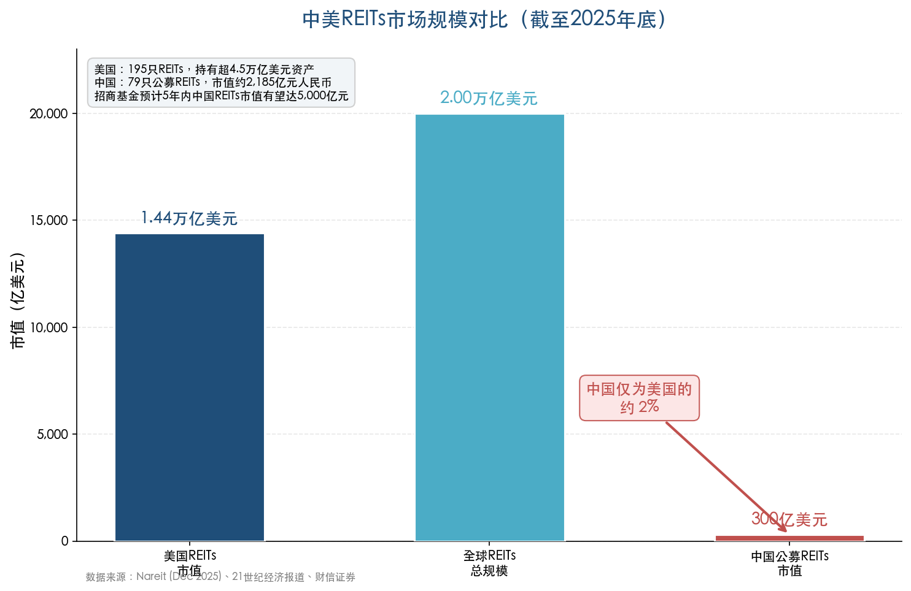

上图直观呈现了中美REITs市场的悬殊差距：中国公募REITs市值约300亿美元，仅为美国1.44万亿美元的约2%，也仅为全球REITs总规模2万亿美元的1.5%。这一差距既反映了中国REITs市场起步较晚的客观现实，也揭示了巨大的增长潜力。

2025年12月31日，中国证监会正式启动商业不动产REITs试点，将商业综合体、零售、办公、酒店等纳入底层资产范围，被视为打开万亿级潜在资产池的标志性事件。[中国证监会](https://www.csrc.gov.cn/csrc/c100028/c7605669/content.shtml "商业不动产REITs试点公告") 美国REITs六十余年的发展历程表明，制度完善——特别是税收中性原则的确立和信息披露规范的健全——是市场扩容的先决条件。中国当前面临的核心制度瓶颈在于：公募REITs税收中性尚未完全实现，底层资产类型仍有待进一步拓展，二级市场流动性和投资者结构仍需深化。REITs市场的成熟度与住房金融体系的整体效率高度正相关，加速补齐这一制度短板，是中国房地产行业从增量开发向存量运营转型的关键金融基础设施。

## 6.5 四种模式的横向比较与普适性规律

### 6.5.1 制度比较的核心维度

综合比较日本、德国、新加坡、美国四种住房制度模式，可以从供给主体、金融体系、市场调控、风险防范四个核心维度提炼关键差异。

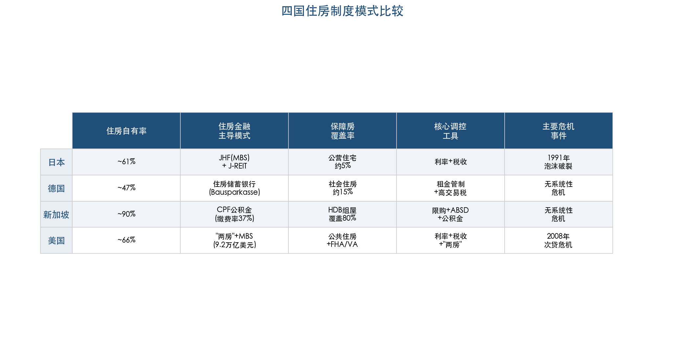

上表从住房自有率、住房金融主导模式、保障房覆盖率、核心调控工具和主要危机事件五个维度，系统呈现了四种制度模式的关键特征差异。

在供给主体方面，四国形成了从政府主导到市场主导的完整谱系。新加坡以政府（HDB）为绝对主导，公共组屋覆盖80%人口，政府在住房供给中承担核心角色；德国以市场化租赁机构为供给主体，但在严格的法律框架下运行；美国和日本均以市场化开发和金融机构为主导，政府更多通过金融工具和税收政策间接调节。

在金融体系方面，四国各自形成了与其制度禀赋匹配的住房金融模式。美国依靠"两房"+MBS证券化体系构建了全球最大规模的住房金融二级市场（机构MBS存量9.20万亿美元）；德国依靠住房储蓄银行的封闭资金池模式实现了超低违约率下的稳健运行；新加坡依靠CPF 37%的强制储蓄率为公共住房提供可持续资金；日本则经历了从GHLC政府直贷到JHF+J-REIT市场化转型的全过程。

在市场调控方面，各国工具选择差异显著。德国依靠租金管制和高交易税费主动抑制投机；新加坡通过限购资格审核和额外买方印花税（ABSD）精准调控需求；美国和日本以利率和税收为主要调控工具，依赖市场自我调节。

在风险防范方面，德国住房储蓄制度0.1%以下的违约率和新加坡极低的住房贷款坏账率构成了金融稳定的正面范本，而日本1991年泡沫和美国2008年次贷危机则是房地产过度金融化的两大负面案例——前者源于土地本位的信贷膨胀，后者源于审贷标准失守下的证券化风险扩散。

### 6.5.2 跨国经验中的普适性规律

尽管各国国情差异巨大，四种模式的比较研究揭示了若干具有普适性的规律，这些规律经过不同制度环境的反复检验，对住房制度设计具有基础性的指导意义。

**第一，避免房地产过度金融化和投机化是各国在实践中形成的共识。** 无论是德国通过高交易税费和租金管制主动抑制投机，新加坡通过ABSD和组屋封闭管理限制投机，还是美国和日本在泡沫破裂后被动强化监管，各经济体最终都在制度层面形成了对房地产投机行为的约束机制。[德意志联邦银行](https://www.bundesbank.de/en/publications/research/research-brief/2020-30-homeownership-822176 "Bundesbank 2020") 差别仅在于主动防范（德国、新加坡）还是被动补救（日本、美国），而后者的代价往往是惨痛的经济衰退和社会成本。

**第二，住房保障体系的覆盖面决定社会稳定底线。** 新加坡的公共组屋（覆盖80%人口）、德国的社会住房和租赁保护、美国的FHA/VA贷款担保和住房选择券（Housing Choice Voucher）、日本的公营住宅，虽然形式各异，但都在维护中低收入群体住房权利方面发挥了不可替代的"社会安全阀"功能。住房保障的核心不在于统一模式，而在于确保每一个社会成员都有获得基本体面居住条件的制度通道。

**第三，住房金融体系的稳健性是长周期繁荣的前提。** 德国住房储蓄制度的"先存后贷"模式和高首付要求、美国次贷危机后Dodd-Frank法案对审贷标准的全面强化、新加坡对贷款总偿付比率（TDSR）60%的刚性约束，都指向同一方向——审慎的信贷标准和充足的风险缓冲是防范系统性危机的根本保障。四国经验共同表明，住房金融的核心原则是确保借款人具备真实的长期偿付能力，任何偏离这一原则的"金融创新"最终都将反噬市场本身。

**第四，存量时代的金融基础设施决定市场效率与转型质量。** J-REIT和美国REITs的发展历程表明，完善的不动产证券化体系是行业从增量开发向存量运营转型的金融前提。缺乏制度化的退出通道，存量资产运营模式难以获得持续的资本支持，开发商向运营服务商的转型也将缺乏必要的金融杠杆。中国公募REITs市场的快速发展和商业不动产REITs试点的启动，正是对这一规律的积极回应。

## 6.6 对中国的综合启示——制度借鉴的路径与边界

从四国经验中提炼对中国当前改革最具操作价值的启示，需要在"他山之石"与"本土国情"之间找到务实的平衡点。任何一种住房制度模式都是在特定历史条件和社会禀赋下演化形成的，直接移植必然面临"水土不服"，但其背后的制度设计逻辑和经验教训具有超越国界的参考价值。

**在住房保障体系建设方面**，新加坡"保障+市场"双轨体系的清晰分工最具参考价值。中国正在推进的配售型保障性住房制度——以"基本覆盖划拨土地成本+建安成本+适度合理利润"定价，实施封闭管理——在理念上已与新加坡HDB模式趋同，关键在于规模化推进和长效资金机制的建立。当前保障性住房占存量仅约8%，与新加坡80%和德国约15%的社会住房覆盖率相比差距明显。公积金制度改革应借鉴CPF经验，在拓展覆盖面（将灵活就业人员纳入，试点已从13个城市扩至36个）和使用场景（支持租赁和老旧小区改造）方面持续深化，但缴费率的大幅提升在当前企业经营压力较大的环境下需审慎推进。

**在租赁市场制度化方面**，德国的租金稳定法律框架和参考租金制度为中国培育长期租赁市场提供了明确的制度方向。中国约2.6亿城镇租赁人口的规模已相当可观，但租赁市场在法律保护、信息透明度和机构化运营方面仍处于发展初期。建设参考租金信息系统、强化租赁合同保护、推动住房租赁企业专业化运营能力提升，是"租购并举"战略落地的制度基础。德国经验表明，租赁市场的制度化稳定并不会抑制住房市场的整体健康——恰恰相反，它通过降低投机属性增强了市场的长期韧性。

**在住房金融体系改革方面**，美国的REITs市场深度和MBS体系规模为中国提供了远景参照。当前中国公募REITs规模约300亿美元，仅为美国1.44万亿美元的约2%，商业不动产REITs试点（2025年12月启动）为释放万亿级存量资产价值创造了制度入口。参照美国经验，税收中性原则的确立和信息披露规范的完善是REITs市场扩容的关键制度瓶颈。同时，美国住宅MBS市场14.5万亿美元的存量规模表明，住房金融证券化的深化可以为存量房贷流转和银行资产负债表优化提供巨大空间。德国住房储蓄银行制度则为中国住房公积金的"先存后贷"机制优化和封闭资金池管理提供了另一维度的制度灵感。

**在风险防范方面**，日本泡沫和美国次贷危机提供了最直接、最深刻的负面教训。日本的教训聚焦于"政策反应延误的代价"——在资产价格大幅下跌时，果断而充分的政策干预远比渐进式应对更有效，犹豫不决可能使经济陷入长达十余年的通缩恶性循环。美国的教训聚焦于"金融创新超越监管的风险"——住房金融证券化必须以严格的审贷标准和透明的信息披露为前提，否则风险分散机制本身会异化为风险放大器。中国当前推行的"主办银行制"（实现项目全流程资金封闭流转）和"白名单"融资协调机制（截至2025年10月审批金额超7万亿元），在本质上都是吸收了这两类教训后的制度创新。

综合而言，国际经验最核心的启示不在于复制任何一种特定模式，而在于把握住房制度设计的三项基本原则：住房兼具消费品和资产属性，制度设计的根本目标是在满足居民居住需求的同时防止资产属性过度膨胀；保障体系的覆盖面和可持续性决定社会公平的底线；金融体系的审慎性决定长周期稳定的上限。中国正在构建的"房地产发展新模式"——无论是"保障+市场"双轨制、"人房地钱"要素联动、现房销售制度推进还是REITs体系建设——在理念层面均已与国际成熟经验形成有效对接，未来的关键挑战在于执行层面的持续推进和制度细节的精细化落地。

# 第7章 未来十年展望——中国房地产可持续发展路线图（2026-2036）

经过2020-2025年的深度调整，中国房地产行业正处于历史性的转折关口。前六章的分析揭示了一幅完整的行业图景：市场规模缩减过半，需求结构深刻裂变，政策框架全面重构，资金体系加速转型，产业模式迭代升级，国际经验提供镜鉴。综合上述分析，本章聚焦未来十年（2026-2036），从总量与结构演变、关键时间节点、政策路线图、风险防控以及行业新均衡五个维度，系统描绘中国房地产可持续发展的路线图。

## 7.1 总量趋势：从"缩量筑底"到"结构性均衡"

下图综合国家统计局历史数据及多家权威机构预测，直观呈现2020-2036年新建商品住宅与二手房交易面积的演变轨迹——"一手房下台阶、二手房上台阶"的结构切换构成未来十年市场最核心的特征。

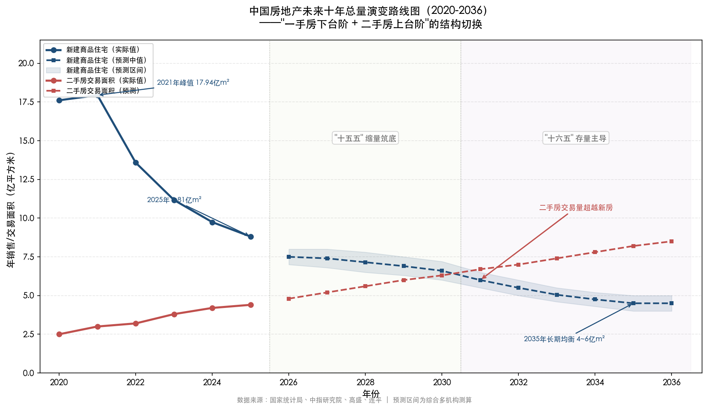

### 7.1.1 "十五五"时期（2026-2030）：筑底与稳态形成

多家权威研究机构的测算表明，中国住房市场总量需求已越过峰值，正在寻找新的均衡水平。中指研究院测算"十五五"时期城镇住房需求总量约49.8亿平方米，按70%-80%的转化比例，新建商品住宅年均销售面积预计为7-8亿平方米[中指研究院（新京报转引）](https://m.bjnews.com.cn/detail/1765588433169840.html "未来五年年均销售7-8亿平方米")。连平的独立测算更为审慎，预测年均实际销售面积6-7亿平方米，年均销售额从"十四五"的12.4万亿元降至约7.7万亿元[连平"十五五"展望](https://finance.sina.cn/zl/2025-11-05/zl-infwincz4543288.d.html "连平：十五五中国房地产市场将怎么走")。克而瑞则从一二手房总量口径出发，预测2026-2030年全国商品住宅一二手交易总量维持在8-9亿平方米的规模区间，其中二手房成交面积已连续三年稳定在4.4亿平方米以上，成为市场交易的"压舱石"[新华财经](https://m.cnfin.com/hg-lb//zixun/20260113/4364688_1.html "克而瑞预测2026-2030年市场总量")。

支撑上述判断的基本面因素涵盖三个层面：其一，城镇户均套户数约1.10套，已接近日本（1.15-1.20套）等成熟市场的均衡水平；其二，人均住宅建筑面积超过40平方米，增量空间显著收窄；其三，"十五五"时期适龄购房人群（25-44岁）预计减少约2,100万人，占总人口比重从39.2%降至38%[连平"十五五"展望](https://finance.sina.cn/zl/2025-11-05/zl-infwincz4543288.d.html "连平2025年11月")。

去库存进程构成这一时期的核心议题。连平预测到"十五五"末期，商品房待售面积有望降至约4.5亿平方米，较当前水平减少约四成，供求关系有望回归正常区间。去库存的政策工具组合主要包括两方面：一是"十五五"专项债投放规模约1万-1.5万亿元，预计拉动去库1-1.5亿平方米（约占库存16%）；二是城中村改造每年实施计划增至150万-200万套，总计拉动住房需求3.75-5亿平方米[连平"十五五"展望](https://finance.sina.cn/zl/2025-11-05/zl-infwincz4543288.d.html "连平2025年11月")。

### 7.1.2 "十六五"时期（2031-2035）：长期均衡与存量主导

进入"十六五"阶段，行业将从"筑底"转向"存量运营主导"的长期均衡状态。高盛2025年5月发布的深度报告预测，2035年中国住房需求为每年10亿平方米（基本情景）或12亿平方米（乐观情景），较2017年峰值水平分别下降40%和30%。其中必要需求约4亿平方米、升级需求约3亿平方米、替换需求约3亿平方米[高盛研究报告（新浪财经转引）](https://finance.sina.com.cn/stock/hkstock/ggscyd/2025-05-09/doc-inevxzxw4334542.shtml "高盛：未来十年中国房地产迈向何处去")。高盛进一步预计，2035年全国新建住宅销售面积将稳定在4.1亿-5.2亿平方米，一级市场仅满足约40%的新增住房需求（2024年这一比例为55%），其余需求将由二手房市场和公共供应满足。

中国社科院财经战略研究院住房大数据项目组的研究同样指向这一趋势。邹琳华等测算显示，中性情景下2030年中国新增城镇化住房需求约为4.17亿平方米，新增改善性住房需求约为5.83亿平方米；二手房交易面积与新房交易面积的比例将由2021年的23%上升至2035年的56%[人民论坛网](https://www.rmlt.com.cn/2024/0117/693294.shtml "邹琳华：中长期城镇化趋势与房地产市场新形势")。

综合上述机构预测，我们判断2031-2035年新建商品住宅年均销售面积将进一步回落至5-6亿平方米区间，行业增加值占GDP比重从2025年的6.2%缓步下降至5%左右。尽管规模收缩，房地产作为国民经济支柱产业的地位不会根本改变——Rogoff指出，中国房地产（含间接需求）2021年占经济总量约25%（含基建达31%），远超美国18%的水平，转型过程的经济代价不容低估[Rogoff-IMF F&D](https://www.imf.org/en/publications/fandd/issues/2024/12/chinas-real-estate-challenge-kenneth-rogoff "China's Real Estate Challenge")。

## 7.2 结构变迁：三大核心转型方向

### 7.2.1 从"一手房主导"到"二手房超越"

市场交易结构的质变是未来十年最显著的特征之一。高盛预测，2035年二手房销售量将达到8-9亿平方米（基本/乐观情景），周转率从2025年的约2.4%上升至3.0%-3.3%（相对于城市商品住房总量），二手房市场将占总住房交易量的66%、交易额的64%，与发达国家60%-90%的水平趋近[高盛研究报告（新浪财经转引）](https://finance.sina.com.cn/stock/hkstock/ggscyd/2025-05-09/doc-inevxzxw4334542.shtml "高盛2035年二手房交易预测")。参考美国成屋与新屋销售比接近6:1的经验，改善性需求驱动下的二手房交易将在中国市场占据愈加主导的地位[连平"十五五"展望](https://finance.sina.cn/zl/2025-11-05/zl-infwincz4543288.d.html "连平2025年11月")。

### 7.2.2 改善性需求成为增量核心驱动力

"十五五"时期改善性购房群体（35-64岁）年均约6.6亿人，较"十四五"多增近3,000万人[连平"十五五"展望](https://finance.sina.cn/zl/2025-11-05/zl-infwincz4543288.d.html "连平2025年11月")。"好房子"理念的政策引导正在重塑产品标准：2025年3月发布的《住宅项目规范》要求新建住宅层高不低于3米、4层及以上住宅必须设置电梯，隔声标准降低10分贝等14项指标全面提升；住建部2025年末发布的《关于提升住房品质的意见》明确要求到2030年保障性住房率先建成"好房子"。住房消费正从"有房住"向"住好房"发生质变，品质升级将成为驱动改善性需求持续释放的核心动力。

### 7.2.3 区域分化加剧：城市群与收缩型城市的两极格局

区域分化将成为贯穿未来十年的结构性主线。连平预测"十五五"重点城市群销售份额有望升至80%（较当前提升约5个百分点），一线城市土地成交占比从18.5%升至接近25%；一线城市库存约11个月，呈供给偏紧特征，而低能级城市库存持续高企[连平"十五五"展望](https://finance.sina.cn/zl/2025-11-05/zl-infwincz4543288.d.html "连平2025年11月")。高盛预测一线和二线城市将贡献约70%的全国新增住房需求，约3/4的二手房交易将集中在一二线城市[高盛研究报告（新浪财经转引）](https://finance.sina.com.cn/stock/hkstock/ggscyd/2025-05-09/doc-inevxzxw4334542.shtml "高盛区域分化预测")。

硬币的另一面是收缩型城市面临严峻挑战。全国287个城市中已有139个（占48%）出现人口收缩[国家统计局2024年经济运行数据](https://www.stats.gov.cn/xxgk/sjfb/zxfb2020/202501/t20250117_1958332.html "2024年经济运行稳中有进")。NIFD研究指出，日本经验表明人口流出叠加不动产低迷可引发"负资产"现象——日本住房空置率预计从13.6%升至2033年的27.3%，东北地区已出现"鹤岗式"极低房价案例[NIFD研究](http://www.nifd.cn/ResearchComment/Details/3542 "海外房地产负资产的警示")。这一趋势对中国三四线及以下城市的住房资产价值构成长期压力。

## 7.3 行业格局重塑：企业分化与模式转型

### 7.3.1 行业集中度跃升

2025年百强房企销售总额32,605亿元（同比-18.1%），市场份额38.8%（较上年下降2.4个百分点），千亿房企仅剩10家；拿地金额TOP10占TOP100的50.5%，央企国企为绝对主力[中指研究院百强报告（新浪财经转引）](https://finance.sina.com.cn/jjxw/2026-03-26/doc-inhsikau2773702.shtml "2025年百强房企市场份额38.8%")。高盛预计到2035年，前十大开发商的全国市场份额将接近50%（2024年为21%），在一二线城市的市场份额可能从30%以上提升至约60%[高盛研究报告（新浪财经转引）](https://finance.sina.com.cn/stock/hkstock/ggscyd/2025-05-09/doc-inevxzxw4334542.shtml "高盛行业集中度预测")。行业加速出清过程中，不可持续经营的开发商将加快退出，具备资金优势和品牌溢价的头部央国企将主导市场竞争格局。

### 7.3.2 从"开发商"到"运营服务商"

龙头企业的转型实践已展现出清晰的路径。华润置地2025年经常性业务核心净利润同比增长13.1%至116.5亿元，占比首次攀升至51.8%，标志着该公司率先完成向"开发、运营、服务"多赛道驱动的转型[央广网](https://www.cnr.cn/rdjj/house/jdt/20260331/t20260331_527568516.shtml "华润置地2025年报")。龙湖集团2025年运营及服务业务收入267.7亿元（创历史新高），占总营收27.5%，整体毛利率超过50%[东方财富网](https://wap.eastmoney.com/a/202603273687223285.html "龙湖集团2025年业绩")。代建已成为房企轻资产转型的重要方向——全国超100家房企涉足代建，销售百强中八成已布局；现房销售占比从2020年的12.7%升至2025年的35.9%，6年提升23.2个百分点[盛松成《金融市场研究》](https://finance.sina.cn/zl/2026-04-03/zl-inhtfeqw0322022.d.html "盛松成2026年第3期")。这些标杆案例预示着行业从"重资产、高周转"的开发模式向"轻资产、重运营"的服务模式全面转型。

### 7.3.3 翻新经济崛起

存量住房的翻新需求将成为未来十年最大的增量市场。高盛预测到2035年，基于约1%的综合翻新率和超过110亿平方米的总建筑存量，叠加不断增长的二手房交易，翻新需求将从2024年的12亿平方米几乎翻倍至20-23亿平方米，占总建筑施工面积的60%（2024年仅为26%）。二手房交易和翻新将在很大程度上抵消新建住房的减少，为产业价值链企业带来5.7万亿元的国内市场需求，较2024年增长约70%[高盛研究报告（新浪财经转引）](https://finance.sina.com.cn/stock/hkstock/ggscyd/2025-05-09/doc-inevxzxw4334542.shtml "高盛翻新需求预测")。这意味着物业管理、家装建材、家电设备等存量服务赛道将成为行业增长的新引擎。

## 7.4 政策路线图：制度重构的三阶段推进

未来十年的制度建设可划分为近期攻坚、中期成型、远期成熟三个阶段，各阶段的政策重心依次递进，形成完整的制度重构路线图。

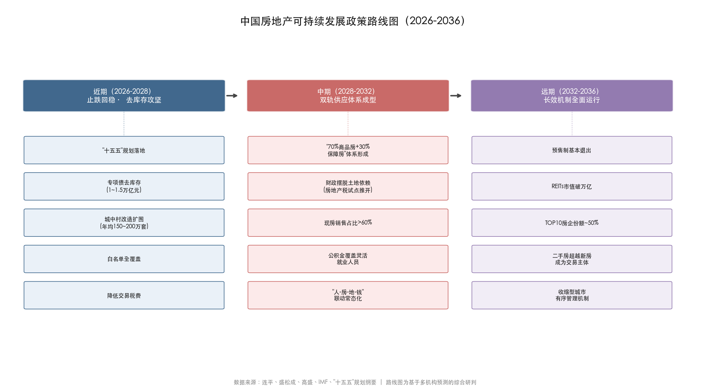

### 7.4.1 近期（2026-2028）：止跌回稳与去库存攻坚

"十五五"规划纲要（2026年3月）明确加快构建房地产发展新模式，健全多主体供给、多渠道保障、租购并举的住房制度，部署四大任务：完善保障体系、推动市场平稳发展（项目公司制、主办银行制、现房销售）、建设"好房子"、推进城市更新[新华社十五五解读](https://www.news.cn/politics/20260306/cf59be898a944bff870ae8508eacf1b0/c.html "十五五实现更高水平住有所居")。2026年政府工作报告首次明确"加强初婚初育家庭住房保障，支持多子女家庭改善性住房需求"，将住房政策与人口战略紧密结合[2026年政府工作报告解读](https://www.toutiao.com/article/7613973753093014042/ "2026政府工作报告房地产定调")。

在具体政策工具层面，连平提出的六大近期建议具有较强的可操作性：显著降低购房交易税费、实施区域差异化政策（资源向核心城市倾斜）、防范住房金融风险（降低存量利率、推进资产证券化）、白名单全覆盖（必要时设专门机构处置）、设立房地产稳定基金（央行牵头）、加大宏观政策调控力度[连平"十五五"展望](https://finance.sina.cn/zl/2025-11-05/zl-infwincz4543288.d.html "连平2025年11月")。

### 7.4.2 中期（2028-2032）：双轨供应体系成型

保障房覆盖面的扩大是中期改革的核心任务。当前保障性住房占存量仅8.0%，城镇家庭租赁公租房比例3.4%与购买经适房比例3.8%合计仅7.2%。政策要求每年新增保障房面积占新增住宅的30%，机构预测到2035年将形成"70%商品房+30%保障房"的双轨供应结构[盛松成《金融市场研究》](https://finance.sina.cn/zl/2026-04-03/zl-inhtfeqw0322022.d.html "盛松成2026年第3期")。

地方财政摆脱土地依赖是这一阶段面临的核心挑战。土地出让收入四年累计减少约4.6万亿元（-52.3%），2024年税收收入仅占政府收入52.4%；连平预测"十五五"年均土地购置费约3.2万亿元，较"十四五"累计下降16.5%。IMF预测中国政府债务（一般政府口径）将从68.4%升至86.9%，广义口径（含地方融资平台）从126.6%升至153.7%[IMF 2025年中国第四条磋商报告](https://www.imf.org/en/news/articles/2026/02/18/pr-26053-china-imf-executive-board-concludes-2025-article-iv-consultation "IMF Article IV 2026年2月")。地方政府必须加速从土地出让收入向税收、经营性国有资产收益和公共服务收费等多元来源转型，房地产税的适时推出可能成为不可回避的政策选项。

住房公积金制度的深化改革亦是中期的重要议题。盛松成指出，公积金累计缴存32.79万亿元、余额10.93万亿元，使用效率偏低。借鉴新加坡CPF（中央公积金，缴费率37%）经验，中国住房公积金可在拓展覆盖面（灵活就业人员）和使用场景（支持租赁、加装电梯、适老化改造等）方面挖掘潜力[盛松成《金融市场研究》](https://finance.sina.cn/zl/2026-04-03/zl-inhtfeqw0322022.d.html "盛松成2026年第3期")。

### 7.4.3 远期（2032-2036）：长效机制全面运行

到"十六五"后期，房地产发展新模式的制度框架应当全面成型。"十五五"规划纲要提出的"供应体系健全、要素配置合理、监管制度规范、行业经营稳健"四大目标[国务院新闻办](http://www.scio.gov.cn/live/2025/37532/index.html "住建部十五五展望")，将在这一阶段接受全面检验。预计届时将形成以下制度格局：

第一，现房销售成为主流交易方式。当前现房销售占比已从2020年的12.7%升至2025年的35.9%，按此趋势至2032-2035年有望突破60%，预售制度逐步退出历史舞台。第二，"人-房-地-钱"要素联动机制实现常态化运作，以人定房、以房定地、以房定钱，供需精准匹配。第三，REITs市场规模大幅扩容——招商基金预计未来五年中国公募REITs总市值有望从2,000多亿元向5,000亿元迈进，远期有望达到万亿级别。第四，房地产税在条件成熟的城市稳步推开，逐步成为地方政府主体税种之一，从根本上替代土地出让收入的财政功能。

## 7.5 风险防线：三大系统性风险与应对

### 7.5.1 住房金融尾部风险

住房贷款的尾部风险不容忽视。连平研究指出，当存量房价距高点累计跌幅接近或超过50%时，违约风险可能集中爆发。美国次贷危机期间住房贷款拖欠率从2%飙升至超过10%，直至2022年才回归2%的正常水平。中国首套首付比例虽已降至历史最低的15%，但此前购房者首付普遍在30%以上，缓冲垫相对充足。2025年第四季度银行业整体不良贷款率为1.50%，但房地产对公贷款不良率已处于高位——中国银行5.38%、工商银行5.37%、农业银行5.35%[连平"十五五"展望](https://finance.sina.cn/zl/2025-11-05/zl-infwincz4543288.d.html "连平2025年11月") [金融监管总局](https://www.nfra.gov.cn/cn/view/pages/ItemDetail.html?docId=1249435&itemId=915 "2025年Q4监管指标") [中房网](http://www.fangchan.com/news/4/2025-09-10/7371338939917210264.html "银行房贷不良数据")。

积极信号在于居民部门杠杆率正在见顶回落。个人住房贷款占居民贷款比例预计从45%降至40%，居民杠杆率从61%降至54%。去杠杆进程有助于长期购房能力的恢复，但短期内将持续抑制需求释放[连平"十五五"展望](https://finance.sina.cn/zl/2025-11-05/zl-infwincz4543288.d.html "连平2025年11月")。

### 7.5.2 房地产-地方债务-金融体系的交织风险

房地产、地方债务与金融体系三者的风险高度交织，构成系统性风险的主要策源地。国务院2025年10月向全国人大提交的金融工作报告显示，截至2025年9月末融资平台数量和存量经营性金融债务较2023年3月末分别下降71%和62%[国务院金融工作报告](http://www.npc.gov.cn/npc/c2/c30834/202510/t20251027_448985.html "2025年10月金融工作报告")。尽管化债取得显著进展，IMF仍强调应促进及时透明的损失确认和基于市场的定价，避免陷入日本式的"延迟处置"陷阱[盛松成《金融市场研究》](https://finance.sina.cn/zl/2026-04-03/zl-inhtfeqw0322022.d.html "盛松成2026年第3期")。

日本的教训至为深刻：泡沫破裂后日本央行延误货币宽松导致通缩恶性循环十余年，而美国2008年后果断推出量化宽松（QE）使经济更快恢复。中国的政策反应速度将直接决定本轮调整周期的长短和深度。

### 7.5.3 收缩型城市的不动产资产减值

近半数城市面临人口收缩的现实，使得三四线及以下城市的住房资产面临持续减值压力。IMF副总裁Gopinath 2026年3月演讲建议中国加速不可存续开发商的退出、允许更大的房价灵活性，并指出推动企业公平竞争（减少补贴可提升全要素生产率1%以上、GDP 2%以上）、加大市场定价力度将有助于经济再平衡[IMF Gopinath演讲](https://www.imf.org/en/news/articles/2026/03/21/sp032226-chinas-new-chapter-rebalancing-and-unleashing-market-forces "China's New Chapter 2026年3月")。

对于收缩型城市，政策重心应从"稳房价"转向"有序收缩"——通过人口引导、产业转移和存量资产再利用（如改建养老设施、文旅空间等），在收缩中实现可持续发展，避免资产价值的无序崩塌。

## 7.6 新均衡图景：2036年的中国房地产

综合上述分析，我们判断2036年前后中国房地产市场将呈现以下"新均衡"特征。下图从市场规模稳态达成度、供应双轨化、区域集中度、企业集中度和金融多元化五个维度，对比2025年现状与2036年目标的转型进度。

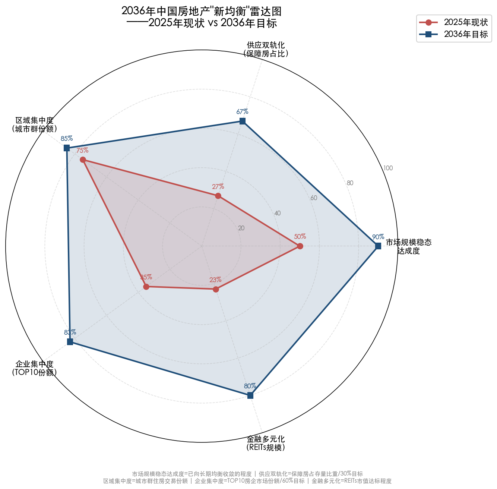

**市场规模方面**，新建商品住宅年均销售面积稳定在4-6亿平方米区间（约为2021年峰值的三分之一），一二手房合计年交易量8-10亿平方米，二手房交易量超过新房成为市场主体。房地产业增加值占GDP比重稳定在5%左右，仍为国民经济支柱产业，但对经济增长的直接拉动力显著下降。

**供应结构方面**，"70%商品房+30%保障房"的双轨供应体系基本成型。配售型保障性住房覆盖更多工薪群体，保障性租赁住房满足新市民和青年人的阶段性居住需求，公租房保障低收入家庭的底线需求。住房保障占存量比例从当前的8%逐步提升至15%-20%。

**区域格局方面**，19个城市群承载全国70%以上人口、贡献80%以上GDP的基本格局进一步强化。东部三大城市群（京津冀、长三角、粤港澳大湾区）以及成渝、长江中游等核心城市群将贡献约80%的住房交易量，TOP10房企在一二线城市的市场份额有望达到60%。与此同时，约一半城市进入"管理收缩"阶段。

**企业模式方面**，头部房企完成从"开发商"到"城市综合运营服务商"的转型。经常性业务（商业运营、物业管理、租赁住房、代建、资产管理等）收入占比超过50%，开发主业虽有收缩但以高品质"好房子"为核心竞争力。行业利润来源从土地增值转向资产运营增值和服务溢价。

**金融架构方面**，"经营性融资+资产证券化"取代"开发贷+预售"成为行业主流融资模式。公募REITs市场总市值突破万亿级别，商业不动产REITs成为重要的资产退出通道。保险资金、养老金等长期资本通过REITs和直投方式深度参与不动产市场，实现长久期负债与长期资产的匹配。

盛松成总结的政策逻辑精准概括了这一转型方向：稳住高能级城市是托底关键，"好房子"理念在房价不涨的前提下提升品质，中央财政与创新金融产品（特别国债、REITs、ABS加速发行）提供资金支撑[盛松成《金融市场研究》](https://finance.sina.cn/zl/2026-04-03/zl-inhtfeqw0322022.d.html "盛松成2026年第3期")。中国房地产行业的可持续发展，最终取决于能否在人口结构转型、城镇化高质量推进和居民住房品质提升三重力量的交汇中，找到市场与政府、效率与公平、增长与安全之间的动态平衡。

# 结论与风险提示

## 核心结论

**结论一：本轮调整本质上是一场结构性转型，而非传统意义上的周期性回调。** 2020—2025年间，全国商品房销售面积缩减过半（-50.9%），新开工面积骤降逾七成（-73.8%），土地出让收入四年累计减收约4.6万亿元（-52.3%），超过40家头部房企实质性违约。推动调整的深层因素——人口负增长（2025年减少339万人）、城镇化减速、居民杠杆率见顶、土地财政难以为继——均具有长期结构性特征，不会随短期政策刺激而逆转。行业"高杠杆、高周转"的旧增长模式已不可逆转地走向终结，中国房地产正在从"规模扩张"时代迈入"存量运营"时代。

**结论二：行业可持续发展的底层支撑依然存在，但驱动力已从单一的增量扩张转向"四轮驱动"的结构性需求。** 城镇化率仍有约7—12个百分点的提升空间，约2.5亿尚未完全市民化的农业转移人口蕴含住房需求释放潜力；家庭小型化持续推高独立住房需求；从"有房住"到"住好房"的品质升级成为新的核心驱动力——全国2000年前建成的城镇住宅约17亿平方米中60%以上未进行节能和适老化改造；改善性需求正接棒首次置业成为市场主导力量。综合多家机构预测，"十五五"时期新建商品住宅年均销售面积预计6—8亿平方米，行业仍具有相当可观的市场规模。

**结论三：国家政策体系已完成从"危机应对"到"制度重构"的范式转换。** "十五五"规划纲要明确的"保障+市场"双轨供应体系、"人-房-地-钱"要素联动机制、现房销售制度渐进推广和"好房子"品质标准，构成了房地产发展新模式的四大制度支柱。"因城施策控增量、去库存、优供给"九字方针形成了逻辑自洽的供给侧政策闭环。住房政策与人口战略的深度融合拓展了制度改革的社会治理维度。政策方向的确定性是行业最终企稳的重要基础。

**结论四：资金体系的历史性重构正在为行业可持续发展奠定金融基础设施。** "白名单"融资协调机制（审批超7万亿元）、公募REITs市场扩容（总市值突破2,200亿元）、商业不动产REITs试点启动、专项债土地收储（全国拟收储金额超7,700亿元），以及住房公积金制度的"广普惠"改革，共同构成了从"开发贷+预售回款"向"经营性融资+资产证券化"转型的多元资金支撑体系。保险资金和养老金等长期资本的加速入场有望修复行业长期存在的期限错配问题。

**结论五：产业转型已从理念层面进入可验证的实践阶段。** 城市更新每年投资体量超过2.5万亿元、物业管理行业年营收达1.75万亿元、住房租赁市场覆盖2.6亿人——存量时代的新赛道各自具有万亿级或千亿级市场容量。华润置地经常性业务利润占比首破半数、龙湖运营服务毛利率超50%、代建行业爆发式增长——标杆企业的财务数据证明，不依赖土地增值和住房销售的新盈利模式是可行的。

**结论六：国际经验提供的核心启示具有跨国普适性。** 日本、德国、新加坡和美国四种制度模式的比较研究揭示了三项基本原则：住房制度设计的根本目标是在满足居住需求的同时防止资产属性过度膨胀；保障体系的覆盖面和可持续性决定社会公平的底线；金融体系的审慎性决定长周期稳定的上限。中国正在构建的"房地产发展新模式"在理念层面已与国际成熟经验形成有效对接，关键挑战在于执行层面的持续推进和制度细节的精细化落地。

## 风险提示

**风险一：住房金融尾部风险。** 当存量房价距高点累计跌幅接近或超过50%时，违约风险可能集中爆发。2025年中期六大国有银行房地产对公贷款不良率已处于5.3%—5.4%的高位；个人住房贷款不良率虽仍处于各类个人贷款中的最低水平，但已从0.7%—0.9%上升至0.9%—1.1%。若房价持续下行叠加经济增速放缓，个人住房贷款不良率进一步攀升的尾部风险不容忽视。

**风险二：房地产-地方债务-金融体系的交织风险。** 土地出让收入四年累计减收约4.6万亿元，地方政府在土地财政急剧收缩的同时尚未建立起替代性稳定税源。IMF预测中国广义政府债务（含地方融资平台）将从126.6%升至153.7%。房地产市场持续调整、地方财政承压和金融体系资产质量恶化之间的风险传导链条需要高度警惕。

**风险三：收缩型城市的不动产资产减值。** 全国287个城市中已有139个（占48%）出现人口收缩。日本经验表明，人口流出叠加不动产低迷可引发"负资产"现象——日本住房空置率预计从13.6%升至2033年的27.3%。中国广大三四线及以下城市面临长期需求萎缩、库存高企和资产价值持续下行的系统性压力。

**风险四：政策传导效率与执行落差。** 首付比例、利率和限购三重政策已处于史上最宽松水平，但需求端响应仍显滞后，反映出居民预期修复所需时间远长于政策传导周期。收储存量商品房再贷款初期使用率仅约5%，保障房建设的可持续融资机制尚待完善，新旧模式转换的"过渡摩擦"可能在短期内影响行业运行效率。

**风险五：外部宏观环境的不确定性。** 全球经济增速放缓、国际贸易摩擦加剧、地缘政治风险上升等外部因素，可能通过抑制经济增长预期、影响就业和收入水平等渠道间接传导至住房市场，加大行业企稳的难度。

## 局限性分析

本报告存在以下主要局限性：

**第一，数据时效性约束。** 报告所引用的最新数据截至2026年初，房地产市场处于快速变化之中，部分数据和判断可能因市场演变而需要动态修正。

**第二，预测的固有不确定性。** 报告对未来十年的总量预测和结构判断综合了多家机构的研究成果，但任何长期预测都面临宏观经济波动、政策调整、人口变化超预期等不可控因素的影响。不同机构预测之间存在一定分歧（如年均销售面积6—8亿平方米的区间），反映了对市场走势判断的内在不确定性。

**第三，微观主体行为的异质性。** 本报告侧重于行业层面的宏观分析和制度层面的政策研究，对于不同区域、不同类型企业和不同收入群体的微观行为差异未能充分展开。房地产市场"一国多市"的结构性特征意味着全国层面的判断不能机械适用于每一个具体城市或细分市场。

**第四，国际经验移植的边界。** 日本、德国、新加坡和美国的制度经验均在特定国情条件下演化形成，与中国在经济体量、行政体制、社会文化和发展阶段等方面存在显著差异。本报告在提炼国际经验时力求审慎，但借鉴路径的可行性仍需结合中国实际进一步论证。

**第五，部分细分领域的深度有限。** 报告未能对房地产税改革的具体路径设计、REITs税收中性安排的技术细节、收缩型城市的差异化治理方案等专题进行充分深入的分析，这些议题各自构成独立的研究课题，有待专项研究予以补充。
