# 执行摘要

2025 年，全球旅游业在经济逆风中展现出超预期韧性——全年国际游客超 15 亿人次，旅游支出同比增长 6.7%，增速为全球 GDP 增长的两倍；旅游业对世界经济的贡献达 11.7 万亿美元，占全球 GDP 的 10.3%。然而，这一总量繁荣的表象之下，旅客的目的地选择逻辑正被六大维度的力量深刻重塑，各维度之间层层递进、相互交织，共同构成一幅复杂而动态的全球旅游流向图景。

**经济成本划定"底线预算"。** 汇率的剧烈波动是 2025 年重排目的地性价比座次的首要变量：美元指数全年下跌约 9.4%（创 2017 年以来最大年度跌幅），日元持续走弱助推日本以 4,270 万入境游客和 9.5 万亿日元消费双创历史纪录，而拉美货币贬值则压制了本区域出境需求。机票实际价格较 2014 年下降约 41%，但运力紧张（飞机交付量较峰值滞后 30%）限制了进一步降价空间。酒店市场出现豪华与经济型之间 7.1 个百分点的 RevPAR"剪刀差"，折射出旅游消费的结构性分层。"平替目的地"酒店交易量增速高出传统热门目的地约 9 个百分点，标志着旅客以理性方式优化性价比的行为模式加速成形。

**安全与地缘政治构成"准入门槛"。** 92% 的旅客将安全列为目的地选择的重要因素，安全感知已从"加分项"演变为"一票否决项"。地缘冲突并未压缩全球旅游总需求，而是系统性地重新分配旅游流向——以色列入境游仅恢复至 2019 年峰值的 29%，欧洲"安全港"目的地则显著受益。美国成为全球 184 个经济体中唯一国际入境游消费下滑的国家（入境游客降至 6,790 万人次，消费减少约 125 亿美元），政策言论与旅行禁令的叠加效应超越了美元贬值本应带来的价格吸引力。至少 12 个国家对本国公民发出赴美旅行警告，旅行警告的功能正从安全工具扩展为地缘政治信号。

**签证与交通可达性决定"通行能力"。** 全球护照持有者平均可免签到达的目的地从 2006 年的 58 个增至 2025 年的 109 个。中国以前所未有的力度将单方面免签国家增至 48 个、互免签证国家扩至 29 个，2025 年入境旅游人次超 1.5 亿（同比 +17%），入境旅游消费超 1,300 亿美元（同比 +40%）。亚太航空国际客运增长 10.9%，新航线（如纽瓦克—格陵兰、西雅图—东京）将此前"不可达"的目的地带入旅客视野。中国高铁年客运量达 46 亿人次，新通车线路将偏远景区纳入"两三小时可达圈"，从根本上重塑了目的地的竞争力边界。

**气候与可持续意识重塑目的地吸引力。** 全球全年 55 起十亿美元级气象灾害（总损失 2,770 亿美元）正将极端天气从偶发冲击转变为旅客必须纳入决策的结构性风险。研究表明目的地平均气温每上升 1°C，国际游客到访量下降 8.09%。"清凉度假"新趋势加速兴起，凉爽气候目的地预订量增长 44%。93% 的全球旅客希望做出更可持续的旅行选择，威尼斯入城费、京都住宿税上调 900%、富士山统一限流等治理措施正以经济门槛和容量管控双重机制推动旅客从"热门打卡"转向"冷门深度游"。

**科技与信息生态重构决策链条。** 社交媒体已取代口碑推荐成为旅行灵感的第一入口（66% 的 Z 世代依赖 Instagram 和 TikTok），TikTok 旅行帖子量激增 250%。AI 旅行规划从"新鲜尝试"走向"常态使用"（美国旅客使用率达 33%），但当前更多影响行程细节而非目的地选择本身。前四大 OTA 平台以 96% 的收入集中度掌控全球在线旅行分销通道，其算法排序对目的地可见度的隐性引导力不容低估。"社交媒体种草→AI 规划优化→OTA 平台预订"的三阶段决策链条已成为 2025 年旅客行为的典型模式。

**文化内容与体验经济驱动最终取舍。** 当硬约束条件基本满足后，美食（77% 的旅客围绕美食规划旅行）、影视 IP（66% 的旅客受影视内容影响目的地选择）和节庆活动（60% 的旅客围绕活动安排旅行）构成了目的地的"内容吸引力"核心。《白莲花》第三季推动苏梅岛搜索量飙升 88%，《KPop Demon Hunters》助力首尔 7 月入境游客创 136 万人次历史新高。代际分层清晰可见：Z 世代和千禧一代以高频次、体验优先的模式重新定义旅行价值，而婴儿潮一代仍以约为 Z 世代三倍的人均支出水平构成市场购买力的中流砥柱。

综合而言，2025 年旅客的目的地选择是一个多维度、层级化的决策过程：经济成本与安全门槛在决策链前端执行"硬筛选"，签证通行与交通可达性决定目的地能否进入候选清单，气候环境与可持续意识构成日益重要的比较维度，科技与信息生态塑造旅客的信息视野与认知框架，而文化内容与体验供给则在最终取舍环节发挥"临门一脚"的决定作用。六大维度相互叠加、动态交织，使得全球旅游流向呈现出"总量增长、结构深度分化"的鲜明格局。

# 第1章 宏观经济与出行成本——旅游消费的"底层账本"

旅客选择何时出行、前往何处，首先取决于"钱包"：宏观经济景气度框定了出行预算的总量，汇率与通胀水平重新排列各目的地的性价比座次，而机票与酒店价格则构成行程成本的"刚性底座"。2025 年，全球旅游业在经济逆风中展现出超预期韧性，但区域增长的显著分化、主要货币的剧烈波动以及出行成本的结构性重组，正在深刻改写旅客的目的地选择逻辑。

## 1.1 全球旅游经济的宏观图景：增速放缓中的韧性

2025 年，全球 GDP 增速从上年的约 3% 放缓至约 2.5%，其中关税政策升级对全球产出的拖累约为 0.5 个百分点，美国自身 GDP 增速也降至约 1.5% [IATA](https://www.iata.org/en/iata-repository/publications/economic-reports/global-outlook-for-air-transport-june-2025/ "2025年6月全球航空运输展望")。然而，旅游业的增长显著跑赢整体经济。根据世界旅行与旅游理事会（WTTC）的数据，2025 年全球旅游业对世界经济的贡献达 11.7 万亿美元，占全球 GDP 的 10.3%；国际游客消费首次触及 2.1 万亿美元，较 2019 年的历史峰值高出 1,640 亿美元 [WTTC官方新闻稿](https://wttc.org/news/global-travel-and-tourism-to-reach-new-heights-in-2025 "2025年5月22日发布")。全年国际游客超 15 亿人次，旅游支出同比增长 6.7%，增速为全球经济增长的两倍 [Reuters报道](https://www.reuters.com/world/us/fewer-foreigners-visited-us-2025-global-tourism-spending-rose-2026-01-14/ "2026年1月14日，引用WTTC数据")。如图 1-1 所示，全球国际旅客到访量与旅游消费在经历疫情冲击后呈 V 型恢复，2025 年双双超越 2019 年疫前峰值。

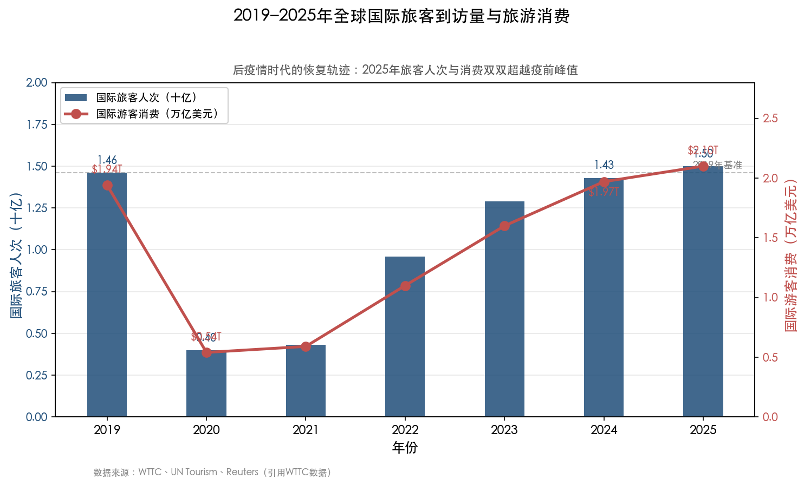

这一"旅游韧性"的背后有两股支撑力量。第一，尽管经济增速放缓，主要经济体的居民实际收入仍维持正增长。OECD 数据显示，2025 年前三个季度 OECD 国家人均实际家庭收入季度环比分别增长 0.1%、0.4% 和 0.3%，延续了后疫情时代的恢复势头；但 G7 国家在第三季度出现分化——英国实际家庭收入下降 0.8%（受所得税上调影响），美国微降 0.1%（终结了自 2022 年第三季度以来的最长连续增长期），而意大利和德国分别增长 1.7% 和 0.5% [OECD](https://www.oecd.org/en/data/insights/statistical-releases/2026/02/growth-and-economic-well-being-third-quarter-2025-oecd.html "2025年Q3增长与经济福祉统计")。第二，消费者在缩减其他开支时倾向于保留旅行预算。"宁可少买一件衣服，不愿少去一次旅行"的消费优先序已在多项调查中得到印证：美国消费者虽然担忧通胀，但国内休闲旅游支出仍预计增长 1.9% 至 8,950 亿美元，总旅游支出增长 1.1% 至 1.35 万亿美元 [U.S. Travel Association](https://www.ustravel.org/research/travel-forecasts "2025年秋季预测")。

从区域维度审视，旅客流动呈现显著的梯度分布。联合国旅游组织统计，2025 年 1-9 月全球国际旅客达 11 亿人次，同比增长 5%（约多 5,000 万人次），较 2019 年高 3%。但区域增速落差极大：非洲以 10% 的增速领跑，亚太增长 8%（疫后修复效应仍在释放），欧洲增长 4%，美洲和中东均仅增长 2% [UN Tourism官方](https://www.untourism.int/news/international-tourist-arrivals-up-5-in-the-first-nine-months-of-2025 "2025年世界旅游晴雨表")。在主要出境消费市场中，西班牙游客的海外消费增长最为强劲（+15%），其次是韩国和美国（各 +7%），德国和意大利各增长 4%，法国增长 5% [UN Tourism官方](https://www.untourism.int/news/international-tourist-arrivals-up-5-in-the-first-nine-months-of-2025 "2025年世界旅游晴雨表")。中国出境游市场则以约 1.675 亿人次和约 2,540 亿美元的海外消费规模，重新确立了全球最大出境客源国的地位，预计 2026 年将进一步攀升至 1.75 亿人次、2,800 亿美元 [Skift报道](https://skift.com/2026/02/24/the-280-billion-chinese-outbound-comeback-that-destinations-cant-ignore/ "2026年2月24日，引用China Trading Desk预测")。

## 1.2 汇率的指挥棒：美元贬值如何重排全球旅游版图

2025 年外汇市场最具旅游影响力的变量，是美元的急剧走弱。美元指数（DXY）全年下跌约 9.4%，为 2017 年以来最大年度跌幅；上半年跌幅尤为猛烈，达约 11%，创 1973 年以来最大半年跌幅 [Morgan Stanley](https://www.morganstanley.com/insights/articles/us-dollar-declines "2025年8月6日发布")。以贸易加权口径衡量，美元在 2025 年贬值约 8%，对主要货币的跌幅约达 10% [TD Economics](https://economics.td.com/gbl-the-united-states-dollar-in-2025 "The U.S. Dollar in 2025: Down, but not out")。

美元贬值的旅游效应具有双向性。对美国出境旅客而言，海外度假的实际成本骤增——以欧元区为例，EUR/USD 从年初约 1.03 升至年末约 1.175，欧元对美元升值约 14%，意味着美国游客在巴黎或罗马的每一顿晚餐、每一晚酒店都比一年前贵了一成以上。对全球其他货币区旅客而言，美元走弱则意味着赴美成本下降，理论上有利于美国入境游——但事实上，2025 年美国却成为全球 184 个经济体中唯一国际入境游消费下滑的国家（这一异常现象的主因并非经济因素，而与签证政策和地缘政治环境密切相关，将在第2章详述）。图 1-2 直观展示了 2025 年各主要市场货币变动方向与出境旅游增长之间的正相关关系。

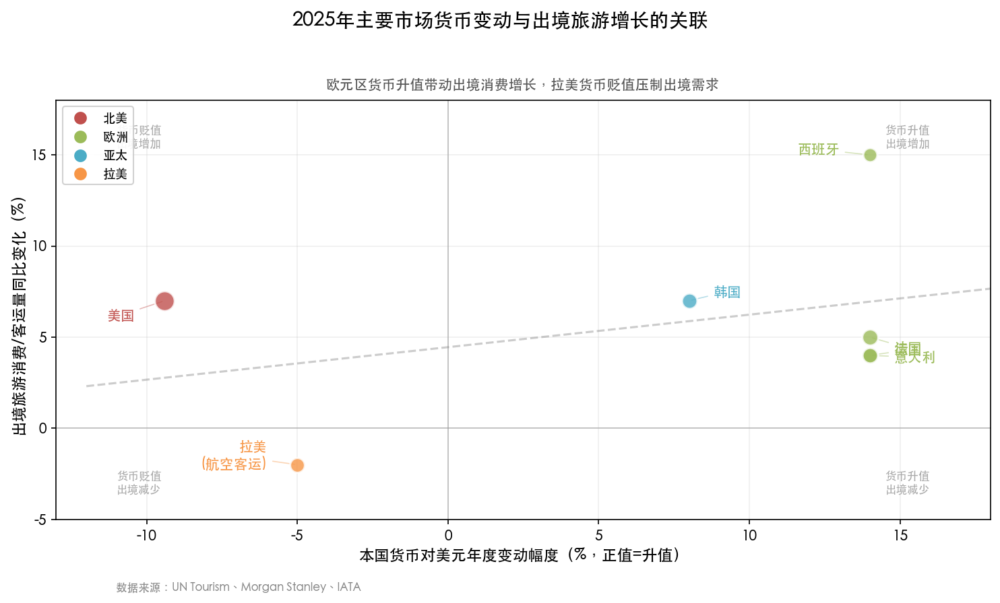

与美元的颓势形成鲜明对比，日元持续走弱成为推动日本入境旅游爆发的核心催化剂。2025 年日元对美元的年均汇率约为 149.6 日元兑 1 美元（2024 年为 151.5），表面上波幅有限，但日元对欧元、人民币等主要客源货币仍处于历史性低位 [FRED](https://fred.stlouisfed.org/series/AEXJPUS "日元对美元即期汇率年度数据")。万事达经济研究所的研究表明，日元对人民币每贬值 1%，中国赴日游客数量即增加约 1.5% [Mastercard Economics Institute](https://www.mastercard.com/news/press/2025/may/mastercard-economics-institute-what-moves-us-the-motivations-behind-global-travel-in-2025/ "2025年5月发布")。这一汇率弹性在 2025 年得到充分验证：日本全年接待外国游客 4,270 万人次，游客消费达 9.5 万亿日元（约 601 亿美元），双双刷新历史纪录 [共同社](https://english.kyodonews.net/articles/-/68869 "2026年1月20日发布")。对中国、韩国和东南亚旅客而言，日本在汇率红利下成为性价比极高的短途出境选择——原本需要节衣缩食才能负担的高级日料、温泉旅馆和购物消费，在日元弱势下变得"触手可及"。

在货币光谱的另一端，拉美货币对美元的贬值则压制了该区域的出境航空需求。IATA 数据显示，2025 年拉美航空旅客运输量（RPK）增速从 2024 年的 7.8% 放缓至 5.8%，客座率从 83.7% 降至 82.2% [IATA](https://www.iata.org/en/iata-repository/publications/economic-reports/global-outlook-for-air-transport-june-2025/ "2025年6月全球航空运输展望")。货币贬值直接抬高了拉美旅客的出境成本，使部分原计划的国际旅行被国内游或近邻目的地所替代。

上述案例勾勒出汇率变动的核心传导机制：**当客源国货币走强时，海外旅游的"性价比"提升，旅客倾向于选择相对"便宜了"的目的地；反之，货币走弱则推动旅客转向国内游或物价水平更低的替代目的地。** 这一逻辑在 2025 年的欧元区、日本和拉美市场中得到了反复印证。

## 1.3 机票价格：油价下行带来的"隐形补贴"

航空旅行价格是左右目的地选择的另一关键变量。2025 年，旅客在此方面获得了一个结构性利好：IATA 预计，全球平均往返含附加服务机票实际价格约为 374 美元，较 2014 年下降约 41%；旅客收益率（每客公里收入）同比下降约 4% [IATA](https://www.iata.org/en/iata-repository/publications/economic-reports/global-outlook-for-air-transport-june-2025/ "2025年6月全球航空运输展望")。推动票价下行的主要动力来自燃油成本的大幅回落——布伦特原油年均价格约为 69 美元/桶，同比下降 13-15%，直接减轻了航空公司的运营成本压力。

然而，票价的下行空间受到供给端瓶颈的刚性制约。全球航空制造业面临严峻的交付延迟：飞机交付量较历史峰值滞后约 30%，积压订单高达约 17,000 架 [IATA](https://www.iata.org/en/iata-repository/publications/economic-reports/global-outlook-for-air-transport-june-2025/ "2025年6月全球航空运输展望")。运力紧张意味着航空公司在热门航线上仍保有较强定价权，票价下降的幅度因航线而异——短途航线和竞争充分的市场降幅更大，长途洲际航线的价格黏性则更为明显。

尽管如此，全年航空客运的强劲增长（RPK 同比增 5.3%，国际客运增长 7.1%，客座率达 83.6% 创历史纪录）表明，综合票价走低与经济条件，旅客的飞行意愿非但未减弱，反而更趋旺盛。亚太地区尤为突出，国际航空客运增长高达 10.9%，折射出疫后积压需求的持续释放与区域内航线网络的密集扩展。

## 1.4 酒店与住宿：价格分化与消费分层

如果说机票价格呈现整体温和下行的趋势，酒店市场则讲述了一个截然不同的故事——**整体平稳的表象下，暗藏深刻的品类分化**。

2025 年 1-8 月，全球酒店每间可售房收入（RevPAR）同比仅增长 0.2%，平均房价（ADR）微涨 1.0%，而入住率下降 0.8 个百分点 [PwC/STR数据](https://www.worldpropertyjournal.com/real-estate-news/hong-kong/global-hotel-data-for-2025-str-2025-hotel-data-hotel-revpar-in-2025-top-international-hotel-markets-world-travel-tourism-council-pwc-2026-hotel-trends-14641.php "转引STR/PwC 2025年数据")。品类之间的走势却截然相反：豪华酒店 RevPAR 增长 5.3%，经济型酒店 RevPAR 下降 1.8%，两者之间形成 7.1 个百分点的"剪刀差"（见图 1-3）。这一分化折射出旅游消费的结构性分层——高收入旅客对价格不敏感，持续追求更优质的住宿体验；价格敏感型旅客则在经济不确定性下更加精打细算，倾向于选择更具性价比的住宿形式。

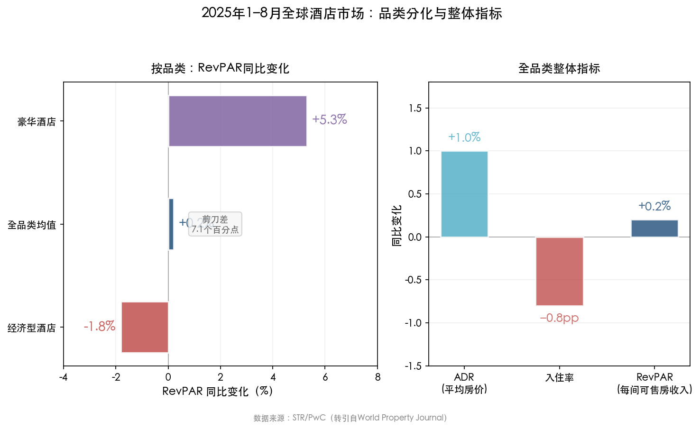

从区域和市场维度观察，美国国内酒店均价小幅下降 2% 至 174 美元/晚，但国际酒店均价上涨 4% 至 228 美元/晚 [Hotels.com酒店价格指数](https://www.expedia.com/newsroom/hotels-com-2025-hotel-price-index/ "2025年度酒店价格指数")。这一价格差本身即构成目的地选择的推拉力量：当美国国内酒店性价比相对提升、而国际酒店变得更贵时，部分美国旅客可能倾向于将假期留在国内；但对其他国家旅客而言，逻辑恰好相反——海外五星级酒店均价比美国同级别低约 27%，部分城市五星级酒店每晚低于 200 美元（如河内 156 美元、芭提雅 157 美元），这些价格洼地对精明旅客形成强力吸引 [Hotels.com酒店价格指数](https://www.expedia.com/newsroom/hotels-com-2025-hotel-price-index/ "2025年度酒店价格指数")。

## 1.5 "平替目的地"的崛起：性价比重构旅游流向

当经济增速放缓、汇率波动加剧、旅客对价格敏感度提升时，一个引人注目的行为模式在 2025 年加速显现——**"平替目的地"（dupe destinations）** 的兴起。所谓平替目的地，指旅客在保持相似旅行体验的前提下，主动选择价格更低、拥挤程度更轻的替代地点。

万事达经济研究所的分析显示，平替目的地的酒店交易量增速比传统热门目的地高出约 9 个百分点 [Mastercard Economics Institute](https://www.mastercard.com/news/press/2025/may/mastercard-economics-institute-what-moves-us-the-motivations-behind-global-travel-in-2025/ "2025年5月发布")。典型案例颇具说服力：阿姆斯特丹替代哥本哈根（两座运河之城风格相近，但荷兰的住宿与餐饮成本更低），龙目岛替代巴厘岛（同属印尼的热带海岛，但旅游开发程度更低、价格更亲民），福冈替代东京（同样享受日本美食与文化，但酒店和餐饮开支大幅缩减）。

这一趋势的形成受多重经济因素驱动。第一，社交媒体赋予小众目的地前所未有的曝光度（详见第5章），但**经济理性才是旅客最终点击"预订"按钮的决定因素**。第二，平替目的地往往位于货币相对弱势的国家或物价水平较低的区域，汇率红利叠加低物价构成双重吸引力。第三，热门目的地因过度旅游推出的限流与征税措施（如威尼斯入城费、京都住宿税大幅上调等，详见第4章），客观上抬高了旅行成本，将部分价格敏感型旅客推向替代地点。

## 1.6 美国入境旅游的"独特困境"

在全球旅游消费普遍增长的大背景下，美国入境旅游市场的表现构成一个显著的反例。2025 年，美国成为全球 184 个经济体中唯一国际入境游消费下滑的国家：国际游客消费降至约 1,690 亿美元，较 2024 年减少约 125 亿美元，降幅约 7%；入境游客量下降 6.3% 至 6,790 万人次 [WTTC官方](https://wttc.org/news/us-economy-set-to-lose-12-5bn-in-international-traveler-spend-this-year "2025年5月13日发布") [U.S. Travel Association](https://www.ustravel.org/research/travel-forecasts "2025年秋季预测")。

从纯经济逻辑审视，这一现象颇为反直觉：美元大幅贬值本应使美国对外国游客更具价格吸引力。然而，美国入境游下降的成因远超经济范畴——签证政策收紧、旅行禁令扩大、地缘政治紧张以及多国政府发出的赴美旅行警告等因素共同作用，压倒了汇率优势。本章聚焦于经济维度，仅指出一个关键事实：即便在美元走弱使旅行成本下降的条件下，**非经济因素仍可完全逆转价格信号对旅游流向的引导作用**。关于美国入境游下滑的政策与安全成因，第2章将作系统分析。

值得注意的是，美国国内旅游市场依然保持正增长。美国旅行协会预测，2025 年国内休闲旅游支出增长 1.9% 至 8,950 亿美元 [U.S. Travel Association](https://www.ustravel.org/research/travel-forecasts "2025年秋季预测")。这表明美国消费者的旅行意愿并未减退，只是在美元走弱导致出境成本上升的背景下，更多旅行预算留在了国内。

## 1.7 本章小结

2025 年的全球旅游经济呈现"总量增长、结构分化"的鲜明特征。在总量层面，旅游支出增速（+6.7%）显著高于全球 GDP 增速（约 2.5%），旅游业的消费韧性再次得到验证。在结构层面，汇率的剧烈波动——尤其是美元年度贬值约 9.4%——深度重塑了各目的地的性价比排序：日元弱势助推日本创造入境游纪录，拉美货币贬值压制本区域出境需求，而美元走弱则推动美国旅客更多选择国内游。机票价格受益于油价下跌而温和走低，但运力紧张限制了降幅空间；酒店市场出现豪华与经济型之间的深度分化。在这些经济变量的综合作用下，"平替目的地"现象加速兴起，成为旅客以更少预算获取相似体验的理性选择。

宏观经济与出行成本为旅客的目的地选择划定了"底线预算"与"性价比排序"，但经济因素并非唯一的决定力量。当安全风险、政策壁垒等非经济因素介入时（如美国入境游的案例所示），即便有利的价格信号也可能被完全覆盖。由此，我们将视线转向第2章——安全、地缘政治与公共卫生如何构成旅客选择目的地时的"准入门槛"。

# 第2章 安全、地缘政治与公共卫生——目的地的"准入门槛"

如果说宏观经济与出行成本决定了旅客"花得起多少钱"，那么安全、地缘政治与公共卫生则构成旅客决策的另一重底线——"能不能去"与"敢不敢去"。一个目的地即使价格诱人、文化丰富，若身处冲突区域、被列入旅行警告名单或面临传染病暴发风险，绝大多数旅客便会将其排除在候选清单之外。2025 年，地缘冲突持续发酵、大国政治博弈加剧、公共卫生隐患犹存，安全因素对全球旅游流向的筛选与重塑效应表现得尤为突出。

## 2.1 安全感知的决策优先级：从"重要"到"首要"

安全因素在旅客目的地决策中的权重持续攀升，并日益呈现"一票否决"的筛选特征。英国安全旅游基金会（Safer Tourism Foundation）2025 年调查显示，92% 的受访旅客表示安全因素在选择目的地时"很重要"，较 2024 年的 88% 进一步提升 4 个百分点；"目的地安全和保障水平"作为选择因素的重要性较 2023 年上升了 21% [Safer Tourism Foundation](https://www.safertourism.org.uk/travel-risk-index "2025年旅行行为风险指数")。安全感知已从旅行决策中的"加分项"演变为"一票否决项"——旅客并非在安全与价格之间进行权衡取舍，而是先以安全为门槛筛选候选目的地，再在通过筛选的目的地中比较价格与体验。

然而，安全感知与实际安全状况之间存在显著偏差。同一调查发现，仅有 38% 的旅客在出行前主动研究目的地的犯罪水平 [Safer Tourism Foundation](https://www.safertourism.org.uk/travel-risk-index "2025年旅行行为风险指数")。换言之，多数旅客的安全判断依赖于媒体报道、政府旅行警告和社交媒体上的碎片化信息，而非系统化的风险评估。这种"感知安全"与"实际安全"之间的错位，使得旅行警告和媒体事件在塑造旅游流向上发挥着远超其字面意义的影响力。

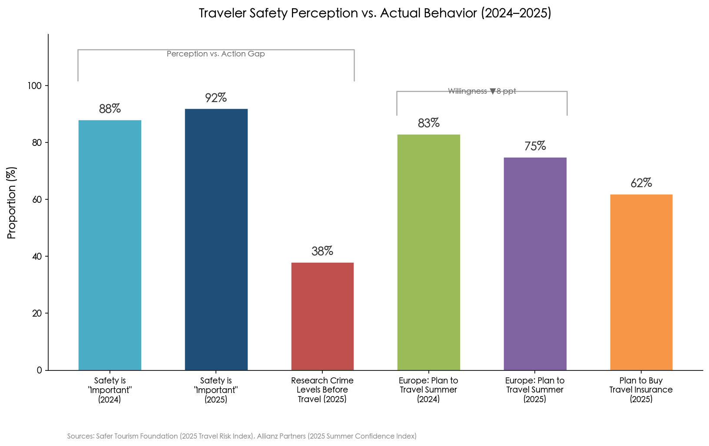

上图清晰揭示了旅客安全感知与实际行为之间的落差：尽管认为安全"很重要"的旅客比例从 2024 年的 88% 升至 2025 年的 92%，出行前实际研究目的地犯罪水平的旅客仅占 38%。与此同时，欧洲旅客暑期出行意愿从 83% 降至 75%，62% 的欧洲旅客计划购买旅行保险，折射出安全顾虑的现实抑制效应。

欧洲旅客出行意愿的变动进一步印证了上述判断。安联合作伙伴（Allianz Partners）2025 年暑期度假信心指数显示，75% 的欧洲人计划在当年 6 至 9 月出行，较 2024 年下降 8 个百分点（从 83% 降至 75%），研究者将这一下降部分归因于经济不确定性和持续的安全与健康顾虑 [Allianz Partners](https://www.allianz-partners.com/en_global/in-the-news/reports-surveys/International_Vacation_Confidence_Index_Summer_2025.html "2025年欧洲暑期度假信心指数")。

## 2.2 地缘冲突：旅游流量的"重分配器"

### 2.2.1 中东冲突：从局部热战到区域旅游震荡

2025 年中东地区国际旅游人次仍录得 3% 的正增长，累计水平较 2019 年高出 39%，海湾国家（特别是阿联酋和沙特阿拉伯）持续的旅游基建投入为区域数据提供了支撑 [UN Tourism世界旅游晴雨表](https://www.untourism.int/un-tourism-world-tourism-barometer-data "UN Tourism官方数据页面")。然而，这一区域均值掩盖了内部剧烈的结构性分化。

以色列入境旅游遭受了冲突的毁灭性打击。2019 年以色列曾创下接待 455 万国际游客的历史纪录；2023 年 10 月 7 日哈马斯袭击事件及随后的加沙战争使入境旅游骤然崩塌。2025 年全年以色列仅接待约 130 万国际游客，虽较 2024 年增长约 35%，但仍仅为 2019 年峰值的 29% [Forbes](https://www.forbes.com/sites/michaelgoldstein/2026/01/11/with-13-million-visitors-tourism-to-israel-began-recovery-in-2025/ "以色列2025年旅游数据") [以色列旅游部官方](https://www.gov.il/en/pages/summary-ministry-of-tourism-activities-2025 "以色列旅游部2025年工作总结")。从客源结构看，美国和加拿大游客合计 42.8 万人次，构成最大客源群体；法国 15.9 万人次、英国 9.5 万人次紧随其后。以色列国内旅游在此期间承担了行业运转的支柱角色——仅 2025 年前三季度，以色列国内酒店住宿即超过 1,300 万人夜。

中东冲突的影响远未止步于以色列一国。2026 年初美以对伊朗冲突爆发后，WTTC 估计中东旅游业每日损失至少 6 亿美元；仅迪拜一地，冲突爆发首周即有超过 8 万笔短期租赁预订被取消 [WTTC/TravelAge West](https://www.travelagewest.com/Travel/Africa-Middle-East/financial-losses-from-iran-conflict "WTTC估计伊朗冲突导致中东旅游业每日损失6亿美元")。Tourism Economics 预测，2026 年中东入境旅游人次可能同比下降 11%–27%，而冲突前的增长预期为 +13%——两者之间的落差高达 24–40 个百分点 [Oxford Economics/Tourism Economics](https://www.oxfordeconomics.com/resource/tourism-impacts-in-middle-east-from-iran-war/ "Tourism Economics对中东旅游的预测")。

### 2.2.2 旅游转移效应：冲突区的损失成为"安全港"的收益

地缘冲突并未压制全球旅游总需求——旅客并非停止出行，而是从冲突风险区转向更安全的替代目的地，形成所谓的"旅游转移效应" [The Conversation](https://theconversation.com/safety-first-how-the-iran-war-is-reshaping-global-tourism-279468 "学术分析：伊朗战争如何重塑全球旅游格局")。

欧洲成为这一效应的最大受益者。在中东局势持续紧张的背景下，原本计划前往中东阳光海滩度假的旅客转向了同样具备地中海风情的西班牙、希腊和意大利。2025 年前三季度欧洲国际旅游人次同比增长 4%，其中西班牙出境消费增长高达 15%，远超德国和意大利各 4% 的增速 [UN Tourism官方](https://www.untourism.int/news/international-tourist-arrivals-up-5-in-the-first-nine-months-of-2025 "2025年世界旅游晴雨表")。学术研究将这种现象概括为"安全港效应"——欧洲尤其是西南欧作为被感知为安全的区域，在地缘动荡期系统性受益于旅游需求的区域再分配。

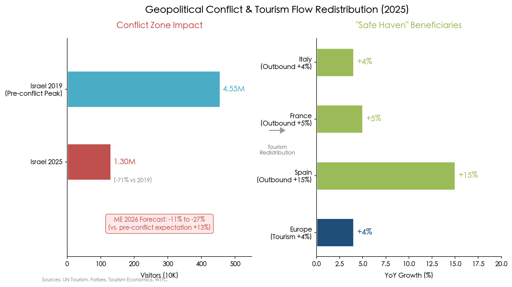

上图以双面板形式直观呈现了旅游转移效应的两端：左侧为冲突区的旅游损失——以色列入境游客从 2019 年峰值的 455 万骤降至 2025 年的 130 万（降幅 71%），Tourism Economics 预测 2026 年中东入境旅游可能进一步下降 11%–27%；右侧为"安全港"受益者——欧洲旅游整体增长 4%，西班牙出境消费增速达 15%，凸显旅游流量从冲突区向安全区域转移的格局。

### 2.2.3 俄乌冲突：持续消耗与出境韧性并存

俄乌冲突进入第四年，对当事国旅游业的破坏仍在延续。美国国务院持续将乌克兰和俄罗斯列为 Level 4（不要前往）旅行警告国家，多数西方航空公司关闭了飞越相关空域的航线。乌克兰入境旅游事实上已近乎中断——2019 年乌克兰曾接待超过 1,370 万国际游客，战争爆发后这一数字大幅萎缩。

然而，乌克兰的出境旅游需求展现出令人瞩目的韧性。2025 年夏季，乌克兰出境旅游人次较 2024 年同期激增 70%，出境超过 23.6 万人次（2024 年同期为 13.9 万人次），主要目的地包括埃及、土耳其、希腊、保加利亚和黑山 [Travel and Tour World](https://www.travelandtourworld.com/news/article/ukraine-sees-a-seventy-percent-surge-in-tourist-arrivals-this-summer-signaling-a-strong-tourism-recovery-in-the-region/ "乌克兰2025年夏季出境旅游激增70%")。乌克兰旅客甚至开始提前预订 2026 年夏季旅行，标志着长期旅行规划行为的回归。这一现象再次印证：即使在持续冲突之下，旅行需求并不会消失，而是寻找替代出口。

## 2.3 大国政治博弈与政策驱动的"旅游寒流"：美国案例

2025 年最引人注目的地缘政治驱动旅游现象之一，并非发生在传统冲突区，而是发生在全球最大的入境旅游消费市场——美国。如第 1 章所述，美国成为 2025 年全球 184 个经济体中唯一国际入境游客消费下滑的国家，入境游客降至约 6,790 万人次（同比 -6.3%），国际游客消费减少约 125 亿美元 [WTTC/Hotel Dive](https://www.hoteldive.com/news/us-economy-international-visitor-spending-impact/748336/ "WTTC预测")。与第 1 章聚焦的经济成本因素不同，本节着重分析政策与政治氛围对这一下降的驱动作用。

### 2.3.1 旅行禁令与政治氛围的叠加效应

特朗普政府 2025 年的旅行政策产生了直接和间接的双重抑制效应。在直接层面，旅行禁令覆盖范围从 12 国扩大至 39 国，涉及多个穆斯林人口为主的国家 [American Immigration Council](https://www.americanimmigrationcouncil.org/report/trump-2025-travel-ban/ "2025年旅行禁令分析")。在间接层面，政策言论与贸易争端营造了"不欢迎外国人"的舆论氛围，对原本不受禁令直接影响的盟友国家旅客产生了显著的心理劝退效应。

来自美国传统盟友国家的游客降幅尤为突出：德国赴美游客下降 11.6%、法国下降 6.9%、澳大利亚下降 6.1% [Skift](https://skift.com/2025/12/29/us-international-travel-which-states-won/ "2025年美国国际旅游盘点")。加拿大赴美旅客更是骤降 22%（约减少 400 万人次），使美国经济损失约 45 亿美元 [Forbes](https://www.forbes.com/sites/suzannerowankelleher/2026/02/20/us-tourism-trump-slump-2026/ "Forbes引用NTTO和WTTC数据")。加拿大旅客的流失尤其值得关注：美加两国共享全球最长的不设防边境，加拿大长期是美国最大的入境旅客来源国之一。如此大幅的下降主要源于特朗普政策言论及贸易关税争端的叠加刺激，大量加拿大旅客转而前往墨西哥和加勒比地区。

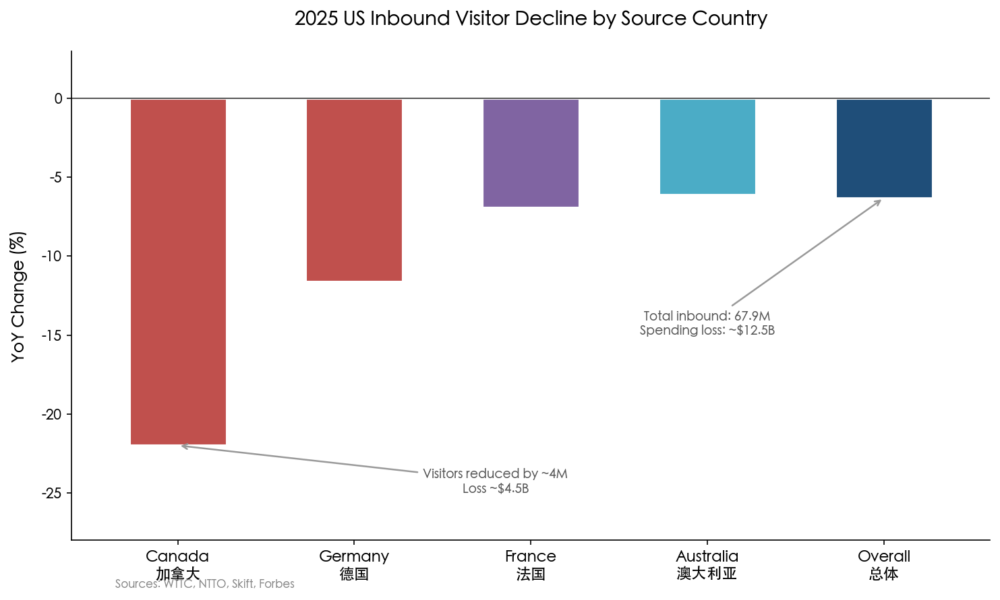

上图量化呈现了 2025 年美国入境旅游"寒流"的来源国分布：加拿大以 -22% 的降幅居首，约减少 400 万人次、造成约 45 亿美元经济损失；德国（-11.6%）、法国（-6.9%）和澳大利亚（-6.1%）紧随其后。美国入境游客总量降至 6,790 万人次，消费减少约 125 亿美元——在全球旅游增长 4% 的大背景下，美国的逆势下行尤显突出。

### 2.3.2 旅行警告的反向运用：从安全工具到外交信号

2025 年出现了一个颇具标志意义的新现象：至少 12 个国家（包括澳大利亚、加拿大、英国和德国）对本国公民发出了赴美旅行警告 [NPR](https://www.npr.org/2025/03/22/nx-s1-5336792/european-countries-canada-travel-warnings-us "欧洲国家和加拿大对赴美旅行发出警告")。这些警告并非针对美国的物理安全威胁，而是提醒本国公民注意美国入境政策变化、执法行为的不确定性以及特定群体可能面临的区别对待。

旅行警告历来是主权国家施加于安全局势不稳定地区的风险提示工具。多个发达经济体对美国——一个传统上被视为安全旅行目的地的国家——发出此类警告，标志着旅行警告的功能从单纯的安全提示扩展为地缘政治信号传递：它既是对旅客的实质性风险提示，也是外交抗议的一种柔性表达。无论出发点如何，这些警告在客观上放大了潜在旅客对赴美旅行的犹豫心理，构成了旅游决策中新的抑制变量。

### 2.3.3 旅行警告体系与全球目的地风险分级

截至 2025 年 9 月，美国国务院对 21 个国家维持 Level 4（不要前往）旅行警告，另有 21 国被列为 Level 3（重新考虑旅行）；同年 6 月还一度发布了罕见的全球范围旅行警告 [U.S. News/美国国务院](https://travel.usnews.com/features/current-travel-advisories "美国国务院旅行警告清单")。Level 4 名单涵盖阿富汗、也门、索马里、叙利亚、乌克兰等长期冲突区，也包括缅甸等近年政局动荡的国家。

旅行警告对旅游流量的影响具有显著的非对称性：一次 Level 4 升级可在短期内削减目的地 50% 以上的入境旅游需求，而警告降级后旅游流量的恢复往往需要数年时间。以色列的案例即为典型佐证——尽管 2025 年入境旅游同比增长 35%，但绝对数量仍仅为 2019 年峰值的 29%，表明旅行警告和冲突记忆对旅游业的"伤疤效应"具有高度持久性。

约半数 UN Tourism 专家小组受访者将地缘政治风险列为 2026 年国际旅游面临的三大挑战之一 [UN Tourism世界旅游晴雨表](https://www.untourism.int/un-tourism-world-tourism-barometer-data "UN Tourism官方数据页面")，这一判断反映出业界对安全因素持续制约旅游增长前景的高度共识。

## 2.4 公共卫生：后疫情时代的残余影响与新兴威胁

新冠疫情虽已不再构成阻碍国际旅行的主要障碍，但它在旅客心理和公共卫生防控体系层面留下了深刻烙印，并与新的传染病威胁相互交织，持续影响着目的地选择。

### 2.4.1 疫苗接种要求与传染病风险

全球超过 40 个国家仍要求入境旅客出示黄热病疫苗接种证明，相关国家主要集中在撒哈拉以南非洲和南美洲热带地区 [WHO](https://www.who.int/travel-advice/vaccines "WHO旅行疫苗建议")。这一要求虽非新政策，但在后疫情时代旅客对传染病风险敏感度普遍提高的背景下，其作为目的地"准入门槛"的感知权重明显上升。

2025 年，美国疾病控制与预防中心（CDC）发布了全球麻疹旅行健康通知，建议所有国际旅客在出发前确认已接种 MMR（麻疹-腮腺炎-风疹）疫苗 [CDC](https://wwwnc.cdc.gov/travel/notices/level1/measles-globe "CDC全球麻疹旅行健康通知")。麻疹在多个国家呈现复发趋势，部分原因是疫情期间常规免疫接种覆盖率出现下降。麻疹旅行通知虽不等同于旅行禁令，但它提醒旅客——特别是携带幼儿的家庭旅客——在选择目的地时需将传染病风险纳入考量范畴。

### 2.4.2 健康顾虑对出行意愿的边际抑制

安全与健康顾虑的叠加效应在欧洲旅客出行意愿数据中有清晰体现。前述 Allianz Partners 调查显示，欧洲旅客暑期出行意愿从 2024 年的 83% 降至 2025 年的 75%，降幅达 8 个百分点 [Allianz Partners](https://www.allianz-partners.com/en_global/in-the-news/reports-surveys/International_Vacation_Confidence_Index_Summer_2025.html "2025年欧洲暑期度假信心指数")。研究者将这一下降归因于经济不确定性与持续安全及健康顾虑的双重作用。在全球旅游总量仍保持增长的大背景下（2025 年全年国际游客约 15.2 亿人次，同比 +4% [UN Tourism世界旅游晴雨表](https://www.untourism.int/un-tourism-world-tourism-barometer-data "UN Tourism官方数据页面")），欧洲旅客出行意愿的边际走弱表明，安全与健康风险感知对特定成熟市场仍存在不可忽视的抑制效应。

## 2.5 旅行保险：风险转移的市场化工具及其结构性局限

安全风险的上升催生了旅行保险市场的快速扩张。2025 年全球旅行保险市场估值约 310 亿美元 [Allianz Partners](https://www.allianz-partners.com/en_global/in-the-news/reports-surveys/International_Vacation_Confidence_Index_Summer_2025.html "2025年欧洲暑期度假信心指数")，62% 的欧洲旅客计划购买旅行保险，这一比例较 2024 年进一步上升，反映出旅客在不确定环境下寻求风险转移的主动性显著增强。

然而，旅行保险的保障边界恰恰暴露了当前安全风险的本质困境：标准旅行保险产品几乎无一例外地将战争和恐怖主义相关索赔列为免责事项 [Insurance Journal/Bloomberg](https://www.insurancejournal.com/news/international/2026/03/05/860552.htm "旅行保险战争免责条款报道")。这意味着，对于地缘冲突导致的航班取消、行程中断或人身伤害，旅客即便购买了保险仍无法获得有效保障。这一结构性缺陷进一步强化了安全因素作为"硬性排除条件"的地位——面对战争风险，旅客无法通过购买保险来实现风险对冲，唯一理性的选择便是回避高风险目的地。

## 2.6 本章小结

2025 年的全球旅游版图清晰呈现了安全、地缘政治与公共卫生因素作为目的地"准入门槛"的筛选机制。92% 的旅客将安全列为目的地选择的重要因素，但真正发挥筛选作用的往往是感知安全而非客观风险数据。地缘冲突并未压缩全球旅游总需求，而是系统性地重新分配了旅游流向——中东冲突令以色列入境旅游仅恢复至 2019 年峰值的 29%，却使欧洲"安全港"目的地显著受益。美国的案例则展示了一种新型风险类别：政策言论和政治氛围如何在没有实际战争的情况下驱走国际游客，导致全球 184 个经济体中唯一的入境旅游消费负增长。在公共卫生领域，后疫情时代旅客对传染病风险的敏感度依然高企，疫苗接种要求和健康通知构成了目的地的附加准入条件。旅行保险市场扩张至 310 亿美元规模，但战争免责条款的结构性局限进一步印证了安全因素的"一票否决"属性。我们判断，随着 2026 年中东局势仍存高度不确定性——Tourism Economics 预测该区域入境旅游可能同比下降 11%–27% [Oxford Economics/Tourism Economics](https://www.oxfordeconomics.com/resource/tourism-impacts-in-middle-east-from-iran-war/ "Tourism Economics对中东旅游的预测")——安全因素将持续主导全球旅游流量的区域分配格局。

# 第3章 签证政策、出入境便利化与交通可达性——目的地的"通行能力"

前两章分别从经济成本与安全风险两个维度，讨论了旅客在目的地决策中面对的"能不能去"问题。当经济账算得过来、安全门槛也已通过之后，旅客面对的下一道现实关卡是"进得去吗？到得了吗？"——签证是否便利、航线是否直达、地面交通是否可及，三者共同构成一个目的地对潜在游客的"通行能力"。2025 年，全球签证开放度延续了十余年的上升趋势，中国以前所未有的力度扩大免签范围，亚洲多国竞相放宽入境限制；与此同时，航空运力恢复至历史高位，新航线和新机场不断拓展旅游版图的边界，高铁网络则将偏远景区拉入"两三小时可达圈"。这些制度性和基础设施层面的变量，往往在旅客决策链条的前端就发挥筛选作用，其对旅游流量走向的塑造力甚至超过旅客的主观偏好。

## 3.1 全球签证开放度：从单向松绑到竞争性自由化

### 3.1.1 十年趋势：免签通达度翻倍

签证壁垒的消解是过去二十年全球旅游增长的重要制度基础。Henley & Partners 数据显示，全球护照持有者平均可免签到达的目的地数量从 2006 年的 58 个增至 2025 年的 109 个，近乎翻倍 [Henley & Partners](https://www.henleyglobal.com/newsroom/press-releases/henley-global-mobility-report-july-2025 "Henley Global Mobility Report July 2025")。2025 年，新加坡以 193 个免签目的地位居全球护照实力榜首，日本和韩国以 190 个并列第二。这一趋势的底层逻辑在于：各国政府日益认识到，入境旅游是低门槛、高回报的外汇创收方式，签证便利化的"竞赛"由此展开。

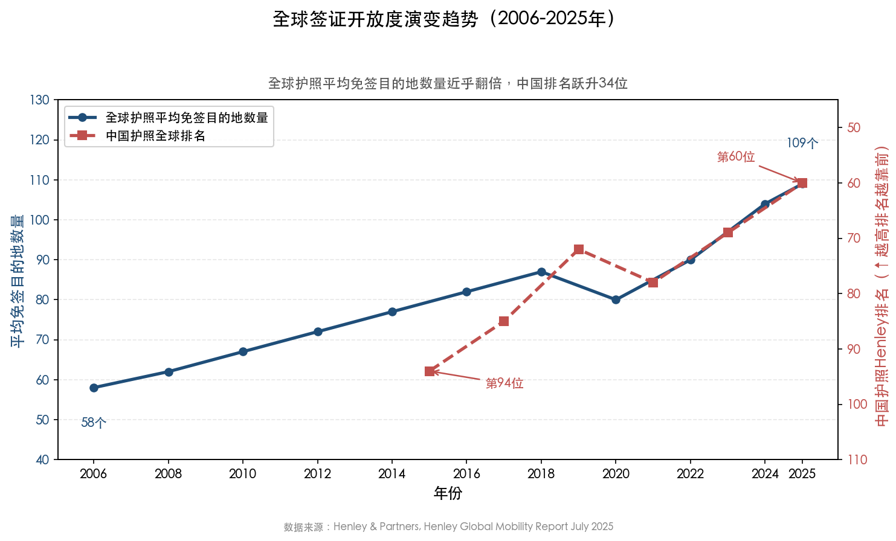

上图清晰呈现了两条重要轨迹：全球护照平均免签目的地数量在近二十年间稳步攀升，而中国护照的 Henley 排名则实现了从第 94 位到第 60 位的显著跃升，二者共同勾勒出全球签证自由化的长期趋势。

值得注意的是，传统强护照国家的相对优势正在收窄。美国护照从十年前的全球第 1 位降至 2025 年的第 10 位（免签 182 个目的地），英国从第 1 位降至第 6 位（186 个目的地） [Henley & Partners](https://www.henleyglobal.com/newsroom/press-releases/henley-global-mobility-report-july-2025 "Henley Global Mobility Report July 2025")。这一变化并非因为美英护照本身"变弱"，而是因为更多新兴经济体通过双边和多边谈判迅速拓展了免签网络，缩小了与发达国家的差距。美国公民在全球投资移民申请中的占比已达 21%，部分反映出护照实力相对下降后，高净值群体对国际流动策略的主动调整。

### 3.1.2 新门槛的出现：英国 ETA 与欧盟 ETIAS

在免签网络总体扩大的趋势下，部分发达经济体开始引入新的预审机制，为签证便利化的单边叙事增添了反向注脚。英国电子旅行授权（ETA）于 2025 年全面实施：1 月起覆盖美国、加拿大等非欧洲国家旅客，4 月起覆盖欧盟公民，费用为 10 英镑 [英国政府](https://www.gov.uk/guidance/check-when-you-can-get-an-electronic-travel-authorisation-eta "ETA官方页面")。尽管 ETA 本身不构成签证（审批通过率极高），但它要求旅客在出发前额外完成一道在线申请环节，客观上对"说走就走"的冲动旅行形成了微弱但可感知的摩擦。

欧盟则将 ETIAS（欧洲旅行信息和授权系统）延期至 2026 年第四季度启用 [欧盟旅行官方](https://travel-europe.europa.eu/en/etias "ETIAS官方页面")。ETIAS 将要求包括美国、加拿大、澳大利亚在内的 60 余国公民在入境申根区前完成预授权登记。延期本身表明，即使是规模最大的发达经济体联盟，在平衡安全筛查与旅游便利化之间也面临显著的技术和行政挑战。一旦 ETIAS 正式启用，其对全球旅游流量的短期影响值得密切关注——类似的预审制度在美国（ESTA）实施后，曾导致部分来源市场的短途旅行需求出现数个百分点的波动。

## 3.2 中国：签证自由化的"超级案例"

2025 年全球签证政策变化中，最引人注目的无疑是中国。中国在 Henley 护照指数上从 2015 年第 94 位升至 2025 年第 60 位 [Henley & Partners](https://www.henleyglobal.com/newsroom/press-releases/henley-global-mobility-report-july-2025 "Henley Global Mobility Report July 2025")——这一跃升并非源于中国护照持有人出境免签范围的大幅扩展（虽然也有进展），而主要得益于中国对外开放入境通道的力度：单方面免签国家增至 48 国，互免签证国家扩至 29 国，240 小时过境免签口岸从此前水平增至 65 个 [国家移民管理局](https://www.nia.gov.cn/n897453/c1762355/content.html "2025年近7亿人次出入境创历史新高")。Henley 开放指数显示，中国已对 75 个国家开放免签入境，而五年前这一数字不到 20 个。

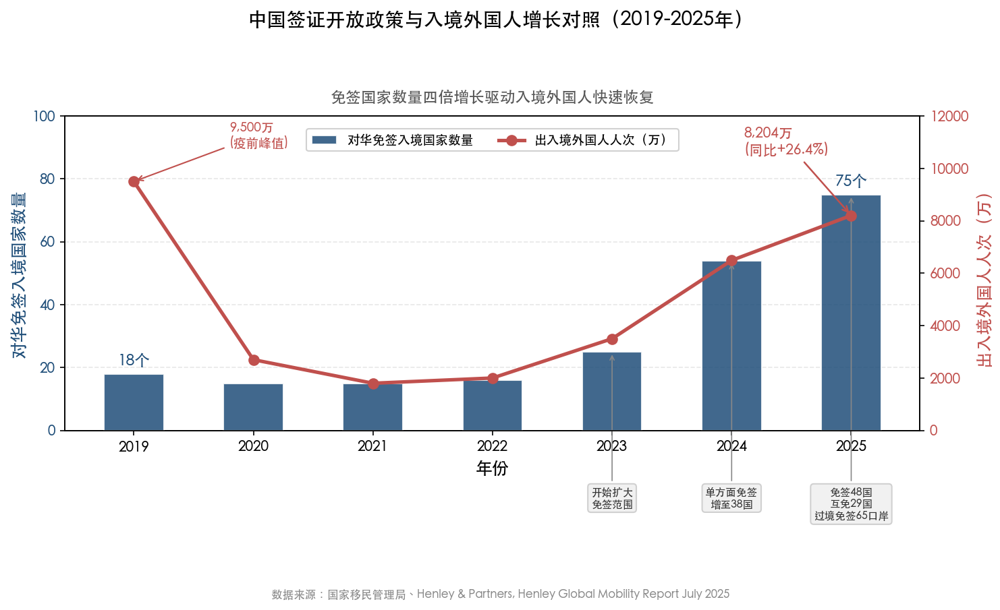

上图展示了 2019—2025 年间中国对外免签入境国家数量与出入境外国人人次的对照演变。从疫前的 18 个免签国家和 9500 万出入境外国人次，经历疫情期间的低谷，到 2025 年免签国家增至 75 个、出入境外国人恢复至 8204 万人次，政策松绑与入境增长之间的正向驱动关系清晰可见。

政策效果立竿见影。2025 年全年出入境外国人达 8203.5 万人次（同比 +26.4%），其中免签入境外国人 3008 万人次，占全部外国入境人次的 73.1%，同比增长 49.5% [国家移民管理局](https://www.nia.gov.cn/n897453/c1762355/content.html "2025年移民管理工作数据")。文化和旅游部部长孙业礼在 2026 年两会记者会上披露，2025 年入境旅游人次超过 1.5 亿（同比 +17%），入境旅游消费超过 1300 亿美元（同比 +40%） [CGTN](https://news.cgtn.com/news/2026-03-07/China-says-2025-inbound-trips-top-150-million-up-17-yoy-1Ljy6eDBwyY/p.html "2025年入境旅游超1.5亿人次，消费增长40%")。

然而，这一亮眼增长仍需置于更长的恢复周期中审视。携程研究分析师预计，2026 年中国外籍游客总量将达约 3800 万人次，仅为 2019 年峰值的约 60% [VisaHQ](https://www.visahq.com/news/2026-01-18/cn/chinas-inbound-tourism-roars-back-visa-free-arrivals-up-358-at-new-year-opening/ "Ctrip Research预测")。换言之，尽管免签政策带来了爆发式的增量，中国入境旅游的全面恢复仍是一个跨年度的渐进过程。签证政策解决了"能不能进来"的问题，但航线恢复、支付便利、语言服务等配套能力决定着增量能否持续转化。值得关注的是，2025 年入境游客移动支付消费已达 800 亿元人民币（约 110 亿美元），表明支付基础设施对外国旅客的开放正在加速推进。

中国东盟旅游团免签政策亦构成区域合作的新尝试。自 2025 年 2 月 10 日起，磨憨口岸对东盟国家旅游团实施免签（西双版纳停留最长 6 天），全年验放东盟旅游团超 160 个；黑河口岸对俄免签后，仅 9—10 月即有 4.6 万人次俄籍旅客入境（同比 +28.4%） [国家移民管理局](https://www.nia.gov.cn/n897453/c1762355/content.html "2025年移民管理工作数据")。这些陆路口岸的免签安排，使中国边境省份从单纯的"过路通道"升级为可停留数日的旅游目的地，为边境旅游经济注入了新的活力。

## 3.3 亚洲签证竞赛与中东突破：改革红利的区域扩散

中国并非唯一积极放宽签证的亚洲经济体。2025 年，越南、马来西亚、韩国等国的签证改革均产生了可观的入境旅游增量，亚洲范围内形成了一场竞争态势明显的签证便利化竞赛。

越南 2025 年接待外国游客 2120 万人次（同比 +20.4%），马来西亚截至 11 月已接待超 3830 万人次，韩国仅 1—10 月就接待了 470 万中国游客 [VnExpress](https://e.vnexpress.net/news/travel/visa/asian-countries-reap-benefits-from-visa-reforms-in-2025-4991490.html "Asian countries reap benefits from visa reforms in 2025")。这些数字背后，共同的驱动力是电子签证普及、免签范围扩大和签证费用降低的政策组合。

亚洲之外，沙特阿拉伯的签证改革同样引人瞩目。自 2019 年首次开放电子旅游签证以来，沙特已将电子签证覆盖范围扩至 66 个国家。2025 年沙特接待总游客 1.22 亿人次（同比 +5%），其中入境游客 2970 万人次（同比 +8%），旅游消费达 810 亿美元（同比 +6%）。这一表现使沙特提前六年超越了"愿景 2030"计划中年接待 1 亿游客的原定目标，新目标已上调至 2030 年 1.5 亿人次（含 7000 万国际游客和 8000 万国内游客） [Arab News](https://www.arabnews.com/node/2630117/amp "Saudi Arabia nears 2030 tourism target as visitor numbers hit 122m in 2025")。

区域性签证联通方面也在酝酿重大突破。沙特旅游部长艾哈迈德·哈提卜于 2025 年 11 月宣布，预计海合会（GCC）将于次年推出统一签证，届时一张签证即可通行沙特、阿联酋、卡塔尔、巴林、科威特和阿曼六国。若该政策落地，将极大降低国际旅客在海湾地区多国游的签证成本和时间摩擦，产生显著的"一签多国"乘数效应。

我们认为，2025 年的全球签证竞赛呈现出一个清晰的格局：大型新兴旅游目的地通过主动松绑签证创造增量需求，而传统旅游强国则在安全审查与便利化之间寻找新的平衡点。签证政策作为"制度红利"的释放，已成为目的地吸引力的关键变量——尤其是在多个目的地的自然和文化禀赋相近时，签证便利度往往成为旅客最终决策的差异化因素。

## 3.4 航空网络：运力扩张重塑目的地版图

### 3.4.1 全球航空运力的全面恢复

签证打开了"准入"的大门，但旅客能否便捷到达目的地，最终取决于航空网络的覆盖密度与运力规模。2025 年全球航空客运量（以收入客公里 RPK 衡量）同比增长 5.3%，其中国际客运增长 7.1%，客座率达 83.6%，创下历史纪录 [IATA](https://www.iata.org/en/pressroom/2026-releases/2026-01-08-02/ "IATA 2025年航空客运数据")。

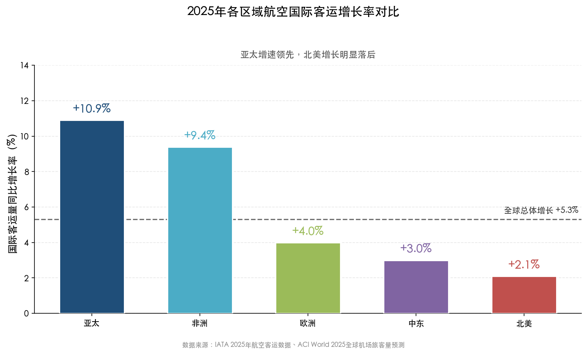

如上图所示，区域差异十分显著：亚太航空国际客运增长最快（+10.9%），反映了该区域签证放宽和出境需求释放的叠加效应；非洲以 +9.4% 紧随其后，彰显新兴市场航空基础设施加速追赶的势头；北美仅增长 2.1%，与前文所述美国入境旅游的下滑趋势形成一致。

国际机场协会（ACI）预测，2025 年全球机场旅客吞吐量达 98 亿人次（同比 +3.7%），接近 100 亿这一历史里程碑。其中亚太地区以 36 亿人次居首（+5.6%），非洲增速最快（+9.4%） [ACI World](https://aci.aero/2025/09/30/global-air-travel-forecasted-to-reach-9-8-billion-passengers-in-2025-nearing-the-historic-10-billion-milestone/ "ACI 2025全球机场旅客量预测")。这些数据表明，全球航空业不仅已全面走出疫情阴影，更在向新的运力高峰迈进。

### 3.4.2 新航线：打开"从无到有"的通道

航空网络对旅游流向的塑造作用，在新航线的开通中表现得最为直接。一条直航的开通，往往意味着一个目的地对特定客源市场从"不可能"到"可能"的质变。2025 年多条开创性国际航线实现首航：联合航空开通纽瓦克—格陵兰努克航线（美国航司首条格陵兰航线）及纽瓦克—乌兰巴托航线（首飞蒙古）；阿拉斯加航空开通西雅图—东京（该航司首条洲际航线）；意大利 Neos 航空开通纽约—巴里（首条美国—普利亚直航） [The Points Guy](https://thepointsguy.com/news/most-exciting-new-airline-routes-launched-in-2025/ "2025上半年最具看点新航线")。

这些航线的开通具有超越运力增量本身的信号意义。以格陵兰为例，此前从美国前往格陵兰需在冰岛或丹麦转机，全程耗时 12 小时以上，唯有最具决心的探险旅客才会将其纳入行程。直航将旅行时间压缩至约 5 小时，使格陵兰从"遥不可及的极地"变为"一个长周末可达的冒险目的地"。类似地，纽约—巴里直航的开通使意大利南部的普利亚大区绕过罗马和米兰等传统中转枢纽，直接对接北美客源市场——这对于希望分流游客压力、缓解北部城市过度旅游问题的意大利旅游战略而言，构成一个积极的结构性变化。

### 3.4.3 新机场：目的地基础设施的跃迁

航线的扩展离不开机场容量的支撑。2025—2026 年全球多座新机场投入运营，标志着多个新兴市场的航空基础设施实现代际跃迁：印度纳维孟买国际机场（一期设计容量 2000 万人次/年）、多莱拉国际机场（1200 万人次/年）、越南隆城国际机场（投资 46 亿美元，一期 2500 万人次/年）、澳大利亚西悉尼国际机场（1000 万人次/年） [Airport Industry-News](https://airportindustry-news.com/next-generation-airports-new-gateways-opening-in-2025-and-2026/ "2025-2026年新机场开通一览")。

其中，越南隆城机场的建设尤其具有战略意义。作为胡志明市现有新山一国际机场的补充枢纽，隆城机场一期即可处理 2500 万人次旅客，远期规划容量达 1 亿人次。对于年入境游客已突破 2100 万的越南而言，新机场容量的释放将有效解除增长瓶颈，使更多国际航线接入成为可能。印度两座新机场的同期投运，则与印度政府推动航空普惠和旅游基建的政策方向一致——纳维孟买机场的启用将分流孟买现有机场的严重拥堵，而多莱拉机场则为古吉拉特邦这一工业重镇开辟了独立的国际航空门户。

## 3.5 高铁与地面交通：延伸旅游目的地的"最后一公里"

航空解决的是跨国、跨洲的远距离可达性问题，但旅客抵达枢纽城市后能否便捷到达最终目的地，往往取决于高速铁路和地面交通网络的覆盖水平。2025 年，中国高铁的持续扩展为这一逻辑提供了极具说服力的案例。

中国高铁 2025 年客运量达 46 亿人次，承担全国铁路客运量的 70% 以上 [Travel and Tour World](https://www.travelandtourworld.com/news/article/unprecedented-rail-growth-in-china-the-impact-of-new-high-speed-routes-on-tourism-in-huangshan-zhejiang-and-inner-mongolia-heres-what-you-should-know/ "中国高铁扩展对旅游的影响")。这一体量使中国高铁已跻身全球最大的旅游客运系统之列。更值得关注的是新通车线路对旅游版图的重塑效应：池州—黄山线将世界文化与自然双重遗产黄山的高铁旅行时间大幅压缩，太子城—锡林浩特线则将内蒙古草原纳入"从北京出发两三小时可达"的范围。

高铁的旅游效应通过两重机制发挥作用。其一是"时间压缩效应"：当一个目的地从"需要一天才能到达"变为"两小时可达"时，其性质从"需要专程安排的长途目的地"转变为"可以周末短途造访的休闲去处"，潜在客群规模呈几何级放大。其二是"枢纽辐射效应"：高铁站点所在城市成为区域旅游的二次分发中心，带动周边县市旅游资源的开发和客流的纵深渗透。

高铁对旅游格局的影响并不局限于中国。正如本报告第四章将进一步讨论的，欧洲主要铁路线路上的碳排放比航空低 73%—91%，法国已立法禁止有铁路替代方案的短途航线。高铁正在超越单纯的交通工具属性，成为重塑旅客目的地选择的结构性力量——尤其是对短途和中程旅行而言，高铁的"门到门"时间优势、碳排放优势和站点位于城市中心的区位优势，正在系统性地替代部分短途航空需求，并在此过程中改变沿线城市的旅游吸引力格局。

## 3.6 通行能力的综合评估：从制度到基建的全链条协同

签证政策、航空网络和地面交通共同构成目的地"通行能力"的三角支撑。三者之间存在明显的协同效应与乘数效应。

以中国为例，免签政策的大幅放宽与入境航线的恢复、高铁网络的延伸形成了正向循环：免签降低了"想来"的门槛，新增和恢复的国际航线解决了"怎么来"的问题，高铁网络则将旅客从门户城市分散至更广泛的二三线旅游目的地。三者缺一不可——如果只有免签而缺乏直航，旅客仍需绕道转机；如果有直航但目的地国内交通不便，旅客将仅停留在枢纽城市而无法深入腹地。

反观美国，2025 年提供了一个鲜明的"反向案例"。如本报告前两章所述，美国入境旅客减少 6.3% 至 6790 万，是全球 184 个经济体中唯一国际入境游消费下滑的国家。这一下降固然受到经济和地缘政治因素的驱动，但签证和通行层面的摩擦同样不容忽视：旅行禁令从 12 国扩大至 39 国、多国政府发出赴美旅行警告、签证面试等待时间延长——这些因素叠加形成了"通行能力收缩"的负面信号，使潜在旅客将美国从候选名单中移除或推迟行程。与此同时，北美航空国际客运仅增长 2.1%，远低于亚太的 10.9%，也从供给侧印证了美国作为旅游目的地的可达性正在相对下降。

2025 年的全球图景表明，目的地的"通行能力"已从一个被动的行政条件演变为主动的竞争工具。签证自由化不再是少数前瞻性国家的个别举措，而是一场全球性的制度竞赛；航空网络的扩展不仅服务于既有需求，更在创造全新的目的地认知；高铁建设正在重新定义"可达性"的含义。对于旅客而言，这些变量往往在决策链条的早期阶段就发挥了关键的筛选作用——一个签证复杂、航线稀少、内部交通不便的目的地，即使拥有丰富的文化和自然资源，也难以进入大多数旅客的考虑范围。

# 第4章 气候、环境与可持续旅游意识——自然条件与绿色选择

前三章依次考察了经济账本、安全门槛与通行能力对旅客目的地决策的层层筛选。当这些"硬条件"基本满足后，一个日益重要的变量正从幕后走向前台：气候与环境。2025 年，极端天气事件的频率和烈度持续攀升，不仅直接改变了许多经典目的地的可游性窗口，也催生了"清凉度假"（coolcation）等新兴旅游流向。与此同时，旅客群体的可持续旅游意识显著提升，从被动回避灾害到主动选择低碳出行方式，再到各国政府陆续推出的过度旅游治理措施，气候与绿色因素正在系统性地重塑全球目的地竞争格局。本章从极端天气的直接冲击出发，逐步展开至气候驱动的旅游流向迁移、可持续消费意识的全球扩散、过度旅游治理的制度创新，以及生态旅游市场的结构性增长，揭示自然条件与绿色选择如何共同塑造 2025 年的目的地竞争力版图。

## 4.1 极端天气与自然灾害：目的地吸引力的硬约束

### 4.1.1 2025 年极端天气的全球图景

2025 年的气象灾害规模刷新了多项历史纪录。据 Gallagher Re 保险经纪公司年度统计，全球全年共发生 55 起十亿美元级气象灾害，总经济损失达 2,770 亿美元 [Yale Climate Connections](https://yaleclimateconnections.org/2026/01/earth-was-hit-by-55-billion-dollar-weather-disasters-in-2025/ "基于Gallagher Re保险经纪公司年度报告")。其中最严重的单一事件为 2025 年 1 月洛杉矶系列野火，单次损失约 610 亿美元，成为有记录以来最昂贵的野火灾害。这场野火不仅造成巨大的财产和生态损失，还对洛杉矶的旅游业形成直接冲击：Visit California 数据显示，2025 年 8 月加州国际航空入境旅客较 2024 年同期减少约 17 万人次，降幅近 8%；加拿大赴加州游客暴跌 38%，全年国际旅游预计下降 9% [CBS News LA](https://www.cbsnews.com/losangeles/news/los-angeles-international-tourism-decline-2025/ "Visit California报告，2025年9月")。野火产生的烟霾、持续恶化的空气质量以及目的地形象受损，共同构成对旅客出行决策的多重抑制。

欧洲的境况同样严峻。2025 年夏季热浪导致欧洲超过 24,000 人死亡，为有记录以来第六致命的热浪事件 [Yale Climate Connections](https://yaleclimateconnections.org/2026/01/earth-was-hit-by-55-billion-dollar-weather-disasters-in-2025/ "2025年欧洲热浪")。西班牙、葡萄牙、希腊等传统度假热门目的地部分地区气温超过 40°C，直接导致海滩临时关闭和景点实施限流 [CNBC](https://www.cnbc.com/2025/08/19/coolcations-are-booming-as-tourists-prioritize-quieter-off-peak-trips.html "热浪对南欧旅游的影响")。这些极端事件表明，气象灾害已不再是旅游业偶发的外生冲击，而是日趋常态化的结构性风险。

### 4.1.2 气温上升对旅游流量的量化冲击

极端高温与旅游流量之间的负向关系已获得学术验证。相关研究发现，目的地平均气温每上升 1°C，国际游客到访量下降 8.09%，旅游收入下降 6.04% [The Invading Sea](https://www.theinvadingsea.com/2025/09/03/tourism-extreme-heat-related-illnesses-climate-change-acropolis-greece-airlines-grounded-flights/ "极端高温对全球旅游的多维影响")。这一弹性系数意味着，在全球变暖趋势持续的背景下，地中海沿岸、南亚、中东等传统高温区域的夏季旅游窗口正在被系统性压缩。

该效应在 2025 年已有具象化体现：希腊雅典卫城在夏季多次因高温超过安全阈值而临时关闭，航空公司亦因跑道温度过高被迫取消部分航班。极端天气由此从偶发的"运气问题"转变为旅客必须纳入目的地评估框架的结构性风险因子，其影响贯穿于旅行决策的计划期、执行期和体验质量全链路。

## 4.2 气候驱动的季节位移与"清凉度假"新趋势

### 4.2.1 北欧成为南欧旅客的"避暑港"

面对高温威胁，欧洲旅客正以可观的速度"用脚投票"。欧洲旅游委员会（ETC）2025 年春夏调研（覆盖欧洲多国旅客）显示，81% 的欧洲人表示气候变化在某种程度上影响了其出行方式，较上一年上升 7 个百分点；17% 的旅客更密切地关注天气预报以指导行程安排，15% 主动寻求温和气候目的地，14% 明确表示会回避极端高温地区 [ETC](https://etc-corporate.org/news/europe-travel-spring-summer-2025/ "ETC Monitoring Sentiment for Intra-European Travel Wave 21，2025年4月发布")。南欧和地中海目的地虽仍是欧洲旅客的首选区域（吸引 41% 的旅客），但其受欢迎程度同比下降了 8 个百分点，部分旅客转向奥地利、波黑、阿尔巴尼亚、比利时和保加利亚等气候更温和的替代目的地 [ETC](https://etc-corporate.org/news/europe-travel-spring-summer-2025/ "ETC 2025年春夏旅行趋势")。

高端旅行市场的数据进一步印证了这一趋势。据 Forbes 引用 ETC 数据，28% 的欧洲旅客主动寻求凉爽气候目的地 [Forbes](https://www.forbes.com/sites/davidnikel/2025/06/17/the-coolcation-trend-is-heating-up-and-the-numbers-prove-it/ "ETC和Virtuoso清凉度假趋势数据")。高端旅行网络 Virtuoso 的数据更为醒目：凉爽气候目的地（挪威、冰岛、加拿大）的预订量同比增长 44%，79% 的旅行顾问表示极端天气已切实影响了客户的旅行规划决策。

### 4.2.2 航线数据验证流向迁移

航空预订数据为"清凉度假"趋势提供了硬证据。SAS 航空数据显示，2025 年夏季南欧飞往挪威的预订量出现大幅增长：法国出发增长 22%，斯塔万格接待的南欧访客增长 38%，克里斯蒂安桑更是增长 52% [Forbes](https://www.forbes.com/sites/davidnikel/2025/06/17/the-coolcation-trend-is-heating-up-and-the-numbers-prove-it/ "SAS航空2025年北欧航线预订数据")。北欧国家凭借夏季 15-25°C 的宜人气温、漫长的白昼和高纬度自然景观，正在从"小众冷门"升级为"主流替代"选项。

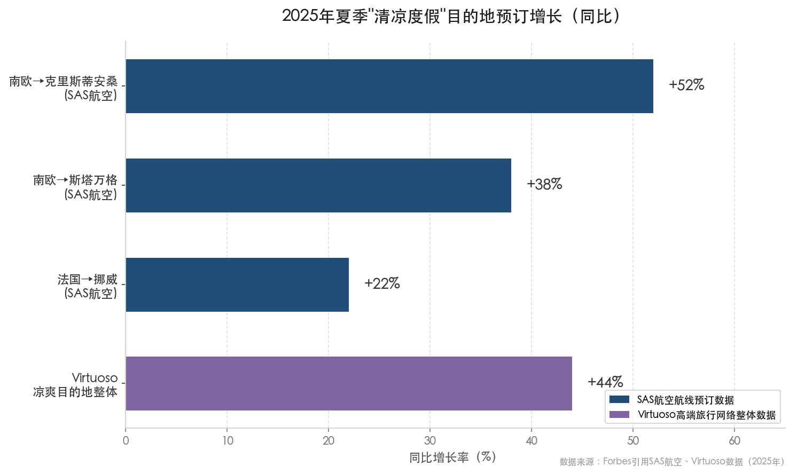

上图汇总了 SAS 航空各航线预订增长数据与 Virtuoso 高端旅行网络凉爽气候目的地整体 +44% 的增长表现，直观呈现了南欧旅客向北欧迁移的量化趋势。

这一流向迁移的深层逻辑在于：极端天气不仅改变了旅客的即时出行选择，更在重塑旅游目的地的长期比较优势。过去被视为"夏季偏冷"的北欧、加拿大、新西兰南岛等高纬度地区，正因全球变暖而进入最佳旅游温度区间；而传统的地中海度假带则面临夏季"过热"的结构性挑战。气候变化由此成为一种重新分配全球旅游资源的底层力量。

## 4.3 可持续旅游意识的全球崛起

### 4.3.1 欧美旅客：从理念认同到行为转变

可持续旅游正从一种小众价值取向演变为主流消费偏好。Booking.com 2025 年可持续旅行年度报告（第 10 版，覆盖 34 个国家、32,000 名旅客）显示，93% 的旅客希望在旅行中做出更可持续的选择，53% 首次意识到旅游对当地社区的影响，69% 希望"离开时让目的地变得比到来时更好" [Booking.com](https://news.booking.com/bookingcoms-2025-research-reveals-growing-traveler-awareness-of-tourism-impact-on-communities-both-at-home-and-abroad/ "第10版可持续旅行年度报告")。

然而，意识与行动之间仍存在显著的"绿色鸿沟"。尽管旅客普遍表达了可持续意愿，但在实际出行决策中，价格和便利性往往仍居于优先位次。这一矛盾在过度旅游治理议题上表现得尤为突出：39% 的旅客会主动寻求错峰旅行建议，36% 选择替代目的地以避免拥挤，但仅 16% 认为应当对游客数量设限——多数旅客希望维持自身的出行自由，同时期望"其他人"减少旅行 [Booking.com](https://news.booking.com/bookingcoms-2025-research-reveals-growing-traveler-awareness-of-tourism-impact-on-communities-both-at-home-and-abroad/ "旅客对过度旅游治理的态度")。这种"利他预期、利己实践"的心理张力，是理解可持续旅游意识如何转化为实际目的地选择行为的关键。

### 4.3.2 亚太市场：可持续意识的加速觉醒

可持续旅游意识并非欧美旅客的专利，亚太市场正呈现快速追赶态势。Agoda 2025 年可持续旅行调查（覆盖亚洲 11 个市场、6,081 名受访者）显示，68% 的亚洲旅客在 2025 年旅行规划中考虑了可持续性因素。分市场来看，菲律宾旅客的可持续意识最强（86%），其后依次为印度（82%）、中国台湾（80%）、马来西亚（80%）和越南（77%）。近四分之一的受访者将"追求真实体验"作为践行可持续旅行的首要动机，另有 22% 希望通过旅行直接支持当地经济 [Agoda](https://www.agoda.com/press/more-sustainable-travel-top-of-mind-for-most-asian-travelers-agoda-survey-reveals/ "Agoda 2025年亚洲可持续旅行调查，2025年3月发布")。

值得关注的是，亚洲旅客的可持续行为更偏向"避免过度旅游"的实践路径：近四分之一的受访者选择在非高峰季节出行以缓解目的地拥挤，20% 选择具有可持续认证的住宿，18% 携带可重复使用物品以减少废弃物。日本旅客在减少废弃物方面表现尤为突出，25% 会随身携带可重复使用的水瓶和购物袋 [Agoda](https://www.agoda.com/press/more-sustainable-travel-top-of-mind-for-most-asian-travelers-agoda-survey-reveals/ "Agoda 2025年可持续旅行调查")。然而，区域内部的分化同样显著：中国香港和日本分别有 21% 和 17% 的旅客明确表示可持续性在旅行选择中"不太重要"，反映出经济发展水平、文化传统和旅行消费惯性对可持续意识渗透的差异化制约。

### 4.3.3 低碳交通：铁路对航空的绿色替代

在碳足迹考量与出行方式选择的交汇处，铁路正在重新定义欧洲短途旅行的交通生态。主要欧洲线路上，铁路碳排放比航空低 73%-91%——以伦敦至巴黎为例，乘火车产生约 22 千克 CO₂，而搭乘飞机则高达 244 千克 [CarbonClick](https://www.carbonclick.com/news-views/train-tourism-carbon-savings-compared-to-flights "铁路与航空碳排放对比，引用DEFRA和Eurostar研究")。法国已率先立法禁止有铁路替代方案的短途航线，该政策实施后使国内航空碳排放减少 12%。这一制度创新正在向欧洲其他国家扩散，从供给侧推动旅客向低碳交通方式迁移。

从目的地竞争力的角度审视，铁路网络的密度和效率正在成为一项新的比较维度。拥有发达高铁网络的欧洲城市（如巴塞罗那、米兰、阿姆斯特丹）在吸引环保敏感型旅客方面具备天然优势，而铁路可达性较差的目的地则可能因碳足迹劣势而在该客群中失去竞争力。这一趋势与第三章讨论的交通可达性议题形成呼应——铁路不仅降低了出行门槛，更为目的地赋予了"绿色可达"的品牌价值。

## 4.4 过度旅游治理：从游客涌入到制度管控

### 4.4.1 欧洲城市的政策创新

2025 年，过度旅游治理从零星试验进入系统化立法阶段，多个欧洲标志性目的地出台了具有里程碑意义的管控措施。

威尼斯在 2024 年试点日间游客入城费（实施 29 天，累计收取 240 万欧元）的基础上，2025 年将实施天数扩展至 54 天（覆盖 4-7 月），提前预订费用为 5 欧元，临时购买则为 10 欧元 [AP News](https://apnews.com/article/venice-day-tripper-tax-ef31062e7a6b9e3c831d6a8b746eae1a "威尼斯入城费第二年实施")。尽管 2024 年试点期间客流未见明显下降，该措施在经济调节层面的效果尚有待观察，但其制度象征意义深远：标志着热门目的地正式将"旅游税"从酒店住宿环节延伸到目的地准入层面。

西班牙的治理力度更为激进。马拉加自 2025 年 1 月起实施三年新假日租赁登记冻结，从住宿供给端限制游客接待能力；加泰罗尼亚计划将旅游税上调至最高每晚 15 欧元 [Travel and Tour World](https://www.travelandtourworld.com/news/article/spain-greece-florence-venice-amsterdam-and-other-major-cities-across-europe-are-pushing-back-against-overtourism-with-radical-new-laws-that-will-impact-your-travel-plans-in-2025/ "欧洲过度旅游治理措施汇总")。阿姆斯特丹则采取了独特的"反营销"策略，推出"请勿前来"（Stay Away）广告运动，专门针对以夜生活为目的的派对游客进行劝阻。希腊则对圣托里尼实施每日邮轮到港数量限制，从源头控制瞬时客流峰值。

### 4.4.2 亚洲的治理实践：京都与富士山

亚洲的过度旅游治理同样在 2025 年取得突破性进展。京都于 2025 年 10 月宣布将住宿税大幅上调，最高涨幅达 900%：每晚房价 10 万日元以上的住宿，税额从 1,000 日元升至 10,000 日元（约 70 美元），新税率计划于 2026 年 3 月生效。这一举措的背景是 2024 年京都接待了创纪录的 1,088 万名外国游客，游客过载对祇园等传统街区居民的日常生活造成严重干扰 [USA Today](https://www.usatoday.com/story/travel/2025/10/16/kyoto-tourist-tax-japan/86728814007/ "京都住宿税上调900%")。

富士山的治理措施更具系统性。2025 年攀登季（7 月至 9 月初）起，所有四条登山路线首次统一收取 4,000 日元（约 28 美元）入山费，较 2024 年吉田路线的 2,000 日元翻倍，而此前静冈县三条路线甚至不收费。吉田路线同步实施每日 4,000 人的登山者上限和在线预约制度，所有路线在每日 14:00 至次日 3:00 关闭以杜绝危险的"弹丸登山"行为 [The Japan Times](https://www.japantimes.co.jp/news/2025/06/30/japan/society/mount-fuji-entry-fee/ "2025年6月30日报道")。2024 年攀登富士山的总人数为 204,316 人，较 2023 年的 221,322 人下降近 8%，初步显示管控措施对客流的调节效果。

下表汇总了欧洲与亚洲主要目的地在 2025 年实施的过度旅游治理措施，涵盖治理工具类型、实施时间节点及初步效果评估。

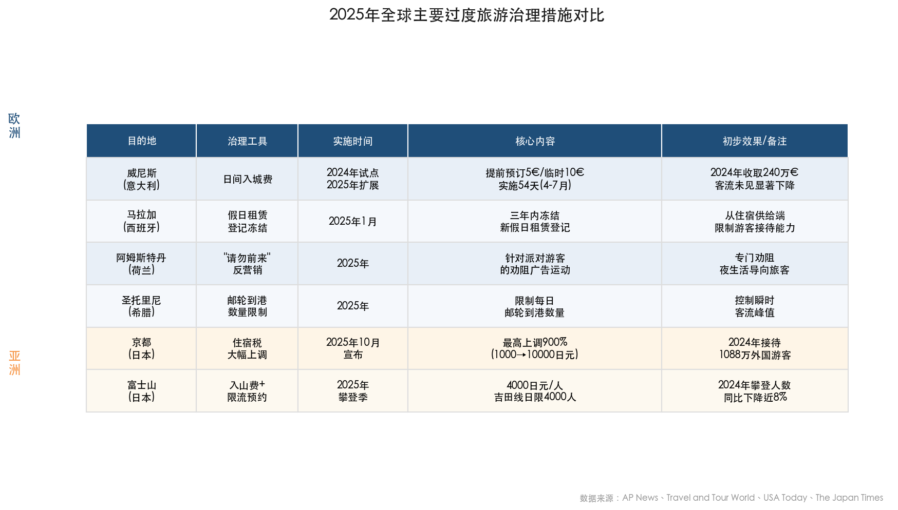

### 4.4.3 治理措施对目的地选择的传导机制

过度旅游治理对旅客决策的影响通过三条路径传导。其一，经济门槛的提升直接增加旅行成本，驱使价格敏感型旅客转向未设限的替代目的地。其二，预约制和每日限额制造了"供给稀缺"效应，旅客被迫将行程规划大幅提前或放弃特定目的地。其三，也是最深层的影响——治理措施正在重新定义"好的旅行"的社会叙事：当威尼斯公开"征收入城税"、阿姆斯特丹宣传"请勿前来"时，旅客开始重新审视"到此一游"式的打卡旅行的价值，转而倾向更深度、更小众、停留时间更长的旅行模式。

ETC 调研数据支持了上述判断：55% 的欧洲旅客倾向于选择"非主流路线"目的地，较此前上升 7 个百分点；选择冷门目的地的旅客平均停留时间更长（38% 计划超过 10 天，而选择传统热门目的地的旅客这一比例仅为 21%），人均消费亦更高 [ETC](https://etc-corporate.org/news/europe-travel-spring-summer-2025/ "ETC 2025年春夏旅行趋势")。换言之，过度旅游治理在限制客流的同时，可能正在筛选出更高质量的旅客群体，为目的地带来"少而精"的经济收益结构。

## 4.5 生态旅游市场的结构性增长

上述趋势汇聚成一个清晰的产业信号：生态旅游正从边缘品类成长为主流赛道。据 IMARC Group 统计，全球生态旅游市场 2024 年估值 2,198 亿美元，预计到 2033 年将达到 6,487 亿美元，复合年增长率为 11.43%，千禧一代是该市场的主导消费群体 [IMARC Group](https://www.imarcgroup.com/ecotourism-market-statistics "全球生态旅游市场统计报告")。

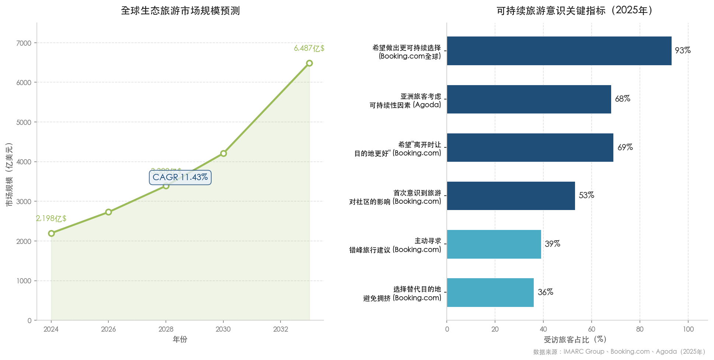

上图左侧展示了全球生态旅游市场 2024-2033 年的规模增长预测，右侧汇总了 Booking.com 和 Agoda 两大平台调查所揭示的可持续旅游意识关键数据，将市场增长趋势与消费者意识演变并置呈现。

这一增长由需求侧和供给侧的双重动力驱动。需求侧，旅客——尤其是 30 岁以下群体——越来越将目的地的生态品质视为核心评价标准，自然保护区、国家公园、生态度假村等"绿色目的地"的搜索量和预订量持续攀升。供给侧，各国政府和旅游业者亦在加速推出生态旅游产品以回应这一需求：从哥斯达黎加的碳中和度假村到不丹的"高价值、低客流"旅游政策，再到中国大力推广的国家公园体系，生态旅游的供给端正在快速扩容。

在可持续旅行与目的地选择的关联上，一个值得关注的现象是旅客的可持续偏好正在催生新的"目的地溢价"。如前文所述，选择非主流、非拥挤目的地的旅客不仅停留时间更长，其人均消费往往也更高。这意味着，那些主动拥抱可持续治理、积极保护自然与文化遗产的目的地，有望在长期竞争中获得更高质量的客流和更可观的经济回报——可持续发展由此从"道德义务"转化为"竞争优势"。

## 4.6 本章小结

2025 年，气候、环境与可持续意识对旅客目的地选择的影响已从边缘变量上升为核心驱动因素。极端天气事件——洛杉矶野火导致加州国际旅游下降 9%、欧洲热浪致超 24,000 人死亡——直接削弱了传统热门目的地的夏季吸引力，研究表明目的地气温每上升 1°C，国际游客到访量即下降 8.09%。这一压力催生了以北欧为代表的"清凉度假"新流向，凉爽气候目的地预订量增长高达 44%，南欧至挪威部分城市的航线预订增幅超过 50%。

全球范围内，93% 的旅客希望做出更可持续的旅行选择，68% 的亚洲旅客将可持续性纳入旅行规划，可持续意识正在重塑从交通方式到住宿选择的全链路决策。与此同时，威尼斯入城费扩展、京都住宿税上调 900%、富士山统一限流预约制等治理措施，正以经济门槛提升、容量刚性管控和社会叙事重塑三重机制，推动旅客从"热门目的地打卡"转向"冷门目的地深度游"。全球生态旅游市场以 11.43% 的复合增长率快速扩张（2024 年 2,198 亿美元，预计 2033 年达 6,487 亿美元），预示着气候与可持续因素将在未来数年持续深化其对全球旅游地理格局的重塑作用。

# 第5章 科技驱动与信息生态——"种草"到"下单"的决策重塑

前四章分别从经济预算、安全筛选、通行便利和自然环境四个维度，勾勒了旅客"能不能去"某一目的地的客观约束条件。然而，在这些硬性门槛之上，2025 年旅客对目的地的认知、比较与最终选择，正以前所未有的速度被数字技术和信息传播生态所重塑。社交媒体上一条短视频的病毒式传播，可在数日内将一个默默无闻的小镇推上全球热搜；一款 AI 旅行助手的个性化推荐，能在几秒钟内生成比传统旅行社更详尽的行程方案。从"被种草"到"点击下单"，旅客的决策链条正经历一场深刻的结构性变革——而这场变革的主导力量，正是社交媒体、生成式 AI 和在线旅行平台（OTA）构成的数字化信息生态。

## 5.1 社交媒体：目的地灵感的第一入口

### 5.1.1 从"口碑推荐"到"社交媒体种草"的权力转移

旅行灵感的获取方式在 2025 年发生了标志性的代际转换。Data Axle 对 1,000 名美国旅客的调查显示，66% 的 Z 世代依赖 Instagram 和 TikTok 获取目的地灵感，社交媒体已超越口碑推荐（55%）成为旅行灵感的首要来源 [Data Axle调研](https://www.data-axle.com/about-us/news-media-coverage/survey-how-pop-culture-social-media-personalization-are-shaping-modern-travel/ "2025年4月，1,000名美国旅客调查")。Skift Research 的年度美国旅客趋势报告进一步佐证了这一判断：54% 的美国旅客通过社交媒体发现旅行内容，超过半数曾通过社交媒体链接直接完成预订 [Skift Research](https://skift.com/2025/07/31/u-s-traveler-trends-2025-more-social-media-and-ai-a-rebound-for-online-travel-agencies/ "U.S. Traveler Trends 2025报告")。社交媒体对传统信息中介的替代效应已不局限于"灵感激发"环节，而是向预订转化方向纵深渗透。

这一趋势并非美国市场的孤立现象。在中国，小红书（RedNote）已成为 35 岁以下旅客最重要的旅行信息来源。Dragon Trail 的调查指出，尽管携程等 OTA 仍是预订和规划的核心工具，小红书在旅行灵感获取环节已取代传统渠道，成为年轻群体的首选平台 [Dragon Trail](https://www.dragontrail.com/resources/blog/china-traveler-sentiment-report-april-2025 "Chinese Traveler Sentiment Report, April 2025")。小红书商业数据中台的数据显示，平台月活旅行兴趣用户超 2.3 亿，其中超 80% 在出行前通过平台查阅攻略，每月产生超 24 亿次旅行相关搜索，"#跟着兴趣去旅行"话题浏览量突破 15 亿次 [环球旅讯](https://m.traveldaily.cn/article/189197 "2026年1月，引用小红书商业数据中台2025年11-12月数据")。小红书在旅行领域形成独特优势的根基在于其内容生态的"真实感"——平台 90% 以上内容为用户原创而非网红转发，且主动限制付费推广帖比例；平均每位中国用户在预订旅行前会在小红书输入超 100 条搜索词、阅读超 300 篇笔记 [Skift](https://skift.com/2025/02/05/what-travel-brands-should-know-about-chinas-rednote/ "2025年2月，引用Dragon Trail数据")。这种高密度的用户自发信息交互，使小红书在旅行决策中扮演的角色更接近"社区化的搜索引擎"而非传统社交媒体。

### 5.1.2 TikTok：短视频重构目的地发现逻辑

在全球范围内，TikTok 对旅行决策的渗透力在 2025 年持续深化。平台旅行相关标签帖子量在过去一年激增 250%，39% 的 TikTok 用户因平台内容完成旅行预订或消费，69% 的英国用户表示在平台上发现了此前从未了解过的旅行品牌 [Travel Weekly UK](https://travelweekly.co.uk/in-depth/comment-how-tiktok-is-shaping-travel-trends-in-2025 "2025年1月，TikTok旅行负责人署名评论")。短视频平台改变的不仅是信息触达效率，更是目的地发现的底层逻辑：传统旅行灵感获取遵循"先确定目的地、再搜索攻略"的线性路径，而 TikTok 上一段意外刷到的日落画面、一个偶然出现的美食视频，往往在用户尚无出行意图时就完成了"种草"。这种"被动发现"机制使得小众目的地获得了与传统热门景点平等的曝光机会，从根本上打破了旅游信息的分发层级。

与此同时，社交媒体的功能边界已从单纯的灵感触发向决策全链条延伸。80% 的千禧一代和 Z 世代旅客使用旅行规划应用或社交媒体辅助出行规划，83% 认为生成式 AI 在旅行预订的至少一个环节有用 [American Express 2025全球旅行趋势报告](https://www.americanexpress.com/en-us/travel/discover/get-inspired/global-travel-trends "Morning Consult执行，覆盖美英日印等7国8,000+旅客")。社交媒体正逐步渗透至比价、评价、预订等环节，形成闭环式的旅行消费路径——从灵感入口到交易终点，旅客可以在同一平台生态内完成全部决策动作。

### 5.1.3 网红目的地生命周期：从"爆红"到"反噬"

社交媒体赋予小众目的地"一夜成名"能力的同时，也引发了前所未有的治理挑战。2025 年 1 月，意大利阿布鲁佐大区的滑雪小镇 Roccaraso 因 TikTok 网红直播及低价巴士游推广（往返仅 20—30 欧元），单日涌入 260 辆旅游大巴和超 10,000 名游客，远超该镇 1,600 名常住居民的承载能力。市长被迫紧急出台限制措施，将周末旅游大巴数量限制为 100 辆并要求在线预约 [The Guardian](https://www.theguardian.com/world/2025/jan/30/italian-town-roccaraso-clamps-down-visitors-tiktok-tourism "2025年1月30日")。Roccaraso 案例成为 TikTok 驱动过度旅游的标志性事件，揭示了社交媒体"种草"的双面性——高效的信息传播既能为目的地带来经济红利，也可能在极短时间内击穿其基础设施和社区承载力。

类似的冲击波蔓延至全球各地。中国海南某国家公园因一条获 65,000 个赞的"云海日出"短视频，单月日均客流从 50 人激增至 600 人——增幅逾十倍 [Domus杂志](https://www.domusweb.it/en/news/2025/06/10/overtourism-problem-instagram-influencers-photography.html "2025年6月，引述学术研究")。这些案例共同指向一个结构性矛盾：社交媒体算法追求的是内容传播效率最大化，而旅游目的地的承载力则存在刚性上限，二者之间缺乏有效的缓冲机制。

面对社交媒体信息过载对目的地的潜在伤害，旅客群体自身也开始做出调适。Booking.com 对 27,713 名受访者的调查显示，44% 的旅客表示将主动避免在社交媒体上标记地理位置，以防止游客蜂拥而至 [Booking.com 2025旅行预测](https://www.booking.com/articles/travelpredictions2025.html "2025年，27,713名受访者")。这一数据折射出旅客群体中正在萌生的"信息伦理自觉"——他们既是社交媒体种草的受益者，也开始意识到无节制的信息扩散可能摧毁他们所珍视的旅行体验。这种自发的信息克制行为，与第四章讨论的过度旅游治理政策形成呼应：行政限流措施从供给端控制客流量，而旅客的主动信息保护则从需求端减缓病毒式传播的加速效应。

## 5.2 AI 旅行规划：从辅助工具到决策伙伴

### 5.2.1 全球 AI 旅行规划采纳率的快速攀升

生成式 AI 在 2025 年加速渗透旅行决策的各个环节。Phocuswright 对美英法德四国旅客的调查显示，美国旅客的 AI 旅行规划使用率达到 33%，远超英国（22%）、法国（19%）和德国（15%），且各国使用率较 2024 年均增长 3—4 个百分点 [TravelPulse报道Phocuswright报告](https://www.travelpulse.com/news/technology/ai-goes-mainstream-in-travel-planning-new-report-finds "2025年8月，基于美英法德四国调查")。

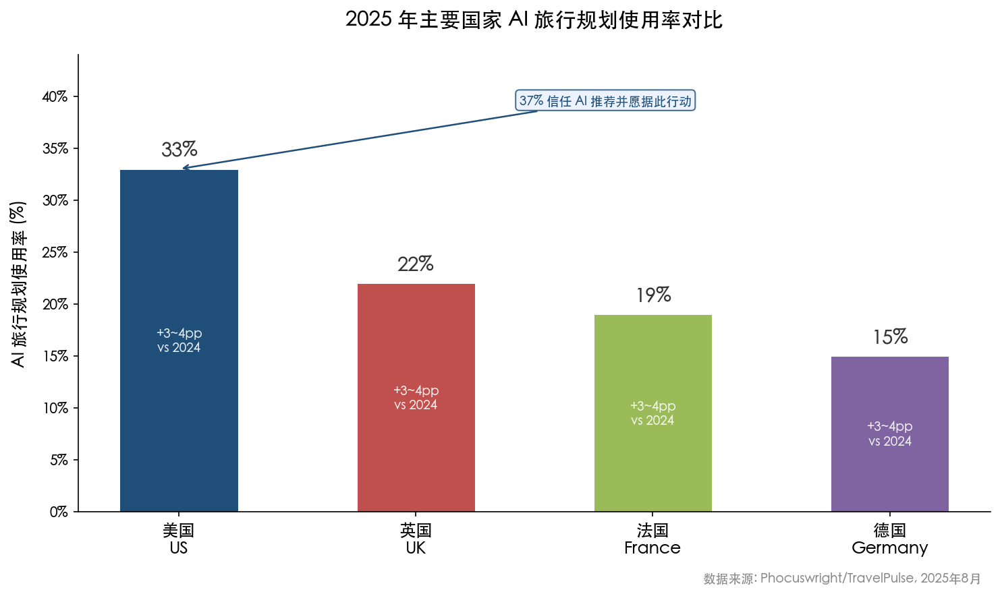

**图 5-1：2025 年主要国家 AI 旅行规划使用率对比。** 美国以 33% 的使用率领跑，各国较 2024 年均提升 3—4 个百分点；37% 的美国旅客信任 AI 推荐并愿据此行动。数据来源：Phocuswright/TravelPulse，2025 年 8 月。

Beach.com 对 1,003 名美国旅客的调研显示出更高的渗透率——66% 的美国旅客已在旅行规划的某个环节使用 AI。值得关注的是 AI 影响力在决策链条各环节的分布差异：景点选择（43%）、餐厅选择（34%）和住宿选择（26%）是 AI 影响力最集中的环节，而对目的地选择本身的影响力仅为 17% [Beach.com调研](https://www.beach.com/trends/ai-trip-planner-survey/ "2025年9月，1,003名美国旅客")。

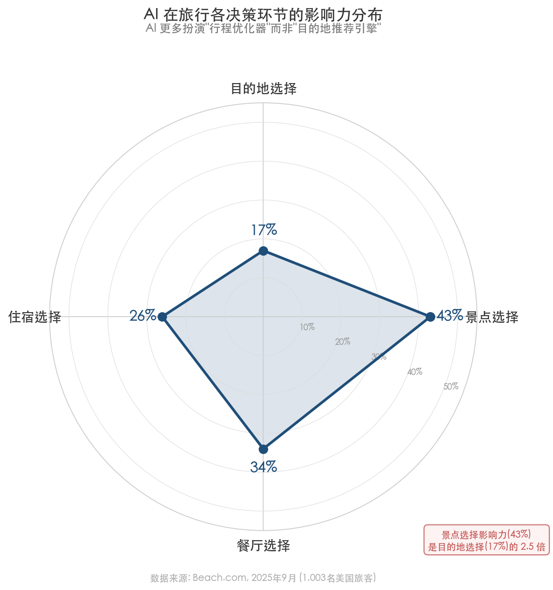

**图 5-2：AI 在旅行各决策环节的影响力分布。** 景点选择（43%）的 AI 影响力是目的地选择（17%）的 2.5 倍，表明 AI 在 2025 年更多扮演"行程优化器"而非"目的地推荐引擎"。数据来源：Beach.com，2025 年 9 月。

这一结构性特征揭示了 AI 在旅行决策中的当前定位：旅客倾向于先在社交媒体上完成目的地的感性"种草"，再借助 AI 完善具体行程细节。AI 擅长的是结构化信息的整合与比较（如航班时刻、酒店价格、景点开放时间），而非激发旅客对某一目的地的情感共鸣——后者仍是短视频和用户原创内容的优势领域。

Booking.com 对全球 33 个市场 37,325 名消费者的调查则描绘出更为乐观的前景：89% 的受访者希望在未来旅行规划中使用 AI，67% 已在旅行的某个环节使用 AI [Booking.com全球AI情绪报告](https://news.booking.com/bookingcom-releases-the-global-ai-sentiment-report/ "2025年7月")。然而，信任度仍构成 AI 深度渗透的瓶颈。AI 助手（24%）作为旅行信息来源的受信任度虽已超越旅行博主（19%）和社交媒体网红（14%），但仅 6% 的旅客表示完全信任 AI 提供的旅行建议；37% 的美国旅客信任 AI 推荐并愿据此行动 [TravelPulse报道Phocuswright报告](https://www.travelpulse.com/news/technology/ai-goes-mainstream-in-travel-planning-new-report-finds "2025年8月")。"广泛使用但有限信任"的格局，折射出旅客对 AI 的实用主义态度——将其视为高效的信息聚合工具，而非可以托付决策权的可靠顾问。

### 5.2.2 AI 信任度的代际分化

AI 旅行规划的采纳并未呈现简单的"年轻人更积极"格局，反而出现了耐人寻味的代际反转。YouGov 对 880 名美国旅客的调查显示，18—24 岁群体对 AI 旅行规划的舒适度从 2024 年的 47% 大幅降至 2025 年的 34%（-13 个百分点），而 35—44 岁群体反升至 41%，成为最积极使用 AI 旅行规划的人群 [YouGov调研](https://yougov.com/en-us/articles/52770-comfort-with-ai-in-travel-planning-dips-among-younger-americans "2025年7月，880名美国旅客")。

这一反转的深层逻辑在于两个群体对 AI 生成内容的预期差异。Z 世代作为"数字原住民"，对 AI 输出的同质化和不准确性有着更为敏锐的感知——他们在社交媒体上追求"真实感"和"活人感"的偏好，与 AI 的标准化输出之间存在内在张力。相比之下，35—44 岁的职场中坚人群更看重效率，愿意接受 AI 在信息整合和行程优化方面的实用价值，而非苛求内容的个性化与情感温度。这一分化表明，AI 旅行工具的未来发展方向不应仅追求功能覆盖的广度，更需解决内容生成的"个性化悖论"——如何在高效标准化输出与满足用户独特性需求之间取得平衡。

### 5.2.3 中国 OTA 的 AI 旅行助手实践

在中国市场，头部 OTA 平台的 AI 旅行助手已从概念验证进入规模化应用阶段，其演进路径为全球 AI 旅行工具的发展提供了重要参照。携程集团 2023 年推出的 AI 旅行助手 TripGenie，至 2025 年用户量突破 1 亿，覆盖 200 多个国家和地区 [新浪财经](https://finance.sina.com.cn/stock/roll/2026-01-04/doc-inhfeeem8740661.shtml "2026年1月，引用携程财报数据")。根据携程年度数据，2025 年使用 AI 规划旅行的搜索用户比例同比提升 270%，深度使用 AI 问答产品"携程问道"的用户规模增长 367% [粤TV](https://m.itouchtv.cn/article/06490add03608e1b8fa48fc3ea6a2dce "2025年，引用携程报告")。

在功能层面，TripGenie 的酒店比较工具将用户所需点击次数减少了 80%，并推动七日回访率提升 45%；AI 助手使平均用户会话时长增加约 50%，售后阶段 AI 工具处理了超过 80% 的客户咨询 [Travolution](https://www.travolution.com/news/trip.com-sets-out-three-years-of-contrasting-ai-use-in-travel/ "2026年3月，Trip.com三年AI使用数据") [雷峰网](https://m.leiphone.com/category/industrynews/GpXdjTAZuKko5bij.html "2025年，引用携程一季度数据")。这些数据表明，AI 旅行助手的价值不仅体现在前端的行程推荐，更在于对整个用户生命周期——从搜索、比价到售后服务——的全链条效率提升。

Trip.com 的全球数据还揭示了 AI 旅行助手使用行为的区域分化：在香港、新加坡、马来西亚等短途高频旅行市场，用户更倾向于在旅途中实时使用 AI 做即时决策；而在欧美市场，AI 的使用集中在出发前数周的规划阶段，主要用于比较航班和住宿 [Travolution](https://www.travolution.com/news/trip.com-sets-out-three-years-of-contrasting-ai-use-in-travel/ "2026年3月")。整体而言，AI 辅助的订单量同比增长约 400%，近 60% 的 AI 交互已与预订直接相关 [Travolution](https://www.travolution.com/news/trip.com-sets-out-three-years-of-contrasting-ai-use-in-travel/ "2026年3月")。从"灵感激发"工具到"端到端旅行伴侣"的角色跃迁，标志着 AI 在中国 OTA 生态中已跨越"可用"门槛，进入"深度嵌入"阶段。

### 5.2.4 AI 助力分流与反过度旅游

AI 在旅行规划中的价值不仅体现在效率提升，更在于其引导旅客分流的潜力。Booking.com 的全球 AI 情绪报告显示，71% 的旅客认可 AI 推荐可以帮助他们避开过度拥挤的目的地或高峰时段 [Booking.com全球AI情绪报告](https://news.booking.com/bookingcom-releases-the-global-ai-sentiment-report/ "2025年7月")。AI 在旅途中最常用于语言翻译（45%）、活动推荐（44%）和餐厅推荐（40%），这些功能有效降低了旅客探索非热门区域的信息门槛，在客观上有助于将客流从过度饱和的核心景区引导至周边区域。

结合第四章讨论的过度旅游治理政策，AI 技术有望成为政策工具的有效补充：行政限流措施控制"硬上限"，而 AI 推荐算法通过提供替代方案实现"软分流"。这一协同机制在 2025 年尚处于早期阶段，但其潜力不容忽视。全球 AI 旅游市场从 2024 年的 33.73 亿美元预计增至 2025 年的 42.55 亿美元（同比增长 26.1%），并有望在 2030 年达到 138.69 亿美元（年均复合增长率 26.7%）[Grand View Research](https://www.grandviewresearch.com/industry-analysis/artificial-intelligence-ai-tourism-market-report "AI in Tourism Market Report")。随着 AI 模型对旅客偏好的理解日趋精细、对实时客流数据的接入日趋广泛，其对旅客流向的调节效应将持续放大，有望从"被动的信息聚合"演进为"主动的需求引导"。

## 5.3 OTA 平台：算法与评价体系的隐性引导

### 5.3.1 寡头格局与流量支配

在线旅行平台（OTA）是连接旅客与目的地的核心数字基础设施，其市场集中度在 2025 年进一步强化。2024 年，全球前四大 OTA——Booking Holdings、Expedia、Airbnb 和 Trip.com（携程）——合计收入约 560 亿美元，占行业总收入的 96% [Skift Research OTA Chartbook 2025](https://skift.com/2025/08/12/10-biggest-online-travel-agencies-booking-and-airbnb-gain-ground/ "2025年8月")。2025 年，这四大平台的合计销售及营销支出超过 200 亿美元。如此高度集中的市场格局意味着，少数平台的算法推荐和搜索排序机制对旅客最终看到哪些目的地选项、以何种价格看到这些选项，拥有强大而隐蔽的引导力。

携程集团 2025 年全年营收达 624 亿元人民币（同比增长 17%），国际 OTA 平台总预订量同比增长约 60%，全年服务入境旅客约 2,000 万人次 [新浪财经](https://finance.sina.com.cn/cj/2026-02-27/doc-inhphcxh3671741.shtml "2026年2月，携程2025年财报")。携程的高速增长不仅反映了中国出入境旅游的恢复势头，也印证了 OTA 平台在连接全球旅客与中国目的地方面所扮演的日益关键的"流量枢纽"角色。

### 5.3.2 算法推荐的"信息茧房"效应

OTA 平台的推荐算法本质上是基于用户历史行为、偏好画像和实时供需关系的排序机制。这一机制在提升用户匹配效率的同时，也可能产生"信息茧房"效应——平台倾向于推荐与用户过往选择相似的目的地和产品，导致旅客的选择视野在无形中被收窄。例如，一位频繁预订东南亚海滨度假的旅客，可能在搜索结果中持续接收到巴厘岛、普吉岛等相似推荐，而难以接触到地中海小岛或加勒比海岸等潜在替代选项。

与之对照，社交媒体的"被动发现"机制（如 TikTok 的算法推送）反而能打破这一封闭循环，将用户"推"向他们原本不会主动搜索的目的地。两种算法逻辑的差异值得关注：OTA 算法以"相关性优先"为目标函数，服务于转化率最大化；社交媒体算法则以"新奇性+互动性"为驱动，服务于用户留存时长最大化——后者在客观上更有利于小众目的地的信息曝光。

从产业竞争格局看，OTA 的高度集中意味着少数平台的算法调整可以产生广泛的市场效应。当 Booking.com 或 Expedia 在搜索结果中提升某一目的地的权重——无论是因为库存充裕、佣金率更高还是用户评价优异——都可能引发该目的地预订量的显著波动。这种算法驱动的流量再分配，已成为目的地竞争力的一个隐性维度，也对中小型目的地管理机构提出了新的数字化营销挑战。

### 5.3.3 用户评价体系的信任杠杆

用户评价是 OTA 平台影响目的地选择的另一关键机制。Hotels.com 的年度数据显示，2025 年平台上关于酒店餐厅、主厨和酒吧的正面评价同比增长 40%，近三分之一旅客表示若酒店拥有知名餐厅提供的客房服务将更可能预订 [Expedia Unpack '25](https://www.expedia.com/newsroom/unpack-25-the-trends-in-travel-from-expedia/ "Expedia 2025年旅行趋势报告")。这一变化意味着 OTA 评价体系的关注维度正从传统的房间清洁度、地理位置等基础指标，向餐饮体验、文化氛围等"内容型"指标延展——与第六章将讨论的文化体验驱动趋势形成呼应。评价维度的拓宽，使得目的地的"软实力"（美食、服务品质、文化独特性）在 OTA 排序中获得了更高权重。

在信任层级上，OTA 平台的用户评价仍是旅客最倚重的决策参考之一。尽管 AI 助手的受信任度已超过社交媒体网红（24% 对 14%），OTA 平台上的真实住客评价因其"经过消费验证"的属性，继续保持着较高的公信力。与此同时，AI 生成的虚假评论对评价体系的侵蚀已成为行业共同关注的风险。多个平台在 2025 年强化了评价真实性审核机制，将 AI 生成的虚假评论纳入系统性识别范围，以维护评价体系作为旅客决策"信任锚点"的核心价值。

## 5.4 社交媒体与 AI 的协同：新决策链条的形成

### 5.4.1 "种草—规划—预订"三阶段的技术重组

综合前述分析，2025 年旅客的目的地决策链条呈现出清晰的三阶段结构："社交媒体种草→AI 规划优化→OTA 平台预订"。在第一阶段，TikTok、Instagram、小红书等社交媒体通过短视频和用户原创内容完成目的地的感性认知与情感触发——TikTok 旅行帖子量激增 250%、66% 的 Z 世代依赖社交媒体获取灵感、小红书月搜索量达 24 亿次。在第二阶段，ChatGPT、TripGenie 等 AI 工具将模糊的旅行意愿转化为具体的行程方案，完成理性分析与方案比较——美国旅客 AI 使用率达 33%、AI 辅助订单量增长 400%。在第三阶段，OTA 平台提供价格比较、库存查询和支付完成的闭环服务——前四大平台以 96% 的收入集中度掌控核心分销通道。

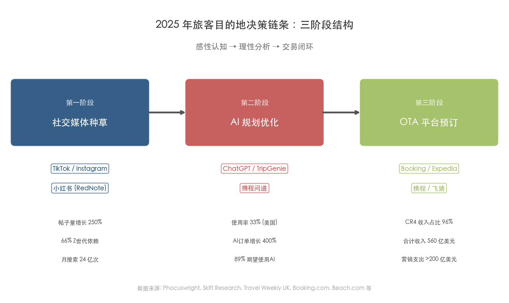

**图 5-3：2025 年旅客目的地决策链条的三阶段结构。** 从感性认知到理性分析再到交易闭环，社交媒体、AI 工具和 OTA 平台分别主导各阶段，中西方旅客在每一环节均有对应的平台生态。

这一链条与传统的"旅行社咨询→目录选择→电话预订"模式相比，决策周期显著缩短，信息获取成本大幅降低。然而，新的结构性问题也随之浮现：社交媒体的算法推送可能强化热门目的地的"马太效应"，致使流量进一步向头部目的地集中；AI 的标准化推荐可能削弱旅行体验的个性化，产出大量雷同行程方案；OTA 的佣金驱动排序可能扭曲旅客对目的地真实性价比的判断。旅客需要在信息过载与信息不对称之间寻找平衡，而这种平衡能力本身正在成为影响旅行体验质量的新变量。

### 5.4.2 中西方信息生态的结构性差异

中西方旅客所处的数字信息生态存在显著的结构性差异，形成了两套相对独立但功能对称的决策闭环。西方旅客的决策链条以"Instagram/TikTok→Google/AI→Booking/Expedia"为主轴，中国旅客则形成了"小红书→携程'问道'/AI→携程/飞猪"的独立闭环。小红书在旅行灵感获取环节对 35 岁以下中国旅客的主导地位，与 TikTok 在西方 Z 世代中的角色高度对称。

两个生态的关键差异在于内容形态与用户行为模式。小红书以图文笔记为核心内容形态，强调"攻略感"和"真实感"，用户搜索行为更为深入——人均超 100 次搜索查询、阅读超 300 篇笔记 [Skift](https://skift.com/2025/02/05/what-travel-brands-should-know-about-chinas-rednote/ "2025年2月")。TikTok 则以短视频为核心，强调"即时冲击力"和"情绪共鸣"，用户更多通过被动推送而非主动搜索获取灵感。换言之，小红书用户的决策路径更偏向"主动研究型"，而 TikTok 用户更偏向"被动发现型"——两种模式对目的地营销策略的要求截然不同。

在 AI 旅行规划领域，中国市场的渗透速度显著领先于欧洲。携程搜索中使用 AI 规划的用户比例同比提升 270%，AI 辅助订单量增长约 400% [粤TV](https://m.itouchtv.cn/article/06490add03608e1b8fa48fc3ea6a2dce "2025年携程报告") [Travolution](https://www.travolution.com/news/trip.com-sets-out-three-years-of-contrasting-ai-use-in-travel/ "2026年3月")，显著高于欧洲主要市场 15%—22% 的基础使用率。这一差距部分源于中国 OTA 将 AI 工具深度嵌入预订全流程的策略——携程将 TripGenie 集成在搜索、比价、售后全链条，使 AI 成为平台服务的内生组件，而非独立于主流程之外的辅助工具。欧美 OTA 在 AI 集成深度上的追赶，将是未来两年全球在线旅行分销竞争的关键赛道之一。

## 5.5 本章小结

2025 年，科技与信息生态对旅客目的地选择的影响可归纳为三条核心脉络。

**社交媒体完成了对传统信息渠道的"权力更替"。** 社交媒体已取代口碑推荐和传统媒体，成为旅行灵感的第一入口。TikTok 和小红书分别主导西方与中国年轻旅客的目的地发现路径，前者以"被动发现"机制打破信息分发层级，后者以"深度搜索"模式构建社区化的旅行知识库。然而，社交媒体驱动的"一夜爆红"效应也催生了 Roccaraso 式的过度旅游危机，迫使目的地管理机构在信息传播速度与承载力上限之间寻求平衡。

**AI 旅行规划从"新鲜尝试"走向"常态使用"。** 全球 AI 旅游市场规模从 2024 年的 33.73 亿美元预计增至 2025 年的 42.55 亿美元（同比增长 26.1%）[Grand View Research](https://www.grandviewresearch.com/industry-analysis/artificial-intelligence-ai-tourism-market-report "AI in Tourism Market Report")。但 AI 当前更多影响的是行程细节而非目的地选择本身——仅 17% 的旅客在目的地选择环节依赖 AI。AI 的角色定位是"行程优化器"而非"目的地推荐引擎"，其分流过度旅游的潜力值得期待，但代际信任分化和内容同质化风险仍是制约其深度渗透的瓶颈。

**OTA 平台的寡头格局构成旅客决策的隐性框架。** 前四大平台以 96% 的收入集中度掌控着全球在线旅行分销的核心通道，其算法排序和评价体系对目的地的可见度与竞争力产生深远影响。算法驱动的"信息茧房"效应与社交媒体的"被动发现"机制形成张力，两股力量的博弈将持续塑造旅客的目的地选择视野。

三种力量相互交织，共同重塑了从"想去哪里"到"点击预订"的完整决策链条。这一数字化决策生态在降低信息不对称、促进旅游民主化的同时，也催生了过度旅游加剧、信息茧房固化、算法偏见等新型挑战——旅客在获得前所未有的信息丰裕度的同时，也面临着前所未有的信息筛选复杂度。

# 第6章 文化体验、情感驱动与消费分层——目的地的"内容吸引力"

前五章的分析表明，旅客在做出目的地决策时需要依次跨越经济成本、安全准入、签证通行与自然环境等一系列"硬约束"，同时受到社交媒体与平台算法的深度信息塑造。然而，当这些前置条件基本满足后，真正驱使旅客在候选目的地之间做出最终取舍的，往往是一个更为柔性却更具决定性的变量——**目的地能否提供有吸引力的"内容"**。此处所言"内容"，涵盖美食体验、文化遗产、节庆活动、影视 IP 联动以及各类沉浸式文化参与。2025 年，这一"内容吸引力"维度正以前所未有的速度重塑全球旅游流向，并沿代际差异与消费能力两条轴线呈现出清晰的分层格局。

## 6.1 美食旅游：从"顺便吃一顿"到"专程去吃"

美食已从旅行的附属消费全面升级为核心驱动力。全球美食旅游市场 2024 年规模约为 138.3 亿美元，2025 年预计增至 165.8 亿美元，至 2034 年有望达到 850.4 亿美元，复合年增长率高达 19.92%，欧洲以约 35% 的市场份额居于领先地位 [Precedence Research](https://www.precedenceresearch.com/culinary-tourism-market "Culinary Tourism Market Size to Surpass USD 85.04 Bn by 2034")。这一增速远超旅游业整体增长水平，折射出旅客对"以味觉定义旅程"的强烈偏好转变。

消费者行为数据从需求侧印证了上述趋势。Chase Travel 与 The Infatuation 联合调研显示，2025 年 77% 的受访者围绕美食规划旅行，70% 愿意驱车 30 分钟以上前往另一城市就餐 [Chase Travel](https://media.chase.com/news/chase-travel-and-infatuation-reveal-travel-and-dining-trends-for-summer-2025 "2025年夏季旅行与餐饮趋势")。在亚太地区，这种倾向尤为显著：Booking.com 调研发现，82% 的澳大利亚旅客曾仅为造访某家餐厅而选择一个目的地 [Booking.com](https://news.booking.com/hungry-for-travel-how-food-is-shaping-holiday-home-stays-in-asia-pacific/ "2025年亚太美食旅行调研")。美食已不再仅是旅途中的锦上添花，而是决定"去哪里"的首要考量之一。

美食作为旅行决策核心变量的地位提升，亦深刻重塑了住宿行业的竞争策略。Hotels.com 平台上关于酒店餐厅、主厨和酒吧的正面评价同比增长 40%，近三分之一旅客表示若酒店拥有知名餐厅提供的客房服务将更可能预订该酒店 [Expedia Unpack '25](https://www.expedia.com/newsroom/unpack-25-the-trends-in-travel-from-expedia/ "Expedia 2025年旅行趋势报告")。酒店业正从"提供住宿的地方附带餐饮"转向"以餐饮体验驱动住宿选择"的新范式。对于目的地而言，一家米其林餐厅或一位明星主厨的入驻，可能成为吸引高价值旅客的关键杠杆。

## 6.2 文化遗产与沉浸式体验：从"打卡"走向"深度参与"

### 6.2.1 遗产旅游的稳定基本盘

全球遗产旅游市场 2025 年规模约为 638.87 亿美元，复合年增长率 4.5%，50 岁以上人群构成核心消费群体，亚太地区增速最快 [Fortune Business Insights](https://www.fortunebusinessinsights.com/heritage-tourism-market-112748 "Heritage Tourism Market Report")。与美食旅游近 20% 的高速增长形成鲜明对照，遗产旅游的增速相对温和，但其庞大的市场体量和稳定的客群基础构成了全球旅游市场不可替代的基本盘。联合国教科文组织世界遗产名录、国家级非物质文化遗产等官方认证标签，仍然是目的地建构文化吸引力的重要背书机制。

### 6.2.2 体验经济的爆发式增长

相较于传统遗产旅游，以"沉浸"和"参与"为核心的体验型旅游正经历爆发式增长。McKinsey 估算全球旅行体验的总可触达市场（TAM）为 1.1 万亿至 1.3 万亿美元，其中付费结构化旅游活动约 2,500 亿至 3,100 亿美元，年增速超过 14% [McKinsey](https://www.mckinsey.com/industries/travel/our-insights/the-evolving-role-of-experiences-in-travel "The evolving role of experiences in travel")。值得注意的是，体验预算是旅客最后被削减的旅行支出项——即便在经济下行压力下，旅客宁可缩短行程或降低住宿标准，也倾向于保留核心体验预算，这一消费韧性凸显了体验在旅行决策中的优先序位。

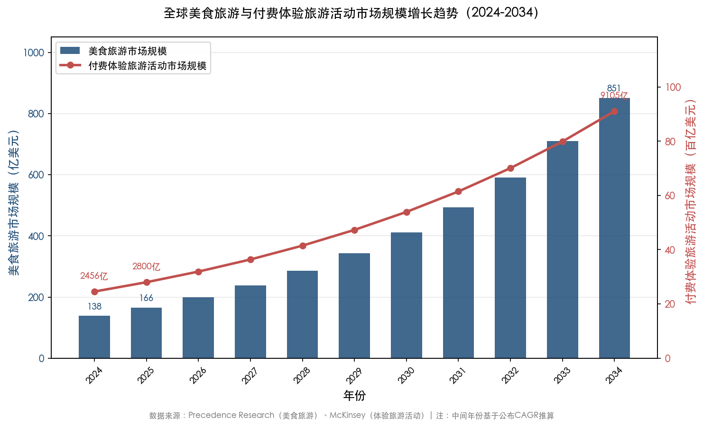

图 6-1 对比展示了美食旅游与付费体验旅游活动两大赛道 2024-2034 年的增长轨迹。美食旅游市场从 138 亿美元增至 851 亿美元（CAGR 19.92%），付费体验旅游活动从约 2,456 亿美元增至约 9,105 亿美元（CAGR 14%），两者共同构成体验经济在旅游领域的双引擎格局。

体验经济的代际特征尤为鲜明：52% 的 Z 世代会在体验上大手笔消费，而婴儿潮一代这一比例仅为 29% [McKinsey](https://www.mckinsey.com/industries/travel/our-insights/the-evolving-role-of-experiences-in-travel "The evolving role of experiences in travel")。奢侈旅游市场同样印证了体验导向的结构性转型：2024-2029 年全球奢侈旅游市场预计新增 5,196 亿美元，复合年增长率 6.7%，其中冒险旅游为最大细分市场（2023 年约 4,446 亿美元），文化沉浸游预订量同比增长 17% [Technavio](https://www.technavio.com/report/luxury-travel-market-industry-analysis "Luxury Travel Market Growth 2025-2029")。高端旅客的核心诉求并非更昂贵的套房，而是更深层的文化沉浸和更具稀缺性的在地体验。

## 6.3 节庆活动与赛事旅游：从"偶发拉动"到"系统引擎"

节庆活动和大型赛事作为旅游目的地的时间性锚点，正从偶发性的旅游拉动因素升级为系统性的产业引擎。2025 年欧洲活动驱动型旅游支出同比增长 7%，其中餐饮占 48.4%、住宿占 33%、交通占 18.6%；从活动类型看，体育赛事和博览会分别贡献 41.4% 和 29.4% 的份额 [Mabrian](https://mabrian.com/blog/europes-event-driven-tourism-grows-by-7-in-2025-reinforcing-the-sectors-economic-impact/ "Europe's Event-Driven Tourism +7% in 2025")。全球范围内，60% 的旅客计划围绕活动或赛事安排旅行 [American Express Travel](https://www.americanexpress.com/en-us/travel/discover/get-inspired/global-travel-trends "2025全球旅行趋势")，活动驱动型旅游已成为目的地经济的结构性组成部分。

大型巡回演出对目的地经济的直接拉动作用尤为突出。Taylor Swift 的 Eras Tour 在美国 20 个城市 53 场演出期间，歌迷平均每人在当地经济中消费约 1,300 美元（与超级碗观众人均消费水平相当），直接消费总额超过 50 亿美元，总经济影响估计突破 100 亿美元 [U.S. Travel Association](https://www.ustravel.org/news/taylor-swift-impact-5-months-and-5-billion "Taylor Swift Eras Tour经济影响")。从城市维度观察：匹兹堡两场演出即创造了 4,600 万美元直接消费，酒店入住率达 95%，平均日房价飙升 106% 至 309 美元；洛杉矶六场演出的总经济影响达 3.2 亿美元，创造 3,300 个就业岗位 [U.S. Travel Association](https://www.ustravel.org/news/taylor-swift-impact-5-months-and-5-billion "Taylor Swift Eras Tour城市经济数据")。上述案例表明，单一文化事件可在短期内将一座城市推上全球旅游热度榜，其经济乘数效应不亚于长周期的基础设施投资。

韩国在 2025 年提供了文化 IP 驱动目的地旅游的另一个标志性案例。动画电影《KPop Demon Hunters》2025 年 6 月在 Netflix 上线后引发全球热潮，直接推动首尔 7 月入境游客达到创纪录的 136 万人次，同比增长 23.1%，较 2019 年同期高出 18.2% [首尔市政府](https://english.seoul.go.kr/tourist-arrivals-in-seoul-hit-all-time-high-of-1-36m-in-july-fueled-by-k-pop-demon-hunters-craze/ "2025年9月3日发布")。现代经济研究院预测 2025 年韩国全年入境游客可能突破 2,009 万人次的历史新高，而 Klook 平台数据显示，影片上线后韩国传统文化体验预订量增长 11%、K-pop 舞蹈课程增长 40%、偶像造型体验增长 200% [朝鲜日报](https://www.chosun.com/english/national-en/2025/09/27/KZUI645KEBERXAWBQ2LR6U7G24/ "KPop Demon Hunters经济影响报道")。韩国政府随即成立"K-Tourism 创新工作组"，将文化内容与旅游产品进行系统性对接，力图将爆款 IP 的短期流量转化为长期旅游竞争力。

## 6.4 影视 IP 与"圣地巡礼"：屏幕上的风景如何转化为机票上的目的地

### 6.4.1 Set-Jetting：从小众行为到主流趋势

影视内容对旅行决策的影响力正经历从量变到质变的跃迁。Expedia 2025 年趋势报告显示，66% 的旅客表示影视内容影响了自己的旅行选择，这一比例同比上升 16 个百分点 [Expedia Unpack '25](https://www.expedia.com/newsroom/unpack-25-the-trends-in-travel-from-expedia/ "Expedia 2025年旅行趋势报告")。在 Z 世代和千禧一代中，这一趋势更为集中：81% 计划基于屏幕内容规划旅行。"Set-Jetting"（影视取景地旅行）已从旅行爱好者的小众行为演变为跨越人口统计学特征的主流消费模式。

### 6.4.2 《白莲花》效应：一部剧集如何重塑一个岛屿

HBO 剧集《白莲花》提供了 Set-Jetting 的教科书级案例。第一季（2021 年）播出后，取景地夏威夷毛伊岛 Four Seasons 度假村预订量暴增 386%；第二季（2022 年）带火了西西里岛的 San Domenico Palace 酒店 [Travel Tomorrow](https://traveltomorrow.com/from-tv-to-travel-boom-how-the-white-lotus-is-turning-thailand-into-a-2025-hotspot/ "白莲花效应分析")。2025 年初第三季确认在泰国取景后，苏梅岛的搜索量飙升 88%，酒店预订量上涨 44%；普吉岛和曼谷的搜索量分别增长 66% 和 61% [Bangkok Post](https://www.bangkokpost.com/thailand/general/2965845/the-white-lotus-sparks-tourism-boom-in-koh-samui "2025年2月22日报道")。泰国旅游委员会评估认为，受该剧影响，苏梅岛 2025 年可能不会出现传统淡季。Hotels.com 数据进一步显示，取景酒店 Four Seasons Resort Koh Samui 的预订关注度上升 40%，美国用户对苏梅岛住宿的搜索量自 1 月以来增长 65% [Forbes](https://www.forbes.com/sites/suzannerowankelleher/2025/02/14/thailand-is-having-a-white-lotus-travel-moment-even-before-season-3-kicks-off-sunday/ "Forbes白莲花旅游效应报道")。

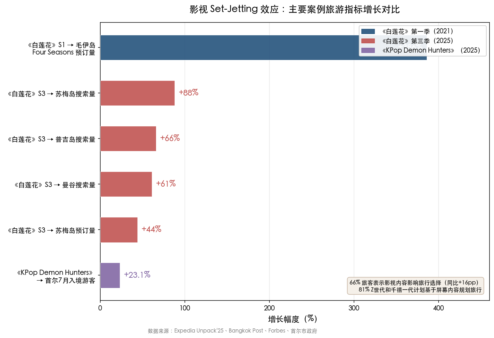

图 6-2 汇总呈现了主要影视 IP 对目的地旅游指标的量化拉动效应。《白莲花》第一季对毛伊岛取景酒店的预订量提升达 386%，第三季则在苏梅岛、普吉岛、曼谷三地同步引发搜索量 44%-88% 的显著增长；《KPop Demon Hunters》推动首尔 7 月入境游客同比增长 23.1%，创下历史新高。

### 6.4.3 K-Content 的涟漪效应：从屏幕到文化认同

韩国内容产业在 2025 年展现了影视 IP 驱动旅游的深层逻辑——它不仅制造短期流量，更构建了一种跨文化的"情感引力场"。Netflix 委托独立调研机构 2CV 在美国、日本、巴西等八国对 11,500 人开展的调查显示：67% 的 Netflix 会员表达了访问韩国的意愿（非会员仅 41%），在韩剧观众中这一比例进一步攀升至 72%；61% 的会员称观看韩国内容改善了他们对韩国的整体印象，在巴西和印度这一比例分别达到 73% 和 71% [Netflix](https://about.netflix.com/news/ripple-effect-k-content-viewers-embracing-korean-culture "2025年6月25日发布的K-Content文化影响报告")。

从 2021 年《鱿鱼游戏》到 2025 年《KPop Demon Hunters》，韩国文旅 IP 的影响路径已从"观看→搜索→旅行"演化为"观看→文化认同→消费行为全面转变"的深层传导链条。Google Trends 数据显示，《KPop Demon Hunters》上线后"Korea"搜索量几乎翻倍，"Korea Food"搜索量增长 75% 并创下历史新高 [朝鲜日报](https://www.chosun.com/english/national-en/2025/09/27/KZUI645KEBERXAWBQ2LR6U7G24/ "Google Trends数据")。CU 便利店在主要旅游景点的海外支付量中，紫菜饭团（kimbap）在 7 至 8 月的销量较去年同期增长三倍——源于剧中主角对这款食品的偏爱。文化内容的传播效应已超越传统旅游营销的范畴，形成了"内容消费→文化认同→目的地选择→在地消费"的完整闭环。

Expedia 列出的 2025 年 Set-Jetting 热门目的地还包括：泰国（《白莲花》第三季）、蒙大拿（《黄石》）、日本（《幕府将军》）、韩国（《鱿鱼游戏》系列） [Expedia Unpack '25](https://www.expedia.com/newsroom/unpack-25-the-trends-in-travel-from-expedia/ "Expedia 2025年旅行趋势报告")。这些案例共同揭示了影视 IP 与目的地旅游之间正在形成的正反馈循环：成功的取景地推广吸引影视制作方前来取景，影视播出反过来带动旅游流量，政府再以政策支持延续和放大这一效应。泰国旅游部门对《白莲花》制作团队的全力配合、韩国政府成立"K-Tourism 创新工作组"，均是这一正反馈逻辑的制度化体现。

## 6.5 代际分化与消费分层：谁在定义旅行的未来

### 6.5.1 Z 世代与千禧一代：体验优先、频次领先

到 2030 年，Z 世代和千禧一代将占据美国休闲旅行市场的半数以上（2023 年仅为三分之一），55% 的 Z 世代计划在未来一年增加旅行频次 [Forbes](https://www.forbes.com/sites/jefffromm/2025/09/09/how-gen-z-and-millennials-impact-travel-and-the-experience-economy/ "Gen Z And Millennials Impact Travel")。McKinsey 数据进一步揭示了代际消费模式的结构性差异：千禧一代和 Z 世代平均每年出行近 5 次（X 世代和婴儿潮一代不到 4 次），将收入的 29% 用于旅行（婴儿潮一代为 25%）；Z 世代选择目的地的首要因素是"体验新地方"，92% 表示最近一次旅行受到社交媒体影响 [McKinsey](https://www.mckinsey.com/industries/travel/our-insights/the-way-we-travel-now "The way we travel now")。

年轻旅客在旅途中的消费行为亦与年长群体形成鲜明对照。82% 的千禧一代和 Z 世代在旅行中会寻找独特商品作为纪念品（X 世代和婴儿潮一代为 68%） [American Express Travel](https://www.americanexpress.com/en-us/travel/discover/get-inspired/global-travel-trends "2025全球旅行趋势")。高端航空预订量同比增长 21%（整体旅行预订增长 14%），相当比例的增量来自年轻旅客对"升舱体验"的追求 [Chase Travel](https://media.chase.com/news/chase-travel-and-infatuation-reveal-travel-and-dining-trends-for-summer-2025 "2025年夏季趋势")。

### 6.5.2 婴儿潮一代：人均支出最高、冒险意愿显著攀升

尽管年轻世代在旅行频次和体验偏好上占据话语权，婴儿潮一代仍然是人均旅行支出最高的群体——约为 Z 世代的三倍 [McKinsey](https://www.mckinsey.com/industries/travel/our-insights/the-way-we-travel-now "The way we travel now")。更值得关注的是，这一群体的旅行偏好正在发生显著变化：23% 的婴儿潮一代对冒险度假表现出兴趣，较 2024 年的 10% 大幅攀升；49% 更愿意将资金花在"一生一次的旅行"而非留给子女 [Booking.com](https://news.booking.com/defying-convention-to-deepen-connections-bookingcoms-nine-predictions-for-travel-in-2025/ "Booking.com 2025 Travel Predictions")。

婴儿潮一代的消费影响力还通过"代际旅行赞助"的方式向下传递：80% 愿意为子女旅行买单，78% 愿意资助孙辈出行，推动了多代同游（multigenerational travel）这一细分市场的快速兴起 [Booking.com](https://news.booking.com/defying-convention-to-deepen-connections-bookingcoms-nine-predictions-for-travel-in-2025/ "Booking.com 2025 Travel Predictions")。对目的地而言，能够同时满足祖孙三代需求的产品设计——兼具文化遗产的深度、冒险体验的刺激以及社交媒体分享的视觉素材——正在成为新的竞争壁垒。

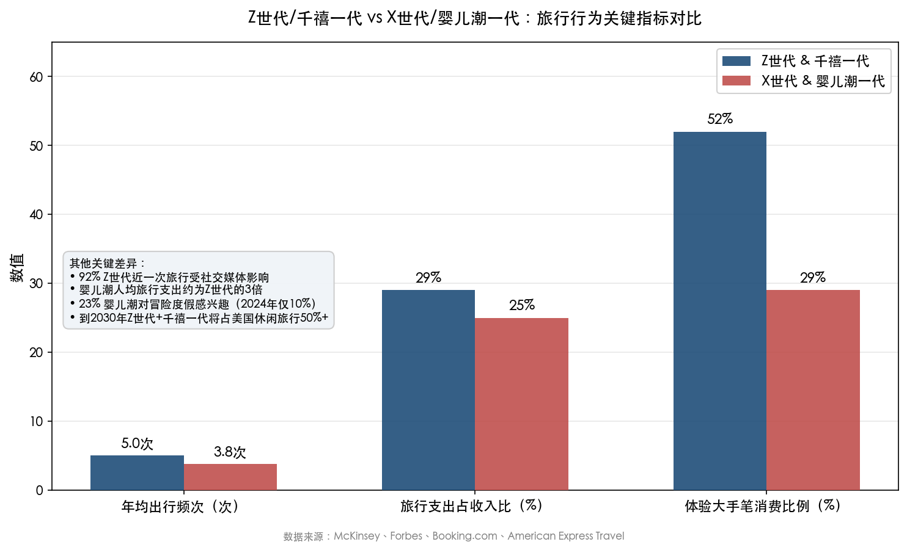

图 6-3 直观对比了两大代际群体在年均出行频次、旅行支出占收入比和体验大手笔消费比例三个核心维度的差异。Z 世代与千禧一代在频次和体验支出意愿上均显著领先，但婴儿潮一代凭借约为 Z 世代三倍的人均支出水平，仍然是旅游消费市场不可忽视的核心购买力。

### 6.5.3 七种旅客画像：内容吸引力的差异化逻辑

McKinsey 基于全球调研识别出七大旅客类型，为理解"内容吸引力"的差异化作用提供了精细的分析框架。"文化与真实性追求者"（占旅客总量的 18%）日均消费超过 150 美元，是最不可能通过缩短假期来节省开支的群体（仅 17% 会这样做），构成深度文旅产品的核心受众。"高端旅客"（12%）中仅 20% 认为成本是重要考量因素，其核心追求是稀缺性和独占性体验。与之形成鲜明对照的是"阳光海滩旅客"（23%），该群体旅行频次低、消费节俭，目的地选择主要受价格和气候两个变量驱动 [McKinsey](https://www.mckinsey.com/industries/travel/our-insights/the-way-we-travel-now "The way we travel now")。

这一画像体系揭示了一个关键洞察：同一目的地面向不同旅客类型需要截然不同的"内容叙事"策略。以日本为例，其可以凭借丰富的文化遗产和精细的饮食文化吸引"文化与真实性追求者"，同时以极致的服务标准和温泉旅馆的独占性体验吸引"高端旅客"，再以日元持续走弱带来的高性价比吸引价格敏感型旅客。多层次的内容供给能力，是成熟目的地在全球竞争中保持领先的核心壁垒。

## 6.6 本章小结

2025 年的全球旅游市场正经历一场从"设施导向"向"内容导向"的范式转换。美食旅游以近 20% 的年复合增长率领跑细分赛道，影视 IP 驱动的 Set-Jetting 已从小众行为扩展为 66% 旅客认可的主流决策因素，活动驱动型旅游在欧洲以 7% 的年增速巩固其经济引擎地位。在代际维度上，Z 世代和千禧一代以高频次、体验优先的消费模式重新定义旅行的核心价值，而婴儿潮一代则以最高的人均支出水平和日益冒险的偏好转变持续塑造市场格局。

对目的地而言，核心竞争力正从硬件设施向"内容生产能力"迁移。《白莲花》为泰国苏梅岛带来搜索量 88% 的暴增、《KPop Demon Hunters》推动首尔 7 月入境游客创历史新高——这些案例充分表明，一个优质的文化 IP 可以在数周内实现传统旅游推广需要数年才能达成的引流效果。能否持续生产或引入高质量文化内容，并将短期流量沉淀为长期旅游竞争力，将是 2025 年及以后全球目的地竞争的关键分野。

# 结论与风险提示

## 核心结论

本报告通过对 2025 年全球旅游市场的系统分析，识别出影响旅客目的地选择的六大核心维度，并揭示了这些维度之间的层级关系与交互机制。以下为五项核心研究结论。

**第一，旅客目的地决策呈现清晰的"漏斗型"层级结构。** 经济成本与安全风险在决策链前端执行硬性筛选，将"不可负担"或"不敢前往"的目的地率先排除；签证便利度与交通可达性在中间环节决定目的地能否进入候选清单；气候条件、可持续意识、文化内容与数字信息生态则在后端共同塑造旅客的最终偏好与取舍。各维度并非孤立作用，而是相互叠加——例如，日元贬值（经济因素）与免签扩展（政策因素）的协同效应共同推动日本 2025 年接待 4,270 万外国游客，双创历史纪录；而美国的案例则显示，即便美元贬值带来价格优势，政策壁垒与政治氛围的逆向作用仍足以导致入境旅游消费全球唯一的负增长。

**第二，"旅游转移效应"是 2025 年全球旅游流向变化的主导机制。** 地缘冲突、极端天气、过度旅游治理等因素并未压缩全球旅游总需求——2025 年全球旅游支出增速（+6.7%）仍为 GDP 增速的两倍——而是系统性地将旅客从受限目的地重新分配至替代目的地。以色列入境旅游仅恢复至疫前峰值的 29%，但欧洲"安全港"同期增长 4%；南欧因极端高温流失的部分客源被北欧"清凉度假"目的地吸收，后者预订量增长高达 44%；传统热门景点的限流措施则将旅客推向非主流目的地，后者的旅客停留时间更长（38% 超过 10 天 vs 热门目的地的 21%）且人均消费更高。

**第三，制度性便利化已成为目的地竞争的核心赛道。** 2025 年全球签证自由化进入"竞争性开放"阶段：全球护照平均免签目的地数量从 2006 年的 58 个增至 109 个，中国将免签入境国家从五年前不到 20 个增至 75 个，沙特提前六年超越"愿景 2030"年接待 1 亿游客目标。签证政策与航空网络、高铁建设的协同效应表明，"通行能力"已从被动行政条件演变为主动竞争工具。一个签证复杂、航线稀少、内部交通不便的目的地，即使拥有丰富的自然与文化资源，亦难以进入大多数旅客的考虑范围。

**第四，数字信息生态对目的地认知与决策链条的重塑已达到结构性深度。** 社交媒体取代口碑推荐成为旅行灵感的第一入口，TikTok 的"被动发现"机制赋予小众目的地与传统热门景点平等的曝光机会，但也催生了 Roccaraso 式的瞬时过载危机。AI 旅行规划使用率以每年 3—4 个百分点的速度攀升，但其影响力集中于行程优化而非目的地选择本身（仅 17% 的旅客在目的地选择环节依赖 AI）。"社交媒体种草→AI 规划优化→OTA 预订"的三阶段链条已成为主流决策模式，但信息茧房效应、算法偏见和虚假评论对决策质量的侵蚀值得持续关注。

**第五，文化"内容吸引力"正在取代硬件设施成为目的地核心竞争力的新标尺。** 美食旅游以近 20% 的年复合增长率领跑细分赛道，66% 的旅客受影视内容影响目的地选择（同比上升 16 个百分点），活动驱动型旅游在欧洲以 7% 的年增速巩固经济引擎地位。《白莲花》《KPop Demon Hunters》等文化 IP 在数周内实现了传统旅游推广需要数年才能达成的引流效果，预示着目的地竞争正从"建设更好的酒店"转向"生产更好的内容"。代际消费分层进一步强化了这一趋势：Z 世代和千禧一代以体验优先的模式重新定义旅行价值，到 2030 年将占据美国休闲旅行市场的半数以上。

## 风险提示与研究局限

本报告的分析框架与结论受以下因素制约，使用者在援引和应用相关判断时需审慎考量。

**数据时效性与覆盖不均衡。** 本报告依赖的多项关键数据源（如 STR 全球酒店指标仅覆盖至 2025 年 8 月、UN Tourism 旅客数据截至 2025 年前三季度）尚非全年终值，后续更新可能修正部分量化判断。此外，关于中国出境游规模的数据主要来自第三方预测（China Trading Desk），而非中国官方旅游统计的最终发布值。各区域数据的颗粒度亦不均衡——欧美市场的消费者调研数据丰富且方法论透明，而非洲、南亚和中东部分市场的一手调研数据较为稀缺。

**因果推断的审慎性。** 本报告在多处识别了变量之间的共变关系（如汇率变动与旅游流量变化、社交媒体热度与目的地预订量增长），但旅客目的地选择是一个受多重因素同时作用的复杂决策过程，单一变量的因果贡献难以精确隔离。例如，日本入境游创纪录既受日元贬值驱动，也受益于签证放宽、航线恢复和社交媒体传播等多重因素的协同作用；美国入境旅游下降同时受政策环境、汇率变动和加拿大关系恶化等多维压力影响。报告在行文中尽可能标明"相关性"与"驱动因素"的区分，但在部分交叉作用密集的场景下，因果归因仍带有一定的分析性推断成分。

**消费者调研数据的方法论差异。** 报告引用了 Booking.com、Agoda、ETC、American Express、Phocuswright 等多家机构的消费者调研数据，这些调研在样本规模（从 880 至 37,325 人）、覆盖市场（从单一国家到 34 国）、抽样方法和问卷设计上存在差异，严格意义上不宜直接横向比较。报告在引用时已标注各调研的样本信息与来源机构，但使用者仍需注意不同调研之间可比性的局限。

**地缘政治高度不确定性。** 中东冲突演变、美国政策走向和大国博弈格局对 2026 年全球旅游流向的影响存在宽幅不确定性。Tourism Economics 对中东入境旅游 2026 年 -11% 至 -27% 的预测区间本身即反映了情景分析的高度分化。本报告的分析框架适用于描述已发生和正在发生的趋势，但不构成对未来旅游流向的确定性预测。

**可持续旅游"意愿—行为"鸿沟。** 报告引用的多项调研显示旅客在可持续旅游意愿方面的高比例认同（如 93% 希望做出更可持续的选择），但意愿与实际消费行为之间的转化率尚缺乏系统的追踪数据。在价格与便利性仍居于多数旅客决策优先序前列的现实下，可持续意识对目的地选择的实际驱动力可能被高估。
