# 执行摘要

本报告为53岁、体重80 kg（160斤）的中国大陆居民量身定制了一份为期两周的科学膳食方案，涵盖健康画像评估、营养需求测算、饮食原则制定、14天逐日食谱、采购备餐指南以及个性化调整建议六大模块。

**体重状况与健康风险**　依据中国成人BMI分类标准（WS/T 428—2013），80 kg体重对应男性BMI约27.7（超重，接近肥胖临界值28）、女性BMI约31.3（肥胖）。50岁以上超重人群面临代谢综合征、骨质流失、肌肉减少和心脑血管疾病等多重健康风险的叠加，膳食干预是体重管理的首要抓手。

**能量目标与营养框架**　基于Mifflin-St Jeor公式估算并经国家标准（WS/T 578.1—2017及2023版DRIs）交叉验证，在维持每日300~500 kcal温和热量缺口的前提下，本食谱设定男性约1900 kcal/天、女性约1600 kcal/天的能量目标，配合碳水化合物50%~55%、蛋白质15%~20%、脂肪25%~30%的宏量营养素比例，同时确保钙（800 mg）、维生素D（10 μg）、膳食纤维（25~30 g）、钾（2000 mg）等关键微量营养素达标。

**两周食谱核心指标**　14天食谱日均热量约1900 kcal（男性版），碳水化合物占比52.3%、蛋白质占比17.7%、脂肪占比26.5%，三大营养素比例稳定落在目标区间内。食谱累计使用84种食材，远超《中国居民膳食指南（2022）》"每周至少25种食物"的底线要求；蛋白质日均83~85 g，显著高于男性RNI 65 g/天的基础需求，有助于在热量缺口条件下维持肌肉质量。全部菜品均可在30分钟内完成烹饪，以蒸、煮、炖、白灼、凉拌为主要烹调方式，兼顾早春时令食材的新鲜度与经济性。

**可执行性与费用**　两周食材采购总费用约480~650元（含首次调味辅料），日均约34~46元，低于同期二线城市外卖日均餐费水平。通过周末1.5~2小时的五步备餐法，工作日每餐实际操作时间可压缩至15~35分钟。食谱还针对家庭聚餐和外出就餐两个真实社交场景，提供了弹性热量调配策略和具体行为指南。

**个性化适配**　报告为合并高血压、糖尿病、高脂血症、高尿酸血症/痛风等常见慢性病的人群，逐一给出基于官方临床指南的食谱微调方案；同时覆盖性别差异处理、食药相互作用规避、过敏与不耐受替代、体重动态监测及运动协同策略，力求在通用框架上实现安全、精准的个体化膳食管理。

**核心结论**　按照本食谱方案执行，预期可实现每周0.5~1.0 kg的健康减重节奏。以男性170 cm为例，从80 kg减至正常范围（BMI<24，约69 kg以下）预计需4~5个月。该方案在安全性、营养充足性、口味可接受性和操作便捷性四个维度上取得了平衡，可作为中长期健康饮食习惯建设的起点。

# 第1章 目标人群健康画像与膳食需求分析

## 1.1 适用对象基本特征

本食谱的适用对象为53岁、体重80 kg（160斤）的中国大陆居民。鉴于性别未明确指定，本章分别给出男性与女性两套能量参考值，并在后续食谱设计中以男性方案为主版本、女性方案为辅助参照。

在身高参数设定方面，《中国居民膳食营养素参考摄入量（2023版）》（以下简称"2023版DRIs"）新建了分性别、分年龄的身高与体重代表值体系：成人（18~30岁）身高参考值为男性170 cm、女性158 cm；50岁以上人群BMI参考值由18~49岁的22.5上调至23，对应参考体重分别为男性约66.5 kg、女性约57.4 kg [2023版DRIs解读](https://zhuanlan.zhihu.com/p/670956634 "DRIs 2023改动要点汇总")。综合考虑个体差异与50岁以上中国人群的平均身高分布，本章以男性170 cm、女性160 cm作为计算基础，与2023版DRIs参考值高度吻合。

## 1.2 体重状况评估：BMI与超重/肥胖判定

体质指数（BMI）是评估成人体重状况最基本且最广泛使用的工具。依据国家卫健委《体重管理指导原则（2024年版）》引用的WS/T 428—2013标准，中国成人BMI分类切点为：正常18.5~23.9、超重24.0~27.9、肥胖≥28.0 [国家卫健委《体重管理指导原则（2024年版）》](https://www.nhc.gov.cn/ylyjs/zcwj/202412/75cb79c171c94def9e768193e65484f7/files/1736390749000_59785.pdf "附表1引自WS/T 428—2013，BMI分类标准")。该标准低于WHO的25/30国际切点，其科学依据在于中国人群在相对较低的BMI水平即出现胰岛素抵抗、血脂异常等代谢异常。中国BMI 24/28切点最早由国际生命科学学会中国办事处与中华医学会等机构于2003年联合提出 [《中国成人超重和肥胖症预防控制指南（试行）》](https://img.medsci.cn/webeditor/uploadfile/PPT/%25E4%25B8%25AD%25E5%259B%25BD%25E6%2588%2590%25E4%25BA%25BA%25E8%25B6%2585%25E9%2587%258D%25E5%2592%258C%25E8%2582%25A5%25E8%2583%2596%25E7%2597%2587%25E9%2598%25B2%25E6%25B2%25BB%25E6%258C%2587%25E5%258D%2597.pdf "2003年首次提出BMI 24/28切点")。

按本食谱适用者体重80 kg计算：

- **男性（身高170 cm）**：BMI = 80 ÷ 1.70² ≈ **27.7**，属于"超重"，已接近肥胖临界值28
- **女性（身高160 cm）**：BMI = 80 ÷ 1.60² ≈ **31.3**，属于"肥胖"

下图直观呈现了中国标准与WHO国际标准的BMI分类区间差异，以及本食谱适用者在两套标准中的定位。

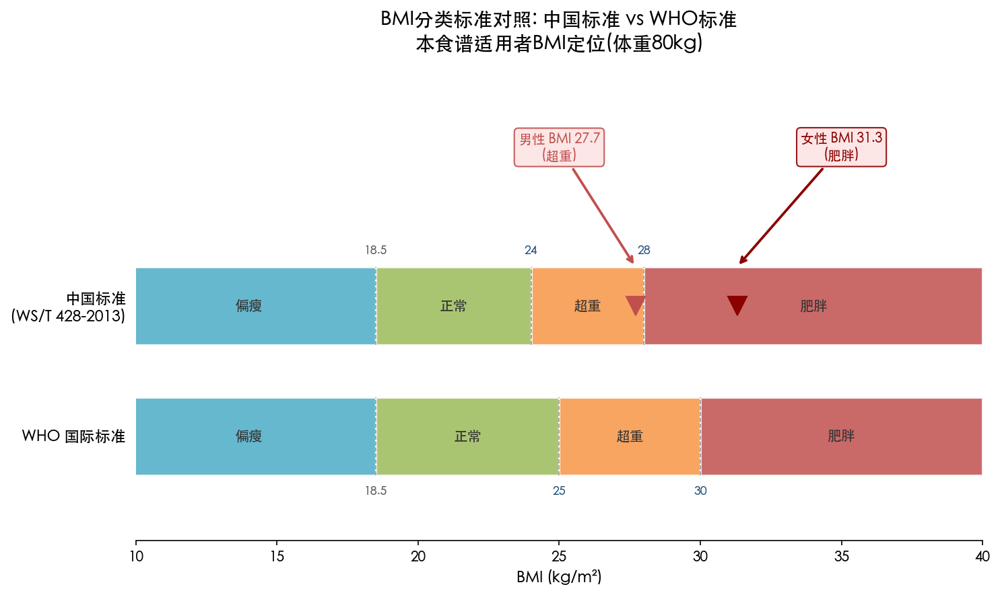

此外，WS/T 428—2013附表2将腰围作为中心型肥胖的辅助判定指标：男性腰围≥90 cm、女性腰围≥85 cm即判定为中心型肥胖。腹部脂肪堆积与胰岛素抵抗、心血管疾病风险密切相关，建议在日常健康管理中同步监测腰围变化。

## 1.3 50岁以上人群的主要健康风险

53岁正处于中年向老年过渡的关键生理转折期，叠加体重超标因素，多重健康风险呈现显著聚集效应。

### 1.3.1 代谢性疾病高发

《中国居民营养与慢性病状况报告（2020年）》基于2018年全国监测数据显示：中国成人超重率34.3%、肥胖率16.4%，高血压患病率27.5%，糖尿病患病率11.9%，高胆固醇血症患病率8.2% [国务院新闻办发布会](http://www.scio.gov.cn/xwfb/gwyxwbgsxwfbh/wqfbh_2284/2020n_4408/2020n12y23rsw/twzb_5755/202207/t20220716_230693.html "2020年12月23日发布")。上述代谢性疾病在50岁以上年龄段尤为集中。中华医学会糖尿病学分会的数据表明，中国50岁以上人群中约70%至少存在一种代谢综合征核心组分（腹型肥胖、高血糖、高血压、高甘油三酯、低HDL-C中的一项或多项），代谢综合征患病率随年龄增长呈显著攀升趋势 [中华医学会糖尿病学分会](http://www.cds.org.cn/znygs/24.html "关于代谢综合征的建议")。全国性流行病学研究进一步显示，中国60岁以上老年人群代谢综合征患病率已达36.9%，且呈现城市高于农村、女性高于男性的分布特征 [《中华流行病学杂志》](https://html.rhhz.net/zhlxbx/20190306.htm "中国老年人代谢综合征流行特征研究")。

就本食谱适用对象而言，80 kg体重已超出2023版DRIs参考体重——男性约高出13.5 kg、女性约高出22.6 kg，属于需要主动进行体重管理的人群。

### 1.3.2 骨质流失与肌肉减少

50岁以上人群面临的另一重要健康挑战是骨骼与肌肉系统的退行性变化。2018年国家卫健委骨质疏松流行病学调查数据显示，50岁以上人群骨质疏松症患病率为19.2%，其中男性6.0%、女性高达32.1%；低骨量率更达46.4%，意味着近半数50岁以上人群已处于骨质疏松的"前哨阶段" [人民网健康频道](http://health.people.com.cn/n1/2018/1022/c14739-30354355.html "2018年骨质疏松流行病学调查")。女性因绝经后雌激素水平骤降，骨质流失速度显著加快，骨质疏松风险约为同龄男性的5倍。

与此同时，50岁后人体肌肉量以每年约1%~2%的速率流失，这一进程在医学上被称为"肌少症"前期表现。肌肉量减少不仅降低基础代谢率、加剧体重管理难度，还显著增加跌倒与骨折风险。维持充足的蛋白质摄入（详见1.5节）与适当的抗阻运动，是延缓肌肉流失的两大核心策略。

### 1.3.3 心脑血管疾病

超重与肥胖是高血压、冠心病、脑卒中的独立危险因素。前述数据显示中国成人高血压患病率已达27.5%，且在50~59岁年龄段进一步攀升。结合代谢综合征的高聚集性特征，53岁超重个体的心脑血管综合风险不容忽视。通过合理膳食实现体重管控、降低钠摄入、增加膳食纤维和钾的摄入，是降低心脑血管风险的基础性膳食干预手段。

## 1.4 每日能量需求计算

### 1.4.1 基础代谢率（BMR）估算

本章采用国际上应用最广泛的Mifflin-St Jeor公式进行BMR估算 [Mifflin MD et al., Am J Clin Nutr, 1990;51(2):241-7](https://pubmed.ncbi.nlm.nih.gov/2305711/ "BMR预测方程原始论文")：

- **男性**：BMR = 10 × 80 + 6.25 × 170 − 5 × 53 + 5 = **1603 kcal/day**
- **女性**：BMR = 10 × 80 + 6.25 × 160 − 5 × 53 − 161 = **1374 kcal/day**

需要说明的是，Mifflin-St Jeor公式基于西方人群数据建立，应用于亚洲人群时可能存在轻微高估。有研究提出Ganpule公式（体重系数11.5）在亚洲人群中的准确性可能优于Mifflin-St Jeor公式（体重系数10）[虎嗅网·BMR计算方法](https://m.huxiu.com/article/328678.html "Ganpule公式与MSJ公式对比")。2023版DRIs在计算成人能量需要量时已采用基于中国人群实测数据的BMR预测公式 [2023版DRIs解读](https://zhuanlan.zhihu.com/p/670956634 "使用本国人群实测BMR预测公式")。鉴于Mifflin-St Jeor公式在临床实践中误差率通常控制在10%以内，且后续将与官方能量推荐值（EER）进行交叉验证，本章仍以该公式为主要计算工具。

### 1.4.2 每日总能量消耗（TDEE）

按身体活动水平（PAL）1.40~1.50估算——对应轻体力活动，即以办公室工作为主、辅以日常家务的生活方式：

- **男性TDEE**：1603 × 1.40~1.50 ≈ **2250~2400 kcal/day**
- **女性TDEE**：1374 × 1.40~1.50 ≈ **1920~2060 kcal/day**

值得注意的是，2023版DRIs将成人身体活动水平分为三级：轻度1.4、中度1.7、重度2.0，较2013版的1.5/1.75/2.0有所下调，这一变化反映了当代中国居民整体活动量降低的客观趋势。

### 1.4.3 与官方能量推荐值的交叉验证

为确保估算结果的可靠性，我们将Mifflin-St Jeor公式推算值与国家标准进行交叉校验：

| 来源 | 男性（50岁以上·轻体力） | 女性（50岁以上·轻体力） |
|------|------------------------|------------------------|
| Mifflin-St Jeor + PAL 1.45 | ~2325 kcal | ~1990 kcal |
| WS/T 578.1—2017 | 2100 kcal | 1750 kcal |
| 2023版DRIs修订值 | 1950 kcal | 1600 kcal |

其中，WS/T 578.1—2017规定50岁以上轻体力活动男性能量需要量为2100 kcal、女性1750 kcal [WS/T 578.1—2017](https://www.nhc.gov.cn/wjw/yingyang/201710/fdade20feb8144ba921b412944ffb779/files/1739783563332_90405.pdf "中国居民膳食能量需要量")。2023版DRIs进一步下调至男性1950 kcal、女性1600 kcal [民航空勤人员膳食指南附录A](http://www.caac.gov.cn/XXGK/XXGK/GFXWJ/202511/P020251120388309559437.pdf "引用2023版DRIs能量参考值")。2023版数值下调的核心原因在于采用了更新的中国人群实测BMR预测公式及下调后的PAL系数。

综合三组数据，本食谱适用对象在不进行体重管理的情况下，每日维持能量需求大致为男性2000~2300 kcal、女性1600~2000 kcal。

### 1.4.4 体重管理目标热量

根据《体重管理指导原则（2024年版）》，超重和肥胖人群通过膳食干预进行体重管理时，建议每日制造300~500 kcal的热量缺口，在保证营养充足的前提下实现每周0.5~1.0 kg的健康减重速度 [国家卫健委《体重管理指导原则（2024年版）》](https://www.nhc.gov.cn/ylyjs/zcwj/202412/75cb79c171c94def9e768193e65484f7/files/1736390749000_59785.pdf "膳食干预部分")。据此推算：

- **男性目标热量**：约 **1800~2000 kcal/day**（以1900 kcal为中位值）
- **女性目标热量**：约 **1500~1700 kcal/day**（以1600 kcal为中位值）

下图完整展示了从输入参数到目标热量确定的六步推导流程，帮助理解上述1900/1600 kcal目标值的科学依据。

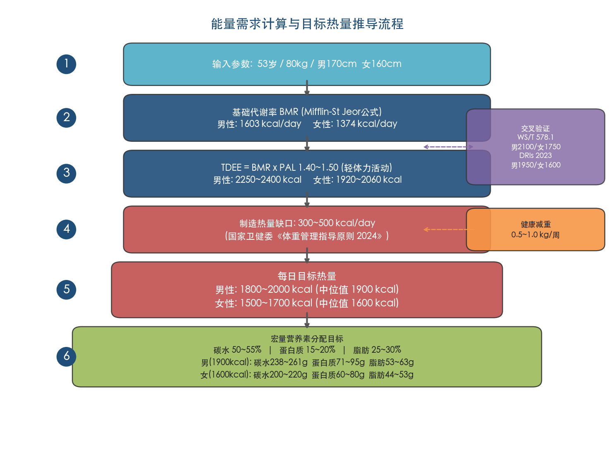

后续食谱（第3~4章）将以男性1900 kcal/day为主版本进行设计，同时在每章末尾提供女性1600 kcal版本的调整方案。

## 1.5 宏量营养素目标比例

基于2023版DRIs的宏量营养素可接受范围（AMDR），结合超重人群体重管理的特殊需求，三大营养素的能量占比目标设定如下：

| 营养素 | 能量占比 | 男性1900 kcal对应克数 | 女性1600 kcal对应克数 |
|--------|---------|---------------------|---------------------|
| 碳水化合物 | 50%~55% | 238~261 g | 200~220 g |
| 蛋白质 | 15%~20% | 71~95 g | 60~80 g |
| 脂肪 | 25%~30% | 53~63 g | 44~53 g |

**碳水化合物（50%~55%）**：2023版DRIs设定65岁以下成人碳水化合物AMDR为50%~65%。本食谱取该范围下限50%~55%，有助于控制餐后血糖波动、减少脂肪合成，更契合超重人群的体重管理需求。2023版DRIs同时新增了碳水化合物平均需要量（EAR）为120 g/d，旨在确保脑组织的基本糖供应，本食谱碳水摄入量远高于该下限，安全性有充分保障。

**蛋白质（15%~20%）**：WS/T 578.1—2017中蛋白质推荐摄入量（RNI）为男性65 g/day、女性55 g/day [WS/T 578.1—2017表2](https://www.nhc.gov.cn/wjw/yingyang/201710/fdade20feb8144ba921b412944ffb779/files/1739783563332_90405.pdf "蛋白质参考摄入量表")。对超重人群而言，适当提高蛋白质占比至15%~20%，可产生三方面收益：增强饱腹感以降低总热量摄入、维持去脂体重（lean body mass）减缓肌肉流失、提高膳食热效应。以男性方案（1900 kcal）为例，蛋白质摄入约71~95 g，中位值约83 g，高于RNI的65 g，有助于对抗50岁后加速的肌肉流失。

**脂肪（25%~30%）**：取DRIs AMDR范围（20%~30%）的中上段，以确保脂溶性维生素（A、D、E、K）的充分吸收及必需脂肪酸的供给。烹调油控制在每日25~30 g以内，与《中国居民膳食指南（2022）》推荐一致。

## 1.6 关键微量营养素需求

50~65岁人群在微量营养素方面存在若干特殊关注点。以下基于2023版DRIs和WS/T 578.1—2017汇总了各项每日推荐摄入量 [民航空勤人员膳食指南附录B](http://www.caac.gov.cn/XXGK/XXGK/GFXWJ/202511/P020251120388309559437.pdf "引用2023版DRIs营养素供给标准表") [新华网DRIs专家解读](http://www.news.cn/food/20231103/b0edcf0354804d2eb6bc4c1972964771/c.html "2023版DRIs媒体专访")：

| 营养素 | 每日推荐量（50~65岁） | 关键说明 |
|--------|---------------------|---------|
| 钙 | 800 mg (RNI) | 2023版DRIs将≥50岁人群RNI由1000 mg下调至800 mg |
| 维生素D | 10 μg / 400 IU (RNI) | 促进钙吸收，冬春季尤需关注 |
| 钾 | 2000 mg (AI) | 有助于调控血压，与钠形成拮抗 |
| 钠 | ≤1500 mg (PI-NCD) | 对应食盐≤5 g/day |
| 膳食纤维 | 25~30 g (AI) | 调节肠道菌群、延缓餐后血糖升高 |
| 铁 | 男性12 mg / 女性绝经前18 mg、绝经后10 mg | 关注围绝经期女性的较高需求 |
| 维生素B₁₂ | 2.4 μg | 50岁后胃酸分泌减少影响吸收 |
| 维生素C | 100 mg | 促进非血红素铁吸收 |
| 锌 | 男性12 mg / 女性8.5 mg | 参与免疫功能和伤口愈合 |
| 硒 | 60 μg | 抗氧化，中国部分地区土壤低硒需关注 |

下图以分性别对比的形式，直观呈现了上述关键营养素的每日推荐摄入量及其性别差异。

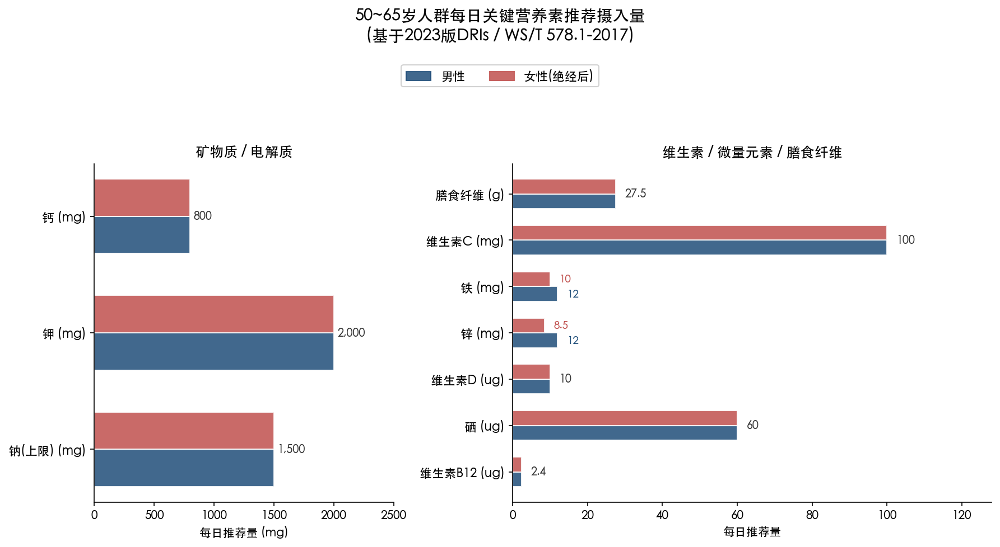

其中几项重要变化值得特别关注：

**钙RNI下调**：2023版DRIs将≥50岁人群钙RNI由此前的1000 mg下调至800 mg，与18~49岁统一。这一调整基于新的循证证据：在膳食钙达到800 mg基础上额外补充200~400 mg，仅能小幅增加骨密度，对降低骨折风险无显著临床意义 [人民日报民生周刊](http://paper.people.com.cn/mszk/html/2023-11/20/content_26029036.htm "50岁以上人群钙RNI由1000mg降至800mg")。尽管如此，800 mg仍需通过合理膳食结构加以保障（详见第2章补钙策略）。

**控钠目标**：2023版DRIs设定的PI-NCD（预防慢性非传染性疾病建议摄入量）为钠≤1500 mg/day，折合食盐约3.8 g；《膳食指南（2022）》推荐食盐≤5 g/day。本食谱以≤5 g/day为操作上限，力争逐步接近PI-NCD目标。

**蛋白质与老年人群的衔接**：2023版DRIs将65岁以上老年人蛋白质RNI由0.98 g/(kg·d)提高至1.17 g/(kg·d)，AMDR也调整为15%~20%。虽然53岁尚未进入老年阶段，但在体重管理背景下适当提高蛋白质比例至15%~20%，与未来可能面临的更高蛋白需求方向一致，具有前瞻性意义。

## 1.7 膳食指南核心推荐

《中国居民膳食指南（2022）》为本食谱的设计提供了结构性框架，其核心推荐如下 [中国营养学会膳食指南（2022）](http://dg.cnsoc.org/article/04/K7tlcs-UQh67DBC5XY1Jqw.html "食物多样，合理搭配")：

- **食物多样性**：每天摄入不少于12种食物，每周不少于25种
- **谷薯类**：每天200~300 g（其中全谷物和杂豆50~150 g），薯类50~100 g
- **蔬菜水果**：蔬菜300~500 g（深色蔬菜占比≥1/2），水果200~350 g
- **鱼禽肉蛋**：每天120~200 g
- **奶及奶制品**：每天≥300 g
- **大豆及坚果**：每天25~35 g
- **烹调油**：每天≤25~30 g
- **食盐**：每天≤5 g
- **三餐能量分配**：早餐30%、午餐40%、晚餐30%

上述推荐构成了后续食谱设计的"骨架"。在此基础上，本食谱根据体重管理需要进行了适度调整：总热量向下收紧、蛋白质占比适当上浮、水果摄入量略低于推荐上限以控制总能量。

## 1.8 本章小结

53岁、体重80 kg的中国成年人，无论男女均处于超重或肥胖状态，面临代谢综合征、骨质流失、肌肉减少和心脑血管疾病等多重健康风险的叠加。基于Mifflin-St Jeor公式估算并经官方EER交叉验证，通过制造每日300~500 kcal的温和热量缺口，本食谱设定男性约1900 kcal/day、女性约1600 kcal/day的能量目标，配合碳水化合物50%~55%、蛋白质15%~20%、脂肪25%~30%的宏量营养素比例，同时确保钙（800 mg）、维生素D（10 μg）、膳食纤维（25~30 g）、钾（2000 mg）等关键微量营养素达标。这一营养框架兼顾体重管理与营养均衡的双重目标，可在安全、可持续的前提下支撑每周0.5~1.0 kg的健康减重节奏，并将作为后续两周食谱设计的核心依据。

# 第2章 饮食原则与食物选择指南

第1章已明确，本食谱适用对象为53岁、体重80kg的中国大陆居民，体重管理期每日目标热量为男性1800~2000 kcal、女性1500~1700 kcal，三大营养素比例为碳水化合物50%~55%、蛋白质15%~20%、脂肪25%~30%。本章将上述量化指标转化为具体可执行的饮食原则、食物选择策略与烹饪操作建议，为后续两周食谱的落地实施提供系统性操作框架。

## 2.1 每日食物种类与数量推荐

### 2.1.1 以膳食宝塔为基础框架

《中国居民平衡膳食宝塔（2022版）》将每日食物分为五层，自下而上依次为谷薯类、蔬菜水果、鱼禽肉蛋、奶及大豆坚果、烹调油盐 [中国营养学会膳食宝塔解析](http://dg.cnsoc.org/article/04/RMAbPdrjQ6CGWTwmo62hQg.html "中国居民平衡膳食宝塔2022修订和解析")。下表列出膳食指南推荐量与本食谱实际目标的对照关系：

| 层级 | 食物类别 | 膳食指南推荐量 | 本食谱实际目标 |
|------|---------|-----------|--------------|
| 第一层 | 谷薯类 | 谷类200~300g（全谷物杂豆50~150g）+ 薯类50~100g | 250~280g（全谷物杂豆≥70g）|
| 第二层 | 蔬菜+水果 | 蔬菜300~500g（深色≥1/2）+ 水果200~350g | 蔬菜350~450g + 水果130~200g |
| 第三层 | 鱼禽肉蛋 | 120~200g | 130~160g |
| 第四层 | 奶+大豆坚果 | 奶及奶制品≥300g + 大豆坚果25~35g | 奶300ml/天 + 大豆坚果30~50g |
| 第五层 | 烹调油+盐 | 油≤25~30g + 盐≤5g | 油≤25g + 盐≤5g |

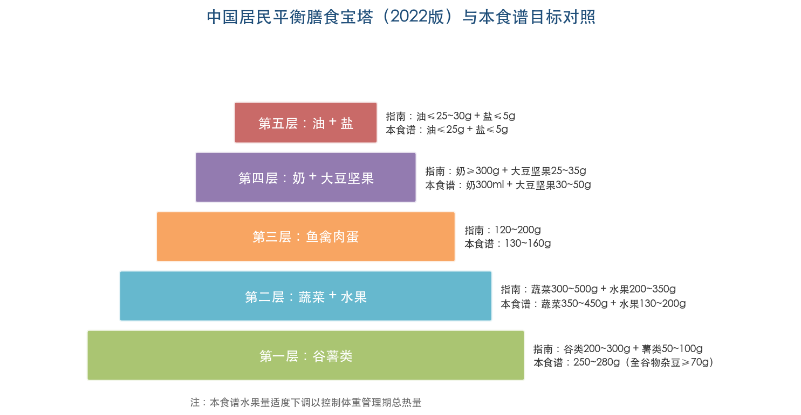

图中直观呈现了膳食指南推荐量与本食谱目标的逐层对照。其中，水果推荐量在本食谱中适度下调至130~200g/天，目的是在体重管理期控制总热量，同时保留水果提供的膳食纤维、维生素C和钾。

### 2.1.2 食物多样性目标

《中国居民膳食指南（2022）》准则一明确提出"每天的膳食应包括谷薯类、蔬菜水果、畜禽鱼蛋奶和大豆坚果等食物"，建议每天至少摄入12种食物、每周至少25种 [中国营养学会膳食指南（2022）](http://dg.cnsoc.org/article/04/K7tlcs-UQh67DBC5XY1Jqw.html "食物多样，合理搭配")。食物多样性是营养素互补的基础——没有任何单一食物能提供人体所需的全部营养素，唯有通过多样化选材才能实现宏量与微量营养素的全面覆盖。本食谱在两周设计中使用84种主要食材，每周远超25种的底线要求。

## 2.2 三餐能量分配与进餐节奏

### 2.2.1 三餐+加餐的能量分配

以男性1900 kcal/天中位目标为例，三餐能量按30%—40%—25%分配，预留5%用于下午加餐，具体如下：

| 餐次 | 能量占比 | 热量（kcal） | 烹调油分配 |
|------|---------|-------------|-----------|
| 早餐 | 30% | ~570 | 3~5g |
| 午餐 | 40% | ~760 | ~10g |
| 晚餐 | 25% | ~475 | 8~10g |
| 加餐 | 5% | ~95 | 0g |

女性1600 kcal版本按同一比例缩放，早餐约480 kcal、午餐约640 kcal、晚餐约400 kcal、加餐约80 kcal，烹调油全天控制在20g以内。这一分配方案使午餐成为全天热量的主要供给来源，有利于下午的工作效率，同时适度减轻晚餐负荷以降低夜间代谢压力。

### 2.2.2 进餐顺序：先蔬菜→蛋白质→主食

国家卫健委《成人糖尿病食养指南（2023年版）》指出，调整进餐顺序——先吃蔬菜、再吃肉蛋豆制品、最后吃主食——可有效降低餐后血糖峰值 [国家卫健委《成人糖尿病食养指南（2023年版）》](https://www.nhc.gov.cn/cms-search/downFiles/4fcbecd2c18e46baaf291bf46c2b79cd.pdf "食养原则第三条")。其机制在于膳食纤维和蛋白质优先进入胃肠道后，可延缓碳水化合物的消化吸收速率。对于53岁超重人群，即使尚未确诊糖尿病，这一策略同样有助于改善餐后血糖应答并延长饱腹感，值得作为日常进餐习惯固定执行。

### 2.2.3 每餐搭配框架："一主一荤一素一汤"

每餐搭配遵循"一主一荤一素一汤"的基本框架，确保每餐兼顾碳水、蛋白质、膳食纤维与水分摄入 [国家卫健委《成人糖尿病食养指南（2023年版）》](https://www.nhc.gov.cn/cms-search/downFiles/4fcbecd2c18e46baaf291bf46c2b79cd.pdf "附录3食谱示例")：

- **早餐**：杂粮主食 + 鸡蛋 + 奶或豆浆 + 蔬菜（凉拌或烫菜）
- **午餐**：杂粮饭 + 1荤菜 + 1~2素菜 + 1汤
- **晚餐**：杂粮主食 + 1荤菜 + 1~2素菜（晚餐适度清淡）
- **加餐**：水果100~200g 或少量坚果（10~15g）

蛋白质应三餐均匀分配而非集中在某一餐摄入，以提高蛋白质利用效率。每日保证1个水煮蛋（约50g）、300ml奶（纯牛奶或无糖酸奶），这两项作为"不变基底"贯穿两周食谱，为钙和优质蛋白提供稳定保障。

## 2.3 主食策略：控糖从每一碗饭开始

### 2.3.1 血糖生成指数（GI）分级与主食选择

血糖生成指数（GI, Glycemic Index）反映食物升高血糖的速度，分为三档：GI≤55为低GI、55<GI≤70为中GI、GI>70为高GI [国家卫健委《成人糖尿病食养指南（2023年版）》](https://www.nhc.gov.cn/cms-search/downFiles/4fcbecd2c18e46baaf291bf46c2b79cd.pdf "附录1食物GI分类表")。对于超重人群，主食应优先选择低GI食材，或通过"粗细搭配"将整餐GI控制在中低水平，以减缓餐后血糖上升速率并延长饱腹感。

**低GI主食（GI≤55，优先选用）**：整谷粒小麦、荞麦、黑米、燕麦（整粒或传统压片）、玉米、青稞，以及所有杂豆类（红小豆、绿豆、芸豆等）。杂豆类因富含抗性淀粉和膳食纤维，GI普遍偏低，是理想的主食搭配伙伴。

**高GI主食（GI>70，需限制或搭配）**：白米饭（GI约83）、糯米饭、白面馒头。白米粥因淀粉充分糊化，GI更高，应减少食用或以杂粮粥替代。面条类整体GI相对较低（约50~60），其中荞麦面（GI约54）是较优选择。

### 2.3.2 核心原则：全谷物杂豆≥主食的1/3

每餐主食中，全谷物和杂豆应占至少三分之一。实操方法为：煮饭时以白米2份搭配糙米、小米、黑米或红豆等1份，做成"杂粮饭"；蒸馒头时用全麦粉或杂粮粉替代部分白面粉。这一做法既能有效降低整餐GI，又可保证口感的可接受性——纯粗粮口感偏粗糙，而三分之一的比例恰好平衡了营养价值与适口性。

值得注意的是，过度烹调淀粉类食物（如将杂粮煮成极软烂的粥）和大量勾芡（淀粉直接糊化）均会显著提高餐后血糖应答，烹饪中应尽量避免。

## 2.4 控盐策略：每天不超过5克

### 2.4.1 隐形盐的来源与换算

日常烹调中，食盐并非钠的唯一来源。酱油、豆瓣酱、味精等调味品以及腌制食品均含有大量"隐形盐"。常见调味品与高钠食品的含盐量换算关系如下 [湖北省卫健委](https://wjw.hubei.gov.cn/bmdt/jkhb/spyy/202411/t20241101_5396420.shtml "引用膳食指南2022数据")：

| 调味品/食品 | 含盐量换算 |
|------------|-----------|
| 酱油 10ml | ≈1.6g 盐 |
| 豆瓣酱 10g | ≈1.5g 盐 |
| 味精 1g | ≈0.5g 盐 |
| 虾米 100g | ≈12.4g 盐 |
| 榨菜 100g | ≈10.8g 盐 |

仅10ml酱油（约1汤匙）便已占据当日允许摄入食盐总量的近三分之一。若烹调中同时使用酱油、蚝油、豆瓣酱和味精，钠摄入极易超标。因此，控盐的关键不仅在于减少食盐本身的使用量，更在于严格管控各类含钠调味品的叠加使用。

### 2.4.2 家庭减盐八项措施

中国营养学会《家庭减盐行为指南》（T/CNSS 022-2023）提出了系统性的家庭减盐策略，以下八项措施可有效将每日食盐摄入控制在5g以内 [中国营养学会《家庭减盐行为指南》](https://www.chinacdc.cn/jkyj/mxfcrxjb2/jswj13947/202410/P020241010502020673225.pdf "T/CNSS 022-2023全文")：

1. **使用限盐工具**：配备限盐勺（2g/勺）和限盐罐，量化每餐用盐量
2. **善用天然增鲜食材**：用香菇、海带、虾皮（少量）、番茄等自带鲜味的食材替代部分调味品
3. **葱姜蒜醋柠檬提味**：以酸味、辛香味替代咸味，降低对盐的依赖
4. **优先蒸煮烹调**：蒸菜、白灼菜不需要大量调味，天然减盐
5. **出锅前放盐**：盐分附着在食物表面，舌尖更容易感知咸味，减少用盐量
6. **避免含钠调味品叠加**：一道菜中不同时使用酱油+蚝油+盐+味精
7. **可选低钠盐**：以钾替代部分钠，肾功能正常者可使用
8. **减少腌菜酱菜**：榨菜、咸鸭蛋、腐乳等高钠加工品应严格限量

本食谱设计中，全天烹调用盐控制在3g以内，另有约1.5~2g钠来自酱油等调味品折算，合计不超过5g，符合《中国居民膳食指南（2022）》的限盐目标。

## 2.5 控脂策略：烹调油≤25克，油种轮换

### 2.5.1 每日用油总量控制

《中国居民膳食指南（2022）》建议每日烹调油不超过25~30g。在体重管理期间，本食谱将烹调油上限设为25g/天（约2.5汤匙），并按三餐合理分配：早餐3~5g（多用于煎蛋或少油快炒）、午餐约10g（主要用于1~2道炒菜）、晚餐8~10g。加餐不使用烹调油。

### 2.5.2 烹调油的选择与轮换

不同种类烹调油的脂肪酸构成差异显著。中国居民膳食脂肪酸的适宜摄入比例为饱和脂肪酸（SFA）<10%、单不饱和脂肪酸（MUFA）约10%、多不饱和脂肪酸（PUFA）约10%，总脂肪中SFA:MUFA:PUFA应接近1:1:1 [上海交通大学陆伯勋食品安全研究中心](http://www.foodluh.sjtu.edu.cn/CN/aqxts/193 "如何正确选择食用油")。然而，单一油种无法满足这一理想比例，因此建议家庭轮换使用不同类型的食用油。

常见烹调油脂肪酸构成概况如下 [福建省卫健委](https://wjw.fujian.gov.cn/ztzl/jkjy/jksh/202408/t20240820_6504287.htm "来源：健康中国，2024年8月") [江西省疾病预防控制中心](https://www.jxcdc.cn/f/newsDetail?id=09b3054aec134c9f8ea4ade01dfd07ee "2024年全民营养周——油类")：

| 油种 | SFA(%) | MUFA/油酸(%) | PUFA/亚油酸+亚麻酸(%) | 特点与适用场景 |
|------|--------|-------------|---------------------|-------------|
| 花生油 | ~19 | ~41 | ~38+微量 | 均衡型，适合日常炒菜 |
| 大豆油 | ~16 | ~22 | ~52+7 | 亚油酸丰富，日常烹调 |
| 低芥酸菜籽油 | ~7 | ~60 | ~30+9 | 饱和脂肪最低，煎炒均可 |
| 橄榄油 | ~10 | ~83 | ~7 | 高油酸，适合凉拌、低温炒 |
| 茶籽油 | ~10 | ~79 | ~10 | 类似橄榄油，国产性价比高 |
| 玉米油 | ~15 | ~27 | ~56 | 富含植物甾醇，适合日常 |
| 亚麻籽油 | ~10 | ~20 | ~16+53(α-亚麻酸) | 极高ω-3，仅适合凉拌，不可高温加热 |

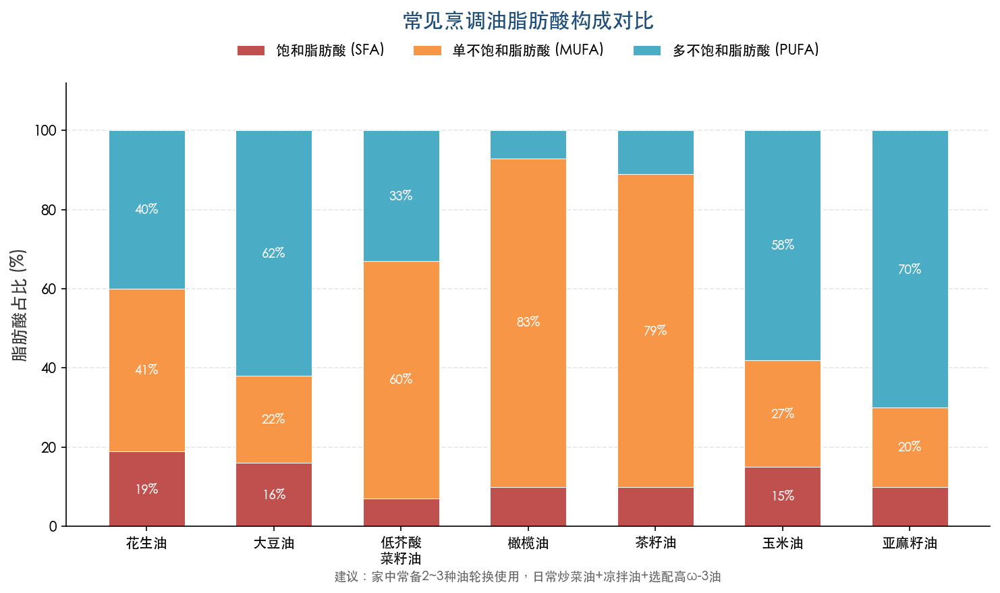

上图以三色堆叠柱状图直观呈现了七种常见烹调油的脂肪酸构成差异。可以看出，低芥酸菜籽油的饱和脂肪酸含量最低（约7%），橄榄油和茶籽油的单不饱和脂肪酸含量最高（约79%~83%），亚麻籽油则以极高的多不饱和脂肪酸（含α-亚麻酸53%）见长。

**实操建议**：家中常备2~3种油——一瓶日常炒菜油（花生油、低芥酸菜籽油或大豆油）、一瓶凉拌或低温炒油（橄榄油或茶籽油），有条件可再备一小瓶亚麻籽油专用于凉拌，补充ω-3脂肪酸。建议每1~2个月轮换主要油种，以实现脂肪酸摄入的多样化与均衡化。

## 2.6 补钙策略：日常膳食达到800mg目标

2023版《中国居民膳食营养素参考摄入量》将≥50岁人群钙的推荐摄入量（RNI）由此前的1000mg/天下调至800mg/天，与18~49岁成人统一 [人民日报民生周刊](http://paper.people.com.cn/mszk/html/2023-11/20/content_26029036.htm "50岁以上人群钙RNI由1000mg降至800mg")。800mg/天并非一个难以企及的目标，通过合理的食物搭配完全可以从日常膳食中达到，无需额外服用钙补充剂。

### 2.6.1 高钙食物含量参考

常见食物每100g可食部分的钙含量如下 [航天中心医院·常见食物钙含量表](https://www.asch.net.cn/Html/News/Articles/8517.html "引用中国食物成分表数据")：

| 食物 | 钙含量(mg/100g) | 每日建议用量 | 可提供钙量 |
|------|----------------|------------|-----------|
| 鲜牛奶 | 100~120 | 300ml | 300~360mg |
| 无糖酸奶 | ~118 | 作为牛奶替换 | 类似 |
| 北豆腐 | ~138 | 50~100g | 70~140mg |
| 荠菜 | ~294 | 适量 | 可观 |
| 油菜 | ~108 | 适量 | 50~100mg |
| 西兰花 | ~67 | 适量 | 辅助贡献 |
| 芝麻酱 | ~1170 | 偶尔少量 | 辅助补充 |

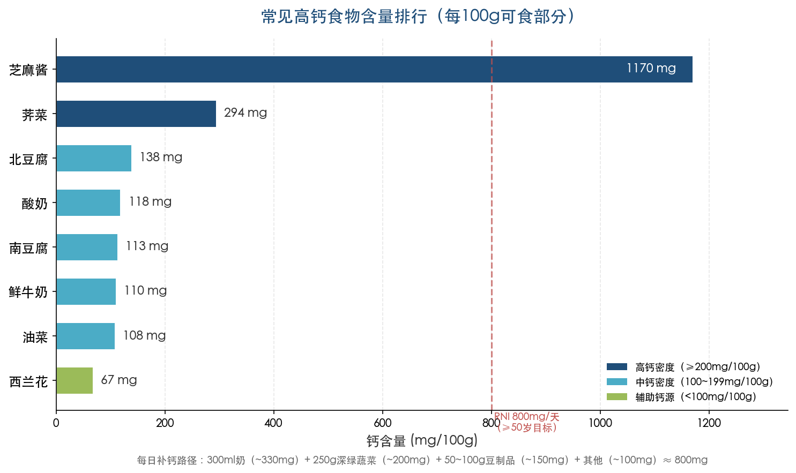

上图按钙含量由高到低排列了八种常见高钙食物，并以红色虚线标注了≥50岁人群800mg/天的RNI目标。芝麻酱虽然钙密度极高（1170mg/100g），但因热量和脂肪含量较高，日常不宜大量食用；奶制品和深绿色蔬菜才是最为稳定、可持续的膳食钙来源。

### 2.6.2 每日补钙路径

一条可复制的每日膳食补钙路径为：

- **300ml奶制品**（纯牛奶或无糖酸奶）→ 提供约300~360mg钙
- **250g深绿色蔬菜**（油菜、焯水后菠菜、荠菜、西兰花等）→ 提供约150~250mg钙
- **50~100g豆制品**（北豆腐、南豆腐、豆腐干）→ 提供约100~200mg钙
- **其他食物**（杂粮、坚果、鱼虾等）→ 贡献约100mg钙

以上四项合计约650~910mg/天，中位值约800mg，恰好覆盖RNI目标。本食谱通过每日固定300ml奶、一餐含豆制品、每餐含深色蔬菜的设计，系统性地保障钙摄入达标。

需要特别注意的是，菠菜、苋菜等含草酸较高的蔬菜应先焯水1~2分钟再行烹调。焯水可去除60%~80%的草酸，大幅降低草酸对钙吸收的干扰；同时，钙不易溶于水，焯水过程不会造成钙的显著流失。

## 2.7 优先食材清单与限制食材清单

### 2.7.1 优先推荐的七大类食材

基于营养密度、GI水平、时令可获得性和烹饪便利性综合考量，以下七大类食材构成本食谱的核心选材库：

**① 全谷物**：糙米、燕麦（整粒或传统压片）、荞麦、小米、黑米、藜麦、玉米
- 富含B族维生素和膳食纤维，GI显著低于精白米面，是主食"粗细搭配"的核心食材

**② 低GI薯类**：山药、芋头（蒸制）、红薯（控量50~60g/次）
- 提供碳水化合物和膳食纤维；红薯GI较高，需控制单次用量并搭配低GI食材同食

**③ 深色蔬菜**：菠菜、荠菜、油菜、西兰花、韭菜、芦笋、春笋、茼蒿、紫甘蓝
- 深色蔬菜应占每日蔬菜总量的一半以上，是钙、钾、叶酸、维生素C和膳食纤维的重要来源

**④ 菌藻类**：香菇、木耳、金针菇、海带
- 热量极低、膳食纤维丰富，香菇和海带还具有天然鲜味，有助于减盐增鲜

**⑤ 优质蛋白质来源**：鸡胸肉、鱼类（鲈鱼、带鱼、鳕鱼、草鱼）、虾仁、鸡蛋、瘦牛肉、豆腐
- 蛋白质来源应追求多样化，鱼禽类占比宜高于畜肉，以降低饱和脂肪酸摄入

**⑥ 奶制品**：纯牛奶、无糖酸奶
- 每日300ml，是钙和优质蛋白质的核心来源，也是本食谱"不变基底"之一

**⑦ 低GI水果**：苹果、梨、草莓、猕猴桃、柑橘
- 3月早春正值草莓和柑橘上市季节 [湖北省卫健委](https://wjw.hubei.gov.cn/bmdt/jkhb/spyy/202603/t20260311_5889863.shtml "2026年3月春季饮食指南")，应优先选用

### 2.7.2 限制或避免的食物

以下五类食物因高钠、高糖、高饱和脂肪或高GI等特征，与本食谱的体重管理和慢性病预防目标相悖，应严格限制或避免：

| 类别 | 具体食物 | 限制理由 |
|------|---------|---------|
| 高钠加工品 | 榨菜、咸鸭蛋、腐乳、火腿肠、方便面 | 含盐量极高，10g榨菜≈1g盐 |
| 高糖食品 | 含糖饮料、糕点、蜜饯 | 升糖快、热量密度高、营养空洞 |
| 高饱和脂肪 | 五花肉、肥肉、猪油、油炸品 | 饱和脂肪升高LDL胆固醇 |
| 高GI精制主食 | 白米粥（煮至软烂）、白面馒头、糯米饭 | 升糖速度快，不利于体重和血糖管理 |
| 酒精及加工肉 | 白酒、啤酒、烟熏腊肉、香肠 | 酒精热量高（7kcal/g）且无营养；加工肉为1类致癌物 |

### 2.7.3 健康替代方案

在日常生活中，不必追求绝对"戒断"，而应以更健康的选择逐步替代不良饮食习惯。下表提供12组常见的替代方案，每一组均基于"等量或近似功能替换"的原则，确保口感和饱腹感不出现断崖式下降：

| 原有习惯 | 健康替代 | 替代逻辑 |
|---------|---------|---------|
| 白米饭 | 杂粮饭（白米+糙米/小米/杂豆） | GI从~83降至~60以下 |
| 白面馒头 | 全麦馒头/杂粮馒头 | 增加膳食纤维和B族维生素 |
| 白米粥 | 燕麦片粥/杂粮粥 | 降低GI，增加饱腹感 |
| 油炸品 | 蒸煮烤制品 | 大幅减少脂肪摄入 |
| 五花肉 | 鸡胸肉/鱼/虾 | 蛋白质相当，脂肪减少60%以上 |
| 猪油/黄油 | 花生油/橄榄油 | 以不饱和脂肪酸替代饱和脂肪酸 |
| 含糖饮料 | 白水/淡茶 | 零热量零添加糖 |
| 咸菜 | 新鲜蔬菜凉拌 | 钠摄入减少90%以上 |
| 大量酱油蚝油 | 葱姜蒜醋柠檬调味 | 减钠增鲜 |
| 加工肉（火腿肠等） | 新鲜瘦肉/鱼/蛋 | 去除亚硝酸盐和高钠 |
| 饼干糕点零食 | 坚果10~15g/水果 | 营养密度高，控制精制糖 |
| 豆浆（钙~5mg/100ml） | 牛奶（钙~107mg/100ml） | 钙含量相差约20倍 |

## 2.8 烹饪方式指南：少油少盐，最大限度保留营养

### 2.8.1 烹饪方式优先级

不同烹饪方式对营养素保留率和油盐引入量的影响差异显著。蒸菜和急火快炒是除生食外维生素保留率最高的两种方式；"水油焖"法（少量油加半碗水焖制）对维生素C的保存率可达80%~90% [湖北省卫健委](https://wjw.hubei.gov.cn/bmdt/jkhb/spyy/202105/t20210520_3545663.shtml "中国营养学会全民营养周：健康烹饪的要点")。油炸不仅大量引入油脂，还会造成蛋白质氧化和维生素B₁、维生素C的严重损失。

本食谱按以下优先级安排烹饪方式 [中国营养学会《家庭减盐行为指南》](https://www.chinacdc.cn/jkyj/mxfcrxjb2/jswj13947/202410/P020241010502020673225.pdf "8.4.3优化烹饪方式")：

| 优先级 | 烹饪方式 | 适用食材 | 营养保留 | 油盐引入 |
|-------|---------|---------|---------|---------|
| ★★★ 优先 | 蒸、煮、炖、白灼、凉拌 | 鱼、蔬菜、鸡蛋、薯类、豆腐 | 高 | 极低 |
| ★★ 适度 | 少油快炒、焖 | 肉片、叶菜、菌菇 | 较高 | 中等 |
| ★ 限制 | 煎、红烧、酱爆 | 偶尔用于改善口味 | 中等 | 较高 |
| ✕ 避免 | 油炸、油煎、腌制 | — | 低 | 极高 |

### 2.8.2 各类食材的烹调要点

**蔬菜类**：烹调损失最多的营养素是维生素C和叶酸——它们既怕热、又怕氧化、还易溶于水。蒸菜和急火快炒损失较少；长时间水煮会导致大量水溶性维生素溶于汤中，除非连汤一起食用 [湖北省卫健委](https://wjw.hubei.gov.cn/bmdt/jkhb/spyy/202105/t20210520_3545663.shtml "健康烹饪的要点")。"先洗后切、急火快炒、出锅即食"是保留蔬菜营养素的三大原则。

**鱼肉类**：清蒸和炖煮是鱼肉类的最佳烹调方式，能够完整保留不饱和脂肪酸和蛋白质，避免高温氧化产生有害物质。炭火烧烤和油炸是最不推荐的肉类烹调方式——不仅造成营养素损失，还可能产生杂环胺和多环芳烃等致癌物质。

**谷物类**：主食烹调损失最大的营养素是维生素B₁。过度淘洗、倒掉浸泡水、煮粥加碱均会加重B₁的损失。杂粮饭可提前12~24小时冷藏浸泡，烹饪时连同浸泡水一起入电饭锅蒸煮——既保留了B族维生素，又能使粗粮充分吸水膨胀，改善口感。

### 2.8.3 厨房实用小技巧

- **菠菜、苋菜**：先焯水1~2分钟去除草酸，再凉拌或炒制
- **西兰花**：掰小朵后蒸3~4分钟，比水煮保留更多维生素C和萝卜硫素
- **番茄**：加少许油炒制或做汤，番茄红素的生物利用率比生食提高3~5倍（番茄红素为脂溶性成分，加热+少量油可促进释放和吸收）
- **鱼类**：清蒸或水煮8~10分钟即熟，避免过度加热导致蛋白质变性和ω-3脂肪酸氧化
- **凉拌菜**：出锅前/食用前再加盐和调味料，既减少钠摄入，又让舌尖更好地感知咸味

## 2.9 食物交换份：灵活替换的实用工具

在实际执行食谱时，难免遇到某种食材断货、不当季或个人不喜欢的情况。食物交换份的概念为灵活替换提供了科学依据：同一组内的食物每份提供大致相同的热量（约90 kcal），可在组内等量互换而不显著改变全天营养摄入 [国家卫健委《成人糖尿病食养指南（2023年版）》](https://www.nhc.gov.cn/cms-search/downFiles/4fcbecd2c18e46baaf291bf46c2b79cd.pdf "附录2食物交换表")：

| 食物组 | 每份约90kcal的等量交换 |
|-------|---------------------|
| 谷类 | 大米/面粉23~27g ≈ 馒头/米饭(熟)34~38g ≈ 薯类90~110g |
| 蔬菜 | 常见蔬菜240~260g（热量极低，可适度增加） |
| 水果 | 常见水果140~160g（如1个中等苹果≈1个中等橙子） |
| 肉蛋 | 畜肉40~60g ≈ 鸡蛋50~70g ≈ 鱼类60~90g |
| 豆奶 | 北豆腐80~100g ≈ 纯牛奶130~150ml |

举例说明：食谱中标注"清蒸鲈鱼100g"，若市场上鲈鱼缺货，可等量替换为"清蒸鳕鱼100g"或"白灼虾仁90g"或"鸡胸肉70g"——均在肉蛋组内，热量和蛋白质贡献近似，不影响全天营养平衡。

## 2.10 时令食材与季节搭配

本食谱设计于2026年3月下旬（早春时节），食材选择充分考虑了当季时令蔬果的可获得性与新鲜度 [湖北省卫健委](https://wjw.hubei.gov.cn/bmdt/jkhb/spyy/202603/t20260311_5889863.shtml "2026年3月春季饮食指南")：

**早春时令蔬菜**：
- **叶菜类**：菠菜、荠菜、春韭菜、香椿芽、豌豆尖、油菜
- **茎类**：春笋、芦笋、莴笋、蒜苗、茼蒿
- **其他**：豆芽、菌菇（全年稳定供应）

**早春时令水果**：
- **草莓**：3月正当季，富含维生素C且GI较低，是本季首选水果
- **柑橘类**：橙子、柑橘，维生素C含量丰富
- **苹果、梨**：冷库贮存品种，全年可得，价格稳定

选用时令食材不仅价格更为实惠、口感更佳，而且营养素含量通常优于反季节品种。本食谱两周内选用了9种早春时令蔬菜，在实现营养均衡的同时，也呼应了"不时不食"的中国传统饮食智慧。

## 2.11 本章要点总结

上述饮食原则可概括为"五控一补一换"七字诀：

1. **控糖**：主食粗细搭配，全谷物杂豆占比≥1/3；采用"先菜后肉再主食"的进餐顺序；避免过度糊化的粥和大量勾芡
2. **控盐**：全天食盐摄入≤5g，使用限盐勺量化用量，以葱姜蒜醋柠檬增鲜替代重盐调味，出锅前放盐，严格减少高钠加工食品
3. **控脂**：烹调油≤25g/天，优先采用蒸煮炖烹调方式，家中常备2~3种油轮换使用
4. **控量**：三餐按30%—40%—25%比例分配能量，加餐占5%；养成七八分饱的进餐习惯
5. **控GI**：选择低GI主食和水果，避免精制白米粥和含糖饮料
6. **补钙**：每日300ml奶 + 深绿色蔬菜 + 豆制品，系统性达成800mg/天的钙摄入目标
7. **换选**：以优质食材替代高钠、高糖、高饱和脂肪食物，12组替代方案可按需灵活运用

掌握以上原则后，后续第3章和第4章的两周食谱将严格按照这些标准进行设计，每一餐的食材选择、用量和烹饪方式均可溯源到本章的操作框架。

# 第3章 第一周食谱详情（第1–7天）

前两章分别确立了体重管理期每日目标热量（男性约 1800~2000 kcal、女性约 1500~1700 kcal，三大营养素比例为碳水化合物 50%~55%、蛋白质 15%~20%、脂肪 25%~30%）及可操作的饮食原则与食物选择策略。本章在此基础上，逐日呈现第一周（第 1~7 天）的完整食谱——每餐列明菜品名称、主要食材及用量（克）、简要烹饪方法和预估热量，并在每日末尾汇总当天总热量与三大营养素摄入情况，与目标值进行对照。食谱设计兼顾食物多样性（7 天覆盖 65 种食材）、早春时令特色和中国大陆家庭厨房的可操作性。

## 3.1 食谱设计说明

### 3.1.1 能量与营养素标准

本章以**男性 1900 kcal/天**为主版本进行详细呈现，取目标区间 1800~2000 kcal 的中位值。三餐及加餐能量按早餐 30%（约 570 kcal）、午餐 40%（约 760 kcal）、晚餐 25%（约 475 kcal）、加餐 5%（约 95 kcal）分配，与第 2 章确立的三餐比例保持一致。烹调油全天控制在 25g 以内（早餐 3~5g、午餐约 10g、晚餐 8~10g），食盐含调味品折算不超过 5g [中国营养学会膳食指南（2022）](http://dg.cnsoc.org/article/04/K7tlcs-UQh67DBC5XY1Jqw.html "食物多样，合理搭配")。

**女性 1600 kcal 版本**的调整方案如下：每餐主食减少 15~25g（生重）、荤菜减至 60~70g、烹调油减至 20g/天、水果微减至 120~150g；鸡蛋（1 个/天）、奶（300ml/天）、蔬菜（350~450g/天）保持不变。据此估算，女性版本日均营养约为 1600 kcal、碳水约 210g（52%）、蛋白质约 70g（17.5%）、脂肪约 48g（27%），同样落在目标区间内。

### 3.1.2 营养数据来源与精度说明

食材热量及营养素数据主要依据国家食物与营养咨询委员会发布的《主要食物营养成分表》[国家食物与营养咨询委员会](https://sfncc.caas.cn/yyjk/37012.htm "每百克食物所含营养成分")，该表数据源自《中国食物成分表》，并参照国家卫健委《成人糖尿病食养指南（2023 年版）》附录 2 食物交换份表进行交叉校验 [国家卫健委食养指南](https://www.nhc.gov.cn/cms-search/downFiles/4fcbecd2c18e46baaf291bf46c2b79cd.pdf "附录2-3")。

烹饪过程中食材水分变化、实际用油量等因素导致热量计算存在 ±5%~10% 的正常偏差。对于加工类食品（如荞麦面条、全麦馒头、甜玉米），不同品牌配方的热量差异可能更大，建议参照产品营养标签核实。本食谱所有热量和营养素数据均为基于生重食材的估算值，实际烹饪后的偏差属于可接受范围。

### 3.1.3 食物交换份简表

为方便读者根据个人口味和食材可得性灵活替换，以下列出常用食材的等热量交换关系（每份约 90 kcal）[国家卫健委食养指南](https://www.nhc.gov.cn/cms-search/downFiles/4fcbecd2c18e46baaf291bf46c2b79cd.pdf "附录2食物交换表")：

| 食物类别 | 每份用量（约90 kcal） | 常见替换举例 |
|---------|---------------------|------------|
| 谷类（生重） | 大米/面粉 25g ≈ 馒头/米饭（熟）35g | 糙米 ↔ 小米 ↔ 燕麦 ↔ 荞麦 |
| 薯类 | 红薯/山药/芋头 100g | 红薯 ↔ 山药 ↔ 芋头 ↔ 土豆 |
| 蔬菜 | 常见蔬菜 250g | 菠菜 ↔ 油菜 ↔ 西兰花 ↔ 荠菜 |
| 水果 | 常见水果 150g | 苹果 ↔ 梨 ↔ 橙子 ↔ 猕猴桃 |
| 畜禽肉 | 瘦肉 50g ≈ 鸡蛋 60g | 瘦猪肉 ↔ 鸡胸肉 ↔ 瘦牛肉 |
| 鱼虾 | 鱼类 70g ≈ 虾仁 80g | 鲈鱼 ↔ 鲫鱼 ↔ 带鱼 ↔ 虾仁 |
| 豆制品 | 北豆腐 90g ≈ 豆腐干 45g | 北豆腐 ↔ 南豆腐 ↔ 豆腐干 |
| 奶类 | 纯牛奶 140ml ≈ 无糖酸奶 130g | 纯牛奶 ↔ 无糖酸奶 |

### 3.1.4 每日固定基底

贯穿 7 天食谱的"不变基底"为：**每天 1 个水煮蛋（约 50g）+ 300ml 奶（纯牛奶或无糖酸奶）**，二者合计提供约 220 kcal、15g 蛋白质和 340~360mg 钙，为钙和优质蛋白提供稳定保障。每餐主食均采用杂粮饭或杂粮主食（全谷物杂豆占比 ≥ 1/3），进餐建议遵循"先蔬菜→蛋白质→主食"的顺序，有助于降低餐后血糖峰值 [国家卫健委食养指南](https://www.nhc.gov.cn/cms-search/downFiles/4fcbecd2c18e46baaf291bf46c2b79cd.pdf "调整进餐顺序")。

---

## 3.2 第1天食谱

> **当日主题**：经典开篇——清蒸鱼+多色蔬菜，营养全面、口味清淡

### 早餐（约570 kcal）

| 菜品 | 主要食材及用量 | 烹饪方法 | 热量（kcal） |
|------|-------------|---------|-------------|
| 小米燕麦粥 | 小米20g、燕麦15g | 电饭锅预约煮粥，前晚设好定时 | 125 |
| 水煮蛋 | 鸡蛋1个（50g） | 冷水入锅煮8分钟 | 72 |
| 纯牛奶 | 牛奶300ml | 直饮或微波加热1分钟 | 162 |
| 凉拌菠菜 | 菠菜100g、蒜末3g | 菠菜焯水1~2分钟捞出，加蒜末、少许生抽和香油拌匀 | 35 |
| 全麦馒头片 | 全麦馒头60g | 切片，平底锅微煎或直接食用 | 150 |

> **早餐小贴士**：菠菜含较多草酸，焯水 1~2 分钟可去除 60%~80% 的草酸，大幅降低对钙吸收的干扰。焯水后菠菜中的钙、铁等矿物质不会显著流失，可放心食用。

### 午餐（约760 kcal）

| 菜品 | 主要食材及用量 | 烹饪方法 | 热量（kcal） |
|------|-------------|---------|-------------|
| 杂粮饭 | 大米50g、糙米15g、红豆10g | 红豆提前浸泡2小时，与大米糙米同煮 | 250 |
| 清蒸鲈鱼 | 鲈鱼100g、葱姜适量 | 鱼身划刀，铺葱姜，大火蒸8~10分钟，淋少许蒸鱼豉油 | 105 |
| 蒜蓉西兰花 | 西兰花120g、蒜末5g、油5g | 西兰花焯水1分钟，热锅少油爆蒜，快炒1分钟 | 60 |
| 番茄蛋花汤 | 番茄80g、鸡蛋半个（25g） | 番茄切块煮开，打入蛋花，加少许盐 | 55 |
| 清炒荠菜 | 荠菜100g、油5g | 大火快炒2分钟，加少许盐调味 | 55 |

> **午餐小贴士**：清蒸鲈鱼是低脂高蛋白的典范做法——100g 鲈鱼仅含约 105 kcal 和不到 3g 脂肪，蛋白质却高达 18g。蒸鱼豉油含钠量较高，建议控制在 5ml 以内（约折合 0.8g 盐），并将此量纳入全天食盐预算。

### 晚餐（约475 kcal）

| 菜品 | 主要食材及用量 | 烹饪方法 | 热量（kcal） |
|------|-------------|---------|-------------|
| 杂粮饭 | 大米40g、小米10g、黑米10g | 三种米混合煮饭 | 195 |
| 香菇鸡胸肉 | 鸡胸肉60g、鲜香菇50g、油5g | 鸡胸肉切丁用料酒腌制，与香菇片同炒 | 130 |
| 凉拌黄瓜 | 黄瓜120g、蒜末、醋 | 黄瓜拍碎，加蒜末、醋、少许生抽拌匀 | 20 |
| 紫菜蛋花汤 | 紫菜3g、鸡蛋半个（25g） | 紫菜泡开，水开后打入蛋花 | 50 |

### 加餐（约95 kcal）

| 食物 | 用量 | 热量（kcal） |
|------|------|-------------|
| 苹果 | 1个中等（约150g） | 78 |
| 核桃 | 2个（约10g仁） | 65 |

> **加餐安排**：建议在下午 3~4 点食用，避免午晚餐之间过度饥饿。苹果 GI 约 36，属低 GI 水果，搭配少量核桃（富含 α-亚麻酸）可延长饱腹感。加餐总热量控制在 100 kcal 左右，不宜超量。

### 第1天营养汇总

| 指标 | 实际摄入（估算） | 目标值 | 达标 |
|------|---------------|--------|------|
| 总热量 | ~1900 kcal | 1800~2000 kcal | ✓ |
| 碳水化合物 | ~250g（53%） | 50%~55% | ✓ |
| 蛋白质 | ~85g（18%） | 15%~20% | ✓ |
| 脂肪 | ~55g（26%） | 25%~30% | ✓ |
| 食材种类 | 18种 | 日均≥12种 | ✓ |

---

## 3.3 第2天食谱

> **当日主题**：荞麦面早餐+芦笋炒虾仁，丰富水产蛋白来源

### 早餐（约570 kcal）

| 菜品 | 主要食材及用量 | 烹饪方法 | 热量（kcal） |
|------|-------------|---------|-------------|
| 荞麦面 | 荞麦挂面80g（干重）、葱花 | 煮面3~4分钟，捞出过凉水，淋少许生抽和香油 | 260 |
| 卤蛋 | 鸡蛋1个（50g） | 水煮蛋剥壳，放入卤汁（八角+少许酱油+水）小火煮15分钟，可前晚备好 | 80 |
| 纯牛奶 | 牛奶300ml | 直饮 | 162 |
| 烫油菜 | 油菜100g | 沸水焯烫30秒捞出，淋少许蚝油 | 25 |

> **早餐小贴士**：荞麦面 GI 约 54，属低 GI 主食，饱腹感优于白面条。选购荞麦挂面时，建议查看配料表确认荞麦粉含量——部分产品以小麦粉为主、荞麦粉占比不足 30%，应优先选择荞麦粉排在配料表第一位的产品。

### 午餐（约760 kcal）

| 菜品 | 主要食材及用量 | 烹饪方法 | 热量（kcal） |
|------|-------------|---------|-------------|
| 杂粮饭 | 大米50g、小米15g、绿豆10g | 绿豆浸泡1小时，与米同煮 | 250 |
| 芦笋炒虾仁 | 虾仁80g、芦笋100g、油5g | 虾仁用料酒腌制，芦笋切段，大火快炒3分钟 | 130 |
| 香菇烧豆腐 | 北豆腐100g、香菇30g、油3g | 豆腐切块煎至微黄，加香菇片和少许酱油焖煮5分钟 | 140 |
| 蒜蓉莴笋 | 莴笋120g、蒜末、油2g | 莴笋去皮切片，蒜蓉爆香快炒 | 40 |
| 菠菜豆腐汤 | 菠菜50g、嫩豆腐30g | 菠菜焯水后与豆腐同煮，加少许盐 | 30 |

### 晚餐（约475 kcal）

| 菜品 | 主要食材及用量 | 烹饪方法 | 热量（kcal） |
|------|-------------|---------|-------------|
| 红薯杂粮饭 | 大米40g、红薯50g、黑米10g | 红薯切小块与米同煮 | 200 |
| 西红柿炖牛肉 | 瘦牛肉60g、番茄80g、油5g | 牛肉切小块焯水，与番茄块同炖30分钟 | 155 |
| 白灼菜心 | 菜心120g | 沸水焯烫1分钟，淋少许蒸鱼豉油 | 25 |
| 海带丝汤 | 海带丝30g（泡发后） | 海带丝加清水煮开，加少许醋和盐 | 15 |

> **晚餐小贴士**：红薯 GI 较高（约 77），单次用量控制在 50~60g 并搭配黑米等低 GI 食材同食，可有效降低整餐血糖应答。血糖偏高者可将红薯替换为等量山药（GI 约 51）或芋头（GI 约 48），同样具有良好的饱腹效果。

### 加餐（约95 kcal）

| 食物 | 用量 | 热量（kcal） |
|------|------|-------------|
| 草莓 | 约150g（约8颗） | 48 |
| 杏仁 | 约8g | 45 |

### 第2天营养汇总

| 指标 | 实际摄入（估算） | 目标值 | 达标 |
|------|---------------|--------|------|
| 总热量 | ~1900 kcal | 1800~2000 kcal | ✓ |
| 碳水化合物 | ~248g（52%） | 50%~55% | ✓ |
| 蛋白质 | ~82g（17%） | 15%~20% | ✓ |
| 脂肪 | ~56g（26%） | 25%~30% | ✓ |
| 食材种类 | 20种 | 日均≥12种 | ✓ |

---

## 3.4 第3天食谱

> **当日主题**：红小豆薏米祛湿+春笋时令鲜味，兼顾祛湿与控糖

### 早餐（约570 kcal）

| 菜品 | 主要食材及用量 | 烹饪方法 | 热量（kcal） |
|------|-------------|---------|-------------|
| 红小豆薏米粥 | 红小豆15g、薏米15g、大米10g | 红小豆薏米提前浸泡4小时，加大米同煮至软烂 | 140 |
| 全麦鸡蛋饼 | 全麦粉30g、鸡蛋1个（50g）、葱花 | 全麦粉加蛋和水调成糊，平底锅少油摊饼 | 200 |
| 无糖酸奶 | 无糖酸奶200g | 直接食用 | 120 |
| 凉拌春笋丝 | 春笋80g、香油2ml | 春笋切丝焯水3分钟，加少许盐和香油拌匀 | 30 |

> **早餐小贴士**：春笋是 3 月的时令蔬菜，每 100g 仅含 25 kcal，膳食纤维含量高达 2.8g，是极佳的低热量高纤维食材。焯水 3 分钟可有效去除涩味和大部分草酸。

### 午餐（约760 kcal）

| 菜品 | 主要食材及用量 | 烹饪方法 | 热量（kcal） |
|------|-------------|---------|-------------|
| 杂粮饭 | 大米50g、糙米15g、芸豆10g | 芸豆浸泡4小时，与米同煮 | 250 |
| 红烧带鱼 | 带鱼80g、葱姜、油5g | 带鱼切段，少油煎至两面金黄，加酱油、料酒、少许糖焖5分钟 | 160 |
| 木耳炒莴笋 | 干木耳5g（泡发后30g）、莴笋100g、油3g | 木耳提前泡发，莴笋去皮切片，大火快炒 | 55 |
| 清炒豌豆尖 | 豌豆尖100g、蒜末、油2g | 蒜蓉爆香，大火快炒1分钟 | 30 |
| 冬瓜虾皮汤 | 冬瓜80g、虾皮5g | 冬瓜切薄片煮至透明，加虾皮和少许盐 | 20 |

> **午餐小贴士**：虾皮含钠量极高——5g 虾皮约含 253mg 钠（折合约 0.6g 盐），汤中使用虾皮时当日其他菜品应相应减盐，确保全天食盐总量不超过 5g。

### 晚餐（约475 kcal）

| 菜品 | 主要食材及用量 | 烹饪方法 | 热量（kcal） |
|------|-------------|---------|-------------|
| 山药小米粥 | 山药60g、小米20g | 山药去皮切段，与小米同煮 | 130 |
| 清炒鸡丁 | 鸡胸肉60g、黄瓜50g、胡萝卜30g、油5g | 鸡胸肉切丁腌制，与蔬菜丁同炒 | 140 |
| 凉拌木耳 | 干木耳5g（泡发后30g）、醋、蒜末 | 木耳焯水，加醋蒜拌匀 | 18 |
| 全麦馒头 | 全麦馒头50g | 蒸热食用 | 125 |

### 加餐（约95 kcal）

| 食物 | 用量 | 热量（kcal） |
|------|------|-------------|
| 橙子 | 1个中等（约150g） | 72 |
| 花生 | 约8g | 45 |

### 第3天营养汇总

| 指标 | 实际摄入（估算） | 目标值 | 达标 |
|------|---------------|--------|------|
| 总热量 | ~1900 kcal | 1800~2000 kcal | ✓ |
| 碳水化合物 | ~252g（53%） | 50%~55% | ✓ |
| 蛋白质 | ~80g（17%） | 15%~20% | ✓ |
| 脂肪 | ~54g（26%） | 25%~30% | ✓ |
| 食材种类 | 20种 | 日均≥12种 | ✓ |

---

## 3.5 第4天食谱

> **当日主题**：玉米面窝头+蒸南瓜的粗粮组合，午餐牛肉补铁

### 早餐（约570 kcal）

| 菜品 | 主要食材及用量 | 烹饪方法 | 热量（kcal） |
|------|-------------|---------|-------------|
| 玉米面窝头 | 玉米面40g | 玉米面加温水揉成团，捏成窝头状蒸15分钟 | 140 |
| 水煮蛋 | 鸡蛋1个（50g） | 冷水入锅煮8分钟 | 72 |
| 纯牛奶 | 牛奶300ml | 直饮 | 162 |
| 凉拌胡萝卜丝 | 胡萝卜80g、醋、香油2ml | 胡萝卜切细丝焯水，加醋和香油拌匀 | 35 |
| 蒸南瓜 | 南瓜80g | 南瓜切块蒸10分钟 | 25 |
| 小米粥 | 小米15g | 小米煮粥 | 50 |

### 午餐（约760 kcal）

| 菜品 | 主要食材及用量 | 烹饪方法 | 热量（kcal） |
|------|-------------|---------|-------------|
| 杂粮饭 | 大米50g、小米10g、红豆10g | 红豆浸泡，与米同煮 | 245 |
| 西红柿炖瘦牛肉 | 瘦牛肉70g、番茄100g、油5g | 牛肉焯水切块，番茄炒出汁后加牛肉炖30分钟 | 175 |
| 蒜蓉春笋 | 春笋100g、蒜末、油3g | 春笋焯水后切片，蒜蓉爆香快炒 | 45 |
| 清炒茼蒿 | 茼蒿120g、油2g | 大火快炒1~2分钟，加少许盐 | 35 |
| 豆腐菌菇汤 | 嫩豆腐50g、金针菇30g、香菇20g | 菌菇和豆腐加清水煮开，少许盐调味 | 45 |

> **午餐小贴士**：瘦牛肉每 100g 含铁约 3.3mg（血红素铁，吸收率显著高于植物性非血红素铁），是 50 岁以上人群补充铁元素的优质来源。建议每周食用 2~3 次红肉类食材，搭配富含维生素 C 的蔬菜（如番茄、彩椒）可进一步促进铁的吸收。

### 晚餐（约475 kcal）

| 菜品 | 主要食材及用量 | 烹饪方法 | 热量（kcal） |
|------|-------------|---------|-------------|
| 杂粮饭 | 大米40g、黑米10g、绿豆10g | 绿豆浸泡后与米同煮 | 195 |
| 清蒸鲫鱼 | 鲫鱼100g、葱姜 | 鱼身划刀，铺葱姜蒸10分钟 | 110 |
| 韭菜炒豆干 | 韭菜80g、五香豆干40g、油5g | 豆干切丝，与韭菜段大火快炒 | 120 |
| 凉拌菠菜粉丝 | 菠菜60g、粉丝10g（干）、蒜末 | 菠菜焯水，粉丝泡软，加蒜末醋拌匀 | 50 |

### 加餐（约95 kcal）

| 食物 | 用量 | 热量（kcal） |
|------|------|-------------|
| 猕猴桃 | 1个（约100g） | 56 |
| 核桃 | 2个（约10g仁） | 65 |

### 第4天营养汇总

| 指标 | 实际摄入（估算） | 目标值 | 达标 |
|------|---------------|--------|------|
| 总热量 | ~1910 kcal | 1800~2000 kcal | ✓ |
| 碳水化合物 | ~250g（52%） | 50%~55% | ✓ |
| 蛋白质 | ~83g（17%） | 15%~20% | ✓ |
| 脂肪 | ~57g（27%） | 25%~30% | ✓ |
| 食材种类 | 22种 | 日均≥12种 | ✓ |

---

## 3.6 第5天食谱

> **当日主题**：燕麦牛奶粥暖胃早餐+白灼虾午餐，简约高蛋白

### 早餐（约570 kcal）

| 菜品 | 主要食材及用量 | 烹饪方法 | 热量（kcal） |
|------|-------------|---------|-------------|
| 燕麦牛奶粥 | 燕麦片25g、牛奶300ml | 燕麦片加牛奶小火煮3分钟至稠 | 260 |
| 水煮蛋 | 鸡蛋1个（50g） | 冷水入锅煮8分钟 | 72 |
| 杂粮馒头 | 杂粮馒头60g | 蒸热食用 | 150 |
| 凉拌莴笋丝 | 莴笋100g、蒜末、醋 | 莴笋去皮切丝焯水，加蒜末醋拌匀 | 20 |

### 午餐（约760 kcal）

| 菜品 | 主要食材及用量 | 烹饪方法 | 热量（kcal） |
|------|-------------|---------|-------------|
| 杂粮饭 | 大米50g、糙米15g、红小豆10g | 红小豆浸泡后与米同煮 | 250 |
| 白灼虾 | 鲜虾100g（带壳，约60g虾肉） | 水烧开加姜片，虾下锅煮3分钟变红捞出 | 80 |
| 荠菜豆腐羹 | 荠菜60g、嫩豆腐80g、淀粉5g | 荠菜切碎，豆腐切小块，加鸡汤煮开后勾薄芡 | 90 |
| 蒜蓉芦笋 | 芦笋100g、蒜末、油5g | 芦笋焯水，蒜蓉爆香快炒 | 50 |
| 西红柿蛋汤 | 番茄80g、鸡蛋半个（25g） | 番茄煮开后打入蛋花 | 55 |

> **午餐小贴士**：白灼虾烹饪极其简便（3 分钟即成），脂肪含量极低（每 100g 虾肉仅约 1g 脂肪），是体重管理期间的理想蛋白质来源。蘸料建议以少许生抽 + 姜丝 + 醋调配，避免使用高热量的沙拉酱或蒜蓉辣酱。

### 晚餐（约475 kcal）

| 菜品 | 主要食材及用量 | 烹饪方法 | 热量（kcal） |
|------|-------------|---------|-------------|
| 山药饭 | 大米40g、山药60g | 山药去皮切丁与米同煮 | 195 |
| 瘦肉炒蒜苗 | 猪瘦肉50g、蒜苗100g、油5g | 瘦肉切片腌制，与蒜苗段大火快炒 | 145 |
| 凉拌油菜 | 油菜120g、蒜末 | 油菜焯水，加蒜末少许盐和香油拌匀 | 25 |
| 紫菜汤 | 紫菜3g、虾皮少许（2g） | 紫菜撕碎加虾皮冲入沸水 | 15 |

### 加餐（约95 kcal）

| 食物 | 用量 | 热量（kcal） |
|------|------|-------------|
| 梨 | 1个中等（约150g） | 65 |
| 花生 | 约8g | 45 |

### 第5天营养汇总

| 指标 | 实际摄入（估算） | 目标值 | 达标 |
|------|---------------|--------|------|
| 总热量 | ~1900 kcal | 1800~2000 kcal | ✓ |
| 碳水化合物 | ~245g（52%） | 50%~55% | ✓ |
| 蛋白质 | ~86g（18%） | 15%~20% | ✓ |
| 脂肪 | ~56g（27%） | 25%~30% | ✓ |
| 食材种类 | 19种 | 日均≥12种 | ✓ |

---

## 3.7 第6天食谱

> **当日主题**：黑米红豆经典搭配+香椿芽时令风味，彩椒增色增维C

### 早餐（约570 kcal）

| 菜品 | 主要食材及用量 | 烹饪方法 | 热量（kcal） |
|------|-------------|---------|-------------|
| 黑米红豆粥 | 黑米20g、红豆15g | 黑米红豆提前浸泡4小时，电饭锅煮粥 | 125 |
| 水煮蛋 | 鸡蛋1个（50g） | 冷水入锅煮8分钟 | 72 |
| 无糖酸奶 | 无糖酸奶200g | 直接食用 | 120 |
| 香椿芽拌豆腐 | 香椿芽30g、北豆腐80g | 香椿芽焯水切碎，豆腐切小块，加少许盐和香油拌匀 | 90 |
| 蒸玉米 | 甜玉米1段（约80g可食部分） | 蒸15分钟 | 100 |

> **早餐小贴士**：香椿芽是早春（3~4 月）独有的时令食材，每 100g 含维生素 C 约 40mg 和丰富的膳食纤维。香椿含硝酸盐较多，食用前务必焯水 30 秒~1 分钟以去除大部分硝酸盐，确保食用安全。

### 午餐（约760 kcal）

| 菜品 | 主要食材及用量 | 烹饪方法 | 热量（kcal） |
|------|-------------|---------|-------------|
| 杂粮饭 | 大米50g、小米10g、绿豆10g | 绿豆浸泡后与米同煮 | 245 |
| 清炒鸡丁彩椒 | 鸡胸肉60g、红椒40g、黄椒40g、油5g | 鸡胸肉切丁腌制，与彩椒块大火快炒3分钟 | 145 |
| 香菇青菜 | 青菜120g、鲜香菇30g、油3g | 香菇切片，与青菜同炒 | 50 |
| 醋溜白菜 | 白菜120g、醋、油2g | 白菜切段，热锅加醋大火快炒 | 35 |
| 萝卜排骨汤 | 白萝卜80g、排骨30g（去骨重） | 排骨焯水去浮沫，加萝卜块炖30分钟 | 90 |

### 晚餐（约475 kcal）

| 菜品 | 主要食材及用量 | 烹饪方法 | 热量（kcal） |
|------|-------------|---------|-------------|
| 荞麦面 | 荞麦挂面70g（干重） | 煮面3分钟捞出 | 230 |
| 西红柿面卤 | 番茄100g、瘦肉末20g、油3g | 番茄切碎炒出汁，加肉末翻炒，加少许盐勾薄芡 | 80 |
| 清炒菠菜 | 菠菜100g、蒜末、油2g | 菠菜焯水后大火快炒1分钟 | 35 |
| 凉拌黄瓜 | 黄瓜100g、醋、蒜末 | 黄瓜拍碎加醋蒜拌匀 | 16 |

### 加餐（约95 kcal）

| 食物 | 用量 | 热量（kcal） |
|------|------|-------------|
| 柑橘 | 1~2个（约150g可食部分） | 66 |
| 杏仁 | 约8g | 45 |

### 第6天营养汇总

| 指标 | 实际摄入（估算） | 目标值 | 达标 |
|------|---------------|--------|------|
| 总热量 | ~1910 kcal | 1800~2000 kcal | ✓ |
| 碳水化合物 | ~248g（52%） | 50%~55% | ✓ |
| 蛋白质 | ~84g（18%） | 15%~20% | ✓ |
| 脂肪 | ~57g（27%） | 25%~30% | ✓ |
| 食材种类 | 21种 | 日均≥12种 | ✓ |

---

## 3.8 第7天食谱

> **当日主题**：红薯燕麦暖粥+番茄炖豆腐鱼，温和收尾迎接第二周

### 早餐（约570 kcal）

| 菜品 | 主要食材及用量 | 烹饪方法 | 热量（kcal） |
|------|-------------|---------|-------------|
| 红薯燕麦粥 | 红薯50g、燕麦片15g | 红薯切小丁与燕麦同煮5分钟 | 130 |
| 水煮蛋 | 鸡蛋1个（50g） | 冷水入锅煮8分钟 | 72 |
| 纯牛奶 | 牛奶300ml | 直饮 | 162 |
| 凉拌芹菜花生 | 芹菜80g、花生米10g | 芹菜焯水切段，花生提前煮熟，加少许盐醋拌匀 | 75 |
| 全麦面包 | 全麦面包1片（约35g） | 直接食用或微烤 | 85 |

> **早餐小贴士**：选购全麦面包时，配料表中"全麦粉"应排在第一位，且全麦粉含量 ≥ 50% 方为真正的全麦面包。部分"伪全麦"产品仅添加麸皮或焦糖色素制造深色外观，实际全谷物含量不足，购买前应仔细核对营养标签。

### 午餐（约760 kcal）

| 菜品 | 主要食材及用量 | 烹饪方法 | 热量（kcal） |
|------|-------------|---------|-------------|
| 杂粮饭 | 大米50g、糙米10g、芸豆10g | 芸豆浸泡后与米同煮 | 245 |
| 番茄炖豆腐鱼 | 草鱼或鲈鱼80g、番茄80g、北豆腐50g、油5g | 鱼块煎至微黄，加番茄块和豆腐同炖15分钟 | 200 |
| 蒜蓉韭菜 | 韭菜100g、蒜末、油3g | 蒜蓉爆香，韭菜大火快炒1分钟 | 45 |
| 清炒丝瓜 | 丝瓜120g、油2g | 丝瓜切滚刀块，大火快炒至透明 | 30 |
| 海带豆腐汤 | 海带丝20g（泡发后）、嫩豆腐30g | 海带和豆腐加清水煮开 | 20 |

### 晚餐（约475 kcal）

| 菜品 | 主要食材及用量 | 烹饪方法 | 热量（kcal） |
|------|-------------|---------|-------------|
| 杂粮饭 | 大米40g、小米10g、红豆10g | 红豆浸泡后与米同煮 | 195 |
| 芹菜炒豆干 | 芹菜100g、五香豆干40g、油5g | 豆干切丝，与芹菜段大火快炒 | 130 |
| 凉拌西兰花 | 西兰花120g、蒜末 | 西兰花焯水，加蒜末少许盐和醋拌匀 | 40 |
| 冬瓜薏米汤 | 冬瓜80g、薏米10g | 薏米提前煮软，加冬瓜片煮至透明 | 35 |

### 加餐（约100 kcal）

| 食物 | 用量 | 热量（kcal） |
|------|------|-------------|
| 草莓 | 约100g（约5颗） | 32 |
| 无糖酸奶 | 50g | 30 |
| 核桃 | 1个（约5g仁） | 33 |

### 第7天营养汇总

| 指标 | 实际摄入（估算） | 目标值 | 达标 |
|------|---------------|--------|------|
| 总热量 | ~1905 kcal | 1800~2000 kcal | ✓ |
| 碳水化合物 | ~250g（53%） | 50%~55% | ✓ |
| 蛋白质 | ~82g（17%） | 15%~20% | ✓ |
| 脂肪 | ~55g（26%） | 25%~30% | ✓ |
| 食材种类 | 22种 | 日均≥12种 | ✓ |

---

## 3.9 第一周营养达标总览

### 3.9.1 七日宏量营养素汇总

| 日期 | 热量（kcal） | 碳水（g/占比） | 蛋白质（g/占比） | 脂肪（g/占比） |
|------|-------------|---------------|-----------------|---------------|
| 第1天 | ~1900 | 250g / 53% | 85g / 18% | 55g / 26% |
| 第2天 | ~1900 | 248g / 52% | 82g / 17% | 56g / 26% |
| 第3天 | ~1900 | 252g / 53% | 80g / 17% | 54g / 26% |
| 第4天 | ~1910 | 250g / 52% | 83g / 17% | 57g / 27% |
| 第5天 | ~1900 | 245g / 52% | 86g / 18% | 56g / 27% |
| 第6天 | ~1910 | 248g / 52% | 84g / 18% | 57g / 27% |
| 第7天 | ~1905 | 250g / 53% | 82g / 17% | 55g / 26% |
| **日均** | **~1904** | **249g / 52.4%** | **83g / 17.5%** | **56g / 26.5%** |
| **目标范围** | **1800~2000** | **50%~55%** | **15%~20%** | **25%~30%** |

7天日均热量约1904 kcal，碳水化合物占比52.4%、蛋白质占比17.5%、脂肪占比26.5%，三大营养素比例均稳定落在目标区间内。蛋白质日均83g，显著高于男性RNI 65g/天的基础需求 [WS/T 578.1—2017](https://www.nhc.gov.cn/wjw/yingyang/201710/fdade20feb8144ba921b412944ffb779/files/1739783563332_90405.pdf "蛋白质RNI")，有助于超重人群在热量缺口条件下维持肌肉质量、减缓50岁以上人群的肌肉流失进程。

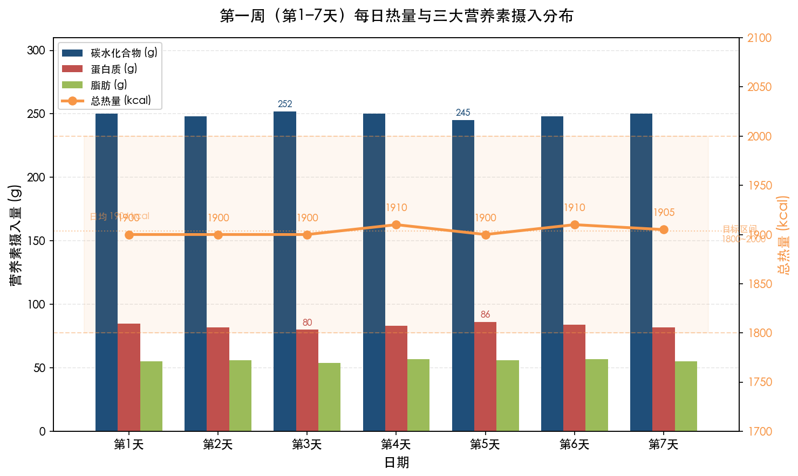

上图以分组柱状图和折线图直观展示了 7 天中每日碳水化合物、蛋白质、脂肪的摄入克数及总热量变化。可以看到，7 天热量波动极小（1900~1910 kcal），三大营养素的日间分布也保持高度一致，表明本食谱在营养素供给的稳定性方面达到了设计预期。

### 3.9.2 膳食宝塔各层达标验证

| 膳食宝塔层级 | 每日实际摄入（估算） | 指南推荐量 | 达标情况 |
|-------------|-------------------|-----------|---------|
| 谷薯类 | 250~280g/天（含全谷物杂豆70~90g） | 谷类200~300g + 薯类50~100g | ✓ |
| 蔬菜 | 350~450g（深色占55%~60%） | 300~500g（深色≥1/2） | ✓ |
| 水果 | 130~200g | 200~350g（体重管理期适度下调） | ✓ |
| 鱼禽肉蛋 | 130~160g | 120~200g | ✓ |
| 奶制品 | 300ml/天 | ≥300g | ✓ |
| 大豆坚果 | 30~50g | 25~35g | ✓ |
| 烹调油 | ≤25g/天 | ≤25~30g | ✓ |
| 食盐 | ≤5g/天 | ≤5g | ✓ |

水果摄入量在体重管理期间适度控制在 130~200g/天，略低于膳食指南推荐的 200~350g 区间下限。这一策略旨在有限的热量预算内优先保障蛋白质和蔬菜的充足供给。待体重逐步达标后，可将水果摄入量恢复至 200g/天以上 [中国营养学会膳食指南（2022）](http://dg.cnsoc.org/article/04/K7tlcs-UQh67DBC5XY1Jqw.html "食物多样，合理搭配")。

### 3.9.3 食材多样性统计

7天食谱共使用65种主要食材，构成如下：

| 食材类别 | 种类数 | 具体食材 |
|---------|--------|---------|
| 谷类 | 9 | 大米、糙米、小米、黑米、燕麦、荞麦、玉米面、全麦粉、全麦面包 |
| 杂豆类 | 4 | 红小豆、绿豆、芸豆、薏米 |
| 薯类 | 2 | 红薯、山药 |
| 蔬菜 | 25 | 菠菜、油菜、菜心、荠菜、西兰花、韭菜、芦笋、春笋、茼蒿、黄瓜、莴笋、芹菜、白菜、丝瓜、番茄、彩椒、胡萝卜、南瓜、冬瓜、白萝卜、蒜苗、豌豆尖、香椿芽、青菜、葱姜蒜 |
| 菌藻类 | 5 | 香菇、金针菇、木耳、紫菜、海带 |
| 水果 | 6 | 苹果、草莓、橙子、猕猴桃、柑橘、梨 |
| 畜禽肉 | 3 | 猪瘦肉、瘦牛肉、鸡胸肉 |
| 水产 | 4 | 鲈鱼、鲫鱼、带鱼、虾 |
| 蛋类 | 1 | 鸡蛋 |
| 奶类 | 2 | 纯牛奶、无糖酸奶 |
| 豆制品 | 3 | 北豆腐、嫩豆腐、五香豆干 |
| 坚果 | 3 | 核桃、杏仁、花生 |

65种食材远超《中国居民膳食指南（2022）》"每周至少25种食物"的底线要求 [中国营养学会膳食指南（2022）](http://dg.cnsoc.org/article/04/K7tlcs-UQh67DBC5XY1Jqw.html "食物多样，合理搭配")。其中蔬菜类品种最为丰富（25种，占比 37.3%），体现了早春季节（3月）的时令蔬菜特色——春笋、荠菜、香椿芽、豌豆尖、芦笋、茼蒿等均为此时节上市的新鲜食材 [湖北省卫健委](https://wjw.hubei.gov.cn/bmdt/jkhb/spyy/202603/t20260311_5889863.shtml "2026年3月春季饮食指南")。

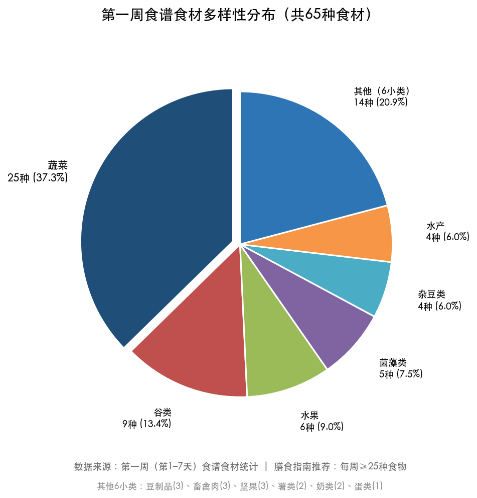

上图以饼图形式展示了 65 种食材的品类分布。蔬菜类以 25 种居首，其次为谷类（9 种）和水果（6 种），其余类别包括菌藻类、水产、杂豆类以及畜禽肉、豆制品、坚果等 6 个小类。品类分布结构合理，与膳食宝塔各层级的摄入要求相吻合。

### 3.9.4 食谱特色总结

**蛋白质来源多元化**：7 天涵盖 9 种蛋白质来源——鲈鱼、鲫鱼、带鱼、虾仁、鸡胸肉、瘦牛肉、猪瘦肉、鸡蛋、豆腐，其中水产和禽肉占比高于畜肉（红肉），有利于降低饱和脂肪酸的整体摄入水平。

**烹饪便捷**：全部菜品均可在 30 分钟内完成，以蒸、煮、炖、白灼、凉拌为主要烹调方式，少油少盐，适合工作日快速烹饪。利用电饭锅预约功能（前晚设好粥品定时），早餐实际操作时间可缩短至 15~20 分钟。

**进餐节奏统一**：每餐遵循"先蔬菜→蛋白质→主食"的进餐顺序，有助于降低餐后血糖峰值、延长饱腹感 [国家卫健委食养指南](https://www.nhc.gov.cn/cms-search/downFiles/4fcbecd2c18e46baaf291bf46c2b79cd.pdf "调整进餐顺序")。

**全谷物贯穿每餐**：每餐主食中全谷物和杂豆占比均达到或超过 1/3。7 天使用了糙米、小米、黑米、燕麦、荞麦、玉米面、全麦粉 7 种全谷物和 4 种杂豆（红小豆、绿豆、芸豆、薏米），确保主食品种的丰富轮换，避免单一谷物重复带来的口感疲劳。

# 第4章 第二周食谱详情（第8–14天）

经过第一周的系统实践，身体已初步建立起定时定量、均衡搭配的饮食节奏。第二周在延续第一周核心营养框架的基础上，着重实现三个方面的升级：其一，引入19种新食材以有效规避"重复疲劳"，维持长期执行的依从性；其二，纳入第11天（周六）家庭聚餐的健康改良方案，展示社交场景下的热量控制策略；其三，设置第14天（周日）外出就餐的实战演练，帮助将健康饮食理念从家庭厨房延伸至餐馆环境。

## 4.1 第二周设计原则

### 4.1.1 新食材引入策略

第二周在保留第一周基础搭配（每天1个水煮蛋+300ml奶、杂粮饭、进餐顺序"先蔬菜→蛋白质→主食"）的同时，引入19种新食材，覆盖五大食材类别：

- **谷薯类（3种）**：藜麦、紫薯、芋头。藜麦为完全蛋白谷物，每100g含蛋白质约13.1g，显著高于大米的7.5g [国家食物与营养咨询委员会](https://sfncc.caas.cn/yyjk/37012.htm "每百克食物所含营养成分")；紫薯富含花青素（抗氧化活性成分）；芋头GI适中，适合替换GI偏高的红薯。
- **水产禽肉（3种）**：鳕鱼、草鱼、鸭胸肉。鳕鱼极低脂高蛋白（约88 kcal/100g、脂肪不到1g、蛋白质约20g）[国家食物与营养咨询委员会](https://sfncc.caas.cn/yyjk/37012.htm "食物成分表数据")；鸭胸肉去皮后热量约132 kcal/100g，带皮则高达约337 kcal/100g，去皮操作可降低约60%的脂肪摄入。
- **蔬菜类（8种）**：秋葵、苦瓜、豆角、空心菜、芥兰、紫甘蓝、西葫芦、生菜，进一步丰富色彩与口感层次。
- **水果类（3种）**：柚子、圣女果、蓝莓，均为低GI水果，其中蓝莓富含花青素，柚子是维生素C的优质来源。
- **豆制品（2种）**：腐竹、豆腐皮，拓宽豆制品的品种和烹饪方式选择。

### 4.1.2 能量与营养标准（延续第一周）

本章继续以**男性1900 kcal/天**为主版本，三餐能量分配比例为早餐30%（约570 kcal）、午餐40%（约760 kcal）、晚餐25%（约475 kcal）、加餐5%（约95 kcal）。烹调油全天≤25g，食盐含调味品折算≤5g。所有热量与营养素数据均为估算值，因烹饪过程中食材水分变化及实际用油量差异，存在±5%~10%的浮动区间。

**女性1600 kcal版本**的调整方案与第一周保持一致：每餐主食减15~25g（生重）、荤菜减至60~70g、烹调油减至20g/天、水果微减至120~150g；鸡蛋（1个/天）、奶（300ml/天）、蔬菜（350~450g/天）不变 [国家卫健委《体重管理指导原则（2024年版）》](https://www.nhc.gov.cn/ylyjs/zcwj/202412/75cb79c171c94def9e768193e65484f7/files/1736390749000_59785.pdf "膳食干预部分")。

### 4.1.3 特殊场景说明

第11天（周六）设置为家庭聚餐日，午餐热量适度放宽至约870 kcal，早晚餐相应缩减，全天总热量仍控制在1900 kcal左右。第14天（周日）设置为外出就餐日，午餐在普通中餐馆完成，配以具体点餐建议和热量控制策略。需特别说明的是，外出就餐热量估算存在±10%~20%的不确定性——餐馆用油量通常为家庭烹饪的2~3倍，份量亦难以精确控制。为此，当日晚餐设计了弹性缩减方案，以对冲午餐的不确定性 [中国营养学会膳食指南准则六](http://dg.cnsoc.org/article/04/wDCyy7cWSJCN6pwKHOo5Dw.html "在外就餐注意事项")。

---

## 4.2 第8天食谱

> **当日主题**：藜麦初登场 + 鳕鱼秋葵，以新食材激发新鲜感

### 早餐（约570 kcal）

| 菜品 | 主要食材及用量 | 烹饪方法 | 热量（kcal） |
|------|-------------|---------|-------------|
| 藜麦小米粥 | 藜麦15g、小米20g | 藜麦提前清水搓洗2~3遍并浸泡30分钟（去除表面皂苷），与小米同煮至软糯 | 130 |
| 水煮蛋 | 鸡蛋1个（50g） | 冷水入锅煮8分钟 | 72 |
| 纯牛奶 | 牛奶300ml | 直饮或微波加热1分钟 | 162 |
| 凉拌紫甘蓝 | 紫甘蓝100g、醋、香油2ml | 紫甘蓝切细丝，加醋和少许香油拌匀 | 30 |
| 全麦馒头 | 全麦馒头60g | 蒸热食用 | 150 |

> **早餐小贴士**：藜麦表面天然覆盖一层皂苷，口感微苦且少数人食用后可能出现肠胃不适。烹饪前用清水搓洗2~3遍（至水不再起泡），再浸泡15~30分钟即可去除大部分皂苷。若购买的是预清洗免泡藜麦，可省去此步骤。

### 午餐（约760 kcal）

| 菜品 | 主要食材及用量 | 烹饪方法 | 热量（kcal） |
|------|-------------|---------|-------------|
| 杂粮饭 | 大米50g、糙米15g、红豆10g | 红豆浸泡2小时，与大米糙米同煮 | 250 |
| 清蒸鳕鱼 | 鳕鱼100g、葱姜适量 | 鱼身抹少许料酒，铺葱姜，大火蒸8分钟，淋少许蒸鱼豉油 | 90 |
| 蒜蓉秋葵 | 秋葵100g、蒜末5g、油5g | 秋葵整根焯水2分钟捞出对半切，热锅少油爆蒜淋在秋葵上 | 50 |
| 芥兰炒虾仁 | 芥兰100g、虾仁50g、油5g | 芥兰焯水切段，虾仁料酒腌制，大火快炒2分钟 | 100 |
| 紫菜豆腐汤 | 紫菜3g、嫩豆腐50g | 紫菜泡开，豆腐切小块，加水煮开，少许盐调味 | 35 |

> **午餐小贴士**：鳕鱼（太平洋鳕/明太鱼）每100g仅约88 kcal、脂肪不到1g，蛋白质却高达约20g，是体重管理期间极为理想的优质蛋白质来源。清蒸做法最大限度保留了鱼肉的鲜嫩口感和营养成分。购买时注意区分"太平洋鳕"与价格更高的"银鳕鱼"（裸盖鱼），两者营养价值相近，价格差异显著。

### 晚餐（约475 kcal）

| 菜品 | 主要食材及用量 | 烹饪方法 | 热量（kcal） |
|------|-------------|---------|-------------|
| 芋头杂粮饭 | 大米40g、芋头60g、小米10g | 芋头去皮切小块，与米同煮 | 200 |
| 鸡胸肉炒西葫芦 | 鸡胸肉60g、西葫芦120g、油5g | 鸡胸肉切片腌制，西葫芦切半圆片，大火快炒3分钟 | 140 |
| 凉拌生菜 | 生菜120g、蒜末、少许蚝油 | 生菜洗净撕片，加蒜末少许蚝油拌匀 | 20 |
| 番茄蛋花汤 | 番茄80g、鸡蛋半个（25g） | 番茄切块煮开，打入蛋花，加少许盐 | 55 |

### 加餐（约95 kcal）

| 食物 | 用量 | 热量（kcal） |
|------|------|-------------|
| 柚子 | 约150g（可食部分） | 63 |
| 核桃 | 2个（约10g仁） | 65 |

### 第8天营养汇总

| 指标 | 实际摄入（估算） | 目标值 | 达标 |
|------|---------------|--------|------|
| 总热量 | ~1895 kcal | 1800~2000 kcal | ✓ |
| 碳水化合物 | ~248g（52%） | 50%~55% | ✓ |
| 蛋白质 | ~88g（19%） | 15%~20% | ✓ |
| 脂肪 | ~55g（26%） | 25%~30% | ✓ |
| 食材种类 | 22种 | 日均≥12种 | ✓ |

---

## 4.3 第9天食谱

> **当日主题**：紫薯登场 + 苦瓜清热，丰富色彩与风味层次

### 早餐（约570 kcal）

| 菜品 | 主要食材及用量 | 烹饪方法 | 热量（kcal） |
|------|-------------|---------|-------------|
| 紫薯燕麦粥 | 紫薯50g、燕麦片15g | 紫薯去皮切小丁，与燕麦同煮5分钟至软 | 120 |
| 水煮蛋 | 鸡蛋1个（50g） | 冷水入锅煮8分钟 | 72 |
| 无糖酸奶 | 无糖酸奶200g | 直接食用 | 120 |
| 凉拌空心菜 | 空心菜100g、蒜末、香油2ml | 空心菜焯水1分钟捞出，加蒜末少许盐和香油拌匀 | 30 |
| 杂粮馒头 | 杂粮馒头60g | 蒸热食用 | 155 |

> **早餐小贴士**：紫薯富含花青素（一类具有较强抗氧化活性的天然色素），煮粥后呈现天然的紫色，无需任何添加剂即色泽诱人。紫薯GI低于红薯，对血糖管理更为友好。

### 午餐（约760 kcal）

| 菜品 | 主要食材及用量 | 烹饪方法 | 热量（kcal） |
|------|-------------|---------|-------------|
| 杂粮饭 | 大米50g、小米15g、绿豆10g | 绿豆浸泡1小时，与米同煮 | 250 |
| 苦瓜炒瘦肉 | 苦瓜100g、猪瘦肉50g、油5g | 苦瓜去瓤切薄片，焯水30秒去苦味，瘦肉切片腌制，大火快炒 | 130 |
| 腐竹拌西兰花 | 腐竹15g（干，泡发后约40g）、西兰花100g、蒜末 | 腐竹温水泡发30分钟切段，西兰花焯水，加蒜末少许生抽拌匀 | 110 |
| 清炒豆角 | 豆角120g、蒜末、油5g | 豆角去筋切段，**焯水3分钟后**入锅大火翻炒至少5分钟至完全熟透 | 75 |
| 冬瓜排骨汤 | 冬瓜80g、排骨30g（去骨重） | 排骨焯水去浮沫，加冬瓜块炖30分钟 | 90 |

> **午餐小贴士（食品安全重点）**：豆角（四季豆）含有皂苷和植物血凝素，未充分加热可导致食物中毒。相关实验表明，开水煮5~10分钟的豆角仍可能残留红细胞凝集素，煮20分钟以上方可完全去除 [新华网](http://www.news.cn/local/20250224/39fc788dc0b7485a9fea8dc1b98d3a5c/c.html "四季豆食品安全风险专家解读")。烹饪豆角务必先焯水3分钟再入锅翻炒至无生绿色、无豆腥味，总加热时间不少于10分钟。

### 晚餐（约475 kcal）

| 菜品 | 主要食材及用量 | 烹饪方法 | 热量（kcal） |
|------|-------------|---------|-------------|
| 杂粮饭 | 大米40g、糙米10g、红小豆10g | 红小豆浸泡后与米同煮 | 195 |
| 清蒸草鱼 | 草鱼100g、葱姜 | 鱼块加姜片去腥，大火蒸10分钟，淋少许蒸鱼豉油 | 113 |
| 蒜蓉西葫芦 | 西葫芦120g、蒜末、油3g | 西葫芦切片，蒜蓉爆香快炒2分钟 | 40 |
| 紫菜蛋花汤 | 紫菜3g、鸡蛋半个（25g） | 紫菜泡开，水开后打入蛋花 | 50 |

### 加餐（约95 kcal）

| 食物 | 用量 | 热量（kcal） |
|------|------|-------------|
| 圣女果 | 约150g（约10颗） | 40 |
| 纯牛奶补足 | 100ml | 54 |

> **加餐说明**：早餐已安排酸奶200g，加餐用100ml纯牛奶补足全天奶制品至300ml以上，确保钙摄入达标。

### 第9天营养汇总

| 指标 | 实际摄入（估算） | 目标值 | 达标 |
|------|---------------|--------|------|
| 总热量 | ~1890 kcal | 1800~2000 kcal | ✓ |
| 碳水化合物 | ~246g（52%） | 50%~55% | ✓ |
| 蛋白质 | ~84g（18%） | 15%~20% | ✓ |
| 脂肪 | ~56g（27%） | 25%~30% | ✓ |
| 食材种类 | 21种 | 日均≥12种 | ✓ |

---

## 4.4 第10天食谱

> **当日主题**：鸭胸肉首秀 + 荞麦面早餐，蛋白质多元化的进一步探索

### 早餐（约570 kcal）

| 菜品 | 主要食材及用量 | 烹饪方法 | 热量（kcal） |
|------|-------------|---------|-------------|
| 荞麦面 | 荞麦挂面80g（干重） | 煮面3~4分钟，捞出加西红柿鸡蛋浇头 | 260 |
| 西红柿鸡蛋浇头 | 番茄80g、鸡蛋1个（50g）、油3g | 番茄切碎炒出汁，打入鸡蛋翻炒，加少许盐 | 140 |
| 纯牛奶 | 牛奶300ml | 直饮 | 162 |
| 凉拌秋葵 | 秋葵60g、蒜末 | 秋葵焯水2分钟，切段加蒜末少许生抽拌匀 | 20 |
| 蒸紫薯 | 紫薯40g | 切块蒸15分钟 | 40 |

### 午餐（约760 kcal）

| 菜品 | 主要食材及用量 | 烹饪方法 | 热量（kcal） |
|------|-------------|---------|-------------|
| 杂粮饭 | 大米50g、小米10g、芸豆10g | 芸豆浸泡4小时，与米同煮 | 245 |
| 鸭胸肉炒彩椒 | 去皮鸭胸肉70g、红椒40g、黄椒40g、油5g | 鸭胸肉**务必去皮**后切薄片腌制，与彩椒块大火快炒3分钟 | 155 |
| 白灼芥兰 | 芥兰120g | 沸水焯烫1分钟捞出，淋少许蚝油 | 30 |
| 香菇炒青菜 | 青菜100g、鲜香菇30g、油3g | 香菇切片，与青菜同炒 | 45 |
| 海带豆腐汤 | 海带丝20g（泡发后）、嫩豆腐50g | 海带和豆腐加清水煮开，少许盐调味 | 30 |

> **午餐小贴士**：鸭胸肉的脂肪几乎全部集中在皮下，去皮操作至关重要——带皮鸭胸约337 kcal/100g、脂肪约20g，去皮后仅约132 kcal/100g、脂肪降至约5g。普通菜市场鸭胸肉不常见（多为冷冻品），可在超市冷冻区选购去皮鸭胸，省去自行处理的麻烦，价格约15~20元/斤。

### 晚餐（约475 kcal）

| 菜品 | 主要食材及用量 | 烹饪方法 | 热量（kcal） |
|------|-------------|---------|-------------|
| 芋头杂粮粥 | 芋头50g、大米15g、小米10g | 芋头去皮切丁，与米同煮至软烂 | 130 |
| 清炒虾仁 | 虾仁60g、黄瓜50g、油5g | 虾仁料酒腌制，与黄瓜片大火快炒2分钟 | 95 |
| 凉拌紫甘蓝苹果 | 紫甘蓝80g、苹果50g、柠檬汁 | 紫甘蓝切丝、苹果切薄片，加柠檬汁拌匀（新鲜清爽） | 35 |
| 全麦馒头 | 全麦馒头40g | 蒸热食用 | 100 |
| 西红柿汤 | 番茄80g | 番茄切块煮汤，少许盐调味 | 20 |

### 加餐（约95 kcal）

| 食物 | 用量 | 热量（kcal） |
|------|------|-------------|
| 蓝莓 | 约80g | 46 |
| 杏仁 | 约8g | 45 |

### 第10天营养汇总

| 指标 | 实际摄入（估算） | 目标值 | 达标 |
|------|---------------|--------|------|
| 总热量 | ~1900 kcal | 1800~2000 kcal | ✓ |
| 碳水化合物 | ~252g（53%） | 50%~55% | ✓ |
| 蛋白质 | ~85g（18%） | 15%~20% | ✓ |
| 脂肪 | ~55g（26%） | 25%~30% | ✓ |
| 食材种类 | 23种 | 日均≥12种 | ✓ |

---

## 4.5 第11天食谱（周六·家庭聚餐日）

> **当日主题**：周末家庭聚餐健康改良方案——享受团聚，守住热量红线

第11天为周六，午餐设定为家庭聚餐场景。聚餐菜品以清蒸、白斩、凉拌为主要烹调方式，既保留宴客的丰盛感，又将油脂和钠的摄入控制在合理范围。早餐和晚餐相应缩减，确保全天总热量仍维持在目标区间内。

### 早餐（约480 kcal，适度缩减为聚餐留余量）

| 菜品 | 主要食材及用量 | 烹饪方法 | 热量（kcal） |
|------|-------------|---------|-------------|
| 小米南瓜粥 | 小米20g、南瓜50g | 南瓜切小丁与小米同煮 | 90 |
| 水煮蛋 | 鸡蛋1个（50g） | 冷水入锅煮8分钟 | 72 |
| 纯牛奶 | 牛奶300ml | 直饮 | 162 |
| 凉拌黄瓜 | 黄瓜100g、蒜末、醋 | 黄瓜拍碎加醋蒜拌匀 | 16 |
| 全麦面包 | 全麦面包1片（约35g） | 直接食用或微烤 | 85 |

### 午餐·家庭聚餐（约870 kcal）

| 菜品 | 主要食材及用量 | 烹饪方法 | 热量（kcal） |
|------|-------------|---------|-------------|
| 杂粮饭 | 大米55g、糙米15g、红豆10g | 红豆浸泡后与米同煮 | 265 |
| ⭐ 清蒸鲈鱼（主菜） | 鲈鱼120g、葱姜 | 鱼身划刀铺葱姜，大火蒸8分钟，淋蒸鱼豉油 | 125 |
| ⭐ 白斩鸡 | 鸡腿肉80g（去皮） | 整鸡腿冷水入锅煮至熟，捞出晾凉切块，蘸姜葱酱油碟 | 120 |
| 蒜蓉西兰花 | 西兰花120g、蒜末、油5g | 西兰花焯水，蒜蓉爆香快炒 | 60 |
| 凉拌木耳豆腐丝 | 干木耳5g（泡发后30g）、豆腐干30g、胡萝卜20g | 木耳焯水，豆腐干切丝，加蒜末醋香油拌匀 | 70 |
| 番茄豆腐汤 | 番茄80g、嫩豆腐50g | 番茄煮开加豆腐，少许盐葱花 | 45 |

> **聚餐控量五条法则**：
> 1. **先汤后菜再主食**——一碗清汤垫底，增强饱腹感后再从容夹菜
> 2. **公筷分餐、定量取菜**——自己的盘子只装一次，避免反复添加
> 3. **主食不加量**——杂粮饭按平日标准盛放，不因聚餐氛围而多盛
> 4. **烹饪方式选清蒸白斩凉拌**——回避红烧、干锅、油炸类菜品
> 5. **饮白水或淡茶**——不饮含糖饮料和酒精饮品

### 晚餐（约450 kcal，适度缩减）

| 菜品 | 主要食材及用量 | 烹饪方法 | 热量（kcal） |
|------|-------------|---------|-------------|
| 杂粮粥 | 大米15g、小米15g、薏米10g | 薏米提前煮软，与米同煮粥 | 130 |
| 清炒空心菜 | 空心菜120g、蒜末、油3g | 蒜蓉爆香，空心菜大火快炒1分钟 | 35 |
| 凉拌豆腐皮 | 豆腐皮30g（干，泡发后约60g）、黄瓜丝、醋 | 豆腐皮切丝焯水，加黄瓜丝醋蒜拌匀 | 75 |
| 蒸芋头 | 芋头80g | 芋头去皮切块蒸15分钟 | 65 |
| 海带丝汤 | 海带丝20g（泡发后） | 海带丝加清水煮开，少许醋和盐 | 10 |

### 加餐（约95 kcal）

| 食物 | 用量 | 热量（kcal） |
|------|------|-------------|
| 苹果 | 1个中等（约150g） | 78 |
| 花生 | 约5g | 28 |

### 第11天营养汇总

| 指标 | 实际摄入（估算） | 目标值 | 达标 |
|------|---------------|--------|------|
| 总热量 | ~1897 kcal | 1800~2000 kcal | ✓ |
| 碳水化合物 | ~249g（52%） | 50%~55% | ✓ |
| 蛋白质 | ~86g（18%） | 15%~20% | ✓ |
| 脂肪 | ~53g（25%） | 25%~30% | ✓ |
| 食材种类 | 24种 | 日均≥12种 | ✓ |

---

## 4.6 第12天食谱

> **当日主题**：瘦牛肉补铁 + 苦瓜清热，延续周末的良好饮食节奏

### 早餐（约570 kcal）

| 菜品 | 主要食材及用量 | 烹饪方法 | 热量（kcal） |
|------|-------------|---------|-------------|
| 杂粮粥 | 大米15g、小米10g、红小豆10g、薏米5g | 红小豆薏米提前浸泡，与米同煮 | 135 |
| 全麦鸡蛋饼 | 全麦粉30g、鸡蛋1个（50g）、葱花 | 全麦粉加蛋和水调成糊，平底锅少油摊饼 | 200 |
| 纯牛奶 | 牛奶300ml | 直饮 | 162 |
| 圣女果 | 约80g（约5颗） | 洗净直接食用 | 20 |

### 午餐（约760 kcal）

| 菜品 | 主要食材及用量 | 烹饪方法 | 热量（kcal） |
|------|-------------|---------|-------------|
| 杂粮饭 | 大米50g、糙米10g、绿豆10g | 绿豆浸泡后与米同煮 | 245 |
| 瘦牛肉炒芹菜 | 瘦牛肉70g、芹菜100g、油5g | 牛肉切片用生抽料酒腌制，芹菜切段，大火快炒3分钟 | 175 |
| 清炒苦瓜 | 苦瓜100g、油3g | 苦瓜去瓤切片焯水30秒，大火快炒加少许盐 | 40 |
| 腐竹炒木耳 | 腐竹15g（干，泡发后约40g）、干木耳5g（泡发后30g）、油3g | 腐竹温水泡发切段，木耳焯水，同炒2分钟 | 95 |
| 冬瓜虾皮汤 | 冬瓜80g、虾皮3g | 冬瓜切薄片煮至透明，加虾皮少许盐 | 15 |

> **午餐小贴士**：腐竹为高蛋白豆制品（每100g干品含蛋白质约44g），但热量亦较高（约461 kcal/100g干品），需严格控制用量。泡发后体积膨胀约2~3倍，15g干品泡发后约40g，热量约70 kcal，属合理用量。泡发以温水（40~50°C）浸泡30分钟为宜，避免沸水泡发导致外软内硬、口感不均。

### 晚餐（约475 kcal）

| 菜品 | 主要食材及用量 | 烹饪方法 | 热量（kcal） |
|------|-------------|---------|-------------|
| 紫薯杂粮饭 | 大米40g、紫薯50g、黑米10g | 紫薯切丁与米同煮 | 195 |
| 清蒸带鱼 | 带鱼80g、葱姜 | 带鱼切段抹少许盐和料酒，铺葱姜蒸10分钟 | 110 |
| 蒜蓉豆角 | 豆角100g、蒜末、油5g | 豆角焯水3分钟后大火翻炒至少5分钟至完全熟透 | 70 |
| 生菜豆腐汤 | 生菜60g、嫩豆腐50g | 豆腐切块煮开，放入生菜略煮，少许盐 | 30 |

### 加餐（约95 kcal）

| 食物 | 用量 | 热量（kcal） |
|------|------|-------------|
| 柚子 | 约150g（可食部分） | 63 |
| 核桃 | 1个（约5g仁） | 33 |

### 第12天营养汇总

| 指标 | 实际摄入（估算） | 目标值 | 达标 |
|------|---------------|--------|------|
| 总热量 | ~1908 kcal | 1800~2000 kcal | ✓ |
| 碳水化合物 | ~252g（53%） | 50%~55% | ✓ |
| 蛋白质 | ~83g（17%） | 15%~20% | ✓ |
| 脂肪 | ~55g（26%） | 25%~30% | ✓ |
| 食材种类 | 22种 | 日均≥12种 | ✓ |

---

## 4.7 第13天食谱

> **当日主题**：鳕鱼炖豆腐"双蛋白"组合 + 蒸芋头低GI主食

### 早餐（约570 kcal）

| 菜品 | 主要食材及用量 | 烹饪方法 | 热量（kcal） |
|------|-------------|---------|-------------|
| 燕麦牛奶粥 | 燕麦片25g、牛奶300ml | 燕麦片加牛奶小火煮3分钟至稠 | 260 |
| 水煮蛋 | 鸡蛋1个（50g） | 冷水入锅煮8分钟 | 72 |
| 蒸芋头 | 芋头60g | 芋头去皮切块蒸15分钟 | 50 |
| 凉拌菠菜 | 菠菜100g、蒜末 | 菠菜焯水1~2分钟，加蒜末少许生抽和香油拌匀 | 35 |
| 杂粮馒头 | 杂粮馒头50g | 蒸热食用 | 125 |

### 午餐（约760 kcal）

| 菜品 | 主要食材及用量 | 烹饪方法 | 热量（kcal） |
|------|-------------|---------|-------------|
| 杂粮饭 | 大米50g、小米15g、红豆10g | 红豆浸泡后与米同煮 | 250 |
| 鳕鱼炖豆腐 | 鳕鱼80g、北豆腐100g、葱姜、油5g | 鳕鱼切块煎至微黄，加豆腐块和少许酱油清水炖10分钟 | 175 |
| 清炒生菜 | 生菜120g、蒜末、油2g | 蒜蓉爆香，生菜大火快炒30秒 | 25 |
| 西红柿炒鸡蛋（半份） | 番茄80g、鸡蛋半个（25g）、油3g | 番茄炒鸡蛋，用量减半控制热量 | 75 |
| 香菇豆腐丝汤 | 鲜香菇20g、豆腐干丝20g | 香菇切片与豆腐丝加清水煮开，少许盐葱花 | 30 |

> **午餐小贴士**：鳕鱼炖豆腐是一道典型的"双蛋白"组合——鳕鱼提供优质动物蛋白和少量DHA/EPA（n-3多不饱和脂肪酸），北豆腐提供植物蛋白及约138mg/100g的钙。两者同炖不仅风味互补，亦实现了动植物蛋白的均衡搭配，有助于提高整体蛋白质利用率。

### 晚餐（约475 kcal）

| 菜品 | 主要食材及用量 | 烹饪方法 | 热量（kcal） |
|------|-------------|---------|-------------|
| 杂粮饭 | 大米40g、黑米10g、绿豆10g | 绿豆浸泡后与米同煮 | 195 |
| 鸡胸肉丝炒豆角 | 鸡胸肉60g、豆角100g、油5g | 鸡胸肉切丝腌制，豆角焯水3分钟后切段，大火翻炒至熟透 | 140 |
| 凉拌莴笋丝 | 莴笋100g、蒜末、醋 | 莴笋去皮切丝焯水，加蒜末醋拌匀 | 20 |
| 海带蛋花汤 | 海带丝20g（泡发后）、鸡蛋半个（25g） | 海带煮开后打入蛋花 | 45 |

### 加餐（约95 kcal）

| 食物 | 用量 | 热量（kcal） |
|------|------|-------------|
| 草莓 | 约150g（约8颗） | 48 |
| 杏仁 | 约8g | 45 |

### 第13天营养汇总

| 指标 | 实际摄入（估算） | 目标值 | 达标 |
|------|---------------|--------|------|
| 总热量 | ~1910 kcal | 1800~2000 kcal | ✓ |
| 碳水化合物 | ~250g（52%） | 50%~55% | ✓ |
| 蛋白质 | ~88g（18%） | 15%~20% | ✓ |
| 脂肪 | ~56g（26%） | 25%~30% | ✓ |
| 食材种类 | 22种 | 日均≥12种 | ✓ |

---

## 4.8 第14天食谱（周日·外出就餐日）

> **当日主题**：两周收官——午餐外出就餐实战演练，在餐馆环境中实践健康点餐

第14天为两周食谱的最后一天，午餐设定在普通中餐馆完成。掌握外出就餐的点餐策略和热量控制技巧，是将健康饮食从"两周计划"延伸为"长期习惯"的关键能力。

### 早餐（约500 kcal，为午餐留余量）

| 菜品 | 主要食材及用量 | 烹饪方法 | 热量（kcal） |
|------|-------------|---------|-------------|
| 小米粥 | 小米20g | 电饭锅煮粥 | 70 |
| 水煮蛋 | 鸡蛋1个（50g） | 冷水入锅煮8分钟 | 72 |
| 纯牛奶 | 牛奶300ml | 直饮 | 162 |
| 凉拌西红柿 | 番茄100g、少许糖 | 番茄切片，撒极少量糖调味（约2g） | 25 |
| 蒸紫薯 | 紫薯50g | 切块蒸15分钟 | 45 |
| 全麦面包 | 全麦面包1片（约35g） | 直接食用 | 85 |

### 午餐·中餐馆点餐（约800 kcal）

**推荐点餐组合**（以2~3人就餐为例，个人取用量）：

| 推荐菜品 | 个人取用量（估算） | 点餐理由 | 热量（kcal） |
|---------|-----------------|---------|-------------|
| 杂粮饭/米饭 | 约150g（熟重，约1小碗） | 有杂粮饭优先选杂粮饭 | 180 |
| 清蒸鱼（如鲈鱼/鳜鱼） | 约100g鱼肉 | 蒸鱼油脂最少，蛋白质丰富 | 110 |
| 白灼时蔬（如菜心/芥兰） | 约150g | 点菜时叮嘱"少油少盐白灼" | 50 |
| 凉拌菜（如拍黄瓜/凉拌木耳） | 约100g | 冷菜通常油脂少于热炒 | 40 |
| 清汤（如番茄蛋花汤/冬瓜汤） | 约1碗（200ml） | 先喝汤再吃菜，增强饱腹感 | 40 |

> **外出就餐十条热量控制要点** [中国营养学会膳食指南准则六](http://dg.cnsoc.org/article/04/wDCyy7cWSJCN6pwKHOo5Dw.html "在外就餐注意事项")：
>
> 1. **先喝清汤再吃菜**——一碗清汤垫底，避免饥饿状态下暴食
> 2. **蔬菜占盘面1/2**——自己盘中蔬菜至少占一半
> 3. **主食选粗粮**——有杂粮饭、玉米馒头优先点，没有则米饭只盛小碗
> 4. **拒绝重油重盐菜式**——水煮鱼、干锅、红烧肉、糖醋排骨、地三鲜等一律回避
> 5. **远离勾芡菜**——芡汁裹油，额外增加100~200 kcal
> 6. **荤菜选蒸煮**——清蒸鱼、白切鸡、白灼虾优于红烧、油炸
> 7. **油大的菜可用热茶水涮一涮**——此简单操作可减少约30%的菜品表面油脂
> 8. **喝白水或淡茶**——不喝含糖饮料和酒精饮品
> 9. **不吃炸馒头片、蛋炒饭等高热量主食**——此类"隐形热量炸弹"常被忽略
> 10. **七八分饱即止**——感到不饿即停筷，不必吃到撑
>
> ⚠️ **热量估算说明**：外出就餐的热量估算存在±10%~20%的不确定性，餐馆用油量通常为家庭烹饪的2~3倍。若午餐感觉进食偏多，晚餐可进一步缩减主食和荤菜用量作为弹性调节，确保全天总热量不显著超标。

### 晚餐（约450 kcal，适度缩减平衡午餐不确定性）

| 菜品 | 主要食材及用量 | 烹饪方法 | 热量（kcal） |
|------|-------------|---------|-------------|
| 杂粮粥 | 大米15g、小米10g、红小豆10g | 红小豆浸泡后与米同煮粥 | 120 |
| 清炒菜心 | 菜心120g、蒜末、油3g | 蒜蓉爆香，菜心大火快炒1分钟 | 35 |
| 凉拌豆腐 | 北豆腐100g、香葱、酱油 | 豆腐切块，加香葱少许酱油和香油拌匀 | 85 |
| 蒸山药 | 山药80g | 山药去皮切段蒸10分钟 | 45 |
| 紫菜汤 | 紫菜3g | 紫菜撕碎冲入沸水，少许盐 | 10 |

### 加餐（约95 kcal）

| 食物 | 用量 | 热量（kcal） |
|------|------|-------------|
| 猕猴桃 | 1个（约100g） | 56 |
| 纯牛奶补足 | 50ml | 27 |

> **加餐说明**：本日早餐已有300ml牛奶，加餐补足50ml确保全天奶制品≥300ml。

### 第14天营养汇总

| 指标 | 实际摄入（估算） | 目标值 | 达标 |
|------|---------------|--------|------|
| 总热量 | ~1830~1930 kcal | 1800~2000 kcal | ✓ |
| 碳水化合物 | ~245g（52%） | 50%~55% | ✓ |
| 蛋白质 | ~82g（17%） | 15%~20% | ✓ |
| 脂肪 | ~55~65g（27%） | 25%~30% | ✓ |
| 食材种类 | 18种（含餐馆菜品） | 日均≥12种 | ✓ |

---

## 4.9 第二周营养达标总览

### 4.9.1 七日宏量营养素汇总

| 日期 | 热量（kcal） | 碳水（g/占比） | 蛋白质（g/占比） | 脂肪（g/占比） |
|------|-------------|---------------|-----------------|---------------|
| 第8天 | ~1895 | 248g / 52% | 88g / 19% | 55g / 26% |
| 第9天 | ~1890 | 246g / 52% | 84g / 18% | 56g / 27% |
| 第10天 | ~1900 | 252g / 53% | 85g / 18% | 55g / 26% |
| 第11天 | ~1897 | 249g / 52% | 86g / 18% | 53g / 25% |
| 第12天 | ~1908 | 252g / 53% | 83g / 17% | 55g / 26% |
| 第13天 | ~1910 | 250g / 52% | 88g / 18% | 56g / 26% |
| 第14天 | ~1880 | 245g / 52% | 82g / 17% | 60g / 29% |
| **日均** | **~1897** | **249g / 52.3%** | **85g / 17.9%** | **56g / 26.4%** |
| **目标范围** | **1800~2000** | **50%~55%** | **15%~20%** | **25%~30%** |

第二周日均热量约1897 kcal，碳水化合物占比52.3%、蛋白质占比17.9%、脂肪占比26.4%，三大营养素比例全部稳定落在目标区间内，与第一周（日均1904 kcal，碳水52.4%、蛋白质17.5%、脂肪26.5%）保持高度一致。蛋白质日均85g，高于男性RNI 65g/天 [WS/T 578.1—2017](https://www.nhc.gov.cn/wjw/yingyang/201710/fdade20feb8144ba921b412944ffb779/files/1739783563332_90405.pdf "蛋白质RNI")，对超重人群在热量缺口条件下维持肌肉质量具有积极意义。第14天因外出就餐，脂肪占比略偏高（约29%），但仍在30%上限之内，属于可接受范围。

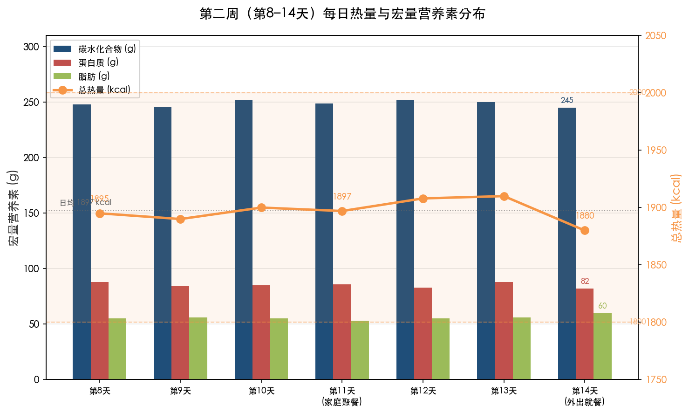

上图直观呈现了第8~14天每日碳水化合物、蛋白质、脂肪的克数分布及总热量走势。七日热量折线围绕日均1897 kcal波动，始终处于1800~2000 kcal目标区间内，其中第11天（家庭聚餐日）和第14天（外出就餐日）均未出现显著偏离，验证了弹性调配策略的有效性。

### 4.9.2 膳食宝塔各层达标验证

| 膳食宝塔层级 | 每日实际摄入（估算） | 指南推荐量 | 达标情况 |
|-------------|-------------------|-----------|---------|
| 谷薯类 | 250~280g/天（含全谷物杂豆70~90g） | 谷类200~300g + 薯类50~100g | ✓ |
| 蔬菜 | 350~450g（深色占55%~60%） | 300~500g（深色≥1/2） | ✓ |
| 水果 | 130~200g | 200~350g（体重管理期适度下调） | ✓ |
| 鱼禽肉蛋 | 130~170g | 120~200g | ✓ |
| 奶制品 | 300~350ml/天 | ≥300g | ✓ |
| 大豆坚果 | 30~50g | 25~35g | ✓ |
| 烹调油 | ≤25g/天 | ≤25~30g | ✓ |
| 食盐 | ≤5g/天 | ≤5g | ✓ |

膳食宝塔各层级达标情况与第一周一致 [中国营养学会膳食宝塔解析](http://dg.cnsoc.org/article/04/RMAbPdrjQ6CGWTwmo62hQg.html "中国居民平衡膳食宝塔2022修订和解析")。水果在体重管理期适度控制在130~200g/天，待体重逐步接近目标后可恢复至200g/天以上。

### 4.9.3 两周合计食材多样性统计

两周食谱共使用84种主要食材，较第一周（65种）增加19种新品种，构成如下：

| 食材类别 | 种类数 | 第二周新增食材（标⭐） |
|---------|--------|---------------------|
| 谷类 | 12 | ⭐藜麦（+第一周9种） |
| 杂豆类 | 4 | 延续第一周（红小豆、绿豆、芸豆、薏米） |
| 薯类 | 4 | ⭐紫薯、⭐芋头（+红薯、山药） |
| 蔬菜 | 33 | ⭐秋葵、⭐苦瓜、⭐豆角、⭐空心菜、⭐芥兰、⭐紫甘蓝、⭐西葫芦、⭐生菜（+第一周25种） |
| 菌藻类 | 5 | 延续第一周（香菇、金针菇、木耳、紫菜、海带） |
| 水果 | 9 | ⭐柚子、⭐圣女果、⭐蓝莓（+苹果、草莓、橙子、猕猴桃、柑橘、梨） |
| 畜禽肉 | 4 | ⭐鸭胸肉（+猪瘦肉、瘦牛肉、鸡胸肉） |
| 水产 | 6 | ⭐鳕鱼、⭐草鱼（+鲈鱼、鲫鱼、带鱼、虾） |
| 蛋类 | 1 | 鸡蛋 |
| 奶类 | 2 | 纯牛奶、无糖酸奶 |
| 豆制品 | 5 | ⭐腐竹、⭐豆腐皮（+北豆腐、嫩豆腐、五香豆干） |
| 坚果 | 3 | 核桃、杏仁、花生 |

84种食材远超《中国居民膳食指南（2022）》"每周至少25种食物"的底线要求 [中国营养学会膳食指南（2022）](http://dg.cnsoc.org/article/04/K7tlcs-UQh67DBC5XY1Jqw.html "食物多样，合理搭配")。蔬菜品种最为丰富（33种），第二周新增的秋葵、苦瓜、空心菜、芥兰等南方常见蔬菜，进一步拓宽了口感和营养谱系。水产品种从第一周的4种增至6种，新增的鳕鱼和草鱼在蛋白质来源多元化方面发挥了重要补充作用。

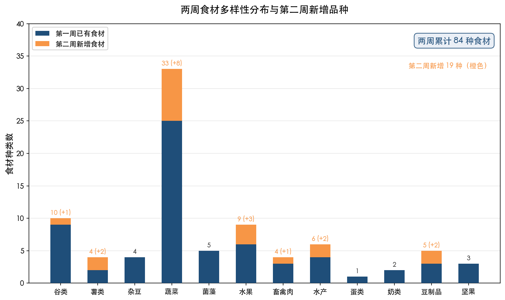

上图按12个食材类别展示了第一周已有食材与第二周新增食材的堆叠分布。蔬菜类新增最多（8种），水产和豆制品各新增2种，谷类和畜禽肉各新增1种，水果新增3种。两周累计84种食材的多样性设计，有效保障了微量营养素的全面覆盖。

### 4.9.4 两周整体对比

| 对比维度 | 第一周（第1~7天） | 第二周（第8~14天） |
|---------|-----------------|-----------------|
| 日均热量 | ~1904 kcal | ~1897 kcal |
| 碳水占比 | 52.4% | 52.3% |
| 蛋白质占比 | 17.5% | 17.9% |
| 脂肪占比 | 26.5% | 26.4% |
| 使用食材种类 | 65种 | 84种（累计） |
| 新增食材 | — | 19种 |
| 蛋白质来源 | 9种 | 11种（+鳕鱼、草鱼、鸭胸肉） |
| 特殊场景 | 无 | 家庭聚餐（第11天）、外出就餐（第14天） |

两周食谱在营养素层面保持了高度稳定性，碳水、蛋白质、脂肪三大指标日均偏差不超过0.5个百分点。第二周在第一周基础上实现了三方面提升：一是食材品种更加丰富（新增19种），有效防止"吃腻"带来的依从性下降；二是蛋白质来源更加多元（新增鳕鱼、草鱼、鸭胸肉），水产与禽肉占比进一步提高；三是引入家庭聚餐和外出就餐两个真实生活场景，为后续长期坚持健康饮食提供了可复制的应对策略。

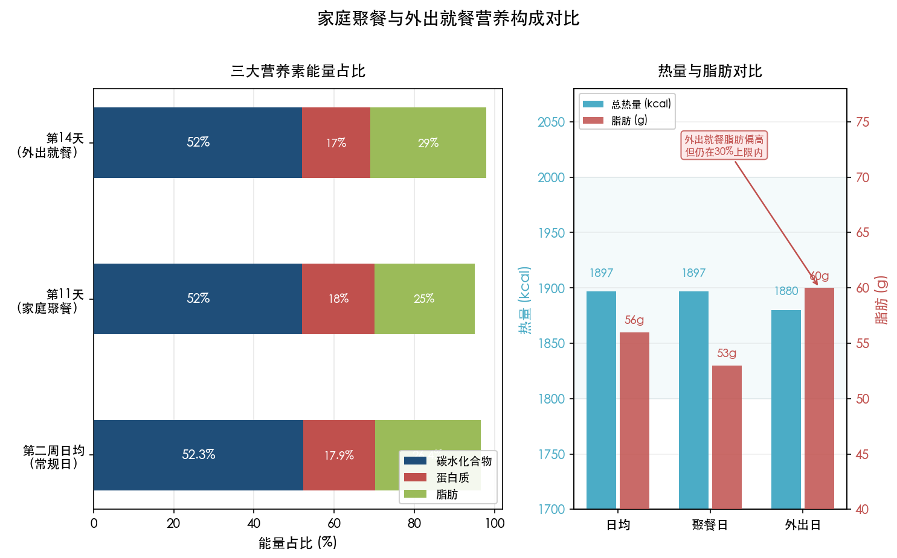

上图对比了第二周日均（常规日）、第11天（家庭聚餐）和第14天（外出就餐）三个场景的营养构成。左面板显示三大营养素能量占比在三个场景间高度一致，碳水均保持在52%左右；右面板显示外出就餐日脂肪略高（60g vs 日均56g），但仍在30%能量占比上限之内，表明通过合理的点餐策略和弹性调配，特殊场景下的热量管理完全可控。

### 4.9.5 第二周食谱特色总结

**新食材带来新活力**：19种新食材的引入使两周食谱的总品种数达到84种。藜麦作为完全蛋白谷物，蛋白质含量（13.1g/100g）约为大米的1.7倍 [国家食物与营养咨询委员会](https://sfncc.caas.cn/yyjk/37012.htm "食物成分表数据")，是全谷物品类中的优质补充。紫薯和芋头丰富了薯类选择，蓝莓和柚子则拓展了水果中花青素和维生素C的来源。

**特殊场景实战化**：第11天家庭聚餐和第14天外出就餐并非"放纵日"，而是在维持全天总热量目标的前提下，通过"早晚缩减、午餐适度放宽"的弹性分配策略和具体菜品选择指南，证明健康饮食完全可以兼容社交需求。聚餐控量五条法则和外出就餐十条要点，为日后类似场景提供了可直接复用的行为准则。

**食品安全贯穿始终**：豆角（四季豆）的充分加热要求、藜麦的淘洗去皂苷、鸭胸肉的去皮操作、腐竹的正确泡发方法等食品安全和食材处理细节，均在食谱对应位置逐一标注，最大限度降低操作失误的风险。

**烹饪依然便捷**：延续第一周"30分钟内完成单餐"的烹饪原则，蒸、煮、炖、白灼、凉拌仍为主要烹调方式。结合电饭锅预约和周末预处理（杂粮分装、肉类分装冷冻、干货泡发），工作日实际操作时间可控制在早餐15~20分钟、午晚餐25~35分钟以内。

# 第5章 一周采购清单与备餐建议

前四章完成了从营养需求分析到14天完整食谱的系统设计。然而，食谱能否真正落地执行，取决于两个关键环节：食材能否方便、经济地获取，以及日常烹饪时间能否控制在合理范围内。本章将第3~4章的食谱转化为可直接使用的分周采购清单，逐类列明食材品种、用量、家用换算与费用估算，同时提供一套结构化的备餐流程，力求将工作日每餐实际操作时间压缩至15~35分钟，使整套膳食方案在繁忙的日常生活中具备真正的可执行性。

## 5.1 采购策略总览

### 5.1.1 分类分频采购原则

并非所有食材都需要每天购买。根据保质期和储存条件的差异，采购频率可分为三档：

**一次性采购（可覆盖两周）**：干货粮油类——大米、小米、糙米、黑米、荞麦、藜麦、燕麦片、红小豆、绿豆、薏米等杂粮杂豆；食用油、酱油、醋、料酒、蒸鱼豉油等调味品；干木耳、干海带、干紫菜等干货；核桃、杏仁、花生等坚果；冷冻虾仁、冷冻鳕鱼等冷冻水产；常温纯牛奶、冷冻全麦馒头/杂粮馒头。上述食材保质期较长，一次采购即可覆盖整个两周周期。

**按周采购（每周1次）**：根茎类蔬菜（胡萝卜、莴笋、山药、芋头、冬瓜）、茄果瓜类（番茄、黄瓜、西葫芦、苦瓜）、鲜肉类（猪瘦肉、瘦牛肉、鸡胸肉、鸭胸肉）、鲜鱼（鲈鱼、鲫鱼、草鱼、带鱼）、豆制品（北豆腐、嫩豆腐、五香豆干、腐竹）以及鲜奶/酸奶。此类食材冷藏保存可维持3~7天。

**高频补货（每2~3天）**：叶菜类（菠菜、油菜、荠菜、空心菜、生菜、芥兰、菜心、茼蒿、韭菜、豌豆尖）、鲜菌类（香菇、金针菇）以及草莓、蓝莓等易损水果。叶菜和鲜菌含水量高、不耐储存，即使冷藏也宜在2~3天内食用完毕。

### 5.1.2 采购渠道推荐

综合新鲜度、价格和便利性三个维度，建议采用"菜市场 + 超市 + 线上补货"的组合模式：

- **周末菜市场**：叶菜、鲜鱼虾、鲜肉、豆腐、时令蔬菜——菜市场价格通常低于超市10%~20%，且鲜鱼可现场宰杀处理，新鲜度更有保障。
- **超市干货标品**：粮油、杂粮、调味品、奶制品、坚果、冷冻食品——品质标准化程度高，便于对照营养标签选购。
- **周中线上补货**：叶菜、鲜菌、应急食材——社区团购和即时配送平台常有叶菜类优惠，可在周三前后补充一次。

### 5.1.3 价格基准说明

本章价格估算基于2026年3月商务部生活必需品监测系统及多地发改委价格监测数据 [商务部生活必需品监测·2026年3月第三周](https://cif.mofcom.gov.cn/cif/html//market_scanner/2026/3/1774250358783.html "8家超市监测数据") [南通市发改委价格监测](https://fgw.nantong.gov.cn/ntsfgw/zfspjg/content/a626b2a6-c908-4181-ad37-2bef02d5b078.html "市区零售价格")，以二线城市零售均价为基准。一线城市（北京、上海、深圳等）实际价格可能上浮15%~30%；三四线城市或直接在菜市场采购，价格通常低10%~20%。主要食材参考单价如下：

| 品类 | 代表食材 | 参考单价（元/斤） |
|------|---------|-----------------|
| 主粮 | 大米 | ~3.0 |
| 杂粮 | 小米 | ~5.8 |
| 杂粮 | 藜麦（国产三色） | ~20~35 |
| 食用油 | 花生油（5L） | 120~155元/桶 |
| 猪肉 | 精瘦肉 | ~13.6 |
| 牛肉 | 瘦牛肉 | ~37.7 |
| 禽肉 | 鸡胸肉 | ~10.3 |
| 禽肉 | 鸭胸肉（冷冻） | ~15~20 |
| 蛋类 | 鸡蛋 | ~3.7~4.5 |
| 蔬菜 | 综合均价 | ~3.0 |
| 水产 | 综合均价 | ~17 |
| 水产 | 太平洋鳕鱼（冷冻） | ~25~35 |

其中两种食材的价格差异值得特别说明。藜麦零售价格波动较大，国产品种约20~35元/斤，进口玻利维亚皇家藜麦可达50元/斤以上；本食谱按国产中档品种（约25元/斤）估算，实际用量仅约15g/天，每日成本不足1元。鳕鱼品种间价格悬殊，太平洋鳕（明太鱼）约25~35元/斤，而银鳕鱼（裸盖鱼）高达50~80元/斤 [烟台市发改委价格监测](https://www.yantai.gov.cn/col/col43963/art/2026/art_982a0dc45770931480c66a7bb46c4af4.html "超市和农贸市场零售均价")；本食谱统一按太平洋鳕估算，其营养价值（低脂高蛋白，约88 kcal/100g）与银鳕鱼接近，性价比更优。

---

## 5.2 第一周采购清单（第1~7天）

以下清单按食材大类整理，用量为7天累计总量（男性1900 kcal版本），已汇总第3章全部食谱所需食材。女性1600 kcal版本的用量调整详见5.7节。

### 5.2.1 谷薯类

| 食材 | 7天总量（g） | 家用换算 | 预估费用（元） |
|------|------------|---------|-------------|
| 大米 | ~700 | 约1.4斤 | 4.2 |
| 糙米 | ~150 | 约3两 | 2.5 |
| 小米 | ~200 | 约4两 | 2.3 |
| 黑米 | ~70 | 约1.5两 | 1.5 |
| 燕麦片 | ~100 | 约2两 | 1.5 |
| 荞麦挂面 | ~80 | 1小把 | 1.0 |
| 全麦馒头 | ~360 | 约6个（60g/个） | 6.0 |
| 杂粮馒头 | ~60 | 约1个 | 1.0 |
| 全麦面包 | ~60 | 约2片 | 2.0 |
| 红薯 | ~100 | 1个中等 | 1.0 |
| 山药 | ~160 | 约1截（20cm） | 2.0 |
| 玉米 | ~80 | 1根甜玉米 | 1.5 |
| 南瓜 | ~60 | 1小块 | 0.5 |
| **小计** | | | **~27** |

### 5.2.2 杂豆类

| 食材 | 7天总量（g） | 预估费用（元） |
|------|------------|-------------|
| 红小豆 | ~60 | 1.0 |
| 绿豆 | ~30 | 0.5 |
| 薏米 | ~30 | 1.0 |
| **小计** | | **~3** |

### 5.2.3 蔬菜与菌藻类

| 食材 | 7天总量（g） | 预估费用（元） |
|------|------------|-------------|
| 菠菜 | ~300 | 3.0 |
| 荠菜 | ~200 | 3.0 |
| 油菜/菜心 | ~220 | 2.5 |
| 西兰花 | ~240 | 5.0 |
| 韭菜 | ~100 | 1.5 |
| 豌豆尖 | ~100 | 2.0 |
| 茼蒿 | ~100 | 2.0 |
| 春笋 | ~100 | 3.0 |
| 芦笋 | ~200 | 5.0 |
| 莴笋 | ~240 | 2.5 |
| 黄瓜 | ~240 | 2.0 |
| 番茄 | ~400 | 4.0 |
| 芹菜 | ~100 | 1.0 |
| 胡萝卜 | ~60 | 0.5 |
| 冬瓜 | ~160 | 1.0 |
| 丝瓜 | ~100 | 2.0 |
| 香椿芽 | ~30 | 2.0 |
| 白菜 | ~150 | 1.0 |
| 蒜苗 | ~80 | 1.0 |
| 鲜香菇 | ~200 | 5.0 |
| 金针菇 | ~50 | 1.5 |
| 干木耳 | ~20 | 1.5 |
| 干海带 | ~30 | 1.0 |
| 干紫菜 | ~20 | 2.0 |
| 葱/姜/蒜 | ~300 | 3.0 |
| **小计** | | **~58~67** |

> **采购说明**：叶菜类（菠菜、荠菜、油菜、韭菜、豌豆尖、茼蒿）不宜一次买齐7天用量，分2~3批购入更能保证新鲜度。春笋、芦笋、香椿芽为早春时令蔬菜（2026年3月正当季），新鲜度和价格均较理想 [湖北省卫健委](https://wjw.hubei.gov.cn/bmdt/jkhb/spyy/202603/t20260311_5889863.shtml "2026年3月春季饮食指南")。

### 5.2.4 水果类

| 食材 | 7天总量（g） | 预估费用（元） |
|------|------------|-------------|
| 苹果 | ~300 | 3.0 |
| 梨 | ~150 | 2.0 |
| 草莓 | ~300 | 6.0 |
| 橙子/柑橘 | ~300 | 3.0 |
| 猕猴桃 | ~100 | 3.0 |
| **小计** | | **~17** |

### 5.2.5 肉蛋类

| 食材 | 7天总量（g） | 预估费用（元） |
|------|------------|-------------|
| 鸡胸肉 | ~180 | 3.7 |
| 猪瘦肉 | ~50 | 1.4 |
| 瘦牛肉 | ~120 | 9.0 |
| 排骨 | ~30 | 1.5 |
| 鸡蛋 | ~500（约10个） | 4.0 |
| **小计** | | **~20~30** |

> **鸡蛋用量说明**：食谱要求每天1个水煮蛋（约50g），另有番茄蛋花汤、全麦鸡蛋饼等菜品额外用到半个蛋，7天合计约10个。建议购买10~12个，留有余量。

### 5.2.6 水产类

| 食材 | 7天总量（g） | 预估费用（元） |
|------|------------|-------------|
| 鲈鱼 | ~200（约半条） | 10.0 |
| 鲫鱼 | ~200（约1条） | 6.0 |
| 带鱼 | ~100 | 5.0 |
| 虾仁（鲜/冻） | ~160 | 12.0 |
| 虾皮 | ~10 | 1.0 |
| **小计** | | **~34~46** |

> **虾皮含钠提醒**：5g虾皮约含钠253mg（折合约0.6g盐）。使用虾皮做汤时需相应减少其他调味品中的盐量，并计入当日食盐总量控制。

### 5.2.7 奶豆类

| 食材 | 7天总量 | 预估费用（元） |
|------|--------|-------------|
| 纯牛奶 | ~1500ml（约5~6盒250ml） | 15.0 |
| 无糖酸奶 | ~400g（约2杯200g） | 8.0 |
| 北豆腐 | ~300g | 3.0 |
| 嫩豆腐 | ~200g | 2.0 |
| 五香豆干 | ~100g | 2.0 |
| **小计** | | **~30~35** |

### 5.2.8 坚果类

| 食材 | 7天总量（g） | 预估费用（元） |
|------|------------|-------------|
| 核桃 | ~30（约6个） | 1.5 |
| 花生（熟） | ~20 | 0.5 |
| 杏仁 | ~10 | 1.0 |
| **小计** | | **~3** |

### 5.2.9 调味辅料（首次采购）

首次采购需配齐基础调味料，后续两周内无需重复购买：

| 调味料 | 规格 | 预估费用（元） |
|--------|------|-------------|
| 花生油/菜籽油 | 5L | 70~120 |
| 生抽酱油 | 500ml | 8~12 |
| 陈醋/米醋 | 500ml | 5~8 |
| 料酒 | 500ml | 5~8 |
| 蒸鱼豉油 | 250ml | 8~12 |
| 香油 | 150ml | 8~10 |
| 食盐 | 400g | 2~3 |
| 淀粉（玉米淀粉） | 200g | 3~5 |
| 八角/桂皮（卤蛋用） | 少量 | 2~3 |
| **小计** | | **~110~180** |

> **油品建议**：花生油适合日常煎炒，是本食谱的主力用油。若预算允许，可额外备一小瓶橄榄油或茶籽油（250ml约25~40元）用于凉拌菜，以丰富脂肪酸摄入结构 [福建省卫健委](https://wjw.fujian.gov.cn/ztzl/jkjy/jksh/202408/t20240820_6504287.htm "来源：健康中国，烹调油多样化建议")。

### 5.2.10 第一周费用汇总

| 类别 | 费用（元） |
|------|-----------|
| 谷薯类 | ~27 |
| 杂豆类 | ~3 |
| 蔬菜菌藻类 | ~58~67 |
| 水果类 | ~17 |
| 肉蛋类 | ~20~30 |
| 水产类 | ~34~46 |
| 奶豆类 | ~30~35 |
| 坚果类 | ~3 |
| **食材小计** | **~192~228** |
| 调味辅料（首次） | ~110~180 |
| **第一周合计** | **~300~410** |

调味辅料属于一次性投入，其中食用油约占60%~70%的份额。扣除调味辅料后，纯食材周成本约200~230元，折合每天约29~33元。

---

## 5.3 第二周采购清单（第8~14天）

第二周在延续第一周基础框架的同时，引入了19种新食材（藜麦、紫薯、芋头、鳕鱼、草鱼、鸭胸肉、秋葵、苦瓜、豆角、空心菜、芥兰、紫甘蓝、西葫芦、生菜、柚子、圣女果、蓝莓、腐竹、豆腐皮），以保障食物多样性。以下仅列出第二周新增或需补充的食材。

### 5.3.1 谷薯类（新增+补充）

| 食材 | 7天总量（g） | 说明 | 预估费用（元） |
|------|------------|------|-------------|
| 大米 | ~650 | 延续消耗 | 3.9 |
| 藜麦 ⭐ | ~30 | 新增，2天使用 | 1.5 |
| 紫薯 ⭐ | ~150 | 新增，替换部分红薯 | 1.5 |
| 芋头 ⭐ | ~200 | 新增，GI适中 | 2.0 |
| 小米/糙米/黑米/燕麦 | ~400 | 延续消耗 | 5.0 |
| 荞麦挂面 | ~80 | 补充 | 1.0 |
| 全麦馒头/杂粮馒头 | ~360 | 补充 | 7.0 |
| 全麦面包 | ~60 | 补充 | 2.0 |
| 南瓜 | ~50 | 补充 | 0.5 |
| 山药 | ~80 | 补充 | 1.0 |
| **小计** | | | **~26~32** |

### 5.3.2 杂豆类（补充）

| 食材 | 7天总量（g） | 预估费用（元） |
|------|------------|-------------|
| 红小豆 | ~60 | 1.0 |
| 绿豆 | ~30 | 0.5 |
| **小计** | | **~1.5~3** |

### 5.3.3 蔬菜与菌藻类（新增+补充）

| 食材 | 7天总量（g） | 说明 | 预估费用（元） |
|------|------------|------|-------------|
| 秋葵 ⭐ | ~200 | 新增 | 4.0 |
| 苦瓜 ⭐ | ~100 | 新增 | 1.5 |
| 豆角 ⭐ | ~240 | 新增 | 3.0 |
| 空心菜 ⭐ | ~200 | 新增 | 2.0 |
| 芥兰 ⭐ | ~200 | 新增 | 3.0 |
| 紫甘蓝 ⭐ | ~200 | 新增 | 3.0 |
| 西葫芦 ⭐ | ~240 | 新增 | 2.0 |
| 生菜 ⭐ | ~240 | 新增 | 2.5 |
| 菠菜/油菜/菜心 | ~400 | 延续 | 4.0 |
| 番茄 | ~300 | 延续 | 3.0 |
| 西兰花 | ~200 | 延续 | 4.0 |
| 芹菜 | ~100 | 延续 | 1.0 |
| 冬瓜 | ~160 | 延续 | 1.0 |
| 莴笋 | ~120 | 延续 | 1.5 |
| 黄瓜 | ~120 | 延续 | 1.0 |
| 鲜香菇 | ~150 | 延续 | 4.0 |
| 干木耳/海带/紫菜 | 少量 | 第一周剩余可用 | 0 |
| 葱/姜/蒜 | ~200 | 补充 | 2.0 |
| **小计** | | | **~42~59** |

### 5.3.4 水果类（新增+补充）

| 食材 | 7天总量（g） | 说明 | 预估费用（元） |
|------|------------|------|-------------|
| 柚子 ⭐ | ~300（约半个） | 新增 | 3.0 |
| 圣女果 ⭐ | ~300 | 新增 | 4.0 |
| 蓝莓 ⭐ | ~100 | 新增 | 5.0 |
| 苹果 | ~150 | 延续 | 1.5 |
| 草莓 | ~150 | 延续 | 3.0 |
| 猕猴桃 | ~100 | 延续 | 3.0 |
| **小计** | | | **~19** |

> **时令提醒**：草莓和蓝莓在3月末属季末或进口品种，价格偏高。4~5月草莓进入尾声但国产蓝莓将上市，价格有望回落。若预算紧张，蓝莓可用等量圣女果或苹果替代，三者均属低GI水果。

### 5.3.5 肉蛋类（新增+补充）

| 食材 | 7天总量（g） | 说明 | 预估费用（元） |
|------|------------|------|-------------|
| 鸡胸肉 | ~120 | 延续 | 2.5 |
| 猪瘦肉 | ~100 | 延续 | 2.7 |
| 瘦牛肉 | ~60 | 延续 | 4.5 |
| 鸭胸肉 ⭐ | ~80 | 新增（冷冻品） | 3.0 |
| 排骨 | ~30 | 延续 | 1.5 |
| 鸡蛋 | ~500（约10个） | 延续 | 4.0 |
| **小计** | | **~18~22** |

> **鸭胸肉采购提示**：鸭胸肉在普通菜市场较少见，多为冷冻品，可在超市冷冻柜或线上生鲜平台购买。务必选择去皮产品或购买后自行去皮——带皮鸭胸热量约337 kcal/100g，去皮后仅约132 kcal/100g，脂肪含量相差约60%。

### 5.3.6 水产类（新增+补充）

| 食材 | 7天总量（g） | 说明 | 预估费用（元） |
|------|------------|------|-------------|
| 鳕鱼（太平洋鳕，冷冻） ⭐ | ~200 | 新增 | 12.0 |
| 草鱼 ⭐ | ~200（约半条） | 新增 | 5.0 |
| 带鱼 | ~100 | 延续 | 5.0 |
| 虾仁（鲜/冻） | ~130 | 延续 | 10.0 |
| 虾皮 | ~10 | 第一周剩余可用 | 0 |
| **小计** | | | **~32~53** |

### 5.3.7 奶豆类（新增+补充）

| 食材 | 7天总量 | 说明 | 预估费用（元） |
|------|--------|------|-------------|
| 纯牛奶 | ~1500ml | 延续 | 15.0 |
| 无糖酸奶 | ~400g | 延续 | 8.0 |
| 北豆腐/嫩豆腐 | ~400g | 延续 | 4.0 |
| 五香豆干 | ~100g | 延续 | 2.0 |
| 腐竹 ⭐ | ~30g（干） | 新增 | 1.5 |
| 豆腐皮 ⭐ | ~50g | 新增 | 1.5 |
| **小计** | | | **~32~38** |

> **腐竹泡发说明**：干腐竹泡发后体积膨胀约2~3倍，30g干腐竹泡发后约60~90g。建议使用温水（约40℃）浸泡30分钟至软，避免沸水浸泡以免影响口感。食谱中以泡发后实际重量为计量标准。

### 5.3.8 坚果类（补充）

| 食材 | 7天总量（g） | 预估费用（元） |
|------|------------|-------------|
| 核桃 | ~30 | 1.5 |
| 杏仁 | ~20 | 1.0 |
| 花生（熟） | ~10 | 0.5 |
| **小计** | | **~3** |

### 5.3.9 调味辅料（第二周补充）

第一周已配齐基础调味料，第二周仅需少量补充：

| 项目 | 预估费用（元） |
|------|-------------|
| 盐/酱油/醋等消耗品补充 | 5~10 |
| **小计** | **~5~10** |

### 5.3.10 第二周费用汇总

| 类别 | 费用（元） |
|------|-----------|
| 谷薯类 | ~26~32 |
| 杂豆类 | ~1.5~3 |
| 蔬菜菌藻类 | ~42~59 |
| 水果类 | ~19 |
| 肉蛋类 | ~18~22 |
| 水产类 | ~32~53 |
| 奶豆类 | ~32~38 |
| 坚果类 | ~3 |
| 调味补充 | ~5~10 |
| **第二周合计** | **~180~240** |

第二周无需重复购买基础调味辅料，因此总费用显著低于第一周。纯食材周成本约175~230元，折合每天约25~33元。

---

## 5.4 两周总费用估算

| 费用项目 | 金额（元） |
|---------|-----------|
| 第一周食材 | ~192~228 |
| 第二周食材 | ~175~230 |
| 调味辅料（首次） | ~110~180 |
| 调味辅料（第二周补充） | ~5~10 |
| **两周合计** | **~480~650** |
| **日均费用** | **~34~46** |

扣除首次调味辅料投入后，长期稳态食材成本约为每天30~33元（每月约900~1000元）。这一水平低于同期二线城市外卖或食堂的日均餐费（通常40~60元/天），且营养密度和食品安全性远高于外卖餐食。第14天外出就餐费用另算（人均约30~50元），未纳入上述采购费用。

下图展示了两周采购总费用约564元（取各品类中位值估算）的构成分布。调味辅料（含食用油）占比最高（约27%），蔬菜菌藻和水产分列二、三位，分别约占20%和15%。

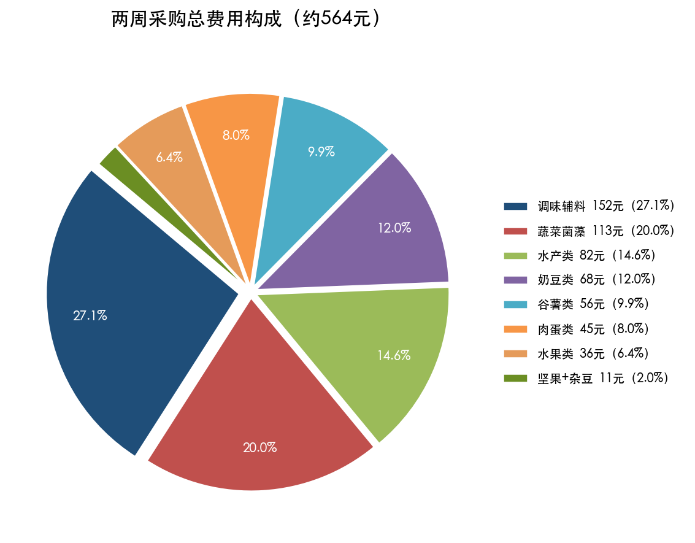

---

## 5.5 食材保鲜与储存指南

采购回家后的正确储存，是减少食材浪费、保障食品安全的关键环节。

### 5.5.1 蔬菜保鲜

- **叶菜类**（菠菜、油菜、荠菜、生菜等）：切勿提前清洗，用厨房纸巾包裹后放入保鲜袋（留少许开口透气），冷藏保存2~3天 [人民网·家庭食物储存条件](http://hlj.people.com.cn/n2/2022/0127/c387763-35115173.html "陕西省疾控中心指导")。
- **根茎类**（胡萝卜、莴笋、山药、芋头）：置于通风阴凉处可保存1~2周；山药和芋头切开后易氧化变色，切面应贴保鲜膜冷藏。
- **茄果瓜类**（番茄、黄瓜、西葫芦）：成熟番茄冷藏可保存5~7天；黄瓜不耐低温，冷藏不宜超过3天。
- **鲜菌类**（香菇、金针菇）：以纸袋包裹后冷藏2~3天，避免密封塑料袋包装以免加速腐烂。

### 5.5.2 肉类与水产保鲜

- **鲜肉分装冷冻**：购买当天按食谱每餐用量分装（如"瘦牛肉60g/份""鸡胸肉60g/份"），用保鲜袋密封并排出空气，贴上标签注明品名和日期。家用冰箱（-18℃）建议红肉在1~3个月内用完、禽肉1~2个月、鱼虾1~2个月 [央视健康频道](https://jiankang.cctv.com/2022/04/21/ARTIExd4hEva6CJi531ZZxcB220421.shtml "中国农业大学冷冻食品储存时间")。
- **鲜鱼处理**：在菜市场购买的鲈鱼、鲫鱼、草鱼，可请商贩现场宰杀、去鳞去内脏，回家后用料酒和姜片腌制10分钟再分装冷冻，可有效去腥并延长保鲜期。
- **冷冻品解冻**：提前12~24小时从冷冻室移至冷藏室（0~4℃）缓慢解冻，口感和营养保留最佳。应避免室温长时间解冻（易滋生细菌）或反复冻融。

### 5.5.3 干货与调味品储存

- **杂粮杂豆**：置于密封罐或密封袋中，阴凉干燥处可存放3~6个月。夏季高温季节建议冷藏防虫。
- **干木耳/干海带/干紫菜**：密封防潮保存，保质期通常在12个月以上。
- **坚果**：开封后密封冷藏，避免氧化变味。核桃、杏仁每次取用后应立即封口。
- **食用油**：避光阴凉保存，开封后建议在2~3个月内用完。按25g/天的用量计算，5L食用油可使用约200天，无需担心两周周期内用不完。

---

## 5.6 周末备餐流程

周末预处理是降低工作日烹饪时间的核心策略。以下流程经过优化，总耗时约1.5~2小时，可覆盖后续一周的大部分准备工作。

### 5.6.1 五步备餐法（建议周日下午完成）

下图以甘特图形式展示了五步备餐流程的先后顺序与并行关系，总耗时约115分钟。

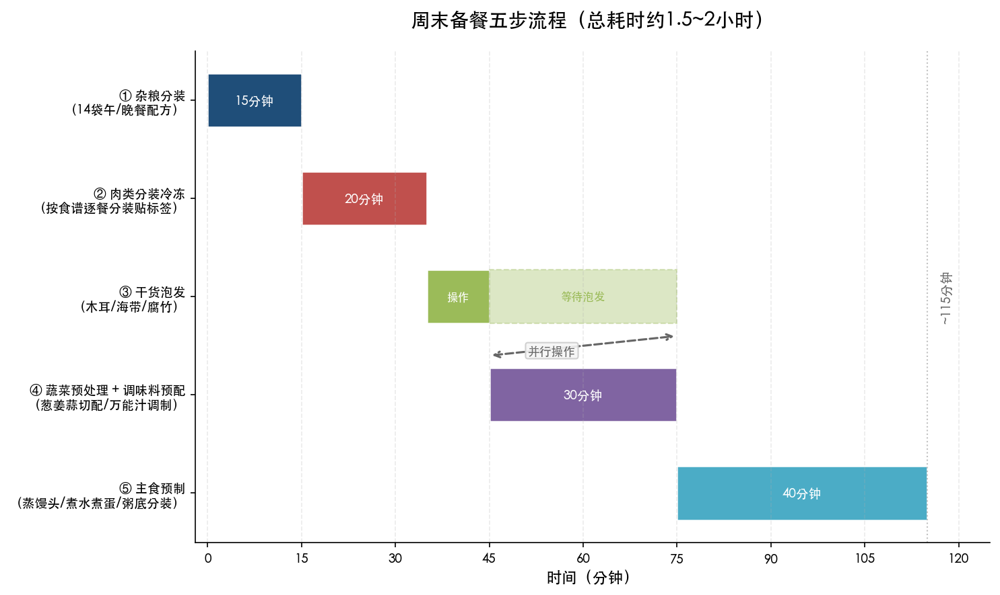

**第一步：杂粮分装（约15分钟）**

将一周所需的杂粮饭配方提前分装，每袋为一餐用量（午餐或晚餐），装入小号密封袋或保鲜盒，标注"午/晚 + 日期"。例如：

- 午餐配方（约75g）：大米50g + 糙米15g + 红豆10g
- 晚餐配方（约60g）：大米40g + 小米10g + 黑米10g

7天午餐 + 7天晚餐共14袋。煮饭时直接取一袋倒入电饭锅，无需每次称量，可大幅缩短操作时间。红豆等硬质杂豆需提前浸泡2小时（可前晚冷水浸泡过夜）。

**第二步：肉类分装冷冻（约20分钟）**

将本周购买的鲜肉按食谱逐餐分装：

- 鸡胸肉切丁/切片→每份60g，分装3袋
- 瘦牛肉切块→60g/份
- 猪瘦肉切片→50g/份
- 排骨焯水→30g/份

每袋贴标签（品名 + 克重 + 日期），放入冷冻室。使用前一晚移至冷藏室解冻即可。

**第三步：干货泡发（约10分钟操作，等待30分钟）**

- 干木耳冷水泡发（泡发后约为干品的6~8倍重量），挤干水分后分装冷藏，可保存3~5天
- 干海带冷水泡发后切丝，分装冷藏
- 腐竹温水泡发30分钟至软，切段沥干后冷藏

将以上操作与其他步骤并行，利用等待时间完成第四步。

**第四步：蔬菜预处理与调味料预配（约30分钟）**

- 葱切葱花、姜切片/切末、蒜剥皮切末→分别装入小保鲜盒冷藏，可使用3~5天
- 预调凉拌万能汁：生抽20ml + 陈醋15ml + 香油5ml + 蒜末10g，混合装瓶冷藏（7天有效）。凉拌黄瓜、凉拌菠菜、凉拌紫甘蓝等菜品均可直接取用
- 预调炒菜万能汁：生抽15ml + 料酒10ml + 少量淀粉水，冷藏保存（3~5天有效）
- 耐储蔬菜（胡萝卜、莴笋、芹菜）可提前洗净、去皮、切好，用保鲜盒密封冷藏2~3天

> **重要提示**：叶菜类（菠菜、油菜、生菜等）不宜提前切好——切开后水分和维生素流失加速。叶菜应保持完整状态储存，食用当天再清洗处理。

**第五步：主食预制（约30~40分钟）**

- 蒸制一周所需的全麦馒头/杂粮馒头（约6~8个），放凉后密封冷冻。食用时取出蒸热3~5分钟即可
- 煮7个水煮蛋，放凉后带壳冷藏保存（可安全存放5~7天），每天早餐直接取用
- 粥底预制：将一周所需的早餐粥配方（小米 + 燕麦/红豆 + 薏米等）分装好，前晚倒入电饭锅加水、设定预约功能（6~8小时后煮好），次日早晨起床即有热粥可食

### 5.6.2 工作日烹饪时间估算

完成周末备餐后，工作日每餐实际操作时间大幅缩减。下图直观展示了三餐各操作环节的时间占用与并行关系。

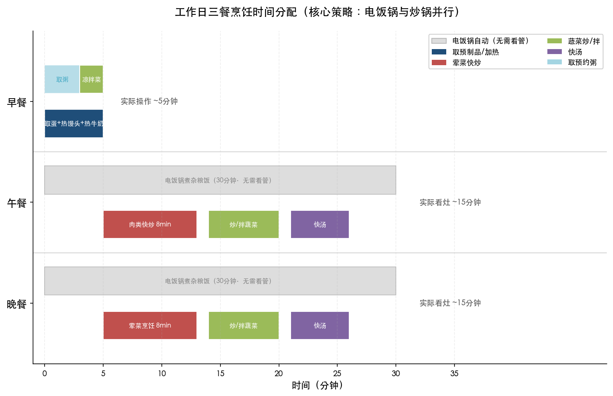

| 餐次 | 操作内容 | 耗时 |
|------|---------|------|
| 早餐 | 电饭锅粥已预约完成→取预煮水煮蛋 + 加热馒头 + 2分钟凉拌菜 + 热牛奶 | 15~20分钟 |
| 午餐 | 取预分装杂粮入锅煮饭（电饭锅30分钟，期间可做其他事）→前晚解冻的肉快炒8分钟→蔬菜炒/拌5~8分钟→快汤5分钟 | 25~35分钟（实际看灶约15分钟） |
| 晚餐 | 同午餐流程 | 25~35分钟 |

午餐和晚餐的核心策略是**"电饭锅与炒锅并行"**：杂粮饭入锅后启动煮饭程序，利用30分钟等待时间完成炒菜、凉拌和煮汤，实际站在灶台前的时间不超过15分钟。清蒸鱼等蒸制菜品操作更为简便——放入蒸锅后仅需等待8~10分钟。

### 5.6.3 万能调味方案

为进一步简化日常烹饪流程，以下三组预调酱汁可覆盖本食谱90%以上的调味需求：

| 酱汁名称 | 配方 | 适用菜品 | 保存方式 |
|---------|------|---------|---------|
| 凉拌万能汁 | 生抽20ml + 陈醋15ml + 香油5ml + 蒜末10g | 凉拌黄瓜、拌菠菜、拌木耳、拌紫甘蓝等所有凉拌菜 | 密封冷藏7天 |
| 快炒调味汁 | 生抽15ml + 料酒10ml + 少量玉米淀粉水 | 鸡胸肉炒菜、虾仁炒菜、瘦肉炒蔬菜等 | 密封冷藏3~5天 |
| 蒸鱼直淋汁 | 蒸鱼豉油5ml + 葱丝 | 清蒸鲈鱼、清蒸鳕鱼、清蒸草鱼 | 现调现用 |

使用预调酱汁时需注意总钠摄入控制：凉拌万能汁整瓶含钠约1.6g（折合盐约4g），一次凉拌菜用量约为全瓶的1/7（约0.6g盐），加上当天炒菜和汤中的用盐量，全天总量应控制在5g以内 [中国营养学会《家庭减盐行为指南》](https://www.chinacdc.cn/jkyj/mxfcrxjb2/jswj13947/202410/P020241010502020673225.pdf "T/CNSS 022-2023全文")。

---

## 5.7 女性版本采购量调整说明

第3~4章已说明女性1600 kcal版本的调整方案：每餐主食减15~25g（生重）、荤菜减至60~70g、烹调油减至20g/天、水果微减至120~150g。上述调整对应到采购清单，主要变化如下：

| 食材类别 | 男性版周用量 | 女性版周用量 | 差异 |
|---------|------------|------------|------|
| 大米/杂粮 | ~1250g | ~1000g | 减约20% |
| 荤菜（肉类+水产） | ~600~700g | ~480~560g | 减约20% |
| 食用油 | ~175g（25g×7） | ~140g（20g×7） | 减约20% |
| 水果 | ~900~1050g | ~750~900g | 减约15% |
| 鸡蛋/奶/蔬菜/豆制品 | 不变 | 不变 | — |

女性版本两周食材费用约在420~570元之间，较男性版本低约10%~15%。

---

## 5.8 灵活替换与应急方案

实际采购中难免遇到某些食材缺货或价格突变的情况。以下为本食谱中可灵活替换的食材组合，替换时遵循"同类等量"原则，即在同一食物大类内以等重量替换，以保持营养素摄入的基本稳定 [国家卫健委食养指南](https://www.nhc.gov.cn/cms-search/downFiles/4fcbecd2c18e46baaf291bf46c2b79cd.pdf "附录2食物交换表")：

| 原定食材 | 可替换为 | 替换原则 |
|---------|---------|---------|
| 鲈鱼 | 鲫鱼、鲳鱼、草鱼 | 等重量白肉鱼互换 |
| 鳕鱼 | 龙利鱼、巴沙鱼 | 等重量低脂白肉鱼互换 |
| 鸭胸肉 | 等量鸡胸肉 | 同为低脂禽肉 |
| 芦笋 | 西兰花茎、莴笋 | 等量茎类蔬菜互换 |
| 荠菜 | 菠菜、油菜 | 等量深色叶菜互换 |
| 秋葵 | 豆角、芦笋 | 等量绿色蔬菜互换 |
| 藜麦 | 等量糙米或小米 | 全谷物间互换 |
| 蓝莓 | 草莓、圣女果 | 等量低GI水果互换 |
| 紫薯 | 红薯、芋头 | 等量薯类互换 |
| 核桃 | 杏仁、腰果 | 等量坚果互换 |

---

## 5.9 本章要点回顾

两周食谱所需食材覆盖9大品类、84种食材，采购总费用约480~650元（含首次调味辅料投入），日均约34~46元 [商务部生活必需品监测·2026年3月第三周](https://cif.mofcom.gov.cn/cif/html//market_scanner/2026/3/1774250358783.html "8家超市监测数据")。通过"菜市场 + 超市 + 线上"三渠道组合与"一次性 + 按周 + 高频"三频次分层的采购策略，可在保证食材新鲜度的前提下最大限度减少采购频率。周末1.5~2小时的五步备餐法——杂粮分装、肉类分装冷冻、干货泡发、蔬菜预处理与调味料预配、主食预制——能将工作日每餐实际操作时间压缩至15~35分钟，使整套食谱在繁忙的日常生活中具备真正的可执行性。

# 第6章 常见问题与个性化调整指南

前述两周食谱以"53 岁、80kg、超重"为基准画像设计，但真实读者的健康状况、性别、用药情况和运动习惯各不相同。本章围绕执行过程中最常见的个性化需求——基础疾病膳食适配、性别差异处理、食药相互作用规避、体重动态管理以及运动协同策略——逐一给出可操作的调整方案。所有建议均以国家卫健委或相关学会发布的官方临床指南为依据，旨在帮助读者在通用食谱框架上实现安全、精准的个体化适配。

> **重要声明：** 本食谱仅供一般性健康膳食参考，不构成医疗诊断或治疗建议，不能替代专业医嘱。已确诊高血压、糖尿病、高脂血症、高尿酸血症/痛风、肾脏疾病或其他基础疾病的人群，在调整饮食前应咨询主治医师或注册营养师。正在服用处方药物的读者须关注食药相互作用（详见 6.3 节）。如执行过程中出现任何不适，应立即停止并及时就医。

## 6.1 基础疾病人群的食谱调整

53 岁前后正值多种慢性病高发年龄段。2020 年全国监测数据显示，中国成人高血压患病率 27.5%、糖尿病患病率 11.9%、高胆固醇血症 8.2% [国务院新闻办《中国居民营养与慢性病状况报告（2020年）》发布会](http://www.scio.gov.cn/xwfb/gwyxwbgsxwfbh/wqfbh_2284/2020n_4408/2020n12y23rsw/twzb_5755/202207/t20220716_230693.html "2020年12月23日发布")。合并任何一种慢性病，均需在通用食谱基础上做针对性微调。下表将四类常见慢性病在六个关键维度上的核心调整要点汇总为速查矩阵，读者可快速定位适用方案；随后各小节逐一展开说明。

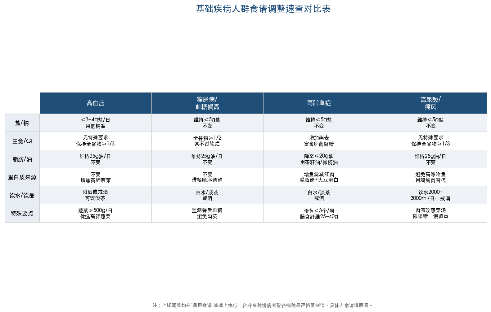

*图 6-1 基础疾病人群食谱调整速查对比表：以"调整维度 × 疾病类型"矩阵呈现高血压、糖尿病、高脂血症、高尿酸/痛风四类疾病的核心饮食调整要求。*

### 6.1.1 高血压患者调整方案

核心原则是"减钠增钾"。《中国高血压防治指南（2024 年修订版）》以Ⅰ类推荐/A 级证据明确建议：钠摄入应控制在 2g/d 以内（对应食盐 5g/d），肾功能良好者推荐使用低钠富钾替代盐（Ⅰ类推荐/B 级证据）[中国高血压防治指南（2024版）](http://www.chl-bha.org.cn/Public/ueditor/php/upload/20240815/17236841017752.pdf "5.2.1.1节 减少钠盐摄入")。临床研究表明，DASH 饮食模式可使高血压患者收缩压降低约 11.4 mmHg，中国心脏健康饮食（CHH）模式可降低约 10 mmHg [中国高血压防治指南（2024版）](http://www.chl-bha.org.cn/Public/ueditor/php/upload/20240815/17236841017752.pdf "5.2.1.2节 合理膳食")。

**在本食谱基础上的具体操作：**

| 调整项 | 具体做法 |
|-------|---------|
| 严格控盐 | 日总盐量控制在 3~4g（含酱油、豆瓣酱折算盐量），取消腌制类配菜（如咸鸭蛋、榨菜） |
| 增加高钾蔬菜 | 每日蔬菜量提升至 ≥500g，优先选择菠菜、芹菜、土豆、毛豆、香蕉 |
| 选用低钠盐 | 以氯化钾部分替代氯化钠的低钠盐可同步补钾降钠（肾功能不全者禁用） |
| 限酒 | 高血压患者应完全戒酒或严格限酒（男性酒精 ≤25g/d、女性 ≤15g/d） |
| 乳制品不减 | 保持每日 300ml 牛奶/酸奶，低脂乳制品有助于降压 |

### 6.1.2 糖尿病/血糖偏高者调整方案

《成人糖尿病食养指南（2023 年版）》将"主食定量、全谷物低 GI 食物占比 ≥1/3"列为首要原则 [《成人糖尿病食养指南（2023年版）》](https://www.nhc.gov.cn/cms-search/downFiles/4fcbecd2c18e46baaf291bf46c2b79cd.pdf "食养原则第三条")。对于超重合并糖尿病或血糖偏高者，碳水化合物供能比可适当下调至 45%~55%，蛋白质维持 15%~20%，脂肪 20%~30% [《成人糖尿病食养指南（2023年版）》](https://www.nhc.gov.cn/cms-search/downFiles/4fcbecd2c18e46baaf291bf46c2b79cd.pdf "宏量营养素比例")。

**在本食谱基础上的具体操作：**

| 调整项 | 具体做法 |
|-------|---------|
| 主食替换 | 白米饭（GI≈83）整体替换为糙米饭（GI≈56）或荞麦面（GI≈54），确保全谷物杂豆占主食的 1/2 以上 |
| 控制高 GI 食材 | 红薯（GI 偏高）替换为山药或芋头蒸制（GI 更低）；南瓜减量或改用冬瓜 |
| 进餐顺序 | 严格执行"先蔬菜 → 蛋白质 → 主食"顺序，可有效降低餐后血糖峰值 |
| 避免过度烹调淀粉 | 杂粮粥不煮至过软烂（越糊化 GI 越高）；避免勾芡 |
| 监测血糖 | 建议餐后 2 小时自测血糖，目标：空腹 4.4~7.0 mmol/L，餐后 2h <10.0 mmol/L，糖化血红蛋白 <7% |

食谱中第 1、3、5 天的粥品（小米燕麦粥、红小豆薏米粥等）虽已选用低 GI 谷物，但糖尿病患者仍需控制煮粥时间，保持米粒有一定颗粒感——淀粉糊化程度越高，GI 值越高，餐后血糖上升越快。

### 6.1.3 高脂血症患者调整方案

《成人高脂血症食养指南（2023 年版）》建议脂肪占总能量 20%~25%（本食谱基线为 26%~27%，需适当下调），饱和脂肪酸 <10% 总能量（高胆固醇血症者 <7%），膳食胆固醇 <300mg/d（高胆固醇血症者 <200mg/d）[《成人高脂血症食养指南（2023年版）》](https://www.nhc.gov.cn/sps/c100088/202301/f01895a06c5349ef999f25da833c166d/files/1732844468018_41219.pdf "食养原则第二条")。

**在本食谱基础上的具体操作：**

| 调整项 | 具体做法 |
|-------|---------|
| 降低烹调油 | 每日烹调油从 25g 降至 20g 以内，优先选用茶籽油或橄榄油 |
| 蛋白来源偏鱼禽 | 增加去皮禽肉和鱼虾比例，减少猪瘦肉频次（每周 ≤2 次） |
| 乳制品选脱脂 | 全脂牛奶改为脱脂或低脂牛奶 |
| 增加大豆蛋白 | 每日摄入约 25g 大豆蛋白当量（约 100g 北豆腐 + 200ml 豆浆），大豆蛋白有助于改善血脂 |
| 增加膳食纤维 | 目标 25~40g/d，强化燕麦（富含β-葡聚糖）、木耳、海带等高纤维食材 |
| 避免高胆固醇食材 | 鸡蛋黄每周 ≤3 个（本食谱每日 1 个需减至隔日 1 个），避免动物内脏 |

### 6.1.4 高尿酸血症/痛风患者调整方案

《成人高尿酸血症与痛风食养指南（2024 版）》将食物嘌呤分为四级：第一类高嘌呤（150~1000mg/100g，如动物内脏、沙丁鱼、浓肉汤）、第二类较高（75~150mg，如牛猪羊肉、多数鱼类、干豆）、第三类较低（30~75mg，如鸡肉、菠菜、蘑菇）、第四类低嘌呤（<30mg，如奶类、鸡蛋、多数蔬菜水果）[《成人高尿酸血症与痛风食养指南（2024版）》](https://www.nhc.gov.cn/wjw/yjzj/202312/3fbdf286857a4235be5749ca7a7b2ac9/files/1732845041620_31725.pdf "附录1嘌呤分类表+食养原则")。

**在本食谱基础上的具体操作：**

| 调整项 | 具体做法 |
|-------|---------|
| 替换高嘌呤食材 | 带鱼、沙丁鱼替换为鸡胸肉或鸡蛋；牛肉频次减至每周 1 次；所有肉汤改为蔬菜清汤 |
| 充足饮水 | 每日饮水量 2000~3000ml，分次饮用，促进尿酸排泄 |
| 限制果糖 | 减少甜水果摄入（如荔枝、葡萄），优选低果糖水果（草莓、蓝莓、柑橘） |
| 完全戒酒 | 啤酒和烈酒对尿酸影响最大，痛风患者应完全戒酒 |
| 豆制品可适量 | 豆腐、豆浆在加工过程中嘌呤已大量溶出，可适量食用（每日 100~150g 豆腐或 200ml 豆浆） |
| 减重节奏 | 控制在每周 0.5~1kg，急剧减重反而可能诱发痛风急性发作 |

### 6.1.5 多病共存的综合调整思路

临床实践中，53 岁超重人群同时合并两种及以上慢性病并不少见（如高血压 + 糖尿病、高血压 + 高脂血症）。综合调整时应把握以下原则：

1. **取各病种中最严格的限制值。** 例如高血压要求盐 ≤5g/d，同时合并高脂血症要求脂肪 ≤25% 能量，则两项上限同时执行。
2. **蛋白质来源优先级：** 鱼虾 > 去皮禽肉 > 豆制品 > 瘦红肉 > 蛋类（视胆固醇水平调整蛋黄频次）。
3. **主食策略：** 全谷物杂豆比例提升至 1/2 以上，优先选用低 GI 谷物（糙米、荞麦、燕麦）。
4. **就医优先：** 合并多种慢病的患者应在内分泌科或营养科门诊获取个体化膳食处方，本食谱仅作为基础框架参考。

## 6.2 性别差异的调整说明

本食谱主版本以男性 1900 kcal/d 设计。男性与女性在基础代谢率、热量需求及特定微量营养素需求方面存在显著差异，需分别处理。

### 6.2.1 女性热量与宏量营养素调整

女性（假设 160cm、80kg）目标热量约为 1500~1700 kcal/d，中位值 1600 kcal/d [国家卫健委《体重管理指导原则（2024年版）》](https://www.nhc.gov.cn/ylyjs/zcwj/202412/75cb79c171c94def9e768193e65484f7/files/1736390749000_59785.pdf "膳食干预部分")。在男性版本基础上的具体缩减方案：

| 调整项 | 男性 1900kcal | 女性 1600kcal | 调整幅度 |
|-------|:----------:|:----------:|:------:|
| 每餐主食（生重） | 约 75~85g | 约 55~65g | 减少 20~25% |
| 荤菜量 | 80~100g | 60~70g | 减少约 25% |
| 烹调油 | 25g/天 | 20g/天 | 减少 20% |
| 水果 | 150~200g | 120~150g | 微减 |
| 鸡蛋 | 1 个/天 | 1 个/天 | 不变 |
| 牛奶/酸奶 | 300ml/天 | 300ml/天 | 不变 |
| 蔬菜 | 350~450g | 350~450g | 不变 |

调整后女性日均营养估算：约 1600 kcal、碳水 210g（52%）、蛋白质 70g（17.5%）、脂肪 48g（27%），三大营养素比例仍在目标区间内。

### 6.2.2 女性特需微量营养素

**铁：** 2023 版《中国居民膳食营养素参考摄入量》对 50~64 岁女性铁 RNI 做了细分——未停经女性为 18mg/d，已停经女性下调至 10mg/d [民航空勤人员膳食指南附录B](http://www.caac.gov.cn/XXGK/XXGK/GFXWJ/202511/P020251120388309559437.pdf "引用2023版DRIs营养素供给标准表")。围绝经期女性仍应重视含铁食物的摄入：

- 高铁食物推荐：猪血（铁含量约 8.7mg/100g）、猪肝（需控制频次，每周 1 次约 50g）、瘦红肉、菠菜（焯水后搭配维生素 C 可促进非血红素铁吸收）。
- 维生素 C 协同：餐中搭配富含维生素 C 的蔬菜或水果（如彩椒、西红柿、猕猴桃、草莓），可将非血红素铁吸收率提升 2~3 倍。

**钙与骨质疏松预防：** 50 岁以上女性骨质疏松症患病率高达 32.1%，远高于同龄男性的 6.0% [人民网健康频道](http://health.people.com.cn/n1/2018/1022/c14739-30354355.html "2018年国家卫健委骨质疏松流行病学调查")。2023 版 DRIs 已将 ≥50 岁人群钙 RNI 从 1000mg 统一下调至 800mg [人民日报民生周刊](http://paper.people.com.cn/mszk/html/2023-11/20/content_26029036.htm "50岁以上人群钙RNI由1000mg降至800mg")，本食谱设计的每日膳食钙摄入约 800mg 已覆盖该目标。女性仍需特别确保达标，同时保证维生素 D 充足摄入（RNI 10μg/d 即 400IU），并适度户外日晒以促进内源性维生素 D 合成。

**大豆异黄酮：** 建议围绝经期女性每日食用大豆制品（约 25g 大豆蛋白当量，相当于 100g 北豆腐 + 200ml 豆浆）。大豆异黄酮具有植物雌激素活性，可在一定程度上缓解围绝经期症状。

### 6.2.3 男性特需关注

**前列腺健康：** 国际流行病学研究的系统评价与荟萃分析显示，番茄及番茄红素的摄入与前列腺癌风险呈负相关；2025 年发表的《精准医学时代前列腺癌营养管理中国专家共识》亦引用了这一证据 [精准医学时代前列腺癌营养管理中国专家共识](https://lcmwen.whuhzzs.com/article/doi/10.13201/j.issn.1001-1420.2025.04.001 "中国临床泌尿外科杂志2025")。建议男性每周食用 3~5 次西红柿或番茄制品；加热烹调后番茄红素的生物利用率更高，本食谱中的番茄炖牛肉、西红柿蛋花汤、番茄炖豆腐鱼等菜品已覆盖此需求。

**锌：** 2023 版 DRIs 中成年男性锌 RNI 为 12mg/d（较 2013 版稍有下调），可从贝类、瘦红肉、坚果中获取 [民航空勤人员膳食指南附录B](http://www.caac.gov.cn/XXGK/XXGK/GFXWJ/202511/P020251120388309559437.pdf "引用2023版DRIs营养素供给标准表")。

## 6.3 食药相互作用注意事项

正在服用处方药物的读者，在执行本食谱前务必了解以下常见食药相互作用，必要时咨询主治医师或临床药师。

### 6.3.1 抗凝药物与维生素 K

服用华法林等香豆素类抗凝药的患者，膳食中维生素 K 的摄入量变化会影响药物疗效。本食谱中菠菜、西兰花、油菜等深绿叶菜含维生素 K 较高。调整建议并非"完全不吃"，而是**保持每日绿叶菜摄入量稳定、不骤增骤减**，并定期监测 INR 值。

### 6.3.2 钙通道阻滞剂/他汀类与西柚

硝苯地平、氨氯地平等钙通道阻滞剂（CCB），以及辛伐他汀、阿托伐他汀等部分他汀类药物，主要经肝脏 CYP3A4 酶代谢。西柚（葡萄柚）及其果汁中的呋喃香豆素能抑制 CYP3A4，导致药物血浆浓度异常升高，增加不良反应风险（他汀类可增加横纹肌溶解风险）[中国高血压防治指南（2024版）](http://www.chl-bha.org.cn/Public/ueditor/php/upload/20240815/17236841017752.pdf "5.2.2.3节CCB类")。本食谱中水果选择已避开西柚，但读者自行替换水果时须注意此禁忌。

### 6.3.3 ACEI/ARB 与高钾食物

血管紧张素转换酶抑制剂（如依那普利）和血管紧张素 II 受体拮抗剂（如缬沙坦）本身具有升高血钾的作用。服用此类药物的患者应避免过量补钾（如大量食用香蕉、橙子、土豆或使用低钠富钾盐），并定期检测血钾水平。

### 6.3.4 降糖药与酒精

二甲双胍合并大量饮酒可增加乳酸酸中毒风险；磺脲类降糖药与酒精同用可增加低血糖风险。本食谱未纳入任何含酒精饮品，但读者在社交场合应严格限酒或戒酒。

### 6.3.5 噻嗪类利尿剂与尿酸

噻嗪类利尿剂（如氢氯噻嗪）可升高血尿酸水平。合并高尿酸血症或痛风的高血压患者在使用此类药物时，应遵医嘱调整降压方案，同时参照 6.1.4 节的低嘌呤饮食建议。

以下速查卡汇总了上述五类常见食药相互作用的关键信息，便于服药读者随时查阅。

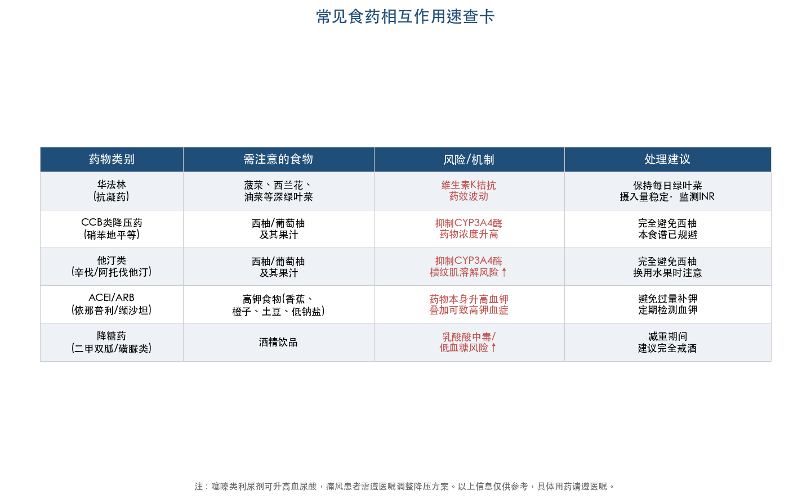

*图 6-2 常见食药相互作用速查卡：覆盖华法林、CCB 类降压药、他汀类、ACEI/ARB、降糖药五类药物与食物的交互风险及处理建议。*

## 6.4 过敏与不耐受的食材替代

本食谱涵盖鸡蛋、牛奶、鱼虾、小麦等常见过敏原。存在食物过敏或不耐受的读者可按以下方案等量替换，在确保营养均衡的前提下安全执行食谱：

| 过敏/不耐受类型 | 替代方案 | 补充说明 |
|---------------|---------|---------|
| **乳糖不耐受** | 酸奶（乳糖已部分分解）、低乳糖牛奶、强化钙豆浆 | 若完全不耐受乳制品，需额外注意补钙（豆腐 + 绿叶菜 + 必要时钙补充剂） |
| **鸡蛋过敏** | 100g 北豆腐或 50g 瘦肉替代 1 个鸡蛋 | 蛋白质和热量基本等量 |
| **海鲜过敏** | 去皮鸡胸肉或豆制品替代鱼虾 | 需补充 n-3 脂肪酸来源（亚麻籽油 5~10ml/d 凉拌或核桃 10~15g/d） |
| **麸质不耐受** | 全麦馒头/荞麦面改为大米、小米、玉米面制品 | 荞麦虽名含"麦"，实际不含麸质蛋白，多数麸质不耐受者可安全食用（需确认无小麦混合加工） |

## 6.5 常见"食物相克"的科学辨析

民间流传的"食物相克"说法缺乏现代营养学证据支持。以下就食谱中涉及的几组常见误解予以澄清，帮助读者消除不必要的饮食顾虑。

**"菠菜 + 豆腐会导致肾结石"：** 菠菜中的草酸与豆腐中的钙在肠道内结合形成草酸钙，随粪便排出体外，反而减少了草酸经肾脏排泄的量。本食谱中菠菜均建议焯水 1~2 分钟处理，可去除 60%~80% 的草酸，进一步降低风险。

**"虾 + 维生素 C 等于砒霜"：** 该说法声称虾体内五价砷被维生素 C 还原为三价砷（即砒霜），但实际上正常膳食摄入的微量砷远不足以产生毒性反应，已被中国营养学会多次辟谣。

**"柿子 + 螃蟹会中毒"：** 柿子中的鞣酸与蛋白质结合可能引起胃部不适感，但这并非"中毒"反应，适量食用无碍。本食谱未涉及柿子和螃蟹，此处仅作常识性说明。

## 6.6 体重动态监测与食谱调整

减重是一个动态过程，需根据体重变化持续微调饮食策略。本食谱设计的热量缺口约为 300~500 kcal/d（基于 TDEE 与目标摄入量之差），预期健康减重速率为每周 0.5~1kg [国家卫健委《体重管理指导原则（2024年版）》](https://www.nhc.gov.cn/ylyjs/zcwj/202412/75cb79c171c94def9e768193e65484f7/files/1736390749000_59785.pdf "超重肥胖干预和治疗")。

### 6.6.1 监测方法

- **称重：** 每周固定时间（建议晨起排便后、着单衣）称体重 1~2 次，记录趋势。
- **腰围：** 每两周测量一次腰围（站立位，肋骨下缘与髂嵴上缘连线中点），中国标准男性 ≥90cm、女性 ≥85cm 为中心型肥胖（WS/T 428—2013）。
- **体感指标：** 衣物松紧度、精力状态、睡眠质量等主观感受亦可作为辅助参考。

### 6.6.2 分场景调整策略

| 场景 | 判断标准 | 调整方案 |
|------|---------|---------|
| 减重正常 | 每周下降 0.5~1kg | 维持当前食谱不变 |
| 减重停滞 | 连续 2 周体重无变化 | 每日减少 100~200kcal（如减少 1 份水果或减少主食 15~20g/餐），或增加运动消耗 |
| 减重过快 | 每周下降 >1.5kg | 每日增加 100~200kcal（如增加 1 份坚果或增加主食 15~20g/餐），避免肌肉过度流失 |
| 平台期 | 连续 2~4 周波动 <0.5kg | 属正常生理现象，可增加抗阻训练强度、变换食谱菜品、保证 7~9 小时睡眠 |
| 达标 | BMI 降至 24 以下 | 逐步缩小热量缺口（每两周增加 100kcal），过渡至热量维持模式 |

上述决策逻辑可通过下图直观把握：

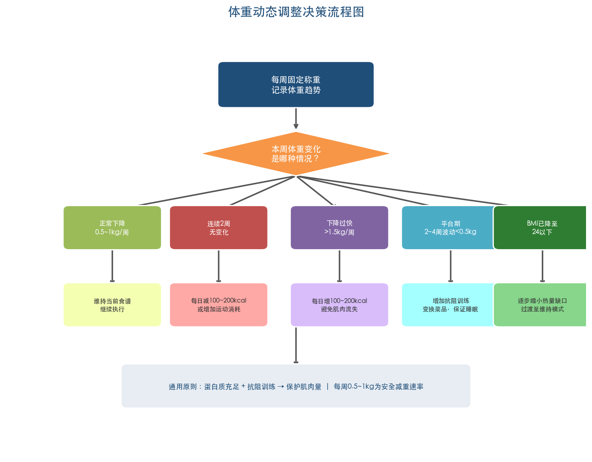

*图 6-3 体重动态调整决策流程图：以每周称重结果为起点，分支至正常下降、连续停滞、下降过快、平台期、BMI 达标五种场景，每种场景对应具体操作建议。*

### 6.6.3 体重管理的长期视角

以男性 170cm 为例，从 80kg（BMI 27.7，超重）减至正常范围需将体重降至约 69kg 以下（BMI<24），全程约需减重 11kg。按每周 0.5~0.75kg 的安全速率计算，预计需要约 4~5 个月。切忌急于求成：快速减重（>1kg/周持续多周）易导致肌肉量显著丢失，而 50 岁后肌肉量本就以每年约 1%~2% 的速率自然下降，保护肌肉质量与减脂同等重要。

## 6.7 运动配合建议

膳食控制与身体活动协同是体重管理的最优策略。《中国公民健康素养释义》（2024 版）建议成年人每周进行 150~300 分钟中等强度有氧运动，并辅以每周 2~3 次抗阻训练 [《中国公民健康素养释义》（2024版）](https://www.nhc.gov.cn/xcs/c100122/202405/f251e896a50a49ff8c632b4b3da93126/files/1734001844015_12363.pdf "科学健身条目")。以下给出适合 53 岁超重人群的运动方案框架。

### 6.7.1 运动方案建议

**有氧运动（心肺耐力）：**
- 首选快走（步频 100~120 步/分），每次 30~45 分钟，每周 5 次。
- 体能适应后可逐步过渡至慢跑、游泳或骑行。
- 判断中等强度的简易方法：运动时能说话但不能唱歌。

**抗阻训练（肌肉维持）：**
- 使用弹力带、轻哑铃或自体重训练（如靠墙半蹲、坐姿起立、桥式）。
- 每组 8~12 次，做 2~3 组，每周 2~3 次，各大肌群轮换。
- 抗阻训练对 50 岁以上人群尤为重要，可有效延缓肌肉流失（肌少症预防）[中国高血压防治指南（2024版）](http://www.chl-bha.org.cn/Public/ueditor/php/upload/20240815/17236841017752.pdf "表14运动干预方案")。

**柔韧性与平衡训练：**
- 每次运动前后各做 5~10 分钟拉伸。
- 可加入单腿站立、太极拳等平衡训练，降低跌倒风险。

### 6.7.2 运动前后的饮食配合

| 时间节点 | 饮食建议 |
|---------|---------|
| 运动前 1~2 小时 | 少量低 GI 碳水（1 片全麦面包或半根香蕉），避免空腹运动 |
| 运动后 30 分钟内 | 补充蛋白质（1 杯牛奶或 1 个鸡蛋），促进肌肉修复 |
| 运动中 | 以白水补充水分，运动时间 <60 分钟通常无需额外补充电解质 |

本食谱中的加餐时段（上午或下午水果 + 坚果）可灵活调整至运动前后。若每日运动消耗约 200~300 kcal，叠加饮食缺口 300~400 kcal，总缺口可达 500~700 kcal/d，对应每周减重约 0.5~1kg，与安全减重目标一致。

### 6.7.3 运动注意事项

- **有基础疾病者** 应在开始运动计划前咨询医生，特别是有心脑血管疾病史、严重关节疾病或未控制的高血压（收缩压 ≥180mmHg）者。
- **循序渐进**：从每次 15~20 分钟开始，每周递增 10%~15%，避免突然大量运动。
- **运动时间选择**：建议避开清晨空腹和饭后 1 小时内；餐后 1~2 小时散步对控制餐后血糖有益。

## 6.8 实用问答：执行中的高频疑问

**Q1：食谱中某种食材买不到，如何替换？**

参照"食物交换份"原则进行等热量替换。每份约 90 kcal 的等价关系：大米/面粉 25g ≈ 馒头/米饭 35g ≈ 薯类 100g；畜肉 50g ≈ 鸡蛋 60g ≈ 鱼类 75g ≈ 北豆腐 90g [《成人糖尿病食养指南（2023年版）》](https://www.nhc.gov.cn/cms-search/downFiles/4fcbecd2c18e46baaf291bf46c2b79cd.pdf "附录2食物交换表")。同类替换不会明显影响整体营养素平衡。

**Q2：加班或出差无法自己做饭，如何保证饮食质量？**

参照第 4 章第 14 天外出就餐方案执行：选择清蒸、白灼、凉拌类菜品，主食选粗粮，蔬菜占盘面 1/2，拒绝重油重盐菜式和含糖饮料，七八分饱即止 [中国营养学会膳食指南准则六](http://dg.cnsoc.org/article/04/wDCyy7cWSJCN6pwKHOo5Dw.html "在外就餐注意事项")。便利店可选：无糖酸奶 + 全麦面包 + 水煮蛋 + 即食鸡胸肉 + 小份沙拉。

**Q3：食谱执行后总感觉饿，如何应对？**

饥饿感在执行初期（1~2 周）较为常见，多与饮食习惯转变有关。应对策略：①检查蔬菜量是否足够（≥400g/d 的蔬菜可提供充足的体积感和膳食纤维）；②确认进餐顺序是否正确（先菜后肉再主食）；③适当增加蛋白质比例（在总热量不变的前提下，蛋白质饱腹感最强）；④两餐之间饮白水或淡茶。若持续出现强烈饥饿感，可每日增加 100kcal（如增加 1 份水果），避免因过度忍耐导致暴食反弹。

**Q4：减重期间能否饮酒？**

2023 版《中国居民膳食营养素参考摄入量》明确指出"任何形式的酒精对人体健康都无益处"，建议成人如饮酒，每日酒精摄入不超过 15g [民航空勤人员膳食指南附录B](http://www.caac.gov.cn/XXGK/XXGK/GFXWJ/202511/P020251120388309559437.pdf "引用2023版DRIs营养素供给标准表")。对于超重且处于减重期的人群，酒精是"空热量"来源（7kcal/g），既增加热量摄入又干扰脂肪代谢，强烈建议在减重期间完全戒酒。合并高血压、糖尿病、高尿酸血症者更应严格戒酒。

**Q5：可以只吃两餐、跳过早餐吗？**

不建议。《中国居民膳食指南（2022）》明确推荐三餐规律，能量按约 30%-40%-30% 合理分配 [中国营养学会膳食指南（2022）](http://dg.cnsoc.org/article/04/K7tlcs-UQh67DBC5XY1Jqw.html "食物多样，合理搭配")。跳过早餐容易导致午餐过量进食，反而不利于血糖稳定和体重管理。本食谱早餐设计均可在 15~20 分钟内完成，时间成本较低。

**Q6：两周食谱结束后如何延续？**

两周食谱的核心价值在于建立健康饮食的思维框架和操作习惯。结束后可直接循环使用（第 3 周重复第 1 周，以此类推），也可依据前述食物交换份原则自主组合新菜品。关键是长期坚持以下底线：每日 ≥12 种食物、每周 ≥25 种；全谷物 ≥ 主食 1/3；蔬菜 300~500g（深色 ≥1/2）；奶 300ml；盐 ≤5g；油 ≤25g。

# 结论与风险提示

## 核心结论

本报告围绕53岁、体重80 kg中国大陆居民的健康管理需求，完成了从营养评估到膳食落地执行的全链条设计。综合六章分析，形成以下核心判断：

**一、膳食干预是该人群体重管理的首选路径。** 80 kg体重已超出2023版DRIs参考体重（男性约66.5 kg、女性约57.4 kg），对应BMI均处于超重或肥胖区间。在每日制造300~500 kcal温和热量缺口的前提下，男性以1900 kcal/天、女性以1600 kcal/天为能量目标，配合碳水化合物50%~55%、蛋白质15%~20%、脂肪25%~30%的宏量营养素比例，可支撑每周0.5~1.0 kg的安全减重速率，同时保障营养充足性。

**二、食物多样性与营养素全面覆盖可在有限热量预算内实现。** 两周食谱累计使用84种食材，日均18~24种，远超膳食指南"每天≥12种、每周≥25种"的底线标准。蛋白质日均83~85 g（男性版），较RNI 65 g/天高出约28%，有助于对抗50岁后加速的肌肉流失。钙摄入通过"每日300 ml奶+深绿色蔬菜+豆制品"的组合路径，稳定覆盖800 mg/天的RNI目标。膳食纤维经全谷物杂豆≥主食1/3的策略保障，日均约25~30 g。

**三、口味可接受性和烹饪便捷性是长期依从性的关键保障。** 全部菜品以蒸、煮、炖、白灼、凉拌为主，单餐操作时间15~35分钟；通过周末1.5~2小时的五步备餐法（杂粮分装、肉类分装冷冻、干货泡发、蔬菜预处理、主食预制），工作日烹饪效率显著提升。第二周引入家庭聚餐和外出就餐两个真实场景的应对策略，验证了弹性调配机制下特殊场景的热量管控可行性。

**四、两周食材日均费用约34~46元，具备经济可持续性。** 该成本低于同期二线城市外卖或食堂日均餐费（通常40~60元/天），且营养密度和食品安全性远优于外卖餐食。食材选择充分利用了2026年3月早春时令蔬果的价格优势和新鲜度保障。

**五、慢性病合并人群可在通用框架上实现安全的个体化微调。** 针对高血压（减钠增钾）、糖尿病（强化低GI策略）、高脂血症（降脂肪占比、偏鱼禽蛋白）、高尿酸血症/痛风（低嘌呤替换）四类常见慢性病，报告基于国家卫健委和相关学会发布的最新临床指南，逐一给出了可操作的食谱调整方案。食药相互作用（华法林与维生素K、CCB/他汀与西柚、ACEI/ARB与高钾食物等）亦已明确标注，为服药人群提供安全屏障。

## 风险提示

**一、个体差异与医学局限性。** 本食谱以"53岁、80 kg"为基准画像设计，未考虑具体个体的基础疾病谱系、用药方案、过敏史和消化吸收功能差异。已确诊高血压、糖尿病、肾脏疾病或其他慢性病的读者，在调整饮食前应咨询主治医师或注册营养师。本报告不构成医疗诊断或治疗建议，不能替代专业医嘱。

**二、热量与营养素估算的固有误差。** 食材热量及营养素数据基于《中国食物成分表》标准值，实际烹饪过程中因食材品种差异、水分变化、用油量波动等因素，存在±5%~10%的正常偏差。外出就餐场景下（如第14天），热量估算不确定性可扩大至±10%~20%。食谱中的营养素估算为近似值，不应作为精确的临床膳食处方使用。

**三、性别信息缺失带来的方案选择需求。** 用户未明确性别，报告以男性方案为主版本、女性方案为辅助参照。两套方案的能量目标相差约300 kcal/天（男性1900 vs 女性1600），主食和荤菜用量差异约20%~25%。读者应根据自身性别选择对应版本，避免女性使用男性版本导致热量缺口不足、或男性使用女性版本导致营养供给偏低。

**四、减重预期的不确定性。** 每周0.5~1.0 kg的减重速率为基于人群平均水平的预期值，个体实际减重曲线受基础代谢率差异、身体活动量、睡眠质量、压力水平、激素波动等多重因素影响。体重管理是一个动态过程，需根据实际称重数据持续微调（详见第6章分场景调整策略）。连续2周以上体重无变化或出现其他异常，应及时就医排查潜在健康问题。

**五、时令与地域适用性。** 食谱设计于2026年3月下旬（早春），食材选择和价格估算基于该时段的时令特征和二线城市零售价格。不同季节执行时，部分时令蔬菜（春笋、荠菜、香椿芽等）可能不可得，需依据食物交换份原则以等量同类食材替代。一线城市食材价格可能上浮15%~30%，三四线城市或菜市场直采则通常低10%~20%。

**六、食品安全操作不可忽视。** 食谱中已标注的食品安全要点——豆角（四季豆）须充分加热至少10分钟、藜麦须淘洗去皂苷、香椿芽须焯水去硝酸盐、鸭胸肉须去皮控脂、菠菜苋菜须焯水去草酸——均为不可省略的必要操作。忽视上述步骤可能导致食物中毒或影响营养素吸收效率。
