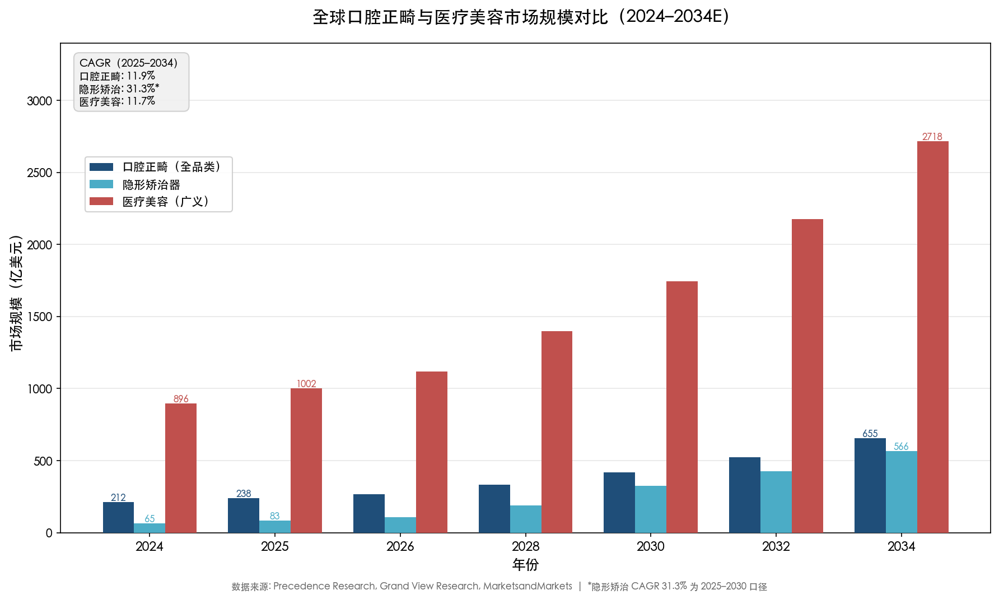
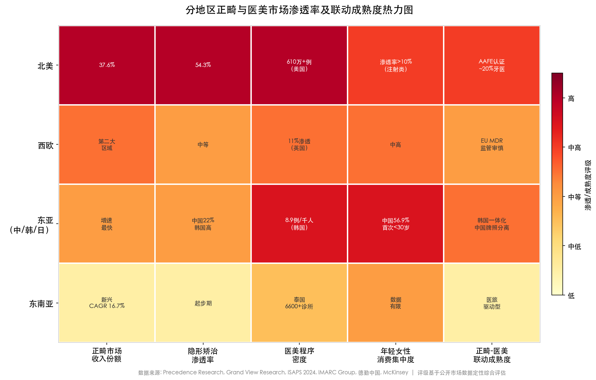
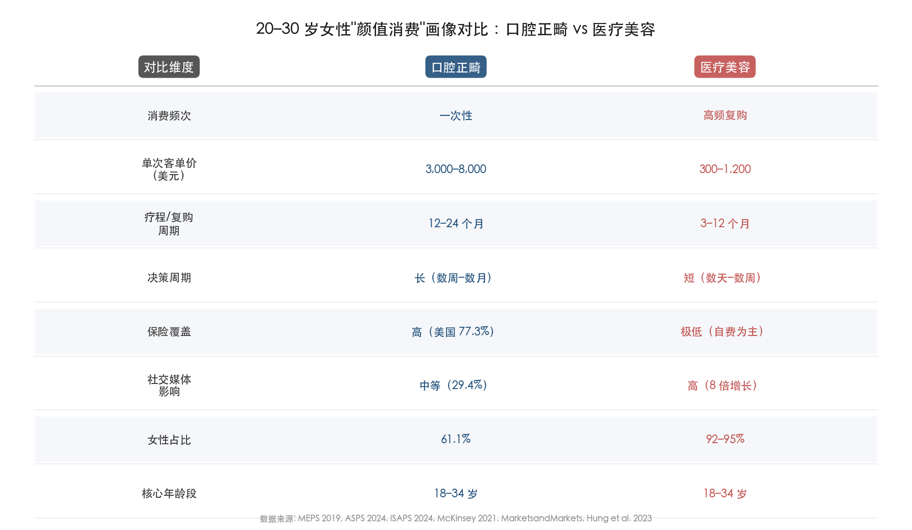
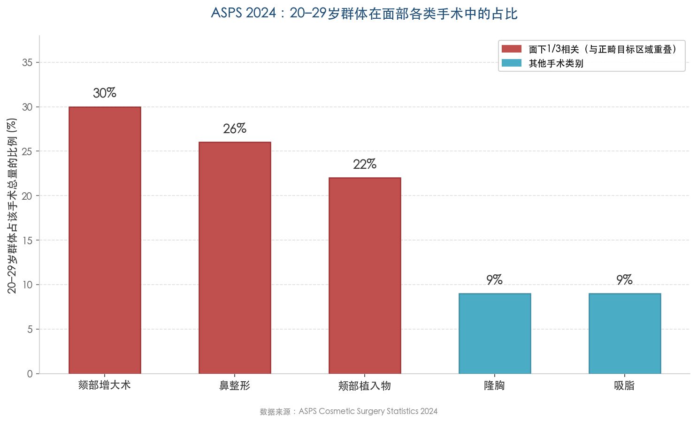
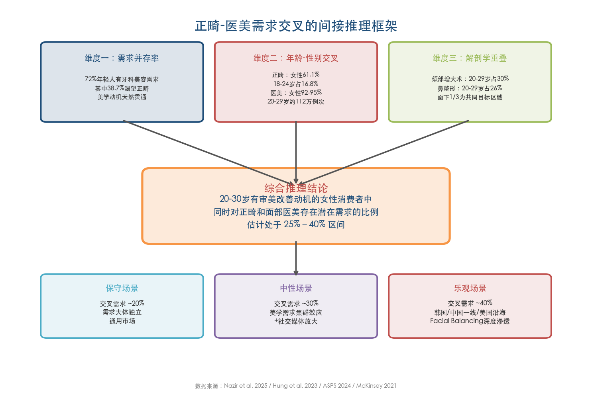
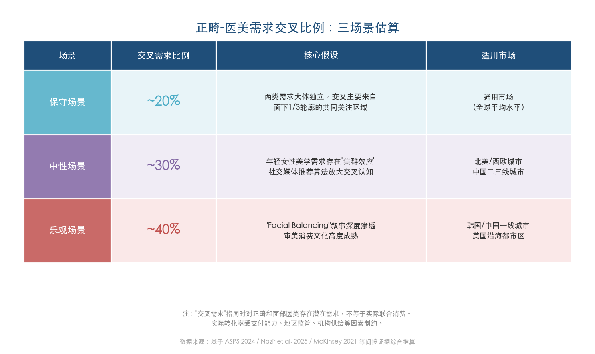
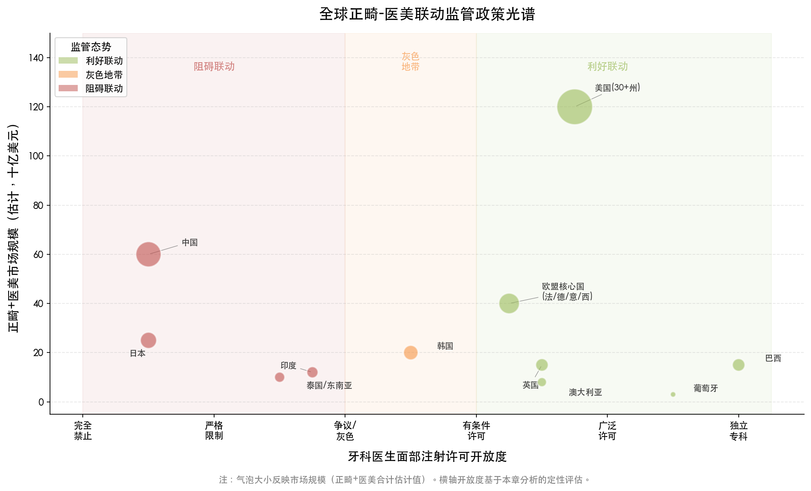
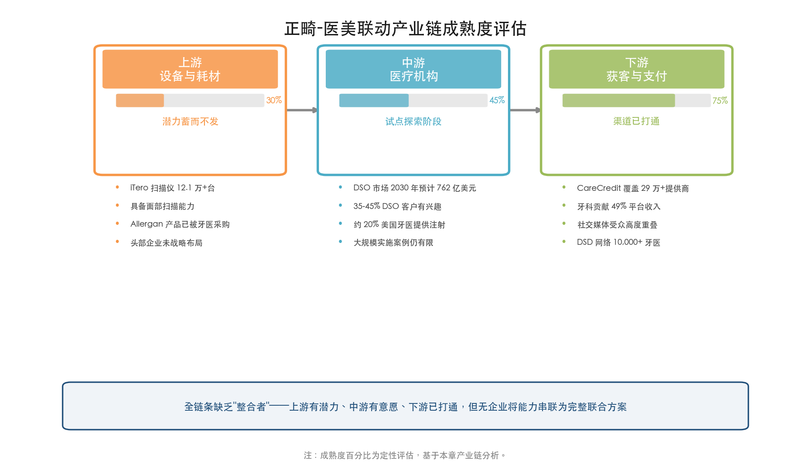
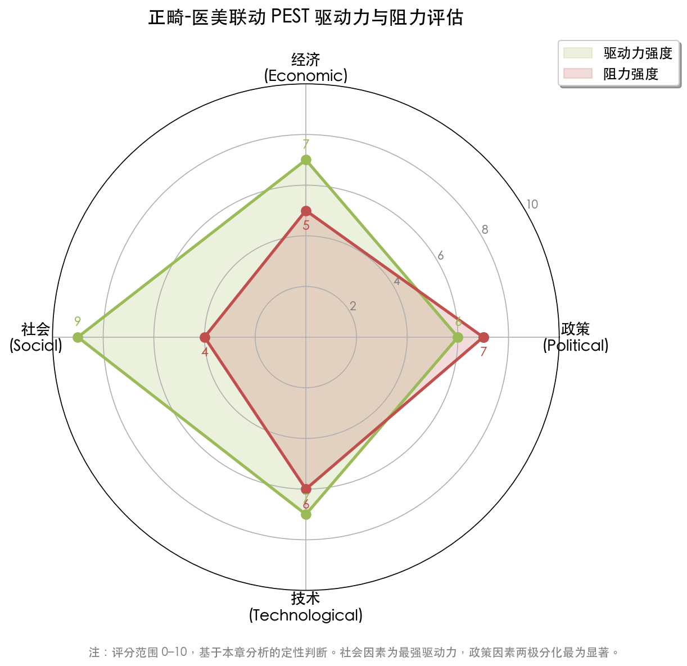

# 执行摘要

# 第1章 全球 20–30 岁女性"颜值消费"市场全景——口腔正畸与医美的规模、渗透率与人群画像

## 1.1 两大"颜值产业"的全球规模与增长轨迹

口腔正畸与医疗美容构成当代"颜值经济"中体量最大、增速最快的两条核心赛道。二者虽分属口腔医学与美容医学两个学科体系，却共享同一核心消费群体——追求外貌改善的年轻女性，并在市场规模上呈现出高度可比的扩张节奏。本节对两大赛道的全球规模、增长动因和结构特征进行系统梳理，为后续人群画像与地区比较奠定量化基座。

### 1.1.1 口腔正畸：从青少年刚需走向成人审美消费

2024 年全球口腔正畸市场规模约 212.3 亿美元，2025 年预计达 238.1 亿美元，2025–2034 年复合年均增长率（CAGR）为 11.9% [Precedence Research](https://www.precedenceresearch.com/orthodontics-market "全球正畸市场报告2025-2034")。从地区分布看，北美以 37.55% 的收入份额居首，亚太地区则凭借庞大的人口基数和快速提升的消费力成为增速最快的区域市场。

成人正畸的崛起是近十年最重要的结构性变化。2024 年成人群体贡献了正畸市场约 75.3% 的收入——约 159.8 亿美元——成人正畸已从早期的"辅助治疗"跃升为整个市场的"增长核心" [Precedence Research](https://www.precedenceresearch.com/orthodontics-market "正畸市场按年龄分组收入")。这一转变的技术推力主要来自隐形矫治的成熟与普及。2024 年全球隐形矫治器市场规模约 64.9 亿美元，2025 年约 82.9 亿美元，2025–2030 年 CAGR 高达 31.3%；其中成人患者细分占 59.3%，北美以 54.3% 的份额主导 [Grand View Research](https://www.grandviewresearch.com/industry-analysis/clear-aligners-market "隐形矫治器市场报告2025-2030")。

作为隐形矫治领域的全球领导者，Align Technology 的业绩可视为行业的晴雨表。2025 财年 Align 总营收 40.35 亿美元（同比 +0.9%），隐形矫治器全年出货量 261.1 万例（同比 +4.7%），Q4 每箱平均售价约 1,240 美元，累计服务患者超过 2,210 万人 [Align Technology 2025年报](https://investor.aligntech.com/news-releases/news-release-details/align-technology-announces-fourth-quarter-and-fiscal-2025 "Align Technology FY2025财报")。这一组数据折射出隐形矫治市场已从早期高速成长阶段步入稳健扩张期，增长的边际驱动力正从北美转向国际市场、从专科正畸医生转向全科牙医（GP）渠道。

### 1.1.2 医疗美容：千亿美元赛道的非手术化转型

2024 年全球医美市场规模约 896.4 亿美元（Grand View Research 广义口径，涵盖器械、耗材与服务），2025–2033 年 CAGR 为 11.73% [Grand View Research](https://www.grandviewresearch.com/industry-analysis/medical-aesthetics-market "Aesthetic Medicine Market 2025-2033")。若以器械与产品的窄口径衡量，2024 年市场规模为 173.0 亿美元 [MarketsandMarkets](https://www.marketsandmarkets.com/Market-Reports/medical-aesthetics-market-885.html "Medical Aesthetics Market 2025-2031")。两种口径之间的巨大差异提示：医美产业的价值创造重心已从上游器械转向中下游的服务与耗材环节。

ISAPS 2024 年全球调查提供了更细颗粒度的程序量数据：2024 年由整形外科医生执行的医美程序合计约 3,790 万例，其中手术类 1,742 万例、非手术类 2,054 万例，较 2020 年增长 42.5%，美国以超 610 万例居全球首位 [ISAPS 2024全球调查](https://www.isaps.org/discover/about-isaps/global-statistics/global-survey-2024-full-report-and-press-releases/ "ISAPS Global Survey 2024")。非手术类程序在数量上已全面超越手术类，标志着全球医美产业正经历深刻的"轻医美化"转型——消费者越来越倾向于低风险、短恢复期、可重复的微调方案，而非一次性的大手术。这一趋势在 20–30 岁年轻消费者中尤为显著。

### 1.1.3 规模对比视角

将两个市场并置观察，口腔正畸（2024 年约 212 亿美元）与医美（2024 年约 896 亿美元）在绝对规模上相差约 4.2 倍，但两者的 CAGR 处于同一区间（11%–12%），均受益于审美意识觉醒、技术降低准入门槛以及社交媒体催化需求扩散这三重宏观驱动力。更关键的是，两者正朝着相同的方向演进：从"治疗"向"改善"迁移，从"一次性手术"向"持续维护"迁移，从"专科闭环"向"多学科协作"迁移。下图直观呈现了这两大赛道在 2024–2034 年间的规模演变轨迹及增长节奏。

**图 1-1　全球口腔正畸与医疗美容市场规模对比（2024–2034E）。** 口腔正畸全品类与医疗美容广义口径的绝对规模差距约为 4 倍，但 CAGR 同处 11%–12% 区间；隐形矫治器以 31.3% 的 CAGR（2025–2030 口径）呈现出远超行业平均的扩张速度。数据来源：Precedence Research、Grand View Research、MarketsandMarkets。

## 1.2 20–30 岁女性在两大赛道中的人群画像

### 1.2.1 正畸市场中的女性与年轻人

基于 2019 年美国医疗支出面板调查（MEPS，n=12,422）的分析，正畸用户中女性占 61.1%，18–24 岁人群占正畸使用者的 16.8%，25–44 岁占 9.5% [Hung et al., Dentistry Journal 2023](https://pmc.ncbi.nlm.nih.gov/articles/PMC10742803/ "MEPS 2019正畸使用人口画像")。该数据以"当前使用正畸服务"为统计口径，18–24 岁群体的较高占比一定程度上反映了矫治周期与年龄段的重叠；25–44 岁的 9.5% 则可能低估了该年龄段的实际需求——许多成人正畸患者在 25–30 岁启动治疗，但因疗程跨度（12–24 个月）在统计年份内不一定被捕捉。

现有统计体系的局限性使精确计算"20–30 岁女性"在正畸市场中的占比面临困难：年龄分组通常为 18–24 岁/25–44 岁，缺乏 20–30 岁的精确切分，且性别与年龄未交叉列报。基于已有数据进行合理推算：若假设女性占比 61% 在各年龄段大致稳定，且 20–30 岁群体在 18–44 岁使用者中约占 40%–50%（考虑到成人正畸的审美动机在 25–35 岁最为集中），则 20–30 岁女性大约占全部正畸消费者的 6%–8%。然而，由于该群体对高端隐形矫治产品的偏好更强，其消费金额占比预计高于人数占比。这一区间系基于间接推算，有待更精细的人口统计数据加以验证。

正畸消费在财务结构上具有鲜明特征：属于一次性大额支出，美国 Invisalign 费用约 3,000–8,000 美元，疗程 12–24 个月。77.3% 的美国正畸使用者持有私人保险 [Hung et al., 2023](https://pmc.ncbi.nlm.nih.gov/articles/PMC10742803/ "MEPS正畸保险数据")，保险覆盖构成推动正畸消费的重要支付基础。

### 1.2.2 医美市场中的女性与年轻人

医美市场的性别集中度远高于正畸。ASPS 2024 年数据显示，医美手术中女性占 92%–95% [ASPS 2024](https://www.plasticsurgery.org/documents/news/statistics/2024/cosmetic-procedures-ages-20-29-2024.pdf "ASPS 2024年20-29岁统计")。在程序量维度，20–29 岁人群占手术类操作约 9%（约 14.4 万例）、微创类操作约 3%（约 97.5 万例），后者的绝对数量相当可观。

ISAPS 2024 年调查进一步揭示了 18–34 岁年龄段在特定手术品类中的主导地位：该年龄段在隆胸手术中占 54%，在鼻整形手术中占 60.1% [ISAPS 2024全球调查](https://www.isaps.org/discover/about-isaps/global-statistics/global-survey-2024-full-report-and-press-releases/ "ISAPS 2024年龄分布")。在最具"面部审美改善"属性的鼻整形领域，年轻女性已是绝对主力。若以"18–34 岁"口径结合"女性占 92%–95%"进行推算，18–34 岁女性在全球鼻整形中约占 55%–57%，在隆胸手术中约占 50%–51%。

与正畸的"大额一次性投资"模式不同，医美非手术类消费呈现"高频低客单价"的复购特征：肉毒素注射 300–600 美元/次，玻尿酸填充 600–1,200 美元/针，复购周期 3–12 个月 [MarketsandMarkets](https://www.marketsandmarkets.com/Market-Reports/medical-aesthetics-market-885.html "医美市场产品结构")。这种消费模式天然适配年轻女性的收入节奏——单次支出门槛较低，但长期累计消费可能超过一次正畸疗程的总费用。McKinsey 2021 年对全球 10,000 名消费者的调查显示，美学注射在 20–30 岁中高收入人群中渗透率已超过 10%，且 2010–2020 年间社交媒体上关于填充剂和生物刺激剂的讨论量增长了 8 倍 [McKinsey](https://www.mckinsey.com/industries/life-sciences/our-insights/from-extreme-to-mainstream-the-future-of-aesthetics-injectables "美学注射从小众到主流趋势报告")，社交媒体在加速轻医美从小众走向主流的过程中扮演了关键催化角色。

## 1.3 分地区市场深潜：渗透率、规模与消费差异

下图以热力图形式总览北美、西欧、东亚和东南亚四大板块在正畸与医美两大赛道中的相对位势与联动成熟度，为后续各地区深度分析提供坐标参照。

**图 1-2　分地区正畸与医美市场渗透率及联动成熟度热力图。** 北美在正畸收入份额（37.6%）和隐形矫治渗透率（54.3%）两项指标上均居首位；东亚在医美程序密度上表现突出（韩国达每千人 8.9 例），但内部分化显著；东南亚处于高增长起步阶段。

### 1.3.1 北美：成熟市场中的双高渗透

北美在正畸与医美两个赛道均占据全球领先份额。正畸市场中，北美以 37.55% 的收入份额居首 [Precedence Research](https://www.precedenceresearch.com/orthodontics-market "全球正畸市场报告2025-2034")；隐形矫治器市场中北美份额高达 54.3% [Grand View Research](https://www.grandviewresearch.com/industry-analysis/clear-aligners-market "隐形矫治器市场报告2025-2030")。医美方面，美国以超 610 万例程序量居全球首位 [ISAPS 2024全球调查](https://www.isaps.org/discover/about-isaps/global-statistics/global-survey-2024-full-report-and-press-releases/ "ISAPS Global Survey 2024")。

北美市场的独特优势在于成熟的跨品类支付基础设施。CareCredit（Synchrony Financial 旗下）作为同时覆盖牙科与医美的消费信贷工具，其 Health & Wellness 平台 2025 财年利息和贷款手续费收入达 38 亿美元，覆盖超过 29 万家服务提供商，牙科账户贡献 49% 收入 [Synchrony Financial 2025 10-K](https://investors.synchrony.com/filings-regulatory/sec-filings/all-sec-filings/content/0001601712-26-000006/syf-20251231.htm "Synchrony FY2025年报")。CareCredit 被正畸诊所和医美机构广泛接受，在支付层面构成了一条隐性的跨品类消费纽带，为未来正畸-医美联动消费提供了基础设施支撑。

### 1.3.2 东亚：高密度美学消费与极端分化

**韩国** 是全球人均整形手术率最高的国家（约每千人 8.9 例），外国患者占 40%–50%，且是全球唯一手术类程序数量超过非手术类的国家（55.9% vs 44.1%） [IMARC Group](https://www.imarcgroup.com/south-korea-medical-aesthetics-market "韩国医美市场2025")。韩国的整形-正畸-正颌一体化模式在全球独树一帜，首尔江南区的大型医院（如 ID Hospital）将正颌外科与面部轮廓手术、鼻整形、正畸整合于同一机构，服务大量来自中国、日本和东南亚的医疗旅游客群。韩国隐形正畸市场 2024–2030 年 CAGR 预计达 30.7% [Grand View Research](https://www.grandviewresearch.com/horizon/outlook/invisible-orthodontics-market/south-korea "韩国隐形正畸市场")，表明正畸市场正经历与医美类似的技术升级浪潮。

**中国** 是"颜值消费"增长最快的单一国家市场。口腔正畸方面，中国正畸市场规模约 670 亿元人民币，隐形矫治渗透率约 22%（行业聚合数据）。医美方面，2024 年中国医美市场规模达 3,120 亿元人民币，较 2023 年增长 14.8%，非手术类项目占比提升至 65% [德勤中国](https://www.deloitte.com/cn/zh/Industries/life-sciences-health-care/perspectives/china-medical-aesthetic-industry-outlook-2025.html "中国医美行业2025年度洞悉报告")。KPMG 2025 年报告引用 iResearch 的调查数据显示，中国医美首次消费者中 21–30 岁群体占 56.9%，31–35 岁占 22.0%，年轻成年人构成绝对主力 [KPMG](https://assets.kpmg.com/content/dam/kpmgsites/cn/pdf/en/2025/11/china-medical-aesthetics-industry.pdf "KPMG中国医美行业报告2025")。Z 世代（1997–2012 年出生）占中国医美消费者的半数以上，其消费逻辑并非"修复性抗衰"而是"预防性维护" [KPMG](https://assets.kpmg.com/content/dam/kpmgsites/cn/pdf/en/2025/11/china-medical-aesthetics-industry.pdf "KPMG中国医美行业报告2025")。

然而，中国市场存在一个重要的结构性制约：口腔科与医疗美容科牌照体系分离，同一机构难以同时持有两类许可证，导致正畸与医美在机构层面的临床联动受限，目前主要通过平台导流（新氧、美团）实现品类并列展示。

**日本** 的医美市场以光电类（激光、射频等）为主，注射类渗透率相对韩国和中国偏低；正畸市场增长稳健但绝对规模有限，CAGR 约 8.5%。日本严格限制仅持证医师可执行美容注射，牙科医生合法从事面部美学注射的路径几乎完全封闭，这在制度层面阻断了正畸-医美的临床联动可能性。

### 1.3.3 东南亚：新兴高增长市场

东南亚正畸市场预计 2032 年达 4.351 亿美元，2025–2032 年 CAGR 为 16.7% [Meticulous Research](https://www.openpr.com/news/3643170/south-east-asia-orthodontics-market-to-reach-435-1-million "东南亚正畸市场报告")，增速在全球各区域中领先。泰国已成为亚洲第二大医美中心（仅次于韩国），拥有超过 6,600 家政府注册的美学诊所，医美市场 2024–2030 年 CAGR 约 11.6%，预计 2030 年达 31.2 亿美元 [Grand View Research](https://www.grandviewresearch.com/industry-analysis/thailand-aesthetic-medicine-market-report "泰国医美市场报告")。约 60% 的赴泰医疗旅游客群以美容项目为目的 [Yahoo Finance](https://finance.yahoo.com/news/thailands-3-29-billion-medical-123800034.html "泰国医疗器械进口市场")。

东南亚市场的显著特征是医疗旅游属性：泰国、越南和印尼的本地正畸与医美需求正在快速增长，同时持续吸引来自中东、南亚和欧洲的跨境消费者。越南正畸市场正以约 10%–12% 的年增速扩张 [6wResearch](https://www.6wresearch.com/industry-report/vietnam-orthodontics-market-outlook "越南正畸市场")。不过，东南亚各国在分年龄段、分性别的正畸与医美渗透率方面缺乏系统性统计数据，20–30 岁女性的精确消费画像有待未来研究进一步建立。

### 1.3.4 西欧：成熟但审慎的市场

西欧在正畸领域是全球第二大区域市场，以英国、德国和法国为核心。医美方面，欧盟 MDR（2017/745）将非医疗目的美容填充剂纳入 Annex XVI 管辖，监管标准相对北美更为严格。多数欧盟核心国（法国、德国、意大利、西班牙）允许牙科医生实施填充剂注射，为正畸-医美的临床联动保留了制度空间。

英国 JCCP 数据显示，2023 年约 770 万人（占英国人口 11%）接受了美学治疗 [Forbes](https://www.forbes.com/sites/poojashah/2025/10/17/how-gen-z-and-millennials-are-redefining-aesthetic-medicine/ "Z世代重新定义美学医学")，渗透率处于全球中高水平。英国正在推进《健康与护理法 2022》第 180 条下的非手术美容许可制度，拟将美容操作按风险分为三级（绿/琥珀/红），牙科医生作为 GDC 注册专业人员可独立执行琥珀色类别操作（含面部注射）。这一制度安排若最终落地，将为正畸-医美临床联动提供明确的合规框架。

## 1.4 消费行为对比：两种"颜值投资"的结构性差异与共性

### 1.4.1 消费模式的结构性差异

正畸与医美在消费模式上呈现显著的结构性差异。正畸是典型的"大额一次性投资"：美国 Invisalign 费用约 3,000–8,000 美元，患者在 12–24 个月的疗程中投入一笔固定成本，治疗完成后（除保持器维护外）无需持续付费。其决策周期长、信息搜集密集、保险覆盖率高（美国 77.3%），消费行为更接近"健康投资"。

医美非手术类则呈现"小额高频复购"特征：肉毒素 300–600 美元/次、玻尿酸 600–1,200 美元/针、光子嫩肤 200–500 美元/次，复购周期 3–12 个月。消费者一旦开启轻医美旅程，往往形成持续的维护习惯。决策周期短、冲动性消费占比高、保险几乎不覆盖，消费行为更接近"美妆升级版"。

下图从八个核心维度对两类"颜值消费"的行为特征进行系统对照，直观呈现其差异与共性。

**图 1-3　20–30 岁女性"颜值消费"画像对比。** 口腔正畸以一次性大额投资为特征（客单价 3,000–8,000 美元），而医疗美容以高频低客单价复购为主（300–1,200 美元/次）；两者共享 18–34 岁核心消费年龄段，但女性占比差异显著（61.1% vs 92%–95%）。数据来源：MEPS 2019、ASPS 2024、ISAPS 2024、McKinsey 2021、Hung et al. 2023。

### 1.4.2 共享的消费者画像与决策触点

尽管消费模式存在显著差异，正畸与医美的核心消费者画像高度重叠：

- **人口特征**：20–30 岁、城市居住、中高收入（或有消费信贷支持）、受教育程度较高的女性。
- **动机驱动**：以审美改善（而非医疗必需）为主要动机，社交媒体（Instagram、TikTok/抖音、小红书）是核心信息来源和决策触发点。2024 年一项西班牙调查（n=504，68.65% 女性，84.52% 为 18–25 岁）显示，29.37% 的受访者表示社交媒体影响了其美容牙科治疗决策，正畸（48.21%）和隐形正畸（11.51%）是最常见的美容牙科治疗类型 [Freire et al., Scientific Reports 2024](https://pmc.ncbi.nlm.nih.gov/articles/PMC11405881/ "社交媒体对美容牙科决策的影响")。
- **消费理念**：追求"自然但精致"的审美效果。Z 世代倡导的"prejuvenation"（预防性抗衰）理念，使正畸的渐进改善与轻医美的微调整高度契合 [Forbes](https://www.forbes.com/sites/poojashah/2025/10/17/how-gen-z-and-millennials-are-redefining-aesthetic-medicine/ "Z世代重新定义美学医学")。
- **支付方式**：消费信贷是两类消费的共同依赖——北美的 CareCredit 同时覆盖牙科和医美，中国的花呗、京东白条在正畸和医美场景中渗透率均较高。

### 1.4.3 "面下三分之一"的审美交汇

从解剖学视角审视，正畸与医美的需求在"面下三分之一"（lower third of the face）形成天然交汇。正畸通过改变牙齿排列和咬合关系，直接影响唇部前突度、下颏突出度和微笑时的牙齿展示量；面部注射类医美（唇部填充、下颌线塑形、颏部注射）则从软组织侧修饰同一区域的外观。对于 20–30 岁女性消费者而言，"笑起来好看"是同时驱动正畸和医美消费决策的核心诉求——两者的实现路径不同，但指向同一美学目标。这一交汇区域的存在，为后续章节讨论正畸-医美临床联动的需求基础提供了解剖学层面的支撑。

## 1.5 数据局限性与分析框架说明

本章量化图景的构建受到以下数据约束，相应的处理方式如下：

1. **年龄段口径不匹配**：全球正畸统计以 18–24 岁/25–44 岁分组，医美统计以 18–34 岁或 20–29 岁分组，均无法精确对应"20–30 岁"区间。本章以"18–34 岁"或"20–29 岁"作为近似口径，并在每处引用时注明实际统计分组。

2. **性别与年龄未交叉列报**：ASPS 和 ISAPS 分别按性别和年龄段公布数据，未提供性别×年龄的交叉表。本章在推算"年轻女性"占比时，以各自维度的比例独立相乘作为上限估计，并标注该方法假设性别比例在各年龄段稳定。

3. **地区数据深度不均**：北美（ASPS、MEPS 等）和全球汇总（ISAPS）的数据颗粒度较高，东亚（中国、韩国、日本）次之，东南亚和南亚缺乏按年龄和性别分组的系统性统计。

4. **市场口径差异**：正畸市场报告通常涵盖器械、耗材和服务全链条；医美市场报告因机构不同，既有广义口径（包含服务，如 Grand View Research 的 896.4 亿美元），也有窄口径（仅含器械产品，如 MarketsandMarkets 的 173.0 亿美元）。本章在比较时优先使用广义口径并注明来源。

上述约束使得本章无法为"20–30 岁女性在两大赛道中的精确份额"给出单一权威数字。但通过多源数据的交叉验证，可以得出一个稳健的定性判断：**20–30 岁女性是口腔正畸成人市场和医美非手术市场中增长最快、消费意愿最强的核心人群**——她们在正畸市场中占比有限但消费增速远高于平均水平，在医美非手术市场中则已成为绝对主力。这一判断构成后续章节分析正畸-医美需求交叉与联动可能性的人群基础。

# 第2章 需求交叉地带——正畸与医美的共同需求比重分析

第1章描绘了口腔正畸与医疗美容各自的市场规模与人群画像，揭示两条赛道共享同一核心消费群体——20–30 岁、审美驱动、社交媒体活跃的女性。然而，"共享消费者"并不等于"共享需求"。本章聚焦一个更深层的问题：在这些年轻女性的颜值消费决策中，正畸需求与医美需求究竟在多大程度上相互重叠？重叠以何种临床与心理机制表现？社交媒体又如何塑造并放大了这种交叉认知？围绕上述三个问题，本章通过多维间接证据构建推理框架，识别重叠需求的具体表现形式，并对交叉需求规模进行情景化估算。

## 2.1 交叉比例的量化困境与间接推理框架

### 2.1.1 直接数据的缺位及其意涵

截至 2026 年初，学术文献和行业调研中尚无任何专项研究直接量化"正畸患者同时寻求面部注射类医美"或"医美用户同时存在正畸需求"的交叉比例。正畸与医美分属口腔医学和美容医学两个独立的学科体系与产业链条，各自的消费者调研、学术研究和行业统计在设计之初均未纳入跨领域需求交叉维度。具体而言，ASPS 年度统计按年龄段（20–29 岁）报告程序量，但不区分患者是否同时接受正畸治疗；ISAPS 全球调查按 18–34 岁年龄段报告手术类型占比，但不追踪牙科消费史；正畸领域的核心人口统计来源——2019 年美国 MEPS 调查——记录了正畸使用者的性别、年龄和保险状况，却未采集医美消费数据 [Hung et al., Dentistry Journal 2023](https://pmc.ncbi.nlm.nih.gov/articles/PMC10742803/ "MEPS 2019正畸使用人口画像")。

这一数据空白本身构成一项重要发现：它折射出正畸与医美在研究范式和产业组织上的深度割裂。当两个领域连"共同的消费者在哪里"都缺乏量化追踪时，联动自然停留在概念层面而非系统性实践。

### 2.1.2 间接证据构建的推理框架

尽管缺乏直接交叉数据，通过多维间接证据仍可构建一个稳健的推理框架，估算重叠需求的量级。

**第一维度：需求并存率的学术证据。** 2025 年一项针对 155 名牙学院学生（女性占 65.2%，平均年龄 21.33±1.52 岁）的横断面研究显示，72% 的受访者表达了牙科美容治疗需求，其中 49% 渴望美白、38.7% 渴望正畸、18.1% 渴望瓷贴面 [Nazir et al., Patient Prefer Adherence 2025](https://pubmed.ncbi.nlm.nih.gov/40421076/ "年轻人群牙科美学与正畸治疗需求研究")。该研究虽未纳入面部注射类医美选项，但证实了一个关键前提：年轻女性群体中的正畸需求很少孤立存在，而是与更广泛的"美学改善"动机并存。当一位 22 岁女性考虑正畸时，其关注点通常并非单纯的"牙齿排列"，而是"笑起来是否好看""脸型是否协调"等综合诉求——这些诉求天然地与医美领域的微笑设计和面部轮廓塑形相通。

**第二维度：年龄-性别交叉推算。** 基于第1章确立的数据框架：正畸用户中女性占 61.1%，18–24 岁占 16.8%、25–44 岁占 9.5% [Hung et al., Dentistry Journal 2023](https://pmc.ncbi.nlm.nih.gov/articles/PMC10742803/ "MEPS 2019正畸使用人口画像")；医美手术中女性占 92–95%，20–29 岁占手术类操作 9%（约 14.4 万例）、微创类操作约 3%（约 97.5 万例） [ASPS 2024](https://www.plasticsurgery.org/documents/news/statistics/2024/cosmetic-procedures-ages-20-29-2024.pdf "ASPS 2024年20-29岁统计")。以美国市场为基准，假设 20–30 岁女性正畸活跃消费者约为 100–150 万人（基于 Align Technology 累计 2,210 万患者中成人女性群体的合理估算），同一年龄段女性每年接受微创类医美约 90 万例次（97.5 万例 × 92% 女性占比），两个群体在绝对数量上处于同一量级。从统计概率角度看，即使在完全独立的情形下，两个群体之间也必然存在相当规模的个体重叠。

**第三维度：面下三分之一的解剖学重叠。** ASPS 2024 年数据提供了一项极具说服力的微观证据：20–29 岁人群在颏部增大术（chin augmentation）中占比高达 30%，在鼻整形中占 26%，在颊部植入物中占 22% [ASPS 2024](https://www.plasticsurgery.org/documents/news/statistics/2024/cosmetic-procedures-ages-20-29-2024.pdf "ASPS 2024年20-29岁统计")。颏部增大和鼻整形这两项程序直接作用于面部中下三分之一，与正畸影响唇部位置和下颏突出度的区域高度重合。当一位年轻女性选择通过颏部填充改善下巴轮廓时，她面临的美学问题（下颌后缩、侧面轮廓不协调）往往与正畸可以改善的骨性问题（Ⅱ类错颌、深覆合）指向同一解剖区域。

上图清晰呈现了 20–29 岁群体在面下三分之一相关手术中的高占比与其他类别的显著差距：颏部增大术（30%）、鼻整形（26%）、颊部植入物（22%）远高于隆胸（9%）和吸脂（9%），表明年轻女性的整形需求高度集中于正畸-医美交叉解剖区域。

**综合推理。** 基于上述三个维度的间接证据，我们判断：在 20–30 岁有审美改善动机的女性消费者中，同时对正畸和面部医美存在潜在需求的比例可能处于 25%–40% 区间。该估计的下限基于正畸需求与更广泛牙科美容需求并存率（38.7%–72%）的保守折减；上限基于 ASPS 数据中 20–29 岁群体在面下三分之一手术中的高占比与正畸目标人群的高度重叠。需要强调的是，这是基于间接证据的推理区间，而非精确测量值；实际转化为消费行为的比例会受到支付能力、信息可得性、地区监管差异等因素的显著调节。

上图以结构化方式呈现了从三维间接证据到交叉需求区间估计的完整推理路径，并将结论延伸至保守、中性、乐观三种场景，供读者直观把握本章核心分析逻辑。

## 2.2 重叠需求的四大具体表现形式

正畸与医美的需求交叉并非抽象的市场概念，而是植根于明确的临床证据与美学原理。基于文献分析和临床实践综合，重叠需求可归纳为以下四种具体形式。

### 2.2.1 微笑美学：牙齿排列与唇部形态的协同效应

微笑是正畸与医美需求交叉最直观的领域。一项纳入 10 项研究的系统综述证实，正畸治疗可提升微笑吸引力约 22%，而微笑吸引力取决于牙齿暴露量、龈缘展示、颊侧走廊、牙弓维度及唇厚度等多因素的协同作用 [Coppola et al., Progress in Orthodontics 2023](https://pmc.ncbi.nlm.nih.gov/articles/PMC9899877/ "正畸治疗对微笑吸引力影响的系统综述")。值得注意的是，"唇厚度"这一要素并非正畸能够直接改变的软组织参数，恰恰属于唇部填充等医美项目的作用范畴。

2025 年一项前瞻性研究（n=25，女性，平均年龄 26.2 岁）以 3D 面部扫描首次定量证明了两者之间的生物力学交互：玻尿酸唇部填充后，上唇体积显著增加（+0.79 mm³，p<0.001），但上中切牙微笑暴露量显著减少 0.1 mm（p=0.003），且唇体积与中切牙暴露量呈负相关（r=−0.35，p=0.04） [International Journal of Dentistry 2025](https://onlinelibrary.wiley.com/doi/full/10.1155/ijod/2797836 "玻尿酸唇部填充对微笑设计参数的影响")。该研究的核心意义在于：它首次在循证医学层面证实唇部医美操作会改变正畸治疗的核心评估参数——微笑暴露量。当一位正畸患者在矫治期间或完成后接受唇部填充，医美操作可能在不经意间改变正畸医生精心设计的微笑弧度。两个领域的效果并非简单叠加，而是存在交互效应，这既为联合方案设计提供了科学依据，也揭示了割裂治疗的潜在风险。

### 2.2.2 面下三分之一轮廓：硬组织与软组织的互补改善

面下三分之一（lower third of the face）是正畸和医美效果最集中的交汇区域。上海交通大学医学院附属第九人民医院一项回顾性研究（n=73，女性 55 人，平均年龄 21±8 岁）通过定量评估揭示了一组重要的互补关系：正畸治疗后侧面美学评分提高 0.86 分（p=1.03×10⁻⁹），但正面美学评分仅提高 0.26 分（p=0.004） [Liu et al., BMC Oral Health 2024](https://link.springer.com/article/10.1186/s12903-023-03776-4 "正畸诱导面部形态变化对美学评分的影响")。研究明确指出："与正面美学更相关的临床特征可能需要整形手术等方法改善。"

这一发现精确界定了正畸与医美的互补边界：正畸擅长通过改变牙齿位置和咬合关系来优化侧面轮廓（唇突度、鼻唇角、颏部位置），但对正面美学的改善幅度有限；面部注射类医美（下颌线塑形、颏部填充、面颊轮廓调整）则恰恰从软组织侧弥补正面维度的不足。对于追求"360 度无死角"面部美学的 20–30 岁女性消费者，单一治疗路径的局限性构成了联合需求的内在驱动力。

### 2.2.3 "颜面和谐化"理念：从实践到学科建制

上述临床证据的持续累积催生了一个新兴学科概念——"口面部和谐化"（Orofacial Harmonization, OFH）。OFH 的学术定义为"以恢复颌面区域硬组织与软组织平衡为目标的技术综合体"，核心理念在于将正畸患者纳入面部整体美学方案，而非仅聚焦牙齿排列 [Vornyk & Potapchuk, Wiad Lek 2025](https://www.wiadomoscilekarskie.pl/pdf-214794-133885?filename=Orthofacial-harmonisation.pdf "口面部和谐化研究综述")。

巴西于 2019 年通过联邦牙科委员会（CFO）第 198/2019 号决议，将 OFH 列为牙科独立专科，成为全球首个将正畸-医美交叉领域制度化的国家。葡萄牙于 2024 年通过牙医协会（OMD）第 725/2024 号法规跟进 [Vornyk & Potapchuk, Wiad Lek 2025](https://www.wiadomoscilekarskie.pl/pdf-214794-133885?filename=Orthofacial-harmonisation.pdf "口面部和谐化研究综述")。在北美，尽管尚无类似专科认定，但美国面部美学学会（AAFE）估计约 20% 的牙科医生已提供肉毒素和/或填充剂注射服务 [AAFE](https://facialesthetics.org/ "美国面部美学学会官网")，美国牙科学会（ADA）也已将肉毒素和填充剂纳入继续教育课程体系 [ADA CE](https://www.ada.org/education/continuing-education/ada-ce-live-workshops/botox "ADA肉毒素继续教育课程")。

OFH 的制度化进程标志着正畸与医美的需求交叉已从消费者端的模糊诉求上升为供给端的专业分工议题。一个领域被正式纳入专科体系，意味着其背后的需求已累积到足以支撑独立的教育、认证和执业框架的规模。

### 2.2.4 面部整体规划：Digital Smile Design 的延伸逻辑

Digital Smile Design（DSD）已建立覆盖逾 10,000 名牙医的全球网络，其核心理念为"面部驱动的微笑设计"——以面部比例和对称性为出发点设计牙科修复与正畸方案，而非仅以牙齿本身为参照 [DSD官网](https://digitalsmiledesign.com/ "Digital Smile Design") [PMC综述](https://pmc.ncbi.nlm.nih.gov/articles/PMC7193250/ "DSD创新工具综述")。DSD 所使用的面部比例分析参数——面部三分法、黄金比例、微笑弧与唇缘关系——与面部注射类医美的方案设计直接相关。

从需求交叉的视角审视，DSD 的实践验证了一个关键假设：越来越多的正畸患者期待的并非单纯的"牙齿对齐"，而是"面部和谐"。当正畸医生运用 DSD 工具向患者展示面部比例分析时，患者自然会意识到软组织（唇部体积、面颊丰满度）同样构成面部和谐的必要组成部分——这种认知跃迁形成了从正畸需求向医美需求延伸的心理路径。

## 2.3 社交媒体上的话语融合："Facial Balancing"浪潮

### 2.3.1 TikTok 的"Facial Balancing"现象

社交媒体正以前所未有的速度消解正畸与医美之间的概念边界。在 TikTok 平台上，"facial balancing"（面部平衡）已从注射类医美的专业术语演变为覆盖面极广的审美话题。2026 年 3 月，美容媒体 NewBeauty 以"正畸是 TikTok 面部平衡趋势中被低估的英雄"为题刊发专题报道，引用美国修复与美容牙科医生 Jen Moran-Kobes 的观点："正畸是面部平衡的静默基础——注射类产品修饰软组织，但牙套和矫治器重新定位了牙齿和咬合框架，使唇部、微笑和面下三分之一获得更好的和谐" [NewBeauty](https://www.newbeauty.com/view/orthodontia-for-facial-balancing "Orthodontia Is the Unexpected Hero of TikTok's Facial Balancing Trend")。

这种话语融合蕴含深刻的消费者行为含义。当 20–30 岁女性在 TikTok 上搜索"facial balancing"时，她们接收到的信息不再是"要么做矫正、要么打针"的二选一框架，而是"牙套负责骨架，填充负责软组织，两者共同实现面部平衡"的整合叙事。美容牙科领域的临床实践者已开始倡导"先正畸建基础，再用贴面、美白或注射精修"的分阶段联合方案 [NewBeauty](https://www.newbeauty.com/view/orthodontia-for-facial-balancing "Orthodontia Is the Unexpected Hero of TikTok's Facial Balancing Trend")。

### 2.3.2 社交媒体对正畸与医美消费决策的共同驱动

社交媒体对两类消费决策的渗透程度已有多项量化研究提供佐证。2024 年一项西班牙调查（n=504，68.65% 女性，84.52% 为 18–25 岁）显示，29.37% 的受访者表示社交媒体影响了其美容牙科治疗决策，其中正畸（48.21%）和隐形正畸（11.51%）为最常见的美容牙科治疗类型 [Freire et al., Scientific Reports 2024](https://pmc.ncbi.nlm.nih.gov/articles/PMC11405881/ "社交媒体对美容牙科决策的影响")。

McKinsey 2021 年对全球 10,000 名消费者的调查则从医美侧提供了呼应数据：2010–2020 年社交媒体上关于填充剂和生物刺激剂的讨论量增长 8 倍，美学注射在 20–30 岁中高收入人群中渗透率超过 10% [McKinsey](https://www.mckinsey.com/industries/life-sciences/our-insights/from-extreme-to-mainstream-the-future-of-aesthetics-injectables "美学注射从小众到主流趋势报告")。

将两组数据并置，一幅清晰图景浮现：社交媒体既是正畸消费的决策触发器（近 30% 的年轻女性受其影响选择正畸），也是医美消费的催化剂（注射类产品讨论量 10 年增长 8 倍）。关键在于，这些内容存在于同一平台、面向同一受众群体。当一位 25 岁女性在 Instagram 或小红书上浏览正畸前后对比图时，算法推荐的下一条内容很可能是唇部填充或下颌线塑形的效果展示——平台的内容推荐机制天然地将正畸与医美需求链接在一起。

### 2.3.3 年轻化趋势加速交叉认知的形成

AAFPRS 2025 年度调查（2025 年 12 月实施，覆盖学会会员医生）提供了最新的供给侧视角：57% 的面部整形外科医生报告 30 岁以下患者对美容程序或注射剂的需求增加，面部整形程序总量预计增长 19%（达约 160 万例），非侵入性治疗占所有程序的 80% [AAFPRS 2025年度调查](https://thedermdigest.com/new-aafprs-stats-facial-cosmetic-surgery-surged-in-2025/ "AAFPRS 2025年度调查结果")。更早的 AAFPRS 调查数据（2022 年）显示，72% 的面部整形外科医生观察到 30 岁以下患者美容程序需求上升 [AAFPRS](https://www.aafprs.org/AAFPRS/News-Patient-Safety/News.aspx "AAFPRS新闻中心")。

这一趋势与 Z 世代的"prejuvenation"（预防性抗衰）理念密切相关。有别于前代消费者在出现明显衰老迹象后才寻求医美干预，Z 世代追求在 20 多岁时便建立面部美学的"最佳基线"——正畸调整骨架基础，轻医美维护软组织状态。这种"早期投资型"审美消费逻辑，使正畸与医美在消费者心智模型中从"替代关系"转变为"互补关系" [Forbes](https://www.forbes.com/sites/poojashah/2025/10/17/how-gen-z-and-millennials-are-redefining-aesthetic-medicine/ "Z世代重新定义美学医学")。

## 2.4 分地区视角：交叉需求的文化差异

### 2.4.1 北美：注射扩展型融合

北美市场中，正畸与医美的需求交叉主要体现在牙科诊所向面部注射领域的延伸。ASPS 2024 年数据显示，20–29 岁群体在颏部增大术中占比 30%、在鼻整形中占 26%，这些面下三分之一手术项目与正畸的目标区域高度重合 [ASPS 2024](https://www.plasticsurgery.org/documents/news/statistics/2024/cosmetic-procedures-ages-20-29-2024.pdf "ASPS 2024年20-29岁统计")。微创类医美方面，20–29 岁群体的玻尿酸填充约 14.2 万例次（占 3%），肉毒素注射约 14.3 万例次（占 1%），绝对数量可观。

Allergan Aesthetics 2026 年 3 月基于 12,286 名消费者的全球调研显示，62% 的受访者认为多种美学治疗组合具有吸引力，由此推出的 AA Signature™ Skin360+ 框架整合了注射与能量设备方案 [AbbVie](https://news.abbvie.com/2026-03-19-Allergan-Aesthetics-Reveals-Evolution-in-Approach-to-Modern-Aesthetic-Treatments-with-Comprehensive-Global-Survey-and-New-Educational-Solutions "AA Signature Skin360+发布")。尽管该框架尚未纳入口腔正畸，但"62% 的消费者偏好多模式治疗"这一发现表明，消费者对整合性面部美学方案的接受度已远超产业供给侧的准备程度。

### 2.4.2 东亚：手术导向型一体化与平台聚合型并存

韩国是全球正畸-医美需求交叉最为显性化的市场。韩国的正颌外科-整形一体化模式使正畸、正颌手术和面部轮廓手术在同一机构内实现临床联动，面部下三分之一的硬组织与软组织问题被纳入统一方案 [ID Hospital](https://eng.idhospital.com/twojaw/ "ID Hospital正颌外科中心官网")。在韩国语境下，20–30 岁女性对"面部轮廓"的追求同时包含骨性改善（正畸/正颌）和软组织修饰（填充/肉毒素），两者的界限在消费者认知中本就不甚清晰。

中国市场则呈现消费者需求高度交叉但机构供给割裂的矛盾格局。KPMG 2025 年报告引用 iResearch 数据显示，中国医美首次消费者中 21–30 岁群体占 56.9% [KPMG](https://assets.kpmg.com/content/dam/kpmgsites/cn/pdf/en/2025/11/china-medical-aesthetics-industry.pdf "KPMG中国医美行业报告2025")；正畸市场中隐形矫治渗透率约 22%，消费群体同样以 20–30 岁城市女性为核心。然而，由于口腔科与医疗美容科牌照体系分离，同一机构难以同时提供正畸与面部注射类医美 [德勤中国](https://www.deloitte.com/cn/zh/Industries/life-sciences-health-care/perspectives/china-medical-aesthetic-industry-outlook-2025.html "中国医美行业2025年度洞悉报告")，交叉需求的满足路径只能是"分别消费"——消费者先在口腔诊所完成正畸，再在医美机构接受注射。在小红书等社交媒体平台上，正畸相关内容的搜索量和阅读量持续攀升（"儿童正畸"内容曝光量同比增长 166.3%） [时代天使×小红书](https://m.dentalgoodnews.com/sys-nd/1264.html "2025中国儿童早矫趋势报告")，成人正畸与面部美学的讨论同样活跃，平台内容推荐机制在事实上充当了需求交叉的"导流桥梁"。

### 2.4.3 巴西：OFH 专科制度下的先行实践

巴西作为全球第二大医美市场（2024 年美学医学市场规模约 76.3 亿美元） [Grand View Research](https://www.grandviewresearch.com/horizon/outlook/aesthetic-medicine-market/brazil "巴西美学医学市场")和南美最大的口腔市场，在 OFH 专科制度化方面的先行实践为需求交叉的规模化提供了制度性参照。2019 年 CFO 第 198/2019 号决议将 OFH 列为独立牙科专科后，巴西的牙科教育体系已开始系统性培养兼具正畸和面部注射能力的复合型医生 [Vornyk & Potapchuk, Wiad Lek 2025](https://www.wiadomoscilekarskie.pl/pdf-214794-133885?filename=Orthofacial-harmonisation.pdf "口面部和谐化研究综述")。这意味着巴西市场的需求交叉不仅存在于消费者端，还获得了供给侧的制度化回应——而这恰恰是北美和东亚市场目前尚未实现的关键一步。

## 2.5 需求交叉的规模估算：情景分析

综合前述间接证据，本节尝试对正畸-医美需求交叉的规模进行情景化估算。

**基准假设。** 全球 20–30 岁女性中，具有活跃审美改善动机（即过去 12 个月内考虑或接受过正畸或医美服务）的群体约占该年龄段城市女性的 15%–25%（基于 McKinsey 注射渗透率超 10% 的中高收入人群数据和各市场正畸渗透率综合推算）。

**场景一（保守估计）：** 交叉需求比例约 20%——即在有审美改善动机的 20–30 岁女性中，约五分之一同时对正畸和面部医美存在需求。该比例假设两类需求大体独立，交叉主要源于面下三分之一轮廓的共同关注区域。

**场景二（中性估计）：** 交叉需求比例约 30%——基于年轻女性美学需求的"集群效应"（牙科美学与面部美学在动机层面高度相关），叠加社交媒体推荐算法对交叉认知的放大效应。

**场景三（乐观估计）：** 交叉需求比例约 40%——适用于社交媒体渗透率最高、审美消费文化最成熟的市场（如韩国、中国一线城市、美国沿海都市区），且假设"facial balancing"叙事已深度渗透目标人群。

上表系统展示了三种场景下的交叉需求比例、核心假设条件及适用市场范围，为读者提供了量化推理的完整边界。

三种场景下，具有交叉需求的全球 20–30 岁女性人群规模估计在数百万至上千万量级。需要着重指出的是，"交叉需求"不等于"交叉消费"——实际的联合消费转化受到支付能力、地区监管、机构供给能力和消费优先级排序等多重因素的制约。在中国等牌照分离市场，即使交叉需求客观存在，消费路径也必须拆分为两次独立决策。

## 2.6 从"重叠需求"到"联动需求"的转化条件

消费者同时对正畸和医美存在需求，并不自动意味着她们会主动寻求联动方案。从"重叠需求"跃迁至"联动需求"（即主动寻求整合性面部美学方案），需要同时满足以下四项条件。

**认知条件。** 消费者需要理解正畸与医美在面部美学上的互补性，而非将其视为互不相关的两个消费品类。TikTok 上"facial balancing"话题的兴起正是认知条件逐步成熟的信号，但目前这一认知仍以北美英语圈为主导，在东亚和东南亚市场的渗透程度有限。

**供给条件。** 需要具备提供整合性方案能力的机构或医生网络。当前全球范围内符合这一条件的供给端极为有限——巴西的 OFH 专科医生、韩国的正颌-整形一体化医院、美国约 20% 提供注射服务的牙科医生——总量远不足以满足潜在需求。

**支付条件。** 正畸（3,000–8,000 美元）与面部注射医美（每次 300–1,200 美元，年均 2–4 次）的累计费用构成显著的经济门槛。CareCredit 等跨品类消费信贷工具在北美市场已在一定程度上降低了支付摩擦 [Synchrony Financial 2025 10-K](https://investors.synchrony.com/filings-regulatory/sec-filings/all-sec-filings/content/0001601712-26-000006/syf-20251231.htm "Synchrony FY2025年报")，但其他市场尚缺乏类似的跨品类支付基础设施。

**监管条件。** 牙科医生是否有权执行面部注射操作，直接决定了联动方案能否在单一执业点实现。目前全球监管格局分化显著：巴西、美国 30 多个州、英国、澳大利亚及多数欧盟核心国允许牙科医生执行面部注射；中国实行牌照分离、日本严格限制牙医注射权限；韩国则处于法律灰色地带 [Vornyk & Potapchuk, Wiad Lek 2025](https://www.wiadomoscilekarskie.pl/pdf-214794-133885?filename=Orthofacial-harmonisation.pdf "口面部和谐化研究综述")。

综合评估，我们判断从"重叠需求"到"联动需求"的转化仍处于早期阶段。认知条件正在改善（由社交媒体驱动），供给条件在巴西和北美局部就位，支付与监管条件因地区而异。这意味着短期内（2026–2027 年），联动消费更可能以自发式（消费者主动分别寻求两类服务并自行协调）而非系统式（由机构提供整合性方案）的形态存在。

# 第3章 正畸-医美联动的临床与商业模式现状

第2章从需求端揭示了 20–30 岁女性在正畸与医美之间存在 25%–40% 的潜在交叉需求区间，并识别了微笑美学、面下三分之一轮廓、正面/侧面互补和"颜面和谐化"理念四种具体表现形式。需求交叉是客观存在的——但供给侧是否已经对此做出回应？本章将视角从消费者端切换到供给端，系统梳理全球范围内正畸与医美联动的已有实践，从临床协作模式、机构整合案例到技术融合路径，回答一个核心问题：这两个领域已经在多大程度上走向联动？

## 3.1 全球联动实践的四种模式

基于对全球各市场的梳理，当前正畸-医美联动实践可归纳为四种模式。每种模式的驱动力、覆盖范围和成熟度各不相同，反映了不同市场的监管环境、医疗体制和消费文化差异。

**模式一：手术导向型一体化**——以韩国为代表，在同一医疗机构内整合正颌外科、正畸、面部轮廓整形等全品类服务，形成从硬组织到软组织的一站式临床闭环。

**模式二：注射类扩展型**——以美国和巴西为代表，由牙科医生在原有正畸或牙科诊疗基础上，向面部注射类医美（肉毒素、填充剂）扩展执业范围，形成"同一医生、同一诊室"的服务延伸。

**模式三：平台聚合型**——以中国为代表，受限于口腔科与医美科牌照分离制度，联动仅在消费平台层面实现品类并列和流量导流，缺乏临床层面的真正协同。

**模式四：数字化工具驱动型**——全球新兴模式，以 Digital Smile Design（DSD）和 iTero 口内扫描为代表，通过面部比例分析和 3D 模拟技术将正畸方案设计纳入面部整体美学框架。

以下逐一展开分析。

## 3.2 手术导向型一体化：韩国模式

### 3.2.1 江南区标杆：ID Hospital 的多学科协作体系

韩国是全球正畸-医美临床联动最成熟的市场，其核心载体是以首尔江南区为中心的大型综合整形医院。ID Hospital 是这一模式的标杆案例：该机构累计完成超过 3,000 例正颌手术，同一机构内同时提供面部轮廓手术、鼻整形、正畸、以及面部注射类美容项目，医疗团队涵盖整形外科、口腔颌面外科、正畸科等多学科专家 [ID Hospital](https://eng.idhospital.com/twojaw/ "ID Hospital正颌外科中心官网")。

韩国模式的核心特征在于"手术驱动的一体化"。在韩国的临床语境中，面下三分之一的美学问题——下颌后缩、颏部不对称、面部轮廓不协调——被视为一个需要多学科协作解决的整体问题，而非分属正畸和整形两个独立科室的独立诊断。正颌外科医生与正畸医生在术前联合制定方案，正畸负责术前去代偿（即通过牙齿移动还原骨骼关系的真实错位，为手术暴露充分的矫正空间），正颌手术负责骨骼重新定位，术后再由正畸进行精细调整。面部轮廓手术（颧骨缩小、下颌角截骨等）和软组织注射可作为联合方案的补充环节。

### 3.2.2 韩国模式的局限性

韩国模式虽然在临床整合深度上全球领先，但其适用范围和可复制性存在明显边界。首先，该模式本质上是"手术导向"的——联动的起点是正颌手术这一高侵入性、高客单价操作（韩国正颌手术费用约 10,000–25,000 美元），目标患者为骨性错颌畸形，而非以审美微调为主要诉求的轻度牙齿不齐人群。换言之，韩国模式解决的是"面部结构重建"问题，与 20–30 岁女性中占比更大的"隐形矫治+轻医美微调"需求存在错位。

其次，韩国医师与牙医的执业范围争议对联动构成制度性摩擦。2016 年韩国最高法院公开审理牙医肉毒素注射案，牙医面部美容注射的权限至今处于法律灰色地带 [The Korea Herald](https://www.koreaherald.com/article/958027 "韩国医师牙医肉毒素争议")。这意味着韩国的正畸-医美联动主要以"正畸+正颌外科+整形"的手术组合形式存在，而非"正畸+面部注射"的轻量联动——后者恰恰是全球其他市场的主流方向。

此外，韩国模式高度依赖医疗旅游客群。外国患者在韩国医美消费中占比达 40%–50% [IMARC Group](https://www.imarcgroup.com/south-korea-medical-aesthetics-market "韩国医美市场2025")，这使得江南区的一体化医院更多服务于跨境消费需求，而非本国年轻女性的日常颜值消费。

## 3.3 注射类扩展型：美国与巴西的不同路径

### 3.3.1 北美：牙科医生的"面部美学扩展运动"

美国是全球牙科医生向面部注射类医美扩展规模最大的市场。据美国面部美学学会（AAFE）估计，北美约 20% 的牙科医生已提供肉毒素和/或填充剂注射服务，AAFE 将此描述为"牙科领域增长最快的细分方向"，并在全美 9 个城市提供三级认证培训 [AAFE](https://facialesthetics.org/ "美国面部美学学会官网")。美国牙科学会（ADA）已将肉毒素和填充剂纳入继续教育课程体系，提供活体患者培训工作坊 [ADA CE](https://www.ada.org/education/continuing-education/ada-ce-live-workshops/botox "ADA肉毒素继续教育课程")。

这一扩展背后存在强劲的经济动力。AAFE 的经济模型分析显示，肉毒素注射操作时长仅约 5 分钟，填充剂操作约 10–15 分钟；单次治疗费 600–3,000 美元，产品成本仅 50–500 美元；无需大型资本设备采购，产品可隔夜配送，不必大量库存 [AAFE](https://facialesthetics.org/botoxonomics-economics-total-facial-esthetic-practice/ "AAFE面部美学经济分析")。相比传统牙科操作（如冠修复、根管治疗），注射类医美的单位时间利润率显著更高。Skytale Group 的调研进一步佐证了这一趋势：35%–45% 的 DSO（牙科服务组织）客户对整合医美服务表示兴趣，注射类项目单次收费 600–3,000 美元，利润率显著高于常规牙科项目 [Skytale Group](https://skytalegroup.com/blog/should-you-add-medical-aesthetics-to-your-dental-practice/ "牙科诊所添加医美服务分析")。

然而，北美模式目前以"分散式、个体医生驱动"为主。大多数提供注射服务的牙科医生是个体诊所的独立执业者，缺乏系统性的联合方案设计能力。一位牙医可能在完成正畸治疗后向患者推荐唇部填充，但这种推荐通常基于个人经验而非标准化的联合诊疗流程。

### 3.3.2 TAG 集团：DSO 跨界医美的标杆案例

在机构层面，Aspen Dental 的母公司 The Aspen Group（TAG）提供了迄今为止最具规模的牙科-医美跨界整合案例。2021 年，TAG 与中西部最大的医美诊所 Rejuv Medical Aesthetic Clinic 合资创立 Chapter Aesthetic Studio，定位为全国性医美连锁品牌 [BusinessWire](https://www.businesswire.com/news/home/20210503005622/en/Aspen-Dental-Management-and-Rejuv-Medical-Aesthetic-Clinic-Defines-a-New-Chapter-for-the-Medical-Aesthetics-Industry-Across-the-U.S. "Aspen Dental与Rejuv合资创立Chapter Aesthetic Studio")。截至 2025 年底，Chapter Aesthetic Studio 已扩展至超过 30 家门店（建筑工程合作方 Excel Engineering 确认已参与超过 30 家新店的设计施工），提供肉毒素（Botox/Xeomin）、玻尿酸填充、激光治疗和身体塑形等全品类医美服务。

TAG 2025 年全平台业绩显示：Aspen Dental 旗下超过 1,000 家牙科诊所服务了 520 万次患者就诊；Chapter Aesthetic Studio 完成了 35,000 例肉毒素/Xeomin 注射和 19,000 例激光脱毛治疗 [TAG 2025年报](https://www.prnewswire.com/news-releases/the-aspen-group-tag-invests-in-the-future-of-retail-healthcare-reporting-strong-2025-results-302708843.html "TAG 2025年业绩公报")。值得注意的是，TAG 在其品牌架构中将牙科（Aspen Dental、ClearChoice）与医美（Chapter Aesthetic Studio）作为平行品牌运营，共享"非临床后台支持"（选址、运营、营销、招聘和培训），但在临床层面保持独立——Aspen Dental 的正畸患者并未被系统性地引导至 Chapter 的医美服务，反之亦然。

TAG 模式的启示在于：即使是北美最大的牙科-医美跨界实体，其整合仍停留在"共享运营平台"层面，而非"联合临床方案"层面。Chapter Aesthetic Studio 的 35,000 例肉毒素注射与 Aspen Dental 的 520 万次牙科就诊之间尚未建立转化漏斗。这再次印证了前文的判断：联动的经济激励已经清晰（注射类医美的利润率远高于常规牙科），但临床路径和跨品类消费者引导机制仍未成型。

### 3.3.3 巴西：从实践到专科建制的全球首创

巴西在正畸-医美联动的制度化方面走在全球最前列。2019 年，巴西联邦牙科委员会（CFO）通过第 198/2019 号决议，将"口面部和谐化"（Orofacial Harmonization, OFH）列为牙科独立专科——这是全球首个将正畸-医美交叉领域正式纳入专科体系的立法行动。OFH 的学术定义为"以恢复颌面区域硬组织与软组织平衡为目标的技术综合体"，涵盖肉毒素注射、填充剂应用、唇部增强、面部轮廓塑形等与面下三分之一密切相关的操作 [Vornyk & Potapchuk, Wiad Lek 2025](https://www.wiadomoscilekarskie.pl/pdf-214794-133885?filename=Orthofacial-harmonisation.pdf "口面部和谐化研究综述")。葡萄牙于 2024 年通过牙医协会（OMD）第 725/2024 号法规跟进，成为全球第二个将 OFH 制度化的国家。

然而，巴西 OFH 专科的实际规模仍然有限。截至 2021 年，巴西联邦牙科委员会注册的 OFH 专科医生仅 797 人 [Albuquerque et al., Brazilian Oral Research 2022](https://www.scielo.br/j/bor/a/8qfZw44b5Kwsm6KPZFGdmpt/ "巴西FACE-Q SFAOS在OFH中的验证研究")——相对于巴西超过 35 万名注册牙科医生的总量，OFH 专科渗透率不足 0.3%。一项针对 25 名 OFH 从业者的调查显示，其中 44% 同时持有正畸专科资质，92% 为女性，多数从业者每周仅完成 1–2 例面部和谐化操作 [Albuquerque et al., Brazilian Oral Research 2022](https://www.scielo.br/j/bor/a/8qfZw44b5Kwsm6KPZFGdmpt/ "巴西OFH从业者画像")。

巴西模式的意义在于制度先行：它证明了正畸-医美联动可以获得专科级别的学科认定和监管框架。但从规模化角度看，797 名注册 OFH 专科医生远不足以撬动一个系统性市场。OFH 从"制度创新"到"规模供给"之间仍有相当的距离。

## 3.4 平台聚合型：中国市场的特殊困境

### 3.4.1 牌照分离：联动的制度性天花板

中国市场呈现出一种独特的"需求旺盛但供给割裂"格局。在需求端，中国 21–30 岁女性是正畸和医美两个市场的共同核心消费者（医美首次消费者中该年龄段占 56.9%）；在供给端，口腔诊疗机构须持有《医疗机构执业许可证》中"口腔科"科目，医美机构则须持有"医疗美容科"科目，两张牌照的申领条件、人员资质和诊疗范围互不兼容。同一机构同时持有两张牌照在实践中极为罕见，且 2025–2026 年间中国持续加强医美行业整治力度 [Straits Times](https://www.straitstimes.com/asia/east-asia/china-widens-crackdown-on-illicit-botox-training-courses "中国加大打击非法肉毒素培训")，短期内突破牌照分离制度的可能性极低。

### 3.4.2 平台导流：弱联动的消费者端替代方案

在牌照分离的制度约束下，中国市场的正畸-医美"联动"仅在消费平台层面实现。新氧、美团医美等平台上，口腔正畸和面部注射类医美作为并列品类展示，消费者可在同一平台上完成两类服务的信息搜索和机构筛选。小红书等社交平台上，正畸和医美内容的推荐算法天然交叉——浏览正畸前后对比图的用户大概率会被推荐唇部填充或下颌线塑形内容。

但平台导流本质上是一种"弱联动"：它只解决了"信息可发现性"问题，并未解决"方案整合性"问题。消费者仍需分别在口腔诊所和医美机构完成两个独立的消费决策和治疗过程，两位主诊医生之间没有方案协同、治疗时序协调或效果联合评估机制。对于一位在正畸过程中考虑唇部填充的 25 岁中国女性消费者而言，她面对的不是一个整合方案，而是两个平行且互不知情的治疗流程。

## 3.5 数字化工具驱动型：技术前沿的联动萌芽

### 3.5.1 Digital Smile Design：面部驱动的微笑设计

Digital Smile Design（DSD）已建立超过 10,000 名牙医的全球网络，其核心理念为"面部驱动的微笑设计"——以面部比例和对称性为出发点设计牙科修复与正畸方案，而非仅以牙齿本身为参照 [DSD官网](https://digitalsmiledesign.com/ "Digital Smile Design") [PMC综述](https://pmc.ncbi.nlm.nih.gov/articles/PMC7193250/ "DSD创新工具综述")。DSD 的面部分析参数——面部三分法、黄金比例、微笑弧与唇缘关系——与面部注射类医美的方案设计直接相关。

从技术架构看，DSD 已经具备了联动方案设计的基础工具：面部照片采集、比例分析、数字化方案可视化。但截至目前，DSD 的实践主要限于牙科修复和正畸领域，尚未系统性地整合面部注射类医美的方案参数。其联动潜力停留在"理念就绪、工具可延伸、实践未启动"阶段。

### 3.5.2 iTero 与 Align 的面部模拟技术：跨界的技术基座

Align Technology 的 iTero 口内扫描仪（全球装机量超过 12.1 万台）和配套的面部模拟软件构成了另一条潜在的数字化联动路径。2022 年 Align 推出 Invisalign Outcome Simulator Pro（面内可视化），2024 年升级为 Smile Video 功能（动态面内视频模拟），其技术架构已具备"3D 面部扫描 + 面内模拟"的能力 [Align Technology](https://investor.aligntech.com/news-releases/news-release-details/align-technology-introduces-invisalign-outcome-simulator-pro "Invisalign Outcome Simulator Pro发布")。从理论上讲，这一技术架构可延伸至面部医美方案的可视化——如果在正畸矫治模拟的基础上叠加唇部填充或下颌线塑形的效果预览，将构成全球首个整合性面部美学模拟工具。

然而，Align Technology 在战略上对面部医美保持明确距离。审阅 Align FY2025 10-K 年报全文，"facial aesthetics"仅出现一次，且仅指正颌手术的功能性效果 [Align 10-K](https://investor.aligntech.com/static-files/7593b5aa-6520-4f8b-99f8-2f62fb0cf814 "Align FY2025 10-K年报全文")。2026 财年战略展望聚焦国际扩张、全科牙医（GP）渗透、青少年市场和数字化创新，未发现任何向面部医美延伸的意图 [Align Technology 2025年报](https://investor.aligntech.com/news-releases/news-release-details/align-technology-announces-fourth-quarter-and-fiscal-2025 "Align Technology FY2025财报")。

### 3.5.3 医美侧的数字化：独立演进的平行轨道

医美领域同样在发展自己的数字化方案工具，但与正畸侧完全隔离。Allergan Aesthetics 2025 年推出"AA Signature"多模式治疗方案项目，2026 年升级为 AA Signature Skin360+ 框架，整合注射与能量设备方案；基于 12,286 名消费者的全球调研显示，62% 的受访者认为多种美学治疗组合具有吸引力 [AbbVie](https://news.abbvie.com/2026-03-19-Allergan-Aesthetics-Reveals-Evolution-in-Approach-to-Modern-Aesthetic-Treatments-with-Comprehensive-Global-Survey-and-New-Educational-Solutions "AA Signature Skin360+发布")。但 AA Signature 的"多模式"严格限于面部注射和能量设备的组合，未涉足口腔正畸方向。

正畸侧的 AI 模拟（Align Outcome Simulator）和医美侧的 AI 模拟（如 SkinVision 等）目前完全独立运行，不存在任何整合产品或接口。两个行业各自的数字化演进虽然在技术上具备融合条件，但在商业策略上保持着清晰的领地边界。

## 3.6 上游巨头的战略缺位

### 3.6.1 正畸三巨头：无一布局医美

值得注意的是，全球三大隐形矫治器/口腔巨头——Align Technology（美国）、时代天使（中国）、Straumann（瑞士）——截至 2025 年底均未建立正式的医美战略布局，业务线严格限于正畸和口腔医疗领域。

Align Technology FY2025 总营收 40.35 亿美元（同比 +0.9%），战略重心为国际扩张和 GP 渠道渗透 [Align Technology 2025年报](https://investor.aligntech.com/news-releases/news-release-details/align-technology-announces-fourth-quarter-and-fiscal-2025 "Align Technology FY2025财报")。Straumann 2025 年投资者日演示聚焦种植和数字化牙科 [Straumann CMD 2025](https://www.straumann.com/content/dam/media-center/group/en/documents/presentation/2025/StraumannGroup_CMD2025_presentation_website.pdf "Straumann 2025投资者演示")。时代天使 2025 年海外案例同比增长 82%，全球化加速但无医美跨界信号。

### 3.6.2 医美巨头：未向口腔方向伸手

医美供给侧同样如此。Allergan Aesthetics/AbbVie 在公开战略中未涉足口腔正畸，尽管其产品（特别是肉毒素和玻尿酸填充剂）已被约 20% 的北美牙科医生采购使用，但 Allergan 从未主动定位牙科渠道或开发针对正畸联合场景的产品方案 [AbbVie新闻](https://news.abbvie.com/2025-01-29-Allergan-Aesthetics-launches-new-AA-Signature-Program-at-IMCAS-2025-to-redefine-patient-centric,-multimodal-treatment-plans "AA Signature项目发布")。

两侧巨头的战略缺位构成了当前联动格局的一个重要注脚：需求交叉虽然客观存在，但尚未达到足以驱动巨头进行战略性跨界的临界点。正畸巨头的核心增长引擎（国际扩张、GP 渗透、青少年市场）提供了充足的增长空间，无需冒险进入监管复杂的医美领域；医美巨头的核心增长引擎（注射品类扩展、能量设备创新、MedSpa 渠道下沉）同样自成体系。跨界的战略回报尚未高到足以让任何一方主动跨出第一步。

## 3.7 监管格局：联动的制度边界

牙科医生能否合法执行面部注射操作，是正畸-医美联动能否在临床层面实现的首要前提。全球监管格局在这一问题上呈现出显著分化，可归纳为三个梯队。

**利好联动的市场（约占全球主要经济体的 50%）。** 巴西（OFH 专科立法）、葡萄牙（OMD 第 725/2024 号法规）、美国 30 余个州（允许牙科医生在口腔颌面区域执行注射）、英国（GDC 注册医生可执行琥珀色类别操作）、澳大利亚（牙科委员会明确允许）、以及多数欧盟核心国（法国、德国、意大利、西班牙均允许牙医实施填充剂注射） [e-fillers 2025](https://e-fillers.com/blog/training-requirements-for-using-fillers-in-different-countries "各国填充剂培训要求指南")。这些市场的制度框架已为牙科医生参与面部注射类医美提供了合法通道。

**阻碍联动的市场。** 中国（牌照分离制度，短期内突破可能性极低）、日本（严格限制仅持证医师可执行美容注射，牙科医生合法从事面部美学注射的路径基本封闭） [e-fillers 2025](https://e-fillers.com/blog/training-requirements-for-using-fillers-in-different-countries "各国填充剂培训要求")。

**灰色地带。** 韩国（医师-牙医执业范围争议持续，2016 年最高法院案件未形成明确先例，牙医面部美容注射权限处于法律不确定状态） [The Korea Herald](https://www.koreaherald.com/article/958027 "韩国医师牙医肉毒素争议")。

值得关注的是，即便在"利好联动"的市场中，培训标准化不足仍是核心障碍。2025 年学术综述指出，牙科医生在面部注射领域的培训缺乏统一的能力认证框架，不同培训机构（AAFE、Empire Medical Training、ADA CE 等）的课程深度和评估标准差异显著 [Prasad et al., J Pharm Bioallied Sci 2025](https://pmc.ncbi.nlm.nih.gov/articles/PMC11888631/ "牙科医生面部美学角色扩展综述")。在美国各州层面，监管也呈现碎片化特征：约 30 余个州允许牙科医生在口腔颌面区域执行注射（许可类），加州等州限制纯美容用途（限制类），部分州仅允许口腔颌面外科专科医生执行相关操作 [Empire Medical Training](https://www.empiremedicaltraining.com/website/docs/dental-regulations.pdf "美国各州牙科Botox法规汇编")。

## 3.8 联动程度的总体评估

综合前述分析，我们对全球正畸-医美联动的当前状态给出以下总体评估：

**联动已经发生，但仅处于萌芽阶段。** 从最深度的韩国手术一体化模式到最浅层的中国平台导流模式，联动在不同市场、不同形态下确实存在。但即使是最积极的市场，联动的规模仍然有限：巴西仅 797 名注册 OFH 专科医生（相对于 35 万注册牙医）；美国约 20% 牙科医生提供注射服务但缺乏标准化联合方案；TAG 集团虽然同时运营 1,000+ 牙科诊所和 30+ 医美门店，但临床层面的患者互导尚未系统化。

**联动主要是自下而上的、分散的、由个体医生驱动的。** 在美国和巴西，联动的推动力来自个体牙科医生对高利润率服务的逐利动机和对面部整体美学理念的临床兴趣，而非自上而下的行业整合或企业战略布局。三大正畸巨头和医美巨头均未对联动做出战略承诺。

**数字化工具具备联动的技术基座，但企业选择不跨界。** iTero 的 3D 面部扫描、DSD 的面部比例分析、Align 的面内模拟技术在理论上均可延伸至面部医美方案可视化，但企业出于战略聚焦和监管顾虑选择不涉足。正畸侧和医美侧的数字化工具在平行轨道上独立演进。

**监管格局是关键分水岭。** 全球约 50% 的主要经济体已为牙科医生执行面部注射提供了合法通道，但培训标准化不足和跨学科质控体系缺失构成了从"合法可做"到"安全、系统地做"之间的重大鸿沟。中国和日本的制度性障碍在短期内不太可能松动。

总体而言，正畸-医美联动的供给侧回应远远落后于需求侧的交叉现实。第2章估算的 25%–40% 交叉需求区间与供给端不足 1% 的系统性联动覆盖之间，存在一个巨大的结构性缺口。这一缺口既是当前联动发展的最大约束，也是未来商业机会的核心所在。

## 图表建议（中间产物）

1. **全球正畸-医美联动四种模式对比矩阵图**：以"临床整合深度"（纵轴：从弱联动/平台导流到强联动/一体化诊疗）和"规模化程度"（横轴：从个体医生驱动到系统性企业布局）为两个维度，将韩国手术一体化、美国注射扩展、中国平台聚合、数字化工具驱动四种模式分别定位在矩阵中，直观展示各模式的成熟度差异。

2. **全球主要市场牙科医生面部注射执业权限地图**：以色块标注"利好联动"（巴西、美国30+州、英国、澳大利亚、欧盟核心国）、"阻碍联动"（中国、日本）和"灰色地带"（韩国）的分布，辅以各市场的关键法规条文或时间节点标注。

3. **正畸-医美联动的"需求-供给缺口"示意图**：将第2章的需求交叉估算（25%–40%）与本章的供给覆盖估算（<1%系统性联动）以漏斗或柱状对比形式呈现，突出显示需求远超供给的结构性失衡。

# 第4章 驱动力与阻力——正畸-医美联动的 PEST 与产业链分析

第3章梳理了全球正畸-医美联动的四种实践模式——手术导向型一体化（韩国）、注射类扩展型（美国/巴西）、平台聚合型（中国）和数字化工具驱动型（全球新兴）。这些模式表明，个案层面的联动已在多个市场发生，但尚无任何一个市场实现了规模化、系统性的正畸-医美融合。本章从个案回到结构层面，运用 PEST 分析框架系统审视推动和阻碍联动的政策（Political）、经济（Economic）、社会（Social）、技术（Technological）因素，并沿产业链关键环节评估整合能力，回答一个核心问题：**正畸-医美联动是否具备规模化展开的条件？**

## 4.1 政策环境：全球监管的三级分化

政策是决定正畸-医美联动能否从临床创新走向商业规模化的首要门槛。核心议题在于：**牙科医生是否被允许执行面部注射类医美操作（肉毒素和/或填充剂）？** 围绕这一问题，全球监管格局呈现三级分化态势——利好联动、阻碍联动和灰色地带。

### 4.1.1 利好联动：巴西、美国、英国、澳大利亚与欧盟核心国

巴西是全球监管最为超前的市场。2019 年，巴西联邦牙科委员会（CFO）通过第 198/2019 号决议，在全球率先将"口面部和谐化"（Orofacial Harmonization, OFH）列为牙科独立专科，赋予经认证牙科医生在颌面区域实施肉毒素注射、填充剂注射、面部线雕等操作的合法资质 [Vornyk & Potapchuk, Wiad Lek 2025](https://www.wiadomoscilekarskie.pl/pdf-214794-133885?filename=Orthofacial-harmonisation.pdf "口面部和谐化研究综述")。葡萄牙于 2024 年通过口腔医学会（OMD）第 725/2024 号法规跟进，成为欧洲首个正式承认 OFH 概念的国家。巴西模式的意义不仅在于拓宽了执业范围，更为"正畸+面部注射"联合方案提供了学科认定层面的合法性基础。

美国的监管呈现联邦-州双层结构。美国牙科学会（ADA）已将肉毒素和填充剂纳入继续教育课程体系，并提供活体患者培训工作坊 [ADA CE](https://www.ada.org/education/continuing-education/ada-ce-live-workshops/botox "ADA肉毒素继续教育课程")。据美国面部美学学会（AAFE）估计，北美约 20% 的牙科医生已提供肉毒素和/或填充剂注射服务，AAFE 将此描述为"牙科领域增长最快的细分方向"，并在全美 9 个城市提供三级认证培训 [AAFE](https://facialesthetics.org/ "美国面部美学学会官网")。然而，各州监管差异显著：约 30 个以上州明确许可牙科医生实施面部注射，加州等少数州限制纯美容用途，另有少数州仅允许口腔颌面外科医生操作。2025 年学术综述指出，培训标准化不足仍是该模式大规模展开的核心障碍 [Prasad et al., J Pharm Bioallied Sci 2025](https://pmc.ncbi.nlm.nih.gov/articles/PMC11888631/ "牙科医生面部美学角色扩展综述")。

英国正在构建全球最为系统化的非手术美容监管框架。2022 年《健康与护理法》第 180 条赋予政府建立非手术美容许可制度的权力；2025 年 8 月公布的咨询回应方案将美容操作按风险分为三级（绿色/琥珀色/红色），牙科医生作为英国牙科总会（GDC）注册专业人员可独立执行琥珀色类别操作，该类别涵盖面部注射类项目 [英国政府](https://www.gov.uk/government/consultations/licensing-of-non-surgical-cosmetic-procedures/the-licensing-of-non-surgical-cosmetic-procedures-in-england "英国非手术美容许可咨询回应")。该框架以风险分级取代专业壁垒，为具备培训资质的牙科医生提供了清晰的合规路径。

澳大利亚的路径与英国类似。澳大利亚牙科委员会明确允许牙医使用肉毒素和填充剂（需符合执业范围和培训要求）；2025 年 6 月，澳大利亚健康从业者监管局（AHPRA）进一步收紧美容注射指南，要求额外培训——此举并非禁止，而是在放开框架下抬高执业门槛 [澳大利亚牙科委员会](https://www.dentalboard.gov.au/Codes-Guidelines/Practitioner-resources/botulinum-toxin-and-dermal-fillers.aspx "澳大利亚牙科委员会肉毒素政策")。

欧盟层面，《医疗器械法规》（MDR 2017/745）将非医疗目的美容填充剂纳入 Annex XVI 管辖，多数归为 III 类医疗器械，提高了产品准入门槛但并未限制特定执业人员的使用权。法国、德国、意大利、西班牙均允许牙医实施填充剂注射，但德国将牙科医生的操作范围限定于口周区域 [e-fillers 2025](https://e-fillers.com/blog/training-requirements-for-using-fillers-in-different-countries "各国填充剂培训要求指南")。

### 4.1.2 阻碍联动：中国、日本和印度

中国是主要市场中联动政策壁垒最为刚性的国家。中国实行口腔诊疗机构与医疗美容机构分离的牌照管理制度：口腔科与医疗美容科属于不同诊疗科目，同一机构难以同时持有两类许可。2025–2026 年间，中国持续加强医美行业整治，严厉打击非法肉毒素培训和"黑医美"行为 [Straits Times](https://www.straitstimes.com/asia/east-asia/china-widens-crackdown-on-illicit-botox-training-courses "中国加大打击非法肉毒素培训")。在这一监管框架下，正畸-医美联动短期内突破可能性极低——即便消费需求客观存在，供给端在制度层面无法合规提供一站式服务。

日本的限制路径不同，但结果相似。日本严格限制仅持证医师（医師免許）可执行美容注射，牙科医生（歯科医師免許）的执业范围被严格限定在口腔内，合法从事面部美学注射的路径基本封闭 [e-fillers 2025](https://e-fillers.com/blog/training-requirements-for-using-fillers-in-different-countries "各国填充剂培训要求")。日本拥有全球第三大医美市场和成熟的正畸产业，但两者在监管层面处于完全隔离状态。

印度的监管态势更为复杂。2022 年印度牙科委员会（DCI）发布指南，允许口腔颌面外科医生实施面部美学操作，但这一规定在各邦执行中引发严重分歧：卡纳塔克邦牙科委员会于 2025 年 1 月发布指令，认定一般牙科医生从事面部美学和毛发移植属于"不道德行为"，违者将从牙科注册簿中除名；德里医学委员会同样声明牙科医生"不具备实施美学操作的资质"；印度整形外科医师协会和皮肤科学会则明确反对牙科医生进入美学领域 [Aesthetic Medicine India](https://aestheticmed.in/dentists-under-ethical-scrutiny-over-aesthetic-procedures/ "印度牙科医生面部美学操作伦理争议")。截至 2026 年初，孟买高等法院正在审理口腔颌面外科医师协会（AOMSI）提起的相关诉讼，其判决结果将决定印度牙科医生能否合规进入面部美学市场。

### 4.1.3 灰色地带：韩国与东南亚

韩国的情况最具戏剧性。2016 年 7 月 21 日，韩国最高法院在一起标志性案件中推翻下级法院判决，裁定牙科医生实施肉毒素注射不违反《医疗法》，理由为"允许牙科医生实施肉毒素注射不会比医生实施同一操作更多地危害患者安全和公共卫生" [Korea Bizwire](http://koreabizwire.com/court-rules-dentists-can-inject-botox/62196 "韩国最高法院裁定牙医可注射肉毒素")。然而判决发布后，韩国医师协会（KMA）持续抗议，主张牙科操作应限于口周区域，要求修订《医疗法》以明确各专业人员的操作边界 [The Korea Herald](https://www.koreaherald.com/article/958027 "韩国医师牙医肉毒素争议")。这一争议至今未完全平息：法律层面虽已"开绿灯"，但行业层面的对抗使得牙科医生在韩国系统性开展面部注射仍面临巨大同业压力。

东南亚市场缺乏统一的监管框架。泰国方面，2022 年一项针对泰国牙科从业者对肉毒素使用态度的横断面研究揭示了一个矛盾局面：多数泰国牙科医生认为肉毒素在口腔医学中具有治疗价值，但泰国牙科委员会并未明确将面部美学注射纳入牙科执业范围 [Pongpanich et al., IJERPH 2022](https://pmc.ncbi.nlm.nih.gov/articles/PMC8835397/ "泰国牙科从业者对肉毒素态度研究")。越南面临更为基础的挑战——2024 年胡志明市医院仍持续接收每年 200–500 例因非正规机构注射填充剂导致的医美并发症患者 [VietnamNet](https://vietnamnet.vn/en/unregulated-fillers-botox-lead-to-hundreds-of-cosmetic-procedure-mishaps-2314722.html "越南非法填充剂注射并发症报道")，行业基础监管尚待完善，牙科-医美联动的制度根基更无从谈起。

### 4.1.4 政策维度小结

综合全球监管格局，政策因素对正畸-医美联动呈现"两极分化、中间模糊"的特征。以巴西 OFH 专科认定和美国州级许可为代表的"利好区"已覆盖全球最大的正畸市场（北美占正畸市场收入 37.55%）和增长最快的 OFH 学科生态系统。然而，中国（全球第二大口腔市场、全球第二大医美市场）和日本的刚性壁垒意味着联动在两个体量级市场上受到根本性制约。韩国最高法院的裁决虽然在法律上为联动清除了障碍，但行业对抗削弱了其实际效力。总体而言，政策并非联动的全球性拦路虎，但在特定大型市场构成不可绕过的瓶颈。

**图 4-1：全球正畸-医美联动监管政策光谱。** 横轴为牙科医生面部注射许可开放度（从完全禁止到独立专科认定），纵轴为市场规模（正畸+医美合计估计值），气泡大小反映市场规模，颜色区分利好联动（绿色）、灰色地带（橙色）和阻碍联动（红色）三级监管态势。美国和欧盟核心国以大体量处于许可开放区间，而中国和日本以大体量处于严格限制区间，形成鲜明对比。

## 4.2 经济因素：支付基础设施、K 型分化与消费韧性

### 4.2.1 跨品类支付基础设施的隐形桥梁

正畸与医美联动的经济基础不仅取决于消费者购买力，更取决于是否存在降低跨品类消费摩擦的金融基础设施。在北美市场，CareCredit 扮演了这一关键角色。

CareCredit 由 Synchrony Financial 运营，定位为健康与美容消费分期信用卡。Synchrony Financial 2025 财年数据显示，其 Health & Wellness 平台利息和贷款手续费收入达 38 亿美元，覆盖超过 29 万个服务提供商；牙科账户贡献该平台 49% 的收入，62% 的消费额来自复购用户 [Synchrony Financial 2025 10-K](https://investors.synchrony.com/filings-regulatory/sec-filings/all-sec-filings/content/0001601712-26-000006/syf-20251231.htm "Synchrony FY2025年报")。CareCredit 同时覆盖正畸治疗和医美注射两大消费场景——一位已拥有正畸分期账户的消费者使用同一张卡支付面部填充剂注射，在技术和信用审核层面不存在任何障碍。这意味着 CareCredit 事实上已构成正畸-医美联动的"隐形支付基础设施"：跨品类消费的支付摩擦已被消除，缺失的环节在于供给端而非支付端。

相比之下，中国市场的消费信贷工具虽然广泛普及（花呗、京东白条等），但由于口腔和医美机构在制度层面分离，支付端的便利性无法弥补供给端的结构性壁垒。中国的"平台聚合型"联动——消费者在新氧或美团上分别选择正畸和医美服务——本质上是两次独立的消费决策，而非一个联合方案。

### 4.2.2 K 型经济分化与消费韧性

全球经济自 2020 年以来呈现"K 型复苏"特征：高收入群体消费韧性强劲，大众市场则持续承压。这一趋势对正畸-医美联动具有双面含义。

从利好角度看，联动方案的目标客群——20–30 岁中高收入女性——恰好处于 K 型分化中消费韧性较强的一端。德勤中国发布的《中国医美行业 2025 年度洞悉报告》显示，中国高端医美需求者（年收入超过 30 万元人民币且年医美支出超过 5 万元）群体呈逆势增长态势 [德勤中国](https://www.deloitte.com/cn/zh/Industries/life-sciences-health-care/perspectives/china-medical-aesthetic-industry-outlook-2025.html "中国医美2025报告")。在北美，Bank of America 2025 年消费者监测报告指出，年轻消费者（Z 世代和千禧一代）的整体支出增长相对疲软，但健康与美容品类的消费弹性显著高于非必选消费大盘 [Bank of America](https://institute.bankofamerica.com/content/dam/economic-insights/consumer-checkpoint-september-2025.pdf "BofA消费者监测2025年9月")。

从阻力角度看，正畸本身已是高客单价消费（美国 Invisalign 约 3,000–8,000 美元，疗程 12–24 个月），叠加医美支出将进一步抬高消费者总预算。在大众市场购买力承压的背景下，联动方案可能仅对"金字塔尖"客群具有吸引力，短期内难以渗透至更广泛的 20–30 岁女性群体。

### 4.2.3 "口红效应"的学术验证与联动启示

"口红效应"（Lipstick Effect）假说认为，经济衰退期女性对美容产品的消费不减反增。Hill 等人 2012 年在《人格与社会心理学杂志》（JPSP）发表的实验研究首次提供了因果层面的证据：经济衰退预期显著增加了女性对美容产品的购买意愿，且该效应由"择偶动机"而非"心理安慰"机制驱动 [Hill et al., JPSP 2012](https://carlsonschool.umn.edu/sites/carlsonschool.umn.edu/files/2018-10/Lipstick_JPSP_2012.pdf "口红效应实验研究")。

将这一效应映射到正畸-医美联动场景，有两个推论值得关注。其一，轻医美项目（肉毒素 300–600 美元/次、玻尿酸 600–1,200 美元/针）的客单价足够低，使其在经济下行期仍可作为"可负担的美学投资"；正畸的客单价则显著更高，更易受经济周期影响。其二，若联动方案被定位为"正畸后的精细化面部微调"而非独立的大额消费决策，消费者的价格敏感度可能低于独立决策场景——因为正畸已构成沉没成本，追加一次填充剂注射的边际心理负担较低。

### 4.2.4 经济维度小结

经济因素对联动既有结构性支撑也有规模化制约。支付基础设施（以 CareCredit 为代表）已在北美市场消除了跨品类消费的支付摩擦；K 型经济分化保障了中高收入目标客群的消费韧性；"口红效应"为轻医美在弱周期中的需求韧性提供了学术支撑。但高客单价叠加与大众购买力承压共同限制了联动方案向更广泛人群渗透的速度。综合判断，经济因素总体呈"中性偏积极"态势——联动不会因经济原因而无法展开，但短期内的市场规模将受到购买力天花板的约束。

## 4.3 社会因素：Z 世代审美转向与"容貌焦虑"的双重张力

### 4.3.1 "预防性抗衰"与"自然但精致"：Z 世代审美范式

Z 世代（大致对应 1997–2012 年出生群体，本报告核心关注的 20–30 岁女性大部分属于这一代际）正在重新定义美学医学的消费范式。与千禧一代将医美视为"修复衰老痕迹"的逻辑不同，Z 世代追求"prejuvenation"（预防性抗衰）——在衰老迹象出现之前即主动介入，维持而非逆转。在审美偏好上，Z 世代的核心诉求是"自然但精致"（natural but refined），拒绝明显人工痕迹 [Forbes](https://www.forbes.com/sites/poojashah/2025/10/17/how-gen-z-and-millennials-are-redefining-aesthetic-medicine/ "Z世代重新定义美学医学")。

这一审美转向与正畸-医美联动理念高度契合。正畸治疗本身即为一种渐进式、低侵入性的改善——牙齿在 12–24 个月内缓慢移动至理想位置，最终效果自然且不留明显干预痕迹。隐形矫治器（如 Invisalign）在佩戴过程中几乎不可见，进一步强化了"低调改善"的叙事。轻医美微调——少量肉毒素放松唇周肌肉、少量填充剂优化唇形或下颏线条——同样属于"微量、精准、自然效果"的范畴。将两者结合为渐进式面部美学方案，本质上即为 Z 世代"natural but refined"理念的具象化表达。

### 4.3.2 社交媒体：重叠的获客渠道与需求催化器

正畸与医美的目标受众在社交媒体上高度重叠：20–30 岁、审美驱动、视觉内容活跃的女性用户。2024 年西班牙一项调查（n=504，68.65% 女性，84.52% 为 18–25 岁）显示，29.37% 的受访者表示社交媒体影响了其美容牙科治疗决策，正畸（48.21%）和隐形正畸（11.51%）是最常见的美容牙科治疗类型 [Freire et al., Scientific Reports 2024](https://pmc.ncbi.nlm.nih.gov/articles/PMC11405881/ "社交媒体对美容牙科决策的影响")。McKinsey 2021 年对全球 10,000 名消费者的调查则揭示，2010–2020 年社交媒体上关于填充剂和生物刺激剂的讨论量增长 8 倍，美学注射在 20–30 岁中高收入人群中的渗透率已超过 10% [McKinsey](https://www.mckinsey.com/industries/life-sciences/our-insights/from-extreme-to-mainstream-the-future-of-aesthetics-injectables "美学注射从小众到主流趋势报告")。

社交媒体不仅是两个行业共享的流量池，更是跨品类消费决策的催化剂。一名在小红书或 Instagram 上搜索"正畸前后对比"的用户，平台算法大概率同时推荐"下颌线填充""唇形优化"等相邻内容，消费者在被动浏览中即完成了从"单一正畸需求"到"面部整体美学需求"的认知升级。这一机制表明，即便供给端尚未系统性推出联合方案，需求端的交叉渗透已在社交媒体推荐算法驱动下自发发生。

### 4.3.3 "容貌焦虑"与心理健康：联动方案必须面对的社会风险

联动方案在迎合需求的同时，亦须正视一个不容回避的社会风险——"容貌焦虑"（appearance anxiety）。英国联合临床专业人员委员会（JCCP）数据显示，2023 年英国约 770 万人（占总人口 11%）接受了美学治疗，但 78% 的患者在咨询过程中未被询问心理状况 [Forbes](https://www.forbes.com/sites/poojashah/2025/10/17/how-gen-z-and-millennials-are-redefining-aesthetic-medicine/ "Z世代美学医学趋势")。将正畸与医美打包为"面部整体优化方案"，若缺乏心理健康筛查环节，可能加剧部分年轻女性的外貌焦虑，甚至触发体象障碍（Body Dysmorphic Disorder）风险。

这一风险对联动方案的市场定位提出了明确要求：联动须被定位为"面部整体和谐"（facial harmony）而非"全面改造"，且临床流程中应嵌入心理评估环节。巴西 OFH 的学术定义——"以恢复颌面区域硬组织与软组织平衡为目标的技术综合体"——已暗示了这一定位方向。

### 4.3.4 社会维度小结

社会因素是联动最强的结构性推动力之一。Z 世代"预防性抗衰"与"自然但精致"的审美范式同正畸-轻医美联合方案的产品形态天然匹配；社交媒体的推荐算法正在自发催化跨品类需求渗透。然而，"容貌焦虑"的社会心理风险要求联动方案在定位和流程设计上保持审慎。总体而言，社会因素对联动呈现"强驱动、需引导"的特征。

## 4.4 技术因素：数字化闭环的曙光与现实鸿沟

### 4.4.1 AI 正畸诊断：从辅助工具到决策支持系统

人工智能在正畸领域的应用已从辅助工具演进至决策支持系统水平。最新综述显示，AI 在头影测量标志点自动识别中的误差已降至 1.5–2.0 mm，可基于锥形束 CT（CBCT）和口内扫描数据自动生成矫治器序列方案 [PMC综述](https://pmc.ncbi.nlm.nih.gov/articles/PMC10816993/ "AI正畸诊断与治疗规划综述")。2025 年发表于 Frontiers in Dental Medicine 的研究进一步提出"AI 驱动的动态正畸治疗管理"概念，即根据患者实时数据动态调整矫治方案 [Frontiers in Dental Medicine 2025](https://www.frontiersin.org/journals/dental-medicine/articles/10.3389/fdmed.2025.1612441/full "AI驱动动态正畸治疗管理")。

上述技术进展对联动的意义在于：AI 有潜力将正畸方案设计从"牙齿排列优化"升级为"面部整体美学优化"。若 AI 系统在生成矫治器方案时同时纳入唇部位置、牙齿暴露量、颊侧走廊和下颏突出度等面部美学参数——而这些参数恰好与面部注射方案设计共享——那么正畸 AI 就有潜力成为联合方案的"智能规划中枢"。

### 4.4.2 3D 打印与材料科学：降低矫治器成本，释放联动预算空间

3D 打印隐形矫治器市场正在快速增长。2025 年市场规模约 1.783 亿美元，预计 2032 年达到 3.096 亿美元（CAGR 8.2%）。时代天使与 LuxCreo 于 2025 年 10 月达成战略合作，共同开发直接 3D 打印矫治器技术 [Persistence Market Research](https://finance.yahoo.com/news/3d-printed-clear-dental-aligners-150000670.html "3D打印隐形矫治器市场预测")。直接 3D 打印可绕过传统"扫描-设计-打印模型-热压成型"多步骤流程，显著降低矫治器制造成本。

从联动经济学角度审视，矫治器成本的下降可能为消费者释放预算空间，用于附加的面部美学服务。假设隐形矫治的材料成本降低 20%–30%，在消费者总预算不变的情况下，节省部分可用于一次填充剂注射或光电类皮肤治疗。这一逻辑虽然尚未在任何市场得到实证验证，但揭示了上游技术进步如何间接催化中下游联动消费的可能路径。

### 4.4.3 远程监测：释放诊所容量与积累面部数据

远程监测技术（如 DentalMonitoring）正在重塑正畸服务的交付模式。通过患者自行拍摄口内照片并由 AI 算法进行进度评估，远程监测将复诊频次从每月一次降低至每季度一次，显著释放了诊所的物理空间和医生时间 [Seminars in Orthodontics 2025](https://www.sciencedirect.com/science/article/abs/pii/S107387462500091X "远程口腔平台在正畸中的应用")。

释放出的诊所容量可用于提供附加的面部美学服务——特别是在美国"注射类扩展型"模式下，同一诊室、同一医生在节省的时间段内为正畸患者提供面部注射变得切实可行。更为重要的是，远程监测过程中积累的大量面部正面和侧面照片，本质上即为面部美学评估的原始数据。若将这些照片导入面部美学 AI 分析模型，可在不增加患者就诊次数的前提下生成面部注射方案建议——远程联合方案设计由此在技术上成为可能。

### 4.4.4 现实鸿沟：正畸与医美 AI 模拟仍为两个孤岛

尽管上述技术进展描绘了令人振奋的前景，但须正视一个关键事实：正畸侧 AI 模拟（如 Align 的 Outcome Simulator Pro 和 Smile Video）与医美侧 AI 模拟（如 Allergan 的 SkinVision）目前完全相互独立，市场上尚无任何整合性产品。

Align Technology 2022 年推出 Invisalign Outcome Simulator Pro（面内可视化），2024 年升级为 Smile Video 功能（动态面内视频模拟），其 3D 面部扫描加面内模拟的技术架构在理论上完全可延伸至面部医美方案可视化 [Align Technology](https://investor.aligntech.com/news-releases/news-release-details/align-technology-introduces-invisalign-outcome-simulator-pro "Invisalign Outcome Simulator Pro发布")。然而，Align 在 FY2025 10-K 全文中"facial aesthetics"仅出现一次（且仅指正颌功能效果），2026 财年战略展望聚焦国际扩张、GP 渗透、青少年市场和数字化创新，未见任何向面部医美延伸的意图 [Align 10-K](https://investor.aligntech.com/static-files/7593b5aa-6520-4f8b-99f8-2f62fb0cf814 "Align FY2025 10-K年报全文")。医美侧的 Allergan Aesthetics 同样未涉足口腔方向——2025 年推出的"AA Signature"多模式治疗方案严格限于面部注射产品组合 [AbbVie新闻](https://news.abbvie.com/2025-01-29-Allergan-Aesthetics-launches-new-AA-Signature-Program-at-IMCAS-2025-to-redefine-patient-centric,-multimodal-treatment-plans "AA Signature项目发布")。

数字化联合方案的技术基础已基本具备（3D 面部扫描、AI 面部分析、面内模拟），但两个行业的头部企业均未将跨界整合列入战略优先级。技术上"能做"与企业战略上"要做"之间的鸿沟，构成当前联动面临的最大技术瓶颈。

### 4.4.5 技术维度小结

技术因素对联动呈现"基础就绪、整合缺位"的格局。AI 正畸诊断、3D 打印降本、远程监测释放容量与数据积累——这些技术进展从不同维度为联动提供了物质条件。但正畸与医美的 AI 模拟系统仍为两个孤岛，头部企业均未启动战略性整合。我们判断，技术本身并非联动的瓶颈——真正的瓶颈在于缺乏一个"整合者"来将分散的技术能力串联成完整的联合方案体系。

## 4.5 产业链视角：上游有潜力、中游有意愿、下游已打通

### 4.5.1 上游：跨界潜力蓄而不发

产业链上游的核心资产——设备与耗材——已具备跨界潜力。

正畸侧，Align Technology 的 iTero 口内扫描仪全球装机量超过 12.1 万台，该设备不仅能进行口内扫描，还能实现面部扫描和面内模拟。从技术能力看，iTero 完全可成为面部美学评估的入口设备——但 Align 的企业战略将其严格定位于正畸和口腔修复领域。

医美侧，Allergan（AbbVie 旗下）的肉毒素和填充剂产品已被大量牙科医生采购使用（尤其在美国和巴西市场），但 Allergan 的营销和培训体系并未主动定位牙科渠道。类似地，时代天使和 Straumann 两家隐形矫治器/口腔巨头截至 2025 年底均未建立正式的医美战略布局，业务线严格限于正畸和口腔医疗 [Align Technology FY2025 财报](https://investor.aligntech.com/news-releases/news-release-details/align-technology-announces-fourth-quarter-and-fiscal-2025 "ALGN FY2025业绩") [Straumann CMD 2025](https://www.straumann.com/content/dam/media-center/group/en/documents/presentation/2025/StraumannGroup_CMD2025_presentation_website.pdf "Straumann 2025投资者演示")。

上游格局可概括为"跨界潜力蓄而不发"——设备和产品层面不存在技术障碍，但头部企业均选择固守各自边界，尚未出现主动进行跨界战略布局的信号。

### 4.5.2 中游：DSO 的整合意愿与落地差距

中游机构端是联动最有可能率先实现规模化突破的环节。美国牙科服务组织（DSO）市场预计 2030 年达到 762 亿美元（2024–2030 年 CAGR 16.4%） [Yahoo Finance](https://finance.yahoo.com/news/u-dental-organization-market-report-080400564.html "美国DSO市场报告2024-2030")。DSO 通过集中化管理降低运营成本、提升采购效率，其连锁化特征使其天然适合进行跨品类服务扩展——在多个诊所同时引入标准化面部美学服务流程，比独立牙科诊所更具可行性。

Skytale Group 报告显示，35%–45% 的 DSO 客户对整合医美服务表示兴趣，注射类项目单次收费 600–3,000 美元，利润率显著高于常规牙科项目 [Skytale Group](https://skytalegroup.com/blog/should-you-add-medical-aesthetics-to-your-dental-practice/ "牙科诊所添加医美服务分析")。然而，兴趣与实施之间仍存在显著落差——大规模实施案例有限。阻碍因素包括州际监管差异导致的合规复杂性、培训标准化不足带来的风险管理难题，以及现有牙科团队对跨界操作的适应性挑战。

值得关注的是，DSO 市场的 PE 整合正在加速（2023 年约 180 笔交易），而医美领域的 MedSpa 同样面临 PE 整合浪潮 [Viper Equity Partners](https://www.viperequitypartners.com/viper-insights/healthcare-ma-trends-2025-specialty-consolidation "2025年医疗M&A趋势")。若一家 PE 基金同时持有 DSO 和 MedSpa 资产，跨品类协同将成为天然的价值创造路径——但截至目前，尚未出现公开报道的"正畸+医美"交叉投资案例。

### 4.5.3 下游：获客渠道已然打通

下游获客层面，正畸与医美的社交媒体获客渠道已高度重叠。两个行业的目标受众——20–30 岁、审美驱动、社交媒体活跃的女性——在平台画像上几乎完全重合。消费者决策平台（如中国的新氧和美团、北美的 RealSelf）同时覆盖口腔正畸和面部注射品类，提供了共享的获客入口。

Digital Smile Design（DSD）已建立超过 10,000 名牙医的全球网络，其核心理念为"面部驱动的微笑设计"，面部比例分析参数与医美方案设计直接相关。DSD 在下游层面扮演了"概念引导者"的角色——向牙科医生群体传递"面部整体美学"理念，逐步扩大愿意从事跨品类实践的医生基数 [DSD官网](https://digitalsmiledesign.com/ "Digital Smile Design") [PMC综述](https://pmc.ncbi.nlm.nih.gov/articles/PMC7193250/ "DSD创新工具综述")。

### 4.5.4 产业链小结

从产业链角度审视，联动面临的并非"某一环节能力不足"的线性问题，而是"全链条缺乏整合者"的系统性问题。上游的设备和产品具备跨界潜力但企业不越界，中游机构有意愿但落地受限于合规和培训瓶颈，下游获客渠道已经打通但缺乏联合方案来承接流量。这一格局意味着，联动的规模化展开可能并非由上游巨头"自上而下"推动，而是由中游机构（尤其是 DSO）在政策友好的地区"自下而上"试点，逐步形成可复制的模式。

**图 4-2：正畸-医美联动产业链成熟度评估。** 沿"上游设备与耗材→中游医疗机构→下游获客与支付"的产业链结构，以进度条和关键数据标识各环节联动成熟度。上游成熟度约 30%（潜力蓄而不发），中游约 45%（试点探索阶段），下游约 75%（渠道已打通）。底部总结揭示了核心症结：全链条缺乏将分散能力串联为完整联合方案的"整合者"。

## 4.6 综合判断：联动已过"概念验证"阶段，尚未进入"规模扩张"阶段

将 PEST 四个维度与产业链分析综合审视，正畸-医美联动当前处于一个特定的发展节点：

**图 4-3：正畸-医美联动 PEST 驱动力与阻力评估雷达图。** 以 0–10 分评估各维度的驱动力与阻力强度。社会因素驱动力最强（9 分），政策因素两极分化最为显著（驱动 6 分/阻力 7 分），技术基础就绪但整合缺位（驱动 7 分/阻力 6 分），经济因素中性偏积极（驱动 7 分/阻力 5 分）。

- **政策**：全球三分之一以上的主要市场已为联动提供合规空间，但中国和日本的刚性壁垒使得联动无法成为"全球性"现象。
- **经济**：跨品类支付基础设施就绪（北美），目标客群消费韧性强劲，但高客单价叠加限制了大众市场渗透。
- **社会**：Z 世代审美转向是联动最强的结构性驱动力，社交媒体正在自发催化跨品类需求渗透。
- **技术**：数字化联合方案的技术基础已基本具备，但两个行业的头部企业均未启动战略性整合。
- **产业链**：上游有潜力、中游有意愿、下游已打通，但全链条缺乏一个"整合者"。

基于上述分析，我们认为正畸-医美联动已通过"概念验证"阶段——临床可行性已被证明（巴西 OFH、美国牙科注射实践），需求端交叉已被识别（20–30 岁女性的面部整体美学需求），技术基础已经就位（3D 扫描、AI 模拟、远程监测）。但联动尚未进入"规模扩张"阶段——没有一个市场形成了标准化、可复制、经过验证的联动商业模式。

驱动联动跨越这一鸿沟的关键变量有三：第一，美国 DSO 能否在未来 12–18 个月内形成可复制的"正畸+面部美学"服务试点并验证财务模型；第二，IMCAS 或 AAO 等顶级学术会议能否出现"正畸-医美联合方案"的专题板块，推动学科交叉进入主流学术议程；第三，是否出现第三方初创公司推出整合正畸与医美 AI 模拟的面部规划工具，填补头部企业不愿跨界的战略真空。

# 第5章 2026 Q2–Q3 展望——联动趋势预判与市场机会

第4章的 PEST 与产业链分析得出一个核心判断：正畸-医美联动已通过"概念验证"阶段，但尚未进入"规模扩张"阶段。政策三级分化、经济中性偏积极、社会因素强驱动、技术基础就绪但整合缺位、产业链全环节缺乏"整合者"——这些条件约束共同界定了联动在短期内的可能边界。本章以 2026 年 4 月为锚点，对未来 6 个月（2026 Q2–Q3）内正畸-医美联动的演进方向做出审慎研判，回答一个落地导向的问题：短期内哪些联动形式最有可能实现突破？市场机会在哪里？

## 5.1 宏观经济底色：中性偏积极的消费环境

任何消费趋势的短期演进都离不开宏观经济背景的支撑。2026 年全球经济呈现"温和增长、风险可控"的基本面。

国际货币基金组织（IMF）2026 年 1 月发布的《世界经济展望》预测，2026 年全球 GDP 增长率为 3.3%，与 2025 年持平 [IMF WEO](https://www.imf.org/en/publications/weo/issues/2026/01/19/world-economic-outlook-update-january-2026 "IMF 2026年1月展望")。摩根士丹利预计美国 2026 年实际 GDP 增长 1.8%，中国增长 5.0% [Morgan Stanley](https://www.morganstanley.com/insights/articles/global-economic-outlook-2026 "MS 2026展望")。德勤预测美国 2026 年消费支出增长 2.9% [Deloitte](https://www.deloitte.com/us/en/insights/topics/economy/global-economic-outlook-2026.html "Deloitte 2026展望")。

这一宏观环境对正畸-医美联动意味着：消费端不会因衰退压力而大幅收缩，但也不存在"消费井喷"的上行动力。特别是在北美和西欧市场，消费支出增速维持在 2%–3% 的区间，恰好支撑中高客单价品类（正畸 3,000–8,000 美元、轻医美 300–1,200 美元/次）的稳定需求，但难以推动联动方案向价格敏感型大众市场快速渗透。中国 5.0% 的 GDP 增长和日益增长的高端消费韧性（第4章已论述德勤关于高端医美需求逆势增长的发现）为东亚市场的联动探索提供了经济支撑——尽管中国的牌照分离制度仍是根本性制约。

总体判断：宏观经济为联动提供了"不阻碍但不催化"的中性底色，联动突破将取决于供给端创新和政策演进，而非消费端爆发。

## 5.2 行业日历与关键节点：2026 Q2–Q3 的学术与商业窗口

2026 年下半程密集分布着正畸和医美两个行业的核心学术与商业活动，这些活动是观察联动信号的关键窗口。

### 5.2.1 AAO 2026 年会（5 月 1–3 日，奥兰多）

美国正畸学会（AAO）2026 年年会是全球正畸学科的旗舰会议。年会提供 34 场科学进展讲座和 41 场临床技术讲座，涵盖隐形矫治器、正颌外科、颅面成像、扩弓、TAD（微种植钉）、TMD 等九大系列 [AAO 2026](https://annualsession.aaoinfo.org/ "AAO 2026年会") [AAO 2026 讲座亮点](https://www2.aaoinfo.org/annual-session-2026-hear-from-legends-rising-stars-and-breakthrough-innovators/ "AAO 2026年会演讲亮点")。

值得关注的是，AAO 2026 的临床技术路径中包含"Facial Esthetics"（面部美学）系列讲座，表明正畸学科已将面部美学纳入会议议程——尽管这并非独立的"正畸+医美联动"专题板块，而是以零散演讲形式分布在更广泛的临床技术讨论中。此外，跨学科治疗（Interdisciplinary Treatment）系列也可能触及正畸与面部美学的交叉议题。但从目前公开的议程来看，AAO 尚未设立专门的"正畸-医美联动"或"口面部和谐化"专题会议，跨学科联动仍处于正畸学术界的"边缘议题"而非"核心议程"阶段。

### 5.2.2 IMCAS 亚洲站与中国站（6 月曼谷、8 月上海）

IMCAS（国际美容整形外科大师课程）是全球医美领域最具影响力的学术会议网络，2026 年在四大洲密集布局：巴黎（1 月，已完成）、圣保罗（3 月，已完成）、曼谷（6 月 19–21 日）和上海（8 月 27–29 日） [IMCAS 2026](https://www.imcas.com/en/imcas-asia-2026 "IMCAS Asia 2026")。

IMCAS Americas 2026（圣保罗）的演讲者列表中，已有讲者明确提及"facial harmonization"（面部和谐化）相关技术——如"BioStructure technique for facial harmonization, integrating structural proportions, anatomical precision, and emotional expression"的演讲摘要 [IMCAS Americas 2026 Speakers](https://www.imcas.com/en/imcas-americas-2026/speakers "IMCAS Americas 2026演讲者")。这与巴西作为全球 OFH 专科发源地的地位一致。IMCAS Asia（曼谷）和 IMCAS China（上海）是否将 OFH 或正畸-医美交叉议题引入亚太语境，是 Q2–Q3 值得跟踪的信号。

### 5.2.3 Align Technology Q1 2026 财报（预计 4 月 29 日）

Align Technology 作为全球隐形矫治器龙头（FY2025 营收 40.35 亿美元，隐形矫治器出货量 261.1 万例），其季度财报是观察正畸行业战略走向的核心信号源 [Align Technology 2025年报](https://investor.aligntech.com/news-releases/news-release-details/align-technology-announces-fourth-quarter-and-fiscal-2025 "Align Technology FY2025财报")。FY2025 10-K 全文中"facial aesthetics"仅出现一次（指正颌功能效果），2026 财年展望聚焦国际扩张、全科医生（GP）渗透、青少年市场和数字化创新，未发现任何向面部医美延伸的意图 [Align 10-K](https://investor.aligntech.com/static-files/7593b5aa-6520-4f8b-99f8-2f62fb0cf814 "Align FY2025 10-K年报全文")。

Q1 2026 财报值得关注的联动相关信号包括：iTero 扫描仪新功能是否涉及面部美学分析、DSO 渠道渗透率是否出现跨品类协同表述、Smile Video 功能是否升级为面部整体模拟。根据前四章的分析，我们预计 Align 在 2026 年内宣布面部医美战略布局的概率极低——但 iTero 平台的技术能力演进仍值得作为"潜在跨界工具"持续追踪。

### 5.2.4 Allergan Aesthetics 2026 年动态

Allergan Aesthetics（AbbVie 旗下）2026 年 3 月发布了基于 12,286 名消费者的全球调研，62% 的受访者认为多种美学治疗组合具有吸引力，并推出 AA Signature Skin360+ 框架，整合注射与能量设备方案——但未涉足口腔方向 [AbbVie](https://news.abbvie.com/2026-03-19-Allergan-Aesthetics-Reveals-Evolution-in-Approach-to-Modern-Aesthetic-Treatments-with-Comprehensive-Global-Survey-and-New-Educational-Solutions "AA Signature Skin360+发布")。Allergan 的"多模式治疗"理念与正畸-医美联动的"面部整体方案"逻辑一致，但其战略边界严格限于面部注射和能量设备品类，未显示出向口腔领域延伸的任何信号。

## 5.3 五大突破场景的概率评估

基于前四章的证据积累和上述行业日历分析，我们对 2026 Q2–Q3 期间正畸-医美联动的五大潜在突破场景进行概率排序。

### 5.3.1 最高概率场景：美国 DSO 试点能量型医美设备

**判断依据：** 第3章已分析，TAG 集团（Aspen Dental 母公司）旗下 Chapter Aesthetic Studio 已扩展至超过 30 家门店，完成 35,000 例肉毒素注射和 19,000 例激光脱毛治疗。第4章显示，35%–45% 的 DSO 客户对整合医美服务表示兴趣。在注射类操作面临各州监管差异和培训标准化挑战的背景下，能量型医美设备（光电类，如 IPL、LED 光疗、射频等）具有更低的监管合规门槛——多数州不要求医生亲自操作。

Group Dentistry Now 的分析指出，北美 DSO 引入能量型医美设备的方法论（MOPS——Medical Office-based Practice Solutions）已明确提出，将其定位为注射类之前的合规切入路径。超过 40% 的消费者关注口周细纹——这恰好是正畸后续美学优化的自然延伸 [Group Dentistry Now](https://www.groupdentistrynow.com/dso-group-blog/dental-medical-aesthetics/ "DSO引入能量型医美设备分析")。

**预判：** 2026 Q2–Q3 期间，预计将有 2–3 家中型 DSO（50–200 家门店规模）宣布在部分诊所试点引入能量型医美设备，作为正畸患者的附加美学服务。这种"非注射类"入口策略规避了面部注射的监管复杂性，同时可验证正畸患者对附加美学服务的接受度和付费意愿。

### 5.3.2 高概率场景：GLP-1 催化"矫牙+填充"联合需求自发增长

**判断依据：** GLP-1 受体激动剂（司美格鲁肽等减重药物）正在成为面部美学领域的意外催化剂。Allergan Aesthetics 2026 年 3 月发布的数据显示，61% 的 GLP-1 患者出现面中部体积流失（即"Ozempic Face"），81% 的医疗专业人员认为玻尿酸填充剂为首选方案，33% 的医生称 GLP-1 增加了其填充剂注射量，60% 的 GLP-1 消费者从同时提供美学服务的机构获取处方（较 2024 年底 49% 显著上升） [AbbVie GLP-1 数据](https://news.abbvie.com/2026-03-04-ALLERGAN-AESTHETICS-HIGHLIGHTS-MEDICAL-WEIGHT-LOSS-MWL-DATA-AND-THE-CHANGING-PROFILE-OF-PATIENTS "GLP-1与面部美学数据")。

GLP-1 与正畸-医美联动的交叉逻辑在于：体重快速下降导致的面部体积流失（特别是颊部和唇部）会改变面下三分之一的比例关系，而这些比例关系恰好是正畸方案设计中需要考虑的面部参数。对于一位正在接受隐形矫治同时使用 GLP-1 药物的 25 岁女性患者，面部体积变化可能影响正畸治疗的最终面部美学效果——唇部变薄可能导致牙齿暴露量增加，从而改变预期的微笑设计参数。第2章引用的 2025 年前瞻性研究已证实唇体积与中切牙暴露量呈负相关（r=−0.35，p=0.04）[International Journal of Dentistry 2025](https://onlinelibrary.wiley.com/doi/full/10.1155/ijod/2797836 "玻尿酸唇部填充对微笑设计参数的影响")。

**预判：** 2026 Q2–Q3 期间，GLP-1 催化下的面部填充需求将持续增长，其中一部分患者同时存在正畸需求——但这种交叉需求大概率以"自发"而非"被系统引导"的形式出现。临床层面，率先意识到这一交叉的将是已提供面部注射服务的美国牙科医生（约 20% 的存量）：他们可能在正畸随访中识别出 GLP-1 相关的面部体积流失，并在同一诊室提供填充方案。这一场景的发生不需要任何制度突破，仅依赖于现有执业范围内的临床判断。

### 5.3.3 中等概率场景：IMCAS 推动 OFH 培训国际化

**判断依据：** 巴西 OFH 专科自 2019 年建立以来，其国际传播主要依赖 IMCAS 等全球性学术平台。IMCAS Americas 2026（3 月，圣保罗）已出现面部和谐化相关演讲——有讲者展示"BioStructure technique for facial harmonization"技术，整合结构比例、解剖精度与情感表达 [IMCAS Americas 2026 Speakers](https://www.imcas.com/en/imcas-americas-2026/speakers "IMCAS Americas 2026演讲者")。

IMCAS Asia 2026（6 月，曼谷）和 IMCAS China 2026（8 月，上海）是 Q2–Q3 的关键观察窗口。如果 OFH 理念在这两场亚太站获得独立议题板块——哪怕只是一个 90 分钟的专题研讨——都将标志着"正畸-医美联动"从拉美/南欧的地区性实践向亚太学术视野的正式渗透。

**预判：** OFH 在 IMCAS Asia 和 IMCAS China 获得专题板块的概率为中等。巴西作为 OFH 的制度发源地，其学术影响力正通过 IMCAS Americas 向全球辐射，但亚太市场的接受度受制于日本（完全封闭）、韩国（灰色地带）和中国（牌照分离）的监管现实。更可能的情况是：个别讲者在面部注射或皮肤管理专题中附带提及 OFH 概念，而非以独立专题形式出现。

### 5.3.4 低概率场景：第三方初创公司推出正畸+医美整合性面部模拟工具

**判断依据：** 第4章的技术分析揭示了一个关键缺口：正畸侧 AI 模拟（Align Outcome Simulator Pro、Smile Video）与医美侧 AI 模拟（Allergan SkinVision 等）完全相互独立，市场上尚无整合产品。头部企业均不愿跨界，这为第三方初创公司提供了理论上的机会窗口。

然而，整合性面部模拟工具的开发面临多重障碍。技术层面，需要同时获取正畸（牙齿位移轨迹、咬合关系）和医美（软组织体积变化、皮肤弹性参数）两个领域的训练数据，而这些数据分别被 Align 和 Allergan 等头部企业控制。监管层面，一款同时涉及口腔医疗和面部美学的 AI 软件可能面临双重合规要求。商业层面，目标用户群体（同时执行正畸和面部注射的医生）在全球范围内仍属小众。

**预判：** 2026 Q2–Q3 期间，出现可商业化的整合性面部模拟工具的概率较低。更可能的进展是：1–2 家初创公司（大概率来自以色列或美国东海岸的医疗 AI 生态系统）发布概念验证阶段的产品原型或获得种子轮融资，但距离临床可用仍有相当距离。

### 5.3.5 极低概率场景：中国牌照松动或三大正畸巨头宣布医美战略

**判断依据：** 中国方面，2025–2026 年持续加强医美行业整治 [Straits Times](https://www.straitstimes.com/asia/east-asia/china-widens-crackdown-on-illicit-botox-training-courses "中国加大打击非法肉毒素培训")，监管方向是"收紧"而非"松动"。2026 年 2 月，英国下议院妇女与平等委员会发布《美容程序报告》（HC 869），呼吁建立非手术美容许可制度并立即禁止液体 BBL 等高风险操作，52% 的 18–34 岁英国女性表示未来会考虑接受美容手术 [Professional Beauty UK](https://professionalbeauty.co.uk/non-surgical-cosmetic-procedures-licensing-report "英国2026年美容程序报告")。英国的监管方向是"规范化准入"而非"放开"——这为牙科医生提供了更清晰的合规路径，但不会在短期内带来爆发性变化。

三大正畸巨头方面，Align Technology FY2025 战略聚焦国际扩张和数字化创新；时代天使 2025 年海外案例同比增长 82%，全球化加速但无医美跨界信号 [观察者网](https://www.guancha.cn/economy/2026_03_29_811797.shtml "时代天使海外增长报道")；Straumann 2025 年资本市场日演示严格限于口腔领域 [Straumann CMD 2025](https://www.straumann.com/content/dam/media-center/group/en/documents/presentation/2025/StraumannGroup_CMD2025_presentation_website.pdf "Straumann 2025投资者演示")。三家企业均未显示出跨界医美的任何意图。

**预判：** 2026 Q2–Q3 期间，中国牌照制度突破和正畸巨头宣布医美战略的概率均极低。牌照松动需要国家卫健委层面的政策调整，这在当前"整治"基调下不具现实性。正畸巨头的战略保守源于对核心业务聚焦的理性选择——在隐形矫治渗透率仍有大量增长空间（全球正畸市场 CAGR 11.9%、隐形矫治器市场 CAGR 31.3%）的阶段，跨界医美的战略优先级远低于核心业务增长。

## 5.4 支付基础设施的渐进整合：CareCredit 的跨品类扩展

联动的一个容易被忽视的推进维度是支付基础设施的悄然升级。CareCredit（Synchrony Financial 旗下）2026 年 2 月宣布与 Weave 和 Planet DDS 等牙科管理软件完成整合，进一步降低了正畸和医美跨品类消费的支付摩擦 [Synchrony](https://investors.synchrony.com/news-events/financial-news/detail/552/synchrony-accelerates-growth-by-expanding-carecredit-financing-to-health-and-wellness-providers-via-exclusive-clover-app-market-integration "CareCredit Clover整合")。

这一整合的实际意义在于：使用 Planet DDS 等牙科管理软件的 DSO 诊所，现在可以直接在诊所管理系统内为患者办理 CareCredit 分期——包括正畸治疗和（如果诊所提供）面部美学服务。消费者无需更换支付渠道即可在同一诊所完成跨品类消费。回顾第4章的分析，Synchrony FY2025 Health & Wellness 平台利息和贷款手续费收入达 38 亿美元，牙科账户贡献 49% 收入，62% 消费额来自复购用户 [Synchrony Financial 2025 10-K](https://investors.synchrony.com/filings-regulatory/sec-filings/all-sec-filings/content/0001601712-26-000006/syf-20251231.htm "Synchrony FY2025年报")——CareCredit 已经是北美市场正畸-医美联动事实上的"支付桥梁"。

2026 Q2–Q3 期间，CareCredit 与牙科管理软件的深度整合将进一步降低跨品类消费的操作摩擦。虽然支付层面的便利性本身不足以催生联动方案，但它消除了联动落地的一个潜在障碍——消费者不再需要因为"两次分期、两个账户"而放弃联合消费。

## 5.5 PE 整合的潜在催化：DSO 与 MedSpa 的交叉投资可能

第4章已指出，DSO 和 MedSpa 各自面临 PE（私募股权）整合浪潮，但截至 2025 年底无"正畸+医美"交叉投资案例 [Viper Equity Partners](https://www.viperequitypartners.com/viper-insights/healthcare-ma-trends-2025-specialty-consolidation "2025年医疗M&A趋势")。2026 年的行业格局是否可能出现变化？

DSO 市场的 PE 交易活跃度在 2023 年达到约 180 笔后有所降温，但行业整合方向未变。VMG Health 2026 年初的分析指出，DSO 并购估值保持稳健，投资者关注点正从"门店扩张"转向"每诊所收入优化" [VMG Health](https://vmghealth.com/insights/blog/dental-service-organizations-ma-in-2026-transaction-valuation-compliance-priorities-for-investors-executive-leadership/ "DSO 2026并购估值与合规")。全球 DSO 市场规模 2026 年约为 2,267 亿美元，预计 2034 年达 9,426 亿美元 [Yahoo Finance](https://finance.yahoo.com/news/dental-services-organization-market-size-122900445.html "全球DSO市场规模预测")。"每诊所收入优化"的逻辑与引入高利润率的医美服务天然契合——第3章引用的数据显示，注射类医美操作时长仅 5–15 分钟，单次收费 600–3,000 美元，利润率显著高于常规牙科项目。

我们认为，2026 Q2–Q3 期间出现 PE 基金同时投资 DSO 和 MedSpa 资产的概率正在上升——不是以"正畸-医美联动"为明确投资论题，而是以"零售化医疗服务跨品类整合"为底层逻辑。TAG 集团（Aspen Dental + Chapter Aesthetic Studio）的模式已经提供了概念验证，关键在于后续是否有第二家 PE 支持的平台复制这一跨品类布局。即便出现，我们预计其初期形态仍将是"共享运营平台"（品牌独立、后台共享）而非"联合临床方案"——与 TAG 的现有模式一致。

## 5.6 分地区展望

### 5.6.1 北美：联动最有可能率先规模化试点的市场

北美具备联动规模化试点的最完整条件组合：30 个以上州许可牙科医生实施面部注射、约 20% 的牙科医生已提供注射服务、CareCredit 跨品类支付基础设施完善、DSO 模式提供标准化复制能力、TAG/Chapter Aesthetic Studio 提供了概念验证。2026 Q2–Q3 期间，北美的联动进展预计集中在两条路径：（1）DSO 试点能量型医美设备作为合规切入点；（2）已提供注射服务的牙科医生在 GLP-1 催化下增加正畸+填充联合方案的个案实践。

### 5.6.2 拉美（巴西）：OFH 制度红利的缓慢释放

巴西 OFH 专科的注册医生数量（截至 2021 年仅 797 人）相对于 35 万名注册牙科医生的总量渗透率不足 0.3%。2026 Q2–Q3 期间，IMCAS Americas（已完成）在圣保罗的成功举办可能带动一批新的牙科医生申请 OFH 专科培训，但从注册到独立执业需要 12–18 个月的培训周期。短期内，巴西 OFH 的增长更可能体现在培训报名人数上升而非执业人数的显著增加。

### 5.6.3 东亚：制度约束下的"弱联动"持续

东亚三大市场的联动前景在 2026 Q2–Q3 期间预计维持现状。中国市场的"平台聚合型"弱联动将继续——新氧和美团上的正畸-医美品类并列展示和交叉推荐仍是唯一的联动形式。韩国的手术导向型一体化模式将继续为高客单价医疗旅游客群服务，但牙医面部注射权限的行业争议不会在短期内解决。日本的完全封闭格局不会出现任何变化。

值得关注的增量信号是 IMCAS China 2026（8 月，上海）是否引入 OFH 或面部和谐化相关内容。如果出现，这将是 OFH 理念首次在中国主流医美学术平台上获得曝光——尽管中国的牌照制度使其无法在临床层面落地，但学术层面的认知渗透可能为未来政策讨论埋下种子。

### 5.6.4 东南亚：联动基础尚待夯实

东南亚市场在 2026 Q2–Q3 期间预计不会出现实质性联动进展。泰国的牙科委员会尚未明确将面部美学注射纳入牙科执业范围，越南仍面临基础监管挑战。IMCAS Asia 2026（6 月，曼谷）可能带来 OFH 理念在东南亚的初步曝光，但从学术讨论到监管框架建设再到临床实践，东南亚距离实质性联动至少还需要 3–5 年的制度建设期。

### 5.6.5 西欧与英国：规范化准入的制度框架加速成型

英国的非手术美容许可立法在 2026 年加速推进。2026 年 2 月，下议院妇女与平等委员会发布《美容程序报告》，呼吁在本届议会任期内引入非手术美容许可制度 [Professional Beauty UK](https://professionalbeauty.co.uk/non-surgical-cosmetic-procedures-licensing-report "英国2026年美容程序报告")。苏格兰议会于 2026 年 3 月 18 日通过了《非手术程序和医疗审查员功能（苏格兰）法案》，标志着英国内部的首部非手术美容专门立法正式落地 [The Beauty Academy](https://www.thebeautyacademy.org/blog/scottish-government-to-launch-non-surgical-procedures-bill-what-does-it-means-for-england/ "苏格兰非手术程序法案")。

对联动的含义：英国的风险分级许可框架（绿色/琥珀色/红色三级）如果在 2026 年下半年正式立法，将为牙科医生提供全球最清晰的面部注射合规路径之一。牙科医生作为 GDC 注册专业人员可独立执行琥珀色类别操作（含面部注射），这意味着英国可能在 2027–2028 年成为继巴西和美国之后，正畸-医美联动的第三个重要市场。但在 2026 Q2–Q3 窗口内，英格兰的立法进程仍处于"框架设计"而非"法规生效"阶段。

## 5.7 综合研判：联动将以"微渗透"而非"大爆发"的方式推进

综合上述五大场景分析和分地区展望，我们对 2026 Q2–Q3 正畸-医美联动的整体判断是：

**联动将以"微渗透"而非"大爆发"的方式推进。** 不会出现改变行业格局的标志性事件（如头部企业宣布跨界战略、监管突破性放开），但多个维度上的渐进式渗透将持续积累：

- **供给侧：** DSO 试点能量型设备、已提供注射服务的牙科医生增加联合方案个案
- **需求侧：** GLP-1 催化的面部填充需求与正畸需求自发交叉，社交媒体算法持续推动跨品类认知渗透
- **学术侧：** OFH 理念通过 IMCAS 网络向亚太市场缓慢传播，AAO 面部美学系列讲座维持边缘化但存在
- **支付侧：** CareCredit 与牙科管理软件的深度整合进一步降低跨品类消费摩擦
- **制度侧：** 英国许可框架加速成型，苏格兰法案落地，但英格兰全面立法需更长时间

这种"微渗透"模式意味着，正畸-医美联动在 2026 年底仍不会成为一个可量化的独立市场品类，但它正在从"概念验证"缓慢向"早期试点"过渡。对于行业参与者而言，这一阶段的核心机会不在于大规模商业布局，而在于以下三个方向的先发卡位：

**第一，培训与认证体系建设。** AAFE 在美国的三级认证培训模式已验证可行，2026 Q2–Q3 期间在亚太或西欧推出类似培训项目的机会窗口正在打开——IMCAS 亚洲站和中国站是潜在的平台合作对象。

**第二，数字化联合方案的概念验证。** 头部企业不跨界，为第三方创新者留出了空间。一款能够同时输入正畸（牙齿排列）和医美（面部体积/轮廓）参数、输出整合性面部美学方案的 AI 工具，即便在 2026 年内仅完成技术概念验证，也将在后续融资和商业化中占据先机。

**第三，跨品类消费者数据的积累。** DSO 或独立诊所如果开始系统性记录正畸患者的面部美学关注点、GLP-1 使用情况和附加服务接受度，这些数据将成为未来联合方案设计和市场测算的基础资产。数据积累在 2026 年的投入很低，但其长期价值可能显著。

## 图表建议（中间产物）

1. **2026 Q2–Q3 联动突破场景概率排序图**：以水平条形图或阶梯图呈现五大场景的概率等级（最高→极低），每一条形标注核心判断依据关键词，使读者一目了然地把握"什么最可能发生、什么基本不会发生"。
2. **分地区联动进展时间轴**：以横轴为时间（2026 Q1→Q2→Q3），纵轴为主要市场（北美、拉美、东亚、东南亚、西欧/英国），用气泡或节点标注各市场在时间轴上的关键事件和预期进展，形成全球联动进程的动态全景图。
3. **行业日历与联动信号观察窗口表**：将 AAO 年会（5月）、IMCAS Asia（6月）、Align Q1财报（4月底）、IMCAS China（8月）等关键事件按时间排列，标注每个事件的联动观察要点，作为后续跟踪的实用工具。

# 结论与风险提示
